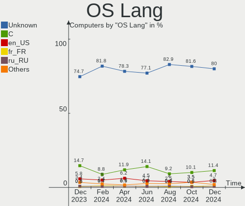
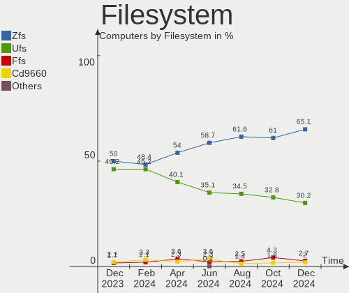
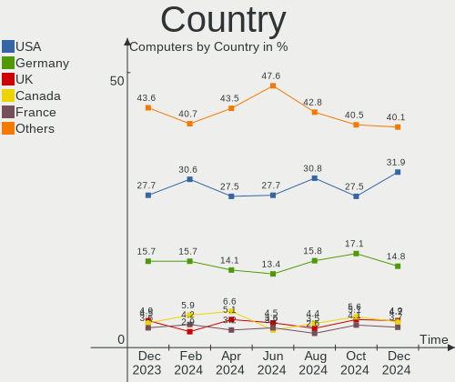
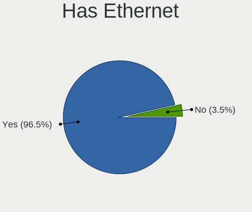
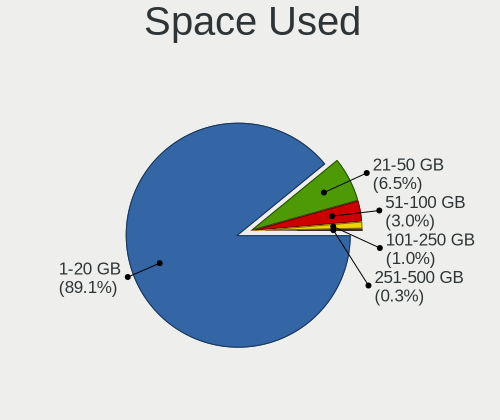
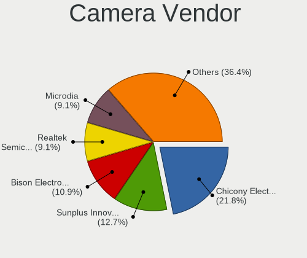
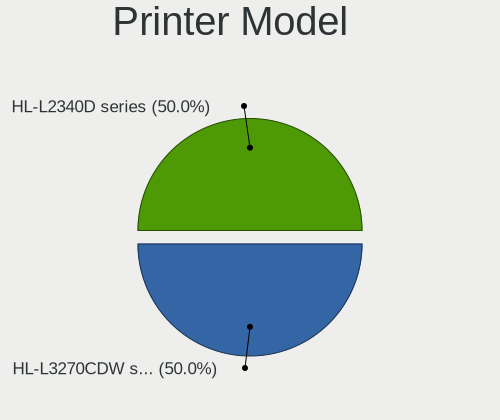

BSD Hardware Trends
-------------------

A project to identify most popular hardware characteristics and track their change
over time based on data collected by BSD users at https://BSD-Hardware.info.

Anyone can contribute to the study by uploading probes of their computers by
the [hw-probe](https://github.com/linuxhw/hw-probe/blob/master/INSTALL.BSD.md) tool:

    hw-probe -all -upload

This is a report for all computer types. See also reports for [desktops](/Desktop/README.md) and [notebooks](/Notebook/README.md).

Full-feature report is available here: https://bsd-hardware.info/?view=trends

OS-specific reports: [FreeBSD](/Dist/FreeBSD), [OPNsense](/Dist/OPNsense), [helloSystem](/Dist/helloSystem), [OpenBSD](/Dist/OpenBSD).

Period: Jun, 2021.

Contents
--------

- [ OS                       ](#os)
- [ OS Family                ](#os-family)
- [ Arch                     ](#arch)
- [ DE                       ](#de)
- [ Display Server           ](#display-server)
- [ Display Manager          ](#display-manager)
- [ OS Lang                  ](#os-lang)
- [ Boot Mode                ](#boot-mode)
- [ Filesystem               ](#filesystem)
- [ Part. scheme             ](#part-scheme)
- [ Country                  ](#country)
- [ City                     ](#city)
- [ Vendor                   ](#vendor)
- [ Model                    ](#model)
- [ Model Family             ](#model-family)
- [ MFG Year                 ](#mfg-year)
- [ Form Factor              ](#form-factor)
- [ Coreboot                 ](#coreboot)
- [ RAM Size                 ](#ram-size)
- [ RAM Used                 ](#ram-used)
- [ Has CD-ROM               ](#has-cd-rom)
- [ Total Drives             ](#total-drives)
- [ Has Ethernet             ](#has-ethernet)
- [ Has WiFi                 ](#has-wifi)
- [ Has Bluetooth            ](#has-bluetooth)
- [ Drive Vendor             ](#drive-vendor)
- [ Drive Model              ](#drive-model)
- [ HDD Vendor               ](#hdd-vendor)
- [ SSD Vendor               ](#ssd-vendor)
- [ Drive Kind               ](#drive-kind)
- [ Drive Connector          ](#drive-connector)
- [ Drive Size               ](#drive-size)
- [ Space Total              ](#space-total)
- [ Space Used               ](#space-used)
- [ Malfunc. Drives          ](#malfunc-drives)
- [ Malfunc. Drive Vendor    ](#malfunc-drive-vendor)
- [ Malfunc. HDD Vendor      ](#malfunc-hdd-vendor)
- [ Malfunc. Drive Kind      ](#malfunc-drive-kind)
- [ Failed Drives            ](#failed-drives)
- [ Failed Drive Vendor      ](#failed-drive-vendor)
- [ Drive Status             ](#drive-status)
- [ Storage Vendor           ](#storage-vendor)
- [ Storage Model            ](#storage-model)
- [ Storage Kind             ](#storage-kind)
- [ CPU Vendor               ](#cpu-vendor)
- [ CPU Model                ](#cpu-model)
- [ CPU Model Family         ](#cpu-model-family)
- [ CPU Cores                ](#cpu-cores)
- [ CPU Sockets              ](#cpu-sockets)
- [ CPU Threads              ](#cpu-threads)
- [ CPU Microarch            ](#cpu-microarch)
- [ GPU Vendor               ](#gpu-vendor)
- [ GPU Model                ](#gpu-model)
- [ GPU Combo                ](#gpu-combo)
- [ GPU Driver               ](#gpu-driver)
- [ GPU Memory               ](#gpu-memory)
- [ Monitor Vendor           ](#monitor-vendor)
- [ Monitor Model            ](#monitor-model)
- [ Monitor Resolution       ](#monitor-resolution)
- [ Monitor Diagonal         ](#monitor-diagonal)
- [ Monitor Width            ](#monitor-width)
- [ Aspect Ratio             ](#aspect-ratio)
- [ Monitor Area             ](#monitor-area)
- [ Pixel Density            ](#pixel-density)
- [ Multiple Monitors        ](#multiple-monitors)
- [ Net Controller Vendor    ](#net-controller-vendor)
- [ Net Controller Model     ](#net-controller-model)
- [ Wireless Vendor          ](#wireless-vendor)
- [ Wireless Model           ](#wireless-model)
- [ Ethernet Vendor          ](#ethernet-vendor)
- [ Ethernet Model           ](#ethernet-model)
- [ Net Controller Kind      ](#net-controller-kind)
- [ Used Controller          ](#used-controller)
- [ NICs                     ](#nics)
- [ IPv6                     ](#ipv6)
- [ Memory Vendor            ](#memory-vendor)
- [ Memory Model             ](#memory-model)
- [ Memory Kind              ](#memory-kind)
- [ Memory Form Factor       ](#memory-form-factor)
- [ Memory Size              ](#memory-size)
- [ Memory Speed             ](#memory-speed)
- [ Sound Vendor             ](#sound-vendor)
- [ Sound Model              ](#sound-model)
- [ Camera Vendor            ](#camera-vendor)
- [ Camera Model             ](#camera-model)
- [ Fingerprint Vendor       ](#fingerprint-vendor)
- [ Fingerprint Model        ](#fingerprint-model)
- [ Chipcard Vendor          ](#chipcard-vendor)
- [ Chipcard Model           ](#chipcard-model)
- [ Printer Vendor           ](#printer-vendor)
- [ Printer Model            ](#printer-model)
- [ Scanner Vendor           ](#scanner-vendor)
- [ Scanner Model            ](#scanner-model)
- [ Bluetooth Vendor         ](#bluetooth-vendor)
- [ Bluetooth Model          ](#bluetooth-model)
- [ Unsupported Devices      ](#unsupported-devices)
- [ Unsupported Device Types ](#unsupported-device-types)

OS
--

Installed operating systems

| Name                   | Computers | Percent |
|------------------------|-----------|---------|
| OPNsense 21.1.6        | 94        | 24.67%  |
| OPNsense 21.1.7        | 86        | 22.57%  |
| helloSystem 0.5.0      | 64        | 16.8%   |
| FreeBSD 13.0-p2        | 29        | 7.61%   |
| FreeBSD 13.0           | 20        | 5.25%   |
| OpenBSD 6.9            | 12        | 3.15%   |
| OPNsense 21.1          | 7         | 1.84%   |
| FreeBSD 14.0-CURRENT   | 7         | 1.84%   |
| FreeBSD 13.0-STABLE    | 7         | 1.84%   |
| helloSystem 0.1.0      | 6         | 1.57%   |
| GhostBSD 20.04.02      | 6         | 1.57%   |
| FreeBSD 12.2-STABLE    | 5         | 1.31%   |
| OPNsense 21.1.5        | 4         | 1.05%   |
| NomadBSD 5806f915      | 4         | 1.05%   |
| FreeBSD 13.0-p1        | 4         | 1.05%   |
| FreeBSD 12.2-p8        | 4         | 1.05%   |
| helloSystem 0.4.0      | 3         | 0.79%   |
| OPNsense 21.1.1        | 2         | 0.52%   |
| MidnightBSD 2.0.7      | 2         | 0.52%   |
| FreeBSD 12.2           | 2         | 0.52%   |
| TrueNAS 12.2-p6        | 1         | 0.26%   |
| TrueNAS 12.2           | 1         | 0.26%   |
| OPNsense 21.7          | 1         | 0.26%   |
| OPNsense 12.1-p16-HBSD | 1         | 0.26%   |
| OpenBSD 6.8            | 1         | 0.26%   |
| NomadBSD 1.4-RC1       | 1         | 0.26%   |
| NetBSD 9.99.85         | 1         | 0.26%   |
| NetBSD 9.2             | 1         | 0.26%   |
| helloSystem 0.6.0      | 1         | 0.26%   |
| FreeBSD 13.0-p3        | 1         | 0.26%   |
| FreeBSD 12.1-p8        | 1         | 0.26%   |
| FreeBSD 12.1-p10       | 1         | 0.26%   |
| FreeBSD 11.4           | 1         | 0.26%   |

OS Family
---------

OS without a version

| Name        | Computers | Percent |
|-------------|-----------|---------|
| OPNsense    | 195       | 51.18%  |
| FreeBSD     | 82        | 21.52%  |
| helloSystem | 74        | 19.42%  |
| OpenBSD     | 13        | 3.41%   |
| GhostBSD    | 6         | 1.57%   |
| NomadBSD    | 5         | 1.31%   |
| TrueNAS     | 2         | 0.52%   |
| NetBSD      | 2         | 0.52%   |
| MidnightBSD | 2         | 0.52%   |

Arch
----

OS architecture (x86_64, i586, etc.)

| Name  | Computers | Percent |
|-------|-----------|---------|
| amd64 | 376       | 98.69%  |
| i386  | 3         | 0.79%   |
| arm64 | 2         | 0.52%   |

DE
--

Desktop Environment

| Name         | Computers | Percent |
|--------------|-----------|---------|
| Console      | 225       | 59.06%  |
| helloDesktop | 73        | 19.16%  |
| XFCE         | 16        | 4.2%    |
| KDE5         | 13        | 3.41%   |
| fvwm         | 11        | 2.89%   |
| MATE         | 10        | 2.62%   |
| GNOME        | 8         | 2.1%    |
| Openbox      | 6         | 1.57%   |
| TWM          | 5         | 1.31%   |
| LXQt         | 3         | 0.79%   |
| Lumina       | 2         | 0.52%   |
| i3           | 2         | 0.52%   |
| Fluxbox      | 2         | 0.52%   |
| Cinnamon     | 2         | 0.52%   |
| DWM          | 1         | 0.26%   |
| CDE          | 1         | 0.26%   |
| Awesome      | 1         | 0.26%   |

Display Server
--------------

X11 or Wayland

| Name    | Computers | Percent |
|---------|-----------|---------|
| Console | 225       | 59.06%  |
| X11     | 156       | 40.94%  |

Display Manager
---------------

SDDM, LightDM, etc.

| Name    | Computers | Percent |
|---------|-----------|---------|
| Console | 257       | 67.45%  |
| SLiM    | 86        | 22.57%  |
| SDDM    | 15        | 3.94%   |
| LightDM | 9         | 2.36%   |
| XDM     | 8         | 2.1%    |
| GDM     | 6         | 1.57%   |

OS Lang
-------

Language

| Lang    | Computers | Percent |
|---------|-----------|---------|
| Unknown | 223       | 58.53%  |
| en_US   | 90        | 23.62%  |
| C       | 48        | 12.6%   |
| de_DE   | 5         | 1.31%   |
| ru_RU   | 3         | 0.79%   |
| fr_FR   | 3         | 0.79%   |
| en_GB   | 2         | 0.52%   |
| en_CA   | 2         | 0.52%   |
| zh_TW   | 1         | 0.26%   |
| zh_CN   | 1         | 0.26%   |
| pl_PL   | 1         | 0.26%   |
| de_CH   | 1         | 0.26%   |
| cs_CZ   | 1         | 0.26%   |

Boot Mode
---------

EFI or BIOS

| Mode | Computers | Percent |
|------|-----------|---------|
| EFI  | 307       | 80.58%  |
| BIOS | 74        | 19.42%  |

Filesystem
----------

Type of filesystem

| Type | Computers | Percent |
|------|-----------|---------|
| Ufs  | 228       | 59.84%  |
| Zfs  | 140       | 36.75%  |
| Ffs  | 13        | 3.41%   |

Part. scheme
------------

Scheme of partitioning

| Type    | Computers | Percent |
|---------|-----------|---------|
| GPT     | 343       | 90.03%  |
| MBR     | 36        | 9.45%   |
| BSD     | 1         | 0.26%   |
| Unknown | 1         | 0.26%   |

Country
-------

Geographic location (country)

| Country                | Computers | Percent |
|------------------------|-----------|---------|
| USA                    | 106       | 27.82%  |
| Germany                | 44        | 11.55%  |
| Canada                 | 18        | 4.72%   |
| UK                     | 17        | 4.46%   |
| Russia                 | 17        | 4.46%   |
| Netherlands            | 15        | 3.94%   |
| Poland                 | 14        | 3.67%   |
| France                 | 14        | 3.67%   |
| Brazil                 | 12        | 3.15%   |
| Switzerland            | 11        | 2.89%   |
| Australia              | 10        | 2.62%   |
| Sweden                 | 8         | 2.1%    |
| China                  | 7         | 1.84%   |
| Ukraine                | 5         | 1.31%   |
| Spain                  | 5         | 1.31%   |
| Japan                  | 5         | 1.31%   |
| Taiwan                 | 4         | 1.05%   |
| India                  | 4         | 1.05%   |
| Hungary                | 4         | 1.05%   |
| Austria                | 4         | 1.05%   |
| Portugal               | 3         | 0.79%   |
| Italy                  | 3         | 0.79%   |
| Israel                 | 3         | 0.79%   |
| Indonesia              | 3         | 0.79%   |
| Czechia                | 3         | 0.79%   |
| South Korea            | 2         | 0.52%   |
| South Africa           | 2         | 0.52%   |
| Mexico                 | 2         | 0.52%   |
| Lithuania              | 2         | 0.52%   |
| Vietnam                | 1         | 0.26%   |
| Uruguay                | 1         | 0.26%   |
| Turkey                 | 1         | 0.26%   |
| Thailand               | 1         | 0.26%   |
| Slovenia               | 1         | 0.26%   |
| Slovakia               | 1         | 0.26%   |
| Singapore              | 1         | 0.26%   |
| Serbia                 | 1         | 0.26%   |
| Saudi Arabia           | 1         | 0.26%   |
| Romania                | 1         | 0.26%   |
| Philippines            | 1         | 0.26%   |
| Oman                   | 1         | 0.26%   |
| Norway                 | 1         | 0.26%   |
| New Zealand            | 1         | 0.26%   |
| Morocco                | 1         | 0.26%   |
| Malta                  | 1         | 0.26%   |
| Malaysia               | 1         | 0.26%   |
| Iran                   | 1         | 0.26%   |
| Hong Kong              | 1         | 0.26%   |
| Guadeloupe             | 1         | 0.26%   |
| Greece                 | 1         | 0.26%   |
| Ghana                  | 1         | 0.26%   |
| Egypt                  | 1         | 0.26%   |
| Dominican Republic     | 1         | 0.26%   |
| Denmark                | 1         | 0.26%   |
| Croatia                | 1         | 0.26%   |
| Chile                  | 1         | 0.26%   |
| Cabo Verde             | 1         | 0.26%   |
| Bulgaria               | 1         | 0.26%   |
| Bosnia and Herzegovina | 1         | 0.26%   |
| Belgium                | 1         | 0.26%   |

City
----

Geographic location (city)

| City              | Computers | Percent |
|-------------------|-----------|---------|
| Moscow            | 5         | 1.31%   |
| Brooklyn          | 5         | 1.31%   |
| Zurich            | 4         | 1.05%   |
| São Paulo        | 3         | 0.79%   |
| Sydney            | 3         | 0.79%   |
| Morris            | 3         | 0.79%   |
| Madrid            | 3         | 0.79%   |
| London            | 3         | 0.79%   |
| Kamensk-Ural'skiy | 3         | 0.79%   |
| Inzai             | 3         | 0.79%   |
| Hamburg           | 3         | 0.79%   |
| Chrusty           | 3         | 0.79%   |
| Ypsilanti         | 2         | 0.52%   |
| Wolverhampton     | 2         | 0.52%   |
| Winterthur        | 2         | 0.52%   |
| Warsaw            | 2         | 0.52%   |
| Vienna            | 2         | 0.52%   |
| Victoria          | 2         | 0.52%   |
| Ufa               | 2         | 0.52%   |
| Tucson            | 2         | 0.52%   |
| Toronto           | 2         | 0.52%   |
| Shanghai          | 2         | 0.52%   |
| Seattle           | 2         | 0.52%   |
| San Jose          | 2         | 0.52%   |
| Rotterdam         | 2         | 0.52%   |
| Rome              | 2         | 0.52%   |
| Rio de Janeiro    | 2         | 0.52%   |
| Portland          | 2         | 0.52%   |
| Petaẖ Tiqwa     | 2         | 0.52%   |
| Paris             | 2         | 0.52%   |
| Ottawa            | 2         | 0.52%   |
| Munich            | 2         | 0.52%   |
| Mumbai            | 2         | 0.52%   |
| Montreal          | 2         | 0.52%   |
| Madison           | 2         | 0.52%   |
| Lexington         | 2         | 0.52%   |
| Kirkland          | 2         | 0.52%   |
| Karlsruhe         | 2         | 0.52%   |
| Jakarta           | 2         | 0.52%   |
| Jacksonville      | 2         | 0.52%   |
| Frederick         | 2         | 0.52%   |
| Frankfurt am Main | 2         | 0.52%   |
| Dnipropetrovsk    | 2         | 0.52%   |
| Chelyabinsk       | 2         | 0.52%   |
| Brunswick         | 2         | 0.52%   |
| Brighton          | 2         | 0.52%   |
| Brasília         | 2         | 0.52%   |
| Beijing           | 2         | 0.52%   |
| Austin            | 2         | 0.52%   |
| Amsterdam         | 2         | 0.52%   |
| Šiauliai         | 1         | 0.26%   |
| Zedelgem          | 1         | 0.26%   |
| Zaltbommel        | 1         | 0.26%   |
| Zagreb            | 1         | 0.26%   |
| Zaandam           | 1         | 0.26%   |
| York              | 1         | 0.26%   |
| Yokohama          | 1         | 0.26%   |
| Włocławek       | 1         | 0.26%   |
| Wylie             | 1         | 0.26%   |
| Wronowy           | 1         | 0.26%   |

Vendor
------

Motherboard manufacturer

| Name                                       | Computers | Percent |
|--------------------------------------------|-----------|---------|
| Dell                                       | 49        | 12.86%  |
| Lenovo                                     | 44        | 11.55%  |
| ASUSTek Computer                           | 39        | 10.24%  |
| Hewlett-Packard                            | 35        | 9.19%   |
| Protectli                                  | 18        | 4.72%   |
| Unknown                                    | 18        | 4.72%   |
| Supermicro                                 | 16        | 4.2%    |
| Intel                                      | 16        | 4.2%    |
| Gigabyte Technology                        | 16        | 4.2%    |
| MSI                                        | 13        | 3.41%   |
| PC Engines                                 | 12        | 3.15%   |
| ASRock                                     | 12        | 3.15%   |
| AMI                                        | 9         | 2.36%   |
| AWOW                                       | 7         | 1.84%   |
| ZOTAC                                      | 6         | 1.57%   |
| Acer                                       | 6         | 1.57%   |
| Toshiba                                    | 5         | 1.31%   |
| Sophos                                     | 4         | 1.05%   |
| HPE                                        | 4         | 1.05%   |
| Fujitsu                                    | 3         | 0.79%   |
| Biostar                                    | 3         | 0.79%   |
| Apple                                      | 3         | 0.79%   |
| Shuttle                                    | 2         | 0.52%   |
| Samsung Electronics                        | 2         | 0.52%   |
| Gateway                                    | 2         | 0.52%   |
| Compulab                                   | 2         | 0.52%   |
| YANYU                                      | 1         | 0.26%   |
| WYSE                                       | 1         | 0.26%   |
| Wistron                                    | 1         | 0.26%   |
| ULTRATOP                                   | 1         | 0.26%   |
| TYAN Computer                              | 1         | 0.26%   |
| Sony                                       | 1         | 0.26%   |
| SLIMBOOK                                   | 1         | 0.26%   |
| ShenZhen MinWin Technology                 | 1         | 0.26%   |
| SeeedStudio                                | 1         | 0.26%   |
| Raspberry Pi Foundation                    | 1         | 0.26%   |
| Pine Microsystems                          | 1         | 0.26%   |
| Pegatron                                   | 1         | 0.26%   |
| Panasonic                                  | 1         | 0.26%   |
| Nuage Networks                             | 1         | 0.26%   |
| Notebook                                   | 1         | 0.26%   |
| NF541                                      | 1         | 0.26%   |
| Microsoft                                  | 1         | 0.26%   |
| LG Electronics                             | 1         | 0.26%   |
| Intel CNCTION-IAF                          | 1         | 0.26%   |
| IBM                                        | 1         | 0.26%   |
| Huanan                                     | 1         | 0.26%   |
| HARDKERNEL                                 | 1         | 0.26%   |
| GVC                                        | 1         | 0.26%   |
| Foxconn                                    | 1         | 0.26%   |
| eMachines                                  | 1         | 0.26%   |
| ECS                                        | 1         | 0.26%   |
| Dell EMC                                   | 1         | 0.26%   |
| Deciso                                     | 1         | 0.26%   |
| Colorful YuGong Technology And Development | 1         | 0.26%   |
| CNCTION-IAF-E3845                          | 1         | 0.26%   |
| CNCTION-IAF                                | 1         | 0.26%   |
| CheckPoint                                 | 1         | 0.26%   |
| BESSTAR Tech                               | 1         | 0.26%   |
| ASRockRack                                 | 1         | 0.26%   |

Model
-----

Motherboard model

| Name                                             | Computers | Percent |
|--------------------------------------------------|-----------|---------|
| Unknown                                          | 19        | 4.99%   |
| Protectli FW6                                    | 8         | 2.1%    |
| AWOW PC BOX                                      | 7         | 1.84%   |
| AMI Aptio CRB                                    | 7         | 1.84%   |
| PC Engines apu4                                  | 6         | 1.57%   |
| Intel Q3XXG4-P V1.0                              | 6         | 1.57%   |
| PC Engines APU2                                  | 5         | 1.31%   |
| Protectli FW4B                                   | 4         | 1.05%   |
| HP t730 Thin Client                              | 4         | 1.05%   |
| ZOTAC ZBOX-CI323NANO                             | 3         | 0.79%   |
| Supermicro Super Server                          | 3         | 0.79%   |
| Protectli FW2B                                   | 3         | 0.79%   |
| Dell OptiPlex 990                                | 3         | 0.79%   |
| ASUS All Series                                  | 3         | 0.79%   |
| Supermicro X7SPA-HF                              | 2         | 0.52%   |
| Sophos XG                                        | 2         | 0.52%   |
| Protectli FW6D                                   | 2         | 0.52%   |
| MSI MS-7B86                                      | 2         | 0.52%   |
| Lenovo ThinkPad T60 20076PU                      | 2         | 0.52%   |
| Intel NUC8i5BEK                                  | 2         | 0.52%   |
| HPE ProLiant MicroServer Gen10                   | 2         | 0.52%   |
| HP Compaq Pro 6300 SFF                           | 2         | 0.52%   |
| HP Compaq 8200 Elite SFF PC                      | 2         | 0.52%   |
| Gigabyte J1900N-D3V                              | 2         | 0.52%   |
| Gateway NE56R                                    | 2         | 0.52%   |
| Dell PowerEdge 2950                              | 2         | 0.52%   |
| Dell OptiPlex 7020                               | 2         | 0.52%   |
| Dell Latitude E4300                              | 2         | 0.52%   |
| Dell Inspiron 3542                               | 2         | 0.52%   |
| Dell Inspiron 15-3567                            | 2         | 0.52%   |
| Compulab fitlet2                                 | 2         | 0.52%   |
| ASUS P5Q-E                                       | 2         | 0.52%   |
| ZOTAC ZBOX-MI640/MI660/MI620NANO                 | 1         | 0.26%   |
| ZOTAC ZBOX-MI522NANO/MI542NANO                   | 1         | 0.26%   |
| ZOTAC ZBOX-CI327NANO-GS-01                       | 1         | 0.26%   |
| YANYU H67SL                                      | 1         | 0.26%   |
| WYSE Z CLASS                                     | 1         | 0.26%   |
| Wistron ProLiant ML110 G6                        | 1         | 0.26%   |
| ULTRATOP C2017-LIVA-ZE                           | 1         | 0.26%   |
| TYAN S2925                                       | 1         | 0.26%   |
| Toshiba Satellite C655D                          | 1         | 0.26%   |
| Toshiba Satellite C640                           | 1         | 0.26%   |
| Toshiba PORTEGE Z10t-A                           | 1         | 0.26%   |
| Toshiba PORTEGE X20W-D                           | 1         | 0.26%   |
| Toshiba PORTEGE R930                             | 1         | 0.26%   |
| Supermicro X9SCL/X9SCM                           | 1         | 0.26%   |
| Supermicro X8DTU-LN4+                            | 1         | 0.26%   |
| Supermicro X8DTH-i/6/iF/6F                       | 1         | 0.26%   |
| Supermicro X10SLH-N6-ST031                       | 1         | 0.26%   |
| Supermicro X10SLH-F/X10SLM+-F                    | 1         | 0.26%   |
| Supermicro SYS-5018A-MLTN4                       | 1         | 0.26%   |
| Supermicro SSG-6028R-E1CR12T                     | 1         | 0.26%   |
| Supermicro H8SCM                                 | 1         | 0.26%   |
| Supermicro GN#16513                              | 1         | 0.26%   |
| Supermicro 1HE Intel Single-CPU RI1104H Server   | 1         | 0.26%   |
| Supermicro 1HE Intel Single-CPU RI1102D-F Server | 1         | 0.26%   |
| Sophos UTM                                       | 1         | 0.26%   |
| Sophos SG                                        | 1         | 0.26%   |
| Sony SVF1421DSGW                                 | 1         | 0.26%   |
| Shuttle DH370                                    | 1         | 0.26%   |

Model Family
------------

Motherboard model prefix

| Name                       | Computers | Percent |
|----------------------------|-----------|---------|
| Lenovo ThinkPad            | 29        | 7.61%   |
| Unknown                    | 19        | 4.99%   |
| Dell PowerEdge             | 13        | 3.41%   |
| Dell OptiPlex              | 11        | 2.89%   |
| Dell Latitude              | 9         | 2.36%   |
| ASUS PRIME                 | 9         | 2.36%   |
| Protectli FW6              | 8         | 2.1%    |
| HP ProLiant                | 8         | 2.1%    |
| Dell Inspiron              | 8         | 2.1%    |
| AWOW PC                    | 7         | 1.84%   |
| AMI Aptio                  | 7         | 1.84%   |
| PC Engines apu4            | 6         | 1.57%   |
| Intel Q3XXG4-P             | 6         | 1.57%   |
| PC Engines APU2            | 5         | 1.31%   |
| Lenovo IdeaPad             | 5         | 1.31%   |
| HP Compaq                  | 5         | 1.31%   |
| Acer Aspire                | 5         | 1.31%   |
| Protectli FW4B             | 4         | 1.05%   |
| Lenovo ThinkCentre         | 4         | 1.05%   |
| HP t730                    | 4         | 1.05%   |
| ZOTAC ZBOX-CI323NANO       | 3         | 0.79%   |
| Toshiba PORTEGE            | 3         | 0.79%   |
| Supermicro Super           | 3         | 0.79%   |
| Protectli FW2B             | 3         | 0.79%   |
| HPE ProLiant               | 3         | 0.79%   |
| HP ProDesk                 | 3         | 0.79%   |
| Dell Vostro                | 3         | 0.79%   |
| ASUS TUF                   | 3         | 0.79%   |
| ASUS ROG                   | 3         | 0.79%   |
| ASUS All                   | 3         | 0.79%   |
| Toshiba Satellite          | 2         | 0.52%   |
| Supermicro X7SPA-HF        | 2         | 0.52%   |
| Supermicro 1HE             | 2         | 0.52%   |
| Sophos XG                  | 2         | 0.52%   |
| Protectli FW6D             | 2         | 0.52%   |
| MSI MS-7B86                | 2         | 0.52%   |
| Intel NUC8i5BEK            | 2         | 0.52%   |
| HP Pavilion                | 2         | 0.52%   |
| HP EliteDesk               | 2         | 0.52%   |
| HP EliteBook               | 2         | 0.52%   |
| Gigabyte J1900N-D3V        | 2         | 0.52%   |
| Gateway NE56R              | 2         | 0.52%   |
| Fujitsu PRIMERGY           | 2         | 0.52%   |
| Dell Precision             | 2         | 0.52%   |
| Compulab fitlet2           | 2         | 0.52%   |
| ASUS VivoBook              | 2         | 0.52%   |
| ASUS P5Q-E                 | 2         | 0.52%   |
| ZOTAC ZBOX-MI640           | 1         | 0.26%   |
| ZOTAC ZBOX-MI522NANO       | 1         | 0.26%   |
| ZOTAC ZBOX-CI327NANO-GS-01 | 1         | 0.26%   |
| YANYU H67SL                | 1         | 0.26%   |
| WYSE Z                     | 1         | 0.26%   |
| Wistron ProLiant           | 1         | 0.26%   |
| ULTRATOP C2017-LIVA-ZE     | 1         | 0.26%   |
| TYAN S2925                 | 1         | 0.26%   |
| Supermicro X9SCL           | 1         | 0.26%   |
| Supermicro X8DTU-LN4+      | 1         | 0.26%   |
| Supermicro X8DTH-i         | 1         | 0.26%   |
| Supermicro X10SLH-N6-ST031 | 1         | 0.26%   |
| Supermicro X10SLH-F        | 1         | 0.26%   |

MFG Year
--------

Motherboard manufacture year

| Year    | Computers | Percent |
|---------|-----------|---------|
| 2020    | 80        | 21%     |
| 2019    | 64        | 16.8%   |
| 2018    | 47        | 12.34%  |
| 2021    | 34        | 8.92%   |
| 2013    | 21        | 5.51%   |
| 2012    | 20        | 5.25%   |
| 2017    | 18        | 4.72%   |
| 2016    | 18        | 4.72%   |
| 2011    | 18        | 4.72%   |
| 2015    | 15        | 3.94%   |
| 2014    | 13        | 3.41%   |
| 2010    | 10        | 2.62%   |
| 2009    | 10        | 2.62%   |
| 2008    | 6         | 1.57%   |
| 2006    | 3         | 0.79%   |
| Unknown | 3         | 0.79%   |
| 2007    | 1         | 0.26%   |

Form Factor
-----------

Physical design of the computer

| Name           | Computers | Percent |
|----------------|-----------|---------|
| Desktop        | 211       | 55.38%  |
| Notebook       | 96        | 25.2%   |
| Mini pc        | 34        | 8.92%   |
| Server         | 30        | 7.87%   |
| Firewall       | 4         | 1.05%   |
| Convertible    | 3         | 0.79%   |
| System on chip | 1         | 0.26%   |
| Tablet         | 1         | 0.26%   |
| All in one     | 1         | 0.26%   |

Coreboot
--------

Have coreboot on board

| Used | Computers | Percent |
|------|-----------|---------|
| No   | 360       | 94.49%  |
| Yes  | 21        | 5.51%   |

RAM Size
--------

Total RAM memory

| Size in GB  | Computers | Percent |
|-------------|-----------|---------|
| 8.01-16.0   | 140       | 36.75%  |
| 4.01-8.0    | 102       | 26.77%  |
| 16.01-24.0  | 71        | 18.64%  |
| 32.01-64.0  | 28        | 7.35%   |
| 2.01-3.0    | 14        | 3.67%   |
| 64.01-256.0 | 13        | 3.41%   |
| 24.01-32.0  | 6         | 1.57%   |
| 3.01-4.0    | 5         | 1.31%   |
| 0.51-1.0    | 1         | 0.26%   |
| 0.01-0.5    | 1         | 0.26%   |

RAM Used
--------

Used RAM memory

| Used GB     | Computers | Percent |
|-------------|-----------|---------|
| 0.01-0.5    | 219       | 57.48%  |
| 0.51-1.0    | 99        | 25.98%  |
| 1.01-2.0    | 30        | 7.87%   |
| 2.01-3.0    | 9         | 2.36%   |
| 3.01-4.0    | 7         | 1.84%   |
| 32.01-64.0  | 4         | 1.05%   |
| 4.01-8.0    | 3         | 0.79%   |
| 8.01-16.0   | 3         | 0.79%   |
| 16.01-24.0  | 2         | 0.52%   |
| Unknown     | 2         | 0.52%   |
| 24.01-32.0  | 1         | 0.26%   |
| 64.01-256.0 | 1         | 0.26%   |
| 0           | 1         | 0.26%   |

Has CD-ROM
----------

Has CD-ROM on board

| Presented | Computers | Percent |
|-----------|-----------|---------|
| No        | 278       | 72.97%  |
| Yes       | 103       | 27.03%  |

Total Drives
------------

Number of drives on board

| Drives | Computers | Percent |
|--------|-----------|---------|
| 1      | 259       | 67.98%  |
| 2      | 53        | 13.91%  |
| 0      | 29        | 7.61%   |
| 3      | 17        | 4.46%   |
| 4      | 6         | 1.57%   |
| 7      | 5         | 1.31%   |
| 6      | 5         | 1.31%   |
| 10     | 2         | 0.52%   |
| 15     | 1         | 0.26%   |
| 14     | 1         | 0.26%   |
| 13     | 1         | 0.26%   |
| 12     | 1         | 0.26%   |
| 5      | 1         | 0.26%   |

Has Ethernet
------------

Has Ethernet on board

| Presented | Computers | Percent |
|-----------|-----------|---------|
| Yes       | 366       | 96.06%  |
| No        | 15        | 3.94%   |

Has WiFi
--------

Has WiFi module

| Presented | Computers | Percent |
|-----------|-----------|---------|
| No        | 224       | 58.79%  |
| Yes       | 157       | 41.21%  |

Has Bluetooth
-------------

Has Bluetooth module

| Presented | Computers | Percent |
|-----------|-----------|---------|
| No        | 287       | 75.33%  |
| Yes       | 94        | 24.67%  |

Drive Vendor
------------

Hard drive vendors

| Vendor              | Computers | Drives | Percent |
|---------------------|-----------|--------|---------|
| Samsung Electronics | 69        | 87     | 15.1%   |
| Seagate             | 59        | 106    | 12.91%  |
| WDC                 | 58        | 100    | 12.69%  |
| Kingston            | 36        | 39     | 7.88%   |
| Toshiba             | 28        | 32     | 6.13%   |
| Intel               | 19        | 21     | 4.16%   |
| SanDisk             | 17        | 17     | 3.72%   |
| Crucial             | 16        | 19     | 3.5%    |
| Hoodisk             | 13        | 13     | 2.84%   |
| Transcend           | 12        | 15     | 2.63%   |
| HGST                | 10        | 11     | 2.19%   |
| A-DATA Technology   | 9         | 10     | 1.97%   |
| Phison              | 8         | 8      | 1.75%   |
| Hitachi             | 8         | 8      | 1.75%   |
| Hewlett-Packard     | 7         | 7      | 1.53%   |
| FORESEE             | 7         | 7      | 1.53%   |
| SK Hynix            | 6         | 6      | 1.31%   |
| Protectli           | 5         | 5      | 1.09%   |
| OCZ                 | 4         | 4      | 0.88%   |
| NVMe                | 4         | 4      | 0.88%   |
| Corsair             | 4         | 4      | 0.88%   |
| China               | 4         | 4      | 0.88%   |
| Zheino              | 3         | 3      | 0.66%   |
| Patriot             | 3         | 3      | 0.66%   |
| OWC                 | 3         | 3      | 0.66%   |
| Micron Technology   | 3         | 3      | 0.66%   |
| LITEON              | 3         | 3      | 0.66%   |
| Apacer              | 3         | 3      | 0.66%   |
| PNY                 | 2         | 2      | 0.44%   |
| LITEONIT            | 2         | 2      | 0.44%   |
| KingSpec            | 2         | 2      | 0.44%   |
| KingDian            | 2         | 2      | 0.44%   |
| HPE                 | 2         | 3      | 0.44%   |
| faspeed             | 2         | 2      | 0.44%   |
| ATP                 | 2         | 2      | 0.44%   |
| ZTC                 | 1         | 1      | 0.22%   |
| XUNZHE              | 1         | 1      | 0.22%   |
| VisionTek           | 1         | 1      | 0.22%   |
| Verbatim            | 1         | 1      | 0.22%   |
| SPCC                | 1         | 1      | 0.22%   |
| Smartbuy            | 1         | 1      | 0.22%   |
| PLEXTOR             | 1         | 1      | 0.22%   |
| MEMXPRO             | 1         | 1      | 0.22%   |
| MAXTOR              | 1         | 1      | 0.22%   |
| LSI                 | 1         | 1      | 0.22%   |
| LDLC                | 1         | 1      | 0.22%   |
| Kston               | 1         | 1      | 0.22%   |
| Intenso             | 1         | 1      | 0.22%   |
| INDMEM              | 1         | 1      | 0.22%   |
| GOODRAM             | 1         | 1      | 0.22%   |
| Generic             | 1         | 1      | 0.22%   |
| Fujitsu             | 1         | 1      | 0.22%   |
| Drevo               | 1         | 1      | 0.22%   |
| Dogfish             | 1         | 1      | 0.22%   |
| BIWIN               | 1         | 1      | 0.22%   |
| Apple               | 1         | 1      | 0.22%   |
| AMD                 | 1         | 1      | 0.22%   |

Drive Model
-----------

Hard drive models

| Model                                | Computers | Percent |
|--------------------------------------|-----------|---------|
| Kingston SA400S37240G 240GB          | 8         | 1.57%   |
| Samsung SSD 850 EVO 250GB            | 7         | 1.38%   |
| Phison SATA SSD 16GB                 | 6         | 1.18%   |
| Hoodisk SSD 32GB                     | 6         | 1.18%   |
| FORESEE 128GB SSD                    | 6         | 1.18%   |
| Samsung SSD 860 EVO 500GB            | 5         | 0.98%   |
| Seagate ST4000DM000-1F2168 4TB       | 4         | 0.79%   |
| SanDisk SDSA6MM-032G-1006 32GB       | 4         | 0.79%   |
| Protectli 120GB mSATA                | 4         | 0.79%   |
| Kingston SUV500MS120G 120GB          | 4         | 0.79%   |
| HGST HTS725050A7E630 500GB           | 4         | 0.79%   |
| Toshiba MG03ACA100 1TB               | 3         | 0.59%   |
| Samsung SSD 970 EVO Plus 250GB       | 3         | 0.59%   |
| Samsung SSD 860 EVO 1TB              | 3         | 0.59%   |
| Samsung SSD 850 PRO 512GB            | 3         | 0.59%   |
| Kingston SV300S37A120G 120GB         | 3         | 0.59%   |
| Kingston SUV500MS240G 240GB          | 3         | 0.59%   |
| Kingston SA400S37120G 120GB          | 3         | 0.59%   |
| Kingston SA2000M8250G 250GB          | 3         | 0.59%   |
| Hoodisk SSD 64GB                     | 3         | 0.59%   |
| Hoodisk SSD 128GB                    | 3         | 0.59%   |
| HP RAID 0 293GB                      | 3         | 0.59%   |
| WDC WDS240G2G0A-00JH30 240GB         | 2         | 0.39%   |
| WDC WDS120G2G0B-00EPW0 120GB         | 2         | 0.39%   |
| WDC WD10EZRX-00A8LB0 1TB             | 2         | 0.39%   |
| WDC PC SN730 SDBQNTY-512G-1001 512GB | 2         | 0.39%   |
| Transcend TS64GMSA230S 64GB          | 2         | 0.39%   |
| Transcend TS128GMSA370S 128GB        | 2         | 0.39%   |
| Toshiba MQ01ABF050 500GB             | 2         | 0.39%   |
| Toshiba MQ01ABD100 1TB               | 2         | 0.39%   |
| Toshiba MK3265GSXN 320GB             | 2         | 0.39%   |
| Toshiba HDWD120 2TB                  | 2         | 0.39%   |
| Toshiba DT01ACA100 1TB               | 2         | 0.39%   |
| SK Hynix HFS128G39TND-N210A 128GB    | 2         | 0.39%   |
| Seagate ST9500325AS 500GB            | 2         | 0.39%   |
| Seagate ST8000VN0022-2EL112 8TB      | 2         | 0.39%   |
| Seagate ST500LM000-1EJ162-SSHD 500GB | 2         | 0.39%   |
| Seagate ST5000DM000-1FK178 5TB       | 2         | 0.39%   |
| Seagate ST4000VN008-2DR166 4TB       | 2         | 0.39%   |
| Seagate ST4000DM005-2DP166 4TB       | 2         | 0.39%   |
| Seagate ST4000DM004-2CV104 4TB       | 2         | 0.39%   |
| Seagate ST3500418AS 500GB            | 2         | 0.39%   |
| Seagate ST3500413AS 500GB            | 2         | 0.39%   |
| Seagate ST3320613AS 320GB            | 2         | 0.39%   |
| Seagate ST1000LM035-1RK172 1TB       | 2         | 0.39%   |
| Seagate ST1000DM010-2EP102 1TB       | 2         | 0.39%   |
| SanDisk SSD PLUS 120GB               | 2         | 0.39%   |
| Samsung SSD 970 EVO 250GB            | 2         | 0.39%   |
| Samsung SSD 960 EVO 500GB            | 2         | 0.39%   |
| Samsung SSD 960 EVO 250GB            | 2         | 0.39%   |
| Samsung SSD 860 PRO 512GB            | 2         | 0.39%   |
| Samsung SSD 850 EVO 1TB              | 2         | 0.39%   |
| Samsung SSD 840 Series 120GB         | 2         | 0.39%   |
| Samsung HM160HI 160GB                | 2         | 0.39%   |
| PNY CS900 120GB SSD                  | 2         | 0.39%   |
| Patriot Burst 120GB                  | 2         | 0.39%   |
| Kingston SV300S37A240G 240GB         | 2         | 0.39%   |
| Kingston SA400S37480G 480GB          | 2         | 0.39%   |
| KingSpec MT-64 64GB                  | 2         | 0.39%   |
| Intel SSDPEKNW512G8 512GB            | 2         | 0.39%   |

HDD Vendor
----------

Hard disk drive vendors

| Vendor              | Computers | Drives | Percent |
|---------------------|-----------|--------|---------|
| Seagate             | 59        | 105    | 33.52%  |
| WDC                 | 45        | 76     | 25.57%  |
| Toshiba             | 22        | 26     | 12.5%   |
| Samsung Electronics | 17        | 20     | 9.66%   |
| HGST                | 10        | 11     | 5.68%   |
| Hitachi             | 8         | 8      | 4.55%   |
| Hewlett-Packard     | 6         | 6      | 3.41%   |
| NVMe                | 4         | 4      | 2.27%   |
| MAXTOR              | 1         | 1      | 0.57%   |
| LSI                 | 1         | 1      | 0.57%   |
| HPE                 | 1         | 2      | 0.57%   |
| Generic             | 1         | 1      | 0.57%   |
| Fujitsu             | 1         | 1      | 0.57%   |

SSD Vendor
----------

Solid state drive vendors

| Vendor              | Computers | Drives | Percent |
|---------------------|-----------|--------|---------|
| Samsung Electronics | 42        | 50     | 17.21%  |
| Kingston            | 33        | 35     | 13.52%  |
| SanDisk             | 17        | 17     | 6.97%   |
| Intel               | 13        | 15     | 5.33%   |
| Hoodisk             | 13        | 13     | 5.33%   |
| Crucial             | 13        | 16     | 5.33%   |
| Transcend           | 12        | 15     | 4.92%   |
| WDC                 | 9         | 12     | 3.69%   |
| Phison              | 7         | 7      | 2.87%   |
| FORESEE             | 7         | 7      | 2.87%   |
| A-DATA Technology   | 7         | 7      | 2.87%   |
| SK Hynix            | 5         | 5      | 2.05%   |
| Protectli           | 5         | 5      | 2.05%   |
| OCZ                 | 4         | 4      | 1.64%   |
| China               | 4         | 4      | 1.64%   |
| Zheino              | 3         | 3      | 1.23%   |
| Toshiba             | 3         | 3      | 1.23%   |
| Patriot             | 3         | 3      | 1.23%   |
| OWC                 | 3         | 3      | 1.23%   |
| Micron Technology   | 3         | 3      | 1.23%   |
| LITEON              | 3         | 3      | 1.23%   |
| Corsair             | 3         | 3      | 1.23%   |
| Apacer              | 3         | 3      | 1.23%   |
| PNY                 | 2         | 2      | 0.82%   |
| LITEONIT            | 2         | 2      | 0.82%   |
| KingSpec            | 2         | 2      | 0.82%   |
| KingDian            | 2         | 2      | 0.82%   |
| faspeed             | 2         | 2      | 0.82%   |
| ZTC                 | 1         | 1      | 0.41%   |
| XUNZHE              | 1         | 1      | 0.41%   |
| VisionTek           | 1         | 1      | 0.41%   |
| Verbatim            | 1         | 1      | 0.41%   |
| Smartbuy            | 1         | 1      | 0.41%   |
| Seagate             | 1         | 1      | 0.41%   |
| PLEXTOR             | 1         | 1      | 0.41%   |
| MEMXPRO             | 1         | 1      | 0.41%   |
| Kston               | 1         | 1      | 0.41%   |
| Intenso             | 1         | 1      | 0.41%   |
| INDMEM              | 1         | 1      | 0.41%   |
| HPE                 | 1         | 1      | 0.41%   |
| Hewlett-Packard     | 1         | 1      | 0.41%   |
| GOODRAM             | 1         | 1      | 0.41%   |
| Drevo               | 1         | 1      | 0.41%   |
| Dogfish             | 1         | 1      | 0.41%   |
| BIWIN               | 1         | 1      | 0.41%   |
| Apple               | 1         | 1      | 0.41%   |
| AMD                 | 1         | 1      | 0.41%   |

Drive Kind
----------

HDD or SSD

| Kind | Computers | Drives | Percent |
|------|-----------|--------|---------|
| SSD  | 223       | 265    | 53.61%  |
| HDD  | 145       | 262    | 34.86%  |
| NVMe | 48        | 55     | 11.54%  |

Drive Connector
---------------

SATA, SAS, NVMe, etc.

| Type | Computers | Drives | Percent |
|------|-----------|--------|---------|
| SATA | 327       | 527    | 87.2%   |
| NVMe | 48        | 55     | 12.8%   |

Drive Size
----------

Size of hard drive

| Size in TB | Computers | Drives | Percent |
|------------|-----------|--------|---------|
| 0.01-0.5   | 279       | 354    | 74.01%  |
| 0.51-1.0   | 59        | 76     | 15.65%  |
| 1.01-2.0   | 12        | 15     | 3.18%   |
| 3.01-4.0   | 11        | 23     | 2.92%   |
| 4.01-10.0  | 11        | 50     | 2.92%   |
| 2.01-3.0   | 4         | 7      | 1.06%   |
| 10.01-20.0 | 1         | 2      | 0.27%   |

Space Total
-----------

Amount of disk space available on the file system

| Size in GB     | Computers | Percent |
|----------------|-----------|---------|
| 101-250        | 113       | 29.66%  |
| 1-20           | 74        | 19.42%  |
| 251-500        | 62        | 16.27%  |
| 51-100         | 47        | 12.34%  |
| 21-50          | 46        | 12.07%  |
| 501-1000       | 26        | 6.82%   |
| 1001-2000      | 6         | 1.57%   |
| Unknown        | 3         | 0.79%   |
| More than 3000 | 2         | 0.52%   |
| 2001-3000      | 2         | 0.52%   |

Space Used
----------

Amount of used disk space

| Used GB  | Computers | Percent |
|----------|-----------|---------|
| 1-20     | 344       | 90.29%  |
| 21-50    | 19        | 4.99%   |
| 51-100   | 7         | 1.84%   |
| 101-250  | 4         | 1.05%   |
| Unknown  | 3         | 0.79%   |
| 251-500  | 2         | 0.52%   |
| 501-1000 | 2         | 0.52%   |

Malfunc. Drives
---------------

Drive models with a malfunction

| Model                               | Computers | Drives | Percent |
|-------------------------------------|-----------|--------|---------|
| HGST HTS725050A7E630 500GB          | 4         | 4      | 5.88%   |
| Kingston SV300S37A120G 120GB        | 3         | 3      | 4.41%   |
| Toshiba MK3265GSXN 320GB            | 2         | 2      | 2.94%   |
| Seagate ST3500418AS 500GB           | 2         | 3      | 2.94%   |
| Samsung Electronics HM160HI 160GB   | 2         | 2      | 2.94%   |
| ZTC SM201-064G                      | 1         | 1      | 1.47%   |
| WDC WD6400AAKS-22A7B0 640GB         | 1         | 1      | 1.47%   |
| WDC WD5003ABYX-23 81Y9803 500GB     | 1         | 1      | 1.47%   |
| WDC WD5000LPVX-60V0TT0 500GB        | 1         | 1      | 1.47%   |
| WDC WD5000LPVX-22V0TT0 500GB        | 1         | 1      | 1.47%   |
| WDC WD5000AAKX-60U6AA0 500GB        | 1         | 1      | 1.47%   |
| WDC WD3200BEVT-00A0RT0 233GB        | 1         | 1      | 1.47%   |
| WDC WD2500AAKX-083CA1 250GB         | 1         | 1      | 1.47%   |
| WDC WD10EZEX-60WN4A0 1TB            | 1         | 1      | 1.47%   |
| VisionTek mSATA 120GB               | 1         | 1      | 1.47%   |
| Transcend TS32GMSM610 32GB          | 1         | 1      | 1.47%   |
| Transcend 3E128-TS2-550B01 100GB    | 1         | 4      | 1.47%   |
| Toshiba THNSNK512GVN8 512GB         | 1         | 1      | 1.47%   |
| Toshiba MQ02ABD100H 1TB             | 1         | 1      | 1.47%   |
| Toshiba MQ01ABD075 752GB            | 1         | 1      | 1.47%   |
| Toshiba HDWD120 2TB                 | 1         | 1      | 1.47%   |
| Toshiba DT01ACA100 1TB              | 1         | 1      | 1.47%   |
| SK Hynix HFS128G39TND-N210A 128GB   | 1         | 1      | 1.47%   |
| Seagate ST9640320AS 640GB           | 1         | 1      | 1.47%   |
| Seagate ST9500325AS 500GB           | 1         | 1      | 1.47%   |
| Seagate ST9320423AS 320GB           | 1         | 1      | 1.47%   |
| Seagate ST500LT012-9WS142 500GB     | 1         | 1      | 1.47%   |
| Seagate ST500LM012 HN-M500MBB 500GB | 1         | 1      | 1.47%   |
| Seagate ST380815AS 80GB             | 1         | 1      | 1.47%   |
| Seagate ST380013AS 80GB             | 1         | 2      | 1.47%   |
| Seagate ST3500413AS 500GB           | 1         | 1      | 1.47%   |
| Seagate ST3250410AS 250GB           | 1         | 1      | 1.47%   |
| Seagate ST320LT012-9WS14C 320GB     | 1         | 1      | 1.47%   |
| Seagate ST320LT007-9ZV142 320GB     | 1         | 1      | 1.47%   |
| Seagate ST3160815AS 160GB           | 1         | 1      | 1.47%   |
| Seagate ST3160310CS 160GB           | 1         | 1      | 1.47%   |
| Seagate ST31500341AS 1.5TB          | 1         | 1      | 1.47%   |
| Seagate ST2000LX001-1RG174 2TB      | 1         | 2      | 1.47%   |
| Seagate ST1000LM035-1RK172 1TB      | 1         | 1      | 1.47%   |
| Samsung Electronics SP2004C 200GB   | 1         | 1      | 1.47%   |
| Samsung Electronics HM500LI 500GB   | 1         | 1      | 1.47%   |
| Samsung Electronics HD642JJ 640GB   | 1         | 1      | 1.47%   |
| Samsung Electronics HD322HJ 320GB   | 1         | 1      | 1.47%   |
| Samsung Electronics HD321KJ 320GB   | 1         | 1      | 1.47%   |
| Samsung Electronics HD161HJ 160GB   | 1         | 1      | 1.47%   |
| Samsung Electronics HD082GJ 80GB    | 1         | 1      | 1.47%   |
| MAXTOR STM3160815AS 160GB           | 1         | 1      | 1.47%   |
| LITEON CV8-8E128-HP 128GB           | 1         | 1      | 1.47%   |
| Kingston SUV400S37120G 120GB        | 1         | 1      | 1.47%   |
| Intel SSDSC2BB120G6R 120GB          | 1         | 1      | 1.47%   |
| Intel SSDSA2M160G2GC 160GB          | 1         | 1      | 1.47%   |
| Hitachi HTS727550A9E364 500GB       | 1         | 1      | 1.47%   |
| Hitachi HTS541612J9SA00 120GB       | 1         | 1      | 1.47%   |
| HGST HTS725032A7E630 320GB          | 1         | 2      | 1.47%   |
| HGST HTE725032A7E630 320GB          | 1         | 1      | 1.47%   |
| Hewlett-Packard SSD S700 1TB        | 1         | 1      | 1.47%   |
| Hewlett-Packard FB160C4081 160GB    | 1         | 1      | 1.47%   |
| Corsair Force 3 SSD 120GB           | 1         | 1      | 1.47%   |
| BIWIN SSD 32GB                      | 1         | 1      | 1.47%   |
| Apacer 16GB SATA Flash Drive        | 1         | 1      | 1.47%   |

Malfunc. Drive Vendor
---------------------

Vendors of faulty drives

| Vendor              | Computers | Drives | Percent |
|---------------------|-----------|--------|---------|
| Seagate             | 17        | 21     | 25.37%  |
| Samsung Electronics | 9         | 9      | 13.43%  |
| WDC                 | 8         | 8      | 11.94%  |
| Toshiba             | 7         | 7      | 10.45%  |
| HGST                | 6         | 7      | 8.96%   |
| Kingston            | 4         | 4      | 5.97%   |
| Transcend           | 2         | 5      | 2.99%   |
| Intel               | 2         | 2      | 2.99%   |
| Hitachi             | 2         | 2      | 2.99%   |
| Hewlett-Packard     | 2         | 2      | 2.99%   |
| ZTC                 | 1         | 1      | 1.49%   |
| VisionTek           | 1         | 1      | 1.49%   |
| SK Hynix            | 1         | 1      | 1.49%   |
| MAXTOR              | 1         | 1      | 1.49%   |
| LITEON              | 1         | 1      | 1.49%   |
| Corsair             | 1         | 1      | 1.49%   |
| BIWIN               | 1         | 1      | 1.49%   |
| Apacer              | 1         | 1      | 1.49%   |

Malfunc. HDD Vendor
-------------------

Vendors of faulty HDD drives

| Vendor              | Computers | Drives | Percent |
|---------------------|-----------|--------|---------|
| Seagate             | 17        | 21     | 34%     |
| Samsung Electronics | 9         | 9      | 18%     |
| WDC                 | 8         | 8      | 16%     |
| Toshiba             | 6         | 6      | 12%     |
| HGST                | 6         | 7      | 12%     |
| Hitachi             | 2         | 2      | 4%      |
| MAXTOR              | 1         | 1      | 2%      |
| Hewlett-Packard     | 1         | 1      | 2%      |

Malfunc. Drive Kind
-------------------

Kinds of faulty drives

| Kind | Computers | Drives | Percent |
|------|-----------|--------|---------|
| HDD  | 47        | 55     | 73.44%  |
| SSD  | 17        | 20     | 26.56%  |

Failed Drives
-------------

Failed drive models

Zero info for selected period =(

Failed Drive Vendor
-------------------

Failed drive vendors

Zero info for selected period =(

Drive Status
------------

Number of failed and malfunc. drives

| Status   | Computers | Drives | Percent |
|----------|-----------|--------|---------|
| Works    | 292       | 485    | 78.92%  |
| Malfunc  | 63        | 75     | 17.03%  |
| Detected | 15        | 22     | 4.05%   |

Storage Vendor
--------------

Storage controller vendors

| Vendor                      | Computers | Percent |
|-----------------------------|-----------|---------|
| Intel                       | 304       | 65.1%   |
| AMD                         | 65        | 13.92%  |
| Samsung Electronics         | 19        | 4.07%   |
| Broadcom / LSI              | 16        | 3.43%   |
| Sandisk                     | 10        | 2.14%   |
| Marvell Technology Group    | 8         | 1.71%   |
| Hewlett-Packard             | 6         | 1.28%   |
| ASMedia Technology          | 6         | 1.28%   |
| Phison Electronics          | 4         | 0.86%   |
| Kingston Technology Company | 4         | 0.86%   |
| VIA Technologies            | 3         | 0.64%   |
| KIOXIA                      | 3         | 0.64%   |
| Toshiba                     | 2         | 0.43%   |
| Silicon Motion              | 2         | 0.43%   |
| Nvidia                      | 2         | 0.43%   |
| Micron/Crucial Technology   | 2         | 0.43%   |
| ATP ELECTRONICS             | 2         | 0.43%   |
| ADATA Technology            | 2         | 0.43%   |
| XenSource                   | 1         | 0.21%   |
| SK Hynix                    | 1         | 0.21%   |
| Silicon Image               | 1         | 0.21%   |
| Realtek Semiconductor       | 1         | 0.21%   |
| Micron Technology           | 1         | 0.21%   |
| Dell                        | 1         | 0.21%   |
| Chelsio Communications      | 1         | 0.21%   |

Storage Model
-------------

Storage controller models

| Model                                                                            | Computers | Percent |
|----------------------------------------------------------------------------------|-----------|---------|
| AMD FCH SATA Controller [AHCI mode]                                              | 48        | 8.94%   |
| Intel Sunrise Point-LP SATA Controller [AHCI mode]                               | 29        | 5.4%    |
| Intel 8 Series/C220 Series Chipset Family 6-port SATA Controller 1 [AHCI mode]   | 22        | 4.1%    |
| Intel 6 Series/C200 Series Chipset Family 6 port Desktop SATA AHCI Controller    | 17        | 3.17%   |
| Intel Q170/Q150/B150/H170/H110/Z170/CM236 Chipset SATA Controller [AHCI Mode]    | 16        | 2.98%   |
| Intel Celeron N3350/Pentium N4200/Atom E3900 Series SATA AHCI Controller         | 16        | 2.98%   |
| Intel Atom Processor E3800 Series SATA AHCI Controller                           | 16        | 2.98%   |
| Intel Atom/Celeron/Pentium Processor x5-E8000/J3xxx/N3xxx Series SATA Controller | 15        | 2.79%   |
| Intel 7 Series Chipset Family 6-port SATA Controller [AHCI mode]                 | 15        | 2.79%   |
| Samsung NVMe SSD Controller SM981/PM981/PM983                                    | 12        | 2.23%   |
| Intel 8 Series SATA Controller 1 [AHCI mode]                                     | 11        | 2.05%   |
| AMD 400 Series Chipset SATA Controller                                           | 11        | 2.05%   |
| Intel Wildcat Point-LP SATA Controller [AHCI Mode]                               | 10        | 1.86%   |
| Intel 6 Series/C200 Series Chipset Family 6 port Mobile SATA AHCI Controller     | 9         | 1.68%   |
| Intel Cannon Lake PCH SATA AHCI Controller                                       | 8         | 1.49%   |
| Intel 82801G (ICH7 Family) IDE Controller                                        | 7         | 1.3%    |
| Intel NM10/ICH7 Family SATA Controller [IDE mode]                                | 6         | 1.12%   |
| Intel Celeron/Pentium Silver Processor SATA Controller                           | 6         | 1.12%   |
| Intel 82801JI (ICH10 Family) SATA AHCI Controller                                | 6         | 1.12%   |
| Intel 200 Series PCH SATA controller [AHCI mode]                                 | 6         | 1.12%   |
| ASMedia ASM1062 Serial ATA Controller                                            | 6         | 1.12%   |
| Sandisk WD Black SN750 / PC SN730 NVMe SSD                                       | 5         | 0.93%   |
| Samsung NVMe SSD Controller SM961/PM961/SM963                                    | 5         | 0.93%   |
| Intel Cannon Point-LP SATA Controller [AHCI Mode]                                | 5         | 0.93%   |
| Intel C610/X99 series chipset sSATA Controller [AHCI mode]                       | 5         | 0.93%   |
| Intel C610/X99 series chipset 6-Port SATA Controller [AHCI mode]                 | 5         | 0.93%   |
| Intel 82801HM/HEM (ICH8M/ICH8M-E) IDE Controller                                 | 5         | 0.93%   |
| Intel 82801 Mobile SATA Controller [RAID mode]                                   | 5         | 0.93%   |
| Intel 5 Series/3400 Series Chipset 6 port SATA AHCI Controller                   | 5         | 0.93%   |
| AMD SB7x0/SB8x0/SB9x0 SATA Controller [AHCI mode]                                | 5         | 0.93%   |
| AMD SB7x0/SB8x0/SB9x0 IDE Controller                                             | 5         | 0.93%   |
| AMD FCH IDE Controller                                                           | 5         | 0.93%   |
| Marvell Group 88SE9230 PCIe 2.0 x2 4-port SATA 6 Gb/s RAID Controller            | 4         | 0.74%   |
| Intel Comet Lake SATA AHCI Controller                                            | 4         | 0.74%   |
| Intel Atom Processor C3000 Series SATA Controller 0                              | 4         | 0.74%   |
| Intel 82801IBM/IEM (ICH9M/ICH9M-E) 4 port SATA Controller [AHCI mode]            | 4         | 0.74%   |
| Intel 7 Series/C210 Series Chipset Family 6-port SATA Controller [AHCI mode]     | 4         | 0.74%   |
| HP Smart Array G6 controllers                                                    | 4         | 0.74%   |
| Broadcom / LSI SAS2008 PCI-Express Fusion-MPT SAS-2 [Falcon]                     | 4         | 0.74%   |
| AMD X370 Series Chipset SATA Controller                                          | 4         | 0.74%   |
| AMD SB7x0/SB8x0/SB9x0 SATA Controller [IDE mode]                                 | 4         | 0.74%   |
| Unknown                                                                          | 4         | 0.74%   |
| Marvell Group 88SE6111/6121 SATA II / PATA Controller                            | 3         | 0.56%   |
| KIOXIA unknown                                                                   | 3         | 0.56%   |
| Kingston Company A2000 NVMe SSD                                                  | 3         | 0.56%   |
| Intel SATA Controller [RAID mode]                                                | 3         | 0.56%   |
| Intel HM170/QM170 Chipset SATA Controller [AHCI Mode]                            | 3         | 0.56%   |
| Intel Cannon Lake Mobile PCH SATA AHCI Controller                                | 3         | 0.56%   |
| Intel Atom Processor C3000 Series SATA Controller 1                              | 3         | 0.56%   |
| Intel Atom processor C2000 AHCI SATA3 Controller                                 | 3         | 0.56%   |
| Intel Atom processor C2000 AHCI SATA2 Controller                                 | 3         | 0.56%   |
| Intel 9 Series Chipset Family SATA Controller [AHCI Mode]                        | 3         | 0.56%   |
| Intel 82801IR/IO/IH (ICH9R/DO/DH) 6 port SATA Controller [AHCI mode]             | 3         | 0.56%   |
| Intel 82801HM/HEM (ICH8M/ICH8M-E) SATA Controller [AHCI mode]                    | 3         | 0.56%   |
| AMD Starship/Matisse Chipset SATA Controller [AHCI mode]                         | 3         | 0.56%   |
| AMD FCH SATA Controller [IDE mode]                                               | 3         | 0.56%   |
| VIA VT6415 PATA IDE Host Controller                                              | 2         | 0.37%   |
| Toshiba unknown                                                                  | 2         | 0.37%   |
| Silicon Motion SM2263EN/SM2263XT SSD Controller                                  | 2         | 0.37%   |
| Sandisk WD Black SN850                                                           | 2         | 0.37%   |

Storage Kind
------------

Kind of storage controller (IDE, SATA, NVMe, SAS, ...)

| Kind | Computers | Percent |
|------|-----------|---------|
| SATA | 324       | 68.94%  |
| NVMe | 55        | 11.7%   |
| IDE  | 55        | 11.7%   |
| RAID | 27        | 5.74%   |
| SAS  | 5         | 1.06%   |
| SCSI | 4         | 0.85%   |

CPU Vendor
----------

Processor vendors

| Vendor  | Computers | Percent |
|---------|-----------|---------|
| Intel   | 311       | 81.63%  |
| AMD     | 68        | 17.85%  |
| ARM     | 1         | 0.26%   |
| Unknown | 1         | 0.26%   |

CPU Model
---------

Processor models

| Model                                    | Computers | Percent |
|------------------------------------------|-----------|---------|
| AMD GX-412TC SOC                         | 12        | 3.15%   |
| Intel Celeron CPU J3160 @ 1.60GHz        | 9         | 2.36%   |
| Intel Core i5-7200U CPU @ 2.50GHz        | 8         | 2.1%    |
| Intel Celeron CPU J1900 @ 1.99GHz        | 8         | 2.1%    |
| Intel Celeron CPU J3455 @ 1.50GHz        | 6         | 1.57%   |
| Intel Core i5-8250U CPU @ 1.60GHz        | 4         | 1.05%   |
| Intel Core i5-6500 CPU @ 3.20GHz         | 4         | 1.05%   |
| Intel Core i5-10210U CPU @ 1.60GHz       | 4         | 1.05%   |
| Intel Core 2 Duo                         | 4         | 1.05%   |
| Intel Celeron J4125 CPU @ 2.00GHz        | 4         | 1.05%   |
| Intel Celeron CPU 3865U @ 1.80GHz        | 4         | 1.05%   |
| Intel Atom CPU C3558 @ 2.20GHz           | 4         | 1.05%   |
| AMD Ryzen 5 2600 Six-Core Processor      | 4         | 1.05%   |
| AMD RX-427BB with AMD Radeon R7 Graphics | 4         | 1.05%   |
| Intel Xeon                               | 3         | 0.79%   |
| Intel Core i7-7500U CPU @ 2.70GHz        | 3         | 0.79%   |
| Intel Core i5-8265U CPU @ 1.60GHz        | 3         | 0.79%   |
| Intel Core i5-7300U CPU @ 2.60GHz        | 3         | 0.79%   |
| Intel Core i5-5200U CPU @ 2.20GHz        | 3         | 0.79%   |
| Intel Core i5-4460 CPU @ 3.20GHz         | 3         | 0.79%   |
| Intel Core i5-2520M CPU @ 2.50GHz        | 3         | 0.79%   |
| Intel Core i5-2400 CPU @ 3.10GHz         | 3         | 0.79%   |
| Intel Core i3-6100 CPU @ 3.70GHz         | 3         | 0.79%   |
| Intel Core i3-4010U CPU @ 1.70GHz        | 3         | 0.79%   |
| Intel Celeron CPU N3450 @ 1.10GHz        | 3         | 0.79%   |
| Intel Celeron CPU N3150 @ 1.60GHz        | 3         | 0.79%   |
| Intel Celeron CPU J3455E @ 1.50GHz       | 3         | 0.79%   |
| Intel Celeron CPU J3060 @ 1.60GHz        | 3         | 0.79%   |
| Intel Xeon CPU X5650 @ 2.67GHz           | 2         | 0.52%   |
| Intel Xeon CPU X5460 @ 3.16GHz           | 2         | 0.52%   |
| Intel Xeon CPU E3-1220 V2 @ 3.10GHz      | 2         | 0.52%   |
| Intel Xeon CPU D-1518 @ 2.20GHz          | 2         | 0.52%   |
| Intel Pentium CPU G4400 @ 3.30GHz        | 2         | 0.52%   |
| Intel Pentium CPU G3220 @ 3.00GHz        | 2         | 0.52%   |
| Intel CPU Version                        | 2         | 0.52%   |
| Intel Core i7-8750H CPU @ 2.20GHz        | 2         | 0.52%   |
| Intel Core i5-8259U CPU @ 2.30GHz        | 2         | 0.52%   |
| Intel Core i5-5300U CPU @ 2.30GHz        | 2         | 0.52%   |
| Intel Core i5-4570 CPU @ 3.20GHz         | 2         | 0.52%   |
| Intel Core i5-4300U CPU @ 1.90GHz        | 2         | 0.52%   |
| Intel Core i5-3470 CPU @ 3.20GHz         | 2         | 0.52%   |
| Intel Core i5-3320M CPU @ 2.60GHz        | 2         | 0.52%   |
| Intel Core i5-3230M CPU @ 2.60GHz        | 2         | 0.52%   |
| Intel Core i5-2400S CPU @ 2.50GH         | 2         | 0.52%   |
| Intel Core i3-8130U CPU @ 2.20GHz        | 2         | 0.52%   |
| Intel Core i3-7100U CPU @ 2.40GHz        | 2         | 0.52%   |
| Intel Core i3-5005U CPU @ 2.00GHz        | 2         | 0.52%   |
| Intel Core i3-4160 CPU @ 3.60GHz         | 2         | 0.52%   |
| Intel Core i3-4005U CPU @ 1.70GHz        | 2         | 0.52%   |
| Intel Core i3-3217U CPU @ 1.80GHz        | 2         | 0.52%   |
| Intel Core i3-10100 CPU @ 3.60GHz        | 2         | 0.52%   |
| Intel Core 2 Quad CPU Q6600 @ 2.40GHz    | 2         | 0.52%   |
| Intel Core 2 Duo CPU P8700 @ 2.53GHz     | 2         | 0.52%   |
| Intel Core 2 CPU                         | 2         | 0.52%   |
| Intel Celeron CPU N2940 @ 1.83GHz        | 2         | 0.52%   |
| Intel Celeron CPU G3900 @ 2.80GHz        | 2         | 0.52%   |
| Intel Atom CPU N450 @ 1.66GHz            | 2         | 0.52%   |
| Intel Atom CPU D525 @ 1.80GHz            | 2         | 0.52%   |
| Intel Atom CPU D510 @ 1.66GHz            | 2         | 0.52%   |
| AMD Ryzen 7 2700 Eight-Core Processor    | 2         | 0.52%   |

CPU Model Family
----------------

Processor model prefix

| Model                   | Computers | Percent |
|-------------------------|-----------|---------|
| Intel Core i5           | 83        | 21.78%  |
| Intel Celeron           | 56        | 14.7%   |
| Intel Core i3           | 42        | 11.02%  |
| Intel Xeon              | 40        | 10.5%   |
| Intel Core i7           | 26        | 6.82%   |
| Intel Atom              | 20        | 5.25%   |
| AMD GX                  | 14        | 3.67%   |
| Other                   | 13        | 3.41%   |
| Intel Pentium           | 13        | 3.41%   |
| AMD Ryzen 5             | 13        | 3.41%   |
| Intel Core 2 Duo        | 11        | 2.89%   |
| AMD Ryzen 7             | 9         | 2.36%   |
| AMD Ryzen 3             | 4         | 1.05%   |
| Intel Pentium Dual-Core | 3         | 0.79%   |
| Intel Core 2 Quad       | 3         | 0.79%   |
| Intel Core 2            | 3         | 0.79%   |
| AMD FX                  | 3         | 0.79%   |
| AMD A10                 | 3         | 0.79%   |
| AMD Ryzen 9             | 2         | 0.52%   |
| AMD Opteron             | 2         | 0.52%   |
| AMD G                   | 2         | 0.52%   |
| AMD Athlon 64 X2        | 2         | 0.52%   |
| AMD A4                  | 2         | 0.52%   |
| Intel Pentium Silver    | 1         | 0.26%   |
| Intel Pentium M         | 1         | 0.26%   |
| Intel Pentium Gold      | 1         | 0.26%   |
| Intel Genuine           | 1         | 0.26%   |
| Intel Core i9           | 1         | 0.26%   |
| ARM Cortex              | 1         | 0.26%   |
| AMD Ryzen Threadripper  | 1         | 0.26%   |
| AMD Ryzen Embedded      | 1         | 0.26%   |
| AMD E1                  | 1         | 0.26%   |
| AMD C-50                | 1         | 0.26%   |
| AMD Athlon II X4        | 1         | 0.26%   |
| AMD Athlon              | 1         | 0.26%   |

CPU Cores
---------

Number of processor cores

| Number  | Computers | Percent |
|---------|-----------|---------|
| 4       | 168       | 44.09%  |
| 2       | 136       | 35.7%   |
| 6       | 17        | 4.46%   |
| Unknown | 15        | 3.94%   |
| 8       | 13        | 3.41%   |
| 16      | 12        | 3.15%   |
| 12      | 10        | 2.62%   |
| 1       | 6         | 1.57%   |
| 24      | 3         | 0.79%   |
| 32      | 1         | 0.26%   |

CPU Sockets
-----------

Number of sockets

| Number  | Computers | Percent |
|---------|-----------|---------|
| 1       | 366       | 96.06%  |
| 2       | 13        | 3.41%   |
| Unknown | 2         | 0.52%   |

CPU Threads
-----------

Threads per core (Hyper-Threading)

| Number  | Computers | Percent |
|---------|-----------|---------|
| 1       | 196       | 51.44%  |
| 2       | 168       | 44.09%  |
| Unknown | 17        | 4.46%   |

CPU Microarch
-------------

Microarchitecture

| Name          | Computers | Percent |
|---------------|-----------|---------|
| KabyLake      | 61        | 16.01%  |
| Haswell       | 37        | 9.71%   |
| Silvermont    | 34        | 8.92%   |
| SandyBridge   | 28        | 7.35%   |
| IvyBridge     | 24        | 6.3%    |
| Skylake       | 21        | 5.51%   |
| Goldmont      | 21        | 5.51%   |
| Broadwell     | 17        | 4.46%   |
| Penryn        | 15        | 3.94%   |
| Puma          | 13        | 3.41%   |
| Zen+          | 12        | 3.15%   |
| Westmere      | 12        | 3.15%   |
| Core          | 10        | 2.62%   |
| Zen           | 9         | 2.36%   |
| Bonnell       | 8         | 2.1%    |
| Zen 2         | 6         | 1.57%   |
| Nehalem       | 6         | 1.57%   |
| Goldmont plus | 6         | 1.57%   |
| Zen 3         | 4         | 1.05%   |
| Steamroller   | 4         | 1.05%   |
| Piledriver    | 4         | 1.05%   |
| Jaguar        | 4         | 1.05%   |
| CometLake     | 4         | 1.05%   |
| Unknown       | 4         | 1.05%   |
| K8 Hammer     | 3         | 0.79%   |
| Bobcat        | 3         | 0.79%   |
| P6            | 2         | 0.52%   |
| K10           | 2         | 0.52%   |
| IceLake       | 2         | 0.52%   |
| Excavator     | 2         | 0.52%   |
| Bulldozer     | 2         | 0.52%   |
| NetBurst      | 1         | 0.26%   |

GPU Vendor
----------

Vendors of graphics cards

| Vendor                                       | Computers | Percent |
|----------------------------------------------|-----------|---------|
| Intel                                        | 226       | 59.79%  |
| Nvidia                                       | 58        | 15.34%  |
| AMD                                          | 55        | 14.55%  |
| Matrox Electronics Systems                   | 22        | 5.82%   |
| ASPEED Technology                            | 14        | 3.7%    |
| XGI Technology (eXtreme Graphics Innovation) | 1         | 0.26%   |
| NVidia / SGS Thomson (Joint Venture)         | 1         | 0.26%   |
| Cirrus Logic                                 | 1         | 0.26%   |

GPU Model
---------

Graphics card models

| Model                                                                                    | Computers | Percent |
|------------------------------------------------------------------------------------------|-----------|---------|
| Intel 2nd Generation Core Processor Family Integrated Graphics Controller                | 19        | 4.96%   |
| Intel HD Graphics 620                                                                    | 16        | 4.18%   |
| Intel Atom Processor Z36xxx/Z37xxx Series Graphics & Display                             | 16        | 4.18%   |
| Intel HD Graphics 500                                                                    | 15        | 3.92%   |
| Intel Atom/Celeron/Pentium Processor x5-E8000/J3xxx/N3xxx Integrated Graphics Controller | 15        | 3.92%   |
| ASPEED Technology ASPEED Graphics Family                                                 | 14        | 3.66%   |
| Intel Xeon E3-1200 v3/4th Gen Core Processor Integrated Graphics Controller              | 13        | 3.39%   |
| Intel Haswell-ULT Integrated Graphics Controller                                         | 11        | 2.87%   |
| Intel 3rd Gen Core processor Graphics Controller                                         | 11        | 2.87%   |
| Matrox Electronics Systems MGA G200eW WPCM450                                            | 9         | 2.35%   |
| Intel HD Graphics 530                                                                    | 9         | 2.35%   |
| Intel HD Graphics 5500                                                                   | 8         | 2.09%   |
| Nvidia GP108 [GeForce GT 1030]                                                           | 7         | 1.83%   |
| Nvidia GK208B [GeForce GT 710]                                                           | 7         | 1.83%   |
| Intel UHD Graphics 620                                                                   | 7         | 1.83%   |
| AMD ES1000                                                                               | 7         | 1.83%   |
| Intel WhiskeyLake-U GT2 [UHD Graphics 620]                                               | 5         | 1.31%   |
| Intel Mobile 4 Series Chipset Integrated Graphics Controller                             | 5         | 1.31%   |
| Intel Kaby Lake-U GT1 Integrated Graphics Controller                                     | 5         | 1.31%   |
| Intel GeminiLake [UHD Graphics 600]                                                      | 5         | 1.31%   |
| Intel Atom Processor D4xx/D5xx/N4xx/N5xx Integrated Graphics Controller                  | 5         | 1.31%   |
| Nvidia GM206 [GeForce GTX 960]                                                           | 4         | 1.04%   |
| Matrox Electronics Systems MGA G200EH                                                    | 4         | 1.04%   |
| Matrox Electronics Systems MGA G200e [Pilot] ServerEngines (SEP1)                        | 4         | 1.04%   |
| Matrox Electronics Systems G200eR2                                                       | 4         | 1.04%   |
| Intel Xeon E3-1200 v2/3rd Gen Core processor Graphics Controller                         | 4         | 1.04%   |
| Intel Core Processor Integrated Graphics Controller                                      | 4         | 1.04%   |
| Intel CometLake-U GT2 [UHD Graphics]                                                     | 4         | 1.04%   |
| Intel CometLake-S GT2 [UHD Graphics 630]                                                 | 4         | 1.04%   |
| AMD Picasso                                                                              | 4         | 1.04%   |
| AMD Kaveri [Radeon R7 Graphics]                                                          | 4         | 1.04%   |
| Nvidia GP107 [GeForce GTX 1050 Ti]                                                       | 3         | 0.78%   |
| Intel Skylake GT2 [HD Graphics 520]                                                      | 3         | 0.78%   |
| Intel HD Graphics 510                                                                    | 3         | 0.78%   |
| Intel CoffeeLake-S GT2 [UHD Graphics 630]                                                | 3         | 0.78%   |
| Intel CoffeeLake-H GT2 [UHD Graphics 630]                                                | 3         | 0.78%   |
| Intel 4th Generation Core Processor Family Integrated Graphics Controller                | 3         | 0.78%   |
| Intel 4 Series Chipset Integrated Graphics Controller                                    | 3         | 0.78%   |
| AMD Raven Ridge [Radeon Vega Series / Radeon Vega Mobile Series]                         | 3         | 0.78%   |
| Nvidia GM107 [GeForce GTX 750 Ti]                                                        | 2         | 0.52%   |
| Nvidia GF117M [GeForce 610M/710M/810M/820M / GT 620M/625M/630M/720M]                     | 2         | 0.52%   |
| Intel RocketLake-S GT1 [UHD Graphics 750]                                                | 2         | 0.52%   |
| Intel Mobile GM965/GL960 Integrated Graphics Controller (secondary)                      | 2         | 0.52%   |
| Intel Mobile GM965/GL960 Integrated Graphics Controller (primary)                        | 2         | 0.52%   |
| Intel HD Graphics 630                                                                    | 2         | 0.52%   |
| Intel CoffeeLake-U GT3e [Iris Plus Graphics 655]                                         | 2         | 0.52%   |
| Intel 4th Gen Core Processor Integrated Graphics Controller                              | 2         | 0.52%   |
| AMD Wani [Radeon R5/R6/R7 Graphics]                                                      | 2         | 0.52%   |
| AMD RV515/M54 [Mobility Radeon X1400]                                                    | 2         | 0.52%   |
| AMD RS780L [Radeon 3000]                                                                 | 2         | 0.52%   |
| AMD Renoir                                                                               | 2         | 0.52%   |
| AMD Lexa PRO [Radeon 540/540X/550/550X / RX 540X/550/550X]                               | 2         | 0.52%   |
| AMD Ellesmere [Radeon RX 470/480/570/570X/580/580X/590]                                  | 2         | 0.52%   |
| AMD Cedar [Radeon HD 5000/6000/7350/8350 Series]                                         | 2         | 0.52%   |
| AMD Caicos [Radeon HD 6450/7450/8450 / R5 230 OEM]                                       | 2         | 0.52%   |
| XGI Technology (eXtreme Graphics Innovation) Z7/Z9 (XG20 core)                           | 1         | 0.26%   |
| Nvidia TU117M                                                                            | 1         | 0.26%   |
| Nvidia TU116 [GeForce GTX 1650]                                                          | 1         | 0.26%   |
| Nvidia TU104 [GeForce RTX 2080 Rev. A]                                                   | 1         | 0.26%   |
| Nvidia NV43 [GeForce 6600]                                                               | 1         | 0.26%   |

GPU Combo
---------

Combinations of graphics cards

| Name                                     | Computers | Percent |
|------------------------------------------|-----------|---------|
| 1 x Intel                                | 197       | 51.71%  |
| 1 x AMD                                  | 49        | 12.86%  |
| 1 x Nvidia                               | 44        | 11.55%  |
| 1 x Matrox                               | 21        | 5.51%   |
| Other                                    | 20        | 5.25%   |
| 2 x Intel                                | 15        | 3.94%   |
| 1 x ASPEED                               | 14        | 3.67%   |
| Intel + Nvidia                           | 12        | 3.15%   |
| Intel + AMD                              | 2         | 0.52%   |
| AMD + Nvidia                             | 2         | 0.52%   |
| 2 x AMD                                  | 1         | 0.26%   |
| 1 x XGI                                  | 1         | 0.26%   |
| 1 x NVidia / SGS Thomson (Joint Venture) | 1         | 0.26%   |
| 1 x Cirrus Logic                         | 1         | 0.26%   |
| AMD + Matrox                             | 1         | 0.26%   |

GPU Driver
----------

Free vs proprietary

| Driver      | Computers | Percent |
|-------------|-----------|---------|
| Free        | 325       | 85.3%   |
| Proprietary | 32        | 8.4%    |
| Unknown     | 24        | 6.3%    |

GPU Memory
----------

Total video memory

| Size in GB | Computers | Percent |
|------------|-----------|---------|
| Unknown    | 334       | 87.66%  |
| 1.01-2.0   | 20        | 5.25%   |
| 0.01-0.5   | 10        | 2.62%   |
| 0.51-1.0   | 7         | 1.84%   |
| 3.01-4.0   | 5         | 1.31%   |
| 7.01-8.0   | 2         | 0.52%   |
| 5.01-6.0   | 1         | 0.26%   |
| 4.01-5.0   | 1         | 0.26%   |
| 2.01-3.0   | 1         | 0.26%   |

Monitor Vendor
--------------

Monitor vendors

| Vendor                  | Computers | Percent |
|-------------------------|-----------|---------|
| AU Optronics            | 20        | 13.42%  |
| Samsung Electronics     | 18        | 12.08%  |
| LG Display              | 18        | 12.08%  |
| Chimei Innolux          | 12        | 8.05%   |
| Goldstar                | 11        | 7.38%   |
| BOE                     | 11        | 7.38%   |
| Hewlett-Packard         | 6         | 4.03%   |
| Dell                    | 6         | 4.03%   |
| Iiyama                  | 5         | 3.36%   |
| Lenovo                  | 4         | 2.68%   |
| Acer                    | 4         | 2.68%   |
| Sony                    | 3         | 2.01%   |
| ASUSTek Computer        | 3         | 2.01%   |
| Ancor Communications    | 3         | 2.01%   |
| ViewSonic               | 2         | 1.34%   |
| Sharp                   | 2         | 1.34%   |
| InfoVision              | 2         | 1.34%   |
| Chi Mei Optoelectronics | 2         | 1.34%   |
| BenQ                    | 2         | 1.34%   |
| Apple                   | 2         | 1.34%   |
| AOC                     | 2         | 1.34%   |
| Westinghouse            | 1         | 0.67%   |
| Vizio                   | 1         | 0.67%   |
| Unknown                 | 1         | 0.67%   |
| Sun                     | 1         | 0.67%   |
| Sceptre Tech            | 1         | 0.67%   |
| Philips                 | 1         | 0.67%   |
| LGD                     | 1         | 0.67%   |
| Insignia                | 1         | 0.67%   |
| Gateway                 | 1         | 0.67%   |
| Fujitsu Siemens         | 1         | 0.67%   |
| CPT                     | 1         | 0.67%   |

Monitor Model
-------------

Monitor models

| Model                                                                  | Computers | Percent |
|------------------------------------------------------------------------|-----------|---------|
| AU Optronics LCD Monitor AUO26EC 1366x768 340x190mm 15.3-inch          | 3         | 1.97%   |
| Goldstar LG FULL HD GSM5B55 1920x1080 480x270mm 21.7-inch              | 2         | 1.32%   |
| AU Optronics LCD Monitor AUO313C 1366x768 310x170mm 13.9-inch          | 2         | 1.32%   |
| AU Optronics LCD Monitor AUO22EC 1366x768 340x190mm 15.3-inch          | 2         | 1.32%   |
| Westinghouse DWM40F3G1 WET1ECC 1920x1080 880x480mm 39.5-inch           | 1         | 0.66%   |
| Vizio E320i-A0 VIZ0091 1366x768 700x390mm 31.5-inch                    | 1         | 0.66%   |
| ViewSonic LCD Monitor VSCD824 1920x1080 520x290mm 23.4-inch            | 1         | 0.66%   |
| ViewSonic LCD Monitor VSC8724 1440x900 410x260mm 19.1-inch             | 1         | 0.66%   |
| Unknown LCD Monitor KJT4K2K60DP 3840x2160                              | 1         | 0.66%   |
| Sun X7202A SUN0595 1280x1024 380x300mm 19.1-inch                       | 1         | 0.66%   |
| Sony TV SNYC901 1920x1080                                              | 1         | 0.66%   |
| Sony SDM-HS95P SNY2500 1280x1024 380x300mm 19.1-inch                   | 1         | 0.66%   |
| Sony LCD Monitor TV  *00 3840x2160                                     | 1         | 0.66%   |
| Sharp LCD Monitor SHP1451 1920x1080 280x160mm 12.7-inch                | 1         | 0.66%   |
| Sharp LCD Monitor SHP143A 3840x2160 350x190mm 15.7-inch                | 1         | 0.66%   |
| Sceptre Tech Sceptre E20 SPT080D 1600x900 410x280mm 19.5-inch          | 1         | 0.66%   |
| Samsung Electronics U32J59x SAM0F33 3840x2160 700x390mm 31.5-inch      | 1         | 0.66%   |
| Samsung Electronics U28D590 SAM0B80 3840x2160 610x350mm 27.7-inch      | 1         | 0.66%   |
| Samsung Electronics T24D390 SAM0B6E 1920x1080 520x290mm 23.4-inch      | 1         | 0.66%   |
| Samsung Electronics T22D390 SAM0B69 1920x1080 480x270mm 21.7-inch      | 1         | 0.66%   |
| Samsung Electronics SyncMaster SAM03E0 1440x900 410x260mm 19.1-inch    | 1         | 0.66%   |
| Samsung Electronics SyncMaster SAM036C 1920x1200 550x340mm 25.5-inch   | 1         | 0.66%   |
| Samsung Electronics SyncMaster SAM0304 1680x1050 490x320mm 23.0-inch   | 1         | 0.66%   |
| Samsung Electronics SyncMaster SAM021E 1680x1050 430x270mm 20.0-inch   | 1         | 0.66%   |
| Samsung Electronics S27E330 SAM0D91 1920x1080 600x340mm 27.2-inch      | 1         | 0.66%   |
| Samsung Electronics S24F350 SAM0D20 1920x1080 520x290mm 23.4-inch      | 1         | 0.66%   |
| Samsung Electronics S24D390 SAM0B65 1920x1080 520x290mm 23.4-inch      | 1         | 0.66%   |
| Samsung Electronics S24D300 SAM0B43 1920x1080 530x300mm 24.0-inch      | 1         | 0.66%   |
| Samsung Electronics S24C650 SAM09E8 1920x1080 520x290mm 23.4-inch      | 1         | 0.66%   |
| Samsung Electronics S24C650 SAM09E7 1920x1080 520x290mm 23.4-inch      | 1         | 0.66%   |
| Samsung Electronics LCD Monitor U28E590 3840x2160                      | 1         | 0.66%   |
| Samsung Electronics LCD Monitor SEC544B 1600x900 310x170mm 13.9-inch   | 1         | 0.66%   |
| Samsung Electronics LCD Monitor SAM0F9F 3840x2160 1420x800mm 64.2-inch | 1         | 0.66%   |
| Samsung Electronics LCD Monitor SAM0AC6 1920x1080 700x390mm 31.5-inch  | 1         | 0.66%   |
| Philips LCD Monitor PHL08C3 1920x1080 600x340mm 27.2-inch              | 1         | 0.66%   |
| LGD LCD Monitor 1920x1080                                              | 1         | 0.66%   |
| LG Display LCD Monitor LGD11F9 1280x800 290x180mm 13.4-inch            | 1         | 0.66%   |
| LG Display LCD Monitor LGD05FA 1920x1080 310x170mm 13.9-inch           | 1         | 0.66%   |
| LG Display LCD Monitor LGD05D8 1920x1080 340x190mm 15.3-inch           | 1         | 0.66%   |
| LG Display LCD Monitor LGD05B3 1920x1080 290x170mm 13.2-inch           | 1         | 0.66%   |
| LG Display LCD Monitor LGD0555 2736x1824 260x170mm 12.2-inch           | 1         | 0.66%   |
| LG Display LCD Monitor LGD0545 3200x1800 290x170mm 13.2-inch           | 1         | 0.66%   |
| LG Display LCD Monitor LGD0532 1920x1080 340x190mm 15.3-inch           | 1         | 0.66%   |
| LG Display LCD Monitor LGD0459 1920x1080 380x210mm 17.1-inch           | 1         | 0.66%   |
| LG Display LCD Monitor LGD0456 1366x768 340x190mm 15.3-inch            | 1         | 0.66%   |
| LG Display LCD Monitor LGD0446 1920x1080 310x170mm 13.9-inch           | 1         | 0.66%   |
| LG Display LCD Monitor LGD03D3 1600x900 310x170mm 13.9-inch            | 1         | 0.66%   |
| LG Display LCD Monitor LGD0372 1600x900 380x210mm 17.1-inch            | 1         | 0.66%   |
| LG Display LCD Monitor LGD0362 1600x900 310x170mm 13.9-inch            | 1         | 0.66%   |
| LG Display LCD Monitor LGD02E2 1600x900 310x170mm 13.9-inch            | 1         | 0.66%   |
| LG Display LCD Monitor LGD02DC 1366x768 340x190mm 15.3-inch            | 1         | 0.66%   |
| LG Display LCD Monitor LGD02D8 1366x768 280x160mm 12.7-inch            | 1         | 0.66%   |
| LG Display LCD Monitor LGD029B 1366x768 310x170mm 13.9-inch            | 1         | 0.66%   |
| LG Display LCD Monitor LGD0258 1600x900 350x190mm 15.7-inch            | 1         | 0.66%   |
| Lenovo LCD Monitor LEN40B1 1600x900 340x190mm 15.3-inch                | 1         | 0.66%   |
| Lenovo LCD Monitor LEN4033 1440x900 300x190mm 14.0-inch                | 1         | 0.66%   |
| Lenovo LCD Monitor LEN4022 1400x1050 290x210mm 14.1-inch               | 1         | 0.66%   |
| Lenovo LCD Monitor LEN4011 1280x800 260x160mm 12.0-inch                | 1         | 0.66%   |
| Insignia LCD Monitor BBY0050 1920x1080 700x400mm 31.7-inch             | 1         | 0.66%   |
| InfoVision LCD Monitor IVO04E3 1366x768 280x160mm 12.7-inch            | 1         | 0.66%   |

Monitor Resolution
------------------

Monitor screen resolution

| Resolution         | Computers | Percent |
|--------------------|-----------|---------|
| 1920x1080 (FHD)    | 53        | 37.59%  |
| 1366x768 (WXGA)    | 30        | 21.28%  |
| 3840x2160 (4K)     | 11        | 7.8%    |
| 1600x900 (HD+)     | 11        | 7.8%    |
| 2560x1440 (QHD)    | 6         | 4.26%   |
| 1440x900 (WXGA+)   | 5         | 3.55%   |
| 1280x1024 (SXGA)   | 5         | 3.55%   |
| 1680x1050 (WSXGA+) | 4         | 2.84%   |
| 1280x800 (WXGA)    | 4         | 2.84%   |
| 1920x1200 (WUXGA)  | 2         | 1.42%   |
| 1024x600           | 2         | 1.42%   |
| 5760x1080          | 1         | 0.71%   |
| 3440x1440          | 1         | 0.71%   |
| 3200x1800 (QHD+)   | 1         | 0.71%   |
| 2880x1920          | 1         | 0.71%   |
| 2736x1824          | 1         | 0.71%   |
| 2560x1080          | 1         | 0.71%   |
| 1400x1050          | 1         | 0.71%   |
| Unknown            | 1         | 0.71%   |

Monitor Diagonal
----------------

Diagonal size in inches

| Inches  | Computers | Percent |
|---------|-----------|---------|
| 15      | 27        | 18.49%  |
| 13      | 26        | 17.81%  |
| 23      | 12        | 8.22%   |
| 27      | 11        | 7.53%   |
| 19      | 10        | 6.85%   |
| 21      | 9         | 6.16%   |
| 12      | 8         | 5.48%   |
| 24      | 7         | 4.79%   |
| 31      | 6         | 4.11%   |
| 11      | 6         | 4.11%   |
| Unknown | 6         | 4.11%   |
| 20      | 3         | 2.05%   |
| 17      | 3         | 2.05%   |
| 22      | 2         | 1.37%   |
| 14      | 2         | 1.37%   |
| 10      | 2         | 1.37%   |
| 64      | 1         | 0.68%   |
| 39      | 1         | 0.68%   |
| 34      | 1         | 0.68%   |
| 25      | 1         | 0.68%   |
| 18      | 1         | 0.68%   |
| 16      | 1         | 0.68%   |

Monitor Width
-------------

Physical width

| Width in mm | Computers | Percent |
|-------------|-----------|---------|
| 301-350     | 49        | 34.27%  |
| 501-600     | 26        | 18.18%  |
| 201-300     | 22        | 15.38%  |
| 401-500     | 21        | 14.69%  |
| 601-700     | 8         | 5.59%   |
| 351-400     | 8         | 5.59%   |
| Unknown     | 6         | 4.2%    |
| 801-900     | 1         | 0.7%    |
| 701-800     | 1         | 0.7%    |
| 1001-1500   | 1         | 0.7%    |

Aspect Ratio
------------

Proportional relationship between the width and the height

| Ratio   | Computers | Percent |
|---------|-----------|---------|
| 16/9    | 103       | 76.87%  |
| 16/10   | 15        | 11.19%  |
| Unknown | 5         | 3.73%   |
| 5/4     | 4         | 2.99%   |
| 3/2     | 4         | 2.99%   |
| 21/9    | 2         | 1.49%   |
| 4/3     | 1         | 0.75%   |

Monitor Area
------------

Area in inch²

| Area in inch² | Computers | Percent |
|----------------|-----------|---------|
| 201-250        | 27        | 18.75%  |
| 81-90          | 25        | 17.36%  |
| 91-100         | 22        | 15.28%  |
| 151-200        | 13        | 9.03%   |
| 301-350        | 11        | 7.64%   |
| 61-70          | 9         | 6.25%   |
| 351-500        | 7         | 4.86%   |
| 101-110        | 6         | 4.17%   |
| Unknown        | 6         | 4.17%   |
| 51-60          | 5         | 3.47%   |
| 121-130        | 3         | 2.08%   |
| 71-80          | 2         | 1.39%   |
| 41-50          | 2         | 1.39%   |
| 251-300        | 2         | 1.39%   |
| More than 1000 | 1         | 0.69%   |
| 141-150        | 1         | 0.69%   |
| 111-120        | 1         | 0.69%   |
| 501-1000       | 1         | 0.69%   |

Pixel Density
-------------

Pixels per inch

| Density       | Computers | Percent |
|---------------|-----------|---------|
| 51-100        | 45        | 31.47%  |
| 121-160       | 41        | 28.67%  |
| 101-120       | 38        | 26.57%  |
| 161-240       | 7         | 4.9%    |
| Unknown       | 6         | 4.2%    |
| More than 240 | 4         | 2.8%    |
| 1-50          | 2         | 1.4%    |

Multiple Monitors
-----------------

Total monitors connected

| Total | Computers | Percent |
|-------|-----------|---------|
| 0     | 243       | 63.78%  |
| 1     | 118       | 30.97%  |
| 2     | 19        | 4.99%   |
| 3     | 1         | 0.26%   |

Net Controller Vendor
---------------------

Controller vendors

| Vendor                     | Computers | Percent |
|----------------------------|-----------|---------|
| Intel                      | 277       | 52.86%  |
| Realtek Semiconductor      | 126       | 24.05%  |
| Broadcom                   | 41        | 7.82%   |
| Qualcomm Atheros           | 34        | 6.49%   |
| IMC Networks               | 7         | 1.34%   |
| Mellanox Technologies      | 5         | 0.95%   |
| Marvell Technology Group   | 5         | 0.95%   |
| TP-Link                    | 4         | 0.76%   |
| Edimax Technology          | 3         | 0.57%   |
| Ralink Technology          | 2         | 0.38%   |
| D-Link                     | 2         | 0.38%   |
| Aquantia                   | 2         | 0.38%   |
| 3Com                       | 2         | 0.38%   |
| ZTE WCDMA Technologies MSM | 1         | 0.19%   |
| U-Blox                     | 1         | 0.19%   |
| Toshiba                    | 1         | 0.19%   |
| Seeed Technology           | 1         | 0.19%   |
| Ralink                     | 1         | 0.19%   |
| QLogic                     | 1         | 0.19%   |
| MYRICOM                    | 1         | 0.19%   |
| LG Electronics             | 1         | 0.19%   |
| Hewlett-Packard            | 1         | 0.19%   |
| Fibocom                    | 1         | 0.19%   |
| D-Link System              | 1         | 0.19%   |
| Chelsio Communications     | 1         | 0.19%   |
| Arduino SA                 | 1         | 0.19%   |
| American Megatrends        | 1         | 0.19%   |

Net Controller Model
--------------------

Controller models

| Model                                                                         | Computers | Percent |
|-------------------------------------------------------------------------------|-----------|---------|
| Realtek RTL8111/8168/8411 PCI Express Gigabit Ethernet Controller             | 104       | 15.73%  |
| Intel I211 Gigabit Network Connection                                         | 56        | 8.47%   |
| Intel I210 Gigabit Network Connection                                         | 30        | 4.54%   |
| Intel 82579LM Gigabit Network Connection (Lewisville)                         | 24        | 3.63%   |
| Intel 82574L Gigabit Network Connection                                       | 16        | 2.42%   |
| Intel I350 Gigabit Network Connection                                         | 14        | 2.12%   |
| Intel 82583V Gigabit Network Connection                                       | 14        | 2.12%   |
| Intel Wireless 7265                                                           | 11        | 1.66%   |
| Realtek RTL810xE PCI Express Fast Ethernet controller                         | 10        | 1.51%   |
| Intel Ethernet Connection I217-LM                                             | 10        | 1.51%   |
| Intel Wireless 8265 / 8275                                                    | 9         | 1.36%   |
| Intel Centrino Advanced-N 6205 [Taylor Peak]                                  | 9         | 1.36%   |
| Intel 82576 Gigabit Network Connection                                        | 9         | 1.36%   |
| Intel Ethernet Connection (2) I219-V                                          | 8         | 1.21%   |
| Broadcom NetXtreme BCM5720 Gigabit Ethernet PCIe                              | 8         | 1.21%   |
| Intel Wireless 7260                                                           | 7         | 1.06%   |
| Intel Wireless 3165                                                           | 7         | 1.06%   |
| Intel Ethernet Controller 10-Gigabit X540-AT2                                 | 7         | 1.06%   |
| Intel 82580 Gigabit Network Connection                                        | 7         | 1.06%   |
| Intel 82571EB/82571GB Gigabit Ethernet Controller D0/D1 (copper applications) | 7         | 1.06%   |
| IMC Networks 802.11 n/g/b Wireless LAN USB Mini-Card                          | 7         | 1.06%   |
| Broadcom NetXtreme II BCM5709 Gigabit Ethernet                                | 7         | 1.06%   |
| Intel Wi-Fi 6 AX200                                                           | 6         | 0.91%   |
| Intel Cannon Point-LP CNVi [Wireless-AC]                                      | 6         | 0.91%   |
| Intel 82599ES 10-Gigabit SFI/SFP+ Network Connection                          | 6         | 0.91%   |
| Qualcomm Atheros QCA9565 / AR9565 Wireless Network Adapter                    | 5         | 0.76%   |
| Qualcomm Atheros AR9485 Wireless Network Adapter                              | 5         | 0.76%   |
| Intel Wireless 8260                                                           | 5         | 0.76%   |
| Intel Ethernet Connection X553 1GbE                                           | 5         | 0.76%   |
| Intel Ethernet Connection (7) I219-LM                                         | 5         | 0.76%   |
| Intel Ethernet Connection (2) I219-LM                                         | 5         | 0.76%   |
| Intel Comet Lake PCH-LP CNVi WiFi                                             | 5         | 0.76%   |
| Realtek RTL8188EUS 802.11n Wireless Network Adapter                           | 4         | 0.61%   |
| Intel Ethernet Connection I217-V                                              | 4         | 0.61%   |
| Intel Dual Band Wireless-AC 3168NGW [Stone Peak]                              | 4         | 0.61%   |
| Intel 82575GB Gigabit Network Connection                                      | 4         | 0.61%   |
| Intel 82567LM Gigabit Network Connection                                      | 4         | 0.61%   |
| Realtek RTL8125 2.5GbE Controller                                             | 3         | 0.45%   |
| Qualcomm Atheros AR928X Wireless Network Adapter (PCI-Express)                | 3         | 0.45%   |
| Qualcomm Atheros AR9285 Wireless Network Adapter (PCI-Express)                | 3         | 0.45%   |
| Marvell Group 88E8056 PCI-E Gigabit Ethernet Controller                       | 3         | 0.45%   |
| Intel Wireless 3160                                                           | 3         | 0.45%   |
| Intel Ultimate N WiFi Link 5300                                               | 3         | 0.45%   |
| Intel Ethernet Controller 10G X550T                                           | 3         | 0.45%   |
| Intel Ethernet Connection I218-LM                                             | 3         | 0.45%   |
| Intel Ethernet Connection (7) I219-V                                          | 3         | 0.45%   |
| Intel Ethernet Connection (4) I219-LM                                         | 3         | 0.45%   |
| Intel Cannon Lake PCH CNVi WiFi                                               | 3         | 0.45%   |
| Intel 82577LM Gigabit Network Connection                                      | 3         | 0.45%   |
| Intel 82571EB/82571GB Gigabit Ethernet Controller (Copper)                    | 3         | 0.45%   |
| Broadcom NetLink BCM57785 Gigabit Ethernet PCIe                               | 3         | 0.45%   |
| Broadcom BCM4360 802.11ac Wireless Network Adapter                            | 3         | 0.45%   |
| TP-Link AC600 wireless Realtek RTL8811AU [Archer T2U Nano]                    | 2         | 0.3%    |
| Realtek RTL8822BE 802.11a/b/g/n/ac WiFi adapter                               | 2         | 0.3%    |
| Realtek RTL8821CE 802.11ac PCIe Wireless Network Adapter                      | 2         | 0.3%    |
| Realtek RTL8811AU 802.11a/b/g/n/ac WLAN Adapter                               | 2         | 0.3%    |
| Qualcomm Atheros QCA9377 802.11ac Wireless Network Adapter                    | 2         | 0.3%    |
| Qualcomm Atheros Killer E220x Gigabit Ethernet Controller                     | 2         | 0.3%    |
| Qualcomm Atheros Attansic L1 Gigabit Ethernet                                 | 2         | 0.3%    |
| Qualcomm Atheros AR242x / AR542x Wireless Network Adapter (PCI-Express)       | 2         | 0.3%    |

Wireless Vendor
---------------

Wireless vendors

| Vendor                | Computers | Percent |
|-----------------------|-----------|---------|
| Intel                 | 98        | 58.33%  |
| Qualcomm Atheros      | 27        | 16.07%  |
| Realtek Semiconductor | 15        | 8.93%   |
| Broadcom              | 8         | 4.76%   |
| IMC Networks          | 7         | 4.17%   |
| TP-Link               | 4         | 2.38%   |
| Edimax Technology     | 3         | 1.79%   |
| Ralink Technology     | 2         | 1.19%   |
| D-Link                | 2         | 1.19%   |
| Ralink                | 1         | 0.6%    |
| D-Link System         | 1         | 0.6%    |

Wireless Model
--------------

Wireless models

| Model                                                                   | Computers | Percent |
|-------------------------------------------------------------------------|-----------|---------|
| Intel Wireless 7265                                                     | 11        | 6.51%   |
| Intel Wireless 8265 / 8275                                              | 9         | 5.33%   |
| Intel Centrino Advanced-N 6205 [Taylor Peak]                            | 9         | 5.33%   |
| Intel Wireless 7260                                                     | 7         | 4.14%   |
| Intel Wireless 3165                                                     | 7         | 4.14%   |
| IMC Networks 802.11 n/g/b Wireless LAN USB Mini-Card                    | 7         | 4.14%   |
| Intel Wi-Fi 6 AX200                                                     | 6         | 3.55%   |
| Intel Cannon Point-LP CNVi [Wireless-AC]                                | 6         | 3.55%   |
| Qualcomm Atheros QCA9565 / AR9565 Wireless Network Adapter              | 5         | 2.96%   |
| Qualcomm Atheros AR9485 Wireless Network Adapter                        | 5         | 2.96%   |
| Intel Wireless 8260                                                     | 5         | 2.96%   |
| Intel Comet Lake PCH-LP CNVi WiFi                                       | 5         | 2.96%   |
| Realtek RTL8188EUS 802.11n Wireless Network Adapter                     | 4         | 2.37%   |
| Intel Dual Band Wireless-AC 3168NGW [Stone Peak]                        | 4         | 2.37%   |
| Qualcomm Atheros AR928X Wireless Network Adapter (PCI-Express)          | 3         | 1.78%   |
| Qualcomm Atheros AR9285 Wireless Network Adapter (PCI-Express)          | 3         | 1.78%   |
| Intel Wireless 3160                                                     | 3         | 1.78%   |
| Intel Ultimate N WiFi Link 5300                                         | 3         | 1.78%   |
| Intel Cannon Lake PCH CNVi WiFi                                         | 3         | 1.78%   |
| Broadcom BCM4360 802.11ac Wireless Network Adapter                      | 3         | 1.78%   |
| TP-Link AC600 wireless Realtek RTL8811AU [Archer T2U Nano]              | 2         | 1.18%   |
| Realtek RTL8822BE 802.11a/b/g/n/ac WiFi adapter                         | 2         | 1.18%   |
| Realtek RTL8821CE 802.11ac PCIe Wireless Network Adapter                | 2         | 1.18%   |
| Realtek RTL8811AU 802.11a/b/g/n/ac WLAN Adapter                         | 2         | 1.18%   |
| Qualcomm Atheros QCA9377 802.11ac Wireless Network Adapter              | 2         | 1.18%   |
| Qualcomm Atheros AR242x / AR542x Wireless Network Adapter (PCI-Express) | 2         | 1.18%   |
| Intel Wireless-AC 9260                                                  | 2         | 1.18%   |
| Intel WiFi Link 5100                                                    | 2         | 1.18%   |
| Intel PRO/Wireless 3945ABG [Golan] Network Connection                   | 2         | 1.18%   |
| Intel Gemini Lake PCH CNVi WiFi                                         | 2         | 1.18%   |
| Intel Centrino Wireless-N 2230                                          | 2         | 1.18%   |
| Intel Centrino Advanced-N 6235                                          | 2         | 1.18%   |
| Edimax EW-7811Un 802.11n Wireless Adapter [Realtek RTL8188CUS]          | 2         | 1.18%   |
| Broadcom BCM43142 802.11b/g/n                                           | 2         | 1.18%   |
| TP-Link TP-LINK Wireless USB Adapter                                    | 1         | 0.59%   |
| TP-Link TP-Link High Power Wireless USB Adapter                         | 1         | 0.59%   |
| Realtek RTL8822CE 802.11ac PCIe Wireless Network Adapter                | 1         | 0.59%   |
| Realtek RTL8192EE PCIe Wireless Network Adapter                         | 1         | 0.59%   |
| Realtek RTL8188SU 802.11n WLAN Adapter                                  | 1         | 0.59%   |
| Realtek RTL8188EE Wireless Network Adapter                              | 1         | 0.59%   |
| Realtek RTL8188CUS 802.11n WLAN Adapter                                 | 1         | 0.59%   |
| Realtek RTL8188CE 802.11b/g/n WiFi Adapter                              | 1         | 0.59%   |
| Ralink RT5370 Wireless Adapter                                          | 1         | 0.59%   |
| Ralink RT2870/RT3070 Wireless Adapter                                   | 1         | 0.59%   |
| Ralink RT5390R 802.11bgn PCIe Wireless Network Adapter                  | 1         | 0.59%   |
| Qualcomm Atheros QCA986x/988x 802.11ac Wireless Network Adapter         | 1         | 0.59%   |
| Qualcomm Atheros AR9462 Wireless Network Adapter                        | 1         | 0.59%   |
| Qualcomm Atheros AR93xx Wireless Network Adapter                        | 1         | 0.59%   |
| Qualcomm Atheros AR9287 Wireless Network Adapter (PCI-Express)          | 1         | 0.59%   |
| Qualcomm Atheros AR922X Wireless Network Adapter                        | 1         | 0.59%   |
| Qualcomm Atheros AR9227 Wireless Network Adapter                        | 1         | 0.59%   |
| Qualcomm Atheros AR5212 802.11abg NIC                                   | 1         | 0.59%   |
| Intel PRO/Wireless 5100 AGN [Shiloh] Network Connection                 | 1         | 0.59%   |
| Intel PRO/Wireless 4965 AG or AGN [Kedron] Network Connection           | 1         | 0.59%   |
| Intel Ice Lake-LP PCH CNVi WiFi                                         | 1         | 0.59%   |
| Intel Dual Band Wireless-AC 3165 Plus Bluetooth                         | 1         | 0.59%   |
| Intel Centrino Wireless-N 2200                                          | 1         | 0.59%   |
| Intel Centrino Wireless-N 1000 [Condor Peak]                            | 1         | 0.59%   |
| Intel Centrino Ultimate-N 6300                                          | 1         | 0.59%   |
| Intel Centrino Advanced-N 6200                                          | 1         | 0.59%   |

Ethernet Vendor
---------------

Ethernet vendors

| Vendor                   | Computers | Percent |
|--------------------------|-----------|---------|
| Intel                    | 231       | 56.9%   |
| Realtek Semiconductor    | 119       | 29.31%  |
| Broadcom                 | 35        | 8.62%   |
| Qualcomm Atheros         | 10        | 2.46%   |
| Marvell Technology Group | 5         | 1.23%   |
| Aquantia                 | 2         | 0.49%   |
| QLogic                   | 1         | 0.25%   |
| Chelsio Communications   | 1         | 0.25%   |
| American Megatrends      | 1         | 0.25%   |
| 3Com                     | 1         | 0.25%   |

Ethernet Model
--------------

Ethernet models

| Model                                                                         | Computers | Percent |
|-------------------------------------------------------------------------------|-----------|---------|
| Realtek RTL8111/8168/8411 PCI Express Gigabit Ethernet Controller             | 104       | 21.94%  |
| Intel I211 Gigabit Network Connection                                         | 56        | 11.81%  |
| Intel I210 Gigabit Network Connection                                         | 30        | 6.33%   |
| Intel 82579LM Gigabit Network Connection (Lewisville)                         | 24        | 5.06%   |
| Intel 82574L Gigabit Network Connection                                       | 16        | 3.38%   |
| Intel I350 Gigabit Network Connection                                         | 14        | 2.95%   |
| Intel 82583V Gigabit Network Connection                                       | 14        | 2.95%   |
| Realtek RTL810xE PCI Express Fast Ethernet controller                         | 10        | 2.11%   |
| Intel Ethernet Connection I217-LM                                             | 10        | 2.11%   |
| Intel 82576 Gigabit Network Connection                                        | 9         | 1.9%    |
| Intel Ethernet Connection (2) I219-V                                          | 8         | 1.69%   |
| Broadcom NetXtreme BCM5720 Gigabit Ethernet PCIe                              | 8         | 1.69%   |
| Intel Ethernet Controller 10-Gigabit X540-AT2                                 | 7         | 1.48%   |
| Intel 82580 Gigabit Network Connection                                        | 7         | 1.48%   |
| Intel 82571EB/82571GB Gigabit Ethernet Controller D0/D1 (copper applications) | 7         | 1.48%   |
| Broadcom NetXtreme II BCM5709 Gigabit Ethernet                                | 7         | 1.48%   |
| Intel 82599ES 10-Gigabit SFI/SFP+ Network Connection                          | 6         | 1.27%   |
| Intel Ethernet Connection X553 1GbE                                           | 5         | 1.05%   |
| Intel Ethernet Connection (7) I219-LM                                         | 5         | 1.05%   |
| Intel Ethernet Connection (2) I219-LM                                         | 5         | 1.05%   |
| Intel Ethernet Connection I217-V                                              | 4         | 0.84%   |
| Intel 82575GB Gigabit Network Connection                                      | 4         | 0.84%   |
| Intel 82567LM Gigabit Network Connection                                      | 4         | 0.84%   |
| Realtek RTL8125 2.5GbE Controller                                             | 3         | 0.63%   |
| Marvell Group 88E8056 PCI-E Gigabit Ethernet Controller                       | 3         | 0.63%   |
| Intel Ethernet Controller 10G X550T                                           | 3         | 0.63%   |
| Intel Ethernet Connection I218-LM                                             | 3         | 0.63%   |
| Intel Ethernet Connection (7) I219-V                                          | 3         | 0.63%   |
| Intel Ethernet Connection (4) I219-LM                                         | 3         | 0.63%   |
| Intel 82577LM Gigabit Network Connection                                      | 3         | 0.63%   |
| Intel 82571EB/82571GB Gigabit Ethernet Controller (Copper)                    | 3         | 0.63%   |
| Broadcom NetLink BCM57785 Gigabit Ethernet PCIe                               | 3         | 0.63%   |
| Qualcomm Atheros Killer E220x Gigabit Ethernet Controller                     | 2         | 0.42%   |
| Qualcomm Atheros Attansic L1 Gigabit Ethernet                                 | 2         | 0.42%   |
| Marvell Group 88E8001 Gigabit Ethernet Controller                             | 2         | 0.42%   |
| Intel Ethernet Connection I354                                                | 2         | 0.42%   |
| Intel Ethernet Connection (6) I219-V                                          | 2         | 0.42%   |
| Intel Ethernet Connection (3) I218-LM                                         | 2         | 0.42%   |
| Intel Ethernet Connection (2) I218-V                                          | 2         | 0.42%   |
| Intel 82579V Gigabit Network Connection                                       | 2         | 0.42%   |
| Intel 82576NS Gigabit Network Connection                                      | 2         | 0.42%   |
| Intel 82573L Gigabit Ethernet Controller                                      | 2         | 0.42%   |
| Broadcom NetXtreme II BCM57810 10 Gigabit Ethernet                            | 2         | 0.42%   |
| Broadcom NetXtreme II BCM5716 Gigabit Ethernet                                | 2         | 0.42%   |
| Broadcom NetXtreme II BCM5708 Gigabit Ethernet                                | 2         | 0.42%   |
| Broadcom NetXtreme BCM57762 Gigabit Ethernet PCIe                             | 2         | 0.42%   |
| Broadcom NetXtreme BCM5761 Gigabit Ethernet PCIe                              | 2         | 0.42%   |
| Broadcom NetXtreme BCM5721 Gigabit Ethernet PCI Express                       | 2         | 0.42%   |
| Broadcom NetLink BCM57781 Gigabit Ethernet PCIe                               | 2         | 0.42%   |
| Aquantia AQC107 NBase-T/IEEE 802.3bz Ethernet Controller [AQtion]             | 2         | 0.42%   |
| Realtek RTL8169 PCI Gigabit Ethernet Controller                               | 1         | 0.21%   |
| Realtek RTL-8100/8101L/8139 PCI Fast Ethernet Adapter                         | 1         | 0.21%   |
| Qualcomm Atheros QCA8172 Fast Ethernet                                        | 1         | 0.21%   |
| Qualcomm Atheros QCA8171 Gigabit Ethernet                                     | 1         | 0.21%   |
| Qualcomm Atheros AR8152 v2.0 Fast Ethernet                                    | 1         | 0.21%   |
| Qualcomm Atheros AR8152 v1.1 Fast Ethernet                                    | 1         | 0.21%   |
| Qualcomm Atheros AR8132 Fast Ethernet                                         | 1         | 0.21%   |
| Qualcomm Atheros AR8131 Gigabit Ethernet                                      | 1         | 0.21%   |
| QLogic cLOM8214 1/10GbE Controller                                            | 1         | 0.21%   |
| Marvell Group 88E8053 PCI-E Gigabit Ethernet Controller                       | 1         | 0.21%   |

Net Controller Kind
-------------------

Ethernet, WiFi or modem

| Kind     | Computers | Percent |
|----------|-----------|---------|
| Ethernet | 366       | 67.65%  |
| WiFi     | 157       | 29.02%  |
| Unknown  | 10        | 1.85%   |
| Modem    | 8         | 1.48%   |

Used Controller
---------------

Currently used network controller

| Kind     | Computers | Percent |
|----------|-----------|---------|
| Ethernet | 353       | 77.58%  |
| WiFi     | 97        | 21.32%  |
| Unknown  | 3         | 0.66%   |
| Modem    | 2         | 0.44%   |

NICs
----

Total network controllers on board

| Total | Computers | Percent |
|-------|-----------|---------|
| 2     | 142       | 37.27%  |
| 1     | 67        | 17.59%  |
| 4     | 62        | 16.27%  |
| 3     | 48        | 12.6%   |
| 6     | 32        | 8.4%    |
| 5     | 13        | 3.41%   |
| 7     | 6         | 1.57%   |
| 8     | 5         | 1.31%   |
| 0     | 3         | 0.79%   |
| 9     | 2         | 0.52%   |
| 10    | 1         | 0.26%   |

IPv6
----

IPv6 vs IPv4

| Used | Computers | Percent |
|------|-----------|---------|
| No   | 328       | 86.09%  |
| Yes  | 53        | 13.91%  |

Memory Vendor
-------------

Memory module vendors

| Vendor                       | Computers | Percent |
|------------------------------|-----------|---------|
| Samsung Electronics          | 73        | 17.94%  |
| Unknown                      | 69        | 16.95%  |
| SK Hynix                     | 53        | 13.02%  |
| Kingston                     | 53        | 13.02%  |
| Micron Technology            | 40        | 9.83%   |
| Crucial                      | 31        | 7.62%   |
| Corsair                      | 19        | 4.67%   |
| G.Skill                      | 12        | 2.95%   |
| Unknown (ABCD)               | 9         | 2.21%   |
| Apacer                       | 7         | 1.72%   |
| A-DATA Technology            | 6         | 1.47%   |
| Transcend                    | 4         | 0.98%   |
| Smart                        | 4         | 0.98%   |
| Nanya Technology             | 4         | 0.98%   |
| Ramaxel Technology           | 3         | 0.74%   |
| Patriot                      | 3         | 0.74%   |
| Elpida                       | 2         | 0.49%   |
| AMD                          | 2         | 0.49%   |
| Toshiba                      | 1         | 0.25%   |
| Team                         | 1         | 0.25%   |
| Super Talent                 | 1         | 0.25%   |
| Smart Brazil                 | 1         | 0.25%   |
| SHARETRONIC                  | 1         | 0.25%   |
| Patriot Memory (PDP Systems) | 1         | 0.25%   |
| Kimtigo                      | 1         | 0.25%   |
| HPE                          | 1         | 0.25%   |
| High Bridge                  | 1         | 0.25%   |
| Hewlett-Packard              | 1         | 0.25%   |
| GSkill                       | 1         | 0.25%   |
| GOODRAM                      | 1         | 0.25%   |
| Golden Empire                | 1         | 0.25%   |

Memory Model
------------

Memory module models

| Model                                                             | Computers | Percent |
|-------------------------------------------------------------------|-----------|---------|
| Unknown RAM Module 4GB SODIMM DDR3 1333MT/s                       | 9         | 2.1%    |
| Unknown (ABCD) RAM 123456789012345678 1536MB DIMM LPDDR3 2400MT/s | 9         | 2.1%    |
| Unknown RAM Module 4GB DIMM DDR3 1333MT/s                         | 5         | 1.17%   |
| Samsung RAM M471B5273DH0-CH9 4GB SODIMM DDR3 1334MT/s             | 4         | 0.93%   |
| Samsung RAM M471B5273CH0-CH9 4GB SODIMM DDR3 1333MT/s             | 4         | 0.93%   |
| Samsung RAM M471B5173QH0-YK0 4GB SODIMM DDR3 1600MT/s             | 4         | 0.93%   |
| Crucial RAM CT102464BF160B.C16 8GB SODIMM DDR3 1600MT/s           | 4         | 0.93%   |
| Unknown RAM Module 8GB SODIMM DDR3 1600MT/s                       | 3         | 0.7%    |
| Unknown RAM Module 2GB DIMM DDR2 800MT/s                          | 3         | 0.7%    |
| Samsung RAM M471B5173DB0-YK0 4GB SODIMM DDR3 1600MT/s             | 3         | 0.7%    |
| Samsung RAM M471A5244CB0-CRC 4GB SODIMM DDR4 2400MT/s             | 3         | 0.7%    |
| Kingston RAM CBD24D4S7S8K1A-8 8GB SODIMM DDR4 2133MT/s            | 3         | 0.7%    |
| Unknown RAM Module 8GB 1600MT/s                                   | 2         | 0.47%   |
| Unknown RAM Module 4GB SODIMM DDR3 667MT/s                        | 2         | 0.47%   |
| Unknown RAM Module 2GB SODIMM DDR2 667MT/s                        | 2         | 0.47%   |
| Unknown RAM Module 2GB SODIMM DDR2                                | 2         | 0.47%   |
| Unknown RAM Module 1GB DIMM DDR2 800MT/s                          | 2         | 0.47%   |
| Unknown RAM 8G2400MHz 8GB SODIMM DDR4 2400MT/s                    | 2         | 0.47%   |
| Smart RAM SH564568FH8NZPHSCR 2GB SODIMM DDR3 1334MT/s             | 2         | 0.47%   |
| SK Hynix RAM HYMP151F72CP4N3-Y5 4GB FB-DIMM DDR2 667MT/s          | 2         | 0.47%   |
| SK Hynix RAM HMT451U6BFR8A-PB 4GB DIMM DDR3 1600MT/s              | 2         | 0.47%   |
| SK Hynix RAM HMT451S6BFR8A-PB 4GB SODIMM DDR3 1600MT/s            | 2         | 0.47%   |
| SK Hynix RAM HMT451S6AFR8A-PB 4GB SODIMM DDR3 1600MT/s            | 2         | 0.47%   |
| SK Hynix RAM HMT41GS6BFR8A-PB 8GB SODIMM DDR3 1600MT/s            | 2         | 0.47%   |
| SK Hynix RAM HMT351U7BFR8A-H9 4GB DIMM DDR3 1333MT/s              | 2         | 0.47%   |
| SK Hynix RAM HMT351S6BFR8C-H9 4GB SODIMM DDR3 1333MT/s            | 2         | 0.47%   |
| SK Hynix RAM HMA82GS6AFR8N-UH 16GB SODIMM DDR4 2400MT/s           | 2         | 0.47%   |
| Samsung RAM Module 4GB DIMM DDR4 2133MT/s                         | 2         | 0.47%   |
| Samsung RAM M471B5773DH0-CH9 2GB SODIMM DDR3 1333MT/s             | 2         | 0.47%   |
| Samsung RAM M471B5173EB0-YK0 4GB SODIMM DDR3 1600MT/s             | 2         | 0.47%   |
| Samsung RAM M471B1G73QH0-YK0 8GB SODIMM DDR3 1600MT/s             | 2         | 0.47%   |
| Samsung RAM M471B1G73EB0-YK0 8GB SODIMM DDR3 1600MT/s             | 2         | 0.47%   |
| Samsung RAM M471A2K43DB1-CTD 16GB SODIMM DDR4 2667MT/s            | 2         | 0.47%   |
| Samsung RAM M471A1K43CB1-CRC 8GB SODIMM DDR4 2400MT/s             | 2         | 0.47%   |
| Samsung RAM M378B5773CH0-CH9 2GB DIMM DDR3 1333MT/s               | 2         | 0.47%   |
| Micron RAM 9ASF1G72AZ-2G3B1 8GB DIMM DDR4 2400MT/s                | 2         | 0.47%   |
| Micron RAM 8KTF51264HZ-1G6N1 4GB SODIMM DDR3 1600MT/s             | 2         | 0.47%   |
| Micron RAM 8JTF51264AZ-1G6E1 4GB DIMM DDR3 1600MT/s               | 2         | 0.47%   |
| Micron RAM 4ATF51264HZ-2G3B1 4GB SODIMM DDR4 2400MT/s             | 2         | 0.47%   |
| Micron RAM 36JSZF51272PZ1G4G1 4GB DIMM DDR3 1333MT/s              | 2         | 0.47%   |
| Micron RAM 18ASF2G72AZ-2G6D1 16GB DIMM DDR4 2667MT/s              | 2         | 0.47%   |
| Kingston RAM KHX2400C15/8G 8GB DIMM DDR4 2400MT/s                 | 2         | 0.47%   |
| Crucial RAM CT102464BF160B.M16 8GB DIMM DDR3 1600MT/s             | 2         | 0.47%   |
| Corsair RAM CML8GX3M2A1600C9 4GB DIMM DDR3 1600MT/s               | 2         | 0.47%   |
| Corsair RAM CMK32GX4M2B3200C16 16GB DIMM DDR4 2933MT/s            | 2         | 0.47%   |
| Apacer RAM 78.A2GF7.4000B 2GB SODIMM DDR4 2400MT/s                | 2         | 0.47%   |
| Unknown SODIMM 1GB SODIMM DDR2 533MT/s                            | 1         | 0.23%   |
| Unknown RAM XinJuHuo 8GB SODIMM DDR3 1600MT/s                     | 1         | 0.23%   |
| Unknown RAM XinJuHuo 8GB DIMM DDR3 1600MT/s                       | 1         | 0.23%   |
| Unknown RAM X4C16QE8BNTDSE-7-TN1 16GB DIMM DDR4 2667MT/s          | 1         | 0.23%   |
| Unknown RAM X4C08QD8BNTDSE-7-TO 8GB DIMM DDR4 2667MT/s            | 1         | 0.23%   |
| Unknown RAM Module 8GB SODIMM DDR3 1333MT/s                       | 1         | 0.23%   |
| Unknown RAM Module 8GB DIMM DDR4 2666MT/s                         | 1         | 0.23%   |
| Unknown RAM Module 8GB DIMM DDR4 2400MT/s                         | 1         | 0.23%   |
| Unknown RAM Module 8GB DIMM DDR3 1600MT/s                         | 1         | 0.23%   |
| Unknown RAM Module 8GB DIMM DDR3 1333MT/s                         | 1         | 0.23%   |
| Unknown RAM Module 8192MB DIMM DDR3 1600MT/s                      | 1         | 0.23%   |
| Unknown RAM Module 4GB SODIMM DDR2 800MT/s                        | 1         | 0.23%   |
| Unknown RAM Module 4GB DIMM DDR3 1600MT/s                         | 1         | 0.23%   |
| Unknown RAM Module 4GB DIMM DDR 1333MT/s                          | 1         | 0.23%   |

Memory Kind
-----------

Memory module kinds

| Kind    | Computers | Percent |
|---------|-----------|---------|
| DDR3    | 180       | 50.42%  |
| DDR4    | 124       | 34.73%  |
| DDR2    | 25        | 7%      |
| LPDDR4  | 10        | 2.8%    |
| Unknown | 7         | 1.96%   |
| LPDDR3  | 4         | 1.12%   |
| DDR     | 4         | 1.12%   |
| SDRAM   | 2         | 0.56%   |
| RAM     | 1         | 0.28%   |

Memory Form Factor
------------------

Physical design of the memory module

| Name         | Computers | Percent |
|--------------|-----------|---------|
| DIMM         | 192       | 53.63%  |
| SODIMM       | 152       | 42.46%  |
| Unknown      | 6         | 1.68%   |
| Row Of Chips | 5         | 1.4%    |
| FB-DIMM      | 2         | 0.56%   |
| Chip         | 1         | 0.28%   |

Memory Size
-----------

Memory module size

| Size  | Computers | Percent |
|-------|-----------|---------|
| 4096  | 138       | 35.48%  |
| 8192  | 116       | 29.82%  |
| 2048  | 69        | 17.74%  |
| 16384 | 49        | 12.6%   |
| 1024  | 11        | 2.83%   |
| 32768 | 5         | 1.29%   |
| 4092  | 1         | 0.26%   |

Memory Speed
------------

Memory module speed

| Speed   | Computers | Percent |
|---------|-----------|---------|
| 1600    | 109       | 28.53%  |
| 1333    | 68        | 17.8%   |
| 2400    | 59        | 15.45%  |
| 2133    | 36        | 9.42%   |
| 2667    | 24        | 6.28%   |
| 800     | 14        | 3.66%   |
| 667     | 13        | 3.4%    |
| 1066    | 11        | 2.88%   |
| 2666    | 10        | 2.62%   |
| Unknown | 8         | 2.09%   |
| 1334    | 7         | 1.83%   |
| 3200    | 6         | 1.57%   |
| 2933    | 3         | 0.79%   |
| 3600    | 2         | 0.52%   |
| 3000    | 2         | 0.52%   |
| 1867    | 2         | 0.52%   |
| 1067    | 2         | 0.52%   |
| 400     | 2         | 0.52%   |
| 3066    | 1         | 0.26%   |
| 1400    | 1         | 0.26%   |
| 1332    | 1         | 0.26%   |
| 533     | 1         | 0.26%   |

Sound Vendor
------------

Sound card vendors

| Vendor                               | Computers | Percent |
|--------------------------------------|-----------|---------|
| Intel                                | 232       | 67.64%  |
| AMD                                  | 53        | 15.45%  |
| Nvidia                               | 42        | 12.24%  |
| Corsair                              | 3         | 0.87%   |
| C-Media Electronics                  | 3         | 0.87%   |
| Creative Labs                        | 2         | 0.58%   |
| XMOS                                 | 1         | 0.29%   |
| Thesycon Systemsoftware & Consulting | 1         | 0.29%   |
| Texas Instruments                    | 1         | 0.29%   |
| Steinberg Soft-und Hardware          | 1         | 0.29%   |
| SteelSeries ApS                      | 1         | 0.29%   |
| Quanta                               | 1         | 0.29%   |
| Generalplus Technology               | 1         | 0.29%   |
| Ensoniq                              | 1         | 0.29%   |

Sound Model
-----------

Sound card models

| Model                                                                                             | Computers | Percent |
|---------------------------------------------------------------------------------------------------|-----------|---------|
| Intel Sunrise Point-LP HD Audio                                                                   | 23        | 5.71%   |
| Intel 6 Series/C200 Series Chipset Family High Definition Audio Controller                        | 21        | 5.21%   |
| Intel 7 Series/C216 Chipset Family High Definition Audio Controller                               | 19        | 4.71%   |
| Intel Xeon E3-1200 v3/4th Gen Core Processor HD Audio Controller                                  | 16        | 3.97%   |
| Intel Celeron N3350/Pentium N4200/Atom E3900 Series Audio Cluster                                 | 15        | 3.72%   |
| Intel Atom/Celeron/Pentium Processor x5-E8000/J3xxx/N3xxx Series High Definition Audio Controller | 13        | 3.23%   |
| Intel 8 Series/C220 Series Chipset High Definition Audio Controller                               | 13        | 3.23%   |
| Intel 100 Series/C230 Series Chipset Family HD Audio Controller                                   | 13        | 3.23%   |
| Intel Atom Processor Z36xxx/Z37xxx Series High Definition Audio Controller                        | 12        | 2.98%   |
| Intel 8 Series HD Audio Controller                                                                | 12        | 2.98%   |
| Intel Wildcat Point-LP High Definition Audio Controller                                           | 10        | 2.48%   |
| Intel NM10/ICH7 Family High Definition Audio Controller                                           | 10        | 2.48%   |
| Intel Haswell-ULT HD Audio Controller                                                             | 10        | 2.48%   |
| Intel Cannon Lake PCH cAVS                                                                        | 10        | 2.48%   |
| Intel Broadwell-U Audio Controller                                                                | 10        | 2.48%   |
| AMD FCH Azalia Controller                                                                         | 10        | 2.48%   |
| AMD Family 17h (Models 10h-1fh) HD Audio Controller                                               | 10        | 2.48%   |
| AMD Family 17h (Models 00h-0fh) HD Audio Controller                                               | 10        | 2.48%   |
| Nvidia GP108 High Definition Audio Controller                                                     | 7         | 1.74%   |
| Nvidia GK208 HDMI/DP Audio Controller                                                             | 7         | 1.74%   |
| Intel Cannon Point-LP High Definition Audio Controller                                            | 7         | 1.74%   |
| AMD Starship/Matisse HD Audio Controller                                                          | 7         | 1.74%   |
| AMD SBx00 Azalia (Intel HDA)                                                                      | 7         | 1.74%   |
| AMD Raven/Raven2/Fenghuang HDMI/DP Audio Controller                                               | 7         | 1.74%   |
| Intel 82801I (ICH9 Family) HD Audio Controller                                                    | 6         | 1.49%   |
| Intel 5 Series/3400 Series Chipset High Definition Audio                                          | 6         | 1.49%   |
| Intel 200 Series PCH HD Audio                                                                     | 6         | 1.49%   |
| Nvidia GM206 High Definition Audio Controller                                                     | 5         | 1.24%   |
| Intel Comet Lake PCH-LP cAVS                                                                      | 5         | 1.24%   |
| Intel Celeron/Pentium Silver Processor High Definition Audio                                      | 5         | 1.24%   |
| Nvidia GP107GL High Definition Audio Controller                                                   | 4         | 0.99%   |
| AMD Kaveri HDMI/DP Audio Controller                                                               | 4         | 0.99%   |
| AMD Kabini HDMI/DP Audio                                                                          | 4         | 0.99%   |
| Nvidia High Definition Audio Controller                                                           | 3         | 0.74%   |
| Intel 9 Series Chipset Family HD Audio Controller                                                 | 3         | 0.74%   |
| Intel 82801JI (ICH10 Family) HD Audio Controller                                                  | 3         | 0.74%   |
| Intel 82801H (ICH8 Family) HD Audio Controller                                                    | 3         | 0.74%   |
| Corsair Corsair VOID PRO Wireless Gaming Headset                                                  | 3         | 0.74%   |
| AMD Caicos HDMI Audio [Radeon HD 6450 / 7450/8450/8490 OEM / R5 230/235/235X OEM]                 | 3         | 0.74%   |
| AMD Baffin HDMI/DP Audio [Radeon RX 550 640SP / RX 560/560X]                                      | 3         | 0.74%   |
| Nvidia GP106 High Definition Audio Controller                                                     | 2         | 0.5%    |
| Nvidia GP104 High Definition Audio Controller                                                     | 2         | 0.5%    |
| Nvidia GM107 High Definition Audio Controller [GeForce 940MX]                                     | 2         | 0.5%    |
| Nvidia GF119 HDMI Audio Controller                                                                | 2         | 0.5%    |
| Nvidia GF108 High Definition Audio Controller                                                     | 2         | 0.5%    |
| Intel Tiger Lake-H HD Audio Controller                                                            | 2         | 0.5%    |
| Intel Ice Lake-LP Smart Sound Technology Audio Controller                                         | 2         | 0.5%    |
| Intel Comet Lake PCH-V Smart Sound Technology Audio Controller                                    | 2         | 0.5%    |
| AMD Wrestler HDMI Audio                                                                           | 2         | 0.5%    |
| AMD Turks HDMI Audio [Radeon HD 6500/6600 / 6700M Series]                                         | 2         | 0.5%    |
| AMD Trinity HDMI Audio Controller                                                                 | 2         | 0.5%    |
| AMD Oland/Hainan/Cape Verde/Pitcairn HDMI Audio [Radeon HD 7000 Series]                           | 2         | 0.5%    |
| AMD Ellesmere HDMI Audio [Radeon RX 470/480 / 570/580/590]                                        | 2         | 0.5%    |
| XMOS Cyberdrive Audio Driver                                                                      | 1         | 0.25%   |
| Thesycon Systemsoftware & Consulting Topping DX3 Pro Audio Control                                | 1         | 0.25%   |
| Texas Instruments PCM2900C Audio CODEC                                                            | 1         | 0.25%   |
| Steinberg Soft-und Hardware MI4                                                                   | 1         | 0.25%   |
| SteelSeries ApS SteelSeries Arctis 7 Arctis 7 Chat Arctis 7 Game SteelSeries Arctis 7             | 1         | 0.25%   |
| Quanta USB Audio Realtek USB2.0 Audio Microphone                                                  | 1         | 0.25%   |
| Nvidia TU116 High Definition Audio Controller                                                     | 1         | 0.25%   |

Camera Vendor
-------------

Camera device vendors

| Vendor                        | Computers | Percent |
|-------------------------------|-----------|---------|
| Chicony Electronics           | 23        | 28.4%   |
| Realtek Semiconductor         | 10        | 12.35%  |
| IMC Networks                  | 7         | 8.64%   |
| Sunplus Innovation Technology | 6         | 7.41%   |
| Microdia                      | 6         | 7.41%   |
| Acer                          | 5         | 6.17%   |
| Quanta                        | 3         | 3.7%    |
| Logitech                      | 3         | 3.7%    |
| Lite-On Technology            | 3         | 3.7%    |
| Z-Star Microelectronics       | 2         | 2.47%   |
| Lenovo                        | 2         | 2.47%   |
| Importek                      | 2         | 2.47%   |
| Syntek                        | 1         | 1.23%   |
| Suyin                         | 1         | 1.23%   |
| Ricoh                         | 1         | 1.23%   |
| Holitech                      | 1         | 1.23%   |
| Hewlett-Packard               | 1         | 1.23%   |
| Generalplus Technology        | 1         | 1.23%   |
| Apple                         | 1         | 1.23%   |
| ALi                           | 1         | 1.23%   |
| Alcor Micro                   | 1         | 1.23%   |

Camera Model
------------

Camera device models

| Model                                    | Computers | Percent |
|------------------------------------------|-----------|---------|
| Chicony Integrated Camera                | 8         | 9.76%   |
| Realtek Realtek USB2.0 PC Camera         | 3         | 3.66%   |
| Microdia Integrated Webcam               | 3         | 3.66%   |
| Logitech Webcam C270                     | 3         | 3.66%   |
| Acer Integrated Camera                   | 3         | 3.66%   |
| Sunplus Integrated_Webcam_HD             | 2         | 2.44%   |
| Realtek Integrated_Webcam_HD             | 2         | 2.44%   |
| Realtek Integrated Webcam HD             | 2         | 2.44%   |
| Microdia Integrated_Webcam_HD            | 2         | 2.44%   |
| Lite-On Integrated Camera                | 2         | 2.44%   |
| Importek TOSHIBA Web Camera              | 2         | 2.44%   |
| IMC Networks USB2.0 HD UVC WebCam        | 2         | 2.44%   |
| IMC Networks Integrated Camera           | 2         | 2.44%   |
| Chicony Lenovo Integrated Camera (0.3MP) | 2         | 2.44%   |
| Chicony HP HD Webcam [Fixed]             | 2         | 2.44%   |
| Chicony Chicony USB2.0 Camera            | 2         | 2.44%   |
| Z-Star Namuga 1.3M Webcam                | 1         | 1.22%   |
| Z-Star A4 TECH USB2.0 PC Camera J        | 1         | 1.22%   |
| Syntek EasyCamera                        | 1         | 1.22%   |
| Suyin Acer Crystal Eye webcam            | 1         | 1.22%   |
| Sunplus Laptop_Integrated_Webcam_FHD     | 1         | 1.22%   |
| Sunplus Integrated Camera                | 1         | 1.22%   |
| Sunplus HD WebCam                        | 1         | 1.22%   |
| Sunplus Dell E5570 integrated webcam     | 1         | 1.22%   |
| Ricoh Integrated Camera                  | 1         | 1.22%   |
| Realtek Lenovo EasyCamera                | 1         | 1.22%   |
| Realtek Integrated Webcam                | 1         | 1.22%   |
| Realtek Acer 640 x 480 laptop camera     | 1         | 1.22%   |
| Quanta Realtek DMFT - RGB                | 1         | 1.22%   |
| Quanta HP TrueVision HD Camera           | 1         | 1.22%   |
| Quanta HD Webcam                         | 1         | 1.22%   |
| Microdia Sonix USB 2.0 Camera            | 1         | 1.22%   |
| Lite-On HP HD Webcam [Fixed]             | 1         | 1.22%   |
| Lenovo Integrated Webcam [R5U877]        | 1         | 1.22%   |
| Lenovo Integrated Webcam                 | 1         | 1.22%   |
| IMC Networks Lenovo EasyCamera           | 1         | 1.22%   |
| IMC Networks Integrated Webcam           | 1         | 1.22%   |
| IMC Networks EasyCamera                  | 1         | 1.22%   |
| Holitech USB2.0 HD UVC WebCam            | 1         | 1.22%   |
| HP Premium Starter Webcam                | 1         | 1.22%   |
| Generalplus GENERAL WEBCAM               | 1         | 1.22%   |
| Chicony USB2.0 VGA UVC WebCam            | 1         | 1.22%   |
| Chicony TOSHIBA Web Camera - HD          | 1         | 1.22%   |
| Chicony TOSHIBA Web Camera - 3M          | 1         | 1.22%   |
| Chicony thinkpad t430s camera            | 1         | 1.22%   |
| Chicony Realtek DMFT - RGB               | 1         | 1.22%   |
| Chicony Lenovo EasyCamera                | 1         | 1.22%   |
| Chicony Integrated HP HD Webcam          | 1         | 1.22%   |
| Chicony Integrated Camera [ThinkPad]     | 1         | 1.22%   |
| Chicony HD WebCam                        | 1         | 1.22%   |
| Chicony Front Camera                     | 1         | 1.22%   |
| Apple FaceTime HD Camera                 | 1         | 1.22%   |
| ALi WebCam                               | 1         | 1.22%   |
| Alcor Micro Acer Integrated Webcam       | 1         | 1.22%   |
| Acer USB HD Webcam                       | 1         | 1.22%   |
| Acer Lenovo EasyCamera                   | 1         | 1.22%   |

Fingerprint Vendor
------------------

Fingerprint sensor vendors

| Vendor                     | Computers | Percent |
|----------------------------|-----------|---------|
| Validity Sensors           | 8         | 44.44%  |
| Shenzhen Goodix Technology | 3         | 16.67%  |
| Upek                       | 2         | 11.11%  |
| Synaptics                  | 2         | 11.11%  |
| STMicroelectronics         | 2         | 11.11%  |
| AuthenTec                  | 1         | 5.56%   |

Fingerprint Model
-----------------

Fingerprint sensor models

| Model                                                  | Computers | Percent |
|--------------------------------------------------------|-----------|---------|
| Validity Sensors Synaptics WBDI                        | 3         | 16.67%  |
| Validity Sensors VFS5011 Fingerprint Reader            | 2         | 11.11%  |
| Validity Sensors VFS 5011 fingerprint sensor           | 2         | 11.11%  |
| Upek Biometric Touchchip/Touchstrip Fingerprint Sensor | 2         | 11.11%  |
| STMicroelectronics Fingerprint Reader                  | 2         | 11.11%  |
| Shenzhen Goodix Fingerprint Reader                     | 2         | 11.11%  |
| Validity Sensors VFS495 Fingerprint Reader             | 1         | 5.56%   |
| Synaptics  WBDI                                        | 1         | 5.56%   |
| Synaptics Prometheus MIS Touch Fingerprint Reader      | 1         | 5.56%   |
| Shenzhen Goodix  FingerPrint Device                    | 1         | 5.56%   |
| AuthenTec AES2550 Fingerprint Sensor                   | 1         | 5.56%   |

Chipcard Vendor
---------------

Chipcard module vendors

Zero info for selected period =(

Chipcard Model
--------------

Chipcard module models

Zero info for selected period =(

Printer Vendor
--------------

Printer device vendors

| Vendor          | Computers | Percent |
|-----------------|-----------|---------|
| Hewlett-Packard | 2         | 100%    |

Printer Model
-------------

Printer device models

| Model                         | Computers | Percent |
|-------------------------------|-----------|---------|
| HP LaserJet 2200              | 1         | 50%     |
| HP HP LaserJet P2035 HP Print | 1         | 50%     |

Scanner Vendor
--------------

Scanner device vendors

Zero info for selected period =(

Scanner Model
-------------

Scanner device models

Zero info for selected period =(

Bluetooth Vendor
----------------

Controller vendors

| Vendor                          | Computers | Percent |
|---------------------------------|-----------|---------|
| Intel                           | 57        | 60.64%  |
| Broadcom                        | 9         | 9.57%   |
| Cambridge Silicon Radio         | 7         | 7.45%   |
| Qualcomm Atheros Communications | 5         | 5.32%   |
| Realtek Semiconductor           | 4         | 4.26%   |
| ASUSTek Computer                | 4         | 4.26%   |
| Apple                           | 4         | 4.26%   |
| Dell                            | 2         | 2.13%   |
| Lite-On Technology              | 1         | 1.06%   |
| Foxconn / Hon Hai               | 1         | 1.06%   |

Bluetooth Model
---------------

Controller models

| Model                                                       | Computers | Percent |
|-------------------------------------------------------------|-----------|---------|
| Intel Bluetooth wireless interface                          | 31        | 32.98%  |
| Intel Bluetooth 9460/9560 Jefferson Peak (JfP)              | 10        | 10.64%  |
| Cambridge Silicon Radio Bluetooth Dongle (HCI mode)         | 7         | 7.45%   |
| Intel AX200 Bluetooth                                       | 5         | 5.32%   |
| Intel Wireless-AC 3168 Bluetooth                            | 4         | 4.26%   |
| Intel Intel Wireless Bluetooth                              | 3         | 3.19%   |
| Intel Centrino Bluetooth Wireless Transceiver               | 3         | 3.19%   |
| Apple Apple Broadcom Built-in Bluetooth                     | 3         | 3.19%   |
| Realtek  Bluetooth Adapter                                  | 2         | 2.13%   |
| Broadcom BCM20702 Bluetooth 4.0 [ThinkPad]                  | 2         | 2.13%   |
| Broadcom BCM2045B (BDC-2.1)                                 | 2         | 2.13%   |
| Broadcom BCM2045B (BDC-2) [Bluetooth Controller]            | 2         | 2.13%   |
| ASUS Bluetooth Controller                                   | 2         | 2.13%   |
| Realtek  Bluetooth 4.2 Adapter                              | 1         | 1.06%   |
| Realtek  Bluetooth 4.0 + High Speed Chip                    | 1         | 1.06%   |
| Qualcomm Atheros  QCA9565 Bluetooth 4.0 + HS Adapter        | 1         | 1.06%   |
| Qualcomm Atheros  QCA9377 Bluetooth 4.1                     | 1         | 1.06%   |
| Qualcomm Atheros Dell Wireless 1707 Bluetooth 4.0 LE Device | 1         | 1.06%   |
| Qualcomm Atheros AR9462 Bluetooth                           | 1         | 1.06%   |
| Qualcomm Atheros AR3012 Bluetooth 4.0                       | 1         | 1.06%   |
| Lite-On Qualcomm Atheros Bluetooth 4.0                      | 1         | 1.06%   |
| Intel Wireless-AC 9260 Bluetooth Adapter                    | 1         | 1.06%   |
| Foxconn / Hon Hai Bluetooth USB Module                      | 1         | 1.06%   |
| Dell DW375 Bluetooth Module                                 | 1         | 1.06%   |
| Dell Dell Wireless 355C Bluetooth 2.0 + EDR module          | 1         | 1.06%   |
| Broadcom Bluetooth 2.0+eDR dongle                           | 1         | 1.06%   |
| Broadcom BCM43142 Bluetooth 4.0                             | 1         | 1.06%   |
| Broadcom BCM2045 Bluetooth                                  | 1         | 1.06%   |
| ASUS BT-253 Bluetooth Adapter                               | 1         | 1.06%   |
| ASUS Broadcom BCM20702 Single-Chip Bluetooth 4.0 + LE       | 1         | 1.06%   |
| Apple Built-in iSight (no firmware loaded)                  | 1         | 1.06%   |

Unsupported Devices
-------------------

Total unsupported devices on board

| Total | Computers | Percent |
|-------|-----------|---------|
| 0     | 134       | 35.17%  |
| 1     | 133       | 34.91%  |
| 2     | 70        | 18.37%  |
| 3     | 25        | 6.56%   |
| 4     | 15        | 3.94%   |
| 5     | 4         | 1.05%   |

Unsupported Device Types
------------------------

Types of unsupported devices

| Type                     | Computers | Percent |
|--------------------------|-----------|---------|
| Communication controller | 219       | 57.48%  |
| Card reader              | 40        | 10.5%   |
| Net/wireless             | 36        | 9.45%   |
| Bluetooth                | 26        | 6.82%   |
| Fingerprint reader       | 18        | 4.72%   |
| Firewire controller      | 17        | 4.46%   |
| Sound                    | 5         | 1.31%   |
| Network                  | 5         | 1.31%   |
| Graphics card            | 5         | 1.31%   |
| Storage                  | 3         | 0.79%   |
| Net/ethernet             | 3         | 0.79%   |
| Dvb card                 | 2         | 0.52%   |
| Storage/ata              | 1         | 0.26%   |
| Modem                    | 1         | 0.26%   |

