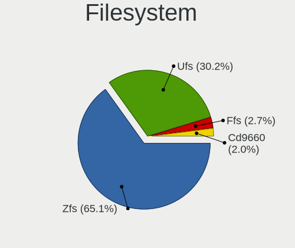
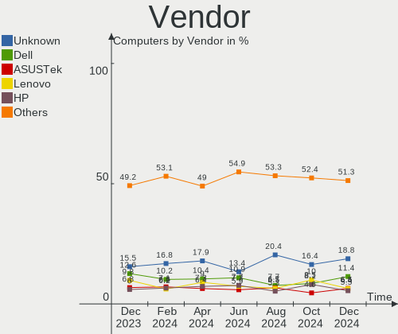
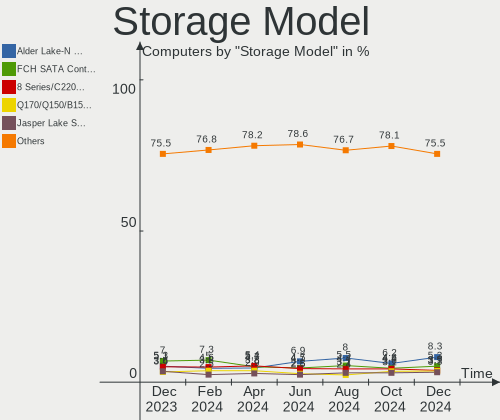
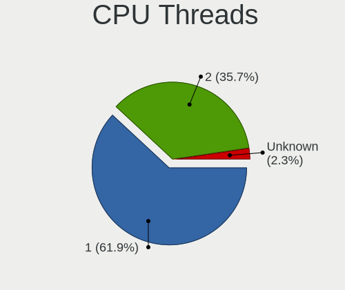
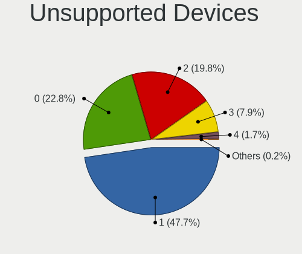

BSD - Hardware Trends
---------------------

A project to identify most popular hardware characteristics and track their change
over time based on data collected by BSD users at https://BSD-Hardware.info.

Anyone can contribute to this report by the [hw-probe](https://github.com/linuxhw/hw-probe/blob/master/INSTALL.BSD.md) tool:

    hw-probe -all -upload

This is a report for all computer types. See also reports for [desktops](/Desktop/README.md) and [notebooks](/Notebook/README.md).

OS-specific reports: [FreeBSD](/Dist/FreeBSD), [OPNsense](/Dist/OPNsense), [helloSystem](/Dist/helloSystem), [OpenBSD](/Dist/OpenBSD).

This report is for one last month. Overall report since the beginning of time: [TestDays](https://github.com/bsdhw/TestDays)

Period: Apr, 2024.

Contents
--------

* [ System ](#system)
  - [ OS                       ](#os)
  - [ OS Family                ](#os-family)
  - [ Arch                     ](#arch)
  - [ DE                       ](#de)
  - [ Display Server           ](#display-server)
  - [ Display Manager          ](#display-manager)
  - [ OS Lang                  ](#os-lang)
  - [ Boot Mode                ](#boot-mode)
  - [ Filesystem               ](#filesystem)
  - [ Part. scheme             ](#part-scheme)

* [ Board ](#board)
  - [ Vendor                   ](#vendor)
  - [ Model                    ](#model)
  - [ Model Family             ](#model-family)
  - [ MFG Year                 ](#mfg-year)
  - [ Form Factor              ](#form-factor)
  - [ Coreboot                 ](#coreboot)
  - [ RAM Size                 ](#ram-size)
  - [ RAM Used                 ](#ram-used)
  - [ Total Drives             ](#total-drives)
  - [ Has CD-ROM               ](#has-cd-rom)
  - [ Has Ethernet             ](#has-ethernet)
  - [ Has WiFi                 ](#has-wifi)
  - [ Has Bluetooth            ](#has-bluetooth)

* [ Location ](#location)
  - [ Country                  ](#country)
  - [ City                     ](#city)

* [ Drives ](#drives)
  - [ Drive Vendor             ](#drive-vendor)
  - [ Drive Model              ](#drive-model)
  - [ HDD Vendor               ](#hdd-vendor)
  - [ SSD Vendor               ](#ssd-vendor)
  - [ Drive Kind               ](#drive-kind)
  - [ Drive Connector          ](#drive-connector)
  - [ Drive Size               ](#drive-size)
  - [ Space Total              ](#space-total)
  - [ Space Used               ](#space-used)
  - [ Malfunc. Drives          ](#malfunc-drives)
  - [ Malfunc. Drive Vendor    ](#malfunc-drive-vendor)
  - [ Malfunc. HDD Vendor      ](#malfunc-hdd-vendor)
  - [ Malfunc. Drive Kind      ](#malfunc-drive-kind)
  - [ Failed Drives            ](#failed-drives)
  - [ Failed Drive Vendor      ](#failed-drive-vendor)
  - [ Drive Status             ](#drive-status)

* [ Storage controller ](#storage-controller)
  - [ Storage Vendor           ](#storage-vendor)
  - [ Storage Model            ](#storage-model)
  - [ Storage Kind             ](#storage-kind)

* [ Processor ](#processor)
  - [ CPU Vendor               ](#cpu-vendor)
  - [ CPU Model                ](#cpu-model)
  - [ CPU Model Family         ](#cpu-model-family)
  - [ CPU Cores                ](#cpu-cores)
  - [ CPU Sockets              ](#cpu-sockets)
  - [ CPU Threads              ](#cpu-threads)
  - [ CPU Microarch            ](#cpu-microarch)

* [ Graphics ](#graphics)
  - [ GPU Vendor               ](#gpu-vendor)
  - [ GPU Model                ](#gpu-model)
  - [ GPU Combo                ](#gpu-combo)
  - [ GPU Driver               ](#gpu-driver)
  - [ GPU Memory               ](#gpu-memory)

* [ Monitor ](#monitor)
  - [ Monitor Vendor           ](#monitor-vendor)
  - [ Monitor Model            ](#monitor-model)
  - [ Monitor Resolution       ](#monitor-resolution)
  - [ Monitor Diagonal         ](#monitor-diagonal)
  - [ Monitor Width            ](#monitor-width)
  - [ Aspect Ratio             ](#aspect-ratio)
  - [ Monitor Area             ](#monitor-area)
  - [ Pixel Density            ](#pixel-density)
  - [ Multiple Monitors        ](#multiple-monitors)

* [ Network ](#network)
  - [ Net Controller Vendor    ](#net-controller-vendor)
  - [ Net Controller Model     ](#net-controller-model)
  - [ Wireless Vendor          ](#wireless-vendor)
  - [ Wireless Model           ](#wireless-model)
  - [ Ethernet Vendor          ](#ethernet-vendor)
  - [ Ethernet Model           ](#ethernet-model)
  - [ Net Controller Kind      ](#net-controller-kind)
  - [ Used Controller          ](#used-controller)
  - [ NICs                     ](#nics)
  - [ IPv6                     ](#ipv6)

* [ Bluetooth ](#bluetooth)
  - [ Bluetooth Vendor         ](#bluetooth-vendor)
  - [ Bluetooth Model          ](#bluetooth-model)

* [ Sound ](#sound)
  - [ Sound Vendor             ](#sound-vendor)
  - [ Sound Model              ](#sound-model)

* [ Memory ](#memory)
  - [ Memory Vendor            ](#memory-vendor)
  - [ Memory Model             ](#memory-model)
  - [ Memory Kind              ](#memory-kind)
  - [ Memory Form Factor       ](#memory-form-factor)
  - [ Memory Size              ](#memory-size)
  - [ Memory Speed             ](#memory-speed)

* [ Printers & scanners ](#printers--scanners)
  - [ Printer Vendor           ](#printer-vendor)
  - [ Printer Model            ](#printer-model)
  - [ Scanner Vendor           ](#scanner-vendor)
  - [ Scanner Model            ](#scanner-model)

* [ Camera ](#camera)
  - [ Camera Vendor            ](#camera-vendor)
  - [ Camera Model             ](#camera-model)

* [ Security ](#security)
  - [ Fingerprint Vendor       ](#fingerprint-vendor)
  - [ Fingerprint Model        ](#fingerprint-model)
  - [ Chipcard Vendor          ](#chipcard-vendor)
  - [ Chipcard Model           ](#chipcard-model)

* [ Unsupported ](#unsupported)
  - [ Unsupported Devices      ](#unsupported-devices)
  - [ Unsupported Device Types ](#unsupported-device-types)

System
------

OS
--

Installed operating systems

| Name                     | Computers | Percent |
|--------------------------|-----------|---------|
| OPNsense 24.1.5          | 154       | 29%     |
| OPNsense 24.1.6          | 135       | 25.42%  |
| OPNsense 24.1.4          | 60        | 11.3%   |
| FreeBSD 14.0-p6          | 38        | 7.16%   |
| OpenBSD 7.5              | 18        | 3.39%   |
| GhostBSD 24.01.1         | 12        | 2.26%   |
| OPNsense 23.7.12         | 11        | 2.07%   |
| helloSystem 0.8.1        | 11        | 2.07%   |
| FreeBSD 14.0             | 11        | 2.07%   |
| helloSystem 0.9.0        | 10        | 1.88%   |
| NetBSD 10.0              | 7         | 1.32%   |
| FreeBSD 15.0-CURRENT     | 6         | 1.13%   |
| OPNsense 24.7            | 5         | 0.94%   |
| OPNsense 23.1.11         | 4         | 0.75%   |
| FreeBSD 14.0-BETA5       | 3         | 0.56%   |
| OPNsense 24.1.3          | 2         | 0.38%   |
| OPNsense 23.7.3          | 2         | 0.38%   |
| OPNsense 23.10.3         | 2         | 0.38%   |
| MyBee 14.0-p2            | 2         | 0.38%   |
| helloSystem 0.7.0        | 2         | 0.38%   |
| FreeBSD 14.1-PRERELEASE  | 2         | 0.38%   |
| FreeBSD 14.0-STABLE      | 2         | 0.38%   |
| FreeBSD 14.0-p5          | 2         | 0.38%   |
| FreeBSD 13.3-p1          | 2         | 0.38%   |
| FreeBSD 13.2             | 2         | 0.38%   |
| XigmaNAS 13.2-p8         | 1         | 0.19%   |
| Ting 23.7                | 1         | 0.19%   |
| OPNsense 24.4            | 1         | 0.19%   |
| OPNsense 24.1.2          | 1         | 0.19%   |
| OPNsense 24.1.1          | 1         | 0.19%   |
| OPNsense 23.7.8          | 1         | 0.19%   |
| OPNsense 23.7.1          | 1         | 0.19%   |
| OPNsense 23.1.5          | 1         | 0.19%   |
| OPNsense 22.1.10         | 1         | 0.19%   |
| OPNsense 21.7.8          | 1         | 0.19%   |
| OpenBSD 7.4              | 1         | 0.19%   |
| NomadBSD 20240126        | 1         | 0.19%   |
| NetBSD 10.0_STABLE       | 1         | 0.19%   |
| MidnightBSD 3.2.0        | 1         | 0.19%   |
| FreeBSD 14.0-STABLE-HBSD | 1         | 0.19%   |

OS Family
---------

OS without a version

| Name        | Computers | Percent |
|-------------|-----------|---------|
| OPNsense    | 383       | 72.13%  |
| FreeBSD     | 80        | 15.07%  |
| helloSystem | 23        | 4.33%   |
| OpenBSD     | 19        | 3.58%   |
| GhostBSD    | 12        | 2.26%   |
| NetBSD      | 8         | 1.51%   |
| MyBee       | 2         | 0.38%   |
| XigmaNAS    | 1         | 0.19%   |
| Ting        | 1         | 0.19%   |
| NomadBSD    | 1         | 0.19%   |
| MidnightBSD | 1         | 0.19%   |

Arch
----

OS architecture (x86_64, i586, etc.)

| Name   | Computers | Percent |
|--------|-----------|---------|
| amd64  | 529       | 99.62%  |
| evbarm | 1         | 0.19%   |
| arm64  | 1         | 0.19%   |

DE
--

Desktop Environment

| Name         | Computers | Percent |
|--------------|-----------|---------|
| Console      | 418       | 78.72%  |
| helloDesktop | 40        | 7.53%   |
| XFCE         | 19        | 3.58%   |
| KDE5         | 16        | 3.01%   |
| MATE         | 12        | 2.26%   |
| TWM          | 4         | 0.75%   |
| i3           | 4         | 0.75%   |
| GNOME        | 4         | 0.75%   |
| X-Cinnamon   | 2         | 0.38%   |
| Picom        | 2         | 0.38%   |
| Openbox      | 2         | 0.38%   |
| LXQt         | 2         | 0.38%   |
| xinitrc      | 1         | 0.19%   |
| spectrwm     | 1         | 0.19%   |
| iwm          | 1         | 0.19%   |
| IceWM        | 1         | 0.19%   |
| dwm          | 1         | 0.19%   |
| Blackbox     | 1         | 0.19%   |

Display Server
--------------

X11 or Wayland

| Name    | Computers | Percent |
|---------|-----------|---------|
| Console | 418       | 78.72%  |
| X11     | 111       | 20.9%   |
| Wayland | 2         | 0.38%   |

Display Manager
---------------

SDDM, LightDM, etc.

| Name    | Computers | Percent |
|---------|-----------|---------|
| Console | 453       | 85.31%  |
| SLiM    | 26        | 4.9%    |
| SDDM    | 24        | 4.52%   |
| LightDM | 22        | 4.14%   |
| XDM     | 5         | 0.94%   |
| GDM     | 1         | 0.19%   |

OS Lang
-------

Language

| Lang    | Computers | Percent |
|---------|-----------|---------|
| Unknown | 416       | 78.34%  |
| C       | 63        | 11.86%  |
| en_US   | 33        | 6.21%   |
| ru_RU   | 5         | 0.94%   |
| fr_FR   | 5         | 0.94%   |
| ja_JP   | 2         | 0.38%   |
| zh_TW   | 1         | 0.19%   |
| zh_CN   | 1         | 0.19%   |
| es_ES   | 1         | 0.19%   |
| en_GB   | 1         | 0.19%   |
| en_CA   | 1         | 0.19%   |
| en_AU   | 1         | 0.19%   |
| de.DE   | 1         | 0.19%   |

Boot Mode
---------

EFI or BIOS

| Mode | Computers | Percent |
|------|-----------|---------|
| EFI  | 489       | 92.09%  |
| BIOS | 42        | 7.91%   |

Filesystem
----------

Type of filesystem

| Type   | Computers | Percent |
|--------|-----------|---------|
| Zfs    | 287       | 54.05%  |
| Ufs    | 213       | 40.11%  |
| Ffs    | 19        | 3.58%   |
| Cd9660 | 12        | 2.26%   |

Part. scheme
------------

Scheme of partitioning

| Type    | Computers | Percent |
|---------|-----------|---------|
| GPT     | 515       | 96.99%  |
| MBR     | 13        | 2.45%   |
| Unknown | 2         | 0.38%   |
| BSD     | 1         | 0.19%   |

Board
-----

Vendor
------

Motherboard manufacturer

| Name                                 | Computers | Percent |
|--------------------------------------|-----------|---------|
| Unknown                              | 96        | 18.08%  |
| Dell                                 | 55        | 10.36%  |
| Lenovo                               | 48        | 9.04%   |
| Hewlett-Packard                      | 39        | 7.34%   |
| ASUSTek Computer                     | 32        | 6.03%   |
| Intel                                | 27        | 5.08%   |
| Supermicro                           | 23        | 4.33%   |
| Gigabyte Technology                  | 22        | 4.14%   |
| Protectli                            | 21        | 3.95%   |
| ASRock                               | 15        | 2.82%   |
| Sophos                               | 10        | 1.88%   |
| Fujitsu                              | 10        | 1.88%   |
| PC Engines                           | 9         | 1.69%   |
| Deciso                               | 9         | 1.69%   |
| AZW                                  | 9         | 1.69%   |
| Apple                                | 9         | 1.69%   |
| AMI                                  | 9         | 1.69%   |
| MSI                                  | 8         | 1.51%   |
| Techvision                           | 6         | 1.13%   |
| IceWhale Technology                  | 4         | 0.75%   |
| CWWK                                 | 4         | 0.75%   |
| AWOW                                 | 3         | 0.56%   |
| Acer                                 | 3         | 0.56%   |
| ZOTAC                                | 2         | 0.38%   |
| Shenzhen Meigao Electronic Equipment | 2         | 0.38%   |
| Seeed Studio                         | 2         | 0.38%   |
| Samsung Electronics                  | 2         | 0.38%   |
| Panasonic                            | 2         | 0.38%   |
| MW                                   | 2         | 0.38%   |
| HUAWEI                               | 2         | 0.38%   |
| HPE                                  | 2         | 0.38%   |
| Hardkernel                           | 2         | 0.38%   |
| CncTion                              | 2         | 0.38%   |
| Barracuda Networks                   | 2         | 0.38%   |
| ASRockRack                           | 2         | 0.38%   |
| Advantech                            | 2         | 0.38%   |
| Wistron                              | 1         | 0.19%   |
| Winston Marriot                      | 1         | 0.19%   |
| Trigkey                              | 1         | 0.19%   |
| Timi                                 | 1         | 0.19%   |

Model
-----

Motherboard model

| Name                                | Computers | Percent |
|-------------------------------------|-----------|---------|
| Unknown                             | 97        | 18.27%  |
| Supermicro Super Server             | 9         | 1.69%   |
| Sophos SG                           | 7         | 1.32%   |
| AZW EQ                              | 7         | 1.32%   |
| Techvision TVI7309X                 | 6         | 1.13%   |
| Protectli FW6                       | 6         | 1.13%   |
| Deciso NetBoard-A20                 | 6         | 1.13%   |
| Protectli FW4B                      | 5         | 0.94%   |
| PC Engines APU2                     | 5         | 0.94%   |
| Fujitsu FUTRO S920                  | 5         | 0.94%   |
| AMI Aptio CRB                       | 5         | 0.94%   |
| IceWhale ZimaBoard 832 ZMB          | 4         | 0.75%   |
| HP EliteDesk 800 G2 SFF             | 4         | 0.75%   |
| ASUS All Series                     | 4         | 0.75%   |
| Apple MacBookAir6,2                 | 4         | 0.75%   |
| Sophos XG                           | 3         | 0.56%   |
| Protectli VP2420                    | 3         | 0.56%   |
| HP t730 Thin Client                 | 3         | 0.56%   |
| Dell Wyse 5070 Extended Thin Client | 3         | 0.56%   |
| Dell PowerEdge R630                 | 3         | 0.56%   |
| Dell OptiPlex 9020                  | 3         | 0.56%   |
| Dell OptiPlex 790                   | 3         | 0.56%   |
| Dell OptiPlex 3040                  | 3         | 0.56%   |
| Dell OptiPlex 3020                  | 3         | 0.56%   |
| Supermicro X10SLH-N6-ST031          | 2         | 0.38%   |
| Seeed Studio ODYSSEY-X86J4105       | 2         | 0.38%   |
| Protectli VP4630                    | 2         | 0.38%   |
| PC Engines apu4                     | 2         | 0.38%   |
| MW GMLK-2_5G4L                      | 2         | 0.38%   |
| Lenovo ThinkCentre M720s 10SUSA5A00 | 2         | 0.38%   |
| Intel SHARKBAY                      | 2         | 0.38%   |
| Intel Q3XXG4-P V1.0                 | 2         | 0.38%   |
| Intel MAHOBAY                       | 2         | 0.38%   |
| Intel CRESCENTBAY                   | 2         | 0.38%   |
| HP Z240 SFF Workstation             | 2         | 0.38%   |
| HP ProDesk 400 G4 SFF               | 2         | 0.38%   |
| Hardkernel ODROID-H2                | 2         | 0.38%   |
| Gigabyte X570 I AORUS PRO WIFI      | 2         | 0.38%   |
| Dell PowerEdge R210 II              | 2         | 0.38%   |
| Dell OptiPlex 780                   | 2         | 0.38%   |

Model Family
------------

Motherboard model prefix

| Name                          | Computers | Percent |
|-------------------------------|-----------|---------|
| Unknown                       | 97        | 18.27%  |
| Dell OptiPlex                 | 30        | 5.65%   |
| Lenovo ThinkPad               | 22        | 4.14%   |
| Lenovo ThinkCentre            | 12        | 2.26%   |
| HP EliteDesk                  | 10        | 1.88%   |
| Dell PowerEdge                | 10        | 1.88%   |
| Supermicro Super              | 9         | 1.69%   |
| Sophos SG                     | 7         | 1.32%   |
| AZW EQ                        | 7         | 1.32%   |
| ASUS PRIME                    | 7         | 1.32%   |
| Techvision TVI7309X           | 6         | 1.13%   |
| Protectli FW6                 | 6         | 1.13%   |
| HP ProDesk                    | 6         | 1.13%   |
| Fujitsu FUTRO                 | 6         | 1.13%   |
| Deciso NetBoard-A20           | 6         | 1.13%   |
| Protectli FW4B                | 5         | 0.94%   |
| PC Engines APU2               | 5         | 0.94%   |
| AMI Aptio                     | 5         | 0.94%   |
| IceWhale ZimaBoard            | 4         | 0.75%   |
| HP ProLiant                   | 4         | 0.75%   |
| Gigabyte X570                 | 4         | 0.75%   |
| Dell Latitude                 | 4         | 0.75%   |
| ASUS All                      | 4         | 0.75%   |
| Apple MacBookAir6             | 4         | 0.75%   |
| Sophos XG                     | 3         | 0.56%   |
| Protectli VP2420              | 3         | 0.56%   |
| HP t730                       | 3         | 0.56%   |
| HP Compaq                     | 3         | 0.56%   |
| Dell Wyse                     | 3         | 0.56%   |
| Dell Precision                | 3         | 0.56%   |
| ASUS TUF                      | 3         | 0.56%   |
| ASUS ROG                      | 3         | 0.56%   |
| Acer Aspire                   | 3         | 0.56%   |
| Supermicro X10SLH-N6-ST031    | 2         | 0.38%   |
| Seeed Studio ODYSSEY-X86J4105 | 2         | 0.38%   |
| Protectli VP4630              | 2         | 0.38%   |
| PC Engines apu4               | 2         | 0.38%   |
| MW GMLK-2                     | 2         | 0.38%   |
| Lenovo ThinkStation           | 2         | 0.38%   |
| Lenovo ThinkBook              | 2         | 0.38%   |

MFG Year
--------

Motherboard manufacture year

| Year | Computers | Percent |
|------|-----------|---------|
| 2023 | 99        | 18.64%  |
| 2022 | 65        | 12.24%  |
| 2018 | 50        | 9.42%   |
| 2019 | 44        | 8.29%   |
| 2021 | 37        | 6.97%   |
| 2016 | 37        | 6.97%   |
| 2017 | 32        | 6.03%   |
| 2020 | 31        | 5.84%   |
| 2014 | 27        | 5.08%   |
| 2015 | 26        | 4.9%    |
| 2024 | 21        | 3.95%   |
| 2012 | 17        | 3.2%    |
| 2011 | 14        | 2.64%   |
| 2010 | 10        | 1.88%   |
| 2013 | 9         | 1.69%   |
| 2009 | 5         | 0.94%   |
| 2008 | 5         | 0.94%   |
| 2007 | 2         | 0.38%   |

Form Factor
-----------

Physical design of the computer

| Name           | Computers | Percent |
|----------------|-----------|---------|
| Desktop        | 358       | 67.42%  |
| Notebook       | 84        | 15.82%  |
| Mini pc        | 41        | 7.72%   |
| Server         | 32        | 6.03%   |
| Firewall       | 14        | 2.64%   |
| System on chip | 1         | 0.19%   |
| Tablet         | 1         | 0.19%   |

Coreboot
--------

Have coreboot on board

| Used | Computers | Percent |
|------|-----------|---------|
| No   | 517       | 97.36%  |
| Yes  | 14        | 2.64%   |

RAM Size
--------

Total RAM memory

| Size in GB      | Computers | Percent |
|-----------------|-----------|---------|
| 8.01-16.0       | 190       | 35.78%  |
| 16.01-24.0      | 157       | 29.57%  |
| 32.01-64.0      | 65        | 12.24%  |
| 4.01-8.0        | 64        | 12.05%  |
| 64.01-256.0     | 35        | 6.59%   |
| 24.01-32.0      | 8         | 1.51%   |
| 2.01-3.0        | 7         | 1.32%   |
| 3.01-4.0        | 2         | 0.38%   |
| 1.01-2.0        | 2         | 0.38%   |
| More than 256.0 | 1         | 0.19%   |

RAM Used
--------

Used RAM memory

| Used GB     | Computers | Percent |
|-------------|-----------|---------|
| 0.51-1.0    | 209       | 39.36%  |
| 0.01-0.5    | 208       | 39.17%  |
| 1.01-2.0    | 73        | 13.75%  |
| 2.01-3.0    | 17        | 3.2%    |
| 4.01-8.0    | 9         | 1.69%   |
| Unknown     | 8         | 1.51%   |
| 3.01-4.0    | 3         | 0.56%   |
| 8.01-16.0   | 2         | 0.38%   |
| 32.01-64.0  | 1         | 0.19%   |
| 64.01-256.0 | 1         | 0.19%   |

Total Drives
------------

Number of drives on board

| Drives | Computers | Percent |
|--------|-----------|---------|
| 1      | 382       | 71.94%  |
| 0      | 72        | 13.56%  |
| 2      | 54        | 10.17%  |
| 4      | 8         | 1.51%   |
| 3      | 8         | 1.51%   |
| 5      | 3         | 0.56%   |
| 14     | 2         | 0.38%   |
| 8      | 1         | 0.19%   |
| 7      | 1         | 0.19%   |

Has CD-ROM
----------

Has CD-ROM on board

| Presented | Computers | Percent |
|-----------|-----------|---------|
| No        | 476       | 89.64%  |
| Yes       | 55        | 10.36%  |

Has Ethernet
------------

Has Ethernet on board

| Presented | Computers | Percent |
|-----------|-----------|---------|
| Yes       | 506       | 95.29%  |
| No        | 25        | 4.71%   |

Has WiFi
--------

Has WiFi module

| Presented | Computers | Percent |
|-----------|-----------|---------|
| No        | 377       | 71%     |
| Yes       | 154       | 29%     |

Has Bluetooth
-------------

Has Bluetooth module

| Presented | Computers | Percent |
|-----------|-----------|---------|
| No        | 417       | 78.53%  |
| Yes       | 114       | 21.47%  |

Location
--------

Country
-------

Geographic location (country)

| Country         | Computers | Percent |
|-----------------|-----------|---------|
| USA             | 146       | 27.5%   |
| Germany         | 75        | 14.12%  |
| Canada          | 35        | 6.59%   |
| Russia          | 28        | 5.27%   |
| UK              | 27        | 5.08%   |
| Australia       | 18        | 3.39%   |
| France          | 17        | 3.2%    |
| Poland          | 14        | 2.64%   |
| Brazil          | 12        | 2.26%   |
| Spain           | 11        | 2.07%   |
| Sweden          | 10        | 1.88%   |
| Netherlands     | 10        | 1.88%   |
| Japan           | 10        | 1.88%   |
| Italy           | 10        | 1.88%   |
| Denmark         | 8         | 1.51%   |
| Switzerland     | 7         | 1.32%   |
| Philippines     | 5         | 0.94%   |
| India           | 5         | 0.94%   |
| China           | 5         | 0.94%   |
| Belgium         | 5         | 0.94%   |
| Austria         | 5         | 0.94%   |
| Vietnam         | 4         | 0.75%   |
| Slovenia        | 4         | 0.75%   |
| Romania         | 4         | 0.75%   |
| Norway          | 4         | 0.75%   |
| Hungary         | 4         | 0.75%   |
| Thailand        | 3         | 0.56%   |
| South Korea     | 3         | 0.56%   |
| Portugal        | 3         | 0.56%   |
| New Zealand     | 3         | 0.56%   |
| Turkey          | 2         | 0.38%   |
| The Netherlands | 2         | 0.38%   |
| Taiwan          | 2         | 0.38%   |
| South Africa    | 2         | 0.38%   |
| Singapore       | 2         | 0.38%   |
| Peru            | 2         | 0.38%   |
| Hong Kong       | 2         | 0.38%   |
| Finland         | 2         | 0.38%   |
| Czechia         | 2         | 0.38%   |
| Argentina       | 2         | 0.38%   |

City
----

Geographic location (city)

| City          | Computers | Percent |
|---------------|-----------|---------|
| Moscow        | 10        | 1.88%   |
| Berlin        | 8         | 1.51%   |
| Saint-Laurent | 6         | 1.13%   |
| Frederiksberg | 6         | 1.13%   |
| Madrid        | 5         | 0.94%   |
| Colombes      | 5         | 0.94%   |
| Philadelphia  | 4         | 0.75%   |
| Melbourne     | 4         | 0.75%   |
| Krakow        | 4         | 0.75%   |
| Chiyoda       | 4         | 0.75%   |
| Calgary       | 4         | 0.75%   |
| Bonn          | 4         | 0.75%   |
| Wroclaw       | 3         | 0.56%   |
| Toronto       | 3         | 0.56%   |
| Sydney        | 3         | 0.56%   |
| St Petersburg | 3         | 0.56%   |
| Sheffield     | 3         | 0.56%   |
| Seattle       | 3         | 0.56%   |
| Rome          | 3         | 0.56%   |
| Paris         | 3         | 0.56%   |
| Oldham        | 3         | 0.56%   |
| Oakland       | 3         | 0.56%   |
| New York      | 3         | 0.56%   |
| Ljubljana     | 3         | 0.56%   |
| Hanoi         | 3         | 0.56%   |
| Hamburg       | 3         | 0.56%   |
| Brisbane      | 3         | 0.56%   |
| Boston        | 3         | 0.56%   |
| Amsterdam     | 3         | 0.56%   |
| Worcester     | 2         | 0.38%   |
| Vienna        | 2         | 0.38%   |
| Vancouver     | 2         | 0.38%   |
| Tokyo         | 2         | 0.38%   |
| Stockholm     | 2         | 0.38%   |
| St Louis      | 2         | 0.38%   |
| Singapore     | 2         | 0.38%   |
| Sherwood      | 2         | 0.38%   |
| Scandicci     | 2         | 0.38%   |
| Sao Paulo     | 2         | 0.38%   |
| San Jose      | 2         | 0.38%   |

Drives
------

Drive Vendor
------------

Hard drive vendors

| Vendor              | Computers | Drives | Percent |
|---------------------|-----------|--------|---------|
| Samsung Electronics | 71        | 87     | 13.95%  |
| Seagate             | 42        | 75     | 8.25%   |
| WDC                 | 40        | 44     | 7.86%   |
| Kingston            | 34        | 38     | 6.68%   |
| Crucial             | 29        | 30     | 5.7%    |
| Transcend           | 27        | 27     | 5.3%    |
| Intel               | 20        | 26     | 3.93%   |
| SanDisk             | 16        | 16     | 3.14%   |
| China               | 15        | 15     | 2.95%   |
| Toshiba             | 14        | 15     | 2.75%   |
| A-DATA Technology   | 14        | 15     | 2.75%   |
| Phison              | 9         | 9      | 1.77%   |
| NVMe                | 9         | 10     | 1.77%   |
| Silicon Motion      | 8         | 8      | 1.57%   |
| Patriot             | 8         | 9      | 1.57%   |
| Hoodisk             | 8         | 8      | 1.57%   |
| Team                | 7         | 9      | 1.38%   |
| SK hynix            | 7         | 7      | 1.38%   |
| Apple               | 7         | 7      | 1.38%   |
| PNY                 | 6         | 6      | 1.18%   |
| Lexar               | 6         | 8      | 1.18%   |
| SPCC                | 5         | 5      | 0.98%   |
| Micron Technology   | 5         | 10     | 0.98%   |
| LITEON              | 5         | 6      | 0.98%   |
| Gigabyte Technology | 5         | 5      | 0.98%   |
| FORESEE             | 5         | 5      | 0.98%   |
| APACER              | 5         | 6      | 0.98%   |
| Terabit             | 4         | 4      | 0.79%   |
| Protectli           | 4         | 4      | 0.79%   |
| OCZ                 | 4         | 5      | 0.79%   |
| Hitachi             | 4         | 4      | 0.79%   |
| HGST                | 4         | 11     | 0.79%   |
| faspeed             | 4         | 4      | 0.79%   |
| ShiJi               | 3         | 3      | 0.59%   |
| Intenso             | 3         | 4      | 0.59%   |
| Innodisk            | 3         | 3      | 0.59%   |
| CWdisk              | 3         | 3      | 0.59%   |
| ATP                 | 3         | 3      | 0.59%   |
| Vaseky              | 2         | 2      | 0.39%   |
| T-FORCE             | 2         | 2      | 0.39%   |

Drive Model
-----------

Hard drive models

| Model                            | Computers | Percent |
|----------------------------------|-----------|---------|
| Kingston SA400S37240G 240GB      | 6         | 1.13%   |
| Samsung SSD 970 EVO Plus 500GB   | 5         | 0.94%   |
| Samsung SSD 860 EVO 250GB        | 5         | 0.94%   |
| Crucial CT500P3SSD8 500GB        | 5         | 0.94%   |
| Transcend TS256GMTE710T 256GB    | 4         | 0.75%   |
| Terabit T50S3STMLC-016G          | 4         | 0.75%   |
| Hoodisk SSD 128GB                | 4         | 0.75%   |
| Crucial CT500MX500SSD1 500GB     | 4         | 0.75%   |
| Apple SSD SD0128F 121GB          | 4         | 0.75%   |
| Transcend TS256GSSD230S 256GB    | 3         | 0.56%   |
| Silicon Motion BKKJ nvme 128G    | 3         | 0.56%   |
| Samsung SSD 870 EVO 500GB        | 3         | 0.56%   |
| Samsung MZVLB256HAHQ-000H1 256GB | 3         | 0.56%   |
| Phison YSO128GTLCW-E3C-2 128GB   | 3         | 0.56%   |
| Patriot Burst Elite 120GB        | 3         | 0.56%   |
| Lexar SSD NS100 512GB            | 3         | 0.56%   |
| Kingston SA400S37480G 480GB      | 3         | 0.56%   |
| Gigabyte GP-GSTFS31240GNTD 240GB | 3         | 0.56%   |
| WDC WDS120G2G0A-00JH30 120GB     | 2         | 0.38%   |
| Transcend TS64GSSD370 64GB       | 2         | 0.38%   |
| Transcend TS32GMSA370 32GB       | 2         | 0.38%   |
| Transcend TS256GMTE652T2 256GB   | 2         | 0.38%   |
| Transcend TS128GMSA230S 128GB    | 2         | 0.38%   |
| Toshiba DT01ACA050 500GB         | 2         | 0.38%   |
| Silicon Motion BKKJ nvme 256G    | 2         | 0.38%   |
| ShiJi 128GB M.2-NVMe             | 2         | 0.38%   |
| Seagate ST9500325AS 500GB        | 2         | 0.38%   |
| Seagate ST500DM002-1BD142 500GB  | 2         | 0.38%   |
| Seagate ST3250312AS 250GB        | 2         | 0.38%   |
| Seagate ST2000LM007-1R8174 2TB   | 2         | 0.38%   |
| Seagate ST1000DM010-2EP102 1TB   | 2         | 0.38%   |
| SanDisk X400 M.2 2280 128GB      | 2         | 0.38%   |
| Samsung SSD 970 EVO Plus 1TB     | 2         | 0.38%   |
| Samsung SSD 960 EVO 250GB        | 2         | 0.38%   |
| Samsung SSD 870 EVO 2TB          | 2         | 0.38%   |
| Samsung SSD 870 EVO 1TB          | 2         | 0.38%   |
| Samsung SSD 850 EVO mSATA 250GB  | 2         | 0.38%   |
| Samsung MZVLW256HEHP-000H1 256GB | 2         | 0.38%   |
| Samsung MZ7LN512HMJP-000L1 512GB | 2         | 0.38%   |
| PNY CS900 480GB SSD              | 2         | 0.38%   |

HDD Vendor
----------

Hard disk drive vendors

| Vendor              | Computers | Drives | Percent |
|---------------------|-----------|--------|---------|
| Seagate             | 42        | 74     | 40.78%  |
| WDC                 | 32        | 36     | 31.07%  |
| Toshiba             | 9         | 10     | 8.74%   |
| NVMe                | 6         | 7      | 5.83%   |
| Hitachi             | 4         | 4      | 3.88%   |
| HGST                | 4         | 11     | 3.88%   |
| USB                 | 1         | 1      | 0.97%   |
| Samsung Electronics | 1         | 1      | 0.97%   |
| OPENBSD             | 1         | 1      | 0.97%   |
| JetFlash            | 1         | 1      | 0.97%   |
| HPE                 | 1         | 1      | 0.97%   |
| ASMedia             | 1         | 1      | 0.97%   |

SSD Vendor
----------

Solid state drive vendors

| Vendor              | Computers | Drives | Percent |
|---------------------|-----------|--------|---------|
| Samsung Electronics | 42        | 52     | 14.53%  |
| Kingston            | 25        | 29     | 8.65%   |
| Transcend           | 18        | 18     | 6.23%   |
| Crucial             | 17        | 18     | 5.88%   |
| SanDisk             | 16        | 16     | 5.54%   |
| Intel               | 16        | 19     | 5.54%   |
| China               | 15        | 15     | 5.19%   |
| A-DATA Technology   | 12        | 13     | 4.15%   |
| Hoodisk             | 8         | 8      | 2.77%   |
| Apple               | 7         | 7      | 2.42%   |
| WDC                 | 6         | 6      | 2.08%   |
| PNY                 | 6         | 6      | 2.08%   |
| Team                | 5         | 7      | 1.73%   |
| Micron Technology   | 5         | 10     | 1.73%   |
| LITEON              | 5         | 6      | 1.73%   |
| Apacer              | 5         | 6      | 1.73%   |
| Terabit             | 4         | 4      | 1.38%   |
| SPCC                | 4         | 4      | 1.38%   |
| SK hynix            | 4         | 4      | 1.38%   |
| Protectli           | 4         | 4      | 1.38%   |
| Patriot             | 4         | 5      | 1.38%   |
| OCZ                 | 4         | 5      | 1.38%   |
| Lexar               | 4         | 5      | 1.38%   |
| Gigabyte Technology | 4         | 4      | 1.38%   |
| Toshiba             | 3         | 3      | 1.04%   |
| NVMe                | 3         | 3      | 1.04%   |
| Intenso             | 3         | 4      | 1.04%   |
| Innodisk            | 3         | 3      | 1.04%   |
| ATP                 | 3         | 3      | 1.04%   |
| T-FORCE             | 2         | 2      | 0.69%   |
| Plextor             | 2         | 2      | 0.69%   |
| KingSpec            | 2         | 2      | 0.69%   |
| FORESEE             | 2         | 2      | 0.69%   |
| Dogfish             | 2         | 2      | 0.69%   |
| ZTC                 | 1         | 1      | 0.35%   |
| Zheino              | 1         | 1      | 0.35%   |
| Vaseky              | 1         | 1      | 0.35%   |
| UDinfo              | 1         | 1      | 0.35%   |
| Timetec             | 1         | 1      | 0.35%   |
| Teelkoou            | 1         | 1      | 0.35%   |

Drive Kind
----------

HDD or SSD

| Kind | Computers | Drives | Percent |
|------|-----------|--------|---------|
| SSD  | 279       | 322    | 57.53%  |
| NVMe | 117       | 128    | 24.12%  |
| HDD  | 89        | 148    | 18.35%  |

Drive Connector
---------------

SATA, SAS, NVMe, etc.

| Type | Computers | Drives | Percent |
|------|-----------|--------|---------|
| SATA | 344       | 470    | 74.62%  |
| NVMe | 117       | 128    | 25.38%  |

Drive Size
----------

Size of hard drive

| Size in TB | Computers | Drives | Percent |
|------------|-----------|--------|---------|
| 0.01-0.5   | 284       | 326    | 75.94%  |
| 0.51-1.0   | 48        | 55     | 12.83%  |
| 1.01-2.0   | 25        | 53     | 6.68%   |
| 3.01-4.0   | 8         | 14     | 2.14%   |
| 4.01-10.0  | 6         | 18     | 1.6%    |
| 10.01-20.0 | 2         | 3      | 0.53%   |
| 2.01-3.0   | 1         | 1      | 0.27%   |

Space Total
-----------

Amount of disk space available on the file system

| Size in GB     | Computers | Percent |
|----------------|-----------|---------|
| 101-250        | 241       | 45.39%  |
| 251-500        | 107       | 20.15%  |
| 21-50          | 46        | 8.66%   |
| 501-1000       | 40        | 7.53%   |
| 1-20           | 35        | 6.59%   |
| 51-100         | 33        | 6.21%   |
| 1001-2000      | 18        | 3.39%   |
| More than 3000 | 8         | 1.51%   |
| 2001-3000      | 2         | 0.38%   |
| Unknown        | 1         | 0.19%   |

Space Used
----------

Amount of used disk space

| Used GB   | Computers | Percent |
|-----------|-----------|---------|
| 1-20      | 481       | 90.58%  |
| 21-50     | 28        | 5.27%   |
| 51-100    | 12        | 2.26%   |
| 101-250   | 5         | 0.94%   |
| 1001-2000 | 2         | 0.38%   |
| 251-500   | 1         | 0.19%   |
| 501-1000  | 1         | 0.19%   |
| Unknown   | 1         | 0.19%   |

Malfunc. Drives
---------------

Drive models with a malfunction

| Model                                        | Computers | Drives | Percent |
|----------------------------------------------|-----------|--------|---------|
| Seagate ST9500325AS 500GB                    | 2         | 2      | 3.92%   |
| Seagate ST500DM002-1BD142 500GB              | 2         | 2      | 3.92%   |
| Kingston SV300S37A120G 120GB                 | 2         | 2      | 3.92%   |
| WDC WD40EZRZ-00WN9B0 4TB                     | 1         | 1      | 1.96%   |
| WDC WD3200AAJS-00YZCA0 320GB                 | 1         | 1      | 1.96%   |
| WDC WD2502ABYS-18B7A0 250GB                  | 1         | 1      | 1.96%   |
| WDC WD20NMVW-11W68S0 2TB                     | 1         | 1      | 1.96%   |
| WDC WD2000FYYZ-01UL1B2 2TB                   | 1         | 1      | 1.96%   |
| WDC WD1200SD-01KCB0 120GB                    | 1         | 1      | 1.96%   |
| WDC WD10EZEX-75M2NA0 1TB                     | 1         | 1      | 1.96%   |
| Transcend TS32GMSA370 32GB                   | 1         | 1      | 1.96%   |
| Transcend TS256GMTE550T 256GB                | 1         | 1      | 1.96%   |
| Toshiba THNSNK128GVN8 M.2 2280 128GB         | 1         | 1      | 1.96%   |
| Toshiba MK6465GSX 640GB                      | 1         | 1      | 1.96%   |
| SK hynix SHGS31-250GS-2 250GB                | 1         | 1      | 1.96%   |
| Seagate ST500LT012-9WS142 500GB              | 1         | 1      | 1.96%   |
| Seagate ST3500413AS 500GB                    | 1         | 1      | 1.96%   |
| Seagate ST3500312CS 500GB                    | 1         | 1      | 1.96%   |
| Seagate ST3250820AS 250GB                    | 1         | 1      | 1.96%   |
| Seagate ST320LT007-9ZV142 320GB              | 1         | 1      | 1.96%   |
| Seagate ST3160815AS 160GB                    | 1         | 1      | 1.96%   |
| Seagate ST1000DM010-2EP102 1TB               | 1         | 1      | 1.96%   |
| Samsung Electronics SSD 870 EVO 1TB          | 1         | 1      | 1.96%   |
| Samsung Electronics SSD 850 EVO 250GB        | 1         | 1      | 1.96%   |
| Samsung Electronics SSD 840 PRO Series 256GB | 1         | 1      | 1.96%   |
| Samsung Electronics SSD 840 EVO 250GB        | 1         | 1      | 1.96%   |
| Patriot Burst Elite 120GB                    | 1         | 1      | 1.96%   |
| OCZ VERTEX460 480GB                          | 1         | 1      | 1.96%   |
| Micron Technology 1100_MTFDDAV256TBN 256GB   | 1         | 1      | 1.96%   |
| LITEON CV8-8E128-HP 128GB                    | 1         | 1      | 1.96%   |
| Kingston SUV400S37120G 120GB                 | 1         | 1      | 1.96%   |
| Kingston SMS200S3120G 120GB                  | 1         | 1      | 1.96%   |
| Kingston SMS151S324G 24GB                    | 1         | 1      | 1.96%   |
| Kingston SHFS37A120G 120GB                   | 1         | 2      | 1.96%   |
| Intel SSDSC2BB080G4 80GB                     | 1         | 1      | 1.96%   |
| Intel SSDSA2UP020G3H 20GB                    | 1         | 1      | 1.96%   |
| Hitachi HTS545032B9A300 320GB                | 1         | 1      | 1.96%   |
| HGST HTS725050A7E630 500GB                   | 1         | 1      | 1.96%   |
| HGST HTS545050A7E380 500GB                   | 1         | 1      | 1.96%   |
| Hewlett-Packard SSD S700 Pro 128GB           | 1         | 2      | 1.96%   |

Malfunc. Drive Vendor
---------------------

Vendors of faulty drives

| Vendor              | Computers | Drives | Percent |
|---------------------|-----------|--------|---------|
| Seagate             | 11        | 11     | 21.57%  |
| WDC                 | 7         | 7      | 13.73%  |
| Kingston            | 6         | 7      | 11.76%  |
| Samsung Electronics | 4         | 4      | 7.84%   |
| Crucial             | 3         | 3      | 5.88%   |
| Transcend           | 2         | 2      | 3.92%   |
| Toshiba             | 2         | 2      | 3.92%   |
| Intel               | 2         | 2      | 3.92%   |
| HGST                | 2         | 2      | 3.92%   |
| China               | 2         | 2      | 3.92%   |
| SK hynix            | 1         | 1      | 1.96%   |
| Patriot             | 1         | 1      | 1.96%   |
| OCZ                 | 1         | 1      | 1.96%   |
| Micron Technology   | 1         | 1      | 1.96%   |
| LITEON              | 1         | 1      | 1.96%   |
| Hitachi             | 1         | 1      | 1.96%   |
| Hewlett-Packard     | 1         | 2      | 1.96%   |
| Apacer              | 1         | 1      | 1.96%   |
| AMD                 | 1         | 1      | 1.96%   |
| A-DATA Technology   | 1         | 1      | 1.96%   |

Malfunc. HDD Vendor
-------------------

Vendors of faulty HDD drives

| Vendor  | Computers | Drives | Percent |
|---------|-----------|--------|---------|
| Seagate | 11        | 11     | 50%     |
| WDC     | 7         | 7      | 31.82%  |
| HGST    | 2         | 2      | 9.09%   |
| Toshiba | 1         | 1      | 4.55%   |
| Hitachi | 1         | 1      | 4.55%   |

Malfunc. Drive Kind
-------------------

Kinds of faulty drives

| Kind | Computers | Drives | Percent |
|------|-----------|--------|---------|
| SSD  | 28        | 30     | 54.9%   |
| HDD  | 22        | 22     | 43.14%  |
| NVMe | 1         | 1      | 1.96%   |

Failed Drives
-------------

Failed drive models

| Model                                        | Computers | Drives | Percent |
|----------------------------------------------|-----------|--------|---------|
| Vaseky V900-120G                             | 1         | 1      | 33.33%  |
| Samsung Electronics MZVLW256HEHP-000H1 256GB | 1         | 1      | 33.33%  |
| Crucial CT500P3SSD8 500GB                    | 1         | 1      | 33.33%  |

Failed Drive Vendor
-------------------

Failed drive vendors

| Vendor              | Computers | Drives | Percent |
|---------------------|-----------|--------|---------|
| Vaseky              | 1         | 1      | 33.33%  |
| Samsung Electronics | 1         | 1      | 33.33%  |
| Crucial             | 1         | 1      | 33.33%  |

Drive Status
------------

Number of failed and malfunc. drives

| Status   | Computers | Drives | Percent |
|----------|-----------|--------|---------|
| Works    | 410       | 528    | 86.13%  |
| Malfunc  | 51        | 53     | 10.71%  |
| Detected | 12        | 14     | 2.52%   |
| Failed   | 3         | 3      | 0.63%   |

Storage controller
------------------

Storage Vendor
--------------

Storage controller vendors

| Vendor                                  | Computers | Percent |
|-----------------------------------------|-----------|---------|
| Intel                                   | 412       | 59.54%  |
| AMD                                     | 59        | 8.53%   |
| Samsung Electronics                     | 51        | 7.37%   |
| Silicon Motion                          | 22        | 3.18%   |
| Phison Electronics                      | 21        | 3.03%   |
| SanDisk                                 | 16        | 2.31%   |
| MAXIO Technology (Hangzhou)             | 15        | 2.17%   |
| Kingston Technology Company             | 14        | 2.02%   |
| Micron/Crucial Technology               | 11        | 1.59%   |
| Broadcom / LSI                          | 10        | 1.45%   |
| Transcend                               | 9         | 1.3%    |
| Marvell Technology Group                | 7         | 1.01%   |
| Shenzhen Longsys Electronics            | 6         | 0.87%   |
| Micron Technology                       | 5         | 0.72%   |
| ADATA Technology                        | 4         | 0.58%   |
| Toshiba                                 | 3         | 0.43%   |
| SK hynix                                | 3         | 0.43%   |
| Nvidia                                  | 3         | 0.43%   |
| ASMedia Technology                      | 3         | 0.43%   |
| Realtek Semiconductor                   | 2         | 0.29%   |
| Netac Technology                        | 2         | 0.29%   |
| JMicron Technology                      | 2         | 0.29%   |
| Hosin Global Electronics                | 2         | 0.29%   |
| Chelsio Communications                  | 2         | 0.29%   |
| Solid State Storage Technology          | 1         | 0.14%   |
| Shenzhen Unionmemory Information System | 1         | 0.14%   |
| Seagate Technology                      | 1         | 0.14%   |
| Lite-On Technology                      | 1         | 0.14%   |
| KIOXIA                                  | 1         | 0.14%   |
| Hewlett-Packard                         | 1         | 0.14%   |
| Adaptec                                 | 1         | 0.14%   |
| Unknown                                 | 1         | 0.14%   |

Storage Model
-------------

Storage controller models

| Model                                                                            | Computers | Percent |
|----------------------------------------------------------------------------------|-----------|---------|
| Intel 8 Series/C220 Series Chipset Family 6-port SATA Controller 1 [AHCI mode]   | 40        | 5.36%   |
| AMD FCH SATA Controller [AHCI mode]                                              | 38        | 5.09%   |
| Intel unknown                                                                    | 32        | 4.29%   |
| Intel Q170/Q150/B150/H170/H110/Z170/CM236 Chipset SATA Controller [AHCI Mode]    | 28        | 3.75%   |
| Intel Celeron/Pentium Silver Processor SATA Controller                           | 26        | 3.49%   |
| Intel Sunrise Point-LP SATA Controller [AHCI mode]                               | 25        | 3.35%   |
| Silicon Motion SM2263EN/SM2263XT (DRAM-less) NVMe SSD Controllers                | 22        | 2.95%   |
| Samsung NVMe SSD Controller SM981/PM981/PM983                                    | 22        | 2.95%   |
| Intel Jasper Lake SATA AHCI Controller                                           | 22        | 2.95%   |
| Intel Cannon Lake PCH SATA AHCI Controller                                       | 21        | 2.82%   |
| MAXIO (Hangzhou) NVMe SSD Controller MAP1202 (DRAM-less)                         | 14        | 1.88%   |
| Intel Atom Processor E3800 Series SATA AHCI Controller                           | 14        | 1.88%   |
| Phison PS5013-E13 PCIe3 NVMe Controller (DRAM-less)                              | 13        | 1.74%   |
| Intel Atom/Celeron/Pentium Processor x5-E8000/J3xxx/N3xxx Series SATA Controller | 13        | 1.74%   |
| Intel 6 Series/C200 Series Chipset Family 6 port Desktop SATA AHCI Controller    | 13        | 1.74%   |
| Samsung NVMe SSD Controller PM9A1/PM9A3/980PRO                                   | 10        | 1.34%   |
| Intel Celeron N3350/Pentium N4200/Atom E3900 Series SATA AHCI Controller         | 10        | 1.34%   |
| Intel Alder Lake-P SATA AHCI Controller                                          | 10        | 1.34%   |
| Intel SATA Controller [RAID mode]                                                | 9         | 1.21%   |
| Intel Atom Processor C3000 Series SATA Controller 0                              | 9         | 1.21%   |
| Intel 7 Series Chipset Family 6-port SATA Controller [AHCI mode]                 | 9         | 1.21%   |
| Intel 6 Series/C200 Series Chipset Family 6 port Mobile SATA AHCI Controller     | 9         | 1.21%   |
| Intel 200 Series PCH SATA controller [AHCI mode]                                 | 9         | 1.21%   |
| Micron/Crucial P2 [Nick P2] / P3 / P3 Plus NVMe PCIe SSD (DRAM-less)             | 8         | 1.07%   |
| Intel Elkhart Lake SATA AHCI                                                     | 8         | 1.07%   |
| Intel 8 Series SATA Controller 1 [AHCI mode]                                     | 8         | 1.07%   |
| AMD 500 Series Chipset SATA Controller                                           | 8         | 1.07%   |
| Samsung NVMe SSD Controller SM961/PM961/SM963                                    | 7         | 0.94%   |
| Samsung NVMe SSD Controller 980 (DRAM-less)                                      | 7         | 0.94%   |
| Intel Atom Processor C3000 Series SATA Controller 1                              | 7         | 0.94%   |
| Intel Alder Lake-S PCH SATA Controller [AHCI Mode]                               | 7         | 0.94%   |
| Intel 7 Series/C210 Series Chipset Family 6-port SATA Controller [AHCI mode]     | 7         | 0.94%   |
| AMD 400 Series Chipset SATA Controller                                           | 7         | 0.94%   |
| Sandisk WD Black SN770 / PC SN740 256GB / PC SN560 (DRAM-less) NVMe SSD          | 6         | 0.8%    |
| SanDisk Extreme Pro / WD Black SN750 / PC SN730 / Red SN700 NVMe SSD             | 6         | 0.8%    |
| Intel Wildcat Point-LP SATA Controller [AHCI Mode]                               | 6         | 0.8%    |
| Intel Comet Lake SATA AHCI Controller                                            | 6         | 0.8%    |
| Intel Atom processor C2000 AHCI SATA3 Controller                                 | 6         | 0.8%    |
| Transcend NVMe PCIe SSD 240S/MTE710T                                             | 5         | 0.67%   |
| Intel C610/X99 series chipset sSATA Controller [AHCI mode]                       | 5         | 0.67%   |

Storage Kind
------------

Kind of storage controller (IDE, SATA, NVMe, SAS, ...)

| Kind | Computers | Percent |
|------|-----------|---------|
| SATA | 445       | 64.77%  |
| NVMe | 188       | 27.37%  |
| RAID | 23        | 3.35%   |
| IDE  | 23        | 3.35%   |
| SAS  | 6         | 0.87%   |
| SCSI | 2         | 0.29%   |

Processor
---------

CPU Vendor
----------

Processor vendors

| Vendor   | Computers | Percent |
|----------|-----------|---------|
| Intel    | 450       | 84.75%  |
| AMD      | 79        | 14.88%  |
| NXP      | 1         | 0.19%   |
| Broadcom | 1         | 0.19%   |

CPU Model
---------

Processor models

| Model                                    | Computers | Percent |
|------------------------------------------|-----------|---------|
| Intel N100                               | 39        | 7.34%   |
| Intel Celeron N5105 @ 2.00GHz            | 15        | 2.82%   |
| Intel Celeron J4125 CPU @ 2.00GHz        | 15        | 2.82%   |
| Intel Core i5-6500 CPU @ 3.20GHz         | 9         | 1.69%   |
| Intel Pentium Silver N6005 @ 2.00GHz     | 7         | 1.32%   |
| Intel Celeron CPU J3160 @ 1.60GHz        | 7         | 1.32%   |
| Intel Celeron CPU J1900 @ 1.99GHz        | 7         | 1.32%   |
| AMD GX-412TC SOC                         | 7         | 1.32%   |
| Intel Core i5-8500T CPU @ 2.10GHz        | 6         | 1.13%   |
| Intel Core i3-6100 CPU @ 3.70GHz         | 6         | 1.13%   |
| Intel Celeron J6412 @ 2.00GHz            | 6         | 1.13%   |
| Intel Atom CPU C3758R @ 2.40GHz          | 6         | 1.13%   |
| Intel Xeon CPU E3-1270 v3 @ 3.50GHz      | 5         | 0.94%   |
| Intel Core i7-6700 CPU @ 3.40GHz         | 5         | 0.94%   |
| AMD Ryzen 5 5600G with Radeon Graphics   | 5         | 0.94%   |
| AMD GX-415GA SOC with Radeon HD Graphics | 5         | 0.94%   |
| Intel Pentium Silver J5005 CPU @ 1.50GHz | 4         | 0.75%   |
| Intel Core i7-8550U CPU @ 1.80GHz        | 4         | 0.75%   |
| Intel Core i5-7200U CPU @ 2.50GHz        | 4         | 0.75%   |
| Intel Core i5-4460 CPU @ 3.20GHz         | 4         | 0.75%   |
| Intel Core i5-4250U CPU @ 1.30GHz        | 4         | 0.75%   |
| Intel Core i3-N305                       | 4         | 0.75%   |
| Intel Celeron J4105 CPU @ 1.50GHz        | 4         | 0.75%   |
| Intel Celeron CPU N3450 @ 1.10GHz        | 4         | 0.75%   |
| Intel Atom CPU C3558 @ 2.20GHz           | 4         | 0.75%   |
| AMD Ryzen 7 3700X 8-Core Processor       | 4         | 0.75%   |
| AMD EPYC 3201 8-Core Processor           | 4         | 0.75%   |
| Intel Xeon CPU D-1518 @ 2.20GHz          | 3         | 0.56%   |
| Intel Pentium Gold 8505                  | 3         | 0.56%   |
| Intel Core i7-7500U CPU @ 2.70GHz        | 3         | 0.56%   |
| Intel Core i7-4770 CPU @ 3.40GHz         | 3         | 0.56%   |
| Intel Core i5-8400 CPU @ 2.80GHz         | 3         | 0.56%   |
| Intel Core i5-7500 CPU @ 3.40GHz         | 3         | 0.56%   |
| Intel Core i5-6500T CPU @ 2.50GHz        | 3         | 0.56%   |
| Intel Core i5-6300U CPU @ 2.40GHz        | 3         | 0.56%   |
| Intel Core i5-4590 CPU @ 3.30GHz         | 3         | 0.56%   |
| Intel Core i5-3470 CPU @ 3.20GHz         | 3         | 0.56%   |
| Intel Core 2 Duo                         | 3         | 0.56%   |
| Intel Celeron CPU J1800 @ 2.41GHz        | 3         | 0.56%   |
| Intel Atom CPU E3845 @ 1.91GHz           | 3         | 0.56%   |

CPU Model Family
----------------

Processor model prefix

| Model                   | Computers | Percent |
|-------------------------|-----------|---------|
| Intel Core i5           | 99        | 18.64%  |
| Intel Celeron           | 91        | 17.14%  |
| Other                   | 71        | 13.37%  |
| Intel Core i3           | 43        | 8.1%    |
| Intel Xeon              | 42        | 7.91%   |
| Intel Core i7           | 41        | 7.72%   |
| Intel Atom              | 30        | 5.65%   |
| AMD Ryzen 7             | 18        | 3.39%   |
| AMD GX                  | 14        | 2.64%   |
| AMD Ryzen 5             | 13        | 2.45%   |
| Intel Pentium Silver    | 11        | 2.07%   |
| AMD EPYC                | 9         | 1.69%   |
| Intel Pentium           | 8         | 1.51%   |
| Intel Core 2 Duo        | 6         | 1.13%   |
| AMD Ryzen 9             | 5         | 0.94%   |
| Intel Pentium Gold      | 3         | 0.56%   |
| Intel Xeon Silver       | 2         | 0.38%   |
| Intel Core 2 Quad       | 2         | 0.38%   |
| AMD Ryzen Embedded      | 2         | 0.38%   |
| AMD Ryzen 5 PRO         | 2         | 0.38%   |
| AMD G                   | 2         | 0.38%   |
| AMD FX                  | 2         | 0.38%   |
| AMD A8                  | 2         | 0.38%   |
| Intel Xeon Gold         | 1         | 0.19%   |
| Intel Pentium Dual-Core | 1         | 0.19%   |
| Intel Genuine           | 1         | 0.19%   |
| Intel Core m3           | 1         | 0.19%   |
| Intel Core i9           | 1         | 0.19%   |
| Intel Core 2            | 1         | 0.19%   |
| Intel Core              | 1         | 0.19%   |
| AMD Ryzen 3 PRO         | 1         | 0.19%   |
| AMD Ryzen 3             | 1         | 0.19%   |
| AMD PRO A10             | 1         | 0.19%   |
| AMD Athlon II X3        | 1         | 0.19%   |
| AMD Athlon II           | 1         | 0.19%   |
| AMD Athlon 64 X2        | 1         | 0.19%   |

CPU Cores
---------

Number of processor cores

| Number  | Computers | Percent |
|---------|-----------|---------|
| 4       | 272       | 51.22%  |
| 2       | 128       | 24.11%  |
| 8       | 33        | 6.21%   |
| 6       | 31        | 5.84%   |
| 16      | 22        | 4.14%   |
| 12      | 17        | 3.2%    |
| Unknown | 8         | 1.51%   |
| 10      | 5         | 0.94%   |
| 3       | 5         | 0.94%   |
| 32      | 3         | 0.56%   |
| 28      | 2         | 0.38%   |
| 14      | 2         | 0.38%   |
| 24      | 1         | 0.19%   |
| 22      | 1         | 0.19%   |
| 20      | 1         | 0.19%   |

CPU Sockets
-----------

Number of sockets

| Number  | Computers | Percent |
|---------|-----------|---------|
| 1       | 523       | 98.49%  |
| 2       | 7         | 1.32%   |
| Unknown | 1         | 0.19%   |

CPU Threads
-----------

Threads per core (Hyper-Threading)

| Number  | Computers | Percent |
|---------|-----------|---------|
| 1       | 341       | 64.22%  |
| 2       | 182       | 34.27%  |
| Unknown | 8         | 1.51%   |

CPU Microarch
-------------

Microarchitecture

| Name          | Computers | Percent |
|---------------|-----------|---------|
| Unknown       | 118       | 22.22%  |
| KabyLake      | 66        | 12.43%  |
| Haswell       | 56        | 10.55%  |
| Skylake       | 45        | 8.47%   |
| Silvermont    | 35        | 6.59%   |
| Goldmont plus | 26        | 4.9%    |
| Goldmont      | 23        | 4.33%   |
| SandyBridge   | 22        | 4.14%   |
| IvyBridge     | 22        | 4.14%   |
| Broadwell     | 16        | 3.01%   |
| Zen 3         | 15        | 2.82%   |
| Zen           | 13        | 2.45%   |
| Zen 2         | 10        | 1.88%   |
| Puma          | 8         | 1.51%   |
| Penryn        | 8         | 1.51%   |
| CometLake     | 7         | 1.32%   |
| Jaguar        | 6         | 1.13%   |
| Steamroller   | 5         | 0.94%   |
| Zen+          | 4         | 0.75%   |
| TigerLake     | 4         | 0.75%   |
| Nehalem       | 4         | 0.75%   |
| Bonnell       | 4         | 0.75%   |
| Westmere      | 3         | 0.56%   |
| Core          | 3         | 0.56%   |
| Piledriver    | 2         | 0.38%   |
| K10           | 2         | 0.38%   |
| Bobcat        | 2         | 0.38%   |
| K8 Hammer     | 1         | 0.19%   |
| Excavator     | 1         | 0.19%   |

Graphics
--------

GPU Vendor
----------

Vendors of graphics cards

| Vendor                     | Computers | Percent |
|----------------------------|-----------|---------|
| Intel                      | 365       | 70.33%  |
| AMD                        | 52        | 10.02%  |
| Nvidia                     | 44        | 8.48%   |
| ASPEED Technology          | 38        | 7.32%   |
| Matrox Electronics Systems | 19        | 3.66%   |
| RDC Semiconductor          | 1         | 0.19%   |

GPU Model
---------

Graphics card models

| Model                                                                                    | Computers | Percent |
|------------------------------------------------------------------------------------------|-----------|---------|
| Intel Alder Lake-N [UHD Graphics]                                                        | 46        | 8.8%    |
| ASPEED Technology ASPEED Graphics Family                                                 | 38        | 7.27%   |
| Intel JasperLake [UHD Graphics]                                                          | 25        | 4.78%   |
| Intel HD Graphics 530                                                                    | 25        | 4.78%   |
| Intel GeminiLake [UHD Graphics 600]                                                      | 22        | 4.21%   |
| Intel Xeon E3-1200 v3/4th Gen Core Processor Integrated Graphics Controller              | 18        | 3.44%   |
| Intel 2nd Generation Core Processor Family Integrated Graphics Controller                | 18        | 3.44%   |
| Intel CoffeeLake-S GT2 [UHD Graphics 630]                                                | 17        | 3.25%   |
| Intel Atom/Celeron/Pentium Processor x5-E8000/J3xxx/N3xxx Integrated Graphics Controller | 14        | 2.68%   |
| Intel Atom Processor Z36xxx/Z37xxx Series Graphics & Display                             | 14        | 2.68%   |
| Intel HD Graphics 620                                                                    | 12        | 2.29%   |
| Intel Haswell-ULT Integrated Graphics Controller                                         | 12        | 2.29%   |
| Intel Xeon E3-1200 v2/3rd Gen Core processor Graphics Controller                         | 9         | 1.72%   |
| AMD Cezanne [Radeon Vega Series / Radeon Vega Mobile Series]                             | 9         | 1.72%   |
| Intel UHD Graphics 620                                                                   | 8         | 1.53%   |
| Intel HD Graphics 500                                                                    | 8         | 1.53%   |
| Intel Elkhart Lake [UHD Graphics Gen11 16EU]                                             | 8         | 1.53%   |
| Intel 3rd Gen Core processor Graphics Controller                                         | 8         | 1.53%   |
| Matrox Electronics Systems G200eR2                                                       | 6         | 1.15%   |
| Intel Skylake GT2 [HD Graphics 520]                                                      | 6         | 1.15%   |
| Intel 4th Generation Core Processor Family Integrated Graphics Controller                | 6         | 1.15%   |
| Intel HD Graphics 630                                                                    | 5         | 0.96%   |
| Intel HD Graphics 5500                                                                   | 5         | 0.96%   |
| Intel CoffeeLake-H GT2 [UHD Graphics 630]                                                | 5         | 0.96%   |
| Intel Alder Lake-S GT1 [UHD Graphics 730]                                                | 5         | 0.96%   |
| AMD Kaveri [Radeon R7 Graphics]                                                          | 5         | 0.96%   |
| AMD Kabini [Radeon HD 8330E]                                                             | 5         | 0.96%   |
| Matrox Electronics Systems MGA G200eW WPCM450                                            | 4         | 0.76%   |
| Intel Xeon E3-1200 v3 Processor Integrated Graphics Controller                           | 4         | 0.76%   |
| Intel HD Graphics 510                                                                    | 4         | 0.76%   |
| Intel GeminiLake [UHD Graphics 605]                                                      | 4         | 0.76%   |
| Intel Alder Lake-UP3 GT1 [UHD Graphics]                                                  | 4         | 0.76%   |
| Intel 4 Series Chipset Integrated Graphics Controller                                    | 4         | 0.76%   |
| Nvidia GP108 [GeForce GT 1030]                                                           | 3         | 0.57%   |
| Nvidia GK208B [GeForce GT 710]                                                           | 3         | 0.57%   |
| Matrox Electronics Systems MGA G200EH                                                    | 3         | 0.57%   |
| Intel Raptor Lake-S GT1 [UHD Graphics 770]                                               | 3         | 0.57%   |
| Intel Raptor Lake-P [Iris Xe Graphics]                                                   | 3         | 0.57%   |
| Intel Comet Lake UHD Graphics                                                            | 3         | 0.57%   |
| Intel Alder Lake-UP3 GT2 [UHD Graphics]                                                  | 3         | 0.57%   |

GPU Combo
---------

Combinations of graphics cards

| Name                  | Computers | Percent |
|-----------------------|-----------|---------|
| 1 x Intel             | 345       | 64.97%  |
| 1 x AMD               | 45        | 8.47%   |
| 1 x ASPEED            | 37        | 6.97%   |
| 1 x Nvidia            | 30        | 5.65%   |
| Other                 | 29        | 5.46%   |
| 1 x Matrox            | 19        | 3.58%   |
| Intel + Nvidia        | 11        | 2.07%   |
| 2 x Intel             | 7         | 1.32%   |
| 2 x AMD               | 3         | 0.56%   |
| AMD + Nvidia          | 2         | 0.38%   |
| 1 x RDC Semiconductor | 1         | 0.19%   |
| Intel + ASPEED        | 1         | 0.19%   |
| Intel + AMD           | 1         | 0.19%   |

GPU Driver
----------

Free vs proprietary

| Driver      | Computers | Percent |
|-------------|-----------|---------|
| Free        | 477       | 89.83%  |
| Unknown     | 36        | 6.78%   |
| Proprietary | 18        | 3.39%   |

GPU Memory
----------

Total video memory

| Size in GB | Computers | Percent |
|------------|-----------|---------|
| Unknown    | 505       | 95.1%   |
| 7.01-8.0   | 7         | 1.32%   |
| 1.01-2.0   | 5         | 0.94%   |
| 3.01-4.0   | 4         | 0.75%   |
| 0.51-1.0   | 4         | 0.75%   |
| 0.01-0.5   | 4         | 0.75%   |
| 5.01-6.0   | 1         | 0.19%   |
| 8.01-16.0  | 1         | 0.19%   |

Monitor
-------

Monitor Vendor
--------------

Monitor vendors

| Vendor                  | Computers | Percent |
|-------------------------|-----------|---------|
| Samsung Electronics     | 14        | 14.43%  |
| AU Optronics            | 13        | 13.4%   |
| Apple                   | 9         | 9.28%   |
| LG Display              | 6         | 6.19%   |
| Dell                    | 6         | 6.19%   |
| Chimei Innolux          | 6         | 6.19%   |
| BOE                     | 6         | 6.19%   |
| Lenovo                  | 5         | 5.15%   |
| Goldstar                | 4         | 4.12%   |
| Philips                 | 3         | 3.09%   |
| BenQ                    | 3         | 3.09%   |
| Sharp                   | 2         | 2.06%   |
| CSO                     | 2         | 2.06%   |
| AOC                     | 2         | 2.06%   |
| Acer                    | 2         | 2.06%   |
| Sony                    | 1         | 1.03%   |
| MDA                     | 1         | 1.03%   |
| JRY                     | 1         | 1.03%   |
| HKC                     | 1         | 1.03%   |
| Hewlett-Packard         | 1         | 1.03%   |
| Gigabyte Technology     | 1         | 1.03%   |
| Gateway                 | 1         | 1.03%   |
| Eizo                    | 1         | 1.03%   |
| DZX                     | 1         | 1.03%   |
| DENON                   | 1         | 1.03%   |
| CMT                     | 1         | 1.03%   |
| Chi Mei Optoelectronics | 1         | 1.03%   |
| BOE Technology Group    | 1         | 1.03%   |
| ASUSTek Computer        | 1         | 1.03%   |

Monitor Model
-------------

Monitor models

| Model                                                                 | Computers | Percent |
|-----------------------------------------------------------------------|-----------|---------|
| Apple Color LCD APP9CF0 1440x900 290x180mm 13.4-inch                  | 4         | 4.08%   |
| Samsung Electronics S24C650 SAM09E9 1920x1080 520x290mm 23.4-inch     | 3         | 3.06%   |
| Samsung Electronics LCD Monitor SEC4542 1366x768 300x170mm 13.6-inch  | 2         | 2.04%   |
| Lenovo LCD Monitor LEN40B1 1600x900 350x190mm 15.7-inch               | 2         | 2.04%   |
| AU Optronics LCD Monitor AUO226D 1920x1080 280x160mm 12.7-inch        | 2         | 2.04%   |
| Apple Color LCD APPA01B 1440x900 290x180mm 13.4-inch                  | 2         | 2.04%   |
| Sony AVAMP SNY1F02 1280x720 800x450mm 36.1-inch                       | 1         | 1.02%   |
| Sharp LCD Monitor SHP14BA 1920x1080 340x190mm 15.3-inch               | 1         | 1.02%   |
| Sharp LCD Monitor SHP1481 1920x1080 290x170mm 13.2-inch               | 1         | 1.02%   |
| Samsung Electronics U32R59x SAM0F94 3840x2160 700x390mm 31.5-inch     | 1         | 1.02%   |
| Samsung Electronics U28E590 SAM0C4D 3840x2160 610x350mm 27.7-inch     | 1         | 1.02%   |
| Samsung Electronics SyncMaster SAM01E7 1920x1200 520x320mm 24.0-inch  | 1         | 1.02%   |
| Samsung Electronics SMEX2220 SAM0685 1920x1080 480x270mm 21.7-inch    | 1         | 1.02%   |
| Samsung Electronics S19C200 SAM09AC 1366x768 410x230mm 18.5-inch      | 1         | 1.02%   |
| Samsung Electronics LCD Monitor SEC304C 1366x768 310x170mm 13.9-inch  | 1         | 1.02%   |
| Samsung Electronics LCD Monitor SEC3047 1366x768 280x160mm 12.7-inch  | 1         | 1.02%   |
| Samsung Electronics LCD Monitor SDC4171 2880x1800 300x190mm 14.0-inch | 1         | 1.02%   |
| Samsung Electronics LCD Monitor S24D330 1920x1080                     | 1         | 1.02%   |
| Philips PHL 278B1 PHL0949 3840x2160 600x340mm 27.2-inch               | 1         | 1.02%   |
| Philips 227E4LH PHLC0AC 1920x1080 480x270mm 21.7-inch                 | 1         | 1.02%   |
| Philips 200VW PHL0852 1680x1050 470x300mm 22.0-inch                   | 1         | 1.02%   |
| MDA N2755 MDA0270 1920x1080 600x330mm 27.0-inch                       | 1         | 1.02%   |
| LG Display LCD Monitor LGD05CF 1920x1080 340x190mm 15.3-inch          | 1         | 1.02%   |
| LG Display LCD Monitor LGD05A2 1920x1080 310x170mm 13.9-inch          | 1         | 1.02%   |
| LG Display LCD Monitor LGD03CD 1366x768 280x160mm 12.7-inch           | 1         | 1.02%   |
| LG Display LCD Monitor LGD037C 1366x768 310x170mm 13.9-inch           | 1         | 1.02%   |
| LG Display LCD Monitor LGD032C 1920x1080 340x190mm 15.3-inch          | 1         | 1.02%   |
| LG Display LCD Monitor LGD02D8 1366x768 280x160mm 12.7-inch           | 1         | 1.02%   |
| Lenovo LCD Monitor LEN4033 1440x900 300x190mm 14.0-inch               | 1         | 1.02%   |
| Lenovo LCD Monitor LEN4031 1280x800 300x190mm 14.0-inch               | 1         | 1.02%   |
| Lenovo L197 Wide LEN1152 1440x900 410x260mm 19.1-inch                 | 1         | 1.02%   |
| JRY UHD DP JRY2380 3840x2160 520x310mm 23.8-inch                      | 1         | 1.02%   |
| HKC LCD Monitor HKC3D05 1920x1080 340x190mm 15.3-inch                 | 1         | 1.02%   |
| Hewlett-Packard Compaq WF1907 HWP26A4 1440x900 410x260mm 19.1-inch    | 1         | 1.02%   |
| Goldstar LG ULTRAFINE GSM5BC1 3840x2160 600x340mm 27.2-inch           | 1         | 1.02%   |
| Goldstar LG Ultra HD GSM5B08 3840x2160 600x340mm 27.2-inch            | 1         | 1.02%   |
| Goldstar LG IPS FULLHD GSM5AB8 1920x1080 480x270mm 21.7-inch          | 1         | 1.02%   |
| Goldstar E2340 GSM57C7 1920x1080 510x290mm 23.1-inch                  | 1         | 1.02%   |
| Gigabyte Technology AORUS FI27Q GBT2706 2560x1440 610x350mm 27.7-inch | 1         | 1.02%   |
| Gateway HD2201 GWY08AF 1680x1050 470x300mm 22.0-inch                  | 1         | 1.02%   |

Monitor Resolution
------------------

Monitor screen resolution

| Resolution         | Computers | Percent |
|--------------------|-----------|---------|
| 1920x1080 (FHD)    | 40        | 41.24%  |
| 1366x768 (WXGA)    | 18        | 18.56%  |
| 1440x900 (WXGA+)   | 9         | 9.28%   |
| 3840x2160 (4K)     | 8         | 8.25%   |
| 2560x1440 (QHD)    | 4         | 4.12%   |
| 1920x1200 (WUXGA)  | 4         | 4.12%   |
| 1600x900 (HD+)     | 4         | 4.12%   |
| 2880x1800          | 2         | 2.06%   |
| 2560x1600          | 2         | 2.06%   |
| 1680x1050 (WSXGA+) | 2         | 2.06%   |
| 1280x800 (WXGA)    | 2         | 2.06%   |
| 5760x2160          | 1         | 1.03%   |
| 1280x720 (HD)      | 1         | 1.03%   |

Monitor Diagonal
----------------

Diagonal size in inches

| Inches  | Computers | Percent |
|---------|-----------|---------|
| 13      | 21        | 21.65%  |
| 15      | 17        | 17.53%  |
| 27      | 11        | 11.34%  |
| 23      | 9         | 9.28%   |
| 12      | 7         | 7.22%   |
| 24      | 6         | 6.19%   |
| 14      | 6         | 6.19%   |
| 22      | 3         | 3.09%   |
| 21      | 3         | 3.09%   |
| 19      | 3         | 3.09%   |
| Unknown | 3         | 3.09%   |
| 17      | 2         | 2.06%   |
| 60      | 1         | 1.03%   |
| 36      | 1         | 1.03%   |
| 31      | 1         | 1.03%   |
| 18      | 1         | 1.03%   |
| 16      | 1         | 1.03%   |
| 11      | 1         | 1.03%   |

Monitor Width
-------------

Physical width

| Width in mm | Computers | Percent |
|-------------|-----------|---------|
| 301-350     | 29        | 30.53%  |
| 501-600     | 23        | 24.21%  |
| 201-300     | 22        | 23.16%  |
| 401-500     | 10        | 10.53%  |
| 601-700     | 3         | 3.16%   |
| 351-400     | 3         | 3.16%   |
| Unknown     | 3         | 3.16%   |
| 701-800     | 1         | 1.05%   |
| 1001-1500   | 1         | 1.05%   |

Aspect Ratio
------------

Proportional relationship between the width and the height

| Ratio   | Computers | Percent |
|---------|-----------|---------|
| 16/9    | 66        | 71.74%  |
| 16/10   | 20        | 21.74%  |
| 3/2     | 3         | 3.26%   |
| Unknown | 3         | 3.26%   |

Monitor Area
------------

Area in inch

| Area in inch | Computers | Percent |
|----------------|-----------|---------|
| 81-90          | 26        | 27.08%  |
| 201-250        | 17        | 17.71%  |
| 301-350        | 11        | 11.46%  |
| 91-100         | 10        | 10.42%  |
| 61-70          | 7         | 7.29%   |
| 111-120        | 4         | 4.17%   |
| 101-110        | 4         | 4.17%   |
| 251-300        | 3         | 3.13%   |
| 151-200        | 3         | 3.13%   |
| Unknown        | 3         | 3.13%   |
| 121-130        | 2         | 2.08%   |
| More than 1000 | 1         | 1.04%   |
| 71-80          | 1         | 1.04%   |
| 51-60          | 1         | 1.04%   |
| 351-500        | 1         | 1.04%   |
| 141-150        | 1         | 1.04%   |
| 501-1000       | 1         | 1.04%   |

Pixel Density
-------------

Pixels per inch

| Density       | Computers | Percent |
|---------------|-----------|---------|
| 121-160       | 32        | 33.33%  |
| 51-100        | 24        | 25%     |
| 101-120       | 21        | 21.88%  |
| 161-240       | 13        | 13.54%  |
| Unknown       | 3         | 3.13%   |
| 1-50          | 2         | 2.08%   |
| More than 240 | 1         | 1.04%   |

Multiple Monitors
-----------------

Total monitors connected

| Total | Computers | Percent |
|-------|-----------|---------|
| 0     | 436       | 82.11%  |
| 1     | 88        | 16.57%  |
| 2     | 6         | 1.13%   |
| 3     | 1         | 0.19%   |

Network
-------

Net Controller Vendor
---------------------

Controller vendors

| Vendor                            | Computers | Percent |
|-----------------------------------|-----------|---------|
| Intel                             | 450       | 63.38%  |
| Realtek Semiconductor             | 148       | 20.85%  |
| Broadcom                          | 34        | 4.79%   |
| Qualcomm Atheros                  | 21        | 2.96%   |
| Mellanox Technologies             | 10        | 1.41%   |
| AMD                               | 8         | 1.13%   |
| MediaTek                          | 5         | 0.7%    |
| TP-Link                           | 3         | 0.42%   |
| D-Link System                     | 3         | 0.42%   |
| American Megatrends               | 3         | 0.42%   |
| U-Blox                            | 2         | 0.28%   |
| Samsung Electronics               | 2         | 0.28%   |
| Marvell Technology Group          | 2         | 0.28%   |
| IMC Networks                      | 2         | 0.28%   |
| Chelsio Communications            | 2         | 0.28%   |
| ZTE WCDMA Technologies MSM        | 1         | 0.14%   |
| Xiaomi                            | 1         | 0.14%   |
| VIA Technologies                  | 1         | 0.14%   |
| Sierra Wireless                   | 1         | 0.14%   |
| Ralink Technology                 | 1         | 0.14%   |
| QinHeng Electronics               | 1         | 0.14%   |
| Huawei Technologies               | 1         | 0.14%   |
| Ericsson Business Mobile Networks | 1         | 0.14%   |
| Edimax Technology                 | 1         | 0.14%   |
| Atmel                             | 1         | 0.14%   |
| ASUSTek Computer                  | 1         | 0.14%   |
| Aquantia                          | 1         | 0.14%   |
| Apple                             | 1         | 0.14%   |
| Android                           | 1         | 0.14%   |
| 3Com                              | 1         | 0.14%   |

Net Controller Model
--------------------

Controller models

| Model                                                                  | Computers | Percent |
|------------------------------------------------------------------------|-----------|---------|
| Realtek RTL8111/8168/8211/8411 PCI Express Gigabit Ethernet Controller | 121       | 13.1%   |
| Intel Ethernet Controller I226-V                                       | 81        | 8.77%   |
| Intel I211 Gigabit Network Connection                                  | 60        | 6.49%   |
| Intel Ethernet Controller I225-V                                       | 54        | 5.84%   |
| Intel I210 Gigabit Network Connection                                  | 48        | 5.19%   |
| Intel I350 Gigabit Network Connection                                  | 29        | 3.14%   |
| Intel 82579LM Gigabit Network Connection (Lewisville)                  | 20        | 2.16%   |
| Intel 82599ES 10-Gigabit SFI/SFP+ Network Connection                   | 19        | 2.06%   |
| Intel Ethernet Connection (2) I219-LM                                  | 14        | 1.52%   |
| Realtek RTL8125 2.5GbE Controller                                      | 13        | 1.41%   |
| Intel Ethernet Connection I217-LM                                      | 13        | 1.41%   |
| Intel 82580 Gigabit Network Connection                                 | 13        | 1.41%   |
| Intel 82574L Gigabit Network Connection                                | 12        | 1.3%    |
| Intel Ethernet Controller X550                                         | 11        | 1.19%   |
| Intel Wi-Fi 6 AX200                                                    | 10        | 1.08%   |
| Intel Ethernet Controller 10-Gigabit X540-AT2                          | 10        | 1.08%   |
| Intel Wireless 8265 / 8275                                             | 9         | 0.97%   |
| Intel Ethernet Connection X553 10 GbE SFP+                             | 9         | 0.97%   |
| Intel Ethernet Connection (7) I219-LM                                  | 9         | 0.97%   |
| Intel Wireless 7265                                                    | 8         | 0.87%   |
| Intel I210 Gigabit Fiber Network Connection                            | 8         | 0.87%   |
| Intel Ethernet Connection (7) I219-V                                   | 8         | 0.87%   |
| AMD XGMAC 10GbE Controller                                             | 8         | 0.87%   |
| Intel Wireless 8260                                                    | 7         | 0.76%   |
| Intel Wi-Fi 6E(802.11ax) AX210/AX1675* 2x2 [Typhoon Peak]              | 7         | 0.76%   |
| Intel Ethernet Controller X710 for 10GbE SFP+                          | 7         | 0.76%   |
| Intel Ethernet Connection I354                                         | 7         | 0.76%   |
| Intel Ethernet Connection (2) I219-V                                   | 7         | 0.76%   |
| Intel 82575EB Gigabit Network Connection                               | 7         | 0.76%   |
| Intel Ethernet Connection X553 1GbE                                    | 6         | 0.65%   |
| Intel CNVi: Wi-Fi                                                      | 6         | 0.65%   |
| Broadcom BCM4360 802.11ac Dual Band Wireless Network Adapter           | 6         | 0.65%   |
| Realtek RTL8111/8168/8411 PCI Express Gigabit Ethernet Controller      | 5         | 0.54%   |
| Intel Wireless 7260                                                    | 5         | 0.54%   |
| Intel 82576 Gigabit Network Connection                                 | 5         | 0.54%   |
| Intel 82571EB/82571GB Gigabit Ethernet Controller (Copper)             | 5         | 0.54%   |
| Broadcom NetXtreme II BCM57810 10 Gigabit Ethernet                     | 5         | 0.54%   |
| Broadcom NetXtreme BCM5720 Gigabit Ethernet PCIe                       | 5         | 0.54%   |
| Realtek RTL8821CE 802.11ac PCIe Wireless Network Adapter               | 4         | 0.43%   |
| Realtek RTL8188EUS 802.11n Wireless Network Adapter                    | 4         | 0.43%   |

Wireless Vendor
---------------

Wireless vendors

| Vendor                   | Computers | Percent |
|--------------------------|-----------|---------|
| Intel                    | 93        | 57.06%  |
| Realtek Semiconductor    | 22        | 13.5%   |
| Qualcomm Atheros         | 20        | 12.27%  |
| Broadcom                 | 13        | 7.98%   |
| MediaTek                 | 5         | 3.07%   |
| TP-Link                  | 3         | 1.84%   |
| IMC Networks             | 2         | 1.23%   |
| Sierra Wireless          | 1         | 0.61%   |
| Ralink Technology        | 1         | 0.61%   |
| Marvell Technology Group | 1         | 0.61%   |
| Edimax Technology        | 1         | 0.61%   |
| ASUSTek Computer         | 1         | 0.61%   |

Wireless Model
--------------

Wireless models

| Model                                                          | Computers | Percent |
|----------------------------------------------------------------|-----------|---------|
| Intel Wi-Fi 6 AX200                                            | 10        | 6.1%    |
| Intel Wireless 8265 / 8275                                     | 9         | 5.49%   |
| Intel Wireless 7265                                            | 8         | 4.88%   |
| Intel Wireless 8260                                            | 7         | 4.27%   |
| Intel Wi-Fi 6E(802.11ax) AX210/AX1675* 2x2 [Typhoon Peak]      | 7         | 4.27%   |
| Intel CNVi: Wi-Fi                                              | 6         | 3.66%   |
| Broadcom BCM4360 802.11ac Dual Band Wireless Network Adapter   | 6         | 3.66%   |
| Intel Wireless 7260                                            | 5         | 3.05%   |
| Realtek RTL8821CE 802.11ac PCIe Wireless Network Adapter       | 4         | 2.44%   |
| Realtek RTL8188EUS 802.11n Wireless Network Adapter            | 4         | 2.44%   |
| Qualcomm Atheros AR9485 Wireless Network Adapter               | 4         | 2.44%   |
| Qualcomm Atheros AR928X Wireless Network Adapter (PCI-Express) | 4         | 2.44%   |
| Intel Centrino Advanced-N 6205 [Taylor Peak]                   | 4         | 2.44%   |
| Intel Cannon Lake PCH CNVi WiFi                                | 4         | 2.44%   |
| Qualcomm Atheros AR93xx Wireless Network Adapter               | 3         | 1.83%   |
| MediaTek MT7922 802.11ax PCI Express Wireless Network Adapter  | 3         | 1.83%   |
| Intel Wi-Fi 6 AX201 160MHz                                     | 3         | 1.83%   |
| Intel Wi-Fi 5(802.11ac) Wireless-AC 9x6x [Thunder Peak]        | 3         | 1.83%   |
| Intel Dual Band Wireless-AC 3168NGW [Stone Peak]               | 3         | 1.83%   |
| Realtek RTL8822CE 802.11ac PCIe Wireless Network Adapter       | 2         | 1.22%   |
| Realtek RTL8723BE PCIe Wireless Network Adapter                | 2         | 1.22%   |
| Realtek RTL8192CU 802.11n WLAN Adapter                         | 2         | 1.22%   |
| Realtek RTL8188EE Wireless Network Adapter                     | 2         | 1.22%   |
| Qualcomm Atheros QCA6174 802.11ac Wireless Network Adapter     | 2         | 1.22%   |
| Qualcomm Atheros AR9462 Wireless Network Adapter               | 2         | 1.22%   |
| Qualcomm Atheros AR9285 Wireless Network Adapter (PCI-Express) | 2         | 1.22%   |
| Intel Wireless 3165                                            | 2         | 1.22%   |
| Intel Wireless 3160                                            | 2         | 1.22%   |
| Intel Raptor Lake-S PCH CNVi WiFi                              | 2         | 1.22%   |
| Intel Raptor Lake PCH CNVi WiFi                                | 2         | 1.22%   |
| Intel Gemini Lake PCH CNVi WiFi                                | 2         | 1.22%   |
| Intel Centrino Ultimate-N 6300                                 | 2         | 1.22%   |
| Intel Centrino Advanced-N 6200                                 | 2         | 1.22%   |
| IMC Networks 802.11 n/g/b Wireless LAN USB Mini-Card           | 2         | 1.22%   |
| Broadcom BCM4331 802.11a/b/g/n                                 | 2         | 1.22%   |
| Broadcom BCM43228 802.11a/b/g/n                                | 2         | 1.22%   |
| TP-Link TL-WN823N v2/v3 [Realtek RTL8192EU]                    | 1         | 0.61%   |
| TP-Link TL-WN722N v2/v3 [Realtek RTL8188EUS]                   | 1         | 0.61%   |
| TP-Link Archer T2U PLUS [RTL8821AU]                            | 1         | 0.61%   |
| Sierra Wireless EM7455                                         | 1         | 0.61%   |

Ethernet Vendor
---------------

Ethernet vendors

| Vendor                     | Computers | Percent |
|----------------------------|-----------|---------|
| Intel                      | 410       | 68.22%  |
| Realtek Semiconductor      | 138       | 22.96%  |
| Broadcom                   | 25        | 4.16%   |
| AMD                        | 8         | 1.33%   |
| D-Link System              | 3         | 0.5%    |
| American Megatrends        | 3         | 0.5%    |
| Samsung Electronics        | 2         | 0.33%   |
| Chelsio Communications     | 2         | 0.33%   |
| ZTE WCDMA Technologies MSM | 1         | 0.17%   |
| Xiaomi                     | 1         | 0.17%   |
| VIA Technologies           | 1         | 0.17%   |
| Qualcomm Atheros           | 1         | 0.17%   |
| MediaTek                   | 1         | 0.17%   |
| Marvell Technology Group   | 1         | 0.17%   |
| Aquantia                   | 1         | 0.17%   |
| Apple                      | 1         | 0.17%   |
| Android                    | 1         | 0.17%   |
| 3Com                       | 1         | 0.17%   |

Ethernet Model
--------------

Ethernet models

| Model                                                                  | Computers | Percent |
|------------------------------------------------------------------------|-----------|---------|
| Realtek RTL8111/8168/8211/8411 PCI Express Gigabit Ethernet Controller | 121       | 16.31%  |
| Intel Ethernet Controller I226-V                                       | 81        | 10.92%  |
| Intel I211 Gigabit Network Connection                                  | 60        | 8.09%   |
| Intel Ethernet Controller I225-V                                       | 54        | 7.28%   |
| Intel I210 Gigabit Network Connection                                  | 48        | 6.47%   |
| Intel I350 Gigabit Network Connection                                  | 29        | 3.91%   |
| Intel 82579LM Gigabit Network Connection (Lewisville)                  | 20        | 2.7%    |
| Intel 82599ES 10-Gigabit SFI/SFP+ Network Connection                   | 19        | 2.56%   |
| Intel Ethernet Connection (2) I219-LM                                  | 14        | 1.89%   |
| Realtek RTL8125 2.5GbE Controller                                      | 13        | 1.75%   |
| Intel Ethernet Connection I217-LM                                      | 13        | 1.75%   |
| Intel 82580 Gigabit Network Connection                                 | 13        | 1.75%   |
| Intel 82574L Gigabit Network Connection                                | 12        | 1.62%   |
| Intel Ethernet Controller X550                                         | 11        | 1.48%   |
| Intel Ethernet Controller 10-Gigabit X540-AT2                          | 10        | 1.35%   |
| Intel Ethernet Connection X553 10 GbE SFP+                             | 9         | 1.21%   |
| Intel Ethernet Connection (7) I219-LM                                  | 9         | 1.21%   |
| Intel I210 Gigabit Fiber Network Connection                            | 8         | 1.08%   |
| Intel Ethernet Connection (7) I219-V                                   | 8         | 1.08%   |
| AMD XGMAC 10GbE Controller                                             | 8         | 1.08%   |
| Intel Ethernet Controller X710 for 10GbE SFP+                          | 7         | 0.94%   |
| Intel Ethernet Connection I354                                         | 7         | 0.94%   |
| Intel Ethernet Connection (2) I219-V                                   | 7         | 0.94%   |
| Intel 82575EB Gigabit Network Connection                               | 7         | 0.94%   |
| Intel Ethernet Connection X553 1GbE                                    | 6         | 0.81%   |
| Realtek RTL8111/8168/8411 PCI Express Gigabit Ethernet Controller      | 5         | 0.67%   |
| Intel 82576 Gigabit Network Connection                                 | 5         | 0.67%   |
| Intel 82571EB/82571GB Gigabit Ethernet Controller (Copper)             | 5         | 0.67%   |
| Broadcom NetXtreme II BCM57810 10 Gigabit Ethernet                     | 5         | 0.67%   |
| Broadcom NetXtreme BCM5720 Gigabit Ethernet PCIe                       | 5         | 0.67%   |
| Intel Ethernet Controller I225-LM                                      | 4         | 0.54%   |
| Intel Ethernet Connection (5) I219-LM                                  | 4         | 0.54%   |
| Intel Ethernet Connection (4) I219-V                                   | 4         | 0.54%   |
| Intel 82583V Gigabit Network Connection                                | 4         | 0.54%   |
| Broadcom NetXtreme BCM5719 Gigabit Ethernet PCIe                       | 4         | 0.54%   |
| Realtek USB 2.5GbE Controller                                          | 3         | 0.4%    |
| Realtek RTL810xE PCI Express Fast Ethernet controller                  | 3         | 0.4%    |
| Intel Ethernet Connection X552 10 GbE SFP+                             | 3         | 0.4%    |
| Intel Ethernet Connection I219-V                                       | 3         | 0.4%    |
| Intel Ethernet Connection I219-LM                                      | 3         | 0.4%    |

Net Controller Kind
-------------------

Ethernet, WiFi or modem

| Kind     | Computers | Percent |
|----------|-----------|---------|
| Ethernet | 506       | 74.74%  |
| WiFi     | 154       | 22.75%  |
| Unknown  | 14        | 2.07%   |
| Modem    | 3         | 0.44%   |

Used Controller
---------------

Currently used network controller

| Kind     | Computers | Percent |
|----------|-----------|---------|
| Ethernet | 465       | 89.94%  |
| WiFi     | 52        | 10.06%  |

NICs
----

Total network controllers on board

| Total | Computers | Percent |
|-------|-----------|---------|
| 2     | 128       | 24.11%  |
| 4     | 112       | 21.09%  |
| 6     | 69        | 12.99%  |
| 3     | 63        | 11.86%  |
| 1     | 61        | 11.49%  |
| 5     | 48        | 9.04%   |
| 8     | 16        | 3.01%   |
| 9     | 14        | 2.64%   |
| 0     | 7         | 1.32%   |
| 10    | 5         | 0.94%   |
| 7     | 5         | 0.94%   |
| 12    | 2         | 0.38%   |
| 14    | 1         | 0.19%   |

IPv6
----

IPv6 vs IPv4

| Used | Computers | Percent |
|------|-----------|---------|
| No   | 421       | 79.28%  |
| Yes  | 110       | 20.72%  |

Bluetooth
---------

Bluetooth Vendor
----------------

Controller vendors

| Vendor                          | Computers | Percent |
|---------------------------------|-----------|---------|
| Intel                           | 76        | 66.09%  |
| Apple                           | 9         | 7.83%   |
| Realtek Semiconductor           | 8         | 6.96%   |
| Qualcomm Atheros Communications | 7         | 6.09%   |
| MediaTek                        | 2         | 1.74%   |
| Foxconn / Hon Hai               | 2         | 1.74%   |
| Cambridge Silicon Radio         | 2         | 1.74%   |
| ASUSTek Computer                | 2         | 1.74%   |
| TP-Link                         | 1         | 0.87%   |
| Skylight Digital                | 1         | 0.87%   |
| Sino Wealth Electronic          | 1         | 0.87%   |
| IMC Networks                    | 1         | 0.87%   |
| Dell                            | 1         | 0.87%   |
| Broadcom                        | 1         | 0.87%   |
| Alps Electric                   | 1         | 0.87%   |

Bluetooth Model
---------------

Controller models

| Model                                                       | Computers | Percent |
|-------------------------------------------------------------|-----------|---------|
| Intel Bluetooth wireless interface                          | 31        | 26.96%  |
| Intel AX200 Bluetooth                                       | 10        | 8.7%    |
| Intel AX201 Bluetooth                                       | 9         | 7.83%   |
| Intel Bluetooth 9460/9560 Jefferson Peak (JfP)              | 7         | 6.09%   |
| Intel AX210 Bluetooth                                       | 7         | 6.09%   |
| Realtek Bluetooth Adapter                                   | 6         | 5.22%   |
| Intel AX211 Bluetooth                                       | 6         | 5.22%   |
| Apple Broadcom Built-in Bluetooth                           | 6         | 5.22%   |
| Realtek RTL8723B Bluetooth                                  | 2         | 1.74%   |
| Qualcomm Atheros Dell Wireless 1707 Bluetooth 4.0 LE Device | 2         | 1.74%   |
| Qualcomm Atheros AR3012 Bluetooth 4.0                       | 2         | 1.74%   |
| Intel Wireless-AC 9260 Bluetooth Adapter                    | 2         | 1.74%   |
| Intel Wireless-AC 3168 Bluetooth                            | 2         | 1.74%   |
| Intel Centrino Bluetooth Wireless Transceiver               | 2         | 1.74%   |
| Foxconn / Hon Hai RZ616 Bluetooth Adapter                   | 2         | 1.74%   |
| Cambridge Silicon Radio Bluetooth Dongle (HCI mode)         | 2         | 1.74%   |
| Apple Bluetooth Host Controller                             | 2         | 1.74%   |
| TP-Link Bluetooth 5.0 USB Adapter                           | 1         | 0.87%   |
| Skylight Digital Realtek Bluetooth Adapter                  | 1         | 0.87%   |
| Sino Wealth Electronic RK Bluetooth Keyboar                 | 1         | 0.87%   |
| Qualcomm Atheros QCA9377 Bluetooth 4.1                      | 1         | 0.87%   |
| Qualcomm Atheros QCA61x4 Bluetooth 4.1                      | 1         | 0.87%   |
| Qualcomm Atheros AR3011 Bluetooth                           | 1         | 0.87%   |
| MediaTek RZ616 Bluetooth Adapter                            | 1         | 0.87%   |
| MediaTek RZ608 Bluetooth Adapter                            | 1         | 0.87%   |
| IMC Networks Bluetooth Radio                                | 1         | 0.87%   |
| Dell Dell Wireless 380 Bluetooth 4.0 Module                 | 1         | 0.87%   |
| Broadcom BCM20702 Bluetooth 4.0 [ThinkPad]                  | 1         | 0.87%   |
| ASUS USB-BT500                                              | 1         | 0.87%   |
| ASUS Realtek Bluetooth 4.0 + High Speed Chip                | 1         | 0.87%   |
| Apple Built-in Bluetooth 2.0+EDR HCI                        | 1         | 0.87%   |
| Alps Electric UGTZ4 Bluetooth                               | 1         | 0.87%   |

Sound
-----

Sound Vendor
------------

Sound card vendors

| Vendor                                       | Computers | Percent |
|----------------------------------------------|-----------|---------|
| Intel                                        | 330       | 74.49%  |
| AMD                                          | 61        | 13.77%  |
| Nvidia                                       | 31        | 7%      |
| C-Media Electronics                          | 5         | 1.13%   |
| Zoran Co. Personal Media Division (Nogatech) | 2         | 0.45%   |
| Sony                                         | 1         | 0.23%   |
| Shure                                        | 1         | 0.23%   |
| Roland                                       | 1         | 0.23%   |
| Realtek Semiconductor                        | 1         | 0.23%   |
| Plantronics                                  | 1         | 0.23%   |
| Logitech                                     | 1         | 0.23%   |
| KTMicro                                      | 1         | 0.23%   |
| Kingston Technology                          | 1         | 0.23%   |
| Huawei Technologies                          | 1         | 0.23%   |
| Hewlett-Packard                              | 1         | 0.23%   |
| GN Netcom                                    | 1         | 0.23%   |
| Creative Technology                          | 1         | 0.23%   |
| Creative Labs                                | 1         | 0.23%   |
| ASUSTek Computer                             | 1         | 0.23%   |

Sound Model
-----------

Sound card models

| Model                                                                                             | Computers | Percent |
|---------------------------------------------------------------------------------------------------|-----------|---------|
| Intel Alder Lake-N PCH High Definition Audio Controller                                           | 40        | 7.65%   |
| Intel Sunrise Point-LP HD Audio                                                                   | 29        | 5.54%   |
| AMD Family 17h/19h HD Audio Controller                                                            | 26        | 4.97%   |
| Intel Jasper Lake HD Audio                                                                        | 25        | 4.78%   |
| Intel Xeon E3-1200 v3/4th Gen Core Processor HD Audio Controller                                  | 22        | 4.21%   |
| Intel 100 Series/C230 Series Chipset Family HD Audio Controller                                   | 21        | 4.02%   |
| Intel 8 Series/C220 Series Chipset High Definition Audio Controller                               | 20        | 3.82%   |
| Intel Celeron/Pentium Silver Processor High Definition Audio                                      | 19        | 3.63%   |
| Intel Cannon Lake PCH cAVS                                                                        | 19        | 3.63%   |
| Intel 7 Series/C216 Chipset Family High Definition Audio Controller                               | 16        | 3.06%   |
| Intel 6 Series/C200 Series Chipset Family High Definition Audio Controller                        | 16        | 3.06%   |
| Intel Atom/Celeron/Pentium Processor x5-E8000/J3xxx/N3xxx Series High Definition Audio Controller | 13        | 2.49%   |
| Intel 8 Series HD Audio Controller                                                                | 13        | 2.49%   |
| Intel Haswell-ULT HD Audio Controller                                                             | 12        | 2.29%   |
| AMD Renoir Radeon High Definition Audio Controller                                                | 12        | 2.29%   |
| Intel Atom Processor Z36xxx/Z37xxx Series High Definition Audio Controller                        | 10        | 1.91%   |
| Intel Alder Lake PCH-P High Definition Audio Controller                                           | 10        | 1.91%   |
| AMD Starship/Matisse HD Audio Controller                                                          | 10        | 1.91%   |
| AMD FCH Azalia Controller                                                                         | 10        | 1.91%   |
| Intel Celeron N3350/Pentium N4200/Atom E3900 Series Audio Cluster                                 | 8         | 1.53%   |
| Intel Broadwell-U Audio Controller                                                                | 8         | 1.53%   |
| Intel 200 Series PCH HD Audio                                                                     | 8         | 1.53%   |
| Intel Wildcat Point-LP High Definition Audio Controller                                           | 7         | 1.34%   |
| Intel Elkhart Lake High Density Audio bus interface                                               | 7         | 1.34%   |
| AMD Rembrandt Radeon High Definition Audio Controller                                             | 7         | 1.34%   |
| AMD Kabini HDMI/DP Audio                                                                          | 7         | 1.34%   |
| Intel Alder Lake-S HD Audio Controller                                                            | 5         | 0.96%   |
| AMD Navi 21/23 HDMI/DP Audio Controller                                                           | 5         | 0.96%   |
| AMD Kaveri HDMI/DP Audio Controller                                                               | 5         | 0.96%   |
| Nvidia GK208 HDMI/DP Audio Controller                                                             | 4         | 0.76%   |
| Intel Raptor Lake-P/U/H cAVS                                                                      | 4         | 0.76%   |
| Intel NM10/ICH7 Family High Definition Audio Controller                                           | 4         | 0.76%   |
| Intel Comet Lake PCH-LP cAVS                                                                      | 4         | 0.76%   |
| Intel 82801I (ICH9 Family) HD Audio Controller                                                    | 4         | 0.76%   |
| AMD Raven/Raven2/Fenghuang HDMI/DP Audio Controller                                               | 4         | 0.76%   |
| Unknown                                                                                           | 4         | 0.76%   |
| Nvidia GP108 High Definition Audio Controller                                                     | 3         | 0.57%   |
| Intel Tiger Lake-LP Smart Sound Technology Audio Controller                                       | 3         | 0.57%   |
| Intel Raptor Lake High Definition Audio Controller                                                | 3         | 0.57%   |
| Intel 9 Series Chipset Family HD Audio Controller                                                 | 3         | 0.57%   |

Memory
------

Memory Vendor
-------------

Memory module vendors

| Vendor                                  | Computers | Percent |
|-----------------------------------------|-----------|---------|
| Samsung Electronics                     | 106       | 18.96%  |
| SK hynix                                | 79        | 14.13%  |
| Crucial                                 | 69        | 12.34%  |
| Kingston                                | 64        | 11.45%  |
| Micron Technology                       | 42        | 7.51%   |
| Unknown                                 | 29        | 5.19%   |
| Unknown                                 | 24        | 4.29%   |
| G.Skill                                 | 19        | 3.4%    |
| Corsair                                 | 19        | 3.4%    |
| A-DATA Technology                       | 15        | 2.68%   |
| Transcend                               | 14        | 2.5%    |
| Unknown (ABCD)                          | 11        | 1.97%   |
| Team                                    | 9         | 1.61%   |
| Elpida                                  | 6         | 1.07%   |
| Smart                                   | 4         | 0.72%   |
| Patriot                                 | 4         | 0.72%   |
| Nanya Technology                        | 4         | 0.72%   |
| Toshiba                                 | 3         | 0.54%   |
| Timetec                                 | 3         | 0.54%   |
| Ramaxel Technology                      | 3         | 0.54%   |
| SK_Hynix                                | 2         | 0.36%   |
| Silicon Power Computer & Communications | 2         | 0.36%   |
| Silicon Power                           | 2         | 0.36%   |
| Kimtigo                                 | 2         | 0.36%   |
| HPE                                     | 2         | 0.36%   |
| Hewlett-Packard                         | 2         | 0.36%   |
| ATP                                     | 2         | 0.36%   |
| Apacer                                  | 2         | 0.36%   |
| AMD                                     | 2         | 0.36%   |
| Vasekey                                 | 1         | 0.18%   |
| Unknown (0x0080)                        | 1         | 0.18%   |
| Unifosa                                 | 1         | 0.18%   |
| Qimonda                                 | 1         | 0.18%   |
| PUSKILL                                 | 1         | 0.18%   |
| PNY                                     | 1         | 0.18%   |
| NOT SUPPORT                             | 1         | 0.18%   |
| Kllisre                                 | 1         | 0.18%   |
| Innodisk                                | 1         | 0.18%   |
| GOODRAM                                 | 1         | 0.18%   |
| Goldenmars                              | 1         | 0.18%   |

Memory Model
------------

Memory module models

| Model                                                        | Computers | Percent |
|--------------------------------------------------------------|-----------|---------|
| Unknown                                                      | 24        | 4.08%   |
| Unknown (ABCD) RAM 123456789012345678 4GB DIMM DDR4 2400MT/s | 11        | 1.87%   |
| Crucial RAM CT16G48C40S5.M8A1 16GB SODIMM DDR5 4800MT/s      | 9         | 1.53%   |
| Transcend RAM TS1GLH64V6BL 8GB SODIMM DDR4 2667MT/s          | 6         | 1.02%   |
| Unknown RAM Module 4GB SODIMM DDR3 1333MT/s                  | 5         | 0.85%   |
| SK hynix RAM HMA81GS6AFR8N-UH 8GB SODIMM DDR4 2400MT/s       | 5         | 0.85%   |
| Samsung RAM M471A2K43CB1-CTD 16GB SODIMM DDR4 2667MT/s       | 5         | 0.85%   |
| Crucial RAM CT16G56C46S5.M8G1 16GB SODIMM DDR5 5600MT/s      | 5         | 0.85%   |
| Unknown RAM Module 8GB DIMM DDR3 1600MT/s                    | 4         | 0.68%   |
| SK hynix RAM HMT41GS6BFR8A-PB 8GB SODIMM DDR3 1600MT/s       | 4         | 0.68%   |
| Elpida RAM Module 4GB SODIMM DDR3 1600MT/s                   | 4         | 0.68%   |
| Crucial RAM CT51264BF160B.C16F 4GB SODIMM DDR3 1600MT/s      | 4         | 0.68%   |
| Unknown RAM Module 8GB 1600MT/s                              | 3         | 0.51%   |
| SK hynix RAM Module 8GB SODIMM DDR4 2667MT/s                 | 3         | 0.51%   |
| SK hynix RAM HMT41GU6BFR8A-PB 8GB DIMM DDR3 1600MT/s         | 3         | 0.51%   |
| Samsung RAM M471B1G73EB0-YK0 8GB SODIMM DDR3 1600MT/s        | 3         | 0.51%   |
| Samsung RAM M471A5244CB0-CTD 4GB SODIMM DDR4 2667MT/s        | 3         | 0.51%   |
| Samsung RAM M425R1GB4BB0-CQKOL 8GB SODIMM DDR5 4800MT/s      | 3         | 0.51%   |
| Samsung RAM M378B5173DB0-CK0 4GB DIMM DDR3 1600MT/s          | 3         | 0.51%   |
| Micron RAM Module 4GB Row Of Chips LPDDR5 6400MT/s           | 3         | 0.51%   |
| Micron RAM 8ATF1G64HZ-3G2R1 8GB SODIMM DDR4 3200MT/s         | 3         | 0.51%   |
| Crucial RAM CT32G48C40S5.C16A1 32GB SODIMM DDR5 4800MT/s     | 3         | 0.51%   |
| Crucial RAM CT16G4SFRA32A.M16FR 16GB SODIMM DDR4 3200MT/s    | 3         | 0.51%   |
| Unknown RAM Module 8GB SODIMM DDR4 2400MT/s                  | 2         | 0.34%   |
| Unknown RAM Module 8GB DIMM DDR4 2400MT/s                    | 2         | 0.34%   |
| Team RAM TEAMGROUP-SD4-3200 16GB SODIMM DDR4 3200MT/s        | 2         | 0.34%   |
| Team RAM SD5-4800 32GB SODIMM DDR5 4800MT/s                  | 2         | 0.34%   |
| SK_Hynix RAM M471A1K43CB1-CTD 8GB SODIMM DDR4 2667MT/s       | 2         | 0.34%   |
| SK hynix RAM Module 8GB SODIMM DDR4 2400MT/s                 | 2         | 0.34%   |
| SK hynix RAM Module 8GB SODIMM DDR4 2133MT/s                 | 2         | 0.34%   |
| SK hynix RAM HMT451U6AFR8C-PB 4GB DIMM DDR3 1600MT/s         | 2         | 0.34%   |
| SK hynix RAM HMT451S6BFR8A-PB 4GB SODIMM DDR3 1600MT/s       | 2         | 0.34%   |
| SK hynix RAM HMT41GU7AFR8A-PB 8GB DIMM DDR3 1600MT/s         | 2         | 0.34%   |
| SK hynix RAM HMCG78AEBSA092N 16GB SODIMM DDR5 4800MT/s       | 2         | 0.34%   |
| SK hynix RAM HMA82GS6AFR8N-UH 16GB SODIMM DDR4 2400MT/s      | 2         | 0.34%   |
| SK hynix RAM HMA82GR7AFR8N-VK 16GB DIMM DDR4 2666MT/s        | 2         | 0.34%   |
| SK hynix RAM HMA81GU6AFR8N-UH 8GB DIMM DDR4 2400MT/s         | 2         | 0.34%   |
| SK hynix RAM HMA42GR7MFR4N-TF 16GB DIMM DDR4 2133MT/s        | 2         | 0.34%   |
| Samsung RAM Module 8GB SODIMM DDR4 2133MT/s                  | 2         | 0.34%   |
| Samsung RAM M471B5173QH0-YK0 4GB SODIMM DDR3 1600MT/s        | 2         | 0.34%   |

Memory Kind
-----------

Memory module kinds

| Kind    | Computers | Percent |
|---------|-----------|---------|
| DDR4    | 238       | 47.13%  |
| DDR3    | 172       | 34.06%  |
| DDR5    | 52        | 10.3%   |
| LPDDR4  | 13        | 2.57%   |
| LPDDR5  | 9         | 1.78%   |
| Unknown | 9         | 1.78%   |
| DDR2    | 6         | 1.19%   |
| LPDDR3  | 4         | 0.79%   |
| SDRAM   | 1         | 0.2%    |
| LPDDR2  | 1         | 0.2%    |

Memory Form Factor
------------------

Physical design of the memory module

| Name            | Computers | Percent |
|-----------------|-----------|---------|
| SODIMM          | 250       | 49.8%   |
| DIMM            | 232       | 46.22%  |
| Row Of Chips    | 12        | 2.39%   |
| Chip            | 3         | 0.6%    |
| Unknown         | 3         | 0.6%    |
| RIMM            | 1         | 0.2%    |
| Proprietary Car | 1         | 0.2%    |

Memory Size
-----------

Memory module size

| Size  | Computers | Percent |
|-------|-----------|---------|
| 8192  | 208       | 39.32%  |
| 4096  | 125       | 23.63%  |
| 16384 | 113       | 21.36%  |
| 32768 | 36        | 6.81%   |
| 2048  | 36        | 6.81%   |
| 1024  | 8         | 1.51%   |
| 65536 | 2         | 0.38%   |
| 49152 | 1         | 0.19%   |

Memory Speed
------------

Memory module speed

| Speed   | Computers | Percent |
|---------|-----------|---------|
| 1600    | 131       | 24.86%  |
| 3200    | 73        | 13.85%  |
| 2400    | 67        | 12.71%  |
| 2667    | 65        | 12.33%  |
| 1333    | 38        | 7.21%   |
| 4800    | 36        | 6.83%   |
| 2133    | 36        | 6.83%   |
| 5600    | 14        | 2.66%   |
| 6400    | 10        | 1.9%    |
| 2666    | 10        | 1.9%    |
| 3000    | 7         | 1.33%   |
| 667     | 6         | 1.14%   |
| 3600    | 5         | 0.95%   |
| 1066    | 5         | 0.95%   |
| 1867    | 4         | 0.76%   |
| 1067    | 4         | 0.76%   |
| 800     | 4         | 0.76%   |
| 2933    | 3         | 0.57%   |
| Unknown | 3         | 0.57%   |
| 1866    | 2         | 0.38%   |
| 5200    | 1         | 0.19%   |
| 1334    | 1         | 0.19%   |
| 1332    | 1         | 0.19%   |
| 400     | 1         | 0.19%   |

Printers & scanners
-------------------

Printer Vendor
--------------

Printer device vendors

Zero info for selected period =(

Printer Model
-------------

Printer device models

Zero info for selected period =(

Scanner Vendor
--------------

Scanner device vendors

| Vendor      | Computers | Percent |
|-------------|-----------|---------|
| Seiko Epson | 1         | 100%    |

Scanner Model
-------------

Scanner device models

| Model                                               | Computers | Percent |
|-----------------------------------------------------|-----------|---------|
| Seiko Epson GT-F520/GT-F570 [Perfection 3590 PHOTO] | 1         | 100%    |

Camera
------

Camera Vendor
-------------

Camera device vendors

| Vendor                           | Computers | Percent |
|----------------------------------|-----------|---------|
| Chicony Electronics              | 13        | 23.21%  |
| Microdia                         | 8         | 14.29%  |
| Bison Electronics                | 7         | 12.5%   |
| IMC Networks                     | 4         | 7.14%   |
| Syntek                           | 3         | 5.36%   |
| Silicon Motion                   | 3         | 5.36%   |
| Apple                            | 3         | 5.36%   |
| Sunplus Innovation Technology    | 2         | 3.57%   |
| Realtek Semiconductor            | 2         | 3.57%   |
| Quanta                           | 2         | 3.57%   |
| Luxvisions Innotech Limited      | 2         | 3.57%   |
| Logitech                         | 2         | 3.57%   |
| Lite-On Technology               | 2         | 3.57%   |
| Unknown (3730304233435731375051) | 1         | 1.79%   |
| Lenovo                           | 1         | 1.79%   |
| ALi                              | 1         | 1.79%   |

Camera Model
------------

Camera device models

| Model                                             | Computers | Percent |
|---------------------------------------------------|-----------|---------|
| Chicony Integrated Camera                         | 3         | 5.26%   |
| Bison Integrated Camera                           | 3         | 5.26%   |
| Syntek Lenovo EasyCamera                          | 2         | 3.51%   |
| Realtek Integrated Webcam HD                      | 2         | 3.51%   |
| Microdia Laptop_Integrated_Webcam_HD              | 2         | 3.51%   |
| Lite-On Integrated Camera                         | 2         | 3.51%   |
| Chicony Integrated Camera (1280x720@30)           | 2         | 3.51%   |
| Chicony HD Webcam                                 | 2         | 3.51%   |
| Unknown (3730304233435731375051) USB Camera       | 1         | 1.75%   |
| Syntek Integrated Camera                          | 1         | 1.75%   |
| Sunplus Integrated_Webcam_HD                      | 1         | 1.75%   |
| Sunplus Asus Webcam                               | 1         | 1.75%   |
| Silicon Motion WebCam SC-03FFL11939N              | 1         | 1.75%   |
| Silicon Motion Realtek DMFT RGB                   | 1         | 1.75%   |
| Silicon Motion LG HD WebCam                       | 1         | 1.75%   |
| Quanta VGA WebCam                                 | 1         | 1.75%   |
| Quanta HP FHD Camera                              | 1         | 1.75%   |
| Microdia USB Camera                               | 1         | 1.75%   |
| Microdia Lenovo EasyCamera                        | 1         | 1.75%   |
| Microdia Integrated_Webcam_HD                     | 1         | 1.75%   |
| Microdia Integrated_Webcam_FHD                    | 1         | 1.75%   |
| Microdia Integrated Webcam HD                     | 1         | 1.75%   |
| Microdia Integrated Camera                        | 1         | 1.75%   |
| Luxvisions Innotech Limited LGE Camera            | 1         | 1.75%   |
| Luxvisions Innotech Limited Integrated RGB Camera | 1         | 1.75%   |
| Logitech Webcam C270                              | 1         | 1.75%   |
| Logitech C922 Pro Stream Webcam                   | 1         | 1.75%   |
| Lenovo Integrated Webcam                          | 1         | 1.75%   |
| IMC Networks USB2.0 HD UVC WebCam                 | 1         | 1.75%   |
| IMC Networks Realtek PC Camera                    | 1         | 1.75%   |
| IMC Networks Integrated Camera                    | 1         | 1.75%   |
| IMC Networks EasyCamera                           | 1         | 1.75%   |
| Chicony XiaoMi USB 2.0 Webcam                     | 1         | 1.75%   |
| Chicony Lenovo Integrated Camera (0.3MP)          | 1         | 1.75%   |
| Chicony Integrated IR Camera                      | 1         | 1.75%   |
| Chicony Integrated HP HD Webcam                   | 1         | 1.75%   |
| Chicony HP Wide Vision HD Camera                  | 1         | 1.75%   |
| Chicony HP HD Webcam                              | 1         | 1.75%   |
| Chicony HP HD Camera                              | 1         | 1.75%   |
| Bison USB HD Webcam                               | 1         | 1.75%   |

Security
--------

Fingerprint Vendor
------------------

Fingerprint sensor vendors

| Vendor                     | Computers | Percent |
|----------------------------|-----------|---------|
| Validity Sensors           | 7         | 46.67%  |
| Synaptics                  | 3         | 20%     |
| FocalTech Systems          | 2         | 13.33%  |
| Shenzhen Goodix Technology | 1         | 6.67%   |
| Elan Microelectronics      | 1         | 6.67%   |
| AuthenTec                  | 1         | 6.67%   |

Fingerprint Model
-----------------

Fingerprint sensor models

| Model                                             | Computers | Percent |
|---------------------------------------------------|-----------|---------|
| Validity Sensors VFS 5011 fingerprint sensor      | 3         | 20%     |
| FocalTech Systems Fingerprint Reader              | 2         | 13.33%  |
| Validity Sensors VFS7552 Touch Fingerprint Sensor | 1         | 6.67%   |
| Validity Sensors VFS5011 Fingerprint Reader       | 1         | 6.67%   |
| Validity Sensors VFS495 Fingerprint Reader        | 1         | 6.67%   |
| Validity Sensors Synaptics WBDI                   | 1         | 6.67%   |
| Synaptics Metallica MOH Touch Fingerprint Reader  | 1         | 6.67%   |
| Synaptics Metallica MIS Touch Fingerprint Reader  | 1         | 6.67%   |
| Synaptics Fingerprint reader [HP G6]              | 1         | 6.67%   |
| Shenzhen Goodix Fingerprint Reader                | 1         | 6.67%   |
| Elan WBF Fingerprint Sensor                       | 1         | 6.67%   |
| AuthenTec AES2810                                 | 1         | 6.67%   |

Chipcard Vendor
---------------

Chipcard module vendors

Zero info for selected period =(

Chipcard Model
--------------

Chipcard module models

Zero info for selected period =(

Unsupported
-----------

Unsupported Devices
-------------------

Total unsupported devices on board

| Total | Computers | Percent |
|-------|-----------|---------|
| 1     | 277       | 52.17%  |
| 0     | 123       | 23.16%  |
| 2     | 90        | 16.95%  |
| 3     | 25        | 4.71%   |
| 4     | 13        | 2.45%   |
| 5     | 3         | 0.56%   |

Unsupported Device Types
------------------------

Types of unsupported devices

| Type                     | Computers | Percent |
|--------------------------|-----------|---------|
| Communication controller | 378       | 73.68%  |
| Bluetooth                | 50        | 9.75%   |
| Net/wireless             | 41        | 7.99%   |
| Fingerprint reader       | 12        | 2.34%   |
| Card reader              | 10        | 1.95%   |
| Firewire controller      | 6         | 1.17%   |
| Network                  | 4         | 0.78%   |
| Net/ethernet             | 4         | 0.78%   |
| Graphics card            | 3         | 0.58%   |
| Sound                    | 2         | 0.39%   |
| Storage/raid             | 1         | 0.19%   |
| Storage/ata              | 1         | 0.19%   |
| Storage                  | 1         | 0.19%   |

