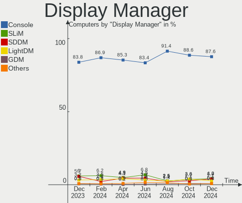
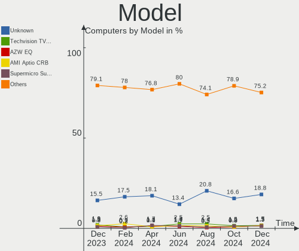
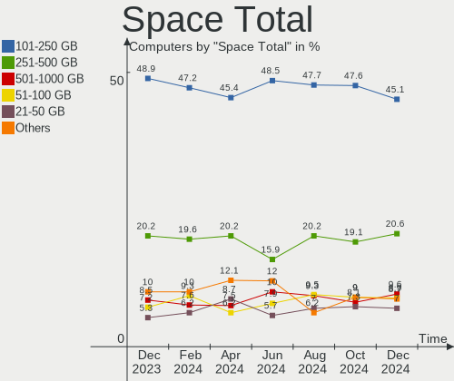
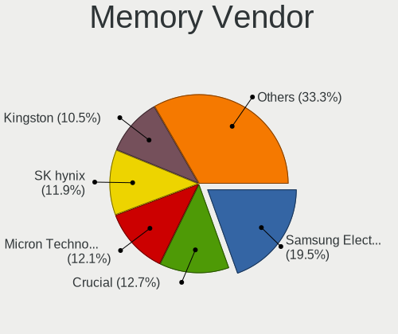
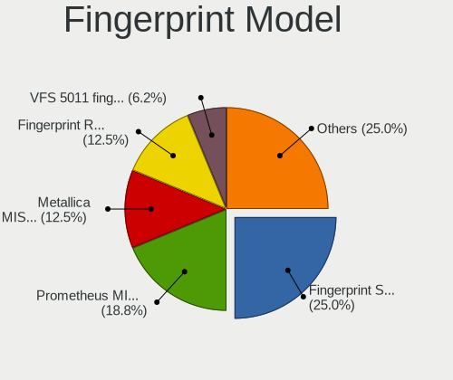

BSD - Hardware Trends
---------------------

A project to identify most popular hardware characteristics and track their change
over time based on data collected by BSD users at https://BSD-Hardware.info.

Anyone can contribute to this report by the [hw-probe](https://github.com/linuxhw/hw-probe/blob/master/INSTALL.BSD.md) tool:

    hw-probe -all -upload

This is a report for all computer types. See also reports for [desktops](/Desktop/README.md) and [notebooks](/Notebook/README.md).

OS-specific reports: [FreeBSD](/Dist/FreeBSD), [OPNsense](/Dist/OPNsense), [helloSystem](/Dist/helloSystem), [OpenBSD](/Dist/OpenBSD).

This report is for one last month. Overall report since the beginning of time: [TestDays](https://github.com/bsdhw/TestDays)

Period: Sep, 2023.

Contents
--------

* [ System ](#system)
  - [ OS                       ](#os)
  - [ OS Family                ](#os-family)
  - [ Arch                     ](#arch)
  - [ DE                       ](#de)
  - [ Display Server           ](#display-server)
  - [ Display Manager          ](#display-manager)
  - [ OS Lang                  ](#os-lang)
  - [ Boot Mode                ](#boot-mode)
  - [ Filesystem               ](#filesystem)
  - [ Part. scheme             ](#part-scheme)

* [ Board ](#board)
  - [ Vendor                   ](#vendor)
  - [ Model                    ](#model)
  - [ Model Family             ](#model-family)
  - [ MFG Year                 ](#mfg-year)
  - [ Form Factor              ](#form-factor)
  - [ Coreboot                 ](#coreboot)
  - [ RAM Size                 ](#ram-size)
  - [ RAM Used                 ](#ram-used)
  - [ Total Drives             ](#total-drives)
  - [ Has CD-ROM               ](#has-cd-rom)
  - [ Has Ethernet             ](#has-ethernet)
  - [ Has WiFi                 ](#has-wifi)
  - [ Has Bluetooth            ](#has-bluetooth)

* [ Location ](#location)
  - [ Country                  ](#country)
  - [ City                     ](#city)

* [ Drives ](#drives)
  - [ Drive Vendor             ](#drive-vendor)
  - [ Drive Model              ](#drive-model)
  - [ HDD Vendor               ](#hdd-vendor)
  - [ SSD Vendor               ](#ssd-vendor)
  - [ Drive Kind               ](#drive-kind)
  - [ Drive Connector          ](#drive-connector)
  - [ Drive Size               ](#drive-size)
  - [ Space Total              ](#space-total)
  - [ Space Used               ](#space-used)
  - [ Malfunc. Drives          ](#malfunc-drives)
  - [ Malfunc. Drive Vendor    ](#malfunc-drive-vendor)
  - [ Malfunc. HDD Vendor      ](#malfunc-hdd-vendor)
  - [ Malfunc. Drive Kind      ](#malfunc-drive-kind)
  - [ Failed Drives            ](#failed-drives)
  - [ Failed Drive Vendor      ](#failed-drive-vendor)
  - [ Drive Status             ](#drive-status)

* [ Storage controller ](#storage-controller)
  - [ Storage Vendor           ](#storage-vendor)
  - [ Storage Model            ](#storage-model)
  - [ Storage Kind             ](#storage-kind)

* [ Processor ](#processor)
  - [ CPU Vendor               ](#cpu-vendor)
  - [ CPU Model                ](#cpu-model)
  - [ CPU Model Family         ](#cpu-model-family)
  - [ CPU Cores                ](#cpu-cores)
  - [ CPU Sockets              ](#cpu-sockets)
  - [ CPU Threads              ](#cpu-threads)
  - [ CPU Microarch            ](#cpu-microarch)

* [ Graphics ](#graphics)
  - [ GPU Vendor               ](#gpu-vendor)
  - [ GPU Model                ](#gpu-model)
  - [ GPU Combo                ](#gpu-combo)
  - [ GPU Driver               ](#gpu-driver)
  - [ GPU Memory               ](#gpu-memory)

* [ Monitor ](#monitor)
  - [ Monitor Vendor           ](#monitor-vendor)
  - [ Monitor Model            ](#monitor-model)
  - [ Monitor Resolution       ](#monitor-resolution)
  - [ Monitor Diagonal         ](#monitor-diagonal)
  - [ Monitor Width            ](#monitor-width)
  - [ Aspect Ratio             ](#aspect-ratio)
  - [ Monitor Area             ](#monitor-area)
  - [ Pixel Density            ](#pixel-density)
  - [ Multiple Monitors        ](#multiple-monitors)

* [ Network ](#network)
  - [ Net Controller Vendor    ](#net-controller-vendor)
  - [ Net Controller Model     ](#net-controller-model)
  - [ Wireless Vendor          ](#wireless-vendor)
  - [ Wireless Model           ](#wireless-model)
  - [ Ethernet Vendor          ](#ethernet-vendor)
  - [ Ethernet Model           ](#ethernet-model)
  - [ Net Controller Kind      ](#net-controller-kind)
  - [ Used Controller          ](#used-controller)
  - [ NICs                     ](#nics)
  - [ IPv6                     ](#ipv6)

* [ Bluetooth ](#bluetooth)
  - [ Bluetooth Vendor         ](#bluetooth-vendor)
  - [ Bluetooth Model          ](#bluetooth-model)

* [ Sound ](#sound)
  - [ Sound Vendor             ](#sound-vendor)
  - [ Sound Model              ](#sound-model)

* [ Memory ](#memory)
  - [ Memory Vendor            ](#memory-vendor)
  - [ Memory Model             ](#memory-model)
  - [ Memory Kind              ](#memory-kind)
  - [ Memory Form Factor       ](#memory-form-factor)
  - [ Memory Size              ](#memory-size)
  - [ Memory Speed             ](#memory-speed)

* [ Printers & scanners ](#printers--scanners)
  - [ Printer Vendor           ](#printer-vendor)
  - [ Printer Model            ](#printer-model)
  - [ Scanner Vendor           ](#scanner-vendor)
  - [ Scanner Model            ](#scanner-model)

* [ Camera ](#camera)
  - [ Camera Vendor            ](#camera-vendor)
  - [ Camera Model             ](#camera-model)

* [ Security ](#security)
  - [ Fingerprint Vendor       ](#fingerprint-vendor)
  - [ Fingerprint Model        ](#fingerprint-model)
  - [ Chipcard Vendor          ](#chipcard-vendor)
  - [ Chipcard Model           ](#chipcard-model)

* [ Unsupported ](#unsupported)
  - [ Unsupported Devices      ](#unsupported-devices)
  - [ Unsupported Device Types ](#unsupported-device-types)

System
------

OS
--

Installed operating systems

| Name                     | Computers | Percent |
|--------------------------|-----------|---------|
| OPNsense 23.7.3          | 118       | 27.76%  |
| OPNsense 23.7.4          | 97        | 22.82%  |
| OPNsense 23.7.5          | 45        | 10.59%  |
| helloSystem 0.8.1        | 24        | 5.65%   |
| FreeBSD 13.2             | 14        | 3.29%   |
| FreeBSD 13.2-p3          | 13        | 3.06%   |
| OpenBSD 7.3              | 12        | 2.82%   |
| helloSystem 0.9.0        | 12        | 2.82%   |
| OPNsense 23.1.11         | 10        | 2.35%   |
| OPNsense 23.7.1          | 9         | 2.12%   |
| NomadBSD 20221130        | 8         | 1.88%   |
| FreeBSD 13.2-p2          | 7         | 1.65%   |
| OPNsense 24.1            | 4         | 0.94%   |
| FreeBSD 14.0-BETA1       | 4         | 0.94%   |
| OPNsense 23.7            | 3         | 0.71%   |
| MyBee 14.0-BETA2         | 3         | 0.71%   |
| GhostBSD 23.09.06        | 3         | 0.71%   |
| FreeBSD 15.0-CURRENT     | 3         | 0.71%   |
| OPNsense 23.4.2          | 2         | 0.47%   |
| NetBSD 9.3               | 2         | 0.47%   |
| GhostBSD 23.09.16        | 2         | 0.47%   |
| GhostBSD 23.06.01        | 2         | 0.47%   |
| FreeBSD 14.0-BETA2       | 2         | 0.47%   |
| FreeBSD 14.0-ALPHA3      | 2         | 0.47%   |
| FreeBSD 13.2-STABLE      | 2         | 0.47%   |
| FreeBSD 13.2-p1          | 2         | 0.47%   |
| FreeBSD 13.1             | 2         | 0.47%   |
| pfSense 23.05.1          | 1         | 0.24%   |
| OPNsense 23.7.2          | 1         | 0.24%   |
| OPNsense 22.7.6          | 1         | 0.24%   |
| OPNsense 22.7.11         | 1         | 0.24%   |
| OPNsense 22.1.10         | 1         | 0.24%   |
| OpenBSD 7.4              | 1         | 0.24%   |
| NetBSD 9.3_STABLE        | 1         | 0.24%   |
| NetBSD 10.0_BETA         | 1         | 0.24%   |
| MyBee 13.2               | 1         | 0.24%   |
| MidnightBSD 3.1.0        | 1         | 0.24%   |
| helloSystem 0.7.0        | 1         | 0.24%   |
| FuguIta 7.3              | 1         | 0.24%   |
| FreeBSD 14.0-STABLE-HBSD | 1         | 0.24%   |

OS Family
---------

OS without a version

| Name        | Computers | Percent |
|-------------|-----------|---------|
| OPNsense    | 292       | 68.71%  |
| FreeBSD     | 57        | 13.41%  |
| helloSystem | 37        | 8.71%   |
| OpenBSD     | 13        | 3.06%   |
| NomadBSD    | 8         | 1.88%   |
| GhostBSD    | 7         | 1.65%   |
| NetBSD      | 4         | 0.94%   |
| MyBee       | 4         | 0.94%   |
| pfSense     | 1         | 0.24%   |
| MidnightBSD | 1         | 0.24%   |
| FuguIta     | 1         | 0.24%   |

Arch
----

OS architecture (x86_64, i586, etc.)

| Name    | Computers | Percent |
|---------|-----------|---------|
| amd64   | 418       | 98.35%  |
| arm64   | 3         | 0.71%   |
| arm     | 2         | 0.47%   |
| sparc64 | 1         | 0.24%   |
| macppc  | 1         | 0.24%   |

DE
--

Desktop Environment

| Name         | Computers | Percent |
|--------------|-----------|---------|
| Console      | 322       | 75.76%  |
| helloDesktop | 49        | 11.53%  |
| MATE         | 11        | 2.59%   |
| XFCE         | 10        | 2.35%   |
| Openbox      | 8         | 1.88%   |
| KDE5         | 7         | 1.65%   |
| TWM          | 5         | 1.18%   |
| i3           | 4         | 0.94%   |
| GNOME        | 4         | 0.94%   |
| Fluxbox      | 2         | 0.47%   |
| DWM          | 1         | 0.24%   |
| ctwm         | 1         | 0.24%   |
| Budgie       | 1         | 0.24%   |

Display Server
--------------

X11 or Wayland

| Name    | Computers | Percent |
|---------|-----------|---------|
| Console | 323       | 76%     |
| X11     | 97        | 22.82%  |
| Wayland | 5         | 1.18%   |

Display Manager
---------------

SDDM, LightDM, etc.

| Name    | Computers | Percent |
|---------|-----------|---------|
| Console | 346       | 81.41%  |
| SLiM    | 43        | 10.12%  |
| SDDM    | 17        | 4%      |
| LightDM | 16        | 3.76%   |
| XDM     | 2         | 0.47%   |
| Ly      | 1         | 0.24%   |

OS Lang
-------

Language

| Lang    | Computers | Percent |
|---------|-----------|---------|
| Unknown | 313       | 73.65%  |
| C       | 47        | 11.06%  |
| en_US   | 38        | 8.94%   |
| ru_RU   | 8         | 1.88%   |
| zh_TW   | 4         | 0.94%   |
| fr_FR   | 4         | 0.94%   |
| es_ES   | 2         | 0.47%   |
| de_DE   | 2         | 0.47%   |
| tr_TR   | 1         | 0.24%   |
| sv_SE   | 1         | 0.24%   |
| pt_BR   | 1         | 0.24%   |
| it_IT   | 1         | 0.24%   |
| fi_FI   | 1         | 0.24%   |
| en_EN   | 1         | 0.24%   |
| de      | 1         | 0.24%   |

Boot Mode
---------

EFI or BIOS

| Mode | Computers | Percent |
|------|-----------|---------|
| EFI  | 386       | 90.82%  |
| BIOS | 39        | 9.18%   |

Filesystem
----------

Type of filesystem

| Type   | Computers | Percent |
|--------|-----------|---------|
| Zfs    | 210       | 49.41%  |
| Ufs    | 182       | 42.82%  |
| Cd9660 | 19        | 4.47%   |
| Ffs    | 14        | 3.29%   |

Part. scheme
------------

Scheme of partitioning

| Type    | Computers | Percent |
|---------|-----------|---------|
| GPT     | 401       | 94.35%  |
| MBR     | 19        | 4.47%   |
| Unknown | 4         | 0.94%   |
| BSD     | 1         | 0.24%   |

Board
-----

Vendor
------

Motherboard manufacturer

| Name                       | Computers | Percent |
|----------------------------|-----------|---------|
| Unknown                    | 66        | 15.53%  |
| Dell                       | 46        | 10.82%  |
| Lenovo                     | 39        | 9.18%   |
| Hewlett-Packard            | 32        | 7.53%   |
| ASUSTek Computer           | 31        | 7.29%   |
| Intel                      | 21        | 4.94%   |
| Supermicro                 | 16        | 3.76%   |
| Protectli                  | 14        | 3.29%   |
| ASRock                     | 14        | 3.29%   |
| Gigabyte Technology        | 12        | 2.82%   |
| AMI                        | 12        | 2.82%   |
| Techvision                 | 11        | 2.59%   |
| MSI                        | 10        | 2.35%   |
| PC Engines                 | 7         | 1.65%   |
| Sophos                     | 6         | 1.41%   |
| Fujitsu                    | 6         | 1.41%   |
| Apple                      | 6         | 1.41%   |
| AZW                        | 5         | 1.18%   |
| Deciso                     | 4         | 0.94%   |
| Acer                       | 4         | 0.94%   |
| Shuttle                    | 3         | 0.71%   |
| MW                         | 3         | 0.71%   |
| IceWhale Technology        | 3         | 0.71%   |
| CWWK                       | 3         | 0.71%   |
| CncTion                    | 3         | 0.71%   |
| ASRockRack                 | 3         | 0.71%   |
| ShenZhen MinWin Technology | 2         | 0.47%   |
| Raspberry Pi Foundation    | 2         | 0.47%   |
| Inventec                   | 2         | 0.47%   |
| Hardkernel                 | 2         | 0.47%   |
| GoWin Solution             | 2         | 0.47%   |
| Biostar                    | 2         | 0.47%   |
| AAEON                      | 2         | 0.47%   |
| ZOTAC                      | 1         | 0.24%   |
| Yanling                    | 1         | 0.24%   |
| Win element                | 1         | 0.24%   |
| TYAN Computer              | 1         | 0.24%   |
| TUXEDO                     | 1         | 0.24%   |
| Toshiba                    | 1         | 0.24%   |
| TONK                       | 1         | 0.24%   |

Model
-----

Motherboard model

| Name                                | Computers | Percent |
|-------------------------------------|-----------|---------|
| Unknown                             | 67        | 15.76%  |
| Techvision TVI7309X                 | 11        | 2.59%   |
| AMI Aptio CRB                       | 8         | 1.88%   |
| Sophos SG                           | 5         | 1.18%   |
| Protectli VP2420                    | 5         | 1.18%   |
| Protectli FW4B                      | 4         | 0.94%   |
| PC Engines APU2                     | 4         | 0.94%   |
| Intel Q3XXG4-P V1.0                 | 4         | 0.94%   |
| Supermicro Super Server             | 3         | 0.71%   |
| MW GMLK-2_5G4L                      | 3         | 0.71%   |
| Dell Wyse 5070 Extended Thin Client | 3         | 0.71%   |
| Dell PowerEdge R320                 | 3         | 0.71%   |
| Dell OptiPlex 7050                  | 3         | 0.71%   |
| Dell OptiPlex 7040                  | 3         | 0.71%   |
| CWWK CW-AD4L-N V1                   | 3         | 0.71%   |
| Supermicro HYVE-ZEUS                | 2         | 0.47%   |
| RPi Raspberry Pi                    | 2         | 0.47%   |
| Protectli FW6                       | 2         | 0.47%   |
| Protectli FW4C                      | 2         | 0.47%   |
| Lenovo ThinkCentre M720q 10T7002CUS | 2         | 0.47%   |
| Intel S5520UR                       | 2         | 0.47%   |
| Intel HM570                         | 2         | 0.47%   |
| IceWhale ZimaBoard 432 ZMB          | 2         | 0.47%   |
| HP t730 Thin Client                 | 2         | 0.47%   |
| HP EliteDesk 800 G2 DM 35W          | 2         | 0.47%   |
| GoWin Solution R86S                 | 2         | 0.47%   |
| Fujitsu FUTRO S920                  | 2         | 0.47%   |
| Dell OptiPlex 7060                  | 2         | 0.47%   |
| Dell OptiPlex 7020                  | 2         | 0.47%   |
| Dell OptiPlex 3040                  | 2         | 0.47%   |
| Dell OptiPlex 3020                  | 2         | 0.47%   |
| Deciso NetBoard-A10                 | 2         | 0.47%   |
| AZW EQ                              | 2         | 0.47%   |
| ASUS SABERTOOTH 990FX R2.0          | 2         | 0.47%   |
| ASUS P8H67-M PRO                    | 2         | 0.47%   |
| AMI Barracuda NG Firewall F12       | 2         | 0.47%   |
| ZOTAC ZBOX-CI329NANO                | 1         | 0.24%   |
| Yanling LES network 6L              | 1         | 0.24%   |
| Win element M600                    | 1         | 0.24%   |
| TYAN S5510HE                        | 1         | 0.24%   |

Model Family
------------

Motherboard model prefix

| Name                 | Computers | Percent |
|----------------------|-----------|---------|
| Unknown              | 67        | 15.76%  |
| Dell OptiPlex        | 22        | 5.18%   |
| Lenovo ThinkPad      | 18        | 4.24%   |
| Lenovo ThinkCentre   | 15        | 3.53%   |
| Techvision TVI7309X  | 11        | 2.59%   |
| Dell PowerEdge       | 11        | 2.59%   |
| AMI Aptio            | 8         | 1.88%   |
| HP ProDesk           | 6         | 1.41%   |
| HP EliteDesk         | 6         | 1.41%   |
| Sophos SG            | 5         | 1.18%   |
| Protectli VP2420     | 5         | 1.18%   |
| Dell Latitude        | 5         | 1.18%   |
| ASUS PRIME           | 5         | 1.18%   |
| Protectli FW4B       | 4         | 0.94%   |
| PC Engines APU2      | 4         | 0.94%   |
| Intel Q3XXG4-P       | 4         | 0.94%   |
| Fujitsu FUTRO        | 4         | 0.94%   |
| Supermicro Super     | 3         | 0.71%   |
| MW GMLK-2            | 3         | 0.71%   |
| Lenovo IdeaPad       | 3         | 0.71%   |
| IceWhale ZimaBoard   | 3         | 0.71%   |
| Dell Wyse            | 3         | 0.71%   |
| CWWK CW-AD4L-N       | 3         | 0.71%   |
| Supermicro HYVE-ZEUS | 2         | 0.47%   |
| RPi Raspberry        | 2         | 0.47%   |
| Protectli FW6        | 2         | 0.47%   |
| Protectli FW4C       | 2         | 0.47%   |
| Intel S5520UR        | 2         | 0.47%   |
| Intel HM570          | 2         | 0.47%   |
| HP t730              | 2         | 0.47%   |
| HP Pavilion          | 2         | 0.47%   |
| HP OMEN              | 2         | 0.47%   |
| HP EliteBook         | 2         | 0.47%   |
| GoWin Solution R86S  | 2         | 0.47%   |
| Dell XPS             | 2         | 0.47%   |
| Deciso NetBoard-A10  | 2         | 0.47%   |
| AZW EQ               | 2         | 0.47%   |
| ASUS SABERTOOTH      | 2         | 0.47%   |
| ASUS P8H67-M         | 2         | 0.47%   |
| ASUS P8H61-M         | 2         | 0.47%   |

MFG Year
--------

Motherboard manufacture year

| Year    | Computers | Percent |
|---------|-----------|---------|
| 2022    | 71        | 16.71%  |
| 2023    | 48        | 11.29%  |
| 2018    | 37        | 8.71%   |
| 2021    | 36        | 8.47%   |
| 2019    | 35        | 8.24%   |
| 2016    | 32        | 7.53%   |
| 2020    | 28        | 6.59%   |
| 2012    | 24        | 5.65%   |
| 2015    | 22        | 5.18%   |
| 2014    | 20        | 4.71%   |
| 2017    | 19        | 4.47%   |
| 2011    | 15        | 3.53%   |
| 2013    | 12        | 2.82%   |
| Unknown | 8         | 1.88%   |
| 2008    | 6         | 1.41%   |
| 2010    | 5         | 1.18%   |
| 2009    | 5         | 1.18%   |
| 2007    | 2         | 0.47%   |

Form Factor
-----------

Physical design of the computer

| Name           | Computers | Percent |
|----------------|-----------|---------|
| Desktop        | 283       | 66.59%  |
| Notebook       | 76        | 17.88%  |
| Mini pc        | 33        | 7.76%   |
| Server         | 24        | 5.65%   |
| Firewall       | 6         | 1.41%   |
| System on chip | 3         | 0.71%   |

Coreboot
--------

Have coreboot on board

| Used | Computers | Percent |
|------|-----------|---------|
| No   | 417       | 98.12%  |
| Yes  | 8         | 1.88%   |

RAM Size
--------

Total RAM memory

| Size in GB      | Computers | Percent |
|-----------------|-----------|---------|
| 8.01-16.0       | 151       | 35.53%  |
| 16.01-24.0      | 113       | 26.59%  |
| 4.01-8.0        | 68        | 16%     |
| 32.01-64.0      | 47        | 11.06%  |
| 64.01-256.0     | 23        | 5.41%   |
| 2.01-3.0        | 12        | 2.82%   |
| 3.01-4.0        | 3         | 0.71%   |
| 24.01-32.0      | 2         | 0.47%   |
| 0.51-1.0        | 2         | 0.47%   |
| 0.01-0.5        | 2         | 0.47%   |
| More than 256.0 | 1         | 0.24%   |
| 1.01-2.0        | 1         | 0.24%   |

RAM Used
--------

Used RAM memory

| Used GB    | Computers | Percent |
|------------|-----------|---------|
| 0.01-0.5   | 194       | 45.65%  |
| 0.51-1.0   | 144       | 33.88%  |
| 1.01-2.0   | 61        | 14.35%  |
| 2.01-3.0   | 8         | 1.88%   |
| 4.01-8.0   | 5         | 1.18%   |
| 3.01-4.0   | 5         | 1.18%   |
| Unknown    | 4         | 0.94%   |
| 0          | 2         | 0.47%   |
| 32.01-64.0 | 1         | 0.24%   |
| 8.01-16.0  | 1         | 0.24%   |

Total Drives
------------

Number of drives on board

| Drives | Computers | Percent |
|--------|-----------|---------|
| 1      | 291       | 68.47%  |
| 0      | 56        | 13.18%  |
| 2      | 54        | 12.71%  |
| 3      | 8         | 1.88%   |
| 4      | 6         | 1.41%   |
| 5      | 5         | 1.18%   |
| 13     | 2         | 0.47%   |
| 11     | 1         | 0.24%   |
| 8      | 1         | 0.24%   |
| 6      | 1         | 0.24%   |

Has CD-ROM
----------

Has CD-ROM on board

| Presented | Computers | Percent |
|-----------|-----------|---------|
| No        | 361       | 84.94%  |
| Yes       | 64        | 15.06%  |

Has Ethernet
------------

Has Ethernet on board

| Presented | Computers | Percent |
|-----------|-----------|---------|
| Yes       | 404       | 95.06%  |
| No        | 21        | 4.94%   |

Has WiFi
--------

Has WiFi module

| Presented | Computers | Percent |
|-----------|-----------|---------|
| No        | 297       | 69.88%  |
| Yes       | 128       | 30.12%  |

Has Bluetooth
-------------

Has Bluetooth module

| Presented | Computers | Percent |
|-----------|-----------|---------|
| No        | 336       | 79.06%  |
| Yes       | 89        | 20.94%  |

Location
--------

Country
-------

Geographic location (country)

| Country     | Computers | Percent |
|-------------|-----------|---------|
| USA         | 131       | 30.82%  |
| Germany     | 67        | 15.76%  |
| Canada      | 24        | 5.65%   |
| Russia      | 19        | 4.47%   |
| UK          | 14        | 3.29%   |
| France      | 14        | 3.29%   |
| Taiwan      | 13        | 3.06%   |
| Australia   | 12        | 2.82%   |
| Poland      | 10        | 2.35%   |
| Switzerland | 8         | 1.88%   |
| Netherlands | 8         | 1.88%   |
| Italy       | 8         | 1.88%   |
| Sweden      | 7         | 1.65%   |
| Brazil      | 7         | 1.65%   |
| Finland     | 5         | 1.18%   |
| Bulgaria    | 5         | 1.18%   |
| Belgium     | 5         | 1.18%   |
| New Zealand | 4         | 0.94%   |
| Indonesia   | 4         | 0.94%   |
| Austria     | 4         | 0.94%   |
| South Korea | 3         | 0.71%   |
| Singapore   | 3         | 0.71%   |
| Norway      | 3         | 0.71%   |
| Japan       | 3         | 0.71%   |
| Denmark     | 3         | 0.71%   |
| Venezuela   | 2         | 0.47%   |
| Turkey      | 2         | 0.47%   |
| Spain       | 2         | 0.47%   |
| Serbia      | 2         | 0.47%   |
| Romania     | 2         | 0.47%   |
| Mexico      | 2         | 0.47%   |
| Malaysia    | 2         | 0.47%   |
| Lithuania   | 2         | 0.47%   |
| India       | 2         | 0.47%   |
| Greece      | 2         | 0.47%   |
| Czechia     | 2         | 0.47%   |
| Argentina   | 2         | 0.47%   |
| Ukraine     | 1         | 0.24%   |
| UAE         | 1         | 0.24%   |
| Thailand    | 1         | 0.24%   |

City
----

Geographic location (city)

| City                 | Computers | Percent |
|----------------------|-----------|---------|
| Taipei               | 7         | 1.65%   |
| Sydney               | 7         | 1.65%   |
| Moscow               | 7         | 1.65%   |
| Taichung             | 5         | 1.18%   |
| Montreal             | 5         | 1.18%   |
| Sofia                | 4         | 0.94%   |
| Calgary              | 4         | 0.94%   |
| St Petersburg        | 3         | 0.71%   |
| Singapore            | 3         | 0.71%   |
| Orlando              | 3         | 0.71%   |
| London               | 3         | 0.71%   |
| Karlsruhe            | 3         | 0.71%   |
| Helsinki             | 3         | 0.71%   |
| Hamburg              | 3         | 0.71%   |
| Bietigheim-Bissingen | 3         | 0.71%   |
| Berlin               | 3         | 0.71%   |
| Zurich               | 2         | 0.47%   |
| Turmero              | 2         | 0.47%   |
| Toronto              | 2         | 0.47%   |
| Sun Prairie          | 2         | 0.47%   |
| Springville          | 2         | 0.47%   |
| South San Francisco  | 2         | 0.47%   |
| Simpsonville         | 2         | 0.47%   |
| Seattle              | 2         | 0.47%   |
| Salem                | 2         | 0.47%   |
| Saint Paul           | 2         | 0.47%   |
| Rome                 | 2         | 0.47%   |
| Riverside            | 2         | 0.47%   |
| Redmond              | 2         | 0.47%   |
| Raversbeuren         | 2         | 0.47%   |
| Raleigh              | 2         | 0.47%   |
| Pittsburgh           | 2         | 0.47%   |
| Philadelphia         | 2         | 0.47%   |
| Perth                | 2         | 0.47%   |
| Ozersk               | 2         | 0.47%   |
| Oklahoma City        | 2         | 0.47%   |
| New York             | 2         | 0.47%   |
| Naples               | 2         | 0.47%   |
| Münster             | 2         | 0.47%   |
| Milan                | 2         | 0.47%   |

Drives
------

Drive Vendor
------------

Hard drive vendors

| Vendor              | Computers | Drives | Percent |
|---------------------|-----------|--------|---------|
| Samsung Electronics | 71        | 86     | 16.32%  |
| Kingston            | 43        | 45     | 9.89%   |
| WDC                 | 37        | 67     | 8.51%   |
| Seagate             | 28        | 40     | 6.44%   |
| Intel               | 27        | 29     | 6.21%   |
| Transcend           | 19        | 21     | 4.37%   |
| Crucial             | 18        | 21     | 4.14%   |
| SanDisk             | 17        | 20     | 3.91%   |
| Toshiba             | 14        | 16     | 3.22%   |
| Hoodisk             | 12        | 12     | 2.76%   |
| A-DATA Technology   | 9         | 9      | 2.07%   |
| Hitachi             | 8         | 8      | 1.84%   |
| SPCC                | 6         | 6      | 1.38%   |
| Silicon Motion      | 6         | 6      | 1.38%   |
| Micron Technology   | 6         | 6      | 1.38%   |
| Intenso             | 6         | 7      | 1.38%   |
| China               | 6         | 6      | 1.38%   |
| SK hynix            | 5         | 5      | 1.15%   |
| Protectli           | 5         | 5      | 1.15%   |
| Hewlett-Packard     | 5         | 6      | 1.15%   |
| Team                | 4         | 4      | 0.92%   |
| PNY                 | 4         | 5      | 0.92%   |
| HGST                | 4         | 4      | 0.92%   |
| Fanxiang            | 4         | 5      | 0.92%   |
| VICKTER             | 3         | 3      | 0.69%   |
| Phison              | 3         | 3      | 0.69%   |
| OCZ                 | 3         | 3      | 0.69%   |
| NVMe                | 3         | 4      | 0.69%   |
| Innodisk            | 3         | 3      | 0.69%   |
| Corsair             | 3         | 3      | 0.69%   |
| BIWIN               | 3         | 3      | 0.69%   |
| Apacer              | 3         | 3      | 0.69%   |
| Vaseky              | 2         | 2      | 0.46%   |
| Timetec             | 2         | 2      | 0.46%   |
| SHAREVDI            | 2         | 2      | 0.46%   |
| Patriot             | 2         | 2      | 0.46%   |
| LITEON              | 2         | 3      | 0.46%   |
| Lexar               | 2         | 2      | 0.46%   |
| Leven               | 2         | 2      | 0.46%   |
| HPE                 | 2         | 3      | 0.46%   |

Drive Model
-----------

Hard drive models

| Model                            | Computers | Percent |
|----------------------------------|-----------|---------|
| Hoodisk SSD 64GB                 | 6         | 1.29%   |
| Transcend TS256GMSA230S 256GB    | 4         | 0.86%   |
| Samsung SSD 870 EVO 500GB        | 4         | 0.86%   |
| Samsung SSD 860 EVO 500GB        | 4         | 0.86%   |
| Samsung MZVLW256HEHP-000L7 256GB | 4         | 0.86%   |
| Kingston SKC600MS256G 256GB      | 4         | 0.86%   |
| Kingston SA400S37240G 240GB      | 4         | 0.86%   |
| Hitachi HTS541612J9SA00 120GB    | 4         | 0.86%   |
| VICKTER SSD 64GB                 | 3         | 0.65%   |
| Samsung SSD 970 EVO Plus 250GB   | 3         | 0.65%   |
| Samsung SSD 860 EVO 250GB        | 3         | 0.65%   |
| Samsung SSD 860 EVO 1TB          | 3         | 0.65%   |
| Kingston SV300S37A120G 120GB     | 3         | 0.65%   |
| Kingston SA400S37120G 120GB      | 3         | 0.65%   |
| Kingston SA400M8240G 240GB       | 3         | 0.65%   |
| Intenso SSD 120GB                | 3         | 0.65%   |
| Hoodisk SSD 32GB                 | 3         | 0.65%   |
| Hoodisk SSD 128GB                | 3         | 0.65%   |
| Fanxiang S501 128GB              | 3         | 0.65%   |
| A-DATA IM2S3134N-064GM 64GB      | 3         | 0.65%   |
| WDC WDS500G2B0A-00SM50 500GB     | 2         | 0.43%   |
| WDC WD80EFAX-68LHPN0 8TB         | 2         | 0.43%   |
| WDC WD20EFRX-68EUZN0 2TB         | 2         | 0.43%   |
| Transcend TS256GMTE710T 256GB    | 2         | 0.43%   |
| Timetec 35TTFP6PCIE-256G         | 2         | 0.43%   |
| Team TM8FP6256G 256GB            | 2         | 0.43%   |
| SPCC Solid State Disk 128GB      | 2         | 0.43%   |
| Silicon Motion SZBKHDTEK128GB    | 2         | 0.43%   |
| SHAREVDI 128GB SSD               | 2         | 0.43%   |
| Seagate ST500DM002-1BD142 500GB  | 2         | 0.43%   |
| Seagate ST4000DM000-1F2168 4TB   | 2         | 0.43%   |
| Seagate ST1000DM010-2EP102 1TB   | 2         | 0.43%   |
| Seagate ST1000DM003-9YN162 1TB   | 2         | 0.43%   |
| SanDisk SD7TB3Q-128G-1006 128GB  | 2         | 0.43%   |
| Samsung SSD 980 PRO 500GB        | 2         | 0.43%   |
| Samsung SSD 970 EVO Plus 500GB   | 2         | 0.43%   |
| Samsung SSD 970 EVO Plus 2TB     | 2         | 0.43%   |
| Samsung SSD 970 EVO Plus 1TB     | 2         | 0.43%   |
| Samsung SSD 870 EVO 250GB        | 2         | 0.43%   |
| Samsung SSD 850 EVO 250GB        | 2         | 0.43%   |

HDD Vendor
----------

Hard disk drive vendors

| Vendor              | Computers | Drives | Percent |
|---------------------|-----------|--------|---------|
| Seagate             | 28        | 40     | 34.15%  |
| WDC                 | 27        | 56     | 32.93%  |
| Hitachi             | 8         | 8      | 9.76%   |
| Toshiba             | 6         | 7      | 7.32%   |
| HGST                | 4         | 4      | 4.88%   |
| Samsung Electronics | 2         | 2      | 2.44%   |
| NVMe                | 2         | 3      | 2.44%   |
| Apple               | 2         | 2      | 2.44%   |
| Maxtor              | 1         | 1      | 1.22%   |
| LSI                 | 1         | 1      | 1.22%   |
| Hewlett-Packard     | 1         | 2      | 1.22%   |

SSD Vendor
----------

Solid state drive vendors

| Vendor              | Computers | Drives | Percent |
|---------------------|-----------|--------|---------|
| Samsung Electronics | 39        | 48     | 15.79%  |
| Kingston            | 37        | 39     | 14.98%  |
| Intel               | 19        | 21     | 7.69%   |
| Transcend           | 17        | 19     | 6.88%   |
| SanDisk             | 16        | 19     | 6.48%   |
| Hoodisk             | 12        | 12     | 4.86%   |
| Crucial             | 11        | 13     | 4.45%   |
| A-DATA Technology   | 8         | 8      | 3.24%   |
| Micron Technology   | 6         | 6      | 2.43%   |
| China               | 6         | 6      | 2.43%   |
| Protectli           | 5         | 5      | 2.02%   |
| Intenso             | 5         | 6      | 2.02%   |
| WDC                 | 4         | 4      | 1.62%   |
| Toshiba             | 4         | 4      | 1.62%   |
| SPCC                | 4         | 4      | 1.62%   |
| PNY                 | 4         | 5      | 1.62%   |
| VICKTER             | 3         | 3      | 1.21%   |
| OCZ                 | 3         | 3      | 1.21%   |
| Innodisk            | 3         | 3      | 1.21%   |
| BIWIN               | 3         | 3      | 1.21%   |
| Apacer              | 3         | 3      | 1.21%   |
| Team                | 2         | 2      | 0.81%   |
| SHAREVDI            | 2         | 2      | 0.81%   |
| LITEON              | 2         | 3      | 0.81%   |
| Leven               | 2         | 2      | 0.81%   |
| HPE                 | 2         | 3      | 0.81%   |
| Dogfish             | 2         | 2      | 0.81%   |
| CWDISK              | 2         | 2      | 0.81%   |
| Corsair             | 2         | 2      | 0.81%   |
| Zheino              | 1         | 1      | 0.4%    |
| Vaseky              | 1         | 1      | 0.4%    |
| SUNEAST             | 1         | 1      | 0.4%    |
| SK hynix            | 1         | 1      | 0.4%    |
| SATADOM             | 1         | 1      | 0.4%    |
| RX7                 | 1         | 1      | 0.4%    |
| Patriot             | 1         | 1      | 0.4%    |
| Neo Forza           | 1         | 2      | 0.4%    |
| Mushkin             | 1         | 1      | 0.4%    |
| MidasForce          | 1         | 1      | 0.4%    |
| LITEONIT            | 1         | 1      | 0.4%    |

Drive Kind
----------

HDD or SSD

| Kind | Computers | Drives | Percent |
|------|-----------|--------|---------|
| SSD  | 234       | 272    | 56.66%  |
| NVMe | 106       | 117    | 25.67%  |
| HDD  | 73        | 126    | 17.68%  |

Drive Connector
---------------

SATA, SAS, NVMe, etc.

| Type | Computers | Drives | Percent |
|------|-----------|--------|---------|
| SATA | 282       | 398    | 72.68%  |
| NVMe | 106       | 117    | 27.32%  |

Drive Size
----------

Size of hard drive

| Size in TB | Computers | Drives | Percent |
|------------|-----------|--------|---------|
| 0.01-0.5   | 252       | 308    | 81.55%  |
| 0.51-1.0   | 32        | 37     | 10.36%  |
| 1.01-2.0   | 12        | 20     | 3.88%   |
| 3.01-4.0   | 7         | 9      | 2.27%   |
| 4.01-10.0  | 4         | 21     | 1.29%   |
| 2.01-3.0   | 1         | 1      | 0.32%   |
| 10.01-20.0 | 1         | 2      | 0.32%   |

Space Total
-----------

Amount of disk space available on the file system

| Size in GB     | Computers | Percent |
|----------------|-----------|---------|
| 101-250        | 192       | 45.18%  |
| 251-500        | 73        | 17.18%  |
| 1-20           | 43        | 10.12%  |
| 51-100         | 37        | 8.71%   |
| 21-50          | 35        | 8.24%   |
| 501-1000       | 33        | 7.76%   |
| 1001-2000      | 8         | 1.88%   |
| More than 3000 | 2         | 0.47%   |
| 2001-3000      | 2         | 0.47%   |

Space Used
----------

Amount of used disk space

| Used GB  | Computers | Percent |
|----------|-----------|---------|
| 1-20     | 391       | 92%     |
| 21-50    | 20        | 4.71%   |
| 51-100   | 6         | 1.41%   |
| 251-500  | 3         | 0.71%   |
| 101-250  | 3         | 0.71%   |
| 501-1000 | 2         | 0.47%   |

Malfunc. Drives
---------------

Drive models with a malfunction

| Model                                      | Computers | Drives | Percent |
|--------------------------------------------|-----------|--------|---------|
| Kingston SNS4151S316GD 16GB                | 2         | 2      | 4.08%   |
| HGST HTS721010A9E630 1TB                   | 2         | 2      | 4.08%   |
| WDC WD80EDAZ-11TA3A0 8TB                   | 1         | 1      | 2.04%   |
| WDC WD6400AAKS-22A7B2 640GB                | 1         | 1      | 2.04%   |
| WDC WD5003ABYZ-011FA0 500GB                | 1         | 1      | 2.04%   |
| WDC WD5000AAKX-083CA0 500GB                | 1         | 1      | 2.04%   |
| WDC WD3200AAKS-00L9A0 320GB                | 1         | 1      | 2.04%   |
| WDC WD2500BEKT-75PVMT0 250GB               | 1         | 1      | 2.04%   |
| WDC WD2500AAJS-75M0A0 250GB                | 1         | 1      | 2.04%   |
| WDC WD2500AAJS-00L7A0 250GB                | 1         | 1      | 2.04%   |
| WDC WD1600HLFS-75G6U1 160GB                | 1         | 1      | 2.04%   |
| WDC WD10JPCX-24UE4T0 1TB                   | 1         | 1      | 2.04%   |
| Toshiba THNSNK256GVN8 M.2 2280 256GB       | 1         | 1      | 2.04%   |
| Toshiba MK8052GSX 80GB                     | 1         | 1      | 2.04%   |
| Toshiba MK3265GSX 320GB                    | 1         | 1      | 2.04%   |
| Seagate ST95005620AS 500GB                 | 1         | 1      | 2.04%   |
| Seagate ST9500325AS 500GB                  | 1         | 1      | 2.04%   |
| Seagate ST9250315AS 250GB                  | 1         | 1      | 2.04%   |
| Seagate ST500LM000-1EJ162-SSHD-8GB         | 1         | 1      | 2.04%   |
| Seagate ST500DM002-1BD142 500GB            | 1         | 1      | 2.04%   |
| Seagate ST1000DX001-1CM162 1TB             | 1         | 1      | 2.04%   |
| Seagate ST1000DM003-9YN162 1TB             | 1         | 1      | 2.04%   |
| SanDisk SSD i110 32GB                      | 1         | 1      | 2.04%   |
| Samsung Electronics SSD RBX Series 128GB M | 1         | 1      | 2.04%   |
| Samsung Electronics SSD 860 EVO 500GB      | 1         | 1      | 2.04%   |
| Samsung Electronics SSD 840 EVO 250GB      | 1         | 1      | 2.04%   |
| Samsung Electronics HM160HI 160GB          | 1         | 1      | 2.04%   |
| Patriot Pyro SE 120GB                      | 1         | 1      | 2.04%   |
| OCZ AGILITY3 120GB                         | 1         | 1      | 2.04%   |
| Mushkin MKNSSDEC512GB                      | 1         | 1      | 2.04%   |
| Micron Technology M550_mSATA_256GB         | 1         | 1      | 2.04%   |
| Maxtor 6E040L0 40GB                        | 1         | 1      | 2.04%   |
| Kingston SV300S37A60G 64GB                 | 1         | 1      | 2.04%   |
| Kingston SV300S37A120G 120GB               | 1         | 1      | 2.04%   |
| Kingston SNV2S500G 500GB                   | 1         | 1      | 2.04%   |
| Kingston SMS200S330G 32GB                  | 1         | 1      | 2.04%   |
| Kingston SMS200S3120G 120GB                | 1         | 1      | 2.04%   |
| Intel SSDSC2CW120A3 120GB                  | 1         | 1      | 2.04%   |
| Intel SSDSC2BW480H6 480GB                  | 1         | 1      | 2.04%   |
| Intel SSDSC2BW180A4 180GB                  | 1         | 1      | 2.04%   |

Malfunc. Drive Vendor
---------------------

Vendors of faulty drives

| Vendor              | Computers | Drives | Percent |
|---------------------|-----------|--------|---------|
| WDC                 | 10        | 10     | 20.41%  |
| Seagate             | 7         | 7      | 14.29%  |
| Kingston            | 7         | 7      | 14.29%  |
| Samsung Electronics | 4         | 4      | 8.16%   |
| Toshiba             | 3         | 3      | 6.12%   |
| Intel               | 3         | 3      | 6.12%   |
| Hitachi             | 3         | 3      | 6.12%   |
| HGST                | 2         | 2      | 4.08%   |
| SanDisk             | 1         | 1      | 2.04%   |
| Patriot             | 1         | 1      | 2.04%   |
| OCZ                 | 1         | 1      | 2.04%   |
| Mushkin             | 1         | 1      | 2.04%   |
| Micron Technology   | 1         | 1      | 2.04%   |
| Maxtor              | 1         | 1      | 2.04%   |
| GLOWAY              | 1         | 1      | 2.04%   |
| Corsair             | 1         | 1      | 2.04%   |
| Apple               | 1         | 1      | 2.04%   |
| Apacer              | 1         | 1      | 2.04%   |

Malfunc. HDD Vendor
-------------------

Vendors of faulty HDD drives

| Vendor              | Computers | Drives | Percent |
|---------------------|-----------|--------|---------|
| WDC                 | 10        | 10     | 37.04%  |
| Seagate             | 7         | 7      | 25.93%  |
| Hitachi             | 3         | 3      | 11.11%  |
| Toshiba             | 2         | 2      | 7.41%   |
| HGST                | 2         | 2      | 7.41%   |
| Samsung Electronics | 1         | 1      | 3.7%    |
| Maxtor              | 1         | 1      | 3.7%    |
| Apple               | 1         | 1      | 3.7%    |

Malfunc. Drive Kind
-------------------

Kinds of faulty drives

| Kind | Computers | Drives | Percent |
|------|-----------|--------|---------|
| HDD  | 27        | 27     | 55.1%   |
| SSD  | 21        | 21     | 42.86%  |
| NVMe | 1         | 1      | 2.04%   |

Failed Drives
-------------

Failed drive models

| Model                                        | Computers | Drives | Percent |
|----------------------------------------------|-----------|--------|---------|
| Samsung Electronics MZALQ256HBJD-00BL2 256GB | 1         | 1      | 25%     |
| Kingston SM2280S3120G 120GB                  | 1         | 1      | 25%     |
| Intel SSDMCEAW120A4 120GB                    | 1         | 1      | 25%     |
| Hoodisk SSD 64GB                             | 1         | 1      | 25%     |

Failed Drive Vendor
-------------------

Failed drive vendors

| Vendor              | Computers | Drives | Percent |
|---------------------|-----------|--------|---------|
| Samsung Electronics | 1         | 1      | 25%     |
| Kingston            | 1         | 1      | 25%     |
| Intel               | 1         | 1      | 25%     |
| Hoodisk             | 1         | 1      | 25%     |

Drive Status
------------

Number of failed and malfunc. drives

| Status   | Computers | Drives | Percent |
|----------|-----------|--------|---------|
| Works    | 317       | 450    | 83.64%  |
| Malfunc  | 48        | 49     | 12.66%  |
| Detected | 10        | 12     | 2.64%   |
| Failed   | 4         | 4      | 1.06%   |

Storage controller
------------------

Storage Vendor
--------------

Storage controller vendors

| Vendor                           | Computers | Percent |
|----------------------------------|-----------|---------|
| Intel                            | 331       | 60.85%  |
| AMD                              | 47        | 8.64%   |
| Samsung Electronics              | 41        | 7.54%   |
| Silicon Motion                   | 17        | 3.13%   |
| SanDisk                          | 17        | 3.13%   |
| Broadcom / LSI                   | 15        | 2.76%   |
| Micron/Crucial Technology        | 8         | 1.47%   |
| Phison Electronics               | 7         | 1.29%   |
| MAXIO Technology (Hangzhou)      | 7         | 1.29%   |
| ASMedia Technology               | 7         | 1.29%   |
| Kingston Technology Company      | 6         | 1.1%    |
| Toshiba                          | 4         | 0.74%   |
| SK hynix                         | 4         | 0.74%   |
| Realtek Semiconductor            | 4         | 0.74%   |
| VIA Technologies                 | 3         | 0.55%   |
| Nvidia                           | 3         | 0.55%   |
| JMicron Technology               | 3         | 0.55%   |
| Transcend                        | 2         | 0.37%   |
| Marvell Technology Group         | 2         | 0.37%   |
| KIOXIA                           | 2         | 0.37%   |
| Chelsio Communications           | 2         | 0.37%   |
| Biwin Storage Technology         | 2         | 0.37%   |
| ULi Electronics                  | 1         | 0.18%   |
| Solidigm                         | 1         | 0.18%   |
| Silicon Integrated Systems [SiS] | 1         | 0.18%   |
| Shenzhen Longsys Electronics     | 1         | 0.18%   |
| Micron Technology                | 1         | 0.18%   |
| Lenovo                           | 1         | 0.18%   |
| Hosin Global Electronics         | 1         | 0.18%   |
| Hewlett-Packard                  | 1         | 0.18%   |
| ADATA Technology                 | 1         | 0.18%   |
| Adaptec                          | 1         | 0.18%   |

Storage Model
-------------

Storage controller models

| Model                                                                                   | Computers | Percent |
|-----------------------------------------------------------------------------------------|-----------|---------|
| Intel Jasper Lake SATA AHCI Controller                                                  | 31        | 5.31%   |
| Intel 8 Series/C220 Series Chipset Family 6-port SATA Controller 1 [AHCI mode]          | 30        | 5.14%   |
| AMD FCH SATA Controller [AHCI mode]                                                     | 27        | 4.62%   |
| Intel Celeron/Pentium Silver Processor SATA Controller                                  | 22        | 3.77%   |
| Samsung NVMe SSD Controller SM981/PM981/PM983                                           | 20        | 3.42%   |
| Silicon Motion SM2263EN/SM2263XT (DRAM-less) NVMe SSD Controllers                       | 17        | 2.91%   |
| Intel Atom Processor E3800 Series SATA AHCI Controller                                  | 17        | 2.91%   |
| Unknown                                                                                 | 17        | 2.91%   |
| Intel Sunrise Point-LP SATA Controller [AHCI mode]                                      | 16        | 2.74%   |
| Intel Q170/Q150/B150/H170/H110/Z170/CM236 Chipset SATA Controller [AHCI Mode]           | 16        | 2.74%   |
| Intel Cannon Lake PCH SATA AHCI Controller                                              | 15        | 2.57%   |
| Intel Celeron N3350/Pentium N4200/Atom E3900 Series SATA AHCI Controller                | 11        | 1.88%   |
| Intel Atom/Celeron/Pentium Processor x5-E8000/J3xxx/N3xxx Series SATA Controller        | 11        | 1.88%   |
| Intel 200 Series PCH SATA controller [AHCI mode]                                        | 11        | 1.88%   |
| Samsung NVMe SSD Controller 980                                                         | 9         | 1.54%   |
| Intel 6 Series/C200 Series Chipset Family 6 port Desktop SATA AHCI Controller           | 9         | 1.54%   |
| Micron/Crucial P2 [Nick P2] / P3 / P3 Plus NVMe PCIe SSD (DRAM-less)                    | 8         | 1.37%   |
| Intel Elkhart Lake SATA AHCI                                                            | 8         | 1.37%   |
| MAXIO (Hangzhou) NVMe SSD Controller MAP1202                                            | 7         | 1.2%    |
| Intel C600/X79 series chipset 6-Port SATA AHCI Controller                               | 7         | 1.2%    |
| Intel 7 Series Chipset Family 6-port SATA Controller [AHCI mode]                        | 7         | 1.2%    |
| Intel 6 Series/C200 Series Chipset Family Desktop SATA Controller (IDE mode, ports 4-5) | 7         | 1.2%    |
| Intel 6 Series/C200 Series Chipset Family Desktop SATA Controller (IDE mode, ports 0-3) | 7         | 1.2%    |
| ASMedia ASM1062 Serial ATA Controller                                                   | 7         | 1.2%    |
| AMD 400 Series Chipset SATA Controller                                                  | 7         | 1.2%    |
| Samsung NVMe SSD Controller SM961/PM961/SM963                                           | 6         | 1.03%   |
| Intel Wildcat Point-LP SATA Controller [AHCI Mode]                                      | 6         | 1.03%   |
| Intel Tiger Lake-LP SATA Controller                                                     | 6         | 1.03%   |
| Intel 8 Series SATA Controller 1 [AHCI mode]                                            | 6         | 1.03%   |
| AMD SB7x0/SB8x0/SB9x0 SATA Controller [AHCI mode]                                       | 6         | 1.03%   |
| SanDisk WD Black SN750 / PC SN730 NVMe SSD                                              | 5         | 0.86%   |
| Samsung NVMe SSD Controller PM9A1/PM9A3/980PRO                                          | 5         | 0.86%   |
| Intel Comet Lake SATA AHCI Controller                                                   | 5         | 0.86%   |
| Intel 7 Series/C210 Series Chipset Family 6-port SATA Controller [AHCI mode]            | 5         | 0.86%   |
| Intel 6 Series/C200 Series Chipset Family 6 port Mobile SATA AHCI Controller            | 5         | 0.86%   |
| AMD 500 Series Chipset SATA Controller                                                  | 5         | 0.86%   |
| Realtek RTS5765DL NVMe SSD Controller (DRAM-less)                                       | 4         | 0.68%   |
| Phison E16 PCIe4 NVMe Controller                                                        | 4         | 0.68%   |
| Intel NM10/ICH7 Family SATA Controller [AHCI mode]                                      | 4         | 0.68%   |
| Intel C610/X99 series chipset 6-Port SATA Controller [AHCI mode]                        | 4         | 0.68%   |

Storage Kind
------------

Kind of storage controller (IDE, SATA, NVMe, SAS, ...)

| Kind | Computers | Percent |
|------|-----------|---------|
| SATA | 351       | 65.24%  |
| NVMe | 128       | 23.79%  |
| IDE  | 34        | 6.32%   |
| RAID | 16        | 2.97%   |
| SAS  | 6         | 1.12%   |
| SCSI | 3         | 0.56%   |

Processor
---------

CPU Vendor
----------

Processor vendors

| Vendor          | Computers | Percent |
|-----------------|-----------|---------|
| Intel           | 355       | 83.53%  |
| AMD             | 61        | 14.35%  |
| ARM             | 5         | 1.18%   |
| VIA             | 1         | 0.24%   |
| SUNW,UltraAX-i2 | 1         | 0.24%   |
| Bochs           | 1         | 0.24%   |
| Unknown         | 1         | 0.24%   |

CPU Model
---------

Processor models

| Model                                       | Computers | Percent |
|---------------------------------------------|-----------|---------|
| Intel Celeron N5105 @ 2.00GHz               | 24        | 5.65%   |
| Intel N100                                  | 15        | 3.53%   |
| Intel Celeron J4125 CPU @ 2.00GHz           | 11        | 2.59%   |
| Intel Celeron CPU J1900 @ 1.99GHz           | 10        | 2.35%   |
| Intel Core i5-6500 CPU @ 3.20GHz            | 7         | 1.65%   |
| Intel Pentium Silver N6005 @ 2.00GHz        | 6         | 1.41%   |
| Intel Core i5-7200U CPU @ 2.50GHz           | 6         | 1.41%   |
| Intel Celeron J6412 @ 2.00GHz               | 6         | 1.41%   |
| AMD GX-412TC SOC                            | 6         | 1.41%   |
| Intel Pentium Silver J5005 CPU @ 1.50GHz    | 5         | 1.18%   |
| Intel Core i5-4570 CPU @ 3.20GHz            | 4         | 0.94%   |
| Intel Celeron N5100 @ 1.10GHz               | 4         | 0.94%   |
| Intel Celeron CPU J3160 @ 1.60GHz           | 4         | 0.94%   |
| Intel 11th Gen Core i7-1165G7 @ 2.80GHz     | 4         | 0.94%   |
| Intel Pentium CPU N3700 @ 1.60GHz           | 3         | 0.71%   |
| Intel Core i5-8500T CPU @ 2.10GHz           | 3         | 0.71%   |
| Intel Core i5-8500 CPU @ 3.00GHz            | 3         | 0.71%   |
| Intel Core i5-7500 CPU @ 3.40GHz            | 3         | 0.71%   |
| Intel Core i5-6500T CPU @ 2.50GHz           | 3         | 0.71%   |
| Intel Core i5-5300U CPU @ 2.30GHz           | 3         | 0.71%   |
| Intel Core i5-4590S CPU @ 3.00GHz           | 3         | 0.71%   |
| Intel Core i5-4590 CPU @ 3.30GHz            | 3         | 0.71%   |
| Intel Core i3-6100 CPU @ 3.70GHz            | 3         | 0.71%   |
| Intel Celeron J4105 CPU @ 1.50GHz           | 3         | 0.71%   |
| Intel Celeron CPU N3350 @ 1.10GHz           | 3         | 0.71%   |
| Intel Celeron CPU J3455 @ 1.50GHz           | 3         | 0.71%   |
| Intel Celeron CPU 3865U @ 1.80GHz           | 3         | 0.71%   |
| ARM Cortex-A72 r0p3                         | 3         | 0.71%   |
| AMD Ryzen 5 2600 Six-Core Processor         | 3         | 0.71%   |
| AMD Ryzen 5 2400G with Radeon Vega Graphics | 3         | 0.71%   |
| Intel Xeon CPU E5645 @ 2.40GHz              | 2         | 0.47%   |
| Intel Xeon CPU E5-2690 v4 @ 2.60GHz         | 2         | 0.47%   |
| Intel Xeon CPU E3-1240 v5 @ 3.50GHz         | 2         | 0.47%   |
| Intel Xeon CPU E3-1225 V2 @ 3.20GHz         | 2         | 0.47%   |
| Intel Xeon CPU D-1518 @ 2.20GHz             | 2         | 0.47%   |
| Intel Pentium CPU P6200 @ 2.13GHz           | 2         | 0.47%   |
| Intel Pentium CPU J3710 @ 1.60GHz           | 2         | 0.47%   |
| Intel Pentium CPU G3220 @ 3.00GHz           | 2         | 0.47%   |
| Intel Pentium 3558U @ 1.70GHz               | 2         | 0.47%   |
| Intel N95                                   | 2         | 0.47%   |

CPU Model Family
----------------

Processor model prefix

| Model                   | Computers | Percent |
|-------------------------|-----------|---------|
| Intel Celeron           | 95        | 22.35%  |
| Intel Core i5           | 74        | 17.41%  |
| Other                   | 48        | 11.29%  |
| Intel Xeon              | 39        | 9.18%   |
| Intel Core i7           | 29        | 6.82%   |
| Intel Core i3           | 21        | 4.94%   |
| Intel Atom              | 18        | 4.24%   |
| Intel Pentium           | 13        | 3.06%   |
| Intel Pentium Silver    | 12        | 2.82%   |
| AMD Ryzen 5             | 12        | 2.82%   |
| AMD Ryzen 7             | 11        | 2.59%   |
| AMD GX                  | 10        | 2.35%   |
| Intel Core 2 Duo        | 5         | 1.18%   |
| AMD Ryzen 9             | 4         | 0.94%   |
| AMD EPYC                | 4         | 0.94%   |
| ARM Cortex              | 3         | 0.71%   |
| AMD Ryzen Embedded      | 3         | 0.71%   |
| Intel Xeon Silver       | 2         | 0.47%   |
| Intel Genuine           | 2         | 0.47%   |
| Intel 686-class         | 2         | 0.47%   |
| AMD G                   | 2         | 0.47%   |
| AMD FX                  | 2         | 0.47%   |
| Intel Pentium Dual      | 1         | 0.24%   |
| Intel Core i9           | 1         | 0.24%   |
| Intel Core 2 Quad       | 1         | 0.24%   |
| Intel Celeron Dual-Core | 1         | 0.24%   |
| AMD Ryzen Threadripper  | 1         | 0.24%   |
| AMD Ryzen 3             | 1         | 0.24%   |
| AMD Phenom II X6        | 1         | 0.24%   |
| AMD Phenom II X4        | 1         | 0.24%   |
| AMD Embedded            | 1         | 0.24%   |
| AMD E1                  | 1         | 0.24%   |
| AMD Athlon II X4        | 1         | 0.24%   |
| AMD Athlon 64 X2        | 1         | 0.24%   |
| AMD Athlon              | 1         | 0.24%   |
| AMD A10                 | 1         | 0.24%   |

CPU Cores
---------

Number of processor cores

| Number  | Computers | Percent |
|---------|-----------|---------|
| 4       | 220       | 51.76%  |
| 2       | 98        | 23.06%  |
| 6       | 23        | 5.41%   |
| 8       | 20        | 4.71%   |
| 12      | 18        | 4.24%   |
| Unknown | 17        | 4%      |
| 16      | 13        | 3.06%   |
| 24      | 4         | 0.94%   |
| 10      | 4         | 0.94%   |
| 1       | 3         | 0.71%   |
| 32      | 2         | 0.47%   |
| 14      | 2         | 0.47%   |
| 64      | 1         | 0.24%   |

CPU Sockets
-----------

Number of sockets

| Number  | Computers | Percent |
|---------|-----------|---------|
| 1       | 402       | 94.59%  |
| 2       | 13        | 3.06%   |
| Unknown | 9         | 2.12%   |
| 8       | 1         | 0.24%   |

CPU Threads
-----------

Threads per core (Hyper-Threading)

| Number  | Computers | Percent |
|---------|-----------|---------|
| 1       | 279       | 65.65%  |
| 2       | 129       | 30.35%  |
| Unknown | 17        | 4%      |

CPU Microarch
-------------

Microarchitecture

| Name          | Computers | Percent |
|---------------|-----------|---------|
| Unknown       | 87        | 20.47%  |
| KabyLake      | 49        | 11.53%  |
| Haswell       | 38        | 8.94%   |
| Silvermont    | 31        | 7.29%   |
| Skylake       | 30        | 7.06%   |
| IvyBridge     | 25        | 5.88%   |
| Goldmont plus | 22        | 5.18%   |
| SandyBridge   | 18        | 4.24%   |
| Goldmont      | 15        | 3.53%   |
| Zen           | 12        | 2.82%   |
| Penryn        | 10        | 2.35%   |
| Broadwell     | 10        | 2.35%   |
| Zen 2         | 9         | 2.12%   |
| TigerLake     | 9         | 2.12%   |
| Zen 3         | 8         | 1.88%   |
| Puma          | 8         | 1.88%   |
| Westmere      | 7         | 1.65%   |
| Bonnell       | 6         | 1.41%   |
| Core          | 5         | 1.18%   |
| Zen+          | 4         | 0.94%   |
| Steamroller   | 3         | 0.71%   |
| Nehalem       | 3         | 0.71%   |
| K10           | 3         | 0.71%   |
| Jaguar        | 3         | 0.71%   |
| CometLake     | 2         | 0.47%   |
| Bobcat        | 2         | 0.47%   |
| Piledriver    | 1         | 0.24%   |
| NetBurst      | 1         | 0.24%   |
| K8 Hammer     | 1         | 0.24%   |
| K10 Llano     | 1         | 0.24%   |
| Excavator     | 1         | 0.24%   |
| Bulldozer     | 1         | 0.24%   |

Graphics
--------

GPU Vendor
----------

Vendors of graphics cards

| Vendor                           | Computers | Percent |
|----------------------------------|-----------|---------|
| Intel                            | 295       | 69.91%  |
| AMD                              | 45        | 10.66%  |
| Nvidia                           | 39        | 9.24%   |
| Matrox Electronics Systems       | 20        | 4.74%   |
| ASPEED Technology                | 20        | 4.74%   |
| VIA Technologies                 | 1         | 0.24%   |
| Silicon Integrated Systems [SiS] | 1         | 0.24%   |
| Red Hat                          | 1         | 0.24%   |

GPU Model
---------

Graphics card models

| Model                                                                                    | Computers | Percent |
|------------------------------------------------------------------------------------------|-----------|---------|
| Intel JasperLake [UHD Graphics]                                                          | 35        | 8.22%   |
| Intel Xeon E3-1200 v3/4th Gen Core Processor Integrated Graphics Controller              | 23        | 5.4%    |
| Intel HD Graphics 530                                                                    | 20        | 4.69%   |
| ASPEED Technology ASPEED Graphics Family                                                 | 20        | 4.69%   |
| Intel Alder Lake-N [UHD Graphics]                                                        | 19        | 4.46%   |
| Intel Atom Processor Z36xxx/Z37xxx Series Graphics & Display                             | 18        | 4.23%   |
| Intel GeminiLake [UHD Graphics 600]                                                      | 16        | 3.76%   |
| Intel CoffeeLake-S GT2 [UHD Graphics 630]                                                | 15        | 3.52%   |
| Intel 2nd Generation Core Processor Family Integrated Graphics Controller                | 13        | 3.05%   |
| Intel HD Graphics 500                                                                    | 11        | 2.58%   |
| Intel Atom/Celeron/Pentium Processor x5-E8000/J3xxx/N3xxx Integrated Graphics Controller | 11        | 2.58%   |
| Intel Elkhart Lake [UHD Graphics Gen11 16EU]                                             | 8         | 1.88%   |
| Matrox Electronics Systems MGA G200eW WPCM450                                            | 7         | 1.64%   |
| Intel TigerLake-LP GT2 [Iris Xe Graphics]                                                | 7         | 1.64%   |
| Intel HD Graphics 620                                                                    | 7         | 1.64%   |
| Intel Haswell-ULT Integrated Graphics Controller                                         | 7         | 1.64%   |
| Intel 3rd Gen Core processor Graphics Controller                                         | 7         | 1.64%   |
| Matrox Electronics Systems G200eR2                                                       | 6         | 1.41%   |
| Intel Xeon E3-1200 v2/3rd Gen Core processor Graphics Controller                         | 6         | 1.41%   |
| Intel GeminiLake [UHD Graphics 605]                                                      | 6         | 1.41%   |
| Intel HD Graphics 630                                                                    | 5         | 1.17%   |
| Intel HD Graphics 5500                                                                   | 5         | 1.17%   |
| Intel Atom Processor D4xx/D5xx/N4xx/N5xx Integrated Graphics Controller                  | 5         | 1.17%   |
| AMD Renoir                                                                               | 5         | 1.17%   |
| Intel UHD Graphics 620                                                                   | 4         | 0.94%   |
| AMD Raven Ridge [Radeon Vega Series / Radeon Vega Mobile Series]                         | 4         | 0.94%   |
| AMD Cezanne [Radeon Vega Series / Radeon Vega Mobile Series]                             | 4         | 0.94%   |
| Matrox Electronics Systems MGA G200e [Pilot] ServerEngines (SEP1)                        | 3         | 0.7%    |
| Intel WhiskeyLake-U GT2 [UHD Graphics 620]                                               | 3         | 0.7%    |
| Intel Skylake GT2 [HD Graphics 520]                                                      | 3         | 0.7%    |
| Intel Mobile 4 Series Chipset Integrated Graphics Controller                             | 3         | 0.7%    |
| Intel HD Graphics 610                                                                    | 3         | 0.7%    |
| Intel Core Processor Integrated Graphics Controller                                      | 3         | 0.7%    |
| Intel CometLake-U GT2 [UHD Graphics]                                                     | 3         | 0.7%    |
| Intel CoffeeLake-H GT2 [UHD Graphics 630]                                                | 3         | 0.7%    |
| AMD Rembrandt [Radeon 680M]                                                              | 3         | 0.7%    |
| AMD Kaveri [Radeon R7 Graphics]                                                          | 3         | 0.7%    |
| Nvidia GP107M [GeForce GTX 1050 Mobile]                                                  | 2         | 0.47%   |
| Nvidia GF108 [GeForce GT 630]                                                            | 2         | 0.47%   |
| Nvidia GF108 [GeForce GT 440]                                                            | 2         | 0.47%   |

GPU Combo
---------

Combinations of graphics cards

| Name            | Computers | Percent |
|-----------------|-----------|---------|
| 1 x Intel       | 271       | 63.76%  |
| 1 x AMD         | 38        | 8.94%   |
| 1 x Nvidia      | 26        | 6.12%   |
| Other           | 21        | 4.94%   |
| 1 x Matrox      | 19        | 4.47%   |
| 1 x ASPEED      | 19        | 4.47%   |
| 2 x Intel       | 10        | 2.35%   |
| Intel + Nvidia  | 10        | 2.35%   |
| Intel + AMD     | 3         | 0.71%   |
| AMD + Nvidia    | 2         | 0.47%   |
| 2 x AMD         | 1         | 0.24%   |
| 1 x VIA         | 1         | 0.24%   |
| 1 x SiS         | 1         | 0.24%   |
| 1 x Red Hat     | 1         | 0.24%   |
| Nvidia + ASPEED | 1         | 0.24%   |
| AMD + Matrox    | 1         | 0.24%   |

GPU Driver
----------

Free vs proprietary

| Driver      | Computers | Percent |
|-------------|-----------|---------|
| Free        | 379       | 89.18%  |
| Unknown     | 28        | 6.59%   |
| Proprietary | 18        | 4.24%   |

GPU Memory
----------

Total video memory

| Size in GB | Computers | Percent |
|------------|-----------|---------|
| Unknown    | 399       | 93.88%  |
| 1.01-2.0   | 6         | 1.41%   |
| 0.01-0.5   | 6         | 1.41%   |
| 7.01-8.0   | 4         | 0.94%   |
| 5.01-6.0   | 4         | 0.94%   |
| 3.01-4.0   | 3         | 0.71%   |
| 0.51-1.0   | 3         | 0.71%   |

Monitor
-------

Monitor Vendor
--------------

Monitor vendors

| Vendor                  | Computers | Percent |
|-------------------------|-----------|---------|
| AU Optronics            | 11        | 12.36%  |
| Chimei Innolux          | 9         | 10.11%  |
| Samsung Electronics     | 7         | 7.87%   |
| LG Display              | 7         | 7.87%   |
| Dell                    | 5         | 5.62%   |
| BOE                     | 5         | 5.62%   |
| BenQ                    | 4         | 4.49%   |
| ViewSonic               | 3         | 3.37%   |
| Philips                 | 3         | 3.37%   |
| Lenovo                  | 3         | 3.37%   |
| Goldstar                | 3         | 3.37%   |
| InfoVision              | 2         | 2.25%   |
| Iiyama                  | 2         | 2.25%   |
| Hewlett-Packard         | 2         | 2.25%   |
| HannStar                | 2         | 2.25%   |
| Chi Mei Optoelectronics | 2         | 2.25%   |
| Ancor Communications    | 2         | 2.25%   |
| Acer                    | 2         | 2.25%   |
| Vizio                   | 1         | 1.12%   |
| Unknown                 | 1         | 1.12%   |
| Sharp                   | 1         | 1.12%   |
| SDC                     | 1         | 1.12%   |
| MStar                   | 1         | 1.12%   |
| MSI                     | 1         | 1.12%   |
| LG Philips              | 1         | 1.12%   |
| JDI                     | 1         | 1.12%   |
| CVT                     | 1         | 1.12%   |
| CSO                     | 1         | 1.12%   |
| ASUSTek Computer        | 1         | 1.12%   |
| Apple                   | 1         | 1.12%   |
| AOC                     | 1         | 1.12%   |
| AMT International       | 1         | 1.12%   |
| Unknown                 | 1         | 1.12%   |

Monitor Model
-------------

Monitor models

| Model                                                                 | Computers | Percent |
|-----------------------------------------------------------------------|-----------|---------|
| ViewSonic VA2418-FHD VSCD739 1920x1080 530x300mm 24.0-inch            | 2         | 2.15%   |
| Chimei Innolux LCD Monitor CMN14D6 1366x768 310x170mm 13.9-inch       | 2         | 2.15%   |
| Vizio E321VL VIZ0083 1366x768 700x400mm 31.7-inch                     | 1         | 1.08%   |
| ViewSonic TD2420 SERIES VSC452D 1920x1080 520x290mm 23.4-inch         | 1         | 1.08%   |
| Unknown LCD Monitor KJT4K2K60DP 3840x2160                             | 1         | 1.08%   |
| Sharp LQ133M1JW01 SHP141B 1920x1080 290x170mm 13.2-inch               | 1         | 1.08%   |
| SDC LCD Monitor 5440x1080                                             | 1         | 1.08%   |
| SDC LCD Monitor 1600x900                                              | 1         | 1.08%   |
| Samsung Electronics U32J59x SAM0F35 3840x2160 700x390mm 31.5-inch     | 1         | 1.08%   |
| Samsung Electronics SyncMaster SAM04E4 1600x900 440x250mm 19.9-inch   | 1         | 1.08%   |
| Samsung Electronics SyncMaster SAM011F 1280x1024 380x300mm 19.1-inch  | 1         | 1.08%   |
| Samsung Electronics SA300/SA350 SAM0788 1366x768 410x230mm 18.5-inch  | 1         | 1.08%   |
| Samsung Electronics S23C550 SAM0A42 1920x1080 510x290mm 23.1-inch     | 1         | 1.08%   |
| Samsung Electronics S22B150 SAM08A3 1920x1080 480x270mm 21.7-inch     | 1         | 1.08%   |
| Samsung Electronics LCD Monitor SEC384A 1366x768 340x190mm 15.3-inch  | 1         | 1.08%   |
| Samsung Electronics LCD Monitor SDC4163 3456x2160 290x180mm 13.4-inch | 1         | 1.08%   |
| Philips LCD Monitor 271P4 5440x1080                                   | 1         | 1.08%   |
| Philips LCD Monitor 271P4                                             | 1         | 1.08%   |
| Philips 271P4 PHL08C3 1920x1080 600x340mm 27.2-inch                   | 1         | 1.08%   |
| Philips 227E4LH PHLC0AC 1920x1080 480x270mm 21.7-inch                 | 1         | 1.08%   |
| MStar TSB LEDTV MST0030 1920x1080 1150x650mm 52.0-inch                | 1         | 1.08%   |
| MSI MP242 MSI30A1 1920x1080 530x300mm 24.0-inch                       | 1         | 1.08%   |
| LG Philips LP154WX4-TLCB LPL3101 1280x800 330x210mm 15.4-inch         | 1         | 1.08%   |
| LG Display LCD Monitor LGD072F 1920x1200 340x220mm 15.9-inch          | 1         | 1.08%   |
| LG Display LCD Monitor LGD046C 1920x1080 380x210mm 17.1-inch          | 1         | 1.08%   |
| LG Display LCD Monitor LGD03DB 1366x768 350x190mm 15.7-inch           | 1         | 1.08%   |
| LG Display LCD Monitor LGD02EB 1366x768 310x170mm 13.9-inch           | 1         | 1.08%   |
| LG Display LCD Monitor LGD02D8 1366x768 280x160mm 12.7-inch           | 1         | 1.08%   |
| LG Display LCD Monitor LGD027A 1600x900 380x210mm 17.1-inch           | 1         | 1.08%   |
| LG Display LCD Monitor LGD0258 1600x900 350x190mm 15.7-inch           | 1         | 1.08%   |
| Lenovo P27h-20 LEN61E9 2560x1440 600x340mm 27.2-inch                  | 1         | 1.08%   |
| Lenovo LEN S22e-19 LEN61C9 1920x1080 480x270mm 21.7-inch              | 1         | 1.08%   |
| Lenovo LCD Monitor LEN4057 1280x800 330x210mm 15.4-inch               | 1         | 1.08%   |
| JDI GPD1001H JDI0031 2560x1600 890x500mm 40.2-inch                    | 1         | 1.08%   |
| InfoVision LCD Monitor IVO854A 1920x1200 290x180mm 13.4-inch          | 1         | 1.08%   |
| InfoVision LCD Monitor IVO03F4 1024x600 220x130mm 10.1-inch           | 1         | 1.08%   |
| Iiyama PLX2283H IVM5638 1920x1080 480x270mm 21.7-inch                 | 1         | 1.08%   |
| Iiyama PL2792Q IVM6630 2560x1440 600x340mm 27.2-inch                  | 1         | 1.08%   |
| Iiyama PL1980 IVM4844 1280x1024 380x300mm 19.1-inch                   | 1         | 1.08%   |
| Hewlett-Packard HPQ 600 AIO HWP108B 1920x1080 480x270mm 21.7-inch     | 1         | 1.08%   |

Monitor Resolution
------------------

Monitor screen resolution

| Resolution         | Computers | Percent |
|--------------------|-----------|---------|
| 1920x1080 (FHD)    | 36        | 39.13%  |
| 1366x768 (WXGA)    | 18        | 19.57%  |
| 3840x2160 (4K)     | 5         | 5.43%   |
| 1600x900 (HD+)     | 5         | 5.43%   |
| 1920x1200 (WUXGA)  | 4         | 4.35%   |
| 2560x1600          | 3         | 3.26%   |
| 2560x1440 (QHD)    | 3         | 3.26%   |
| 1280x800 (WXGA)    | 3         | 3.26%   |
| 1024x600           | 3         | 3.26%   |
| 1680x1050 (WSXGA+) | 2         | 2.17%   |
| 1440x900 (WXGA+)   | 2         | 2.17%   |
| 1280x1024 (SXGA)   | 2         | 2.17%   |
| 5440x1080          | 1         | 1.09%   |
| 3456x2160          | 1         | 1.09%   |
| 3440x1440          | 1         | 1.09%   |
| 2160x1350          | 1         | 1.09%   |
| 1360x768           | 1         | 1.09%   |
| Unknown            | 1         | 1.09%   |

Monitor Diagonal
----------------

Diagonal size in inches

| Inches  | Computers | Percent |
|---------|-----------|---------|
| 15      | 16        | 17.78%  |
| 13      | 14        | 15.56%  |
| 21      | 10        | 11.11%  |
| 27      | 7         | 7.78%   |
| 24      | 7         | 7.78%   |
| 17      | 5         | 5.56%   |
| 23      | 4         | 4.44%   |
| 19      | 4         | 4.44%   |
| 12      | 4         | 4.44%   |
| 31      | 3         | 3.33%   |
| 11      | 3         | 3.33%   |
| 10      | 3         | 3.33%   |
| Unknown | 3         | 3.33%   |
| 18      | 2         | 2.22%   |
| 52      | 1         | 1.11%   |
| 46      | 1         | 1.11%   |
| 40      | 1         | 1.11%   |
| 34      | 1         | 1.11%   |
| 20      | 1         | 1.11%   |

Monitor Width
-------------

Physical width

| Width in mm | Computers | Percent |
|-------------|-----------|---------|
| 301-350     | 26        | 28.89%  |
| 501-600     | 18        | 20%     |
| 401-500     | 15        | 16.67%  |
| 201-300     | 14        | 15.56%  |
| 351-400     | 7         | 7.78%   |
| 601-700     | 3         | 3.33%   |
| Unknown     | 3         | 3.33%   |
| 801-900     | 1         | 1.11%   |
| 701-800     | 1         | 1.11%   |
| 1001-1500   | 1         | 1.11%   |
| 901-1000    | 1         | 1.11%   |

Aspect Ratio
------------

Proportional relationship between the width and the height

| Ratio   | Computers | Percent |
|---------|-----------|---------|
| 16/9    | 65        | 75.58%  |
| 16/10   | 12        | 13.95%  |
| 3/2     | 3         | 3.49%   |
| Unknown | 3         | 3.49%   |
| 5/4     | 2         | 2.33%   |
| 21/9    | 1         | 1.16%   |

Monitor Area
------------

Area in inch²

| Area in inch² | Computers | Percent |
|----------------|-----------|---------|
| 201-250        | 20        | 22.22%  |
| 81-90          | 12        | 13.33%  |
| 301-350        | 7         | 7.78%   |
| 91-100         | 7         | 7.78%   |
| 101-110        | 6         | 6.67%   |
| 151-200        | 5         | 5.56%   |
| 351-500        | 4         | 4.44%   |
| 121-130        | 4         | 4.44%   |
| 71-80          | 3         | 3.33%   |
| 61-70          | 3         | 3.33%   |
| 51-60          | 3         | 3.33%   |
| 41-50          | 3         | 3.33%   |
| 111-120        | 3         | 3.33%   |
| Unknown        | 3         | 3.33%   |
| 141-150        | 2         | 2.22%   |
| 501-1000       | 2         | 2.22%   |
| More than 1000 | 1         | 1.11%   |
| 251-300        | 1         | 1.11%   |
| 131-140        | 1         | 1.11%   |

Pixel Density
-------------

Pixels per inch

| Density       | Computers | Percent |
|---------------|-----------|---------|
| 101-120       | 29        | 33.33%  |
| 51-100        | 25        | 28.74%  |
| 121-160       | 19        | 21.84%  |
| 161-240       | 6         | 6.9%    |
| 1-50          | 3         | 3.45%   |
| Unknown       | 3         | 3.45%   |
| More than 240 | 2         | 2.3%    |

Multiple Monitors
-----------------

Total monitors connected

| Total | Computers | Percent |
|-------|-----------|---------|
| 0     | 338       | 79.53%  |
| 1     | 79        | 18.59%  |
| 2     | 7         | 1.65%   |
| 3     | 1         | 0.24%   |

Network
-------

Net Controller Vendor
---------------------

Controller vendors

| Vendor                                 | Computers | Percent |
|----------------------------------------|-----------|---------|
| Intel                                  | 332       | 57.14%  |
| Realtek Semiconductor                  | 129       | 22.2%   |
| Broadcom                               | 41        | 7.06%   |
| Qualcomm Atheros                       | 19        | 3.27%   |
| Samsung Electronics                    | 9         | 1.55%   |
| Mellanox Technologies                  | 7         | 1.2%    |
| Ralink Technology                      | 4         | 0.69%   |
| IMC Networks                           | 4         | 0.69%   |
| AMD                                    | 4         | 0.69%   |
| TP-Link                                | 3         | 0.52%   |
| Chelsio Communications                 | 3         | 0.52%   |
| American Megatrends                    | 3         | 0.52%   |
| U-Blox                                 | 2         | 0.34%   |
| Ralink                                 | 2         | 0.34%   |
| MediaTek                               | 2         | 0.34%   |
| D-Link System                          | 2         | 0.34%   |
| 3Com                                   | 2         | 0.34%   |
| Sony Ericsson Mobile Communications AB | 1         | 0.17%   |
| Sierra Wireless                        | 1         | 0.17%   |
| Nvidia                                 | 1         | 0.17%   |
| Marvell Technology Group               | 1         | 0.17%   |
| Huawei Technologies                    | 1         | 0.17%   |
| Hewlett-Packard                        | 1         | 0.17%   |
| Google                                 | 1         | 0.17%   |
| Emulex                                 | 1         | 0.17%   |
| Dell                                   | 1         | 0.17%   |
| Davicom Semiconductor                  | 1         | 0.17%   |
| D-Link                                 | 1         | 0.17%   |
| Aquantia                               | 1         | 0.17%   |
| Apple                                  | 1         | 0.17%   |

Net Controller Model
--------------------

Controller models

| Model                                                                         | Computers | Percent |
|-------------------------------------------------------------------------------|-----------|---------|
| Realtek RTL8111/8168/8411 PCI Express Gigabit Ethernet Controller             | 104       | 14.29%  |
| Intel I211 Gigabit Network Connection                                         | 47        | 6.46%   |
| Intel Ethernet Controller I226-V                                              | 43        | 5.91%   |
| Intel I210 Gigabit Network Connection                                         | 36        | 4.95%   |
| Intel Ethernet Controller I225-V                                              | 33        | 4.53%   |
| Intel I350 Gigabit Network Connection                                         | 26        | 3.57%   |
| Intel 82574L Gigabit Network Connection                                       | 16        | 2.2%    |
| Intel 82599ES 10-Gigabit SFI/SFP+ Network Connection                          | 15        | 2.06%   |
| Intel Wi-Fi 6 AX200                                                           | 12        | 1.65%   |
| Intel 82579LM Gigabit Network Connection (Lewisville)                         | 12        | 1.65%   |
| Intel Ethernet Connection I217-LM                                             | 11        | 1.51%   |
| Realtek RTL8125 2.5GbE Controller                                             | 10        | 1.37%   |
| Samsung Galaxy series, misc. (tethering mode)                                 | 9         | 1.24%   |
| Intel Ethernet Connection (2) I219-LM                                         | 9         | 1.24%   |
| Intel 82583V Gigabit Network Connection                                       | 9         | 1.24%   |
| Intel 82580 Gigabit Network Connection                                        | 9         | 1.24%   |
| Intel 82576 Gigabit Network Connection                                        | 8         | 1.1%    |
| Broadcom NetXtreme BCM5720 Gigabit Ethernet PCIe                              | 8         | 1.1%    |
| Broadcom NetXtreme BCM5719 Gigabit Ethernet PCIe                              | 8         | 1.1%    |
| Realtek RTL810xE PCI Express Fast Ethernet controller                         | 7         | 0.96%   |
| Intel 82571EB/82571GB Gigabit Ethernet Controller (Copper)                    | 7         | 0.96%   |
| Qualcomm Atheros AR9285 Wireless Network Adapter (PCI-Express)                | 6         | 0.82%   |
| Intel Wireless 8265 / 8275                                                    | 6         | 0.82%   |
| Intel Wireless 8260                                                           | 6         | 0.82%   |
| Intel Wi-Fi 6 AX201                                                           | 6         | 0.82%   |
| Intel Ethernet Controller 10-Gigabit X540-AT2                                 | 6         | 0.82%   |
| Intel Ethernet Connection (7) I219-V                                          | 6         | 0.82%   |
| Intel Ethernet Connection (7) I219-LM                                         | 6         | 0.82%   |
| Intel Wireless 7265                                                           | 5         | 0.69%   |
| Intel Wireless 7260                                                           | 5         | 0.69%   |
| Broadcom BCM4313 802.11bgn Wireless Network Adapter                           | 5         | 0.69%   |
| Mellanox MT27500 Family [ConnectX-3]                                          | 4         | 0.55%   |
| Intel Wireless 3165                                                           | 4         | 0.55%   |
| Intel I210 Gigabit Fiber Network Connection                                   | 4         | 0.55%   |
| Intel Ethernet Controller X550                                                | 4         | 0.55%   |
| Intel Ethernet Connection (5) I219-LM                                         | 4         | 0.55%   |
| Intel Ethernet Connection (2) I219-V                                          | 4         | 0.55%   |
| Intel Centrino Advanced-N 6205 [Taylor Peak]                                  | 4         | 0.55%   |
| Intel 82571EB/82571GB Gigabit Ethernet Controller D0/D1 (copper applications) | 4         | 0.55%   |
| IMC Networks 802.11 n/g/b Wireless LAN USB Mini-Card                          | 4         | 0.55%   |

Wireless Vendor
---------------

Wireless vendors

| Vendor                | Computers | Percent |
|-----------------------|-----------|---------|
| Intel                 | 78        | 56.52%  |
| Realtek Semiconductor | 16        | 11.59%  |
| Qualcomm Atheros      | 16        | 11.59%  |
| Broadcom              | 11        | 7.97%   |
| Ralink Technology     | 4         | 2.9%    |
| IMC Networks          | 4         | 2.9%    |
| TP-Link               | 3         | 2.17%   |
| Ralink                | 2         | 1.45%   |
| MediaTek              | 1         | 0.72%   |
| Dell                  | 1         | 0.72%   |
| D-Link System         | 1         | 0.72%   |
| D-Link                | 1         | 0.72%   |

Wireless Model
--------------

Wireless models

| Model                                                                                         | Computers | Percent |
|-----------------------------------------------------------------------------------------------|-----------|---------|
| Intel Wi-Fi 6 AX200                                                                           | 12        | 8.63%   |
| Qualcomm Atheros AR9285 Wireless Network Adapter (PCI-Express)                                | 6         | 4.32%   |
| Intel Wireless 8265 / 8275                                                                    | 6         | 4.32%   |
| Intel Wireless 8260                                                                           | 6         | 4.32%   |
| Intel Wi-Fi 6 AX201                                                                           | 6         | 4.32%   |
| Intel Wireless 7265                                                                           | 5         | 3.6%    |
| Intel Wireless 7260                                                                           | 5         | 3.6%    |
| Broadcom BCM4313 802.11bgn Wireless Network Adapter                                           | 5         | 3.6%    |
| Intel Wireless 3165                                                                           | 4         | 2.88%   |
| Intel Centrino Advanced-N 6205 [Taylor Peak]                                                  | 4         | 2.88%   |
| IMC Networks 802.11 n/g/b Wireless LAN USB Mini-Card                                          | 4         | 2.88%   |
| Realtek RTL8821CE 802.11ac PCIe Wireless Network Adapter                                      | 3         | 2.16%   |
| Intel Wi-Fi 6 AX210/AX211/AX411 160MHz                                                        | 3         | 2.16%   |
| Intel Gemini Lake PCH CNVi WiFi                                                               | 3         | 2.16%   |
| Intel Dual Band Wireless-AC 3168NGW [Stone Peak]                                              | 3         | 2.16%   |
| Intel Cannon Lake PCH CNVi WiFi                                                               | 3         | 2.16%   |
| TP-Link TL-WN722N v2/v3 [Realtek RTL8188EUS]                                                  | 2         | 1.44%   |
| Realtek RTL8852BE PCIe 802.11ax Wireless Network Controller                                   | 2         | 1.44%   |
| Realtek RTL8188EUS 802.11n Wireless Network Adapter                                           | 2         | 1.44%   |
| Realtek RTL8188EE Wireless Network Adapter                                                    | 2         | 1.44%   |
| Qualcomm Atheros QCA9565 / AR9565 Wireless Network Adapter                                    | 2         | 1.44%   |
| Qualcomm Atheros QCA6174 802.11ac Wireless Network Adapter                                    | 2         | 1.44%   |
| Qualcomm Atheros AR928X Wireless Network Adapter (PCI-Express)                                | 2         | 1.44%   |
| Intel Wireless-AC 9260                                                                        | 2         | 1.44%   |
| Intel PRO/Wireless 5100 AGN [Shiloh] Network Connection                                       | 2         | 1.44%   |
| Intel Cannon Point-LP CNVi [Wireless-AC]                                                      | 2         | 1.44%   |
| Intel Alder Lake-S PCH CNVi WiFi                                                              | 2         | 1.44%   |
| Intel Alder Lake-P PCH CNVi WiFi                                                              | 2         | 1.44%   |
| Broadcom BCM4360 802.11ac Wireless Network Adapter                                            | 2         | 1.44%   |
| Broadcom BCM4331 802.11a/b/g/n                                                                | 2         | 1.44%   |
| TP-Link Archer T2U PLUS [RTL8821AU]                                                           | 1         | 0.72%   |
| Realtek RTL8812AU 802.11a/b/g/n/ac 2T2R DB WLAN Adapter                                       | 1         | 0.72%   |
| Realtek RTL8723BE PCIe Wireless Network Adapter                                               | 1         | 0.72%   |
| Realtek RTL8192EU 802.11b/g/n WLAN Adapter                                                    | 1         | 0.72%   |
| Realtek RTL8192CU 802.11n WLAN Adapter                                                        | 1         | 0.72%   |
| Realtek RTL8192CE PCIe Wireless Network Adapter                                               | 1         | 0.72%   |
| Realtek RTL8188CUS 802.11n WLAN Adapter                                                       | 1         | 0.72%   |
| Realtek Realtek 8812AU/8821AU 802.11ac WLAN Adapter [USB Wireless Dual-Band Adapter 2.4/5Ghz] | 1         | 0.72%   |
| Realtek Bluetooth Adapter                                                                     | 1         | 0.72%   |
| Ralink RT5572 Wireless Adapter                                                                | 1         | 0.72%   |

Ethernet Vendor
---------------

Ethernet vendors

| Vendor                                 | Computers | Percent |
|----------------------------------------|-----------|---------|
| Intel                                  | 295       | 60.95%  |
| Realtek Semiconductor                  | 121       | 25%     |
| Broadcom                               | 36        | 7.44%   |
| Samsung Electronics                    | 9         | 1.86%   |
| Qualcomm Atheros                       | 4         | 0.83%   |
| AMD                                    | 4         | 0.83%   |
| American Megatrends                    | 3         | 0.62%   |
| Chelsio Communications                 | 2         | 0.41%   |
| Sony Ericsson Mobile Communications AB | 1         | 0.21%   |
| Nvidia                                 | 1         | 0.21%   |
| MediaTek                               | 1         | 0.21%   |
| Marvell Technology Group               | 1         | 0.21%   |
| Emulex                                 | 1         | 0.21%   |
| Davicom Semiconductor                  | 1         | 0.21%   |
| D-Link System                          | 1         | 0.21%   |
| Aquantia                               | 1         | 0.21%   |
| Apple                                  | 1         | 0.21%   |
| 3Com                                   | 1         | 0.21%   |

Ethernet Model
--------------

Ethernet models

| Model                                                                         | Computers | Percent |
|-------------------------------------------------------------------------------|-----------|---------|
| Realtek RTL8111/8168/8411 PCI Express Gigabit Ethernet Controller             | 104       | 18.15%  |
| Intel I211 Gigabit Network Connection                                         | 47        | 8.2%    |
| Intel Ethernet Controller I226-V                                              | 43        | 7.5%    |
| Intel I210 Gigabit Network Connection                                         | 36        | 6.28%   |
| Intel Ethernet Controller I225-V                                              | 33        | 5.76%   |
| Intel I350 Gigabit Network Connection                                         | 26        | 4.54%   |
| Intel 82574L Gigabit Network Connection                                       | 16        | 2.79%   |
| Intel 82599ES 10-Gigabit SFI/SFP+ Network Connection                          | 15        | 2.62%   |
| Intel 82579LM Gigabit Network Connection (Lewisville)                         | 12        | 2.09%   |
| Intel Ethernet Connection I217-LM                                             | 11        | 1.92%   |
| Realtek RTL8125 2.5GbE Controller                                             | 10        | 1.75%   |
| Samsung Galaxy series, misc. (tethering mode)                                 | 9         | 1.57%   |
| Intel Ethernet Connection (2) I219-LM                                         | 9         | 1.57%   |
| Intel 82583V Gigabit Network Connection                                       | 9         | 1.57%   |
| Intel 82580 Gigabit Network Connection                                        | 9         | 1.57%   |
| Intel 82576 Gigabit Network Connection                                        | 8         | 1.4%    |
| Broadcom NetXtreme BCM5720 Gigabit Ethernet PCIe                              | 8         | 1.4%    |
| Broadcom NetXtreme BCM5719 Gigabit Ethernet PCIe                              | 8         | 1.4%    |
| Realtek RTL810xE PCI Express Fast Ethernet controller                         | 7         | 1.22%   |
| Intel 82571EB/82571GB Gigabit Ethernet Controller (Copper)                    | 7         | 1.22%   |
| Intel Ethernet Controller 10-Gigabit X540-AT2                                 | 6         | 1.05%   |
| Intel Ethernet Connection (7) I219-V                                          | 6         | 1.05%   |
| Intel Ethernet Connection (7) I219-LM                                         | 6         | 1.05%   |
| Intel I210 Gigabit Fiber Network Connection                                   | 4         | 0.7%    |
| Intel Ethernet Controller X550                                                | 4         | 0.7%    |
| Intel Ethernet Connection (5) I219-LM                                         | 4         | 0.7%    |
| Intel Ethernet Connection (2) I219-V                                          | 4         | 0.7%    |
| Intel 82571EB/82571GB Gigabit Ethernet Controller D0/D1 (copper applications) | 4         | 0.7%    |
| Broadcom NetXtreme II BCM57810 10 Gigabit Ethernet                            | 4         | 0.7%    |
| Broadcom NetXtreme BCM5764M Gigabit Ethernet PCIe                             | 4         | 0.7%    |
| AMD Family 17h Processor 10 Gb Ethernet Controller Port 0                     | 4         | 0.7%    |
| Intel I350 Gigabit Fiber Network Connection                                   | 3         | 0.52%   |
| Intel Ethernet Controller X710 for 10GbE SFP+                                 | 3         | 0.52%   |
| Intel Ethernet Controller I225-LM                                             | 3         | 0.52%   |
| Intel Ethernet Connection X553 1GbE                                           | 3         | 0.52%   |
| Intel Ethernet Connection I219-LM                                             | 3         | 0.52%   |
| Intel Ethernet Connection (4) I219-V                                          | 3         | 0.52%   |
| Intel Ethernet Connection (3) I218-LM                                         | 3         | 0.52%   |
| Intel 82575GB Gigabit Network Connection                                      | 3         | 0.52%   |
| Broadcom NetXtreme BCM5722 Gigabit Ethernet PCI Express                       | 3         | 0.52%   |

Net Controller Kind
-------------------

Ethernet, WiFi or modem

| Kind     | Computers | Percent |
|----------|-----------|---------|
| Ethernet | 404       | 73.72%  |
| WiFi     | 128       | 23.36%  |
| Unknown  | 12        | 2.19%   |
| Modem    | 4         | 0.73%   |

Used Controller
---------------

Currently used network controller

| Kind     | Computers | Percent |
|----------|-----------|---------|
| Ethernet | 351       | 89.77%  |
| WiFi     | 40        | 10.23%  |

NICs
----

Total network controllers on board

| Total | Computers | Percent |
|-------|-----------|---------|
| 2     | 119       | 28%     |
| 4     | 94        | 22.12%  |
| 3     | 54        | 12.71%  |
| 1     | 49        | 11.53%  |
| 6     | 44        | 10.35%  |
| 5     | 35        | 8.24%   |
| 0     | 10        | 2.35%   |
| 8     | 9         | 2.12%   |
| 10    | 3         | 0.71%   |
| 9     | 3         | 0.71%   |
| 7     | 2         | 0.47%   |
| 14    | 1         | 0.24%   |
| 12    | 1         | 0.24%   |
| 11    | 1         | 0.24%   |

IPv6
----

IPv6 vs IPv4

| Used | Computers | Percent |
|------|-----------|---------|
| No   | 343       | 80.71%  |
| Yes  | 82        | 19.29%  |

Bluetooth
---------

Bluetooth Vendor
----------------

Controller vendors

| Vendor                          | Computers | Percent |
|---------------------------------|-----------|---------|
| Intel                           | 59        | 64.13%  |
| Realtek Semiconductor           | 8         | 8.7%    |
| Apple                           | 6         | 6.52%   |
| Qualcomm Atheros Communications | 4         | 4.35%   |
| Broadcom                        | 4         | 4.35%   |
| IMC Networks                    | 3         | 3.26%   |
| Lite-On Technology              | 2         | 2.17%   |
| Hewlett-Packard                 | 2         | 2.17%   |
| TP-Link                         | 1         | 1.09%   |
| MediaTek                        | 1         | 1.09%   |
| Dell                            | 1         | 1.09%   |
| Corsair                         | 1         | 1.09%   |

Bluetooth Model
---------------

Controller models

| Model                                                | Computers | Percent |
|------------------------------------------------------|-----------|---------|
| Intel Bluetooth wireless interface                   | 20        | 21.74%  |
| Intel AX201 Bluetooth                                | 10        | 10.87%  |
| Intel AX200 Bluetooth                                | 10        | 10.87%  |
| Intel Bluetooth 9460/9560 Jefferson Peak (JfP)       | 8         | 8.7%    |
| Realtek Bluetooth Adapter                            | 7         | 7.61%   |
| Apple Bluetooth Host Controller                      | 4         | 4.35%   |
| Intel Wireless-AC 3168 Bluetooth                     | 3         | 3.26%   |
| Intel Wireless Bluetooth                             | 3         | 3.26%   |
| Qualcomm Atheros QCA61x4 Bluetooth 4.0               | 2         | 2.17%   |
| Lite-On Atheros AR3012 Bluetooth                     | 2         | 2.17%   |
| Intel Wireless-AC 9260 Bluetooth Adapter             | 2         | 2.17%   |
| Intel AX210 Bluetooth                                | 2         | 2.17%   |
| Broadcom BCM2070 Bluetooth 2.1 + EDR                 | 2         | 2.17%   |
| TP-Link Bluetooth 5.0 USB Adapter                    | 1         | 1.09%   |
| Realtek Bluetooth 5.1 Adapter                        | 1         | 1.09%   |
| Qualcomm Atheros AR3012 Bluetooth 4.0                | 1         | 1.09%   |
| Qualcomm Atheros AR3011 Bluetooth                    | 1         | 1.09%   |
| MediaTek RZ608 Bluetooth Adapter                     | 1         | 1.09%   |
| Intel Centrino Bluetooth Wireless Transceiver        | 1         | 1.09%   |
| IMC Networks Realtek Bluetooth Adapter               | 1         | 1.09%   |
| IMC Networks Realtek Bluetooth 4.0 + High Speed Chip | 1         | 1.09%   |
| IMC Networks Qualcomm Atheros Bluetooth 4.1          | 1         | 1.09%   |
| HP Bluetooth 2.0 Interface [Broadcom BCM2045]        | 1         | 1.09%   |
| HP Atheros AR9285 Malbec Bluetooth Adapter           | 1         | 1.09%   |
| Dell Dell Wireless 380 Bluetooth 4.0 Module          | 1         | 1.09%   |
| Corsair HS70 BLUETOOTH Gaming Headset                | 1         | 1.09%   |
| Broadcom BCM2045B (BDC-2.1) [Bluetooth Controller]   | 1         | 1.09%   |
| Broadcom BCM2045B (BDC-2.1)                          | 1         | 1.09%   |
| Apple Built-in Bluetooth 2.0+EDR HCI                 | 1         | 1.09%   |
| Apple Broadcom Built-in Bluetooth                    | 1         | 1.09%   |

Sound
-----

Sound Vendor
------------

Sound card vendors

| Vendor                                       | Computers | Percent |
|----------------------------------------------|-----------|---------|
| Intel                                        | 268       | 69.97%  |
| AMD                                          | 59        | 15.4%   |
| Nvidia                                       | 28        | 7.31%   |
| C-Media Electronics                          | 7         | 1.83%   |
| Zoran Co. Personal Media Division (Nogatech) | 6         | 1.57%   |
| Realtek Semiconductor                        | 2         | 0.52%   |
| Logitech                                     | 2         | 0.52%   |
| ASUSTek Computer                             | 2         | 0.52%   |
| VIA Technologies                             | 1         | 0.26%   |
| Texas Instruments                            | 1         | 0.26%   |
| SteelSeries ApS                              | 1         | 0.26%   |
| Razer USA                                    | 1         | 0.26%   |
| KTMicro                                      | 1         | 0.26%   |
| DSEA A/S                                     | 1         | 0.26%   |
| Creative Labs                                | 1         | 0.26%   |
| BEHRINGER International                      | 1         | 0.26%   |
| Alesis                                       | 1         | 0.26%   |

Sound Model
-----------

Sound card models

| Model                                                                                             | Computers | Percent |
|---------------------------------------------------------------------------------------------------|-----------|---------|
| Intel Jasper Lake HD Audio                                                                        | 35        | 7.94%   |
| Intel Xeon E3-1200 v3/4th Gen Core Processor HD Audio Controller                                  | 21        | 4.76%   |
| Intel Celeron/Pentium Silver Processor High Definition Audio                                      | 20        | 4.54%   |
| AMD Family 17h/19h HD Audio Controller                                                            | 19        | 4.31%   |
| Intel Alder Lake-N HD Graphics SGPC                                                               | 17        | 3.85%   |
| Intel 8 Series/C220 Series Chipset High Definition Audio Controller                               | 17        | 3.85%   |
| Intel Sunrise Point-LP HD Audio                                                                   | 16        | 3.63%   |
| Intel Atom Processor Z36xxx/Z37xxx Series High Definition Audio Controller                        | 15        | 3.4%    |
| Intel 6 Series/C200 Series Chipset Family High Definition Audio Controller                        | 14        | 3.17%   |
| Intel Cannon Lake PCH cAVS                                                                        | 13        | 2.95%   |
| Intel 7 Series/C216 Chipset Family High Definition Audio Controller                               | 11        | 2.49%   |
| Intel 100 Series/C230 Series Chipset Family HD Audio Controller                                   | 11        | 2.49%   |
| Intel Atom/Celeron/Pentium Processor x5-E8000/J3xxx/N3xxx Series High Definition Audio Controller | 10        | 2.27%   |
| Intel Tiger Lake-LP Smart Sound Technology Audio Controller                                       | 9         | 2.04%   |
| AMD Renoir Radeon High Definition Audio Controller                                                | 9         | 2.04%   |
| AMD FCH Azalia Controller                                                                         | 8         | 1.81%   |
| Intel Haswell-ULT HD Audio Controller                                                             | 7         | 1.59%   |
| Intel 8 Series HD Audio Controller                                                                | 7         | 1.59%   |
| Intel 200 Series PCH HD Audio                                                                     | 7         | 1.59%   |
| AMD Starship/Matisse HD Audio Controller                                                          | 7         | 1.59%   |
| Zoran Co. Personal Media Division (Nogatech) USB Audio and HID                                    | 6         | 1.36%   |
| Intel Wildcat Point-LP High Definition Audio Controller                                           | 6         | 1.36%   |
| Intel Elkhart Lake High Density Audio bus interface                                               | 6         | 1.36%   |
| Intel Celeron N3350/Pentium N4200/Atom E3900 Series Audio Cluster                                 | 6         | 1.36%   |
| Intel Broadwell-U Audio Controller                                                                | 6         | 1.36%   |
| AMD SBx00 Azalia (Intel HDA)                                                                      | 6         | 1.36%   |
| AMD Kabini HDMI/DP Audio                                                                          | 6         | 1.36%   |
| AMD Family 17h (Models 00h-0fh) HD Audio Controller                                               | 6         | 1.36%   |
| Intel NM10/ICH7 Family High Definition Audio Controller                                           | 5         | 1.13%   |
| Intel Comet Lake PCH-LP cAVS                                                                      | 5         | 1.13%   |
| AMD Raven/Raven2/Fenghuang HDMI/DP Audio Controller                                               | 5         | 1.13%   |
| Intel 82801JI (ICH10 Family) HD Audio Controller                                                  | 4         | 0.91%   |
| Intel 82801I (ICH9 Family) HD Audio Controller                                                    | 4         | 0.91%   |
| C-Media Electronics Audio Adapter (Unitek Y-247A)                                                 | 4         | 0.91%   |
| Nvidia GK107 HDMI Audio Controller                                                                | 3         | 0.68%   |
| Nvidia GF108 High Definition Audio Controller                                                     | 3         | 0.68%   |
| Intel Cannon Point-LP High Definition Audio Controller                                            | 3         | 0.68%   |
| Intel Alder Lake-S HD Audio Controller                                                            | 3         | 0.68%   |
| Intel 700 Series Chipset Family Precise Touch and Stylus Port #1                                  | 3         | 0.68%   |
| Intel 5 Series/3400 Series Chipset High Definition Audio                                          | 3         | 0.68%   |

Memory
------

Memory Vendor
-------------

Memory module vendors

| Vendor                       | Computers | Percent |
|------------------------------|-----------|---------|
| Samsung Electronics          | 85        | 19.32%  |
| SK hynix                     | 64        | 14.55%  |
| Crucial                      | 47        | 10.68%  |
| Micron Technology            | 43        | 9.77%   |
| Kingston                     | 40        | 9.09%   |
| Unknown                      | 28        | 6.36%   |
| Corsair                      | 17        | 3.86%   |
| Unknown                      | 17        | 3.86%   |
| Team                         | 14        | 3.18%   |
| G.Skill                      | 13        | 2.95%   |
| A-DATA Technology            | 13        | 2.95%   |
| Unknown (ABCD)               | 8         | 1.82%   |
| Transcend                    | 8         | 1.82%   |
| Ramaxel Technology           | 6         | 1.36%   |
| Nanya Technology             | 5         | 1.14%   |
| Kimtigo                      | 4         | 0.91%   |
| Unknown (AB)                 | 3         | 0.68%   |
| Patriot                      | 2         | 0.45%   |
| Elpida                       | 2         | 0.45%   |
| ATP                          | 2         | 0.45%   |
| Unknown (89EC)               | 1         | 0.23%   |
| Unknown (0x0C26)             | 1         | 0.23%   |
| Unknown (0B38)               | 1         | 0.23%   |
| Toshiba                      | 1         | 0.23%   |
| Timetec                      | 1         | 0.23%   |
| Teikon                       | 1         | 0.23%   |
| TakeMS                       | 1         | 0.23%   |
| Silicon Power                | 1         | 0.23%   |
| Shenzhen Giant Hui Kang Tech | 1         | 0.23%   |
| Rayson                       | 1         | 0.23%   |
| Patriot Memory (PDP Systems) | 1         | 0.23%   |
| Innodisk                     | 1         | 0.23%   |
| HPE                          | 1         | 0.23%   |
| Hewlett-Packard              | 1         | 0.23%   |
| Gold Key                     | 1         | 0.23%   |
| GeIL                         | 1         | 0.23%   |
| Avant                        | 1         | 0.23%   |
| Apacer                       | 1         | 0.23%   |
| 019400B300CE                 | 1         | 0.23%   |

Memory Model
------------

Memory module models

| Model                                                            | Computers | Percent |
|------------------------------------------------------------------|-----------|---------|
| Unknown                                                          | 17        | 3.66%   |
| Samsung RAM M471A1K43CB1-CTD 8GB SODIMM DDR4 2667MT/s            | 7         | 1.51%   |
| Unknown (ABCD) RAM 123456789012345678 4GB DIMM DDR4 2400MT/s     | 6         | 1.29%   |
| SK hynix RAM HMT451S6BFR8A-PB 4GB SODIMM DDR3 1600MT/s           | 4         | 0.86%   |
| SK hynix RAM HMA851S6AFR6N-UH 4GB SODIMM DDR4 2400MT/s           | 4         | 0.86%   |
| Samsung RAM M425R1GB4BB0-CQKOL 8GB SODIMM DDR5 4800MT/s          | 4         | 0.86%   |
| Unknown RAM Module 8GB SODIMM DDR3 1600MT/s                      | 3         | 0.65%   |
| Unknown RAM Module 4GB SODIMM DDR3 1333MT/s                      | 3         | 0.65%   |
| Team RAM TEAMGROUP-SD3-1600 8GB SODIMM DDR3 1600MT/s             | 3         | 0.65%   |
| SK hynix RAM HMT351S6EFR8A-PB 4GB SODIMM DDR3 1600MT/s           | 3         | 0.65%   |
| SK hynix RAM HMA81GU6AFR8N-UH 8GB DIMM DDR4 2400MT/s             | 3         | 0.65%   |
| SK hynix RAM HMA81GS6AFR8N-UH 8GB SODIMM DDR4 2400MT/s           | 3         | 0.65%   |
| Kimtigo RAM KT8GS3EDF 8GB SODIMM DDR3 1600MT/s                   | 3         | 0.65%   |
| Crucial RAM CT16G48C40S5.M8A1 16GB SODIMM DDR5 4800MT/s          | 3         | 0.65%   |
| Unknown RAM Module 4GB DIMM 1333MT/s                             | 2         | 0.43%   |
| Unknown RAM Module 2GB SODIMM DDR2 667MT/s                       | 2         | 0.43%   |
| Unknown RAM Module 2GB DIMM DDR2 800MT/s                         | 2         | 0.43%   |
| Unknown (ABCD) RAM 123456789012345678 2GB SODIMM LPDDR4 2400MT/s | 2         | 0.43%   |
| Unknown (AB) RAM Module 2GB DIMM LPDDR4 1600MT/s                 | 2         | 0.43%   |
| Transcend RAM TS1GLH64V6BL 8GB SODIMM DDR4 2667MT/s              | 2         | 0.43%   |
| Team RAM TEAMGROUP-SD4-3200 8GB SODIMM DDR4 3200MT/s             | 2         | 0.43%   |
| Team RAM TEAMGROUP-SD4-3200 32GB SODIMM DDR4 3200MT/s            | 2         | 0.43%   |
| Team RAM Elite-1333 2GB DIMM DDR3 1333MT/s                       | 2         | 0.43%   |
| SK hynix RAM Module 16GB SODIMM DDR4 3200MT/s                    | 2         | 0.43%   |
| SK hynix RAM HMT451U6BFR8A-PB 4GB DIMM DDR3 1600MT/s             | 2         | 0.43%   |
| SK hynix RAM HMT41GU7AFR8A-PB 8GB DIMM DDR3 1600MT/s             | 2         | 0.43%   |
| SK hynix RAM HMT41GS6BFR8A-PB 8GB SODIMM DDR3 1600MT/s           | 2         | 0.43%   |
| SK hynix RAM HMT351U6EFR8C-PB 4GB DIMM DDR3 1600MT/s             | 2         | 0.43%   |
| SK hynix RAM HMA451U6AFR8N-TF 4GB DIMM DDR4 2133MT/s             | 2         | 0.43%   |
| SK hynix RAM HMA451S6AFR8N-TF 4GB SODIMM DDR4 2133MT/s           | 2         | 0.43%   |
| Samsung RAM Module 8GB SODIMM DDR4 2133MT/s                      | 2         | 0.43%   |
| Samsung RAM Module 2GB Row Of Chips LPDDR5 6400MT/s              | 2         | 0.43%   |
| Samsung RAM M471B5273DH0-CH9 4GB SODIMM DDR3 1334MT/s            | 2         | 0.43%   |
| Samsung RAM M471B5173QH0-YK0 4GB SODIMM DDR3 1600MT/s            | 2         | 0.43%   |
| Samsung RAM M471B5173EB0-YK0 4GB SODIMM DDR3 1600MT/s            | 2         | 0.43%   |
| Samsung RAM M471B5173DB0-YK0 4GB SODIMM DDR3 1600MT/s            | 2         | 0.43%   |
| Samsung RAM M471B1G73QH0-YK0 8GB DIMM DDR3 1600MT/s              | 2         | 0.43%   |
| Samsung RAM M471B1G73DB0-YK0 8GB DIMM DDR3 1600MT/s              | 2         | 0.43%   |
| Samsung RAM M471A1K43EB1-CWE 8GB SODIMM DDR4 3200MT/s            | 2         | 0.43%   |
| Samsung RAM M471A1K43CB1-CWE 8GB SODIMM DDR4 3200MT/s            | 2         | 0.43%   |

Memory Kind
-----------

Memory module kinds

| Kind    | Computers | Percent |
|---------|-----------|---------|
| DDR4    | 185       | 47.31%  |
| DDR3    | 144       | 36.83%  |
| DDR5    | 20        | 5.12%   |
| LPDDR4  | 13        | 3.32%   |
| DDR2    | 12        | 3.07%   |
| LPDDR5  | 5         | 1.28%   |
| Unknown | 5         | 1.28%   |
| SDRAM   | 3         | 0.77%   |
| LPDDR3  | 2         | 0.51%   |
| RAM     | 1         | 0.26%   |
| DDR     | 1         | 0.26%   |

Memory Form Factor
------------------

Physical design of the memory module

| Name         | Computers | Percent |
|--------------|-----------|---------|
| SODIMM       | 203       | 51.92%  |
| DIMM         | 173       | 44.25%  |
| Row Of Chips | 12        | 3.07%   |
| FB-DIMM      | 1         | 0.26%   |
| Chip         | 1         | 0.26%   |
| Unknown      | 1         | 0.26%   |

Memory Size
-----------

Memory module size

| Size  | Computers | Percent |
|-------|-----------|---------|
| 8192  | 157       | 37.92%  |
| 4096  | 115       | 27.78%  |
| 16384 | 69        | 16.67%  |
| 2048  | 40        | 9.66%   |
| 32768 | 26        | 6.28%   |
| 1024  | 6         | 1.45%   |
| 1491  | 1         | 0.24%   |

Memory Speed
------------

Memory module speed

| Speed   | Computers | Percent |
|---------|-----------|---------|
| 1600    | 115       | 27.71%  |
| 3200    | 57        | 13.73%  |
| 2400    | 56        | 13.49%  |
| 2667    | 42        | 10.12%  |
| 1333    | 33        | 7.95%   |
| 2133    | 28        | 6.75%   |
| 4800    | 16        | 3.86%   |
| 667     | 9         | 2.17%   |
| 2666    | 6         | 1.45%   |
| 1067    | 6         | 1.45%   |
| 800     | 6         | 1.45%   |
| 6400    | 5         | 1.2%    |
| 3600    | 5         | 1.2%    |
| Unknown | 5         | 1.2%    |
| 5600    | 4         | 0.96%   |
| 3000    | 4         | 0.96%   |
| 4267    | 3         | 0.72%   |
| 1867    | 3         | 0.72%   |
| 1334    | 3         | 0.72%   |
| 1066    | 3         | 0.72%   |
| 4266    | 1         | 0.24%   |
| 3733    | 1         | 0.24%   |
| 3066    | 1         | 0.24%   |
| 1866    | 1         | 0.24%   |
| 1639    | 1         | 0.24%   |
| 975     | 1         | 0.24%   |

Printers & scanners
-------------------

Printer Vendor
--------------

Printer device vendors

Zero info for selected period =(

Printer Model
-------------

Printer device models

Zero info for selected period =(

Scanner Vendor
--------------

Scanner device vendors

Zero info for selected period =(

Scanner Model
-------------

Scanner device models

Zero info for selected period =(

Camera
------

Camera Vendor
-------------

Camera device vendors

| Vendor                                 | Computers | Percent |
|----------------------------------------|-----------|---------|
| Chicony Electronics                    | 17        | 28.33%  |
| Microdia                               | 5         | 8.33%   |
| Bison Electronics                      | 5         | 8.33%   |
| IMC Networks                           | 4         | 6.67%   |
| Suyin                                  | 3         | 5%      |
| Sunplus Innovation Technology          | 3         | 5%      |
| Logitech                               | 3         | 5%      |
| Syntek                                 | 2         | 3.33%   |
| Shenzhen Kingcome Optoelectronic       | 2         | 3.33%   |
| Realtek Semiconductor                  | 2         | 3.33%   |
| Luxvisions Innotech Limited            | 2         | 3.33%   |
| Apple                                  | 2         | 3.33%   |
| Z-Star Microelectronics                | 1         | 1.67%   |
| Tripath Technology                     | 1         | 1.67%   |
| Ricoh                                  | 1         | 1.67%   |
| Lite-On Technology                     | 1         | 1.67%   |
| Lenovo                                 | 1         | 1.67%   |
| Jiangxi Shinetech Optical              | 1         | 1.67%   |
| Genesys Logic                          | 1         | 1.67%   |
| Cheng Uei Precision Industry (Foxlink) | 1         | 1.67%   |
| ALi                                    | 1         | 1.67%   |
| Alcor Micro                            | 1         | 1.67%   |

Camera Model
------------

Camera device models

| Model                                                       | Computers | Percent |
|-------------------------------------------------------------|-----------|---------|
| Chicony Integrated Camera                                   | 6         | 10%     |
| Sunplus Integrated_Webcam_HD                                | 2         | 3.33%   |
| Microdia Integrated Webcam                                  | 2         | 3.33%   |
| IMC Networks Integrated Camera                              | 2         | 3.33%   |
| Chicony Integrated HP HD Webcam                             | 2         | 3.33%   |
| Chicony Integrated Camera (1280x720@30)                     | 2         | 3.33%   |
| Apple FaceTime HD Camera                                    | 2         | 3.33%   |
| Z-Star Venus USB2.0 Camera                                  | 1         | 1.67%   |
| Tripath USB Camera                                          | 1         | 1.67%   |
| Syntek Lenovo EasyCamera                                    | 1         | 1.67%   |
| Syntek Integrated Camera                                    | 1         | 1.67%   |
| Suyin HP webcam [dv6-1190en]                                | 1         | 1.67%   |
| Suyin Acer/HP Integrated Webcam [CN0314]                    | 1         | 1.67%   |
| Suyin 1.3M WebCam (notebook emachines E730, Acer sub-brand) | 1         | 1.67%   |
| Sunplus Integrated_Webcam_FHD                               | 1         | 1.67%   |
| Shenzhen Kingcome Optoelectronic USB2.0 HD UVC WebCam       | 1         | 1.67%   |
| Shenzhen Kingcome Optoelectronic USB camera                 | 1         | 1.67%   |
| Ricoh Laptop_Integrated_Webcam_FHD                          | 1         | 1.67%   |
| Realtek LG Camera                                           | 1         | 1.67%   |
| Realtek EasyCamera                                          | 1         | 1.67%   |
| Microdia Webcam SC-10HDD12636P                              | 1         | 1.67%   |
| Microdia USB 2.0 Camera                                     | 1         | 1.67%   |
| Microdia Integrated_Webcam_HD                               | 1         | 1.67%   |
| Luxvisions Innotech Limited Integrated Camera               | 1         | 1.67%   |
| Luxvisions Innotech Limited HP Wide Vision HD Camera        | 1         | 1.67%   |
| Logitech Webcam C270                                        | 1         | 1.67%   |
| Logitech HD Pro Webcam C920                                 | 1         | 1.67%   |
| Logitech C920 PRO HD Webcam                                 | 1         | 1.67%   |
| Lite-On Integrated Camera                                   | 1         | 1.67%   |
| Lenovo Integrated Camera                                    | 1         | 1.67%   |
| Jiangxi Shinetech Optical Realtek PC Camera                 | 1         | 1.67%   |
| IMC Networks UVC VGA Webcam                                 | 1         | 1.67%   |
| IMC Networks Realtek PC Camera                              | 1         | 1.67%   |
| Genesys Logic Digital Microscope                            | 1         | 1.67%   |
| Chicony Lenovo Integrated Camera (0.3MP)                    | 1         | 1.67%   |
| Chicony HP Wide Vision HD Camera                            | 1         | 1.67%   |
| Chicony HP Webcam                                           | 1         | 1.67%   |
| Chicony HP 2.0MP High Definition Webcam                     | 1         | 1.67%   |
| Chicony HD WebCam (Asus N-series)                           | 1         | 1.67%   |
| Chicony FJ Camera                                           | 1         | 1.67%   |

Security
--------

Fingerprint Vendor
------------------

Fingerprint sensor vendors

| Vendor                     | Computers | Percent |
|----------------------------|-----------|---------|
| Validity Sensors           | 5         | 38.46%  |
| Upek                       | 2         | 15.38%  |
| Synaptics                  | 2         | 15.38%  |
| Shenzhen Goodix Technology | 2         | 15.38%  |
| STMicroelectronics         | 1         | 7.69%   |
| Elan Microelectronics      | 1         | 7.69%   |

Fingerprint Model
-----------------

Fingerprint sensor models

| Model                                                  | Computers | Percent |
|--------------------------------------------------------|-----------|---------|
| Validity Sensors VFS 5011 fingerprint sensor           | 3         | 23.08%  |
| Upek Biometric Touchchip/Touchstrip Fingerprint Sensor | 2         | 15.38%  |
| Validity Sensors VFS5011 Fingerprint Reader            | 1         | 7.69%   |
| Validity Sensors VFS101 Fingerprint Reader             | 1         | 7.69%   |
| Synaptics Prometheus MIS Touch Fingerprint Reader      | 1         | 7.69%   |
| Synaptics Metallica MOH Touch Fingerprint Reader       | 1         | 7.69%   |
| STMicroelectronics Fingerprint Reader                  | 1         | 7.69%   |
| Shenzhen Goodix Fingerprint Reader SGX                 | 1         | 7.69%   |
| Shenzhen Goodix Fingerprint Reader                     | 1         | 7.69%   |
| Elan Fingerprint Sensor                                | 1         | 7.69%   |

Chipcard Vendor
---------------

Chipcard module vendors

Zero info for selected period =(

Chipcard Model
--------------

Chipcard module models

Zero info for selected period =(

Unsupported
-----------

Unsupported Devices
-------------------

Total unsupported devices on board

| Total | Computers | Percent |
|-------|-----------|---------|
| 1     | 193       | 45.41%  |
| 0     | 121       | 28.47%  |
| 2     | 78        | 18.35%  |
| 3     | 27        | 6.35%   |
| 4     | 6         | 1.41%   |

Unsupported Device Types
------------------------

Types of unsupported devices

| Type                     | Computers | Percent |
|--------------------------|-----------|---------|
| Communication controller | 278       | 71.65%  |
| Bluetooth                | 38        | 9.79%   |
| Net/wireless             | 23        | 5.93%   |
| Fingerprint reader       | 12        | 3.09%   |
| Card reader              | 11        | 2.84%   |
| Firewire controller      | 10        | 2.58%   |
| Net/ethernet             | 5         | 1.29%   |
| Storage                  | 3         | 0.77%   |
| Network                  | 3         | 0.77%   |
| Sound                    | 2         | 0.52%   |
| Graphics card            | 2         | 0.52%   |
| Storage/ata              | 1         | 0.26%   |

