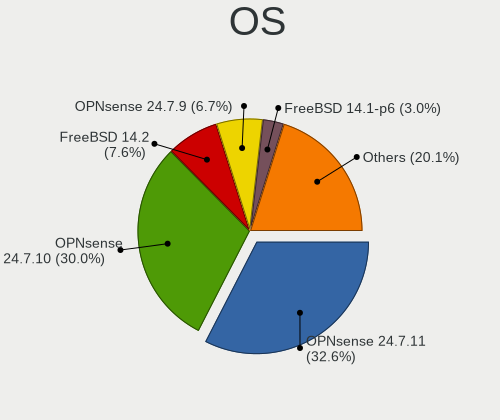
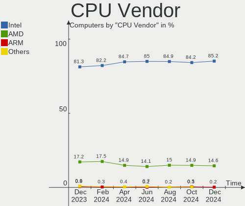
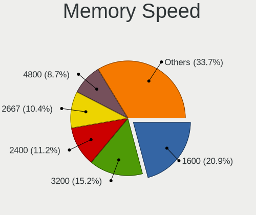

BSD Hardware Trends
-------------------

A project to identify most popular hardware characteristics and track their change
over time based on data collected by BSD users at https://BSD-Hardware.info.

Anyone can contribute to this report by the [hw-probe](https://github.com/linuxhw/hw-probe/blob/master/INSTALL.BSD.md) tool:

    hw-probe -all -upload

This is a report for all computer types. See also reports for [desktops](/Desktop/README.md) and [notebooks](/Notebook/README.md).

Full-feature report is available here: https://bsd-hardware.info/?view=trends

OS-specific reports: [FreeBSD](/Dist/FreeBSD), [OPNsense](/Dist/OPNsense), [helloSystem](/Dist/helloSystem), [OpenBSD](/Dist/OpenBSD).

Period: Jan, 2022.

Contents
--------

* [ System ](#system)
  - [ OS                       ](#os)
  - [ OS Family                ](#os-family)
  - [ Arch                     ](#arch)
  - [ DE                       ](#de)
  - [ Display Server           ](#display-server)
  - [ Display Manager          ](#display-manager)
  - [ OS Lang                  ](#os-lang)
  - [ Boot Mode                ](#boot-mode)
  - [ Filesystem               ](#filesystem)
  - [ Part. scheme             ](#part-scheme)

* [ Board ](#board)
  - [ Vendor                   ](#vendor)
  - [ Model                    ](#model)
  - [ Model Family             ](#model-family)
  - [ MFG Year                 ](#mfg-year)
  - [ Form Factor              ](#form-factor)
  - [ Coreboot                 ](#coreboot)
  - [ RAM Size                 ](#ram-size)
  - [ RAM Used                 ](#ram-used)
  - [ Total Drives             ](#total-drives)
  - [ Has CD-ROM               ](#has-cd-rom)
  - [ Has Ethernet             ](#has-ethernet)
  - [ Has WiFi                 ](#has-wifi)
  - [ Has Bluetooth            ](#has-bluetooth)

* [ Location ](#location)
  - [ Country                  ](#country)
  - [ City                     ](#city)

* [ Drives ](#drives)
  - [ Drive Vendor             ](#drive-vendor)
  - [ Drive Model              ](#drive-model)
  - [ HDD Vendor               ](#hdd-vendor)
  - [ SSD Vendor               ](#ssd-vendor)
  - [ Drive Kind               ](#drive-kind)
  - [ Drive Connector          ](#drive-connector)
  - [ Drive Size               ](#drive-size)
  - [ Space Total              ](#space-total)
  - [ Space Used               ](#space-used)
  - [ Malfunc. Drives          ](#malfunc-drives)
  - [ Malfunc. Drive Vendor    ](#malfunc-drive-vendor)
  - [ Malfunc. HDD Vendor      ](#malfunc-hdd-vendor)
  - [ Malfunc. Drive Kind      ](#malfunc-drive-kind)
  - [ Failed Drives            ](#failed-drives)
  - [ Failed Drive Vendor      ](#failed-drive-vendor)
  - [ Drive Status             ](#drive-status)

* [ Storage controller ](#storage-controller)
  - [ Storage Vendor           ](#storage-vendor)
  - [ Storage Model            ](#storage-model)
  - [ Storage Kind             ](#storage-kind)

* [ Processor ](#processor)
  - [ CPU Vendor               ](#cpu-vendor)
  - [ CPU Model                ](#cpu-model)
  - [ CPU Model Family         ](#cpu-model-family)
  - [ CPU Cores                ](#cpu-cores)
  - [ CPU Sockets              ](#cpu-sockets)
  - [ CPU Threads              ](#cpu-threads)
  - [ CPU Microarch            ](#cpu-microarch)

* [ Graphics ](#graphics)
  - [ GPU Vendor               ](#gpu-vendor)
  - [ GPU Model                ](#gpu-model)
  - [ GPU Combo                ](#gpu-combo)
  - [ GPU Driver               ](#gpu-driver)
  - [ GPU Memory               ](#gpu-memory)

* [ Monitor ](#monitor)
  - [ Monitor Vendor           ](#monitor-vendor)
  - [ Monitor Model            ](#monitor-model)
  - [ Monitor Resolution       ](#monitor-resolution)
  - [ Monitor Diagonal         ](#monitor-diagonal)
  - [ Monitor Width            ](#monitor-width)
  - [ Aspect Ratio             ](#aspect-ratio)
  - [ Monitor Area             ](#monitor-area)
  - [ Pixel Density            ](#pixel-density)
  - [ Multiple Monitors        ](#multiple-monitors)

* [ Network ](#network)
  - [ Net Controller Vendor    ](#net-controller-vendor)
  - [ Net Controller Model     ](#net-controller-model)
  - [ Wireless Vendor          ](#wireless-vendor)
  - [ Wireless Model           ](#wireless-model)
  - [ Ethernet Vendor          ](#ethernet-vendor)
  - [ Ethernet Model           ](#ethernet-model)
  - [ Net Controller Kind      ](#net-controller-kind)
  - [ Used Controller          ](#used-controller)
  - [ NICs                     ](#nics)
  - [ IPv6                     ](#ipv6)

* [ Bluetooth ](#bluetooth)
  - [ Bluetooth Vendor         ](#bluetooth-vendor)
  - [ Bluetooth Model          ](#bluetooth-model)

* [ Sound ](#sound)
  - [ Sound Vendor             ](#sound-vendor)
  - [ Sound Model              ](#sound-model)

* [ Memory ](#memory)
  - [ Memory Vendor            ](#memory-vendor)
  - [ Memory Model             ](#memory-model)
  - [ Memory Kind              ](#memory-kind)
  - [ Memory Form Factor       ](#memory-form-factor)
  - [ Memory Size              ](#memory-size)
  - [ Memory Speed             ](#memory-speed)

* [ Printers & scanners ](#printers--scanners)
  - [ Printer Vendor           ](#printer-vendor)
  - [ Printer Model            ](#printer-model)
  - [ Scanner Vendor           ](#scanner-vendor)
  - [ Scanner Model            ](#scanner-model)

* [ Camera ](#camera)
  - [ Camera Vendor            ](#camera-vendor)
  - [ Camera Model             ](#camera-model)

* [ Security ](#security)
  - [ Fingerprint Vendor       ](#fingerprint-vendor)
  - [ Fingerprint Model        ](#fingerprint-model)
  - [ Chipcard Vendor          ](#chipcard-vendor)
  - [ Chipcard Model           ](#chipcard-model)

* [ Unsupported ](#unsupported)
  - [ Unsupported Devices      ](#unsupported-devices)
  - [ Unsupported Device Types ](#unsupported-device-types)

System
------

OS
--

Installed operating systems

| Name                   | Computers | Percent |
|------------------------|-----------|---------|
| OPNsense 21.7.7        | 180       | 37.66%  |
| OPNsense 22.1          | 75        | 15.69%  |
| helloSystem 0.7.0      | 62        | 12.97%  |
| FreeBSD 13.0-p6        | 20        | 4.18%   |
| FreeBSD 13.0-p5        | 19        | 3.97%   |
| OpenBSD 7.0            | 13        | 2.72%   |
| helloSystem 0.8.0      | 12        | 2.51%   |
| GhostBSD 21.08.27      | 12        | 2.51%   |
| OPNsense 21.7.8        | 10        | 2.09%   |
| FreeBSD 14.0-CURRENT   | 10        | 2.09%   |
| FreeBSD 13.0           | 9         | 1.88%   |
| helloSystem 0.6.0      | 7         | 1.46%   |
| FreeBSD 12.3           | 7         | 1.46%   |
| FreeBSD 12.3-p1        | 6         | 1.26%   |
| FreeBSD 13.0-STABLE    | 5         | 1.05%   |
| FreeBSD 13.0-p4        | 4         | 0.84%   |
| TrueNAS 12.2-p11       | 2         | 0.42%   |
| OPNsense 12.1-p21-HBSD | 2         | 0.42%   |
| GhostBSD 20.04.02      | 2         | 0.42%   |
| FreeBSD 12.3-STABLE    | 2         | 0.42%   |
| FreeBSD 12.2-p11       | 2         | 0.42%   |
| TrueNAS 12.3-p1        | 1         | 0.21%   |
| pfSense 2.6.0          | 1         | 0.21%   |
| pfSense 2.5.0          | 1         | 0.21%   |
| OPNsense 21.7.6        | 1         | 0.21%   |
| OPNsense 21.7.3        | 1         | 0.21%   |
| OPNsense 21.1.9        | 1         | 0.21%   |
| OPNsense 21.1.8        | 1         | 0.21%   |
| NomadBSD 5806f915      | 1         | 0.21%   |
| MidnightBSD 2.1.3      | 1         | 0.21%   |
| MidnightBSD 2.1.1      | 1         | 0.21%   |
| helloSystem 0.5.0      | 1         | 0.21%   |
| GhostBSD 22.01.28      | 1         | 0.21%   |
| GhostBSD 22.01.12      | 1         | 0.21%   |
| FreeBSD 12.2-p12       | 1         | 0.21%   |
| FreeBSD 11.4-p7        | 1         | 0.21%   |
| FreeBSD 11.4-p13       | 1         | 0.21%   |
| DragonFly 5.8          | 1         | 0.21%   |

OS Family
---------

OS without a version

| Name        | Computers | Percent |
|-------------|-----------|---------|
| OPNsense    | 271       | 56.69%  |
| FreeBSD     | 87        | 18.2%   |
| helloSystem | 82        | 17.15%  |
| GhostBSD    | 16        | 3.35%   |
| OpenBSD     | 13        | 2.72%   |
| TrueNAS     | 3         | 0.63%   |
| pfSense     | 2         | 0.42%   |
| MidnightBSD | 2         | 0.42%   |
| NomadBSD    | 1         | 0.21%   |
| DragonFly   | 1         | 0.21%   |

Arch
----

OS architecture (x86_64, i586, etc.)

| Name  | Computers | Percent |
|-------|-----------|---------|
| amd64 | 471       | 98.54%  |
| arm64 | 6         | 1.26%   |
| i386  | 1         | 0.21%   |

DE
--

Desktop Environment

| Name          | Computers | Percent |
|---------------|-----------|---------|
| Console       | 310       | 64.85%  |
| helloDesktop  | 84        | 17.57%  |
| MATE          | 17        | 3.56%   |
| KDE5          | 13        | 2.72%   |
| fvwm          | 12        | 2.51%   |
| GNOME         | 10        | 2.09%   |
| XFCE          | 9         | 1.88%   |
| TWM           | 8         | 1.67%   |
| Openbox       | 5         | 1.05%   |
| Enlightenment | 3         | 0.63%   |
| Cinnamon      | 3         | 0.63%   |
| i3            | 2         | 0.42%   |
| Picom         | 1         | 0.21%   |
| Fluxbox       | 1         | 0.21%   |

Display Server
--------------

X11 or Wayland

| Name    | Computers | Percent |
|---------|-----------|---------|
| Console | 316       | 66.11%  |
| X11     | 160       | 33.47%  |
| Wayland | 2         | 0.42%   |

Display Manager
---------------

SDDM, LightDM, etc.

| Name    | Computers | Percent |
|---------|-----------|---------|
| Console | 342       | 71.55%  |
| SLiM    | 89        | 18.62%  |
| LightDM | 19        | 3.97%   |
| SDDM    | 12        | 2.51%   |
| GDM     | 8         | 1.67%   |
| XDM     | 7         | 1.46%   |
| WDM     | 1         | 0.21%   |

OS Lang
-------

Language

| Lang         | Computers | Percent |
|--------------|-----------|---------|
| Unknown      | 300       | 62.76%  |
| en_US        | 101       | 21.13%  |
| C            | 60        | 12.55%  |
| ru_RU        | 4         | 0.84%   |
| de_DE        | 3         | 0.63%   |
| ru_RU.KOI8-R | 2         | 0.42%   |
| pl_PL        | 2         | 0.42%   |
| fr_FR        | 2         | 0.42%   |
| it_IT        | 1         | 0.21%   |
| en_GB        | 1         | 0.21%   |
| en_CA        | 1         | 0.21%   |
| de_CH        | 1         | 0.21%   |

Boot Mode
---------

EFI or BIOS

| Mode | Computers | Percent |
|------|-----------|---------|
| EFI  | 411       | 85.98%  |
| BIOS | 67        | 14.02%  |

Filesystem
----------

Type of filesystem

| Type    | Computers | Percent |
|---------|-----------|---------|
| Ufs     | 232       | 48.54%  |
| Zfs     | 191       | 39.96%  |
| Cd9660  | 41        | 8.58%   |
| Ffs     | 13        | 2.72%   |
| Hammer2 | 1         | 0.21%   |

Part. scheme
------------

Scheme of partitioning

| Type    | Computers | Percent |
|---------|-----------|---------|
| GPT     | 450       | 94.14%  |
| MBR     | 25        | 5.23%   |
| Unknown | 3         | 0.63%   |

Board
-----

Vendor
------

Motherboard manufacturer

| Name                    | Computers | Percent |
|-------------------------|-----------|---------|
| Dell                    | 60        | 12.55%  |
| Hewlett-Packard         | 47        | 9.83%   |
| ASUSTek Computer        | 47        | 9.83%   |
| Unknown                 | 37        | 7.74%   |
| Lenovo                  | 34        | 7.11%   |
| Intel                   | 25        | 5.23%   |
| ASRock                  | 25        | 5.23%   |
| Supermicro              | 23        | 4.81%   |
| Gigabyte Technology     | 19        | 3.97%   |
| PC Engines              | 17        | 3.56%   |
| MSI                     | 16        | 3.35%   |
| Protectli               | 12        | 2.51%   |
| Apple                   | 12        | 2.51%   |
| Fujitsu                 | 9         | 1.88%   |
| Acer                    | 8         | 1.67%   |
| AMI                     | 7         | 1.46%   |
| Sophos                  | 6         | 1.26%   |
| ZOTAC                   | 5         | 1.05%   |
| Deciso                  | 5         | 1.05%   |
| BESSTAR Tech            | 5         | 1.05%   |
| HARDKERNEL              | 4         | 0.84%   |
| Yanling                 | 3         | 0.63%   |
| Biostar                 | 3         | 0.63%   |
| AWOW                    | 3         | 0.63%   |
| Toshiba                 | 2         | 0.42%   |
| Sony                    | 2         | 0.42%   |
| Raspberry Pi Foundation | 2         | 0.42%   |
| Pegatron                | 2         | 0.42%   |
| Intel CNCTION-IAF       | 2         | 0.42%   |
| Fujitsu Siemens         | 2         | 0.42%   |
| Framework               | 2         | 0.42%   |
| CheckPoint              | 2         | 0.42%   |
| XtReAmEr                | 1         | 0.21%   |
| WYSE                    | 1         | 0.21%   |
| Wistron                 | 1         | 0.21%   |
| Winston Marriot         | 1         | 0.21%   |
| TUXEDO                  | 1         | 0.21%   |
| Silicom                 | 1         | 0.21%   |
| SIEMENS                 | 1         | 0.21%   |
| Samsung Electronics     | 1         | 0.21%   |
| RUNING                  | 1         | 0.21%   |
| OEM                     | 1         | 0.21%   |
| NU591                   | 1         | 0.21%   |
| Notebook                | 1         | 0.21%   |
| MW                      | 1         | 0.21%   |
| Microsoft               | 1         | 0.21%   |
| Lanner                  | 1         | 0.21%   |
| Kontron                 | 1         | 0.21%   |
| Jumper                  | 1         | 0.21%   |
| HPE                     | 1         | 0.21%   |
| GPD                     | 1         | 0.21%   |
| Gateway                 | 1         | 0.21%   |
| Foxconn                 | 1         | 0.21%   |
| Firefly                 | 1         | 0.21%   |
| Fanless Mini PC         | 1         | 0.21%   |
| ECS                     | 1         | 0.21%   |
| Cisco Systems           | 1         | 0.21%   |
| Cisco                   | 1         | 0.21%   |
| AZW                     | 1         | 0.21%   |
| ASRockRack              | 1         | 0.21%   |

Model
-----

Motherboard model

| Name                                | Computers | Percent |
|-------------------------------------|-----------|---------|
| Unknown                             | 39        | 8.16%   |
| PC Engines APU2                     | 7         | 1.46%   |
| Intel Q3XXG4-P V1.0                 | 6         | 1.26%   |
| Dell OptiPlex 9020                  | 6         | 1.26%   |
| AMI Aptio CRB                       | 6         | 1.26%   |
| Supermicro Super Server             | 5         | 1.05%   |
| Protectli FW6                       | 5         | 1.05%   |
| PC Engines apu4                     | 5         | 1.05%   |
| Protectli FW4B                      | 4         | 0.84%   |
| HP t730 Thin Client                 | 4         | 0.84%   |
| HP t620 PLUS Quad Core TC           | 4         | 0.84%   |
| HARDKERNEL ODROID-H2                | 4         | 0.84%   |
| Yanling YL-KBR6L                    | 3         | 0.63%   |
| Sophos SG                           | 3         | 0.63%   |
| Dell PowerEdge R420                 | 3         | 0.63%   |
| Dell OptiPlex 790                   | 3         | 0.63%   |
| Dell OptiPlex 7010                  | 3         | 0.63%   |
| Deciso Netboard A20                 | 3         | 0.63%   |
| AWOW PC BOX                         | 3         | 0.63%   |
| ASUS All Series                     | 3         | 0.63%   |
| ZOTAC ZBOX-CI327NANO-GS-01          | 2         | 0.42%   |
| Supermicro A1SAi                    | 2         | 0.42%   |
| Sophos UTM                          | 2         | 0.42%   |
| Protectli FW1                       | 2         | 0.42%   |
| PC Engines apu1                     | 2         | 0.42%   |
| PC Engines APU                      | 2         | 0.42%   |
| Lenovo ThinkCentre M71e 3134C3U     | 2         | 0.42%   |
| Intel SKYBAY                        | 2         | 0.42%   |
| Intel SHARKBAY                      | 2         | 0.42%   |
| Intel MAHOBAY                       | 2         | 0.42%   |
| Intel CNCTION-IAF CNCTION-IAF       | 2         | 0.42%   |
| HP ProLiant MicroServer Gen8        | 2         | 0.42%   |
| HP ProLiant MicroServer             | 2         | 0.42%   |
| HP ProDesk 600 G3 SFF               | 2         | 0.42%   |
| HP ProDesk 600 G2 SFF               | 2         | 0.42%   |
| HP ProDesk 600 G2 DM                | 2         | 0.42%   |
| HP Pavilion Gaming Laptop 15-ec2xxx | 2         | 0.42%   |
| HP EliteDesk 800 G1 SFF             | 2         | 0.42%   |
| Framework Laptop                    | 2         | 0.42%   |
| Dell OptiPlex 7060                  | 2         | 0.42%   |
| Dell OptiPlex 3020                  | 2         | 0.42%   |
| Dell Latitude E6540                 | 2         | 0.42%   |
| Deciso Netboard A10 V2              | 2         | 0.42%   |
| BESSTAR Tech GK41                   | 2         | 0.42%   |
| Apple Macmini7,1                    | 2         | 0.42%   |
| ZOTAC ZBOXNANO-ID67/ID68/ID69       | 1         | 0.21%   |
| ZOTAC ZBOXNANO-ID63/ID64/ID65       | 1         | 0.21%   |
| WYSE D CLASS                        | 1         | 0.21%   |
| Wistron ProLiant DL120 G6           | 1         | 0.21%   |
| Winston Marriot PICO PC(R)          | 1         | 0.21%   |
| TUXEDO N14xWU                       | 1         | 0.21%   |
| Toshiba TECRA Z40-B                 | 1         | 0.21%   |
| Toshiba Satellite L50-A             | 1         | 0.21%   |
| Supermicro X9SCI/X9SCA              | 1         | 0.21%   |
| Supermicro X8SIL                    | 1         | 0.21%   |
| Supermicro X8DTU-LN4+               | 1         | 0.21%   |
| Supermicro X8DTH-i/6/iF/6F          | 1         | 0.21%   |
| Supermicro X7SBL                    | 1         | 0.21%   |
| Supermicro X10SLL-F                 | 1         | 0.21%   |
| Supermicro X10SLH-F/X10SLM+-F       | 1         | 0.21%   |

Model Family
------------

Motherboard model prefix

| Name                          | Computers | Percent |
|-------------------------------|-----------|---------|
| Unknown                       | 39        | 8.16%   |
| Dell OptiPlex                 | 22        | 4.6%    |
| Lenovo ThinkPad               | 21        | 4.39%   |
| Dell PowerEdge                | 11        | 2.3%    |
| Dell Latitude                 | 11        | 2.3%    |
| HP ProLiant                   | 10        | 2.09%   |
| Dell Inspiron                 | 8         | 1.67%   |
| PC Engines APU2               | 7         | 1.46%   |
| HP ProDesk                    | 7         | 1.46%   |
| ASUS PRIME                    | 7         | 1.46%   |
| Lenovo ThinkCentre            | 6         | 1.26%   |
| Intel Q3XXG4-P                | 6         | 1.26%   |
| AMI Aptio                     | 6         | 1.26%   |
| Supermicro Super              | 5         | 1.05%   |
| Protectli FW6                 | 5         | 1.05%   |
| PC Engines apu4               | 5         | 1.05%   |
| HP EliteDesk                  | 5         | 1.05%   |
| Fujitsu ESPRIMO               | 5         | 1.05%   |
| Deciso Netboard               | 5         | 1.05%   |
| ASUS TUF                      | 5         | 1.05%   |
| ASUS ROG                      | 5         | 1.05%   |
| Protectli FW4B                | 4         | 0.84%   |
| HP t730                       | 4         | 0.84%   |
| HP t620                       | 4         | 0.84%   |
| HP Laptop                     | 4         | 0.84%   |
| HP EliteBook                  | 4         | 0.84%   |
| HARDKERNEL ODROID-H2          | 4         | 0.84%   |
| Dell Precision                | 4         | 0.84%   |
| Acer Aspire                   | 4         | 0.84%   |
| Yanling YL-KBR6L              | 3         | 0.63%   |
| Sophos SG                     | 3         | 0.63%   |
| Fujitsu FUTRO                 | 3         | 0.63%   |
| AWOW PC                       | 3         | 0.63%   |
| ASUS All                      | 3         | 0.63%   |
| ZOTAC ZBOX-CI327NANO-GS-01    | 2         | 0.42%   |
| Supermicro A1SAi              | 2         | 0.42%   |
| Sophos UTM                    | 2         | 0.42%   |
| RPi Raspberry                 | 2         | 0.42%   |
| Protectli FW1                 | 2         | 0.42%   |
| PC Engines apu1               | 2         | 0.42%   |
| PC Engines APU                | 2         | 0.42%   |
| Lenovo IdeaPad                | 2         | 0.42%   |
| Intel SKYBAY                  | 2         | 0.42%   |
| Intel SHARKBAY                | 2         | 0.42%   |
| Intel MAHOBAY                 | 2         | 0.42%   |
| Intel CNCTION-IAF CNCTION-IAF | 2         | 0.42%   |
| HP Pavilion                   | 2         | 0.42%   |
| HP Compaq                     | 2         | 0.42%   |
| Framework Laptop              | 2         | 0.42%   |
| BESSTAR Tech GK41             | 2         | 0.42%   |
| ASUS P7H55-M                  | 2         | 0.42%   |
| ASRock X570                   | 2         | 0.42%   |
| Apple Macmini7                | 2         | 0.42%   |
| Apple MacBook5                | 2         | 0.42%   |
| ZOTAC ZBOXNANO-ID67           | 1         | 0.21%   |
| ZOTAC ZBOXNANO-ID63           | 1         | 0.21%   |
| WYSE D                        | 1         | 0.21%   |
| Wistron ProLiant              | 1         | 0.21%   |
| Winston Marriot PICO          | 1         | 0.21%   |
| TUXEDO N14xWU                 | 1         | 0.21%   |

MFG Year
--------

Motherboard manufacture year

| Year    | Computers | Percent |
|---------|-----------|---------|
| 2021    | 64        | 13.39%  |
| 2018    | 61        | 12.76%  |
| 2020    | 45        | 9.41%   |
| 2019    | 43        | 9%      |
| 2014    | 39        | 8.16%   |
| 2017    | 33        | 6.9%    |
| 2015    | 33        | 6.9%    |
| 2016    | 32        | 6.69%   |
| 2013    | 25        | 5.23%   |
| 2012    | 25        | 5.23%   |
| 2010    | 21        | 4.39%   |
| 2011    | 20        | 4.18%   |
| 2009    | 16        | 3.35%   |
| 2008    | 7         | 1.46%   |
| Unknown | 6         | 1.26%   |
| 2007    | 5         | 1.05%   |
| 2022    | 2         | 0.42%   |
| 2006    | 1         | 0.21%   |

Form Factor
-----------

Physical design of the computer

| Name           | Computers | Percent |
|----------------|-----------|---------|
| Desktop        | 297       | 62.13%  |
| Notebook       | 102       | 21.34%  |
| Server         | 33        | 6.9%    |
| Mini pc        | 31        | 6.49%   |
| Firewall       | 9         | 1.88%   |
| System on chip | 2         | 0.42%   |
| All in one     | 2         | 0.42%   |
| Tablet         | 1         | 0.21%   |
| Convertible    | 1         | 0.21%   |

Coreboot
--------

Have coreboot on board

| Used | Computers | Percent |
|------|-----------|---------|
| No   | 456       | 95.4%   |
| Yes  | 22        | 4.6%    |

RAM Size
--------

Total RAM memory

| Size in GB      | Computers | Percent |
|-----------------|-----------|---------|
| 8.01-16.0       | 164       | 34.31%  |
| 16.01-24.0      | 107       | 22.38%  |
| 4.01-8.0        | 104       | 21.76%  |
| 32.01-64.0      | 46        | 9.62%   |
| 64.01-256.0     | 19        | 3.97%   |
| 2.01-3.0        | 16        | 3.35%   |
| 3.01-4.0        | 7         | 1.46%   |
| 24.01-32.0      | 6         | 1.26%   |
| 0.51-1.0        | 5         | 1.05%   |
| More than 256.0 | 2         | 0.42%   |
| 1.01-2.0        | 2         | 0.42%   |

RAM Used
--------

Used RAM memory

| Used GB     | Computers | Percent |
|-------------|-----------|---------|
| 0.01-0.5    | 234       | 48.95%  |
| 0.51-1.0    | 142       | 29.71%  |
| 1.01-2.0    | 54        | 11.3%   |
| 2.01-3.0    | 16        | 3.35%   |
| 4.01-8.0    | 13        | 2.72%   |
| 3.01-4.0    | 5         | 1.05%   |
| 16.01-24.0  | 3         | 0.63%   |
| 8.01-16.0   | 3         | 0.63%   |
| 0           | 3         | 0.63%   |
| 24.01-32.0  | 2         | 0.42%   |
| 64.01-256.0 | 2         | 0.42%   |
| Unknown     | 1         | 0.21%   |

Total Drives
------------

Number of drives on board

| Drives | Computers | Percent |
|--------|-----------|---------|
| 1      | 319       | 66.74%  |
| 2      | 79        | 16.53%  |
| 0      | 39        | 8.16%   |
| 4      | 14        | 2.93%   |
| 3      | 13        | 2.72%   |
| 5      | 4         | 0.84%   |
| 6      | 3         | 0.63%   |
| 14     | 2         | 0.42%   |
| 18     | 1         | 0.21%   |
| 13     | 1         | 0.21%   |
| 12     | 1         | 0.21%   |
| 9      | 1         | 0.21%   |
| 7      | 1         | 0.21%   |

Has CD-ROM
----------

Has CD-ROM on board

| Presented | Computers | Percent |
|-----------|-----------|---------|
| No        | 378       | 79.08%  |
| Yes       | 100       | 20.92%  |

Has Ethernet
------------

Has Ethernet on board

| Presented | Computers | Percent |
|-----------|-----------|---------|
| Yes       | 460       | 96.23%  |
| No        | 18        | 3.77%   |

Has WiFi
--------

Has WiFi module

| Presented | Computers | Percent |
|-----------|-----------|---------|
| No        | 313       | 65.48%  |
| Yes       | 165       | 34.52%  |

Has Bluetooth
-------------

Has Bluetooth module

| Presented | Computers | Percent |
|-----------|-----------|---------|
| No        | 363       | 75.94%  |
| Yes       | 115       | 24.06%  |

Location
--------

Country
-------

Geographic location (country)

| Country            | Computers | Percent |
|--------------------|-----------|---------|
| USA                | 130       | 27.2%   |
| Germany            | 75        | 15.69%  |
| Russia             | 29        | 6.07%   |
| UK                 | 23        | 4.81%   |
| France             | 21        | 4.39%   |
| Canada             | 16        | 3.35%   |
| Australia          | 16        | 3.35%   |
| Poland             | 13        | 2.72%   |
| Austria            | 13        | 2.72%   |
| Italy              | 11        | 2.3%    |
| Netherlands        | 10        | 2.09%   |
| Switzerland        | 9         | 1.88%   |
| Brazil             | 9         | 1.88%   |
| Spain              | 8         | 1.67%   |
| Sweden             | 7         | 1.46%   |
| Romania            | 7         | 1.46%   |
| Finland            | 6         | 1.26%   |
| Belgium            | 5         | 1.05%   |
| South Africa       | 4         | 0.84%   |
| Portugal           | 4         | 0.84%   |
| Indonesia          | 4         | 0.84%   |
| India              | 4         | 0.84%   |
| Hungary            | 4         | 0.84%   |
| Ukraine            | 3         | 0.63%   |
| Mexico             | 3         | 0.63%   |
| Greece             | 3         | 0.63%   |
| Argentina          | 3         | 0.63%   |
| UAE                | 2         | 0.42%   |
| Turkey             | 2         | 0.42%   |
| Singapore          | 2         | 0.42%   |
| Malaysia           | 2         | 0.42%   |
| Japan              | 2         | 0.42%   |
| Israel             | 2         | 0.42%   |
| Czechia            | 2         | 0.42%   |
| Cuba               | 2         | 0.42%   |
| China              | 2         | 0.42%   |
| Vietnam            | 1         | 0.21%   |
| Venezuela          | 1         | 0.21%   |
| Peru               | 1         | 0.21%   |
| Norway             | 1         | 0.21%   |
| Nigeria            | 1         | 0.21%   |
| New Zealand        | 1         | 0.21%   |
| Moldova            | 1         | 0.21%   |
| Madagascar         | 1         | 0.21%   |
| Lithuania          | 1         | 0.21%   |
| Kazakhstan         | 1         | 0.21%   |
| Georgia            | 1         | 0.21%   |
| Eswatini           | 1         | 0.21%   |
| Dominican Republic | 1         | 0.21%   |
| Denmark            | 1         | 0.21%   |
| Cyprus             | 1         | 0.21%   |
| Chile              | 1         | 0.21%   |
| Bulgaria           | 1         | 0.21%   |
| Belarus            | 1         | 0.21%   |
| Bahamas            | 1         | 0.21%   |
| Armenia            | 1         | 0.21%   |

City
----

Geographic location (city)

| City              | Computers | Percent |
|-------------------|-----------|---------|
| Bonn              | 7         | 1.46%   |
| Berlin            | 7         | 1.46%   |
| Vienna            | 6         | 1.26%   |
| Chicago           | 6         | 1.26%   |
| Paris             | 5         | 1.05%   |
| Moscow            | 5         | 1.05%   |
| Helsinki          | 5         | 1.05%   |
| Grand Rapids      | 5         | 1.05%   |
| Sydney            | 4         | 0.84%   |
| Munich            | 4         | 0.84%   |
| Jakarta           | 4         | 0.84%   |
| Dresden           | 4         | 0.84%   |
| Cologne           | 4         | 0.84%   |
| Brisbane          | 4         | 0.84%   |
| Armavir           | 4         | 0.84%   |
| Warsaw            | 3         | 0.63%   |
| Seattle           | 3         | 0.63%   |
| Rome              | 3         | 0.63%   |
| Perth             | 3         | 0.63%   |
| New York          | 3         | 0.63%   |
| Cluj-Napoca       | 3         | 0.63%   |
| Barnaul           | 3         | 0.63%   |
| Athens            | 3         | 0.63%   |
| Amsterdam         | 3         | 0.63%   |
| Ypsilanti         | 2         | 0.42%   |
| Winnipeg          | 2         | 0.42%   |
| Wenatchee         | 2         | 0.42%   |
| Watertown         | 2         | 0.42%   |
| Wadsworth         | 2         | 0.42%   |
| Tiruchi           | 2         | 0.42%   |
| Tel Aviv          | 2         | 0.42%   |
| St Petersburg     | 2         | 0.42%   |
| Singapore         | 2         | 0.42%   |
| Silea             | 2         | 0.42%   |
| Salem             | 2         | 0.42%   |
| Ruthin            | 2         | 0.42%   |
| Rio de Janeiro    | 2         | 0.42%   |
| Redmond           | 2         | 0.42%   |
| Potsdam           | 2         | 0.42%   |
| Plainsboro        | 2         | 0.42%   |
| Pflugerville      | 2         | 0.42%   |
| Menlo Park        | 2         | 0.42%   |
| Melbourne         | 2         | 0.42%   |
| Madrid            | 2         | 0.42%   |
| Madison           | 2         | 0.42%   |
| London            | 2         | 0.42%   |
| Leatherhead       | 2         | 0.42%   |
| Krakow            | 2         | 0.42%   |
| Karlsruhe         | 2         | 0.42%   |
| Johannesburg      | 2         | 0.42%   |
| Harrisburg        | 2         | 0.42%   |
| Hamburg           | 2         | 0.42%   |
| Gdansk            | 2         | 0.42%   |
| Gatineau          | 2         | 0.42%   |
| Frankfurt am Main | 2         | 0.42%   |
| Exeter            | 2         | 0.42%   |
| Egham             | 2         | 0.42%   |
| Dubai             | 2         | 0.42%   |
| Denver            | 2         | 0.42%   |
| Dallas            | 2         | 0.42%   |

Drives
------

Drive Vendor
------------

Hard drive vendors

| Vendor              | Computers | Drives | Percent |
|---------------------|-----------|--------|---------|
| Samsung Electronics | 84        | 104    | 15.05%  |
| WDC                 | 78        | 110    | 13.98%  |
| Seagate             | 55        | 84     | 9.86%   |
| Kingston            | 39        | 39     | 6.99%   |
| Crucial             | 31        | 37     | 5.56%   |
| Toshiba             | 25        | 30     | 4.48%   |
| Transcend           | 24        | 25     | 4.3%    |
| Intel               | 20        | 22     | 3.58%   |
| SanDisk             | 17        | 17     | 3.05%   |
| Phison              | 14        | 14     | 2.51%   |
| A-DATA Technology   | 14        | 17     | 2.51%   |
| Hitachi             | 13        | 30     | 2.33%   |
| Hoodisk             | 10        | 10     | 1.79%   |
| HGST                | 9         | 28     | 1.61%   |
| NVMe                | 8         | 8      | 1.43%   |
| Corsair             | 8         | 8      | 1.43%   |
| Hewlett-Packard     | 7         | 8      | 1.25%   |
| SPCC                | 6         | 6      | 1.08%   |
| Apacer              | 6         | 6      | 1.08%   |
| SK Hynix            | 5         | 5      | 0.9%    |
| OCZ                 | 5         | 5      | 0.9%    |
| Micron Technology   | 5         | 5      | 0.9%    |
| China               | 5         | 5      | 0.9%    |
| Patriot             | 4         | 5      | 0.72%   |
| GOODRAM             | 4         | 4      | 0.72%   |
| Gigabyte Technology | 4         | 5      | 0.72%   |
| FORESEE             | 4         | 4      | 0.72%   |
| BIWIN               | 4         | 4      | 0.72%   |
| Mushkin             | 3         | 3      | 0.54%   |
| LITEON              | 3         | 3      | 0.54%   |
| Intenso             | 3         | 3      | 0.54%   |
| Innodisk            | 3         | 3      | 0.54%   |
| Dogfish             | 3         | 3      | 0.54%   |
| Protectli           | 2         | 2      | 0.36%   |
| PNY                 | 2         | 3      | 0.36%   |
| PLEXTOR             | 2         | 2      | 0.36%   |
| LITEONIT            | 2         | 2      | 0.36%   |
| KIOXIA              | 2         | 2      | 0.36%   |
| KingSpec            | 2         | 2      | 0.36%   |
| Fujitsu             | 2         | 2      | 0.36%   |
| Apple               | 2         | 2      | 0.36%   |
| Zheino              | 1         | 1      | 0.18%   |
| XUNZHE              | 1         | 1      | 0.18%   |
| XrayDisk            | 1         | 1      | 0.18%   |
| VisionTek           | 1         | 1      | 0.18%   |
| Vaseky              | 1         | 1      | 0.18%   |
| TCSUNBOW            | 1         | 1      | 0.18%   |
| StoreJet            | 1         | 1      | 0.18%   |
| Silicon Motion      | 1         | 1      | 0.18%   |
| Lite-On             | 1         | 1      | 0.18%   |
| Lexar               | 1         | 1      | 0.18%   |
| Leven               | 1         | 1      | 0.18%   |
| LDLC                | 1         | 1      | 0.18%   |
| KIOXIA-EXCERIA      | 1         | 1      | 0.18%   |
| KingDian            | 1         | 1      | 0.18%   |
| FLEXXON             | 1         | 1      | 0.18%   |
| faspeed             | 1         | 1      | 0.18%   |
| EMTEC               | 1         | 1      | 0.18%   |
| AMD                 | 1         | 2      | 0.18%   |
| AGI                 | 1         | 1      | 0.18%   |

Drive Model
-----------

Hard drive models

| Model                                   | Computers | Percent |
|-----------------------------------------|-----------|---------|
| Kingston SA400S37120G 120GB             | 11        | 1.83%   |
| Phison SATA SSD 16GB                    | 7         | 1.16%   |
| WDC WD800JD-75MSA3 80GB                 | 6         | 1%      |
| Seagate ST2000DM008-2FR102 2TB          | 5         | 0.83%   |
| Kingston SA400S37240G 240GB             | 5         | 0.83%   |
| HP RAID 1(1+0) 2TB                      | 5         | 0.83%   |
| Crucial CT250MX500SSD1 250GB            | 5         | 0.83%   |
| Crucial CT120BX500SSD1 120GB            | 5         | 0.83%   |
| Transcend TS64GMSA230S 64GB             | 4         | 0.66%   |
| Transcend TS128GMSA230S 128GB           | 4         | 0.66%   |
| Samsung SSD 860 PRO 256GB               | 4         | 0.66%   |
| Samsung SSD 860 EVO 250GB               | 4         | 0.66%   |
| Samsung SSD 850 EVO 250GB               | 4         | 0.66%   |
| Samsung SSD 840 EVO 250GB               | 4         | 0.66%   |
| Crucial CT500MX500SSD1 500GB            | 4         | 0.66%   |
| WDC WDS120G2G0A-00JH30 120GB            | 3         | 0.5%    |
| Transcend TS256GMTS952T2 256GB          | 3         | 0.5%    |
| Seagate ST500DM002-1BD142 500GB         | 3         | 0.5%    |
| Seagate ST3160815AS 160GB               | 3         | 0.5%    |
| Samsung SSD 860 EVO 500GB               | 3         | 0.5%    |
| Samsung SSD 850 EVO 500GB               | 3         | 0.5%    |
| Phison SATA SSD 32GB                    | 3         | 0.5%    |
| Kingston SUV500MS240G 240GB             | 3         | 0.5%    |
| Kingston SUV500MS120G 120GB             | 3         | 0.5%    |
| Kingston SA400M8240G 240GB              | 3         | 0.5%    |
| Hoodisk SSD 128GB                       | 3         | 0.5%    |
| HGST HTS721010A9E630 1TB                | 3         | 0.5%    |
| Gigabyte GP-GSTFS31120GNTD 120GB        | 3         | 0.5%    |
| FORESEE 128GB SSD                       | 3         | 0.5%    |
| WDC WDS500G2B0C-00PXH0 500GB            | 2         | 0.33%   |
| WDC WDS240G2G0A-00JH30 240GB            | 2         | 0.33%   |
| WDC WD80EFAX-68LHPN0 8TB                | 2         | 0.33%   |
| WDC WD5000LPVX-22V0TT0 500GB            | 2         | 0.33%   |
| WDC WD5000LPCX-60VHAT0 500GB            | 2         | 0.33%   |
| WDC WD5000AAKX-75U6AA0 500GB            | 2         | 0.33%   |
| WDC WD40EFRX-68N32N0 4TB                | 2         | 0.33%   |
| WDC WD2500AAKX-083CA1 250GB             | 2         | 0.33%   |
| WDC WD20EZRX-00D8PB0 2TB                | 2         | 0.33%   |
| WDC WD20EZAZ-00GGJB0 2TB                | 2         | 0.33%   |
| WDC WD20EFRX-68EUZN0 2TB                | 2         | 0.33%   |
| WDC WD1600BEVT-22ZCT0 160GB             | 2         | 0.33%   |
| WDC PC SN730 SDBQNTY-256G-1001 256GB    | 2         | 0.33%   |
| Toshiba MQ01ABF050 500GB                | 2         | 0.33%   |
| Toshiba MQ01ABD100 1TB                  | 2         | 0.33%   |
| SPCC Solid State Disk 256GB             | 2         | 0.33%   |
| SPCC Solid State Disk 128GB             | 2         | 0.33%   |
| SPCC Solid State Disk 120GB             | 2         | 0.33%   |
| SK Hynix BC501 HFM128GDJTNG-8310A 128GB | 2         | 0.33%   |
| Seagate ST4000DM000-1F2168 4TB          | 2         | 0.33%   |
| Seagate ST1000LM048-2E7172 1TB          | 2         | 0.33%   |
| Seagate ST1000LM035-1RK172 1TB          | 2         | 0.33%   |
| Seagate ST1000LM024 HN-M101MBB 1TB      | 2         | 0.33%   |
| SanDisk SSD PLUS 240GB                  | 2         | 0.33%   |
| SanDisk SDSSDA240G 240GB                | 2         | 0.33%   |
| SanDisk SD8SBAT128G1122 128GB           | 2         | 0.33%   |
| Samsung SSD 970 EVO Plus 1TB            | 2         | 0.33%   |
| Samsung SSD 970 EVO 500GB               | 2         | 0.33%   |
| Samsung SSD 870 EVO 1TB                 | 2         | 0.33%   |
| Samsung SSD 860 QVO 1TB                 | 2         | 0.33%   |
| Samsung SSD 850 PRO 256GB               | 2         | 0.33%   |

HDD Vendor
----------

Hard disk drive vendors

| Vendor              | Computers | Drives | Percent |
|---------------------|-----------|--------|---------|
| WDC                 | 59        | 90     | 33.52%  |
| Seagate             | 52        | 79     | 29.55%  |
| Toshiba             | 21        | 26     | 11.93%  |
| Hitachi             | 13        | 30     | 7.39%   |
| HGST                | 9         | 28     | 5.11%   |
| Samsung Electronics | 6         | 6      | 3.41%   |
| NVMe                | 6         | 6      | 3.41%   |
| Hewlett-Packard     | 6         | 7      | 3.41%   |
| Fujitsu             | 2         | 2      | 1.14%   |
| StoreJet            | 1         | 1      | 0.57%   |
| Apple               | 1         | 1      | 0.57%   |

SSD Vendor
----------

Solid state drive vendors

| Vendor              | Computers | Drives | Percent |
|---------------------|-----------|--------|---------|
| Samsung Electronics | 55        | 66     | 17.86%  |
| Kingston            | 36        | 36     | 11.69%  |
| Crucial             | 26        | 31     | 8.44%   |
| Transcend           | 23        | 23     | 7.47%   |
| SanDisk             | 17        | 17     | 5.52%   |
| Intel               | 15        | 17     | 4.87%   |
| Phison              | 12        | 12     | 3.9%    |
| Hoodisk             | 10        | 10     | 3.25%   |
| WDC                 | 9         | 9      | 2.92%   |
| A-DATA Technology   | 9         | 11     | 2.92%   |
| Corsair             | 7         | 7      | 2.27%   |
| SPCC                | 6         | 6      | 1.95%   |
| Apacer              | 6         | 6      | 1.95%   |
| OCZ                 | 5         | 5      | 1.62%   |
| China               | 5         | 5      | 1.62%   |
| Patriot             | 4         | 5      | 1.3%    |
| GOODRAM             | 4         | 4      | 1.3%    |
| Gigabyte Technology | 4         | 5      | 1.3%    |
| FORESEE             | 4         | 4      | 1.3%    |
| Seagate             | 3         | 5      | 0.97%   |
| Micron Technology   | 3         | 3      | 0.97%   |
| Intenso             | 3         | 3      | 0.97%   |
| InnoDisk            | 3         | 3      | 0.97%   |
| Dogfish             | 3         | 3      | 0.97%   |
| BIWIN               | 3         | 3      | 0.97%   |
| Toshiba             | 2         | 2      | 0.65%   |
| Protectli           | 2         | 2      | 0.65%   |
| Mushkin             | 2         | 2      | 0.65%   |
| LITEONIT            | 2         | 2      | 0.65%   |
| LITEON              | 2         | 2      | 0.65%   |
| KingSpec            | 2         | 2      | 0.65%   |
| Zheino              | 1         | 1      | 0.32%   |
| XUNZHE              | 1         | 1      | 0.32%   |
| XrayDisk            | 1         | 1      | 0.32%   |
| VisionTek           | 1         | 1      | 0.32%   |
| Vaseky              | 1         | 1      | 0.32%   |
| TCSUNBOW            | 1         | 1      | 0.32%   |
| SK Hynix            | 1         | 1      | 0.32%   |
| PNY                 | 1         | 2      | 0.32%   |
| PLEXTOR             | 1         | 1      | 0.32%   |
| NVMe                | 1         | 1      | 0.32%   |
| Lite-On             | 1         | 1      | 0.32%   |
| Lexar               | 1         | 1      | 0.32%   |
| Leven               | 1         | 1      | 0.32%   |
| KIOXIA-EXCERIA      | 1         | 1      | 0.32%   |
| KingDian            | 1         | 1      | 0.32%   |
| Hewlett-Packard     | 1         | 1      | 0.32%   |
| FLEXXON             | 1         | 1      | 0.32%   |
| faspeed             | 1         | 1      | 0.32%   |
| EMTEC               | 1         | 1      | 0.32%   |
| Apple               | 1         | 1      | 0.32%   |
| AMD                 | 1         | 2      | 0.32%   |

Drive Kind
----------

HDD or SSD

| Kind | Computers | Drives | Percent |
|------|-----------|--------|---------|
| SSD  | 289       | 334    | 56.34%  |
| HDD  | 148       | 276    | 28.85%  |
| NVMe | 76        | 87     | 14.81%  |

Drive Connector
---------------

SATA, SAS, NVMe, etc.

| Type | Computers | Drives | Percent |
|------|-----------|--------|---------|
| SATA | 399       | 610    | 84%     |
| NVMe | 76        | 87     | 16%     |

Drive Size
----------

Size of hard drive

| Size in TB | Computers | Drives | Percent |
|------------|-----------|--------|---------|
| 0.01-0.5   | 338       | 405    | 75.28%  |
| 0.51-1.0   | 58        | 72     | 12.92%  |
| 1.01-2.0   | 28        | 51     | 6.24%   |
| 4.01-10.0  | 11        | 51     | 2.45%   |
| 3.01-4.0   | 9         | 19     | 2%      |
| 10.01-20.0 | 5         | 12     | 1.11%   |

Space Total
-----------

Amount of disk space available on the file system

| Size in GB     | Computers | Percent |
|----------------|-----------|---------|
| 101-250        | 195       | 40.79%  |
| 1-20           | 80        | 16.74%  |
| 251-500        | 61        | 12.76%  |
| 51-100         | 52        | 10.88%  |
| 21-50          | 42        | 8.79%   |
| 501-1000       | 33        | 6.9%    |
| 1001-2000      | 9         | 1.88%   |
| More than 3000 | 3         | 0.63%   |
| Unknown        | 2         | 0.42%   |
| 2001-3000      | 1         | 0.21%   |

Space Used
----------

Amount of used disk space

| Used GB  | Computers | Percent |
|----------|-----------|---------|
| 1-20     | 441       | 92.26%  |
| 21-50    | 21        | 4.39%   |
| 51-100   | 5         | 1.05%   |
| 101-250  | 3         | 0.63%   |
| 501-1000 | 3         | 0.63%   |
| 251-500  | 2         | 0.42%   |
| Unknown  | 2         | 0.42%   |
| 0        | 1         | 0.21%   |

Malfunc. Drives
---------------

Drive models with a malfunction

| Model                                 | Computers | Drives | Percent |
|---------------------------------------|-----------|--------|---------|
| Seagate ST3160815AS 160GB             | 2         | 2      | 3.23%   |
| WDC WD6400BEVT-22A0RT0 640GB          | 1         | 1      | 1.61%   |
| WDC WD60EFRX-68TGBN1 6TB              | 1         | 3      | 1.61%   |
| WDC WD5000LPCX-60VHAT0 500GB          | 1         | 1      | 1.61%   |
| WDC WD5000AZRZ-00HTKB0 500GB          | 1         | 1      | 1.61%   |
| WDC WD5000AAKS-22A7B0 500GB           | 1         | 1      | 1.61%   |
| WDC WD3200BEVT-22ZCT0 320GB           | 1         | 1      | 1.61%   |
| WDC WD20EARX-008FB0 2TB               | 1         | 1      | 1.61%   |
| WDC WD20EARS-00MVWB0 2TB              | 1         | 1      | 1.61%   |
| WDC WD2002FYPS-02W3B0 2TB             | 1         | 1      | 1.61%   |
| WDC WD1600BEVT-80A23T0 160GB          | 1         | 1      | 1.61%   |
| WDC WD1600BEVT-22ZCT0 160GB           | 1         | 1      | 1.61%   |
| WDC WD1600BEVS-08VAT1 160GB           | 1         | 1      | 1.61%   |
| WDC WD10JPVX-60JC3T0 1TB              | 1         | 1      | 1.61%   |
| VisionTek mSATA 120GB                 | 1         | 1      | 1.61%   |
| Toshiba THNSNX024GMNT 24GB            | 1         | 1      | 1.61%   |
| Toshiba MQ01ABF050 500GB              | 1         | 1      | 1.61%   |
| Toshiba MK8034GSX 80GB                | 1         | 1      | 1.61%   |
| Toshiba MK3263GSX 320GB               | 1         | 1      | 1.61%   |
| Toshiba MK3261GSYN 320GB              | 1         | 1      | 1.61%   |
| Toshiba MK1629GSGF 160GB              | 1         | 1      | 1.61%   |
| Toshiba MK1252GSX 120GB               | 1         | 1      | 1.61%   |
| Toshiba DT01ACA050 500GB              | 1         | 1      | 1.61%   |
| SPCC Solid State Disk 128GB           | 1         | 1      | 1.61%   |
| Seagate ST9320325AS 320GB             | 1         | 1      | 1.61%   |
| Seagate ST500LT012-9WS142 500GB       | 1         | 1      | 1.61%   |
| Seagate ST500LM000-SSHD-8GB           | 1         | 1      | 1.61%   |
| Seagate ST380211AS 80GB               | 1         | 1      | 1.61%   |
| Seagate ST3750528AS 752GB             | 1         | 1      | 1.61%   |
| Seagate ST3500413AS 500GB             | 1         | 1      | 1.61%   |
| Seagate ST3500410AS 500GB             | 1         | 1      | 1.61%   |
| Seagate ST3320418AS 320GB             | 1         | 1      | 1.61%   |
| Seagate ST320LT007-9ZV142 320GB       | 1         | 1      | 1.61%   |
| Seagate ST3200822AS 200GB             | 1         | 1      | 1.61%   |
| Seagate ST3160318AS 160GB             | 1         | 1      | 1.61%   |
| Seagate ST31000528AS 1TB              | 1         | 1      | 1.61%   |
| Seagate ST1000LM024 HN-M101MBB 1TB    | 1         | 1      | 1.61%   |
| SanDisk SSD P4 64GB                   | 1         | 1      | 1.61%   |
| SanDisk SDSSDA240G 240GB              | 1         | 1      | 1.61%   |
| SanDisk SD8TB8U-256G-1006 256GB       | 1         | 1      | 1.61%   |
| Samsung Electronics SSD 960 PRO 512GB | 1         | 1      | 1.61%   |
| Samsung Electronics SSD 850 EVO 1TB   | 1         | 1      | 1.61%   |
| Samsung Electronics HD322HJ 320GB     | 1         | 1      | 1.61%   |
| Phison SATA SSD 32GB                  | 1         | 1      | 1.61%   |
| OCZ VERTEX 32GB                       | 1         | 1      | 1.61%   |
| LITEON CV8-8E128-HP 128GB             | 1         | 1      | 1.61%   |
| Kingston SHPM2280P2-240G              | 1         | 1      | 1.61%   |
| Kingston RBU-SNS8350DES3128GP 128GB   | 1         | 1      | 1.61%   |
| Intel SSDSC2BW120A3 120GB             | 1         | 1      | 1.61%   |
| Hitachi HTS543232A7A384 320GB         | 1         | 1      | 1.61%   |
| HGST HTS721010A9E630 1TB              | 1         | 1      | 1.61%   |
| HGST HTS541010A9E680 1TB              | 1         | 1      | 1.61%   |
| Fujitsu MHZ2160BH G2 160GB            | 1         | 1      | 1.61%   |
| Crucial CT525MX300SSD1 528GB          | 1         | 1      | 1.61%   |
| Crucial CT275MX300SSD4 275GB          | 1         | 1      | 1.61%   |
| Corsair Force LS SSD 64GB             | 1         | 1      | 1.61%   |
| BIWIN SSD 128GB                       | 1         | 1      | 1.61%   |
| Apacer 16GB SATA Flash Drive          | 1         | 1      | 1.61%   |
| AMD R5SL240G 240GB                    | 1         | 2      | 1.61%   |
| AGI AGI512G16AI198 512GB              | 1         | 1      | 1.61%   |

Malfunc. Drive Vendor
---------------------

Vendors of faulty drives

| Vendor              | Computers | Drives | Percent |
|---------------------|-----------|--------|---------|
| Seagate             | 14        | 15     | 22.95%  |
| WDC                 | 13        | 15     | 21.31%  |
| Toshiba             | 8         | 8      | 13.11%  |
| SanDisk             | 3         | 3      | 4.92%   |
| Samsung Electronics | 3         | 3      | 4.92%   |
| Kingston            | 2         | 2      | 3.28%   |
| HGST                | 2         | 2      | 3.28%   |
| Crucial             | 2         | 2      | 3.28%   |
| VisionTek           | 1         | 1      | 1.64%   |
| SPCC                | 1         | 1      | 1.64%   |
| Phison              | 1         | 1      | 1.64%   |
| OCZ                 | 1         | 1      | 1.64%   |
| LITEON              | 1         | 1      | 1.64%   |
| Intel               | 1         | 1      | 1.64%   |
| Hitachi             | 1         | 1      | 1.64%   |
| Fujitsu             | 1         | 1      | 1.64%   |
| Corsair             | 1         | 1      | 1.64%   |
| BIWIN               | 1         | 1      | 1.64%   |
| Apacer              | 1         | 1      | 1.64%   |
| AMD                 | 1         | 2      | 1.64%   |
| AGI                 | 1         | 1      | 1.64%   |
| A-DATA Technology   | 1         | 1      | 1.64%   |

Malfunc. HDD Vendor
-------------------

Vendors of faulty HDD drives

| Vendor              | Computers | Drives | Percent |
|---------------------|-----------|--------|---------|
| Seagate             | 14        | 15     | 35.9%   |
| WDC                 | 13        | 15     | 33.33%  |
| Toshiba             | 7         | 7      | 17.95%  |
| HGST                | 2         | 2      | 5.13%   |
| Samsung Electronics | 1         | 1      | 2.56%   |
| Hitachi             | 1         | 1      | 2.56%   |
| Fujitsu             | 1         | 1      | 2.56%   |

Malfunc. Drive Kind
-------------------

Kinds of faulty drives

| Kind | Computers | Drives | Percent |
|------|-----------|--------|---------|
| HDD  | 38        | 42     | 63.33%  |
| SSD  | 20        | 21     | 33.33%  |
| NVMe | 2         | 2      | 3.33%   |

Failed Drives
-------------

Failed drive models

Zero info for selected period =(

Failed Drive Vendor
-------------------

Failed drive vendors

Zero info for selected period =(

Drive Status
------------

Number of failed and malfunc. drives

| Status   | Computers | Drives | Percent |
|----------|-----------|--------|---------|
| Works    | 390       | 611    | 83.16%  |
| Malfunc  | 60        | 65     | 12.79%  |
| Detected | 19        | 21     | 4.05%   |

Storage controller
------------------

Storage Vendor
--------------

Storage controller vendors

| Vendor                           | Computers | Percent |
|----------------------------------|-----------|---------|
| Intel                            | 363       | 62.26%  |
| AMD                              | 81        | 13.89%  |
| Samsung Electronics              | 33        | 5.66%   |
| Sandisk                          | 14        | 2.4%    |
| Broadcom / LSI                   | 14        | 2.4%    |
| ASMedia Technology               | 10        | 1.72%   |
| Nvidia                           | 8         | 1.37%   |
| Silicon Motion                   | 7         | 1.2%    |
| Hewlett-Packard                  | 6         | 1.03%   |
| Marvell Technology Group         | 5         | 0.86%   |
| ADATA Technology                 | 5         | 0.86%   |
| SK Hynix                         | 4         | 0.69%   |
| Phison Electronics               | 4         | 0.69%   |
| Micron/Crucial Technology        | 4         | 0.69%   |
| KIOXIA                           | 4         | 0.69%   |
| Kingston Technology Company      | 4         | 0.69%   |
| JMicron Technology               | 3         | 0.51%   |
| Silicon Integrated Systems [SiS] | 2         | 0.34%   |
| Micron Technology                | 2         | 0.34%   |
| Lite-On Technology               | 2         | 0.34%   |
| VIA Technologies                 | 1         | 0.17%   |
| Toshiba                          | 1         | 0.17%   |
| Silicon Image                    | 1         | 0.17%   |
| Realtek Semiconductor            | 1         | 0.17%   |
| Dell                             | 1         | 0.17%   |
| Chelsio Communications           | 1         | 0.17%   |
| Apple                            | 1         | 0.17%   |
| Adaptec                          | 1         | 0.17%   |

Storage Model
-------------

Storage controller models

| Model                                                                                   | Computers | Percent |
|-----------------------------------------------------------------------------------------|-----------|---------|
| AMD FCH SATA Controller [AHCI mode]                                                     | 57        | 8.61%   |
| Intel 8 Series/C220 Series Chipset Family 6-port SATA Controller 1 [AHCI mode]          | 36        | 5.44%   |
| Intel Celeron/Pentium Silver Processor SATA Controller                                  | 21        | 3.17%   |
| Intel Sunrise Point-LP SATA Controller [AHCI mode]                                      | 20        | 3.02%   |
| Intel Atom/Celeron/Pentium Processor x5-E8000/J3xxx/N3xxx Series SATA Controller        | 18        | 2.72%   |
| Intel 6 Series/C200 Series Chipset Family 6 port Desktop SATA AHCI Controller           | 17        | 2.57%   |
| Intel Q170/Q150/B150/H170/H110/Z170/CM236 Chipset SATA Controller [AHCI Mode]           | 16        | 2.42%   |
| Intel Atom Processor E3800 Series SATA AHCI Controller                                  | 16        | 2.42%   |
| Intel Celeron N3350/Pentium N4200/Atom E3900 Series SATA AHCI Controller                | 13        | 1.96%   |
| Intel 7 Series/C210 Series Chipset Family 6-port SATA Controller [AHCI mode]            | 13        | 1.96%   |
| Samsung NVMe SSD Controller SM981/PM981/PM983                                           | 12        | 1.81%   |
| Intel NM10/ICH7 Family SATA Controller [IDE mode]                                       | 11        | 1.66%   |
| Intel 7 Series Chipset Family 6-port SATA Controller [AHCI mode]                        | 11        | 1.66%   |
| Intel Wildcat Point-LP SATA Controller [AHCI Mode]                                      | 10        | 1.51%   |
| Intel 82801G (ICH7 Family) IDE Controller                                               | 10        | 1.51%   |
| AMD SB7x0/SB8x0/SB9x0 SATA Controller [AHCI mode]                                       | 10        | 1.51%   |
| Samsung NVMe SSD Controller 980                                                         | 9         | 1.36%   |
| Intel 200 Series PCH SATA controller [AHCI mode]                                        | 9         | 1.36%   |
| ASMedia ASM1062 Serial ATA Controller                                                   | 9         | 1.36%   |
| Intel SATA Controller [RAID mode]                                                       | 8         | 1.21%   |
| Intel NM10/ICH7 Family SATA Controller [AHCI mode]                                      | 8         | 1.21%   |
| Intel Cannon Lake PCH SATA AHCI Controller                                              | 8         | 1.21%   |
| Intel 8 Series SATA Controller 1 [AHCI mode]                                            | 8         | 1.21%   |
| AMD FCH SATA Controller [IDE mode]                                                      | 8         | 1.21%   |
| Intel 82801HM/HEM (ICH8M/ICH8M-E) IDE Controller                                        | 7         | 1.06%   |
| Intel 400 Series Chipset Family SATA AHCI Controller                                    | 7         | 1.06%   |
| Unknown                                                                                 | 7         | 1.06%   |
| Sandisk WD Black SN750 / PC SN730 NVMe SSD                                              | 6         | 0.91%   |
| Samsung NVMe SSD Controller SM961/PM961/SM963                                           | 6         | 0.91%   |
| Intel Comet Lake SATA AHCI Controller                                                   | 6         | 0.91%   |
| Intel Atom processor C2000 AHCI SATA3 Controller                                        | 6         | 0.91%   |
| Intel 6 Series/C200 Series Chipset Family 6 port Mobile SATA AHCI Controller            | 6         | 0.91%   |
| Intel 5 Series/3400 Series Chipset 6 port SATA AHCI Controller                          | 6         | 0.91%   |
| AMD FCH IDE Controller                                                                  | 6         | 0.91%   |
| Sandisk WD Blue SN550 NVMe SSD                                                          | 5         | 0.76%   |
| Samsung NVMe SSD Controller PM9A1/PM9A3/980PRO                                          | 5         | 0.76%   |
| Nvidia MCP79 AHCI Controller                                                            | 5         | 0.76%   |
| Intel Cannon Point-LP SATA Controller [AHCI Mode]                                       | 5         | 0.76%   |
| Intel C610/X99 series chipset 6-Port SATA Controller [AHCI mode]                        | 5         | 0.76%   |
| Intel Atom processor C2000 AHCI SATA2 Controller                                        | 5         | 0.76%   |
| Intel 82801IBM/IEM (ICH9M/ICH9M-E) 4 port SATA Controller [AHCI mode]                   | 5         | 0.76%   |
| Intel 82801HM/HEM (ICH8M/ICH8M-E) SATA Controller [AHCI mode]                           | 5         | 0.76%   |
| HP Smart Array G6 controllers                                                           | 5         | 0.76%   |
| Silicon Motion SM2263EN/SM2263XT SSD Controller                                         | 4         | 0.6%    |
| Micron/Crucial P2 NVMe PCIe SSD                                                         | 4         | 0.6%    |
| KIOXIA unknown                                                                          | 4         | 0.6%    |
| Intel Cannon Lake Mobile PCH SATA AHCI Controller                                       | 4         | 0.6%    |
| Intel C610/X99 series chipset sSATA Controller [AHCI mode]                              | 4         | 0.6%    |
| Intel C600/X79 series chipset 6-Port SATA AHCI Controller                               | 4         | 0.6%    |
| Intel Atom Processor C3000 Series SATA Controller 1                                     | 4         | 0.6%    |
| Intel Atom Processor C3000 Series SATA Controller 0                                     | 4         | 0.6%    |
| Intel 82801JI (ICH10 Family) SATA AHCI Controller                                       | 4         | 0.6%    |
| Intel 82801JI (ICH10 Family) 4 port SATA IDE Controller #1                              | 4         | 0.6%    |
| Intel 6 Series/C200 Series Chipset Family Desktop SATA Controller (IDE mode, ports 4-5) | 4         | 0.6%    |
| Intel 6 Series/C200 Series Chipset Family Desktop SATA Controller (IDE mode, ports 0-3) | 4         | 0.6%    |
| Intel 500 Series Chipset Family SATA AHCI Controller                                    | 4         | 0.6%    |
| Broadcom / LSI SAS2008 PCI-Express Fusion-MPT SAS-2 [Falcon]                            | 4         | 0.6%    |
| AMD Starship/Matisse Chipset SATA Controller [AHCI mode]                                | 4         | 0.6%    |
| AMD SB7x0/SB8x0/SB9x0 IDE Controller                                                    | 4         | 0.6%    |
| AMD 400 Series Chipset SATA Controller                                                  | 4         | 0.6%    |

Storage Kind
------------

Kind of storage controller (IDE, SATA, NVMe, SAS, ...)

| Kind | Computers | Percent |
|------|-----------|---------|
| SATA | 393       | 66.72%  |
| NVMe | 86        | 14.6%   |
| IDE  | 68        | 11.54%  |
| RAID | 30        | 5.09%   |
| SAS  | 9         | 1.53%   |
| SCSI | 3         | 0.51%   |

Processor
---------

CPU Vendor
----------

Processor vendors

| Vendor   | Computers | Percent |
|----------|-----------|---------|
| Intel    | 384       | 80.33%  |
| AMD      | 88        | 18.41%  |
| ARM      | 5         | 1.05%   |
| Rockchip | 1         | 0.21%   |

CPU Model
---------

Processor models

| Model                                       | Computers | Percent |
|---------------------------------------------|-----------|---------|
| AMD GX-412TC SOC                            | 13        | 2.72%   |
| Intel Celeron J4125 CPU @ 2.00GHz           | 12        | 2.51%   |
| Intel Core i5-4570 CPU @ 3.20GHz            | 10        | 2.09%   |
| Intel Celeron CPU J1900 @ 1.99GHz           | 9         | 1.88%   |
| Intel Celeron CPU J3160 @ 1.60GHz           | 8         | 1.67%   |
| Intel Core i5-8250U CPU @ 1.60GHz           | 7         | 1.46%   |
| Intel Core i5-7200U CPU @ 2.50GHz           | 5         | 1.05%   |
| Intel Core i5-6500 CPU @ 3.20GHz            | 5         | 1.05%   |
| Intel Core i5-2520M CPU @ 2.50GHz           | 5         | 1.05%   |
| Intel Celeron CPU J3455 @ 1.50GHz           | 5         | 1.05%   |
| Intel Atom CPU E3845 @ 1.91GHz              | 5         | 1.05%   |
| Intel Atom CPU D525 @ 1.80GHz               | 4         | 0.84%   |
| Intel Atom CPU C3558 @ 2.20GHz              | 4         | 0.84%   |
| AMD RX-427BB with AMD Radeon R7 Graphics    | 4         | 0.84%   |
| AMD GX-420CA SOC with Radeon HD Graphics    | 4         | 0.84%   |
| AMD G-T40E Processor                        | 4         | 0.84%   |
| Intel Pentium CPU N3700 @ 1.60GHz           | 3         | 0.63%   |
| Intel Pentium CPU G3420 @ 3.20GHz           | 3         | 0.63%   |
| Intel CPU Version                           | 3         | 0.63%   |
| Intel Core i7-3770 CPU @ 3.40GHz            | 3         | 0.63%   |
| Intel Core i5-5300U CPU @ 2.30GHz           | 3         | 0.63%   |
| Intel Core i5-3470 CPU @ 3.20GHz            | 3         | 0.63%   |
| Intel Core i3-10100 CPU @ 3.60GHz           | 3         | 0.63%   |
| Intel Core 2 Quad CPU Q6600 @ 2.40GHz       | 3         | 0.63%   |
| Intel Celeron J4115 CPU @ 1.80GHz           | 3         | 0.63%   |
| Intel Celeron CPU N3450 @ 1.10GHz           | 3         | 0.63%   |
| Intel Celeron CPU N3150 @ 1.60GHz           | 3         | 0.63%   |
| Intel Atom CPU N450 @ 1.66GHz               | 3         | 0.63%   |
| Intel Atom CPU C2558 @ 2.40GHz              | 3         | 0.63%   |
| Intel 11th Gen Core i5-1135G7 @ 2.40GHz     | 3         | 0.63%   |
| ARM Cortex-A53 r0p4                         | 3         | 0.63%   |
| AMD Ryzen 5 5600G with Radeon Graphics      | 3         | 0.63%   |
| Intel Xeon CPU X5650 @ 2.67GHz              | 2         | 0.42%   |
| Intel Xeon CPU X3470 @ 2.93GHz              | 2         | 0.42%   |
| Intel Xeon CPU X3450 @ 2.67GHz              | 2         | 0.42%   |
| Intel Xeon CPU E5645 @ 2.40GHz              | 2         | 0.42%   |
| Intel Xeon CPU E5620 @ 2.40GHz              | 2         | 0.42%   |
| Intel Xeon CPU E31220 @ 3.10GHz             | 2         | 0.42%   |
| Intel Pentium Gold G5400 CPU @ 3.70GHz      | 2         | 0.42%   |
| Intel Pentium Dual-Core CPU E5500 @ 2.80GHz | 2         | 0.42%   |
| Intel Pentium CPU G630 @ 2.70GHz            | 2         | 0.42%   |
| Intel Pentium CPU G3220 @ 3.00GHz           | 2         | 0.42%   |
| Intel Core i7-8850H CPU @ 2.60GHz           | 2         | 0.42%   |
| Intel Core i7-7500U CPU @ 2.70GHz           | 2         | 0.42%   |
| Intel Core i7-6700K CPU @ 4.00GHz           | 2         | 0.42%   |
| Intel Core i7-5550U CPU @ 2.00GHz           | 2         | 0.42%   |
| Intel Core i7-4810MQ CPU @ 2.80GHz          | 2         | 0.42%   |
| Intel Core i7-3520M CPU @ 2.90GHz           | 2         | 0.42%   |
| Intel Core i7-10510U CPU @ 1.80GHz          | 2         | 0.42%   |
| Intel Core i5-7300U CPU @ 2.60GHz           | 2         | 0.42%   |
| Intel Core i5-6200U CPU @ 2.30GHz           | 2         | 0.42%   |
| Intel Core i5-5250U CPU @ 1.60GHz           | 2         | 0.42%   |
| Intel Core i5-5200U CPU @ 2.20GHz           | 2         | 0.42%   |
| Intel Core i5-4590 CPU @ 3.30GHz            | 2         | 0.42%   |
| Intel Core i5-4460 CPU @ 3.20GHz            | 2         | 0.42%   |
| Intel Core i5-4300U CPU @ 1.90GHz           | 2         | 0.42%   |
| Intel Core i5-4278U CPU @ 2.60GHz           | 2         | 0.42%   |
| Intel Core i5-3570K CPU @ 3.40GHz           | 2         | 0.42%   |
| Intel Core i5-3570 CPU @ 3.40GHz            | 2         | 0.42%   |
| Intel Core i5-3210M CPU @ 2.50GHz           | 2         | 0.42%   |

CPU Model Family
----------------

Processor model prefix

| Model                   | Computers | Percent |
|-------------------------|-----------|---------|
| Intel Core i5           | 101       | 21.13%  |
| Intel Celeron           | 70        | 14.64%  |
| Intel Core i7           | 46        | 9.62%   |
| Intel Xeon              | 44        | 9.21%   |
| Intel Atom              | 32        | 6.69%   |
| Intel Core i3           | 25        | 5.23%   |
| AMD GX                  | 23        | 4.81%   |
| Other                   | 20        | 4.18%   |
| Intel Pentium           | 16        | 3.35%   |
| Intel Core 2 Duo        | 16        | 3.35%   |
| AMD Ryzen 5             | 13        | 2.72%   |
| AMD Ryzen 7             | 9         | 1.88%   |
| Intel Pentium Dual-Core | 7         | 1.46%   |
| AMD G                   | 6         | 1.26%   |
| Intel Core 2 Quad       | 5         | 1.05%   |
| ARM Cortex              | 5         | 1.05%   |
| AMD Ryzen 9             | 4         | 0.84%   |
| Intel Core i9           | 3         | 0.63%   |
| AMD EPYC                | 3         | 0.63%   |
| AMD A10                 | 3         | 0.63%   |
| Intel Pentium Gold      | 2         | 0.42%   |
| AMD Turion II Neo       | 2         | 0.42%   |
| AMD Ryzen Embedded      | 2         | 0.42%   |
| AMD Ryzen 5 PRO         | 2         | 0.42%   |
| AMD FX                  | 2         | 0.42%   |
| AMD Athlon              | 2         | 0.42%   |
| AMD A4                  | 2         | 0.42%   |
| Intel Pentium Silver    | 1         | 0.21%   |
| Intel Pentium Dual      | 1         | 0.21%   |
| AMD Ryzen 3             | 1         | 0.21%   |
| AMD Phenom II X6        | 1         | 0.21%   |
| AMD Opteron             | 1         | 0.21%   |
| AMD E2                  | 1         | 0.21%   |
| AMD E1                  | 1         | 0.21%   |
| AMD E                   | 1         | 0.21%   |
| AMD C-70                | 1         | 0.21%   |
| AMD Athlon X4           | 1         | 0.21%   |
| AMD Athlon II X2        | 1         | 0.21%   |
| AMD Athlon 64 X2        | 1         | 0.21%   |
| AMD A6                  | 1         | 0.21%   |

CPU Cores
---------

Number of processor cores

| Number  | Computers | Percent |
|---------|-----------|---------|
| 4       | 233       | 48.74%  |
| 2       | 136       | 28.45%  |
| Unknown | 26        | 5.44%   |
| 8       | 24        | 5.02%   |
| 12      | 21        | 4.39%   |
| 6       | 20        | 4.18%   |
| 16      | 8         | 1.67%   |
| 1       | 4         | 0.84%   |
| 24      | 3         | 0.63%   |
| 10      | 2         | 0.42%   |
| 32      | 1         | 0.21%   |

CPU Sockets
-----------

Number of sockets

| Number  | Computers | Percent |
|---------|-----------|---------|
| 1       | 451       | 94.35%  |
| 2       | 19        | 3.97%   |
| Unknown | 8         | 1.67%   |

CPU Threads
-----------

Threads per core (Hyper-Threading)

| Number  | Computers | Percent |
|---------|-----------|---------|
| 1       | 272       | 56.9%   |
| 2       | 180       | 37.66%  |
| Unknown | 26        | 5.44%   |

CPU Microarch
-------------

Microarchitecture

| Name          | Computers | Percent |
|---------------|-----------|---------|
| KabyLake      | 53        | 11.09%  |
| Haswell       | 53        | 11.09%  |
| Silvermont    | 41        | 8.58%   |
| SandyBridge   | 35        | 7.32%   |
| Penryn        | 28        | 5.86%   |
| IvyBridge     | 27        | 5.65%   |
| Skylake       | 23        | 4.81%   |
| Goldmont plus | 21        | 4.39%   |
| Goldmont      | 19        | 3.97%   |
| Puma          | 16        | 3.35%   |
| Broadwell     | 16        | 3.35%   |
| Unknown       | 16        | 3.35%   |
| Westmere      | 13        | 2.72%   |
| CometLake     | 13        | 2.72%   |
| Bonnell       | 13        | 2.72%   |
| Jaguar        | 10        | 2.09%   |
| Zen 3         | 9         | 1.88%   |
| Zen+          | 8         | 1.67%   |
| Zen 2         | 8         | 1.67%   |
| Core          | 8         | 1.67%   |
| Bobcat        | 8         | 1.67%   |
| Zen           | 7         | 1.46%   |
| Nehalem       | 7         | 1.46%   |
| TigerLake     | 6         | 1.26%   |
| Steamroller   | 5         | 1.05%   |
| Excavator     | 5         | 1.05%   |
| K10           | 4         | 0.84%   |
| Piledriver    | 2         | 0.42%   |
| IceLake       | 2         | 0.42%   |
| K8 Hammer     | 1         | 0.21%   |
| K10 Llano     | 1         | 0.21%   |

Graphics
--------

GPU Vendor
----------

Vendors of graphics cards

| Vendor                                       | Computers | Percent |
|----------------------------------------------|-----------|---------|
| Intel                                        | 291       | 61.39%  |
| AMD                                          | 77        | 16.24%  |
| Nvidia                                       | 58        | 12.24%  |
| Matrox Electronics Systems                   | 24        | 5.06%   |
| ASPEED Technology                            | 21        | 4.43%   |
| Silicon Integrated Systems [SiS]             | 2         | 0.42%   |
| XGI Technology (eXtreme Graphics Innovation) | 1         | 0.21%   |

GPU Model
---------

Graphics card models

| Model                                                                                    | Computers | Percent |
|------------------------------------------------------------------------------------------|-----------|---------|
| Intel Xeon E3-1200 v3/4th Gen Core Processor Integrated Graphics Controller              | 27        | 5.65%   |
| Intel 2nd Generation Core Processor Family Integrated Graphics Controller                | 23        | 4.81%   |
| ASPEED Technology ASPEED Graphics Family                                                 | 21        | 4.39%   |
| Intel GeminiLake [UHD Graphics 600]                                                      | 20        | 4.18%   |
| Intel Atom/Celeron/Pentium Processor x5-E8000/J3xxx/N3xxx Integrated Graphics Controller | 18        | 3.77%   |
| Intel Atom Processor Z36xxx/Z37xxx Series Graphics & Display                             | 17        | 3.56%   |
| Intel HD Graphics 530                                                                    | 14        | 2.93%   |
| Intel HD Graphics 500                                                                    | 13        | 2.72%   |
| Intel HD Graphics 620                                                                    | 11        | 2.3%    |
| Matrox Electronics Systems MGA G200eW WPCM450                                            | 10        | 2.09%   |
| Intel CometLake-S GT2 [UHD Graphics 630]                                                 | 9         | 1.88%   |
| Intel UHD Graphics 620                                                                   | 8         | 1.67%   |
| Intel IvyBridge GT2 [HD Graphics 4000]                                                   | 8         | 1.67%   |
| Intel Haswell-ULT Integrated Graphics Controller                                         | 8         | 1.67%   |
| Intel Atom Processor D4xx/D5xx/N4xx/N5xx Integrated Graphics Controller                  | 8         | 1.67%   |
| Intel 4 Series Chipset Integrated Graphics Controller                                    | 8         | 1.67%   |
| Intel CoffeeLake-S GT2 [UHD Graphics 630]                                                | 7         | 1.46%   |
| Intel 3rd Gen Core processor Graphics Controller                                         | 7         | 1.46%   |
| AMD Cezanne                                                                              | 7         | 1.46%   |
| Intel Xeon E3-1200 v2/3rd Gen Core processor Graphics Controller                         | 6         | 1.26%   |
| Intel TigerLake-LP GT2 [Iris Xe Graphics]                                                | 6         | 1.26%   |
| Intel HD Graphics 5500                                                                   | 6         | 1.26%   |
| AMD ES1000                                                                               | 6         | 1.26%   |
| Matrox Electronics Systems G200eR2                                                       | 5         | 1.05%   |
| Intel Core Processor Integrated Graphics Controller                                      | 5         | 1.05%   |
| AMD Picasso/Raven 2 [Radeon Vega Series / Radeon Vega Mobile Series]                     | 5         | 1.05%   |
| Nvidia TU117M                                                                            | 4         | 0.84%   |
| Nvidia GK208B [GeForce GT 710]                                                           | 4         | 0.84%   |
| Matrox Electronics Systems MGA G200EH                                                    | 4         | 0.84%   |
| Matrox Electronics Systems MGA G200e [Pilot] ServerEngines (SEP1)                        | 4         | 0.84%   |
| Intel WhiskeyLake-U GT2 [UHD Graphics 620]                                               | 4         | 0.84%   |
| Intel HD Graphics 630                                                                    | 4         | 0.84%   |
| Intel HD Graphics 6000                                                                   | 4         | 0.84%   |
| Intel CometLake-U GT2 [UHD Graphics]                                                     | 4         | 0.84%   |
| Intel CometLake-H GT2 [UHD Graphics]                                                     | 4         | 0.84%   |
| Intel 4th Generation Core Processor Family Integrated Graphics Controller                | 4         | 0.84%   |
| Intel 4th Gen Core Processor Integrated Graphics Controller                              | 4         | 0.84%   |
| AMD Kaveri [Radeon R7 Graphics]                                                          | 4         | 0.84%   |
| AMD Kabini [Radeon HD 8400E]                                                             | 4         | 0.84%   |
| Intel Skylake GT2 [HD Graphics 520]                                                      | 3         | 0.63%   |
| Intel Mobile GM965/GL960 Integrated Graphics Controller (secondary)                      | 3         | 0.63%   |
| Intel Mobile GM965/GL960 Integrated Graphics Controller (primary)                        | 3         | 0.63%   |
| Intel Mobile 4 Series Chipset Integrated Graphics Controller                             | 3         | 0.63%   |
| Intel CoffeeLake-S GT1 [UHD Graphics 610]                                                | 3         | 0.63%   |
| Intel Atom Processor D2xxx/N2xxx Integrated Graphics Controller                          | 3         | 0.63%   |
| Intel 82G33/G31 Express Integrated Graphics Controller                                   | 3         | 0.63%   |
| AMD RV730 XT [Radeon HD 4670]                                                            | 3         | 0.63%   |
| AMD Renoir                                                                               | 3         | 0.63%   |
| AMD Raven Ridge [Radeon Vega Series / Radeon Vega Mobile Series]                         | 3         | 0.63%   |
| AMD Navi 10 [Radeon RX 5600 OEM/5600 XT / 5700/5700 XT]                                  | 3         | 0.63%   |
| AMD Lucienne                                                                             | 3         | 0.63%   |
| AMD Ellesmere [Radeon RX 470/480/570/570X/580/580X/590]                                  | 3         | 0.63%   |
| AMD Cedar [Radeon HD 5000/6000/7350/8350 Series]                                         | 3         | 0.63%   |
| Silicon Integrated Systems [SiS] 771/671 PCIE VGA Display Adapter                        | 2         | 0.42%   |
| Nvidia TU116 [GeForce GTX 1660 Ti]                                                       | 2         | 0.42%   |
| Nvidia GP107GLM [Quadro P2000 Mobile]                                                    | 2         | 0.42%   |
| Nvidia GM204 [GeForce GTX 970]                                                           | 2         | 0.42%   |
| Nvidia GF119M [GeForce GT 520M]                                                          | 2         | 0.42%   |
| Nvidia GF108GLM [NVS 5200M]                                                              | 2         | 0.42%   |
| Nvidia C79 [GeForce 9400]                                                                | 2         | 0.42%   |

GPU Combo
---------

Combinations of graphics cards

| Name            | Computers | Percent |
|-----------------|-----------|---------|
| 1 x Intel       | 249       | 52.09%  |
| 1 x AMD         | 66        | 13.81%  |
| 1 x Nvidia      | 36        | 7.53%   |
| Other           | 35        | 7.32%   |
| 1 x Matrox      | 24        | 5.02%   |
| Intel + Nvidia  | 18        | 3.77%   |
| 1 x ASPEED      | 18        | 3.77%   |
| 2 x Intel       | 17        | 3.56%   |
| Intel + AMD     | 6         | 1.26%   |
| AMD + Nvidia    | 3         | 0.63%   |
| 1 x SiS         | 2         | 0.42%   |
| 1 x XGI         | 1         | 0.21%   |
| Nvidia + ASPEED | 1         | 0.21%   |
| Intel + ASPEED  | 1         | 0.21%   |
| AMD + ASPEED    | 1         | 0.21%   |

GPU Driver
----------

Free vs proprietary

| Driver      | Computers | Percent |
|-------------|-----------|---------|
| Free        | 414       | 86.61%  |
| Unknown     | 38        | 7.95%   |
| Proprietary | 26        | 5.44%   |

GPU Memory
----------

Total video memory

| Size in GB | Computers | Percent |
|------------|-----------|---------|
| Unknown    | 439       | 91.84%  |
| 1.01-2.0   | 9         | 1.88%   |
| 0.01-0.5   | 8         | 1.67%   |
| 7.01-8.0   | 7         | 1.46%   |
| 3.01-4.0   | 6         | 1.26%   |
| 0.51-1.0   | 6         | 1.26%   |
| 5.01-6.0   | 3         | 0.63%   |

Monitor
-------

Monitor Vendor
--------------

Monitor vendors

| Vendor                  | Computers | Percent |
|-------------------------|-----------|---------|
| AU Optronics            | 18        | 11.92%  |
| Samsung Electronics     | 17        | 11.26%  |
| LG Display              | 13        | 8.61%   |
| BOE                     | 13        | 8.61%   |
| Dell                    | 12        | 7.95%   |
| Chimei Innolux          | 12        | 7.95%   |
| Goldstar                | 7         | 4.64%   |
| Apple                   | 7         | 4.64%   |
| BenQ                    | 6         | 3.97%   |
| Lenovo                  | 5         | 3.31%   |
| Acer                    | 5         | 3.31%   |
| Hewlett-Packard         | 4         | 2.65%   |
| AOC                     | 4         | 2.65%   |
| Sony                    | 3         | 1.99%   |
| Sharp                   | 3         | 1.99%   |
| Philips                 | 3         | 1.99%   |
| Ancor Communications    | 3         | 1.99%   |
| ViewSonic               | 2         | 1.32%   |
| NEC Computers           | 2         | 1.32%   |
| Chi Mei Optoelectronics | 2         | 1.32%   |
| ASUSTek Computer        | 2         | 1.32%   |
| ___                     | 1         | 0.66%   |
| Unknown                 | 1         | 0.66%   |
| SGT                     | 1         | 0.66%   |
| LED                     | 1         | 0.66%   |
| Insignia                | 1         | 0.66%   |
| Iiyama                  | 1         | 0.66%   |
| Fujitsu Siemens         | 1         | 0.66%   |
| CSO                     | 1         | 0.66%   |

Monitor Model
-------------

Monitor models

| Model                                                                  | Computers | Percent |
|------------------------------------------------------------------------|-----------|---------|
| Chimei Innolux LCD Monitor CMN15DB 1366x768 340x190mm 15.3-inch        | 2         | 1.29%   |
| Chimei Innolux LCD Monitor CMN14C3 1366x768 310x170mm 13.9-inch        | 2         | 1.29%   |
| BOE LCD Monitor BOE095F 2256x1504 280x190mm 13.3-inch                  | 2         | 1.29%   |
| ___ MY TV LED TV ___0101 1920x1080                                     | 1         | 0.65%   |
| ViewSonic LCD Monitor VX2451 SERIES 1920x1080                          | 1         | 0.65%   |
| ViewSonic LCD Monitor VSCFA2B 1920x1080 510x290mm 23.1-inch            | 1         | 0.65%   |
| Unknown LCD Monitor Sharp 3840x2160                                    | 1         | 0.65%   |
| Sony TV SNYEE01 1920x1080                                              | 1         | 0.65%   |
| Sony TV  *00 SNY7C04 3840x2160 1080x610mm 48.8-inch                    | 1         | 0.65%   |
| Sony SDM-S75D/F/N SNY3800 1280x1024 340x270mm 17.1-inch                | 1         | 0.65%   |
| Sharp LQ173M1JW05 SHP14EC 1920x1080 380x210mm 17.1-inch                | 1         | 0.65%   |
| Sharp LQ134N1JW53 SHP1521 1920x1200 290x180mm 13.4-inch                | 1         | 0.65%   |
| Sharp LCD Monitor SHP148E 1920x1080 340x190mm 15.3-inch                | 1         | 0.65%   |
| SGT YSD SGT1700 1280x1024 380x210mm 17.1-inch                          | 1         | 0.65%   |
| Samsung Electronics SyncMaster SAM0373 1680x1050 440x300mm 21.0-inch   | 1         | 0.65%   |
| Samsung Electronics SyncMaster SAM027F 1680x1050 470x300mm 22.0-inch   | 1         | 0.65%   |
| Samsung Electronics SMS23A550H SAM07C9 1920x1080 510x290mm 23.1-inch   | 1         | 0.65%   |
| Samsung Electronics S27C350 SAM0A3E 1920x1080 600x340mm 27.2-inch      | 1         | 0.65%   |
| Samsung Electronics S24D390 SAM0B65 1920x1080 520x290mm 23.4-inch      | 1         | 0.65%   |
| Samsung Electronics S19D300 SAM0B34 1366x768 410x230mm 18.5-inch       | 1         | 0.65%   |
| Samsung Electronics LCD Monitor SEC544B 1600x900 310x170mm 13.9-inch   | 1         | 0.65%   |
| Samsung Electronics LCD Monitor SEC4545 1280x800 330x210mm 15.4-inch   | 1         | 0.65%   |
| Samsung Electronics LCD Monitor SEC3052 1024x600 220x130mm 10.1-inch   | 1         | 0.65%   |
| Samsung Electronics LCD Monitor SEC3047 1366x768 280x160mm 12.7-inch   | 1         | 0.65%   |
| Samsung Electronics LCD Monitor SDC4C48 1920x1080 340x190mm 15.3-inch  | 1         | 0.65%   |
| Samsung Electronics LCD Monitor SDC4445 1366x768 340x190mm 15.3-inch   | 1         | 0.65%   |
| Samsung Electronics LCD Monitor SDC364D 1920x1080 310x170mm 13.9-inch  | 1         | 0.65%   |
| Samsung Electronics LCD Monitor SAM7103 3840x2160 700x390mm 31.5-inch  | 1         | 0.65%   |
| Samsung Electronics LCD Monitor SAM0DF7 3840x2160 1020x570mm 46.0-inch | 1         | 0.65%   |
| Samsung Electronics LCD Monitor SAM0AC6 1920x1080 1110x620mm 50.1-inch | 1         | 0.65%   |
| Samsung Electronics LC24RG50 SAM0F90 1920x1080 530x300mm 24.0-inch     | 1         | 0.65%   |
| Samsung Electronics C32F391 SAM0D34 1920x1080 700x390mm 31.5-inch      | 1         | 0.65%   |
| Samsung Electronics C24F390 SAM0D2C 1920x1080 520x290mm 23.4-inch      | 1         | 0.65%   |
| Philips PHL 193V5 PHLC0CD 1366x768 410x230mm 18.5-inch                 | 1         | 0.65%   |
| Philips LCD Monitor PHL08C3 1920x1080 600x340mm 27.2-inch              | 1         | 0.65%   |
| Philips 248CLH PHLC088 1920x1080 520x290mm 23.4-inch                   | 1         | 0.65%   |
| NEC Computers EX341R NEC2C7A 3440x1440 800x330mm 34.1-inch             | 1         | 0.65%   |
| NEC Computers E438 NEC335C 3840x2160 940x530mm 42.5-inch               | 1         | 0.65%   |
| LG Display LCD Monitor LGD059B 1920x1080 290x170mm 13.2-inch           | 1         | 0.65%   |
| LG Display LCD Monitor LGD058B 2560x1440 310x170mm 13.9-inch           | 1         | 0.65%   |
| LG Display LCD Monitor LGD0555 2736x1824 260x170mm 12.2-inch           | 1         | 0.65%   |
| LG Display LCD Monitor LGD046C 1920x1080 380x210mm 17.1-inch           | 1         | 0.65%   |
| LG Display LCD Monitor LGD0435 1600x900 310x170mm 13.9-inch            | 1         | 0.65%   |
| LG Display LCD Monitor LGD03EE 1366x768 280x160mm 12.7-inch            | 1         | 0.65%   |
| LG Display LCD Monitor LGD03CD 1366x768 280x160mm 12.7-inch            | 1         | 0.65%   |
| LG Display LCD Monitor LGD032C 1920x1080 340x190mm 15.3-inch           | 1         | 0.65%   |
| LG Display LCD Monitor LGD031B 1366x768 310x170mm 13.9-inch            | 1         | 0.65%   |
| LG Display LCD Monitor LGD02DC 1366x768 340x190mm 15.3-inch            | 1         | 0.65%   |
| LG Display LCD Monitor LGD02D8 1366x768 280x160mm 12.7-inch            | 1         | 0.65%   |
| LG Display LCD Monitor LGD0258 1600x900 350x190mm 15.7-inch            | 1         | 0.65%   |
| LG Display LCD Monitor LGD0230 1366x768 340x190mm 15.3-inch            | 1         | 0.65%   |
| Lenovo LEN X24A LEN60CF 1920x1080 530x300mm 24.0-inch                  | 1         | 0.65%   |
| Lenovo LEN T24i-20 LEN61F7 1920x1080 530x300mm 24.0-inch               | 1         | 0.65%   |
| Lenovo LCD Monitor LEN40BA 1920x1080 340x190mm 15.3-inch               | 1         | 0.65%   |
| Lenovo LCD Monitor LEN40B0 1366x768 340x190mm 15.3-inch                | 1         | 0.65%   |
| Lenovo LCD Monitor LEN4050 1280x800 330x210mm 15.4-inch                | 1         | 0.65%   |
| Lenovo LCD Monitor LEN4036 1440x900 300x190mm 14.0-inch                | 1         | 0.65%   |
| LED LCD Monitor LED2345 1920x1080 890x500mm 40.2-inch                  | 1         | 0.65%   |
| Insignia 32DR310NA17 BBY3253 1680x1050 700x390mm 31.5-inch             | 1         | 0.65%   |
| Iiyama PL2474H IVM6146 1920x1080 520x290mm 23.4-inch                   | 1         | 0.65%   |

Monitor Resolution
------------------

Monitor screen resolution

| Resolution         | Computers | Percent |
|--------------------|-----------|---------|
| 1920x1080 (FHD)    | 60        | 40.54%  |
| 1366x768 (WXGA)    | 33        | 22.3%   |
| 1280x800 (WXGA)    | 9         | 6.08%   |
| 3840x2160 (4K)     | 8         | 5.41%   |
| 1600x900 (HD+)     | 8         | 5.41%   |
| 2560x1440 (QHD)    | 7         | 4.73%   |
| 1680x1050 (WSXGA+) | 5         | 3.38%   |
| 3440x1440          | 4         | 2.7%    |
| 1920x1200 (WUXGA)  | 3         | 2.03%   |
| 1280x1024 (SXGA)   | 3         | 2.03%   |
| 2256x1504          | 2         | 1.35%   |
| 1440x900 (WXGA+)   | 2         | 1.35%   |
| 3840x2400          | 1         | 0.68%   |
| 2880x1800          | 1         | 0.68%   |
| 2736x1824          | 1         | 0.68%   |
| 1024x600           | 1         | 0.68%   |

Monitor Diagonal
----------------

Diagonal size in inches

| Inches  | Computers | Percent |
|---------|-----------|---------|
| 13      | 32        | 21.05%  |
| 15      | 27        | 17.76%  |
| 24      | 15        | 9.87%   |
| 23      | 11        | 7.24%   |
| 27      | 9         | 5.92%   |
| 17      | 9         | 5.92%   |
| 12      | 8         | 5.26%   |
| 21      | 7         | 4.61%   |
| Unknown | 5         | 3.29%   |
| 34      | 4         | 2.63%   |
| 31      | 4         | 2.63%   |
| 19      | 4         | 2.63%   |
| 18      | 3         | 1.97%   |
| 22      | 2         | 1.32%   |
| 14      | 2         | 1.32%   |
| 11      | 2         | 1.32%   |
| 54      | 1         | 0.66%   |
| 50      | 1         | 0.66%   |
| 48      | 1         | 0.66%   |
| 42      | 1         | 0.66%   |
| 40      | 1         | 0.66%   |
| 29      | 1         | 0.66%   |
| 20      | 1         | 0.66%   |
| 10      | 1         | 0.66%   |

Monitor Width
-------------

Physical width

| Width in mm | Computers | Percent |
|-------------|-----------|---------|
| 301-350     | 49        | 32.24%  |
| 501-600     | 35        | 23.03%  |
| 201-300     | 25        | 16.45%  |
| 401-500     | 17        | 11.18%  |
| 351-400     | 7         | 4.61%   |
| 601-700     | 5         | 3.29%   |
| Unknown     | 5         | 3.29%   |
| 701-800     | 4         | 2.63%   |
| 1001-1500   | 3         | 1.97%   |
| 801-900     | 1         | 0.66%   |
| 901-1000    | 1         | 0.66%   |

Aspect Ratio
------------

Proportional relationship between the width and the height

| Ratio   | Computers | Percent |
|---------|-----------|---------|
| 16/9    | 107       | 76.98%  |
| 16/10   | 18        | 12.95%  |
| 3/2     | 5         | 3.6%    |
| 21/9    | 4         | 2.88%   |
| Unknown | 3         | 2.16%   |
| 5/4     | 2         | 1.44%   |

Monitor Area
------------

Area in inch

| Area in inch | Computers | Percent |
|----------------|-----------|---------|
| 201-250        | 31        | 20.39%  |
| 81-90          | 29        | 19.08%  |
| 91-100         | 21        | 13.82%  |
| 351-500        | 9         | 5.92%   |
| 301-350        | 9         | 5.92%   |
| 61-70          | 8         | 5.26%   |
| 121-130        | 7         | 4.61%   |
| 151-200        | 6         | 3.95%   |
| 101-110        | 6         | 3.95%   |
| 71-80          | 5         | 3.29%   |
| 141-150        | 5         | 3.29%   |
| Unknown        | 5         | 3.29%   |
| More than 1000 | 3         | 1.97%   |
| 251-300        | 3         | 1.97%   |
| 51-60          | 2         | 1.32%   |
| 501-1000       | 2         | 1.32%   |
| 41-50          | 1         | 0.66%   |

Pixel Density
-------------

Pixels per inch

| Density       | Computers | Percent |
|---------------|-----------|---------|
| 51-100        | 50        | 33.56%  |
| 121-160       | 41        | 27.52%  |
| 101-120       | 41        | 27.52%  |
| 161-240       | 9         | 6.04%   |
| Unknown       | 5         | 3.36%   |
| More than 240 | 2         | 1.34%   |
| 1-50          | 1         | 0.67%   |

Multiple Monitors
-----------------

Total monitors connected

| Total | Computers | Percent |
|-------|-----------|---------|
| 0     | 337       | 70.5%   |
| 1     | 122       | 25.52%  |
| 2     | 18        | 3.77%   |
| 3     | 1         | 0.21%   |

Network
-------

Net Controller Vendor
---------------------

Controller vendors

| Vendor                            | Computers | Percent |
|-----------------------------------|-----------|---------|
| Intel                             | 341       | 50.52%  |
| Realtek Semiconductor             | 176       | 26.07%  |
| Broadcom                          | 53        | 7.85%   |
| Qualcomm Atheros                  | 38        | 5.63%   |
| TP-Link                           | 5         | 0.74%   |
| Nvidia                            | 5         | 0.74%   |
| Marvell Technology Group          | 5         | 0.74%   |
| IMC Networks                      | 5         | 0.74%   |
| Ralink Technology                 | 4         | 0.59%   |
| Sierra Wireless                   | 3         | 0.44%   |
| Dell                              | 3         | 0.44%   |
| AMD                               | 3         | 0.44%   |
| Ralink                            | 2         | 0.3%    |
| Mellanox Technologies             | 2         | 0.3%    |
| ICS Advent                        | 2         | 0.3%    |
| Huawei Technologies               | 2         | 0.3%    |
| Edimax Technology                 | 2         | 0.3%    |
| D-Link System                     | 2         | 0.3%    |
| Chelsio Communications            | 2         | 0.3%    |
| ZTE WCDMA Technologies MSM        | 1         | 0.15%   |
| Xiaomi                            | 1         | 0.15%   |
| Solarflare Communications         | 1         | 0.15%   |
| Silicon Integrated Systems [SiS]  | 1         | 0.15%   |
| Qualcomm Atheros Communications   | 1         | 0.15%   |
| QLogic                            | 1         | 0.15%   |
| Novatel Wireless                  | 1         | 0.15%   |
| NetGear                           | 1         | 0.15%   |
| National Semiconductor            | 1         | 0.15%   |
| Napatech A/S                      | 1         | 0.15%   |
| Microchip Technology              | 1         | 0.15%   |
| MEDIATEK                          | 1         | 0.15%   |
| Hewlett-Packard                   | 1         | 0.15%   |
| Ericsson Business Mobile Networks | 1         | 0.15%   |
| Dresden Elektronik                | 1         | 0.15%   |
| Cisco Systems                     | 1         | 0.15%   |
| Aquantia                          | 1         | 0.15%   |
| Apple                             | 1         | 0.15%   |
| American Megatrends               | 1         | 0.15%   |
| 3Com                              | 1         | 0.15%   |

Net Controller Model
--------------------

Controller models

| Model                                                                         | Computers | Percent |
|-------------------------------------------------------------------------------|-----------|---------|
| Realtek RTL8111/8168/8411 PCI Express Gigabit Ethernet Controller             | 150       | 18.32%  |
| Intel I211 Gigabit Network Connection                                         | 52        | 6.35%   |
| Intel I210 Gigabit Network Connection                                         | 41        | 5.01%   |
| Intel I350 Gigabit Network Connection                                         | 27        | 3.3%    |
| Intel 82579LM Gigabit Network Connection (Lewisville)                         | 20        | 2.44%   |
| Intel 82576 Gigabit Network Connection                                        | 19        | 2.32%   |
| Intel 82574L Gigabit Network Connection                                       | 19        | 2.32%   |
| Intel Ethernet Connection I217-LM                                             | 15        | 1.83%   |
| Intel 82583V Gigabit Network Connection                                       | 15        | 1.83%   |
| Realtek RTL810xE PCI Express Fast Ethernet controller                         | 10        | 1.22%   |
| Intel Wireless 3165                                                           | 10        | 1.22%   |
| Intel 82580 Gigabit Network Connection                                        | 10        | 1.22%   |
| Intel 82571EB/82571GB Gigabit Ethernet Controller (Copper)                    | 10        | 1.22%   |
| Realtek RTL8125 2.5GbE Controller                                             | 9         | 1.1%    |
| Intel 82599ES 10-Gigabit SFI/SFP+ Network Connection                          | 8         | 0.98%   |
| Broadcom NetXtreme BCM5720 Gigabit Ethernet PCIe                              | 8         | 0.98%   |
| Intel Wireless 8265 / 8275                                                    | 7         | 0.85%   |
| Intel Wireless 7265                                                           | 7         | 0.85%   |
| Intel Ethernet Connection (2) I219-V                                          | 7         | 0.85%   |
| Intel Ethernet Connection (2) I219-LM                                         | 7         | 0.85%   |
| Intel Ethernet Controller I225-V                                              | 6         | 0.73%   |
| Intel Ethernet Controller 10-Gigabit X540-AT2                                 | 6         | 0.73%   |
| Intel Ethernet Connection I354                                                | 6         | 0.73%   |
| Intel 82579V Gigabit Network Connection                                       | 6         | 0.73%   |
| Intel 82571EB/82571GB Gigabit Ethernet Controller D0/D1 (copper applications) | 6         | 0.73%   |
| Broadcom NetXtreme II BCM5709 Gigabit Ethernet                                | 6         | 0.73%   |
| Qualcomm Atheros AR928X Wireless Network Adapter (PCI-Express)                | 5         | 0.61%   |
| Nvidia MCP79 Ethernet                                                         | 5         | 0.61%   |
| Intel Wireless 8260                                                           | 5         | 0.61%   |
| Intel Ethernet Controller X710 for 10GbE SFP+                                 | 5         | 0.61%   |
| Intel Ethernet Controller 10G X550T                                           | 5         | 0.61%   |
| Intel Centrino Advanced-N 6205 [Taylor Peak]                                  | 5         | 0.61%   |
| Qualcomm Atheros QCA9565 / AR9565 Wireless Network Adapter                    | 4         | 0.49%   |
| Qualcomm Atheros QCA9377 802.11ac Wireless Network Adapter                    | 4         | 0.49%   |
| Qualcomm Atheros QCA6174 802.11ac Wireless Network Adapter                    | 4         | 0.49%   |
| Qualcomm Atheros AR9485 Wireless Network Adapter                              | 4         | 0.49%   |
| Intel Wireless 3160                                                           | 4         | 0.49%   |
| Intel WiFi Link 5100                                                          | 4         | 0.49%   |
| Intel Wi-Fi 6 AX210/AX211/AX411 160MHz                                        | 4         | 0.49%   |
| Intel Wi-Fi 6 AX200                                                           | 4         | 0.49%   |
| Intel Ethernet Connection (7) I219-LM                                         | 4         | 0.49%   |
| Intel 82572EI Gigabit Ethernet Controller (Copper)                            | 4         | 0.49%   |
| IMC Networks 802.11 n/g/b Wireless LAN USB Mini-Card                          | 4         | 0.49%   |
| Broadcom BCM4322 802.11a/b/g/n Wireless LAN Controller                        | 4         | 0.49%   |
| Broadcom BCM4313 802.11bgn Wireless Network Adapter                           | 4         | 0.49%   |
| Realtek RTL8852AE 802.11ax PCIe Wireless Network Adapter                      | 3         | 0.37%   |
| Realtek RTL8821CE 802.11ac PCIe Wireless Network Adapter                      | 3         | 0.37%   |
| Realtek RTL8723BE PCIe Wireless Network Adapter                               | 3         | 0.37%   |
| Realtek RTL-8100/8101L/8139 PCI Fast Ethernet Adapter                         | 3         | 0.37%   |
| Intel Wireless-AC 9260                                                        | 3         | 0.37%   |
| Intel Wireless 7260                                                           | 3         | 0.37%   |
| Intel I350 Gigabit Fiber Network Connection                                   | 3         | 0.37%   |
| Intel Ethernet Connection X553 1GbE                                           | 3         | 0.37%   |
| Intel Ethernet Connection I218-LM                                             | 3         | 0.37%   |
| Intel Ethernet Connection I217-V                                              | 3         | 0.37%   |
| Intel Dual Band Wireless-AC 3168NGW [Stone Peak]                              | 3         | 0.37%   |
| Intel Comet Lake PCH-LP CNVi WiFi                                             | 3         | 0.37%   |
| Intel Comet Lake PCH CNVi WiFi                                                | 3         | 0.37%   |
| Intel Centrino Ultimate-N 6300                                                | 3         | 0.37%   |
| Intel Cannon Lake PCH CNVi WiFi                                               | 3         | 0.37%   |

Wireless Vendor
---------------

Wireless vendors

| Vendor                          | Computers | Percent |
|---------------------------------|-----------|---------|
| Intel                           | 88        | 49.44%  |
| Qualcomm Atheros                | 28        | 15.73%  |
| Broadcom                        | 20        | 11.24%  |
| Realtek Semiconductor           | 16        | 8.99%   |
| TP-Link                         | 5         | 2.81%   |
| IMC Networks                    | 5         | 2.81%   |
| Ralink Technology               | 4         | 2.25%   |
| Sierra Wireless                 | 3         | 1.69%   |
| Ralink                          | 2         | 1.12%   |
| Edimax Technology               | 2         | 1.12%   |
| Dell                            | 2         | 1.12%   |
| Qualcomm Atheros Communications | 1         | 0.56%   |
| NetGear                         | 1         | 0.56%   |
| D-Link System                   | 1         | 0.56%   |

Wireless Model
--------------

Wireless models

| Model                                                                   | Computers | Percent |
|-------------------------------------------------------------------------|-----------|---------|
| Intel Wireless 3165                                                     | 10        | 5.56%   |
| Intel Wireless 8265 / 8275                                              | 7         | 3.89%   |
| Intel Wireless 7265                                                     | 7         | 3.89%   |
| Qualcomm Atheros AR928X Wireless Network Adapter (PCI-Express)          | 5         | 2.78%   |
| Intel Wireless 8260                                                     | 5         | 2.78%   |
| Intel Centrino Advanced-N 6205 [Taylor Peak]                            | 5         | 2.78%   |
| Qualcomm Atheros QCA9565 / AR9565 Wireless Network Adapter              | 4         | 2.22%   |
| Qualcomm Atheros QCA9377 802.11ac Wireless Network Adapter              | 4         | 2.22%   |
| Qualcomm Atheros QCA6174 802.11ac Wireless Network Adapter              | 4         | 2.22%   |
| Qualcomm Atheros AR9485 Wireless Network Adapter                        | 4         | 2.22%   |
| Intel Wireless 3160                                                     | 4         | 2.22%   |
| Intel WiFi Link 5100                                                    | 4         | 2.22%   |
| Intel Wi-Fi 6 AX210/AX211/AX411 160MHz                                  | 4         | 2.22%   |
| Intel Wi-Fi 6 AX200                                                     | 4         | 2.22%   |
| IMC Networks 802.11 n/g/b Wireless LAN USB Mini-Card                    | 4         | 2.22%   |
| Broadcom BCM4322 802.11a/b/g/n Wireless LAN Controller                  | 4         | 2.22%   |
| Broadcom BCM4313 802.11bgn Wireless Network Adapter                     | 4         | 2.22%   |
| Realtek RTL8852AE 802.11ax PCIe Wireless Network Adapter                | 3         | 1.67%   |
| Realtek RTL8821CE 802.11ac PCIe Wireless Network Adapter                | 3         | 1.67%   |
| Realtek RTL8723BE PCIe Wireless Network Adapter                         | 3         | 1.67%   |
| Intel Wireless-AC 9260                                                  | 3         | 1.67%   |
| Intel Wireless 7260                                                     | 3         | 1.67%   |
| Intel Dual Band Wireless-AC 3168NGW [Stone Peak]                        | 3         | 1.67%   |
| Intel Comet Lake PCH-LP CNVi WiFi                                       | 3         | 1.67%   |
| Intel Comet Lake PCH CNVi WiFi                                          | 3         | 1.67%   |
| Intel Centrino Ultimate-N 6300                                          | 3         | 1.67%   |
| Intel Cannon Lake PCH CNVi WiFi                                         | 3         | 1.67%   |
| Broadcom BCM4360 802.11ac Wireless Network Adapter                      | 3         | 1.67%   |
| TP-Link Archer T2U PLUS [RTL8821AU]                                     | 2         | 1.11%   |
| Sierra Wireless EM7455                                                  | 2         | 1.11%   |
| Realtek RTL8723DE Wireless Network Adapter                              | 2         | 1.11%   |
| Realtek RTL8192CE PCIe Wireless Network Adapter                         | 2         | 1.11%   |
| Realtek Realtek Bluetooth 4.2 Adapter                                   | 2         | 1.11%   |
| Ralink MT7601U Wireless Adapter                                         | 2         | 1.11%   |
| Qualcomm Atheros AR242x / AR542x Wireless Network Adapter (PCI-Express) | 2         | 1.11%   |
| Intel Wi-Fi 6 AX201                                                     | 2         | 1.11%   |
| Intel Ice Lake-LP PCH CNVi WiFi                                         | 2         | 1.11%   |
| Intel Dual Band Wireless-AC 3165 Plus Bluetooth                         | 2         | 1.11%   |
| Intel Centrino Wireless-N 2230                                          | 2         | 1.11%   |
| Intel Centrino Advanced-N 6200                                          | 2         | 1.11%   |
| Intel Cannon Point-LP CNVi [Wireless-AC]                                | 2         | 1.11%   |
| Intel Alder Lake-S PCH CNVi WiFi                                        | 2         | 1.11%   |
| Broadcom BCM43602 802.11ac Wireless LAN SoC                             | 2         | 1.11%   |
| Broadcom BCM4321 802.11a/b/g/n                                          | 2         | 1.11%   |
| TP-Link TP-Link Wireless MU-MIMO USB Adapter                            | 1         | 0.56%   |
| TP-Link RTL8812AU Archer T4U 802.11ac                                   | 1         | 0.56%   |
| TP-Link Archer T3U [Realtek RTL8812BU]                                  | 1         | 0.56%   |
| Sierra Wireless Sierra Wireless EM7345 4G LTE                           | 1         | 0.56%   |
| Realtek RTL8822CE 802.11ac PCIe Wireless Network Adapter                | 1         | 0.56%   |
| Realtek RTL8191SEvA Wireless LAN Controller                             | 1         | 0.56%   |
| Realtek RTL8188EUS 802.11n Wireless Network Adapter                     | 1         | 0.56%   |
| Ralink RT5370 Wireless Adapter                                          | 1         | 0.56%   |
| Ralink RT2870/RT3070 Wireless Adapter                                   | 1         | 0.56%   |
| Ralink RT5390 Wireless 802.11n 1T/1R PCIe                               | 1         | 0.56%   |
| Ralink RT3090 Wireless 802.11n 1T/1R PCIe                               | 1         | 0.56%   |
| Qualcomm Atheros QCA986x/988x 802.11ac Wireless Network Adapter         | 1         | 0.56%   |
| Qualcomm Atheros AR9271 802.11n                                         | 1         | 0.56%   |
| Qualcomm Atheros AR9462 Wireless Network Adapter                        | 1         | 0.56%   |
| Qualcomm Atheros AR93xx Wireless Network Adapter                        | 1         | 0.56%   |
| Qualcomm Atheros AR9287 Wireless Network Adapter (PCI-Express)          | 1         | 0.56%   |

Ethernet Vendor
---------------

Ethernet vendors

| Vendor                           | Computers | Percent |
|----------------------------------|-----------|---------|
| Intel                            | 291       | 53.79%  |
| Realtek Semiconductor            | 170       | 31.42%  |
| Broadcom                         | 39        | 7.21%   |
| Qualcomm Atheros                 | 13        | 2.4%    |
| Nvidia                           | 5         | 0.92%   |
| Marvell Technology Group         | 5         | 0.92%   |
| AMD                              | 3         | 0.55%   |
| ICS Advent                       | 2         | 0.37%   |
| Xiaomi                           | 1         | 0.18%   |
| Solarflare Communications        | 1         | 0.18%   |
| Silicon Integrated Systems [SiS] | 1         | 0.18%   |
| QLogic                           | 1         | 0.18%   |
| Novatel Wireless                 | 1         | 0.18%   |
| National Semiconductor           | 1         | 0.18%   |
| Huawei Technologies              | 1         | 0.18%   |
| Cisco Systems                    | 1         | 0.18%   |
| Chelsio Communications           | 1         | 0.18%   |
| Aquantia                         | 1         | 0.18%   |
| Apple                            | 1         | 0.18%   |
| American Megatrends              | 1         | 0.18%   |
| 3Com                             | 1         | 0.18%   |

Ethernet Model
--------------

Ethernet models

| Model                                                                         | Computers | Percent |
|-------------------------------------------------------------------------------|-----------|---------|
| Realtek RTL8111/8168/8411 PCI Express Gigabit Ethernet Controller             | 150       | 23.96%  |
| Intel I211 Gigabit Network Connection                                         | 52        | 8.31%   |
| Intel I210 Gigabit Network Connection                                         | 41        | 6.55%   |
| Intel I350 Gigabit Network Connection                                         | 27        | 4.31%   |
| Intel 82579LM Gigabit Network Connection (Lewisville)                         | 20        | 3.19%   |
| Intel 82576 Gigabit Network Connection                                        | 19        | 3.04%   |
| Intel 82574L Gigabit Network Connection                                       | 19        | 3.04%   |
| Intel Ethernet Connection I217-LM                                             | 15        | 2.4%    |
| Intel 82583V Gigabit Network Connection                                       | 15        | 2.4%    |
| Realtek RTL810xE PCI Express Fast Ethernet controller                         | 10        | 1.6%    |
| Intel 82580 Gigabit Network Connection                                        | 10        | 1.6%    |
| Intel 82571EB/82571GB Gigabit Ethernet Controller (Copper)                    | 10        | 1.6%    |
| Realtek RTL8125 2.5GbE Controller                                             | 9         | 1.44%   |
| Intel 82599ES 10-Gigabit SFI/SFP+ Network Connection                          | 8         | 1.28%   |
| Broadcom NetXtreme BCM5720 Gigabit Ethernet PCIe                              | 8         | 1.28%   |
| Intel Ethernet Connection (2) I219-V                                          | 7         | 1.12%   |
| Intel Ethernet Connection (2) I219-LM                                         | 7         | 1.12%   |
| Intel Ethernet Controller I225-V                                              | 6         | 0.96%   |
| Intel Ethernet Controller 10-Gigabit X540-AT2                                 | 6         | 0.96%   |
| Intel Ethernet Connection I354                                                | 6         | 0.96%   |
| Intel 82579V Gigabit Network Connection                                       | 6         | 0.96%   |
| Intel 82571EB/82571GB Gigabit Ethernet Controller D0/D1 (copper applications) | 6         | 0.96%   |
| Broadcom NetXtreme II BCM5709 Gigabit Ethernet                                | 6         | 0.96%   |
| Nvidia MCP79 Ethernet                                                         | 5         | 0.8%    |
| Intel Ethernet Controller X710 for 10GbE SFP+                                 | 5         | 0.8%    |
| Intel Ethernet Controller 10G X550T                                           | 5         | 0.8%    |
| Intel Ethernet Connection (7) I219-LM                                         | 4         | 0.64%   |
| Intel 82572EI Gigabit Ethernet Controller (Copper)                            | 4         | 0.64%   |
| Realtek RTL-8100/8101L/8139 PCI Fast Ethernet Adapter                         | 3         | 0.48%   |
| Intel I350 Gigabit Fiber Network Connection                                   | 3         | 0.48%   |
| Intel Ethernet Connection X553 1GbE                                           | 3         | 0.48%   |
| Intel Ethernet Connection I218-LM                                             | 3         | 0.48%   |
| Intel Ethernet Connection I217-V                                              | 3         | 0.48%   |
| Intel 82567LM-3 Gigabit Network Connection                                    | 3         | 0.48%   |
| Broadcom NetXtreme BCM57766 Gigabit Ethernet PCIe                             | 3         | 0.48%   |
| Broadcom NetXtreme BCM5723 Gigabit Ethernet PCIe                              | 3         | 0.48%   |
| AMD Family 17h Processor 10 Gb Ethernet Controller Port 0                     | 3         | 0.48%   |
| Realtek RTL8169 PCI Gigabit Ethernet Controller                               | 2         | 0.32%   |
| Qualcomm Atheros AR8161 Gigabit Ethernet                                      | 2         | 0.32%   |
| Qualcomm Atheros AR8131 Gigabit Ethernet                                      | 2         | 0.32%   |
| Intel Ethernet Connection X722 for 10GbE SFP+                                 | 2         | 0.32%   |
| Intel Ethernet Connection X553 10 GbE SFP+                                    | 2         | 0.32%   |
| Intel Ethernet Connection (5) I219-LM                                         | 2         | 0.32%   |
| Intel Ethernet Connection (4) I219-V                                          | 2         | 0.32%   |
| Intel Ethernet Connection (4) I219-LM                                         | 2         | 0.32%   |
| Intel Ethernet Connection (3) I218-V                                          | 2         | 0.32%   |
| Intel Ethernet Connection (3) I218-LM                                         | 2         | 0.32%   |
| Intel Ethernet Connection (2) I218-V                                          | 2         | 0.32%   |
| Intel Ethernet Connection (12) I219-V                                         | 2         | 0.32%   |
| Intel Ethernet Connection (11) I219-V                                         | 2         | 0.32%   |
| Intel Ethernet Connection (11) I219-LM                                        | 2         | 0.32%   |
| Intel 82577LM Gigabit Network Connection                                      | 2         | 0.32%   |
| Intel 82573E Gigabit Ethernet Controller (Copper)                             | 2         | 0.32%   |
| Intel 82541PI Gigabit Ethernet Controller                                     | 2         | 0.32%   |
| ICS Advent DM9601 Fast Ethernet Adapter                                       | 2         | 0.32%   |
| Broadcom NetXtreme II BCM57810 10 Gigabit Ethernet                            | 2         | 0.32%   |
| Broadcom NetXtreme II BCM5716 Gigabit Ethernet                                | 2         | 0.32%   |
| Broadcom NetXtreme BCM57765 Gigabit Ethernet PCIe                             | 2         | 0.32%   |
| Broadcom NetXtreme BCM57762 Gigabit Ethernet PCIe                             | 2         | 0.32%   |
| Broadcom NetLink BCM57785 Gigabit Ethernet PCIe                               | 2         | 0.32%   |

Net Controller Kind
-------------------

Ethernet, WiFi or modem

| Kind     | Computers | Percent |
|----------|-----------|---------|
| Ethernet | 460       | 72.1%   |
| WiFi     | 165       | 25.86%  |
| Unknown  | 8         | 1.25%   |
| Modem    | 5         | 0.78%   |

Used Controller
---------------

Currently used network controller

| Kind     | Computers | Percent |
|----------|-----------|---------|
| Ethernet | 450       | 83.64%  |
| WiFi     | 85        | 15.8%   |
| Unknown  | 2         | 0.37%   |
| Modem    | 1         | 0.19%   |

NICs
----

Total network controllers on board

| Total | Computers | Percent |
|-------|-----------|---------|
| 2     | 160       | 33.47%  |
| 1     | 78        | 16.32%  |
| 4     | 71        | 14.85%  |
| 3     | 64        | 13.39%  |
| 6     | 44        | 9.21%   |
| 5     | 35        | 7.32%   |
| 0     | 7         | 1.46%   |
| 8     | 5         | 1.05%   |
| 10    | 4         | 0.84%   |
| 9     | 3         | 0.63%   |
| 7     | 3         | 0.63%   |
| 14    | 2         | 0.42%   |
| 12    | 1         | 0.21%   |
| 11    | 1         | 0.21%   |

IPv6
----

IPv6 vs IPv4

| Used | Computers | Percent |
|------|-----------|---------|
| No   | 404       | 84.52%  |
| Yes  | 74        | 15.48%  |

Bluetooth
---------

Bluetooth Vendor
----------------

Controller vendors

| Vendor                          | Computers | Percent |
|---------------------------------|-----------|---------|
| Intel                           | 58        | 50.43%  |
| Apple                           | 13        | 11.3%   |
| Realtek Semiconductor           | 8         | 6.96%   |
| Cambridge Silicon Radio         | 7         | 6.09%   |
| Qualcomm Atheros Communications | 6         | 5.22%   |
| IMC Networks                    | 6         | 5.22%   |
| Broadcom                        | 5         | 4.35%   |
| ASUSTek Computer                | 3         | 2.61%   |
| Lite-On Technology              | 2         | 1.74%   |
| Foxconn / Hon Hai               | 2         | 1.74%   |
| Dell                            | 2         | 1.74%   |
| MediaTek                        | 1         | 0.87%   |
| HTC (High Tech Computer)        | 1         | 0.87%   |
| Hewlett-Packard                 | 1         | 0.87%   |

Bluetooth Model
---------------

Controller models

| Model                                                                | Computers | Percent |
|----------------------------------------------------------------------|-----------|---------|
| Intel Bluetooth wireless interface                                   | 28        | 24.14%  |
| Intel AX201 Bluetooth                                                | 11        | 9.48%   |
| Cambridge Silicon Radio Bluetooth Dongle (HCI mode)                  | 7         | 6.03%   |
| Apple Bluetooth Host Controller                                      | 6         | 5.17%   |
| Intel Bluetooth 9460/9560 Jefferson Peak (JfP)                       | 5         | 4.31%   |
| Realtek Bluetooth Radio                                              | 4         | 3.45%   |
| Intel AX210 Bluetooth                                                | 4         | 3.45%   |
| Intel Wireless-AC 3168 Bluetooth                                     | 3         | 2.59%   |
| Intel AX200 Bluetooth                                                | 3         | 2.59%   |
| IMC Networks Qualcomm Atheros Bluetooth 4.1                          | 3         | 2.59%   |
| Broadcom BCM2045B (BDC-2.1)                                          | 3         | 2.59%   |
| Apple Apple Broadcom Built-in Bluetooth                              | 3         | 2.59%   |
| Realtek  Bluetooth 4.2 Adapter                                       | 2         | 1.72%   |
| Qualcomm Atheros QCA61x4 Bluetooth 4.0                               | 2         | 1.72%   |
| Intel Wireless-AC 9260 Bluetooth Adapter                             | 2         | 1.72%   |
| Intel Centrino Bluetooth Wireless Transceiver                        | 2         | 1.72%   |
| Dell Dell Wireless 380 Bluetooth 4.0 Module                          | 2         | 1.72%   |
| Apple Built-in iSight (no firmware loaded)                           | 2         | 1.72%   |
| Apple Built-in Bluetooth 2.0+EDR HCI                                 | 2         | 1.72%   |
| Realtek  Bluetooth 4.0 Adapter                                       | 1         | 0.86%   |
| Realtek Dell Wireless 1801 Bluetooth 4.0 LE                          | 1         | 0.86%   |
| Qualcomm Atheros  QCA9377 Bluetooth 4.1                              | 1         | 0.86%   |
| Qualcomm Atheros Dell Wireless 1820 Bluetooth 4.1LE                  | 1         | 0.86%   |
| Qualcomm Atheros Dell Wireless 1707 Bluetooth 4.0 LE Device          | 1         | 0.86%   |
| Qualcomm Atheros AR3012 Bluetooth 4.0                                | 1         | 0.86%   |
| MediaTek Wireless_Device                                             | 1         | 0.86%   |
| Lite-On Realtek Bluetooth Adapter                                    | 1         | 0.86%   |
| Lite-On Atheros AR3012 Bluetooth                                     | 1         | 0.86%   |
| IMC Networks Realtek Bluetooth Adapter                               | 1         | 0.86%   |
| IMC Networks Realtek Bluetooth 4.0 + High Speed Chip                 | 1         | 0.86%   |
| IMC Networks Atheros AR3012 Bluetooth 4.0 Adapter                    | 1         | 0.86%   |
| HTC (High Tech Computer) Vive Hub Bluetooth 4.1 (Broadcom BCM920703) | 1         | 0.86%   |
| HP Broadcom 2070 Bluetooth Combo                                     | 1         | 0.86%   |
| Foxconn / Hon Hai Qualcomm Atheros Bluetooth 4.0                     | 1         | 0.86%   |
| Foxconn / Hon Hai Bluetooth USB Module                               | 1         | 0.86%   |
| Broadcom Broadcom BCM2070 Bluetooth 2.1+EDR USB Device               | 1         | 0.86%   |
| Broadcom BCM2046 Bluetooth Device                                    | 1         | 0.86%   |
| ASUS Qualcomm Atheros AR9462 Bluetooth 4.0 + HS Adapter              | 1         | 0.86%   |
| ASUS BT-253 Bluetooth Adapter                                        | 1         | 0.86%   |
| ASUS As}weUSB-BT500                                                  | 1         | 0.86%   |
| Apple Bluetooth USB Host Controller                                  | 1         | 0.86%   |

Sound
-----

Sound Vendor
------------

Sound card vendors

| Vendor                                       | Computers | Percent |
|----------------------------------------------|-----------|---------|
| Intel                                        | 275       | 65.95%  |
| AMD                                          | 72        | 17.27%  |
| Nvidia                                       | 42        | 10.07%  |
| C-Media Electronics                          | 5         | 1.2%    |
| GN Netcom                                    | 4         | 0.96%   |
| Creative Labs                                | 4         | 0.96%   |
| SteelSeries ApS                              | 2         | 0.48%   |
| Silicon Integrated Systems [SiS]             | 2         | 0.48%   |
| Logitech                                     | 2         | 0.48%   |
| Zoran Co. Personal Media Division (Nogatech) | 1         | 0.24%   |
| Yamaha                                       | 1         | 0.24%   |
| Texas Instruments                            | 1         | 0.24%   |
| Microsoft                                    | 1         | 0.24%   |
| KORG                                         | 1         | 0.24%   |
| Kingston Technology                          | 1         | 0.24%   |
| JMTek                                        | 1         | 0.24%   |
| Huawei Technologies                          | 1         | 0.24%   |
| BEHRINGER International                      | 1         | 0.24%   |

Sound Model
-----------

Sound card models

| Model                                                                                             | Computers | Percent |
|---------------------------------------------------------------------------------------------------|-----------|---------|
| Intel Xeon E3-1200 v3/4th Gen Core Processor HD Audio Controller                                  | 33        | 6.48%   |
| Intel 8 Series/C220 Series Chipset High Definition Audio Controller                               | 29        | 5.7%    |
| Intel 7 Series/C216 Chipset Family High Definition Audio Controller                               | 24        | 4.72%   |
| Intel 6 Series/C200 Series Chipset Family High Definition Audio Controller                        | 20        | 3.93%   |
| AMD FCH Azalia Controller                                                                         | 19        | 3.73%   |
| AMD Family 17h (Models 10h-1fh) HD Audio Controller                                               | 19        | 3.73%   |
| Intel Sunrise Point-LP HD Audio                                                                   | 18        | 3.54%   |
| Intel Celeron/Pentium Silver Processor High Definition Audio                                      | 16        | 3.14%   |
| Intel 100 Series/C230 Series Chipset Family HD Audio Controller                                   | 16        | 3.14%   |
| Intel Atom/Celeron/Pentium Processor x5-E8000/J3xxx/N3xxx Series High Definition Audio Controller | 15        | 2.95%   |
| Intel NM10/ICH7 Family High Definition Audio Controller                                           | 14        | 2.75%   |
| Intel Celeron N3350/Pentium N4200/Atom E3900 Series Audio Cluster                                 | 11        | 2.16%   |
| Intel Atom Processor Z36xxx/Z37xxx Series High Definition Audio Controller                        | 11        | 2.16%   |
| AMD Renoir Radeon High Definition Audio Controller                                                | 11        | 2.16%   |
| AMD Kabini HDMI/DP Audio                                                                          | 11        | 2.16%   |
| Intel Wildcat Point-LP High Definition Audio Controller                                           | 10        | 1.96%   |
| Intel Cannon Lake PCH cAVS                                                                        | 9         | 1.77%   |
| Intel 200 Series PCH HD Audio                                                                     | 9         | 1.77%   |
| Intel Haswell-ULT HD Audio Controller                                                             | 8         | 1.57%   |
| Intel Broadwell-U Audio Controller                                                                | 8         | 1.57%   |
| Intel 8 Series HD Audio Controller                                                                | 8         | 1.57%   |
| AMD Starship/Matisse HD Audio Controller                                                          | 8         | 1.57%   |
| AMD Raven/Raven2/Fenghuang HDMI/DP Audio Controller                                               | 8         | 1.57%   |
| Intel Comet Lake PCH cAVS                                                                         | 7         | 1.38%   |
| Intel Tiger Lake-LP Smart Sound Technology Audio Controller                                       | 6         | 1.18%   |
| Intel 5 Series/3400 Series Chipset High Definition Audio                                          | 6         | 1.18%   |
| Nvidia TU107 GeForce GTX 1650 High Definition Audio Controller                                    | 5         | 0.98%   |
| Nvidia MCP79 High Definition Audio                                                                | 5         | 0.98%   |
| Nvidia GK208 HDMI/DP Audio Controller                                                             | 5         | 0.98%   |
| Intel 82801I (ICH9 Family) HD Audio Controller                                                    | 5         | 0.98%   |
| Intel 82801H (ICH8 Family) HD Audio Controller                                                    | 5         | 0.98%   |
| AMD Family 17h (Models 00h-0fh) HD Audio Controller                                               | 5         | 0.98%   |
| Nvidia TU116 High Definition Audio Controller                                                     | 4         | 0.79%   |
| Nvidia High Definition Audio Controller                                                           | 4         | 0.79%   |
| Intel Comet Lake PCH-V cAVS                                                                       | 4         | 0.79%   |
| Intel Comet Lake PCH-LP cAVS                                                                      | 4         | 0.79%   |
| Intel Cannon Point-LP High Definition Audio Controller                                            | 4         | 0.79%   |
| AMD SBx00 Azalia (Intel HDA)                                                                      | 4         | 0.79%   |
| AMD Kaveri HDMI/DP Audio Controller                                                               | 4         | 0.79%   |
| AMD Family 15h (Models 60h-6fh) Audio Controller                                                  | 4         | 0.79%   |
| Intel Tiger Lake-H HD Audio Controller                                                            | 3         | 0.59%   |
| Intel CM238 HD Audio Controller                                                                   | 3         | 0.59%   |
| Intel 9 Series Chipset Family HD Audio Controller                                                 | 3         | 0.59%   |
| Intel 82801JD/DO (ICH10 Family) HD Audio Controller                                               | 3         | 0.59%   |
| Creative Labs EMU10k2/CA0100/CA0102/CA10200 [Sound Blaster Audigy Series]                         | 3         | 0.59%   |
| AMD Wrestler HDMI Audio                                                                           | 3         | 0.59%   |
| AMD RV710/730 HDMI Audio [Radeon HD 4000 series]                                                  | 3         | 0.59%   |
| AMD Navi 10 HDMI Audio                                                                            | 3         | 0.59%   |
| AMD Ellesmere HDMI Audio [Radeon RX 470/480 / 570/580/590]                                        | 3         | 0.59%   |
| Silicon Integrated Systems [SiS] Azalia Audio Controller                                          | 2         | 0.39%   |
| Nvidia GP106 High Definition Audio Controller                                                     | 2         | 0.39%   |
| Nvidia GM204 High Definition Audio Controller                                                     | 2         | 0.39%   |
| Nvidia GK107 HDMI Audio Controller                                                                | 2         | 0.39%   |
| Nvidia GA104 High Definition Audio Controller                                                     | 2         | 0.39%   |
| Intel Ice Lake-LP Smart Sound Technology Audio Controller                                         | 2         | 0.39%   |
| Intel Alder Lake-S HD Audio Controller                                                            | 2         | 0.39%   |
| Intel 82801JI (ICH10 Family) HD Audio Controller                                                  | 2         | 0.39%   |
| AMD Oland/Hainan/Cape Verde/Pitcairn HDMI Audio [Radeon HD 7000 Series]                           | 2         | 0.39%   |
| AMD High Definition Audio Controller                                                              | 2         | 0.39%   |
| AMD Cedar HDMI Audio [Radeon HD 5400/6300/7300 Series]                                            | 2         | 0.39%   |

Memory
------

Memory Vendor
-------------

Memory module vendors

| Vendor                       | Computers | Percent |
|------------------------------|-----------|---------|
| Samsung Electronics          | 92        | 18.59%  |
| Unknown                      | 64        | 12.93%  |
| SK Hynix                     | 62        | 12.53%  |
| Kingston                     | 57        | 11.52%  |
| Crucial                      | 39        | 7.88%   |
| Micron Technology            | 33        | 6.67%   |
| Corsair                      | 32        | 6.46%   |
| G.Skill                      | 16        | 3.23%   |
| Unknown                      | 13        | 2.63%   |
| Unknown (ABCD)               | 11        | 2.22%   |
| Transcend                    | 11        | 2.22%   |
| Nanya Technology             | 9         | 1.82%   |
| Ramaxel Technology           | 7         | 1.41%   |
| Toshiba                      | 4         | 0.81%   |
| Elpida                       | 3         | 0.61%   |
| TIMETEC                      | 2         | 0.4%    |
| Teikon                       | 2         | 0.4%    |
| Team                         | 2         | 0.4%    |
| Patriot                      | 2         | 0.4%    |
| Apacer                       | 2         | 0.4%    |
| A-DATA Technology            | 2         | 0.4%    |
| V-GeN                        | 1         | 0.2%    |
| Unknown (0x0191)             | 1         | 0.2%    |
| Unknown (07FB)               | 1         | 0.2%    |
| Smart Modular                | 1         | 0.2%    |
| Smart                        | 1         | 0.2%    |
| Silicon Power                | 1         | 0.2%    |
| SHARETRONIC                  | 1         | 0.2%    |
| Qumo                         | 1         | 0.2%    |
| PNY                          | 1         | 0.2%    |
| Patriot Memory (PDP Systems) | 1         | 0.2%    |
| Neo Forza                    | 1         | 0.2%    |
| Magnum Tech                  | 1         | 0.2%    |
| Lexar                        | 1         | 0.2%    |
| Klevv                        | 1         | 0.2%    |
| Intersil                     | 1         | 0.2%    |
| Innodisk                     | 1         | 0.2%    |
| Hikvision                    | 1         | 0.2%    |
| Hewlett-Packard              | 1         | 0.2%    |
| GOODRAM                      | 1         | 0.2%    |
| Goldenmars                   | 1         | 0.2%    |
| GeIL                         | 1         | 0.2%    |
| DSL                          | 1         | 0.2%    |
| Cors                         | 1         | 0.2%    |
| AVEXIR                       | 1         | 0.2%    |
| Avant                        | 1         | 0.2%    |
| ATP                          | 1         | 0.2%    |
| Atermiter                    | 1         | 0.2%    |
| 48spaces                     | 1         | 0.2%    |
| 09490000802C                 | 1         | 0.2%    |
| 019400B300CE                 | 1         | 0.2%    |

Memory Model
------------

Memory module models

| Model                                                        | Computers | Percent |
|--------------------------------------------------------------|-----------|---------|
| Unknown                                                      | 13        | 2.5%    |
| Unknown (ABCD) RAM 123456789012345678 4GB DIMM DDR4 2400MT/s | 10        | 1.93%   |
| Unknown RAM Module 4GB SODIMM DDR3 1333MT/s                  | 9         | 1.73%   |
| Unknown RAM Module 8GB DIMM DDR3 1600MT/s                    | 5         | 0.96%   |
| Unknown RAM Module 4GB DIMM DDR3 1333MT/s                    | 5         | 0.96%   |
| Unknown RAM Module 2GB SODIMM DDR2 667MT/s                   | 5         | 0.96%   |
| Samsung RAM M471B5173QH0-YK0 4GB SODIMM DDR3 1600MT/s        | 5         | 0.96%   |
| SK Hynix RAM HMT41GS6BFR8A-PB 8GB SODIMM DDR3 1600MT/s       | 4         | 0.77%   |
| SK Hynix RAM HMA81GS6AFR8N-UH 8GB SODIMM DDR4 2400MT/s       | 4         | 0.77%   |
| Samsung RAM M471B5173EB0-YK0 4GB SODIMM DDR3 1600MT/s        | 4         | 0.77%   |
| Samsung RAM M471B1G73QH0-YK0 8GB SODIMM DDR3 1600MT/s        | 4         | 0.77%   |
| Samsung RAM M471A5244CB0-CTD 4GB SODIMM DDR4 2667MT/s        | 4         | 0.77%   |
| Samsung RAM M471A1K43CB1-CTD 8GB SODIMM DDR4 2667MT/s        | 4         | 0.77%   |
| Unknown RAM Module 8GB DIMM DDR3 1333MT/s                    | 3         | 0.58%   |
| Unknown RAM Module 2GB SODIMM DDR2 800MT/s                   | 3         | 0.58%   |
| Unknown RAM Module 1GB DIMM SDRAM                            | 3         | 0.58%   |
| Samsung RAM M471B5273DH0-CH9 4GB SODIMM DDR3 1334MT/s        | 3         | 0.58%   |
| Samsung RAM M471B5173DB0-YK0 4GB SODIMM DDR3 1600MT/s        | 3         | 0.58%   |
| Samsung RAM M471A1K43BB1-CRC 8GB SODIMM DDR4 2400MT/s        | 3         | 0.58%   |
| Micron RAM 4ATF1G64HZ-3G2E1 8GB SODIMM DDR4 3200MT/s         | 3         | 0.58%   |
| Corsair RAM CMK16GX4M2B3200C16 8GB DIMM DDR4 3200MT/s        | 3         | 0.58%   |
| Unknown RAM Module 8GB DIMM 1333MT/s                         | 2         | 0.39%   |
| Unknown RAM Module 2GB DIMM SDRAM                            | 2         | 0.39%   |
| Unknown RAM Module 2GB DIMM DDR3 1333MT/s                    | 2         | 0.39%   |
| Unknown RAM Module 2GB DIMM DDR3 1066MT/s                    | 2         | 0.39%   |
| Unknown RAM Module 2GB DIMM DDR2 800MT/s                     | 2         | 0.39%   |
| Transcend RAM TS1GSK64W6H 8GB DIMM DDR3 1600MT/s             | 2         | 0.39%   |
| Transcend RAM TS1GLH64V6B3 8GB SODIMM DDR4 1333MT/s          | 2         | 0.39%   |
| SK Hynix RAM Module 4GB SODIMM DDR3 1600MT/s                 | 2         | 0.39%   |
| SK Hynix RAM HMT451S6BFR8A-PB 4GB SODIMM DDR3 1600MT/s       | 2         | 0.39%   |
| SK Hynix RAM HMT451S6AFR8A-PB 4GB SODIMM DDR3 1600MT/s       | 2         | 0.39%   |
| SK Hynix RAM HMT351U6CFR8C-PB 4GB DIMM DDR3 1600MT/s         | 2         | 0.39%   |
| SK Hynix RAM HMT325U6CFR8C-PB 2GB DIMM DDR3 1600MT/s         | 2         | 0.39%   |
| SK Hynix RAM HMT325U6CFR8C-H9 2GB DIMM DDR3 1333MT/s         | 2         | 0.39%   |
| SK Hynix RAM HMAA1GS6CJR6N-XN 8GB SODIMM DDR4 3200MT/s       | 2         | 0.39%   |
| SK Hynix RAM HMA82GS6AFR8N-UH 16GB SODIMM DDR4 2400MT/s      | 2         | 0.39%   |
| SK Hynix RAM HMA81GU6DJR8N-XN 8GB DIMM DDR4 3200MT/s         | 2         | 0.39%   |
| SK Hynix RAM HMA81GU6AFR8N-UH 8GB DIMM DDR4 2400MT/s         | 2         | 0.39%   |
| Samsung RAM Module 4GB DIMM DDR4 2133MT/s                    | 2         | 0.39%   |
| Samsung RAM Module 2GB SODIMM DDR3 1067MT/s                  | 2         | 0.39%   |
| Samsung RAM M471B5273CH0-CH9 4GB SODIMM DDR3 1334MT/s        | 2         | 0.39%   |
| Samsung RAM M471B5173DB0-YK0 4GB DIMM DDR3 1600MT/s          | 2         | 0.39%   |
| Samsung RAM M471B1G73QH0-YK0 8GB DIMM DDR3 1600MT/s          | 2         | 0.39%   |
| Samsung RAM M471B1G73DB0-YK0 8GB DIMM DDR3 1600MT/s          | 2         | 0.39%   |
| Samsung RAM M471A2G43AB2-CWE 16GB SODIMM DDR4 3200MT/s       | 2         | 0.39%   |
| Samsung RAM M471A1K43CB1-CRC 8GB SODIMM DDR4 2400MT/s        | 2         | 0.39%   |
| Samsung RAM M393B1K70DH0-CK0 8GB DIMM DDR3 1600MT/s          | 2         | 0.39%   |
| Samsung RAM M393A2G40DB0-CPB 16GB DIMM DDR4 2133MT/s         | 2         | 0.39%   |
| Ramaxel RAM RMSA3300ME78HBF-2666 16GB SODIMM DDR4 2667MT/s   | 2         | 0.39%   |
| Ramaxel RAM RMR5030MN68F9F1600 4GB DIMM DDR3 1600MT/s        | 2         | 0.39%   |
| Nanya RAM NT4GC64B8HG0NF-CG 4GB DIMM DDR3 1333MT/s           | 2         | 0.39%   |
| Micron RAM Module 4GB DIMM DDR4 2133MT/s                     | 2         | 0.39%   |
| Micron RAM 8KTF25664AZ-1G4M1 2GB DIMM DDR3 1333MT/s          | 2         | 0.39%   |
| Micron RAM 8JTF51264AZ-1G6E1 4GB DIMM DDR3 1600MT/s          | 2         | 0.39%   |
| Micron RAM 8ATF1G64HZ-2G6E1 8GB SODIMM DDR4 2667MT/s         | 2         | 0.39%   |
| Micron RAM 4ATF51264HZ-3G2J1 4GB SODIMM DDR4 3200MT/s        | 2         | 0.39%   |
| Micron RAM 36ASF2G72PZ-2G1A2 16GB DIMM DDR4 2133MT/s         | 2         | 0.39%   |
| Micron RAM 16KTF1G64HZ-1G9P1 8GB SODIMM DDR3 1777MT/s        | 2         | 0.39%   |
| Micron RAM 16KTF1G64HZ-1G6E1 8GB SODIMM DDR3 1600MT/s        | 2         | 0.39%   |
| Kingston RAM KHX2400C15/16G 16GB DIMM DDR4 2400MT/s          | 2         | 0.39%   |

Memory Kind
-----------

Memory module kinds

| Kind    | Computers | Percent |
|---------|-----------|---------|
| DDR3    | 230       | 52.39%  |
| DDR4    | 152       | 34.62%  |
| DDR2    | 22        | 5.01%   |
| LPDDR4  | 14        | 3.19%   |
| Unknown | 10        | 2.28%   |
| SDRAM   | 6         | 1.37%   |
| DDR     | 3         | 0.68%   |
| LPDDR3  | 1         | 0.23%   |
| DRAM    | 1         | 0.23%   |

Memory Form Factor
------------------

Physical design of the memory module

| Name         | Computers | Percent |
|--------------|-----------|---------|
| DIMM         | 239       | 54.44%  |
| SODIMM       | 193       | 43.96%  |
| Row Of Chips | 4         | 0.91%   |
| Chip         | 2         | 0.46%   |
| FB-DIMM      | 1         | 0.23%   |

Memory Size
-----------

Memory module size

| Size  | Computers | Percent |
|-------|-----------|---------|
| 4096  | 161       | 34.55%  |
| 8192  | 159       | 34.12%  |
| 16384 | 67        | 14.38%  |
| 2048  | 61        | 13.09%  |
| 32768 | 9         | 1.93%   |
| 1024  | 9         | 1.93%   |

Memory Speed
------------

Memory module speed

| Speed   | Computers | Percent |
|---------|-----------|---------|
| 1600    | 133       | 28.91%  |
| 1333    | 74        | 16.09%  |
| 2400    | 56        | 12.17%  |
| 2667    | 38        | 8.26%   |
| 3200    | 35        | 7.61%   |
| 2133    | 25        | 5.43%   |
| 800     | 16        | 3.48%   |
| 667     | 13        | 2.83%   |
| 2666    | 10        | 2.17%   |
| 1066    | 10        | 2.17%   |
| 1334    | 9         | 1.96%   |
| 1067    | 9         | 1.96%   |
| Unknown | 8         | 1.74%   |
| 1867    | 5         | 1.09%   |
| 533     | 3         | 0.65%   |
| 4267    | 2         | 0.43%   |
| 2933    | 2         | 0.43%   |
| 1866    | 2         | 0.43%   |
| 1777    | 2         | 0.43%   |
| 65535   | 1         | 0.22%   |
| 4133    | 1         | 0.22%   |
| 3733    | 1         | 0.22%   |
| 3600    | 1         | 0.22%   |
| 3000    | 1         | 0.22%   |
| 1332    | 1         | 0.22%   |
| 933     | 1         | 0.22%   |
| 333     | 1         | 0.22%   |

Printers & scanners
-------------------

Printer Vendor
--------------

Printer device vendors

Zero info for selected period =(

Printer Model
-------------

Printer device models

Zero info for selected period =(

Scanner Vendor
--------------

Scanner device vendors

Zero info for selected period =(

Scanner Model
-------------

Scanner device models

Zero info for selected period =(

Camera
------

Camera Vendor
-------------

Camera device vendors

| Vendor                        | Computers | Percent |
|-------------------------------|-----------|---------|
| Chicony Electronics           | 20        | 24.1%   |
| IMC Networks                  | 10        | 12.05%  |
| Acer                          | 9         | 10.84%  |
| Microdia                      | 8         | 9.64%   |
| Realtek Semiconductor         | 7         | 8.43%   |
| Logitech                      | 6         | 7.23%   |
| Sunplus Innovation Technology | 5         | 6.02%   |
| Quanta                        | 4         | 4.82%   |
| Suyin                         | 3         | 3.61%   |
| Alcor Micro                   | 3         | 3.61%   |
| Lite-On Technology            | 2         | 2.41%   |
| Apple                         | 2         | 2.41%   |
| Z-Star Microelectronics       | 1         | 1.2%    |
| YGTek                         | 1         | 1.2%    |
| Luxvisions Innotech Limited   | 1         | 1.2%    |
| Arkmicro Technologies         | 1         | 1.2%    |

Camera Model
------------

Camera device models

| Model                                               | Computers | Percent |
|-----------------------------------------------------|-----------|---------|
| Chicony Integrated Camera                           | 7         | 8.43%   |
| Acer Integrated Camera                              | 5         | 6.02%   |
| Realtek Realtek USB2.0 PC Camera                    | 4         | 4.82%   |
| IMC Networks Integrated Camera                      | 3         | 3.61%   |
| Sunplus Integrated_Webcam_HD                        | 2         | 2.41%   |
| Quanta HP TrueVision HD Camera                      | 2         | 2.41%   |
| Microdia Integrated_Webcam_HD                       | 2         | 2.41%   |
| Microdia Integrated Webcam                          | 2         | 2.41%   |
| Logitech HD Pro Webcam C920                         | 2         | 2.41%   |
| IMC Networks UVC VGA Webcam                         | 2         | 2.41%   |
| Chicony Lenovo Integrated Camera (0.3MP)            | 2         | 2.41%   |
| Chicony Integrated Camera (1280x720@30)             | 2         | 2.41%   |
| Alcor Micro SHUNCCM2MP                              | 2         | 2.41%   |
| Acer Lenovo EasyCamera                              | 2         | 2.41%   |
| Z-Star Webcam                                       | 1         | 1.2%    |
| YGTek Webcam                                        | 1         | 1.2%    |
| Suyin Integrated_Webcam_HD                          | 1         | 1.2%    |
| Suyin HD Video WebCam                               | 1         | 1.2%    |
| Suyin Acer/HP Integrated Webcam [CN0314]            | 1         | 1.2%    |
| Sunplus Integrated Camera                           | 1         | 1.2%    |
| Sunplus HP Universal Camera                         | 1         | 1.2%    |
| Sunplus HP HD Webcam [Fixed]                        | 1         | 1.2%    |
| Realtek USB 2 Webcam                                | 1         | 1.2%    |
| Realtek Integrated_Webcam_HD                        | 1         | 1.2%    |
| Realtek HD WebCam                                   | 1         | 1.2%    |
| Quanta Realtek DMFT - RGB                           | 1         | 1.2%    |
| Quanta HD WebCam                                    | 1         | 1.2%    |
| Microdia Webcam                                     | 1         | 1.2%    |
| Microdia Laptop_Integrated_Webcam_HD                | 1         | 1.2%    |
| Microdia Integrated Webcam HD                       | 1         | 1.2%    |
| Microdia Dell Integrated HD Webcam                  | 1         | 1.2%    |
| Luxvisions Innotech Limited HP TrueVision HD Camera | 1         | 1.2%    |
| Logitech Webcam C310                                | 1         | 1.2%    |
| Logitech Webcam C270                                | 1         | 1.2%    |
| Logitech C920 PRO HD Webcam                         | 1         | 1.2%    |
| Logitech C920 HD Pro Webcam                         | 1         | 1.2%    |
| Lite-On Integrated Camera                           | 1         | 1.2%    |
| Lite-On HP HD Webcam [Fixed]                        | 1         | 1.2%    |
| IMC Networks XHC Camera                             | 1         | 1.2%    |
| IMC Networks USB2.0 VGA UVC WebCam                  | 1         | 1.2%    |
| IMC Networks USB2.0 HD UVC WebCam                   | 1         | 1.2%    |
| IMC Networks SunplusIT Integrated Camera            | 1         | 1.2%    |
| IMC Networks HP TrueVision HD Camera                | 1         | 1.2%    |
| Chicony USB 2.0 2.0M UVC WebCam                     | 1         | 1.2%    |
| Chicony TOSHIBA Web Camera - FHD                    | 1         | 1.2%    |
| Chicony Sony Visual Communication Camera            | 1         | 1.2%    |
| Chicony Lenovo EasyCamera                           | 1         | 1.2%    |
| Chicony Integrated HP HD Webcam                     | 1         | 1.2%    |
| Chicony HP Wide Vision HD Camera                    | 1         | 1.2%    |
| Chicony HP Webcam [2 MP]                            | 1         | 1.2%    |
| Chicony HP Webcam                                   | 1         | 1.2%    |
| Chicony HD WebCam                                   | 1         | 1.2%    |
| Arkmicro USB2.0 PC CAMERA                           | 1         | 1.2%    |
| Apple FaceTime HD Camera (Built-in)                 | 1         | 1.2%    |
| Apple FaceTime HD Camera                            | 1         | 1.2%    |
| Alcor Micro HD WebCam                               | 1         | 1.2%    |
| Acer SunplusIT Integrated Camera                    | 1         | 1.2%    |
| Acer SunplusIT INC. Integrated Camera               | 1         | 1.2%    |

Security
--------

Fingerprint Vendor
------------------

Fingerprint sensor vendors

| Vendor                     | Computers | Percent |
|----------------------------|-----------|---------|
| Validity Sensors           | 7         | 35%     |
| Upek                       | 3         | 15%     |
| AuthenTec                  | 3         | 15%     |
| Synaptics                  | 2         | 10%     |
| Shenzhen Goodix Technology | 2         | 10%     |
| Next Biometrics            | 1         | 5%      |
| LighTuning Technology      | 1         | 5%      |
| Broadcom                   | 1         | 5%      |

Fingerprint Model
-----------------

Fingerprint sensor models

| Model                                                                        | Computers | Percent |
|------------------------------------------------------------------------------|-----------|---------|
| Upek Biometric Touchchip/Touchstrip Fingerprint Sensor                       | 3         | 15%     |
| Validity Sensors VFS 5011 fingerprint sensor                                 | 2         | 10%     |
| Validity Sensors Synaptics WBDI                                              | 2         | 10%     |
| Validity Sensors VFS7500 Touch Fingerprint Sensor                            | 1         | 5%      |
| Validity Sensors VFS495 Fingerprint Reader                                   | 1         | 5%      |
| Validity Sensors VFS Fingerprint sensor                                      | 1         | 5%      |
| Synaptics Prometheus MIS Touch Fingerprint Reader                            | 1         | 5%      |
| Synaptics Metallica MIS Touch Fingerprint Reader                             | 1         | 5%      |
| Shenzhen Goodix  FingerPrint Device                                          | 1         | 5%      |
| Shenzhen Goodix Fingerprint Reader                                           | 1         | 5%      |
| Next Biometrics NB-2020-U Fingerprint Reader                                 | 1         | 5%      |
| LighTuning ES603 Swipe Fingerprint Sensor                                    | 1         | 5%      |
| Broadcom BCM5880 Secure Applications Processor with fingerprint swipe sensor | 1         | 5%      |
| AuthenTec AuthenTec Inc. AES1660                                             | 1         | 5%      |
| AuthenTec AES2810                                                            | 1         | 5%      |
| AuthenTec AES1600                                                            | 1         | 5%      |

Chipcard Vendor
---------------

Chipcard module vendors

Zero info for selected period =(

Chipcard Model
--------------

Chipcard module models

Zero info for selected period =(

Unsupported
-----------

Unsupported Devices
-------------------

Total unsupported devices on board

| Total | Computers | Percent |
|-------|-----------|---------|
| 1     | 176       | 36.82%  |
| 0     | 169       | 35.36%  |
| 2     | 86        | 17.99%  |
| 3     | 28        | 5.86%   |
| 4     | 15        | 3.14%   |
| 5     | 4         | 0.84%   |

Unsupported Device Types
------------------------

Types of unsupported devices

| Type                     | Computers | Percent |
|--------------------------|-----------|---------|
| Communication controller | 269       | 59.25%  |
| Net/wireless             | 60        | 13.22%  |
| Bluetooth                | 40        | 8.81%   |
| Card reader              | 29        | 6.39%   |
| Fingerprint reader       | 18        | 3.96%   |
| Firewire controller      | 13        | 2.86%   |
| Sound                    | 8         | 1.76%   |
| Net/ethernet             | 8         | 1.76%   |
| Network                  | 5         | 1.1%    |
| Storage/raid             | 2         | 0.44%   |
| Storage/nvme             | 1         | 0.22%   |
| Graphics card            | 1         | 0.22%   |

