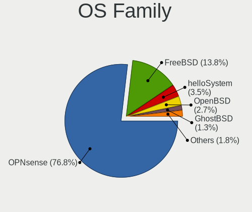

BSD - Hardware Trends
---------------------

A project to identify most popular hardware characteristics and track their change
over time based on data collected by BSD users at https://BSD-Hardware.info.

Anyone can contribute to this report by the [hw-probe](https://github.com/linuxhw/hw-probe/blob/master/INSTALL.BSD.md) tool:

    hw-probe -all -upload

This is a report for all computer types. See also reports for [desktops](/Desktop/README.md) and [notebooks](/Notebook/README.md).

OS-specific reports: [FreeBSD](/Dist/FreeBSD), [OPNsense](/Dist/OPNsense), [helloSystem](/Dist/helloSystem), [OpenBSD](/Dist/OpenBSD).

This report is for one last month. Overall report since the beginning of time: [TestCoverage](https://github.com/bsdhw/TestCoverage)

Period: Jan, 2023.

Contents
--------

* [ System ](#system)
  - [ OS                       ](#os)
  - [ OS Family                ](#os-family)
  - [ Arch                     ](#arch)
  - [ DE                       ](#de)
  - [ Display Server           ](#display-server)
  - [ Display Manager          ](#display-manager)
  - [ OS Lang                  ](#os-lang)
  - [ Boot Mode                ](#boot-mode)
  - [ Filesystem               ](#filesystem)
  - [ Part. scheme             ](#part-scheme)

* [ Board ](#board)
  - [ Vendor                   ](#vendor)
  - [ Model                    ](#model)
  - [ Model Family             ](#model-family)
  - [ MFG Year                 ](#mfg-year)
  - [ Form Factor              ](#form-factor)
  - [ Coreboot                 ](#coreboot)
  - [ RAM Size                 ](#ram-size)
  - [ RAM Used                 ](#ram-used)
  - [ Total Drives             ](#total-drives)
  - [ Has CD-ROM               ](#has-cd-rom)
  - [ Has Ethernet             ](#has-ethernet)
  - [ Has WiFi                 ](#has-wifi)
  - [ Has Bluetooth            ](#has-bluetooth)

* [ Location ](#location)
  - [ Country                  ](#country)
  - [ City                     ](#city)

* [ Drives ](#drives)
  - [ Drive Vendor             ](#drive-vendor)
  - [ Drive Model              ](#drive-model)
  - [ HDD Vendor               ](#hdd-vendor)
  - [ SSD Vendor               ](#ssd-vendor)
  - [ Drive Kind               ](#drive-kind)
  - [ Drive Connector          ](#drive-connector)
  - [ Drive Size               ](#drive-size)
  - [ Space Total              ](#space-total)
  - [ Space Used               ](#space-used)
  - [ Malfunc. Drives          ](#malfunc-drives)
  - [ Malfunc. Drive Vendor    ](#malfunc-drive-vendor)
  - [ Malfunc. HDD Vendor      ](#malfunc-hdd-vendor)
  - [ Malfunc. Drive Kind      ](#malfunc-drive-kind)
  - [ Failed Drives            ](#failed-drives)
  - [ Failed Drive Vendor      ](#failed-drive-vendor)
  - [ Drive Status             ](#drive-status)

* [ Storage controller ](#storage-controller)
  - [ Storage Vendor           ](#storage-vendor)
  - [ Storage Model            ](#storage-model)
  - [ Storage Kind             ](#storage-kind)

* [ Processor ](#processor)
  - [ CPU Vendor               ](#cpu-vendor)
  - [ CPU Model                ](#cpu-model)
  - [ CPU Model Family         ](#cpu-model-family)
  - [ CPU Cores                ](#cpu-cores)
  - [ CPU Sockets              ](#cpu-sockets)
  - [ CPU Threads              ](#cpu-threads)
  - [ CPU Microarch            ](#cpu-microarch)

* [ Graphics ](#graphics)
  - [ GPU Vendor               ](#gpu-vendor)
  - [ GPU Model                ](#gpu-model)
  - [ GPU Combo                ](#gpu-combo)
  - [ GPU Driver               ](#gpu-driver)
  - [ GPU Memory               ](#gpu-memory)

* [ Monitor ](#monitor)
  - [ Monitor Vendor           ](#monitor-vendor)
  - [ Monitor Model            ](#monitor-model)
  - [ Monitor Resolution       ](#monitor-resolution)
  - [ Monitor Diagonal         ](#monitor-diagonal)
  - [ Monitor Width            ](#monitor-width)
  - [ Aspect Ratio             ](#aspect-ratio)
  - [ Monitor Area             ](#monitor-area)
  - [ Pixel Density            ](#pixel-density)
  - [ Multiple Monitors        ](#multiple-monitors)

* [ Network ](#network)
  - [ Net Controller Vendor    ](#net-controller-vendor)
  - [ Net Controller Model     ](#net-controller-model)
  - [ Wireless Vendor          ](#wireless-vendor)
  - [ Wireless Model           ](#wireless-model)
  - [ Ethernet Vendor          ](#ethernet-vendor)
  - [ Ethernet Model           ](#ethernet-model)
  - [ Net Controller Kind      ](#net-controller-kind)
  - [ Used Controller          ](#used-controller)
  - [ NICs                     ](#nics)
  - [ IPv6                     ](#ipv6)

* [ Bluetooth ](#bluetooth)
  - [ Bluetooth Vendor         ](#bluetooth-vendor)
  - [ Bluetooth Model          ](#bluetooth-model)

* [ Sound ](#sound)
  - [ Sound Vendor             ](#sound-vendor)
  - [ Sound Model              ](#sound-model)

* [ Memory ](#memory)
  - [ Memory Vendor            ](#memory-vendor)
  - [ Memory Model             ](#memory-model)
  - [ Memory Kind              ](#memory-kind)
  - [ Memory Form Factor       ](#memory-form-factor)
  - [ Memory Size              ](#memory-size)
  - [ Memory Speed             ](#memory-speed)

* [ Printers & scanners ](#printers--scanners)
  - [ Printer Vendor           ](#printer-vendor)
  - [ Printer Model            ](#printer-model)
  - [ Scanner Vendor           ](#scanner-vendor)
  - [ Scanner Model            ](#scanner-model)

* [ Camera ](#camera)
  - [ Camera Vendor            ](#camera-vendor)
  - [ Camera Model             ](#camera-model)

* [ Security ](#security)
  - [ Fingerprint Vendor       ](#fingerprint-vendor)
  - [ Fingerprint Model        ](#fingerprint-model)
  - [ Chipcard Vendor          ](#chipcard-vendor)
  - [ Chipcard Model           ](#chipcard-model)

* [ Unsupported ](#unsupported)
  - [ Unsupported Devices      ](#unsupported-devices)
  - [ Unsupported Device Types ](#unsupported-device-types)

System
------

OS
--

Installed operating systems

| Name                 | Computers | Percent |
|----------------------|-----------|---------|
| OPNsense 22.7.10     | 169       | 31.35%  |
| OPNsense 22.7.11     | 80        | 14.84%  |
| OPNsense 23.1        | 60        | 11.13%  |
| helloSystem 0.8.0    | 60        | 11.13%  |
| FreeBSD 13.1-p5      | 43        | 7.98%   |
| helloSystem 0.7.0    | 26        | 4.82%   |
| OpenBSD 7.2          | 24        | 4.45%   |
| FreeBSD 13.1         | 10        | 1.86%   |
| FreeBSD 13.1-STABLE  | 9         | 1.67%   |
| OPNsense 22.1.10     | 8         | 1.48%   |
| FreeBSD 14.0-CURRENT | 7         | 1.3%    |
| OPNsense 22.10       | 6         | 1.11%   |
| NomadBSD 20221130    | 3         | 0.56%   |
| FreeBSD 12.3         | 3         | 0.56%   |
| OPNsense 21.7.8      | 2         | 0.37%   |
| FuguIta 7.2          | 2         | 0.37%   |
| FreeBSD 12.4         | 2         | 0.37%   |
| FreeBSD 12.3-STABLE  | 2         | 0.37%   |
| XigmaNAS 12.3-p6     | 1         | 0.19%   |
| TrueNAS 13.1-p2      | 1         | 0.19%   |
| TrueNAS 12.3-p7      | 1         | 0.19%   |
| TrueNAS 12.2-p10     | 1         | 0.19%   |
| pfSense 2.6.0        | 1         | 0.19%   |
| OPNsense 23.7        | 1         | 0.19%   |
| OPNsense 22.7.9      | 1         | 0.19%   |
| OPNsense 22.7.8      | 1         | 0.19%   |
| OPNsense 22.7.5      | 1         | 0.19%   |
| OPNsense 22.7.2      | 1         | 0.19%   |
| OPNsense 22.7        | 1         | 0.19%   |
| OPNsense 21.1.9      | 1         | 0.19%   |
| OpenBSD 7.0          | 1         | 0.19%   |
| NetBSD 10.99.1       | 1         | 0.19%   |
| MyBee 13.1-p5        | 1         | 0.19%   |
| MidnightBSD 2.2.6    | 1         | 0.19%   |
| MidnightBSD 2.2.5    | 1         | 0.19%   |
| GhostBSD 23.01.13    | 1         | 0.19%   |
| GhostBSD 22.12.20    | 1         | 0.19%   |
| FuryBSD 12.1-p9      | 1         | 0.19%   |
| FreeBSD 13.1-p3      | 1         | 0.19%   |
| FreeBSD 13.0-p7      | 1         | 0.19%   |

OS Family
---------

OS without a version

| Name        | Computers | Percent |
|-------------|-----------|---------|
| OPNsense    | 332       | 61.6%   |
| helloSystem | 86        | 15.96%  |
| FreeBSD     | 79        | 14.66%  |
| OpenBSD     | 25        | 4.64%   |
| TrueNAS     | 3         | 0.56%   |
| NomadBSD    | 3         | 0.56%   |
| MidnightBSD | 2         | 0.37%   |
| GhostBSD    | 2         | 0.37%   |
| FuguIta     | 2         | 0.37%   |
| XigmaNAS    | 1         | 0.19%   |
| pfSense     | 1         | 0.19%   |
| NetBSD      | 1         | 0.19%   |
| MyBee       | 1         | 0.19%   |
| FuryBSD     | 1         | 0.19%   |

Arch
----

OS architecture (x86_64, i586, etc.)

| Name  | Computers | Percent |
|-------|-----------|---------|
| amd64 | 534       | 99.07%  |
| i386  | 3         | 0.56%   |
| arm64 | 2         | 0.37%   |

DE
--

Desktop Environment

| Name          | Computers | Percent |
|---------------|-----------|---------|
| Console       | 371       | 68.83%  |
| helloDesktop  | 108       | 20.04%  |
| XFCE          | 14        | 2.6%    |
| KDE5          | 10        | 1.86%   |
| MATE          | 8         | 1.48%   |
| Openbox       | 6         | 1.11%   |
| TWM           | 5         | 0.93%   |
| i3            | 5         | 0.93%   |
| GNOME         | 5         | 0.93%   |
| IceWM         | 2         | 0.37%   |
| sway          | 1         | 0.19%   |
| Lumina        | 1         | 0.19%   |
| Enlightenment | 1         | 0.19%   |
| DWM           | 1         | 0.19%   |
| CTWM          | 1         | 0.19%   |

Display Server
--------------

X11 or Wayland

| Name    | Computers | Percent |
|---------|-----------|---------|
| Console | 378       | 70.13%  |
| X11     | 158       | 29.31%  |
| Wayland | 3         | 0.56%   |

Display Manager
---------------

SDDM, LightDM, etc.

| Name    | Computers | Percent |
|---------|-----------|---------|
| Console | 415       | 76.99%  |
| SLiM    | 93        | 17.25%  |
| SDDM    | 14        | 2.6%    |
| XDM     | 6         | 1.11%   |
| LightDM | 6         | 1.11%   |
| Ly      | 4         | 0.74%   |
| GDM     | 1         | 0.19%   |

OS Lang
-------

Language

| Lang         | Computers | Percent |
|--------------|-----------|---------|
| Unknown      | 359       | 66.6%   |
| C            | 57        | 10.58%  |
| en_US        | 45        | 8.35%   |
| en           | 32        | 5.94%   |
| ru           | 10        | 1.86%   |
| ru_RU        | 4         | 0.74%   |
| de           | 4         | 0.74%   |
| pt           | 3         | 0.56%   |
| es_ES        | 3         | 0.56%   |
| es           | 3         | 0.56%   |
| en_GB        | 3         | 0.56%   |
| pl_PL        | 2         | 0.37%   |
| fr           | 2         | 0.37%   |
| en_CA        | 2         | 0.37%   |
| en_AU        | 2         | 0.37%   |
| zh_CN        | 1         | 0.19%   |
| ru_RU.KOI8-R | 1         | 0.19%   |
| it           | 1         | 0.19%   |
| ISO8859-15   | 1         | 0.19%   |
| fi_FI        | 1         | 0.19%   |
| de_DE        | 1         | 0.19%   |
| cs_CZ        | 1         | 0.19%   |
| bg_BG        | 1         | 0.19%   |

Boot Mode
---------

EFI or BIOS

| Mode | Computers | Percent |
|------|-----------|---------|
| EFI  | 489       | 90.72%  |
| BIOS | 50        | 9.28%   |

Filesystem
----------

Type of filesystem

| Type    | Computers | Percent |
|---------|-----------|---------|
| Ufs     | 238       | 44.16%  |
| Zfs     | 220       | 40.82%  |
| Cd9660  | 53        | 9.83%   |
| Ffs     | 27        | 5.01%   |
| Unknown | 1         | 0.19%   |

Part. scheme
------------

Scheme of partitioning

| Type    | Computers | Percent |
|---------|-----------|---------|
| GPT     | 509       | 94.43%  |
| MBR     | 25        | 4.64%   |
| Unknown | 5         | 0.93%   |

Board
-----

Vendor
------

Motherboard manufacturer

| Name                       | Computers | Percent |
|----------------------------|-----------|---------|
| Dell                       | 64        | 11.87%  |
| Unknown                    | 55        | 10.2%   |
| Lenovo                     | 54        | 10.02%  |
| Hewlett-Packard            | 52        | 9.65%   |
| ASUSTek Computer           | 46        | 8.53%   |
| Gigabyte Technology        | 24        | 4.45%   |
| Supermicro                 | 23        | 4.27%   |
| Techvision                 | 18        | 3.34%   |
| Intel                      | 18        | 3.34%   |
| MSI                        | 14        | 2.6%    |
| ASRock                     | 14        | 2.6%    |
| AMI                        | 13        | 2.41%   |
| Protectli                  | 12        | 2.23%   |
| Fujitsu                    | 11        | 2.04%   |
| PC Engines                 | 10        | 1.86%   |
| Acer                       | 9         | 1.67%   |
| Sophos                     | 7         | 1.3%    |
| Deciso                     | 7         | 1.3%    |
| CncTion                    | 7         | 1.3%    |
| ZOTAC                      | 6         | 1.11%   |
| Biostar                    | 5         | 0.93%   |
| Apple                      | 5         | 0.93%   |
| MW                         | 4         | 0.74%   |
| Google                     | 3         | 0.56%   |
| Datto                      | 3         | 0.56%   |
| AZW                        | 3         | 0.56%   |
| TYAN Computer              | 2         | 0.37%   |
| SLIMBOOK                   | 2         | 0.37%   |
| Shuttle                    | 2         | 0.37%   |
| ShenZhen MinWin Technology | 2         | 0.37%   |
| Samsung Electronics        | 2         | 0.37%   |
| F-Plus Mobile              | 2         | 0.37%   |
| BESSTAR Tech               | 2         | 0.37%   |
| ASRockRack                 | 2         | 0.37%   |
| AMD                        | 2         | 0.37%   |
| YANYU                      | 1         | 0.19%   |
| Wortmann AG                | 1         | 0.19%   |
| Winston Marriot            | 1         | 0.19%   |
| TUXEDO                     | 1         | 0.19%   |
| Toshiba                    | 1         | 0.19%   |

Model
-----

Motherboard model

| Name                                | Computers | Percent |
|-------------------------------------|-----------|---------|
| Unknown                             | 56        | 10.39%  |
| Techvision TVI7309X                 | 18        | 3.34%   |
| AMI Aptio CRB                       | 9         | 1.67%   |
| Supermicro Super Server             | 8         | 1.48%   |
| Protectli FW6                       | 7         | 1.3%    |
| ASUS All Series                     | 6         | 1.11%   |
| PC Engines APU2                     | 5         | 0.93%   |
| Fujitsu FUTRO S920                  | 5         | 0.93%   |
| CncTion N5105-4L                    | 5         | 0.93%   |
| Sophos SG                           | 4         | 0.74%   |
| PC Engines apu4                     | 4         | 0.74%   |
| MW GMLK-2_5G4L                      | 4         | 0.74%   |
| HP t620 PLUS Quad Core TC           | 4         | 0.74%   |
| Dell OptiPlex 7020                  | 4         | 0.74%   |
| Supermicro X9SCL/X9SCM              | 3         | 0.56%   |
| Sophos UTM                          | 3         | 0.56%   |
| Protectli FW4B                      | 3         | 0.56%   |
| Intel Q3XXG4-P V1.0                 | 3         | 0.56%   |
| HP t730 Thin Client                 | 3         | 0.56%   |
| HP EliteDesk 800 G3 SFF             | 3         | 0.56%   |
| HP EliteDesk 800 G1 SFF             | 3         | 0.56%   |
| Fujitsu PRIMERGY RX200 S6           | 3         | 0.56%   |
| Dell Precision Tower 5810           | 3         | 0.56%   |
| Dell OptiPlex 7050                  | 3         | 0.56%   |
| Dell OptiPlex 3020                  | 3         | 0.56%   |
| Deciso NetBoard-A10                 | 3         | 0.56%   |
| AMI SG                              | 3         | 0.56%   |
| ZOTAC ZBOX-CI323NANO                | 2         | 0.37%   |
| Supermicro X10SLL-F                 | 2         | 0.37%   |
| Lenovo IdeaPad 110-14AST 80TQ       | 2         | 0.37%   |
| Intel SKYBAY                        | 2         | 0.37%   |
| Intel Nobilis                       | 2         | 0.37%   |
| HP ProLiant DL160 Gen9              | 2         | 0.37%   |
| HP ProDesk 400 G5 SFF               | 2         | 0.37%   |
| HP ProDesk 400 G4 MT                | 2         | 0.37%   |
| Gigabyte Z390 AORUS ELITE           | 2         | 0.37%   |
| F-Plus Mobile FLAPTOP r             | 2         | 0.37%   |
| Dell XPS 13 9310                    | 2         | 0.37%   |
| Dell Wyse 5070 Extended Thin Client | 2         | 0.37%   |
| Dell Precision 5540                 | 2         | 0.37%   |

Model Family
------------

Motherboard model prefix

| Name                | Computers | Percent |
|---------------------|-----------|---------|
| Unknown             | 56        | 10.39%  |
| Dell OptiPlex       | 30        | 5.57%   |
| Lenovo ThinkPad     | 28        | 5.19%   |
| Techvision TVI7309X | 18        | 3.34%   |
| HP EliteDesk        | 10        | 1.86%   |
| Dell PowerEdge      | 9         | 1.67%   |
| ASUS PRIME          | 9         | 1.67%   |
| AMI Aptio           | 9         | 1.67%   |
| Supermicro Super    | 8         | 1.48%   |
| Lenovo ThinkCentre  | 8         | 1.48%   |
| ASUS ROG            | 8         | 1.48%   |
| Protectli FW6       | 7         | 1.3%    |
| HP ProDesk          | 7         | 1.3%    |
| Acer Aspire         | 7         | 1.3%    |
| Fujitsu FUTRO       | 6         | 1.11%   |
| Dell Precision      | 6         | 1.11%   |
| Dell Latitude       | 6         | 1.11%   |
| Dell Inspiron       | 6         | 1.11%   |
| ASUS All            | 6         | 1.11%   |
| PC Engines APU2     | 5         | 0.93%   |
| HP t620             | 5         | 0.93%   |
| HP ProLiant         | 5         | 0.93%   |
| CncTion N5105-4L    | 5         | 0.93%   |
| Sophos SG           | 4         | 0.74%   |
| PC Engines apu4     | 4         | 0.74%   |
| MW GMLK-2           | 4         | 0.74%   |
| Lenovo IdeaPad      | 4         | 0.74%   |
| HP Pavilion         | 4         | 0.74%   |
| HP EliteBook        | 4         | 0.74%   |
| HP Compaq           | 4         | 0.74%   |
| ASUS TUF            | 4         | 0.74%   |
| Supermicro X9SCL    | 3         | 0.56%   |
| Sophos UTM          | 3         | 0.56%   |
| Protectli FW4B      | 3         | 0.56%   |
| Intel Q3XXG4-P      | 3         | 0.56%   |
| HP t730             | 3         | 0.56%   |
| Fujitsu PRIMERGY    | 3         | 0.56%   |
| Dell Wyse           | 3         | 0.56%   |
| Deciso NetBoard-A10 | 3         | 0.56%   |
| AMI SG              | 3         | 0.56%   |

MFG Year
--------

Motherboard manufacture year

| Year    | Computers | Percent |
|---------|-----------|---------|
| 2022    | 108       | 20.04%  |
| 2018    | 57        | 10.58%  |
| 2021    | 55        | 10.2%   |
| 2019    | 51        | 9.46%   |
| 2014    | 43        | 7.98%   |
| 2020    | 32        | 5.94%   |
| 2017    | 30        | 5.57%   |
| 2015    | 30        | 5.57%   |
| 2013    | 30        | 5.57%   |
| 2016    | 29        | 5.38%   |
| 2012    | 21        | 3.9%    |
| 2011    | 18        | 3.34%   |
| 2010    | 14        | 2.6%    |
| 2008    | 7         | 1.3%    |
| 2009    | 4         | 0.74%   |
| Unknown | 4         | 0.74%   |
| 2023    | 3         | 0.56%   |
| 2006    | 2         | 0.37%   |
| 2007    | 1         | 0.19%   |

Form Factor
-----------

Physical design of the computer

| Name           | Computers | Percent |
|----------------|-----------|---------|
| Desktop        | 346       | 64.19%  |
| Notebook       | 115       | 21.34%  |
| Mini pc        | 35        | 6.49%   |
| Server         | 30        | 5.57%   |
| Firewall       | 7         | 1.3%    |
| All in one     | 3         | 0.56%   |
| System on chip | 1         | 0.19%   |
| Tablet         | 1         | 0.19%   |
| Convertible    | 1         | 0.19%   |

Coreboot
--------

Have coreboot on board

| Used | Computers | Percent |
|------|-----------|---------|
| No   | 522       | 96.85%  |
| Yes  | 17        | 3.15%   |

RAM Size
--------

Total RAM memory

| Size in GB      | Computers | Percent |
|-----------------|-----------|---------|
| 8.01-16.0       | 189       | 35.06%  |
| 16.01-24.0      | 137       | 25.42%  |
| 4.01-8.0        | 103       | 19.11%  |
| 32.01-64.0      | 61        | 11.32%  |
| 64.01-256.0     | 30        | 5.57%   |
| 2.01-3.0        | 6         | 1.11%   |
| 3.01-4.0        | 4         | 0.74%   |
| 24.01-32.0      | 4         | 0.74%   |
| 0.51-1.0        | 3         | 0.56%   |
| More than 256.0 | 1         | 0.19%   |
| 1.01-2.0        | 1         | 0.19%   |

RAM Used
--------

Used RAM memory

| Used GB    | Computers | Percent |
|------------|-----------|---------|
| 0.01-0.5   | 265       | 49.17%  |
| 0.51-1.0   | 155       | 28.76%  |
| 1.01-2.0   | 81        | 15.03%  |
| 2.01-3.0   | 16        | 2.97%   |
| 3.01-4.0   | 9         | 1.67%   |
| 4.01-8.0   | 4         | 0.74%   |
| 8.01-16.0  | 3         | 0.56%   |
| 24.01-32.0 | 2         | 0.37%   |
| 16.01-24.0 | 2         | 0.37%   |
| 0          | 1         | 0.19%   |
| Unknown    | 1         | 0.19%   |

Total Drives
------------

Number of drives on board

| Drives | Computers | Percent |
|--------|-----------|---------|
| 1      | 388       | 71.99%  |
| 2      | 63        | 11.69%  |
| 0      | 43        | 7.98%   |
| 3      | 28        | 5.19%   |
| 5      | 5         | 0.93%   |
| 4      | 5         | 0.93%   |
| 10     | 2         | 0.37%   |
| 16     | 1         | 0.19%   |
| 13     | 1         | 0.19%   |
| 11     | 1         | 0.19%   |
| 8      | 1         | 0.19%   |
| 7      | 1         | 0.19%   |

Has CD-ROM
----------

Has CD-ROM on board

| Presented | Computers | Percent |
|-----------|-----------|---------|
| No        | 456       | 84.6%   |
| Yes       | 83        | 15.4%   |

Has Ethernet
------------

Has Ethernet on board

| Presented | Computers | Percent |
|-----------|-----------|---------|
| Yes       | 513       | 95.18%  |
| No        | 26        | 4.82%   |

Has WiFi
--------

Has WiFi module

| Presented | Computers | Percent |
|-----------|-----------|---------|
| No        | 355       | 65.86%  |
| Yes       | 184       | 34.14%  |

Has Bluetooth
-------------

Has Bluetooth module

| Presented | Computers | Percent |
|-----------|-----------|---------|
| No        | 409       | 75.88%  |
| Yes       | 130       | 24.12%  |

Location
--------

Country
-------

Geographic location (country)

| Country     | Computers | Percent |
|-------------|-----------|---------|
| USA         | 153       | 28.39%  |
| Germany     | 76        | 14.1%   |
| Russia      | 39        | 7.24%   |
| Canada      | 26        | 4.82%   |
| UK          | 21        | 3.9%    |
| Spain       | 19        | 3.53%   |
| Netherlands | 17        | 3.15%   |
| France      | 15        | 2.78%   |
| Poland      | 13        | 2.41%   |
| Austria     | 11        | 2.04%   |
| Australia   | 11        | 2.04%   |
| Sweden      | 10        | 1.86%   |
| Brazil      | 10        | 1.86%   |
| Italy       | 9         | 1.67%   |
| Bulgaria    | 9         | 1.67%   |
| Switzerland | 8         | 1.48%   |
| Romania     | 8         | 1.48%   |
| Indonesia   | 7         | 1.3%    |
| Hungary     | 5         | 0.93%   |
| Finland     | 5         | 0.93%   |
| Czechia     | 5         | 0.93%   |
| South Korea | 4         | 0.74%   |
| Norway      | 4         | 0.74%   |
| China       | 4         | 0.74%   |
| Taiwan      | 2         | 0.37%   |
| Slovakia    | 2         | 0.37%   |
| Portugal    | 2         | 0.37%   |
| Philippines | 2         | 0.37%   |
| Luxembourg  | 2         | 0.37%   |
| Israel      | 2         | 0.37%   |
| Isle of Man | 2         | 0.37%   |
| Ireland     | 2         | 0.37%   |
| India       | 2         | 0.37%   |
| Greece      | 2         | 0.37%   |
| Denmark     | 2         | 0.37%   |
| Costa Rica  | 2         | 0.37%   |
| Belgium     | 2         | 0.37%   |
| Argentina   | 2         | 0.37%   |
| Venezuela   | 1         | 0.19%   |
| Uruguay     | 1         | 0.19%   |

City
----

Geographic location (city)

| City              | Computers | Percent |
|-------------------|-----------|---------|
| Moscow            | 17        | 3.15%   |
| Austin            | 8         | 1.48%   |
| Vienna            | 7         | 1.3%    |
| London            | 7         | 1.3%    |
| Seattle           | 6         | 1.11%   |
| Hamburg           | 6         | 1.11%   |
| Berlin            | 6         | 1.11%   |
| Amsterdam         | 5         | 0.93%   |
| Sydney            | 4         | 0.74%   |
| St Petersburg     | 4         | 0.74%   |
| Lafayette         | 4         | 0.74%   |
| Fayetteville      | 4         | 0.74%   |
| Bucharest         | 4         | 0.74%   |
| Zurich            | 3         | 0.56%   |
| Warsaw            | 3         | 0.56%   |
| Remseck am Neckar | 3         | 0.56%   |
| Paris             | 3         | 0.56%   |
| Madrid            | 3         | 0.56%   |
| Grand Rapids      | 3         | 0.56%   |
| Daly City         | 3         | 0.56%   |
| Chandler          | 3         | 0.56%   |
| Calgary           | 3         | 0.56%   |
| Borken            | 3         | 0.56%   |
| Adelaide          | 3         | 0.56%   |
| Yekaterinburg     | 2         | 0.37%   |
| Winnipeg          | 2         | 0.37%   |
| Voronezh          | 2         | 0.37%   |
| Stockholm         | 2         | 0.37%   |
| Sofia             | 2         | 0.37%   |
| Saratov           | 2         | 0.37%   |
| Saratoga Springs  | 2         | 0.37%   |
| San Mateo         | 2         | 0.37%   |
| Salem             | 2         | 0.37%   |
| Saarbrücken      | 2         | 0.37%   |
| Redmond           | 2         | 0.37%   |
| Pullman           | 2         | 0.37%   |
| Prior Lake        | 2         | 0.37%   |
| Portland          | 2         | 0.37%   |
| Paterna           | 2         | 0.37%   |
| Oslo              | 2         | 0.37%   |

Drives
------

Drive Vendor
------------

Hard drive vendors

| Vendor              | Computers | Drives | Percent |
|---------------------|-----------|--------|---------|
| Samsung Electronics | 86        | 113    | 14.24%  |
| WDC                 | 69        | 107    | 11.42%  |
| Kingston            | 54        | 60     | 8.94%   |
| Seagate             | 45        | 59     | 7.45%   |
| Intel               | 29        | 32     | 4.8%    |
| Crucial             | 29        | 32     | 4.8%    |
| Transcend           | 23        | 24     | 3.81%   |
| SanDisk             | 23        | 23     | 3.81%   |
| Toshiba             | 17        | 17     | 2.81%   |
| NVMe                | 12        | 15     | 1.99%   |
| Hitachi             | 12        | 13     | 1.99%   |
| China               | 12        | 12     | 1.99%   |
| A-DATA Technology   | 12        | 13     | 1.99%   |
| Hoodisk             | 9         | 9      | 1.49%   |
| SK hynix            | 8         | 8      | 1.32%   |
| Phison              | 8         | 10     | 1.32%   |
| Silicon Motion      | 7         | 7      | 1.16%   |
| PNY                 | 7         | 8      | 1.16%   |
| Patriot             | 7         | 7      | 1.16%   |
| Micron Technology   | 7         | 8      | 1.16%   |
| Team                | 6         | 6      | 0.99%   |
| Fanxiang            | 6         | 6      | 0.99%   |
| SPCC                | 5         | 5      | 0.83%   |
| LITEON              | 5         | 5      | 0.83%   |
| KingSpec            | 5         | 5      | 0.83%   |
| HGST                | 5         | 12     | 0.83%   |
| FORESEE             | 5         | 5      | 0.83%   |
| Corsair             | 5         | 5      | 0.83%   |
| OCZ                 | 4         | 4      | 0.66%   |
| Hewlett-Packard     | 4         | 4      | 0.66%   |
| Gigabyte Technology | 4         | 4      | 0.66%   |
| Protectli           | 3         | 3      | 0.5%    |
| Plextor             | 3         | 3      | 0.5%    |
| Lenovo              | 3         | 3      | 0.5%    |
| KIOXIA              | 3         | 3      | 0.5%    |
| Innodisk            | 3         | 3      | 0.5%    |
| Dogfish             | 3         | 3      | 0.5%    |
| Apple               | 3         | 4      | 0.5%    |
| Apacer              | 3         | 3      | 0.5%    |
| XrayDisk            | 2         | 2      | 0.33%   |

Drive Model
-----------

Hard drive models

| Model                           | Computers | Percent |
|---------------------------------|-----------|---------|
| Kingston SA400S37240G 240GB     | 9         | 1.38%   |
| Samsung SSD 850 EVO 250GB       | 7         | 1.08%   |
| NVMe Samsung SSD 980 1TB        | 6         | 0.92%   |
| Samsung SSD 980 500GB           | 5         | 0.77%   |
| Hoodisk SSD 64GB                | 5         | 0.77%   |
| Transcend TS64GSSD370 64GB      | 4         | 0.62%   |
| Transcend TS256GMTS952T2 256GB  | 4         | 0.62%   |
| Seagate ST1000LM035-1RK172 1TB  | 4         | 0.62%   |
| Samsung SSD 850 EVO 500GB       | 4         | 0.62%   |
| Samsung SSD 850 EVO 1TB         | 4         | 0.62%   |
| Phison Sabrent 2TB              | 4         | 0.62%   |
| Kingston SUV400S37120G 120GB    | 4         | 0.62%   |
| China SATA SSD 16GB             | 4         | 0.62%   |
| WDC WD800JD-75MSA3 80GB         | 3         | 0.46%   |
| SK hynix SC311 SATA 256GB       | 3         | 0.46%   |
| Seagate ST500DM002-1BD142 500GB | 3         | 0.46%   |
| Seagate ST4000DM000-1F2168 4TB  | 3         | 0.46%   |
| SanDisk SSD PLUS 240GB          | 3         | 0.46%   |
| Samsung SSD 970 EVO Plus 2TB    | 3         | 0.46%   |
| Samsung SSD 970 EVO Plus 1TB    | 3         | 0.46%   |
| Samsung SSD 860 EVO 500GB       | 3         | 0.46%   |
| Samsung SSD 860 EVO 1TB         | 3         | 0.46%   |
| PNY CS900 120GB SSD             | 3         | 0.46%   |
| Kingston SUV500MS120G 120GB     | 3         | 0.46%   |
| Kingston SUV400S37240G 240GB    | 3         | 0.46%   |
| Kingston SKC600MS256G 256GB     | 3         | 0.46%   |
| Innodisk DEMSR- 08GB mSATA 3ME3 | 3         | 0.46%   |
| Hoodisk SSD 128GB               | 3         | 0.46%   |
| Crucial CT500MX500SSD1 500GB    | 3         | 0.46%   |
| Crucial CT1000BX500SSD1 1TB     | 3         | 0.46%   |
| China SATA SSD 64GB             | 3         | 0.46%   |
| WDC WDBNCE5000PNC 500GB         | 2         | 0.31%   |
| WDC WD5000AAKX-08U6AA0 500GB    | 2         | 0.31%   |
| WDC WD30EFRX-68EUZN0 3TB        | 2         | 0.31%   |
| WDC WD10JFCX-68N6GN0 1TB        | 2         | 0.31%   |
| WDC WD10EZEX-08WN4A0 1TB        | 2         | 0.31%   |
| Transcend TS64GMSA370 64GB      | 2         | 0.31%   |
| Transcend TS128GMTE110S 128GB   | 2         | 0.31%   |
| Toshiba THNSNF128GMCS 128GB     | 2         | 0.31%   |
| Toshiba HDWD110 1TB             | 2         | 0.31%   |

HDD Vendor
----------

Hard disk drive vendors

| Vendor                                 | Computers | Drives | Percent |
|----------------------------------------|-----------|--------|---------|
| WDC                                    | 57        | 93     | 40.43%  |
| Seagate                                | 44        | 58     | 31.21%  |
| Hitachi                                | 12        | 13     | 8.51%   |
| Toshiba                                | 10        | 10     | 7.09%   |
| NVMe                                   | 6         | 6      | 4.26%   |
| HGST                                   | 5         | 12     | 3.55%   |
| Samsung Electronics                    | 2         | 2      | 1.42%   |
| Product:              USB Flash Memory | 2         | 2      | 1.42%   |
| OPENBSD                                | 1         | 1      | 0.71%   |
| Hewlett-Packard                        | 1         | 1      | 0.71%   |
| Dell                                   | 1         | 2      | 0.71%   |

SSD Vendor
----------

Solid state drive vendors

| Vendor              | Computers | Drives | Percent |
|---------------------|-----------|--------|---------|
| Samsung Electronics | 50        | 66     | 14.66%  |
| Kingston            | 44        | 47     | 12.9%   |
| Crucial             | 24        | 26     | 7.04%   |
| SanDisk             | 23        | 23     | 6.74%   |
| Intel               | 22        | 25     | 6.45%   |
| Transcend           | 20        | 21     | 5.87%   |
| China               | 12        | 12     | 3.52%   |
| Hoodisk             | 9         | 9      | 2.64%   |
| A-DATA Technology   | 9         | 10     | 2.64%   |
| NVMe                | 8         | 9      | 2.35%   |
| PNY                 | 7         | 8      | 2.05%   |
| WDC                 | 6         | 6      | 1.76%   |
| Micron Technology   | 6         | 7      | 1.76%   |
| Team                | 5         | 5      | 1.47%   |
| SK hynix            | 5         | 5      | 1.47%   |
| KingSpec            | 5         | 5      | 1.47%   |
| Toshiba             | 4         | 4      | 1.17%   |
| Patriot             | 4         | 4      | 1.17%   |
| OCZ                 | 4         | 4      | 1.17%   |
| LITEON              | 4         | 4      | 1.17%   |
| SPCC                | 3         | 3      | 0.88%   |
| Protectli           | 3         | 3      | 0.88%   |
| Plextor             | 3         | 3      | 0.88%   |
| Innodisk            | 3         | 3      | 0.88%   |
| Hewlett-Packard     | 3         | 3      | 0.88%   |
| Dogfish             | 3         | 3      | 0.88%   |
| Apple               | 3         | 4      | 0.88%   |
| Apacer              | 3         | 3      | 0.88%   |
| Timetec             | 2         | 2      | 0.59%   |
| Supermicro          | 2         | 2      | 0.59%   |
| Lenovo              | 2         | 2      | 0.59%   |
| Kston               | 2         | 2      | 0.59%   |
| Intenso             | 2         | 2      | 0.59%   |
| GOODRAM             | 2         | 2      | 0.59%   |
| FORESEE             | 2         | 2      | 0.59%   |
| Corsair             | 2         | 2      | 0.59%   |
| BORY                | 2         | 2      | 0.59%   |
| BIWIN               | 2         | 2      | 0.59%   |
| XrayDisk            | 1         | 1      | 0.29%   |
| Verbatim            | 1         | 1      | 0.29%   |

Drive Kind
----------

HDD or SSD

| Kind | Computers | Drives | Percent |
|------|-----------|--------|---------|
| SSD  | 310       | 371    | 55.26%  |
| HDD  | 126       | 200    | 22.46%  |
| NVMe | 125       | 143    | 22.28%  |

Drive Connector
---------------

SATA, SAS, NVMe, etc.

| Type | Computers | Drives | Percent |
|------|-----------|--------|---------|
| SATA | 397       | 571    | 76.05%  |
| NVMe | 125       | 143    | 23.95%  |

Drive Size
----------

Size of hard drive

| Size in TB | Computers | Drives | Percent |
|------------|-----------|--------|---------|
| 0.01-0.5   | 328       | 381    | 72.89%  |
| 0.51-1.0   | 71        | 95     | 15.78%  |
| 1.01-2.0   | 23        | 37     | 5.11%   |
| 3.01-4.0   | 10        | 18     | 2.22%   |
| 4.01-10.0  | 10        | 22     | 2.22%   |
| 2.01-3.0   | 4         | 5      | 0.89%   |
| 10.01-20.0 | 4         | 13     | 0.89%   |

Space Total
-----------

Amount of disk space available on the file system

| Size in GB     | Computers | Percent |
|----------------|-----------|---------|
| 101-250        | 236       | 43.78%  |
| 251-500        | 90        | 16.7%   |
| 1-20           | 76        | 14.1%   |
| 51-100         | 48        | 8.91%   |
| 21-50          | 36        | 6.68%   |
| 501-1000       | 31        | 5.75%   |
| 1001-2000      | 13        | 2.41%   |
| More than 3000 | 5         | 0.93%   |
| 2001-3000      | 3         | 0.56%   |
| Unknown        | 1         | 0.19%   |

Space Used
----------

Amount of used disk space

| Used GB  | Computers | Percent |
|----------|-----------|---------|
| 1-20     | 499       | 92.58%  |
| 21-50    | 23        | 4.27%   |
| 51-100   | 6         | 1.11%   |
| 101-250  | 4         | 0.74%   |
| 501-1000 | 4         | 0.74%   |
| 251-500  | 2         | 0.37%   |
| Unknown  | 1         | 0.19%   |

Malfunc. Drives
---------------

Drive models with a malfunction

| Model                                        | Computers | Drives | Percent |
|----------------------------------------------|-----------|--------|---------|
| Kingston SMS200S3120G 120GB                  | 2         | 2      | 3.23%   |
| Hitachi HTS545050B9A300 500GB                | 2         | 2      | 3.23%   |
| WDC WDS240G2G0A-00JH30 240GB                 | 1         | 1      | 1.61%   |
| WDC WD6400AAKS-22A7B2 640GB                  | 1         | 1      | 1.61%   |
| WDC WD5000LPCX-60VHAT0 500GB                 | 1         | 1      | 1.61%   |
| WDC WD5000AAKX-001CA0 500GB                  | 1         | 1      | 1.61%   |
| WDC WD4000FYYZ-01UL1B0 4TB                   | 1         | 1      | 1.61%   |
| WDC WD3200BEKT-22PVMT0 320GB                 | 1         | 1      | 1.61%   |
| WDC WD3200AAKX-001CA0 320GB                  | 1         | 1      | 1.61%   |
| WDC WD2500BEVT-35A23T0 250GB                 | 1         | 1      | 1.61%   |
| WDC WD2001FASS-00W2B0 2TB                    | 1         | 1      | 1.61%   |
| WDC WD1600AAJS-00YZCA0 160GB                 | 1         | 1      | 1.61%   |
| WDC WD1600AABS-00PRA0 160GB                  | 1         | 1      | 1.61%   |
| WDC WD10JMVW-11AJGS2 1TB                     | 1         | 1      | 1.61%   |
| WDC WD10EZRZ-00HTKB0 1TB                     | 1         | 1      | 1.61%   |
| WDC WD10EAVS-00D7B0 1TB                      | 1         | 1      | 1.61%   |
| WDC WD10EADS-65M2BX 1TB                      | 1         | 1      | 1.61%   |
| WDC WD10EACS-00D6B1 1TB                      | 1         | 1      | 1.61%   |
| Toshiba MQ01ACF032 320GB                     | 1         | 1      | 1.61%   |
| Toshiba MQ01ABD100 1TB                       | 1         | 1      | 1.61%   |
| Toshiba MK3261GSYN 320GB                     | 1         | 1      | 1.61%   |
| Toshiba MK1255GSX H 120GB                    | 1         | 1      | 1.61%   |
| Toshiba MK1059GSM 1TB                        | 1         | 1      | 1.61%   |
| Toshiba DT01ACA100 1TB                       | 1         | 1      | 1.61%   |
| SK hynix SC210 2.5 7MM 256GB                 | 1         | 1      | 1.61%   |
| Seagate ST500LM000-1EJ162 500GB              | 1         | 1      | 1.61%   |
| Seagate ST500DM002-1ER14C 500GB              | 1         | 1      | 1.61%   |
| Seagate ST3500418AS 500GB                    | 1         | 1      | 1.61%   |
| Seagate ST320LT020-9YG142 320GB              | 1         | 1      | 1.61%   |
| Seagate ST320LT012-9WS14C 320GB              | 1         | 1      | 1.61%   |
| Seagate ST3000DM001-1ER166 3TB               | 1         | 2      | 1.61%   |
| Seagate ST250DM000-1BD141 250GB              | 1         | 1      | 1.61%   |
| Seagate ST2000LM015-2E8174 2TB               | 1         | 1      | 1.61%   |
| Seagate ST1000NM0011 1TB                     | 1         | 1      | 1.61%   |
| SanDisk SSD PLUS 240GB                       | 1         | 1      | 1.61%   |
| SanDisk SD8TB8U-256G-1006 256GB              | 1         | 1      | 1.61%   |
| SanDisk SD8TB8U-128G-1006 128GB              | 1         | 1      | 1.61%   |
| Samsung Electronics SSD 850 EVO 250GB        | 1         | 1      | 1.61%   |
| Samsung Electronics SSD 840 PRO Series 256GB | 1         | 1      | 1.61%   |
| Samsung Electronics HM160HI 160GB            | 1         | 1      | 1.61%   |

Malfunc. Drive Vendor
---------------------

Vendors of faulty drives

| Vendor              | Computers | Drives | Percent |
|---------------------|-----------|--------|---------|
| WDC                 | 16        | 16     | 26.23%  |
| Seagate             | 8         | 10     | 13.11%  |
| Toshiba             | 6         | 6      | 9.84%   |
| Hitachi             | 6         | 6      | 9.84%   |
| SanDisk             | 3         | 3      | 4.92%   |
| Samsung Electronics | 3         | 3      | 4.92%   |
| Kingston            | 3         | 3      | 4.92%   |
| Intel               | 3         | 3      | 4.92%   |
| Corsair             | 2         | 2      | 3.28%   |
| A-DATA Technology   | 2         | 2      | 3.28%   |
| SK hynix            | 1         | 1      | 1.64%   |
| Pioneer             | 1         | 1      | 1.64%   |
| MidasForce          | 1         | 1      | 1.64%   |
| LITEONIT            | 1         | 1      | 1.64%   |
| KingSpec            | 1         | 1      | 1.64%   |
| HP Phison           | 1         | 1      | 1.64%   |
| HGST                | 1         | 1      | 1.64%   |
| Hewlett-Packard     | 1         | 1      | 1.64%   |
| Crucial             | 1         | 1      | 1.64%   |

Malfunc. HDD Vendor
-------------------

Vendors of faulty HDD drives

| Vendor              | Computers | Drives | Percent |
|---------------------|-----------|--------|---------|
| WDC                 | 15        | 15     | 39.47%  |
| Seagate             | 8         | 10     | 21.05%  |
| Toshiba             | 6         | 6      | 15.79%  |
| Hitachi             | 6         | 6      | 15.79%  |
| Samsung Electronics | 1         | 1      | 2.63%   |
| HGST                | 1         | 1      | 2.63%   |
| Hewlett-Packard     | 1         | 1      | 2.63%   |

Malfunc. Drive Kind
-------------------

Kinds of faulty drives

| Kind | Computers | Drives | Percent |
|------|-----------|--------|---------|
| HDD  | 36        | 40     | 61.02%  |
| SSD  | 21        | 21     | 35.59%  |
| NVMe | 2         | 2      | 3.39%   |

Failed Drives
-------------

Failed drive models

| Model                                      | Computers | Drives | Percent |
|--------------------------------------------|-----------|--------|---------|
| WDC PC SN530 SDBPMPZ-256G-1101 256GB       | 1         | 1      | 33.33%  |
| Samsung Electronics SSD 980 250GB          | 1         | 1      | 33.33%  |
| Samsung Electronics SSD 970 EVO Plus 500GB | 1         | 1      | 33.33%  |

Failed Drive Vendor
-------------------

Failed drive vendors

| Vendor              | Computers | Drives | Percent |
|---------------------|-----------|--------|---------|
| Samsung Electronics | 2         | 2      | 66.67%  |
| WDC                 | 1         | 1      | 33.33%  |

Drive Status
------------

Number of failed and malfunc. drives

| Status   | Computers | Drives | Percent |
|----------|-----------|--------|---------|
| Works    | 435       | 617    | 84.63%  |
| Malfunc  | 57        | 63     | 11.09%  |
| Detected | 19        | 31     | 3.7%    |
| Failed   | 3         | 3      | 0.58%   |

Storage controller
------------------

Storage Vendor
--------------

Storage controller vendors

| Vendor                         | Computers | Percent |
|--------------------------------|-----------|---------|
| Intel                          | 399       | 58.94%  |
| AMD                            | 91        | 13.44%  |
| Samsung Electronics            | 47        | 6.94%   |
| Silicon Motion                 | 20        | 2.95%   |
| Broadcom / LSI                 | 19        | 2.81%   |
| Phison Electronics             | 17        | 2.51%   |
| SanDisk                        | 12        | 1.77%   |
| Kingston Technology Company    | 10        | 1.48%   |
| Micron/Crucial Technology      | 8         | 1.18%   |
| ASMedia Technology             | 7         | 1.03%   |
| MAXIO Technology (Hangzhou)    | 5         | 0.74%   |
| Toshiba                        | 4         | 0.59%   |
| Transcend                      | 3         | 0.44%   |
| SK hynix                       | 3         | 0.44%   |
| Realtek Semiconductor          | 3         | 0.44%   |
| Micron Technology              | 3         | 0.44%   |
| KIOXIA                         | 3         | 0.44%   |
| JMicron Technology             | 3         | 0.44%   |
| Chelsio Communications         | 3         | 0.44%   |
| Shenzhen Longsys Electronics   | 2         | 0.3%    |
| Nvidia                         | 2         | 0.3%    |
| Yangtze Memory Technologies    | 1         | 0.15%   |
| Solid State Storage Technology | 1         | 0.15%   |
| Silicon Image                  | 1         | 0.15%   |
| Marvell Technology Group       | 1         | 0.15%   |
| Lite-On Technology             | 1         | 0.15%   |
| Lite-On IT Corp. / Plextor     | 1         | 0.15%   |
| Lenovo                         | 1         | 0.15%   |
| Innodisk                       | 1         | 0.15%   |
| Hewlett-Packard                | 1         | 0.15%   |
| Dell                           | 1         | 0.15%   |
| Biwin Storage Technology       | 1         | 0.15%   |
| ADATA Technology               | 1         | 0.15%   |
| Unknown                        | 1         | 0.15%   |

Storage Model
-------------

Storage controller models

| Model                                                                            | Computers | Percent |
|----------------------------------------------------------------------------------|-----------|---------|
| AMD FCH SATA Controller [AHCI mode]                                              | 62        | 8.27%   |
| Intel Jasper Lake SATA AHCI Controller                                           | 39        | 5.2%    |
| Intel 8 Series/C220 Series Chipset Family 6-port SATA Controller 1 [AHCI mode]   | 35        | 4.67%   |
| Unknown                                                                          | 29        | 3.87%   |
| Intel Celeron/Pentium Silver Processor SATA Controller                           | 28        | 3.73%   |
| Intel Sunrise Point-LP SATA Controller [AHCI mode]                               | 26        | 3.47%   |
| Intel Q170/Q150/B150/H170/H110/Z170/CM236 Chipset SATA Controller [AHCI Mode]    | 20        | 2.67%   |
| Intel Cannon Lake PCH SATA AHCI Controller                                       | 20        | 2.67%   |
| Silicon Motion SM2263EN/SM2263XT SSD Controller                                  | 19        | 2.53%   |
| Samsung NVMe SSD Controller SM981/PM981/PM983                                    | 18        | 2.4%    |
| Intel 6 Series/C200 Series Chipset Family 6 port Desktop SATA AHCI Controller    | 17        | 2.27%   |
| Intel 200 Series PCH SATA controller [AHCI mode]                                 | 17        | 2.27%   |
| Intel Atom Processor E3800 Series SATA AHCI Controller                           | 16        | 2.13%   |
| Samsung NVMe SSD Controller 980                                                  | 14        | 1.87%   |
| Intel Atom/Celeron/Pentium Processor x5-E8000/J3xxx/N3xxx Series SATA Controller | 14        | 1.87%   |
| Intel 7 Series Chipset Family 6-port SATA Controller [AHCI mode]                 | 14        | 1.87%   |
| Intel 8 Series SATA Controller 1 [AHCI mode]                                     | 12        | 1.6%    |
| Samsung NVMe SSD Controller PM9A1/PM9A3/980PRO                                   | 11        | 1.47%   |
| Phison E12 NVMe Controller                                                       | 9         | 1.2%    |
| Intel SATA Controller [RAID mode]                                                | 9         | 1.2%    |
| Intel C610/X99 series chipset 6-Port SATA Controller [AHCI mode]                 | 9         | 1.2%    |
| AMD 400 Series Chipset SATA Controller                                           | 9         | 1.2%    |
| Intel Wildcat Point-LP SATA Controller [AHCI Mode]                               | 8         | 1.07%   |
| Intel C610/X99 series chipset sSATA Controller [AHCI mode]                       | 8         | 1.07%   |
| Intel 6 Series/C200 Series Chipset Family 6 port Mobile SATA AHCI Controller     | 8         | 1.07%   |
| Broadcom / LSI SAS2008 PCI-Express Fusion-MPT SAS-2 [Falcon]                     | 8         | 1.07%   |
| AMD 500 Series Chipset SATA Controller                                           | 8         | 1.07%   |
| Intel Volume Management Device NVMe RAID Controller                              | 7         | 0.93%   |
| Intel NM10/ICH7 Family SATA Controller [IDE mode]                                | 7         | 0.93%   |
| Intel Alder Lake-S PCH SATA Controller [AHCI Mode]                               | 7         | 0.93%   |
| AMD SB7x0/SB8x0/SB9x0 SATA Controller [AHCI mode]                                | 7         | 0.93%   |
| Samsung NVMe SSD Controller SM961/PM961/SM963                                    | 6         | 0.8%    |
| Micron/Crucial P2 NVMe PCIe SSD                                                  | 6         | 0.8%    |
| Intel Celeron N3350/Pentium N4200/Atom E3900 Series SATA AHCI Controller         | 6         | 0.8%    |
| Intel 82801JI (ICH10 Family) SATA AHCI Controller                                | 6         | 0.8%    |
| Intel 82801G (ICH7 Family) IDE Controller                                        | 6         | 0.8%    |
| MAXIO (Hangzhou) NVMe SSD Controller MAP1202                                     | 5         | 0.67%   |
| Intel C600/X79 series chipset SATA RAID Controller                               | 5         | 0.67%   |
| Intel 7 Series/C210 Series Chipset Family 6-port SATA Controller [AHCI mode]     | 5         | 0.67%   |
| Intel 5 Series/3400 Series Chipset 6 port SATA AHCI Controller                   | 5         | 0.67%   |

Storage Kind
------------

Kind of storage controller (IDE, SATA, NVMe, SAS, ...)

| Kind | Computers | Percent |
|------|-----------|---------|
| SATA | 449       | 65.36%  |
| NVMe | 145       | 21.11%  |
| IDE  | 44        | 6.4%    |
| RAID | 35        | 5.09%   |
| SAS  | 9         | 1.31%   |
| SCSI | 5         | 0.73%   |

Processor
---------

CPU Vendor
----------

Processor vendors

| Vendor | Computers | Percent |
|--------|-----------|---------|
| Intel  | 428       | 79.41%  |
| AMD    | 109       | 20.22%  |
| ARM    | 2         | 0.37%   |

CPU Model
---------

Processor models

| Model                                    | Computers | Percent |
|------------------------------------------|-----------|---------|
| Intel Celeron N5105 @ 2.00GHz            | 31        | 5.75%   |
| Intel Celeron J4125 CPU @ 2.00GHz        | 20        | 3.71%   |
| AMD GX-412TC SOC                         | 10        | 1.86%   |
| Intel Core i5-6500 CPU @ 3.20GHz         | 8         | 1.48%   |
| Intel Core i5-7500 CPU @ 3.40GHz         | 6         | 1.11%   |
| Intel Core i5-2520M CPU @ 2.50GHz        | 5         | 0.93%   |
| Intel Core i3-7100U CPU @ 2.40GHz        | 5         | 0.93%   |
| Intel Celeron N5100 @ 1.10GHz            | 5         | 0.93%   |
| Intel Celeron CPU J1900 @ 1.99GHz        | 5         | 0.93%   |
| AMD GX-415GA SOC with Radeon HD Graphics | 5         | 0.93%   |
| Intel Xeon CPU E3-1230 V2 @ 3.30GHz      | 4         | 0.74%   |
| Intel Pentium Silver N6005 @ 2.00GHz     | 4         | 0.74%   |
| Intel Pentium CPU N3700 @ 1.60GHz        | 4         | 0.74%   |
| Intel Core i7-7500U CPU @ 2.70GHz        | 4         | 0.74%   |
| Intel Core i5-8250U CPU @ 1.60GHz        | 4         | 0.74%   |
| Intel Core i5-4590 CPU @ 3.30GHz         | 4         | 0.74%   |
| Intel Celeron CPU N3160 @ 1.60GHz        | 4         | 0.74%   |
| Intel Atom CPU E3845 @ 1.91GHz           | 4         | 0.74%   |
| AMD Ryzen 7 5825U with Radeon Graphics   | 4         | 0.74%   |
| AMD GX-420CA SOC with Radeon HD Graphics | 4         | 0.74%   |
| Intel Xeon CPU E5-2697A v4 @ 2.60GHz     | 3         | 0.56%   |
| Intel Pentium Silver J5005 CPU @ 1.50GHz | 3         | 0.56%   |
| Intel Pentium CPU G3220 @ 3.00GHz        | 3         | 0.56%   |
| Intel Core i7-8550U CPU @ 1.80GHz        | 3         | 0.56%   |
| Intel Core i5-8400 CPU @ 2.80GHz         | 3         | 0.56%   |
| Intel Core i5-6600 CPU @ 3.30GHz         | 3         | 0.56%   |
| Intel Core i5-6300U CPU @ 2.40GHz        | 3         | 0.56%   |
| Intel Core i5-4570T CPU @ 2.90GHz        | 3         | 0.56%   |
| Intel Core i5-4570 CPU @ 3.20GHz         | 3         | 0.56%   |
| Intel Core i5-4210U CPU @ 1.70GHz        | 3         | 0.56%   |
| Intel Core i3-8100 CPU @ 3.60GHz         | 3         | 0.56%   |
| Intel Core i3-4130 CPU @ 3.40GHz         | 3         | 0.56%   |
| Intel Core 2 Duo CPU E7500 @ 2.93GHz     | 3         | 0.56%   |
| Intel Core 2 Duo                         | 3         | 0.56%   |
| Intel Celeron J6413 @ 1.80GHz            | 3         | 0.56%   |
| Intel Celeron CPU J3160 @ 1.60GHz        | 3         | 0.56%   |
| Intel Atom CPU C3558 @ 2.20GHz           | 3         | 0.56%   |
| Intel 11th Gen Core i7-1185G7 @ 3.00GHz  | 3         | 0.56%   |
| AMD Ryzen Embedded V1500B                | 3         | 0.56%   |
| AMD Ryzen 9 5950X 16-Core Processor      | 3         | 0.56%   |

CPU Model Family
----------------

Processor model prefix

| Model                   | Computers | Percent |
|-------------------------|-----------|---------|
| Intel Celeron           | 105       | 19.48%  |
| Intel Core i5           | 95        | 17.63%  |
| Intel Xeon              | 53        | 9.83%   |
| Intel Core i3           | 42        | 7.79%   |
| Intel Core i7           | 40        | 7.42%   |
| Other                   | 27        | 5.01%   |
| AMD GX                  | 25        | 4.64%   |
| Intel Atom              | 22        | 4.08%   |
| AMD Ryzen 7             | 15        | 2.78%   |
| Intel Pentium           | 14        | 2.6%    |
| AMD Ryzen 5             | 14        | 2.6%    |
| Intel Pentium Silver    | 8         | 1.48%   |
| Intel Core 2 Duo        | 8         | 1.48%   |
| AMD Ryzen 9             | 7         | 1.3%    |
| AMD EPYC                | 6         | 1.11%   |
| Intel Core i9           | 5         | 0.93%   |
| AMD Ryzen 3             | 5         | 0.93%   |
| AMD A10                 | 5         | 0.93%   |
| Intel Core 2 Quad       | 4         | 0.74%   |
| AMD Ryzen 5 PRO         | 4         | 0.74%   |
| AMD Phenom II X4        | 4         | 0.74%   |
| AMD Ryzen Embedded      | 3         | 0.56%   |
| AMD FX                  | 3         | 0.56%   |
| AMD E1                  | 3         | 0.56%   |
| Intel Xeon Silver       | 2         | 0.37%   |
| Intel Xeon Gold         | 2         | 0.37%   |
| Intel Pentium Dual-Core | 2         | 0.37%   |
| Intel Core m3           | 2         | 0.37%   |
| ARM Cortex              | 2         | 0.37%   |
| AMD A6                  | 2         | 0.37%   |
| AMD A4                  | 2         | 0.37%   |
| Intel Pentium 4         | 1         | 0.19%   |
| Intel Core m7           | 1         | 0.19%   |
| AMD Turion 64 Mobile    | 1         | 0.19%   |
| AMD Ryzen Threadripper  | 1         | 0.19%   |
| AMD Ryzen 7 PRO         | 1         | 0.19%   |
| AMD G                   | 1         | 0.19%   |
| AMD E                   | 1         | 0.19%   |
| AMD Athlon II X2        | 1         | 0.19%   |

CPU Cores
---------

Number of processor cores

| Number  | Computers | Percent |
|---------|-----------|---------|
| 4       | 252       | 46.75%  |
| 2       | 147       | 27.27%  |
| 8       | 30        | 5.57%   |
| 6       | 30        | 5.57%   |
| 16      | 27        | 5.01%   |
| 12      | 20        | 3.71%   |
| Unknown | 10        | 1.86%   |
| 1       | 7         | 1.3%    |
| 24      | 5         | 0.93%   |
| 32      | 4         | 0.74%   |
| 10      | 3         | 0.56%   |
| 64      | 1         | 0.19%   |
| 48      | 1         | 0.19%   |
| 28      | 1         | 0.19%   |
| 18      | 1         | 0.19%   |

CPU Sockets
-----------

Number of sockets

| Number  | Computers | Percent |
|---------|-----------|---------|
| 1       | 518       | 96.1%   |
| 2       | 19        | 3.53%   |
| Unknown | 2         | 0.37%   |

CPU Threads
-----------

Threads per core (Hyper-Threading)

| Number  | Computers | Percent |
|---------|-----------|---------|
| 1       | 328       | 60.85%  |
| 2       | 201       | 37.29%  |
| Unknown | 10        | 1.86%   |

CPU Microarch
-------------

Microarchitecture

| Name          | Computers | Percent |
|---------------|-----------|---------|
| KabyLake      | 68        | 12.62%  |
| Unknown       | 65        | 12.06%  |
| Haswell       | 59        | 10.95%  |
| Skylake       | 43        | 7.98%   |
| Silvermont    | 34        | 6.31%   |
| IvyBridge     | 30        | 5.57%   |
| Goldmont plus | 29        | 5.38%   |
| SandyBridge   | 24        | 4.45%   |
| Zen 3         | 17        | 3.15%   |
| Puma          | 17        | 3.15%   |
| Broadwell     | 17        | 3.15%   |
| Penryn        | 15        | 2.78%   |
| Zen           | 14        | 2.6%    |
| Zen 2         | 13        | 2.41%   |
| Jaguar        | 13        | 2.41%   |
| Goldmont      | 11        | 2.04%   |
| Westmere      | 9         | 1.67%   |
| TigerLake     | 9         | 1.67%   |
| Zen+          | 7         | 1.3%    |
| Piledriver    | 7         | 1.3%    |
| Bonnell       | 6         | 1.11%   |
| K10           | 5         | 0.93%   |
| Steamroller   | 4         | 0.74%   |
| Nehalem       | 4         | 0.74%   |
| Excavator     | 4         | 0.74%   |
| Core          | 4         | 0.74%   |
| CometLake     | 4         | 0.74%   |
| NetBurst      | 2         | 0.37%   |
| Bobcat        | 2         | 0.37%   |
| K8 Hammer     | 1         | 0.19%   |
| IceLake       | 1         | 0.19%   |
| Geode         | 1         | 0.19%   |

Graphics
--------

GPU Vendor
----------

Vendors of graphics cards

| Vendor                     | Computers | Percent |
|----------------------------|-----------|---------|
| Intel                      | 345       | 64.37%  |
| AMD                        | 88        | 16.42%  |
| Nvidia                     | 54        | 10.07%  |
| ASPEED Technology          | 27        | 5.04%   |
| Matrox Electronics Systems | 21        | 3.92%   |
| S3 Graphics                | 1         | 0.19%   |

GPU Model
---------

Graphics card models

| Model                                                                                    | Computers | Percent |
|------------------------------------------------------------------------------------------|-----------|---------|
| Intel JasperLake [UHD Graphics]                                                          | 41        | 7.61%   |
| ASPEED Technology ASPEED Graphics Family                                                 | 27        | 5.01%   |
| Intel GeminiLake [UHD Graphics 600]                                                      | 25        | 4.64%   |
| Intel HD Graphics 530                                                                    | 22        | 4.08%   |
| Intel Xeon E3-1200 v3/4th Gen Core Processor Integrated Graphics Controller              | 19        | 3.53%   |
| Intel 2nd Generation Core Processor Family Integrated Graphics Controller                | 19        | 3.53%   |
| Intel CoffeeLake-S GT2 [UHD Graphics 630]                                                | 18        | 3.34%   |
| Intel Atom Processor Z36xxx/Z37xxx Series Graphics & Display                             | 16        | 2.97%   |
| Intel Atom/Celeron/Pentium Processor x5-E8000/J3xxx/N3xxx Integrated Graphics Controller | 15        | 2.78%   |
| Intel HD Graphics 630                                                                    | 13        | 2.41%   |
| Intel 3rd Gen Core processor Graphics Controller                                         | 12        | 2.23%   |
| Intel HD Graphics 620                                                                    | 11        | 2.04%   |
| Matrox Electronics Systems MGA G200eW WPCM450                                            | 10        | 1.86%   |
| Intel Haswell-ULT Integrated Graphics Controller                                         | 10        | 1.86%   |
| Intel 4th Generation Core Processor Family Integrated Graphics Controller                | 9         | 1.67%   |
| Intel TigerLake-LP GT2 [Iris Xe Graphics]                                                | 8         | 1.48%   |
| Intel UHD Graphics 620                                                                   | 7         | 1.3%    |
| Intel Skylake GT2 [HD Graphics 520]                                                      | 7         | 1.3%    |
| Intel 4 Series Chipset Integrated Graphics Controller                                    | 7         | 1.3%    |
| Nvidia GK208B [GeForce GT 710]                                                           | 6         | 1.11%   |
| Intel HD Graphics 5500                                                                   | 6         | 1.11%   |
| AMD Renoir                                                                               | 6         | 1.11%   |
| Matrox Electronics Systems MGA G200EH                                                    | 5         | 0.93%   |
| AMD Kabini [Radeon HD 8330E]                                                             | 5         | 0.93%   |
| AMD Cezanne [Radeon Vega Series / Radeon Vega Mobile Series]                             | 5         | 0.93%   |
| AMD Barcelo                                                                              | 5         | 0.93%   |
| Intel HD Graphics 500                                                                    | 4         | 0.74%   |
| Intel GeminiLake [UHD Graphics 605]                                                      | 4         | 0.74%   |
| Intel Elkhart Lake [UHD Graphics Gen11 16EU]                                             | 4         | 0.74%   |
| AMD Raven Ridge [Radeon Vega Series / Radeon Vega Mobile Series]                         | 4         | 0.74%   |
| AMD Mullins [Radeon R4/R5 Graphics]                                                      | 4         | 0.74%   |
| AMD Lucienne                                                                             | 4         | 0.74%   |
| AMD Kaveri [Radeon R7 Graphics]                                                          | 4         | 0.74%   |
| AMD Kabini [Radeon HD 8400E]                                                             | 4         | 0.74%   |
| Nvidia GP108 [GeForce GT 1030]                                                           | 3         | 0.56%   |
| Nvidia GP107 [GeForce GTX 1050 Ti]                                                       | 3         | 0.56%   |
| Matrox Electronics Systems MGA G200e [Pilot] ServerEngines (SEP1)                        | 3         | 0.56%   |
| Matrox Electronics Systems G200eR2                                                       | 3         | 0.56%   |
| Intel Xeon E3-1200 v3 Processor Integrated Graphics Controller                           | 3         | 0.56%   |
| Intel Xeon E3-1200 v2/3rd Gen Core processor Graphics Controller                         | 3         | 0.56%   |

GPU Combo
---------

Combinations of graphics cards

| Name                     | Computers | Percent |
|--------------------------|-----------|---------|
| 1 x Intel                | 313       | 58.07%  |
| 1 x AMD                  | 79        | 14.66%  |
| 1 x Nvidia               | 38        | 7.05%   |
| Other                    | 29        | 5.38%   |
| 1 x ASPEED               | 25        | 4.64%   |
| 1 x Matrox               | 21        | 3.9%    |
| 2 x Intel                | 11        | 2.04%   |
| Intel + Nvidia           | 11        | 2.04%   |
| Intel + AMD              | 6         | 1.11%   |
| AMD + Nvidia             | 2         | 0.37%   |
| 1 x S3 Graphics          | 1         | 0.19%   |
| Nvidia + ASPEED          | 1         | 0.19%   |
| Intel + ASPEED           | 1         | 0.19%   |
| Intel + AMD + 1 x Nvidia | 1         | 0.19%   |

GPU Driver
----------

Free vs proprietary

| Driver      | Computers | Percent |
|-------------|-----------|---------|
| Free        | 479       | 88.87%  |
| Unknown     | 35        | 6.49%   |
| Proprietary | 25        | 4.64%   |

GPU Memory
----------

Total video memory

| Size in GB | Computers | Percent |
|------------|-----------|---------|
| Unknown    | 491       | 91.09%  |
| 0.01-0.5   | 14        | 2.6%    |
| 0.51-1.0   | 10        | 1.86%   |
| 7.01-8.0   | 8         | 1.48%   |
| 1.01-2.0   | 8         | 1.48%   |
| 3.01-4.0   | 4         | 0.74%   |
| 8.01-16.0  | 3         | 0.56%   |
| 5.01-6.0   | 1         | 0.19%   |

Monitor
-------

Monitor Vendor
--------------

Monitor vendors

| Vendor                  | Computers | Percent |
|-------------------------|-----------|---------|
| AU Optronics            | 17        | 12.14%  |
| BOE                     | 15        | 10.71%  |
| LG Display              | 13        | 9.29%   |
| Samsung Electronics     | 12        | 8.57%   |
| Dell                    | 12        | 8.57%   |
| Chimei Innolux          | 10        | 7.14%   |
| Goldstar                | 8         | 5.71%   |
| Sharp                   | 6         | 4.29%   |
| Philips                 | 5         | 3.57%   |
| Acer                    | 5         | 3.57%   |
| Hewlett-Packard         | 4         | 2.86%   |
| Apple                   | 4         | 2.86%   |
| Lenovo                  | 3         | 2.14%   |
| Chi Mei Optoelectronics | 3         | 2.14%   |
| BenQ                    | 3         | 2.14%   |
| AOC                     | 3         | 2.14%   |
| ViewSonic               | 2         | 1.43%   |
| NEC Computers           | 2         | 1.43%   |
| LG Electronics          | 2         | 1.43%   |
| HKC                     | 2         | 1.43%   |
| Ancor Communications    | 2         | 1.43%   |
| Sony                    | 1         | 0.71%   |
| Quanta Display          | 1         | 0.71%   |
| NCS                     | 1         | 0.71%   |
| MSI                     | 1         | 0.71%   |
| LGD                     | 1         | 0.71%   |
| CHD                     | 1         | 0.71%   |
| ASUSTek Computer        | 1         | 0.71%   |

Monitor Model
-------------

Monitor models

| Model                                                                    | Computers | Percent |
|--------------------------------------------------------------------------|-----------|---------|
| Sharp LCD Monitor SHP14B9 3840x2160 340x190mm 15.3-inch                  | 2         | 1.41%   |
| Samsung Electronics LCD Monitor SDC4852 1366x768 340x190mm 15.3-inch     | 2         | 1.41%   |
| HKC LCD Monitor HKC3D05 1920x1080 340x190mm 15.3-inch                    | 2         | 1.41%   |
| Goldstar LG ULTRAWIDE GSM5AFB 2560x1080 800x340mm 34.2-inch              | 2         | 1.41%   |
| Chi Mei Optoelectronics LCD Monitor CMO15A7 1366x768 350x190mm 15.7-inch | 2         | 1.41%   |
| BOE LCD Monitor BOE08E2 1920x1080 340x190mm 15.3-inch                    | 2         | 1.41%   |
| BOE LCD Monitor BOE0698 1366x768 310x170mm 13.9-inch                     | 2         | 1.41%   |
| AU Optronics LCD Monitor AUO408D 1920x1080 310x170mm 13.9-inch           | 2         | 1.41%   |
| AU Optronics LCD Monitor AUO226D 1920x1080 280x160mm 12.7-inch           | 2         | 1.41%   |
| ViewSonic VA2710-FHD VSCA736 1920x1080 600x340mm 27.2-inch               | 1         | 0.7%    |
| ViewSonic VA2223-FHD VSC9239 1920x1080 480x270mm 21.7-inch               | 1         | 0.7%    |
| Sony TV  *30 SNY05D1 3840x2160 1660x930mm 74.9-inch                      | 1         | 0.7%    |
| Sharp LQ133M1JW01 SHP141B 1920x1080 290x170mm 13.2-inch                  | 1         | 0.7%    |
| Sharp LCD Monitor SHP14F9 1920x1200 290x180mm 13.4-inch                  | 1         | 0.7%    |
| Sharp LCD Monitor SHP144D 3840x2160 280x160mm 12.7-inch                  | 1         | 0.7%    |
| Sharp LCD Monitor SHP143A 3840x2160 350x190mm 15.7-inch                  | 1         | 0.7%    |
| Samsung Electronics SyncMaster SAM05C5 1920x1080                         | 1         | 0.7%    |
| Samsung Electronics SMT22A300 SAM087B 1920x1080 480x270mm 21.7-inch      | 1         | 0.7%    |
| Samsung Electronics S27H85x SAM0E0F 2560x1440 600x340mm 27.2-inch        | 1         | 0.7%    |
| Samsung Electronics S24C550 SAM0A4B 1920x1080 520x290mm 23.4-inch        | 1         | 0.7%    |
| Samsung Electronics LCD Monitor SEC5442 1440x900 300x190mm 14.0-inch     | 1         | 0.7%    |
| Samsung Electronics LCD Monitor SEC5441 1366x768 340x190mm 15.3-inch     | 1         | 0.7%    |
| Samsung Electronics LCD Monitor SEC4251 1366x768 340x190mm 15.3-inch     | 1         | 0.7%    |
| Samsung Electronics LCD Monitor SEC4149 1366x768 280x170mm 12.9-inch     | 1         | 0.7%    |
| Samsung Electronics LCD Monitor SDC4C46 3840x2160 340x190mm 15.3-inch    | 1         | 0.7%    |
| Samsung Electronics LCD Monitor SDC4244 2160x1440 250x170mm 11.9-inch    | 1         | 0.7%    |
| Quanta Display LCD Monitor QDS0020 1280x768 310x180mm 14.1-inch          | 1         | 0.7%    |
| Philips PHL 241V8 PHLC212 1920x1080 530x300mm 24.0-inch                  | 1         | 0.7%    |
| Philips PHL 240B9 PHL0966 1920x1200 520x320mm 24.0-inch                  | 1         | 0.7%    |
| Philips LCD Monitor PHL08C3 1920x1080 600x340mm 27.2-inch                | 1         | 0.7%    |
| Philips LCD Monitor PHL0868 1680x1050 470x290mm 21.7-inch                | 1         | 0.7%    |
| Philips 227E4LH PHLC0AC 1920x1080 480x270mm 21.7-inch                    | 1         | 0.7%    |
| NEC Computers LCD175VXM+ NEC66C0 1280x1024 340x270mm 17.1-inch           | 1         | 0.7%    |
| NEC Computers EA275WMi NEC2BA7 2560x1440 600x340mm 27.2-inch             | 1         | 0.7%    |
| NCS LCD Monitor NCS2275 1920x1080 300x230mm 14.9-inch                    | 1         | 0.7%    |
| MSI MP242 MSI30A1 1920x1080 530x300mm 24.0-inch                          | 1         | 0.7%    |
| LGD LCD Monitor 5760x1080                                                | 1         | 0.7%    |
| LG Electronics LCD Monitor LG ULTRAGEAR 2560x1440                        | 1         | 0.7%    |
| LG Electronics LCD Monitor LG FULL HD 1920x1080                          | 1         | 0.7%    |
| LG Display LCD Monitor LGD062E 1920x1080 340x190mm 15.3-inch             | 1         | 0.7%    |

Monitor Resolution
------------------

Monitor screen resolution

| Resolution         | Computers | Percent |
|--------------------|-----------|---------|
| 1920x1080 (FHD)    | 61        | 43.88%  |
| 1366x768 (WXGA)    | 26        | 18.71%  |
| 2560x1440 (QHD)    | 11        | 7.91%   |
| 3840x2160 (4K)     | 9         | 6.47%   |
| 1600x900 (HD+)     | 5         | 3.6%    |
| 1440x900 (WXGA+)   | 5         | 3.6%    |
| 1280x800 (WXGA)    | 4         | 2.88%   |
| 2560x1080          | 3         | 2.16%   |
| 1920x1200 (WUXGA)  | 3         | 2.16%   |
| 1680x1050 (WSXGA+) | 2         | 1.44%   |
| 1280x1024 (SXGA)   | 2         | 1.44%   |
| 1024x600           | 2         | 1.44%   |
| 5760x1080          | 1         | 0.72%   |
| 3440x1440          | 1         | 0.72%   |
| 2160x1440          | 1         | 0.72%   |
| 1600x1200          | 1         | 0.72%   |
| 1280x768           | 1         | 0.72%   |
| Unknown            | 1         | 0.72%   |

Monitor Diagonal
----------------

Diagonal size in inches

| Inches  | Computers | Percent |
|---------|-----------|---------|
| 15      | 38        | 27.34%  |
| 13      | 25        | 17.99%  |
| 27      | 11        | 7.91%   |
| 24      | 10        | 7.19%   |
| 14      | 7         | 5.04%   |
| 19      | 6         | 4.32%   |
| 12      | 6         | 4.32%   |
| 11      | 6         | 4.32%   |
| Unknown | 6         | 4.32%   |
| 21      | 5         | 3.6%    |
| 34      | 4         | 2.88%   |
| 23      | 4         | 2.88%   |
| 31      | 3         | 2.16%   |
| 74      | 1         | 0.72%   |
| 26      | 1         | 0.72%   |
| 20      | 1         | 0.72%   |
| 18      | 1         | 0.72%   |
| 17      | 1         | 0.72%   |
| 16      | 1         | 0.72%   |
| 10      | 1         | 0.72%   |
| 9       | 1         | 0.72%   |

Monitor Width
-------------

Physical width

| Width in mm | Computers | Percent |
|-------------|-----------|---------|
| 301-350     | 62        | 44.6%   |
| 501-600     | 26        | 18.71%  |
| 201-300     | 24        | 17.27%  |
| 401-500     | 11        | 7.91%   |
| Unknown     | 6         | 4.32%   |
| 701-800     | 4         | 2.88%   |
| 601-700     | 3         | 2.16%   |
| 351-400     | 2         | 1.44%   |
| 1501-2000   | 1         | 0.72%   |

Aspect Ratio
------------

Proportional relationship between the width and the height

| Ratio   | Computers | Percent |
|---------|-----------|---------|
| 16/9    | 103       | 76.3%   |
| 16/10   | 17        | 12.59%  |
| Unknown | 5         | 3.7%    |
| 21/9    | 4         | 2.96%   |
| 4/3     | 3         | 2.22%   |
| 5/4     | 2         | 1.48%   |
| 3/2     | 1         | 0.74%   |

Monitor Area
------------

Area in inch²

| Area in inch² | Computers | Percent |
|----------------|-----------|---------|
| 91-100         | 32        | 23.19%  |
| 81-90          | 29        | 21.01%  |
| 201-250        | 16        | 11.59%  |
| 301-350        | 12        | 8.7%    |
| 101-110        | 8         | 5.8%    |
| 351-500        | 7         | 5.07%   |
| 151-200        | 7         | 5.07%   |
| 61-70          | 6         | 4.35%   |
| Unknown        | 6         | 4.35%   |
| 51-60          | 5         | 3.62%   |
| 251-300        | 3         | 2.17%   |
| 71-80          | 2         | 1.45%   |
| 41-50          | 2         | 1.45%   |
| More than 1000 | 1         | 0.72%   |
| 141-150        | 1         | 0.72%   |
| 121-130        | 1         | 0.72%   |

Pixel Density
-------------

Pixels per inch

| Density       | Computers | Percent |
|---------------|-----------|---------|
| 121-160       | 42        | 30.43%  |
| 51-100        | 38        | 27.54%  |
| 101-120       | 35        | 25.36%  |
| 161-240       | 12        | 8.7%    |
| Unknown       | 6         | 4.35%   |
| More than 240 | 5         | 3.62%   |

Multiple Monitors
-----------------

Total monitors connected

| Total | Computers | Percent |
|-------|-----------|---------|
| 0     | 401       | 74.4%   |
| 1     | 127       | 23.56%  |
| 2     | 11        | 2.04%   |

Network
-------

Net Controller Vendor
---------------------

Controller vendors

| Vendor                                 | Computers | Percent |
|----------------------------------------|-----------|---------|
| Intel                                  | 423       | 56.63%  |
| Realtek Semiconductor                  | 183       | 24.5%   |
| Broadcom                               | 44        | 5.89%   |
| Qualcomm Atheros                       | 33        | 4.42%   |
| AMD                                    | 8         | 1.07%   |
| Mellanox Technologies                  | 6         | 0.8%    |
| TP-Link                                | 5         | 0.67%   |
| Sierra Wireless                        | 3         | 0.4%    |
| MediaTek                               | 3         | 0.4%    |
| Huawei Technologies                    | 3         | 0.4%    |
| Google                                 | 3         | 0.4%    |
| Chelsio Communications                 | 3         | 0.4%    |
| VIA Technologies                       | 2         | 0.27%   |
| Solarflare Communications              | 2         | 0.27%   |
| Samsung Electronics                    | 2         | 0.27%   |
| Ralink Technology                      | 2         | 0.27%   |
| IMC Networks                           | 2         | 0.27%   |
| American Megatrends                    | 2         | 0.27%   |
| ZTE WCDMA Technologies MSM             | 1         | 0.13%   |
| T & A Mobile Phones                    | 1         | 0.13%   |
| Sony Ericsson Mobile Communications AB | 1         | 0.13%   |
| Sequans Communications                 | 1         | 0.13%   |
| Senao                                  | 1         | 0.13%   |
| QLogic                                 | 1         | 0.13%   |
| OPPO Electronics                       | 1         | 0.13%   |
| Nvidia                                 | 1         | 0.13%   |
| Novatel Wireless                       | 1         | 0.13%   |
| Marvell Technology Group               | 1         | 0.13%   |
| Hewlett-Packard                        | 1         | 0.13%   |
| Ericsson Business Mobile Networks      | 1         | 0.13%   |
| Emulex                                 | 1         | 0.13%   |
| Edimax Technology                      | 1         | 0.13%   |
| Dell                                   | 1         | 0.13%   |
| D-Link System                          | 1         | 0.13%   |
| Arduino SA                             | 1         | 0.13%   |
| Aquantia                               | 1         | 0.13%   |

Net Controller Model
--------------------

Controller models

| Model                                                                         | Computers | Percent |
|-------------------------------------------------------------------------------|-----------|---------|
| Realtek RTL8111/8168/8411 PCI Express Gigabit Ethernet Controller             | 146       | 15.73%  |
| Intel I211 Gigabit Network Connection                                         | 58        | 6.25%   |
| Intel Ethernet Controller I225-V                                              | 54        | 5.82%   |
| Intel I350 Gigabit Network Connection                                         | 39        | 4.2%    |
| Intel I210 Gigabit Network Connection                                         | 32        | 3.45%   |
| Intel 82579LM Gigabit Network Connection (Lewisville)                         | 27        | 2.91%   |
| Intel 82574L Gigabit Network Connection                                       | 24        | 2.59%   |
| Intel Ethernet Controller I226-V                                              | 21        | 2.26%   |
| Intel Ethernet Connection I217-LM                                             | 18        | 1.94%   |
| Intel 82580 Gigabit Network Connection                                        | 16        | 1.72%   |
| Realtek RTL8125 2.5GbE Controller                                             | 15        | 1.62%   |
| Realtek RTL810xE PCI Express Fast Ethernet controller                         | 12        | 1.29%   |
| Intel 82583V Gigabit Network Connection                                       | 12        | 1.29%   |
| Intel Wireless 8265 / 8275                                                    | 11        | 1.19%   |
| Intel Wi-Fi 6 AX200                                                           | 11        | 1.19%   |
| Intel 82599ES 10-Gigabit SFI/SFP+ Network Connection                          | 11        | 1.19%   |
| Intel 82571EB/82571GB Gigabit Ethernet Controller (Copper)                    | 10        | 1.08%   |
| Intel Ethernet Connection (2) I219-LM                                         | 9         | 0.97%   |
| Intel Centrino Advanced-N 6205 [Taylor Peak]                                  | 9         | 0.97%   |
| Qualcomm Atheros QCA9565 / AR9565 Wireless Network Adapter                    | 8         | 0.86%   |
| Intel Wireless 8260                                                           | 8         | 0.86%   |
| Intel Wireless 7265                                                           | 8         | 0.86%   |
| Intel Wireless 3165                                                           | 8         | 0.86%   |
| Intel Ethernet Controller 10-Gigabit X540-AT2                                 | 8         | 0.86%   |
| Intel Ethernet Connection (7) I219-V                                          | 8         | 0.86%   |
| Intel Ethernet Connection (5) I219-LM                                         | 8         | 0.86%   |
| Intel 82571EB/82571GB Gigabit Ethernet Controller D0/D1 (copper applications) | 8         | 0.86%   |
| Intel Wireless 3160                                                           | 7         | 0.75%   |
| AMD Family 17h Processor 10 Gb Ethernet Controller Port 0                     | 7         | 0.75%   |
| Intel 82576 Gigabit Network Connection                                        | 6         | 0.65%   |
| Realtek RTL8188EUS 802.11n Wireless Network Adapter                           | 5         | 0.54%   |
| Qualcomm Atheros AR9485 Wireless Network Adapter                              | 5         | 0.54%   |
| Intel Wireless 7260                                                           | 5         | 0.54%   |
| Intel Wi-Fi 6 AX201                                                           | 5         | 0.54%   |
| Intel Ethernet Connection X553 1GbE                                           | 5         | 0.54%   |
| Intel Ethernet Connection (2) I219-V                                          | 5         | 0.54%   |
| Intel 82575EB Gigabit Network Connection                                      | 5         | 0.54%   |
| Broadcom NetXtreme II BCM5709 Gigabit Ethernet                                | 5         | 0.54%   |
| Broadcom NetXtreme BCM5720 Gigabit Ethernet PCIe                              | 5         | 0.54%   |
| Broadcom NetXtreme BCM5719 Gigabit Ethernet PCIe                              | 5         | 0.54%   |

Wireless Vendor
---------------

Wireless vendors

| Vendor                | Computers | Percent |
|-----------------------|-----------|---------|
| Intel                 | 107       | 54.59%  |
| Qualcomm Atheros      | 31        | 15.82%  |
| Realtek Semiconductor | 21        | 10.71%  |
| Broadcom              | 18        | 9.18%   |
| TP-Link               | 5         | 2.55%   |
| Sierra Wireless       | 3         | 1.53%   |
| MediaTek              | 3         | 1.53%   |
| Ralink Technology     | 2         | 1.02%   |
| IMC Networks          | 2         | 1.02%   |
| Senao                 | 1         | 0.51%   |
| Edimax Technology     | 1         | 0.51%   |
| Dell                  | 1         | 0.51%   |
| D-Link System         | 1         | 0.51%   |

Wireless Model
--------------

Wireless models

| Model                                                           | Computers | Percent |
|-----------------------------------------------------------------|-----------|---------|
| Intel Wireless 8265 / 8275                                      | 11        | 5.5%    |
| Intel Wi-Fi 6 AX200                                             | 11        | 5.5%    |
| Intel Centrino Advanced-N 6205 [Taylor Peak]                    | 9         | 4.5%    |
| Qualcomm Atheros QCA9565 / AR9565 Wireless Network Adapter      | 8         | 4%      |
| Intel Wireless 8260                                             | 8         | 4%      |
| Intel Wireless 7265                                             | 8         | 4%      |
| Intel Wireless 3165                                             | 8         | 4%      |
| Intel Wireless 3160                                             | 7         | 3.5%    |
| Realtek RTL8188EUS 802.11n Wireless Network Adapter             | 5         | 2.5%    |
| Qualcomm Atheros AR9485 Wireless Network Adapter                | 5         | 2.5%    |
| Intel Wireless 7260                                             | 5         | 2.5%    |
| Intel Wi-Fi 6 AX201                                             | 5         | 2.5%    |
| Intel Wireless-AC 9260                                          | 4         | 2%      |
| Intel Wi-Fi 6 AX210/AX211/AX411 160MHz                          | 4         | 2%      |
| Broadcom BCM43228 802.11a/b/g/n                                 | 4         | 2%      |
| Broadcom BCM43142 802.11b/g/n                                   | 4         | 2%      |
| TP-Link Archer T2U PLUS [RTL8821AU]                             | 3         | 1.5%    |
| Qualcomm Atheros QCA986x/988x 802.11ac Wireless Network Adapter | 3         | 1.5%    |
| Qualcomm Atheros QCA9377 802.11ac Wireless Network Adapter      | 3         | 1.5%    |
| Qualcomm Atheros AR9462 Wireless Network Adapter                | 3         | 1.5%    |
| Qualcomm Atheros AR93xx Wireless Network Adapter                | 3         | 1.5%    |
| Intel Gemini Lake PCH CNVi WiFi                                 | 3         | 1.5%    |
| Intel Dual Band Wireless-AC 3168NGW [Stone Peak]                | 3         | 1.5%    |
| Intel Alder Lake-S PCH CNVi WiFi                                | 3         | 1.5%    |
| Broadcom BCM4313 802.11bgn Wireless Network Adapter             | 3         | 1.5%    |
| TP-Link AC600 wireless Realtek RTL8811AU [Archer T2U Nano]      | 2         | 1%      |
| Sierra Wireless EM7455                                          | 2         | 1%      |
| Realtek RTL8852AE 802.11ax PCIe Wireless Network Adapter        | 2         | 1%      |
| Realtek RTL8822CE 802.11ac PCIe Wireless Network Adapter        | 2         | 1%      |
| Realtek RTL8821AE 802.11ac PCIe Wireless Network Adapter        | 2         | 1%      |
| Realtek RTL8723BE PCIe Wireless Network Adapter                 | 2         | 1%      |
| Realtek RTL8192EE PCIe Wireless Network Adapter                 | 2         | 1%      |
| Qualcomm Atheros AR9285 Wireless Network Adapter (PCI-Express)  | 2         | 1%      |
| MediaTek MT7921 802.11ax PCI Express Wireless Network Adapter   | 2         | 1%      |
| Intel Centrino Wireless-N 2230                                  | 2         | 1%      |
| Intel Centrino Advanced-N 6235                                  | 2         | 1%      |
| Intel Cannon Point-LP CNVi [Wireless-AC]                        | 2         | 1%      |
| IMC Networks 802.11 n/g/b Wireless LAN USB Mini-Card            | 2         | 1%      |
| Broadcom BCM4331 802.11a/b/g/n                                  | 2         | 1%      |
| Broadcom BCM43224 802.11a/b/g/n                                 | 2         | 1%      |

Ethernet Vendor
---------------

Ethernet vendors

| Vendor                                 | Computers | Percent |
|----------------------------------------|-----------|---------|
| Intel                                  | 369       | 61.19%  |
| Realtek Semiconductor                  | 171       | 28.36%  |
| Broadcom                               | 29        | 4.81%   |
| AMD                                    | 7         | 1.16%   |
| Qualcomm Atheros                       | 4         | 0.66%   |
| Chelsio Communications                 | 3         | 0.5%    |
| VIA Technologies                       | 2         | 0.33%   |
| Solarflare Communications              | 2         | 0.33%   |
| Samsung Electronics                    | 2         | 0.33%   |
| American Megatrends                    | 2         | 0.33%   |
| ZTE WCDMA Technologies MSM             | 1         | 0.17%   |
| T & A Mobile Phones                    | 1         | 0.17%   |
| Sony Ericsson Mobile Communications AB | 1         | 0.17%   |
| QLogic                                 | 1         | 0.17%   |
| OPPO Electronics                       | 1         | 0.17%   |
| Nvidia                                 | 1         | 0.17%   |
| Novatel Wireless                       | 1         | 0.17%   |
| Marvell Technology Group               | 1         | 0.17%   |
| Huawei Technologies                    | 1         | 0.17%   |
| Google                                 | 1         | 0.17%   |
| Emulex                                 | 1         | 0.17%   |
| Aquantia                               | 1         | 0.17%   |

Ethernet Model
--------------

Ethernet models

| Model                                                                         | Computers | Percent |
|-------------------------------------------------------------------------------|-----------|---------|
| Realtek RTL8111/8168/8411 PCI Express Gigabit Ethernet Controller             | 146       | 20.59%  |
| Intel I211 Gigabit Network Connection                                         | 58        | 8.18%   |
| Intel Ethernet Controller I225-V                                              | 54        | 7.62%   |
| Intel I350 Gigabit Network Connection                                         | 39        | 5.5%    |
| Intel I210 Gigabit Network Connection                                         | 32        | 4.51%   |
| Intel 82579LM Gigabit Network Connection (Lewisville)                         | 27        | 3.81%   |
| Intel 82574L Gigabit Network Connection                                       | 24        | 3.39%   |
| Intel Ethernet Controller I226-V                                              | 21        | 2.96%   |
| Intel Ethernet Connection I217-LM                                             | 18        | 2.54%   |
| Intel 82580 Gigabit Network Connection                                        | 16        | 2.26%   |
| Realtek RTL8125 2.5GbE Controller                                             | 13        | 1.83%   |
| Realtek RTL810xE PCI Express Fast Ethernet controller                         | 12        | 1.69%   |
| Intel 82583V Gigabit Network Connection                                       | 12        | 1.69%   |
| Intel 82599ES 10-Gigabit SFI/SFP+ Network Connection                          | 11        | 1.55%   |
| Intel 82571EB/82571GB Gigabit Ethernet Controller (Copper)                    | 10        | 1.41%   |
| Intel Ethernet Connection (2) I219-LM                                         | 9         | 1.27%   |
| Intel Ethernet Controller 10-Gigabit X540-AT2                                 | 8         | 1.13%   |
| Intel Ethernet Connection (7) I219-V                                          | 8         | 1.13%   |
| Intel Ethernet Connection (5) I219-LM                                         | 8         | 1.13%   |
| Intel 82571EB/82571GB Gigabit Ethernet Controller D0/D1 (copper applications) | 8         | 1.13%   |
| AMD Family 17h Processor 10 Gb Ethernet Controller Port 0                     | 7         | 0.99%   |
| Intel 82576 Gigabit Network Connection                                        | 6         | 0.85%   |
| Intel Ethernet Connection X553 1GbE                                           | 5         | 0.71%   |
| Intel Ethernet Connection (2) I219-V                                          | 5         | 0.71%   |
| Intel 82575EB Gigabit Network Connection                                      | 5         | 0.71%   |
| Broadcom NetXtreme II BCM5709 Gigabit Ethernet                                | 5         | 0.71%   |
| Broadcom NetXtreme BCM5720 Gigabit Ethernet PCIe                              | 5         | 0.71%   |
| Broadcom NetXtreme BCM5719 Gigabit Ethernet PCIe                              | 5         | 0.71%   |
| Realtek RTL-8100/8101L/8139 PCI Fast Ethernet Adapter                         | 4         | 0.56%   |
| Intel Ethernet Controller X550                                                | 4         | 0.56%   |
| Intel Ethernet Connection I219-LM                                             | 4         | 0.56%   |
| Broadcom NetXtreme II BCM57810 10 Gigabit Ethernet                            | 4         | 0.56%   |
| Intel Ethernet Controller X710 for 10GbE SFP+                                 | 3         | 0.42%   |
| Intel Ethernet Connection X552/X557-AT 10GBASE-T                              | 3         | 0.42%   |
| Intel Ethernet Connection I354                                                | 3         | 0.42%   |
| Intel Ethernet Connection (7) I219-LM                                         | 3         | 0.42%   |
| Intel Ethernet Connection (4) I219-V                                          | 3         | 0.42%   |
| Intel Ethernet Connection (2) I218-V                                          | 3         | 0.42%   |
| Intel Ethernet 10G 2P X520 Adapter                                            | 3         | 0.42%   |
| Intel 82567LM-3 Gigabit Network Connection                                    | 3         | 0.42%   |

Net Controller Kind
-------------------

Ethernet, WiFi or modem

| Kind     | Computers | Percent |
|----------|-----------|---------|
| Ethernet | 513       | 71.75%  |
| WiFi     | 184       | 25.73%  |
| Unknown  | 13        | 1.82%   |
| Modem    | 5         | 0.7%    |

Used Controller
---------------

Currently used network controller

| Kind     | Computers | Percent |
|----------|-----------|---------|
| Ethernet | 459       | 87.43%  |
| WiFi     | 65        | 12.38%  |
| Unknown  | 1         | 0.19%   |

NICs
----

Total network controllers on board

| Total | Computers | Percent |
|-------|-----------|---------|
| 2     | 155       | 28.76%  |
| 4     | 105       | 19.48%  |
| 1     | 88        | 16.33%  |
| 3     | 63        | 11.69%  |
| 5     | 49        | 9.09%   |
| 6     | 44        | 8.16%   |
| 8     | 12        | 2.23%   |
| 7     | 9         | 1.67%   |
| 10    | 6         | 1.11%   |
| 9     | 5         | 0.93%   |
| 0     | 2         | 0.37%   |
| 16    | 1         | 0.19%   |

IPv6
----

IPv6 vs IPv4

| Used | Computers | Percent |
|------|-----------|---------|
| No   | 449       | 83.3%   |
| Yes  | 90        | 16.7%   |

Bluetooth
---------

Bluetooth Vendor
----------------

Controller vendors

| Vendor                          | Computers | Percent |
|---------------------------------|-----------|---------|
| Intel                           | 78        | 59.09%  |
| Cambridge Silicon Radio         | 12        | 9.09%   |
| Broadcom                        | 9         | 6.82%   |
| Realtek Semiconductor           | 6         | 4.55%   |
| Qualcomm Atheros Communications | 6         | 4.55%   |
| IMC Networks                    | 5         | 3.79%   |
| Foxconn / Hon Hai               | 5         | 3.79%   |
| Apple                           | 5         | 3.79%   |
| Lite-On Technology              | 2         | 1.52%   |
| Toshiba                         | 1         | 0.76%   |
| MediaTek                        | 1         | 0.76%   |
| Hewlett-Packard                 | 1         | 0.76%   |
| Alps Electric                   | 1         | 0.76%   |

Bluetooth Model
---------------

Controller models

| Model                                                       | Computers | Percent |
|-------------------------------------------------------------|-----------|---------|
| Intel Bluetooth wireless interface                          | 38        | 28.79%  |
| Cambridge Silicon Radio Bluetooth Dongle (HCI mode)         | 12        | 9.09%   |
| Intel AX200 Bluetooth                                       | 10        | 7.58%   |
| Intel AX201 Bluetooth                                       | 9         | 6.82%   |
| Intel Bluetooth 9460/9560 Jefferson Peak (JfP)              | 6         | 4.55%   |
| Intel Wireless-AC 9260 Bluetooth Adapter                    | 4         | 3.03%   |
| Intel Wireless-AC 3168 Bluetooth                            | 3         | 2.27%   |
| Intel Centrino Bluetooth Wireless Transceiver               | 3         | 2.27%   |
| Intel AX210 Bluetooth                                       | 3         | 2.27%   |
| Broadcom BCM20702 Bluetooth 4.0 [ThinkPad]                  | 3         | 2.27%   |
| Apple Apple Broadcom Built-in Bluetooth                     | 3         | 2.27%   |
| Realtek RTL8821A Bluetooth                                  | 2         | 1.52%   |
| Realtek RTL8723B Bluetooth                                  | 2         | 1.52%   |
| Realtek Bluetooth Radio                                     | 2         | 1.52%   |
| Qualcomm Atheros Dell Wireless 1707 Bluetooth 4.0 LE Device | 2         | 1.52%   |
| Qualcomm Atheros AR3012 Bluetooth 4.0                       | 2         | 1.52%   |
| Intel Intel Wireless Bluetooth                              | 2         | 1.52%   |
| Foxconn / Hon Hai Qualcomm Atheros Bluetooth 4.0            | 2         | 1.52%   |
| Broadcom BCM2045B (BDC-2.1)                                 | 2         | 1.52%   |
| Apple Built-in Bluetooth 2.0+EDR HCI                        | 2         | 1.52%   |
| Toshiba Bluetooth V4.0 Module (BCM43142Y)                   | 1         | 0.76%   |
| Qualcomm Atheros  QCA9377 Bluetooth 4.1                     | 1         | 0.76%   |
| Qualcomm Atheros AR9462 Bluetooth                           | 1         | 0.76%   |
| MediaTek Wireless_Device                                    | 1         | 0.76%   |
| Lite-On Wireless_Device                                     | 1         | 0.76%   |
| Lite-On Qualcomm Atheros QCA9377 Bluetooth                  | 1         | 0.76%   |
| IMC Networks Realtek Bluetooth Adapter                      | 1         | 0.76%   |
| IMC Networks Qualcomm Atheros AR9462 Bluetooth 4.0 + HS     | 1         | 0.76%   |
| IMC Networks Qualcomm Atheros AR9462 Bluetooth 4.0          | 1         | 0.76%   |
| IMC Networks Bluetooth Radio                                | 1         | 0.76%   |
| IMC Networks Bluetooth                                      | 1         | 0.76%   |
| HP Broadcom 2070 Bluetooth Combo                            | 1         | 0.76%   |
| Foxconn / Hon Hai Wireless_Device                           | 1         | 0.76%   |
| Foxconn / Hon Hai Bluetooth USB Module                      | 1         | 0.76%   |
| Foxconn / Hon Hai BCM43142A0 broadcom bluetooth             | 1         | 0.76%   |
| Broadcom BCM43142A0 Bluetooth 4.0                           | 1         | 0.76%   |
| Broadcom BCM43142 Bluetooth 4.0                             | 1         | 0.76%   |
| Broadcom BCM20702A0 Bluetooth 4.0                           | 1         | 0.76%   |
| Broadcom BCM2045B (BDC-2) [Bluetooth Controller]            | 1         | 0.76%   |
| Alps Electric UGTZ4 Bluetooth                               | 1         | 0.76%   |

Sound
-----

Sound Vendor
------------

Sound card vendors

| Vendor                                       | Computers | Percent |
|----------------------------------------------|-----------|---------|
| Intel                                        | 323       | 65.12%  |
| AMD                                          | 104       | 20.97%  |
| Nvidia                                       | 45        | 9.07%   |
| Texas Instruments                            | 3         | 0.6%    |
| C-Media Electronics                          | 3         | 0.6%    |
| Zoran Co. Personal Media Division (Nogatech) | 2         | 0.4%    |
| Kingston Technology                          | 2         | 0.4%    |
| BEHRINGER International                      | 2         | 0.4%    |
| ASUSTek Computer                             | 2         | 0.4%    |
| Thesycon Systemsoftware & Consulting         | 1         | 0.2%    |
| RME                                          | 1         | 0.2%    |
| Micro Star International                     | 1         | 0.2%    |
| Logitech                                     | 1         | 0.2%    |
| Lenovo                                       | 1         | 0.2%    |
| KTMicro                                      | 1         | 0.2%    |
| JMTek                                        | 1         | 0.2%    |
| GN Netcom                                    | 1         | 0.2%    |
| Generalplus Technology                       | 1         | 0.2%    |
| Focusrite-Novation                           | 1         | 0.2%    |

Sound Model
-----------

Sound card models

| Model                                                                                             | Computers | Percent |
|---------------------------------------------------------------------------------------------------|-----------|---------|
| Intel Jasper Lake HD Audio                                                                        | 41        | 6.91%   |
| AMD Family 17h/19h HD Audio Controller                                                            | 28        | 4.72%   |
| Intel Xeon E3-1200 v3/4th Gen Core Processor HD Audio Controller                                  | 26        | 4.38%   |
| Intel Celeron/Pentium Silver Processor High Definition Audio                                      | 25        | 4.22%   |
| AMD FCH Azalia Controller                                                                         | 23        | 3.88%   |
| Intel Sunrise Point-LP HD Audio                                                                   | 22        | 3.71%   |
| Intel 8 Series/C220 Series Chipset High Definition Audio Controller                               | 21        | 3.54%   |
| Intel 7 Series/C216 Chipset Family High Definition Audio Controller                               | 20        | 3.37%   |
| Intel 6 Series/C200 Series Chipset Family High Definition Audio Controller                        | 20        | 3.37%   |
| Intel Cannon Lake PCH cAVS                                                                        | 19        | 3.2%    |
| AMD Renoir Radeon High Definition Audio Controller                                                | 19        | 3.2%    |
| AMD Kabini HDMI/DP Audio                                                                          | 19        | 3.2%    |
| Intel 200 Series PCH HD Audio                                                                     | 18        | 3.04%   |
| Intel Atom/Celeron/Pentium Processor x5-E8000/J3xxx/N3xxx Series High Definition Audio Controller | 13        | 2.19%   |
| Intel 100 Series/C230 Series Chipset Family HD Audio Controller                                   | 13        | 2.19%   |
| Intel 8 Series HD Audio Controller                                                                | 12        | 2.02%   |
| AMD Starship/Matisse HD Audio Controller                                                          | 12        | 2.02%   |
| Intel Haswell-ULT HD Audio Controller                                                             | 11        | 1.85%   |
| Intel Atom Processor Z36xxx/Z37xxx Series High Definition Audio Controller                        | 10        | 1.69%   |
| Intel Tiger Lake-LP Smart Sound Technology Audio Controller                                       | 9         | 1.52%   |
| Intel Wildcat Point-LP High Definition Audio Controller                                           | 8         | 1.35%   |
| Intel Broadwell-U Audio Controller                                                                | 8         | 1.35%   |
| AMD SBx00 Azalia (Intel HDA)                                                                      | 8         | 1.35%   |
| AMD Family 17h (Models 00h-0fh) HD Audio Controller                                               | 8         | 1.35%   |
| Nvidia GK208 HDMI/DP Audio Controller                                                             | 7         | 1.18%   |
| AMD Raven/Raven2/Fenghuang HDMI/DP Audio Controller                                               | 7         | 1.18%   |
| Intel NM10/ICH7 Family High Definition Audio Controller                                           | 6         | 1.01%   |
| Intel C610/X99 series chipset HD Audio Controller                                                 | 6         | 1.01%   |
| Unknown                                                                                           | 6         | 1.01%   |
| Intel Celeron N3350/Pentium N4200/Atom E3900 Series Audio Cluster                                 | 5         | 0.84%   |
| Intel Alder Lake-S HD Audio Controller                                                            | 5         | 0.84%   |
| Intel 82801JI (ICH10 Family) HD Audio Controller                                                  | 5         | 0.84%   |
| Intel Comet Lake PCH-LP cAVS                                                                      | 4         | 0.67%   |
| Intel Cannon Point-LP High Definition Audio Controller                                            | 4         | 0.67%   |
| Intel 5 Series/3400 Series Chipset High Definition Audio                                          | 4         | 0.67%   |
| AMD Navi 21/23 HDMI/DP Audio Controller                                                           | 4         | 0.67%   |
| AMD Kaveri HDMI/DP Audio Controller                                                               | 4         | 0.67%   |
| AMD Family 15h (Models 60h-6fh) Audio Controller                                                  | 4         | 0.67%   |
| Nvidia High Definition Audio Controller                                                           | 3         | 0.51%   |
| Nvidia GP108 High Definition Audio Controller                                                     | 3         | 0.51%   |

Memory
------

Memory Vendor
-------------

Memory module vendors

| Vendor                                  | Computers | Percent |
|-----------------------------------------|-----------|---------|
| Samsung Electronics                     | 85        | 15.07%  |
| SK hynix                                | 74        | 13.12%  |
| Kingston                                | 67        | 11.88%  |
| Micron Technology                       | 58        | 10.28%  |
| Crucial                                 | 51        | 9.04%   |
| Unknown                                 | 45        | 7.98%   |
| Unknown                                 | 27        | 4.79%   |
| G.Skill                                 | 24        | 4.26%   |
| Corsair                                 | 15        | 2.66%   |
| Transcend                               | 12        | 2.13%   |
| Ramaxel Technology                      | 10        | 1.77%   |
| Nanya Technology                        | 8         | 1.42%   |
| A-DATA Technology                       | 8         | 1.42%   |
| Patriot                                 | 5         | 0.89%   |
| Apacer                                  | 5         | 0.89%   |
| Unknown (ABCD)                          | 4         | 0.71%   |
| Team                                    | 4         | 0.71%   |
| Silicon Power                           | 4         | 0.71%   |
| PNY                                     | 4         | 0.71%   |
| Elpida                                  | 4         | 0.71%   |
| Kimtigo                                 | 3         | 0.53%   |
| Heoriady                                | 3         | 0.53%   |
| GOODRAM                                 | 3         | 0.53%   |
| AMD                                     | 3         | 0.53%   |
| Smart                                   | 2         | 0.35%   |
| Silicon Power Computer & Communications | 2         | 0.35%   |
| Hewlett-Packard                         | 2         | 0.35%   |
| Avant                                   | 2         | 0.35%   |
| Wilk                                    | 1         | 0.18%   |
| Unknown (AB)                            | 1         | 0.18%   |
| Unknown (0x0DD5)                        | 1         | 0.18%   |
| Unknown (0B45)                          | 1         | 0.18%   |
| Unknown (09C7)                          | 1         | 0.18%   |
| Timetec                                 | 1         | 0.18%   |
| Super Talent                            | 1         | 0.18%   |
| Smart Modular                           | 1         | 0.18%   |
| SK_Hynix                                | 1         | 0.18%   |
| Silicon_Power                           | 1         | 0.18%   |
| Shenzhen Jinge Information              | 1         | 0.18%   |
| SHARETRONIC                             | 1         | 0.18%   |

Memory Model
------------

Memory module models

| Model                                                          | Computers | Percent |
|----------------------------------------------------------------|-----------|---------|
| Unknown                                                        | 27        | 4.54%   |
| SK hynix RAM HMT451S6BFR8A-PB 4GB SODIMM DDR3 1600MT/s         | 9         | 1.51%   |
| Unknown RAM Module 4GB SODIMM DDR3 1333MT/s                    | 6         | 1.01%   |
| SK hynix RAM HMT351S6CFR8C-PB 4GB SODIMM DDR3 1600MT/s         | 5         | 0.84%   |
| Samsung RAM M471A1K43CB1-CTD 8GB SODIMM DDR4 2667MT/s          | 5         | 0.84%   |
| Unknown RAM Module 8GB DIMM DDR3 1333MT/s                      | 4         | 0.67%   |
| Unknown RAM Module 4GB DIMM DDR3 1600MT/s                      | 4         | 0.67%   |
| Unknown (ABCD) RAM 123456789012345678 2GB DIMM LPDDR4 2400MT/s | 4         | 0.67%   |
| Transcend RAM TS1GLH64V6BL 8GB SODIMM DDR4 2667MT/s            | 4         | 0.67%   |
| SK hynix RAM HMT451U6BFR8A-PB 4GB DIMM DDR3 1600MT/s           | 4         | 0.67%   |
| Samsung RAM Module 8GB DIMM DDR4 2133MT/s                      | 4         | 0.67%   |
| Samsung RAM M471B5173QH0-YK0 4GB SODIMM DDR3 1600MT/s          | 4         | 0.67%   |
| Crucial RAM CT8G4SFRA32A.M4FF 8GB SODIMM DDR4 3200MT/s         | 4         | 0.67%   |
| Unknown RAM Module 8GB SODIMM DDR3 1600MT/s                    | 3         | 0.5%    |
| Unknown RAM Module 2GB SODIMM DDR2 667MT/s                     | 3         | 0.5%    |
| Unknown RAM Module 2GB DIMM DDR2 800MT/s                       | 3         | 0.5%    |
| Team RAM TEAMGROUP-SD4-3200 8GB SODIMM DDR4 3200MT/s           | 3         | 0.5%    |
| SK hynix RAM HMT41GU6BFR8A-PB 8GB DIMM DDR3 1600MT/s           | 3         | 0.5%    |
| SK hynix RAM HMA81GS6AFR8N-UH 8GB SODIMM DDR4 2400MT/s         | 3         | 0.5%    |
| Samsung RAM M471B5173DB0-YK0 4096MB SODIMM DDR3 1600MT/s       | 3         | 0.5%    |
| Samsung RAM M471A5244CB0-CWE 4GB SODIMM DDR4 3200MT/s          | 3         | 0.5%    |
| Micron RAM 8JTF51264AZ-1G6E1 4GB DIMM DDR3 1600MT/s            | 3         | 0.5%    |
| Micron RAM 4ATF1G64HZ-3G2E2 8GB SODIMM DDR4 3200MT/s           | 3         | 0.5%    |
| Micron RAM 16KTF1G64HZ-1G6E1 8GB SODIMM DDR3 1600MT/s          | 3         | 0.5%    |
| Micron RAM 16ATF2G64HZ-2G6E1 16GB SODIMM DDR4 2667MT/s         | 3         | 0.5%    |
| Kingston RAM KF3200C16D4/16GX 16GB DIMM DDR4 3200MT/s          | 3         | 0.5%    |
| Crucial RAM CT16G4SFS832A.C8FB 16GB SODIMM DDR4 3200MT/s       | 3         | 0.5%    |
| Unknown RAM Module 8GB DIMM DDR4 2400MT/s                      | 2         | 0.34%   |
| Unknown RAM Module 8GB DIMM DDR3 1600MT/s                      | 2         | 0.34%   |
| Unknown RAM Module 2GB DIMM 800MT/s                            | 2         | 0.34%   |
| Unknown RAM Module 2GB DIMM 1333MT/s                           | 2         | 0.34%   |
| Transcend RAM TS512MLH64V6HL 4GB SODIMM DDR4 2667MT/s          | 2         | 0.34%   |
| SK hynix RAM Module 8GB SODIMM DDR4 2133MT/s                   | 2         | 0.34%   |
| SK hynix RAM Module 4GB DIMM DDR4 2133MT/s                     | 2         | 0.34%   |
| SK hynix RAM Module 2GB SODIMM DDR3 1600MT/s                   | 2         | 0.34%   |
| SK hynix RAM HMT451S6AFR8A-PB 4GB SODIMM DDR3 1600MT/s         | 2         | 0.34%   |
| SK hynix RAM HMT351U6EFR8C-PB 4GB DIMM DDR3 1600MT/s           | 2         | 0.34%   |
| SK hynix RAM HMT325U6CFR8C-H9 2GB DIMM DDR3                    | 2         | 0.34%   |
| SK hynix RAM HMA851S6AFR6N-UH 4GB SODIMM DDR4 2133MT/s         | 2         | 0.34%   |
| SK hynix RAM HMA81GU6AFR8N-UH 8GB DIMM DDR4 2400MT/s           | 2         | 0.34%   |

Memory Kind
-----------

Memory module kinds

| Kind    | Computers | Percent |
|---------|-----------|---------|
| DDR4    | 258       | 51.39%  |
| DDR3    | 201       | 40.04%  |
| DDR2    | 14        | 2.79%   |
| Unknown | 8         | 1.59%   |
| LPDDR4  | 7         | 1.39%   |
| LPDDR3  | 4         | 0.8%    |
| DDR5    | 4         | 0.8%    |
| SDRAM   | 3         | 0.6%    |
| DDR     | 3         | 0.6%    |

Memory Form Factor
------------------

Physical design of the memory module

| Name         | Computers | Percent |
|--------------|-----------|---------|
| DIMM         | 244       | 48.41%  |
| SODIMM       | 237       | 47.02%  |
| Row Of Chips | 9         | 1.79%   |
| Chip         | 5         | 0.99%   |
| Unknown      | 4         | 0.79%   |
| RIMM         | 3         | 0.6%    |
| FB-DIMM      | 2         | 0.4%    |

Memory Size
-----------

Memory module size

| Size  | Computers | Percent |
|-------|-----------|---------|
| 8192  | 225       | 42.13%  |
| 4096  | 161       | 30.15%  |
| 16384 | 74        | 13.86%  |
| 2048  | 52        | 9.74%   |
| 32768 | 15        | 2.81%   |
| 1024  | 5         | 0.94%   |
| 512   | 1         | 0.19%   |
| 8     | 1         | 0.19%   |

Memory Speed
------------

Memory module speed

| Speed   | Computers | Percent |
|---------|-----------|---------|
| 1600    | 139       | 26.38%  |
| 2400    | 76        | 14.42%  |
| 3200    | 73        | 13.85%  |
| 2667    | 55        | 10.44%  |
| 1333    | 54        | 10.25%  |
| 2133    | 45        | 8.54%   |
| 800     | 14        | 2.66%   |
| 2666    | 13        | 2.47%   |
| 1867    | 11        | 2.09%   |
| 667     | 9         | 1.71%   |
| 1067    | 4         | 0.76%   |
| 1066    | 4         | 0.76%   |
| 3000    | 3         | 0.57%   |
| 2933    | 3         | 0.57%   |
| 1866    | 3         | 0.57%   |
| 1334    | 3         | 0.57%   |
| Unknown | 3         | 0.57%   |
| 4800    | 2         | 0.38%   |
| 4267    | 2         | 0.38%   |
| 3600    | 2         | 0.38%   |
| 400     | 2         | 0.38%   |
| 6400    | 1         | 0.19%   |
| 5600    | 1         | 0.19%   |
| 3500    | 1         | 0.19%   |
| 2600    | 1         | 0.19%   |
| 2048    | 1         | 0.19%   |
| 1400    | 1         | 0.19%   |
| 533     | 1         | 0.19%   |

Printers & scanners
-------------------

Printer Vendor
--------------

Printer device vendors

Zero info for selected period =(

Printer Model
-------------

Printer device models

Zero info for selected period =(

Scanner Vendor
--------------

Scanner device vendors

| Vendor      | Computers | Percent |
|-------------|-----------|---------|
| Canon       | 2         | 66.67%  |
| Seiko Epson | 1         | 33.33%  |

Scanner Model
-------------

Scanner device models

| Model                                                                               | Computers | Percent |
|-------------------------------------------------------------------------------------|-----------|---------|
| Seiko Epson WF-2850 Series EPSON Scanner USB2.0 Printer EPSON Utility USB2.0 Faxout | 1         | 33.33%  |
| Canon CanoScan LiDE 220                                                             | 1         | 33.33%  |
| Canon CanoScan LiDE 100                                                             | 1         | 33.33%  |

Camera
------

Camera Vendor
-------------

Camera device vendors

| Vendor                                 | Computers | Percent |
|----------------------------------------|-----------|---------|
| Chicony Electronics                    | 26        | 29.89%  |
| Microdia                               | 14        | 16.09%  |
| Acer                                   | 13        | 14.94%  |
| IMC Networks                           | 8         | 9.2%    |
| Realtek Semiconductor                  | 7         | 8.05%   |
| Logitech                               | 5         | 5.75%   |
| Syntek                                 | 2         | 2.3%    |
| Quanta                                 | 2         | 2.3%    |
| Cheng Uei Precision Industry (Foxlink) | 2         | 2.3%    |
| Apple                                  | 2         | 2.3%    |
| Z-Star Microelectronics                | 1         | 1.15%   |
| Sunplus Innovation Technology          | 1         | 1.15%   |
| Sonix Technology                       | 1         | 1.15%   |
| Silicon Motion                         | 1         | 1.15%   |
| Luxvisions Innotech Limited            | 1         | 1.15%   |
| Lite-On Technology                     | 1         | 1.15%   |

Camera Model
------------

Camera device models

| Model                                         | Computers | Percent |
|-----------------------------------------------|-----------|---------|
| Chicony Integrated Camera                     | 7         | 7.95%   |
| Acer Lenovo EasyCamera                        | 4         | 4.55%   |
| Acer Integrated Camera                        | 4         | 4.55%   |
| Microdia USB 2.0 Camera                       | 3         | 3.41%   |
| Microdia Integrated_Webcam_HD                 | 3         | 3.41%   |
| Microdia Integrated Webcam                    | 3         | 3.41%   |
| Acer SunplusIT Integrated Camera              | 3         | 3.41%   |
| Realtek Integrated_Webcam_HD                  | 2         | 2.27%   |
| Realtek Acer 640 x 480 laptop camera          | 2         | 2.27%   |
| Microdia USB Camera                           | 2         | 2.27%   |
| IMC Networks USB2.0 HD UVC WebCam             | 2         | 2.27%   |
| IMC Networks EasyCamera                       | 2         | 2.27%   |
| Chicony VGA Webcam                            | 2         | 2.27%   |
| Chicony Ltd., Integrated Camera               | 2         | 2.27%   |
| Chicony HD WebCam                             | 2         | 2.27%   |
| Chicony Chicony USB2.0 Camera                 | 2         | 2.27%   |
| Z-Star DataMax USB2.0 Camera                  | 1         | 1.14%   |
| Syntek Integrated Camera                      | 1         | 1.14%   |
| Syntek EasyCamera                             | 1         | 1.14%   |
| Sunplus Integrated_Webcam_HD                  | 1         | 1.14%   |
| Sonix USB2.0 HD UVC WebCam                    | 1         | 1.14%   |
| Silicon Motion Web Camera                     | 1         | 1.14%   |
| Realtek USB Camera                            | 1         | 1.14%   |
| Realtek Lenovo EasyCamera                     | 1         | 1.14%   |
| Realtek HP HD Webcam [Fixed]                  | 1         | 1.14%   |
| Quanta HP Universal Camera                    | 1         | 1.14%   |
| Quanta HP TrueVision HD Camera                | 1         | 1.14%   |
| Microdia Sonix USB 2.0 Camera                 | 1         | 1.14%   |
| Microdia Integrated Webcam HD                 | 1         | 1.14%   |
| Microdia Dell Laptop Integrated Webcam HD     | 1         | 1.14%   |
| Luxvisions Innotech Limited Integrated Camera | 1         | 1.14%   |
| Logitech Webcam C270                          | 1         | 1.14%   |
| Logitech HD Webcam C525                       | 1         | 1.14%   |
| Logitech HD Pro Webcam C920                   | 1         | 1.14%   |
| Logitech C505 HD Webcam                       | 1         | 1.14%   |
| Logitech BRIO Ultra HD Webcam                 | 1         | 1.14%   |
| Lite-On Integrated Camera                     | 1         | 1.14%   |
| IMC Networks XHC Camera                       | 1         | 1.14%   |
| IMC Networks SunplusIT Integrated Camera      | 1         | 1.14%   |
| IMC Networks Integrated Webcam                | 1         | 1.14%   |

Security
--------

Fingerprint Vendor
------------------

Fingerprint sensor vendors

| Vendor                     | Computers | Percent |
|----------------------------|-----------|---------|
| Validity Sensors           | 10        | 37.04%  |
| Synaptics                  | 5         | 18.52%  |
| Shenzhen Goodix Technology | 5         | 18.52%  |
| Focal-systems.Corp         | 3         | 11.11%  |
| Upek                       | 2         | 7.41%   |
| Broadcom                   | 1         | 3.7%    |
| AuthenTec                  | 1         | 3.7%    |

Fingerprint Model
-----------------

Fingerprint sensor models

| Model                                                                        | Computers | Percent |
|------------------------------------------------------------------------------|-----------|---------|
| Validity Sensors VFS 5011 fingerprint sensor                                 | 3         | 11.11%  |
| Focal-systems.Corp FocalTech Fingerprint reader                              | 3         | 11.11%  |
| Validity Sensors VFS5011 Fingerprint Reader                                  | 2         | 7.41%   |
| Upek Biometric Touchchip/Touchstrip Fingerprint Sensor                       | 2         | 7.41%   |
| Synaptics Prometheus MIS Touch Fingerprint Reader                            | 2         | 7.41%   |
| Shenzhen Goodix Fingerprint Reader                                           | 2         | 7.41%   |
| Shenzhen Goodix FingerPrint                                                  | 2         | 7.41%   |
| Validity Sensors VFS7500 Touch Fingerprint Sensor                            | 1         | 3.7%    |
| Validity Sensors VFS495 Fingerprint Reader                                   | 1         | 3.7%    |
| Validity Sensors VFS471 Fingerprint Reader                                   | 1         | 3.7%    |
| Validity Sensors Synaptics WBDI                                              | 1         | 3.7%    |
| Validity Sensors Fingerprint scanner                                         | 1         | 3.7%    |
| Synaptics  FS7604 Touch Fingerprint Sensor with PurePrint                    | 1         | 3.7%    |
| Synaptics Metallica MIS Touch Fingerprint Reader                             | 1         | 3.7%    |
| Shenzhen Goodix  FingerPrint Device                                          | 1         | 3.7%    |
| Broadcom BCM5880 Secure Applications Processor with fingerprint swipe sensor | 1         | 3.7%    |
| AuthenTec AuthenTec Inc. AES1660                                             | 1         | 3.7%    |
| Unknown                                                                      | 1         | 3.7%    |

Chipcard Vendor
---------------

Chipcard module vendors

Zero info for selected period =(

Chipcard Model
--------------

Chipcard module models

Zero info for selected period =(

Unsupported
-----------

Unsupported Devices
-------------------

Total unsupported devices on board

| Total | Computers | Percent |
|-------|-----------|---------|
| 1     | 266       | 49.35%  |
| 0     | 154       | 28.57%  |
| 2     | 81        | 15.03%  |
| 3     | 31        | 5.75%   |
| 4     | 5         | 0.93%   |
| 7     | 1         | 0.19%   |
| 5     | 1         | 0.19%   |

Unsupported Device Types
------------------------

Types of unsupported devices

| Type                     | Computers | Percent |
|--------------------------|-----------|---------|
| Communication controller | 335       | 67.27%  |
| Bluetooth                | 41        | 8.23%   |
| Net/wireless             | 34        | 6.83%   |
| Fingerprint reader       | 23        | 4.62%   |
| Card reader              | 23        | 4.62%   |
| Firewire controller      | 10        | 2.01%   |
| Net/ethernet             | 8         | 1.61%   |
| Sound                    | 7         | 1.41%   |
| Network                  | 7         | 1.41%   |
| Storage/ata              | 3         | 0.6%    |
| Storage                  | 2         | 0.4%    |
| Graphics card            | 2         | 0.4%    |
| Dvb card                 | 2         | 0.4%    |
| Modem                    | 1         | 0.2%    |

