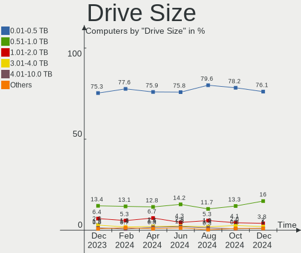
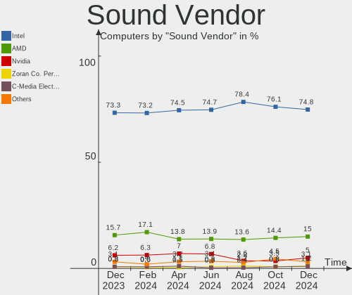
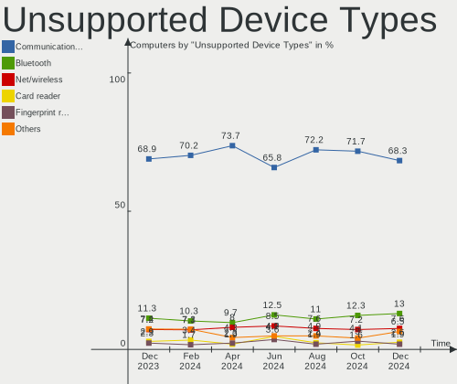

BSD Hardware Trends
-------------------

A project to identify most popular hardware characteristics and track their change
over time based on data collected by BSD users at https://BSD-Hardware.info.

Anyone can contribute to this report by the [hw-probe](https://github.com/linuxhw/hw-probe/blob/master/INSTALL.BSD.md) tool:

    hw-probe -all -upload

This is a report for all computer types. See also reports for [desktops](/Desktop/README.md) and [notebooks](/Notebook/README.md).

Full-feature report is available here: https://bsd-hardware.info/?view=trends

OS-specific reports: [FreeBSD](/Dist/FreeBSD), [OPNsense](/Dist/OPNsense), [helloSystem](/Dist/helloSystem), [OpenBSD](/Dist/OpenBSD).

Period: Aug, 2021.

Contents
--------

* [ System ](#system)
  - [ OS                       ](#os)
  - [ OS Family                ](#os-family)
  - [ Arch                     ](#arch)
  - [ DE                       ](#de)
  - [ Display Server           ](#display-server)
  - [ Display Manager          ](#display-manager)
  - [ OS Lang                  ](#os-lang)
  - [ Boot Mode                ](#boot-mode)
  - [ Filesystem               ](#filesystem)
  - [ Part. scheme             ](#part-scheme)

* [ Board ](#board)
  - [ Vendor                   ](#vendor)
  - [ Model                    ](#model)
  - [ Model Family             ](#model-family)
  - [ MFG Year                 ](#mfg-year)
  - [ Form Factor              ](#form-factor)
  - [ Coreboot                 ](#coreboot)
  - [ RAM Size                 ](#ram-size)
  - [ RAM Used                 ](#ram-used)
  - [ Total Drives             ](#total-drives)
  - [ Has CD-ROM               ](#has-cd-rom)
  - [ Has Ethernet             ](#has-ethernet)
  - [ Has WiFi                 ](#has-wifi)
  - [ Has Bluetooth            ](#has-bluetooth)

* [ Location ](#location)
  - [ Country                  ](#country)
  - [ City                     ](#city)

* [ Drives ](#drives)
  - [ Drive Vendor             ](#drive-vendor)
  - [ Drive Model              ](#drive-model)
  - [ HDD Vendor               ](#hdd-vendor)
  - [ SSD Vendor               ](#ssd-vendor)
  - [ Drive Kind               ](#drive-kind)
  - [ Drive Connector          ](#drive-connector)
  - [ Drive Size               ](#drive-size)
  - [ Space Total              ](#space-total)
  - [ Space Used               ](#space-used)
  - [ Malfunc. Drives          ](#malfunc-drives)
  - [ Malfunc. Drive Vendor    ](#malfunc-drive-vendor)
  - [ Malfunc. HDD Vendor      ](#malfunc-hdd-vendor)
  - [ Malfunc. Drive Kind      ](#malfunc-drive-kind)
  - [ Failed Drives            ](#failed-drives)
  - [ Failed Drive Vendor      ](#failed-drive-vendor)
  - [ Drive Status             ](#drive-status)

* [ Storage controller ](#storage-controller)
  - [ Storage Vendor           ](#storage-vendor)
  - [ Storage Model            ](#storage-model)
  - [ Storage Kind             ](#storage-kind)

* [ Processor ](#processor)
  - [ CPU Vendor               ](#cpu-vendor)
  - [ CPU Model                ](#cpu-model)
  - [ CPU Model Family         ](#cpu-model-family)
  - [ CPU Cores                ](#cpu-cores)
  - [ CPU Sockets              ](#cpu-sockets)
  - [ CPU Threads              ](#cpu-threads)
  - [ CPU Microarch            ](#cpu-microarch)

* [ Graphics ](#graphics)
  - [ GPU Vendor               ](#gpu-vendor)
  - [ GPU Model                ](#gpu-model)
  - [ GPU Combo                ](#gpu-combo)
  - [ GPU Driver               ](#gpu-driver)
  - [ GPU Memory               ](#gpu-memory)

* [ Monitor ](#monitor)
  - [ Monitor Vendor           ](#monitor-vendor)
  - [ Monitor Model            ](#monitor-model)
  - [ Monitor Resolution       ](#monitor-resolution)
  - [ Monitor Diagonal         ](#monitor-diagonal)
  - [ Monitor Width            ](#monitor-width)
  - [ Aspect Ratio             ](#aspect-ratio)
  - [ Monitor Area             ](#monitor-area)
  - [ Pixel Density            ](#pixel-density)
  - [ Multiple Monitors        ](#multiple-monitors)

* [ Network ](#network)
  - [ Net Controller Vendor    ](#net-controller-vendor)
  - [ Net Controller Model     ](#net-controller-model)
  - [ Wireless Vendor          ](#wireless-vendor)
  - [ Wireless Model           ](#wireless-model)
  - [ Ethernet Vendor          ](#ethernet-vendor)
  - [ Ethernet Model           ](#ethernet-model)
  - [ Net Controller Kind      ](#net-controller-kind)
  - [ Used Controller          ](#used-controller)
  - [ NICs                     ](#nics)
  - [ IPv6                     ](#ipv6)

* [ Bluetooth ](#bluetooth)
  - [ Bluetooth Vendor         ](#bluetooth-vendor)
  - [ Bluetooth Model          ](#bluetooth-model)

* [ Sound ](#sound)
  - [ Sound Vendor             ](#sound-vendor)
  - [ Sound Model              ](#sound-model)

* [ Memory ](#memory)
  - [ Memory Vendor            ](#memory-vendor)
  - [ Memory Model             ](#memory-model)
  - [ Memory Kind              ](#memory-kind)
  - [ Memory Form Factor       ](#memory-form-factor)
  - [ Memory Size              ](#memory-size)
  - [ Memory Speed             ](#memory-speed)

* [ Printers & scanners ](#printers--scanners)
  - [ Printer Vendor           ](#printer-vendor)
  - [ Printer Model            ](#printer-model)
  - [ Scanner Vendor           ](#scanner-vendor)
  - [ Scanner Model            ](#scanner-model)

* [ Camera ](#camera)
  - [ Camera Vendor            ](#camera-vendor)
  - [ Camera Model             ](#camera-model)

* [ Security ](#security)
  - [ Fingerprint Vendor       ](#fingerprint-vendor)
  - [ Fingerprint Model        ](#fingerprint-model)
  - [ Chipcard Vendor          ](#chipcard-vendor)
  - [ Chipcard Model           ](#chipcard-model)

* [ Unsupported ](#unsupported)
  - [ Unsupported Devices      ](#unsupported-devices)
  - [ Unsupported Device Types ](#unsupported-device-types)

System
------

OS
--

Installed operating systems

| Name                         | Computers | Percent |
|------------------------------|-----------|---------|
| OPNsense 21.7.1              | 194       | 49.36%  |
| helloSystem 0.5.0            | 40        | 10.18%  |
| OPNsense 21.7                | 36        | 9.16%   |
| FreeBSD 13.0-p3              | 20        | 5.09%   |
| OPNsense 21.1.9              | 16        | 4.07%   |
| FreeBSD 13.0                 | 12        | 3.05%   |
| GhostBSD 20.04.02            | 11        | 2.8%    |
| OpenBSD 6.9                  | 10        | 2.54%   |
| FreeBSD 13.0-p4              | 10        | 2.54%   |
| OPNsense 21.1.8              | 5         | 1.27%   |
| helloSystem 0.1.0            | 5         | 1.27%   |
| FreeBSD 14.0-CURRENT         | 5         | 1.27%   |
| NomadBSD 5806f915            | 4         | 1.02%   |
| OPNsense 21.1.6              | 3         | 0.76%   |
| helloSystem 0.6.0            | 3         | 0.76%   |
| FreeBSD 13.0-STABLE          | 3         | 0.76%   |
| TrueNAS 12.2-p9              | 1         | 0.25%   |
| OPNsense 21.1.7              | 1         | 0.25%   |
| OPNsense 12.1-p19-HBSD       | 1         | 0.25%   |
| OpenBSD 7.0                  | 1         | 0.25%   |
| NomadBSD 1.4                 | 1         | 0.25%   |
| MidnightBSD 2.1.0            | 1         | 0.25%   |
| helloSystem 0.4.0            | 1         | 0.25%   |
| HardenedBSD 13.0-STABLE-HBSD | 1         | 0.25%   |
| GhostBSD 21.08.27            | 1         | 0.25%   |
| FuryBSD 12.2-p9              | 1         | 0.25%   |
| FreeBSD 13.0-RC4             | 1         | 0.25%   |
| FreeBSD 12.2-STABLE          | 1         | 0.25%   |
| FreeBSD 12.2-p9              | 1         | 0.25%   |
| FreeBSD 12.2-p8              | 1         | 0.25%   |
| FreeBSD 12.2                 | 1         | 0.25%   |
| DragonFly 6.0                | 1         | 0.25%   |

OS Family
---------

OS without a version

| Name        | Computers | Percent |
|-------------|-----------|---------|
| OPNsense    | 256       | 65.14%  |
| FreeBSD     | 55        | 13.99%  |
| helloSystem | 49        | 12.47%  |
| GhostBSD    | 12        | 3.05%   |
| OpenBSD     | 11        | 2.8%    |
| NomadBSD    | 5         | 1.27%   |
| TrueNAS     | 1         | 0.25%   |
| MidnightBSD | 1         | 0.25%   |
| HardenedBSD | 1         | 0.25%   |
| FuryBSD     | 1         | 0.25%   |
| DragonFly   | 1         | 0.25%   |

Arch
----

OS architecture (x86_64, i586, etc.)

| Name  | Computers | Percent |
|-------|-----------|---------|
| amd64 | 387       | 98.47%  |
| i386  | 4         | 1.02%   |
| arm64 | 2         | 0.51%   |

DE
--

Desktop Environment

| Name             | Computers | Percent |
|------------------|-----------|---------|
| Console          | 275       | 69.97%  |
| helloDesktop     | 49        | 12.47%  |
| KDE5             | 16        | 4.07%   |
| MATE             | 12        | 3.05%   |
| fvwm             | 10        | 2.54%   |
| XFCE             | 9         | 2.29%   |
| TWM              | 6         | 1.53%   |
| Openbox          | 5         | 1.27%   |
| GNOME            | 4         | 1.02%   |
| Cinnamon         | 2         | 0.51%   |
| Picom            | 1         | 0.25%   |
| Metacity (Marco) | 1         | 0.25%   |
| Lumina           | 1         | 0.25%   |
| i3               | 1         | 0.25%   |
| AwesomeWM        | 1         | 0.25%   |

Display Server
--------------

X11 or Wayland

| Name    | Computers | Percent |
|---------|-----------|---------|
| Console | 278       | 70.74%  |
| X11     | 115       | 29.26%  |

Display Manager
---------------

SDDM, LightDM, etc.

| Name    | Computers | Percent |
|---------|-----------|---------|
| Console | 297       | 75.57%  |
| SLiM    | 60        | 15.27%  |
| SDDM    | 14        | 3.56%   |
| LightDM | 14        | 3.56%   |
| XDM     | 4         | 1.02%   |
| GDM     | 4         | 1.02%   |

OS Lang
-------

Language

| Lang            | Computers | Percent |
|-----------------|-----------|---------|
| Unknown         | 275       | 69.97%  |
| en_US           | 60        | 15.27%  |
| C               | 39        | 9.92%   |
| en_GB           | 3         | 0.76%   |
| de_DE           | 3         | 0.76%   |
| ru_RU           | 2         | 0.51%   |
| pt_BR           | 2         | 0.51%   |
| zh_CN           | 1         | 0.25%   |
| pl_PL           | 1         | 0.25%   |
| it_IT.ISO8859-1 | 1         | 0.25%   |
| fr_FR.US-ASCII  | 1         | 0.25%   |
| fr_FR           | 1         | 0.25%   |
| et_EE           | 1         | 0.25%   |
| es_ES           | 1         | 0.25%   |
| es_AR           | 1         | 0.25%   |
| de_CH           | 1         | 0.25%   |

Boot Mode
---------

EFI or BIOS

| Mode | Computers | Percent |
|------|-----------|---------|
| EFI  | 315       | 80.15%  |
| BIOS | 78        | 19.85%  |

Filesystem
----------

Type of filesystem

| Type    | Computers | Percent |
|---------|-----------|---------|
| Ufs     | 224       | 57%     |
| Zfs     | 157       | 39.95%  |
| Ffs     | 11        | 2.8%    |
| Hammer2 | 1         | 0.25%   |

Part. scheme
------------

Scheme of partitioning

| Type    | Computers | Percent |
|---------|-----------|---------|
| GPT     | 353       | 89.82%  |
| MBR     | 36        | 9.16%   |
| Unknown | 3         | 0.76%   |
| BSD     | 1         | 0.25%   |

Board
-----

Vendor
------

Motherboard manufacturer

| Name                       | Computers | Percent |
|----------------------------|-----------|---------|
| Dell                       | 43        | 10.94%  |
| Hewlett-Packard            | 38        | 9.67%   |
| Unknown                    | 29        | 7.38%   |
| ASUSTek Computer           | 26        | 6.62%   |
| Lenovo                     | 25        | 6.36%   |
| ASRock                     | 22        | 5.6%    |
| Gigabyte Technology        | 21        | 5.34%   |
| Supermicro                 | 19        | 4.83%   |
| PC Engines                 | 19        | 4.83%   |
| Intel                      | 19        | 4.83%   |
| Protectli                  | 17        | 4.33%   |
| MSI                        | 10        | 2.54%   |
| Apple                      | 9         | 2.29%   |
| AMI                        | 8         | 2.04%   |
| Sophos                     | 7         | 1.78%   |
| Shuttle                    | 7         | 1.78%   |
| Acer                       | 5         | 1.27%   |
| BESSTAR Tech               | 4         | 1.02%   |
| Toshiba                    | 3         | 0.76%   |
| SeeedStudio                | 3         | 0.76%   |
| Pegatron                   | 3         | 0.76%   |
| NF541                      | 3         | 0.76%   |
| HPE                        | 3         | 0.76%   |
| Fujitsu                    | 3         | 0.76%   |
| Biostar                    | 3         | 0.76%   |
| ZOTAC                      | 2         | 0.51%   |
| Sony                       | 2         | 0.51%   |
| NU941                      | 2         | 0.51%   |
| IBM                        | 2         | 0.51%   |
| Foxconn                    | 2         | 0.51%   |
| Deciso                     | 2         | 0.51%   |
| Yanling                    | 1         | 0.25%   |
| Winston Marriot            | 1         | 0.25%   |
| Standard                   | 1         | 0.25%   |
| Silicom                    | 1         | 0.25%   |
| ShenZhen MinWin Technology | 1         | 0.25%   |
| Samsung Electronics        | 1         | 0.25%   |
| PCPartner                  | 1         | 0.25%   |
| PAIQ                       | 1         | 0.25%   |
| Notebook                   | 1         | 0.25%   |
| NEXCOM                     | 1         | 0.25%   |
| NEC Computers              | 1         | 0.25%   |
| Medion                     | 1         | 0.25%   |
| Lanner                     | 1         | 0.25%   |
| Itautec                    | 1         | 0.25%   |
| Insyde                     | 1         | 0.25%   |
| HC                         | 1         | 0.25%   |
| HARDKERNEL                 | 1         | 0.25%   |
| Google                     | 1         | 0.25%   |
| EVGA                       | 1         | 0.25%   |
| ECS-USA                    | 1         | 0.25%   |
| ECS                        | 1         | 0.25%   |
| CNCTION-IAF-E3845          | 1         | 0.25%   |
| Cisco Systems              | 1         | 0.25%   |
| Caswell                    | 1         | 0.25%   |
| BCM Advanced Research      | 1         | 0.25%   |
| Barracuda Networks         | 1         | 0.25%   |
| BANGHO                     | 1         | 0.25%   |
| AWOW Techonology           | 1         | 0.25%   |
| Avell High Performance     | 1         | 0.25%   |

Model
-----

Motherboard model

| Name                                      | Computers | Percent |
|-------------------------------------------|-----------|---------|
| Unknown                                   | 32        | 8.14%   |
| PC Engines apu4                           | 10        | 2.54%   |
| PC Engines APU2                           | 9         | 2.29%   |
| Intel Q3XXG4-P V1.0                       | 7         | 1.78%   |
| Protectli FW6                             | 6         | 1.53%   |
| Protectli FW4B                            | 6         | 1.53%   |
| AMI Aptio CRB                             | 6         | 1.53%   |
| Supermicro Super Server                   | 5         | 1.27%   |
| Supermicro X10SLH-N6-ST031                | 4         | 1.02%   |
| HP t620 PLUS Quad Core TC                 | 4         | 1.02%   |
| Sophos SG                                 | 3         | 0.76%   |
| NF541 1.0                                 | 3         | 0.76%   |
| Dell OptiPlex 7010                        | 3         | 0.76%   |
| Sophos XG                                 | 2         | 0.51%   |
| Sophos UTM                                | 2         | 0.51%   |
| Shuttle DS10U                             | 2         | 0.51%   |
| SeeedStudio ODYSSEY-X86J4125              | 2         | 0.51%   |
| Protectli FW6E                            | 2         | 0.51%   |
| NU941 1.0                                 | 2         | 0.51%   |
| MSI MS-7817                               | 2         | 0.51%   |
| Intel DH67BL AAG10189-211                 | 2         | 0.51%   |
| HP Z420 Workstation                       | 2         | 0.51%   |
| HP t730 Thin Client                       | 2         | 0.51%   |
| HP ProLiant MicroServer Gen8              | 2         | 0.51%   |
| Gigabyte H61M-S2-B3                       | 2         | 0.51%   |
| Dell PowerEdge R720                       | 2         | 0.51%   |
| Dell OptiPlex 960                         | 2         | 0.51%   |
| Dell OptiPlex 9020                        | 2         | 0.51%   |
| Dell OptiPlex 3040                        | 2         | 0.51%   |
| Deciso Netboard A20                       | 2         | 0.51%   |
| BESSTAR Tech X35G                         | 2         | 0.51%   |
| ASUS All Series                           | 2         | 0.51%   |
| ASRock X570 PG Velocita                   | 2         | 0.51%   |
| ASRock B450M Pro4                         | 2         | 0.51%   |
| Apple Macmini7,1                          | 2         | 0.51%   |
| ZOTAC ZBOX-CI329NANO                      | 1         | 0.25%   |
| Yanling LES plus                          | 1         | 0.25%   |
| Winston Marriot PICO PC YANYU             | 1         | 0.25%   |
| Toshiba Satellite S55t-B                  | 1         | 0.25%   |
| Toshiba Satellite L855                    | 1         | 0.25%   |
| Toshiba Satellite L50-C                   | 1         | 0.25%   |
| Supermicro X9SCL/X9SCM                    | 1         | 0.25%   |
| Supermicro X8SIL                          | 1         | 0.25%   |
| Supermicro X8DTU-LN4+                     | 1         | 0.25%   |
| Supermicro X7SPA-HF                       | 1         | 0.25%   |
| Supermicro X7SBL                          | 1         | 0.25%   |
| Supermicro X10SL7-F                       | 1         | 0.25%   |
| Supermicro SYS-E300-9D                    | 1         | 0.25%   |
| Supermicro SYS-5019D-FN8TP                | 1         | 0.25%   |
| Supermicro SSG-6028R-E1CR12T              | 1         | 0.25%   |
| Supermicro A1SAi                          | 1         | 0.25%   |
| Standard TF                               | 1         | 0.25%   |
| Sony VPCEJ1E1E                            | 1         | 0.25%   |
| Sony VGN-P698E                            | 1         | 0.25%   |
| Silicom Minnowboard Turbot D0/D1 PLATFORM | 1         | 0.25%   |
| Shuttle SH87R                             | 1         | 0.25%   |
| Shuttle SH81R                             | 1         | 0.25%   |
| Shuttle DS61                              | 1         | 0.25%   |
| Shuttle DH370                             | 1         | 0.25%   |
| Shuttle DH170                             | 1         | 0.25%   |

Model Family
------------

Motherboard model prefix

| Name                         | Computers | Percent |
|------------------------------|-----------|---------|
| Unknown                      | 32        | 8.14%   |
| Dell OptiPlex                | 16        | 4.07%   |
| Dell PowerEdge               | 13        | 3.31%   |
| PC Engines apu4              | 10        | 2.54%   |
| Lenovo ThinkPad              | 10        | 2.54%   |
| PC Engines APU2              | 9         | 2.29%   |
| HP ProLiant                  | 9         | 2.29%   |
| Intel Q3XXG4-P               | 7         | 1.78%   |
| Dell Latitude                | 7         | 1.78%   |
| Protectli FW6                | 6         | 1.53%   |
| Protectli FW4B               | 6         | 1.53%   |
| AMI Aptio                    | 6         | 1.53%   |
| Supermicro Super             | 5         | 1.27%   |
| HP Compaq                    | 5         | 1.27%   |
| ASRock X570                  | 5         | 1.27%   |
| Supermicro X10SLH-N6-ST031   | 4         | 1.02%   |
| HP t620                      | 4         | 1.02%   |
| Dell Inspiron                | 4         | 1.02%   |
| ASUS PRIME                   | 4         | 1.02%   |
| Toshiba Satellite            | 3         | 0.76%   |
| Sophos SG                    | 3         | 0.76%   |
| NF541 1.0                    | 3         | 0.76%   |
| Lenovo ThinkCentre           | 3         | 0.76%   |
| HP Pavilion                  | 3         | 0.76%   |
| Acer Aspire                  | 3         | 0.76%   |
| Sophos XG                    | 2         | 0.51%   |
| Sophos UTM                   | 2         | 0.51%   |
| Shuttle DS10U                | 2         | 0.51%   |
| SeeedStudio ODYSSEY-X86J4125 | 2         | 0.51%   |
| Protectli FW6E               | 2         | 0.51%   |
| NU941 1.0                    | 2         | 0.51%   |
| MSI MS-7817                  | 2         | 0.51%   |
| Lenovo IdeaPad               | 2         | 0.51%   |
| Lenovo IdeaCentre            | 2         | 0.51%   |
| Intel DH67BL                 | 2         | 0.51%   |
| Intel D54250WYK              | 2         | 0.51%   |
| HPE ProLiant                 | 2         | 0.51%   |
| HP ZBook                     | 2         | 0.51%   |
| HP Z420                      | 2         | 0.51%   |
| HP t730                      | 2         | 0.51%   |
| HP EliteDesk                 | 2         | 0.51%   |
| Gigabyte H61M-S2-B3          | 2         | 0.51%   |
| Deciso Netboard              | 2         | 0.51%   |
| BESSTAR Tech X35G            | 2         | 0.51%   |
| ASUS TUF                     | 2         | 0.51%   |
| ASUS ROG                     | 2         | 0.51%   |
| ASUS All                     | 2         | 0.51%   |
| ASRock B450M                 | 2         | 0.51%   |
| Apple Macmini7               | 2         | 0.51%   |
| Apple Macmini5               | 2         | 0.51%   |
| Acer Veriton                 | 2         | 0.51%   |
| ZOTAC ZBOX-CI329NANO         | 1         | 0.25%   |
| Yanling LES                  | 1         | 0.25%   |
| Winston Marriot PICO         | 1         | 0.25%   |
| Supermicro X9SCL             | 1         | 0.25%   |
| Supermicro X8SIL             | 1         | 0.25%   |
| Supermicro X8DTU-LN4+        | 1         | 0.25%   |
| Supermicro X7SPA-HF          | 1         | 0.25%   |
| Supermicro X7SBL             | 1         | 0.25%   |
| Supermicro X10SL7-F          | 1         | 0.25%   |

MFG Year
--------

Motherboard manufacture year

| Year    | Computers | Percent |
|---------|-----------|---------|
| 2020    | 66        | 16.79%  |
| 2019    | 57        | 14.5%   |
| 2018    | 54        | 13.74%  |
| 2021    | 41        | 10.43%  |
| 2014    | 25        | 6.36%   |
| 2013    | 25        | 6.36%   |
| 2015    | 24        | 6.11%   |
| 2011    | 19        | 4.83%   |
| 2012    | 18        | 4.58%   |
| 2016    | 17        | 4.33%   |
| 2017    | 16        | 4.07%   |
| 2010    | 13        | 3.31%   |
| 2008    | 7         | 1.78%   |
| 2009    | 5         | 1.27%   |
| Unknown | 2         | 0.51%   |
| 2007    | 1         | 0.25%   |
| 2006    | 1         | 0.25%   |
| 2004    | 1         | 0.25%   |
| 2003    | 1         | 0.25%   |

Form Factor
-----------

Physical design of the computer

| Name           | Computers | Percent |
|----------------|-----------|---------|
| Desktop        | 255       | 64.89%  |
| Notebook       | 68        | 17.3%   |
| Server         | 32        | 8.14%   |
| Mini pc        | 20        | 5.09%   |
| Firewall       | 9         | 2.29%   |
| All in one     | 6         | 1.53%   |
| Convertible    | 2         | 0.51%   |
| System on chip | 1         | 0.25%   |

Coreboot
--------

Have coreboot on board

| Used | Computers | Percent |
|------|-----------|---------|
| No   | 365       | 92.88%  |
| Yes  | 28        | 7.12%   |

RAM Size
--------

Total RAM memory

| Size in GB  | Computers | Percent |
|-------------|-----------|---------|
| 8.01-16.0   | 147       | 37.4%   |
| 4.01-8.0    | 97        | 24.68%  |
| 16.01-24.0  | 84        | 21.37%  |
| 32.01-64.0  | 27        | 6.87%   |
| 2.01-3.0    | 17        | 4.33%   |
| 64.01-256.0 | 10        | 2.54%   |
| 24.01-32.0  | 4         | 1.02%   |
| 1.01-2.0    | 4         | 1.02%   |
| 3.01-4.0    | 3         | 0.76%   |

RAM Used
--------

Used RAM memory

| Used GB    | Computers | Percent |
|------------|-----------|---------|
| 0.01-0.5   | 216       | 54.96%  |
| 0.51-1.0   | 112       | 28.5%   |
| 1.01-2.0   | 34        | 8.65%   |
| 3.01-4.0   | 10        | 2.54%   |
| 4.01-8.0   | 7         | 1.78%   |
| 2.01-3.0   | 5         | 1.27%   |
| 8.01-16.0  | 4         | 1.02%   |
| 32.01-64.0 | 2         | 0.51%   |
| 0          | 2         | 0.51%   |
| 16.01-24.0 | 1         | 0.25%   |

Total Drives
------------

Number of drives on board

| Drives | Computers | Percent |
|--------|-----------|---------|
| 1      | 284       | 72.26%  |
| 2      | 49        | 12.47%  |
| 0      | 35        | 8.91%   |
| 3      | 11        | 2.8%    |
| 4      | 6         | 1.53%   |
| 6      | 2         | 0.51%   |
| 5      | 2         | 0.51%   |
| 28     | 1         | 0.25%   |
| 13     | 1         | 0.25%   |
| 12     | 1         | 0.25%   |
| 8      | 1         | 0.25%   |

Has CD-ROM
----------

Has CD-ROM on board

| Presented | Computers | Percent |
|-----------|-----------|---------|
| No        | 308       | 78.37%  |
| Yes       | 85        | 21.63%  |

Has Ethernet
------------

Has Ethernet on board

| Presented | Computers | Percent |
|-----------|-----------|---------|
| Yes       | 381       | 96.95%  |
| No        | 12        | 3.05%   |

Has WiFi
--------

Has WiFi module

| Presented | Computers | Percent |
|-----------|-----------|---------|
| No        | 252       | 64.12%  |
| Yes       | 141       | 35.88%  |

Has Bluetooth
-------------

Has Bluetooth module

| Presented | Computers | Percent |
|-----------|-----------|---------|
| No        | 302       | 76.84%  |
| Yes       | 91        | 23.16%  |

Location
--------

Country
-------

Geographic location (country)

| Country      | Computers | Percent |
|--------------|-----------|---------|
| USA          | 116       | 29.52%  |
| Germany      | 65        | 16.54%  |
| France       | 16        | 4.07%   |
| Brazil       | 16        | 4.07%   |
| UK           | 15        | 3.82%   |
| Canada       | 15        | 3.82%   |
| Switzerland  | 12        | 3.05%   |
| China        | 12        | 3.05%   |
| Netherlands  | 11        | 2.8%    |
| Russia       | 10        | 2.54%   |
| Australia    | 9         | 2.29%   |
| Sweden       | 7         | 1.78%   |
| Mexico       | 6         | 1.53%   |
| Austria      | 6         | 1.53%   |
| Spain        | 5         | 1.27%   |
| Czechia      | 5         | 1.27%   |
| Taiwan       | 4         | 1.02%   |
| Poland       | 4         | 1.02%   |
| India        | 4         | 1.02%   |
| Argentina    | 4         | 1.02%   |
| South Korea  | 3         | 0.76%   |
| Slovenia     | 3         | 0.76%   |
| Italy        | 3         | 0.76%   |
| Indonesia    | 3         | 0.76%   |
| UAE          | 2         | 0.51%   |
| Turkey       | 2         | 0.51%   |
| South Africa | 2         | 0.51%   |
| Philippines  | 2         | 0.51%   |
| Peru         | 2         | 0.51%   |
| Luxembourg   | 2         | 0.51%   |
| Hungary      | 2         | 0.51%   |
| Greece       | 2         | 0.51%   |
| Finland      | 2         | 0.51%   |
| Chile        | 2         | 0.51%   |
| Belgium      | 2         | 0.51%   |
| Vietnam      | 1         | 0.25%   |
| Ukraine      | 1         | 0.25%   |
| Slovakia     | 1         | 0.25%   |
| Singapore    | 1         | 0.25%   |
| Serbia       | 1         | 0.25%   |
| Romania      | 1         | 0.25%   |
| Puerto Rico  | 1         | 0.25%   |
| Norway       | 1         | 0.25%   |
| Namibia      | 1         | 0.25%   |
| Malaysia     | 1         | 0.25%   |
| Japan        | 1         | 0.25%   |
| Hong Kong    | 1         | 0.25%   |
| Guadeloupe   | 1         | 0.25%   |
| Estonia      | 1         | 0.25%   |
| Denmark      | 1         | 0.25%   |
| Belarus      | 1         | 0.25%   |
| Bangladesh   | 1         | 0.25%   |

City
----

Geographic location (city)

| City             | Computers | Percent |
|------------------|-----------|---------|
| Berlin           | 10        | 2.54%   |
| Hamburg          | 9         | 2.29%   |
| Shanghai         | 4         | 1.02%   |
| Paris            | 4         | 1.02%   |
| Jacksonville     | 4         | 1.02%   |
| Gachnang         | 4         | 1.02%   |
| Brooklyn         | 4         | 1.02%   |
| Vienna           | 3         | 0.76%   |
| Sydney           | 3         | 0.76%   |
| S??o Paulo       | 3         | 0.76%   |
| San Francisco    | 3         | 0.76%   |
| London           | 3         | 0.76%   |
| Denver           | 3         | 0.76%   |
| Chicago          | 3         | 0.76%   |
| Brisbane         | 3         | 0.76%   |
| Zurich           | 2         | 0.51%   |
| West Valley City | 2         | 0.51%   |
| Vauvillers       | 2         | 0.51%   |
| Tula de Allende  | 2         | 0.51%   |
| Trebnje          | 2         | 0.51%   |
| Tainan City      | 2         | 0.51%   |
| Sedavi           | 2         | 0.51%   |
| San Antonio      | 2         | 0.51%   |
| Salem            | 2         | 0.51%   |
| Rudna            | 2         | 0.51%   |
| Rio Claro        | 2         | 0.51%   |
| Philadelphia     | 2         | 0.51%   |
| Peine            | 2         | 0.51%   |
| New Taipei       | 2         | 0.51%   |
| Munich           | 2         | 0.51%   |
| Montreal         | 2         | 0.51%   |
| Luxembourg       | 2         | 0.51%   |
| Lima             | 2         | 0.51%   |
| Las Vegas        | 2         | 0.51%   |
| Kirkland         | 2         | 0.51%   |
| Johannesburg     | 2         | 0.51%   |
| Jakarta          | 2         | 0.51%   |
| Istanbul         | 2         | 0.51%   |
| Heilbronn        | 2         | 0.51%   |
| Hanover          | 2         | 0.51%   |
| Groningen        | 2         | 0.51%   |
| Goslar           | 2         | 0.51%   |
| Fort Lauderdale  | 2         | 0.51%   |
| El Paso          | 2         | 0.51%   |
| Cologne          | 2         | 0.51%   |
| Bensheim         | 2         | 0.51%   |
| Belmond          | 2         | 0.51%   |
| Barnaul          | 2         | 0.51%   |
| Aachen           | 2         | 0.51%   |
| Ypsilanti        | 1         | 0.25%   |
| Yeovil           | 1         | 0.25%   |
| Yancheng         | 1         | 0.25%   |
| Wuhan            | 1         | 0.25%   |
| Wolfenb??ttel    | 1         | 0.25%   |
| Winterthur       | 1         | 0.25%   |
| Windhoek         | 1         | 0.25%   |
| Whittier         | 1         | 0.25%   |
| Westland         | 1         | 0.25%   |
| Wenatchee        | 1         | 0.25%   |
| Watford          | 1         | 0.25%   |

Drives
------

Drive Vendor
------------

Hard drive vendors

| Vendor              | Computers | Drives | Percent |
|---------------------|-----------|--------|---------|
| Samsung Electronics | 61        | 70     | 14.06%  |
| WDC                 | 60        | 77     | 13.82%  |
| Seagate             | 55        | 83     | 12.67%  |
| Kingston            | 34        | 35     | 7.83%   |
| Toshiba             | 25        | 28     | 5.76%   |
| SanDisk             | 21        | 21     | 4.84%   |
| Transcend           | 18        | 18     | 4.15%   |
| Crucial             | 15        | 17     | 3.46%   |
| Intel               | 13        | 13     | 3%      |
| Phison              | 12        | 12     | 2.76%   |
| A-DATA Technology   | 11        | 14     | 2.53%   |
| Hoodisk             | 10        | 10     | 2.3%    |
| Hitachi             | 9         | 12     | 2.07%   |
| HGST                | 8         | 13     | 1.84%   |
| Micron Technology   | 7         | 7      | 1.61%   |
| Protectli           | 6         | 6      | 1.38%   |
| Hewlett-Packard     | 6         | 18     | 1.38%   |
| FORESEE             | 5         | 5      | 1.15%   |
| SPCC                | 4         | 4      | 0.92%   |
| LITEON              | 4         | 4      | 0.92%   |
| Apple               | 4         | 4      | 0.92%   |
| SK Hynix            | 3         | 3      | 0.69%   |
| NVMe                | 3         | 4      | 0.69%   |
| MEMXPRO             | 3         | 3      | 0.69%   |
| Corsair             | 3         | 3      | 0.69%   |
| Zheino              | 2         | 2      | 0.46%   |
| PNY                 | 2         | 2      | 0.46%   |
| MAXTOR              | 2         | 2      | 0.46%   |
| Kston               | 2         | 2      | 0.46%   |
| Intenso             | 2         | 2      | 0.46%   |
| Fujitsu             | 2         | 2      | 0.46%   |
| China               | 2         | 2      | 0.46%   |
| Apacer              | 2         | 2      | 0.46%   |
| VisionTek           | 1         | 1      | 0.23%   |
| USB                 | 1         | 1      | 0.23%   |
| Team                | 1         | 1      | 0.23%   |
| Silicon Motion      | 1         | 1      | 0.23%   |
| PLEXTOR             | 1         | 1      | 0.23%   |
| ORICO               | 1         | 2      | 0.23%   |
| OCZ                 | 1         | 1      | 0.23%   |
| LSI                 | 1         | 1      | 0.23%   |
| Lexar               | 1         | 1      | 0.23%   |
| KingDian            | 1         | 1      | 0.23%   |
| Integral            | 1         | 1      | 0.23%   |
| Innodisk            | 1         | 1      | 0.23%   |
| HPE                 | 1         | 1      | 0.23%   |
| Gigabyte Technology | 1         | 1      | 0.23%   |
| faspeed             | 1         | 1      | 0.23%   |
| BIWIN               | 1         | 1      | 0.23%   |
| ATP                 | 1         | 1      | 0.23%   |
| Advantech           | 1         | 1      | 0.23%   |

Drive Model
-----------

Hard drive models

| Model                                | Computers | Percent |
|--------------------------------------|-----------|---------|
| Samsung SSD 860 EVO 500GB            | 8         | 1.72%   |
| Phison SATA SSD 16GB                 | 7         | 1.51%   |
| Transcend TS128GMSA230S 128GB        | 6         | 1.29%   |
| WDC WDS120G2G0A-00JH30 120GB         | 5         | 1.08%   |
| Kingston SA400S37120G 120GB          | 5         | 1.08%   |
| Hoodisk SSD 128GB                    | 5         | 1.08%   |
| Seagate ST500LM012 HN-M500MBB 500GB  | 4         | 0.86%   |
| Seagate ST500DM002-1BD142 500GB      | 4         | 0.86%   |
| Samsung SSD 850 EVO 250GB            | 4         | 0.86%   |
| Crucial CT120BX500SSD1 120GB         | 4         | 0.86%   |
| Toshiba MQ01ABF050 500GB             | 3         | 0.65%   |
| Toshiba MQ01ABD100 1TB               | 3         | 0.65%   |
| Seagate ST3250318AS 250GB            | 3         | 0.65%   |
| Seagate ST1000DM010-2EP102 1TB       | 3         | 0.65%   |
| SanDisk SSD PLUS 120GB               | 3         | 0.65%   |
| Samsung SSD 860 QVO 1TB              | 3         | 0.65%   |
| Samsung SSD 860 EVO 1TB              | 3         | 0.65%   |
| Protectli 120GB mSATA                | 3         | 0.65%   |
| MEMXPRO mSATA M3B 32GB               | 3         | 0.65%   |
| Kingston SV300S37A120G 120GB         | 3         | 0.65%   |
| Kingston SUV500MS240G 240GB          | 3         | 0.65%   |
| Kingston SUV500MS120G 120GB          | 3         | 0.65%   |
| Kingston SA400S37240G 240GB          | 3         | 0.65%   |
| Intel SSDSC2CW240A3 240GB            | 3         | 0.65%   |
| HP RAID 1(1+0) 146GB                 | 3         | 0.65%   |
| FORESEE 128GB SSD                    | 3         | 0.65%   |
| A-DATA SX8200PNP 512GB               | 3         | 0.65%   |
| WDC WDS120G2G0B-00EPW0 120GB         | 2         | 0.43%   |
| WDC WD5000LPVX-22V0TT0 500GB         | 2         | 0.43%   |
| WDC WD40EZRZ-22GXCB0 4TB             | 2         | 0.43%   |
| WDC WD3200BPVT-22JJ5T0 320GB         | 2         | 0.43%   |
| Transcend TS64GMSA370 64GB           | 2         | 0.43%   |
| Transcend TS256GMTS952T2 256GB       | 2         | 0.43%   |
| Toshiba DT01ACA050 500GB             | 2         | 0.43%   |
| Seagate ST9500325AS 500GB            | 2         | 0.43%   |
| Seagate ST8000VN004-2M2101 8TB       | 2         | 0.43%   |
| Seagate ST500LM000-1EJ162-SSHD 500GB | 2         | 0.43%   |
| Seagate ST4000DM000-1F2168 4TB       | 2         | 0.43%   |
| Seagate ST380815AS 80GB              | 2         | 0.43%   |
| Seagate ST3500418AS 500GB            | 2         | 0.43%   |
| Seagate ST31000340NS 1TB             | 2         | 0.43%   |
| Seagate ST1000DM003-1ER162 1TB       | 2         | 0.43%   |
| SanDisk SDSSDP128G 128GB             | 2         | 0.43%   |
| Samsung SSD 980 PRO 250GB            | 2         | 0.43%   |
| Samsung SSD 970 EVO Plus 250GB       | 2         | 0.43%   |
| Samsung SSD 970 EVO 250GB            | 2         | 0.43%   |
| Samsung SSD 860 EVO 250GB            | 2         | 0.43%   |
| Samsung SSD 850 PRO 256GB            | 2         | 0.43%   |
| Samsung SSD 840 PRO Series 256GB     | 2         | 0.43%   |
| Samsung MZ7LN128HCHP-000H1 128GB     | 2         | 0.43%   |
| Protectli 64GB mSATA                 | 2         | 0.43%   |
| Micron C400-MTFDDAK128MAM 128GB      | 2         | 0.43%   |
| Kston SSD 128GB                      | 2         | 0.43%   |
| Kingston SUV400S37120G 120GB         | 2         | 0.43%   |
| Kingston SMS200S3120G 120GB          | 2         | 0.43%   |
| Kingston SA400M8240G 240GB           | 2         | 0.43%   |
| Intel SSDSA2CT040G3 40GB             | 2         | 0.43%   |
| Hoodisk SSD 64GB                     | 2         | 0.43%   |
| Hoodisk SSD 32GB                     | 2         | 0.43%   |
| HGST HTS725050A7E630 500GB           | 2         | 0.43%   |

HDD Vendor
----------

Hard disk drive vendors

| Vendor              | Computers | Drives | Percent |
|---------------------|-----------|--------|---------|
| Seagate             | 53        | 81     | 34.87%  |
| WDC                 | 43        | 58     | 28.29%  |
| Toshiba             | 17        | 20     | 11.18%  |
| Hitachi             | 9         | 12     | 5.92%   |
| HGST                | 8         | 13     | 5.26%   |
| Hewlett-Packard     | 6         | 18     | 3.95%   |
| Samsung Electronics | 5         | 5      | 3.29%   |
| NVMe                | 3         | 3      | 1.97%   |
| MAXTOR              | 2         | 2      | 1.32%   |
| Fujitsu             | 2         | 2      | 1.32%   |
| Apple               | 2         | 2      | 1.32%   |
| USB                 | 1         | 1      | 0.66%   |
| LSI                 | 1         | 1      | 0.66%   |

SSD Vendor
----------

Solid state drive vendors

| Vendor              | Computers | Drives | Percent |
|---------------------|-----------|--------|---------|
| Samsung Electronics | 44        | 50     | 17.89%  |
| Kingston            | 33        | 34     | 13.41%  |
| SanDisk             | 20        | 20     | 8.13%   |
| Transcend           | 18        | 18     | 7.32%   |
| Crucial             | 14        | 16     | 5.69%   |
| Intel               | 13        | 13     | 5.28%   |
| WDC                 | 12        | 13     | 4.88%   |
| Phison              | 10        | 10     | 4.07%   |
| Hoodisk             | 10        | 10     | 4.07%   |
| Toshiba             | 6         | 6      | 2.44%   |
| Protectli           | 6         | 6      | 2.44%   |
| A-DATA Technology   | 6         | 7      | 2.44%   |
| Micron Technology   | 5         | 5      | 2.03%   |
| SPCC                | 4         | 4      | 1.63%   |
| LITEON              | 4         | 4      | 1.63%   |
| FORESEE             | 4         | 4      | 1.63%   |
| MEMXPRO             | 3         | 3      | 1.22%   |
| Zheino              | 2         | 2      | 0.81%   |
| SK Hynix            | 2         | 2      | 0.81%   |
| PNY                 | 2         | 2      | 0.81%   |
| Kston               | 2         | 2      | 0.81%   |
| Intenso             | 2         | 2      | 0.81%   |
| Corsair             | 2         | 2      | 0.81%   |
| China               | 2         | 2      | 0.81%   |
| Apacer              | 2         | 2      | 0.81%   |
| VisionTek           | 1         | 1      | 0.41%   |
| Team                | 1         | 1      | 0.41%   |
| Seagate             | 1         | 1      | 0.41%   |
| PLEXTOR             | 1         | 1      | 0.41%   |
| ORICO               | 1         | 2      | 0.41%   |
| OCZ                 | 1         | 1      | 0.41%   |
| NVMe                | 1         | 1      | 0.41%   |
| Lexar               | 1         | 1      | 0.41%   |
| KingDian            | 1         | 1      | 0.41%   |
| Integral            | 1         | 1      | 0.41%   |
| Innodisk            | 1         | 1      | 0.41%   |
| HPE                 | 1         | 1      | 0.41%   |
| Gigabyte Technology | 1         | 1      | 0.41%   |
| faspeed             | 1         | 1      | 0.41%   |
| BIWIN               | 1         | 1      | 0.41%   |
| ATP                 | 1         | 1      | 0.41%   |
| Apple               | 1         | 1      | 0.41%   |
| Advantech           | 1         | 1      | 0.41%   |

Drive Kind
----------

HDD or SSD

| Kind | Computers | Drives | Percent |
|------|-----------|--------|---------|
| SSD  | 228       | 258    | 57.29%  |
| HDD  | 129       | 218    | 32.41%  |
| NVMe | 41        | 43     | 10.3%   |

Drive Connector
---------------

SATA, SAS, NVMe, etc.

| Type | Computers | Drives | Percent |
|------|-----------|--------|---------|
| SATA | 329       | 476    | 88.92%  |
| NVMe | 41        | 43     | 11.08%  |

Drive Size
----------

Size of hard drive

| Size in TB | Computers | Drives | Percent |
|------------|-----------|--------|---------|
| 0.01-0.5   | 292       | 347    | 79.35%  |
| 0.51-1.0   | 45        | 53     | 12.23%  |
| 1.01-2.0   | 14        | 22     | 3.8%    |
| 3.01-4.0   | 6         | 15     | 1.63%   |
| 2.01-3.0   | 5         | 24     | 1.36%   |
| 4.01-10.0  | 5         | 13     | 1.36%   |
| 10.01-20.0 | 1         | 2      | 0.27%   |

Space Total
-----------

Amount of disk space available on the file system

| Size in GB | Computers | Percent |
|------------|-----------|---------|
| 101-250    | 154       | 39.19%  |
| 1-20       | 61        | 15.52%  |
| 251-500    | 56        | 14.25%  |
| 51-100     | 49        | 12.47%  |
| 21-50      | 34        | 8.65%   |
| 501-1000   | 30        | 7.63%   |
| 1001-2000  | 6         | 1.53%   |
| 2001-3000  | 2         | 0.51%   |
| Unknown    | 1         | 0.25%   |

Space Used
----------

Amount of used disk space

| Used GB | Computers | Percent |
|---------|-----------|---------|
| 1-20    | 357       | 90.84%  |
| 21-50   | 23        | 5.85%   |
| 51-100  | 5         | 1.27%   |
| 101-250 | 4         | 1.02%   |
| 251-500 | 3         | 0.76%   |
| Unknown | 1         | 0.25%   |

Malfunc. Drives
---------------

Drive models with a malfunction

| Model                                        | Computers | Drives | Percent |
|----------------------------------------------|-----------|--------|---------|
| Seagate ST3250318AS 250GB                    | 2         | 2      | 3.03%   |
| Kingston SV300S37A120G 120GB                 | 2         | 2      | 3.03%   |
| HGST HTS725050A7E630 500GB                   | 2         | 2      | 3.03%   |
| WDC WDS120G2G0A-00JH30 120GB                 | 1         | 1      | 1.52%   |
| WDC WD800AAJS-60WAA0 80GB                    | 1         | 1      | 1.52%   |
| WDC WD5000LPVX-22V0TT0 500GB                 | 1         | 1      | 1.52%   |
| WDC WD5000AAVS-00G9B1 500GB                  | 1         | 1      | 1.52%   |
| WDC WD5000AAKX-00ERMA0 500GB                 | 1         | 1      | 1.52%   |
| WDC WD5000AAKS-00V1A0 500GB                  | 1         | 1      | 1.52%   |
| WDC WD40EFRX-68WT0N0 4TB                     | 1         | 1      | 1.52%   |
| WDC WD3200LPVX-75V0TT0 320GB                 | 1         | 1      | 1.52%   |
| WDC WD3200AAJS-00L7A0 320GB                  | 1         | 1      | 1.52%   |
| WDC WD2500BEVT-08A23T1 250GB                 | 1         | 1      | 1.52%   |
| WDC WD2500BEVS-60UST0 250GB                  | 1         | 1      | 1.52%   |
| WDC WD20EARS-00MVWB0 2TB                     | 1         | 1      | 1.52%   |
| WDC WD1600BEKT-66F3T2 160GB                  | 1         | 1      | 1.52%   |
| WDC WD1600AAJS-75M0A0 160GB                  | 1         | 1      | 1.52%   |
| WDC WD10EARS-00Y5B1 1TB                      | 1         | 1      | 1.52%   |
| WDC WD1001FAES-75W7A0 1TB                    | 1         | 1      | 1.52%   |
| VisionTek mSATA 120GB                        | 1         | 1      | 1.52%   |
| Toshiba THNSNK256GVN8 M.2 2280 256GB         | 1         | 1      | 1.52%   |
| Toshiba MQ02ABD100H 1TB                      | 1         | 1      | 1.52%   |
| Toshiba MQ01ACF032 320GB                     | 1         | 1      | 1.52%   |
| Toshiba MQ01ABF050 500GB                     | 1         | 1      | 1.52%   |
| Toshiba MQ01ABD100 1TB                       | 1         | 1      | 1.52%   |
| Toshiba HDWE140 4TB                          | 1         | 4      | 1.52%   |
| Seagate ST9250827AS 250GB                    | 1         | 1      | 1.52%   |
| Seagate ST750LM022 HN-M750MBB 752GB          | 1         | 1      | 1.52%   |
| Seagate ST500LT012-9WS142 500GB              | 1         | 1      | 1.52%   |
| Seagate ST500LT012-1DG142 500GB              | 1         | 1      | 1.52%   |
| Seagate ST500LM012 HN-M500MBB 500GB          | 1         | 1      | 1.52%   |
| Seagate ST500DM002-1BD142 500GB              | 1         | 1      | 1.52%   |
| Seagate ST3500418AS 500GB                    | 1         | 1      | 1.52%   |
| Seagate ST3500413AS 500GB                    | 1         | 1      | 1.52%   |
| Seagate ST3250310AS 250GB                    | 1         | 1      | 1.52%   |
| Seagate ST320LT007-9ZV142 320GB              | 1         | 1      | 1.52%   |
| Seagate ST3160815AS 160GB                    | 1         | 1      | 1.52%   |
| Seagate ST3160318AS 160GB                    | 1         | 1      | 1.52%   |
| Seagate ST31500541AS 1.5TB                   | 1         | 1      | 1.52%   |
| Seagate ST3120814A 120GB                     | 1         | 1      | 1.52%   |
| Seagate ST31000340NS 1TB                     | 1         | 1      | 1.52%   |
| Seagate ST1000NM0011 1TB                     | 1         | 1      | 1.52%   |
| Samsung Electronics SSD 840 PRO Series 256GB | 1         | 1      | 1.52%   |
| Samsung Electronics HD501LJ 500GB            | 1         | 1      | 1.52%   |
| MAXTOR STM3320613AS 320GB                    | 1         | 1      | 1.52%   |
| Kingston SMS200S3120G 120GB                  | 1         | 1      | 1.52%   |
| Intel SSDSA2M160G2HP 160GB                   | 1         | 1      | 1.52%   |
| Intel SSDSA2M160G2GC 160GB                   | 1         | 1      | 1.52%   |
| Intel SSDMCEAC060B3 64GB                     | 1         | 1      | 1.52%   |
| Hitachi HTS545032B9A300 320GB                | 1         | 1      | 1.52%   |
| Hitachi HTS545025B9SA02 250GB                | 1         | 1      | 1.52%   |
| Hitachi HTS541612J9SA00 120GB                | 1         | 1      | 1.52%   |
| Hitachi HDS721050CLA362 500GB                | 1         | 1      | 1.52%   |
| HGST HTS721010A9E630 1TB                     | 1         | 1      | 1.52%   |
| HGST HTS545032A7E380 320GB                   | 1         | 1      | 1.52%   |
| Fujitsu MHZ2250BH G1 250GB                   | 1         | 1      | 1.52%   |
| Crucial CT128MX100SSD1 128GB                 | 1         | 1      | 1.52%   |
| Crucial CT120M500SSD1 120GB                  | 1         | 1      | 1.52%   |
| Corsair Force LS SSD 64GB                    | 1         | 1      | 1.52%   |
| Apple HDD HTS545050A7E362 500GB              | 1         | 1      | 1.52%   |

Malfunc. Drive Vendor
---------------------

Vendors of faulty drives

| Vendor              | Computers | Drives | Percent |
|---------------------|-----------|--------|---------|
| Seagate             | 18        | 18     | 27.69%  |
| WDC                 | 16        | 16     | 24.62%  |
| Toshiba             | 6         | 9      | 9.23%   |
| Hitachi             | 4         | 4      | 6.15%   |
| Kingston            | 3         | 3      | 4.62%   |
| Intel               | 3         | 3      | 4.62%   |
| HGST                | 3         | 4      | 4.62%   |
| Samsung Electronics | 2         | 2      | 3.08%   |
| Crucial             | 2         | 2      | 3.08%   |
| A-DATA Technology   | 2         | 2      | 3.08%   |
| VisionTek           | 1         | 1      | 1.54%   |
| MAXTOR              | 1         | 1      | 1.54%   |
| Fujitsu             | 1         | 1      | 1.54%   |
| Corsair             | 1         | 1      | 1.54%   |
| Apple               | 1         | 1      | 1.54%   |
| Apacer              | 1         | 1      | 1.54%   |

Malfunc. HDD Vendor
-------------------

Vendors of faulty HDD drives

| Vendor              | Computers | Drives | Percent |
|---------------------|-----------|--------|---------|
| Seagate             | 18        | 18     | 36.73%  |
| WDC                 | 15        | 15     | 30.61%  |
| Toshiba             | 5         | 8      | 10.2%   |
| Hitachi             | 4         | 4      | 8.16%   |
| HGST                | 3         | 4      | 6.12%   |
| Samsung Electronics | 1         | 1      | 2.04%   |
| MAXTOR              | 1         | 1      | 2.04%   |
| Fujitsu             | 1         | 1      | 2.04%   |
| Apple               | 1         | 1      | 2.04%   |

Malfunc. Drive Kind
-------------------

Kinds of faulty drives

| Kind | Computers | Drives | Percent |
|------|-----------|--------|---------|
| HDD  | 45        | 53     | 73.77%  |
| SSD  | 16        | 16     | 26.23%  |

Failed Drives
-------------

Failed drive models

Zero info for selected period =(

Failed Drive Vendor
-------------------

Failed drive vendors

Zero info for selected period =(

Drive Status
------------

Number of failed and malfunc. drives

| Status   | Computers | Drives | Percent |
|----------|-----------|--------|---------|
| Works    | 305       | 430    | 80.47%  |
| Malfunc  | 60        | 69     | 15.83%  |
| Detected | 14        | 20     | 3.69%   |

Storage controller
------------------

Storage Vendor
--------------

Storage controller vendors

| Vendor                       | Computers | Percent |
|------------------------------|-----------|---------|
| Intel                        | 303       | 66.74%  |
| AMD                          | 65        | 14.32%  |
| Samsung Electronics          | 18        | 3.96%   |
| Broadcom / LSI               | 14        | 3.08%   |
| Sandisk                      | 8         | 1.76%   |
| ASMedia Technology           | 7         | 1.54%   |
| Phison Electronics           | 5         | 1.1%    |
| ADATA Technology             | 5         | 1.1%    |
| Hewlett-Packard              | 4         | 0.88%   |
| Marvell Technology Group     | 3         | 0.66%   |
| Chelsio Communications       | 3         | 0.66%   |
| SK Hynix                     | 2         | 0.44%   |
| Nvidia                       | 2         | 0.44%   |
| Micron Technology            | 2         | 0.44%   |
| JMicron Technology           | 2         | 0.44%   |
| Adaptec                      | 2         | 0.44%   |
| VIA Technologies             | 1         | 0.22%   |
| Toshiba                      | 1         | 0.22%   |
| Silicon Motion               | 1         | 0.22%   |
| Shenzhen Longsys Electronics | 1         | 0.22%   |
| Seagate Technology           | 1         | 0.22%   |
| Realtek Semiconductor        | 1         | 0.22%   |
| OCZ Technology Group         | 1         | 0.22%   |
| Micron/Crucial Technology    | 1         | 0.22%   |
| Kingston Technology Company  | 1         | 0.22%   |

Storage Model
-------------

Storage controller models

| Model                                                                                   | Computers | Percent |
|-----------------------------------------------------------------------------------------|-----------|---------|
| AMD FCH SATA Controller [AHCI mode]                                                     | 47        | 9.06%   |
| Intel 8 Series/C220 Series Chipset Family 6-port SATA Controller 1 [AHCI mode]          | 32        | 6.17%   |
| Intel Atom/Celeron/Pentium Processor x5-E8000/J3xxx/N3xxx Series SATA Controller        | 25        | 4.82%   |
| Intel Sunrise Point-LP SATA Controller [AHCI mode]                                      | 24        | 4.62%   |
| Intel 6 Series/C200 Series Chipset Family 6 port Desktop SATA AHCI Controller           | 19        | 3.66%   |
| Intel Atom Processor E3800 Series SATA AHCI Controller                                  | 16        | 3.08%   |
| Intel Q170/Q150/B150/H170/H110/Z170/CM236 Chipset SATA Controller [AHCI Mode]           | 15        | 2.89%   |
| Intel 8 Series SATA Controller 1 [AHCI mode]                                            | 14        | 2.7%    |
| Intel 7 Series Chipset Family 6-port SATA Controller [AHCI mode]                        | 11        | 2.12%   |
| Intel Wildcat Point-LP SATA Controller [AHCI Mode]                                      | 9         | 1.73%   |
| Intel Celeron/Pentium Silver Processor SATA Controller                                  | 9         | 1.73%   |
| Samsung NVMe SSD Controller SM981/PM981/PM983                                           | 8         | 1.54%   |
| Intel SATA Controller [RAID mode]                                                       | 8         | 1.54%   |
| Intel 7 Series/C210 Series Chipset Family 6-port SATA Controller [AHCI mode]            | 8         | 1.54%   |
| AMD FCH SATA Controller [IDE mode]                                                      | 8         | 1.54%   |
| Intel Cannon Lake PCH SATA AHCI Controller                                              | 7         | 1.35%   |
| Intel 82801G (ICH7 Family) IDE Controller                                               | 7         | 1.35%   |
| Intel 6 Series/C200 Series Chipset Family 6 port Mobile SATA AHCI Controller            | 7         | 1.35%   |
| ASMedia ASM1062 Serial ATA Controller                                                   | 7         | 1.35%   |
| Intel NM10/ICH7 Family SATA Controller [IDE mode]                                       | 6         | 1.16%   |
| Intel Cannon Point-LP SATA Controller [AHCI Mode]                                       | 6         | 1.16%   |
| Intel 82801HM/HEM (ICH8M/ICH8M-E) IDE Controller                                        | 6         | 1.16%   |
| AMD 400 Series Chipset SATA Controller                                                  | 6         | 1.16%   |
| Intel Cannon Lake Mobile PCH SATA AHCI Controller                                       | 5         | 0.96%   |
| Intel 82801 Mobile SATA Controller [RAID mode]                                          | 5         | 0.96%   |
| Intel 5 Series/3400 Series Chipset 4 port SATA IDE Controller                           | 5         | 0.96%   |
| Intel 5 Series/3400 Series Chipset 2 port SATA IDE Controller                           | 5         | 0.96%   |
| AMD SB7x0/SB8x0/SB9x0 SATA Controller [AHCI mode]                                       | 5         | 0.96%   |
| AMD SB7x0/SB8x0/SB9x0 IDE Controller                                                    | 5         | 0.96%   |
| Unknown                                                                                 | 5         | 0.96%   |
| Samsung NVMe SSD Controller SM961/PM961/SM963                                           | 4         | 0.77%   |
| Intel Comet Lake SATA AHCI Controller                                                   | 4         | 0.77%   |
| Intel 82801JI (ICH10 Family) 4 port SATA IDE Controller #1                              | 4         | 0.77%   |
| Intel 82801IR/IO/IH (ICH9R/DO/DH) 6 port SATA Controller [AHCI mode]                    | 4         | 0.77%   |
| Intel 82801HM/HEM (ICH8M/ICH8M-E) SATA Controller [AHCI mode]                           | 4         | 0.77%   |
| Intel 6 Series/C200 Series Chipset Family Desktop SATA Controller (IDE mode, ports 4-5) | 4         | 0.77%   |
| Intel 6 Series/C200 Series Chipset Family Desktop SATA Controller (IDE mode, ports 0-3) | 4         | 0.77%   |
| Intel 5 Series/3400 Series Chipset 6 port SATA AHCI Controller                          | 4         | 0.77%   |
| Broadcom / LSI SAS2008 PCI-Express Fusion-MPT SAS-2 [Falcon]                            | 4         | 0.77%   |
| ADATA XPG SX8200 Pro PCIe Gen3x4 M.2 2280 Solid State Drive                             | 4         | 0.77%   |
| Sandisk WD Blue SN550 NVMe SSD                                                          | 3         | 0.58%   |
| Samsung NVMe SSD Controller PM9A1/PM9A3/980PRO                                          | 3         | 0.58%   |
| Intel NM10/ICH7 Family SATA Controller [AHCI mode]                                      | 3         | 0.58%   |
| Intel Celeron N3350/Pentium N4200/Atom E3900 Series SATA AHCI Controller                | 3         | 0.58%   |
| Intel C610/X99 series chipset 6-Port SATA Controller [AHCI mode]                        | 3         | 0.58%   |
| Intel C602 chipset 4-Port SATA Storage Control Unit                                     | 3         | 0.58%   |
| Intel C600/X79 series chipset SATA RAID Controller                                      | 3         | 0.58%   |
| Intel C600/X79 series chipset 6-Port SATA AHCI Controller                               | 3         | 0.58%   |
| Intel Atom Processor C3000 Series SATA Controller 1                                     | 3         | 0.58%   |
| Intel Atom processor C2000 AHCI SATA3 Controller                                        | 3         | 0.58%   |
| HP Smart Array G6 controllers                                                           | 3         | 0.58%   |
| Chelsio T520-CR Unified Wire Storage Controller                                         | 3         | 0.58%   |
| Broadcom / LSI SAS2308 PCI-Express Fusion-MPT SAS-2                                     | 3         | 0.58%   |
| Broadcom / LSI MegaRAID SAS 2208 [Thunderbolt]                                          | 3         | 0.58%   |
| AMD FCH SATA Controller D                                                               | 3         | 0.58%   |
| Sandisk WD Black SN750 / PC SN730 NVMe SSD                                              | 2         | 0.39%   |
| Sandisk WD Black 2018/SN750 / PC SN720 NVMe SSD                                         | 2         | 0.39%   |
| Samsung NVMe Controller                                                                 | 2         | 0.39%   |
| Phison E16 PCIe4 NVMe Controller                                                        | 2         | 0.39%   |
| Phison E12 NVMe Controller                                                              | 2         | 0.39%   |

Storage Kind
------------

Kind of storage controller (IDE, SATA, NVMe, SAS, ...)

| Kind | Computers | Percent |
|------|-----------|---------|
| SATA | 317       | 68.03%  |
| IDE  | 58        | 12.45%  |
| NVMe | 46        | 9.87%   |
| RAID | 30        | 6.44%   |
| SAS  | 10        | 2.15%   |
| SCSI | 5         | 1.07%   |

Processor
---------

CPU Vendor
----------

Processor vendors

| Vendor | Computers | Percent |
|--------|-----------|---------|
| Intel  | 321       | 81.68%  |
| AMD    | 70        | 17.81%  |
| ARM    | 2         | 0.51%   |

CPU Model
---------

Processor models

| Model                                       | Computers | Percent |
|---------------------------------------------|-----------|---------|
| AMD GX-412TC SOC                            | 19        | 4.83%   |
| Intel Celeron CPU J3160 @ 1.60GHz           | 12        | 3.05%   |
| Intel Celeron CPU J1900 @ 1.99GHz           | 7         | 1.78%   |
| Intel Core i3-7100U CPU @ 2.40GHz           | 6         | 1.53%   |
| Intel Celeron CPU N3160 @ 1.60GHz           | 5         | 1.27%   |
| Intel Core i7-4790 CPU @ 3.60GHz            | 4         | 1.02%   |
| Intel Core i5-3570 CPU @ 3.40GHz            | 4         | 1.02%   |
| Intel Core i5-3470 CPU @ 3.20GHz            | 4         | 1.02%   |
| Intel Celeron J4125 CPU @ 2.00GHz           | 4         | 1.02%   |
| Intel Celeron CPU 3865U @ 1.80GHz           | 4         | 1.02%   |
| AMD GX-420CA SOC with Radeon HD Graphics    | 4         | 1.02%   |
| Intel Xeon CPU E5520 @ 2.27GHz              | 3         | 0.76%   |
| Intel Xeon CPU E3-1220 v3 @ 3.10GHz         | 3         | 0.76%   |
| Intel Core i7-8565U CPU @ 1.80GHz           | 3         | 0.76%   |
| Intel Core i7-3770 CPU @ 3.40GHz            | 3         | 0.76%   |
| Intel Core i5-4590S CPU @ 3.00GHz           | 3         | 0.76%   |
| Intel Core i5-4200U CPU @ 1.60GHz           | 3         | 0.76%   |
| Intel Core i5-2400 CPU @ 3.10GHz            | 3         | 0.76%   |
| Intel Core i3-5005U CPU @ 2.00GHz           | 3         | 0.76%   |
| Intel Core i3-2120 CPU @ 3.30GHz            | 3         | 0.76%   |
| Intel Celeron CPU J1800 @ 2.41GHz           | 3         | 0.76%   |
| Intel Celeron CPU E3400 @ 2.60GHz           | 3         | 0.76%   |
| AMD Ryzen 5 2400G with Radeon Vega Graphics | 3         | 0.76%   |
| Intel Xeon CPU X3430 @ 2.40GHz              | 2         | 0.51%   |
| Intel Xeon CPU E5-2640 v2 @ 2.00GHz         | 2         | 0.51%   |
| Intel Xeon CPU E5-2620 v3 @ 2.40GHz         | 2         | 0.51%   |
| Intel Xeon CPU E3-1270 v3 @ 3.50GHz         | 2         | 0.51%   |
| Intel Xeon                                  | 2         | 0.51%   |
| Intel Pentium Gold G5400 CPU @ 3.70GHz      | 2         | 0.51%   |
| Intel Pentium Dual-Core CPU E5200 @ 2.50GHz | 2         | 0.51%   |
| Intel Pentium CPU N3710 @ 1.60GHz           | 2         | 0.51%   |
| Intel Pentium CPU N3700 @ 1.60GHz           | 2         | 0.51%   |
| Intel Core i7-8750H CPU @ 2.20GHz           | 2         | 0.51%   |
| Intel Core i7-8550U CPU @ 1.80GHz           | 2         | 0.51%   |
| Intel Core i7-7500U CPU @ 2.70GHz           | 2         | 0.51%   |
| Intel Core i7-6700 CPU @ 3.40GHz            | 2         | 0.51%   |
| Intel Core i7-10750H CPU @ 2.60GHz          | 2         | 0.51%   |
| Intel Core i5-8250U CPU @ 1.60GHz           | 2         | 0.51%   |
| Intel Core i5-7200U CPU @ 2.50GHz           | 2         | 0.51%   |
| Intel Core i5-6400T CPU @ 2.20GHz           | 2         | 0.51%   |
| Intel Core i5-5250U CPU @ 1.60GHz           | 2         | 0.51%   |
| Intel Core i5-5200U CPU @ 2.20GHz           | 2         | 0.51%   |
| Intel Core i5-4590 CPU @ 3.30GHz            | 2         | 0.51%   |
| Intel Core i5-4440 CPU @ 3.10GHz            | 2         | 0.51%   |
| Intel Core i5-4310U CPU @ 2.00GHz           | 2         | 0.51%   |
| Intel Core i5-4278U CPU @ 2.60GHz           | 2         | 0.51%   |
| Intel Core i5-4250U CPU @ 1.30GHz           | 2         | 0.51%   |
| Intel Core i5-2520M CPU @ 2.50GHz           | 2         | 0.51%   |
| Intel Core i5-10210U CPU @ 1.60GHz          | 2         | 0.51%   |
| Intel Core i3-8100 CPU @ 3.60GHz            | 2         | 0.51%   |
| Intel Core i3-6100T CPU @ 3.20GHz           | 2         | 0.51%   |
| Intel Core i3-6006U CPU @ 2.00GHz           | 2         | 0.51%   |
| Intel Core i3-5020U CPU @ 2.20GHz           | 2         | 0.51%   |
| Intel Core i3-4005U CPU @ 1.70GHz           | 2         | 0.51%   |
| Intel Core i3-2100 CPU                      | 2         | 0.51%   |
| Intel Core i3-10100 CPU @ 3.60GHz           | 2         | 0.51%   |
| Intel Core i3-1005G1 CPU @ 1.20GHz          | 2         | 0.51%   |
| Intel Core i3 CPU 530 @ 2.93GHz             | 2         | 0.51%   |
| Intel Core 2 Duo CPU E7600 @ 3.06GHz        | 2         | 0.51%   |
| Intel Core 2 Duo                            | 2         | 0.51%   |

CPU Model Family
----------------

Processor model prefix

| Model                   | Computers | Percent |
|-------------------------|-----------|---------|
| Intel Core i5           | 67        | 17.05%  |
| Intel Celeron           | 63        | 16.03%  |
| Intel Core i3           | 48        | 12.21%  |
| Intel Xeon              | 42        | 10.69%  |
| Intel Core i7           | 39        | 9.92%   |
| AMD GX                  | 23        | 5.85%   |
| Intel Atom              | 19        | 4.83%   |
| Intel Pentium           | 13        | 3.31%   |
| Intel Core 2 Duo        | 9         | 2.29%   |
| AMD Ryzen 5             | 9         | 2.29%   |
| Other                   | 6         | 1.53%   |
| AMD Ryzen 7             | 6         | 1.53%   |
| AMD Ryzen 9             | 4         | 1.02%   |
| Intel Pentium Gold      | 3         | 0.76%   |
| Intel Pentium Dual-Core | 3         | 0.76%   |
| Intel Core 2 Quad       | 3         | 0.76%   |
| AMD Phenom II X4        | 3         | 0.76%   |
| AMD A6                  | 3         | 0.76%   |
| AMD A4                  | 3         | 0.76%   |
| Intel Core i9           | 2         | 0.51%   |
| ARM Cortex              | 2         | 0.51%   |
| AMD FX                  | 2         | 0.51%   |
| AMD EPYC                | 2         | 0.51%   |
| AMD Athlon              | 2         | 0.51%   |
| Intel Xeon Silver       | 1         | 0.25%   |
| Intel Pentium Silver    | 1         | 0.25%   |
| Intel Pentium M         | 1         | 0.25%   |
| Intel Pentium 4         | 1         | 0.25%   |
| Intel Genuine           | 1         | 0.25%   |
| Intel Core 2 Extreme    | 1         | 0.25%   |
| AMD Turion II Neo       | 1         | 0.25%   |
| AMD Ryzen 7 PRO         | 1         | 0.25%   |
| AMD Ryzen 5 PRO         | 1         | 0.25%   |
| AMD Ryzen 3 PRO         | 1         | 0.25%   |
| AMD Ryzen 3             | 1         | 0.25%   |
| AMD Phenom              | 1         | 0.25%   |
| AMD G                   | 1         | 0.25%   |
| AMD E1                  | 1         | 0.25%   |
| AMD Athlon XP           | 1         | 0.25%   |
| AMD Athlon II X4        | 1         | 0.25%   |
| AMD Athlon II           | 1         | 0.25%   |

CPU Cores
---------

Number of processor cores

| Number  | Computers | Percent |
|---------|-----------|---------|
| 4       | 186       | 47.33%  |
| 2       | 134       | 34.1%   |
| 8       | 16        | 4.07%   |
| 6       | 16        | 4.07%   |
| Unknown | 12        | 3.05%   |
| 16      | 10        | 2.54%   |
| 12      | 8         | 2.04%   |
| 1       | 6         | 1.53%   |
| 24      | 3         | 0.76%   |
| 32      | 2         | 0.51%   |

CPU Sockets
-----------

Number of sockets

| Number  | Computers | Percent |
|---------|-----------|---------|
| 1       | 378       | 96.18%  |
| 2       | 11        | 2.8%    |
| Unknown | 4         | 1.02%   |

CPU Threads
-----------

Threads per core (Hyper-Threading)

| Number  | Computers | Percent |
|---------|-----------|---------|
| 1       | 212       | 53.94%  |
| 2       | 167       | 42.49%  |
| Unknown | 14        | 3.56%   |

CPU Microarch
-------------

Microarchitecture

| Name          | Computers | Percent |
|---------------|-----------|---------|
| Haswell       | 54        | 13.74%  |
| KabyLake      | 48        | 12.21%  |
| Silvermont    | 46        | 11.7%   |
| SandyBridge   | 31        | 7.89%   |
| IvyBridge     | 29        | 7.38%   |
| Skylake       | 25        | 6.36%   |
| Puma          | 19        | 4.83%   |
| Penryn        | 16        | 4.07%   |
| Broadwell     | 11        | 2.8%    |
| Zen 2         | 10        | 2.54%   |
| Westmere      | 10        | 2.54%   |
| Goldmont plus | 10        | 2.54%   |
| Bonnell       | 9         | 2.29%   |
| Zen           | 8         | 2.04%   |
| Nehalem       | 8         | 2.04%   |
| Jaguar        | 8         | 2.04%   |
| CometLake     | 7         | 1.78%   |
| Zen+          | 6         | 1.53%   |
| K10           | 6         | 1.53%   |
| Goldmont      | 6         | 1.53%   |
| Core          | 5         | 1.27%   |
| Unknown       | 4         | 1.02%   |
| Zen 3         | 3         | 0.76%   |
| Piledriver    | 3         | 0.76%   |
| Steamroller   | 2         | 0.51%   |
| K10 Llano     | 2         | 0.51%   |
| IceLake       | 2         | 0.51%   |
| P6            | 1         | 0.25%   |
| NetBurst      | 1         | 0.25%   |
| K6            | 1         | 0.25%   |
| Bulldozer     | 1         | 0.25%   |
| Bobcat        | 1         | 0.25%   |

Graphics
--------

GPU Vendor
----------

Vendors of graphics cards

| Vendor                                       | Computers | Percent |
|----------------------------------------------|-----------|---------|
| Intel                                        | 236       | 60.51%  |
| AMD                                          | 63        | 16.15%  |
| Nvidia                                       | 48        | 12.31%  |
| Matrox Electronics Systems                   | 24        | 6.15%   |
| ASPEED Technology                            | 18        | 4.62%   |
| XGI Technology (eXtreme Graphics Innovation) | 1         | 0.26%   |

GPU Model
---------

Graphics card models

| Model                                                                                    | Computers | Percent |
|------------------------------------------------------------------------------------------|-----------|---------|
| Intel Atom/Celeron/Pentium Processor x5-E8000/J3xxx/N3xxx Integrated Graphics Controller | 26        | 6.62%   |
| Intel 2nd Generation Core Processor Family Integrated Graphics Controller                | 20        | 5.09%   |
| Intel Xeon E3-1200 v3/4th Gen Core Processor Integrated Graphics Controller              | 19        | 4.83%   |
| ASPEED Technology ASPEED Graphics Family                                                 | 18        | 4.58%   |
| Intel Atom Processor Z36xxx/Z37xxx Series Graphics & Display                             | 16        | 4.07%   |
| Intel Haswell-ULT Integrated Graphics Controller                                         | 15        | 3.82%   |
| Intel Xeon E3-1200 v2/3rd Gen Core processor Graphics Controller                         | 11        | 2.8%    |
| Intel HD Graphics 530                                                                    | 11        | 2.8%    |
| Intel HD Graphics 620                                                                    | 10        | 2.54%   |
| Intel GeminiLake [UHD Graphics 600]                                                      | 9         | 2.29%   |
| Matrox Electronics Systems MGA G200eW WPCM450                                            | 8         | 2.04%   |
| Matrox Electronics Systems G200eR2                                                       | 8         | 2.04%   |
| Intel HD Graphics 5500                                                                   | 7         | 1.78%   |
| Intel 4 Series Chipset Integrated Graphics Controller                                    | 7         | 1.78%   |
| Intel 3rd Gen Core processor Graphics Controller                                         | 7         | 1.78%   |
| Intel Atom Processor D4xx/D5xx/N4xx/N5xx Integrated Graphics Controller                  | 6         | 1.53%   |
| Intel UHD Graphics 620                                                                   | 5         | 1.27%   |
| Intel CometLake-S GT2 [UHD Graphics 630]                                                 | 5         | 1.27%   |
| Intel CoffeeLake-H GT2 [UHD Graphics 630]                                                | 5         | 1.27%   |
| AMD Renoir                                                                               | 5         | 1.27%   |
| AMD Picasso                                                                              | 5         | 1.27%   |
| Nvidia GP108 [GeForce GT 1030]                                                           | 4         | 1.02%   |
| Matrox Electronics Systems MGA G200EH                                                    | 4         | 1.02%   |
| Intel WhiskeyLake-U GT2 [UHD Graphics 620]                                               | 4         | 1.02%   |
| Intel Kaby Lake-U GT1 Integrated Graphics Controller                                     | 4         | 1.02%   |
| Intel 82G33/G31 Express Integrated Graphics Controller                                   | 4         | 1.02%   |
| AMD Kabini [Radeon HD 8400E]                                                             | 4         | 1.02%   |
| AMD Ellesmere [Radeon RX 470/480/570/570X/580/580X/590]                                  | 4         | 1.02%   |
| Nvidia GP107M [GeForce GTX 1050 Ti Mobile]                                               | 3         | 0.76%   |
| Nvidia GM204 [GeForce GTX 970]                                                           | 3         | 0.76%   |
| Intel Skylake GT2 [HD Graphics 520]                                                      | 3         | 0.76%   |
| Intel HD Graphics 500                                                                    | 3         | 0.76%   |
| Intel CometLake-U GT2 [UHD Graphics]                                                     | 3         | 0.76%   |
| Intel 4th Generation Core Processor Family Integrated Graphics Controller                | 3         | 0.76%   |
| AMD ES1000                                                                               | 3         | 0.76%   |
| AMD Cedar [Radeon HD 5000/6000/7350/8350 Series]                                         | 3         | 0.76%   |
| Nvidia TU116M [GeForce GTX 1660 Ti Mobile]                                               | 2         | 0.51%   |
| Nvidia GT218 [GeForce 210]                                                               | 2         | 0.51%   |
| Nvidia GK208B [GeForce GT 710]                                                           | 2         | 0.51%   |
| Matrox Electronics Systems MGA G200eH3                                                   | 2         | 0.51%   |
| Matrox Electronics Systems MGA G200e [Pilot] ServerEngines (SEP1)                        | 2         | 0.51%   |
| Intel Iris Plus Graphics G1 (Ice Lake)                                                   | 2         | 0.51%   |
| Intel HD Graphics 6000                                                                   | 2         | 0.51%   |
| Intel HD Graphics 510                                                                    | 2         | 0.51%   |
| Intel Comet Lake UHD Graphics                                                            | 2         | 0.51%   |
| Intel CoffeeLake-S GT1 [UHD Graphics 610]                                                | 2         | 0.51%   |
| Intel Coffee Lake UHD 610 Graphics Controller                                            | 2         | 0.51%   |
| Intel 4th Gen Core Processor Integrated Graphics Controller                              | 2         | 0.51%   |
| AMD RS880M [Mobility Radeon HD 4225/4250]                                                | 2         | 0.51%   |
| AMD Raven Ridge [Radeon Vega Series / Radeon Vega Mobile Series]                         | 2         | 0.51%   |
| AMD Kaveri [Radeon R7 Graphics]                                                          | 2         | 0.51%   |
| AMD Kabini [Radeon HD 8330]                                                              | 2         | 0.51%   |
| AMD Baffin [Radeon RX 550 640SP / RX 560/560X]                                           | 2         | 0.51%   |
| AMD Baffin [Radeon RX 460/560D / Pro 450/455/460/555/555X/560/560X]                      | 2         | 0.51%   |
| XGI Technology (eXtreme Graphics Innovation) Z9s/Z9m (XG21 core)                         | 1         | 0.25%   |
| Nvidia TU117M [GeForce GTX 1650 Mobile / Max-Q]                                          | 1         | 0.25%   |
| Nvidia TU104GLM [Quadro RTX 4000 Mobile / Max-Q]                                         | 1         | 0.25%   |
| Nvidia TU104BM [GeForce RTX 2070 SUPER Mobile / Max-Q]                                   | 1         | 0.25%   |
| Nvidia MCP7A [GeForce 9400]                                                              | 1         | 0.25%   |
| Nvidia GT218 [NVS 300]                                                                   | 1         | 0.25%   |

GPU Combo
---------

Combinations of graphics cards

| Name            | Computers | Percent |
|-----------------|-----------|---------|
| 1 x Intel       | 205       | 52.16%  |
| 1 x AMD         | 51        | 12.98%  |
| 1 x Nvidia      | 33        | 8.4%    |
| Other           | 27        | 6.87%   |
| 1 x Matrox      | 24        | 6.11%   |
| 1 x ASPEED      | 15        | 3.82%   |
| 2 x Intel       | 11        | 2.8%    |
| Intel + Nvidia  | 11        | 2.8%    |
| Intel + AMD     | 7         | 1.78%   |
| 2 x AMD         | 3         | 0.76%   |
| Intel + ASPEED  | 2         | 0.51%   |
| AMD + Nvidia    | 2         | 0.51%   |
| 1 x XGI         | 1         | 0.25%   |
| Nvidia + ASPEED | 1         | 0.25%   |

GPU Driver
----------

Free vs proprietary

| Driver      | Computers | Percent |
|-------------|-----------|---------|
| Free        | 338       | 86.01%  |
| Unknown     | 30        | 7.63%   |
| Proprietary | 25        | 6.36%   |

GPU Memory
----------

Total video memory

| Size in GB | Computers | Percent |
|------------|-----------|---------|
| Unknown    | 346       | 88.04%  |
| 1.01-2.0   | 11        | 2.8%    |
| 0.51-1.0   | 11        | 2.8%    |
| 3.01-4.0   | 9         | 2.29%   |
| 0.01-0.5   | 9         | 2.29%   |
| 7.01-8.0   | 4         | 1.02%   |
| 2.01-3.0   | 2         | 0.51%   |
| 8.01-16.0  | 1         | 0.25%   |

Monitor
-------

Monitor Vendor
--------------

Monitor vendors

| Vendor               | Computers | Percent |
|----------------------|-----------|---------|
| Samsung Electronics  | 15        | 15.46%  |
| LG Display           | 15        | 15.46%  |
| BOE                  | 7         | 7.22%   |
| Hewlett-Packard      | 6         | 6.19%   |
| Goldstar             | 6         | 6.19%   |
| Dell                 | 6         | 6.19%   |
| AU Optronics         | 6         | 6.19%   |
| Chimei Innolux       | 4         | 4.12%   |
| Philips              | 3         | 3.09%   |
| Lenovo               | 3         | 3.09%   |
| Acer                 | 3         | 3.09%   |
| Vizio                | 2         | 2.06%   |
| Sharp                | 2         | 2.06%   |
| InfoVision           | 2         | 2.06%   |
| IBM                  | 2         | 2.06%   |
| BenQ                 | 2         | 2.06%   |
| Apple                | 2         | 2.06%   |
| AOC                  | 2         | 2.06%   |
| WYT                  | 1         | 1.03%   |
| Tech Concepts        | 1         | 1.03%   |
| SDC                  | 1         | 1.03%   |
| PANDA                | 1         | 1.03%   |
| LGD                  | 1         | 1.03%   |
| Fujitsu Siemens      | 1         | 1.03%   |
| CKL                  | 1         | 1.03%   |
| Ancor Communications | 1         | 1.03%   |
| ALP                  | 1         | 1.03%   |

Monitor Model
-------------

Monitor models

| Model                                                                 | Computers | Percent |
|-----------------------------------------------------------------------|-----------|---------|
| WYT MNT-ANALOG WYT0323 1280x1024 330x270mm 16.8-inch                  | 1         | 1.01%   |
| Vizio E320i-B2 VIZ1002 1360x768 700x400mm 31.7-inch                   | 1         | 1.01%   |
| Vizio D32f-F1 VIZ1027 1920x1080 700x390mm 31.5-inch                   | 1         | 1.01%   |
| Tech Concepts LCD Monitor 43S435                                      | 1         | 1.01%   |
| Sharp LQ156M1JW01 SHP14C3 1920x1080 340x190mm 15.3-inch               | 1         | 1.01%   |
| Sharp LCD Monitor SHP143A 3840x2160 350x190mm 15.7-inch               | 1         | 1.01%   |
| SDC LCD Monitor 3520x1080                                             | 1         | 1.01%   |
| Samsung Electronics SyncMaster SAM03D7 1680x1050 470x300mm 22.0-inch  | 1         | 1.01%   |
| Samsung Electronics SyncMaster SAM0320 1680x1050 470x300mm 22.0-inch  | 1         | 1.01%   |
| Samsung Electronics SyncMaster SAM030D 1680x1050 470x300mm 22.0-inch  | 1         | 1.01%   |
| Samsung Electronics SyncMaster SAM021E 1680x1050 430x270mm 20.0-inch  | 1         | 1.01%   |
| Samsung Electronics SyncMaster SAM0117 1280x1024 310x230mm 15.2-inch  | 1         | 1.01%   |
| Samsung Electronics SE790C SAM0C62 2560x1080 700x310mm 30.1-inch      | 1         | 1.01%   |
| Samsung Electronics S24C650 SAM09E9 1920x1080 520x290mm 23.4-inch     | 1         | 1.01%   |
| Samsung Electronics S24C650 SAM09E8 1920x1080 520x290mm 23.4-inch     | 1         | 1.01%   |
| Samsung Electronics S20C200 SAM09B4 1600x900 440x250mm 19.9-inch      | 1         | 1.01%   |
| Samsung Electronics LCD Monitor SEC4251 1366x768 340x190mm 15.3-inch  | 1         | 1.01%   |
| Samsung Electronics LCD Monitor SEC414C 1366x768 310x170mm 13.9-inch  | 1         | 1.01%   |
| Samsung Electronics LCD Monitor SEC354C 1366x768 350x200mm 15.9-inch  | 1         | 1.01%   |
| Samsung Electronics LCD Monitor SDC4C51 1366x768 340x190mm 15.3-inch  | 1         | 1.01%   |
| Samsung Electronics LCD Monitor SDC4141 1366x768 340x190mm 15.3-inch  | 1         | 1.01%   |
| Samsung Electronics LCD Monitor SAM0D3B 3840x2160 890x500mm 40.2-inch | 1         | 1.01%   |
| Samsung Electronics LCD Monitor SAM0902 1920x1080 890x500mm 40.2-inch | 1         | 1.01%   |
| Philips PHL 240V5 PHLC10A 1920x1080 530x300mm 24.0-inch               | 1         | 1.01%   |
| Philips LCD Monitor PHL08C3 1920x1080 600x340mm 27.2-inch             | 1         | 1.01%   |
| Philips LCD Monitor 271P4 3520x1080                                   | 1         | 1.01%   |
| PANDA LCD Monitor NCP002D 1920x1080 340x190mm 15.3-inch               | 1         | 1.01%   |
| LGD LCD Monitor 5760x2160                                             | 1         | 1.01%   |
| LG Display LCD Monitor LGD053F 1920x1080 340x190mm 15.3-inch          | 1         | 1.01%   |
| LG Display LCD Monitor LGD0525 1366x768 340x190mm 15.3-inch           | 1         | 1.01%   |
| LG Display LCD Monitor LGD0470 1920x1080 350x190mm 15.7-inch          | 1         | 1.01%   |
| LG Display LCD Monitor LGD046F 1920x1080 340x190mm 15.3-inch          | 1         | 1.01%   |
| LG Display LCD Monitor LGD045C 1366x768 350x190mm 15.7-inch           | 1         | 1.01%   |
| LG Display LCD Monitor LGD0414 1920x1080 280x160mm 12.7-inch          | 1         | 1.01%   |
| LG Display LCD Monitor LGD03DD 1366x768 340x190mm 15.3-inch           | 1         | 1.01%   |
| LG Display LCD Monitor LGD03A3 1366x768 280x160mm 12.7-inch           | 1         | 1.01%   |
| LG Display LCD Monitor LGD034D 1366x768 340x190mm 15.3-inch           | 1         | 1.01%   |
| LG Display LCD Monitor LGD033A 1366x768 340x190mm 15.3-inch           | 1         | 1.01%   |
| LG Display LCD Monitor LGD02DC 1366x768 340x190mm 15.3-inch           | 1         | 1.01%   |
| LG Display LCD Monitor LGD02D8 1366x768 280x160mm 12.7-inch           | 1         | 1.01%   |
| LG Display LCD Monitor LGD02AD 1366x768 340x190mm 15.3-inch           | 1         | 1.01%   |
| LG Display LCD Monitor LGD0258 1600x900 350x190mm 15.7-inch           | 1         | 1.01%   |
| LG Display LCD Monitor LGD021D 1600x900 380x210mm 17.1-inch           | 1         | 1.01%   |
| Lenovo LEN X24A LEN60CF 1920x1080 530x300mm 24.0-inch                 | 1         | 1.01%   |
| Lenovo LCD Monitor LEN40B0 1366x768 340x190mm 15.3-inch               | 1         | 1.01%   |
| Lenovo LCD Monitor LEN2000 1920x1080 530x300mm 24.0-inch              | 1         | 1.01%   |
| InfoVision M116NWR1 R0  IVO0489 1366x768 260x140mm 11.6-inch          | 1         | 1.01%   |
| InfoVision LCD Monitor IVO04E3 1366x768 280x160mm 12.7-inch           | 1         | 1.01%   |
| IBM LCD Monitor IBM2887 1680x1050 330x210mm 15.4-inch                 | 1         | 1.01%   |
| IBM L191p IBM24CB 1280x1024 380x300mm 19.1-inch                       | 1         | 1.01%   |
| Hewlett-Packard ZR24w HWP286A 1920x1200 540x350mm 25.3-inch           | 1         | 1.01%   |
| Hewlett-Packard w2207 HWP26A9 1680x1050 470x300mm 22.0-inch           | 1         | 1.01%   |
| Hewlett-Packard w20 HWP26AB 1680x1050 430x270mm 20.0-inch             | 1         | 1.01%   |
| Hewlett-Packard HPQ 800 AIO HWP1080 1920x1080 510x290mm 23.1-inch     | 1         | 1.01%   |
| Hewlett-Packard 27er HWP3325 1920x1080 600x340mm 27.2-inch            | 1         | 1.01%   |
| Hewlett-Packard 2310 HWP288F 1920x1080 510x290mm 23.1-inch            | 1         | 1.01%   |
| Goldstar W1934 GSM4B7A 1440x900 410x260mm 19.1-inch                   | 1         | 1.01%   |
| Goldstar LG HDR QHD GSM5B95 2560x1440 700x390mm 31.5-inch             | 1         | 1.01%   |
| Goldstar LCD Monitor GSM5AB8 1920x1080 480x270mm 21.7-inch            | 1         | 1.01%   |
| Goldstar L1751SQ GSM43F1 1280x1024 340x270mm 17.1-inch                | 1         | 1.01%   |

Monitor Resolution
------------------

Monitor screen resolution

| Resolution         | Computers | Percent |
|--------------------|-----------|---------|
| 1920x1080 (FHD)    | 32        | 32.99%  |
| 1366x768 (WXGA)    | 27        | 27.84%  |
| 1680x1050 (WSXGA+) | 8         | 8.25%   |
| 1280x1024 (SXGA)   | 6         | 6.19%   |
| 3840x2160 (4K)     | 3         | 3.09%   |
| 1600x900 (HD+)     | 3         | 3.09%   |
| 3440x1440          | 2         | 2.06%   |
| 2560x1440 (QHD)    | 2         | 2.06%   |
| 1920x1200 (WUXGA)  | 2         | 2.06%   |
| 1440x900 (WXGA+)   | 2         | 2.06%   |
| Unknown            | 2         | 2.06%   |
| 5760x2160          | 1         | 1.03%   |
| 3840x1200          | 1         | 1.03%   |
| 3520x1080          | 1         | 1.03%   |
| 2560x1600          | 1         | 1.03%   |
| 2560x1080          | 1         | 1.03%   |
| 2048x1152          | 1         | 1.03%   |
| 1600x1200          | 1         | 1.03%   |
| 1360x768           | 1         | 1.03%   |

Monitor Diagonal
----------------

Diagonal size in inches

| Inches  | Computers | Percent |
|---------|-----------|---------|
| 15      | 31        | 32.63%  |
| 24      | 8         | 8.42%   |
| 13      | 6         | 6.32%   |
| Unknown | 6         | 6.32%   |
| 12      | 5         | 5.26%   |
| 23      | 4         | 4.21%   |
| 22      | 4         | 4.21%   |
| 20      | 4         | 4.21%   |
| 17      | 4         | 4.21%   |
| 31      | 3         | 3.16%   |
| 19      | 3         | 3.16%   |
| 11      | 3         | 3.16%   |
| 40      | 2         | 2.11%   |
| 27      | 2         | 2.11%   |
| 21      | 2         | 2.11%   |
| 18      | 2         | 2.11%   |
| 52      | 1         | 1.05%   |
| 42      | 1         | 1.05%   |
| 34      | 1         | 1.05%   |
| 30      | 1         | 1.05%   |
| 25      | 1         | 1.05%   |
| 16      | 1         | 1.05%   |

Monitor Width
-------------

Physical width

| Width in mm | Computers | Percent |
|-------------|-----------|---------|
| 301-350     | 38        | 40%     |
| 501-600     | 15        | 15.79%  |
| 401-500     | 14        | 14.74%  |
| 201-300     | 11        | 11.58%  |
| Unknown     | 6         | 6.32%   |
| 601-700     | 4         | 4.21%   |
| 801-900     | 2         | 2.11%   |
| 351-400     | 2         | 2.11%   |
| 701-800     | 1         | 1.05%   |
| 1001-1500   | 1         | 1.05%   |
| 901-1000    | 1         | 1.05%   |

Aspect Ratio
------------

Proportional relationship between the width and the height

| Ratio   | Computers | Percent |
|---------|-----------|---------|
| 16/9    | 67        | 71.28%  |
| 16/10   | 11        | 11.7%   |
| Unknown | 6         | 6.38%   |
| 5/4     | 4         | 4.26%   |
| 4/3     | 2         | 2.13%   |
| 21/9    | 2         | 2.13%   |
| 6/5     | 1         | 1.06%   |
| 3/2     | 1         | 1.06%   |

Monitor Area
------------

Area in inch

| Area in inch | Computers | Percent |
|----------------|-----------|---------|
| 91-100         | 23        | 24.21%  |
| 201-250        | 18        | 18.95%  |
| 151-200        | 7         | 7.37%   |
| 101-110        | 7         | 7.37%   |
| Unknown        | 6         | 6.32%   |
| 81-90          | 5         | 5.26%   |
| 61-70          | 5         | 5.26%   |
| 141-150        | 5         | 5.26%   |
| 351-500        | 4         | 4.21%   |
| 51-60          | 3         | 3.16%   |
| 301-350        | 3         | 3.16%   |
| 501-1000       | 3         | 3.16%   |
| More than 1000 | 1         | 1.05%   |
| 71-80          | 1         | 1.05%   |
| 251-300        | 1         | 1.05%   |
| 131-140        | 1         | 1.05%   |
| 121-130        | 1         | 1.05%   |
| 111-120        | 1         | 1.05%   |

Pixel Density
-------------

Pixels per inch

| Density       | Computers | Percent |
|---------------|-----------|---------|
| 51-100        | 36        | 38.3%   |
| 101-120       | 25        | 26.6%   |
| 121-160       | 21        | 22.34%  |
| Unknown       | 6         | 6.38%   |
| 161-240       | 3         | 3.19%   |
| 1-50          | 2         | 2.13%   |
| More than 240 | 1         | 1.06%   |

Multiple Monitors
-----------------

Total monitors connected

| Total | Computers | Percent |
|-------|-----------|---------|
| 0     | 297       | 75.57%  |
| 1     | 89        | 22.65%  |
| 2     | 7         | 1.78%   |

Network
-------

Net Controller Vendor
---------------------

Controller vendors

| Vendor                            | Computers | Percent |
|-----------------------------------|-----------|---------|
| Intel                             | 278       | 50.09%  |
| Realtek Semiconductor             | 135       | 24.32%  |
| Broadcom                          | 47        | 8.47%   |
| Qualcomm Atheros                  | 44        | 7.93%   |
| Ralink Technology                 | 5         | 0.9%    |
| Ralink                            | 5         | 0.9%    |
| Mellanox Technologies             | 5         | 0.9%    |
| Marvell Technology Group          | 4         | 0.72%   |
| D-Link System                     | 4         | 0.72%   |
| Chelsio Communications            | 3         | 0.54%   |
| VIA Technologies                  | 2         | 0.36%   |
| TP-Link                           | 2         | 0.36%   |
| IMC Networks                      | 2         | 0.36%   |
| Hewlett-Packard                   | 2         | 0.36%   |
| Edimax Technology                 | 2         | 0.36%   |
| AMD                               | 2         | 0.36%   |
| U-Blox                            | 1         | 0.18%   |
| Solarflare Communications         | 1         | 0.18%   |
| Sierra Wireless                   | 1         | 0.18%   |
| Seeed Technology                  | 1         | 0.18%   |
| Nvidia                            | 1         | 0.18%   |
| Novatel Wireless                  | 1         | 0.18%   |
| MYRICOM                           | 1         | 0.18%   |
| IBM                               | 1         | 0.18%   |
| Ericsson Business Mobile Networks | 1         | 0.18%   |
| Digital Equipment                 | 1         | 0.18%   |
| Dell                              | 1         | 0.18%   |
| American Megatrends               | 1         | 0.18%   |
| 3Com                              | 1         | 0.18%   |

Net Controller Model
--------------------

Controller models

| Model                                                                         | Computers | Percent |
|-------------------------------------------------------------------------------|-----------|---------|
| Realtek RTL8111/8168/8411 PCI Express Gigabit Ethernet Controller             | 109       | 15.71%  |
| Intel I211 Gigabit Network Connection                                         | 63        | 9.08%   |
| Intel I210 Gigabit Network Connection                                         | 42        | 6.05%   |
| Intel I350 Gigabit Network Connection                                         | 25        | 3.6%    |
| Intel 82579LM Gigabit Network Connection (Lewisville)                         | 20        | 2.88%   |
| Intel 82574L Gigabit Network Connection                                       | 16        | 2.31%   |
| Intel Wi-Fi 6 AX200                                                           | 14        | 2.02%   |
| Realtek RTL810xE PCI Express Fast Ethernet controller                         | 13        | 1.87%   |
| Intel 82571EB/82571GB Gigabit Ethernet Controller D0/D1 (copper applications) | 12        | 1.73%   |
| Intel 82583V Gigabit Network Connection                                       | 11        | 1.59%   |
| Intel Ethernet Connection I217-LM                                             | 10        | 1.44%   |
| Intel 82580 Gigabit Network Connection                                        | 10        | 1.44%   |
| Broadcom NetXtreme BCM5720 Gigabit Ethernet PCIe                              | 10        | 1.44%   |
| Realtek RTL8125 2.5GbE Controller                                             | 9         | 1.3%    |
| Broadcom NetXtreme II BCM5709 Gigabit Ethernet                                | 9         | 1.3%    |
| Intel Wireless 7260                                                           | 8         | 1.15%   |
| Qualcomm Atheros AR928X Wireless Network Adapter (PCI-Express)                | 7         | 1.01%   |
| Intel 82599ES 10-Gigabit SFI/SFP+ Network Connection                          | 7         | 1.01%   |
| Intel Wireless 3160                                                           | 6         | 0.86%   |
| Intel Ethernet Controller 10-Gigabit X540-AT2                                 | 6         | 0.86%   |
| Intel Ethernet Connection (7) I219-V                                          | 6         | 0.86%   |
| Intel 82576 Gigabit Network Connection                                        | 6         | 0.86%   |
| Broadcom NetXtreme BCM5719 Gigabit Ethernet PCIe                              | 6         | 0.86%   |
| Qualcomm Atheros AR9485 Wireless Network Adapter                              | 5         | 0.72%   |
| Intel 82571EB/82571GB Gigabit Ethernet Controller (Copper)                    | 5         | 0.72%   |
| Realtek RTL8821CE 802.11ac PCIe Wireless Network Adapter                      | 4         | 0.58%   |
| Qualcomm Atheros QCA9565 / AR9565 Wireless Network Adapter                    | 4         | 0.58%   |
| Qualcomm Atheros QCA9377 802.11ac Wireless Network Adapter                    | 4         | 0.58%   |
| Qualcomm Atheros AR9285 Wireless Network Adapter (PCI-Express)                | 4         | 0.58%   |
| Qualcomm Atheros AR8161 Gigabit Ethernet                                      | 4         | 0.58%   |
| Mellanox MT27500 Family [ConnectX-3]                                          | 4         | 0.58%   |
| Intel Gemini Lake PCH CNVi WiFi                                               | 4         | 0.58%   |
| Intel Dual Band Wireless-AC 3168NGW [Stone Peak]                              | 4         | 0.58%   |
| Realtek RTL8821AE 802.11ac PCIe Wireless Network Adapter                      | 3         | 0.43%   |
| Realtek RTL8188CE 802.11b/g/n WiFi Adapter                                    | 3         | 0.43%   |
| Realtek RTL8169 PCI Gigabit Ethernet Controller                               | 3         | 0.43%   |
| Qualcomm Atheros AR9287 Wireless Network Adapter (PCI-Express)                | 3         | 0.43%   |
| Qualcomm Atheros AR8151 v2.0 Gigabit Ethernet                                 | 3         | 0.43%   |
| Intel Wireless 8260                                                           | 3         | 0.43%   |
| Intel Ethernet Connection X553 1GbE                                           | 3         | 0.43%   |
| Intel Ethernet Connection I354                                                | 3         | 0.43%   |
| Intel Ethernet Connection I218-V                                              | 3         | 0.43%   |
| Intel Ethernet Connection (7) I219-LM                                         | 3         | 0.43%   |
| Intel Ethernet Connection (2) I219-LM                                         | 3         | 0.43%   |
| Intel Centrino Advanced-N 6205 [Taylor Peak]                                  | 3         | 0.43%   |
| Intel Cannon Lake PCH CNVi WiFi                                               | 3         | 0.43%   |
| Intel 82579V Gigabit Network Connection                                       | 3         | 0.43%   |
| Intel 82572EI Gigabit Ethernet Controller (Copper)                            | 3         | 0.43%   |
| Chelsio T520-CR Unified Wire Ethernet Controller                              | 3         | 0.43%   |
| Broadcom NetXtreme II BCM5716 Gigabit Ethernet                                | 3         | 0.43%   |
| Broadcom NetXtreme BCM57766 Gigabit Ethernet PCIe                             | 3         | 0.43%   |
| Broadcom NetXtreme BCM57765 Gigabit Ethernet PCIe                             | 3         | 0.43%   |
| Broadcom NetXtreme BCM57762 Gigabit Ethernet PCIe                             | 3         | 0.43%   |
| Broadcom BCM4360 802.11ac Wireless Network Adapter                            | 3         | 0.43%   |
| Broadcom BCM4331 802.11a/b/g/n                                                | 3         | 0.43%   |
| VIA VT6105/VT6106S [Rhine-III]                                                | 2         | 0.29%   |
| TP-Link AC600 wireless Realtek RTL8811AU [Archer T2U Nano]                    | 2         | 0.29%   |
| Realtek RTL8723BE PCIe Wireless Network Adapter                               | 2         | 0.29%   |
| Realtek RTL8188EUS 802.11n Wireless Network Adapter                           | 2         | 0.29%   |
| Realtek RTL-8100/8101L/8139 PCI Fast Ethernet Adapter                         | 2         | 0.29%   |

Wireless Vendor
---------------

Wireless vendors

| Vendor                | Computers | Percent |
|-----------------------|-----------|---------|
| Intel                 | 66        | 43.14%  |
| Qualcomm Atheros      | 35        | 22.88%  |
| Realtek Semiconductor | 19        | 12.42%  |
| Broadcom              | 14        | 9.15%   |
| Ralink Technology     | 5         | 3.27%   |
| Ralink                | 5         | 3.27%   |
| TP-Link               | 2         | 1.31%   |
| IMC Networks          | 2         | 1.31%   |
| Edimax Technology     | 2         | 1.31%   |
| D-Link System         | 2         | 1.31%   |
| Sierra Wireless       | 1         | 0.65%   |

Wireless Model
--------------

Wireless models

| Model                                                                                 | Computers | Percent |
|---------------------------------------------------------------------------------------|-----------|---------|
| Intel Wi-Fi 6 AX200                                                                   | 14        | 9.09%   |
| Intel Wireless 7260                                                                   | 8         | 5.19%   |
| Qualcomm Atheros AR928X Wireless Network Adapter (PCI-Express)                        | 7         | 4.55%   |
| Intel Wireless 3160                                                                   | 6         | 3.9%    |
| Qualcomm Atheros AR9485 Wireless Network Adapter                                      | 5         | 3.25%   |
| Realtek RTL8821CE 802.11ac PCIe Wireless Network Adapter                              | 4         | 2.6%    |
| Qualcomm Atheros QCA9565 / AR9565 Wireless Network Adapter                            | 4         | 2.6%    |
| Qualcomm Atheros QCA9377 802.11ac Wireless Network Adapter                            | 4         | 2.6%    |
| Qualcomm Atheros AR9285 Wireless Network Adapter (PCI-Express)                        | 4         | 2.6%    |
| Intel Gemini Lake PCH CNVi WiFi                                                       | 4         | 2.6%    |
| Intel Dual Band Wireless-AC 3168NGW [Stone Peak]                                      | 4         | 2.6%    |
| Realtek RTL8821AE 802.11ac PCIe Wireless Network Adapter                              | 3         | 1.95%   |
| Realtek RTL8188CE 802.11b/g/n WiFi Adapter                                            | 3         | 1.95%   |
| Qualcomm Atheros AR9287 Wireless Network Adapter (PCI-Express)                        | 3         | 1.95%   |
| Intel Wireless 8260                                                                   | 3         | 1.95%   |
| Intel Centrino Advanced-N 6205 [Taylor Peak]                                          | 3         | 1.95%   |
| Intel Cannon Lake PCH CNVi WiFi                                                       | 3         | 1.95%   |
| Broadcom BCM4360 802.11ac Wireless Network Adapter                                    | 3         | 1.95%   |
| Broadcom BCM4331 802.11a/b/g/n                                                        | 3         | 1.95%   |
| TP-Link AC600 wireless Realtek RTL8811AU [Archer T2U Nano]                            | 2         | 1.3%    |
| Realtek RTL8723BE PCIe Wireless Network Adapter                                       | 2         | 1.3%    |
| Realtek RTL8188EUS 802.11n Wireless Network Adapter                                   | 2         | 1.3%    |
| Ralink RT5370 Wireless Adapter                                                        | 2         | 1.3%    |
| Ralink RT2870/RT3070 Wireless Adapter                                                 | 2         | 1.3%    |
| Qualcomm Atheros AR9462 Wireless Network Adapter                                      | 2         | 1.3%    |
| Qualcomm Atheros AR93xx Wireless Network Adapter                                      | 2         | 1.3%    |
| Qualcomm Atheros AR5418 Wireless Network Adapter [AR5008E 802.11(a)bgn] (PCI-Express) | 2         | 1.3%    |
| Intel Wireless-AC 9260                                                                | 2         | 1.3%    |
| Intel Wireless 7265                                                                   | 2         | 1.3%    |
| Intel WiFi Link 5100                                                                  | 2         | 1.3%    |
| Intel Dual Band Wireless-AC 3165 Plus Bluetooth                                       | 2         | 1.3%    |
| Intel Comet Lake PCH-LP CNVi WiFi                                                     | 2         | 1.3%    |
| Intel Comet Lake PCH CNVi WiFi                                                        | 2         | 1.3%    |
| Intel Cannon Point-LP CNVi [Wireless-AC]                                              | 2         | 1.3%    |
| Broadcom BCM43224 802.11a/b/g/n                                                       | 2         | 1.3%    |
| Broadcom BCM4313 802.11bgn Wireless Network Adapter                                   | 2         | 1.3%    |
| Sierra Wireless Sierra Wireless EM7345 4G LTE                                         | 1         | 0.65%   |
| Realtek RTL8822CE 802.11ac PCIe Wireless Network Adapter                              | 1         | 0.65%   |
| Realtek RTL8812AE 802.11ac PCIe Wireless Network Adapter                              | 1         | 0.65%   |
| Realtek RTL8192EE PCIe Wireless Network Adapter                                       | 1         | 0.65%   |
| Realtek RTL8191SEvB Wireless LAN Controller                                           | 1         | 0.65%   |
| Realtek RTL8188EE Wireless Network Adapter                                            | 1         | 0.65%   |
| Ralink MT7601U Wireless Adapter                                                       | 1         | 0.65%   |
| Ralink RT5392 PCIe Wireless Network Adapter                                           | 1         | 0.65%   |
| Ralink RT5390R 802.11bgn PCIe Wireless Network Adapter                                | 1         | 0.65%   |
| Ralink RT5390 Wireless 802.11n 1T/1R PCIe                                             | 1         | 0.65%   |
| Ralink RT3290 Wireless 802.11n 1T/1R PCIe                                             | 1         | 0.65%   |
| Ralink RT3060 Wireless 802.11n 1T/1R                                                  | 1         | 0.65%   |
| Qualcomm Atheros QCA986x/988x 802.11ac Wireless Network Adapter                       | 1         | 0.65%   |
| Qualcomm Atheros AR5212 802.11abg NIC                                                 | 1         | 0.65%   |
| Intel Wireless 8265 / 8275                                                            | 1         | 0.65%   |
| Intel Wireless 3165                                                                   | 1         | 0.65%   |
| Intel Wi-Fi 6 AX210/AX211/AX411 160MHz                                                | 1         | 0.65%   |
| Intel PRO/Wireless 5100 AGN [Shiloh] Network Connection                               | 1         | 0.65%   |
| Intel PRO/Wireless 4965 AG or AGN [Kedron] Network Connection                         | 1         | 0.65%   |
| Intel Centrino Wireless-N 6150                                                        | 1         | 0.65%   |
| Intel Centrino Wireless-N 2200                                                        | 1         | 0.65%   |
| Intel Centrino WiMAX 6150                                                             | 1         | 0.65%   |
| IMC Networks Mediao 802.11n WLAN [Realtek RTL8191SU]                                  | 1         | 0.65%   |
| IMC Networks 802.11 n/g/b Wireless LAN USB Mini-Card                                  | 1         | 0.65%   |

Ethernet Vendor
---------------

Ethernet vendors

| Vendor                    | Computers | Percent |
|---------------------------|-----------|---------|
| Intel                     | 245       | 54.81%  |
| Realtek Semiconductor     | 130       | 29.08%  |
| Broadcom                  | 39        | 8.72%   |
| Qualcomm Atheros          | 13        | 2.91%   |
| Marvell Technology Group  | 4         | 0.89%   |
| Chelsio Communications    | 3         | 0.67%   |
| VIA Technologies          | 2         | 0.45%   |
| D-Link System             | 2         | 0.45%   |
| AMD                       | 2         | 0.45%   |
| Solarflare Communications | 1         | 0.22%   |
| Nvidia                    | 1         | 0.22%   |
| Novatel Wireless          | 1         | 0.22%   |
| IBM                       | 1         | 0.22%   |
| Digital Equipment         | 1         | 0.22%   |
| American Megatrends       | 1         | 0.22%   |
| 3Com                      | 1         | 0.22%   |

Ethernet Model
--------------

Ethernet models

| Model                                                                         | Computers | Percent |
|-------------------------------------------------------------------------------|-----------|---------|
| Realtek RTL8111/8168/8411 PCI Express Gigabit Ethernet Controller             | 109       | 20.8%   |
| Intel I211 Gigabit Network Connection                                         | 63        | 12.02%  |
| Intel I210 Gigabit Network Connection                                         | 42        | 8.02%   |
| Intel I350 Gigabit Network Connection                                         | 25        | 4.77%   |
| Intel 82579LM Gigabit Network Connection (Lewisville)                         | 20        | 3.82%   |
| Intel 82574L Gigabit Network Connection                                       | 16        | 3.05%   |
| Realtek RTL810xE PCI Express Fast Ethernet controller                         | 13        | 2.48%   |
| Intel 82571EB/82571GB Gigabit Ethernet Controller D0/D1 (copper applications) | 12        | 2.29%   |
| Intel 82583V Gigabit Network Connection                                       | 11        | 2.1%    |
| Intel Ethernet Connection I217-LM                                             | 10        | 1.91%   |
| Intel 82580 Gigabit Network Connection                                        | 10        | 1.91%   |
| Broadcom NetXtreme BCM5720 Gigabit Ethernet PCIe                              | 10        | 1.91%   |
| Broadcom NetXtreme II BCM5709 Gigabit Ethernet                                | 9         | 1.72%   |
| Realtek RTL8125 2.5GbE Controller                                             | 8         | 1.53%   |
| Intel 82599ES 10-Gigabit SFI/SFP+ Network Connection                          | 7         | 1.34%   |
| Intel Ethernet Controller 10-Gigabit X540-AT2                                 | 6         | 1.15%   |
| Intel Ethernet Connection (7) I219-V                                          | 6         | 1.15%   |
| Intel 82576 Gigabit Network Connection                                        | 6         | 1.15%   |
| Broadcom NetXtreme BCM5719 Gigabit Ethernet PCIe                              | 6         | 1.15%   |
| Intel 82571EB/82571GB Gigabit Ethernet Controller (Copper)                    | 5         | 0.95%   |
| Qualcomm Atheros AR8161 Gigabit Ethernet                                      | 4         | 0.76%   |
| Realtek RTL8169 PCI Gigabit Ethernet Controller                               | 3         | 0.57%   |
| Qualcomm Atheros AR8151 v2.0 Gigabit Ethernet                                 | 3         | 0.57%   |
| Intel Ethernet Connection X553 1GbE                                           | 3         | 0.57%   |
| Intel Ethernet Connection I354                                                | 3         | 0.57%   |
| Intel Ethernet Connection I218-V                                              | 3         | 0.57%   |
| Intel Ethernet Connection (7) I219-LM                                         | 3         | 0.57%   |
| Intel Ethernet Connection (2) I219-LM                                         | 3         | 0.57%   |
| Intel 82579V Gigabit Network Connection                                       | 3         | 0.57%   |
| Intel 82572EI Gigabit Ethernet Controller (Copper)                            | 3         | 0.57%   |
| Chelsio T520-CR Unified Wire Ethernet Controller                              | 3         | 0.57%   |
| Broadcom NetXtreme II BCM5716 Gigabit Ethernet                                | 3         | 0.57%   |
| Broadcom NetXtreme BCM57766 Gigabit Ethernet PCIe                             | 3         | 0.57%   |
| Broadcom NetXtreme BCM57765 Gigabit Ethernet PCIe                             | 3         | 0.57%   |
| Broadcom NetXtreme BCM57762 Gigabit Ethernet PCIe                             | 3         | 0.57%   |
| VIA VT6105/VT6106S [Rhine-III]                                                | 2         | 0.38%   |
| Realtek RTL-8100/8101L/8139 PCI Fast Ethernet Adapter                         | 2         | 0.38%   |
| Qualcomm Atheros Killer E220x Gigabit Ethernet Controller                     | 2         | 0.38%   |
| Qualcomm Atheros AR8121/AR8113/AR8114 Gigabit or Fast Ethernet                | 2         | 0.38%   |
| Marvell Group 88E8057 PCI-E Gigabit Ethernet Controller                       | 2         | 0.38%   |
| Intel NM10/ICH7 Family LAN Controller                                         | 2         | 0.38%   |
| Intel I350 Gigabit Fiber Network Connection                                   | 2         | 0.38%   |
| Intel I210 Gigabit Fiber Network Connection                                   | 2         | 0.38%   |
| Intel Ethernet Connection X722 for 10GBASE-T                                  | 2         | 0.38%   |
| Intel Ethernet Connection I218-LM                                             | 2         | 0.38%   |
| Intel Ethernet Connection I217-V                                              | 2         | 0.38%   |
| Intel Ethernet Connection (6) I219-LM                                         | 2         | 0.38%   |
| Intel Ethernet Connection (12) I219-V                                         | 2         | 0.38%   |
| Intel Ethernet Connection (11) I219-V                                         | 2         | 0.38%   |
| Intel 82567LM-3 Gigabit Network Connection                                    | 2         | 0.38%   |
| Intel 82541GI Gigabit Ethernet Controller                                     | 2         | 0.38%   |
| Broadcom NetXtreme II BCM57810 10 Gigabit Ethernet                            | 2         | 0.38%   |
| Broadcom NetXtreme BCM5723 Gigabit Ethernet PCIe                              | 2         | 0.38%   |
| Broadcom NetLink BCM57780 Gigabit Ethernet PCIe                               | 2         | 0.38%   |
| AMD Family 17h Processor 10 Gb Ethernet Controller Port 0                     | 2         | 0.38%   |
| Solarflare SFC9120 10G Ethernet Controller                                    | 1         | 0.19%   |
| Qualcomm Atheros QCA8172 Fast Ethernet                                        | 1         | 0.19%   |
| Qualcomm Atheros AR8152 v1.1 Fast Ethernet                                    | 1         | 0.19%   |
| Nvidia MCP79 Ethernet                                                         | 1         | 0.19%   |
| Novatel Wireless MiFi 7730L RNDIS Control RNDIS Ethernet Data                 | 1         | 0.19%   |

Net Controller Kind
-------------------

Ethernet, WiFi or modem

| Kind     | Computers | Percent |
|----------|-----------|---------|
| Ethernet | 381       | 70.82%  |
| WiFi     | 141       | 26.21%  |
| Unknown  | 11        | 2.04%   |
| Modem    | 5         | 0.93%   |

Used Controller
---------------

Currently used network controller

| Kind     | Computers | Percent |
|----------|-----------|---------|
| Ethernet | 374       | 85.39%  |
| WiFi     | 62        | 14.16%  |
| Modem    | 1         | 0.23%   |
| Unknown  | 1         | 0.23%   |

NICs
----

Total network controllers on board

| Total | Computers | Percent |
|-------|-----------|---------|
| 2     | 125       | 31.81%  |
| 4     | 65        | 16.54%  |
| 1     | 54        | 13.74%  |
| 3     | 48        | 12.21%  |
| 6     | 36        | 9.16%   |
| 5     | 26        | 6.62%   |
| 7     | 16        | 4.07%   |
| 8     | 9         | 2.29%   |
| 10    | 7         | 1.78%   |
| 12    | 2         | 0.51%   |
| 14    | 1         | 0.25%   |
| 13    | 1         | 0.25%   |
| 11    | 1         | 0.25%   |
| 9     | 1         | 0.25%   |
| 0     | 1         | 0.25%   |

IPv6
----

IPv6 vs IPv4

| Used | Computers | Percent |
|------|-----------|---------|
| No   | 304       | 77.35%  |
| Yes  | 89        | 22.65%  |

Bluetooth
---------

Bluetooth Vendor
----------------

Controller vendors

| Vendor                          | Computers | Percent |
|---------------------------------|-----------|---------|
| Intel                           | 46        | 49.46%  |
| Qualcomm Atheros Communications | 9         | 9.68%   |
| IMC Networks                    | 9         | 9.68%   |
| Apple                           | 8         | 8.6%    |
| Broadcom                        | 5         | 5.38%   |
| Realtek Semiconductor           | 4         | 4.3%    |
| Cambridge Silicon Radio         | 4         | 4.3%    |
| Foxconn / Hon Hai               | 2         | 2.15%   |
| Dell                            | 2         | 2.15%   |
| Ralink                          | 1         | 1.08%   |
| Qcom                            | 1         | 1.08%   |
| ASUSTek Computer                | 1         | 1.08%   |
| Alps Electric                   | 1         | 1.08%   |

Bluetooth Model
---------------

Controller models

| Model                                                       | Computers | Percent |
|-------------------------------------------------------------|-----------|---------|
| Intel AX200 Bluetooth                                       | 14        | 15.05%  |
| Intel Bluetooth wireless interface                          | 13        | 13.98%  |
| Intel Bluetooth 9460/9560 Jefferson Peak (JfP)              | 10        | 10.75%  |
| Apple Bluetooth Host Controller                             | 5         | 5.38%   |
| Intel Wireless-AC 3168 Bluetooth                            | 4         | 4.3%    |
| Cambridge Silicon Radio Bluetooth Dongle (HCI mode)         | 4         | 4.3%    |
| Qualcomm Atheros AR3012 Bluetooth 4.0                       | 3         | 3.23%   |
| Intel AX201 Bluetooth                                       | 3         | 3.23%   |
| IMC Networks Realtek Bluetooth 4.0 + High Speed Chip        | 3         | 3.23%   |
| IMC Networks Qualcomm Atheros Bluetooth 4.1                 | 3         | 3.23%   |
| Realtek  Bluetooth Adapter                                  | 2         | 2.15%   |
| Qualcomm Atheros  QCA9377 Bluetooth 4.1                     | 2         | 2.15%   |
| Qualcomm Atheros AR9462 Bluetooth                           | 2         | 2.15%   |
| Intel Wireless-AC 9260 Bluetooth Adapter                    | 2         | 2.15%   |
| IMC Networks Realtek Bluetooth Adapter                      | 2         | 2.15%   |
| Dell Dell Wireless 380 Bluetooth 4.0 Module                 | 2         | 2.15%   |
| Broadcom BCM20702 Bluetooth 4.0 [ThinkPad]                  | 2         | 2.15%   |
| Realtek RTL8821A Bluetooth                                  | 1         | 1.08%   |
| Realtek  Bluetooth 4.0 Adapter                              | 1         | 1.08%   |
| Ralink RT3290 Bluetooth                                     | 1         | 1.08%   |
| Qualcomm Atheros Dell Wireless 1707 Bluetooth 4.0 LE Device | 1         | 1.08%   |
| Qualcomm Atheros Atheros AR9462 Bluetooth 3.0 + HS Adapter  | 1         | 1.08%   |
| Qcom Broadcom BCM2070 Bluetooth 2.1+EDR USB Device          | 1         | 1.08%   |
| IMC Networks Atheros AR3012 Bluetooth 4.0 Adapter           | 1         | 1.08%   |
| Foxconn / Hon Hai Qualcomm Atheros AR3011 Bluetooth Adapter | 1         | 1.08%   |
| Foxconn / Hon Hai Broadcom Bluetooth 4.0 USB                | 1         | 1.08%   |
| Broadcom BCM43142A0 Bluetooth 4.0                           | 1         | 1.08%   |
| Broadcom BCM2070 Bluetooth 2.1 + EDR                        | 1         | 1.08%   |
| Broadcom BCM2045B (BDC-2) [Bluetooth Controller]            | 1         | 1.08%   |
| ASUS Broadcom BCM20702A0 Bluetooth                          | 1         | 1.08%   |
| Apple Built-in Bluetooth 2.0+EDR HCI                        | 1         | 1.08%   |
| Apple Bluetooth USB Host Controller                         | 1         | 1.08%   |
| Apple Apple Broadcom Built-in Bluetooth                     | 1         | 1.08%   |
| Alps Electric BCM2046 Bluetooth Device                      | 1         | 1.08%   |

Sound
-----

Sound Vendor
------------

Sound card vendors

| Vendor                  | Computers | Percent |
|-------------------------|-----------|---------|
| Intel                   | 233       | 67.54%  |
| AMD                     | 62        | 17.97%  |
| Nvidia                  | 35        | 10.14%  |
| C-Media Electronics     | 4         | 1.16%   |
| Logitech                | 2         | 0.58%   |
| Creative Labs           | 2         | 0.58%   |
| VIA Technologies        | 1         | 0.29%   |
| Texas Instruments       | 1         | 0.29%   |
| SteelSeries ApS         | 1         | 0.29%   |
| Realtek Semiconductor   | 1         | 0.29%   |
| M-Audio                 | 1         | 0.29%   |
| Creative Technology     | 1         | 0.29%   |
| Cambridge Silicon Radio | 1         | 0.29%   |

Sound Model
-----------

Sound card models

| Model                                                                                             | Computers | Percent |
|---------------------------------------------------------------------------------------------------|-----------|---------|
| Intel Atom/Celeron/Pentium Processor x5-E8000/J3xxx/N3xxx Series High Definition Audio Controller | 24        | 5.76%   |
| Intel 6 Series/C200 Series Chipset Family High Definition Audio Controller                        | 22        | 5.28%   |
| Intel Xeon E3-1200 v3/4th Gen Core Processor HD Audio Controller                                  | 21        | 5.04%   |
| Intel 8 Series/C220 Series Chipset High Definition Audio Controller                               | 21        | 5.04%   |
| Intel 7 Series/C216 Chipset Family High Definition Audio Controller                               | 19        | 4.56%   |
| Intel Sunrise Point-LP HD Audio                                                                   | 15        | 3.6%    |
| Intel Haswell-ULT HD Audio Controller                                                             | 14        | 3.36%   |
| Intel 8 Series HD Audio Controller                                                                | 14        | 3.36%   |
| Intel Cannon Lake PCH cAVS                                                                        | 13        | 3.12%   |
| Intel 100 Series/C230 Series Chipset Family HD Audio Controller                                   | 13        | 3.12%   |
| AMD Family 17h (Models 10h-1fh) HD Audio Controller                                               | 12        | 2.88%   |
| Intel Atom Processor Z36xxx/Z37xxx Series High Definition Audio Controller                        | 11        | 2.64%   |
| AMD FCH Azalia Controller                                                                         | 11        | 2.64%   |
| Intel Wildcat Point-LP High Definition Audio Controller                                           | 10        | 2.4%    |
| Intel Broadwell-U Audio Controller                                                                | 10        | 2.4%    |
| Intel Celeron/Pentium Silver Processor High Definition Audio                                      | 8         | 1.92%   |
| AMD Kabini HDMI/DP Audio                                                                          | 8         | 1.92%   |
| Intel Cannon Point-LP High Definition Audio Controller                                            | 7         | 1.68%   |
| Intel 5 Series/3400 Series Chipset High Definition Audio                                          | 7         | 1.68%   |
| AMD Renoir Radeon High Definition Audio Controller                                                | 7         | 1.68%   |
| AMD Starship/Matisse HD Audio Controller                                                          | 6         | 1.44%   |
| AMD SBx00 Azalia (Intel HDA)                                                                      | 6         | 1.44%   |
| AMD Raven/Raven2/Fenghuang HDMI/DP Audio Controller                                               | 6         | 1.44%   |
| Nvidia GK107 HDMI Audio Controller                                                                | 5         | 1.2%    |
| Intel 82801I (ICH9 Family) HD Audio Controller                                                    | 5         | 1.2%    |
| AMD Turks HDMI Audio [Radeon HD 6500/6600 / 6700M Series]                                         | 5         | 1.2%    |
| AMD Baffin HDMI/DP Audio [Radeon RX 550 640SP / RX 560/560X]                                      | 5         | 1.2%    |
| Nvidia GP108 High Definition Audio Controller                                                     | 4         | 0.96%   |
| Intel NM10/ICH7 Family High Definition Audio Controller                                           | 4         | 0.96%   |
| Intel 82801H (ICH8 Family) HD Audio Controller                                                    | 4         | 0.96%   |
| AMD Family 17h (Models 00h-0fh) HD Audio Controller                                               | 4         | 0.96%   |
| AMD Ellesmere HDMI Audio [Radeon RX 470/480 / 570/580/590]                                        | 4         | 0.96%   |
| Nvidia High Definition Audio Controller                                                           | 3         | 0.72%   |
| Nvidia GM204 High Definition Audio Controller                                                     | 3         | 0.72%   |
| Nvidia GK208 HDMI/DP Audio Controller                                                             | 3         | 0.72%   |
| Intel Comet Lake PCH-V Smart Sound Technology Audio Controller                                    | 3         | 0.72%   |
| Intel Comet Lake PCH-LP cAVS                                                                      | 3         | 0.72%   |
| Intel Comet Lake PCH cAVS                                                                         | 3         | 0.72%   |
| Intel C600/X79 series chipset High Definition Audio Controller                                    | 3         | 0.72%   |
| Intel 82801JI (ICH10 Family) HD Audio Controller                                                  | 3         | 0.72%   |
| Intel 82801JD/DO (ICH10 Family) HD Audio Controller                                               | 3         | 0.72%   |
| AMD Caicos HDMI Audio [Radeon HD 6450 / 7450/8450/8490 OEM / R5 230/235/235X OEM]                 | 3         | 0.72%   |
| Nvidia TU116 High Definition Audio Controller                                                     | 2         | 0.48%   |
| Nvidia TU104 HD Audio Controller                                                                  | 2         | 0.48%   |
| Nvidia GP107GL High Definition Audio Controller                                                   | 2         | 0.48%   |
| Intel Tiger Lake-H HD Audio Controller                                                            | 2         | 0.48%   |
| Intel Ice Lake-LP Smart Sound Technology Audio Controller                                         | 2         | 0.48%   |
| Intel Celeron N3350/Pentium N4200/Atom E3900 Series Audio Cluster                                 | 2         | 0.48%   |
| Intel 9 Series Chipset Family HD Audio Controller                                                 | 2         | 0.48%   |
| Intel 200 Series PCH HD Audio                                                                     | 2         | 0.48%   |
| AMD Trinity HDMI Audio Controller                                                                 | 2         | 0.48%   |
| AMD Kaveri HDMI/DP Audio Controller                                                               | 2         | 0.48%   |
| AMD Cedar HDMI Audio [Radeon HD 5400/6300/7300 Series]                                            | 2         | 0.48%   |
| VIA Technologies VT8233/A/8235/8237 AC97 Audio Controller                                         | 1         | 0.24%   |
| Texas Instruments SMSL Q5 AMP                                                                     | 1         | 0.24%   |
| SteelSeries ApS SteelSeries GameDAC GameDAC Hi-Res                                                | 1         | 0.24%   |
| Realtek Semiconductor Realtek Audio USB Realtek Audio USB Microphone                              | 1         | 0.24%   |
| Nvidia TU107 GeForce GTX 1650 High Definition Audio Controller                                    | 1         | 0.24%   |
| Nvidia MCP79 High Definition Audio                                                                | 1         | 0.24%   |
| Nvidia MCP61 High Definition Audio                                                                | 1         | 0.24%   |

Memory
------

Memory Vendor
-------------

Memory module vendors

| Vendor                       | Computers | Percent |
|------------------------------|-----------|---------|
| Unknown                      | 71        | 16.47%  |
| SK Hynix                     | 68        | 15.78%  |
| Samsung Electronics          | 60        | 13.92%  |
| Kingston                     | 59        | 13.69%  |
| Crucial                      | 45        | 10.44%  |
| Micron Technology            | 36        | 8.35%   |
| Corsair                      | 17        | 3.94%   |
| G.Skill                      | 12        | 2.78%   |
| Elpida                       | 8         | 1.86%   |
| Unknown (ABCD)               | 5         | 1.16%   |
| Nanya Technology             | 5         | 1.16%   |
| Transcend                    | 4         | 0.93%   |
| Team                         | 4         | 0.93%   |
| Smart                        | 4         | 0.93%   |
| A-DATA Technology            | 4         | 0.93%   |
| Ramaxel Technology           | 3         | 0.7%    |
| Toshiba                      | 2         | 0.46%   |
| TIMETEC                      | 2         | 0.46%   |
| Patriot                      | 2         | 0.46%   |
| HPE                          | 2         | 0.46%   |
| Hewlett-Packard              | 2         | 0.46%   |
| Avant                        | 2         | 0.46%   |
| ATP                          | 2         | 0.46%   |
| Unknown (07FB)               | 1         | 0.23%   |
| Tigo                         | 1         | 0.23%   |
| Teikon                       | 1         | 0.23%   |
| Super Talent                 | 1         | 0.23%   |
| Patriot Memory (PDP Systems) | 1         | 0.23%   |
| Multilaser                   | 1         | 0.23%   |
| Magnum Tech                  | 1         | 0.23%   |
| Kingmax                      | 1         | 0.23%   |
| Innodisk                     | 1         | 0.23%   |
| GOODRAM                      | 1         | 0.23%   |
| Goldenmars                   | 1         | 0.23%   |
| GeIL                         | 1         | 0.23%   |

Memory Model
------------

Memory module models

| Model                                                          | Computers | Percent |
|----------------------------------------------------------------|-----------|---------|
| Unknown RAM Module 4GB SODIMM DDR3 1333MT/s                    | 13        | 2.83%   |
| SK Hynix RAM HMT41GS6BFR8A-PB 8GB SODIMM DDR3 1600MT/s         | 6         | 1.3%    |
| Crucial RAM CT102464BF160B.M16 8GB DIMM DDR3 1600MT/s          | 6         | 1.3%    |
| Unknown (ABCD) RAM 123456789012345678 2GB DIMM LPDDR4 2400MT/s | 5         | 1.09%   |
| Unknown RAM Module 4GB DIMM DDR3 1333MT/s                      | 4         | 0.87%   |
| Unknown RAM Module 4GB DIMM 1333MT/s                           | 4         | 0.87%   |
| Unknown RAM Module 8GB SODIMM DDR3 1600MT/s                    | 3         | 0.65%   |
| Unknown RAM Module 4GB SODIMM DDR3 667MT/s                     | 3         | 0.65%   |
| Unknown RAM Module 2GB SODIMM DDR2 667MT/s                     | 3         | 0.65%   |
| Unknown RAM Module 2GB DIMM DDR3 1333MT/s                      | 3         | 0.65%   |
| Unknown RAM Module 2GB DIMM DDR2 800MT/s                       | 3         | 0.65%   |
| Samsung RAM M471B5173DB0-YK0 4GB SODIMM DDR3 1600MT/s          | 3         | 0.65%   |
| Samsung RAM M378B5173QH0-CK0 4GB DIMM DDR3 1600MT/s            | 3         | 0.65%   |
| Micron RAM 16KTF1G64HZ-1G6N1 8GB SODIMM DDR3 1600MT/s          | 3         | 0.65%   |
| Corsair RAM CMK16GX4M2B3200C16 8GB DIMM DDR4 3200MT/s          | 3         | 0.65%   |
| Unknown RAM Module 8GB DIMM 1333MT/s                           | 2         | 0.43%   |
| Unknown RAM Module 8GB 1600MT/s                                | 2         | 0.43%   |
| Unknown RAM Module 4GB 1600MT/s                                | 2         | 0.43%   |
| Unknown RAM Module 2GB SODIMM DDR2 800MT/s                     | 2         | 0.43%   |
| Unknown RAM Module 2GB DIMM SDRAM                              | 2         | 0.43%   |
| Unknown RAM Module 2GB DIMM DDR2                               | 2         | 0.43%   |
| Unknown RAM Module 1GB DIMM SDRAM                              | 2         | 0.43%   |
| Transcend RAM TS1GLH64V6B3 8GB SODIMM DDR4 1333MT/s            | 2         | 0.43%   |
| TIMETEC RAM SD3-1600 8GB SODIMM DDR3 1600MT/s                  | 2         | 0.43%   |
| SK Hynix RAM Module 4GB SODIMM DDR3 1600MT/s                   | 2         | 0.43%   |
| SK Hynix RAM HMT451U6BFR8A-PB 4GB DIMM DDR3 1600MT/s           | 2         | 0.43%   |
| SK Hynix RAM HMT451U6AFR8C-PB 4GB DIMM DDR3 1600MT/s           | 2         | 0.43%   |
| SK Hynix RAM HMT451S6BFR8A-PB 4GB SODIMM DDR3 1600MT/s         | 2         | 0.43%   |
| SK Hynix RAM HMT351U6CFR8C-PB 4GB DIMM DDR3 1600MT/s           | 2         | 0.43%   |
| SK Hynix RAM HMT351S6CFR8C-PB 4GB SODIMM DDR3 1600MT/s         | 2         | 0.43%   |
| SK Hynix RAM HMT351S6BFR8C-H9 4GB SODIMM DDR3 1333MT/s         | 2         | 0.43%   |
| SK Hynix RAM HMP125U6EFR8C-S6 2GB DIMM DDR2 800MT/s            | 2         | 0.43%   |
| SK Hynix RAM HMA451U7AFR8N-TF 4GB DIMM DDR4 2133MT/s           | 2         | 0.43%   |
| Samsung RAM M471B5273DH0-YK0 4GB DIMM DDR3 1600MT/s            | 2         | 0.43%   |
| Samsung RAM M471B5273DH0-CH9 4GB SODIMM DDR3 1334MT/s          | 2         | 0.43%   |
| Samsung RAM M471B5273CH0-CH9 4GB SODIMM DDR3 1333MT/s          | 2         | 0.43%   |
| Samsung RAM M471B5173QH0-YK0 4GB DIMM DDR3 1600MT/s            | 2         | 0.43%   |
| Samsung RAM M471B1G73QH0-YK0 8GB SODIMM DDR3 1600MT/s          | 2         | 0.43%   |
| Samsung RAM M471A5244CB0-CTD 4GB SODIMM DDR4 2667MT/s          | 2         | 0.43%   |
| Samsung RAM M471A1K43CB1-CTD 8GB SODIMM DDR4 2667MT/s          | 2         | 0.43%   |
| Samsung RAM M471A1K43CB1-CRC 8GB SODIMM DDR4 2400MT/s          | 2         | 0.43%   |
| Samsung RAM M471A1G44AB0-CWE 8GB SODIMM DDR4 3200MT/s          | 2         | 0.43%   |
| Samsung RAM M378B5173DB0-CK0 4GB DIMM DDR3 1600MT/s            | 2         | 0.43%   |
| Nanya RAM NT2GT64U8HD0BY-AD 2GB DIMM DDR2 800MT/s              | 2         | 0.43%   |
| Micron RAM Module 8GB Row Of Chips LPDDR4 3200MT/s             | 2         | 0.43%   |
| Micron RAM 8KTF51264HZ-1G6E1 4GB SODIMM DDR3 1600MT/s          | 2         | 0.43%   |
| Micron RAM 18ASF2G72PDZ-2G3D1 16GB DIMM DDR4 2400MT/s          | 2         | 0.43%   |
| Micron RAM 16KTF1G64HZ-1G6E1 8GB SODIMM DDR3 1600MT/s          | 2         | 0.43%   |
| Kingston RAM Module 4GB DIMM DDR3 1333MT/s                     | 2         | 0.43%   |
| Kingston RAM KHX2666C16/8G 8GB DIMM DDR4 2667MT/s              | 2         | 0.43%   |
| Kingston RAM KHX1600C9D3/4GX 4GB DIMM DDR3 1600MT/s            | 2         | 0.43%   |
| Kingston RAM KHX1600C10D3/8GX 8GB DIMM DDR3 1600MT/s           | 2         | 0.43%   |
| Kingston RAM 99U5469-045.A00LF 4GB DIMM DDR3 1600MT/s          | 2         | 0.43%   |
| Kingston RAM 99U5428-018.A00LF 8GB SODIMM DDR3 1600MT/s        | 2         | 0.43%   |
| G.Skill RAM F4-3600C16-16GVKC 16GB DIMM DDR4 3200MT/s          | 2         | 0.43%   |
| Crucial RAM CT51264BF160BJ.M8F 4GB DIMM DDR3 1600MT/s          | 2         | 0.43%   |
| Crucial RAM CT51264BF160B.C16F 4GB DIMM DDR3 1600MT/s          | 2         | 0.43%   |
| Crucial RAM CT51264BA1339.C16F 4GB DIMM DDR3 1333MT/s          | 2         | 0.43%   |
| Crucial RAM BLS8G3D1609DS1S00. 8GB DIMM DDR3 1600MT/s          | 2         | 0.43%   |
| Crucial RAM BLS4G4D240FSE.8FBD 4GB DIMM DDR4 2400MT/s          | 2         | 0.43%   |

Memory Kind
-----------

Memory module kinds

| Kind    | Computers | Percent |
|---------|-----------|---------|
| DDR3    | 211       | 56.57%  |
| DDR4    | 110       | 29.49%  |
| DDR2    | 22        | 5.9%    |
| Unknown | 15        | 4.02%   |
| LPDDR4  | 7         | 1.88%   |
| SDRAM   | 6         | 1.61%   |
| DDR     | 2         | 0.54%   |

Memory Form Factor
------------------

Physical design of the memory module

| Name         | Computers | Percent |
|--------------|-----------|---------|
| DIMM         | 210       | 56.6%   |
| SODIMM       | 153       | 41.24%  |
| Unknown      | 4         | 1.08%   |
| Row Of Chips | 3         | 0.81%   |
| Chip         | 1         | 0.27%   |

Memory Size
-----------

Memory module size

| Size  | Computers | Percent |
|-------|-----------|---------|
| 4096  | 162       | 40.3%   |
| 8192  | 132       | 32.84%  |
| 2048  | 55        | 13.68%  |
| 16384 | 35        | 8.71%   |
| 1024  | 12        | 2.99%   |
| 32768 | 3         | 0.75%   |
| 512   | 2         | 0.5%    |
| 256   | 1         | 0.25%   |

Memory Speed
------------

Memory module speed

| Speed   | Computers | Percent |
|---------|-----------|---------|
| 1600    | 134       | 33.5%   |
| 1333    | 80        | 20%     |
| 2400    | 44        | 11%     |
| 2133    | 27        | 6.75%   |
| 2667    | 24        | 6%      |
| 800     | 17        | 4.25%   |
| 667     | 15        | 3.75%   |
| 3200    | 14        | 3.5%    |
| Unknown | 9         | 2.25%   |
| 2666    | 5         | 1.25%   |
| 1066    | 5         | 1.25%   |
| 1334    | 4         | 1%      |
| 3000    | 3         | 0.75%   |
| 2933    | 3         | 0.75%   |
| 1067    | 3         | 0.75%   |
| 3600    | 2         | 0.5%    |
| 1867    | 2         | 0.5%    |
| 1866    | 2         | 0.5%    |
| 65535   | 1         | 0.25%   |
| 1777    | 1         | 0.25%   |
| 1400    | 1         | 0.25%   |
| 1033    | 1         | 0.25%   |
| 533     | 1         | 0.25%   |
| 400     | 1         | 0.25%   |
| 333     | 1         | 0.25%   |

Printers & scanners
-------------------

Printer Vendor
--------------

Printer device vendors

| Vendor                | Computers | Percent |
|-----------------------|-----------|---------|
| Brother Industries    | 2         | 50%     |
| Seiko Epson           | 1         | 25%     |
| Lexmark International | 1         | 25%     |

Printer Model
-------------

Printer device models

| Model                                        | Computers | Percent |
|----------------------------------------------|-----------|---------|
| Seiko Epson Printer                          | 1         | 25%     |
| Lexmark International SINDOH A603_A608 Print | 1         | 25%     |
| Brother MFC-7360N                            | 1         | 25%     |
| Brother DCP-J100                             | 1         | 25%     |

Scanner Vendor
--------------

Scanner device vendors

Zero info for selected period =(

Scanner Model
-------------

Scanner device models

Zero info for selected period =(

Camera
------

Camera Vendor
-------------

Camera device vendors

| Vendor                                 | Computers | Percent |
|----------------------------------------|-----------|---------|
| Chicony Electronics                    | 15        | 23.81%  |
| IMC Networks                           | 6         | 9.52%   |
| Microdia                               | 5         | 7.94%   |
| Realtek Semiconductor                  | 4         | 6.35%   |
| Logitech                               | 4         | 6.35%   |
| Acer                                   | 4         | 6.35%   |
| Syntek                                 | 3         | 4.76%   |
| Suyin                                  | 2         | 3.17%   |
| Sunplus Innovation Technology          | 2         | 3.17%   |
| Quanta                                 | 2         | 3.17%   |
| Cheng Uei Precision Industry (Foxlink) | 2         | 3.17%   |
| Apple                                  | 2         | 3.17%   |
| Alcor Micro                            | 2         | 3.17%   |
| Xiongmai                               | 1         | 1.59%   |
| Trust                                  | 1         | 1.59%   |
| Sonix Technology                       | 1         | 1.59%   |
| Silicon Motion                         | 1         | 1.59%   |
| Ricoh                                  | 1         | 1.59%   |
| Lite-On Technology                     | 1         | 1.59%   |
| Lenovo                                 | 1         | 1.59%   |
| Intel                                  | 1         | 1.59%   |
| Importek                               | 1         | 1.59%   |
| ARC International                      | 1         | 1.59%   |

Camera Model
------------

Camera device models

| Model                                                                    | Computers | Percent |
|--------------------------------------------------------------------------|-----------|---------|
| IMC Networks Integrated Camera                                           | 4         | 6.35%   |
| Microdia Integrated Webcam                                               | 3         | 4.76%   |
| Chicony Integrated Camera                                                | 3         | 4.76%   |
| Syntek Lenovo EasyCamera                                                 | 2         | 3.17%   |
| Logitech HD Pro Webcam C920                                              | 2         | 3.17%   |
| IMC Networks USB2.0 HD UVC WebCam                                        | 2         | 3.17%   |
| Chicony TOSHIBA Web Camera - HD                                          | 2         | 3.17%   |
| Chicony HD Webcam                                                        | 2         | 3.17%   |
| Apple FaceTime HD Camera                                                 | 2         | 3.17%   |
| Xiongmai web camera                                                      | 1         | 1.59%   |
| Trust Trust USB Camera                                                   | 1         | 1.59%   |
| Syntek Integrated Camera                                                 | 1         | 1.59%   |
| Suyin Sony Visual Communication Camera                                   | 1         | 1.59%   |
| Suyin Integrated_Webcam_HD                                               | 1         | 1.59%   |
| Sunplus Integrated_Webcam_HD                                             | 1         | 1.59%   |
| Sunplus Asus Webcam                                                      | 1         | 1.59%   |
| Sonix USB 2.0 Camera                                                     | 1         | 1.59%   |
| Silicon Motion Web Camera                                                | 1         | 1.59%   |
| Ricoh Sony Visual Communication Camera                                   | 1         | 1.59%   |
| Realtek Lenovo EasyCamera                                                | 1         | 1.59%   |
| Realtek Integrated Webcam HD                                             | 1         | 1.59%   |
| Realtek Integrated Webcam                                                | 1         | 1.59%   |
| Realtek HP 2.0MP High Definition Webcam                                  | 1         | 1.59%   |
| Quanta Realtek DMFT - RGB                                                | 1         | 1.59%   |
| Quanta HP Webcam                                                         | 1         | 1.59%   |
| Microdia HP Webcam                                                       | 1         | 1.59%   |
| Microdia Dell Laptop Integrated Webcam HD                                | 1         | 1.59%   |
| Logitech Webcam C270                                                     | 1         | 1.59%   |
| Logitech Labtec Webcam Pro                                               | 1         | 1.59%   |
| Lite-On HP Universal Camera                                              | 1         | 1.59%   |
| Lenovo Integrated Webcam [R5U877]                                        | 1         | 1.59%   |
| Intel Intel(R) RealSense(TM) 3D Camera (Front F200)                      | 1         | 1.59%   |
| Importek TOSHIBA Web Camera - HD                                         | 1         | 1.59%   |
| Chicony UVC 1.00 device HD UVC WebCam                                    | 1         | 1.59%   |
| Chicony Ltd., VGA Webcam                                                 | 1         | 1.59%   |
| Chicony Lenovo EasyCamera                                                | 1         | 1.59%   |
| Chicony Integrated HP HD Webcam                                          | 1         | 1.59%   |
| Chicony Integrated Camera [ThinkPad]                                     | 1         | 1.59%   |
| Chicony Integrated Camera (1280x720@30)                                  | 1         | 1.59%   |
| Chicony Chicony USB2.0 Camera                                            | 1         | 1.59%   |
| Chicony Chicony USB 2.0 Camera                                           | 1         | 1.59%   |
| Cheng Uei Precision Industry (Foxlink) Webcam                            | 1         | 1.59%   |
| Cheng Uei Precision Industry (Foxlink) HP EliteBook integrated HD Webcam | 1         | 1.59%   |
| ARC International Camera                                                 | 1         | 1.59%   |
| Alcor Micro HP WebCam-101                                                | 1         | 1.59%   |
| Alcor Micro Acer Integrated Webcam                                       | 1         | 1.59%   |
| Acer ThinkPad Integrated Camera                                          | 1         | 1.59%   |
| Acer Lenovo EasyCamera                                                   | 1         | 1.59%   |
| Acer HD Webcam                                                           | 1         | 1.59%   |
| Acer EasyCamera                                                          | 1         | 1.59%   |

Security
--------

Fingerprint Vendor
------------------

Fingerprint sensor vendors

| Vendor                | Computers | Percent |
|-----------------------|-----------|---------|
| Synaptics             | 5         | 50%     |
| AuthenTec             | 2         | 20%     |
| Validity Sensors      | 1         | 10%     |
| Upek                  | 1         | 10%     |
| Elan Microelectronics | 1         | 10%     |

Fingerprint Model
-----------------

Fingerprint sensor models

| Model                                             | Computers | Percent |
|---------------------------------------------------|-----------|---------|
| Synaptics Prometheus MIS Touch Fingerprint Reader | 3         | 30%     |
| Validity Sensors VFS495 Fingerprint Reader        | 1         | 10%     |
| Upek TCS5B Fingerprint sensor                     | 1         | 10%     |
| Synaptics product 0x00be                          | 1         | 10%     |
| Synaptics Metallica MIS Touch Fingerprint Reader  | 1         | 10%     |
| Elan ELAN WBF Fingerprint Sensor                  | 1         | 10%     |
| AuthenTec AES2810                                 | 1         | 10%     |
| AuthenTec AES2550 Fingerprint Sensor              | 1         | 10%     |

Chipcard Vendor
---------------

Chipcard module vendors

Zero info for selected period =(

Chipcard Model
--------------

Chipcard module models

Zero info for selected period =(

Unsupported
-----------

Unsupported Devices
-------------------

Total unsupported devices on board

| Total | Computers | Percent |
|-------|-----------|---------|
| 1     | 151       | 38.42%  |
| 0     | 142       | 36.13%  |
| 2     | 61        | 15.52%  |
| 3     | 24        | 6.11%   |
| 4     | 11        | 2.8%    |
| 5     | 3         | 0.76%   |
| 6     | 1         | 0.25%   |

Unsupported Device Types
------------------------

Types of unsupported devices

| Type                     | Computers | Percent |
|--------------------------|-----------|---------|
| Communication controller | 218       | 58.92%  |
| Net/wireless             | 54        | 14.59%  |
| Card reader              | 31        | 8.38%   |
| Bluetooth                | 27        | 7.3%    |
| Firewire controller      | 13        | 3.51%   |
| Fingerprint reader       | 9         | 2.43%   |
| Sound                    | 6         | 1.62%   |
| Network                  | 4         | 1.08%   |
| Net/ethernet             | 3         | 0.81%   |
| Graphics card            | 2         | 0.54%   |
| Storage/raid             | 1         | 0.27%   |
| Storage                  | 1         | 0.27%   |
| Modem                    | 1         | 0.27%   |

