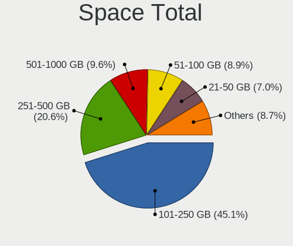
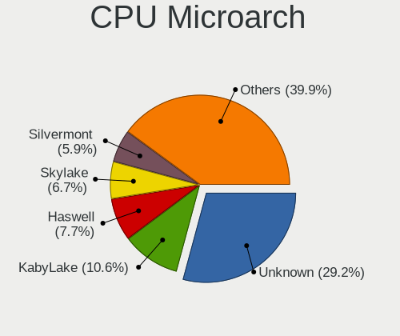
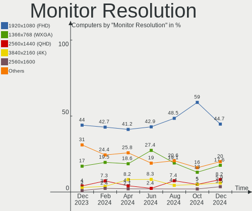
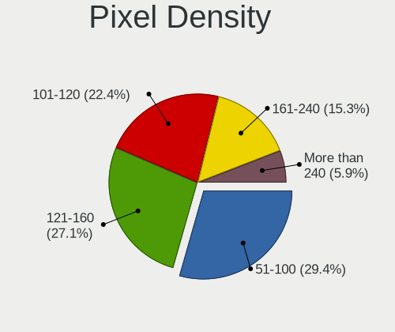
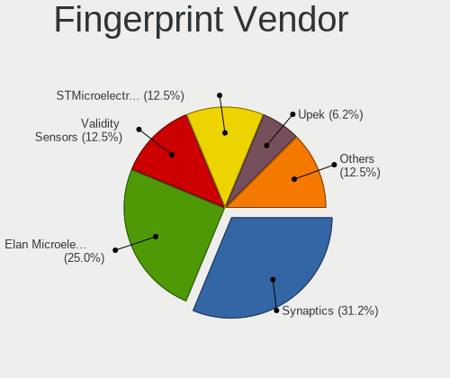

BSD - Hardware Trends
---------------------

A project to identify most popular hardware characteristics and track their change
over time based on data collected by BSD users at https://BSD-Hardware.info.

Anyone can contribute to this report by the [hw-probe](https://github.com/linuxhw/hw-probe/blob/master/INSTALL.BSD.md) tool:

    hw-probe -all -upload

This is a report for all computer types. See also reports for [desktops](/Desktop/README.md) and [notebooks](/Notebook/README.md).

OS-specific reports: [FreeBSD](/Dist/FreeBSD), [OPNsense](/Dist/OPNsense), [helloSystem](/Dist/helloSystem), [OpenBSD](/Dist/OpenBSD).

This report is for one last month. Overall report since the beginning of time: [TestDays](https://github.com/bsdhw/TestDays)

Period: Feb, 2023.

Contents
--------

* [ System ](#system)
  - [ OS                       ](#os)
  - [ OS Family                ](#os-family)
  - [ Arch                     ](#arch)
  - [ DE                       ](#de)
  - [ Display Server           ](#display-server)
  - [ Display Manager          ](#display-manager)
  - [ OS Lang                  ](#os-lang)
  - [ Boot Mode                ](#boot-mode)
  - [ Filesystem               ](#filesystem)
  - [ Part. scheme             ](#part-scheme)

* [ Board ](#board)
  - [ Vendor                   ](#vendor)
  - [ Model                    ](#model)
  - [ Model Family             ](#model-family)
  - [ MFG Year                 ](#mfg-year)
  - [ Form Factor              ](#form-factor)
  - [ Coreboot                 ](#coreboot)
  - [ RAM Size                 ](#ram-size)
  - [ RAM Used                 ](#ram-used)
  - [ Total Drives             ](#total-drives)
  - [ Has CD-ROM               ](#has-cd-rom)
  - [ Has Ethernet             ](#has-ethernet)
  - [ Has WiFi                 ](#has-wifi)
  - [ Has Bluetooth            ](#has-bluetooth)

* [ Location ](#location)
  - [ Country                  ](#country)
  - [ City                     ](#city)

* [ Drives ](#drives)
  - [ Drive Vendor             ](#drive-vendor)
  - [ Drive Model              ](#drive-model)
  - [ HDD Vendor               ](#hdd-vendor)
  - [ SSD Vendor               ](#ssd-vendor)
  - [ Drive Kind               ](#drive-kind)
  - [ Drive Connector          ](#drive-connector)
  - [ Drive Size               ](#drive-size)
  - [ Space Total              ](#space-total)
  - [ Space Used               ](#space-used)
  - [ Malfunc. Drives          ](#malfunc-drives)
  - [ Malfunc. Drive Vendor    ](#malfunc-drive-vendor)
  - [ Malfunc. HDD Vendor      ](#malfunc-hdd-vendor)
  - [ Malfunc. Drive Kind      ](#malfunc-drive-kind)
  - [ Failed Drives            ](#failed-drives)
  - [ Failed Drive Vendor      ](#failed-drive-vendor)
  - [ Drive Status             ](#drive-status)

* [ Storage controller ](#storage-controller)
  - [ Storage Vendor           ](#storage-vendor)
  - [ Storage Model            ](#storage-model)
  - [ Storage Kind             ](#storage-kind)

* [ Processor ](#processor)
  - [ CPU Vendor               ](#cpu-vendor)
  - [ CPU Model                ](#cpu-model)
  - [ CPU Model Family         ](#cpu-model-family)
  - [ CPU Cores                ](#cpu-cores)
  - [ CPU Sockets              ](#cpu-sockets)
  - [ CPU Threads              ](#cpu-threads)
  - [ CPU Microarch            ](#cpu-microarch)

* [ Graphics ](#graphics)
  - [ GPU Vendor               ](#gpu-vendor)
  - [ GPU Model                ](#gpu-model)
  - [ GPU Combo                ](#gpu-combo)
  - [ GPU Driver               ](#gpu-driver)
  - [ GPU Memory               ](#gpu-memory)

* [ Monitor ](#monitor)
  - [ Monitor Vendor           ](#monitor-vendor)
  - [ Monitor Model            ](#monitor-model)
  - [ Monitor Resolution       ](#monitor-resolution)
  - [ Monitor Diagonal         ](#monitor-diagonal)
  - [ Monitor Width            ](#monitor-width)
  - [ Aspect Ratio             ](#aspect-ratio)
  - [ Monitor Area             ](#monitor-area)
  - [ Pixel Density            ](#pixel-density)
  - [ Multiple Monitors        ](#multiple-monitors)

* [ Network ](#network)
  - [ Net Controller Vendor    ](#net-controller-vendor)
  - [ Net Controller Model     ](#net-controller-model)
  - [ Wireless Vendor          ](#wireless-vendor)
  - [ Wireless Model           ](#wireless-model)
  - [ Ethernet Vendor          ](#ethernet-vendor)
  - [ Ethernet Model           ](#ethernet-model)
  - [ Net Controller Kind      ](#net-controller-kind)
  - [ Used Controller          ](#used-controller)
  - [ NICs                     ](#nics)
  - [ IPv6                     ](#ipv6)

* [ Bluetooth ](#bluetooth)
  - [ Bluetooth Vendor         ](#bluetooth-vendor)
  - [ Bluetooth Model          ](#bluetooth-model)

* [ Sound ](#sound)
  - [ Sound Vendor             ](#sound-vendor)
  - [ Sound Model              ](#sound-model)

* [ Memory ](#memory)
  - [ Memory Vendor            ](#memory-vendor)
  - [ Memory Model             ](#memory-model)
  - [ Memory Kind              ](#memory-kind)
  - [ Memory Form Factor       ](#memory-form-factor)
  - [ Memory Size              ](#memory-size)
  - [ Memory Speed             ](#memory-speed)

* [ Printers & scanners ](#printers--scanners)
  - [ Printer Vendor           ](#printer-vendor)
  - [ Printer Model            ](#printer-model)
  - [ Scanner Vendor           ](#scanner-vendor)
  - [ Scanner Model            ](#scanner-model)

* [ Camera ](#camera)
  - [ Camera Vendor            ](#camera-vendor)
  - [ Camera Model             ](#camera-model)

* [ Security ](#security)
  - [ Fingerprint Vendor       ](#fingerprint-vendor)
  - [ Fingerprint Model        ](#fingerprint-model)
  - [ Chipcard Vendor          ](#chipcard-vendor)
  - [ Chipcard Model           ](#chipcard-model)

* [ Unsupported ](#unsupported)
  - [ Unsupported Devices      ](#unsupported-devices)
  - [ Unsupported Device Types ](#unsupported-device-types)

System
------

OS
--

Installed operating systems

| Name                    | Computers | Percent |
|-------------------------|-----------|---------|
| OPNsense 23.1           | 137       | 27.35%  |
| OPNsense 23.1.1         | 130       | 25.95%  |
| helloSystem 0.8.0       | 79        | 15.77%  |
| OPNsense 22.7.11        | 27        | 5.39%   |
| FreeBSD 13.1            | 18        | 3.59%   |
| FreeBSD 13.1-p5         | 10        | 2%      |
| OpenBSD 7.2             | 9         | 1.8%    |
| helloSystem 0.8.1       | 9         | 1.8%    |
| OPNsense 23.7           | 8         | 1.6%    |
| FreeBSD 13.1-p7         | 7         | 1.4%    |
| OPNsense 22.1.10        | 6         | 1.2%    |
| GhostBSD 23.02.02       | 6         | 1.2%    |
| FreeBSD 13.1-p6         | 6         | 1.2%    |
| OPNsense 22.10.2        | 4         | 0.8%    |
| NomadBSD 20221130       | 4         | 0.8%    |
| FreeBSD 14.0-CURRENT    | 4         | 0.8%    |
| FreeBSD 13.2-BETA2      | 4         | 0.8%    |
| FreeBSD 13.1-STABLE     | 4         | 0.8%    |
| OPNsense 22.7.9         | 3         | 0.6%    |
| OPNsense 22.7.10        | 3         | 0.6%    |
| helloSystem 0.7.0       | 3         | 0.6%    |
| GhostBSD 22.06.18       | 3         | 0.6%    |
| XigmaNAS 13.1-p5        | 1         | 0.2%    |
| OPNsense 22.7.8         | 1         | 0.2%    |
| OPNsense 22.10.1        | 1         | 0.2%    |
| OPNsense 21.7.8         | 1         | 0.2%    |
| OPNsense 21.1.9         | 1         | 0.2%    |
| NetBSD 9.3              | 1         | 0.2%    |
| NetBSD 10.0_BETA        | 1         | 0.2%    |
| MyBee 13.1-p7           | 1         | 0.2%    |
| MidnightBSD 3.1.0       | 1         | 0.2%    |
| FuryBSD 13.1-p5         | 1         | 0.2%    |
| FreeBSD 13.2-PRERELEASE | 1         | 0.2%    |
| FreeBSD 13.1-p3         | 1         | 0.2%    |
| FreeBSD 13.1-p2         | 1         | 0.2%    |
| FreeBSD 12.4            | 1         | 0.2%    |
| FreeBSD 12.3-p1         | 1         | 0.2%    |
| FreeBSD 12.3            | 1         | 0.2%    |
| ClonOS 13.1.2           | 1         | 0.2%    |

OS Family
---------

OS without a version

| Name        | Computers | Percent |
|-------------|-----------|---------|
| OPNsense    | 322       | 64.27%  |
| helloSystem | 91        | 18.16%  |
| FreeBSD     | 59        | 11.78%  |
| OpenBSD     | 9         | 1.8%    |
| GhostBSD    | 9         | 1.8%    |
| NomadBSD    | 4         | 0.8%    |
| NetBSD      | 2         | 0.4%    |
| XigmaNAS    | 1         | 0.2%    |
| MyBee       | 1         | 0.2%    |
| MidnightBSD | 1         | 0.2%    |
| FuryBSD     | 1         | 0.2%    |
| ClonOS      | 1         | 0.2%    |

Arch
----

OS architecture (x86_64, i586, etc.)

| Name    | Computers | Percent |
|---------|-----------|---------|
| amd64   | 496       | 99%     |
| i386    | 3         | 0.6%    |
| powerpc | 1         | 0.2%    |
| macppc  | 1         | 0.2%    |

DE
--

Desktop Environment

| Name          | Computers | Percent |
|---------------|-----------|---------|
| Console       | 342       | 68.26%  |
| helloDesktop  | 97        | 19.36%  |
| XFCE          | 24        | 4.79%   |
| MATE          | 13        | 2.59%   |
| KDE5          | 11        | 2.2%    |
| Openbox       | 4         | 0.8%    |
| LXQt          | 2         | 0.4%    |
| GNOME         | 2         | 0.4%    |
| Enlightenment | 2         | 0.4%    |
| xinitrc       | 1         | 0.2%    |
| TWM           | 1         | 0.2%    |
| DWM           | 1         | 0.2%    |
| AwesomeWM     | 1         | 0.2%    |

Display Server
--------------

X11 or Wayland

| Name    | Computers | Percent |
|---------|-----------|---------|
| Console | 344       | 68.66%  |
| X11     | 155       | 30.94%  |
| Wayland | 1         | 0.2%    |
| Tty     | 1         | 0.2%    |

Display Manager
---------------

SDDM, LightDM, etc.

| Name    | Computers | Percent |
|---------|-----------|---------|
| Console | 362       | 72.26%  |
| SLiM    | 99        | 19.76%  |
| LightDM | 20        | 3.99%   |
| SDDM    | 15        | 2.99%   |
| XDM     | 2         | 0.4%    |
| Ly      | 2         | 0.4%    |
| GDM     | 1         | 0.2%    |

OS Lang
-------

Language

| Lang           | Computers | Percent |
|----------------|-----------|---------|
| Unknown        | 331       | 66.07%  |
| C              | 48        | 9.58%   |
| en             | 44        | 8.78%   |
| en_US          | 26        | 5.19%   |
| fr             | 10        | 2%      |
| pt             | 6         | 1.2%    |
| es             | 5         | 1%      |
| de_DE          | 5         | 1%      |
| ru_RU          | 4         | 0.8%    |
| de             | 3         | 0.6%    |
| pl             | 2         | 0.4%    |
| nl             | 2         | 0.4%    |
| it             | 2         | 0.4%    |
| en_GB          | 2         | 0.4%    |
| tr_TR          | 1         | 0.2%    |
| sv             | 1         | 0.2%    |
| ru             | 1         | 0.2%    |
| pt_BR          | 1         | 0.2%    |
| pl_PL          | 1         | 0.2%    |
| lt_LT          | 1         | 0.2%    |
| ko_KR          | 1         | 0.2%    |
| es_ES          | 1         | 0.2%    |
| en_IE.US-ASCII | 1         | 0.2%    |
| de_CH          | 1         | 0.2%    |
| cs_CZ          | 1         | 0.2%    |

Boot Mode
---------

EFI or BIOS

| Mode | Computers | Percent |
|------|-----------|---------|
| EFI  | 475       | 94.81%  |
| BIOS | 26        | 5.19%   |

Filesystem
----------

Type of filesystem

| Type   | Computers | Percent |
|--------|-----------|---------|
| Zfs    | 226       | 45.11%  |
| Ufs    | 213       | 42.51%  |
| Cd9660 | 53        | 10.58%  |
| Ffs    | 9         | 1.8%    |

Part. scheme
------------

Scheme of partitioning

| Type    | Computers | Percent |
|---------|-----------|---------|
| GPT     | 487       | 97.21%  |
| MBR     | 13        | 2.59%   |
| Unknown | 1         | 0.2%    |

Board
-----

Vendor
------

Motherboard manufacturer

| Name                | Computers | Percent |
|---------------------|-----------|---------|
| Lenovo              | 59        | 11.78%  |
| Dell                | 57        | 11.38%  |
| Unknown             | 52        | 10.38%  |
| Hewlett-Packard     | 44        | 8.78%   |
| ASUSTek Computer    | 38        | 7.58%   |
| Intel               | 24        | 4.79%   |
| Supermicro          | 22        | 4.39%   |
| Gigabyte Technology | 19        | 3.79%   |
| ASRock              | 18        | 3.59%   |
| Fujitsu             | 15        | 2.99%   |
| Techvision          | 13        | 2.59%   |
| Protectli           | 12        | 2.4%    |
| PC Engines          | 12        | 2.4%    |
| MSI                 | 11        | 2.2%    |
| Sophos              | 8         | 1.6%    |
| AMI                 | 8         | 1.6%    |
| Acer                | 7         | 1.4%    |
| ZOTAC               | 6         | 1.2%    |
| Deciso              | 6         | 1.2%    |
| Apple               | 5         | 1%      |
| AZW                 | 4         | 0.8%    |
| CncTion             | 3         | 0.6%    |
| Yanling             | 2         | 0.4%    |
| Toshiba             | 2         | 0.4%    |
| Shuttle             | 2         | 0.4%    |
| Seeed Studio        | 2         | 0.4%    |
| Samsung Electronics | 2         | 0.4%    |
| Notebook            | 2         | 0.4%    |
| MW                  | 2         | 0.4%    |
| Huanan              | 2         | 0.4%    |
| Hardkernel          | 2         | 0.4%    |
| CWWK                | 2         | 0.4%    |
| Biostar             | 2         | 0.4%    |
| BESSTAR Tech        | 2         | 0.4%    |
| YANYU               | 1         | 0.2%    |
| TYAN Computer       | 1         | 0.2%    |
| TUXEDO              | 1         | 0.2%    |
| Stonesoft           | 1         | 0.2%    |
| Sony                | 1         | 0.2%    |
| SLIMBOOK            | 1         | 0.2%    |

Model
-----

Motherboard model

| Name                                | Computers | Percent |
|-------------------------------------|-----------|---------|
| Unknown                             | 54        | 10.78%  |
| Techvision TVI7309X                 | 13        | 2.59%   |
| Supermicro Super Server             | 8         | 1.6%    |
| PC Engines APU2                     | 8         | 1.6%    |
| Sophos SG                           | 6         | 1.2%    |
| Dell OptiPlex 3020                  | 6         | 1.2%    |
| Fujitsu FUTRO S920                  | 4         | 0.8%    |
| Dell OptiPlex 9020                  | 4         | 0.8%    |
| Dell OptiPlex 7010                  | 4         | 0.8%    |
| Supermicro X7SPA-HF                 | 3         | 0.6%    |
| Protectli FW4B                      | 3         | 0.6%    |
| HP t730 Thin Client                 | 3         | 0.6%    |
| Dell Wyse 5070 Extended Thin Client | 3         | 0.6%    |
| Dell PowerEdge R210                 | 3         | 0.6%    |
| Dell OptiPlex 9010                  | 3         | 0.6%    |
| Dell OptiPlex 7060                  | 3         | 0.6%    |
| AMI Aptio CRB                       | 3         | 0.6%    |
| Supermicro X9SCL/X9SCM              | 2         | 0.4%    |
| Protectli VP2420                    | 2         | 0.4%    |
| Protectli VP2410                    | 2         | 0.4%    |
| Protectli FW6                       | 2         | 0.4%    |
| Protectli FW2B                      | 2         | 0.4%    |
| PC Engines apu4                     | 2         | 0.4%    |
| MW GMLK-2_5G4L                      | 2         | 0.4%    |
| Intel S1200BTL                      | 2         | 0.4%    |
| Intel Q3XXG4-P V1.0                 | 2         | 0.4%    |
| HP ProLiant DL360 G7                | 2         | 0.4%    |
| HP Notebook                         | 2         | 0.4%    |
| HP Compaq Elite 8300 CMT            | 2         | 0.4%    |
| Hardkernel ODROID-H2                | 2         | 0.4%    |
| Fujitsu FUTRO S930                  | 2         | 0.4%    |
| Dell Precision Tower 5810           | 2         | 0.4%    |
| Dell PowerEdge R610                 | 2         | 0.4%    |
| Dell OptiPlex 7020                  | 2         | 0.4%    |
| Dell Inspiron 3470                  | 2         | 0.4%    |
| Deciso OPNsense Appliance           | 2         | 0.4%    |
| Deciso Netboard A20                 | 2         | 0.4%    |
| CncTion N5105-4L                    | 2         | 0.4%    |
| AZW U59                             | 2         | 0.4%    |
| ASRock A520M-ITX/ac                 | 2         | 0.4%    |

Model Family
------------

Motherboard model prefix

| Name                 | Computers | Percent |
|----------------------|-----------|---------|
| Unknown              | 54        | 10.78%  |
| Lenovo ThinkPad      | 32        | 6.39%   |
| Dell OptiPlex        | 30        | 5.99%   |
| Techvision TVI7309X  | 13        | 2.59%   |
| Lenovo ThinkCentre   | 12        | 2.4%    |
| Dell PowerEdge       | 10        | 2%      |
| Fujitsu FUTRO        | 9         | 1.8%    |
| Supermicro Super     | 8         | 1.6%    |
| PC Engines APU2      | 8         | 1.6%    |
| ASUS PRIME           | 8         | 1.6%    |
| HP Compaq            | 7         | 1.4%    |
| Dell Inspiron        | 7         | 1.4%    |
| Acer Aspire          | 7         | 1.4%    |
| Sophos SG            | 6         | 1.2%    |
| Lenovo IdeaPad       | 6         | 1.2%    |
| HP ProDesk           | 5         | 1%      |
| HP Pavilion          | 4         | 0.8%    |
| Dell Wyse            | 4         | 0.8%    |
| Dell Precision       | 4         | 0.8%    |
| Supermicro X7SPA-HF  | 3         | 0.6%    |
| Protectli FW4B       | 3         | 0.6%    |
| HP t730              | 3         | 0.6%    |
| HP ProLiant          | 3         | 0.6%    |
| HP EliteDesk         | 3         | 0.6%    |
| Fujitsu PRIMERGY     | 3         | 0.6%    |
| ASUS ROG             | 3         | 0.6%    |
| AMI Aptio            | 3         | 0.6%    |
| Supermicro X9SCL     | 2         | 0.4%    |
| Protectli VP2420     | 2         | 0.4%    |
| Protectli VP2410     | 2         | 0.4%    |
| Protectli FW6        | 2         | 0.4%    |
| Protectli FW2B       | 2         | 0.4%    |
| PC Engines apu4      | 2         | 0.4%    |
| MW GMLK-2            | 2         | 0.4%    |
| Intel S1200BTL       | 2         | 0.4%    |
| Intel Q3XXG4-P       | 2         | 0.4%    |
| HP Victus            | 2         | 0.4%    |
| HP Notebook          | 2         | 0.4%    |
| HP EliteBook         | 2         | 0.4%    |
| Hardkernel ODROID-H2 | 2         | 0.4%    |

MFG Year
--------

Motherboard manufacture year

| Year    | Computers | Percent |
|---------|-----------|---------|
| 2022    | 92        | 18.36%  |
| 2021    | 51        | 10.18%  |
| 2018    | 48        | 9.58%   |
| 2014    | 41        | 8.18%   |
| 2019    | 40        | 7.98%   |
| 2020    | 39        | 7.78%   |
| 2016    | 38        | 7.58%   |
| 2013    | 29        | 5.79%   |
| 2012    | 29        | 5.79%   |
| 2015    | 24        | 4.79%   |
| 2011    | 18        | 3.59%   |
| 2017    | 15        | 2.99%   |
| 2010    | 15        | 2.99%   |
| 2009    | 8         | 1.6%    |
| 2008    | 4         | 0.8%    |
| Unknown | 4         | 0.8%    |
| 2023    | 3         | 0.6%    |
| 2007    | 2         | 0.4%    |
| 2006    | 1         | 0.2%    |

Form Factor
-----------

Physical design of the computer

| Name        | Computers | Percent |
|-------------|-----------|---------|
| Desktop     | 307       | 61.28%  |
| Notebook    | 107       | 21.36%  |
| Mini pc     | 43        | 8.58%   |
| Server      | 31        | 6.19%   |
| Firewall    | 8         | 1.6%    |
| Convertible | 3         | 0.6%    |
| All in one  | 2         | 0.4%    |

Coreboot
--------

Have coreboot on board

| Used | Computers | Percent |
|------|-----------|---------|
| No   | 485       | 96.81%  |
| Yes  | 16        | 3.19%   |

RAM Size
--------

Total RAM memory

| Size in GB  | Computers | Percent |
|-------------|-----------|---------|
| 8.01-16.0   | 191       | 38.12%  |
| 16.01-24.0  | 125       | 24.95%  |
| 4.01-8.0    | 81        | 16.17%  |
| 32.01-64.0  | 39        | 7.78%   |
| 2.01-3.0    | 23        | 4.59%   |
| 64.01-256.0 | 23        | 4.59%   |
| 24.01-32.0  | 11        | 2.2%    |
| 0.51-1.0    | 4         | 0.8%    |
| 3.01-4.0    | 3         | 0.6%    |
| 1.01-2.0    | 1         | 0.2%    |

RAM Used
--------

Used RAM memory

| Used GB  | Computers | Percent |
|----------|-----------|---------|
| 0.01-0.5 | 244       | 48.7%   |
| 0.51-1.0 | 170       | 33.93%  |
| 1.01-2.0 | 63        | 12.57%  |
| 2.01-3.0 | 16        | 3.19%   |
| 4.01-8.0 | 3         | 0.6%    |
| 3.01-4.0 | 3         | 0.6%    |
| Unknown  | 2         | 0.4%    |

Total Drives
------------

Number of drives on board

| Drives | Computers | Percent |
|--------|-----------|---------|
| 1      | 337       | 67.27%  |
| 2      | 79        | 15.77%  |
| 0      | 52        | 10.38%  |
| 3      | 14        | 2.79%   |
| 4      | 12        | 2.4%    |
| 5      | 2         | 0.4%    |
| 13     | 1         | 0.2%    |
| 9      | 1         | 0.2%    |
| 8      | 1         | 0.2%    |
| 7      | 1         | 0.2%    |
| 6      | 1         | 0.2%    |

Has CD-ROM
----------

Has CD-ROM on board

| Presented | Computers | Percent |
|-----------|-----------|---------|
| No        | 402       | 80.24%  |
| Yes       | 99        | 19.76%  |

Has Ethernet
------------

Has Ethernet on board

| Presented | Computers | Percent |
|-----------|-----------|---------|
| Yes       | 483       | 96.41%  |
| No        | 18        | 3.59%   |

Has WiFi
--------

Has WiFi module

| Presented | Computers | Percent |
|-----------|-----------|---------|
| No        | 307       | 61.28%  |
| Yes       | 194       | 38.72%  |

Has Bluetooth
-------------

Has Bluetooth module

| Presented | Computers | Percent |
|-----------|-----------|---------|
| No        | 358       | 71.46%  |
| Yes       | 143       | 28.54%  |

Location
--------

Country
-------

Geographic location (country)

| Country     | Computers | Percent |
|-------------|-----------|---------|
| USA         | 149       | 29.74%  |
| Germany     | 82        | 16.37%  |
| Canada      | 24        | 4.79%   |
| France      | 18        | 3.59%   |
| Russia      | 17        | 3.39%   |
| Brazil      | 17        | 3.39%   |
| UK          | 15        | 2.99%   |
| Netherlands | 14        | 2.79%   |
| Switzerland | 13        | 2.59%   |
| Poland      | 13        | 2.59%   |
| Spain       | 9         | 1.8%    |
| Indonesia   | 9         | 1.8%    |
| China       | 8         | 1.6%    |
| Australia   | 8         | 1.6%    |
| Austria     | 7         | 1.4%    |
| Sweden      | 6         | 1.2%    |
| Romania     | 6         | 1.2%    |
| Italy       | 6         | 1.2%    |
| Bulgaria    | 6         | 1.2%    |
| Belgium     | 6         | 1.2%    |
| Hungary     | 5         | 1%      |
| Thailand    | 4         | 0.8%    |
| South Korea | 4         | 0.8%    |
| Portugal    | 4         | 0.8%    |
| Finland     | 4         | 0.8%    |
| Mexico      | 3         | 0.6%    |
| Japan       | 3         | 0.6%    |
| India       | 3         | 0.6%    |
| Czechia     | 3         | 0.6%    |
| Chile       | 3         | 0.6%    |
| Turkey      | 2         | 0.4%    |
| Slovakia    | 2         | 0.4%    |
| Peru        | 2         | 0.4%    |
| New Zealand | 2         | 0.4%    |
| Mauritius   | 2         | 0.4%    |
| Malaysia    | 2         | 0.4%    |
| Ireland     | 2         | 0.4%    |
| Greece      | 2         | 0.4%    |
| Egypt       | 2         | 0.4%    |
| Argentina   | 2         | 0.4%    |

City
----

Geographic location (city)

| City             | Computers | Percent |
|------------------|-----------|---------|
| Berlin           | 8         | 1.6%    |
| Moscow           | 7         | 1.4%    |
| Munich           | 5         | 1%      |
| London           | 5         | 1%      |
| Jakarta          | 5         | 1%      |
| Zurich           | 4         | 0.8%    |
| Toronto          | 4         | 0.8%    |
| Paris            | 4         | 0.8%    |
| New York         | 4         | 0.8%    |
| Bucharest        | 4         | 0.8%    |
| Vienna           | 3         | 0.6%    |
| Sofia            | 3         | 0.6%    |
| Salem            | 3         | 0.6%    |
| Ozersk           | 3         | 0.6%    |
| Melbourne        | 3         | 0.6%    |
| Zhengzhou        | 2         | 0.4%    |
| Warsaw           | 2         | 0.4%    |
| Walnut Creek     | 2         | 0.4%    |
| Varna            | 2         | 0.4%    |
| Valencia         | 2         | 0.4%    |
| Stockholm        | 2         | 0.4%    |
| Statesboro       | 2         | 0.4%    |
| St Petersburg    | 2         | 0.4%    |
| Shenzhen         | 2         | 0.4%    |
| Santiago         | 2         | 0.4%    |
| San Francisco    | 2         | 0.4%    |
| Rio de Janeiro   | 2         | 0.4%    |
| Redmond          | 2         | 0.4%    |
| Québec          | 2         | 0.4%    |
| Puebla City      | 2         | 0.4%    |
| Portland         | 2         | 0.4%    |
| Plymouth         | 2         | 0.4%    |
| Montreal         | 2         | 0.4%    |
| Mönchengladbach | 2         | 0.4%    |
| Medford          | 2         | 0.4%    |
| Marcq-en-Baroeul | 2         | 0.4%    |
| Madrid           | 2         | 0.4%    |
| Los Angeles      | 2         | 0.4%    |
| Lisbon           | 2         | 0.4%    |
| Lima             | 2         | 0.4%    |

Drives
------

Drive Vendor
------------

Hard drive vendors

| Vendor              | Computers | Drives | Percent |
|---------------------|-----------|--------|---------|
| Samsung Electronics | 85        | 100    | 15.57%  |
| WDC                 | 65        | 94     | 11.9%   |
| Kingston            | 45        | 48     | 8.24%   |
| Seagate             | 35        | 53     | 6.41%   |
| Intel               | 29        | 31     | 5.31%   |
| Transcend           | 27        | 27     | 4.95%   |
| Crucial             | 27        | 32     | 4.95%   |
| Toshiba             | 23        | 28     | 4.21%   |
| SanDisk             | 21        | 21     | 3.85%   |
| A-DATA Technology   | 20        | 23     | 3.66%   |
| China               | 15        | 15     | 2.75%   |
| Hitachi             | 12        | 15     | 2.2%    |
| SPCC                | 7         | 7      | 1.28%   |
| SK hynix            | 7         | 8      | 1.28%   |
| Team                | 6         | 6      | 1.1%    |
| Gigabyte Technology | 6         | 6      | 1.1%    |
| Silicon Motion      | 5         | 5      | 0.92%   |
| Micron Technology   | 5         | 5      | 0.92%   |
| LITEON              | 5         | 5      | 0.92%   |
| Hoodisk             | 5         | 5      | 0.92%   |
| HGST                | 5         | 5      | 0.92%   |
| FORESEE             | 5         | 5      | 0.92%   |
| Protectli           | 4         | 4      | 0.73%   |
| Patriot             | 4         | 4      | 0.73%   |
| Intenso             | 4         | 4      | 0.73%   |
| Hewlett-Packard     | 4         | 4      | 0.73%   |
| Dogfish             | 4         | 4      | 0.73%   |
| Phison              | 3         | 3      | 0.55%   |
| OCZ                 | 3         | 3      | 0.55%   |
| Corsair             | 3         | 4      | 0.55%   |
| Apple               | 3         | 3      | 0.55%   |
| Apacer              | 3         | 3      | 0.55%   |
| T-FORCE             | 2         | 2      | 0.37%   |
| PNY                 | 2         | 2      | 0.37%   |
| NVMe                | 2         | 2      | 0.37%   |
| Netac               | 2         | 2      | 0.37%   |
| Mushkin             | 2         | 2      | 0.37%   |
| LITEONIT            | 2         | 2      | 0.37%   |
| Lexar               | 2         | 2      | 0.37%   |
| KingSpec            | 2         | 2      | 0.37%   |

Drive Model
-----------

Hard drive models

| Model                           | Computers | Percent |
|---------------------------------|-----------|---------|
| Kingston SA400S37240G 240GB     | 8         | 1.36%   |
| China SATA SSD 16GB             | 7         | 1.19%   |
| Samsung SSD 850 EVO 250GB       | 6         | 1.02%   |
| Transcend TS256GMTS952T2 256GB  | 5         | 0.85%   |
| Seagate ST500DM002-1BD142 500GB | 4         | 0.68%   |
| Kingston SV300S37A120G 120GB    | 4         | 0.68%   |
| FORESEE 128GB SSD               | 4         | 0.68%   |
| WDC WDS120G2G0A-00JH30 120GB    | 3         | 0.51%   |
| Transcend TS64GMSA230S 64GB     | 3         | 0.51%   |
| Transcend TS128GMTE110S 128GB   | 3         | 0.51%   |
| Transcend TS128GMSA230S 128GB   | 3         | 0.51%   |
| Samsung SSD 980 1TB             | 3         | 0.51%   |
| Samsung SSD 970 EVO Plus 500GB  | 3         | 0.51%   |
| Samsung SSD 970 EVO Plus 250GB  | 3         | 0.51%   |
| Samsung SSD 970 EVO Plus 1TB    | 3         | 0.51%   |
| Samsung SSD 860 EVO 500GB       | 3         | 0.51%   |
| Protectli 120GB M.2             | 3         | 0.51%   |
| Kingston SUV500MS120G 120GB     | 3         | 0.51%   |
| Kingston SA400S37120G 120GB     | 3         | 0.51%   |
| Intel SSDSC2BW120A4 120GB       | 3         | 0.51%   |
| Crucial CT480BX500SSD1 480GB    | 3         | 0.51%   |
| Crucial CT250MX500SSD1 250GB    | 3         | 0.51%   |
| Crucial CT240BX500SSD1 240GB    | 3         | 0.51%   |
| A-DATA SU800 256GB              | 3         | 0.51%   |
| A-DATA SU630 240GB              | 3         | 0.51%   |
| WDC WDS240G2G0A-00JH30 240GB    | 2         | 0.34%   |
| WDC WDS100T3X0C-00SJG0 1TB      | 2         | 0.34%   |
| WDC WD5000LPLX-00ZNTT0 500GB    | 2         | 0.34%   |
| WDC WD1600AAJS-61WAA0 160GB     | 2         | 0.34%   |
| WDC WD1002FBYS-02A6B0 1TB       | 2         | 0.34%   |
| Transcend TS64GSSD370 64GB      | 2         | 0.34%   |
| Toshiba MQ04ABF100 1TB          | 2         | 0.34%   |
| Toshiba MQ01ABD100 1TB          | 2         | 0.34%   |
| SPCC Solid State Disk 256GB     | 2         | 0.34%   |
| SPCC Solid State Disk 128GB     | 2         | 0.34%   |
| Silicon Motion GV128 128GB      | 2         | 0.34%   |
| Seagate ST9250410AS 250GB       | 2         | 0.34%   |
| Seagate ST4000DM000-1F2168 4TB  | 2         | 0.34%   |
| Seagate ST1000DM010-2EP102 1TB  | 2         | 0.34%   |
| SanDisk SSD U110 16GB           | 2         | 0.34%   |

HDD Vendor
----------

Hard disk drive vendors

| Vendor              | Computers | Drives | Percent |
|---------------------|-----------|--------|---------|
| WDC                 | 46        | 71     | 35.38%  |
| Seagate             | 34        | 51     | 26.15%  |
| Toshiba             | 15        | 19     | 11.54%  |
| Hitachi             | 12        | 15     | 9.23%   |
| Samsung Electronics | 9         | 10     | 6.92%   |
| HGST                | 5         | 5      | 3.85%   |
| Hewlett-Packard     | 3         | 3      | 2.31%   |
| NVMe                | 2         | 2      | 1.54%   |
| HPT                 | 1         | 8      | 0.77%   |
| General             | 1         | 1      | 0.77%   |
| FTS                 | 1         | 1      | 0.77%   |
| Apple               | 1         | 1      | 0.77%   |

SSD Vendor
----------

Solid state drive vendors

| Vendor              | Computers | Drives | Percent |
|---------------------|-----------|--------|---------|
| Samsung Electronics | 47        | 53     | 15.56%  |
| Kingston            | 35        | 37     | 11.59%  |
| Transcend           | 23        | 23     | 7.62%   |
| Intel               | 23        | 25     | 7.62%   |
| SanDisk             | 21        | 21     | 6.95%   |
| Crucial             | 20        | 25     | 6.62%   |
| A-DATA Technology   | 16        | 18     | 5.3%    |
| China               | 15        | 15     | 4.97%   |
| WDC                 | 8         | 10     | 2.65%   |
| Team                | 5         | 5      | 1.66%   |
| SPCC                | 5         | 5      | 1.66%   |
| Hoodisk             | 5         | 5      | 1.66%   |
| Protectli           | 4         | 4      | 1.32%   |
| Patriot             | 4         | 4      | 1.32%   |
| LITEON              | 4         | 4      | 1.32%   |
| Intenso             | 4         | 4      | 1.32%   |
| FORESEE             | 4         | 4      | 1.32%   |
| Dogfish             | 4         | 4      | 1.32%   |
| SK hynix            | 3         | 3      | 0.99%   |
| OCZ                 | 3         | 3      | 0.99%   |
| Gigabyte Technology | 3         | 3      | 0.99%   |
| Apacer              | 3         | 3      | 0.99%   |
| Toshiba             | 2         | 2      | 0.66%   |
| PNY                 | 2         | 2      | 0.66%   |
| Mushkin             | 2         | 2      | 0.66%   |
| Micron Technology   | 2         | 2      | 0.66%   |
| LITEONIT            | 2         | 2      | 0.66%   |
| KingSpec            | 2         | 2      | 0.66%   |
| Innodisk            | 2         | 2      | 0.66%   |
| Apple               | 2         | 2      | 0.66%   |
| Zheino              | 1         | 1      | 0.33%   |
| XUM                 | 1         | 1      | 0.33%   |
| XrayDisk            | 1         | 1      | 0.33%   |
| Verbatim            | 1         | 1      | 0.33%   |
| Timetec             | 1         | 1      | 0.33%   |
| T-FORCE             | 1         | 1      | 0.33%   |
| Smartbuy            | 1         | 1      | 0.33%   |
| Silicon Motion      | 1         | 1      | 0.33%   |
| Seagate             | 1         | 2      | 0.33%   |
| Phison              | 1         | 1      | 0.33%   |

Drive Kind
----------

HDD or SSD

| Kind | Computers | Drives | Percent |
|------|-----------|--------|---------|
| SSD  | 286       | 322    | 55.43%  |
| NVMe | 115       | 129    | 22.29%  |
| HDD  | 115       | 187    | 22.29%  |

Drive Connector
---------------

SATA, SAS, NVMe, etc.

| Type | Computers | Drives | Percent |
|------|-----------|--------|---------|
| SATA | 366       | 509    | 76.09%  |
| NVMe | 115       | 129    | 23.91%  |

Drive Size
----------

Size of hard drive

| Size in TB | Computers | Drives | Percent |
|------------|-----------|--------|---------|
| 0.01-0.5   | 313       | 368    | 77.28%  |
| 0.51-1.0   | 53        | 71     | 13.09%  |
| 1.01-2.0   | 25        | 37     | 6.17%   |
| 3.01-4.0   | 7         | 12     | 1.73%   |
| 4.01-10.0  | 3         | 10     | 0.74%   |
| 2.01-3.0   | 2         | 3      | 0.49%   |
| 10.01-20.0 | 2         | 8      | 0.49%   |

Space Total
-----------

Amount of disk space available on the file system

| Size in GB     | Computers | Percent |
|----------------|-----------|---------|
| 101-250        | 220       | 43.91%  |
| 251-500        | 78        | 15.57%  |
| 1-20           | 70        | 13.97%  |
| 51-100         | 50        | 9.98%   |
| 501-1000       | 36        | 7.19%   |
| 21-50          | 30        | 5.99%   |
| 1001-2000      | 10        | 2%      |
| More than 3000 | 5         | 1%      |
| 2001-3000      | 1         | 0.2%    |
| Unknown        | 1         | 0.2%    |

Space Used
----------

Amount of used disk space

| Used GB        | Computers | Percent |
|----------------|-----------|---------|
| 1-20           | 463       | 92.42%  |
| 21-50          | 23        | 4.59%   |
| 51-100         | 7         | 1.4%    |
| 101-250        | 4         | 0.8%    |
| More than 3000 | 1         | 0.2%    |
| 2001-3000      | 1         | 0.2%    |
| 501-1000       | 1         | 0.2%    |
| Unknown        | 1         | 0.2%    |

Malfunc. Drives
---------------

Drive models with a malfunction

| Model                                 | Computers | Drives | Percent |
|---------------------------------------|-----------|--------|---------|
| WDC WDS240G2G0A-00JH30 240GB          | 2         | 3      | 3.39%   |
| Kingston SA400S37240G 240GB           | 2         | 2      | 3.39%   |
| HGST HTS725050A7E630 500GB            | 2         | 2      | 3.39%   |
| WDC WD800AAJS-00TDA0 80GB             | 1         | 1      | 1.69%   |
| WDC WD5000LPLX-00ZNTT0 500GB          | 1         | 1      | 1.69%   |
| WDC WD2503ABYX-01WERA0 256GB          | 1         | 1      | 1.69%   |
| WDC WD1600AAJS-60Z0A0 160GB           | 1         | 1      | 1.69%   |
| WDC WD10EACS-00D6B1 1TB               | 1         | 1      | 1.69%   |
| Toshiba MQ04ABF100 1TB                | 1         | 1      | 1.69%   |
| Toshiba MQ01ABD100 1TB                | 1         | 1      | 1.69%   |
| Toshiba DT01ACA100 1TB                | 1         | 1      | 1.69%   |
| Seagate ST9500420AS 500GB             | 1         | 1      | 1.69%   |
| Seagate ST9500325AS 500GB             | 1         | 1      | 1.69%   |
| Seagate ST9250410AS 250GB             | 1         | 1      | 1.69%   |
| Seagate ST9160412AS 160GB             | 1         | 1      | 1.69%   |
| Seagate ST500DM002-1BD142 500GB       | 1         | 1      | 1.69%   |
| Seagate ST5000DM000-1FK178 5TB        | 1         | 1      | 1.69%   |
| Seagate ST3250310NS 250GB             | 1         | 2      | 1.69%   |
| Seagate ST310212A 10GB                | 1         | 1      | 1.69%   |
| Seagate ST1000DX001-1CM162 1TB        | 1         | 1      | 1.69%   |
| Seagate ST1000DM010-2EP102 1TB        | 1         | 1      | 1.69%   |
| Seagate ST1000DM003-1CH162 1TB        | 1         | 1      | 1.69%   |
| SanDisk SSD PLUS 240GB                | 1         | 1      | 1.69%   |
| SanDisk SDSSDH3512G 512GB             | 1         | 1      | 1.69%   |
| Samsung Electronics SSD 970 EVO 500GB | 1         | 1      | 1.69%   |
| Samsung Electronics SSD 970 EVO 2TB   | 1         | 1      | 1.69%   |
| Samsung Electronics SSD 950 PRO 256GB | 1         | 1      | 1.69%   |
| Samsung Electronics SSD 870 EVO 500GB | 1         | 1      | 1.69%   |
| Samsung Electronics SSD 870 EVO 250GB | 1         | 1      | 1.69%   |
| Samsung Electronics SSD 860 EVO 1TB   | 1         | 1      | 1.69%   |
| Samsung Electronics HM320II 320GB     | 1         | 1      | 1.69%   |
| Samsung Electronics HM250HI 250GB     | 1         | 1      | 1.69%   |
| Samsung Electronics HM160HI 160GB     | 1         | 1      | 1.69%   |
| Samsung Electronics HD322HJ 320GB     | 1         | 1      | 1.69%   |
| Phison SSD S7 64G                     | 1         | 1      | 1.69%   |
| OCZ VERTEX3 64GB                      | 1         | 1      | 1.69%   |
| LITEONIT LCT-128M3S 128GB             | 1         | 1      | 1.69%   |
| Kingston SV300S37A240G 240GB          | 1         | 1      | 1.69%   |
| Kingston SUV400S37240G 240GB          | 1         | 1      | 1.69%   |
| Intel SSDSC2CW120A3 120GB             | 1         | 1      | 1.69%   |

Malfunc. Drive Vendor
---------------------

Vendors of faulty drives

| Vendor              | Computers | Drives | Percent |
|---------------------|-----------|--------|---------|
| Seagate             | 11        | 12     | 18.97%  |
| Samsung Electronics | 9         | 10     | 15.52%  |
| WDC                 | 7         | 8      | 12.07%  |
| Hitachi             | 5         | 6      | 8.62%   |
| Kingston            | 4         | 4      | 6.9%    |
| Toshiba             | 3         | 3      | 5.17%   |
| Intel               | 3         | 3      | 5.17%   |
| HGST                | 3         | 3      | 5.17%   |
| SanDisk             | 2         | 2      | 3.45%   |
| Crucial             | 2         | 2      | 3.45%   |
| A-DATA Technology   | 2         | 2      | 3.45%   |
| Phison              | 1         | 1      | 1.72%   |
| OCZ                 | 1         | 1      | 1.72%   |
| LITEONIT            | 1         | 1      | 1.72%   |
| HP Phison           | 1         | 1      | 1.72%   |
| EDGE                | 1         | 1      | 1.72%   |
| China               | 1         | 1      | 1.72%   |
| Apple               | 1         | 1      | 1.72%   |

Malfunc. HDD Vendor
-------------------

Vendors of faulty HDD drives

| Vendor              | Computers | Drives | Percent |
|---------------------|-----------|--------|---------|
| Seagate             | 11        | 12     | 34.38%  |
| WDC                 | 5         | 5      | 15.63%  |
| Hitachi             | 5         | 6      | 15.63%  |
| Samsung Electronics | 4         | 4      | 12.5%   |
| Toshiba             | 3         | 3      | 9.38%   |
| HGST                | 3         | 3      | 9.38%   |
| Apple               | 1         | 1      | 3.13%   |

Malfunc. Drive Kind
-------------------

Kinds of faulty drives

| Kind | Computers | Drives | Percent |
|------|-----------|--------|---------|
| HDD  | 32        | 34     | 54.24%  |
| SSD  | 24        | 25     | 40.68%  |
| NVMe | 3         | 3      | 5.08%   |

Failed Drives
-------------

Failed drive models

| Model                             | Computers | Drives | Percent |
|-----------------------------------|-----------|--------|---------|
| SanDisk pSSD 32GB                 | 2         | 2      | 33.33%  |
| Seagate ST3250310AS 250GB         | 1         | 1      | 16.67%  |
| Samsung Electronics SSD 980 250GB | 1         | 1      | 16.67%  |
| Samsung Electronics HD103SJ 1TB   | 1         | 1      | 16.67%  |
| Kingston SA2000M8500G 500GB       | 1         | 1      | 16.67%  |

Failed Drive Vendor
-------------------

Failed drive vendors

| Vendor              | Computers | Drives | Percent |
|---------------------|-----------|--------|---------|
| SanDisk             | 2         | 2      | 33.33%  |
| Samsung Electronics | 2         | 2      | 33.33%  |
| Seagate             | 1         | 1      | 16.67%  |
| Kingston            | 1         | 1      | 16.67%  |

Drive Status
------------

Number of failed and malfunc. drives

| Status   | Computers | Drives | Percent |
|----------|-----------|--------|---------|
| Works    | 398       | 550    | 83.97%  |
| Malfunc  | 58        | 62     | 12.24%  |
| Detected | 12        | 20     | 2.53%   |
| Failed   | 6         | 6      | 1.27%   |

Storage controller
------------------

Storage Vendor
--------------

Storage controller vendors

| Vendor                                  | Computers | Percent |
|-----------------------------------------|-----------|---------|
| Intel                                   | 380       | 61.69%  |
| AMD                                     | 72        | 11.69%  |
| Samsung Electronics                     | 36        | 5.84%   |
| SanDisk                                 | 23        | 3.73%   |
| Silicon Motion                          | 15        | 2.44%   |
| Broadcom / LSI                          | 13        | 2.11%   |
| Kingston Technology Company             | 11        | 1.79%   |
| Phison Electronics                      | 8         | 1.3%    |
| Marvell Technology Group                | 8         | 1.3%    |
| Micron/Crucial Technology               | 7         | 1.14%   |
| Toshiba                                 | 5         | 0.81%   |
| ADATA Technology                        | 5         | 0.81%   |
| SK hynix                                | 4         | 0.65%   |
| Micron Technology                       | 4         | 0.65%   |
| Nvidia                                  | 3         | 0.49%   |
| JMicron Technology                      | 3         | 0.49%   |
| Hewlett-Packard                         | 3         | 0.49%   |
| ASMedia Technology                      | 3         | 0.49%   |
| Transcend                               | 2         | 0.32%   |
| Shenzhen Longsys Electronics            | 2         | 0.32%   |
| MAXIO Technology (Hangzhou)             | 2         | 0.32%   |
| Adaptec                                 | 2         | 0.32%   |
| Solid State Storage Technology          | 1         | 0.16%   |
| Silicon Integrated Systems [SiS]        | 1         | 0.16%   |
| Shenzhen Unionmemory Information System | 1         | 0.16%   |
| Lite-On Technology                      | 1         | 0.16%   |
| HighPoint Technologies                  | 1         | 0.16%   |

Storage Model
-------------

Storage controller models

| Model                                                                            | Computers | Percent |
|----------------------------------------------------------------------------------|-----------|---------|
| AMD FCH SATA Controller [AHCI mode]                                              | 53        | 7.73%   |
| Intel 8 Series/C220 Series Chipset Family 6-port SATA Controller 1 [AHCI mode]   | 40        | 5.83%   |
| Intel Celeron/Pentium Silver Processor SATA Controller                           | 39        | 5.69%   |
| Intel Sunrise Point-LP SATA Controller [AHCI mode]                               | 25        | 3.64%   |
| Intel Jasper Lake SATA AHCI Controller                                           | 23        | 3.35%   |
| Unknown                                                                          | 23        | 3.35%   |
| Intel Q170/Q150/B150/H170/H110/Z170/CM236 Chipset SATA Controller [AHCI Mode]    | 20        | 2.92%   |
| Samsung NVMe SSD Controller SM981/PM981/PM983                                    | 19        | 2.77%   |
| Silicon Motion SM2263EN/SM2263XT SSD Controller                                  | 15        | 2.19%   |
| Intel Cannon Lake PCH SATA AHCI Controller                                       | 15        | 2.19%   |
| Intel 7 Series Chipset Family 6-port SATA Controller [AHCI mode]                 | 15        | 2.19%   |
| Intel Atom/Celeron/Pentium Processor x5-E8000/J3xxx/N3xxx Series SATA Controller | 14        | 2.04%   |
| Intel 6 Series/C200 Series Chipset Family 6 port Desktop SATA AHCI Controller    | 14        | 2.04%   |
| Intel 7 Series/C210 Series Chipset Family 6-port SATA Controller [AHCI mode]     | 13        | 1.9%    |
| Intel NM10/ICH7 Family SATA Controller [IDE mode]                                | 11        | 1.6%    |
| Intel Atom Processor E3800 Series SATA AHCI Controller                           | 10        | 1.46%   |
| Intel 82801G (ICH7 Family) IDE Controller                                        | 10        | 1.46%   |
| Intel Comet Lake SATA AHCI Controller                                            | 9         | 1.31%   |
| Intel Wildcat Point-LP SATA Controller [AHCI Mode]                               | 8         | 1.17%   |
| Intel Tiger Lake-LP SATA Controller                                              | 8         | 1.17%   |
| Intel 8 Series SATA Controller 1 [AHCI mode]                                     | 8         | 1.17%   |
| Intel 200 Series PCH SATA controller [AHCI mode]                                 | 8         | 1.17%   |
| AMD 400 Series Chipset SATA Controller                                           | 8         | 1.17%   |
| Intel SATA Controller [RAID mode]                                                | 7         | 1.02%   |
| Intel 82801HM/HEM (ICH8M/ICH8M-E) IDE Controller                                 | 7         | 1.02%   |
| Samsung NVMe SSD Controller 980                                                  | 6         | 0.87%   |
| Micron/Crucial P2 NVMe PCIe SSD                                                  | 6         | 0.87%   |
| Intel Celeron N3350/Pentium N4200/Atom E3900 Series SATA AHCI Controller         | 6         | 0.87%   |
| Intel 5 Series/3400 Series Chipset 6 port SATA AHCI Controller                   | 6         | 0.87%   |
| SanDisk WD Black SN750 / PC SN730 NVMe SSD                                       | 5         | 0.73%   |
| Samsung NVMe SSD Controller PM9A1/PM9A3/980PRO                                   | 5         | 0.73%   |
| Intel 82801IR/IO/IH (ICH9R/DO/DH) 4 port SATA Controller [IDE mode]              | 5         | 0.73%   |
| Intel 82801I (ICH9 Family) 2 port SATA Controller [IDE mode]                     | 5         | 0.73%   |
| Intel 82801HM/HEM (ICH8M/ICH8M-E) SATA Controller [AHCI mode]                    | 5         | 0.73%   |
| Intel 6 Series/C200 Series Chipset Family 6 port Mobile SATA AHCI Controller     | 5         | 0.73%   |
| SanDisk WD Blue SN570 NVMe SSD                                                   | 4         | 0.58%   |
| SanDisk WD Blue SN500 / PC SN520 NVMe SSD                                        | 4         | 0.58%   |
| Samsung NVMe SSD Controller SM961/PM961/SM963                                    | 4         | 0.58%   |
| Phison PS5013 E13 NVMe Controller                                                | 4         | 0.58%   |
| Intel Elkhart Lake SATA AHCI                                                     | 4         | 0.58%   |

Storage Kind
------------

Kind of storage controller (IDE, SATA, NVMe, SAS, ...)

| Kind | Computers | Percent |
|------|-----------|---------|
| SATA | 404       | 65.27%  |
| NVMe | 124       | 20.03%  |
| IDE  | 57        | 9.21%   |
| RAID | 28        | 4.52%   |
| SAS  | 4         | 0.65%   |
| SCSI | 2         | 0.32%   |

Processor
---------

CPU Vendor
----------

Processor vendors

| Vendor  | Computers | Percent |
|---------|-----------|---------|
| Intel   | 420       | 83.83%  |
| AMD     | 79        | 15.77%  |
| IBM     | 1         | 0.2%    |
| Unknown | 1         | 0.2%    |

CPU Model
---------

Processor models

| Model                                      | Computers | Percent |
|--------------------------------------------|-----------|---------|
| Intel Celeron J4125 CPU @ 2.00GHz          | 21        | 4.19%   |
| Intel Celeron N5105 @ 2.00GHz              | 20        | 3.99%   |
| AMD GX-412TC SOC                           | 10        | 2%      |
| Intel Core i5-3570 CPU @ 3.40GHz           | 6         | 1.2%    |
| Intel Celeron CPU J3160 @ 1.60GHz          | 6         | 1.2%    |
| Intel Atom CPU D525 @ 1.80GHz              | 6         | 1.2%    |
| Intel Pentium Silver J5005 CPU @ 1.50GHz   | 5         | 1%      |
| Intel Core i7-7500U CPU @ 2.70GHz          | 5         | 1%      |
| Intel Pentium Silver N6005 @ 2.00GHz       | 4         | 0.8%    |
| Intel Core i5-8250U CPU @ 1.60GHz          | 4         | 0.8%    |
| Intel Core i5-5200U CPU @ 2.20GHz          | 4         | 0.8%    |
| Intel Core i5-4590T CPU @ 2.00GHz          | 4         | 0.8%    |
| Intel Core i5-4590 CPU @ 3.30GHz           | 4         | 0.8%    |
| Intel Core i5-4570 CPU @ 3.20GHz           | 4         | 0.8%    |
| Intel Core i3-8100 CPU @ 3.60GHz           | 4         | 0.8%    |
| Intel Celeron CPU J1900 @ 1.99GHz          | 4         | 0.8%    |
| Intel 11th Gen Core i7-1165G7 @ 2.80GHz    | 4         | 0.8%    |
| AMD GX-415GA SOC with Radeon HD Graphics   | 4         | 0.8%    |
| AMD EPYC 3201 8-Core Processor             | 4         | 0.8%    |
| AMD Athlon 3000G with Radeon Vega Graphics | 4         | 0.8%    |
| Intel Xeon CPU E5620 @ 2.40GHz             | 3         | 0.6%    |
| Intel Pentium CPU G2020 @ 2.90GHz          | 3         | 0.6%    |
| Intel Core i7-8550U CPU @ 1.80GHz          | 3         | 0.6%    |
| Intel Core i7-3770 CPU @ 3.40GHz           | 3         | 0.6%    |
| Intel Core i5-7200U CPU @ 2.50GHz          | 3         | 0.6%    |
| Intel Core i5-6500T CPU @ 2.50GHz          | 3         | 0.6%    |
| Intel Core i5-6300U CPU @ 2.40GHz          | 3         | 0.6%    |
| Intel Core i5-4570T CPU @ 2.90GHz          | 3         | 0.6%    |
| Intel Core i5-4200U CPU @ 1.60GHz          | 3         | 0.6%    |
| Intel Core i5-2400 CPU @ 3.10GHz           | 3         | 0.6%    |
| Intel Core i5-10210U CPU @ 1.60GHz         | 3         | 0.6%    |
| Intel Core i3-7100U CPU @ 2.40GHz          | 3         | 0.6%    |
| Intel Core i3-4130 CPU @ 3.40GHz           | 3         | 0.6%    |
| Intel Core 2 Duo                           | 3         | 0.6%    |
| Intel Celeron J6413 @ 1.80GHz              | 3         | 0.6%    |
| Intel Celeron J4105 CPU @ 1.50GHz          | 3         | 0.6%    |
| Intel Celeron CPU N3350 @ 1.10GHz          | 3         | 0.6%    |
| Intel 12th Gen Core i7-12700H              | 3         | 0.6%    |
| Intel 11th Gen Core i5-1135G7 @ 2.40GHz    | 3         | 0.6%    |
| Intel 11th Gen Core i3-1115G4 @ 3.00GHz    | 3         | 0.6%    |

CPU Model Family
----------------

Processor model prefix

| Model                   | Computers | Percent |
|-------------------------|-----------|---------|
| Intel Core i5           | 101       | 20.16%  |
| Intel Celeron           | 93        | 18.56%  |
| Intel Xeon              | 45        | 8.98%   |
| Intel Core i7           | 42        | 8.38%   |
| Intel Core i3           | 37        | 7.39%   |
| Other                   | 33        | 6.59%   |
| Intel Atom              | 20        | 3.99%   |
| Intel Pentium           | 19        | 3.79%   |
| AMD GX                  | 17        | 3.39%   |
| Intel Pentium Silver    | 12        | 2.4%    |
| Intel Core 2 Duo        | 10        | 2%      |
| AMD Ryzen 7             | 9         | 1.8%    |
| AMD Ryzen 5             | 8         | 1.6%    |
| AMD EPYC                | 8         | 1.6%    |
| AMD Ryzen 9             | 6         | 1.2%    |
| Intel Core i9           | 4         | 0.8%    |
| AMD G                   | 4         | 0.8%    |
| AMD Athlon              | 4         | 0.8%    |
| Intel Core 2 Quad       | 3         | 0.6%    |
| AMD Phenom II X4        | 3         | 0.6%    |
| Intel Pentium Dual-Core | 2         | 0.4%    |
| AMD Ryzen Embedded      | 2         | 0.4%    |
| AMD Ryzen 5 PRO         | 2         | 0.4%    |
| AMD A8                  | 2         | 0.4%    |
| AMD A4                  | 2         | 0.4%    |
| Intel Xeon Gold         | 1         | 0.2%    |
| Intel Pentium Gold      | 1         | 0.2%    |
| Intel Celeron M         | 1         | 0.2%    |
| Intel Celeron D         | 1         | 0.2%    |
| AMD Ryzen 7 PRO         | 1         | 0.2%    |
| AMD Ryzen 3 PRO         | 1         | 0.2%    |
| AMD Ryzen 3             | 1         | 0.2%    |
| AMD FX                  | 1         | 0.2%    |
| AMD E2                  | 1         | 0.2%    |
| AMD E1                  | 1         | 0.2%    |
| AMD A6                  | 1         | 0.2%    |
| AMD A10                 | 1         | 0.2%    |
| AMD 686-class           | 1         | 0.2%    |

CPU Cores
---------

Number of processor cores

| Number  | Computers | Percent |
|---------|-----------|---------|
| 4       | 260       | 51.9%   |
| 2       | 141       | 28.14%  |
| 6       | 23        | 4.59%   |
| 8       | 20        | 3.99%   |
| 12      | 15        | 2.99%   |
| 16      | 13        | 2.59%   |
| Unknown | 10        | 2%      |
| 1       | 7         | 1.4%    |
| 10      | 6         | 1.2%    |
| 32      | 3         | 0.6%    |
| 24      | 3         | 0.6%    |

CPU Sockets
-----------

Number of sockets

| Number  | Computers | Percent |
|---------|-----------|---------|
| 1       | 488       | 97.41%  |
| 2       | 10        | 2%      |
| Unknown | 3         | 0.6%    |

CPU Threads
-----------

Threads per core (Hyper-Threading)

| Number  | Computers | Percent |
|---------|-----------|---------|
| 1       | 299       | 59.68%  |
| 2       | 190       | 37.92%  |
| Unknown | 12        | 2.4%    |

CPU Microarch
-------------

Microarchitecture

| Name          | Computers | Percent |
|---------------|-----------|---------|
| KabyLake      | 62        | 12.38%  |
| Haswell       | 61        | 12.18%  |
| Unknown       | 51        | 10.18%  |
| Goldmont plus | 40        | 7.98%   |
| IvyBridge     | 36        | 7.19%   |
| Skylake       | 29        | 5.79%   |
| Silvermont    | 27        | 5.39%   |
| SandyBridge   | 24        | 4.79%   |
| Penryn        | 15        | 2.99%   |
| TigerLake     | 14        | 2.79%   |
| Zen           | 13        | 2.59%   |
| Puma          | 13        | 2.59%   |
| Bonnell       | 13        | 2.59%   |
| Broadwell     | 11        | 2.2%    |
| Zen 3         | 10        | 2%      |
| Westmere      | 10        | 2%      |
| Zen+          | 9         | 1.8%    |
| CometLake     | 9         | 1.8%    |
| Zen 2         | 8         | 1.6%    |
| Nehalem       | 7         | 1.4%    |
| Goldmont      | 7         | 1.4%    |
| Jaguar        | 6         | 1.2%    |
| Core          | 6         | 1.2%    |
| Steamroller   | 5         | 1%      |
| Bobcat        | 5         | 1%      |
| Piledriver    | 4         | 0.8%    |
| K10           | 3         | 0.6%    |
| P6            | 1         | 0.2%    |
| NetBurst      | 1         | 0.2%    |
| IceLake       | 1         | 0.2%    |

Graphics
--------

GPU Vendor
----------

Vendors of graphics cards

| Vendor                           | Computers | Percent |
|----------------------------------|-----------|---------|
| Intel                            | 346       | 67.45%  |
| AMD                              | 68        | 13.26%  |
| Nvidia                           | 55        | 10.72%  |
| Matrox Electronics Systems       | 24        | 4.68%   |
| ASPEED Technology                | 19        | 3.7%    |
| Silicon Integrated Systems [SiS] | 1         | 0.19%   |

GPU Model
---------

Graphics card models

| Model                                                                                    | Computers | Percent |
|------------------------------------------------------------------------------------------|-----------|---------|
| Intel Xeon E3-1200 v3/4th Gen Core Processor Integrated Graphics Controller              | 33        | 6.41%   |
| Intel GeminiLake [UHD Graphics 600]                                                      | 32        | 6.21%   |
| Intel JasperLake [UHD Graphics]                                                          | 27        | 5.24%   |
| ASPEED Technology ASPEED Graphics Family                                                 | 19        | 3.69%   |
| Intel CoffeeLake-S GT2 [UHD Graphics 630]                                                | 16        | 3.11%   |
| Intel 2nd Generation Core Processor Family Integrated Graphics Controller                | 16        | 3.11%   |
| Intel Atom/Celeron/Pentium Processor x5-E8000/J3xxx/N3xxx Integrated Graphics Controller | 14        | 2.72%   |
| Matrox Electronics Systems MGA G200eW WPCM450                                            | 13        | 2.52%   |
| Intel Xeon E3-1200 v2/3rd Gen Core processor Graphics Controller                         | 12        | 2.33%   |
| Intel HD Graphics 530                                                                    | 12        | 2.33%   |
| Intel 3rd Gen Core processor Graphics Controller                                         | 12        | 2.33%   |
| Intel HD Graphics 620                                                                    | 11        | 2.14%   |
| Intel Atom Processor Z36xxx/Z37xxx Series Graphics & Display                             | 11        | 2.14%   |
| Intel UHD Graphics 620                                                                   | 10        | 1.94%   |
| Intel TigerLake-LP GT2 [Iris Xe Graphics]                                                | 10        | 1.94%   |
| Intel Haswell-ULT Integrated Graphics Controller                                         | 10        | 1.94%   |
| Intel 4 Series Chipset Integrated Graphics Controller                                    | 9         | 1.75%   |
| Intel GeminiLake [UHD Graphics 605]                                                      | 8         | 1.55%   |
| Intel Skylake GT2 [HD Graphics 520]                                                      | 7         | 1.36%   |
| Intel Atom Processor D4xx/D5xx/N4xx/N5xx Integrated Graphics Controller                  | 7         | 1.36%   |
| Matrox Electronics Systems MGA G200e [Pilot] ServerEngines (SEP1)                        | 6         | 1.17%   |
| Intel HD Graphics 630                                                                    | 6         | 1.17%   |
| Intel HD Graphics 5500                                                                   | 6         | 1.17%   |
| Intel 4th Generation Core Processor Family Integrated Graphics Controller                | 6         | 1.17%   |
| AMD Picasso/Raven 2 [Radeon Vega Series / Radeon Vega Mobile Series]                     | 6         | 1.17%   |
| AMD Cezanne [Radeon Vega Series / Radeon Vega Mobile Series]                             | 6         | 1.17%   |
| Intel HD Graphics 500                                                                    | 5         | 0.97%   |
| Intel Elkhart Lake [UHD Graphics Gen11 16EU]                                             | 5         | 0.97%   |
| Intel Alder Lake-P Integrated Graphics Controller                                        | 5         | 0.97%   |
| AMD Kaveri [Radeon R7 Graphics]                                                          | 5         | 0.97%   |
| Matrox Electronics Systems G200eR2                                                       | 4         | 0.78%   |
| Intel Tiger Lake-LP GT2 [UHD Graphics G4]                                                | 4         | 0.78%   |
| Intel IvyBridge GT2 [HD Graphics 4000]                                                   | 4         | 0.78%   |
| Intel Core Processor Integrated Graphics Controller                                      | 4         | 0.78%   |
| Intel CometLake-U GT2 [UHD Graphics]                                                     | 4         | 0.78%   |
| AMD Kabini [Radeon HD 8330E]                                                             | 4         | 0.78%   |
| AMD ES1000                                                                               | 4         | 0.78%   |
| Nvidia TU117 [GeForce GTX 1650]                                                          | 3         | 0.58%   |
| Nvidia GA107M [GeForce RTX 3050 Ti Mobile]                                               | 3         | 0.58%   |
| Intel CometLake-S GT2 [UHD Graphics 630]                                                 | 3         | 0.58%   |

GPU Combo
---------

Combinations of graphics cards

| Name           | Computers | Percent |
|----------------|-----------|---------|
| 1 x Intel      | 305       | 60.88%  |
| 1 x AMD        | 57        | 11.38%  |
| 1 x Nvidia     | 33        | 6.59%   |
| 1 x Matrox     | 24        | 4.79%   |
| Other          | 20        | 3.99%   |
| Intel + Nvidia | 19        | 3.79%   |
| 1 x ASPEED     | 16        | 3.19%   |
| 2 x Intel      | 13        | 2.59%   |
| Intel + AMD    | 7         | 1.4%    |
| AMD + Nvidia   | 3         | 0.6%    |
| Intel + ASPEED | 2         | 0.4%    |
| 1 x SiS        | 1         | 0.2%    |
| AMD + ASPEED   | 1         | 0.2%    |

GPU Driver
----------

Free vs proprietary

| Driver      | Computers | Percent |
|-------------|-----------|---------|
| Free        | 449       | 89.62%  |
| Proprietary | 28        | 5.59%   |
| Unknown     | 24        | 4.79%   |

GPU Memory
----------

Total video memory

| Size in GB | Computers | Percent |
|------------|-----------|---------|
| Unknown    | 466       | 93.01%  |
| 3.01-4.0   | 10        | 2%      |
| 1.01-2.0   | 8         | 1.6%    |
| 0.51-1.0   | 6         | 1.2%    |
| 0.01-0.5   | 5         | 1%      |
| 7.01-8.0   | 3         | 0.6%    |
| 5.01-6.0   | 2         | 0.4%    |
| 8.01-16.0  | 1         | 0.2%    |

Monitor
-------

Monitor Vendor
--------------

Monitor vendors

| Vendor               | Computers | Percent |
|----------------------|-----------|---------|
| LG Electronics       | 3         | 11.54%  |
| Idek Iiyama          | 3         | 11.54%  |
| BenQ                 | 3         | 11.54%  |
| Acer                 | 3         | 11.54%  |
| Dell                 | 2         | 7.69%   |
| AU Optronics         | 2         | 7.69%   |
| AOC                  | 2         | 7.69%   |
| Unknown              | 2         | 7.69%   |
| Samsung Electronics  | 1         | 3.85%   |
| Philips              | 1         | 3.85%   |
| LGD                  | 1         | 3.85%   |
| LG Display           | 1         | 3.85%   |
| Lenovo Group Limited | 1         | 3.85%   |
| Ancor Communications | 1         | 3.85%   |

Monitor Model
-------------

Monitor models

| Model                                                         | Computers | Percent |
|---------------------------------------------------------------|-----------|---------|
| Unknown                                                       | 2         | 7.69%   |
| Samsung Electronics LCD Monitor S22C300 1920x1080             | 1         | 3.85%   |
| Philips LCD Monitor PHL 243V7 3840x1080                       | 1         | 3.85%   |
| LGD LCD Monitor 7040x1440                                     | 1         | 3.85%   |
| LG Electronics LCD Monitor LG FULL HD 1920x1080               | 1         | 3.85%   |
| LG Electronics LCD Monitor E2441 3840x1080                    | 1         | 3.85%   |
| LG Electronics LCD Monitor 23MP55 1920x1080                   | 1         | 3.85%   |
| LG Display LCD Monitor LGD04F9 1920x1080 310x170mm 13.9-inch  | 1         | 3.85%   |
| Lenovo Group Limited LCD Monitor C24-25 1920x1080             | 1         | 3.85%   |
| Idek Iiyama LCD Monitor PL3270Q 2560x1440                     | 1         | 3.85%   |
| Idek Iiyama LCD Monitor PL2792UH 3840x2160                    | 1         | 3.85%   |
| Idek Iiyama LCD Monitor PL2791Q 2560x1440                     | 1         | 3.85%   |
| Dell LCD Monitor SE2719H 1920x1080                            | 1         | 3.85%   |
| Dell LCD Monitor E2014H                                       | 1         | 3.85%   |
| BenQ LCD Monitor V2220H 1920x1080                             | 1         | 3.85%   |
| BenQ LCD Monitor GW2260 1920x1080                             | 1         | 3.85%   |
| BenQ LCD Monitor EX2710Q                                      | 1         | 3.85%   |
| AU Optronics LCD Monitor AUO32EC 1366x768 340x190mm 15.3-inch | 1         | 3.85%   |
| AU Optronics LCD Monitor 1920x1080                            | 1         | 3.85%   |
| AOC LCD Monitor Q27G2G3R3B 2560x1440                          | 1         | 3.85%   |
| AOC 2752 AOC2752 1920x1080 580x340mm 26.5-inch                | 1         | 3.85%   |
| Ancor Communications LCD Monitor PA249 1920x1200              | 1         | 3.85%   |
| Acer LCD Monitor VG270U 2560x1440                             | 1         | 3.85%   |
| Acer LCD Monitor VG270U                                       | 1         | 3.85%   |
| Acer LCD Monitor G226HQL 3520x1080                            | 1         | 3.85%   |

Monitor Resolution
------------------

Monitor screen resolution

| Resolution        | Computers | Percent |
|-------------------|-----------|---------|
| 1920x1080 (FHD)   | 11        | 44%     |
| 2560x1440 (QHD)   | 4         | 16%     |
| Unknown           | 3         | 12%     |
| 9600x2160         | 1         | 4%      |
| 7040x1440         | 1         | 4%      |
| 3840x2160 (4K)    | 1         | 4%      |
| 3840x1080         | 1         | 4%      |
| 3520x1080         | 1         | 4%      |
| 1920x1200 (WUXGA) | 1         | 4%      |
| 1366x768 (WXGA)   | 1         | 4%      |

Monitor Diagonal
----------------

Diagonal size in inches

| Inches  | Computers | Percent |
|---------|-----------|---------|
| Unknown | 19        | 86.36%  |
| 26      | 1         | 4.55%   |
| 15      | 1         | 4.55%   |
| 13      | 1         | 4.55%   |

Monitor Width
-------------

Physical width

| Width in mm | Computers | Percent |
|-------------|-----------|---------|
| Unknown     | 19        | 86.36%  |
| 301-350     | 2         | 9.09%   |
| 501-600     | 1         | 4.55%   |

Aspect Ratio
------------

Proportional relationship between the width and the height

| Ratio   | Computers | Percent |
|---------|-----------|---------|
| Unknown | 19        | 90.48%  |
| 16/9    | 2         | 9.52%   |

Monitor Area
------------

Area in inch²

| Area in inch² | Computers | Percent |
|----------------|-----------|---------|
| Unknown        | 19        | 86.36%  |
| 81-90          | 1         | 4.55%   |
| 301-350        | 1         | 4.55%   |
| 91-100         | 1         | 4.55%   |

Pixel Density
-------------

Pixels per inch

| Density | Computers | Percent |
|---------|-----------|---------|
| Unknown | 19        | 86.36%  |
| 121-160 | 1         | 4.55%   |
| 101-120 | 1         | 4.55%   |
| 51-100  | 1         | 4.55%   |

Multiple Monitors
-----------------

Total monitors connected

| Total | Computers | Percent |
|-------|-----------|---------|
| 0     | 364       | 72.65%  |
| 1     | 126       | 25.15%  |
| 2     | 11        | 2.2%    |

Network
-------

Net Controller Vendor
---------------------

Controller vendors

| Vendor                            | Computers | Percent |
|-----------------------------------|-----------|---------|
| Intel                             | 388       | 54.34%  |
| Realtek Semiconductor             | 187       | 26.19%  |
| Broadcom                          | 43        | 6.02%   |
| Qualcomm Atheros                  | 38        | 5.32%   |
| AMD                               | 6         | 0.84%   |
| Ralink                            | 4         | 0.56%   |
| TP-Link                           | 3         | 0.42%   |
| Qualcomm Atheros Communications   | 3         | 0.42%   |
| Mellanox Technologies             | 3         | 0.42%   |
| Ericsson Business Mobile Networks | 3         | 0.42%   |
| U-Blox                            | 2         | 0.28%   |
| Solarflare Communications         | 2         | 0.28%   |
| Sierra Wireless                   | 2         | 0.28%   |
| NetGear                           | 2         | 0.28%   |
| MediaTek                          | 2         | 0.28%   |
| IMC Networks                      | 2         | 0.28%   |
| Huawei Technologies               | 2         | 0.28%   |
| Hewlett-Packard                   | 2         | 0.28%   |
| Edimax Technology                 | 2         | 0.28%   |
| D-Link System                     | 2         | 0.28%   |
| ZTE WCDMA Technologies MSM        | 1         | 0.14%   |
| Xiaomi                            | 1         | 0.14%   |
| STMicroelectronics                | 1         | 0.14%   |
| Silicon Integrated Systems [SiS]  | 1         | 0.14%   |
| Seeed Technology                  | 1         | 0.14%   |
| Ralink Technology                 | 1         | 0.14%   |
| Nvidia                            | 1         | 0.14%   |
| Motorola                          | 1         | 0.14%   |
| Marvell Technology Group          | 1         | 0.14%   |
| Kinesis                           | 1         | 0.14%   |
| IBM                               | 1         | 0.14%   |
| D-Link                            | 1         | 0.14%   |
| BUFFALO                           | 1         | 0.14%   |
| Aquantia                          | 1         | 0.14%   |
| Apple                             | 1         | 0.14%   |
| American Megatrends               | 1         | 0.14%   |

Net Controller Model
--------------------

Controller models

| Model                                                                         | Computers | Percent |
|-------------------------------------------------------------------------------|-----------|---------|
| Realtek RTL8111/8168/8411 PCI Express Gigabit Ethernet Controller             | 152       | 16.8%   |
| Intel I211 Gigabit Network Connection                                         | 43        | 4.75%   |
| Intel I210 Gigabit Network Connection                                         | 40        | 4.42%   |
| Intel Ethernet Controller I225-V                                              | 35        | 3.87%   |
| Intel 82579LM Gigabit Network Connection (Lewisville)                         | 30        | 3.31%   |
| Intel I350 Gigabit Network Connection                                         | 27        | 2.98%   |
| Intel 82574L Gigabit Network Connection                                       | 24        | 2.65%   |
| Intel Ethernet Controller I226-V                                              | 22        | 2.43%   |
| Intel 82576 Gigabit Network Connection                                        | 15        | 1.66%   |
| Intel Ethernet Connection I217-LM                                             | 14        | 1.55%   |
| Realtek RTL8125 2.5GbE Controller                                             | 12        | 1.33%   |
| Realtek RTL810xE PCI Express Fast Ethernet controller                         | 12        | 1.33%   |
| Intel 82583V Gigabit Network Connection                                       | 12        | 1.33%   |
| Intel Wireless 3165                                                           | 11        | 1.22%   |
| Intel 82580 Gigabit Network Connection                                        | 11        | 1.22%   |
| Intel 82571EB/82571GB Gigabit Ethernet Controller D0/D1 (copper applications) | 11        | 1.22%   |
| Intel Wireless 8265 / 8275                                                    | 10        | 1.1%    |
| Intel Wireless 8260                                                           | 10        | 1.1%    |
| Intel Wi-Fi 6 AX210/AX211/AX411 160MHz                                        | 10        | 1.1%    |
| Intel Wi-Fi 6 AX201                                                           | 10        | 1.1%    |
| Broadcom NetXtreme BCM5719 Gigabit Ethernet PCIe                              | 10        | 1.1%    |
| Realtek RTL8188EUS 802.11n Wireless Network Adapter                           | 9         | 0.99%   |
| Intel 82599ES 10-Gigabit SFI/SFP+ Network Connection                          | 9         | 0.99%   |
| Qualcomm Atheros QCA9565 / AR9565 Wireless Network Adapter                    | 8         | 0.88%   |
| Broadcom NetXtreme II BCM5709 Gigabit Ethernet                                | 8         | 0.88%   |
| Intel Ethernet Controller 10-Gigabit X540-AT2                                 | 7         | 0.77%   |
| Intel Ethernet Connection (7) I219-V                                          | 7         | 0.77%   |
| Intel Ethernet Connection (7) I219-LM                                         | 7         | 0.77%   |
| Intel Centrino Advanced-N 6205 [Taylor Peak]                                  | 7         | 0.77%   |
| Qualcomm Atheros AR9485 Wireless Network Adapter                              | 6         | 0.66%   |
| Intel Wireless 7260                                                           | 6         | 0.66%   |
| Intel Wi-Fi 6 AX200                                                           | 6         | 0.66%   |
| Intel Dual Band Wireless-AC 3168NGW [Stone Peak]                              | 6         | 0.66%   |
| AMD Family 17h Processor 10 Gb Ethernet Controller Port 0                     | 6         | 0.66%   |
| Intel Ethernet Controller X550                                                | 5         | 0.55%   |
| Intel Ethernet Connection I217-V                                              | 5         | 0.55%   |
| Intel Ethernet Connection (2) I219-V                                          | 5         | 0.55%   |
| Intel Ethernet Connection (2) I219-LM                                         | 5         | 0.55%   |
| Intel Comet Lake PCH-LP CNVi WiFi                                             | 5         | 0.55%   |
| Intel Centrino Advanced-N 6235                                                | 5         | 0.55%   |

Wireless Vendor
---------------

Wireless vendors

| Vendor                          | Computers | Percent |
|---------------------------------|-----------|---------|
| Intel                           | 123       | 56.94%  |
| Realtek Semiconductor           | 33        | 15.28%  |
| Qualcomm Atheros                | 28        | 12.96%  |
| Broadcom                        | 9         | 4.17%   |
| Ralink                          | 4         | 1.85%   |
| TP-Link                         | 3         | 1.39%   |
| Qualcomm Atheros Communications | 3         | 1.39%   |
| Sierra Wireless                 | 2         | 0.93%   |
| NetGear                         | 2         | 0.93%   |
| MediaTek                        | 2         | 0.93%   |
| IMC Networks                    | 2         | 0.93%   |
| Edimax Technology               | 2         | 0.93%   |
| Ralink Technology               | 1         | 0.46%   |
| D-Link                          | 1         | 0.46%   |
| BUFFALO                         | 1         | 0.46%   |

Wireless Model
--------------

Wireless models

| Model                                                          | Computers | Percent |
|----------------------------------------------------------------|-----------|---------|
| Intel Wireless 3165                                            | 11        | 5.05%   |
| Intel Wireless 8265 / 8275                                     | 10        | 4.59%   |
| Intel Wireless 8260                                            | 10        | 4.59%   |
| Intel Wi-Fi 6 AX210/AX211/AX411 160MHz                         | 10        | 4.59%   |
| Intel Wi-Fi 6 AX201                                            | 10        | 4.59%   |
| Realtek RTL8188EUS 802.11n Wireless Network Adapter            | 9         | 4.13%   |
| Qualcomm Atheros QCA9565 / AR9565 Wireless Network Adapter     | 8         | 3.67%   |
| Intel Centrino Advanced-N 6205 [Taylor Peak]                   | 7         | 3.21%   |
| Qualcomm Atheros AR9485 Wireless Network Adapter               | 6         | 2.75%   |
| Intel Wireless 7260                                            | 6         | 2.75%   |
| Intel Wi-Fi 6 AX200                                            | 6         | 2.75%   |
| Intel Dual Band Wireless-AC 3168NGW [Stone Peak]               | 6         | 2.75%   |
| Intel Comet Lake PCH-LP CNVi WiFi                              | 5         | 2.29%   |
| Intel Centrino Advanced-N 6235                                 | 5         | 2.29%   |
| Intel Alder Lake-P PCH CNVi WiFi                               | 5         | 2.29%   |
| Realtek RTL8821CE 802.11ac PCIe Wireless Network Adapter       | 4         | 1.83%   |
| Intel Wireless-AC 9260                                         | 4         | 1.83%   |
| Intel Cannon Lake PCH CNVi WiFi                                | 4         | 1.83%   |
| Qualcomm Atheros AR928X Wireless Network Adapter (PCI-Express) | 3         | 1.38%   |
| Qualcomm Atheros AR9285 Wireless Network Adapter (PCI-Express) | 3         | 1.38%   |
| Intel Wireless 3160                                            | 3         | 1.38%   |
| Intel Gemini Lake PCH CNVi WiFi                                | 3         | 1.38%   |
| Intel Centrino Wireless-N 2230                                 | 3         | 1.38%   |
| Realtek RTL88x2bu [AC1200 Techkey]                             | 2         | 0.92%   |
| Realtek RTL8822CE 802.11ac PCIe Wireless Network Adapter       | 2         | 0.92%   |
| Realtek RTL8723BE PCIe Wireless Network Adapter                | 2         | 0.92%   |
| Realtek RTL8188CUS 802.11n WLAN Adapter                        | 2         | 0.92%   |
| Realtek Realtek 8811CU Wireless LAN 802.11ac USB NIC           | 2         | 0.92%   |
| Qualcomm Atheros QCA9377 802.11ac Wireless Network Adapter     | 2         | 0.92%   |
| Qualcomm Atheros AR9271 802.11n                                | 2         | 0.92%   |
| NetGear A6100 AC600 DB Wireless Adapter [Realtek RTL8811AU]    | 2         | 0.92%   |
| Intel Wireless 7265                                            | 2         | 0.92%   |
| Intel WiFi Link 5100                                           | 2         | 0.92%   |
| Intel Cannon Point-LP CNVi [Wireless-AC]                       | 2         | 0.92%   |
| IMC Networks 802.11 n/g/b Wireless LAN USB Mini-Card           | 2         | 0.92%   |
| Edimax EW-7811Un 802.11n Wireless Adapter [Realtek RTL8188CUS] | 2         | 0.92%   |
| Broadcom BCM4360 802.11ac Wireless Network Adapter             | 2         | 0.92%   |
| Broadcom BCM43142 802.11b/g/n                                  | 2         | 0.92%   |
| TP-Link TP-LINK Wireless USB Adapter                           | 1         | 0.46%   |
| TP-Link TP-Link Wireless MU-MIMO USB Adapter                   | 1         | 0.46%   |

Ethernet Vendor
---------------

Ethernet vendors

| Vendor                           | Computers | Percent |
|----------------------------------|-----------|---------|
| Intel                            | 335       | 58.06%  |
| Realtek Semiconductor            | 173       | 29.98%  |
| Broadcom                         | 35        | 6.07%   |
| Qualcomm Atheros                 | 15        | 2.6%    |
| AMD                              | 6         | 1.04%   |
| Solarflare Communications        | 2         | 0.35%   |
| D-Link System                    | 2         | 0.35%   |
| Xiaomi                           | 1         | 0.17%   |
| Silicon Integrated Systems [SiS] | 1         | 0.17%   |
| Nvidia                           | 1         | 0.17%   |
| Marvell Technology Group         | 1         | 0.17%   |
| IBM                              | 1         | 0.17%   |
| Huawei Technologies              | 1         | 0.17%   |
| Aquantia                         | 1         | 0.17%   |
| Apple                            | 1         | 0.17%   |
| American Megatrends              | 1         | 0.17%   |

Ethernet Model
--------------

Ethernet models

| Model                                                                         | Computers | Percent |
|-------------------------------------------------------------------------------|-----------|---------|
| Realtek RTL8111/8168/8411 PCI Express Gigabit Ethernet Controller             | 152       | 22.75%  |
| Intel I211 Gigabit Network Connection                                         | 43        | 6.44%   |
| Intel I210 Gigabit Network Connection                                         | 40        | 5.99%   |
| Intel Ethernet Controller I225-V                                              | 35        | 5.24%   |
| Intel 82579LM Gigabit Network Connection (Lewisville)                         | 30        | 4.49%   |
| Intel I350 Gigabit Network Connection                                         | 27        | 4.04%   |
| Intel 82574L Gigabit Network Connection                                       | 24        | 3.59%   |
| Intel Ethernet Controller I226-V                                              | 22        | 3.29%   |
| Intel 82576 Gigabit Network Connection                                        | 15        | 2.25%   |
| Intel Ethernet Connection I217-LM                                             | 14        | 2.1%    |
| Realtek RTL810xE PCI Express Fast Ethernet controller                         | 12        | 1.8%    |
| Intel 82583V Gigabit Network Connection                                       | 12        | 1.8%    |
| Realtek RTL8125 2.5GbE Controller                                             | 11        | 1.65%   |
| Intel 82580 Gigabit Network Connection                                        | 11        | 1.65%   |
| Intel 82571EB/82571GB Gigabit Ethernet Controller D0/D1 (copper applications) | 11        | 1.65%   |
| Broadcom NetXtreme BCM5719 Gigabit Ethernet PCIe                              | 10        | 1.5%    |
| Intel 82599ES 10-Gigabit SFI/SFP+ Network Connection                          | 9         | 1.35%   |
| Broadcom NetXtreme II BCM5709 Gigabit Ethernet                                | 8         | 1.2%    |
| Intel Ethernet Controller 10-Gigabit X540-AT2                                 | 7         | 1.05%   |
| Intel Ethernet Connection (7) I219-V                                          | 7         | 1.05%   |
| Intel Ethernet Connection (7) I219-LM                                         | 7         | 1.05%   |
| AMD Family 17h Processor 10 Gb Ethernet Controller Port 0                     | 6         | 0.9%    |
| Intel Ethernet Controller X550                                                | 5         | 0.75%   |
| Intel Ethernet Connection I217-V                                              | 5         | 0.75%   |
| Intel Ethernet Connection (2) I219-V                                          | 5         | 0.75%   |
| Intel Ethernet Connection (2) I219-LM                                         | 5         | 0.75%   |
| Intel 82571EB/82571GB Gigabit Ethernet Controller (Copper)                    | 5         | 0.75%   |
| Qualcomm Atheros AR8151 v2.0 Gigabit Ethernet                                 | 4         | 0.6%    |
| Intel Ethernet Connection I219-LM                                             | 4         | 0.6%    |
| Broadcom NetXtreme BCM5720 Gigabit Ethernet PCIe                              | 4         | 0.6%    |
| Realtek RTL8169 PCI Gigabit Ethernet Controller                               | 3         | 0.45%   |
| Intel I210 Gigabit Fiber Network Connection                                   | 3         | 0.45%   |
| Intel Ethernet Controller X710 for 10GbE SFP+                                 | 3         | 0.45%   |
| Intel Ethernet Connection (4) I219-V                                          | 3         | 0.45%   |
| Intel Ethernet Connection (4) I219-LM                                         | 3         | 0.45%   |
| Intel 82579V Gigabit Network Connection                                       | 3         | 0.45%   |
| Intel 82572EI Gigabit Ethernet Controller (Copper)                            | 3         | 0.45%   |
| Broadcom NetXtreme II BCM5716 Gigabit Ethernet                                | 3         | 0.45%   |
| Realtek RTL-8100/8101L/8139 PCI Fast Ethernet Adapter                         | 2         | 0.3%    |
| Qualcomm Atheros Killer E220x Gigabit Ethernet Controller                     | 2         | 0.3%    |

Net Controller Kind
-------------------

Ethernet, WiFi or modem

| Kind     | Computers | Percent |
|----------|-----------|---------|
| Ethernet | 483       | 69.4%   |
| WiFi     | 194       | 27.87%  |
| Modem    | 10        | 1.44%   |
| Unknown  | 9         | 1.29%   |

Used Controller
---------------

Currently used network controller

| Kind     | Computers | Percent |
|----------|-----------|---------|
| Ethernet | 425       | 88.73%  |
| WiFi     | 54        | 11.27%  |

NICs
----

Total network controllers on board

| Total | Computers | Percent |
|-------|-----------|---------|
| 2     | 166       | 33.13%  |
| 4     | 89        | 17.76%  |
| 1     | 68        | 13.57%  |
| 3     | 65        | 12.97%  |
| 6     | 44        | 8.78%   |
| 5     | 38        | 7.58%   |
| 8     | 13        | 2.59%   |
| 7     | 10        | 2%      |
| 9     | 3         | 0.6%    |
| 10    | 2         | 0.4%    |
| 0     | 2         | 0.4%    |
| 14    | 1         | 0.2%    |

IPv6
----

IPv6 vs IPv4

| Used | Computers | Percent |
|------|-----------|---------|
| No   | 417       | 83.23%  |
| Yes  | 84        | 16.77%  |

Bluetooth
---------

Bluetooth Vendor
----------------

Controller vendors

| Vendor                          | Computers | Percent |
|---------------------------------|-----------|---------|
| Intel                           | 97        | 67.36%  |
| Qualcomm Atheros Communications | 9         | 6.25%   |
| Realtek Semiconductor           | 8         | 5.56%   |
| Broadcom                        | 7         | 4.86%   |
| Cambridge Silicon Radio         | 4         | 2.78%   |
| Apple                           | 4         | 2.78%   |
| Lite-On Technology              | 3         | 2.08%   |
| IMC Networks                    | 3         | 2.08%   |
| Foxconn / Hon Hai               | 3         | 2.08%   |
| ASUSTek Computer                | 3         | 2.08%   |
| Ralink                          | 1         | 0.69%   |
| MediaTek                        | 1         | 0.69%   |
| Alps Electric                   | 1         | 0.69%   |

Bluetooth Model
---------------

Controller models

| Model                                                       | Computers | Percent |
|-------------------------------------------------------------|-----------|---------|
| Intel Bluetooth wireless interface                          | 38        | 26.39%  |
| Intel Bluetooth 9460/9560 Jefferson Peak (JfP)              | 13        | 9.03%   |
| Intel AX201 Bluetooth                                       | 11        | 7.64%   |
| Intel AX210 Bluetooth                                       | 10        | 6.94%   |
| Intel Centrino Bluetooth Wireless Transceiver               | 8         | 5.56%   |
| Intel Wireless-AC 3168 Bluetooth                            | 5         | 3.47%   |
| Intel AX200 Bluetooth                                       | 5         | 3.47%   |
| Qualcomm Atheros AR3012 Bluetooth 4.0                       | 4         | 2.78%   |
| Intel Wireless-AC 9260 Bluetooth Adapter                    | 4         | 2.78%   |
| Cambridge Silicon Radio Bluetooth Dongle (HCI mode)         | 4         | 2.78%   |
| Intel Intel Wireless Bluetooth                              | 3         | 2.08%   |
| Broadcom BCM20702 Bluetooth 4.0 [ThinkPad]                  | 3         | 2.08%   |
| Realtek  Bluetooth Adapter                                  | 2         | 1.39%   |
| Realtek Bluetooth Radio                                     | 2         | 1.39%   |
| Qualcomm Atheros Dell Wireless 1707 Bluetooth 4.0 LE Device | 2         | 1.39%   |
| Broadcom BCM2045B (BDC-2.1)                                 | 2         | 1.39%   |
| Apple Bluetooth USB Host Controller                         | 2         | 1.39%   |
| Realtek RTL8723B Bluetooth                                  | 1         | 0.69%   |
| Realtek RTL8723A Bluetooth                                  | 1         | 0.69%   |
| Realtek  Bluetooth 4.2 Adapter                              | 1         | 0.69%   |
| Realtek  Bluetooth 4.0 Adapter                              | 1         | 0.69%   |
| Ralink RT3290 Bluetooth                                     | 1         | 0.69%   |
| Qualcomm Atheros  QCA9377 Bluetooth 4.1                     | 1         | 0.69%   |
| Qualcomm Atheros AR3012 Bluetooth                           | 1         | 0.69%   |
| Qualcomm Atheros AR3011 Bluetooth (no firmware)             | 1         | 0.69%   |
| MediaTek Wireless_Device                                    | 1         | 0.69%   |
| Lite-On Realtek Bluetooth Adapter                           | 1         | 0.69%   |
| Lite-On Qualcomm Atheros QCA9377 Bluetooth                  | 1         | 0.69%   |
| Lite-On Atheros AR3012 Bluetooth                            | 1         | 0.69%   |
| IMC Networks Realtek Bluetooth Adapter                      | 1         | 0.69%   |
| IMC Networks Bluetooth Radio                                | 1         | 0.69%   |
| IMC Networks Asus Integrated Bluetooth module [AR3011]      | 1         | 0.69%   |
| Foxconn / Hon Hai Wireless_Device                           | 1         | 0.69%   |
| Foxconn / Hon Hai Qualcomm Atheros Bluetooth 4.0            | 1         | 0.69%   |
| Foxconn / Hon Hai BCM43142 Bluetooth Adapter                | 1         | 0.69%   |
| Broadcom BCM43142A0 Bluetooth 4.0                           | 1         | 0.69%   |
| Broadcom BCM2045B (BDC-2) [Bluetooth Controller]            | 1         | 0.69%   |
| ASUS Qualcomm Bluetooth 4.1                                 | 1         | 0.69%   |
| ASUS BT-270 Bluetooth Adapter                               | 1         | 0.69%   |
| ASUS Broadcom BCM20702A0 Bluetooth                          | 1         | 0.69%   |

Sound
-----

Sound Vendor
------------

Sound card vendors

| Vendor                                       | Computers | Percent |
|----------------------------------------------|-----------|---------|
| Intel                                        | 328       | 70.84%  |
| AMD                                          | 71        | 15.33%  |
| Nvidia                                       | 42        | 9.07%   |
| C-Media Electronics                          | 5         | 1.08%   |
| Logitech                                     | 3         | 0.65%   |
| KTMicro                                      | 2         | 0.43%   |
| Generalplus Technology                       | 2         | 0.43%   |
| ASUSTek Computer                             | 2         | 0.43%   |
| Zoran Co. Personal Media Division (Nogatech) | 1         | 0.22%   |
| VIA Technologies                             | 1         | 0.22%   |
| Silicon Integrated Systems [SiS]             | 1         | 0.22%   |
| Razer USA                                    | 1         | 0.22%   |
| Kingston Technology                          | 1         | 0.22%   |
| GN Netcom                                    | 1         | 0.22%   |
| Creative Technology                          | 1         | 0.22%   |
| Apple                                        | 1         | 0.22%   |

Sound Model
-----------

Sound card models

| Model                                                                                             | Computers | Percent |
|---------------------------------------------------------------------------------------------------|-----------|---------|
| Intel Celeron/Pentium Silver Processor High Definition Audio                                      | 38        | 6.88%   |
| Intel Xeon E3-1200 v3/4th Gen Core Processor HD Audio Controller                                  | 35        | 6.34%   |
| Intel 8 Series/C220 Series Chipset High Definition Audio Controller                               | 30        | 5.43%   |
| Intel 7 Series/C216 Chipset Family High Definition Audio Controller                               | 29        | 5.25%   |
| Intel Sunrise Point-LP HD Audio                                                                   | 27        | 4.89%   |
| Intel Jasper Lake HD Audio                                                                        | 27        | 4.89%   |
| AMD Family 17h/19h HD Audio Controller                                                            | 21        | 3.8%    |
| Intel Cannon Lake PCH cAVS                                                                        | 18        | 3.26%   |
| Intel 6 Series/C200 Series Chipset Family High Definition Audio Controller                        | 15        | 2.72%   |
| AMD FCH Azalia Controller                                                                         | 15        | 2.72%   |
| Intel Tiger Lake-LP Smart Sound Technology Audio Controller                                       | 14        | 2.54%   |
| Intel 100 Series/C230 Series Chipset Family HD Audio Controller                                   | 14        | 2.54%   |
| Intel Atom/Celeron/Pentium Processor x5-E8000/J3xxx/N3xxx Series High Definition Audio Controller | 12        | 2.17%   |
| AMD Renoir Radeon High Definition Audio Controller                                                | 12        | 2.17%   |
| Intel Haswell-ULT HD Audio Controller                                                             | 10        | 1.81%   |
| Intel 8 Series HD Audio Controller                                                                | 10        | 1.81%   |
| AMD Raven/Raven2/Fenghuang HDMI/DP Audio Controller                                               | 9         | 1.63%   |
| AMD Kabini HDMI/DP Audio                                                                          | 9         | 1.63%   |
| Intel NM10/ICH7 Family High Definition Audio Controller                                           | 8         | 1.45%   |
| Intel Atom Processor Z36xxx/Z37xxx Series High Definition Audio Controller                        | 8         | 1.45%   |
| AMD Family 17h (Models 00h-0fh) HD Audio Controller                                               | 8         | 1.45%   |
| Nvidia TU107 GeForce GTX 1650 High Definition Audio Controller                                    | 7         | 1.27%   |
| Intel Wildcat Point-LP High Definition Audio Controller                                           | 7         | 1.27%   |
| Intel Alder Lake PCH-P High Definition Audio Controller                                           | 7         | 1.27%   |
| Intel Comet Lake PCH-LP cAVS                                                                      | 6         | 1.09%   |
| Intel Broadwell-U Audio Controller                                                                | 6         | 1.09%   |
| AMD Starship/Matisse HD Audio Controller                                                          | 6         | 1.09%   |
| Intel Elkhart Lake High Density Audio bus interface                                               | 5         | 0.91%   |
| Intel Celeron N3350/Pentium N4200/Atom E3900 Series Audio Cluster                                 | 5         | 0.91%   |
| Intel 82801I (ICH9 Family) HD Audio Controller                                                    | 5         | 0.91%   |
| Intel 5 Series/3400 Series Chipset High Definition Audio                                          | 5         | 0.91%   |
| Intel 200 Series PCH HD Audio                                                                     | 5         | 0.91%   |
| AMD SBx00 Azalia (Intel HDA)                                                                      | 5         | 0.91%   |
| AMD Kaveri HDMI/DP Audio Controller                                                               | 5         | 0.91%   |
| Nvidia GM107 High Definition Audio Controller [GeForce 940MX]                                     | 4         | 0.72%   |
| AMD Wrestler HDMI Audio                                                                           | 4         | 0.72%   |
| AMD Ellesmere HDMI Audio [Radeon RX 470/480 / 570/580/590]                                        | 4         | 0.72%   |
| Nvidia GP107GL High Definition Audio Controller                                                   | 3         | 0.54%   |
| Intel Tiger Lake-H HD Audio Controller                                                            | 3         | 0.54%   |
| Intel Comet Lake PCH cAVS                                                                         | 3         | 0.54%   |

Memory
------

Memory Vendor
-------------

Memory module vendors

| Vendor                                  | Computers | Percent |
|-----------------------------------------|-----------|---------|
| Samsung Electronics                     | 98        | 18.11%  |
| SK hynix                                | 76        | 14.05%  |
| Kingston                                | 64        | 11.83%  |
| Micron Technology                       | 49        | 9.06%   |
| Unknown                                 | 45        | 8.32%   |
| Crucial                                 | 45        | 8.32%   |
| Unknown                                 | 24        | 4.44%   |
| G.Skill                                 | 16        | 2.96%   |
| Corsair                                 | 16        | 2.96%   |
| Transcend                               | 13        | 2.4%    |
| Ramaxel Technology                      | 11        | 2.03%   |
| Unknown (ABCD)                          | 10        | 1.85%   |
| Team                                    | 10        | 1.85%   |
| Patriot                                 | 7         | 1.29%   |
| A-DATA Technology                       | 7         | 1.29%   |
| Timetec                                 | 6         | 1.11%   |
| PNY                                     | 4         | 0.74%   |
| Nanya Technology                        | 3         | 0.55%   |
| Elpida                                  | 3         | 0.55%   |
| Toshiba                                 | 2         | 0.37%   |
| Smart                                   | 2         | 0.37%   |
| SK_Hynix                                | 2         | 0.37%   |
| Silicon Power Computer & Communications | 2         | 0.37%   |
| ATP                                     | 2         | 0.37%   |
| Atermiter                               | 2         | 0.37%   |
| Wilk                                    | 1         | 0.18%   |
| Unknown (8A5D)                          | 1         | 0.18%   |
| Unknown (0x5846)                        | 1         | 0.18%   |
| Unknown (0B45)                          | 1         | 0.18%   |
| Teikon                                  | 1         | 0.18%   |
| Smart Brazil                            | 1         | 0.18%   |
| Sesame                                  | 1         | 0.18%   |
| Ramsta                                  | 1         | 0.18%   |
| Netac                                   | 1         | 0.18%   |
| Nayna                                   | 1         | 0.18%   |
| J&A Information                         | 1         | 0.18%   |
| HPE                                     | 1         | 0.18%   |
| High Bridge                             | 1         | 0.18%   |
| Hewlett-Packard                         | 1         | 0.18%   |
| GOODRAM                                 | 1         | 0.18%   |

Memory Model
------------

Memory module models

| Model                                                             | Computers | Percent |
|-------------------------------------------------------------------|-----------|---------|
| Unknown                                                           | 24        | 4.19%   |
| Unknown (ABCD) RAM 123456789012345678 1536MB DIMM LPDDR4 2400MT/s | 10        | 1.75%   |
| Samsung RAM M471B5173QH0-YK0 4GB SODIMM DDR3 1600MT/s             | 7         | 1.22%   |
| Unknown RAM Module 4GB SODIMM DDR3 1333MT/s                       | 6         | 1.05%   |
| SK hynix RAM HMT451S6BFR8A-PB 4GB SODIMM DDR3 1600MT/s            | 5         | 0.87%   |
| SK hynix RAM HMA81GS6AFR8N-UH 8GB SODIMM DDR4 2400MT/s            | 5         | 0.87%   |
| SK hynix RAM HMT41GS6BFR8A-PB 8GB SODIMM DDR3 1600MT/s            | 4         | 0.7%    |
| Samsung RAM M471A1K43CB1-CTD 8GB SODIMM DDR4 2667MT/s             | 4         | 0.7%    |
| Unknown RAM Module 4GB DIMM 1333MT/s                              | 3         | 0.52%   |
| Unknown RAM Module 2GB SODIMM DDR3 800MT/s                        | 3         | 0.52%   |
| Unknown RAM Module 2GB SODIMM DDR2 667MT/s                        | 3         | 0.52%   |
| Transcend RAM TS1GLH64V6BL 8GB SODIMM DDR4 2667MT/s               | 3         | 0.52%   |
| Timetec RAM SD3-1600 8GB DIMM DDR3 1600MT/s                       | 3         | 0.52%   |
| Team RAM TEAMGROUP-SD4-2400 8GB SODIMM DDR4 2400MT/s              | 3         | 0.52%   |
| SK hynix RAM HMA851S6JJR6N-VK 4GB SODIMM DDR4 2667MT/s            | 3         | 0.52%   |
| Samsung RAM M471B1G73EB0-YK0 8GB SODIMM DDR3 1600MT/s             | 3         | 0.52%   |
| Samsung RAM M471A5244CB0-CWE 4GB SODIMM DDR4 3200MT/s             | 3         | 0.52%   |
| Samsung RAM M471A1K43DB1-CTD 8GB SODIMM DDR4 2667MT/s             | 3         | 0.52%   |
| Samsung RAM M471A1K43CB1-CRC 8GB SODIMM DDR4 2400MT/s             | 3         | 0.52%   |
| Samsung RAM M471A1K43BB1-CRC 8GB SODIMM DDR4 2400MT/s             | 3         | 0.52%   |
| Samsung RAM M471A1G44AB0-CWE 8GB SODIMM DDR4 3200MT/s             | 3         | 0.52%   |
| Micron RAM 8KTF51264HZ-1G6E1 4GB SODIMM DDR3 1600MT/s             | 3         | 0.52%   |
| Micron RAM 8ATF1G64HZ-3G2R1 8GB SODIMM DDR4 3200MT/s              | 3         | 0.52%   |
| Kingston RAM KHX1600C10D3/8G 8GB DIMM DDR3 1600MT/s               | 3         | 0.52%   |
| Unknown RAM Module 8GB DIMM DDR3 1333MT/s                         | 2         | 0.35%   |
| Unknown RAM Module 2GB SODIMM DDR3 1333MT/s                       | 2         | 0.35%   |
| Unknown RAM Module 2GB SODIMM DDR2 800MT/s                        | 2         | 0.35%   |
| Unknown RAM Module 2GB DIMM SDRAM                                 | 2         | 0.35%   |
| Unknown RAM Module 2GB DIMM DDR3 1333MT/s                         | 2         | 0.35%   |
| Unknown RAM Module 2GB DIMM DDR2 800MT/s                          | 2         | 0.35%   |
| Unknown RAM Module 2GB DIMM 800MT/s                               | 2         | 0.35%   |
| Unknown RAM Module 1GB DIMM SDRAM                                 | 2         | 0.35%   |
| Timetec RAM UD3-1600 8GB DIMM DDR3 1600MT/s                       | 2         | 0.35%   |
| Team RAM TEAMGROUP-UD4-3200 16GB DIMM DDR4 3200MT/s               | 2         | 0.35%   |
| SK hynix RAM HMT451U6BFR8A-PB 4GB DIMM DDR3 1600MT/s              | 2         | 0.35%   |
| SK hynix RAM HMT451U6AFR8C-PB 4GB DIMM DDR3 1600MT/s              | 2         | 0.35%   |
| SK hynix RAM HMT351U7BFR8A-H9 4GB DIMM DDR3 1333MT/s              | 2         | 0.35%   |
| SK hynix RAM HMT351S6CFR8C-PB 4GB SODIMM DDR3 1600MT/s            | 2         | 0.35%   |
| SK hynix RAM HMA851S6AFR6N-UH 4GB SODIMM DDR4 2400MT/s            | 2         | 0.35%   |
| Samsung RAM M471B5273DH0-CH9 4GB SODIMM DDR3 1334MT/s             | 2         | 0.35%   |

Memory Kind
-----------

Memory module kinds

| Kind    | Computers | Percent |
|---------|-----------|---------|
| DDR4    | 227       | 47.89%  |
| DDR3    | 193       | 40.72%  |
| DDR2    | 19        | 4.01%   |
| LPDDR4  | 13        | 2.74%   |
| Unknown | 8         | 1.69%   |
| SDRAM   | 5         | 1.05%   |
| DDR5    | 3         | 0.63%   |
| DDR     | 3         | 0.63%   |
| LPDDR3  | 2         | 0.42%   |
| DRAM    | 1         | 0.21%   |

Memory Form Factor
------------------

Physical design of the memory module

| Name         | Computers | Percent |
|--------------|-----------|---------|
| SODIMM       | 237       | 49.48%  |
| DIMM         | 223       | 46.56%  |
| Row Of Chips | 8         | 1.67%   |
| Chip         | 4         | 0.84%   |
| Unknown      | 4         | 0.84%   |
| RIMM         | 2         | 0.42%   |
| FB-DIMM      | 1         | 0.21%   |

Memory Size
-----------

Memory module size

| Size  | Computers | Percent |
|-------|-----------|---------|
| 8192  | 206       | 40.16%  |
| 4096  | 148       | 28.85%  |
| 16384 | 72        | 14.04%  |
| 2048  | 58        | 11.31%  |
| 32768 | 16        | 3.12%   |
| 1024  | 13        | 2.53%   |

Memory Speed
------------

Memory module speed

| Speed   | Computers | Percent |
|---------|-----------|---------|
| 1600    | 124       | 24.51%  |
| 2400    | 77        | 15.22%  |
| 3200    | 76        | 15.02%  |
| 1333    | 55        | 10.87%  |
| 2667    | 51        | 10.08%  |
| 2133    | 35        | 6.92%   |
| 800     | 17        | 3.36%   |
| 2666    | 11        | 2.17%   |
| 1067    | 9         | 1.78%   |
| Unknown | 9         | 1.78%   |
| 667     | 8         | 1.58%   |
| 1334    | 6         | 1.19%   |
| 3000    | 5         | 0.99%   |
| 1867    | 5         | 0.99%   |
| 1066    | 5         | 0.99%   |
| 4800    | 2         | 0.4%    |
| 3600    | 2         | 0.4%    |
| 533     | 2         | 0.4%    |
| 5200    | 1         | 0.2%    |
| 4267    | 1         | 0.2%    |
| 2933    | 1         | 0.2%    |
| 2048    | 1         | 0.2%    |
| 1866    | 1         | 0.2%    |
| 1200    | 1         | 0.2%    |
| 400     | 1         | 0.2%    |

Printers & scanners
-------------------

Printer Vendor
--------------

Printer device vendors

Zero info for selected period =(

Printer Model
-------------

Printer device models

Zero info for selected period =(

Scanner Vendor
--------------

Scanner device vendors

| Vendor | Computers | Percent |
|--------|-----------|---------|
| Canon  | 1         | 100%    |

Scanner Model
-------------

Scanner device models

| Model                   | Computers | Percent |
|-------------------------|-----------|---------|
| Canon CanoScan LiDE 120 | 1         | 100%    |

Camera
------

Camera Vendor
-------------

Camera device vendors

| Vendor                        | Computers | Percent |
|-------------------------------|-----------|---------|
| Chicony Electronics           | 28        | 32.18%  |
| Bison Electronics             | 14        | 16.09%  |
| Sunplus Innovation Technology | 8         | 9.2%    |
| IMC Networks                  | 7         | 8.05%   |
| Realtek Semiconductor         | 4         | 4.6%    |
| Microdia                      | 4         | 4.6%    |
| Luxvisions Innotech Limited   | 4         | 4.6%    |
| Suyin                         | 3         | 3.45%   |
| Sonix Technology              | 2         | 2.3%    |
| Silicon Motion                | 2         | 2.3%    |
| Lite-On Technology            | 2         | 2.3%    |
| Alcor Micro                   | 2         | 2.3%    |
| Unknown                       | 1         | 1.15%   |
| Trust                         | 1         | 1.15%   |
| Syntek                        | 1         | 1.15%   |
| Logitech                      | 1         | 1.15%   |
| Lenovo                        | 1         | 1.15%   |
| ARC International             | 1         | 1.15%   |
| Apple                         | 1         | 1.15%   |

Camera Model
------------

Camera device models

| Model                                                | Computers | Percent |
|------------------------------------------------------|-----------|---------|
| Chicony Integrated Camera                            | 8         | 9.09%   |
| Bison Integrated Camera                              | 8         | 9.09%   |
| IMC Networks Integrated Camera                       | 3         | 3.41%   |
| Chicony Lenovo Integrated Camera (0.3MP)             | 3         | 3.41%   |
| Sunplus Integrated Camera                            | 2         | 2.27%   |
| Microdia Integrated_Webcam_HD                        | 2         | 2.27%   |
| Luxvisions Innotech Limited HP Wide Vision HD Camera | 2         | 2.27%   |
| IMC Networks USB2.0 VGA UVC WebCam                   | 2         | 2.27%   |
| Chicony Lenovo EasyCamera                            | 2         | 2.27%   |
| Chicony Integrated IR Camera                         | 2         | 2.27%   |
| Chicony Chicony USB2.0 Camera                        | 2         | 2.27%   |
| Bison Lenovo EasyCamera                              | 2         | 2.27%   |
| Unknown Realtek PC Camera                            | 1         | 1.14%   |
| Trust Trust Full HD Webcam                           | 1         | 1.14%   |
| Syntek Integrated Camera                             | 1         | 1.14%   |
| Suyin WebCam                                         | 1         | 1.14%   |
| Suyin Integrated_Webcam_HD                           | 1         | 1.14%   |
| Suyin HD Video WebCam                                | 1         | 1.14%   |
| Sunplus SPCA2085 PC Camera                           | 1         | 1.14%   |
| Sunplus Integrated_Webcam_HD                         | 1         | 1.14%   |
| Sunplus Integrated_Webcam_FHD                        | 1         | 1.14%   |
| Sunplus HP TrueVision HD Camera                      | 1         | 1.14%   |
| Sunplus HD WebCam                                    | 1         | 1.14%   |
| Sunplus Asus Webcam                                  | 1         | 1.14%   |
| Sonix USB2.0 VGAUVC WebCam                           | 1         | 1.14%   |
| Sonix USB2.0 HD UVC WebCam                           | 1         | 1.14%   |
| Silicon Motion WebCam SC-50AFL11C54N                 | 1         | 1.14%   |
| Silicon Motion Realtek USB2.0 PC Camera              | 1         | 1.14%   |
| Silicon Motion HP Webcam-50                          | 1         | 1.14%   |
| Realtek Realtek USB2.0 PC Camera                     | 1         | 1.14%   |
| Realtek Realtek PC Camera                            | 1         | 1.14%   |
| Realtek Integrated Webcam HD                         | 1         | 1.14%   |
| Realtek Acer 640 x 480 laptop camera                 | 1         | 1.14%   |
| Microdia Sonix USB 2.0 Camera                        | 1         | 1.14%   |
| Microdia REDRAGON  Live Camera                       | 1         | 1.14%   |
| Luxvisions Innotech Limited Integrated RGB Camera    | 1         | 1.14%   |
| Luxvisions Innotech Limited Integrated Camera        | 1         | 1.14%   |
| Logitech HD Webcam C525                              | 1         | 1.14%   |
| Lite-On Integrated Camera                            | 1         | 1.14%   |
| Lite-On HP HD Webcam                                 | 1         | 1.14%   |

Security
--------

Fingerprint Vendor
------------------

Fingerprint sensor vendors

| Vendor                | Computers | Percent |
|-----------------------|-----------|---------|
| Validity Sensors      | 9         | 40.91%  |
| Synaptics             | 6         | 27.27%  |
| Upek                  | 3         | 13.64%  |
| LighTuning Technology | 2         | 9.09%   |
| STMicroelectronics    | 1         | 4.55%   |
| AuthenTec             | 1         | 4.55%   |

Fingerprint Model
-----------------

Fingerprint sensor models

| Model                                                  | Computers | Percent |
|--------------------------------------------------------|-----------|---------|
| Validity Sensors VFS 5011 fingerprint sensor           | 4         | 18.18%  |
| Upek Biometric Touchchip/Touchstrip Fingerprint Sensor | 3         | 13.64%  |
| Validity Sensors VFS7500 Touch Fingerprint Sensor      | 2         | 9.09%   |
| Validity Sensors Synaptics WBDI                        | 2         | 9.09%   |
| Synaptics Metallica MIS Touch Fingerprint Reader       | 2         | 9.09%   |
| Validity Sensors VFS5011 Fingerprint Reader            | 1         | 4.55%   |
| Synaptics Prometheus MIS Touch Fingerprint Reader      | 1         | 4.55%   |
| Synaptics product 0x00f9                               | 1         | 4.55%   |
| Synaptics product 0x00be                               | 1         | 4.55%   |
| STMicroelectronics Fingerprint Reader                  | 1         | 4.55%   |
| LighTuning Fingerprint Sensor                          | 1         | 4.55%   |
| LighTuning Fingerprint Reader                          | 1         | 4.55%   |
| AuthenTec AuthenTec Inc. AES1660                       | 1         | 4.55%   |
| Unknown                                                | 1         | 4.55%   |

Chipcard Vendor
---------------

Chipcard module vendors

Zero info for selected period =(

Chipcard Model
--------------

Chipcard module models

Zero info for selected period =(

Unsupported
-----------

Unsupported Devices
-------------------

Total unsupported devices on board

| Total | Computers | Percent |
|-------|-----------|---------|
| 1     | 215       | 42.91%  |
| 0     | 136       | 27.15%  |
| 2     | 103       | 20.56%  |
| 3     | 36        | 7.19%   |
| 4     | 7         | 1.4%    |
| 5     | 4         | 0.8%    |

Unsupported Device Types
------------------------

Types of unsupported devices

| Type                     | Computers | Percent |
|--------------------------|-----------|---------|
| Communication controller | 328       | 63.81%  |
| Bluetooth                | 66        | 12.84%  |
| Net/wireless             | 34        | 6.61%   |
| Card reader              | 32        | 6.23%   |
| Fingerprint reader       | 22        | 4.28%   |
| Sound                    | 9         | 1.75%   |
| Firewire controller      | 9         | 1.75%   |
| Network                  | 5         | 0.97%   |
| Net/ethernet             | 5         | 0.97%   |
| Storage/raid             | 2         | 0.39%   |
| Modem                    | 1         | 0.19%   |
| Graphics card            | 1         | 0.19%   |

