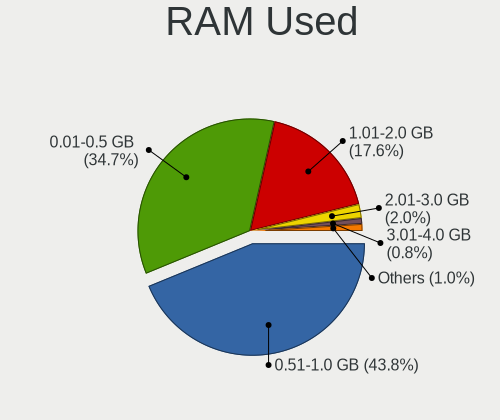
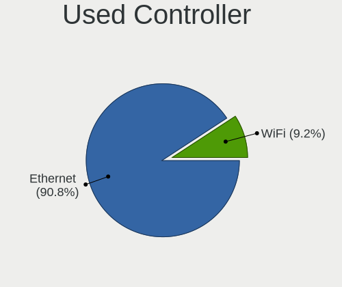

BSD Hardware Trends
-------------------

A project to identify most popular hardware characteristics and track their change
over time based on data collected by BSD users at https://BSD-Hardware.info.

Anyone can contribute to the study by uploading probes of their computers by
the [hw-probe](https://github.com/linuxhw/hw-probe/blob/master/INSTALL.BSD.md) tool:

    hw-probe -all -upload

This is a report for all computer types. See also reports for [desktops](/Desktop/README.md) and [notebooks](/Notebook/README.md).

Full-feature report is available here: https://bsd-hardware.info/?view=trends

OS-specific reports: [FreeBSD](/Dist/FreeBSD), [OPNsense](/Dist/OPNsense), [OpenBSD](/Dist/OpenBSD).

Period: Jan, 2021.

Contents
--------

- [ OS                       ](#os)
- [ OS Family                ](#os-family)
- [ Arch                     ](#arch)
- [ DE                       ](#de)
- [ Display Server           ](#display-server)
- [ Display Manager          ](#display-manager)
- [ OS Lang                  ](#os-lang)
- [ Boot Mode                ](#boot-mode)
- [ Filesystem               ](#filesystem)
- [ Part. scheme             ](#part-scheme)
- [ Country                  ](#country)
- [ City                     ](#city)
- [ Vendor                   ](#vendor)
- [ Model                    ](#model)
- [ Model Family             ](#model-family)
- [ MFG Year                 ](#mfg-year)
- [ Form Factor              ](#form-factor)
- [ Coreboot                 ](#coreboot)
- [ RAM Size                 ](#ram-size)
- [ RAM Used                 ](#ram-used)
- [ Has CD-ROM               ](#has-cd-rom)
- [ Total Drives             ](#total-drives)
- [ Has Ethernet             ](#has-ethernet)
- [ Drive Vendor             ](#drive-vendor)
- [ Drive Model              ](#drive-model)
- [ HDD Vendor               ](#hdd-vendor)
- [ SSD Vendor               ](#ssd-vendor)
- [ Drive Kind               ](#drive-kind)
- [ Drive Connector          ](#drive-connector)
- [ Drive Size               ](#drive-size)
- [ Space Total              ](#space-total)
- [ Space Used               ](#space-used)
- [ Malfunc. Drives          ](#malfunc-drives)
- [ Malfunc. Drive Vendor    ](#malfunc-drive-vendor)
- [ Malfunc. HDD Vendor      ](#malfunc-hdd-vendor)
- [ Malfunc. Drive Kind      ](#malfunc-drive-kind)
- [ Failed Drives            ](#failed-drives)
- [ Failed Drive Vendor      ](#failed-drive-vendor)
- [ Drive Status             ](#drive-status)
- [ Storage Vendor           ](#storage-vendor)
- [ Storage Model            ](#storage-model)
- [ Storage Kind             ](#storage-kind)
- [ CPU Vendor               ](#cpu-vendor)
- [ CPU Model                ](#cpu-model)
- [ CPU Model Family         ](#cpu-model-family)
- [ CPU Cores                ](#cpu-cores)
- [ CPU Sockets              ](#cpu-sockets)
- [ CPU Threads              ](#cpu-threads)
- [ CPU Microarch            ](#cpu-microarch)
- [ GPU Vendor               ](#gpu-vendor)
- [ GPU Model                ](#gpu-model)
- [ GPU Combo                ](#gpu-combo)
- [ GPU Driver               ](#gpu-driver)
- [ GPU Memory               ](#gpu-memory)
- [ Monitor Vendor           ](#monitor-vendor)
- [ Monitor Model            ](#monitor-model)
- [ Monitor Resolution       ](#monitor-resolution)
- [ Monitor Diagonal         ](#monitor-diagonal)
- [ Monitor Width            ](#monitor-width)
- [ Aspect Ratio             ](#aspect-ratio)
- [ Monitor Area             ](#monitor-area)
- [ Pixel Density            ](#pixel-density)
- [ Multiple Monitors        ](#multiple-monitors)
- [ Net Controller Vendor    ](#net-controller-vendor)
- [ Net Controller Model     ](#net-controller-model)
- [ Wireless Vendor          ](#wireless-vendor)
- [ Wireless Model           ](#wireless-model)
- [ Ethernet Vendor          ](#ethernet-vendor)
- [ Ethernet Model           ](#ethernet-model)
- [ Net Controller Kind      ](#net-controller-kind)
- [ Used Controller          ](#used-controller)
- [ NICs                     ](#nics)
- [ Memory Vendor            ](#memory-vendor)
- [ Memory Model             ](#memory-model)
- [ Memory Kind              ](#memory-kind)
- [ Memory Form Factor       ](#memory-form-factor)
- [ Memory Size              ](#memory-size)
- [ Memory Speed             ](#memory-speed)
- [ Sound Vendor             ](#sound-vendor)
- [ Sound Model              ](#sound-model)
- [ Camera Vendor            ](#camera-vendor)
- [ Camera Model             ](#camera-model)
- [ Fingerprint Vendor       ](#fingerprint-vendor)
- [ Fingerprint Model        ](#fingerprint-model)
- [ Chipcard Vendor          ](#chipcard-vendor)
- [ Chipcard Model           ](#chipcard-model)
- [ Printer Vendor           ](#printer-vendor)
- [ Printer Model            ](#printer-model)
- [ Scanner Vendor           ](#scanner-vendor)
- [ Scanner Model            ](#scanner-model)
- [ Bluetooth Vendor         ](#bluetooth-vendor)
- [ Bluetooth Model          ](#bluetooth-model)
- [ Unsupported Devices      ](#unsupported-devices)
- [ Unsupported Device Types ](#unsupported-device-types)

OS
--

Installed operating systems

| Name                         | Computers | Percent |
|------------------------------|-----------|---------|
| OPNsense 20.7.8              | 184       | 42.2%   |
| OPNsense 21.1                | 65        | 14.91%  |
| FreeBSD 12.2-p2              | 37        | 8.49%   |
| GhostBSD 20.04.02            | 19        | 4.36%   |
| helloSystem 0.3.0            | 18        | 4.13%   |
| OPNsense 20.7.7              | 15        | 3.44%   |
| NomadBSD 1.3.2               | 13        | 2.98%   |
| OpenBSD 6.8                  | 11        | 2.52%   |
| FreeBSD 12.2-STABLE          | 10        | 2.29%   |
| FreeBSD 12.2                 | 10        | 2.29%   |
| helloSystem 0.4.0            | 7         | 1.61%   |
| FreeBSD 13.0-CURRENT         | 7         | 1.61%   |
| FreeBSD 12.1-p12             | 5         | 1.15%   |
| FreeBSD 11.4-p6              | 5         | 1.15%   |
| OPNsense 20.7                | 4         | 0.92%   |
| TrueNAS 12.2-p2              | 3         | 0.69%   |
| FreeBSD 12.2-p3              | 3         | 0.69%   |
| OPNsense 20.7.5              | 2         | 0.46%   |
| NomadBSD 1.4-RC1             | 2         | 0.46%   |
| FreeBSD 14.0-CURRENT         | 2         | 0.46%   |
| Ting 21.1                    | 1         | 0.23%   |
| pfSense 2.4.5                | 1         | 0.23%   |
| NetBSD 9.99.77               | 1         | 0.23%   |
| NetBSD 9.1                   | 1         | 0.23%   |
| MidnightBSD 2.0.1            | 1         | 0.23%   |
| HardenedBSD 13.0-ALPHA1-HBSD | 1         | 0.23%   |
| FreeBSD 13.0-ALPHA2          | 1         | 0.23%   |
| FreeBSD 13.0-ALPHA1          | 1         | 0.23%   |
| FreeBSD 12.2-p1              | 1         | 0.23%   |
| FreeBSD 12.1-p7              | 1         | 0.23%   |
| FreeBSD 12.1-p10             | 1         | 0.23%   |
| FreeBSD 12.1--HBSD           | 1         | 0.23%   |
| FreeBSD 12.1                 | 1         | 0.23%   |
| FreeBSD 11.4-STABLE          | 1         | 0.23%   |

OS Family
---------

OS without a version

| Name        | Computers | Percent |
|-------------|-----------|---------|
| OPNsense    | 270       | 61.93%  |
| FreeBSD     | 87        | 19.95%  |
| helloSystem | 25        | 5.73%   |
| GhostBSD    | 19        | 4.36%   |
| NomadBSD    | 15        | 3.44%   |
| OpenBSD     | 11        | 2.52%   |
| TrueNAS     | 3         | 0.69%   |
| NetBSD      | 2         | 0.46%   |
| Ting        | 1         | 0.23%   |
| pfSense     | 1         | 0.23%   |
| MidnightBSD | 1         | 0.23%   |
| HardenedBSD | 1         | 0.23%   |

Arch
----

OS architecture (x86_64, i586, etc.)

| Name    | Computers | Percent |
|---------|-----------|---------|
| amd64   | 427       | 97.94%  |
| i386    | 5         | 1.15%   |
| sparc64 | 2         | 0.46%   |
| arm64   | 2         | 0.46%   |

DE
--

Desktop Environment

| Name          | Computers | Percent |
|---------------|-----------|---------|
| Console       | 308       | 70.64%  |
| helloDesktop  | 25        | 5.73%   |
| MATE          | 23        | 5.28%   |
| KDE5          | 22        | 5.05%   |
| XFCE          | 16        | 3.67%   |
| Openbox       | 16        | 3.67%   |
| fvwm          | 7         | 1.61%   |
| TWM           | 6         | 1.38%   |
| GNOME         | 4         | 0.92%   |
| i3            | 2         | 0.46%   |
| Window Maker  | 1         | 0.23%   |
| Ratpoison     | 1         | 0.23%   |
| LXDE          | 1         | 0.23%   |
| filer         | 1         | 0.23%   |
| Enlightenment | 1         | 0.23%   |
| CTWM          | 1         | 0.23%   |
| Cinnamon      | 1         | 0.23%   |

Display Server
--------------

X11 or Wayland

| Name    | Computers | Percent |
|---------|-----------|---------|
| Console | 311       | 71.33%  |
| X11     | 125       | 28.67%  |

Display Manager
---------------

SDDM, LightDM, etc.

| Name    | Computers | Percent |
|---------|-----------|---------|
| Console | 331       | 75.92%  |
| SLiM    | 50        | 11.47%  |
| LightDM | 29        | 6.65%   |
| SDDM    | 19        | 4.36%   |
| XDM     | 5         | 1.15%   |
| GDM     | 2         | 0.46%   |

OS Lang
-------

Language

| Lang           | Computers | Percent |
|----------------|-----------|---------|
| Unknown        | 344       | 78.9%   |
| en_US          | 57        | 13.07%  |
| C              | 11        | 2.52%   |
| ru_RU          | 5         | 1.15%   |
| de_DE          | 5         | 1.15%   |
| en_GB          | 4         | 0.92%   |
| it_IT          | 2         | 0.46%   |
| zh_CN          | 1         | 0.23%   |
| uk_UA          | 1         | 0.23%   |
| tr_TR          | 1         | 0.23%   |
| sk_SK          | 1         | 0.23%   |
| fr_FR          | 1         | 0.23%   |
| en_US.US-ASCII | 1         | 0.23%   |
| en_NZ.US-ASCII | 1         | 0.23%   |
| de_AT          | 1         | 0.23%   |

Boot Mode
---------

EFI or BIOS

| Mode | Computers | Percent |
|------|-----------|---------|
| EFI  | 357       | 81.88%  |
| BIOS | 79        | 18.12%  |

Filesystem
----------

Type of filesystem

| Type    | Computers | Percent |
|---------|-----------|---------|
| Ufs     | 317       | 72.71%  |
| Zfs     | 107       | 24.54%  |
| Ffs     | 11        | 2.52%   |
| Unknown | 1         | 0.23%   |

Part. scheme
------------

Scheme of partitioning

| Type    | Computers | Percent |
|---------|-----------|---------|
| GPT     | 385       | 88.3%   |
| MBR     | 48        | 11.01%  |
| Unknown | 3         | 0.69%   |

Country
-------

Geographic location (country)

| Country        | Computers | Percent |
|----------------|-----------|---------|
| USA            | 106       | 24.31%  |
| Germany        | 88        | 20.18%  |
| UK             | 30        | 6.88%   |
| France         | 20        | 4.59%   |
| Canada         | 20        | 4.59%   |
| Netherlands    | 15        | 3.44%   |
| Italy          | 14        | 3.21%   |
| Switzerland    | 13        | 2.98%   |
| Sweden         | 11        | 2.52%   |
| Ukraine        | 9         | 2.06%   |
| Austria        | 9         | 2.06%   |
| Russia         | 8         | 1.83%   |
| Czech Republic | 8         | 1.83%   |
| Australia      | 8         | 1.83%   |
| Indonesia      | 6         | 1.38%   |
| Hungary        | 6         | 1.38%   |
| Brazil         | 6         | 1.38%   |
| Norway         | 5         | 1.15%   |
| Japan          | 5         | 1.15%   |
| Spain          | 4         | 0.92%   |
| Finland        | 4         | 0.92%   |
| Belgium        | 4         | 0.92%   |
| Hong Kong      | 3         | 0.69%   |
| UAE            | 2         | 0.46%   |
| Taiwan         | 2         | 0.46%   |
| Portugal       | 2         | 0.46%   |
| New Zealand    | 2         | 0.46%   |
| Mexico         | 2         | 0.46%   |
| Ireland        | 2         | 0.46%   |
| Denmark        | 2         | 0.46%   |
| China          | 2         | 0.46%   |
| Argentina      | 2         | 0.46%   |
| Vietnam        | 1         | 0.23%   |
| Uruguay        | 1         | 0.23%   |
| Turkey         | 1         | 0.23%   |
| Thailand       | 1         | 0.23%   |
| South Africa   | 1         | 0.23%   |
| Poland         | 1         | 0.23%   |
| Niue           | 1         | 0.23%   |
| Nicaragua      | 1         | 0.23%   |
| Malaysia       | 1         | 0.23%   |
| Luxembourg     | 1         | 0.23%   |
| Lithuania      | 1         | 0.23%   |
| Liechtenstein  | 1         | 0.23%   |
| Latvia         | 1         | 0.23%   |
| Israel         | 1         | 0.23%   |
| India          | 1         | 0.23%   |
| Bulgaria       | 1         | 0.23%   |

City
----

Geographic location (city)

| City                  | Computers | Percent |
|-----------------------|-----------|---------|
| Berlin                | 9         | 2.06%   |
| Vienna                | 6         | 1.38%   |
| Milan                 | 6         | 1.38%   |
| Frankfurt am Main     | 6         | 1.38%   |
| Ferreux-Quincey       | 6         | 1.38%   |
| Prague                | 5         | 1.15%   |
| Jakarta               | 5         | 1.15%   |
| Franconville          | 5         | 1.15%   |
| Umeå                 | 4         | 0.92%   |
| São José dos Campos | 4         | 0.92%   |
| Paris                 | 4         | 0.92%   |
| Munich                | 4         | 0.92%   |
| Montreal              | 4         | 0.92%   |
| Linköping            | 4         | 0.92%   |
| Kyiv                  | 4         | 0.92%   |
| Bothell               | 4         | 0.92%   |
| Stuttgart             | 3         | 0.69%   |
| Seattle               | 3         | 0.69%   |
| Saint Paul            | 3         | 0.69%   |
| Richmond              | 3         | 0.69%   |
| Langen                | 3         | 0.69%   |
| Cologne               | 3         | 0.69%   |
| Chicago               | 3         | 0.69%   |
| Zaporizhia            | 2         | 0.46%   |
| Woodland              | 2         | 0.46%   |
| The Bronx             | 2         | 0.46%   |
| Telford               | 2         | 0.46%   |
| Tecumseh              | 2         | 0.46%   |
| Taipei                | 2         | 0.46%   |
| Sydney                | 2         | 0.46%   |
| Sumida                | 2         | 0.46%   |
| San Francisco         | 2         | 0.46%   |
| Rochester             | 2         | 0.46%   |
| Perth                 | 2         | 0.46%   |
| Nueve de Julio        | 2         | 0.46%   |
| New York              | 2         | 0.46%   |
| Moscow                | 2         | 0.46%   |
| Maastricht            | 2         | 0.46%   |
| Lübeck               | 2         | 0.46%   |
| Louisville            | 2         | 0.46%   |
| London                | 2         | 0.46%   |
| Lausanne              | 2         | 0.46%   |
| Kingston              | 2         | 0.46%   |
| Kenosha               | 2         | 0.46%   |
| Hamburg               | 2         | 0.46%   |
| Graz                  | 2         | 0.46%   |
| Glasgow               | 2         | 0.46%   |
| Essen                 | 2         | 0.46%   |
| Edmonton              | 2         | 0.46%   |
| Central               | 2         | 0.46%   |
| Budapest              | 2         | 0.46%   |
| Bruges                | 2         | 0.46%   |
| Brno                  | 2         | 0.46%   |
| Bristol               | 2         | 0.46%   |
| Birmingham            | 2         | 0.46%   |
| Šiauliai             | 1         | 0.23%   |
| Échirolles           | 1         | 0.23%   |
| Zutphen               | 1         | 0.23%   |
| Zurich                | 1         | 0.23%   |
| Zaandam               | 1         | 0.23%   |

Vendor
------

Motherboard manufacturer

| Name                           | Computers | Percent |
|--------------------------------|-----------|---------|
| Dell                           | 43        | 9.86%   |
| Hewlett-Packard                | 39        | 8.94%   |
| PC Engines                     | 35        | 8.03%   |
| Lenovo                         | 35        | 8.03%   |
| ASUSTek Computer               | 33        | 7.57%   |
| Unknown                        | 33        | 7.57%   |
| Supermicro                     | 28        | 6.42%   |
| Intel                          | 25        | 5.73%   |
| Protectli                      | 18        | 4.13%   |
| ASRock                         | 16        | 3.67%   |
| MSI                            | 14        | 3.21%   |
| Gigabyte Technology            | 13        | 2.98%   |
| AMI                            | 11        | 2.52%   |
| ZOTAC                          | 9         | 2.06%   |
| Acer                           | 6         | 1.38%   |
| Shuttle                        | 5         | 1.15%   |
| Apple                          | 5         | 1.15%   |
| Fujitsu                        | 4         | 0.92%   |
| Sophos                         | 3         | 0.69%   |
| IBM                            | 3         | 0.69%   |
| HARDKERNEL                     | 3         | 0.69%   |
| YANYU                          | 2         | 0.46%   |
| Yanling                        | 2         | 0.46%   |
| Toshiba                        | 2         | 0.46%   |
| Sun Microsystems               | 2         | 0.46%   |
| Sun                            | 2         | 0.46%   |
| Sony                           | 2         | 0.46%   |
| Samsung Electronics            | 2         | 0.46%   |
| Pegatron                       | 2         | 0.46%   |
| Lanner                         | 2         | 0.46%   |
| Cisco                          | 2         | 0.46%   |
| Barracuda Networks             | 2         | 0.46%   |
| AAEON                          | 2         | 0.46%   |
| TYAN Computer                  | 1         | 0.23%   |
| TUXEDO                         | 1         | 0.23%   |
| System76                       | 1         | 0.23%   |
| STARFACE                       | 1         | 0.23%   |
| Silver Peak Systems            | 1         | 0.23%   |
| ShenZhen MinWin Technology     | 1         | 0.23%   |
| Scaleway                       | 1         | 0.23%   |
| Sangoma Technologies           | 1         | 0.23%   |
| Raspberry Pi Foundation        | 1         | 0.23%   |
| PCWare                         | 1         | 0.23%   |
| NU941                          | 1         | 0.23%   |
| Notebook                       | 1         | 0.23%   |
| NEC Computers                  | 1         | 0.23%   |
| Matsushita Electric Industrial | 1         | 0.23%   |
| Jetway                         | 1         | 0.23%   |
| Inventec                       | 1         | 0.23%   |
| Huanan                         | 1         | 0.23%   |
| HPE                            | 1         | 0.23%   |
| Gateway                        | 1         | 0.23%   |
| FSC                            | 1         | 0.23%   |
| EVGA                           | 1         | 0.23%   |
| Clevo                          | 1         | 0.23%   |
| CheckPoint                     | 1         | 0.23%   |
| Biostar                        | 1         | 0.23%   |
| BANGHO                         | 1         | 0.23%   |
| AZW                            | 1         | 0.23%   |
| AWOW                           | 1         | 0.23%   |

Model
-----

Motherboard model

| Name                               | Computers | Percent |
|------------------------------------|-----------|---------|
| Unknown                            | 35        | 8.03%   |
| PC Engines apu2                    | 24        | 5.5%    |
| Intel Q3XXG4-P V1.0                | 14        | 3.21%   |
| Protectli FW4B                     | 13        | 2.98%   |
| Supermicro Super Server            | 10        | 2.29%   |
| PC Engines apu4                    | 9         | 2.06%   |
| AMI Aptio CRB                      | 9         | 2.06%   |
| ASUS All Series                    | 7         | 1.61%   |
| HP t620 PLUS Quad Core TC          | 5         | 1.15%   |
| Supermicro A1SAi                   | 3         | 0.69%   |
| Protectli FW6                      | 3         | 0.69%   |
| HP Compaq Elite 8300 SFF           | 3         | 0.69%   |
| HARDKERNEL ODROID-H2               | 3         | 0.69%   |
| Dell PowerEdge R710                | 3         | 0.69%   |
| Dell OptiPlex 9020                 | 3         | 0.69%   |
| Dell OptiPlex 3020                 | 3         | 0.69%   |
| ZOTAC ZBOX-MI640/MI660/MI620NANO   | 2         | 0.46%   |
| ZOTAC ZBOX-CI327NANO-GS-01         | 2         | 0.46%   |
| Yanling YL-KBR6L                   | 2         | 0.46%   |
| Supermicro X8STi                   | 2         | 0.46%   |
| Supermicro X7SPA-HF                | 2         | 0.46%   |
| Supermicro SYS-E200-8D             | 2         | 0.46%   |
| Sophos SG                          | 2         | 0.46%   |
| HP t730 Thin Client                | 2         | 0.46%   |
| HP ProLiant DL360p Gen8            | 2         | 0.46%   |
| Gigabyte J3455N-D3H                | 2         | 0.46%   |
| Dell PowerEdge R210 II             | 2         | 0.46%   |
| Dell OptiPlex 9010                 | 2         | 0.46%   |
| Cisco VXC Class                    | 2         | 0.46%   |
| ASRock J3455-ITX                   | 2         | 0.46%   |
| ASRock B450M Pro4                  | 2         | 0.46%   |
| Apple MacBook4,1                   | 2         | 0.46%   |
| AAEON UP-APL01                     | 2         | 0.46%   |
| ZOTAC ZBOXNANO-AQ01                | 1         | 0.23%   |
| ZOTAC ZBOX-CI620/CI640/CI660       | 1         | 0.23%   |
| ZOTAC ZBOX-CI341                   | 1         | 0.23%   |
| ZOTAC ZBOX-CI329NANO               | 1         | 0.23%   |
| YANYU ITX-N38SL Ver                | 1         | 0.23%   |
| YANYU D19SL_B                      | 1         | 0.23%   |
| TYAN S5512                         | 1         | 0.23%   |
| TUXEDO Pulse 14 Gen1               | 1         | 0.23%   |
| Toshiba Satellite L50-C            | 1         | 0.23%   |
| Toshiba KIRA                       | 1         | 0.23%   |
| System76 Bonobo Extreme            | 1         | 0.23%   |
| Supermicro X8DTU-LN4+              | 1         | 0.23%   |
| Supermicro X8DTH-i/6/iF/6F         | 1         | 0.23%   |
| Supermicro X8DT6                   | 1         | 0.23%   |
| Supermicro X7SLA                   | 1         | 0.23%   |
| Supermicro X11SSM-F                | 1         | 0.23%   |
| Supermicro X10DRi                  | 1         | 0.23%   |
| Supermicro SYS-1019D-4C-FHN13TP    | 1         | 0.23%   |
| Supermicro PIO-628U-TR4T+-ST031    | 1         | 0.23%   |
| Supermicro C7Z170-OCE              | 1         | 0.23%   |
| Sun SUNW,Sun-Blade-1500            | 1         | 0.23%   |
| Sun SUNW,Sun-Blade-100             | 1         | 0.23%   |
| Sun Microsystems Ultra 24          | 1         | 0.23%   |
| Sun Microsystems Sun Fire X2200 M2 | 1         | 0.23%   |
| STARFACE Compact                   | 1         | 0.23%   |
| Sophos XG                          | 1         | 0.23%   |
| Sony VPCM13M1R                     | 1         | 0.23%   |

Model Family
------------

Motherboard model prefix

| Name                         | Computers | Percent |
|------------------------------|-----------|---------|
| Unknown                      | 35        | 8.03%   |
| PC Engines apu2              | 24        | 5.5%    |
| Lenovo ThinkPad              | 21        | 4.82%   |
| Dell OptiPlex                | 18        | 4.13%   |
| Intel Q3XXG4-P               | 14        | 3.21%   |
| Protectli FW4B               | 13        | 2.98%   |
| Supermicro Super             | 10        | 2.29%   |
| Dell PowerEdge               | 10        | 2.29%   |
| PC Engines apu4              | 9         | 2.06%   |
| HP ProLiant                  | 9         | 2.06%   |
| AMI Aptio                    | 9         | 2.06%   |
| Lenovo ThinkCentre           | 8         | 1.83%   |
| Dell Latitude                | 8         | 1.83%   |
| ASUS All                     | 7         | 1.61%   |
| HP Compaq                    | 6         | 1.38%   |
| HP t620                      | 5         | 1.15%   |
| Dell Inspiron                | 4         | 0.92%   |
| Supermicro A1SAi             | 3         | 0.69%   |
| Protectli FW6                | 3         | 0.69%   |
| Lenovo ThinkStation          | 3         | 0.69%   |
| HP EliteBook                 | 3         | 0.69%   |
| HARDKERNEL ODROID-H2         | 3         | 0.69%   |
| ASUS SABERTOOTH              | 3         | 0.69%   |
| Acer Aspire                  | 3         | 0.69%   |
| ZOTAC ZBOX-MI640             | 2         | 0.46%   |
| ZOTAC ZBOX-CI327NANO-GS-01   | 2         | 0.46%   |
| Yanling YL-KBR6L             | 2         | 0.46%   |
| Supermicro X8STi             | 2         | 0.46%   |
| Supermicro X7SPA-HF          | 2         | 0.46%   |
| Supermicro SYS-E200-8D       | 2         | 0.46%   |
| Sun SUNW                     | 2         | 0.46%   |
| Sophos SG                    | 2         | 0.46%   |
| IBM System                   | 2         | 0.46%   |
| HP t730                      | 2         | 0.46%   |
| HP ProDesk                   | 2         | 0.46%   |
| HP Laptop                    | 2         | 0.46%   |
| HP EliteDesk                 | 2         | 0.46%   |
| Gigabyte J3455N-D3H          | 2         | 0.46%   |
| Fujitsu LIFEBOOK             | 2         | 0.46%   |
| Dell Vostro                  | 2         | 0.46%   |
| Cisco VXC                    | 2         | 0.46%   |
| Barracuda Networks Barracuda | 2         | 0.46%   |
| ASUS TUF                     | 2         | 0.46%   |
| ASUS ROG                     | 2         | 0.46%   |
| ASUS PRIME                   | 2         | 0.46%   |
| ASRock J3455-ITX             | 2         | 0.46%   |
| ASRock B450M                 | 2         | 0.46%   |
| Apple MacBook4               | 2         | 0.46%   |
| AAEON UP-APL01               | 2         | 0.46%   |
| ZOTAC ZBOXNANO-AQ01          | 1         | 0.23%   |
| ZOTAC ZBOX-CI620             | 1         | 0.23%   |
| ZOTAC ZBOX-CI341             | 1         | 0.23%   |
| ZOTAC ZBOX-CI329NANO         | 1         | 0.23%   |
| YANYU ITX-N38SL              | 1         | 0.23%   |
| YANYU D19SL                  | 1         | 0.23%   |
| TYAN S5512                   | 1         | 0.23%   |
| TUXEDO Pulse                 | 1         | 0.23%   |
| Toshiba Satellite            | 1         | 0.23%   |
| Toshiba KIRA                 | 1         | 0.23%   |
| System76 Bonobo              | 1         | 0.23%   |

MFG Year
--------

Motherboard manufacture year

| Year    | Computers | Percent |
|---------|-----------|---------|
| 2020    | 104       | 23.85%  |
| 2019    | 81        | 18.58%  |
| 2018    | 66        | 15.14%  |
| 2014    | 25        | 5.73%   |
| 2017    | 23        | 5.28%   |
| 2013    | 21        | 4.82%   |
| 2012    | 20        | 4.59%   |
| 2015    | 19        | 4.36%   |
| 2016    | 17        | 3.9%    |
| 2010    | 14        | 3.21%   |
| 2011    | 11        | 2.52%   |
| 2009    | 9         | 2.06%   |
| 2008    | 9         | 2.06%   |
| 2007    | 5         | 1.15%   |
| Unknown | 5         | 1.15%   |
| 2006    | 4         | 0.92%   |
| 2021    | 2         | 0.46%   |
| 2003    | 1         | 0.23%   |

Form Factor
-----------

Physical design of the computer

| Name        | Computers | Percent |
|-------------|-----------|---------|
| Desktop     | 288       | 66.06%  |
| Notebook    | 73        | 16.74%  |
| Server      | 39        | 8.94%   |
| Mini pc     | 28        | 6.42%   |
| Other       | 3         | 0.69%   |
| Convertible | 3         | 0.69%   |
| Tablet      | 1         | 0.23%   |
| All in one  | 1         | 0.23%   |

Coreboot
--------

Have coreboot on board

| Used | Computers | Percent |
|------|-----------|---------|
| No   | 393       | 90.14%  |
| Yes  | 43        | 9.86%   |

RAM Size
--------

Total RAM memory

| Size in GB      | Computers | Percent |
|-----------------|-----------|---------|
| 8.01-16.0       | 147       | 33.72%  |
| 4.01-8.0        | 114       | 26.15%  |
| 16.01-24.0      | 82        | 18.81%  |
| 32.01-64.0      | 39        | 8.94%   |
| 2.01-3.0        | 16        | 3.67%   |
| 64.01-256.0     | 15        | 3.44%   |
| 24.01-32.0      | 9         | 2.06%   |
| 3.01-4.0        | 6         | 1.38%   |
| More than 256.0 | 3         | 0.69%   |
| 1.01-2.0        | 2         | 0.46%   |
| 0.51-1.0        | 2         | 0.46%   |
| 0.01-0.5        | 1         | 0.23%   |

RAM Used
--------

Used RAM memory

| Used GB     | Computers | Percent |
|-------------|-----------|---------|
| 0.01-0.5    | 242       | 55.5%   |
| 0.51-1.0    | 109       | 25%     |
| 1.01-2.0    | 40        | 9.17%   |
| 2.01-3.0    | 15        | 3.44%   |
| 8.01-16.0   | 9         | 2.06%   |
| 3.01-4.0    | 5         | 1.15%   |
| 4.01-8.0    | 4         | 0.92%   |
| 64.01-256.0 | 4         | 0.92%   |
| 24.01-32.0  | 3         | 0.69%   |
| 0           | 2         | 0.46%   |
| Unknown     | 2         | 0.46%   |
| 32.01-64.0  | 1         | 0.23%   |

Has CD-ROM
----------

Has CD-ROM on board

| Presented | Computers | Percent |
|-----------|-----------|---------|
| No        | 352       | 80.73%  |
| Yes       | 84        | 19.27%  |

Total Drives
------------

Number of drives on board

| Drives | Computers | Percent |
|--------|-----------|---------|
| 1      | 320       | 73.39%  |
| 2      | 39        | 8.94%   |
| 0      | 35        | 8.03%   |
| 3      | 13        | 2.98%   |
| 4      | 10        | 2.29%   |
| 11     | 4         | 0.92%   |
| 8      | 3         | 0.69%   |
| 6      | 3         | 0.69%   |
| 5      | 3         | 0.69%   |
| 40     | 1         | 0.23%   |
| 25     | 1         | 0.23%   |
| 18     | 1         | 0.23%   |
| 14     | 1         | 0.23%   |
| 12     | 1         | 0.23%   |
| 7      | 1         | 0.23%   |

Has Ethernet
------------

Has Ethernet on board

| Presented | Computers | Percent |
|-----------|-----------|---------|
| Yes       | 425       | 97.48%  |
| No        | 11        | 2.52%   |

Drive Vendor
------------

Hard drive vendors

| Vendor              | Computers | Drives | Percent |
|---------------------|-----------|--------|---------|
| Samsung Electronics | 77        | 90     | 15.68%  |
| WDC                 | 57        | 103    | 11.61%  |
| Seagate             | 47        | 75     | 9.57%   |
| Kingston            | 44        | 46     | 8.96%   |
| SanDisk             | 31        | 32     | 6.31%   |
| Phison              | 25        | 28     | 5.09%   |
| Crucial             | 24        | 25     | 4.89%   |
| Hoodisk             | 23        | 23     | 4.68%   |
| Transcend           | 21        | 23     | 4.28%   |
| Intel               | 18        | 29     | 3.67%   |
| Toshiba             | 17        | 20     | 3.46%   |
| HGST                | 12        | 45     | 2.44%   |
| Hitachi             | 9         | 43     | 1.83%   |
| Hewlett-Packard     | 8         | 23     | 1.63%   |
| Micron Technology   | 6         | 8      | 1.22%   |
| A-DATA Technology   | 6         | 6      | 1.22%   |
| PNY                 | 4         | 6      | 0.81%   |
| OCZ                 | 4         | 4      | 0.81%   |
| Fujitsu             | 4         | 4      | 0.81%   |
| DOGFISH             | 4         | 4      | 0.81%   |
| Intenso             | 3         | 3      | 0.61%   |
| FORESEE             | 3         | 3      | 0.61%   |
| Corsair             | 3         | 3      | 0.61%   |
| BIWIN               | 3         | 3      | 0.61%   |
| Apple               | 3         | 3      | 0.61%   |
| SPCC                | 2         | 2      | 0.41%   |
| Patriot             | 2         | 2      | 0.41%   |
| NVMe                | 2         | 2      | 0.41%   |
| LSILOGIC            | 2         | 2      | 0.41%   |
| KingSpec            | 2         | 2      | 0.41%   |
| HPE                 | 2         | 7      | 0.41%   |
| EMTEC               | 2         | 2      | 0.41%   |
| China               | 2         | 3      | 0.41%   |
| Apacer              | 2         | 2      | 0.41%   |
| Zheino              | 1         | 1      | 0.2%    |
| Union Memory        | 1         | 1      | 0.2%    |
| Team                | 1         | 1      | 0.2%    |
| TCSUNBOW            | 1         | 1      | 0.2%    |
| SMI                 | 1         | 1      | 0.2%    |
| SK Hynix            | 1         | 1      | 0.2%    |
| SATADOM             | 1         | 2      | 0.2%    |
| Multiple            | 1         | 1      | 0.2%    |
| MaxDigital          | 1         | 1      | 0.2%    |
| LITEONIT            | 1         | 1      | 0.2%    |
| LITEON              | 1         | 1      | 0.2%    |
| Lexar               | 1         | 1      | 0.2%    |
| Kston               | 1         | 1      | 0.2%    |
| KIOXIA              | 1         | 1      | 0.2%    |
| Dell                | 1         | 2      | 0.2%    |
| ASMT                | 1         | 1      | 0.2%    |
| Adaptec             | 1         | 1      | 0.2%    |

Drive Model
-----------

Hard drive models

| Model                              | Computers | Percent |
|------------------------------------|-----------|---------|
| Phison SATA SSD 16GB               | 13        | 2.44%   |
| Kingston SA400S37120G 120GB        | 10        | 1.88%   |
| Samsung SSD 850 EVO 250GB          | 9         | 1.69%   |
| Kingston SUV500MS120G 120GB        | 9         | 1.69%   |
| Hoodisk SSD 64GB                   | 8         | 1.5%    |
| Samsung SSD 860 EVO 250GB          | 7         | 1.31%   |
| Hoodisk SSD 128GB                  | 6         | 1.13%   |
| Samsung SSD 860 EVO 500GB          | 4         | 0.75%   |
| Samsung SSD 850 PRO 512GB          | 4         | 0.75%   |
| Kingston SUV500MS240G 240GB        | 4         | 0.75%   |
| Kingston SA400S37240G 240GB        | 4         | 0.75%   |
| Hoodisk SSD 32GB                   | 4         | 0.75%   |
| HP RAID 1(1+0) 304GB               | 4         | 0.75%   |
| Crucial CT120BX500SSD1 120GB       | 4         | 0.75%   |
| WDC WDS120G2G0A-00JH30 120GB       | 3         | 0.56%   |
| WDC WD40EFRX-68N32N0 4TB           | 3         | 0.56%   |
| Transcend TS128GMSA370 128GB       | 3         | 0.56%   |
| Seagate ST500LM021-1KJ152 500GB    | 3         | 0.56%   |
| Seagate ST500DM002-1BD142 500GB    | 3         | 0.56%   |
| Seagate ST1000LM049-2GH172 1TB     | 3         | 0.56%   |
| Seagate ST1000LM035-1RK172 1TB     | 3         | 0.56%   |
| SanDisk SSD PLUS 240GB             | 3         | 0.56%   |
| SanDisk SSD PLUS 120GB             | 3         | 0.56%   |
| SanDisk SDSSDA120G 120GB           | 3         | 0.56%   |
| Samsung SSD 850 EVO M.2 250GB      | 3         | 0.56%   |
| Phison SATA SSD 32GB               | 3         | 0.56%   |
| Phison Sabrent 512GB               | 3         | 0.56%   |
| Kingston SMS200S330G 32GB          | 3         | 0.56%   |
| Hoodisk SSD 16GB                   | 3         | 0.56%   |
| HGST HTS725050A7E630 500GB         | 3         | 0.56%   |
| WDC WDS120G2G0B-00EPW0 120GB       | 2         | 0.38%   |
| WDC WD5003AZEX-00K3CA0 500GB       | 2         | 0.38%   |
| WDC WD5003ABYX-18WERA0 500GB       | 2         | 0.38%   |
| WDC WD5000LPVX-22V0TT0 500GB       | 2         | 0.38%   |
| Transcend TS64GMSA230S 64GB        | 2         | 0.38%   |
| Transcend TS32GSSD370 32GB         | 2         | 0.38%   |
| Transcend TS32GMSA370 32GB         | 2         | 0.38%   |
| Transcend TS256GMSA230S 256GB      | 2         | 0.38%   |
| Transcend TS128GMSA230S 128GB      | 2         | 0.38%   |
| Seagate ST5000DM000-1FK178 5TB     | 2         | 0.38%   |
| Seagate ST2000NM0008-2F3100 2TB    | 2         | 0.38%   |
| Seagate ST1000LM024 HN-M101MBB 1TB | 2         | 0.38%   |
| SanDisk SSD 128G                   | 2         | 0.38%   |
| SanDisk SDSA6MM-032G-1006 32GB     | 2         | 0.38%   |
| SanDisk SDSA6MM-016G-1006 16GB     | 2         | 0.38%   |
| Samsung SSD 970 EVO Plus 250GB     | 2         | 0.38%   |
| Samsung SSD 970 EVO 500GB          | 2         | 0.38%   |
| Samsung SSD 970 EVO 250GB          | 2         | 0.38%   |
| Samsung SSD 860 QVO 1TB            | 2         | 0.38%   |
| Samsung SSD 860 PRO 256GB          | 2         | 0.38%   |
| Samsung SSD 850 PRO 256GB          | 2         | 0.38%   |
| Samsung SSD 850 PRO 128GB          | 2         | 0.38%   |
| Samsung SSD 850 EVO 120GB          | 2         | 0.38%   |
| Samsung SSD 840 EVO 120GB          | 2         | 0.38%   |
| Samsung HD161HJ 160GB              | 2         | 0.38%   |
| PNY CS900 120GB SSD                | 2         | 0.38%   |
| Phison SATA SSD 128GB              | 2         | 0.38%   |
| Micron 1100 SATA 256GB             | 2         | 0.38%   |
| Kingston SUV400S37240G 240GB       | 2         | 0.38%   |
| Kingston SA2000M81000G 1TB         | 2         | 0.38%   |

HDD Vendor
----------

Hard disk drive vendors

| Vendor              | Computers | Drives | Percent |
|---------------------|-----------|--------|---------|
| WDC                 | 47        | 89     | 31.97%  |
| Seagate             | 47        | 75     | 31.97%  |
| HGST                | 12        | 45     | 8.16%   |
| Hitachi             | 9         | 43     | 6.12%   |
| Toshiba             | 8         | 10     | 5.44%   |
| Hewlett-Packard     | 6         | 11     | 4.08%   |
| Samsung Electronics | 5         | 5      | 3.4%    |
| Fujitsu             | 4         | 4      | 2.72%   |
| LSILOGIC            | 2         | 2      | 1.36%   |
| NVMe                | 1         | 1      | 0.68%   |
| Multiple            | 1         | 1      | 0.68%   |
| MaxDigital          | 1         | 1      | 0.68%   |
| Lexar               | 1         | 1      | 0.68%   |
| ASMT                | 1         | 1      | 0.68%   |
| Apple               | 1         | 1      | 0.68%   |
| Adaptec             | 1         | 1      | 0.68%   |

SSD Vendor
----------

Solid state drive vendors

| Vendor              | Computers | Drives | Percent |
|---------------------|-----------|--------|---------|
| Samsung Electronics | 53        | 62     | 17.67%  |
| Kingston            | 41        | 43     | 13.67%  |
| SanDisk             | 31        | 32     | 10.33%  |
| Hoodisk             | 23        | 23     | 7.67%   |
| Crucial             | 23        | 24     | 7.67%   |
| Transcend           | 20        | 22     | 6.67%   |
| Phison              | 20        | 20     | 6.67%   |
| Intel               | 16        | 26     | 5.33%   |
| WDC                 | 7         | 7      | 2.33%   |
| Toshiba             | 7         | 8      | 2.33%   |
| Micron Technology   | 6         | 8      | 2%      |
| A-DATA Technology   | 6         | 6      | 2%      |
| PNY                 | 4         | 6      | 1.33%   |
| OCZ                 | 4         | 4      | 1.33%   |
| DOGFISH             | 4         | 4      | 1.33%   |
| Intenso             | 3         | 3      | 1%      |
| FORESEE             | 3         | 3      | 1%      |
| BIWIN               | 3         | 3      | 1%      |
| Patriot             | 2         | 2      | 0.67%   |
| KingSpec            | 2         | 2      | 0.67%   |
| HPE                 | 2         | 7      | 0.67%   |
| EMTEC               | 2         | 2      | 0.67%   |
| Corsair             | 2         | 2      | 0.67%   |
| China               | 2         | 3      | 0.67%   |
| Apple               | 2         | 2      | 0.67%   |
| Apacer              | 2         | 2      | 0.67%   |
| Zheino              | 1         | 1      | 0.33%   |
| Team                | 1         | 1      | 0.33%   |
| TCSUNBOW            | 1         | 1      | 0.33%   |
| SPCC                | 1         | 1      | 0.33%   |
| SMI                 | 1         | 1      | 0.33%   |
| SATADOM             | 1         | 2      | 0.33%   |
| LITEONIT            | 1         | 1      | 0.33%   |
| LITEON              | 1         | 1      | 0.33%   |
| Kston               | 1         | 1      | 0.33%   |
| Dell                | 1         | 2      | 0.33%   |

Drive Kind
----------

HDD or SSD

| Kind | Computers | Drives | Percent |
|------|-----------|--------|---------|
| SSD  | 280       | 338    | 61.67%  |
| HDD  | 127       | 291    | 27.97%  |
| NVMe | 47        | 66     | 10.35%  |

Drive Connector
---------------

SATA, SAS, NVMe, etc.

| Type | Computers | Drives | Percent |
|------|-----------|--------|---------|
| SATA | 373       | 629    | 88.81%  |
| NVMe | 47        | 66     | 11.19%  |

Drive Size
----------

Size of hard drive

| Size in TB | Computers | Drives | Percent |
|------------|-----------|--------|---------|
| 0.01-0.5   | 325       | 388    | 76.11%  |
| 0.51-1.0   | 56        | 78     | 13.11%  |
| 1.01-2.0   | 18        | 32     | 4.22%   |
| 3.01-4.0   | 12        | 66     | 2.81%   |
| 4.01-10.0  | 11        | 40     | 2.58%   |
| 2.01-3.0   | 4         | 18     | 0.94%   |
| 10.01-20.0 | 1         | 7      | 0.23%   |

Space Total
-----------

Amount of disk space available on the file system

| Size in GB     | Computers | Percent |
|----------------|-----------|---------|
| 101-250        | 145       | 33.26%  |
| 1-20           | 69        | 15.83%  |
| 251-500        | 68        | 15.6%   |
| 21-50          | 62        | 14.22%  |
| 51-100         | 58        | 13.3%   |
| 501-1000       | 23        | 5.28%   |
| 1001-2000      | 6         | 1.38%   |
| Unknown        | 3         | 0.69%   |
| More than 3000 | 1         | 0.23%   |
| 2001-3000      | 1         | 0.23%   |

Space Used
----------

Amount of used disk space

| Used GB   | Computers | Percent |
|-----------|-----------|---------|
| 1-20      | 386       | 88.53%  |
| 21-50     | 23        | 5.28%   |
| 51-100    | 12        | 2.75%   |
| 101-250   | 6         | 1.38%   |
| 251-500   | 3         | 0.69%   |
| Unknown   | 3         | 0.69%   |
| 501-1000  | 2         | 0.46%   |
| 1001-2000 | 1         | 0.23%   |

Malfunc. Drives
---------------

Drive models with a malfunction

| Model                                 | Computers | Drives | Percent |
|---------------------------------------|-----------|--------|---------|
| Seagate ST500LM021-1KJ152 500GB       | 2         | 2      | 3.77%   |
| Seagate ST500DM002-1BD142 500GB       | 2         | 2      | 3.77%   |
| Kingston SMS200S330G 32GB             | 2         | 2      | 3.77%   |
| Intel SSDSA2M080G2GC 80GB             | 2         | 2      | 3.77%   |
| Hitachi HTS545032B9A300 320GB         | 2         | 2      | 3.77%   |
| HGST HTS725050A7E630 500GB            | 2         | 2      | 3.77%   |
| Crucial CT525MX300SSD1 528GB          | 2         | 2      | 3.77%   |
| A-DATA Technology SX300 128GB         | 2         | 2      | 3.77%   |
| WDC WD7500BPKX-00HPJT0 752GB          | 1         | 2      | 1.89%   |
| WDC WD6400AAKS-22A7B0 640GB           | 1         | 1      | 1.89%   |
| WDC WD3200LPVX-22V0TT0 320GB          | 1         | 1      | 1.89%   |
| WDC WD3200BPVT-55ZEST0 320GB          | 1         | 1      | 1.89%   |
| WDC WD10EARX-22N0YB0 1TB              | 1         | 1      | 1.89%   |
| Toshiba MQ01ABD100H 1TB               | 1         | 1      | 1.89%   |
| Toshiba MQ01ABD075 752GB              | 1         | 1      | 1.89%   |
| SMI SSD DISK 506GB                    | 1         | 1      | 1.89%   |
| Seagate ST9500620NS 500GB             | 1         | 1      | 1.89%   |
| Seagate ST9500420AS 500GB             | 1         | 1      | 1.89%   |
| Seagate ST9320325AS 320GB             | 1         | 1      | 1.89%   |
| Seagate ST9320320AS 320GB             | 1         | 1      | 1.89%   |
| Seagate ST500LT012-1DG142 500GB       | 1         | 1      | 1.89%   |
| Seagate ST3500413AS 500GB             | 1         | 2      | 1.89%   |
| Seagate ST3250823AS 250GB             | 1         | 1      | 1.89%   |
| Seagate ST2000LM015-2E8174 2TB        | 1         | 1      | 1.89%   |
| Seagate ST1000LM024 HN-M101MBB 1TB    | 1         | 1      | 1.89%   |
| Seagate ST1000DM003-9YN162 1TB        | 1         | 1      | 1.89%   |
| SanDisk SSD PLUS 240GB                | 1         | 1      | 1.89%   |
| SanDisk SD5SG2128G1052E 128GB         | 1         | 1      | 1.89%   |
| Samsung Electronics SSD 950 PRO 256GB | 1         | 1      | 1.89%   |
| Samsung Electronics SSD 850 EVO 500GB | 1         | 1      | 1.89%   |
| Samsung Electronics HD502HJ 500GB     | 1         | 1      | 1.89%   |
| Samsung Electronics HD103UJ 1TB       | 1         | 1      | 1.89%   |
| OCZ VERTEX3 64GB                      | 1         | 1      | 1.89%   |
| OCZ VECTOR150 120GB                   | 1         | 1      | 1.89%   |
| Kingston SV300S37A120G 120GB          | 1         | 1      | 1.89%   |
| Kingston SNS4151S316G 16GB            | 1         | 1      | 1.89%   |
| Kingston SMS200S3120G 120GB           | 1         | 1      | 1.89%   |
| Intel SSDSC1BG200G4R 200GB            | 1         | 2      | 1.89%   |
| Hitachi HTS723232A7A364 320GB         | 1         | 1      | 1.89%   |
| Hitachi HTS548040M9AT00 40GB          | 1         | 1      | 1.89%   |
| Hitachi HDS5C3030ALA630 3TB           | 1         | 14     | 1.89%   |
| Fujitsu MHS2040AT D 40GB              | 1         | 1      | 1.89%   |
| Crucial CT480M500SSD1 480GB           | 1         | 1      | 1.89%   |
| Crucial CT128MX100SSD1 128GB          | 1         | 1      | 1.89%   |
| Crucial CT128M550SSD3 128GB           | 1         | 1      | 1.89%   |

Malfunc. Drive Vendor
---------------------

Vendors of faulty drives

| Vendor              | Computers | Drives | Percent |
|---------------------|-----------|--------|---------|
| Seagate             | 14        | 15     | 26.42%  |
| WDC                 | 5         | 6      | 9.43%   |
| Kingston            | 5         | 5      | 9.43%   |
| Hitachi             | 5         | 18     | 9.43%   |
| Crucial             | 5         | 5      | 9.43%   |
| Samsung Electronics | 4         | 4      | 7.55%   |
| Intel               | 3         | 4      | 5.66%   |
| Toshiba             | 2         | 2      | 3.77%   |
| SanDisk             | 2         | 2      | 3.77%   |
| OCZ                 | 2         | 2      | 3.77%   |
| HGST                | 2         | 2      | 3.77%   |
| A-DATA Technology   | 2         | 2      | 3.77%   |
| SMI                 | 1         | 1      | 1.89%   |
| Fujitsu             | 1         | 1      | 1.89%   |

Malfunc. HDD Vendor
-------------------

Vendors of faulty HDD drives

| Vendor              | Computers | Drives | Percent |
|---------------------|-----------|--------|---------|
| Seagate             | 14        | 15     | 45.16%  |
| WDC                 | 5         | 6      | 16.13%  |
| Hitachi             | 5         | 18     | 16.13%  |
| Toshiba             | 2         | 2      | 6.45%   |
| Samsung Electronics | 2         | 2      | 6.45%   |
| HGST                | 2         | 2      | 6.45%   |
| Fujitsu             | 1         | 1      | 3.23%   |

Malfunc. Drive Kind
-------------------

Kinds of faulty drives

| Kind | Computers | Drives | Percent |
|------|-----------|--------|---------|
| HDD  | 31        | 46     | 58.49%  |
| SSD  | 21        | 22     | 39.62%  |
| NVMe | 1         | 1      | 1.89%   |

Failed Drives
-------------

Failed drive models

Zero info for selected period =(

Failed Drive Vendor
-------------------

Failed drive vendors

Zero info for selected period =(

Drive Status
------------

Number of failed and malfunc. drives

| Status   | Computers | Drives | Percent |
|----------|-----------|--------|---------|
| Works    | 351       | 605    | 83.57%  |
| Malfunc  | 53        | 69     | 12.62%  |
| Detected | 16        | 21     | 3.81%   |

Storage Vendor
--------------

Storage controller vendors

| Vendor                      | Computers | Percent |
|-----------------------------|-----------|---------|
| Intel                       | 330       | 62.98%  |
| AMD                         | 80        | 15.27%  |
| Samsung Electronics         | 21        | 4.01%   |
| Broadcom / LSI              | 19        | 3.63%   |
| ASMedia Technology          | 13        | 2.48%   |
| Sandisk                     | 9         | 1.72%   |
| Phison Electronics          | 6         | 1.15%   |
| Nvidia                      | 6         | 1.15%   |
| Marvell Technology Group    | 6         | 1.15%   |
| Hewlett-Packard             | 5         | 0.95%   |
| Silicon Motion              | 4         | 0.76%   |
| Chelsio Communications      | 4         | 0.76%   |
| Kingston Technology Company | 3         | 0.57%   |
| ULi Electronics             | 2         | 0.38%   |
| Toshiba                     | 2         | 0.38%   |
| SK Hynix                    | 2         | 0.38%   |
| JMicron Technology          | 2         | 0.38%   |
| Adaptec                     | 2         | 0.38%   |
| Union Memory (Shenzhen)     | 1         | 0.19%   |
| Silicon Image               | 1         | 0.19%   |
| Red Hat                     | 1         | 0.19%   |
| Micron/Crucial Technology   | 1         | 0.19%   |
| KIOXIA                      | 1         | 0.19%   |
| Dell                        | 1         | 0.19%   |
| Broadcom                    | 1         | 0.19%   |
| Biwin Storage Technology    | 1         | 0.19%   |

Storage Model
-------------

Storage controller models

| Model                                                                            | Computers | Percent |
|----------------------------------------------------------------------------------|-----------|---------|
| AMD FCH SATA Controller [AHCI mode]                                              | 61        | 10.36%  |
| Intel Sunrise Point-LP SATA Controller [AHCI mode]                               | 40        | 6.79%   |
| Intel 8 Series/C220 Series Chipset Family 6-port SATA Controller 1 [AHCI mode]   | 30        | 5.09%   |
| Intel Atom/Celeron/Pentium Processor x5-E8000/J3xxx/N3xxx Series SATA Controller | 26        | 4.41%   |
| Intel Atom Processor E3800 Series SATA AHCI Controller                           | 24        | 4.07%   |
| Samsung NVMe SSD Controller SM981/PM981/PM983                                    | 14        | 2.38%   |
| Intel Celeron N3350/Pentium N4200/Atom E3900 Series SATA AHCI Controller         | 14        | 2.38%   |
| Intel Wildcat Point-LP SATA Controller [AHCI Mode]                               | 13        | 2.21%   |
| Intel Q170/Q150/B150/H170/H110/Z170/CM236 Chipset SATA Controller [AHCI Mode]    | 13        | 2.21%   |
| Intel 7 Series/C210 Series Chipset Family 6-port SATA Controller [AHCI mode]     | 13        | 2.21%   |
| ASMedia ASM1062 Serial ATA Controller                                            | 13        | 2.21%   |
| Intel 7 Series Chipset Family 6-port SATA Controller [AHCI mode]                 | 12        | 2.04%   |
| Intel 6 Series/C200 Series Chipset Family 6 port Desktop SATA AHCI Controller    | 12        | 2.04%   |
| Intel Cannon Lake PCH SATA AHCI Controller                                       | 9         | 1.53%   |
| AMD SB7x0/SB8x0/SB9x0 SATA Controller [AHCI mode]                                | 9         | 1.53%   |
| Intel 8 Series SATA Controller 1 [AHCI mode]                                     | 8         | 1.36%   |
| AMD 400 Series Chipset SATA Controller                                           | 8         | 1.36%   |
| Intel SATA Controller [RAID mode]                                                | 7         | 1.19%   |
| Intel 82801JI (ICH10 Family) SATA AHCI Controller                                | 7         | 1.19%   |
| Intel C610/X99 series chipset sSATA Controller [AHCI mode]                       | 6         | 1.02%   |
| Intel Atom processor C2000 AHCI SATA3 Controller                                 | 6         | 1.02%   |
| AMD FCH SATA Controller [IDE mode]                                               | 6         | 1.02%   |
| Phison E12 NVMe Controller                                                       | 5         | 0.85%   |
| Intel NM10/ICH7 Family SATA Controller [IDE mode]                                | 5         | 0.85%   |
| Intel Celeron/Pentium Silver Processor SATA Controller                           | 5         | 0.85%   |
| Intel C610/X99 series chipset 6-Port SATA Controller [AHCI mode]                 | 5         | 0.85%   |
| Intel C600/X79 series chipset 6-Port SATA AHCI Controller                        | 5         | 0.85%   |
| Intel 9 Series Chipset Family SATA Controller [AHCI Mode]                        | 5         | 0.85%   |
| Intel 82801HM/HEM (ICH8M/ICH8M-E) SATA Controller [AHCI mode]                    | 5         | 0.85%   |
| Intel 82801G (ICH7 Family) IDE Controller                                        | 5         | 0.85%   |
| Intel 82801 Mobile SATA Controller [RAID mode]                                   | 5         | 0.85%   |
| Samsung NVMe SSD Controller SM961/PM961/SM963                                    | 4         | 0.68%   |
| Intel Atom Processor C3000 Series SATA Controller 1                              | 4         | 0.68%   |
| Intel Atom Processor C3000 Series SATA Controller 0                              | 4         | 0.68%   |
| Intel Atom processor C2000 AHCI SATA2 Controller                                 | 4         | 0.68%   |
| Intel 82801IBM/IEM (ICH9M/ICH9M-E) 4 port SATA Controller [AHCI mode]            | 4         | 0.68%   |
| Intel 82801HM/HEM (ICH8M/ICH8M-E) IDE Controller                                 | 4         | 0.68%   |
| Intel 6 Series/C200 Series Chipset Family 6 port Mobile SATA AHCI Controller     | 4         | 0.68%   |
| Intel 5 Series/3400 Series Chipset 6 port SATA AHCI Controller                   | 4         | 0.68%   |
| Intel 400 Series Chipset Family SATA AHCI Controller                             | 4         | 0.68%   |
| Intel 200 Series PCH SATA controller [AHCI mode]                                 | 4         | 0.68%   |
| Broadcom / LSI SAS2008 PCI-Express Fusion-MPT SAS-2 [Falcon]                     | 4         | 0.68%   |
| Unknown                                                                          | 4         | 0.68%   |
| Silicon Motion SM2263EN/SM2263XT SSD Controller                                  | 3         | 0.51%   |
| Sandisk WD Blue SN550 NVMe SSD                                                   | 3         | 0.51%   |
| Sandisk WD Black 2018 / PC SN720 NVMe SSD                                        | 3         | 0.51%   |
| Kingston Company A2000 NVMe SSD                                                  | 3         | 0.51%   |
| Intel NM10/ICH7 Family SATA Controller [AHCI mode]                               | 3         | 0.51%   |
| Intel 82801JI (ICH10 Family) 4 port SATA IDE Controller #1                       | 3         | 0.51%   |
| Intel 82801JD/DO (ICH10 Family) SATA AHCI Controller                             | 3         | 0.51%   |
| Intel 82801IR/IO/IH (ICH9R/DO/DH) 6 port SATA Controller [AHCI mode]             | 3         | 0.51%   |
| Intel 4 Series Chipset PT IDER Controller                                        | 3         | 0.51%   |
| Broadcom / LSI SAS3008 PCI-Express Fusion-MPT SAS-3                              | 3         | 0.51%   |
| Broadcom / LSI MegaRAID SAS 2108 [Liberator]                                     | 3         | 0.51%   |
| ULi M5229 IDE                                                                    | 2         | 0.34%   |
| SK Hynix hynix unknown                                                           | 2         | 0.34%   |
| Silicon Motion SM2262/SM2262EN SSD Controller                                    | 2         | 0.34%   |
| Sandisk PC SN520 NVMe SSD                                                        | 2         | 0.34%   |
| Nvidia MCP79 AHCI Controller                                                     | 2         | 0.34%   |
| Nvidia MCP51 Serial ATA Controller                                               | 2         | 0.34%   |

Storage Kind
------------

Kind of storage controller (IDE, SATA, NVMe, SAS, ...)

| Kind | Computers | Percent |
|------|-----------|---------|
| SATA | 373       | 71.87%  |
| IDE  | 50        | 9.63%   |
| NVMe | 49        | 9.44%   |
| RAID | 27        | 5.2%    |
| SCSI | 12        | 2.31%   |
| SAS  | 8         | 1.54%   |

CPU Vendor
----------

Processor vendors

| Vendor  | Computers | Percent |
|---------|-----------|---------|
| Intel   | 345       | 79.13%  |
| AMD     | 86        | 19.72%  |
| ARM     | 2         | 0.46%   |
| Unknown | 2         | 0.46%   |
| QEMU    | 1         | 0.23%   |

CPU Model
---------

Processor models

| Model                                    | Computers | Percent |
|------------------------------------------|-----------|---------|
| AMD GX-412TC SOC                         | 33        | 7.57%   |
| Intel Celeron CPU J3160 @ 1.60GHz        | 15        | 3.44%   |
| Intel Celeron CPU J1900 @ 1.99GHz        | 14        | 3.21%   |
| Intel Core i7-7500U CPU @ 2.70GHz        | 9         | 2.06%   |
| Intel Core i5-7200U CPU @ 2.50GHz        | 8         | 1.83%   |
| Intel Celeron CPU J3455 @ 1.50GHz        | 6         | 1.38%   |
| Intel Core i5-8250U CPU @ 1.60GHz        | 5         | 1.15%   |
| Intel Core i5-5250U CPU @ 1.60GHz        | 5         | 1.15%   |
| Intel Core i3-7100U CPU @ 2.40GHz        | 5         | 1.15%   |
| AMD GX-420CA SOC with Radeon HD Graphics | 5         | 1.15%   |
| Intel Xeon CPU E5645 @ 2.40GHz           | 4         | 0.92%   |
| Intel Pentium CPU N3700 @ 1.60GHz        | 4         | 0.92%   |
| Intel Core i7-8550U CPU @ 1.80GHz        | 4         | 0.92%   |
| Intel Core i5-5200U CPU @ 2.20GHz        | 4         | 0.92%   |
| Intel Atom CPU E3845 @ 1.91GHz           | 4         | 0.92%   |
| Intel Xeon CPU E3-1220 v3 @ 3.10GHz      | 3         | 0.69%   |
| Intel CPU Version                        | 3         | 0.69%   |
| Intel Core i7-8565U CPU @ 1.80GHz        | 3         | 0.69%   |
| Intel Core i7-4790K CPU @ 4.00GHz        | 3         | 0.69%   |
| Intel Core i7-3770 CPU @ 3.40GHz         | 3         | 0.69%   |
| Intel Core i5-6500 CPU @ 3.20GHz         | 3         | 0.69%   |
| Intel Core i5-4590 CPU @ 3.30GHz         | 3         | 0.69%   |
| Intel Core i5-4570 CPU @ 3.20GHz         | 3         | 0.69%   |
| Intel Core i5-3230M CPU @ 2.60GHz        | 3         | 0.69%   |
| Intel Core i3-4160 CPU @ 3.60GHz         | 3         | 0.69%   |
| Intel Core 2 Duo                         | 3         | 0.69%   |
| Intel Celeron J4115 CPU @ 1.80GHz        | 3         | 0.69%   |
| Intel Celeron CPU N3350 @ 1.10GHz        | 3         | 0.69%   |
| Intel Celeron CPU 3855U @ 1.60GHz        | 3         | 0.69%   |
| Intel Atom CPU C2558 @ 2.40GHz           | 3         | 0.69%   |
| Intel Atom CPU C2358 @ 1.74GHz           | 3         | 0.69%   |
| Intel Xeon CPU D-1528 @ 1.90GHz          | 2         | 0.46%   |
| Intel Xeon                               | 2         | 0.46%   |
| Intel Pentium CPU N3710 @ 1.60GHz        | 2         | 0.46%   |
| Intel Core i7-8700 CPU @ 3.20GHz         | 2         | 0.46%   |
| Intel Core i7-6700 CPU @ 3.40GHz         | 2         | 0.46%   |
| Intel Core i7-4790 CPU @ 3.60GHz         | 2         | 0.46%   |
| Intel Core i7-4500U CPU @ 1.80GHz        | 2         | 0.46%   |
| Intel Core i5-8350U CPU @ 1.70GHz        | 2         | 0.46%   |
| Intel Core i5-7300U CPU @ 2.60GHz        | 2         | 0.46%   |
| Intel Core i5-6300U CPU @ 2.40GHz        | 2         | 0.46%   |
| Intel Core i5-3570 CPU @ 3.40GHz         | 2         | 0.46%   |
| Intel Core i5-3475S CPU @ 2.90GHz        | 2         | 0.46%   |
| Intel Core i5-3470 CPU @ 3.20GHz         | 2         | 0.46%   |
| Intel Core i5-2400 CPU @ 3.10GHz         | 2         | 0.46%   |
| Intel Core i5 CPU M 520 @ 2.40GHz        | 2         | 0.46%   |
| Intel Core i3-4150 CPU @ 3.50GHz         | 2         | 0.46%   |
| Intel Core i3-4130 CPU @ 3.40GHz         | 2         | 0.46%   |
| Intel Core i3-3240 CPU @ 3.40GHz         | 2         | 0.46%   |
| Intel Celeron N4100 CPU @ 1.10GHz        | 2         | 0.46%   |
| Intel Celeron CPU N3450 @ 1.10GHz        | 2         | 0.46%   |
| Intel Celeron CPU N3150 @ 1.60GHz        | 2         | 0.46%   |
| Intel Celeron CPU N2940 @ 1.83GHz        | 2         | 0.46%   |
| Intel Celeron CPU J3060 @ 1.60GHz        | 2         | 0.46%   |
| Intel Celeron CPU J1800 @ 2.41GHz        | 2         | 0.46%   |
| Intel Celeron CPU 3865U @ 1.80GHz        | 2         | 0.46%   |
| Intel Atom CPU C3558 @ 2.20GHz           | 2         | 0.46%   |
| Intel Atom CPU 330 @ 1.60GHz             | 2         | 0.46%   |
| AMD Ryzen 7 3700X 8-Core Processor       | 2         | 0.46%   |
| AMD Ryzen 7 2700 Eight-Core Processor    | 2         | 0.46%   |

CPU Model Family
----------------

Processor model prefix

| Model                   | Computers | Percent |
|-------------------------|-----------|---------|
| Intel Core i5           | 82        | 18.81%  |
| Intel Celeron           | 68        | 15.6%   |
| Intel Core i7           | 57        | 13.07%  |
| Intel Xeon              | 43        | 9.86%   |
| AMD GX                  | 38        | 8.72%   |
| Intel Core i3           | 29        | 6.65%   |
| Intel Atom              | 25        | 5.73%   |
| Intel Core 2 Duo        | 13        | 2.98%   |
| Other                   | 11        | 2.52%   |
| Intel Pentium           | 11        | 2.52%   |
| AMD Ryzen 7             | 9         | 2.06%   |
| AMD Ryzen 5             | 7         | 1.61%   |
| AMD G                   | 4         | 0.92%   |
| AMD Ryzen 9             | 3         | 0.69%   |
| AMD Athlon 64 X2        | 3         | 0.69%   |
| Intel Pentium M         | 2         | 0.46%   |
| Intel Pentium Gold      | 2         | 0.46%   |
| Intel Pentium Dual      | 2         | 0.46%   |
| Intel Core i9           | 2         | 0.46%   |
| Intel Core 2 Quad       | 2         | 0.46%   |
| ARM Cortex              | 2         | 0.46%   |
| AMD Ryzen Threadripper  | 2         | 0.46%   |
| AMD Ryzen 3             | 2         | 0.46%   |
| AMD Phenom II X4        | 2         | 0.46%   |
| AMD A4                  | 2         | 0.46%   |
| Intel Xeon Silver       | 1         | 0.23%   |
| Intel Pentium Dual-Core | 1         | 0.23%   |
| Intel Core 2 Extreme    | 1         | 0.23%   |
| Intel 686-class         | 1         | 0.23%   |
| AMD Turion II Neo       | 1         | 0.23%   |
| AMD Phenom II X6        | 1         | 0.23%   |
| AMD Opteron             | 1         | 0.23%   |
| AMD E2                  | 1         | 0.23%   |
| AMD E1                  | 1         | 0.23%   |
| AMD E                   | 1         | 0.23%   |
| AMD Athlon Dual Core    | 1         | 0.23%   |
| AMD Athlon              | 1         | 0.23%   |
| AMD A10                 | 1         | 0.23%   |

CPU Cores
---------

Number of processor cores

| Number  | Computers | Percent |
|---------|-----------|---------|
| 4       | 213       | 48.85%  |
| 2       | 140       | 32.11%  |
| Unknown | 17        | 3.9%    |
| 8       | 16        | 3.67%   |
| 6       | 16        | 3.67%   |
| 12      | 10        | 2.29%   |
| 16      | 9         | 2.06%   |
| 1       | 6         | 1.38%   |
| 24      | 5         | 1.15%   |
| 10      | 2         | 0.46%   |
| 64      | 1         | 0.23%   |
| 32      | 1         | 0.23%   |

CPU Sockets
-----------

Number of sockets

| Number  | Computers | Percent |
|---------|-----------|---------|
| 1       | 407       | 93.35%  |
| 2       | 20        | 4.59%   |
| Unknown | 7         | 1.61%   |
| 6       | 1         | 0.23%   |
| 4       | 1         | 0.23%   |

CPU Threads
-----------

Threads per core (Hyper-Threading)

| Number  | Computers | Percent |
|---------|-----------|---------|
| 1       | 244       | 55.96%  |
| 2       | 172       | 39.45%  |
| Unknown | 20        | 4.59%   |

CPU Microarch
-------------

Microarchitecture

| Name          | Computers | Percent |
|---------------|-----------|---------|
| KabyLake      | 65        | 14.91%  |
| Silvermont    | 58        | 13.3%   |
| Haswell       | 48        | 11.01%  |
| IvyBridge     | 36        | 8.26%   |
| Puma          | 34        | 7.8%    |
| Skylake       | 23        | 5.28%   |
| Broadwell     | 19        | 4.36%   |
| SandyBridge   | 15        | 3.44%   |
| Penryn        | 15        | 3.44%   |
| Goldmont      | 14        | 3.21%   |
| Westmere      | 11        | 2.52%   |
| Unknown       | 11        | 2.52%   |
| Zen+          | 9         | 2.06%   |
| Jaguar        | 9         | 2.06%   |
| Zen 2         | 8         | 1.83%   |
| K8 Hammer     | 8         | 1.83%   |
| Core          | 8         | 1.83%   |
| Bonnell       | 8         | 1.83%   |
| Nehalem       | 6         | 1.38%   |
| Goldmont plus | 6         | 1.38%   |
| Zen           | 5         | 1.15%   |
| Bobcat        | 5         | 1.15%   |
| K10           | 4         | 0.92%   |
| CometLake     | 4         | 0.92%   |
| Steamroller   | 3         | 0.69%   |
| P6            | 2         | 0.46%   |
| NetBurst      | 2         | 0.46%   |

GPU Vendor
----------

Vendors of graphics cards

| Vendor                     | Computers | Percent |
|----------------------------|-----------|---------|
| Intel                      | 260       | 63.11%  |
| Nvidia                     | 52        | 12.62%  |
| AMD                        | 48        | 11.65%  |
| ASPEED Technology          | 28        | 6.8%    |
| Matrox Electronics Systems | 23        | 5.58%   |
| 3DLabs                     | 1         | 0.24%   |

GPU Model
---------

Graphics card models

| Model                                                                                    | Computers | Percent |
|------------------------------------------------------------------------------------------|-----------|---------|
| ASPEED Technology ASPEED Graphics Family                                                 | 28        | 6.67%   |
| Intel Atom/Celeron/Pentium Processor x5-E8000/J3xxx/N3xxx Integrated Graphics Controller | 26        | 6.19%   |
| Intel HD Graphics 620                                                                    | 24        | 5.71%   |
| Intel Atom Processor Z36xxx/Z37xxx Series Graphics & Display                             | 23        | 5.48%   |
| Intel Xeon E3-1200 v3/4th Gen Core Processor Integrated Graphics Controller              | 16        | 3.81%   |
| Intel Xeon E3-1200 v2/3rd Gen Core processor Graphics Controller                         | 15        | 3.57%   |
| Intel HD Graphics 500                                                                    | 14        | 3.33%   |
| Intel UHD Graphics 620                                                                   | 12        | 2.86%   |
| Matrox Electronics Systems MGA G200eW WPCM450                                            | 11        | 2.62%   |
| Intel 3rd Gen Core processor Graphics Controller                                         | 11        | 2.62%   |
| Intel 2nd Generation Core Processor Family Integrated Graphics Controller                | 11        | 2.62%   |
| Intel HD Graphics 5500                                                                   | 8         | 1.9%    |
| Intel Haswell-ULT Integrated Graphics Controller                                         | 8         | 1.9%    |
| Intel 4th Generation Core Processor Family Integrated Graphics Controller                | 8         | 1.9%    |
| Nvidia GK208B [GeForce GT 710]                                                           | 7         | 1.67%   |
| Intel HD Graphics 530                                                                    | 7         | 1.67%   |
| Intel CometLake-S GT2 [UHD Graphics 630]                                                 | 7         | 1.67%   |
| Intel WhiskeyLake-U GT2 [UHD Graphics 620]                                               | 6         | 1.43%   |
| Intel GeminiLake [UHD Graphics 600]                                                      | 6         | 1.43%   |
| Matrox Electronics Systems MGA G200EH                                                    | 5         | 1.19%   |
| Intel Mobile GM965/GL960 Integrated Graphics Controller (secondary)                      | 5         | 1.19%   |
| Intel Mobile GM965/GL960 Integrated Graphics Controller (primary)                        | 5         | 1.19%   |
| Intel HD Graphics 6000                                                                   | 5         | 1.19%   |
| AMD Kabini [Radeon HD 8400E]                                                             | 5         | 1.19%   |
| Intel Skylake GT2 [HD Graphics 520]                                                      | 4         | 0.95%   |
| Intel Mobile 4 Series Chipset Integrated Graphics Controller                             | 4         | 0.95%   |
| Intel HD Graphics 630                                                                    | 4         | 0.95%   |
| Intel 4th Gen Core Processor Integrated Graphics Controller                              | 4         | 0.95%   |
| AMD Picasso                                                                              | 4         | 0.95%   |
| Nvidia GT218 [GeForce 210]                                                               | 3         | 0.71%   |
| Intel HD Graphics 510                                                                    | 3         | 0.71%   |
| Intel Core Processor Integrated Graphics Controller                                      | 3         | 0.71%   |
| Intel CoffeeLake-S GT2 [UHD Graphics 630]                                                | 3         | 0.71%   |
| Intel 4 Series Chipset Integrated Graphics Controller                                    | 3         | 0.71%   |
| AMD Wrestler [Radeon HD 6310]                                                            | 3         | 0.71%   |
| AMD Kaveri [Radeon R7 Graphics]                                                          | 3         | 0.71%   |
| AMD ES1000                                                                               | 3         | 0.71%   |
| AMD Ellesmere [Radeon RX 470/480/570/570X/580/580X/590]                                  | 3         | 0.71%   |
| Nvidia TU116 [GeForce GTX 1660 Ti]                                                       | 2         | 0.48%   |
| Nvidia GP108 [GeForce GT 1030]                                                           | 2         | 0.48%   |
| Nvidia GP106 [GeForce GTX 1060 6GB]                                                      | 2         | 0.48%   |
| Nvidia GP106 [GeForce GTX 1060 3GB]                                                      | 2         | 0.48%   |
| Matrox Electronics Systems MGA G200EV                                                    | 2         | 0.48%   |
| Matrox Electronics Systems G200eR2                                                       | 2         | 0.48%   |
| Intel Kaby Lake-U GT1 Integrated Graphics Controller                                     | 2         | 0.48%   |
| Intel CoffeeLake-S GT1 [UHD Graphics 610]                                                | 2         | 0.48%   |
| Intel Atom Processor D4xx/D5xx/N4xx/N5xx Integrated Graphics Controller                  | 2         | 0.48%   |
| Intel Atom Processor D2xxx/N2xxx Integrated Graphics Controller                          | 2         | 0.48%   |
| Intel 82852/855GM Integrated Graphics Device                                             | 2         | 0.48%   |
| AMD Raven Ridge [Radeon Vega Series / Radeon Vega Mobile Series]                         | 2         | 0.48%   |
| AMD Rage 3 [Rage XL PCI]                                                                 | 2         | 0.48%   |
| AMD Kabini [Radeon HD 8330]                                                              | 2         | 0.48%   |
| AMD Caicos [Radeon HD 6450/7450/8450 / R5 230 OEM]                                       | 2         | 0.48%   |
| Nvidia TU117M [GeForce GTX 1650 Mobile / Max-Q]                                          | 1         | 0.24%   |
| Nvidia TU116 [GeForce GTX 1660 SUPER]                                                    | 1         | 0.24%   |
| Nvidia TU106 [GeForce RTX 2060 SUPER]                                                    | 1         | 0.24%   |
| Nvidia GP107M [GeForce GTX 1050 Mobile]                                                  | 1         | 0.24%   |
| Nvidia GP107 [GeForce GTX 1050 Ti]                                                       | 1         | 0.24%   |
| Nvidia GP104GLM [Quadro P4000 Mobile]                                                    | 1         | 0.24%   |
| Nvidia GP104 [GeForce GTX 1080]                                                          | 1         | 0.24%   |

GPU Combo
---------

Combinations of graphics cards

| Name            | Computers | Percent |
|-----------------|-----------|---------|
| 1 x Intel       | 231       | 52.98%  |
| 1 x AMD         | 45        | 10.32%  |
| Other           | 43        | 9.86%   |
| 1 x Nvidia      | 38        | 8.72%   |
| 1 x ASPEED      | 23        | 5.28%   |
| 1 x Matrox      | 22        | 5.05%   |
| 2 x Intel       | 12        | 2.75%   |
| Intel + Nvidia  | 10        | 2.29%   |
| Intel + ASPEED  | 4         | 0.92%   |
| Intel + AMD     | 3         | 0.69%   |
| 2 x Nvidia      | 2         | 0.46%   |
| Nvidia + Matrox | 1         | 0.23%   |
| Nvidia + ASPEED | 1         | 0.23%   |
| 1 x 3DLabs      | 1         | 0.23%   |

GPU Driver
----------

Free vs proprietary

| Driver      | Computers | Percent |
|-------------|-----------|---------|
| Free        | 357       | 81.88%  |
| Unknown     | 50        | 11.47%  |
| Proprietary | 29        | 6.65%   |

GPU Memory
----------

Total video memory

| Size in GB | Computers | Percent |
|------------|-----------|---------|
| Unknown    | 397       | 91.06%  |
| 1.01-2.0   | 11        | 2.52%   |
| 0.51-1.0   | 7         | 1.61%   |
| 7.01-8.0   | 5         | 1.15%   |
| 5.01-6.0   | 5         | 1.15%   |
| 3.01-4.0   | 5         | 1.15%   |
| 0.01-0.5   | 4         | 0.92%   |
| 2.01-3.0   | 1         | 0.23%   |
| 8.01-16.0  | 1         | 0.23%   |

Monitor Vendor
--------------

Monitor vendors

| Vendor                  | Computers | Percent |
|-------------------------|-----------|---------|
| LG Display              | 13        | 11.82%  |
| AU Optronics            | 13        | 11.82%  |
| Samsung Electronics     | 11        | 10%     |
| Dell                    | 11        | 10%     |
| BOE                     | 8         | 7.27%   |
| Lenovo                  | 6         | 5.45%   |
| Chimei Innolux          | 5         | 4.55%   |
| Goldstar                | 4         | 3.64%   |
| Chi Mei Optoelectronics | 4         | 3.64%   |
| Apple                   | 4         | 3.64%   |
| Sharp                   | 3         | 2.73%   |
| BenQ                    | 3         | 2.73%   |
| Acer                    | 3         | 2.73%   |
| Unknown                 | 2         | 1.82%   |
| Sony                    | 2         | 1.82%   |
| Hewlett-Packard         | 2         | 1.82%   |
| AOC                     | 2         | 1.82%   |
| Ancor Communications    | 2         | 1.82%   |
| Vizio                   | 1         | 0.91%   |
| ViewSonic               | 1         | 0.91%   |
| Philips                 | 1         | 0.91%   |
| Orion                   | 1         | 0.91%   |
| NEC Computers           | 1         | 0.91%   |
| LG Electronics          | 1         | 0.91%   |
| Iiyama                  | 1         | 0.91%   |
| Idek Iiyama             | 1         | 0.91%   |
| Hitachi                 | 1         | 0.91%   |
| HannStar                | 1         | 0.91%   |
| Eizo                    | 1         | 0.91%   |
| AVX                     | 1         | 0.91%   |

Monitor Model
-------------

Monitor models

| Model                                                                | Computers | Percent |
|----------------------------------------------------------------------|-----------|---------|
| LG Display LCD Monitor LGD0456 1366x768 340x190mm 15.3-inch          | 2         | 1.8%    |
| BOE LCD Monitor BOE0742 1920x1080 310x170mm 13.9-inch                | 2         | 1.8%    |
| BenQ GW2260 BNQ78C4 1920x1080 480x270mm 21.7-inch                    | 2         | 1.8%    |
| Vizio SV370XVT VIZ0057 1920x1080 820x460mm 37.0-inch                 | 1         | 0.9%    |
| ViewSonic LCD Monitor VX2451 SERIES 1920x1080                        | 1         | 0.9%    |
| Unknown LCD Monitor Sony SDM-HS95D 1280x1024                         | 1         | 0.9%    |
| Unknown LCD Monitor KJT4K2K60DP 3840x2160                            | 1         | 0.9%    |
| Sony TV SNY4B03 1920x1080 930x520mm 41.9-inch                        | 1         | 0.9%    |
| Sony LCD Monitor TV XV 1920x1080                                     | 1         | 0.9%    |
| Sharp LQ133T1JX03 SHP140F 2560x1440 290x170mm 13.2-inch              | 1         | 0.9%    |
| Sharp LCD Monitor SHP14BA 1920x1080 340x190mm 15.3-inch              | 1         | 0.9%    |
| Sharp LCD Monitor SHP140E 2560x1440 290x170mm 13.2-inch              | 1         | 0.9%    |
| Samsung Electronics U32R59x SAM0F96 3840x2160 700x390mm 31.5-inch    | 1         | 0.9%    |
| Samsung Electronics U32J59x SAM0F35 3840x2160 700x390mm 31.5-inch    | 1         | 0.9%    |
| Samsung Electronics SyncMaster SAM036F 1440x900 410x260mm 19.1-inch  | 1         | 0.9%    |
| Samsung Electronics SyncMaster SAM01AE 1600x1200 410x310mm 20.2-inch | 1         | 0.9%    |
| Samsung Electronics S27D590 SAM0BE9 1920x1080 600x340mm 27.2-inch    | 1         | 0.9%    |
| Samsung Electronics LCD Monitor SEC5441 1280x800 330x210mm 15.4-inch | 1         | 0.9%    |
| Samsung Electronics LCD Monitor SEC4541 1280x800 260x160mm 12.0-inch | 1         | 0.9%    |
| Samsung Electronics LCD Monitor SDC4852 1366x768 340x190mm 15.3-inch | 1         | 0.9%    |
| Samsung Electronics LCD Monitor SDC4141 1366x768 340x190mm 15.3-inch | 1         | 0.9%    |
| Samsung Electronics LCD Monitor S27C750 1920x1080                    | 1         | 0.9%    |
| Samsung Electronics CF791 SAM0DC3 3440x1440 800x330mm 34.1-inch      | 1         | 0.9%    |
| Philips LCD Monitor PHL08C3 1920x1080 600x340mm 27.2-inch            | 1         | 0.9%    |
| Orion LCD Monitor ORN1207 1920x1080                                  | 1         | 0.9%    |
| NEC Computers LCD Monitor EA241WM 1920x1200                          | 1         | 0.9%    |
| LG Electronics LCD Monitor E2360 1920x1080                           | 1         | 0.9%    |
| LG Display LCD Monitor LGD05B3 1920x1080 290x170mm 13.2-inch         | 1         | 0.9%    |
| LG Display LCD Monitor LGD059E 1920x1080 380x210mm 17.1-inch         | 1         | 0.9%    |
| LG Display LCD Monitor LGD0558 1920x1080 310x170mm 13.9-inch         | 1         | 0.9%    |
| LG Display LCD Monitor LGD0541 1920x1080 340x190mm 15.3-inch         | 1         | 0.9%    |
| LG Display LCD Monitor LGD0533 1920x1080 340x190mm 15.3-inch         | 1         | 0.9%    |
| LG Display LCD Monitor LGD052D 1920x1080 290x170mm 13.2-inch         | 1         | 0.9%    |
| LG Display LCD Monitor LGD0382 1600x900 310x170mm 13.9-inch          | 1         | 0.9%    |
| LG Display LCD Monitor LGD0353 1366x768 350x190mm 15.7-inch          | 1         | 0.9%    |
| LG Display LCD Monitor LGD02D8 1366x768 280x160mm 12.7-inch          | 1         | 0.9%    |
| LG Display LCD Monitor LGD02D3 1366x768 280x160mm 12.7-inch          | 1         | 0.9%    |
| LG Display LCD Monitor LGD0258 1600x900 350x190mm 15.7-inch          | 1         | 0.9%    |
| Lenovo V20-10 LEN65DC 1600x900 430x240mm 19.4-inch                   | 1         | 0.9%    |
| Lenovo P24q-10 LEN61A5 2560x1440 530x300mm 24.0-inch                 | 1         | 0.9%    |
| Lenovo LEN P27h-10 LEN61AF 2560x1440 600x340mm 27.2-inch             | 1         | 0.9%    |
| Lenovo LCD Monitor LEN4035 1280x800 300x190mm 14.0-inch              | 1         | 0.9%    |
| Lenovo LCD Monitor LEN4033 1440x900 300x190mm 14.0-inch              | 1         | 0.9%    |
| Lenovo LCD Monitor LEN4011 1280x800 260x160mm 12.0-inch              | 1         | 0.9%    |
| Iiyama PL2779Q IVM6615 2560x1440 600x340mm 27.2-inch                 | 1         | 0.9%    |
| Idek Iiyama LCD Monitor PL3270Q 5120x1440                            | 1         | 0.9%    |
| Idek Iiyama LCD Monitor PL3270Q                                      | 1         | 0.9%    |
| Hitachi HDMI HEC0088 1920x540 1100x560mm 48.6-inch                   | 1         | 0.9%    |
| Hewlett-Packard L1710 HWP26EB 1280x1024 340x270mm 17.1-inch          | 1         | 0.9%    |
| Hewlett-Packard HPQ 8300 AiO HWP4212 1920x1080 510x290mm 23.1-inch   | 1         | 0.9%    |
| HannStar HSD100IFW1 HSD03E9 1024x600 220x130mm 10.1-inch             | 1         | 0.9%    |
| Goldstar W2242 GSM5678 1680x1050 490x320mm 23.0-inch                 | 1         | 0.9%    |
| Goldstar LG Ultra HD GSM5B08 3840x2160 600x340mm 27.2-inch           | 1         | 0.9%    |
| Goldstar LG FULL HD GSM5B55 1920x1080 480x270mm 21.7-inch            | 1         | 0.9%    |
| Goldstar 34GN850 GSM774B 3440x1440 800x330mm 34.1-inch               | 1         | 0.9%    |
| Eizo LCD Monitor S1901 1280x1024                                     | 1         | 0.9%    |
| Dell U3818DW DELA0F0 3840x1600 880x370mm 37.6-inch                   | 1         | 0.9%    |
| Dell U2412M DELA07B 1920x1200 520x320mm 24.0-inch                    | 1         | 0.9%    |
| Dell P2717H DEL40F7 1920x1080 600x340mm 27.2-inch                    | 1         | 0.9%    |
| Dell P2715Q DEL40BD 3840x2160 600x340mm 27.2-inch                    | 1         | 0.9%    |

Monitor Resolution
------------------

Monitor screen resolution

| Resolution         | Computers | Percent |
|--------------------|-----------|---------|
| 1920x1080 (FHD)    | 39        | 35.45%  |
| 1366x768 (WXGA)    | 16        | 14.55%  |
| 1600x900 (HD+)     | 8         | 7.27%   |
| 3840x2160 (4K)     | 7         | 6.36%   |
| 2560x1440 (QHD)    | 7         | 6.36%   |
| 1280x800 (WXGA)    | 7         | 6.36%   |
| 1280x1024 (SXGA)   | 7         | 6.36%   |
| 1920x1200 (WUXGA)  | 4         | 3.64%   |
| 3840x1600          | 2         | 1.82%   |
| 3440x1440          | 2         | 1.82%   |
| 1600x1200          | 2         | 1.82%   |
| 1440x900 (WXGA+)   | 2         | 1.82%   |
| 5120x1440          | 1         | 0.91%   |
| 2880x1800          | 1         | 0.91%   |
| 2560x1600          | 1         | 0.91%   |
| 1920x540           | 1         | 0.91%   |
| 1680x1050 (WSXGA+) | 1         | 0.91%   |
| 1024x600           | 1         | 0.91%   |
| Unknown            | 1         | 0.91%   |

Monitor Diagonal
----------------

Diagonal size in inches

| Inches  | Computers | Percent |
|---------|-----------|---------|
| 15      | 22        | 20%     |
| 13      | 20        | 18.18%  |
| Unknown | 15        | 13.64%  |
| 27      | 9         | 8.18%   |
| 19      | 8         | 7.27%   |
| 17      | 6         | 5.45%   |
| 12      | 6         | 5.45%   |
| 21      | 5         | 4.55%   |
| 24      | 3         | 2.73%   |
| 37      | 2         | 1.82%   |
| 34      | 2         | 1.82%   |
| 31      | 2         | 1.82%   |
| 23      | 2         | 1.82%   |
| 14      | 2         | 1.82%   |
| 48      | 1         | 0.91%   |
| 41      | 1         | 0.91%   |
| 32      | 1         | 0.91%   |
| 22      | 1         | 0.91%   |
| 20      | 1         | 0.91%   |
| 10      | 1         | 0.91%   |

Monitor Width
-------------

Physical width

| Width in mm | Computers | Percent |
|-------------|-----------|---------|
| 301-350     | 38        | 34.55%  |
| 201-300     | 15        | 13.64%  |
| Unknown     | 15        | 13.64%  |
| 501-600     | 13        | 11.82%  |
| 401-500     | 12        | 10.91%  |
| 351-400     | 8         | 7.27%   |
| 701-800     | 3         | 2.73%   |
| 801-900     | 2         | 1.82%   |
| 601-700     | 2         | 1.82%   |
| 1001-1500   | 1         | 0.91%   |
| 901-1000    | 1         | 0.91%   |

Aspect Ratio
------------

Proportional relationship between the width and the height

| Ratio   | Computers | Percent |
|---------|-----------|---------|
| 16/9    | 66        | 62.26%  |
| 16/10   | 14        | 13.21%  |
| Unknown | 14        | 13.21%  |
| 5/4     | 6         | 5.66%   |
| 21/9    | 3         | 2.83%   |
| 4/3     | 1         | 0.94%   |
| 3/2     | 1         | 0.94%   |
| 1.96    | 1         | 0.94%   |

Monitor Area
------------

Area in inch²

| Area in inch² | Computers | Percent |
|----------------|-----------|---------|
| 81-90          | 18        | 16.36%  |
| 91-100         | 15        | 13.64%  |
| Unknown        | 15        | 13.64%  |
| 201-250        | 10        | 9.09%   |
| 301-350        | 9         | 8.18%   |
| 151-200        | 9         | 8.18%   |
| 101-110        | 7         | 6.36%   |
| 61-70          | 6         | 5.45%   |
| 351-500        | 5         | 4.55%   |
| 71-80          | 4         | 3.64%   |
| 121-130        | 4         | 3.64%   |
| 501-1000       | 4         | 3.64%   |
| 141-150        | 2         | 1.82%   |
| 41-50          | 1         | 0.91%   |
| 251-300        | 1         | 0.91%   |

Pixel Density
-------------

Pixels per inch

| Density       | Computers | Percent |
|---------------|-----------|---------|
| 101-120       | 31        | 28.97%  |
| 121-160       | 25        | 23.36%  |
| 51-100        | 25        | 23.36%  |
| Unknown       | 15        | 14.02%  |
| 161-240       | 9         | 8.41%   |
| More than 240 | 1         | 0.93%   |
| 1-50          | 1         | 0.93%   |

Multiple Monitors
-----------------

Total monitors connected

| Total | Computers | Percent |
|-------|-----------|---------|
| 0     | 330       | 75.69%  |
| 1     | 99        | 22.71%  |
| 2     | 7         | 1.61%   |

Net Controller Vendor
---------------------

Controller vendors

| Vendor                          | Computers | Percent |
|---------------------------------|-----------|---------|
| Intel                           | 351       | 58.11%  |
| Realtek Semiconductor           | 126       | 20.86%  |
| Broadcom Inc. and subsidiaries  | 38        | 6.29%   |
| Qualcomm Atheros                | 32        | 5.3%    |
| Mellanox Technologies           | 8         | 1.32%   |
| Chelsio Communications          | 6         | 0.99%   |
| Marvell Technology Group        | 4         | 0.66%   |
| TP-Link                         | 3         | 0.5%    |
| Ralink Technology               | 3         | 0.5%    |
| IMC Networks                    | 3         | 0.5%    |
| Huawei Technologies             | 3         | 0.5%    |
| Hewlett-Packard                 | 3         | 0.5%    |
| Qualcomm                        | 2         | 0.33%   |
| Nvidia                          | 2         | 0.33%   |
| IBM                             | 2         | 0.33%   |
| Xiaomi                          | 1         | 0.17%   |
| Red Hat                         | 1         | 0.17%   |
| Realtek                         | 1         | 0.17%   |
| Ralink                          | 1         | 0.17%   |
| Qualcomm Atheros Communications | 1         | 0.17%   |
| QLogic                          | 1         | 0.17%   |
| Oracle/SUN                      | 1         | 0.17%   |
| MediaTek                        | 1         | 0.17%   |
| JMicron Technology              | 1         | 0.17%   |
| Gemtek                          | 1         | 0.17%   |
| Fibocom                         | 1         | 0.17%   |
| Emulex                          | 1         | 0.17%   |
| Edimax Technology               | 1         | 0.17%   |
| Dell                            | 1         | 0.17%   |
| D-Link System                   | 1         | 0.17%   |
| ASUSTek Computer                | 1         | 0.17%   |
| Aquantia                        | 1         | 0.17%   |
| AMD                             | 1         | 0.17%   |

Net Controller Model
--------------------

Controller models

| Model                                                                         | Computers | Percent |
|-------------------------------------------------------------------------------|-----------|---------|
| Realtek RTL8111/8168/8411 PCI Express Gigabit Ethernet Controller             | 107       | 14.86%  |
| Intel I211 Gigabit Network Connection                                         | 73        | 10.14%  |
| Intel I210 Gigabit Network Connection                                         | 59        | 8.19%   |
| Intel I350 Gigabit Network Connection                                         | 25        | 3.47%   |
| Intel 82574L Gigabit Network Connection                                       | 18        | 2.5%    |
| Intel 82579LM Gigabit Network Connection (Lewisville)                         | 15        | 2.08%   |
| Intel Wireless 8265 / 8275                                                    | 13        | 1.81%   |
| Intel Ethernet Connection I217-LM                                             | 13        | 1.81%   |
| Intel 82583V Gigabit Network Connection                                       | 13        | 1.81%   |
| Intel 82576 Gigabit Network Connection                                        | 12        | 1.67%   |
| Intel 82571EB/82571GB Gigabit Ethernet Controller D0/D1 (copper applications) | 10        | 1.39%   |
| Intel 82571EB/82571GB Gigabit Ethernet Controller (Copper)                    | 10        | 1.39%   |
| Intel 82599ES 10-Gigabit SFI/SFP+ Network Connection                          | 9         | 1.25%   |
| Intel 82580 Gigabit Network Connection                                        | 9         | 1.25%   |
| Realtek RTL810xE PCI Express Fast Ethernet controller                         | 8         | 1.11%   |
| Intel Wireless 3165                                                           | 8         | 1.11%   |
| Intel Ethernet Connection (2) I219-LM                                         | 8         | 1.11%   |
| Broadcom Inc. and subsidiaries NetXtreme II BCM5709 Gigabit Ethernet          | 8         | 1.11%   |
| Intel Wi-Fi 6 AX200                                                           | 7         | 0.97%   |
| Intel Ethernet Connection I354                                                | 7         | 0.97%   |
| Realtek RTL8125 2.5GbE Controller                                             | 6         | 0.83%   |
| Intel Ethernet Connection (4) I219-LM                                         | 6         | 0.83%   |
| Intel Ethernet Connection (2) I219-V                                          | 6         | 0.83%   |
| Mellanox MT27500 Family [ConnectX-3]                                          | 5         | 0.69%   |
| Intel Wireless 7265                                                           | 5         | 0.69%   |
| Intel Wireless 7260                                                           | 5         | 0.69%   |
| Intel Ethernet Connection (7) I219-V                                          | 5         | 0.69%   |
| Broadcom Inc. and subsidiaries NetXtreme BCM5720 2-port Gigabit Ethernet PCIe | 5         | 0.69%   |
| Qualcomm Atheros QCA9565 / AR9565 Wireless Network Adapter                    | 4         | 0.56%   |
| Qualcomm Atheros AR9485 Wireless Network Adapter                              | 4         | 0.56%   |
| Qualcomm Atheros AR9462 Wireless Network Adapter                              | 4         | 0.56%   |
| Qualcomm Atheros AR242x / AR542x Wireless Network Adapter (PCI-Express)       | 4         | 0.56%   |
| Intel Wireless 3160                                                           | 4         | 0.56%   |
| Intel Ethernet Controller X710 for 10GbE SFP+                                 | 4         | 0.56%   |
| Intel Ethernet Connection (4) I219-V                                          | 4         | 0.56%   |
| Intel Ethernet Connection (2) I218-V                                          | 4         | 0.56%   |
| Intel Centrino Advanced-N 6235                                                | 4         | 0.56%   |
| Intel Centrino Advanced-N 6205 [Taylor Peak]                                  | 4         | 0.56%   |
| Intel Cannon Point-LP CNVi [Wireless-AC]                                      | 4         | 0.56%   |
| Intel 82579V Gigabit Network Connection                                       | 4         | 0.56%   |
| Broadcom Inc. and subsidiaries NetXtreme BCM5719 Gigabit Ethernet PCIe        | 4         | 0.56%   |
| Realtek RTL8821AE 802.11ac PCIe Wireless Network Adapter                      | 3         | 0.42%   |
| Realtek RTL-8100/8101L/8139 PCI Fast Ethernet Adapter                         | 3         | 0.42%   |
| Qualcomm Atheros Killer E220x Gigabit Ethernet Controller                     | 3         | 0.42%   |
| Qualcomm Atheros AR93xx Wireless Network Adapter                              | 3         | 0.42%   |
| Qualcomm Atheros AR928X Wireless Network Adapter (PCI-Express)                | 3         | 0.42%   |
| Intel Wireless-AC 9260                                                        | 3         | 0.42%   |
| Intel Wireless 8260                                                           | 3         | 0.42%   |
| Intel WiFi Link 5100                                                          | 3         | 0.42%   |
| Intel Ethernet Connection X553 1GbE                                           | 3         | 0.42%   |
| Intel Ethernet Connection X552/X557-AT 10GBASE-T                              | 3         | 0.42%   |
| Intel Dual Band Wireless-AC 3168NGW [Stone Peak]                              | 3         | 0.42%   |
| Intel 82577LM Gigabit Network Connection                                      | 3         | 0.42%   |
| Intel 82567LM-3 Gigabit Network Connection                                    | 3         | 0.42%   |
| IMC Networks 802.11 n/g/b Wireless LAN USB Mini-Card                          | 3         | 0.42%   |
| Realtek RTL8821CE 802.11ac PCIe Wireless Network Adapter                      | 2         | 0.28%   |
| Realtek RTL-8110SC/8169SC Gigabit Ethernet                                    | 2         | 0.28%   |
| Qualcomm Atheros AR9285 Wireless Network Adapter (PCI-Express)                | 2         | 0.28%   |
| Qualcomm Atheros AR8161 Gigabit Ethernet                                      | 2         | 0.28%   |
| Qualcomm Atheros AR8151 v2.0 Gigabit Ethernet                                 | 2         | 0.28%   |

Wireless Vendor
---------------

Wireless vendors

| Vendor                          | Computers | Percent |
|---------------------------------|-----------|---------|
| Intel                           | 81        | 57.04%  |
| Qualcomm Atheros                | 27        | 19.01%  |
| Broadcom Inc. and subsidiaries  | 11        | 7.75%   |
| Realtek Semiconductor           | 7         | 4.93%   |
| TP-Link                         | 3         | 2.11%   |
| Ralink Technology               | 3         | 2.11%   |
| IMC Networks                    | 3         | 2.11%   |
| Ralink                          | 1         | 0.7%    |
| Qualcomm Atheros Communications | 1         | 0.7%    |
| MediaTek                        | 1         | 0.7%    |
| Gemtek                          | 1         | 0.7%    |
| Edimax Technology               | 1         | 0.7%    |
| Dell                            | 1         | 0.7%    |
| ASUSTek Computer                | 1         | 0.7%    |

Wireless Model
--------------

Wireless models

| Model                                                                    | Computers | Percent |
|--------------------------------------------------------------------------|-----------|---------|
| Intel Wireless 8265 / 8275                                               | 13        | 9.15%   |
| Intel Wireless 3165                                                      | 8         | 5.63%   |
| Intel Wi-Fi 6 AX200                                                      | 7         | 4.93%   |
| Intel Wireless 7265                                                      | 5         | 3.52%   |
| Intel Wireless 7260                                                      | 5         | 3.52%   |
| Qualcomm Atheros QCA9565 / AR9565 Wireless Network Adapter               | 4         | 2.82%   |
| Qualcomm Atheros AR9485 Wireless Network Adapter                         | 4         | 2.82%   |
| Qualcomm Atheros AR9462 Wireless Network Adapter                         | 4         | 2.82%   |
| Qualcomm Atheros AR242x / AR542x Wireless Network Adapter (PCI-Express)  | 4         | 2.82%   |
| Intel Wireless 3160                                                      | 4         | 2.82%   |
| Intel Centrino Advanced-N 6235                                           | 4         | 2.82%   |
| Intel Centrino Advanced-N 6205 [Taylor Peak]                             | 4         | 2.82%   |
| Intel Cannon Point-LP CNVi [Wireless-AC]                                 | 4         | 2.82%   |
| Realtek RTL8821AE 802.11ac PCIe Wireless Network Adapter                 | 3         | 2.11%   |
| Qualcomm Atheros AR93xx Wireless Network Adapter                         | 3         | 2.11%   |
| Qualcomm Atheros AR928X Wireless Network Adapter (PCI-Express)           | 3         | 2.11%   |
| Intel Wireless-AC 9260                                                   | 3         | 2.11%   |
| Intel Wireless 8260                                                      | 3         | 2.11%   |
| Intel WiFi Link 5100                                                     | 3         | 2.11%   |
| Intel Dual Band Wireless-AC 3168NGW [Stone Peak]                         | 3         | 2.11%   |
| IMC Networks 802.11 n/g/b Wireless LAN USB Mini-Card                     | 3         | 2.11%   |
| Realtek RTL8821CE 802.11ac PCIe Wireless Network Adapter                 | 2         | 1.41%   |
| Qualcomm Atheros AR9285 Wireless Network Adapter (PCI-Express)           | 2         | 1.41%   |
| Intel PRO/Wireless 4965 AG or AGN [Kedron] Network Connection            | 2         | 1.41%   |
| Broadcom Inc. and subsidiaries BCM43228 802.11a/b/g/n                    | 2         | 1.41%   |
| Broadcom Inc. and subsidiaries BCM4321 802.11a/b/g/n                     | 2         | 1.41%   |
| TP-Link RTL8812AU Archer T4U 802.11ac                                    | 1         | 0.7%    |
| TP-Link Archer T2U PLUS [RTL8821AU]                                      | 1         | 0.7%    |
| TP-Link AC600 wireless Realtek RTL8811AU [Archer T2U Nano]               | 1         | 0.7%    |
| Realtek RTL8188EUS 802.11n Wireless Network Adapter                      | 1         | 0.7%    |
| Realtek RTL8188CE 802.11b/g/n WiFi Adapter                               | 1         | 0.7%    |
| Ralink RT5572 Wireless Adapter                                           | 1         | 0.7%    |
| Ralink RT3572 Wireless Adapter                                           | 1         | 0.7%    |
| Ralink RT2870/RT3070 Wireless Adapter                                    | 1         | 0.7%    |
| Ralink RT3090 Wireless 802.11n 1T/1R PCIe                                | 1         | 0.7%    |
| Qualcomm Atheros QCA9377 802.11ac Wireless Network Adapter               | 1         | 0.7%    |
| Qualcomm Atheros AR9271 802.11n                                          | 1         | 0.7%    |
| Qualcomm Atheros AR9287 Wireless Network Adapter (PCI-Express)           | 1         | 0.7%    |
| Qualcomm Atheros AR9227 Wireless Network Adapter                         | 1         | 0.7%    |
| MediaTek 802.11ac Wireless LAN Card                                      | 1         | 0.7%    |
| Intel PRO/Wireless 5100 AGN [Shiloh] Network Connection                  | 1         | 0.7%    |
| Intel PRO/Wireless 2915ABG [Calexico2] Network Connection                | 1         | 0.7%    |
| Intel PRO/Wireless 2200BG [Calexico2] Network Connection                 | 1         | 0.7%    |
| Intel Dual Band Wireless-AC 3165 Plus Bluetooth                          | 1         | 0.7%    |
| Intel Comet Lake PCH CNVi WiFi                                           | 1         | 0.7%    |
| Intel Centrino Wireless-N 2230                                           | 1         | 0.7%    |
| Intel Centrino Wireless-N 135                                            | 1         | 0.7%    |
| Intel Centrino Wireless-N 105                                            | 1         | 0.7%    |
| Intel Centrino Wireless-N 1030 [Rainbow Peak]                            | 1         | 0.7%    |
| Intel Centrino Wireless-N 1000 [Condor Peak]                             | 1         | 0.7%    |
| Intel Centrino Ultimate-N 6300                                           | 1         | 0.7%    |
| Intel Centrino Advanced-N 6200                                           | 1         | 0.7%    |
| Intel AC 1550i Wireless                                                  | 1         | 0.7%    |
| Gemtek WUBR-177G [Ralink RT2571W]                                        | 1         | 0.7%    |
| Edimax EW-7811Un 802.11n Wireless Adapter [Realtek RTL8188CUS]           | 1         | 0.7%    |
| Dell Dell Wireless 5550 HSPA+ Mini-Card Network Adapter                  | 1         | 0.7%    |
| Broadcom Inc. and subsidiaries BCM43602 802.11ac Wireless LAN SoC        | 1         | 0.7%    |
| Broadcom Inc. and subsidiaries BCM4360 802.11ac Wireless Network Adapter | 1         | 0.7%    |
| Broadcom Inc. and subsidiaries BCM4352 802.11ac Wireless Network Adapter | 1         | 0.7%    |
| Broadcom Inc. and subsidiaries BCM4331 802.11a/b/g/n                     | 1         | 0.7%    |

Ethernet Vendor
---------------

Ethernet vendors

| Vendor                         | Computers | Percent |
|--------------------------------|-----------|---------|
| Intel                          | 310       | 63.27%  |
| Realtek Semiconductor          | 122       | 24.9%   |
| Broadcom Inc. and subsidiaries | 29        | 5.92%   |
| Qualcomm Atheros               | 8         | 1.63%   |
| Marvell Technology Group       | 4         | 0.82%   |
| Chelsio Communications         | 4         | 0.82%   |
| Qualcomm                       | 2         | 0.41%   |
| Nvidia                         | 2         | 0.41%   |
| Xiaomi                         | 1         | 0.2%    |
| Realtek                        | 1         | 0.2%    |
| QLogic                         | 1         | 0.2%    |
| Oracle/SUN                     | 1         | 0.2%    |
| JMicron Technology             | 1         | 0.2%    |
| Emulex                         | 1         | 0.2%    |
| D-Link System                  | 1         | 0.2%    |
| Aquantia                       | 1         | 0.2%    |
| AMD                            | 1         | 0.2%    |

Ethernet Model
--------------

Ethernet models

| Model                                                                         | Computers | Percent |
|-------------------------------------------------------------------------------|-----------|---------|
| Realtek RTL8111/8168/8411 PCI Express Gigabit Ethernet Controller             | 107       | 19.42%  |
| Intel I211 Gigabit Network Connection                                         | 73        | 13.25%  |
| Intel I210 Gigabit Network Connection                                         | 59        | 10.71%  |
| Intel I350 Gigabit Network Connection                                         | 25        | 4.54%   |
| Intel 82574L Gigabit Network Connection                                       | 18        | 3.27%   |
| Intel 82579LM Gigabit Network Connection (Lewisville)                         | 15        | 2.72%   |
| Intel Ethernet Connection I217-LM                                             | 13        | 2.36%   |
| Intel 82583V Gigabit Network Connection                                       | 13        | 2.36%   |
| Intel 82576 Gigabit Network Connection                                        | 12        | 2.18%   |
| Intel 82571EB/82571GB Gigabit Ethernet Controller D0/D1 (copper applications) | 10        | 1.81%   |
| Intel 82571EB/82571GB Gigabit Ethernet Controller (Copper)                    | 10        | 1.81%   |
| Intel 82599ES 10-Gigabit SFI/SFP+ Network Connection                          | 9         | 1.63%   |
| Intel 82580 Gigabit Network Connection                                        | 9         | 1.63%   |
| Realtek RTL810xE PCI Express Fast Ethernet controller                         | 8         | 1.45%   |
| Intel Ethernet Connection (2) I219-LM                                         | 8         | 1.45%   |
| Broadcom Inc. and subsidiaries NetXtreme II BCM5709 Gigabit Ethernet          | 8         | 1.45%   |
| Intel Ethernet Connection I354                                                | 7         | 1.27%   |
| Intel Ethernet Connection (4) I219-LM                                         | 6         | 1.09%   |
| Intel Ethernet Connection (2) I219-V                                          | 6         | 1.09%   |
| Realtek RTL8125 2.5GbE Controller                                             | 5         | 0.91%   |
| Intel Ethernet Connection (7) I219-V                                          | 5         | 0.91%   |
| Broadcom Inc. and subsidiaries NetXtreme BCM5720 2-port Gigabit Ethernet PCIe | 5         | 0.91%   |
| Intel Ethernet Controller X710 for 10GbE SFP+                                 | 4         | 0.73%   |
| Intel Ethernet Connection (4) I219-V                                          | 4         | 0.73%   |
| Intel Ethernet Connection (2) I218-V                                          | 4         | 0.73%   |
| Intel 82579V Gigabit Network Connection                                       | 4         | 0.73%   |
| Broadcom Inc. and subsidiaries NetXtreme BCM5719 Gigabit Ethernet PCIe        | 4         | 0.73%   |
| Realtek RTL-8100/8101L/8139 PCI Fast Ethernet Adapter                         | 3         | 0.54%   |
| Qualcomm Atheros Killer E220x Gigabit Ethernet Controller                     | 3         | 0.54%   |
| Intel Ethernet Connection X553 1GbE                                           | 3         | 0.54%   |
| Intel Ethernet Connection X552/X557-AT 10GBASE-T                              | 3         | 0.54%   |
| Intel 82577LM Gigabit Network Connection                                      | 3         | 0.54%   |
| Intel 82567LM-3 Gigabit Network Connection                                    | 3         | 0.54%   |
| Realtek RTL-8110SC/8169SC Gigabit Ethernet                                    | 2         | 0.36%   |
| Qualcomm Atheros AR8161 Gigabit Ethernet                                      | 2         | 0.36%   |
| Qualcomm Atheros AR8151 v2.0 Gigabit Ethernet                                 | 2         | 0.36%   |
| Qualcomm ALCATEL Composite RNDIS Interface                                    | 2         | 0.36%   |
| Nvidia MCP79 Ethernet                                                         | 2         | 0.36%   |
| Marvell Group 88E8058 PCI-E Gigabit Ethernet Controller                       | 2         | 0.36%   |
| Intel Ethernet Controller 10-Gigabit X540-AT2                                 | 2         | 0.36%   |
| Intel Ethernet Connection I219-LM                                             | 2         | 0.36%   |
| Intel Ethernet Connection (6) I219-V                                          | 2         | 0.36%   |
| Intel Ethernet Connection (5) I219-LM                                         | 2         | 0.36%   |
| Intel Ethernet Connection (11) I219-LM                                        | 2         | 0.36%   |
| Intel 82571EB Gigabit Ethernet Controller                                     | 2         | 0.36%   |
| Intel 82566DM-2 Gigabit Network Connection                                    | 2         | 0.36%   |
| Chelsio T420-CR Unified Wire Ethernet Controller                              | 2         | 0.36%   |
| Broadcom Inc. and subsidiaries NetXtreme II BCM5716 Gigabit Ethernet          | 2         | 0.36%   |
| Xiaomi Mi/Redmi series (RNDIS)                                                | 1         | 0.18%   |
| Realtek RTL8169 PCI Gigabit Ethernet Controller                               | 1         | 0.18%   |
| Realtek RTL-8100/8101L/8139 PCI Fast Ethernet Adapter                         | 1         | 0.18%   |
| Qualcomm Atheros AR8152 v2.0 Fast Ethernet                                    | 1         | 0.18%   |
| QLogic cLOM8214 1/10GbE Controller                                            | 1         | 0.18%   |
| Oracle/SUN RIO 10/100 Ethernet [eri]                                          | 1         | 0.18%   |
| Marvell Group 88E8056 PCI-E Gigabit Ethernet Controller                       | 1         | 0.18%   |
| Marvell Group 88E8055 PCI-E Gigabit Ethernet Controller                       | 1         | 0.18%   |
| JMicron JMC260 PCI Express Fast Ethernet Controller                           | 1         | 0.18%   |
| Intel NM10/ICH7 Family LAN Controller                                         | 1         | 0.18%   |
| Intel I350 Gigabit Fiber Network Connection                                   | 1         | 0.18%   |
| Intel I210 Gigabit Fiber Network Connection                                   | 1         | 0.18%   |

Net Controller Kind
-------------------

Ethernet, WiFi or modem

| Kind     | Computers | Percent |
|----------|-----------|---------|
| Ethernet | 425       | 72.77%  |
| WiFi     | 133       | 22.77%  |
| Unknown  | 20        | 3.42%   |
| Modem    | 6         | 1.03%   |

Used Controller
---------------

Currently used network controller

| Kind     | Computers | Percent |
|----------|-----------|---------|
| Ethernet | 415       | 82.83%  |
| WiFi     | 80        | 15.97%  |
| Unknown  | 5         | 1%      |
| Modem    | 1         | 0.2%    |

NICs
----

Total network controllers on board

| Total | Computers | Percent |
|-------|-----------|---------|
| 2     | 131       | 30.05%  |
| 4     | 87        | 19.95%  |
| 3     | 67        | 15.37%  |
| 1     | 51        | 11.7%   |
| 6     | 49        | 11.24%  |
| 5     | 29        | 6.65%   |
| 8     | 8         | 1.83%   |
| 7     | 5         | 1.15%   |
| 10    | 2         | 0.46%   |
| 9     | 2         | 0.46%   |
| 0     | 2         | 0.46%   |
| 15    | 1         | 0.23%   |
| 14    | 1         | 0.23%   |
| 13    | 1         | 0.23%   |

Memory Vendor
-------------

Memory module vendors

| Vendor              | Computers | Percent |
|---------------------|-----------|---------|
| Unknown             | 81        | 18.08%  |
| Samsung Electronics | 81        | 18.08%  |
| Kingston            | 66        | 14.73%  |
| SK Hynix            | 57        | 12.72%  |
| Crucial             | 35        | 7.81%   |
| Micron Technology   | 30        | 6.7%    |
| Corsair             | 28        | 6.25%   |
| G.Skill             | 10        | 2.23%   |
| Unknown (ABCD)      | 6         | 1.34%   |
| Transcend           | 6         | 1.34%   |
| Nanya Technology    | 6         | 1.34%   |
| Elpida              | 5         | 1.12%   |
| Apacer              | 5         | 1.12%   |
| Team                | 4         | 0.89%   |
| Ramaxel Technology  | 4         | 0.89%   |
| A-DATA Technology   | 4         | 0.89%   |
| Hewlett-Packard     | 3         | 0.67%   |
| Toshiba             | 2         | 0.45%   |
| Patriot             | 2         | 0.45%   |
| V-Color             | 1         | 0.22%   |
| Unknown (F301)      | 1         | 0.22%   |
| Smart               | 1         | 0.22%   |
| Qimonda             | 1         | 0.22%   |
| QEMU                | 1         | 0.22%   |
| PNY                 | 1         | 0.22%   |
| Magnum Tech         | 1         | 0.22%   |
| Kimtigo             | 1         | 0.22%   |
| HPE                 | 1         | 0.22%   |
| Goldenmars          | 1         | 0.22%   |
| CSX                 | 1         | 0.22%   |
| Cors                | 1         | 0.22%   |
| Avant               | 1         | 0.22%   |

Memory Model
------------

Memory module models

| Model                                                        | Computers | Percent |
|--------------------------------------------------------------|-----------|---------|
| Unknown RAM Module 4GB SODIMM DDR3 1333MT/s                  | 23        | 4.85%   |
| Samsung RAM M471B5173QH0-YK0 4GB SODIMM DDR3 1600MT/s        | 7         | 1.48%   |
| Unknown (ABCD) RAM 123456789012345678 4GB DIMM DDR4 2400MT/s | 6         | 1.27%   |
| SK Hynix RAM HMA81GS6AFR8N-UH 8GB SODIMM DDR4 2400MT/s       | 6         | 1.27%   |
| Unknown RAM Module 4GB DIMM DDR3 1333MT/s                    | 5         | 1.05%   |
| SK Hynix RAM HMT451S6BFR8A-PB 4GB SODIMM DDR3 1600MT/s       | 4         | 0.84%   |
| Samsung RAM M471B1G73DB0-YK0 8GB DIMM DDR3 1600MT/s          | 4         | 0.84%   |
| Samsung RAM M471A2K43CB1-CTD 16GB SODIMM DDR4 2667MT/s       | 4         | 0.84%   |
| Unknown RAM Module 8GB DIMM DDR3 1333MT/s                    | 3         | 0.63%   |
| Unknown RAM Module 2GB SODIMM DDR2 667MT/s                   | 3         | 0.63%   |
| Unknown RAM Module 2GB DIMM SDRAM                            | 3         | 0.63%   |
| Unknown RAM Module 2GB DIMM DDR2 667MT/s                     | 3         | 0.63%   |
| Unknown RAM Module 2048MB SODIMM DDR2 667MT/s                | 3         | 0.63%   |
| SK Hynix RAM HMT451U6BFR8C-PB 4GB DIMM DDR3 1600MT/s         | 3         | 0.63%   |
| Crucial RAM CT16G4SFD824A.C16FDD 16GB SODIMM DDR4 2400MT/s   | 3         | 0.63%   |
| Crucial RAM CT102464BF160B.M16 8GB DIMM DDR3 1600MT/s        | 3         | 0.63%   |
| Crucial RAM CT102464BF160B.C16 8GB SODIMM DDR3 1600MT/s      | 3         | 0.63%   |
| Crucial RAM CT102464BF160B.C16 8GB DIMM DDR3 1600MT/s        | 3         | 0.63%   |
| Unknown RAM Module 8GB SODIMM DDR4 2133MT/s                  | 2         | 0.42%   |
| Unknown RAM Module 8GB DIMM 1333MT/s                         | 2         | 0.42%   |
| Unknown RAM Module 4GB SODIMM DDR3 667MT/s                   | 2         | 0.42%   |
| Unknown RAM Module 4GB DIMM DDR3 1600MT/s                    | 2         | 0.42%   |
| Unknown RAM Module 4GB DIMM DDR2 667MT/s                     | 2         | 0.42%   |
| Unknown RAM Module 4GB DIMM 1333MT/s                         | 2         | 0.42%   |
| Unknown RAM Module 2GB SODIMM DDR3 1333MT/s                  | 2         | 0.42%   |
| Unknown RAM Module 2GB SODIMM DDR2                           | 2         | 0.42%   |
| SK Hynix RAM HMT451S6AFR8A-PB 4GB SODIMM DDR3 1600MT/s       | 2         | 0.42%   |
| SK Hynix RAM HMT351U6CFR8C-PB 4GB DIMM DDR3 1600MT/s         | 2         | 0.42%   |
| SK Hynix RAM HMT351S6CFR8C-H9 4GB SODIMM DDR3 1333MT/s       | 2         | 0.42%   |
| SK Hynix RAM HMA41GS6AFR8N-TF 8192MB SODIMM DDR4 2133MT/s    | 2         | 0.42%   |
| Samsung RAM M471B5273CH0-CH9 4GB SODIMM DDR3 1333MT/s        | 2         | 0.42%   |
| Samsung RAM M471B1G73EB0-YK0 8GB SODIMM DDR3 1600MT/s        | 2         | 0.42%   |
| Samsung RAM M471B1G73DH0-YK0 8GB DIMM DDR3 1600MT/s          | 2         | 0.42%   |
| Samsung RAM M471A5244CB0-CTD 4GB SODIMM DDR4 2400MT/s        | 2         | 0.42%   |
| Samsung RAM M471A1K43BB0-CPB 8192MB SODIMM DDR4 2133MT/s     | 2         | 0.42%   |
| Samsung RAM M378B5273DH0-CK0 4GB DIMM DDR3 1600MT/s          | 2         | 0.42%   |
| Samsung RAM M378B5173QH0-CK0 4GB DIMM DDR3 1600MT/s          | 2         | 0.42%   |
| Samsung RAM M378B5173EB0-CK0 4GB DIMM DDR3 1600MT/s          | 2         | 0.42%   |
| Ramaxel RAM RMSA3260ME78HAF-2666 8192MB SODIMM DDR4 2667MT/s | 2         | 0.42%   |
| Nanya RAM NT4GC64B8HG0NF-DI 4GB DIMM DDR3 1600MT/s           | 2         | 0.42%   |
| Micron RAM 8KTF51264HZ-1G6N1 4GB SODIMM DDR3 1600MT/s        | 2         | 0.42%   |
| Kingston RAM KHX3200C16D4/8GX 8GB DIMM DDR4 3200MT/s         | 2         | 0.42%   |
| Kingston RAM KHX1866C10D3/4G 4GB DIMM DDR3 1867MT/s          | 2         | 0.42%   |
| Kingston RAM KHX1600C9S3L/4G 4GB SODIMM DDR3 1600MT/s        | 2         | 0.42%   |
| Kingston RAM 99U5469-045.A00LF 4GB DIMM DDR3 1600MT/s        | 2         | 0.42%   |
| G.Skill RAM F4-3200C16-16GVK 16GB DIMM DDR4 3200MT/s         | 2         | 0.42%   |
| Corsair RAM Module 4GB DIMM DDR4 2133MT/s                    | 2         | 0.42%   |
| Corsair RAM CMZ16GX3M2A1600C10 8GB DIMM DDR3 1600MT/s        | 2         | 0.42%   |
| Corsair RAM CMY16GX3M2A1600C9 8GB DIMM DDR3 1600MT/s         | 2         | 0.42%   |
| Corsair RAM CMSO32GX4M2A2133C15 16GB SODIMM DDR4 2133MT/s    | 2         | 0.42%   |
| Corsair RAM CMSO16GX4M1A2133C15 16GB SODIMM DDR4 2133MT/s    | 2         | 0.42%   |
| Apacer RAM 37352E4138334331 2GB SODIMM DDR3 1333MT/s         | 2         | 0.42%   |
| V-Color RAM VCOLOR-TD2G16C9-H8 2GB DIMM 1333MT/s             | 1         | 0.21%   |
| Unknown RAM WL3SN608G10JSE-SPK 8GB DIMM DDR3 1066MT/s        | 1         | 0.21%   |
| Unknown RAM Module 8GB DIMM DDR4 2400MT/s                    | 1         | 0.21%   |
| Unknown RAM Module 8GB DIMM DDR4 2133MT/s                    | 1         | 0.21%   |
| Unknown RAM Module 8GB DIMM 1600MT/s                         | 1         | 0.21%   |
| Unknown RAM Module 8GB 1600MT/s                              | 1         | 0.21%   |
| Unknown RAM Module 8192MB DIMM DDR3 1333MT/s                 | 1         | 0.21%   |
| Unknown RAM Module 512MB SODIMM DDR2 533MT/s                 | 1         | 0.21%   |

Memory Kind
-----------

Memory module kinds

| Kind    | Computers | Percent |
|---------|-----------|---------|
| DDR3    | 223       | 55.47%  |
| DDR4    | 121       | 30.1%   |
| DDR2    | 22        | 5.47%   |
| Unknown | 16        | 3.98%   |
| LPDDR4  | 6         | 1.49%   |
| SDRAM   | 5         | 1.24%   |
| DDR     | 5         | 1.24%   |
| RAM     | 2         | 0.5%    |
| LPDDR3  | 1         | 0.25%   |
| DRAM    | 1         | 0.25%   |

Memory Form Factor
------------------

Physical design of the memory module

| Name         | Computers | Percent |
|--------------|-----------|---------|
| DIMM         | 214       | 53.37%  |
| SODIMM       | 176       | 43.89%  |
| Unknown      | 8         | 2%      |
| Chip         | 2         | 0.5%    |
| Row Of Chips | 1         | 0.25%   |

Memory Size
-----------

Memory module size

| Size  | Computers | Percent |
|-------|-----------|---------|
| 4096  | 164       | 38.05%  |
| 8192  | 143       | 33.18%  |
| 2048  | 51        | 11.83%  |
| 16384 | 50        | 11.6%   |
| 1024  | 13        | 3.02%   |
| 32768 | 7         | 1.62%   |
| 15360 | 1         | 0.23%   |
| 512   | 1         | 0.23%   |
| 256   | 1         | 0.23%   |

Memory Speed
------------

Memory module speed

| Speed   | Computers | Percent |
|---------|-----------|---------|
| 1600    | 130       | 31.55%  |
| 1333    | 85        | 20.63%  |
| 2400    | 48        | 11.65%  |
| 2133    | 32        | 7.77%   |
| 2667    | 23        | 5.58%   |
| 667     | 16        | 3.88%   |
| 3200    | 12        | 2.91%   |
| 800     | 12        | 2.91%   |
| Unknown | 12        | 2.91%   |
| 2666    | 9         | 2.18%   |
| 1066    | 7         | 1.7%    |
| 1867    | 5         | 1.21%   |
| 2933    | 4         | 0.97%   |
| 1067    | 4         | 0.97%   |
| 1334    | 2         | 0.49%   |
| 400     | 2         | 0.49%   |
| 3600    | 1         | 0.24%   |
| 3534    | 1         | 0.24%   |
| 3066    | 1         | 0.24%   |
| 3000    | 1         | 0.24%   |
| 2048    | 1         | 0.24%   |
| 1866    | 1         | 0.24%   |
| 1800    | 1         | 0.24%   |
| 533     | 1         | 0.24%   |
| 133     | 1         | 0.24%   |

Sound Vendor
------------

Sound card vendors

| Vendor               | Computers | Percent |
|----------------------|-----------|---------|
| Intel                | 247       | 69.97%  |
| AMD                  | 47        | 13.31%  |
| Nvidia               | 39        | 11.05%  |
| C-Media Electronics  | 5         | 1.42%   |
| ULi Electronics      | 2         | 0.57%   |
| Texas Instruments    | 2         | 0.57%   |
| SteelSeries ApS      | 2         | 0.57%   |
| Logitech             | 2         | 0.57%   |
| ZOOM                 | 1         | 0.28%   |
| Yamaha               | 1         | 0.28%   |
| Sony                 | 1         | 0.28%   |
| Giga-Byte Technology | 1         | 0.28%   |
| Corsair              | 1         | 0.28%   |
| Blue Microphones     | 1         | 0.28%   |
| AudioQuest           | 1         | 0.28%   |

Sound Model
-----------

Sound card models

| Model                                                                                             | Computers | Percent |
|---------------------------------------------------------------------------------------------------|-----------|---------|
| Intel Sunrise Point-LP HD Audio                                                                   | 33        | 7.91%   |
| Intel 7 Series/C216 Chipset Family High Definition Audio Controller                               | 27        | 6.47%   |
| Intel Xeon E3-1200 v3/4th Gen Core Processor HD Audio Controller                                  | 26        | 6.24%   |
| Intel Atom/Celeron/Pentium Processor x5-E8000/J3xxx/N3xxx Series High Definition Audio Controller | 25        | 6%      |
| Intel 8 Series/C220 Series Chipset High Definition Audio Controller                               | 23        | 5.52%   |
| Intel Atom Processor Z36xxx/Z37xxx Series High Definition Audio Controller                        | 18        | 4.32%   |
| Intel Wildcat Point-LP High Definition Audio Controller                                           | 13        | 3.12%   |
| Intel Broadwell-U Audio Controller                                                                | 13        | 3.12%   |
| Intel 100 Series/C230 Series Chipset Family HD Audio Controller                                   | 13        | 3.12%   |
| Intel Celeron N3350/Pentium N4200/Atom E3900 Series Audio Cluster                                 | 10        | 2.4%    |
| Intel Cannon Lake PCH cAVS                                                                        | 9         | 2.16%   |
| Intel 6 Series/C200 Series Chipset Family High Definition Audio Controller                        | 9         | 2.16%   |
| AMD Starship/Matisse HD Audio Controller                                                          | 9         | 2.16%   |
| AMD Kabini HDMI/DP Audio                                                                          | 9         | 2.16%   |
| AMD FCH Azalia Controller                                                                         | 9         | 2.16%   |
| Nvidia GK208 HDMI/DP Audio Controller                                                             | 8         | 1.92%   |
| Intel Haswell-ULT HD Audio Controller                                                             | 8         | 1.92%   |
| Intel 8 Series HD Audio Controller                                                                | 8         | 1.92%   |
| AMD SBx00 Azalia (Intel HDA)                                                                      | 7         | 1.68%   |
| Intel NM10/ICH7 Family High Definition Audio Controller                                           | 6         | 1.44%   |
| Intel Cannon Point-LP High Definition Audio Controller                                            | 6         | 1.44%   |
| Intel 82801I (ICH9 Family) HD Audio Controller                                                    | 6         | 1.44%   |
| Intel 82801H (ICH8 Family) HD Audio Controller                                                    | 6         | 1.44%   |
| AMD Raven/Raven2/Fenghuang HDMI/DP Audio Controller                                               | 6         | 1.44%   |
| Intel Celeron/Pentium Silver Processor High Definition Audio                                      | 5         | 1.2%    |
| Nvidia GP106 High Definition Audio Controller                                                     | 4         | 0.96%   |
| AMD Family 17h (Models 10h-1fh) HD Audio Controller                                               | 4         | 0.96%   |
| AMD Family 17h (Models 00h-0fh) HD Audio Controller                                               | 4         | 0.96%   |
| Nvidia TU116 High Definition Audio Controller                                                     | 3         | 0.72%   |
| Nvidia High Definition Audio Controller                                                           | 3         | 0.72%   |
| Intel 9 Series Chipset Family HD Audio Controller                                                 | 3         | 0.72%   |
| Intel 5 Series/3400 Series Chipset High Definition Audio                                          | 3         | 0.72%   |
| Intel 200 Series PCH HD Audio                                                                     | 3         | 0.72%   |
| AMD Wrestler HDMI Audio                                                                           | 3         | 0.72%   |
| AMD Kaveri HDMI/DP Audio Controller                                                               | 3         | 0.72%   |
| AMD Ellesmere HDMI Audio [Radeon RX 470/480 / 570/580/590]                                        | 3         | 0.72%   |
| AMD Caicos HDMI Audio [Radeon HD 6450 / 7450/8450/8490 OEM / R5 230/235/235X OEM]                 | 3         | 0.72%   |
| ULi Electronics M5451 PCI AC-Link Controller Audio Device                                         | 2         | 0.48%   |
| Nvidia MCP79 High Definition Audio                                                                | 2         | 0.48%   |
| Nvidia MCP51 High Definition Audio                                                                | 2         | 0.48%   |
| Nvidia GP108 High Definition Audio Controller                                                     | 2         | 0.48%   |
| Nvidia GP104 High Definition Audio Controller                                                     | 2         | 0.48%   |
| Nvidia GM206 High Definition Audio Controller                                                     | 2         | 0.48%   |
| Nvidia GM204 High Definition Audio Controller                                                     | 2         | 0.48%   |
| Nvidia GM107 High Definition Audio Controller [GeForce 940MX]                                     | 2         | 0.48%   |
| Nvidia GK104 HDMI Audio Controller                                                                | 2         | 0.48%   |
| Nvidia GF119 HDMI Audio Controller                                                                | 2         | 0.48%   |
| Intel Comet Lake PCH cAVS                                                                         | 2         | 0.48%   |
| Intel CM238 HD Audio Controller                                                                   | 2         | 0.48%   |
| Intel C610/X99 series chipset HD Audio Controller                                                 | 2         | 0.48%   |
| Intel C600/X79 series chipset High Definition Audio Controller                                    | 2         | 0.48%   |
| Intel 82801JI (ICH10 Family) HD Audio Controller                                                  | 2         | 0.48%   |
| Intel 82801JD/DO (ICH10 Family) HD Audio Controller                                               | 2         | 0.48%   |
| Intel 82801DB/DBL/DBM (ICH4/ICH4-L/ICH4-M) AC'97 Audio Controller                                 | 2         | 0.48%   |
| C-Media Electronics Audio Adapter                                                                 | 2         | 0.48%   |
| ZOOM Handy Recorder stereo mix                                                                    | 1         | 0.24%   |
| Yamaha Steinberg UR12                                                                             | 1         | 0.24%   |
| Texas Instruments PCM2902 Audio Codec                                                             | 1         | 0.24%   |
| Texas Instruments PCM2900 Audio Codec                                                             | 1         | 0.24%   |
| SteelSeries ApS SteelSeries Siberia 350                                                           | 1         | 0.24%   |

Camera Vendor
-------------

Camera device vendors

| Vendor                                 | Computers | Percent |
|----------------------------------------|-----------|---------|
| Chicony Electronics                    | 19        | 30.65%  |
| Acer                                   | 7         | 11.29%  |
| Realtek Semiconductor                  | 6         | 9.68%   |
| Sunplus Innovation Technology          | 5         | 8.06%   |
| Microdia                               | 5         | 8.06%   |
| Logitech                               | 5         | 8.06%   |
| Suyin                                  | 4         | 6.45%   |
| Lite-On Technology                     | 3         | 4.84%   |
| Silicon Motion                         | 2         | 3.23%   |
| IMC Networks                           | 2         | 3.23%   |
| Novatek Microelectronics               | 1         | 1.61%   |
| Lenovo                                 | 1         | 1.61%   |
| Creative Technology                    | 1         | 1.61%   |
| Cheng Uei Precision Industry (Foxlink) | 1         | 1.61%   |

Camera Model
------------

Camera device models

| Model                                                      | Computers | Percent |
|------------------------------------------------------------|-----------|---------|
| Chicony Integrated Camera                                  | 5         | 7.94%   |
| Realtek Realtek USB2.0 PC Camera                           | 3         | 4.76%   |
| Logitech HD Pro Webcam C920                                | 3         | 4.76%   |
| Acer Integrated Camera                                     | 3         | 4.76%   |
| Sunplus Integrated_Webcam_HD                               | 2         | 3.17%   |
| Silicon Motion Realtek USB2.0 PC Camera                    | 2         | 3.17%   |
| Realtek Integrated_Webcam_HD                               | 2         | 3.17%   |
| Microdia Laptop_Integrated_Webcam_HD                       | 2         | 3.17%   |
| Chicony HD Webcam                                          | 2         | 3.17%   |
| Chicony FJ Camera                                          | 2         | 3.17%   |
| Chicony Chicony USB2.0 Camera                              | 2         | 3.17%   |
| Suyin UVC 1.3MPixel WebCam                                 | 1         | 1.59%   |
| Suyin Integrated_Webcam_HD                                 | 1         | 1.59%   |
| Suyin Acer Crystal Eye webcam                              | 1         | 1.59%   |
| Suyin 1.3M HD Webcam                                       | 1         | 1.59%   |
| Sunplus Laptop_Integrated_Webcam_FHD                       | 1         | 1.59%   |
| Sunplus Laptop Integrated Webcam HD                        | 1         | 1.59%   |
| Sunplus Asus Webcam                                        | 1         | 1.59%   |
| Realtek Lenovo EasyCamera                                  | 1         | 1.59%   |
| Novatek HP High Definition 2MP Webcam                      | 1         | 1.59%   |
| Microdia Integrated_Webcam_HD                              | 1         | 1.59%   |
| Microdia HP Integrated Webcam                              | 1         | 1.59%   |
| Microdia Dell Laptop Integrated Webcam HD                  | 1         | 1.59%   |
| Logitech Webcam C930e                                      | 1         | 1.59%   |
| Logitech C922 Pro Stream Webcam                            | 1         | 1.59%   |
| Logitech B525 HD Webcam                                    | 1         | 1.59%   |
| Lite-On Realtek PC Camera                                  | 1         | 1.59%   |
| Lite-On HP TrueVision HD Camera                            | 1         | 1.59%   |
| Lite-On HP HD Camera                                       | 1         | 1.59%   |
| Lenovo Integrated Webcam                                   | 1         | 1.59%   |
| IMC Networks Integrated Camera                             | 1         | 1.59%   |
| IMC Networks EasyCamera                                    | 1         | 1.59%   |
| Creative Webcam Live! Motion                               | 1         | 1.59%   |
| Chicony USB2.0 HD UVC WebCam                               | 1         | 1.59%   |
| Chicony TOSHIBA Web Camera - HD                            | 1         | 1.59%   |
| Chicony ThinkPad T490 Webcam                               | 1         | 1.59%   |
| Chicony Ltd., USB2.0 0.3M UVC WebCam                       | 1         | 1.59%   |
| Chicony Lenovo Integrated Camera (0.3MP)                   | 1         | 1.59%   |
| Chicony Integrated HP HD Webcam                            | 1         | 1.59%   |
| Chicony Integrated Camera (1280x720@30)                    | 1         | 1.59%   |
| Chicony HP HD Camera                                       | 1         | 1.59%   |
| Cheng Uei Precision Industry (Foxlink) HP Universal Camera | 1         | 1.59%   |
| Acer SunplusIT Integrated Camera                           | 1         | 1.59%   |
| Acer SunplusIT INC. Integrated Camera                      | 1         | 1.59%   |
| Acer NEC HD WebCam                                         | 1         | 1.59%   |
| Acer BisonCam, NB Pro                                      | 1         | 1.59%   |

Fingerprint Vendor
------------------

Fingerprint sensor vendors

| Vendor                     | Computers | Percent |
|----------------------------|-----------|---------|
| Validity Sensors           | 8         | 57.14%  |
| Upek                       | 2         | 14.29%  |
| AuthenTec                  | 2         | 14.29%  |
| Synaptics                  | 1         | 7.14%   |
| Shenzhen Goodix Technology | 1         | 7.14%   |

Fingerprint Model
-----------------

Fingerprint sensor models

| Model                                                  | Computers | Percent |
|--------------------------------------------------------|-----------|---------|
| Validity Sensors Synaptics WBDI                        | 3         | 21.43%  |
| Validity Sensors VFS495 Fingerprint Reader             | 2         | 14.29%  |
| Upek Biometric Touchchip/Touchstrip Fingerprint Sensor | 2         | 14.29%  |
| Validity Sensors VFS7500 Touch Fingerprint Sensor      | 1         | 7.14%   |
| Validity Sensors VFS5011 Fingerprint Reader            | 1         | 7.14%   |
| Validity Sensors VFS 5011 fingerprint sensor           | 1         | 7.14%   |
| Synaptics Metallica MIS Touch Fingerprint Reader       | 1         | 7.14%   |
| Shenzhen Goodix Fingerprint Reader                     | 1         | 7.14%   |
| AuthenTec AuthenTec Inc. AES2660                       | 1         | 7.14%   |
| AuthenTec AES2810                                      | 1         | 7.14%   |

Chipcard Vendor
---------------

Chipcard module vendors

Zero info for selected period =(

Chipcard Model
--------------

Chipcard module models

Zero info for selected period =(

Printer Vendor
--------------

Printer device vendors

| Vendor             | Computers | Percent |
|--------------------|-----------|---------|
| Dymo-CoStar        | 1         | 50%     |
| Brother Industries | 1         | 50%     |

Printer Model
-------------

Printer device models

| Model                                | Computers | Percent |
|--------------------------------------|-----------|---------|
| Dymo-CoStar DYMO LabelWriter 450 DUO | 1         | 50%     |
| Brother MFC-7360N                    | 1         | 50%     |

Scanner Vendor
--------------

Scanner device vendors

Zero info for selected period =(

Scanner Model
-------------

Scanner device models

Zero info for selected period =(

Bluetooth Vendor
----------------

Controller vendors

| Vendor                          | Computers | Percent |
|---------------------------------|-----------|---------|
| Intel                           | 48        | 59.26%  |
| Qualcomm Atheros Communications | 8         | 9.88%   |
| Broadcom                        | 8         | 9.88%   |
| Apple                           | 4         | 4.94%   |
| Realtek Semiconductor           | 2         | 2.47%   |
| Lite-On Technology              | 2         | 2.47%   |
| IMC Networks                    | 2         | 2.47%   |
| ASUSTek Computer                | 2         | 2.47%   |
| Hewlett-Packard                 | 1         | 1.23%   |
| Foxconn / Hon Hai               | 1         | 1.23%   |
| Dell                            | 1         | 1.23%   |
| Cambridge Silicon Radio         | 1         | 1.23%   |
| Alps Electric                   | 1         | 1.23%   |

Bluetooth Model
---------------

Controller models

| Model                                                       | Computers | Percent |
|-------------------------------------------------------------|-----------|---------|
| Intel Bluetooth wireless interface                          | 26        | 32.1%   |
| Intel AX200 Bluetooth                                       | 6         | 7.41%   |
| Intel Wireless-AC 3168 Bluetooth                            | 4         | 4.94%   |
| Intel Centrino Bluetooth Wireless Transceiver               | 4         | 4.94%   |
| Intel Bluetooth 9460/9560 Jefferson Peak (JfP)              | 4         | 4.94%   |
| Broadcom BCM20702 Bluetooth 4.0 [ThinkPad]                  | 3         | 3.7%    |
| Broadcom BCM2045B (BDC-2.1)                                 | 3         | 3.7%    |
| Realtek  Bluetooth 4.2 Adapter                              | 2         | 2.47%   |
| Qualcomm Atheros AR3012 Bluetooth 4.0                       | 2         | 2.47%   |
| Qualcomm Atheros AR3011 Bluetooth (no firmware)             | 2         | 2.47%   |
| Intel Wireless-AC 9260 Bluetooth Adapter                    | 2         | 2.47%   |
| IMC Networks Realtek Bluetooth 4.0 Adapter                  | 2         | 2.47%   |
| Apple Bluetooth Host Controller                             | 2         | 2.47%   |
| Qualcomm Atheros  QCA9377 Bluetooth 4.1                     | 1         | 1.23%   |
| Qualcomm Atheros Dell Wireless 1707 Bluetooth 4.0 LE Device | 1         | 1.23%   |
| Qualcomm Atheros AR9462 Bluetooth                           | 1         | 1.23%   |
| Qualcomm Atheros AR3012 Bluetooth                           | 1         | 1.23%   |
| Lite-On Bluetooth USB Module                                | 1         | 1.23%   |
| Lite-On Atheros AR3012 Bluetooth                            | 1         | 1.23%   |
| Intel Intel Wireless Bluetooth                              | 1         | 1.23%   |
| Intel Centrino Advanced-N 6230 Bluetooth adapter            | 1         | 1.23%   |
| HP Bluetooth 2.0 Interface [Broadcom BCM2045]               | 1         | 1.23%   |
| Foxconn / Hon Hai Bluetooth USB Module                      | 1         | 1.23%   |
| Dell Wireless 360 Bluetooth                                 | 1         | 1.23%   |
| Cambridge Silicon Radio Bluetooth Dongle (HCI mode)         | 1         | 1.23%   |
| Broadcom Broadcom Bluetooth 4.0 Adapter                     | 1         | 1.23%   |
| Broadcom Broadcom 20702 Bluetooth 4.0 Adapter               | 1         | 1.23%   |
| ASUS Realtek Bluetooth 4.0 + High Speed Chip                | 1         | 1.23%   |
| ASUS BT-253 Bluetooth Adapter                               | 1         | 1.23%   |
| Apple Bluetooth USB Host Controller                         | 1         | 1.23%   |
| Apple Apple Broadcom Built-in Bluetooth                     | 1         | 1.23%   |
| Alps Electric BCM2046 Bluetooth Device                      | 1         | 1.23%   |

Unsupported Devices
-------------------

Total unsupported devices on board

| Total | Computers | Percent |
|-------|-----------|---------|
| 0     | 174       | 39.91%  |
| 1     | 162       | 37.16%  |
| 2     | 58        | 13.3%   |
| 3     | 34        | 7.8%    |
| 4     | 6         | 1.38%   |
| 5     | 2         | 0.46%   |

Unsupported Device Types
------------------------

Types of unsupported devices

| Type                     | Computers | Percent |
|--------------------------|-----------|---------|
| Communication controller | 228       | 61.29%  |
| Bluetooth                | 35        | 9.41%   |
| Card reader              | 33        | 8.87%   |
| Net/wireless             | 25        | 6.72%   |
| Firewire controller      | 17        | 4.57%   |
| Fingerprint reader       | 13        | 3.49%   |
| Network                  | 6         | 1.61%   |
| Graphics card            | 5         | 1.34%   |
| Sound                    | 3         | 0.81%   |
| Net/ethernet             | 3         | 0.81%   |
| Modem                    | 2         | 0.54%   |
| Storage                  | 1         | 0.27%   |
| Dvb card                 | 1         | 0.27%   |

