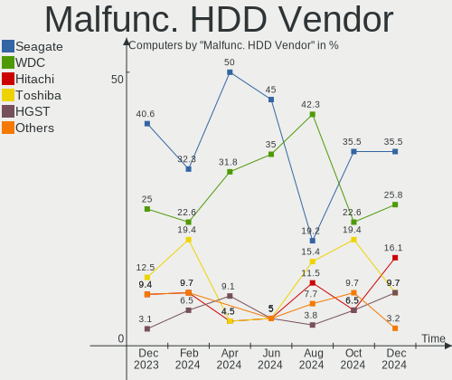
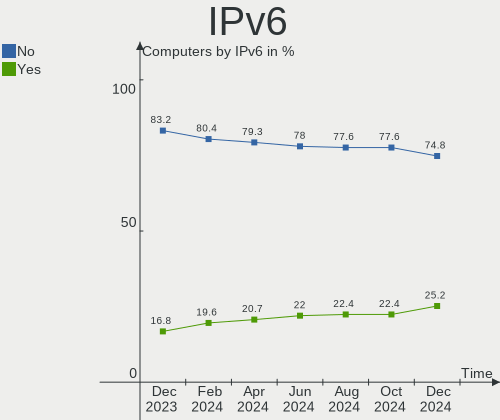
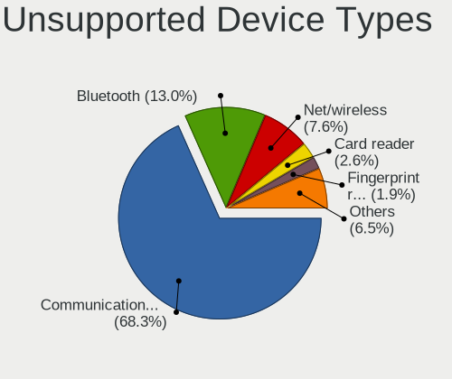

BSD - Hardware Trends
---------------------

A project to identify most popular hardware characteristics and track their change
over time based on data collected by BSD users at https://BSD-Hardware.info.

Anyone can contribute to this report by the [hw-probe](https://github.com/linuxhw/hw-probe/blob/master/INSTALL.BSD.md) tool:

    hw-probe -all -upload

This is a report for all computer types. See also reports for [desktops](/Desktop/README.md) and [notebooks](/Notebook/README.md).

OS-specific reports: [FreeBSD](/Dist/FreeBSD), [OPNsense](/Dist/OPNsense), [helloSystem](/Dist/helloSystem), [OpenBSD](/Dist/OpenBSD).

This report is for one last month. Overall report since the beginning of time: [TestCoverage](https://github.com/bsdhw/TestCoverage)

Period: May, 2022.

Contents
--------

* [ System ](#system)
  - [ OS                       ](#os)
  - [ OS Family                ](#os-family)
  - [ Arch                     ](#arch)
  - [ DE                       ](#de)
  - [ Display Server           ](#display-server)
  - [ Display Manager          ](#display-manager)
  - [ OS Lang                  ](#os-lang)
  - [ Boot Mode                ](#boot-mode)
  - [ Filesystem               ](#filesystem)
  - [ Part. scheme             ](#part-scheme)

* [ Board ](#board)
  - [ Vendor                   ](#vendor)
  - [ Model                    ](#model)
  - [ Model Family             ](#model-family)
  - [ MFG Year                 ](#mfg-year)
  - [ Form Factor              ](#form-factor)
  - [ Coreboot                 ](#coreboot)
  - [ RAM Size                 ](#ram-size)
  - [ RAM Used                 ](#ram-used)
  - [ Total Drives             ](#total-drives)
  - [ Has CD-ROM               ](#has-cd-rom)
  - [ Has Ethernet             ](#has-ethernet)
  - [ Has WiFi                 ](#has-wifi)
  - [ Has Bluetooth            ](#has-bluetooth)

* [ Location ](#location)
  - [ Country                  ](#country)
  - [ City                     ](#city)

* [ Drives ](#drives)
  - [ Drive Vendor             ](#drive-vendor)
  - [ Drive Model              ](#drive-model)
  - [ HDD Vendor               ](#hdd-vendor)
  - [ SSD Vendor               ](#ssd-vendor)
  - [ Drive Kind               ](#drive-kind)
  - [ Drive Connector          ](#drive-connector)
  - [ Drive Size               ](#drive-size)
  - [ Space Total              ](#space-total)
  - [ Space Used               ](#space-used)
  - [ Malfunc. Drives          ](#malfunc-drives)
  - [ Malfunc. Drive Vendor    ](#malfunc-drive-vendor)
  - [ Malfunc. HDD Vendor      ](#malfunc-hdd-vendor)
  - [ Malfunc. Drive Kind      ](#malfunc-drive-kind)
  - [ Failed Drives            ](#failed-drives)
  - [ Failed Drive Vendor      ](#failed-drive-vendor)
  - [ Drive Status             ](#drive-status)

* [ Storage controller ](#storage-controller)
  - [ Storage Vendor           ](#storage-vendor)
  - [ Storage Model            ](#storage-model)
  - [ Storage Kind             ](#storage-kind)

* [ Processor ](#processor)
  - [ CPU Vendor               ](#cpu-vendor)
  - [ CPU Model                ](#cpu-model)
  - [ CPU Model Family         ](#cpu-model-family)
  - [ CPU Cores                ](#cpu-cores)
  - [ CPU Sockets              ](#cpu-sockets)
  - [ CPU Threads              ](#cpu-threads)
  - [ CPU Microarch            ](#cpu-microarch)

* [ Graphics ](#graphics)
  - [ GPU Vendor               ](#gpu-vendor)
  - [ GPU Model                ](#gpu-model)
  - [ GPU Combo                ](#gpu-combo)
  - [ GPU Driver               ](#gpu-driver)
  - [ GPU Memory               ](#gpu-memory)

* [ Monitor ](#monitor)
  - [ Monitor Vendor           ](#monitor-vendor)
  - [ Monitor Model            ](#monitor-model)
  - [ Monitor Resolution       ](#monitor-resolution)
  - [ Monitor Diagonal         ](#monitor-diagonal)
  - [ Monitor Width            ](#monitor-width)
  - [ Aspect Ratio             ](#aspect-ratio)
  - [ Monitor Area             ](#monitor-area)
  - [ Pixel Density            ](#pixel-density)
  - [ Multiple Monitors        ](#multiple-monitors)

* [ Network ](#network)
  - [ Net Controller Vendor    ](#net-controller-vendor)
  - [ Net Controller Model     ](#net-controller-model)
  - [ Wireless Vendor          ](#wireless-vendor)
  - [ Wireless Model           ](#wireless-model)
  - [ Ethernet Vendor          ](#ethernet-vendor)
  - [ Ethernet Model           ](#ethernet-model)
  - [ Net Controller Kind      ](#net-controller-kind)
  - [ Used Controller          ](#used-controller)
  - [ NICs                     ](#nics)
  - [ IPv6                     ](#ipv6)

* [ Bluetooth ](#bluetooth)
  - [ Bluetooth Vendor         ](#bluetooth-vendor)
  - [ Bluetooth Model          ](#bluetooth-model)

* [ Sound ](#sound)
  - [ Sound Vendor             ](#sound-vendor)
  - [ Sound Model              ](#sound-model)

* [ Memory ](#memory)
  - [ Memory Vendor            ](#memory-vendor)
  - [ Memory Model             ](#memory-model)
  - [ Memory Kind              ](#memory-kind)
  - [ Memory Form Factor       ](#memory-form-factor)
  - [ Memory Size              ](#memory-size)
  - [ Memory Speed             ](#memory-speed)

* [ Printers & scanners ](#printers--scanners)
  - [ Printer Vendor           ](#printer-vendor)
  - [ Printer Model            ](#printer-model)
  - [ Scanner Vendor           ](#scanner-vendor)
  - [ Scanner Model            ](#scanner-model)

* [ Camera ](#camera)
  - [ Camera Vendor            ](#camera-vendor)
  - [ Camera Model             ](#camera-model)

* [ Security ](#security)
  - [ Fingerprint Vendor       ](#fingerprint-vendor)
  - [ Fingerprint Model        ](#fingerprint-model)
  - [ Chipcard Vendor          ](#chipcard-vendor)
  - [ Chipcard Model           ](#chipcard-model)

* [ Unsupported ](#unsupported)
  - [ Unsupported Devices      ](#unsupported-devices)
  - [ Unsupported Device Types ](#unsupported-device-types)

System
------

OS
--

Installed operating systems

| Name                 | Computers | Percent |
|----------------------|-----------|---------|
| OPNsense 22.1.7      | 102       | 25.37%  |
| OPNsense 22.1.6      | 71        | 17.66%  |
| FreeBSD 13.1         | 46        | 11.44%  |
| OPNsense 22.1.8      | 40        | 9.95%   |
| helloSystem 0.7.0    | 37        | 9.2%    |
| OpenBSD 7.1          | 25        | 6.22%   |
| FreeBSD 13.0-p11     | 11        | 2.74%   |
| FreeBSD 14.0-CURRENT | 9         | 2.24%   |
| OPNsense 22.7        | 6         | 1.49%   |
| helloSystem 0.8.0    | 6         | 1.49%   |
| OPNsense 21.7.8      | 5         | 1.24%   |
| FreeBSD 13.1-STABLE  | 5         | 1.24%   |
| FreeBSD 13.1-RC6     | 5         | 1.24%   |
| FreeBSD 13.0         | 4         | 1%      |
| OPNsense 22.1.4      | 3         | 0.75%   |
| FreeBSD 13.0-p10     | 3         | 0.75%   |
| OPNsense 22.4        | 2         | 0.5%    |
| OPNsense 22.1.2      | 2         | 0.5%    |
| OPNsense 22.1        | 2         | 0.5%    |
| GhostBSD 22.01.12    | 2         | 0.5%    |
| FreeBSD 12.3-p5      | 2         | 0.5%    |
| NomadBSD 5806f915    | 1         | 0.25%   |
| MyBee 13.1           | 1         | 0.25%   |
| MidnightBSD 2.2.0    | 1         | 0.25%   |
| MidnightBSD 2.1.1    | 1         | 0.25%   |
| GhostBSD 22.05.14    | 1         | 0.25%   |
| GhostBSD 22.05.13    | 1         | 0.25%   |
| GhostBSD 22.04.30    | 1         | 0.25%   |
| GhostBSD 22.04.22    | 1         | 0.25%   |
| FreeBSD 13.1-RC5     | 1         | 0.25%   |
| FreeBSD 13.1-RC3     | 1         | 0.25%   |
| FreeBSD 13.0-STABLE  | 1         | 0.25%   |
| FreeBSD 13.0-p8      | 1         | 0.25%   |
| FreeBSD 13.0-p2      | 1         | 0.25%   |
| DragonFly 6.2        | 1         | 0.25%   |

OS Family
---------

OS without a version

| Name        | Computers | Percent |
|-------------|-----------|---------|
| OPNsense    | 233       | 57.96%  |
| FreeBSD     | 90        | 22.39%  |
| helloSystem | 43        | 10.7%   |
| OpenBSD     | 25        | 6.22%   |
| GhostBSD    | 6         | 1.49%   |
| MidnightBSD | 2         | 0.5%    |
| NomadBSD    | 1         | 0.25%   |
| MyBee       | 1         | 0.25%   |
| DragonFly   | 1         | 0.25%   |

Arch
----

OS architecture (x86_64, i586, etc.)

| Name  | Computers | Percent |
|-------|-----------|---------|
| amd64 | 382       | 95.02%  |
| arm64 | 12        | 2.99%   |
| i386  | 7         | 1.74%   |
| arm   | 1         | 0.25%   |

DE
--

Desktop Environment

| Name         | Computers | Percent |
|--------------|-----------|---------|
| Console      | 268       | 66.67%  |
| helloDesktop | 64        | 15.92%  |
| KDE5         | 22        | 5.47%   |
| XFCE         | 18        | 4.48%   |
| GNOME        | 7         | 1.74%   |
| MATE         | 6         | 1.49%   |
| Openbox      | 3         | 0.75%   |
| i3           | 3         | 0.75%   |
| Cinnamon     | 3         | 0.75%   |
| TWM          | 2         | 0.5%    |
| X-Cinnamon   | 1         | 0.25%   |
| Window Maker | 1         | 0.25%   |
| LXQt         | 1         | 0.25%   |
| LXDE         | 1         | 0.25%   |
| IceWM        | 1         | 0.25%   |
| Compton      | 1         | 0.25%   |

Display Server
--------------

X11 or Wayland

| Name    | Computers | Percent |
|---------|-----------|---------|
| Console | 282       | 70.15%  |
| X11     | 118       | 29.35%  |
| Wayland | 2         | 0.5%    |

Display Manager
---------------

SDDM, LightDM, etc.

| Name    | Computers | Percent |
|---------|-----------|---------|
| Console | 314       | 78.11%  |
| SLiM    | 53        | 13.18%  |
| SDDM    | 18        | 4.48%   |
| LightDM | 9         | 2.24%   |
| GDM     | 6         | 1.49%   |
| XDM     | 1         | 0.25%   |
| PCDM    | 1         | 0.25%   |

OS Lang
-------

Language

| Lang             | Computers | Percent |
|------------------|-----------|---------|
| Unknown          | 257       | 63.93%  |
| C                | 74        | 18.41%  |
| en_US            | 56        | 13.93%  |
| ru_RU            | 3         | 0.75%   |
| en_US.ISO8859-1  | 2         | 0.5%    |
| en_AU            | 2         | 0.5%    |
| de_DE            | 2         | 0.5%    |
| zh_CN            | 1         | 0.25%   |
| no_NO.ISO8859-15 | 1         | 0.25%   |
| fr_FR            | 1         | 0.25%   |
| en_GB            | 1         | 0.25%   |
| en_CA            | 1         | 0.25%   |
| de_CH            | 1         | 0.25%   |

Boot Mode
---------

EFI or BIOS

| Mode | Computers | Percent |
|------|-----------|---------|
| EFI  | 348       | 86.57%  |
| BIOS | 54        | 13.43%  |

Filesystem
----------

Type of filesystem

| Type    | Computers | Percent |
|---------|-----------|---------|
| Ufs     | 186       | 46.27%  |
| Zfs     | 165       | 41.04%  |
| Ffs     | 25        | 6.22%   |
| Cd9660  | 25        | 6.22%   |
| Hammer2 | 1         | 0.25%   |

Part. scheme
------------

Scheme of partitioning

| Type    | Computers | Percent |
|---------|-----------|---------|
| GPT     | 368       | 91.54%  |
| MBR     | 30        | 7.46%   |
| Unknown | 3         | 0.75%   |
| BSD     | 1         | 0.25%   |

Board
-----

Vendor
------

Motherboard manufacturer

| Name                           | Computers | Percent |
|--------------------------------|-----------|---------|
| Dell                           | 46        | 11.44%  |
| ASUSTek Computer               | 41        | 10.2%   |
| Unknown                        | 40        | 9.95%   |
| Hewlett-Packard                | 35        | 8.71%   |
| Lenovo                         | 34        | 8.46%   |
| Intel                          | 22        | 5.47%   |
| Protectli                      | 19        | 4.73%   |
| Supermicro                     | 16        | 3.98%   |
| Gigabyte Technology            | 16        | 3.98%   |
| ASRock                         | 11        | 2.74%   |
| MSI                            | 10        | 2.49%   |
| AMI                            | 9         | 2.24%   |
| Fujitsu                        | 8         | 1.99%   |
| Acer                           | 8         | 1.99%   |
| ZOTAC                          | 7         | 1.74%   |
| Sophos                         | 7         | 1.74%   |
| Deciso                         | 6         | 1.49%   |
| BESSTAR Tech                   | 6         | 1.49%   |
| AWOW                           | 6         | 1.49%   |
| PC Engines                     | 4         | 1%      |
| MW                             | 4         | 1%      |
| TUXEDO                         | 3         | 0.75%   |
| Biostar                        | 3         | 0.75%   |
| Toshiba                        | 2         | 0.5%    |
| Matsushita Electric Industrial | 2         | 0.5%    |
| Apple                          | 2         | 0.5%    |
| YANYU                          | 1         | 0.25%   |
| Timi                           | 1         | 0.25%   |
| T-bao                          | 1         | 0.25%   |
| System76                       | 1         | 0.25%   |
| Sony                           | 1         | 0.25%   |
| SIEMENS                        | 1         | 0.25%   |
| Shuttle                        | 1         | 0.25%   |
| ShenZhen MinWin Technology     | 1         | 0.25%   |
| Seeed Studio                   | 1         | 0.25%   |
| Razer                          | 1         | 0.25%   |
| Raspberry Pi Foundation        | 1         | 0.25%   |
| radxa                          | 1         | 0.25%   |
| Positivo                       | 1         | 0.25%   |
| Pegatron                       | 1         | 0.25%   |
| Panasonic                      | 1         | 0.25%   |
| Packard Bell                   | 1         | 0.25%   |
| OEM                            | 1         | 0.25%   |
| Notebook                       | 1         | 0.25%   |
| NF-M2S                         | 1         | 0.25%   |
| NEXCOM                         | 1         | 0.25%   |
| khadas                         | 1         | 0.25%   |
| JGINYUE                        | 1         | 0.25%   |
| iEi                            | 1         | 0.25%   |
| IBM                            | 1         | 0.25%   |
| HARDKERNEL                     | 1         | 0.25%   |
| GVC                            | 1         | 0.25%   |
| GPD                            | 1         | 0.25%   |
| friendlyelec                   | 1         | 0.25%   |
| CompuLab                       | 1         | 0.25%   |
| CNCTION-IAF-E3845              | 1         | 0.25%   |
| BCM Advanced Research          | 1         | 0.25%   |
| AZW                            | 1         | 0.25%   |
| ASRockRack                     | 1         | 0.25%   |
| ADI Engineering                | 1         | 0.25%   |

Model
-----

Motherboard model

| Name                               | Computers | Percent |
|------------------------------------|-----------|---------|
| Unknown                            | 41        | 10.2%   |
| Protectli FW4B                     | 8         | 1.99%   |
| Supermicro Super Server            | 6         | 1.49%   |
| AWOW PC BOX                        | 6         | 1.49%   |
| Intel Q3XXG4-P V1.0                | 5         | 1.24%   |
| AMI Aptio CRB                      | 5         | 1.24%   |
| Sophos SG                          | 4         | 1%      |
| Protectli FW6                      | 4         | 1%      |
| MW GMLK-2_5G4L                     | 4         | 1%      |
| MSI MS-7817                        | 4         | 1%      |
| Protectli FW2B                     | 3         | 0.75%   |
| HP ProLiant MicroServer            | 3         | 0.75%   |
| Dell OptiPlex 3020                 | 3         | 0.75%   |
| Deciso Netboard A20                | 3         | 0.75%   |
| ZOTAC ZBOX-CI323NANO               | 2         | 0.5%    |
| TUXEDO Aura 15 Gen1                | 2         | 0.5%    |
| Supermicro X9SCL/X9SCM             | 2         | 0.5%    |
| Sophos UTM                         | 2         | 0.5%    |
| Protectli VP2410                   | 2         | 0.5%    |
| PC Engines APU3                    | 2         | 0.5%    |
| HP ProLiant DL360 G7               | 2         | 0.5%    |
| HP Pavilion g6                     | 2         | 0.5%    |
| Fujitsu PRIMERGY TX100 S3P         | 2         | 0.5%    |
| Fujitsu FUTRO S920                 | 2         | 0.5%    |
| Dell PowerEdge T30                 | 2         | 0.5%    |
| Dell OptiPlex 990                  | 2         | 0.5%    |
| Dell OptiPlex 7010                 | 2         | 0.5%    |
| Dell Inspiron 5559                 | 2         | 0.5%    |
| Deciso OPNsense Appliance          | 2         | 0.5%    |
| BESSTAR Tech GK41                  | 2         | 0.5%    |
| ASUS PRIME B350-PLUS               | 2         | 0.5%    |
| ASUS PRIME A320M-K                 | 2         | 0.5%    |
| ASUS P5Q-E                         | 2         | 0.5%    |
| ASUS All Series                    | 2         | 0.5%    |
| ASRock X570 Phantom Gaming 4       | 2         | 0.5%    |
| AMI PEISIA E3845 VER1.0            | 2         | 0.5%    |
| ZOTAC ZBOX-ID42-BE                 | 1         | 0.25%   |
| ZOTAC ZBOX-ID18                    | 1         | 0.25%   |
| ZOTAC ZBOX-CI341                   | 1         | 0.25%   |
| ZOTAC ZBOX-CI331NANO               | 1         | 0.25%   |
| ZOTAC ZBOX-CI329NANO               | 1         | 0.25%   |
| YANYU EPIC-N31 Ver:1.1             | 1         | 0.25%   |
| TUXEDO InfinityBook13V3            | 1         | 0.25%   |
| Toshiba Satellite P300             | 1         | 0.25%   |
| Toshiba Satellite P25              | 1         | 0.25%   |
| Timi TM1701                        | 1         | 0.25%   |
| T-bao MINI PC                      | 1         | 0.25%   |
| System76 Galago Pro                | 1         | 0.25%   |
| Supermicro X9SRW-F                 | 1         | 0.25%   |
| Supermicro X9DRW                   | 1         | 0.25%   |
| Supermicro X7SPA-HF                | 1         | 0.25%   |
| Supermicro SYS-6028R-TRT           | 1         | 0.25%   |
| Supermicro SYS-5019D-FN8TP-2-NC041 | 1         | 0.25%   |
| Supermicro SYS-5019A-12TN4         | 1         | 0.25%   |
| Supermicro SYS-5018D-FN4T          | 1         | 0.25%   |
| Supermicro A1SAM-2550F             | 1         | 0.25%   |
| Sophos XG                          | 1         | 0.25%   |
| Sony VGN-NW25GF_S                  | 1         | 0.25%   |
| SIEMENS SIMATIC IPC127E            | 1         | 0.25%   |
| Shuttle DS10U                      | 1         | 0.25%   |

Model Family
------------

Motherboard model prefix

| Name                    | Computers | Percent |
|-------------------------|-----------|---------|
| Unknown                 | 41        | 10.2%   |
| Lenovo ThinkPad         | 19        | 4.73%   |
| Dell OptiPlex           | 16        | 3.98%   |
| ASUS PRIME              | 15        | 3.73%   |
| HP ProLiant             | 10        | 2.49%   |
| Protectli FW4B          | 8         | 1.99%   |
| Acer Aspire             | 8         | 1.99%   |
| Dell PowerEdge          | 7         | 1.74%   |
| Dell Latitude           | 7         | 1.74%   |
| Dell Inspiron           | 7         | 1.74%   |
| Supermicro Super        | 6         | 1.49%   |
| Intel Q3XXG4-P          | 6         | 1.49%   |
| AWOW PC                 | 6         | 1.49%   |
| Lenovo ThinkCentre      | 5         | 1.24%   |
| Lenovo IdeaPad          | 5         | 1.24%   |
| ASUS ROG                | 5         | 1.24%   |
| AMI Aptio               | 5         | 1.24%   |
| Sophos SG               | 4         | 1%      |
| Protectli FW6           | 4         | 1%      |
| MW GMLK-2               | 4         | 1%      |
| MSI MS-7817             | 4         | 1%      |
| HP Pavilion             | 4         | 1%      |
| HP EliteBook            | 4         | 1%      |
| Dell Precision          | 4         | 1%      |
| Deciso Netboard         | 4         | 1%      |
| ASUS TUF                | 4         | 1%      |
| Protectli FW2B          | 3         | 0.75%   |
| HP Compaq               | 3         | 0.75%   |
| ZOTAC ZBOX-CI323NANO    | 2         | 0.5%    |
| TUXEDO Aura             | 2         | 0.5%    |
| Toshiba Satellite       | 2         | 0.5%    |
| Supermicro X9SCL        | 2         | 0.5%    |
| Sophos UTM              | 2         | 0.5%    |
| Protectli VP2410        | 2         | 0.5%    |
| PC Engines APU3         | 2         | 0.5%    |
| HP ProDesk              | 2         | 0.5%    |
| HP ProBook              | 2         | 0.5%    |
| Fujitsu PRIMERGY        | 2         | 0.5%    |
| Fujitsu FUTRO           | 2         | 0.5%    |
| Fujitsu ESPRIMO         | 2         | 0.5%    |
| Dell G5                 | 2         | 0.5%    |
| Deciso OPNsense         | 2         | 0.5%    |
| BESSTAR Tech GK41       | 2         | 0.5%    |
| ASUS P5Q-E              | 2         | 0.5%    |
| ASUS All                | 2         | 0.5%    |
| ASRock X570             | 2         | 0.5%    |
| AMI PEISIA              | 2         | 0.5%    |
| ZOTAC ZBOX-ID42-BE      | 1         | 0.25%   |
| ZOTAC ZBOX-ID18         | 1         | 0.25%   |
| ZOTAC ZBOX-CI341        | 1         | 0.25%   |
| ZOTAC ZBOX-CI331NANO    | 1         | 0.25%   |
| ZOTAC ZBOX-CI329NANO    | 1         | 0.25%   |
| YANYU EPIC-N31          | 1         | 0.25%   |
| TUXEDO InfinityBook13V3 | 1         | 0.25%   |
| Timi TM1701             | 1         | 0.25%   |
| T-bao MINI              | 1         | 0.25%   |
| System76 Galago         | 1         | 0.25%   |
| Supermicro X9SRW-F      | 1         | 0.25%   |
| Supermicro X9DRW        | 1         | 0.25%   |
| Supermicro X7SPA-HF     | 1         | 0.25%   |

MFG Year
--------

Motherboard manufacture year

| Year    | Computers | Percent |
|---------|-----------|---------|
| 2021    | 58        | 14.43%  |
| 2020    | 56        | 13.93%  |
| 2018    | 44        | 10.95%  |
| 2019    | 31        | 7.71%   |
| 2017    | 27        | 6.72%   |
| 2011    | 25        | 6.22%   |
| 2013    | 24        | 5.97%   |
| 2016    | 21        | 5.22%   |
| 2014    | 19        | 4.73%   |
| 2022    | 18        | 4.48%   |
| 2015    | 18        | 4.48%   |
| 2012    | 18        | 4.48%   |
| 2009    | 13        | 3.23%   |
| Unknown | 11        | 2.74%   |
| 2010    | 10        | 2.49%   |
| 2008    | 3         | 0.75%   |
| 2007    | 3         | 0.75%   |
| 2006    | 1         | 0.25%   |
| 2004    | 1         | 0.25%   |
| 2002    | 1         | 0.25%   |

Form Factor
-----------

Physical design of the computer

| Name           | Computers | Percent |
|----------------|-----------|---------|
| Desktop        | 240       | 59.7%   |
| Notebook       | 94        | 23.38%  |
| Mini pc        | 34        | 8.46%   |
| Server         | 23        | 5.72%   |
| Firewall       | 7         | 1.74%   |
| All in one     | 3         | 0.75%   |
| System on chip | 1         | 0.25%   |

Coreboot
--------

Have coreboot on board

| Used | Computers | Percent |
|------|-----------|---------|
| No   | 392       | 97.51%  |
| Yes  | 10        | 2.49%   |

RAM Size
--------

Total RAM memory

| Size in GB      | Computers | Percent |
|-----------------|-----------|---------|
| 8.01-16.0       | 154       | 38.31%  |
| 4.01-8.0        | 83        | 20.65%  |
| 16.01-24.0      | 79        | 19.65%  |
| 32.01-64.0      | 31        | 7.71%   |
| 64.01-256.0     | 19        | 4.73%   |
| 2.01-3.0        | 15        | 3.73%   |
| 3.01-4.0        | 8         | 1.99%   |
| 24.01-32.0      | 3         | 0.75%   |
| 1.01-2.0        | 3         | 0.75%   |
| 0.51-1.0        | 3         | 0.75%   |
| More than 256.0 | 2         | 0.5%    |
| 0.01-0.5        | 2         | 0.5%    |

RAM Used
--------

Used RAM memory

| Used GB    | Computers | Percent |
|------------|-----------|---------|
| 0.01-0.5   | 233       | 57.96%  |
| 0.51-1.0   | 102       | 25.37%  |
| 1.01-2.0   | 33        | 8.21%   |
| 2.01-3.0   | 13        | 3.23%   |
| 3.01-4.0   | 7         | 1.74%   |
| 4.01-8.0   | 6         | 1.49%   |
| 0          | 6         | 1.49%   |
| 24.01-32.0 | 1         | 0.25%   |
| 16.01-24.0 | 1         | 0.25%   |

Total Drives
------------

Number of drives on board

| Drives | Computers | Percent |
|--------|-----------|---------|
| 1      | 281       | 69.9%   |
| 2      | 66        | 16.42%  |
| 0      | 28        | 6.97%   |
| 4      | 10        | 2.49%   |
| 3      | 9         | 2.24%   |
| 5      | 2         | 0.5%    |
| 15     | 1         | 0.25%   |
| 13     | 1         | 0.25%   |
| 10     | 1         | 0.25%   |
| 8      | 1         | 0.25%   |
| 7      | 1         | 0.25%   |
| 6      | 1         | 0.25%   |

Has CD-ROM
----------

Has CD-ROM on board

| Presented | Computers | Percent |
|-----------|-----------|---------|
| No        | 323       | 80.35%  |
| Yes       | 79        | 19.65%  |

Has Ethernet
------------

Has Ethernet on board

| Presented | Computers | Percent |
|-----------|-----------|---------|
| Yes       | 382       | 95.02%  |
| No        | 20        | 4.98%   |

Has WiFi
--------

Has WiFi module

| Presented | Computers | Percent |
|-----------|-----------|---------|
| No        | 250       | 62.19%  |
| Yes       | 152       | 37.81%  |

Has Bluetooth
-------------

Has Bluetooth module

| Presented | Computers | Percent |
|-----------|-----------|---------|
| No        | 299       | 74.38%  |
| Yes       | 103       | 25.62%  |

Location
--------

Country
-------

Geographic location (country)

| Country            | Computers | Percent |
|--------------------|-----------|---------|
| USA                | 107       | 26.62%  |
| Germany            | 59        | 14.68%  |
| Canada             | 29        | 7.21%   |
| Russia             | 20        | 4.98%   |
| UK                 | 17        | 4.23%   |
| Italy              | 12        | 2.99%   |
| France             | 12        | 2.99%   |
| Netherlands        | 10        | 2.49%   |
| China              | 8         | 1.99%   |
| Austria            | 8         | 1.99%   |
| Switzerland        | 7         | 1.74%   |
| Norway             | 7         | 1.74%   |
| Australia          | 7         | 1.74%   |
| Japan              | 6         | 1.49%   |
| Brazil             | 6         | 1.49%   |
| South Africa       | 5         | 1.24%   |
| Portugal           | 5         | 1.24%   |
| New Zealand        | 5         | 1.24%   |
| Mexico             | 5         | 1.24%   |
| Denmark            | 5         | 1.24%   |
| Belgium            | 5         | 1.24%   |
| Poland             | 4         | 1%      |
| India              | 4         | 1%      |
| Romania            | 3         | 0.75%   |
| Greece             | 3         | 0.75%   |
| Dominican Republic | 3         | 0.75%   |
| Czechia            | 3         | 0.75%   |
| Taiwan             | 2         | 0.5%    |
| Sweden             | 2         | 0.5%    |
| Spain              | 2         | 0.5%    |
| Slovenia           | 2         | 0.5%    |
| Slovakia           | 2         | 0.5%    |
| Paraguay           | 2         | 0.5%    |
| Indonesia          | 2         | 0.5%    |
| Hong Kong          | 2         | 0.5%    |
| Colombia           | 2         | 0.5%    |
| Ukraine            | 1         | 0.25%   |
| Uganda             | 1         | 0.25%   |
| Turkey             | 1         | 0.25%   |
| Thailand           | 1         | 0.25%   |
| South Korea        | 1         | 0.25%   |
| Singapore          | 1         | 0.25%   |
| Serbia             | 1         | 0.25%   |
| Peru               | 1         | 0.25%   |
| Monaco             | 1         | 0.25%   |
| Malaysia           | 1         | 0.25%   |
| Lithuania          | 1         | 0.25%   |
| Kenya              | 1         | 0.25%   |
| Israel             | 1         | 0.25%   |
| Ireland            | 1         | 0.25%   |
| Hungary            | 1         | 0.25%   |
| Guadeloupe         | 1         | 0.25%   |
| Croatia            | 1         | 0.25%   |
| Bolivia            | 1         | 0.25%   |
| Argentina          | 1         | 0.25%   |

City
----

Geographic location (city)

| City               | Computers | Percent |
|--------------------|-----------|---------|
| Montreal           | 11        | 2.74%   |
| St Petersburg      | 6         | 1.49%   |
| Berlin             | 6         | 1.49%   |
| Paris              | 5         | 1.24%   |
| Moscow             | 5         | 1.24%   |
| Vienna             | 4         | 1%      |
| Poortugaal         | 4         | 1%      |
| Frisco             | 4         | 1%      |
| Austin             | 4         | 1%      |
| Santo Domingo Este | 3         | 0.75%   |
| Perth              | 3         | 0.75%   |
| Ottawa             | 3         | 0.75%   |
| Munich             | 3         | 0.75%   |
| Zurich             | 2         | 0.5%    |
| Ypsilanti          | 2         | 0.5%    |
| Warsaw             | 2         | 0.5%    |
| Tromsø            | 2         | 0.5%    |
| Salem              | 2         | 0.5%    |
| Saarbrücken       | 2         | 0.5%    |
| Renton             | 2         | 0.5%    |
| Redmond            | 2         | 0.5%    |
| Ponta Delgada      | 2         | 0.5%    |
| Pittsburgh         | 2         | 0.5%    |
| Oslo               | 2         | 0.5%    |
| Orlando            | 2         | 0.5%    |
| Novosibirsk        | 2         | 0.5%    |
| Monterrey          | 2         | 0.5%    |
| Milan              | 2         | 0.5%    |
| Melbourne          | 2         | 0.5%    |
| Medellín          | 2         | 0.5%    |
| London             | 2         | 0.5%    |
| Kensington         | 2         | 0.5%    |
| Karlsruhe          | 2         | 0.5%    |
| Izhevsk            | 2         | 0.5%    |
| Hamm               | 2         | 0.5%    |
| Frankfurt am Main  | 2         | 0.5%    |
| Diest              | 2         | 0.5%    |
| Denver             | 2         | 0.5%    |
| Dallas             | 2         | 0.5%    |
| Copenhagen         | 2         | 0.5%    |
| Chengdu            | 2         | 0.5%    |
| Central            | 2         | 0.5%    |
| Campinas           | 2         | 0.5%    |
| Bucharest          | 2         | 0.5%    |
| Brno               | 2         | 0.5%    |
| Brampton           | 2         | 0.5%    |
| Bochum             | 2         | 0.5%    |
| Bedford            | 2         | 0.5%    |
| Auckland           | 2         | 0.5%    |
| Adelfia            | 2         | 0.5%    |
| Zhumadian          | 1         | 0.25%   |
| Zhengzhou          | 1         | 0.25%   |
| Zapopan            | 1         | 0.25%   |
| Woerdense Verlaat  | 1         | 0.25%   |
| Wichita Falls      | 1         | 0.25%   |
| Wheatland          | 1         | 0.25%   |
| West Fargo         | 1         | 0.25%   |
| Wendell            | 1         | 0.25%   |
| Wenatchee          | 1         | 0.25%   |
| Wels               | 1         | 0.25%   |

Drives
------

Drive Vendor
------------

Hard drive vendors

| Vendor              | Computers | Drives | Percent |
|---------------------|-----------|--------|---------|
| Samsung Electronics | 70        | 85     | 15.45%  |
| WDC                 | 61        | 81     | 13.47%  |
| Seagate             | 37        | 54     | 8.17%   |
| Kingston            | 37        | 38     | 8.17%   |
| Crucial             | 22        | 27     | 4.86%   |
| Transcend           | 21        | 21     | 4.64%   |
| Intel               | 20        | 31     | 4.42%   |
| Toshiba             | 15        | 21     | 3.31%   |
| SanDisk             | 15        | 16     | 3.31%   |
| Hitachi             | 12        | 22     | 2.65%   |
| A-DATA Technology   | 10        | 12     | 2.21%   |
| Hoodisk             | 9         | 9      | 1.99%   |
| China               | 9         | 9      | 1.99%   |
| Hewlett-Packard     | 8         | 8      | 1.77%   |
| FORESEE             | 8         | 8      | 1.77%   |
| HGST                | 5         | 9      | 1.1%    |
| BIWIN               | 5         | 5      | 1.1%    |
| ShiJi               | 4         | 4      | 0.88%   |
| OCZ                 | 4         | 4      | 0.88%   |
| NVMe                | 4         | 5      | 0.88%   |
| Micron Technology   | 4         | 5      | 0.88%   |
| KIOXIA              | 4         | 4      | 0.88%   |
| Intenso             | 4         | 4      | 0.88%   |
| Dogfish             | 4         | 4      | 0.88%   |
| Apacer              | 4         | 4      | 0.88%   |
| SPCC                | 3         | 3      | 0.66%   |
| SK Hynix            | 3         | 3      | 0.66%   |
| Protectli           | 3         | 3      | 0.66%   |
| Corsair             | 3         | 3      | 0.66%   |
| XPG                 | 2         | 2      | 0.44%   |
| Wicgtyp             | 2         | 2      | 0.44%   |
| Verbatim            | 2         | 2      | 0.44%   |
| Phison              | 2         | 2      | 0.44%   |
| Patriot             | 2         | 2      | 0.44%   |
| LITEON              | 2         | 2      | 0.44%   |
| Lexar               | 2         | 2      | 0.44%   |
| KingSpec            | 2         | 2      | 0.44%   |
| Gigabyte Technology | 2         | 2      | 0.44%   |
| XUM                 | 1         | 1      | 0.22%   |
| Vaseky              | 1         | 1      | 0.22%   |
| USB                 | 1         | 1      | 0.22%   |
| Team                | 1         | 1      | 0.22%   |
| T-FORCE             | 1         | 1      | 0.22%   |
| SuperMicro          | 1         | 1      | 0.22%   |
| StoreJet            | 1         | 1      | 0.22%   |
| SSSTC               | 1         | 1      | 0.22%   |
| Silicon Motion      | 1         | 1      | 0.22%   |
| OWC                 | 1         | 1      | 0.22%   |
| ORTIAL              | 1         | 1      | 0.22%   |
| ORICO               | 1         | 1      | 0.22%   |
| Netac               | 1         | 1      | 0.22%   |
| MyDigitalSSD        | 1         | 1      | 0.22%   |
| LSI                 | 1         | 1      | 0.22%   |
| LITEONIT            | 1         | 1      | 0.22%   |
| LDLC F6+            | 1         | 1      | 0.22%   |
| Kingchuxing         | 1         | 1      | 0.22%   |
| InnoLite            | 1         | 1      | 0.22%   |
| IBM/Hitachi         | 1         | 1      | 0.22%   |
| Fordisk             | 1         | 1      | 0.22%   |
| EAGET               | 1         | 1      | 0.22%   |

Drive Model
-----------

Hard drive models

| Model                                | Computers | Percent |
|--------------------------------------|-----------|---------|
| FORESEE 128GB SSD                    | 7         | 1.46%   |
| Samsung SSD 850 EVO 500GB            | 6         | 1.25%   |
| Kingston SA400S37240G 240GB          | 5         | 1.04%   |
| Kingston SA400S37120G 120GB          | 5         | 1.04%   |
| Hoodisk SSD 32GB                     | 5         | 1.04%   |
| Crucial CT240BX500SSD1 240GB         | 5         | 1.04%   |
| Samsung SSD 860 EVO 500GB            | 4         | 0.83%   |
| Samsung SSD 850 EVO 250GB            | 4         | 0.83%   |
| Kingston SV300S37A120G 120GB         | 4         | 0.83%   |
| BIWIN SSD 128GB                      | 4         | 0.83%   |
| WDC WD2503ABYX-01WERA1 256GB         | 3         | 0.63%   |
| Transcend TS64GMSA230S 64GB          | 3         | 0.63%   |
| ShiJi SSD 128GB                      | 3         | 0.63%   |
| Seagate ST1000LM024 HN-M101MBB 1TB   | 3         | 0.63%   |
| Seagate ST1000DM010-2EP102 1TB       | 3         | 0.63%   |
| Samsung SSD 970 EVO Plus 2TB         | 3         | 0.63%   |
| Kingston SV300S37A60G 64GB           | 3         | 0.63%   |
| Kingston SKC600MS256G 256GB          | 3         | 0.63%   |
| Hoodisk SSD 128GB                    | 3         | 0.63%   |
| HP RAID 1(1+0) 146GB                 | 3         | 0.63%   |
| Crucial CT500MX500SSD1 500GB         | 3         | 0.63%   |
| A-DATA SU650 240GB                   | 3         | 0.63%   |
| XPG GAMMIX S11 Pro 256GB             | 2         | 0.42%   |
| Wicgtyp M900-128 128GB               | 2         | 0.42%   |
| WDC WDS120G2G0A-00JH30 120GB         | 2         | 0.42%   |
| WDC WD8003FFBX-68B9AN0 8TB           | 2         | 0.42%   |
| WDC WD40EFZX-68AWUN0 4TB             | 2         | 0.42%   |
| WDC PC SN730 SDBQNTY-512G-1001 512GB | 2         | 0.42%   |
| Verbatim Vi550 S3 SSD 512GB          | 2         | 0.42%   |
| Transcend TS64GSSD370 64GB           | 2         | 0.42%   |
| Transcend TS64GMSA370 64GB           | 2         | 0.42%   |
| Transcend TS256GMTS952T2 256GB       | 2         | 0.42%   |
| Transcend TS256GMTE652T2 256GB       | 2         | 0.42%   |
| Transcend TS256GMSA230S 256GB        | 2         | 0.42%   |
| Transcend TS128GMSA230S 128GB        | 2         | 0.42%   |
| Toshiba DT01ACA100 1TB               | 2         | 0.42%   |
| Toshiba DT01ACA050 500GB             | 2         | 0.42%   |
| SPCC Solid State Disk 1TB            | 2         | 0.42%   |
| Seagate ST9500325AS 500GB            | 2         | 0.42%   |
| Seagate ST4000DM000-1F2168 4TB       | 2         | 0.42%   |
| Seagate ST2000LM007-1R8174 2TB       | 2         | 0.42%   |
| Seagate ST1000DM003-1CH162 1TB       | 2         | 0.42%   |
| SanDisk SSD PLUS 240GB               | 2         | 0.42%   |
| SanDisk SSD PLUS 120GB               | 2         | 0.42%   |
| Samsung SSD 980 PRO 500GB            | 2         | 0.42%   |
| Samsung SSD 980 PRO 1TB              | 2         | 0.42%   |
| Samsung SSD 870 QVO 2TB              | 2         | 0.42%   |
| Samsung SSD 870 EVO 500GB            | 2         | 0.42%   |
| Samsung SSD 870 EVO 1TB              | 2         | 0.42%   |
| Samsung SSD 860 EVO 250GB            | 2         | 0.42%   |
| Samsung SSD 860 EVO 1TB              | 2         | 0.42%   |
| Samsung SSD 850 PRO 128GB            | 2         | 0.42%   |
| Samsung SSD 850 EVO 1TB              | 2         | 0.42%   |
| Samsung SSD 840 PRO Series 128GB     | 2         | 0.42%   |
| Samsung SSD 840 EVO 250GB            | 2         | 0.42%   |
| Samsung SSD 750 EVO 120GB            | 2         | 0.42%   |
| Samsung HD161HJ 160GB                | 2         | 0.42%   |
| Phison Sabrent 1TB                   | 2         | 0.42%   |
| NVMe Samsung SSD 980 1TB             | 2         | 0.42%   |
| KIOXIA KBG40ZNV1T02 1TB              | 2         | 0.42%   |

HDD Vendor
----------

Hard disk drive vendors

| Vendor              | Computers | Drives | Percent |
|---------------------|-----------|--------|---------|
| WDC                 | 48        | 65     | 37.8%   |
| Seagate             | 34        | 51     | 26.77%  |
| Hitachi             | 12        | 22     | 9.45%   |
| Toshiba             | 11        | 17     | 8.66%   |
| Hewlett-Packard     | 6         | 6      | 4.72%   |
| HGST                | 5         | 9      | 3.94%   |
| Samsung Electronics | 3         | 4      | 2.36%   |
| NVMe                | 2         | 3      | 1.57%   |
| USB                 | 1         | 1      | 0.79%   |
| StoreJet            | 1         | 1      | 0.79%   |
| LSI                 | 1         | 1      | 0.79%   |
| LDLC F6+            | 1         | 1      | 0.79%   |
| InnoLite            | 1         | 1      | 0.79%   |
| IBM/Hitachi         | 1         | 1      | 0.79%   |

SSD Vendor
----------

Solid state drive vendors

| Vendor              | Computers | Drives | Percent |
|---------------------|-----------|--------|---------|
| Samsung Electronics | 46        | 52     | 17.69%  |
| Kingston            | 32        | 33     | 12.31%  |
| Transcend           | 18        | 18     | 6.92%   |
| Crucial             | 18        | 19     | 6.92%   |
| Intel               | 16        | 26     | 6.15%   |
| SanDisk             | 15        | 16     | 5.77%   |
| Hoodisk             | 9         | 9      | 3.46%   |
| China               | 9         | 9      | 3.46%   |
| A-DATA Technology   | 9         | 11     | 3.46%   |
| FORESEE             | 8         | 8      | 3.08%   |
| WDC                 | 6         | 6      | 2.31%   |
| BIWIN               | 5         | 5      | 1.92%   |
| ShiJi               | 4         | 4      | 1.54%   |
| OCZ                 | 4         | 4      | 1.54%   |
| Intenso             | 4         | 4      | 1.54%   |
| Dogfish             | 4         | 4      | 1.54%   |
| Apacer              | 4         | 4      | 1.54%   |
| SPCC                | 3         | 3      | 1.15%   |
| Protectli           | 3         | 3      | 1.15%   |
| Micron Technology   | 3         | 4      | 1.15%   |
| Wicgtyp             | 2         | 2      | 0.77%   |
| Verbatim            | 2         | 2      | 0.77%   |
| Toshiba             | 2         | 2      | 0.77%   |
| Seagate             | 2         | 2      | 0.77%   |
| Patriot             | 2         | 2      | 0.77%   |
| NVMe                | 2         | 2      | 0.77%   |
| LITEON              | 2         | 2      | 0.77%   |
| Lexar               | 2         | 2      | 0.77%   |
| KingSpec            | 2         | 2      | 0.77%   |
| Corsair             | 2         | 2      | 0.77%   |
| XUM                 | 1         | 1      | 0.38%   |
| Vaseky              | 1         | 1      | 0.38%   |
| Team                | 1         | 1      | 0.38%   |
| SuperMicro          | 1         | 1      | 0.38%   |
| SK Hynix            | 1         | 1      | 0.38%   |
| OWC                 | 1         | 1      | 0.38%   |
| ORICO               | 1         | 1      | 0.38%   |
| Netac               | 1         | 1      | 0.38%   |
| MyDigitalSSD        | 1         | 1      | 0.38%   |
| LITEONIT            | 1         | 1      | 0.38%   |
| Kingchuxing         | 1         | 1      | 0.38%   |
| Hewlett-Packard     | 1         | 1      | 0.38%   |
| Gigabyte Technology | 1         | 1      | 0.38%   |
| Fordisk             | 1         | 1      | 0.38%   |
| EAGET               | 1         | 1      | 0.38%   |
| DST                 | 1         | 1      | 0.38%   |
| Drevo               | 1         | 1      | 0.38%   |
| CFD                 | 1         | 1      | 0.38%   |
| BR                  | 1         | 1      | 0.38%   |
| AMD                 | 1         | 1      | 0.38%   |

Drive Kind
----------

HDD or SSD

| Kind | Computers | Drives | Percent |
|------|-----------|--------|---------|
| SSD  | 242       | 282    | 57.21%  |
| HDD  | 112       | 183    | 26.48%  |
| NVMe | 69        | 82     | 16.31%  |

Drive Connector
---------------

SATA, SAS, NVMe, etc.

| Type | Computers | Drives | Percent |
|------|-----------|--------|---------|
| SATA | 326       | 465    | 82.53%  |
| NVMe | 69        | 82     | 17.47%  |

Drive Size
----------

Size of hard drive

| Size in TB | Computers | Drives | Percent |
|------------|-----------|--------|---------|
| 0.01-0.5   | 268       | 310    | 73.83%  |
| 0.51-1.0   | 60        | 74     | 16.53%  |
| 1.01-2.0   | 17        | 28     | 4.68%   |
| 3.01-4.0   | 9         | 19     | 2.48%   |
| 4.01-10.0  | 7         | 31     | 1.93%   |
| 2.01-3.0   | 1         | 1      | 0.28%   |
| 10.01-20.0 | 1         | 2      | 0.28%   |

Space Total
-----------

Amount of disk space available on the file system

| Size in GB     | Computers | Percent |
|----------------|-----------|---------|
| 101-250        | 161       | 40.05%  |
| 251-500        | 60        | 14.93%  |
| 21-50          | 46        | 11.44%  |
| 1-20           | 40        | 9.95%   |
| 501-1000       | 38        | 9.45%   |
| 51-100         | 35        | 8.71%   |
| 1001-2000      | 13        | 3.23%   |
| Unknown        | 5         | 1.24%   |
| More than 3000 | 3         | 0.75%   |
| 2001-3000      | 1         | 0.25%   |

Space Used
----------

Amount of used disk space

| Used GB        | Computers | Percent |
|----------------|-----------|---------|
| 1-20           | 349       | 86.82%  |
| 21-50          | 24        | 5.97%   |
| 51-100         | 13        | 3.23%   |
| 101-250        | 9         | 2.24%   |
| Unknown        | 5         | 1.24%   |
| More than 3000 | 1         | 0.25%   |
| 251-500        | 1         | 0.25%   |

Malfunc. Drives
---------------

Drive models with a malfunction

| Model                                      | Computers | Drives | Percent |
|--------------------------------------------|-----------|--------|---------|
| Seagate ST1000LM024 HN-M101MBB 1TB         | 2         | 2      | 4.65%   |
| Samsung Electronics SSD 870 EVO 1TB        | 2         | 4      | 4.65%   |
| HGST HTS721010A9E630 1TB                   | 2         | 2      | 4.65%   |
| WDC WDS120G2G0A-00JH30 120GB               | 1         | 1      | 2.33%   |
| WDC WD4000AAKS-00C8A0 400GB                | 1         | 1      | 2.33%   |
| WDC WD3200BEVT-22A23T0 320GB               | 1         | 1      | 2.33%   |
| WDC WD3200AAJS-60M0A0 320GB                | 1         | 1      | 2.33%   |
| WDC WD10JMVW-11AJGS1 1TB                   | 1         | 1      | 2.33%   |
| WDC WD1001FALS-00J7B1 1TB                  | 1         | 1      | 2.33%   |
| Toshiba MQ01ABD075 752GB                   | 1         | 1      | 2.33%   |
| Seagate ST9500325AS 500GB                  | 1         | 1      | 2.33%   |
| Seagate ST9160821AS 160GB                  | 1         | 1      | 2.33%   |
| Seagate ST500DM002-1BC142 500GB            | 1         | 1      | 2.33%   |
| Seagate ST3500413AS 500GB                  | 1         | 1      | 2.33%   |
| Seagate ST31000520AS 1TB                   | 1         | 1      | 2.33%   |
| Seagate ST250DM000-1BD141 250GB            | 1         | 1      | 2.33%   |
| Seagate ST1000DM003-1ER162 1TB             | 1         | 1      | 2.33%   |
| SanDisk SSD PLUS 240GB                     | 1         | 1      | 2.33%   |
| SanDisk SSD i110 32GB                      | 1         | 1      | 2.33%   |
| SanDisk SD8TB8U-256G-1006 256GB            | 1         | 1      | 2.33%   |
| SanDisk SD7UB3Q256G1001 256GB              | 1         | 1      | 2.33%   |
| Samsung Electronics SSD 970 EVO 2TB        | 1         | 1      | 2.33%   |
| Samsung Electronics SSD 860 EVO 1TB        | 1         | 1      | 2.33%   |
| Samsung Electronics HD321KJ 320GB          | 1         | 1      | 2.33%   |
| Samsung Electronics HD161HJ 160GB          | 1         | 1      | 2.33%   |
| OCZ VERTEX3 90GB                           | 1         | 1      | 2.33%   |
| OCZ VERTEX 32GB                            | 1         | 1      | 2.33%   |
| MyDigitalSSD SB2 128GB                     | 1         | 1      | 2.33%   |
| Micron Technology 1100_MTFDDAK512TBN 512GB | 1         | 2      | 2.33%   |
| Kingston SV300S37A60G 64GB                 | 1         | 1      | 2.33%   |
| Kingston SV300S37A120G 120GB               | 1         | 1      | 2.33%   |
| Kingston SA400S37120G 120GB                | 1         | 1      | 2.33%   |
| InnoLite InnoDisk. - iCF 16GB              | 1         | 1      | 2.33%   |
| IBM/Hitachi IC25N080ATMR04-0 80GB          | 1         | 1      | 2.33%   |
| Hitachi HTS547564A9E384 640GB              | 1         | 1      | 2.33%   |
| Hitachi HDS723015BLA642 1.5TB              | 1         | 1      | 2.33%   |
| Hewlett-Packard MB1000GCWCV 1TB            | 1         | 1      | 2.33%   |
| Apacer 32GB SATA Flash Drive               | 1         | 1      | 2.33%   |
| Apacer 16GB SATA Flash Drive               | 1         | 1      | 2.33%   |
| A-DATA Technology SP550 480GB              | 1         | 1      | 2.33%   |

Malfunc. Drive Vendor
---------------------

Vendors of faulty drives

| Vendor              | Computers | Drives | Percent |
|---------------------|-----------|--------|---------|
| Seagate             | 9         | 9      | 21.43%  |
| WDC                 | 6         | 6      | 14.29%  |
| Samsung Electronics | 5         | 8      | 11.9%   |
| SanDisk             | 4         | 4      | 9.52%   |
| Kingston            | 3         | 3      | 7.14%   |
| OCZ                 | 2         | 2      | 4.76%   |
| Hitachi             | 2         | 2      | 4.76%   |
| HGST                | 2         | 2      | 4.76%   |
| Apacer              | 2         | 2      | 4.76%   |
| Toshiba             | 1         | 1      | 2.38%   |
| MyDigitalSSD        | 1         | 1      | 2.38%   |
| Micron Technology   | 1         | 2      | 2.38%   |
| InnoLite            | 1         | 1      | 2.38%   |
| IBM/Hitachi         | 1         | 1      | 2.38%   |
| Hewlett-Packard     | 1         | 1      | 2.38%   |
| A-DATA Technology   | 1         | 1      | 2.38%   |

Malfunc. HDD Vendor
-------------------

Vendors of faulty HDD drives

| Vendor              | Computers | Drives | Percent |
|---------------------|-----------|--------|---------|
| Seagate             | 9         | 9      | 37.5%   |
| WDC                 | 5         | 5      | 20.83%  |
| Samsung Electronics | 2         | 2      | 8.33%   |
| Hitachi             | 2         | 2      | 8.33%   |
| HGST                | 2         | 2      | 8.33%   |
| Toshiba             | 1         | 1      | 4.17%   |
| InnoLite            | 1         | 1      | 4.17%   |
| IBM/Hitachi         | 1         | 1      | 4.17%   |
| Hewlett-Packard     | 1         | 1      | 4.17%   |

Malfunc. Drive Kind
-------------------

Kinds of faulty drives

| Kind | Computers | Drives | Percent |
|------|-----------|--------|---------|
| HDD  | 23        | 24     | 56.1%   |
| SSD  | 17        | 21     | 41.46%  |
| NVMe | 1         | 1      | 2.44%   |

Failed Drives
-------------

Failed drive models

| Model                       | Computers | Drives | Percent |
|-----------------------------|-----------|--------|---------|
| WDC WD6400AARS-00Y5B1 640GB | 1         | 1      | 50%     |
| Hitachi HUS724040ALE641 4TB | 1         | 7      | 50%     |

Failed Drive Vendor
-------------------

Failed drive vendors

| Vendor  | Computers | Drives | Percent |
|---------|-----------|--------|---------|
| WDC     | 1         | 1      | 50%     |
| Hitachi | 1         | 7      | 50%     |

Drive Status
------------

Number of failed and malfunc. drives

| Status   | Computers | Drives | Percent |
|----------|-----------|--------|---------|
| Works    | 338       | 482    | 86.67%  |
| Malfunc  | 40        | 46     | 10.26%  |
| Detected | 10        | 11     | 2.56%   |
| Failed   | 2         | 8      | 0.51%   |

Storage controller
------------------

Storage Vendor
--------------

Storage controller vendors

| Vendor                           | Computers | Percent |
|----------------------------------|-----------|---------|
| Intel                            | 307       | 66.16%  |
| AMD                              | 56        | 12.07%  |
| Samsung Electronics              | 28        | 6.03%   |
| Broadcom / LSI                   | 11        | 2.37%   |
| Sandisk                          | 10        | 2.16%   |
| Nvidia                           | 6         | 1.29%   |
| Silicon Motion                   | 5         | 1.08%   |
| Kingston Technology Company      | 5         | 1.08%   |
| Phison Electronics               | 4         | 0.86%   |
| Micron/Crucial Technology        | 4         | 0.86%   |
| KIOXIA                           | 4         | 0.86%   |
| Hewlett-Packard                  | 4         | 0.86%   |
| Marvell Technology Group         | 3         | 0.65%   |
| ADATA Technology                 | 3         | 0.65%   |
| Toshiba                          | 2         | 0.43%   |
| Micron Technology                | 2         | 0.43%   |
| Unknown                          | 2         | 0.43%   |
| Solid State Storage Technology   | 1         | 0.22%   |
| SK Hynix                         | 1         | 0.22%   |
| Silicon Integrated Systems [SiS] | 1         | 0.22%   |
| Seagate Technology               | 1         | 0.22%   |
| Realtek Semiconductor            | 1         | 0.22%   |
| JMicron Technology               | 1         | 0.22%   |
| Chelsio Communications           | 1         | 0.22%   |
| ASMedia Technology               | 1         | 0.22%   |

Storage Model
-------------

Storage controller models

| Model                                                                            | Computers | Percent |
|----------------------------------------------------------------------------------|-----------|---------|
| AMD FCH SATA Controller [AHCI mode]                                              | 37        | 6.97%   |
| Intel Celeron/Pentium Silver Processor SATA Controller                           | 28        | 5.27%   |
| Intel 8 Series/C220 Series Chipset Family 6-port SATA Controller 1 [AHCI mode]   | 27        | 5.08%   |
| Intel Sunrise Point-LP SATA Controller [AHCI mode]                               | 22        | 4.14%   |
| Intel Atom/Celeron/Pentium Processor x5-E8000/J3xxx/N3xxx Series SATA Controller | 21        | 3.95%   |
| Intel 6 Series/C200 Series Chipset Family 6 port Desktop SATA AHCI Controller    | 15        | 2.82%   |
| Samsung NVMe SSD Controller SM981/PM981/PM983                                    | 12        | 2.26%   |
| Intel Atom Processor E3800 Series SATA AHCI Controller                           | 12        | 2.26%   |
| Intel 7 Series Chipset Family 6-port SATA Controller [AHCI mode]                 | 11        | 2.07%   |
| Intel Wildcat Point-LP SATA Controller [AHCI Mode]                               | 10        | 1.88%   |
| Intel Celeron N3350/Pentium N4200/Atom E3900 Series SATA AHCI Controller         | 10        | 1.88%   |
| Unknown                                                                          | 10        | 1.88%   |
| Intel Comet Lake SATA AHCI Controller                                            | 9         | 1.69%   |
| Intel Cannon Lake PCH SATA AHCI Controller                                       | 8         | 1.51%   |
| Intel 6 Series/C200 Series Chipset Family 6 port Mobile SATA AHCI Controller     | 8         | 1.51%   |
| Samsung NVMe SSD Controller SM961/PM961/SM963                                    | 7         | 1.32%   |
| Intel C620 Series Chipset Family SSATA Controller [AHCI mode]                    | 7         | 1.32%   |
| Intel C620 Series Chipset Family SATA Controller [AHCI mode]                     | 7         | 1.32%   |
| Intel 82801 Mobile SATA Controller [RAID mode]                                   | 7         | 1.32%   |
| Intel 8 Series SATA Controller 1 [AHCI mode]                                     | 7         | 1.32%   |
| Intel 7 Series/C210 Series Chipset Family 6-port SATA Controller [AHCI mode]     | 7         | 1.32%   |
| Intel 200 Series PCH SATA controller [AHCI mode]                                 | 7         | 1.32%   |
| AMD 500 Series Chipset SATA Controller                                           | 7         | 1.32%   |
| AMD SB7x0/SB8x0/SB9x0 SATA Controller [AHCI mode]                                | 6         | 1.13%   |
| AMD 400 Series Chipset SATA Controller                                           | 6         | 1.13%   |
| Intel Q170/Q150/B150/H170/H110/Z170/CM236 Chipset SATA Controller [AHCI Mode]    | 5         | 0.94%   |
| Intel C610/X99 series chipset 6-Port SATA Controller [AHCI mode]                 | 5         | 0.94%   |
| Intel 82801G (ICH7 Family) IDE Controller                                        | 5         | 0.94%   |
| Intel 400 Series Chipset Family SATA AHCI Controller                             | 5         | 0.94%   |
| Silicon Motion SM2263EN/SM2263XT SSD Controller                                  | 4         | 0.75%   |
| Samsung NVMe SSD Controller PM9A1/PM9A3/980PRO                                   | 4         | 0.75%   |
| Samsung NVMe SSD Controller 980                                                  | 4         | 0.75%   |
| KIOXIA unknown                                                                   | 4         | 0.75%   |
| Intel NM10/ICH7 Family SATA Controller [AHCI mode]                               | 4         | 0.75%   |
| Intel Cannon Point-LP SATA Controller [AHCI Mode]                                | 4         | 0.75%   |
| Intel C610/X99 series chipset sSATA Controller [AHCI mode]                       | 4         | 0.75%   |
| Intel 82801JI (ICH10 Family) 4 port SATA IDE Controller #1                       | 4         | 0.75%   |
| Intel 82801IBM/IEM (ICH9M/ICH9M-E) 4 port SATA Controller [AHCI mode]            | 4         | 0.75%   |
| Intel 7 Series/C210 Series Chipset Family 4-port SATA Controller [IDE mode]      | 4         | 0.75%   |
| Intel 7 Series/C210 Series Chipset Family 2-port SATA Controller [IDE mode]      | 4         | 0.75%   |
| Intel 500 Series Chipset Family SATA AHCI Controller                             | 4         | 0.75%   |
| Intel 5 Series/3400 Series Chipset 6 port SATA AHCI Controller                   | 4         | 0.75%   |
| HP Smart Array G6 controllers                                                    | 4         | 0.75%   |
| AMD FCH SATA Controller D                                                        | 4         | 0.75%   |
| AMD 300 Series Chipset SATA Controller                                           | 4         | 0.75%   |
| Sandisk WD Black SN750 / PC SN730 NVMe SSD                                       | 3         | 0.56%   |
| Sandisk unknown                                                                  | 3         | 0.56%   |
| Micron/Crucial P2 NVMe PCIe SSD                                                  | 3         | 0.56%   |
| Intel SATA Controller [RAID mode]                                                | 3         | 0.56%   |
| Intel NM10/ICH7 Family SATA Controller [IDE mode]                                | 3         | 0.56%   |
| Intel HM170/QM170 Chipset SATA Controller [AHCI Mode]                            | 3         | 0.56%   |
| Intel C602 chipset 4-Port SATA Storage Control Unit                              | 3         | 0.56%   |
| Intel Atom processor C2000 AHCI SATA3 Controller                                 | 3         | 0.56%   |
| Intel Alder Lake-S PCH SATA Controller [AHCI Mode]                               | 3         | 0.56%   |
| Intel 82801JI (ICH10 Family) SATA AHCI Controller                                | 3         | 0.56%   |
| AMD SB7x0/SB8x0/SB9x0 IDE Controller                                             | 3         | 0.56%   |
| AMD FCH SATA Controller [IDE mode]                                               | 3         | 0.56%   |
| ADATA XPG SX8200 Pro PCIe Gen3x4 M.2 2280 Solid State Drive                      | 3         | 0.56%   |
| Toshiba BG3 NVMe SSD Controller                                                  | 2         | 0.38%   |
| Sandisk WD Black 2018/SN750 / PC SN720 NVMe SSD                                  | 2         | 0.38%   |

Storage Kind
------------

Kind of storage controller (IDE, SATA, NVMe, SAS, ...)

| Kind | Computers | Percent |
|------|-----------|---------|
| SATA | 324       | 68.07%  |
| NVMe | 75        | 15.76%  |
| IDE  | 44        | 9.24%   |
| RAID | 25        | 5.25%   |
| SAS  | 6         | 1.26%   |
| SCSI | 2         | 0.42%   |

Processor
---------

CPU Vendor
----------

Processor vendors

| Vendor | Computers | Percent |
|--------|-----------|---------|
| Intel  | 320       | 79.6%   |
| AMD    | 69        | 17.16%  |
| ARM    | 13        | 3.23%   |

CPU Model
---------

Processor models

| Model                                       | Computers | Percent |
|---------------------------------------------|-----------|---------|
| Intel Celeron J4125 CPU @ 2.00GHz           | 21        | 5.22%   |
| Intel Celeron CPU J3160 @ 1.60GHz           | 11        | 2.74%   |
| Intel Core i5-2520M CPU @ 2.50GHz           | 7         | 1.74%   |
| Intel Celeron CPU J1900 @ 1.99GHz           | 6         | 1.49%   |
| ARM Cortex-A53 r0p4                         | 6         | 1.49%   |
| Intel Xeon CPU E3-1220 v3 @ 3.10GHz         | 5         | 1.24%   |
| ARM Cortex-A72 r0p3                         | 5         | 1.24%   |
| Intel Core i7-10510U CPU @ 1.80GHz          | 4         | 1%      |
| AMD Ryzen 7 4700U with Radeon Graphics      | 4         | 1%      |
| AMD GX-412TC SOC                            | 4         | 1%      |
| Intel Xeon D-2123IT CPU @ 2.20GHz           | 3         | 0.75%   |
| Intel Xeon CPU E3-1225 V2 @ 3.20GHz         | 3         | 0.75%   |
| Intel Core i7-6500U CPU @ 2.50GHz           | 3         | 0.75%   |
| Intel Core i5-6500 CPU @ 3.20GHz            | 3         | 0.75%   |
| Intel Core i5-6200U CPU @ 2.30GHz           | 3         | 0.75%   |
| Intel Core i5-5300U CPU @ 2.30GHz           | 3         | 0.75%   |
| Intel Core i5-3470 CPU @ 3.20GHz            | 3         | 0.75%   |
| Intel Core i5-10400 CPU @ 2.90GHz           | 3         | 0.75%   |
| Intel Celeron CPU N3450 @ 1.10GHz           | 3         | 0.75%   |
| Intel Celeron CPU N3150 @ 1.60GHz           | 3         | 0.75%   |
| Intel Celeron CPU J3455E @ 1.50GHz          | 3         | 0.75%   |
| Intel Celeron CPU J3060 @ 1.60GHz           | 3         | 0.75%   |
| Intel Celeron CPU G1820 @ 2.70GHz           | 3         | 0.75%   |
| Intel Celeron CPU 3865U @ 1.80GHz           | 3         | 0.75%   |
| Intel Atom CPU E3845 @ 1.91GHz              | 3         | 0.75%   |
| AMD Ryzen 9 3900X 12-Core Processor         | 3         | 0.75%   |
| AMD Ryzen 7 2700X Eight-Core Processor      | 3         | 0.75%   |
| AMD Ryzen 5 5600G with Radeon Graphics      | 3         | 0.75%   |
| AMD Ryzen 5 2600 Six-Core Processor         | 3         | 0.75%   |
| AMD Athlon 64 X2 Dual Core Processor 6000+  | 3         | 0.75%   |
| Intel Xeon CPU E3-1225 v5 @ 3.30GHz         | 2         | 0.5%    |
| Intel Xeon CPU E3-1220 V2 @ 3.10GHz         | 2         | 0.5%    |
| Intel Pentium Dual-Core CPU E5800 @ 3.20GHz | 2         | 0.5%    |
| Intel Pentium CPU N3700 @ 1.60GHz           | 2         | 0.5%    |
| Intel Pentium CPU G3220 @ 3.00GHz           | 2         | 0.5%    |
| Intel CPU Version                           | 2         | 0.5%    |
| Intel Core i7-9750H CPU @ 2.60GHz           | 2         | 0.5%    |
| Intel Core i7-8565U CPU @ 1.80GHz           | 2         | 0.5%    |
| Intel Core i7-7700 CPU @ 3.60GHz            | 2         | 0.5%    |
| Intel Core i7-6700HQ CPU @ 2.60GHz          | 2         | 0.5%    |
| Intel Core i7-5600U CPU @ 2.60GHz           | 2         | 0.5%    |
| Intel Core i7-4600U CPU @ 2.10GHz           | 2         | 0.5%    |
| Intel Core i7-3770 CPU @ 3.40GHz            | 2         | 0.5%    |
| Intel Core i7-3520M CPU @ 2.90GHz           | 2         | 0.5%    |
| Intel Core i7-10710U CPU @ 1.10GHz          | 2         | 0.5%    |
| Intel Core i5-8400T CPU @ 1.70GHz           | 2         | 0.5%    |
| Intel Core i5-8265U CPU @ 1.60GHz           | 2         | 0.5%    |
| Intel Core i5-8250U CPU @ 1.60GHz           | 2         | 0.5%    |
| Intel Core i5-7500 CPU @ 3.40GHz            | 2         | 0.5%    |
| Intel Core i5-7200U CPU @ 2.50GHz           | 2         | 0.5%    |
| Intel Core i5-5200U CPU @ 2.20GHz           | 2         | 0.5%    |
| Intel Core i5-4570 CPU @ 3.20GHz            | 2         | 0.5%    |
| Intel Core i5-3320M CPU @ 2.60GHz           | 2         | 0.5%    |
| Intel Core i5-3230M CPU @ 2.60GHz           | 2         | 0.5%    |
| Intel Core i5-3210M CPU @ 2.50GHz           | 2         | 0.5%    |
| Intel Core i3-7100U CPU @ 2.40GHz           | 2         | 0.5%    |
| Intel Core i3-4160 CPU @ 3.60GHz            | 2         | 0.5%    |
| Intel Core i3-4150 CPU @ 3.50GHz            | 2         | 0.5%    |
| Intel Core i3-4130 CPU @ 3.40GHz            | 2         | 0.5%    |
| Intel Core i3-3240 CPU @ 3.40GHz            | 2         | 0.5%    |

CPU Model Family
----------------

Processor model prefix

| Model                   | Computers | Percent |
|-------------------------|-----------|---------|
| Intel Celeron           | 75        | 18.66%  |
| Intel Core i5           | 71        | 17.66%  |
| Intel Core i7           | 43        | 10.7%   |
| Intel Xeon              | 37        | 9.2%    |
| Intel Core i3           | 27        | 6.72%   |
| AMD Ryzen 5             | 17        | 4.23%   |
| Intel Pentium           | 15        | 3.73%   |
| AMD Ryzen 7             | 14        | 3.48%   |
| Other                   | 13        | 3.23%   |
| Intel Atom              | 13        | 3.23%   |
| ARM Cortex              | 12        | 2.99%   |
| AMD GX                  | 8         | 1.99%   |
| Intel Core 2 Duo        | 7         | 1.74%   |
| AMD Athlon 64 X2        | 5         | 1.24%   |
| Intel Pentium Dual-Core | 4         | 1%      |
| Intel Core 2 Quad       | 4         | 1%      |
| AMD EPYC                | 4         | 1%      |
| Intel Pentium 4         | 3         | 0.75%   |
| AMD Turion II Neo       | 3         | 0.75%   |
| AMD Ryzen 9             | 3         | 0.75%   |
| Intel Xeon Silver       | 2         | 0.5%    |
| Intel Xeon Gold         | 2         | 0.5%    |
| AMD Ryzen Embedded      | 2         | 0.5%    |
| AMD Ryzen 7 PRO         | 2         | 0.5%    |
| AMD Ryzen 3             | 2         | 0.5%    |
| AMD A6                  | 2         | 0.5%    |
| Intel Pentium Gold      | 1         | 0.25%   |
| Intel Pentium Dual      | 1         | 0.25%   |
| Intel Pentium D         | 1         | 0.25%   |
| Intel Genuine           | 1         | 0.25%   |
| Intel Core i9           | 1         | 0.25%   |
| AMD Ryzen 5 PRO         | 1         | 0.25%   |
| AMD Ryzen 3 PRO         | 1         | 0.25%   |
| AMD G                   | 1         | 0.25%   |
| AMD FX                  | 1         | 0.25%   |
| AMD E1                  | 1         | 0.25%   |
| AMD A4                  | 1         | 0.25%   |
| AMD A10                 | 1         | 0.25%   |

CPU Cores
---------

Number of processor cores

| Number  | Computers | Percent |
|---------|-----------|---------|
| 4       | 157       | 39.05%  |
| 2       | 127       | 31.59%  |
| Unknown | 27        | 6.72%   |
| 8       | 23        | 5.72%   |
| 6       | 23        | 5.72%   |
| 12      | 18        | 4.48%   |
| 16      | 12        | 2.99%   |
| 1       | 5         | 1.24%   |
| 24      | 4         | 1%      |
| 10      | 3         | 0.75%   |
| 128     | 1         | 0.25%   |
| 28      | 1         | 0.25%   |
| 11      | 1         | 0.25%   |

CPU Sockets
-----------

Number of sockets

| Number  | Computers | Percent |
|---------|-----------|---------|
| 1       | 375       | 93.28%  |
| Unknown | 17        | 4.23%   |
| 2       | 10        | 2.49%   |

CPU Threads
-----------

Threads per core (Hyper-Threading)

| Number  | Computers | Percent |
|---------|-----------|---------|
| 1       | 219       | 54.48%  |
| 2       | 154       | 38.31%  |
| Unknown | 29        | 7.21%   |

CPU Microarch
-------------

Microarchitecture

| Name          | Computers | Percent |
|---------------|-----------|---------|
| KabyLake      | 44        | 10.95%  |
| Haswell       | 41        | 10.2%   |
| Silvermont    | 36        | 8.96%   |
| IvyBridge     | 33        | 8.21%   |
| Goldmont plus | 28        | 6.97%   |
| Skylake       | 26        | 6.47%   |
| Unknown       | 23        | 5.72%   |
| SandyBridge   | 20        | 4.98%   |
| Penryn        | 15        | 3.73%   |
| Zen           | 14        | 3.48%   |
| Broadwell     | 14        | 3.48%   |
| Zen 2         | 13        | 3.23%   |
| Zen+          | 11        | 2.74%   |
| Goldmont      | 11        | 2.74%   |
| CometLake     | 11        | 2.74%   |
| Westmere      | 10        | 2.49%   |
| Zen 3         | 6         | 1.49%   |
| Puma          | 5         | 1.24%   |
| K8 Hammer     | 5         | 1.24%   |
| Jaguar        | 5         | 1.24%   |
| Core          | 5         | 1.24%   |
| Bonnell       | 5         | 1.24%   |
| TigerLake     | 4         | 1%      |
| Piledriver    | 4         | 1%      |
| NetBurst      | 4         | 1%      |
| K10           | 3         | 0.75%   |
| P6            | 2         | 0.5%    |
| Nehalem       | 2         | 0.5%    |
| IceLake       | 1         | 0.25%   |
| Bobcat        | 1         | 0.25%   |

Graphics
--------

GPU Vendor
----------

Vendors of graphics cards

| Vendor                               | Computers | Percent |
|--------------------------------------|-----------|---------|
| Intel                                | 249       | 62.88%  |
| AMD                                  | 62        | 15.66%  |
| Nvidia                               | 53        | 13.38%  |
| Matrox Electronics Systems           | 17        | 4.29%   |
| ASPEED Technology                    | 14        | 3.54%   |
| NVidia / SGS Thomson (Joint Venture) | 1         | 0.25%   |

GPU Model
---------

Graphics card models

| Model                                                                                    | Computers | Percent |
|------------------------------------------------------------------------------------------|-----------|---------|
| Intel GeminiLake [UHD Graphics 600]                                                      | 28        | 6.98%   |
| Intel Atom/Celeron/Pentium Processor x5-E8000/J3xxx/N3xxx Integrated Graphics Controller | 21        | 5.24%   |
| Intel Xeon E3-1200 v3/4th Gen Core Processor Integrated Graphics Controller              | 16        | 3.99%   |
| Intel 2nd Generation Core Processor Family Integrated Graphics Controller                | 14        | 3.49%   |
| ASPEED Technology ASPEED Graphics Family                                                 | 14        | 3.49%   |
| Intel Xeon E3-1200 v2/3rd Gen Core processor Graphics Controller                         | 13        | 3.24%   |
| Intel Atom Processor Z36xxx/Z37xxx Series Graphics & Display                             | 12        | 2.99%   |
| Intel 3rd Gen Core processor Graphics Controller                                         | 10        | 2.49%   |
| Intel Skylake GT2 [HD Graphics 520]                                                      | 9         | 2.24%   |
| Intel HD Graphics 5500                                                                   | 9         | 2.24%   |
| Intel HD Graphics 500                                                                    | 9         | 2.24%   |
| Intel Haswell-ULT Integrated Graphics Controller                                         | 8         | 2%      |
| Intel 4 Series Chipset Integrated Graphics Controller                                    | 7         | 1.75%   |
| Intel HD Graphics 620                                                                    | 6         | 1.5%    |
| Intel CometLake-S GT2 [UHD Graphics 630]                                                 | 6         | 1.5%    |
| Intel CoffeeLake-S GT2 [UHD Graphics 630]                                                | 6         | 1.5%    |
| Intel 4th Generation Core Processor Family Integrated Graphics Controller                | 6         | 1.5%    |
| AMD ES1000                                                                               | 6         | 1.5%    |
| Matrox Electronics Systems MGA G200eW WPCM450                                            | 5         | 1.25%   |
| Intel HD Graphics 630                                                                    | 5         | 1.25%   |
| Intel HD Graphics 530                                                                    | 5         | 1.25%   |
| Intel Core Processor Integrated Graphics Controller                                      | 5         | 1.25%   |
| Intel CometLake-U GT2 [UHD Graphics]                                                     | 5         | 1.25%   |
| AMD Renoir                                                                               | 5         | 1.25%   |
| AMD Raven Ridge [Radeon Vega Series / Radeon Vega Mobile Series]                         | 5         | 1.25%   |
| Nvidia GP108 [GeForce GT 1030]                                                           | 4         | 1%      |
| Matrox Electronics Systems Integrated Matrox G200eW3 Graphics Controller                 | 4         | 1%      |
| Intel WhiskeyLake-U GT2 [UHD Graphics 620]                                               | 4         | 1%      |
| Intel UHD Graphics 620                                                                   | 4         | 1%      |
| AMD Cezanne                                                                              | 4         | 1%      |
| Nvidia GK208B [GeForce GT 710]                                                           | 3         | 0.75%   |
| Matrox Electronics Systems MGA G200e [Pilot] ServerEngines (SEP1)                        | 3         | 0.75%   |
| Matrox Electronics Systems G200eR2                                                       | 3         | 0.75%   |
| Intel TigerLake-LP GT2 [Iris Xe Graphics]                                                | 3         | 0.75%   |
| Intel Mobile 945GM/GMS/GME, 943/940GML Express Integrated Graphics Controller            | 3         | 0.75%   |
| Intel Kaby Lake-U GT1 Integrated Graphics Controller                                     | 3         | 0.75%   |
| AMD Thames [Radeon HD 7500M/7600M Series]                                                | 3         | 0.75%   |
| AMD RV710/M92 [Mobility Radeon HD 4530/4570/545v]                                        | 3         | 0.75%   |
| AMD Picasso/Raven 2 [Radeon Vega Series / Radeon Vega Mobile Series]                     | 3         | 0.75%   |
| AMD Cedar [Radeon HD 5000/6000/7350/8350 Series]                                         | 3         | 0.75%   |
| Nvidia TU117 [GeForce GTX 1650]                                                          | 2         | 0.5%    |
| Nvidia TU106M [GeForce RTX 2060 Mobile]                                                  | 2         | 0.5%    |
| Nvidia GP106 [GeForce GTX 1060 3GB]                                                      | 2         | 0.5%    |
| Nvidia GF117M [GeForce 610M/710M/810M/820M / GT 620M/625M/630M/720M]                     | 2         | 0.5%    |
| Matrox Electronics Systems MGA G200EH                                                    | 2         | 0.5%    |
| Intel Mobile 945GSE Express Integrated Graphics Controller                               | 2         | 0.5%    |
| Intel IvyBridge GT2 [HD Graphics 4000]                                                   | 2         | 0.5%    |
| Intel Iris Plus Graphics 650                                                             | 2         | 0.5%    |
| Intel HD Graphics P530                                                                   | 2         | 0.5%    |
| Intel HD Graphics 510                                                                    | 2         | 0.5%    |
| Intel Comet Lake UHD Graphics                                                            | 2         | 0.5%    |
| Intel CoffeeLake-U GT3e [Iris Plus Graphics 655]                                         | 2         | 0.5%    |
| Intel CoffeeLake-H GT2 [UHD Graphics 630]                                                | 2         | 0.5%    |
| Intel Atom Processor D4xx/D5xx/N4xx/N5xx Integrated Graphics Controller                  | 2         | 0.5%    |
| Intel 4th Gen Core Processor Integrated Graphics Controller                              | 2         | 0.5%    |
| AMD RS880M [Mobility Radeon HD 4225/4250]                                                | 2         | 0.5%    |
| AMD Navi 10 [Radeon RX 5600 OEM/5600 XT / 5700/5700 XT]                                  | 2         | 0.5%    |
| AMD Lucienne                                                                             | 2         | 0.5%    |
| AMD Kabini [Radeon HD 8330E]                                                             | 2         | 0.5%    |
| AMD Ellesmere [Radeon RX 470/480/570/570X/580/580X/590]                                  | 2         | 0.5%    |

GPU Combo
---------

Combinations of graphics cards

| Name                                     | Computers | Percent |
|------------------------------------------|-----------|---------|
| 1 x Intel                                | 220       | 54.73%  |
| 1 x AMD                                  | 52        | 12.94%  |
| 1 x Nvidia                               | 40        | 9.95%   |
| Other                                    | 26        | 6.47%   |
| 1 x Matrox                               | 17        | 4.23%   |
| 1 x ASPEED                               | 14        | 3.48%   |
| 2 x Intel                                | 11        | 2.74%   |
| Intel + Nvidia                           | 11        | 2.74%   |
| Intel + AMD                              | 7         | 1.74%   |
| 2 x Nvidia                               | 1         | 0.25%   |
| 2 x AMD                                  | 1         | 0.25%   |
| 1 x NVidia / SGS Thomson (Joint Venture) | 1         | 0.25%   |
| AMD + Nvidia                             | 1         | 0.25%   |

GPU Driver
----------

Free vs proprietary

| Driver      | Computers | Percent |
|-------------|-----------|---------|
| Free        | 347       | 86.32%  |
| Unknown     | 29        | 7.21%   |
| Proprietary | 26        | 6.47%   |

GPU Memory
----------

Total video memory

| Size in GB | Computers | Percent |
|------------|-----------|---------|
| Unknown    | 365       | 90.8%   |
| 1.01-2.0   | 12        | 2.99%   |
| 0.01-0.5   | 8         | 1.99%   |
| 7.01-8.0   | 4         | 1%      |
| 3.01-4.0   | 4         | 1%      |
| 0.51-1.0   | 4         | 1%      |
| 5.01-6.0   | 2         | 0.5%    |
| 8.01-16.0  | 2         | 0.5%    |
| 2.01-3.0   | 1         | 0.25%   |

Monitor
-------

Monitor Vendor
--------------

Monitor vendors

| Vendor               | Computers | Percent |
|----------------------|-----------|---------|
| LG Display           | 17        | 14.29%  |
| Samsung Electronics  | 13        | 10.92%  |
| BOE                  | 10        | 8.4%    |
| AU Optronics         | 10        | 8.4%    |
| Dell                 | 9         | 7.56%   |
| Chimei Innolux       | 8         | 6.72%   |
| Acer                 | 7         | 5.88%   |
| Goldstar             | 6         | 5.04%   |
| Lenovo               | 5         | 4.2%    |
| Hewlett-Packard      | 5         | 4.2%    |
| Philips              | 3         | 2.52%   |
| Sharp                | 2         | 1.68%   |
| LG Electronics       | 2         | 1.68%   |
| AOC                  | 2         | 1.68%   |
| Ancor Communications | 2         | 1.68%   |
| ZL_                  | 1         | 0.84%   |
| YTH                  | 1         | 0.84%   |
| WYT                  | 1         | 0.84%   |
| USR                  | 1         | 0.84%   |
| Unknown (XXX)        | 1         | 0.84%   |
| SLD                  | 1         | 0.84%   |
| Sceptre Tech         | 1         | 0.84%   |
| MSI                  | 1         | 0.84%   |
| LTV                  | 1         | 0.84%   |
| LG Philips           | 1         | 0.84%   |
| InfoVision           | 1         | 0.84%   |
| Idek Iiyama          | 1         | 0.84%   |
| HannStar             | 1         | 0.84%   |
| Fujitsu Siemens      | 1         | 0.84%   |
| CND                  | 1         | 0.84%   |
| BenQ                 | 1         | 0.84%   |
| Apple                | 1         | 0.84%   |
| Unknown              | 1         | 0.84%   |

Monitor Model
-------------

Monitor models

| Model                                                                  | Computers | Percent |
|------------------------------------------------------------------------|-----------|---------|
| AU Optronics LCD Monitor AUO106C 1366x768 280x160mm 12.7-inch          | 3         | 2.52%   |
| Samsung Electronics LCD Monitor SEC304C 1366x768 350x200mm 15.9-inch   | 2         | 1.68%   |
| LG Display LCD Monitor LGD05FA 1920x1080 310x170mm 13.9-inch           | 2         | 1.68%   |
| ZL_ zhuoyue-DP ZL_2716 2560x1440 600x330mm 27.0-inch                   | 1         | 0.84%   |
| YTH HS133PC YTH1330 1920x1080 250x220mm 13.1-inch                      | 1         | 0.84%   |
| WYT MNT-ANALOG WYT0323 1280x1024 330x270mm 16.8-inch                   | 1         | 0.84%   |
| USR LCD Monitor USR0100 1920x1080 510x290mm 23.1-inch                  | 1         | 0.84%   |
| Unknown (XXX) SMART TV XXX2851 3840x2160                               | 1         | 0.84%   |
| SLD LCD Monitor SLD003C 1366x768 310x170mm 13.9-inch                   | 1         | 0.84%   |
| Sharp LCD Monitor SHP143A 3840x2160 350x190mm 15.7-inch                | 1         | 0.84%   |
| Sharp LCD Monitor SHP1421 3200x1800 290x170mm 13.2-inch                | 1         | 0.84%   |
| Sceptre Tech Sceptre P30 SPT0BCC 2560x1080 690x290mm 29.5-inch         | 1         | 0.84%   |
| Samsung Electronics U28E590 SAM0C4E 3840x2160 610x350mm 27.7-inch      | 1         | 0.84%   |
| Samsung Electronics SyncMaster SAM05B0 1920x1080                       | 1         | 0.84%   |
| Samsung Electronics S24F350 SAM0D21 1920x1080 520x290mm 23.4-inch      | 1         | 0.84%   |
| Samsung Electronics S24D332 SAM0F5E 1920x1080 530x300mm 24.0-inch      | 1         | 0.84%   |
| Samsung Electronics LCD Monitor SyncMaster 1920x1200                   | 1         | 0.84%   |
| Samsung Electronics LCD Monitor SyncMaster 1280x1024                   | 1         | 0.84%   |
| Samsung Electronics LCD Monitor SEC3847 1440x900 370x230mm 17.2-inch   | 1         | 0.84%   |
| Samsung Electronics LCD Monitor SEC324C 1600x900 310x170mm 13.9-inch   | 1         | 0.84%   |
| Samsung Electronics LCD Monitor SDC8B4F 1920x1080 340x190mm 15.3-inch  | 1         | 0.84%   |
| Samsung Electronics LCD Monitor SAM7016 3840x2160 1420x800mm 64.2-inch | 1         | 0.84%   |
| Samsung Electronics LCD Monitor SAM7004 3840x2160 1210x680mm 54.6-inch | 1         | 0.84%   |
| Philips PHL 221V8 PHLC211 1920x1080 480x270mm 21.7-inch                | 1         | 0.84%   |
| Philips LCD Monitor PHL08C3 1920x1080 600x340mm 27.2-inch              | 1         | 0.84%   |
| Philips 227E4LH PHLC0AC 1920x1080 480x270mm 21.7-inch                  | 1         | 0.84%   |
| MSI MAG271C MSI3FA6 1920x1080 600x340mm 27.2-inch                      | 1         | 0.84%   |
| LTV LTV1280M1A LTV0A3C 1024x768 800x450mm 36.1-inch                    | 1         | 0.84%   |
| LG Philips LCD Monitor LPLE300 1280x800 330x210mm 15.4-inch            | 1         | 0.84%   |
| LG Electronics LCD Monitor LG ULTRAGEAR 2560x1440                      | 1         | 0.84%   |
| LG Electronics LCD Monitor LG HDR QHD 2560x1440                        | 1         | 0.84%   |
| LG Display LCD Monitor LGD062E 1920x1080 340x190mm 15.3-inch           | 1         | 0.84%   |
| LG Display LCD Monitor LGD060A 1920x1080 290x170mm 13.2-inch           | 1         | 0.84%   |
| LG Display LCD Monitor LGD049B 1920x1080 340x190mm 15.3-inch           | 1         | 0.84%   |
| LG Display LCD Monitor LGD0484 1366x768 340x190mm 15.3-inch            | 1         | 0.84%   |
| LG Display LCD Monitor LGD046F 1920x1080 340x190mm 15.3-inch           | 1         | 0.84%   |
| LG Display LCD Monitor LGD0469 1920x1080 380x210mm 17.1-inch           | 1         | 0.84%   |
| LG Display LCD Monitor LGD0408 1920x1080 280x160mm 12.7-inch           | 1         | 0.84%   |
| LG Display LCD Monitor LGD03DD 1366x768 340x190mm 15.3-inch            | 1         | 0.84%   |
| LG Display LCD Monitor LGD03CD 1366x768 280x160mm 12.7-inch            | 1         | 0.84%   |
| LG Display LCD Monitor LGD03C4 1366x768 350x190mm 15.7-inch            | 1         | 0.84%   |
| LG Display LCD Monitor LGD034D 1366x768 340x190mm 15.3-inch            | 1         | 0.84%   |
| LG Display LCD Monitor LGD0250 1366x768 350x190mm 15.7-inch            | 1         | 0.84%   |
| LG Display LCD Monitor LGD0222 1366x768 340x190mm 15.3-inch            | 1         | 0.84%   |
| LG Display LCD Monitor LGD021D 1600x900 380x210mm 17.1-inch            | 1         | 0.84%   |
| LG Display LCD Monitor LGD0215 1920x1080 350x190mm 15.7-inch           | 1         | 0.84%   |
| Lenovo LEN T24i-10 LEN61CE 1920x1080 530x300mm 24.0-inch               | 1         | 0.84%   |
| Lenovo LEN S24e-10 LEN61CA 1920x1080 530x300mm 24.0-inch               | 1         | 0.84%   |
| Lenovo LCD Monitor LEN40A0 1366x768 310x170mm 13.9-inch                | 1         | 0.84%   |
| Lenovo LCD Monitor LEN2000 1920x1080 480x270mm 21.7-inch               | 1         | 0.84%   |
| Lenovo G27q-20 LEN66C3 2560x1440 600x340mm 27.2-inch                   | 1         | 0.84%   |
| InfoVision LCD Monitor IVO057D 1920x1080 310x170mm 13.9-inch           | 1         | 0.84%   |
| Idek Iiyama LCD Monitor PL2730Q 2560x1440                              | 1         | 0.84%   |
| Hewlett-Packard w1907 HWP26A3 1440x900 410x260mm 19.1-inch             | 1         | 0.84%   |
| Hewlett-Packard P27v G4 HPN36AF 1920x1080 600x340mm 27.2-inch          | 1         | 0.84%   |
| Hewlett-Packard LA2205 HWP2848 1680x1050 470x300mm 22.0-inch           | 1         | 0.84%   |
| Hewlett-Packard E243i HPN3463 1920x1200 520x320mm 24.0-inch            | 1         | 0.84%   |
| Hewlett-Packard 23xw HWP318A 1920x1080 510x290mm 23.1-inch             | 1         | 0.84%   |
| HannStar LCD Monitor HSD03E9 1024x600 220x130mm 10.1-inch              | 1         | 0.84%   |
| Goldstar LG ULTRAWIDE GSM76E3 3440x1440 800x340mm 34.2-inch            | 1         | 0.84%   |

Monitor Resolution
------------------

Monitor screen resolution

| Resolution         | Computers | Percent |
|--------------------|-----------|---------|
| 1920x1080 (FHD)    | 49        | 41.88%  |
| 1366x768 (WXGA)    | 25        | 21.37%  |
| 2560x1440 (QHD)    | 13        | 11.11%  |
| 3840x2160 (4K)     | 6         | 5.13%   |
| 1440x900 (WXGA+)   | 5         | 4.27%   |
| 1280x1024 (SXGA)   | 4         | 3.42%   |
| 1920x1200 (WUXGA)  | 3         | 2.56%   |
| 1600x900 (HD+)     | 3         | 2.56%   |
| 2560x1080          | 2         | 1.71%   |
| 3440x1440          | 1         | 0.85%   |
| 3200x1800 (QHD+)   | 1         | 0.85%   |
| 1680x1050 (WSXGA+) | 1         | 0.85%   |
| 1600x1200          | 1         | 0.85%   |
| 1280x800 (WXGA)    | 1         | 0.85%   |
| 1024x768 (XGA)     | 1         | 0.85%   |
| 1024x600           | 1         | 0.85%   |

Monitor Diagonal
----------------

Diagonal size in inches

| Inches  | Computers | Percent |
|---------|-----------|---------|
| 15      | 30        | 25.42%  |
| 13      | 16        | 13.56%  |
| 27      | 11        | 9.32%   |
| 24      | 10        | 8.47%   |
| Unknown | 9         | 7.63%   |
| 12      | 8         | 6.78%   |
| 21      | 7         | 5.93%   |
| 19      | 5         | 4.24%   |
| 18      | 4         | 3.39%   |
| 23      | 3         | 2.54%   |
| 17      | 3         | 2.54%   |
| 31      | 2         | 1.69%   |
| 29      | 2         | 1.69%   |
| 64      | 1         | 0.85%   |
| 54      | 1         | 0.85%   |
| 36      | 1         | 0.85%   |
| 34      | 1         | 0.85%   |
| 22      | 1         | 0.85%   |
| 20      | 1         | 0.85%   |
| 16      | 1         | 0.85%   |
| 10      | 1         | 0.85%   |

Monitor Width
-------------

Physical width

| Width in mm | Computers | Percent |
|-------------|-----------|---------|
| 301-350     | 43        | 36.75%  |
| 501-600     | 23        | 19.66%  |
| 401-500     | 15        | 12.82%  |
| 201-300     | 12        | 10.26%  |
| Unknown     | 9         | 7.69%   |
| 351-400     | 6         | 5.13%   |
| 601-700     | 5         | 4.27%   |
| 701-800     | 2         | 1.71%   |
| 1001-1500   | 2         | 1.71%   |

Aspect Ratio
------------

Proportional relationship between the width and the height

| Ratio   | Computers | Percent |
|---------|-----------|---------|
| 16/9    | 88        | 78.57%  |
| 16/10   | 9         | 8.04%   |
| Unknown | 7         | 6.25%   |
| 21/9    | 3         | 2.68%   |
| 6/5     | 2         | 1.79%   |
| 5/4     | 1         | 0.89%   |
| 4/3     | 1         | 0.89%   |
| 11/10   | 1         | 0.89%   |

Monitor Area
------------

Area in inch²

| Area in inch² | Computers | Percent |
|----------------|-----------|---------|
| 91-100         | 22        | 18.8%   |
| 201-250        | 18        | 15.38%  |
| 81-90          | 13        | 11.11%  |
| 301-350        | 13        | 11.11%  |
| Unknown        | 9         | 7.69%   |
| 61-70          | 8         | 6.84%   |
| 101-110        | 8         | 6.84%   |
| 151-200        | 7         | 5.98%   |
| 71-80          | 3         | 2.56%   |
| 351-500        | 3         | 2.56%   |
| 141-150        | 3         | 2.56%   |
| More than 1000 | 2         | 1.71%   |
| 251-300        | 2         | 1.71%   |
| 131-140        | 2         | 1.71%   |
| 121-130        | 2         | 1.71%   |
| 41-50          | 1         | 0.85%   |
| 501-1000       | 1         | 0.85%   |

Pixel Density
-------------

Pixels per inch

| Density       | Computers | Percent |
|---------------|-----------|---------|
| 51-100        | 38        | 33.04%  |
| 121-160       | 31        | 26.96%  |
| 101-120       | 29        | 25.22%  |
| Unknown       | 9         | 7.83%   |
| 161-240       | 5         | 4.35%   |
| More than 240 | 2         | 1.74%   |
| 1-50          | 1         | 0.87%   |

Multiple Monitors
-----------------

Total monitors connected

| Total | Computers | Percent |
|-------|-----------|---------|
| 0     | 288       | 71.64%  |
| 1     | 103       | 25.62%  |
| 2     | 10        | 2.49%   |
| 3     | 1         | 0.25%   |

Network
-------

Net Controller Vendor
---------------------

Controller vendors

| Vendor                            | Computers | Percent |
|-----------------------------------|-----------|---------|
| Intel                             | 303       | 52.51%  |
| Realtek Semiconductor             | 156       | 27.04%  |
| Broadcom                          | 33        | 5.72%   |
| Qualcomm Atheros                  | 28        | 4.85%   |
| Marvell Technology Group          | 7         | 1.21%   |
| IMC Networks                      | 5         | 0.87%   |
| AMD                               | 5         | 0.87%   |
| Ralink Technology                 | 3         | 0.52%   |
| Xiaomi                            | 2         | 0.35%   |
| Ralink                            | 2         | 0.35%   |
| Qualcomm Atheros Communications   | 2         | 0.35%   |
| Qualcomm                          | 2         | 0.35%   |
| Nvidia                            | 2         | 0.35%   |
| Mellanox Technologies             | 2         | 0.35%   |
| D-Link System                     | 2         | 0.35%   |
| Aquantia                          | 2         | 0.35%   |
| TP-Link                           | 1         | 0.17%   |
| Texas Instruments                 | 1         | 0.17%   |
| Solarflare Communications         | 1         | 0.17%   |
| Silicon Integrated Systems [SiS]  | 1         | 0.17%   |
| Sierra Wireless                   | 1         | 0.17%   |
| Seeed Technology                  | 1         | 0.17%   |
| Samsung Electronics               | 1         | 0.17%   |
| QLogic                            | 1         | 0.17%   |
| OPPO Electronics                  | 1         | 0.17%   |
| OnePlus Technology (Shenzhen)     | 1         | 0.17%   |
| Novatel Wireless                  | 1         | 0.17%   |
| Microsoft                         | 1         | 0.17%   |
| JMicron Technology                | 1         | 0.17%   |
| Huawei Technologies               | 1         | 0.17%   |
| Hewlett-Packard                   | 1         | 0.17%   |
| Ericsson Business Mobile Networks | 1         | 0.17%   |
| Edimax Technology                 | 1         | 0.17%   |
| Dell                              | 1         | 0.17%   |
| Chelsio Communications            | 1         | 0.17%   |
| AVM                               | 1         | 0.17%   |
| Arduino SA                        | 1         | 0.17%   |

Net Controller Model
--------------------

Controller models

| Model                                                                         | Computers | Percent |
|-------------------------------------------------------------------------------|-----------|---------|
| Realtek RTL8111/8168/8411 PCI Express Gigabit Ethernet Controller             | 125       | 17.63%  |
| Intel I211 Gigabit Network Connection                                         | 56        | 7.9%    |
| Intel I210 Gigabit Network Connection                                         | 30        | 4.23%   |
| Intel 82579LM Gigabit Network Connection (Lewisville)                         | 30        | 4.23%   |
| Intel I350 Gigabit Network Connection                                         | 26        | 3.67%   |
| Intel 82574L Gigabit Network Connection                                       | 18        | 2.54%   |
| Intel Ethernet Controller I225-V                                              | 15        | 2.12%   |
| Intel Wi-Fi 6 AX200                                                           | 14        | 1.97%   |
| Realtek RTL8125 2.5GbE Controller                                             | 12        | 1.69%   |
| Intel 82580 Gigabit Network Connection                                        | 11        | 1.55%   |
| Intel Centrino Advanced-N 6205 [Taylor Peak]                                  | 10        | 1.41%   |
| Realtek RTL810xE PCI Express Fast Ethernet controller                         | 9         | 1.27%   |
| Intel Wireless 7265                                                           | 9         | 1.27%   |
| Intel 82571EB/82571GB Gigabit Ethernet Controller D0/D1 (copper applications) | 9         | 1.27%   |
| Intel Wireless 3165                                                           | 8         | 1.13%   |
| Intel 82571EB/82571GB Gigabit Ethernet Controller (Copper)                    | 8         | 1.13%   |
| Intel Ethernet Connection (2) I219-LM                                         | 7         | 0.99%   |
| Broadcom NetXtreme BCM5720 Gigabit Ethernet PCIe                              | 7         | 0.99%   |
| Qualcomm Atheros QCA9377 802.11ac Wireless Network Adapter                    | 6         | 0.85%   |
| Intel 82583V Gigabit Network Connection                                       | 6         | 0.85%   |
| Intel 82576 Gigabit Network Connection                                        | 6         | 0.85%   |
| Realtek RTL-8100/8101L/8139 PCI Fast Ethernet Adapter                         | 5         | 0.71%   |
| Qualcomm Atheros QCA9565 / AR9565 Wireless Network Adapter                    | 5         | 0.71%   |
| Intel Wireless 8265 / 8275                                                    | 5         | 0.71%   |
| Intel Wireless 3160                                                           | 5         | 0.71%   |
| Intel Ethernet Controller 10-Gigabit X540-AT2                                 | 5         | 0.71%   |
| Intel Ethernet Connection I217-LM                                             | 5         | 0.71%   |
| Intel Ethernet Connection (3) I218-LM                                         | 5         | 0.71%   |
| Intel Comet Lake PCH-LP CNVi WiFi                                             | 5         | 0.71%   |
| IMC Networks 802.11 n/g/b Wireless LAN USB Mini-Card                          | 5         | 0.71%   |
| AMD Family 17h Processor 10 Gb Ethernet Controller Port 0                     | 5         | 0.71%   |
| Realtek RTL8821CE 802.11ac PCIe Wireless Network Adapter                      | 4         | 0.56%   |
| Realtek RTL8188EUS 802.11n Wireless Network Adapter                           | 4         | 0.56%   |
| Intel Wireless-AC 9260                                                        | 4         | 0.56%   |
| Intel Ethernet Controller X550                                                | 4         | 0.56%   |
| Intel Ethernet Connection X722 for 10GBASE-T                                  | 4         | 0.56%   |
| Intel Ethernet Connection (7) I219-V                                          | 4         | 0.56%   |
| Intel 82599ES 10-Gigabit SFI/SFP+ Network Connection                          | 4         | 0.56%   |
| Broadcom NetXtreme II BCM5709 Gigabit Ethernet                                | 4         | 0.56%   |
| Marvell Group 88E8056 PCI-E Gigabit Ethernet Controller                       | 3         | 0.42%   |
| Intel Wireless 8260                                                           | 3         | 0.42%   |
| Intel Wi-Fi 6 AX201                                                           | 3         | 0.42%   |
| Intel I350 Gigabit Fiber Network Connection                                   | 3         | 0.42%   |
| Intel Gemini Lake PCH CNVi WiFi                                               | 3         | 0.42%   |
| Intel Ethernet Connection X722 for 10GbE SFP+                                 | 3         | 0.42%   |
| Intel Ethernet Connection I354                                                | 3         | 0.42%   |
| Intel Ethernet Connection I218-LM                                             | 3         | 0.42%   |
| Intel Ethernet Connection (10) I219-V                                         | 3         | 0.42%   |
| Intel Dual Band Wireless-AC 3168NGW [Stone Peak]                              | 3         | 0.42%   |
| Broadcom NetXtreme BCM5723 Gigabit Ethernet PCIe                              | 3         | 0.42%   |
| Broadcom BCM4322 802.11a/b/g/n Wireless LAN Controller                        | 3         | 0.42%   |
| Realtek RTL8822CE 802.11ac PCIe Wireless Network Adapter                      | 2         | 0.28%   |
| Realtek RTL8812AE 802.11ac PCIe Wireless Network Adapter                      | 2         | 0.28%   |
| Realtek RTL8188CUS 802.11n WLAN Adapter                                       | 2         | 0.28%   |
| Realtek RTL8169 PCI Gigabit Ethernet Controller                               | 2         | 0.28%   |
| Realtek Killer E2500 Gigabit Ethernet Controller                              | 2         | 0.28%   |
| Ralink RT5370 Wireless Adapter                                                | 2         | 0.28%   |
| Ralink RT3290 Wireless 802.11n 1T/1R PCIe                                     | 2         | 0.28%   |
| Qualcomm Atheros QCA8171 Gigabit Ethernet                                     | 2         | 0.28%   |
| Qualcomm Atheros AR9485 Wireless Network Adapter                              | 2         | 0.28%   |

Wireless Vendor
---------------

Wireless vendors

| Vendor                          | Computers | Percent |
|---------------------------------|-----------|---------|
| Intel                           | 94        | 58.75%  |
| Qualcomm Atheros                | 26        | 16.25%  |
| Realtek Semiconductor           | 17        | 10.63%  |
| Broadcom                        | 8         | 5%      |
| IMC Networks                    | 5         | 3.13%   |
| Ralink Technology               | 3         | 1.88%   |
| Ralink                          | 2         | 1.25%   |
| Qualcomm Atheros Communications | 2         | 1.25%   |
| TP-Link                         | 1         | 0.63%   |
| Sierra Wireless                 | 1         | 0.63%   |
| Edimax Technology               | 1         | 0.63%   |

Wireless Model
--------------

Wireless models

| Model                                                                         | Computers | Percent |
|-------------------------------------------------------------------------------|-----------|---------|
| Intel Wi-Fi 6 AX200                                                           | 14        | 8.64%   |
| Intel Centrino Advanced-N 6205 [Taylor Peak]                                  | 10        | 6.17%   |
| Intel Wireless 7265                                                           | 9         | 5.56%   |
| Intel Wireless 3165                                                           | 8         | 4.94%   |
| Qualcomm Atheros QCA9377 802.11ac Wireless Network Adapter                    | 6         | 3.7%    |
| Qualcomm Atheros QCA9565 / AR9565 Wireless Network Adapter                    | 5         | 3.09%   |
| Intel Wireless 8265 / 8275                                                    | 5         | 3.09%   |
| Intel Wireless 3160                                                           | 5         | 3.09%   |
| Intel Comet Lake PCH-LP CNVi WiFi                                             | 5         | 3.09%   |
| IMC Networks 802.11 n/g/b Wireless LAN USB Mini-Card                          | 5         | 3.09%   |
| Realtek RTL8821CE 802.11ac PCIe Wireless Network Adapter                      | 4         | 2.47%   |
| Realtek RTL8188EUS 802.11n Wireless Network Adapter                           | 4         | 2.47%   |
| Intel Wireless-AC 9260                                                        | 4         | 2.47%   |
| Intel Wireless 8260                                                           | 3         | 1.85%   |
| Intel Wi-Fi 6 AX201                                                           | 3         | 1.85%   |
| Intel Gemini Lake PCH CNVi WiFi                                               | 3         | 1.85%   |
| Intel Dual Band Wireless-AC 3168NGW [Stone Peak]                              | 3         | 1.85%   |
| Broadcom BCM4322 802.11a/b/g/n Wireless LAN Controller                        | 3         | 1.85%   |
| Realtek RTL8822CE 802.11ac PCIe Wireless Network Adapter                      | 2         | 1.23%   |
| Realtek RTL8812AE 802.11ac PCIe Wireless Network Adapter                      | 2         | 1.23%   |
| Realtek RTL8188CUS 802.11n WLAN Adapter                                       | 2         | 1.23%   |
| Ralink RT5370 Wireless Adapter                                                | 2         | 1.23%   |
| Ralink RT3290 Wireless 802.11n 1T/1R PCIe                                     | 2         | 1.23%   |
| Qualcomm Atheros AR9485 Wireless Network Adapter                              | 2         | 1.23%   |
| Qualcomm Atheros AR928X Wireless Network Adapter (PCI-Express)                | 2         | 1.23%   |
| Qualcomm Atheros AR9287 Wireless Network Adapter (PCI-Express)                | 2         | 1.23%   |
| Qualcomm Atheros AR242x / AR542x Wireless Network Adapter (PCI-Express)       | 2         | 1.23%   |
| Intel Wireless 7260                                                           | 2         | 1.23%   |
| Intel WiFi Link 5100                                                          | 2         | 1.23%   |
| Intel Wi-Fi 6 AX210/AX211/AX411 160MHz                                        | 2         | 1.23%   |
| Intel Centrino Wireless-N 1000 [Condor Peak]                                  | 2         | 1.23%   |
| Intel Centrino Advanced-N 6235                                                | 2         | 1.23%   |
| Intel Cannon Lake PCH CNVi WiFi                                               | 2         | 1.23%   |
| Intel Alder Lake-S PCH CNVi WiFi                                              | 2         | 1.23%   |
| Broadcom BCM43228 802.11a/b/g/n                                               | 2         | 1.23%   |
| Broadcom BCM4313 802.11bgn Wireless Network Adapter                           | 2         | 1.23%   |
| TP-Link AC600 wireless Realtek RTL8811AU [Archer T2U Nano]                    | 1         | 0.62%   |
| Sierra Wireless EM7455                                                        | 1         | 0.62%   |
| Realtek RTL8723BU 802.11b/g/n WLAN Adapter                                    | 1         | 0.62%   |
| Realtek RTL8188FTV 802.11b/g/n 1T1R 2.4G WLAN Adapter                         | 1         | 0.62%   |
| Realtek RTL8188EE Wireless Network Adapter                                    | 1         | 0.62%   |
| Realtek RTL8188CE 802.11b/g/n WiFi Adapter                                    | 1         | 0.62%   |
| Realtek 802.11n WLAN Adapter                                                  | 1         | 0.62%   |
| Ralink RT5572 Wireless Adapter                                                | 1         | 0.62%   |
| Qualcomm Atheros QCA6174 802.11ac Wireless Network Adapter                    | 1         | 0.62%   |
| Qualcomm Atheros TP-Link TL-WN322G v3 / TL-WN422G v2 802.11g [Atheros AR9271] | 1         | 0.62%   |
| Qualcomm Atheros AR9271 802.11n                                               | 1         | 0.62%   |
| Qualcomm Atheros AR93xx Wireless Network Adapter                              | 1         | 0.62%   |
| Qualcomm Atheros AR9285 Wireless Network Adapter (PCI-Express)                | 1         | 0.62%   |
| Qualcomm Atheros AR9227 Wireless Network Adapter                              | 1         | 0.62%   |
| Qualcomm Atheros AR5212/5213/2414 Wireless Network Adapter                    | 1         | 0.62%   |
| Qualcomm Atheros AR5212 802.11abg NIC                                         | 1         | 0.62%   |
| Qualcomm Atheros AR2427 802.11bg Wireless Network Adapter (PCI-Express)       | 1         | 0.62%   |
| Intel Wi-Fi 6 AX201 160MHz                                                    | 1         | 0.62%   |
| Intel Tiger Lake PCH CNVi WiFi                                                | 1         | 0.62%   |
| Intel PRO/Wireless 3945ABG [Golan] Network Connection                         | 1         | 0.62%   |
| Intel Dual Band Wireless-AC 3165 Plus Bluetooth                               | 1         | 0.62%   |
| Intel Comet Lake PCH CNVi WiFi                                                | 1         | 0.62%   |
| Intel Centrino Wireless-N 105                                                 | 1         | 0.62%   |
| Intel Centrino Advanced-N 6200                                                | 1         | 0.62%   |

Ethernet Vendor
---------------

Ethernet vendors

| Vendor                           | Computers | Percent |
|----------------------------------|-----------|---------|
| Intel                            | 251       | 54.21%  |
| Realtek Semiconductor            | 148       | 31.97%  |
| Broadcom                         | 26        | 5.62%   |
| Marvell Technology Group         | 7         | 1.51%   |
| Qualcomm Atheros                 | 6         | 1.3%    |
| AMD                              | 5         | 1.08%   |
| Xiaomi                           | 2         | 0.43%   |
| Qualcomm                         | 2         | 0.43%   |
| Nvidia                           | 2         | 0.43%   |
| D-Link System                    | 2         | 0.43%   |
| Aquantia                         | 2         | 0.43%   |
| Solarflare Communications        | 1         | 0.22%   |
| Silicon Integrated Systems [SiS] | 1         | 0.22%   |
| Samsung Electronics              | 1         | 0.22%   |
| QLogic                           | 1         | 0.22%   |
| OPPO Electronics                 | 1         | 0.22%   |
| OnePlus Technology (Shenzhen)    | 1         | 0.22%   |
| Novatel Wireless                 | 1         | 0.22%   |
| Microsoft                        | 1         | 0.22%   |
| JMicron Technology               | 1         | 0.22%   |
| Chelsio Communications           | 1         | 0.22%   |

Ethernet Model
--------------

Ethernet models

| Model                                                                         | Computers | Percent |
|-------------------------------------------------------------------------------|-----------|---------|
| Realtek RTL8111/8168/8411 PCI Express Gigabit Ethernet Controller             | 125       | 23.45%  |
| Intel I211 Gigabit Network Connection                                         | 56        | 10.51%  |
| Intel I210 Gigabit Network Connection                                         | 30        | 5.63%   |
| Intel 82579LM Gigabit Network Connection (Lewisville)                         | 30        | 5.63%   |
| Intel I350 Gigabit Network Connection                                         | 26        | 4.88%   |
| Intel 82574L Gigabit Network Connection                                       | 18        | 3.38%   |
| Intel Ethernet Controller I225-V                                              | 15        | 2.81%   |
| Realtek RTL8125 2.5GbE Controller                                             | 11        | 2.06%   |
| Intel 82580 Gigabit Network Connection                                        | 11        | 2.06%   |
| Realtek RTL810xE PCI Express Fast Ethernet controller                         | 9         | 1.69%   |
| Intel 82571EB/82571GB Gigabit Ethernet Controller D0/D1 (copper applications) | 9         | 1.69%   |
| Intel 82571EB/82571GB Gigabit Ethernet Controller (Copper)                    | 8         | 1.5%    |
| Intel Ethernet Connection (2) I219-LM                                         | 7         | 1.31%   |
| Broadcom NetXtreme BCM5720 Gigabit Ethernet PCIe                              | 7         | 1.31%   |
| Intel 82583V Gigabit Network Connection                                       | 6         | 1.13%   |
| Intel 82576 Gigabit Network Connection                                        | 6         | 1.13%   |
| Realtek RTL-8100/8101L/8139 PCI Fast Ethernet Adapter                         | 5         | 0.94%   |
| Intel Ethernet Controller 10-Gigabit X540-AT2                                 | 5         | 0.94%   |
| Intel Ethernet Connection I217-LM                                             | 5         | 0.94%   |
| Intel Ethernet Connection (3) I218-LM                                         | 5         | 0.94%   |
| AMD Family 17h Processor 10 Gb Ethernet Controller Port 0                     | 5         | 0.94%   |
| Intel Ethernet Controller X550                                                | 4         | 0.75%   |
| Intel Ethernet Connection X722 for 10GBASE-T                                  | 4         | 0.75%   |
| Intel Ethernet Connection (7) I219-V                                          | 4         | 0.75%   |
| Intel 82599ES 10-Gigabit SFI/SFP+ Network Connection                          | 4         | 0.75%   |
| Broadcom NetXtreme II BCM5709 Gigabit Ethernet                                | 4         | 0.75%   |
| Marvell Group 88E8056 PCI-E Gigabit Ethernet Controller                       | 3         | 0.56%   |
| Intel I350 Gigabit Fiber Network Connection                                   | 3         | 0.56%   |
| Intel Ethernet Connection X722 for 10GbE SFP+                                 | 3         | 0.56%   |
| Intel Ethernet Connection I354                                                | 3         | 0.56%   |
| Intel Ethernet Connection I218-LM                                             | 3         | 0.56%   |
| Intel Ethernet Connection (10) I219-V                                         | 3         | 0.56%   |
| Broadcom NetXtreme BCM5723 Gigabit Ethernet PCIe                              | 3         | 0.56%   |
| Realtek RTL8169 PCI Gigabit Ethernet Controller                               | 2         | 0.38%   |
| Realtek Killer E2500 Gigabit Ethernet Controller                              | 2         | 0.38%   |
| Qualcomm Atheros QCA8171 Gigabit Ethernet                                     | 2         | 0.38%   |
| Qualcomm ALCATEL Composite RNDIS Interface                                    | 2         | 0.38%   |
| Nvidia MCP79 Ethernet                                                         | 2         | 0.38%   |
| Marvell Group 88E8053 PCI-E Gigabit Ethernet Controller                       | 2         | 0.38%   |
| Marvell Group 88E8001 Gigabit Ethernet Controller                             | 2         | 0.38%   |
| Intel Ethernet Connection (5) I219-LM                                         | 2         | 0.38%   |
| Intel Ethernet Connection (4) I219-V                                          | 2         | 0.38%   |
| Intel Ethernet Connection (14) I219-V                                         | 2         | 0.38%   |
| Intel 82599 10 Gigabit Network Connection                                     | 2         | 0.38%   |
| Intel 82598EB 10-Gigabit AF Dual Port Network Connection                      | 2         | 0.38%   |
| Intel 82572EI Gigabit Ethernet Controller (Copper)                            | 2         | 0.38%   |
| Broadcom NetXtreme II BCM57810 10 Gigabit Ethernet                            | 2         | 0.38%   |
| Broadcom NetXtreme BCM5764M Gigabit Ethernet PCIe                             | 2         | 0.38%   |
| Broadcom NetXtreme BCM5719 Gigabit Ethernet PCIe                              | 2         | 0.38%   |
| Broadcom BCM57416 NetXtreme-E Dual-Media 10G RDMA Ethernet Controller         | 2         | 0.38%   |
| Aquantia AQC107 NBase-T/IEEE 802.3bz Ethernet Controller [AQtion]             | 2         | 0.38%   |
| Xiaomi Mi/Redmi series (RNDIS)                                                | 1         | 0.19%   |
| Xiaomi Mi/Redmi series (RNDIS + ADB)                                          | 1         | 0.19%   |
| Solarflare SFC9020 10G Ethernet Controller                                    | 1         | 0.19%   |
| Silicon Integrated Systems [SiS] 191 Gigabit Ethernet Adapter                 | 1         | 0.19%   |
| Samsung Galaxy series, misc. (tethering mode)                                 | 1         | 0.19%   |
| Qualcomm Atheros AR8162 Fast Ethernet                                         | 1         | 0.19%   |
| Qualcomm Atheros AR8151 v2.0 Gigabit Ethernet                                 | 1         | 0.19%   |
| Qualcomm Atheros AR8132 Fast Ethernet                                         | 1         | 0.19%   |
| Qualcomm Atheros AR8121/AR8113/AR8114 Gigabit or Fast Ethernet                | 1         | 0.19%   |

Net Controller Kind
-------------------

Ethernet, WiFi or modem

| Kind     | Computers | Percent |
|----------|-----------|---------|
| Ethernet | 382       | 69.84%  |
| WiFi     | 152       | 27.79%  |
| Unknown  | 7         | 1.28%   |
| Modem    | 6         | 1.1%    |

Used Controller
---------------

Currently used network controller

| Kind     | Computers | Percent |
|----------|-----------|---------|
| Ethernet | 324       | 86.86%  |
| WiFi     | 49        | 13.14%  |

NICs
----

Total network controllers on board

| Total | Computers | Percent |
|-------|-----------|---------|
| 2     | 135       | 33.58%  |
| 4     | 61        | 15.17%  |
| 3     | 53        | 13.18%  |
| 1     | 51        | 12.69%  |
| 6     | 36        | 8.96%   |
| 5     | 27        | 6.72%   |
| 0     | 15        | 3.73%   |
| 8     | 10        | 2.49%   |
| 7     | 6         | 1.49%   |
| 9     | 3         | 0.75%   |
| 14    | 2         | 0.5%    |
| 20    | 1         | 0.25%   |
| 15    | 1         | 0.25%   |
| 10    | 1         | 0.25%   |

IPv6
----

IPv6 vs IPv4

| Used | Computers | Percent |
|------|-----------|---------|
| No   | 330       | 82.09%  |
| Yes  | 72        | 17.91%  |

Bluetooth
---------

Bluetooth Vendor
----------------

Controller vendors

| Vendor                          | Computers | Percent |
|---------------------------------|-----------|---------|
| Intel                           | 68        | 66.02%  |
| Qualcomm Atheros Communications | 5         | 4.85%   |
| Broadcom                        | 5         | 4.85%   |
| Realtek Semiconductor           | 4         | 3.88%   |
| Lite-On Technology              | 4         | 3.88%   |
| IMC Networks                    | 4         | 3.88%   |
| Cambridge Silicon Radio         | 3         | 2.91%   |
| Ralink                          | 2         | 1.94%   |
| Foxconn / Hon Hai               | 2         | 1.94%   |
| Dell                            | 2         | 1.94%   |
| Apple                           | 2         | 1.94%   |
| ASUSTek Computer                | 1         | 0.97%   |
| Alps Electric                   | 1         | 0.97%   |

Bluetooth Model
---------------

Controller models

| Model                                                       | Computers | Percent |
|-------------------------------------------------------------|-----------|---------|
| Intel Bluetooth wireless interface                          | 29        | 28.16%  |
| Intel AX200 Bluetooth                                       | 12        | 11.65%  |
| Intel Bluetooth 9460/9560 Jefferson Peak (JfP)              | 9         | 8.74%   |
| Intel AX201 Bluetooth                                       | 9         | 8.74%   |
| Realtek  Bluetooth 4.2 Adapter                              | 3         | 2.91%   |
| Intel Wireless-AC 3168 Bluetooth                            | 3         | 2.91%   |
| Cambridge Silicon Radio Bluetooth Dongle (HCI mode)         | 3         | 2.91%   |
| Broadcom BCM2045B (BDC-2.1)                                 | 3         | 2.91%   |
| Ralink RT3290 Bluetooth                                     | 2         | 1.94%   |
| Qualcomm Atheros  QCA9377 Bluetooth 4.1                     | 2         | 1.94%   |
| Qualcomm Atheros Dell Wireless 1707 Bluetooth 4.0 LE Device | 2         | 1.94%   |
| Lite-On Atheros AR3012 Bluetooth                            | 2         | 1.94%   |
| Intel Wireless-AC 9260 Bluetooth Adapter                    | 2         | 1.94%   |
| Intel Centrino Bluetooth Wireless Transceiver               | 2         | 1.94%   |
| Intel AX210 Bluetooth                                       | 2         | 1.94%   |
| IMC Networks Qualcomm Atheros Bluetooth 4.1                 | 2         | 1.94%   |
| Realtek  Bluetooth Adapter                                  | 1         | 0.97%   |
| Qualcomm Atheros AR3012 Bluetooth 4.0                       | 1         | 0.97%   |
| Lite-On Qualcomm Atheros QCA9377 Bluetooth                  | 1         | 0.97%   |
| Lite-On Qualcomm Atheros QCA61x4A Bluetooth 4.1             | 1         | 0.97%   |
| IMC Networks Realtek Bluetooth Adapter                      | 1         | 0.97%   |
| IMC Networks Bluetooth Radio                                | 1         | 0.97%   |
| Foxconn / Hon Hai Broadcom Bluetooth 2.1 Device             | 1         | 0.97%   |
| Foxconn / Hon Hai Broadcom BCM20702 Bluetooth USB Device    | 1         | 0.97%   |
| Dell Dell Wireless 380 Bluetooth 4.0 Module                 | 1         | 0.97%   |
| Dell Broadcom BCM20702A0 Bluetooth                          | 1         | 0.97%   |
| Broadcom BCM20702 Bluetooth 4.0 [ThinkPad]                  | 1         | 0.97%   |
| Broadcom BCM2070 Bluetooth 2.1 + EDR                        | 1         | 0.97%   |
| ASUS Broadcom Bluetooth 2.1                                 | 1         | 0.97%   |
| Apple Built-in Bluetooth 2.0+EDR HCI                        | 1         | 0.97%   |
| Apple Bluetooth Host Controller                             | 1         | 0.97%   |
| Alps Electric UGTZ4 Bluetooth                               | 1         | 0.97%   |

Sound
-----

Sound Vendor
------------

Sound card vendors

| Vendor                                       | Computers | Percent |
|----------------------------------------------|-----------|---------|
| Intel                                        | 250       | 65.27%  |
| AMD                                          | 67        | 17.49%  |
| Nvidia                                       | 40        | 10.44%  |
| C-Media Electronics                          | 4         | 1.04%   |
| XMOS                                         | 2         | 0.52%   |
| Sony                                         | 2         | 0.52%   |
| Lenovo                                       | 2         | 0.52%   |
| Kingston Technology                          | 2         | 0.52%   |
| Zoran Co. Personal Media Division (Nogatech) | 1         | 0.26%   |
| Silicon Integrated Systems [SiS]             | 1         | 0.26%   |
| Realtek Semiconductor                        | 1         | 0.26%   |
| Razer USA                                    | 1         | 0.26%   |
| Micronas                                     | 1         | 0.26%   |
| Logitech                                     | 1         | 0.26%   |
| GN Netcom                                    | 1         | 0.26%   |
| Giga-Byte Technology                         | 1         | 0.26%   |
| Generalplus Technology                       | 1         | 0.26%   |
| FiiO Electronics Technology                  | 1         | 0.26%   |
| ESS Technology                               | 1         | 0.26%   |
| Ensoniq                                      | 1         | 0.26%   |
| Creative Labs                                | 1         | 0.26%   |
| Astro Gaming                                 | 1         | 0.26%   |

Sound Model
-----------

Sound card models

| Model                                                                                             | Computers | Percent |
|---------------------------------------------------------------------------------------------------|-----------|---------|
| Intel Celeron/Pentium Silver Processor High Definition Audio                                      | 27        | 6.04%   |
| Intel 7 Series/C216 Chipset Family High Definition Audio Controller                               | 23        | 5.15%   |
| Intel Xeon E3-1200 v3/4th Gen Core Processor HD Audio Controller                                  | 21        | 4.7%    |
| Intel Atom/Celeron/Pentium Processor x5-E8000/J3xxx/N3xxx Series High Definition Audio Controller | 21        | 4.7%    |
| AMD Family 17h/19h HD Audio Controller                                                            | 21        | 4.7%    |
| Intel Sunrise Point-LP HD Audio                                                                   | 20        | 4.47%   |
| Intel 8 Series/C220 Series Chipset High Definition Audio Controller                               | 19        | 4.25%   |
| Intel 6 Series/C200 Series Chipset Family High Definition Audio Controller                        | 18        | 4.03%   |
| AMD Renoir Radeon High Definition Audio Controller                                                | 12        | 2.68%   |
| AMD Family 17h (Models 00h-0fh) HD Audio Controller                                               | 11        | 2.46%   |
| Intel Celeron N3350/Pentium N4200/Atom E3900 Series Audio Cluster                                 | 10        | 2.24%   |
| Intel Wildcat Point-LP High Definition Audio Controller                                           | 9         | 2.01%   |
| Intel Broadwell-U Audio Controller                                                                | 9         | 2.01%   |
| AMD Starship/Matisse HD Audio Controller                                                          | 9         | 2.01%   |
| AMD FCH Azalia Controller                                                                         | 9         | 2.01%   |
| Intel NM10/ICH7 Family High Definition Audio Controller                                           | 8         | 1.79%   |
| Intel Haswell-ULT HD Audio Controller                                                             | 8         | 1.79%   |
| Intel Atom Processor Z36xxx/Z37xxx Series High Definition Audio Controller                        | 8         | 1.79%   |
| AMD Raven/Raven2/Fenghuang HDMI/DP Audio Controller                                               | 8         | 1.79%   |
| Intel Cannon Lake PCH cAVS                                                                        | 7         | 1.57%   |
| Intel 8 Series HD Audio Controller                                                                | 7         | 1.57%   |
| Intel Comet Lake PCH-LP cAVS                                                                      | 6         | 1.34%   |
| Intel Cannon Point-LP High Definition Audio Controller                                            | 6         | 1.34%   |
| Intel 100 Series/C230 Series Chipset Family HD Audio Controller                                   | 6         | 1.34%   |
| AMD RV710/730 HDMI Audio [Radeon HD 4000 series]                                                  | 6         | 1.34%   |
| Nvidia GF108 High Definition Audio Controller                                                     | 5         | 1.12%   |
| Intel 82801I (ICH9 Family) HD Audio Controller                                                    | 5         | 1.12%   |
| Intel 5 Series/3400 Series Chipset High Definition Audio                                          | 5         | 1.12%   |
| Intel 200 Series PCH HD Audio                                                                     | 5         | 1.12%   |
| Nvidia GP108 High Definition Audio Controller                                                     | 4         | 0.89%   |
| Nvidia GK208 HDMI/DP Audio Controller                                                             | 4         | 0.89%   |
| Intel Tiger Lake-LP Smart Sound Technology Audio Controller                                       | 4         | 0.89%   |
| Intel Comet Lake PCH cAVS                                                                         | 4         | 0.89%   |
| AMD Kabini HDMI/DP Audio                                                                          | 4         | 0.89%   |
| Nvidia TU106 High Definition Audio Controller                                                     | 3         | 0.67%   |
| Nvidia High Definition Audio Controller                                                           | 3         | 0.67%   |
| Nvidia GP106 High Definition Audio Controller                                                     | 3         | 0.67%   |
| Intel Tiger Lake-H HD Audio Controller                                                            | 3         | 0.67%   |
| Intel Comet Lake PCH-V cAVS                                                                       | 3         | 0.67%   |
| Intel Alder Lake-S HD Audio Controller                                                            | 3         | 0.67%   |
| Intel 82801JI (ICH10 Family) HD Audio Controller                                                  | 3         | 0.67%   |
| AMD SBx00 Azalia (Intel HDA)                                                                      | 3         | 0.67%   |
| AMD Cedar HDMI Audio [Radeon HD 5400/6300/7300 Series]                                            | 3         | 0.67%   |
| Unknown                                                                                           | 3         | 0.67%   |
| Nvidia TU107 GeForce GTX 1650 High Definition Audio Controller                                    | 2         | 0.45%   |
| Nvidia MCP79 High Definition Audio                                                                | 2         | 0.45%   |
| Nvidia MCP61 High Definition Audio                                                                | 2         | 0.45%   |
| Nvidia GM107 High Definition Audio Controller [GeForce 940MX]                                     | 2         | 0.45%   |
| Nvidia GK107 HDMI Audio Controller                                                                | 2         | 0.45%   |
| Intel 82801JD/DO (ICH10 Family) HD Audio Controller                                               | 2         | 0.45%   |
| AMD Oland/Hainan/Cape Verde/Pitcairn HDMI Audio [Radeon HD 7000 Series]                           | 2         | 0.45%   |
| AMD Navi 10 HDMI Audio                                                                            | 2         | 0.45%   |
| AMD Ellesmere HDMI Audio [Radeon RX 470/480 / 570/580/590]                                        | 2         | 0.45%   |
| AMD Caicos HDMI Audio [Radeon HD 6450 / 7450/8450/8490 OEM / R5 230/235/235X OEM]                 | 2         | 0.45%   |
| Zoran Co. Personal Media Division (Nogatech) USB Audio and HID                                    | 1         | 0.22%   |
| XMOS XMOS XS1-U8 MFA (ST)                                                                         | 1         | 0.22%   |
| XMOS iFi (by AMR) HD USB Audio                                                                    | 1         | 0.22%   |
| Sony UAB-80                                                                                       | 1         | 0.22%   |
| Sony DualShock 4 [CUH-ZCT2x]                                                                      | 1         | 0.22%   |
| Silicon Integrated Systems [SiS] Azalia Audio Controller                                          | 1         | 0.22%   |

Memory
------

Memory Vendor
-------------

Memory module vendors

| Vendor              | Computers | Percent |
|---------------------|-----------|---------|
| Samsung Electronics | 74        | 18.05%  |
| Kingston            | 59        | 14.39%  |
| SK Hynix            | 55        | 13.41%  |
| Crucial             | 41        | 10%     |
| Unknown             | 36        | 8.78%   |
| Micron Technology   | 30        | 7.32%   |
| Unknown             | 19        | 4.63%   |
| Corsair             | 16        | 3.9%    |
| Unknown (ABCD)      | 14        | 3.41%   |
| G.Skill             | 12        | 2.93%   |
| Transcend           | 9         | 2.2%    |
| Ramaxel Technology  | 7         | 1.71%   |
| Kimtigo             | 5         | 1.22%   |
| Elpida              | 5         | 1.22%   |
| Team                | 3         | 0.73%   |
| Nanya Technology    | 3         | 0.73%   |
| A-DATA Technology   | 3         | 0.73%   |
| TIMETEC             | 2         | 0.49%   |
| Patriot             | 2         | 0.49%   |
| KomputerBay         | 2         | 0.49%   |
| GOODRAM             | 2         | 0.49%   |
| Unknown (AB)        | 1         | 0.24%   |
| Unknown (0x0C26)    | 1         | 0.24%   |
| Toshiba             | 1         | 0.24%   |
| Strontium           | 1         | 0.24%   |
| Smart Brazil        | 1         | 0.24%   |
| Smart               | 1         | 0.24%   |
| Silicon Power       | 1         | 0.24%   |
| PNY                 | 1         | 0.24%   |
| Neo Forza           | 1         | 0.24%   |
| Avant               | 1         | 0.24%   |
| ASint Technology    | 1         | 0.24%   |

Memory Model
------------

Memory module models

| Model                                                            | Computers | Percent |
|------------------------------------------------------------------|-----------|---------|
| Unknown                                                          | 19        | 4.39%   |
| Unknown (ABCD) RAM 123456789012345678 2GB DIMM LPDDR4 2400MT/s   | 12        | 2.77%   |
| Samsung RAM M471B5273DH0-CH9 4GB SODIMM DDR3 1334MT/s            | 4         | 0.92%   |
| Samsung RAM M471B1G73DB0-YK0 8GB DIMM DDR3 1600MT/s              | 4         | 0.92%   |
| Samsung RAM M471A1K43CB1-CTD 8GB SODIMM DDR4 2667MT/s            | 4         | 0.92%   |
| Crucial RAM CT102464BF160B.M16 8GB SODIMM DDR3 1600MT/s          | 4         | 0.92%   |
| Unknown RAM Module 4GB DIMM DDR3 1600MT/s                        | 3         | 0.69%   |
| Unknown RAM Module 4GB DIMM DDR3 1333MT/s                        | 3         | 0.69%   |
| Unknown RAM Module 4GB DIMM 1333MT/s                             | 3         | 0.69%   |
| Unknown RAM Module 2GB DIMM 1333MT/s                             | 3         | 0.69%   |
| Transcend RAM TS1GLH64V6BL 8GB SODIMM DDR4 2667MT/s              | 3         | 0.69%   |
| SK Hynix RAM HMT451U6BFR8C-PB 4GB DIMM DDR3 1600MT/s             | 3         | 0.69%   |
| SK Hynix RAM HMT451S6BFR8A-PB 4GB SODIMM DDR3 1600MT/s           | 3         | 0.69%   |
| SK Hynix RAM HMT325U6CFR8C-H9 2GB DIMM DDR3 1333MT/s             | 3         | 0.69%   |
| Samsung RAM M471A4G43MB1-CTD 32GB SODIMM DDR4 2667MT/s           | 3         | 0.69%   |
| Kimtigo RAM KT8GS3EDF 8GB SODIMM DDR3 1600MT/s                   | 3         | 0.69%   |
| Corsair RAM CMK16GX4M2B3200C16 8GB DIMM DDR4 3200MT/s            | 3         | 0.69%   |
| Unknown RAM Module 4GB SODIMM DDR3 1333MT/s                      | 2         | 0.46%   |
| Unknown RAM Module 2GB SODIMM DDR2 667MT/s                       | 2         | 0.46%   |
| Unknown RAM Module 2GB DIMM DDR2 800MT/s                         | 2         | 0.46%   |
| Unknown RAM Module 2GB DIMM DDR 800MT/s                          | 2         | 0.46%   |
| Unknown (ABCD) RAM 123456789012345678 4GB SODIMM LPDDR4 2133MT/s | 2         | 0.46%   |
| SK Hynix RAM HMT351U6EFR8C-PB 4GB DIMM DDR3 1600MT/s             | 2         | 0.46%   |
| SK Hynix RAM HMA82GS6CJR8N-VK 16GB SODIMM DDR4 2667MT/s          | 2         | 0.46%   |
| SK Hynix RAM HMA81GU6JJR8N-VK 8GB DIMM DDR4 2666MT/s             | 2         | 0.46%   |
| SK Hynix RAM HMA81GS6CJR8N-VK 8GB SODIMM DDR4 2667MT/s           | 2         | 0.46%   |
| SK Hynix RAM HMA41GS6AFR8N-TF 8GB SODIMM DDR4 2133MT/s           | 2         | 0.46%   |
| Samsung RAM M471B5674EB0-YK0 2GB SODIMM DDR3 1600MT/s            | 2         | 0.46%   |
| Samsung RAM M471B1G73QH0-YK0 8GB SODIMM DDR3 1867MT/s            | 2         | 0.46%   |
| Samsung RAM M471B1G73QH0-YK0 8GB DIMM DDR3 1600MT/s              | 2         | 0.46%   |
| Samsung RAM M471B1G73DB0-YK0 8GB SODIMM DDR3 1600MT/s            | 2         | 0.46%   |
| Samsung RAM M471A1K43DB1-CWE 8GB SODIMM DDR4 3200MT/s            | 2         | 0.46%   |
| Samsung RAM M471A1K43BB1-CRC 8GB SODIMM DDR4 2400MT/s            | 2         | 0.46%   |
| Samsung RAM M391B1G73QH0-YK0 8GB DIMM DDR3 1600MT/s              | 2         | 0.46%   |
| Ramaxel RAM RMT3170EB68F9W1600 4GB SODIMM DDR3 1600MT/s          | 2         | 0.46%   |
| Micron RAM 8ATF1G64HZ-3G2R1 8GB SODIMM DDR4 3200MT/s             | 2         | 0.46%   |
| Micron RAM 16KTF51264HZ-1G6M1 4GB SODIMM DDR3 1600MT/s           | 2         | 0.46%   |
| KomputerBay RAM KB_8G_D3_1333_C9 8GB SODIMM DDR3 1334MT/s        | 2         | 0.46%   |
| Kingston RAM KNWMX1-ETB 4GB SODIMM DDR3 1600MT/s                 | 2         | 0.46%   |
| Kingston RAM KHX1866C10D3/8G 8GB DIMM DDR3 1867MT/s              | 2         | 0.46%   |
| Kingston RAM KF552C40-16 16GB DIMM 5200MT/s                      | 2         | 0.46%   |
| Kingston RAM 99U5584-005.A00LF 4GB DIMM DDR3 1600MT/s            | 2         | 0.46%   |
| Kingston RAM 99U5471-052.A00LF 8GB DIMM DDR3 1333MT/s            | 2         | 0.46%   |
| Kimtigo RAM KT8GS3EDF 8GB DIMM DDR3 1600MT/s                     | 2         | 0.46%   |
| Crucial RAM CT51264BF160B.C16F 4GB DIMM DDR3 1600MT/s            | 2         | 0.46%   |
| Crucial RAM CT102464BF160B.C16 8GB DIMM DDR3 1600MT/s            | 2         | 0.46%   |
| Unknown RAM R3 4G 1600 CL11 4GB DIMM DDR3 1600MT/s               | 1         | 0.23%   |
| Unknown RAM PartNum 0 512MB Chip DDR2 533MT/s                    | 1         | 0.23%   |
| Unknown RAM Module 8GB SODIMM DDR4 2400MT/s                      | 1         | 0.23%   |
| Unknown RAM Module 8GB SODIMM DDR3 1600MT/s                      | 1         | 0.23%   |
| Unknown RAM Module 8GB DIMM DDR3 1866MT/s                        | 1         | 0.23%   |
| Unknown RAM Module 8GB DIMM DDR3 1600MT/s                        | 1         | 0.23%   |
| Unknown RAM Module 512MB SODIMM SDRAM                            | 1         | 0.23%   |
| Unknown RAM Module 512MB DIMM SDRAM                              | 1         | 0.23%   |
| Unknown RAM Module 4GB SODIMM DDR3 667MT/s                       | 1         | 0.23%   |
| Unknown RAM Module 4GB DIMM DDR4 2133MT/s                        | 1         | 0.23%   |
| Unknown RAM Module 4GB DIMM DDR2 800MT/s                         | 1         | 0.23%   |
| Unknown RAM Module 2GB SODIMM DDR3 800MT/s                       | 1         | 0.23%   |
| Unknown RAM Module 2GB SODIMM DDR2                               | 1         | 0.23%   |
| Unknown RAM Module 2GB DIMM DDR3 1600MT/s                        | 1         | 0.23%   |

Memory Kind
-----------

Memory module kinds

| Kind    | Computers | Percent |
|---------|-----------|---------|
| DDR3    | 164       | 44.93%  |
| DDR4    | 150       | 41.1%   |
| DDR2    | 17        | 4.66%   |
| LPDDR4  | 16        | 4.38%   |
| Unknown | 10        | 2.74%   |
| SDRAM   | 4         | 1.1%    |
| DDR     | 3         | 0.82%   |
| LPDDR3  | 1         | 0.27%   |

Memory Form Factor
------------------

Physical design of the memory module

| Name         | Computers | Percent |
|--------------|-----------|---------|
| DIMM         | 195       | 53.42%  |
| SODIMM       | 162       | 44.38%  |
| Chip         | 3         | 0.82%   |
| Row Of Chips | 2         | 0.55%   |
| RIMM         | 1         | 0.27%   |
| FB-DIMM      | 1         | 0.27%   |
| Unknown      | 1         | 0.27%   |

Memory Size
-----------

Memory module size

| Size  | Computers | Percent |
|-------|-----------|---------|
| 8192  | 142       | 37.47%  |
| 4096  | 109       | 28.76%  |
| 16384 | 54        | 14.25%  |
| 2048  | 48        | 12.66%  |
| 32768 | 14        | 3.69%   |
| 1024  | 10        | 2.64%   |
| 512   | 2         | 0.53%   |

Memory Speed
------------

Memory module speed

| Speed   | Computers | Percent |
|---------|-----------|---------|
| 1600    | 101       | 26.44%  |
| 2400    | 49        | 12.83%  |
| 1333    | 49        | 12.83%  |
| 2667    | 42        | 10.99%  |
| 3200    | 31        | 8.12%   |
| 2133    | 30        | 7.85%   |
| 800     | 13        | 3.4%    |
| 2666    | 12        | 3.14%   |
| 1334    | 9         | 2.36%   |
| Unknown | 8         | 2.09%   |
| 667     | 7         | 1.83%   |
| 1867    | 6         | 1.57%   |
| 1067    | 5         | 1.31%   |
| 3600    | 3         | 0.79%   |
| 3000    | 3         | 0.79%   |
| 5200    | 2         | 0.52%   |
| 1200    | 2         | 0.52%   |
| 1066    | 2         | 0.52%   |
| 333     | 2         | 0.52%   |
| 3500    | 1         | 0.26%   |
| 2933    | 1         | 0.26%   |
| 1866    | 1         | 0.26%   |
| 1033    | 1         | 0.26%   |
| 533     | 1         | 0.26%   |
| 166     | 1         | 0.26%   |

Printers & scanners
-------------------

Printer Vendor
--------------

Printer device vendors

Zero info for selected period =(

Printer Model
-------------

Printer device models

Zero info for selected period =(

Scanner Vendor
--------------

Scanner device vendors

| Vendor | Computers | Percent |
|--------|-----------|---------|
| Canon  | 1         | 100%    |

Scanner Model
-------------

Scanner device models

| Model                   | Computers | Percent |
|-------------------------|-----------|---------|
| Canon CanoScan LiDE 110 | 1         | 100%    |

Camera
------

Camera Vendor
-------------

Camera device vendors

| Vendor                        | Computers | Percent |
|-------------------------------|-----------|---------|
| Chicony Electronics           | 21        | 32.81%  |
| Microdia                      | 7         | 10.94%  |
| Realtek Semiconductor         | 5         | 7.81%   |
| Acer                          | 5         | 7.81%   |
| Logitech                      | 4         | 6.25%   |
| Lite-On Technology            | 4         | 6.25%   |
| Quanta                        | 3         | 4.69%   |
| IMC Networks                  | 3         | 4.69%   |
| Syntek                        | 2         | 3.13%   |
| Sunplus Innovation Technology | 2         | 3.13%   |
| Luxvisions Innotech Limited   | 2         | 3.13%   |
| Z-Star Microelectronics       | 1         | 1.56%   |
| Trust                         | 1         | 1.56%   |
| Intel                         | 1         | 1.56%   |
| Genesys Logic                 | 1         | 1.56%   |
| Aveo Technology               | 1         | 1.56%   |
| Alcor Micro                   | 1         | 1.56%   |

Camera Model
------------

Camera device models

| Model                                         | Computers | Percent |
|-----------------------------------------------|-----------|---------|
| Chicony Integrated Camera                     | 4         | 6.25%   |
| Acer Integrated Camera                        | 4         | 6.25%   |
| Realtek Integrated_Webcam_HD                  | 3         | 4.69%   |
| Microdia Integrated Webcam                    | 3         | 4.69%   |
| Chicony Lenovo EasyCamera                     | 3         | 4.69%   |
| Microdia Integrated_Webcam_HD                 | 2         | 3.13%   |
| Luxvisions Innotech Limited Integrated Camera | 2         | 3.13%   |
| Logitech C922 Pro Stream Webcam               | 2         | 3.13%   |
| Lite-On Integrated Camera                     | 2         | 3.13%   |
| IMC Networks Integrated Webcam                | 2         | 3.13%   |
| Chicony HD WebCam (Acer)                      | 2         | 3.13%   |
| Chicony 2.0M UVC Webcam / CNF7129             | 2         | 3.13%   |
| Z-Star Lenovo USB2.0 UVC Camera               | 1         | 1.56%   |
| Trust Trust USB Camera                        | 1         | 1.56%   |
| Syntek Syntek 0.3MPixel USB 2.0 UVC PC Camera | 1         | 1.56%   |
| Syntek EasyCamera                             | 1         | 1.56%   |
| Sunplus Laptop Integrated Webcam HD           | 1         | 1.56%   |
| Sunplus Integrated_Webcam_HD                  | 1         | 1.56%   |
| Realtek Integrated Webcam HD                  | 1         | 1.56%   |
| Realtek Acer 640 x 480 laptop camera          | 1         | 1.56%   |
| Quanta VGA WebCam                             | 1         | 1.56%   |
| Quanta HP Webcam                              | 1         | 1.56%   |
| Quanta HD WebCam                              | 1         | 1.56%   |
| Microdia Laptop_Integrated_Webcam_2M          | 1         | 1.56%   |
| Microdia Integrated Webcam HD                 | 1         | 1.56%   |
| Logitech HD Pro Webcam C920                   | 1         | 1.56%   |
| Logitech C670i FHD Webcam                     | 1         | 1.56%   |
| Lite-On Realtek PC Camera                     | 1         | 1.56%   |
| Lite-On HP HD Camera                          | 1         | 1.56%   |
| Intel RealSense 3D Camera (Front F200)        | 1         | 1.56%   |
| IMC Networks USB Camera                       | 1         | 1.56%   |
| Genesys Logic Camera                          | 1         | 1.56%   |
| Chicony XiaoMi USB 2.0 Webcam                 | 1         | 1.56%   |
| Chicony USB 2.0 Camera                        | 1         | 1.56%   |
| Chicony Ltd., Integrated Camera               | 1         | 1.56%   |
| Chicony Lenovo Integrated Camera (0.3MP)      | 1         | 1.56%   |
| Chicony Integrated HP HD Webcam               | 1         | 1.56%   |
| Chicony Integrated Camera [ThinkPad]          | 1         | 1.56%   |
| Chicony HP HD Webcam [Fixed]                  | 1         | 1.56%   |
| Chicony FJ Camera                             | 1         | 1.56%   |
| Chicony Chicony USB2.0 Camera                 | 1         | 1.56%   |
| Chicony 1.3M Webcam                           | 1         | 1.56%   |
| Aveo Camera                                   | 1         | 1.56%   |
| Alcor Micro USB 2.0 Web Camera                | 1         | 1.56%   |
| Acer Lenovo EasyCamera                        | 1         | 1.56%   |

Security
--------

Fingerprint Vendor
------------------

Fingerprint sensor vendors

| Vendor                     | Computers | Percent |
|----------------------------|-----------|---------|
| Validity Sensors           | 6         | 54.55%  |
| Synaptics                  | 2         | 18.18%  |
| Upek                       | 1         | 9.09%   |
| Shenzhen Goodix Technology | 1         | 9.09%   |
| AuthenTec                  | 1         | 9.09%   |

Fingerprint Model
-----------------

Fingerprint sensor models

| Model                                                     | Computers | Percent |
|-----------------------------------------------------------|-----------|---------|
| Validity Sensors VFS 5011 fingerprint sensor              | 2         | 18.18%  |
| Validity Sensors VFS495 Fingerprint Reader                | 1         | 9.09%   |
| Validity Sensors VFS491                                   | 1         | 9.09%   |
| Validity Sensors Synaptics WBDI                           | 1         | 9.09%   |
| Validity Sensors Fingerprint scanner                      | 1         | 9.09%   |
| Upek Biometric Touchchip/Touchstrip Fingerprint Sensor    | 1         | 9.09%   |
| Synaptics  FS7604 Touch Fingerprint Sensor with PurePrint | 1         | 9.09%   |
| Synaptics Prometheus MIS Touch Fingerprint Reader         | 1         | 9.09%   |
| Shenzhen Goodix Fingerprint Reader                        | 1         | 9.09%   |
| AuthenTec AuthenTec Inc. AES2660                          | 1         | 9.09%   |

Chipcard Vendor
---------------

Chipcard module vendors

Zero info for selected period =(

Chipcard Model
--------------

Chipcard module models

Zero info for selected period =(

Unsupported
-----------

Unsupported Devices
-------------------

Total unsupported devices on board

| Total | Computers | Percent |
|-------|-----------|---------|
| 1     | 164       | 40.8%   |
| 0     | 124       | 30.85%  |
| 2     | 64        | 15.92%  |
| 3     | 37        | 9.2%    |
| 4     | 9         | 2.24%   |
| 5     | 4         | 1%      |

Unsupported Device Types
------------------------

Types of unsupported devices

| Type                     | Computers | Percent |
|--------------------------|-----------|---------|
| Communication controller | 238       | 57.91%  |
| Bluetooth                | 57        | 13.87%  |
| Net/wireless             | 42        | 10.22%  |
| Card reader              | 25        | 6.08%   |
| Firewire controller      | 10        | 2.43%   |
| Fingerprint reader       | 9         | 2.19%   |
| Network                  | 8         | 1.95%   |
| Net/ethernet             | 8         | 1.95%   |
| Sound                    | 6         | 1.46%   |
| Graphics card            | 3         | 0.73%   |
| Storage                  | 2         | 0.49%   |
| Storage/ata              | 1         | 0.24%   |
| Modem                    | 1         | 0.24%   |
| Dvb card                 | 1         | 0.24%   |

