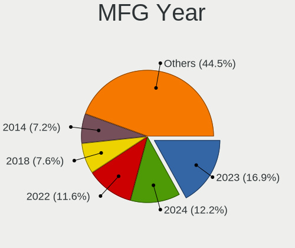
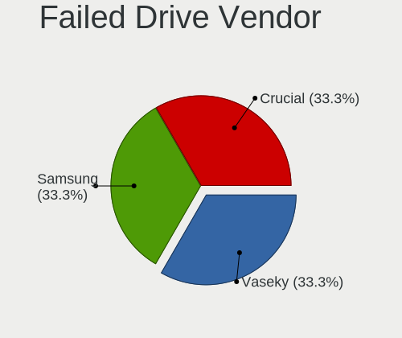
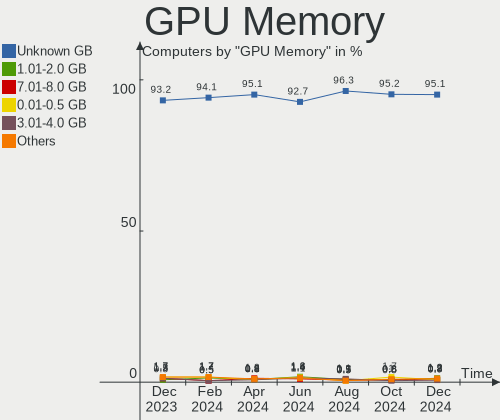
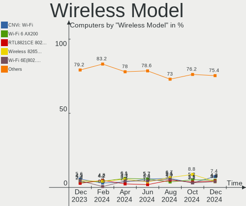
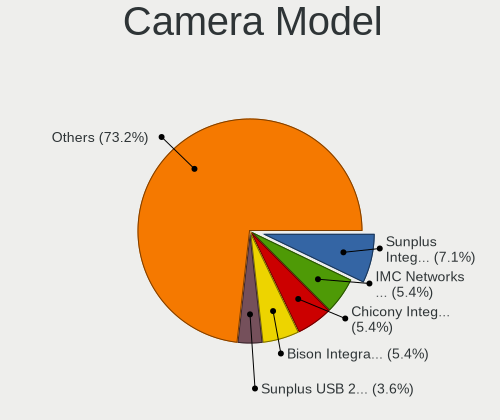

BSD Hardware Trends
-------------------

A project to identify most popular hardware characteristics and track their change
over time based on data collected by BSD users at https://BSD-Hardware.info.

Anyone can contribute to this report by the [hw-probe](https://github.com/linuxhw/hw-probe/blob/master/INSTALL.BSD.md) tool:

    hw-probe -all -upload

This is a report for all computer types. See also reports for [desktops](/Desktop/README.md) and [notebooks](/Notebook/README.md).

Full-feature report is available here: https://bsd-hardware.info/?view=trends

OS-specific reports: [FreeBSD](/Dist/FreeBSD), [OPNsense](/Dist/OPNsense), [helloSystem](/Dist/helloSystem), [OpenBSD](/Dist/OpenBSD).

Period: Oct, 2021.

Contents
--------

* [ System ](#system)
  - [ OS                       ](#os)
  - [ OS Family                ](#os-family)
  - [ Arch                     ](#arch)
  - [ DE                       ](#de)
  - [ Display Server           ](#display-server)
  - [ Display Manager          ](#display-manager)
  - [ OS Lang                  ](#os-lang)
  - [ Boot Mode                ](#boot-mode)
  - [ Filesystem               ](#filesystem)
  - [ Part. scheme             ](#part-scheme)

* [ Board ](#board)
  - [ Vendor                   ](#vendor)
  - [ Model                    ](#model)
  - [ Model Family             ](#model-family)
  - [ MFG Year                 ](#mfg-year)
  - [ Form Factor              ](#form-factor)
  - [ Coreboot                 ](#coreboot)
  - [ RAM Size                 ](#ram-size)
  - [ RAM Used                 ](#ram-used)
  - [ Total Drives             ](#total-drives)
  - [ Has CD-ROM               ](#has-cd-rom)
  - [ Has Ethernet             ](#has-ethernet)
  - [ Has WiFi                 ](#has-wifi)
  - [ Has Bluetooth            ](#has-bluetooth)

* [ Location ](#location)
  - [ Country                  ](#country)
  - [ City                     ](#city)

* [ Drives ](#drives)
  - [ Drive Vendor             ](#drive-vendor)
  - [ Drive Model              ](#drive-model)
  - [ HDD Vendor               ](#hdd-vendor)
  - [ SSD Vendor               ](#ssd-vendor)
  - [ Drive Kind               ](#drive-kind)
  - [ Drive Connector          ](#drive-connector)
  - [ Drive Size               ](#drive-size)
  - [ Space Total              ](#space-total)
  - [ Space Used               ](#space-used)
  - [ Malfunc. Drives          ](#malfunc-drives)
  - [ Malfunc. Drive Vendor    ](#malfunc-drive-vendor)
  - [ Malfunc. HDD Vendor      ](#malfunc-hdd-vendor)
  - [ Malfunc. Drive Kind      ](#malfunc-drive-kind)
  - [ Failed Drives            ](#failed-drives)
  - [ Failed Drive Vendor      ](#failed-drive-vendor)
  - [ Drive Status             ](#drive-status)

* [ Storage controller ](#storage-controller)
  - [ Storage Vendor           ](#storage-vendor)
  - [ Storage Model            ](#storage-model)
  - [ Storage Kind             ](#storage-kind)

* [ Processor ](#processor)
  - [ CPU Vendor               ](#cpu-vendor)
  - [ CPU Model                ](#cpu-model)
  - [ CPU Model Family         ](#cpu-model-family)
  - [ CPU Cores                ](#cpu-cores)
  - [ CPU Sockets              ](#cpu-sockets)
  - [ CPU Threads              ](#cpu-threads)
  - [ CPU Microarch            ](#cpu-microarch)

* [ Graphics ](#graphics)
  - [ GPU Vendor               ](#gpu-vendor)
  - [ GPU Model                ](#gpu-model)
  - [ GPU Combo                ](#gpu-combo)
  - [ GPU Driver               ](#gpu-driver)
  - [ GPU Memory               ](#gpu-memory)

* [ Monitor ](#monitor)
  - [ Monitor Vendor           ](#monitor-vendor)
  - [ Monitor Model            ](#monitor-model)
  - [ Monitor Resolution       ](#monitor-resolution)
  - [ Monitor Diagonal         ](#monitor-diagonal)
  - [ Monitor Width            ](#monitor-width)
  - [ Aspect Ratio             ](#aspect-ratio)
  - [ Monitor Area             ](#monitor-area)
  - [ Pixel Density            ](#pixel-density)
  - [ Multiple Monitors        ](#multiple-monitors)

* [ Network ](#network)
  - [ Net Controller Vendor    ](#net-controller-vendor)
  - [ Net Controller Model     ](#net-controller-model)
  - [ Wireless Vendor          ](#wireless-vendor)
  - [ Wireless Model           ](#wireless-model)
  - [ Ethernet Vendor          ](#ethernet-vendor)
  - [ Ethernet Model           ](#ethernet-model)
  - [ Net Controller Kind      ](#net-controller-kind)
  - [ Used Controller          ](#used-controller)
  - [ NICs                     ](#nics)
  - [ IPv6                     ](#ipv6)

* [ Bluetooth ](#bluetooth)
  - [ Bluetooth Vendor         ](#bluetooth-vendor)
  - [ Bluetooth Model          ](#bluetooth-model)

* [ Sound ](#sound)
  - [ Sound Vendor             ](#sound-vendor)
  - [ Sound Model              ](#sound-model)

* [ Memory ](#memory)
  - [ Memory Vendor            ](#memory-vendor)
  - [ Memory Model             ](#memory-model)
  - [ Memory Kind              ](#memory-kind)
  - [ Memory Form Factor       ](#memory-form-factor)
  - [ Memory Size              ](#memory-size)
  - [ Memory Speed             ](#memory-speed)

* [ Printers & scanners ](#printers--scanners)
  - [ Printer Vendor           ](#printer-vendor)
  - [ Printer Model            ](#printer-model)
  - [ Scanner Vendor           ](#scanner-vendor)
  - [ Scanner Model            ](#scanner-model)

* [ Camera ](#camera)
  - [ Camera Vendor            ](#camera-vendor)
  - [ Camera Model             ](#camera-model)

* [ Security ](#security)
  - [ Fingerprint Vendor       ](#fingerprint-vendor)
  - [ Fingerprint Model        ](#fingerprint-model)
  - [ Chipcard Vendor          ](#chipcard-vendor)
  - [ Chipcard Model           ](#chipcard-model)

* [ Unsupported ](#unsupported)
  - [ Unsupported Devices      ](#unsupported-devices)
  - [ Unsupported Device Types ](#unsupported-device-types)

System
------

OS
--

Installed operating systems

| Name                         | Computers | Percent |
|------------------------------|-----------|---------|
| OPNsense 21.7.3              | 161       | 39.95%  |
| helloSystem 0.6.0            | 52        | 12.9%   |
| OPNsense 21.7.4              | 35        | 8.68%   |
| FreeBSD 13.0-p4              | 35        | 8.68%   |
| OpenBSD 7.0                  | 18        | 4.47%   |
| helloSystem 0.5.0            | 14        | 3.47%   |
| FreeBSD 13.0                 | 13        | 3.23%   |
| FreeBSD 13.0-STABLE          | 9         | 2.23%   |
| FreeBSD 14.0-CURRENT         | 7         | 1.74%   |
| NomadBSD 5806f915            | 6         | 1.49%   |
| OPNsense 21.7.2              | 5         | 1.24%   |
| OpenBSD 6.9                  | 5         | 1.24%   |
| FreeBSD 12.2-p10             | 4         | 0.99%   |
| OPNsense 21.7                | 3         | 0.74%   |
| OPNsense 21.1.9              | 3         | 0.74%   |
| NetBSD 9.2                   | 3         | 0.74%   |
| GhostBSD 21.08.27            | 3         | 0.74%   |
| TrueNAS 12.2-p9              | 2         | 0.5%    |
| TrueNAS 12.2-p10             | 2         | 0.5%    |
| OPNsense 21.7.1              | 2         | 0.5%    |
| OPNsense 20.7.8              | 2         | 0.5%    |
| OPNsense 12.1-p20-HBSD       | 2         | 0.5%    |
| MidnightBSD 2.1.1            | 2         | 0.5%    |
| helloSystem 0.7.0            | 2         | 0.5%    |
| GhostBSD 20.04.02            | 2         | 0.5%    |
| XigmaNAS 12.2                | 1         | 0.25%   |
| pfSense 2.5.0                | 1         | 0.25%   |
| OPNsense 21.1.5              | 1         | 0.25%   |
| OPNsense 21.1                | 1         | 0.25%   |
| HardenedBSD 13.0-STABLE-HBSD | 1         | 0.25%   |
| FreeBSD 13.0-p2              | 1         | 0.25%   |
| FreeBSD 12.2-p9              | 1         | 0.25%   |
| FreeBSD 12.2-p6              | 1         | 0.25%   |
| FreeBSD 12.2-p4              | 1         | 0.25%   |
| FreeBSD 12.2                 | 1         | 0.25%   |
| Arch 14.0-CURRENT            | 1         | 0.25%   |

OS Family
---------

OS without a version

| Name        | Computers | Percent |
|-------------|-----------|---------|
| OPNsense    | 215       | 53.35%  |
| FreeBSD     | 73        | 18.11%  |
| helloSystem | 68        | 16.87%  |
| OpenBSD     | 23        | 5.71%   |
| NomadBSD    | 6         | 1.49%   |
| GhostBSD    | 5         | 1.24%   |
| TrueNAS     | 4         | 0.99%   |
| NetBSD      | 3         | 0.74%   |
| MidnightBSD | 2         | 0.5%    |
| XigmaNAS    | 1         | 0.25%   |
| pfSense     | 1         | 0.25%   |
| HardenedBSD | 1         | 0.25%   |
| Arch        | 1         | 0.25%   |

Arch
----

OS architecture (x86_64, i586, etc.)

| Name  | Computers | Percent |
|-------|-----------|---------|
| amd64 | 387       | 96.03%  |
| arm64 | 9         | 2.23%   |
| i386  | 7         | 1.74%   |

DE
--

Desktop Environment

| Name         | Computers | Percent |
|--------------|-----------|---------|
| Console      | 250       | 62.03%  |
| helloDesktop | 67        | 16.63%  |
| XFCE         | 17        | 4.22%   |
| fvwm         | 17        | 4.22%   |
| Openbox      | 10        | 2.48%   |
| MATE         | 9         | 2.23%   |
| KDE5         | 8         | 1.99%   |
| TWM          | 7         | 1.74%   |
| i3           | 6         | 1.49%   |
| GNOME        | 4         | 0.99%   |
| Cinnamon     | 2         | 0.5%    |
| PekWM        | 1         | 0.25%   |
| LXQt         | 1         | 0.25%   |
| Lumina       | 1         | 0.25%   |
| Fluxbox      | 1         | 0.25%   |
| dwm          | 1         | 0.25%   |
| ctwm         | 1         | 0.25%   |

Display Server
--------------

X11 or Wayland

| Name    | Computers | Percent |
|---------|-----------|---------|
| Console | 252       | 62.53%  |
| X11     | 151       | 37.47%  |

Display Manager
---------------

SDDM, LightDM, etc.

| Name    | Computers | Percent |
|---------|-----------|---------|
| Console | 289       | 71.71%  |
| SLiM    | 86        | 21.34%  |
| SDDM    | 9         | 2.23%   |
| LightDM | 8         | 1.99%   |
| GDM     | 6         | 1.49%   |
| XDM     | 5         | 1.24%   |

OS Lang
-------

Language

| Lang            | Computers | Percent |
|-----------------|-----------|---------|
| Unknown         | 249       | 61.79%  |
| en_US           | 91        | 22.58%  |
| C               | 49        | 12.16%  |
| de_DE           | 4         | 0.99%   |
| ru_RU           | 2         | 0.5%    |
| en_AU           | 2         | 0.5%    |
| zh_CN.GB2312    | 1         | 0.25%   |
| pt_BR           | 1         | 0.25%   |
| en_US.ISO8859-1 | 1         | 0.25%   |
| en_GB           | 1         | 0.25%   |
| en_CA           | 1         | 0.25%   |
| de_CH           | 1         | 0.25%   |

Boot Mode
---------

EFI or BIOS

| Mode | Computers | Percent |
|------|-----------|---------|
| EFI  | 329       | 81.64%  |
| BIOS | 74        | 18.36%  |

Filesystem
----------

Type of filesystem

| Type    | Computers | Percent |
|---------|-----------|---------|
| Ufs     | 196       | 48.64%  |
| Zfs     | 183       | 45.41%  |
| Ffs     | 23        | 5.71%   |
| Unknown | 1         | 0.25%   |

Part. scheme
------------

Scheme of partitioning

| Type    | Computers | Percent |
|---------|-----------|---------|
| GPT     | 361       | 89.58%  |
| MBR     | 38        | 9.43%   |
| Unknown | 4         | 0.99%   |

Board
-----

Vendor
------

Motherboard manufacturer

| Name                                       | Computers | Percent |
|--------------------------------------------|-----------|---------|
| Hewlett-Packard                            | 47        | 11.66%  |
| Dell                                       | 41        | 10.17%  |
| Lenovo                                     | 40        | 9.93%   |
| ASUSTek Computer                           | 35        | 8.68%   |
| Unknown                                    | 28        | 6.95%   |
| Supermicro                                 | 27        | 6.7%    |
| MSI                                        | 19        | 4.71%   |
| Intel                                      | 19        | 4.71%   |
| Gigabyte Technology                        | 16        | 3.97%   |
| ASRock                                     | 14        | 3.47%   |
| Protectli                                  | 12        | 2.98%   |
| PC Engines                                 | 11        | 2.73%   |
| Acer                                       | 11        | 2.73%   |
| Apple                                      | 6         | 1.49%   |
| BESSTAR Tech                               | 5         | 1.24%   |
| Toshiba                                    | 4         | 0.99%   |
| Sophos                                     | 4         | 0.99%   |
| Fujitsu                                    | 4         | 0.99%   |
| Deciso                                     | 4         | 0.99%   |
| Raspberry Pi Foundation                    | 3         | 0.74%   |
| AMI                                        | 3         | 0.74%   |
| ZOTAC                                      | 2         | 0.5%    |
| Winston Marriot                            | 2         | 0.5%    |
| Sony                                       | 2         | 0.5%    |
| Shuttle                                    | 2         | 0.5%    |
| SeeedStudio                                | 2         | 0.5%    |
| Panasonic                                  | 2         | 0.5%    |
| Matsushita Electric Industrial             | 2         | 0.5%    |
| HPE                                        | 2         | 0.5%    |
| HARDKERNEL                                 | 2         | 0.5%    |
| Google                                     | 2         | 0.5%    |
| Framework                                  | 2         | 0.5%    |
| Beckhoff Automation                        | 2         | 0.5%    |
| AZW                                        | 2         | 0.5%    |
| AOpen                                      | 2         | 0.5%    |
| AAEON                                      | 2         | 0.5%    |
| Silicom                                    | 1         | 0.25%   |
| ShenZhen MinWin Technology                 | 1         | 0.25%   |
| Samsung Electronics                        | 1         | 0.25%   |
| radxa                                      | 1         | 0.25%   |
| Pegatron                                   | 1         | 0.25%   |
| Medion                                     | 1         | 0.25%   |
| Kontron Europe                             | 1         | 0.25%   |
| Itautec                                    | 1         | 0.25%   |
| IBM                                        | 1         | 0.25%   |
| GPD                                        | 1         | 0.25%   |
| Foxconn                                    | 1         | 0.25%   |
| Edelweiss                                  | 1         | 0.25%   |
| ECS                                        | 1         | 0.25%   |
| Colorful YuGong Technology And Development | 1         | 0.25%   |
| Chuwi                                      | 1         | 0.25%   |
| Barracuda Networks                         | 1         | 0.25%   |
| ASRockRack                                 | 1         | 0.25%   |
| AEWIN                                      | 1         | 0.25%   |
| ADI Engineering                            | 1         | 0.25%   |
| Acidanthera                                | 1         | 0.25%   |

Model
-----

Motherboard model

| Name                                              | Computers | Percent |
|---------------------------------------------------|-----------|---------|
| Unknown                                           | 29        | 7.2%    |
| Intel Q3XXG4-P V1.0                               | 10        | 2.48%   |
| PC Engines APU2                                   | 7         | 1.74%   |
| Protectli FW4B                                    | 6         | 1.49%   |
| Protectli FW6                                     | 4         | 0.99%   |
| Dell PowerEdge R210 II                            | 4         | 0.99%   |
| Deciso Netboard A20                               | 4         | 0.99%   |
| Supermicro Super Server                           | 3         | 0.74%   |
| Sophos SG                                         | 3         | 0.74%   |
| Supermicro X9SCI/X9SCA                            | 2         | 0.5%    |
| Supermicro X8SIL                                  | 2         | 0.5%    |
| Supermicro X7SPA-HF                               | 2         | 0.5%    |
| Supermicro X10SLM+-LN4F                           | 2         | 0.5%    |
| Supermicro X10SLH-N6-ST031                        | 2         | 0.5%    |
| Supermicro A1SAi                                  | 2         | 0.5%    |
| SeeedStudio ODYSSEY-X86J4105                      | 2         | 0.5%    |
| RPi Raspberry Pi                                  | 2         | 0.5%    |
| PC Engines APU                                    | 2         | 0.5%    |
| HPE ProLiant MicroServer Gen10                    | 2         | 0.5%    |
| HP ProLiant DL360 G7                              | 2         | 0.5%    |
| HP EliteDesk 800 G1 SFF                           | 2         | 0.5%    |
| HP Compaq Elite 8300 SFF                          | 2         | 0.5%    |
| HARDKERNEL ODROID-H2                              | 2         | 0.5%    |
| Gigabyte J1900N-D3V                               | 2         | 0.5%    |
| Framework Laptop                                  | 2         | 0.5%    |
| Dell PowerEdge T310                               | 2         | 0.5%    |
| Dell PowerEdge R440                               | 2         | 0.5%    |
| Dell OptiPlex 9020                                | 2         | 0.5%    |
| Dell OptiPlex 7010                                | 2         | 0.5%    |
| Dell OptiPlex 3020                                | 2         | 0.5%    |
| BESSTAR Tech GK41                                 | 2         | 0.5%    |
| AZW GK55                                          | 2         | 0.5%    |
| ASUS All Series                                   | 2         | 0.5%    |
| Apple MacPro5,1                                   | 2         | 0.5%    |
| AMI Aptio CRB                                     | 2         | 0.5%    |
| ZOTAC ZBOX-RI323NANO                              | 1         | 0.25%   |
| ZOTAC ZBOX-CI329NANO                              | 1         | 0.25%   |
| Winston Marriot PICO PC  PICOPC                   | 1         | 0.25%   |
| Winston Marriot PICO PC                           | 1         | 0.25%   |
| Toshiba Satellite S55t-B                          | 1         | 0.25%   |
| Toshiba dynabook Satellite B453/L                 | 1         | 0.25%   |
| Toshiba dynabook RX3 SM240E/3HD                   | 1         | 0.25%   |
| Toshiba Dakar10FW8                                | 1         | 0.25%   |
| Supermicro X9SAE                                  | 1         | 0.25%   |
| Supermicro X8DTU                                  | 1         | 0.25%   |
| Supermicro X7SBL                                  | 1         | 0.25%   |
| Supermicro X11SCE-F                               | 1         | 0.25%   |
| Supermicro X10SRA                                 | 1         | 0.25%   |
| Supermicro X10SL7-F                               | 1         | 0.25%   |
| Supermicro TS-150                                 | 1         | 0.25%   |
| Supermicro SSG-5028R-E1CR12L-CE010                | 1         | 0.25%   |
| Supermicro ReadyDATA 5200                         | 1         | 0.25%   |
| Supermicro PIO-518D-N6TRF-ST031                   | 1         | 0.25%   |
| Supermicro AS -5019D-FTN4                         | 1         | 0.25%   |
| Supermicro 1HE Intel Single-CPU RI1102H-XE Server | 1         | 0.25%   |
| Sophos XG                                         | 1         | 0.25%   |
| Sony VJS121C11N                                   | 1         | 0.25%   |
| Sony SVS1511AJB                                   | 1         | 0.25%   |
| Silicom Minnowboard Turbot D0/D1 PLATFORM         | 1         | 0.25%   |
| Shuttle DS81D                                     | 1         | 0.25%   |

Model Family
------------

Motherboard model prefix

| Name                         | Computers | Percent |
|------------------------------|-----------|---------|
| Unknown                      | 29        | 7.2%    |
| Lenovo ThinkPad              | 22        | 5.46%   |
| Dell PowerEdge               | 15        | 3.72%   |
| Dell OptiPlex                | 14        | 3.47%   |
| HP ProLiant                  | 12        | 2.98%   |
| Lenovo ThinkCentre           | 11        | 2.73%   |
| Intel Q3XXG4-P               | 10        | 2.48%   |
| Acer Aspire                  | 8         | 1.99%   |
| PC Engines APU2              | 7         | 1.74%   |
| HP ProDesk                   | 7         | 1.74%   |
| Protectli FW4B               | 6         | 1.49%   |
| HP Compaq                    | 6         | 1.49%   |
| Dell Inspiron                | 5         | 1.24%   |
| ASUS TUF                     | 5         | 1.24%   |
| ASUS PRIME                   | 5         | 1.24%   |
| Protectli FW6                | 4         | 0.99%   |
| HP Pavilion                  | 4         | 0.99%   |
| Deciso Netboard              | 4         | 0.99%   |
| Supermicro Super             | 3         | 0.74%   |
| Sophos SG                    | 3         | 0.74%   |
| RPi Raspberry                | 3         | 0.74%   |
| HP EliteDesk                 | 3         | 0.74%   |
| Acer Veriton                 | 3         | 0.74%   |
| Winston Marriot PICO         | 2         | 0.5%    |
| Toshiba dynabook             | 2         | 0.5%    |
| Supermicro X9SCI             | 2         | 0.5%    |
| Supermicro X8SIL             | 2         | 0.5%    |
| Supermicro X7SPA-HF          | 2         | 0.5%    |
| Supermicro X10SLM+-LN4F      | 2         | 0.5%    |
| Supermicro X10SLH-N6-ST031   | 2         | 0.5%    |
| Supermicro A1SAi             | 2         | 0.5%    |
| SeeedStudio ODYSSEY-X86J4105 | 2         | 0.5%    |
| PC Engines APU               | 2         | 0.5%    |
| Lenovo IdeaPad               | 2         | 0.5%    |
| HPE ProLiant                 | 2         | 0.5%    |
| HP ENVY                      | 2         | 0.5%    |
| HP EliteBook                 | 2         | 0.5%    |
| HARDKERNEL ODROID-H2         | 2         | 0.5%    |
| Gigabyte J1900N-D3V          | 2         | 0.5%    |
| Gigabyte B450M               | 2         | 0.5%    |
| Fujitsu FUTRO                | 2         | 0.5%    |
| Fujitsu ESPRIMO              | 2         | 0.5%    |
| Framework Laptop             | 2         | 0.5%    |
| Dell XPS                     | 2         | 0.5%    |
| Dell Latitude                | 2         | 0.5%    |
| BESSTAR Tech GK41            | 2         | 0.5%    |
| AZW GK55                     | 2         | 0.5%    |
| ASUS All                     | 2         | 0.5%    |
| ASRock X570                  | 2         | 0.5%    |
| Apple MacPro5                | 2         | 0.5%    |
| AMI Aptio                    | 2         | 0.5%    |
| ZOTAC ZBOX-RI323NANO         | 1         | 0.25%   |
| ZOTAC ZBOX-CI329NANO         | 1         | 0.25%   |
| Toshiba Satellite            | 1         | 0.25%   |
| Toshiba Dakar10FW8           | 1         | 0.25%   |
| Supermicro X9SAE             | 1         | 0.25%   |
| Supermicro X8DTU             | 1         | 0.25%   |
| Supermicro X7SBL             | 1         | 0.25%   |
| Supermicro X11SCE-F          | 1         | 0.25%   |
| Supermicro X10SRA            | 1         | 0.25%   |

MFG Year
--------

Motherboard manufacture year

| Year    | Computers | Percent |
|---------|-----------|---------|
| 2020    | 64        | 15.88%  |
| 2021    | 63        | 15.63%  |
| 2019    | 61        | 15.14%  |
| 2018    | 55        | 13.65%  |
| 2014    | 23        | 5.71%   |
| 2011    | 22        | 5.46%   |
| 2012    | 19        | 4.71%   |
| 2015    | 17        | 4.22%   |
| 2016    | 15        | 3.72%   |
| 2013    | 14        | 3.47%   |
| 2017    | 13        | 3.23%   |
| 2010    | 10        | 2.48%   |
| 2009    | 7         | 1.74%   |
| 2008    | 6         | 1.49%   |
| Unknown | 6         | 1.49%   |
| 2006    | 3         | 0.74%   |
| 2007    | 2         | 0.5%    |
| 2005    | 2         | 0.5%    |
| 2002    | 1         | 0.25%   |

Form Factor
-----------

Physical design of the computer

| Name           | Computers | Percent |
|----------------|-----------|---------|
| Desktop        | 238       | 59.06%  |
| Notebook       | 95        | 23.57%  |
| Server         | 38        | 9.43%   |
| Mini pc        | 17        | 4.22%   |
| Firewall       | 5         | 1.24%   |
| System on chip | 4         | 0.99%   |
| All in one     | 4         | 0.99%   |
| Other          | 1         | 0.25%   |
| Convertible    | 1         | 0.25%   |

Coreboot
--------

Have coreboot on board

| Used | Computers | Percent |
|------|-----------|---------|
| No   | 382       | 94.79%  |
| Yes  | 21        | 5.21%   |

RAM Size
--------

Total RAM memory

| Size in GB  | Computers | Percent |
|-------------|-----------|---------|
| 8.01-16.0   | 148       | 36.72%  |
| 16.01-24.0  | 95        | 23.57%  |
| 4.01-8.0    | 82        | 20.35%  |
| 32.01-64.0  | 39        | 9.68%   |
| 2.01-3.0    | 12        | 2.98%   |
| 64.01-256.0 | 10        | 2.48%   |
| 3.01-4.0    | 7         | 1.74%   |
| 24.01-32.0  | 4         | 0.99%   |
| 1.01-2.0    | 3         | 0.74%   |
| 0.51-1.0    | 3         | 0.74%   |

RAM Used
--------

Used RAM memory

| Used GB    | Computers | Percent |
|------------|-----------|---------|
| 0.01-0.5   | 204       | 50.62%  |
| 0.51-1.0   | 116       | 28.78%  |
| 1.01-2.0   | 43        | 10.67%  |
| 2.01-3.0   | 11        | 2.73%   |
| 3.01-4.0   | 10        | 2.48%   |
| 4.01-8.0   | 5         | 1.24%   |
| 8.01-16.0  | 5         | 1.24%   |
| Unknown    | 3         | 0.74%   |
| 24.01-32.0 | 2         | 0.5%    |
| 0          | 2         | 0.5%    |
| 32.01-64.0 | 1         | 0.25%   |
| 16.01-24.0 | 1         | 0.25%   |

Total Drives
------------

Number of drives on board

| Drives | Computers | Percent |
|--------|-----------|---------|
| 1      | 265       | 65.76%  |
| 2      | 59        | 14.64%  |
| 0      | 38        | 9.43%   |
| 3      | 13        | 3.23%   |
| 4      | 12        | 2.98%   |
| 5      | 6         | 1.49%   |
| 6      | 4         | 0.99%   |
| 14     | 2         | 0.5%    |
| 21     | 1         | 0.25%   |
| 13     | 1         | 0.25%   |
| 9      | 1         | 0.25%   |
| 7      | 1         | 0.25%   |

Has CD-ROM
----------

Has CD-ROM on board

| Presented | Computers | Percent |
|-----------|-----------|---------|
| No        | 308       | 76.43%  |
| Yes       | 95        | 23.57%  |

Has Ethernet
------------

Has Ethernet on board

| Presented | Computers | Percent |
|-----------|-----------|---------|
| Yes       | 380       | 94.29%  |
| No        | 23        | 5.71%   |

Has WiFi
--------

Has WiFi module

| Presented | Computers | Percent |
|-----------|-----------|---------|
| No        | 249       | 61.79%  |
| Yes       | 154       | 38.21%  |

Has Bluetooth
-------------

Has Bluetooth module

| Presented | Computers | Percent |
|-----------|-----------|---------|
| No        | 303       | 75.19%  |
| Yes       | 100       | 24.81%  |

Location
--------

Country
-------

Geographic location (country)

| Country            | Computers | Percent |
|--------------------|-----------|---------|
| USA                | 116       | 28.78%  |
| Germany            | 57        | 14.14%  |
| Russia             | 20        | 4.96%   |
| Canada             | 19        | 4.71%   |
| UK                 | 15        | 3.72%   |
| France             | 14        | 3.47%   |
| China              | 14        | 3.47%   |
| Poland             | 13        | 3.23%   |
| Switzerland        | 12        | 2.98%   |
| Australia          | 11        | 2.73%   |
| Netherlands        | 8         | 1.99%   |
| Japan              | 8         | 1.99%   |
| Austria            | 8         | 1.99%   |
| Brazil             | 7         | 1.74%   |
| Sweden             | 6         | 1.49%   |
| Spain              | 6         | 1.49%   |
| Italy              | 5         | 1.24%   |
| Denmark            | 5         | 1.24%   |
| Ukraine            | 4         | 0.99%   |
| Indonesia          | 4         | 0.99%   |
| Romania            | 3         | 0.74%   |
| New Zealand        | 3         | 0.74%   |
| Chile              | 3         | 0.74%   |
| Turkey             | 2         | 0.5%    |
| Thailand           | 2         | 0.5%    |
| South Korea        | 2         | 0.5%    |
| Saudi Arabia       | 2         | 0.5%    |
| Portugal           | 2         | 0.5%    |
| Peru               | 2         | 0.5%    |
| Jamaica            | 2         | 0.5%    |
| India              | 2         | 0.5%    |
| Czechia            | 2         | 0.5%    |
| Bulgaria           | 2         | 0.5%    |
| Belarus            | 2         | 0.5%    |
| Venezuela          | 1         | 0.25%   |
| Taiwan             | 1         | 0.25%   |
| Slovenia           | 1         | 0.25%   |
| Slovakia           | 1         | 0.25%   |
| Singapore          | 1         | 0.25%   |
| Serbia             | 1         | 0.25%   |
| Qatar              | 1         | 0.25%   |
| Norway             | 1         | 0.25%   |
| Mexico             | 1         | 0.25%   |
| Malta              | 1         | 0.25%   |
| Malaysia           | 1         | 0.25%   |
| Lithuania          | 1         | 0.25%   |
| Libya              | 1         | 0.25%   |
| Hungary            | 1         | 0.25%   |
| Guatemala          | 1         | 0.25%   |
| Greece             | 1         | 0.25%   |
| Finland            | 1         | 0.25%   |
| Dominican Republic | 1         | 0.25%   |
| Belgium            | 1         | 0.25%   |
| Argentina          | 1         | 0.25%   |

City
----

Geographic location (city)

| City                      | Computers | Percent |
|---------------------------|-----------|---------|
| Montreal                  | 7         | 1.74%   |
| Munich                    | 5         | 1.24%   |
| Krasnodar                 | 5         | 1.24%   |
| Vienna                    | 4         | 0.99%   |
| New York                  | 4         | 0.99%   |
| Miedziana Gora            | 4         | 0.99%   |
| Berlin                    | 4         | 0.99%   |
| Warsaw                    | 3         | 0.74%   |
| Setagaya-ku               | 3         | 0.74%   |
| Seattle                   | 3         | 0.74%   |
| Rochester                 | 3         | 0.74%   |
| Moscow                    | 3         | 0.74%   |
| Irvine                    | 3         | 0.74%   |
| Gordola                   | 3         | 0.74%   |
| Bucharest                 | 3         | 0.74%   |
| Ypsilanti                 | 2         | 0.5%    |
| Yekaterinburg             | 2         | 0.5%    |
| West Valley City          | 2         | 0.5%    |
| Tumba                     | 2         | 0.5%    |
| Trenton                   | 2         | 0.5%    |
| Sydney                    | 2         | 0.5%    |
| Stuttgart                 | 2         | 0.5%    |
| Stoke-on-Trent            | 2         | 0.5%    |
| St Petersburg             | 2         | 0.5%    |
| Springfield               | 2         | 0.5%    |
| Shenzhen                  | 2         | 0.5%    |
| Seyssinet-Pariset         | 2         | 0.5%    |
| Santiago                  | 2         | 0.5%    |
| San Francisco             | 2         | 0.5%    |
| San Antonio               | 2         | 0.5%    |
| Salem                     | 2         | 0.5%    |
| Riyadh                    | 2         | 0.5%    |
| Rietberg                  | 2         | 0.5%    |
| Riehen                    | 2         | 0.5%    |
| Portland                  | 2         | 0.5%    |
| Phoenix                   | 2         | 0.5%    |
| Perth                     | 2         | 0.5%    |
| Paris                     | 2         | 0.5%    |
| North Richland Hills      | 2         | 0.5%    |
| Morwell                   | 2         | 0.5%    |
| Minsk                     | 2         | 0.5%    |
| Minneapolis               | 2         | 0.5%    |
| Melbourne                 | 2         | 0.5%    |
| Lima                      | 2         | 0.5%    |
| Krakow                    | 2         | 0.5%    |
| Kongens Lyngby            | 2         | 0.5%    |
| Kirkland                  | 2         | 0.5%    |
| Kingston                  | 2         | 0.5%    |
| Jakarta                   | 2         | 0.5%    |
| Hicksville                | 2         | 0.5%    |
| Denver                    | 2         | 0.5%    |
| Dallas                    | 2         | 0.5%    |
| Buchholz in der Nordheide | 2         | 0.5%    |
| Beijing                   | 2         | 0.5%    |
| Barrington                | 2         | 0.5%    |
| Barcelona                 | 2         | 0.5%    |
| Auburn                    | 2         | 0.5%    |
| Zoetermeer                | 1         | 0.25%   |
| Zhukovskiy                | 1         | 0.25%   |
| Zaltbommel                | 1         | 0.25%   |

Drives
------

Drive Vendor
------------

Hard drive vendors

| Vendor                             | Computers | Drives | Percent |
|------------------------------------|-----------|--------|---------|
| WDC                                | 61        | 106    | 13.15%  |
| Samsung Electronics                | 58        | 66     | 12.5%   |
| Seagate                            | 47        | 78     | 10.13%  |
| Kingston                           | 31        | 35     | 6.68%   |
| Toshiba                            | 26        | 33     | 5.6%    |
| Intel                              | 26        | 34     | 5.6%    |
| Crucial                            | 24        | 30     | 5.17%   |
| SanDisk                            | 21        | 21     | 4.53%   |
| Hitachi                            | 13        | 15     | 2.8%    |
| HGST                               | 11        | 28     | 2.37%   |
| Hewlett-Packard                    | 11        | 17     | 2.37%   |
| Transcend                          | 9         | 9      | 1.94%   |
| Phison                             | 8         | 8      | 1.72%   |
| Corsair                            | 8         | 8      | 1.72%   |
| SK Hynix                           | 7         | 7      | 1.51%   |
| Hoodisk                            | 7         | 7      | 1.51%   |
| A-DATA Technology                  | 7         | 7      | 1.51%   |
| PNY                                | 6         | 6      | 1.29%   |
| Apacer                             | 6         | 6      | 1.29%   |
| NVMe                               | 5         | 5      | 1.08%   |
| Micron Technology                  | 5         | 5      | 1.08%   |
| SPCC                               | 4         | 4      | 0.86%   |
| OCZ                                | 4         | 4      | 0.86%   |
| BIWIN                              | 4         | 4      | 0.86%   |
| Silicon Motion                     | 3         | 3      | 0.65%   |
| PLEXTOR                            | 3         | 3      | 0.65%   |
| Patriot                            | 3         | 3      | 0.65%   |
| LITEONIT                           | 3         | 3      | 0.65%   |
| Intenso                            | 3         | 3      | 0.65%   |
| FORESEE                            | 3         | 3      | 0.65%   |
| Dogfish                            | 3         | 3      | 0.65%   |
| Protectli                          | 2         | 2      | 0.43%   |
| OPENBSD                            | 2         | 2      | 0.43%   |
| Netac                              | 2         | 2      | 0.43%   |
| Kston                              | 2         | 2      | 0.43%   |
| KIOXIA                             | 2         | 2      | 0.43%   |
| KingSpec                           | 2         | 2      | 0.43%   |
| China                              | 2         | 2      | 0.43%   |
| Apple                              | 2         | 2      | 0.43%   |
| VisionTek                          | 1         | 1      | 0.22%   |
| V-GeN                              | 1         | 1      | 0.22%   |
| Team                               | 1         | 2      | 0.22%   |
| Smartbuy                           | 1         | 1      | 0.22%   |
| SATADOM                            | 1         | 1      | 0.22%   |
| Product:              USB DISK 3.0 | 1         | 1      | 0.22%   |
| Mushkin                            | 1         | 1      | 0.22%   |
| LITEON                             | 1         | 1      | 0.22%   |
| Lexar                              | 1         | 1      | 0.22%   |
| Indilinx                           | 1         | 1      | 0.22%   |
| HPE                                | 1         | 2      | 0.22%   |
| GLOWAY                             | 1         | 1      | 0.22%   |
| Fujitsu                            | 1         | 1      | 0.22%   |
| Fordisk                            | 1         | 1      | 0.22%   |
| EMTEC                              | 1         | 1      | 0.22%   |
| BAITITON                           | 1         | 1      | 0.22%   |
| AMD                                | 1         | 1      | 0.22%   |
| Advantech                          | 1         | 1      | 0.22%   |

Drive Model
-----------

Hard drive models

| Model                              | Computers | Percent |
|------------------------------------|-----------|---------|
| Toshiba DT01ACA100 1TB             | 6         | 1.16%   |
| HP RAID 1(1+0) 450GB               | 6         | 1.16%   |
| Samsung SSD 860 EVO 500GB          | 5         | 0.97%   |
| Samsung SSD 860 EVO 250GB          | 5         | 0.97%   |
| Phison SATA SSD 16GB               | 5         | 0.97%   |
| Kingston SA400S37240G 240GB        | 5         | 0.97%   |
| Transcend TS256GMTS952T2 256GB     | 4         | 0.77%   |
| Toshiba MQ01ABF050 500GB           | 4         | 0.77%   |
| Seagate ST500DM002-1BD142 500GB    | 4         | 0.77%   |
| Seagate ST1000LM035-1RK172 1TB     | 4         | 0.77%   |
| Hoodisk SSD 128GB                  | 4         | 0.77%   |
| Crucial CT240BX500SSD1 240GB       | 4         | 0.77%   |
| Transcend TS128GMSA230S 128GB      | 3         | 0.58%   |
| Seagate ST4000DM000-1F2168 4TB     | 3         | 0.58%   |
| SanDisk SSD PLUS 240GB             | 3         | 0.58%   |
| Samsung SSD 870 EVO 250GB          | 3         | 0.58%   |
| Samsung MZ7LN128HCHP-000H1 128GB   | 3         | 0.58%   |
| PNY CS900 120GB SSD                | 3         | 0.58%   |
| HP RAID 0 450GB                    | 3         | 0.58%   |
| WDC WD3200BPVT-22JJ5T0 320GB       | 2         | 0.39%   |
| WDC WD20PURX-64P6ZY0 2TB           | 2         | 0.39%   |
| WDC WD10EZEX-08WN4A0 1TB           | 2         | 0.39%   |
| Toshiba MQ04ABF100 1TB             | 2         | 0.39%   |
| Toshiba DT01ACA050 500GB           | 2         | 0.39%   |
| SPCC Solid State Disk 128GB        | 2         | 0.39%   |
| Silicon Motion NE-256 256GB        | 2         | 0.39%   |
| Seagate ST9500325AS 500GB          | 2         | 0.39%   |
| Seagate ST2000NM0033-9ZM175 2TB    | 2         | 0.39%   |
| Seagate ST2000DL003-9VT166 2TB     | 2         | 0.39%   |
| Seagate ST1000LM048-2E7172 1TB     | 2         | 0.39%   |
| Seagate ST1000LM024 HN-M101MBB 1TB | 2         | 0.39%   |
| Samsung SSD 860 QVO 1TB            | 2         | 0.39%   |
| Samsung SSD 850 EVO 250GB          | 2         | 0.39%   |
| Samsung SSD 840 EVO 120GB          | 2         | 0.39%   |
| Samsung HD322HJ 320GB              | 2         | 0.39%   |
| Samsung Flash Drive FIT 32GB       | 2         | 0.39%   |
| Protectli 120GB mSATA              | 2         | 0.39%   |
| OPENBSD SR RAID 1 1TB              | 2         | 0.39%   |
| Kston SSD 128GB                    | 2         | 0.39%   |
| Kingston SV300S37A120G 120GB       | 2         | 0.39%   |
| Kingston SUV500MS240G 240GB        | 2         | 0.39%   |
| Kingston SUV500MS120G 120GB        | 2         | 0.39%   |
| Kingston SA400S37120G 120GB        | 2         | 0.39%   |
| Intel SSDSC2KW256G8 256GB          | 2         | 0.39%   |
| Intel SSDSC2BW120H6 120GB          | 2         | 0.39%   |
| Intel SSDSC2BB080G6 80GB           | 2         | 0.39%   |
| Intel SSDPEKKF512G8L 512GB         | 2         | 0.39%   |
| Hoodisk SSD 64GB                   | 2         | 0.39%   |
| Hitachi HDS721050CLA360 500GB      | 2         | 0.39%   |
| HGST HUS726060ALE614 6TB           | 2         | 0.39%   |
| HGST HTS721010A9E630 1TB           | 2         | 0.39%   |
| HGST HTS541010A9E680 1TB           | 2         | 0.39%   |
| FORESEE 64GB SSD                   | 2         | 0.39%   |
| Dogfish SSD 256GB                  | 2         | 0.39%   |
| Crucial CT525MX300SSD1 528GB       | 2         | 0.39%   |
| Crucial CT500MX500SSD1 500GB       | 2         | 0.39%   |
| Crucial CT275MX300SSD1 275GB       | 2         | 0.39%   |
| Crucial CT250MX500SSD1 250GB       | 2         | 0.39%   |
| Crucial CT120BX500SSD1 120GB       | 2         | 0.39%   |
| Crucial CT1000MX500SSD1 1TB        | 2         | 0.39%   |

HDD Vendor
----------

Hard disk drive vendors

| Vendor                             | Computers | Drives | Percent |
|------------------------------------|-----------|--------|---------|
| WDC                                | 49        | 91     | 30.06%  |
| Seagate                            | 45        | 76     | 27.61%  |
| Toshiba                            | 21        | 28     | 12.88%  |
| Hitachi                            | 13        | 15     | 7.98%   |
| HGST                               | 11        | 28     | 6.75%   |
| Hewlett-Packard                    | 10        | 16     | 6.13%   |
| Samsung Electronics                | 5         | 7      | 3.07%   |
| NVMe                               | 3         | 3      | 1.84%   |
| OPENBSD                            | 2         | 2      | 1.23%   |
| Product:              USB DISK 3.0 | 1         | 1      | 0.61%   |
| Lexar                              | 1         | 1      | 0.61%   |
| HPE                                | 1         | 2      | 0.61%   |
| Fujitsu                            | 1         | 1      | 0.61%   |

SSD Vendor
----------

Solid state drive vendors

| Vendor              | Computers | Drives | Percent |
|---------------------|-----------|--------|---------|
| Samsung Electronics | 38        | 43     | 15.08%  |
| Kingston            | 26        | 30     | 10.32%  |
| Intel               | 23        | 31     | 9.13%   |
| Crucial             | 22        | 27     | 8.73%   |
| SanDisk             | 21        | 21     | 8.33%   |
| Transcend           | 9         | 9      | 3.57%   |
| Phison              | 8         | 8      | 3.17%   |
| Hoodisk             | 7         | 7      | 2.78%   |
| WDC                 | 6         | 6      | 2.38%   |
| PNY                 | 6         | 6      | 2.38%   |
| Apacer              | 6         | 6      | 2.38%   |
| A-DATA Technology   | 6         | 6      | 2.38%   |
| Corsair             | 5         | 5      | 1.98%   |
| OCZ                 | 4         | 4      | 1.59%   |
| Micron Technology   | 4         | 4      | 1.59%   |
| BIWIN               | 4         | 4      | 1.59%   |
| SPCC                | 3         | 3      | 1.19%   |
| SK Hynix            | 3         | 3      | 1.19%   |
| PLEXTOR             | 3         | 3      | 1.19%   |
| Patriot             | 3         | 3      | 1.19%   |
| LITEONIT            | 3         | 3      | 1.19%   |
| Intenso             | 3         | 3      | 1.19%   |
| FORESEE             | 3         | 3      | 1.19%   |
| Dogfish             | 3         | 3      | 1.19%   |
| Toshiba             | 2         | 2      | 0.79%   |
| Seagate             | 2         | 2      | 0.79%   |
| Protectli           | 2         | 2      | 0.79%   |
| NVMe                | 2         | 2      | 0.79%   |
| Netac               | 2         | 2      | 0.79%   |
| Kston               | 2         | 2      | 0.79%   |
| KingSpec            | 2         | 2      | 0.79%   |
| China               | 2         | 2      | 0.79%   |
| Apple               | 2         | 2      | 0.79%   |
| VisionTek           | 1         | 1      | 0.4%    |
| V-GeN               | 1         | 1      | 0.4%    |
| Team                | 1         | 2      | 0.4%    |
| Smartbuy            | 1         | 1      | 0.4%    |
| SATADOM             | 1         | 1      | 0.4%    |
| Mushkin             | 1         | 1      | 0.4%    |
| LITEON              | 1         | 1      | 0.4%    |
| Indilinx            | 1         | 1      | 0.4%    |
| Hewlett-Packard     | 1         | 1      | 0.4%    |
| GLOWAY              | 1         | 1      | 0.4%    |
| Fordisk             | 1         | 1      | 0.4%    |
| EMTEC               | 1         | 1      | 0.4%    |
| BAITITON            | 1         | 1      | 0.4%    |
| AMD                 | 1         | 1      | 0.4%    |
| Advantech           | 1         | 1      | 0.4%    |

Drive Kind
----------

HDD or SSD

| Kind | Computers | Drives | Percent |
|------|-----------|--------|---------|
| SSD  | 236       | 275    | 56.87%  |
| HDD  | 129       | 271    | 31.08%  |
| NVMe | 50        | 54     | 12.05%  |

Drive Connector
---------------

SATA, SAS, NVMe, etc.

| Type | Computers | Drives | Percent |
|------|-----------|--------|---------|
| SATA | 333       | 546    | 86.95%  |
| NVMe | 50        | 54     | 13.05%  |

Drive Size
----------

Size of hard drive

| Size in TB | Computers | Drives | Percent |
|------------|-----------|--------|---------|
| 0.01-0.5   | 286       | 352    | 73.52%  |
| 0.51-1.0   | 59        | 79     | 15.17%  |
| 1.01-2.0   | 17        | 30     | 4.37%   |
| 3.01-4.0   | 9         | 19     | 2.31%   |
| 4.01-10.0  | 9         | 36     | 2.31%   |
| 2.01-3.0   | 8         | 28     | 2.06%   |
| 10.01-20.0 | 1         | 2      | 0.26%   |

Space Total
-----------

Amount of disk space available on the file system

| Size in GB     | Computers | Percent |
|----------------|-----------|---------|
| 101-250        | 149       | 36.97%  |
| 1-20           | 78        | 19.35%  |
| 251-500        | 56        | 13.9%   |
| 51-100         | 49        | 12.16%  |
| 21-50          | 33        | 8.19%   |
| 501-1000       | 21        | 5.21%   |
| 1001-2000      | 8         | 1.99%   |
| More than 3000 | 6         | 1.49%   |
| 2001-3000      | 2         | 0.5%    |
| Unknown        | 1         | 0.25%   |

Space Used
----------

Amount of used disk space

| Used GB   | Computers | Percent |
|-----------|-----------|---------|
| 1-20      | 369       | 91.56%  |
| 21-50     | 19        | 4.71%   |
| 101-250   | 5         | 1.24%   |
| 51-100    | 4         | 0.99%   |
| 251-500   | 3         | 0.74%   |
| 2001-3000 | 1         | 0.25%   |
| 501-1000  | 1         | 0.25%   |
| Unknown   | 1         | 0.25%   |

Malfunc. Drives
---------------

Drive models with a malfunction

| Model                              | Computers | Drives | Percent |
|------------------------------------|-----------|--------|---------|
| Toshiba MQ04ABF100 1TB             | 2         | 2      | 2.94%   |
| Toshiba DT01ACA100 1TB             | 2         | 2      | 2.94%   |
| Samsung Electronics HD322HJ 320GB  | 2         | 2      | 2.94%   |
| HGST HTS721010A9E630 1TB           | 2         | 2      | 2.94%   |
| Crucial CT275MX300SSD1 275GB       | 2         | 2      | 2.94%   |
| WDC WD5000AAKS-00V1A0 500GB        | 1         | 1      | 1.47%   |
| WDC WD4000AAKS-00C8A0 400GB        | 1         | 1      | 1.47%   |
| WDC WD3200BPVT-22JJ5T0 320GB       | 1         | 1      | 1.47%   |
| WDC WD3200BEVT-80A0RT0 320GB       | 1         | 1      | 1.47%   |
| WDC WD3200AAKS-00UU3A0 320GB       | 1         | 1      | 1.47%   |
| WDC WD30EZRX-22D8PB0 3TB           | 1         | 1      | 1.47%   |
| WDC WD20PURX-89P6ZY0 2TB           | 1         | 1      | 1.47%   |
| WDC WD20PURX-64P6ZY0 2TB           | 1         | 1      | 1.47%   |
| WDC WD20EURX-63T0FY0 2TB           | 1         | 1      | 1.47%   |
| WDC WD2002FYPS-02W3B0 2TB          | 1         | 1      | 1.47%   |
| WDC WD2000FYYZ 2TB                 | 1         | 2      | 1.47%   |
| WDC WD1600BEKT-66F3T2 160GB        | 1         | 1      | 1.47%   |
| WDC WD1600AAJS-22L7A0 160GB        | 1         | 1      | 1.47%   |
| WDC WD10EADS-00M2B0 1TB            | 1         | 1      | 1.47%   |
| VisionTek mSATA 120GB              | 1         | 1      | 1.47%   |
| V-GeN V-GEN08AS19FS120IT 120GB     | 1         | 1      | 1.47%   |
| Toshiba MQ01UBD100 1TB             | 1         | 1      | 1.47%   |
| Toshiba MQ01ABF050 500GB           | 1         | 1      | 1.47%   |
| Toshiba MQ01ABD100 1TB             | 1         | 1      | 1.47%   |
| Toshiba MQ01ABD032 320GB           | 1         | 1      | 1.47%   |
| Seagate ST980310AS 80GB            | 1         | 1      | 1.47%   |
| Seagate ST9320325AS 320GB          | 1         | 1      | 1.47%   |
| Seagate ST500LT012-9WS142 500GB    | 1         | 1      | 1.47%   |
| Seagate ST500LT012-1DG142 500GB    | 1         | 1      | 1.47%   |
| Seagate ST500LM021-1KJ152 500GB    | 1         | 1      | 1.47%   |
| Seagate ST500DM002-1BD142 500GB    | 1         | 1      | 1.47%   |
| Seagate ST3500413AS 500GB          | 1         | 1      | 1.47%   |
| Seagate ST3320311CS 320GB          | 1         | 1      | 1.47%   |
| Seagate ST3000NM0033-9ZM178 3TB    | 1         | 7      | 1.47%   |
| Seagate ST2000NM0033-9ZM175 2TB    | 1         | 1      | 1.47%   |
| Seagate ST2000DL003-9VT166 2TB     | 1         | 1      | 1.47%   |
| Seagate ST1000VM002-1SD102 1TB     | 1         | 1      | 1.47%   |
| Seagate ST1000LM035-1RK172 1TB     | 1         | 1      | 1.47%   |
| Seagate ST1000LM024 HN-M101MBB 1TB | 1         | 1      | 1.47%   |
| SanDisk SSD P4 16GB                | 1         | 1      | 1.47%   |
| SanDisk SD8TB8U-256G-1006 256GB    | 1         | 1      | 1.47%   |
| Samsung Electronics HM320JI 320GB  | 1         | 1      | 1.47%   |
| Samsung Electronics HD161HJ 160GB  | 1         | 1      | 1.47%   |
| Kingston SMS200S3120G 120GB        | 1         | 1      | 1.47%   |
| Intel SSDSC2BW120H6 120GB          | 1         | 1      | 1.47%   |
| Intel SSDSC2BF240A5 240GB          | 1         | 1      | 1.47%   |
| Intel SSDSC2BA200G3T 200GB         | 1         | 1      | 1.47%   |
| Intel SSDSA2M160G2GC 160GB         | 1         | 1      | 1.47%   |
| Intel SSDSA2M080G2GN 80GB          | 1         | 1      | 1.47%   |
| Intel SSDMCEAC060B3 64GB           | 1         | 1      | 1.47%   |
| Intel SSDMAEMC040G2 40GB           | 1         | 1      | 1.47%   |
| Hitachi HUA722020ALA330 2TB        | 1         | 2      | 1.47%   |
| Hitachi HTS725032A9A364 320GB      | 1         | 1      | 1.47%   |
| Hitachi HTS541680J9SA00 80GB       | 1         | 1      | 1.47%   |
| Hitachi HTS541080G9SA00 80GB       | 1         | 1      | 1.47%   |
| Hitachi HTS421260H9AT00 64GB       | 1         | 1      | 1.47%   |
| HGST HTS541010A9E680 1TB           | 1         | 1      | 1.47%   |
| GLOWAY FER60GS3-S7 64GB            | 1         | 1      | 1.47%   |
| Crucial CT525MX300SSD1 528GB       | 1         | 1      | 1.47%   |
| Crucial CT480M500SSD1 480GB        | 1         | 2      | 1.47%   |

Malfunc. Drive Vendor
---------------------

Vendors of faulty drives

| Vendor              | Computers | Drives | Percent |
|---------------------|-----------|--------|---------|
| WDC                 | 13        | 15     | 20.63%  |
| Seagate             | 11        | 20     | 17.46%  |
| Toshiba             | 8         | 8      | 12.7%   |
| Intel               | 7         | 7      | 11.11%  |
| Hitachi             | 5         | 6      | 7.94%   |
| Crucial             | 5         | 6      | 7.94%   |
| Samsung Electronics | 3         | 4      | 4.76%   |
| HGST                | 3         | 3      | 4.76%   |
| SanDisk             | 2         | 2      | 3.17%   |
| VisionTek           | 1         | 1      | 1.59%   |
| V-GeN               | 1         | 1      | 1.59%   |
| Kingston            | 1         | 1      | 1.59%   |
| GLOWAY              | 1         | 1      | 1.59%   |
| BIWIN               | 1         | 1      | 1.59%   |
| A-DATA Technology   | 1         | 1      | 1.59%   |

Malfunc. HDD Vendor
-------------------

Vendors of faulty HDD drives

| Vendor              | Computers | Drives | Percent |
|---------------------|-----------|--------|---------|
| WDC                 | 13        | 15     | 30.23%  |
| Seagate             | 11        | 20     | 25.58%  |
| Toshiba             | 8         | 8      | 18.6%   |
| Hitachi             | 5         | 6      | 11.63%  |
| Samsung Electronics | 3         | 4      | 6.98%   |
| HGST                | 3         | 3      | 6.98%   |

Malfunc. Drive Kind
-------------------

Kinds of faulty drives

| Kind | Computers | Drives | Percent |
|------|-----------|--------|---------|
| HDD  | 40        | 56     | 66.67%  |
| SSD  | 20        | 21     | 33.33%  |

Failed Drives
-------------

Failed drive models

| Model                                      | Computers | Drives | Percent |
|--------------------------------------------|-----------|--------|---------|
| WDC WD10SPZX-00Z10T0 1TB                   | 1         | 1      | 25%     |
| Micron Technology 1100_MTFDDAV256TBN 256GB | 1         | 1      | 25%     |
| Intel SSDSC2BW120H6 120GB                  | 1         | 1      | 25%     |
| Crucial M4-CT256M4SSD1 256GB               | 1         | 1      | 25%     |

Failed Drive Vendor
-------------------

Failed drive vendors

| Vendor            | Computers | Drives | Percent |
|-------------------|-----------|--------|---------|
| WDC               | 1         | 1      | 25%     |
| Micron Technology | 1         | 1      | 25%     |
| Intel             | 1         | 1      | 25%     |
| Crucial           | 1         | 1      | 25%     |

Drive Status
------------

Number of failed and malfunc. drives

| Status   | Computers | Drives | Percent |
|----------|-----------|--------|---------|
| Works    | 315       | 495    | 79.55%  |
| Malfunc  | 59        | 77     | 14.9%   |
| Detected | 18        | 24     | 4.55%   |
| Failed   | 4         | 4      | 1.01%   |

Storage controller
------------------

Storage Vendor
--------------

Storage controller vendors

| Vendor                           | Computers | Percent |
|----------------------------------|-----------|---------|
| Intel                            | 303       | 63.39%  |
| AMD                              | 68        | 14.23%  |
| Samsung Electronics              | 17        | 3.56%   |
| Broadcom / LSI                   | 13        | 2.72%   |
| ASMedia Technology               | 11        | 2.3%    |
| Sandisk                          | 10        | 2.09%   |
| Hewlett-Packard                  | 9         | 1.88%   |
| Marvell Technology Group         | 6         | 1.26%   |
| Silicon Motion                   | 5         | 1.05%   |
| Phison Electronics               | 5         | 1.05%   |
| Kingston Technology Company      | 5         | 1.05%   |
| Toshiba                          | 4         | 0.84%   |
| Chelsio Communications           | 4         | 0.84%   |
| SK Hynix                         | 3         | 0.63%   |
| Silicon Image                    | 3         | 0.63%   |
| Micron/Crucial Technology        | 2         | 0.42%   |
| KIOXIA                           | 2         | 0.42%   |
| VIA Technologies                 | 1         | 0.21%   |
| Silicon Integrated Systems [SiS] | 1         | 0.21%   |
| Realtek Semiconductor            | 1         | 0.21%   |
| Nvidia                           | 1         | 0.21%   |
| Micron Technology                | 1         | 0.21%   |
| Lite-On IT Corp. / Plextor       | 1         | 0.21%   |
| JMicron Technology               | 1         | 0.21%   |
| ATP ELECTRONICS                  | 1         | 0.21%   |

Storage Model
-------------

Storage controller models

| Model                                                                            | Computers | Percent |
|----------------------------------------------------------------------------------|-----------|---------|
| AMD FCH SATA Controller [AHCI mode]                                              | 49        | 9.25%   |
| Intel 8 Series/C220 Series Chipset Family 6-port SATA Controller 1 [AHCI mode]   | 36        | 6.79%   |
| Intel Sunrise Point-LP SATA Controller [AHCI mode]                               | 24        | 4.53%   |
| Intel 7 Series Chipset Family 6-port SATA Controller [AHCI mode]                 | 18        | 3.4%    |
| Intel Wildcat Point-LP SATA Controller [AHCI Mode]                               | 16        | 3.02%   |
| Intel Q170/Q150/B150/H170/H110/Z170/CM236 Chipset SATA Controller [AHCI Mode]    | 16        | 3.02%   |
| Intel Celeron/Pentium Silver Processor SATA Controller                           | 15        | 2.83%   |
| Intel 6 Series/C200 Series Chipset Family 6 port Desktop SATA AHCI Controller    | 15        | 2.83%   |
| Intel Atom Processor E3800 Series SATA AHCI Controller                           | 12        | 2.26%   |
| Intel Atom/Celeron/Pentium Processor x5-E8000/J3xxx/N3xxx Series SATA Controller | 10        | 1.89%   |
| Intel 5 Series/3400 Series Chipset 6 port SATA AHCI Controller                   | 10        | 1.89%   |
| Intel Cannon Lake PCH SATA AHCI Controller                                       | 9         | 1.7%    |
| Intel 7 Series/C210 Series Chipset Family 6-port SATA Controller [AHCI mode]     | 9         | 1.7%    |
| ASMedia ASM1062 Serial ATA Controller                                            | 9         | 1.7%    |
| Samsung NVMe SSD Controller SM981/PM981/PM983                                    | 8         | 1.51%   |
| AMD SB7x0/SB8x0/SB9x0 SATA Controller [AHCI mode]                                | 8         | 1.51%   |
| AMD FCH SATA Controller [IDE mode]                                               | 8         | 1.51%   |
| Intel 8 Series SATA Controller 1 [AHCI mode]                                     | 7         | 1.32%   |
| AMD 400 Series Chipset SATA Controller                                           | 7         | 1.32%   |
| Intel NM10/ICH7 Family SATA Controller [IDE mode]                                | 6         | 1.13%   |
| Unknown                                                                          | 6         | 1.13%   |
| Silicon Motion SM2263EN/SM2263XT SSD Controller                                  | 5         | 0.94%   |
| Intel SATA Controller [RAID mode]                                                | 5         | 0.94%   |
| Intel 82801JI (ICH10 Family) SATA AHCI Controller                                | 5         | 0.94%   |
| Intel 82801G (ICH7 Family) IDE Controller                                        | 5         | 0.94%   |
| Intel 6 Series/C200 Series Chipset Family 6 port Mobile SATA AHCI Controller     | 5         | 0.94%   |
| Sandisk WD Black SN750 / PC SN730 NVMe SSD                                       | 4         | 0.75%   |
| Intel Celeron N3350/Pentium N4200/Atom E3900 Series SATA AHCI Controller         | 4         | 0.75%   |
| Intel Cannon Point-LP SATA Controller [AHCI Mode]                                | 4         | 0.75%   |
| Intel Atom processor C2000 AHCI SATA3 Controller                                 | 4         | 0.75%   |
| Intel 82801IR/IO/IH (ICH9R/DO/DH) 6 port SATA Controller [AHCI mode]             | 4         | 0.75%   |
| Intel 82801 Mobile SATA Controller [RAID mode]                                   | 4         | 0.75%   |
| Intel 200 Series PCH SATA controller [AHCI mode]                                 | 4         | 0.75%   |
| HP Smart Array G6 controllers                                                    | 4         | 0.75%   |
| AMD FCH SATA Controller D                                                        | 4         | 0.75%   |
| Samsung NVMe SSD Controller SM961/PM961/SM963                                    | 3         | 0.57%   |
| Samsung NVMe SSD Controller 980                                                  | 3         | 0.57%   |
| Phison E12 NVMe Controller                                                       | 3         | 0.57%   |
| Intel NM10/ICH7 Family SATA Controller [AHCI mode]                               | 3         | 0.57%   |
| Intel Comet Lake SATA AHCI Controller                                            | 3         | 0.57%   |
| Intel C620 Series Chipset Family SSATA Controller [AHCI mode]                    | 3         | 0.57%   |
| Intel C620 Series Chipset Family SATA Controller [AHCI mode]                     | 3         | 0.57%   |
| Intel C610/X99 series chipset sSATA Controller [AHCI mode]                       | 3         | 0.57%   |
| Intel C600/X79 series chipset 6-Port SATA AHCI Controller                        | 3         | 0.57%   |
| Intel Atom processor C2000 AHCI SATA2 Controller                                 | 3         | 0.57%   |
| Intel 82801JI (ICH10 Family) 4 port SATA IDE Controller #1                       | 3         | 0.57%   |
| Intel 82801IBM/IEM (ICH9M/ICH9M-E) 4 port SATA Controller [AHCI mode]            | 3         | 0.57%   |
| Intel 631xESB/632xESB IDE Controller                                             | 3         | 0.57%   |
| Intel 5 Series/3400 Series Chipset 4 port SATA IDE Controller                    | 3         | 0.57%   |
| Intel 5 Series/3400 Series Chipset 4 port SATA AHCI Controller                   | 3         | 0.57%   |
| Intel 5 Series/3400 Series Chipset 2 port SATA IDE Controller                    | 3         | 0.57%   |
| HP Smart Array Controller                                                        | 3         | 0.57%   |
| Broadcom / LSI SAS2008 PCI-Express Fusion-MPT SAS-2 [Falcon]                     | 3         | 0.57%   |
| Toshiba XG6 NVMe SSD Controller                                                  | 2         | 0.38%   |
| SK Hynix Gold P31 SSD                                                            | 2         | 0.38%   |
| Sandisk WD Blue SN500 / PC SN520 NVMe SSD                                        | 2         | 0.38%   |
| Sandisk PC SN520 NVMe SSD                                                        | 2         | 0.38%   |
| Samsung NVMe SSD Controller PM9A1/PM9A3/980PRO                                   | 2         | 0.38%   |
| Phison E16 PCIe4 NVMe Controller                                                 | 2         | 0.38%   |
| Marvell Group 88SE9230 PCIe 2.0 x2 4-port SATA 6 Gb/s RAID Controller            | 2         | 0.38%   |

Storage Kind
------------

Kind of storage controller (IDE, SATA, NVMe, SAS, ...)

| Kind | Computers | Percent |
|------|-----------|---------|
| SATA | 326       | 69.51%  |
| NVMe | 57        | 12.15%  |
| IDE  | 45        | 9.59%   |
| RAID | 26        | 5.54%   |
| SAS  | 9         | 1.92%   |
| SCSI | 6         | 1.28%   |

Processor
---------

CPU Vendor
----------

Processor vendors

| Vendor             | Computers | Percent |
|--------------------|-----------|---------|
| Intel              | 321       | 79.65%  |
| AMD                | 73        | 18.11%  |
| ARM                | 5         | 1.24%   |
| Unknown            | 3         | 0.74%   |
| Baikal Electronics | 1         | 0.25%   |

CPU Model
---------

Processor models

| Model                                    | Computers | Percent |
|------------------------------------------|-----------|---------|
| Intel Celeron CPU J3160 @ 1.60GHz        | 9         | 2.23%   |
| AMD GX-412TC SOC                         | 9         | 2.23%   |
| Intel Celeron J4125 CPU @ 2.00GHz        | 7         | 1.74%   |
| Intel Celeron CPU J1900 @ 1.99GHz        | 7         | 1.74%   |
| Intel Xeon CPU X3430 @ 2.40GHz           | 5         | 1.24%   |
| Intel Core i5-3470 CPU @ 3.20GHz         | 5         | 1.24%   |
| Intel Core i5-6500 CPU @ 3.20GHz         | 4         | 0.99%   |
| Intel Core i5-5300U CPU @ 2.30GHz        | 4         | 0.99%   |
| Intel Core i5-5200U CPU @ 2.20GHz        | 4         | 0.99%   |
| Intel Core i5-3320M CPU @ 2.60GHz        | 4         | 0.99%   |
| Intel Xeon CPU E3-1231 v3 @ 3.40GHz      | 3         | 0.74%   |
| Intel Xeon CPU E3-1220 v3 @ 3.10GHz      | 3         | 0.74%   |
| Intel Core i7-8550U CPU @ 1.80GHz        | 3         | 0.74%   |
| Intel Core i7-7500U CPU @ 2.70GHz        | 3         | 0.74%   |
| Intel Core i7-3770 CPU @ 3.40GHz         | 3         | 0.74%   |
| Intel Core i5-7200U CPU @ 2.50GHz        | 3         | 0.74%   |
| Intel Core i5 CPU M 520 @ 2.40GHz        | 3         | 0.74%   |
| Intel Core i3-4130 CPU @ 3.40GHz         | 3         | 0.74%   |
| Intel Core i3-2120 CPU @ 3.30GHz         | 3         | 0.74%   |
| Intel Core 2 Duo                         | 3         | 0.74%   |
| Intel Atom CPU E3845 @ 1.91GHz           | 3         | 0.74%   |
| ARM Cortex-A72 r0p3                      | 3         | 0.74%   |
|                                          | 3         | 0.74%   |
| Intel Xeon CPU E31220 @ 3.10GHz          | 2         | 0.5%    |
| Intel Xeon CPU E3-1220 v5 @ 3.00GHz      | 2         | 0.5%    |
| Intel Xeon                               | 2         | 0.5%    |
| Intel Pentium Silver J5005 CPU @ 1.50GHz | 2         | 0.5%    |
| Intel CPU Version                        | 2         | 0.5%    |
| Intel Core i7-8665U CPU @ 1.90GHz        | 2         | 0.5%    |
| Intel Core i7-8565U CPU @ 1.80GHz        | 2         | 0.5%    |
| Intel Core i7-7700 CPU @ 3.60GHz         | 2         | 0.5%    |
| Intel Core i7-6700 CPU @ 3.40GHz         | 2         | 0.5%    |
| Intel Core i7-5550U CPU @ 2.00GHz        | 2         | 0.5%    |
| Intel Core i7-4790S CPU @ 3.20GHz        | 2         | 0.5%    |
| Intel Core i7-4790 CPU @ 3.60GHz         | 2         | 0.5%    |
| Intel Core i7-3720QM CPU @ 2.60GHz       | 2         | 0.5%    |
| Intel Core i7-3520M CPU @ 2.90GHz        | 2         | 0.5%    |
| Intel Core i7-10700 CPU @ 2.90GHz        | 2         | 0.5%    |
| Intel Core i5-8265U CPU @ 1.60GHz        | 2         | 0.5%    |
| Intel Core i5-5250U CPU @ 1.60GHz        | 2         | 0.5%    |
| Intel Core i5-4670K CPU @ 3.40GHz        | 2         | 0.5%    |
| Intel Core i5-4590S CPU @ 3.00GHz        | 2         | 0.5%    |
| Intel Core i5-4590 CPU @ 3.30GHz         | 2         | 0.5%    |
| Intel Core i5-4570S CPU @ 2.90GHz        | 2         | 0.5%    |
| Intel Core i5-4570 CPU @ 3.20GHz         | 2         | 0.5%    |
| Intel Core i5-4460 CPU @ 3.20GHz         | 2         | 0.5%    |
| Intel Core i5-2400 CPU @ 3.10GHz         | 2         | 0.5%    |
| Intel Core i5-2400 CPU @ 3.10GH          | 2         | 0.5%    |
| Intel Core i5-10210U CPU @ 1.60GHz       | 2         | 0.5%    |
| Intel Core i3-7100U CPU @ 2.40GHz        | 2         | 0.5%    |
| Intel Core i3-6100U CPU @ 2.30GHz        | 2         | 0.5%    |
| Intel Core i3-4160 CPU @ 3.60GHz         | 2         | 0.5%    |
| Intel Core i3-10105 CPU @ 3.70GHz        | 2         | 0.5%    |
| Intel Core 2 Quad CPU Q6600 @ 2.40GHz    | 2         | 0.5%    |
| Intel Celeron J4115 CPU @ 1.80GHz        | 2         | 0.5%    |
| Intel Celeron J4105 CPU @ 1.50GHz        | 2         | 0.5%    |
| Intel Celeron CPU N3160 @ 1.60GHz        | 2         | 0.5%    |
| Intel Celeron CPU J3455 @ 1.50GHz        | 2         | 0.5%    |
| Intel Celeron CPU 847 @ 1.10GHz          | 2         | 0.5%    |
| Intel Celeron CPU 3865U @ 1.80GHz        | 2         | 0.5%    |

CPU Model Family
----------------

Processor model prefix

| Model                   | Computers | Percent |
|-------------------------|-----------|---------|
| Intel Core i5           | 79        | 19.6%   |
| Intel Xeon              | 54        | 13.4%   |
| Intel Core i7           | 49        | 12.16%  |
| Intel Celeron           | 49        | 12.16%  |
| Intel Core i3           | 33        | 8.19%   |
| Intel Atom              | 16        | 3.97%   |
| Other                   | 13        | 3.23%   |
| AMD GX                  | 11        | 2.73%   |
| AMD Ryzen 5             | 10        | 2.48%   |
| Intel Core 2 Duo        | 9         | 2.23%   |
| AMD Ryzen 7             | 9         | 2.23%   |
| AMD EPYC                | 6         | 1.49%   |
| ARM Cortex              | 5         | 1.24%   |
| Intel Pentium           | 4         | 0.99%   |
| AMD Ryzen 5 PRO         | 4         | 0.99%   |
| AMD FX                  | 4         | 0.99%   |
| Intel Pentium Dual-Core | 3         | 0.74%   |
| Intel Core 2 Quad       | 3         | 0.74%   |
| AMD Ryzen 9             | 3         | 0.74%   |
| AMD Ryzen 3             | 3         | 0.74%   |
| AMD G                   | 3         | 0.74%   |
| AMD A10                 | 3         | 0.74%   |
| Intel Xeon Silver       | 2         | 0.5%    |
| Intel Pentium Silver    | 2         | 0.5%    |
| Intel Genuine           | 2         | 0.5%    |
| AMD Ryzen Embedded      | 2         | 0.5%    |
| AMD Phenom II X6        | 2         | 0.5%    |
| AMD Opteron             | 2         | 0.5%    |
| AMD A6                  | 2         | 0.5%    |
| AMD A4                  | 2         | 0.5%    |
| Intel Pentium M         | 1         | 0.25%   |
| Intel Pentium Gold      | 1         | 0.25%   |
| Intel Pentium D         | 1         | 0.25%   |
| Intel Pentium 4         | 1         | 0.25%   |
| Intel Core m3           | 1         | 0.25%   |
| Intel Core 2            | 1         | 0.25%   |
| Intel Celeron M         | 1         | 0.25%   |
| Intel Celeron Dual-Core | 1         | 0.25%   |
| Intel 686-class         | 1         | 0.25%   |
| AMD Ryzen 7 PRO         | 1         | 0.25%   |
| AMD E2                  | 1         | 0.25%   |
| AMD E1                  | 1         | 0.25%   |
| AMD Athlon              | 1         | 0.25%   |
| AMD A12                 | 1         | 0.25%   |

CPU Cores
---------

Number of processor cores

| Number  | Computers | Percent |
|---------|-----------|---------|
| 4       | 178       | 44.17%  |
| 2       | 122       | 30.27%  |
| 8       | 27        | 6.7%    |
| Unknown | 21        | 5.21%   |
| 6       | 19        | 4.71%   |
| 12      | 15        | 3.72%   |
| 16      | 10        | 2.48%   |
| 1       | 6         | 1.49%   |
| 24      | 2         | 0.5%    |
| 10      | 2         | 0.5%    |
| 32      | 1         | 0.25%   |

CPU Sockets
-----------

Number of sockets

| Number  | Computers | Percent |
|---------|-----------|---------|
| 1       | 377       | 93.55%  |
| 2       | 14        | 3.47%   |
| Unknown | 11        | 2.73%   |
| 4       | 1         | 0.25%   |

CPU Threads
-----------

Threads per core (Hyper-Threading)

| Number  | Computers | Percent |
|---------|-----------|---------|
| 1       | 210       | 52.11%  |
| 2       | 169       | 41.94%  |
| Unknown | 24        | 5.96%   |

CPU Microarch
-------------

Microarchitecture

| Name          | Computers | Percent |
|---------------|-----------|---------|
| KabyLake      | 49        | 12.16%  |
| Haswell       | 48        | 11.91%  |
| IvyBridge     | 33        | 8.19%   |
| Skylake       | 27        | 6.7%    |
| Silvermont    | 27        | 6.7%    |
| SandyBridge   | 26        | 6.45%   |
| Broadwell     | 17        | 4.22%   |
| Zen           | 15        | 3.72%   |
| Penryn        | 15        | 3.72%   |
| Goldmont plus | 15        | 3.72%   |
| Westmere      | 14        | 3.47%   |
| Unknown       | 14        | 3.47%   |
| Zen 2         | 11        | 2.73%   |
| Nehalem       | 10        | 2.48%   |
| Puma          | 9         | 2.23%   |
| Zen+          | 8         | 1.99%   |
| Piledriver    | 7         | 1.74%   |
| Core          | 7         | 1.74%   |
| Bonnell       | 7         | 1.74%   |
| Goldmont      | 6         | 1.49%   |
| Excavator     | 6         | 1.49%   |
| CometLake     | 6         | 1.49%   |
| Zen 3         | 3         | 0.74%   |
| TigerLake     | 3         | 0.74%   |
| P6            | 3         | 0.74%   |
| Jaguar        | 3         | 0.74%   |
| IceLake       | 3         | 0.74%   |
| Bobcat        | 3         | 0.74%   |
| Steamroller   | 2         | 0.5%    |
| NetBurst      | 2         | 0.5%    |
| K10 Llano     | 2         | 0.5%    |
| K10           | 2         | 0.5%    |

Graphics
--------

GPU Vendor
----------

Vendors of graphics cards

| Vendor                                       | Computers | Percent |
|----------------------------------------------|-----------|---------|
| Intel                                        | 228       | 57.14%  |
| AMD                                          | 64        | 16.04%  |
| Nvidia                                       | 56        | 14.04%  |
| Matrox Electronics Systems                   | 27        | 6.77%   |
| ASPEED Technology                            | 22        | 5.51%   |
| XGI Technology (eXtreme Graphics Innovation) | 1         | 0.25%   |
| Silicon Integrated Systems [SiS]             | 1         | 0.25%   |

GPU Model
---------

Graphics card models

| Model                                                                                    | Computers | Percent |
|------------------------------------------------------------------------------------------|-----------|---------|
| ASPEED Technology ASPEED Graphics Family                                                 | 22        | 5.47%   |
| Intel Xeon E3-1200 v3/4th Gen Core Processor Integrated Graphics Controller              | 19        | 4.73%   |
| Intel 3rd Gen Core processor Graphics Controller                                         | 16        | 3.98%   |
| Matrox Electronics Systems MGA G200eW WPCM450                                            | 15        | 3.73%   |
| Intel 2nd Generation Core Processor Family Integrated Graphics Controller                | 14        | 3.48%   |
| Intel GeminiLake [UHD Graphics 600]                                                      | 13        | 3.23%   |
| Intel Atom Processor Z36xxx/Z37xxx Series Graphics & Display                             | 12        | 2.99%   |
| Intel Atom/Celeron/Pentium Processor x5-E8000/J3xxx/N3xxx Integrated Graphics Controller | 11        | 2.74%   |
| Intel Xeon E3-1200 v2/3rd Gen Core processor Graphics Controller                         | 10        | 2.49%   |
| Intel HD Graphics 5500                                                                   | 10        | 2.49%   |
| Intel HD Graphics 530                                                                    | 9         | 2.24%   |
| Intel WhiskeyLake-U GT2 [UHD Graphics 620]                                               | 8         | 1.99%   |
| Intel HD Graphics 620                                                                    | 8         | 1.99%   |
| Intel CometLake-S GT2 [UHD Graphics 630]                                                 | 7         | 1.74%   |
| Intel 4th Generation Core Processor Family Integrated Graphics Controller                | 7         | 1.74%   |
| AMD Raven Ridge [Radeon Vega Series / Radeon Vega Mobile Series]                         | 7         | 1.74%   |
| Intel Core Processor Integrated Graphics Controller                                      | 6         | 1.49%   |
| AMD Renoir                                                                               | 6         | 1.49%   |
| AMD Ellesmere [Radeon RX 470/480/570/570X/580/580X/590]                                  | 6         | 1.49%   |
| Matrox Electronics Systems MGA G200EH                                                    | 5         | 1.24%   |
| Intel Skylake GT2 [HD Graphics 520]                                                      | 5         | 1.24%   |
| Intel Haswell-ULT Integrated Graphics Controller                                         | 5         | 1.24%   |
| AMD ES1000                                                                               | 5         | 1.24%   |
| Nvidia GK208B [GeForce GT 710]                                                           | 4         | 1%      |
| Matrox Electronics Systems G200eR2                                                       | 4         | 1%      |
| Intel UHD Graphics 620                                                                   | 4         | 1%      |
| Intel HD Graphics 630                                                                    | 4         | 1%      |
| Intel HD Graphics 6000                                                                   | 4         | 1%      |
| Intel CometLake-U GT2 [UHD Graphics]                                                     | 4         | 1%      |
| Intel 4 Series Chipset Integrated Graphics Controller                                    | 4         | 1%      |
| AMD Wani [Radeon R5/R6/R7 Graphics]                                                      | 4         | 1%      |
| Nvidia TU116 [GeForce GTX 1660 SUPER]                                                    | 3         | 0.75%   |
| Nvidia GF119 [GeForce GT 610]                                                            | 3         | 0.75%   |
| Intel TigerLake-LP GT2 [Iris Xe Graphics]                                                | 3         | 0.75%   |
| Intel Mobile 4 Series Chipset Integrated Graphics Controller                             | 3         | 0.75%   |
| Intel Kaby Lake-U GT1 Integrated Graphics Controller                                     | 3         | 0.75%   |
| Intel HD Graphics 510                                                                    | 3         | 0.75%   |
| Intel HD Graphics 500                                                                    | 3         | 0.75%   |
| AMD Picasso                                                                              | 3         | 0.75%   |
| AMD Oland PRO [Radeon R7 240/340]                                                        | 3         | 0.75%   |
| Nvidia TU116 [GeForce GTX 1660 Ti]                                                       | 2         | 0.5%    |
| Nvidia GP107 [GeForce GTX 1050 Ti]                                                       | 2         | 0.5%    |
| Nvidia GP106 [GeForce GTX 1060 3GB]                                                      | 2         | 0.5%    |
| Nvidia GM206 [GeForce GTX 950]                                                           | 2         | 0.5%    |
| Nvidia GM108M [GeForce 940M]                                                             | 2         | 0.5%    |
| Nvidia GM108M [GeForce 940MX]                                                            | 2         | 0.5%    |
| Nvidia GF117M [GeForce 610M/710M/810M/820M / GT 620M/625M/630M/720M]                     | 2         | 0.5%    |
| Matrox Electronics Systems Integrated Matrox G200eW3 Graphics Controller                 | 2         | 0.5%    |
| Intel Mobile 945GM/GMS/GME, 943/940GML Express Integrated Graphics Controller            | 2         | 0.5%    |
| Intel Iris Plus Graphics G1 (Ice Lake)                                                   | 2         | 0.5%    |
| Intel HD Graphics P530                                                                   | 2         | 0.5%    |
| Intel Haswell-ULT High Definition Audio Controller [HD Graphics]                         | 2         | 0.5%    |
| Intel GeminiLake [UHD Graphics 605]                                                      | 2         | 0.5%    |
| Intel CoffeeLake-S GT2 [UHD Graphics 630]                                                | 2         | 0.5%    |
| Intel CoffeeLake-H GT2 [UHD Graphics 630]                                                | 2         | 0.5%    |
| Intel Atom Processor D4xx/D5xx/N4xx/N5xx Integrated Graphics Controller                  | 2         | 0.5%    |
| Intel Atom Processor D2xxx/N2xxx Integrated Graphics Controller                          | 2         | 0.5%    |
| AMD Stoney [Radeon R2/R3/R4/R5 Graphics]                                                 | 2         | 0.5%    |
| AMD RS880 [Radeon HD 4250]                                                               | 2         | 0.5%    |
| AMD Kaveri [Radeon R7 Graphics]                                                          | 2         | 0.5%    |

GPU Combo
---------

Combinations of graphics cards

| Name           | Computers | Percent |
|----------------|-----------|---------|
| 1 x Intel      | 198       | 49.13%  |
| 1 x AMD        | 58        | 14.39%  |
| 1 x Nvidia     | 36        | 8.93%   |
| Other          | 27        | 6.7%    |
| 1 x Matrox     | 27        | 6.7%    |
| 1 x ASPEED     | 21        | 5.21%   |
| Intel + Nvidia | 17        | 4.22%   |
| 2 x Intel      | 11        | 2.73%   |
| AMD + Nvidia   | 3         | 0.74%   |
| Intel + AMD    | 2         | 0.5%    |
| 1 x XGI        | 1         | 0.25%   |
| 1 x SiS        | 1         | 0.25%   |
| AMD + ASPEED   | 1         | 0.25%   |

GPU Driver
----------

Free vs proprietary

| Driver      | Computers | Percent |
|-------------|-----------|---------|
| Free        | 339       | 84.12%  |
| Unknown     | 42        | 10.42%  |
| Proprietary | 22        | 5.46%   |

GPU Memory
----------

Total video memory

| Size in GB | Computers | Percent |
|------------|-----------|---------|
| Unknown    | 362       | 89.83%  |
| 1.01-2.0   | 13        | 3.23%   |
| 3.01-4.0   | 8         | 1.99%   |
| 0.01-0.5   | 6         | 1.49%   |
| 5.01-6.0   | 5         | 1.24%   |
| 0.51-1.0   | 5         | 1.24%   |
| 7.01-8.0   | 4         | 0.99%   |

Monitor
-------

Monitor Vendor
--------------

Monitor vendors

| Vendor                  | Computers | Percent |
|-------------------------|-----------|---------|
| AU Optronics            | 16        | 14.04%  |
| LG Display              | 13        | 11.4%   |
| Chimei Innolux          | 12        | 10.53%  |
| Samsung Electronics     | 11        | 9.65%   |
| Dell                    | 8         | 7.02%   |
| Sharp                   | 5         | 4.39%   |
| AOC                     | 5         | 4.39%   |
| Hewlett-Packard         | 4         | 3.51%   |
| BOE                     | 4         | 3.51%   |
| BenQ                    | 4         | 3.51%   |
| Lenovo                  | 3         | 2.63%   |
| Goldstar                | 3         | 2.63%   |
| Ancor Communications    | 3         | 2.63%   |
| Acer                    | 3         | 2.63%   |
| Philips                 | 2         | 1.75%   |
| Chi Mei Optoelectronics | 2         | 1.75%   |
| ASUSTek Computer        | 2         | 1.75%   |
| Vizio                   | 1         | 0.88%   |
| ViewSonic               | 1         | 0.88%   |
| Unknown                 | 1         | 0.88%   |
| PANDA                   | 1         | 0.88%   |
| NEC Computers           | 1         | 0.88%   |
| Medion                  | 1         | 0.88%   |
| Iiyama                  | 1         | 0.88%   |
| Idek Iiyama             | 1         | 0.88%   |
| HJW                     | 1         | 0.88%   |
| Haier                   | 1         | 0.88%   |
| Fujitsu Siemens         | 1         | 0.88%   |
| Eizo                    | 1         | 0.88%   |
| Apple                   | 1         | 0.88%   |
| AGO                     | 1         | 0.88%   |

Monitor Model
-------------

Monitor models

| Model                                                                 | Computers | Percent |
|-----------------------------------------------------------------------|-----------|---------|
| Chimei Innolux LCD Monitor CMN15AB 1366x768 340x190mm 15.3-inch       | 2         | 1.72%   |
| AOC U2879G6 AOC2879 3840x2160 620x340mm 27.8-inch                     | 2         | 1.72%   |
| Vizio LCD Monitor VIZ0022 1920x540 480x270mm 21.7-inch                | 1         | 0.86%   |
| ViewSonic VX2458-mhd VSC0437 1920x1080 520x290mm 23.4-inch            | 1         | 0.86%   |
| Unknown LCD Monitor KJT4K2K60DP 3840x2160                             | 1         | 0.86%   |
| Sharp LCD Monitor SHP1449 1920x1080 290x170mm 13.2-inch               | 1         | 0.86%   |
| Sharp LCD Monitor SHP1445 3840x2160 350x190mm 15.7-inch               | 1         | 0.86%   |
| Sharp LCD Monitor SHP143A 3840x2160 350x190mm 15.7-inch               | 1         | 0.86%   |
| Sharp LCD Monitor SHP1421 3200x1800 290x170mm 13.2-inch               | 1         | 0.86%   |
| Sharp HDMI SHP1177 1920x1080 1100x620mm 49.7-inch                     | 1         | 0.86%   |
| Samsung Electronics U28E590 SAM0C4D 3840x2160 610x350mm 27.7-inch     | 1         | 0.86%   |
| Samsung Electronics T22D390 SAM0B69 1920x1080 480x270mm 21.7-inch     | 1         | 0.86%   |
| Samsung Electronics SyncMaster SAM05CD 1920x1080                      | 1         | 0.86%   |
| Samsung Electronics LCD Monitor SEC5742 1366x768 310x170mm 13.9-inch  | 1         | 0.86%   |
| Samsung Electronics LCD Monitor SEC544B 1600x900 310x170mm 13.9-inch  | 1         | 0.86%   |
| Samsung Electronics LCD Monitor SEC4251 1366x768 340x190mm 15.3-inch  | 1         | 0.86%   |
| Samsung Electronics LCD Monitor SEC414C 1366x768 310x170mm 13.9-inch  | 1         | 0.86%   |
| Samsung Electronics LCD Monitor SEC3150 1366x768 340x190mm 15.3-inch  | 1         | 0.86%   |
| Samsung Electronics LCD Monitor SEC304C 1366x768 310x170mm 13.9-inch  | 1         | 0.86%   |
| Samsung Electronics LCD Monitor SDC434A 3200x1800 290x170mm 13.2-inch | 1         | 0.86%   |
| Samsung Electronics C34J79x SAM0F1E 3440x1440 800x330mm 34.1-inch     | 1         | 0.86%   |
| Philips PHL 193V5 PHLC0CD 1366x768 410x230mm 18.5-inch                | 1         | 0.86%   |
| Philips LCD Monitor PHL08C3 1920x1080 600x340mm 27.2-inch             | 1         | 0.86%   |
| PANDA LCD Monitor NCP002D 1920x1080 340x190mm 15.3-inch               | 1         | 0.86%   |
| NEC Computers LCD4020 NEC66EA 1920x540 890x500mm 40.2-inch            | 1         | 0.86%   |
| Medion MD21281 MED3947 1366x768 410x230mm 18.5-inch                   | 1         | 0.86%   |
| LG Display LCD Monitor LGD40A0 1366x768 310x170mm 13.9-inch           | 1         | 0.86%   |
| LG Display LCD Monitor LGD11F9 1280x800 290x180mm 13.4-inch           | 1         | 0.86%   |
| LG Display LCD Monitor LGD053C 1920x1080 310x170mm 13.9-inch          | 1         | 0.86%   |
| LG Display LCD Monitor LGD04E2 1366x768 340x190mm 15.3-inch           | 1         | 0.86%   |
| LG Display LCD Monitor LGD0470 1920x1080 350x190mm 15.7-inch          | 1         | 0.86%   |
| LG Display LCD Monitor LGD0419 2560x1440 310x170mm 13.9-inch          | 1         | 0.86%   |
| LG Display LCD Monitor LGD03ED 1366x768 280x160mm 12.7-inch           | 1         | 0.86%   |
| LG Display LCD Monitor LGD03AB 1366x768 340x190mm 15.3-inch           | 1         | 0.86%   |
| LG Display LCD Monitor LGD0362 1600x900 310x170mm 13.9-inch           | 1         | 0.86%   |
| LG Display LCD Monitor LGD0323 1920x1080 350x190mm 15.7-inch          | 1         | 0.86%   |
| LG Display LCD Monitor LGD02D8 1366x768 280x160mm 12.7-inch           | 1         | 0.86%   |
| LG Display LCD Monitor LGD0258 1600x900 350x190mm 15.7-inch           | 1         | 0.86%   |
| LG Display LCD Monitor LGD021D 1600x900 380x210mm 17.1-inch           | 1         | 0.86%   |
| Lenovo LEN-M73Z-D LEN00A0 1600x900 440x240mm 19.7-inch                | 1         | 0.86%   |
| Lenovo LCD Monitor LEN40C1 1280x720 220x130mm 10.1-inch               | 1         | 0.86%   |
| Lenovo LCD Monitor LEN4050 1280x800 330x210mm 15.4-inch               | 1         | 0.86%   |
| Iiyama PLE2407HDS IVM560D 1920x1080 520x300mm 23.6-inch               | 1         | 0.86%   |
| Idek Iiyama LCD Monitor PLX2783H 1920x1080                            | 1         | 0.86%   |
| HJW HDMI TO USB HJW0001 1920x1080 700x390mm 31.5-inch                 | 1         | 0.86%   |
| Hewlett-Packard LP2475w HWP26F9 1920x1200 540x350mm 25.3-inch         | 1         | 0.86%   |
| Hewlett-Packard LP2475w HWP26F8 1920x1200 540x350mm 25.3-inch         | 1         | 0.86%   |
| Hewlett-Packard LCD Monitor HWP4267 1920x1080 530x300mm 24.0-inch     | 1         | 0.86%   |
| Hewlett-Packard E243m HPN3465 1920x1080 530x300mm 24.0-inch           | 1         | 0.86%   |
| Hewlett-Packard 24fw HPN3545 1920x1080 530x300mm 24.0-inch            | 1         | 0.86%   |
| Haier HT-20216B(C) HAI2031 1920x1080 480x270mm 21.7-inch              | 1         | 0.86%   |
| Goldstar W2052 GSM4E88 1680x1050 470x300mm 22.0-inch                  | 1         | 0.86%   |
| Goldstar LG HDR 4K GSM7707 3840x2160 600x340mm 27.2-inch              | 1         | 0.86%   |
| Goldstar L1553S GSM3BB0 1024x768 300x230mm 14.9-inch                  | 1         | 0.86%   |
| Fujitsu Siemens P20-2S FUS0554 1600x1200 410x310mm 20.2-inch          | 1         | 0.86%   |
| Eizo EV2316W ENC2394 1920x1080 510x290mm 23.1-inch                    | 1         | 0.86%   |
| Dell U2518D DEL413C 2560x1440 550x310mm 24.9-inch                     | 1         | 0.86%   |
| Dell U2414H DELA0A2 1920x1080 530x300mm 24.0-inch                     | 1         | 0.86%   |
| Dell U2412M DELA07B 1920x1200 520x320mm 24.0-inch                     | 1         | 0.86%   |
| Dell S2721QS DELA198 3840x2160 600x340mm 27.2-inch                    | 1         | 0.86%   |

Monitor Resolution
------------------

Monitor screen resolution

| Resolution         | Computers | Percent |
|--------------------|-----------|---------|
| 1920x1080 (FHD)    | 43        | 38.74%  |
| 1366x768 (WXGA)    | 30        | 27.03%  |
| 3840x2160 (4K)     | 7         | 6.31%   |
| 1600x900 (HD+)     | 7         | 6.31%   |
| 2560x1440 (QHD)    | 5         | 4.5%    |
| 1920x1200 (WUXGA)  | 3         | 2.7%    |
| 1280x800 (WXGA)    | 3         | 2.7%    |
| 3200x1800 (QHD+)   | 2         | 1.8%    |
| 1920x540           | 2         | 1.8%    |
| 1680x1050 (WSXGA+) | 2         | 1.8%    |
| 3440x1440          | 1         | 0.9%    |
| 2256x1504          | 1         | 0.9%    |
| 1600x1200          | 1         | 0.9%    |
| 1360x768           | 1         | 0.9%    |
| 1280x720 (HD)      | 1         | 0.9%    |
| 1280x1024 (SXGA)   | 1         | 0.9%    |
| 1024x768 (XGA)     | 1         | 0.9%    |

Monitor Diagonal
----------------

Diagonal size in inches

| Inches  | Computers | Percent |
|---------|-----------|---------|
| 13      | 25        | 22.32%  |
| 15      | 24        | 21.43%  |
| 24      | 9         | 8.04%   |
| 21      | 8         | 7.14%   |
| 27      | 7         | 6.25%   |
| 18      | 5         | 4.46%   |
| 11      | 5         | 4.46%   |
| 23      | 4         | 3.57%   |
| 17      | 4         | 3.57%   |
| 12      | 4         | 3.57%   |
| Unknown | 4         | 3.57%   |
| 22      | 2         | 1.79%   |
| 14      | 2         | 1.79%   |
| 49      | 1         | 0.89%   |
| 40      | 1         | 0.89%   |
| 34      | 1         | 0.89%   |
| 32      | 1         | 0.89%   |
| 31      | 1         | 0.89%   |
| 25      | 1         | 0.89%   |
| 20      | 1         | 0.89%   |
| 19      | 1         | 0.89%   |
| 10      | 1         | 0.89%   |

Monitor Width
-------------

Physical width

| Width in mm | Computers | Percent |
|-------------|-----------|---------|
| 301-350     | 43        | 38.05%  |
| 501-600     | 20        | 17.7%   |
| 201-300     | 19        | 16.81%  |
| 401-500     | 17        | 15.04%  |
| Unknown     | 4         | 3.54%   |
| 601-700     | 3         | 2.65%   |
| 351-400     | 3         | 2.65%   |
| 701-800     | 2         | 1.77%   |
| 801-900     | 1         | 0.88%   |
| 1001-1500   | 1         | 0.88%   |

Aspect Ratio
------------

Proportional relationship between the width and the height

| Ratio   | Computers | Percent |
|---------|-----------|---------|
| 16/9    | 92        | 85.19%  |
| 16/10   | 6         | 5.56%   |
| 4/3     | 3         | 2.78%   |
| Unknown | 3         | 2.78%   |
| 3/2     | 2         | 1.85%   |
| 5/4     | 1         | 0.93%   |
| 21/9    | 1         | 0.93%   |

Monitor Area
------------

Area in inch

| Area in inch | Computers | Percent |
|----------------|-----------|---------|
| 201-250        | 22        | 19.47%  |
| 81-90          | 20        | 17.7%   |
| 91-100         | 15        | 13.27%  |
| 101-110        | 11        | 9.73%   |
| 301-350        | 7         | 6.19%   |
| 141-150        | 6         | 5.31%   |
| 71-80          | 5         | 4.42%   |
| 51-60          | 5         | 4.42%   |
| 61-70          | 4         | 3.54%   |
| Unknown        | 4         | 3.54%   |
| 351-500        | 3         | 2.65%   |
| 251-300        | 3         | 2.65%   |
| 121-130        | 3         | 2.65%   |
| 151-200        | 2         | 1.77%   |
| More than 1000 | 1         | 0.88%   |
| 41-50          | 1         | 0.88%   |
| 501-1000       | 1         | 0.88%   |

Pixel Density
-------------

Pixels per inch

| Density       | Computers | Percent |
|---------------|-----------|---------|
| 51-100        | 33        | 29.2%   |
| 101-120       | 31        | 27.43%  |
| 121-160       | 28        | 24.78%  |
| 161-240       | 11        | 9.73%   |
| More than 240 | 4         | 3.54%   |
| Unknown       | 4         | 3.54%   |
| 1-50          | 2         | 1.77%   |

Multiple Monitors
-----------------

Total monitors connected

| Total   | Computers | Percent |
|---------|-----------|---------|
| 0       | 286       | 70.97%  |
| 1       | 106       | 26.3%   |
| 2       | 8         | 1.99%   |
| 3       | 2         | 0.5%    |
| Unknown | 1         | 0.25%   |

Network
-------

Net Controller Vendor
---------------------

Controller vendors

| Vendor                            | Computers | Percent |
|-----------------------------------|-----------|---------|
| Intel                             | 282       | 50.72%  |
| Realtek Semiconductor             | 143       | 25.72%  |
| Broadcom                          | 45        | 8.09%   |
| Qualcomm Atheros                  | 36        | 6.47%   |
| Ralink Technology                 | 5         | 0.9%    |
| Marvell Technology Group          | 5         | 0.9%    |
| TP-Link                           | 4         | 0.72%   |
| Chelsio Communications            | 4         | 0.72%   |
| AMD                               | 4         | 0.72%   |
| Ralink                            | 3         | 0.54%   |
| MEDIATEK                          | 3         | 0.54%   |
| IMC Networks                      | 3         | 0.54%   |
| Qualcomm Atheros Communications   | 2         | 0.36%   |
| Edimax Technology                 | 2         | 0.36%   |
| Aquantia                          | 2         | 0.36%   |
| ZTE WCDMA Technologies MSM        | 1         | 0.18%   |
| VIA Technologies                  | 1         | 0.18%   |
| Silicon Integrated Systems [SiS]  | 1         | 0.18%   |
| Sierra Wireless                   | 1         | 0.18%   |
| NetGear                           | 1         | 0.18%   |
| Huawei Technologies               | 1         | 0.18%   |
| Hewlett-Packard                   | 1         | 0.18%   |
| Google                            | 1         | 0.18%   |
| Ericsson Business Mobile Networks | 1         | 0.18%   |
| dog hunter                        | 1         | 0.18%   |
| Dell                              | 1         | 0.18%   |
| D-Link System                     | 1         | 0.18%   |
| ASUSTek Computer                  | 1         | 0.18%   |

Net Controller Model
--------------------

Controller models

| Model                                                                         | Computers | Percent |
|-------------------------------------------------------------------------------|-----------|---------|
| Realtek RTL8111/8168/8411 PCI Express Gigabit Ethernet Controller             | 114       | 16.5%   |
| Intel I211 Gigabit Network Connection                                         | 51        | 7.38%   |
| Intel I210 Gigabit Network Connection                                         | 41        | 5.93%   |
| Intel I350 Gigabit Network Connection                                         | 22        | 3.18%   |
| Intel 82574L Gigabit Network Connection                                       | 22        | 3.18%   |
| Intel 82579LM Gigabit Network Connection (Lewisville)                         | 21        | 3.04%   |
| Intel 82576 Gigabit Network Connection                                        | 15        | 2.17%   |
| Intel Wi-Fi 6 AX200                                                           | 12        | 1.74%   |
| Intel Ethernet Connection I217-LM                                             | 12        | 1.74%   |
| Realtek RTL810xE PCI Express Fast Ethernet controller                         | 11        | 1.59%   |
| Intel Wireless 7265                                                           | 9         | 1.3%    |
| Intel Centrino Advanced-N 6205 [Taylor Peak]                                  | 9         | 1.3%    |
| Broadcom NetXtreme BCM5720 Gigabit Ethernet PCIe                              | 9         | 1.3%    |
| Realtek RTL8125 2.5GbE Controller                                             | 8         | 1.16%   |
| Intel 82571EB/82571GB Gigabit Ethernet Controller D0/D1 (copper applications) | 8         | 1.16%   |
| Intel Ethernet Connection (2) I219-LM                                         | 7         | 1.01%   |
| Intel 82583V Gigabit Network Connection                                       | 7         | 1.01%   |
| Broadcom NetXtreme II BCM5716 Gigabit Ethernet                                | 7         | 1.01%   |
| Intel Wireless 8260                                                           | 6         | 0.87%   |
| Intel 82580 Gigabit Network Connection                                        | 6         | 0.87%   |
| Broadcom NetXtreme II BCM5709 Gigabit Ethernet                                | 6         | 0.87%   |
| Qualcomm Atheros QCA9377 802.11ac Wireless Network Adapter                    | 5         | 0.72%   |
| Intel Dual Band Wireless-AC 3168NGW [Stone Peak]                              | 5         | 0.72%   |
| Qualcomm Atheros QCA9565 / AR9565 Wireless Network Adapter                    | 4         | 0.58%   |
| Qualcomm Atheros AR9485 Wireless Network Adapter                              | 4         | 0.58%   |
| Qualcomm Atheros AR928X Wireless Network Adapter (PCI-Express)                | 4         | 0.58%   |
| Intel Wireless 7260                                                           | 4         | 0.58%   |
| Intel Wireless 3165                                                           | 4         | 0.58%   |
| Intel I210 Gigabit Fiber Network Connection                                   | 4         | 0.58%   |
| Intel Ethernet Controller 10-Gigabit X540-AT2                                 | 4         | 0.58%   |
| Intel Ethernet Connection I354                                                | 4         | 0.58%   |
| Intel Ethernet Connection (7) I219-V                                          | 4         | 0.58%   |
| Intel Ethernet Connection (7) I219-LM                                         | 4         | 0.58%   |
| Intel Ethernet Connection (2) I219-V                                          | 4         | 0.58%   |
| Intel Cannon Point-LP CNVi [Wireless-AC]                                      | 4         | 0.58%   |
| Intel 82599 10 Gigabit Dual Port Network Connection                           | 4         | 0.58%   |
| Intel 82579V Gigabit Network Connection                                       | 4         | 0.58%   |
| Broadcom NetXtreme II BCM57810 10 Gigabit Ethernet                            | 4         | 0.58%   |
| AMD Family 17h Processor 10 Gb Ethernet Controller Port 0                     | 4         | 0.58%   |
| Realtek RTL8822CE 802.11ac PCIe Wireless Network Adapter                      | 3         | 0.43%   |
| Realtek RTL8821CE 802.11ac PCIe Wireless Network Adapter                      | 3         | 0.43%   |
| Realtek RTL8169 PCI Gigabit Ethernet Controller                               | 3         | 0.43%   |
| Qualcomm Atheros QCA6174 802.11ac Wireless Network Adapter                    | 3         | 0.43%   |
| Qualcomm Atheros AR9285 Wireless Network Adapter (PCI-Express)                | 3         | 0.43%   |
| Qualcomm Atheros AR8162 Fast Ethernet                                         | 3         | 0.43%   |
| Intel Wireless 8265 / 8275                                                    | 3         | 0.43%   |
| Intel Wireless 3160                                                           | 3         | 0.43%   |
| Intel Centrino Advanced-N 6235                                                | 3         | 0.43%   |
| Intel 82577LM Gigabit Network Connection                                      | 3         | 0.43%   |
| Intel 82571EB/82571GB Gigabit Ethernet Controller (Copper)                    | 3         | 0.43%   |
| IMC Networks 802.11 n/g/b Wireless LAN USB Mini-Card                          | 3         | 0.43%   |
| TP-Link AC600 wireless Realtek RTL8811AU [Archer T2U Nano]                    | 2         | 0.29%   |
| Realtek RTL8723BE PCIe Wireless Network Adapter                               | 2         | 0.29%   |
| Realtek RTL8188EUS 802.11n Wireless Network Adapter                           | 2         | 0.29%   |
| Realtek RTL8188CE 802.11b/g/n WiFi Adapter                                    | 2         | 0.29%   |
| Realtek RTL-8100/8101L/8139 PCI Fast Ethernet Adapter                         | 2         | 0.29%   |
| Ralink RT5370 Wireless Adapter                                                | 2         | 0.29%   |
| Qualcomm Atheros TP-Link TL-WN821N v2 / TL-WN822N v1 802.11n [Atheros AR9170] | 2         | 0.29%   |
| Qualcomm Atheros AR9287 Wireless Network Adapter (PCI-Express)                | 2         | 0.29%   |
| Qualcomm Atheros AR8151 v2.0 Gigabit Ethernet                                 | 2         | 0.29%   |

Wireless Vendor
---------------

Wireless vendors

| Vendor                          | Computers | Percent |
|---------------------------------|-----------|---------|
| Intel                           | 84        | 50%     |
| Qualcomm Atheros                | 28        | 16.67%  |
| Realtek Semiconductor           | 21        | 12.5%   |
| Broadcom                        | 11        | 6.55%   |
| Ralink Technology               | 5         | 2.98%   |
| TP-Link                         | 4         | 2.38%   |
| Ralink                          | 3         | 1.79%   |
| IMC Networks                    | 3         | 1.79%   |
| Qualcomm Atheros Communications | 2         | 1.19%   |
| Edimax Technology               | 2         | 1.19%   |
| Sierra Wireless                 | 1         | 0.6%    |
| NetGear                         | 1         | 0.6%    |
| MediaTek                        | 1         | 0.6%    |
| Dell                            | 1         | 0.6%    |
| ASUSTek Computer                | 1         | 0.6%    |

Wireless Model
--------------

Wireless models

| Model                                                                                         | Computers | Percent |
|-----------------------------------------------------------------------------------------------|-----------|---------|
| Intel Wi-Fi 6 AX200                                                                           | 12        | 6.98%   |
| Intel Wireless 7265                                                                           | 9         | 5.23%   |
| Intel Centrino Advanced-N 6205 [Taylor Peak]                                                  | 9         | 5.23%   |
| Intel Wireless 8260                                                                           | 6         | 3.49%   |
| Qualcomm Atheros QCA9377 802.11ac Wireless Network Adapter                                    | 5         | 2.91%   |
| Intel Dual Band Wireless-AC 3168NGW [Stone Peak]                                              | 5         | 2.91%   |
| Qualcomm Atheros QCA9565 / AR9565 Wireless Network Adapter                                    | 4         | 2.33%   |
| Qualcomm Atheros AR9485 Wireless Network Adapter                                              | 4         | 2.33%   |
| Qualcomm Atheros AR928X Wireless Network Adapter (PCI-Express)                                | 4         | 2.33%   |
| Intel Wireless 7260                                                                           | 4         | 2.33%   |
| Intel Wireless 3165                                                                           | 4         | 2.33%   |
| Intel Cannon Point-LP CNVi [Wireless-AC]                                                      | 4         | 2.33%   |
| Realtek RTL8822CE 802.11ac PCIe Wireless Network Adapter                                      | 3         | 1.74%   |
| Realtek RTL8821CE 802.11ac PCIe Wireless Network Adapter                                      | 3         | 1.74%   |
| Qualcomm Atheros QCA6174 802.11ac Wireless Network Adapter                                    | 3         | 1.74%   |
| Qualcomm Atheros AR9285 Wireless Network Adapter (PCI-Express)                                | 3         | 1.74%   |
| Intel Wireless 8265 / 8275                                                                    | 3         | 1.74%   |
| Intel Wireless 3160                                                                           | 3         | 1.74%   |
| Intel Centrino Advanced-N 6235                                                                | 3         | 1.74%   |
| IMC Networks 802.11 n/g/b Wireless LAN USB Mini-Card                                          | 3         | 1.74%   |
| TP-Link AC600 wireless Realtek RTL8811AU [Archer T2U Nano]                                    | 2         | 1.16%   |
| Realtek RTL8723BE PCIe Wireless Network Adapter                                               | 2         | 1.16%   |
| Realtek RTL8188EUS 802.11n Wireless Network Adapter                                           | 2         | 1.16%   |
| Realtek RTL8188CE 802.11b/g/n WiFi Adapter                                                    | 2         | 1.16%   |
| Ralink RT5370 Wireless Adapter                                                                | 2         | 1.16%   |
| Qualcomm Atheros TP-Link TL-WN821N v2 / TL-WN822N v1 802.11n [Atheros AR9170]                 | 2         | 1.16%   |
| Qualcomm Atheros AR9287 Wireless Network Adapter (PCI-Express)                                | 2         | 1.16%   |
| Qualcomm Atheros AR242x / AR542x Wireless Network Adapter (PCI-Express)                       | 2         | 1.16%   |
| Intel Wi-Fi 6 AX210/AX211/AX411 160MHz                                                        | 2         | 1.16%   |
| Intel Wi-Fi 6 AX201                                                                           | 2         | 1.16%   |
| Intel PRO/Wireless 5100 AGN [Shiloh] Network Connection                                       | 2         | 1.16%   |
| Intel Comet Lake PCH-LP CNVi WiFi                                                             | 2         | 1.16%   |
| Intel Centrino Advanced-N 6200                                                                | 2         | 1.16%   |
| Edimax EW-7811Un 802.11n Wireless Adapter [Realtek RTL8188CUS]                                | 2         | 1.16%   |
| Broadcom BCM4360 802.11ac Wireless Network Adapter                                            | 2         | 1.16%   |
| Broadcom BCM43224 802.11a/b/g/n                                                               | 2         | 1.16%   |
| Broadcom BCM4322 802.11a/b/g/n Wireless LAN Controller                                        | 2         | 1.16%   |
| TP-Link TL-WN823N v2/v3 [Realtek RTL8192EU]                                                   | 1         | 0.58%   |
| TP-Link TL-WN722N v2/v3 [Realtek RTL8188EUS]                                                  | 1         | 0.58%   |
| TP-Link Archer T2U PLUS [RTL8821AU]                                                           | 1         | 0.58%   |
| Sierra Wireless Sierra Wireless EM7345 4G LTE                                                 | 1         | 0.58%   |
| Realtek RTL8852AE 802.11ax PCIe Wireless Network Adapter                                      | 1         | 0.58%   |
| Realtek RTL8822BE 802.11a/b/g/n/ac WiFi adapter                                               | 1         | 0.58%   |
| Realtek RTL8812AE 802.11ac PCIe Wireless Network Adapter                                      | 1         | 0.58%   |
| Realtek RTL8723AE PCIe Wireless Network Adapter                                               | 1         | 0.58%   |
| Realtek RTL8192CU 802.11n WLAN Adapter                                                        | 1         | 0.58%   |
| Realtek RTL8192CE PCIe Wireless Network Adapter                                               | 1         | 0.58%   |
| Realtek RTL8191SEvA Wireless LAN Controller                                                   | 1         | 0.58%   |
| Realtek RTL8188EE Wireless Network Adapter                                                    | 1         | 0.58%   |
| Realtek RTL8188CUS 802.11n WLAN Adapter                                                       | 1         | 0.58%   |
| Realtek Realtek Bluetooth Adapter                                                             | 1         | 0.58%   |
| Realtek Realtek 8812AU/8821AU 802.11ac WLAN Adapter [USB Wireless Dual-Band Adapter 2.4/5Ghz] | 1         | 0.58%   |
| Ralink RT5372 Wireless Adapter                                                                | 1         | 0.58%   |
| Ralink RT3572 Wireless Adapter                                                                | 1         | 0.58%   |
| Ralink RT3072 Wireless Adapter                                                                | 1         | 0.58%   |
| Ralink RT5390 Wireless 802.11n 1T/1R PCIe                                                     | 1         | 0.58%   |
| Ralink RT3290 Wireless 802.11n 1T/1R PCIe                                                     | 1         | 0.58%   |
| Ralink RT2561/RT61 rev B 802.11g                                                              | 1         | 0.58%   |
| Qualcomm Atheros AR93xx Wireless Network Adapter                                              | 1         | 0.58%   |
| NetGear A6100 AC600 DB Wireless Adapter [Realtek RTL8811AU]                                   | 1         | 0.58%   |

Ethernet Vendor
---------------

Ethernet vendors

| Vendor                           | Computers | Percent |
|----------------------------------|-----------|---------|
| Intel                            | 235       | 53.41%  |
| Realtek Semiconductor            | 136       | 30.91%  |
| Broadcom                         | 36        | 8.18%   |
| Qualcomm Atheros                 | 13        | 2.95%   |
| Marvell Technology Group         | 5         | 1.14%   |
| Chelsio Communications           | 4         | 0.91%   |
| AMD                              | 4         | 0.91%   |
| Aquantia                         | 2         | 0.45%   |
| VIA Technologies                 | 1         | 0.23%   |
| Silicon Integrated Systems [SiS] | 1         | 0.23%   |
| Huawei Technologies              | 1         | 0.23%   |
| Google                           | 1         | 0.23%   |
| D-Link System                    | 1         | 0.23%   |

Ethernet Model
--------------

Ethernet models

| Model                                                                         | Computers | Percent |
|-------------------------------------------------------------------------------|-----------|---------|
| Realtek RTL8111/8168/8411 PCI Express Gigabit Ethernet Controller             | 114       | 22.35%  |
| Intel I211 Gigabit Network Connection                                         | 51        | 10%     |
| Intel I210 Gigabit Network Connection                                         | 41        | 8.04%   |
| Intel I350 Gigabit Network Connection                                         | 22        | 4.31%   |
| Intel 82574L Gigabit Network Connection                                       | 22        | 4.31%   |
| Intel 82579LM Gigabit Network Connection (Lewisville)                         | 21        | 4.12%   |
| Intel 82576 Gigabit Network Connection                                        | 15        | 2.94%   |
| Intel Ethernet Connection I217-LM                                             | 12        | 2.35%   |
| Realtek RTL810xE PCI Express Fast Ethernet controller                         | 11        | 2.16%   |
| Broadcom NetXtreme BCM5720 Gigabit Ethernet PCIe                              | 9         | 1.76%   |
| Realtek RTL8125 2.5GbE Controller                                             | 8         | 1.57%   |
| Intel 82571EB/82571GB Gigabit Ethernet Controller D0/D1 (copper applications) | 8         | 1.57%   |
| Intel Ethernet Connection (2) I219-LM                                         | 7         | 1.37%   |
| Intel 82583V Gigabit Network Connection                                       | 7         | 1.37%   |
| Broadcom NetXtreme II BCM5716 Gigabit Ethernet                                | 7         | 1.37%   |
| Intel 82580 Gigabit Network Connection                                        | 6         | 1.18%   |
| Broadcom NetXtreme II BCM5709 Gigabit Ethernet                                | 6         | 1.18%   |
| Intel I210 Gigabit Fiber Network Connection                                   | 4         | 0.78%   |
| Intel Ethernet Controller 10-Gigabit X540-AT2                                 | 4         | 0.78%   |
| Intel Ethernet Connection I354                                                | 4         | 0.78%   |
| Intel Ethernet Connection (7) I219-V                                          | 4         | 0.78%   |
| Intel Ethernet Connection (7) I219-LM                                         | 4         | 0.78%   |
| Intel Ethernet Connection (2) I219-V                                          | 4         | 0.78%   |
| Intel 82599 10 Gigabit Dual Port Network Connection                           | 4         | 0.78%   |
| Intel 82579V Gigabit Network Connection                                       | 4         | 0.78%   |
| Broadcom NetXtreme II BCM57810 10 Gigabit Ethernet                            | 4         | 0.78%   |
| AMD Family 17h Processor 10 Gb Ethernet Controller Port 0                     | 4         | 0.78%   |
| Realtek RTL8169 PCI Gigabit Ethernet Controller                               | 3         | 0.59%   |
| Qualcomm Atheros AR8162 Fast Ethernet                                         | 3         | 0.59%   |
| Intel 82577LM Gigabit Network Connection                                      | 3         | 0.59%   |
| Intel 82571EB/82571GB Gigabit Ethernet Controller (Copper)                    | 3         | 0.59%   |
| Realtek RTL-8100/8101L/8139 PCI Fast Ethernet Adapter                         | 2         | 0.39%   |
| Qualcomm Atheros AR8151 v2.0 Gigabit Ethernet                                 | 2         | 0.39%   |
| Qualcomm Atheros AR8121/AR8113/AR8114 Gigabit or Fast Ethernet                | 2         | 0.39%   |
| Marvell Group 88E8056 PCI-E Gigabit Ethernet Controller                       | 2         | 0.39%   |
| Intel Ethernet Controller X710 for 10GbE SFP+                                 | 2         | 0.39%   |
| Intel Ethernet Connection I217-V                                              | 2         | 0.39%   |
| Intel Ethernet Connection (14) I219-V                                         | 2         | 0.39%   |
| Intel 82599 10 Gigabit Network Connection                                     | 2         | 0.39%   |
| Intel 82575EB Gigabit Network Connection                                      | 2         | 0.39%   |
| Intel 82572EI Gigabit Ethernet Controller (Copper)                            | 2         | 0.39%   |
| Intel 82567LM-3 Gigabit Network Connection                                    | 2         | 0.39%   |
| Chelsio T520-SO Unified Wire Ethernet Controller                              | 2         | 0.39%   |
| Broadcom NetXtreme II BCM5708 Gigabit Ethernet                                | 2         | 0.39%   |
| Broadcom NetXtreme BCM5721 Gigabit Ethernet PCI Express                       | 2         | 0.39%   |
| Broadcom NetXtreme BCM5719 Gigabit Ethernet PCIe                              | 2         | 0.39%   |
| Broadcom BCM57416 NetXtreme-E Dual-Media 10G RDMA Ethernet Controller         | 2         | 0.39%   |
| Aquantia AQC107 NBase-T/IEEE 802.3bz Ethernet Controller [AQtion]             | 2         | 0.39%   |
| VIA VT6105/VT6106S [Rhine-III]                                                | 1         | 0.2%    |
| Silicon Integrated Systems [SiS] SiS900 PCI Fast Ethernet                     | 1         | 0.2%    |
| Qualcomm Atheros QCA8172 Fast Ethernet                                        | 1         | 0.2%    |
| Qualcomm Atheros Killer E2500 Gigabit Ethernet Controller                     | 1         | 0.2%    |
| Qualcomm Atheros Killer E220x Gigabit Ethernet Controller                     | 1         | 0.2%    |
| Qualcomm Atheros AR8151 v1.0 Gigabit Ethernet                                 | 1         | 0.2%    |
| Qualcomm Atheros AR8132 Fast Ethernet                                         | 1         | 0.2%    |
| Qualcomm Atheros AR8131 Gigabit Ethernet                                      | 1         | 0.2%    |
| Marvell Group 88E8058 PCI-E Gigabit Ethernet Controller                       | 1         | 0.2%    |
| Marvell Group 88E8057 PCI-E Gigabit Ethernet Controller                       | 1         | 0.2%    |
| Marvell Group 88E8053 PCI-E Gigabit Ethernet Controller                       | 1         | 0.2%    |
| Marvell Group 88E8001 Gigabit Ethernet Controller                             | 1         | 0.2%    |

Net Controller Kind
-------------------

Ethernet, WiFi or modem

| Kind     | Computers | Percent |
|----------|-----------|---------|
| Ethernet | 380       | 69.98%  |
| WiFi     | 154       | 28.36%  |
| Modem    | 7         | 1.29%   |
| Unknown  | 2         | 0.37%   |

Used Controller
---------------

Currently used network controller

| Kind     | Computers | Percent |
|----------|-----------|---------|
| Ethernet | 361       | 80.58%  |
| WiFi     | 85        | 18.97%  |
| Modem    | 2         | 0.45%   |

NICs
----

Total network controllers on board

| Total   | Computers | Percent |
|---------|-----------|---------|
| 2       | 142       | 35.24%  |
| 1       | 64        | 15.88%  |
| 3       | 58        | 14.39%  |
| 4       | 50        | 12.41%  |
| 6       | 38        | 9.43%   |
| 5       | 24        | 5.96%   |
| 0       | 8         | 1.99%   |
| 8       | 7         | 1.74%   |
| 7       | 3         | 0.74%   |
| 11      | 2         | 0.5%    |
| 10      | 2         | 0.5%    |
| 9       | 2         | 0.5%    |
| 14      | 1         | 0.25%   |
| 12      | 1         | 0.25%   |
| Unknown | 1         | 0.25%   |

IPv6
----

IPv6 vs IPv4

| Used | Computers | Percent |
|------|-----------|---------|
| No   | 342       | 84.86%  |
| Yes  | 61        | 15.14%  |

Bluetooth
---------

Bluetooth Vendor
----------------

Controller vendors

| Vendor                          | Computers | Percent |
|---------------------------------|-----------|---------|
| Intel                           | 58        | 58%     |
| Apple                           | 7         | 7%      |
| Realtek Semiconductor           | 6         | 6%      |
| IMC Networks                    | 6         | 6%      |
| Lite-On Technology              | 5         | 5%      |
| Broadcom                        | 4         | 4%      |
| Qualcomm Atheros Communications | 3         | 3%      |
| Foxconn / Hon Hai               | 3         | 3%      |
| Cambridge Silicon Radio         | 3         | 3%      |
| Alps Electric                   | 2         | 2%      |
| Ralink                          | 1         | 1%      |
| Dell                            | 1         | 1%      |
| ASUSTek Computer                | 1         | 1%      |

Bluetooth Model
---------------

Controller models

| Model                                               | Computers | Percent |
|-----------------------------------------------------|-----------|---------|
| Intel Bluetooth wireless interface                  | 24        | 23.76%  |
| Intel AX200 Bluetooth                               | 13        | 12.87%  |
| Intel Bluetooth 9460/9560 Jefferson Peak (JfP)      | 7         | 6.93%   |
| Intel Wireless-AC 3168 Bluetooth                    | 5         | 4.95%   |
| Realtek  Bluetooth 4.2 Adapter                      | 4         | 3.96%   |
| Intel Centrino Bluetooth Wireless Transceiver       | 4         | 3.96%   |
| Intel AX201 Bluetooth                               | 3         | 2.97%   |
| Cambridge Silicon Radio Bluetooth Dongle (HCI mode) | 3         | 2.97%   |
| Apple Built-in Bluetooth 2.0+EDR HCI                | 3         | 2.97%   |
| Lite-On Qualcomm Atheros QCA9377 Bluetooth          | 2         | 1.98%   |
| Intel AX210 Bluetooth                               | 2         | 1.98%   |
| IMC Networks Qualcomm Atheros Bluetooth 4.1         | 2         | 1.98%   |
| IMC Networks Qualcomm Atheros Bluetooth 4.0 + HS    | 2         | 1.98%   |
| Broadcom BCM20702 Bluetooth 4.0 [ThinkPad]          | 2         | 1.98%   |
| Apple Apple Broadcom Built-in Bluetooth             | 2         | 1.98%   |
| Alps Electric UGTZ4 Bluetooth                       | 2         | 1.98%   |
| Realtek RTL8723B Bluetooth                          | 1         | 0.99%   |
| Realtek  Bluetooth 4.0 Adapter                      | 1         | 0.99%   |
| Realtek Bluetooth Radio                             | 1         | 0.99%   |
| Ralink RT3290 Bluetooth                             | 1         | 0.99%   |
| Qualcomm Atheros  QCA9377 Bluetooth 4.1             | 1         | 0.99%   |
| Qualcomm Atheros Dell Wireless 1820 Bluetooth 4.1LE | 1         | 0.99%   |
| Qualcomm Atheros AR3012 Bluetooth                   | 1         | 0.99%   |
| Lite-On Qualcomm Atheros QCA61x4A Bluetooth 4.1     | 1         | 0.99%   |
| Lite-On Qualcomm Atheros Bluetooth 4.0 + HS         | 1         | 0.99%   |
| Lite-On Atheros Bluetooth                           | 1         | 0.99%   |
| IMC Networks Realtek Bluetooth Adapter              | 1         | 0.99%   |
| IMC Networks Bluetooth Radio                        | 1         | 0.99%   |
| Foxconn / Hon Hai Wireless_Device                   | 1         | 0.99%   |
| Foxconn / Hon Hai Bluetooth USB Module              | 1         | 0.99%   |
| Foxconn / Hon Hai Atheros AR3012 Bluetooth          | 1         | 0.99%   |
| Dell Dell Wireless 380 Bluetooth 4.0 Module         | 1         | 0.99%   |
| Broadcom BCM92046DG-CL1ROM Bluetooth 2.1 Adapter    | 1         | 0.99%   |
| Broadcom BCM43142 Bluetooth 4.0                     | 1         | 0.99%   |
| ASUS Broadcom Bluetooth 2.1                         | 1         | 0.99%   |
| Apple Bluetooth Host Controller                     | 1         | 0.99%   |
| Apple Bluetooth HCI                                 | 1         | 0.99%   |

Sound
-----

Sound Vendor
------------

Sound card vendors

| Vendor                           | Computers | Percent |
|----------------------------------|-----------|---------|
| Intel                            | 234       | 65.92%  |
| AMD                              | 65        | 18.31%  |
| Nvidia                           | 40        | 11.27%  |
| C-Media Electronics              | 3         | 0.85%   |
| Logitech                         | 2         | 0.56%   |
| XMOS                             | 1         | 0.28%   |
| Trust                            | 1         | 0.28%   |
| Texas Instruments                | 1         | 0.28%   |
| Tenx Technology                  | 1         | 0.28%   |
| Silicon Integrated Systems [SiS] | 1         | 0.28%   |
| Realtek Semiconductor            | 1         | 0.28%   |
| Plantronics                      | 1         | 0.28%   |
| Hewlett-Packard                  | 1         | 0.28%   |
| Creative Labs                    | 1         | 0.28%   |
| Blue Microphones                 | 1         | 0.28%   |
| BEHRINGER International          | 1         | 0.28%   |

Sound Model
-----------

Sound card models

| Model                                                                                             | Computers | Percent |
|---------------------------------------------------------------------------------------------------|-----------|---------|
| Intel 7 Series/C216 Chipset Family High Definition Audio Controller                               | 28        | 6.5%    |
| Intel 8 Series/C220 Series Chipset High Definition Audio Controller                               | 24        | 5.57%   |
| Intel Xeon E3-1200 v3/4th Gen Core Processor HD Audio Controller                                  | 23        | 5.34%   |
| Intel Sunrise Point-LP HD Audio                                                                   | 19        | 4.41%   |
| AMD Family 17h (Models 10h-1fh) HD Audio Controller                                               | 19        | 4.41%   |
| Intel Broadwell-U Audio Controller                                                                | 16        | 3.71%   |
| Intel Wildcat Point-LP High Definition Audio Controller                                           | 15        | 3.48%   |
| Intel 6 Series/C200 Series Chipset Family High Definition Audio Controller                        | 14        | 3.25%   |
| Intel 100 Series/C230 Series Chipset Family HD Audio Controller                                   | 14        | 3.25%   |
| Intel Celeron/Pentium Silver Processor High Definition Audio                                      | 13        | 3.02%   |
| Intel Cannon Lake PCH cAVS                                                                        | 12        | 2.78%   |
| Intel Atom/Celeron/Pentium Processor x5-E8000/J3xxx/N3xxx Series High Definition Audio Controller | 10        | 2.32%   |
| AMD Family 17h (Models 00h-0fh) HD Audio Controller                                               | 10        | 2.32%   |
| Intel Cannon Point-LP High Definition Audio Controller                                            | 9         | 2.09%   |
| Intel Atom Processor Z36xxx/Z37xxx Series High Definition Audio Controller                        | 9         | 2.09%   |
| Intel 5 Series/3400 Series Chipset High Definition Audio                                          | 8         | 1.86%   |
| AMD Renoir Radeon High Definition Audio Controller                                                | 8         | 1.86%   |
| AMD Raven/Raven2/Fenghuang HDMI/DP Audio Controller                                               | 8         | 1.86%   |
| AMD FCH Azalia Controller                                                                         | 8         | 1.86%   |
| Intel NM10/ICH7 Family High Definition Audio Controller                                           | 7         | 1.62%   |
| Nvidia TU116 High Definition Audio Controller                                                     | 6         | 1.39%   |
| Nvidia GK208 HDMI/DP Audio Controller                                                             | 6         | 1.39%   |
| Intel Haswell-ULT HD Audio Controller                                                             | 6         | 1.39%   |
| Intel 8 Series HD Audio Controller                                                                | 6         | 1.39%   |
| AMD Starship/Matisse HD Audio Controller                                                          | 6         | 1.39%   |
| AMD SBx00 Azalia (Intel HDA)                                                                      | 6         | 1.39%   |
| AMD Ellesmere HDMI Audio [Radeon RX 470/480 / 570/580/590]                                        | 6         | 1.39%   |
| Intel 82801I (ICH9 Family) HD Audio Controller                                                    | 5         | 1.16%   |
| AMD Oland/Hainan/Cape Verde/Pitcairn HDMI Audio [Radeon HD 7000 Series]                           | 5         | 1.16%   |
| AMD Kabini HDMI/DP Audio                                                                          | 5         | 1.16%   |
| Nvidia TU107 GeForce GTX 1650 High Definition Audio Controller                                    | 4         | 0.93%   |
| Intel Comet Lake PCH-LP cAVS                                                                      | 4         | 0.93%   |
| Intel 82801JI (ICH10 Family) HD Audio Controller                                                  | 4         | 0.93%   |
| Intel 200 Series PCH HD Audio                                                                     | 4         | 0.93%   |
| Nvidia High Definition Audio Controller                                                           | 3         | 0.7%    |
| Nvidia GM206 High Definition Audio Controller                                                     | 3         | 0.7%    |
| Nvidia GF119 HDMI Audio Controller                                                                | 3         | 0.7%    |
| Intel Tiger Lake-LP Smart Sound Technology Audio Controller                                       | 3         | 0.7%    |
| Intel Ice Lake-LP Smart Sound Technology Audio Controller                                         | 3         | 0.7%    |
| Intel Comet Lake PCH cAVS                                                                         | 3         | 0.7%    |
| Intel 82801H (ICH8 Family) HD Audio Controller                                                    | 3         | 0.7%    |
| AMD Family 15h (Models 60h-6fh) Audio Controller                                                  | 3         | 0.7%    |
| Nvidia GP107GL High Definition Audio Controller                                                   | 2         | 0.46%   |
| Nvidia GP106 High Definition Audio Controller                                                     | 2         | 0.46%   |
| Nvidia GK104 HDMI Audio Controller                                                                | 2         | 0.46%   |
| Nvidia GF108 High Definition Audio Controller                                                     | 2         | 0.46%   |
| Intel Comet Lake PCH-V Smart Sound Technology Audio Controller                                    | 2         | 0.46%   |
| Intel Celeron N3350/Pentium N4200/Atom E3900 Series Audio Cluster                                 | 2         | 0.46%   |
| AMD Turks HDMI Audio [Radeon HD 6500/6600 / 6700M Series]                                         | 2         | 0.46%   |
| AMD Trinity HDMI Audio Controller                                                                 | 2         | 0.46%   |
| AMD RS880 HDMI Audio [Radeon HD 4200 Series]                                                      | 2         | 0.46%   |
| AMD Kaveri HDMI/DP Audio Controller                                                               | 2         | 0.46%   |
| AMD High Definition Audio Controller                                                              | 2         | 0.46%   |
| AMD Baffin HDMI/DP Audio [Radeon RX 550 640SP / RX 560/560X]                                      | 2         | 0.46%   |
| XMOS retrieving string failed                                                                     | 1         | 0.23%   |
| Trust Trust PC Headset                                                                            | 1         | 0.23%   |
| Texas Instruments PCM2902 Audio Codec                                                             | 1         | 0.23%   |
| Tenx Technology USB  AUDIO                                                                        | 1         | 0.23%   |
| Silicon Integrated Systems [SiS] SiS7012 AC'97 Sound Controller                                   | 1         | 0.23%   |
| Realtek Semiconductor TX-384Khz Hifi Type-C Audio                                                 | 1         | 0.23%   |

Memory
------

Memory Vendor
-------------

Memory module vendors

| Vendor              | Computers | Percent |
|---------------------|-----------|---------|
| Samsung Electronics | 78        | 18.75%  |
| SK Hynix            | 57        | 13.7%   |
| Unknown             | 49        | 11.78%  |
| Kingston            | 48        | 11.54%  |
| Micron Technology   | 38        | 9.13%   |
| Crucial             | 33        | 7.93%   |
| Corsair             | 18        | 4.33%   |
| Unknown             | 18        | 4.33%   |
| Transcend           | 9         | 2.16%   |
| G.Skill             | 7         | 1.68%   |
| Unknown (ABCD)      | 6         | 1.44%   |
| Elpida              | 6         | 1.44%   |
| Teikon              | 5         | 1.2%    |
| Team                | 5         | 1.2%    |
| Ramaxel Technology  | 5         | 1.2%    |
| Nanya Technology    | 5         | 1.2%    |
| A-DATA Technology   | 5         | 1.2%    |
| Patriot             | 3         | 0.72%   |
| Hewlett-Packard     | 3         | 0.72%   |
| Toshiba             | 2         | 0.48%   |
| PNY                 | 2         | 0.48%   |
| GeIL                | 2         | 0.48%   |
| Unknown (8A26)      | 1         | 0.24%   |
| Unknown (0x05F7)    | 1         | 0.24%   |
| Tigo                | 1         | 0.24%   |
| Super Talent        | 1         | 0.24%   |
| Smart               | 1         | 0.24%   |
| Sesame              | 1         | 0.24%   |
| Samsung / Micron    | 1         | 0.24%   |
| Ramsta              | 1         | 0.24%   |
| Kimtigo             | 1         | 0.24%   |
| CSX                 | 1         | 0.24%   |
| ASint Technology    | 1         | 0.24%   |
| Apacer              | 1         | 0.24%   |

Memory Model
------------

Memory module models

| Model                                                        | Computers | Percent |
|--------------------------------------------------------------|-----------|---------|
| Unknown                                                      | 18        | 4.19%   |
| Unknown RAM Module 4GB DIMM DDR3 1333MT/s                    | 6         | 1.4%    |
| Unknown RAM Module 4GB SODIMM DDR3 1333MT/s                  | 5         | 1.16%   |
| Unknown (ABCD) RAM 123456789012345678 4GB DIMM DDR4 2400MT/s | 5         | 1.16%   |
| Unknown RAM Module 8GB DIMM DDR3 1600MT/s                    | 4         | 0.93%   |
| SK Hynix RAM HMT351S6CFR8C-PB 4GB SODIMM DDR3 1600MT/s       | 4         | 0.93%   |
| Samsung RAM M471B5173QH0-YK0 4GB SODIMM DDR3 1600MT/s        | 4         | 0.93%   |
| Samsung RAM M471A1K43CB1-CTD 8GB SODIMM DDR4 2667MT/s        | 4         | 0.93%   |
| SK Hynix RAM HMT451U6BFR8A-PB 4GB DIMM DDR3 1600MT/s         | 3         | 0.7%    |
| SK Hynix RAM HMT451S6BFR8A-PB 4GB SODIMM DDR3 1600MT/s       | 3         | 0.7%    |
| SK Hynix RAM HMT351S6EFR8A-PB 4GB SODIMM DDR3 1600MT/s       | 3         | 0.7%    |
| Samsung RAM M471B1G73QH0-YK0 8GB SODIMM DDR3 1600MT/s        | 3         | 0.7%    |
| Micron RAM 9ASF1G72AZ-2G3B1 8GB DIMM DDR4 2400MT/s           | 3         | 0.7%    |
| Unknown RAM Module 8GB SODIMM DDR3 1600MT/s                  | 2         | 0.47%   |
| Unknown RAM Module 8GB DIMM DDR3 1333MT/s                    | 2         | 0.47%   |
| Unknown RAM Module 8GB 1600MT/s                              | 2         | 0.47%   |
| Unknown RAM Module 512MB SODIMM SDRAM                        | 2         | 0.47%   |
| Unknown RAM Module 4GB FB-DIMM DDR2 667MT/s                  | 2         | 0.47%   |
| Unknown RAM Module 2GB SODIMM DDR2 667MT/s                   | 2         | 0.47%   |
| Unknown RAM Module 2GB DIMM DDR3 1333MT/s                    | 2         | 0.47%   |
| Unknown RAM Module 2GB DIMM DDR3 1066MT/s                    | 2         | 0.47%   |
| Unknown RAM Module 2GB DIMM DDR 800MT/s                      | 2         | 0.47%   |
| Transcend RAM TS1GLH64V6B3 8GB SODIMM DDR4 1333MT/s          | 2         | 0.47%   |
| Transcend RAM TS1GLH64V6B 8GB SODIMM DDR4 1333MT/s           | 2         | 0.47%   |
| SK Hynix RAM HMT451U6BFR8C-PB 4GB DIMM DDR3 1600MT/s         | 2         | 0.47%   |
| SK Hynix RAM HMT41GS6BFR8A-PB 8GB SODIMM DDR3 1600MT/s       | 2         | 0.47%   |
| SK Hynix RAM HMT351U7BFR8A-H9 4GB DIMM DDR3 1333MT/s         | 2         | 0.47%   |
| SK Hynix RAM HMT325U6CFR8C-PB 2GB DIMM DDR3 1600MT/s         | 2         | 0.47%   |
| Samsung RAM Module 4GB DIMM DDR4 2133MT/s                    | 2         | 0.47%   |
| Samsung RAM M471B5273CH0-CH9 4GB SODIMM DDR3 1333MT/s        | 2         | 0.47%   |
| Samsung RAM M471B5173DB0-YK0 4GB SODIMM DDR3 1600MT/s        | 2         | 0.47%   |
| Samsung RAM M471B1G73DB0-YK0 8GB SODIMM DDR3 1600MT/s        | 2         | 0.47%   |
| Samsung RAM M471B1G73DB0-YK0 8GB DIMM DDR3 1600MT/s          | 2         | 0.47%   |
| Samsung RAM M471A5244CB0-CTD 4GB SODIMM DDR4 2667MT/s        | 2         | 0.47%   |
| Samsung RAM M471A2K43DB1-CTD 16GB SODIMM DDR4 2667MT/s       | 2         | 0.47%   |
| Samsung RAM M471A1G44AB0-CWE 8GB SODIMM DDR4 3200MT/s        | 2         | 0.47%   |
| Samsung RAM M391B5273CH0-YH9 4GB DIMM DDR3 1333MT/s          | 2         | 0.47%   |
| Samsung RAM M378B5173QH0-CK0 4GB DIMM DDR3 1600MT/s          | 2         | 0.47%   |
| Ramaxel RAM RMR5030EF68F9W1600 4GB DIMM DDR3 1600MT/s        | 2         | 0.47%   |
| Micron RAM 18JSF25672PDZ1G4F1 2048MB DIMM DDR3 1333MT/s      | 2         | 0.47%   |
| Kingston RAM KHX3200C16D4/8GX 8GB DIMM DDR4 3200MT/s         | 2         | 0.47%   |
| Kingston RAM KHX2400C15/8G 8GB DIMM DDR4 2400MT/s            | 2         | 0.47%   |
| Kingston RAM 99U5700-028.A00G 8GB SODIMM DDR4 2400MT/s       | 2         | 0.47%   |
| G.Skill RAM F4-3200C16-16GIS 16GB DIMM DDR4 3200MT/s         | 2         | 0.47%   |
| Crucial RAM BLS8G3D1609DS1S00. 8GB DIMM DDR3 1600MT/s        | 2         | 0.47%   |
| Corsair RAM CMSO16GX4M1A2133C15 16GB SODIMM DDR4 2133MT/s    | 2         | 0.47%   |
| Unknown RAM TE416G26D819K-VKC 16GB DIMM DDR4 2666MT/s        | 1         | 0.23%   |
| Unknown RAM Module 8GB DIMM DDR4 2400MT/s                    | 1         | 0.23%   |
| Unknown RAM Module 4GB SODIMM DDR3 1600MT/s                  | 1         | 0.23%   |
| Unknown RAM Module 4GB SODIMM DDR3                           | 1         | 0.23%   |
| Unknown RAM Module 4GB DIMM 400MT/s                          | 1         | 0.23%   |
| Unknown RAM Module 2GB SODIMM DDR3 800MT/s                   | 1         | 0.23%   |
| Unknown RAM Module 2GB SODIMM DDR3 1067MT/s                  | 1         | 0.23%   |
| Unknown RAM Module 2GB DIMM SDRAM                            | 1         | 0.23%   |
| Unknown RAM Module 2GB DIMM DDR 1333MT/s                     | 1         | 0.23%   |
| Unknown RAM Module 2GB DIMM 1333MT/s                         | 1         | 0.23%   |
| Unknown RAM Module 1GB SODIMM DDR2                           | 1         | 0.23%   |
| Unknown RAM Module 1GB DIMM SDRAM 667MT/s                    | 1         | 0.23%   |
| Unknown RAM Module 1GB DIMM SDRAM                            | 1         | 0.23%   |
| Unknown RAM Module 1GB DIMM DDR2 667MT/s                     | 1         | 0.23%   |

Memory Kind
-----------

Memory module kinds

| Kind    | Computers | Percent |
|---------|-----------|---------|
| DDR3    | 185       | 51.25%  |
| DDR4    | 130       | 36.01%  |
| DDR2    | 14        | 3.88%   |
| LPDDR4  | 9         | 2.49%   |
| Unknown | 8         | 2.22%   |
| SDRAM   | 7         | 1.94%   |
| LPDDR3  | 5         | 1.39%   |
| DDR     | 3         | 0.83%   |

Memory Form Factor
------------------

Physical design of the memory module

| Name         | Computers | Percent |
|--------------|-----------|---------|
| DIMM         | 190       | 52.63%  |
| SODIMM       | 157       | 43.49%  |
| Chip         | 4         | 1.11%   |
| Unknown      | 4         | 1.11%   |
| Row Of Chips | 3         | 0.83%   |
| FB-DIMM      | 3         | 0.83%   |

Memory Size
-----------

Memory module size

| Size  | Computers | Percent |
|-------|-----------|---------|
| 8192  | 139       | 36.2%   |
| 4096  | 123       | 32.03%  |
| 2048  | 58        | 15.1%   |
| 16384 | 47        | 12.24%  |
| 1024  | 12        | 3.13%   |
| 32768 | 3         | 0.78%   |
| 512   | 2         | 0.52%   |

Memory Speed
------------

Memory module speed

| Speed   | Computers | Percent |
|---------|-----------|---------|
| 1600    | 113       | 29.74%  |
| 1333    | 76        | 20%     |
| 2400    | 40        | 10.53%  |
| 2667    | 33        | 8.68%   |
| 2133    | 26        | 6.84%   |
| 3200    | 24        | 6.32%   |
| 800     | 12        | 3.16%   |
| Unknown | 10        | 2.63%   |
| 667     | 9         | 2.37%   |
| 2666    | 8         | 2.11%   |
| 1066    | 8         | 2.11%   |
| 1067    | 5         | 1.32%   |
| 1866    | 3         | 0.79%   |
| 2933    | 2         | 0.53%   |
| 1867    | 2         | 0.53%   |
| 400     | 2         | 0.53%   |
| 4267    | 1         | 0.26%   |
| 3066    | 1         | 0.26%   |
| 3000    | 1         | 0.26%   |
| 2600    | 1         | 0.26%   |
| 1400    | 1         | 0.26%   |
| 1334    | 1         | 0.26%   |
| 533     | 1         | 0.26%   |

Printers & scanners
-------------------

Printer Vendor
--------------

Printer device vendors

| Vendor          | Computers | Percent |
|-----------------|-----------|---------|
| Hewlett-Packard | 1         | 100%    |

Printer Model
-------------

Printer device models

| Model                                                                    | Computers | Percent |
|--------------------------------------------------------------------------|-----------|---------|
| HP PNP Fax Null                                                          | 1         | 50%     |
| HP HP LaserJet M101-M106 Printer HP LEDM HP LEDM IPP Printer IPP Printer | 1         | 50%     |

Scanner Vendor
--------------

Scanner device vendors

Zero info for selected period =(

Scanner Model
-------------

Scanner device models

Zero info for selected period =(

Camera
------

Camera Vendor
-------------

Camera device vendors

| Vendor                                 | Computers | Percent |
|----------------------------------------|-----------|---------|
| Chicony Electronics                    | 19        | 22.89%  |
| IMC Networks                           | 12        | 14.46%  |
| Realtek Semiconductor                  | 7         | 8.43%   |
| Acer                                   | 7         | 8.43%   |
| Microdia                               | 6         | 7.23%   |
| Suyin                                  | 4         | 4.82%   |
| Sunplus Innovation Technology          | 3         | 3.61%   |
| Cheng Uei Precision Industry (Foxlink) | 3         | 3.61%   |
| Z-Star Microelectronics                | 2         | 2.41%   |
| Quanta                                 | 2         | 2.41%   |
| Logitech                               | 2         | 2.41%   |
| Lite-On Technology                     | 2         | 2.41%   |
| Apple                                  | 2         | 2.41%   |
| Tripath Technology                     | 1         | 1.2%    |
| Syntek                                 | 1         | 1.2%    |
| Silicon Motion                         | 1         | 1.2%    |
| Luxvisions Innotech Limited            | 1         | 1.2%    |
| Lenovo                                 | 1         | 1.2%    |
| Importek                               | 1         | 1.2%    |
| Hewlett-Packard                        | 1         | 1.2%    |
| HD WEBCAM                              | 1         | 1.2%    |
| GEMBIRD                                | 1         | 1.2%    |
| Foxconn / Hon Hai                      | 1         | 1.2%    |
| Cubeternet                             | 1         | 1.2%    |
| Alcor Micro                            | 1         | 1.2%    |

Camera Model
------------

Camera device models

| Model                                                       | Computers | Percent |
|-------------------------------------------------------------|-----------|---------|
| Chicony Integrated Camera                                   | 6         | 7.23%   |
| IMC Networks USB2.0 HD UVC WebCam                           | 3         | 3.61%   |
| IMC Networks Integrated Camera                              | 3         | 3.61%   |
| Acer Integrated Camera                                      | 3         | 3.61%   |
| Realtek Integrated_Webcam_HD                                | 2         | 2.41%   |
| Realtek Integrated Webcam                                   | 2         | 2.41%   |
| Chicony ThinkPad T490 Webcam                                | 2         | 2.41%   |
| Apple FaceTime HD Camera (Built-in)                         | 2         | 2.41%   |
| Z-Star Integrated Camera                                    | 1         | 1.2%    |
| Z-Star A4 TECH USB2.0 PC Camera J                           | 1         | 1.2%    |
| Tripath 2M Front Camera                                     | 1         | 1.2%    |
| Syntek Lenovo EasyCamera                                    | 1         | 1.2%    |
| Suyin Lenovo Integrated Webcam                              | 1         | 1.2%    |
| Suyin Integrated_Webcam_HD                                  | 1         | 1.2%    |
| Suyin Acer/Lenovo Webcam [CN0316]                           | 1         | 1.2%    |
| Suyin 1.3M WebCam (notebook emachines E730, Acer sub-brand) | 1         | 1.2%    |
| Sunplus Lenovo EasyCamera                                   | 1         | 1.2%    |
| Sunplus Laptop_Integrated_Webcam_FHD                        | 1         | 1.2%    |
| Sunplus HD WebCam                                           | 1         | 1.2%    |
| Silicon Motion WebCam SC-13HDL11939N                        | 1         | 1.2%    |
| Realtek USB Camera                                          | 1         | 1.2%    |
| Realtek Laptop Camera                                       | 1         | 1.2%    |
| Realtek HD WebCam                                           | 1         | 1.2%    |
| Quanta VGA WebCam                                           | 1         | 1.2%    |
| Quanta Front camera                                         | 1         | 1.2%    |
| Microdia USB 2.0 Camera                                     | 1         | 1.2%    |
| Microdia Ltd., USB  Live camera                             | 1         | 1.2%    |
| Microdia Laptop_Integrated_Webcam_2M                        | 1         | 1.2%    |
| Microdia Integrated_Webcam_HD                               | 1         | 1.2%    |
| Microdia Integrated Webcam HD                               | 1         | 1.2%    |
| Microdia ASUS USB2.0 Webcam                                 | 1         | 1.2%    |
| Luxvisions Innotech Limited HP TrueVision HD Camera         | 1         | 1.2%    |
| Logitech Webcam C270                                        | 1         | 1.2%    |
| Logitech C922 Pro Stream Webcam                             | 1         | 1.2%    |
| Lite-On Integrated Camera                                   | 1         | 1.2%    |
| Lite-On HP Universal Camera                                 | 1         | 1.2%    |
| Lenovo Integrated Webcam                                    | 1         | 1.2%    |
| Importek TOSHIBA Web Camera - HD                            | 1         | 1.2%    |
| IMC Networks XHC Camera                                     | 1         | 1.2%    |
| IMC Networks UVC VGA Webcam                                 | 1         | 1.2%    |
| IMC Networks USB2.0 VGA UVC WebCam                          | 1         | 1.2%    |
| IMC Networks USB2.0 UVC HD Webcam                           | 1         | 1.2%    |
| IMC Networks Integrated Webcam                              | 1         | 1.2%    |
| IMC Networks 2M Integrated Webcam                           | 1         | 1.2%    |
| HP Premium Starter Webcam                                   | 1         | 1.2%    |
| HD WEBCAM HD WEBCAM                                         | 1         | 1.2%    |
| GEMBIRD Generic UVC 1.00 camera [AppoTech AX2311]           | 1         | 1.2%    |
| Foxconn / Hon Hai USB2.0 Camera                             | 1         | 1.2%    |
| Cubeternet WebCam                                           | 1         | 1.2%    |
| Chicony TOSHIBA Web Camera - HD                             | 1         | 1.2%    |
| Chicony Realtek DMFT - RGB                                  | 1         | 1.2%    |
| Chicony Ltd., Integrated Camera                             | 1         | 1.2%    |
| Chicony Lenovo EasyCamera                                   | 1         | 1.2%    |
| Chicony Integrated HP HD Webcam                             | 1         | 1.2%    |
| Chicony Integrated Camera [ThinkPad]                        | 1         | 1.2%    |
| Chicony Integrated Camera (1280x720@30)                     | 1         | 1.2%    |
| Chicony HP HD Camera                                        | 1         | 1.2%    |
| Chicony HP Display Camera                                   | 1         | 1.2%    |
| Chicony Asus 720p CMOS webcam                               | 1         | 1.2%    |
| Chicony 2.0M UVC Webcam / CNF7129                           | 1         | 1.2%    |

Security
--------

Fingerprint Vendor
------------------

Fingerprint sensor vendors

| Vendor                     | Computers | Percent |
|----------------------------|-----------|---------|
| Synaptics                  | 4         | 33.33%  |
| Validity Sensors           | 3         | 25%     |
| AuthenTec                  | 2         | 16.67%  |
| Upek                       | 1         | 8.33%   |
| STMicroelectronics         | 1         | 8.33%   |
| Shenzhen Goodix Technology | 1         | 8.33%   |

Fingerprint Model
-----------------

Fingerprint sensor models

| Model                                                  | Computers | Percent |
|--------------------------------------------------------|-----------|---------|
| Synaptics Prometheus MIS Touch Fingerprint Reader      | 3         | 25%     |
| Validity Sensors VFS 5011 fingerprint sensor           | 2         | 16.67%  |
| Validity Sensors VFS495 Fingerprint Reader             | 1         | 8.33%   |
| Upek Biometric Touchchip/Touchstrip Fingerprint Sensor | 1         | 8.33%   |
| Synaptics product 0x00be                               | 1         | 8.33%   |
| STMicroelectronics Fingerprint Reader                  | 1         | 8.33%   |
| Shenzhen Goodix Fingerprint Reader                     | 1         | 8.33%   |
| AuthenTec AuthenTec Inc. AES1660                       | 1         | 8.33%   |
| AuthenTec AES2810                                      | 1         | 8.33%   |

Chipcard Vendor
---------------

Chipcard module vendors

Zero info for selected period =(

Chipcard Model
--------------

Chipcard module models

Zero info for selected period =(

Unsupported
-----------

Unsupported Devices
-------------------

Total unsupported devices on board

| Total | Computers | Percent |
|-------|-----------|---------|
| 1     | 148       | 36.72%  |
| 0     | 140       | 34.74%  |
| 2     | 68        | 16.87%  |
| 3     | 29        | 7.2%    |
| 4     | 13        | 3.23%   |
| 5     | 4         | 0.99%   |
| 6     | 1         | 0.25%   |

Unsupported Device Types
------------------------

Types of unsupported devices

| Type                     | Computers | Percent |
|--------------------------|-----------|---------|
| Communication controller | 222       | 56.92%  |
| Net/wireless             | 51        | 13.08%  |
| Card reader              | 29        | 7.44%   |
| Bluetooth                | 28        | 7.18%   |
| Firewire controller      | 16        | 4.1%    |
| Sound                    | 10        | 2.56%   |
| Net/ethernet             | 8         | 2.05%   |
| Graphics card            | 8         | 2.05%   |
| Fingerprint reader       | 8         | 2.05%   |
| Network                  | 4         | 1.03%   |
| Storage                  | 2         | 0.51%   |
| Modem                    | 2         | 0.51%   |
| Storage/ata              | 1         | 0.26%   |
| Dvb card                 | 1         | 0.26%   |

