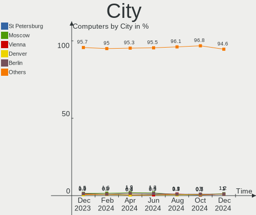
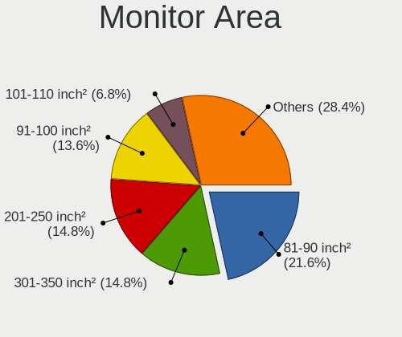
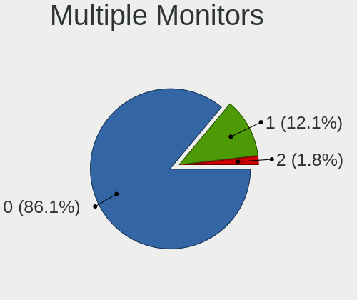
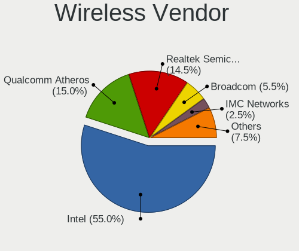

BSD - Hardware Trends
---------------------

A project to identify most popular hardware characteristics and track their change
over time based on data collected by BSD users at https://BSD-Hardware.info.

Anyone can contribute to this report by the [hw-probe](https://github.com/linuxhw/hw-probe/blob/master/INSTALL.BSD.md) tool:

    hw-probe -all -upload

This is a report for all computer types. See also reports for [desktops](/Desktop/README.md) and [notebooks](/Notebook/README.md).

OS-specific reports: [FreeBSD](/Dist/FreeBSD), [OPNsense](/Dist/OPNsense), [helloSystem](/Dist/helloSystem), [OpenBSD](/Dist/OpenBSD).

This report is for one last month. Overall report since the beginning of time: [TestDays](https://github.com/bsdhw/TestDays)

Period: May, 2023.

Contents
--------

* [ System ](#system)
  - [ OS                       ](#os)
  - [ OS Family                ](#os-family)
  - [ Arch                     ](#arch)
  - [ DE                       ](#de)
  - [ Display Server           ](#display-server)
  - [ Display Manager          ](#display-manager)
  - [ OS Lang                  ](#os-lang)
  - [ Boot Mode                ](#boot-mode)
  - [ Filesystem               ](#filesystem)
  - [ Part. scheme             ](#part-scheme)

* [ Board ](#board)
  - [ Vendor                   ](#vendor)
  - [ Model                    ](#model)
  - [ Model Family             ](#model-family)
  - [ MFG Year                 ](#mfg-year)
  - [ Form Factor              ](#form-factor)
  - [ Coreboot                 ](#coreboot)
  - [ RAM Size                 ](#ram-size)
  - [ RAM Used                 ](#ram-used)
  - [ Total Drives             ](#total-drives)
  - [ Has CD-ROM               ](#has-cd-rom)
  - [ Has Ethernet             ](#has-ethernet)
  - [ Has WiFi                 ](#has-wifi)
  - [ Has Bluetooth            ](#has-bluetooth)

* [ Location ](#location)
  - [ Country                  ](#country)
  - [ City                     ](#city)

* [ Drives ](#drives)
  - [ Drive Vendor             ](#drive-vendor)
  - [ Drive Model              ](#drive-model)
  - [ HDD Vendor               ](#hdd-vendor)
  - [ SSD Vendor               ](#ssd-vendor)
  - [ Drive Kind               ](#drive-kind)
  - [ Drive Connector          ](#drive-connector)
  - [ Drive Size               ](#drive-size)
  - [ Space Total              ](#space-total)
  - [ Space Used               ](#space-used)
  - [ Malfunc. Drives          ](#malfunc-drives)
  - [ Malfunc. Drive Vendor    ](#malfunc-drive-vendor)
  - [ Malfunc. HDD Vendor      ](#malfunc-hdd-vendor)
  - [ Malfunc. Drive Kind      ](#malfunc-drive-kind)
  - [ Failed Drives            ](#failed-drives)
  - [ Failed Drive Vendor      ](#failed-drive-vendor)
  - [ Drive Status             ](#drive-status)

* [ Storage controller ](#storage-controller)
  - [ Storage Vendor           ](#storage-vendor)
  - [ Storage Model            ](#storage-model)
  - [ Storage Kind             ](#storage-kind)

* [ Processor ](#processor)
  - [ CPU Vendor               ](#cpu-vendor)
  - [ CPU Model                ](#cpu-model)
  - [ CPU Model Family         ](#cpu-model-family)
  - [ CPU Cores                ](#cpu-cores)
  - [ CPU Sockets              ](#cpu-sockets)
  - [ CPU Threads              ](#cpu-threads)
  - [ CPU Microarch            ](#cpu-microarch)

* [ Graphics ](#graphics)
  - [ GPU Vendor               ](#gpu-vendor)
  - [ GPU Model                ](#gpu-model)
  - [ GPU Combo                ](#gpu-combo)
  - [ GPU Driver               ](#gpu-driver)
  - [ GPU Memory               ](#gpu-memory)

* [ Monitor ](#monitor)
  - [ Monitor Vendor           ](#monitor-vendor)
  - [ Monitor Model            ](#monitor-model)
  - [ Monitor Resolution       ](#monitor-resolution)
  - [ Monitor Diagonal         ](#monitor-diagonal)
  - [ Monitor Width            ](#monitor-width)
  - [ Aspect Ratio             ](#aspect-ratio)
  - [ Monitor Area             ](#monitor-area)
  - [ Pixel Density            ](#pixel-density)
  - [ Multiple Monitors        ](#multiple-monitors)

* [ Network ](#network)
  - [ Net Controller Vendor    ](#net-controller-vendor)
  - [ Net Controller Model     ](#net-controller-model)
  - [ Wireless Vendor          ](#wireless-vendor)
  - [ Wireless Model           ](#wireless-model)
  - [ Ethernet Vendor          ](#ethernet-vendor)
  - [ Ethernet Model           ](#ethernet-model)
  - [ Net Controller Kind      ](#net-controller-kind)
  - [ Used Controller          ](#used-controller)
  - [ NICs                     ](#nics)
  - [ IPv6                     ](#ipv6)

* [ Bluetooth ](#bluetooth)
  - [ Bluetooth Vendor         ](#bluetooth-vendor)
  - [ Bluetooth Model          ](#bluetooth-model)

* [ Sound ](#sound)
  - [ Sound Vendor             ](#sound-vendor)
  - [ Sound Model              ](#sound-model)

* [ Memory ](#memory)
  - [ Memory Vendor            ](#memory-vendor)
  - [ Memory Model             ](#memory-model)
  - [ Memory Kind              ](#memory-kind)
  - [ Memory Form Factor       ](#memory-form-factor)
  - [ Memory Size              ](#memory-size)
  - [ Memory Speed             ](#memory-speed)

* [ Printers & scanners ](#printers--scanners)
  - [ Printer Vendor           ](#printer-vendor)
  - [ Printer Model            ](#printer-model)
  - [ Scanner Vendor           ](#scanner-vendor)
  - [ Scanner Model            ](#scanner-model)

* [ Camera ](#camera)
  - [ Camera Vendor            ](#camera-vendor)
  - [ Camera Model             ](#camera-model)

* [ Security ](#security)
  - [ Fingerprint Vendor       ](#fingerprint-vendor)
  - [ Fingerprint Model        ](#fingerprint-model)
  - [ Chipcard Vendor          ](#chipcard-vendor)
  - [ Chipcard Model           ](#chipcard-model)

* [ Unsupported ](#unsupported)
  - [ Unsupported Devices      ](#unsupported-devices)
  - [ Unsupported Device Types ](#unsupported-device-types)

System
------

OS
--

Installed operating systems

| Name                 | Computers | Percent |
|----------------------|-----------|---------|
| OPNsense 23.1.7      | 184       | 40.44%  |
| OPNsense 23.1.8      | 69        | 15.16%  |
| helloSystem 0.8.1    | 38        | 8.35%   |
| FreeBSD 13.2         | 36        | 7.91%   |
| OPNsense 23.1.6      | 32        | 7.03%   |
| OpenBSD 7.3          | 30        | 6.59%   |
| helloSystem 0.8.2    | 11        | 2.42%   |
| FreeBSD 14.0-CURRENT | 9         | 1.98%   |
| OPNsense 22.7.11     | 7         | 1.54%   |
| OPNsense 23.1        | 4         | 0.88%   |
| OPNsense 23.4        | 3         | 0.66%   |
| helloSystem 0.8.0    | 3         | 0.66%   |
| GhostBSD 23.04.23    | 3         | 0.66%   |
| FreeBSD 13.1-p5      | 3         | 0.66%   |
| OPNsense 23.1.9      | 2         | 0.44%   |
| MyBee 13.2           | 2         | 0.44%   |
| GhostBSD 23.05.22    | 2         | 0.44%   |
| GhostBSD 23.05.18    | 2         | 0.44%   |
| pfSense 2.6.0        | 1         | 0.22%   |
| OPNsense 23.7        | 1         | 0.22%   |
| OPNsense 23.1.5      | 1         | 0.22%   |
| OPNsense 23.1.1      | 1         | 0.22%   |
| OPNsense 22.7.10     | 1         | 0.22%   |
| OPNsense 22.10.2     | 1         | 0.22%   |
| NetBSD 10.0_BETA     | 1         | 0.22%   |
| MidnightBSD 3.0.1    | 1         | 0.22%   |
| helloSystem 0.6.0    | 1         | 0.22%   |
| GhostBSD 22.06.18    | 1         | 0.22%   |
| FreeBSD 13.2-STABLE  | 1         | 0.22%   |
| FreeBSD 13.2-RC6     | 1         | 0.22%   |
| FreeBSD 13.1-p7      | 1         | 0.22%   |
| FreeBSD 13.1         | 1         | 0.22%   |
| FreeBSD 12.4-p2      | 1         | 0.22%   |

OS Family
---------

OS without a version

| Name        | Computers | Percent |
|-------------|-----------|---------|
| OPNsense    | 306       | 67.25%  |
| helloSystem | 53        | 11.65%  |
| FreeBSD     | 53        | 11.65%  |
| OpenBSD     | 30        | 6.59%   |
| GhostBSD    | 8         | 1.76%   |
| MyBee       | 2         | 0.44%   |
| pfSense     | 1         | 0.22%   |
| NetBSD      | 1         | 0.22%   |
| MidnightBSD | 1         | 0.22%   |

Arch
----

OS architecture (x86_64, i586, etc.)

| Name  | Computers | Percent |
|-------|-----------|---------|
| amd64 | 446       | 98.02%  |
| i386  | 7         | 1.54%   |
| arm64 | 2         | 0.44%   |

DE
--

Desktop Environment

| Name         | Computers | Percent |
|--------------|-----------|---------|
| Console      | 325       | 71.43%  |
| helloDesktop | 78        | 17.14%  |
| GNOME        | 13        | 2.86%   |
| XFCE         | 12        | 2.64%   |
| MATE         | 10        | 2.2%    |
| KDE5         | 8         | 1.76%   |
| i3           | 3         | 0.66%   |
| TWM          | 1         | 0.22%   |
| Fluxbox      | 1         | 0.22%   |
| Cinnamon     | 1         | 0.22%   |
| Budgie       | 1         | 0.22%   |
| Blackbox     | 1         | 0.22%   |
| AwesomeWM    | 1         | 0.22%   |

Display Server
--------------

X11 or Wayland

| Name    | Computers | Percent |
|---------|-----------|---------|
| Console | 327       | 71.87%  |
| X11     | 127       | 27.91%  |
| Wayland | 1         | 0.22%   |

Display Manager
---------------

SDDM, LightDM, etc.

| Name    | Computers | Percent |
|---------|-----------|---------|
| Console | 367       | 80.66%  |
| SLiM    | 57        | 12.53%  |
| LightDM | 13        | 2.86%   |
| SDDM    | 8         | 1.76%   |
| GDM     | 5         | 1.1%    |
| XDM     | 4         | 0.88%   |
| Ly      | 1         | 0.22%   |

OS Lang
-------

Language

| Lang    | Computers | Percent |
|---------|-----------|---------|
| Unknown | 334       | 73.41%  |
| en_US   | 45        | 9.89%   |
| C       | 39        | 8.57%   |
| fr_FR   | 14        | 3.08%   |
| ru_RU   | 8         | 1.76%   |
| de_DE   | 4         | 0.88%   |
| pt_BR   | 2         | 0.44%   |
| es_ES   | 2         | 0.44%   |
| en_IE   | 2         | 0.44%   |
| en      | 2         | 0.44%   |
| it_IT   | 1         | 0.22%   |
| fr      | 1         | 0.22%   |
| en_AU   | 1         | 0.22%   |

Boot Mode
---------

EFI or BIOS

| Mode | Computers | Percent |
|------|-----------|---------|
| EFI  | 404       | 88.79%  |
| BIOS | 51        | 11.21%  |

Filesystem
----------

Type of filesystem

| Type   | Computers | Percent |
|--------|-----------|---------|
| Zfs    | 211       | 46.37%  |
| Ufs    | 191       | 41.98%  |
| Ffs    | 30        | 6.59%   |
| Cd9660 | 23        | 5.05%   |

Part. scheme
------------

Scheme of partitioning

| Type    | Computers | Percent |
|---------|-----------|---------|
| GPT     | 426       | 93.63%  |
| MBR     | 25        | 5.49%   |
| Unknown | 3         | 0.66%   |
| BSD     | 1         | 0.22%   |

Board
-----

Vendor
------

Motherboard manufacturer

| Name                           | Computers | Percent |
|--------------------------------|-----------|---------|
| Unknown                        | 49        | 10.77%  |
| Lenovo                         | 43        | 9.45%   |
| Dell                           | 40        | 8.79%   |
| Hewlett-Packard                | 38        | 8.35%   |
| ASUSTek Computer               | 34        | 7.47%   |
| Intel                          | 33        | 7.25%   |
| Supermicro                     | 26        | 5.71%   |
| Gigabyte Technology            | 18        | 3.96%   |
| ASRock                         | 18        | 3.96%   |
| Protectli                      | 15        | 3.3%    |
| PC Engines                     | 10        | 2.2%    |
| Fujitsu                        | 10        | 2.2%    |
| AMI                            | 10        | 2.2%    |
| MSI                            | 9         | 1.98%   |
| Acer                           | 8         | 1.76%   |
| Techvision                     | 7         | 1.54%   |
| Sophos                         | 6         | 1.32%   |
| MW                             | 6         | 1.32%   |
| CWWK                           | 6         | 1.32%   |
| ASRockRack                     | 5         | 1.1%    |
| Apple                          | 5         | 1.1%    |
| ZOTAC                          | 3         | 0.66%   |
| Panasonic                      | 3         | 0.66%   |
| Deciso                         | 3         | 0.66%   |
| AZW                            | 3         | 0.66%   |
| Sony                           | 2         | 0.44%   |
| Microsoft                      | 2         | 0.44%   |
| Medion                         | 2         | 0.44%   |
| Matsushita Electric Industrial | 2         | 0.44%   |
| Hardkernel                     | 2         | 0.44%   |
| Google                         | 2         | 0.44%   |
| YENTEK                         | 1         | 0.22%   |
| VIA Technologies               | 1         | 0.22%   |
| Valve                          | 1         | 0.22%   |
| TUXEDO                         | 1         | 0.22%   |
| Toshiba                        | 1         | 0.22%   |
| Timi                           | 1         | 0.22%   |
| Tactus                         | 1         | 0.22%   |
| Shuttle                        | 1         | 0.22%   |
| ShenZhen MinWin Technology     | 1         | 0.22%   |

Model
-----

Motherboard model

| Name                                | Computers | Percent |
|-------------------------------------|-----------|---------|
| Unknown                             | 51        | 11.21%  |
| AMI Aptio CRB                       | 8         | 1.76%   |
| Techvision TVI7309X                 | 7         | 1.54%   |
| Protectli FW6                       | 7         | 1.54%   |
| Dell OptiPlex 7040                  | 7         | 1.54%   |
| Supermicro Super Server             | 6         | 1.32%   |
| MW GMLK-2_5G4L                      | 6         | 1.32%   |
| Sophos SG                           | 5         | 1.1%    |
| Intel Q3XXG4-P V1.0                 | 5         | 1.1%    |
| Fujitsu FUTRO S920                  | 5         | 1.1%    |
| PC Engines apu4                     | 4         | 0.88%   |
| Intel Jasper Lake Client Platform   | 4         | 0.88%   |
| HP EliteDesk 800 G3 SFF             | 4         | 0.88%   |
| Supermicro X8SIL                    | 3         | 0.66%   |
| Supermicro X10SLH-N6-ST031          | 3         | 0.66%   |
| Protectli FW4B                      | 3         | 0.66%   |
| PC Engines APU2                     | 3         | 0.66%   |
| HP ProDesk 600 G3 SFF               | 3         | 0.66%   |
| CWWK CW-MBX-AD12                    | 3         | 0.66%   |
| Supermicro SYS-6028R-TRT            | 2         | 0.44%   |
| Protectli VP2420                    | 2         | 0.44%   |
| PC Engines apu6                     | 2         | 0.44%   |
| Intel S1200KP AAG34877-201          | 2         | 0.44%   |
| Intel CRESCENTBAY                   | 2         | 0.44%   |
| HP ProDesk 600 G1 SFF               | 2         | 0.44%   |
| HP EliteBook 8570p                  | 2         | 0.44%   |
| HP Compaq Elite 8300 SFF            | 2         | 0.44%   |
| Dell Wyse 5070 Extended Thin Client | 2         | 0.44%   |
| Dell PowerEdge R210 II              | 2         | 0.44%   |
| Dell OptiPlex 9020                  | 2         | 0.44%   |
| Dell OptiPlex 9010                  | 2         | 0.44%   |
| Dell OptiPlex 7010                  | 2         | 0.44%   |
| Dell OptiPlex 390                   | 2         | 0.44%   |
| Dell OptiPlex 3040                  | 2         | 0.44%   |
| CWWK CW-AD4L-N V1                   | 2         | 0.44%   |
| ASUS ROG STRIX B550-F GAMING        | 2         | 0.44%   |
| ASUS PRIME B460M-A                  | 2         | 0.44%   |
| ASUS All Series                     | 2         | 0.44%   |
| ASRockRack X470D4U2-2T              | 2         | 0.44%   |
| ASRock Z590 Pro4                    | 2         | 0.44%   |

Model Family
------------

Motherboard model prefix

| Name                       | Computers | Percent |
|----------------------------|-----------|---------|
| Unknown                    | 51        | 11.21%  |
| Lenovo ThinkPad            | 25        | 5.49%   |
| Dell OptiPlex              | 24        | 5.27%   |
| ASUS PRIME                 | 11        | 2.42%   |
| Lenovo ThinkCentre         | 9         | 1.98%   |
| HP ProDesk                 | 8         | 1.76%   |
| AMI Aptio                  | 8         | 1.76%   |
| Techvision TVI7309X        | 7         | 1.54%   |
| Protectli FW6              | 7         | 1.54%   |
| Dell PowerEdge             | 7         | 1.54%   |
| Supermicro Super           | 6         | 1.32%   |
| MW GMLK-2                  | 6         | 1.32%   |
| ASUS ROG                   | 6         | 1.32%   |
| Sophos SG                  | 5         | 1.1%    |
| Intel Q3XXG4-P             | 5         | 1.1%    |
| HP EliteDesk               | 5         | 1.1%    |
| HP Compaq                  | 5         | 1.1%    |
| Fujitsu FUTRO              | 5         | 1.1%    |
| Dell Inspiron              | 5         | 1.1%    |
| PC Engines apu4            | 4         | 0.88%   |
| Intel Jasper               | 4         | 0.88%   |
| HP ProLiant                | 4         | 0.88%   |
| Acer Aspire                | 4         | 0.88%   |
| Supermicro X8SIL           | 3         | 0.66%   |
| Supermicro X10SLH-N6-ST031 | 3         | 0.66%   |
| Protectli FW4B             | 3         | 0.66%   |
| PC Engines APU2            | 3         | 0.66%   |
| CWWK CW-MBX-AD12           | 3         | 0.66%   |
| ASRock X570                | 3         | 0.66%   |
| Supermicro SYS-6028R-TRT   | 2         | 0.44%   |
| Protectli VP2420           | 2         | 0.44%   |
| PC Engines apu6            | 2         | 0.44%   |
| Microsoft Surface          | 2         | 0.44%   |
| Lenovo Yoga                | 2         | 0.44%   |
| Intel S1200KP              | 2         | 0.44%   |
| Intel CRESCENTBAY          | 2         | 0.44%   |
| HP Z240                    | 2         | 0.44%   |
| HP EliteBook               | 2         | 0.44%   |
| Gigabyte GA-78LMT-USB3     | 2         | 0.44%   |
| Fujitsu ESPRIMO            | 2         | 0.44%   |

MFG Year
--------

Motherboard manufacture year

| Year    | Computers | Percent |
|---------|-----------|---------|
| 2022    | 71        | 15.6%   |
| 2021    | 49        | 10.77%  |
| 2018    | 43        | 9.45%   |
| 2020    | 41        | 9.01%   |
| 2019    | 31        | 6.81%   |
| 2016    | 27        | 5.93%   |
| 2013    | 27        | 5.93%   |
| 2017    | 26        | 5.71%   |
| 2014    | 26        | 5.71%   |
| 2012    | 23        | 5.05%   |
| 2023    | 22        | 4.84%   |
| 2015    | 19        | 4.18%   |
| 2011    | 12        | 2.64%   |
| 2010    | 11        | 2.42%   |
| 2008    | 10        | 2.2%    |
| 2009    | 7         | 1.54%   |
| 2006    | 4         | 0.88%   |
| Unknown | 3         | 0.66%   |
| 2007    | 2         | 0.44%   |
| 2002    | 1         | 0.22%   |

Form Factor
-----------

Physical design of the computer

| Name        | Computers | Percent |
|-------------|-----------|---------|
| Desktop     | 313       | 68.79%  |
| Notebook    | 77        | 16.92%  |
| Mini pc     | 28        | 6.15%   |
| Server      | 26        | 5.71%   |
| Firewall    | 8         | 1.76%   |
| Tablet      | 2         | 0.44%   |
| Convertible | 1         | 0.22%   |

Coreboot
--------

Have coreboot on board

| Used | Computers | Percent |
|------|-----------|---------|
| No   | 438       | 96.26%  |
| Yes  | 17        | 3.74%   |

RAM Size
--------

Total RAM memory

| Size in GB      | Computers | Percent |
|-----------------|-----------|---------|
| 8.01-16.0       | 173       | 38.02%  |
| 16.01-24.0      | 114       | 25.05%  |
| 4.01-8.0        | 77        | 16.92%  |
| 32.01-64.0      | 44        | 9.67%   |
| 64.01-256.0     | 22        | 4.84%   |
| 2.01-3.0        | 8         | 1.76%   |
| 3.01-4.0        | 7         | 1.54%   |
| 24.01-32.0      | 4         | 0.88%   |
| More than 256.0 | 2         | 0.44%   |
| 0.51-1.0        | 2         | 0.44%   |
| 1.01-2.0        | 1         | 0.22%   |
| 0.01-0.5        | 1         | 0.22%   |

RAM Used
--------

Used RAM memory

| Used GB   | Computers | Percent |
|-----------|-----------|---------|
| 0.01-0.5  | 230       | 50.55%  |
| 0.51-1.0  | 139       | 30.55%  |
| 1.01-2.0  | 57        | 12.53%  |
| 2.01-3.0  | 13        | 2.86%   |
| 3.01-4.0  | 6         | 1.32%   |
| 4.01-8.0  | 4         | 0.88%   |
| 0         | 4         | 0.88%   |
| 8.01-16.0 | 1         | 0.22%   |
| Unknown   | 1         | 0.22%   |

Total Drives
------------

Number of drives on board

| Drives | Computers | Percent |
|--------|-----------|---------|
| 1      | 329       | 72.31%  |
| 2      | 61        | 13.41%  |
| 0      | 31        | 6.81%   |
| 3      | 20        | 4.4%    |
| 4      | 7         | 1.54%   |
| 5      | 3         | 0.66%   |
| 13     | 1         | 0.22%   |
| 10     | 1         | 0.22%   |
| 8      | 1         | 0.22%   |
| 6      | 1         | 0.22%   |

Has CD-ROM
----------

Has CD-ROM on board

| Presented | Computers | Percent |
|-----------|-----------|---------|
| No        | 378       | 83.08%  |
| Yes       | 77        | 16.92%  |

Has Ethernet
------------

Has Ethernet on board

| Presented | Computers | Percent |
|-----------|-----------|---------|
| Yes       | 443       | 97.36%  |
| No        | 12        | 2.64%   |

Has WiFi
--------

Has WiFi module

| Presented | Computers | Percent |
|-----------|-----------|---------|
| No        | 305       | 67.03%  |
| Yes       | 150       | 32.97%  |

Has Bluetooth
-------------

Has Bluetooth module

| Presented | Computers | Percent |
|-----------|-----------|---------|
| No        | 350       | 76.92%  |
| Yes       | 105       | 23.08%  |

Location
--------

Country
-------

Geographic location (country)

| Country       | Computers | Percent |
|---------------|-----------|---------|
| USA           | 135       | 29.67%  |
| Germany       | 55        | 12.09%  |
| Canada        | 26        | 5.71%   |
| France        | 23        | 5.05%   |
| Russia        | 22        | 4.84%   |
| Brazil        | 18        | 3.96%   |
| Poland        | 17        | 3.74%   |
| UK            | 16        | 3.52%   |
| Netherlands   | 15        | 3.3%    |
| Australia     | 13        | 2.86%   |
| Switzerland   | 9         | 1.98%   |
| Italy         | 9         | 1.98%   |
| Belgium       | 8         | 1.76%   |
| Romania       | 7         | 1.54%   |
| Austria       | 7         | 1.54%   |
| Sweden        | 4         | 0.88%   |
| Spain         | 4         | 0.88%   |
| South Africa  | 4         | 0.88%   |
| Slovakia      | 4         | 0.88%   |
| Ireland       | 4         | 0.88%   |
| Indonesia     | 4         | 0.88%   |
| Thailand      | 3         | 0.66%   |
| New Zealand   | 3         | 0.66%   |
| Croatia       | 3         | 0.66%   |
| China         | 3         | 0.66%   |
| Argentina     | 3         | 0.66%   |
| Uruguay       | 2         | 0.44%   |
| Turkey        | 2         | 0.44%   |
| Taiwan        | 2         | 0.44%   |
| South Korea   | 2         | 0.44%   |
| Norway        | 2         | 0.44%   |
| New Caledonia | 2         | 0.44%   |
| Lithuania     | 2         | 0.44%   |
| Czechia       | 2         | 0.44%   |
| Bulgaria      | 2         | 0.44%   |
| Vietnam       | 1         | 0.22%   |
| Venezuela     | 1         | 0.22%   |
| Slovenia      | 1         | 0.22%   |
| Singapore     | 1         | 0.22%   |
| Peru          | 1         | 0.22%   |

City
----

Geographic location (city)

| City                | Computers | Percent |
|---------------------|-----------|---------|
| Saint-Laurent       | 13        | 2.86%   |
| Sydney              | 6         | 1.32%   |
| Warsaw              | 5         | 1.1%    |
| St Petersburg       | 5         | 1.1%    |
| Paris               | 5         | 1.1%    |
| Moscow              | 5         | 1.1%    |
| Denver              | 5         | 1.1%    |
| South San Francisco | 4         | 0.88%   |
| Blumenau            | 4         | 0.88%   |
| Berlin              | 4         | 0.88%   |
| Zurich              | 3         | 0.66%   |
| Wroclaw             | 3         | 0.66%   |
| Seattle             | 3         | 0.66%   |
| Sao Paulo           | 3         | 0.66%   |
| Salem               | 3         | 0.66%   |
| Gothenburg          | 3         | 0.66%   |
| Dublin              | 3         | 0.66%   |
| Brooklyn            | 3         | 0.66%   |
| Bordeaux            | 3         | 0.66%   |
| Bangkok             | 3         | 0.66%   |
| Vilnius             | 2         | 0.44%   |
| Vienna              | 2         | 0.44%   |
| Toronto             | 2         | 0.44%   |
| The Hague           | 2         | 0.44%   |
| Southall            | 2         | 0.44%   |
| Skiatook            | 2         | 0.44%   |
| Saratov             | 2         | 0.44%   |
| San Francisco       | 2         | 0.44%   |
| San Diego           | 2         | 0.44%   |
| Rochester           | 2         | 0.44%   |
| Redmond             | 2         | 0.44%   |
| Portland            | 2         | 0.44%   |
| Police              | 2         | 0.44%   |
| Pezinok             | 2         | 0.44%   |
| Ozersk              | 2         | 0.44%   |
| Nuremberg           | 2         | 0.44%   |
| Noumea              | 2         | 0.44%   |
| Munich              | 2         | 0.44%   |
| Mountain View       | 2         | 0.44%   |
| Montevideo          | 2         | 0.44%   |

Drives
------

Drive Vendor
------------

Hard drive vendors

| Vendor              | Computers | Drives | Percent |
|---------------------|-----------|--------|---------|
| Samsung Electronics | 91        | 109    | 17.81%  |
| WDC                 | 51        | 78     | 9.98%   |
| Kingston            | 41        | 46     | 8.02%   |
| Seagate             | 30        | 36     | 5.87%   |
| Crucial             | 24        | 26     | 4.7%    |
| Transcend           | 22        | 23     | 4.31%   |
| Toshiba             | 22        | 26     | 4.31%   |
| China               | 21        | 23     | 4.11%   |
| Intel               | 19        | 21     | 3.72%   |
| SanDisk             | 17        | 18     | 3.33%   |
| HGST                | 11        | 27     | 2.15%   |
| Hitachi             | 10        | 17     | 1.96%   |
| A-DATA Technology   | 10        | 11     | 1.96%   |
| SK hynix            | 8         | 8      | 1.57%   |
| Phison              | 8         | 8      | 1.57%   |
| SPCC                | 7         | 7      | 1.37%   |
| NVMe                | 7         | 7      | 1.37%   |
| Patriot             | 6         | 8      | 1.17%   |
| FORESEE             | 6         | 6      | 1.17%   |
| Protectli           | 5         | 5      | 0.98%   |
| KIOXIA              | 5         | 5      | 0.98%   |
| Hoodisk             | 5         | 5      | 0.98%   |
| UMIS                | 4         | 4      | 0.78%   |
| ShiJi               | 4         | 4      | 0.78%   |
| Dogfish             | 4         | 4      | 0.78%   |
| Apple               | 4         | 4      | 0.78%   |
| PNY                 | 3         | 3      | 0.59%   |
| OCZ                 | 3         | 3      | 0.59%   |
| LITEONIT            | 3         | 3      | 0.59%   |
| Lexar               | 3         | 3      | 0.59%   |
| Intenso             | 3         | 3      | 0.59%   |
| Corsair             | 3         | 3      | 0.59%   |
| Vaseky              | 2         | 2      | 0.39%   |
| Silicon Motion      | 2         | 2      | 0.39%   |
| MidasForce          | 2         | 2      | 0.39%   |
| Kston               | 2         | 2      | 0.39%   |
| Innodisk            | 2         | 2      | 0.39%   |
| Hewlett-Packard     | 2         | 3      | 0.39%   |
| GOODRAM             | 2         | 2      | 0.39%   |
| Fanxiang            | 2         | 2      | 0.39%   |

Drive Model
-----------

Hard drive models

| Model                           | Computers | Percent |
|---------------------------------|-----------|---------|
| Kingston SA400S37120G 120GB     | 9         | 1.67%   |
| Samsung SSD 970 EVO Plus 1TB    | 7         | 1.3%    |
| Kingston SA400S37240G 240GB     | 7         | 1.3%    |
| Transcend TS128GMSA230S 128GB   | 5         | 0.93%   |
| Samsung SSD 860 EVO 500GB       | 5         | 0.93%   |
| Samsung SSD 850 EVO 250GB       | 4         | 0.74%   |
| FORESEE 128GB SSD               | 4         | 0.74%   |
| Crucial CT240BX500SSD1 240GB    | 4         | 0.74%   |
| Transcend TS64GMSA230S 64GB     | 3         | 0.56%   |
| SPCC Solid State Disk 128GB     | 3         | 0.56%   |
| ShiJi SSD 128GB                 | 3         | 0.56%   |
| Samsung SSD 980 500GB           | 3         | 0.56%   |
| Samsung SSD 980 1TB             | 3         | 0.56%   |
| Samsung SSD 860 EVO mSATA 250GB | 3         | 0.56%   |
| Samsung SSD 860 EVO 250GB       | 3         | 0.56%   |
| Samsung SSD 850 EVO 120GB       | 3         | 0.56%   |
| Kingston SUV500MS120G 120GB     | 3         | 0.56%   |
| Kingston SA400S37480G 480GB     | 3         | 0.56%   |
| HGST HTS725050A7E630 500GB      | 3         | 0.56%   |
| Crucial CT500MX500SSD1 500GB    | 3         | 0.56%   |
| Crucial CT1000MX500SSD1 1TB     | 3         | 0.56%   |
| China SATA SSD 32GB             | 3         | 0.56%   |
| WDC WD5000LPLX-00ZNTT0 500GB    | 2         | 0.37%   |
| UMIS RPJTJ128MED1MWX 128GB      | 2         | 0.37%   |
| Transcend TS64GSSD370 64GB      | 2         | 0.37%   |
| Transcend TS256GMTS952T2 256GB  | 2         | 0.37%   |
| Transcend TS256GMSA230S 256GB   | 2         | 0.37%   |
| Toshiba MQ04ABF100 1TB          | 2         | 0.37%   |
| Toshiba MQ01ABD050 500GB        | 2         | 0.37%   |
| Toshiba MK6475GSX 640GB         | 2         | 0.37%   |
| Toshiba HDWD110 1TB             | 2         | 0.37%   |
| SK hynix SC311 SATA 128GB       | 2         | 0.37%   |
| Seagate ST9160314AS 160GB       | 2         | 0.37%   |
| Seagate ST500DM002-1BD142 500GB | 2         | 0.37%   |
| Seagate ST4000DM000-1F2168 4TB  | 2         | 0.37%   |
| SanDisk X400 M.2 2280 128GB     | 2         | 0.37%   |
| SanDisk Extreme SSD 500GB       | 2         | 0.37%   |
| Samsung SSD 970 EVO Plus 500GB  | 2         | 0.37%   |
| Samsung SSD 970 EVO Plus 2TB    | 2         | 0.37%   |
| Samsung SSD 970 EVO Plus 250GB  | 2         | 0.37%   |

HDD Vendor
----------

Hard disk drive vendors

| Vendor              | Computers | Drives | Percent |
|---------------------|-----------|--------|---------|
| WDC                 | 40        | 67     | 32.52%  |
| Seagate             | 30        | 36     | 24.39%  |
| Toshiba             | 17        | 20     | 13.82%  |
| HGST                | 11        | 23     | 8.94%   |
| Hitachi             | 10        | 17     | 8.13%   |
| NVMe                | 5         | 5      | 4.07%   |
| Samsung Electronics | 3         | 6      | 2.44%   |
| Hewlett-Packard     | 2         | 3      | 1.63%   |
| Verbatim            | 1         | 1      | 0.81%   |
| SMI                 | 1         | 1      | 0.81%   |
| Maxtor              | 1         | 1      | 0.81%   |
| China               | 1         | 1      | 0.81%   |
| Apple               | 1         | 1      | 0.81%   |

SSD Vendor
----------

Solid state drive vendors

| Vendor              | Computers | Drives | Percent |
|---------------------|-----------|--------|---------|
| Samsung Electronics | 53        | 62     | 18.4%   |
| Kingston            | 37        | 42     | 12.85%  |
| Transcend           | 21        | 22     | 7.29%   |
| China               | 20        | 22     | 6.94%   |
| Crucial             | 19        | 21     | 6.6%    |
| SanDisk             | 17        | 18     | 5.9%    |
| Intel               | 13        | 14     | 4.51%   |
| FORESEE             | 6         | 6      | 2.08%   |
| SPCC                | 5         | 5      | 1.74%   |
| SK hynix            | 5         | 5      | 1.74%   |
| Protectli           | 5         | 5      | 1.74%   |
| Patriot             | 5         | 7      | 1.74%   |
| Hoodisk             | 5         | 5      | 1.74%   |
| A-DATA Technology   | 5         | 6      | 1.74%   |
| WDC                 | 4         | 4      | 1.39%   |
| ShiJi               | 4         | 4      | 1.39%   |
| Dogfish             | 4         | 4      | 1.39%   |
| PNY                 | 3         | 3      | 1.04%   |
| OCZ                 | 3         | 3      | 1.04%   |
| LITEONIT            | 3         | 3      | 1.04%   |
| Intenso             | 3         | 3      | 1.04%   |
| Apple               | 3         | 3      | 1.04%   |
| Vaseky              | 2         | 2      | 0.69%   |
| Toshiba             | 2         | 2      | 0.69%   |
| Phison              | 2         | 2      | 0.69%   |
| NVMe                | 2         | 2      | 0.69%   |
| MidasForce          | 2         | 2      | 0.69%   |
| Kston               | 2         | 2      | 0.69%   |
| Innodisk            | 2         | 2      | 0.69%   |
| ZTC                 | 1         | 1      | 0.35%   |
| VICKTER             | 1         | 1      | 0.35%   |
| Union Memory        | 1         | 1      | 0.35%   |
| Team                | 1         | 1      | 0.35%   |
| TCSUNBOW            | 1         | 1      | 0.35%   |
| SSSTC               | 1         | 1      | 0.35%   |
| SHAREVDI            | 1         | 1      | 0.35%   |
| Philips             | 1         | 1      | 0.35%   |
| Pccooler            | 1         | 1      | 0.35%   |
| ORTIAL              | 1         | 1      | 0.35%   |
| Mushkin             | 1         | 1      | 0.35%   |

Drive Kind
----------

HDD or SSD

| Kind | Computers | Drives | Percent |
|------|-----------|--------|---------|
| SSD  | 269       | 315    | 56.63%  |
| HDD  | 106       | 182    | 22.32%  |
| NVMe | 100       | 110    | 21.05%  |

Drive Connector
---------------

SATA, SAS, NVMe, etc.

| Type | Computers | Drives | Percent |
|------|-----------|--------|---------|
| SATA | 348       | 497    | 77.68%  |
| NVMe | 100       | 110    | 22.32%  |

Drive Size
----------

Size of hard drive

| Size in TB      | Computers | Drives | Percent |
|-----------------|-----------|--------|---------|
| 0.01-0.5        | 299       | 371    | 78.89%  |
| 0.51-1.0        | 51        | 57     | 13.46%  |
| 1.01-2.0        | 15        | 24     | 3.96%   |
| 3.01-4.0        | 6         | 15     | 1.58%   |
| 4.01-10.0       | 4         | 13     | 1.06%   |
| 10.01-20.0      | 2         | 4      | 0.53%   |
| More than 100.0 | 1         | 1      | 0.26%   |
| 2.01-3.0        | 1         | 12     | 0.26%   |

Space Total
-----------

Amount of disk space available on the file system

| Size in GB     | Computers | Percent |
|----------------|-----------|---------|
| 101-250        | 193       | 42.42%  |
| 251-500        | 70        | 15.38%  |
| 51-100         | 50        | 10.99%  |
| 21-50          | 43        | 9.45%   |
| 501-1000       | 43        | 9.45%   |
| 1-20           | 42        | 9.23%   |
| 1001-2000      | 9         | 1.98%   |
| More than 3000 | 2         | 0.44%   |
| 2001-3000      | 2         | 0.44%   |
| Unknown        | 1         | 0.22%   |

Space Used
----------

Amount of used disk space

| Used GB        | Computers | Percent |
|----------------|-----------|---------|
| 1-20           | 411       | 90.33%  |
| 21-50          | 30        | 6.59%   |
| 251-500        | 4         | 0.88%   |
| 51-100         | 4         | 0.88%   |
| 101-250        | 2         | 0.44%   |
| More than 3000 | 1         | 0.22%   |
| 501-1000       | 1         | 0.22%   |
| 0              | 1         | 0.22%   |
| Unknown        | 1         | 0.22%   |

Malfunc. Drives
---------------

Drive models with a malfunction

| Model                                 | Computers | Drives | Percent |
|---------------------------------------|-----------|--------|---------|
| Seagate ST9160314AS 160GB             | 2         | 2      | 4.88%   |
| WDC WD5000LPVX-22V0TT0 500GB          | 1         | 1      | 2.44%   |
| WDC WD5000AAKX-00ERMA0 500GB          | 1         | 1      | 2.44%   |
| WDC WD3200AAKS-75L9A0 320GB           | 1         | 1      | 2.44%   |
| WDC WD2500AAJS-75M0A0 250GB           | 1         | 1      | 2.44%   |
| WDC WD2000FYYZ-01UL1B2 2TB            | 1         | 1      | 2.44%   |
| WDC WD1600YS-01SHB1 164GB             | 1         | 1      | 2.44%   |
| WDC WD10EZRZ-00HTKB0 1TB              | 1         | 1      | 2.44%   |
| Transcend TS128GMSA230S 128GB         | 1         | 1      | 2.44%   |
| Toshiba MQ01ABD050 500GB              | 1         | 1      | 2.44%   |
| Toshiba MK5059GSXP 500GB              | 1         | 1      | 2.44%   |
| Toshiba MK1246GSX 120GB               | 1         | 1      | 2.44%   |
| SSSTC CVB-8D128-HP 128GB              | 1         | 1      | 2.44%   |
| ShiJi SSD 32GB                        | 1         | 1      | 2.44%   |
| Seagate ST500LM000-SSHD-8GB           | 1         | 1      | 2.44%   |
| Seagate ST3750330AS 752GB             | 1         | 1      | 2.44%   |
| Seagate ST320LT020-9YG142 320GB       | 1         | 1      | 2.44%   |
| Seagate ST1000LM010-9YH146 1TB        | 1         | 1      | 2.44%   |
| SanDisk SDSSDP064G 64GB               | 1         | 1      | 2.44%   |
| SanDisk SD8TB8U-256G-1006 256GB       | 1         | 1      | 2.44%   |
| Samsung Electronics SSD 870 EVO 500GB | 1         | 1      | 2.44%   |
| Samsung Electronics HM321HI 320GB     | 1         | 1      | 2.44%   |
| Samsung Electronics HD154UI 1.5TB     | 1         | 2      | 2.44%   |
| PNY SSD2SC120GM1DH16T2-T 120GB        | 1         | 1      | 2.44%   |
| Maxtor 7B300S0 304GB                  | 1         | 1      | 2.44%   |
| Kingston SHPM2280P2H-240G             | 1         | 1      | 2.44%   |
| Intel SSDSC2BB480G4 480GB             | 1         | 1      | 2.44%   |
| Hitachi HTS543232A7A384 320GB         | 1         | 1      | 2.44%   |
| Hitachi HDS722516VLAT80 164GB         | 1         | 1      | 2.44%   |
| HGST HTS725050A7E630 500GB            | 1         | 1      | 2.44%   |
| HGST HTS721010A9E630 1TB              | 1         | 1      | 2.44%   |
| HGST HTS545050A7E680 500GB            | 1         | 1      | 2.44%   |
| HGST HTS541075A9E680 752GB            | 1         | 1      | 2.44%   |
| HGST HTS541010A9E680 1TB              | 1         | 1      | 2.44%   |
| GK SM2244LTAB ,TC58TEG6DDKTA00 8GB    | 1         | 1      | 2.44%   |
| Crucial CT480BX500SSD1 480GB          | 1         | 1      | 2.44%   |
| Crucial CT1050MX300SSD4 1TB           | 1         | 1      | 2.44%   |
| Centerm SSD 8GB                       | 1         | 1      | 2.44%   |
| A-DATA Technology SP550 480GB         | 1         | 1      | 2.44%   |
| A-DATA Technology SP550 240GB         | 1         | 1      | 2.44%   |

Malfunc. Drive Vendor
---------------------

Vendors of faulty drives

| Vendor              | Computers | Drives | Percent |
|---------------------|-----------|--------|---------|
| WDC                 | 7         | 7      | 17.07%  |
| Seagate             | 6         | 6      | 14.63%  |
| HGST                | 5         | 5      | 12.2%   |
| Toshiba             | 3         | 3      | 7.32%   |
| Samsung Electronics | 3         | 4      | 7.32%   |
| SanDisk             | 2         | 2      | 4.88%   |
| Hitachi             | 2         | 2      | 4.88%   |
| Crucial             | 2         | 2      | 4.88%   |
| A-DATA Technology   | 2         | 2      | 4.88%   |
| Transcend           | 1         | 1      | 2.44%   |
| SSSTC               | 1         | 1      | 2.44%   |
| ShiJi               | 1         | 1      | 2.44%   |
| PNY                 | 1         | 1      | 2.44%   |
| Maxtor              | 1         | 1      | 2.44%   |
| Kingston            | 1         | 1      | 2.44%   |
| Intel               | 1         | 1      | 2.44%   |
| GK                  | 1         | 1      | 2.44%   |
| Centerm             | 1         | 1      | 2.44%   |

Malfunc. HDD Vendor
-------------------

Vendors of faulty HDD drives

| Vendor              | Computers | Drives | Percent |
|---------------------|-----------|--------|---------|
| WDC                 | 7         | 7      | 26.92%  |
| Seagate             | 6         | 6      | 23.08%  |
| HGST                | 5         | 5      | 19.23%  |
| Toshiba             | 3         | 3      | 11.54%  |
| Samsung Electronics | 2         | 3      | 7.69%   |
| Hitachi             | 2         | 2      | 7.69%   |
| Maxtor              | 1         | 1      | 3.85%   |

Malfunc. Drive Kind
-------------------

Kinds of faulty drives

| Kind | Computers | Drives | Percent |
|------|-----------|--------|---------|
| HDD  | 24        | 27     | 61.54%  |
| SSD  | 15        | 15     | 38.46%  |

Failed Drives
-------------

Failed drive models

| Model                                | Computers | Drives | Percent |
|--------------------------------------|-----------|--------|---------|
| Seagate ST3160318AS 160GB            | 1         | 1      | 33.33%  |
| Samsung Electronics PM981 NVMe 256GB | 1         | 1      | 33.33%  |
| Samsung Electronics HM500JJ 500GB    | 1         | 1      | 33.33%  |

Failed Drive Vendor
-------------------

Failed drive vendors

| Vendor              | Computers | Drives | Percent |
|---------------------|-----------|--------|---------|
| Samsung Electronics | 2         | 2      | 66.67%  |
| Seagate             | 1         | 1      | 33.33%  |

Drive Status
------------

Number of failed and malfunc. drives

| Status   | Computers | Drives | Percent |
|----------|-----------|--------|---------|
| Works    | 384       | 542    | 87.27%  |
| Malfunc  | 38        | 42     | 8.64%   |
| Detected | 15        | 20     | 3.41%   |
| Failed   | 3         | 3      | 0.68%   |

Storage controller
------------------

Storage Vendor
--------------

Storage controller vendors

| Vendor                                  | Computers | Percent |
|-----------------------------------------|-----------|---------|
| Intel                                   | 354       | 62.21%  |
| AMD                                     | 62        | 10.9%   |
| Samsung Electronics                     | 43        | 7.56%   |
| SanDisk                                 | 16        | 2.81%   |
| Broadcom / LSI                          | 12        | 2.11%   |
| Phison Electronics                      | 11        | 1.93%   |
| MAXIO Technology (Hangzhou)             | 7         | 1.23%   |
| Silicon Motion                          | 6         | 1.05%   |
| Kingston Technology Company             | 6         | 1.05%   |
| ASMedia Technology                      | 6         | 1.05%   |
| Micron/Crucial Technology               | 5         | 0.88%   |
| Marvell Technology Group                | 5         | 0.88%   |
| KIOXIA                                  | 5         | 0.88%   |
| ADATA Technology                        | 5         | 0.88%   |
| Toshiba                                 | 3         | 0.53%   |
| SK hynix                                | 3         | 0.53%   |
| Shenzhen Unionmemory Information System | 3         | 0.53%   |
| Hewlett-Packard                         | 3         | 0.53%   |
| JMicron Technology                      | 2         | 0.35%   |
| VIA Technologies                        | 1         | 0.18%   |
| Union Memory (Shenzhen)                 | 1         | 0.18%   |
| Transcend                               | 1         | 0.18%   |
| Solid State Storage Technology          | 1         | 0.18%   |
| Shenzhen Longsys Electronics            | 1         | 0.18%   |
| OCZ Technology Group                    | 1         | 0.18%   |
| Nvidia                                  | 1         | 0.18%   |
| Micron Technology                       | 1         | 0.18%   |
| Lite-On Technology                      | 1         | 0.18%   |
| Dell                                    | 1         | 0.18%   |
| Artop Electronic                        | 1         | 0.18%   |
| Adaptec                                 | 1         | 0.18%   |

Storage Model
-------------

Storage controller models

| Model                                                                            | Computers | Percent |
|----------------------------------------------------------------------------------|-----------|---------|
| AMD FCH SATA Controller [AHCI mode]                                              | 38        | 6.07%   |
| Intel Celeron/Pentium Silver Processor SATA Controller                           | 34        | 5.43%   |
| Intel 8 Series/C220 Series Chipset Family 6-port SATA Controller 1 [AHCI mode]   | 27        | 4.31%   |
| Intel Q170/Q150/B150/H170/H110/Z170/CM236 Chipset SATA Controller [AHCI Mode]    | 22        | 3.51%   |
| Samsung NVMe SSD Controller SM981/PM981/PM983                                    | 20        | 3.19%   |
| Intel Sunrise Point-LP SATA Controller [AHCI mode]                               | 18        | 2.88%   |
| Intel Jasper Lake SATA AHCI Controller                                           | 18        | 2.88%   |
| Intel Atom/Celeron/Pentium Processor x5-E8000/J3xxx/N3xxx Series SATA Controller | 17        | 2.72%   |
| Intel Atom Processor E3800 Series SATA AHCI Controller                           | 16        | 2.56%   |
| Intel SATA Controller [RAID mode]                                                | 15        | 2.4%    |
| Intel 6 Series/C200 Series Chipset Family 6 port Desktop SATA AHCI Controller    | 15        | 2.4%    |
| Intel 200 Series PCH SATA controller [AHCI mode]                                 | 15        | 2.4%    |
| Intel Cannon Lake PCH SATA AHCI Controller                                       | 12        | 1.92%   |
| Unknown                                                                          | 11        | 1.76%   |
| Intel 7 Series Chipset Family 6-port SATA Controller [AHCI mode]                 | 10        | 1.6%    |
| Samsung NVMe SSD Controller SM961/PM961/SM963                                    | 9         | 1.44%   |
| Intel 8 Series SATA Controller 1 [AHCI mode]                                     | 9         | 1.44%   |
| AMD 500 Series Chipset SATA Controller                                           | 9         | 1.44%   |
| Samsung NVMe SSD Controller 980                                                  | 8         | 1.28%   |
| Intel 500 Series Chipset Family SATA AHCI Controller                             | 8         | 1.28%   |
| MAXIO (Hangzhou) NVMe SSD Controller MAP1202                                     | 7         | 1.12%   |
| Intel 6 Series/C200 Series Chipset Family 6 port Mobile SATA AHCI Controller     | 7         | 1.12%   |
| Silicon Motion SM2263EN/SM2263XT SSD Controller                                  | 6         | 0.96%   |
| Intel Wildcat Point-LP SATA Controller [AHCI Mode]                               | 6         | 0.96%   |
| Intel 7 Series/C210 Series Chipset Family 6-port SATA Controller [AHCI mode]     | 6         | 0.96%   |
| AMD SB7x0/SB8x0/SB9x0 IDE Controller                                             | 6         | 0.96%   |
| Intel Elkhart Lake SATA AHCI                                                     | 5         | 0.8%    |
| Intel C600/X79 series chipset 6-Port SATA AHCI Controller                        | 5         | 0.8%    |
| Intel Alder Lake-P SATA AHCI Controller                                          | 5         | 0.8%    |
| Intel 400 Series Chipset Family SATA AHCI Controller                             | 5         | 0.8%    |
| AMD FCH SATA Controller [IDE mode]                                               | 5         | 0.8%    |
| AMD 400 Series Chipset SATA Controller                                           | 5         | 0.8%    |
| SanDisk WD Blue SN570 NVMe SSD 1TB                                               | 4         | 0.64%   |
| Samsung NVMe SSD Controller PM9A1/PM9A3/980PRO                                   | 4         | 0.64%   |
| Phison PS5013 E13 NVMe Controller                                                | 4         | 0.64%   |
| Intel Tiger Lake-LP SATA Controller                                              | 4         | 0.64%   |
| Intel NM10/ICH7 Family SATA Controller [IDE mode]                                | 4         | 0.64%   |
| Intel Celeron N3350/Pentium N4200/Atom E3900 Series SATA AHCI Controller         | 4         | 0.64%   |
| Intel C602 chipset 4-Port SATA Storage Control Unit                              | 4         | 0.64%   |
| Intel Atom processor C2000 AHCI SATA3 Controller                                 | 4         | 0.64%   |

Storage Kind
------------

Kind of storage controller (IDE, SATA, NVMe, SAS, ...)

| Kind | Computers | Percent |
|------|-----------|---------|
| SATA | 364       | 63.64%  |
| NVMe | 118       | 20.63%  |
| IDE  | 44        | 7.69%   |
| RAID | 31        | 5.42%   |
| SAS  | 11        | 1.92%   |
| SCSI | 4         | 0.7%    |

Processor
---------

CPU Vendor
----------

Processor vendors

| Vendor  | Computers | Percent |
|---------|-----------|---------|
| Intel   | 380       | 83.52%  |
| AMD     | 73        | 16.04%  |
| ARM     | 1         | 0.22%   |
| Unknown | 1         | 0.22%   |

CPU Model
---------

Processor models

| Model                                    | Computers | Percent |
|------------------------------------------|-----------|---------|
| Intel Celeron J4125 CPU @ 2.00GHz        | 26        | 5.71%   |
| Intel Celeron N5105 @ 2.00GHz            | 12        | 2.64%   |
| Intel Celeron CPU J1900 @ 1.99GHz        | 11        | 2.42%   |
| AMD GX-412TC SOC                         | 10        | 2.2%    |
| Intel Pentium Silver N6005 @ 2.00GHz     | 8         | 1.76%   |
| Intel Core i5-6500 CPU @ 3.20GHz         | 6         | 1.32%   |
| Intel Core i5-3470 CPU @ 3.20GHz         | 6         | 1.32%   |
| Intel Celeron CPU J3160 @ 1.60GHz        | 6         | 1.32%   |
| AMD Ryzen 5 5600G with Radeon Graphics   | 5         | 1.1%    |
| Intel Core i7-8550U CPU @ 1.80GHz        | 4         | 0.88%   |
| Intel Core i7-6700 CPU @ 3.40GHz         | 4         | 0.88%   |
| Intel Core i5-6500T CPU @ 2.50GHz        | 4         | 0.88%   |
| Intel Core i5-6300U CPU @ 2.40GHz        | 4         | 0.88%   |
| Intel Core i5-2520M CPU @ 2.50GHz        | 4         | 0.88%   |
| Intel Core i3-10100 CPU @ 3.60GHz        | 4         | 0.88%   |
| AMD GX-415GA SOC with Radeon HD Graphics | 4         | 0.88%   |
| Intel Xeon CPU E3-1270 v3 @ 3.50GHz      | 3         | 0.66%   |
| Intel Pentium Silver J5005 CPU @ 1.50GHz | 3         | 0.66%   |
| Intel Core i7-7500U CPU @ 2.70GHz        | 3         | 0.66%   |
| Intel Core i5-7500 CPU @ 3.40GHz         | 3         | 0.66%   |
| Intel Core i5-4210U CPU @ 1.70GHz        | 3         | 0.66%   |
| Intel Core i5-3320M CPU @ 2.60GHz        | 3         | 0.66%   |
| Intel Core i3-4130 CPU @ 3.40GHz         | 3         | 0.66%   |
| Intel Core 2 Quad CPU Q6600 @ 2.40GHz    | 3         | 0.66%   |
| Intel Celeron N5095 @ 2.00GHz            | 3         | 0.66%   |
| Intel Celeron J6412 @ 2.00GHz            | 3         | 0.66%   |
| Intel 12th Gen Core i3-1215U             | 3         | 0.66%   |
| Intel 11th Gen Core i5-1135G7 @ 2.40GHz  | 3         | 0.66%   |
| Intel Xeon CPU X3430 @ 2.40GHz           | 2         | 0.44%   |
| Intel Xeon CPU E5-2630L v2 @ 2.40GHz     | 2         | 0.44%   |
| Intel Xeon CPU E5-1650 v2 @ 3.50GHz      | 2         | 0.44%   |
| Intel Xeon CPU E31220 @ 3.10GHz          | 2         | 0.44%   |
| Intel Xeon CPU E3-1225 V2 @ 3.20GHz      | 2         | 0.44%   |
| Intel Xeon CPU D-1521 @ 2.40GHz          | 2         | 0.44%   |
| Intel Xeon                               | 2         | 0.44%   |
| Intel Pentium CPU N3700 @ 1.60GHz        | 2         | 0.44%   |
| Intel N200                               | 2         | 0.44%   |
| Intel Core i7-7700T CPU @ 2.90GHz        | 2         | 0.44%   |
| Intel Core i7-7700 CPU @ 3.60GHz         | 2         | 0.44%   |
| Intel Core i7-3770 CPU @ 3.40GHz         | 2         | 0.44%   |

CPU Model Family
----------------

Processor model prefix

| Model                   | Computers | Percent |
|-------------------------|-----------|---------|
| Intel Core i5           | 90        | 19.78%  |
| Intel Celeron           | 88        | 19.34%  |
| Intel Xeon              | 45        | 9.89%   |
| Intel Core i7           | 44        | 9.67%   |
| Intel Core i3           | 34        | 7.47%   |
| Other                   | 29        | 6.37%   |
| AMD GX                  | 16        | 3.52%   |
| Intel Atom              | 14        | 3.08%   |
| AMD Ryzen 7             | 13        | 2.86%   |
| Intel Pentium Silver    | 11        | 2.42%   |
| Intel Pentium           | 11        | 2.42%   |
| AMD Ryzen 5             | 10        | 2.2%    |
| Intel Core 2 Duo        | 6         | 1.32%   |
| Intel Core 2 Quad       | 5         | 1.1%    |
| AMD EPYC                | 5         | 1.1%    |
| AMD Ryzen 9             | 4         | 0.88%   |
| AMD Ryzen 5 PRO         | 4         | 0.88%   |
| Intel Pentium Dual-Core | 3         | 0.66%   |
| AMD FX                  | 3         | 0.66%   |
| Intel Genuine           | 2         | 0.44%   |
| AMD Ryzen Embedded      | 2         | 0.44%   |
| AMD Ryzen 3             | 2         | 0.44%   |
| Intel Xeon Gold         | 1         | 0.22%   |
| Intel Pentium Gold      | 1         | 0.22%   |
| Intel Pentium 4         | 1         | 0.22%   |
| Intel Core 2            | 1         | 0.22%   |
| ARM Cortex              | 1         | 0.22%   |
| AMD Turion II Neo       | 1         | 0.22%   |
| AMD Ryzen Threadripper  | 1         | 0.22%   |
| AMD Ryzen 3 PRO         | 1         | 0.22%   |
| AMD Phenom II X4        | 1         | 0.22%   |
| AMD Phenom              | 1         | 0.22%   |
| AMD E1                  | 1         | 0.22%   |
| AMD Athlon              | 1         | 0.22%   |
| AMD A6                  | 1         | 0.22%   |
| AMD A10                 | 1         | 0.22%   |

CPU Cores
---------

Number of processor cores

| Number  | Computers | Percent |
|---------|-----------|---------|
| 4       | 241       | 52.97%  |
| 2       | 109       | 23.96%  |
| 8       | 24        | 5.27%   |
| 6       | 24        | 5.27%   |
| 16      | 16        | 3.52%   |
| Unknown | 14        | 3.08%   |
| 12      | 13        | 2.86%   |
| 24      | 3         | 0.66%   |
| 1       | 3         | 0.66%   |
| 28      | 2         | 0.44%   |
| 20      | 2         | 0.44%   |
| 10      | 2         | 0.44%   |
| 64      | 1         | 0.22%   |
| 32      | 1         | 0.22%   |

CPU Sockets
-----------

Number of sockets

| Number  | Computers | Percent |
|---------|-----------|---------|
| 1       | 438       | 96.26%  |
| 2       | 12        | 2.64%   |
| Unknown | 5         | 1.1%    |

CPU Threads
-----------

Threads per core (Hyper-Threading)

| Number  | Computers | Percent |
|---------|-----------|---------|
| 1       | 267       | 58.68%  |
| 2       | 173       | 38.02%  |
| Unknown | 15        | 3.3%    |

CPU Microarch
-------------

Microarchitecture

| Name          | Computers | Percent |
|---------------|-----------|---------|
| Unknown       | 55        | 12.09%  |
| KabyLake      | 54        | 11.87%  |
| Haswell       | 43        | 9.45%   |
| Skylake       | 38        | 8.35%   |
| Silvermont    | 37        | 8.13%   |
| IvyBridge     | 36        | 7.91%   |
| Goldmont plus | 34        | 7.47%   |
| SandyBridge   | 19        | 4.18%   |
| Zen 3         | 13        | 2.86%   |
| Broadwell     | 12        | 2.64%   |
| Puma          | 11        | 2.42%   |
| Penryn        | 11        | 2.42%   |
| CometLake     | 11        | 2.42%   |
| Zen 2         | 10        | 2.2%    |
| Zen           | 9         | 1.98%   |
| Core          | 8         | 1.76%   |
| Jaguar        | 7         | 1.54%   |
| TigerLake     | 6         | 1.32%   |
| Bonnell       | 6         | 1.32%   |
| Zen+          | 5         | 1.1%    |
| Westmere      | 5         | 1.1%    |
| Goldmont      | 5         | 1.1%    |
| Nehalem       | 4         | 0.88%   |
| K10           | 3         | 0.66%   |
| Piledriver    | 2         | 0.44%   |
| NetBurst      | 2         | 0.44%   |
| K8 Hammer     | 2         | 0.44%   |
| Excavator     | 2         | 0.44%   |
| Steamroller   | 1         | 0.22%   |
| P6            | 1         | 0.22%   |
| IceLake       | 1         | 0.22%   |
| Geode         | 1         | 0.22%   |
| Bulldozer     | 1         | 0.22%   |

Graphics
--------

GPU Vendor
----------

Vendors of graphics cards

| Vendor                                       | Computers | Percent |
|----------------------------------------------|-----------|---------|
| Intel                                        | 307       | 66.59%  |
| AMD                                          | 60        | 13.02%  |
| Nvidia                                       | 49        | 10.63%  |
| ASPEED Technology                            | 27        | 5.86%   |
| Matrox Electronics Systems                   | 17        | 3.69%   |
| XGI Technology (eXtreme Graphics Innovation) | 1         | 0.22%   |

GPU Model
---------

Graphics card models

| Model                                                                                    | Computers | Percent |
|------------------------------------------------------------------------------------------|-----------|---------|
| Intel GeminiLake [UHD Graphics 600]                                                      | 31        | 6.62%   |
| ASPEED Technology ASPEED Graphics Family                                                 | 27        | 5.77%   |
| Intel JasperLake [UHD Graphics]                                                          | 24        | 5.13%   |
| Intel HD Graphics 530                                                                    | 20        | 4.27%   |
| Intel Atom/Celeron/Pentium Processor x5-E8000/J3xxx/N3xxx Integrated Graphics Controller | 17        | 3.63%   |
| Intel Xeon E3-1200 v3/4th Gen Core Processor Integrated Graphics Controller              | 16        | 3.42%   |
| Intel Atom Processor Z36xxx/Z37xxx Series Graphics & Display                             | 15        | 3.21%   |
| Intel 2nd Generation Core Processor Family Integrated Graphics Controller                | 15        | 3.21%   |
| Intel HD Graphics 630                                                                    | 13        | 2.78%   |
| Intel Xeon E3-1200 v2/3rd Gen Core processor Graphics Controller                         | 12        | 2.56%   |
| Intel CoffeeLake-S GT2 [UHD Graphics 630]                                                | 11        | 2.35%   |
| Matrox Electronics Systems MGA G200eW WPCM450                                            | 10        | 2.14%   |
| Intel 3rd Gen Core processor Graphics Controller                                         | 9         | 1.92%   |
| Intel Haswell-ULT Integrated Graphics Controller                                         | 8         | 1.71%   |
| AMD Cezanne [Radeon Vega Series / Radeon Vega Mobile Series]                             | 8         | 1.71%   |
| Intel UHD Graphics 620                                                                   | 7         | 1.5%    |
| Intel Skylake GT2 [HD Graphics 520]                                                      | 7         | 1.5%    |
| Intel HD Graphics 620                                                                    | 7         | 1.5%    |
| Intel CometLake-S GT2 [UHD Graphics 630]                                                 | 7         | 1.5%    |
| AMD Renoir                                                                               | 7         | 1.5%    |
| Intel TigerLake-LP GT2 [Iris Xe Graphics]                                                | 5         | 1.07%   |
| Intel Elkhart Lake [UHD Graphics Gen11 16EU]                                             | 5         | 1.07%   |
| Intel HD Graphics 5500                                                                   | 4         | 0.85%   |
| Intel Core Processor Integrated Graphics Controller                                      | 4         | 0.85%   |
| Intel Alder Lake-N [UHD Graphics]                                                        | 4         | 0.85%   |
| Intel 4th Generation Core Processor Family Integrated Graphics Controller                | 4         | 0.85%   |
| Intel 4 Series Chipset Integrated Graphics Controller                                    | 4         | 0.85%   |
| AMD Kabini [Radeon HD 8330E]                                                             | 4         | 0.85%   |
| Nvidia GP108 [GeForce GT 1030]                                                           | 3         | 0.64%   |
| Matrox Electronics Systems MGA G200e [Pilot] ServerEngines (SEP1)                        | 3         | 0.64%   |
| Intel Xeon E3-1200 v3 Processor Integrated Graphics Controller                           | 3         | 0.64%   |
| Intel Mobile 4 Series Chipset Integrated Graphics Controller                             | 3         | 0.64%   |
| Intel HD Graphics 510                                                                    | 3         | 0.64%   |
| Intel HD Graphics 500                                                                    | 3         | 0.64%   |
| Intel GeminiLake [UHD Graphics 605]                                                      | 3         | 0.64%   |
| Intel CometLake-U GT2 [UHD Graphics]                                                     | 3         | 0.64%   |
| Intel Atom Processor D2xxx/N2xxx Integrated Graphics Controller                          | 3         | 0.64%   |
| Intel Alder Lake-UP3 GT1 [UHD Graphics]                                                  | 3         | 0.64%   |
| Intel Alder Lake-P Integrated Graphics Controller                                        | 3         | 0.64%   |
| AMD Raphael                                                                              | 3         | 0.64%   |

GPU Combo
---------

Combinations of graphics cards

| Name            | Computers | Percent |
|-----------------|-----------|---------|
| 1 x Intel       | 274       | 60.22%  |
| 1 x AMD         | 54        | 11.87%  |
| 1 x Nvidia      | 26        | 5.71%   |
| 1 x ASPEED      | 23        | 5.05%   |
| Other           | 21        | 4.62%   |
| Intel + Nvidia  | 19        | 4.18%   |
| 1 x Matrox      | 17        | 3.74%   |
| 2 x Intel       | 11        | 2.42%   |
| 2 x AMD         | 3         | 0.66%   |
| Nvidia + ASPEED | 2         | 0.44%   |
| Intel + ASPEED  | 2         | 0.44%   |
| 1 x XGI         | 1         | 0.22%   |
| Intel + AMD     | 1         | 0.22%   |
| AMD + Nvidia    | 1         | 0.22%   |

GPU Driver
----------

Free vs proprietary

| Driver      | Computers | Percent |
|-------------|-----------|---------|
| Free        | 407       | 89.45%  |
| Unknown     | 26        | 5.71%   |
| Proprietary | 22        | 4.84%   |

GPU Memory
----------

Total video memory

| Size in GB | Computers | Percent |
|------------|-----------|---------|
| Unknown    | 420       | 92.31%  |
| 0.01-0.5   | 10        | 2.2%    |
| 1.01-2.0   | 7         | 1.54%   |
| 3.01-4.0   | 6         | 1.32%   |
| 0.51-1.0   | 6         | 1.32%   |
| 7.01-8.0   | 3         | 0.66%   |
| 5.01-6.0   | 3         | 0.66%   |

Monitor
-------

Monitor Vendor
--------------

Monitor vendors

| Vendor                  | Computers | Percent |
|-------------------------|-----------|---------|
| AU Optronics            | 15        | 13.27%  |
| Samsung Electronics     | 13        | 11.5%   |
| Chimei Innolux          | 9         | 7.96%   |
| Hewlett-Packard         | 8         | 7.08%   |
| Dell                    | 8         | 7.08%   |
| Philips                 | 7         | 6.19%   |
| LG Display              | 6         | 5.31%   |
| BOE                     | 6         | 5.31%   |
| Acer                    | 5         | 4.42%   |
| ViewSonic               | 4         | 3.54%   |
| Goldstar                | 4         | 3.54%   |
| MSI                     | 3         | 2.65%   |
| BenQ                    | 3         | 2.65%   |
| Lenovo                  | 2         | 1.77%   |
| InfoVision              | 2         | 1.77%   |
| ASUSTek Computer        | 2         | 1.77%   |
| Apple                   | 2         | 1.77%   |
| Ancor Communications    | 2         | 1.77%   |
| YTH                     | 1         | 0.88%   |
| TRU                     | 1         | 0.88%   |
| Semp Toshiba            | 1         | 0.88%   |
| Microstep               | 1         | 0.88%   |
| LG Philips              | 1         | 0.88%   |
| Lenovo Group Limited    | 1         | 0.88%   |
| Insignia                | 1         | 0.88%   |
| Iiyama                  | 1         | 0.88%   |
| IBM                     | 1         | 0.88%   |
| CSO                     | 1         | 0.88%   |
| Chi Mei Optoelectronics | 1         | 0.88%   |
| AOC                     | 1         | 0.88%   |

Monitor Model
-------------

Monitor models

| Model                                                                 | Computers | Percent |
|-----------------------------------------------------------------------|-----------|---------|
| MSI G241 MSI3BA4 1920x1080 530x300mm 24.0-inch                        | 2         | 1.74%   |
| YTH HS133PC YTH1330 1920x1080 250x220mm 13.1-inch                     | 1         | 0.87%   |
| ViewSonic VG2439 Series VSCD22B 1920x1080 520x290mm 23.4-inch         | 1         | 0.87%   |
| ViewSonic VA703-4SERIES VSC6A1E 1280x1024 340x270mm 17.1-inch         | 1         | 0.87%   |
| ViewSonic VA2403-FHD VSCF136 1920x1080 520x290mm 23.4-inch            | 1         | 0.87%   |
| ViewSonic VA1912w-3 VSC711C 1440x900 410x260mm 19.1-inch              | 1         | 0.87%   |
| TRU LCD Monitor TRU235C 1366x768 260x140mm 11.6-inch                  | 1         | 0.87%   |
| Semp Toshiba MLE1951 STI1951 1366x768 410x230mm 18.5-inch             | 1         | 0.87%   |
| Samsung Electronics SyncMaster SAM058D 1600x900 440x250mm 19.9-inch   | 1         | 0.87%   |
| Samsung Electronics SyncMaster SAM056A 1680x1050 470x300mm 22.0-inch  | 1         | 0.87%   |
| Samsung Electronics SyncMaster SAM050B 1920x1080 480x270mm 21.7-inch  | 1         | 0.87%   |
| Samsung Electronics S27F350 SAM0D22 1920x1080 600x340mm 27.2-inch     | 1         | 0.87%   |
| Samsung Electronics S24C350 SAM0A3A 1920x1080 530x300mm 24.0-inch     | 1         | 0.87%   |
| Samsung Electronics S20B300 SAM08A7 1600x900 440x250mm 19.9-inch      | 1         | 0.87%   |
| Samsung Electronics LCD Monitor SEC3659 1600x900 340x190mm 15.3-inch  | 1         | 0.87%   |
| Samsung Electronics LCD Monitor SEC3541 1366x768 300x170mm 13.6-inch  | 1         | 0.87%   |
| Samsung Electronics LCD Monitor SEC324C 1600x900 310x170mm 13.9-inch  | 1         | 0.87%   |
| Samsung Electronics LCD Monitor SEC304C 1366x768 310x170mm 13.9-inch  | 1         | 0.87%   |
| Samsung Electronics LCD Monitor SDC8B4F 1920x1080 340x190mm 15.3-inch | 1         | 0.87%   |
| Samsung Electronics LCD Monitor SDC424A 3200x1800 290x170mm 13.2-inch | 1         | 0.87%   |
| Samsung Electronics LCD Monitor SAM0902 1920x1080 890x500mm 40.2-inch | 1         | 0.87%   |
| Philips PHL 247E6 PHLC0E7 1920x1080 520x290mm 23.4-inch               | 1         | 0.87%   |
| Philips PHL 243V5 PHLC0D1 1920x1080 520x290mm 23.4-inch               | 1         | 0.87%   |
| Philips PHL 223V7 PHLC154 1920x1080 480x270mm 21.7-inch               | 1         | 0.87%   |
| Philips PHL 221S8L PHL091C 1920x1080 480x270mm 21.7-inch              | 1         | 0.87%   |
| Philips 271P4 PHL08C3 1920x1080 600x340mm 27.2-inch                   | 1         | 0.87%   |
| Philips 227E4LH PHLC0AC 1920x1080 480x270mm 21.7-inch                 | 1         | 0.87%   |
| Philips 150S PHL0820 1024x768 300x230mm 14.9-inch                     | 1         | 0.87%   |
| MSI MP242 MSI30A1 1920x1080 530x300mm 24.0-inch                       | 1         | 0.87%   |
| Microstep LCD Monitor MSI G241 1920x1080                              | 1         | 0.87%   |
| LG Philips LP154WX4-TLCB LPL3101 1280x800 330x210mm 15.4-inch         | 1         | 0.87%   |
| LG Display LCD Monitor LGD0555 2736x1824 260x170mm 12.2-inch          | 1         | 0.87%   |
| LG Display LCD Monitor LGD046F 1920x1080 350x190mm 15.7-inch          | 1         | 0.87%   |
| LG Display LCD Monitor LGD0456 1366x768 340x190mm 15.3-inch           | 1         | 0.87%   |
| LG Display LCD Monitor LGD033A 1366x768 340x190mm 15.3-inch           | 1         | 0.87%   |
| LG Display LCD Monitor LGD02D8 1366x768 280x160mm 12.7-inch           | 1         | 0.87%   |
| LG Display LCD Monitor LGD0258 1600x900 350x190mm 15.7-inch           | 1         | 0.87%   |
| Lenovo LCD Monitor LEN4053 1680x1050 330x210mm 15.4-inch              | 1         | 0.87%   |
| Lenovo L24e-30 LEN66BC 1920x1080 530x300mm 24.0-inch                  | 1         | 0.87%   |
| Lenovo Group Limited LCD Monitor LEN P27u-10 3840x2160                | 1         | 0.87%   |

Monitor Resolution
------------------

Monitor screen resolution

| Resolution         | Computers | Percent |
|--------------------|-----------|---------|
| 1920x1080 (FHD)    | 48        | 43.64%  |
| 1366x768 (WXGA)    | 23        | 20.91%  |
| 2560x1440 (QHD)    | 6         | 5.45%   |
| 1600x900 (HD+)     | 6         | 5.45%   |
| 3840x2160 (4K)     | 5         | 4.55%   |
| 1920x1200 (WUXGA)  | 3         | 2.73%   |
| 1440x900 (WXGA+)   | 3         | 2.73%   |
| 1024x768 (XGA)     | 3         | 2.73%   |
| 2880x1800          | 2         | 1.82%   |
| 2560x1600          | 2         | 1.82%   |
| 1680x1050 (WSXGA+) | 2         | 1.82%   |
| 1280x1024 (SXGA)   | 2         | 1.82%   |
| 3200x1800 (QHD+)   | 1         | 0.91%   |
| 2736x1824          | 1         | 0.91%   |
| 2560x1080          | 1         | 0.91%   |
| 1920x1280          | 1         | 0.91%   |
| 1280x800 (WXGA)    | 1         | 0.91%   |

Monitor Diagonal
----------------

Diagonal size in inches

| Inches  | Computers | Percent |
|---------|-----------|---------|
| 13      | 19        | 16.81%  |
| 15      | 18        | 15.93%  |
| 24      | 13        | 11.5%   |
| 27      | 11        | 9.73%   |
| 23      | 7         | 6.19%   |
| 21      | 7         | 6.19%   |
| 14      | 6         | 5.31%   |
| 19      | 5         | 4.42%   |
| 11      | 5         | 4.42%   |
| 18      | 4         | 3.54%   |
| 12      | 4         | 3.54%   |
| Unknown | 4         | 3.54%   |
| 17      | 2         | 1.77%   |
| 42      | 1         | 0.88%   |
| 40      | 1         | 0.88%   |
| 34      | 1         | 0.88%   |
| 29      | 1         | 0.88%   |
| 26      | 1         | 0.88%   |
| 25      | 1         | 0.88%   |
| 22      | 1         | 0.88%   |
| 10      | 1         | 0.88%   |

Monitor Width
-------------

Physical width

| Width in mm | Computers | Percent |
|-------------|-----------|---------|
| 301-350     | 33        | 30%     |
| 501-600     | 31        | 28.18%  |
| 201-300     | 20        | 18.18%  |
| 401-500     | 15        | 13.64%  |
| Unknown     | 4         | 3.64%   |
| 601-700     | 2         | 1.82%   |
| 351-400     | 2         | 1.82%   |
| 801-900     | 1         | 0.91%   |
| 701-800     | 1         | 0.91%   |
| 901-1000    | 1         | 0.91%   |

Aspect Ratio
------------

Proportional relationship between the width and the height

| Ratio   | Computers | Percent |
|---------|-----------|---------|
| 16/9    | 80        | 75.47%  |
| 16/10   | 12        | 11.32%  |
| Unknown | 4         | 3.77%   |
| 4/3     | 3         | 2.83%   |
| 3/2     | 3         | 2.83%   |
| 5/4     | 2         | 1.89%   |
| 21/9    | 1         | 0.94%   |
| 11/10   | 1         | 0.94%   |

Monitor Area
------------

Area in inch

| Area in inch | Computers | Percent |
|----------------|-----------|---------|
| 201-250        | 24        | 21.24%  |
| 81-90          | 18        | 15.93%  |
| 301-350        | 12        | 10.62%  |
| 91-100         | 12        | 10.62%  |
| 101-110        | 9         | 7.96%   |
| 51-60          | 6         | 5.31%   |
| 251-300        | 5         | 4.42%   |
| 151-200        | 5         | 4.42%   |
| 141-150        | 5         | 4.42%   |
| 71-80          | 4         | 3.54%   |
| 61-70          | 4         | 3.54%   |
| Unknown        | 4         | 3.54%   |
| 351-500        | 2         | 1.77%   |
| 501-1000       | 2         | 1.77%   |
| 121-130        | 1         | 0.88%   |

Pixel Density
-------------

Pixels per inch

| Density       | Computers | Percent |
|---------------|-----------|---------|
| 51-100        | 42        | 38.18%  |
| 121-160       | 29        | 26.36%  |
| 101-120       | 25        | 22.73%  |
| 161-240       | 7         | 6.36%   |
| Unknown       | 4         | 3.64%   |
| More than 240 | 3         | 2.73%   |

Multiple Monitors
-----------------

Total monitors connected

| Total | Computers | Percent |
|-------|-----------|---------|
| 0     | 339       | 74.51%  |
| 1     | 107       | 23.52%  |
| 2     | 8         | 1.76%   |
| 3     | 1         | 0.22%   |

Network
-------

Net Controller Vendor
---------------------

Controller vendors

| Vendor                            | Computers | Percent |
|-----------------------------------|-----------|---------|
| Intel                             | 351       | 55.89%  |
| Realtek Semiconductor             | 151       | 24.04%  |
| Broadcom                          | 33        | 5.25%   |
| Qualcomm Atheros                  | 21        | 3.34%   |
| TP-Link                           | 7         | 1.11%   |
| MediaTek                          | 6         | 0.96%   |
| U-Blox                            | 5         | 0.8%    |
| Samsung Electronics               | 5         | 0.8%    |
| Mellanox Technologies             | 5         | 0.8%    |
| Aquantia                          | 4         | 0.64%   |
| American Megatrends               | 4         | 0.64%   |
| Sierra Wireless                   | 3         | 0.48%   |
| Ralink Technology                 | 3         | 0.48%   |
| Marvell Technology Group          | 3         | 0.48%   |
| Edimax Technology                 | 3         | 0.48%   |
| D-Link System                     | 3         | 0.48%   |
| AMD                               | 3         | 0.48%   |
| IMC Networks                      | 2         | 0.32%   |
| Huawei Technologies               | 2         | 0.32%   |
| Ericsson Business Mobile Networks | 2         | 0.32%   |
| ASUSTek Computer                  | 2         | 0.32%   |
| Texas Instruments                 | 1         | 0.16%   |
| Sundance Technology Inc / IC Plus | 1         | 0.16%   |
| Sigma Designs                     | 1         | 0.16%   |
| Nvidia                            | 1         | 0.16%   |
| JMicron Technology                | 1         | 0.16%   |
| ICS Advent                        | 1         | 0.16%   |
| Hewlett-Packard                   | 1         | 0.16%   |
| Google                            | 1         | 0.16%   |
| Emulex                            | 1         | 0.16%   |
| D-Link                            | 1         | 0.16%   |

Net Controller Model
--------------------

Controller models

| Model                                                                         | Computers | Percent |
|-------------------------------------------------------------------------------|-----------|---------|
| Realtek RTL8111/8168/8411 PCI Express Gigabit Ethernet Controller             | 118       | 14.57%  |
| Intel I211 Gigabit Network Connection                                         | 56        | 6.91%   |
| Intel Ethernet Controller I226-V                                              | 34        | 4.2%    |
| Intel Ethernet Controller I225-V                                              | 33        | 4.07%   |
| Intel I210 Gigabit Network Connection                                         | 30        | 3.7%    |
| Intel I350 Gigabit Network Connection                                         | 27        | 3.33%   |
| Intel 82579LM Gigabit Network Connection (Lewisville)                         | 27        | 3.33%   |
| Intel 82574L Gigabit Network Connection                                       | 16        | 1.98%   |
| Intel Ethernet Controller 10-Gigabit X540-AT2                                 | 13        | 1.6%    |
| Intel Ethernet Connection I217-LM                                             | 13        | 1.6%    |
| Intel Wireless 8260                                                           | 12        | 1.48%   |
| Intel 82599ES 10-Gigabit SFI/SFP+ Network Connection                          | 12        | 1.48%   |
| Intel 82580 Gigabit Network Connection                                        | 12        | 1.48%   |
| Intel Ethernet Connection (2) I219-LM                                         | 11        | 1.36%   |
| Intel 82576 Gigabit Network Connection                                        | 9         | 1.11%   |
| Realtek RTL8125 2.5GbE Controller                                             | 8         | 0.99%   |
| Intel Ethernet Controller X550                                                | 8         | 0.99%   |
| Intel Centrino Advanced-N 6205 [Taylor Peak]                                  | 8         | 0.99%   |
| Realtek RTL810xE PCI Express Fast Ethernet controller                         | 7         | 0.86%   |
| Intel Ethernet Connection (5) I219-LM                                         | 7         | 0.86%   |
| Intel 82583V Gigabit Network Connection                                       | 7         | 0.86%   |
| Intel Wireless 8265 / 8275                                                    | 6         | 0.74%   |
| Intel Wireless 7265                                                           | 6         | 0.74%   |
| Intel Wi-Fi 6 AX200                                                           | 6         | 0.74%   |
| Intel Ethernet Controller I225-LM                                             | 6         | 0.74%   |
| Intel Ethernet Connection (7) I219-LM                                         | 6         | 0.74%   |
| Intel Ethernet Connection (2) I219-V                                          | 6         | 0.74%   |
| Samsung Galaxy series, misc. (tethering mode)                                 | 5         | 0.62%   |
| Realtek RTL8821CE 802.11ac PCIe Wireless Network Adapter                      | 5         | 0.62%   |
| Realtek RTL-8100/8101L/8139 PCI Fast Ethernet Adapter                         | 5         | 0.62%   |
| Intel Ethernet Controller X710 for 10GbE SFP+                                 | 5         | 0.62%   |
| Intel 82571EB/82571GB Gigabit Ethernet Controller D0/D1 (copper applications) | 5         | 0.62%   |
| Intel 82571EB/82571GB Gigabit Ethernet Controller (Copper)                    | 5         | 0.62%   |
| Broadcom NetXtreme BCM5720 Gigabit Ethernet PCIe                              | 5         | 0.62%   |
| Broadcom NetXtreme BCM5719 Gigabit Ethernet PCIe                              | 5         | 0.62%   |
| Intel Ethernet Connection I354                                                | 4         | 0.49%   |
| Intel Ethernet Connection I219-LM                                             | 4         | 0.49%   |
| Intel Dual Band Wireless-AC 3168NGW [Stone Peak]                              | 4         | 0.49%   |
| Aquantia AQC107 NBase-T/IEEE 802.3bz Ethernet Controller [AQtion]             | 4         | 0.49%   |
| American Megatrends Virtual Ethernet                                          | 4         | 0.49%   |

Wireless Vendor
---------------

Wireless vendors

| Vendor                | Computers | Percent |
|-----------------------|-----------|---------|
| Intel                 | 82        | 50.93%  |
| Realtek Semiconductor | 25        | 15.53%  |
| Qualcomm Atheros      | 19        | 11.8%   |
| Broadcom              | 9         | 5.59%   |
| TP-Link               | 7         | 4.35%   |
| MediaTek              | 4         | 2.48%   |
| Sierra Wireless       | 3         | 1.86%   |
| Ralink Technology     | 3         | 1.86%   |
| Edimax Technology     | 3         | 1.86%   |
| IMC Networks          | 2         | 1.24%   |
| ASUSTek Computer      | 2         | 1.24%   |
| D-Link System         | 1         | 0.62%   |
| D-Link                | 1         | 0.62%   |

Wireless Model
--------------

Wireless models

| Model                                                                   | Computers | Percent |
|-------------------------------------------------------------------------|-----------|---------|
| Intel Wireless 8260                                                     | 12        | 7.32%   |
| Intel Centrino Advanced-N 6205 [Taylor Peak]                            | 8         | 4.88%   |
| Intel Wireless 8265 / 8275                                              | 6         | 3.66%   |
| Intel Wireless 7265                                                     | 6         | 3.66%   |
| Intel Wi-Fi 6 AX200                                                     | 6         | 3.66%   |
| Realtek RTL8821CE 802.11ac PCIe Wireless Network Adapter                | 5         | 3.05%   |
| Intel Dual Band Wireless-AC 3168NGW [Stone Peak]                        | 4         | 2.44%   |
| Realtek RTL8852AE 802.11ax PCIe Wireless Network Adapter                | 3         | 1.83%   |
| Realtek RTL8192EE PCIe Wireless Network Adapter                         | 3         | 1.83%   |
| Qualcomm Atheros QCA9377 802.11ac Wireless Network Adapter              | 3         | 1.83%   |
| Qualcomm Atheros AR93xx Wireless Network Adapter                        | 3         | 1.83%   |
| Qualcomm Atheros AR928X Wireless Network Adapter (PCI-Express)          | 3         | 1.83%   |
| Qualcomm Atheros AR9285 Wireless Network Adapter (PCI-Express)          | 3         | 1.83%   |
| Intel Wireless 7260                                                     | 3         | 1.83%   |
| Intel Wireless 3165                                                     | 3         | 1.83%   |
| Intel Wireless 3160                                                     | 3         | 1.83%   |
| Intel Tiger Lake PCH CNVi WiFi                                          | 3         | 1.83%   |
| Intel Comet Lake PCH-LP CNVi WiFi                                       | 3         | 1.83%   |
| TP-Link TL-WN722N v2/v3 [Realtek RTL8188EUS]                            | 2         | 1.22%   |
| TP-Link Archer T2U PLUS [RTL8821AU]                                     | 2         | 1.22%   |
| TP-Link AC600 wireless Realtek RTL8811AU [Archer T2U Nano]              | 2         | 1.22%   |
| Sierra Wireless EM7455                                                  | 2         | 1.22%   |
| Realtek RTL8723BE PCIe Wireless Network Adapter                         | 2         | 1.22%   |
| Realtek RTL8188CE 802.11b/g/n WiFi Adapter                              | 2         | 1.22%   |
| Ralink RT2870/RT3070 Wireless Adapter                                   | 2         | 1.22%   |
| Qualcomm Atheros QCA6174 802.11ac Wireless Network Adapter              | 2         | 1.22%   |
| Qualcomm Atheros AR242x / AR542x Wireless Network Adapter (PCI-Express) | 2         | 1.22%   |
| MediaTek MT7921K (RZ608) Wi-Fi 6E 80MHz                                 | 2         | 1.22%   |
| Intel Wireless-AC 9260                                                  | 2         | 1.22%   |
| Intel WiFi Link 5100                                                    | 2         | 1.22%   |
| Intel Wi-Fi 6 AX210/AX211/AX411 160MHz                                  | 2         | 1.22%   |
| Intel Wi-Fi 6 AX201                                                     | 2         | 1.22%   |
| Intel PRO/Wireless 3945ABG [Golan] Network Connection                   | 2         | 1.22%   |
| Intel Centrino Wireless-N 1000 [Condor Peak]                            | 2         | 1.22%   |
| Intel Centrino Advanced-N 6235                                          | 2         | 1.22%   |
| Intel Centrino Advanced-N 6200                                          | 2         | 1.22%   |
| Intel Cannon Lake PCH CNVi WiFi                                         | 2         | 1.22%   |
| IMC Networks 802.11 n/g/b Wireless LAN USB Mini-Card                    | 2         | 1.22%   |
| Broadcom BCM4331 802.11a/b/g/n                                          | 2         | 1.22%   |
| Broadcom BCM43228 802.11a/b/g/n                                         | 2         | 1.22%   |

Ethernet Vendor
---------------

Ethernet vendors

| Vendor                            | Computers | Percent |
|-----------------------------------|-----------|---------|
| Intel                             | 316       | 60.89%  |
| Realtek Semiconductor             | 141       | 27.17%  |
| Broadcom                          | 28        | 5.39%   |
| Samsung Electronics               | 5         | 0.96%   |
| Qualcomm Atheros                  | 5         | 0.96%   |
| Aquantia                          | 4         | 0.77%   |
| American Megatrends               | 4         | 0.77%   |
| Marvell Technology Group          | 3         | 0.58%   |
| AMD                               | 3         | 0.58%   |
| MediaTek                          | 2         | 0.39%   |
| Huawei Technologies               | 2         | 0.39%   |
| D-Link System                     | 2         | 0.39%   |
| Sundance Technology Inc / IC Plus | 1         | 0.19%   |
| Nvidia                            | 1         | 0.19%   |
| JMicron Technology                | 1         | 0.19%   |
| ICS Advent                        | 1         | 0.19%   |

Ethernet Model
--------------

Ethernet models

| Model                                                                         | Computers | Percent |
|-------------------------------------------------------------------------------|-----------|---------|
| Realtek RTL8111/8168/8411 PCI Express Gigabit Ethernet Controller             | 118       | 18.82%  |
| Intel I211 Gigabit Network Connection                                         | 56        | 8.93%   |
| Intel Ethernet Controller I226-V                                              | 34        | 5.42%   |
| Intel Ethernet Controller I225-V                                              | 33        | 5.26%   |
| Intel I210 Gigabit Network Connection                                         | 30        | 4.78%   |
| Intel I350 Gigabit Network Connection                                         | 27        | 4.31%   |
| Intel 82579LM Gigabit Network Connection (Lewisville)                         | 27        | 4.31%   |
| Intel 82574L Gigabit Network Connection                                       | 16        | 2.55%   |
| Intel Ethernet Controller 10-Gigabit X540-AT2                                 | 13        | 2.07%   |
| Intel Ethernet Connection I217-LM                                             | 13        | 2.07%   |
| Intel 82599ES 10-Gigabit SFI/SFP+ Network Connection                          | 12        | 1.91%   |
| Intel 82580 Gigabit Network Connection                                        | 12        | 1.91%   |
| Intel Ethernet Connection (2) I219-LM                                         | 11        | 1.75%   |
| Intel 82576 Gigabit Network Connection                                        | 9         | 1.44%   |
| Realtek RTL8125 2.5GbE Controller                                             | 8         | 1.28%   |
| Intel Ethernet Controller X550                                                | 8         | 1.28%   |
| Realtek RTL810xE PCI Express Fast Ethernet controller                         | 7         | 1.12%   |
| Intel Ethernet Connection (5) I219-LM                                         | 7         | 1.12%   |
| Intel 82583V Gigabit Network Connection                                       | 7         | 1.12%   |
| Intel Ethernet Controller I225-LM                                             | 6         | 0.96%   |
| Intel Ethernet Connection (7) I219-LM                                         | 6         | 0.96%   |
| Intel Ethernet Connection (2) I219-V                                          | 6         | 0.96%   |
| Samsung Galaxy series, misc. (tethering mode)                                 | 5         | 0.8%    |
| Realtek RTL-8100/8101L/8139 PCI Fast Ethernet Adapter                         | 5         | 0.8%    |
| Intel Ethernet Controller X710 for 10GbE SFP+                                 | 5         | 0.8%    |
| Intel 82571EB/82571GB Gigabit Ethernet Controller D0/D1 (copper applications) | 5         | 0.8%    |
| Intel 82571EB/82571GB Gigabit Ethernet Controller (Copper)                    | 5         | 0.8%    |
| Broadcom NetXtreme BCM5720 Gigabit Ethernet PCIe                              | 5         | 0.8%    |
| Broadcom NetXtreme BCM5719 Gigabit Ethernet PCIe                              | 5         | 0.8%    |
| Intel Ethernet Connection I354                                                | 4         | 0.64%   |
| Intel Ethernet Connection I219-LM                                             | 4         | 0.64%   |
| Aquantia AQC107 NBase-T/IEEE 802.3bz Ethernet Controller [AQtion]             | 4         | 0.64%   |
| American Megatrends Virtual Ethernet                                          | 4         | 0.64%   |
| Intel I210 Gigabit Fiber Network Connection                                   | 3         | 0.48%   |
| Intel Ethernet Connection X552/X557-AT 10GBASE-T                              | 3         | 0.48%   |
| Intel 82577LM Gigabit Network Connection                                      | 3         | 0.48%   |
| Intel 82575GB Gigabit Network Connection                                      | 3         | 0.48%   |
| Intel 82575EB Gigabit Network Connection                                      | 3         | 0.48%   |
| Broadcom NetXtreme II BCM5716 Gigabit Ethernet                                | 3         | 0.48%   |
| AMD Family 17h Processor 10 Gb Ethernet Controller Port 0                     | 3         | 0.48%   |

Net Controller Kind
-------------------

Ethernet, WiFi or modem

| Kind     | Computers | Percent |
|----------|-----------|---------|
| Ethernet | 443       | 72.39%  |
| WiFi     | 150       | 24.51%  |
| Unknown  | 10        | 1.63%   |
| Modem    | 9         | 1.47%   |

Used Controller
---------------

Currently used network controller

| Kind     | Computers | Percent |
|----------|-----------|---------|
| Ethernet | 385       | 89.33%  |
| WiFi     | 46        | 10.67%  |

NICs
----

Total network controllers on board

| Total | Computers | Percent |
|-------|-----------|---------|
| 2     | 128       | 28.13%  |
| 4     | 97        | 21.32%  |
| 3     | 66        | 14.51%  |
| 1     | 60        | 13.19%  |
| 6     | 41        | 9.01%   |
| 5     | 29        | 6.37%   |
| 10    | 10        | 2.2%    |
| 8     | 5         | 1.1%    |
| 7     | 5         | 1.1%    |
| 0     | 5         | 1.1%    |
| 9     | 4         | 0.88%   |
| 13    | 2         | 0.44%   |
| 12    | 2         | 0.44%   |
| 11    | 1         | 0.22%   |

IPv6
----

IPv6 vs IPv4

| Used | Computers | Percent |
|------|-----------|---------|
| No   | 380       | 83.52%  |
| Yes  | 75        | 16.48%  |

Bluetooth
---------

Bluetooth Vendor
----------------

Controller vendors

| Vendor                          | Computers | Percent |
|---------------------------------|-----------|---------|
| Intel                           | 62        | 58.49%  |
| Realtek Semiconductor           | 11        | 10.38%  |
| Cambridge Silicon Radio         | 5         | 4.72%   |
| Apple                           | 5         | 4.72%   |
| Broadcom                        | 4         | 3.77%   |
| Qualcomm Atheros Communications | 3         | 2.83%   |
| Lite-On Technology              | 3         | 2.83%   |
| Foxconn / Hon Hai               | 3         | 2.83%   |
| ASUSTek Computer                | 3         | 2.83%   |
| Alps Electric                   | 3         | 2.83%   |
| MediaTek                        | 2         | 1.89%   |
| IMC Networks                    | 2         | 1.89%   |

Bluetooth Model
---------------

Controller models

| Model                                                       | Computers | Percent |
|-------------------------------------------------------------|-----------|---------|
| Intel Bluetooth wireless interface                          | 32        | 30.19%  |
| Realtek Bluetooth Adapter                                   | 9         | 8.49%   |
| Intel AX201 Bluetooth                                       | 6         | 5.66%   |
| Intel AX200 Bluetooth                                       | 6         | 5.66%   |
| Intel Wireless-AC 3168 Bluetooth                            | 5         | 4.72%   |
| Intel Bluetooth 9460/9560 Jefferson Peak (JfP)              | 5         | 4.72%   |
| Cambridge Silicon Radio Bluetooth Dongle (HCI mode)         | 5         | 4.72%   |
| Apple Bluetooth Host Controller                             | 5         | 4.72%   |
| Intel Centrino Bluetooth Wireless Transceiver               | 3         | 2.83%   |
| Alps Electric UGTZ4 Bluetooth                               | 3         | 2.83%   |
| Realtek Bluetooth 4.0 Adapter                               | 2         | 1.89%   |
| MediaTek RZ608 Bluetooth Adapter                            | 2         | 1.89%   |
| Intel AX210 Bluetooth                                       | 2         | 1.89%   |
| Broadcom BCM20702 Bluetooth 4.0 [ThinkPad]                  | 2         | 1.89%   |
| Broadcom BCM2045B (BDC-2.1)                                 | 2         | 1.89%   |
| Qualcomm Atheros QCA61x4 Bluetooth 4.0                      | 1         | 0.94%   |
| Qualcomm Atheros Dell Wireless 1707 Bluetooth 4.0 LE Device | 1         | 0.94%   |
| Qualcomm Atheros AR3011 Bluetooth (no firmware)             | 1         | 0.94%   |
| Lite-On Qualcomm Atheros QCA9377 Bluetooth                  | 1         | 0.94%   |
| Lite-On MediaTek Bluetooth MT7921                           | 1         | 0.94%   |
| Lite-On Bluetooth USB Module                                | 1         | 0.94%   |
| Intel Wireless-AC 9260 Bluetooth Adapter                    | 1         | 0.94%   |
| Intel Wireless Bluetooth                                    | 1         | 0.94%   |
| Intel Centrino Advanced-N 6230 Bluetooth adapter            | 1         | 0.94%   |
| IMC Networks Realtek Bluetooth Adapter                      | 1         | 0.94%   |
| IMC Networks Qualcomm Atheros Bluetooth 4.1                 | 1         | 0.94%   |
| Foxconn / Hon Hai RZ616 Bluetooth Adapter                   | 1         | 0.94%   |
| Foxconn / Hon Hai Qualcomm Atheros AR3011 Bluetooth Adapter | 1         | 0.94%   |
| Foxconn / Hon Hai Broadcom BCM20702 Bluetooth USB Device    | 1         | 0.94%   |
| ASUS USB-BT500                                              | 1         | 0.94%   |
| ASUS BT-270 Bluetooth Adapter                               | 1         | 0.94%   |
| ASUS Broadcom Bluetooth 2.1                                 | 1         | 0.94%   |

Sound
-----

Sound Vendor
------------

Sound card vendors

| Vendor                                       | Computers | Percent |
|----------------------------------------------|-----------|---------|
| Intel                                        | 294       | 69.67%  |
| AMD                                          | 64        | 15.17%  |
| Nvidia                                       | 35        | 8.29%   |
| C-Media Electronics                          | 11        | 2.61%   |
| Texas Instruments                            | 3         | 0.71%   |
| Zoran Co. Personal Media Division (Nogatech) | 2         | 0.47%   |
| Sony                                         | 1         | 0.24%   |
| RODE Microphones                             | 1         | 0.24%   |
| Realtek Semiconductor                        | 1         | 0.24%   |
| Razer USA                                    | 1         | 0.24%   |
| Plantronics                                  | 1         | 0.24%   |
| Nordic Semiconductor ASA                     | 1         | 0.24%   |
| Lenovo                                       | 1         | 0.24%   |
| GN Netcom                                    | 1         | 0.24%   |
| Conexant Systems                             | 1         | 0.24%   |
| CMX Systems                                  | 1         | 0.24%   |
| AudioQuest                                   | 1         | 0.24%   |
| ASUSTek Computer                             | 1         | 0.24%   |
| Unknown                                      | 1         | 0.24%   |

Sound Model
-----------

Sound card models

| Model                                                                                             | Computers | Percent |
|---------------------------------------------------------------------------------------------------|-----------|---------|
| Intel Celeron/Pentium Silver Processor High Definition Audio                                      | 32        | 6.54%   |
| AMD Family 17h/19h HD Audio Controller                                                            | 24        | 4.91%   |
| Intel Sunrise Point-LP HD Audio                                                                   | 23        | 4.7%    |
| Intel Jasper Lake HD Audio                                                                        | 23        | 4.7%    |
| Intel 7 Series/C216 Chipset Family High Definition Audio Controller                               | 20        | 4.09%   |
| Intel 100 Series/C230 Series Chipset Family HD Audio Controller                                   | 20        | 4.09%   |
| Intel Xeon E3-1200 v3/4th Gen Core Processor HD Audio Controller                                  | 18        | 3.68%   |
| Intel 8 Series/C220 Series Chipset High Definition Audio Controller                               | 18        | 3.68%   |
| Intel 6 Series/C200 Series Chipset Family High Definition Audio Controller                        | 18        | 3.68%   |
| AMD Renoir Radeon High Definition Audio Controller                                                | 18        | 3.68%   |
| Intel Atom/Celeron/Pentium Processor x5-E8000/J3xxx/N3xxx Series High Definition Audio Controller | 15        | 3.07%   |
| Intel 200 Series PCH HD Audio                                                                     | 13        | 2.66%   |
| Intel Atom Processor Z36xxx/Z37xxx Series High Definition Audio Controller                        | 12        | 2.45%   |
| AMD Kabini HDMI/DP Audio                                                                          | 10        | 2.04%   |
| Intel Haswell-ULT HD Audio Controller                                                             | 9         | 1.84%   |
| Intel Cannon Lake PCH cAVS                                                                        | 9         | 1.84%   |
| Intel 8 Series HD Audio Controller                                                                | 8         | 1.64%   |
| C-Media Electronics Audio Adapter (Unitek Y-247A)                                                 | 8         | 1.64%   |
| AMD FCH Azalia Controller                                                                         | 8         | 1.64%   |
| Intel NM10/ICH7 Family High Definition Audio Controller                                           | 7         | 1.43%   |
| Intel Alder Lake PCH-P High Definition Audio Controller                                           | 7         | 1.43%   |
| Intel Wildcat Point-LP High Definition Audio Controller                                           | 6         | 1.23%   |
| Intel Tiger Lake-LP Smart Sound Technology Audio Controller                                       | 6         | 1.23%   |
| Intel Broadwell-U Audio Controller                                                                | 6         | 1.23%   |
| Intel 82801I (ICH9 Family) HD Audio Controller                                                    | 6         | 1.23%   |
| AMD Starship/Matisse HD Audio Controller                                                          | 6         | 1.23%   |
| Nvidia GK107 HDMI Audio Controller                                                                | 5         | 1.02%   |
| Intel Smart Sound Technology (SST) Audio Controller                                               | 5         | 1.02%   |
| Intel Elkhart Lake High Density Audio bus interface                                               | 5         | 1.02%   |
| AMD SBx00 Azalia (Intel HDA)                                                                      | 5         | 1.02%   |
| AMD Raven/Raven2/Fenghuang HDMI/DP Audio Controller                                               | 5         | 1.02%   |
| AMD Family 17h (Models 00h-0fh) HD Audio Controller                                               | 5         | 1.02%   |
| Intel Comet Lake PCH-V cAVS                                                                       | 4         | 0.82%   |
| Intel 5 Series/3400 Series Chipset High Definition Audio                                          | 4         | 0.82%   |
| AMD Oland/Hainan/Cape Verde/Pitcairn HDMI Audio [Radeon HD 7000 Series]                           | 4         | 0.82%   |
| Texas Instruments PCM2902 Audio Codec                                                             | 3         | 0.61%   |
| Nvidia TU106 High Definition Audio Controller                                                     | 3         | 0.61%   |
| Nvidia GP108 High Definition Audio Controller                                                     | 3         | 0.61%   |
| Nvidia GK208 HDMI/DP Audio Controller                                                             | 3         | 0.61%   |
| Nvidia GF119 HDMI Audio Controller                                                                | 3         | 0.61%   |

Memory
------

Memory Vendor
-------------

Memory module vendors

| Vendor                                  | Computers | Percent |
|-----------------------------------------|-----------|---------|
| Samsung Electronics                     | 87        | 18.51%  |
| SK hynix                                | 62        | 13.19%  |
| Crucial                                 | 60        | 12.77%  |
| Kingston                                | 43        | 9.15%   |
| Unknown                                 | 40        | 8.51%   |
| Micron Technology                       | 38        | 8.09%   |
| Corsair                                 | 26        | 5.53%   |
| G.Skill                                 | 18        | 3.83%   |
| Unknown                                 | 15        | 3.19%   |
| Transcend                               | 8         | 1.7%    |
| Ramaxel Technology                      | 8         | 1.7%    |
| Unknown (ABCD)                          | 7         | 1.49%   |
| Patriot                                 | 5         | 1.06%   |
| A-DATA Technology                       | 5         | 1.06%   |
| Team                                    | 4         | 0.85%   |
| Kimtigo                                 | 4         | 0.85%   |
| SK_Hynix                                | 3         | 0.64%   |
| Silicon Power                           | 3         | 0.64%   |
| Nanya Technology                        | 3         | 0.64%   |
| tigo                                    | 2         | 0.43%   |
| Smart                                   | 2         | 0.43%   |
| Innodisk                                | 2         | 0.43%   |
| Hewlett-Packard                         | 2         | 0.43%   |
| GOODRAM                                 | 2         | 0.43%   |
| Avant                                   | 2         | 0.43%   |
| Apacer                                  | 2         | 0.43%   |
| Wilk                                    | 1         | 0.21%   |
| Uroad                                   | 1         | 0.21%   |
| Unknown (D386)                          | 1         | 0.21%   |
| Unknown (AB)                            | 1         | 0.21%   |
| Unknown (0x0B45)                        | 1         | 0.21%   |
| Unknown (0x0B15)                        | 1         | 0.21%   |
| Unknown (07FB)                          | 1         | 0.21%   |
| Smart Modular                           | 1         | 0.21%   |
| Silicon Power Computer & Communications | 1         | 0.21%   |
| Ramsta                                  | 1         | 0.21%   |
| Lexar                                   | 1         | 0.21%   |
| Hikvision                               | 1         | 0.21%   |
| Galaxy                                  | 1         | 0.21%   |
| Elpida                                  | 1         | 0.21%   |

Memory Model
------------

Memory module models

| Model                                                          | Computers | Percent |
|----------------------------------------------------------------|-----------|---------|
| Unknown                                                        | 15        | 3.02%   |
| Unknown RAM Module 4GB SODIMM DDR3 1333MT/s                    | 7         | 1.41%   |
| Unknown (ABCD) RAM 123456789012345678 2GB DIMM LPDDR4 2400MT/s | 7         | 1.41%   |
| SK hynix RAM HMA81GS6AFR8N-UH 8GB SODIMM DDR4 2400MT/s         | 5         | 1.01%   |
| Samsung RAM M471B5173QH0-YK0 4GB SODIMM DDR3 1600MT/s          | 4         | 0.8%    |
| Micron RAM 8ATF1G64HZ-3G2R1 8GB SODIMM DDR4 3200MT/s           | 4         | 0.8%    |
| Unknown RAM Module 8GB 1600MT/s                                | 3         | 0.6%    |
| Unknown RAM Module 2GB DIMM DDR2 800MT/s                       | 3         | 0.6%    |
| SK hynix RAM HMT451U6BFR8A-PB 4GB DIMM DDR3 1600MT/s           | 3         | 0.6%    |
| SK hynix RAM HMT451U6AFR8C-PB 4GB DIMM DDR3 1600MT/s           | 3         | 0.6%    |
| SK hynix RAM HMT451S6BFR8A-PB 4GB SODIMM DDR3 1600MT/s         | 3         | 0.6%    |
| SK hynix RAM HMT351S6EFR8A-PB 4GB SODIMM DDR3 1600MT/s         | 3         | 0.6%    |
| SK hynix RAM HMA81GS6CJR8N-VK 8GB SODIMM DDR4 2667MT/s         | 3         | 0.6%    |
| Samsung RAM M471B5173EB0-YK0 4GB SODIMM DDR3 1600MT/s          | 3         | 0.6%    |
| Samsung RAM M471A1K43BB1-CRC 8GB SODIMM DDR4 2400MT/s          | 3         | 0.6%    |
| Samsung RAM 53D512M64D4RQ-046 4GB Row Of Chips LPDDR4 3200MT/s | 3         | 0.6%    |
| Samsung RAM 3UH7H70AM~AGCL 8GB Row Of Chips LPDDR4 2933MT/s    | 3         | 0.6%    |
| Crucial RAM CT8G4SFRA32A.M8FR 8GB SODIMM DDR4 3200MT/s         | 3         | 0.6%    |
| Corsair RAM CMSX32GX4M2A3200C22 16GB SODIMM DDR4 3200MT/s      | 3         | 0.6%    |
| Corsair RAM CMK16GX4M2E3200C16 8GB DIMM DDR4 3200MT/s          | 3         | 0.6%    |
| Unknown RAM Module 8GB DIMM DDR3 1600MT/s                      | 2         | 0.4%    |
| Unknown RAM Module 8GB DIMM 1333MT/s                           | 2         | 0.4%    |
| Unknown RAM Module 2GB DIMM SDRAM                              | 2         | 0.4%    |
| Transcend RAM TS1GLH64V6BL 8GB SODIMM DDR4 2667MT/s            | 2         | 0.4%    |
| SK hynix RAM Module 8GB DIMM DDR4 2400MT/s                     | 2         | 0.4%    |
| SK hynix RAM Module 8GB DIMM DDR4 2133MT/s                     | 2         | 0.4%    |
| SK hynix RAM Module 4GB SODIMM DDR3 1600MT/s                   | 2         | 0.4%    |
| SK hynix RAM HMT451U6BFR8C-PB 4GB DIMM DDR3 1600MT/s           | 2         | 0.4%    |
| SK hynix RAM HMT451U6AFR8A-PB 4GB DIMM DDR3 1600MT/s           | 2         | 0.4%    |
| SK hynix RAM HMA451U6AFR8N-TF 4GB DIMM DDR4 2133MT/s           | 2         | 0.4%    |
| Silicon Power RAM Module 8GB DIMM DDR3 1600MT/s                | 2         | 0.4%    |
| Samsung RAM M471B5673FH0-CF8 2GB SODIMM DDR3 1067MT/s          | 2         | 0.4%    |
| Samsung RAM M471B5273DH0-CH9 4GB SODIMM DDR3 1334MT/s          | 2         | 0.4%    |
| Samsung RAM M471B5173DB0-YK0 4GB SODIMM DDR3 1600MT/s          | 2         | 0.4%    |
| Samsung RAM M471B1G73DB0-YK0 8GB DIMM DDR3 1600MT/s            | 2         | 0.4%    |
| Samsung RAM M471A5244CB0-CTD 4GB SODIMM DDR4 2667MT/s          | 2         | 0.4%    |
| Samsung RAM M471A2K43CB1-CRC 16GB SODIMM DDR4 2400MT/s         | 2         | 0.4%    |
| Samsung RAM M471A2K43BB1-CPB 16GB SODIMM DDR4 2133MT/s         | 2         | 0.4%    |
| Samsung RAM M471A1K43CB1-CTD 8GB SODIMM DDR4 2667MT/s          | 2         | 0.4%    |
| Samsung RAM M391B1G73QH0-YK0 8GB DIMM DDR3 1600MT/s            | 2         | 0.4%    |

Memory Kind
-----------

Memory module kinds

| Kind    | Computers | Percent |
|---------|-----------|---------|
| DDR4    | 205       | 47.9%   |
| DDR3    | 161       | 37.62%  |
| LPDDR4  | 16        | 3.74%   |
| DDR2    | 16        | 3.74%   |
| Unknown | 12        | 2.8%    |
| DDR5    | 8         | 1.87%   |
| SDRAM   | 4         | 0.93%   |
| LPDDR3  | 3         | 0.7%    |
| LPDDR5  | 2         | 0.47%   |
| DDR     | 1         | 0.23%   |

Memory Form Factor
------------------

Physical design of the memory module

| Name         | Computers | Percent |
|--------------|-----------|---------|
| DIMM         | 212       | 49.3%   |
| SODIMM       | 196       | 45.58%  |
| Row Of Chips | 12        | 2.79%   |
| Unknown      | 6         | 1.4%    |
| FB-DIMM      | 2         | 0.47%   |
| Chip         | 2         | 0.47%   |

Memory Size
-----------

Memory module size

| Size  | Computers | Percent |
|-------|-----------|---------|
| 8192  | 186       | 41.33%  |
| 4096  | 133       | 29.56%  |
| 16384 | 67        | 14.89%  |
| 2048  | 39        | 8.67%   |
| 32768 | 16        | 3.56%   |
| 1024  | 7         | 1.56%   |
| 65536 | 1         | 0.22%   |
| 512   | 1         | 0.22%   |

Memory Speed
------------

Memory module speed

| Speed   | Computers | Percent |
|---------|-----------|---------|
| 1600    | 121       | 27.56%  |
| 2400    | 68        | 15.49%  |
| 3200    | 61        | 13.9%   |
| 2667    | 39        | 8.88%   |
| 1333    | 33        | 7.52%   |
| 2133    | 32        | 7.29%   |
| 2666    | 11        | 2.51%   |
| 800     | 10        | 2.28%   |
| Unknown | 9         | 2.05%   |
| 4800    | 7         | 1.59%   |
| 667     | 7         | 1.59%   |
| 2933    | 5         | 1.14%   |
| 1867    | 5         | 1.14%   |
| 1067    | 5         | 1.14%   |
| 1066    | 4         | 0.91%   |
| 3600    | 3         | 0.68%   |
| 1334    | 3         | 0.68%   |
| 4267    | 2         | 0.46%   |
| 3000    | 2         | 0.46%   |
| 1866    | 2         | 0.46%   |
| 400     | 2         | 0.46%   |
| 6400    | 1         | 0.23%   |
| 5600    | 1         | 0.23%   |
| 4400    | 1         | 0.23%   |
| 4266    | 1         | 0.23%   |
| 3733    | 1         | 0.23%   |
| 2866    | 1         | 0.23%   |
| 1200    | 1         | 0.23%   |
| 333     | 1         | 0.23%   |

Printers & scanners
-------------------

Printer Vendor
--------------

Printer device vendors

| Vendor          | Computers | Percent |
|-----------------|-----------|---------|
| Hewlett-Packard | 1         | 100%    |

Printer Model
-------------

Printer device models

| Model            | Computers | Percent |
|------------------|-----------|---------|
| HP LaserJet 3390 | 1         | 100%    |

Scanner Vendor
--------------

Scanner device vendors

| Vendor | Computers | Percent |
|--------|-----------|---------|
| Canon  | 1         | 100%    |

Scanner Model
-------------

Scanner device models

| Model                    | Computers | Percent |
|--------------------------|-----------|---------|
| Canon CanoScan LiDE 700F | 1         | 100%    |

Camera
------

Camera Vendor
-------------

Camera device vendors

| Vendor                                 | Computers | Percent |
|----------------------------------------|-----------|---------|
| Chicony Electronics                    | 21        | 38.18%  |
| IMC Networks                           | 7         | 12.73%  |
| Bison Electronics                      | 6         | 10.91%  |
| Logitech                               | 4         | 7.27%   |
| Realtek Semiconductor                  | 2         | 3.64%   |
| Quanta                                 | 2         | 3.64%   |
| Cheng Uei Precision Industry (Foxlink) | 2         | 3.64%   |
| Apple                                  | 2         | 3.64%   |
| Tripath Technology                     | 1         | 1.82%   |
| Suyin                                  | 1         | 1.82%   |
| Sunplus Innovation Technology          | 1         | 1.82%   |
| Silicon Motion                         | 1         | 1.82%   |
| SHENZHEN AONI ELECTRONIC               | 1         | 1.82%   |
| Microdia                               | 1         | 1.82%   |
| Lite-On Technology                     | 1         | 1.82%   |
| Lenovo                                 | 1         | 1.82%   |
| Intel                                  | 1         | 1.82%   |

Camera Model
------------

Camera device models

| Model                                                        | Computers | Percent |
|--------------------------------------------------------------|-----------|---------|
| IMC Networks Integrated Camera                               | 6         | 10.91%  |
| Chicony Integrated Camera                                    | 6         | 10.91%  |
| Bison Integrated Camera                                      | 5         | 9.09%   |
| Chicony Integrated HP HD Webcam                              | 2         | 3.64%   |
| Chicony HP Universal Camera                                  | 2         | 3.64%   |
| Apple FaceTime HD Camera (Built-in)                          | 2         | 3.64%   |
| Tripath PC Camera                                            | 1         | 1.82%   |
| Suyin Acer/HP Integrated Webcam [CN0314]                     | 1         | 1.82%   |
| Sunplus Integrated Camera                                    | 1         | 1.82%   |
| Silicon Motion WebCam SCX Series                             | 1         | 1.82%   |
| SHENZHEN AONI ELECTRONIC NexiGo N990 4K Camera               | 1         | 1.82%   |
| Realtek USB 2.0 Webcam                                       | 1         | 1.82%   |
| Realtek HD Webcam - Realtek                                  | 1         | 1.82%   |
| Quanta Integrated Webcam                                     | 1         | 1.82%   |
| Quanta HD Webcam                                             | 1         | 1.82%   |
| Microdia Integrated_Webcam_FHD                               | 1         | 1.82%   |
| Logitech Webcam C930e                                        | 1         | 1.82%   |
| Logitech Webcam C270                                         | 1         | 1.82%   |
| Logitech Logitech Webcam C925e                               | 1         | 1.82%   |
| Logitech HD Pro Webcam C920                                  | 1         | 1.82%   |
| Lite-On Integrated Camera                                    | 1         | 1.82%   |
| Lenovo Integrated Webcam                                     | 1         | 1.82%   |
| Intel RealSense 3D Camera (Front F200)                       | 1         | 1.82%   |
| IMC Networks Integrated Webcam                               | 1         | 1.82%   |
| Chicony thinkpad t430s camera                                | 1         | 1.82%   |
| Chicony Sony Visual Communication Camera                     | 1         | 1.82%   |
| Chicony Sonix ST50220 USB Video Camera                       | 1         | 1.82%   |
| Chicony Realtek DMFT RGB                                     | 1         | 1.82%   |
| Chicony Lenovo Integrated Camera (0.3MP)                     | 1         | 1.82%   |
| Chicony Lenovo EasyCamera                                    | 1         | 1.82%   |
| Chicony Integrated Camera [ThinkPad]                         | 1         | 1.82%   |
| Chicony Integrated Camera (1280x720@30)                      | 1         | 1.82%   |
| Chicony Front Camera                                         | 1         | 1.82%   |
| Chicony FJ Camera                                            | 1         | 1.82%   |
| Chicony 2.0M UVC Webcam / CNF7129                            | 1         | 1.82%   |
| Cheng Uei Precision Industry (Foxlink) XiaoMi USB 2.0 Webcam | 1         | 1.82%   |
| Cheng Uei Precision Industry (Foxlink) HP Webcam             | 1         | 1.82%   |
| Bison Lenovo EasyCamera integrated webcam                    | 1         | 1.82%   |

Security
--------

Fingerprint Vendor
------------------

Fingerprint sensor vendors

| Vendor                | Computers | Percent |
|-----------------------|-----------|---------|
| Validity Sensors      | 5         | 35.71%  |
| Synaptics             | 5         | 35.71%  |
| Elan Microelectronics | 2         | 14.29%  |
| Upek                  | 1         | 7.14%   |
| AuthenTec             | 1         | 7.14%   |

Fingerprint Model
-----------------

Fingerprint sensor models

| Model                                                  | Computers | Percent |
|--------------------------------------------------------|-----------|---------|
| Synaptics Prometheus MIS Touch Fingerprint Reader      | 4         | 28.57%  |
| Elan Fingerprint Sensor                                | 2         | 14.29%  |
| Validity Sensors VFS7500 Touch Fingerprint Sensor      | 1         | 7.14%   |
| Validity Sensors VFS495 Fingerprint Reader             | 1         | 7.14%   |
| Validity Sensors VFS491                                | 1         | 7.14%   |
| Validity Sensors VFS 5011 fingerprint sensor           | 1         | 7.14%   |
| Validity Sensors Synaptics WBDI                        | 1         | 7.14%   |
| Upek Biometric Touchchip/Touchstrip Fingerprint Sensor | 1         | 7.14%   |
| Synaptics Metallica MIS Touch Fingerprint Reader       | 1         | 7.14%   |
| AuthenTec AES2810                                      | 1         | 7.14%   |

Chipcard Vendor
---------------

Chipcard module vendors

Zero info for selected period =(

Chipcard Model
--------------

Chipcard module models

Zero info for selected period =(

Unsupported
-----------

Unsupported Devices
-------------------

Total unsupported devices on board

| Total | Computers | Percent |
|-------|-----------|---------|
| 1     | 218       | 47.91%  |
| 0     | 125       | 27.47%  |
| 2     | 72        | 15.82%  |
| 3     | 31        | 6.81%   |
| 4     | 6         | 1.32%   |
| 5     | 2         | 0.44%   |
| 6     | 1         | 0.22%   |

Unsupported Device Types
------------------------

Types of unsupported devices

| Type                     | Computers | Percent |
|--------------------------|-----------|---------|
| Communication controller | 295       | 68.93%  |
| Net/wireless             | 36        | 8.41%   |
| Bluetooth                | 29        | 6.78%   |
| Card reader              | 15        | 3.5%    |
| Firewire controller      | 11        | 2.57%   |
| Sound                    | 8         | 1.87%   |
| Net/ethernet             | 8         | 1.87%   |
| Fingerprint reader       | 8         | 1.87%   |
| Network                  | 6         | 1.4%    |
| Graphics card            | 6         | 1.4%    |
| Storage/raid             | 2         | 0.47%   |
| Storage/ata              | 2         | 0.47%   |
| Storage                  | 1         | 0.23%   |
| Dvb card                 | 1         | 0.23%   |

