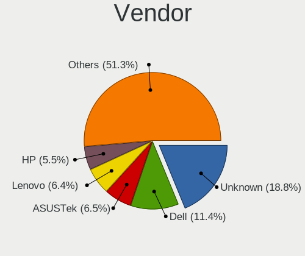
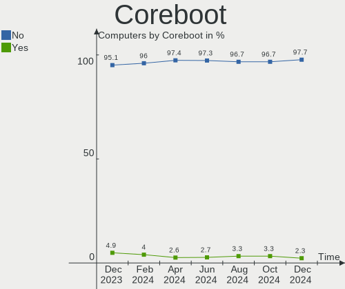
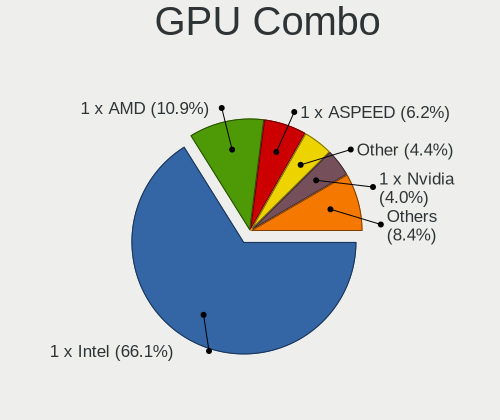
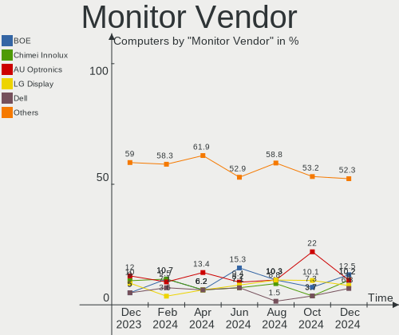

BSD - Hardware Trends
---------------------

A project to identify most popular hardware characteristics and track their change
over time based on data collected by BSD users at https://BSD-Hardware.info.

Anyone can contribute to this report by the [hw-probe](https://github.com/linuxhw/hw-probe/blob/master/INSTALL.BSD.md) tool:

    hw-probe -all -upload

This is a report for all computer types. See also reports for [desktops](/Desktop/README.md) and [notebooks](/Notebook/README.md).

OS-specific reports: [FreeBSD](/Dist/FreeBSD), [OPNsense](/Dist/OPNsense), [helloSystem](/Dist/helloSystem), [OpenBSD](/Dist/OpenBSD).

This report is for one last month. Overall report since the beginning of time: [TestCoverage](https://github.com/bsdhw/TestCoverage)

Period: Oct, 2022.

Contents
--------

* [ System ](#system)
  - [ OS                       ](#os)
  - [ OS Family                ](#os-family)
  - [ Arch                     ](#arch)
  - [ DE                       ](#de)
  - [ Display Server           ](#display-server)
  - [ Display Manager          ](#display-manager)
  - [ OS Lang                  ](#os-lang)
  - [ Boot Mode                ](#boot-mode)
  - [ Filesystem               ](#filesystem)
  - [ Part. scheme             ](#part-scheme)

* [ Board ](#board)
  - [ Vendor                   ](#vendor)
  - [ Model                    ](#model)
  - [ Model Family             ](#model-family)
  - [ MFG Year                 ](#mfg-year)
  - [ Form Factor              ](#form-factor)
  - [ Coreboot                 ](#coreboot)
  - [ RAM Size                 ](#ram-size)
  - [ RAM Used                 ](#ram-used)
  - [ Total Drives             ](#total-drives)
  - [ Has CD-ROM               ](#has-cd-rom)
  - [ Has Ethernet             ](#has-ethernet)
  - [ Has WiFi                 ](#has-wifi)
  - [ Has Bluetooth            ](#has-bluetooth)

* [ Location ](#location)
  - [ Country                  ](#country)
  - [ City                     ](#city)

* [ Drives ](#drives)
  - [ Drive Vendor             ](#drive-vendor)
  - [ Drive Model              ](#drive-model)
  - [ HDD Vendor               ](#hdd-vendor)
  - [ SSD Vendor               ](#ssd-vendor)
  - [ Drive Kind               ](#drive-kind)
  - [ Drive Connector          ](#drive-connector)
  - [ Drive Size               ](#drive-size)
  - [ Space Total              ](#space-total)
  - [ Space Used               ](#space-used)
  - [ Malfunc. Drives          ](#malfunc-drives)
  - [ Malfunc. Drive Vendor    ](#malfunc-drive-vendor)
  - [ Malfunc. HDD Vendor      ](#malfunc-hdd-vendor)
  - [ Malfunc. Drive Kind      ](#malfunc-drive-kind)
  - [ Failed Drives            ](#failed-drives)
  - [ Failed Drive Vendor      ](#failed-drive-vendor)
  - [ Drive Status             ](#drive-status)

* [ Storage controller ](#storage-controller)
  - [ Storage Vendor           ](#storage-vendor)
  - [ Storage Model            ](#storage-model)
  - [ Storage Kind             ](#storage-kind)

* [ Processor ](#processor)
  - [ CPU Vendor               ](#cpu-vendor)
  - [ CPU Model                ](#cpu-model)
  - [ CPU Model Family         ](#cpu-model-family)
  - [ CPU Cores                ](#cpu-cores)
  - [ CPU Sockets              ](#cpu-sockets)
  - [ CPU Threads              ](#cpu-threads)
  - [ CPU Microarch            ](#cpu-microarch)

* [ Graphics ](#graphics)
  - [ GPU Vendor               ](#gpu-vendor)
  - [ GPU Model                ](#gpu-model)
  - [ GPU Combo                ](#gpu-combo)
  - [ GPU Driver               ](#gpu-driver)
  - [ GPU Memory               ](#gpu-memory)

* [ Monitor ](#monitor)
  - [ Monitor Vendor           ](#monitor-vendor)
  - [ Monitor Model            ](#monitor-model)
  - [ Monitor Resolution       ](#monitor-resolution)
  - [ Monitor Diagonal         ](#monitor-diagonal)
  - [ Monitor Width            ](#monitor-width)
  - [ Aspect Ratio             ](#aspect-ratio)
  - [ Monitor Area             ](#monitor-area)
  - [ Pixel Density            ](#pixel-density)
  - [ Multiple Monitors        ](#multiple-monitors)

* [ Network ](#network)
  - [ Net Controller Vendor    ](#net-controller-vendor)
  - [ Net Controller Model     ](#net-controller-model)
  - [ Wireless Vendor          ](#wireless-vendor)
  - [ Wireless Model           ](#wireless-model)
  - [ Ethernet Vendor          ](#ethernet-vendor)
  - [ Ethernet Model           ](#ethernet-model)
  - [ Net Controller Kind      ](#net-controller-kind)
  - [ Used Controller          ](#used-controller)
  - [ NICs                     ](#nics)
  - [ IPv6                     ](#ipv6)

* [ Bluetooth ](#bluetooth)
  - [ Bluetooth Vendor         ](#bluetooth-vendor)
  - [ Bluetooth Model          ](#bluetooth-model)

* [ Sound ](#sound)
  - [ Sound Vendor             ](#sound-vendor)
  - [ Sound Model              ](#sound-model)

* [ Memory ](#memory)
  - [ Memory Vendor            ](#memory-vendor)
  - [ Memory Model             ](#memory-model)
  - [ Memory Kind              ](#memory-kind)
  - [ Memory Form Factor       ](#memory-form-factor)
  - [ Memory Size              ](#memory-size)
  - [ Memory Speed             ](#memory-speed)

* [ Printers & scanners ](#printers--scanners)
  - [ Printer Vendor           ](#printer-vendor)
  - [ Printer Model            ](#printer-model)
  - [ Scanner Vendor           ](#scanner-vendor)
  - [ Scanner Model            ](#scanner-model)

* [ Camera ](#camera)
  - [ Camera Vendor            ](#camera-vendor)
  - [ Camera Model             ](#camera-model)

* [ Security ](#security)
  - [ Fingerprint Vendor       ](#fingerprint-vendor)
  - [ Fingerprint Model        ](#fingerprint-model)
  - [ Chipcard Vendor          ](#chipcard-vendor)
  - [ Chipcard Model           ](#chipcard-model)

* [ Unsupported ](#unsupported)
  - [ Unsupported Devices      ](#unsupported-devices)
  - [ Unsupported Device Types ](#unsupported-device-types)

System
------

OS
--

Installed operating systems

| Name                 | Computers | Percent |
|----------------------|-----------|---------|
| OPNsense 22.7.6      | 156       | 37.86%  |
| OPNsense 22.7.5      | 67        | 16.26%  |
| OPNsense 22.7.4      | 41        | 9.95%   |
| FreeBSD 13.1-p2      | 26        | 6.31%   |
| OpenBSD 7.2          | 21        | 5.1%    |
| helloSystem 0.7.0    | 18        | 4.37%   |
| FreeBSD 13.1         | 16        | 3.88%   |
| OPNsense 22.1.10     | 10        | 2.43%   |
| helloSystem 0.8.0    | 9         | 2.18%   |
| OpenBSD 7.1          | 8         | 1.94%   |
| OPNsense 23.1        | 4         | 0.97%   |
| OPNsense 22.4.3      | 4         | 0.97%   |
| OPNsense 22.7.2      | 3         | 0.73%   |
| OPNsense 22.7        | 3         | 0.73%   |
| GhostBSD 22.09.16    | 2         | 0.49%   |
| FreeBSD 14.0-CURRENT | 2         | 0.49%   |
| FreeBSD 13.1-p1      | 2         | 0.49%   |
| pfSense 12.3-STABLE  | 1         | 0.24%   |
| OPNsense 22.10       | 1         | 0.24%   |
| OPNsense 22.1.9      | 1         | 0.24%   |
| OPNsense 22.1        | 1         | 0.24%   |
| OPNsense 21.7.8      | 1         | 0.24%   |
| OPNsense 20.7.5      | 1         | 0.24%   |
| NomadBSD 5806f915    | 1         | 0.24%   |
| NetBSD 9.3           | 1         | 0.24%   |
| MidnightBSD 3.0.0    | 1         | 0.24%   |
| helloSystem 13.1-p2  | 1         | 0.24%   |
| helloSystem 0.5.0    | 1         | 0.24%   |
| GhostBSD 22.10.30    | 1         | 0.24%   |
| GhostBSD 22.10.12    | 1         | 0.24%   |
| GhostBSD 22.06.18    | 1         | 0.24%   |
| FreeBSD 13.1-STABLE  | 1         | 0.24%   |
| FreeBSD 13.0-p12     | 1         | 0.24%   |
| FreeBSD 13.0-p10     | 1         | 0.24%   |
| FreeBSD 13.0         | 1         | 0.24%   |
| FreeBSD 12.4-BETA1   | 1         | 0.24%   |
| FreeBSD 12.3         | 1         | 0.24%   |

OS Family
---------

OS without a version

| Name        | Computers | Percent |
|-------------|-----------|---------|
| OPNsense    | 293       | 71.12%  |
| FreeBSD     | 52        | 12.62%  |
| OpenBSD     | 29        | 7.04%   |
| helloSystem | 29        | 7.04%   |
| GhostBSD    | 5         | 1.21%   |
| pfSense     | 1         | 0.24%   |
| NomadBSD    | 1         | 0.24%   |
| NetBSD      | 1         | 0.24%   |
| MidnightBSD | 1         | 0.24%   |

Arch
----

OS architecture (x86_64, i586, etc.)

| Name  | Computers | Percent |
|-------|-----------|---------|
| amd64 | 403       | 97.82%  |
| i386  | 7         | 1.7%    |
| arm64 | 2         | 0.49%   |

DE
--

Desktop Environment

| Name         | Computers | Percent |
|--------------|-----------|---------|
| Console      | 311       | 75.49%  |
| helloDesktop | 55        | 13.35%  |
| TWM          | 12        | 2.91%   |
| XFCE         | 11        | 2.67%   |
| KDE5         | 9         | 2.18%   |
| MATE         | 6         | 1.46%   |
| GNOME        | 4         | 0.97%   |
| Openbox      | 1         | 0.24%   |
| LXQt         | 1         | 0.24%   |
| LXDE         | 1         | 0.24%   |
| Cinnamon     | 1         | 0.24%   |

Display Server
--------------

X11 or Wayland

| Name    | Computers | Percent |
|---------|-----------|---------|
| Console | 317       | 76.94%  |
| X11     | 94        | 22.82%  |
| Wayland | 1         | 0.24%   |

Display Manager
---------------

SDDM, LightDM, etc.

| Name    | Computers | Percent |
|---------|-----------|---------|
| Console | 360       | 87.38%  |
| SLiM    | 31        | 7.52%   |
| SDDM    | 8         | 1.94%   |
| LightDM | 8         | 1.94%   |
| GDM     | 3         | 0.73%   |
| XDM     | 2         | 0.49%   |

OS Lang
-------

Language

| Lang    | Computers | Percent |
|---------|-----------|---------|
| Unknown | 316       | 76.7%   |
| C       | 45        | 10.92%  |
| en_US   | 36        | 8.74%   |
| de_DE   | 5         | 1.21%   |
| fr_FR   | 4         | 0.97%   |
| ru_RU   | 2         | 0.49%   |
| fi_FI   | 2         | 0.49%   |
| it_IT   | 1         | 0.24%   |
| en_CA   | 1         | 0.24%   |

Boot Mode
---------

EFI or BIOS

| Mode | Computers | Percent |
|------|-----------|---------|
| EFI  | 355       | 86.17%  |
| BIOS | 57        | 13.83%  |

Filesystem
----------

Type of filesystem

| Type   | Computers | Percent |
|--------|-----------|---------|
| Ufs    | 189       | 45.87%  |
| Zfs    | 182       | 44.17%  |
| Ffs    | 29        | 7.04%   |
| Cd9660 | 12        | 2.91%   |

Part. scheme
------------

Scheme of partitioning

| Type    | Computers | Percent |
|---------|-----------|---------|
| GPT     | 374       | 90.78%  |
| MBR     | 32        | 7.77%   |
| Unknown | 5         | 1.21%   |
| BSD     | 1         | 0.24%   |

Board
-----

Vendor
------

Motherboard manufacturer

| Name                           | Computers | Percent |
|--------------------------------|-----------|---------|
| Unknown                        | 50        | 12.14%  |
| Dell                           | 43        | 10.44%  |
| Lenovo                         | 41        | 9.95%   |
| Hewlett-Packard                | 31        | 7.52%   |
| ASUSTek Computer               | 21        | 5.1%    |
| ASRock                         | 19        | 4.61%   |
| Protectli                      | 18        | 4.37%   |
| Supermicro                     | 16        | 3.88%   |
| Intel                          | 16        | 3.88%   |
| PC Engines                     | 14        | 3.4%    |
| Sophos                         | 11        | 2.67%   |
| Acer                           | 10        | 2.43%   |
| MSI                            | 9         | 2.18%   |
| Fujitsu                        | 9         | 2.18%   |
| Gigabyte Technology            | 8         | 1.94%   |
| AMI                            | 6         | 1.46%   |
| Techvision                     | 5         | 1.21%   |
| MW                             | 5         | 1.21%   |
| CncTion                        | 5         | 1.21%   |
| BESSTAR Tech                   | 4         | 0.97%   |
| ZOTAC                          | 3         | 0.73%   |
| YANYU                          | 3         | 0.73%   |
| TUXEDO                         | 3         | 0.73%   |
| maiyunda                       | 3         | 0.73%   |
| Hardkernel                     | 3         | 0.73%   |
| Cisco                          | 3         | 0.73%   |
| AWOW                           | 3         | 0.73%   |
| Apple                          | 3         | 0.73%   |
| TYAN Computer                  | 2         | 0.49%   |
| Shuttle                        | 2         | 0.49%   |
| Seeed Studio                   | 2         | 0.49%   |
| Panasonic                      | 2         | 0.49%   |
| Matsushita Electric Industrial | 2         | 0.49%   |
| IBM                            | 2         | 0.49%   |
| Deciso                         | 2         | 0.49%   |
| Cisco Systems                  | 2         | 0.49%   |
| AZW                            | 2         | 0.49%   |
| ASRockRack                     | 2         | 0.49%   |
| Alienware                      | 2         | 0.49%   |
| Yanling                        | 1         | 0.24%   |

Model
-----

Motherboard model

| Name                                             | Computers | Percent |
|--------------------------------------------------|-----------|---------|
| Unknown                                          | 50        | 12.14%  |
| Protectli FW4B                                   | 10        | 2.43%   |
| PC Engines APU2                                  | 9         | 2.18%   |
| Protectli FW6                                    | 6         | 1.46%   |
| Dell OptiPlex 3020                               | 6         | 1.46%   |
| Techvision TVI7309X                              | 5         | 1.21%   |
| Sophos SG                                        | 5         | 1.21%   |
| MW GMLK-2_5G4L                                   | 5         | 1.21%   |
| Sophos XG                                        | 4         | 0.97%   |
| Fujitsu FUTRO S920                               | 4         | 0.97%   |
| AMI Aptio CRB                                    | 4         | 0.97%   |
| Supermicro Super Server                          | 3         | 0.73%   |
| PC Engines apu1                                  | 3         | 0.73%   |
| maiyunda www.maiyunda.com                        | 3         | 0.73%   |
| Intel Q3XXG4-P V1.0                              | 3         | 0.73%   |
| HP t730 Thin Client                              | 3         | 0.73%   |
| Dell PowerEdge R630                              | 3         | 0.73%   |
| Dell PowerEdge R220                              | 3         | 0.73%   |
| Dell OptiPlex 9020                               | 3         | 0.73%   |
| CncTion N5105-4L                                 | 3         | 0.73%   |
| Cisco SALEEN                                     | 3         | 0.73%   |
| TUXEDO Aura 15 Gen1                              | 2         | 0.49%   |
| Supermicro 1HE Intel Single-CPU RI1102D-F Server | 2         | 0.49%   |
| Sophos UTM                                       | 2         | 0.49%   |
| Seeed Studio ODYSSEY-X86J4125                    | 2         | 0.49%   |
| PC Engines apu4                                  | 2         | 0.49%   |
| Lenovo ThinkCentre M720q 10T7004BMB              | 2         | 0.49%   |
| Intel H81U                                       | 2         | 0.49%   |
| HP ProDesk 600 G1 SFF                            | 2         | 0.49%   |
| HP 260 G3 DM                                     | 2         | 0.49%   |
| Hardkernel ODROID-H2                             | 2         | 0.49%   |
| Fujitsu LIFEBOOK E752                            | 2         | 0.49%   |
| Dell Wyse 5070 Extended Thin Client              | 2         | 0.49%   |
| Dell Precision M4500                             | 2         | 0.49%   |
| Dell PowerEdge R210 II                           | 2         | 0.49%   |
| Dell OptiPlex 7040                               | 2         | 0.49%   |
| Dell Latitude E6420                              | 2         | 0.49%   |
| Dell Latitude 5591                               | 2         | 0.49%   |
| Deciso NetBoard-A10                              | 2         | 0.49%   |
| Cisco Systems UCSC-C240-M5SX                     | 2         | 0.49%   |

Model Family
------------

Motherboard model prefix

| Name                          | Computers | Percent |
|-------------------------------|-----------|---------|
| Unknown                       | 50        | 12.14%  |
| Lenovo ThinkPad               | 19        | 4.61%   |
| Dell OptiPlex                 | 16        | 3.88%   |
| Lenovo ThinkCentre            | 13        | 3.16%   |
| Dell PowerEdge                | 12        | 2.91%   |
| Protectli FW4B                | 10        | 2.43%   |
| PC Engines APU2               | 9         | 2.18%   |
| Protectli FW6                 | 6         | 1.46%   |
| Acer Aspire                   | 6         | 1.46%   |
| Techvision TVI7309X           | 5         | 1.21%   |
| Sophos SG                     | 5         | 1.21%   |
| MW GMLK-2                     | 5         | 1.21%   |
| HP ProDesk                    | 5         | 1.21%   |
| Dell Precision                | 5         | 1.21%   |
| Sophos XG                     | 4         | 0.97%   |
| HP Compaq                     | 4         | 0.97%   |
| Fujitsu FUTRO                 | 4         | 0.97%   |
| Dell Latitude                 | 4         | 0.97%   |
| AMI Aptio                     | 4         | 0.97%   |
| Supermicro Super              | 3         | 0.73%   |
| PC Engines apu1               | 3         | 0.73%   |
| maiyunda www.maiyunda.com     | 3         | 0.73%   |
| Lenovo IdeaPad                | 3         | 0.73%   |
| Intel Q3XXG4-P                | 3         | 0.73%   |
| HP t730                       | 3         | 0.73%   |
| HP ProLiant                   | 3         | 0.73%   |
| HP Pavilion                   | 3         | 0.73%   |
| Fujitsu LIFEBOOK              | 3         | 0.73%   |
| Dell Inspiron                 | 3         | 0.73%   |
| CncTion N5105-4L              | 3         | 0.73%   |
| Cisco SALEEN                  | 3         | 0.73%   |
| ASUS TUF                      | 3         | 0.73%   |
| TUXEDO Aura                   | 2         | 0.49%   |
| Supermicro 1HE                | 2         | 0.49%   |
| Sophos UTM                    | 2         | 0.49%   |
| Seeed Studio ODYSSEY-X86J4125 | 2         | 0.49%   |
| PC Engines apu4               | 2         | 0.49%   |
| Intel H81U                    | 2         | 0.49%   |
| HP EliteDesk                  | 2         | 0.49%   |
| HP 260                        | 2         | 0.49%   |

MFG Year
--------

Motherboard manufacture year

| Year    | Computers | Percent |
|---------|-----------|---------|
| 2022    | 63        | 15.29%  |
| 2018    | 50        | 12.14%  |
| 2021    | 42        | 10.19%  |
| 2019    | 39        | 9.47%   |
| 2013    | 31        | 7.52%   |
| 2020    | 29        | 7.04%   |
| 2016    | 25        | 6.07%   |
| 2017    | 22        | 5.34%   |
| 2015    | 21        | 5.1%    |
| 2014    | 21        | 5.1%    |
| 2012    | 17        | 4.13%   |
| 2010    | 13        | 3.16%   |
| 2011    | 12        | 2.91%   |
| 2008    | 8         | 1.94%   |
| Unknown | 5         | 1.21%   |
| 2009    | 4         | 0.97%   |
| 2007    | 4         | 0.97%   |
| 2006    | 3         | 0.73%   |
| 2004    | 1         | 0.24%   |
| 2003    | 1         | 0.24%   |
| 2002    | 1         | 0.24%   |

Form Factor
-----------

Physical design of the computer

| Name       | Computers | Percent |
|------------|-----------|---------|
| Desktop    | 266       | 64.56%  |
| Notebook   | 74        | 17.96%  |
| Mini pc    | 33        | 8.01%   |
| Server     | 27        | 6.55%   |
| Firewall   | 11        | 2.67%   |
| All in one | 1         | 0.24%   |

Coreboot
--------

Have coreboot on board

| Used | Computers | Percent |
|------|-----------|---------|
| No   | 390       | 94.66%  |
| Yes  | 22        | 5.34%   |

RAM Size
--------

Total RAM memory

| Size in GB  | Computers | Percent |
|-------------|-----------|---------|
| 8.01-16.0   | 163       | 39.56%  |
| 16.01-24.0  | 89        | 21.6%   |
| 4.01-8.0    | 76        | 18.45%  |
| 32.01-64.0  | 30        | 7.28%   |
| 64.01-256.0 | 19        | 4.61%   |
| 2.01-3.0    | 15        | 3.64%   |
| 3.01-4.0    | 8         | 1.94%   |
| 0.51-1.0    | 7         | 1.7%    |
| 24.01-32.0  | 4         | 0.97%   |
| 1.01-2.0    | 1         | 0.24%   |

RAM Used
--------

Used RAM memory

| Used GB    | Computers | Percent |
|------------|-----------|---------|
| 0.01-0.5   | 216       | 52.43%  |
| 0.51-1.0   | 129       | 31.31%  |
| 1.01-2.0   | 42        | 10.19%  |
| 2.01-3.0   | 11        | 2.67%   |
| 3.01-4.0   | 6         | 1.46%   |
| 4.01-8.0   | 3         | 0.73%   |
| 0          | 3         | 0.73%   |
| 24.01-32.0 | 1         | 0.24%   |
| Unknown    | 1         | 0.24%   |

Total Drives
------------

Number of drives on board

| Drives | Computers | Percent |
|--------|-----------|---------|
| 1      | 305       | 74.03%  |
| 0      | 42        | 10.19%  |
| 2      | 38        | 9.22%   |
| 3      | 11        | 2.67%   |
| 6      | 4         | 0.97%   |
| 5      | 4         | 0.97%   |
| 4      | 4         | 0.97%   |
| 14     | 1         | 0.24%   |
| 13     | 1         | 0.24%   |
| 10     | 1         | 0.24%   |
| 8      | 1         | 0.24%   |

Has CD-ROM
----------

Has CD-ROM on board

| Presented | Computers | Percent |
|-----------|-----------|---------|
| No        | 359       | 87.14%  |
| Yes       | 53        | 12.86%  |

Has Ethernet
------------

Has Ethernet on board

| Presented | Computers | Percent |
|-----------|-----------|---------|
| Yes       | 398       | 96.6%   |
| No        | 14        | 3.4%    |

Has WiFi
--------

Has WiFi module

| Presented | Computers | Percent |
|-----------|-----------|---------|
| No        | 278       | 67.48%  |
| Yes       | 134       | 32.52%  |

Has Bluetooth
-------------

Has Bluetooth module

| Presented | Computers | Percent |
|-----------|-----------|---------|
| No        | 316       | 76.7%   |
| Yes       | 96        | 23.3%   |

Location
--------

Country
-------

Geographic location (country)

| Country      | Computers | Percent |
|--------------|-----------|---------|
| USA          | 114       | 27.67%  |
| Germany      | 72        | 17.48%  |
| Canada       | 24        | 5.83%   |
| France       | 20        | 4.85%   |
| UK           | 17        | 4.13%   |
| Russia       | 15        | 3.64%   |
| Australia    | 15        | 3.64%   |
| Brazil       | 12        | 2.91%   |
| Italy        | 10        | 2.43%   |
| China        | 9         | 2.18%   |
| Poland       | 8         | 1.94%   |
| Spain        | 7         | 1.7%    |
| Finland      | 7         | 1.7%    |
| Netherlands  | 6         | 1.46%   |
| Belgium      | 6         | 1.46%   |
| Portugal     | 5         | 1.21%   |
| Switzerland  | 4         | 0.97%   |
| India        | 4         | 0.97%   |
| Sweden       | 3         | 0.73%   |
| Romania      | 3         | 0.73%   |
| New Zealand  | 3         | 0.73%   |
| Indonesia    | 3         | 0.73%   |
| Greece       | 3         | 0.73%   |
| Denmark      | 3         | 0.73%   |
| Czechia      | 3         | 0.73%   |
| Austria      | 3         | 0.73%   |
| Venezuela    | 2         | 0.49%   |
| Mexico       | 2         | 0.49%   |
| Latvia       | 2         | 0.49%   |
| Israel       | 2         | 0.49%   |
| Iran         | 2         | 0.49%   |
| Argentina    | 2         | 0.49%   |
| Ukraine      | 1         | 0.24%   |
| Turkey       | 1         | 0.24%   |
| Thailand     | 1         | 0.24%   |
| Taiwan       | 1         | 0.24%   |
| South Africa | 1         | 0.24%   |
| Slovenia     | 1         | 0.24%   |
| Norway       | 1         | 0.24%   |
| Malta        | 1         | 0.24%   |

City
----

Geographic location (city)

| City                 | Computers | Percent |
|----------------------|-----------|---------|
| Montreal             | 12        | 2.91%   |
| Berlin               | 7         | 1.7%    |
| Sydney               | 6         | 1.46%   |
| Paris                | 6         | 1.46%   |
| Munich               | 4         | 0.97%   |
| Moscow               | 4         | 0.97%   |
| Melbourne            | 4         | 0.97%   |
| Beijing              | 4         | 0.97%   |
| Wiesbaden            | 3         | 0.73%   |
| Temple               | 3         | 0.73%   |
| New York             | 3         | 0.73%   |
| Hamburg              | 3         | 0.73%   |
| City of Saint Peters | 3         | 0.73%   |
| Adelaide             | 3         | 0.73%   |
| Woodstock            | 2         | 0.49%   |
| Wels                 | 2         | 0.49%   |
| Vancouver            | 2         | 0.49%   |
| Salem                | 2         | 0.49%   |
| Redmond              | 2         | 0.49%   |
| Portland             | 2         | 0.49%   |
| Oakland              | 2         | 0.49%   |
| Nuremberg            | 2         | 0.49%   |
| Milwaukee            | 2         | 0.49%   |
| Miami                | 2         | 0.49%   |
| Maracaibo            | 2         | 0.49%   |
| Lübeck              | 2         | 0.49%   |
| Leipzig              | 2         | 0.49%   |
| Lahti                | 2         | 0.49%   |
| Kongens Lyngby       | 2         | 0.49%   |
| Hofstetten           | 2         | 0.49%   |
| Dumfries             | 2         | 0.49%   |
| Dallas               | 2         | 0.49%   |
| Conway               | 2         | 0.49%   |
| Cologne              | 2         | 0.49%   |
| City of London       | 2         | 0.49%   |
| Cileungsir           | 2         | 0.49%   |
| Chernogolovka        | 2         | 0.49%   |
| Carry-le-Rouet       | 2         | 0.49%   |
| Auckland             | 2         | 0.49%   |
| Atlanta              | 2         | 0.49%   |

Drives
------

Drive Vendor
------------

Hard drive vendors

| Vendor              | Computers | Drives | Percent |
|---------------------|-----------|--------|---------|
| Samsung Electronics | 73        | 95     | 16.78%  |
| WDC                 | 51        | 79     | 11.72%  |
| Kingston            | 39        | 41     | 8.97%   |
| Seagate             | 30        | 43     | 6.9%    |
| Crucial             | 30        | 32     | 6.9%    |
| Transcend           | 17        | 17     | 3.91%   |
| China               | 17        | 18     | 3.91%   |
| Toshiba             | 13        | 18     | 2.99%   |
| A-DATA Technology   | 12        | 12     | 2.76%   |
| SanDisk             | 11        | 11     | 2.53%   |
| Intel               | 11        | 14     | 2.53%   |
| Hoodisk             | 8         | 8      | 1.84%   |
| PNY                 | 7         | 9      | 1.61%   |
| Hitachi             | 7         | 8      | 1.61%   |
| FORESEE             | 7         | 7      | 1.61%   |
| SPCC                | 6         | 6      | 1.38%   |
| NVMe                | 6         | 7      | 1.38%   |
| Micron Technology   | 6         | 6      | 1.38%   |
| SK hynix            | 5         | 5      | 1.15%   |
| Intenso             | 5         | 5      | 1.15%   |
| HGST                | 4         | 7      | 0.92%   |
| Hewlett-Packard     | 4         | 6      | 0.92%   |
| Dogfish             | 4         | 4      | 0.92%   |
| Silicon Motion      | 3         | 3      | 0.69%   |
| ShiJi               | 3         | 3      | 0.69%   |
| Protectli           | 3         | 3      | 0.69%   |
| Phison              | 3         | 3      | 0.69%   |
| OPENBSD             | 3         | 3      | 0.69%   |
| OCZ                 | 3         | 3      | 0.69%   |
| Innodisk            | 3         | 3      | 0.69%   |
| Corsair             | 3         | 3      | 0.69%   |
| Vaseky              | 2         | 2      | 0.46%   |
| Netac               | 2         | 2      | 0.46%   |
| KIOXIA              | 2         | 2      | 0.46%   |
| Fujitsu             | 2         | 2      | 0.46%   |
| Cisco               | 2         | 2      | 0.46%   |
| BIWIN               | 2         | 2      | 0.46%   |
| Zheino              | 1         | 1      | 0.23%   |
| Yeyian              | 1         | 2      | 0.23%   |
| V-GeN               | 1         | 1      | 0.23%   |

Drive Model
-----------

Hard drive models

| Model                              | Computers | Percent |
|------------------------------------|-----------|---------|
| Kingston SA400S37240G 240GB        | 9         | 1.91%   |
| China SATA SSD 16GB                | 8         | 1.7%    |
| Crucial CT240BX500SSD1 240GB       | 5         | 1.06%   |
| A-DATA IM2S3134N-064GM 64GB        | 5         | 1.06%   |
| Seagate ST500DM002-1BD142 500GB    | 4         | 0.85%   |
| Seagate ST1000LM035-1RK172 1TB     | 4         | 0.85%   |
| Samsung SSD 850 EVO 250GB          | 4         | 0.85%   |
| Hoodisk SSD 128GB                  | 4         | 0.85%   |
| FORESEE 128GB SSD                  | 4         | 0.85%   |
| Transcend TS128GMSA230S 128GB      | 3         | 0.64%   |
| Samsung SSD 980 500GB              | 3         | 0.64%   |
| Samsung SSD 970 EVO Plus 2TB       | 3         | 0.64%   |
| Kingston SV300S37A120G 120GB       | 3         | 0.64%   |
| Kingston SUV500MS120G 120GB        | 3         | 0.64%   |
| Intenso SSD 128GB                  | 3         | 0.64%   |
| Hoodisk SSD 64GB                   | 3         | 0.64%   |
| Dogfish SSD 128GB                  | 3         | 0.64%   |
| Crucial CT500MX500SSD1 500GB       | 3         | 0.64%   |
| Crucial CT250P2SSD8 250GB          | 3         | 0.64%   |
| Crucial CT250MX500SSD1 250GB       | 3         | 0.64%   |
| Crucial CT120BX500SSD1 120GB       | 3         | 0.64%   |
| China MSATA 32GB SSD               | 3         | 0.64%   |
| WDC WDS120G2G0A-00JH30 120GB       | 2         | 0.43%   |
| WDC WDS100T3X0C-00SJG0 1TB         | 2         | 0.43%   |
| WDC WD80EZAZ-11TDBA0 8TB           | 2         | 0.43%   |
| WDC WD3200BPVT-80JJ5T0 320GB       | 2         | 0.43%   |
| WDC WD30EFRX-68EUZN0 3TB           | 2         | 0.43%   |
| WDC WD20EARX-00PASB0 2TB           | 2         | 0.43%   |
| Transcend TS64GMSA230S 64GB        | 2         | 0.43%   |
| Transcend TS256GMSA230S 256GB      | 2         | 0.43%   |
| Toshiba DT01ACA100 1TB             | 2         | 0.43%   |
| SPCC Solid State Disk 128GB        | 2         | 0.43%   |
| ShiJi SSD 128GB                    | 2         | 0.43%   |
| Seagate ST4000DM000-1F2168 4TB     | 2         | 0.43%   |
| Seagate ST3500413AS 500GB          | 2         | 0.43%   |
| Seagate ST1000LM024 HN-M101MBB 1TB | 2         | 0.43%   |
| Seagate ST1000DM003-1CH162 1TB     | 2         | 0.43%   |
| SanDisk SSD PLUS 240GB             | 2         | 0.43%   |
| SanDisk SSD PLUS 120GB             | 2         | 0.43%   |
| SanDisk SD6SB1M256G1022I 256GB     | 2         | 0.43%   |

HDD Vendor
----------

Hard disk drive vendors

| Vendor              | Computers | Drives | Percent |
|---------------------|-----------|--------|---------|
| WDC                 | 34        | 60     | 32.08%  |
| Seagate             | 30        | 43     | 28.3%   |
| Toshiba             | 9         | 13     | 8.49%   |
| Hitachi             | 7         | 8      | 6.6%    |
| Samsung Electronics | 5         | 6      | 4.72%   |
| NVMe                | 4         | 5      | 3.77%   |
| HGST                | 4         | 7      | 3.77%   |
| OPENBSD             | 3         | 3      | 2.83%   |
| Hewlett-Packard     | 3         | 5      | 2.83%   |
| Fujitsu             | 2         | 2      | 1.89%   |
| Cisco               | 2         | 2      | 1.89%   |
| QUANTUM             | 1         | 1      | 0.94%   |
| Maxtor              | 1         | 1      | 0.94%   |
| LSI                 | 1         | 1      | 0.94%   |

SSD Vendor
----------

Solid state drive vendors

| Vendor              | Computers | Drives | Percent |
|---------------------|-----------|--------|---------|
| Samsung Electronics | 39        | 54     | 15.6%   |
| Kingston            | 31        | 33     | 12.4%   |
| Crucial             | 26        | 28     | 10.4%   |
| China               | 17        | 18     | 6.8%    |
| Transcend           | 15        | 15     | 6%      |
| SanDisk             | 11        | 11     | 4.4%    |
| A-DATA Technology   | 11        | 11     | 4.4%    |
| Intel               | 8         | 10     | 3.2%    |
| Hoodisk             | 8         | 8      | 3.2%    |
| WDC                 | 6         | 8      | 2.4%    |
| PNY                 | 6         | 8      | 2.4%    |
| FORESEE             | 6         | 6      | 2.4%    |
| Micron Technology   | 5         | 5      | 2%      |
| Intenso             | 5         | 5      | 2%      |
| SPCC                | 4         | 4      | 1.6%    |
| Dogfish             | 4         | 4      | 1.6%    |
| SK hynix            | 3         | 3      | 1.2%    |
| ShiJi               | 3         | 3      | 1.2%    |
| Protectli           | 3         | 3      | 1.2%    |
| OCZ                 | 3         | 3      | 1.2%    |
| Innodisk            | 3         | 3      | 1.2%    |
| Vaseky              | 2         | 2      | 0.8%    |
| NVMe                | 2         | 2      | 0.8%    |
| Netac               | 2         | 2      | 0.8%    |
| Corsair             | 2         | 2      | 0.8%    |
| BIWIN               | 2         | 2      | 0.8%    |
| Zheino              | 1         | 1      | 0.4%    |
| Yeyian              | 1         | 2      | 0.4%    |
| V-GeN               | 1         | 1      | 0.4%    |
| Toshiba             | 1         | 1      | 0.4%    |
| Smartbuy            | 1         | 1      | 0.4%    |
| Silicon             | 1         | 1      | 0.4%    |
| Plextor             | 1         | 1      | 0.4%    |
| Phison              | 1         | 1      | 0.4%    |
| Patriot             | 1         | 1      | 0.4%    |
| ORICO               | 1         | 1      | 0.4%    |
| Mushkin             | 1         | 1      | 0.4%    |
| LITEONIT            | 1         | 1      | 0.4%    |
| LITEON              | 1         | 1      | 0.4%    |
| Lexar               | 1         | 1      | 0.4%    |

Drive Kind
----------

HDD or SSD

| Kind | Computers | Drives | Percent |
|------|-----------|--------|---------|
| SSD  | 239       | 277    | 58.29%  |
| HDD  | 90        | 157    | 21.95%  |
| NVMe | 81        | 87     | 19.76%  |

Drive Connector
---------------

SATA, SAS, NVMe, etc.

| Type | Computers | Drives | Percent |
|------|-----------|--------|---------|
| SATA | 309       | 434    | 79.23%  |
| NVMe | 81        | 87     | 20.77%  |

Drive Size
----------

Size of hard drive

| Size in TB | Computers | Drives | Percent |
|------------|-----------|--------|---------|
| 0.01-0.5   | 261       | 296    | 77.45%  |
| 0.51-1.0   | 41        | 55     | 12.17%  |
| 1.01-2.0   | 14        | 32     | 4.15%   |
| 3.01-4.0   | 8         | 13     | 2.37%   |
| 4.01-10.0  | 6         | 25     | 1.78%   |
| 2.01-3.0   | 5         | 7      | 1.48%   |
| 10.01-20.0 | 2         | 6      | 0.59%   |

Space Total
-----------

Amount of disk space available on the file system

| Size in GB     | Computers | Percent |
|----------------|-----------|---------|
| 101-250        | 179       | 43.45%  |
| 251-500        | 77        | 18.69%  |
| 21-50          | 51        | 12.38%  |
| 51-100         | 34        | 8.25%   |
| 1-20           | 33        | 8.01%   |
| 501-1000       | 22        | 5.34%   |
| More than 3000 | 6         | 1.46%   |
| 2001-3000      | 4         | 0.97%   |
| 1001-2000      | 4         | 0.97%   |
| Unknown        | 2         | 0.49%   |

Space Used
----------

Amount of used disk space

| Used GB        | Computers | Percent |
|----------------|-----------|---------|
| 1-20           | 369       | 89.56%  |
| 21-50          | 23        | 5.58%   |
| 101-250        | 7         | 1.7%    |
| 51-100         | 6         | 1.46%   |
| More than 3000 | 3         | 0.73%   |
| Unknown        | 2         | 0.49%   |
| 251-500        | 1         | 0.24%   |
| 2001-3000      | 1         | 0.24%   |

Malfunc. Drives
---------------

Drive models with a malfunction

| Model                                        | Computers | Drives | Percent |
|----------------------------------------------|-----------|--------|---------|
| WDC WD3200BPVT-80JJ5T0 320GB                 | 2         | 2      | 3.33%   |
| Seagate ST500DM002-1BD142 500GB              | 2         | 2      | 3.33%   |
| Seagate ST1000LM024 HN-M101MBB 1TB           | 2         | 2      | 3.33%   |
| Samsung Electronics HD501LJ 500GB            | 2         | 2      | 3.33%   |
| Crucial CT275MX300SSD1 275GB                 | 2         | 2      | 3.33%   |
| WDC WD7500AACS-00ZJB0 752GB                  | 1         | 1      | 1.67%   |
| WDC WD3200BPVT-80ZEST0 320GB                 | 1         | 1      | 1.67%   |
| WDC WD3200AAJS-00YZCA0 320GB                 | 1         | 1      | 1.67%   |
| WDC WD30EFRX-68EUZN0 3TB                     | 1         | 1      | 1.67%   |
| WDC WD15EARS-00Z5B1 1.5TB                    | 1         | 1      | 1.67%   |
| Toshiba THNSNK256GVN8 M.2 2280 256GB         | 1         | 1      | 1.67%   |
| Toshiba MQ01ACF050 500GB                     | 1         | 2      | 1.67%   |
| Toshiba MQ01ACF032 320GB                     | 1         | 1      | 1.67%   |
| Toshiba MQ01ABF032 320GB                     | 1         | 1      | 1.67%   |
| Toshiba MK6034GSX 64GB                       | 1         | 1      | 1.67%   |
| Toshiba MK5065GSX 500GB                      | 1         | 1      | 1.67%   |
| Toshiba DT01ACA100 1TB                       | 1         | 1      | 1.67%   |
| SK hynix SC308 SATA 128GB                    | 1         | 1      | 1.67%   |
| Seagate ST96812AS 64GB                       | 1         | 1      | 1.67%   |
| Seagate ST9320325AS 320GB                    | 1         | 1      | 1.67%   |
| Seagate ST4000NM0033-9ZM170 4TB              | 1         | 2      | 1.67%   |
| Seagate ST4000DM004-2CV104 4TB               | 1         | 1      | 1.67%   |
| Seagate ST3500413AS 500GB                    | 1         | 1      | 1.67%   |
| Seagate ST2000DL001-9VT156 2TB               | 1         | 1      | 1.67%   |
| Seagate ST1000LM014-1EJ164 1TB               | 1         | 1      | 1.67%   |
| Seagate ST1000DM003-1CH162 1TB               | 1         | 1      | 1.67%   |
| SanDisk SD7SB3Q128G1001 128GB                | 1         | 1      | 1.67%   |
| Samsung Electronics SSD PM810 2.5-inch 256GB | 1         | 1      | 1.67%   |
| Samsung Electronics SSD 980 500GB            | 1         | 1      | 1.67%   |
| Samsung Electronics SSD 960 PRO 512GB        | 1         | 1      | 1.67%   |
| Samsung Electronics MZMPA128HMFU-000H1 128GB | 1         | 1      | 1.67%   |
| Samsung Electronics HM320II 320GB            | 1         | 1      | 1.67%   |
| Phison NETLIST SSD 8GB-001                   | 1         | 1      | 1.67%   |
| OCZ VERTEX3 120GB                            | 1         | 1      | 1.67%   |
| Netac SSD 128GB                              | 1         | 1      | 1.67%   |
| Mushkin MKNSSDEC512GB                        | 1         | 1      | 1.67%   |
| Micron Technology C400-MTFDDAT064MAM 64GB    | 1         | 1      | 1.67%   |
| Maxtor 6E030L0 32GB                          | 1         | 1      | 1.67%   |
| Kingston SVP200S37A120G 120GB                | 1         | 1      | 1.67%   |
| Kingston SV300S37A120G 120GB                 | 1         | 1      | 1.67%   |

Malfunc. Drive Vendor
---------------------

Vendors of faulty drives

| Vendor              | Computers | Drives | Percent |
|---------------------|-----------|--------|---------|
| Seagate             | 12        | 13     | 20.69%  |
| Toshiba             | 7         | 8      | 12.07%  |
| Samsung Electronics | 7         | 7      | 12.07%  |
| WDC                 | 6         | 7      | 10.34%  |
| Kingston            | 5         | 6      | 8.62%   |
| Crucial             | 3         | 3      | 5.17%   |
| Intel               | 2         | 3      | 3.45%   |
| HGST                | 2         | 2      | 3.45%   |
| Corsair             | 2         | 2      | 3.45%   |
| SK hynix            | 1         | 1      | 1.72%   |
| SanDisk             | 1         | 1      | 1.72%   |
| Phison              | 1         | 1      | 1.72%   |
| OCZ                 | 1         | 1      | 1.72%   |
| Netac               | 1         | 1      | 1.72%   |
| Mushkin             | 1         | 1      | 1.72%   |
| Micron Technology   | 1         | 1      | 1.72%   |
| Maxtor              | 1         | 1      | 1.72%   |
| Hitachi             | 1         | 1      | 1.72%   |
| China               | 1         | 1      | 1.72%   |
| BIWIN               | 1         | 1      | 1.72%   |
| A-DATA Technology   | 1         | 1      | 1.72%   |

Malfunc. HDD Vendor
-------------------

Vendors of faulty HDD drives

| Vendor              | Computers | Drives | Percent |
|---------------------|-----------|--------|---------|
| Seagate             | 12        | 13     | 38.71%  |
| WDC                 | 6         | 7      | 19.35%  |
| Toshiba             | 6         | 7      | 19.35%  |
| Samsung Electronics | 3         | 3      | 9.68%   |
| HGST                | 2         | 2      | 6.45%   |
| Maxtor              | 1         | 1      | 3.23%   |
| Hitachi             | 1         | 1      | 3.23%   |

Malfunc. Drive Kind
-------------------

Kinds of faulty drives

| Kind | Computers | Drives | Percent |
|------|-----------|--------|---------|
| HDD  | 30        | 34     | 52.63%  |
| SSD  | 25        | 27     | 43.86%  |
| NVMe | 2         | 2      | 3.51%   |

Failed Drives
-------------

Failed drive models

Zero info for selected period =(

Failed Drive Vendor
-------------------

Failed drive vendors

Zero info for selected period =(

Drive Status
------------

Number of failed and malfunc. drives

| Status   | Computers | Drives | Percent |
|----------|-----------|--------|---------|
| Works    | 318       | 424    | 81.12%  |
| Malfunc  | 55        | 63     | 14.03%  |
| Detected | 19        | 34     | 4.85%   |

Storage controller
------------------

Storage Vendor
--------------

Storage controller vendors

| Vendor                       | Computers | Percent |
|------------------------------|-----------|---------|
| Intel                        | 334       | 65.75%  |
| AMD                          | 55        | 10.83%  |
| Samsung Electronics          | 34        | 6.69%   |
| SanDisk                      | 15        | 2.95%   |
| Broadcom / LSI               | 13        | 2.56%   |
| Kingston Technology Company  | 7         | 1.38%   |
| Silicon Motion               | 6         | 1.18%   |
| Phison Electronics           | 5         | 0.98%   |
| Micron/Crucial Technology    | 5         | 0.98%   |
| Marvell Technology Group     | 5         | 0.98%   |
| ASMedia Technology           | 5         | 0.98%   |
| Toshiba                      | 3         | 0.59%   |
| KIOXIA                       | 3         | 0.59%   |
| SK hynix                     | 2         | 0.39%   |
| Realtek Semiconductor        | 2         | 0.39%   |
| Hewlett-Packard              | 2         | 0.39%   |
| Adaptec                      | 2         | 0.39%   |
| Unknown                      | 2         | 0.39%   |
| Union Memory (Shenzhen)      | 1         | 0.2%    |
| Silicon Image                | 1         | 0.2%    |
| Shenzhen Longsys Electronics | 1         | 0.2%    |
| Nvidia                       | 1         | 0.2%    |
| MAXIO Technology (Hangzhou)  | 1         | 0.2%    |
| JMicron Technology           | 1         | 0.2%    |
| Chelsio Communications       | 1         | 0.2%    |
| ADATA Technology             | 1         | 0.2%    |

Storage Model
-------------

Storage controller models

| Model                                                                            | Computers | Percent |
|----------------------------------------------------------------------------------|-----------|---------|
| AMD FCH SATA Controller [AHCI mode]                                              | 38        | 6.73%   |
| Intel Celeron/Pentium Silver Processor SATA Controller                           | 31        | 5.49%   |
| Intel 8 Series/C220 Series Chipset Family 6-port SATA Controller 1 [AHCI mode]   | 28        | 4.96%   |
| Intel Jasper Lake SATA AHCI Controller                                           | 25        | 4.42%   |
| Intel Sunrise Point-LP SATA Controller [AHCI mode]                               | 18        | 3.19%   |
| Intel Q170/Q150/B150/H170/H110/Z170/CM236 Chipset SATA Controller [AHCI Mode]    | 18        | 3.19%   |
| Samsung NVMe SSD Controller SM981/PM981/PM983                                    | 16        | 2.83%   |
| Intel Atom/Celeron/Pentium Processor x5-E8000/J3xxx/N3xxx Series SATA Controller | 15        | 2.65%   |
| Intel Atom Processor E3800 Series SATA AHCI Controller                           | 12        | 2.12%   |
| Unknown                                                                          | 12        | 2.12%   |
| Intel Cannon Lake PCH SATA AHCI Controller                                       | 11        | 1.95%   |
| Intel 7 Series Chipset Family 6-port SATA Controller [AHCI mode]                 | 11        | 1.95%   |
| Intel 6 Series/C200 Series Chipset Family 6 port Desktop SATA AHCI Controller    | 11        | 1.95%   |
| Samsung NVMe SSD Controller 980                                                  | 10        | 1.77%   |
| Intel Celeron N3350/Pentium N4200/Atom E3900 Series SATA AHCI Controller         | 10        | 1.77%   |
| Intel 5 Series/3400 Series Chipset 6 port SATA AHCI Controller                   | 10        | 1.77%   |
| Intel 8 Series SATA Controller 1 [AHCI mode]                                     | 9         | 1.59%   |
| Intel SATA Controller [RAID mode]                                                | 7         | 1.24%   |
| Intel NM10/ICH7 Family SATA Controller [IDE mode]                                | 7         | 1.24%   |
| Intel Comet Lake SATA AHCI Controller                                            | 7         | 1.24%   |
| Intel 82801G (ICH7 Family) IDE Controller                                        | 7         | 1.24%   |
| Intel 200 Series PCH SATA controller [AHCI mode]                                 | 7         | 1.24%   |
| Silicon Motion SM2263EN/SM2263XT SSD Controller                                  | 6         | 1.06%   |
| Intel C610/X99 series chipset sSATA Controller [AHCI mode]                       | 6         | 1.06%   |
| Intel 6 Series/C200 Series Chipset Family 6 port Mobile SATA AHCI Controller     | 6         | 1.06%   |
| AMD FCH SATA Controller [IDE mode]                                               | 6         | 1.06%   |
| SanDisk WD Black SN750 / PC SN730 NVMe SSD                                       | 5         | 0.88%   |
| Micron/Crucial P2 NVMe PCIe SSD                                                  | 5         | 0.88%   |
| Intel C610/X99 series chipset 6-Port SATA Controller [AHCI mode]                 | 5         | 0.88%   |
| Intel Atom Processor C3000 Series SATA Controller 0                              | 5         | 0.88%   |
| Intel 400 Series Chipset Family SATA AHCI Controller                             | 5         | 0.88%   |
| ASMedia ASM1062 Serial ATA Controller                                            | 5         | 0.88%   |
| AMD SB7x0/SB8x0/SB9x0 SATA Controller [AHCI mode]                                | 5         | 0.88%   |
| AMD 400 Series Chipset SATA Controller                                           | 5         | 0.88%   |
| Samsung NVMe SSD Controller PM9A1/PM9A3/980PRO                                   | 4         | 0.71%   |
| Intel Cannon Point-LP SATA Controller [AHCI Mode]                                | 4         | 0.71%   |
| Intel C600/X79 series chipset 6-Port SATA AHCI Controller                        | 4         | 0.71%   |
| Intel 82801 Mobile SATA Controller [RAID mode]                                   | 4         | 0.71%   |
| Intel 7 Series/C210 Series Chipset Family 6-port SATA Controller [AHCI mode]     | 4         | 0.71%   |
| AMD SB7x0/SB8x0/SB9x0 IDE Controller                                             | 4         | 0.71%   |

Storage Kind
------------

Kind of storage controller (IDE, SATA, NVMe, SAS, ...)

| Kind | Computers | Percent |
|------|-----------|---------|
| SATA | 344       | 66.03%  |
| NVMe | 89        | 17.08%  |
| IDE  | 53        | 10.17%  |
| RAID | 27        | 5.18%   |
| SAS  | 6         | 1.15%   |
| SCSI | 2         | 0.38%   |

Processor
---------

CPU Vendor
----------

Processor vendors

| Vendor | Computers | Percent |
|--------|-----------|---------|
| Intel  | 347       | 84.22%  |
| AMD    | 62        | 15.05%  |
| ARM    | 2         | 0.49%   |
| i      | 1         | 0.24%   |

CPU Model
---------

Processor models

| Model                                     | Computers | Percent |
|-------------------------------------------|-----------|---------|
| Intel Celeron N5105 @ 2.00GHz             | 24        | 5.83%   |
| Intel Celeron J4125 CPU @ 2.00GHz         | 20        | 4.85%   |
| Intel Celeron CPU J3160 @ 1.60GHz         | 12        | 2.91%   |
| AMD GX-412TC SOC                          | 11        | 2.67%   |
| Intel Celeron CPU J1900 @ 1.99GHz         | 6         | 1.46%   |
| Intel Pentium Silver N6005 @ 2.00GHz      | 4         | 0.97%   |
| Intel Core i7-7700 CPU @ 3.60GHz          | 4         | 0.97%   |
| Intel Core i5-7200U CPU @ 2.50GHz         | 4         | 0.97%   |
| Intel Core i5-6500 CPU @ 3.20GHz          | 4         | 0.97%   |
| Intel Core i5-4570 CPU @ 3.20GHz          | 4         | 0.97%   |
| Intel Core i5-3470 CPU @ 3.20GHz          | 4         | 0.97%   |
| Intel Core i5-2520M CPU @ 2.50GHz         | 4         | 0.97%   |
| Intel Core i3-4010U CPU @ 1.70GHz         | 4         | 0.97%   |
| Intel Celeron J4105 CPU @ 1.50GHz         | 4         | 0.97%   |
| Intel Celeron CPU J3455 @ 1.50GHz         | 4         | 0.97%   |
| Intel Celeron CPU J1800 @ 2.41GHz         | 4         | 0.97%   |
| Intel Core i7-8565U CPU @ 1.80GHz         | 3         | 0.73%   |
| Intel Core i5-8400T CPU @ 1.70GHz         | 3         | 0.73%   |
| Intel Core i5-7400 CPU @ 3.00GHz          | 3         | 0.73%   |
| Intel Core i5-6500T CPU @ 2.50GHz         | 3         | 0.73%   |
| Intel Core i5-4590 CPU @ 3.30GHz          | 3         | 0.73%   |
| Intel Core i5-10400 CPU @ 2.90GHz         | 3         | 0.73%   |
| Intel Core i3-8100 CPU @ 3.60GHz          | 3         | 0.73%   |
| Intel Celeron J6413 @ 1.80GHz             | 3         | 0.73%   |
| Intel Atom CPU C3508 @ 1.60GHz            | 3         | 0.73%   |
| AMD Ryzen 7 4700U with Radeon Graphics    | 3         | 0.73%   |
| AMD RX-427BB with AMD Radeon R7 Graphics  | 3         | 0.73%   |
| AMD GX-222GC SOC with Radeon R5E Graphics | 3         | 0.73%   |
| AMD G-T40E Processor                      | 3         | 0.73%   |
| Intel Xeon Gold 6234 CPU @ 3.30GHz        | 2         | 0.49%   |
| Intel Xeon CPU E5-2697 v4 @ 2.30GHz       | 2         | 0.49%   |
| Intel Xeon CPU E3-1245 v3 @ 3.40GHz       | 2         | 0.49%   |
| Intel Xeon CPU D-1518 @ 2.20GHz           | 2         | 0.49%   |
| Intel Pentium Silver J5005 CPU @ 1.50GHz  | 2         | 0.49%   |
| Intel Pentium CPU G3220 @ 3.00GHz         | 2         | 0.49%   |
| Intel Core i7-8550U CPU @ 1.80GHz         | 2         | 0.49%   |
| Intel Core i7-4770 CPU @ 3.40GHz          | 2         | 0.49%   |
| Intel Core i7-4600U CPU @ 2.10GHz         | 2         | 0.49%   |
| Intel Core i7-3770 CPU @ 3.40GHz          | 2         | 0.49%   |
| Intel Core i7-3612QM CPU @ 2.10GHz        | 2         | 0.49%   |

CPU Model Family
----------------

Processor model prefix

| Model                   | Computers | Percent |
|-------------------------|-----------|---------|
| Intel Celeron           | 100       | 24.27%  |
| Intel Core i5           | 74        | 17.96%  |
| Intel Xeon              | 40        | 9.71%   |
| Intel Core i7           | 38        | 9.22%   |
| Intel Core i3           | 32        | 7.77%   |
| Intel Atom              | 17        | 4.13%   |
| AMD GX                  | 16        | 3.88%   |
| Other                   | 13        | 3.16%   |
| Intel Pentium           | 8         | 1.94%   |
| AMD Ryzen 5             | 8         | 1.94%   |
| Intel Pentium Silver    | 7         | 1.7%    |
| Intel Core 2 Duo        | 5         | 1.21%   |
| AMD G                   | 5         | 1.21%   |
| Intel Genuine           | 4         | 0.97%   |
| AMD Ryzen 9             | 4         | 0.97%   |
| AMD Ryzen 7             | 4         | 0.97%   |
| Intel Pentium 4         | 3         | 0.73%   |
| Intel Core 2            | 3         | 0.73%   |
| AMD Ryzen 3             | 3         | 0.73%   |
| Intel Xeon Gold         | 2         | 0.49%   |
| Intel Core 2 Quad       | 2         | 0.49%   |
| ARM Cortex              | 2         | 0.49%   |
| AMD Ryzen Embedded      | 2         | 0.49%   |
| AMD Ryzen 5 PRO         | 2         | 0.49%   |
| AMD A8                  | 2         | 0.49%   |
| AMD A6                  | 2         | 0.49%   |
| Intel Pentium Gold      | 1         | 0.24%   |
| Intel Pentium Dual-Core | 1         | 0.24%   |
| Intel Pentium D         | 1         | 0.24%   |
| Intel Celeron Dual-Core | 1         | 0.24%   |
| AMD Sempron             | 1         | 0.24%   |
| AMD Ryzen Threadripper  | 1         | 0.24%   |
| AMD Ryzen 7 PRO         | 1         | 0.24%   |
| AMD Phenom II X4        | 1         | 0.24%   |
| AMD Opteron             | 1         | 0.24%   |
| AMD FX                  | 1         | 0.24%   |
| AMD EPYC                | 1         | 0.24%   |
| AMD E2                  | 1         | 0.24%   |
| AMD E                   | 1         | 0.24%   |
| AMD Athlon              | 1         | 0.24%   |

CPU Cores
---------

Number of processor cores

| Number  | Computers | Percent |
|---------|-----------|---------|
| 4       | 223       | 54.13%  |
| 2       | 102       | 24.76%  |
| 6       | 21        | 5.1%    |
| Unknown | 20        | 4.85%   |
| 8       | 15        | 3.64%   |
| 12      | 12        | 2.91%   |
| 1       | 5         | 1.21%   |
| 16      | 4         | 0.97%   |
| 32      | 3         | 0.73%   |
| 20      | 3         | 0.73%   |
| 36      | 2         | 0.49%   |
| 24      | 2         | 0.49%   |

CPU Sockets
-----------

Number of sockets

| Number  | Computers | Percent |
|---------|-----------|---------|
| 1       | 391       | 94.9%   |
| 2       | 14        | 3.4%    |
| Unknown | 7         | 1.7%    |

CPU Threads
-----------

Threads per core (Hyper-Threading)

| Number  | Computers | Percent |
|---------|-----------|---------|
| 1       | 247       | 59.95%  |
| 2       | 144       | 34.95%  |
| Unknown | 21        | 5.1%    |

CPU Microarch
-------------

Microarchitecture

| Name            | Computers | Percent |
|-----------------|-----------|---------|
| KabyLake        | 57        | 13.83%  |
| Haswell         | 40        | 9.71%   |
| Unknown         | 40        | 9.71%   |
| Silvermont      | 33        | 8.01%   |
| Goldmont plus   | 31        | 7.52%   |
| IvyBridge       | 30        | 7.28%   |
| Skylake         | 19        | 4.61%   |
| SandyBridge     | 19        | 4.61%   |
| Puma            | 16        | 3.88%   |
| Goldmont        | 15        | 3.64%   |
| CometLake       | 12        | 2.91%   |
| Westmere        | 11        | 2.67%   |
| Penryn          | 8         | 1.94%   |
| Core            | 8         | 1.94%   |
| Broadwell       | 8         | 1.94%   |
| Zen+            | 7         | 1.7%    |
| Zen 2           | 7         | 1.7%    |
| Zen             | 7         | 1.7%    |
| Bonnell         | 7         | 1.7%    |
| Bobcat          | 6         | 1.46%   |
| NetBurst        | 5         | 1.21%   |
| Zen 3           | 4         | 0.97%   |
| TigerLake       | 4         | 0.97%   |
| Steamroller     | 3         | 0.73%   |
| Nehalem         | 3         | 0.73%   |
| Jaguar          | 3         | 0.73%   |
| K10 Llano       | 2         | 0.49%   |
| Piledriver      | 1         | 0.24%   |
| P6              | 1         | 0.24%   |
| K8 Hammer       | 1         | 0.24%   |
| K8 & K10 hybrid | 1         | 0.24%   |
| K10             | 1         | 0.24%   |
| IceLake         | 1         | 0.24%   |
| Bulldozer       | 1         | 0.24%   |

Graphics
--------

GPU Vendor
----------

Vendors of graphics cards

| Vendor                                       | Computers | Percent |
|----------------------------------------------|-----------|---------|
| Intel                                        | 280       | 70%     |
| AMD                                          | 46        | 11.5%   |
| Nvidia                                       | 28        | 7%      |
| ASPEED Technology                            | 23        | 5.75%   |
| Matrox Electronics Systems                   | 22        | 5.5%    |
| XGI Technology (eXtreme Graphics Innovation) | 1         | 0.25%   |

GPU Model
---------

Graphics card models

| Model                                                                                    | Computers | Percent |
|------------------------------------------------------------------------------------------|-----------|---------|
| Intel JasperLake [UHD Graphics]                                                          | 28        | 6.86%   |
| Intel GeminiLake [UHD Graphics 600]                                                      | 28        | 6.86%   |
| ASPEED Technology ASPEED Graphics Family                                                 | 23        | 5.64%   |
| Intel Atom/Celeron/Pentium Processor x5-E8000/J3xxx/N3xxx Integrated Graphics Controller | 17        | 4.17%   |
| Intel Xeon E3-1200 v3/4th Gen Core Processor Integrated Graphics Controller              | 15        | 3.68%   |
| Intel CoffeeLake-S GT2 [UHD Graphics 630]                                                | 13        | 3.19%   |
| Intel Atom Processor Z36xxx/Z37xxx Series Graphics & Display                             | 13        | 3.19%   |
| Intel HD Graphics 530                                                                    | 12        | 2.94%   |
| Intel 3rd Gen Core processor Graphics Controller                                         | 12        | 2.94%   |
| Intel 2nd Generation Core Processor Family Integrated Graphics Controller                | 12        | 2.94%   |
| Intel HD Graphics 500                                                                    | 10        | 2.45%   |
| Matrox Electronics Systems G200eR2                                                       | 9         | 2.21%   |
| Intel HD Graphics 620                                                                    | 9         | 2.21%   |
| Intel Haswell-ULT Integrated Graphics Controller                                         | 8         | 1.96%   |
| Matrox Electronics Systems MGA G200eW WPCM450                                            | 7         | 1.72%   |
| Intel Xeon E3-1200 v2/3rd Gen Core processor Graphics Controller                         | 7         | 1.72%   |
| Intel HD Graphics 630                                                                    | 7         | 1.72%   |
| Intel CometLake-S GT2 [UHD Graphics 630]                                                 | 7         | 1.72%   |
| AMD Renoir                                                                               | 5         | 1.23%   |
| AMD Mullins [Radeon R4/R5 Graphics]                                                      | 5         | 1.23%   |
| Intel WhiskeyLake-U GT2 [UHD Graphics 620]                                               | 4         | 0.98%   |
| Intel UHD Graphics 620                                                                   | 4         | 0.98%   |
| Intel TigerLake-LP GT2 [Iris Xe Graphics]                                                | 4         | 0.98%   |
| Intel IvyBridge GT2 [HD Graphics 4000]                                                   | 4         | 0.98%   |
| Intel Core Processor Integrated Graphics Controller                                      | 4         | 0.98%   |
| Intel CoffeeLake-H GT2 [UHD Graphics 630]                                                | 4         | 0.98%   |
| Intel 4th Generation Core Processor Family Integrated Graphics Controller                | 4         | 0.98%   |
| Intel 4 Series Chipset Integrated Graphics Controller                                    | 4         | 0.98%   |
| AMD Picasso/Raven 2 [Radeon Vega Series / Radeon Vega Mobile Series]                     | 4         | 0.98%   |
| Nvidia GK208B [GeForce GT 710]                                                           | 3         | 0.74%   |
| Intel Mobile 4 Series Chipset Integrated Graphics Controller                             | 3         | 0.74%   |
| Intel Kaby Lake-U GT1 Integrated Graphics Controller                                     | 3         | 0.74%   |
| Intel GeminiLake [UHD Graphics 605]                                                      | 3         | 0.74%   |
| Intel CometLake-U GT2 [UHD Graphics]                                                     | 3         | 0.74%   |
| Intel CoffeeLake-U GT3e [Iris Plus Graphics 655]                                         | 3         | 0.74%   |
| Intel Atom Processor D4xx/D5xx/N4xx/N5xx Integrated Graphics Controller                  | 3         | 0.74%   |
| AMD Kaveri [Radeon R7 Graphics]                                                          | 3         | 0.74%   |
| Unknown                                                                                  | 3         | 0.74%   |
| Nvidia TU116 [GeForce GTX 1660]                                                          | 2         | 0.49%   |
| Nvidia GT216GLM [Quadro FX 880M]                                                         | 2         | 0.49%   |

GPU Combo
---------

Combinations of graphics cards

| Name            | Computers | Percent |
|-----------------|-----------|---------|
| 1 x Intel       | 256       | 62.14%  |
| 1 x AMD         | 41        | 9.95%   |
| Other           | 25        | 6.07%   |
| 1 x Matrox      | 21        | 5.1%    |
| 1 x ASPEED      | 21        | 5.1%    |
| 1 x Nvidia      | 18        | 4.37%   |
| 2 x Intel       | 13        | 3.16%   |
| Intel + Nvidia  | 9         | 2.18%   |
| 2 x AMD         | 3         | 0.73%   |
| 1 x XGI         | 1         | 0.24%   |
| Nvidia + ASPEED | 1         | 0.24%   |
| Intel + ASPEED  | 1         | 0.24%   |
| Intel + AMD     | 1         | 0.24%   |
| AMD + Matrox    | 1         | 0.24%   |

GPU Driver
----------

Free vs proprietary

| Driver      | Computers | Percent |
|-------------|-----------|---------|
| Free        | 370       | 89.81%  |
| Unknown     | 29        | 7.04%   |
| Proprietary | 13        | 3.16%   |

GPU Memory
----------

Total video memory

| Size in GB | Computers | Percent |
|------------|-----------|---------|
| Unknown    | 392       | 95.15%  |
| 0.51-1.0   | 6         | 1.46%   |
| 1.01-2.0   | 5         | 1.21%   |
| 0.01-0.5   | 4         | 0.97%   |
| 3.01-4.0   | 2         | 0.49%   |
| 7.01-8.0   | 1         | 0.24%   |
| 5.01-6.0   | 1         | 0.24%   |
| 2.01-3.0   | 1         | 0.24%   |

Monitor
-------

Monitor Vendor
--------------

Monitor vendors

| Vendor                  | Computers | Percent |
|-------------------------|-----------|---------|
| AU Optronics            | 16        | 17.78%  |
| Samsung Electronics     | 9         | 10%     |
| LG Display              | 8         | 8.89%   |
| Chimei Innolux          | 7         | 7.78%   |
| Lenovo                  | 5         | 5.56%   |
| Goldstar                | 5         | 5.56%   |
| BOE                     | 5         | 5.56%   |
| Philips                 | 4         | 4.44%   |
| Dell                    | 4         | 4.44%   |
| MSI                     | 3         | 3.33%   |
| LGD                     | 3         | 3.33%   |
| Ancor Communications    | 3         | 3.33%   |
| Acer                    | 3         | 3.33%   |
| Sharp                   | 2         | 2.22%   |
| Chi Mei Optoelectronics | 2         | 2.22%   |
| Apple                   | 2         | 2.22%   |
| AOC                     | 2         | 2.22%   |
| ViewSonic               | 1         | 1.11%   |
| Toshiba                 | 1         | 1.11%   |
| Sony                    | 1         | 1.11%   |
| Iiyama                  | 1         | 1.11%   |
| Hewlett-Packard         | 1         | 1.11%   |
| CSO                     | 1         | 1.11%   |
| BenQ                    | 1         | 1.11%   |

Monitor Model
-------------

Monitor models

| Model                                                                | Computers | Percent |
|----------------------------------------------------------------------|-----------|---------|
| MSI G32C4 MSI3DA6 1920x1080 700x390mm 31.5-inch                      | 3         | 3.23%   |
| LGD LCD Monitor 1600x900                                             | 2         | 2.15%   |
| Acer V223HQ ACR0070 1920x1080 470x270mm 21.3-inch                    | 2         | 2.15%   |
| ViewSonic LCD Monitor VSCD22B 1920x1080 520x290mm 23.4-inch          | 1         | 1.08%   |
| Toshiba TV TSB0200 1920x1080 530x300mm 24.0-inch                     | 1         | 1.08%   |
| Sony SDM-E76D SNYB200 1280x1024 340x270mm 17.1-inch                  | 1         | 1.08%   |
| Sharp LQ140Z1JW01 SHP1401 3200x1800 310x170mm 13.9-inch              | 1         | 1.08%   |
| Sharp LCD Monitor SHP143E 3840x2160 350x190mm 15.7-inch              | 1         | 1.08%   |
| Samsung Electronics SyncMaster SAM00A4 1024x768 300x230mm 14.9-inch  | 1         | 1.08%   |
| Samsung Electronics S24E650 SAM0CC3 1920x1200 520x320mm 24.0-inch    | 1         | 1.08%   |
| Samsung Electronics LCD Monitor SEC544E 1024x600 220x130mm 10.1-inch | 1         | 1.08%   |
| Samsung Electronics LCD Monitor SEC5441 1366x768 300x170mm 13.6-inch | 1         | 1.08%   |
| Samsung Electronics LCD Monitor SEC324C 1600x900 310x170mm 13.9-inch | 1         | 1.08%   |
| Samsung Electronics LCD Monitor SEC3245 1366x768 340x190mm 15.3-inch | 1         | 1.08%   |
| Samsung Electronics LCD Monitor SEC304C 1366x768 310x170mm 13.9-inch | 1         | 1.08%   |
| Samsung Electronics LCD Monitor SDC4752 1366x768 340x190mm 15.3-inch | 1         | 1.08%   |
| Samsung Electronics LCD Monitor S27D850                              | 1         | 1.08%   |
| Philips PHL 439P1 PHL0973 3840x2160 940x530mm 42.5-inch              | 1         | 1.08%   |
| Philips LCD Monitor PHL2051 1600x900 440x250mm 19.9-inch             | 1         | 1.08%   |
| Philips 237EQPH PHLC091 1920x1080 510x290mm 23.1-inch                | 1         | 1.08%   |
| Philips 227E4LH PHLC0AC 1920x1080 480x270mm 21.7-inch                | 1         | 1.08%   |
| LGD LCD Monitor 1920x1080                                            | 1         | 1.08%   |
| LG Display LCD Monitor LGD0612 1920x1080 340x190mm 15.3-inch         | 1         | 1.08%   |
| LG Display LCD Monitor LGD046F 1920x1080 340x190mm 15.3-inch         | 1         | 1.08%   |
| LG Display LCD Monitor LGD045E 1366x768 310x170mm 13.9-inch          | 1         | 1.08%   |
| LG Display LCD Monitor LGD0384 1366x768 340x190mm 15.3-inch          | 1         | 1.08%   |
| LG Display LCD Monitor LGD0368 1366x768 310x170mm 13.9-inch          | 1         | 1.08%   |
| LG Display LCD Monitor LGD02EB 1366x768 310x170mm 13.9-inch          | 1         | 1.08%   |
| LG Display LCD Monitor LGD02DA 1920x1080 380x210mm 17.1-inch         | 1         | 1.08%   |
| LG Display LCD Monitor LGD0215 1920x1080 350x190mm 15.7-inch         | 1         | 1.08%   |
| Lenovo LEN T32h-20 LEN61F1 2560x1440 700x390mm 31.5-inch             | 1         | 1.08%   |
| Lenovo LCD Monitor LEN40B1 1600x900 350x190mm 15.7-inch              | 1         | 1.08%   |
| Lenovo LCD Monitor LEN4031 1280x800 300x190mm 14.0-inch              | 1         | 1.08%   |
| Lenovo LCD Monitor LEN4022 1400x1050 290x210mm 14.1-inch             | 1         | 1.08%   |
| Lenovo D27-30 LEN66B8 1920x1080 600x340mm 27.2-inch                  | 1         | 1.08%   |
| Iiyama PL2773HD IVM6606 1920x1080 600x340mm 27.2-inch                | 1         | 1.08%   |
| Hewlett-Packard LA2306 HWP294B 1920x1080 510x290mm 23.1-inch         | 1         | 1.08%   |
| Hewlett-Packard E243i HPN3462 1920x1200 520x320mm 24.0-inch          | 1         | 1.08%   |
| Goldstar W2261 GSM56CF 1920x1080 530x300mm 24.0-inch                 | 1         | 1.08%   |
| Goldstar MP59G GSM5B35 1920x1080 600x340mm 27.2-inch                 | 1         | 1.08%   |

Monitor Resolution
------------------

Monitor screen resolution

| Resolution         | Computers | Percent |
|--------------------|-----------|---------|
| 1920x1080 (FHD)    | 40        | 43.96%  |
| 1366x768 (WXGA)    | 18        | 19.78%  |
| 1600x900 (HD+)     | 8         | 8.79%   |
| 3840x2160 (4K)     | 5         | 5.49%   |
| 1280x800 (WXGA)    | 3         | 3.3%    |
| 2560x1440 (QHD)    | 2         | 2.2%    |
| 2560x1080          | 2         | 2.2%    |
| 1920x1200 (WUXGA)  | 2         | 2.2%    |
| Unknown            | 2         | 2.2%    |
| 3840x1200          | 1         | 1.1%    |
| 3200x1800 (QHD+)   | 1         | 1.1%    |
| 2560x2520          | 1         | 1.1%    |
| 2560x1600          | 1         | 1.1%    |
| 1680x1050 (WSXGA+) | 1         | 1.1%    |
| 1400x1050          | 1         | 1.1%    |
| 1280x1024 (SXGA)   | 1         | 1.1%    |
| 1024x768 (XGA)     | 1         | 1.1%    |
| 1024x600           | 1         | 1.1%    |

Monitor Diagonal
----------------

Diagonal size in inches

| Inches  | Computers | Percent |
|---------|-----------|---------|
| 15      | 27        | 29.67%  |
| 13      | 18        | 19.78%  |
| 27      | 7         | 7.69%   |
| 31      | 5         | 5.49%   |
| 24      | 5         | 5.49%   |
| 23      | 5         | 5.49%   |
| 21      | 5         | 5.49%   |
| Unknown | 5         | 5.49%   |
| 17      | 3         | 3.3%    |
| 14      | 3         | 3.3%    |
| 34      | 2         | 2.2%    |
| 42      | 1         | 1.1%    |
| 22      | 1         | 1.1%    |
| 19      | 1         | 1.1%    |
| 12      | 1         | 1.1%    |
| 11      | 1         | 1.1%    |
| 10      | 1         | 1.1%    |

Monitor Width
-------------

Physical width

| Width in mm | Computers | Percent |
|-------------|-----------|---------|
| 301-350     | 42        | 46.67%  |
| 501-600     | 16        | 17.78%  |
| 201-300     | 10        | 11.11%  |
| 401-500     | 7         | 7.78%   |
| 601-700     | 5         | 5.56%   |
| Unknown     | 5         | 5.56%   |
| 701-800     | 2         | 2.22%   |
| 351-400     | 2         | 2.22%   |
| 901-1000    | 1         | 1.11%   |

Aspect Ratio
------------

Proportional relationship between the width and the height

| Ratio   | Computers | Percent |
|---------|-----------|---------|
| 16/9    | 68        | 79.07%  |
| 16/10   | 7         | 8.14%   |
| Unknown | 5         | 5.81%   |
| 4/3     | 2         | 2.33%   |
| 21/9    | 2         | 2.33%   |
| 5/4     | 1         | 1.16%   |
| 3/2     | 1         | 1.16%   |

Monitor Area
------------

Area in inch²

| Area in inch² | Computers | Percent |
|----------------|-----------|---------|
| 91-100         | 21        | 23.08%  |
| 81-90          | 18        | 19.78%  |
| 201-250        | 12        | 13.19%  |
| 101-110        | 8         | 8.79%   |
| 351-500        | 7         | 7.69%   |
| 301-350        | 7         | 7.69%   |
| Unknown        | 5         | 5.49%   |
| 151-200        | 3         | 3.3%    |
| 251-300        | 2         | 2.2%    |
| 121-130        | 2         | 2.2%    |
| 71-80          | 1         | 1.1%    |
| 61-70          | 1         | 1.1%    |
| 51-60          | 1         | 1.1%    |
| 41-50          | 1         | 1.1%    |
| 141-150        | 1         | 1.1%    |
| 501-1000       | 1         | 1.1%    |

Pixel Density
-------------

Pixels per inch

| Density       | Computers | Percent |
|---------------|-----------|---------|
| 51-100        | 27        | 30%     |
| 121-160       | 26        | 28.89%  |
| 101-120       | 26        | 28.89%  |
| Unknown       | 5         | 5.56%   |
| More than 240 | 3         | 3.33%   |
| 161-240       | 3         | 3.33%   |

Multiple Monitors
-----------------

Total monitors connected

| Total | Computers | Percent |
|-------|-----------|---------|
| 0     | 321       | 77.91%  |
| 1     | 84        | 20.39%  |
| 2     | 6         | 1.46%   |
| 3     | 1         | 0.24%   |

Network
-------

Net Controller Vendor
---------------------

Controller vendors

| Vendor                            | Computers | Percent |
|-----------------------------------|-----------|---------|
| Intel                             | 335       | 59.4%   |
| Realtek Semiconductor             | 123       | 21.81%  |
| Broadcom                          | 32        | 5.67%   |
| Qualcomm Atheros                  | 26        | 4.61%   |
| Marvell Technology Group          | 5         | 0.89%   |
| Mellanox Technologies             | 4         | 0.71%   |
| IMC Networks                      | 4         | 0.71%   |
| Sierra Wireless                   | 3         | 0.53%   |
| Ralink Technology                 | 3         | 0.53%   |
| ZTE WCDMA Technologies MSM        | 2         | 0.35%   |
| TP-Link                           | 2         | 0.35%   |
| Seeed Technology                  | 2         | 0.35%   |
| Huawei Technologies               | 2         | 0.35%   |
| Google                            | 2         | 0.35%   |
| Aquantia                          | 2         | 0.35%   |
| AMD                               | 2         | 0.35%   |
| 3Com                              | 2         | 0.35%   |
| U-Blox                            | 1         | 0.18%   |
| STMicroelectronics                | 1         | 0.18%   |
| Sagem                             | 1         | 0.18%   |
| Ralink                            | 1         | 0.18%   |
| QNAP System                       | 1         | 0.18%   |
| NetGear                           | 1         | 0.18%   |
| MYRICOM                           | 1         | 0.18%   |
| MediaTek                          | 1         | 0.18%   |
| Ericsson Business Mobile Networks | 1         | 0.18%   |
| D-Link System                     | 1         | 0.18%   |
| Chelsio Communications            | 1         | 0.18%   |
| American Megatrends               | 1         | 0.18%   |
| ADMtek                            | 1         | 0.18%   |

Net Controller Model
--------------------

Controller models

| Model                                                                         | Computers | Percent |
|-------------------------------------------------------------------------------|-----------|---------|
| Realtek RTL8111/8168/8411 PCI Express Gigabit Ethernet Controller             | 107       | 14.97%  |
| Intel I211 Gigabit Network Connection                                         | 57        | 7.97%   |
| Intel I210 Gigabit Network Connection                                         | 35        | 4.9%    |
| Intel Ethernet Controller I225-V                                              | 30        | 4.2%    |
| Intel I350 Gigabit Network Connection                                         | 28        | 3.92%   |
| Intel 82599ES 10-Gigabit SFI/SFP+ Network Connection                          | 20        | 2.8%    |
| Intel 82574L Gigabit Network Connection                                       | 17        | 2.38%   |
| Unknown                                                                       | 16        | 2.24%   |
| Intel 82579LM Gigabit Network Connection (Lewisville)                         | 15        | 2.1%    |
| Intel Ethernet Connection I217-LM                                             | 11        | 1.54%   |
| Intel Ethernet Connection (2) I219-LM                                         | 10        | 1.4%    |
| Intel Centrino Advanced-N 6205 [Taylor Peak]                                  | 10        | 1.4%    |
| Intel 82583V Gigabit Network Connection                                       | 10        | 1.4%    |
| Intel 82580 Gigabit Network Connection                                        | 9         | 1.26%   |
| Intel 82576 Gigabit Network Connection                                        | 9         | 1.26%   |
| Intel 82571EB/82571GB Gigabit Ethernet Controller D0/D1 (copper applications) | 9         | 1.26%   |
| Broadcom NetXtreme BCM5720 Gigabit Ethernet PCIe                              | 8         | 1.12%   |
| Realtek RTL8125 2.5GbE Controller                                             | 7         | 0.98%   |
| Intel Wi-Fi 6 AX200                                                           | 7         | 0.98%   |
| Intel Ethernet Connection (7) I219-LM                                         | 7         | 0.98%   |
| Intel Wireless 3165                                                           | 6         | 0.84%   |
| Intel 82571EB/82571GB Gigabit Ethernet Controller (Copper)                    | 6         | 0.84%   |
| Qualcomm Atheros AR9485 Wireless Network Adapter                              | 5         | 0.7%    |
| Qualcomm Atheros AR9285 Wireless Network Adapter (PCI-Express)                | 5         | 0.7%    |
| Intel I210 Gigabit Fiber Network Connection                                   | 5         | 0.7%    |
| Intel Ethernet Controller X550                                                | 5         | 0.7%    |
| Intel Ethernet Connection X553 1GbE                                           | 5         | 0.7%    |
| Intel Ethernet Connection (6) I219-V                                          | 5         | 0.7%    |
| Intel Cannon Point-LP CNVi [Wireless-AC]                                      | 5         | 0.7%    |
| Intel 82579V Gigabit Network Connection                                       | 5         | 0.7%    |
| Realtek RTL810xE PCI Express Fast Ethernet controller                         | 4         | 0.56%   |
| Intel Wireless 8265 / 8275                                                    | 4         | 0.56%   |
| Intel Wireless 8260                                                           | 4         | 0.56%   |
| Intel Wireless 7265                                                           | 4         | 0.56%   |
| Intel Wireless 7260                                                           | 4         | 0.56%   |
| Intel Wi-Fi 6 AX210/AX211/AX411 160MHz                                        | 4         | 0.56%   |
| Intel Ethernet Controller 10-Gigabit X540-AT2                                 | 4         | 0.56%   |
| Intel Ethernet Connection (7) I219-V                                          | 4         | 0.56%   |
| Intel Dual Band Wireless-AC 3168NGW [Stone Peak]                              | 4         | 0.56%   |
| Intel Cannon Lake PCH CNVi WiFi                                               | 4         | 0.56%   |

Wireless Vendor
---------------

Wireless vendors

| Vendor                | Computers | Percent |
|-----------------------|-----------|---------|
| Intel                 | 82        | 56.94%  |
| Qualcomm Atheros      | 22        | 15.28%  |
| Realtek Semiconductor | 15        | 10.42%  |
| Broadcom              | 10        | 6.94%   |
| IMC Networks          | 4         | 2.78%   |
| Ralink Technology     | 3         | 2.08%   |
| TP-Link               | 2         | 1.39%   |
| Sierra Wireless       | 2         | 1.39%   |
| Sagem                 | 1         | 0.69%   |
| Ralink                | 1         | 0.69%   |
| NetGear               | 1         | 0.69%   |
| MediaTek              | 1         | 0.69%   |

Wireless Model
--------------

Wireless models

| Model                                                          | Computers | Percent |
|----------------------------------------------------------------|-----------|---------|
| Intel Centrino Advanced-N 6205 [Taylor Peak]                   | 10        | 6.85%   |
| Intel Wi-Fi 6 AX200                                            | 7         | 4.79%   |
| Intel Wireless 3165                                            | 6         | 4.11%   |
| Qualcomm Atheros AR9485 Wireless Network Adapter               | 5         | 3.42%   |
| Qualcomm Atheros AR9285 Wireless Network Adapter (PCI-Express) | 5         | 3.42%   |
| Intel Cannon Point-LP CNVi [Wireless-AC]                       | 5         | 3.42%   |
| Intel Wireless 8265 / 8275                                     | 4         | 2.74%   |
| Intel Wireless 8260                                            | 4         | 2.74%   |
| Intel Wireless 7265                                            | 4         | 2.74%   |
| Intel Wireless 7260                                            | 4         | 2.74%   |
| Intel Wi-Fi 6 AX210/AX211/AX411 160MHz                         | 4         | 2.74%   |
| Intel Dual Band Wireless-AC 3168NGW [Stone Peak]               | 4         | 2.74%   |
| Intel Cannon Lake PCH CNVi WiFi                                | 4         | 2.74%   |
| IMC Networks 802.11 n/g/b Wireless LAN USB Mini-Card           | 4         | 2.74%   |
| Realtek RTL8822CE 802.11ac PCIe Wireless Network Adapter       | 3         | 2.05%   |
| Ralink RT5370 Wireless Adapter                                 | 3         | 2.05%   |
| Qualcomm Atheros QCA9565 / AR9565 Wireless Network Adapter     | 3         | 2.05%   |
| Qualcomm Atheros QCA6174 802.11ac Wireless Network Adapter     | 3         | 2.05%   |
| Intel Wireless-AC 9260                                         | 3         | 2.05%   |
| Intel Wi-Fi 6 AX201                                            | 3         | 2.05%   |
| Intel PRO/Wireless 3945ABG [Golan] Network Connection          | 3         | 2.05%   |
| Intel Centrino Advanced-N 6235                                 | 3         | 2.05%   |
| Broadcom BCM43224 802.11a/b/g/n                                | 3         | 2.05%   |
| Sierra Wireless EM7455                                         | 2         | 1.37%   |
| Realtek RTL8821CE 802.11ac PCIe Wireless Network Adapter       | 2         | 1.37%   |
| Realtek RTL8192CU 802.11n WLAN Adapter                         | 2         | 1.37%   |
| Realtek RTL8191SEvB Wireless LAN Controller                    | 2         | 1.37%   |
| Realtek RTL8188CUS 802.11n WLAN Adapter                        | 2         | 1.37%   |
| Qualcomm Atheros QCA9377 802.11ac Wireless Network Adapter     | 2         | 1.37%   |
| Qualcomm Atheros AR928X Wireless Network Adapter (PCI-Express) | 2         | 1.37%   |
| Intel PRO/Wireless 4965 AG or AGN [Kedron] Network Connection  | 2         | 1.37%   |
| Intel Comet Lake PCH CNVi WiFi                                 | 2         | 1.37%   |
| Intel Centrino Advanced-N 6200                                 | 2         | 1.37%   |
| Broadcom BCM4331 802.11a/b/g/n                                 | 2         | 1.37%   |
| Broadcom BCM43228 802.11a/b/g/n                                | 2         | 1.37%   |
| TP-Link TL-WN722N v2/v3 [Realtek RTL8188EUS]                   | 1         | 0.68%   |
| TP-Link Archer T4U ver.3                                       | 1         | 0.68%   |
| Sagem XG-76NA 802.11bg                                         | 1         | 0.68%   |
| Realtek RTL8811AU 802.11a/b/g/n/ac WLAN Adapter                | 1         | 0.68%   |
| Realtek RTL8723DE Wireless Network Adapter                     | 1         | 0.68%   |

Ethernet Vendor
---------------

Ethernet vendors

| Vendor                     | Computers | Percent |
|----------------------------|-----------|---------|
| Intel                      | 303       | 64.33%  |
| Realtek Semiconductor      | 120       | 25.48%  |
| Broadcom                   | 24        | 5.1%    |
| Qualcomm Atheros           | 5         | 1.06%   |
| Marvell Technology Group   | 5         | 1.06%   |
| Aquantia                   | 2         | 0.42%   |
| AMD                        | 2         | 0.42%   |
| 3Com                       | 2         | 0.42%   |
| ZTE WCDMA Technologies MSM | 1         | 0.21%   |
| QNAP System                | 1         | 0.21%   |
| MYRICOM                    | 1         | 0.21%   |
| Google                     | 1         | 0.21%   |
| D-Link System              | 1         | 0.21%   |
| Chelsio Communications     | 1         | 0.21%   |
| American Megatrends        | 1         | 0.21%   |
| ADMtek                     | 1         | 0.21%   |

Ethernet Model
--------------

Ethernet models

| Model                                                                         | Computers | Percent |
|-------------------------------------------------------------------------------|-----------|---------|
| Realtek RTL8111/8168/8411 PCI Express Gigabit Ethernet Controller             | 107       | 19.28%  |
| Intel I211 Gigabit Network Connection                                         | 57        | 10.27%  |
| Intel I210 Gigabit Network Connection                                         | 35        | 6.31%   |
| Intel Ethernet Controller I225-V                                              | 30        | 5.41%   |
| Intel I350 Gigabit Network Connection                                         | 28        | 5.05%   |
| Intel 82599ES 10-Gigabit SFI/SFP+ Network Connection                          | 20        | 3.6%    |
| Intel 82574L Gigabit Network Connection                                       | 17        | 3.06%   |
| Unknown                                                                       | 16        | 2.88%   |
| Intel 82579LM Gigabit Network Connection (Lewisville)                         | 15        | 2.7%    |
| Intel Ethernet Connection I217-LM                                             | 11        | 1.98%   |
| Intel Ethernet Connection (2) I219-LM                                         | 10        | 1.8%    |
| Intel 82583V Gigabit Network Connection                                       | 10        | 1.8%    |
| Intel 82580 Gigabit Network Connection                                        | 9         | 1.62%   |
| Intel 82576 Gigabit Network Connection                                        | 9         | 1.62%   |
| Intel 82571EB/82571GB Gigabit Ethernet Controller D0/D1 (copper applications) | 9         | 1.62%   |
| Broadcom NetXtreme BCM5720 Gigabit Ethernet PCIe                              | 8         | 1.44%   |
| Realtek RTL8125 2.5GbE Controller                                             | 7         | 1.26%   |
| Intel Ethernet Connection (7) I219-LM                                         | 7         | 1.26%   |
| Intel 82571EB/82571GB Gigabit Ethernet Controller (Copper)                    | 6         | 1.08%   |
| Intel I210 Gigabit Fiber Network Connection                                   | 5         | 0.9%    |
| Intel Ethernet Controller X550                                                | 5         | 0.9%    |
| Intel Ethernet Connection X553 1GbE                                           | 5         | 0.9%    |
| Intel Ethernet Connection (6) I219-V                                          | 5         | 0.9%    |
| Intel 82579V Gigabit Network Connection                                       | 5         | 0.9%    |
| Realtek RTL810xE PCI Express Fast Ethernet controller                         | 4         | 0.72%   |
| Intel Ethernet Controller 10-Gigabit X540-AT2                                 | 4         | 0.72%   |
| Intel Ethernet Connection (7) I219-V                                          | 4         | 0.72%   |
| Intel 82575EB Gigabit Network Connection                                      | 4         | 0.72%   |
| Intel Ethernet Connection X552 10 GbE SFP+                                    | 3         | 0.54%   |
| Intel Ethernet Connection I354                                                | 3         | 0.54%   |
| Intel Ethernet Connection (2) I219-V                                          | 3         | 0.54%   |
| Intel 82577LM Gigabit Network Connection                                      | 3         | 0.54%   |
| Intel 82572EI Gigabit Ethernet Controller (Copper)                            | 3         | 0.54%   |
| Broadcom NetXtreme II BCM5716 Gigabit Ethernet                                | 3         | 0.54%   |
| Realtek RTL-8100/8101L/8139 PCI Fast Ethernet Adapter                         | 2         | 0.36%   |
| Intel Ethernet Connection I219-LM                                             | 2         | 0.36%   |
| Intel Ethernet Connection I218-LM                                             | 2         | 0.36%   |
| Intel Ethernet Connection I217-V                                              | 2         | 0.36%   |
| Intel Ethernet Connection (5) I219-V                                          | 2         | 0.36%   |
| Intel Ethernet Connection (12) I219-V                                         | 2         | 0.36%   |

Net Controller Kind
-------------------

Ethernet, WiFi or modem

| Kind     | Computers | Percent |
|----------|-----------|---------|
| Ethernet | 398       | 72.89%  |
| WiFi     | 134       | 24.54%  |
| Unknown  | 8         | 1.47%   |
| Modem    | 6         | 1.1%    |

Used Controller
---------------

Currently used network controller

| Kind     | Computers | Percent |
|----------|-----------|---------|
| Ethernet | 359       | 88.86%  |
| WiFi     | 45        | 11.14%  |

NICs
----

Total network controllers on board

| Total | Computers | Percent |
|-------|-----------|---------|
| 2     | 115       | 27.91%  |
| 4     | 88        | 21.36%  |
| 3     | 60        | 14.56%  |
| 1     | 43        | 10.44%  |
| 6     | 41        | 9.95%   |
| 5     | 39        | 9.47%   |
| 8     | 12        | 2.91%   |
| 9     | 4         | 0.97%   |
| 7     | 4         | 0.97%   |
| 10    | 3         | 0.73%   |
| 0     | 2         | 0.49%   |
| 13    | 1         | 0.24%   |

IPv6
----

IPv6 vs IPv4

| Used | Computers | Percent |
|------|-----------|---------|
| No   | 327       | 79.37%  |
| Yes  | 85        | 20.63%  |

Bluetooth
---------

Bluetooth Vendor
----------------

Controller vendors

| Vendor                          | Computers | Percent |
|---------------------------------|-----------|---------|
| Intel                           | 61        | 62.89%  |
| Broadcom                        | 8         | 8.25%   |
| Realtek Semiconductor           | 4         | 4.12%   |
| Lite-On Technology              | 4         | 4.12%   |
| Foxconn / Hon Hai               | 4         | 4.12%   |
| Qualcomm Atheros Communications | 3         | 3.09%   |
| IMC Networks                    | 3         | 3.09%   |
| Apple                           | 3         | 3.09%   |
| Alps Electric                   | 2         | 2.06%   |
| Ralink                          | 1         | 1.03%   |
| Hewlett-Packard                 | 1         | 1.03%   |
| Dell                            | 1         | 1.03%   |
| Cambridge Silicon Radio         | 1         | 1.03%   |
| ASUSTek Computer                | 1         | 1.03%   |

Bluetooth Model
---------------

Controller models

| Model                                                    | Computers | Percent |
|----------------------------------------------------------|-----------|---------|
| Intel Bluetooth wireless interface                       | 23        | 23.71%  |
| Intel Bluetooth 9460/9560 Jefferson Peak (JfP)           | 10        | 10.31%  |
| Intel AX201 Bluetooth                                    | 6         | 6.19%   |
| Intel AX200 Bluetooth                                    | 6         | 6.19%   |
| Intel Centrino Bluetooth Wireless Transceiver            | 5         | 5.15%   |
| Intel Wireless-AC 3168 Bluetooth                         | 4         | 4.12%   |
| Realtek  Bluetooth 4.2 Adapter                           | 3         | 3.09%   |
| Intel Wireless-AC 9260 Bluetooth Adapter                 | 3         | 3.09%   |
| Intel AX210 Bluetooth                                    | 3         | 3.09%   |
| Broadcom BCM2045B (BDC-2.1)                              | 3         | 3.09%   |
| Qualcomm Atheros QCA61x4 Bluetooth 4.0                   | 2         | 2.06%   |
| Foxconn / Hon Hai Broadcom BCM20702 Bluetooth USB Device | 2         | 2.06%   |
| Broadcom BCM20702 Bluetooth 4.0 [ThinkPad]               | 2         | 2.06%   |
| Broadcom BCM2045B (BDC-2) [Bluetooth Controller]         | 2         | 2.06%   |
| Apple Bluetooth Host Controller                          | 2         | 2.06%   |
| Alps Electric UGTZ4 Bluetooth                            | 2         | 2.06%   |
| Realtek  Bluetooth Adapter                               | 1         | 1.03%   |
| Ralink RT3290 Bluetooth                                  | 1         | 1.03%   |
| Qualcomm Atheros AR3012 Bluetooth 4.0                    | 1         | 1.03%   |
| Lite-On Wireless_Device                                  | 1         | 1.03%   |
| Lite-On Qualcomm Atheros QCA9377 Bluetooth               | 1         | 1.03%   |
| Lite-On Qualcomm Atheros Bluetooth                       | 1         | 1.03%   |
| Lite-On Atheros AR3012 Bluetooth                         | 1         | 1.03%   |
| Intel Intel Wireless Bluetooth                           | 1         | 1.03%   |
| IMC Networks Qualcomm Atheros Bluetooth 4.1              | 1         | 1.03%   |
| IMC Networks Bluetooth Radio                             | 1         | 1.03%   |
| IMC Networks Atheros AR3012 Bluetooth 4.0 Adapter        | 1         | 1.03%   |
| HP Bluetooth 2.0 Interface [Broadcom BCM2045]            | 1         | 1.03%   |
| Foxconn / Hon Hai Qualcomm Atheros Bluetooth 4.0         | 1         | 1.03%   |
| Foxconn / Hon Hai Broadcom Bluetooth 4.0 USB             | 1         | 1.03%   |
| Dell Broadcom BCM20702A0 Bluetooth                       | 1         | 1.03%   |
| Cambridge Silicon Radio Bluetooth Dongle (HCI mode)      | 1         | 1.03%   |
| Broadcom Bluetooth                                       | 1         | 1.03%   |
| ASUS Broadcom Bluetooth 2.1                              | 1         | 1.03%   |
| Apple Built-in iSight (no firmware loaded)               | 1         | 1.03%   |

Sound
-----

Sound Vendor
------------

Sound card vendors

| Vendor                   | Computers | Percent |
|--------------------------|-----------|---------|
| Intel                    | 255       | 75.89%  |
| AMD                      | 48        | 14.29%  |
| Nvidia                   | 20        | 5.95%   |
| Google                   | 2         | 0.6%    |
| GN Netcom                | 2         | 0.6%    |
| C-Media Electronics      | 2         | 0.6%    |
| VIA Technologies         | 1         | 0.3%    |
| Micro Star International | 1         | 0.3%    |
| Lenovo                   | 1         | 0.3%    |
| KTMicro                  | 1         | 0.3%    |
| JMTek                    | 1         | 0.3%    |
| Creative Labs            | 1         | 0.3%    |
| Corsair                  | 1         | 0.3%    |

Sound Model
-----------

Sound card models

| Model                                                                                             | Computers | Percent |
|---------------------------------------------------------------------------------------------------|-----------|---------|
| Intel Jasper Lake HD Audio                                                                        | 28        | 7.12%   |
| Intel Celeron/Pentium Silver Processor High Definition Audio                                      | 27        | 6.87%   |
| Intel Xeon E3-1200 v3/4th Gen Core Processor HD Audio Controller                                  | 21        | 5.34%   |
| Intel 7 Series/C216 Chipset Family High Definition Audio Controller                               | 20        | 5.09%   |
| Intel 8 Series/C220 Series Chipset High Definition Audio Controller                               | 17        | 4.33%   |
| AMD Family 17h/19h HD Audio Controller                                                            | 17        | 4.33%   |
| Intel Atom/Celeron/Pentium Processor x5-E8000/J3xxx/N3xxx Series High Definition Audio Controller | 16        | 4.07%   |
| Intel Sunrise Point-LP HD Audio                                                                   | 15        | 3.82%   |
| Intel 6 Series/C200 Series Chipset Family High Definition Audio Controller                        | 14        | 3.56%   |
| Intel Cannon Lake PCH cAVS                                                                        | 13        | 3.31%   |
| Intel NM10/ICH7 Family High Definition Audio Controller                                           | 11        | 2.8%    |
| Intel Atom Processor Z36xxx/Z37xxx Series High Definition Audio Controller                        | 10        | 2.54%   |
| AMD FCH Azalia Controller                                                                         | 10        | 2.54%   |
| Intel Haswell-ULT HD Audio Controller                                                             | 9         | 2.29%   |
| Intel 8 Series HD Audio Controller                                                                | 9         | 2.29%   |
| Intel 100 Series/C230 Series Chipset Family HD Audio Controller                                   | 9         | 2.29%   |
| AMD Renoir Radeon High Definition Audio Controller                                                | 9         | 2.29%   |
| AMD Kabini HDMI/DP Audio                                                                          | 8         | 2.04%   |
| Intel Celeron N3350/Pentium N4200/Atom E3900 Series Audio Cluster                                 | 7         | 1.78%   |
| Intel 5 Series/3400 Series Chipset High Definition Audio                                          | 6         | 1.53%   |
| AMD Raven/Raven2/Fenghuang HDMI/DP Audio Controller                                               | 6         | 1.53%   |
| Intel Comet Lake PCH cAVS                                                                         | 5         | 1.27%   |
| Intel Cannon Point-LP High Definition Audio Controller                                            | 5         | 1.27%   |
| Intel 200 Series PCH HD Audio                                                                     | 5         | 1.27%   |
| AMD SBx00 Azalia (Intel HDA)                                                                      | 5         | 1.27%   |
| Intel Tiger Lake-LP Smart Sound Technology Audio Controller                                       | 4         | 1.02%   |
| Intel Comet Lake PCH-LP cAVS                                                                      | 4         | 1.02%   |
| Intel 82801I (ICH9 Family) HD Audio Controller                                                    | 4         | 1.02%   |
| AMD Family 17h (Models 00h-0fh) HD Audio Controller                                               | 4         | 1.02%   |
| Nvidia GK208 HDMI/DP Audio Controller                                                             | 3         | 0.76%   |
| Intel Comet Lake PCH-V cAVS                                                                       | 3         | 0.76%   |
| AMD Wrestler HDMI Audio                                                                           | 3         | 0.76%   |
| AMD Starship/Matisse HD Audio Controller                                                          | 3         | 0.76%   |
| AMD Kaveri HDMI/DP Audio Controller                                                               | 3         | 0.76%   |
| Unknown                                                                                           | 3         | 0.76%   |
| Nvidia TU116 High Definition Audio Controller                                                     | 2         | 0.51%   |
| Nvidia High Definition Audio Controller                                                           | 2         | 0.51%   |
| Nvidia GT216 HDMI Audio Controller                                                                | 2         | 0.51%   |
| Nvidia GP108 High Definition Audio Controller                                                     | 2         | 0.51%   |
| Nvidia GP106 High Definition Audio Controller                                                     | 2         | 0.51%   |

Memory
------

Memory Vendor
-------------

Memory module vendors

| Vendor                                  | Computers | Percent |
|-----------------------------------------|-----------|---------|
| Samsung Electronics                     | 80        | 18.74%  |
| SK hynix                                | 61        | 14.29%  |
| Kingston                                | 47        | 11.01%  |
| Unknown                                 | 40        | 9.37%   |
| Micron Technology                       | 39        | 9.13%   |
| Crucial                                 | 38        | 8.9%    |
| Corsair                                 | 16        | 3.75%   |
| Unknown                                 | 15        | 3.51%   |
| G.Skill                                 | 14        | 3.28%   |
| A-DATA Technology                       | 13        | 3.04%   |
| Unknown (ABCD)                          | 8         | 1.87%   |
| Transcend                               | 5         | 1.17%   |
| Ramaxel Technology                      | 5         | 1.17%   |
| Elpida                                  | 4         | 0.94%   |
| Shenzhen Jinge Information              | 3         | 0.7%    |
| Patriot                                 | 3         | 0.7%    |
| Timetec                                 | 2         | 0.47%   |
| Team                                    | 2         | 0.47%   |
| Smart Modular                           | 2         | 0.47%   |
| Smart                                   | 2         | 0.47%   |
| Kimtigo                                 | 2         | 0.47%   |
| Hewlett-Packard                         | 2         | 0.47%   |
| GOODRAM                                 | 2         | 0.47%   |
| ATP                                     | 2         | 0.47%   |
| Unknown (0x5846)                        | 1         | 0.23%   |
| Unknown (0x0C26)                        | 1         | 0.23%   |
| Unknown (0x0809)                        | 1         | 0.23%   |
| Unknown (0B45)                          | 1         | 0.23%   |
| Unknown (0B38)                          | 1         | 0.23%   |
| Toshiba                                 | 1         | 0.23%   |
| Teikon                                  | 1         | 0.23%   |
| Silicon Power Computer & Communications | 1         | 0.23%   |
| Patriot Memory (PDP Systems)            | 1         | 0.23%   |
| OCZ                                     | 1         | 0.23%   |
| Nanya Technology                        | 1         | 0.23%   |
| Mushkin                                 | 1         | 0.23%   |
| Innodisk                                | 1         | 0.23%   |
| HPE                                     | 1         | 0.23%   |
| GLOWAY                                  | 1         | 0.23%   |
| GeIL                                    | 1         | 0.23%   |

Memory Model
------------

Memory module models

| Model                                                                     | Computers | Percent |
|---------------------------------------------------------------------------|-----------|---------|
| Unknown                                                                   | 15        | 3.34%   |
| Samsung RAM M471A1K43CB1-CTD 8GB SODIMM DDR4 2667MT/s                     | 10        | 2.23%   |
| Unknown (ABCD) RAM 123456789012345678 1536MB DIMM LPDDR4 2400MT/s         | 8         | 1.78%   |
| Unknown RAM Module 4GB SODIMM DDR3 1333MT/s                               | 7         | 1.56%   |
| Micron RAM 16ATF2G64HZ-2G6E1 16GB SODIMM DDR4 2667MT/s                    | 4         | 0.89%   |
| Unknown RAM Module 8GB DIMM DDR3 1600MT/s                                 | 3         | 0.67%   |
| Unknown RAM Module 8GB 1600MT/s                                           | 3         | 0.67%   |
| Unknown RAM Module 4GB DIMM DDR3 1333MT/s                                 | 3         | 0.67%   |
| SK hynix RAM HMT451S6AFR8A-PB 4GB SODIMM DDR3 1600MT/s                    | 3         | 0.67%   |
| SK hynix RAM HMA81GU6AFR8N-UH 8GB DIMM DDR4 2400MT/s                      | 3         | 0.67%   |
| SK hynix RAM HMA81GS6CJR8N-VK 8GB SODIMM DDR4 2667MT/s                    | 3         | 0.67%   |
| Samsung RAM M471B1G73EB0-YK0 8GB SODIMM DDR3 1600MT/s                     | 3         | 0.67%   |
| Samsung RAM M471B1G73DB0-YK0 8GB DIMM DDR3 1600MT/s                       | 3         | 0.67%   |
| Samsung RAM M471A1K43DB1-CWE 8GB SODIMM DDR4 3200MT/s                     | 3         | 0.67%   |
| Crucial RAM CT8G4SFRA32A.C8FN 8GB SODIMM DDR4 3200MT/s                    | 3         | 0.67%   |
| A-DATA RAM Module 4GB DIMM DDR4 1866MT/s                                  | 3         | 0.67%   |
| Unknown RAM Module 2GB SODIMM DDR2 667MT/s                                | 2         | 0.45%   |
| Unknown RAM Module 2GB DIMM 667MT/s                                       | 2         | 0.45%   |
| Unknown RAM Module 1GB DIMM SDRAM                                         | 2         | 0.45%   |
| Timetec RAM UD3-1600 8GB DIMM DDR3 1600MT/s                               | 2         | 0.45%   |
| Smart Modular RAM Module 4GB DIMM DDR3 1333MT/s                           | 2         | 0.45%   |
| SK hynix RAM Module 4GB DIMM DDR3 1333MT/s                                | 2         | 0.45%   |
| SK hynix RAM HMT41GS6BFR8A-PB 8GB SODIMM DDR3 1600MT/s                    | 2         | 0.45%   |
| SK hynix RAM HMT351S6BFR8C-H9 4GB SODIMM DDR3 1334MT/s                    | 2         | 0.45%   |
| SK hynix RAM HMA851S6AFR6N-UH 4GB SODIMM DDR4 2400MT/s                    | 2         | 0.45%   |
| SK hynix RAM HMA82GR7MFR8N-UH 16GB DIMM DDR4 2400MT/s                     | 2         | 0.45%   |
| Shenzhen Jinge Information RAM BRBN2G816G8C3200 16GB SODIMM DDR4 3200MT/s | 2         | 0.45%   |
| Samsung RAM M471B5773DH0-CH9 2GB SODIMM DDR3 1334MT/s                     | 2         | 0.45%   |
| Samsung RAM M471B5273DH0-CH9 4GB SODIMM DDR3 1334MT/s                     | 2         | 0.45%   |
| Samsung RAM M471B5173QH0-YK0 4GB DIMM DDR3 1600MT/s                       | 2         | 0.45%   |
| Samsung RAM M471B5173DB0-YK0 4GB SODIMM DDR3 1600MT/s                     | 2         | 0.45%   |
| Samsung RAM M471B1G73EB0-YK0 8GB DIMM DDR3 1600MT/s                       | 2         | 0.45%   |
| Samsung RAM M471A5244CB0-CTD 4GB SODIMM DDR4 2667MT/s                     | 2         | 0.45%   |
| Samsung RAM M393A2K40DB2-CVF 16GB DIMM DDR4 2933MT/s                      | 2         | 0.45%   |
| Samsung RAM M378B5273DH0-CH9 4GB DIMM DDR3 1333MT/s                       | 2         | 0.45%   |
| Samsung RAM M378B5173DB0-CK0 4GB DIMM DDR3 1600MT/s                       | 2         | 0.45%   |
| Micron RAM 8KTF51264HZ-1G9P1 4GB SODIMM DDR3 1867MT/s                     | 2         | 0.45%   |
| Micron RAM 4ATF51264HZ-3G2J1 4GB SODIMM DDR4 3200MT/s                     | 2         | 0.45%   |
| Micron RAM 16KTF51264HZ-1G6M1 4GB SODIMM DDR3 1600MT/s                    | 2         | 0.45%   |
| Micron RAM 16KTF1G64HZ-1G6E1 8GB SODIMM DDR3 1600MT/s                     | 2         | 0.45%   |

Memory Kind
-----------

Memory module kinds

| Kind    | Computers | Percent |
|---------|-----------|---------|
| DDR4    | 183       | 48.03%  |
| DDR3    | 158       | 41.47%  |
| DDR2    | 11        | 2.89%   |
| LPDDR4  | 9         | 2.36%   |
| Unknown | 9         | 2.36%   |
| SDRAM   | 7         | 1.84%   |
| DDR     | 2         | 0.52%   |
| LPDDR5  | 1         | 0.26%   |
| LPDDR3  | 1         | 0.26%   |

Memory Form Factor
------------------

Physical design of the memory module

| Name         | Computers | Percent |
|--------------|-----------|---------|
| SODIMM       | 192       | 50.26%  |
| DIMM         | 176       | 46.07%  |
| Unknown      | 6         | 1.57%   |
| Row Of Chips | 5         | 1.31%   |
| RIMM         | 1         | 0.26%   |
| FB-DIMM      | 1         | 0.26%   |
| Chip         | 1         | 0.26%   |

Memory Size
-----------

Memory module size

| Size  | Computers | Percent |
|-------|-----------|---------|
| 8192  | 154       | 38.12%  |
| 4096  | 122       | 30.2%   |
| 16384 | 59        | 14.6%   |
| 2048  | 48        | 11.88%  |
| 32768 | 9         | 2.23%   |
| 1024  | 9         | 2.23%   |
| 512   | 2         | 0.5%    |
| 65536 | 1         | 0.25%   |

Memory Speed
------------

Memory module speed

| Speed   | Computers | Percent |
|---------|-----------|---------|
| 1600    | 97        | 24.31%  |
| 2400    | 57        | 14.29%  |
| 2667    | 53        | 13.28%  |
| 1333    | 48        | 12.03%  |
| 3200    | 46        | 11.53%  |
| 2133    | 25        | 6.27%   |
| 800     | 10        | 2.51%   |
| 667     | 10        | 2.51%   |
| Unknown | 9         | 2.26%   |
| 2666    | 7         | 1.75%   |
| 1334    | 6         | 1.5%    |
| 2933    | 5         | 1.25%   |
| 1867    | 5         | 1.25%   |
| 1866    | 5         | 1.25%   |
| 1067    | 5         | 1.25%   |
| 1066    | 4         | 1%      |
| 3000    | 3         | 0.75%   |
| 6400    | 1         | 0.25%   |
| 3600    | 1         | 0.25%   |
| 400     | 1         | 0.25%   |
| 266     | 1         | 0.25%   |

Printers & scanners
-------------------

Printer Vendor
--------------

Printer device vendors

Zero info for selected period =(

Printer Model
-------------

Printer device models

Zero info for selected period =(

Scanner Vendor
--------------

Scanner device vendors

Zero info for selected period =(

Scanner Model
-------------

Scanner device models

Zero info for selected period =(

Camera
------

Camera Vendor
-------------

Camera device vendors

| Vendor                        | Computers | Percent |
|-------------------------------|-----------|---------|
| Chicony Electronics           | 15        | 28.3%   |
| Sunplus Innovation Technology | 7         | 13.21%  |
| Microdia                      | 4         | 7.55%   |
| Lite-On Technology            | 4         | 7.55%   |
| IMC Networks                  | 4         | 7.55%   |
| Syntek                        | 3         | 5.66%   |
| Realtek Semiconductor         | 3         | 5.66%   |
| Acer                          | 3         | 5.66%   |
| Suyin                         | 2         | 3.77%   |
| Ricoh                         | 1         | 1.89%   |
| Luxvisions Innotech Limited   | 1         | 1.89%   |
| Lenovo                        | 1         | 1.89%   |
| DigiTech                      | 1         | 1.89%   |
| ARC International             | 1         | 1.89%   |
| Apple                         | 1         | 1.89%   |
| ALi                           | 1         | 1.89%   |
| Alcor Micro                   | 1         | 1.89%   |

Camera Model
------------

Camera device models

| Model                                         | Computers | Percent |
|-----------------------------------------------|-----------|---------|
| Chicony integrated camera                     | 4         | 7.55%   |
| IMC Networks Integrated Camera                | 3         | 5.66%   |
| Sunplus Integrated_Webcam_FHD                 | 2         | 3.77%   |
| Sunplus HD WebCam                             | 2         | 3.77%   |
| Lite-On Integrated Camera                     | 2         | 3.77%   |
| Chicony HD Webcam                             | 2         | 3.77%   |
| Syntek Lenovo EasyCamera                      | 1         | 1.89%   |
| Syntek Integrated Camera                      | 1         | 1.89%   |
| Syntek EasyCamera                             | 1         | 1.89%   |
| Suyin USB 2.0 Camera                          | 1         | 1.89%   |
| Suyin Acer/Lenovo Webcam [CN0316]             | 1         | 1.89%   |
| Sunplus Laptop_Integrated_Webcam_FHD          | 1         | 1.89%   |
| Sunplus Integrated_Webcam_HD                  | 1         | 1.89%   |
| Sunplus HP HD Webcam [Fixed]                  | 1         | 1.89%   |
| Ricoh Laptop_Integrated_Webcam_FHD            | 1         | 1.89%   |
| Realtek Integrated_Webcam_HD                  | 1         | 1.89%   |
| Realtek Integrated Webcam HD                  | 1         | 1.89%   |
| Realtek HD WebCam                             | 1         | 1.89%   |
| Microdia Laptop_Integrated_Webcam_HD          | 1         | 1.89%   |
| Microdia Integrated Webcam                    | 1         | 1.89%   |
| Microdia HP Integrated Webcam                 | 1         | 1.89%   |
| Microdia Camera                               | 1         | 1.89%   |
| Luxvisions Innotech Limited Integrated Camera | 1         | 1.89%   |
| Lite-On Realtek PC Camera                     | 1         | 1.89%   |
| Lite-On HP Wide Vision HD Camera              | 1         | 1.89%   |
| Lenovo Integrated Webcam [R5U877]             | 1         | 1.89%   |
| IMC Networks EasyCamera                       | 1         | 1.89%   |
| DigiTech WebCam SCB-0350M                     | 1         | 1.89%   |
| Chicony thinkpad t430s camera                 | 1         | 1.89%   |
| Chicony Realtek DMFT - RGB                    | 1         | 1.89%   |
| Chicony Lenovo Integrated Camera (0.3MP)      | 1         | 1.89%   |
| Chicony Integrated Camera (1280x720@30)       | 1         | 1.89%   |
| Chicony HP HD Webcam [Fixed]                  | 1         | 1.89%   |
| Chicony HD WebCam (Acer)                      | 1         | 1.89%   |
| Chicony FJ Camera                             | 1         | 1.89%   |
| Chicony Chicony USB2.0 Camera                 | 1         | 1.89%   |
| Chicony 2.0M UVC Webcam / CNF7129             | 1         | 1.89%   |
| ARC International Camera                      | 1         | 1.89%   |
| Apple FaceTime HD Camera                      | 1         | 1.89%   |
| ALi Gateway Webcam                            | 1         | 1.89%   |

Security
--------

Fingerprint Vendor
------------------

Fingerprint sensor vendors

| Vendor                     | Computers | Percent |
|----------------------------|-----------|---------|
| Validity Sensors           | 5         | 31.25%  |
| Upek                       | 3         | 18.75%  |
| Synaptics                  | 3         | 18.75%  |
| STMicroelectronics         | 2         | 12.5%   |
| AuthenTec                  | 2         | 12.5%   |
| Shenzhen Goodix Technology | 1         | 6.25%   |

Fingerprint Model
-----------------

Fingerprint sensor models

| Model                                                  | Computers | Percent |
|--------------------------------------------------------|-----------|---------|
| Upek Biometric Touchchip/Touchstrip Fingerprint Sensor | 3         | 18.75%  |
| Validity Sensors VFS 5011 fingerprint sensor           | 2         | 12.5%   |
| STMicroelectronics Fingerprint Reader                  | 2         | 12.5%   |
| Unknown                                                | 2         | 12.5%   |
| Validity Sensors VFS491                                | 1         | 6.25%   |
| Validity Sensors Synaptics WBDI                        | 1         | 6.25%   |
| Validity Sensors Swipe Fingerprint Sensor              | 1         | 6.25%   |
| Synaptics Prometheus MIS Touch Fingerprint Reader      | 1         | 6.25%   |
| Shenzhen Goodix  FingerPrint Device                    | 1         | 6.25%   |
| AuthenTec AuthenTec Inc. AES2660                       | 1         | 6.25%   |
| AuthenTec AES2501 Fingerprint Sensor                   | 1         | 6.25%   |

Chipcard Vendor
---------------

Chipcard module vendors

Zero info for selected period =(

Chipcard Model
--------------

Chipcard module models

Zero info for selected period =(

Unsupported
-----------

Unsupported Devices
-------------------

Total unsupported devices on board

| Total | Computers | Percent |
|-------|-----------|---------|
| 1     | 194       | 47.09%  |
| 0     | 115       | 27.91%  |
| 2     | 66        | 16.02%  |
| 3     | 27        | 6.55%   |
| 4     | 8         | 1.94%   |
| 5     | 2         | 0.49%   |

Unsupported Device Types
------------------------

Types of unsupported devices

| Type                     | Computers | Percent |
|--------------------------|-----------|---------|
| Communication controller | 263       | 65.42%  |
| Bluetooth                | 48        | 11.94%  |
| Net/wireless             | 26        | 6.47%   |
| Card reader              | 14        | 3.48%   |
| Firewire controller      | 12        | 2.99%   |
| Fingerprint reader       | 9         | 2.24%   |
| Graphics card            | 7         | 1.74%   |
| Network                  | 6         | 1.49%   |
| Net/ethernet             | 6         | 1.49%   |
| Sound                    | 5         | 1.24%   |
| Storage                  | 3         | 0.75%   |
| Storage/ata              | 2         | 0.5%    |
| Dvb card                 | 1         | 0.25%   |

