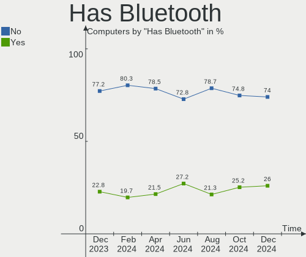
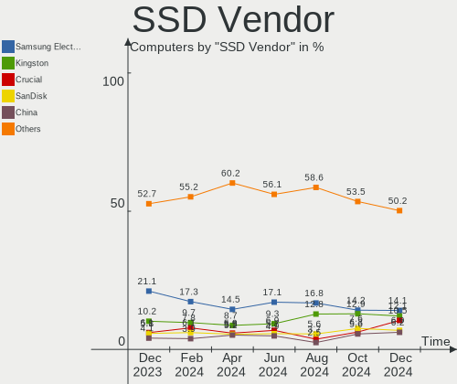
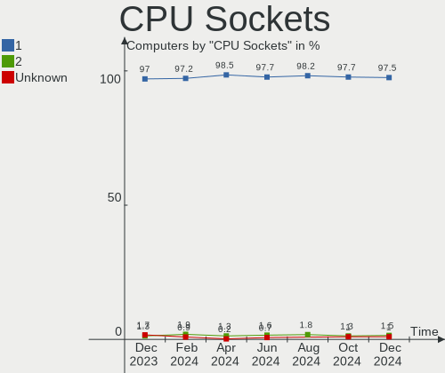

BSD - Hardware Trends
---------------------

A project to identify most popular hardware characteristics and track their change
over time based on data collected by BSD users at https://BSD-Hardware.info.

Anyone can contribute to this report by the [hw-probe](https://github.com/linuxhw/hw-probe/blob/master/INSTALL.BSD.md) tool:

    hw-probe -all -upload

This is a report for all computer types. See also reports for [desktops](/Desktop/README.md) and [notebooks](/Notebook/README.md).

OS-specific reports: [FreeBSD](/Dist/FreeBSD), [OPNsense](/Dist/OPNsense), [helloSystem](/Dist/helloSystem), [OpenBSD](/Dist/OpenBSD).

This report is for one last month. Overall report since the beginning of time: [TestCoverage](https://github.com/bsdhw/TestCoverage)

Period: Jul, 2022.

Contents
--------

* [ System ](#system)
  - [ OS                       ](#os)
  - [ OS Family                ](#os-family)
  - [ Arch                     ](#arch)
  - [ DE                       ](#de)
  - [ Display Server           ](#display-server)
  - [ Display Manager          ](#display-manager)
  - [ OS Lang                  ](#os-lang)
  - [ Boot Mode                ](#boot-mode)
  - [ Filesystem               ](#filesystem)
  - [ Part. scheme             ](#part-scheme)

* [ Board ](#board)
  - [ Vendor                   ](#vendor)
  - [ Model                    ](#model)
  - [ Model Family             ](#model-family)
  - [ MFG Year                 ](#mfg-year)
  - [ Form Factor              ](#form-factor)
  - [ Coreboot                 ](#coreboot)
  - [ RAM Size                 ](#ram-size)
  - [ RAM Used                 ](#ram-used)
  - [ Total Drives             ](#total-drives)
  - [ Has CD-ROM               ](#has-cd-rom)
  - [ Has Ethernet             ](#has-ethernet)
  - [ Has WiFi                 ](#has-wifi)
  - [ Has Bluetooth            ](#has-bluetooth)

* [ Location ](#location)
  - [ Country                  ](#country)
  - [ City                     ](#city)

* [ Drives ](#drives)
  - [ Drive Vendor             ](#drive-vendor)
  - [ Drive Model              ](#drive-model)
  - [ HDD Vendor               ](#hdd-vendor)
  - [ SSD Vendor               ](#ssd-vendor)
  - [ Drive Kind               ](#drive-kind)
  - [ Drive Connector          ](#drive-connector)
  - [ Drive Size               ](#drive-size)
  - [ Space Total              ](#space-total)
  - [ Space Used               ](#space-used)
  - [ Malfunc. Drives          ](#malfunc-drives)
  - [ Malfunc. Drive Vendor    ](#malfunc-drive-vendor)
  - [ Malfunc. HDD Vendor      ](#malfunc-hdd-vendor)
  - [ Malfunc. Drive Kind      ](#malfunc-drive-kind)
  - [ Failed Drives            ](#failed-drives)
  - [ Failed Drive Vendor      ](#failed-drive-vendor)
  - [ Drive Status             ](#drive-status)

* [ Storage controller ](#storage-controller)
  - [ Storage Vendor           ](#storage-vendor)
  - [ Storage Model            ](#storage-model)
  - [ Storage Kind             ](#storage-kind)

* [ Processor ](#processor)
  - [ CPU Vendor               ](#cpu-vendor)
  - [ CPU Model                ](#cpu-model)
  - [ CPU Model Family         ](#cpu-model-family)
  - [ CPU Cores                ](#cpu-cores)
  - [ CPU Sockets              ](#cpu-sockets)
  - [ CPU Threads              ](#cpu-threads)
  - [ CPU Microarch            ](#cpu-microarch)

* [ Graphics ](#graphics)
  - [ GPU Vendor               ](#gpu-vendor)
  - [ GPU Model                ](#gpu-model)
  - [ GPU Combo                ](#gpu-combo)
  - [ GPU Driver               ](#gpu-driver)
  - [ GPU Memory               ](#gpu-memory)

* [ Monitor ](#monitor)
  - [ Monitor Vendor           ](#monitor-vendor)
  - [ Monitor Model            ](#monitor-model)
  - [ Monitor Resolution       ](#monitor-resolution)
  - [ Monitor Diagonal         ](#monitor-diagonal)
  - [ Monitor Width            ](#monitor-width)
  - [ Aspect Ratio             ](#aspect-ratio)
  - [ Monitor Area             ](#monitor-area)
  - [ Pixel Density            ](#pixel-density)
  - [ Multiple Monitors        ](#multiple-monitors)

* [ Network ](#network)
  - [ Net Controller Vendor    ](#net-controller-vendor)
  - [ Net Controller Model     ](#net-controller-model)
  - [ Wireless Vendor          ](#wireless-vendor)
  - [ Wireless Model           ](#wireless-model)
  - [ Ethernet Vendor          ](#ethernet-vendor)
  - [ Ethernet Model           ](#ethernet-model)
  - [ Net Controller Kind      ](#net-controller-kind)
  - [ Used Controller          ](#used-controller)
  - [ NICs                     ](#nics)
  - [ IPv6                     ](#ipv6)

* [ Bluetooth ](#bluetooth)
  - [ Bluetooth Vendor         ](#bluetooth-vendor)
  - [ Bluetooth Model          ](#bluetooth-model)

* [ Sound ](#sound)
  - [ Sound Vendor             ](#sound-vendor)
  - [ Sound Model              ](#sound-model)

* [ Memory ](#memory)
  - [ Memory Vendor            ](#memory-vendor)
  - [ Memory Model             ](#memory-model)
  - [ Memory Kind              ](#memory-kind)
  - [ Memory Form Factor       ](#memory-form-factor)
  - [ Memory Size              ](#memory-size)
  - [ Memory Speed             ](#memory-speed)

* [ Printers & scanners ](#printers--scanners)
  - [ Printer Vendor           ](#printer-vendor)
  - [ Printer Model            ](#printer-model)
  - [ Scanner Vendor           ](#scanner-vendor)
  - [ Scanner Model            ](#scanner-model)

* [ Camera ](#camera)
  - [ Camera Vendor            ](#camera-vendor)
  - [ Camera Model             ](#camera-model)

* [ Security ](#security)
  - [ Fingerprint Vendor       ](#fingerprint-vendor)
  - [ Fingerprint Model        ](#fingerprint-model)
  - [ Chipcard Vendor          ](#chipcard-vendor)
  - [ Chipcard Model           ](#chipcard-model)

* [ Unsupported ](#unsupported)
  - [ Unsupported Devices      ](#unsupported-devices)
  - [ Unsupported Device Types ](#unsupported-device-types)

System
------

OS
--

Installed operating systems

| Name                 | Computers | Percent |
|----------------------|-----------|---------|
| OPNsense 22.1.10     | 128       | 36.26%  |
| OPNsense 22.1.9      | 43        | 12.18%  |
| OPNsense 22.7        | 42        | 11.9%   |
| FreeBSD 13.1         | 41        | 11.61%  |
| helloSystem 0.7.0    | 25        | 7.08%   |
| OpenBSD 7.1          | 12        | 3.4%    |
| helloSystem 0.8.0    | 10        | 2.83%   |
| OPNsense 22.1.8      | 4         | 1.13%   |
| MyBee 13.1           | 4         | 1.13%   |
| GhostBSD 22.07.16    | 4         | 1.13%   |
| GhostBSD 22.06.26    | 4         | 1.13%   |
| FreeBSD 14.0-CURRENT | 4         | 1.13%   |
| FreeBSD 13.0         | 4         | 1.13%   |
| OPNsense 21.7.8      | 3         | 0.85%   |
| OPNsense 22.4.1      | 2         | 0.57%   |
| OPNsense 21.1        | 2         | 0.57%   |
| GhostBSD 22.07.13    | 2         | 0.57%   |
| GhostBSD 22.06.18    | 2         | 0.57%   |
| FreeBSD 13.0-p11     | 2         | 0.57%   |
| TrueNAS 13.1         | 1         | 0.28%   |
| pfSense 2.6.0        | 1         | 0.28%   |
| OPNsense 22.4.2      | 1         | 0.28%   |
| OPNsense 22.1.5      | 1         | 0.28%   |
| OpenBSD 7.2          | 1         | 0.28%   |
| OpenBSD 7.0          | 1         | 0.28%   |
| NomadBSD 5806f915    | 1         | 0.28%   |
| NetBSD 9.2           | 1         | 0.28%   |
| helloSystem 0.6.0    | 1         | 0.28%   |
| GhostBSD 22.07.28    | 1         | 0.28%   |
| GhostBSD 22.07.10    | 1         | 0.28%   |
| FreeBSD 13.1-STABLE  | 1         | 0.28%   |
| FreeBSD 12.3-STABLE  | 1         | 0.28%   |
| FreeBSD 12.3-BETA2   | 1         | 0.28%   |
| FreeBSD 12.1-p8      | 1         | 0.28%   |

OS Family
---------

OS without a version

| Name        | Computers | Percent |
|-------------|-----------|---------|
| OPNsense    | 226       | 64.02%  |
| FreeBSD     | 55        | 15.58%  |
| helloSystem | 36        | 10.2%   |
| OpenBSD     | 14        | 3.97%   |
| GhostBSD    | 14        | 3.97%   |
| MyBee       | 4         | 1.13%   |
| TrueNAS     | 1         | 0.28%   |
| pfSense     | 1         | 0.28%   |
| NomadBSD    | 1         | 0.28%   |
| NetBSD      | 1         | 0.28%   |

Arch
----

OS architecture (x86_64, i586, etc.)

| Name  | Computers | Percent |
|-------|-----------|---------|
| amd64 | 350       | 99.15%  |
| i386  | 1         | 0.28%   |
| arm64 | 1         | 0.28%   |
| arm   | 1         | 0.28%   |

DE
--

Desktop Environment

| Name         | Computers | Percent |
|--------------|-----------|---------|
| Console      | 253       | 71.67%  |
| helloDesktop | 46        | 13.03%  |
| XFCE         | 18        | 5.1%    |
| MATE         | 12        | 3.4%    |
| KDE5         | 10        | 2.83%   |
| GNOME        | 6         | 1.7%    |
| TWM          | 3         | 0.85%   |
| i3           | 2         | 0.57%   |
| Openbox      | 1         | 0.28%   |
| LXQt         | 1         | 0.28%   |
| Cinnamon     | 1         | 0.28%   |

Display Server
--------------

X11 or Wayland

| Name    | Computers | Percent |
|---------|-----------|---------|
| Console | 255       | 72.24%  |
| X11     | 98        | 27.76%  |

Display Manager
---------------

SDDM, LightDM, etc.

| Name    | Computers | Percent |
|---------|-----------|---------|
| Console | 283       | 80.17%  |
| SLiM    | 43        | 12.18%  |
| LightDM | 16        | 4.53%   |
| SDDM    | 7         | 1.98%   |
| XDM     | 2         | 0.57%   |
| GDM     | 2         | 0.57%   |

OS Lang
-------

Language

| Lang    | Computers | Percent |
|---------|-----------|---------|
| Unknown | 240       | 67.99%  |
| en_US   | 51        | 14.45%  |
| C       | 46        | 13.03%  |
| ru_RU   | 5         | 1.42%   |
| ja_JP   | 2         | 0.57%   |
| fr_FR   | 2         | 0.57%   |
| es_ES   | 2         | 0.57%   |
| zh_TW   | 1         | 0.28%   |
| pt_BR   | 1         | 0.28%   |
| it_IT   | 1         | 0.28%   |
| en_GB   | 1         | 0.28%   |
| de_DE   | 1         | 0.28%   |

Boot Mode
---------

EFI or BIOS

| Mode | Computers | Percent |
|------|-----------|---------|
| EFI  | 317       | 89.8%   |
| BIOS | 36        | 10.2%   |

Filesystem
----------

Type of filesystem

| Type   | Computers | Percent |
|--------|-----------|---------|
| Ufs    | 165       | 46.74%  |
| Zfs    | 149       | 42.21%  |
| Cd9660 | 24        | 6.8%    |
| Ffs    | 14        | 3.97%   |
| XXX    | 1         | 0.28%   |

Part. scheme
------------

Scheme of partitioning

| Type    | Computers | Percent |
|---------|-----------|---------|
| GPT     | 334       | 94.62%  |
| MBR     | 16        | 4.53%   |
| Unknown | 3         | 0.85%   |

Board
-----

Vendor
------

Motherboard manufacturer

| Name                          | Computers | Percent |
|-------------------------------|-----------|---------|
| Dell                          | 45        | 12.75%  |
| Hewlett-Packard               | 37        | 10.48%  |
| ASUSTek Computer              | 29        | 8.22%   |
| Lenovo                        | 26        | 7.37%   |
| Intel                         | 23        | 6.52%   |
| Unknown                       | 19        | 5.38%   |
| Protectli                     | 16        | 4.53%   |
| Gigabyte Technology           | 16        | 4.53%   |
| ASRock                        | 15        | 4.25%   |
| Supermicro                    | 14        | 3.97%   |
| Fujitsu                       | 11        | 3.12%   |
| Acer                          | 11        | 3.12%   |
| Deciso                        | 9         | 2.55%   |
| AMI                           | 7         | 1.98%   |
| PC Engines                    | 6         | 1.7%    |
| MSI                           | 5         | 1.42%   |
| Biostar                       | 5         | 1.42%   |
| AWOW                          | 5         | 1.42%   |
| Sophos                        | 4         | 1.13%   |
| MW                            | 4         | 1.13%   |
| Apple                         | 4         | 1.13%   |
| Shuttle                       | 3         | 0.85%   |
| ZOTAC                         | 2         | 0.57%   |
| Techvision                    | 2         | 0.57%   |
| Secudos                       | 2         | 0.57%   |
| Pegatron                      | 2         | 0.57%   |
| AZW                           | 2         | 0.57%   |
| AMD                           | 2         | 0.57%   |
| AAEON                         | 2         | 0.57%   |
| YANYU                         | 1         | 0.28%   |
| Wistron                       | 1         | 0.28%   |
| WesternDigital                | 1         | 0.28%   |
| Toshiba                       | 1         | 0.28%   |
| Star Labs                     | 1         | 0.28%   |
| Sony                          | 1         | 0.28%   |
| SmbiosType2_BoardManufacturer | 1         | 0.28%   |
| Samsung Electronics           | 1         | 0.28%   |
| Raspberry Pi Foundation       | 1         | 0.28%   |
| Positivo                      | 1         | 0.28%   |
| Nitrokey                      | 1         | 0.28%   |
| NF541S                        | 1         | 0.28%   |
| NF541                         | 1         | 0.28%   |
| MouseComputer                 | 1         | 0.28%   |
| MiTAC                         | 1         | 0.28%   |
| MAXSUN                        | 1         | 0.28%   |
| LG Electronics                | 1         | 0.28%   |
| Kraftway                      | 1         | 0.28%   |
| IP3 Tech                      | 1         | 0.28%   |
| Inventec                      | 1         | 0.28%   |
| Firewalla                     | 1         | 0.28%   |
| Datto                         | 1         | 0.28%   |
| CompuLab                      | 1         | 0.28%   |
| CNCTION-IAF                   | 1         | 0.28%   |
| BESSTAR Tech                  | 1         | 0.28%   |

Model
-----

Motherboard model

| Name                                                        | Computers | Percent |
|-------------------------------------------------------------|-----------|---------|
| Unknown                                                     | 22        | 6.23%   |
| Intel Q3XXG4-P V1.0                                         | 9         | 2.55%   |
| Protectli FW6                                               | 6         | 1.7%    |
| Fujitsu FUTRO S920                                          | 5         | 1.42%   |
| Protectli FW4B                                              | 4         | 1.13%   |
| PC Engines APU2                                             | 4         | 1.13%   |
| MW GMLK-2_5G4L                                              | 4         | 1.13%   |
| HP t620 PLUS Quad Core TC                                   | 4         | 1.13%   |
| Deciso Netboard A20                                         | 4         | 1.13%   |
| AWOW PC BOX                                                 | 4         | 1.13%   |
| Supermicro X10SLH-N6-ST031                                  | 3         | 0.85%   |
| Protectli VP2410                                            | 3         | 0.85%   |
| HP Compaq Elite 8300 SFF                                    | 3         | 0.85%   |
| Dell OptiPlex 5040                                          | 3         | 0.85%   |
| AMI Aptio CRB                                               | 3         | 0.85%   |
| Techvision TVI7309X                                         | 2         | 0.57%   |
| Supermicro 1HE Intel Single-CPU RI1102H-XE Server           | 2         | 0.57%   |
| Sophos SG                                                   | 2         | 0.57%   |
| MSI MS-7817                                                 | 2         | 0.57%   |
| Intel CRESCENTBAY                                           | 2         | 0.57%   |
| HP ProDesk 600 G1 SFF                                       | 2         | 0.57%   |
| HP EliteDesk 800 G2 DM 35W                                  | 2         | 0.57%   |
| HP EliteDesk 800 G1 SFF                                     | 2         | 0.57%   |
| HP 250 G6 Notebook PC                                       | 2         | 0.57%   |
| Fujitsu LIFEBOOK A555                                       | 2         | 0.57%   |
| Dell XPS 13 7390                                            | 2         | 0.57%   |
| Dell PowerEdge R210 II                                      | 2         | 0.57%   |
| Dell OptiPlex 9020                                          | 2         | 0.57%   |
| Dell OptiPlex 7010                                          | 2         | 0.57%   |
| Dell OptiPlex 3040                                          | 2         | 0.57%   |
| Dell OptiPlex 3020                                          | 2         | 0.57%   |
| Deciso Netboard A10 GEN2 Model G                            | 2         | 0.57%   |
| ASUS ROG CROSSHAIR VIII HERO                                | 2         | 0.57%   |
| ASUS PRIME H410M-A                                          | 2         | 0.57%   |
| ASUS P5Q-E                                                  | 2         | 0.57%   |
| ZOTAC ZBOX-CI329NANO                                        | 1         | 0.28%   |
| YANYU H87SL VER:1.3                                         | 1         | 0.28%   |
| Wistron ProLiant ML110 G6                                   | 1         | 0.28%   |
| WesternDigital WDBNFA0320KBK-40                             | 1         | 0.28%   |
| Toshiba Satellite L305D                                     | 1         | 0.28%   |
| Supermicro X10SBA                                           | 1         | 0.28%   |
| Supermicro SYS-E50-9AP-N5                                   | 1         | 0.28%   |
| Supermicro SYS-E300-9D-4CN8TP                               | 1         | 0.28%   |
| Supermicro SYS-E200-9B                                      | 1         | 0.28%   |
| Supermicro SYS-5019D-FN8TP-2-NC041                          | 1         | 0.28%   |
| Supermicro SYS-1019S-MP                                     | 1         | 0.28%   |
| Supermicro Super Server                                     | 1         | 0.28%   |
| Supermicro H8DGU                                            | 1         | 0.28%   |
| Supermicro A1SAi                                            | 1         | 0.28%   |
| Star Labs LabTop                                            | 1         | 0.28%   |
| Sophos XG                                                   | 1         | 0.28%   |
| Sophos UTM                                                  | 1         | 0.28%   |
| Sony VGN-NS21M_S                                            | 1         | 0.28%   |
| SmbiosType2_BoardManufacturer SmbiosType1_SystemProductName | 1         | 0.28%   |
| Shuttle XH170                                               | 1         | 0.28%   |
| Shuttle DS437                                               | 1         | 0.28%   |
| Shuttle DH310                                               | 1         | 0.28%   |
| Samsung 340XAA/350XAA/550XAA                                | 1         | 0.28%   |
| RPi Raspberry Pi                                            | 1         | 0.28%   |
| Protectli FW6E                                              | 1         | 0.28%   |

Model Family
------------

Motherboard model prefix

| Name                               | Computers | Percent |
|------------------------------------|-----------|---------|
| Unknown                            | 22        | 6.23%   |
| Dell OptiPlex                      | 18        | 5.1%    |
| Lenovo ThinkPad                    | 10        | 2.83%   |
| Intel Q3XXG4-P                     | 9         | 2.55%   |
| Dell Inspiron                      | 9         | 2.55%   |
| Lenovo ThinkCentre                 | 8         | 2.27%   |
| HP Compaq                          | 7         | 1.98%   |
| Dell PowerEdge                     | 7         | 1.98%   |
| Deciso Netboard                    | 7         | 1.98%   |
| Protectli FW6                      | 6         | 1.7%    |
| Lenovo IdeaPad                     | 5         | 1.42%   |
| HP ProDesk                         | 5         | 1.42%   |
| HP EliteDesk                       | 5         | 1.42%   |
| Fujitsu FUTRO                      | 5         | 1.42%   |
| ASUS PRIME                         | 5         | 1.42%   |
| Acer Aspire                        | 5         | 1.42%   |
| Protectli FW4B                     | 4         | 1.13%   |
| PC Engines APU2                    | 4         | 1.13%   |
| MW GMLK-2                          | 4         | 1.13%   |
| HP t620                            | 4         | 1.13%   |
| AWOW PC                            | 4         | 1.13%   |
| ASUS ROG                           | 4         | 1.13%   |
| Supermicro X10SLH-N6-ST031         | 3         | 0.85%   |
| Protectli VP2410                   | 3         | 0.85%   |
| HP ProLiant                        | 3         | 0.85%   |
| Dell Precision                     | 3         | 0.85%   |
| Dell Latitude                      | 3         | 0.85%   |
| ASUS VivoBook                      | 3         | 0.85%   |
| ASUS TUF                           | 3         | 0.85%   |
| AMI Aptio                          | 3         | 0.85%   |
| Acer Veriton                       | 3         | 0.85%   |
| Techvision TVI7309X                | 2         | 0.57%   |
| Supermicro 1HE                     | 2         | 0.57%   |
| Sophos SG                          | 2         | 0.57%   |
| MSI MS-7817                        | 2         | 0.57%   |
| Intel CRESCENTBAY                  | 2         | 0.57%   |
| HP ProBook                         | 2         | 0.57%   |
| HP Laptop                          | 2         | 0.57%   |
| HP EliteBook                       | 2         | 0.57%   |
| HP 250                             | 2         | 0.57%   |
| Gigabyte H310M                     | 2         | 0.57%   |
| Fujitsu PRIMERGY                   | 2         | 0.57%   |
| Fujitsu LIFEBOOK                   | 2         | 0.57%   |
| Dell XPS                           | 2         | 0.57%   |
| ASUS P5Q-E                         | 2         | 0.57%   |
| ASUS Maximus                       | 2         | 0.57%   |
| ASUS M5A78L-M                      | 2         | 0.57%   |
| ASRock X570                        | 2         | 0.57%   |
| Acer Revo                          | 2         | 0.57%   |
| ZOTAC ZBOX-CI329NANO               | 1         | 0.28%   |
| YANYU H87SL                        | 1         | 0.28%   |
| Wistron ProLiant                   | 1         | 0.28%   |
| WesternDigital WDBNFA0320KBK-40    | 1         | 0.28%   |
| Toshiba Satellite                  | 1         | 0.28%   |
| Supermicro X10SBA                  | 1         | 0.28%   |
| Supermicro SYS-E50-9AP-N5          | 1         | 0.28%   |
| Supermicro SYS-E300-9D-4CN8TP      | 1         | 0.28%   |
| Supermicro SYS-E200-9B             | 1         | 0.28%   |
| Supermicro SYS-5019D-FN8TP-2-NC041 | 1         | 0.28%   |
| Supermicro SYS-1019S-MP            | 1         | 0.28%   |

MFG Year
--------

Motherboard manufacture year

| Year    | Computers | Percent |
|---------|-----------|---------|
| 2021    | 51        | 14.45%  |
| 2019    | 40        | 11.33%  |
| 2020    | 36        | 10.2%   |
| 2018    | 36        | 10.2%   |
| 2016    | 34        | 9.63%   |
| 2014    | 29        | 8.22%   |
| 2017    | 20        | 5.67%   |
| 2013    | 19        | 5.38%   |
| 2022    | 18        | 5.1%    |
| 2012    | 17        | 4.82%   |
| 2011    | 15        | 4.25%   |
| 2015    | 11        | 3.12%   |
| 2010    | 9         | 2.55%   |
| 2009    | 8         | 2.27%   |
| 2008    | 4         | 1.13%   |
| 2007    | 3         | 0.85%   |
| Unknown | 3         | 0.85%   |

Form Factor
-----------

Physical design of the computer

| Name           | Computers | Percent |
|----------------|-----------|---------|
| Desktop        | 231       | 65.44%  |
| Notebook       | 69        | 19.55%  |
| Mini pc        | 25        | 7.08%   |
| Server         | 20        | 5.67%   |
| Firewall       | 6         | 1.7%    |
| System on chip | 1         | 0.28%   |
| All in one     | 1         | 0.28%   |

Coreboot
--------

Have coreboot on board

| Used | Computers | Percent |
|------|-----------|---------|
| No   | 340       | 96.32%  |
| Yes  | 13        | 3.68%   |

RAM Size
--------

Total RAM memory

| Size in GB  | Computers | Percent |
|-------------|-----------|---------|
| 8.01-16.0   | 154       | 43.63%  |
| 4.01-8.0    | 76        | 21.53%  |
| 16.01-24.0  | 69        | 19.55%  |
| 32.01-64.0  | 26        | 7.37%   |
| 2.01-3.0    | 12        | 3.4%    |
| 64.01-256.0 | 9         | 2.55%   |
| 24.01-32.0  | 5         | 1.42%   |
| 3.01-4.0    | 1         | 0.28%   |
| 0.01-0.5    | 1         | 0.28%   |

RAM Used
--------

Used RAM memory

| Used GB   | Computers | Percent |
|-----------|-----------|---------|
| 0.01-0.5  | 206       | 58.36%  |
| 0.51-1.0  | 91        | 25.78%  |
| 1.01-2.0  | 33        | 9.35%   |
| 2.01-3.0  | 10        | 2.83%   |
| 3.01-4.0  | 5         | 1.42%   |
| 4.01-8.0  | 4         | 1.13%   |
| Unknown   | 2         | 0.57%   |
| 8.01-16.0 | 1         | 0.28%   |
| 0         | 1         | 0.28%   |

Total Drives
------------

Number of drives on board

| Drives | Computers | Percent |
|--------|-----------|---------|
| 1      | 256       | 72.52%  |
| 2      | 50        | 14.16%  |
| 0      | 23        | 6.52%   |
| 3      | 8         | 2.27%   |
| 4      | 7         | 1.98%   |
| 8      | 3         | 0.85%   |
| 6      | 2         | 0.57%   |
| 22     | 1         | 0.28%   |
| 16     | 1         | 0.28%   |
| 13     | 1         | 0.28%   |
| 11     | 1         | 0.28%   |

Has CD-ROM
----------

Has CD-ROM on board

| Presented | Computers | Percent |
|-----------|-----------|---------|
| No        | 281       | 79.6%   |
| Yes       | 72        | 20.4%   |

Has Ethernet
------------

Has Ethernet on board

| Presented | Computers | Percent |
|-----------|-----------|---------|
| Yes       | 337       | 95.47%  |
| No        | 16        | 4.53%   |

Has WiFi
--------

Has WiFi module

| Presented | Computers | Percent |
|-----------|-----------|---------|
| No        | 245       | 69.41%  |
| Yes       | 108       | 30.59%  |

Has Bluetooth
-------------

Has Bluetooth module

| Presented | Computers | Percent |
|-----------|-----------|---------|
| No        | 277       | 78.47%  |
| Yes       | 76        | 21.53%  |

Location
--------

Country
-------

Geographic location (country)

| Country      | Computers | Percent |
|--------------|-----------|---------|
| USA          | 109       | 30.88%  |
| Germany      | 47        | 13.31%  |
| Russia       | 18        | 5.1%    |
| Canada       | 17        | 4.82%   |
| France       | 15        | 4.25%   |
| Brazil       | 14        | 3.97%   |
| Italy        | 13        | 3.68%   |
| UK           | 12        | 3.4%    |
| Netherlands  | 10        | 2.83%   |
| Austria      | 10        | 2.83%   |
| Switzerland  | 8         | 2.27%   |
| Spain        | 8         | 2.27%   |
| Australia    | 7         | 1.98%   |
| China        | 6         | 1.7%    |
| Poland       | 5         | 1.42%   |
| Finland      | 5         | 1.42%   |
| Sweden       | 4         | 1.13%   |
| Hungary      | 4         | 1.13%   |
| Taiwan       | 3         | 0.85%   |
| Norway       | 3         | 0.85%   |
| Malaysia     | 3         | 0.85%   |
| Japan        | 3         | 0.85%   |
| India        | 3         | 0.85%   |
| Thailand     | 2         | 0.57%   |
| Philippines  | 2         | 0.57%   |
| Peru         | 2         | 0.57%   |
| New Zealand  | 2         | 0.57%   |
| Czechia      | 2         | 0.57%   |
| Belgium      | 2         | 0.57%   |
| Turkey       | 1         | 0.28%   |
| South Korea  | 1         | 0.28%   |
| South Africa | 1         | 0.28%   |
| Slovenia     | 1         | 0.28%   |
| Serbia       | 1         | 0.28%   |
| Portugal     | 1         | 0.28%   |
| Namibia      | 1         | 0.28%   |
| Mexico       | 1         | 0.28%   |
| Kenya        | 1         | 0.28%   |
| Indonesia    | 1         | 0.28%   |
| Iceland      | 1         | 0.28%   |
| Egypt        | 1         | 0.28%   |
| Bahamas      | 1         | 0.28%   |
| Argentina    | 1         | 0.28%   |

City
----

Geographic location (city)

| City                | Computers | Percent |
|---------------------|-----------|---------|
| Vienna              | 6         | 1.7%    |
| Ozersk              | 4         | 1.13%   |
| Munich              | 4         | 1.13%   |
| Madrid              | 4         | 1.13%   |
| Zurich              | 3         | 0.85%   |
| Taipei              | 3         | 0.85%   |
| Seattle             | 3         | 0.85%   |
| Salem               | 3         | 0.85%   |
| Perth               | 3         | 0.85%   |
| Mountain View       | 3         | 0.85%   |
| Moscow              | 3         | 0.85%   |
| Milan               | 3         | 0.85%   |
| Melbourne           | 3         | 0.85%   |
| Graz                | 3         | 0.85%   |
| Budapest            | 3         | 0.85%   |
| Wexford             | 2         | 0.57%   |
| Victoria            | 2         | 0.57%   |
| Toronto             | 2         | 0.57%   |
| Stuttgart           | 2         | 0.57%   |
| Stockholm           | 2         | 0.57%   |
| Silver Spring       | 2         | 0.57%   |
| Sao Paulo           | 2         | 0.57%   |
| Salt Lake City      | 2         | 0.57%   |
| Riverside           | 2         | 0.57%   |
| Renton              | 2         | 0.57%   |
| Redmond             | 2         | 0.57%   |
| Quezon City         | 2         | 0.57%   |
| Nashville           | 2         | 0.57%   |
| London              | 2         | 0.57%   |
| Lipetsk             | 2         | 0.57%   |
| Lima                | 2         | 0.57%   |
| Houston             | 2         | 0.57%   |
| Frankfurt am Main   | 2         | 0.57%   |
| Fougeres            | 2         | 0.57%   |
| Denver              | 2         | 0.57%   |
| Columbus            | 2         | 0.57%   |
| Cary                | 2         | 0.57%   |
| Brno                | 2         | 0.57%   |
| Berlin              | 2         | 0.57%   |
| Bayan Lepas         | 2         | 0.57%   |
| Austin              | 2         | 0.57%   |
| Ashburn             | 2         | 0.57%   |
| Amsterdam           | 2         | 0.57%   |
| Zell am Harmersbach | 1         | 0.28%   |
| Zeitz               | 1         | 0.28%   |
| Yichun              | 1         | 0.28%   |
| Yashio              | 1         | 0.28%   |
| Xicheng District    | 1         | 0.28%   |
| Wraysbury           | 1         | 0.28%   |
| Winterthur          | 1         | 0.28%   |
| Winnipeg            | 1         | 0.28%   |
| Windhoek            | 1         | 0.28%   |
| Wickliffe           | 1         | 0.28%   |
| Wichita Falls       | 1         | 0.28%   |
| Wettringen          | 1         | 0.28%   |
| Wentorf bei Hamburg | 1         | 0.28%   |
| Wenatchee           | 1         | 0.28%   |
| Wellington          | 1         | 0.28%   |
| Warsaw              | 1         | 0.28%   |
| Viry-Châtillon     | 1         | 0.28%   |

Drives
------

Drive Vendor
------------

Hard drive vendors

| Vendor              | Computers | Drives | Percent |
|---------------------|-----------|--------|---------|
| Samsung Electronics | 61        | 80     | 15.21%  |
| WDC                 | 59        | 91     | 14.71%  |
| Seagate             | 39        | 62     | 9.73%   |
| Transcend           | 27        | 28     | 6.73%   |
| Kingston            | 24        | 27     | 5.99%   |
| Crucial             | 19        | 21     | 4.74%   |
| Toshiba             | 16        | 30     | 3.99%   |
| SanDisk             | 15        | 15     | 3.74%   |
| Intel               | 14        | 14     | 3.49%   |
| Hitachi             | 11        | 12     | 2.74%   |
| China               | 11        | 11     | 2.74%   |
| SK hynix            | 5         | 5      | 1.25%   |
| PNY                 | 5         | 6      | 1.25%   |
| NVMe                | 5         | 5      | 1.25%   |
| Micron Technology   | 5         | 6      | 1.25%   |
| Intenso             | 5         | 6      | 1.25%   |
| SPCC                | 4         | 4      | 1%      |
| Protectli           | 4         | 4      | 1%      |
| OCZ                 | 4         | 4      | 1%      |
| HGST                | 4         | 4      | 1%      |
| Dogfish             | 4         | 4      | 1%      |
| A-DATA Technology   | 4         | 5      | 1%      |
| Innodisk            | 3         | 3      | 0.75%   |
| Hoodisk             | 3         | 3      | 0.75%   |
| FORESEE             | 3         | 3      | 0.75%   |
| Corsair             | 3         | 3      | 0.75%   |
| Apacer              | 3         | 3      | 0.75%   |
| Team                | 2         | 2      | 0.5%    |
| SSSTC               | 2         | 2      | 0.5%    |
| Phison              | 2         | 2      | 0.5%    |
| LITEONIT            | 2         | 2      | 0.5%    |
| Lexar               | 2         | 3      | 0.5%    |
| KingSpec            | 2         | 2      | 0.5%    |
| Hewlett-Packard     | 2         | 2      | 0.5%    |
| Gigabyte Technology | 2         | 2      | 0.5%    |
| BORY                | 2         | 2      | 0.5%    |
| BIWIN               | 2         | 2      | 0.5%    |
| Vaseky              | 1         | 1      | 0.25%   |
| tigo                | 1         | 1      | 0.25%   |
| Supermicro          | 1         | 1      | 0.25%   |
| Star Drive          | 1         | 1      | 0.25%   |
| ShiJi               | 1         | 1      | 0.25%   |
| SATADOM             | 1         | 1      | 0.25%   |
| Plextor             | 1         | 1      | 0.25%   |
| Pccooler            | 1         | 1      | 0.25%   |
| Patriot             | 1         | 1      | 0.25%   |
| LITEON              | 1         | 1      | 0.25%   |
| KIOXIA              | 1         | 1      | 0.25%   |
| INDMEM              | 1         | 1      | 0.25%   |
| Indilinx            | 1         | 1      | 0.25%   |
| HPE                 | 1         | 1      | 0.25%   |
| Hikvision           | 1         | 1      | 0.25%   |
| Fujitsu             | 1         | 1      | 0.25%   |
| Drevo               | 1         | 1      | 0.25%   |
| CWDISK              | 1         | 1      | 0.25%   |
| BlueRay             | 1         | 1      | 0.25%   |
| Apple               | 1         | 1      | 0.25%   |
| ANACOMDA            | 1         | 1      | 0.25%   |

Drive Model
-----------

Hard drive models

| Model                            | Computers | Percent |
|----------------------------------|-----------|---------|
| Kingston SA400S37240G 240GB      | 5         | 1.13%   |
| Transcend TS256GMTS952T2 256GB   | 4         | 0.9%    |
| Samsung SSD 860 EVO 500GB        | 4         | 0.9%    |
| PNY CS900 120GB SSD              | 4         | 0.9%    |
| Transcend TS256GSSD230S 256GB    | 3         | 0.68%   |
| Transcend TS128GMSA230S 128GB    | 3         | 0.68%   |
| Seagate ST1000LM035-1RK172 1TB   | 3         | 0.68%   |
| Samsung SSD 870 EVO 1TB          | 3         | 0.68%   |
| Samsung SSD 850 EVO mSATA 250GB  | 3         | 0.68%   |
| Samsung MZYLN256HCHP-000L2 256GB | 3         | 0.68%   |
| Kingston SA400S37120G 120GB      | 3         | 0.68%   |
| Dogfish SSD 128GB                | 3         | 0.68%   |
| Crucial CT240BX500SSD1 240GB     | 3         | 0.68%   |
| WDC WDS120G2G0A-00JH30 120GB     | 2         | 0.45%   |
| WDC WD5000LPLX-00ZNTT0 500GB     | 2         | 0.45%   |
| WDC WD10JPVX-22JC3T0 1TB         | 2         | 0.45%   |
| Transcend TS64GMSA370 64GB       | 2         | 0.45%   |
| Transcend TS256GMTE652T2 256GB   | 2         | 0.45%   |
| Transcend TS240GSSD220S 240GB    | 2         | 0.45%   |
| Transcend TS128GMSA370 128GB     | 2         | 0.45%   |
| Toshiba DT01ACA100 1TB           | 2         | 0.45%   |
| SPCC Solid State Disk 128GB      | 2         | 0.45%   |
| Seagate ST500LT012-1DG142 500GB  | 2         | 0.45%   |
| Seagate ST500DM002-1SB10A 500GB  | 2         | 0.45%   |
| Seagate ST500DM002-1BD142 500GB  | 2         | 0.45%   |
| Seagate ST4000DM000-1F2168 4TB   | 2         | 0.45%   |
| Seagate ST3500413AS 500GB        | 2         | 0.45%   |
| Seagate ST1000LM049-2GH172 1TB   | 2         | 0.45%   |
| Seagate ST1000LM048-2E7172 1TB   | 2         | 0.45%   |
| SanDisk X400 M.2 2280 128GB      | 2         | 0.45%   |
| SanDisk SDSSDRC032G 32GB         | 2         | 0.45%   |
| Samsung SSD 970 EVO Plus 500GB   | 2         | 0.45%   |
| Samsung SSD 870 QVO 2TB          | 2         | 0.45%   |
| Samsung SSD 860 QVO 1TB          | 2         | 0.45%   |
| Samsung SSD 860 EVO M.2 250GB    | 2         | 0.45%   |
| Samsung SSD 850 EVO 500GB        | 2         | 0.45%   |
| Samsung SSD 850 EVO 120GB        | 2         | 0.45%   |
| Samsung MZ7TY128HDHP-000L1 128GB | 2         | 0.45%   |
| Protectli 120GB mSATA            | 2         | 0.45%   |
| Kingston SV300S37A60G 64GB       | 2         | 0.45%   |
| Kingston SV300S37A240G 240GB     | 2         | 0.45%   |
| Kingston SUV500MS120G 120GB      | 2         | 0.45%   |
| Kingston SKC600MS256G 256GB      | 2         | 0.45%   |
| Intel SSDSC2CT060A3 64GB         | 2         | 0.45%   |
| Innodisk DEMSR- 08GB mSATA 3ME3  | 2         | 0.45%   |
| Hoodisk SSD 32GB                 | 2         | 0.45%   |
| HGST HTS721010A9E630 1TB         | 2         | 0.45%   |
| FORESEE 128GB SSD                | 2         | 0.45%   |
| Crucial M4-CT128M4SSD2 128GB     | 2         | 0.45%   |
| Crucial M4-CT064M4SSD2 64GB      | 2         | 0.45%   |
| Crucial CT500P2SSD8 500GB        | 2         | 0.45%   |
| Crucial CT1000MX500SSD1 1TB      | 2         | 0.45%   |
| China SATA SSD 240GB             | 2         | 0.45%   |
| China SATA SSD 16GB              | 2         | 0.45%   |
| BORY M500 128G                   | 2         | 0.45%   |
| BIWIN SSD 128GB                  | 2         | 0.45%   |
| WDC WDS500G3X0C-00SJG0 500GB     | 1         | 0.23%   |
| WDC WDS500G2X0C-00L350 500GB     | 1         | 0.23%   |
| WDC WDS500G2B0A-00SM50 500GB     | 1         | 0.23%   |
| WDC WDS500G2B0A 500GB            | 1         | 0.23%   |

HDD Vendor
----------

Hard disk drive vendors

| Vendor              | Computers | Drives | Percent |
|---------------------|-----------|--------|---------|
| WDC                 | 41        | 66     | 35.04%  |
| Seagate             | 37        | 59     | 31.62%  |
| Toshiba             | 13        | 27     | 11.11%  |
| Hitachi             | 11        | 12     | 9.4%    |
| Samsung Electronics | 4         | 4      | 3.42%   |
| HGST                | 4         | 4      | 3.42%   |
| NVMe                | 3         | 3      | 2.56%   |
| Intenso             | 1         | 1      | 0.85%   |
| HPE                 | 1         | 1      | 0.85%   |
| Hewlett-Packard     | 1         | 1      | 0.85%   |
| Fujitsu             | 1         | 1      | 0.85%   |

SSD Vendor
----------

Solid state drive vendors

| Vendor              | Computers | Drives | Percent |
|---------------------|-----------|--------|---------|
| Samsung Electronics | 44        | 57     | 19.13%  |
| Transcend           | 24        | 25     | 10.43%  |
| Kingston            | 20        | 23     | 8.7%    |
| SanDisk             | 15        | 15     | 6.52%   |
| Crucial             | 14        | 15     | 6.09%   |
| Intel               | 13        | 13     | 5.65%   |
| WDC                 | 11        | 12     | 4.78%   |
| China               | 11        | 11     | 4.78%   |
| PNY                 | 5         | 6      | 2.17%   |
| SPCC                | 4         | 4      | 1.74%   |
| Protectli           | 4         | 4      | 1.74%   |
| OCZ                 | 4         | 4      | 1.74%   |
| Intenso             | 4         | 5      | 1.74%   |
| Dogfish             | 4         | 4      | 1.74%   |
| SK hynix            | 3         | 3      | 1.3%    |
| Micron Technology   | 3         | 4      | 1.3%    |
| Innodisk            | 3         | 3      | 1.3%    |
| Hoodisk             | 3         | 3      | 1.3%    |
| FORESEE             | 3         | 3      | 1.3%    |
| Apacer              | 3         | 3      | 1.3%    |
| A-DATA Technology   | 3         | 4      | 1.3%    |
| Toshiba             | 2         | 2      | 0.87%   |
| Seagate             | 2         | 2      | 0.87%   |
| NVMe                | 2         | 2      | 0.87%   |
| LITEONIT            | 2         | 2      | 0.87%   |
| KingSpec            | 2         | 2      | 0.87%   |
| BORY                | 2         | 2      | 0.87%   |
| BIWIN               | 2         | 2      | 0.87%   |
| Vaseky              | 1         | 1      | 0.43%   |
| tigo                | 1         | 1      | 0.43%   |
| Team                | 1         | 1      | 0.43%   |
| Supermicro          | 1         | 1      | 0.43%   |
| ShiJi               | 1         | 1      | 0.43%   |
| SATADOM             | 1         | 1      | 0.43%   |
| Pccooler            | 1         | 1      | 0.43%   |
| Patriot             | 1         | 1      | 0.43%   |
| LITEON              | 1         | 1      | 0.43%   |
| Lexar               | 1         | 2      | 0.43%   |
| INDMEM              | 1         | 1      | 0.43%   |
| Indilinx            | 1         | 1      | 0.43%   |
| Hikvision           | 1         | 1      | 0.43%   |
| Drevo               | 1         | 1      | 0.43%   |
| CWDISK              | 1         | 1      | 0.43%   |
| BlueRay             | 1         | 1      | 0.43%   |
| Apple               | 1         | 1      | 0.43%   |
| ANACOMDA            | 1         | 1      | 0.43%   |

Drive Kind
----------

HDD or SSD

| Kind | Computers | Drives | Percent |
|------|-----------|--------|---------|
| SSD  | 217       | 254    | 57.87%  |
| HDD  | 101       | 179    | 26.93%  |
| NVMe | 57        | 68     | 15.2%   |

Drive Connector
---------------

SATA, SAS, NVMe, etc.

| Type | Computers | Drives | Percent |
|------|-----------|--------|---------|
| SATA | 289       | 433    | 83.53%  |
| NVMe | 57        | 68     | 16.47%  |

Drive Size
----------

Size of hard drive

| Size in TB | Computers | Drives | Percent |
|------------|-----------|--------|---------|
| 0.01-0.5   | 241       | 276    | 73.48%  |
| 0.51-1.0   | 57        | 68     | 17.38%  |
| 1.01-2.0   | 16        | 33     | 4.88%   |
| 3.01-4.0   | 5         | 13     | 1.52%   |
| 4.01-10.0  | 5         | 23     | 1.52%   |
| 10.01-20.0 | 3         | 19     | 0.91%   |
| 2.01-3.0   | 1         | 1      | 0.3%    |

Space Total
-----------

Amount of disk space available on the file system

| Size in GB     | Computers | Percent |
|----------------|-----------|---------|
| 101-250        | 152       | 43.06%  |
| 251-500        | 50        | 14.16%  |
| 1-20           | 44        | 12.46%  |
| 501-1000       | 34        | 9.63%   |
| 21-50          | 32        | 9.07%   |
| 51-100         | 29        | 8.22%   |
| 1001-2000      | 7         | 1.98%   |
| Unknown        | 3         | 0.85%   |
| More than 3000 | 1         | 0.28%   |
| 2001-3000      | 1         | 0.28%   |

Space Used
----------

Amount of used disk space

| Used GB        | Computers | Percent |
|----------------|-----------|---------|
| 1-20           | 321       | 90.93%  |
| 21-50          | 13        | 3.68%   |
| 51-100         | 9         | 2.55%   |
| Unknown        | 3         | 0.85%   |
| 251-500        | 2         | 0.57%   |
| 101-250        | 2         | 0.57%   |
| 501-1000       | 2         | 0.57%   |
| More than 3000 | 1         | 0.28%   |

Malfunc. Drives
---------------

Drive models with a malfunction

| Model                                            | Computers | Drives | Percent |
|--------------------------------------------------|-----------|--------|---------|
| Seagate ST500DM002-1BD142 500GB                  | 2         | 2      | 3.39%   |
| Kingston SV300S37A60G 64GB                       | 2         | 2      | 3.39%   |
| Dogfish SSD 128GB                                | 2         | 2      | 3.39%   |
| WDC WDS120G2G0A-00JH30 120GB                     | 1         | 1      | 1.69%   |
| WDC WD800JD-60LSA5 80GB                          | 1         | 1      | 1.69%   |
| WDC WD6400AAKS-22A7B2 640GB                      | 1         | 1      | 1.69%   |
| WDC WD5000LPLX-00ZNTT0 500GB                     | 1         | 1      | 1.69%   |
| WDC WD5000AVVS-63H0B1 500GB                      | 1         | 1      | 1.69%   |
| WDC WD5000AAKX-00ERMA0 500GB                     | 1         | 1      | 1.69%   |
| WDC WD2500AAKX-753CA0 250GB                      | 1         | 1      | 1.69%   |
| WDC WD1500HLFS-01G6U4 150GB                      | 1         | 1      | 1.69%   |
| WDC WD10SPZX-24Z10T0 1TB                         | 1         | 1      | 1.69%   |
| WDC WD10JPVX-60JC3T1 1TB                         | 1         | 1      | 1.69%   |
| Toshiba MQ01ABF050 500GB                         | 1         | 1      | 1.69%   |
| Toshiba MQ01ABD100 1TB                           | 1         | 1      | 1.69%   |
| Toshiba MK6034GSX 64GB                           | 1         | 1      | 1.69%   |
| Toshiba MK2002TSKB 2TB                           | 1         | 1      | 1.69%   |
| Toshiba KSG60ZMV256G M.2 2280 256GB              | 1         | 1      | 1.69%   |
| SK hynix SC308 SATA 128GB                        | 1         | 1      | 1.69%   |
| SK hynix SC210 mSATA 256GB                       | 1         | 1      | 1.69%   |
| Seagate ST9120821AS 118GB                        | 1         | 1      | 1.69%   |
| Seagate ST500LT012-9WS142 500GB                  | 1         | 1      | 1.69%   |
| Seagate ST500LT012-1DG142 500GB                  | 1         | 1      | 1.69%   |
| Seagate ST500LM021-1KJ152 500GB                  | 1         | 1      | 1.69%   |
| Seagate ST380815AS 80GB                          | 1         | 1      | 1.69%   |
| Seagate ST320LT020-9YG142 320GB                  | 1         | 1      | 1.69%   |
| Seagate ST320LM000 HM321HI 320GB                 | 1         | 1      | 1.69%   |
| Seagate ST3160212SCE 160GB                       | 1         | 1      | 1.69%   |
| Seagate ST31000340NS 1TB                         | 1         | 1      | 1.69%   |
| Seagate ST2000LM007-1R8174 2TB                   | 1         | 2      | 1.69%   |
| Seagate ST1000LM035-1RK172 1TB                   | 1         | 1      | 1.69%   |
| SanDisk SD8TB8U-256G-1006 256GB                  | 1         | 1      | 1.69%   |
| Samsung Electronics SSD PM810 2.5-inch 7mm 128GB | 1         | 1      | 1.69%   |
| Samsung Electronics SSD PM810 2.5-inch 128GB     | 1         | 1      | 1.69%   |
| Samsung Electronics SSD 870 EVO 250GB            | 1         | 1      | 1.69%   |
| Samsung Electronics HD501LJ 500GB                | 1         | 1      | 1.69%   |
| OCZ VERTEX3 240GB                                | 1         | 1      | 1.69%   |
| Micron Technology 1100_MTFDDAK512TBN 512GB       | 1         | 2      | 1.69%   |
| Kingston SV300S37A240G 240GB                     | 1         | 1      | 1.69%   |
| Intel SSDSC2BB012T6R 1.2TB                       | 1         | 1      | 1.69%   |
| HPE MB0500EBNCR 500GB                            | 1         | 1      | 1.69%   |
| Hitachi HTS727575A9E364 752GB                    | 1         | 1      | 1.69%   |
| Hitachi HTS721080G9SA00 80GB                     | 1         | 1      | 1.69%   |
| Hitachi HTS545050A7E380 500GB                    | 1         | 1      | 1.69%   |
| Hitachi HTS545025B9SA02 250GB                    | 1         | 1      | 1.69%   |
| Hitachi HTS541680J9SA00 80GB                     | 1         | 1      | 1.69%   |
| Hitachi HDS723020BLA642 2TB                      | 1         | 1      | 1.69%   |
| Hitachi HDS723015BLA642 1.5TB                    | 1         | 1      | 1.69%   |
| Hitachi HDS721050CLA660 500GB                    | 1         | 1      | 1.69%   |
| HGST HTS725050A7E630 500GB                       | 1         | 1      | 1.69%   |
| HGST HTS721010A9E630 1TB                         | 1         | 1      | 1.69%   |
| Fujitsu MHZ2250BH G2 250GB                       | 1         | 1      | 1.69%   |
| Crucial CT1050MX300SSD1 1TB                      | 1         | 1      | 1.69%   |
| China SH00M128GB                                 | 1         | 1      | 1.69%   |
| China JWX 16GB MSATA                             | 1         | 1      | 1.69%   |
| A-DATA Technology SU630 240GB                    | 1         | 1      | 1.69%   |

Malfunc. Drive Vendor
---------------------

Vendors of faulty drives

| Vendor              | Computers | Drives | Percent |
|---------------------|-----------|--------|---------|
| Seagate             | 12        | 14     | 20.69%  |
| WDC                 | 10        | 10     | 17.24%  |
| Hitachi             | 8         | 8      | 13.79%  |
| Toshiba             | 5         | 5      | 8.62%   |
| Samsung Electronics | 4         | 4      | 6.9%    |
| Kingston            | 3         | 3      | 5.17%   |
| SK hynix            | 2         | 2      | 3.45%   |
| HGST                | 2         | 2      | 3.45%   |
| Dogfish             | 2         | 2      | 3.45%   |
| China               | 2         | 2      | 3.45%   |
| SanDisk             | 1         | 1      | 1.72%   |
| OCZ                 | 1         | 1      | 1.72%   |
| Micron Technology   | 1         | 2      | 1.72%   |
| Intel               | 1         | 1      | 1.72%   |
| HPE                 | 1         | 1      | 1.72%   |
| Fujitsu             | 1         | 1      | 1.72%   |
| Crucial             | 1         | 1      | 1.72%   |
| A-DATA Technology   | 1         | 1      | 1.72%   |

Malfunc. HDD Vendor
-------------------

Vendors of faulty HDD drives

| Vendor              | Computers | Drives | Percent |
|---------------------|-----------|--------|---------|
| Seagate             | 12        | 14     | 31.58%  |
| WDC                 | 9         | 9      | 23.68%  |
| Hitachi             | 8         | 8      | 21.05%  |
| Toshiba             | 4         | 4      | 10.53%  |
| HGST                | 2         | 2      | 5.26%   |
| Samsung Electronics | 1         | 1      | 2.63%   |
| HPE                 | 1         | 1      | 2.63%   |
| Fujitsu             | 1         | 1      | 2.63%   |

Malfunc. Drive Kind
-------------------

Kinds of faulty drives

| Kind | Computers | Drives | Percent |
|------|-----------|--------|---------|
| HDD  | 37        | 40     | 66.07%  |
| SSD  | 19        | 21     | 33.93%  |

Failed Drives
-------------

Failed drive models

| Model                                        | Computers | Drives | Percent |
|----------------------------------------------|-----------|--------|---------|
| Samsung Electronics MZYLN256HCHP-000L2 256GB | 2         | 2      | 100%    |

Failed Drive Vendor
-------------------

Failed drive vendors

| Vendor              | Computers | Drives | Percent |
|---------------------|-----------|--------|---------|
| Samsung Electronics | 2         | 2      | 100%    |

Drive Status
------------

Number of failed and malfunc. drives

| Status   | Computers | Drives | Percent |
|----------|-----------|--------|---------|
| Works    | 281       | 421    | 80.98%  |
| Malfunc  | 54        | 61     | 15.56%  |
| Detected | 10        | 17     | 2.88%   |
| Failed   | 2         | 2      | 0.58%   |

Storage controller
------------------

Storage Vendor
--------------

Storage controller vendors

| Vendor                         | Computers | Percent |
|--------------------------------|-----------|---------|
| Intel                          | 270       | 63.08%  |
| AMD                            | 63        | 14.72%  |
| Samsung Electronics            | 18        | 4.21%   |
| SanDisk                        | 13        | 3.04%   |
| Phison Electronics             | 10        | 2.34%   |
| ASMedia Technology             | 8         | 1.87%   |
| Broadcom / LSI                 | 7         | 1.64%   |
| Micron/Crucial Technology      | 5         | 1.17%   |
| Nvidia                         | 4         | 0.93%   |
| Chelsio Communications         | 4         | 0.93%   |
| Marvell Technology Group       | 3         | 0.7%    |
| KIOXIA                         | 3         | 0.7%    |
| Kingston Technology Company    | 3         | 0.7%    |
| Unknown                        | 3         | 0.7%    |
| Solid State Storage Technology | 2         | 0.47%   |
| SK hynix                       | 2         | 0.47%   |
| Shenzhen Longsys Electronics   | 2         | 0.47%   |
| Micron Technology              | 2         | 0.47%   |
| Toshiba                        | 1         | 0.23%   |
| Seagate Technology             | 1         | 0.23%   |
| Lite-On Technology             | 1         | 0.23%   |
| Hewlett-Packard                | 1         | 0.23%   |
| Biwin Storage Technology       | 1         | 0.23%   |
| ADATA Technology               | 1         | 0.23%   |

Storage Model
-------------

Storage controller models

| Model                                                                                   | Computers | Percent |
|-----------------------------------------------------------------------------------------|-----------|---------|
| AMD FCH SATA Controller [AHCI mode]                                                     | 40        | 8.49%   |
| Intel 8 Series/C220 Series Chipset Family 6-port SATA Controller 1 [AHCI mode]          | 25        | 5.31%   |
| Intel Sunrise Point-LP SATA Controller [AHCI mode]                                      | 21        | 4.46%   |
| Intel Celeron/Pentium Silver Processor SATA Controller                                  | 18        | 3.82%   |
| Intel Q170/Q150/B150/H170/H110/Z170/CM236 Chipset SATA Controller [AHCI Mode]           | 17        | 3.61%   |
| Intel Atom/Celeron/Pentium Processor x5-E8000/J3xxx/N3xxx Series SATA Controller        | 15        | 3.18%   |
| Intel Wildcat Point-LP SATA Controller [AHCI Mode]                                      | 14        | 2.97%   |
| Intel Atom Processor E3800 Series SATA AHCI Controller                                  | 14        | 2.97%   |
| Intel 6 Series/C200 Series Chipset Family 6 port Desktop SATA AHCI Controller           | 14        | 2.97%   |
| Intel Celeron N3350/Pentium N4200/Atom E3900 Series SATA AHCI Controller                | 12        | 2.55%   |
| Intel Cannon Lake PCH SATA AHCI Controller                                              | 12        | 2.55%   |
| Intel 7 Series/C210 Series Chipset Family 6-port SATA Controller [AHCI mode]            | 11        | 2.34%   |
| Unknown                                                                                 | 11        | 2.34%   |
| AMD SB7x0/SB8x0/SB9x0 SATA Controller [AHCI mode]                                       | 10        | 2.12%   |
| Samsung NVMe SSD Controller SM981/PM981/PM983                                           | 9         | 1.91%   |
| Intel 7 Series Chipset Family 6-port SATA Controller [AHCI mode]                        | 8         | 1.7%    |
| Intel 8 Series SATA Controller 1 [AHCI mode]                                            | 7         | 1.49%   |
| ASMedia ASM1062 Serial ATA Controller                                                   | 7         | 1.49%   |
| AMD SB7x0/SB8x0/SB9x0 IDE Controller                                                    | 7         | 1.49%   |
| Intel NM10/ICH7 Family SATA Controller [IDE mode]                                       | 6         | 1.27%   |
| Intel 400 Series Chipset Family SATA AHCI Controller                                    | 6         | 1.27%   |
| Intel 200 Series PCH SATA controller [AHCI mode]                                        | 6         | 1.27%   |
| Micron/Crucial P2 NVMe PCIe SSD                                                         | 5         | 1.06%   |
| Intel SATA Controller [RAID mode]                                                       | 5         | 1.06%   |
| Intel Comet Lake SATA AHCI Controller                                                   | 5         | 1.06%   |
| Intel 82801G (ICH7 Family) IDE Controller                                               | 5         | 1.06%   |
| AMD FCH SATA Controller [IDE mode]                                                      | 5         | 1.06%   |
| AMD 500 Series Chipset SATA Controller                                                  | 5         | 1.06%   |
| SanDisk WD Blue SN550 NVMe SSD                                                          | 4         | 0.85%   |
| Samsung NVMe SSD Controller SM961/PM961/SM963                                           | 4         | 0.85%   |
| Samsung NVMe SSD Controller 980                                                         | 4         | 0.85%   |
| Phison E12 NVMe Controller                                                              | 4         | 0.85%   |
| Intel C620 Series Chipset Family SATA Controller [AHCI mode]                            | 4         | 0.85%   |
| Intel 82801HM/HEM (ICH8M/ICH8M-E) SATA Controller [AHCI mode]                           | 4         | 0.85%   |
| Intel 82801HM/HEM (ICH8M/ICH8M-E) IDE Controller                                        | 4         | 0.85%   |
| Intel 6 Series/C200 Series Chipset Family 6 port Mobile SATA AHCI Controller            | 4         | 0.85%   |
| Intel 5 Series/3400 Series Chipset 6 port SATA AHCI Controller                          | 4         | 0.85%   |
| Broadcom / LSI SAS2008 PCI-Express Fusion-MPT SAS-2 [Falcon]                            | 4         | 0.85%   |
| SanDisk WD Black 2018/SN750 / PC SN720 NVMe SSD                                         | 3         | 0.64%   |
| Phison E16 PCIe4 NVMe Controller                                                        | 3         | 0.64%   |
| Nvidia MCP79 AHCI Controller                                                            | 3         | 0.64%   |
| Intel Jasper Lake SATA AHCI Controller                                                  | 3         | 0.64%   |
| Intel C620 Series Chipset Family SSATA Controller [AHCI mode]                           | 3         | 0.64%   |
| Intel C600/X79 series chipset 6-Port SATA AHCI Controller                               | 3         | 0.64%   |
| Intel 82801JI (ICH10 Family) SATA AHCI Controller                                       | 3         | 0.64%   |
| Intel 82801 Mobile SATA Controller [RAID mode]                                          | 3         | 0.64%   |
| Chelsio T520-CR Unified Wire Storage Controller                                         | 3         | 0.64%   |
| SK hynix Gold P31 SSD                                                                   | 2         | 0.42%   |
| SanDisk WD PC SN810 / Black SN850 NVMe SSD                                              | 2         | 0.42%   |
| SanDisk WD Black SN750 / PC SN730 NVMe SSD                                              | 2         | 0.42%   |
| Phison PS5013 E13 NVMe Controller                                                       | 2         | 0.42%   |
| KIOXIA NVMe SSD Controller BG4                                                          | 2         | 0.42%   |
| Kingston Company U-SNS8154P3 NVMe SSD                                                   | 2         | 0.42%   |
| Intel C602 chipset 4-Port SATA Storage Control Unit                                     | 2         | 0.42%   |
| Intel Atom Processor C3000 Series SATA Controller 0                                     | 2         | 0.42%   |
| Intel Atom processor C2000 AHCI SATA3 Controller                                        | 2         | 0.42%   |
| Intel 82801JI (ICH10 Family) 4 port SATA IDE Controller #1                              | 2         | 0.42%   |
| Intel 82801IBM/IEM (ICH9M/ICH9M-E) 4 port SATA Controller [AHCI mode]                   | 2         | 0.42%   |
| Intel 6 Series/C200 Series Chipset Family Desktop SATA Controller (IDE mode, ports 4-5) | 2         | 0.42%   |
| Intel 6 Series/C200 Series Chipset Family Desktop SATA Controller (IDE mode, ports 0-3) | 2         | 0.42%   |

Storage Kind
------------

Kind of storage controller (IDE, SATA, NVMe, SAS, ...)

| Kind | Computers | Percent |
|------|-----------|---------|
| SATA | 306       | 71%     |
| NVMe | 63        | 14.62%  |
| IDE  | 38        | 8.82%   |
| RAID | 13        | 3.02%   |
| SAS  | 7         | 1.62%   |
| SCSI | 4         | 0.93%   |

Processor
---------

CPU Vendor
----------

Processor vendors

| Vendor | Computers | Percent |
|--------|-----------|---------|
| Intel  | 281       | 79.6%   |
| AMD    | 70        | 19.83%  |
| ARM    | 2         | 0.57%   |

CPU Model
---------

Processor models

| Model                                    | Computers | Percent |
|------------------------------------------|-----------|---------|
| Intel Celeron J4125 CPU @ 2.00GHz        | 12        | 3.4%    |
| Intel Core i5-7200U CPU @ 2.50GHz        | 7         | 1.98%   |
| Intel Celeron CPU J3160 @ 1.60GHz        | 6         | 1.7%    |
| Intel Celeron CPU J1900 @ 1.99GHz        | 6         | 1.7%    |
| AMD GX-412TC SOC                         | 6         | 1.7%    |
| Intel Core i5-3470 CPU @ 3.20GHz         | 5         | 1.42%   |
| Intel Pentium CPU N3700 @ 1.60GHz        | 4         | 1.13%   |
| Intel Core i7-10510U CPU @ 1.80GHz       | 4         | 1.13%   |
| Intel Core i5-6500 CPU @ 3.20GHz         | 4         | 1.13%   |
| Intel Core i3-8100 CPU @ 3.60GHz         | 4         | 1.13%   |
| Intel Celeron CPU 3865U @ 1.80GHz        | 4         | 1.13%   |
| AMD GX-420CA SOC with Radeon HD Graphics | 4         | 1.13%   |
| Intel Xeon D-2123IT CPU @ 2.20GHz        | 3         | 0.85%   |
| Intel Xeon CPU E3-1270 v3 @ 3.50GHz      | 3         | 0.85%   |
| Intel Core i7-5550U CPU @ 2.00GHz        | 3         | 0.85%   |
| Intel Core i7-4790 CPU @ 3.60GHz         | 3         | 0.85%   |
| Intel Core i5-5250U CPU @ 1.60GHz        | 3         | 0.85%   |
| Intel Core i5-4570 CPU @ 3.20GHz         | 3         | 0.85%   |
| Intel Core i5-3570 CPU @ 3.40GHz         | 3         | 0.85%   |
| Intel Core i3-6100 CPU @ 3.70GHz         | 3         | 0.85%   |
| Intel Core i3-5005U CPU @ 2.00GHz        | 3         | 0.85%   |
| Intel Celeron N5105 @ 2.00GHz            | 3         | 0.85%   |
| Intel Celeron CPU J3455 @ 1.50GHz        | 3         | 0.85%   |
| Intel Atom Processor E3930 @ 1.30GHz     | 3         | 0.85%   |
| Intel Atom CPU E3845 @ 1.91GHz           | 3         | 0.85%   |
| AMD GX-420MC SOC                         | 3         | 0.85%   |
| AMD EPYC 3201 8-Core Processor           | 3         | 0.85%   |
| Intel Xeon CPU E3-1230 V2 @ 3.30GHz      | 2         | 0.57%   |
| Intel Pentium Gold G5400 CPU @ 3.70GHz   | 2         | 0.57%   |
| Intel Pentium CPU G4560 @ 3.50GHz        | 2         | 0.57%   |
| Intel Core i7-8550U CPU @ 1.80GHz        | 2         | 0.57%   |
| Intel Core i7-6500U CPU @ 2.50GHz        | 2         | 0.57%   |
| Intel Core i7-5500U CPU @ 2.40GHz        | 2         | 0.57%   |
| Intel Core i7-3520M CPU @ 2.90GHz        | 2         | 0.57%   |
| Intel Core i7-2600 CPU @ 3.40GHz         | 2         | 0.57%   |
| Intel Core i5-8400 CPU @ 2.80GHz         | 2         | 0.57%   |
| Intel Core i5-8250U CPU @ 1.60GHz        | 2         | 0.57%   |
| Intel Core i5-6500T CPU @ 2.50GHz        | 2         | 0.57%   |
| Intel Core i5-5200U CPU @ 2.20GHz        | 2         | 0.57%   |
| Intel Core i5-4690 CPU @ 3.50GHz         | 2         | 0.57%   |
| Intel Core i5-4670K CPU @ 3.40GHz        | 2         | 0.57%   |
| Intel Core i5-4670 CPU @ 3.40GHz         | 2         | 0.57%   |
| Intel Core i5-4590T CPU @ 2.00GHz        | 2         | 0.57%   |
| Intel Core i5-2400 CPU @ 3.10GHz         | 2         | 0.57%   |
| Intel Core i5-10400 CPU @ 2.90GHz        | 2         | 0.57%   |
| Intel Core i3-8100T CPU @ 3.10GHz        | 2         | 0.57%   |
| Intel Core i3-7100U CPU @ 2.40GHz        | 2         | 0.57%   |
| Intel Core i3-4150 CPU @ 3.50GHz         | 2         | 0.57%   |
| Intel Core i3-4010U CPU @ 1.70GHz        | 2         | 0.57%   |
| Intel Celeron N4020 CPU @ 1.10GHz        | 2         | 0.57%   |
| Intel Celeron CPU N3450 @ 1.10GHz        | 2         | 0.57%   |
| Intel Celeron CPU N3150 @ 1.60GHz        | 2         | 0.57%   |
| Intel Celeron CPU J3455E @ 1.50GHz       | 2         | 0.57%   |
| Intel Celeron CPU G3900 @ 2.80GHz        | 2         | 0.57%   |
| Intel Celeron CPU 847 @ 1.10GHz          | 2         | 0.57%   |
| Intel Celeron CPU 1037U @ 1.80GHz        | 2         | 0.57%   |
| Intel Atom CPU E3826 @ 1.46GHz           | 2         | 0.57%   |
| Intel Atom CPU C3558 @ 2.20GHz           | 2         | 0.57%   |
| Intel Atom CPU C2358 @ 1.74GHz           | 2         | 0.57%   |
| AMD Ryzen Embedded V1500B                | 2         | 0.57%   |

CPU Model Family
----------------

Processor model prefix

| Model                   | Computers | Percent |
|-------------------------|-----------|---------|
| Intel Core i5           | 70        | 19.83%  |
| Intel Celeron           | 58        | 16.43%  |
| Intel Core i3           | 33        | 9.35%   |
| Intel Xeon              | 31        | 8.78%   |
| Intel Core i7           | 31        | 8.78%   |
| AMD GX                  | 19        | 5.38%   |
| Intel Atom              | 18        | 5.1%    |
| Intel Pentium           | 12        | 3.4%    |
| Other                   | 10        | 2.83%   |
| AMD Ryzen 5             | 9         | 2.55%   |
| Intel Core 2 Duo        | 7         | 1.98%   |
| AMD Ryzen 7             | 6         | 1.7%    |
| AMD FX                  | 5         | 1.42%   |
| Intel Pentium Dual-Core | 4         | 1.13%   |
| AMD Ryzen 9             | 4         | 1.13%   |
| AMD EPYC                | 4         | 1.13%   |
| Intel Pentium Dual      | 3         | 0.85%   |
| Intel Pentium Gold      | 2         | 0.57%   |
| AMD Ryzen Embedded      | 2         | 0.57%   |
| AMD Ryzen 7 PRO         | 2         | 0.57%   |
| AMD Ryzen 3             | 2         | 0.57%   |
| AMD G                   | 2         | 0.57%   |
| AMD Athlon II X2        | 2         | 0.57%   |
| Intel Xeon Gold         | 1         | 0.28%   |
| Intel Pentium Silver    | 1         | 0.28%   |
| Intel Pentium M         | 1         | 0.28%   |
| Intel Genuine           | 1         | 0.28%   |
| Intel Core 2 Quad       | 1         | 0.28%   |
| ARM Cortex              | 1         | 0.28%   |
| AMD Ryzen Threadripper  | 1         | 0.28%   |
| AMD Ryzen 5 PRO         | 1         | 0.28%   |
| AMD Phenom II X6        | 1         | 0.28%   |
| AMD Phenom II X4        | 1         | 0.28%   |
| AMD Opteron             | 1         | 0.28%   |
| AMD E1                  | 1         | 0.28%   |
| AMD E                   | 1         | 0.28%   |
| AMD Athlon X2           | 1         | 0.28%   |
| AMD A8                  | 1         | 0.28%   |
| AMD A6                  | 1         | 0.28%   |
| AMD A4                  | 1         | 0.28%   |

CPU Cores
---------

Number of processor cores

| Number  | Computers | Percent |
|---------|-----------|---------|
| 4       | 176       | 49.86%  |
| 2       | 112       | 31.73%  |
| 8       | 14        | 3.97%   |
| 6       | 14        | 3.97%   |
| Unknown | 11        | 3.12%   |
| 12      | 10        | 2.83%   |
| 16      | 6         | 1.7%    |
| 32      | 4         | 1.13%   |
| 24      | 3         | 0.85%   |
| 1       | 3         | 0.85%   |

CPU Sockets
-----------

Number of sockets

| Number  | Computers | Percent |
|---------|-----------|---------|
| 1       | 341       | 96.6%   |
| 2       | 8         | 2.27%   |
| Unknown | 4         | 1.13%   |

CPU Threads
-----------

Threads per core (Hyper-Threading)

| Number  | Computers | Percent |
|---------|-----------|---------|
| 1       | 210       | 59.49%  |
| 2       | 132       | 37.39%  |
| Unknown | 11        | 3.12%   |

CPU Microarch
-------------

Microarchitecture

| Name            | Computers | Percent |
|-----------------|-----------|---------|
| KabyLake        | 48        | 13.6%   |
| Haswell         | 34        | 9.63%   |
| Silvermont      | 32        | 9.07%   |
| IvyBridge       | 26        | 7.37%   |
| Skylake         | 24        | 6.8%    |
| SandyBridge     | 21        | 5.95%   |
| Goldmont plus   | 18        | 5.1%    |
| Puma            | 15        | 4.25%   |
| Broadwell       | 15        | 4.25%   |
| Goldmont        | 14        | 3.97%   |
| Penryn          | 11        | 3.12%   |
| Zen             | 10        | 2.83%   |
| Unknown         | 10        | 2.83%   |
| CometLake       | 9         | 2.55%   |
| Zen 2           | 8         | 2.27%   |
| Jaguar          | 8         | 2.27%   |
| Westmere        | 7         | 1.98%   |
| Zen+            | 6         | 1.7%    |
| Core            | 6         | 1.7%    |
| Zen 3           | 5         | 1.42%   |
| K10             | 5         | 1.42%   |
| TigerLake       | 4         | 1.13%   |
| Piledriver      | 4         | 1.13%   |
| Bonnell         | 3         | 0.85%   |
| Bobcat          | 3         | 0.85%   |
| IceLake         | 2         | 0.57%   |
| Steamroller     | 1         | 0.28%   |
| Nehalem         | 1         | 0.28%   |
| K8 & K10 hybrid | 1         | 0.28%   |
| Excavator       | 1         | 0.28%   |
| Bulldozer       | 1         | 0.28%   |

Graphics
--------

GPU Vendor
----------

Vendors of graphics cards

| Vendor                     | Computers | Percent |
|----------------------------|-----------|---------|
| Intel                      | 226       | 66.08%  |
| AMD                        | 53        | 15.5%   |
| Nvidia                     | 41        | 11.99%  |
| Matrox Electronics Systems | 12        | 3.51%   |
| ASPEED Technology          | 10        | 2.92%   |

GPU Model
---------

Graphics card models

| Model                                                                                    | Computers | Percent |
|------------------------------------------------------------------------------------------|-----------|---------|
| Intel Xeon E3-1200 v3/4th Gen Core Processor Integrated Graphics Controller              | 17        | 4.86%   |
| Intel GeminiLake [UHD Graphics 600]                                                      | 17        | 4.86%   |
| Intel Atom/Celeron/Pentium Processor x5-E8000/J3xxx/N3xxx Integrated Graphics Controller | 15        | 4.29%   |
| Intel Atom Processor Z36xxx/Z37xxx Series Graphics & Display                             | 13        | 3.71%   |
| Intel CoffeeLake-S GT2 [UHD Graphics 630]                                                | 12        | 3.43%   |
| Intel 2nd Generation Core Processor Family Integrated Graphics Controller                | 12        | 3.43%   |
| Intel HD Graphics 620                                                                    | 11        | 3.14%   |
| Intel HD Graphics 500                                                                    | 11        | 3.14%   |
| Intel Xeon E3-1200 v2/3rd Gen Core processor Graphics Controller                         | 10        | 2.86%   |
| Intel HD Graphics 530                                                                    | 10        | 2.86%   |
| ASPEED Technology ASPEED Graphics Family                                                 | 10        | 2.86%   |
| Intel HD Graphics 5500                                                                   | 8         | 2.29%   |
| Matrox Electronics Systems MGA G200eW WPCM450                                            | 6         | 1.71%   |
| Intel HD Graphics 6000                                                                   | 6         | 1.71%   |
| Intel Haswell-ULT Integrated Graphics Controller                                         | 6         | 1.71%   |
| Intel 3rd Gen Core processor Graphics Controller                                         | 6         | 1.71%   |
| AMD Mullins [Radeon R4/R5 Graphics]                                                      | 6         | 1.71%   |
| Intel UHD Graphics 620                                                                   | 5         | 1.43%   |
| Intel CometLake-U GT2 [UHD Graphics]                                                     | 5         | 1.43%   |
| Intel CometLake-S GT2 [UHD Graphics 630]                                                 | 5         | 1.43%   |
| Nvidia GK208B [GeForce GT 710]                                                           | 4         | 1.14%   |
| Intel Kaby Lake-U GT1 Integrated Graphics Controller                                     | 4         | 1.14%   |
| Intel 4th Generation Core Processor Family Integrated Graphics Controller                | 4         | 1.14%   |
| AMD Picasso/Raven 2 [Radeon Vega Series / Radeon Vega Mobile Series]                     | 4         | 1.14%   |
| AMD Kabini [Radeon HD 8400E]                                                             | 4         | 1.14%   |
| Intel Skylake GT2 [HD Graphics 520]                                                      | 3         | 0.86%   |
| Intel Mobile GM965/GL960 Integrated Graphics Controller (secondary)                      | 3         | 0.86%   |
| Intel Mobile GM965/GL960 Integrated Graphics Controller (primary)                        | 3         | 0.86%   |
| Intel JasperLake [UHD Graphics]                                                          | 3         | 0.86%   |
| Intel 4 Series Chipset Integrated Graphics Controller                                    | 3         | 0.86%   |
| AMD ES1000                                                                               | 3         | 0.86%   |
| AMD Ellesmere [Radeon RX 470/480/570/570X/580/580X/590]                                  | 3         | 0.86%   |
| AMD Cezanne                                                                              | 3         | 0.86%   |
| Nvidia TU117M [GeForce GTX 1650 Mobile / Max-Q]                                          | 2         | 0.57%   |
| Nvidia GP106 [GeForce GTX 1060 3GB]                                                      | 2         | 0.57%   |
| Matrox Electronics Systems MGA G200EH                                                    | 2         | 0.57%   |
| Matrox Electronics Systems MGA G200e [Pilot] ServerEngines (SEP1)                        | 2         | 0.57%   |
| Matrox Electronics Systems G200eR2                                                       | 2         | 0.57%   |
| Intel TigerLake-LP GT2 [Iris Xe Graphics]                                                | 2         | 0.57%   |
| Intel Tiger Lake UHD Graphics                                                            | 2         | 0.57%   |
| Intel Mobile 4 Series Chipset Integrated Graphics Controller                             | 2         | 0.57%   |
| Intel IvyBridge GT2 [HD Graphics 4000]                                                   | 2         | 0.57%   |
| Intel Iris Plus Graphics G1 (Ice Lake)                                                   | 2         | 0.57%   |
| Intel HD Graphics 630                                                                    | 2         | 0.57%   |
| Intel HD Graphics 510                                                                    | 2         | 0.57%   |
| Intel Core Processor Integrated Graphics Controller                                      | 2         | 0.57%   |
| Intel CometLake-H GT2 [UHD Graphics]                                                     | 2         | 0.57%   |
| Intel CoffeeLake-S GT1 [UHD Graphics 610]                                                | 2         | 0.57%   |
| AMD Sun XT [Radeon HD 8670A/8670M/8690M / R5 M330 / M430 / Radeon 520 Mobile]            | 2         | 0.57%   |
| AMD RS880 [Radeon HD 4200]                                                               | 2         | 0.57%   |
| AMD RS780L [Radeon 3000]                                                                 | 2         | 0.57%   |
| AMD Renoir                                                                               | 2         | 0.57%   |
| AMD Lucienne                                                                             | 2         | 0.57%   |
| AMD Kabini [Radeon HD 8330E]                                                             | 2         | 0.57%   |
| AMD Cedar [Radeon HD 5000/6000/7350/8350 Series]                                         | 2         | 0.57%   |
| Nvidia TU117M                                                                            | 1         | 0.29%   |
| Nvidia TU106M [GeForce RTX 2060 Mobile]                                                  | 1         | 0.29%   |
| Nvidia TU106 [GeForce RTX 2070 Rev. A]                                                   | 1         | 0.29%   |
| Nvidia NV43 [GeForce 6600]                                                               | 1         | 0.29%   |
| Nvidia GT218 [NVS 300]                                                                   | 1         | 0.29%   |

GPU Combo
---------

Combinations of graphics cards

| Name           | Computers | Percent |
|----------------|-----------|---------|
| 1 x Intel      | 204       | 57.79%  |
| 1 x AMD        | 46        | 13.03%  |
| 1 x Nvidia     | 29        | 8.22%   |
| Other          | 27        | 7.65%   |
| 1 x Matrox     | 12        | 3.4%    |
| Intel + Nvidia | 10        | 2.83%   |
| 1 x ASPEED     | 9         | 2.55%   |
| 2 x Intel      | 7         | 1.98%   |
| Intel + AMD    | 4         | 1.13%   |
| 2 x AMD        | 2         | 0.57%   |
| 2 x Nvidia     | 1         | 0.28%   |
| Intel + ASPEED | 1         | 0.28%   |
| AMD + Nvidia   | 1         | 0.28%   |

GPU Driver
----------

Free vs proprietary

| Driver      | Computers | Percent |
|-------------|-----------|---------|
| Free        | 307       | 86.97%  |
| Unknown     | 31        | 8.78%   |
| Proprietary | 15        | 4.25%   |

GPU Memory
----------

Total video memory

| Size in GB | Computers | Percent |
|------------|-----------|---------|
| Unknown    | 322       | 91.22%  |
| 1.01-2.0   | 7         | 1.98%   |
| 0.01-0.5   | 7         | 1.98%   |
| 3.01-4.0   | 6         | 1.7%    |
| 0.51-1.0   | 4         | 1.13%   |
| 7.01-8.0   | 2         | 0.57%   |
| 5.01-6.0   | 2         | 0.57%   |
| 8.01-16.0  | 2         | 0.57%   |
| 2.01-3.0   | 1         | 0.28%   |

Monitor
-------

Monitor Vendor
--------------

Monitor vendors

| Vendor                  | Computers | Percent |
|-------------------------|-----------|---------|
| Chimei Innolux          | 14        | 14.29%  |
| Samsung Electronics     | 11        | 11.22%  |
| LG Display              | 10        | 10.2%   |
| AU Optronics            | 9         | 9.18%   |
| Philips                 | 7         | 7.14%   |
| Lenovo                  | 5         | 5.1%    |
| Dell                    | 5         | 5.1%    |
| BenQ                    | 5         | 5.1%    |
| Goldstar                | 4         | 4.08%   |
| ViewSonic               | 3         | 3.06%   |
| Fujitsu Siemens         | 3         | 3.06%   |
| Apple                   | 3         | 3.06%   |
| PANDA                   | 2         | 2.04%   |
| Iiyama                  | 2         | 2.04%   |
| BOE                     | 2         | 2.04%   |
| ASUSTek Computer        | 2         | 2.04%   |
| Acer                    | 2         | 2.04%   |
| ZL_                     | 1         | 1.02%   |
| Vizio                   | 1         | 1.02%   |
| Sceptre Tech            | 1         | 1.02%   |
| MSI                     | 1         | 1.02%   |
| IOD                     | 1         | 1.02%   |
| GRR                     | 1         | 1.02%   |
| Chi Mei Optoelectronics | 1         | 1.02%   |
| Ancor Communications    | 1         | 1.02%   |
| Unknown                 | 1         | 1.02%   |

Monitor Model
-------------

Monitor models

| Model                                                                 | Computers | Percent |
|-----------------------------------------------------------------------|-----------|---------|
| Philips 227E4LH PHLC0AC 1920x1080 480x270mm 21.7-inch                 | 3         | 3%      |
| ViewSonic LCD Monitor VSCD22B 1920x1080 520x290mm 23.4-inch           | 2         | 2%      |
| Samsung Electronics SyncMaster SAM021E 1680x1050 430x270mm 20.0-inch  | 2         | 2%      |
| Philips PHL 223V5 PHLC0CF 1920x1080 480x270mm 21.7-inch               | 2         | 2%      |
| LG Display LCD Monitor LGD0353 1366x768 350x190mm 15.7-inch           | 2         | 2%      |
| Chimei Innolux LCD Monitor CMN14C9 1920x1080 310x170mm 13.9-inch      | 2         | 2%      |
| BenQ EX3203R BNQ7F66 2560x1440 700x390mm 31.5-inch                    | 2         | 2%      |
| BenQ BL2480 BNQ802C 1920x1080 530x300mm 24.0-inch                     | 2         | 2%      |
| AU Optronics LCD Monitor AUO5B2D 1920x1080 290x160mm 13.0-inch        | 2         | 2%      |
| ZL_ zhuoyue-HDMI ZL_2716 2560x1440 600x330mm 27.0-inch                | 1         | 1%      |
| Vizio D32x-D1 VIZ1005 1920x1080 700x390mm 31.5-inch                   | 1         | 1%      |
| ViewSonic VA2719-2K VSC6B34 2560x1440 600x340mm 27.2-inch             | 1         | 1%      |
| ViewSonic LCD Monitor VSC6332 1920x1080 510x290mm 23.1-inch           | 1         | 1%      |
| Sceptre Tech Sceptre P30 SPT0BCC 2560x1080 690x290mm 29.5-inch        | 1         | 1%      |
| Samsung Electronics U28E590 SAM0C4E 3840x2160 610x350mm 27.7-inch     | 1         | 1%      |
| Samsung Electronics T24B530 SAM0946 1920x1080 530x300mm 24.0-inch     | 1         | 1%      |
| Samsung Electronics SyncMaster SAM0601 1600x900                       | 1         | 1%      |
| Samsung Electronics SyncMaster SAM05FF 1600x900 440x250mm 19.9-inch   | 1         | 1%      |
| Samsung Electronics SyncMaster SAM02E3 1440x900 370x230mm 17.2-inch   | 1         | 1%      |
| Samsung Electronics SMB2240W SAM0699 1680x1050 470x300mm 22.0-inch    | 1         | 1%      |
| Samsung Electronics LCD Monitor SEC3741 1280x800 330x210mm 15.4-inch  | 1         | 1%      |
| Samsung Electronics LCD Monitor SDC8B4F 1920x1080 340x190mm 15.3-inch | 1         | 1%      |
| Samsung Electronics LCD Monitor SDC4158 1920x1080 290x170mm 13.2-inch | 1         | 1%      |
| Samsung Electronics C24F390 SAM0D2C 1920x1080 520x290mm 23.4-inch     | 1         | 1%      |
| Philips LCD Monitor PHL08C3 1920x1080 600x340mm 27.2-inch             | 1         | 1%      |
| Philips 215i PHLC05A 1920x1080 470x260mm 21.1-inch                    | 1         | 1%      |
| PANDA LCD Monitor NCP0046 1920x1080 340x190mm 15.3-inch               | 1         | 1%      |
| PANDA LC133LF1L02 NCP0019 1920x1080 290x170mm 13.2-inch               | 1         | 1%      |
| MSI MAG342CQRV MSI3DB6 3440x1440 790x330mm 33.7-inch                  | 1         | 1%      |
| LG Display LCD Monitor LGD05F8 2560x1600 370x230mm 17.2-inch          | 1         | 1%      |
| LG Display LCD Monitor LGD0532 1920x1080 340x190mm 15.3-inch          | 1         | 1%      |
| LG Display LCD Monitor LGD0484 1366x768 340x190mm 15.3-inch           | 1         | 1%      |
| LG Display LCD Monitor LGD02EB 1366x768 310x170mm 13.9-inch           | 1         | 1%      |
| LG Display LCD Monitor LGD02E2 1600x900 310x170mm 13.9-inch           | 1         | 1%      |
| LG Display LCD Monitor LGD027B 1600x900 380x210mm 17.1-inch           | 1         | 1%      |
| LG Display LCD Monitor LGD01E9 1920x1080 350x190mm 15.7-inch          | 1         | 1%      |
| LG Display LCD Monitor LGD01AB 1280x800 260x160mm 12.0-inch           | 1         | 1%      |
| Lenovo LEN S24e-10 LEN61CA 1920x1080 530x300mm 24.0-inch              | 1         | 1%      |
| Lenovo LCD Monitor LEN40A0 1366x768 310x170mm 13.9-inch               | 1         | 1%      |
| Lenovo LCD Monitor LEN4031 1280x800 300x190mm 14.0-inch               | 1         | 1%      |
| Lenovo LCD Monitor LEN4011 1280x800 260x170mm 12.2-inch               | 1         | 1%      |
| Lenovo LCD Monitor LEN4000 1024x768 250x180mm 12.1-inch               | 1         | 1%      |
| IOD KH270V IOD1B3B 1920x1080 600x340mm 27.2-inch                      | 1         | 1%      |
| Iiyama PL2483H IVM6138 1920x1080 530x300mm 24.0-inch                  | 1         | 1%      |
| Iiyama PL2390 IVM562D 1920x1080 510x290mm 23.1-inch                   | 1         | 1%      |
| GRR GRC GRR2400 1920x1080 520x310mm 23.8-inch                         | 1         | 1%      |
| Goldstar LG FULL HD GSM5ABB 1920x1080 480x270mm 21.7-inch             | 1         | 1%      |
| Goldstar LCD Monitor GSM5AB8 1920x1080 480x270mm 21.7-inch            | 1         | 1%      |
| Goldstar LCD Monitor GSM580D 1920x1080 510x290mm 23.1-inch            | 1         | 1%      |
| Goldstar 22MP55 GSM5A26 1920x1080 480x270mm 21.7-inch                 | 1         | 1%      |
| Fujitsu Siemens XE17-4 FUS0674 1280x1024 340x270mm 17.1-inch          | 1         | 1%      |
| Fujitsu Siemens SL22W-1 LED FUS07E0 1680x1050 470x300mm 22.0-inch     | 1         | 1%      |
| Fujitsu Siemens P19-5P ECO FUS07C2 1280x1024 380x300mm 19.1-inch      | 1         | 1%      |
| Dell UP2716D DEL40DD 2560x1440 600x340mm 27.2-inch                    | 1         | 1%      |
| Dell U2212HM DELD047 1920x1080 480x270mm 21.7-inch                    | 1         | 1%      |
| Dell P2419H DELD0DA 1920x1080 530x300mm 24.0-inch                     | 1         | 1%      |
| Dell P2214H DELA097 1920x1080 480x270mm 21.7-inch                     | 1         | 1%      |
| Dell LCD Monitor SP2309W 2048x1152                                    | 1         | 1%      |
| Chimei Innolux LCD Monitor CMN1734 1600x900 380x210mm 17.1-inch       | 1         | 1%      |
| Chimei Innolux LCD Monitor CMN15F5 1920x1080 340x190mm 15.3-inch      | 1         | 1%      |

Monitor Resolution
------------------

Monitor screen resolution

| Resolution         | Computers | Percent |
|--------------------|-----------|---------|
| 1920x1080 (FHD)    | 44        | 46.32%  |
| 1366x768 (WXGA)    | 17        | 17.89%  |
| 2560x1440 (QHD)    | 7         | 7.37%   |
| 1280x800 (WXGA)    | 6         | 6.32%   |
| 1680x1050 (WSXGA+) | 5         | 5.26%   |
| 1600x900 (HD+)     | 4         | 4.21%   |
| 1280x1024 (SXGA)   | 3         | 3.16%   |
| 1920x1200 (WUXGA)  | 2         | 2.11%   |
| 1440x900 (WXGA+)   | 2         | 2.11%   |
| 3840x2160 (4K)     | 1         | 1.05%   |
| 3440x1440          | 1         | 1.05%   |
| 2560x1600          | 1         | 1.05%   |
| 2560x1080          | 1         | 1.05%   |
| 2048x1152          | 1         | 1.05%   |

Monitor Diagonal
----------------

Diagonal size in inches

| Inches  | Computers | Percent |
|---------|-----------|---------|
| 15      | 24        | 24%     |
| 13      | 15        | 15%     |
| 21      | 11        | 11%     |
| 24      | 8         | 8%      |
| 23      | 8         | 8%      |
| 27      | 7         | 7%      |
| 17      | 6         | 6%      |
| 31      | 3         | 3%      |
| 22      | 3         | 3%      |
| 20      | 3         | 3%      |
| 12      | 3         | 3%      |
| Unknown | 3         | 3%      |
| 19      | 2         | 2%      |
| 33      | 1         | 1%      |
| 29      | 1         | 1%      |
| 18      | 1         | 1%      |
| 14      | 1         | 1%      |

Monitor Width
-------------

Physical width

| Width in mm | Computers | Percent |
|-------------|-----------|---------|
| 301-350     | 34        | 34.69%  |
| 501-600     | 21        | 21.43%  |
| 401-500     | 17        | 17.35%  |
| 201-300     | 11        | 11.22%  |
| 351-400     | 6         | 6.12%   |
| 601-700     | 5         | 5.1%    |
| Unknown     | 3         | 3.06%   |
| 701-800     | 1         | 1.02%   |

Aspect Ratio
------------

Proportional relationship between the width and the height

| Ratio   | Computers | Percent |
|---------|-----------|---------|
| 16/9    | 69        | 75.82%  |
| 16/10   | 14        | 15.38%  |
| 5/4     | 3         | 3.3%    |
| 21/9    | 2         | 2.2%    |
| Unknown | 2         | 2.2%    |
| 3/2     | 1         | 1.1%    |

Monitor Area
------------

Area in inch²

| Area in inch² | Computers | Percent |
|----------------|-----------|---------|
| 201-250        | 28        | 28%     |
| 91-100         | 19        | 19%     |
| 81-90          | 11        | 11%     |
| 301-350        | 8         | 8%      |
| 151-200        | 7         | 7%      |
| 71-80          | 5         | 5%      |
| 101-110        | 5         | 5%      |
| 351-500        | 4         | 4%      |
| 61-70          | 3         | 3%      |
| Unknown        | 3         | 3%      |
| 141-150        | 2         | 2%      |
| 131-140        | 2         | 2%      |
| 121-130        | 2         | 2%      |
| 251-300        | 1         | 1%      |

Pixel Density
-------------

Pixels per inch

| Density | Computers | Percent |
|---------|-----------|---------|
| 51-100  | 37        | 37%     |
| 101-120 | 35        | 35%     |
| 121-160 | 19        | 19%     |
| 161-240 | 6         | 6%      |
| Unknown | 3         | 3%      |

Multiple Monitors
-----------------

Total monitors connected

| Total | Computers | Percent |
|-------|-----------|---------|
| 0     | 258       | 73.09%  |
| 1     | 85        | 24.08%  |
| 2     | 10        | 2.83%   |

Network
-------

Net Controller Vendor
---------------------

Controller vendors

| Vendor                          | Computers | Percent |
|---------------------------------|-----------|---------|
| Intel                           | 263       | 51.47%  |
| Realtek Semiconductor           | 142       | 27.79%  |
| Broadcom                        | 26        | 5.09%   |
| Qualcomm Atheros                | 22        | 4.31%   |
| AMD                             | 6         | 1.17%   |
| Chelsio Communications          | 5         | 0.98%   |
| Samsung Electronics             | 4         | 0.78%   |
| Mellanox Technologies           | 4         | 0.78%   |
| Marvell Technology Group        | 4         | 0.78%   |
| D-Link System                   | 4         | 0.78%   |
| Ralink Technology               | 3         | 0.59%   |
| Nvidia                          | 3         | 0.59%   |
| Novatel Wireless                | 2         | 0.39%   |
| Generic                         | 2         | 0.39%   |
| Aquantia                        | 2         | 0.39%   |
| ZTE WCDMA Technologies MSM      | 1         | 0.2%    |
| Xiaomi                          | 1         | 0.2%    |
| U-Blox                          | 1         | 0.2%    |
| TP-Link                         | 1         | 0.2%    |
| Silicom                         | 1         | 0.2%    |
| Sierra Wireless                 | 1         | 0.2%    |
| Ralink                          | 1         | 0.2%    |
| Qualcomm Atheros Communications | 1         | 0.2%    |
| QLogic                          | 1         | 0.2%    |
| Napatech A/S                    | 1         | 0.2%    |
| Mercucys                        | 1         | 0.2%    |
| MediaTek                        | 1         | 0.2%    |
| LG Electronics                  | 1         | 0.2%    |
| IMC Networks                    | 1         | 0.2%    |
| Huawei Technologies             | 1         | 0.2%    |
| Hewlett-Packard                 | 1         | 0.2%    |
| Emulex                          | 1         | 0.2%    |
| Edimax Technology               | 1         | 0.2%    |
| ASUSTek Computer                | 1         | 0.2%    |

Net Controller Model
--------------------

Controller models

| Model                                                                         | Computers | Percent |
|-------------------------------------------------------------------------------|-----------|---------|
| Realtek RTL8111/8168/8411 PCI Express Gigabit Ethernet Controller             | 117       | 18.78%  |
| Intel I211 Gigabit Network Connection                                         | 51        | 8.19%   |
| Intel I210 Gigabit Network Connection                                         | 33        | 5.3%    |
| Intel 82579LM Gigabit Network Connection (Lewisville)                         | 21        | 3.37%   |
| Intel I350 Gigabit Network Connection                                         | 16        | 2.57%   |
| Intel Ethernet Controller I225-V                                              | 16        | 2.57%   |
| Realtek RTL8125 2.5GbE Controller                                             | 13        | 2.09%   |
| Intel Ethernet Connection I217-LM                                             | 13        | 2.09%   |
| Intel 82574L Gigabit Network Connection                                       | 12        | 1.93%   |
| Intel 82583V Gigabit Network Connection                                       | 11        | 1.77%   |
| Intel 82576 Gigabit Network Connection                                        | 10        | 1.61%   |
| Realtek RTL810xE PCI Express Fast Ethernet controller                         | 8         | 1.28%   |
| Intel Wi-Fi 6 AX200                                                           | 8         | 1.28%   |
| Intel 82580 Gigabit Network Connection                                        | 8         | 1.28%   |
| Intel 82571EB/82571GB Gigabit Ethernet Controller (Copper)                    | 8         | 1.28%   |
| Intel Wireless 7265                                                           | 7         | 1.12%   |
| Qualcomm Atheros QCA9565 / AR9565 Wireless Network Adapter                    | 6         | 0.96%   |
| Qualcomm Atheros AR928X Wireless Network Adapter (PCI-Express)                | 6         | 0.96%   |
| Intel Ethernet Connection (2) I219-V                                          | 6         | 0.96%   |
| Intel 82599ES 10-Gigabit SFI/SFP+ Network Connection                          | 6         | 0.96%   |
| AMD Family 17h Processor 10 Gb Ethernet Controller Port 0                     | 6         | 0.96%   |
| Realtek RTL8821CE 802.11ac PCIe Wireless Network Adapter                      | 5         | 0.8%    |
| Intel Wireless 3165                                                           | 5         | 0.8%    |
| Intel Ethernet Controller 10-Gigabit X540-AT2                                 | 5         | 0.8%    |
| Intel Ethernet Connection (2) I219-LM                                         | 5         | 0.8%    |
| Intel 82571EB/82571GB Gigabit Ethernet Controller D0/D1 (copper applications) | 5         | 0.8%    |
| Broadcom NetXtreme BCM5720 Gigabit Ethernet PCIe                              | 5         | 0.8%    |
| Qualcomm Atheros QCA9377 802.11ac Wireless Network Adapter                    | 4         | 0.64%   |
| Intel Wireless 8265 / 8275                                                    | 4         | 0.64%   |
| Intel Wireless 7260                                                           | 4         | 0.64%   |
| Intel Ethernet Connection X722 for 10GbE SFP+                                 | 4         | 0.64%   |
| Intel Dual Band Wireless-AC 3168NGW [Stone Peak]                              | 4         | 0.64%   |
| Intel 82575EB Gigabit Network Connection                                      | 4         | 0.64%   |
| D-Link System DGE-528T Gigabit Ethernet Adapter                               | 4         | 0.64%   |
| Samsung Galaxy series, misc. (tethering mode)                                 | 3         | 0.48%   |
| Nvidia MCP79 Ethernet                                                         | 3         | 0.48%   |
| Intel Ethernet Controller X710 for 10GbE SFP+                                 | 3         | 0.48%   |
| Intel Ethernet Controller I225-LM                                             | 3         | 0.48%   |
| Intel Ethernet Connection X722 for 10GBASE-T                                  | 3         | 0.48%   |
| Intel Ethernet Connection I354                                                | 3         | 0.48%   |
| Intel Ethernet Connection (7) I219-V                                          | 3         | 0.48%   |
| Intel 82541PI Gigabit Ethernet Controller                                     | 3         | 0.48%   |
| Chelsio T520-CR Unified Wire Ethernet Controller                              | 3         | 0.48%   |
| Broadcom NetXtreme II BCM5716 Gigabit Ethernet                                | 3         | 0.48%   |
| Broadcom NetXtreme II BCM5709 Gigabit Ethernet                                | 3         | 0.48%   |
| Broadcom BCM43224 802.11a/b/g/n                                               | 3         | 0.48%   |
| Realtek Realtek Bluetooth Adapter                                             | 2         | 0.32%   |
| Novatel Wireless MiFi 8800L RNDIS Control RNDIS Ethernet Data                 | 2         | 0.32%   |
| Mellanox MT27500 Family [ConnectX-3]                                          | 2         | 0.32%   |
| Mellanox MT26448 [ConnectX EN 10GigE, PCIe 2.0 5GT/s]                         | 2         | 0.32%   |
| Marvell Group 88E8056 PCI-E Gigabit Ethernet Controller                       | 2         | 0.32%   |
| Marvell Group 88E8001 Gigabit Ethernet Controller                             | 2         | 0.32%   |
| Intel Wireless 8260                                                           | 2         | 0.32%   |
| Intel Wireless 3160                                                           | 2         | 0.32%   |
| Intel Wi-Fi 6 AX201                                                           | 2         | 0.32%   |
| Intel Ice Lake-LP PCH CNVi WiFi                                               | 2         | 0.32%   |
| Intel Ethernet Connection X553 1GbE                                           | 2         | 0.32%   |
| Intel Ethernet 10G 2P X520 Adapter                                            | 2         | 0.32%   |
| Intel DH8900CC Null Device                                                    | 2         | 0.32%   |
| Intel Comet Lake PCH CNVi WiFi                                                | 2         | 0.32%   |

Wireless Vendor
---------------

Wireless vendors

| Vendor                          | Computers | Percent |
|---------------------------------|-----------|---------|
| Intel                           | 59        | 51.75%  |
| Qualcomm Atheros                | 19        | 16.67%  |
| Realtek Semiconductor           | 17        | 14.91%  |
| Broadcom                        | 7         | 6.14%   |
| Ralink Technology               | 3         | 2.63%   |
| TP-Link                         | 1         | 0.88%   |
| Sierra Wireless                 | 1         | 0.88%   |
| Ralink                          | 1         | 0.88%   |
| Qualcomm Atheros Communications | 1         | 0.88%   |
| Mercucys                        | 1         | 0.88%   |
| MediaTek                        | 1         | 0.88%   |
| IMC Networks                    | 1         | 0.88%   |
| Edimax Technology               | 1         | 0.88%   |
| ASUSTek Computer                | 1         | 0.88%   |

Wireless Model
--------------

Wireless models

| Model                                                           | Computers | Percent |
|-----------------------------------------------------------------|-----------|---------|
| Intel Wi-Fi 6 AX200                                             | 8         | 6.96%   |
| Intel Wireless 7265                                             | 7         | 6.09%   |
| Qualcomm Atheros QCA9565 / AR9565 Wireless Network Adapter      | 6         | 5.22%   |
| Qualcomm Atheros AR928X Wireless Network Adapter (PCI-Express)  | 6         | 5.22%   |
| Realtek RTL8821CE 802.11ac PCIe Wireless Network Adapter        | 5         | 4.35%   |
| Intel Wireless 3165                                             | 5         | 4.35%   |
| Qualcomm Atheros QCA9377 802.11ac Wireless Network Adapter      | 4         | 3.48%   |
| Intel Wireless 8265 / 8275                                      | 4         | 3.48%   |
| Intel Wireless 7260                                             | 4         | 3.48%   |
| Intel Dual Band Wireless-AC 3168NGW [Stone Peak]                | 4         | 3.48%   |
| Broadcom BCM43224 802.11a/b/g/n                                 | 3         | 2.61%   |
| Realtek Realtek Bluetooth Adapter                               | 2         | 1.74%   |
| Intel Wireless 8260                                             | 2         | 1.74%   |
| Intel Wireless 3160                                             | 2         | 1.74%   |
| Intel Wi-Fi 6 AX201                                             | 2         | 1.74%   |
| Intel Ice Lake-LP PCH CNVi WiFi                                 | 2         | 1.74%   |
| Intel Comet Lake PCH CNVi WiFi                                  | 2         | 1.74%   |
| Intel Centrino Advanced-N 6205 [Taylor Peak]                    | 2         | 1.74%   |
| Intel Cannon Point-LP CNVi [Wireless-AC]                        | 2         | 1.74%   |
| TP-Link AC600 wireless Realtek RTL8811AU [Archer T2U Nano]      | 1         | 0.87%   |
| Sierra Wireless Sierra Wireless EM7345 4G LTE                   | 1         | 0.87%   |
| Realtek RTL8822CE 802.11ac PCIe Wireless Network Adapter        | 1         | 0.87%   |
| Realtek RTL8812AE 802.11ac PCIe Wireless Network Adapter        | 1         | 0.87%   |
| Realtek RTL8723DE Wireless Network Adapter                      | 1         | 0.87%   |
| Realtek RTL8723BE PCIe Wireless Network Adapter                 | 1         | 0.87%   |
| Realtek RTL8192EE PCIe Wireless Network Adapter                 | 1         | 0.87%   |
| Realtek RTL8192CU 802.11n WLAN Adapter                          | 1         | 0.87%   |
| Realtek RTL8188EUS 802.11n Wireless Network Adapter             | 1         | 0.87%   |
| Realtek RTL8188CE 802.11b/g/n WiFi Adapter                      | 1         | 0.87%   |
| Realtek Realtek Bluetooth 4.2 Adapter                           | 1         | 0.87%   |
| Realtek Realtek 8811CU Wireless LAN 802.11ac USB NIC            | 1         | 0.87%   |
| Realtek 802.11ax WLAN Adapter 802.11ax WLAN Adapter             | 1         | 0.87%   |
| Ralink RT5572 Wireless Adapter                                  | 1         | 0.87%   |
| Ralink RT5370 Wireless Adapter                                  | 1         | 0.87%   |
| Ralink MT7610U ("Archer T2U" 2.4G+5G WLAN Adapter               | 1         | 0.87%   |
| Ralink RT3592 Wireless 802.11abgn 2T/2R PCIe                    | 1         | 0.87%   |
| Qualcomm Atheros QCA986x/988x 802.11ac Wireless Network Adapter | 1         | 0.87%   |
| Qualcomm Atheros AR9271 802.11n                                 | 1         | 0.87%   |
| Qualcomm Atheros AR93xx Wireless Network Adapter                | 1         | 0.87%   |
| Qualcomm Atheros AR9285 Wireless Network Adapter (PCI-Express)  | 1         | 0.87%   |
| Mercucys MW300UM RTL8192EU wifi                                 | 1         | 0.87%   |
| MediaTek MT7921 802.11ax PCI Express Wireless Network Adapter   | 1         | 0.87%   |
| Intel Wireless-AC 9260                                          | 1         | 0.87%   |
| Intel Wi-Fi 6 AX210/AX211/AX411 160MHz                          | 1         | 0.87%   |
| Intel Ultimate N WiFi Link 5300                                 | 1         | 0.87%   |
| Intel Tiger Lake PCH CNVi WiFi                                  | 1         | 0.87%   |
| Intel PRO/Wireless 4965 AG or AGN [Kedron] Network Connection   | 1         | 0.87%   |
| Intel PRO/Wireless 3945ABG [Golan] Network Connection           | 1         | 0.87%   |
| Intel Gemini Lake PCH CNVi WiFi                                 | 1         | 0.87%   |
| Intel Comet Lake PCH-LP CNVi WiFi                               | 1         | 0.87%   |
| Intel Centrino Wireless-N 2200                                  | 1         | 0.87%   |
| Intel Centrino Ultimate-N 6300                                  | 1         | 0.87%   |
| Intel Centrino Advanced-N 6235                                  | 1         | 0.87%   |
| Intel Centrino Advanced-N 6200                                  | 1         | 0.87%   |
| Intel Cannon Lake PCH CNVi WiFi                                 | 1         | 0.87%   |
| IMC Networks 802.11 n/g/b Wireless LAN USB Mini-Card            | 1         | 0.87%   |
| Edimax EW-7811Un 802.11n Wireless Adapter [Realtek RTL8188CUS]  | 1         | 0.87%   |
| Broadcom BCM4322 802.11a/b/g/n Wireless LAN Controller          | 1         | 0.87%   |
| Broadcom BCM4321 802.11a/b/g/n                                  | 1         | 0.87%   |
| Broadcom BCM4313 802.11bgn Wireless Network Adapter             | 1         | 0.87%   |

Ethernet Vendor
---------------

Ethernet vendors

| Vendor                     | Computers | Percent |
|----------------------------|-----------|---------|
| Intel                      | 232       | 54.59%  |
| Realtek Semiconductor      | 135       | 31.76%  |
| Broadcom                   | 20        | 4.71%   |
| AMD                        | 6         | 1.41%   |
| Samsung Electronics        | 4         | 0.94%   |
| Qualcomm Atheros           | 4         | 0.94%   |
| Marvell Technology Group   | 4         | 0.94%   |
| D-Link System              | 4         | 0.94%   |
| Chelsio Communications     | 4         | 0.94%   |
| Nvidia                     | 3         | 0.71%   |
| Novatel Wireless           | 2         | 0.47%   |
| Aquantia                   | 2         | 0.47%   |
| ZTE WCDMA Technologies MSM | 1         | 0.24%   |
| Xiaomi                     | 1         | 0.24%   |
| Silicom                    | 1         | 0.24%   |
| QLogic                     | 1         | 0.24%   |
| Emulex                     | 1         | 0.24%   |

Ethernet Model
--------------

Ethernet models

| Model                                                                         | Computers | Percent |
|-------------------------------------------------------------------------------|-----------|---------|
| Realtek RTL8111/8168/8411 PCI Express Gigabit Ethernet Controller             | 117       | 23.78%  |
| Intel I211 Gigabit Network Connection                                         | 51        | 10.37%  |
| Intel I210 Gigabit Network Connection                                         | 33        | 6.71%   |
| Intel 82579LM Gigabit Network Connection (Lewisville)                         | 21        | 4.27%   |
| Intel I350 Gigabit Network Connection                                         | 16        | 3.25%   |
| Intel Ethernet Controller I225-V                                              | 16        | 3.25%   |
| Intel Ethernet Connection I217-LM                                             | 13        | 2.64%   |
| Realtek RTL8125 2.5GbE Controller                                             | 12        | 2.44%   |
| Intel 82574L Gigabit Network Connection                                       | 12        | 2.44%   |
| Intel 82583V Gigabit Network Connection                                       | 11        | 2.24%   |
| Intel 82576 Gigabit Network Connection                                        | 10        | 2.03%   |
| Realtek RTL810xE PCI Express Fast Ethernet controller                         | 8         | 1.63%   |
| Intel 82580 Gigabit Network Connection                                        | 8         | 1.63%   |
| Intel 82571EB/82571GB Gigabit Ethernet Controller (Copper)                    | 8         | 1.63%   |
| Intel Ethernet Connection (2) I219-V                                          | 6         | 1.22%   |
| Intel 82599ES 10-Gigabit SFI/SFP+ Network Connection                          | 6         | 1.22%   |
| AMD Family 17h Processor 10 Gb Ethernet Controller Port 0                     | 6         | 1.22%   |
| Intel Ethernet Controller 10-Gigabit X540-AT2                                 | 5         | 1.02%   |
| Intel Ethernet Connection (2) I219-LM                                         | 5         | 1.02%   |
| Intel 82571EB/82571GB Gigabit Ethernet Controller D0/D1 (copper applications) | 5         | 1.02%   |
| Broadcom NetXtreme BCM5720 Gigabit Ethernet PCIe                              | 5         | 1.02%   |
| Intel Ethernet Connection X722 for 10GbE SFP+                                 | 4         | 0.81%   |
| Intel 82575EB Gigabit Network Connection                                      | 4         | 0.81%   |
| D-Link System DGE-528T Gigabit Ethernet Adapter                               | 4         | 0.81%   |
| Samsung Galaxy series, misc. (tethering mode)                                 | 3         | 0.61%   |
| Nvidia MCP79 Ethernet                                                         | 3         | 0.61%   |
| Intel Ethernet Controller X710 for 10GbE SFP+                                 | 3         | 0.61%   |
| Intel Ethernet Controller I225-LM                                             | 3         | 0.61%   |
| Intel Ethernet Connection X722 for 10GBASE-T                                  | 3         | 0.61%   |
| Intel Ethernet Connection I354                                                | 3         | 0.61%   |
| Intel Ethernet Connection (7) I219-V                                          | 3         | 0.61%   |
| Intel 82541PI Gigabit Ethernet Controller                                     | 3         | 0.61%   |
| Chelsio T520-CR Unified Wire Ethernet Controller                              | 3         | 0.61%   |
| Broadcom NetXtreme II BCM5716 Gigabit Ethernet                                | 3         | 0.61%   |
| Broadcom NetXtreme II BCM5709 Gigabit Ethernet                                | 3         | 0.61%   |
| Novatel Wireless MiFi 8800L RNDIS Control RNDIS Ethernet Data                 | 2         | 0.41%   |
| Marvell Group 88E8056 PCI-E Gigabit Ethernet Controller                       | 2         | 0.41%   |
| Marvell Group 88E8001 Gigabit Ethernet Controller                             | 2         | 0.41%   |
| Intel Ethernet Connection X553 1GbE                                           | 2         | 0.41%   |
| Intel Ethernet 10G 2P X520 Adapter                                            | 2         | 0.41%   |
| Intel 82599 10 Gigabit Network Connection                                     | 2         | 0.41%   |
| Intel 82579V Gigabit Network Connection                                       | 2         | 0.41%   |
| Intel 82572EI Gigabit Ethernet Controller (Copper)                            | 2         | 0.41%   |
| Intel 82566MM Gigabit Network Connection                                      | 2         | 0.41%   |
| Broadcom NetXtreme BCM5719 Gigabit Ethernet PCIe                              | 2         | 0.41%   |
| Aquantia AQC107 NBase-T/IEEE 802.3bz Ethernet Controller [AQtion]             | 2         | 0.41%   |
| ZTE WCDMA MSM AT Interface                                                    | 1         | 0.2%    |
| Xiaomi Mi/Redmi series (RNDIS + ADB)                                          | 1         | 0.2%    |
| Silicom Quad port Copper Giga Ethernet 546GB Bypass Server Adapter (PXG4BPI)  | 1         | 0.2%    |
| Samsung GT-I9070 (network tethering, USB debugging enabled)                   | 1         | 0.2%    |
| Realtek RTL8169 PCI Gigabit Ethernet Controller                               | 1         | 0.2%    |
| Realtek Killer E2600 Gigabit Ethernet Controller                              | 1         | 0.2%    |
| Qualcomm Atheros QCA8171 Gigabit Ethernet                                     | 1         | 0.2%    |
| Qualcomm Atheros Killer E220x Gigabit Ethernet Controller                     | 1         | 0.2%    |
| Qualcomm Atheros AR8161 Gigabit Ethernet                                      | 1         | 0.2%    |
| Qualcomm Atheros AR8152 v2.0 Fast Ethernet                                    | 1         | 0.2%    |
| QLogic cLOM8214 1/10GbE Controller                                            | 1         | 0.2%    |
| Marvell Group 88E8058 PCI-E Gigabit Ethernet Controller                       | 1         | 0.2%    |
| Marvell Group 88E8055 PCI-E Gigabit Ethernet Controller                       | 1         | 0.2%    |
| Intel I210 Gigabit Fiber Network Connection                                   | 1         | 0.2%    |

Net Controller Kind
-------------------

Ethernet, WiFi or modem

| Kind     | Computers | Percent |
|----------|-----------|---------|
| Ethernet | 337       | 73.1%   |
| WiFi     | 108       | 23.43%  |
| Unknown  | 11        | 2.39%   |
| Modem    | 5         | 1.08%   |

Used Controller
---------------

Currently used network controller

| Kind     | Computers | Percent |
|----------|-----------|---------|
| Ethernet | 299       | 89.52%  |
| WiFi     | 35        | 10.48%  |

NICs
----

Total network controllers on board

| Total | Computers | Percent |
|-------|-----------|---------|
| 2     | 88        | 24.93%  |
| 4     | 59        | 16.71%  |
| 1     | 55        | 15.58%  |
| 3     | 54        | 15.3%   |
| 5     | 35        | 9.92%   |
| 6     | 31        | 8.78%   |
| 8     | 8         | 2.27%   |
| 0     | 8         | 2.27%   |
| 7     | 6         | 1.7%    |
| 12    | 2         | 0.57%   |
| 11    | 2         | 0.57%   |
| 9     | 2         | 0.57%   |
| 15    | 1         | 0.28%   |
| 14    | 1         | 0.28%   |
| 10    | 1         | 0.28%   |

IPv6
----

IPv6 vs IPv4

| Used | Computers | Percent |
|------|-----------|---------|
| No   | 289       | 81.87%  |
| Yes  | 64        | 18.13%  |

Bluetooth
---------

Bluetooth Vendor
----------------

Controller vendors

| Vendor                          | Computers | Percent |
|---------------------------------|-----------|---------|
| Intel                           | 45        | 57.69%  |
| Realtek Semiconductor           | 7         | 8.97%   |
| Lite-On Technology              | 5         | 6.41%   |
| IMC Networks                    | 4         | 5.13%   |
| Broadcom                        | 4         | 5.13%   |
| Qualcomm Atheros Communications | 3         | 3.85%   |
| Hewlett-Packard                 | 2         | 2.56%   |
| Dell                            | 2         | 2.56%   |
| Cambridge Silicon Radio         | 2         | 2.56%   |
| Apple                           | 2         | 2.56%   |
| Foxconn / Hon Hai               | 1         | 1.28%   |
| ASUSTek Computer                | 1         | 1.28%   |

Bluetooth Model
---------------

Controller models

| Model                                                       | Computers | Percent |
|-------------------------------------------------------------|-----------|---------|
| Intel Bluetooth wireless interface                          | 19        | 24.36%  |
| Intel AX201 Bluetooth                                       | 7         | 8.97%   |
| Intel AX200 Bluetooth                                       | 7         | 8.97%   |
| Intel Bluetooth 9460/9560 Jefferson Peak (JfP)              | 5         | 6.41%   |
| Intel Wireless-AC 3168 Bluetooth                            | 4         | 5.13%   |
| Realtek  Bluetooth Adapter                                  | 3         | 3.85%   |
| Lite-On Atheros AR3012 Bluetooth                            | 3         | 3.85%   |
| Realtek  Bluetooth 4.2 Adapter                              | 2         | 2.56%   |
| Realtek  Bluetooth 4.0 Adapter                              | 2         | 2.56%   |
| Qualcomm Atheros  QCA9377 Bluetooth 4.1                     | 2         | 2.56%   |
| IMC Networks Realtek Bluetooth Adapter                      | 2         | 2.56%   |
| Cambridge Silicon Radio Bluetooth Dongle (HCI mode)         | 2         | 2.56%   |
| Qualcomm Atheros Dell Wireless 1707 Bluetooth 4.0 LE Device | 1         | 1.28%   |
| Lite-On Qualcomm Atheros QCA9377 Bluetooth                  | 1         | 1.28%   |
| Lite-On Broadcom Bluetooth 4.0 USB                          | 1         | 1.28%   |
| Intel Wireless-AC 9260 Bluetooth Adapter                    | 1         | 1.28%   |
| Intel Centrino Bluetooth Wireless Transceiver               | 1         | 1.28%   |
| Intel AX210 Bluetooth                                       | 1         | 1.28%   |
| IMC Networks Qualcomm Atheros Bluetooth 4.0 + HS            | 1         | 1.28%   |
| IMC Networks Bluetooth Radio                                | 1         | 1.28%   |
| HP Broadcom 2070 Bluetooth Combo                            | 1         | 1.28%   |
| HP Atheros AR9285 Malbec Bluetooth Adapter                  | 1         | 1.28%   |
| Foxconn / Hon Hai Wireless_Device                           | 1         | 1.28%   |
| Dell Wireless 355 Bluetooth                                 | 1         | 1.28%   |
| Dell DW375 Bluetooth Module                                 | 1         | 1.28%   |
| Broadcom Broadcom Bluetooth 4.0                             | 1         | 1.28%   |
| Broadcom BCM2046 Bluetooth Device                           | 1         | 1.28%   |
| Broadcom BCM2045B (BDC-2.1)                                 | 1         | 1.28%   |
| Broadcom BCM2045B (BDC-2) [Bluetooth Controller]            | 1         | 1.28%   |
| ASUS ASUS USB-BT500                                         | 1         | 1.28%   |
| Apple Built-in Bluetooth 2.0+EDR HCI                        | 1         | 1.28%   |
| Apple Bluetooth Host Controller                             | 1         | 1.28%   |

Sound
-----

Sound Vendor
------------

Sound card vendors

| Vendor                      | Computers | Percent |
|-----------------------------|-----------|---------|
| Intel                       | 211       | 66.35%  |
| AMD                         | 65        | 20.44%  |
| Nvidia                      | 30        | 9.43%   |
| RODE Microphones            | 2         | 0.63%   |
| Generalplus Technology      | 2         | 0.63%   |
| C-Media Electronics         | 2         | 0.63%   |
| Realtek Semiconductor       | 1         | 0.31%   |
| Native Instruments          | 1         | 0.31%   |
| FiiO Electronics Technology | 1         | 0.31%   |
| Creative Labs               | 1         | 0.31%   |
| Cambridge Silicon Radio     | 1         | 0.31%   |
| Cambridge Audio             | 1         | 0.31%   |

Sound Model
-----------

Sound card models

| Model                                                                                             | Computers | Percent |
|---------------------------------------------------------------------------------------------------|-----------|---------|
| Intel 8 Series/C220 Series Chipset High Definition Audio Controller                               | 21        | 5.44%   |
| Intel Xeon E3-1200 v3/4th Gen Core Processor HD Audio Controller                                  | 20        | 5.18%   |
| Intel 7 Series/C216 Chipset Family High Definition Audio Controller                               | 20        | 5.18%   |
| Intel Sunrise Point-LP HD Audio                                                                   | 17        | 4.4%    |
| Intel Celeron/Pentium Silver Processor High Definition Audio                                      | 17        | 4.4%    |
| Intel 100 Series/C230 Series Chipset Family HD Audio Controller                                   | 14        | 3.63%   |
| AMD Kabini HDMI/DP Audio                                                                          | 14        | 3.63%   |
| AMD FCH Azalia Controller                                                                         | 14        | 3.63%   |
| Intel Wildcat Point-LP High Definition Audio Controller                                           | 13        | 3.37%   |
| Intel Broadwell-U Audio Controller                                                                | 13        | 3.37%   |
| Intel 6 Series/C200 Series Chipset Family High Definition Audio Controller                        | 13        | 3.37%   |
| AMD Family 17h/19h HD Audio Controller                                                            | 13        | 3.37%   |
| Intel Atom/Celeron/Pentium Processor x5-E8000/J3xxx/N3xxx Series High Definition Audio Controller | 12        | 3.11%   |
| Intel Celeron N3350/Pentium N4200/Atom E3900 Series Audio Cluster                                 | 9         | 2.33%   |
| Intel Cannon Lake PCH cAVS                                                                        | 9         | 2.33%   |
| AMD SBx00 Azalia (Intel HDA)                                                                      | 9         | 2.33%   |
| AMD Starship/Matisse HD Audio Controller                                                          | 8         | 2.07%   |
| AMD Family 17h (Models 00h-0fh) HD Audio Controller                                               | 8         | 2.07%   |
| Intel NM10/ICH7 Family High Definition Audio Controller                                           | 7         | 1.81%   |
| Intel Haswell-ULT HD Audio Controller                                                             | 7         | 1.81%   |
| AMD Renoir Radeon High Definition Audio Controller                                                | 7         | 1.81%   |
| Intel Comet Lake PCH-LP cAVS                                                                      | 6         | 1.55%   |
| Intel Atom Processor Z36xxx/Z37xxx Series High Definition Audio Controller                        | 6         | 1.55%   |
| Intel 8 Series HD Audio Controller                                                                | 6         | 1.55%   |
| Nvidia GK208 HDMI/DP Audio Controller                                                             | 5         | 1.3%    |
| Intel Comet Lake PCH-V cAVS                                                                       | 5         | 1.3%    |
| Intel 200 Series PCH HD Audio                                                                     | 5         | 1.3%    |
| AMD Raven/Raven2/Fenghuang HDMI/DP Audio Controller                                               | 5         | 1.3%    |
| Nvidia MCP79 High Definition Audio                                                                | 3         | 0.78%   |
| Nvidia GP106 High Definition Audio Controller                                                     | 3         | 0.78%   |
| Nvidia GF108 High Definition Audio Controller                                                     | 3         | 0.78%   |
| Intel Tiger Lake-LP Smart Sound Technology Audio Controller                                       | 3         | 0.78%   |
| Intel Jasper Lake HD Audio                                                                        | 3         | 0.78%   |
| Intel Comet Lake PCH cAVS                                                                         | 3         | 0.78%   |
| Intel C600/X79 series chipset High Definition Audio Controller                                    | 3         | 0.78%   |
| Intel 82801H (ICH8 Family) HD Audio Controller                                                    | 3         | 0.78%   |
| AMD Ellesmere HDMI Audio [Radeon RX 470/480 / 570/580/590]                                        | 3         | 0.78%   |
| RODE Microphones RDE NT-USB Mini                                                                  | 2         | 0.52%   |
| Nvidia TU106 High Definition Audio Controller                                                     | 2         | 0.52%   |
| Nvidia High Definition Audio Controller                                                           | 2         | 0.52%   |
| Nvidia GP107GL High Definition Audio Controller                                                   | 2         | 0.52%   |
| Nvidia GM206 High Definition Audio Controller                                                     | 2         | 0.52%   |
| Intel Tiger Lake-H HD Audio Controller                                                            | 2         | 0.52%   |
| Intel Ice Lake-LP Smart Sound Technology Audio Controller                                         | 2         | 0.52%   |
| Intel Cannon Point-LP High Definition Audio Controller                                            | 2         | 0.52%   |
| Intel 82801I (ICH9 Family) HD Audio Controller                                                    | 2         | 0.52%   |
| Intel 5 Series/3400 Series Chipset High Definition Audio                                          | 2         | 0.52%   |
| Generalplus Technology USB Audio Device                                                           | 2         | 0.52%   |
| C-Media Electronics Audio Adapter (Unitek Y-247A)                                                 | 2         | 0.52%   |
| AMD Wrestler HDMI Audio                                                                           | 2         | 0.52%   |
| AMD Turks HDMI Audio [Radeon HD 6500/6600 / 6700M Series]                                         | 2         | 0.52%   |
| AMD RS880 HDMI Audio [Radeon HD 4200 Series]                                                      | 2         | 0.52%   |
| AMD Cedar HDMI Audio [Radeon HD 5400/6300/7300 Series]                                            | 2         | 0.52%   |
| Realtek Semiconductor Realtek USB Audio                                                           | 1         | 0.26%   |
| Nvidia TU107 GeForce GTX 1650 High Definition Audio Controller                                    | 1         | 0.26%   |
| Nvidia MCP61 High Definition Audio                                                                | 1         | 0.26%   |
| Nvidia GP108 High Definition Audio Controller                                                     | 1         | 0.26%   |
| Nvidia GP104 High Definition Audio Controller                                                     | 1         | 0.26%   |
| Nvidia GP102 HDMI Audio Controller                                                                | 1         | 0.26%   |
| Nvidia GK104 HDMI Audio Controller                                                                | 1         | 0.26%   |

Memory
------

Memory Vendor
-------------

Memory module vendors

| Vendor              | Computers | Percent |
|---------------------|-----------|---------|
| SK hynix            | 57        | 15.2%   |
| Samsung Electronics | 56        | 14.93%  |
| Kingston            | 49        | 13.07%  |
| Crucial             | 42        | 11.2%   |
| Micron Technology   | 31        | 8.27%   |
| Unknown             | 28        | 7.47%   |
| Unknown             | 21        | 5.6%    |
| Corsair             | 20        | 5.33%   |
| Transcend           | 11        | 2.93%   |
| G.Skill             | 10        | 2.67%   |
| Unknown (ABCD)      | 8         | 2.13%   |
| Ramaxel Technology  | 7         | 1.87%   |
| Team                | 4         | 1.07%   |
| Patriot             | 4         | 1.07%   |
| Nanya Technology    | 4         | 1.07%   |
| Elpida              | 4         | 1.07%   |
| A-DATA Technology   | 4         | 1.07%   |
| Unifosa             | 2         | 0.53%   |
| Hewlett-Packard     | 2         | 0.53%   |
| Unknown (0B38)      | 1         | 0.27%   |
| Toshiba             | 1         | 0.27%   |
| Super Talent        | 1         | 0.27%   |
| Smart Brazil        | 1         | 0.27%   |
| Smart               | 1         | 0.27%   |
| SK_Hynix            | 1         | 0.27%   |
| Silicon Power       | 1         | 0.27%   |
| PNY                 | 1         | 0.27%   |
| Kllisre             | 1         | 0.27%   |
| Innodisk            | 1         | 0.27%   |
| Apacer              | 1         | 0.27%   |

Memory Model
------------

Memory module models

| Model                                                             | Computers | Percent |
|-------------------------------------------------------------------|-----------|---------|
| Unknown                                                           | 21        | 5.4%    |
| Unknown (ABCD) RAM 123456789012345678 1536MB DIMM LPDDR4 2400MT/s | 7         | 1.8%    |
| Samsung RAM M471B5173EB0-YK0 4GB SODIMM DDR3 1600MT/s             | 6         | 1.54%   |
| Unknown RAM Module 8GB DIMM DDR3 1600MT/s                         | 3         | 0.77%   |
| Unknown RAM Module 4GB DIMM DDR3 1600MT/s                         | 3         | 0.77%   |
| Unknown RAM Module 4GB DIMM DDR3 1333MT/s                         | 3         | 0.77%   |
| Unknown RAM Module 2GB SODIMM DDR2 667MT/s                        | 3         | 0.77%   |
| Transcend RAM TS1GLH64V6B3 8GB SODIMM DDR4 1333MT/s               | 3         | 0.77%   |
| SK hynix RAM HMT451U6BFR8A-PB 4GB DIMM DDR3 1600MT/s              | 3         | 0.77%   |
| Samsung RAM M471B5173QH0-YK0 4GB SODIMM DDR3 1600MT/s             | 3         | 0.77%   |
| Samsung RAM M391B5273DH0-CK0 4GB DIMM DDR3 1600MT/s               | 3         | 0.77%   |
| Crucial RAM CT204864BF160B.M16 16GB SODIMM DDR3 1600MT/s          | 3         | 0.77%   |
| Crucial RAM CT102464BF160B.M16 8GB SODIMM DDR3 1600MT/s           | 3         | 0.77%   |
| Crucial RAM CT102464BF160B.M16 8GB DIMM DDR3 1600MT/s             | 3         | 0.77%   |
| Corsair RAM CMK16GX4M2B3200C16 8GB DIMM DDR4 3200MT/s             | 3         | 0.77%   |
| Unknown RAM Module 8GB 1600MT/s                                   | 2         | 0.51%   |
| Unknown RAM Module 4GB DIMM 667MT/s                               | 2         | 0.51%   |
| Unknown RAM Module 2GB SODIMM DDR3 1333MT/s                       | 2         | 0.51%   |
| Transcend RAM TS1GLH64V6BL 8GB SODIMM DDR4 2667MT/s               | 2         | 0.51%   |
| SK hynix RAM HYMP125S64CP8-S6 2GB SODIMM DDR 975MT/s              | 2         | 0.51%   |
| SK hynix RAM HMT451U6DFR8A-PB 4GB DIMM DDR3 1600MT/s              | 2         | 0.51%   |
| SK hynix RAM HMT451U6BFR8C-PB 4GB DIMM DDR3 1600MT/s              | 2         | 0.51%   |
| SK hynix RAM HMT451S6BFR8A-PB 4GB SODIMM DDR3 1600MT/s            | 2         | 0.51%   |
| SK hynix RAM HMT41GS6BFR8A-PB 8GB SODIMM DDR3 1600MT/s            | 2         | 0.51%   |
| SK hynix RAM HMT351U6EFR8C-PB 4GB DIMM DDR3 1600MT/s              | 2         | 0.51%   |
| SK hynix RAM HMT325U6CFR8C-PB 2GB DIMM DDR3 1600MT/s              | 2         | 0.51%   |
| SK hynix RAM HMA851S6AFR6N-UH 4GB SODIMM DDR4 2400MT/s            | 2         | 0.51%   |
| SK hynix RAM HMA81GS6AFR8N-UH 8GB SODIMM DDR4 2400MT/s            | 2         | 0.51%   |
| Samsung RAM Module 4GB SODIMM DDR4 2133MT/s                       | 2         | 0.51%   |
| Samsung RAM M471B1G73QH0-YK0 8GB SODIMM DDR3 1867MT/s             | 2         | 0.51%   |
| Samsung RAM M471B1G73DB0-YK0 8GB DIMM DDR3 1600MT/s               | 2         | 0.51%   |
| Samsung RAM M471A5244CB0-CRC 4GB SODIMM DDR4 2400MT/s             | 2         | 0.51%   |
| Samsung RAM M391B5273DH0-YH9 4GB DIMM DDR3 1333MT/s               | 2         | 0.51%   |
| Samsung RAM M391B1G73QH0-YK0 8GB DIMM DDR3 1600MT/s               | 2         | 0.51%   |
| Samsung RAM M378B1G73DB0-CK0 8GB DIMM DDR3 1600MT/s               | 2         | 0.51%   |
| Micron RAM 8KTF51264HZ-1G9P1 4GB SODIMM DDR3 1867MT/s             | 2         | 0.51%   |
| Micron RAM 4ATF51264HZ-2G3B1 4GB SODIMM DDR4 2400MT/s             | 2         | 0.51%   |
| Kingston RAM KHX1600C10D3/ 8GB DIMM DDR3 1866MT/s                 | 2         | 0.51%   |
| Crucial RAM CT8G4SFS824A.M8FRS 8GB DIMM DDR4 2400MT/s             | 2         | 0.51%   |
| Crucial RAM CT8G4SFRA32A.M8FRS 8GB SODIMM DDR4 3200MT/s           | 2         | 0.51%   |
| Crucial RAM CT102464BF160B.C16 8GB SODIMM DDR3 1600MT/s           | 2         | 0.51%   |
| Crucial RAM CT102464BF160B.C16 8GB DIMM DDR3 1600MT/s             | 2         | 0.51%   |
| Corsair RAM CML16GX3M2A1600C9 8GB DIMM DDR3 1600MT/s              | 2         | 0.51%   |
| Corsair RAM CMK16GX4M2B3000C15 8GB DIMM DDR4 2933MT/s             | 2         | 0.51%   |
| Unknown RAM Module 4GB SODIMM DDR3 1333MT/s                       | 1         | 0.26%   |
| Unknown RAM Module 4GB DIMM SDRAM                                 | 1         | 0.26%   |
| Unknown RAM Module 4GB DIMM DDR4 2133MT/s                         | 1         | 0.26%   |
| Unknown RAM Module 2GB SODIMM DDR3 1067MT/s                       | 1         | 0.26%   |
| Unknown RAM Module 2GB SODIMM DDR2                                | 1         | 0.26%   |
| Unknown RAM Module 2GB DIMM DDR3 1067MT/s                         | 1         | 0.26%   |
| Unknown RAM Module 2GB DIMM DDR2 800MT/s                          | 1         | 0.26%   |
| Unknown RAM Module 2GB DIMM DDR2 667MT/s                          | 1         | 0.26%   |
| Unknown RAM Module 2GB DIMM DDR2                                  | 1         | 0.26%   |
| Unknown RAM Module 2GB DIMM DDR 800MT/s                           | 1         | 0.26%   |
| Unknown (ABCD) RAM 123456789012345678 2GB SODIMM LPDDR3 2133MT/s  | 1         | 0.26%   |
| Unknown (0B38) RAM GHA8G04SCL196P-26 8GB SODIMM DDR4 2667MT/s     | 1         | 0.26%   |
| Unifosa RAM HU6B4303EP0200 2GB SODIMM DDR3 1333MT/s               | 1         | 0.26%   |
| Unifosa RAM GU512303EP0202 2GB DIMM DDR3 1333MT/s                 | 1         | 0.26%   |
| Transcend RAM TS512MSK64W3N 4GB DIMM DDR3 1333MT/s                | 1         | 0.26%   |
| Transcend RAM TS512MSK64V3H 4GB SODIMM DDR3 667MT/s               | 1         | 0.26%   |

Memory Kind
-----------

Memory module kinds

| Kind    | Computers | Percent |
|---------|-----------|---------|
| DDR3    | 170       | 51.99%  |
| DDR4    | 124       | 37.92%  |
| DDR2    | 12        | 3.67%   |
| LPDDR4  | 10        | 3.06%   |
| Unknown | 6         | 1.83%   |
| LPDDR3  | 2         | 0.61%   |
| DDR     | 2         | 0.61%   |
| SDRAM   | 1         | 0.31%   |

Memory Form Factor
------------------

Physical design of the memory module

| Name         | Computers | Percent |
|--------------|-----------|---------|
| DIMM         | 175       | 53.52%  |
| SODIMM       | 145       | 44.34%  |
| Row Of Chips | 4         | 1.22%   |
| Unknown      | 3         | 0.92%   |

Memory Size
-----------

Memory module size

| Size  | Computers | Percent |
|-------|-----------|---------|
| 8192  | 138       | 39.43%  |
| 4096  | 123       | 35.14%  |
| 2048  | 39        | 11.14%  |
| 16384 | 33        | 9.43%   |
| 32768 | 8         | 2.29%   |
| 1024  | 6         | 1.71%   |
| 65536 | 2         | 0.57%   |
| 6144  | 1         | 0.29%   |

Memory Speed
------------

Memory module speed

| Speed   | Computers | Percent |
|---------|-----------|---------|
| 1600    | 117       | 33.52%  |
| 2400    | 55        | 15.76%  |
| 1333    | 42        | 12.03%  |
| 2133    | 28        | 8.02%   |
| 3200    | 21        | 6.02%   |
| 2667    | 20        | 5.73%   |
| 667     | 12        | 3.44%   |
| 2666    | 8         | 2.29%   |
| 1067    | 7         | 2.01%   |
| 800     | 6         | 1.72%   |
| 1867    | 4         | 1.15%   |
| 1866    | 4         | 1.15%   |
| 3600    | 3         | 0.86%   |
| 1334    | 3         | 0.86%   |
| 1066    | 3         | 0.86%   |
| Unknown | 3         | 0.86%   |
| 2933    | 2         | 0.57%   |
| 975     | 2         | 0.57%   |
| 400     | 2         | 0.57%   |
| 4266    | 1         | 0.29%   |
| 4000    | 1         | 0.29%   |
| 3400    | 1         | 0.29%   |
| 3000    | 1         | 0.29%   |
| 1400    | 1         | 0.29%   |
| 1332    | 1         | 0.29%   |
| 533     | 1         | 0.29%   |

Printers & scanners
-------------------

Printer Vendor
--------------

Printer device vendors

| Vendor             | Computers | Percent |
|--------------------|-----------|---------|
| Brother Industries | 1         | 100%    |

Printer Model
-------------

Printer device models

| Model              | Computers | Percent |
|--------------------|-----------|---------|
| Brother MFC-J485DW | 1         | 100%    |

Scanner Vendor
--------------

Scanner device vendors

Zero info for selected period =(

Scanner Model
-------------

Scanner device models

Zero info for selected period =(

Camera
------

Camera Vendor
-------------

Camera device vendors

| Vendor                        | Computers | Percent |
|-------------------------------|-----------|---------|
| Chicony Electronics           | 11        | 21.15%  |
| Microdia                      | 8         | 15.38%  |
| IMC Networks                  | 6         | 11.54%  |
| Realtek Semiconductor         | 5         | 9.62%   |
| Logitech                      | 5         | 9.62%   |
| Acer                          | 4         | 7.69%   |
| Sunplus Innovation Technology | 3         | 5.77%   |
| Lite-On Technology            | 2         | 3.85%   |
| Syntek                        | 1         | 1.92%   |
| Suyin                         | 1         | 1.92%   |
| Silicon Motion                | 1         | 1.92%   |
| Ricoh                         | 1         | 1.92%   |
| OmniVision Technologies       | 1         | 1.92%   |
| Intel                         | 1         | 1.92%   |
| Apple                         | 1         | 1.92%   |
| Alcor Micro                   | 1         | 1.92%   |

Camera Model
------------

Camera device models

| Model                                  | Computers | Percent |
|----------------------------------------|-----------|---------|
| Microdia Integrated_Webcam_HD          | 3         | 5.77%   |
| IMC Networks USB2.0 VGA UVC WebCam     | 3         | 5.77%   |
| Realtek USB Camera                     | 2         | 3.85%   |
| Realtek Realtek USB2.0 PC Camera       | 2         | 3.85%   |
| Microdia Integrated Webcam             | 2         | 3.85%   |
| Logitech HD Pro Webcam C920            | 2         | 3.85%   |
| IMC Networks EasyCamera                | 2         | 3.85%   |
| Chicony Integrated HP HD Webcam        | 2         | 3.85%   |
| Chicony Integrated Camera              | 2         | 3.85%   |
| Chicony HD WebCam                      | 2         | 3.85%   |
| Acer Integrated Camera                 | 2         | 3.85%   |
| Syntek Lenovo EasyCamera               | 1         | 1.92%   |
| Suyin Integrated_Webcam_HD             | 1         | 1.92%   |
| Sunplus Laptop_Integrated_Webcam_FHD   | 1         | 1.92%   |
| Sunplus Integrated_Webcam_HD           | 1         | 1.92%   |
| Sunplus Integrated Camera              | 1         | 1.92%   |
| Silicon Motion Web Camera              | 1         | 1.92%   |
| Ricoh Integrated Webcam                | 1         | 1.92%   |
| Realtek Integrated_Webcam_HD           | 1         | 1.92%   |
| OmniVision Monitor Webcam              | 1         | 1.92%   |
| Microdia USB 2.0 Camera                | 1         | 1.92%   |
| Microdia JOYACCESS JA-Webcam           | 1         | 1.92%   |
| Microdia ASUS USB2.0 Webcam            | 1         | 1.92%   |
| Logitech Webcam C170                   | 1         | 1.92%   |
| Logitech HD Webcam C615                | 1         | 1.92%   |
| Logitech C670i FHD Webcam              | 1         | 1.92%   |
| Lite-On HP TrueVision HD Camera        | 1         | 1.92%   |
| Lite-On HP HD Camera                   | 1         | 1.92%   |
| Intel RealSense 3D Camera (Front F200) | 1         | 1.92%   |
| IMC Networks USB2.0 HD UVC WebCam      | 1         | 1.92%   |
| Chicony ThinkPad T490 Webcam           | 1         | 1.92%   |
| Chicony LG Camera                      | 1         | 1.92%   |
| Chicony HD WebCam (Acer)               | 1         | 1.92%   |
| Chicony FJ Camera                      | 1         | 1.92%   |
| Chicony Camera                         | 1         | 1.92%   |
| Apple FaceTime HD Camera (Built-in)    | 1         | 1.92%   |
| Alcor Micro USB 2.0 Camera             | 1         | 1.92%   |
| Acer ThinkPad P50 Integrated Camera    | 1         | 1.92%   |
| Acer BisonCam, NB Pro                  | 1         | 1.92%   |

Security
--------

Fingerprint Vendor
------------------

Fingerprint sensor vendors

| Vendor                     | Computers | Percent |
|----------------------------|-----------|---------|
| Validity Sensors           | 4         | 40%     |
| Upek                       | 2         | 20%     |
| Synaptics                  | 2         | 20%     |
| STMicroelectronics         | 1         | 10%     |
| Shenzhen Goodix Technology | 1         | 10%     |

Fingerprint Model
-----------------

Fingerprint sensor models

| Model                                                  | Computers | Percent |
|--------------------------------------------------------|-----------|---------|
| Validity Sensors VFS495 Fingerprint Reader             | 1         | 10%     |
| Validity Sensors VFS471 Fingerprint Reader             | 1         | 10%     |
| Validity Sensors VFS 5011 fingerprint sensor           | 1         | 10%     |
| Validity Sensors Synaptics WBDI                        | 1         | 10%     |
| Upek TCS5B Fingerprint sensor                          | 1         | 10%     |
| Upek Biometric Touchchip/Touchstrip Fingerprint Sensor | 1         | 10%     |
| Synaptics Prometheus MIS Touch Fingerprint Reader      | 1         | 10%     |
| Synaptics Metallica MIS Touch Fingerprint Reader       | 1         | 10%     |
| STMicroelectronics Fingerprint Reader                  | 1         | 10%     |
| Shenzhen Goodix Fingerprint Reader                     | 1         | 10%     |

Chipcard Vendor
---------------

Chipcard module vendors

Zero info for selected period =(

Chipcard Model
--------------

Chipcard module models

Zero info for selected period =(

Unsupported
-----------

Unsupported Devices
-------------------

Total unsupported devices on board

| Total | Computers | Percent |
|-------|-----------|---------|
| 1     | 157       | 44.48%  |
| 0     | 111       | 31.44%  |
| 2     | 55        | 15.58%  |
| 3     | 18        | 5.1%    |
| 4     | 9         | 2.55%   |
| 5     | 2         | 0.57%   |
| 6     | 1         | 0.28%   |

Unsupported Device Types
------------------------

Types of unsupported devices

| Type                     | Computers | Percent |
|--------------------------|-----------|---------|
| Communication controller | 211       | 63.17%  |
| Bluetooth                | 34        | 10.18%  |
| Net/wireless             | 28        | 8.38%   |
| Card reader              | 18        | 5.39%   |
| Fingerprint reader       | 9         | 2.69%   |
| Net/ethernet             | 8         | 2.4%    |
| Firewire controller      | 8         | 2.4%    |
| Network                  | 7         | 2.1%    |
| Graphics card            | 6         | 1.8%    |
| Sound                    | 2         | 0.6%    |
| Storage/ide              | 1         | 0.3%    |
| Storage/ata              | 1         | 0.3%    |
| Storage                  | 1         | 0.3%    |

