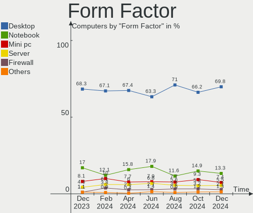
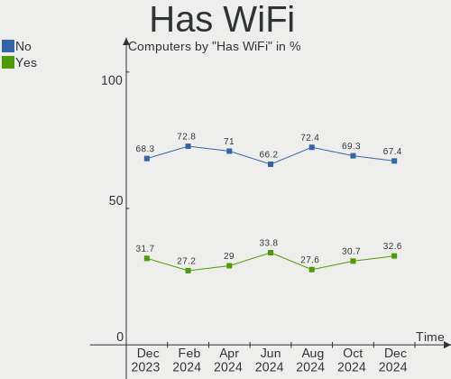
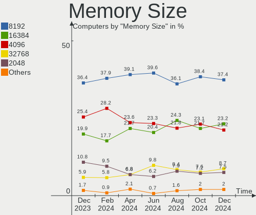

BSD - Hardware Trends
---------------------

A project to identify most popular hardware characteristics and track their change
over time based on data collected by BSD users at https://BSD-Hardware.info.

Anyone can contribute to this report by the [hw-probe](https://github.com/linuxhw/hw-probe/blob/master/INSTALL.BSD.md) tool:

    hw-probe -all -upload

This is a report for all computer types. See also reports for [desktops](/Desktop/README.md) and [notebooks](/Notebook/README.md).

OS-specific reports: [FreeBSD](/Dist/FreeBSD), [OPNsense](/Dist/OPNsense), [helloSystem](/Dist/helloSystem), [OpenBSD](/Dist/OpenBSD).

This report is for one last month. Overall report since the beginning of time: [TestDays](https://github.com/bsdhw/TestDays)

Period: Dec, 2023.

Contents
--------

* [ System ](#system)
  - [ OS                       ](#os)
  - [ OS Family                ](#os-family)
  - [ Arch                     ](#arch)
  - [ DE                       ](#de)
  - [ Display Server           ](#display-server)
  - [ Display Manager          ](#display-manager)
  - [ OS Lang                  ](#os-lang)
  - [ Boot Mode                ](#boot-mode)
  - [ Filesystem               ](#filesystem)
  - [ Part. scheme             ](#part-scheme)

* [ Board ](#board)
  - [ Vendor                   ](#vendor)
  - [ Model                    ](#model)
  - [ Model Family             ](#model-family)
  - [ MFG Year                 ](#mfg-year)
  - [ Form Factor              ](#form-factor)
  - [ Coreboot                 ](#coreboot)
  - [ RAM Size                 ](#ram-size)
  - [ RAM Used                 ](#ram-used)
  - [ Total Drives             ](#total-drives)
  - [ Has CD-ROM               ](#has-cd-rom)
  - [ Has Ethernet             ](#has-ethernet)
  - [ Has WiFi                 ](#has-wifi)
  - [ Has Bluetooth            ](#has-bluetooth)

* [ Location ](#location)
  - [ Country                  ](#country)
  - [ City                     ](#city)

* [ Drives ](#drives)
  - [ Drive Vendor             ](#drive-vendor)
  - [ Drive Model              ](#drive-model)
  - [ HDD Vendor               ](#hdd-vendor)
  - [ SSD Vendor               ](#ssd-vendor)
  - [ Drive Kind               ](#drive-kind)
  - [ Drive Connector          ](#drive-connector)
  - [ Drive Size               ](#drive-size)
  - [ Space Total              ](#space-total)
  - [ Space Used               ](#space-used)
  - [ Malfunc. Drives          ](#malfunc-drives)
  - [ Malfunc. Drive Vendor    ](#malfunc-drive-vendor)
  - [ Malfunc. HDD Vendor      ](#malfunc-hdd-vendor)
  - [ Malfunc. Drive Kind      ](#malfunc-drive-kind)
  - [ Failed Drives            ](#failed-drives)
  - [ Failed Drive Vendor      ](#failed-drive-vendor)
  - [ Drive Status             ](#drive-status)

* [ Storage controller ](#storage-controller)
  - [ Storage Vendor           ](#storage-vendor)
  - [ Storage Model            ](#storage-model)
  - [ Storage Kind             ](#storage-kind)

* [ Processor ](#processor)
  - [ CPU Vendor               ](#cpu-vendor)
  - [ CPU Model                ](#cpu-model)
  - [ CPU Model Family         ](#cpu-model-family)
  - [ CPU Cores                ](#cpu-cores)
  - [ CPU Sockets              ](#cpu-sockets)
  - [ CPU Threads              ](#cpu-threads)
  - [ CPU Microarch            ](#cpu-microarch)

* [ Graphics ](#graphics)
  - [ GPU Vendor               ](#gpu-vendor)
  - [ GPU Model                ](#gpu-model)
  - [ GPU Combo                ](#gpu-combo)
  - [ GPU Driver               ](#gpu-driver)
  - [ GPU Memory               ](#gpu-memory)

* [ Monitor ](#monitor)
  - [ Monitor Vendor           ](#monitor-vendor)
  - [ Monitor Model            ](#monitor-model)
  - [ Monitor Resolution       ](#monitor-resolution)
  - [ Monitor Diagonal         ](#monitor-diagonal)
  - [ Monitor Width            ](#monitor-width)
  - [ Aspect Ratio             ](#aspect-ratio)
  - [ Monitor Area             ](#monitor-area)
  - [ Pixel Density            ](#pixel-density)
  - [ Multiple Monitors        ](#multiple-monitors)

* [ Network ](#network)
  - [ Net Controller Vendor    ](#net-controller-vendor)
  - [ Net Controller Model     ](#net-controller-model)
  - [ Wireless Vendor          ](#wireless-vendor)
  - [ Wireless Model           ](#wireless-model)
  - [ Ethernet Vendor          ](#ethernet-vendor)
  - [ Ethernet Model           ](#ethernet-model)
  - [ Net Controller Kind      ](#net-controller-kind)
  - [ Used Controller          ](#used-controller)
  - [ NICs                     ](#nics)
  - [ IPv6                     ](#ipv6)

* [ Bluetooth ](#bluetooth)
  - [ Bluetooth Vendor         ](#bluetooth-vendor)
  - [ Bluetooth Model          ](#bluetooth-model)

* [ Sound ](#sound)
  - [ Sound Vendor             ](#sound-vendor)
  - [ Sound Model              ](#sound-model)

* [ Memory ](#memory)
  - [ Memory Vendor            ](#memory-vendor)
  - [ Memory Model             ](#memory-model)
  - [ Memory Kind              ](#memory-kind)
  - [ Memory Form Factor       ](#memory-form-factor)
  - [ Memory Size              ](#memory-size)
  - [ Memory Speed             ](#memory-speed)

* [ Printers & scanners ](#printers--scanners)
  - [ Printer Vendor           ](#printer-vendor)
  - [ Printer Model            ](#printer-model)
  - [ Scanner Vendor           ](#scanner-vendor)
  - [ Scanner Model            ](#scanner-model)

* [ Camera ](#camera)
  - [ Camera Vendor            ](#camera-vendor)
  - [ Camera Model             ](#camera-model)

* [ Security ](#security)
  - [ Fingerprint Vendor       ](#fingerprint-vendor)
  - [ Fingerprint Model        ](#fingerprint-model)
  - [ Chipcard Vendor          ](#chipcard-vendor)
  - [ Chipcard Model           ](#chipcard-model)

* [ Unsupported ](#unsupported)
  - [ Unsupported Devices      ](#unsupported-devices)
  - [ Unsupported Device Types ](#unsupported-device-types)

System
------

OS
--

Installed operating systems

| Name                 | Computers | Percent |
|----------------------|-----------|---------|
| OPNsense 23.7.10     | 211       | 39.81%  |
| OPNsense 23.7.9      | 137       | 25.85%  |
| FreeBSD 14.0         | 25        | 4.72%   |
| helloSystem 0.8.1    | 16        | 3.02%   |
| FreeBSD 14.0-p4      | 13        | 2.45%   |
| FreeBSD 14.0-p2      | 11        | 2.08%   |
| GhostBSD 23.10.1     | 10        | 1.89%   |
| helloSystem 0.9.0    | 9         | 1.7%    |
| FreeBSD 14.0-p1      | 9         | 1.7%    |
| OpenBSD 7.4          | 8         | 1.51%   |
| FreeBSD 14.0-p3      | 8         | 1.51%   |
| OPNsense 23.1.11     | 6         | 1.13%   |
| OPNsense 23.7.7      | 5         | 0.94%   |
| NomadBSD 20231121    | 5         | 0.94%   |
| FreeBSD 13.2-p5      | 5         | 0.94%   |
| OPNsense 23.7.8      | 4         | 0.75%   |
| FreeBSD 15.0-CURRENT | 4         | 0.75%   |
| OPNsense 24.1        | 3         | 0.57%   |
| NetBSD 10.0_RC1      | 3         | 0.57%   |
| OPNsense 23.10       | 2         | 0.38%   |
| OPNsense 22.7.11     | 2         | 0.38%   |
| OPNsense 21.7.8      | 2         | 0.38%   |
| FreeBSD 14.0-STABLE  | 2         | 0.38%   |
| FreeBSD 13.2-p6      | 2         | 0.38%   |
| TrueNAS 13.1-p9      | 1         | 0.19%   |
| pfSense 2.7.2        | 1         | 0.19%   |
| OPNsense 23.7.6      | 1         | 0.19%   |
| OPNsense 23.7.5      | 1         | 0.19%   |
| OPNsense 23.7.4      | 1         | 0.19%   |
| OPNsense 23.7.2      | 1         | 0.19%   |
| OPNsense 23.7.1      | 1         | 0.19%   |
| OPNsense 23.10.1     | 1         | 0.19%   |
| OPNsense 23.1.5      | 1         | 0.19%   |
| OpenBSD 7.0          | 1         | 0.19%   |
| NomadBSD 20231013    | 1         | 0.19%   |
| NetBSD 9.3           | 1         | 0.19%   |
| MidnightBSD 3.1.2    | 1         | 0.19%   |
| helloSystem 0.7.0    | 1         | 0.19%   |
| FreeBSD 14.0-BETA5   | 1         | 0.19%   |
| FreeBSD 13.2-p9      | 1         | 0.19%   |

OS Family
---------

OS without a version

| Name        | Computers | Percent |
|-------------|-----------|---------|
| OPNsense    | 379       | 71.51%  |
| FreeBSD     | 93        | 17.55%  |
| helloSystem | 26        | 4.91%   |
| GhostBSD    | 10        | 1.89%   |
| OpenBSD     | 9         | 1.7%    |
| NomadBSD    | 6         | 1.13%   |
| NetBSD      | 4         | 0.75%   |
| TrueNAS     | 1         | 0.19%   |
| pfSense     | 1         | 0.19%   |
| MidnightBSD | 1         | 0.19%   |

Arch
----

OS architecture (x86_64, i586, etc.)

| Name    | Computers | Percent |
|---------|-----------|---------|
| amd64   | 519       | 97.92%  |
| arm64   | 4         | 0.75%   |
| i386    | 3         | 0.57%   |
| macppc  | 2         | 0.38%   |
| powerpc | 1         | 0.19%   |
| evbarm  | 1         | 0.19%   |

DE
--

Desktop Environment

| Name         | Computers | Percent |
|--------------|-----------|---------|
| Console      | 415       | 78.3%   |
| helloDesktop | 32        | 6.04%   |
| KDE5         | 21        | 3.96%   |
| XFCE         | 17        | 3.21%   |
| MATE         | 13        | 2.45%   |
| TWM          | 8         | 1.51%   |
| Openbox      | 5         | 0.94%   |
| GNOME        | 5         | 0.94%   |
| xinitrc      | 3         | 0.57%   |
| LXQt         | 2         | 0.38%   |
| i3           | 2         | 0.38%   |
| ICEWM        | 1         | 0.19%   |
| Hyprland     | 1         | 0.19%   |
| GNUstep      | 1         | 0.19%   |
| fvwm2        | 1         | 0.19%   |
| fvwm         | 1         | 0.19%   |
| dwm          | 1         | 0.19%   |
| Budgie       | 1         | 0.19%   |

Display Server
--------------

X11 or Wayland

| Name    | Computers | Percent |
|---------|-----------|---------|
| Console | 413       | 77.92%  |
| X11     | 110       | 20.75%  |
| Wayland | 7         | 1.32%   |

Display Manager
---------------

SDDM, LightDM, etc.

| Name    | Computers | Percent |
|---------|-----------|---------|
| Console | 444       | 83.77%  |
| SLiM    | 32        | 6.04%   |
| SDDM    | 30        | 5.66%   |
| LightDM | 17        | 3.21%   |
| XDM     | 3         | 0.57%   |
| GDM     | 3         | 0.57%   |
| Ly      | 1         | 0.19%   |

OS Lang
-------

Language

| Lang    | Computers | Percent |
|---------|-----------|---------|
| Unknown | 396       | 74.72%  |
| C       | 78        | 14.72%  |
| en_US   | 31        | 5.85%   |
| ru_RU   | 4         | 0.75%   |
| de_DE   | 4         | 0.75%   |
| fr_FR   | 3         | 0.57%   |
| es_ES   | 3         | 0.57%   |
| it_IT   | 2         | 0.38%   |
| zh_CN   | 1         | 0.19%   |
| UTF-8   | 1         | 0.19%   |
| ru      | 1         | 0.19%   |
| pt_BR   | 1         | 0.19%   |
| pl_PL   | 1         | 0.19%   |
| ko_KR   | 1         | 0.19%   |
| fi_FI   | 1         | 0.19%   |
| es_AR   | 1         | 0.19%   |
| cs_CZ   | 1         | 0.19%   |

Boot Mode
---------

EFI or BIOS

| Mode | Computers | Percent |
|------|-----------|---------|
| EFI  | 490       | 92.45%  |
| BIOS | 40        | 7.55%   |

Filesystem
----------

Type of filesystem

| Type   | Computers | Percent |
|--------|-----------|---------|
| Zfs    | 265       | 50%     |
| Ufs    | 245       | 46.23%  |
| Cd9660 | 11        | 2.08%   |
| Ffs    | 9         | 1.7%    |

Part. scheme
------------

Scheme of partitioning

| Type    | Computers | Percent |
|---------|-----------|---------|
| GPT     | 504       | 95.09%  |
| MBR     | 21        | 3.96%   |
| Unknown | 5         | 0.94%   |

Board
-----

Vendor
------

Motherboard manufacturer

| Name                    | Computers | Percent |
|-------------------------|-----------|---------|
| Unknown                 | 82        | 15.47%  |
| Dell                    | 67        | 12.64%  |
| Lenovo                  | 52        | 9.81%   |
| ASUSTek Computer        | 36        | 6.79%   |
| Intel                   | 32        | 6.04%   |
| Hewlett-Packard         | 32        | 6.04%   |
| Protectli               | 24        | 4.53%   |
| ASRock                  | 19        | 3.58%   |
| Supermicro              | 15        | 2.83%   |
| PC Engines              | 15        | 2.83%   |
| Gigabyte Technology     | 15        | 2.83%   |
| MSI                     | 11        | 2.08%   |
| Techvision              | 10        | 1.89%   |
| AZW                     | 10        | 1.89%   |
| Apple                   | 10        | 1.89%   |
| AMI                     | 10        | 1.89%   |
| Fujitsu                 | 8         | 1.51%   |
| Deciso                  | 8         | 1.51%   |
| Sophos                  | 6         | 1.13%   |
| Acer                    | 5         | 0.94%   |
| Google                  | 4         | 0.75%   |
| CWWK                    | 4         | 0.75%   |
| Toshiba                 | 3         | 0.57%   |
| Raspberry Pi Foundation | 3         | 0.57%   |
| ZOTAC                   | 2         | 0.38%   |
| Yanling                 | 2         | 0.38%   |
| Pegatron                | 2         | 0.38%   |
| MW                      | 2         | 0.38%   |
| ECS                     | 2         | 0.38%   |
| ASRockRack              | 2         | 0.38%   |
| Advantech               | 2         | 0.38%   |
| ZX                      | 1         | 0.19%   |
| YANYU                   | 1         | 0.19%   |
| Wortmann AG             | 1         | 0.19%   |
| TULPAR                  | 1         | 0.19%   |
| Star Labs               | 1         | 0.19%   |
| Sony                    | 1         | 0.19%   |
| Shuttle                 | 1         | 0.19%   |
| SHANGZHAOYUAN           | 1         | 0.19%   |
| Seeed Studio            | 1         | 0.19%   |

Model
-----

Motherboard model

| Name                                | Computers | Percent |
|-------------------------------------|-----------|---------|
| Unknown                             | 82        | 15.47%  |
| Techvision TVI7309X                 | 10        | 1.89%   |
| Protectli FW4B                      | 8         | 1.51%   |
| AMI Aptio CRB                       | 8         | 1.51%   |
| Protectli VP2420                    | 7         | 1.32%   |
| PC Engines APU2                     | 7         | 1.32%   |
| AZW EQ                              | 7         | 1.32%   |
| PC Engines apu4                     | 5         | 0.94%   |
| Intel Q3XXG4-P V1.0                 | 5         | 0.94%   |
| Supermicro Super Server             | 4         | 0.75%   |
| HP t730 Thin Client                 | 4         | 0.75%   |
| Dell OptiPlex 7050                  | 4         | 0.75%   |
| Dell OptiPlex 7020                  | 4         | 0.75%   |
| Deciso NetBoard-A10                 | 4         | 0.75%   |
| Sophos XG                           | 3         | 0.57%   |
| RPi Raspberry Pi                    | 3         | 0.57%   |
| PC Engines APU3                     | 3         | 0.57%   |
| Intel Jasper Lake Client Platform   | 3         | 0.57%   |
| Fujitsu FUTRO S920                  | 3         | 0.57%   |
| Dell Wyse 5070 Extended Thin Client | 3         | 0.57%   |
| Dell OptiPlex 9020                  | 3         | 0.57%   |
| Dell OptiPlex 7060                  | 3         | 0.57%   |
| ZOTAC ZBOX-CI329NANO                | 2         | 0.38%   |
| Supermicro X10SLH-N6-ST031          | 2         | 0.38%   |
| Sophos UTM                          | 2         | 0.38%   |
| Protectli FW6                       | 2         | 0.38%   |
| Protectli FW4C                      | 2         | 0.38%   |
| Protectli FW4A                      | 2         | 0.38%   |
| Protectli FW2B                      | 2         | 0.38%   |
| MW GMLK-2_5G4L                      | 2         | 0.38%   |
| Intel QHSW02                        | 2         | 0.38%   |
| Intel NDISB533                      | 2         | 0.38%   |
| Intel NDiS 167                      | 2         | 0.38%   |
| HP ProDesk 400 G4 SFF               | 2         | 0.38%   |
| HP EliteDesk 800 G1 SFF             | 2         | 0.38%   |
| HP Compaq Elite 8300 SFF            | 2         | 0.38%   |
| Fujitsu FUTRO S940                  | 2         | 0.38%   |
| Dell PowerEdge R440                 | 2         | 0.38%   |
| Dell PowerEdge R330                 | 2         | 0.38%   |
| Dell PowerEdge R220                 | 2         | 0.38%   |

Model Family
------------

Motherboard model prefix

| Name                       | Computers | Percent |
|----------------------------|-----------|---------|
| Unknown                    | 82        | 15.47%  |
| Dell OptiPlex              | 31        | 5.85%   |
| Lenovo ThinkCentre         | 22        | 4.15%   |
| Lenovo ThinkPad            | 21        | 3.96%   |
| Dell PowerEdge             | 12        | 2.26%   |
| HP ProDesk                 | 11        | 2.08%   |
| Techvision TVI7309X        | 10        | 1.89%   |
| Protectli FW4B             | 8         | 1.51%   |
| AMI Aptio                  | 8         | 1.51%   |
| Protectli VP2420           | 7         | 1.32%   |
| PC Engines APU2            | 7         | 1.32%   |
| Dell Latitude              | 7         | 1.32%   |
| AZW EQ                     | 7         | 1.32%   |
| Fujitsu FUTRO              | 6         | 1.13%   |
| Dell Precision             | 6         | 1.13%   |
| ASUS TUF                   | 6         | 1.13%   |
| ASUS PRIME                 | 6         | 1.13%   |
| PC Engines apu4            | 5         | 0.94%   |
| Intel Q3XXG4-P             | 5         | 0.94%   |
| Supermicro Super           | 4         | 0.75%   |
| HP t730                    | 4         | 0.75%   |
| HP EliteDesk               | 4         | 0.75%   |
| Dell Wyse                  | 4         | 0.75%   |
| Dell Inspiron              | 4         | 0.75%   |
| Deciso NetBoard-A10        | 4         | 0.75%   |
| ASUS ROG                   | 4         | 0.75%   |
| Sophos XG                  | 3         | 0.57%   |
| RPi Raspberry              | 3         | 0.57%   |
| PC Engines APU3            | 3         | 0.57%   |
| Intel Jasper               | 3         | 0.57%   |
| HP Compaq                  | 3         | 0.57%   |
| ZOTAC ZBOX-CI329NANO       | 2         | 0.38%   |
| Yanling LES                | 2         | 0.38%   |
| Toshiba Satellite          | 2         | 0.38%   |
| Supermicro X10SLH-N6-ST031 | 2         | 0.38%   |
| Sophos UTM                 | 2         | 0.38%   |
| Protectli FW6              | 2         | 0.38%   |
| Protectli FW4C             | 2         | 0.38%   |
| Protectli FW4A             | 2         | 0.38%   |
| Protectli FW2B             | 2         | 0.38%   |

MFG Year
--------

Motherboard manufacture year

| Year    | Computers | Percent |
|---------|-----------|---------|
| 2023    | 83        | 15.66%  |
| 2022    | 76        | 14.34%  |
| 2021    | 50        | 9.43%   |
| 2019    | 45        | 8.49%   |
| 2018    | 44        | 8.3%    |
| 2016    | 37        | 6.98%   |
| 2015    | 30        | 5.66%   |
| 2014    | 25        | 4.72%   |
| 2020    | 24        | 4.53%   |
| 2012    | 24        | 4.53%   |
| 2013    | 22        | 4.15%   |
| 2017    | 19        | 3.58%   |
| 2011    | 15        | 2.83%   |
| 2010    | 11        | 2.08%   |
| 2009    | 8         | 1.51%   |
| Unknown | 7         | 1.32%   |
| 2008    | 6         | 1.13%   |
| 2007    | 4         | 0.75%   |

Form Factor
-----------

Physical design of the computer

| Name           | Computers | Percent |
|----------------|-----------|---------|
| Desktop        | 362       | 68.3%   |
| Notebook       | 90        | 16.98%  |
| Mini pc        | 43        | 8.11%   |
| Server         | 23        | 4.34%   |
| Firewall       | 6         | 1.13%   |
| System on chip | 4         | 0.75%   |
| Convertible    | 2         | 0.38%   |

Coreboot
--------

Have coreboot on board

| Used | Computers | Percent |
|------|-----------|---------|
| No   | 504       | 95.09%  |
| Yes  | 26        | 4.91%   |

RAM Size
--------

Total RAM memory

| Size in GB      | Computers | Percent |
|-----------------|-----------|---------|
| 8.01-16.0       | 186       | 35.09%  |
| 16.01-24.0      | 152       | 28.68%  |
| 4.01-8.0        | 74        | 13.96%  |
| 32.01-64.0      | 59        | 11.13%  |
| 64.01-256.0     | 29        | 5.47%   |
| 2.01-3.0        | 14        | 2.64%   |
| 3.01-4.0        | 7         | 1.32%   |
| 24.01-32.0      | 3         | 0.57%   |
| 0.01-0.5        | 3         | 0.57%   |
| More than 256.0 | 1         | 0.19%   |
| 1.01-2.0        | 1         | 0.19%   |
| 0.51-1.0        | 1         | 0.19%   |

RAM Used
--------

Used RAM memory

| Used GB   | Computers | Percent |
|-----------|-----------|---------|
| 0.01-0.5  | 223       | 42.08%  |
| 0.51-1.0  | 193       | 36.42%  |
| 1.01-2.0  | 79        | 14.91%  |
| 2.01-3.0  | 17        | 3.21%   |
| 3.01-4.0  | 7         | 1.32%   |
| 4.01-8.0  | 4         | 0.75%   |
| Unknown   | 4         | 0.75%   |
| 0         | 2         | 0.38%   |
| 8.01-16.0 | 1         | 0.19%   |

Total Drives
------------

Number of drives on board

| Drives | Computers | Percent |
|--------|-----------|---------|
| 1      | 373       | 70.38%  |
| 0      | 76        | 14.34%  |
| 2      | 54        | 10.19%  |
| 3      | 16        | 3.02%   |
| 4      | 8         | 1.51%   |
| 13     | 1         | 0.19%   |
| 12     | 1         | 0.19%   |
| 6      | 1         | 0.19%   |

Has CD-ROM
----------

Has CD-ROM on board

| Presented | Computers | Percent |
|-----------|-----------|---------|
| No        | 453       | 85.47%  |
| Yes       | 77        | 14.53%  |

Has Ethernet
------------

Has Ethernet on board

| Presented | Computers | Percent |
|-----------|-----------|---------|
| Yes       | 510       | 96.23%  |
| No        | 20        | 3.77%   |

Has WiFi
--------

Has WiFi module

| Presented | Computers | Percent |
|-----------|-----------|---------|
| No        | 363       | 68.49%  |
| Yes       | 167       | 31.51%  |

Has Bluetooth
-------------

Has Bluetooth module

| Presented | Computers | Percent |
|-----------|-----------|---------|
| No        | 409       | 77.17%  |
| Yes       | 121       | 22.83%  |

Location
--------

Country
-------

Geographic location (country)

| Country      | Computers | Percent |
|--------------|-----------|---------|
| USA          | 147       | 27.74%  |
| Germany      | 83        | 15.66%  |
| UK           | 26        | 4.91%   |
| Canada       | 24        | 4.53%   |
| Russia       | 19        | 3.58%   |
| France       | 19        | 3.58%   |
| Netherlands  | 16        | 3.02%   |
| Brazil       | 14        | 2.64%   |
| Italy        | 12        | 2.26%   |
| Austria      | 10        | 1.89%   |
| Australia    | 10        | 1.89%   |
| Spain        | 8         | 1.51%   |
| Switzerland  | 7         | 1.32%   |
| Mexico       | 7         | 1.32%   |
| China        | 7         | 1.32%   |
| Sweden       | 6         | 1.13%   |
| Romania      | 6         | 1.13%   |
| Portugal     | 6         | 1.13%   |
| Poland       | 6         | 1.13%   |
| Indonesia    | 6         | 1.13%   |
| Belgium      | 6         | 1.13%   |
| Taiwan       | 5         | 0.94%   |
| South Korea  | 4         | 0.75%   |
| South Africa | 4         | 0.75%   |
| Slovakia     | 4         | 0.75%   |
| Norway       | 4         | 0.75%   |
| Finland      | 4         | 0.75%   |
| Czechia      | 4         | 0.75%   |
| Chile        | 4         | 0.75%   |
| Turkey       | 3         | 0.57%   |
| Thailand     | 3         | 0.57%   |
| New Zealand  | 3         | 0.57%   |
| Luxembourg   | 3         | 0.57%   |
| Greece       | 3         | 0.57%   |
| Lithuania    | 2         | 0.38%   |
| India        | 2         | 0.38%   |
| Hungary      | 2         | 0.38%   |
| Estonia      | 2         | 0.38%   |
| El Salvador  | 2         | 0.38%   |
| Denmark      | 2         | 0.38%   |

City
----

Geographic location (city)

| City                     | Computers | Percent |
|--------------------------|-----------|---------|
| Moscow                   | 8         | 1.51%   |
| Berlin                   | 7         | 1.32%   |
| San Luis Potosí City    | 6         | 1.13%   |
| Vienna                   | 5         | 0.94%   |
| Paris                    | 5         | 0.94%   |
| Munich                   | 5         | 0.94%   |
| Milan                    | 4         | 0.75%   |
| Brisbane                 | 4         | 0.75%   |
| Toronto                  | 3         | 0.57%   |
| South San Francisco      | 3         | 0.57%   |
| Santiago                 | 3         | 0.57%   |
| San Antonio              | 3         | 0.57%   |
| Ottawa                   | 3         | 0.57%   |
| Montreal                 | 3         | 0.57%   |
| Lisbon                   | 3         | 0.57%   |
| Kooyong                  | 3         | 0.57%   |
| Istanbul                 | 3         | 0.57%   |
| Frankfurt am Main        | 3         | 0.57%   |
| Fayetteville             | 3         | 0.57%   |
| Denver                   | 3         | 0.57%   |
| Cologne                  | 3         | 0.57%   |
| Brooklyn                 | 3         | 0.57%   |
| Zurich                   | 2         | 0.38%   |
| Warsaw                   | 2         | 0.38%   |
| Vancouver                | 2         | 0.38%   |
| Uetze                    | 2         | 0.38%   |
| Thessaloniki             | 2         | 0.38%   |
| Taipei                   | 2         | 0.38%   |
| Sydney                   | 2         | 0.38%   |
| Sterling                 | 2         | 0.38%   |
| South Tangerang          | 2         | 0.38%   |
| Sorocaba                 | 2         | 0.38%   |
| Sao Paulo                | 2         | 0.38%   |
| Sandweiler               | 2         | 0.38%   |
| San Salvador             | 2         | 0.38%   |
| Salem                    | 2         | 0.38%   |
| Sainte-Marthe-sur-le-Lac | 2         | 0.38%   |
| Rüsselsheim am Main     | 2         | 0.38%   |
| Rotterdam                | 2         | 0.38%   |
| Richmond                 | 2         | 0.38%   |

Drives
------

Drive Vendor
------------

Hard drive vendors

| Vendor              | Computers | Drives | Percent |
|---------------------|-----------|--------|---------|
| Samsung Electronics | 95        | 117    | 18.06%  |
| Seagate             | 45        | 61     | 8.56%   |
| WDC                 | 43        | 53     | 8.17%   |
| Kingston            | 34        | 37     | 6.46%   |
| Transcend           | 28        | 28     | 5.32%   |
| Crucial             | 27        | 28     | 5.13%   |
| Toshiba             | 23        | 23     | 4.37%   |
| SK hynix            | 18        | 18     | 3.42%   |
| Intel               | 18        | 24     | 3.42%   |
| SanDisk             | 17        | 17     | 3.23%   |
| Hoodisk             | 15        | 15     | 2.85%   |
| China               | 12        | 12     | 2.28%   |
| SPCC                | 9         | 10     | 1.71%   |
| Protectli           | 8         | 8      | 1.52%   |
| Hitachi             | 7         | 8      | 1.33%   |
| Team                | 6         | 7      | 1.14%   |
| Fanxiang            | 6         | 6      | 1.14%   |
| Silicon Motion      | 5         | 5      | 0.95%   |
| OCZ                 | 5         | 5      | 0.95%   |
| Lexar               | 5         | 5      | 0.95%   |
| Gigabyte Technology | 5         | 5      | 0.95%   |
| Apple               | 5         | 5      | 0.95%   |
| PNY                 | 4         | 4      | 0.76%   |
| Patriot             | 4         | 5      | 0.76%   |
| Intenso             | 4         | 4      | 0.76%   |
| HGST                | 4         | 5      | 0.76%   |
| Hewlett-Packard     | 4         | 4      | 0.76%   |
| A-DATA Technology   | 4         | 4      | 0.76%   |
| ShiJi               | 3         | 3      | 0.57%   |
| Phison              | 3         | 4      | 0.57%   |
| NVMe                | 3         | 3      | 0.57%   |
| Micron Technology   | 3         | 3      | 0.57%   |
| KingSpec            | 3         | 3      | 0.57%   |
| Fujitsu             | 3         | 3      | 0.57%   |
| FORESEE             | 3         | 3      | 0.57%   |
| Corsair             | 3         | 3      | 0.57%   |
| BIWIN               | 3         | 3      | 0.57%   |
| SSSTC               | 2         | 2      | 0.38%   |
| SHAREVDI            | 2         | 2      | 0.38%   |
| MidasForce          | 2         | 3      | 0.38%   |

Drive Model
-----------

Hard drive models

| Model                            | Computers | Percent |
|----------------------------------|-----------|---------|
| Hoodisk SSD 128GB                | 9         | 1.63%   |
| Kingston SKC600MS256G 256GB      | 8         | 1.45%   |
| Seagate ST500DM002-1BD142 500GB  | 7         | 1.27%   |
| Kingston SA400S37480G 480GB      | 7         | 1.27%   |
| Samsung SSD 840 EVO 250GB        | 6         | 1.08%   |
| Samsung MZVLB256HAHQ-000L7 256GB | 5         | 0.9%    |
| Crucial CT500P3SSD8 500GB        | 5         | 0.9%    |
| Samsung SSD 870 EVO 1TB          | 4         | 0.72%   |
| Samsung MZ7PD256HCGM-000H7 256GB | 4         | 0.72%   |
| Kingston SA400S37120G 120GB      | 4         | 0.72%   |
| Transcend TS256GMTS952T2 256GB   | 3         | 0.54%   |
| Transcend TS128GMSA230S 128GB    | 3         | 0.54%   |
| Team TM8FP6256G 256GB            | 3         | 0.54%   |
| SPCC Solid State Disk 128GB      | 3         | 0.54%   |
| SK hynix SC311 SATA 128GB        | 3         | 0.54%   |
| Seagate ST4000DM004-2CV104 4TB   | 3         | 0.54%   |
| Samsung SSD 980 PRO 500GB        | 3         | 0.54%   |
| Samsung SSD 870 EVO 250GB        | 3         | 0.54%   |
| Samsung SSD 860 QVO 1TB          | 3         | 0.54%   |
| Samsung SSD 850 EVO 250GB        | 3         | 0.54%   |
| Samsung SSD 840 EVO 120GB        | 3         | 0.54%   |
| Protectli 120GB mSATA            | 3         | 0.54%   |
| Phison PCIe SSD 250GB            | 3         | 0.54%   |
| Hoodisk SSD 32GB                 | 3         | 0.54%   |
| WDC WD40EZRZ-22GXCB0 4TB         | 2         | 0.36%   |
| WDC WD2500BEVT-22ZCT0 250GB      | 2         | 0.36%   |
| Transcend TS64GMSA230S 64GB      | 2         | 0.36%   |
| Transcend TS256GMTE652T2 256GB   | 2         | 0.36%   |
| Transcend TS256GMSA230S 256GB    | 2         | 0.36%   |
| Transcend TS16GMSA370 16GB       | 2         | 0.36%   |
| Transcend TS128GMTE110S 128GB    | 2         | 0.36%   |
| Toshiba MQ04ABF100 1TB           | 2         | 0.36%   |
| SK hynix SC300 M.2 2280 128GB    | 2         | 0.36%   |
| Silicon Motion GV128 128GB       | 2         | 0.36%   |
| SHAREVDI 128GB SSD               | 2         | 0.36%   |
| Seagate ST940110A 40GB           | 2         | 0.36%   |
| Seagate ST4000DM000-1F2168 4TB   | 2         | 0.36%   |
| Seagate ST2000DM008-2FR102 2TB   | 2         | 0.36%   |
| Seagate ST1000DM003-1ER162 1TB   | 2         | 0.36%   |
| SanDisk SSD PLUS 240GB           | 2         | 0.36%   |

HDD Vendor
----------

Hard disk drive vendors

| Vendor              | Computers | Drives | Percent |
|---------------------|-----------|--------|---------|
| Seagate             | 42        | 58     | 37.17%  |
| WDC                 | 28        | 38     | 24.78%  |
| Toshiba             | 17        | 17     | 15.04%  |
| Hitachi             | 6         | 6      | 5.31%   |
| Samsung Electronics | 4         | 5      | 3.54%   |
| HGST                | 4         | 5      | 3.54%   |
| NVMe                | 3         | 3      | 2.65%   |
| Fujitsu             | 3         | 3      | 2.65%   |
| Hewlett-Packard     | 2         | 2      | 1.77%   |
| Apple               | 2         | 2      | 1.77%   |
| WD MediaMax         | 1         | 1      | 0.88%   |
| Maxtor              | 1         | 1      | 0.88%   |

SSD Vendor
----------

Solid state drive vendors

| Vendor              | Computers | Drives | Percent |
|---------------------|-----------|--------|---------|
| Samsung Electronics | 62        | 77     | 21.16%  |
| Kingston            | 30        | 33     | 10.24%  |
| Transcend           | 23        | 23     | 7.85%   |
| Crucial             | 18        | 19     | 6.14%   |
| SanDisk             | 17        | 17     | 5.8%    |
| Hoodisk             | 15        | 15     | 5.12%   |
| China               | 12        | 12     | 4.1%    |
| SK hynix            | 11        | 11     | 3.75%   |
| Intel               | 11        | 16     | 3.75%   |
| Protectli           | 8         | 8      | 2.73%   |
| SPCC                | 7         | 7      | 2.39%   |
| WDC                 | 6         | 6      | 2.05%   |
| OCZ                 | 5         | 5      | 1.71%   |
| A-DATA Technology   | 4         | 4      | 1.37%   |
| PNY                 | 3         | 3      | 1.02%   |
| Lexar               | 3         | 3      | 1.02%   |
| KingSpec            | 3         | 3      | 1.02%   |
| Intenso             | 3         | 3      | 1.02%   |
| Apple               | 3         | 3      | 1.02%   |
| Toshiba             | 2         | 2      | 0.68%   |
| SHAREVDI            | 2         | 2      | 0.68%   |
| Patriot             | 2         | 2      | 0.68%   |
| MidasForce          | 2         | 3      | 0.68%   |
| Micron Technology   | 2         | 2      | 0.68%   |
| LITEON              | 2         | 2      | 0.68%   |
| KeepData            | 2         | 2      | 0.68%   |
| Gigabyte Technology | 2         | 2      | 0.68%   |
| GAMER               | 2         | 2      | 0.68%   |
| FORESEE             | 2         | 2      | 0.68%   |
| Dogfish             | 2         | 2      | 0.68%   |
| BIWIN               | 2         | 2      | 0.68%   |
| Wibtek              | 1         | 1      | 0.34%   |
| VICKTER             | 1         | 1      | 0.34%   |
| Verbatim            | 1         | 1      | 0.34%   |
| V-GeN               | 1         | 2      | 0.34%   |
| Team                | 1         | 1      | 0.34%   |
| SSSTC               | 1         | 1      | 0.34%   |
| ShiJi               | 1         | 1      | 0.34%   |
| Seagate             | 1         | 1      | 0.34%   |
| Pioneer             | 1         | 1      | 0.34%   |

Drive Kind
----------

HDD or SSD

| Kind | Computers | Drives | Percent |
|------|-----------|--------|---------|
| SSD  | 280       | 323    | 56.22%  |
| NVMe | 120       | 131    | 24.1%   |
| HDD  | 98        | 141    | 19.68%  |

Drive Connector
---------------

SATA, SAS, NVMe, etc.

| Type | Computers | Drives | Percent |
|------|-----------|--------|---------|
| SATA | 348       | 464    | 74.36%  |
| NVMe | 120       | 131    | 25.64%  |

Drive Size
----------

Size of hard drive

| Size in TB | Computers | Drives | Percent |
|------------|-----------|--------|---------|
| 0.01-0.5   | 294       | 338    | 75.58%  |
| 0.51-1.0   | 51        | 60     | 13.11%  |
| 1.01-2.0   | 25        | 29     | 6.43%   |
| 3.01-4.0   | 11        | 13     | 2.83%   |
| 4.01-10.0  | 5         | 20     | 1.29%   |
| 10.01-20.0 | 3         | 4      | 0.77%   |

Space Total
-----------

Amount of disk space available on the file system

| Size in GB     | Computers | Percent |
|----------------|-----------|---------|
| 101-250        | 259       | 48.87%  |
| 251-500        | 107       | 20.19%  |
| 501-1000       | 45        | 8.49%   |
| 51-100         | 38        | 7.17%   |
| 1-20           | 33        | 6.23%   |
| 21-50          | 28        | 5.28%   |
| 1001-2000      | 15        | 2.83%   |
| More than 3000 | 3         | 0.57%   |
| Unknown        | 2         | 0.38%   |

Space Used
----------

Amount of used disk space

| Used GB        | Computers | Percent |
|----------------|-----------|---------|
| 1-20           | 480       | 90.57%  |
| 21-50          | 31        | 5.85%   |
| 51-100         | 8         | 1.51%   |
| 101-250        | 6         | 1.13%   |
| Unknown        | 2         | 0.38%   |
| More than 3000 | 1         | 0.19%   |
| 251-500        | 1         | 0.19%   |
| 1001-2000      | 1         | 0.19%   |

Malfunc. Drives
---------------

Drive models with a malfunction

| Model                                      | Computers | Drives | Percent |
|--------------------------------------------|-----------|--------|---------|
| Seagate ST500DM002-1BD142 500GB            | 3         | 3      | 5.66%   |
| WDC WD5000AAKX-00ERMA0 500GB               | 1         | 1      | 1.89%   |
| WDC WD4000FYYZ-50UL1B0 4TB                 | 1         | 1      | 1.89%   |
| WDC WD3200AAKS-75L9A0 320GB                | 1         | 1      | 1.89%   |
| WDC WD2500BEVT-22ZCT0 250GB                | 1         | 1      | 1.89%   |
| WDC WD20EZRX-19D8PB0 2TB                   | 1         | 1      | 1.89%   |
| WDC WD2000FYYZ-01UL1B2 2TB                 | 1         | 1      | 1.89%   |
| WDC WD10EZEX-08M2NA0 1TB                   | 1         | 1      | 1.89%   |
| WDC WD10EZEX-00RKKA0 1TB                   | 1         | 1      | 1.89%   |
| WDC WD10EALX-009BA0 1TB                    | 1         | 1      | 1.89%   |
| Transcend TS8GMSM610 8GB                   | 1         | 1      | 1.89%   |
| Toshiba THNSNK128GCS8 SATA 128GB           | 1         | 1      | 1.89%   |
| Toshiba MQ01ABD100 1TB                     | 1         | 1      | 1.89%   |
| Toshiba MK3261GSYN 320GB                   | 1         | 1      | 1.89%   |
| Toshiba MK3261GSY 320GB                    | 1         | 1      | 1.89%   |
| Toshiba MK2565GSX 250GB                    | 1         | 1      | 1.89%   |
| SSSTC CVB-8D128-HP 128GB                   | 1         | 1      | 1.89%   |
| SPCC Solid State Disk 512GB                | 1         | 1      | 1.89%   |
| SK hynix HFS256G39TND-N210A 256GB          | 1         | 1      | 1.89%   |
| SK hynix HFS064G3AMNB-2200A 64GB           | 1         | 1      | 1.89%   |
| Seagate ST9500420AS 500GB                  | 1         | 1      | 1.89%   |
| Seagate ST9500325AS 500GB                  | 1         | 1      | 1.89%   |
| Seagate ST9320325AS 320GB                  | 1         | 1      | 1.89%   |
| Seagate ST500LT012-9WS142 500GB            | 1         | 1      | 1.89%   |
| Seagate ST4000VN000-1H4168 4TB             | 1         | 1      | 1.89%   |
| Seagate ST3320418AS 320GB                  | 1         | 1      | 1.89%   |
| Seagate ST320LT012-1DG14C 320GB            | 1         | 2      | 1.89%   |
| Seagate ST250DM000-1BD141 250GB            | 1         | 1      | 1.89%   |
| Seagate ST1000DM003-1SB102 1TB             | 1         | 1      | 1.89%   |
| Seagate ST1000DM003-1CH162 1TB             | 1         | 1      | 1.89%   |
| SanDisk SDSSDHP256G 256GB                  | 1         | 1      | 1.89%   |
| Samsung Electronics SSD RBX Series 128GB M | 1         | 1      | 1.89%   |
| Samsung Electronics SSD 980 PRO 2TB        | 1         | 1      | 1.89%   |
| Samsung Electronics SSD 970 EVO Plus 2TB   | 1         | 1      | 1.89%   |
| Samsung Electronics SSD 870 EVO 500GB      | 1         | 1      | 1.89%   |
| Samsung Electronics SP2504C 250GB          | 1         | 1      | 1.89%   |
| Samsung Electronics HD204UI 2TB            | 1         | 1      | 1.89%   |
| Plextor PX-256M8PeG 256GB                  | 1         | 1      | 1.89%   |
| Patriot Pyro SE 120GB                      | 1         | 1      | 1.89%   |
| LITEON LCH-128V2S-11 2.5 7mm 128GB         | 1         | 1      | 1.89%   |

Malfunc. Drive Vendor
---------------------

Vendors of faulty drives

| Vendor              | Computers | Drives | Percent |
|---------------------|-----------|--------|---------|
| Seagate             | 13        | 14     | 25%     |
| WDC                 | 8         | 9      | 15.38%  |
| Samsung Electronics | 6         | 6      | 11.54%  |
| Toshiba             | 5         | 5      | 9.62%   |
| Hitachi             | 3         | 3      | 5.77%   |
| SK hynix            | 2         | 2      | 3.85%   |
| Crucial             | 2         | 2      | 3.85%   |
| Transcend           | 1         | 1      | 1.92%   |
| SSSTC               | 1         | 1      | 1.92%   |
| SPCC                | 1         | 1      | 1.92%   |
| SanDisk             | 1         | 1      | 1.92%   |
| Plextor             | 1         | 1      | 1.92%   |
| Patriot             | 1         | 1      | 1.92%   |
| LITEON              | 1         | 1      | 1.92%   |
| Lenovo              | 1         | 1      | 1.92%   |
| Kingston            | 1         | 1      | 1.92%   |
| KingSpec            | 1         | 1      | 1.92%   |
| Intel               | 1         | 1      | 1.92%   |
| HGST                | 1         | 1      | 1.92%   |
| Fujitsu             | 1         | 1      | 1.92%   |

Malfunc. HDD Vendor
-------------------

Vendors of faulty HDD drives

| Vendor              | Computers | Drives | Percent |
|---------------------|-----------|--------|---------|
| Seagate             | 13        | 14     | 40.63%  |
| WDC                 | 8         | 9      | 25%     |
| Toshiba             | 4         | 4      | 12.5%   |
| Hitachi             | 3         | 3      | 9.38%   |
| Samsung Electronics | 2         | 2      | 6.25%   |
| HGST                | 1         | 1      | 3.13%   |
| Fujitsu             | 1         | 1      | 3.13%   |

Malfunc. Drive Kind
-------------------

Kinds of faulty drives

| Kind | Computers | Drives | Percent |
|------|-----------|--------|---------|
| HDD  | 32        | 34     | 61.54%  |
| SSD  | 17        | 17     | 32.69%  |
| NVMe | 3         | 3      | 5.77%   |

Failed Drives
-------------

Failed drive models

| Model                                        | Computers | Drives | Percent |
|----------------------------------------------|-----------|--------|---------|
| Transcend TS128GMTE110S 128GB                | 1         | 1      | 50%     |
| Samsung Electronics MZVLB256HBHQ-000H1 256GB | 1         | 1      | 50%     |

Failed Drive Vendor
-------------------

Failed drive vendors

| Vendor              | Computers | Drives | Percent |
|---------------------|-----------|--------|---------|
| Transcend           | 1         | 1      | 50%     |
| Samsung Electronics | 1         | 1      | 50%     |

Drive Status
------------

Number of failed and malfunc. drives

| Status   | Computers | Drives | Percent |
|----------|-----------|--------|---------|
| Works    | 406       | 524    | 86.2%   |
| Malfunc  | 51        | 54     | 10.83%  |
| Detected | 12        | 15     | 2.55%   |
| Failed   | 2         | 2      | 0.42%   |

Storage controller
------------------

Storage Vendor
--------------

Storage controller vendors

| Vendor                                  | Computers | Percent |
|-----------------------------------------|-----------|---------|
| Intel                                   | 395       | 58.69%  |
| AMD                                     | 75        | 11.14%  |
| Samsung Electronics                     | 42        | 6.24%   |
| SanDisk                                 | 25        | 3.71%   |
| Phison Electronics                      | 15        | 2.23%   |
| Silicon Motion                          | 14        | 2.08%   |
| Micron/Crucial Technology               | 14        | 2.08%   |
| Broadcom / LSI                          | 11        | 1.63%   |
| SK hynix                                | 10        | 1.49%   |
| MAXIO Technology (Hangzhou)             | 10        | 1.49%   |
| Kingston Technology Company             | 7         | 1.04%   |
| ASMedia Technology                      | 7         | 1.04%   |
| Transcend                               | 5         | 0.74%   |
| Toshiba                                 | 4         | 0.59%   |
| Nvidia                                  | 4         | 0.59%   |
| Marvell Technology Group                | 4         | 0.59%   |
| KIOXIA                                  | 4         | 0.59%   |
| Hosin Global Electronics                | 4         | 0.59%   |
| Realtek Semiconductor                   | 3         | 0.45%   |
| Micron Technology                       | 3         | 0.45%   |
| Solid State Storage Technology          | 2         | 0.3%    |
| Shenzhen Longsys Electronics            | 2         | 0.3%    |
| Seagate Technology                      | 2         | 0.3%    |
| JMicron Technology                      | 2         | 0.3%    |
| Union Memory (Shenzhen)                 | 1         | 0.15%   |
| Shenzhen Unionmemory Information System | 1         | 0.15%   |
| Lite-On Technology                      | 1         | 0.15%   |
| Integrated Technology Express           | 1         | 0.15%   |
| Hewlett-Packard                         | 1         | 0.15%   |
| Chelsio Communications                  | 1         | 0.15%   |
| Biwin Storage Technology                | 1         | 0.15%   |
| ATP ELECTRONICS                         | 1         | 0.15%   |
| Unknown                                 | 1         | 0.15%   |

Storage Model
-------------

Storage controller models

| Model                                                                            | Computers | Percent |
|----------------------------------------------------------------------------------|-----------|---------|
| AMD FCH SATA Controller [AHCI mode]                                              | 54        | 7.3%    |
| Intel 8 Series/C220 Series Chipset Family 6-port SATA Controller 1 [AHCI mode]   | 38        | 5.14%   |
| Intel unknown                                                                    | 36        | 4.86%   |
| Intel Jasper Lake SATA AHCI Controller                                           | 27        | 3.65%   |
| Intel Q170/Q150/B150/H170/H110/Z170/CM236 Chipset SATA Controller [AHCI Mode]    | 25        | 3.38%   |
| Intel Celeron/Pentium Silver Processor SATA Controller                           | 25        | 3.38%   |
| Intel Sunrise Point-LP SATA Controller [AHCI mode]                               | 18        | 2.43%   |
| Intel Cannon Lake PCH SATA AHCI Controller                                       | 18        | 2.43%   |
| Intel Atom/Celeron/Pentium Processor x5-E8000/J3xxx/N3xxx Series SATA Controller | 18        | 2.43%   |
| Samsung NVMe SSD Controller SM981/PM981/PM983                                    | 17        | 2.3%    |
| Silicon Motion SM2263EN/SM2263XT (DRAM-less) NVMe SSD Controllers                | 14        | 1.89%   |
| Intel Atom Processor E3800 Series SATA AHCI Controller                           | 12        | 1.62%   |
| Intel 200 Series PCH SATA controller [AHCI mode]                                 | 12        | 1.62%   |
| Intel 7 Series Chipset Family 6-port SATA Controller [AHCI mode]                 | 11        | 1.49%   |
| Micron/Crucial P2 [Nick P2] / P3 / P3 Plus NVMe PCIe SSD (DRAM-less)             | 10        | 1.35%   |
| MAXIO (Hangzhou) NVMe SSD Controller MAP1202                                     | 10        | 1.35%   |
| Intel Wildcat Point-LP SATA Controller [AHCI Mode]                               | 10        | 1.35%   |
| Samsung NVMe SSD Controller 980 (DRAM-less)                                      | 9         | 1.22%   |
| Unknown                                                                          | 9         | 1.22%   |
| SK hynix Gold P31/BC711/PC711 NVMe Solid State Drive                             | 8         | 1.08%   |
| SanDisk Extreme Pro / WD Black SN750 / PC SN730 / Red SN700 NVMe SSD             | 8         | 1.08%   |
| Intel SATA Controller [RAID mode]                                                | 8         | 1.08%   |
| Intel Elkhart Lake SATA AHCI                                                     | 8         | 1.08%   |
| Intel 8 Series SATA Controller 1 [AHCI mode]                                     | 8         | 1.08%   |
| Samsung NVMe SSD Controller PM9A1/PM9A3/980PRO                                   | 7         | 0.95%   |
| Intel 6 Series/C200 Series Chipset Family 6 port Desktop SATA AHCI Controller    | 7         | 0.95%   |
| AMD 500 Series Chipset SATA Controller                                           | 7         | 0.95%   |
| Phison PS5013-E13 PCIe3 NVMe Controller (DRAM-less)                              | 6         | 0.81%   |
| Intel 82801HM/HEM (ICH8M/ICH8M-E) SATA Controller [AHCI mode]                    | 6         | 0.81%   |
| Intel 82801HM/HEM (ICH8M/ICH8M-E) IDE Controller                                 | 6         | 0.81%   |
| ASMedia ASM1062 Serial ATA Controller                                            | 6         | 0.81%   |
| AMD FCH SATA Controller [IDE mode]                                               | 6         | 0.81%   |
| AMD 400 Series Chipset SATA Controller                                           | 6         | 0.81%   |
| SanDisk Ultra 3D / WD Blue SN550 NVMe SSD                                        | 5         | 0.68%   |
| Intel Comet Lake SATA AHCI Controller                                            | 5         | 0.68%   |
| Intel C610/X99 series chipset sSATA Controller [AHCI mode]                       | 5         | 0.68%   |
| Intel C610/X99 series chipset 6-Port SATA Controller [AHCI mode]                 | 5         | 0.68%   |
| Intel Atom Processor C3000 Series SATA Controller 0                              | 5         | 0.68%   |
| Intel Alder Lake-S PCH SATA Controller [AHCI Mode]                               | 5         | 0.68%   |
| Intel 7 Series/C210 Series Chipset Family 6-port SATA Controller [AHCI mode]     | 5         | 0.68%   |

Storage Kind
------------

Kind of storage controller (IDE, SATA, NVMe, SAS, ...)

| Kind | Computers | Percent |
|------|-----------|---------|
| SATA | 428       | 62.85%  |
| NVMe | 173       | 25.4%   |
| IDE  | 50        | 7.34%   |
| RAID | 25        | 3.67%   |
| SAS  | 3         | 0.44%   |
| SCSI | 2         | 0.29%   |

Processor
---------

CPU Vendor
----------

Processor vendors

| Vendor   | Computers | Percent |
|----------|-----------|---------|
| Intel    | 431       | 81.32%  |
| AMD      | 91        | 17.17%  |
| ARM      | 3         | 0.57%   |
| Unknown  | 3         | 0.57%   |
| Rockchip | 1         | 0.19%   |
| 7447A    | 1         | 0.19%   |

CPU Model
---------

Processor models

| Model                                    | Computers | Percent |
|------------------------------------------|-----------|---------|
| Intel N100                               | 36        | 6.79%   |
| Intel Celeron N5105 @ 2.00GHz            | 19        | 3.58%   |
| AMD GX-412TC SOC                         | 15        | 2.83%   |
| Intel Celeron J4125 CPU @ 2.00GHz        | 12        | 2.26%   |
| Intel Celeron CPU J3160 @ 1.60GHz        | 10        | 1.89%   |
| Intel Pentium Silver N6005 @ 2.00GHz     | 8         | 1.51%   |
| Intel Celeron J6412 @ 2.00GHz            | 8         | 1.51%   |
| Intel Celeron CPU J1900 @ 1.99GHz        | 8         | 1.51%   |
| Intel Pentium Silver J5005 CPU @ 1.50GHz | 7         | 1.32%   |
| Intel Core i5-6500 CPU @ 3.20GHz         | 6         | 1.13%   |
| Intel Core i5-4590 CPU @ 3.30GHz         | 6         | 1.13%   |
| Intel Core i3-N305                       | 6         | 1.13%   |
| Intel Core i7-7500U CPU @ 2.70GHz        | 5         | 0.94%   |
| Intel Core i7-3770 CPU @ 3.40GHz         | 5         | 0.94%   |
| Intel Core i3-6100 CPU @ 3.70GHz         | 5         | 0.94%   |
| Intel Core i7-4770 CPU @ 3.40GHz         | 4         | 0.75%   |
| Intel Core i5-8500T CPU @ 2.10GHz        | 4         | 0.75%   |
| Intel Core i5-8500 CPU @ 3.00GHz         | 4         | 0.75%   |
| Intel Core i5-8365U CPU @ 1.60GHz        | 4         | 0.75%   |
| Intel Atom CPU N450 @ 1.66GHz            | 4         | 0.75%   |
| Intel Atom CPU C3558 @ 2.20GHz           | 4         | 0.75%   |
| AMD Ryzen Embedded V1500B                | 4         | 0.75%   |
| AMD RX-427BB with AMD Radeon R7 Graphics | 4         | 0.75%   |
| AMD EPYC 3201 8-Core Processor           | 4         | 0.75%   |
| Intel Pentium Gold G5400T CPU @ 3.10GHz  | 3         | 0.57%   |
| Intel Core i7-5500U CPU @ 2.40GHz        | 3         | 0.57%   |
| Intel Core i5-4590T CPU @ 2.00GHz        | 3         | 0.57%   |
| Intel Core i5-4200U CPU @ 1.60GHz        | 3         | 0.57%   |
| Intel Core i5-2520M CPU @ 2.50GHz        | 3         | 0.57%   |
| Intel Core i5-10210U CPU @ 1.60GHz       | 3         | 0.57%   |
| Intel Celeron N5095 @ 2.00GHz            | 3         | 0.57%   |
| Intel Atom CPU E3845 @ 1.91GHz           | 3         | 0.57%   |
| Intel Atom CPU D525 @ 1.80GHz            | 3         | 0.57%   |
| Intel 11th Gen Core i5-1135G7 @ 2.40GHz  | 3         | 0.57%   |
| AMD Ryzen 7 5700G with Radeon Graphics   | 3         | 0.57%   |
| AMD Ryzen 5 5600G with Radeon Graphics   | 3         | 0.57%   |
|                                          | 3         | 0.57%   |
| Intel Xeon CPU E5502 @ 1.87GHz           | 2         | 0.38%   |
| Intel Xeon CPU E3-1270 v6 @ 3.80GHz      | 2         | 0.38%   |
| Intel Xeon CPU E3-1270 v3 @ 3.50GHz      | 2         | 0.38%   |

CPU Model Family
----------------

Processor model prefix

| Model                   | Computers | Percent |
|-------------------------|-----------|---------|
| Intel Core i5           | 99        | 18.68%  |
| Intel Celeron           | 86        | 16.23%  |
| Other                   | 70        | 13.21%  |
| Intel Core i7           | 47        | 8.87%   |
| Intel Core i3           | 38        | 7.17%   |
| Intel Xeon              | 37        | 6.98%   |
| Intel Atom              | 20        | 3.77%   |
| AMD GX                  | 19        | 3.58%   |
| AMD Ryzen 7             | 18        | 3.4%    |
| Intel Pentium Silver    | 16        | 3.02%   |
| Intel Pentium           | 12        | 2.26%   |
| AMD Ryzen 5             | 8         | 1.51%   |
| AMD Ryzen 9             | 6         | 1.13%   |
| AMD Ryzen Embedded      | 5         | 0.94%   |
| AMD EPYC                | 5         | 0.94%   |
| Intel Pentium Gold      | 3         | 0.57%   |
| Intel Pentium Dual-Core | 3         | 0.57%   |
| Intel Core 2 Duo        | 3         | 0.57%   |
| ARM Cortex              | 3         | 0.57%   |
| AMD Ryzen 5 PRO         | 3         | 0.57%   |
| AMD FX                  | 3         | 0.57%   |
| Intel Xeon Gold         | 2         | 0.38%   |
| Intel Genuine           | 2         | 0.38%   |
| Intel Core 2 Quad       | 2         | 0.38%   |
| AMD Ryzen 7 PRO         | 2         | 0.38%   |
| AMD Ryzen 3             | 2         | 0.38%   |
| AMD E2                  | 2         | 0.38%   |
| AMD Athlon              | 2         | 0.38%   |
| Intel Pentium M         | 1         | 0.19%   |
| Intel Core i9           | 1         | 0.19%   |
| AMD Sempron             | 1         | 0.19%   |
| AMD Ryzen Threadripper  | 1         | 0.19%   |
| AMD Phenom              | 1         | 0.19%   |
| AMD Opteron             | 1         | 0.19%   |
| AMD E1                  | 1         | 0.19%   |
| AMD C-50                | 1         | 0.19%   |
| AMD Athlon II X3        | 1         | 0.19%   |
| AMD Athlon II X2        | 1         | 0.19%   |
| AMD Athlon 64 X2        | 1         | 0.19%   |
| AMD A10                 | 1         | 0.19%   |

CPU Cores
---------

Number of processor cores

| Number  | Computers | Percent |
|---------|-----------|---------|
| 4       | 281       | 53.02%  |
| 2       | 123       | 23.21%  |
| 8       | 31        | 5.85%   |
| 6       | 31        | 5.85%   |
| 16      | 23        | 4.34%   |
| Unknown | 10        | 1.89%   |
| 12      | 8         | 1.51%   |
| 1       | 7         | 1.32%   |
| 32      | 5         | 0.94%   |
| 24      | 2         | 0.38%   |
| 22      | 2         | 0.38%   |
| 10      | 2         | 0.38%   |
| 36      | 1         | 0.19%   |
| 28      | 1         | 0.19%   |
| 14      | 1         | 0.19%   |
| 5       | 1         | 0.19%   |
| 3       | 1         | 0.19%   |

CPU Sockets
-----------

Number of sockets

| Number  | Computers | Percent |
|---------|-----------|---------|
| 1       | 514       | 96.98%  |
| Unknown | 9         | 1.7%    |
| 2       | 7         | 1.32%   |

CPU Threads
-----------

Threads per core (Hyper-Threading)

| Number  | Computers | Percent |
|---------|-----------|---------|
| 1       | 337       | 63.58%  |
| 2       | 181       | 34.15%  |
| Unknown | 12        | 2.26%   |

CPU Microarch
-------------

Microarchitecture

| Name          | Computers | Percent |
|---------------|-----------|---------|
| Unknown       | 116       | 21.89%  |
| KabyLake      | 64        | 12.08%  |
| Haswell       | 50        | 9.43%   |
| Skylake       | 37        | 6.98%   |
| Silvermont    | 36        | 6.79%   |
| IvyBridge     | 25        | 4.72%   |
| Goldmont plus | 25        | 4.72%   |
| SandyBridge   | 19        | 3.58%   |
| Puma          | 17        | 3.21%   |
| Broadwell     | 16        | 3.02%   |
| Zen 3         | 15        | 2.83%   |
| Zen           | 14        | 2.64%   |
| CometLake     | 10        | 1.89%   |
| Westmere      | 9         | 1.7%    |
| Penryn        | 9         | 1.7%    |
| Goldmont      | 8         | 1.51%   |
| Bonnell       | 8         | 1.51%   |
| Zen+          | 7         | 1.32%   |
| Zen 2         | 7         | 1.32%   |
| TigerLake     | 6         | 1.13%   |
| Core          | 5         | 0.94%   |
| Steamroller   | 4         | 0.75%   |
| Nehalem       | 4         | 0.75%   |
| Piledriver    | 3         | 0.57%   |
| K10           | 3         | 0.57%   |
| K8 Hammer     | 2         | 0.38%   |
| K10 Llano     | 2         | 0.38%   |
| Jaguar        | 2         | 0.38%   |
| Excavator     | 2         | 0.38%   |
| Bulldozer     | 2         | 0.38%   |
| Bobcat        | 2         | 0.38%   |
| P6            | 1         | 0.19%   |

Graphics
--------

GPU Vendor
----------

Vendors of graphics cards

| Vendor                     | Computers | Percent |
|----------------------------|-----------|---------|
| Intel                      | 372       | 72.66%  |
| AMD                        | 72        | 14.06%  |
| Nvidia                     | 38        | 7.42%   |
| ASPEED Technology          | 17        | 3.32%   |
| Matrox Electronics Systems | 13        | 2.54%   |

GPU Model
---------

Graphics card models

| Model                                                                                    | Computers | Percent |
|------------------------------------------------------------------------------------------|-----------|---------|
| Intel Alder Lake-N [UHD Graphics]                                                        | 45        | 8.7%    |
| Intel JasperLake [UHD Graphics]                                                          | 32        | 6.19%   |
| Intel HD Graphics 530                                                                    | 23        | 4.45%   |
| Intel Xeon E3-1200 v3/4th Gen Core Processor Integrated Graphics Controller              | 22        | 4.26%   |
| Intel CoffeeLake-S GT2 [UHD Graphics 630]                                                | 20        | 3.87%   |
| Intel Atom/Celeron/Pentium Processor x5-E8000/J3xxx/N3xxx Integrated Graphics Controller | 18        | 3.48%   |
| Intel GeminiLake [UHD Graphics 600]                                                      | 17        | 3.29%   |
| ASPEED Technology ASPEED Graphics Family                                                 | 17        | 3.29%   |
| Intel 2nd Generation Core Processor Family Integrated Graphics Controller                | 16        | 3.09%   |
| Intel Atom Processor Z36xxx/Z37xxx Series Graphics & Display                             | 15        | 2.9%    |
| Intel 3rd Gen Core processor Graphics Controller                                         | 12        | 2.32%   |
| Intel HD Graphics 620                                                                    | 9         | 1.74%   |
| AMD Cezanne [Radeon Vega Series / Radeon Vega Mobile Series]                             | 9         | 1.74%   |
| Intel HD Graphics 630                                                                    | 8         | 1.55%   |
| Intel Haswell-ULT Integrated Graphics Controller                                         | 8         | 1.55%   |
| Intel GeminiLake [UHD Graphics 605]                                                      | 8         | 1.55%   |
| Intel Elkhart Lake [UHD Graphics Gen11 16EU]                                             | 8         | 1.55%   |
| Intel UHD Graphics 620                                                                   | 7         | 1.35%   |
| Intel CometLake-S GT2 [UHD Graphics 630]                                                 | 7         | 1.35%   |
| Intel Atom Processor D4xx/D5xx/N4xx/N5xx Integrated Graphics Controller                  | 7         | 1.35%   |
| Intel HD Graphics 5500                                                                   | 6         | 1.16%   |
| Matrox Electronics Systems MGA G200eW WPCM450                                            | 5         | 0.97%   |
| Matrox Electronics Systems G200eR2                                                       | 5         | 0.97%   |
| Intel WhiskeyLake-U GT2 [UHD Graphics 620]                                               | 5         | 0.97%   |
| Intel TigerLake-LP GT2 [Iris Xe Graphics]                                                | 5         | 0.97%   |
| Intel IvyBridge GT2 [HD Graphics 4000]                                                   | 5         | 0.97%   |
| Intel Core Processor Integrated Graphics Controller                                      | 5         | 0.97%   |
| Intel 4th Generation Core Processor Family Integrated Graphics Controller                | 5         | 0.97%   |
| AMD Picasso/Raven 2 [Radeon Vega Series / Radeon Vega Mobile Series]                     | 5         | 0.97%   |
| Nvidia GP107 [GeForce GTX 1050 Ti]                                                       | 4         | 0.77%   |
| Intel 4 Series Chipset Integrated Graphics Controller                                    | 4         | 0.77%   |
| AMD Kaveri [Radeon R7 Graphics]                                                          | 4         | 0.77%   |
| AMD Ellesmere [Radeon RX 470/480/570/570X/580/580X/590]                                  | 4         | 0.77%   |
| Intel Skylake GT2 [HD Graphics 520]                                                      | 3         | 0.58%   |
| Intel HD Graphics P530                                                                   | 3         | 0.58%   |
| Intel HD Graphics 610                                                                    | 3         | 0.58%   |
| Intel HD Graphics 6000                                                                   | 3         | 0.58%   |
| Intel CometLake-U GT2 [UHD Graphics]                                                     | 3         | 0.58%   |
| Intel CoffeeLake-S GT1 [UHD Graphics 610]                                                | 3         | 0.58%   |
| Intel Alder Lake-S GT1 [UHD Graphics 730]                                                | 3         | 0.58%   |

GPU Combo
---------

Combinations of graphics cards

| Name            | Computers | Percent |
|-----------------|-----------|---------|
| 1 x Intel       | 346       | 65.28%  |
| 1 x AMD         | 63        | 11.89%  |
| Other           | 36        | 6.79%   |
| 1 x Nvidia      | 24        | 4.53%   |
| 1 x ASPEED      | 15        | 2.83%   |
| 2 x Intel       | 13        | 2.45%   |
| 1 x Matrox      | 13        | 2.45%   |
| Intel + Nvidia  | 9         | 1.7%    |
| 2 x AMD         | 3         | 0.57%   |
| Intel + AMD     | 3         | 0.57%   |
| AMD + Nvidia    | 3         | 0.57%   |
| Nvidia + ASPEED | 1         | 0.19%   |
| Intel + ASPEED  | 1         | 0.19%   |

GPU Driver
----------

Free vs proprietary

| Driver      | Computers | Percent |
|-------------|-----------|---------|
| Free        | 470       | 88.68%  |
| Unknown     | 42        | 7.92%   |
| Proprietary | 18        | 3.4%    |

GPU Memory
----------

Total video memory

| Size in GB | Computers | Percent |
|------------|-----------|---------|
| Unknown    | 494       | 93.21%  |
| 0.01-0.5   | 9         | 1.7%    |
| 7.01-8.0   | 7         | 1.32%   |
| 3.01-4.0   | 7         | 1.32%   |
| 1.01-2.0   | 4         | 0.75%   |
| 8.01-16.0  | 4         | 0.75%   |
| 0.51-1.0   | 3         | 0.57%   |
| 5.01-6.0   | 2         | 0.38%   |

Monitor
-------

Monitor Vendor
--------------

Monitor vendors

| Vendor               | Computers | Percent |
|----------------------|-----------|---------|
| Samsung Electronics  | 13        | 13%     |
| AU Optronics         | 12        | 12%     |
| Chimei Innolux       | 10        | 10%     |
| LG Display           | 9         | 9%      |
| Dell                 | 5         | 5%      |
| BOE                  | 5         | 5%      |
| Apple                | 5         | 5%      |
| Lenovo               | 4         | 4%      |
| Hewlett-Packard      | 4         | 4%      |
| Goldstar             | 4         | 4%      |
| Sharp                | 3         | 3%      |
| ViewSonic            | 2         | 2%      |
| Philips              | 2         | 2%      |
| InfoVision           | 2         | 2%      |
| Ancor Communications | 2         | 2%      |
| Acer                 | 2         | 2%      |
| SDC                  | 1         | 1%      |
| SANYO                | 1         | 1%      |
| Panasonic            | 1         | 1%      |
| NEC Computers        | 1         | 1%      |
| MSI                  | 1         | 1%      |
| Mi                   | 1         | 1%      |
| JXC                  | 1         | 1%      |
| ITE                  | 1         | 1%      |
| Idek Iiyama          | 1         | 1%      |
| HKC                  | 1         | 1%      |
| Gigabyte Technology  | 1         | 1%      |
| DENON                | 1         | 1%      |
| Daewoo               | 1         | 1%      |
| BOE Technology Group | 1         | 1%      |
| AGO                  | 1         | 1%      |
| Unknown              | 1         | 1%      |

Monitor Model
-------------

Monitor models

| Model                                                                 | Computers | Percent |
|-----------------------------------------------------------------------|-----------|---------|
| AU Optronics LCD Monitor AUO106C 1366x768 280x160mm 12.7-inch         | 2         | 1.96%   |
| ViewSonic VA2432-FHD VSCB639 1920x1080 530x300mm 24.0-inch            | 1         | 0.98%   |
| ViewSonic VA2212 Series VSCBD2B 1920x1080 480x270mm 21.7-inch         | 1         | 0.98%   |
| Sharp LQ133M1JW08 SHP1425 1920x1080 290x170mm 13.2-inch               | 1         | 0.98%   |
| Sharp LCD Monitor SHP143E 3840x2160 350x190mm 15.7-inch               | 1         | 0.98%   |
| Sharp LCD Monitor SHP1416 1366x768 310x170mm 13.9-inch                | 1         | 0.98%   |
| SDC LCD Monitor 3520x1080                                             | 1         | 0.98%   |
| SANYO Casper SAN309A 1920x1080 470x280mm 21.5-inch                    | 1         | 0.98%   |
| Samsung Electronics SyncMaster SAM05FB 1920x1080 510x290mm 23.1-inch  | 1         | 0.98%   |
| Samsung Electronics SyncMaster SAM0587 1920x1200 520x320mm 24.0-inch  | 1         | 0.98%   |
| Samsung Electronics SyncMaster SAM022F 1280x1024 310x230mm 15.2-inch  | 1         | 0.98%   |
| Samsung Electronics SyncMaster SAM00A4 1024x768 300x230mm 14.9-inch   | 1         | 0.98%   |
| Samsung Electronics SMS27A850 SAM083D 2560x1440 520x320mm 24.0-inch   | 1         | 0.98%   |
| Samsung Electronics S24E310 SAM0C2E 1920x1080 520x290mm 23.4-inch     | 1         | 0.98%   |
| Samsung Electronics S24C31x SAM7311 1920x1080 520x310mm 23.8-inch     | 1         | 0.98%   |
| Samsung Electronics LCD Monitor SEC3245 1280x800 330x210mm 15.4-inch  | 1         | 0.98%   |
| Samsung Electronics LCD Monitor SDC8B4F 1920x1080 340x190mm 15.3-inch | 1         | 0.98%   |
| Samsung Electronics LCD Monitor SDC4142 3840x2160 290x170mm 13.2-inch | 1         | 0.98%   |
| Samsung Electronics LCD Monitor SAM0A7C 1366x768 700x390mm 31.5-inch  | 1         | 0.98%   |
| Samsung Electronics LCD Monitor SAM0678 1360x768                      | 1         | 0.98%   |
| Samsung Electronics C24F390 SAM0D2C 1920x1080 520x290mm 23.4-inch     | 1         | 0.98%   |
| Philips PHL 240B9 PHL0966 1920x1200 520x320mm 24.0-inch               | 1         | 0.98%   |
| Philips LCD Monitor 271P4 3520x1080                                   | 1         | 0.98%   |
| Philips LCD Monitor 271P4                                             | 1         | 0.98%   |
| Panasonic LCD Monitor MEI96A2 3840x2160 380x210mm 17.1-inch           | 1         | 0.98%   |
| NEC Computers P221W NEC674A 1680x1050 470x300mm 22.0-inch             | 1         | 0.98%   |
| MSI G241 MSI3BA4 1920x1080 530x300mm 24.0-inch                        | 1         | 0.98%   |
| Mi 30 HFCW XMIA010 2560x1080 690x290mm 29.5-inch                      | 1         | 0.98%   |
| LG Display LCD Monitor LGD6616 1366x768 280x160mm 12.7-inch           | 1         | 0.98%   |
| LG Display LCD Monitor LGD069C 1920x1080 310x170mm 13.9-inch          | 1         | 0.98%   |
| LG Display LCD Monitor LGD062E 1920x1080 340x190mm 15.3-inch          | 1         | 0.98%   |
| LG Display LCD Monitor LGD0563 1920x1080 340x190mm 15.3-inch          | 1         | 0.98%   |
| LG Display LCD Monitor LGD0521 1920x1080 310x170mm 13.9-inch          | 1         | 0.98%   |
| LG Display LCD Monitor LGD0362 1600x900 310x170mm 13.9-inch           | 1         | 0.98%   |
| LG Display LCD Monitor LGD02EC 1366x768 290x160mm 13.0-inch           | 1         | 0.98%   |
| LG Display LCD Monitor LGD0259 1920x1080 350x190mm 15.7-inch          | 1         | 0.98%   |
| LG Display LCD Monitor LGD024F 1280x800 260x160mm 12.0-inch           | 1         | 0.98%   |
| Lenovo LEN T24i-20 LEN61F7 1920x1080 530x300mm 24.0-inch              | 1         | 0.98%   |
| Lenovo LCD Monitor LEN40B2 1920x1080 340x190mm 15.3-inch              | 1         | 0.98%   |
| Lenovo LCD Monitor LEN40B1 1600x900 340x190mm 15.3-inch               | 1         | 0.98%   |

Monitor Resolution
------------------

Monitor screen resolution

| Resolution         | Computers | Percent |
|--------------------|-----------|---------|
| 1920x1080 (FHD)    | 44        | 44%     |
| 1366x768 (WXGA)    | 17        | 17%     |
| 1920x1200 (WUXGA)  | 5         | 5%      |
| 2560x1440 (QHD)    | 4         | 4%      |
| 1600x900 (HD+)     | 4         | 4%      |
| 3840x2160 (4K)     | 3         | 3%      |
| 2560x1080          | 3         | 3%      |
| 1440x900 (WXGA+)   | 3         | 3%      |
| Unknown            | 3         | 3%      |
| 1280x800 (WXGA)    | 2         | 2%      |
| 1280x1024 (SXGA)   | 2         | 2%      |
| 8960x1440          | 1         | 1%      |
| 3840x1080          | 1         | 1%      |
| 3520x1080          | 1         | 1%      |
| 2560x1600          | 1         | 1%      |
| 1920x515           | 1         | 1%      |
| 1680x1050 (WSXGA+) | 1         | 1%      |
| 1360x768           | 1         | 1%      |
| 1280x854           | 1         | 1%      |
| 1024x768 (XGA)     | 1         | 1%      |
| 1024x600           | 1         | 1%      |

Monitor Diagonal
----------------

Diagonal size in inches

| Inches  | Computers | Percent |
|---------|-----------|---------|
| 13      | 21        | 21.43%  |
| 15      | 17        | 17.35%  |
| 24      | 12        | 12.24%  |
| 12      | 7         | 7.14%   |
| 23      | 6         | 6.12%   |
| Unknown | 6         | 6.12%   |
| 21      | 5         | 5.1%    |
| 11      | 5         | 5.1%    |
| 27      | 4         | 4.08%   |
| 31      | 3         | 3.06%   |
| 17      | 3         | 3.06%   |
| 19      | 2         | 2.04%   |
| 14      | 2         | 2.04%   |
| 34      | 1         | 1.02%   |
| 29      | 1         | 1.02%   |
| 28      | 1         | 1.02%   |
| 22      | 1         | 1.02%   |
| 10      | 1         | 1.02%   |

Monitor Width
-------------

Physical width

| Width in mm | Computers | Percent |
|-------------|-----------|---------|
| 301-350     | 29        | 30.53%  |
| 201-300     | 23        | 24.21%  |
| 501-600     | 20        | 21.05%  |
| 401-500     | 9         | 9.47%   |
| Unknown     | 6         | 6.32%   |
| 601-700     | 4         | 4.21%   |
| 351-400     | 3         | 3.16%   |
| 701-800     | 1         | 1.05%   |

Aspect Ratio
------------

Proportional relationship between the width and the height

| Ratio   | Computers | Percent |
|---------|-----------|---------|
| 16/9    | 70        | 72.16%  |
| 16/10   | 14        | 14.43%  |
| Unknown | 5         | 5.15%   |
| 4/3     | 3         | 3.09%   |
| 21/9    | 3         | 3.09%   |
| 3/2     | 1         | 1.03%   |
| 3.88    | 1         | 1.03%   |

Monitor Area
------------

Area in inch²

| Area in inch² | Computers | Percent |
|----------------|-----------|---------|
| 81-90          | 16        | 16.49%  |
| 201-250        | 15        | 15.46%  |
| 91-100         | 10        | 10.31%  |
| 251-300        | 7         | 7.22%   |
| 101-110        | 7         | 7.22%   |
| 61-70          | 6         | 6.19%   |
| Unknown        | 6         | 6.19%   |
| 71-80          | 5         | 5.15%   |
| 51-60          | 5         | 5.15%   |
| 301-350        | 5         | 5.15%   |
| 351-500        | 4         | 4.12%   |
| 151-200        | 4         | 4.12%   |
| 121-130        | 3         | 3.09%   |
| 111-120        | 2         | 2.06%   |
| 41-50          | 1         | 1.03%   |
| 1-40           | 1         | 1.03%   |

Pixel Density
-------------

Pixels per inch

| Density       | Computers | Percent |
|---------------|-----------|---------|
| 121-160       | 37        | 38.14%  |
| 51-100        | 29        | 29.9%   |
| 101-120       | 17        | 17.53%  |
| Unknown       | 6         | 6.19%   |
| 161-240       | 4         | 4.12%   |
| More than 240 | 3         | 3.09%   |
| 1-50          | 1         | 1.03%   |

Multiple Monitors
-----------------

Total monitors connected

| Total | Computers | Percent |
|-------|-----------|---------|
| 0     | 434       | 81.89%  |
| 1     | 88        | 16.6%   |
| 2     | 8         | 1.51%   |

Network
-------

Net Controller Vendor
---------------------

Controller vendors

| Vendor                            | Computers | Percent |
|-----------------------------------|-----------|---------|
| Intel                             | 411       | 57.4%   |
| Realtek Semiconductor             | 157       | 21.93%  |
| Broadcom                          | 44        | 6.15%   |
| Qualcomm Atheros                  | 31        | 4.33%   |
| AMD                               | 8         | 1.12%   |
| Mellanox Technologies             | 6         | 0.84%   |
| IMC Networks                      | 6         | 0.84%   |
| U-Blox                            | 4         | 0.56%   |
| Samsung Electronics               | 4         | 0.56%   |
| Ralink Technology                 | 4         | 0.56%   |
| MediaTek                          | 4         | 0.56%   |
| Marvell Technology Group          | 4         | 0.56%   |
| TP-Link                           | 3         | 0.42%   |
| Xiaomi                            | 2         | 0.28%   |
| Ralink                            | 2         | 0.28%   |
| OPPO Electronics                  | 2         | 0.28%   |
| JMicron Technology                | 2         | 0.28%   |
| Dell                              | 2         | 0.28%   |
| D-Link System                     | 2         | 0.28%   |
| Chelsio Communications            | 2         | 0.28%   |
| ASUSTek Computer                  | 2         | 0.28%   |
| Apple                             | 2         | 0.28%   |
| VIA Technologies                  | 1         | 0.14%   |
| Sundance Technology Inc / IC Plus | 1         | 0.14%   |
| Seeed Technology                  | 1         | 0.14%   |
| Qualcomm Technologies             | 1         | 0.14%   |
| QLogic                            | 1         | 0.14%   |
| Huawei Technologies               | 1         | 0.14%   |
| Hewlett-Packard                   | 1         | 0.14%   |
| Fibocom                           | 1         | 0.14%   |
| Edimax Technology                 | 1         | 0.14%   |
| Davicom Semiconductor             | 1         | 0.14%   |
| Android                           | 1         | 0.14%   |
| American Megatrends               | 1         | 0.14%   |

Net Controller Model
--------------------

Controller models

| Model                                                                         | Computers | Percent |
|-------------------------------------------------------------------------------|-----------|---------|
| Realtek RTL8111/8168/8411 PCI Express Gigabit Ethernet Controller             | 127       | 14.11%  |
| Intel Ethernet Controller I226-V                                              | 59        | 6.56%   |
| Intel I211 Gigabit Network Connection                                         | 57        | 6.33%   |
| Intel Ethernet Controller I225-V                                              | 49        | 5.44%   |
| Intel I210 Gigabit Network Connection                                         | 38        | 4.22%   |
| Intel I350 Gigabit Network Connection                                         | 22        | 2.44%   |
| Intel Ethernet Connection I217-LM                                             | 21        | 2.33%   |
| Realtek RTL8125 2.5GbE Controller                                             | 17        | 1.89%   |
| Intel 82579LM Gigabit Network Connection (Lewisville)                         | 17        | 1.89%   |
| Intel 82583V Gigabit Network Connection                                       | 15        | 1.67%   |
| Intel Ethernet Controller 10-Gigabit X540-AT2                                 | 13        | 1.44%   |
| Intel 82574L Gigabit Network Connection                                       | 12        | 1.33%   |
| Intel Ethernet Connection (7) I219-LM                                         | 10        | 1.11%   |
| Intel CNVi: Wi-Fi                                                             | 10        | 1.11%   |
| Intel 82599ES 10-Gigabit SFI/SFP+ Network Connection                          | 10        | 1.11%   |
| Intel Ethernet Connection (2) I219-V                                          | 9         | 1%      |
| Intel 82580 Gigabit Network Connection                                        | 9         | 1%      |
| Intel 82576 Gigabit Network Connection                                        | 9         | 1%      |
| Intel 82571EB/82571GB Gigabit Ethernet Controller D0/D1 (copper applications) | 9         | 1%      |
| Intel Wireless 8265 / 8275                                                    | 8         | 0.89%   |
| Intel Wireless 7260                                                           | 8         | 0.89%   |
| Intel Wi-Fi 6 AX210/AX211/AX411 160MHz                                        | 8         | 0.89%   |
| Intel Ethernet Connection (7) I219-V                                          | 8         | 0.89%   |
| Broadcom NetXtreme BCM5720 Gigabit Ethernet PCIe                              | 8         | 0.89%   |
| AMD XGMAC 10GbE Controller                                                    | 8         | 0.89%   |
| Intel Ethernet Connection (2) I219-LM                                         | 7         | 0.78%   |
| Intel Wi-Fi 6 AX200                                                           | 6         | 0.67%   |
| Intel Ethernet Controller X550                                                | 6         | 0.67%   |
| Intel Ethernet Connection (5) I219-LM                                         | 6         | 0.67%   |
| IMC Networks 802.11 n/g/b Wireless LAN USB Mini-Card                          | 6         | 0.67%   |
| Realtek RTL8821CE 802.11ac PCIe Wireless Network Adapter                      | 5         | 0.56%   |
| Realtek RTL810xE PCI Express Fast Ethernet controller                         | 5         | 0.56%   |
| Qualcomm Atheros AR9485 Wireless Network Adapter                              | 5         | 0.56%   |
| Intel Wireless 7265                                                           | 5         | 0.56%   |
| Intel Cannon Point-LP CNVi [Wireless-AC]                                      | 5         | 0.56%   |
| Intel 82579V Gigabit Network Connection                                       | 5         | 0.56%   |
| Broadcom NetXtreme II BCM57810 10 Gigabit Ethernet                            | 5         | 0.56%   |
| Broadcom NetXtreme II BCM5709 Gigabit Ethernet                                | 5         | 0.56%   |
| Realtek RTL8852BE PCIe 802.11ax Wireless Network Controller                   | 4         | 0.44%   |
| Realtek RTL8188EUS 802.11n Wireless Network Adapter                           | 4         | 0.44%   |

Wireless Vendor
---------------

Wireless vendors

| Vendor                | Computers | Percent |
|-----------------------|-----------|---------|
| Intel                 | 87        | 49.43%  |
| Qualcomm Atheros      | 29        | 16.48%  |
| Realtek Semiconductor | 22        | 12.5%   |
| Broadcom              | 13        | 7.39%   |
| IMC Networks          | 6         | 3.41%   |
| Ralink Technology     | 4         | 2.27%   |
| MediaTek              | 4         | 2.27%   |
| TP-Link               | 3         | 1.7%    |
| Ralink                | 2         | 1.14%   |
| ASUSTek Computer      | 2         | 1.14%   |
| Qualcomm Technologies | 1         | 0.57%   |
| Edimax Technology     | 1         | 0.57%   |
| Dell                  | 1         | 0.57%   |
| D-Link System         | 1         | 0.57%   |

Wireless Model
--------------

Wireless models

| Model                                                           | Computers | Percent |
|-----------------------------------------------------------------|-----------|---------|
| Intel CNVi: Wi-Fi                                               | 10        | 5.65%   |
| Intel Wireless 8265 / 8275                                      | 8         | 4.52%   |
| Intel Wireless 7260                                             | 8         | 4.52%   |
| Intel Wi-Fi 6 AX210/AX211/AX411 160MHz                          | 8         | 4.52%   |
| Intel Wi-Fi 6 AX200                                             | 6         | 3.39%   |
| IMC Networks 802.11 n/g/b Wireless LAN USB Mini-Card            | 6         | 3.39%   |
| Realtek RTL8821CE 802.11ac PCIe Wireless Network Adapter        | 5         | 2.82%   |
| Qualcomm Atheros AR9485 Wireless Network Adapter                | 5         | 2.82%   |
| Intel Wireless 7265                                             | 5         | 2.82%   |
| Intel Cannon Point-LP CNVi [Wireless-AC]                        | 5         | 2.82%   |
| Realtek RTL8852BE PCIe 802.11ax Wireless Network Controller     | 4         | 2.26%   |
| Realtek RTL8188EUS 802.11n Wireless Network Adapter             | 4         | 2.26%   |
| Qualcomm Atheros AR928X Wireless Network Adapter (PCI-Express)  | 4         | 2.26%   |
| Intel Wireless 8260                                             | 4         | 2.26%   |
| Intel Centrino Advanced-N 6205 [Taylor Peak]                    | 4         | 2.26%   |
| Qualcomm Atheros QCA9565 / AR9565 Wireless Network Adapter      | 3         | 1.69%   |
| Qualcomm Atheros AR9462 Wireless Network Adapter                | 3         | 1.69%   |
| Qualcomm Atheros AR9285 Wireless Network Adapter (PCI-Express)  | 3         | 1.69%   |
| Intel Gemini Lake PCH CNVi WiFi                                 | 3         | 1.69%   |
| Intel Cannon Lake PCH CNVi WiFi                                 | 3         | 1.69%   |
| Broadcom BCM4360 802.11ac Dual Band Wireless Network Adapter    | 3         | 1.69%   |
| Broadcom BCM4331 802.11a/b/g/n                                  | 3         | 1.69%   |
| TP-Link AC600 wireless Realtek RTL8811AU [Archer T2U Nano]      | 2         | 1.13%   |
| Realtek RTL8188EE Wireless Network Adapter                      | 2         | 1.13%   |
| Ralink RT5370 Wireless Adapter                                  | 2         | 1.13%   |
| Qualcomm Atheros QCA986x/988x 802.11ac Wireless Network Adapter | 2         | 1.13%   |
| Qualcomm Atheros QCA9377 802.11ac Wireless Network Adapter      | 2         | 1.13%   |
| Qualcomm Atheros QCA6174 802.11ac Wireless Network Adapter      | 2         | 1.13%   |
| Qualcomm Atheros AR93xx Wireless Network Adapter                | 2         | 1.13%   |
| Qualcomm Atheros AR9287 Wireless Network Adapter (PCI-Express)  | 2         | 1.13%   |
| MediaTek MT7921 802.11ax PCI Express Wireless Network Adapter   | 2         | 1.13%   |
| Intel Wireless-AC 9260                                          | 2         | 1.13%   |
| Intel Wi-Fi 6 AX201                                             | 2         | 1.13%   |
| Intel Raptor Lake PCH CNVi WiFi                                 | 2         | 1.13%   |
| Intel Dual Band Wireless-AC 3168NGW [Stone Peak]                | 2         | 1.13%   |
| Intel Dual Band Wireless-AC 3165 Plus Bluetooth                 | 2         | 1.13%   |
| Intel Centrino Wireless-N 2230                                  | 2         | 1.13%   |
| Intel Centrino Advanced-N 6200                                  | 2         | 1.13%   |
| Broadcom BCM4313 802.11bgn Wireless Network Adapter             | 2         | 1.13%   |
| TP-Link TL-WN823N v2/v3 [Realtek RTL8192EU]                     | 1         | 0.56%   |

Ethernet Vendor
---------------

Ethernet vendors

| Vendor                            | Computers | Percent |
|-----------------------------------|-----------|---------|
| Intel                             | 378       | 63.64%  |
| Realtek Semiconductor             | 145       | 24.41%  |
| Broadcom                          | 36        | 6.06%   |
| AMD                               | 8         | 1.35%   |
| Samsung Electronics               | 4         | 0.67%   |
| Qualcomm Atheros                  | 4         | 0.67%   |
| Marvell Technology Group          | 4         | 0.67%   |
| Xiaomi                            | 2         | 0.34%   |
| OPPO Electronics                  | 2         | 0.34%   |
| JMicron Technology                | 2         | 0.34%   |
| VIA Technologies                  | 1         | 0.17%   |
| Sundance Technology Inc / IC Plus | 1         | 0.17%   |
| QLogic                            | 1         | 0.17%   |
| Davicom Semiconductor             | 1         | 0.17%   |
| D-Link System                     | 1         | 0.17%   |
| Chelsio Communications            | 1         | 0.17%   |
| Apple                             | 1         | 0.17%   |
| Android                           | 1         | 0.17%   |
| American Megatrends               | 1         | 0.17%   |

Ethernet Model
--------------

Ethernet models

| Model                                                                         | Computers | Percent |
|-------------------------------------------------------------------------------|-----------|---------|
| Realtek RTL8111/8168/8411 PCI Express Gigabit Ethernet Controller             | 127       | 18.04%  |
| Intel Ethernet Controller I226-V                                              | 59        | 8.38%   |
| Intel I211 Gigabit Network Connection                                         | 57        | 8.1%    |
| Intel Ethernet Controller I225-V                                              | 49        | 6.96%   |
| Intel I210 Gigabit Network Connection                                         | 38        | 5.4%    |
| Intel I350 Gigabit Network Connection                                         | 22        | 3.13%   |
| Intel Ethernet Connection I217-LM                                             | 21        | 2.98%   |
| Realtek RTL8125 2.5GbE Controller                                             | 17        | 2.41%   |
| Intel 82579LM Gigabit Network Connection (Lewisville)                         | 17        | 2.41%   |
| Intel 82583V Gigabit Network Connection                                       | 15        | 2.13%   |
| Intel Ethernet Controller 10-Gigabit X540-AT2                                 | 13        | 1.85%   |
| Intel 82574L Gigabit Network Connection                                       | 12        | 1.7%    |
| Intel Ethernet Connection (7) I219-LM                                         | 10        | 1.42%   |
| Intel 82599ES 10-Gigabit SFI/SFP+ Network Connection                          | 10        | 1.42%   |
| Intel Ethernet Connection (2) I219-V                                          | 9         | 1.28%   |
| Intel 82580 Gigabit Network Connection                                        | 9         | 1.28%   |
| Intel 82576 Gigabit Network Connection                                        | 9         | 1.28%   |
| Intel 82571EB/82571GB Gigabit Ethernet Controller D0/D1 (copper applications) | 9         | 1.28%   |
| Intel Ethernet Connection (7) I219-V                                          | 8         | 1.14%   |
| Broadcom NetXtreme BCM5720 Gigabit Ethernet PCIe                              | 8         | 1.14%   |
| AMD XGMAC 10GbE Controller                                                    | 8         | 1.14%   |
| Intel Ethernet Connection (2) I219-LM                                         | 7         | 0.99%   |
| Intel Ethernet Controller X550                                                | 6         | 0.85%   |
| Intel Ethernet Connection (5) I219-LM                                         | 6         | 0.85%   |
| Realtek RTL810xE PCI Express Fast Ethernet controller                         | 5         | 0.71%   |
| Intel 82579V Gigabit Network Connection                                       | 5         | 0.71%   |
| Broadcom NetXtreme II BCM57810 10 Gigabit Ethernet                            | 5         | 0.71%   |
| Broadcom NetXtreme II BCM5709 Gigabit Ethernet                                | 5         | 0.71%   |
| Intel Ethernet Controller X710 for 10GbE SFP+                                 | 4         | 0.57%   |
| Intel Ethernet Connection X553 1GbE                                           | 4         | 0.57%   |
| Intel Ethernet Connection (6) I219-LM                                         | 4         | 0.57%   |
| Samsung Galaxy series, misc. (tethering mode)                                 | 3         | 0.43%   |
| Realtek RTL-8100/8101L/8139 PCI Fast Ethernet Adapter                         | 3         | 0.43%   |
| Intel I210 Gigabit Fiber Network Connection                                   | 3         | 0.43%   |
| Intel Ethernet Controller I225-LM                                             | 3         | 0.43%   |
| Intel Ethernet Connection I354                                                | 3         | 0.43%   |
| Intel 82575GB Gigabit Network Connection                                      | 3         | 0.43%   |
| Intel 82575EB Gigabit Network Connection                                      | 3         | 0.43%   |
| Intel 82571EB/82571GB Gigabit Ethernet Controller (Copper)                    | 3         | 0.43%   |
| Broadcom NetXtreme II BCM5716 Gigabit Ethernet                                | 3         | 0.43%   |

Net Controller Kind
-------------------

Ethernet, WiFi or modem

| Kind     | Computers | Percent |
|----------|-----------|---------|
| Ethernet | 510       | 73.28%  |
| WiFi     | 167       | 23.99%  |
| Unknown  | 14        | 2.01%   |
| Modem    | 5         | 0.72%   |

Used Controller
---------------

Currently used network controller

| Kind     | Computers | Percent |
|----------|-----------|---------|
| Ethernet | 461       | 90.75%  |
| WiFi     | 47        | 9.25%   |

NICs
----

Total network controllers on board

| Total | Computers | Percent |
|-------|-----------|---------|
| 2     | 143       | 26.98%  |
| 4     | 122       | 23.02%  |
| 3     | 79        | 14.91%  |
| 1     | 59        | 11.13%  |
| 6     | 53        | 10%     |
| 5     | 46        | 8.68%   |
| 7     | 8         | 1.51%   |
| 0     | 7         | 1.32%   |
| 8     | 6         | 1.13%   |
| 9     | 3         | 0.57%   |
| 10    | 2         | 0.38%   |
| 17    | 1         | 0.19%   |
| 12    | 1         | 0.19%   |

IPv6
----

IPv6 vs IPv4

| Used | Computers | Percent |
|------|-----------|---------|
| No   | 441       | 83.21%  |
| Yes  | 89        | 16.79%  |

Bluetooth
---------

Bluetooth Vendor
----------------

Controller vendors

| Vendor                          | Computers | Percent |
|---------------------------------|-----------|---------|
| Intel                           | 71        | 58.2%   |
| Apple                           | 9         | 7.38%   |
| Realtek Semiconductor           | 8         | 6.56%   |
| Qualcomm Atheros Communications | 8         | 6.56%   |
| Broadcom                        | 6         | 4.92%   |
| IMC Networks                    | 5         | 4.1%    |
| Foxconn / Hon Hai               | 5         | 4.1%    |
| TP-Link                         | 2         | 1.64%   |
| Lite-On Technology              | 2         | 1.64%   |
| Dell                            | 2         | 1.64%   |
| Cambridge Silicon Radio         | 2         | 1.64%   |
| USI                             | 1         | 0.82%   |
| Unknown                         | 1         | 0.82%   |

Bluetooth Model
---------------

Controller models

| Model                                                       | Computers | Percent |
|-------------------------------------------------------------|-----------|---------|
| Intel Bluetooth wireless interface                          | 26        | 21.31%  |
| Intel AX201 Bluetooth                                       | 14        | 11.48%  |
| Intel Bluetooth 9460/9560 Jefferson Peak (JfP)              | 10        | 8.2%    |
| Realtek Bluetooth Adapter                                   | 8         | 6.56%   |
| Intel AX210 Bluetooth                                       | 7         | 5.74%   |
| Intel AX200 Bluetooth                                       | 7         | 5.74%   |
| IMC Networks Realtek Bluetooth Adapter                      | 4         | 3.28%   |
| Apple Broadcom Built-in Bluetooth                           | 4         | 3.28%   |
| Foxconn / Hon Hai Bluetooth USB Module                      | 3         | 2.46%   |
| Broadcom BCM2045B (BDC-2.1)                                 | 3         | 2.46%   |
| Apple Bluetooth Host Controller                             | 3         | 2.46%   |
| TP-Link Bluetooth 5.0 USB Adapter                           | 2         | 1.64%   |
| Qualcomm Atheros Bluetooth                                  | 2         | 1.64%   |
| Qualcomm Atheros AR3012 Bluetooth 4.0                       | 2         | 1.64%   |
| Intel Wireless-AC 9260 Bluetooth Adapter                    | 2         | 1.64%   |
| Intel Wireless-AC 3168 Bluetooth                            | 2         | 1.64%   |
| Intel AX211 Bluetooth                                       | 2         | 1.64%   |
| Foxconn / Hon Hai MediaTek Bluetooth Adapter                | 2         | 1.64%   |
| Cambridge Silicon Radio Bluetooth Dongle (HCI mode)         | 2         | 1.64%   |
| Apple Built-in Bluetooth 2.0+EDR HCI                        | 2         | 1.64%   |
| USI Qualcomm WCN685x Bluetooth Adapter                      | 1         | 0.82%   |
| Qualcomm Atheros QCA9377 Bluetooth 4.1                      | 1         | 0.82%   |
| Qualcomm Atheros Dell Wireless 1707 Bluetooth 4.0 LE Device | 1         | 0.82%   |
| Qualcomm Atheros Dell Wireless 1703 Bluetooth               | 1         | 0.82%   |
| Qualcomm Atheros AR3011 Bluetooth                           | 1         | 0.82%   |
| Lite-On Qualcomm Atheros QCA9377 Bluetooth                  | 1         | 0.82%   |
| Lite-On Qualcomm Atheros Bluetooth                          | 1         | 0.82%   |
| Intel Centrino Bluetooth Wireless Transceiver               | 1         | 0.82%   |
| IMC Networks Qualcomm Atheros AR9462 Bluetooth 4.0          | 1         | 0.82%   |
| Dell DW375 Bluetooth Module                                 | 1         | 0.82%   |
| Dell Dell Wireless 380 Bluetooth 4.0 Module                 | 1         | 0.82%   |
| Broadcom Bluetooth 4.0                                      | 1         | 0.82%   |
| Broadcom BCM20702 Bluetooth 4.0 [ThinkPad]                  | 1         | 0.82%   |
| Broadcom BCM2045 Bluetooth                                  | 1         | 0.82%   |
| Unknown                                                     | 1         | 0.82%   |

Sound
-----

Sound Vendor
------------

Sound card vendors

| Vendor                                       | Computers | Percent |
|----------------------------------------------|-----------|---------|
| Intel                                        | 355       | 73.35%  |
| AMD                                          | 76        | 15.7%   |
| Nvidia                                       | 30        | 6.2%    |
| Zoran Co. Personal Media Division (Nogatech) | 4         | 0.83%   |
| C-Media Electronics                          | 4         | 0.83%   |
| SteelSeries ApS                              | 2         | 0.41%   |
| Logitech                                     | 2         | 0.41%   |
| Universal Audio                              | 1         | 0.21%   |
| Realtek Semiconductor                        | 1         | 0.21%   |
| Plantronics                                  | 1         | 0.21%   |
| MosArt Semiconductor                         | 1         | 0.21%   |
| Micro Star International                     | 1         | 0.21%   |
| Generalplus Technology                       | 1         | 0.21%   |
| Focusrite-Novation                           | 1         | 0.21%   |
| Creative Labs                                | 1         | 0.21%   |
| BEHRINGER International                      | 1         | 0.21%   |
| Audient                                      | 1         | 0.21%   |
| Apogee Electronics                           | 1         | 0.21%   |

Sound Model
-----------

Sound card models

| Model                                                                                             | Computers | Percent |
|---------------------------------------------------------------------------------------------------|-----------|---------|
| Intel Alder Lake-N HD Graphics SGPC                                                               | 44        | 7.69%   |
| Intel Jasper Lake HD Audio                                                                        | 32        | 5.59%   |
| AMD Family 17h/19h HD Audio Controller                                                            | 30        | 5.24%   |
| Intel Xeon E3-1200 v3/4th Gen Core Processor HD Audio Controller                                  | 26        | 4.55%   |
| Intel 8 Series/C220 Series Chipset High Definition Audio Controller                               | 25        | 4.37%   |
| Intel 7 Series/C216 Chipset Family High Definition Audio Controller                               | 25        | 4.37%   |
| Intel Celeron/Pentium Silver Processor High Definition Audio                                      | 21        | 3.67%   |
| Intel 100 Series/C230 Series Chipset Family HD Audio Controller                                   | 21        | 3.67%   |
| Intel Sunrise Point-LP HD Audio                                                                   | 19        | 3.32%   |
| Intel Cannon Lake PCH cAVS                                                                        | 18        | 3.15%   |
| Intel Atom/Celeron/Pentium Processor x5-E8000/J3xxx/N3xxx Series High Definition Audio Controller | 16        | 2.8%    |
| AMD Renoir Radeon High Definition Audio Controller                                                | 13        | 2.27%   |
| Intel 6 Series/C200 Series Chipset Family High Definition Audio Controller                        | 12        | 2.1%    |
| Intel Atom Processor Z36xxx/Z37xxx Series High Definition Audio Controller                        | 11        | 1.92%   |
| Intel 200 Series PCH HD Audio                                                                     | 11        | 1.92%   |
| Intel Wildcat Point-LP High Definition Audio Controller                                           | 10        | 1.75%   |
| Intel Broadwell-U Audio Controller                                                                | 10        | 1.75%   |
| AMD Starship/Matisse HD Audio Controller                                                          | 10        | 1.75%   |
| AMD FCH Azalia Controller                                                                         | 10        | 1.75%   |
| Intel Haswell-ULT HD Audio Controller                                                             | 9         | 1.57%   |
| Intel 8 Series HD Audio Controller                                                                | 9         | 1.57%   |
| Intel Elkhart Lake High Density Audio bus interface                                               | 8         | 1.4%    |
| Intel 5 Series/3400 Series Chipset High Definition Audio                                          | 8         | 1.4%    |
| AMD Raven/Raven2/Fenghuang HDMI/DP Audio Controller                                               | 8         | 1.4%    |
| Intel Cannon Point-LP High Definition Audio Controller                                            | 7         | 1.22%   |
| AMD SBx00 Azalia (Intel HDA)                                                                      | 7         | 1.22%   |
| Intel Tiger Lake-LP Smart Sound Technology Audio Controller                                       | 6         | 1.05%   |
| Intel NM10/ICH7 Family High Definition Audio Controller                                           | 6         | 1.05%   |
| AMD Rembrandt Radeon High Definition Audio Controller                                             | 6         | 1.05%   |
| Nvidia GP107GL High Definition Audio Controller                                                   | 5         | 0.87%   |
| Intel Comet Lake PCH-LP cAVS                                                                      | 5         | 0.87%   |
| Intel Alder Lake-S HD Audio Controller                                                            | 5         | 0.87%   |
| AMD Kabini HDMI/DP Audio                                                                          | 5         | 0.87%   |
| Zoran Co. Personal Media Division (Nogatech) USB Audio and HID                                    | 4         | 0.7%    |
| AMD Kaveri HDMI/DP Audio Controller                                                               | 4         | 0.7%    |
| AMD Family 17h (Models 00h-0fh) HD Audio Controller                                               | 4         | 0.7%    |
| AMD Ellesmere HDMI Audio [Radeon RX 470/480 / 570/580/590]                                        | 4         | 0.7%    |
| Nvidia High Definition Audio Controller                                                           | 3         | 0.52%   |
| Nvidia GP104 High Definition Audio Controller                                                     | 3         | 0.52%   |
| Intel Raptor Lake-P/U/H cAVS                                                                      | 3         | 0.52%   |

Memory
------

Memory Vendor
-------------

Memory module vendors

| Vendor                             | Computers | Percent |
|------------------------------------|-----------|---------|
| Samsung Electronics                | 101       | 18.04%  |
| SK hynix                           | 81        | 14.46%  |
| Crucial                            | 73        | 13.04%  |
| Kingston                           | 63        | 11.25%  |
| Micron Technology                  | 46        | 8.21%   |
| Unknown                            | 33        | 5.89%   |
| Corsair                            | 27        | 4.82%   |
| Unknown                            | 23        | 4.11%   |
| G.Skill                            | 21        | 3.75%   |
| A-DATA Technology                  | 16        | 2.86%   |
| Transcend                          | 10        | 1.79%   |
| Team                               | 9         | 1.61%   |
| Ramaxel Technology                 | 7         | 1.25%   |
| Elpida                             | 6         | 1.07%   |
| Unknown (ABCD)                     | 5         | 0.89%   |
| Patriot                            | 5         | 0.89%   |
| ATP                                | 4         | 0.71%   |
| Toshiba                            | 3         | 0.54%   |
| Nanya Technology                   | 3         | 0.54%   |
| Kimtigo                            | 2         | 0.36%   |
| CSX                                | 2         | 0.36%   |
| Apacer                             | 2         | 0.36%   |
| Unknown (0x0080)                   | 1         | 0.18%   |
| Teikon                             | 1         | 0.18%   |
| TBD                                | 1         | 0.18%   |
| Smart                              | 1         | 0.18%   |
| SK_Hynix                           | 1         | 0.18%   |
| Silicon Power                      | 1         | 0.18%   |
| Shenzhen Giant Hui Kang Tech       | 1         | 0.18%   |
| PUSKILL                            | 1         | 0.18%   |
| PDPSystems                         | 1         | 0.18%   |
| Kimtigo Semiconductor (HK) Limited | 1         | 0.18%   |
| Innodisk                           | 1         | 0.18%   |
| Hewlett-Packard                    | 1         | 0.18%   |
| Goldenmars                         | 1         | 0.18%   |
| GeIL                               | 1         | 0.18%   |
| ASint Technology                   | 1         | 0.18%   |
| AMD                                | 1         | 0.18%   |
| 48spaces                           | 1         | 0.18%   |
| 2B0B00000000                       | 1         | 0.18%   |

Memory Model
------------

Memory module models

| Model                                                             | Computers | Percent |
|-------------------------------------------------------------------|-----------|---------|
| Unknown                                                           | 23        | 3.96%   |
| Unknown RAM Module 4GB SODIMM DDR3 1333MT/s                       | 9         | 1.55%   |
| Crucial RAM CT16G56C46S5.M8G1 16GB SODIMM DDR5 5600MT/s           | 8         | 1.38%   |
| Samsung RAM M471B5173DB0-YK0 4GB SODIMM DDR3 1600MT/s             | 6         | 1.03%   |
| Unknown (ABCD) RAM 123456789012345678 1536MB DIMM LPDDR3 2400MT/s | 5         | 0.86%   |
| Unknown RAM Module 8GB 1600MT/s                                   | 4         | 0.69%   |
| Transcend RAM TS1GLH64V6BL 8GB SODIMM DDR4 2667MT/s               | 4         | 0.69%   |
| Samsung RAM M471A2K43CB1-CRC 16GB SODIMM DDR4 2400MT/s            | 4         | 0.69%   |
| Samsung RAM M471A1K43CB1-CTD 8GB SODIMM DDR4 2667MT/s             | 4         | 0.69%   |
| Samsung RAM M425R1GB4BB0-CQKOL 8GB SODIMM DDR5 4800MT/s           | 4         | 0.69%   |
| Crucial RAM CT8G48C40S5.M4A1 8GB SODIMM DDR5 4800MT/s             | 4         | 0.69%   |
| Crucial RAM CT16G48C40S5.M8A1 16GB SODIMM DDR5 4800MT/s           | 4         | 0.69%   |
| Unknown RAM Module 4GB DIMM 1333MT/s                              | 3         | 0.52%   |
| Unknown RAM Module 2GB SODIMM DDR2 667MT/s                        | 3         | 0.52%   |
| SK hynix RAM HMT451S6BFR8A-PB 4GB SODIMM DDR3 1600MT/s            | 3         | 0.52%   |
| SK hynix RAM HMT351S6CFR8C-PB 4GB SODIMM DDR3 1600MT/s            | 3         | 0.52%   |
| Samsung RAM M471B5173QH0-YK0 4GB SODIMM DDR3 1600MT/s             | 3         | 0.52%   |
| Samsung RAM M471B1G73QH0-YK0 8GB DIMM DDR3 1600MT/s               | 3         | 0.52%   |
| Samsung RAM M471A2K43CB1-CTD 16GB SODIMM DDR4 2667MT/s            | 3         | 0.52%   |
| Samsung RAM M378B5173DB0-CK0 4GB DIMM DDR3 1600MT/s               | 3         | 0.52%   |
| Crucial RAM CT16G4SFRA32A.C8FF 16GB SODIMM DDR4 3200MT/s          | 3         | 0.52%   |
| Crucial RAM CT102464BF160B.M16 8GB SODIMM DDR3 1600MT/s           | 3         | 0.52%   |
| Unknown RAM Module 4GB SODIMM DDR3 667MT/s                        | 2         | 0.34%   |
| Unknown RAM Module 2GB DIMM DDR2 800MT/s                          | 2         | 0.34%   |
| Transcend RAM TS512MLH64V6HL 4GB SODIMM DDR4 2667MT/s             | 2         | 0.34%   |
| Team RAM TEAMGROUP-SD4-2666 16GB SODIMM DDR4 2667MT/s             | 2         | 0.34%   |
| SK hynix RAM Module 8GB SODIMM DDR4 2667MT/s                      | 2         | 0.34%   |
| SK hynix RAM Module 16GB SODIMM DDR4 3200MT/s                     | 2         | 0.34%   |
| SK hynix RAM HMT451U6AFR8C-PB 4GB DIMM DDR3 1600MT/s              | 2         | 0.34%   |
| SK hynix RAM HMT41GU6MFR8C-PB 8GB DIMM DDR3 1600MT/s              | 2         | 0.34%   |
| SK hynix RAM HMT41GS6BFR8A-PB 8GB SODIMM DDR3 1600MT/s            | 2         | 0.34%   |
| SK hynix RAM HMT41GS6AFR8A-PB 8GB SODIMM DDR3 1600MT/s            | 2         | 0.34%   |
| SK hynix RAM HMCG78AEBSA092N 16GB SODIMM DDR5 4800MT/s            | 2         | 0.34%   |
| SK hynix RAM HMA851S6AFR6N-UH 4GB SODIMM DDR4 2400MT/s            | 2         | 0.34%   |
| SK hynix RAM HMA81GU6AFR8N-UH 8GB DIMM DDR4 2400MT/s              | 2         | 0.34%   |
| Samsung RAM Module 8GB DIMM DDR4 2133MT/s                         | 2         | 0.34%   |
| Samsung RAM Module 2GB Row Of Chips LPDDR5 6400MT/s               | 2         | 0.34%   |
| Samsung RAM M471B5173QH0-YK0 4GB DIMM DDR3 1600MT/s               | 2         | 0.34%   |
| Samsung RAM M471B5173EB0-YK0 4GB SODIMM DDR3 1600MT/s             | 2         | 0.34%   |
| Samsung RAM M471B5173EB0-YK0 4GB DIMM DDR3 1600MT/s               | 2         | 0.34%   |

Memory Kind
-----------

Memory module kinds

| Kind    | Computers | Percent |
|---------|-----------|---------|
| DDR4    | 233       | 46.41%  |
| DDR3    | 173       | 34.46%  |
| DDR5    | 41        | 8.17%   |
| DDR2    | 15        | 2.99%   |
| LPDDR4  | 13        | 2.59%   |
| LPDDR5  | 8         | 1.59%   |
| Unknown | 8         | 1.59%   |
| SDRAM   | 5         | 1%      |
| LPDDR3  | 4         | 0.8%    |
| DDR     | 2         | 0.4%    |

Memory Form Factor
------------------

Physical design of the memory module

| Name         | Computers | Percent |
|--------------|-----------|---------|
| SODIMM       | 265       | 53%     |
| DIMM         | 208       | 41.6%   |
| Row Of Chips | 15        | 3%      |
| Unknown      | 8         | 1.6%    |
| Chip         | 2         | 0.4%    |
| RIMM         | 1         | 0.2%    |
| FB-DIMM      | 1         | 0.2%    |

Memory Size
-----------

Memory module size

| Size  | Computers | Percent |
|-------|-----------|---------|
| 8192  | 196       | 37.26%  |
| 4096  | 135       | 25.67%  |
| 16384 | 98        | 18.63%  |
| 2048  | 57        | 10.84%  |
| 32768 | 31        | 5.89%   |
| 1024  | 5         | 0.95%   |
| 512   | 2         | 0.38%   |
| 65536 | 1         | 0.19%   |
| 3072  | 1         | 0.19%   |

Memory Speed
------------

Memory module speed

| Speed   | Computers | Percent |
|---------|-----------|---------|
| 1600    | 123       | 23.61%  |
| 3200    | 70        | 13.44%  |
| 2667    | 63        | 12.09%  |
| 2400    | 60        | 11.52%  |
| 1333    | 52        | 9.98%   |
| 2133    | 39        | 7.49%   |
| 4800    | 29        | 5.57%   |
| 800     | 13        | 2.5%    |
| 667     | 11        | 2.11%   |
| 5600    | 10        | 1.92%   |
| 2666    | 10        | 1.92%   |
| 6400    | 9         | 1.73%   |
| 3600    | 5         | 0.96%   |
| 3000    | 5         | 0.96%   |
| 1867    | 3         | 0.58%   |
| 1334    | 3         | 0.58%   |
| 1067    | 3         | 0.58%   |
| 3733    | 2         | 0.38%   |
| 2933    | 2         | 0.38%   |
| 1066    | 2         | 0.38%   |
| Unknown | 2         | 0.38%   |
| 5200    | 1         | 0.19%   |
| 4267    | 1         | 0.19%   |
| 2048    | 1         | 0.19%   |
| 1866    | 1         | 0.19%   |
| 533     | 1         | 0.19%   |

Printers & scanners
-------------------

Printer Vendor
--------------

Printer device vendors

| Vendor              | Computers | Percent |
|---------------------|-----------|---------|
| Prolific Technology | 1         | 100%    |

Printer Model
-------------

Printer device models

| Model                         | Computers | Percent |
|-------------------------------|-----------|---------|
| Prolific PL2305 Parallel Port | 1         | 100%    |

Scanner Vendor
--------------

Scanner device vendors

Zero info for selected period =(

Scanner Model
-------------

Scanner device models

Zero info for selected period =(

Camera
------

Camera Vendor
-------------

Camera device vendors

| Vendor                                 | Computers | Percent |
|----------------------------------------|-----------|---------|
| Chicony Electronics                    | 17        | 26.56%  |
| Bison Electronics                      | 10        | 15.63%  |
| Sunplus Innovation Technology          | 8         | 12.5%   |
| Realtek Semiconductor                  | 3         | 4.69%   |
| Quanta                                 | 3         | 4.69%   |
| Microdia                               | 3         | 4.69%   |
| IMC Networks                           | 3         | 4.69%   |
| Apple                                  | 3         | 4.69%   |
| Shenzhen Kingcome Optoelectronic       | 2         | 3.13%   |
| Logitech                               | 2         | 3.13%   |
| Cheng Uei Precision Industry (Foxlink) | 2         | 3.13%   |
| Z-Star Microelectronics                | 1         | 1.56%   |
| Syntek                                 | 1         | 1.56%   |
| Suyin                                  | 1         | 1.56%   |
| Ricoh                                  | 1         | 1.56%   |
| Lite-On Technology                     | 1         | 1.56%   |
| Jiangxi Shinetech Optical              | 1         | 1.56%   |
| Intel                                  | 1         | 1.56%   |
| ALi                                    | 1         | 1.56%   |

Camera Model
------------

Camera device models

| Model                                                                    | Computers | Percent |
|--------------------------------------------------------------------------|-----------|---------|
| Bison Integrated Camera                                                  | 7         | 10.61%  |
| Chicony Integrated Camera                                                | 5         | 7.58%   |
| Sunplus Integrated_Webcam_HD                                             | 4         | 6.06%   |
| Chicony Lenovo Integrated Camera (0.3MP)                                 | 3         | 4.55%   |
| Realtek USB 2.0 PC Camera                                                | 2         | 3.03%   |
| Quanta HP Universal Camera                                               | 2         | 3.03%   |
| IMC Networks Integrated Camera                                           | 2         | 3.03%   |
| Chicony Integrated Camera (1280x720@30)                                  | 2         | 3.03%   |
| Chicony HD WebCam                                                        | 2         | 3.03%   |
| Bison SunplusIT Integrated Camera                                        | 2         | 3.03%   |
| Apple FaceTime HD Camera (Built-in)                                      | 2         | 3.03%   |
| Z-Star Vega USB 2.0 Camera                                               | 1         | 1.52%   |
| Syntek EasyCamera                                                        | 1         | 1.52%   |
| Suyin 1.3M WebCam (notebook emachines E730, Acer sub-brand)              | 1         | 1.52%   |
| Sunplus MTD camera                                                       | 1         | 1.52%   |
| Sunplus Laptop_Integrated_Webcam_HD                                      | 1         | 1.52%   |
| Sunplus Laptop Integrated Webcam HD                                      | 1         | 1.52%   |
| Sunplus HP HD Camera                                                     | 1         | 1.52%   |
| Shenzhen Kingcome Optoelectronic USB2.0 HD UVC WebCam                    | 1         | 1.52%   |
| Shenzhen Kingcome Optoelectronic HD Webcam                               | 1         | 1.52%   |
| Ricoh Laptop_Integrated_Webcam_3M                                        | 1         | 1.52%   |
| Realtek USB Camera                                                       | 1         | 1.52%   |
| Quanta Front Camera                                                      | 1         | 1.52%   |
| Microdia USB 2.0 Camera                                                  | 1         | 1.52%   |
| Microdia Integrated_Webcam_HD                                            | 1         | 1.52%   |
| Microdia Integrated Webcam                                               | 1         | 1.52%   |
| Logitech Webcam C270                                                     | 1         | 1.52%   |
| Logitech HD Webcam C525                                                  | 1         | 1.52%   |
| Lite-On TOSHIBA Web Camera - HD                                          | 1         | 1.52%   |
| Jiangxi Shinetech Optical Integrated Camera                              | 1         | 1.52%   |
| Intel RealSense 3D Camera (Front F200)                                   | 1         | 1.52%   |
| IMC Networks Realtek PC Camera                                           | 1         | 1.52%   |
| Chicony USB 2.0 Camera                                                   | 1         | 1.52%   |
| Chicony HP Webcam [2 MP Macro]                                           | 1         | 1.52%   |
| Chicony HP High Definition 1MP Webcam                                    | 1         | 1.52%   |
| Chicony EasyCamera                                                       | 1         | 1.52%   |
| Chicony 8M Camera                                                        | 1         | 1.52%   |
| Chicony 720p HD Camera                                                   | 1         | 1.52%   |
| Cheng Uei Precision Industry (Foxlink) HP Webcam-101                     | 1         | 1.52%   |
| Cheng Uei Precision Industry (Foxlink) HP EliteBook integrated HD Webcam | 1         | 1.52%   |

Security
--------

Fingerprint Vendor
------------------

Fingerprint sensor vendors

| Vendor                     | Computers | Percent |
|----------------------------|-----------|---------|
| Synaptics                  | 6         | 40%     |
| Validity Sensors           | 3         | 20%     |
| FocalTech Systems          | 2         | 13.33%  |
| Upek                       | 1         | 6.67%   |
| STMicroelectronics         | 1         | 6.67%   |
| Shenzhen Goodix Technology | 1         | 6.67%   |
| LighTuning Technology      | 1         | 6.67%   |

Fingerprint Model
-----------------

Fingerprint sensor models

| Model                                                                             | Computers | Percent |
|-----------------------------------------------------------------------------------|-----------|---------|
| Synaptics Prometheus MIS Touch Fingerprint Reader                                 | 3         | 20%     |
| Synaptics Metallica MIS Touch Fingerprint Reader                                  | 2         | 13.33%  |
| Validity Sensors VFS7500 Touch Fingerprint Sensor                                 | 1         | 6.67%   |
| Validity Sensors VFS5011 Fingerprint Reader                                       | 1         | 6.67%   |
| Validity Sensors VFS 5011 fingerprint sensor                                      | 1         | 6.67%   |
| Upek Biometric Touchchip/Touchstrip Fingerprint Sensor                            | 1         | 6.67%   |
| Synaptics FS7604 Touch Fingerprint Sensor with PurePrint                          | 1         | 6.67%   |
| STMicroelectronics Fingerprint Reader                                             | 1         | 6.67%   |
| Shenzhen Goodix Fingerprint Reader                                                | 1         | 6.67%   |
| LighTuning ES603 Swipe Fingerprint Sensor                                         | 1         | 6.67%   |
| FocalTech Systems FocalTech Fingerprint Device Realtek USB2.0 Finger Print Bridge | 1         | 6.67%   |
| FocalTech Systems Fingerprint Reader                                              | 1         | 6.67%   |

Chipcard Vendor
---------------

Chipcard module vendors

Zero info for selected period =(

Chipcard Model
--------------

Chipcard module models

Zero info for selected period =(

Unsupported
-----------

Unsupported Devices
-------------------

Total unsupported devices on board

| Total | Computers | Percent |
|-------|-----------|---------|
| 1     | 258       | 48.68%  |
| 0     | 136       | 25.66%  |
| 2     | 99        | 18.68%  |
| 3     | 21        | 3.96%   |
| 4     | 13        | 2.45%   |
| 5     | 3         | 0.57%   |

Unsupported Device Types
------------------------

Types of unsupported devices

| Type                     | Computers | Percent |
|--------------------------|-----------|---------|
| Communication controller | 355       | 68.93%  |
| Bluetooth                | 58        | 11.26%  |
| Net/wireless             | 36        | 6.99%   |
| Card reader              | 15        | 2.91%   |
| Firewire controller      | 14        | 2.72%   |
| Fingerprint reader       | 12        | 2.33%   |
| Net/ethernet             | 9         | 1.75%   |
| Sound                    | 4         | 0.78%   |
| Network                  | 4         | 0.78%   |
| Storage                  | 3         | 0.58%   |
| Graphics card            | 3         | 0.58%   |
| Storage/raid             | 1         | 0.19%   |
| Dvb card                 | 1         | 0.19%   |

