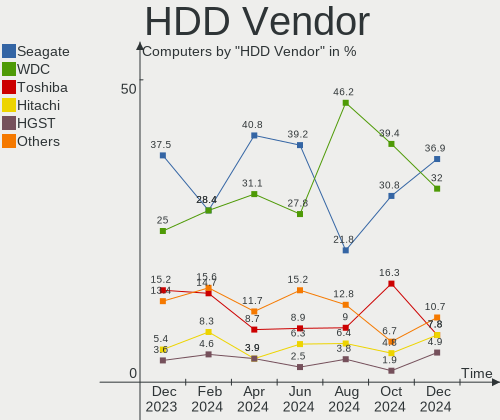
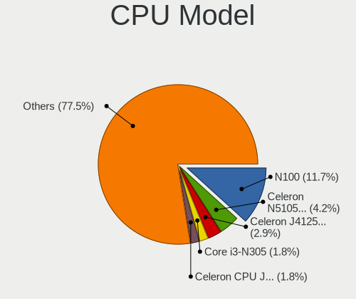
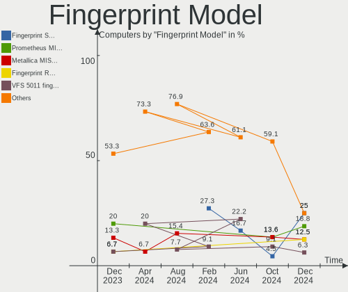

BSD - Hardware Trends
---------------------

A project to identify most popular hardware characteristics and track their change
over time based on data collected by BSD users at https://BSD-Hardware.info.

Anyone can contribute to this report by the [hw-probe](https://github.com/linuxhw/hw-probe/blob/master/INSTALL.BSD.md) tool:

    hw-probe -all -upload

This is a report for all computer types. See also reports for [desktops](/Desktop/README.md) and [notebooks](/Notebook/README.md).

OS-specific reports: [FreeBSD](/Dist/FreeBSD), [OPNsense](/Dist/OPNsense), [helloSystem](/Dist/helloSystem), [OpenBSD](/Dist/OpenBSD).

This report is for one last month. Overall report since the beginning of time: [TestDays](https://github.com/bsdhw/TestDays)

Period: Jun, 2023.

Contents
--------

* [ System ](#system)
  - [ OS                       ](#os)
  - [ OS Family                ](#os-family)
  - [ Arch                     ](#arch)
  - [ DE                       ](#de)
  - [ Display Server           ](#display-server)
  - [ Display Manager          ](#display-manager)
  - [ OS Lang                  ](#os-lang)
  - [ Boot Mode                ](#boot-mode)
  - [ Filesystem               ](#filesystem)
  - [ Part. scheme             ](#part-scheme)

* [ Board ](#board)
  - [ Vendor                   ](#vendor)
  - [ Model                    ](#model)
  - [ Model Family             ](#model-family)
  - [ MFG Year                 ](#mfg-year)
  - [ Form Factor              ](#form-factor)
  - [ Coreboot                 ](#coreboot)
  - [ RAM Size                 ](#ram-size)
  - [ RAM Used                 ](#ram-used)
  - [ Total Drives             ](#total-drives)
  - [ Has CD-ROM               ](#has-cd-rom)
  - [ Has Ethernet             ](#has-ethernet)
  - [ Has WiFi                 ](#has-wifi)
  - [ Has Bluetooth            ](#has-bluetooth)

* [ Location ](#location)
  - [ Country                  ](#country)
  - [ City                     ](#city)

* [ Drives ](#drives)
  - [ Drive Vendor             ](#drive-vendor)
  - [ Drive Model              ](#drive-model)
  - [ HDD Vendor               ](#hdd-vendor)
  - [ SSD Vendor               ](#ssd-vendor)
  - [ Drive Kind               ](#drive-kind)
  - [ Drive Connector          ](#drive-connector)
  - [ Drive Size               ](#drive-size)
  - [ Space Total              ](#space-total)
  - [ Space Used               ](#space-used)
  - [ Malfunc. Drives          ](#malfunc-drives)
  - [ Malfunc. Drive Vendor    ](#malfunc-drive-vendor)
  - [ Malfunc. HDD Vendor      ](#malfunc-hdd-vendor)
  - [ Malfunc. Drive Kind      ](#malfunc-drive-kind)
  - [ Failed Drives            ](#failed-drives)
  - [ Failed Drive Vendor      ](#failed-drive-vendor)
  - [ Drive Status             ](#drive-status)

* [ Storage controller ](#storage-controller)
  - [ Storage Vendor           ](#storage-vendor)
  - [ Storage Model            ](#storage-model)
  - [ Storage Kind             ](#storage-kind)

* [ Processor ](#processor)
  - [ CPU Vendor               ](#cpu-vendor)
  - [ CPU Model                ](#cpu-model)
  - [ CPU Model Family         ](#cpu-model-family)
  - [ CPU Cores                ](#cpu-cores)
  - [ CPU Sockets              ](#cpu-sockets)
  - [ CPU Threads              ](#cpu-threads)
  - [ CPU Microarch            ](#cpu-microarch)

* [ Graphics ](#graphics)
  - [ GPU Vendor               ](#gpu-vendor)
  - [ GPU Model                ](#gpu-model)
  - [ GPU Combo                ](#gpu-combo)
  - [ GPU Driver               ](#gpu-driver)
  - [ GPU Memory               ](#gpu-memory)

* [ Monitor ](#monitor)
  - [ Monitor Vendor           ](#monitor-vendor)
  - [ Monitor Model            ](#monitor-model)
  - [ Monitor Resolution       ](#monitor-resolution)
  - [ Monitor Diagonal         ](#monitor-diagonal)
  - [ Monitor Width            ](#monitor-width)
  - [ Aspect Ratio             ](#aspect-ratio)
  - [ Monitor Area             ](#monitor-area)
  - [ Pixel Density            ](#pixel-density)
  - [ Multiple Monitors        ](#multiple-monitors)

* [ Network ](#network)
  - [ Net Controller Vendor    ](#net-controller-vendor)
  - [ Net Controller Model     ](#net-controller-model)
  - [ Wireless Vendor          ](#wireless-vendor)
  - [ Wireless Model           ](#wireless-model)
  - [ Ethernet Vendor          ](#ethernet-vendor)
  - [ Ethernet Model           ](#ethernet-model)
  - [ Net Controller Kind      ](#net-controller-kind)
  - [ Used Controller          ](#used-controller)
  - [ NICs                     ](#nics)
  - [ IPv6                     ](#ipv6)

* [ Bluetooth ](#bluetooth)
  - [ Bluetooth Vendor         ](#bluetooth-vendor)
  - [ Bluetooth Model          ](#bluetooth-model)

* [ Sound ](#sound)
  - [ Sound Vendor             ](#sound-vendor)
  - [ Sound Model              ](#sound-model)

* [ Memory ](#memory)
  - [ Memory Vendor            ](#memory-vendor)
  - [ Memory Model             ](#memory-model)
  - [ Memory Kind              ](#memory-kind)
  - [ Memory Form Factor       ](#memory-form-factor)
  - [ Memory Size              ](#memory-size)
  - [ Memory Speed             ](#memory-speed)

* [ Printers & scanners ](#printers--scanners)
  - [ Printer Vendor           ](#printer-vendor)
  - [ Printer Model            ](#printer-model)
  - [ Scanner Vendor           ](#scanner-vendor)
  - [ Scanner Model            ](#scanner-model)

* [ Camera ](#camera)
  - [ Camera Vendor            ](#camera-vendor)
  - [ Camera Model             ](#camera-model)

* [ Security ](#security)
  - [ Fingerprint Vendor       ](#fingerprint-vendor)
  - [ Fingerprint Model        ](#fingerprint-model)
  - [ Chipcard Vendor          ](#chipcard-vendor)
  - [ Chipcard Model           ](#chipcard-model)

* [ Unsupported ](#unsupported)
  - [ Unsupported Devices      ](#unsupported-devices)
  - [ Unsupported Device Types ](#unsupported-device-types)

System
------

OS
--

Installed operating systems

| Name                 | Computers | Percent |
|----------------------|-----------|---------|
| OPNsense 23.1.9      | 152       | 39.69%  |
| OPNsense 23.1.10     | 60        | 15.67%  |
| FreeBSD 13.2         | 36        | 9.4%    |
| helloSystem 0.8.1    | 26        | 6.79%   |
| OPNsense 23.1.11     | 20        | 5.22%   |
| helloSystem 0.8.2    | 13        | 3.39%   |
| OPNsense 23.1.7      | 11        | 2.87%   |
| FreeBSD 14.0-CURRENT | 10        | 2.61%   |
| OPNsense 23.1.8      | 9         | 2.35%   |
| OpenBSD 7.3          | 6         | 1.57%   |
| OPNsense 23.4        | 5         | 1.31%   |
| GhostBSD 23.06.01    | 3         | 0.78%   |
| FreeBSD 13.2-p1      | 3         | 0.78%   |
| OPNsense 23.7        | 2         | 0.52%   |
| OPNsense 23.4.1      | 2         | 0.52%   |
| OPNsense 23.1.6      | 2         | 0.52%   |
| OPNsense 22.7.11     | 2         | 0.52%   |
| NomadBSD 20221130    | 2         | 0.52%   |
| GhostBSD 23.06.05    | 2         | 0.52%   |
| XigmaNAS 13.1-p5     | 1         | 0.26%   |
| TrueNAS 13.1-p7      | 1         | 0.26%   |
| pfSense 2.7.0        | 1         | 0.26%   |
| OPNsense 23.1.3      | 1         | 0.26%   |
| OPNsense 23.1.1      | 1         | 0.26%   |
| OPNsense 22.7.9      | 1         | 0.26%   |
| OPNsense 22.7.6      | 1         | 0.26%   |
| NomadBSD 81e34fc3    | 1         | 0.26%   |
| NetBSD 9.3           | 1         | 0.26%   |
| MyBee 14.0-CURRENT   | 1         | 0.26%   |
| MyBee 13.2           | 1         | 0.26%   |
| helloSystem 0.8.0    | 1         | 0.26%   |
| helloSystem 0.7.0    | 1         | 0.26%   |
| FreeBSD 13.2-STABLE  | 1         | 0.26%   |
| FreeBSD 13.1-p8      | 1         | 0.26%   |
| FreeBSD 13.1-p5      | 1         | 0.26%   |
| FreeBSD 13.1         | 1         | 0.26%   |

OS Family
---------

OS without a version

| Name        | Computers | Percent |
|-------------|-----------|---------|
| OPNsense    | 269       | 70.23%  |
| FreeBSD     | 53        | 13.84%  |
| helloSystem | 41        | 10.7%   |
| OpenBSD     | 6         | 1.57%   |
| GhostBSD    | 5         | 1.31%   |
| NomadBSD    | 3         | 0.78%   |
| MyBee       | 2         | 0.52%   |
| XigmaNAS    | 1         | 0.26%   |
| TrueNAS     | 1         | 0.26%   |
| pfSense     | 1         | 0.26%   |
| NetBSD      | 1         | 0.26%   |

Arch
----

OS architecture (x86_64, i586, etc.)

| Name  | Computers | Percent |
|-------|-----------|---------|
| amd64 | 374       | 97.65%  |
| arm64 | 5         | 1.31%   |
| i386  | 4         | 1.04%   |

DE
--

Desktop Environment

| Name         | Computers | Percent |
|--------------|-----------|---------|
| Console      | 289       | 75.46%  |
| helloDesktop | 47        | 12.27%  |
| KDE5         | 14        | 3.66%   |
| MATE         | 9         | 2.35%   |
| XFCE         | 6         | 1.57%   |
| TWM          | 6         | 1.57%   |
| Openbox      | 3         | 0.78%   |
| LXQt         | 2         | 0.52%   |
| KDE          | 2         | 0.52%   |
| GNOME        | 2         | 0.52%   |
| Budgie       | 2         | 0.52%   |
| i3           | 1         | 0.26%   |

Display Server
--------------

X11 or Wayland

| Name    | Computers | Percent |
|---------|-----------|---------|
| Console | 291       | 75.98%  |
| X11     | 91        | 23.76%  |
| Wayland | 1         | 0.26%   |

Display Manager
---------------

SDDM, LightDM, etc.

| Name    | Computers | Percent |
|---------|-----------|---------|
| Console | 303       | 79.11%  |
| SLiM    | 47        | 12.27%  |
| SDDM    | 20        | 5.22%   |
| LightDM | 10        | 2.61%   |
| GDM     | 2         | 0.52%   |
| XDM     | 1         | 0.26%   |

OS Lang
-------

Language

| Lang    | Computers | Percent |
|---------|-----------|---------|
| Unknown | 274       | 71.54%  |
| C       | 47        | 12.27%  |
| en_US   | 30        | 7.83%   |
| fr_FR   | 10        | 2.61%   |
| ru_RU   | 5         | 1.31%   |
| de_DE   | 4         | 1.04%   |
| pl_PL   | 3         | 0.78%   |
| pt_BR   | 2         | 0.52%   |
| it_IT   | 2         | 0.52%   |
| es_ES   | 2         | 0.52%   |
| zh_CN   | 1         | 0.26%   |
| nl_NL   | 1         | 0.26%   |
| en      | 1         | 0.26%   |
| Default | 1         | 0.26%   |

Boot Mode
---------

EFI or BIOS

| Mode | Computers | Percent |
|------|-----------|---------|
| EFI  | 358       | 93.47%  |
| BIOS | 25        | 6.53%   |

Filesystem
----------

Type of filesystem

| Type   | Computers | Percent |
|--------|-----------|---------|
| Zfs    | 184       | 48.04%  |
| Ufs    | 171       | 44.65%  |
| Cd9660 | 22        | 5.74%   |
| Ffs    | 6         | 1.57%   |

Part. scheme
------------

Scheme of partitioning

| Type    | Computers | Percent |
|---------|-----------|---------|
| GPT     | 372       | 97.13%  |
| MBR     | 10        | 2.61%   |
| Unknown | 1         | 0.26%   |

Board
-----

Vendor
------

Motherboard manufacturer

| Name                    | Computers | Percent |
|-------------------------|-----------|---------|
| Unknown                 | 49        | 12.79%  |
| Dell                    | 41        | 10.7%   |
| Hewlett-Packard         | 40        | 10.44%  |
| Lenovo                  | 37        | 9.66%   |
| ASUSTek Computer        | 26        | 6.79%   |
| Intel                   | 22        | 5.74%   |
| Protectli               | 16        | 4.18%   |
| Techvision              | 13        | 3.39%   |
| Fujitsu                 | 11        | 2.87%   |
| ASRock                  | 11        | 2.87%   |
| Supermicro              | 9         | 2.35%   |
| Gigabyte Technology     | 9         | 2.35%   |
| Deciso                  | 7         | 1.83%   |
| PC Engines              | 6         | 1.57%   |
| MSI                     | 6         | 1.57%   |
| CWWK                    | 6         | 1.57%   |
| AMI                     | 6         | 1.57%   |
| Sophos                  | 5         | 1.31%   |
| Acer                    | 5         | 1.31%   |
| CncTion                 | 4         | 1.04%   |
| BESSTAR Tech            | 4         | 1.04%   |
| AZW                     | 4         | 1.04%   |
| MW                      | 3         | 0.78%   |
| Apple                   | 3         | 0.78%   |
| YANYU                   | 2         | 0.52%   |
| Samsung Electronics     | 2         | 0.52%   |
| Panasonic               | 2         | 0.52%   |
| Hardkernel              | 2         | 0.52%   |
| Fujitsu Siemens         | 2         | 0.52%   |
| ASRockRack              | 2         | 0.52%   |
| Yanling                 | 1         | 0.26%   |
| Wortmann AG             | 1         | 0.26%   |
| WlanCN                  | 1         | 0.26%   |
| Toshiba                 | 1         | 0.26%   |
| Soyo                    | 1         | 0.26%   |
| Sony                    | 1         | 0.26%   |
| Shuttle                 | 1         | 0.26%   |
| Raspberry Pi Foundation | 1         | 0.26%   |
| Pegatron                | 1         | 0.26%   |
| Notebook                | 1         | 0.26%   |

Model
-----

Motherboard model

| Name                              | Computers | Percent |
|-----------------------------------|-----------|---------|
| Unknown                           | 50        | 13.05%  |
| Techvision TVI7309X               | 13        | 3.39%   |
| Fujitsu FUTRO S920                | 8         | 2.09%   |
| Protectli FW6                     | 7         | 1.83%   |
| AMI Aptio CRB                     | 6         | 1.57%   |
| Protectli VP2420                  | 4         | 1.04%   |
| Protectli FW4B                    | 4         | 1.04%   |
| Intel Q3XXG4-P V1.0               | 4         | 1.04%   |
| Dell OptiPlex 9020                | 4         | 1.04%   |
| Supermicro Super Server           | 3         | 0.78%   |
| Sophos SG                         | 3         | 0.78%   |
| PC Engines apu4                   | 3         | 0.78%   |
| PC Engines APU2                   | 3         | 0.78%   |
| MW GMLK-2_5G4L                    | 3         | 0.78%   |
| AZW EQ                            | 3         | 0.78%   |
| Intel NUC11PAHi5                  | 2         | 0.52%   |
| Intel Jasper Lake Client Platform | 2         | 0.52%   |
| HP Z240 SFF Workstation           | 2         | 0.52%   |
| HP t620 PLUS Quad Core TC         | 2         | 0.52%   |
| HP ProLiant DL360 Gen9            | 2         | 0.52%   |
| Hardkernel ODROID-H3              | 2         | 0.52%   |
| Gigabyte C1037UN                  | 2         | 0.52%   |
| Dell Wyse 5070 Thin Client        | 2         | 0.52%   |
| Dell Vostro 3681                  | 2         | 0.52%   |
| Dell OptiPlex 7050                | 2         | 0.52%   |
| Dell OptiPlex 7040                | 2         | 0.52%   |
| Dell OptiPlex 7010                | 2         | 0.52%   |
| Dell OptiPlex 3050                | 2         | 0.52%   |
| Dell OptiPlex 3040                | 2         | 0.52%   |
| Deciso NetBoard-A20               | 2         | 0.52%   |
| Deciso NetBoard-A10               | 2         | 0.52%   |
| CWWK CW-MBX-AD12                  | 2         | 0.52%   |
| CWWK CW-AD4L-N V1                 | 2         | 0.52%   |
| BESSTAR Tech GK41                 | 2         | 0.52%   |
| ASRock Z590 Pro4                  | 2         | 0.52%   |
| ASRock X570 Phantom Gaming 4      | 2         | 0.52%   |
| Acer Aspire XC-1660G              | 2         | 0.52%   |
| YANYU N39SL                       | 1         | 0.26%   |
| YANYU H67SL                       | 1         | 0.26%   |
| Yanling LES plus                  | 1         | 0.26%   |

Model Family
------------

Motherboard model prefix

| Name                 | Computers | Percent |
|----------------------|-----------|---------|
| Unknown              | 50        | 13.05%  |
| Dell OptiPlex        | 19        | 4.96%   |
| Lenovo ThinkPad      | 17        | 4.44%   |
| Techvision TVI7309X  | 13        | 3.39%   |
| Lenovo ThinkCentre   | 11        | 2.87%   |
| Fujitsu FUTRO        | 9         | 2.35%   |
| Protectli FW6        | 7         | 1.83%   |
| Dell Inspiron        | 7         | 1.83%   |
| HP EliteDesk         | 6         | 1.57%   |
| HP Compaq            | 6         | 1.57%   |
| ASUS PRIME           | 6         | 1.57%   |
| AMI Aptio            | 6         | 1.57%   |
| HP EliteBook         | 5         | 1.31%   |
| Acer Aspire          | 5         | 1.31%   |
| Protectli VP2420     | 4         | 1.04%   |
| Protectli FW4B       | 4         | 1.04%   |
| Intel Q3XXG4-P       | 4         | 1.04%   |
| HP ProDesk           | 4         | 1.04%   |
| Dell PowerEdge       | 4         | 1.04%   |
| Dell Latitude        | 4         | 1.04%   |
| Supermicro Super     | 3         | 0.78%   |
| Sophos SG            | 3         | 0.78%   |
| PC Engines apu4      | 3         | 0.78%   |
| PC Engines APU2      | 3         | 0.78%   |
| MW GMLK-2            | 3         | 0.78%   |
| HP ProLiant          | 3         | 0.78%   |
| HP Pavilion          | 3         | 0.78%   |
| Dell Wyse            | 3         | 0.78%   |
| AZW EQ               | 3         | 0.78%   |
| ASUS TUF             | 3         | 0.78%   |
| ASUS ROG             | 3         | 0.78%   |
| Lenovo IdeaPad       | 2         | 0.52%   |
| Intel NUC11PAHi5     | 2         | 0.52%   |
| Intel Jasper         | 2         | 0.52%   |
| HP Z240              | 2         | 0.52%   |
| HP t620              | 2         | 0.52%   |
| HP Laptop            | 2         | 0.52%   |
| Hardkernel ODROID-H3 | 2         | 0.52%   |
| Gigabyte C1037UN     | 2         | 0.52%   |
| Gigabyte B450M       | 2         | 0.52%   |

MFG Year
--------

Motherboard manufacture year

| Year    | Computers | Percent |
|---------|-----------|---------|
| 2022    | 68        | 17.75%  |
| 2018    | 38        | 9.92%   |
| 2021    | 35        | 9.14%   |
| 2019    | 30        | 7.83%   |
| 2014    | 29        | 7.57%   |
| 2016    | 27        | 7.05%   |
| 2013    | 24        | 6.27%   |
| 2017    | 22        | 5.74%   |
| 2020    | 19        | 4.96%   |
| 2012    | 19        | 4.96%   |
| 2023    | 18        | 4.7%    |
| 2015    | 12        | 3.13%   |
| 2010    | 11        | 2.87%   |
| 2011    | 10        | 2.61%   |
| 2008    | 8         | 2.09%   |
| Unknown | 6         | 1.57%   |
| 2009    | 4         | 1.04%   |
| 2007    | 1         | 0.26%   |
| 2006    | 1         | 0.26%   |
| 2005    | 1         | 0.26%   |

Form Factor
-----------

Physical design of the computer

| Name           | Computers | Percent |
|----------------|-----------|---------|
| Desktop        | 256       | 66.84%  |
| Notebook       | 76        | 19.84%  |
| Mini pc        | 24        | 6.27%   |
| Server         | 19        | 4.96%   |
| Firewall       | 7         | 1.83%   |
| System on chip | 1         | 0.26%   |

Coreboot
--------

Have coreboot on board

| Used | Computers | Percent |
|------|-----------|---------|
| No   | 375       | 97.91%  |
| Yes  | 8         | 2.09%   |

RAM Size
--------

Total RAM memory

| Size in GB      | Computers | Percent |
|-----------------|-----------|---------|
| 8.01-16.0       | 140       | 36.55%  |
| 16.01-24.0      | 110       | 28.72%  |
| 4.01-8.0        | 64        | 16.71%  |
| 32.01-64.0      | 25        | 6.53%   |
| 64.01-256.0     | 21        | 5.48%   |
| 2.01-3.0        | 12        | 3.13%   |
| 3.01-4.0        | 4         | 1.04%   |
| 0.51-1.0        | 4         | 1.04%   |
| More than 256.0 | 1         | 0.26%   |
| 24.01-32.0      | 1         | 0.26%   |
| 0.01-0.5        | 1         | 0.26%   |

RAM Used
--------

Used RAM memory

| Used GB   | Computers | Percent |
|-----------|-----------|---------|
| 0.01-0.5  | 191       | 49.87%  |
| 0.51-1.0  | 129       | 33.68%  |
| 1.01-2.0  | 38        | 9.92%   |
| 2.01-3.0  | 12        | 3.13%   |
| 4.01-8.0  | 5         | 1.31%   |
| 3.01-4.0  | 4         | 1.04%   |
| 8.01-16.0 | 2         | 0.52%   |
| 0         | 1         | 0.26%   |
| Unknown   | 1         | 0.26%   |

Total Drives
------------

Number of drives on board

| Drives | Computers | Percent |
|--------|-----------|---------|
| 1      | 284       | 74.15%  |
| 2      | 43        | 11.23%  |
| 0      | 37        | 9.66%   |
| 3      | 10        | 2.61%   |
| 6      | 2         | 0.52%   |
| 5      | 2         | 0.52%   |
| 4      | 2         | 0.52%   |
| 13     | 1         | 0.26%   |
| 9      | 1         | 0.26%   |
| 7      | 1         | 0.26%   |

Has CD-ROM
----------

Has CD-ROM on board

| Presented | Computers | Percent |
|-----------|-----------|---------|
| No        | 310       | 80.94%  |
| Yes       | 73        | 19.06%  |

Has Ethernet
------------

Has Ethernet on board

| Presented | Computers | Percent |
|-----------|-----------|---------|
| Yes       | 373       | 97.39%  |
| No        | 10        | 2.61%   |

Has WiFi
--------

Has WiFi module

| Presented | Computers | Percent |
|-----------|-----------|---------|
| No        | 255       | 66.58%  |
| Yes       | 128       | 33.42%  |

Has Bluetooth
-------------

Has Bluetooth module

| Presented | Computers | Percent |
|-----------|-----------|---------|
| No        | 295       | 77.02%  |
| Yes       | 88        | 22.98%  |

Location
--------

Country
-------

Geographic location (country)

| Country      | Computers | Percent |
|--------------|-----------|---------|
| USA          | 112       | 29.24%  |
| Germany      | 53        | 13.84%  |
| UK           | 21        | 5.48%   |
| Canada       | 17        | 4.44%   |
| Brazil       | 16        | 4.18%   |
| Russia       | 14        | 3.66%   |
| Poland       | 14        | 3.66%   |
| Australia    | 14        | 3.66%   |
| Netherlands  | 13        | 3.39%   |
| France       | 12        | 3.13%   |
| Spain        | 7         | 1.83%   |
| Italy        | 7         | 1.83%   |
| Hungary      | 5         | 1.31%   |
| China        | 5         | 1.31%   |
| Sweden       | 4         | 1.04%   |
| Mexico       | 4         | 1.04%   |
| Israel       | 4         | 1.04%   |
| Belgium      | 4         | 1.04%   |
| Vietnam      | 3         | 0.78%   |
| Turkey       | 3         | 0.78%   |
| Switzerland  | 3         | 0.78%   |
| Romania      | 3         | 0.78%   |
| Norway       | 3         | 0.78%   |
| Iceland      | 3         | 0.78%   |
| Czechia      | 3         | 0.78%   |
| Austria      | 3         | 0.78%   |
| Argentina    | 3         | 0.78%   |
| South Korea  | 2         | 0.52%   |
| Slovakia     | 2         | 0.52%   |
| Indonesia    | 2         | 0.52%   |
| Denmark      | 2         | 0.52%   |
| Ukraine      | 1         | 0.26%   |
| Thailand     | 1         | 0.26%   |
| Taiwan       | 1         | 0.26%   |
| Syria        | 1         | 0.26%   |
| South Africa | 1         | 0.26%   |
| Singapore    | 1         | 0.26%   |
| San Marino   | 1         | 0.26%   |
| Portugal     | 1         | 0.26%   |
| Peru         | 1         | 0.26%   |

City
----

Geographic location (city)

| City              | Computers | Percent |
|-------------------|-----------|---------|
| Cologne           | 6         | 1.57%   |
| Sydney            | 5         | 1.31%   |
| Melbourne         | 5         | 1.31%   |
| Berlin            | 5         | 1.31%   |
| Seattle           | 4         | 1.04%   |
| Montreal          | 4         | 1.04%   |
| Denver            | 4         | 1.04%   |
| Moscow            | 3         | 0.78%   |
| Krakow            | 3         | 0.78%   |
| Indian Trail      | 3         | 0.78%   |
| Frankfurt am Main | 3         | 0.78%   |
| Flushing          | 3         | 0.78%   |
| Wuppertal         | 2         | 0.52%   |
| Witkow            | 2         | 0.52%   |
| Vancouver         | 2         | 0.52%   |
| Toronto           | 2         | 0.52%   |
| The Hague         | 2         | 0.52%   |
| Tel Aviv          | 2         | 0.52%   |
| Sun Prairie       | 2         | 0.52%   |
| Stuttgart         | 2         | 0.52%   |
| Springville       | 2         | 0.52%   |
| Sao Paulo         | 2         | 0.52%   |
| San Jose          | 2         | 0.52%   |
| Salem             | 2         | 0.52%   |
| Reykjavik         | 2         | 0.52%   |
| Redmond           | 2         | 0.52%   |
| Pittsburgh        | 2         | 0.52%   |
| Paris             | 2         | 0.52%   |
| Munich            | 2         | 0.52%   |
| Medan             | 2         | 0.52%   |
| Martins Ferry     | 2         | 0.52%   |
| London            | 2         | 0.52%   |
| Las Vegas         | 2         | 0.52%   |
| Lakeland          | 2         | 0.52%   |
| Krasnodar         | 2         | 0.52%   |
| Istanbul          | 2         | 0.52%   |
| Fortaleza         | 2         | 0.52%   |
| Edmonton          | 2         | 0.52%   |
| East Grinstead    | 2         | 0.52%   |
| Düsseldorf       | 2         | 0.52%   |

Drives
------

Drive Vendor
------------

Hard drive vendors

| Vendor              | Computers | Drives | Percent |
|---------------------|-----------|--------|---------|
| Samsung Electronics | 69        | 82     | 17.25%  |
| Kingston            | 35        | 38     | 8.75%   |
| WDC                 | 32        | 53     | 8%      |
| Seagate             | 25        | 29     | 6.25%   |
| Transcend           | 21        | 21     | 5.25%   |
| Intel               | 17        | 17     | 4.25%   |
| SanDisk             | 15        | 15     | 3.75%   |
| Crucial             | 14        | 16     | 3.5%    |
| Toshiba             | 12        | 16     | 3%      |
| SK hynix            | 11        | 11     | 2.75%   |
| China               | 11        | 12     | 2.75%   |
| Hitachi             | 9         | 9      | 2.25%   |
| A-DATA Technology   | 9         | 10     | 2.25%   |
| Hoodisk             | 7         | 7      | 1.75%   |
| SPCC                | 6         | 6      | 1.5%    |
| Phison              | 5         | 6      | 1.25%   |
| Micron Technology   | 5         | 5      | 1.25%   |
| Gigabyte Technology | 5         | 5      | 1.25%   |
| Team                | 4         | 4      | 1%      |
| PNY                 | 4         | 5      | 1%      |
| Patriot             | 4         | 6      | 1%      |
| Lexar               | 4         | 4      | 1%      |
| FORESEE             | 4         | 4      | 1%      |
| Apacer              | 4         | 5      | 1%      |
| Vaseky              | 3         | 3      | 0.75%   |
| Silicon Motion      | 3         | 3      | 0.75%   |
| Protectli           | 3         | 3      | 0.75%   |
| OCZ                 | 3         | 3      | 0.75%   |
| Intenso             | 3         | 3      | 0.75%   |
| Innodisk            | 3         | 3      | 0.75%   |
| HGST                | 3         | 3      | 0.75%   |
| Hewlett-Packard     | 3         | 5      | 0.75%   |
| Advantech           | 3         | 3      | 0.75%   |
| NVMe                | 2         | 4      | 0.5%    |
| MidasForce          | 2         | 2      | 0.5%    |
| LITEONIT            | 2         | 2      | 0.5%    |
| Kston               | 2         | 2      | 0.5%    |
| KIOXIA              | 2         | 2      | 0.5%    |
| KingSpec            | 2         | 3      | 0.5%    |
| Fanxiang            | 2         | 2      | 0.5%    |

Drive Model
-----------

Hard drive models

| Model                                | Computers | Percent |
|--------------------------------------|-----------|---------|
| Kingston SA400S37240G 240GB          | 8         | 1.87%   |
| Samsung SSD 860 EVO 500GB            | 5         | 1.17%   |
| Kingston SA400S37480G 480GB          | 5         | 1.17%   |
| Transcend TS128GMSA230S 128GB        | 4         | 0.94%   |
| Kingston SA400S37120G 120GB          | 4         | 0.94%   |
| China SATA SSD 16GB                  | 4         | 0.94%   |
| Transcend TS256GMTS952T2 256GB       | 3         | 0.7%    |
| Toshiba MQ01ABF050 500GB             | 3         | 0.7%    |
| SPCC Solid State Disk 128GB          | 3         | 0.7%    |
| Samsung SSD 840 EVO 250GB            | 3         | 0.7%    |
| Kingston SKC600MS256G 256GB          | 3         | 0.7%    |
| Innodisk DEMSR- 08GB mSATA 3ME3      | 3         | 0.7%    |
| Hoodisk SSD 32GB                     | 3         | 0.7%    |
| Gigabyte GP-GSTFS31120GNTD 120GB     | 3         | 0.7%    |
| WDC WD80EFAX-68LHPN0 8TB             | 2         | 0.47%   |
| WDC PC SN530 SDBPNPZ-256G-1114 256GB | 2         | 0.47%   |
| Transcend TS256GMTE652T2 256GB       | 2         | 0.47%   |
| Toshiba MK5076GSXN 500GB             | 2         | 0.47%   |
| Toshiba KBG30ZMV256G 256GB           | 2         | 0.47%   |
| SK hynix SHGS31-500GS-2 500GB        | 2         | 0.47%   |
| Seagate ST500DM002-1BD142 500GB      | 2         | 0.47%   |
| Seagate ST4000DM000-1F2168 4TB       | 2         | 0.47%   |
| Seagate ST3500413AS 500GB            | 2         | 0.47%   |
| SanDisk SSD PLUS 240GB               | 2         | 0.47%   |
| SanDisk SDSSDA240G 240GB             | 2         | 0.47%   |
| SanDisk SD9SN8W-256G-1006 256GB      | 2         | 0.47%   |
| Samsung SSD PM871 2.5 7mm 128GB      | 2         | 0.47%   |
| Samsung SSD 970 EVO Plus 500GB       | 2         | 0.47%   |
| Samsung SSD 970 EVO Plus 250GB       | 2         | 0.47%   |
| Samsung SSD 970 EVO Plus 1TB         | 2         | 0.47%   |
| Samsung SSD 960 PRO 512GB            | 2         | 0.47%   |
| Samsung SSD 870 EVO 500GB            | 2         | 0.47%   |
| Samsung SSD 860 QVO 1TB              | 2         | 0.47%   |
| Samsung SSD 860 EVO mSATA 500GB      | 2         | 0.47%   |
| Samsung SSD 840 PRO Series 256GB     | 2         | 0.47%   |
| Samsung SSD 840 PRO Series 128GB     | 2         | 0.47%   |
| Samsung MZVLB256HBHQ-000H1 256GB     | 2         | 0.47%   |
| Samsung MZVLB256HAHQ-000L7 256GB     | 2         | 0.47%   |
| Protectli 120GB M.2                  | 2         | 0.47%   |
| Phison PCIe SSD 128GB                | 2         | 0.47%   |

HDD Vendor
----------

Hard disk drive vendors

| Vendor              | Computers | Drives | Percent |
|---------------------|-----------|--------|---------|
| Seagate             | 24        | 28     | 30.77%  |
| WDC                 | 21        | 38     | 26.92%  |
| Hitachi             | 9         | 9      | 11.54%  |
| Toshiba             | 8         | 12     | 10.26%  |
| Samsung Electronics | 5         | 6      | 6.41%   |
| HGST                | 3         | 3      | 3.85%   |
| NVMe                | 2         | 4      | 2.56%   |
| Hewlett-Packard     | 2         | 3      | 2.56%   |
| Apple               | 2         | 2      | 2.56%   |
| Lexar               | 1         | 1      | 1.28%   |
| Fujitsu             | 1         | 1      | 1.28%   |

SSD Vendor
----------

Solid state drive vendors

| Vendor              | Computers | Drives | Percent |
|---------------------|-----------|--------|---------|
| Samsung Electronics | 40        | 46     | 17.17%  |
| Kingston            | 31        | 34     | 13.3%   |
| Transcend           | 17        | 17     | 7.3%    |
| SanDisk             | 15        | 15     | 6.44%   |
| Intel               | 12        | 12     | 5.15%   |
| China               | 11        | 12     | 4.72%   |
| Crucial             | 9         | 9      | 3.86%   |
| A-DATA Technology   | 8         | 9      | 3.43%   |
| Hoodisk             | 7         | 7      | 3%      |
| SPCC                | 5         | 5      | 2.15%   |
| SK hynix            | 4         | 4      | 1.72%   |
| FORESEE             | 4         | 4      | 1.72%   |
| Apacer              | 4         | 5      | 1.72%   |
| Vaseky              | 3         | 3      | 1.29%   |
| Team                | 3         | 3      | 1.29%   |
| Protectli           | 3         | 3      | 1.29%   |
| PNY                 | 3         | 4      | 1.29%   |
| OCZ                 | 3         | 3      | 1.29%   |
| Micron Technology   | 3         | 3      | 1.29%   |
| Intenso             | 3         | 3      | 1.29%   |
| Innodisk            | 3         | 3      | 1.29%   |
| Gigabyte Technology | 3         | 3      | 1.29%   |
| Advantech           | 3         | 3      | 1.29%   |
| WDC                 | 2         | 2      | 0.86%   |
| Patriot             | 2         | 4      | 0.86%   |
| MidasForce          | 2         | 2      | 0.86%   |
| LITEONIT            | 2         | 2      | 0.86%   |
| Lexar               | 2         | 2      | 0.86%   |
| Kston               | 2         | 2      | 0.86%   |
| KingSpec            | 2         | 3      | 0.86%   |
| Dogfish             | 2         | 2      | 0.86%   |
| VICKTER             | 1         | 1      | 0.43%   |
| Verbatim            | 1         | 1      | 0.43%   |
| Toshiba             | 1         | 1      | 0.43%   |
| Supermicro          | 1         | 1      | 0.43%   |
| Silicon             | 1         | 1      | 0.43%   |
| SHAREVDI            | 1         | 1      | 0.43%   |
| SETHRISE            | 1         | 1      | 0.43%   |
| NTC                 | 1         | 1      | 0.43%   |
| MSI                 | 1         | 1      | 0.43%   |

Drive Kind
----------

HDD or SSD

| Kind | Computers | Drives | Percent |
|------|-----------|--------|---------|
| SSD  | 224       | 251    | 58.33%  |
| NVMe | 89        | 102    | 23.18%  |
| HDD  | 71        | 107    | 18.49%  |

Drive Connector
---------------

SATA, SAS, NVMe, etc.

| Type | Computers | Drives | Percent |
|------|-----------|--------|---------|
| SATA | 277       | 358    | 75.68%  |
| NVMe | 89        | 102    | 24.32%  |

Drive Size
----------

Size of hard drive

| Size in TB | Computers | Drives | Percent |
|------------|-----------|--------|---------|
| 0.01-0.5   | 240       | 268    | 80%     |
| 0.51-1.0   | 36        | 40     | 12%     |
| 1.01-2.0   | 9         | 14     | 3%      |
| 3.01-4.0   | 6         | 8      | 2%      |
| 4.01-10.0  | 5         | 18     | 1.67%   |
| 10.01-20.0 | 4         | 10     | 1.33%   |

Space Total
-----------

Amount of disk space available on the file system

| Size in GB     | Computers | Percent |
|----------------|-----------|---------|
| 101-250        | 177       | 46.21%  |
| 251-500        | 70        | 18.28%  |
| 1-20           | 38        | 9.92%   |
| 51-100         | 32        | 8.36%   |
| 501-1000       | 29        | 7.57%   |
| 21-50          | 25        | 6.53%   |
| 1001-2000      | 8         | 2.09%   |
| 2001-3000      | 2         | 0.52%   |
| More than 3000 | 1         | 0.26%   |
| Unknown        | 1         | 0.26%   |

Space Used
----------

Amount of used disk space

| Used GB   | Computers | Percent |
|-----------|-----------|---------|
| 1-20      | 355       | 92.69%  |
| 21-50     | 17        | 4.44%   |
| 51-100    | 5         | 1.31%   |
| 101-250   | 2         | 0.52%   |
| 501-1000  | 2         | 0.52%   |
| 1001-2000 | 1         | 0.26%   |
| Unknown   | 1         | 0.26%   |

Malfunc. Drives
---------------

Drive models with a malfunction

| Model                                        | Computers | Drives | Percent |
|----------------------------------------------|-----------|--------|---------|
| Toshiba MK5076GSXN 500GB                     | 2         | 2      | 5.13%   |
| Seagate ST500DM002-1BD142 500GB              | 2         | 2      | 5.13%   |
| WDC WD80EDAZ-11TA3A0 8TB                     | 1         | 1      | 2.56%   |
| WDC WD6400AAKS-22A7B2 640GB                  | 1         | 1      | 2.56%   |
| WDC WD1600BEVS-07RST0 160GB                  | 1         | 1      | 2.56%   |
| WDC WD10EZRZ-00HTKB0 1TB                     | 1         | 1      | 2.56%   |
| Transcend TS128GMSA230S 128GB                | 1         | 1      | 2.56%   |
| SPCC Solid State Disk 512GB                  | 1         | 1      | 2.56%   |
| SK hynix SC210 mSATA 256GB                   | 1         | 1      | 2.56%   |
| Seagate ST9320325AS 320GB                    | 1         | 1      | 2.56%   |
| Seagate ST750LM022 HN-M750MBB 752GB          | 1         | 1      | 2.56%   |
| Seagate ST500LT012-9WS142 500GB              | 1         | 1      | 2.56%   |
| Seagate ST500LM021-1KJ152 500GB              | 1         | 1      | 2.56%   |
| Seagate ST3750528AS 752GB                    | 1         | 1      | 2.56%   |
| Seagate ST12000NM0008-2H3101 12TB            | 1         | 1      | 2.56%   |
| Samsung Electronics SSD 960 PRO 512GB        | 1         | 1      | 2.56%   |
| Samsung Electronics SSD 840 PRO Series 256GB | 1         | 1      | 2.56%   |
| Samsung Electronics SSD 840 EVO 250GB        | 1         | 1      | 2.56%   |
| Samsung Electronics HD502HJ 500GB            | 1         | 1      | 2.56%   |
| Samsung Electronics HD203WI 2TB              | 1         | 1      | 2.56%   |
| Samsung Electronics HD161HJ 160GB            | 1         | 1      | 2.56%   |
| OCZ AGILITY3 120GB                           | 1         | 1      | 2.56%   |
| Kingston SV300S37A120G 120GB                 | 1         | 1      | 2.56%   |
| Kingston SNS4151S316G 16GB                   | 1         | 1      | 2.56%   |
| Kingston SHFS37A120G 120GB                   | 1         | 1      | 2.56%   |
| Intel SSDSC2BF180A4L 180GB                   | 1         | 1      | 2.56%   |
| Intel SSDSC2BB480G4 480GB                    | 1         | 1      | 2.56%   |
| Intel SSDSA2M160G2GC 160GB                   | 1         | 1      | 2.56%   |
| Hitachi HTS727550A9E364 500GB                | 1         | 1      | 2.56%   |
| Hitachi HTS547550A9E384 500GB                | 1         | 1      | 2.56%   |
| Hitachi HTS542525K9A300 250GB                | 1         | 1      | 2.56%   |
| Hitachi HTS542512K9SA00 120GB                | 1         | 1      | 2.56%   |
| HGST HTS721010A9E630 1TB                     | 1         | 1      | 2.56%   |
| HGST HTS541010A9E680 1TB                     | 1         | 1      | 2.56%   |
| GK SM2244LTAB ,TC58TEG6DDKTA00 8GB           | 1         | 1      | 2.56%   |
| China SH00R120GB                             | 1         | 1      | 2.56%   |
| Apacer 16GB SATA Flash Drive                 | 1         | 1      | 2.56%   |

Malfunc. Drive Vendor
---------------------

Vendors of faulty drives

| Vendor              | Computers | Drives | Percent |
|---------------------|-----------|--------|---------|
| Seagate             | 8         | 8      | 20.51%  |
| Samsung Electronics | 6         | 6      | 15.38%  |
| WDC                 | 4         | 4      | 10.26%  |
| Hitachi             | 4         | 4      | 10.26%  |
| Kingston            | 3         | 3      | 7.69%   |
| Intel               | 3         | 3      | 7.69%   |
| Toshiba             | 2         | 2      | 5.13%   |
| HGST                | 2         | 2      | 5.13%   |
| Transcend           | 1         | 1      | 2.56%   |
| SPCC                | 1         | 1      | 2.56%   |
| SK hynix            | 1         | 1      | 2.56%   |
| OCZ                 | 1         | 1      | 2.56%   |
| GK                  | 1         | 1      | 2.56%   |
| China               | 1         | 1      | 2.56%   |
| Apacer              | 1         | 1      | 2.56%   |

Malfunc. HDD Vendor
-------------------

Vendors of faulty HDD drives

| Vendor              | Computers | Drives | Percent |
|---------------------|-----------|--------|---------|
| Seagate             | 8         | 8      | 34.78%  |
| WDC                 | 4         | 4      | 17.39%  |
| Hitachi             | 4         | 4      | 17.39%  |
| Samsung Electronics | 3         | 3      | 13.04%  |
| Toshiba             | 2         | 2      | 8.7%    |
| HGST                | 2         | 2      | 8.7%    |

Malfunc. Drive Kind
-------------------

Kinds of faulty drives

| Kind | Computers | Drives | Percent |
|------|-----------|--------|---------|
| HDD  | 23        | 23     | 58.97%  |
| SSD  | 15        | 15     | 38.46%  |
| NVMe | 1         | 1      | 2.56%   |

Failed Drives
-------------

Failed drive models

| Model                           | Computers | Drives | Percent |
|---------------------------------|-----------|--------|---------|
| Supermicro SSD 16GB             | 1         | 1      | 33.33%  |
| SanDisk SD9SN8W-256G-1006 256GB | 1         | 1      | 33.33%  |
| Hitachi HDS721010DLE630 1TB     | 1         | 1      | 33.33%  |

Failed Drive Vendor
-------------------

Failed drive vendors

| Vendor     | Computers | Drives | Percent |
|------------|-----------|--------|---------|
| Supermicro | 1         | 1      | 33.33%  |
| SanDisk    | 1         | 1      | 33.33%  |
| Hitachi    | 1         | 1      | 33.33%  |

Drive Status
------------

Number of failed and malfunc. drives

| Status   | Computers | Drives | Percent |
|----------|-----------|--------|---------|
| Works    | 312       | 407    | 86.19%  |
| Malfunc  | 39        | 39     | 10.77%  |
| Detected | 8         | 11     | 2.21%   |
| Failed   | 3         | 3      | 0.83%   |

Storage controller
------------------

Storage Vendor
--------------

Storage controller vendors

| Vendor                           | Computers | Percent |
|----------------------------------|-----------|---------|
| Intel                            | 293       | 61.43%  |
| AMD                              | 58        | 12.16%  |
| Samsung Electronics              | 28        | 5.87%   |
| SanDisk                          | 18        | 3.77%   |
| Phison Electronics               | 11        | 2.31%   |
| SK hynix                         | 8         | 1.68%   |
| Silicon Motion                   | 6         | 1.26%   |
| MAXIO Technology (Hangzhou)      | 6         | 1.26%   |
| Broadcom / LSI                   | 6         | 1.26%   |
| Toshiba                          | 5         | 1.05%   |
| Kingston Technology Company      | 5         | 1.05%   |
| Transcend                        | 4         | 0.84%   |
| Micron/Crucial Technology        | 4         | 0.84%   |
| Marvell Technology Group         | 4         | 0.84%   |
| ASMedia Technology               | 4         | 0.84%   |
| Realtek Semiconductor            | 3         | 0.63%   |
| Micron Technology                | 3         | 0.63%   |
| Hewlett-Packard                  | 3         | 0.63%   |
| JMicron Technology               | 2         | 0.42%   |
| Yangtze Memory Technologies      | 1         | 0.21%   |
| Silicon Integrated Systems [SiS] | 1         | 0.21%   |
| Shenzhen Longsys Electronics     | 1         | 0.21%   |
| Seagate Technology               | 1         | 0.21%   |
| Nvidia                           | 1         | 0.21%   |
| KIOXIA                           | 1         | 0.21%   |

Storage Model
-------------

Storage controller models

| Model                                                                            | Computers | Percent |
|----------------------------------------------------------------------------------|-----------|---------|
| AMD FCH SATA Controller [AHCI mode]                                              | 47        | 9.13%   |
| Intel Celeron/Pentium Silver Processor SATA Controller                           | 26        | 5.05%   |
| Intel Jasper Lake SATA AHCI Controller                                           | 23        | 4.47%   |
| Intel 8 Series/C220 Series Chipset Family 6-port SATA Controller 1 [AHCI mode]   | 22        | 4.27%   |
| Intel Sunrise Point-LP SATA Controller [AHCI mode]                               | 21        | 4.08%   |
| Samsung NVMe SSD Controller SM981/PM981/PM983                                    | 16        | 3.11%   |
| Intel Q170/Q150/B150/H170/H110/Z170/CM236 Chipset SATA Controller [AHCI Mode]    | 13        | 2.52%   |
| Intel 7 Series Chipset Family 6-port SATA Controller [AHCI mode]                 | 12        | 2.33%   |
| Unknown                                                                          | 12        | 2.33%   |
| Intel Cannon Lake PCH SATA AHCI Controller                                       | 11        | 2.14%   |
| Intel Wildcat Point-LP SATA Controller [AHCI Mode]                               | 10        | 1.94%   |
| Intel Atom/Celeron/Pentium Processor x5-E8000/J3xxx/N3xxx Series SATA Controller | 10        | 1.94%   |
| Intel 7 Series/C210 Series Chipset Family 6-port SATA Controller [AHCI mode]     | 9         | 1.75%   |
| Intel 6 Series/C200 Series Chipset Family 6 port Desktop SATA AHCI Controller    | 9         | 1.75%   |
| Samsung NVMe SSD Controller SM961/PM961/SM963                                    | 8         | 1.55%   |
| Intel Elkhart Lake SATA AHCI                                                     | 8         | 1.55%   |
| Intel Atom Processor E3800 Series SATA AHCI Controller                           | 8         | 1.55%   |
| Intel 8 Series SATA Controller 1 [AHCI mode]                                     | 8         | 1.55%   |
| Intel 200 Series PCH SATA controller [AHCI mode]                                 | 8         | 1.55%   |
| Silicon Motion SM2263EN/SM2263XT SSD Controller                                  | 6         | 1.17%   |
| MAXIO (Hangzhou) NVMe SSD Controller MAP1202                                     | 6         | 1.17%   |
| Intel Tiger Lake-LP SATA Controller                                              | 6         | 1.17%   |
| Phison PS5013 E13 NVMe Controller                                                | 5         | 0.97%   |
| Intel SATA Controller [RAID mode]                                                | 5         | 0.97%   |
| Intel NM10/ICH7 Family SATA Controller [IDE mode]                                | 5         | 0.97%   |
| Intel NM10/ICH7 Family SATA Controller [AHCI mode]                               | 5         | 0.97%   |
| Intel Atom processor C2000 AHCI SATA3 Controller                                 | 5         | 0.97%   |
| Intel Atom processor C2000 AHCI SATA2 Controller                                 | 5         | 0.97%   |
| Intel 82801G (ICH7 Family) IDE Controller                                        | 5         | 0.97%   |
| SanDisk WD Blue SN550 NVMe SSD                                                   | 4         | 0.78%   |
| SanDisk WD Black SN750 / PC SN730 NVMe SSD                                       | 4         | 0.78%   |
| Micron/Crucial P2 NVMe PCIe SSD                                                  | 4         | 0.78%   |
| Intel Cannon Point-LP SATA Controller [AHCI Mode]                                | 4         | 0.78%   |
| Intel 500 Series Chipset Family SATA AHCI Controller                             | 4         | 0.78%   |
| Intel 5 Series/3400 Series Chipset 6 port SATA AHCI Controller                   | 4         | 0.78%   |
| ASMedia ASM1062 Serial ATA Controller                                            | 4         | 0.78%   |
| Toshiba BG3 NVMe SSD Controller                                                  | 3         | 0.58%   |
| SK hynix BC511 NVMe SSD                                                          | 3         | 0.58%   |
| SanDisk WD Blue SN570 NVMe SSD 1TB                                               | 3         | 0.58%   |
| Sandisk WD Black SN770 NVMe SSD                                                  | 3         | 0.58%   |

Storage Kind
------------

Kind of storage controller (IDE, SATA, NVMe, SAS, ...)

| Kind | Computers | Percent |
|------|-----------|---------|
| SATA | 321       | 68.44%  |
| NVMe | 102       | 21.75%  |
| IDE  | 27        | 5.76%   |
| RAID | 14        | 2.99%   |
| SAS  | 5         | 1.07%   |

Processor
---------

CPU Vendor
----------

Processor vendors

| Vendor | Computers | Percent |
|--------|-----------|---------|
| Intel  | 309       | 80.68%  |
| AMD    | 69        | 18.02%  |
| ARM    | 5         | 1.31%   |

CPU Model
---------

Processor models

| Model                                    | Computers | Percent |
|------------------------------------------|-----------|---------|
| Intel Celeron N5105 @ 2.00GHz            | 19        | 4.96%   |
| Intel Celeron J4125 CPU @ 2.00GHz        | 19        | 4.96%   |
| Intel Pentium Silver N6005 @ 2.00GHz     | 6         | 1.57%   |
| Intel Core i5-6500 CPU @ 3.20GHz         | 6         | 1.57%   |
| Intel Celeron CPU J1900 @ 1.99GHz        | 6         | 1.57%   |
| AMD GX-415GA SOC with Radeon HD Graphics | 6         | 1.57%   |
| AMD GX-412TC SOC                         | 6         | 1.57%   |
| Intel Core i5-7500 CPU @ 3.40GHz         | 5         | 1.31%   |
| Intel Celeron CPU J3160 @ 1.60GHz        | 5         | 1.31%   |
| Intel N100                               | 4         | 1.04%   |
| Intel Core i5-8250U CPU @ 1.60GHz        | 4         | 1.04%   |
| Intel Core i5-4590 CPU @ 3.30GHz         | 4         | 1.04%   |
| Intel Core i5-3470 CPU @ 3.20GHz         | 4         | 1.04%   |
| Intel Celeron J6413 @ 1.80GHz            | 4         | 1.04%   |
| Intel Celeron J6412 @ 2.00GHz            | 4         | 1.04%   |
| ARM Cortex-A55 r2p0                      | 4         | 1.04%   |
| AMD EPYC 3201 8-Core Processor           | 4         | 1.04%   |
| Intel Pentium Silver J5005 CPU @ 1.50GHz | 3         | 0.78%   |
| Intel Core i7-8550U CPU @ 1.80GHz        | 3         | 0.78%   |
| Intel Core i5-8350U CPU @ 1.70GHz        | 3         | 0.78%   |
| Intel Core i5-7200U CPU @ 2.50GHz        | 3         | 0.78%   |
| Intel Core i5-4210U CPU @ 1.70GHz        | 3         | 0.78%   |
| Intel Core i3-7100 CPU @ 3.90GHz         | 3         | 0.78%   |
| Intel Celeron CPU 1037U @ 1.80GHz        | 3         | 0.78%   |
| Intel 11th Gen Core i5-1135G7 @ 2.40GHz  | 3         | 0.78%   |
| AMD Ryzen Embedded V1500B                | 3         | 0.78%   |
| Intel Xeon CPU E3-1220 v3 @ 3.10GHz      | 2         | 0.52%   |
| Intel Pentium CPU N3700 @ 1.60GHz        | 2         | 0.52%   |
| Intel Pentium CPU G3420 @ 3.20GHz        | 2         | 0.52%   |
| Intel Core i7-7500U CPU @ 2.70GHz        | 2         | 0.52%   |
| Intel Core i7-6700 CPU @ 3.40GHz         | 2         | 0.52%   |
| Intel Core i7-5500U CPU @ 2.40GHz        | 2         | 0.52%   |
| Intel Core i7-3520M CPU @ 2.90GHz        | 2         | 0.52%   |
| Intel Core i7-10700K CPU @ 3.80GHz       | 2         | 0.52%   |
| Intel Core i5-8500 CPU @ 3.00GHz         | 2         | 0.52%   |
| Intel Core i5-8365U CPU @ 1.60GHz        | 2         | 0.52%   |
| Intel Core i5-6200U CPU @ 2.30GHz        | 2         | 0.52%   |
| Intel Core i5-5300U CPU @ 2.30GHz        | 2         | 0.52%   |
| Intel Core i5-4570 CPU @ 3.20GHz         | 2         | 0.52%   |
| Intel Core i5-4300U CPU @ 1.90GHz        | 2         | 0.52%   |

CPU Model Family
----------------

Processor model prefix

| Model                   | Computers | Percent |
|-------------------------|-----------|---------|
| Intel Core i5           | 82        | 21.41%  |
| Intel Celeron           | 82        | 21.41%  |
| Intel Core i7           | 29        | 7.57%   |
| Intel Xeon              | 23        | 6.01%   |
| Intel Core i3           | 22        | 5.74%   |
| Other                   | 19        | 4.96%   |
| AMD GX                  | 18        | 4.7%    |
| AMD Ryzen 7             | 15        | 3.92%   |
| Intel Atom              | 14        | 3.66%   |
| Intel Pentium Silver    | 11        | 2.87%   |
| Intel Pentium           | 9         | 2.35%   |
| Intel Core 2 Duo        | 7         | 1.83%   |
| AMD EPYC                | 6         | 1.57%   |
| ARM Cortex              | 5         | 1.31%   |
| Intel Core 2 Quad       | 4         | 1.04%   |
| AMD Ryzen 9             | 4         | 1.04%   |
| Intel Core 2            | 3         | 0.78%   |
| AMD Ryzen Embedded      | 3         | 0.78%   |
| AMD Ryzen 5             | 3         | 0.78%   |
| AMD Ryzen 3             | 3         | 0.78%   |
| Intel Pentium Dual-Core | 2         | 0.52%   |
| Intel Genuine           | 2         | 0.52%   |
| AMD A4                  | 2         | 0.52%   |
| AMD A10                 | 2         | 0.52%   |
| Intel Xeon Gold         | 1         | 0.26%   |
| Intel Pentium 4         | 1         | 0.26%   |
| AMD Ryzen Threadripper  | 1         | 0.26%   |
| AMD Ryzen 5 PRO         | 1         | 0.26%   |
| AMD Ryzen 3 PRO         | 1         | 0.26%   |
| AMD Phenom II X4        | 1         | 0.26%   |
| AMD G                   | 1         | 0.26%   |
| AMD FX                  | 1         | 0.26%   |
| AMD E1                  | 1         | 0.26%   |
| AMD C-60                | 1         | 0.26%   |
| AMD Athlon              | 1         | 0.26%   |
| AMD A8                  | 1         | 0.26%   |
| AMD A6                  | 1         | 0.26%   |

CPU Cores
---------

Number of processor cores

| Number  | Computers | Percent |
|---------|-----------|---------|
| 4       | 205       | 53.52%  |
| 2       | 96        | 25.07%  |
| 8       | 22        | 5.74%   |
| 6       | 15        | 3.92%   |
| Unknown | 15        | 3.92%   |
| 16      | 14        | 3.66%   |
| 12      | 4         | 1.04%   |
| 32      | 3         | 0.78%   |
| 1       | 3         | 0.78%   |
| 24      | 2         | 0.52%   |
| 10      | 2         | 0.52%   |
| 48      | 1         | 0.26%   |
| 14      | 1         | 0.26%   |

CPU Sockets
-----------

Number of sockets

| Number  | Computers | Percent |
|---------|-----------|---------|
| 1       | 370       | 96.61%  |
| Unknown | 8         | 2.09%   |
| 2       | 5         | 1.31%   |

CPU Threads
-----------

Threads per core (Hyper-Threading)

| Number  | Computers | Percent |
|---------|-----------|---------|
| 1       | 250       | 65.27%  |
| 2       | 117       | 30.55%  |
| Unknown | 16        | 4.18%   |

CPU Microarch
-------------

Microarchitecture

| Name          | Computers | Percent |
|---------------|-----------|---------|
| Unknown       | 59        | 15.4%   |
| KabyLake      | 50        | 13.05%  |
| Haswell       | 34        | 8.88%   |
| Goldmont plus | 26        | 6.79%   |
| IvyBridge     | 24        | 6.27%   |
| Silvermont    | 23        | 6.01%   |
| Skylake       | 22        | 5.74%   |
| Zen           | 15        | 3.92%   |
| SandyBridge   | 14        | 3.66%   |
| Broadwell     | 13        | 3.39%   |
| Puma          | 11        | 2.87%   |
| Jaguar        | 10        | 2.61%   |
| Penryn        | 9         | 2.35%   |
| Zen 2         | 8         | 2.09%   |
| Core          | 8         | 2.09%   |
| CometLake     | 8         | 2.09%   |
| TigerLake     | 7         | 1.83%   |
| Bonnell       | 7         | 1.83%   |
| Zen+          | 5         | 1.31%   |
| Zen 3         | 5         | 1.31%   |
| Westmere      | 5         | 1.31%   |
| Goldmont      | 5         | 1.31%   |
| Steamroller   | 3         | 0.78%   |
| Nehalem       | 3         | 0.78%   |
| Piledriver    | 2         | 0.52%   |
| Excavator     | 2         | 0.52%   |
| Bobcat        | 2         | 0.52%   |
| NetBurst      | 1         | 0.26%   |
| K10           | 1         | 0.26%   |
| IceLake       | 1         | 0.26%   |

Graphics
--------

GPU Vendor
----------

Vendors of graphics cards

| Vendor                           | Computers | Percent |
|----------------------------------|-----------|---------|
| Intel                            | 263       | 71.08%  |
| AMD                              | 57        | 15.41%  |
| Nvidia                           | 27        | 7.3%    |
| ASPEED Technology                | 12        | 3.24%   |
| Matrox Electronics Systems       | 10        | 2.7%    |
| Silicon Integrated Systems [SiS] | 1         | 0.27%   |

GPU Model
---------

Graphics card models

| Model                                                                                    | Computers | Percent |
|------------------------------------------------------------------------------------------|-----------|---------|
| Intel JasperLake [UHD Graphics]                                                          | 29        | 7.77%   |
| Intel GeminiLake [UHD Graphics 600]                                                      | 22        | 5.9%    |
| Intel Xeon E3-1200 v3/4th Gen Core Processor Integrated Graphics Controller              | 14        | 3.75%   |
| ASPEED Technology ASPEED Graphics Family                                                 | 12        | 3.22%   |
| Intel UHD Graphics 620                                                                   | 11        | 2.95%   |
| Intel HD Graphics 530                                                                    | 11        | 2.95%   |
| Intel 2nd Generation Core Processor Family Integrated Graphics Controller                | 11        | 2.95%   |
| Intel CoffeeLake-S GT2 [UHD Graphics 630]                                                | 10        | 2.68%   |
| Intel Atom/Celeron/Pentium Processor x5-E8000/J3xxx/N3xxx Integrated Graphics Controller | 10        | 2.68%   |
| Intel 3rd Gen Core processor Graphics Controller                                         | 10        | 2.68%   |
| Intel Xeon E3-1200 v2/3rd Gen Core processor Graphics Controller                         | 8         | 2.14%   |
| Intel HD Graphics 630                                                                    | 8         | 2.14%   |
| Intel Haswell-ULT Integrated Graphics Controller                                         | 8         | 2.14%   |
| Intel Elkhart Lake [UHD Graphics Gen11 16EU]                                             | 8         | 2.14%   |
| Intel Atom Processor Z36xxx/Z37xxx Series Graphics & Display                             | 8         | 2.14%   |
| Intel TigerLake-LP GT2 [Iris Xe Graphics]                                                | 7         | 1.88%   |
| Intel HD Graphics 620                                                                    | 6         | 1.61%   |
| Intel CometLake-S GT2 [UHD Graphics 630]                                                 | 6         | 1.61%   |
| Intel Alder Lake-N [UHD Graphics]                                                        | 6         | 1.61%   |
| AMD Kabini [Radeon HD 8330E]                                                             | 6         | 1.61%   |
| Intel HD Graphics 5500                                                                   | 5         | 1.34%   |
| Intel 4 Series Chipset Integrated Graphics Controller                                    | 5         | 1.34%   |
| Nvidia GK208B [GeForce GT 710]                                                           | 4         | 1.07%   |
| Intel Skylake GT2 [HD Graphics 520]                                                      | 4         | 1.07%   |
| Intel HD Graphics 610                                                                    | 4         | 1.07%   |
| Intel GeminiLake [UHD Graphics 605]                                                      | 4         | 1.07%   |
| Intel Atom Processor D4xx/D5xx/N4xx/N5xx Integrated Graphics Controller                  | 4         | 1.07%   |
| AMD Renoir                                                                               | 4         | 1.07%   |
| Matrox Electronics Systems MGA G200eW WPCM450                                            | 3         | 0.8%    |
| Intel Xeon E3-1200 v3 Processor Integrated Graphics Controller                           | 3         | 0.8%    |
| Intel WhiskeyLake-U GT2 [UHD Graphics 620]                                               | 3         | 0.8%    |
| Intel IvyBridge GT2 [HD Graphics 4000]                                                   | 3         | 0.8%    |
| Intel HD Graphics 500                                                                    | 3         | 0.8%    |
| Intel HD Graphics                                                                        | 3         | 0.8%    |
| AMD Rembrandt [Radeon 680M]                                                              | 3         | 0.8%    |
| AMD Mullins [Radeon R4/R5 Graphics]                                                      | 3         | 0.8%    |
| Nvidia GA104 [GeForce RTX 3070 Ti]                                                       | 2         | 0.54%   |
| Nvidia GA104 [GeForce RTX 3060 Ti Lite Hash Rate]                                        | 2         | 0.54%   |
| Matrox Electronics Systems MGA G200EH                                                    | 2         | 0.54%   |
| Matrox Electronics Systems MGA G200e [Pilot] ServerEngines (SEP1)                        | 2         | 0.54%   |

GPU Combo
---------

Combinations of graphics cards

| Name           | Computers | Percent |
|----------------|-----------|---------|
| 1 x Intel      | 238       | 62.14%  |
| 1 x AMD        | 49        | 12.79%  |
| Other          | 29        | 7.57%   |
| 1 x Nvidia     | 17        | 4.44%   |
| 1 x ASPEED     | 11        | 2.87%   |
| 2 x Intel      | 10        | 2.61%   |
| 1 x Matrox     | 10        | 2.61%   |
| Intel + Nvidia | 9         | 2.35%   |
| Intel + AMD    | 5         | 1.31%   |
| 2 x AMD        | 2         | 0.52%   |
| 1 x SiS        | 1         | 0.26%   |
| Intel + ASPEED | 1         | 0.26%   |
| AMD + Nvidia   | 1         | 0.26%   |

GPU Driver
----------

Free vs proprietary

| Driver      | Computers | Percent |
|-------------|-----------|---------|
| Free        | 343       | 89.56%  |
| Unknown     | 30        | 7.83%   |
| Proprietary | 10        | 2.61%   |

GPU Memory
----------

Total video memory

| Size in GB | Computers | Percent |
|------------|-----------|---------|
| Unknown    | 361       | 94.26%  |
| 3.01-4.0   | 6         | 1.57%   |
| 0.01-0.5   | 5         | 1.31%   |
| 7.01-8.0   | 4         | 1.04%   |
| 1.01-2.0   | 3         | 0.78%   |
| 0.51-1.0   | 2         | 0.52%   |
| 5.01-6.0   | 1         | 0.26%   |
| 8.01-16.0  | 1         | 0.26%   |

Monitor
-------

Monitor Vendor
--------------

Monitor vendors

| Vendor                  | Computers | Percent |
|-------------------------|-----------|---------|
| AU Optronics            | 16        | 17.78%  |
| Chimei Innolux          | 10        | 11.11%  |
| Samsung Electronics     | 8         | 8.89%   |
| LG Display              | 8         | 8.89%   |
| BOE                     | 6         | 6.67%   |
| Lenovo                  | 5         | 5.56%   |
| Goldstar                | 5         | 5.56%   |
| Dell                    | 5         | 5.56%   |
| Acer                    | 4         | 4.44%   |
| BenQ                    | 3         | 3.33%   |
| Philips                 | 2         | 2.22%   |
| MSI                     | 2         | 2.22%   |
| Hewlett-Packard         | 2         | 2.22%   |
| HannStar                | 2         | 2.22%   |
| AOC                     | 2         | 2.22%   |
| Unknown                 | 1         | 1.11%   |
| Sharp                   | 1         | 1.11%   |
| NEC Computers           | 1         | 1.11%   |
| Konka                   | 1         | 1.11%   |
| HKC                     | 1         | 1.11%   |
| CPT                     | 1         | 1.11%   |
| Chi Mei Optoelectronics | 1         | 1.11%   |
| BOE Technology Group    | 1         | 1.11%   |
| ASUSTek Computer        | 1         | 1.11%   |
| Apple                   | 1         | 1.11%   |

Monitor Model
-------------

Monitor models

| Model                                                                 | Computers | Percent |
|-----------------------------------------------------------------------|-----------|---------|
| MSI G241 MSI3BA4 1920x1080 530x300mm 24.0-inch                        | 2         | 2.22%   |
| HannStar LCD Monitor HSD03E9 1024x600 220x130mm 10.1-inch             | 2         | 2.22%   |
| Dell P2417H DELA0DB 1920x1080 530x300mm 24.0-inch                     | 2         | 2.22%   |
| Unknown LCD Monitor KJT4K2K60DP 3840x2160                             | 1         | 1.11%   |
| Sharp LCD Monitor SHP1449 1920x1080 290x170mm 13.2-inch               | 1         | 1.11%   |
| Samsung Electronics U28E850 SAM0CCB 3840x2160 610x350mm 27.7-inch     | 1         | 1.11%   |
| Samsung Electronics LCD Monitor SEC504B 1600x900 380x210mm 17.1-inch  | 1         | 1.11%   |
| Samsung Electronics LCD Monitor SEC324C 1600x900 310x170mm 13.9-inch  | 1         | 1.11%   |
| Samsung Electronics LCD Monitor SEC3245 1366x768 340x190mm 15.3-inch  | 1         | 1.11%   |
| Samsung Electronics LCD Monitor SDC8B4F 1920x1080 340x190mm 15.3-inch | 1         | 1.11%   |
| Samsung Electronics LCD Monitor SDC4951 1366x768 340x190mm 15.3-inch  | 1         | 1.11%   |
| Samsung Electronics LCD Monitor SAM0669 1920x1080                     | 1         | 1.11%   |
| Samsung Electronics C32HG7x SAM0E13 2560x1440 700x390mm 31.5-inch     | 1         | 1.11%   |
| Philips 271P4 PHL08C3 1920x1080 600x340mm 27.2-inch                   | 1         | 1.11%   |
| Philips 221EL PHLC056 1920x1080 480x270mm 21.7-inch                   | 1         | 1.11%   |
| NEC Computers AS221WM NEC67C2 1680x1050 470x300mm 22.0-inch           | 1         | 1.11%   |
| LG Display LCD Monitor LGD6E01 1366x768 340x190mm 15.3-inch           | 1         | 1.11%   |
| LG Display LCD Monitor LGD0616 1920x1080 340x190mm 15.3-inch          | 1         | 1.11%   |
| LG Display LCD Monitor LGD04FF 1920x1080 310x170mm 13.9-inch          | 1         | 1.11%   |
| LG Display LCD Monitor LGD0385 1366x768 310x170mm 13.9-inch           | 1         | 1.11%   |
| LG Display LCD Monitor LGD02DC 1366x768 340x190mm 15.3-inch           | 1         | 1.11%   |
| LG Display LCD Monitor LGD0258 1600x900 350x190mm 15.7-inch           | 1         | 1.11%   |
| LG Display LCD Monitor LGD024D 1366x768 290x170mm 13.2-inch           | 1         | 1.11%   |
| LG Display LCD Monitor LGD0214 1600x900 340x190mm 15.3-inch           | 1         | 1.11%   |
| Lenovo LEN E2323swA LEN60B0 1920x1080 530x310mm 24.2-inch             | 1         | 1.11%   |
| Lenovo LCD Monitor LEN40A3 1920x1080 310x170mm 13.9-inch              | 1         | 1.11%   |
| Lenovo LCD Monitor LEN4053 1680x1050 330x210mm 15.4-inch              | 1         | 1.11%   |
| Lenovo LCD Monitor LEN4022 1400x1050 290x210mm 14.1-inch              | 1         | 1.11%   |
| Lenovo L24q-35 LEN66D1 2560x1440 530x300mm 24.0-inch                  | 1         | 1.11%   |
| Konka TV_MONITOR KOA0030 2288x1430 1150x650mm 52.0-inch               | 1         | 1.11%   |
| HKC 27E6QC HKC274F 2560x1440 600x330mm 27.0-inch                      | 1         | 1.11%   |
| Hewlett-Packard LA2405x HWP301F 1920x1200 520x320mm 24.0-inch         | 1         | 1.11%   |
| Hewlett-Packard 27o HPN342C 1920x1080 600x340mm 27.2-inch             | 1         | 1.11%   |
| Goldstar LG IPS QHD GSM5BC4 2560x1440 530x300mm 24.0-inch             | 1         | 1.11%   |
| Goldstar LG HDR WQHD GSM772B 3440x1440 800x340mm 34.2-inch            | 1         | 1.11%   |
| Goldstar LG HDR WFHD GSM7714 2560x1080 800x340mm 34.2-inch            | 1         | 1.11%   |
| Goldstar LG FULL HD GSM5ABB 1920x1080 480x270mm 21.7-inch             | 1         | 1.11%   |
| Goldstar 700E GSM4317 1280x1024 330x250mm 16.3-inch                   | 1         | 1.11%   |
| Dell S2309W DELA041 1920x1080 510x290mm 23.1-inch                     | 1         | 1.11%   |
| Dell P2312H DEL4077 1920x1080 510x290mm 23.1-inch                     | 1         | 1.11%   |

Monitor Resolution
------------------

Monitor screen resolution

| Resolution         | Computers | Percent |
|--------------------|-----------|---------|
| 1920x1080 (FHD)    | 44        | 50%     |
| 1366x768 (WXGA)    | 16        | 18.18%  |
| 2560x1440 (QHD)    | 6         | 6.82%   |
| 1600x900 (HD+)     | 5         | 5.68%   |
| 3840x2160 (4K)     | 4         | 4.55%   |
| 1024x600           | 3         | 3.41%   |
| 1680x1050 (WSXGA+) | 2         | 2.27%   |
| 3440x1440          | 1         | 1.14%   |
| 2560x1600          | 1         | 1.14%   |
| 2560x1080          | 1         | 1.14%   |
| 2288x1430          | 1         | 1.14%   |
| 1920x1200 (WUXGA)  | 1         | 1.14%   |
| 1400x1050          | 1         | 1.14%   |
| 1280x800 (WXGA)    | 1         | 1.14%   |
| 1280x1024 (SXGA)   | 1         | 1.14%   |

Monitor Diagonal
----------------

Diagonal size in inches

| Inches  | Computers | Percent |
|---------|-----------|---------|
| 15      | 26        | 28.89%  |
| 13      | 22        | 24.44%  |
| 24      | 11        | 12.22%  |
| 27      | 8         | 8.89%   |
| 23      | 4         | 4.44%   |
| 21      | 3         | 3.33%   |
| Unknown | 3         | 3.33%   |
| 34      | 2         | 2.22%   |
| 10      | 2         | 2.22%   |
| 52      | 1         | 1.11%   |
| 32      | 1         | 1.11%   |
| 31      | 1         | 1.11%   |
| 22      | 1         | 1.11%   |
| 17      | 1         | 1.11%   |
| 16      | 1         | 1.11%   |
| 14      | 1         | 1.11%   |
| 11      | 1         | 1.11%   |
| 9       | 1         | 1.11%   |

Monitor Width
-------------

Physical width

| Width in mm | Computers | Percent |
|-------------|-----------|---------|
| 301-350     | 46        | 51.11%  |
| 501-600     | 22        | 24.44%  |
| 201-300     | 8         | 8.89%   |
| 401-500     | 4         | 4.44%   |
| 701-800     | 3         | 3.33%   |
| Unknown     | 3         | 3.33%   |
| 601-700     | 2         | 2.22%   |
| 351-400     | 1         | 1.11%   |
| 1001-1500   | 1         | 1.11%   |

Aspect Ratio
------------

Proportional relationship between the width and the height

| Ratio   | Computers | Percent |
|---------|-----------|---------|
| 16/9    | 73        | 85.88%  |
| 16/10   | 6         | 7.06%   |
| 4/3     | 2         | 2.35%   |
| 21/9    | 2         | 2.35%   |
| Unknown | 2         | 2.35%   |

Monitor Area
------------

Area in inch²

| Area in inch² | Computers | Percent |
|----------------|-----------|---------|
| 91-100         | 22        | 24.44%  |
| 81-90          | 20        | 22.22%  |
| 201-250        | 16        | 17.78%  |
| 301-350        | 8         | 8.89%   |
| 351-500        | 4         | 4.44%   |
| 101-110        | 4         | 4.44%   |
| 41-50          | 3         | 3.33%   |
| 251-300        | 3         | 3.33%   |
| Unknown        | 3         | 3.33%   |
| 71-80          | 2         | 2.22%   |
| 121-130        | 2         | 2.22%   |
| More than 1000 | 1         | 1.11%   |
| 51-60          | 1         | 1.11%   |
| 111-120        | 1         | 1.11%   |

Pixel Density
-------------

Pixels per inch

| Density       | Computers | Percent |
|---------------|-----------|---------|
| 121-160       | 33        | 36.67%  |
| 101-120       | 27        | 30%     |
| 51-100        | 23        | 25.56%  |
| 161-240       | 3         | 3.33%   |
| Unknown       | 3         | 3.33%   |
| More than 240 | 1         | 1.11%   |

Multiple Monitors
-----------------

Total monitors connected

| Total | Computers | Percent |
|-------|-----------|---------|
| 0     | 296       | 77.28%  |
| 1     | 80        | 20.89%  |
| 2     | 7         | 1.83%   |

Network
-------

Net Controller Vendor
---------------------

Controller vendors

| Vendor                            | Computers | Percent |
|-----------------------------------|-----------|---------|
| Intel                             | 294       | 54.85%  |
| Realtek Semiconductor             | 121       | 22.57%  |
| Broadcom                          | 29        | 5.41%   |
| Qualcomm Atheros                  | 28        | 5.22%   |
| AMD                               | 7         | 1.31%   |
| Marvell Technology Group          | 5         | 0.93%   |
| Ralink Technology                 | 4         | 0.75%   |
| Mellanox Technologies             | 4         | 0.75%   |
| U-Blox                            | 3         | 0.56%   |
| Samsung Electronics               | 3         | 0.56%   |
| Ralink                            | 3         | 0.56%   |
| IMC Networks                      | 3         | 0.56%   |
| TRENDnet                          | 2         | 0.37%   |
| MediaTek                          | 2         | 0.37%   |
| Hewlett-Packard                   | 2         | 0.37%   |
| Ericsson Business Mobile Networks | 2         | 0.37%   |
| Edimax Technology                 | 2         | 0.37%   |
| American Megatrends               | 2         | 0.37%   |
| Xiaomi                            | 1         | 0.19%   |
| TP-Link                           | 1         | 0.19%   |
| Sundance Technology Inc / IC Plus | 1         | 0.19%   |
| Solarflare Communications         | 1         | 0.19%   |
| Silicom                           | 1         | 0.19%   |
| Sierra Wireless                   | 1         | 0.19%   |
| Sequans Communications            | 1         | 0.19%   |
| Qualcomm                          | 1         | 0.19%   |
| Nvidia                            | 1         | 0.19%   |
| Novatel Wireless                  | 1         | 0.19%   |
| NetGear                           | 1         | 0.19%   |
| Linksys                           | 1         | 0.19%   |
| IBM                               | 1         | 0.19%   |
| Huawei Technologies               | 1         | 0.19%   |
| Google                            | 1         | 0.19%   |
| Emulex                            | 1         | 0.19%   |
| D-Link System                     | 1         | 0.19%   |
| AVM                               | 1         | 0.19%   |
| Aquantia                          | 1         | 0.19%   |
| 3Com                              | 1         | 0.19%   |

Net Controller Model
--------------------

Controller models

| Model                                                                         | Computers | Percent |
|-------------------------------------------------------------------------------|-----------|---------|
| Realtek RTL8111/8168/8411 PCI Express Gigabit Ethernet Controller             | 93        | 13.9%   |
| Intel I211 Gigabit Network Connection                                         | 50        | 7.47%   |
| Intel Ethernet Controller I226-V                                              | 34        | 5.08%   |
| Intel I210 Gigabit Network Connection                                         | 31        | 4.63%   |
| Intel Ethernet Controller I225-V                                              | 31        | 4.63%   |
| Intel 82579LM Gigabit Network Connection (Lewisville)                         | 19        | 2.84%   |
| Intel I350 Gigabit Network Connection                                         | 17        | 2.54%   |
| Realtek RTL8125 2.5GbE Controller                                             | 12        | 1.79%   |
| Intel Ethernet Connection I217-LM                                             | 12        | 1.79%   |
| Intel 82574L Gigabit Network Connection                                       | 11        | 1.64%   |
| Realtek RTL810xE PCI Express Fast Ethernet controller                         | 10        | 1.49%   |
| Intel Wi-Fi 6 AX200                                                           | 10        | 1.49%   |
| Intel 82571EB/82571GB Gigabit Ethernet Controller D0/D1 (copper applications) | 10        | 1.49%   |
| Intel 82599ES 10-Gigabit SFI/SFP+ Network Connection                          | 8         | 1.2%    |
| Intel 82580 Gigabit Network Connection                                        | 8         | 1.2%    |
| Intel Centrino Advanced-N 6205 [Taylor Peak]                                  | 7         | 1.05%   |
| Intel 82583V Gigabit Network Connection                                       | 7         | 1.05%   |
| AMD Family 17h Processor 10 Gb Ethernet Controller Port 0                     | 7         | 1.05%   |
| Intel Wireless 8265 / 8275                                                    | 6         | 0.9%    |
| Intel Ethernet Controller X550                                                | 6         | 0.9%    |
| Intel Ethernet Connection (2) I219-LM                                         | 6         | 0.9%    |
| Intel 82576 Gigabit Network Connection                                        | 6         | 0.9%    |
| Intel 82575EB Gigabit Network Connection                                      | 6         | 0.9%    |
| Realtek RTL8821CE 802.11ac PCIe Wireless Network Adapter                      | 5         | 0.75%   |
| Intel Ethernet Connection I354                                                | 5         | 0.75%   |
| Intel Ethernet Connection I218-LM                                             | 5         | 0.75%   |
| Intel Ethernet Connection (7) I219-LM                                         | 5         | 0.75%   |
| Broadcom NetXtreme II BCM5709 Gigabit Ethernet                                | 5         | 0.75%   |
| Qualcomm Atheros QCA9377 802.11ac Wireless Network Adapter                    | 4         | 0.6%    |
| Intel Wireless 7260                                                           | 4         | 0.6%    |
| Intel Ethernet Connection (7) I219-V                                          | 4         | 0.6%    |
| Intel Ethernet Connection (4) I219-LM                                         | 4         | 0.6%    |
| Intel 82571EB/82571GB Gigabit Ethernet Controller (Copper)                    | 4         | 0.6%    |
| Realtek RTL8822CE 802.11ac PCIe Wireless Network Adapter                      | 3         | 0.45%   |
| Qualcomm Atheros AR9485 Wireless Network Adapter                              | 3         | 0.45%   |
| Intel Wireless 7265                                                           | 3         | 0.45%   |
| Intel Wi-Fi 6 AX210/AX211/AX411 160MHz                                        | 3         | 0.45%   |
| Intel Wi-Fi 6 AX201                                                           | 3         | 0.45%   |
| Intel Ethernet Controller 10-Gigabit X540-AT2                                 | 3         | 0.45%   |
| Intel Ethernet Connection (2) I219-V                                          | 3         | 0.45%   |

Wireless Vendor
---------------

Wireless vendors

| Vendor                | Computers | Percent |
|-----------------------|-----------|---------|
| Intel                 | 64        | 47.41%  |
| Qualcomm Atheros      | 22        | 16.3%   |
| Realtek Semiconductor | 19        | 14.07%  |
| Broadcom              | 12        | 8.89%   |
| Ralink Technology     | 4         | 2.96%   |
| Ralink                | 3         | 2.22%   |
| IMC Networks          | 3         | 2.22%   |
| MediaTek              | 2         | 1.48%   |
| Edimax Technology     | 2         | 1.48%   |
| TP-Link               | 1         | 0.74%   |
| Sierra Wireless       | 1         | 0.74%   |
| NetGear               | 1         | 0.74%   |
| Linksys               | 1         | 0.74%   |

Wireless Model
--------------

Wireless models

| Model                                                           | Computers | Percent |
|-----------------------------------------------------------------|-----------|---------|
| Intel Wi-Fi 6 AX200                                             | 10        | 7.25%   |
| Intel Centrino Advanced-N 6205 [Taylor Peak]                    | 7         | 5.07%   |
| Intel Wireless 8265 / 8275                                      | 6         | 4.35%   |
| Realtek RTL8821CE 802.11ac PCIe Wireless Network Adapter        | 5         | 3.62%   |
| Qualcomm Atheros QCA9377 802.11ac Wireless Network Adapter      | 4         | 2.9%    |
| Intel Wireless 7260                                             | 4         | 2.9%    |
| Realtek RTL8822CE 802.11ac PCIe Wireless Network Adapter        | 3         | 2.17%   |
| Qualcomm Atheros AR9485 Wireless Network Adapter                | 3         | 2.17%   |
| Intel Wireless 7265                                             | 3         | 2.17%   |
| Intel Wi-Fi 6 AX210/AX211/AX411 160MHz                          | 3         | 2.17%   |
| Intel Wi-Fi 6 AX201                                             | 3         | 2.17%   |
| Intel Alder Lake-N Wireless-AC                                  | 3         | 2.17%   |
| IMC Networks 802.11 n/g/b Wireless LAN USB Mini-Card            | 3         | 2.17%   |
| Broadcom BCM43224 802.11a/b/g/n                                 | 3         | 2.17%   |
| Broadcom BCM4313 802.11bgn Wireless Network Adapter             | 3         | 2.17%   |
| Realtek RTL8821AE 802.11ac PCIe Wireless Network Adapter        | 2         | 1.45%   |
| Realtek RTL8192EE PCIe Wireless Network Adapter                 | 2         | 1.45%   |
| Ralink RT2870/RT3070 Wireless Adapter                           | 2         | 1.45%   |
| Ralink MT7601U Wireless Adapter                                 | 2         | 1.45%   |
| Qualcomm Atheros QCA986x/988x 802.11ac Wireless Network Adapter | 2         | 1.45%   |
| Qualcomm Atheros QCA9565 / AR9565 Wireless Network Adapter      | 2         | 1.45%   |
| Qualcomm Atheros AR93xx Wireless Network Adapter                | 2         | 1.45%   |
| Qualcomm Atheros AR9287 Wireless Network Adapter (PCI-Express)  | 2         | 1.45%   |
| Qualcomm Atheros AR9285 Wireless Network Adapter (PCI-Express)  | 2         | 1.45%   |
| Intel Wireless 8260                                             | 2         | 1.45%   |
| Intel Wireless 3165                                             | 2         | 1.45%   |
| Intel Wireless 3160                                             | 2         | 1.45%   |
| Intel PRO/Wireless 5100 AGN [Shiloh] Network Connection         | 2         | 1.45%   |
| Intel Dual Band Wireless-AC 3168NGW [Stone Peak]                | 2         | 1.45%   |
| Intel Comet Lake PCH-LP CNVi WiFi                               | 2         | 1.45%   |
| Intel Centrino Ultimate-N 6300                                  | 2         | 1.45%   |
| Intel Centrino Advanced-N 6200                                  | 2         | 1.45%   |
| Edimax EW-7811Un 802.11n Wireless Adapter [Realtek RTL8188CUS]  | 2         | 1.45%   |
| Broadcom BCM4360 802.11ac Wireless Network Adapter              | 2         | 1.45%   |
| Broadcom BCM43228 802.11a/b/g/n                                 | 2         | 1.45%   |
| Broadcom BCM43142 802.11b/g/n                                   | 2         | 1.45%   |
| TP-Link AC600 wireless Realtek RTL8811AU [Archer T2U Nano]      | 1         | 0.72%   |
| Sierra Wireless EM7345 4G LTE                                   | 1         | 0.72%   |
| Realtek RTL88x2bu [AC1200 Techkey]                              | 1         | 0.72%   |
| Realtek RTL8822BE 802.11a/b/g/n/ac WiFi adapter                 | 1         | 0.72%   |

Ethernet Vendor
---------------

Ethernet vendors

| Vendor                            | Computers | Percent |
|-----------------------------------|-----------|---------|
| Intel                             | 274       | 61.57%  |
| Realtek Semiconductor             | 114       | 25.62%  |
| Broadcom                          | 18        | 4.04%   |
| Qualcomm Atheros                  | 9         | 2.02%   |
| AMD                               | 7         | 1.57%   |
| Marvell Technology Group          | 5         | 1.12%   |
| Samsung Electronics               | 3         | 0.67%   |
| TRENDnet                          | 2         | 0.45%   |
| American Megatrends               | 2         | 0.45%   |
| Xiaomi                            | 1         | 0.22%   |
| Sundance Technology Inc / IC Plus | 1         | 0.22%   |
| Solarflare Communications         | 1         | 0.22%   |
| Silicom                           | 1         | 0.22%   |
| Qualcomm                          | 1         | 0.22%   |
| Nvidia                            | 1         | 0.22%   |
| Novatel Wireless                  | 1         | 0.22%   |
| Emulex                            | 1         | 0.22%   |
| D-Link System                     | 1         | 0.22%   |
| Aquantia                          | 1         | 0.22%   |
| 3Com                              | 1         | 0.22%   |

Ethernet Model
--------------

Ethernet models

| Model                                                                         | Computers | Percent |
|-------------------------------------------------------------------------------|-----------|---------|
| Realtek RTL8111/8168/8411 PCI Express Gigabit Ethernet Controller             | 93        | 18.13%  |
| Intel I211 Gigabit Network Connection                                         | 50        | 9.75%   |
| Intel Ethernet Controller I226-V                                              | 34        | 6.63%   |
| Intel I210 Gigabit Network Connection                                         | 31        | 6.04%   |
| Intel Ethernet Controller I225-V                                              | 31        | 6.04%   |
| Intel 82579LM Gigabit Network Connection (Lewisville)                         | 19        | 3.7%    |
| Intel I350 Gigabit Network Connection                                         | 17        | 3.31%   |
| Realtek RTL8125 2.5GbE Controller                                             | 12        | 2.34%   |
| Intel Ethernet Connection I217-LM                                             | 12        | 2.34%   |
| Intel 82574L Gigabit Network Connection                                       | 11        | 2.14%   |
| Realtek RTL810xE PCI Express Fast Ethernet controller                         | 10        | 1.95%   |
| Intel 82571EB/82571GB Gigabit Ethernet Controller D0/D1 (copper applications) | 10        | 1.95%   |
| Intel 82599ES 10-Gigabit SFI/SFP+ Network Connection                          | 8         | 1.56%   |
| Intel 82580 Gigabit Network Connection                                        | 8         | 1.56%   |
| Intel 82583V Gigabit Network Connection                                       | 7         | 1.36%   |
| AMD Family 17h Processor 10 Gb Ethernet Controller Port 0                     | 7         | 1.36%   |
| Intel Ethernet Controller X550                                                | 6         | 1.17%   |
| Intel Ethernet Connection (2) I219-LM                                         | 6         | 1.17%   |
| Intel 82576 Gigabit Network Connection                                        | 6         | 1.17%   |
| Intel 82575EB Gigabit Network Connection                                      | 6         | 1.17%   |
| Intel Ethernet Connection I354                                                | 5         | 0.97%   |
| Intel Ethernet Connection I218-LM                                             | 5         | 0.97%   |
| Intel Ethernet Connection (7) I219-LM                                         | 5         | 0.97%   |
| Broadcom NetXtreme II BCM5709 Gigabit Ethernet                                | 5         | 0.97%   |
| Intel Ethernet Connection (7) I219-V                                          | 4         | 0.78%   |
| Intel Ethernet Connection (4) I219-LM                                         | 4         | 0.78%   |
| Intel 82571EB/82571GB Gigabit Ethernet Controller (Copper)                    | 4         | 0.78%   |
| Intel Ethernet Controller 10-Gigabit X540-AT2                                 | 3         | 0.58%   |
| Intel Ethernet Connection (2) I219-V                                          | 3         | 0.58%   |
| Intel Ethernet 10G 2P X520 Adapter                                            | 3         | 0.58%   |
| Broadcom NetXtreme II BCM57810 10 Gigabit Ethernet                            | 3         | 0.58%   |
| Broadcom NetXtreme BCM5719 Gigabit Ethernet PCIe                              | 3         | 0.58%   |
| TRENDnet TRENDnet USB 5G Adapter ethernet                                     | 2         | 0.39%   |
| Samsung Galaxy series, misc. (tethering mode)                                 | 2         | 0.39%   |
| Realtek RTL8169 PCI Gigabit Ethernet Controller                               | 2         | 0.39%   |
| Realtek RTL-8100/8101L/8139 PCI Fast Ethernet Adapter                         | 2         | 0.39%   |
| Qualcomm Atheros AR8152 v2.0 Fast Ethernet                                    | 2         | 0.39%   |
| Marvell Group 88E8056 PCI-E Gigabit Ethernet Controller                       | 2         | 0.39%   |
| Intel I210 Gigabit Fiber Network Connection                                   | 2         | 0.39%   |
| Intel Ethernet Controller X710 for 10GbE SFP+                                 | 2         | 0.39%   |

Net Controller Kind
-------------------

Ethernet, WiFi or modem

| Kind     | Computers | Percent |
|----------|-----------|---------|
| Ethernet | 373       | 71.73%  |
| WiFi     | 128       | 24.62%  |
| Unknown  | 13        | 2.5%    |
| Modem    | 6         | 1.15%   |

Used Controller
---------------

Currently used network controller

| Kind     | Computers | Percent |
|----------|-----------|---------|
| Ethernet | 342       | 91.69%  |
| WiFi     | 30        | 8.04%   |
| Unknown  | 1         | 0.27%   |

NICs
----

Total network controllers on board

| Total | Computers | Percent |
|-------|-----------|---------|
| 2     | 101       | 26.37%  |
| 4     | 83        | 21.67%  |
| 3     | 60        | 15.67%  |
| 1     | 42        | 10.97%  |
| 6     | 41        | 10.7%   |
| 5     | 26        | 6.79%   |
| 7     | 13        | 3.39%   |
| 0     | 6         | 1.57%   |
| 8     | 5         | 1.31%   |
| 9     | 3         | 0.78%   |
| 10    | 2         | 0.52%   |
| 14    | 1         | 0.26%   |

IPv6
----

IPv6 vs IPv4

| Used | Computers | Percent |
|------|-----------|---------|
| No   | 305       | 79.63%  |
| Yes  | 78        | 20.37%  |

Bluetooth
---------

Bluetooth Vendor
----------------

Controller vendors

| Vendor                          | Computers | Percent |
|---------------------------------|-----------|---------|
| Intel                           | 46        | 50.55%  |
| Realtek Semiconductor           | 11        | 12.09%  |
| Broadcom                        | 7         | 7.69%   |
| IMC Networks                    | 6         | 6.59%   |
| Apple                           | 4         | 4.4%    |
| Cambridge Silicon Radio         | 3         | 3.3%    |
| Qualcomm Atheros Communications | 2         | 2.2%    |
| Lite-On Technology              | 2         | 2.2%    |
| ASUSTek Computer                | 2         | 2.2%    |
| TP-Link                         | 1         | 1.1%    |
| Ralink Technology               | 1         | 1.1%    |
| Ralink                          | 1         | 1.1%    |
| MediaTek                        | 1         | 1.1%    |
| Hewlett-Packard                 | 1         | 1.1%    |
| Foxconn / Hon Hai               | 1         | 1.1%    |
| Dell                            | 1         | 1.1%    |
| Alps Electric                   | 1         | 1.1%    |

Bluetooth Model
---------------

Controller models

| Model                                                | Computers | Percent |
|------------------------------------------------------|-----------|---------|
| Intel Bluetooth wireless interface                   | 18        | 19.78%  |
| Intel AX200 Bluetooth                                | 9         | 9.89%   |
| Intel AX201 Bluetooth                                | 8         | 8.79%   |
| Realtek Bluetooth Adapter                            | 5         | 5.49%   |
| Intel Bluetooth 9460/9560 Jefferson Peak (JfP)       | 3         | 3.3%    |
| Intel AX210 Bluetooth                                | 3         | 3.3%    |
| IMC Networks Qualcomm Atheros Bluetooth 4.1          | 3         | 3.3%    |
| Cambridge Silicon Radio Bluetooth Dongle (HCI mode)  | 3         | 3.3%    |
| Apple Bluetooth Host Controller                      | 3         | 3.3%    |
| Realtek  Bluetooth 4.2 Adapter                       | 2         | 2.2%    |
| Intel Wireless-AC 3168 Bluetooth                     | 2         | 2.2%    |
| Intel Centrino Bluetooth Wireless Transceiver        | 2         | 2.2%    |
| Broadcom BCM20702 Bluetooth 4.0 [ThinkPad]           | 2         | 2.2%    |
| TP-Link Bluetooth 5.0 USB Adapter                    | 1         | 1.1%    |
| Realtek RTL8822BE Bluetooth 4.2 Adapter              | 1         | 1.1%    |
| Realtek RTL8821A Bluetooth                           | 1         | 1.1%    |
| Realtek Bluetooth 4.2 Adapter                        | 1         | 1.1%    |
| Realtek Bluetooth 4.0 + High Speed Chip              | 1         | 1.1%    |
| Ralink Motorola BC8 Bluetooth 3.0+HS Adapter         | 1         | 1.1%    |
| Ralink RT3290 Bluetooth                              | 1         | 1.1%    |
| Qualcomm Atheros QCA61x4 Bluetooth 4.0               | 1         | 1.1%    |
| Qualcomm Atheros AR3012 Bluetooth 4.0                | 1         | 1.1%    |
| MediaTek RZ608 Bluetooth Adapter                     | 1         | 1.1%    |
| Lite-On Bluetooth USB Module                         | 1         | 1.1%    |
| Lite-On Atheros AR3012 Bluetooth                     | 1         | 1.1%    |
| Intel Wireless Bluetooth                             | 1         | 1.1%    |
| IMC Networks Realtek Bluetooth Adapter               | 1         | 1.1%    |
| IMC Networks Realtek Bluetooth 4.0 + High Speed Chip | 1         | 1.1%    |
| IMC Networks MediaTek Bluetooth Adapter              | 1         | 1.1%    |
| HP Bluetooth 2.0 Interface [Broadcom BCM2045]        | 1         | 1.1%    |
| Foxconn / Hon Hai Broadcom Bluetooth 2.1 Device      | 1         | 1.1%    |
| Dell DW375 Bluetooth Module                          | 1         | 1.1%    |
| Broadcom BCM43142A0 Bluetooth Device                 | 1         | 1.1%    |
| Broadcom BCM2070 Bluetooth 2.1+EDR USB Device        | 1         | 1.1%    |
| Broadcom BCM2045B (BDC-2.1) [Bluetooth Controller]   | 1         | 1.1%    |
| Broadcom BCM2045B (BDC-2.1)                          | 1         | 1.1%    |
| Broadcom BCM2045B (BDC-2) [Bluetooth Controller]     | 1         | 1.1%    |
| ASUS USB-BT500                                       | 1         | 1.1%    |
| ASUS Broadcom BCM20702A0 Bluetooth                   | 1         | 1.1%    |
| Apple Built-in iSight (no firmware loaded)           | 1         | 1.1%    |

Sound
-----

Sound Vendor
------------

Sound card vendors

| Vendor                                       | Computers | Percent |
|----------------------------------------------|-----------|---------|
| Intel                                        | 248       | 72.51%  |
| AMD                                          | 61        | 17.84%  |
| Nvidia                                       | 21        | 6.14%   |
| C-Media Electronics                          | 6         | 1.75%   |
| Zoran Co. Personal Media Division (Nogatech) | 1         | 0.29%   |
| Silicon Integrated Systems [SiS]             | 1         | 0.29%   |
| Logitech                                     | 1         | 0.29%   |
| Lenovo                                       | 1         | 0.29%   |
| Elitegroup Computer Systems (ECS)            | 1         | 0.29%   |
| ASUSTek Computer                             | 1         | 0.29%   |

Sound Model
-----------

Sound card models

| Model                                                                                             | Computers | Percent |
|---------------------------------------------------------------------------------------------------|-----------|---------|
| Intel Jasper Lake HD Audio                                                                        | 29        | 7.16%   |
| Intel Sunrise Point-LP HD Audio                                                                   | 22        | 5.43%   |
| Intel 7 Series/C216 Chipset Family High Definition Audio Controller                               | 22        | 5.43%   |
| Intel Celeron/Pentium Silver Processor High Definition Audio                                      | 21        | 5.19%   |
| Intel Xeon E3-1200 v3/4th Gen Core Processor HD Audio Controller                                  | 18        | 4.44%   |
| Intel 8 Series/C220 Series Chipset High Definition Audio Controller                               | 17        | 4.2%    |
| AMD Kabini HDMI/DP Audio                                                                          | 14        | 3.46%   |
| AMD Family 17h/19h HD Audio Controller                                                            | 14        | 3.46%   |
| Intel Cannon Lake PCH cAVS                                                                        | 12        | 2.96%   |
| AMD FCH Azalia Controller                                                                         | 12        | 2.96%   |
| Intel Wildcat Point-LP High Definition Audio Controller                                           | 10        | 2.47%   |
| Intel Broadwell-U Audio Controller                                                                | 10        | 2.47%   |
| Intel 100 Series/C230 Series Chipset Family HD Audio Controller                                   | 10        | 2.47%   |
| AMD Family 17h (Models 00h-0fh) HD Audio Controller                                               | 10        | 2.47%   |
| Intel NM10/ICH7 Family High Definition Audio Controller                                           | 9         | 2.22%   |
| Intel Atom/Celeron/Pentium Processor x5-E8000/J3xxx/N3xxx Series High Definition Audio Controller | 9         | 2.22%   |
| Intel 6 Series/C200 Series Chipset Family High Definition Audio Controller                        | 9         | 2.22%   |
| Intel Elkhart Lake High Density Audio bus interface                                               | 8         | 1.98%   |
| Intel 8 Series HD Audio Controller                                                                | 8         | 1.98%   |
| Intel 200 Series PCH HD Audio                                                                     | 8         | 1.98%   |
| Intel Haswell-ULT HD Audio Controller                                                             | 7         | 1.73%   |
| Intel Atom Processor Z36xxx/Z37xxx Series High Definition Audio Controller                        | 7         | 1.73%   |
| AMD Starship/Matisse HD Audio Controller                                                          | 7         | 1.73%   |
| AMD Renoir Radeon High Definition Audio Controller                                                | 6         | 1.48%   |
| Nvidia GK208 HDMI/DP Audio Controller                                                             | 5         | 1.23%   |
| Intel Tiger Lake-LP Smart Sound Technology Audio Controller                                       | 5         | 1.23%   |
| Intel Cannon Point-LP High Definition Audio Controller                                            | 5         | 1.23%   |
| Intel Alder Lake-N HD Graphics SGPC                                                               | 5         | 1.23%   |
| Intel 82801I (ICH9 Family) HD Audio Controller                                                    | 5         | 1.23%   |
| Nvidia GA104 High Definition Audio Controller                                                     | 4         | 0.99%   |
| Intel 5 Series/3400 Series Chipset High Definition Audio                                          | 4         | 0.99%   |
| AMD Raven/Raven2/Fenghuang HDMI/DP Audio Controller                                               | 4         | 0.99%   |
| Intel Smart Sound Technology (SST) Audio Controller                                               | 3         | 0.74%   |
| Intel Alder Lake PCH-P High Definition Audio Controller                                           | 3         | 0.74%   |
| C-Media Electronics Audio Adapter (Unitek Y-247A)                                                 | 3         | 0.74%   |
| AMD SBx00 Azalia (Intel HDA)                                                                      | 3         | 0.74%   |
| Nvidia TU107 GeForce GTX 1650 High Definition Audio Controller                                    | 2         | 0.49%   |
| Nvidia High Definition Audio Controller                                                           | 2         | 0.49%   |
| Nvidia GP107GL High Definition Audio Controller                                                   | 2         | 0.49%   |
| Intel Comet Lake PCH-V cAVS                                                                       | 2         | 0.49%   |

Memory
------

Memory Vendor
-------------

Memory module vendors

| Vendor                       | Computers | Percent |
|------------------------------|-----------|---------|
| Samsung Electronics          | 78        | 19.7%   |
| SK hynix                     | 60        | 15.15%  |
| Crucial                      | 48        | 12.12%  |
| Kingston                     | 40        | 10.1%   |
| Micron Technology            | 32        | 8.08%   |
| Unknown                      | 28        | 7.07%   |
| Transcend                    | 17        | 4.29%   |
| Corsair                      | 16        | 4.04%   |
| Unknown                      | 12        | 3.03%   |
| G.Skill                      | 11        | 2.78%   |
| Patriot                      | 7         | 1.77%   |
| A-DATA Technology            | 5         | 1.26%   |
| Unknown (ABCD)               | 4         | 1.01%   |
| Nanya Technology             | 4         | 1.01%   |
| Kimtigo                      | 4         | 1.01%   |
| GOODRAM                      | 3         | 0.76%   |
| Toshiba                      | 2         | 0.51%   |
| Smart                        | 2         | 0.51%   |
| Essencore Limited            | 2         | 0.51%   |
| Elpida                       | 2         | 0.51%   |
| Wodposit                     | 1         | 0.25%   |
| Wilk                         | 1         | 0.25%   |
| Uroad                        | 1         | 0.25%   |
| Unknown (07FB)               | 1         | 0.25%   |
| Timetec                      | 1         | 0.25%   |
| Team                         | 1         | 0.25%   |
| Smart Modular                | 1         | 0.25%   |
| Silicon Power                | 1         | 0.25%   |
| Shenzhen Jinge Information   | 1         | 0.25%   |
| PDPSystems                   | 1         | 0.25%   |
| Patriot Memory (PDP Systems) | 1         | 0.25%   |
| Mushkin                      | 1         | 0.25%   |
| Hewlett-Packard              | 1         | 0.25%   |
| CSX                          | 1         | 0.25%   |
| ATP                          | 1         | 0.25%   |
| ASint Technology             | 1         | 0.25%   |
| Apacer                       | 1         | 0.25%   |
| A-DA                         | 1         | 0.25%   |
| 48spaces                     | 1         | 0.25%   |

Memory Model
------------

Memory module models

| Model                                                          | Computers | Percent |
|----------------------------------------------------------------|-----------|---------|
| Unknown                                                        | 12        | 2.9%    |
| Transcend RAM TS1GLH64V6BL 8GB SODIMM DDR4 2667MT/s            | 5         | 1.21%   |
| SK hynix RAM HMT41GS6BFR8A-PB 8GB SODIMM DDR3 1600MT/s         | 5         | 1.21%   |
| Unknown (ABCD) RAM 123456789012345678 4GB DIMM DDR4 2400MT/s   | 4         | 0.97%   |
| SK hynix RAM HMT451S6BFR8A-PB 4GB SODIMM DDR3 1600MT/s         | 4         | 0.97%   |
| Samsung RAM M471B5173QH0-YK0 4GB SODIMM DDR3 1600MT/s          | 4         | 0.97%   |
| Unknown RAM Module 4GB SODIMM DDR3 1333MT/s                    | 3         | 0.72%   |
| Samsung RAM M471B5673FH0-CF8 2GB SODIMM DDR3 1067MT/s          | 3         | 0.72%   |
| Samsung RAM M471B5173EB0-YK0 4GB SODIMM DDR3 1600MT/s          | 3         | 0.72%   |
| Samsung RAM M471B1G73QH0-YK0 8GB SODIMM DDR3 1867MT/s          | 3         | 0.72%   |
| Samsung RAM M471A5244CB0-CRC 4GB SODIMM DDR4 2400MT/s          | 3         | 0.72%   |
| Samsung RAM M471A1K43CB1-CTD 8GB SODIMM DDR4 2667MT/s          | 3         | 0.72%   |
| Samsung RAM M471A1K43CB1-CRC 8GB SODIMM DDR4 2667MT/s          | 3         | 0.72%   |
| Samsung RAM M378B5173DB0-CK0 4GB DIMM DDR3 1600MT/s            | 3         | 0.72%   |
| Samsung RAM M378A5244CB0-CRC 4GB DIMM DDR4 2666MT/s            | 3         | 0.72%   |
| Patriot RAM 2666 C16 Series 16GB DIMM DDR4 3000MT/s            | 3         | 0.72%   |
| Micron RAM 8JTF51264AZ-1G6E1 4GB DIMM DDR3 1600MT/s            | 3         | 0.72%   |
| Crucial RAM CT8G4SFRA32A.M4FF 8GB SODIMM DDR4 3200MT/s         | 3         | 0.72%   |
| Crucial RAM CT16G48C40S5.M8A1 16GB SODIMM DDR5 4800MT/s        | 3         | 0.72%   |
| Crucial RAM CT102464BF160B.M16 8GB SODIMM DDR3 1600MT/s        | 3         | 0.72%   |
| Unknown RAM Module 2GB SODIMM DDR2 667MT/s                     | 2         | 0.48%   |
| Unknown RAM Module 2GB DIMM DDR3 1333MT/s                      | 2         | 0.48%   |
| Unknown RAM Module 2GB DIMM DDR2 800MT/s                       | 2         | 0.48%   |
| Unknown RAM Module 1GB DIMM SDRAM                              | 2         | 0.48%   |
| Transcend RAM AQD-SD3L4GN16-S G 4GB SODIMM DDR3 1600MT/s       | 2         | 0.48%   |
| SK hynix RAM Module 8GB DIMM DDR4 2133MT/s                     | 2         | 0.48%   |
| SK hynix RAM HMA851S6AFR6N-UH 4GB SODIMM DDR4 2400MT/s         | 2         | 0.48%   |
| SK hynix RAM HMA82GS6CJR8N-VK 16GB SODIMM DDR4 2667MT/s        | 2         | 0.48%   |
| Samsung RAM Module 8GB SODIMM DDR4 2133MT/s                    | 2         | 0.48%   |
| Samsung RAM M471A5244CB0-CTD 4GB SODIMM DDR4 2667MT/s          | 2         | 0.48%   |
| Samsung RAM M471A4G43MB1-CTD 32GB SODIMM DDR4 2667MT/s         | 2         | 0.48%   |
| Samsung RAM M471A1K43DB1-CWE 8GB SODIMM DDR4 3200MT/s          | 2         | 0.48%   |
| Samsung RAM M378B5173QH0-CK0 4GB DIMM DDR3 1600MT/s            | 2         | 0.48%   |
| Samsung RAM M378B1G73DB0-CK0 8GB DIMM DDR3 1600MT/s            | 2         | 0.48%   |
| Samsung RAM 53D512M64D4RQ-046 4GB Row Of Chips LPDDR4 3200MT/s | 2         | 0.48%   |
| Micron RAM 8KTF51264AZ-1G6E1 4GB DIMM DDR3 1600MT/s            | 2         | 0.48%   |
| Micron RAM 8ATF1G64HZ-3G2R1 8GB SODIMM DDR4 3200MT/s           | 2         | 0.48%   |
| Micron RAM 16KTF1G64HZ-1G6E1 8GB SODIMM DDR3 1600MT/s          | 2         | 0.48%   |
| Kingston RAM Module 8GB DIMM DDR4 3200MT/s                     | 2         | 0.48%   |
| Kingston RAM ACR16D3LS1KFG/4G 4GB SODIMM DDR3 1600MT/s         | 2         | 0.48%   |

Memory Kind
-----------

Memory module kinds

| Kind    | Computers | Percent |
|---------|-----------|---------|
| DDR4    | 184       | 50.41%  |
| DDR3    | 138       | 37.81%  |
| DDR2    | 14        | 3.84%   |
| DDR5    | 9         | 2.47%   |
| LPDDR4  | 8         | 2.19%   |
| SDRAM   | 3         | 0.82%   |
| LPDDR3  | 3         | 0.82%   |
| Unknown | 3         | 0.82%   |
| DDR     | 2         | 0.55%   |
| LPDDR5  | 1         | 0.27%   |

Memory Form Factor
------------------

Physical design of the memory module

| Name         | Computers | Percent |
|--------------|-----------|---------|
| SODIMM       | 202       | 55.65%  |
| DIMM         | 152       | 41.87%  |
| Row Of Chips | 7         | 1.93%   |
| FB-DIMM      | 1         | 0.28%   |
| Unknown      | 1         | 0.28%   |

Memory Size
-----------

Memory module size

| Size  | Computers | Percent |
|-------|-----------|---------|
| 8192  | 147       | 38.99%  |
| 4096  | 111       | 29.44%  |
| 16384 | 49        | 13%     |
| 2048  | 38        | 10.08%  |
| 32768 | 21        | 5.57%   |
| 1024  | 9         | 2.39%   |
| 65536 | 1         | 0.27%   |
| 512   | 1         | 0.27%   |

Memory Speed
------------

Memory module speed

| Speed   | Computers | Percent |
|---------|-----------|---------|
| 1600    | 106       | 27.82%  |
| 3200    | 55        | 14.44%  |
| 2400    | 46        | 12.07%  |
| 2667    | 44        | 11.55%  |
| 2133    | 28        | 7.35%   |
| 1333    | 26        | 6.82%   |
| 667     | 13        | 3.41%   |
| 800     | 11        | 2.89%   |
| 2666    | 9         | 2.36%   |
| 4800    | 8         | 2.1%    |
| 1067    | 7         | 1.84%   |
| 3000    | 6         | 1.57%   |
| 1867    | 4         | 1.05%   |
| 3600    | 3         | 0.79%   |
| 1334    | 3         | 0.79%   |
| 1066    | 3         | 0.79%   |
| Unknown | 3         | 0.79%   |
| 6400    | 1         | 0.26%   |
| 5600    | 1         | 0.26%   |
| 4267    | 1         | 0.26%   |
| 3066    | 1         | 0.26%   |
| 2933    | 1         | 0.26%   |
| 1200    | 1         | 0.26%   |

Printers & scanners
-------------------

Printer Vendor
--------------

Printer device vendors

| Vendor              | Computers | Percent |
|---------------------|-----------|---------|
| Prolific Technology | 1         | 100%    |

Printer Model
-------------

Printer device models

| Model                         | Computers | Percent |
|-------------------------------|-----------|---------|
| Prolific PL2305 Parallel Port | 1         | 100%    |

Scanner Vendor
--------------

Scanner device vendors

| Vendor | Computers | Percent |
|--------|-----------|---------|
| Canon  | 1         | 100%    |

Scanner Model
-------------

Scanner device models

| Model                   | Computers | Percent |
|-------------------------|-----------|---------|
| Canon CanoScan LiDE 120 | 1         | 100%    |

Camera
------

Camera Vendor
-------------

Camera device vendors

| Vendor                                 | Computers | Percent |
|----------------------------------------|-----------|---------|
| Chicony Electronics                    | 14        | 27.45%  |
| Bison Electronics                      | 8         | 15.69%  |
| Sunplus Innovation Technology          | 5         | 9.8%    |
| Realtek Semiconductor                  | 4         | 7.84%   |
| Quanta                                 | 3         | 5.88%   |
| Logitech                               | 3         | 5.88%   |
| IMC Networks                           | 3         | 5.88%   |
| Lite-On Technology                     | 2         | 3.92%   |
| Suyin                                  | 1         | 1.96%   |
| Supreme Electronics                    | 1         | 1.96%   |
| Silicon Motion                         | 1         | 1.96%   |
| Microdia                               | 1         | 1.96%   |
| Luxvisions Innotech Limited            | 1         | 1.96%   |
| Intel                                  | 1         | 1.96%   |
| DigiTech                               | 1         | 1.96%   |
| Cheng Uei Precision Industry (Foxlink) | 1         | 1.96%   |
| ALi                                    | 1         | 1.96%   |

Camera Model
------------

Camera device models

| Model                                            | Computers | Percent |
|--------------------------------------------------|-----------|---------|
| Chicony Integrated Camera                        | 5         | 9.62%   |
| Sunplus Integrated_Webcam_HD                     | 4         | 7.69%   |
| Chicony HP Universal Camera                      | 2         | 3.85%   |
| Bison SunplusIT Integrated Camera                | 2         | 3.85%   |
| Bison Lenovo EasyCamera                          | 2         | 3.85%   |
| Suyin USB Video Device                           | 1         | 1.92%   |
| Supreme Realtek PC Camera                        | 1         | 1.92%   |
| Sunplus Laptop_Integrated_Webcam_FHD             | 1         | 1.92%   |
| Silicon Motion WebCam SCB-0385N                  | 1         | 1.92%   |
| Realtek USB 2.0 Webcam                           | 1         | 1.92%   |
| Realtek USB 2.0 PC Camera                        | 1         | 1.92%   |
| Realtek Integrated_Webcam_HD                     | 1         | 1.92%   |
| Realtek Integrated Webcam HD                     | 1         | 1.92%   |
| Quanta Realtek DMFT RGB                          | 1         | 1.92%   |
| Quanta HP TrueVision HD Camera                   | 1         | 1.92%   |
| Quanta HD Camera                                 | 1         | 1.92%   |
| Microdia Integrated_Webcam_HD                    | 1         | 1.92%   |
| Luxvisions Innotech Limited Integrated Camera    | 1         | 1.92%   |
| Logitech Webcam C310                             | 1         | 1.92%   |
| Logitech Webcam C270                             | 1         | 1.92%   |
| Logitech BRIO Ultra HD Webcam                    | 1         | 1.92%   |
| Lite-On Integrated Camera                        | 1         | 1.92%   |
| Lite-On HP Universal Camera                      | 1         | 1.92%   |
| Intel RealSense 3D Camera (Front F200)           | 1         | 1.92%   |
| IMC Networks UVC VGA Webcam                      | 1         | 1.92%   |
| IMC Networks USB 2.0 UVC VGA WebCam              | 1         | 1.92%   |
| IMC Networks EasyCamera                          | 1         | 1.92%   |
| DigiTech WebCam SCB-0350M                        | 1         | 1.92%   |
| Chicony thinkpad t430s camera                    | 1         | 1.92%   |
| Chicony Thinkpad T430 camera                     | 1         | 1.92%   |
| Chicony Lenovo Integrated Camera (0.3MP)         | 1         | 1.92%   |
| Chicony Integrated IR Camera                     | 1         | 1.92%   |
| Chicony Integrated HP HD Webcam                  | 1         | 1.92%   |
| Chicony Integrated Camera [ThinkPad]             | 1         | 1.92%   |
| Chicony HP Wide Vision HD Camera                 | 1         | 1.92%   |
| Chicony HD WebCam                                | 1         | 1.92%   |
| Cheng Uei Precision Industry (Foxlink) HP Webcam | 1         | 1.92%   |
| Bison USB HD Webcam                              | 1         | 1.92%   |
| Bison SunplusIT INC. Integrated Camera           | 1         | 1.92%   |
| Bison HD Webcam                                  | 1         | 1.92%   |

Security
--------

Fingerprint Vendor
------------------

Fingerprint sensor vendors

| Vendor                     | Computers | Percent |
|----------------------------|-----------|---------|
| Validity Sensors           | 4         | 30.77%  |
| Synaptics                  | 4         | 30.77%  |
| Elan Microelectronics      | 2         | 15.38%  |
| STMicroelectronics         | 1         | 7.69%   |
| Shenzhen Goodix Technology | 1         | 7.69%   |
| AuthenTec                  | 1         | 7.69%   |

Fingerprint Model
-----------------

Fingerprint sensor models

| Model                                                     | Computers | Percent |
|-----------------------------------------------------------|-----------|---------|
| Validity Sensors VFS 5011 fingerprint sensor              | 2         | 15.38%  |
| Synaptics Metallica MIS Touch Fingerprint Reader          | 2         | 15.38%  |
| Elan Fingerprint Sensor                                   | 2         | 15.38%  |
| Validity Sensors VFS7552 Touch Fingerprint Sensor         | 1         | 7.69%   |
| Validity Sensors Swipe Fingerprint Sensor                 | 1         | 7.69%   |
| Synaptics VFS7552 Touch Fingerprint Sensor with PurePrint | 1         | 7.69%   |
| Synaptics Prometheus MIS Touch Fingerprint Reader         | 1         | 7.69%   |
| STMicroelectronics Fingerprint Reader                     | 1         | 7.69%   |
| Shenzhen Goodix Fingerprint Reader                        | 1         | 7.69%   |
| AuthenTec AES2810                                         | 1         | 7.69%   |

Chipcard Vendor
---------------

Chipcard module vendors

Zero info for selected period =(

Chipcard Model
--------------

Chipcard module models

Zero info for selected period =(

Unsupported
-----------

Unsupported Devices
-------------------

Total unsupported devices on board

| Total | Computers | Percent |
|-------|-----------|---------|
| 1     | 183       | 47.78%  |
| 0     | 110       | 28.72%  |
| 2     | 62        | 16.19%  |
| 3     | 20        | 5.22%   |
| 4     | 7         | 1.83%   |
| 5     | 1         | 0.26%   |

Unsupported Device Types
------------------------

Types of unsupported devices

| Type                     | Computers | Percent |
|--------------------------|-----------|---------|
| Communication controller | 243       | 67.69%  |
| Net/wireless             | 41        | 11.42%  |
| Bluetooth                | 30        | 8.36%   |
| Fingerprint reader       | 13        | 3.62%   |
| Card reader              | 11        | 3.06%   |
| Firewire controller      | 9         | 2.51%   |
| Net/ethernet             | 5         | 1.39%   |
| Network                  | 4         | 1.11%   |
| Storage/raid             | 1         | 0.28%   |
| Storage                  | 1         | 0.28%   |
| Sound                    | 1         | 0.28%   |

