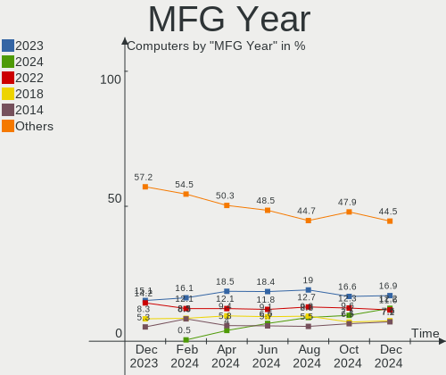
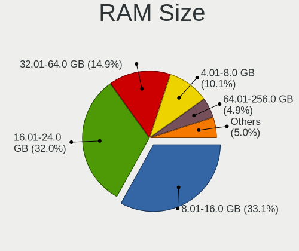
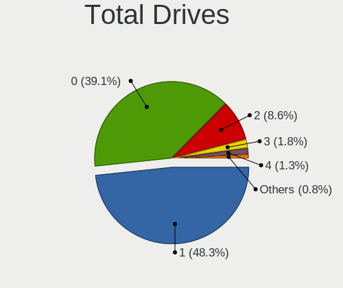
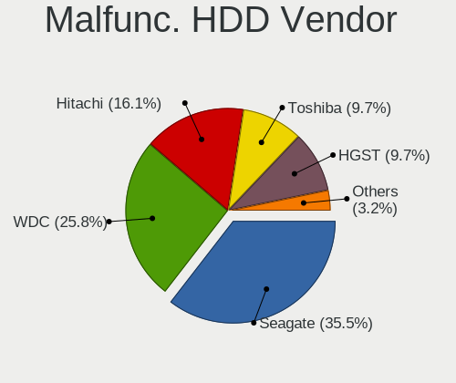
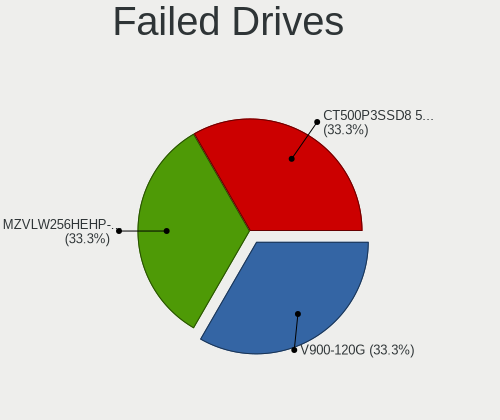
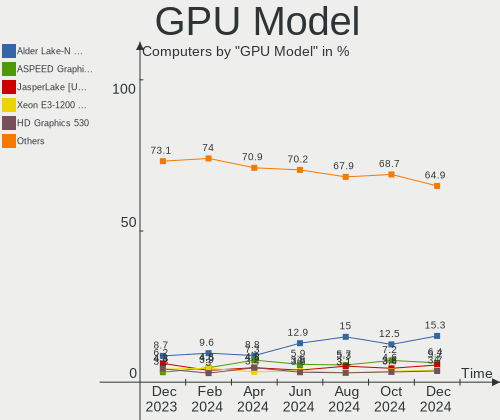
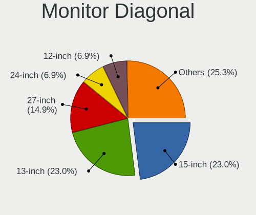
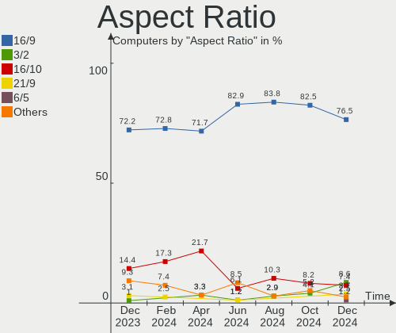

BSD - Hardware Trends
---------------------

A project to identify most popular hardware characteristics and track their change
over time based on data collected by BSD users at https://BSD-Hardware.info.

Anyone can contribute to this report by the [hw-probe](https://github.com/linuxhw/hw-probe/blob/master/INSTALL.BSD.md) tool:

    hw-probe -all -upload

This is a report for all computer types. See also reports for [desktops](/Desktop/README.md) and [notebooks](/Notebook/README.md).

OS-specific reports: [FreeBSD](/Dist/FreeBSD), [OPNsense](/Dist/OPNsense), [helloSystem](/Dist/helloSystem), [OpenBSD](/Dist/OpenBSD).

This report is for one last month. Overall report since the beginning of time: [TestDays](https://github.com/bsdhw/TestDays)

Period: Nov, 2023.

Contents
--------

* [ System ](#system)
  - [ OS                       ](#os)
  - [ OS Family                ](#os-family)
  - [ Arch                     ](#arch)
  - [ DE                       ](#de)
  - [ Display Server           ](#display-server)
  - [ Display Manager          ](#display-manager)
  - [ OS Lang                  ](#os-lang)
  - [ Boot Mode                ](#boot-mode)
  - [ Filesystem               ](#filesystem)
  - [ Part. scheme             ](#part-scheme)

* [ Board ](#board)
  - [ Vendor                   ](#vendor)
  - [ Model                    ](#model)
  - [ Model Family             ](#model-family)
  - [ MFG Year                 ](#mfg-year)
  - [ Form Factor              ](#form-factor)
  - [ Coreboot                 ](#coreboot)
  - [ RAM Size                 ](#ram-size)
  - [ RAM Used                 ](#ram-used)
  - [ Total Drives             ](#total-drives)
  - [ Has CD-ROM               ](#has-cd-rom)
  - [ Has Ethernet             ](#has-ethernet)
  - [ Has WiFi                 ](#has-wifi)
  - [ Has Bluetooth            ](#has-bluetooth)

* [ Location ](#location)
  - [ Country                  ](#country)
  - [ City                     ](#city)

* [ Drives ](#drives)
  - [ Drive Vendor             ](#drive-vendor)
  - [ Drive Model              ](#drive-model)
  - [ HDD Vendor               ](#hdd-vendor)
  - [ SSD Vendor               ](#ssd-vendor)
  - [ Drive Kind               ](#drive-kind)
  - [ Drive Connector          ](#drive-connector)
  - [ Drive Size               ](#drive-size)
  - [ Space Total              ](#space-total)
  - [ Space Used               ](#space-used)
  - [ Malfunc. Drives          ](#malfunc-drives)
  - [ Malfunc. Drive Vendor    ](#malfunc-drive-vendor)
  - [ Malfunc. HDD Vendor      ](#malfunc-hdd-vendor)
  - [ Malfunc. Drive Kind      ](#malfunc-drive-kind)
  - [ Failed Drives            ](#failed-drives)
  - [ Failed Drive Vendor      ](#failed-drive-vendor)
  - [ Drive Status             ](#drive-status)

* [ Storage controller ](#storage-controller)
  - [ Storage Vendor           ](#storage-vendor)
  - [ Storage Model            ](#storage-model)
  - [ Storage Kind             ](#storage-kind)

* [ Processor ](#processor)
  - [ CPU Vendor               ](#cpu-vendor)
  - [ CPU Model                ](#cpu-model)
  - [ CPU Model Family         ](#cpu-model-family)
  - [ CPU Cores                ](#cpu-cores)
  - [ CPU Sockets              ](#cpu-sockets)
  - [ CPU Threads              ](#cpu-threads)
  - [ CPU Microarch            ](#cpu-microarch)

* [ Graphics ](#graphics)
  - [ GPU Vendor               ](#gpu-vendor)
  - [ GPU Model                ](#gpu-model)
  - [ GPU Combo                ](#gpu-combo)
  - [ GPU Driver               ](#gpu-driver)
  - [ GPU Memory               ](#gpu-memory)

* [ Monitor ](#monitor)
  - [ Monitor Vendor           ](#monitor-vendor)
  - [ Monitor Model            ](#monitor-model)
  - [ Monitor Resolution       ](#monitor-resolution)
  - [ Monitor Diagonal         ](#monitor-diagonal)
  - [ Monitor Width            ](#monitor-width)
  - [ Aspect Ratio             ](#aspect-ratio)
  - [ Monitor Area             ](#monitor-area)
  - [ Pixel Density            ](#pixel-density)
  - [ Multiple Monitors        ](#multiple-monitors)

* [ Network ](#network)
  - [ Net Controller Vendor    ](#net-controller-vendor)
  - [ Net Controller Model     ](#net-controller-model)
  - [ Wireless Vendor          ](#wireless-vendor)
  - [ Wireless Model           ](#wireless-model)
  - [ Ethernet Vendor          ](#ethernet-vendor)
  - [ Ethernet Model           ](#ethernet-model)
  - [ Net Controller Kind      ](#net-controller-kind)
  - [ Used Controller          ](#used-controller)
  - [ NICs                     ](#nics)
  - [ IPv6                     ](#ipv6)

* [ Bluetooth ](#bluetooth)
  - [ Bluetooth Vendor         ](#bluetooth-vendor)
  - [ Bluetooth Model          ](#bluetooth-model)

* [ Sound ](#sound)
  - [ Sound Vendor             ](#sound-vendor)
  - [ Sound Model              ](#sound-model)

* [ Memory ](#memory)
  - [ Memory Vendor            ](#memory-vendor)
  - [ Memory Model             ](#memory-model)
  - [ Memory Kind              ](#memory-kind)
  - [ Memory Form Factor       ](#memory-form-factor)
  - [ Memory Size              ](#memory-size)
  - [ Memory Speed             ](#memory-speed)

* [ Printers & scanners ](#printers--scanners)
  - [ Printer Vendor           ](#printer-vendor)
  - [ Printer Model            ](#printer-model)
  - [ Scanner Vendor           ](#scanner-vendor)
  - [ Scanner Model            ](#scanner-model)

* [ Camera ](#camera)
  - [ Camera Vendor            ](#camera-vendor)
  - [ Camera Model             ](#camera-model)

* [ Security ](#security)
  - [ Fingerprint Vendor       ](#fingerprint-vendor)
  - [ Fingerprint Model        ](#fingerprint-model)
  - [ Chipcard Vendor          ](#chipcard-vendor)
  - [ Chipcard Model           ](#chipcard-model)

* [ Unsupported ](#unsupported)
  - [ Unsupported Devices      ](#unsupported-devices)
  - [ Unsupported Device Types ](#unsupported-device-types)

System
------

OS
--

Installed operating systems

| Name                | Computers | Percent |
|---------------------|-----------|---------|
| OPNsense 23.7.8     | 133       | 25.83%  |
| OPNsense 23.7.7     | 116       | 22.52%  |
| OPNsense 23.7.9     | 84        | 16.31%  |
| FreeBSD 14.0        | 30        | 5.83%   |
| helloSystem 0.9.0   | 23        | 4.47%   |
| helloSystem 0.8.1   | 18        | 3.5%    |
| OpenBSD 7.4         | 17        | 3.3%    |
| FreeBSD 13.2-p4     | 14        | 2.72%   |
| GhostBSD 23.10.1    | 8         | 1.55%   |
| OPNsense 23.7.5     | 7         | 1.36%   |
| OPNsense 23.1.11    | 7         | 1.36%   |
| FreeBSD 14.0-BETA5  | 6         | 1.17%   |
| FreeBSD 13.2-p5     | 6         | 1.17%   |
| OPNsense 24.1       | 5         | 0.97%   |
| FreeBSD 13.2        | 5         | 0.97%   |
| NomadBSD 20231013   | 4         | 0.78%   |
| OPNsense 23.7.6     | 3         | 0.58%   |
| FreeBSD 14.0-RC4    | 3         | 0.58%   |
| OPNsense 23.7.2     | 2         | 0.39%   |
| OPNsense 22.7.11    | 2         | 0.39%   |
| FreeBSD 14.0-RC4-p1 | 2         | 0.39%   |
| FreeBSD 13.2-p3     | 2         | 0.39%   |
| TrueNAS 13.1-p9     | 1         | 0.19%   |
| TrueNAS 13.1-p7     | 1         | 0.19%   |
| OPNsense 23.7.1     | 1         | 0.19%   |
| OPNsense 23.10      | 1         | 0.19%   |
| OPNsense 22.7.6     | 1         | 0.19%   |
| OPNsense 22.7       | 1         | 0.19%   |
| OPNsense 22.1.10    | 1         | 0.19%   |
| NetBSD 9.3          | 1         | 0.19%   |
| NetBSD 8.2          | 1         | 0.19%   |
| NetBSD 10.0_RC1     | 1         | 0.19%   |
| MyBee 14.0          | 1         | 0.19%   |
| MidnightBSD 3.1.0   | 1         | 0.19%   |
| helloSystem 0.8.2   | 1         | 0.19%   |
| helloSystem 0.5.0   | 1         | 0.19%   |
| FreeBSD 14.0-STABLE | 1         | 0.19%   |
| FreeBSD 14.0-RC3    | 1         | 0.19%   |
| FreeBSD 14.0-RC2    | 1         | 0.19%   |
| FreeBSD 12.4        | 1         | 0.19%   |

OS Family
---------

OS without a version

| Name        | Computers | Percent |
|-------------|-----------|---------|
| OPNsense    | 364       | 70.68%  |
| FreeBSD     | 72        | 13.98%  |
| helloSystem | 43        | 8.35%   |
| OpenBSD     | 17        | 3.3%    |
| GhostBSD    | 8         | 1.55%   |
| NomadBSD    | 4         | 0.78%   |
| NetBSD      | 3         | 0.58%   |
| TrueNAS     | 2         | 0.39%   |
| MyBee       | 1         | 0.19%   |
| MidnightBSD | 1         | 0.19%   |

Arch
----

OS architecture (x86_64, i586, etc.)

| Name   | Computers | Percent |
|--------|-----------|---------|
| amd64  | 508       | 98.64%  |
| arm64  | 5         | 0.97%   |
| i386   | 1         | 0.19%   |
| evbarm | 1         | 0.19%   |

DE
--

Desktop Environment

| Name         | Computers | Percent |
|--------------|-----------|---------|
| Console      | 391       | 75.92%  |
| helloDesktop | 57        | 11.07%  |
| KDE5         | 19        | 3.69%   |
| XFCE         | 16        | 3.11%   |
| MATE         | 9         | 1.75%   |
| GNOME        | 6         | 1.17%   |
| TWM          | 4         | 0.78%   |
| Openbox      | 4         | 0.78%   |
| Cinnamon     | 2         | 0.39%   |
| xinitrc      | 1         | 0.19%   |
| Picom        | 1         | 0.19%   |
| LXQt         | 1         | 0.19%   |
| i3           | 1         | 0.19%   |
| DWM          | 1         | 0.19%   |
| Budgie       | 1         | 0.19%   |
| AwesomeWM    | 1         | 0.19%   |

Display Server
--------------

X11 or Wayland

| Name    | Computers | Percent |
|---------|-----------|---------|
| Console | 397       | 77.09%  |
| X11     | 116       | 22.52%  |
| Wayland | 2         | 0.39%   |

Display Manager
---------------

SDDM, LightDM, etc.

| Name    | Computers | Percent |
|---------|-----------|---------|
| Console | 420       | 81.55%  |
| SLiM    | 47        | 9.13%   |
| SDDM    | 23        | 4.47%   |
| LightDM | 18        | 3.5%    |
| XDM     | 3         | 0.58%   |
| Ly      | 2         | 0.39%   |
| GDM     | 2         | 0.39%   |

OS Lang
-------

Language

| Lang    | Computers | Percent |
|---------|-----------|---------|
| Unknown | 406       | 78.83%  |
| C       | 55        | 10.68%  |
| en_US   | 29        | 5.63%   |
| ru_RU   | 4         | 0.78%   |
| fr_FR   | 4         | 0.78%   |
| de_DE   | 4         | 0.78%   |
| es_ES   | 3         | 0.58%   |
| tr_TR   | 1         | 0.19%   |
| pt_BR   | 1         | 0.19%   |
| pl_PL   | 1         | 0.19%   |
| it_IT   | 1         | 0.19%   |
| fi_FI   | 1         | 0.19%   |
| es_CO   | 1         | 0.19%   |
| es_AR   | 1         | 0.19%   |
| en_GB   | 1         | 0.19%   |
| en_AU   | 1         | 0.19%   |
| de_CH   | 1         | 0.19%   |

Boot Mode
---------

EFI or BIOS

| Mode | Computers | Percent |
|------|-----------|---------|
| EFI  | 481       | 93.4%   |
| BIOS | 34        | 6.6%    |

Filesystem
----------

Type of filesystem

| Type   | Computers | Percent |
|--------|-----------|---------|
| Zfs    | 254       | 49.32%  |
| Ufs    | 221       | 42.91%  |
| Cd9660 | 23        | 4.47%   |
| Ffs    | 17        | 3.3%    |

Part. scheme
------------

Scheme of partitioning

| Type    | Computers | Percent |
|---------|-----------|---------|
| GPT     | 498       | 96.7%   |
| MBR     | 12        | 2.33%   |
| Unknown | 5         | 0.97%   |

Board
-----

Vendor
------

Motherboard manufacturer

| Name                                 | Computers | Percent |
|--------------------------------------|-----------|---------|
| Dell                                 | 66        | 12.82%  |
| Unknown                              | 63        | 12.23%  |
| Lenovo                               | 47        | 9.13%   |
| Hewlett-Packard                      | 44        | 8.54%   |
| ASUSTek Computer                     | 27        | 5.24%   |
| Intel                                | 26        | 5.05%   |
| Protectli                            | 21        | 4.08%   |
| Supermicro                           | 15        | 2.91%   |
| Fujitsu                              | 15        | 2.91%   |
| ASRock                               | 15        | 2.91%   |
| Techvision                           | 14        | 2.72%   |
| Gigabyte Technology                  | 14        | 2.72%   |
| MSI                                  | 13        | 2.52%   |
| PC Engines                           | 11        | 2.14%   |
| AMI                                  | 8         | 1.55%   |
| Sophos                               | 7         | 1.36%   |
| CWWK                                 | 7         | 1.36%   |
| AZW                                  | 7         | 1.36%   |
| Deciso                               | 6         | 1.17%   |
| ZOTAC                                | 5         | 0.97%   |
| Apple                                | 5         | 0.97%   |
| MW                                   | 4         | 0.78%   |
| CncTion                              | 4         | 0.78%   |
| Shuttle                              | 3         | 0.58%   |
| Samsung Electronics                  | 3         | 0.58%   |
| PICO PC                              | 3         | 0.58%   |
| Panasonic                            | 3         | 0.58%   |
| IceWhale Technology                  | 3         | 0.58%   |
| Cisco                                | 3         | 0.58%   |
| BESSTAR Tech                         | 3         | 0.58%   |
| Acer                                 | 3         | 0.58%   |
| YANYU                                | 2         | 0.39%   |
| Yanling                              | 2         | 0.39%   |
| TUXEDO                               | 2         | 0.39%   |
| Toshiba                              | 2         | 0.39%   |
| ShenZhen MinWin Technology           | 2         | 0.39%   |
| Shenzhen Meigao Electronic Equipment | 2         | 0.39%   |
| Raspberry Pi Foundation              | 2         | 0.39%   |
| Google                               | 2         | 0.39%   |
| ATOPNUC                              | 2         | 0.39%   |

Model
-----

Motherboard model

| Name                                              | Computers | Percent |
|---------------------------------------------------|-----------|---------|
| Unknown                                           | 64        | 12.43%  |
| Techvision TVI7309X                               | 14        | 2.72%   |
| Protectli FW6                                     | 9         | 1.75%   |
| Protectli VP2420                                  | 7         | 1.36%   |
| Dell Wyse 5070 Extended Thin Client               | 6         | 1.17%   |
| Intel Q3XXG4-P V1.0                               | 5         | 0.97%   |
| Fujitsu FUTRO S920                                | 5         | 0.97%   |
| AZW EQ                                            | 5         | 0.97%   |
| AMI Aptio CRB                                     | 5         | 0.97%   |
| Sophos SG                                         | 4         | 0.78%   |
| PC Engines apu4                                   | 4         | 0.78%   |
| MW GMLK-2_5G4L                                    | 4         | 0.78%   |
| HP t620 PLUS Quad Core TC                         | 4         | 0.78%   |
| Dell OptiPlex 9020                                | 4         | 0.78%   |
| Protectli FW4B                                    | 3         | 0.58%   |
| PICO PC MNHO-113                                  | 3         | 0.58%   |
| PC Engines APU2                                   | 3         | 0.58%   |
| Intel QHSW02                                      | 3         | 0.58%   |
| CWWK CW-MBX-AD12                                  | 3         | 0.58%   |
| CncTion N5105-4L                                  | 3         | 0.58%   |
| Supermicro 1HE Intel Single-CPU RI1102D-F Server  | 2         | 0.39%   |
| Sophos XG                                         | 2         | 0.39%   |
| Shenzhen Meigao Electronic Equipment Venus Series | 2         | 0.39%   |
| RPi Raspberry Pi                                  | 2         | 0.39%   |
| PC Engines APU3                                   | 2         | 0.39%   |
| MSI MS-7B89                                       | 2         | 0.39%   |
| IceWhale ZimaBoard 832 ZMB                        | 2         | 0.39%   |
| HP t730 Thin Client                               | 2         | 0.39%   |
| HP ProDesk 600 G1 SFF                             | 2         | 0.39%   |
| HP Notebook                                       | 2         | 0.39%   |
| HP EliteDesk 800 G1 SFF                           | 2         | 0.39%   |
| HP Compaq dc7900 Small Form Factor                | 2         | 0.39%   |
| HP Compaq 8200 Elite SFF PC                       | 2         | 0.39%   |
| Dell XPS 13 9360                                  | 2         | 0.39%   |
| Dell Wyse 5070 Thin Client                        | 2         | 0.39%   |
| Dell PowerEdge R610                               | 2         | 0.39%   |
| Dell PowerEdge R230                               | 2         | 0.39%   |
| Dell PowerEdge R210 II                            | 2         | 0.39%   |
| Dell OptiPlex 7040                                | 2         | 0.39%   |
| Dell OptiPlex 7010                                | 2         | 0.39%   |

Model Family
------------

Motherboard model prefix

| Name                | Computers | Percent |
|---------------------|-----------|---------|
| Unknown             | 64        | 12.43%  |
| Dell OptiPlex       | 21        | 4.08%   |
| Lenovo ThinkPad     | 18        | 3.5%    |
| Lenovo ThinkCentre  | 16        | 3.11%   |
| Techvision TVI7309X | 14        | 2.72%   |
| Dell PowerEdge      | 12        | 2.33%   |
| Protectli FW6       | 9         | 1.75%   |
| Dell Inspiron       | 9         | 1.75%   |
| HP EliteDesk        | 8         | 1.55%   |
| Dell Wyse           | 8         | 1.55%   |
| Protectli VP2420    | 7         | 1.36%   |
| HP ProLiant         | 7         | 1.36%   |
| HP Compaq           | 7         | 1.36%   |
| Fujitsu FUTRO       | 7         | 1.36%   |
| HP ProDesk          | 6         | 1.17%   |
| Dell Precision      | 6         | 1.17%   |
| Dell Latitude       | 6         | 1.17%   |
| ASUS PRIME          | 6         | 1.17%   |
| Intel Q3XXG4-P      | 5         | 0.97%   |
| AZW EQ              | 5         | 0.97%   |
| AMI Aptio           | 5         | 0.97%   |
| Sophos SG           | 4         | 0.78%   |
| PC Engines apu4     | 4         | 0.78%   |
| MW GMLK-2           | 4         | 0.78%   |
| HP t620             | 4         | 0.78%   |
| Fujitsu ESPRIMO     | 4         | 0.78%   |
| Deciso Netboard     | 4         | 0.78%   |
| ASUS ROG            | 4         | 0.78%   |
| Protectli FW4B      | 3         | 0.58%   |
| PICO PC MNHO-113    | 3         | 0.58%   |
| PC Engines APU2     | 3         | 0.58%   |
| Intel QHSW02        | 3         | 0.58%   |
| IceWhale ZimaBoard  | 3         | 0.58%   |
| Dell XPS            | 3         | 0.58%   |
| CWWK CW-MBX-AD12    | 3         | 0.58%   |
| CncTion N5105-4L    | 3         | 0.58%   |
| ASUS TUF            | 3         | 0.58%   |
| Acer Aspire         | 3         | 0.58%   |
| TUXEDO Pulse        | 2         | 0.39%   |
| Toshiba Satellite   | 2         | 0.39%   |

MFG Year
--------

Motherboard manufacture year

| Year    | Computers | Percent |
|---------|-----------|---------|
| 2022    | 75        | 14.56%  |
| 2023    | 67        | 13.01%  |
| 2021    | 50        | 9.71%   |
| 2018    | 45        | 8.74%   |
| 2019    | 39        | 7.57%   |
| 2014    | 37        | 7.18%   |
| 2016    | 33        | 6.41%   |
| 2020    | 32        | 6.21%   |
| 2017    | 28        | 5.44%   |
| 2015    | 28        | 5.44%   |
| 2013    | 20        | 3.88%   |
| 2012    | 19        | 3.69%   |
| 2011    | 13        | 2.52%   |
| 2008    | 9         | 1.75%   |
| 2010    | 8         | 1.55%   |
| 2009    | 5         | 0.97%   |
| Unknown | 4         | 0.78%   |
| 2007    | 2         | 0.39%   |
| 2006    | 1         | 0.19%   |

Form Factor
-----------

Physical design of the computer

| Name           | Computers | Percent |
|----------------|-----------|---------|
| Desktop        | 342       | 66.41%  |
| Notebook       | 83        | 16.12%  |
| Mini pc        | 43        | 8.35%   |
| Server         | 29        | 5.63%   |
| Firewall       | 8         | 1.55%   |
| System on chip | 4         | 0.78%   |
| All in one     | 4         | 0.78%   |
| Tablet         | 1         | 0.19%   |
| Convertible    | 1         | 0.19%   |

Coreboot
--------

Have coreboot on board

| Used | Computers | Percent |
|------|-----------|---------|
| No   | 496       | 96.31%  |
| Yes  | 19        | 3.69%   |

RAM Size
--------

Total RAM memory

| Size in GB      | Computers | Percent |
|-----------------|-----------|---------|
| 8.01-16.0       | 189       | 36.7%   |
| 16.01-24.0      | 159       | 30.87%  |
| 4.01-8.0        | 62        | 12.04%  |
| 32.01-64.0      | 51        | 9.9%    |
| 64.01-256.0     | 25        | 4.85%   |
| 24.01-32.0      | 12        | 2.33%   |
| 2.01-3.0        | 6         | 1.17%   |
| 3.01-4.0        | 5         | 0.97%   |
| More than 256.0 | 2         | 0.39%   |
| 0.51-1.0        | 2         | 0.39%   |
| 1.01-2.0        | 1         | 0.19%   |
| 0.01-0.5        | 1         | 0.19%   |

RAM Used
--------

Used RAM memory

| Used GB    | Computers | Percent |
|------------|-----------|---------|
| 0.01-0.5   | 209       | 40.58%  |
| 0.51-1.0   | 195       | 37.86%  |
| 1.01-2.0   | 69        | 13.4%   |
| 2.01-3.0   | 24        | 4.66%   |
| 3.01-4.0   | 7         | 1.36%   |
| 4.01-8.0   | 6         | 1.17%   |
| Unknown    | 3         | 0.58%   |
| 16.01-24.0 | 1         | 0.19%   |
| 8.01-16.0  | 1         | 0.19%   |

Total Drives
------------

Number of drives on board

| Drives | Computers | Percent |
|--------|-----------|---------|
| 1      | 353       | 68.54%  |
| 0      | 73        | 14.17%  |
| 2      | 62        | 12.04%  |
| 3      | 11        | 2.14%   |
| 4      | 10        | 1.94%   |
| 5      | 2         | 0.39%   |
| 17     | 1         | 0.19%   |
| 13     | 1         | 0.19%   |
| 8      | 1         | 0.19%   |
| 7      | 1         | 0.19%   |

Has CD-ROM
----------

Has CD-ROM on board

| Presented | Computers | Percent |
|-----------|-----------|---------|
| No        | 446       | 86.6%   |
| Yes       | 69        | 13.4%   |

Has Ethernet
------------

Has Ethernet on board

| Presented | Computers | Percent |
|-----------|-----------|---------|
| Yes       | 494       | 95.92%  |
| No        | 21        | 4.08%   |

Has WiFi
--------

Has WiFi module

| Presented | Computers | Percent |
|-----------|-----------|---------|
| No        | 360       | 69.9%   |
| Yes       | 155       | 30.1%   |

Has Bluetooth
-------------

Has Bluetooth module

| Presented | Computers | Percent |
|-----------|-----------|---------|
| No        | 388       | 75.34%  |
| Yes       | 127       | 24.66%  |

Location
--------

Country
-------

Geographic location (country)

| Country      | Computers | Percent |
|--------------|-----------|---------|
| USA          | 144       | 27.96%  |
| Germany      | 78        | 15.15%  |
| Canada       | 28        | 5.44%   |
| UK           | 21        | 4.08%   |
| France       | 20        | 3.88%   |
| Australia    | 17        | 3.3%    |
| Russia       | 15        | 2.91%   |
| Poland       | 15        | 2.91%   |
| Switzerland  | 13        | 2.52%   |
| Italy        | 12        | 2.33%   |
| Netherlands  | 11        | 2.14%   |
| Sweden       | 9         | 1.75%   |
| Brazil       | 8         | 1.55%   |
| Spain        | 7         | 1.36%   |
| Austria      | 7         | 1.36%   |
| South Africa | 6         | 1.17%   |
| Belgium      | 6         | 1.17%   |
| Singapore    | 5         | 0.97%   |
| Finland      | 5         | 0.97%   |
| Czechia      | 5         | 0.97%   |
| China        | 5         | 0.97%   |
| Vietnam      | 4         | 0.78%   |
| Taiwan       | 4         | 0.78%   |
| South Korea  | 4         | 0.78%   |
| Slovakia     | 4         | 0.78%   |
| New Zealand  | 4         | 0.78%   |
| Indonesia    | 4         | 0.78%   |
| Bulgaria     | 4         | 0.78%   |
| Algeria      | 4         | 0.78%   |
| Turkey       | 3         | 0.58%   |
| Romania      | 3         | 0.58%   |
| Norway       | 3         | 0.58%   |
| Mexico       | 3         | 0.58%   |
| India        | 3         | 0.58%   |
| Colombia     | 3         | 0.58%   |
| Argentina    | 3         | 0.58%   |
| Portugal     | 2         | 0.39%   |
| Japan        | 2         | 0.39%   |
| Croatia      | 2         | 0.39%   |
| Uruguay      | 1         | 0.19%   |

City
----

Geographic location (city)

| City                     | Computers | Percent |
|--------------------------|-----------|---------|
| Berlin                   | 8         | 1.55%   |
| Sydney                   | 6         | 1.17%   |
| Singapore                | 5         | 0.97%   |
| New York                 | 5         | 0.97%   |
| Montreal                 | 5         | 0.97%   |
| Helsinki                 | 4         | 0.78%   |
| Hamburg                  | 4         | 0.78%   |
| Zurich                   | 3         | 0.58%   |
| Vancouver                | 3         | 0.58%   |
| Urcuit                   | 3         | 0.58%   |
| Seattle                  | 3         | 0.58%   |
| Sao Paulo                | 3         | 0.58%   |
| Moscow                   | 3         | 0.58%   |
| Melbourne                | 3         | 0.58%   |
| Lodz                     | 3         | 0.58%   |
| Leipzig                  | 3         | 0.58%   |
| Geneva                   | 3         | 0.58%   |
| Frankfurt am Main        | 3         | 0.58%   |
| Canberra                 | 3         | 0.58%   |
| Calgary                  | 3         | 0.58%   |
| Atlanta                  | 3         | 0.58%   |
| Ypsilanti                | 2         | 0.39%   |
| Warsaw                   | 2         | 0.39%   |
| Tracy                    | 2         | 0.39%   |
| Sydenham                 | 2         | 0.39%   |
| St Petersburg            | 2         | 0.39%   |
| Sofia                    | 2         | 0.39%   |
| Salem                    | 2         | 0.39%   |
| Sainte-Marthe-sur-le-Lac | 2         | 0.39%   |
| Saint-Laurent            | 2         | 0.39%   |
| Redmond                  | 2         | 0.39%   |
| Pretoria                 | 2         | 0.39%   |
| Portland                 | 2         | 0.39%   |
| Pittsburgh               | 2         | 0.39%   |
| Peoria                   | 2         | 0.39%   |
| Paris                    | 2         | 0.39%   |
| Ozersk                   | 2         | 0.39%   |
| Oklahoma City            | 2         | 0.39%   |
| Nuremberg                | 2         | 0.39%   |
| Nottuln                  | 2         | 0.39%   |

Drives
------

Drive Vendor
------------

Hard drive vendors

| Vendor              | Computers | Drives | Percent |
|---------------------|-----------|--------|---------|
| Samsung Electronics | 102       | 123    | 19.77%  |
| WDC                 | 46        | 68     | 8.91%   |
| Seagate             | 35        | 40     | 6.78%   |
| Kingston            | 32        | 33     | 6.2%    |
| Intel               | 21        | 25     | 4.07%   |
| Crucial             | 20        | 20     | 3.88%   |
| China               | 20        | 23     | 3.88%   |
| Transcend           | 19        | 20     | 3.68%   |
| SanDisk             | 19        | 21     | 3.68%   |
| Toshiba             | 18        | 20     | 3.49%   |
| Micron Technology   | 14        | 15     | 2.71%   |
| A-DATA Technology   | 13        | 14     | 2.52%   |
| SPCC                | 11        | 11     | 2.13%   |
| SK hynix            | 11        | 11     | 2.13%   |
| Protectli           | 10        | 10     | 1.94%   |
| Silicon Motion      | 7         | 7      | 1.36%   |
| PNY                 | 7         | 8      | 1.36%   |
| Hoodisk             | 7         | 7      | 1.36%   |
| Hitachi             | 5         | 6      | 0.97%   |
| Hewlett-Packard     | 5         | 18     | 0.97%   |
| Fanxiang            | 5         | 5      | 0.97%   |
| Patriot             | 4         | 5      | 0.78%   |
| NVMe                | 4         | 4      | 0.78%   |
| HGST                | 4         | 4      | 0.78%   |
| Gigabyte Technology | 4         | 6      | 0.78%   |
| FORESEE             | 4         | 4      | 0.78%   |
| Dogfish             | 4         | 4      | 0.78%   |
| Apacer              | 4         | 4      | 0.78%   |
| VICKTER             | 3         | 3      | 0.58%   |
| Phison              | 3         | 3      | 0.58%   |
| Lexar               | 3         | 3      | 0.58%   |
| Leven               | 3         | 3      | 0.58%   |
| Innodisk            | 3         | 3      | 0.58%   |
| GOODRAM             | 3         | 4      | 0.58%   |
| Corsair             | 3         | 3      | 0.58%   |
| Team                | 2         | 2      | 0.39%   |
| SCY                 | 2         | 2      | 0.39%   |
| Maxtor              | 2         | 2      | 0.39%   |
| LITEON              | 2         | 2      | 0.39%   |
| KIOXIA              | 2         | 2      | 0.39%   |

Drive Model
-----------

Hard drive models

| Model                                  | Computers | Percent |
|----------------------------------------|-----------|---------|
| Samsung SSD 870 EVO 250GB              | 6         | 1.09%   |
| Kingston SKC600MS256G 256GB            | 6         | 1.09%   |
| Crucial CT500P3SSD8 500GB              | 6         | 1.09%   |
| Samsung SSD 860 EVO 500GB              | 5         | 0.91%   |
| Samsung SSD 860 EVO 250GB              | 5         | 0.91%   |
| Kingston SA400S37240G 240GB            | 5         | 0.91%   |
| Samsung SSD 870 EVO 1TB                | 4         | 0.73%   |
| WDC WDS240G2G0A-00JH30 240GB           | 3         | 0.55%   |
| Samsung SSD 980 500GB                  | 3         | 0.55%   |
| Samsung SSD 980 250GB                  | 3         | 0.55%   |
| Samsung SSD 860 EVO 1TB                | 3         | 0.55%   |
| Samsung SSD 850 PRO 256GB              | 3         | 0.55%   |
| Samsung SSD 850 EVO 500GB              | 3         | 0.55%   |
| Samsung SSD 850 EVO 250GB              | 3         | 0.55%   |
| Samsung PM961 NVMe 256GB               | 3         | 0.55%   |
| Protectli 64GB mSATA                   | 3         | 0.55%   |
| Protectli 120GB mSATA                  | 3         | 0.55%   |
| Hoodisk SSD 32GB                       | 3         | 0.55%   |
| Hoodisk SSD 128GB                      | 3         | 0.55%   |
| Fanxiang S501 128GB                    | 3         | 0.55%   |
| China SATA SSD 256GB                   | 3         | 0.55%   |
| A-DATA IM2S3134N-064GM 64GB            | 3         | 0.55%   |
| WDC WD7500BPKT-75PK4T0 752GB           | 2         | 0.36%   |
| WDC WD5000AAKX-60U6AA0 500GB           | 2         | 0.36%   |
| WDC WD10EZEX-08WN4A0 1TB               | 2         | 0.36%   |
| VICKTER SSD 64GB                       | 2         | 0.36%   |
| Transcend TS64GSSD370 64GB             | 2         | 0.36%   |
| Transcend TS128GMTE110S 128GB          | 2         | 0.36%   |
| Transcend TS128GMSA230S 128GB          | 2         | 0.36%   |
| Toshiba MQ01ABD100 1TB                 | 2         | 0.36%   |
| Toshiba DT01ACA100 1TB                 | 2         | 0.36%   |
| SPCC Solid State Disk 128GB            | 2         | 0.36%   |
| SPCC Solid State Disk 120GB            | 2         | 0.36%   |
| SK hynix SKHynix_HFS512GDE9X084N 512GB | 2         | 0.36%   |
| Silicon Motion GV128 128GB             | 2         | 0.36%   |
| Seagate ST500DM002-1BD142 500GB        | 2         | 0.36%   |
| Seagate ST4000DM000-1F2168 4TB         | 2         | 0.36%   |
| Seagate ST3320310CS 320GB              | 2         | 0.36%   |
| Seagate ST1000LM024 HN-M101MBB 1TB     | 2         | 0.36%   |
| Seagate ST1000DM010-2EP102 1TB         | 2         | 0.36%   |

HDD Vendor
----------

Hard disk drive vendors

| Vendor              | Computers | Drives | Percent |
|---------------------|-----------|--------|---------|
| Seagate             | 33        | 38     | 32.67%  |
| WDC                 | 31        | 50     | 30.69%  |
| Toshiba             | 12        | 14     | 11.88%  |
| Hitachi             | 5         | 6      | 4.95%   |
| Samsung Electronics | 4         | 4      | 3.96%   |
| HGST                | 4         | 4      | 3.96%   |
| Hewlett-Packard     | 4         | 17     | 3.96%   |
| NVMe                | 2         | 2      | 1.98%   |
| Maxtor              | 2         | 2      | 1.98%   |
| OPENBSD             | 1         | 1      | 0.99%   |
| HPE                 | 1         | 4      | 0.99%   |
| China               | 1         | 1      | 0.99%   |
| Apple               | 1         | 1      | 0.99%   |

SSD Vendor
----------

Solid state drive vendors

| Vendor              | Computers | Drives | Percent |
|---------------------|-----------|--------|---------|
| Samsung Electronics | 65        | 80     | 21.17%  |
| Kingston            | 27        | 28     | 8.79%   |
| SanDisk             | 19        | 21     | 6.19%   |
| China               | 19        | 22     | 6.19%   |
| Transcend           | 15        | 15     | 4.89%   |
| A-DATA Technology   | 13        | 14     | 4.23%   |
| Intel               | 12        | 15     | 3.91%   |
| Micron Technology   | 11        | 12     | 3.58%   |
| WDC                 | 10        | 11     | 3.26%   |
| Protectli           | 10        | 10     | 3.26%   |
| Crucial             | 10        | 10     | 3.26%   |
| SPCC                | 9         | 9      | 2.93%   |
| Hoodisk             | 7         | 7      | 2.28%   |
| PNY                 | 6         | 7      | 1.95%   |
| FORESEE             | 4         | 4      | 1.3%    |
| Dogfish             | 4         | 4      | 1.3%    |
| Apacer              | 4         | 4      | 1.3%    |
| VICKTER             | 3         | 3      | 0.98%   |
| Toshiba             | 3         | 3      | 0.98%   |
| Leven               | 3         | 3      | 0.98%   |
| Innodisk            | 3         | 3      | 0.98%   |
| GOODRAM             | 3         | 4      | 0.98%   |
| Gigabyte Technology | 3         | 5      | 0.98%   |
| Team                | 2         | 2      | 0.65%   |
| SK hynix            | 2         | 2      | 0.65%   |
| Seagate             | 2         | 2      | 0.65%   |
| SCY                 | 2         | 2      | 0.65%   |
| Patriot             | 2         | 3      | 0.65%   |
| NVMe                | 2         | 2      | 0.65%   |
| LITEON              | 2         | 2      | 0.65%   |
| Lexar               | 2         | 2      | 0.65%   |
| BORY                | 2         | 2      | 0.65%   |
| V-GeN               | 1         | 2      | 0.33%   |
| TCSUNBOW            | 1         | 1      | 0.33%   |
| SSSTC               | 1         | 1      | 0.33%   |
| Smartbuy            | 1         | 1      | 0.33%   |
| SHAREVDI            | 1         | 1      | 0.33%   |
| SemsoTai            | 1         | 1      | 0.33%   |
| OCZ                 | 1         | 1      | 0.33%   |
| Netac               | 1         | 1      | 0.33%   |

Drive Kind
----------

HDD or SSD

| Kind | Computers | Drives | Percent |
|------|-----------|--------|---------|
| SSD  | 289       | 342    | 59.22%  |
| NVMe | 111       | 118    | 22.75%  |
| HDD  | 88        | 144    | 18.03%  |

Drive Connector
---------------

SATA, SAS, NVMe, etc.

| Type | Computers | Drives | Percent |
|------|-----------|--------|---------|
| SATA | 349       | 486    | 75.87%  |
| NVMe | 111       | 118    | 24.13%  |

Drive Size
----------

Size of hard drive

| Size in TB | Computers | Drives | Percent |
|------------|-----------|--------|---------|
| 0.01-0.5   | 295       | 343    | 75.45%  |
| 0.51-1.0   | 65        | 88     | 16.62%  |
| 1.01-2.0   | 16        | 26     | 4.09%   |
| 3.01-4.0   | 6         | 9      | 1.53%   |
| 4.01-10.0  | 6         | 15     | 1.53%   |
| 10.01-20.0 | 2         | 3      | 0.51%   |
| 2.01-3.0   | 1         | 2      | 0.26%   |

Space Total
-----------

Amount of disk space available on the file system

| Size in GB     | Computers | Percent |
|----------------|-----------|---------|
| 101-250        | 235       | 45.63%  |
| 251-500        | 97        | 18.83%  |
| 1-20           | 45        | 8.74%   |
| 51-100         | 43        | 8.35%   |
| 501-1000       | 40        | 7.77%   |
| 21-50          | 38        | 7.38%   |
| 1001-2000      | 10        | 1.94%   |
| More than 3000 | 4         | 0.78%   |
| 2001-3000      | 2         | 0.39%   |
| Unknown        | 1         | 0.19%   |

Space Used
----------

Amount of used disk space

| Used GB        | Computers | Percent |
|----------------|-----------|---------|
| 1-20           | 472       | 91.65%  |
| 21-50          | 24        | 4.66%   |
| 101-250        | 8         | 1.55%   |
| 51-100         | 5         | 0.97%   |
| 501-1000       | 2         | 0.39%   |
| More than 3000 | 1         | 0.19%   |
| 251-500        | 1         | 0.19%   |
| 1001-2000      | 1         | 0.19%   |
| Unknown        | 1         | 0.19%   |

Malfunc. Drives
---------------

Drive models with a malfunction

| Model                                        | Computers | Drives | Percent |
|----------------------------------------------|-----------|--------|---------|
| WDC WD5000AAKX-60U6AA0 500GB                 | 2         | 2      | 3.64%   |
| Kingston SV300S37A120G 120GB                 | 2         | 2      | 3.64%   |
| Kingston SHFS37A120G 120GB                   | 2         | 2      | 3.64%   |
| WDC WD5000AAKX-001CA0 500GB                  | 1         | 1      | 1.82%   |
| WDC WD40EFRX-68WT0N0 4TB                     | 1         | 3      | 1.82%   |
| WDC WD2500AAJS-00L7A0 250GB                  | 1         | 1      | 1.82%   |
| WDC WD20EZRX-00D8PB0 2TB                     | 1         | 1      | 1.82%   |
| WDC WD10JPVX-22JC3T0 1TB                     | 1         | 1      | 1.82%   |
| Toshiba THNSNK128GCS8 SATA 128GB             | 1         | 1      | 1.82%   |
| Toshiba MQ01ABD100 1TB                       | 1         | 1      | 1.82%   |
| Toshiba MK3265GSX 320GB                      | 1         | 1      | 1.82%   |
| Toshiba DT01ABA200 2TB                       | 1         | 1      | 1.82%   |
| SSSTC CVB-8D128-HP 128GB                     | 1         | 1      | 1.82%   |
| SPCC Solid State Disk 512GB                  | 1         | 1      | 1.82%   |
| SPCC Solid State Disk 120GB                  | 1         | 1      | 1.82%   |
| SK hynix HFS120G32TND-N1A2A 120GB            | 1         | 1      | 1.82%   |
| Seagate ST98823AS 80GB                       | 1         | 1      | 1.82%   |
| Seagate ST9500325AS 500GB                    | 1         | 1      | 1.82%   |
| Seagate ST9100824AS 100GB                    | 1         | 1      | 1.82%   |
| Seagate ST500LM021-1KJ152 500GB              | 1         | 1      | 1.82%   |
| Seagate ST500LM000-1EJ162 500GB              | 1         | 1      | 1.82%   |
| Seagate ST5000DM000-1FK178 5TB               | 1         | 1      | 1.82%   |
| Seagate ST3320310CS 320GB                    | 1         | 1      | 1.82%   |
| Seagate ST1000DM010-2EP102 1TB               | 1         | 1      | 1.82%   |
| Seagate ST10000VN0004-1ZD101 10TB            | 1         | 2      | 1.82%   |
| SanDisk SD6SF1M032G1022 32GB                 | 1         | 1      | 1.82%   |
| Samsung Electronics SSD 870 EVO 250GB        | 1         | 1      | 1.82%   |
| Samsung Electronics SSD 870 EVO 1TB          | 1         | 1      | 1.82%   |
| Samsung Electronics MZMPA128HMFU-000H1 128GB | 1         | 1      | 1.82%   |
| Samsung Electronics HM250HI 250GB            | 1         | 1      | 1.82%   |
| Samsung Electronics HD161HJ 160GB            | 1         | 1      | 1.82%   |
| Patriot Burst Elite 120GB                    | 1         | 2      | 1.82%   |
| OCZ VERTEX4 512GB                            | 1         | 1      | 1.82%   |
| Micron Technology C400 RealSSD mSATA 32GB    | 1         | 1      | 1.82%   |
| Kingston SMS200S360G 64GB                    | 1         | 1      | 1.82%   |
| Kingston SH103S3240G 240GB                   | 1         | 1      | 1.82%   |
| Kingston SA400S37240G 240GB                  | 1         | 1      | 1.82%   |
| Intel SSDSC2BA200G3T 200GB                   | 1         | 1      | 1.82%   |
| HPE MM1000GBKAL 1TB                          | 1         | 4      | 1.82%   |
| Hitachi HDS722580VLSA80 82GB                 | 1         | 1      | 1.82%   |

Malfunc. Drive Vendor
---------------------

Vendors of faulty drives

| Vendor              | Computers | Drives | Percent |
|---------------------|-----------|--------|---------|
| Seagate             | 9         | 10     | 16.36%  |
| WDC                 | 7         | 9      | 12.73%  |
| Kingston            | 7         | 7      | 12.73%  |
| Samsung Electronics | 5         | 5      | 9.09%   |
| Toshiba             | 4         | 4      | 7.27%   |
| Crucial             | 4         | 4      | 7.27%   |
| SPCC                | 2         | 2      | 3.64%   |
| HGST                | 2         | 2      | 3.64%   |
| SSSTC               | 1         | 1      | 1.82%   |
| SK hynix            | 1         | 1      | 1.82%   |
| SanDisk             | 1         | 1      | 1.82%   |
| Patriot             | 1         | 2      | 1.82%   |
| OCZ                 | 1         | 1      | 1.82%   |
| Micron Technology   | 1         | 1      | 1.82%   |
| Intel               | 1         | 1      | 1.82%   |
| HPE                 | 1         | 4      | 1.82%   |
| Hitachi             | 1         | 1      | 1.82%   |
| Hewlett-Packard     | 1         | 1      | 1.82%   |
| Gigabyte Technology | 1         | 1      | 1.82%   |
| Corsair             | 1         | 1      | 1.82%   |
| China               | 1         | 1      | 1.82%   |
| Apacer              | 1         | 1      | 1.82%   |
| A-DATA Technology   | 1         | 1      | 1.82%   |

Malfunc. HDD Vendor
-------------------

Vendors of faulty HDD drives

| Vendor              | Computers | Drives | Percent |
|---------------------|-----------|--------|---------|
| Seagate             | 9         | 10     | 34.62%  |
| WDC                 | 7         | 9      | 26.92%  |
| Toshiba             | 3         | 3      | 11.54%  |
| Samsung Electronics | 2         | 2      | 7.69%   |
| HGST                | 2         | 2      | 7.69%   |
| HPE                 | 1         | 4      | 3.85%   |
| Hitachi             | 1         | 1      | 3.85%   |
| China               | 1         | 1      | 3.85%   |

Malfunc. Drive Kind
-------------------

Kinds of faulty drives

| Kind | Computers | Drives | Percent |
|------|-----------|--------|---------|
| SSD  | 28        | 29     | 50.91%  |
| HDD  | 26        | 32     | 47.27%  |
| NVMe | 1         | 1      | 1.82%   |

Failed Drives
-------------

Failed drive models

| Model                                        | Computers | Drives | Percent |
|----------------------------------------------|-----------|--------|---------|
| Samsung Electronics PM961 NVMe 256GB         | 1         | 1      | 25%     |
| Samsung Electronics MZVLW256HEHP-000H1 256GB | 1         | 1      | 25%     |
| Samsung Electronics HD103SJ 1TB              | 1         | 1      | 25%     |
| Intel SSDPEKKW128G7 128GB                    | 1         | 1      | 25%     |

Failed Drive Vendor
-------------------

Failed drive vendors

| Vendor              | Computers | Drives | Percent |
|---------------------|-----------|--------|---------|
| Samsung Electronics | 3         | 3      | 75%     |
| Intel               | 1         | 1      | 25%     |

Drive Status
------------

Number of failed and malfunc. drives

| Status   | Computers | Drives | Percent |
|----------|-----------|--------|---------|
| Works    | 395       | 527    | 85.5%   |
| Malfunc  | 54        | 62     | 11.69%  |
| Detected | 9         | 11     | 1.95%   |
| Failed   | 4         | 4      | 0.87%   |

Storage controller
------------------

Storage Vendor
--------------

Storage controller vendors

| Vendor                         | Computers | Percent |
|--------------------------------|-----------|---------|
| Intel                          | 394       | 59.43%  |
| AMD                            | 80        | 12.07%  |
| Samsung Electronics            | 48        | 7.24%   |
| SanDisk                        | 20        | 3.02%   |
| Silicon Motion                 | 16        | 2.41%   |
| Micron/Crucial Technology      | 14        | 2.11%   |
| Broadcom / LSI                 | 12        | 1.81%   |
| SK hynix                       | 11        | 1.66%   |
| ASMedia Technology             | 9         | 1.36%   |
| Phison Electronics             | 8         | 1.21%   |
| Kingston Technology Company    | 7         | 1.06%   |
| MAXIO Technology (Hangzhou)    | 6         | 0.9%    |
| Marvell Technology Group       | 5         | 0.75%   |
| Toshiba                        | 4         | 0.6%    |
| Micron Technology              | 4         | 0.6%    |
| Hewlett-Packard                | 4         | 0.6%    |
| Transcend                      | 3         | 0.45%   |
| Realtek Semiconductor          | 3         | 0.45%   |
| Chelsio Communications         | 3         | 0.45%   |
| Nvidia                         | 2         | 0.3%    |
| KIOXIA                         | 2         | 0.3%    |
| JMicron Technology             | 2         | 0.3%    |
| Hosin Global Electronics       | 2         | 0.3%    |
| Solid State Storage Technology | 1         | 0.15%   |
| Shenzhen Longsys Electronics   | 1         | 0.15%   |
| Seagate Technology             | 1         | 0.15%   |
| Integrated Technology Express  | 1         | 0.15%   |

Storage Model
-------------

Storage controller models

| Model                                                                            | Computers | Percent |
|----------------------------------------------------------------------------------|-----------|---------|
| AMD FCH SATA Controller [AHCI mode]                                              | 49        | 6.9%    |
| Intel Sunrise Point-LP SATA Controller [AHCI mode]                               | 33        | 4.65%   |
| Intel Jasper Lake SATA AHCI Controller                                           | 33        | 4.65%   |
| Intel 8 Series/C220 Series Chipset Family 6-port SATA Controller 1 [AHCI mode]   | 29        | 4.08%   |
| Intel Celeron/Pentium Silver Processor SATA Controller                           | 25        | 3.52%   |
| Intel Q170/Q150/B150/H170/H110/Z170/CM236 Chipset SATA Controller [AHCI Mode]    | 23        | 3.24%   |
| Intel 6 Series/C200 Series Chipset Family 6 port Desktop SATA AHCI Controller    | 21        | 2.96%   |
| Samsung NVMe SSD Controller SM981/PM981/PM983                                    | 18        | 2.54%   |
| Intel unknown                                                                    | 18        | 2.54%   |
| Silicon Motion SM2263EN/SM2263XT (DRAM-less) NVMe SSD Controllers                | 15        | 2.11%   |
| Intel Wildcat Point-LP SATA Controller [AHCI Mode]                               | 15        | 2.11%   |
| Intel SATA Controller [RAID mode]                                                | 15        | 2.11%   |
| Intel Cannon Lake PCH SATA AHCI Controller                                       | 14        | 1.97%   |
| Micron/Crucial P2 [Nick P2] / P3 / P3 Plus NVMe PCIe SSD (DRAM-less)             | 13        | 1.83%   |
| Samsung NVMe SSD Controller SM961/PM961/SM963                                    | 12        | 1.69%   |
| Samsung NVMe SSD Controller 980 (DRAM-less)                                      | 11        | 1.55%   |
| Intel Elkhart Lake SATA AHCI                                                     | 11        | 1.55%   |
| Intel Atom Processor E3800 Series SATA AHCI Controller                           | 11        | 1.55%   |
| Intel 200 Series PCH SATA controller [AHCI mode]                                 | 11        | 1.55%   |
| Intel Atom/Celeron/Pentium Processor x5-E8000/J3xxx/N3xxx Series SATA Controller | 10        | 1.41%   |
| AMD 400 Series Chipset SATA Controller                                           | 10        | 1.41%   |
| Intel Alder Lake-P SATA AHCI Controller                                          | 9         | 1.27%   |
| Intel 8 Series SATA Controller 1 [AHCI mode]                                     | 9         | 1.27%   |
| Intel 7 Series Chipset Family 6-port SATA Controller [AHCI mode]                 | 9         | 1.27%   |
| Intel Celeron N3350/Pentium N4200/Atom E3900 Series SATA AHCI Controller         | 8         | 1.13%   |
| SK hynix Gold P31/BC711/PC711 NVMe Solid State Drive                             | 6         | 0.85%   |
| SanDisk Ultra 3D / WD Blue SN570 NVMe SSD (DRAM-less)                            | 6         | 0.85%   |
| Samsung NVMe SSD Controller PM9A1/PM9A3/980PRO                                   | 6         | 0.85%   |
| MAXIO (Hangzhou) NVMe SSD Controller MAP1202                                     | 6         | 0.85%   |
| Intel Comet Lake SATA AHCI Controller                                            | 6         | 0.85%   |
| Intel 7 Series/C210 Series Chipset Family 6-port SATA Controller [AHCI mode]     | 6         | 0.85%   |
| ASMedia ASM1062 Serial ATA Controller                                            | 6         | 0.85%   |
| AMD SB7x0/SB8x0/SB9x0 SATA Controller [AHCI mode]                                | 6         | 0.85%   |
| AMD FCH SATA Controller [IDE mode]                                               | 6         | 0.85%   |
| AMD 500 Series Chipset SATA Controller                                           | 6         | 0.85%   |
| Intel Alder Lake-S PCH SATA Controller [AHCI Mode]                               | 5         | 0.7%    |
| SanDisk Extreme Pro / WD Black SN750 / PC SN730 / Red SN700 NVMe SSD             | 4         | 0.56%   |
| SanDisk Extreme Pro / WD Black 2018/SN750/PC SN720 NVMe SSD                      | 4         | 0.56%   |
| Intel Cannon Point-LP SATA Controller [AHCI Mode]                                | 4         | 0.56%   |
| Intel 82801IB (ICH9) 2 port SATA Controller [IDE mode]                           | 4         | 0.56%   |

Storage Kind
------------

Kind of storage controller (IDE, SATA, NVMe, SAS, ...)

| Kind | Computers | Percent |
|------|-----------|---------|
| SATA | 436       | 65.76%  |
| NVMe | 151       | 22.78%  |
| RAID | 36        | 5.43%   |
| IDE  | 34        | 5.13%   |
| SCSI | 4         | 0.6%    |
| SAS  | 2         | 0.3%    |

Processor
---------

CPU Vendor
----------

Processor vendors

| Vendor  | Computers | Percent |
|---------|-----------|---------|
| Intel   | 420       | 81.55%  |
| AMD     | 89        | 17.28%  |
| ARM     | 5         | 0.97%   |
| Unknown | 1         | 0.19%   |

CPU Model
---------

Processor models

| Model                                    | Computers | Percent |
|------------------------------------------|-----------|---------|
| Intel Celeron N5105 @ 2.00GHz            | 27        | 5.24%   |
| Intel N100                               | 17        | 3.3%    |
| Intel Celeron J4125 CPU @ 2.00GHz        | 12        | 2.33%   |
| Intel Celeron J6412 @ 2.00GHz            | 9         | 1.75%   |
| AMD GX-412TC SOC                         | 9         | 1.75%   |
| Intel Core i5-6500 CPU @ 3.20GHz         | 8         | 1.55%   |
| Intel Celeron CPU J1900 @ 1.99GHz        | 8         | 1.55%   |
| Intel Pentium Silver J5005 CPU @ 1.50GHz | 7         | 1.36%   |
| Intel Core i5-6300U CPU @ 2.40GHz        | 6         | 1.17%   |
| Intel Core i5-4570 CPU @ 3.20GHz         | 6         | 1.17%   |
| Intel Pentium Silver N6005 @ 2.00GHz     | 5         | 0.97%   |
| Intel Core i5-8250U CPU @ 1.60GHz        | 5         | 0.97%   |
| Intel Core i5-5250U CPU @ 1.60GHz        | 5         | 0.97%   |
| Intel Core i5-4210U CPU @ 1.70GHz        | 5         | 0.97%   |
| Intel Celeron CPU 3865U @ 1.80GHz        | 5         | 0.97%   |
| Intel N95                                | 4         | 0.78%   |
| Intel Core i7-8550U CPU @ 1.80GHz        | 4         | 0.78%   |
| Intel Core i7-6700 CPU @ 3.40GHz         | 4         | 0.78%   |
| Intel Core i7-4770 CPU @ 3.40GHz         | 4         | 0.78%   |
| Intel Core i5-7300U CPU @ 2.60GHz        | 4         | 0.78%   |
| Intel Core i5-3470 CPU @ 3.20GHz         | 4         | 0.78%   |
| Intel Core i5-2400 CPU @ 3.10GHz         | 4         | 0.78%   |
| Intel Core i5-10210U CPU @ 1.60GHz       | 4         | 0.78%   |
| Intel Celeron J4105 CPU @ 1.50GHz        | 4         | 0.78%   |
| Intel Celeron CPU N3450 @ 1.10GHz        | 4         | 0.78%   |
| AMD GX-420CA SOC with Radeon HD Graphics | 4         | 0.78%   |
| Intel Xeon CPU D-1518 @ 2.20GHz          | 3         | 0.58%   |
| Intel Core i5-7500 CPU @ 3.40GHz         | 3         | 0.58%   |
| Intel Core i5-7400 CPU @ 3.00GHz         | 3         | 0.58%   |
| Intel Core i5-7200U CPU @ 2.50GHz        | 3         | 0.58%   |
| Intel Core i5-6200U CPU @ 2.30GHz        | 3         | 0.58%   |
| Intel Core i5-5300U CPU @ 2.30GHz        | 3         | 0.58%   |
| Intel Core i5-4590T CPU @ 2.00GHz        | 3         | 0.58%   |
| Intel Core i5-4590 CPU @ 3.30GHz         | 3         | 0.58%   |
| Intel Core i5-2500 CPU @ 3.30GHz         | 3         | 0.58%   |
| Intel Core i3-N305                       | 3         | 0.58%   |
| Intel Core 2 Duo CPU E8400 @ 3.00GHz     | 3         | 0.58%   |
| Intel Celeron CPU J3160 @ 1.60GHz        | 3         | 0.58%   |
| AMD Ryzen 7 3700X 8-Core Processor       | 3         | 0.58%   |
| AMD Ryzen 5 5600G with Radeon Graphics   | 3         | 0.58%   |

CPU Model Family
----------------

Processor model prefix

| Model                   | Computers | Percent |
|-------------------------|-----------|---------|
| Intel Core i5           | 110       | 21.36%  |
| Intel Celeron           | 96        | 18.64%  |
| Other                   | 49        | 9.51%   |
| Intel Xeon              | 44        | 8.54%   |
| Intel Core i7           | 44        | 8.54%   |
| Intel Core i3           | 32        | 6.21%   |
| AMD GX                  | 23        | 4.47%   |
| AMD Ryzen 5             | 14        | 2.72%   |
| Intel Pentium Silver    | 13        | 2.52%   |
| Intel Atom              | 12        | 2.33%   |
| AMD Ryzen 7             | 11        | 2.14%   |
| Intel Pentium           | 10        | 1.94%   |
| Intel Core 2 Duo        | 7         | 1.36%   |
| ARM Cortex              | 5         | 0.97%   |
| AMD Ryzen 3             | 5         | 0.97%   |
| AMD Ryzen 9             | 4         | 0.78%   |
| AMD Athlon              | 4         | 0.78%   |
| AMD A10                 | 4         | 0.78%   |
| Intel Core 2 Quad       | 3         | 0.58%   |
| AMD G                   | 3         | 0.58%   |
| Intel Pentium Gold      | 2         | 0.39%   |
| Intel Genuine           | 2         | 0.39%   |
| AMD Ryzen Threadripper  | 2         | 0.39%   |
| AMD Ryzen Embedded      | 2         | 0.39%   |
| AMD Ryzen 7 PRO         | 2         | 0.39%   |
| AMD Ryzen 5 PRO         | 2         | 0.39%   |
| Intel Pentium Dual-Core | 1         | 0.19%   |
| Intel Core i9           | 1         | 0.19%   |
| Intel Core 2            | 1         | 0.19%   |
| AMD Ryzen 3 PRO         | 1         | 0.19%   |
| AMD Opteron             | 1         | 0.19%   |
| AMD FX                  | 1         | 0.19%   |
| AMD EPYC                | 1         | 0.19%   |
| AMD Athlon II X2        | 1         | 0.19%   |
| AMD A8                  | 1         | 0.19%   |
| AMD A6                  | 1         | 0.19%   |

CPU Cores
---------

Number of processor cores

| Number  | Computers | Percent |
|---------|-----------|---------|
| 4       | 289       | 56.12%  |
| 2       | 116       | 22.52%  |
| 8       | 29        | 5.63%   |
| 6       | 25        | 4.85%   |
| 12      | 17        | 3.3%    |
| 16      | 16        | 3.11%   |
| Unknown | 11        | 2.14%   |
| 24      | 4         | 0.78%   |
| 10      | 4         | 0.78%   |
| 32      | 2         | 0.39%   |
| 5       | 1         | 0.19%   |
| 1       | 1         | 0.19%   |

CPU Sockets
-----------

Number of sockets

| Number  | Computers | Percent |
|---------|-----------|---------|
| 1       | 494       | 95.92%  |
| 2       | 14        | 2.72%   |
| Unknown | 7         | 1.36%   |

CPU Threads
-----------

Threads per core (Hyper-Threading)

| Number  | Computers | Percent |
|---------|-----------|---------|
| 1       | 327       | 63.5%   |
| 2       | 177       | 34.37%  |
| Unknown | 11        | 2.14%   |

CPU Microarch
-------------

Microarchitecture

| Name          | Computers | Percent |
|---------------|-----------|---------|
| Unknown       | 103       | 20%     |
| KabyLake      | 69        | 13.4%   |
| Haswell       | 46        | 8.93%   |
| Skylake       | 38        | 7.38%   |
| IvyBridge     | 25        | 4.85%   |
| Goldmont plus | 25        | 4.85%   |
| SandyBridge   | 24        | 4.66%   |
| Silvermont    | 22        | 4.27%   |
| Broadwell     | 18        | 3.5%    |
| Puma          | 15        | 2.91%   |
| Goldmont      | 13        | 2.52%   |
| Zen+          | 11        | 2.14%   |
| Zen 2         | 11        | 2.14%   |
| Penryn        | 11        | 2.14%   |
| Zen 3         | 10        | 1.94%   |
| Zen           | 10        | 1.94%   |
| Jaguar        | 10        | 1.94%   |
| CometLake     | 10        | 1.94%   |
| Westmere      | 9         | 1.75%   |
| Core          | 7         | 1.36%   |
| Nehalem       | 6         | 1.17%   |
| Piledriver    | 5         | 0.97%   |
| Steamroller   | 4         | 0.78%   |
| Excavator     | 3         | 0.58%   |
| Bonnell       | 3         | 0.58%   |
| Bobcat        | 3         | 0.58%   |
| TigerLake     | 2         | 0.39%   |
| K10           | 2         | 0.39%   |

Graphics
--------

GPU Vendor
----------

Vendors of graphics cards

| Vendor                     | Computers | Percent |
|----------------------------|-----------|---------|
| Intel                      | 349       | 69.25%  |
| AMD                        | 78        | 15.48%  |
| Nvidia                     | 33        | 6.55%   |
| Matrox Electronics Systems | 24        | 4.76%   |
| ASPEED Technology          | 20        | 3.97%   |

GPU Model
---------

Graphics card models

| Model                                                                                    | Computers | Percent |
|------------------------------------------------------------------------------------------|-----------|---------|
| Intel JasperLake [UHD Graphics]                                                          | 36        | 7.07%   |
| Intel Alder Lake-N [UHD Graphics]                                                        | 24        | 4.72%   |
| ASPEED Technology ASPEED Graphics Family                                                 | 20        | 3.93%   |
| Intel Xeon E3-1200 v3/4th Gen Core Processor Integrated Graphics Controller              | 19        | 3.73%   |
| Intel GeminiLake [UHD Graphics 600]                                                      | 18        | 3.54%   |
| Intel 2nd Generation Core Processor Family Integrated Graphics Controller                | 17        | 3.34%   |
| Intel HD Graphics 530                                                                    | 16        | 3.14%   |
| Intel CoffeeLake-S GT2 [UHD Graphics 630]                                                | 16        | 3.14%   |
| Intel HD Graphics 630                                                                    | 15        | 2.95%   |
| Intel Skylake GT2 [HD Graphics 520]                                                      | 13        | 2.55%   |
| Matrox Electronics Systems MGA G200eW WPCM450                                            | 11        | 2.16%   |
| Intel UHD Graphics 620                                                                   | 11        | 2.16%   |
| Intel Haswell-ULT Integrated Graphics Controller                                         | 11        | 2.16%   |
| Intel Elkhart Lake [UHD Graphics Gen11 16EU]                                             | 11        | 2.16%   |
| Intel Atom Processor Z36xxx/Z37xxx Series Graphics & Display                             | 11        | 2.16%   |
| Intel Atom/Celeron/Pentium Processor x5-E8000/J3xxx/N3xxx Integrated Graphics Controller | 10        | 1.96%   |
| Intel HD Graphics 620                                                                    | 8         | 1.57%   |
| AMD Picasso/Raven 2 [Radeon Vega Series / Radeon Vega Mobile Series]                     | 8         | 1.57%   |
| Intel HD Graphics 5500                                                                   | 7         | 1.38%   |
| Intel HD Graphics 500                                                                    | 7         | 1.38%   |
| Intel GeminiLake [UHD Graphics 605]                                                      | 7         | 1.38%   |
| Intel 3rd Gen Core processor Graphics Controller                                         | 7         | 1.38%   |
| Matrox Electronics Systems MGA G200EH                                                    | 5         | 0.98%   |
| Intel Xeon E3-1200 v2/3rd Gen Core processor Graphics Controller                         | 5         | 0.98%   |
| Intel HD Graphics 610                                                                    | 5         | 0.98%   |
| Intel HD Graphics 6000                                                                   | 5         | 0.98%   |
| AMD Raven Ridge [Radeon Vega Series / Radeon Vega Mobile Series]                         | 5         | 0.98%   |
| AMD Cezanne [Radeon Vega Series / Radeon Vega Mobile Series]                             | 5         | 0.98%   |
| Matrox Electronics Systems G200eR2                                                       | 4         | 0.79%   |
| Intel CometLake-U GT2 [UHD Graphics]                                                     | 4         | 0.79%   |
| Intel CometLake-S GT2 [UHD Graphics 630]                                                 | 4         | 0.79%   |
| Intel 4th Generation Core Processor Family Integrated Graphics Controller                | 4         | 0.79%   |
| Intel 4 Series Chipset Integrated Graphics Controller                                    | 4         | 0.79%   |
| AMD Mullins [Radeon R4/R5 Graphics]                                                      | 4         | 0.79%   |
| AMD Kaveri [Radeon R7 Graphics]                                                          | 4         | 0.79%   |
| AMD Kabini [Radeon HD 8400E]                                                             | 4         | 0.79%   |
| Nvidia GP108 [GeForce GT 1030]                                                           | 3         | 0.59%   |
| Intel WhiskeyLake-U GT2 [UHD Graphics 620]                                               | 3         | 0.59%   |
| Intel Raptor Lake-P [Iris Xe Graphics]                                                   | 3         | 0.59%   |
| Intel IvyBridge GT2 [HD Graphics 4000]                                                   | 3         | 0.59%   |

GPU Combo
---------

Combinations of graphics cards

| Name           | Computers | Percent |
|----------------|-----------|---------|
| 1 x Intel      | 325       | 63.11%  |
| 1 x AMD        | 70        | 13.59%  |
| Other          | 29        | 5.63%   |
| 1 x Matrox     | 24        | 4.66%   |
| 1 x Nvidia     | 23        | 4.47%   |
| 1 x ASPEED     | 17        | 3.3%    |
| Intel + Nvidia | 9         | 1.75%   |
| 2 x Intel      | 8         | 1.55%   |
| 2 x AMD        | 3         | 0.58%   |
| Intel + ASPEED | 3         | 0.58%   |
| Intel + AMD    | 3         | 0.58%   |
| AMD + Nvidia   | 1         | 0.19%   |

GPU Driver
----------

Free vs proprietary

| Driver      | Computers | Percent |
|-------------|-----------|---------|
| Free        | 471       | 91.46%  |
| Unknown     | 35        | 6.8%    |
| Proprietary | 9         | 1.75%   |

GPU Memory
----------

Total video memory

| Size in GB | Computers | Percent |
|------------|-----------|---------|
| Unknown    | 480       | 93.2%   |
| 0.01-0.5   | 8         | 1.55%   |
| 3.01-4.0   | 7         | 1.36%   |
| 7.01-8.0   | 5         | 0.97%   |
| 1.01-2.0   | 5         | 0.97%   |
| 0.51-1.0   | 5         | 0.97%   |
| 5.01-6.0   | 2         | 0.39%   |
| 2.01-3.0   | 2         | 0.39%   |
| 8.01-16.0  | 1         | 0.19%   |

Monitor
-------

Monitor Vendor
--------------

Monitor vendors

| Vendor               | Computers | Percent |
|----------------------|-----------|---------|
| Samsung Electronics  | 15        | 14.29%  |
| AU Optronics         | 13        | 12.38%  |
| LG Display           | 12        | 11.43%  |
| BOE                  | 12        | 11.43%  |
| Dell                 | 8         | 7.62%   |
| Chimei Innolux       | 8         | 7.62%   |
| Sharp                | 5         | 4.76%   |
| ViewSonic            | 4         | 3.81%   |
| Goldstar             | 4         | 3.81%   |
| ASUSTek Computer     | 3         | 2.86%   |
| Hewlett-Packard      | 2         | 1.9%    |
| BenQ                 | 2         | 1.9%    |
| Acer                 | 2         | 1.9%    |
| Wacom                | 1         | 0.95%   |
| Sony                 | 1         | 0.95%   |
| Philips              | 1         | 0.95%   |
| MSI                  | 1         | 0.95%   |
| LG Philips           | 1         | 0.95%   |
| Iiyama               | 1         | 0.95%   |
| IBM                  | 1         | 0.95%   |
| Eizo                 | 1         | 0.95%   |
| DENON                | 1         | 0.95%   |
| CVT                  | 1         | 0.95%   |
| BOE Technology Group | 1         | 0.95%   |
| Apple                | 1         | 0.95%   |
| AOC                  | 1         | 0.95%   |
| Ancor Communications | 1         | 0.95%   |
| Unknown              | 1         | 0.95%   |

Monitor Model
-------------

Monitor models

| Model                                                                 | Computers | Percent |
|-----------------------------------------------------------------------|-----------|---------|
| Wacom One 13 WAC1070 1920x1080 290x170mm 13.2-inch                    | 1         | 0.94%   |
| ViewSonic VX2880-4K-HDU VSCA33A 3840x2160 630x360mm 28.6-inch         | 1         | 0.94%   |
| ViewSonic VX2457 VSCB931 1920x1080 520x290mm 23.4-inch                | 1         | 0.94%   |
| ViewSonic VG2439 Series VSCD22B 1920x1080 520x290mm 23.4-inch         | 1         | 0.94%   |
| ViewSonic VA2261 Series VSC0F30 1920x1080 480x270mm 21.7-inch         | 1         | 0.94%   |
| Sony TV SNY6804 1680x1050                                             | 1         | 0.94%   |
| Sharp LCD Monitor SHP1453 1920x1080 350x190mm 15.7-inch               | 1         | 0.94%   |
| Sharp LCD Monitor SHP144A 3200x1800 290x170mm 13.2-inch               | 1         | 0.94%   |
| Sharp LCD Monitor SHP1449 1920x1080 290x170mm 13.2-inch               | 1         | 0.94%   |
| Sharp LCD Monitor SHP143E 3840x2160 350x190mm 15.7-inch               | 1         | 0.94%   |
| Sharp HDMI SHP0FD0 1360x768                                           | 1         | 0.94%   |
| Samsung Electronics SyncMaster SAM058F 1920x1080 480x270mm 21.7-inch  | 1         | 0.94%   |
| Samsung Electronics SyncMaster SAM049C 1920x1080 480x270mm 21.7-inch  | 1         | 0.94%   |
| Samsung Electronics SyncMaster SAM030D 1680x1050 470x300mm 22.0-inch  | 1         | 0.94%   |
| Samsung Electronics SyncMaster SAM022F 1280x1024 310x230mm 15.2-inch  | 1         | 0.94%   |
| Samsung Electronics S27R35x SAM1053 1920x1080 600x340mm 27.2-inch     | 1         | 0.94%   |
| Samsung Electronics LCD Monitor SEC4145 1366x768 310x170mm 13.9-inch  | 1         | 0.94%   |
| Samsung Electronics LCD Monitor SEC3157 1440x900 330x210mm 15.4-inch  | 1         | 0.94%   |
| Samsung Electronics LCD Monitor SEC3052 1024x600 220x130mm 10.1-inch  | 1         | 0.94%   |
| Samsung Electronics LCD Monitor SEC3051 1600x900 390x230mm 17.8-inch  | 1         | 0.94%   |
| Samsung Electronics LCD Monitor SEC3047 1366x768 280x160mm 12.7-inch  | 1         | 0.94%   |
| Samsung Electronics LCD Monitor SDC5441 1366x768 340x190mm 15.3-inch  | 1         | 0.94%   |
| Samsung Electronics LCD Monitor SDC424A 3200x1800 290x170mm 13.2-inch | 1         | 0.94%   |
| Samsung Electronics LCD Monitor SAM7032 1920x1080 700x390mm 31.5-inch | 1         | 0.94%   |
| Samsung Electronics LCD Monitor SAM0FEF 3840x2160 950x540mm 43.0-inch | 1         | 0.94%   |
| Samsung Electronics LCD Monitor S19B150                               | 1         | 0.94%   |
| Philips 227E4LH PHLC0AC 1920x1080 480x270mm 21.7-inch                 | 1         | 0.94%   |
| MSI G241 MSI3BA4 1920x1080 530x300mm 24.0-inch                        | 1         | 0.94%   |
| LG Philips LCD Monitor LPL0301 1280x800 330x210mm 15.4-inch           | 1         | 0.94%   |
| LG Display LCD Monitor LGD0773 1920x1200 340x220mm 15.9-inch          | 1         | 0.94%   |
| LG Display LCD Monitor LGD05A2 1920x1080 310x170mm 13.9-inch          | 1         | 0.94%   |
| LG Display LCD Monitor LGD0563 1920x1080 340x190mm 15.3-inch          | 1         | 0.94%   |
| LG Display LCD Monitor LGD052B 3840x2160 600x340mm 27.2-inch          | 1         | 0.94%   |
| LG Display LCD Monitor LGD0505 1366x768 340x190mm 15.3-inch           | 1         | 0.94%   |
| LG Display LCD Monitor LGD04FF 1920x1080 310x170mm 13.9-inch          | 1         | 0.94%   |
| LG Display LCD Monitor LGD045E 1366x768 310x170mm 13.9-inch           | 1         | 0.94%   |
| LG Display LCD Monitor LGD044B 1366x768 340x190mm 15.3-inch           | 1         | 0.94%   |
| LG Display LCD Monitor LGD03CD 1366x768 280x160mm 12.7-inch           | 1         | 0.94%   |
| LG Display LCD Monitor LGD0385 1366x768 310x170mm 13.9-inch           | 1         | 0.94%   |
| LG Display LCD Monitor LGD0384 1366x768 340x190mm 15.3-inch           | 1         | 0.94%   |

Monitor Resolution
------------------

Monitor screen resolution

| Resolution         | Computers | Percent |
|--------------------|-----------|---------|
| 1920x1080 (FHD)    | 49        | 47.12%  |
| 1366x768 (WXGA)    | 21        | 20.19%  |
| 3840x2160 (4K)     | 5         | 4.81%   |
| 2560x1440 (QHD)    | 5         | 4.81%   |
| 1440x900 (WXGA+)   | 4         | 3.85%   |
| 1680x1050 (WSXGA+) | 3         | 2.88%   |
| 3200x1800 (QHD+)   | 2         | 1.92%   |
| 1920x1200 (WUXGA)  | 2         | 1.92%   |
| 1600x900 (HD+)     | 2         | 1.92%   |
| Unknown            | 2         | 1.92%   |
| 3840x1080          | 1         | 0.96%   |
| 3440x1440          | 1         | 0.96%   |
| 2560x1080          | 1         | 0.96%   |
| 2390x1280          | 1         | 0.96%   |
| 1600x1200          | 1         | 0.96%   |
| 1360x768           | 1         | 0.96%   |
| 1280x800 (WXGA)    | 1         | 0.96%   |
| 1280x1024 (SXGA)   | 1         | 0.96%   |
| 1024x600           | 1         | 0.96%   |

Monitor Diagonal
----------------

Diagonal size in inches

| Inches  | Computers | Percent |
|---------|-----------|---------|
| 15      | 30        | 29.13%  |
| 13      | 21        | 20.39%  |
| 23      | 7         | 6.8%    |
| 21      | 6         | 5.83%   |
| 27      | 5         | 4.85%   |
| 12      | 5         | 4.85%   |
| Unknown | 5         | 4.85%   |
| 24      | 4         | 3.88%   |
| 31      | 2         | 1.94%   |
| 22      | 2         | 1.94%   |
| 20      | 2         | 1.94%   |
| 19      | 2         | 1.94%   |
| 18      | 2         | 1.94%   |
| 17      | 2         | 1.94%   |
| 49      | 1         | 0.97%   |
| 43      | 1         | 0.97%   |
| 35      | 1         | 0.97%   |
| 33      | 1         | 0.97%   |
| 32      | 1         | 0.97%   |
| 28      | 1         | 0.97%   |
| 11      | 1         | 0.97%   |
| 10      | 1         | 0.97%   |

Monitor Width
-------------

Physical width

| Width in mm | Computers | Percent |
|-------------|-----------|---------|
| 301-350     | 47        | 45.63%  |
| 501-600     | 16        | 15.53%  |
| 401-500     | 13        | 12.62%  |
| 201-300     | 11        | 10.68%  |
| Unknown     | 5         | 4.85%   |
| 601-700     | 3         | 2.91%   |
| 351-400     | 3         | 2.91%   |
| 701-800     | 2         | 1.94%   |
| 801-900     | 1         | 0.97%   |
| 1001-1500   | 1         | 0.97%   |
| 901-1000    | 1         | 0.97%   |

Aspect Ratio
------------

Proportional relationship between the width and the height

| Ratio   | Computers | Percent |
|---------|-----------|---------|
| 16/9    | 83        | 83%     |
| 16/10   | 8         | 8%      |
| Unknown | 3         | 3%      |
| 4/3     | 2         | 2%      |
| 6/5     | 1         | 1%      |
| 32/9    | 1         | 1%      |
| 3/2     | 1         | 1%      |
| 21/9    | 1         | 1%      |

Monitor Area
------------

Area in inch

| Area in inch | Computers | Percent |
|----------------|-----------|---------|
| 91-100         | 22        | 21.36%  |
| 81-90          | 17        | 16.5%   |
| 201-250        | 17        | 16.5%   |
| 351-500        | 6         | 5.83%   |
| 101-110        | 6         | 5.83%   |
| 61-70          | 5         | 4.85%   |
| 301-350        | 5         | 4.85%   |
| 151-200        | 5         | 4.85%   |
| Unknown        | 5         | 4.85%   |
| 71-80          | 4         | 3.88%   |
| 251-300        | 2         | 1.94%   |
| 111-120        | 2         | 1.94%   |
| 501-1000       | 2         | 1.94%   |
| 51-60          | 1         | 0.97%   |
| 41-50          | 1         | 0.97%   |
| 141-150        | 1         | 0.97%   |
| 131-140        | 1         | 0.97%   |
| 121-130        | 1         | 0.97%   |

Pixel Density
-------------

Pixels per inch

| Density       | Computers | Percent |
|---------------|-----------|---------|
| 101-120       | 31        | 30.39%  |
| 121-160       | 30        | 29.41%  |
| 51-100        | 26        | 25.49%  |
| 161-240       | 7         | 6.86%   |
| Unknown       | 5         | 4.9%    |
| More than 240 | 3         | 2.94%   |

Multiple Monitors
-----------------

Total monitors connected

| Total | Computers | Percent |
|-------|-----------|---------|
| 0     | 413       | 80.19%  |
| 1     | 96        | 18.64%  |
| 2     | 5         | 0.97%   |
| 3     | 1         | 0.19%   |

Network
-------

Net Controller Vendor
---------------------

Controller vendors

| Vendor                                | Computers | Percent |
|---------------------------------------|-----------|---------|
| Intel                                 | 416       | 61.36%  |
| Realtek Semiconductor                 | 148       | 21.83%  |
| Broadcom                              | 33        | 4.87%   |
| Qualcomm Atheros                      | 28        | 4.13%   |
| Sierra Wireless                       | 5         | 0.74%   |
| Ralink Technology                     | 5         | 0.74%   |
| Marvell Technology Group              | 5         | 0.74%   |
| TP-Link                               | 4         | 0.59%   |
| Mellanox Technologies                 | 4         | 0.59%   |
| Chelsio Communications                | 4         | 0.59%   |
| Samsung Electronics                   | 3         | 0.44%   |
| MediaTek                              | 3         | 0.44%   |
| Qualcomm                              | 2         | 0.29%   |
| IMC Networks                          | 2         | 0.29%   |
| Huawei Technologies                   | 2         | 0.29%   |
| American Megatrends                   | 2         | 0.29%   |
| AMD                                   | 2         | 0.29%   |
| ZyXEL Communications                  | 1         | 0.15%   |
| U-Blox                                | 1         | 0.15%   |
| T & A Mobile Phones                   | 1         | 0.15%   |
| Qualcomm Technologies                 | 1         | 0.15%   |
| Google                                | 1         | 0.15%   |
| Ericsson Business Mobile Networks     | 1         | 0.15%   |
| D-Link System                         | 1         | 0.15%   |
| Belkin Components                     | 1         | 0.15%   |
| Aquantia                              | 1         | 0.15%   |
| 802.11g Adapter [Linksys WUSB54GC v3] | 1         | 0.15%   |

Net Controller Model
--------------------

Controller models

| Model                                                                         | Computers | Percent |
|-------------------------------------------------------------------------------|-----------|---------|
| Realtek RTL8111/8168/8411 PCI Express Gigabit Ethernet Controller             | 119       | 13.57%  |
| Intel I211 Gigabit Network Connection                                         | 72        | 8.21%   |
| Intel Ethernet Controller I226-V                                              | 55        | 6.27%   |
| Intel Ethernet Controller I225-V                                              | 54        | 6.16%   |
| Intel I350 Gigabit Network Connection                                         | 32        | 3.65%   |
| Intel I210 Gigabit Network Connection                                         | 26        | 2.96%   |
| Intel Ethernet Connection I217-LM                                             | 21        | 2.39%   |
| Intel 82599ES 10-Gigabit SFI/SFP+ Network Connection                          | 21        | 2.39%   |
| Intel 82574L Gigabit Network Connection                                       | 19        | 2.17%   |
| Intel 82576 Gigabit Network Connection                                        | 13        | 1.48%   |
| Intel Wireless 8260                                                           | 12        | 1.37%   |
| Intel 82579LM Gigabit Network Connection (Lewisville)                         | 12        | 1.37%   |
| Realtek RTL8125 2.5GbE Controller                                             | 11        | 1.25%   |
| Intel Wireless 8265 / 8275                                                    | 11        | 1.25%   |
| Intel Ethernet Connection (2) I219-V                                          | 10        | 1.14%   |
| Intel 82583V Gigabit Network Connection                                       | 10        | 1.14%   |
| Intel 82580 Gigabit Network Connection                                        | 10        | 1.14%   |
| Realtek RTL810xE PCI Express Fast Ethernet controller                         | 9         | 1.03%   |
| Intel Wi-Fi 6 AX200                                                           | 9         | 1.03%   |
| Intel 82571EB/82571GB Gigabit Ethernet Controller D0/D1 (copper applications) | 9         | 1.03%   |
| Intel Wi-Fi 6 AX210/AX211/AX411 160MHz                                        | 8         | 0.91%   |
| Intel Ethernet Controller 10-Gigabit X540-AT2                                 | 8         | 0.91%   |
| Intel Ethernet Connection (2) I219-LM                                         | 8         | 0.91%   |
| Intel Ethernet Connection (7) I219-V                                          | 7         | 0.8%    |
| Broadcom NetXtreme BCM5720 Gigabit Ethernet PCIe                              | 7         | 0.8%    |
| Qualcomm Atheros QCA9377 802.11ac Wireless Network Adapter                    | 6         | 0.68%   |
| Intel Wireless 7265                                                           | 6         | 0.68%   |
| Intel Ethernet Connection I219-LM                                             | 6         | 0.68%   |
| Intel 82571EB/82571GB Gigabit Ethernet Controller (Copper)                    | 6         | 0.68%   |
| Broadcom NetXtreme BCM5719 Gigabit Ethernet PCIe                              | 6         | 0.68%   |
| Realtek RTL8822CE 802.11ac PCIe Wireless Network Adapter                      | 5         | 0.57%   |
| Realtek RTL8821CE 802.11ac PCIe Wireless Network Adapter                      | 5         | 0.57%   |
| Intel Ethernet Connection (7) I219-LM                                         | 5         | 0.57%   |
| Intel Ethernet Connection (4) I219-LM                                         | 5         | 0.57%   |
| Intel CNVi: Wi-Fi                                                             | 5         | 0.57%   |
| Intel 82579V Gigabit Network Connection                                       | 5         | 0.57%   |
| Broadcom NetXtreme II BCM5709 Gigabit Ethernet                                | 5         | 0.57%   |
| Qualcomm Atheros QCA9565 / AR9565 Wireless Network Adapter                    | 4         | 0.46%   |
| Mellanox MT27500 Family [ConnectX-3]                                          | 4         | 0.46%   |
| Intel Wireless 3165                                                           | 4         | 0.46%   |

Wireless Vendor
---------------

Wireless vendors

| Vendor                                | Computers | Percent |
|---------------------------------------|-----------|---------|
| Intel                                 | 95        | 56.55%  |
| Qualcomm Atheros                      | 25        | 14.88%  |
| Realtek Semiconductor                 | 21        | 12.5%   |
| Broadcom                              | 6         | 3.57%   |
| Ralink Technology                     | 5         | 2.98%   |
| TP-Link                               | 4         | 2.38%   |
| Sierra Wireless                       | 3         | 1.79%   |
| MediaTek                              | 3         | 1.79%   |
| IMC Networks                          | 2         | 1.19%   |
| ZyXEL Communications                  | 1         | 0.6%    |
| Qualcomm Technologies                 | 1         | 0.6%    |
| Belkin Components                     | 1         | 0.6%    |
| 802.11g Adapter [Linksys WUSB54GC v3] | 1         | 0.6%    |

Wireless Model
--------------

Wireless models

| Model                                                          | Computers | Percent |
|----------------------------------------------------------------|-----------|---------|
| Intel Wireless 8260                                            | 12        | 7.02%   |
| Intel Wireless 8265 / 8275                                     | 11        | 6.43%   |
| Intel Wi-Fi 6 AX200                                            | 9         | 5.26%   |
| Intel Wi-Fi 6 AX210/AX211/AX411 160MHz                         | 8         | 4.68%   |
| Qualcomm Atheros QCA9377 802.11ac Wireless Network Adapter     | 6         | 3.51%   |
| Intel Wireless 7265                                            | 6         | 3.51%   |
| Realtek RTL8822CE 802.11ac PCIe Wireless Network Adapter       | 5         | 2.92%   |
| Realtek RTL8821CE 802.11ac PCIe Wireless Network Adapter       | 5         | 2.92%   |
| Intel CNVi: Wi-Fi                                              | 5         | 2.92%   |
| Qualcomm Atheros QCA9565 / AR9565 Wireless Network Adapter     | 4         | 2.34%   |
| Intel Wireless 3165                                            | 4         | 2.34%   |
| Intel Wireless 3160                                            | 4         | 2.34%   |
| Intel Comet Lake PCH-LP CNVi WiFi                              | 4         | 2.34%   |
| Intel Centrino Advanced-N 6205 [Taylor Peak]                   | 4         | 2.34%   |
| Sierra Wireless EM7455                                         | 3         | 1.75%   |
| Qualcomm Atheros AR928X Wireless Network Adapter (PCI-Express) | 3         | 1.75%   |
| Intel Wireless-AC 9260                                         | 3         | 1.75%   |
| Intel Wireless 7260                                            | 3         | 1.75%   |
| Intel Wi-Fi 6 AX201 160MHz                                     | 3         | 1.75%   |
| TP-Link TL-WN722N v2/v3 [Realtek RTL8188EUS]                   | 2         | 1.17%   |
| Realtek RTL8852BE PCIe 802.11ax Wireless Network Controller    | 2         | 1.17%   |
| Realtek RTL8723BE PCIe Wireless Network Adapter                | 2         | 1.17%   |
| Realtek RTL8188EE Wireless Network Adapter                     | 2         | 1.17%   |
| Ralink RT2870/RT3070 Wireless Adapter                          | 2         | 1.17%   |
| Qualcomm Atheros QCA6174 802.11ac Wireless Network Adapter     | 2         | 1.17%   |
| Qualcomm Atheros AR9485 Wireless Network Adapter               | 2         | 1.17%   |
| Qualcomm Atheros AR93xx Wireless Network Adapter               | 2         | 1.17%   |
| Qualcomm Atheros AR9285 Wireless Network Adapter (PCI-Express) | 2         | 1.17%   |
| MediaTek MT7921K (RZ608) Wi-Fi 6E 80MHz                        | 2         | 1.17%   |
| Intel WiFi Link 5100                                           | 2         | 1.17%   |
| Intel PRO/Wireless 3945ABG [Golan] Network Connection          | 2         | 1.17%   |
| Intel Gemini Lake PCH CNVi WiFi                                | 2         | 1.17%   |
| Intel Dual Band Wireless-AC 3168NGW [Stone Peak]               | 2         | 1.17%   |
| Intel Cannon Point-LP CNVi [Wireless-AC]                       | 2         | 1.17%   |
| Intel Cannon Lake PCH CNVi WiFi                                | 2         | 1.17%   |
| Intel Alder Lake-P PCH CNVi WiFi                               | 2         | 1.17%   |
| IMC Networks 802.11 n/g/b Wireless LAN USB Mini-Card           | 2         | 1.17%   |
| Broadcom BCM4322 802.11a/b/g/n Wireless LAN Controller         | 2         | 1.17%   |
| Broadcom BCM4313 802.11bgn Wireless Network Adapter            | 2         | 1.17%   |
| ZyXEL NWD2105 802.11bgn Wireless Adapter [Ralink RT3070]       | 1         | 0.58%   |

Ethernet Vendor
---------------

Ethernet vendors

| Vendor                   | Computers | Percent |
|--------------------------|-----------|---------|
| Intel                    | 378       | 66.2%   |
| Realtek Semiconductor    | 139       | 24.34%  |
| Broadcom                 | 29        | 5.08%   |
| Marvell Technology Group | 5         | 0.88%   |
| Qualcomm Atheros         | 4         | 0.7%    |
| Samsung Electronics      | 3         | 0.53%   |
| Chelsio Communications   | 3         | 0.53%   |
| Qualcomm                 | 2         | 0.35%   |
| American Megatrends      | 2         | 0.35%   |
| AMD                      | 2         | 0.35%   |
| T & A Mobile Phones      | 1         | 0.18%   |
| Google                   | 1         | 0.18%   |
| D-Link System            | 1         | 0.18%   |
| Aquantia                 | 1         | 0.18%   |

Ethernet Model
--------------

Ethernet models

| Model                                                                         | Computers | Percent |
|-------------------------------------------------------------------------------|-----------|---------|
| Realtek RTL8111/8168/8411 PCI Express Gigabit Ethernet Controller             | 119       | 17.22%  |
| Intel I211 Gigabit Network Connection                                         | 72        | 10.42%  |
| Intel Ethernet Controller I226-V                                              | 55        | 7.96%   |
| Intel Ethernet Controller I225-V                                              | 54        | 7.81%   |
| Intel I350 Gigabit Network Connection                                         | 32        | 4.63%   |
| Intel I210 Gigabit Network Connection                                         | 26        | 3.76%   |
| Intel Ethernet Connection I217-LM                                             | 21        | 3.04%   |
| Intel 82599ES 10-Gigabit SFI/SFP+ Network Connection                          | 21        | 3.04%   |
| Intel 82574L Gigabit Network Connection                                       | 19        | 2.75%   |
| Intel 82576 Gigabit Network Connection                                        | 13        | 1.88%   |
| Intel 82579LM Gigabit Network Connection (Lewisville)                         | 12        | 1.74%   |
| Realtek RTL8125 2.5GbE Controller                                             | 11        | 1.59%   |
| Intel Ethernet Connection (2) I219-V                                          | 10        | 1.45%   |
| Intel 82583V Gigabit Network Connection                                       | 10        | 1.45%   |
| Intel 82580 Gigabit Network Connection                                        | 10        | 1.45%   |
| Realtek RTL810xE PCI Express Fast Ethernet controller                         | 9         | 1.3%    |
| Intel 82571EB/82571GB Gigabit Ethernet Controller D0/D1 (copper applications) | 9         | 1.3%    |
| Intel Ethernet Controller 10-Gigabit X540-AT2                                 | 8         | 1.16%   |
| Intel Ethernet Connection (2) I219-LM                                         | 8         | 1.16%   |
| Intel Ethernet Connection (7) I219-V                                          | 7         | 1.01%   |
| Broadcom NetXtreme BCM5720 Gigabit Ethernet PCIe                              | 7         | 1.01%   |
| Intel Ethernet Connection I219-LM                                             | 6         | 0.87%   |
| Intel 82571EB/82571GB Gigabit Ethernet Controller (Copper)                    | 6         | 0.87%   |
| Broadcom NetXtreme BCM5719 Gigabit Ethernet PCIe                              | 6         | 0.87%   |
| Intel Ethernet Connection (7) I219-LM                                         | 5         | 0.72%   |
| Intel Ethernet Connection (4) I219-LM                                         | 5         | 0.72%   |
| Intel 82579V Gigabit Network Connection                                       | 5         | 0.72%   |
| Broadcom NetXtreme II BCM5709 Gigabit Ethernet                                | 5         | 0.72%   |
| Intel I210 Gigabit Fiber Network Connection                                   | 4         | 0.58%   |
| Intel Ethernet Controller X550                                                | 4         | 0.58%   |
| Intel Ethernet Connection (5) I219-LM                                         | 4         | 0.58%   |
| Intel 82575GB Gigabit Network Connection                                      | 4         | 0.58%   |
| Intel 82575EB Gigabit Network Connection                                      | 4         | 0.58%   |
| Samsung Galaxy series, misc. (tethering mode)                                 | 3         | 0.43%   |
| Marvell Group 88E8040 PCI-E Fast Ethernet Controller                          | 3         | 0.43%   |
| Intel Ethernet Controller X710 for 10GbE SFP+                                 | 3         | 0.43%   |
| Intel Ethernet Controller X710 for 10GBASE-T                                  | 3         | 0.43%   |
| Intel Ethernet Connection X553 1GbE                                           | 3         | 0.43%   |
| Intel Ethernet Connection X553 10 GbE SFP+                                    | 3         | 0.43%   |
| Intel Ethernet Connection X552 10 GbE SFP+                                    | 3         | 0.43%   |

Net Controller Kind
-------------------

Ethernet, WiFi or modem

| Kind     | Computers | Percent |
|----------|-----------|---------|
| Ethernet | 494       | 74.51%  |
| WiFi     | 155       | 23.38%  |
| Unknown  | 12        | 1.81%   |
| Modem    | 2         | 0.3%    |

Used Controller
---------------

Currently used network controller

| Kind     | Computers | Percent |
|----------|-----------|---------|
| Ethernet | 447       | 90.3%   |
| WiFi     | 48        | 9.7%    |

NICs
----

Total network controllers on board

| Total | Computers | Percent |
|-------|-----------|---------|
| 2     | 124       | 24.08%  |
| 4     | 101       | 19.61%  |
| 3     | 73        | 14.17%  |
| 6     | 66        | 12.82%  |
| 1     | 65        | 12.62%  |
| 5     | 40        | 7.77%   |
| 8     | 12        | 2.33%   |
| 7     | 11        | 2.14%   |
| 9     | 8         | 1.55%   |
| 0     | 7         | 1.36%   |
| 10    | 4         | 0.78%   |
| 12    | 3         | 0.58%   |
| 15    | 1         | 0.19%   |

IPv6
----

IPv6 vs IPv4

| Used | Computers | Percent |
|------|-----------|---------|
| No   | 424       | 82.33%  |
| Yes  | 91        | 17.67%  |

Bluetooth
---------

Bluetooth Vendor
----------------

Controller vendors

| Vendor                          | Computers | Percent |
|---------------------------------|-----------|---------|
| Intel                           | 82        | 64.57%  |
| Realtek Semiconductor           | 13        | 10.24%  |
| Qualcomm Atheros Communications | 6         | 4.72%   |
| IMC Networks                    | 6         | 4.72%   |
| Apple                           | 5         | 3.94%   |
| Foxconn / Hon Hai               | 3         | 2.36%   |
| Cambridge Silicon Radio         | 3         | 2.36%   |
| Broadcom                        | 3         | 2.36%   |
| MediaTek                        | 2         | 1.57%   |
| USI                             | 1         | 0.79%   |
| Lite-On Technology              | 1         | 0.79%   |
| Fujitsu                         | 1         | 0.79%   |
| ASUSTek Computer                | 1         | 0.79%   |

Bluetooth Model
---------------

Controller models

| Model                                                       | Computers | Percent |
|-------------------------------------------------------------|-----------|---------|
| Intel Bluetooth wireless interface                          | 40        | 31.5%   |
| Intel AX201 Bluetooth                                       | 14        | 11.02%  |
| Realtek Bluetooth Adapter                                   | 8         | 6.3%    |
| Intel AX200 Bluetooth                                       | 8         | 6.3%    |
| Intel Bluetooth 9460/9560 Jefferson Peak (JfP)              | 7         | 5.51%   |
| Intel AX210 Bluetooth                                       | 6         | 4.72%   |
| Intel AX211 Bluetooth                                       | 3         | 2.36%   |
| IMC Networks Realtek Bluetooth Adapter                      | 3         | 2.36%   |
| Cambridge Silicon Radio Bluetooth Dongle (HCI mode)         | 3         | 2.36%   |
| Realtek Bluetooth 4.2 Adapter                               | 2         | 1.57%   |
| Qualcomm Atheros QCA61x4 Bluetooth 4.0                      | 2         | 1.57%   |
| Qualcomm Atheros AR3011 Bluetooth                           | 2         | 1.57%   |
| MediaTek RZ608 Bluetooth Adapter                            | 2         | 1.57%   |
| Intel Wireless-AC 9260 Bluetooth Adapter                    | 2         | 1.57%   |
| Intel Wireless-AC 3168 Bluetooth                            | 2         | 1.57%   |
| IMC Networks Qualcomm Atheros Bluetooth 4.1                 | 2         | 1.57%   |
| Apple Built-in Bluetooth 2.0+EDR HCI                        | 2         | 1.57%   |
| Apple Bluetooth Host Controller                             | 2         | 1.57%   |
| USI Qualcomm WCN685x Bluetooth Adapter                      | 1         | 0.79%   |
| Realtek Wireless Bluetooth Adapter                          | 1         | 0.79%   |
| Realtek RTL8723B Bluetooth                                  | 1         | 0.79%   |
| Realtek Bluetooth 4.0 Adapter                               | 1         | 0.79%   |
| Qualcomm Atheros QCA9377 Bluetooth 4.1                      | 1         | 0.79%   |
| Qualcomm Atheros AR3012 Bluetooth                           | 1         | 0.79%   |
| Lite-On Qualcomm Atheros Bluetooth                          | 1         | 0.79%   |
| IMC Networks Atheros AR3012 Bluetooth 4.0 Adapter           | 1         | 0.79%   |
| Fujitsu Qualcomm Atheros AR9462 Bluetooth 4.0 + HS Adapter  | 1         | 0.79%   |
| Foxconn / Hon Hai Qualcomm Atheros AR3012 Bluetooth Adapter | 1         | 0.79%   |
| Foxconn / Hon Hai Broadcom BCM20702 Bluetooth USB Device    | 1         | 0.79%   |
| Foxconn / Hon Hai Bluetooth Adapter                         | 1         | 0.79%   |
| Broadcom BCM20702 Bluetooth 4.0 [ThinkPad]                  | 1         | 0.79%   |
| Broadcom BCM2070 Bluetooth 2.1+EDR USB Device               | 1         | 0.79%   |
| Broadcom BCM2045B (BDC-2) [Bluetooth Controller]            | 1         | 0.79%   |
| ASUS USB-BT500                                              | 1         | 0.79%   |
| Apple Broadcom Built-in Bluetooth                           | 1         | 0.79%   |

Sound
-----

Sound Vendor
------------

Sound card vendors

| Vendor                                       | Computers | Percent |
|----------------------------------------------|-----------|---------|
| Intel                                        | 320       | 72.56%  |
| AMD                                          | 80        | 18.14%  |
| Nvidia                                       | 24        | 5.44%   |
| Zoran Co. Personal Media Division (Nogatech) | 5         | 1.13%   |
| JMTek                                        | 2         | 0.45%   |
| Generalplus Technology                       | 2         | 0.45%   |
| Texas Instruments                            | 1         | 0.23%   |
| Solid State Logic                            | 1         | 0.23%   |
| PS Audio                                     | 1         | 0.23%   |
| M-Audio                                      | 1         | 0.23%   |
| GEMBIRD                                      | 1         | 0.23%   |
| Cambridge Silicon Radio                      | 1         | 0.23%   |
| C-Media Electronics                          | 1         | 0.23%   |
| Unknown                                      | 1         | 0.23%   |

Sound Model
-----------

Sound card models

| Model                                                                                             | Computers | Percent |
|---------------------------------------------------------------------------------------------------|-----------|---------|
| Intel Jasper Lake HD Audio                                                                        | 36        | 6.73%   |
| Intel Sunrise Point-LP HD Audio                                                                   | 33        | 6.17%   |
| AMD Family 17h/19h HD Audio Controller                                                            | 31        | 5.79%   |
| Intel Alder Lake-N HD Graphics SGPC                                                               | 22        | 4.11%   |
| Intel 8 Series/C220 Series Chipset High Definition Audio Controller                               | 22        | 4.11%   |
| Intel Xeon E3-1200 v3/4th Gen Core Processor HD Audio Controller                                  | 21        | 3.93%   |
| Intel Celeron/Pentium Silver Processor High Definition Audio                                      | 21        | 3.93%   |
| Intel 100 Series/C230 Series Chipset Family HD Audio Controller                                   | 16        | 2.99%   |
| AMD FCH Azalia Controller                                                                         | 16        | 2.99%   |
| Intel Wildcat Point-LP High Definition Audio Controller                                           | 14        | 2.62%   |
| Intel 7 Series/C216 Chipset Family High Definition Audio Controller                               | 14        | 2.62%   |
| Intel 6 Series/C200 Series Chipset Family High Definition Audio Controller                        | 14        | 2.62%   |
| AMD Renoir Radeon High Definition Audio Controller                                                | 14        | 2.62%   |
| AMD Raven/Raven2/Fenghuang HDMI/DP Audio Controller                                               | 13        | 2.43%   |
| Intel Broadwell-U Audio Controller                                                                | 12        | 2.24%   |
| AMD Kabini HDMI/DP Audio                                                                          | 12        | 2.24%   |
| Intel Cannon Lake PCH cAVS                                                                        | 11        | 2.06%   |
| Intel 8 Series HD Audio Controller                                                                | 11        | 2.06%   |
| Intel Haswell-ULT HD Audio Controller                                                             | 10        | 1.87%   |
| Intel Elkhart Lake High Density Audio bus interface                                               | 10        | 1.87%   |
| Intel Atom/Celeron/Pentium Processor x5-E8000/J3xxx/N3xxx Series High Definition Audio Controller | 10        | 1.87%   |
| AMD Starship/Matisse HD Audio Controller                                                          | 9         | 1.68%   |
| Intel Alder Lake PCH-P High Definition Audio Controller                                           | 8         | 1.5%    |
| Intel 200 Series PCH HD Audio                                                                     | 8         | 1.5%    |
| Intel Celeron N3350/Pentium N4200/Atom E3900 Series Audio Cluster                                 | 7         | 1.31%   |
| Intel Atom Processor Z36xxx/Z37xxx Series High Definition Audio Controller                        | 7         | 1.31%   |
| Zoran Co. Personal Media Division (Nogatech) USB Audio and HID                                    | 5         | 0.93%   |
| Intel Comet Lake PCH-LP cAVS                                                                      | 5         | 0.93%   |
| Intel Cannon Point-LP High Definition Audio Controller                                            | 5         | 0.93%   |
| Intel Raptor Lake-P/U/H cAVS                                                                      | 4         | 0.75%   |
| Intel Comet Lake PCH cAVS                                                                         | 4         | 0.75%   |
| Intel Alder Lake-S HD Audio Controller                                                            | 4         | 0.75%   |
| Intel 82801JI (ICH10 Family) HD Audio Controller                                                  | 4         | 0.75%   |
| Intel 82801I (ICH9 Family) HD Audio Controller                                                    | 4         | 0.75%   |
| AMD SBx00 Azalia (Intel HDA)                                                                      | 4         | 0.75%   |
| Nvidia GP108 High Definition Audio Controller                                                     | 3         | 0.56%   |
| Intel Tiger Lake-H HD Audio Controller                                                            | 3         | 0.56%   |
| Intel CM238 HD Audio Controller                                                                   | 3         | 0.56%   |
| Intel 82801JD/DO (ICH10 Family) HD Audio Controller                                               | 3         | 0.56%   |
| Intel 5 Series/3400 Series Chipset High Definition Audio                                          | 3         | 0.56%   |

Memory
------

Memory Vendor
-------------

Memory module vendors

| Vendor                                  | Computers | Percent |
|-----------------------------------------|-----------|---------|
| Samsung Electronics                     | 106       | 19.38%  |
| SK hynix                                | 69        | 12.61%  |
| Crucial                                 | 69        | 12.61%  |
| Micron Technology                       | 52        | 9.51%   |
| Kingston                                | 44        | 8.04%   |
| Unknown                                 | 36        | 6.58%   |
| Corsair                                 | 26        | 4.75%   |
| G.Skill                                 | 20        | 3.66%   |
| Unknown                                 | 17        | 3.11%   |
| Ramaxel Technology                      | 10        | 1.83%   |
| A-DATA Technology                       | 8         | 1.46%   |
| Transcend                               | 7         | 1.28%   |
| Unknown (ABCD)                          | 6         | 1.1%    |
| Nanya Technology                        | 6         | 1.1%    |
| Toshiba                                 | 5         | 0.91%   |
| Wodposit                                | 4         | 0.73%   |
| Teikon                                  | 4         | 0.73%   |
| Hewlett-Packard                         | 4         | 0.73%   |
| Apacer                                  | 4         | 0.73%   |
| Team                                    | 3         | 0.55%   |
| Smart                                   | 3         | 0.55%   |
| Patriot                                 | 3         | 0.55%   |
| Kimtigo                                 | 3         | 0.55%   |
| Elpida                                  | 3         | 0.55%   |
| SK_Hynix                                | 2         | 0.37%   |
| PNY                                     | 2         | 0.37%   |
| KingFast                                | 2         | 0.37%   |
| ATP                                     | 2         | 0.37%   |
| 48spaces                                | 2         | 0.37%   |
| Unknown (AB)                            | 1         | 0.18%   |
| Unknown (0x0E9D)                        | 1         | 0.18%   |
| Unknown (0x0C26)                        | 1         | 0.18%   |
| Unknown (0x0B45)                        | 1         | 0.18%   |
| Unknown (0000000009B85)                 | 1         | 0.18%   |
| Timetec                                 | 1         | 0.18%   |
| Smart Modular                           | 1         | 0.18%   |
| Silicon Power Computer & Communications | 1         | 0.18%   |
| Silicon Power                           | 1         | 0.18%   |
| Shenzhen Jinge Information              | 1         | 0.18%   |
| SanMax                                  | 1         | 0.18%   |

Memory Model
------------

Memory module models

| Model                                                          | Computers | Percent |
|----------------------------------------------------------------|-----------|---------|
| Unknown                                                        | 17        | 2.95%   |
| SK hynix RAM HMT451S6BFR8A-PB 4GB SODIMM DDR3 1600MT/s         | 8         | 1.39%   |
| Unknown (ABCD) RAM 123456789012345678 2GB DIMM LPDDR4 2400MT/s | 6         | 1.04%   |
| Samsung RAM M471B5173QH0-YK0 4GB SODIMM DDR3 1600MT/s          | 6         | 1.04%   |
| Samsung RAM M471A1K43CB1-CRC 8GB SODIMM DDR4 2667MT/s          | 6         | 1.04%   |
| Crucial RAM CT16G4SFRA32A.M16FR 16GB SODIMM DDR4 3200MT/s      | 5         | 0.87%   |
| Unknown RAM Module 4GB SODIMM DDR3 1333MT/s                    | 4         | 0.69%   |
| Toshiba RAM KKN2NM-MIE 4GB SODIMM DDR4 2666MT/s                | 4         | 0.69%   |
| Micron RAM 16KTF1G64HZ-1G6E1 8GB SODIMM DDR3 1600MT/s          | 4         | 0.69%   |
| Crucial RAM CT8G4SFRA32A.M4FF 8GB SODIMM DDR4 3200MT/s         | 4         | 0.69%   |
| Wodposit RAM WPBH26D408SWA-8G 8GB SODIMM DDR4 2400MT/s         | 3         | 0.52%   |
| SK hynix RAM HMT151R7BFR4C-H9 4GB DIMM DDR3 1333MT/s           | 3         | 0.52%   |
| SK hynix RAM HMA851S6AFR6N-UH 4GB SODIMM DDR4 2400MT/s         | 3         | 0.52%   |
| SK hynix RAM HMA81GS6AFR8N-UH 8GB SODIMM DDR4 2400MT/s         | 3         | 0.52%   |
| Samsung RAM M471A5244CB0-CRC 4GB SODIMM DDR4 2400MT/s          | 3         | 0.52%   |
| Samsung RAM M471A1K43DB1-CWE 8GB SODIMM DDR4 3200MT/s          | 3         | 0.52%   |
| Samsung RAM M471A1K43CB1-CWE 8GB SODIMM DDR4 3200MT/s          | 3         | 0.52%   |
| Samsung RAM M471A1K43CB1-CTD 8GB SODIMM DDR4 2667MT/s          | 3         | 0.52%   |
| Samsung RAM M471A1K43BB0-CPB 8GB SODIMM DDR4 2133MT/s          | 3         | 0.52%   |
| Micron RAM Module 8GB Row Of Chips LPDDR4 3200MT/s             | 3         | 0.52%   |
| Crucial RAM CT8G48C40S5.M4A1 8GB SODIMM DDR5 4800MT/s          | 3         | 0.52%   |
| Crucial RAM CT16G48C40S5.M8A1 16GB SODIMM DDR5 4800MT/s        | 3         | 0.52%   |
| Unknown RAM Module 8GB DIMM DDR3 1600MT/s                      | 2         | 0.35%   |
| Unknown RAM Module 4GB SODIMM DDR3 667MT/s                     | 2         | 0.35%   |
| Unknown RAM Module 4GB DIMM DDR3 1600MT/s                      | 2         | 0.35%   |
| Unknown RAM Module 4GB DIMM DDR3 1333MT/s                      | 2         | 0.35%   |
| Unknown RAM Module 2GB FB-DIMM DDR2 667MT/s                    | 2         | 0.35%   |
| SK_Hynix RAM HMA851S6CJR6N-UH 4GB SODIMM DDR4 2400MT/s         | 2         | 0.35%   |
| SK hynix RAM Module 4GB DIMM DDR3 1333MT/s                     | 2         | 0.35%   |
| SK hynix RAM HMT451U6BFR8C-PB 4GB DIMM DDR3 1600MT/s           | 2         | 0.35%   |
| SK hynix RAM HMT451U6AFR8C-PB 4GB DIMM DDR3 1600MT/s           | 2         | 0.35%   |
| SK hynix RAM HMT41GU6MFR8C-PB 8GB DIMM DDR3 1600MT/s           | 2         | 0.35%   |
| SK hynix RAM HMT41GU6BFR8A-PB 8GB DIMM DDR3 1600MT/s           | 2         | 0.35%   |
| SK hynix RAM HMT41GS6BFR8A-PB 8GB SODIMM DDR3 1600MT/s         | 2         | 0.35%   |
| SK hynix RAM HMT41GS6AFR8A-PB 8GB SODIMM DDR3 1600MT/s         | 2         | 0.35%   |
| SK hynix RAM HMA81GS6CJR8N-VK 8GB SODIMM DDR4 2667MT/s         | 2         | 0.35%   |
| SK hynix RAM HMA41GS6AFR8N-TF 8GB SODIMM DDR4 2667MT/s         | 2         | 0.35%   |
| SK hynix RAM H9CCNNNBJTMLAR 4GB SODIMM LPDDR3 1867MT/s         | 2         | 0.35%   |
| SK hynix RAM H9CCNNNBJTMLAR 4GB Chip LPDDR3 1867MT/s           | 2         | 0.35%   |
| Samsung RAM M471B5173EB0-YK0 4GB SODIMM DDR3 1600MT/s          | 2         | 0.35%   |

Memory Kind
-----------

Memory module kinds

| Kind    | Computers | Percent |
|---------|-----------|---------|
| DDR4    | 245       | 50.41%  |
| DDR3    | 170       | 34.98%  |
| DDR5    | 24        | 4.94%   |
| LPDDR4  | 11        | 2.26%   |
| DDR2    | 11        | 2.26%   |
| LPDDR3  | 7         | 1.44%   |
| Unknown | 6         | 1.23%   |
| LPDDR5  | 5         | 1.03%   |
| DDR     | 4         | 0.82%   |
| SDRAM   | 3         | 0.62%   |

Memory Form Factor
------------------

Physical design of the memory module

| Name         | Computers | Percent |
|--------------|-----------|---------|
| SODIMM       | 258       | 53.2%   |
| DIMM         | 206       | 42.47%  |
| Row Of Chips | 13        | 2.68%   |
| FB-DIMM      | 3         | 0.62%   |
| Chip         | 3         | 0.62%   |
| RIMM         | 1         | 0.21%   |
| Unknown      | 1         | 0.21%   |

Memory Size
-----------

Memory module size

| Size  | Computers | Percent |
|-------|-----------|---------|
| 8192  | 216       | 42.27%  |
| 4096  | 135       | 26.42%  |
| 16384 | 88        | 17.22%  |
| 2048  | 40        | 7.83%   |
| 32768 | 25        | 4.89%   |
| 1024  | 7         | 1.37%   |

Memory Speed
------------

Memory module speed

| Speed   | Computers | Percent |
|---------|-----------|---------|
| 1600    | 122       | 23.69%  |
| 3200    | 91        | 17.67%  |
| 2667    | 64        | 12.43%  |
| 2400    | 54        | 10.49%  |
| 1333    | 46        | 8.93%   |
| 2133    | 36        | 6.99%   |
| 4800    | 22        | 4.27%   |
| 1867    | 10        | 1.94%   |
| 667     | 10        | 1.94%   |
| 3000    | 9         | 1.75%   |
| 2666    | 9         | 1.75%   |
| 800     | 9         | 1.75%   |
| Unknown | 7         | 1.36%   |
| 6400    | 5         | 0.97%   |
| 2933    | 4         | 0.78%   |
| 1066    | 4         | 0.78%   |
| 1866    | 3         | 0.58%   |
| 5600    | 2         | 0.39%   |
| 1067    | 2         | 0.39%   |
| 5200    | 1         | 0.19%   |
| 4266    | 1         | 0.19%   |
| 4000    | 1         | 0.19%   |
| 3600    | 1         | 0.19%   |
| 1639    | 1         | 0.19%   |
| 1400    | 1         | 0.19%   |

Printers & scanners
-------------------

Printer Vendor
--------------

Printer device vendors

Zero info for selected period =(

Printer Model
-------------

Printer device models

Zero info for selected period =(

Scanner Vendor
--------------

Scanner device vendors

Zero info for selected period =(

Scanner Model
-------------

Scanner device models

Zero info for selected period =(

Camera
------

Camera Vendor
-------------

Camera device vendors

| Vendor                                 | Computers | Percent |
|----------------------------------------|-----------|---------|
| Chicony Electronics                    | 14        | 22.22%  |
| Microdia                               | 12        | 19.05%  |
| Bison Electronics                      | 9         | 14.29%  |
| Realtek Semiconductor                  | 6         | 9.52%   |
| IMC Networks                           | 5         | 7.94%   |
| Lite-On Technology                     | 3         | 4.76%   |
| Sunplus Innovation Technology          | 2         | 3.17%   |
| Apple                                  | 2         | 3.17%   |
| Z-Star Microelectronics                | 1         | 1.59%   |
| Unknown                                | 1         | 1.59%   |
| Syntek                                 | 1         | 1.59%   |
| Suyin                                  | 1         | 1.59%   |
| Quanta                                 | 1         | 1.59%   |
| OmniVision Technologies                | 1         | 1.59%   |
| Nam Tai E&E Products                   | 1         | 1.59%   |
| Luxvisions Innotech Limited            | 1         | 1.59%   |
| Logitech                               | 1         | 1.59%   |
| Cheng Uei Precision Industry (Foxlink) | 1         | 1.59%   |

Camera Model
------------

Camera device models

| Model                                               | Computers | Percent |
|-----------------------------------------------------|-----------|---------|
| Microdia Integrated_Webcam_HD                       | 6         | 9.38%   |
| Chicony Integrated Camera                           | 5         | 7.81%   |
| Bison Integrated Camera                             | 4         | 6.25%   |
| Sunplus Integrated_Webcam_HD                        | 2         | 3.13%   |
| Realtek USB 2.0 PC Camera                           | 2         | 3.13%   |
| Lite-On Integrated Camera                           | 2         | 3.13%   |
| Bison SunplusIT Integrated Camera                   | 2         | 3.13%   |
| Z-Star Webcam                                       | 1         | 1.56%   |
| Unknown Realtek PC Camera                           | 1         | 1.56%   |
| Syntek Lenovo EasyCamera                            | 1         | 1.56%   |
| Suyin Acer/HP Integrated Webcam [CN0314]            | 1         | 1.56%   |
| Realtek LG Camera                                   | 1         | 1.56%   |
| Realtek Integrated_Webcam_FHD                       | 1         | 1.56%   |
| Realtek Integrated Webcam HD                        | 1         | 1.56%   |
| Realtek Acer 640 x 480 laptop camera                | 1         | 1.56%   |
| Quanta HP TrueVision HD Camera                      | 1         | 1.56%   |
| OmniVision OV2640 Webcam                            | 1         | 1.56%   |
| Nam Tai E&E Products Sony Playstation Eye           | 1         | 1.56%   |
| Microdia Lenovo EasyCamera                          | 1         | 1.56%   |
| Microdia Laptop_Integrated_Webcam_HD                | 1         | 1.56%   |
| Microdia Laptop_Integrated_Webcam_1.3M              | 1         | 1.56%   |
| Microdia Integrated Webcam HD                       | 1         | 1.56%   |
| Microdia Integrated Webcam                          | 1         | 1.56%   |
| Microdia 1.3 MPixel Integrated Webcam               | 1         | 1.56%   |
| Luxvisions Innotech Limited HP TrueVision HD Camera | 1         | 1.56%   |
| Logitech BRIO Ultra HD Webcam                       | 1         | 1.56%   |
| Lite-On Realtek DMFT RGB                            | 1         | 1.56%   |
| IMC Networks XHC Camera                             | 1         | 1.56%   |
| IMC Networks Lenovo EasyCamera                      | 1         | 1.56%   |
| IMC Networks Integrated Camera                      | 1         | 1.56%   |
| IMC Networks EasyCamera                             | 1         | 1.56%   |
| IMC Networks ASUS EasyCamera                        | 1         | 1.56%   |
| Chicony USB 2.0 Camera                              | 1         | 1.56%   |
| Chicony Laptop_Integrated_Webcam_2M                 | 1         | 1.56%   |
| Chicony Integrated IR Camera                        | 1         | 1.56%   |
| Chicony Integrated Camera [ThinkPad]                | 1         | 1.56%   |
| Chicony Integrated Camera (1280x720@30)             | 1         | 1.56%   |
| Chicony HD WebCam                                   | 1         | 1.56%   |
| Chicony FJ Camera                                   | 1         | 1.56%   |
| Chicony EasyCamera                                  | 1         | 1.56%   |

Security
--------

Fingerprint Vendor
------------------

Fingerprint sensor vendors

| Vendor                | Computers | Percent |
|-----------------------|-----------|---------|
| Validity Sensors      | 11        | 73.33%  |
| Synaptics             | 1         | 6.67%   |
| STMicroelectronics    | 1         | 6.67%   |
| Elan Microelectronics | 1         | 6.67%   |
| AuthenTec             | 1         | 6.67%   |

Fingerprint Model
-----------------

Fingerprint sensor models

| Model                                             | Computers | Percent |
|---------------------------------------------------|-----------|---------|
| Validity Sensors VFS7500 Touch Fingerprint Sensor | 3         | 20%     |
| Validity Sensors Synaptics WBDI                   | 3         | 20%     |
| Validity Sensors VFS 5011 fingerprint sensor      | 2         | 13.33%  |
| Validity Sensors VFS7552 Touch Fingerprint Sensor | 1         | 6.67%   |
| Validity Sensors VFS495 Fingerprint Reader        | 1         | 6.67%   |
| Validity Sensors VFS Fingerprint sensor           | 1         | 6.67%   |
| Synaptics Metallica MIS Touch Fingerprint Reader  | 1         | 6.67%   |
| STMicroelectronics Fingerprint Reader             | 1         | 6.67%   |
| Elan Fingerprint Sensor                           | 1         | 6.67%   |
| AuthenTec AES2660                                 | 1         | 6.67%   |

Chipcard Vendor
---------------

Chipcard module vendors

Zero info for selected period =(

Chipcard Model
--------------

Chipcard module models

Zero info for selected period =(

Unsupported
-----------

Unsupported Devices
-------------------

Total unsupported devices on board

| Total | Computers | Percent |
|-------|-----------|---------|
| 1     | 258       | 50.1%   |
| 0     | 136       | 26.41%  |
| 2     | 80        | 15.53%  |
| 3     | 31        | 6.02%   |
| 4     | 9         | 1.75%   |
| 5     | 1         | 0.19%   |

Unsupported Device Types
------------------------

Types of unsupported devices

| Type                     | Computers | Percent |
|--------------------------|-----------|---------|
| Communication controller | 343       | 69.86%  |
| Bluetooth                | 58        | 11.81%  |
| Net/wireless             | 32        | 6.52%   |
| Card reader              | 18        | 3.67%   |
| Fingerprint reader       | 12        | 2.44%   |
| Firewire controller      | 9         | 1.83%   |
| Net/ethernet             | 7         | 1.43%   |
| Sound                    | 5         | 1.02%   |
| Network                  | 4         | 0.81%   |
| Graphics card            | 2         | 0.41%   |
| Storage                  | 1         | 0.2%    |

