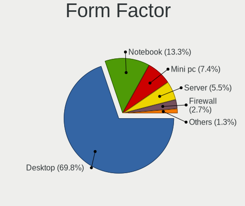
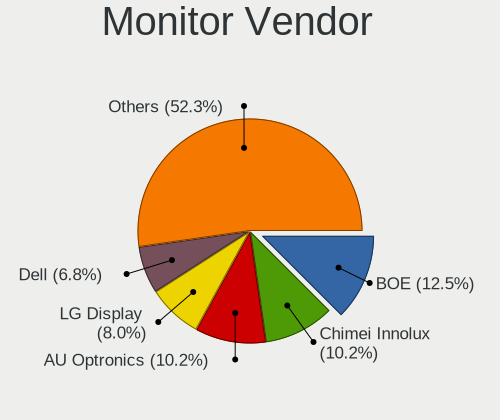
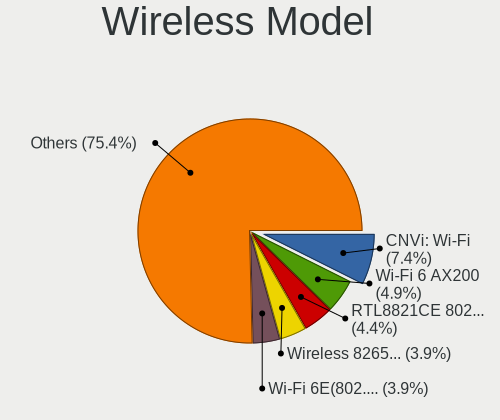

BSD Hardware Trends
-------------------

A project to identify most popular hardware characteristics and track their change
over time based on data collected by BSD users at https://BSD-Hardware.info.

Anyone can contribute to the study by uploading probes of their computers by
the [hw-probe](https://github.com/linuxhw/hw-probe/blob/master/INSTALL.BSD.md) tool:

    hw-probe -all -upload

This is a report for all computer types. See also reports for [desktops](/Desktop/README.md) and [notebooks](/Notebook/README.md).

Full-feature report is available here: https://bsd-hardware.info/?view=trends

OS-specific reports: [FreeBSD](/Dist/FreeBSD), [OPNsense](/Dist/OPNsense), [helloSystem](/Dist/helloSystem), [OpenBSD](/Dist/OpenBSD).

Period: Feb, 2021.

Contents
--------

- [ OS                       ](#os)
- [ OS Family                ](#os-family)
- [ Arch                     ](#arch)
- [ DE                       ](#de)
- [ Display Server           ](#display-server)
- [ Display Manager          ](#display-manager)
- [ OS Lang                  ](#os-lang)
- [ Boot Mode                ](#boot-mode)
- [ Filesystem               ](#filesystem)
- [ Part. scheme             ](#part-scheme)
- [ Country                  ](#country)
- [ City                     ](#city)
- [ Vendor                   ](#vendor)
- [ Model                    ](#model)
- [ Model Family             ](#model-family)
- [ MFG Year                 ](#mfg-year)
- [ Form Factor              ](#form-factor)
- [ Coreboot                 ](#coreboot)
- [ RAM Size                 ](#ram-size)
- [ RAM Used                 ](#ram-used)
- [ Has CD-ROM               ](#has-cd-rom)
- [ Total Drives             ](#total-drives)
- [ Has Ethernet             ](#has-ethernet)
- [ Drive Vendor             ](#drive-vendor)
- [ Drive Model              ](#drive-model)
- [ HDD Vendor               ](#hdd-vendor)
- [ SSD Vendor               ](#ssd-vendor)
- [ Drive Kind               ](#drive-kind)
- [ Drive Connector          ](#drive-connector)
- [ Drive Size               ](#drive-size)
- [ Space Total              ](#space-total)
- [ Space Used               ](#space-used)
- [ Malfunc. Drives          ](#malfunc-drives)
- [ Malfunc. Drive Vendor    ](#malfunc-drive-vendor)
- [ Malfunc. HDD Vendor      ](#malfunc-hdd-vendor)
- [ Malfunc. Drive Kind      ](#malfunc-drive-kind)
- [ Failed Drives            ](#failed-drives)
- [ Failed Drive Vendor      ](#failed-drive-vendor)
- [ Drive Status             ](#drive-status)
- [ Storage Vendor           ](#storage-vendor)
- [ Storage Model            ](#storage-model)
- [ Storage Kind             ](#storage-kind)
- [ CPU Vendor               ](#cpu-vendor)
- [ CPU Model                ](#cpu-model)
- [ CPU Model Family         ](#cpu-model-family)
- [ CPU Cores                ](#cpu-cores)
- [ CPU Sockets              ](#cpu-sockets)
- [ CPU Threads              ](#cpu-threads)
- [ CPU Microarch            ](#cpu-microarch)
- [ GPU Vendor               ](#gpu-vendor)
- [ GPU Model                ](#gpu-model)
- [ GPU Combo                ](#gpu-combo)
- [ GPU Driver               ](#gpu-driver)
- [ GPU Memory               ](#gpu-memory)
- [ Monitor Vendor           ](#monitor-vendor)
- [ Monitor Model            ](#monitor-model)
- [ Monitor Resolution       ](#monitor-resolution)
- [ Monitor Diagonal         ](#monitor-diagonal)
- [ Monitor Width            ](#monitor-width)
- [ Aspect Ratio             ](#aspect-ratio)
- [ Monitor Area             ](#monitor-area)
- [ Pixel Density            ](#pixel-density)
- [ Multiple Monitors        ](#multiple-monitors)
- [ Net Controller Vendor    ](#net-controller-vendor)
- [ Net Controller Model     ](#net-controller-model)
- [ Wireless Vendor          ](#wireless-vendor)
- [ Wireless Model           ](#wireless-model)
- [ Ethernet Vendor          ](#ethernet-vendor)
- [ Ethernet Model           ](#ethernet-model)
- [ Net Controller Kind      ](#net-controller-kind)
- [ Used Controller          ](#used-controller)
- [ NICs                     ](#nics)
- [ Memory Vendor            ](#memory-vendor)
- [ Memory Model             ](#memory-model)
- [ Memory Kind              ](#memory-kind)
- [ Memory Form Factor       ](#memory-form-factor)
- [ Memory Size              ](#memory-size)
- [ Memory Speed             ](#memory-speed)
- [ Sound Vendor             ](#sound-vendor)
- [ Sound Model              ](#sound-model)
- [ Camera Vendor            ](#camera-vendor)
- [ Camera Model             ](#camera-model)
- [ Fingerprint Vendor       ](#fingerprint-vendor)
- [ Fingerprint Model        ](#fingerprint-model)
- [ Chipcard Vendor          ](#chipcard-vendor)
- [ Chipcard Model           ](#chipcard-model)
- [ Printer Vendor           ](#printer-vendor)
- [ Printer Model            ](#printer-model)
- [ Scanner Vendor           ](#scanner-vendor)
- [ Scanner Model            ](#scanner-model)
- [ Bluetooth Vendor         ](#bluetooth-vendor)
- [ Bluetooth Model          ](#bluetooth-model)
- [ Unsupported Devices      ](#unsupported-devices)
- [ Unsupported Device Types ](#unsupported-device-types)

OS
--

Installed operating systems

| Name                      | Computers | Percent |
|---------------------------|-----------|---------|
| OPNsense 21.1.1           | 150       | 20.92%  |
| helloSystem 0.4.0         | 133       | 18.55%  |
| OPNsense 21.1             | 125       | 17.43%  |
| OPNsense 21.1.2           | 65        | 9.07%   |
| helloSystem 0.5.0         | 41        | 5.72%   |
| FreeBSD 12.2-p3           | 41        | 5.72%   |
| OPNsense 20.7.8           | 19        | 2.65%   |
| OpenBSD 6.8               | 19        | 2.65%   |
| FreeBSD 14.0-CURRENT      | 13        | 1.81%   |
| GhostBSD 20.04.02         | 11        | 1.53%   |
| FreeBSD 12.2              | 10        | 1.39%   |
| FreeBSD 13.0-STABLE       | 8         | 1.12%   |
| FreeBSD 12.2-p2           | 8         | 1.12%   |
| FreeBSD 13.0-BETA3        | 6         | 0.84%   |
| FreeBSD 13.0-BETA2        | 6         | 0.84%   |
| FreeBSD 13.0-BETA1        | 6         | 0.84%   |
| NomadBSD 1.4-RC1          | 5         | 0.7%    |
| helloSystem 0.3.0         | 5         | 0.7%    |
| FreeBSD 12.2-STABLE       | 5         | 0.7%    |
| FreeBSD 12.2-p4           | 5         | 0.7%    |
| OpenBSD 6.9               | 4         | 0.56%   |
| OPNsense 21.7             | 3         | 0.42%   |
| NomadBSD 1.3.2            | 3         | 0.42%   |
| FreeBSD 13.0-CURRENT      | 3         | 0.42%   |
| FreeBSD 12.1-p12          | 3         | 0.42%   |
| FreeBSD 11.4-p4           | 3         | 0.42%   |
| OPNsense 20.7             | 2         | 0.28%   |
| FreeBSD 13.0-ALPHA3       | 2         | 0.28%   |
| XigmaNAS 12.2-p3          | 1         | 0.14%   |
| TrueNAS 12.2-p3           | 1         | 0.14%   |
| pfSense 12.2-STABLE       | 1         | 0.14%   |
| OPNsense 20.7.7           | 1         | 0.14%   |
| OPNsense 20.7.5           | 1         | 0.14%   |
| OPNsense 20.7.3           | 1         | 0.14%   |
| NetBSD 9.1_STABLE         | 1         | 0.14%   |
| NetBSD 9.1                | 1         | 0.14%   |
| FreeBSD 13.0-RTC-ALPHA2   | 1         | 0.14%   |
| FreeBSD 12.2-p1           | 1         | 0.14%   |
| FreeBSD 12.1              | 1         | 0.14%   |
| DragonFly 5.9-DEVELOPMENT | 1         | 0.14%   |
| ClonOS 12.2-p3            | 1         | 0.14%   |

OS Family
---------

OS without a version

| Name        | Computers | Percent |
|-------------|-----------|---------|
| OPNsense    | 367       | 51.19%  |
| helloSystem | 179       | 24.97%  |
| FreeBSD     | 122       | 17.02%  |
| OpenBSD     | 23        | 3.21%   |
| GhostBSD    | 11        | 1.53%   |
| NomadBSD    | 8         | 1.12%   |
| NetBSD      | 2         | 0.28%   |
| XigmaNAS    | 1         | 0.14%   |
| TrueNAS     | 1         | 0.14%   |
| pfSense     | 1         | 0.14%   |
| DragonFly   | 1         | 0.14%   |
| ClonOS      | 1         | 0.14%   |

Arch
----

OS architecture (x86_64, i586, etc.)

| Name   | Computers | Percent |
|--------|-----------|---------|
| amd64  | 701       | 97.77%  |
| i386   | 11        | 1.53%   |
| arm64  | 4         | 0.56%   |
| evbarm | 1         | 0.14%   |

DE
--

Desktop Environment

| Name          | Computers | Percent |
|---------------|-----------|---------|
| Console       | 410       | 57.18%  |
| helloDesktop  | 178       | 24.83%  |
| KDE5          | 22        | 3.07%   |
| XFCE          | 20        | 2.79%   |
| fvwm          | 17        | 2.37%   |
| MATE          | 15        | 2.09%   |
| TWM           | 13        | 1.81%   |
| Openbox       | 11        | 1.53%   |
| GNOME         | 11        | 1.53%   |
| i3            | 8         | 1.12%   |
| Cinnamon      | 3         | 0.42%   |
| Fluxbox       | 2         | 0.28%   |
| AwesomeWM     | 2         | 0.28%   |
| LXQt          | 1         | 0.14%   |
| LXDE          | 1         | 0.14%   |
| IceWM         | 1         | 0.14%   |
| Enlightenment | 1         | 0.14%   |
| DWM           | 1         | 0.14%   |

Display Server
--------------

X11 or Wayland

| Name    | Computers | Percent |
|---------|-----------|---------|
| Console | 419       | 58.44%  |
| X11     | 294       | 41%     |
| Wayland | 4         | 0.56%   |

Display Manager
---------------

SDDM, LightDM, etc.

| Name    | Computers | Percent |
|---------|-----------|---------|
| Console | 448       | 62.48%  |
| SLiM    | 206       | 28.73%  |
| SDDM    | 23        | 3.21%   |
| LightDM | 22        | 3.07%   |
| XDM     | 9         | 1.26%   |
| GDM     | 8         | 1.12%   |
| Ly      | 1         | 0.14%   |

OS Lang
-------

Language

| Lang            | Computers | Percent |
|-----------------|-----------|---------|
| Unknown         | 439       | 61.23%  |
| en_US           | 215       | 29.99%  |
| C               | 27        | 3.77%   |
| ru_RU           | 10        | 1.39%   |
| en_GB           | 8         | 1.12%   |
| fr_FR           | 5         | 0.7%    |
| es_ES           | 3         | 0.42%   |
| de_DE           | 3         | 0.42%   |
| pt_BR           | 2         | 0.28%   |
| it_IT           | 2         | 0.28%   |
| pl_PL           | 1         | 0.14%   |
| en_US.ISO8859-1 | 1         | 0.14%   |
| de_DE.ISO8859-1 | 1         | 0.14%   |

Boot Mode
---------

EFI or BIOS

| Mode | Computers | Percent |
|------|-----------|---------|
| EFI  | 589       | 82.15%  |
| BIOS | 128       | 17.85%  |

Filesystem
----------

Type of filesystem

| Type    | Computers | Percent |
|---------|-----------|---------|
| Ufs     | 421       | 58.72%  |
| Zfs     | 271       | 37.8%   |
| Ffs     | 23        | 3.21%   |
| Hammer2 | 1         | 0.14%   |
| Unknown | 1         | 0.14%   |

Part. scheme
------------

Scheme of partitioning

| Type    | Computers | Percent |
|---------|-----------|---------|
| GPT     | 648       | 90.38%  |
| MBR     | 62        | 8.65%   |
| Unknown | 6         | 0.84%   |
| BSD     | 1         | 0.14%   |

Country
-------

Geographic location (country)

| Country                  | Computers | Percent |
|--------------------------|-----------|---------|
| Germany                  | 163       | 22.73%  |
| USA                      | 148       | 20.64%  |
| UK                       | 42        | 5.86%   |
| France                   | 37        | 5.16%   |
| Brazil                   | 32        | 4.46%   |
| Russia                   | 31        | 4.32%   |
| Netherlands              | 23        | 3.21%   |
| Italy                    | 18        | 2.51%   |
| Canada                   | 18        | 2.51%   |
| Australia                | 16        | 2.23%   |
| Spain                    | 13        | 1.81%   |
| China                    | 13        | 1.81%   |
| Sweden                   | 11        | 1.53%   |
| Portugal                 | 11        | 1.53%   |
| Switzerland              | 10        | 1.39%   |
| Poland                   | 10        | 1.39%   |
| Norway                   | 9         | 1.26%   |
| Ukraine                  | 7         | 0.98%   |
| Japan                    | 7         | 0.98%   |
| Indonesia                | 7         | 0.98%   |
| Hungary                  | 7         | 0.98%   |
| Taiwan                   | 5         | 0.7%    |
| Mexico                   | 5         | 0.7%    |
| Latvia                   | 5         | 0.7%    |
| South Africa             | 4         | 0.56%   |
| Slovakia                 | 4         | 0.56%   |
| Romania                  | 4         | 0.56%   |
| New Zealand              | 4         | 0.56%   |
| Thailand                 | 3         | 0.42%   |
| Korea, Republic of       | 3         | 0.42%   |
| Greece                   | 3         | 0.42%   |
| Finland                  | 3         | 0.42%   |
| Croatia                  | 3         | 0.42%   |
| Belgium                  | 3         | 0.42%   |
| Austria                  | 3         | 0.42%   |
| Vietnam                  | 2         | 0.28%   |
| Peru                     | 2         | 0.28%   |
| Macau                    | 2         | 0.28%   |
| India                    | 2         | 0.28%   |
| Bulgaria                 | 2         | 0.28%   |
| Unknown                  | 2         | 0.28%   |
| Venezuela                | 1         | 0.14%   |
| Turks and Caicos Islands | 1         | 0.14%   |
| Turkey                   | 1         | 0.14%   |
| Singapore                | 1         | 0.14%   |
| Saudi Arabia             | 1         | 0.14%   |
| Philippines              | 1         | 0.14%   |
| Lithuania                | 1         | 0.14%   |
| Kuwait                   | 1         | 0.14%   |
| Israel                   | 1         | 0.14%   |
| Iraq                     | 1         | 0.14%   |
| Guatemala                | 1         | 0.14%   |
| Estonia                  | 1         | 0.14%   |
| Denmark                  | 1         | 0.14%   |
| Czech Republic           | 1         | 0.14%   |
| Costa Rica               | 1         | 0.14%   |
| Colombia                 | 1         | 0.14%   |
| Chile                    | 1         | 0.14%   |
| Belarus                  | 1         | 0.14%   |
| Bangladesh               | 1         | 0.14%   |

City
----

Geographic location (city)

| City                  | Computers | Percent |
|-----------------------|-----------|---------|
| Berlin                | 15        | 2.09%   |
| Moscow                | 12        | 1.67%   |
| Paris                 | 7         | 0.98%   |
| Oslo                  | 7         | 0.98%   |
| Hamburg               | 7         | 0.98%   |
| The Bronx             | 5         | 0.7%    |
| St Petersburg         | 5         | 0.7%    |
| Linschoten            | 5         | 0.7%    |
| Hanover               | 5         | 0.7%    |
| Frankfurt am Main     | 5         | 0.7%    |
| Franconville          | 5         | 0.7%    |
| Toronto               | 4         | 0.56%   |
| Seattle               | 4         | 0.56%   |
| Madrid                | 4         | 0.56%   |
| Lingen                | 4         | 0.56%   |
| Jakarta               | 4         | 0.56%   |
| Dresden               | 4         | 0.56%   |
| Columbus              | 4         | 0.56%   |
| Bucharest             | 4         | 0.56%   |
| Zurich                | 3         | 0.42%   |
| São Paulo            | 3         | 0.42%   |
| Sydney                | 3         | 0.42%   |
| Riga                  | 3         | 0.42%   |
| Ome                   | 3         | 0.42%   |
| Montreal              | 3         | 0.42%   |
| Lübeck               | 3         | 0.42%   |
| London                | 3         | 0.42%   |
| Lisbon                | 3         | 0.42%   |
| Kyiv                  | 3         | 0.42%   |
| Dieppe                | 3         | 0.42%   |
| Cleveland             | 3         | 0.42%   |
| Charfield             | 3         | 0.42%   |
| Bologna               | 3         | 0.42%   |
| Bodelshausen          | 3         | 0.42%   |
| Bielefeld             | 3         | 0.42%   |
| Warsaw                | 2         | 0.28%   |
| Vienna                | 2         | 0.28%   |
| Valencia              | 2         | 0.28%   |
| Tokyo                 | 2         | 0.28%   |
| Teresina              | 2         | 0.28%   |
| Telford               | 2         | 0.28%   |
| Taipei                | 2         | 0.28%   |
| Taipa                 | 2         | 0.28%   |
| São José dos Campos | 2         | 0.28%   |
| Surgut                | 2         | 0.28%   |
| Stuttgart             | 2         | 0.28%   |
| Stourbridge           | 2         | 0.28%   |
| Simpsonville          | 2         | 0.28%   |
| Sankt Augustin        | 2         | 0.28%   |
| Saint Paul            | 2         | 0.28%   |
| Rudersberg            | 2         | 0.28%   |
| Redmond               | 2         | 0.28%   |
| Pirapora              | 2         | 0.28%   |
| Peoria                | 2         | 0.28%   |
| Pensacola             | 2         | 0.28%   |
| Palo Alto             | 2         | 0.28%   |
| Oklahoma City         | 2         | 0.28%   |
| Nurtingen             | 2         | 0.28%   |
| Munich                | 2         | 0.28%   |
| Malmo                 | 2         | 0.28%   |

Vendor
------

Motherboard manufacturer

| Name                           | Computers | Percent |
|--------------------------------|-----------|---------|
| Dell                           | 97        | 13.53%  |
| ASUSTek Computer               | 80        | 11.16%  |
| Lenovo                         | 75        | 10.46%  |
| Hewlett-Packard                | 46        | 6.42%   |
| Unknown                        | 43        | 6%      |
| Intel                          | 39        | 5.44%   |
| ASRock                         | 39        | 5.44%   |
| Supermicro                     | 34        | 4.74%   |
| Gigabyte Technology            | 27        | 3.77%   |
| PC Engines                     | 26        | 3.63%   |
| Protectli                      | 20        | 2.79%   |
| MSI                            | 18        | 2.51%   |
| Apple                          | 18        | 2.51%   |
| AMI                            | 15        | 2.09%   |
| Acer                           | 15        | 2.09%   |
| Fujitsu                        | 12        | 1.67%   |
| HARDKERNEL                     | 8         | 1.12%   |
| Sophos                         | 6         | 0.84%   |
| Shuttle                        | 6         | 0.84%   |
| ZOTAC                          | 5         | 0.7%    |
| Samsung Electronics            | 5         | 0.7%    |
| BESSTAR Tech                   | 5         | 0.7%    |
| Toshiba                        | 4         | 0.56%   |
| IBM                            | 4         | 0.56%   |
| Deciso                         | 4         | 0.56%   |
| Compulab                       | 4         | 0.56%   |
| Yanling                        | 3         | 0.42%   |
| Clevo                          | 3         | 0.42%   |
| Biostar                        | 3         | 0.42%   |
| AWOW                           | 3         | 0.42%   |
| YANYU                          | 2         | 0.28%   |
| Thomas-Krenn.AG                | 2         | 0.28%   |
| System76                       | 2         | 0.28%   |
| Sony                           | 2         | 0.28%   |
| Pegatron                       | 2         | 0.28%   |
| Packard Bell                   | 2         | 0.28%   |
| NEXCOM                         | 2         | 0.28%   |
| Medion                         | 2         | 0.28%   |
| Google                         | 2         | 0.28%   |
| TYAN Computer                  | 1         | 0.14%   |
| SeeedStudio                    | 1         | 0.14%   |
| Sangoma Technologies           | 1         | 0.14%   |
| Raspberry Pi Foundation        | 1         | 0.14%   |
| Radxa                          | 1         | 0.14%   |
| QOTOM                          | 1         | 0.14%   |
| Positivo                       | 1         | 0.14%   |
| PORSCHE DESIGN                 | 1         | 0.14%   |
| pine64                         | 1         | 0.14%   |
| NU591                          | 1         | 0.14%   |
| NF541                          | 1         | 0.14%   |
| MOTILE                         | 1         | 0.14%   |
| MiTAC                          | 1         | 0.14%   |
| Microsoft                      | 1         | 0.14%   |
| Matsushita Electric Industrial | 1         | 0.14%   |
| LG Electronics                 | 1         | 0.14%   |
| LattePanda                     | 1         | 0.14%   |
| Huanan                         | 1         | 0.14%   |
| Hampoo                         | 1         | 0.14%   |
| GEO                            | 1         | 0.14%   |
| Gateway                        | 1         | 0.14%   |

Model
-----

Motherboard model

| Name                                             | Computers | Percent |
|--------------------------------------------------|-----------|---------|
| Unknown                                          | 43        | 6%      |
| AMI Aptio CRB                                    | 14        | 1.95%   |
| Protectli FW6                                    | 13        | 1.81%   |
| PC Engines apu2                                  | 13        | 1.81%   |
| Intel Q3XXG4-P V1.0                              | 10        | 1.39%   |
| Supermicro Super Server                          | 8         | 1.12%   |
| HARDKERNEL ODROID-H2                             | 8         | 1.12%   |
| PC Engines apu4                                  | 7         | 0.98%   |
| ASUS All Series                                  | 7         | 0.98%   |
| Dell PowerEdge R210 II                           | 6         | 0.84%   |
| Sophos SG                                        | 5         | 0.7%    |
| Protectli FW4B                                   | 4         | 0.56%   |
| PC Engines apu3                                  | 4         | 0.56%   |
| HP t620 PLUS Quad Core TC                        | 4         | 0.56%   |
| Dell OptiPlex 9020                               | 4         | 0.56%   |
| Yanling YL-KBR6L                                 | 3         | 0.42%   |
| HP Compaq Elite 8300 SFF                         | 3         | 0.42%   |
| Dell PowerEdge R710                              | 3         | 0.42%   |
| Compulab fitlet2                                 | 3         | 0.42%   |
| BESSTAR Tech X35G                                | 3         | 0.42%   |
| AWOW PC BOX                                      | 3         | 0.42%   |
| ASUS PRIME X470-PRO                              | 3         | 0.42%   |
| Thomas-Krenn.AG LES network+                     | 2         | 0.28%   |
| Supermicro X9SCL/X9SCM                           | 2         | 0.28%   |
| Supermicro X7SPA-HF                              | 2         | 0.28%   |
| Supermicro SYS-5019A-FTN4                        | 2         | 0.28%   |
| Supermicro SYS-5018D-FN8T                        | 2         | 0.28%   |
| Supermicro 1HE Intel Single-CPU RI1102D-F Server | 2         | 0.28%   |
| Shuttle DS61                                     | 2         | 0.28%   |
| Protectli FW2B                                   | 2         | 0.28%   |
| PC Engines APU                                   | 2         | 0.28%   |
| NEXCOM UTM                                       | 2         | 0.28%   |
| Lenovo ThinkPad E490 20N8CTO1WW                  | 2         | 0.28%   |
| Lenovo ThinkCentre M73 10AY0020US                | 2         | 0.28%   |
| Intel SKYBAY                                     | 2         | 0.28%   |
| Intel NUC5PPYB H76558-107                        | 2         | 0.28%   |
| Intel Bearlake Bearlake Fab A                    | 2         | 0.28%   |
| HP ProDesk 490 G3 MT Business PC                 | 2         | 0.28%   |
| Dell PowerEdge R640                              | 2         | 0.28%   |
| Dell PowerEdge R610                              | 2         | 0.28%   |
| Dell PowerEdge R540                              | 2         | 0.28%   |
| Dell PowerEdge R320                              | 2         | 0.28%   |
| Dell PowerEdge R240                              | 2         | 0.28%   |
| Dell OptiPlex 7040                               | 2         | 0.28%   |
| Dell OptiPlex 380                                | 2         | 0.28%   |
| Dell OptiPlex 3020                               | 2         | 0.28%   |
| Dell Latitude E4300                              | 2         | 0.28%   |
| Dell Latitude 3410                               | 2         | 0.28%   |
| Dell Inspiron 3521                               | 2         | 0.28%   |
| ASUS TUF GAMING X570-PLUS                        | 2         | 0.28%   |
| ASUS PRIME B450M-A                               | 2         | 0.28%   |
| ASUS P5Q                                         | 2         | 0.28%   |
| ASUS M5A78L-M LX PLUS                            | 2         | 0.28%   |
| ASRock J3455M                                    | 2         | 0.28%   |
| ASRock J3355B-ITX                                | 2         | 0.28%   |
| ASRock D1800B-ITX                                | 2         | 0.28%   |
| ASRock B450M Pro4                                | 2         | 0.28%   |
| ASRock B450 Steel Legend                         | 2         | 0.28%   |
| ASRock AB350 Pro4                                | 2         | 0.28%   |
| Apple MacBookPro6,2                              | 2         | 0.28%   |

Model Family
------------

Motherboard model prefix

| Name                      | Computers | Percent |
|---------------------------|-----------|---------|
| Lenovo ThinkPad           | 45        | 6.28%   |
| Unknown                   | 43        | 6%      |
| Dell PowerEdge            | 28        | 3.91%   |
| Dell OptiPlex             | 21        | 2.93%   |
| Dell Latitude             | 20        | 2.79%   |
| Lenovo ThinkCentre        | 14        | 1.95%   |
| AMI Aptio                 | 14        | 1.95%   |
| Protectli FW6             | 13        | 1.81%   |
| PC Engines apu2           | 13        | 1.81%   |
| Dell Inspiron             | 11        | 1.53%   |
| Intel Q3XXG4-P            | 10        | 1.39%   |
| ASUS PRIME                | 10        | 1.39%   |
| Acer Aspire               | 9         | 1.26%   |
| Supermicro Super          | 8         | 1.12%   |
| HARDKERNEL ODROID-H2      | 8         | 1.12%   |
| PC Engines apu4           | 7         | 0.98%   |
| HP Compaq                 | 7         | 0.98%   |
| ASUS All                  | 7         | 0.98%   |
| Sophos SG                 | 5         | 0.7%    |
| HP EliteDesk              | 5         | 0.7%    |
| HP EliteBook              | 5         | 0.7%    |
| Dell XPS                  | 5         | 0.7%    |
| Dell Precision            | 5         | 0.7%    |
| ASUS ROG                  | 5         | 0.7%    |
| Protectli FW4B            | 4         | 0.56%   |
| PC Engines apu3           | 4         | 0.56%   |
| HP t620                   | 4         | 0.56%   |
| HP ProLiant               | 4         | 0.56%   |
| HP ProDesk                | 4         | 0.56%   |
| Deciso Netboard           | 4         | 0.56%   |
| ASUS TUF                  | 4         | 0.56%   |
| ASUS P8Z77-V              | 4         | 0.56%   |
| Yanling YL-KBR6L          | 3         | 0.42%   |
| Toshiba Satellite         | 3         | 0.42%   |
| Fujitsu LIFEBOOK          | 3         | 0.42%   |
| Compulab fitlet2          | 3         | 0.42%   |
| BESSTAR Tech X35G         | 3         | 0.42%   |
| AWOW PC                   | 3         | 0.42%   |
| ASUS M5A78L-M             | 3         | 0.42%   |
| ASRock AB350              | 3         | 0.42%   |
| Acer Extensa              | 3         | 0.42%   |
| Thomas-Krenn.AG LES       | 2         | 0.28%   |
| Supermicro X9SCL          | 2         | 0.28%   |
| Supermicro X7SPA-HF       | 2         | 0.28%   |
| Supermicro SYS-5019A-FTN4 | 2         | 0.28%   |
| Supermicro SYS-5018D-FN8T | 2         | 0.28%   |
| Supermicro 1HE            | 2         | 0.28%   |
| Shuttle DS61              | 2         | 0.28%   |
| Protectli FW2B            | 2         | 0.28%   |
| PC Engines APU            | 2         | 0.28%   |
| NEXCOM UTM                | 2         | 0.28%   |
| Lenovo IdeaPad            | 2         | 0.28%   |
| Intel SKYBAY              | 2         | 0.28%   |
| Intel NUC5PPYB            | 2         | 0.28%   |
| Intel Bearlake            | 2         | 0.28%   |
| IBM ThinkPad              | 2         | 0.28%   |
| IBM System                | 2         | 0.28%   |
| HP ProBook                | 2         | 0.28%   |
| HP OMEN                   | 2         | 0.28%   |
| Gigabyte X570             | 2         | 0.28%   |

MFG Year
--------

Motherboard manufacture year

| Year    | Computers | Percent |
|---------|-----------|---------|
| 2020    | 149       | 20.78%  |
| 2019    | 116       | 16.18%  |
| 2018    | 108       | 15.06%  |
| 2013    | 45        | 6.28%   |
| 2014    | 39        | 5.44%   |
| 2016    | 37        | 5.16%   |
| 2015    | 33        | 4.6%    |
| 2012    | 30        | 4.18%   |
| 2017    | 28        | 3.91%   |
| 2011    | 28        | 3.91%   |
| 2010    | 26        | 3.63%   |
| 2009    | 22        | 3.07%   |
| 2021    | 20        | 2.79%   |
| 2008    | 19        | 2.65%   |
| Unknown | 7         | 0.98%   |
| 2007    | 5         | 0.7%    |
| 2006    | 2         | 0.28%   |
| 2005    | 1         | 0.14%   |
| 2004    | 1         | 0.14%   |
| 2003    | 1         | 0.14%   |

Form Factor
-----------

Physical design of the computer

| Name        | Computers | Percent |
|-------------|-----------|---------|
| Desktop     | 424       | 59.14%  |
| Notebook    | 183       | 25.52%  |
| Server      | 53        | 7.39%   |
| Mini pc     | 44        | 6.14%   |
| All in one  | 6         | 0.84%   |
| Convertible | 4         | 0.56%   |
| Tablet      | 2         | 0.28%   |
| Firewall    | 1         | 0.14%   |

Coreboot
--------

Have coreboot on board

| Used | Computers | Percent |
|------|-----------|---------|
| No   | 680       | 94.84%  |
| Yes  | 37        | 5.16%   |

RAM Size
--------

Total RAM memory

| Size in GB  | Computers | Percent |
|-------------|-----------|---------|
| 8.01-16.0   | 246       | 34.31%  |
| 4.01-8.0    | 187       | 26.08%  |
| 16.01-24.0  | 164       | 22.87%  |
| 32.01-64.0  | 49        | 6.83%   |
| 64.01-256.0 | 22        | 3.07%   |
| 2.01-3.0    | 21        | 2.93%   |
| 24.01-32.0  | 10        | 1.39%   |
| 3.01-4.0    | 8         | 1.12%   |
| 1.01-2.0    | 5         | 0.7%    |
| 0.51-1.0    | 4         | 0.56%   |
| 0.01-0.5    | 1         | 0.14%   |

RAM Used
--------

Used RAM memory

| Used GB     | Computers | Percent |
|-------------|-----------|---------|
| 0.01-0.5    | 393       | 54.81%  |
| 0.51-1.0    | 208       | 29.01%  |
| 1.01-2.0    | 57        | 7.95%   |
| 4.01-8.0    | 15        | 2.09%   |
| 2.01-3.0    | 14        | 1.95%   |
| 3.01-4.0    | 8         | 1.12%   |
| 8.01-16.0   | 8         | 1.12%   |
| 64.01-256.0 | 3         | 0.42%   |
| 16.01-24.0  | 3         | 0.42%   |
| 0           | 3         | 0.42%   |
| 32.01-64.0  | 2         | 0.28%   |
| Unknown     | 2         | 0.28%   |
| 24.01-32.0  | 1         | 0.14%   |

Has CD-ROM
----------

Has CD-ROM on board

| Presented | Computers | Percent |
|-----------|-----------|---------|
| No        | 543       | 75.73%  |
| Yes       | 174       | 24.27%  |

Total Drives
------------

Number of drives on board

| Drives | Computers | Percent |
|--------|-----------|---------|
| 1      | 483       | 67.36%  |
| 2      | 104       | 14.5%   |
| 0      | 58        | 8.09%   |
| 3      | 31        | 4.32%   |
| 4      | 18        | 2.51%   |
| 5      | 8         | 1.12%   |
| 6      | 6         | 0.84%   |
| 8      | 2         | 0.28%   |
| 7      | 2         | 0.28%   |
| 25     | 1         | 0.14%   |
| 24     | 1         | 0.14%   |
| 12     | 1         | 0.14%   |
| 11     | 1         | 0.14%   |
| 9      | 1         | 0.14%   |

Has Ethernet
------------

Has Ethernet on board

| Presented | Computers | Percent |
|-----------|-----------|---------|
| Yes       | 692       | 96.51%  |
| No        | 25        | 3.49%   |

Drive Vendor
------------

Hard drive vendors

| Vendor              | Computers | Drives | Percent |
|---------------------|-----------|--------|---------|
| Samsung Electronics | 133       | 164    | 15.81%  |
| WDC                 | 122       | 174    | 14.51%  |
| Seagate             | 95        | 141    | 11.3%   |
| Kingston            | 72        | 75     | 8.56%   |
| Crucial             | 43        | 47     | 5.11%   |
| Toshiba             | 41        | 70     | 4.88%   |
| SanDisk             | 39        | 40     | 4.64%   |
| Intel               | 34        | 34     | 4.04%   |
| Transcend           | 28        | 28     | 3.33%   |
| Hitachi             | 24        | 26     | 2.85%   |
| Hoodisk             | 21        | 21     | 2.5%    |
| Phison              | 18        | 19     | 2.14%   |
| SPCC                | 10        | 10     | 1.19%   |
| Micron Technology   | 9         | 10     | 1.07%   |
| HGST                | 9         | 38     | 1.07%   |
| Hewlett-Packard     | 9         | 9      | 1.07%   |
| A-DATA Technology   | 9         | 9      | 1.07%   |
| FORESEE             | 8         | 8      | 0.95%   |
| PNY                 | 7         | 7      | 0.83%   |
| LITEON              | 7         | 7      | 0.83%   |
| Fujitsu             | 7         | 7      | 0.83%   |
| SK Hynix            | 6         | 6      | 0.71%   |
| OCZ                 | 6         | 6      | 0.71%   |
| KingSpec            | 5         | 5      | 0.59%   |
| Intenso             | 5         | 7      | 0.59%   |
| Gigabyte Technology | 5         | 5      | 0.59%   |
| Dogfish             | 5         | 5      | 0.59%   |
| Corsair             | 5         | 5      | 0.59%   |
| TCSUNBOW            | 4         | 4      | 0.48%   |
| PLEXTOR             | 4         | 4      | 0.48%   |
| Kston               | 4         | 4      | 0.48%   |
| BIWIN               | 4         | 4      | 0.48%   |
| Apple               | 4         | 4      | 0.48%   |
| NVMe                | 3         | 3      | 0.36%   |
| LITEONIT            | 3         | 3      | 0.36%   |
| Zheino              | 2         | 2      | 0.24%   |
| Patriot             | 2         | 2      | 0.24%   |
| Maxtor              | 2         | 2      | 0.24%   |
| Lexar               | 2         | 2      | 0.24%   |
| Drevo               | 2         | 2      | 0.24%   |
| Dell                | 2         | 5      | 0.24%   |
| Apacer              | 2         | 2      | 0.24%   |
| UFD 2.0             | 1         | 1      | 0.12%   |
| T-FORCE             | 1         | 1      | 0.12%   |
| SMI                 | 1         | 1      | 0.12%   |
| Silicon Motion      | 1         | 1      | 0.12%   |
| Pioneer             | 1         | 1      | 0.12%   |
| OWC                 | 1         | 1      | 0.12%   |
| MyDigitalSSD        | 1         | 1      | 0.12%   |
| MaxDigital          | 1         | 1      | 0.12%   |
| LSILOGIC            | 1         | 1      | 0.12%   |
| Lenovo              | 1         | 1      | 0.12%   |
| Innodisk            | 1         | 1      | 0.12%   |
| Hikvision           | 1         | 1      | 0.12%   |
| GOODRAM             | 1         | 1      | 0.12%   |
| faspeed             | 1         | 1      | 0.12%   |
| Enmotus             | 1         | 1      | 0.12%   |
| EMTEC               | 1         | 1      | 0.12%   |
| CLOVER              | 1         | 1      | 0.12%   |
| China               | 1         | 1      | 0.12%   |

Drive Model
-----------

Hard drive models

| Model                              | Computers | Percent |
|------------------------------------|-----------|---------|
| Samsung SSD 850 EVO 250GB          | 19        | 2.09%   |
| Kingston SUV500MS120G 120GB        | 11        | 1.21%   |
| Kingston SA400S37240G 240GB        | 11        | 1.21%   |
| Hoodisk SSD 64GB                   | 9         | 0.99%   |
| Phison SATA SSD 16GB               | 8         | 0.88%   |
| Samsung SSD 860 EVO 500GB          | 7         | 0.77%   |
| Samsung SSD 860 EVO 250GB          | 6         | 0.66%   |
| Samsung SSD 850 EVO 500GB          | 6         | 0.66%   |
| Kingston SV300S37A120G 120GB       | 6         | 0.66%   |
| Crucial CT120BX500SSD1 120GB       | 6         | 0.66%   |
| WDC WDS240G2G0A-00JH30 240GB       | 5         | 0.55%   |
| Toshiba MQ01ABD100 1TB             | 5         | 0.55%   |
| Seagate ST1000LM024 HN-M101MBB 1TB | 5         | 0.55%   |
| Samsung SSD 860 PRO 256GB          | 5         | 0.55%   |
| Kingston SV300S37A60G 64GB         | 5         | 0.55%   |
| Kingston SA400S37120G 120GB        | 5         | 0.55%   |
| Hoodisk SSD 32GB                   | 5         | 0.55%   |
| Crucial CT500MX500SSD1 500GB       | 5         | 0.55%   |
| Seagate ST500DM002-1BD142 500GB    | 4         | 0.44%   |
| Seagate ST1000DM003-1CH162 1TB     | 4         | 0.44%   |
| SanDisk SSD PLUS 120GB             | 4         | 0.44%   |
| SanDisk SDSSDA240G 240GB           | 4         | 0.44%   |
| Samsung SSD 840 EVO 250GB          | 4         | 0.44%   |
| Samsung SSD 840 EVO 120GB          | 4         | 0.44%   |
| Kingston SA400S37480G 480GB        | 4         | 0.44%   |
| Hoodisk SSD 128GB                  | 4         | 0.44%   |
| FORESEE 128GB SSD                  | 4         | 0.44%   |
| Crucial CT525MX300SSD1 528GB       | 4         | 0.44%   |
| Crucial CT250MX500SSD1 250GB       | 4         | 0.44%   |
| WDC WDS120G2G0A-00JH30 120GB       | 3         | 0.33%   |
| WDC WDS100T2B0A-00SM50 1TB         | 3         | 0.33%   |
| WDC WD5003ABYZ-011FA0 500GB        | 3         | 0.33%   |
| WDC WD20EARX-00PASB0 2TB           | 3         | 0.33%   |
| Transcend TS128GMSA230S 128GB      | 3         | 0.33%   |
| Toshiba MQ01ABF050 500GB           | 3         | 0.33%   |
| TCSUNBOW M1 32GB                   | 3         | 0.33%   |
| SPCC Solid State Disk 512GB        | 3         | 0.33%   |
| SPCC Solid State Disk 128GB        | 3         | 0.33%   |
| Seagate ST3500312CS 500GB          | 3         | 0.33%   |
| Seagate ST1000LM049-2GH172 1TB     | 3         | 0.33%   |
| Seagate ST1000LM035-1RK172 1TB     | 3         | 0.33%   |
| Seagate ST1000DM010-2EP102 1TB     | 3         | 0.33%   |
| Seagate ST1000DM003-9YN162 1TB     | 3         | 0.33%   |
| Seagate ST1000DM003-1ER162 1TB     | 3         | 0.33%   |
| Samsung SSD 970 EVO Plus 250GB     | 3         | 0.33%   |
| Samsung SSD 970 EVO 1TB            | 3         | 0.33%   |
| Samsung SSD 960 EVO 250GB          | 3         | 0.33%   |
| Samsung SSD 860 EVO 1TB            | 3         | 0.33%   |
| Samsung HD103SI 1TB                | 3         | 0.33%   |
| Phison SATA SSD 32GB               | 3         | 0.33%   |
| Kston SSD 64GB                     | 3         | 0.33%   |
| Kingston SUV500MS240G 240GB        | 3         | 0.33%   |
| Kingston SMS200S360G 64GB          | 3         | 0.33%   |
| Kingston SA2000M8250G 250GB        | 3         | 0.33%   |
| Kingston OM8PDP3512B-A01 512GB     | 3         | 0.33%   |
| Intel SSDSC2BW120A4 120GB          | 3         | 0.33%   |
| HGST HTS725050A7E630 500GB         | 3         | 0.33%   |
| HGST HTS721010A9E630 1TB           | 3         | 0.33%   |
| Crucial M4-CT128M4SSD2 128GB       | 3         | 0.33%   |
| Crucial CT256MX100SSD1 256GB       | 3         | 0.33%   |

HDD Vendor
----------

Hard disk drive vendors

| Vendor              | Computers | Drives | Percent |
|---------------------|-----------|--------|---------|
| WDC                 | 95        | 139    | 33.1%   |
| Seagate             | 95        | 141    | 33.1%   |
| Toshiba             | 32        | 61     | 11.15%  |
| Hitachi             | 24        | 26     | 8.36%   |
| Samsung Electronics | 11        | 15     | 3.83%   |
| HGST                | 9         | 38     | 3.14%   |
| Fujitsu             | 7         | 7      | 2.44%   |
| Hewlett-Packard     | 3         | 3      | 1.05%   |
| NVMe                | 2         | 2      | 0.7%    |
| MAXTOR              | 2         | 2      | 0.7%    |
| Dell                | 2         | 5      | 0.7%    |
| UFD 2.0             | 1         | 1      | 0.35%   |
| MaxDigital          | 1         | 1      | 0.35%   |
| LSILOGIC            | 1         | 1      | 0.35%   |
| CLOVER              | 1         | 1      | 0.35%   |
| Apple               | 1         | 1      | 0.35%   |

SSD Vendor
----------

Solid state drive vendors

| Vendor              | Computers | Drives | Percent |
|---------------------|-----------|--------|---------|
| Samsung Electronics | 96        | 114    | 20.34%  |
| Kingston            | 64        | 67     | 13.56%  |
| SanDisk             | 39        | 40     | 8.26%   |
| Crucial             | 37        | 41     | 7.84%   |
| Transcend           | 28        | 28     | 5.93%   |
| Intel               | 26        | 26     | 5.51%   |
| Hoodisk             | 21        | 21     | 4.45%   |
| WDC                 | 20        | 22     | 4.24%   |
| Phison              | 14        | 14     | 2.97%   |
| SPCC                | 9         | 9      | 1.91%   |
| FORESEE             | 8         | 8      | 1.69%   |
| PNY                 | 7         | 7      | 1.48%   |
| Micron Technology   | 7         | 7      | 1.48%   |
| LITEON              | 7         | 7      | 1.48%   |
| OCZ                 | 6         | 6      | 1.27%   |
| Hewlett-Packard     | 6         | 6      | 1.27%   |
| A-DATA Technology   | 6         | 6      | 1.27%   |
| KingSpec            | 5         | 5      | 1.06%   |
| Intenso             | 5         | 7      | 1.06%   |
| Dogfish             | 5         | 5      | 1.06%   |
| Toshiba             | 4         | 4      | 0.85%   |
| TCSUNBOW            | 4         | 4      | 0.85%   |
| SK Hynix            | 4         | 4      | 0.85%   |
| Kston               | 4         | 4      | 0.85%   |
| BIWIN               | 4         | 4      | 0.85%   |
| PLEXTOR             | 3         | 3      | 0.64%   |
| LITEONIT            | 3         | 3      | 0.64%   |
| Corsair             | 3         | 3      | 0.64%   |
| Apple               | 3         | 3      | 0.64%   |
| Zheino              | 2         | 2      | 0.42%   |
| Patriot             | 2         | 2      | 0.42%   |
| Lexar               | 2         | 2      | 0.42%   |
| Gigabyte Technology | 2         | 2      | 0.42%   |
| Drevo               | 2         | 2      | 0.42%   |
| Apacer              | 2         | 2      | 0.42%   |
| SMI                 | 1         | 1      | 0.21%   |
| Pioneer             | 1         | 1      | 0.21%   |
| OWC                 | 1         | 1      | 0.21%   |
| NVMe                | 1         | 1      | 0.21%   |
| MyDigitalSSD        | 1         | 1      | 0.21%   |
| Lenovo              | 1         | 1      | 0.21%   |
| Innodisk            | 1         | 1      | 0.21%   |
| Hikvision           | 1         | 1      | 0.21%   |
| GOODRAM             | 1         | 1      | 0.21%   |
| faspeed             | 1         | 1      | 0.21%   |
| EMTEC               | 1         | 1      | 0.21%   |
| China               | 1         | 1      | 0.21%   |

Drive Kind
----------

HDD or SSD

| Kind | Computers | Drives | Percent |
|------|-----------|--------|---------|
| SSD  | 429       | 502    | 56.6%   |
| HDD  | 239       | 444    | 31.53%  |
| NVMe | 90        | 99     | 11.87%  |

Drive Connector
---------------

SATA, SAS, NVMe, etc.

| Type | Computers | Drives | Percent |
|------|-----------|--------|---------|
| SATA | 602       | 946    | 86.99%  |
| NVMe | 90        | 99     | 13.01%  |

Drive Size
----------

Size of hard drive

| Size in TB      | Computers | Drives | Percent |
|-----------------|-----------|--------|---------|
| 0.01-0.5        | 514       | 636    | 74.6%   |
| 0.51-1.0        | 108       | 147    | 15.67%  |
| 1.01-2.0        | 27        | 35     | 3.92%   |
| 3.01-4.0        | 14        | 54     | 2.03%   |
| 4.01-10.0       | 14        | 47     | 2.03%   |
| 2.01-3.0        | 6         | 14     | 0.87%   |
| 10.01-20.0      | 4         | 11     | 0.58%   |
| More than 100.0 | 1         | 1      | 0.15%   |
| 20.01-50.0      | 1         | 1      | 0.15%   |

Space Total
-----------

Amount of disk space available on the file system

| Size in GB     | Computers | Percent |
|----------------|-----------|---------|
| 101-250        | 228       | 31.8%   |
| 1-20           | 184       | 25.66%  |
| 251-500        | 91        | 12.69%  |
| 51-100         | 73        | 10.18%  |
| 21-50          | 72        | 10.04%  |
| 501-1000       | 46        | 6.42%   |
| 1001-2000      | 12        | 1.67%   |
| More than 3000 | 8         | 1.12%   |
| 2001-3000      | 2         | 0.28%   |
| Unknown        | 1         | 0.14%   |

Space Used
----------

Amount of used disk space

| Used GB        | Computers | Percent |
|----------------|-----------|---------|
| 1-20           | 652       | 90.93%  |
| 21-50          | 34        | 4.74%   |
| 101-250        | 14        | 1.95%   |
| 51-100         | 6         | 0.84%   |
| More than 3000 | 3         | 0.42%   |
| 1001-2000      | 3         | 0.42%   |
| 251-500        | 2         | 0.28%   |
| 501-1000       | 2         | 0.28%   |
| Unknown        | 1         | 0.14%   |

Malfunc. Drives
---------------

Drive models with a malfunction

| Model                                            | Computers | Drives | Percent |
|--------------------------------------------------|-----------|--------|---------|
| Seagate ST500DM002-1BD142 500GB                  | 3         | 3      | 2.75%   |
| Seagate ST1000DM003-9YN162 1TB                   | 3         | 5      | 2.75%   |
| Toshiba MQ01ABD100 1TB                           | 2         | 2      | 1.83%   |
| Intel SSDSC2CT180A3 180GB                        | 2         | 2      | 1.83%   |
| Hitachi HTS723232A7A364 320GB                    | 2         | 2      | 1.83%   |
| Hitachi HTS541612J9SA00 120GB                    | 2         | 2      | 1.83%   |
| Crucial CT525MX300SSD1 528GB                     | 2         | 2      | 1.83%   |
| WDC WDS240G2G0A-00JH30 240GB                     | 1         | 1      | 0.92%   |
| WDC WD7500BPKT-75PK4T0 752GB                     | 1         | 1      | 0.92%   |
| WDC WD60EFRX-68MYMN1 6TB                         | 1         | 1      | 0.92%   |
| WDC WD5003ABYX-18WERA0 500GB                     | 1         | 2      | 0.92%   |
| WDC WD5002ABYS-18B1B0 500GB                      | 1         | 1      | 0.92%   |
| WDC WD5000AVCS-632DY1 500GB                      | 1         | 1      | 0.92%   |
| WDC WD5000AAKS-22V1A0 500GB                      | 1         | 1      | 0.92%   |
| WDC WD5000AAKS-00E4A0 500GB                      | 1         | 1      | 0.92%   |
| WDC WD40EFRX-68WT0N0 4TB                         | 1         | 2      | 0.92%   |
| WDC WD4001FAEX-00MJRA0 4TB                       | 1         | 2      | 0.92%   |
| WDC WD3200AAJS-22B4A0 320GB                      | 1         | 1      | 0.92%   |
| WDC WD20EVDS-63T3B0 2TB                          | 1         | 1      | 0.92%   |
| WDC WD20EFRX-68EUZN0 2TB                         | 1         | 3      | 0.92%   |
| WDC WD20EARX-00PASB0 2TB                         | 1         | 1      | 0.92%   |
| WDC WD2002FYPS-01U1B1 2TB                        | 1         | 1      | 0.92%   |
| WDC WD2001FASS-00W2B0 2TB                        | 1         | 1      | 0.92%   |
| WDC WD1600BEVS-60RST0 160GB                      | 1         | 1      | 0.92%   |
| WDC WD1600AAJS-75M0A0 160GB                      | 1         | 1      | 0.92%   |
| WDC WD10JMVW-11AJGS0 1TB                         | 1         | 1      | 0.92%   |
| WDC WD10EZEX-21M2NA0 1TB                         | 1         | 1      | 0.92%   |
| WDC WD10EAVS-00D7B0 1TB                          | 1         | 1      | 0.92%   |
| Toshiba THNSNK256GVN8 M.2 2280 256GB             | 1         | 1      | 0.92%   |
| Toshiba MK6475GSX 640GB                          | 1         | 1      | 0.92%   |
| Toshiba MK3276GSX 320GB                          | 1         | 1      | 0.92%   |
| Toshiba MK2555GSXF 250GB                         | 1         | 1      | 0.92%   |
| SMI SSD DISK 120GB                               | 1         | 1      | 0.92%   |
| SK Hynix SC210 mSATA 256GB                       | 1         | 1      | 0.92%   |
| Seagate ST9500420AS 500GB                        | 1         | 1      | 0.92%   |
| Seagate ST9500325AS 500GB                        | 1         | 1      | 0.92%   |
| Seagate ST9320320AS 320GB                        | 1         | 1      | 0.92%   |
| Seagate ST9250320AS 250GB                        | 1         | 1      | 0.92%   |
| Seagate ST9250315AS 250GB                        | 1         | 1      | 0.92%   |
| Seagate ST750LM022 HN-M750MBB 752GB              | 1         | 1      | 0.92%   |
| Seagate ST380815AS 80GB                          | 1         | 1      | 0.92%   |
| Seagate ST3320418AS 320GB                        | 1         | 1      | 0.92%   |
| Seagate ST3250410AS 250GB                        | 1         | 1      | 0.92%   |
| Seagate ST3250318AS 250GB                        | 1         | 1      | 0.92%   |
| Seagate ST3250310AS 250GB                        | 1         | 1      | 0.92%   |
| Seagate ST320LT012-9WS14C 320GB                  | 1         | 1      | 0.92%   |
| Seagate ST320LT007-9ZV142 320GB                  | 1         | 1      | 0.92%   |
| Seagate ST3160815AS 160GB                        | 1         | 1      | 0.92%   |
| Seagate ST3160812A 160GB                         | 1         | 1      | 0.92%   |
| Seagate ST3160215AS 160GB                        | 1         | 1      | 0.92%   |
| Seagate ST31500341AS 1.5TB                       | 1         | 1      | 0.92%   |
| Seagate ST31000528AS 1TB                         | 1         | 1      | 0.92%   |
| Seagate ST1000VM002-1CT162 1TB                   | 1         | 1      | 0.92%   |
| Seagate ST1000LM049-2GH172 1TB                   | 1         | 1      | 0.92%   |
| Seagate ST1000LM024 HN-M101MBB 1TB               | 1         | 1      | 0.92%   |
| SanDisk SSD PLUS 480GB                           | 1         | 1      | 0.92%   |
| SanDisk SSD P4 16GB                              | 1         | 1      | 0.92%   |
| SanDisk SSD i100 32GB                            | 1         | 1      | 0.92%   |
| Samsung Electronics SSD PM810 2.5-inch 7mm 256GB | 1         | 1      | 0.92%   |
| Samsung Electronics SSD 840 PRO Series 256GB     | 1         | 1      | 0.92%   |

Malfunc. Drive Vendor
---------------------

Vendors of faulty drives

| Vendor              | Computers | Drives | Percent |
|---------------------|-----------|--------|---------|
| Seagate             | 26        | 29     | 24.53%  |
| WDC                 | 21        | 26     | 19.81%  |
| Hitachi             | 12        | 12     | 11.32%  |
| Samsung Electronics | 10        | 12     | 9.43%   |
| Toshiba             | 6         | 6      | 5.66%   |
| Kingston            | 6         | 6      | 5.66%   |
| Intel               | 6         | 6      | 5.66%   |
| SanDisk             | 3         | 3      | 2.83%   |
| LITEON              | 2         | 2      | 1.89%   |
| HGST                | 2         | 2      | 1.89%   |
| Crucial             | 2         | 2      | 1.89%   |
| SMI                 | 1         | 1      | 0.94%   |
| SK Hynix            | 1         | 1      | 0.94%   |
| OCZ                 | 1         | 1      | 0.94%   |
| Micron Technology   | 1         | 1      | 0.94%   |
| Maxtor              | 1         | 1      | 0.94%   |
| KingSpec            | 1         | 1      | 0.94%   |
| Fujitsu             | 1         | 1      | 0.94%   |
| DOGFISH             | 1         | 1      | 0.94%   |
| Corsair             | 1         | 1      | 0.94%   |
| A-DATA Technology   | 1         | 1      | 0.94%   |

Malfunc. HDD Vendor
-------------------

Vendors of faulty HDD drives

| Vendor              | Computers | Drives | Percent |
|---------------------|-----------|--------|---------|
| Seagate             | 26        | 29     | 36.11%  |
| WDC                 | 20        | 25     | 27.78%  |
| Hitachi             | 12        | 12     | 16.67%  |
| Toshiba             | 5         | 5      | 6.94%   |
| Samsung Electronics | 5         | 7      | 6.94%   |
| HGST                | 2         | 2      | 2.78%   |
| Maxtor              | 1         | 1      | 1.39%   |
| Fujitsu             | 1         | 1      | 1.39%   |

Malfunc. Drive Kind
-------------------

Kinds of faulty drives

| Kind | Computers | Drives | Percent |
|------|-----------|--------|---------|
| HDD  | 68        | 82     | 66.67%  |
| SSD  | 33        | 33     | 32.35%  |
| NVMe | 1         | 1      | 0.98%   |

Failed Drives
-------------

Failed drive models

| Model                      | Computers | Drives | Percent |
|----------------------------|-----------|--------|---------|
| Kingston SV300S37A60G 64GB | 1         | 1      | 50%     |
| HGST HTS725050A7E630 500GB | 1         | 1      | 50%     |

Failed Drive Vendor
-------------------

Failed drive vendors

| Vendor   | Computers | Drives | Percent |
|----------|-----------|--------|---------|
| Kingston | 1         | 1      | 50%     |
| HGST     | 1         | 1      | 50%     |

Drive Status
------------

Number of failed and malfunc. drives

| Status   | Computers | Drives | Percent |
|----------|-----------|--------|---------|
| Works    | 579       | 905    | 82.71%  |
| Malfunc  | 102       | 116    | 14.57%  |
| Detected | 17        | 22     | 2.43%   |
| Failed   | 2         | 2      | 0.29%   |

Storage Vendor
--------------

Storage controller vendors

| Vendor                           | Computers | Percent |
|----------------------------------|-----------|---------|
| Intel                            | 564       | 67.3%   |
| AMD                              | 110       | 13.13%  |
| Samsung Electronics              | 34        | 4.06%   |
| Broadcom / LSI                   | 23        | 2.74%   |
| ASMedia Technology               | 18        | 2.15%   |
| Sandisk                          | 13        | 1.55%   |
| Marvell Technology Group         | 11        | 1.31%   |
| Phison Electronics               | 10        | 1.19%   |
| Nvidia                           | 10        | 1.19%   |
| Kingston Technology Company      | 8         | 0.95%   |
| Toshiba                          | 5         | 0.6%    |
| Micron/Crucial Technology        | 5         | 0.6%    |
| JMicron Technology               | 5         | 0.6%    |
| Micron Technology                | 3         | 0.36%   |
| Hewlett-Packard                  | 3         | 0.36%   |
| SK Hynix                         | 2         | 0.24%   |
| ADATA Technology                 | 2         | 0.24%   |
| VIA Technologies                 | 1         | 0.12%   |
| Silicon Motion                   | 1         | 0.12%   |
| Silicon Integrated Systems [SiS] | 1         | 0.12%   |
| Silicon Image                    | 1         | 0.12%   |
| Realtek Semiconductor            | 1         | 0.12%   |
| QLogic                           | 1         | 0.12%   |
| Lite-On Technology               | 1         | 0.12%   |
| Integrated Technology Express    | 1         | 0.12%   |
| Enmotus                          | 1         | 0.12%   |
| Dell                             | 1         | 0.12%   |
| Broadcom                         | 1         | 0.12%   |
| ATP ELECTRONICS                  | 1         | 0.12%   |

Storage Model
-------------

Storage controller models

| Model                                                                                   | Computers | Percent |
|-----------------------------------------------------------------------------------------|-----------|---------|
| AMD FCH SATA Controller [AHCI mode]                                                     | 74        | 7.71%   |
| Intel Sunrise Point-LP SATA Controller [AHCI mode]                                      | 63        | 6.56%   |
| Intel 8 Series/C220 Series Chipset Family 6-port SATA Controller 1 [AHCI mode]          | 43        | 4.48%   |
| Intel Atom Processor E3800 Series SATA AHCI Controller                                  | 26        | 2.71%   |
| Intel 7 Series Chipset Family 6-port SATA Controller [AHCI mode]                        | 26        | 2.71%   |
| Intel 6 Series/C200 Series Chipset Family 6 port Desktop SATA AHCI Controller           | 25        | 2.6%    |
| Intel 8 Series SATA Controller 1 [AHCI mode]                                            | 23        | 2.4%    |
| Intel Celeron N3350/Pentium N4200/Atom E3900 Series SATA AHCI Controller                | 22        | 2.29%   |
| Intel Q170/Q150/B150/H170/H110/Z170/CM236 Chipset SATA Controller [AHCI Mode]           | 21        | 2.19%   |
| Intel Atom/Celeron/Pentium Processor x5-E8000/J3xxx/N3xxx Series SATA Controller        | 19        | 1.98%   |
| Intel 6 Series/C200 Series Chipset Family 6 port Mobile SATA AHCI Controller            | 19        | 1.98%   |
| Intel 7 Series/C210 Series Chipset Family 6-port SATA Controller [AHCI mode]            | 18        | 1.88%   |
| ASMedia ASM1062 Serial ATA Controller                                                   | 18        | 1.88%   |
| Samsung NVMe SSD Controller SM981/PM981/PM983                                           | 17        | 1.77%   |
| Intel Celeron/Pentium Silver Processor SATA Controller                                  | 17        | 1.77%   |
| Intel Wildcat Point-LP SATA Controller [AHCI Mode]                                      | 15        | 1.56%   |
| Intel 82801 Mobile SATA Controller [RAID mode]                                          | 15        | 1.56%   |
| Intel 5 Series/3400 Series Chipset 6 port SATA AHCI Controller                          | 14        | 1.46%   |
| AMD 400 Series Chipset SATA Controller                                                  | 14        | 1.46%   |
| Unknown                                                                                 | 14        | 1.46%   |
| Intel NM10/ICH7 Family SATA Controller [IDE mode]                                       | 13        | 1.35%   |
| Intel 82801G (ICH7 Family) IDE Controller                                               | 13        | 1.35%   |
| Intel 200 Series PCH SATA controller [AHCI mode]                                        | 13        | 1.35%   |
| Samsung NVMe SSD Controller SM961/PM961/SM963                                           | 12        | 1.25%   |
| AMD SB7x0/SB8x0/SB9x0 SATA Controller [AHCI mode]                                       | 12        | 1.25%   |
| Intel 82801JI (ICH10 Family) SATA AHCI Controller                                       | 11        | 1.15%   |
| Intel 82801IBM/IEM (ICH9M/ICH9M-E) 4 port SATA Controller [AHCI mode]                   | 11        | 1.15%   |
| Intel Cannon Lake PCH SATA AHCI Controller                                              | 10        | 1.04%   |
| Intel 82801HM/HEM (ICH8M/ICH8M-E) IDE Controller                                        | 10        | 1.04%   |
| AMD SB7x0/SB8x0/SB9x0 IDE Controller                                                    | 10        | 1.04%   |
| AMD FCH SATA Controller [IDE mode]                                                      | 10        | 1.04%   |
| Intel SATA Controller [RAID mode]                                                       | 9         | 0.94%   |
| Intel 82801HM/HEM (ICH8M/ICH8M-E) SATA Controller [AHCI mode]                           | 9         | 0.94%   |
| Intel 400 Series Chipset Family SATA AHCI Controller                                    | 9         | 0.94%   |
| Intel C620 Series Chipset Family SSATA Controller [AHCI mode]                           | 8         | 0.83%   |
| Intel C620 Series Chipset Family SATA Controller [AHCI mode]                            | 8         | 0.83%   |
| Intel 6 Series/C200 Series Chipset Family Desktop SATA Controller (IDE mode, ports 4-5) | 7         | 0.73%   |
| Intel 6 Series/C200 Series Chipset Family Desktop SATA Controller (IDE mode, ports 0-3) | 7         | 0.73%   |
| Intel NM10/ICH7 Family SATA Controller [AHCI mode]                                      | 6         | 0.63%   |
| Intel C600/X79 series chipset 6-Port SATA AHCI Controller                               | 6         | 0.63%   |
| Intel Atom Processor C3000 Series SATA Controller 1                                     | 6         | 0.63%   |
| Intel 82801JI (ICH10 Family) 2 port SATA IDE Controller #2                              | 6         | 0.63%   |
| Intel 82801IB (ICH9) 2 port SATA Controller [IDE mode]                                  | 6         | 0.63%   |
| Intel 82801I (ICH9 Family) 2 port SATA Controller [IDE mode]                            | 6         | 0.63%   |
| Intel 5 Series/3400 Series Chipset 4 port SATA AHCI Controller                          | 6         | 0.63%   |
| AMD SB7x0/SB8x0/SB9x0 SATA Controller [IDE mode]                                        | 6         | 0.63%   |
| Sandisk WD Blue SN550 NVMe SSD                                                          | 5         | 0.52%   |
| Phison E12 NVMe Controller                                                              | 5         | 0.52%   |
| Nvidia MCP79 AHCI Controller                                                            | 5         | 0.52%   |
| Intel Atom Processor C3000 Series SATA Controller 0                                     | 5         | 0.52%   |
| Intel 82801JI (ICH10 Family) 4 port SATA IDE Controller #1                              | 5         | 0.52%   |
| Broadcom / LSI SAS2008 PCI-Express Fusion-MPT SAS-2 [Falcon]                            | 5         | 0.52%   |
| AMD FCH IDE Controller                                                                  | 5         | 0.52%   |
| Samsung NVMe SSD Controller SM951/PM951                                                 | 4         | 0.42%   |
| Kingston Company A2000 NVMe SSD                                                         | 4         | 0.42%   |
| Intel SSD 660P Series                                                                   | 4         | 0.42%   |
| Intel HM170/QM170 Chipset SATA Controller [AHCI Mode]                                   | 4         | 0.42%   |
| Intel Cannon Point-LP SATA Controller [AHCI Mode]                                       | 4         | 0.42%   |
| Sandisk WD Black SN750 / PC SN730 NVMe SSD                                              | 3         | 0.31%   |
| Phison E16 PCIe4 NVMe Controller                                                        | 3         | 0.31%   |

Storage Kind
------------

Kind of storage controller (IDE, SATA, NVMe, SAS, ...)

| Kind | Computers | Percent |
|------|-----------|---------|
| SATA | 576       | 68.33%  |
| IDE  | 110       | 13.05%  |
| NVMe | 93        | 11.03%  |
| RAID | 51        | 6.05%   |
| SAS  | 9         | 1.07%   |
| SCSI | 4         | 0.47%   |

CPU Vendor
----------

Processor vendors

| Vendor  | Computers | Percent |
|---------|-----------|---------|
| Intel   | 595       | 82.98%  |
| AMD     | 117       | 16.32%  |
| ARM     | 3         | 0.42%   |
| Unknown | 2         | 0.28%   |

CPU Model
---------

Processor models

| Model                                    | Computers | Percent |
|------------------------------------------|-----------|---------|
| AMD GX-412TC SOC                         | 24        | 3.35%   |
| Intel Core i5-7200U CPU @ 2.50GHz        | 17        | 2.37%   |
| Intel Celeron CPU J1900 @ 1.99GHz        | 14        | 1.95%   |
| Intel Celeron CPU J3160 @ 1.60GHz        | 9         | 1.26%   |
| Intel Core i7-7500U CPU @ 2.70GHz        | 8         | 1.12%   |
| Intel Core i3-7100U CPU @ 2.40GHz        | 8         | 1.12%   |
| Intel Celeron J4115 CPU @ 1.80GHz        | 8         | 1.12%   |
| Intel Celeron CPU J3455 @ 1.50GHz        | 8         | 1.12%   |
| Intel Core i5-6500 CPU @ 3.20GHz         | 6         | 0.84%   |
| Intel Core i5-6200U CPU @ 2.30GHz        | 6         | 0.84%   |
| Intel Core i5-3320M CPU @ 2.60GHz        | 6         | 0.84%   |
| Intel Core i5-2520M CPU @ 2.50GHz        | 6         | 0.84%   |
| Intel Celeron CPU 3865U @ 1.80GHz        | 6         | 0.84%   |
| Intel Pentium CPU N3700 @ 1.60GHz        | 5         | 0.7%    |
| Intel Core i7-6600U CPU @ 2.60GHz        | 5         | 0.7%    |
| Intel Core i7-4770 CPU @ 3.40GHz         | 5         | 0.7%    |
| Intel Core i5-8250U CPU @ 1.60GHz        | 5         | 0.7%    |
| Intel Core i5-4210U CPU @ 1.70GHz        | 5         | 0.7%    |
| Intel Core i3-6100 CPU @ 3.70GHz         | 5         | 0.7%    |
| Intel Core 2 Duo                         | 5         | 0.7%    |
| AMD GX-420CA SOC with Radeon HD Graphics | 5         | 0.7%    |
| Intel Xeon CPU D-1518 @ 2.20GHz          | 4         | 0.56%   |
| Intel Xeon                               | 4         | 0.56%   |
| Intel CPU Version                        | 4         | 0.56%   |
| Intel Core i7-8565U CPU @ 1.80GHz        | 4         | 0.56%   |
| Intel Core i7-4510U CPU @ 2.00GHz        | 4         | 0.56%   |
| Intel Core i5-4590 CPU @ 3.30GHz         | 4         | 0.56%   |
| Intel Core i5-3470 CPU @ 3.20GHz         | 4         | 0.56%   |
| Intel Core i5-10210U CPU @ 1.60GHz       | 4         | 0.56%   |
| Intel Core i5 CPU M 520 @ 2.40GHz        | 4         | 0.56%   |
| Intel Celeron CPU J1800 @ 2.41GHz        | 4         | 0.56%   |
| Intel Atom CPU E3845 @ 1.91GHz           | 4         | 0.56%   |
| Intel Atom CPU C3758 @ 2.20GHz           | 4         | 0.56%   |
| AMD Ryzen 5 3600 6-Core Processor        | 4         | 0.56%   |
| Intel Xeon Silver 4114 CPU @ 2.20GHz     | 3         | 0.42%   |
| Intel Xeon CPU X5650 @ 2.67GHz           | 3         | 0.42%   |
| Intel Xeon CPU E5506 @ 2.13GHz           | 3         | 0.42%   |
| Intel Pentium CPU N4200 @ 1.10GHz        | 3         | 0.42%   |
| Intel Genuine CPU                        | 3         | 0.42%   |
| Intel Core i7-8750H CPU @ 2.20GHz        | 3         | 0.42%   |
| Intel Core i7-8700 CPU @ 3.20GHz         | 3         | 0.42%   |
| Intel Core i7-7600U CPU @ 2.80GHz        | 3         | 0.42%   |
| Intel Core i7-4790 CPU @ 3.60GHz         | 3         | 0.42%   |
| Intel Core i7-3770K CPU @ 3.50GHz        | 3         | 0.42%   |
| Intel Core i7-3520M CPU @ 2.90GHz        | 3         | 0.42%   |
| Intel Core i5-9400 CPU @ 2.90GHz         | 3         | 0.42%   |
| Intel Core i5-5200U CPU @ 2.20GHz        | 3         | 0.42%   |
| Intel Core i5-4200U CPU @ 1.60GHz        | 3         | 0.42%   |
| Intel Core i5-3570K CPU @ 3.40GHz        | 3         | 0.42%   |
| Intel Core i5-2320 CPU @ 3.00GHz         | 3         | 0.42%   |
| Intel Core i3-8145U CPU @ 2.10GHz        | 3         | 0.42%   |
| Intel Core i3-5010U CPU @ 2.10GHz        | 3         | 0.42%   |
| Intel Core i3-4130 CPU @ 3.40GHz         | 3         | 0.42%   |
| Intel Core i3-3240 CPU @ 3.40GHz         | 3         | 0.42%   |
| Intel Core i3-3227U CPU @ 1.90GHz        | 3         | 0.42%   |
| Intel Core i3-1005G1 CPU @ 1.20GHz       | 3         | 0.42%   |
| Intel Celeron CPU N3450 @ 1.10GHz        | 3         | 0.42%   |
| Intel Atom CPU D525 @ 1.80GHz            | 3         | 0.42%   |
| AMD Ryzen 7 3700X 8-Core Processor       | 3         | 0.42%   |
| AMD Ryzen 7 2700X Eight-Core Processor   | 3         | 0.42%   |

CPU Model Family
----------------

Processor model prefix

| Model                   | Computers | Percent |
|-------------------------|-----------|---------|
| Intel Core i5           | 149       | 20.78%  |
| Intel Core i7           | 95        | 13.25%  |
| Intel Celeron           | 87        | 12.13%  |
| Intel Xeon              | 66        | 9.21%   |
| Intel Core i3           | 65        | 9.07%   |
| AMD GX                  | 33        | 4.6%    |
| Intel Core 2 Duo        | 28        | 3.91%   |
| Intel Atom              | 28        | 3.91%   |
| Intel Pentium           | 25        | 3.49%   |
| AMD Ryzen 5             | 13        | 1.81%   |
| Other                   | 12        | 1.67%   |
| Intel Pentium Dual-Core | 9         | 1.26%   |
| AMD Ryzen 7             | 9         | 1.26%   |
| Intel Core 2 Quad       | 8         | 1.12%   |
| AMD FX                  | 7         | 0.98%   |
| AMD Ryzen 3             | 6         | 0.84%   |
| Intel Xeon Silver       | 5         | 0.7%    |
| AMD Ryzen 9             | 5         | 0.7%    |
| AMD Phenom II X4        | 4         | 0.56%   |
| AMD A8                  | 4         | 0.56%   |
| AMD A4                  | 4         | 0.56%   |
| Intel Pentium M         | 3         | 0.42%   |
| Intel Pentium Gold      | 3         | 0.42%   |
| Intel Pentium Dual      | 3         | 0.42%   |
| Intel Genuine           | 3         | 0.42%   |
| ARM Cortex              | 3         | 0.42%   |
| AMD Ryzen 5 PRO         | 3         | 0.42%   |
| AMD G                   | 3         | 0.42%   |
| Intel Pentium 4         | 2         | 0.28%   |
| Intel Core m3           | 2         | 0.28%   |
| Intel Core 2            | 2         | 0.28%   |
| AMD Ryzen Threadripper  | 2         | 0.28%   |
| AMD Ryzen 7 PRO         | 2         | 0.28%   |
| AMD E2                  | 2         | 0.28%   |
| AMD Athlon 64 X2        | 2         | 0.28%   |
| AMD Athlon              | 2         | 0.28%   |
| Intel Xeon Bronze       | 1         | 0.14%   |
| Intel Pentium Silver    | 1         | 0.14%   |
| Intel Mobile Celeron    | 1         | 0.14%   |
| Intel Core m7           | 1         | 0.14%   |
| Intel Core M            | 1         | 0.14%   |
| Intel 686-class         | 1         | 0.14%   |
| AMD Turion II Neo       | 1         | 0.14%   |
| AMD Ryzen Embedded      | 1         | 0.14%   |
| AMD PRO A8              | 1         | 0.14%   |
| AMD Phenom II X6        | 1         | 0.14%   |
| AMD Phenom              | 1         | 0.14%   |
| AMD EPYC                | 1         | 0.14%   |
| AMD E1                  | 1         | 0.14%   |
| AMD E                   | 1         | 0.14%   |
| AMD Athlon II X2        | 1         | 0.14%   |
| AMD Athlon Dual Core    | 1         | 0.14%   |
| AMD A6                  | 1         | 0.14%   |
| AMD A10                 | 1         | 0.14%   |

CPU Cores
---------

Number of processor cores

| Number  | Computers | Percent |
|---------|-----------|---------|
| 4       | 285       | 39.75%  |
| 2       | 278       | 38.77%  |
| Unknown | 42        | 5.86%   |
| 6       | 34        | 4.74%   |
| 8       | 32        | 4.46%   |
| 12      | 15        | 2.09%   |
| 16      | 12        | 1.67%   |
| 1       | 7         | 0.98%   |
| 24      | 5         | 0.7%    |
| 48      | 2         | 0.28%   |
| 32      | 2         | 0.28%   |
| 10      | 2         | 0.28%   |
| 20      | 1         | 0.14%   |

CPU Sockets
-----------

Number of sockets

| Number  | Computers | Percent |
|---------|-----------|---------|
| 1       | 678       | 94.56%  |
| 2       | 26        | 3.63%   |
| Unknown | 12        | 1.67%   |
| 8       | 1         | 0.14%   |

CPU Threads
-----------

Threads per core (Hyper-Threading)

| Number  | Computers | Percent |
|---------|-----------|---------|
| 1       | 347       | 48.4%   |
| 2       | 323       | 45.05%  |
| Unknown | 47        | 6.56%   |

CPU Microarch
-------------

Microarchitecture

| Name          | Computers | Percent |
|---------------|-----------|---------|
| KabyLake      | 108       | 15.06%  |
| Haswell       | 69        | 9.62%   |
| IvyBridge     | 60        | 8.37%   |
| Skylake       | 54        | 7.53%   |
| Silvermont    | 50        | 6.97%   |
| SandyBridge   | 50        | 6.97%   |
| Penryn        | 45        | 6.28%   |
| Goldmont      | 28        | 3.91%   |
| Westmere      | 27        | 3.77%   |
| Puma          | 26        | 3.63%   |
| Broadwell     | 25        | 3.49%   |
| Zen 2         | 17        | 2.37%   |
| Goldmont plus | 17        | 2.37%   |
| Core          | 17        | 2.37%   |
| Jaguar        | 15        | 2.09%   |
| Nehalem       | 13        | 1.81%   |
| Zen+          | 12        | 1.67%   |
| Bonnell       | 11        | 1.53%   |
| Zen           | 10        | 1.39%   |
| Piledriver    | 10        | 1.39%   |
| CometLake     | 10        | 1.39%   |
| K10           | 8         | 1.12%   |
| Unknown       | 6         | 0.84%   |
| K8 Hammer     | 5         | 0.7%    |
| Bobcat        | 5         | 0.7%    |
| Steamroller   | 4         | 0.56%   |
| NetBurst      | 4         | 0.56%   |
| Zen 3         | 3         | 0.42%   |
| P6            | 3         | 0.42%   |
| IceLake       | 3         | 0.42%   |
| Bulldozer     | 2         | 0.28%   |

GPU Vendor
----------

Vendors of graphics cards

| Vendor                                       | Computers | Percent |
|----------------------------------------------|-----------|---------|
| Intel                                        | 439       | 61.31%  |
| Nvidia                                       | 106       | 14.8%   |
| AMD                                          | 99        | 13.83%  |
| Matrox Electronics Systems                   | 40        | 5.59%   |
| ASPEED Technology                            | 28        | 3.91%   |
| XGI Technology (eXtreme Graphics Innovation) | 1         | 0.14%   |
| Tseng Labs                                   | 1         | 0.14%   |
| Silicon Integrated Systems [SiS]             | 1         | 0.14%   |
| S3 Graphics                                  | 1         | 0.14%   |

GPU Model
---------

Graphics card models

| Model                                                                                    | Computers | Percent |
|------------------------------------------------------------------------------------------|-----------|---------|
| Intel HD Graphics 620                                                                    | 38        | 5.23%   |
| Intel 2nd Generation Core Processor Family Integrated Graphics Controller                | 33        | 4.55%   |
| ASPEED Technology ASPEED Graphics Family                                                 | 28        | 3.86%   |
| Intel 3rd Gen Core processor Graphics Controller                                         | 27        | 3.72%   |
| Intel Atom Processor Z36xxx/Z37xxx Series Graphics & Display                             | 26        | 3.58%   |
| Matrox Electronics Systems MGA G200eW WPCM450                                            | 23        | 3.17%   |
| Intel Haswell-ULT Integrated Graphics Controller                                         | 23        | 3.17%   |
| Intel Xeon E3-1200 v3/4th Gen Core Processor Integrated Graphics Controller              | 22        | 3.03%   |
| Intel Atom/Celeron/Pentium Processor x5-E8000/J3xxx/N3xxx Integrated Graphics Controller | 20        | 2.75%   |
| Intel Xeon E3-1200 v2/3rd Gen Core processor Graphics Controller                         | 18        | 2.48%   |
| Intel HD Graphics 500                                                                    | 18        | 2.48%   |
| Intel HD Graphics 530                                                                    | 17        | 2.34%   |
| Intel GeminiLake [UHD Graphics 600]                                                      | 16        | 2.2%    |
| Intel Skylake GT2 [HD Graphics 520]                                                      | 15        | 2.07%   |
| Intel Core Processor Integrated Graphics Controller                                      | 13        | 1.79%   |
| Intel CometLake-S GT2 [UHD Graphics 630]                                                 | 13        | 1.79%   |
| Intel Mobile 4 Series Chipset Integrated Graphics Controller                             | 11        | 1.52%   |
| Intel HD Graphics 5500                                                                   | 11        | 1.52%   |
| Intel 4 Series Chipset Integrated Graphics Controller                                    | 11        | 1.52%   |
| Intel WhiskeyLake-U GT2 [UHD Graphics 620]                                               | 9         | 1.24%   |
| Intel UHD Graphics 620                                                                   | 9         | 1.24%   |
| AMD Picasso                                                                              | 8         | 1.1%    |
| Intel Kaby Lake-U GT1 Integrated Graphics Controller                                     | 7         | 0.96%   |
| AMD Ellesmere [Radeon RX 470/480/570/570X/580/580X/590]                                  | 7         | 0.96%   |
| Nvidia GK208B [GeForce GT 710]                                                           | 6         | 0.83%   |
| Matrox Electronics Systems Integrated Matrox G200eW3 Graphics Controller                 | 6         | 0.83%   |
| Matrox Electronics Systems G200eR2                                                       | 6         | 0.83%   |
| Intel HD Graphics 630                                                                    | 6         | 0.83%   |
| Intel CometLake-U GT2 [UHD Graphics]                                                     | 6         | 0.83%   |
| Intel 4th Generation Core Processor Family Integrated Graphics Controller                | 6         | 0.83%   |
| Intel CoffeeLake-H GT2 [UHD Graphics 630]                                                | 5         | 0.69%   |
| AMD Raven Ridge [Radeon Vega Series / Radeon Vega Mobile Series]                         | 5         | 0.69%   |
| AMD Kabini [Radeon HD 8400E]                                                             | 5         | 0.69%   |
| Nvidia GP107 [GeForce GTX 1050 Ti]                                                       | 4         | 0.55%   |
| Nvidia GM206 [GeForce GTX 960]                                                           | 4         | 0.55%   |
| Matrox Electronics Systems MGA G200e [Pilot] ServerEngines (SEP1)                        | 4         | 0.55%   |
| Intel Mobile GM965/GL960 Integrated Graphics Controller (secondary)                      | 4         | 0.55%   |
| Intel Mobile GM965/GL960 Integrated Graphics Controller (primary)                        | 4         | 0.55%   |
| Intel Celeron N3350/Pentium N4200/Atom E3900 Series Integrated Graphics Controller       | 4         | 0.55%   |
| AMD Renoir                                                                               | 4         | 0.55%   |
| AMD Kaveri [Radeon R7 Graphics]                                                          | 4         | 0.55%   |
| AMD ES1000                                                                               | 4         | 0.55%   |
| Nvidia TU116 [GeForce GTX 1660 SUPER]                                                    | 3         | 0.41%   |
| Nvidia GT216M [GeForce GT 330M]                                                          | 3         | 0.41%   |
| Nvidia GM108M [GeForce 940MX]                                                            | 3         | 0.41%   |
| Nvidia GM107 [GeForce GTX 750 Ti]                                                        | 3         | 0.41%   |
| Nvidia GF119 [GeForce GT 610]                                                            | 3         | 0.41%   |
| Nvidia GF117M [GeForce 610M/710M/810M/820M / GT 620M/625M/630M/720M]                     | 3         | 0.41%   |
| Nvidia G98 [GeForce 8400 GS Rev. 2]                                                      | 3         | 0.41%   |
| Nvidia G84GL [Quadro FX 1700]                                                            | 3         | 0.41%   |
| Nvidia C79 [GeForce 9400M]                                                               | 3         | 0.41%   |
| Intel Mobile 945GSE Express Integrated Graphics Controller                               | 3         | 0.41%   |
| Intel Mobile 945GM/GMS/GME, 943/940GML Express Integrated Graphics Controller            | 3         | 0.41%   |
| Intel Iris Plus Graphics G1 (Ice Lake)                                                   | 3         | 0.41%   |
| Intel Iris Graphics 540                                                                  | 3         | 0.41%   |
| Intel HD Graphics 510                                                                    | 3         | 0.41%   |
| Intel CoffeeLake-S GT1 [UHD Graphics 610]                                                | 3         | 0.41%   |
| Intel Atom Processor D4xx/D5xx/N4xx/N5xx Integrated Graphics Controller                  | 3         | 0.41%   |
| AMD Lexa PRO [Radeon 540/540X/550/550X / RX 540X/550/550X]                               | 3         | 0.41%   |
| AMD Kabini [Radeon HD 8330]                                                              | 3         | 0.41%   |

GPU Combo
---------

Combinations of graphics cards

| Name            | Computers | Percent |
|-----------------|-----------|---------|
| 1 x Intel       | 375       | 52.3%   |
| 1 x AMD         | 89        | 12.41%  |
| 1 x Nvidia      | 76        | 10.6%   |
| Other           | 40        | 5.58%   |
| 1 x Matrox      | 40        | 5.58%   |
| 2 x Intel       | 28        | 3.91%   |
| Intel + Nvidia  | 26        | 3.63%   |
| 1 x ASPEED      | 26        | 3.63%   |
| Intel + AMD     | 7         | 0.98%   |
| 2 x Nvidia      | 2         | 0.28%   |
| Intel + ASPEED  | 2         | 0.28%   |
| 2 x AMD         | 1         | 0.14%   |
| 1 x XGI         | 1         | 0.14%   |
| 1 x Tseng Labs  | 1         | 0.14%   |
| 1 x SiS         | 1         | 0.14%   |
| 1 x S3 Graphics | 1         | 0.14%   |
| AMD + Nvidia    | 1         | 0.14%   |

GPU Driver
----------

Free vs proprietary

| Driver      | Computers | Percent |
|-------------|-----------|---------|
| Free        | 605       | 84.38%  |
| Unknown     | 64        | 8.93%   |
| Proprietary | 48        | 6.69%   |

GPU Memory
----------

Total video memory

| Size in GB | Computers | Percent |
|------------|-----------|---------|
| Unknown    | 638       | 88.98%  |
| 1.01-2.0   | 27        | 3.77%   |
| 0.51-1.0   | 17        | 2.37%   |
| 3.01-4.0   | 12        | 1.67%   |
| 0.01-0.5   | 7         | 0.98%   |
| 5.01-6.0   | 6         | 0.84%   |
| 7.01-8.0   | 5         | 0.7%    |
| 2.01-3.0   | 4         | 0.56%   |
| 8.01-16.0  | 1         | 0.14%   |

Monitor Vendor
--------------

Monitor vendors

| Vendor                  | Computers | Percent |
|-------------------------|-----------|---------|
| LG Display              | 33        | 13.47%  |
| AU Optronics            | 33        | 13.47%  |
| Samsung Electronics     | 23        | 9.39%   |
| Goldstar                | 19        | 7.76%   |
| Chimei Innolux          | 15        | 6.12%   |
| Lenovo                  | 11        | 4.49%   |
| Dell                    | 10        | 4.08%   |
| BOE                     | 10        | 4.08%   |
| Hewlett-Packard         | 9         | 3.67%   |
| AOC                     | 9         | 3.67%   |
| ViewSonic               | 8         | 3.27%   |
| Acer                    | 7         | 2.86%   |
| Iiyama                  | 5         | 2.04%   |
| Chi Mei Optoelectronics | 5         | 2.04%   |
| Apple                   | 5         | 2.04%   |
| Ancor Communications    | 5         | 2.04%   |
| Sharp                   | 4         | 1.63%   |
| Philips                 | 4         | 1.63%   |
| Eizo                    | 4         | 1.63%   |
| BenQ                    | 4         | 1.63%   |
| InfoVision              | 3         | 1.22%   |
| HannStar                | 3         | 1.22%   |
| Sony                    | 2         | 0.82%   |
| Packard Bell            | 2         | 0.82%   |
| LG Electronics          | 2         | 0.82%   |
| Unknown                 | 1         | 0.41%   |
| Toshiba                 | 1         | 0.41%   |
| Panasonic               | 1         | 0.41%   |
| LG Philips              | 1         | 0.41%   |
| KJT                     | 1         | 0.41%   |
| IBM                     | 1         | 0.41%   |
| CVT                     | 1         | 0.41%   |
| CHD                     | 1         | 0.41%   |
| CAN                     | 1         | 0.41%   |
| ASUSTek Computer        | 1         | 0.41%   |

Monitor Model
-------------

Monitor models

| Model                                                                    | Computers | Percent |
|--------------------------------------------------------------------------|-----------|---------|
| Philips LCD Monitor PHLC0B1 1920x1080 480x270mm 21.7-inch                | 2         | 0.81%   |
| LG Display LCD Monitor LGD11F9 1280x800 290x180mm 13.4-inch              | 2         | 0.81%   |
| LG Display LCD Monitor LGD03AB 1366x768 340x190mm 15.3-inch              | 2         | 0.81%   |
| LG Display LCD Monitor LGD02D8 1366x768 280x160mm 12.7-inch              | 2         | 0.81%   |
| Goldstar LG ULTRAWIDE GSM59F1 2560x1080 670x280mm 28.6-inch              | 2         | 0.81%   |
| Goldstar LG HDR WFHD GSM7714 2560x1080 800x340mm 34.2-inch               | 2         | 0.81%   |
| Goldstar E2441 GSM581F 1920x1080 530x300mm 24.0-inch                     | 2         | 0.81%   |
| Dell U2412M DELA07A 1920x1200 520x320mm 24.0-inch                        | 2         | 0.81%   |
| Chimei Innolux LCD Monitor CMN14C0 1920x1080 310x170mm 13.9-inch         | 2         | 0.81%   |
| Chimei Innolux LCD Monitor CMN14B1 1920x1080 310x170mm 13.9-inch         | 2         | 0.81%   |
| Chi Mei Optoelectronics LCD Monitor CMO15A7 1366x768 350x190mm 15.7-inch | 2         | 0.81%   |
| BenQ GW2765 BNQ78D6 2560x1440 600x340mm 27.2-inch                        | 2         | 0.81%   |
| AU Optronics LCD Monitor AUO38ED 1920x1080 340x190mm 15.3-inch           | 2         | 0.81%   |
| AU Optronics LCD Monitor AUO313C 1366x768 310x170mm 13.9-inch            | 2         | 0.81%   |
| AU Optronics LCD Monitor AUO303E 1600x900 310x170mm 13.9-inch            | 2         | 0.81%   |
| AU Optronics LCD Monitor AUO21EC 1366x768 340x190mm 15.3-inch            | 2         | 0.81%   |
| AU Optronics LCD Monitor AUO213E 1600x900 310x170mm 13.9-inch            | 2         | 0.81%   |
| AU Optronics LCD Monitor AUO106C 1366x768 280x160mm 12.7-inch            | 2         | 0.81%   |
| ViewSonic VX2433wm VSC3822 1920x1080 520x290mm 23.4-inch                 | 1         | 0.4%    |
| ViewSonic VX1940w VSC6A20 1680x1050 410x260mm 19.1-inch                  | 1         | 0.4%    |
| ViewSonic VP171s-2 VSC4B1B 1280x1024 340x270mm 17.1-inch                 | 1         | 0.4%    |
| ViewSonic VA2026w VSC5020 1680x1050 430x270mm 20.0-inch                  | 1         | 0.4%    |
| ViewSonic LCD Monitor VSCC42B 1920x1080 480x270mm 21.7-inch              | 1         | 0.4%    |
| ViewSonic LCD Monitor VSC941C 1280x1024 340x270mm 17.1-inch              | 1         | 0.4%    |
| ViewSonic LCD Monitor VSC6F2E 1920x1080 480x270mm 21.7-inch              | 1         | 0.4%    |
| ViewSonic LCD Monitor VSC5826 1366x768 410x230mm 18.5-inch               | 1         | 0.4%    |
| Unknown LCD Monitor YTH HS133PC 3840x2160                                | 1         | 0.4%    |
| Unknown LCD Monitor KJT4K2K60DP 3840x2160                                | 1         | 0.4%    |
| Toshiba TV TSB0218 3840x2160                                             | 1         | 0.4%    |
| Sony TV SNY9C01 1360x768                                                 | 1         | 0.4%    |
| Sony TV SNY4B03 1920x1080 930x520mm 41.9-inch                            | 1         | 0.4%    |
| Sharp LCD Monitor SHP147D 3200x1800 290x170mm 13.2-inch                  | 1         | 0.4%    |
| Sharp LCD Monitor SHP1461 3200x1800 290x170mm 13.2-inch                  | 1         | 0.4%    |
| Sharp LCD Monitor SHP1453 1920x1080 350x190mm 15.7-inch                  | 1         | 0.4%    |
| Sharp LCD Monitor SHP1449 1920x1080 290x170mm 13.2-inch                  | 1         | 0.4%    |
| Samsung Electronics U32J59x SAM0F35 3840x2160 700x390mm 31.5-inch        | 1         | 0.4%    |
| Samsung Electronics U32H85x SAM0E3C 3840x2160 700x390mm 31.5-inch        | 1         | 0.4%    |
| Samsung Electronics SyncMaster SAM0600 1600x900 440x250mm 19.9-inch      | 1         | 0.4%    |
| Samsung Electronics SyncMaster SAM05C5 1920x1080                         | 1         | 0.4%    |
| Samsung Electronics SyncMaster SAM036C 1920x1200 550x340mm 25.5-inch     | 1         | 0.4%    |
| Samsung Electronics SME1920NR SAM06A4 1280x1024 380x300mm 19.1-inch      | 1         | 0.4%    |
| Samsung Electronics SMBX2231 SAM076D 1920x1080 480x270mm 21.7-inch       | 1         | 0.4%    |
| Samsung Electronics SAMTRON STN0028 1280x1024 380x300mm 19.1-inch        | 1         | 0.4%    |
| Samsung Electronics S27C750 SAM0A60 1920x1080 600x340mm 27.2-inch        | 1         | 0.4%    |
| Samsung Electronics S24E390 SAM0C1A 1920x1080 520x290mm 23.4-inch        | 1         | 0.4%    |
| Samsung Electronics S24C350 SAM0A3A 1920x1080 530x300mm 24.0-inch        | 1         | 0.4%    |
| Samsung Electronics LCD Monitor SEC5448 1920x1080 410x230mm 18.5-inch    | 1         | 0.4%    |
| Samsung Electronics LCD Monitor SEC3847 1440x900 370x230mm 17.2-inch     | 1         | 0.4%    |
| Samsung Electronics LCD Monitor SEC324A 1366x768 340x190mm 15.3-inch     | 1         | 0.4%    |
| Samsung Electronics LCD Monitor SDC5441 1366x768 340x190mm 15.3-inch     | 1         | 0.4%    |
| Samsung Electronics LCD Monitor SDC4C48 1920x1080 240x130mm 10.7-inch    | 1         | 0.4%    |
| Samsung Electronics LCD Monitor SDC424A 3200x1800 290x170mm 13.2-inch    | 1         | 0.4%    |
| Samsung Electronics LCD Monitor SDC4141 1366x768 340x190mm 15.3-inch     | 1         | 0.4%    |
| Samsung Electronics LCD Monitor SDC324A 1366x768 290x170mm 13.2-inch     | 1         | 0.4%    |
| Samsung Electronics LCD Monitor SAM03A2 1440x900 410x260mm 19.1-inch     | 1         | 0.4%    |
| Samsung Electronics LCD Monitor SAM02A4 1360x768                         | 1         | 0.4%    |
| Samsung Electronics LCD Monitor S24R35x 1920x1080                        | 1         | 0.4%    |
| Samsung Electronics C32JG5x SAM0FDF 2560x1440 700x390mm 31.5-inch        | 1         | 0.4%    |
| Philips PHL 328E1 PHLC204 3840x2160 700x390mm 31.5-inch                  | 1         | 0.4%    |
| Philips PHL 278E9Q PHLC17F 1920x1080 600x340mm 27.2-inch                 | 1         | 0.4%    |

Monitor Resolution
------------------

Monitor screen resolution

| Resolution         | Computers | Percent |
|--------------------|-----------|---------|
| 1920x1080 (FHD)    | 98        | 40.66%  |
| 1366x768 (WXGA)    | 47        | 19.5%   |
| 1600x900 (HD+)     | 14        | 5.81%   |
| 2560x1440 (QHD)    | 13        | 5.39%   |
| 3840x2160 (4K)     | 10        | 4.15%   |
| 1920x1200 (WUXGA)  | 9         | 3.73%   |
| 1280x800 (WXGA)    | 9         | 3.73%   |
| 1680x1050 (WSXGA+) | 8         | 3.32%   |
| 1280x1024 (SXGA)   | 8         | 3.32%   |
| 2560x1080          | 7         | 2.9%    |
| 1440x900 (WXGA+)   | 5         | 2.07%   |
| 3200x1800 (QHD+)   | 3         | 1.24%   |
| 1360x768           | 2         | 0.83%   |
| 1024x600           | 2         | 0.83%   |
| 7680x2160          | 1         | 0.41%   |
| 3440x1440          | 1         | 0.41%   |
| 2048x1152          | 1         | 0.41%   |
| 1920x1280          | 1         | 0.41%   |
| 1024x768 (XGA)     | 1         | 0.41%   |
| Unknown            | 1         | 0.41%   |

Monitor Diagonal
----------------

Diagonal size in inches

| Inches  | Computers | Percent |
|---------|-----------|---------|
| 13      | 54        | 22.04%  |
| 15      | 43        | 17.55%  |
| 27      | 20        | 8.16%   |
| 21      | 18        | 7.35%   |
| 24      | 16        | 6.53%   |
| 23      | 13        | 5.31%   |
| 17      | 12        | 4.9%    |
| 12      | 11        | 4.49%   |
| 19      | 10        | 4.08%   |
| Unknown | 10        | 4.08%   |
| 31      | 6         | 2.45%   |
| 34      | 4         | 1.63%   |
| 22      | 4         | 1.63%   |
| 18      | 4         | 1.63%   |
| 28      | 3         | 1.22%   |
| 10      | 3         | 1.22%   |
| 25      | 2         | 0.82%   |
| 20      | 2         | 0.82%   |
| 14      | 2         | 0.82%   |
| 54      | 1         | 0.41%   |
| 41      | 1         | 0.41%   |
| 39      | 1         | 0.41%   |
| 33      | 1         | 0.41%   |
| 32      | 1         | 0.41%   |
| 11      | 1         | 0.41%   |
| 9       | 1         | 0.41%   |
| 8       | 1         | 0.41%   |

Monitor Width
-------------

Physical width

| Width in mm | Computers | Percent |
|-------------|-----------|---------|
| 301-350     | 85        | 35.12%  |
| 501-600     | 47        | 19.42%  |
| 401-500     | 34        | 14.05%  |
| 201-300     | 34        | 14.05%  |
| 601-700     | 11        | 4.55%   |
| 351-400     | 10        | 4.13%   |
| Unknown     | 10        | 4.13%   |
| 701-800     | 6         | 2.48%   |
| 101-200     | 2         | 0.83%   |
| 801-900     | 1         | 0.41%   |
| 1001-1500   | 1         | 0.41%   |
| 901-1000    | 1         | 0.41%   |

Aspect Ratio
------------

Proportional relationship between the width and the height

| Ratio   | Computers | Percent |
|---------|-----------|---------|
| 16/9    | 180       | 77.25%  |
| 16/10   | 29        | 12.45%  |
| 5/4     | 8         | 3.43%   |
| 21/9    | 7         | 3%      |
| Unknown | 6         | 2.58%   |
| 3/2     | 2         | 0.86%   |
| 4/3     | 1         | 0.43%   |

Monitor Area
------------

Area in inch²

| Area in inch² | Computers | Percent |
|----------------|-----------|---------|
| 81-90          | 44        | 18.18%  |
| 201-250        | 42        | 17.36%  |
| 91-100         | 31        | 12.81%  |
| 301-350        | 20        | 8.26%   |
| 71-80          | 12        | 4.96%   |
| 351-500        | 12        | 4.96%   |
| 151-200        | 12        | 4.96%   |
| 101-110        | 12        | 4.96%   |
| 61-70          | 11        | 4.55%   |
| 251-300        | 11        | 4.55%   |
| Unknown        | 10        | 4.13%   |
| 141-150        | 9         | 3.72%   |
| 121-130        | 5         | 2.07%   |
| 51-60          | 2         | 0.83%   |
| 41-50          | 2         | 0.83%   |
| 1-40           | 2         | 0.83%   |
| 131-140        | 2         | 0.83%   |
| 501-1000       | 2         | 0.83%   |
| More than 1000 | 1         | 0.41%   |

Pixel Density
-------------

Pixels per inch

| Density       | Computers | Percent |
|---------------|-----------|---------|
| 51-100        | 81        | 33.89%  |
| 101-120       | 68        | 28.45%  |
| 121-160       | 64        | 26.78%  |
| 161-240       | 13        | 5.44%   |
| Unknown       | 10        | 4.18%   |
| More than 240 | 3         | 1.26%   |

Multiple Monitors
-----------------

Total monitors connected

| Total | Computers | Percent |
|-------|-----------|---------|
| 0     | 481       | 67.09%  |
| 1     | 219       | 30.54%  |
| 2     | 14        | 1.95%   |
| 3     | 3         | 0.42%   |

Net Controller Vendor
---------------------

Controller vendors

| Vendor                            | Computers | Percent |
|-----------------------------------|-----------|---------|
| Intel                             | 506       | 51.06%  |
| Realtek Semiconductor             | 264       | 26.64%  |
| Broadcom Inc. and subsidiaries    | 74        | 7.47%   |
| Qualcomm Atheros                  | 70        | 7.06%   |
| Ralink Technology                 | 11        | 1.11%   |
| Marvell Technology Group          | 11        | 1.11%   |
| Nvidia                            | 6         | 0.61%   |
| IMC Networks                      | 6         | 0.61%   |
| TP-Link                           | 4         | 0.4%    |
| Ericsson Business Mobile Networks | 4         | 0.4%    |
| D-Link System                     | 4         | 0.4%    |
| Emulex                            | 3         | 0.3%    |
| Edimax Technology                 | 3         | 0.3%    |
| Aquantia                          | 3         | 0.3%    |
| IBM                               | 2         | 0.2%    |
| Hewlett-Packard                   | 2         | 0.2%    |
| Silicon Integrated Systems [SiS]  | 1         | 0.1%    |
| Sierra Wireless                   | 1         | 0.1%    |
| Realtek                           | 1         | 0.1%    |
| Ralink                            | 1         | 0.1%    |
| Qualcomm                          | 1         | 0.1%    |
| Netchip Technology                | 1         | 0.1%    |
| Microsoft                         | 1         | 0.1%    |
| Microchip Technology              | 1         | 0.1%    |
| Mellanox Technologies             | 1         | 0.1%    |
| MediaTek                          | 1         | 0.1%    |
| JMicron Technology                | 1         | 0.1%    |
| Huawei Technologies               | 1         | 0.1%    |
| Exar                              | 1         | 0.1%    |
| Davicom Semiconductor             | 1         | 0.1%    |
| D-Link                            | 1         | 0.1%    |
| Bluegiga Technologies             | 1         | 0.1%    |
| American Megatrends               | 1         | 0.1%    |
| AMD                               | 1         | 0.1%    |

Net Controller Model
--------------------

Controller models

| Model                                                                         | Computers | Percent |
|-------------------------------------------------------------------------------|-----------|---------|
| Realtek RTL8111/8168/8411 PCI Express Gigabit Ethernet Controller             | 215       | 17.39%  |
| Intel I211 Gigabit Network Connection                                         | 87        | 7.04%   |
| Intel I210 Gigabit Network Connection                                         | 49        | 3.96%   |
| Intel I350 Gigabit Network Connection                                         | 40        | 3.24%   |
| Intel 82579LM Gigabit Network Connection (Lewisville)                         | 38        | 3.07%   |
| Intel 82574L Gigabit Network Connection                                       | 36        | 2.91%   |
| Intel 82583V Gigabit Network Connection                                       | 24        | 1.94%   |
| Intel Wireless 8265 / 8275                                                    | 21        | 1.7%    |
| Realtek RTL810xE PCI Express Fast Ethernet controller                         | 19        | 1.54%   |
| Intel 82580 Gigabit Network Connection                                        | 19        | 1.54%   |
| Intel Wireless 7260                                                           | 16        | 1.29%   |
| Intel Centrino Advanced-N 6205 [Taylor Peak]                                  | 15        | 1.21%   |
| Intel 82571EB/82571GB Gigabit Ethernet Controller D0/D1 (copper applications) | 15        | 1.21%   |
| Intel Wi-Fi 6 AX200                                                           | 14        | 1.13%   |
| Qualcomm Atheros AR9485 Wireless Network Adapter                              | 13        | 1.05%   |
| Intel Ethernet Connection I217-LM                                             | 13        | 1.05%   |
| Realtek RTL8125 2.5GbE Controller                                             | 12        | 0.97%   |
| Intel Wireless 8260                                                           | 12        | 0.97%   |
| Intel 82576 Gigabit Network Connection                                        | 12        | 0.97%   |
| Intel Wireless 7265                                                           | 10        | 0.81%   |
| Intel Wireless 3165                                                           | 10        | 0.81%   |
| Intel Ethernet Connection (2) I219-V                                          | 10        | 0.81%   |
| Intel Ethernet Controller 10G X550T                                           | 9         | 0.73%   |
| Intel Ethernet Connection (2) I219-LM                                         | 9         | 0.73%   |
| Intel Dual Band Wireless-AC 3168NGW [Stone Peak]                              | 9         | 0.73%   |
| Qualcomm Atheros QCA9377 802.11ac Wireless Network Adapter                    | 8         | 0.65%   |
| Qualcomm Atheros AR928X Wireless Network Adapter (PCI-Express)                | 8         | 0.65%   |
| Intel Wireless-AC 9260                                                        | 8         | 0.65%   |
| Intel Ethernet Connection I219-LM                                             | 8         | 0.65%   |
| Intel Ethernet Connection (7) I219-V                                          | 8         | 0.65%   |
| Intel Ethernet Connection (4) I219-LM                                         | 8         | 0.65%   |
| Intel 82599ES 10-Gigabit SFI/SFP+ Network Connection                          | 8         | 0.65%   |
| Intel 82571EB/82571GB Gigabit Ethernet Controller (Copper)                    | 8         | 0.65%   |
| Broadcom Inc. and subsidiaries NetXtreme II BCM5716 Gigabit Ethernet          | 8         | 0.65%   |
| Broadcom Inc. and subsidiaries NetXtreme II BCM5709 Gigabit Ethernet          | 8         | 0.65%   |
| Broadcom Inc. and subsidiaries NetXtreme BCM5720 2-port Gigabit Ethernet PCIe | 8         | 0.65%   |
| Qualcomm Atheros AR9285 Wireless Network Adapter (PCI-Express)                | 7         | 0.57%   |
| Intel Ethernet Connection I217-V                                              | 7         | 0.57%   |
| Intel Comet Lake PCH-LP CNVi WiFi                                             | 7         | 0.57%   |
| Qualcomm Atheros QCA9565 / AR9565 Wireless Network Adapter                    | 6         | 0.49%   |
| Intel Ethernet Connection X552 10 GbE SFP+                                    | 6         | 0.49%   |
| Intel 82577LM Gigabit Network Connection                                      | 6         | 0.49%   |
| IMC Networks 802.11 n/g/b Wireless LAN USB Mini-Card                          | 6         | 0.49%   |
| Broadcom Inc. and subsidiaries BCM4331 802.11a/b/g/n                          | 6         | 0.49%   |
| Broadcom Inc. and subsidiaries BCM43224 802.11a/b/g/n                         | 6         | 0.49%   |
| Realtek RTL8821CE 802.11ac PCIe Wireless Network Adapter                      | 5         | 0.4%    |
| Ralink RT5370 Wireless Adapter                                                | 5         | 0.4%    |
| Nvidia MCP79 Ethernet                                                         | 5         | 0.4%    |
| Intel WiFi Link 5100                                                          | 5         | 0.4%    |
| Intel Ethernet Connection X553 1GbE                                           | 5         | 0.4%    |
| Intel Dual Band Wireless-AC 3165 Plus Bluetooth                               | 5         | 0.4%    |
| Intel Centrino Advanced-N 6200                                                | 5         | 0.4%    |
| Intel 82579V Gigabit Network Connection                                       | 5         | 0.4%    |
| Intel 82557/8/9/0/1 Ethernet Pro 100                                          | 5         | 0.4%    |
| Broadcom Inc. and subsidiaries NetXtreme BCM57765 Gigabit Ethernet PCIe       | 5         | 0.4%    |
| Realtek RTL-8100/8101L/8139 PCI Fast Ethernet Adapter                         | 4         | 0.32%   |
| Qualcomm Atheros AR9462 Wireless Network Adapter                              | 4         | 0.32%   |
| Qualcomm Atheros AR8121/AR8113/AR8114 Gigabit or Fast Ethernet                | 4         | 0.32%   |
| Intel Wireless 3160                                                           | 4         | 0.32%   |
| Intel PRO/Wireless 4965 AG or AGN [Kedron] Network Connection                 | 4         | 0.32%   |

Wireless Vendor
---------------

Wireless vendors

| Vendor                         | Computers | Percent |
|--------------------------------|-----------|---------|
| Intel                          | 176       | 55.87%  |
| Qualcomm Atheros               | 59        | 18.73%  |
| Realtek Semiconductor          | 28        | 8.89%   |
| Broadcom Inc. and subsidiaries | 25        | 7.94%   |
| Ralink Technology              | 11        | 3.49%   |
| IMC Networks                   | 6         | 1.9%    |
| TP-Link                        | 4         | 1.27%   |
| Edimax Technology              | 3         | 0.95%   |
| Sierra Wireless                | 1         | 0.32%   |
| Ralink                         | 1         | 0.32%   |
| D-Link                         | 1         | 0.32%   |

Wireless Model
--------------

Wireless models

| Model                                                                        | Computers | Percent |
|------------------------------------------------------------------------------|-----------|---------|
| Intel Wireless 8265 / 8275                                                   | 21        | 6.65%   |
| Intel Wireless 7260                                                          | 16        | 5.06%   |
| Intel Centrino Advanced-N 6205 [Taylor Peak]                                 | 15        | 4.75%   |
| Intel Wi-Fi 6 AX200                                                          | 14        | 4.43%   |
| Qualcomm Atheros AR9485 Wireless Network Adapter                             | 13        | 4.11%   |
| Intel Wireless 8260                                                          | 12        | 3.8%    |
| Intel Wireless 7265                                                          | 10        | 3.16%   |
| Intel Wireless 3165                                                          | 10        | 3.16%   |
| Intel Dual Band Wireless-AC 3168NGW [Stone Peak]                             | 9         | 2.85%   |
| Qualcomm Atheros QCA9377 802.11ac Wireless Network Adapter                   | 8         | 2.53%   |
| Qualcomm Atheros AR928X Wireless Network Adapter (PCI-Express)               | 8         | 2.53%   |
| Intel Wireless-AC 9260                                                       | 8         | 2.53%   |
| Qualcomm Atheros AR9285 Wireless Network Adapter (PCI-Express)               | 7         | 2.22%   |
| Intel Comet Lake PCH-LP CNVi WiFi                                            | 7         | 2.22%   |
| Qualcomm Atheros QCA9565 / AR9565 Wireless Network Adapter                   | 6         | 1.9%    |
| IMC Networks 802.11 n/g/b Wireless LAN USB Mini-Card                         | 6         | 1.9%    |
| Broadcom Inc. and subsidiaries BCM4331 802.11a/b/g/n                         | 6         | 1.9%    |
| Broadcom Inc. and subsidiaries BCM43224 802.11a/b/g/n                        | 6         | 1.9%    |
| Realtek RTL8821CE 802.11ac PCIe Wireless Network Adapter                     | 5         | 1.58%   |
| Ralink RT5370 Wireless Adapter                                               | 5         | 1.58%   |
| Intel WiFi Link 5100                                                         | 5         | 1.58%   |
| Intel Dual Band Wireless-AC 3165 Plus Bluetooth                              | 5         | 1.58%   |
| Intel Centrino Advanced-N 6200                                               | 5         | 1.58%   |
| Qualcomm Atheros AR9462 Wireless Network Adapter                             | 4         | 1.27%   |
| Intel Wireless 3160                                                          | 4         | 1.27%   |
| Intel PRO/Wireless 4965 AG or AGN [Kedron] Network Connection                | 4         | 1.27%   |
| Intel AC 1550i Wireless                                                      | 4         | 1.27%   |
| Realtek RTL8723BE PCIe Wireless Network Adapter                              | 3         | 0.95%   |
| Realtek RTL8188EE Wireless Network Adapter                                   | 3         | 0.95%   |
| Qualcomm Atheros QCA6174 802.11ac Wireless Network Adapter                   | 3         | 0.95%   |
| Qualcomm Atheros AR93xx Wireless Network Adapter                             | 3         | 0.95%   |
| Intel Wireless-AC 9560 [Jefferson Peak]                                      | 3         | 0.95%   |
| Intel PRO/Wireless 3945ABG [Golan] Network Connection                        | 3         | 0.95%   |
| Intel Centrino Wireless-N 2230                                               | 3         | 0.95%   |
| Intel Cannon Point-LP CNVi [Wireless-AC]                                     | 3         | 0.95%   |
| Edimax EW-7811Un 802.11n Wireless Adapter [Realtek RTL8188CUS]               | 3         | 0.95%   |
| Broadcom Inc. and subsidiaries BCM4322 802.11a/b/g/n Wireless LAN Controller | 3         | 0.95%   |
| Broadcom Inc. and subsidiaries BCM4321 802.11a/b/g/n                         | 3         | 0.95%   |
| Realtek RTL8821AE 802.11ac PCIe Wireless Network Adapter                     | 2         | 0.63%   |
| Realtek RTL8192CU 802.11n WLAN Adapter                                       | 2         | 0.63%   |
| Realtek RTL8188EUS 802.11n Wireless Network Adapter                          | 2         | 0.63%   |
| Realtek RTL8188CUS 802.11n WLAN Adapter                                      | 2         | 0.63%   |
| Qualcomm Atheros AR9287 Wireless Network Adapter (PCI-Express)               | 2         | 0.63%   |
| Qualcomm Atheros AR5212 802.11abg NIC                                        | 2         | 0.63%   |
| Qualcomm Atheros AR242x / AR542x Wireless Network Adapter (PCI-Express)      | 2         | 0.63%   |
| Intel PRO/Wireless 5100 AGN [Shiloh] Network Connection                      | 2         | 0.63%   |
| Intel Comet Lake PCH CNVi WiFi                                               | 2         | 0.63%   |
| Intel Centrino Wireless-N 1030 [Rainbow Peak]                                | 2         | 0.63%   |
| Intel Centrino Wireless-N 1000 [Condor Peak]                                 | 2         | 0.63%   |
| Intel Centrino Advanced-N 6230 [Rainbow Peak]                                | 2         | 0.63%   |
| Broadcom Inc. and subsidiaries BCM43225 802.11b/g/n                          | 2         | 0.63%   |
| Broadcom Inc. and subsidiaries BCM4313 802.11bgn Wireless Network Adapter    | 2         | 0.63%   |
| TP-Link TP-LINK Wireless USB Adapter                                         | 1         | 0.32%   |
| TP-Link TL-WN722N v2/v3 [Realtek RTL8188EUS]                                 | 1         | 0.32%   |
| TP-Link RTL8812AU Archer T4U 802.11ac                                        | 1         | 0.32%   |
| TP-Link AC600 wireless Realtek RTL8811AU [Archer T2U Nano]                   | 1         | 0.32%   |
| Sierra Wireless EM7455                                                       | 1         | 0.32%   |
| Realtek RTL8822CE 802.11ac PCIe Wireless Network Adapter                     | 1         | 0.32%   |
| Realtek RTL8812AU 802.11a/b/g/n/ac 2T2R DB WLAN Adapter                      | 1         | 0.32%   |
| Realtek RTL8812AE 802.11ac PCIe Wireless Network Adapter                     | 1         | 0.32%   |

Ethernet Vendor
---------------

Ethernet vendors

| Vendor                           | Computers | Percent |
|----------------------------------|-----------|---------|
| Intel                            | 414       | 53.15%  |
| Realtek Semiconductor            | 250       | 32.09%  |
| Broadcom Inc. and subsidiaries   | 58        | 7.45%   |
| Qualcomm Atheros                 | 20        | 2.57%   |
| Marvell Technology Group         | 11        | 1.41%   |
| Nvidia                           | 6         | 0.77%   |
| Emulex                           | 3         | 0.39%   |
| D-Link System                    | 3         | 0.39%   |
| Aquantia                         | 3         | 0.39%   |
| IBM                              | 2         | 0.26%   |
| Silicon Integrated Systems [SiS] | 1         | 0.13%   |
| Realtek                          | 1         | 0.13%   |
| Qualcomm                         | 1         | 0.13%   |
| Microsoft                        | 1         | 0.13%   |
| MediaTek                         | 1         | 0.13%   |
| JMicron Technology               | 1         | 0.13%   |
| Davicom Semiconductor            | 1         | 0.13%   |
| American Megatrends              | 1         | 0.13%   |
| AMD                              | 1         | 0.13%   |

Ethernet Model
--------------

Ethernet models

| Model                                                                         | Computers | Percent |
|-------------------------------------------------------------------------------|-----------|---------|
| Realtek RTL8111/8168/8411 PCI Express Gigabit Ethernet Controller             | 215       | 23.86%  |
| Intel I211 Gigabit Network Connection                                         | 87        | 9.66%   |
| Intel I210 Gigabit Network Connection                                         | 49        | 5.44%   |
| Intel I350 Gigabit Network Connection                                         | 40        | 4.44%   |
| Intel 82579LM Gigabit Network Connection (Lewisville)                         | 38        | 4.22%   |
| Intel 82574L Gigabit Network Connection                                       | 36        | 4%      |
| Intel 82583V Gigabit Network Connection                                       | 24        | 2.66%   |
| Realtek RTL810xE PCI Express Fast Ethernet controller                         | 19        | 2.11%   |
| Intel 82580 Gigabit Network Connection                                        | 19        | 2.11%   |
| Intel 82571EB/82571GB Gigabit Ethernet Controller D0/D1 (copper applications) | 15        | 1.66%   |
| Intel Ethernet Connection I217-LM                                             | 13        | 1.44%   |
| Intel 82576 Gigabit Network Connection                                        | 12        | 1.33%   |
| Realtek RTL8125 2.5GbE Controller                                             | 10        | 1.11%   |
| Intel Ethernet Connection (2) I219-V                                          | 10        | 1.11%   |
| Intel Ethernet Controller 10G X550T                                           | 9         | 1%      |
| Intel Ethernet Connection (2) I219-LM                                         | 9         | 1%      |
| Intel Ethernet Connection I219-LM                                             | 8         | 0.89%   |
| Intel Ethernet Connection (7) I219-V                                          | 8         | 0.89%   |
| Intel Ethernet Connection (4) I219-LM                                         | 8         | 0.89%   |
| Intel 82599ES 10-Gigabit SFI/SFP+ Network Connection                          | 8         | 0.89%   |
| Intel 82571EB/82571GB Gigabit Ethernet Controller (Copper)                    | 8         | 0.89%   |
| Broadcom Inc. and subsidiaries NetXtreme II BCM5716 Gigabit Ethernet          | 8         | 0.89%   |
| Broadcom Inc. and subsidiaries NetXtreme II BCM5709 Gigabit Ethernet          | 8         | 0.89%   |
| Broadcom Inc. and subsidiaries NetXtreme BCM5720 2-port Gigabit Ethernet PCIe | 8         | 0.89%   |
| Intel Ethernet Connection I217-V                                              | 7         | 0.78%   |
| Intel Ethernet Connection X552 10 GbE SFP+                                    | 6         | 0.67%   |
| Intel 82577LM Gigabit Network Connection                                      | 6         | 0.67%   |
| Nvidia MCP79 Ethernet                                                         | 5         | 0.55%   |
| Intel Ethernet Connection X553 1GbE                                           | 5         | 0.55%   |
| Intel 82579V Gigabit Network Connection                                       | 5         | 0.55%   |
| Intel 82557/8/9/0/1 Ethernet Pro 100                                          | 5         | 0.55%   |
| Broadcom Inc. and subsidiaries NetXtreme BCM57765 Gigabit Ethernet PCIe       | 5         | 0.55%   |
| Realtek RTL-8100/8101L/8139 PCI Fast Ethernet Adapter                         | 4         | 0.44%   |
| Qualcomm Atheros AR8121/AR8113/AR8114 Gigabit or Fast Ethernet                | 4         | 0.44%   |
| Intel Ethernet Connection X722 for 10GBASE-T                                  | 4         | 0.44%   |
| Intel Ethernet Connection I219-V                                              | 4         | 0.44%   |
| Intel Ethernet Connection I218-LM                                             | 4         | 0.44%   |
| Intel Ethernet Connection (5) I219-LM                                         | 4         | 0.44%   |
| Intel Ethernet Connection (4) I219-V                                          | 4         | 0.44%   |
| Intel 82567LM Gigabit Network Connection                                      | 4         | 0.44%   |
| Broadcom Inc. and subsidiaries NetXtreme II BCM57810 10 Gigabit Ethernet      | 4         | 0.44%   |
| Broadcom Inc. and subsidiaries NetXtreme BCM57762 Gigabit Ethernet PCIe       | 4         | 0.44%   |
| Broadcom Inc. and subsidiaries NetXtreme BCM5764M Gigabit Ethernet PCIe       | 4         | 0.44%   |
| Broadcom Inc. and subsidiaries NetLink BCM57780 Gigabit Ethernet PCIe         | 4         | 0.44%   |
| Realtek RTL8169 PCI Gigabit Ethernet Controller                               | 3         | 0.33%   |
| Qualcomm Atheros AR8161 Gigabit Ethernet                                      | 3         | 0.33%   |
| Qualcomm Atheros AR8152 v2.0 Fast Ethernet                                    | 3         | 0.33%   |
| Qualcomm Atheros AR8151 v2.0 Gigabit Ethernet                                 | 3         | 0.33%   |
| Qualcomm Atheros AR8131 Gigabit Ethernet                                      | 3         | 0.33%   |
| Marvell Group 88E8056 PCI-E Gigabit Ethernet Controller                       | 3         | 0.33%   |
| Marvell Group 88E8001 Gigabit Ethernet Controller                             | 3         | 0.33%   |
| Intel Ethernet Connection I354                                                | 3         | 0.33%   |
| Aquantia AQC107 NBase-T/IEEE 802.3bz Ethernet Controller [AQtion]             | 3         | 0.33%   |
| Qualcomm Atheros QCA8172 Fast Ethernet                                        | 2         | 0.22%   |
| Qualcomm Atheros Attansic L1 Gigabit Ethernet                                 | 2         | 0.22%   |
| Marvell Group 88E8058 PCI-E Gigabit Ethernet Controller                       | 2         | 0.22%   |
| Marvell Group 88E8057 PCI-E Gigabit Ethernet Controller                       | 2         | 0.22%   |
| Intel I210 Gigabit Fiber Network Connection                                   | 2         | 0.22%   |
| Intel Ethernet Controller X710 for 10GbE SFP+                                 | 2         | 0.22%   |
| Intel Ethernet Controller 10-Gigabit X540-AT2                                 | 2         | 0.22%   |

Net Controller Kind
-------------------

Ethernet, WiFi or modem

| Kind     | Computers | Percent |
|----------|-----------|---------|
| Ethernet | 692       | 68.31%  |
| WiFi     | 302       | 29.81%  |
| Modem    | 12        | 1.18%   |
| Unknown  | 7         | 0.69%   |

Used Controller
---------------

Currently used network controller

| Kind     | Computers | Percent |
|----------|-----------|---------|
| Ethernet | 677       | 78.45%  |
| WiFi     | 179       | 20.74%  |
| Unknown  | 4         | 0.46%   |
| Modem    | 3         | 0.35%   |

NICs
----

Total network controllers on board

| Total | Computers | Percent |
|-------|-----------|---------|
| 2     | 275       | 38.35%  |
| 1     | 129       | 17.99%  |
| 3     | 94        | 13.11%  |
| 4     | 87        | 12.13%  |
| 6     | 68        | 9.48%   |
| 5     | 28        | 3.91%   |
| 8     | 12        | 1.67%   |
| 7     | 6         | 0.84%   |
| 10    | 5         | 0.7%    |
| 0     | 5         | 0.7%    |
| 12    | 4         | 0.56%   |
| 14    | 2         | 0.28%   |
| 9     | 2         | 0.28%   |

Memory Vendor
-------------

Memory module vendors

| Vendor                       | Computers | Percent |
|------------------------------|-----------|---------|
| Samsung Electronics          | 152       | 20.38%  |
| Unknown                      | 111       | 14.88%  |
| SK Hynix                     | 100       | 13.4%   |
| Kingston                     | 93        | 12.47%  |
| Crucial                      | 69        | 9.25%   |
| Micron Technology            | 64        | 8.58%   |
| Corsair                      | 35        | 4.69%   |
| G.Skill                      | 25        | 3.35%   |
| Unknown (ABCD)               | 11        | 1.47%   |
| A-DATA Technology            | 10        | 1.34%   |
| Transcend                    | 9         | 1.21%   |
| Nanya Technology             | 9         | 1.21%   |
| Elpida                       | 9         | 1.21%   |
| Patriot                      | 6         | 0.8%    |
| Team                         | 5         | 0.67%   |
| Ramaxel Technology           | 5         | 0.67%   |
| Apacer                       | 3         | 0.4%    |
| Toshiba                      | 2         | 0.27%   |
| Avant                        | 2         | 0.27%   |
| ATP                          | 2         | 0.27%   |
| V-Color                      | 1         | 0.13%   |
| Unknown (7F7F7F94FFFFFFFF)   | 1         | 0.13%   |
| Unknown (0x8C26)             | 1         | 0.13%   |
| Unknown (0x7F7F7F94FFFFFFFF) | 1         | 0.13%   |
| Unknown (09A4)               | 1         | 0.13%   |
| Unknown (07FB)               | 1         | 0.13%   |
| Teikon                       | 1         | 0.13%   |
| TakeMS                       | 1         | 0.13%   |
| Smart Brazil                 | 1         | 0.13%   |
| Smart                        | 1         | 0.13%   |
| SHARETRONIC                  | 1         | 0.13%   |
| RZX                          | 1         | 0.13%   |
| Qimonda                      | 1         | 0.13%   |
| PNY                          | 1         | 0.13%   |
| KomputerBay                  | 1         | 0.13%   |
| InnoDisk                     | 1         | 0.13%   |
| High Bridge                  | 1         | 0.13%   |
| GOODRAM                      | 1         | 0.13%   |
| Goldkey                      | 1         | 0.13%   |
| Goldenmars                   | 1         | 0.13%   |
| Golden Empire                | 1         | 0.13%   |
| G-Alantic                    | 1         | 0.13%   |
| AMD                          | 1         | 0.13%   |
| 873E0000873E                 | 1         | 0.13%   |

Memory Model
------------

Memory module models

| Model                                                             | Computers | Percent |
|-------------------------------------------------------------------|-----------|---------|
| Unknown RAM Module 4GB SODIMM DDR3 1333MT/s                       | 12        | 1.51%   |
| Samsung RAM M471B5173QH0-YK0 4GB SODIMM DDR3 1600MT/s             | 11        | 1.38%   |
| Unknown (ABCD) RAM 123456789012345678 1536MB DIMM LPDDR4 2400MT/s | 10        | 1.25%   |
| SK Hynix RAM HMA81GS6AFR8N-UH 8GB SODIMM DDR4 2400MT/s            | 6         | 0.75%   |
| Samsung RAM M471B5273DH0-CH9 4GB SODIMM DDR3 1334MT/s             | 6         | 0.75%   |
| Unknown RAM Module 2GB SODIMM DDR2 667MT/s                        | 5         | 0.63%   |
| SK Hynix RAM HMT451S6BFR8A-PB 4GB SODIMM DDR3 1600MT/s            | 5         | 0.63%   |
| SK Hynix RAM HMT41GS6BFR8A-PB 8GB SODIMM DDR3 1600MT/s            | 5         | 0.63%   |
| Samsung RAM M471A1K43CB1-CTD 8GB SODIMM DDR4 2667MT/s             | 5         | 0.63%   |
| Crucial RAM CT16G4SFD824A.C16FDD 16GB SODIMM DDR4 2400MT/s        | 5         | 0.63%   |
| SK Hynix RAM HMT351S6EFR8A-PB 4GB SODIMM DDR3 1600MT/s            | 4         | 0.5%    |
| Samsung RAM M471B5273CH0-CH9 4GB SODIMM 1333MT/s                  | 4         | 0.5%    |
| Samsung RAM M471B5173DB0-YK0 4096MB SODIMM DDR3 1600MT/s          | 4         | 0.5%    |
| Samsung RAM M471A5244CB0-CRC 4GB SODIMM DDR4 2400MT/s             | 4         | 0.5%    |
| Samsung RAM M378B5173QH0-CK0 4GB DIMM DDR3 1600MT/s               | 4         | 0.5%    |
| Samsung RAM M378B5173EB0-CK0 4GB DIMM DDR3 1600MT/s               | 4         | 0.5%    |
| Micron RAM 8KTF51264HZ-1G6N1 4GB SODIMM DDR3 1600MT/s             | 4         | 0.5%    |
| Micron RAM 8KTF51264HZ-1G6E1 4GB SODIMM DDR3 1600MT/s             | 4         | 0.5%    |
| Unknown RAM Module 4GB SODIMM DDR3 667MT/s                        | 3         | 0.38%   |
| Unknown RAM Module 4GB DIMM DDR3 1333MT/s                         | 3         | 0.38%   |
| Unknown RAM Module 4GB DIMM 1333MT/s                              | 3         | 0.38%   |
| Unknown RAM Module 2GB DIMM DDR2 800MT/s                          | 3         | 0.38%   |
| Unknown RAM Module 2GB DIMM DDR2 667MT/s                          | 3         | 0.38%   |
| Unknown RAM Module 2048MB SODIMM DDR2 667MT/s                     | 3         | 0.38%   |
| Unknown RAM Module 2048MB DIMM DDR2 800MT/s                       | 3         | 0.38%   |
| SK Hynix RAM HMT351S6CFR8C-H9 4GB SODIMM DDR3 1333MT/s            | 3         | 0.38%   |
| SK Hynix RAM HMA84GR7JJR4N-VK 32GB DIMM DDR4 2666MT/s             | 3         | 0.38%   |
| Samsung RAM Module 2048MB SODIMM DDR3 1333MT/s                    | 3         | 0.38%   |
| Samsung RAM M471B5773DH0-CH9 2GB SODIMM DDR3 1333MT/s             | 3         | 0.38%   |
| Samsung RAM M471B5674QH0-YK0 2GB SODIMM DDR3 1600MT/s             | 3         | 0.38%   |
| Samsung RAM M471A5244CB0-CTD 4096MB SODIMM DDR4 2667MT/s          | 3         | 0.38%   |
| Samsung RAM M471A2K43CB1-CTD 16GB SODIMM DDR4 2667MT/s            | 3         | 0.38%   |
| Samsung RAM M471A1K43CB1-CRC 8192MB SODIMM DDR4 2400MT/s          | 3         | 0.38%   |
| Samsung RAM M378B5273DH0-CH9 4096MB DIMM DDR3 1333MT/s            | 3         | 0.38%   |
| Samsung RAM M378B5273CH0-CH9 4GB DIMM DDR3 1333MT/s               | 3         | 0.38%   |
| Samsung RAM M378B5173DB0-CK0 4GB DIMM DDR3 1600MT/s               | 3         | 0.38%   |
| Micron RAM Module 8GB Row Of Chips LPDDR4 3200MT/s                | 3         | 0.38%   |
| Micron RAM 8JTF51264AZ-1G6E1 4GB DIMM DDR3 1600MT/s               | 3         | 0.38%   |
| Crucial RAM CT51264BF160B.C16F 4096MB SODIMM DDR3 1600MT/s        | 3         | 0.38%   |
| Crucial RAM CT102464BA160B.C16 8GB DIMM DDR3 1600MT/s             | 3         | 0.38%   |
| Crucial RAM BLS8G3D1609DS1S00. 8GB DIMM DDR3 1600MT/s             | 3         | 0.38%   |
| Unknown RAM X4C08QD8BNTDSE-7-TO 8GB DIMM DDR4 2667MT/s            | 2         | 0.25%   |
| Unknown RAM Module 8GB SODIMM DDR4 2400MT/s                       | 2         | 0.25%   |
| Unknown RAM Module 8GB SODIMM DDR3 1600MT/s                       | 2         | 0.25%   |
| Unknown RAM Module 4GB DIMM DDR3 1600MT/s                         | 2         | 0.25%   |
| Unknown RAM Module 4096MB DIMM 1600MT/s                           | 2         | 0.25%   |
| Unknown RAM Module 2GB SODIMM DDR3 1600MT/s                       | 2         | 0.25%   |
| Unknown RAM Module 2GB SODIMM DDR3 1333MT/s                       | 2         | 0.25%   |
| Unknown RAM Module 2GB DIMM DDR3 1333MT/s                         | 2         | 0.25%   |
| Unknown RAM Module 1GB DIMM DDR2 800MT/s                          | 2         | 0.25%   |
| Unknown RAM Module 1GB DIMM 667MT/s                               | 2         | 0.25%   |
| Team RAM TEAMGROUP-UD4-3200 32GB DIMM DDR4 3200MT/s               | 2         | 0.25%   |
| SK Hynix RAM Module 4GB SODIMM DDR3 1067MT/s                      | 2         | 0.25%   |
| SK Hynix RAM HMT451S6BFR8A-PB 4GB DIMM DDR3 1600MT/s              | 2         | 0.25%   |
| SK Hynix RAM HMT451S6AFR8A-PB 4096MB SODIMM DDR3 1600MT/s         | 2         | 0.25%   |
| SK Hynix RAM HMT351U6CFR8C-PB 4GB DIMM DDR3 1600MT/s              | 2         | 0.25%   |
| SK Hynix RAM HMT351S6BFR8C-H9 4GB SODIMM DDR3 1333MT/s            | 2         | 0.25%   |
| SK Hynix RAM HMT325S6CFR8C-H9 2048MB SODIMM DDR3 1333MT/s         | 2         | 0.25%   |
| SK Hynix RAM HMA82GS6CJR8N-VK 16GB SODIMM DDR4 2667MT/s           | 2         | 0.25%   |
| SK Hynix RAM HMA81GU7AFR8N-UH 8GB DIMM DDR4 2400MT/s              | 2         | 0.25%   |

Memory Kind
-----------

Memory module kinds

| Kind    | Computers | Percent |
|---------|-----------|---------|
| DDR3    | 345       | 52.51%  |
| DDR4    | 210       | 31.96%  |
| DDR2    | 46        | 7%      |
| Unknown | 19        | 2.89%   |
| LPDDR4  | 14        | 2.13%   |
| LPDDR3  | 11        | 1.67%   |
| SDRAM   | 7         | 1.07%   |
| DDR     | 5         | 0.76%   |

Memory Form Factor
------------------

Physical design of the memory module

| Name         | Computers | Percent |
|--------------|-----------|---------|
| DIMM         | 328       | 49.62%  |
| SODIMM       | 315       | 47.66%  |
| Row Of Chips | 8         | 1.21%   |
| Chip         | 4         | 0.61%   |
| Unknown      | 4         | 0.61%   |
| FB-DIMM      | 2         | 0.3%    |

Memory Size
-----------

Memory module size

| Size  | Computers | Percent |
|-------|-----------|---------|
| 4096  | 257       | 36.51%  |
| 8192  | 222       | 31.53%  |
| 2048  | 119       | 16.9%   |
| 16384 | 76        | 10.8%   |
| 1024  | 19        | 2.7%    |
| 32768 | 10        | 1.42%   |
| 512   | 1         | 0.14%   |

Memory Speed
------------

Memory module speed

| Speed   | Computers | Percent |
|---------|-----------|---------|
| 1600    | 189       | 27.67%  |
| 1333    | 128       | 18.74%  |
| 2400    | 96        | 14.06%  |
| 2667    | 47        | 6.88%   |
| 2133    | 40        | 5.86%   |
| 3200    | 29        | 4.25%   |
| 667     | 29        | 4.25%   |
| 800     | 28        | 4.1%    |
| 2666    | 17        | 2.49%   |
| 1867    | 16        | 2.34%   |
| 1066    | 14        | 2.05%   |
| Unknown | 10        | 1.46%   |
| 1067    | 9         | 1.32%   |
| 1334    | 8         | 1.17%   |
| 1866    | 5         | 0.73%   |
| 533     | 4         | 0.59%   |
| 2933    | 2         | 0.29%   |
| 2800    | 2         | 0.29%   |
| 1400    | 2         | 0.29%   |
| 333     | 2         | 0.29%   |
| 59392   | 1         | 0.15%   |
| 3600    | 1         | 0.15%   |
| 3066    | 1         | 0.15%   |
| 1419    | 1         | 0.15%   |
| 400     | 1         | 0.15%   |
| 133     | 1         | 0.15%   |

Sound Vendor
------------

Sound card vendors

| Vendor                               | Computers | Percent |
|--------------------------------------|-----------|---------|
| Intel                                | 444       | 67.89%  |
| AMD                                  | 107       | 16.36%  |
| Nvidia                               | 75        | 11.47%  |
| C-Media Electronics                  | 10        | 1.53%   |
| Texas Instruments                    | 3         | 0.46%   |
| Creative Labs                        | 2         | 0.31%   |
| Yamaha                               | 1         | 0.15%   |
| Thesycon Systemsoftware & Consulting | 1         | 0.15%   |
| Sony                                 | 1         | 0.15%   |
| Silicon Integrated Systems [SiS]     | 1         | 0.15%   |
| Microsoft                            | 1         | 0.15%   |
| Logitech                             | 1         | 0.15%   |
| JMTek                                | 1         | 0.15%   |
| Focusrite-Novation                   | 1         | 0.15%   |
| Elgato Systems                       | 1         | 0.15%   |
| Bose                                 | 1         | 0.15%   |
| AudioQuest                           | 1         | 0.15%   |
| Audio-Technica                       | 1         | 0.15%   |
| ASUSTek Computer                     | 1         | 0.15%   |

Sound Model
-----------

Sound card models

| Model                                                                                             | Computers | Percent |
|---------------------------------------------------------------------------------------------------|-----------|---------|
| Intel Sunrise Point-LP HD Audio                                                                   | 58        | 7.62%   |
| Intel 7 Series/C216 Chipset Family High Definition Audio Controller                               | 45        | 5.91%   |
| Intel 6 Series/C200 Series Chipset Family High Definition Audio Controller                        | 36        | 4.73%   |
| Intel 8 Series/C220 Series Chipset High Definition Audio Controller                               | 30        | 3.94%   |
| Intel Xeon E3-1200 v3/4th Gen Core Processor HD Audio Controller                                  | 27        | 3.55%   |
| Intel Haswell-ULT HD Audio Controller                                                             | 24        | 3.15%   |
| Intel 8 Series HD Audio Controller                                                                | 23        | 3.02%   |
| AMD FCH Azalia Controller                                                                         | 23        | 3.02%   |
| Intel Atom Processor Z36xxx/Z37xxx Series High Definition Audio Controller                        | 22        | 2.89%   |
| Intel 5 Series/3400 Series Chipset High Definition Audio                                          | 19        | 2.5%    |
| Intel 100 Series/C230 Series Chipset Family HD Audio Controller                                   | 19        | 2.5%    |
| Intel NM10/ICH7 Family High Definition Audio Controller                                           | 17        | 2.23%   |
| Intel Celeron/Pentium Silver Processor High Definition Audio                                      | 17        | 2.23%   |
| Intel Atom/Celeron/Pentium Processor x5-E8000/J3xxx/N3xxx Series High Definition Audio Controller | 16        | 2.1%    |
| AMD Starship/Matisse HD Audio Controller                                                          | 16        | 2.1%    |
| Intel 82801I (ICH9 Family) HD Audio Controller                                                    | 15        | 1.97%   |
| AMD Family 17h (Models 10h-1fh) HD Audio Controller                                               | 15        | 1.97%   |
| Intel Celeron N3350/Pentium N4200/Atom E3900 Series Audio Cluster                                 | 14        | 1.84%   |
| Intel Cannon Lake PCH cAVS                                                                        | 14        | 1.84%   |
| Intel 200 Series PCH HD Audio                                                                     | 14        | 1.84%   |
| AMD SBx00 Azalia (Intel HDA)                                                                      | 14        | 1.84%   |
| Intel Broadwell-U Audio Controller                                                                | 13        | 1.71%   |
| AMD Raven/Raven2/Fenghuang HDMI/DP Audio Controller                                               | 13        | 1.71%   |
| Intel Wildcat Point-LP High Definition Audio Controller                                           | 12        | 1.58%   |
| Intel 82801H (ICH8 Family) HD Audio Controller                                                    | 12        | 1.58%   |
| Nvidia GK208 HDMI/DP Audio Controller                                                             | 11        | 1.45%   |
| AMD Kabini HDMI/DP Audio                                                                          | 11        | 1.45%   |
| Intel Cannon Point-LP High Definition Audio Controller                                            | 9         | 1.18%   |
| AMD Family 17h (Models 00h-0fh) HD Audio Controller                                               | 9         | 1.18%   |
| Nvidia TU116 High Definition Audio Controller                                                     | 8         | 1.05%   |
| Intel 82801JI (ICH10 Family) HD Audio Controller                                                  | 8         | 1.05%   |
| Intel Comet Lake PCH-LP cAVS                                                                      | 7         | 0.92%   |
| AMD Ellesmere HDMI Audio [Radeon RX 470/480 / 570/580/590]                                        | 7         | 0.92%   |
| Nvidia GP107GL High Definition Audio Controller                                                   | 6         | 0.79%   |
| Nvidia GK107 HDMI Audio Controller                                                                | 6         | 0.79%   |
| AMD Oland/Hainan/Cape Verde/Pitcairn HDMI Audio [Radeon HD 7000 Series]                           | 6         | 0.79%   |
| AMD Baffin HDMI/DP Audio [Radeon RX 550 640SP / RX 560/560X]                                      | 6         | 0.79%   |
| Nvidia MCP79 High Definition Audio                                                                | 5         | 0.66%   |
| Intel Comet Lake PCH cAVS                                                                         | 5         | 0.66%   |
| Nvidia High Definition Audio Controller                                                           | 4         | 0.53%   |
| Nvidia GT216 HDMI Audio Controller                                                                | 4         | 0.53%   |
| Nvidia GP106 High Definition Audio Controller                                                     | 4         | 0.53%   |
| Nvidia GM206 High Definition Audio Controller                                                     | 4         | 0.53%   |
| Nvidia GF119 HDMI Audio Controller                                                                | 4         | 0.53%   |
| Intel 9 Series Chipset Family HD Audio Controller                                                 | 4         | 0.53%   |
| AMD Juniper HDMI Audio [Radeon HD 5700 Series]                                                    | 4         | 0.53%   |
| AMD Cedar HDMI Audio [Radeon HD 5400/6300/7300 Series]                                            | 4         | 0.53%   |
| Nvidia GM107 High Definition Audio Controller [GeForce 940MX]                                     | 3         | 0.39%   |
| Intel Ice Lake-LP Smart Sound Technology Audio Controller                                         | 3         | 0.39%   |
| Intel CM238 HD Audio Controller                                                                   | 3         | 0.39%   |
| Intel 82801DB/DBL/DBM (ICH4/ICH4-L/ICH4-M) AC'97 Audio Controller                                 | 3         | 0.39%   |
| AMD Wrestler HDMI Audio                                                                           | 3         | 0.39%   |
| AMD Trinity HDMI Audio Controller                                                                 | 3         | 0.39%   |
| AMD RV710/730 HDMI Audio [Radeon HD 4000 series]                                                  | 3         | 0.39%   |
| AMD Renoir Radeon High Definition Audio Controller                                                | 3         | 0.39%   |
| AMD Navi 10 HDMI Audio                                                                            | 3         | 0.39%   |
| AMD Kaveri HDMI/DP Audio Controller                                                               | 3         | 0.39%   |
| AMD Caicos HDMI Audio [Radeon HD 6450 / 7450/8450/8490 OEM / R5 230/235/235X OEM]                 | 3         | 0.39%   |
| Texas Instruments PCM2902 Audio Codec                                                             | 2         | 0.26%   |
| Nvidia TU104 HD Audio Controller                                                                  | 2         | 0.26%   |

Camera Vendor
-------------

Camera device vendors

| Vendor                                 | Computers | Percent |
|----------------------------------------|-----------|---------|
| Chicony Electronics                    | 47        | 30.13%  |
| Realtek Semiconductor                  | 17        | 10.9%   |
| Microdia                               | 16        | 10.26%  |
| Acer                                   | 11        | 7.05%   |
| Suyin                                  | 9         | 5.77%   |
| Sunplus Innovation Technology          | 9         | 5.77%   |
| IMC Networks                           | 8         | 5.13%   |
| Lite-On Technology                     | 7         | 4.49%   |
| Silicon Motion                         | 5         | 3.21%   |
| Apple                                  | 5         | 3.21%   |
| Logitech                               | 4         | 2.56%   |
| Syntek                                 | 3         | 1.92%   |
| Z-Star Microelectronics                | 2         | 1.28%   |
| Quanta                                 | 2         | 1.28%   |
| ARC International                      | 2         | 1.28%   |
| Alcor Micro                            | 2         | 1.28%   |
| WCM_USB                                | 1         | 0.64%   |
| Luxvisions Innotech Limited            | 1         | 0.64%   |
| Lenovo                                 | 1         | 0.64%   |
| KYE Systems (Mouse Systems)            | 1         | 0.64%   |
| Huawei Technologies                    | 1         | 0.64%   |
| Generalplus Technology                 | 1         | 0.64%   |
| Cheng Uei Precision Industry (Foxlink) | 1         | 0.64%   |

Camera Model
------------

Camera device models

| Model                                     | Computers | Percent |
|-------------------------------------------|-----------|---------|
| Chicony Integrated Camera                 | 12        | 7.59%   |
| Sunplus Integrated_Webcam_HD              | 6         | 3.8%    |
| Lite-On Integrated Camera                 | 5         | 3.16%   |
| Realtek USB Camera                        | 4         | 2.53%   |
| Realtek Integrated_Webcam_HD              | 4         | 2.53%   |
| Apple FaceTime HD Camera                  | 4         | 2.53%   |
| Acer Integrated Camera                    | 4         | 2.53%   |
| Microdia Dell Integrated HD Webcam        | 3         | 1.9%    |
| Logitech Webcam C310                      | 3         | 1.9%    |
| Chicony Lenovo Integrated Camera (0.3MP)  | 3         | 1.9%    |
| Acer Lenovo Integrated Webcam             | 3         | 1.9%    |
| Syntek EasyCamera                         | 2         | 1.27%   |
| Suyin Laptop_Integrated_Webcam_HD         | 2         | 1.27%   |
| Suyin 1.3M HD Webcam                      | 2         | 1.27%   |
| Sunplus Laptop_Integrated_Webcam_FHD      | 2         | 1.27%   |
| Realtek Realtek USB2.0 PC Camera          | 2         | 1.27%   |
| Realtek Integrated Webcam HD              | 2         | 1.27%   |
| Microdia Sonix USB 2.0 Camera             | 2         | 1.27%   |
| Microdia Integrated_Webcam_HD             | 2         | 1.27%   |
| Microdia Integrated Webcam                | 2         | 1.27%   |
| IMC Networks USB2.0 HD UVC WebCam         | 2         | 1.27%   |
| IMC Networks EasyCamera                   | 2         | 1.27%   |
| Chicony USB2.0 VGA UVC WebCam             | 2         | 1.27%   |
| Chicony USB2.0 HD UVC WebCam              | 2         | 1.27%   |
| Chicony Integrated HP HD Webcam           | 2         | 1.27%   |
| Chicony HD Webcam                         | 2         | 1.27%   |
| Chicony FJ Camera                         | 2         | 1.27%   |
| Chicony Chicony USB2.0 Camera             | 2         | 1.27%   |
| ARC International Camera                  | 2         | 1.27%   |
| Acer SunplusIT Integrated Camera          | 2         | 1.27%   |
| Z-Star Venus USB2.0 Camera                | 1         | 0.63%   |
| Z-Star Vega USB 2.0 Camera                | 1         | 0.63%   |
| WCM_USB WEB CAM                           | 1         | 0.63%   |
| Syntek Lenovo EasyCamera                  | 1         | 0.63%   |
| Suyin UVC 1.3MPixel WebCam                | 1         | 0.63%   |
| Suyin USB 2.0 UVC 1.3M WebCam             | 1         | 0.63%   |
| Suyin Laptop_Integrated_Webcam_3M         | 1         | 0.63%   |
| Suyin Acer/HP Integrated Webcam [CN0314]  | 1         | 0.63%   |
| Suyin Acer Crystal Eye webcam             | 1         | 0.63%   |
| Sunplus Aukey-PC-LM1E Camera              | 1         | 0.63%   |
| Silicon Motion WebCam SCX Series          | 1         | 0.63%   |
| Silicon Motion WebCam SCB-1100N           | 1         | 0.63%   |
| Silicon Motion Web Camera                 | 1         | 0.63%   |
| Silicon Motion ATIV Real HD Camera        | 1         | 0.63%   |
| Silicon Motion 300k Pixel Camera          | 1         | 0.63%   |
| Realtek USB2.0 HD UVC WebCam              | 1         | 0.63%   |
| Realtek LG Camera                         | 1         | 0.63%   |
| Realtek Lenovo EasyCamera                 | 1         | 0.63%   |
| Realtek Integrated_Webcam_FHD             | 1         | 0.63%   |
| Realtek Integrated_Webcam_8M              | 1         | 0.63%   |
| Realtek Acer 640 x 480 laptop camera      | 1         | 0.63%   |
| Quanta Realtek DMFT - RGB                 | 1         | 0.63%   |
| Quanta Realtek DMFT - IR                  | 1         | 0.63%   |
| Quanta HD WebCam                          | 1         | 0.63%   |
| Microdia Webcam Vitade AF                 | 1         | 0.63%   |
| Microdia Laptop_Integrated_Webcam_E4HD    | 1         | 0.63%   |
| Microdia Laptop_Integrated_Webcam_0.3M    | 1         | 0.63%   |
| Microdia Integrated Webcam HD             | 1         | 0.63%   |
| Microdia HP Integrated Webcam             | 1         | 0.63%   |
| Microdia Dell Laptop Integrated Webcam HD | 1         | 0.63%   |

Fingerprint Vendor
------------------

Fingerprint sensor vendors

| Vendor                     | Computers | Percent |
|----------------------------|-----------|---------|
| Validity Sensors           | 15        | 45.45%  |
| AuthenTec                  | 5         | 15.15%  |
| Synaptics                  | 4         | 12.12%  |
| Broadcom                   | 3         | 9.09%   |
| Upek                       | 2         | 6.06%   |
| STMicroelectronics         | 2         | 6.06%   |
| Shenzhen Goodix Technology | 1         | 3.03%   |
| Elan Microelectronics      | 1         | 3.03%   |

Fingerprint Model
-----------------

Fingerprint sensor models

| Model                                                                        | Computers | Percent |
|------------------------------------------------------------------------------|-----------|---------|
| Validity Sensors VFS7500 Touch Fingerprint Sensor                            | 4         | 12.12%  |
| Validity Sensors Synaptics WBDI                                              | 4         | 12.12%  |
| Broadcom BCM5880 Secure Applications Processor with fingerprint swipe sensor | 3         | 9.09%   |
| Validity Sensors VFS495 Fingerprint Reader                                   | 2         | 6.06%   |
| Validity Sensors VFS451 Fingerprint Reader                                   | 2         | 6.06%   |
| Validity Sensors VFS 5011 fingerprint sensor                                 | 2         | 6.06%   |
| Upek Biometric Touchchip/Touchstrip Fingerprint Sensor                       | 2         | 6.06%   |
| Synaptics Prometheus MIS Touch Fingerprint Reader                            | 2         | 6.06%   |
| STMicroelectronics Fingerprint Reader                                        | 2         | 6.06%   |
| Validity Sensors Fingerprint scanner                                         | 1         | 3.03%   |
| Synaptics Metallica MOH Touch Fingerprint Reader                             | 1         | 3.03%   |
| Synaptics Metallica MIS Touch Fingerprint Reader                             | 1         | 3.03%   |
| Shenzhen Goodix  FingerPrint Device                                          | 1         | 3.03%   |
| Elan ELAN WBF Fingerprint Sensor                                             | 1         | 3.03%   |
| AuthenTec AuthenTec Inc. AES2660                                             | 1         | 3.03%   |
| AuthenTec AuthenTec Inc. AES1660                                             | 1         | 3.03%   |
| AuthenTec AES2810                                                            | 1         | 3.03%   |
| AuthenTec AES2550 Fingerprint Sensor                                         | 1         | 3.03%   |
| AuthenTec AES2501 Fingerprint Sensor                                         | 1         | 3.03%   |

Chipcard Vendor
---------------

Chipcard module vendors

Zero info for selected period =(

Chipcard Model
--------------

Chipcard module models

Zero info for selected period =(

Printer Vendor
--------------

Printer device vendors

| Vendor             | Computers | Percent |
|--------------------|-----------|---------|
| Ricoh              | 1         | 33.33%  |
| Kyocera            | 1         | 33.33%  |
| Brother Industries | 1         | 33.33%  |

Printer Model
-------------

Printer device models

| Model              | Computers | Percent |
|--------------------|-----------|---------|
| Ricoh SP 112       | 1         | 33.33%  |
| Kyocera FS-1025MFP | 1         | 33.33%  |
| Brother MFC-J200   | 1         | 33.33%  |

Scanner Vendor
--------------

Scanner device vendors

| Vendor      | Computers | Percent |
|-------------|-----------|---------|
| Seiko Epson | 1         | 50%     |
| Canon       | 1         | 50%     |

Scanner Model
-------------

Scanner device models

| Model                                                                               | Computers | Percent |
|-------------------------------------------------------------------------------------|-----------|---------|
| Seiko Epson WF-2860 Series EPSON Scanner USB2.0 Printer EPSON Utility USB2.0 Faxout | 1         | 50%     |
| Canon CanoScan LiDE 110                                                             | 1         | 50%     |

Bluetooth Vendor
----------------

Controller vendors

| Vendor                          | Computers | Percent |
|---------------------------------|-----------|---------|
| Intel                           | 110       | 53.4%   |
| Apple                           | 18        | 8.74%   |
| Broadcom                        | 16        | 7.77%   |
| IMC Networks                    | 11        | 5.34%   |
| Cambridge Silicon Radio         | 11        | 5.34%   |
| Qualcomm Atheros Communications | 10        | 4.85%   |
| Realtek Semiconductor           | 7         | 3.4%    |
| ASUSTek Computer                | 6         | 2.91%   |
| Lite-On Technology              | 4         | 1.94%   |
| Hewlett-Packard                 | 3         | 1.46%   |
| Foxconn / Hon Hai               | 3         | 1.46%   |
| Dell                            | 3         | 1.46%   |
| Integrated System Solution      | 1         | 0.49%   |
| HTC (High Tech Computer)        | 1         | 0.49%   |
| Creative Technology             | 1         | 0.49%   |
| Alps Electric                   | 1         | 0.49%   |

Bluetooth Model
---------------

Controller models

| Model                                                                               | Computers | Percent |
|-------------------------------------------------------------------------------------|-----------|---------|
| Intel Bluetooth wireless interface                                                  | 57        | 27.67%  |
| Intel AX200 Bluetooth                                                               | 14        | 6.8%    |
| Cambridge Silicon Radio Bluetooth Dongle (HCI mode)                                 | 11        | 5.34%   |
| Intel Bluetooth 9460/9560 Jefferson Peak (JfP)                                      | 10        | 4.85%   |
| Intel Wireless-AC 3168 Bluetooth                                                    | 8         | 3.88%   |
| Intel Intel Wireless Bluetooth                                                      | 8         | 3.88%   |
| Apple Bluetooth Host Controller                                                     | 8         | 3.88%   |
| Intel Wireless-AC 9260 Bluetooth Adapter                                            | 6         | 2.91%   |
| Apple Built-in Bluetooth 2.0+EDR HCI                                                | 5         | 2.43%   |
| Realtek  Bluetooth 4.2 Adapter                                                      | 4         | 1.94%   |
| Intel Centrino Bluetooth Wireless Transceiver                                       | 4         | 1.94%   |
| IMC Networks Qualcomm Atheros Bluetooth 4.1                                         | 4         | 1.94%   |
| Broadcom BCM20702 Bluetooth 4.0 [ThinkPad]                                          | 4         | 1.94%   |
| Qualcomm Atheros  QCA9377 Bluetooth 4.1                                             | 3         | 1.46%   |
| Intel Centrino Advanced-N 6230 Bluetooth adapter                                    | 3         | 1.46%   |
| HP Broadcom 2070 Bluetooth Combo                                                    | 3         | 1.46%   |
| Broadcom BCM20702A0 Bluetooth 4.0                                                   | 3         | 1.46%   |
| Apple Apple Broadcom Built-in Bluetooth                                             | 3         | 1.46%   |
| Qualcomm Atheros QCA61x4 Bluetooth 4.0                                              | 2         | 0.97%   |
| Qualcomm Atheros Dell Wireless 1703 Bluetooth                                       | 2         | 0.97%   |
| Lite-On Qualcomm Atheros Bluetooth 4.0 + HS                                         | 2         | 0.97%   |
| IMC Networks Realtek Bluetooth 4.0 + High Speed Chip                                | 2         | 0.97%   |
| Foxconn / Hon Hai Bluetooth USB Module                                              | 2         | 0.97%   |
| Dell DW375 Bluetooth Module                                                         | 2         | 0.97%   |
| Broadcom BCM2045B (BDC-2.1) [Bluetooth Controller]                                  | 2         | 0.97%   |
| Broadcom BCM2045B (BDC-2.1)                                                         | 2         | 0.97%   |
| Broadcom BCM2045B (BDC-2) [Bluetooth Controller]                                    | 2         | 0.97%   |
| ASUS ASUS USB-BT500                                                                 | 2         | 0.97%   |
| Realtek RTL8723B Bluetooth                                                          | 1         | 0.49%   |
| Realtek  Bluetooth Adapter                                                          | 1         | 0.49%   |
| Realtek  Bluetooth 4.0 Adapter                                                      | 1         | 0.49%   |
| Qualcomm Atheros Dell Wireless 1820 Bluetooth 4.1LE                                 | 1         | 0.49%   |
| Qualcomm Atheros AR9462 Bluetooth                                                   | 1         | 0.49%   |
| Qualcomm Atheros AR3012 Bluetooth 4.0                                               | 1         | 0.49%   |
| Lite-On Bluetooth USB Module                                                        | 1         | 0.49%   |
| Lite-On Atheros Bluetooth                                                           | 1         | 0.49%   |
| Integrated System Solution Bluetooth Device                                         | 1         | 0.49%   |
| IMC Networks Realtek Bluetooth Adapter                                              | 1         | 0.49%   |
| IMC Networks Qualcomm Atheros Bluetooth 4.0 + HS                                    | 1         | 0.49%   |
| IMC Networks Qualcomm Atheros AR9462 Bluetooth 4.0 + HS                             | 1         | 0.49%   |
| IMC Networks Qualcomm Atheros AR3012 Bluetooth 4.0 + HS                             | 1         | 0.49%   |
| IMC Networks Bluetooth Module                                                       | 1         | 0.49%   |
| HTC (High Tech Computer) Vive Hub Bluetooth 4.1 (Broadcom BCM920703)                | 1         | 0.49%   |
| Foxconn / Hon Hai Foxconn T77H114 BCM2070 [Single-Chip Bluetooth 2.1 + EDR Adapter] | 1         | 0.49%   |
| Dell Dell Wireless 380 Bluetooth 4.0 Module                                         | 1         | 0.49%   |
| Creative Creative Bluetooth Audio W2                                                | 1         | 0.49%   |
| Broadcom Broadcom 4371 Bluetooth 4.1 Adapter                                        | 1         | 0.49%   |
| Broadcom BCM43142 Bluetooth 4.0                                                     | 1         | 0.49%   |
| Broadcom BCM20702A0 Bluetooth                                                       | 1         | 0.49%   |
| ASUS Realtek Bluetooth 4.0 + High Speed Chip                                        | 1         | 0.49%   |
| ASUS Qualcomm Atheros AR9462 Bluetooth 4.0 + HS Adapter                             | 1         | 0.49%   |
| ASUS BT-253 Bluetooth Adapter                                                       | 1         | 0.49%   |
| ASUS BT-183 Bluetooth 2.0+EDR adapter                                               | 1         | 0.49%   |
| Apple Bluetooth USB Host Controller                                                 | 1         | 0.49%   |
| Apple Bluetooth HCI                                                                 | 1         | 0.49%   |
| Alps Electric BCM2046 Bluetooth Device                                              | 1         | 0.49%   |

Unsupported Devices
-------------------

Total unsupported devices on board

| Total | Computers | Percent |
|-------|-----------|---------|
| 1     | 287       | 40.03%  |
| 0     | 227       | 31.66%  |
| 2     | 118       | 16.46%  |
| 3     | 52        | 7.25%   |
| 4     | 21        | 2.93%   |
| 5     | 7         | 0.98%   |
| 6     | 4         | 0.56%   |
| 7     | 1         | 0.14%   |

Unsupported Device Types
------------------------

Types of unsupported devices

| Type                     | Computers | Percent |
|--------------------------|-----------|---------|
| Communication controller | 423       | 56.78%  |
| Card reader              | 83        | 11.14%  |
| Net/wireless             | 67        | 8.99%   |
| Bluetooth                | 62        | 8.32%   |
| Fingerprint reader       | 32        | 4.3%    |
| Firewire controller      | 31        | 4.16%   |
| Sound                    | 19        | 2.55%   |
| Net/ethernet             | 9         | 1.21%   |
| Modem                    | 5         | 0.67%   |
| Storage/raid             | 4         | 0.54%   |
| Network                  | 4         | 0.54%   |
| Storage                  | 3         | 0.4%    |
| Graphics card            | 3         | 0.4%    |

