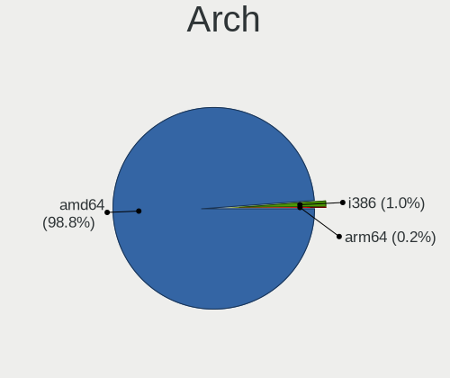
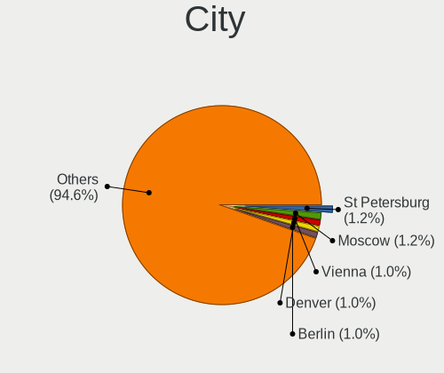
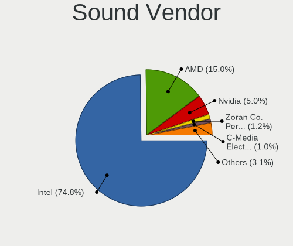
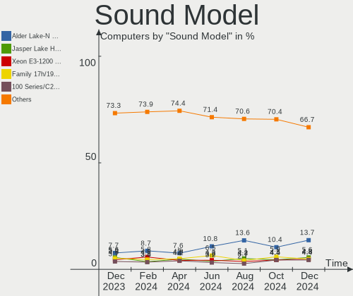

BSD - Hardware Trends
---------------------

A project to identify most popular hardware characteristics and track their change
over time based on data collected by BSD users at https://BSD-Hardware.info.

Anyone can contribute to this report by the [hw-probe](https://github.com/linuxhw/hw-probe/blob/master/INSTALL.BSD.md) tool:

    hw-probe -all -upload

This is a report for all computer types. See also reports for [desktops](/Desktop/README.md) and [notebooks](/Notebook/README.md).

OS-specific reports: [FreeBSD](/Dist/FreeBSD), [OPNsense](/Dist/OPNsense), [helloSystem](/Dist/helloSystem), [OpenBSD](/Dist/OpenBSD).

This report is for one last month. Overall report since the beginning of time: [TestDays](https://github.com/bsdhw/TestDays)

Period: Mar, 2023.

Contents
--------

* [ System ](#system)
  - [ OS                       ](#os)
  - [ OS Family                ](#os-family)
  - [ Arch                     ](#arch)
  - [ DE                       ](#de)
  - [ Display Server           ](#display-server)
  - [ Display Manager          ](#display-manager)
  - [ OS Lang                  ](#os-lang)
  - [ Boot Mode                ](#boot-mode)
  - [ Filesystem               ](#filesystem)
  - [ Part. scheme             ](#part-scheme)

* [ Board ](#board)
  - [ Vendor                   ](#vendor)
  - [ Model                    ](#model)
  - [ Model Family             ](#model-family)
  - [ MFG Year                 ](#mfg-year)
  - [ Form Factor              ](#form-factor)
  - [ Coreboot                 ](#coreboot)
  - [ RAM Size                 ](#ram-size)
  - [ RAM Used                 ](#ram-used)
  - [ Total Drives             ](#total-drives)
  - [ Has CD-ROM               ](#has-cd-rom)
  - [ Has Ethernet             ](#has-ethernet)
  - [ Has WiFi                 ](#has-wifi)
  - [ Has Bluetooth            ](#has-bluetooth)

* [ Location ](#location)
  - [ Country                  ](#country)
  - [ City                     ](#city)

* [ Drives ](#drives)
  - [ Drive Vendor             ](#drive-vendor)
  - [ Drive Model              ](#drive-model)
  - [ HDD Vendor               ](#hdd-vendor)
  - [ SSD Vendor               ](#ssd-vendor)
  - [ Drive Kind               ](#drive-kind)
  - [ Drive Connector          ](#drive-connector)
  - [ Drive Size               ](#drive-size)
  - [ Space Total              ](#space-total)
  - [ Space Used               ](#space-used)
  - [ Malfunc. Drives          ](#malfunc-drives)
  - [ Malfunc. Drive Vendor    ](#malfunc-drive-vendor)
  - [ Malfunc. HDD Vendor      ](#malfunc-hdd-vendor)
  - [ Malfunc. Drive Kind      ](#malfunc-drive-kind)
  - [ Failed Drives            ](#failed-drives)
  - [ Failed Drive Vendor      ](#failed-drive-vendor)
  - [ Drive Status             ](#drive-status)

* [ Storage controller ](#storage-controller)
  - [ Storage Vendor           ](#storage-vendor)
  - [ Storage Model            ](#storage-model)
  - [ Storage Kind             ](#storage-kind)

* [ Processor ](#processor)
  - [ CPU Vendor               ](#cpu-vendor)
  - [ CPU Model                ](#cpu-model)
  - [ CPU Model Family         ](#cpu-model-family)
  - [ CPU Cores                ](#cpu-cores)
  - [ CPU Sockets              ](#cpu-sockets)
  - [ CPU Threads              ](#cpu-threads)
  - [ CPU Microarch            ](#cpu-microarch)

* [ Graphics ](#graphics)
  - [ GPU Vendor               ](#gpu-vendor)
  - [ GPU Model                ](#gpu-model)
  - [ GPU Combo                ](#gpu-combo)
  - [ GPU Driver               ](#gpu-driver)
  - [ GPU Memory               ](#gpu-memory)

* [ Monitor ](#monitor)
  - [ Monitor Vendor           ](#monitor-vendor)
  - [ Monitor Model            ](#monitor-model)
  - [ Monitor Resolution       ](#monitor-resolution)
  - [ Monitor Diagonal         ](#monitor-diagonal)
  - [ Monitor Width            ](#monitor-width)
  - [ Aspect Ratio             ](#aspect-ratio)
  - [ Monitor Area             ](#monitor-area)
  - [ Pixel Density            ](#pixel-density)
  - [ Multiple Monitors        ](#multiple-monitors)

* [ Network ](#network)
  - [ Net Controller Vendor    ](#net-controller-vendor)
  - [ Net Controller Model     ](#net-controller-model)
  - [ Wireless Vendor          ](#wireless-vendor)
  - [ Wireless Model           ](#wireless-model)
  - [ Ethernet Vendor          ](#ethernet-vendor)
  - [ Ethernet Model           ](#ethernet-model)
  - [ Net Controller Kind      ](#net-controller-kind)
  - [ Used Controller          ](#used-controller)
  - [ NICs                     ](#nics)
  - [ IPv6                     ](#ipv6)

* [ Bluetooth ](#bluetooth)
  - [ Bluetooth Vendor         ](#bluetooth-vendor)
  - [ Bluetooth Model          ](#bluetooth-model)

* [ Sound ](#sound)
  - [ Sound Vendor             ](#sound-vendor)
  - [ Sound Model              ](#sound-model)

* [ Memory ](#memory)
  - [ Memory Vendor            ](#memory-vendor)
  - [ Memory Model             ](#memory-model)
  - [ Memory Kind              ](#memory-kind)
  - [ Memory Form Factor       ](#memory-form-factor)
  - [ Memory Size              ](#memory-size)
  - [ Memory Speed             ](#memory-speed)

* [ Printers & scanners ](#printers--scanners)
  - [ Printer Vendor           ](#printer-vendor)
  - [ Printer Model            ](#printer-model)
  - [ Scanner Vendor           ](#scanner-vendor)
  - [ Scanner Model            ](#scanner-model)

* [ Camera ](#camera)
  - [ Camera Vendor            ](#camera-vendor)
  - [ Camera Model             ](#camera-model)

* [ Security ](#security)
  - [ Fingerprint Vendor       ](#fingerprint-vendor)
  - [ Fingerprint Model        ](#fingerprint-model)
  - [ Chipcard Vendor          ](#chipcard-vendor)
  - [ Chipcard Model           ](#chipcard-model)

* [ Unsupported ](#unsupported)
  - [ Unsupported Devices      ](#unsupported-devices)
  - [ Unsupported Device Types ](#unsupported-device-types)

System
------

OS
--

Installed operating systems

| Name                 | Computers | Percent |
|----------------------|-----------|---------|
| helloSystem 0.8.1    | 178       | 27.09%  |
| OPNsense 23.1.3      | 105       | 15.98%  |
| OPNsense 23.1.4      | 93        | 14.16%  |
| OPNsense 23.1.1      | 65        | 9.89%   |
| FreeBSD 13.1-p7      | 37        | 5.63%   |
| OPNsense 23.1.2      | 24        | 3.65%   |
| OPNsense 23.1.5      | 21        | 3.2%    |
| helloSystem 0.8.0    | 15        | 2.28%   |
| OPNsense 23.1        | 11        | 1.67%   |
| OpenBSD 7.2          | 9         | 1.37%   |
| helloSystem 0.8.2    | 9         | 1.37%   |
| FreeBSD 13.1         | 9         | 1.37%   |
| OPNsense 22.7.11     | 8         | 1.22%   |
| OPNsense 23.7        | 7         | 1.07%   |
| OPNsense 22.10.2     | 7         | 1.07%   |
| FreeBSD 14.0-CURRENT | 7         | 1.07%   |
| FreeBSD 13.1-p5      | 5         | 0.76%   |
| NomadBSD 20221130    | 4         | 0.61%   |
| GhostBSD 23.02.02    | 4         | 0.61%   |
| helloSystem 0.7.0    | 3         | 0.46%   |
| GhostBSD 23.03.17    | 3         | 0.46%   |
| FreeBSD 13.2-STABLE  | 3         | 0.46%   |
| FreeBSD 13.2-RC3     | 3         | 0.46%   |
| OPNsense 22.1.10     | 2         | 0.3%    |
| MyBee 13.1-p7        | 2         | 0.3%    |
| MidnightBSD 3.0.0    | 2         | 0.3%    |
| FreeBSD 12.4-STABLE  | 2         | 0.3%    |
| OPNsense 21.1.9      | 1         | 0.15%   |
| OPNsense 20.7.5      | 1         | 0.15%   |
| OPNsense 20.7        | 1         | 0.15%   |
| OpenBSD 7.3          | 1         | 0.15%   |
| OpenBSD 7.1          | 1         | 0.15%   |
| OpenBSD 6.8          | 1         | 0.15%   |
| NetBSD 9.3           | 1         | 0.15%   |
| MyBee 13.2-RC4       | 1         | 0.15%   |
| MyBee 13.2-RC2       | 1         | 0.15%   |
| MidnightBSD 2.2.8    | 1         | 0.15%   |
| GhostBSD 22.06.18    | 1         | 0.15%   |
| FreeBSD 13.2-RC5     | 1         | 0.15%   |
| FreeBSD 13.2-RC1     | 1         | 0.15%   |

OS Family
---------

OS without a version

| Name        | Computers | Percent |
|-------------|-----------|---------|
| OPNsense    | 346       | 52.66%  |
| helloSystem | 205       | 31.2%   |
| FreeBSD     | 74        | 11.26%  |
| OpenBSD     | 12        | 1.83%   |
| GhostBSD    | 8         | 1.22%   |
| NomadBSD    | 4         | 0.61%   |
| MyBee       | 4         | 0.61%   |
| MidnightBSD | 3         | 0.46%   |
| NetBSD      | 1         | 0.15%   |

Arch
----

OS architecture (x86_64, i586, etc.)

| Name   | Computers | Percent |
|--------|-----------|---------|
| amd64  | 650       | 98.93%  |
| arm64  | 4         | 0.61%   |
| i386   | 2         | 0.3%    |
| macppc | 1         | 0.15%   |

DE
--

Desktop Environment

| Name         | Computers | Percent |
|--------------|-----------|---------|
| Console      | 382       | 58.14%  |
| helloDesktop | 211       | 32.12%  |
| XFCE         | 20        | 3.04%   |
| KDE5         | 17        | 2.59%   |
| MATE         | 7         | 1.07%   |
| GNOME        | 5         | 0.76%   |
| TWM          | 4         | 0.61%   |
| xinitrc      | 3         | 0.46%   |
| AwesomeWM    | 2         | 0.3%    |
| X-Cinnamon   | 1         | 0.15%   |
| Openbox      | 1         | 0.15%   |
| Lumina       | 1         | 0.15%   |
| i3           | 1         | 0.15%   |
| fvwm         | 1         | 0.15%   |
| dwm          | 1         | 0.15%   |

Display Server
--------------

X11 or Wayland

| Name    | Computers | Percent |
|---------|-----------|---------|
| Console | 382       | 58.14%  |
| X11     | 273       | 41.55%  |
| Wayland | 2         | 0.3%    |

Display Manager
---------------

SDDM, LightDM, etc.

| Name    | Computers | Percent |
|---------|-----------|---------|
| Console | 402       | 61.19%  |
| SLiM    | 214       | 32.57%  |
| SDDM    | 19        | 2.89%   |
| LightDM | 13        | 1.98%   |
| GDM     | 5         | 0.76%   |
| XDM     | 3         | 0.46%   |
| Ly      | 1         | 0.15%   |

OS Lang
-------

Language

| Lang            | Computers | Percent |
|-----------------|-----------|---------|
| Unknown         | 362       | 55.1%   |
| en_US           | 92        | 14%     |
| fr_FR           | 60        | 9.13%   |
| C               | 58        | 8.83%   |
| ru_RU           | 21        | 3.2%    |
| de_DE           | 14        | 2.13%   |
| es_ES           | 12        | 1.83%   |
| en              | 8         | 1.22%   |
| pl_PL           | 5         | 0.76%   |
| pt_BR           | 4         | 0.61%   |
| zh_CN           | 3         | 0.46%   |
| en_GB           | 3         | 0.46%   |
| ko_KR           | 2         | 0.3%    |
| jp_JP           | 2         | 0.3%    |
| it_IT           | 2         | 0.3%    |
| fr              | 2         | 0.3%    |
| es              | 2         | 0.3%    |
| zh_TW           | 1         | 0.15%   |
| ru              | 1         | 0.15%   |
| nl_NL           | 1         | 0.15%   |
| fi_FI           | 1         | 0.15%   |
| en_GB.ISO8859-1 | 1         | 0.15%   |

Boot Mode
---------

EFI or BIOS

| Mode | Computers | Percent |
|------|-----------|---------|
| EFI  | 612       | 93.15%  |
| BIOS | 45        | 6.85%   |

Filesystem
----------

Type of filesystem

| Type   | Computers | Percent |
|--------|-----------|---------|
| Zfs    | 302       | 45.97%  |
| Ufs    | 225       | 34.25%  |
| Cd9660 | 117       | 17.81%  |
| Ffs    | 12        | 1.83%   |
| Nfs    | 1         | 0.15%   |

Part. scheme
------------

Scheme of partitioning

| Type    | Computers | Percent |
|---------|-----------|---------|
| GPT     | 634       | 96.5%   |
| MBR     | 20        | 3.04%   |
| Unknown | 2         | 0.3%    |
| BSD     | 1         | 0.15%   |

Board
-----

Vendor
------

Motherboard manufacturer

| Name                    | Computers | Percent |
|-------------------------|-----------|---------|
| Lenovo                  | 75        | 11.42%  |
| Dell                    | 71        | 10.81%  |
| Hewlett-Packard         | 63        | 9.59%   |
| ASUSTek Computer        | 62        | 9.44%   |
| Unknown                 | 49        | 7.46%   |
| Intel                   | 33        | 5.02%   |
| Gigabyte Technology     | 27        | 4.11%   |
| ASRock                  | 26        | 3.96%   |
| Protectli               | 20        | 3.04%   |
| Techvision              | 19        | 2.89%   |
| Fujitsu                 | 19        | 2.89%   |
| MSI                     | 18        | 2.74%   |
| Acer                    | 18        | 2.74%   |
| Supermicro              | 17        | 2.59%   |
| Apple                   | 10        | 1.52%   |
| Sophos                  | 7         | 1.07%   |
| Toshiba                 | 6         | 0.91%   |
| AMI                     | 6         | 0.91%   |
| Samsung Electronics     | 5         | 0.76%   |
| MW                      | 5         | 0.76%   |
| PC Engines              | 4         | 0.61%   |
| ASRockRack              | 4         | 0.61%   |
| Sony                    | 3         | 0.46%   |
| Google                  | 3         | 0.46%   |
| Foxconn                 | 3         | 0.46%   |
| Deciso                  | 3         | 0.46%   |
| CncTion                 | 3         | 0.46%   |
| BESSTAR Tech            | 3         | 0.46%   |
| T-bao                   | 2         | 0.3%    |
| Shuttle                 | 2         | 0.3%    |
| Raspberry Pi Foundation | 2         | 0.3%    |
| LG Electronics          | 2         | 0.3%    |
| Huanan                  | 2         | 0.3%    |
| GoWin Solution          | 2         | 0.3%    |
| Fujitsu Siemens         | 2         | 0.3%    |
| CheckPoint              | 2         | 0.3%    |
| Biostar                 | 2         | 0.3%    |
| AZW                     | 2         | 0.3%    |
| AWOW                    | 2         | 0.3%    |
| Alienware               | 2         | 0.3%    |

Model
-----

Motherboard model

| Name                                | Computers | Percent |
|-------------------------------------|-----------|---------|
| Unknown                             | 51        | 7.76%   |
| Techvision TVI7309X                 | 19        | 2.89%   |
| Protectli FW4B                      | 9         | 1.37%   |
| Fujitsu FUTRO S920                  | 7         | 1.07%   |
| Sophos SG                           | 6         | 0.91%   |
| Intel Q3XXG4-P V1.0                 | 6         | 0.91%   |
| Supermicro Super Server             | 5         | 0.76%   |
| MW GMLK-2_5G4L                      | 5         | 0.76%   |
| Dell PowerEdge R210 II              | 5         | 0.76%   |
| Dell OptiPlex 3020                  | 5         | 0.76%   |
| ASUS All Series                     | 5         | 0.76%   |
| Dell Wyse 5070 Extended Thin Client | 4         | 0.61%   |
| Protectli VP2410                    | 3         | 0.46%   |
| Protectli FW6                       | 3         | 0.46%   |
| Protectli FW4C                      | 3         | 0.46%   |
| PC Engines APU2                     | 3         | 0.46%   |
| Intel DENLOW_WS                     | 3         | 0.46%   |
| HP t620 PLUS Quad Core TC           | 3         | 0.46%   |
| HP ProDesk 600 G1 SFF               | 3         | 0.46%   |
| HP Compaq 6200 Pro MT PC            | 3         | 0.46%   |
| T-bao MINI PC                       | 2         | 0.3%    |
| Supermicro SYS-5029P-WTR            | 2         | 0.3%    |
| RPi Raspberry Pi                    | 2         | 0.3%    |
| Protectli VP2420                    | 2         | 0.3%    |
| MSI MS-7D46                         | 2         | 0.3%    |
| MSI MS-7B86                         | 2         | 0.3%    |
| MSI MS-7788                         | 2         | 0.3%    |
| Lenovo ThinkPad X220 4286CTO        | 2         | 0.3%    |
| Intel S1200RP_SE                    | 2         | 0.3%    |
| Intel Jasper Lake Client Platform   | 2         | 0.3%    |
| Huanan X99-QD4 V1.0                 | 2         | 0.3%    |
| HP Z440 Workstation                 | 2         | 0.3%    |
| HP t730 Thin Client                 | 2         | 0.3%    |
| HP ProLiant DL360 G7                | 2         | 0.3%    |
| HP EliteDesk 800 G2 SFF             | 2         | 0.3%    |
| HP EliteDesk 800 G2 DM 65W          | 2         | 0.3%    |
| HP Compaq Elite 8300 USDT           | 2         | 0.3%    |
| HP Compaq Elite 8300 SFF            | 2         | 0.3%    |
| HP Compaq 8200 Elite SFF PC         | 2         | 0.3%    |
| GoWin Solution R86S                 | 2         | 0.3%    |

Model Family
------------

Motherboard model prefix

| Name                     | Computers | Percent |
|--------------------------|-----------|---------|
| Unknown                  | 51        | 7.76%   |
| Lenovo ThinkPad          | 43        | 6.54%   |
| Dell OptiPlex            | 23        | 3.5%    |
| Techvision TVI7309X      | 19        | 2.89%   |
| Dell PowerEdge           | 19        | 2.89%   |
| Lenovo ThinkCentre       | 17        | 2.59%   |
| HP Compaq                | 13        | 1.98%   |
| Dell Inspiron            | 10        | 1.52%   |
| Protectli FW4B           | 9         | 1.37%   |
| Dell Latitude            | 8         | 1.22%   |
| ASUS PRIME               | 8         | 1.22%   |
| HP EliteDesk             | 7         | 1.07%   |
| Fujitsu FUTRO            | 7         | 1.07%   |
| Acer Aspire              | 7         | 1.07%   |
| Toshiba Satellite        | 6         | 0.91%   |
| Sophos SG                | 6         | 0.91%   |
| Lenovo IdeaPad           | 6         | 0.91%   |
| Intel Q3XXG4-P           | 6         | 0.91%   |
| ASUS ROG                 | 6         | 0.91%   |
| Supermicro Super         | 5         | 0.76%   |
| MW GMLK-2                | 5         | 0.76%   |
| HP ProDesk               | 5         | 0.76%   |
| ASUS All                 | 5         | 0.76%   |
| HP t620                  | 4         | 0.61%   |
| HP ProLiant              | 4         | 0.61%   |
| HP Pavilion              | 4         | 0.61%   |
| HP EliteBook             | 4         | 0.61%   |
| Dell Wyse                | 4         | 0.61%   |
| ASUS TUF                 | 4         | 0.61%   |
| Protectli VP2410         | 3         | 0.46%   |
| Protectli FW6            | 3         | 0.46%   |
| Protectli FW4C           | 3         | 0.46%   |
| PC Engines APU2          | 3         | 0.46%   |
| Intel DENLOW             | 3         | 0.46%   |
| HP t730                  | 3         | 0.46%   |
| HP Laptop                | 3         | 0.46%   |
| Acer Nitro               | 3         | 0.46%   |
| T-bao MINI               | 2         | 0.3%    |
| Supermicro SYS-5029P-WTR | 2         | 0.3%    |
| RPi Raspberry            | 2         | 0.3%    |

MFG Year
--------

Motherboard manufacture year

| Year    | Computers | Percent |
|---------|-----------|---------|
| 2022    | 127       | 19.33%  |
| 2019    | 59        | 8.98%   |
| 2018    | 56        | 8.52%   |
| 2021    | 55        | 8.37%   |
| 2014    | 48        | 7.31%   |
| 2012    | 44        | 6.7%    |
| 2016    | 43        | 6.54%   |
| 2020    | 42        | 6.39%   |
| 2011    | 32        | 4.87%   |
| 2013    | 29        | 4.41%   |
| 2017    | 26        | 3.96%   |
| 2015    | 23        | 3.5%    |
| 2010    | 23        | 3.5%    |
| 2009    | 17        | 2.59%   |
| 2008    | 11        | 1.67%   |
| 2023    | 10        | 1.52%   |
| 2007    | 6         | 0.91%   |
| Unknown | 4         | 0.61%   |
| 2006    | 2         | 0.3%    |

Form Factor
-----------

Physical design of the computer

| Name           | Computers | Percent |
|----------------|-----------|---------|
| Desktop        | 418       | 63.62%  |
| Notebook       | 155       | 23.59%  |
| Server         | 39        | 5.94%   |
| Mini pc        | 27        | 4.11%   |
| Firewall       | 8         | 1.22%   |
| All in one     | 5         | 0.76%   |
| System on chip | 3         | 0.46%   |
| Convertible    | 2         | 0.3%    |

Coreboot
--------

Have coreboot on board

| Used | Computers | Percent |
|------|-----------|---------|
| No   | 643       | 97.87%  |
| Yes  | 14        | 2.13%   |

RAM Size
--------

Total RAM memory

| Size in GB  | Computers | Percent |
|-------------|-----------|---------|
| 8.01-16.0   | 259       | 39.42%  |
| 16.01-24.0  | 156       | 23.74%  |
| 4.01-8.0    | 113       | 17.2%   |
| 32.01-64.0  | 62        | 9.44%   |
| 2.01-3.0    | 23        | 3.5%    |
| 64.01-256.0 | 23        | 3.5%    |
| 24.01-32.0  | 12        | 1.83%   |
| 3.01-4.0    | 6         | 0.91%   |
| 0.01-0.5    | 2         | 0.3%    |
| 1.01-2.0    | 1         | 0.15%   |

RAM Used
--------

Used RAM memory

| Used GB    | Computers | Percent |
|------------|-----------|---------|
| 0.01-0.5   | 329       | 50.08%  |
| 0.51-1.0   | 221       | 33.64%  |
| 1.01-2.0   | 73        | 11.11%  |
| 2.01-3.0   | 19        | 2.89%   |
| 3.01-4.0   | 7         | 1.07%   |
| 4.01-8.0   | 2         | 0.3%    |
| 0          | 2         | 0.3%    |
| Unknown    | 2         | 0.3%    |
| 16.01-24.0 | 1         | 0.15%   |
| 8.01-16.0  | 1         | 0.15%   |

Total Drives
------------

Number of drives on board

| Drives | Computers | Percent |
|--------|-----------|---------|
| 1      | 455       | 69.25%  |
| 2      | 94        | 14.31%  |
| 0      | 50        | 7.61%   |
| 3      | 29        | 4.41%   |
| 5      | 12        | 1.83%   |
| 4      | 8         | 1.22%   |
| 6      | 4         | 0.61%   |
| 58     | 1         | 0.15%   |
| 13     | 1         | 0.15%   |
| 9      | 1         | 0.15%   |
| 8      | 1         | 0.15%   |
| 7      | 1         | 0.15%   |

Has CD-ROM
----------

Has CD-ROM on board

| Presented | Computers | Percent |
|-----------|-----------|---------|
| No        | 512       | 77.93%  |
| Yes       | 145       | 22.07%  |

Has Ethernet
------------

Has Ethernet on board

| Presented | Computers | Percent |
|-----------|-----------|---------|
| Yes       | 626       | 95.28%  |
| No        | 31        | 4.72%   |

Has WiFi
--------

Has WiFi module

| Presented | Computers | Percent |
|-----------|-----------|---------|
| No        | 400       | 60.88%  |
| Yes       | 257       | 39.12%  |

Has Bluetooth
-------------

Has Bluetooth module

| Presented | Computers | Percent |
|-----------|-----------|---------|
| No        | 478       | 72.75%  |
| Yes       | 179       | 27.25%  |

Location
--------

Country
-------

Geographic location (country)

| Country      | Computers | Percent |
|--------------|-----------|---------|
| USA          | 182       | 27.7%   |
| Germany      | 89        | 13.55%  |
| Russia       | 44        | 6.7%    |
| France       | 36        | 5.48%   |
| Canada       | 27        | 4.11%   |
| UK           | 24        | 3.65%   |
| Poland       | 22        | 3.35%   |
| Italy        | 19        | 2.89%   |
| Spain        | 17        | 2.59%   |
| Brazil       | 15        | 2.28%   |
| Australia    | 11        | 1.67%   |
| Indonesia    | 10        | 1.52%   |
| Netherlands  | 8         | 1.22%   |
| Sweden       | 7         | 1.07%   |
| South Korea  | 7         | 1.07%   |
| Austria      | 7         | 1.07%   |
| Switzerland  | 6         | 0.91%   |
| Romania      | 6         | 0.91%   |
| China        | 6         | 0.91%   |
| Belgium      | 6         | 0.91%   |
| Portugal     | 5         | 0.76%   |
| Norway       | 5         | 0.76%   |
| Japan        | 5         | 0.76%   |
| India        | 5         | 0.76%   |
| Hungary      | 5         | 0.76%   |
| Bulgaria     | 5         | 0.76%   |
| Turkey       | 4         | 0.61%   |
| Taiwan       | 4         | 0.61%   |
| South Africa | 4         | 0.61%   |
| Serbia       | 4         | 0.61%   |
| Greece       | 4         | 0.61%   |
| Finland      | 4         | 0.61%   |
| Denmark      | 4         | 0.61%   |
| New Zealand  | 3         | 0.46%   |
| Mexico       | 3         | 0.46%   |
| Lithuania    | 3         | 0.46%   |
| Czechia      | 3         | 0.46%   |
| Vietnam      | 2         | 0.3%    |
| Ukraine      | 2         | 0.3%    |
| Thailand     | 2         | 0.3%    |

City
----

Geographic location (city)

| City               | Computers | Percent |
|--------------------|-----------|---------|
| Moscow             | 12        | 1.83%   |
| Montreal           | 9         | 1.37%   |
| Berlin             | 8         | 1.22%   |
| Paris              | 7         | 1.07%   |
| Vienna             | 6         | 0.91%   |
| Warsaw             | 5         | 0.76%   |
| Sydney             | 5         | 0.76%   |
| Melun              | 5         | 0.76%   |
| Madrid             | 5         | 0.76%   |
| Los Angeles        | 5         | 0.76%   |
| London             | 5         | 0.76%   |
| St Petersburg      | 4         | 0.61%   |
| Sao Paulo          | 4         | 0.61%   |
| Jakarta            | 4         | 0.61%   |
| Hamburg            | 4         | 0.61%   |
| Wroclaw            | 3         | 0.46%   |
| Seattle            | 3         | 0.46%   |
| Redmond            | 3         | 0.46%   |
| Portland           | 3         | 0.46%   |
| New York           | 3         | 0.46%   |
| Munich             | 3         | 0.46%   |
| Krakow             | 3         | 0.46%   |
| Houston            | 3         | 0.46%   |
| Cologne            | 3         | 0.46%   |
| Chicago            | 3         | 0.46%   |
| Charlotte          | 3         | 0.46%   |
| Zurich             | 2         | 0.3%    |
| Ypsilanti          | 2         | 0.3%    |
| Woodbridge         | 2         | 0.3%    |
| Vilnius            | 2         | 0.3%    |
| Valencia           | 2         | 0.3%    |
| Titusville         | 2         | 0.3%    |
| Taipei             | 2         | 0.3%    |
| Solingen           | 2         | 0.3%    |
| Sofia              | 2         | 0.3%    |
| Silver Spring      | 2         | 0.3%    |
| Santo Domingo Este | 2         | 0.3%    |
| Salem              | 2         | 0.3%    |
| Saint-Raphaël     | 2         | 0.3%    |
| Rome               | 2         | 0.3%    |

Drives
------

Drive Vendor
------------

Hard drive vendors

| Vendor              | Computers | Drives | Percent |
|---------------------|-----------|--------|---------|
| Samsung Electronics | 99        | 123    | 12.99%  |
| WDC                 | 84        | 122    | 11.02%  |
| Seagate             | 71        | 94     | 9.32%   |
| Kingston            | 62        | 64     | 8.14%   |
| Crucial             | 37        | 44     | 4.86%   |
| Toshiba             | 33        | 49     | 4.33%   |
| SanDisk             | 31        | 31     | 4.07%   |
| Intel               | 27        | 37     | 3.54%   |
| Transcend           | 22        | 24     | 2.89%   |
| China               | 22        | 26     | 2.89%   |
| A-DATA Technology   | 18        | 21     | 2.36%   |
| Micron Technology   | 17        | 17     | 2.23%   |
| Hoodisk             | 17        | 17     | 2.23%   |
| Hitachi             | 16        | 17     | 2.1%    |
| HGST                | 15        | 49     | 1.97%   |
| SK hynix            | 12        | 12     | 1.57%   |
| PNY                 | 10        | 10     | 1.31%   |
| Apacer              | 10        | 10     | 1.31%   |
| Protectli           | 9         | 9      | 1.18%   |
| Fanxiang            | 8         | 10     | 1.05%   |
| Innodisk            | 7         | 7      | 0.92%   |
| Corsair             | 7         | 8      | 0.92%   |
| OCZ                 | 6         | 6      | 0.79%   |
| Hewlett-Packard     | 6         | 7      | 0.79%   |
| Dogfish             | 6         | 6      | 0.79%   |
| SPCC                | 5         | 5      | 0.66%   |
| Phison              | 5         | 5      | 0.66%   |
| Patriot             | 5         | 5      | 0.66%   |
| Maxtor              | 5         | 5      | 0.66%   |
| KingSpec            | 5         | 5      | 0.66%   |
| Team                | 4         | 5      | 0.52%   |
| NVMe                | 4         | 5      | 0.52%   |
| SSSTC               | 3         | 4      | 0.39%   |
| Silicon Motion      | 3         | 3      | 0.39%   |
| ShiJi               | 3         | 3      | 0.39%   |
| KIOXIA-EXCERIA      | 3         | 4      | 0.39%   |
| Intenso             | 3         | 3      | 0.39%   |
| FORESEE             | 3         | 3      | 0.39%   |
| Colorful            | 3         | 4      | 0.39%   |
| BIWIN               | 3         | 3      | 0.39%   |

Drive Model
-----------

Hard drive models

| Model                           | Computers | Percent |
|---------------------------------|-----------|---------|
| Samsung SSD 850 EVO 250GB       | 10        | 1.22%   |
| Kingston SA400S37120G 120GB     | 10        | 1.22%   |
| Kingston SA400S37240G 240GB     | 9         | 1.09%   |
| Seagate ST500DM002-1BD142 500GB | 8         | 0.97%   |
| Samsung SSD 860 EVO 500GB       | 8         | 0.97%   |
| SK hynix SC311 SATA 128GB       | 5         | 0.61%   |
| Seagate ST2000DM008-2FR102 2TB  | 5         | 0.61%   |
| Seagate ST1000DM010-2EP102 1TB  | 5         | 0.61%   |
| Samsung SSD 870 EVO 500GB       | 5         | 0.61%   |
| Hoodisk SSD 64GB                | 5         | 0.61%   |
| Crucial CT240BX500SSD1 240GB    | 5         | 0.61%   |
| Seagate ST3500418AS 500GB       | 4         | 0.49%   |
| Seagate ST2000LM007-1R8174 2TB  | 4         | 0.49%   |
| Samsung SSD 970 EVO Plus 250GB  | 4         | 0.49%   |
| Samsung SSD 970 EVO Plus 1TB    | 4         | 0.49%   |
| Protectli 120GB M.2             | 4         | 0.49%   |
| Kingston SV300S37A120G 120GB    | 4         | 0.49%   |
| Hoodisk SSD 32GB                | 4         | 0.49%   |
| Hoodisk SSD 128GB               | 4         | 0.49%   |
| HGST HTS545050A7E380 500GB      | 4         | 0.49%   |
| A-DATA SU650 120GB              | 4         | 0.49%   |
| WDC WDS240G2G0A-00JH30 240GB    | 3         | 0.36%   |
| WDC WD5000AAKX-08U6AA0 500GB    | 3         | 0.36%   |
| WDC WD10EZEX-08WN4A0 1TB        | 3         | 0.36%   |
| Transcend TS128GMSA230S 128GB   | 3         | 0.36%   |
| Toshiba DT01ACA050 500GB        | 3         | 0.36%   |
| Seagate ST1000LM035-1RK172 1TB  | 3         | 0.36%   |
| SanDisk SSD PLUS 240GB          | 3         | 0.36%   |
| SanDisk SDSA6MM-016G-1006 16GB  | 3         | 0.36%   |
| Samsung SSD 860 EVO 250GB       | 3         | 0.36%   |
| Samsung SSD 840 EVO 120GB       | 3         | 0.36%   |
| PNY CS900 240GB SSD             | 3         | 0.36%   |
| PNY CS900 120GB SSD             | 3         | 0.36%   |
| Phison Sabrent 1TB              | 3         | 0.36%   |
| Kingston SV300S37A60G 64GB      | 3         | 0.36%   |
| Kingston SNV2S500G 500GB        | 3         | 0.36%   |
| Kingston SHFS37A240G 240GB      | 3         | 0.36%   |
| Kingston SA400S37480G 480GB     | 3         | 0.36%   |
| Innodisk DEMSR- 08GB mSATA 3ME3 | 3         | 0.36%   |
| HGST HTS725050A7E630 500GB      | 3         | 0.36%   |

HDD Vendor
----------

Hard disk drive vendors

| Vendor              | Computers | Drives | Percent |
|---------------------|-----------|--------|---------|
| Seagate             | 68        | 91     | 31.78%  |
| WDC                 | 63        | 99     | 29.44%  |
| Toshiba             | 28        | 44     | 13.08%  |
| Hitachi             | 15        | 16     | 7.01%   |
| HGST                | 14        | 48     | 6.54%   |
| Samsung Electronics | 7         | 7      | 3.27%   |
| Maxtor              | 5         | 5      | 2.34%   |
| Hewlett-Packard     | 5         | 6      | 2.34%   |
| NVMe                | 2         | 2      | 0.93%   |
| USB                 | 1         | 1      | 0.47%   |
| QUANTUM             | 1         | 1      | 0.47%   |
| LSI                 | 1         | 1      | 0.47%   |
| HPT                 | 1         | 1      | 0.47%   |
| HPE                 | 1         | 5      | 0.47%   |
| Fujitsu             | 1         | 1      | 0.47%   |
| Apple               | 1         | 1      | 0.47%   |

SSD Vendor
----------

Solid state drive vendors

| Vendor              | Computers | Drives | Percent |
|---------------------|-----------|--------|---------|
| Samsung Electronics | 63        | 79     | 14.86%  |
| Kingston            | 48        | 50     | 11.32%  |
| Crucial             | 33        | 38     | 7.78%   |
| SanDisk             | 31        | 31     | 7.31%   |
| China               | 22        | 26     | 5.19%   |
| Transcend           | 20        | 22     | 4.72%   |
| Intel               | 18        | 28     | 4.25%   |
| Hoodisk             | 16        | 16     | 3.77%   |
| WDC                 | 15        | 15     | 3.54%   |
| A-DATA Technology   | 14        | 15     | 3.3%    |
| Apacer              | 10        | 10     | 2.36%   |
| Protectli           | 9         | 9      | 2.12%   |
| PNY                 | 9         | 9      | 2.12%   |
| Micron Technology   | 9         | 9      | 2.12%   |
| SK hynix            | 8         | 8      | 1.89%   |
| Innodisk            | 7         | 7      | 1.65%   |
| OCZ                 | 6         | 6      | 1.42%   |
| Dogfish             | 6         | 6      | 1.42%   |
| KingSpec            | 5         | 5      | 1.18%   |
| Toshiba             | 4         | 4      | 0.94%   |
| Patriot             | 4         | 4      | 0.94%   |
| ShiJi               | 3         | 3      | 0.71%   |
| NVMe                | 3         | 3      | 0.71%   |
| Intenso             | 3         | 3      | 0.71%   |
| Verbatim            | 2         | 2      | 0.47%   |
| Team                | 2         | 2      | 0.47%   |
| SPCC                | 2         | 2      | 0.47%   |
| Seagate             | 2         | 2      | 0.47%   |
| Netac               | 2         | 2      | 0.47%   |
| Lexar               | 2         | 2      | 0.47%   |
| GOODRAM             | 2         | 2      | 0.47%   |
| Gigabyte Technology | 2         | 2      | 0.47%   |
| FORESEE             | 2         | 2      | 0.47%   |
| Corsair             | 2         | 2      | 0.47%   |
| Colorful            | 2         | 3      | 0.47%   |
| BORY                | 2         | 2      | 0.47%   |
| BIWIN               | 2         | 2      | 0.47%   |
| BAITITON            | 2         | 2      | 0.47%   |
| Zheino              | 1         | 1      | 0.24%   |
| XrayDisk            | 1         | 1      | 0.24%   |

Drive Kind
----------

HDD or SSD

| Kind | Computers | Drives | Percent |
|------|-----------|--------|---------|
| SSD  | 386       | 467    | 54.6%   |
| HDD  | 193       | 329    | 27.3%   |
| NVMe | 128       | 143    | 18.1%   |

Drive Connector
---------------

SATA, SAS, NVMe, etc.

| Type | Computers | Drives | Percent |
|------|-----------|--------|---------|
| SATA | 519       | 796    | 80.22%  |
| NVMe | 128       | 143    | 19.78%  |

Drive Size
----------

Size of hard drive

| Size in TB | Computers | Drives | Percent |
|------------|-----------|--------|---------|
| 0.01-0.5   | 432       | 528    | 73.22%  |
| 0.51-1.0   | 88        | 104    | 14.92%  |
| 1.01-2.0   | 39        | 55     | 6.61%   |
| 3.01-4.0   | 15        | 70     | 2.54%   |
| 2.01-3.0   | 7         | 13     | 1.19%   |
| 4.01-10.0  | 5         | 21     | 0.85%   |
| 10.01-20.0 | 4         | 5      | 0.68%   |

Space Total
-----------

Amount of disk space available on the file system

| Size in GB     | Computers | Percent |
|----------------|-----------|---------|
| 101-250        | 232       | 35.31%  |
| 1-20           | 144       | 21.92%  |
| 251-500        | 97        | 14.76%  |
| 51-100         | 61        | 9.28%   |
| 501-1000       | 56        | 8.52%   |
| 21-50          | 44        | 6.7%    |
| 1001-2000      | 14        | 2.13%   |
| More than 3000 | 4         | 0.61%   |
| 2001-3000      | 4         | 0.61%   |
| Unknown        | 1         | 0.15%   |

Space Used
----------

Amount of used disk space

| Used GB   | Computers | Percent |
|-----------|-----------|---------|
| 1-20      | 616       | 93.76%  |
| 21-50     | 26        | 3.96%   |
| 51-100    | 9         | 1.37%   |
| 101-250   | 2         | 0.3%    |
| 1001-2000 | 2         | 0.3%    |
| 501-1000  | 1         | 0.15%   |
| Unknown   | 1         | 0.15%   |

Malfunc. Drives
---------------

Drive models with a malfunction

| Model                           | Computers | Drives | Percent |
|---------------------------------|-----------|--------|---------|
| Kingston SV300S37A60G 64GB      | 3         | 4      | 2.97%   |
| Toshiba MQ01ABD100 1TB          | 2         | 2      | 1.98%   |
| Toshiba DT01ACA100 1TB          | 2         | 2      | 1.98%   |
| Seagate ST9500325AS 500GB       | 2         | 2      | 1.98%   |
| Seagate ST500LM000-1EJ162 500GB | 2         | 2      | 1.98%   |
| Seagate ST31000524AS 1TB        | 2         | 2      | 1.98%   |
| Seagate ST2000DM008-2FR102 2TB  | 2         | 2      | 1.98%   |
| HGST HTS725050A7E630 500GB      | 2         | 2      | 1.98%   |
| HGST HTS545050A7E380 500GB      | 2         | 2      | 1.98%   |
| WDC WDS240G2G0A-00JH30 240GB    | 1         | 1      | 0.99%   |
| WDC WD80EDAZ-11TA3A0 8TB        | 1         | 1      | 0.99%   |
| WDC WD800JD-75MSA3 80GB         | 1         | 1      | 0.99%   |
| WDC WD7500BPKX-00HPJT0 752GB    | 1         | 2      | 0.99%   |
| WDC WD6400BPVT-22HXZT3 640GB    | 1         | 1      | 0.99%   |
| WDC WD5000AAKX-60U6AA0 500GB    | 1         | 1      | 0.99%   |
| WDC WD5000AAKX-08U6AA0 500GB    | 1         | 1      | 0.99%   |
| WDC WD30PURZ-85AKKY0 3TB        | 1         | 1      | 0.99%   |
| WDC WD30EFRX-68EUZN0 3TB        | 1         | 1      | 0.99%   |
| WDC WD20EZRX-00D8PB0 2TB        | 1         | 1      | 0.99%   |
| WDC WD10JPVX-60JC3T1 1TB        | 1         | 1      | 0.99%   |
| WDC WD10JPVX-00JC3T0 1TB        | 1         | 1      | 0.99%   |
| WDC WD10EZRZ-00HTKB0 1TB        | 1         | 1      | 0.99%   |
| WDC WD10EZEX-60WN4A0 1TB        | 1         | 1      | 0.99%   |
| WDC WD10EARS-003BB1 1TB         | 1         | 1      | 0.99%   |
| walram SSD 120G                 | 1         | 1      | 0.99%   |
| Toshiba MQ01ABD032 320GB        | 1         | 1      | 0.99%   |
| Toshiba MK3259GSXP 320GB        | 1         | 1      | 0.99%   |
| Toshiba MK1665GSX 160GB         | 1         | 1      | 0.99%   |
| Toshiba MK1646GSX 160GB         | 1         | 1      | 0.99%   |
| Toshiba MK1629GSGF 160GB        | 1         | 1      | 0.99%   |
| Toshiba MK1229GSG 120GB         | 1         | 1      | 0.99%   |
| SK hynix SC308 SATA 256GB       | 1         | 1      | 0.99%   |
| SK hynix SC210 mSATA 256GB      | 1         | 1      | 0.99%   |
| Seagate ST500NM0011 500GB       | 1         | 1      | 0.99%   |
| Seagate ST500DM002-1BD142 500GB | 1         | 1      | 0.99%   |
| Seagate ST4000VN008-2DR166 4TB  | 1         | 2      | 0.99%   |
| Seagate ST380215AS 80GB         | 1         | 1      | 0.99%   |
| Seagate ST3500418ASQ 500GB      | 1         | 1      | 0.99%   |
| Seagate ST3500418AS 500GB       | 1         | 1      | 0.99%   |
| Seagate ST3500320AS 500GB       | 1         | 1      | 0.99%   |

Malfunc. Drive Vendor
---------------------

Vendors of faulty drives

| Vendor              | Computers | Drives | Percent |
|---------------------|-----------|--------|---------|
| Seagate             | 17        | 21     | 17.17%  |
| WDC                 | 15        | 16     | 15.15%  |
| Toshiba             | 10        | 10     | 10.1%   |
| Kingston            | 9         | 10     | 9.09%   |
| Hitachi             | 8         | 8      | 8.08%   |
| Crucial             | 7         | 7      | 7.07%   |
| Intel               | 6         | 6      | 6.06%   |
| HGST                | 6         | 6      | 6.06%   |
| Samsung Electronics | 5         | 7      | 5.05%   |
| Maxtor              | 3         | 3      | 3.03%   |
| SK hynix            | 2         | 2      | 2.02%   |
| SanDisk             | 2         | 2      | 2.02%   |
| Apacer              | 2         | 2      | 2.02%   |
| walram              | 1         | 1      | 1.01%   |
| Patriot             | 1         | 1      | 1.01%   |
| KingDian            | 1         | 1      | 1.01%   |
| Fanxiang            | 1         | 1      | 1.01%   |
| Dogfish             | 1         | 1      | 1.01%   |
| BAITITON            | 1         | 1      | 1.01%   |
| A-DATA Technology   | 1         | 1      | 1.01%   |

Malfunc. HDD Vendor
-------------------

Vendors of faulty HDD drives

| Vendor              | Computers | Drives | Percent |
|---------------------|-----------|--------|---------|
| Seagate             | 17        | 21     | 28.33%  |
| WDC                 | 14        | 15     | 23.33%  |
| Toshiba             | 10        | 10     | 16.67%  |
| Hitachi             | 8         | 8      | 13.33%  |
| HGST                | 5         | 5      | 8.33%   |
| Samsung Electronics | 3         | 3      | 5%      |
| Maxtor              | 3         | 3      | 5%      |

Malfunc. Drive Kind
-------------------

Kinds of faulty drives

| Kind | Computers | Drives | Percent |
|------|-----------|--------|---------|
| HDD  | 60        | 65     | 60.61%  |
| SSD  | 38        | 41     | 38.38%  |
| NVMe | 1         | 1      | 1.01%   |

Failed Drives
-------------

Failed drive models

| Model                       | Computers | Drives | Percent |
|-----------------------------|-----------|--------|---------|
| WDC WD7501AALS-00J7B0 752GB | 1         | 1      | 50%     |
| SanDisk pSSD 128GB          | 1         | 1      | 50%     |

Failed Drive Vendor
-------------------

Failed drive vendors

| Vendor  | Computers | Drives | Percent |
|---------|-----------|--------|---------|
| WDC     | 1         | 1      | 50%     |
| SanDisk | 1         | 1      | 50%     |

Drive Status
------------

Number of failed and malfunc. drives

| Status   | Computers | Drives | Percent |
|----------|-----------|--------|---------|
| Works    | 528       | 807    | 81.99%  |
| Malfunc  | 98        | 107    | 15.22%  |
| Detected | 16        | 23     | 2.48%   |
| Failed   | 2         | 2      | 0.31%   |

Storage controller
------------------

Storage Vendor
--------------

Storage controller vendors

| Vendor                                  | Computers | Percent |
|-----------------------------------------|-----------|---------|
| Intel                                   | 515       | 63.35%  |
| AMD                                     | 97        | 11.93%  |
| Samsung Electronics                     | 39        | 4.8%    |
| SanDisk                                 | 20        | 2.46%   |
| Broadcom / LSI                          | 19        | 2.34%   |
| Silicon Motion                          | 14        | 1.72%   |
| Phison Electronics                      | 14        | 1.72%   |
| Kingston Technology Company             | 14        | 1.72%   |
| Marvell Technology Group                | 10        | 1.23%   |
| Micron Technology                       | 9         | 1.11%   |
| ASMedia Technology                      | 9         | 1.11%   |
| Nvidia                                  | 7         | 0.86%   |
| Micron/Crucial Technology               | 6         | 0.74%   |
| SK hynix                                | 4         | 0.49%   |
| Realtek Semiconductor                   | 4         | 0.49%   |
| MAXIO Technology (Hangzhou)             | 4         | 0.49%   |
| ADATA Technology                        | 4         | 0.49%   |
| KIOXIA                                  | 3         | 0.37%   |
| Hewlett-Packard                         | 3         | 0.37%   |
| VIA Technologies                        | 2         | 0.25%   |
| Transcend                               | 2         | 0.25%   |
| Solid State Storage Technology          | 2         | 0.25%   |
| JMicron Technology                      | 2         | 0.25%   |
| Toshiba                                 | 1         | 0.12%   |
| Silicon Image                           | 1         | 0.12%   |
| Shenzhen Unionmemory Information System | 1         | 0.12%   |
| Seagate Technology                      | 1         | 0.12%   |
| Netac Technology                        | 1         | 0.12%   |
| HighPoint Technologies                  | 1         | 0.12%   |
| HGST                                    | 1         | 0.12%   |
| Dell                                    | 1         | 0.12%   |
| Chelsio Communications                  | 1         | 0.12%   |
| Biwin Storage Technology                | 1         | 0.12%   |

Storage Model
-------------

Storage controller models

| Model                                                                                   | Computers | Percent |
|-----------------------------------------------------------------------------------------|-----------|---------|
| AMD FCH SATA Controller [AHCI mode]                                                     | 61        | 6.68%   |
| Intel 8 Series/C220 Series Chipset Family 6-port SATA Controller 1 [AHCI mode]          | 57        | 6.24%   |
| Intel Celeron/Pentium Silver Processor SATA Controller                                  | 37        | 4.05%   |
| Intel Jasper Lake SATA AHCI Controller                                                  | 34        | 3.72%   |
| Intel Sunrise Point-LP SATA Controller [AHCI mode]                                      | 29        | 3.18%   |
| Intel 6 Series/C200 Series Chipset Family 6 port Desktop SATA AHCI Controller           | 28        | 3.07%   |
| Intel Q170/Q150/B150/H170/H110/Z170/CM236 Chipset SATA Controller [AHCI Mode]           | 26        | 2.85%   |
| Intel 7 Series Chipset Family 6-port SATA Controller [AHCI mode]                        | 22        | 2.41%   |
| Unknown                                                                                 | 22        | 2.41%   |
| Intel Atom/Celeron/Pentium Processor x5-E8000/J3xxx/N3xxx Series SATA Controller        | 20        | 2.19%   |
| Samsung NVMe SSD Controller SM981/PM981/PM983                                           | 18        | 1.97%   |
| Intel Cannon Lake PCH SATA AHCI Controller                                              | 15        | 1.64%   |
| Intel Atom Processor E3800 Series SATA AHCI Controller                                  | 15        | 1.64%   |
| Silicon Motion SM2263EN/SM2263XT SSD Controller                                         | 14        | 1.53%   |
| Intel 200 Series PCH SATA controller [AHCI mode]                                        | 14        | 1.53%   |
| Intel 8 Series SATA Controller 1 [AHCI mode]                                            | 13        | 1.42%   |
| Intel SATA Controller [RAID mode]                                                       | 12        | 1.31%   |
| Intel 6 Series/C200 Series Chipset Family 6 port Mobile SATA AHCI Controller            | 11        | 1.2%    |
| AMD SB7x0/SB8x0/SB9x0 SATA Controller [AHCI mode]                                       | 11        | 1.2%    |
| Intel 82801HM/HEM (ICH8M/ICH8M-E) IDE Controller                                        | 10        | 1.1%    |
| Intel 7 Series/C210 Series Chipset Family 6-port SATA Controller [AHCI mode]            | 10        | 1.1%    |
| AMD 400 Series Chipset SATA Controller                                                  | 10        | 1.1%    |
| Intel Celeron N3350/Pentium N4200/Atom E3900 Series SATA AHCI Controller                | 9         | 0.99%   |
| AMD SB7x0/SB8x0/SB9x0 IDE Controller                                                    | 9         | 0.99%   |
| AMD 500 Series Chipset SATA Controller                                                  | 9         | 0.99%   |
| Samsung NVMe SSD Controller 980                                                         | 8         | 0.88%   |
| Micron NVMe Storage Controller                                                          | 8         | 0.88%   |
| Intel NM10/ICH7 Family SATA Controller [AHCI mode]                                      | 8         | 0.88%   |
| Intel Alder Lake-S PCH SATA Controller [AHCI Mode]                                      | 8         | 0.88%   |
| Intel 82801IBM/IEM (ICH9M/ICH9M-E) 4 port SATA Controller [AHCI mode]                   | 8         | 0.88%   |
| Intel 82801HM/HEM (ICH8M/ICH8M-E) SATA Controller [AHCI mode]                           | 8         | 0.88%   |
| ASMedia ASM1062 Serial ATA Controller                                                   | 8         | 0.88%   |
| Samsung NVMe SSD Controller SM961/PM961/SM963                                           | 7         | 0.77%   |
| Samsung NVMe SSD Controller PM9A1/PM9A3/980PRO                                          | 7         | 0.77%   |
| Intel C620 Series Chipset Family SSATA Controller [AHCI mode]                           | 7         | 0.77%   |
| Intel 82801 Mobile SATA Controller [RAID mode]                                          | 7         | 0.77%   |
| Intel 6 Series/C200 Series Chipset Family Desktop SATA Controller (IDE mode, ports 4-5) | 7         | 0.77%   |
| Intel 6 Series/C200 Series Chipset Family Desktop SATA Controller (IDE mode, ports 0-3) | 7         | 0.77%   |
| SanDisk WD Black SN750 / PC SN730 NVMe SSD                                              | 6         | 0.66%   |
| Phison PS5013 E13 NVMe Controller                                                       | 6         | 0.66%   |

Storage Kind
------------

Kind of storage controller (IDE, SATA, NVMe, SAS, ...)

| Kind | Computers | Percent |
|------|-----------|---------|
| SATA | 541       | 66.46%  |
| NVMe | 144       | 17.69%  |
| IDE  | 78        | 9.58%   |
| RAID | 39        | 4.79%   |
| SAS  | 9         | 1.11%   |
| SCSI | 3         | 0.37%   |

Processor
---------

CPU Vendor
----------

Processor vendors

| Vendor  | Computers | Percent |
|---------|-----------|---------|
| Intel   | 542       | 82.5%   |
| AMD     | 110       | 16.74%  |
| ARM     | 3         | 0.46%   |
| PowerPC | 1         | 0.15%   |
| NXP     | 1         | 0.15%   |

CPU Model
---------

Processor models

| Model                                    | Computers | Percent |
|------------------------------------------|-----------|---------|
| Intel Celeron N5105 @ 2.00GHz            | 27        | 4.11%   |
| Intel Celeron J4125 CPU @ 2.00GHz        | 26        | 3.96%   |
| Intel Celeron CPU J3160 @ 1.60GHz        | 12        | 1.83%   |
| Intel Celeron CPU J1900 @ 1.99GHz        | 8         | 1.22%   |
| Intel Pentium Silver N6005 @ 2.00GHz     | 7         | 1.07%   |
| Intel Core i5-6500 CPU @ 3.20GHz         | 7         | 1.07%   |
| Intel Core i3-7100 CPU @ 3.90GHz         | 6         | 0.91%   |
| Intel Celeron N5100 @ 1.10GHz            | 6         | 0.91%   |
| AMD GX-415GA SOC with Radeon HD Graphics | 6         | 0.91%   |
| Intel Pentium Silver J5005 CPU @ 1.50GHz | 5         | 0.76%   |
| Intel Core i5-7200U CPU @ 2.50GHz        | 5         | 0.76%   |
| Intel Core i5-6300U CPU @ 2.40GHz        | 5         | 0.76%   |
| Intel Core i5-4590 CPU @ 3.30GHz         | 5         | 0.76%   |
| Intel Core i5-3320M CPU @ 2.60GHz        | 5         | 0.76%   |
| Intel Core i5-2520M CPU @ 2.50GHz        | 5         | 0.76%   |
| Intel Core i5-2400 CPU @ 3.10GHz         | 5         | 0.76%   |
| Intel Core i3-4160 CPU @ 3.60GHz         | 5         | 0.76%   |
| Intel Core i3-4130 CPU @ 3.40GHz         | 5         | 0.76%   |
| Intel Pentium CPU G3220 @ 3.00GHz        | 4         | 0.61%   |
| Intel CPU Version                        | 4         | 0.61%   |
| Intel Core i7-7500U CPU @ 2.70GHz        | 4         | 0.61%   |
| Intel Core i7-3770 CPU @ 3.40GHz         | 4         | 0.61%   |
| Intel Core i5-8250U CPU @ 1.60GHz        | 4         | 0.61%   |
| Intel Core i5-5200U CPU @ 2.20GHz        | 4         | 0.61%   |
| Intel Core i3-2100 CPU @ 3.10GHz         | 4         | 0.61%   |
| Intel Atom CPU E3845 @ 1.91GHz           | 4         | 0.61%   |
| Intel 12th Gen Core i5-12400             | 4         | 0.61%   |
| AMD Ryzen 5 5600X 6-Core Processor       | 4         | 0.61%   |
| AMD GX-420CA SOC with Radeon HD Graphics | 4         | 0.61%   |
| AMD GX-412TC SOC                         | 4         | 0.61%   |
| Intel Pentium CPU N3700 @ 1.60GHz        | 3         | 0.46%   |
| Intel Pentium CPU J3710 @ 1.60GHz        | 3         | 0.46%   |
| Intel Core i7-8550U CPU @ 1.80GHz        | 3         | 0.46%   |
| Intel Core i7-6700 CPU @ 3.40GHz         | 3         | 0.46%   |
| Intel Core i7-4770S CPU @ 3.10GHz        | 3         | 0.46%   |
| Intel Core i7-4770 CPU @ 3.40GHz         | 3         | 0.46%   |
| Intel Core i7-3667U CPU @ 2.00GHz        | 3         | 0.46%   |
| Intel Core i7-3520M CPU @ 2.90GHz        | 3         | 0.46%   |
| Intel Core i5-8500T CPU @ 2.10GHz        | 3         | 0.46%   |
| Intel Core i5-6500T CPU @ 2.50GHz        | 3         | 0.46%   |

CPU Model Family
----------------

Processor model prefix

| Model                   | Computers | Percent |
|-------------------------|-----------|---------|
| Intel Core i5           | 115       | 17.5%   |
| Intel Celeron           | 110       | 16.74%  |
| Intel Core i7           | 76        | 11.57%  |
| Intel Xeon              | 63        | 9.59%   |
| Intel Core i3           | 56        | 8.52%   |
| Other                   | 30        | 4.57%   |
| Intel Atom              | 25        | 3.81%   |
| AMD Ryzen 5             | 22        | 3.35%   |
| Intel Pentium           | 20        | 3.04%   |
| Intel Core 2 Duo        | 20        | 3.04%   |
| AMD Ryzen 7             | 18        | 2.74%   |
| AMD GX                  | 17        | 2.59%   |
| Intel Pentium Silver    | 14        | 2.13%   |
| Intel Core 2 Quad       | 8         | 1.22%   |
| AMD Ryzen 3             | 5         | 0.76%   |
| AMD FX                  | 5         | 0.76%   |
| Intel Pentium Dual      | 4         | 0.61%   |
| AMD Ryzen 9             | 4         | 0.61%   |
| AMD Ryzen 5 PRO         | 4         | 0.61%   |
| AMD EPYC                | 4         | 0.61%   |
| ARM Cortex              | 3         | 0.46%   |
| AMD Ryzen Embedded      | 3         | 0.46%   |
| AMD E                   | 3         | 0.46%   |
| AMD A4                  | 3         | 0.46%   |
| Intel Xeon Gold         | 2         | 0.3%    |
| Intel Pentium Dual-Core | 2         | 0.3%    |
| AMD Phenom II X4        | 2         | 0.3%    |
| AMD A8                  | 2         | 0.3%    |
| Intel Pentium M         | 1         | 0.15%   |
| Intel Pentium Gold      | 1         | 0.15%   |
| Intel Pentium 4         | 1         | 0.15%   |
| Intel Core i9           | 1         | 0.15%   |
| Intel Core 2            | 1         | 0.15%   |
| Intel 686-class         | 1         | 0.15%   |
| AMD Phenom II X2        | 1         | 0.15%   |
| AMD Phenom II           | 1         | 0.15%   |
| AMD G                   | 1         | 0.15%   |
| AMD Embedded            | 1         | 0.15%   |
| AMD E1                  | 1         | 0.15%   |
| AMD Athlon II X4        | 1         | 0.15%   |

CPU Cores
---------

Number of processor cores

| Number  | Computers | Percent |
|---------|-----------|---------|
| 4       | 322       | 49.01%  |
| 2       | 184       | 28.01%  |
| 6       | 34        | 5.18%   |
| 12      | 30        | 4.57%   |
| 8       | 29        | 4.41%   |
| Unknown | 28        | 4.26%   |
| 16      | 14        | 2.13%   |
| 1       | 6         | 0.91%   |
| 32      | 3         | 0.46%   |
| 24      | 2         | 0.3%    |
| 10      | 2         | 0.3%    |
| 64      | 1         | 0.15%   |
| 36      | 1         | 0.15%   |
| 18      | 1         | 0.15%   |

CPU Sockets
-----------

Number of sockets

| Number  | Computers | Percent |
|---------|-----------|---------|
| 1       | 634       | 96.5%   |
| 2       | 17        | 2.59%   |
| Unknown | 6         | 0.91%   |

CPU Threads
-----------

Threads per core (Hyper-Threading)

| Number  | Computers | Percent |
|---------|-----------|---------|
| 1       | 367       | 55.86%  |
| 2       | 259       | 39.42%  |
| Unknown | 31        | 4.72%   |

CPU Microarch
-------------

Microarchitecture

| Name          | Computers | Percent |
|---------------|-----------|---------|
| Haswell       | 80        | 12.18%  |
| KabyLake      | 79        | 12.02%  |
| Unknown       | 66        | 10.05%  |
| IvyBridge     | 45        | 6.85%   |
| SandyBridge   | 42        | 6.39%   |
| Skylake       | 41        | 6.24%   |
| Silvermont    | 39        | 5.94%   |
| Goldmont plus | 37        | 5.63%   |
| Penryn        | 26        | 3.96%   |
| Zen 3         | 24        | 3.65%   |
| Core          | 16        | 2.44%   |
| Westmere      | 14        | 2.13%   |
| Goldmont      | 13        | 1.98%   |
| Zen           | 12        | 1.83%   |
| Jaguar        | 12        | 1.83%   |
| Broadwell     | 12        | 1.83%   |
| Zen+          | 11        | 1.67%   |
| Zen 2         | 10        | 1.52%   |
| Nehalem       | 10        | 1.52%   |
| CometLake     | 10        | 1.52%   |
| Bonnell       | 10        | 1.52%   |
| Puma          | 7         | 1.07%   |
| Piledriver    | 7         | 1.07%   |
| TigerLake     | 6         | 0.91%   |
| K10           | 6         | 0.91%   |
| Bobcat        | 5         | 0.76%   |
| Steamroller   | 4         | 0.61%   |
| K10 Llano     | 3         | 0.46%   |
| Excavator     | 3         | 0.46%   |
| P6            | 2         | 0.3%    |
| NetBurst      | 2         | 0.3%    |
| Bulldozer     | 2         | 0.3%    |
| K8 Hammer     | 1         | 0.15%   |

Graphics
--------

GPU Vendor
----------

Vendors of graphics cards

| Vendor                                       | Computers | Percent |
|----------------------------------------------|-----------|---------|
| Intel                                        | 421       | 62.37%  |
| AMD                                          | 109       | 16.15%  |
| Nvidia                                       | 88        | 13.04%  |
| Matrox Electronics Systems                   | 29        | 4.3%    |
| ASPEED Technology                            | 25        | 3.7%    |
| XGI Technology (eXtreme Graphics Innovation) | 1         | 0.15%   |
| Silicon Motion                               | 1         | 0.15%   |
| NVidia / SGS Thomson (Joint Venture)         | 1         | 0.15%   |

GPU Model
---------

Graphics card models

| Model                                                                                    | Computers | Percent |
|------------------------------------------------------------------------------------------|-----------|---------|
| Intel JasperLake [UHD Graphics]                                                          | 41        | 5.95%   |
| Intel Xeon E3-1200 v3/4th Gen Core Processor Integrated Graphics Controller              | 35        | 5.08%   |
| Intel GeminiLake [UHD Graphics 600]                                                      | 30        | 4.35%   |
| Intel 2nd Generation Core Processor Family Integrated Graphics Controller                | 30        | 4.35%   |
| ASPEED Technology ASPEED Graphics Family                                                 | 25        | 3.63%   |
| Intel Atom/Celeron/Pentium Processor x5-E8000/J3xxx/N3xxx Integrated Graphics Controller | 20        | 2.9%    |
| Intel 3rd Gen Core processor Graphics Controller                                         | 17        | 2.47%   |
| Intel HD Graphics 530                                                                    | 15        | 2.18%   |
| Intel CoffeeLake-S GT2 [UHD Graphics 630]                                                | 15        | 2.18%   |
| Intel Atom Processor Z36xxx/Z37xxx Series Graphics & Display                             | 14        | 2.03%   |
| Matrox Electronics Systems MGA G200eW WPCM450                                            | 13        | 1.89%   |
| Intel HD Graphics 630                                                                    | 13        | 1.89%   |
| AMD Cezanne [Radeon Vega Series / Radeon Vega Mobile Series]                             | 13        | 1.89%   |
| Intel UHD Graphics 620                                                                   | 12        | 1.74%   |
| Intel HD Graphics 620                                                                    | 12        | 1.74%   |
| Intel Haswell-ULT Integrated Graphics Controller                                         | 11        | 1.6%    |
| Intel Xeon E3-1200 v2/3rd Gen Core processor Graphics Controller                         | 10        | 1.45%   |
| Intel 4th Generation Core Processor Family Integrated Graphics Controller                | 10        | 1.45%   |
| Intel Skylake GT2 [HD Graphics 520]                                                      | 9         | 1.31%   |
| Intel Mobile GM965/GL960 Integrated Graphics Controller (secondary)                      | 9         | 1.31%   |
| Intel Mobile GM965/GL960 Integrated Graphics Controller (primary)                        | 9         | 1.31%   |
| Intel HD Graphics 500                                                                    | 8         | 1.16%   |
| Intel 4th Gen Core Processor Integrated Graphics Controller                              | 8         | 1.16%   |
| Intel 4 Series Chipset Integrated Graphics Controller                                    | 8         | 1.16%   |
| Nvidia GK208B [GeForce GT 710]                                                           | 7         | 1.02%   |
| Matrox Electronics Systems MGA G200e [Pilot] ServerEngines (SEP1)                        | 7         | 1.02%   |
| Intel HD Graphics 5500                                                                   | 7         | 1.02%   |
| Intel GeminiLake [UHD Graphics 605]                                                      | 7         | 1.02%   |
| Intel CometLake-S GT2 [UHD Graphics 630]                                                 | 7         | 1.02%   |
| Intel Atom Processor D4xx/D5xx/N4xx/N5xx Integrated Graphics Controller                  | 7         | 1.02%   |
| Intel TigerLake-LP GT2 [Iris Xe Graphics]                                                | 6         | 0.87%   |
| AMD Picasso/Raven 2 [Radeon Vega Series / Radeon Vega Mobile Series]                     | 6         | 0.87%   |
| AMD Kabini [Radeon HD 8330E]                                                             | 6         | 0.87%   |
| Nvidia GP107 [GeForce GTX 1050 Ti]                                                       | 5         | 0.73%   |
| Matrox Electronics Systems G200eR2                                                       | 5         | 0.73%   |
| Intel Mobile 4 Series Chipset Integrated Graphics Controller                             | 5         | 0.73%   |
| Intel Core Processor Integrated Graphics Controller                                      | 5         | 0.73%   |
| AMD Raven Ridge [Radeon Vega Series / Radeon Vega Mobile Series]                         | 5         | 0.73%   |
| AMD Cedar [Radeon HD 5000/6000/7350/8350 Series]                                         | 5         | 0.73%   |
| Nvidia GT218 [GeForce 210]                                                               | 4         | 0.58%   |

GPU Combo
---------

Combinations of graphics cards

| Name                                     | Computers | Percent |
|------------------------------------------|-----------|---------|
| 1 x Intel                                | 355       | 54.03%  |
| 1 x AMD                                  | 93        | 14.16%  |
| 1 x Nvidia                               | 59        | 8.98%   |
| 2 x Intel                                | 28        | 4.26%   |
| 1 x Matrox                               | 28        | 4.26%   |
| Intel + Nvidia                           | 26        | 3.96%   |
| 1 x ASPEED                               | 24        | 3.65%   |
| Other                                    | 23        | 3.5%    |
| Intel + AMD                              | 11        | 1.67%   |
| 2 x AMD                                  | 2         | 0.3%    |
| AMD + Nvidia                             | 2         | 0.3%    |
| 2 x Nvidia                               | 1         | 0.15%   |
| 1 x XGI                                  | 1         | 0.15%   |
| 1 x Silicon Motion                       | 1         | 0.15%   |
| 1 x NVidia / SGS Thomson (Joint Venture) | 1         | 0.15%   |
| Intel + ASPEED                           | 1         | 0.15%   |
| AMD + Matrox                             | 1         | 0.15%   |

GPU Driver
----------

Free vs proprietary

| Driver      | Computers | Percent |
|-------------|-----------|---------|
| Free        | 590       | 89.8%   |
| Proprietary | 38        | 5.78%   |
| Unknown     | 29        | 4.41%   |

GPU Memory
----------

Total video memory

| Size in GB | Computers | Percent |
|------------|-----------|---------|
| Unknown    | 587       | 89.35%  |
| 0.01-0.5   | 22        | 3.35%   |
| 3.01-4.0   | 13        | 1.98%   |
| 1.01-2.0   | 12        | 1.83%   |
| 0.51-1.0   | 11        | 1.67%   |
| 5.01-6.0   | 7         | 1.07%   |
| 7.01-8.0   | 3         | 0.46%   |
| 2.01-3.0   | 1         | 0.15%   |
| 8.01-16.0  | 1         | 0.15%   |

Monitor
-------

Monitor Vendor
--------------

Monitor vendors

| Vendor               | Computers | Percent |
|----------------------|-----------|---------|
| Acer                 | 6         | 18.75%  |
| Dell                 | 4         | 12.5%   |
| LG Electronics       | 3         | 9.38%   |
| Lenovo Group Limited | 2         | 6.25%   |
| Idek Iiyama          | 2         | 6.25%   |
| Apple                | 2         | 6.25%   |
| Ancor Communications | 2         | 6.25%   |
| Unknown              | 2         | 6.25%   |
| PKB                  | 1         | 3.13%   |
| Philips              | 1         | 3.13%   |
| NEC Computers        | 1         | 3.13%   |
| Microstep            | 1         | 3.13%   |
| LPL                  | 1         | 3.13%   |
| cPATH                | 1         | 3.13%   |
| BenQ                 | 1         | 3.13%   |
| AUS                  | 1         | 3.13%   |
| AOC                  | 1         | 3.13%   |

Monitor Model
-------------

Monitor models

| Model                                                  | Computers | Percent |
|--------------------------------------------------------|-----------|---------|
| Apple LCD Monitor Color LCD 1920x1080                  | 2         | 6.06%   |
| Unknown                                                | 2         | 6.06%   |
| PKB LCD Monitor MAE200W 1680x1050                      | 1         | 3.03%   |
| Philips LCD Monitor PHL 326E8F 2560x1440               | 1         | 3.03%   |
| NEC Computers LCD Monitor 70GX2 1280x1024              | 1         | 3.03%   |
| Microstep LCD Monitor MSI MAG241C 1920x1080            | 1         | 3.03%   |
| LPL LCD Monitor 1680x1050                              | 1         | 3.03%   |
| LG Electronics LCD Monitor LG Ultra HD                 | 1         | 3.03%   |
| LG Electronics LCD Monitor LG TV 1920x1080             | 1         | 3.03%   |
| LG Electronics LCD Monitor L1918S 1280x1024            | 1         | 3.03%   |
| Lenovo Group Limited LCD Monitor LEN P27h-10 2560x1440 | 1         | 3.03%   |
| Lenovo Group Limited LCD Monitor LEN L174              | 1         | 3.03%   |
| Idek Iiyama LCD Monitor PL2791Q 2560x1440              | 1         | 3.03%   |
| Idek Iiyama LCD Monitor PL2209HD 5760x2160             | 1         | 3.03%   |
| Dell LCD Monitor U2419HC 1920x1080                     | 1         | 3.03%   |
| Dell LCD Monitor S2721D 2560x1440                      | 1         | 3.03%   |
| Dell LCD Monitor P2418HZ 3840x1080                     | 1         | 3.03%   |
| Dell LCD Monitor P2219H                                | 1         | 3.03%   |
| Dell LCD Monitor E2211H 1920x1080                      | 1         | 3.03%   |
| cPATH LCD Monitor 1366x768                             | 1         | 3.03%   |
| BenQ LCD Monitor GW2780 1920x1080                      | 1         | 3.03%   |
| AUS LCD Monitor ASUS VG247Q1A 1920x1080                | 1         | 3.03%   |
| AOC LCD Monitor 27B2 1920x1080                         | 1         | 3.03%   |
| Ancor Communications LCD Monitor VX238                 | 1         | 3.03%   |
| Ancor Communications LCD Monitor ASUS VH236H 4640x1080 | 1         | 3.03%   |
| Acer LCD Monitor XV280K 3840x2160                      | 1         | 3.03%   |
| Acer LCD Monitor XB273K GP 3840x2160                   | 1         | 3.03%   |
| Acer LCD Monitor VG270U 2560x1440                      | 1         | 3.03%   |
| Acer LCD Monitor QG241Y 1920x1080                      | 1         | 3.03%   |
| Acer LCD Monitor KG251Q 3840x1080                      | 1         | 3.03%   |
| Acer LCD Monitor AL1916W                               | 1         | 3.03%   |

Monitor Resolution
------------------

Monitor screen resolution

| Resolution         | Computers | Percent |
|--------------------|-----------|---------|
| 1920x1080 (FHD)    | 10        | 31.25%  |
| 2560x1440 (QHD)    | 5         | 15.63%  |
| Unknown            | 5         | 15.63%  |
| 3840x2160 (4K)     | 3         | 9.38%   |
| 3840x1080          | 2         | 6.25%   |
| 1680x1050 (WSXGA+) | 2         | 6.25%   |
| 1280x1024 (SXGA)   | 2         | 6.25%   |
| 5760x2160          | 1         | 3.13%   |
| 4640x1080          | 1         | 3.13%   |
| 1366x768 (WXGA)    | 1         | 3.13%   |

Monitor Diagonal
----------------

Diagonal size in inches

| Inches  | Computers | Percent |
|---------|-----------|---------|
| Unknown | 27        | 100%    |

Monitor Width
-------------

Physical width

| Width in mm | Computers | Percent |
|-------------|-----------|---------|
| Unknown     | 27        | 100%    |

Aspect Ratio
------------

Proportional relationship between the width and the height

| Ratio   | Computers | Percent |
|---------|-----------|---------|
| Unknown | 27        | 100%    |

Monitor Area
------------

Area in inch²

| Area in inch² | Computers | Percent |
|----------------|-----------|---------|
| Unknown        | 27        | 100%    |

Pixel Density
-------------

Pixels per inch

| Density | Computers | Percent |
|---------|-----------|---------|
| Unknown | 27        | 100%    |

Multiple Monitors
-----------------

Total monitors connected

| Total | Computers | Percent |
|-------|-----------|---------|
| 0     | 415       | 63.17%  |
| 1     | 235       | 35.77%  |
| 2     | 6         | 0.91%   |
| 3     | 1         | 0.15%   |

Network
-------

Net Controller Vendor
---------------------

Controller vendors

| Vendor                            | Computers | Percent |
|-----------------------------------|-----------|---------|
| Intel                             | 466       | 50.98%  |
| Realtek Semiconductor             | 252       | 27.57%  |
| Qualcomm Atheros                  | 63        | 6.89%   |
| Broadcom                          | 44        | 4.81%   |
| Marvell Technology Group          | 8         | 0.88%   |
| Mellanox Technologies             | 7         | 0.77%   |
| Ralink Technology                 | 6         | 0.66%   |
| TP-Link                           | 5         | 0.55%   |
| MediaTek                          | 5         | 0.55%   |
| Solarflare Communications         | 4         | 0.44%   |
| Sierra Wireless                   | 4         | 0.44%   |
| Ralink                            | 4         | 0.44%   |
| Nvidia                            | 4         | 0.44%   |
| IMC Networks                      | 4         | 0.44%   |
| Dell                              | 3         | 0.33%   |
| D-Link System                     | 3         | 0.33%   |
| Aquantia                          | 3         | 0.33%   |
| AMD                               | 3         | 0.33%   |
| Samsung Electronics               | 2         | 0.22%   |
| Huawei Technologies               | 2         | 0.22%   |
| Edimax Technology                 | 2         | 0.22%   |
| Chelsio Communications            | 2         | 0.22%   |
| ZTE WCDMA Technologies MSM        | 1         | 0.11%   |
| U-Blox                            | 1         | 0.11%   |
| Shenzhen Goodix Technology        | 1         | 0.11%   |
| Qualcomm Atheros Communications   | 1         | 0.11%   |
| QLogic                            | 1         | 0.11%   |
| OnePlus Technology (Shenzhen)     | 1         | 0.11%   |
| Novatel Wireless                  | 1         | 0.11%   |
| Insyde Software                   | 1         | 0.11%   |
| IBM                               | 1         | 0.11%   |
| Hewlett-Packard                   | 1         | 0.11%   |
| Ericsson Business Mobile Networks | 1         | 0.11%   |
| Emulex                            | 1         | 0.11%   |
| Dresden Elektronik                | 1         | 0.11%   |
| D-Link                            | 1         | 0.11%   |
| Atheros                           | 1         | 0.11%   |
| Apple                             | 1         | 0.11%   |
| American Megatrends               | 1         | 0.11%   |
| Accton Technology                 | 1         | 0.11%   |

Net Controller Model
--------------------

Controller models

| Model                                                                         | Computers | Percent |
|-------------------------------------------------------------------------------|-----------|---------|
| Realtek RTL8111/8168/8411 PCI Express Gigabit Ethernet Controller             | 197       | 17.42%  |
| Intel I211 Gigabit Network Connection                                         | 52        | 4.6%    |
| Intel Ethernet Controller I225-V                                              | 46        | 4.07%   |
| Intel I210 Gigabit Network Connection                                         | 45        | 3.98%   |
| Intel 82579LM Gigabit Network Connection (Lewisville)                         | 39        | 3.45%   |
| Intel I350 Gigabit Network Connection                                         | 33        | 2.92%   |
| Intel Ethernet Controller I226-V                                              | 30        | 2.65%   |
| Intel 82574L Gigabit Network Connection                                       | 28        | 2.48%   |
| Intel Ethernet Connection I217-LM                                             | 20        | 1.77%   |
| Realtek RTL810xE PCI Express Fast Ethernet controller                         | 19        | 1.68%   |
| Intel 82580 Gigabit Network Connection                                        | 17        | 1.5%    |
| Intel Ethernet Connection (2) I219-LM                                         | 15        | 1.33%   |
| Intel 82576 Gigabit Network Connection                                        | 15        | 1.33%   |
| Intel Wireless 8265 / 8275                                                    | 13        | 1.15%   |
| Intel 82571EB/82571GB Gigabit Ethernet Controller D0/D1 (copper applications) | 13        | 1.15%   |
| Realtek RTL8188EUS 802.11n Wireless Network Adapter                           | 11        | 0.97%   |
| Realtek RTL8125 2.5GbE Controller                                             | 11        | 0.97%   |
| Qualcomm Atheros AR9485 Wireless Network Adapter                              | 10        | 0.88%   |
| Intel Wi-Fi 6 AX210/AX211/AX411 160MHz                                        | 10        | 0.88%   |
| Intel Wireless 7260                                                           | 9         | 0.8%    |
| Intel Wi-Fi 6 AX200                                                           | 9         | 0.8%    |
| Intel Centrino Advanced-N 6205 [Taylor Peak]                                  | 9         | 0.8%    |
| Realtek RTL8821CE 802.11ac PCIe Wireless Network Adapter                      | 8         | 0.71%   |
| Intel Wireless 3165                                                           | 8         | 0.71%   |
| Intel Dual Band Wireless-AC 3168NGW [Stone Peak]                              | 8         | 0.71%   |
| Intel 82599ES 10-Gigabit SFI/SFP+ Network Connection                          | 8         | 0.71%   |
| Intel 82571EB/82571GB Gigabit Ethernet Controller (Copper)                    | 8         | 0.71%   |
| Qualcomm Atheros QCA9565 / AR9565 Wireless Network Adapter                    | 7         | 0.62%   |
| Intel Wireless 7265                                                           | 7         | 0.62%   |
| Broadcom NetXtreme II BCM5716 Gigabit Ethernet                                | 7         | 0.62%   |
| Broadcom NetXtreme II BCM5709 Gigabit Ethernet                                | 7         | 0.62%   |
| Mellanox MT27500 Family [ConnectX-3]                                          | 6         | 0.53%   |
| Intel Ethernet Connection (7) I219-LM                                         | 6         | 0.53%   |
| Intel Ethernet Connection (4) I219-LM                                         | 6         | 0.53%   |
| Broadcom NetXtreme BCM5720 Gigabit Ethernet PCIe                              | 6         | 0.53%   |
| Realtek RTL-8100/8101L/8139 PCI Fast Ethernet Adapter                         | 5         | 0.44%   |
| Qualcomm Atheros AR928X Wireless Network Adapter (PCI-Express)                | 5         | 0.44%   |
| Qualcomm Atheros AR9287 Wireless Network Adapter (PCI-Express)                | 5         | 0.44%   |
| Intel Wireless 8260                                                           | 5         | 0.44%   |
| Intel Wireless 3160                                                           | 5         | 0.44%   |

Wireless Vendor
---------------

Wireless vendors

| Vendor                          | Computers | Percent |
|---------------------------------|-----------|---------|
| Intel                           | 132       | 49.25%  |
| Qualcomm Atheros                | 50        | 18.66%  |
| Realtek Semiconductor           | 40        | 14.93%  |
| Broadcom                        | 13        | 4.85%   |
| Ralink Technology               | 6         | 2.24%   |
| TP-Link                         | 5         | 1.87%   |
| Ralink                          | 4         | 1.49%   |
| MediaTek                        | 4         | 1.49%   |
| IMC Networks                    | 4         | 1.49%   |
| Sierra Wireless                 | 2         | 0.75%   |
| Edimax Technology               | 2         | 0.75%   |
| Qualcomm Atheros Communications | 1         | 0.37%   |
| Marvell Technology Group        | 1         | 0.37%   |
| D-Link System                   | 1         | 0.37%   |
| D-Link                          | 1         | 0.37%   |
| Atheros                         | 1         | 0.37%   |
| Accton Technology               | 1         | 0.37%   |

Wireless Model
--------------

Wireless models

| Model                                                                   | Computers | Percent |
|-------------------------------------------------------------------------|-----------|---------|
| Intel Wireless 8265 / 8275                                              | 13        | 4.81%   |
| Realtek RTL8188EUS 802.11n Wireless Network Adapter                     | 11        | 4.07%   |
| Qualcomm Atheros AR9485 Wireless Network Adapter                        | 10        | 3.7%    |
| Intel Wi-Fi 6 AX210/AX211/AX411 160MHz                                  | 10        | 3.7%    |
| Intel Wireless 7260                                                     | 9         | 3.33%   |
| Intel Wi-Fi 6 AX200                                                     | 9         | 3.33%   |
| Intel Centrino Advanced-N 6205 [Taylor Peak]                            | 9         | 3.33%   |
| Realtek RTL8821CE 802.11ac PCIe Wireless Network Adapter                | 8         | 2.96%   |
| Intel Wireless 3165                                                     | 8         | 2.96%   |
| Intel Dual Band Wireless-AC 3168NGW [Stone Peak]                        | 8         | 2.96%   |
| Qualcomm Atheros QCA9565 / AR9565 Wireless Network Adapter              | 7         | 2.59%   |
| Intel Wireless 7265                                                     | 7         | 2.59%   |
| Qualcomm Atheros AR928X Wireless Network Adapter (PCI-Express)          | 5         | 1.85%   |
| Qualcomm Atheros AR9287 Wireless Network Adapter (PCI-Express)          | 5         | 1.85%   |
| Intel Wireless 8260                                                     | 5         | 1.85%   |
| Intel Wireless 3160                                                     | 5         | 1.85%   |
| Qualcomm Atheros AR9462 Wireless Network Adapter                        | 4         | 1.48%   |
| Intel Wireless-AC 9260                                                  | 4         | 1.48%   |
| Intel Centrino Advanced-N 6235                                          | 4         | 1.48%   |
| IMC Networks 802.11 n/g/b Wireless LAN USB Mini-Card                    | 4         | 1.48%   |
| TP-Link TL-WN722N v2/v3 [Realtek RTL8188EUS]                            | 3         | 1.11%   |
| Qualcomm Atheros QCA986x/988x 802.11ac Wireless Network Adapter         | 3         | 1.11%   |
| Qualcomm Atheros QCA9377 802.11ac Wireless Network Adapter              | 3         | 1.11%   |
| Qualcomm Atheros QCA6174 802.11ac Wireless Network Adapter              | 3         | 1.11%   |
| Qualcomm Atheros AR9285 Wireless Network Adapter (PCI-Express)          | 3         | 1.11%   |
| Qualcomm Atheros AR242x / AR542x Wireless Network Adapter (PCI-Express) | 3         | 1.11%   |
| Intel Wi-Fi 6 AX201                                                     | 3         | 1.11%   |
| Intel PRO/Wireless 5100 AGN [Shiloh] Network Connection                 | 3         | 1.11%   |
| Intel PRO/Wireless 4965 AG or AGN [Kedron] Network Connection           | 3         | 1.11%   |
| Intel PRO/Wireless 3945ABG [Golan] Network Connection                   | 3         | 1.11%   |
| Intel Centrino Wireless-N 1000 [Condor Peak]                            | 3         | 1.11%   |
| Intel Cannon Lake PCH CNVi WiFi                                         | 3         | 1.11%   |
| Broadcom BCM4321 802.11a/b/g/n                                          | 3         | 1.11%   |
| Broadcom BCM4313 802.11bgn Wireless Network Adapter                     | 3         | 1.11%   |
| Realtek RTL8852AE 802.11ax PCIe Wireless Network Adapter                | 2         | 0.74%   |
| Realtek RTL8822BE 802.11a/b/g/n/ac WiFi adapter                         | 2         | 0.74%   |
| Realtek RTL8821AE 802.11ac PCIe Wireless Network Adapter                | 2         | 0.74%   |
| Realtek RTL8723BE PCIe Wireless Network Adapter                         | 2         | 0.74%   |
| Realtek RTL8188CUS 802.11n WLAN Adapter                                 | 2         | 0.74%   |
| Realtek 8811CU Wireless LAN 802.11ac USB NIC                            | 2         | 0.74%   |

Ethernet Vendor
---------------

Ethernet vendors

| Vendor                        | Computers | Percent |
|-------------------------------|-----------|---------|
| Intel                         | 406       | 56.08%  |
| Realtek Semiconductor         | 232       | 32.04%  |
| Broadcom                      | 32        | 4.42%   |
| Qualcomm Atheros              | 18        | 2.49%   |
| Marvell Technology Group      | 7         | 0.97%   |
| Solarflare Communications     | 4         | 0.55%   |
| Nvidia                        | 4         | 0.55%   |
| Aquantia                      | 3         | 0.41%   |
| AMD                           | 3         | 0.41%   |
| Samsung Electronics           | 2         | 0.28%   |
| Huawei Technologies           | 2         | 0.28%   |
| D-Link System                 | 2         | 0.28%   |
| ZTE WCDMA Technologies MSM    | 1         | 0.14%   |
| QLogic                        | 1         | 0.14%   |
| OnePlus Technology (Shenzhen) | 1         | 0.14%   |
| Novatel Wireless              | 1         | 0.14%   |
| Insyde Software               | 1         | 0.14%   |
| Emulex                        | 1         | 0.14%   |
| Chelsio Communications        | 1         | 0.14%   |
| Apple                         | 1         | 0.14%   |
| American Megatrends           | 1         | 0.14%   |

Ethernet Model
--------------

Ethernet models

| Model                                                                         | Computers | Percent |
|-------------------------------------------------------------------------------|-----------|---------|
| Realtek RTL8111/8168/8411 PCI Express Gigabit Ethernet Controller             | 197       | 23.62%  |
| Intel I211 Gigabit Network Connection                                         | 52        | 6.24%   |
| Intel Ethernet Controller I225-V                                              | 46        | 5.52%   |
| Intel I210 Gigabit Network Connection                                         | 45        | 5.4%    |
| Intel 82579LM Gigabit Network Connection (Lewisville)                         | 39        | 4.68%   |
| Intel I350 Gigabit Network Connection                                         | 33        | 3.96%   |
| Intel Ethernet Controller I226-V                                              | 30        | 3.6%    |
| Intel 82574L Gigabit Network Connection                                       | 28        | 3.36%   |
| Intel Ethernet Connection I217-LM                                             | 20        | 2.4%    |
| Realtek RTL810xE PCI Express Fast Ethernet controller                         | 19        | 2.28%   |
| Intel 82580 Gigabit Network Connection                                        | 17        | 2.04%   |
| Intel Ethernet Connection (2) I219-LM                                         | 15        | 1.8%    |
| Intel 82576 Gigabit Network Connection                                        | 15        | 1.8%    |
| Intel 82571EB/82571GB Gigabit Ethernet Controller D0/D1 (copper applications) | 13        | 1.56%   |
| Realtek RTL8125 2.5GbE Controller                                             | 9         | 1.08%   |
| Intel 82599ES 10-Gigabit SFI/SFP+ Network Connection                          | 8         | 0.96%   |
| Intel 82571EB/82571GB Gigabit Ethernet Controller (Copper)                    | 8         | 0.96%   |
| Broadcom NetXtreme II BCM5716 Gigabit Ethernet                                | 7         | 0.84%   |
| Broadcom NetXtreme II BCM5709 Gigabit Ethernet                                | 7         | 0.84%   |
| Intel Ethernet Connection (7) I219-LM                                         | 6         | 0.72%   |
| Intel Ethernet Connection (4) I219-LM                                         | 6         | 0.72%   |
| Broadcom NetXtreme BCM5720 Gigabit Ethernet PCIe                              | 6         | 0.72%   |
| Realtek RTL-8100/8101L/8139 PCI Fast Ethernet Adapter                         | 5         | 0.6%    |
| Intel Ethernet Controller X550                                                | 5         | 0.6%    |
| Intel Ethernet Connection I219-LM                                             | 5         | 0.6%    |
| Intel Ethernet Connection I217-V                                              | 5         | 0.6%    |
| Intel Ethernet Connection (17) I219-V                                         | 5         | 0.6%    |
| Intel 82583V Gigabit Network Connection                                       | 5         | 0.6%    |
| Broadcom NetXtreme BCM5719 Gigabit Ethernet PCIe                              | 5         | 0.6%    |
| Nvidia MCP79 Ethernet                                                         | 4         | 0.48%   |
| Intel Ethernet Controller 10-Gigabit X540-AT2                                 | 4         | 0.48%   |
| Intel Ethernet Connection X722 for 10GbE SFP+                                 | 4         | 0.48%   |
| Intel Ethernet Connection X722 for 10GBASE-T                                  | 4         | 0.48%   |
| Intel Ethernet Connection I354                                                | 4         | 0.48%   |
| Intel Ethernet Connection (5) I219-LM                                         | 4         | 0.48%   |
| Intel 82579V Gigabit Network Connection                                       | 4         | 0.48%   |
| Intel 82567LM Gigabit Network Connection                                      | 4         | 0.48%   |
| Intel 82566DM-2 Gigabit Network Connection                                    | 4         | 0.48%   |
| Solarflare SFC9120 10G Ethernet Controller                                    | 3         | 0.36%   |
| Realtek RTL8169 PCI Gigabit Ethernet Controller                               | 3         | 0.36%   |

Net Controller Kind
-------------------

Ethernet, WiFi or modem

| Kind     | Computers | Percent |
|----------|-----------|---------|
| Ethernet | 626       | 68.79%  |
| WiFi     | 257       | 28.24%  |
| Unknown  | 21        | 2.31%   |
| Modem    | 6         | 0.66%   |

Used Controller
---------------

Currently used network controller

| Kind     | Computers | Percent |
|----------|-----------|---------|
| Ethernet | 535       | 85.46%  |
| WiFi     | 91        | 14.54%  |

NICs
----

Total network controllers on board

| Total | Computers | Percent |
|-------|-----------|---------|
| 2     | 221       | 33.64%  |
| 1     | 129       | 19.63%  |
| 4     | 112       | 17.05%  |
| 3     | 60        | 9.13%   |
| 5     | 48        | 7.31%   |
| 6     | 42        | 6.39%   |
| 0     | 11        | 1.67%   |
| 9     | 9         | 1.37%   |
| 8     | 9         | 1.37%   |
| 7     | 7         | 1.07%   |
| 10    | 6         | 0.91%   |
| 14    | 1         | 0.15%   |
| 13    | 1         | 0.15%   |
| 12    | 1         | 0.15%   |

IPv6
----

IPv6 vs IPv4

| Used | Computers | Percent |
|------|-----------|---------|
| No   | 549       | 83.56%  |
| Yes  | 108       | 16.44%  |

Bluetooth
---------

Bluetooth Vendor
----------------

Controller vendors

| Vendor                          | Computers | Percent |
|---------------------------------|-----------|---------|
| Intel                           | 95        | 52.49%  |
| Realtek Semiconductor           | 20        | 11.05%  |
| Qualcomm Atheros Communications | 14        | 7.73%   |
| Broadcom                        | 11        | 6.08%   |
| Cambridge Silicon Radio         | 8         | 4.42%   |
| Apple                           | 8         | 4.42%   |
| IMC Networks                    | 6         | 3.31%   |
| Foxconn / Hon Hai               | 5         | 2.76%   |
| ASUSTek Computer                | 4         | 2.21%   |
| TP-Link                         | 2         | 1.1%    |
| Hewlett-Packard                 | 2         | 1.1%    |
| Primax Electronics              | 1         | 0.55%   |
| MediaTek                        | 1         | 0.55%   |
| Lite-On Technology              | 1         | 0.55%   |
| Fujitsu                         | 1         | 0.55%   |
| Dell                            | 1         | 0.55%   |
| Askey Computer                  | 1         | 0.55%   |

Bluetooth Model
---------------

Controller models

| Model                                                       | Computers | Percent |
|-------------------------------------------------------------|-----------|---------|
| Intel Bluetooth wireless interface                          | 43        | 23.76%  |
| Realtek Bluetooth Adapter                                   | 11        | 6.08%   |
| Intel AX210 Bluetooth                                       | 10        | 5.52%   |
| Intel AX201 Bluetooth                                       | 9         | 4.97%   |
| Qualcomm Atheros AR3012 Bluetooth 4.0                       | 8         | 4.42%   |
| Intel Wireless-AC 3168 Bluetooth                            | 8         | 4.42%   |
| Cambridge Silicon Radio Bluetooth Dongle (HCI mode)         | 8         | 4.42%   |
| Intel Centrino Bluetooth Wireless Transceiver               | 7         | 3.87%   |
| Intel Bluetooth 9460/9560 Jefferson Peak (JfP)              | 7         | 3.87%   |
| Intel AX200 Bluetooth                                       | 6         | 3.31%   |
| Broadcom BCM20702 Bluetooth 4.0 [ThinkPad]                  | 5         | 2.76%   |
| Realtek  Bluetooth 4.2 Adapter                              | 3         | 1.66%   |
| Intel Wireless-AC 9260 Bluetooth Adapter                    | 3         | 1.66%   |
| Apple Built-in Bluetooth 2.0+EDR HCI                        | 3         | 1.66%   |
| TP-Link Bluetooth 5.0 USB Adapter                           | 2         | 1.1%    |
| Realtek RTL8822BE Bluetooth 4.2 Adapter                     | 2         | 1.1%    |
| Realtek RTL8821A Bluetooth                                  | 2         | 1.1%    |
| IMC Networks Bluetooth module                               | 2         | 1.1%    |
| HP Bluetooth 2.0 Interface [Broadcom BCM2045]               | 2         | 1.1%    |
| Foxconn / Hon Hai Qualcomm Atheros AR3012 Bluetooth Adapter | 2         | 1.1%    |
| Broadcom BCM2045B (BDC-2.1)                                 | 2         | 1.1%    |
| Realtek RTL8723A Bluetooth                                  | 1         | 0.55%   |
| Realtek Bluetooth 4.0 + High Speed Chip                     | 1         | 0.55%   |
| Qualcomm Atheros QCA9377 Bluetooth 4.1                      | 1         | 0.55%   |
| Qualcomm Atheros Dell Wireless 1820 Bluetooth 4.1LE         | 1         | 0.55%   |
| Qualcomm Atheros Dell Wireless 1707 Bluetooth 4.0 LE Device | 1         | 0.55%   |
| Qualcomm Atheros AR9462 Bluetooth                           | 1         | 0.55%   |
| Qualcomm Atheros AR3012 Bluetooth                           | 1         | 0.55%   |
| Qualcomm Atheros AR3011 Bluetooth (no firmware)             | 1         | 0.55%   |
| Primax Rocketfish RF-FLBTAD Bluetooth Adapter               | 1         | 0.55%   |
| MediaTek RZ608 Bluetooth Adapter                            | 1         | 0.55%   |
| Lite-On Qualcomm Atheros Bluetooth                          | 1         | 0.55%   |
| Intel Wireless Bluetooth                                    | 1         | 0.55%   |
| Intel Centrino Advanced-N 6230 Bluetooth adapter            | 1         | 0.55%   |
| IMC Networks Qualcomm Atheros Bluetooth 4.1                 | 1         | 0.55%   |
| IMC Networks Qualcomm Atheros AR9462 Bluetooth 4.0 + HS     | 1         | 0.55%   |
| IMC Networks MediaTek Bluetooth Adapter                     | 1         | 0.55%   |
| IMC Networks Asus Integrated Bluetooth module [AR3011]      | 1         | 0.55%   |
| Fujitsu Qualcomm Atheros AR9462 Bluetooth 4.0 + HS Adapter  | 1         | 0.55%   |
| Foxconn / Hon Hai MediaTek Bluetooth Adapter                | 1         | 0.55%   |

Sound
-----

Sound Vendor
------------

Sound card vendors

| Vendor                                       | Computers | Percent |
|----------------------------------------------|-----------|---------|
| Intel                                        | 424       | 66.46%  |
| AMD                                          | 114       | 17.87%  |
| Nvidia                                       | 64        | 10.03%  |
| C-Media Electronics                          | 10        | 1.57%   |
| Creative Labs                                | 4         | 0.63%   |
| Texas Instruments                            | 3         | 0.47%   |
| Realtek Semiconductor                        | 2         | 0.31%   |
| Logitech                                     | 2         | 0.31%   |
| Hewlett-Packard                              | 2         | 0.31%   |
| Zoran Co. Personal Media Division (Nogatech) | 1         | 0.16%   |
| Yamaha                                       | 1         | 0.16%   |
| Phison Electronics                           | 1         | 0.16%   |
| OPPO Electronics                             | 1         | 0.16%   |
| MosArt Semiconductor                         | 1         | 0.16%   |
| KTMicro                                      | 1         | 0.16%   |
| GN Netcom                                    | 1         | 0.16%   |
| Generalplus Technology                       | 1         | 0.16%   |
| GEMBIRD                                      | 1         | 0.16%   |
| Ensoniq                                      | 1         | 0.16%   |
| Edifier Technology                           | 1         | 0.16%   |
| Dell                                         | 1         | 0.16%   |
| Corsair                                      | 1         | 0.16%   |

Sound Model
-----------

Sound card models

| Model                                                                                             | Computers | Percent |
|---------------------------------------------------------------------------------------------------|-----------|---------|
| Intel Xeon E3-1200 v3/4th Gen Core Processor HD Audio Controller                                  | 46        | 6.03%   |
| Intel 8 Series/C220 Series Chipset High Definition Audio Controller                               | 43        | 5.64%   |
| Intel Jasper Lake HD Audio                                                                        | 40        | 5.24%   |
| Intel Sunrise Point-LP HD Audio                                                                   | 34        | 4.46%   |
| Intel Celeron/Pentium Silver Processor High Definition Audio                                      | 33        | 4.33%   |
| Intel 7 Series/C216 Chipset Family High Definition Audio Controller                               | 32        | 4.19%   |
| AMD Family 17h/19h HD Audio Controller                                                            | 32        | 4.19%   |
| Intel 6 Series/C200 Series Chipset Family High Definition Audio Controller                        | 31        | 4.06%   |
| AMD FCH Azalia Controller                                                                         | 21        | 2.75%   |
| AMD Renoir Radeon High Definition Audio Controller                                                | 20        | 2.62%   |
| Intel Cannon Lake PCH cAVS                                                                        | 18        | 2.36%   |
| Intel Atom/Celeron/Pentium Processor x5-E8000/J3xxx/N3xxx Series High Definition Audio Controller | 18        | 2.36%   |
| Intel 100 Series/C230 Series Chipset Family HD Audio Controller                                   | 17        | 2.23%   |
| Intel 200 Series PCH HD Audio                                                                     | 15        | 1.97%   |
| AMD Kabini HDMI/DP Audio                                                                          | 15        | 1.97%   |
| Intel 82801I (ICH9 Family) HD Audio Controller                                                    | 14        | 1.83%   |
| Intel 82801H (ICH8 Family) HD Audio Controller                                                    | 13        | 1.7%    |
| AMD Starship/Matisse HD Audio Controller                                                          | 13        | 1.7%    |
| Intel NM10/ICH7 Family High Definition Audio Controller                                           | 12        | 1.57%   |
| Intel Haswell-ULT HD Audio Controller                                                             | 12        | 1.57%   |
| Intel 8 Series HD Audio Controller                                                                | 12        | 1.57%   |
| AMD SBx00 Azalia (Intel HDA)                                                                      | 11        | 1.44%   |
| AMD Raven/Raven2/Fenghuang HDMI/DP Audio Controller                                               | 11        | 1.44%   |
| Intel Atom Processor Z36xxx/Z37xxx Series High Definition Audio Controller                        | 10        | 1.31%   |
| Intel 5 Series/3400 Series Chipset High Definition Audio                                          | 10        | 1.31%   |
| Nvidia GK208 HDMI/DP Audio Controller                                                             | 8         | 1.05%   |
| Nvidia High Definition Audio Controller                                                           | 7         | 0.92%   |
| Nvidia GP107GL High Definition Audio Controller                                                   | 7         | 0.92%   |
| Intel Broadwell-U Audio Controller                                                                | 7         | 0.92%   |
| Intel Alder Lake-S HD Audio Controller                                                            | 7         | 0.92%   |
| AMD Family 17h (Models 00h-0fh) HD Audio Controller                                               | 7         | 0.92%   |
| Intel Wildcat Point-LP High Definition Audio Controller                                           | 6         | 0.79%   |
| Intel Tiger Lake-LP Smart Sound Technology Audio Controller                                       | 6         | 0.79%   |
| Intel Celeron N3350/Pentium N4200/Atom E3900 Series Audio Cluster                                 | 6         | 0.79%   |
| Intel Cannon Point-LP High Definition Audio Controller                                            | 6         | 0.79%   |
| AMD Cedar HDMI Audio [Radeon HD 5400/6300/7300 Series]                                            | 6         | 0.79%   |
| Nvidia MCP79 High Definition Audio                                                                | 5         | 0.66%   |
| AMD Oland/Hainan/Cape Verde/Pitcairn HDMI Audio [Radeon HD 7000 Series]                           | 5         | 0.66%   |
| AMD Navi 21/23 HDMI/DP Audio Controller                                                           | 5         | 0.66%   |
| Intel 82801JI (ICH10 Family) HD Audio Controller                                                  | 4         | 0.52%   |

Memory
------

Memory Vendor
-------------

Memory module vendors

| Vendor                                  | Computers | Percent |
|-----------------------------------------|-----------|---------|
| Samsung Electronics                     | 139       | 19.2%   |
| SK hynix                                | 102       | 14.09%  |
| Kingston                                | 92        | 12.71%  |
| Micron Technology                       | 73        | 10.08%  |
| Unknown                                 | 59        | 8.15%   |
| Crucial                                 | 55        | 7.6%    |
| Corsair                                 | 34        | 4.7%    |
| Unknown                                 | 31        | 4.28%   |
| G.Skill                                 | 18        | 2.49%   |
| A-DATA Technology                       | 15        | 2.07%   |
| Ramaxel Technology                      | 13        | 1.8%    |
| Transcend                               | 8         | 1.1%    |
| Nanya Technology                        | 8         | 1.1%    |
| Unknown (ABCD)                          | 7         | 0.97%   |
| Team                                    | 6         | 0.83%   |
| Patriot                                 | 6         | 0.83%   |
| Elpida                                  | 6         | 0.83%   |
| Smart                                   | 5         | 0.69%   |
| GOODRAM                                 | 4         | 0.55%   |
| Silicon Power Computer & Communications | 3         | 0.41%   |
| Apacer                                  | 3         | 0.41%   |
| SK_Hynix                                | 2         | 0.28%   |
| Silicon Power                           | 2         | 0.28%   |
| PNY                                     | 2         | 0.28%   |
| Mushkin                                 | 2         | 0.28%   |
| Kimtigo                                 | 2         | 0.28%   |
| Hewlett-Packard                         | 2         | 0.28%   |
| Avant                                   | 2         | 0.28%   |
| Unknown (0B49)                          | 1         | 0.14%   |
| Toshiba                                 | 1         | 0.14%   |
| Timetec                                 | 1         | 0.14%   |
| Teikon                                  | 1         | 0.14%   |
| Swissbit                                | 1         | 0.14%   |
| SHARETRONIC                             | 1         | 0.14%   |
| Qumo                                    | 1         | 0.14%   |
| Qimonda                                 | 1         | 0.14%   |
| OCZ                                     | 1         | 0.14%   |
| NOT SUPPORT                             | 1         | 0.14%   |
| Netac                                   | 1         | 0.14%   |
| Multilaser                              | 1         | 0.14%   |

Memory Model
------------

Memory module models

| Model                                                          | Computers | Percent |
|----------------------------------------------------------------|-----------|---------|
| Unknown                                                        | 31        | 4.01%   |
| SK hynix RAM HMA81GS6AFR8N-UH 8GB SODIMM DDR4 2400MT/s         | 9         | 1.16%   |
| Unknown RAM Module 2GB SODIMM DDR2 667MT/s                     | 6         | 0.78%   |
| Samsung RAM M471B5173QH0-YK0 4GB SODIMM DDR3 1600MT/s          | 6         | 0.78%   |
| Unknown (ABCD) RAM 123456789012345678 2GB DIMM LPDDR4 2400MT/s | 5         | 0.65%   |
| SK hynix RAM HMT451S6BFR8A-PB 4GB SODIMM DDR3 1600MT/s         | 5         | 0.65%   |
| Samsung RAM M471A2K43CB1-CTD 16GB SODIMM DDR4 2667MT/s         | 5         | 0.65%   |
| Crucial RAM CT102464BF160B.M16 8GB SODIMM DDR3 1600MT/s        | 5         | 0.65%   |
| Unknown RAM Module 4GB DIMM DDR3 1600MT/s                      | 4         | 0.52%   |
| Unknown RAM Module 4GB DIMM 1333MT/s                           | 4         | 0.52%   |
| Unknown RAM Module 2GB DIMM DDR3 1333MT/s                      | 4         | 0.52%   |
| SK hynix RAM HMT41GS6AFR8A-PB 8GB SODIMM DDR3 1600MT/s         | 4         | 0.52%   |
| SK hynix RAM HMA851S6DJR6N-XN 4GB SODIMM DDR4 3200MT/s         | 4         | 0.52%   |
| Samsung RAM M471B1G73QH0-YK0 8GB DIMM DDR3 1600MT/s            | 4         | 0.52%   |
| Corsair RAM CMK16GX4M2B3200C16 8GB DIMM DDR4 3200MT/s          | 4         | 0.52%   |
| Unknown RAM Module 4GB SODIMM DDR3 1333MT/s                    | 3         | 0.39%   |
| Unknown RAM Module 4GB DIMM DDR3 1333MT/s                      | 3         | 0.39%   |
| Unknown RAM Module 2GB DIMM DDR2 800MT/s                       | 3         | 0.39%   |
| Unknown RAM Module 1GB SODIMM DDR2 667MT/s                     | 3         | 0.39%   |
| Unknown RAM Module 1GB SODIMM DDR2                             | 3         | 0.39%   |
| SK hynix RAM HMT41GS6BFR8A-PB 8GB SODIMM DDR3 1600MT/s         | 3         | 0.39%   |
| SK hynix RAM HMT351U6CFR8C-PB 4GB DIMM DDR3                    | 3         | 0.39%   |
| SK hynix RAM HMT351S6CFR8C-PB 4GB SODIMM DDR3 1600MT/s         | 3         | 0.39%   |
| Samsung RAM Module 2GB SODIMM DDR3 1067MT/s                    | 3         | 0.39%   |
| Samsung RAM M471A1K43CB1-CTD 8GB SODIMM DDR4 2667MT/s          | 3         | 0.39%   |
| Samsung RAM M471A1K43BB1-CRC 8GB SODIMM DDR4 2400MT/s          | 3         | 0.39%   |
| Samsung RAM M471A1K43BB0-CPB 8GB SODIMM DDR4 2133MT/s          | 3         | 0.39%   |
| Samsung RAM M471A1G44AB0-CWE 8GB SODIMM DDR4 3200MT/s          | 3         | 0.39%   |
| Samsung RAM M378B5173EB0-YK0 4GB DIMM DDR3 1600MT/s            | 3         | 0.39%   |
| Micron RAM 8KTF51264HZ-1G6N1 4GB SODIMM DDR3 1600MT/s          | 3         | 0.39%   |
| Micron RAM 4ATF51264HZ-2G6E1 4GB SODIMM DDR4 2667MT/s          | 3         | 0.39%   |
| Kingston RAM 9965745-002.A00G 16GB DIMM DDR4 3000MT/s          | 3         | 0.39%   |
| Crucial RAM CT16G4SFRA32A.M8FF 16GB SODIMM DDR4 3200MT/s       | 3         | 0.39%   |
| Crucial RAM CT102464BF160B.C16 8GB SODIMM DDR3 1600MT/s        | 3         | 0.39%   |
| Unknown RAM Module 8GB 1600MT/s                                | 2         | 0.26%   |
| Unknown RAM Module 4GB DIMM DDR2 800MT/s                       | 2         | 0.26%   |
| Unknown RAM Module 2GB SODIMM DDR2 800MT/s                     | 2         | 0.26%   |
| Unknown RAM Module 2GB DIMM SDRAM                              | 2         | 0.26%   |
| Unknown RAM Module 2GB DIMM DDR3 1600MT/s                      | 2         | 0.26%   |
| Unknown RAM Module 2GB DIMM 1333MT/s                           | 2         | 0.26%   |

Memory Kind
-----------

Memory module kinds

| Kind         | Computers | Percent |
|--------------|-----------|---------|
| DDR4         | 277       | 44.04%  |
| DDR3         | 268       | 42.61%  |
| DDR2         | 35        | 5.56%   |
| Unknown      | 23        | 3.66%   |
| LPDDR4       | 16        | 2.54%   |
| SDRAM        | 4         | 0.64%   |
| LPDDR3       | 2         | 0.32%   |
| DDR          | 2         | 0.32%   |
| DDR5         | 1         | 0.16%   |
| DDR2 FB-DIMM | 1         | 0.16%   |

Memory Form Factor
------------------

Physical design of the memory module

| Name         | Computers | Percent |
|--------------|-----------|---------|
| SODIMM       | 309       | 49.05%  |
| DIMM         | 302       | 47.94%  |
| Row Of Chips | 12        | 1.9%    |
| Unknown      | 4         | 0.63%   |
| Chip         | 3         | 0.48%   |

Memory Size
-----------

Memory module size

| Size  | Computers | Percent |
|-------|-----------|---------|
| 8192  | 258       | 38.22%  |
| 4096  | 203       | 30.07%  |
| 2048  | 95        | 14.07%  |
| 16384 | 79        | 11.7%   |
| 32768 | 21        | 3.11%   |
| 1024  | 19        | 2.81%   |

Memory Speed
------------

Memory module speed

| Speed   | Computers | Percent |
|---------|-----------|---------|
| 1600    | 174       | 26.05%  |
| 1333    | 84        | 12.57%  |
| 3200    | 82        | 12.28%  |
| 2400    | 79        | 11.83%  |
| 2667    | 65        | 9.73%   |
| 2133    | 45        | 6.74%   |
| 667     | 22        | 3.29%   |
| 800     | 21        | 3.14%   |
| 2666    | 16        | 2.4%    |
| 1067    | 12        | 1.8%    |
| 3000    | 10        | 1.5%    |
| Unknown | 10        | 1.5%    |
| 1334    | 8         | 1.2%    |
| 1867    | 7         | 1.05%   |
| 3600    | 5         | 0.75%   |
| 1066    | 5         | 0.75%   |
| 1866    | 4         | 0.6%    |
| 4267    | 3         | 0.45%   |
| 4000    | 2         | 0.3%    |
| 2933    | 2         | 0.3%    |
| 2048    | 2         | 0.3%    |
| 1200    | 2         | 0.3%    |
| 400     | 2         | 0.3%    |
| 4800    | 1         | 0.15%   |
| 3733    | 1         | 0.15%   |
| 3333    | 1         | 0.15%   |
| 1639    | 1         | 0.15%   |
| 1596    | 1         | 0.15%   |
| 533     | 1         | 0.15%   |

Printers & scanners
-------------------

Printer Vendor
--------------

Printer device vendors

| Vendor          | Computers | Percent |
|-----------------|-----------|---------|
| Hewlett-Packard | 1         | 50%     |
| Dymo-CoStar     | 1         | 50%     |

Printer Model
-------------

Printer device models

| Model                       | Computers | Percent |
|-----------------------------|-----------|---------|
| HP LaserJet 1020            | 1         | 50%     |
| Dymo-CoStar LabelWriter 450 | 1         | 50%     |

Scanner Vendor
--------------

Scanner device vendors

Zero info for selected period =(

Scanner Model
-------------

Scanner device models

Zero info for selected period =(

Camera
------

Camera Vendor
-------------

Camera device vendors

| Vendor                                 | Computers | Percent |
|----------------------------------------|-----------|---------|
| Chicony Electronics                    | 33        | 26.83%  |
| Bison Electronics                      | 15        | 12.2%   |
| Microdia                               | 12        | 9.76%   |
| IMC Networks                           | 9         | 7.32%   |
| Sunplus Innovation Technology          | 8         | 6.5%    |
| Realtek Semiconductor                  | 6         | 4.88%   |
| Logitech                               | 5         | 4.07%   |
| Syntek                                 | 4         | 3.25%   |
| Quanta                                 | 4         | 3.25%   |
| Cheng Uei Precision Industry (Foxlink) | 4         | 3.25%   |
| Lenovo                                 | 3         | 2.44%   |
| Silicon Motion                         | 2         | 1.63%   |
| Lite-On Technology                     | 2         | 1.63%   |
| Intel                                  | 2         | 1.63%   |
| ALi                                    | 2         | 1.63%   |
| Z-Star Microelectronics                | 1         | 0.81%   |
| Y Media                                | 1         | 0.81%   |
| Trust                                  | 1         | 0.81%   |
| Suyin                                  | 1         | 0.81%   |
| Shenzhen Kingcome Optoelectronic       | 1         | 0.81%   |
| Luxvisions Innotech Limited            | 1         | 0.81%   |
| Importek                               | 1         | 0.81%   |
| Goodong Industry                       | 1         | 0.81%   |
| Genesys Logic                          | 1         | 0.81%   |
| GEMBIRD                                | 1         | 0.81%   |
| Apple                                  | 1         | 0.81%   |
| Alcor Micro                            | 1         | 0.81%   |

Camera Model
------------

Camera device models

| Model                                                   | Computers | Percent |
|---------------------------------------------------------|-----------|---------|
| Chicony Integrated Camera                               | 8         | 6.35%   |
| Bison Integrated Camera                                 | 8         | 6.35%   |
| Microdia Integrated_Webcam_HD                           | 7         | 5.56%   |
| IMC Networks Integrated Camera                          | 4         | 3.17%   |
| Chicony Lenovo Integrated Camera (0.3MP)                | 3         | 2.38%   |
| Chicony HD WebCam                                       | 3         | 2.38%   |
| Bison SunplusIT Integrated Camera                       | 3         | 2.38%   |
| Syntek Integrated Camera                                | 2         | 1.59%   |
| Sunplus Integrated_Webcam_HD                            | 2         | 1.59%   |
| Realtek HD WebCam                                       | 2         | 1.59%   |
| Quanta Realtek PC Camera                                | 2         | 1.59%   |
| Quanta HD Webcam                                        | 2         | 1.59%   |
| Microdia Webcam Vitade AF                               | 2         | 1.59%   |
| Logitech Webcam C270                                    | 2         | 1.59%   |
| Lenovo Integrated Webcam                                | 2         | 1.59%   |
| IMC Networks Integrated Webcam                          | 2         | 1.59%   |
| Chicony USB 2.0 Camera                                  | 2         | 1.59%   |
| Chicony Integrated IR Camera                            | 2         | 1.59%   |
| Chicony Integrated Camera (1280x720@30)                 | 2         | 1.59%   |
| Chicony FJ Camera                                       | 2         | 1.59%   |
| Cheng Uei Precision Industry (Foxlink) Realtek DMFT RGB | 2         | 1.59%   |
| Bison ThinkPad Integrated Camera                        | 2         | 1.59%   |
| Z-Star Namuga 1.3M Webcam                               | 1         | 0.79%   |
| Y Media USB Camera                                      | 1         | 0.79%   |
| Trust Canyon CNS-CWC6 Webcam                            | 1         | 0.79%   |
| Syntek HP Webcam                                        | 1         | 0.79%   |
| Syntek EasyCamera                                       | 1         | 0.79%   |
| Suyin Integrated_Webcam_HD                              | 1         | 0.79%   |
| Sunplus USB 2.0 Camera                                  | 1         | 0.79%   |
| Sunplus Laptop_Integrated_Webcam_FHD                    | 1         | 0.79%   |
| Sunplus Integrated Camera                               | 1         | 0.79%   |
| Sunplus HP TrueVision HD Camera                         | 1         | 0.79%   |
| Sunplus HP HD Webcam [Fixed]                            | 1         | 0.79%   |
| Sunplus HD WebCam                                       | 1         | 0.79%   |
| Silicon Motion WebCam SCX Series                        | 1         | 0.79%   |
| Silicon Motion Realtek USB 2.0 PC Camera                | 1         | 0.79%   |
| Shenzhen Kingcome Optoelectronic 720p HD Camera         | 1         | 0.79%   |
| Realtek USB2.0 VGA UVC WebCam                           | 1         | 0.79%   |
| Realtek Integrated_Webcam_HD                            | 1         | 0.79%   |
| Realtek EasyCamera                                      | 1         | 0.79%   |

Security
--------

Fingerprint Vendor
------------------

Fingerprint sensor vendors

| Vendor                     | Computers | Percent |
|----------------------------|-----------|---------|
| Synaptics                  | 6         | 28.57%  |
| Validity Sensors           | 5         | 23.81%  |
| AuthenTec                  | 4         | 19.05%  |
| LighTuning Technology      | 2         | 9.52%   |
| Upek                       | 1         | 4.76%   |
| Shenzhen Goodix Technology | 1         | 4.76%   |
| FocalTech Systems          | 1         | 4.76%   |
| Elan Microelectronics      | 1         | 4.76%   |

Fingerprint Model
-----------------

Fingerprint sensor models

| Model                                                  | Computers | Percent |
|--------------------------------------------------------|-----------|---------|
| Synaptics Metallica MIS Touch Fingerprint Reader       | 4         | 19.05%  |
| Validity Sensors Synaptics WBDI                        | 2         | 9.52%   |
| LighTuning EgisTec Touch Fingerprint Sensor            | 2         | 9.52%   |
| AuthenTec AES2810                                      | 2         | 9.52%   |
| Validity Sensors VFS495 Fingerprint Reader             | 1         | 4.76%   |
| Validity Sensors VFS 5011 fingerprint sensor           | 1         | 4.76%   |
| Validity Sensors Fingerprint scanner                   | 1         | 4.76%   |
| Upek Biometric Touchchip/Touchstrip Fingerprint Sensor | 1         | 4.76%   |
| Synaptics WBDI Fingerprint Reader USB 086              | 1         | 4.76%   |
| Synaptics Prometheus MIS Touch Fingerprint Reader      | 1         | 4.76%   |
| Shenzhen Goodix Fingerprint Reader                     | 1         | 4.76%   |
| FocalTech Systems FocalTech Fingerprint Device         | 1         | 4.76%   |
| Elan Fingerprint Sensor                                | 1         | 4.76%   |
| AuthenTec AES2660                                      | 1         | 4.76%   |
| AuthenTec AES1600                                      | 1         | 4.76%   |

Chipcard Vendor
---------------

Chipcard module vendors

Zero info for selected period =(

Chipcard Model
--------------

Chipcard module models

Zero info for selected period =(

Unsupported
-----------

Unsupported Devices
-------------------

Total unsupported devices on board

| Total | Computers | Percent |
|-------|-----------|---------|
| 1     | 316       | 48.1%   |
| 0     | 188       | 28.61%  |
| 2     | 93        | 14.16%  |
| 3     | 47        | 7.15%   |
| 4     | 12        | 1.83%   |
| 5     | 1         | 0.15%   |

Unsupported Device Types
------------------------

Types of unsupported devices

| Type                     | Computers | Percent |
|--------------------------|-----------|---------|
| Communication controller | 411       | 67.05%  |
| Bluetooth                | 58        | 9.46%   |
| Net/wireless             | 48        | 7.83%   |
| Card reader              | 28        | 4.57%   |
| Fingerprint reader       | 20        | 3.26%   |
| Sound                    | 13        | 2.12%   |
| Network                  | 11        | 1.79%   |
| Firewire controller      | 8         | 1.31%   |
| Storage                  | 5         | 0.82%   |
| Net/ethernet             | 5         | 0.82%   |
| Graphics card            | 4         | 0.65%   |
| Storage/ata              | 1         | 0.16%   |
| Dvb card                 | 1         | 0.16%   |

