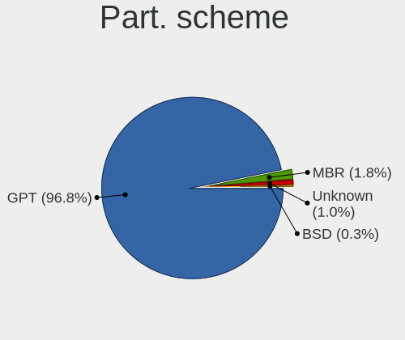
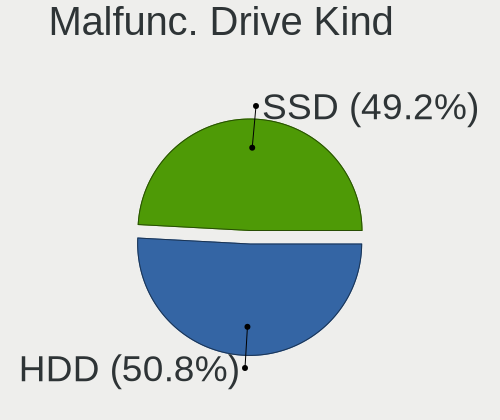
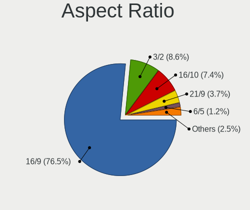
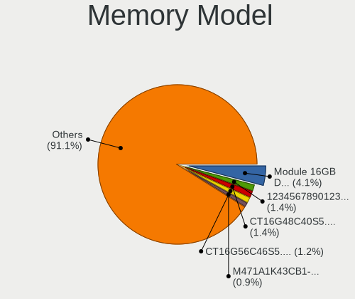
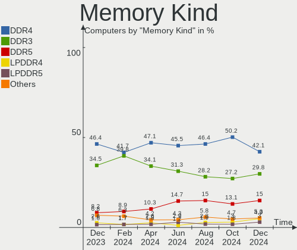
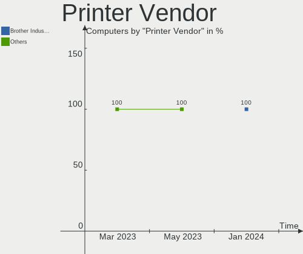

BSD Hardware Trends
-------------------

A project to identify most popular hardware characteristics and track their change
over time based on data collected by BSD users at https://BSD-Hardware.info.

Anyone can contribute to this report by the [hw-probe](https://github.com/linuxhw/hw-probe/blob/master/INSTALL.BSD.md) tool:

    hw-probe -all -upload

This is a report for all computer types. See also reports for [desktops](/Desktop/README.md) and [notebooks](/Notebook/README.md).

Full-feature report is available here: https://bsd-hardware.info/?view=trends

OS-specific reports: [FreeBSD](/Dist/FreeBSD), [OPNsense](/Dist/OPNsense), [helloSystem](/Dist/helloSystem), [OpenBSD](/Dist/OpenBSD).

Period: Dec, 2021.

Contents
--------

* [ System ](#system)
  - [ OS                       ](#os)
  - [ OS Family                ](#os-family)
  - [ Arch                     ](#arch)
  - [ DE                       ](#de)
  - [ Display Server           ](#display-server)
  - [ Display Manager          ](#display-manager)
  - [ OS Lang                  ](#os-lang)
  - [ Boot Mode                ](#boot-mode)
  - [ Filesystem               ](#filesystem)
  - [ Part. scheme             ](#part-scheme)

* [ Board ](#board)
  - [ Vendor                   ](#vendor)
  - [ Model                    ](#model)
  - [ Model Family             ](#model-family)
  - [ MFG Year                 ](#mfg-year)
  - [ Form Factor              ](#form-factor)
  - [ Coreboot                 ](#coreboot)
  - [ RAM Size                 ](#ram-size)
  - [ RAM Used                 ](#ram-used)
  - [ Total Drives             ](#total-drives)
  - [ Has CD-ROM               ](#has-cd-rom)
  - [ Has Ethernet             ](#has-ethernet)
  - [ Has WiFi                 ](#has-wifi)
  - [ Has Bluetooth            ](#has-bluetooth)

* [ Location ](#location)
  - [ Country                  ](#country)
  - [ City                     ](#city)

* [ Drives ](#drives)
  - [ Drive Vendor             ](#drive-vendor)
  - [ Drive Model              ](#drive-model)
  - [ HDD Vendor               ](#hdd-vendor)
  - [ SSD Vendor               ](#ssd-vendor)
  - [ Drive Kind               ](#drive-kind)
  - [ Drive Connector          ](#drive-connector)
  - [ Drive Size               ](#drive-size)
  - [ Space Total              ](#space-total)
  - [ Space Used               ](#space-used)
  - [ Malfunc. Drives          ](#malfunc-drives)
  - [ Malfunc. Drive Vendor    ](#malfunc-drive-vendor)
  - [ Malfunc. HDD Vendor      ](#malfunc-hdd-vendor)
  - [ Malfunc. Drive Kind      ](#malfunc-drive-kind)
  - [ Failed Drives            ](#failed-drives)
  - [ Failed Drive Vendor      ](#failed-drive-vendor)
  - [ Drive Status             ](#drive-status)

* [ Storage controller ](#storage-controller)
  - [ Storage Vendor           ](#storage-vendor)
  - [ Storage Model            ](#storage-model)
  - [ Storage Kind             ](#storage-kind)

* [ Processor ](#processor)
  - [ CPU Vendor               ](#cpu-vendor)
  - [ CPU Model                ](#cpu-model)
  - [ CPU Model Family         ](#cpu-model-family)
  - [ CPU Cores                ](#cpu-cores)
  - [ CPU Sockets              ](#cpu-sockets)
  - [ CPU Threads              ](#cpu-threads)
  - [ CPU Microarch            ](#cpu-microarch)

* [ Graphics ](#graphics)
  - [ GPU Vendor               ](#gpu-vendor)
  - [ GPU Model                ](#gpu-model)
  - [ GPU Combo                ](#gpu-combo)
  - [ GPU Driver               ](#gpu-driver)
  - [ GPU Memory               ](#gpu-memory)

* [ Monitor ](#monitor)
  - [ Monitor Vendor           ](#monitor-vendor)
  - [ Monitor Model            ](#monitor-model)
  - [ Monitor Resolution       ](#monitor-resolution)
  - [ Monitor Diagonal         ](#monitor-diagonal)
  - [ Monitor Width            ](#monitor-width)
  - [ Aspect Ratio             ](#aspect-ratio)
  - [ Monitor Area             ](#monitor-area)
  - [ Pixel Density            ](#pixel-density)
  - [ Multiple Monitors        ](#multiple-monitors)

* [ Network ](#network)
  - [ Net Controller Vendor    ](#net-controller-vendor)
  - [ Net Controller Model     ](#net-controller-model)
  - [ Wireless Vendor          ](#wireless-vendor)
  - [ Wireless Model           ](#wireless-model)
  - [ Ethernet Vendor          ](#ethernet-vendor)
  - [ Ethernet Model           ](#ethernet-model)
  - [ Net Controller Kind      ](#net-controller-kind)
  - [ Used Controller          ](#used-controller)
  - [ NICs                     ](#nics)
  - [ IPv6                     ](#ipv6)

* [ Bluetooth ](#bluetooth)
  - [ Bluetooth Vendor         ](#bluetooth-vendor)
  - [ Bluetooth Model          ](#bluetooth-model)

* [ Sound ](#sound)
  - [ Sound Vendor             ](#sound-vendor)
  - [ Sound Model              ](#sound-model)

* [ Memory ](#memory)
  - [ Memory Vendor            ](#memory-vendor)
  - [ Memory Model             ](#memory-model)
  - [ Memory Kind              ](#memory-kind)
  - [ Memory Form Factor       ](#memory-form-factor)
  - [ Memory Size              ](#memory-size)
  - [ Memory Speed             ](#memory-speed)

* [ Printers & scanners ](#printers--scanners)
  - [ Printer Vendor           ](#printer-vendor)
  - [ Printer Model            ](#printer-model)
  - [ Scanner Vendor           ](#scanner-vendor)
  - [ Scanner Model            ](#scanner-model)

* [ Camera ](#camera)
  - [ Camera Vendor            ](#camera-vendor)
  - [ Camera Model             ](#camera-model)

* [ Security ](#security)
  - [ Fingerprint Vendor       ](#fingerprint-vendor)
  - [ Fingerprint Model        ](#fingerprint-model)
  - [ Chipcard Vendor          ](#chipcard-vendor)
  - [ Chipcard Model           ](#chipcard-model)

* [ Unsupported ](#unsupported)
  - [ Unsupported Devices      ](#unsupported-devices)
  - [ Unsupported Device Types ](#unsupported-device-types)

System
------

OS
--

Installed operating systems

| Name                   | Computers | Percent |
|------------------------|-----------|---------|
| OPNsense 21.7.7        | 104       | 25.87%  |
| OPNsense 21.7.6        | 93        | 23.13%  |
| helloSystem 0.7.0      | 57        | 14.18%  |
| FreeBSD 13.0-p5        | 31        | 7.71%   |
| helloSystem 0.6.0      | 16        | 3.98%   |
| OpenBSD 7.0            | 14        | 3.48%   |
| FreeBSD 13.0-STABLE    | 13        | 3.23%   |
| FreeBSD 14.0-CURRENT   | 10        | 2.49%   |
| FreeBSD 13.0           | 10        | 2.49%   |
| OPNsense 22.1          | 9         | 2.24%   |
| GhostBSD 21.08.27      | 5         | 1.24%   |
| OPNsense 21.1.9        | 4         | 1%      |
| FreeBSD 13.0-p4        | 4         | 1%      |
| OPNsense 21.7.4        | 3         | 0.75%   |
| OPNsense 12.1-p21-HBSD | 3         | 0.75%   |
| NomadBSD 5806f915      | 3         | 0.75%   |
| helloSystem 0.5.0      | 3         | 0.75%   |
| TrueNAS 12.2-p11       | 2         | 0.5%    |
| OPNsense 21.7.5        | 2         | 0.5%    |
| OPNsense 21.7.3        | 2         | 0.5%    |
| OPNsense 21.7.2        | 2         | 0.5%    |
| NetBSD 9.99.93         | 2         | 0.5%    |
| XigmaNAS 12.2-p7       | 1         | 0.25%   |
| OPNsense 21.7.1        | 1         | 0.25%   |
| OPNsense 12.1-p20-HBSD | 1         | 0.25%   |
| OPNsense 12.1-p19-HBSD | 1         | 0.25%   |
| NetBSD 9.2             | 1         | 0.25%   |
| MidnightBSD 2.1.2      | 1         | 0.25%   |
| FreeBSD 13.0-p3        | 1         | 0.25%   |
| FreeBSD 12.3           | 1         | 0.25%   |
| FreeBSD 12.2-p11       | 1         | 0.25%   |
| FreeBSD 12.2           | 1         | 0.25%   |

OS Family
---------

OS without a version

| Name        | Computers | Percent |
|-------------|-----------|---------|
| OPNsense    | 225       | 55.97%  |
| helloSystem | 76        | 18.91%  |
| FreeBSD     | 72        | 17.91%  |
| OpenBSD     | 14        | 3.48%   |
| GhostBSD    | 5         | 1.24%   |
| NomadBSD    | 3         | 0.75%   |
| NetBSD      | 3         | 0.75%   |
| TrueNAS     | 2         | 0.5%    |
| XigmaNAS    | 1         | 0.25%   |
| MidnightBSD | 1         | 0.25%   |

Arch
----

OS architecture (x86_64, i586, etc.)

| Name  | Computers | Percent |
|-------|-----------|---------|
| amd64 | 390       | 97.01%  |
| arm64 | 8         | 1.99%   |
| i386  | 2         | 0.5%    |
| armv7 | 1         | 0.25%   |
| arm   | 1         | 0.25%   |

DE
--

Desktop Environment

| Name         | Computers | Percent |
|--------------|-----------|---------|
| Console      | 254       | 63.18%  |
| helloDesktop | 78        | 19.4%   |
| XFCE         | 14        | 3.48%   |
| KDE5         | 14        | 3.48%   |
| fvwm         | 10        | 2.49%   |
| TWM          | 7         | 1.74%   |
| Openbox      | 6         | 1.49%   |
| GNOME        | 6         | 1.49%   |
| MATE         | 5         | 1.24%   |
| i3           | 3         | 0.75%   |
| LXQt         | 2         | 0.5%    |
| Fluxbox      | 2         | 0.5%    |
| X-Cinnamon   | 1         | 0.25%   |

Display Server
--------------

X11 or Wayland

| Name    | Computers | Percent |
|---------|-----------|---------|
| Console | 258       | 64.18%  |
| X11     | 143       | 35.57%  |
| Wayland | 1         | 0.25%   |

Display Manager
---------------

SDDM, LightDM, etc.

| Name    | Computers | Percent |
|---------|-----------|---------|
| Console | 288       | 71.64%  |
| SLiM    | 89        | 22.14%  |
| LightDM | 11        | 2.74%   |
| SDDM    | 9         | 2.24%   |
| XDM     | 4         | 1%      |
| GDM     | 1         | 0.25%   |

OS Lang
-------

Language

| Lang    | Computers | Percent |
|---------|-----------|---------|
| Unknown | 243       | 60.45%  |
| en_US   | 87        | 21.64%  |
| C       | 51        | 12.69%  |
| ru_RU   | 6         | 1.49%   |
| uk_UA   | 5         | 1.24%   |
| de_DE   | 3         | 0.75%   |
| zh_CN   | 2         | 0.5%    |
| fr_FR   | 2         | 0.5%    |
| en_GB   | 2         | 0.5%    |
| en_CA   | 1         | 0.25%   |

Boot Mode
---------

EFI or BIOS

| Mode | Computers | Percent |
|------|-----------|---------|
| EFI  | 343       | 85.32%  |
| BIOS | 59        | 14.68%  |

Filesystem
----------

Type of filesystem

| Type   | Computers | Percent |
|--------|-----------|---------|
| Ufs    | 191       | 47.51%  |
| Zfs    | 157       | 39.05%  |
| Cd9660 | 40        | 9.95%   |
| Ffs    | 14        | 3.48%   |

Part. scheme
------------

Scheme of partitioning

| Type    | Computers | Percent |
|---------|-----------|---------|
| GPT     | 369       | 91.79%  |
| MBR     | 27        | 6.72%   |
| Unknown | 4         | 1%      |
| BSD     | 2         | 0.5%    |

Board
-----

Vendor
------

Motherboard manufacturer

| Name                        | Computers | Percent |
|-----------------------------|-----------|---------|
| ASUSTek Computer            | 45        | 11.19%  |
| Hewlett-Packard             | 38        | 9.45%   |
| Dell                        | 38        | 9.45%   |
| Unknown                     | 38        | 9.45%   |
| Lenovo                      | 35        | 8.71%   |
| Gigabyte Technology         | 21        | 5.22%   |
| Intel                       | 18        | 4.48%   |
| ASRock                      | 18        | 4.48%   |
| Protectli                   | 17        | 4.23%   |
| Supermicro                  | 16        | 3.98%   |
| PC Engines                  | 12        | 2.99%   |
| MSI                         | 12        | 2.99%   |
| Sophos                      | 11        | 2.74%   |
| Fujitsu                     | 7         | 1.74%   |
| Acer                        | 7         | 1.74%   |
| ZOTAC                       | 6         | 1.49%   |
| Deciso                      | 5         | 1.24%   |
| AMI                         | 5         | 1.24%   |
| HPE                         | 4         | 1%      |
| Apple                       | 4         | 1%      |
| Toshiba                     | 3         | 0.75%   |
| Samsung Electronics         | 3         | 0.75%   |
| Biostar                     | 3         | 0.75%   |
| AWOW                        | 3         | 0.75%   |
| Raspberry Pi Foundation     | 2         | 0.5%    |
| NEXCOM                      | 2         | 0.5%    |
| YANYU                       | 1         | 0.25%   |
| TOXIC by BTO                | 1         | 0.25%   |
| ShenZhen MinWin Technology  | 1         | 0.25%   |
| Quanta                      | 1         | 0.25%   |
| Purism                      | 1         | 0.25%   |
| Positivo                    | 1         | 0.25%   |
| Philco                      | 1         | 0.25%   |
| Pegatron                    | 1         | 0.25%   |
| Packard Bell                | 1         | 0.25%   |
| OEM                         | 1         | 0.25%   |
| NU591                       | 1         | 0.25%   |
| Netgate                     | 1         | 0.25%   |
| Lex                         | 1         | 0.25%   |
| khadas                      | 1         | 0.25%   |
| Jetway                      | 1         | 0.25%   |
| HUAWEI                      | 1         | 0.25%   |
| HARDKERNEL                  | 1         | 0.25%   |
| friendlyelec                | 1         | 0.25%   |
| Framework                   | 1         | 0.25%   |
| Elitegroup Computer Systems | 1         | 0.25%   |
| Cisco Systems               | 1         | 0.25%   |
| Chuwi                       | 1         | 0.25%   |
| CheckPoint                  | 1         | 0.25%   |
| Casper                      | 1         | 0.25%   |
| BESSTAR Tech                | 1         | 0.25%   |
| ASRockRack                  | 1         | 0.25%   |
| Alienware                   | 1         | 0.25%   |
| Advantech                   | 1         | 0.25%   |
| Acidanthera                 | 1         | 0.25%   |

Model
-----

Motherboard model

| Name                                | Computers | Percent |
|-------------------------------------|-----------|---------|
| Unknown                             | 38        | 9.45%   |
| PC Engines apu4                     | 8         | 1.99%   |
| Supermicro Super Server             | 6         | 1.49%   |
| Sophos XG                           | 6         | 1.49%   |
| Protectli FW4B                      | 6         | 1.49%   |
| Protectli FW6                       | 5         | 1.24%   |
| Intel Q3XXG4-P V1.0                 | 5         | 1.24%   |
| Dell OptiPlex 3010                  | 5         | 1.24%   |
| Dell OptiPlex 9020                  | 4         | 1%      |
| Sophos UTM                          | 3         | 0.75%   |
| Protectli FW6E                      | 3         | 0.75%   |
| PC Engines APU2                     | 3         | 0.75%   |
| Deciso Netboard A20                 | 3         | 0.75%   |
| ZOTAC ZBOX-CI327NANO-GS-01          | 2         | 0.5%    |
| ZOTAC ZBOX-CI323NANO                | 2         | 0.5%    |
| Supermicro A1SAi                    | 2         | 0.5%    |
| Sophos SG                           | 2         | 0.5%    |
| RPi Raspberry Pi                    | 2         | 0.5%    |
| Protectli FW6D                      | 2         | 0.5%    |
| MSI MS-7592                         | 2         | 0.5%    |
| HPE ProLiant MicroServer Gen10      | 2         | 0.5%    |
| HP t730 Thin Client                 | 2         | 0.5%    |
| HP t620 PLUS Quad Core TC           | 2         | 0.5%    |
| HP ProDesk 600 G2 SFF               | 2         | 0.5%    |
| HP ProDesk 600 G1 SFF               | 2         | 0.5%    |
| Gigabyte X470 AORUS ULTRA GAMING    | 2         | 0.5%    |
| Dell PowerEdge R410                 | 2         | 0.5%    |
| Dell PowerEdge R210 II              | 2         | 0.5%    |
| Dell OptiPlex 9010                  | 2         | 0.5%    |
| Deciso DEC2700 - OPNsense Appliance | 2         | 0.5%    |
| AWOW PC BOX                         | 2         | 0.5%    |
| ASUS ROG STRIX X570-E GAMING        | 2         | 0.5%    |
| ASUS All Series                     | 2         | 0.5%    |
| ASRock X570 Phantom Gaming 4        | 2         | 0.5%    |
| AMI Aptio CRB                       | 2         | 0.5%    |
| ZOTAC ZBOX-CI527/CI547              | 1         | 0.25%   |
| ZOTAC ZBOX-CI321NANO                | 1         | 0.25%   |
| YANYU H67SL                         | 1         | 0.25%   |
| TOXIC by BTO 15CL872 1050TI         | 1         | 0.25%   |
| Toshiba Satellite P755              | 1         | 0.25%   |
| Toshiba Satellite L550              | 1         | 0.25%   |
| Toshiba Satellite C50-B             | 1         | 0.25%   |
| Supermicro X8SIL                    | 1         | 0.25%   |
| Supermicro X11SSN-L                 | 1         | 0.25%   |
| Supermicro X10SLM+-LN4F             | 1         | 0.25%   |
| Supermicro X10SLH-N6-ST031          | 1         | 0.25%   |
| Supermicro SYS-E300-9D-8CN8TP       | 1         | 0.25%   |
| Supermicro SYS-5019A-FTN4           | 1         | 0.25%   |
| Supermicro SYS-1019D-4C-FHN13TP     | 1         | 0.25%   |
| Supermicro A2SDi-4C-HLN4F           | 1         | 0.25%   |
| ShenZhen MinWin 3865U-6L            | 1         | 0.25%   |
| Samsung R720                        | 1         | 0.25%   |
| Samsung 530XBB                      | 1         | 0.25%   |
| Samsung 305E4A/305E5A/305E7A        | 1         | 0.25%   |
| Quanta 120-1135                     | 1         | 0.25%   |
| Purism Librem Mini v2               | 1         | 0.25%   |
| Protectli FW4A                      | 1         | 0.25%   |
| Positivo C14CR01                    | 1         | 0.25%   |
| Philco 10B                          | 1         | 0.25%   |
| Pegatron IPM41-D3                   | 1         | 0.25%   |

Model Family
------------

Motherboard model prefix

| Name                          | Computers | Percent |
|-------------------------------|-----------|---------|
| Unknown                       | 38        | 9.45%   |
| Lenovo ThinkPad               | 23        | 5.72%   |
| Dell OptiPlex                 | 17        | 4.23%   |
| Dell PowerEdge                | 9         | 2.24%   |
| PC Engines apu4               | 8         | 1.99%   |
| Supermicro Super              | 6         | 1.49%   |
| Sophos XG                     | 6         | 1.49%   |
| Protectli FW4B                | 6         | 1.49%   |
| HP ProDesk                    | 6         | 1.49%   |
| ASUS ROG                      | 6         | 1.49%   |
| ASUS PRIME                    | 6         | 1.49%   |
| Protectli FW6                 | 5         | 1.24%   |
| Intel Q3XXG4-P                | 5         | 1.24%   |
| HP ProLiant                   | 5         | 1.24%   |
| HP Compaq                     | 5         | 1.24%   |
| Lenovo ThinkCentre            | 4         | 1%      |
| Lenovo IdeaPad                | 4         | 1%      |
| HPE ProLiant                  | 4         | 1%      |
| Dell Inspiron                 | 4         | 1%      |
| Acer Aspire                   | 4         | 1%      |
| Toshiba Satellite             | 3         | 0.75%   |
| Sophos UTM                    | 3         | 0.75%   |
| Protectli FW6E                | 3         | 0.75%   |
| PC Engines APU2               | 3         | 0.75%   |
| HP ProBook                    | 3         | 0.75%   |
| HP EliteBook                  | 3         | 0.75%   |
| Fujitsu FUTRO                 | 3         | 0.75%   |
| Fujitsu ESPRIMO               | 3         | 0.75%   |
| Dell Precision                | 3         | 0.75%   |
| Deciso Netboard               | 3         | 0.75%   |
| ASUS TUF                      | 3         | 0.75%   |
| ASRock X570                   | 3         | 0.75%   |
| ZOTAC ZBOX-CI327NANO-GS-01    | 2         | 0.5%    |
| ZOTAC ZBOX-CI323NANO          | 2         | 0.5%    |
| Supermicro A1SAi              | 2         | 0.5%    |
| Sophos SG                     | 2         | 0.5%    |
| RPi Raspberry                 | 2         | 0.5%    |
| Protectli FW6D                | 2         | 0.5%    |
| MSI MS-7592                   | 2         | 0.5%    |
| HP t730                       | 2         | 0.5%    |
| HP t620                       | 2         | 0.5%    |
| HP Pavilion                   | 2         | 0.5%    |
| HP EliteDesk                  | 2         | 0.5%    |
| Gigabyte X470                 | 2         | 0.5%    |
| Gigabyte B550M                | 2         | 0.5%    |
| Dell Latitude                 | 2         | 0.5%    |
| Deciso DEC2700                | 2         | 0.5%    |
| AWOW PC                       | 2         | 0.5%    |
| ASUS P8Z77-V                  | 2         | 0.5%    |
| ASUS All                      | 2         | 0.5%    |
| AMI Aptio                     | 2         | 0.5%    |
| ZOTAC ZBOX-CI527              | 1         | 0.25%   |
| ZOTAC ZBOX-CI321NANO          | 1         | 0.25%   |
| YANYU H67SL                   | 1         | 0.25%   |
| TOXIC by BTO 15CL872          | 1         | 0.25%   |
| Supermicro X8SIL              | 1         | 0.25%   |
| Supermicro X11SSN-L           | 1         | 0.25%   |
| Supermicro X10SLM+-LN4F       | 1         | 0.25%   |
| Supermicro X10SLH-N6-ST031    | 1         | 0.25%   |
| Supermicro SYS-E300-9D-8CN8TP | 1         | 0.25%   |

MFG Year
--------

Motherboard manufacture year

| Year    | Computers | Percent |
|---------|-----------|---------|
| 2021    | 87        | 21.64%  |
| 2020    | 51        | 12.69%  |
| 2018    | 50        | 12.44%  |
| 2019    | 47        | 11.69%  |
| 2013    | 31        | 7.71%   |
| 2014    | 23        | 5.72%   |
| 2017    | 18        | 4.48%   |
| 2011    | 16        | 3.98%   |
| 2016    | 15        | 3.73%   |
| 2012    | 15        | 3.73%   |
| 2015    | 12        | 2.99%   |
| 2010    | 10        | 2.49%   |
| 2009    | 8         | 1.99%   |
| Unknown | 8         | 1.99%   |
| 2008    | 6         | 1.49%   |
| 2007    | 3         | 0.75%   |
| 2006    | 1         | 0.25%   |
| 2005    | 1         | 0.25%   |

Form Factor
-----------

Physical design of the computer

| Name           | Computers | Percent |
|----------------|-----------|---------|
| Desktop        | 252       | 62.69%  |
| Notebook       | 83        | 20.65%  |
| Mini pc        | 24        | 5.97%   |
| Server         | 23        | 5.72%   |
| Firewall       | 11        | 2.74%   |
| Convertible    | 4         | 1%      |
| All in one     | 3         | 0.75%   |
| System on chip | 2         | 0.5%    |

Coreboot
--------

Have coreboot on board

| Used | Computers | Percent |
|------|-----------|---------|
| No   | 387       | 96.27%  |
| Yes  | 15        | 3.73%   |

RAM Size
--------

Total RAM memory

| Size in GB  | Computers | Percent |
|-------------|-----------|---------|
| 8.01-16.0   | 130       | 32.34%  |
| 4.01-8.0    | 92        | 22.89%  |
| 16.01-24.0  | 83        | 20.65%  |
| 32.01-64.0  | 37        | 9.2%    |
| 2.01-3.0    | 22        | 5.47%   |
| 64.01-256.0 | 19        | 4.73%   |
| 3.01-4.0    | 9         | 2.24%   |
| 24.01-32.0  | 4         | 1%      |
| 0.51-1.0    | 3         | 0.75%   |
| 1.01-2.0    | 2         | 0.5%    |
| 0.01-0.5    | 1         | 0.25%   |

RAM Used
--------

Used RAM memory

| Used GB     | Computers | Percent |
|-------------|-----------|---------|
| 0.01-0.5    | 210       | 52.24%  |
| 0.51-1.0    | 101       | 25.12%  |
| 1.01-2.0    | 50        | 12.44%  |
| 4.01-8.0    | 9         | 2.24%   |
| 3.01-4.0    | 9         | 2.24%   |
| 2.01-3.0    | 9         | 2.24%   |
| 32.01-64.0  | 3         | 0.75%   |
| 8.01-16.0   | 3         | 0.75%   |
| 0           | 3         | 0.75%   |
| Unknown     | 3         | 0.75%   |
| 64.01-256.0 | 1         | 0.25%   |
| 16.01-24.0  | 1         | 0.25%   |

Total Drives
------------

Number of drives on board

| Drives | Computers | Percent |
|--------|-----------|---------|
| 1      | 275       | 68.41%  |
| 2      | 56        | 13.93%  |
| 0      | 29        | 7.21%   |
| 4      | 16        | 3.98%   |
| 3      | 11        | 2.74%   |
| 6      | 7         | 1.74%   |
| 5      | 4         | 1%      |
| 8      | 2         | 0.5%    |
| 13     | 1         | 0.25%   |
| 7      | 1         | 0.25%   |

Has CD-ROM
----------

Has CD-ROM on board

| Presented | Computers | Percent |
|-----------|-----------|---------|
| No        | 324       | 80.6%   |
| Yes       | 78        | 19.4%   |

Has Ethernet
------------

Has Ethernet on board

| Presented | Computers | Percent |
|-----------|-----------|---------|
| Yes       | 383       | 95.27%  |
| No        | 19        | 4.73%   |

Has WiFi
--------

Has WiFi module

| Presented | Computers | Percent |
|-----------|-----------|---------|
| No        | 238       | 59.2%   |
| Yes       | 164       | 40.8%   |

Has Bluetooth
-------------

Has Bluetooth module

| Presented | Computers | Percent |
|-----------|-----------|---------|
| No        | 304       | 75.62%  |
| Yes       | 98        | 24.38%  |

Location
--------

Country
-------

Geographic location (country)

| Country      | Computers | Percent |
|--------------|-----------|---------|
| USA          | 105       | 26.12%  |
| Germany      | 68        | 16.92%  |
| Russia       | 23        | 5.72%   |
| Netherlands  | 20        | 4.98%   |
| France       | 16        | 3.98%   |
| Ukraine      | 14        | 3.48%   |
| Canada       | 13        | 3.23%   |
| Poland       | 12        | 2.99%   |
| Spain        | 9         | 2.24%   |
| Romania      | 9         | 2.24%   |
| Austria      | 9         | 2.24%   |
| Switzerland  | 8         | 1.99%   |
| UK           | 7         | 1.74%   |
| Sweden       | 6         | 1.49%   |
| Italy        | 6         | 1.49%   |
| Hungary      | 6         | 1.49%   |
| Denmark      | 6         | 1.49%   |
| Brazil       | 6         | 1.49%   |
| Australia    | 6         | 1.49%   |
| India        | 5         | 1.24%   |
| Japan        | 4         | 1%      |
| Bulgaria     | 4         | 1%      |
| Taiwan       | 3         | 0.75%   |
| South Korea  | 3         | 0.75%   |
| New Zealand  | 3         | 0.75%   |
| Indonesia    | 3         | 0.75%   |
| China        | 3         | 0.75%   |
| Vietnam      | 2         | 0.5%    |
| South Africa | 2         | 0.5%    |
| Portugal     | 2         | 0.5%    |
| Philippines  | 2         | 0.5%    |
| Peru         | 2         | 0.5%    |
| Ireland      | 2         | 0.5%    |
| Czechia      | 2         | 0.5%    |
| Thailand     | 1         | 0.25%   |
| Slovakia     | 1         | 0.25%   |
| Singapore    | 1         | 0.25%   |
| Qatar        | 1         | 0.25%   |
| Norway       | 1         | 0.25%   |
| Mexico       | 1         | 0.25%   |
| Isle of Man  | 1         | 0.25%   |
| Finland      | 1         | 0.25%   |
| Cuba         | 1         | 0.25%   |
| Croatia      | 1         | 0.25%   |
| Belgium      | 1         | 0.25%   |

City
----

Geographic location (city)

| City              | Computers | Percent |
|-------------------|-----------|---------|
| Moscow            | 9         | 2.24%   |
| Kyiv              | 8         | 1.99%   |
| Berlin            | 8         | 1.99%   |
| Amsterdam         | 7         | 1.74%   |
| Munich            | 5         | 1.24%   |
| Warsaw            | 4         | 1%      |
| Bucharest         | 4         | 1%      |
| Zeitz             | 3         | 0.75%   |
| Woodbridge        | 3         | 0.75%   |
| Vienna            | 3         | 0.75%   |
| Paris             | 3         | 0.75%   |
| Mountain View     | 3         | 0.75%   |
| Madrid            | 3         | 0.75%   |
| Krakow            | 3         | 0.75%   |
| Karlsruhe         | 3         | 0.75%   |
| Frankfurt am Main | 3         | 0.75%   |
| Zurich            | 2         | 0.5%    |
| Yekaterinburg     | 2         | 0.5%    |
| Vancouver         | 2         | 0.5%    |
| Valencia          | 2         | 0.5%    |
| Toronto           | 2         | 0.5%    |
| Sz?©kesfeh?©rv??r | 2         | 0.5%    |
| Suceava           | 2         | 0.5%    |
| Sofia             | 2         | 0.5%    |
| Seattle           | 2         | 0.5%    |
| San Diego         | 2         | 0.5%    |
| Salem             | 2         | 0.5%    |
| Rochester         | 2         | 0.5%    |
| Redmond           | 2         | 0.5%    |
| Potsdam           | 2         | 0.5%    |
| Portland          | 2         | 0.5%    |
| Perth             | 2         | 0.5%    |
| Ozersk            | 2         | 0.5%    |
| Ourense           | 2         | 0.5%    |
| Novosibirsk       | 2         | 0.5%    |
| New York          | 2         | 0.5%    |
| New Delhi         | 2         | 0.5%    |
| Montgeron         | 2         | 0.5%    |
| Milwaukee         | 2         | 0.5%    |
| Memphis           | 2         | 0.5%    |
| Maraba            | 2         | 0.5%    |
| Madison           | 2         | 0.5%    |
| London            | 2         | 0.5%    |
| Lima              | 2         | 0.5%    |
| Jena              | 2         | 0.5%    |
| Jeju City         | 2         | 0.5%    |
| Hanoi             | 2         | 0.5%    |
| Hangzhou          | 2         | 0.5%    |
| Hamburg           | 2         | 0.5%    |
| Duisburg          | 2         | 0.5%    |
| D??sseldorf       | 2         | 0.5%    |
| Cologne           | 2         | 0.5%    |
| Brooklyn          | 2         | 0.5%    |
| Bothell           | 2         | 0.5%    |
| Auckland          | 2         | 0.5%    |
| Zwickau           | 1         | 0.25%   |
| Zoetermeer        | 1         | 0.25%   |
| Zaporizhzhya      | 1         | 0.25%   |
| Zaltbommel        | 1         | 0.25%   |
| Zadar             | 1         | 0.25%   |

Drives
------

Drive Vendor
------------

Hard drive vendors

| Vendor              | Computers | Drives | Percent |
|---------------------|-----------|--------|---------|
| Samsung Electronics | 83        | 104    | 17.55%  |
| WDC                 | 58        | 88     | 12.26%  |
| Seagate             | 45        | 67     | 9.51%   |
| Kingston            | 35        | 37     | 7.4%    |
| Transcend           | 25        | 25     | 5.29%   |
| Toshiba             | 25        | 28     | 5.29%   |
| Crucial             | 22        | 23     | 4.65%   |
| Intel               | 21        | 22     | 4.44%   |
| SanDisk             | 17        | 18     | 3.59%   |
| HGST                | 12        | 20     | 2.54%   |
| A-DATA Technology   | 11        | 12     | 2.33%   |
| SK Hynix            | 8         | 8      | 1.69%   |
| Phison              | 8         | 8      | 1.69%   |
| Hoodisk             | 8         | 8      | 1.69%   |
| Micron Technology   | 6         | 7      | 1.27%   |
| Intenso             | 6         | 6      | 1.27%   |
| OCZ                 | 5         | 5      | 1.06%   |
| Hitachi             | 5         | 5      | 1.06%   |
| Dogfish             | 5         | 5      | 1.06%   |
| Hewlett-Packard     | 4         | 6      | 0.85%   |
| GOODRAM             | 4         | 9      | 0.85%   |
| FORESEE             | 4         | 4      | 0.85%   |
| China               | 4         | 4      | 0.85%   |
| NVMe                | 3         | 3      | 0.63%   |
| Netac               | 3         | 3      | 0.63%   |
| HPE                 | 3         | 11     | 0.63%   |
| XPG                 | 2         | 2      | 0.42%   |
| Protectli           | 2         | 2      | 0.42%   |
| PLEXTOR             | 2         | 2      | 0.42%   |
| MyDigitalSSD        | 2         | 2      | 0.42%   |
| LITEONIT            | 2         | 2      | 0.42%   |
| Kston               | 2         | 2      | 0.42%   |
| KingSpec            | 2         | 2      | 0.42%   |
| Innodisk            | 2         | 2      | 0.42%   |
| Advantech           | 2         | 2      | 0.42%   |
| Yeyian              | 1         | 2      | 0.21%   |
| Verbatim            | 1         | 1      | 0.21%   |
| V-GeN               | 1         | 1      | 0.21%   |
| Terabit             | 1         | 1      | 0.21%   |
| SuperMicro          | 1         | 1      | 0.21%   |
| SSSTC               | 1         | 1      | 0.21%   |
| SPCC                | 1         | 1      | 0.21%   |
| Smartbuy            | 1         | 1      | 0.21%   |
| Silicon Motion      | 1         | 1      | 0.21%   |
| Patriot             | 1         | 1      | 0.21%   |
| Mushkin             | 1         | 1      | 0.21%   |
| MAXTOR              | 1         | 1      | 0.21%   |
| LITEON              | 1         | 1      | 0.21%   |
| Lenovo              | 1         | 1      | 0.21%   |
| KIOXIA              | 1         | 1      | 0.21%   |
| Integral            | 1         | 1      | 0.21%   |
| Indilinx            | 1         | 1      | 0.21%   |
| IBM-207x            | 1         | 1      | 0.21%   |
| HCiPC               | 1         | 1      | 0.21%   |
| Gigabyte Technology | 1         | 1      | 0.21%   |
| Fujitsu             | 1         | 1      | 0.21%   |
| Corsair             | 1         | 1      | 0.21%   |
| BIWIN               | 1         | 1      | 0.21%   |
| ASUSTek Computer    | 1         | 2      | 0.21%   |
| Apacer              | 1         | 1      | 0.21%   |

Drive Model
-----------

Hard drive models

| Model                            | Computers | Percent |
|----------------------------------|-----------|---------|
| Kingston SUV500MS120G 120GB      | 8         | 1.56%   |
| Kingston SA400S37120G 120GB      | 7         | 1.37%   |
| Samsung SSD 860 EVO 500GB        | 5         | 0.98%   |
| Samsung SSD 850 EVO 250GB        | 5         | 0.98%   |
| Kingston SV300S37A120G 120GB     | 4         | 0.78%   |
| Hoodisk SSD 128GB                | 4         | 0.78%   |
| HGST HTS545050A7E680 500GB       | 4         | 0.78%   |
| Crucial CT250MX500SSD1 250GB     | 4         | 0.78%   |
| Transcend TS64GMSA370 64GB       | 3         | 0.59%   |
| Transcend TS256GMTS952T2 256GB   | 3         | 0.59%   |
| Toshiba MQ01ABF050 500GB         | 3         | 0.59%   |
| Toshiba DT01ACA100 1TB           | 3         | 0.59%   |
| Toshiba DT01ACA050 500GB         | 3         | 0.59%   |
| Seagate ST4000DM004-2CV104 4TB   | 3         | 0.59%   |
| Seagate ST1000DM010-2EP102 1TB   | 3         | 0.59%   |
| Samsung SSD 840 Series 120GB     | 3         | 0.59%   |
| FORESEE 128GB SSD                | 3         | 0.59%   |
| Crucial CT240BX500SSD1 240GB     | 3         | 0.59%   |
| China XJH-128GB                  | 3         | 0.59%   |
| XPG GAMMIX S11 Pro 1TB           | 2         | 0.39%   |
| WDC WDS500G2B0A-00SM50 500GB     | 2         | 0.39%   |
| WDC WDS120G2G0A-00JH30 120GB     | 2         | 0.39%   |
| WDC WDS100T3X0C-00SJG0 1TB       | 2         | 0.39%   |
| WDC WD5000AAKX-00ERMA0 500GB     | 2         | 0.39%   |
| WDC WD5000AAKS-00A7B2 500GB      | 2         | 0.39%   |
| WDC WD40EZRZ-00GXCB0 4TB         | 2         | 0.39%   |
| WDC WD10EFRX-68JCSN0 1TB         | 2         | 0.39%   |
| WDC WD10EFRX-68FYTN0 1TB         | 2         | 0.39%   |
| Transcend TS64GMSA230S 64GB      | 2         | 0.39%   |
| Transcend TS32GSSD370 32GB       | 2         | 0.39%   |
| Transcend TS256GMTE652T2 256GB   | 2         | 0.39%   |
| Transcend TS128GMSA230S 128GB    | 2         | 0.39%   |
| Toshiba MQ01ABD100 1TB           | 2         | 0.39%   |
| Toshiba MK2556GSY 250GB          | 2         | 0.39%   |
| Toshiba HDWD110 1TB              | 2         | 0.39%   |
| Seagate ST4000DM000-1F2168 4TB   | 2         | 0.39%   |
| Seagate ST3500418AS 500GB        | 2         | 0.39%   |
| Seagate ST3500413AS 500GB        | 2         | 0.39%   |
| Seagate ST3000DM001-1CH166 3TB   | 2         | 0.39%   |
| Seagate ST1000LM035-1RK172 1TB   | 2         | 0.39%   |
| Seagate ST1000DM003-1CH162 1TB   | 2         | 0.39%   |
| Samsung SSD 980 500GB            | 2         | 0.39%   |
| Samsung SSD 970 EVO Plus 250GB   | 2         | 0.39%   |
| Samsung SSD 970 EVO Plus 1TB     | 2         | 0.39%   |
| Samsung SSD 970 EVO 1TB          | 2         | 0.39%   |
| Samsung SSD 960 EVO 500GB        | 2         | 0.39%   |
| Samsung SSD 860 QVO 2TB          | 2         | 0.39%   |
| Samsung SSD 860 EVO 250GB        | 2         | 0.39%   |
| Samsung SSD 860 EVO 1TB          | 2         | 0.39%   |
| Samsung SSD 850 EVO 500GB        | 2         | 0.39%   |
| Samsung SSD 840 PRO Series 128GB | 2         | 0.39%   |
| Samsung SSD 840 EVO 250GB        | 2         | 0.39%   |
| Samsung SSD 840 EVO 120GB mSATA  | 2         | 0.39%   |
| Samsung MZVLW256HEHP-000L7 256GB | 2         | 0.39%   |
| Phison SATA SSD 16GB             | 2         | 0.39%   |
| Phison Sabrent 1TB               | 2         | 0.39%   |
| MyDigitalSSD SB2 128GB           | 2         | 0.39%   |
| Micron C400-MTFDDAK128MAM 128GB  | 2         | 0.39%   |
| Kston SSD 128GB                  | 2         | 0.39%   |
| Kingston SKC600MS512G 512GB      | 2         | 0.39%   |

HDD Vendor
----------

Hard disk drive vendors

| Vendor              | Computers | Drives | Percent |
|---------------------|-----------|--------|---------|
| Seagate             | 43        | 65     | 32.33%  |
| WDC                 | 41        | 68     | 30.83%  |
| Toshiba             | 21        | 24     | 15.79%  |
| HGST                | 12        | 20     | 9.02%   |
| Hitachi             | 5         | 5      | 3.76%   |
| Hewlett-Packard     | 3         | 5      | 2.26%   |
| Samsung Electronics | 2         | 2      | 1.5%    |
| HPE                 | 2         | 9      | 1.5%    |
| NVMe                | 1         | 1      | 0.75%   |
| MAXTOR              | 1         | 1      | 0.75%   |
| IBM-207x            | 1         | 1      | 0.75%   |
| Fujitsu             | 1         | 1      | 0.75%   |

SSD Vendor
----------

Solid state drive vendors

| Vendor              | Computers | Drives | Percent |
|---------------------|-----------|--------|---------|
| Samsung Electronics | 50        | 59     | 18.38%  |
| Kingston            | 32        | 34     | 11.76%  |
| Transcend           | 22        | 22     | 8.09%   |
| Intel               | 19        | 19     | 6.99%   |
| Crucial             | 19        | 20     | 6.99%   |
| SanDisk             | 16        | 17     | 5.88%   |
| WDC                 | 10        | 11     | 3.68%   |
| A-DATA Technology   | 10        | 11     | 3.68%   |
| Hoodisk             | 8         | 8      | 2.94%   |
| Phison              | 6         | 6      | 2.21%   |
| Intenso             | 6         | 6      | 2.21%   |
| SK Hynix            | 5         | 5      | 1.84%   |
| OCZ                 | 5         | 5      | 1.84%   |
| Micron Technology   | 5         | 5      | 1.84%   |
| Dogfish             | 5         | 5      | 1.84%   |
| Toshiba             | 4         | 4      | 1.47%   |
| FORESEE             | 4         | 4      | 1.47%   |
| China               | 4         | 4      | 1.47%   |
| Netac               | 3         | 3      | 1.1%    |
| GOODRAM             | 3         | 8      | 1.1%    |
| Protectli           | 2         | 2      | 0.74%   |
| PLEXTOR             | 2         | 2      | 0.74%   |
| MyDigitalSSD        | 2         | 2      | 0.74%   |
| LITEONIT            | 2         | 2      | 0.74%   |
| Kston               | 2         | 2      | 0.74%   |
| KingSpec            | 2         | 2      | 0.74%   |
| InnoDisk            | 2         | 2      | 0.74%   |
| Advantech           | 2         | 2      | 0.74%   |
| Yeyian              | 1         | 2      | 0.37%   |
| Verbatim            | 1         | 1      | 0.37%   |
| Terabit             | 1         | 1      | 0.37%   |
| SuperMicro          | 1         | 1      | 0.37%   |
| SSSTC               | 1         | 1      | 0.37%   |
| SPCC                | 1         | 1      | 0.37%   |
| Smartbuy            | 1         | 1      | 0.37%   |
| Patriot             | 1         | 1      | 0.37%   |
| NVMe                | 1         | 1      | 0.37%   |
| Mushkin             | 1         | 1      | 0.37%   |
| LITEON              | 1         | 1      | 0.37%   |
| Integral            | 1         | 1      | 0.37%   |
| Indilinx            | 1         | 1      | 0.37%   |
| HPE                 | 1         | 2      | 0.37%   |
| Hewlett-Packard     | 1         | 1      | 0.37%   |
| HCiPC               | 1         | 1      | 0.37%   |
| Gigabyte Technology | 1         | 1      | 0.37%   |
| BIWIN               | 1         | 1      | 0.37%   |
| ASUSTek Computer    | 1         | 2      | 0.37%   |
| Apacer              | 1         | 1      | 0.37%   |

Drive Kind
----------

HDD or SSD

| Kind | Computers | Drives | Percent |
|------|-----------|--------|---------|
| SSD  | 247       | 295    | 57.44%  |
| HDD  | 114       | 202    | 26.51%  |
| NVMe | 69        | 84     | 16.05%  |

Drive Connector
---------------

SATA, SAS, NVMe, etc.

| Type | Computers | Drives | Percent |
|------|-----------|--------|---------|
| SATA | 329       | 497    | 82.66%  |
| NVMe | 69        | 84     | 17.34%  |

Drive Size
----------

Size of hard drive

| Size in TB | Computers | Drives | Percent |
|------------|-----------|--------|---------|
| 0.01-0.5   | 277       | 329    | 73.09%  |
| 0.51-1.0   | 57        | 65     | 15.04%  |
| 1.01-2.0   | 20        | 33     | 5.28%   |
| 3.01-4.0   | 12        | 34     | 3.17%   |
| 2.01-3.0   | 6         | 8      | 1.58%   |
| 4.01-10.0  | 5         | 24     | 1.32%   |
| 10.01-20.0 | 2         | 4      | 0.53%   |

Space Total
-----------

Amount of disk space available on the file system

| Size in GB     | Computers | Percent |
|----------------|-----------|---------|
| 101-250        | 145       | 36.07%  |
| 1-20           | 72        | 17.91%  |
| 251-500        | 67        | 16.67%  |
| 51-100         | 42        | 10.45%  |
| 21-50          | 36        | 8.96%   |
| 501-1000       | 32        | 7.96%   |
| More than 3000 | 4         | 1%      |
| 1001-2000      | 2         | 0.5%    |
| Unknown        | 2         | 0.5%    |

Space Used
----------

Amount of used disk space

| Used GB | Computers | Percent |
|---------|-----------|---------|
| 1-20    | 379       | 94.28%  |
| 21-50   | 9         | 2.24%   |
| 101-250 | 6         | 1.49%   |
| 51-100  | 4         | 1%      |
| 251-500 | 2         | 0.5%    |
| Unknown | 2         | 0.5%    |

Malfunc. Drives
---------------

Drive models with a malfunction

| Model                                       | Computers | Drives | Percent |
|---------------------------------------------|-----------|--------|---------|
| WDC WD5000AAKX-00ERMA0 500GB                | 2         | 2      | 3.7%    |
| MyDigitalSSD SB2 128GB                      | 2         | 2      | 3.7%    |
| WDC WD5000LPLX-60ZNTT1 500GB                | 1         | 1      | 1.85%   |
| WDC WD5000BPVT-22HXZT3 500GB                | 1         | 1      | 1.85%   |
| WDC WD5000AAKX-08ERMA0 500GB                | 1         | 1      | 1.85%   |
| WDC WD20EZRX-00D8PB0 2TB                    | 1         | 2      | 1.85%   |
| WDC WD20EARX-008FB0 2TB                     | 1         | 1      | 1.85%   |
| WDC WD20EARS-00MVWB0 2TB                    | 1         | 1      | 1.85%   |
| WDC WD10SPZX-60Z10T0 1TB                    | 1         | 1      | 1.85%   |
| WDC WD1001FALS-00J7B1 1TB                   | 1         | 1      | 1.85%   |
| Toshiba MQ01ABD100 1TB                      | 1         | 1      | 1.85%   |
| Toshiba MQ01ABD075 752GB                    | 1         | 1      | 1.85%   |
| Toshiba MQ01ABD050 500GB                    | 1         | 1      | 1.85%   |
| Toshiba MK3261GSYN 320GB                    | 1         | 1      | 1.85%   |
| Toshiba HDWE140 4TB                         | 1         | 4      | 1.85%   |
| Toshiba DT01ACA100 1TB                      | 1         | 1      | 1.85%   |
| Terabit T50S3STMLC-256G                     | 1         | 1      | 1.85%   |
| SSSTC CVB-8D128-HP 128GB                    | 1         | 1      | 1.85%   |
| Seagate ST9500420AS 500GB                   | 1         | 1      | 1.85%   |
| Seagate ST9320423AS 320GB                   | 1         | 1      | 1.85%   |
| Seagate ST9160821AS 160GB                   | 1         | 1      | 1.85%   |
| Seagate ST9120822AS 120GB                   | 1         | 1      | 1.85%   |
| Seagate ST500NM0011 500GB                   | 1         | 2      | 1.85%   |
| Seagate ST500LT012-9WS142 500GB             | 1         | 1      | 1.85%   |
| Seagate ST500LM021-1KJ152 500GB             | 1         | 1      | 1.85%   |
| Seagate ST3500418AS 500GB                   | 1         | 1      | 1.85%   |
| Seagate ST3500413AS 500GB                   | 1         | 1      | 1.85%   |
| Seagate ST320LT012-9WS14C 320GB             | 1         | 1      | 1.85%   |
| Seagate ST320LM010-1KJ15C 320GB             | 1         | 1      | 1.85%   |
| Seagate ST1000DM003-1CH162 1TB              | 1         | 1      | 1.85%   |
| SanDisk SD8TB8U-256G-1006 256GB             | 1         | 1      | 1.85%   |
| SanDisk SD5SE2256G1002E 256GB               | 1         | 1      | 1.85%   |
| Samsung Electronics SSD 870 EVO 1TB         | 1         | 1      | 1.85%   |
| Samsung Electronics SSD 860 EVO 1TB         | 1         | 1      | 1.85%   |
| Samsung Electronics MZMPA016HMCD-000L1 16GB | 1         | 1      | 1.85%   |
| Samsung Electronics HS082HB 80GB            | 1         | 1      | 1.85%   |
| PLEXTOR PX-128G7Ne 128GB                    | 1         | 1      | 1.85%   |
| Phison SATA SSD 32GB                        | 1         | 1      | 1.85%   |
| MAXTOR STM3250310AS 250GB                   | 1         | 1      | 1.85%   |
| LITEON CV8-8E128-HP 128GB                   | 1         | 1      | 1.85%   |
| Kingston SV300S37A120G 120GB                | 1         | 1      | 1.85%   |
| Kingston SMS200S330G 32GB                   | 1         | 1      | 1.85%   |
| Intel SSDSC2BW120A3 120GB                   | 1         | 1      | 1.85%   |
| Intel SSDSA2BW160G3H 160GB                  | 1         | 1      | 1.85%   |
| HPE MB0500EBNCR 500GB                       | 1         | 1      | 1.85%   |
| Hitachi HTS722010K9SA00 100GB               | 1         | 1      | 1.85%   |
| Hitachi HTS543232L9SA02 320GB               | 1         | 1      | 1.85%   |
| Hitachi HTS541680J9SA00 80GB                | 1         | 1      | 1.85%   |
| HGST HTS721010A9E630 1TB                    | 1         | 1      | 1.85%   |
| HGST HTS545050A7E680 500GB                  | 1         | 1      | 1.85%   |
| Crucial CT240M500SSD1 240GB                 | 1         | 1      | 1.85%   |
| A-DATA Technology SU650 120GB               | 1         | 1      | 1.85%   |

Malfunc. Drive Vendor
---------------------

Vendors of faulty drives

| Vendor              | Computers | Drives | Percent |
|---------------------|-----------|--------|---------|
| Seagate             | 12        | 13     | 22.64%  |
| WDC                 | 9         | 11     | 16.98%  |
| Toshiba             | 6         | 9      | 11.32%  |
| Samsung Electronics | 4         | 4      | 7.55%   |
| Hitachi             | 3         | 3      | 5.66%   |
| SanDisk             | 2         | 2      | 3.77%   |
| MyDigitalSSD        | 2         | 2      | 3.77%   |
| Kingston            | 2         | 2      | 3.77%   |
| Intel               | 2         | 2      | 3.77%   |
| HGST                | 2         | 2      | 3.77%   |
| Terabit             | 1         | 1      | 1.89%   |
| SSSTC               | 1         | 1      | 1.89%   |
| PLEXTOR             | 1         | 1      | 1.89%   |
| Phison              | 1         | 1      | 1.89%   |
| MAXTOR              | 1         | 1      | 1.89%   |
| LITEON              | 1         | 1      | 1.89%   |
| HPE                 | 1         | 1      | 1.89%   |
| Crucial             | 1         | 1      | 1.89%   |
| A-DATA Technology   | 1         | 1      | 1.89%   |

Malfunc. HDD Vendor
-------------------

Vendors of faulty HDD drives

| Vendor              | Computers | Drives | Percent |
|---------------------|-----------|--------|---------|
| Seagate             | 12        | 13     | 34.29%  |
| WDC                 | 9         | 11     | 25.71%  |
| Toshiba             | 6         | 9      | 17.14%  |
| Hitachi             | 3         | 3      | 8.57%   |
| HGST                | 2         | 2      | 5.71%   |
| Samsung Electronics | 1         | 1      | 2.86%   |
| MAXTOR              | 1         | 1      | 2.86%   |
| HPE                 | 1         | 1      | 2.86%   |

Malfunc. Drive Kind
-------------------

Kinds of faulty drives

| Kind | Computers | Drives | Percent |
|------|-----------|--------|---------|
| HDD  | 35        | 41     | 66.04%  |
| SSD  | 18        | 18     | 33.96%  |

Failed Drives
-------------

Failed drive models

Zero info for selected period =(

Failed Drive Vendor
-------------------

Failed drive vendors

Zero info for selected period =(

Drive Status
------------

Number of failed and malfunc. drives

| Status   | Computers | Drives | Percent |
|----------|-----------|--------|---------|
| Works    | 327       | 510    | 83.85%  |
| Malfunc  | 53        | 59     | 13.59%  |
| Detected | 10        | 12     | 2.56%   |

Storage controller
------------------

Storage Vendor
--------------

Storage controller vendors

| Vendor                           | Computers | Percent |
|----------------------------------|-----------|---------|
| Intel                            | 291       | 60.25%  |
| AMD                              | 76        | 15.73%  |
| Samsung Electronics              | 36        | 7.45%   |
| Sandisk                          | 12        | 2.48%   |
| Broadcom / LSI                   | 8         | 1.66%   |
| Marvell Technology Group         | 7         | 1.45%   |
| ASMedia Technology               | 6         | 1.24%   |
| Silicon Motion                   | 4         | 0.83%   |
| Phison Electronics               | 4         | 0.83%   |
| Nvidia                           | 4         | 0.83%   |
| JMicron Technology               | 4         | 0.83%   |
| SK Hynix                         | 3         | 0.62%   |
| Micron/Crucial Technology        | 3         | 0.62%   |
| Kingston Technology Company      | 3         | 0.62%   |
| ADATA Technology                 | 3         | 0.62%   |
| Silicon Image                    | 2         | 0.41%   |
| Seagate Technology               | 2         | 0.41%   |
| KIOXIA                           | 2         | 0.41%   |
| Hewlett-Packard                  | 2         | 0.41%   |
| Chelsio Communications           | 2         | 0.41%   |
| Unknown                          | 2         | 0.41%   |
| VIA Technologies                 | 1         | 0.21%   |
| Silicon Integrated Systems [SiS] | 1         | 0.21%   |
| Micron Technology                | 1         | 0.21%   |
| Lenovo                           | 1         | 0.21%   |
| HighPoint Technologies           | 1         | 0.21%   |
| Dell                             | 1         | 0.21%   |
| Adaptec                          | 1         | 0.21%   |

Storage Model
-------------

Storage controller models

| Model                                                                            | Computers | Percent |
|----------------------------------------------------------------------------------|-----------|---------|
| AMD FCH SATA Controller [AHCI mode]                                              | 52        | 9.63%   |
| Intel Sunrise Point-LP SATA Controller [AHCI mode]                               | 32        | 5.93%   |
| Intel 8 Series/C220 Series Chipset Family 6-port SATA Controller 1 [AHCI mode]   | 27        | 5%      |
| Intel Q170/Q150/B150/H170/H110/Z170/CM236 Chipset SATA Controller [AHCI Mode]    | 20        | 3.7%    |
| Samsung NVMe SSD Controller SM981/PM981/PM983                                    | 18        | 3.33%   |
| Intel Atom/Celeron/Pentium Processor x5-E8000/J3xxx/N3xxx Series SATA Controller | 17        | 3.15%   |
| Intel 6 Series/C200 Series Chipset Family 6 port Desktop SATA AHCI Controller    | 17        | 3.15%   |
| Intel 7 Series Chipset Family 6-port SATA Controller [AHCI mode]                 | 13        | 2.41%   |
| Intel Celeron/Pentium Silver Processor SATA Controller                           | 12        | 2.22%   |
| AMD SB7x0/SB8x0/SB9x0 SATA Controller [AHCI mode]                                | 10        | 1.85%   |
| Samsung NVMe SSD Controller SM961/PM961/SM963                                    | 9         | 1.67%   |
| Intel 7 Series/C210 Series Chipset Family 6-port SATA Controller [AHCI mode]     | 9         | 1.67%   |
| Intel Wildcat Point-LP SATA Controller [AHCI Mode]                               | 8         | 1.48%   |
| Intel Celeron N3350/Pentium N4200/Atom E3900 Series SATA AHCI Controller         | 8         | 1.48%   |
| Intel 82801HM/HEM (ICH8M/ICH8M-E) IDE Controller                                 | 8         | 1.48%   |
| Intel Cannon Lake PCH SATA AHCI Controller                                       | 7         | 1.3%    |
| Intel Atom Processor E3800 Series SATA AHCI Controller                           | 7         | 1.3%    |
| Intel 8 Series SATA Controller 1 [AHCI mode]                                     | 7         | 1.3%    |
| Intel 6 Series/C200 Series Chipset Family 6 port Mobile SATA AHCI Controller     | 7         | 1.3%    |
| Intel 200 Series PCH SATA controller [AHCI mode]                                 | 7         | 1.3%    |
| AMD 400 Series Chipset SATA Controller                                           | 7         | 1.3%    |
| Unknown                                                                          | 7         | 1.3%    |
| Intel NM10/ICH7 Family SATA Controller [IDE mode]                                | 6         | 1.11%   |
| Intel Atom Processor C3000 Series SATA Controller 0                              | 6         | 1.11%   |
| ASMedia ASM1062 Serial ATA Controller                                            | 6         | 1.11%   |
| Samsung NVMe SSD Controller 980                                                  | 5         | 0.93%   |
| Intel SATA Controller [RAID mode]                                                | 5         | 0.93%   |
| Intel NM10/ICH7 Family SATA Controller [AHCI mode]                               | 5         | 0.93%   |
| Intel Comet Lake SATA AHCI Controller                                            | 5         | 0.93%   |
| Intel Atom Processor C3000 Series SATA Controller 1                              | 5         | 0.93%   |
| Intel 82801HM/HEM (ICH8M/ICH8M-E) SATA Controller [IDE mode]                     | 5         | 0.93%   |
| Intel 82801G (ICH7 Family) IDE Controller                                        | 5         | 0.93%   |
| AMD Starship/Matisse Chipset SATA Controller [AHCI mode]                         | 5         | 0.93%   |
| AMD SB7x0/SB8x0/SB9x0 IDE Controller                                             | 5         | 0.93%   |
| AMD FCH SATA Controller [IDE mode]                                               | 5         | 0.93%   |
| Sandisk WD Blue SN550 NVMe SSD                                                   | 4         | 0.74%   |
| Sandisk WD Black SN750 / PC SN730 NVMe SSD                                       | 4         | 0.74%   |
| Samsung NVMe SSD Controller PM9A1/PM9A3/980PRO                                   | 4         | 0.74%   |
| Intel Cannon Point-LP SATA Controller [AHCI Mode]                                | 4         | 0.74%   |
| Intel 82801HM/HEM (ICH8M/ICH8M-E) SATA Controller [AHCI mode]                    | 4         | 0.74%   |
| Silicon Motion SM2263EN/SM2263XT SSD Controller                                  | 3         | 0.56%   |
| Marvell Group 88SE9172 SATA 6Gb/s Controller                                     | 3         | 0.56%   |
| JMicron JMB363 SATA/IDE Controller                                               | 3         | 0.56%   |
| Intel Atom processor C2000 AHCI SATA3 Controller                                 | 3         | 0.56%   |
| Intel Atom processor C2000 AHCI SATA2 Controller                                 | 3         | 0.56%   |
| Intel 82801JI (ICH10 Family) SATA AHCI Controller                                | 3         | 0.56%   |
| Intel 82801 Mobile SATA Controller [RAID mode]                                   | 3         | 0.56%   |
| Intel 500 Series Chipset Family SATA AHCI Controller                             | 3         | 0.56%   |
| Intel 5 Series/3400 Series Chipset 6 port SATA AHCI Controller                   | 3         | 0.56%   |
| Intel 400 Series Chipset Family SATA AHCI Controller                             | 3         | 0.56%   |
| ADATA XPG SX8200 Pro PCIe Gen3x4 M.2 2280 Solid State Drive                      | 3         | 0.56%   |
| Phison E12 NVMe Controller                                                       | 2         | 0.37%   |
| Nvidia MCP79 AHCI Controller                                                     | 2         | 0.37%   |
| Marvell Group 88SE9230 PCIe 2.0 x2 4-port SATA 6 Gb/s RAID Controller            | 2         | 0.37%   |
| Intel SSD Pro 7600p/760p/E 6100p Series                                          | 2         | 0.37%   |
| Intel Cannon Lake Mobile PCH SATA AHCI Controller                                | 2         | 0.37%   |
| Intel C620 Series Chipset Family SSATA Controller [AHCI mode]                    | 2         | 0.37%   |
| Intel C620 Series Chipset Family SATA Controller [AHCI mode]                     | 2         | 0.37%   |
| Intel C610/X99 series chipset 6-Port SATA Controller [AHCI mode]                 | 2         | 0.37%   |
| Intel 82801IBM/IEM (ICH9M/ICH9M-E) 4 port SATA Controller [AHCI mode]            | 2         | 0.37%   |

Storage Kind
------------

Kind of storage controller (IDE, SATA, NVMe, SAS, ...)

| Kind | Computers | Percent |
|------|-----------|---------|
| SATA | 326       | 67.78%  |
| NVMe | 75        | 15.59%  |
| IDE  | 54        | 11.23%  |
| RAID | 16        | 3.33%   |
| SAS  | 5         | 1.04%   |
| SCSI | 5         | 1.04%   |

Processor
---------

CPU Vendor
----------

Processor vendors

| Vendor  | Computers | Percent |
|---------|-----------|---------|
| Intel   | 310       | 77.11%  |
| AMD     | 82        | 20.4%   |
| ARM     | 7         | 1.74%   |
| Unknown | 3         | 0.75%   |

CPU Model
---------

Processor models

| Model                                    | Computers | Percent |
|------------------------------------------|-----------|---------|
| AMD GX-412TC SOC                         | 11        | 2.74%   |
| Intel Celeron CPU J3160 @ 1.60GHz        | 10        | 2.49%   |
| Intel Core i5-6500 CPU @ 3.20GHz         | 9         | 2.24%   |
| Intel Core i7-8550U CPU @ 1.80GHz        | 6         | 1.49%   |
| Intel Core i5-8250U CPU @ 1.60GHz        | 6         | 1.49%   |
| Intel Core i5-3470 CPU @ 3.20GHz         | 6         | 1.49%   |
| Intel Core i5-7200U CPU @ 2.50GHz        | 5         | 1.24%   |
| Intel Core i5-2520M CPU @ 2.50GHz        | 4         | 1%      |
| Intel Core i3-7100U CPU @ 2.40GHz        | 4         | 1%      |
| Intel Celeron CPU N3450 @ 1.10GHz        | 4         | 1%      |
| Intel Atom CPU D525 @ 1.80GHz            | 4         | 1%      |
| ARM Cortex-A53 r0p4                      | 4         | 1%      |
| Intel Pentium Silver J5005 CPU @ 1.50GHz | 3         | 0.75%   |
| Intel Core i7-7700 CPU @ 3.60GHz         | 3         | 0.75%   |
| Intel Core i7-7500U CPU @ 2.70GHz        | 3         | 0.75%   |
| Intel Core i5-6300U CPU @ 2.40GHz        | 3         | 0.75%   |
| Intel Core i5-4570 CPU @ 3.20GHz         | 3         | 0.75%   |
| Intel Core i5-3570 CPU @ 3.40GHz         | 3         | 0.75%   |
| Intel Core i3-10100 CPU @ 3.60GHz        | 3         | 0.75%   |
| Intel Core 2 Quad CPU Q6600 @ 2.40GHz    | 3         | 0.75%   |
| Intel Core 2 Duo                         | 3         | 0.75%   |
| Intel Celeron CPU N3160 @ 1.60GHz        | 3         | 0.75%   |
| Intel Atom CPU E3845 @ 1.91GHz           | 3         | 0.75%   |
| Intel Atom CPU C3758 @ 2.20GHz           | 3         | 0.75%   |
| Intel Atom CPU C3558 @ 2.20GHz           | 3         | 0.75%   |
| AMD Ryzen 9 3900X 12-Core Processor      | 3         | 0.75%   |
| AMD Ryzen 5 3600 6-Core Processor        | 3         | 0.75%   |
| AMD EPYC 3201 8-Core Processor           | 3         | 0.75%   |
|                                          | 3         | 0.75%   |
| Intel Xeon CPU X3430 @ 2.40GHz           | 2         | 0.5%    |
| Intel Xeon CPU E5530 @ 2.40GHz           | 2         | 0.5%    |
| Intel Xeon CPU E31220 @ 3.10GHz          | 2         | 0.5%    |
| Intel Xeon                               | 2         | 0.5%    |
| Intel Pentium CPU G4400 @ 3.30GHz        | 2         | 0.5%    |
| Intel Pentium CPU G3220 @ 3.00GHz        | 2         | 0.5%    |
| Intel Core i7-8750H CPU @ 2.20GHz        | 2         | 0.5%    |
| Intel Core i7-8700K CPU @ 3.70GHz        | 2         | 0.5%    |
| Intel Core i7-8565U CPU @ 1.80GHz        | 2         | 0.5%    |
| Intel Core i7-6600U CPU @ 2.60GHz        | 2         | 0.5%    |
| Intel Core i7-5550U CPU @ 2.00GHz        | 2         | 0.5%    |
| Intel Core i7-4790 CPU @ 3.60GHz         | 2         | 0.5%    |
| Intel Core i7-3520M CPU @ 2.90GHz        | 2         | 0.5%    |
| Intel Core i7-10510U CPU @ 1.80GHz       | 2         | 0.5%    |
| Intel Core i5-8265U CPU @ 1.60GHz        | 2         | 0.5%    |
| Intel Core i5-5200U CPU @ 2.20GHz        | 2         | 0.5%    |
| Intel Core i5-4690 CPU @ 3.50GHz         | 2         | 0.5%    |
| Intel Core i5-4590 CPU @ 3.30GHz         | 2         | 0.5%    |
| Intel Core i5-4570S CPU @ 2.90GHz        | 2         | 0.5%    |
| Intel Core i5-4250U CPU @ 1.30GHz        | 2         | 0.5%    |
| Intel Core i3-4130T CPU @ 2.90GHz        | 2         | 0.5%    |
| Intel Core i3-3220 CPU @ 3.30GHz         | 2         | 0.5%    |
| Intel Core i3-3217U CPU @ 1.80GHz        | 2         | 0.5%    |
| Intel Celeron J4125 CPU @ 2.00GHz        | 2         | 0.5%    |
| Intel Celeron CPU N3150 @ 1.60GHz        | 2         | 0.5%    |
| Intel Celeron CPU G3900 @ 2.80GHz        | 2         | 0.5%    |
| Intel Celeron CPU 3865U @ 1.80GHz        | 2         | 0.5%    |
| Intel Celeron                            | 2         | 0.5%    |
| Intel Atom Processor E3930 @ 1.30GHz     | 2         | 0.5%    |
| Intel Atom CPU N450 @ 1.66GHz            | 2         | 0.5%    |
| Intel Atom CPU N270 @ 1.60GHz            | 2         | 0.5%    |

CPU Model Family
----------------

Processor model prefix

| Model                   | Computers | Percent |
|-------------------------|-----------|---------|
| Intel Core i5           | 82        | 20.4%   |
| Intel Core i7           | 49        | 12.19%  |
| Intel Celeron           | 48        | 11.94%  |
| Intel Core i3           | 31        | 7.71%   |
| Intel Atom              | 28        | 6.97%   |
| Intel Xeon              | 25        | 6.22%   |
| AMD GX                  | 15        | 3.73%   |
| Other                   | 14        | 3.48%   |
| AMD Ryzen 7             | 12        | 2.99%   |
| Intel Core 2 Duo        | 11        | 2.74%   |
| Intel Pentium           | 10        | 2.49%   |
| AMD Ryzen 5             | 10        | 2.49%   |
| ARM Cortex              | 7         | 1.74%   |
| AMD Ryzen 9             | 6         | 1.49%   |
| Intel Pentium Silver    | 5         | 1.24%   |
| AMD EPYC                | 5         | 1.24%   |
| Intel Core 2 Quad       | 4         | 1%      |
| AMD FX                  | 3         | 0.75%   |
| AMD E                   | 3         | 0.75%   |
| Intel Pentium Dual-Core | 2         | 0.5%    |
| Intel Core 2            | 2         | 0.5%    |
| AMD Ryzen Embedded      | 2         | 0.5%    |
| AMD Ryzen 3             | 2         | 0.5%    |
| AMD Phenom II X4        | 2         | 0.5%    |
| AMD Opteron             | 2         | 0.5%    |
| AMD G                   | 2         | 0.5%    |
| AMD E1                  | 2         | 0.5%    |
| AMD A4                  | 2         | 0.5%    |
| Intel Xeon Silver       | 1         | 0.25%   |
| Intel Pentium Gold      | 1         | 0.25%   |
| Intel Pentium 4         | 1         | 0.25%   |
| Intel Core i9           | 1         | 0.25%   |
| Intel 686-class         | 1         | 0.25%   |
| AMD Turion II Neo       | 1         | 0.25%   |
| AMD Turion 64 X2 Mobile | 1         | 0.25%   |
| AMD Ryzen 5 PRO         | 1         | 0.25%   |
| AMD Phenom II X6        | 1         | 0.25%   |
| AMD E2                  | 1         | 0.25%   |
| AMD Athlon II X2        | 1         | 0.25%   |
| AMD Athlon 64 X2        | 1         | 0.25%   |
| AMD Athlon              | 1         | 0.25%   |
| AMD A8                  | 1         | 0.25%   |
| AMD A6                  | 1         | 0.25%   |
| AMD A10                 | 1         | 0.25%   |

CPU Cores
---------

Number of processor cores

| Number  | Computers | Percent |
|---------|-----------|---------|
| 4       | 177       | 44.03%  |
| 2       | 125       | 31.09%  |
| 8       | 24        | 5.97%   |
| Unknown | 20        | 4.98%   |
| 6       | 19        | 4.73%   |
| 16      | 13        | 3.23%   |
| 12      | 10        | 2.49%   |
| 1       | 6         | 1.49%   |
| 24      | 4         | 1%      |
| 32      | 2         | 0.5%    |
| 20      | 1         | 0.25%   |
| 14      | 1         | 0.25%   |

CPU Sockets
-----------

Number of sockets

| Number  | Computers | Percent |
|---------|-----------|---------|
| 1       | 379       | 94.28%  |
| 2       | 12        | 2.99%   |
| Unknown | 11        | 2.74%   |

CPU Threads
-----------

Threads per core (Hyper-Threading)

| Number  | Computers | Percent |
|---------|-----------|---------|
| 1       | 227       | 56.47%  |
| 2       | 153       | 38.06%  |
| Unknown | 22        | 5.47%   |

CPU Microarch
-------------

Microarchitecture

| Name          | Computers | Percent |
|---------------|-----------|---------|
| KabyLake      | 56        | 13.93%  |
| Haswell       | 36        | 8.96%   |
| IvyBridge     | 34        | 8.46%   |
| Skylake       | 33        | 8.21%   |
| Silvermont    | 28        | 6.97%   |
| SandyBridge   | 19        | 4.73%   |
| Goldmont      | 16        | 3.98%   |
| Unknown       | 16        | 3.98%   |
| Zen 2         | 14        | 3.48%   |
| Penryn        | 14        | 3.48%   |
| Zen           | 12        | 2.99%   |
| Puma          | 12        | 2.99%   |
| Goldmont plus | 12        | 2.99%   |
| Broadwell     | 11        | 2.74%   |
| Bonnell       | 11        | 2.74%   |
| Core          | 9         | 2.24%   |
| CometLake     | 8         | 1.99%   |
| Zen 3         | 7         | 1.74%   |
| Jaguar        | 7         | 1.74%   |
| Westmere      | 6         | 1.49%   |
| Nehalem       | 6         | 1.49%   |
| Zen+          | 5         | 1.24%   |
| Piledriver    | 5         | 1.24%   |
| K10           | 5         | 1.24%   |
| Bobcat        | 5         | 1.24%   |
| TigerLake     | 3         | 0.75%   |
| Excavator     | 3         | 0.75%   |
| Steamroller   | 2         | 0.5%    |
| NetBurst      | 2         | 0.5%    |
| K8 Hammer     | 2         | 0.5%    |
| K10 Llano     | 1         | 0.25%   |
| IceLake       | 1         | 0.25%   |
| Bulldozer     | 1         | 0.25%   |

Graphics
--------

GPU Vendor
----------

Vendors of graphics cards

| Vendor                     | Computers | Percent |
|----------------------------|-----------|---------|
| Intel                      | 247       | 63.33%  |
| AMD                        | 58        | 14.87%  |
| Nvidia                     | 54        | 13.85%  |
| ASPEED Technology          | 17        | 4.36%   |
| Matrox Electronics Systems | 14        | 3.59%   |

GPU Model
---------

Graphics card models

| Model                                                                                    | Computers | Percent |
|------------------------------------------------------------------------------------------|-----------|---------|
| Intel Xeon E3-1200 v3/4th Gen Core Processor Integrated Graphics Controller              | 19        | 4.79%   |
| Intel Atom/Celeron/Pentium Processor x5-E8000/J3xxx/N3xxx Integrated Graphics Controller | 18        | 4.53%   |
| ASPEED Technology ASPEED Graphics Family                                                 | 17        | 4.28%   |
| Intel UHD Graphics 620                                                                   | 14        | 3.53%   |
| Intel 2nd Generation Core Processor Family Integrated Graphics Controller                | 14        | 3.53%   |
| Intel Xeon E3-1200 v2/3rd Gen Core processor Graphics Controller                         | 13        | 3.27%   |
| Intel HD Graphics 620                                                                    | 13        | 3.27%   |
| Intel HD Graphics 530                                                                    | 13        | 3.27%   |
| Intel 3rd Gen Core processor Graphics Controller                                         | 10        | 2.52%   |
| Intel Atom Processor D4xx/D5xx/N4xx/N5xx Integrated Graphics Controller                  | 9         | 2.27%   |
| Intel 4 Series Chipset Integrated Graphics Controller                                    | 9         | 2.27%   |
| Intel Skylake GT2 [HD Graphics 520]                                                      | 8         | 2.02%   |
| Intel HD Graphics 500                                                                    | 8         | 2.02%   |
| Matrox Electronics Systems MGA G200eW WPCM450                                            | 7         | 1.76%   |
| Intel HD Graphics 630                                                                    | 7         | 1.76%   |
| Intel GeminiLake [UHD Graphics 600]                                                      | 7         | 1.76%   |
| Intel Atom Processor Z36xxx/Z37xxx Series Graphics & Display                             | 7         | 1.76%   |
| Intel Haswell-ULT Integrated Graphics Controller                                         | 6         | 1.51%   |
| AMD Ellesmere [Radeon RX 470/480/570/570X/580/580X/590]                                  | 6         | 1.51%   |
| Intel HD Graphics 5500                                                                   | 5         | 1.26%   |
| Intel GeminiLake [UHD Graphics 605]                                                      | 5         | 1.26%   |
| Intel CometLake-S GT2 [UHD Graphics 630]                                                 | 5         | 1.26%   |
| Intel CoffeeLake-S GT2 [UHD Graphics 630]                                                | 5         | 1.26%   |
| Intel 4th Generation Core Processor Family Integrated Graphics Controller                | 5         | 1.26%   |
| Intel WhiskeyLake-U GT2 [UHD Graphics 620]                                               | 4         | 1.01%   |
| Intel IvyBridge GT2 [HD Graphics 4000]                                                   | 4         | 1.01%   |
| Intel HD Graphics 510                                                                    | 4         | 1.01%   |
| Nvidia GM206 [GeForce GTX 960]                                                           | 3         | 0.76%   |
| Matrox Electronics Systems MGA G200EH                                                    | 3         | 0.76%   |
| Intel TigerLake-LP GT2 [Iris Xe Graphics]                                                | 3         | 0.76%   |
| Intel HD Graphics 6000                                                                   | 3         | 0.76%   |
| Intel CometLake-U GT2 [UHD Graphics]                                                     | 3         | 0.76%   |
| AMD Raven Ridge [Radeon Vega Series / Radeon Vega Mobile Series]                         | 3         | 0.76%   |
| AMD Cezanne                                                                              | 3         | 0.76%   |
| Nvidia GP108 [GeForce GT 1030]                                                           | 2         | 0.5%    |
| Nvidia GP107M [GeForce GTX 1050 Mobile]                                                  | 2         | 0.5%    |
| Nvidia GP107 [GeForce GTX 1050]                                                          | 2         | 0.5%    |
| Nvidia GP107 [GeForce GTX 1050 Ti]                                                       | 2         | 0.5%    |
| Nvidia GP106 [GeForce GTX 1060 6GB]                                                      | 2         | 0.5%    |
| Nvidia GP106 [GeForce GTX 1060 3GB]                                                      | 2         | 0.5%    |
| Nvidia GP104 [GeForce GTX 1080]                                                          | 2         | 0.5%    |
| Nvidia G86 [GeForce 8500 GT]                                                             | 2         | 0.5%    |
| Nvidia C79 [GeForce 9400]                                                                | 2         | 0.5%    |
| Matrox Electronics Systems MGA G200eH3                                                   | 2         | 0.5%    |
| Intel Mobile GM965/GL960 Integrated Graphics Controller (secondary)                      | 2         | 0.5%    |
| Intel Mobile GM965/GL960 Integrated Graphics Controller (primary)                        | 2         | 0.5%    |
| Intel Mobile 945GSE Express Integrated Graphics Controller                               | 2         | 0.5%    |
| Intel Mobile 945GM/GMS/GME, 943/940GML Express Integrated Graphics Controller            | 2         | 0.5%    |
| Intel Kaby Lake-U GT1 Integrated Graphics Controller                                     | 2         | 0.5%    |
| Intel Comet Lake UHD Graphics                                                            | 2         | 0.5%    |
| Intel CoffeeLake-H GT2 [UHD Graphics 630]                                                | 2         | 0.5%    |
| Intel 4th Gen Core Processor Integrated Graphics Controller                              | 2         | 0.5%    |
| AMD Wrestler [Radeon HD 6320]                                                            | 2         | 0.5%    |
| AMD Wani [Radeon R5/R6/R7 Graphics]                                                      | 2         | 0.5%    |
| AMD RV730/M96 [Mobility Radeon HD 4650/5165]                                             | 2         | 0.5%    |
| AMD Renoir                                                                               | 2         | 0.5%    |
| AMD Picasso/Raven 2 [Radeon Vega Series / Radeon Vega Mobile Series]                     | 2         | 0.5%    |
| AMD Lexa PRO [Radeon 540/540X/550/550X / RX 540X/550/550X]                               | 2         | 0.5%    |
| AMD Kaveri [Radeon R7 Graphics]                                                          | 2         | 0.5%    |
| AMD Kabini [Radeon HD 8400E]                                                             | 2         | 0.5%    |

GPU Combo
---------

Combinations of graphics cards

| Name            | Computers | Percent |
|-----------------|-----------|---------|
| 1 x Intel       | 209       | 51.99%  |
| 1 x AMD         | 53        | 13.18%  |
| 1 x Nvidia      | 37        | 9.2%    |
| Other           | 32        | 7.96%   |
| 2 x Intel       | 20        | 4.98%   |
| 1 x ASPEED      | 16        | 3.98%   |
| Intel + Nvidia  | 15        | 3.73%   |
| 1 x Matrox      | 14        | 3.48%   |
| Intel + AMD     | 3         | 0.75%   |
| 2 x AMD         | 2         | 0.5%    |
| Nvidia + ASPEED | 1         | 0.25%   |

GPU Driver
----------

Free vs proprietary

| Driver      | Computers | Percent |
|-------------|-----------|---------|
| Free        | 340       | 84.58%  |
| Unknown     | 34        | 8.46%   |
| Proprietary | 28        | 6.97%   |

GPU Memory
----------

Total video memory

| Size in GB | Computers | Percent |
|------------|-----------|---------|
| Unknown    | 357       | 88.81%  |
| 1.01-2.0   | 12        | 2.99%   |
| 0.01-0.5   | 9         | 2.24%   |
| 7.01-8.0   | 7         | 1.74%   |
| 0.51-1.0   | 7         | 1.74%   |
| 3.01-4.0   | 6         | 1.49%   |
| 5.01-6.0   | 3         | 0.75%   |
| 8.01-16.0  | 1         | 0.25%   |

Monitor
-------

Monitor Vendor
--------------

Monitor vendors

| Vendor                  | Computers | Percent |
|-------------------------|-----------|---------|
| Samsung Electronics     | 17        | 12.14%  |
| LG Display              | 16        | 11.43%  |
| BOE                     | 14        | 10%     |
| Hewlett-Packard         | 12        | 8.57%   |
| Chimei Innolux          | 10        | 7.14%   |
| Dell                    | 9         | 6.43%   |
| Goldstar                | 8         | 5.71%   |
| AU Optronics            | 7         | 5%      |
| BenQ                    | 6         | 4.29%   |
| Acer                    | 6         | 4.29%   |
| AOC                     | 5         | 3.57%   |
| Philips                 | 4         | 2.86%   |
| Lenovo                  | 3         | 2.14%   |
| ViewSonic               | 2         | 1.43%   |
| Unknown                 | 2         | 1.43%   |
| RTK                     | 2         | 1.43%   |
| Iiyama                  | 2         | 1.43%   |
| Apple                   | 2         | 1.43%   |
| Ancor Communications    | 2         | 1.43%   |
| YTH                     | 1         | 0.71%   |
| PANDA                   | 1         | 0.71%   |
| Panasonic               | 1         | 0.71%   |
| Medion                  | 1         | 0.71%   |
| LG Philips              | 1         | 0.71%   |
| InfoVision              | 1         | 0.71%   |
| Hitachi                 | 1         | 0.71%   |
| HannStar                | 1         | 0.71%   |
| Fujitsu Siemens         | 1         | 0.71%   |
| Chi Mei Optoelectronics | 1         | 0.71%   |
| ASUSTek Computer        | 1         | 0.71%   |

Monitor Model
-------------

Monitor models

| Model                                                                 | Computers | Percent |
|-----------------------------------------------------------------------|-----------|---------|
| Samsung Electronics LCD Monitor SEC334A 1366x768 340x190mm 15.3-inch  | 2         | 1.38%   |
| RTK WCS Display RTK1A1B 1920x1080 344x195mm 15.6-inch                 | 2         | 1.38%   |
| LG Display LCD Monitor LGD0521 1920x1080 310x170mm 13.9-inch          | 2         | 1.38%   |
| Chimei Innolux LCD Monitor CMN1239 1920x1080 280x160mm 12.7-inch      | 2         | 1.38%   |
| BenQ GW2780 BNQ78E6 1920x1080 600x340mm 27.2-inch                     | 2         | 1.38%   |
| AOC 24G2W1G4 AOC2402 1920x1080 530x300mm 24.0-inch                    | 2         | 1.38%   |
| YTH HS133PC YTH1330 1920x1080 250x220mm 13.1-inch                     | 1         | 0.69%   |
| ViewSonic LCD Monitor VX2451 SERIES 1920x1080                         | 1         | 0.69%   |
| ViewSonic LCD Monitor VSCD22B 1920x1080 520x290mm 23.4-inch           | 1         | 0.69%   |
| Unknown LCD Monitor SAMSUNG 5760x2160                                 | 1         | 0.69%   |
| Unknown LCD Monitor SAMSUNG                                           | 1         | 0.69%   |
| Unknown LCD Monitor KJT4K2K60DP 3840x2160                             | 1         | 0.69%   |
| Samsung Electronics T24E390 SAM0C20 1920x1080 520x290mm 23.4-inch     | 1         | 0.69%   |
| Samsung Electronics SyncMaster SAM05FF 1600x900 440x250mm 19.9-inch   | 1         | 0.69%   |
| Samsung Electronics SyncMaster SAM05C5 1920x1080                      | 1         | 0.69%   |
| Samsung Electronics SyncMaster SAM027E 1680x1050 470x300mm 22.0-inch  | 1         | 0.69%   |
| Samsung Electronics SyncMaster SAM027D 1680x1050 430x270mm 20.0-inch  | 1         | 0.69%   |
| Samsung Electronics SMBX2250 SAM071B 1920x1080 480x270mm 21.7-inch    | 1         | 0.69%   |
| Samsung Electronics S24H85x SAM0E0C 2560x1440 530x300mm 24.0-inch     | 1         | 0.69%   |
| Samsung Electronics S19C170 SAM0B01 1366x768 410x230mm 18.5-inch      | 1         | 0.69%   |
| Samsung Electronics LCD Monitor SEC5541 1366x768 340x190mm 15.3-inch  | 1         | 0.69%   |
| Samsung Electronics LCD Monitor SEC544B 1600x900 310x170mm 13.9-inch  | 1         | 0.69%   |
| Samsung Electronics LCD Monitor SEC384A 1366x768 340x190mm 15.3-inch  | 1         | 0.69%   |
| Samsung Electronics LCD Monitor SEC324C 1600x900 310x170mm 13.9-inch  | 1         | 0.69%   |
| Samsung Electronics LCD Monitor SEC314C 1920x1080 340x190mm 15.3-inch | 1         | 0.69%   |
| Samsung Electronics LCD Monitor SDC4C48 1920x1080 240x130mm 10.7-inch | 1         | 0.69%   |
| Samsung Electronics LCD Monitor SDC4347 1366x768 340x190mm 15.3-inch  | 1         | 0.69%   |
| Samsung Electronics F27G3xTF SAM710D 1920x1080 600x330mm 27.0-inch    | 1         | 0.69%   |
| Philips PHL BDM4037U PHLC142 3840x2160 890x500mm 40.2-inch            | 1         | 0.69%   |
| Philips PHL 278E1 PHLC217 3840x2160 600x340mm 27.2-inch               | 1         | 0.69%   |
| Philips PHL 233V5 PHLC0D0 1920x1080 510x290mm 23.1-inch               | 1         | 0.69%   |
| Philips LCD Monitor PHLC050 1366x768 410x230mm 18.5-inch              | 1         | 0.69%   |
| Philips LCD Monitor PHL08C3 1920x1080 600x340mm 27.2-inch             | 1         | 0.69%   |
| PANDA LCD Monitor NCP0004 1920x1080 290x170mm 13.2-inch               | 1         | 0.69%   |
| Panasonic VVX13F009G00 MEI96A2 1920x1080 290x170mm 13.2-inch          | 1         | 0.69%   |
| Medion MD 20160 MED3625 1920x1080 520x290mm 23.4-inch                 | 1         | 0.69%   |
| LG Philips LCD Monitor LPLE300 1280x800 330x210mm 15.4-inch           | 1         | 0.69%   |
| LG Display LCD Monitor LGD05F1 1920x1080 310x170mm 13.9-inch          | 1         | 0.69%   |
| LG Display LCD Monitor LGD05C0 1920x1080 344x194mm 15.5-inch          | 1         | 0.69%   |
| LG Display LCD Monitor LGD05B3 1920x1080 290x170mm 13.2-inch          | 1         | 0.69%   |
| LG Display LCD Monitor LGD048C 1920x1080 290x170mm 13.2-inch          | 1         | 0.69%   |
| LG Display LCD Monitor LGD046D 1920x1080 310x170mm 13.9-inch          | 1         | 0.69%   |
| LG Display LCD Monitor LGD0465 1366x768 340x190mm 15.3-inch           | 1         | 0.69%   |
| LG Display LCD Monitor LGD03AB 1366x768 340x190mm 15.3-inch           | 1         | 0.69%   |
| LG Display LCD Monitor LGD0385 1366x768 310x170mm 13.9-inch           | 1         | 0.69%   |
| LG Display LCD Monitor LGD0353 1366x768 350x190mm 15.7-inch           | 1         | 0.69%   |
| LG Display LCD Monitor LGD02DC 1366x768 340x190mm 15.3-inch           | 1         | 0.69%   |
| LG Display LCD Monitor LGD02D8 1366x768 280x160mm 12.7-inch           | 1         | 0.69%   |
| LG Display LCD Monitor LGD0258 1600x900 350x190mm 15.7-inch           | 1         | 0.69%   |
| LG Display LCD Monitor LGD0250 1366x768 350x190mm 15.7-inch           | 1         | 0.69%   |
| LG Display LCD Monitor LGD01CA 1600x900 380x210mm 17.1-inch           | 1         | 0.69%   |
| Lenovo LEN P27q-10 LEN61A8 2560x1440 600x340mm 27.2-inch              | 1         | 0.69%   |
| Lenovo LCD Monitor LEN40B0 1366x768 340x190mm 15.3-inch               | 1         | 0.69%   |
| Lenovo LCD Monitor LEN4035 1280x800 300x190mm 14.0-inch               | 1         | 0.69%   |
| InfoVision LCD Monitor IVO03F4 1024x600 220x130mm 10.1-inch           | 1         | 0.69%   |
| Iiyama PLE2407HDS IVM560D 1920x1080 520x300mm 23.6-inch               | 1         | 0.69%   |
| Iiyama PL2292H IVM563C 1920x1080 480x270mm 21.7-inch                  | 1         | 0.69%   |
| Hitachi HISENSE HEC0030 3840x2160 1150x650mm 52.0-inch                | 1         | 0.69%   |
| Hewlett-Packard ZR24w HWP286A 1920x1200 540x350mm 25.3-inch           | 1         | 0.69%   |
| Hewlett-Packard ZR22w HWP2867 1920x1080 480x270mm 21.7-inch           | 1         | 0.69%   |

Monitor Resolution
------------------

Monitor screen resolution

| Resolution         | Computers | Percent |
|--------------------|-----------|---------|
| 1920x1080 (FHD)    | 62        | 44.6%   |
| 1366x768 (WXGA)    | 26        | 18.71%  |
| 1600x900 (HD+)     | 10        | 7.19%   |
| 3840x2160 (4K)     | 8         | 5.76%   |
| 2560x1440 (QHD)    | 7         | 5.04%   |
| 1920x1200 (WUXGA)  | 5         | 3.6%    |
| 1680x1050 (WSXGA+) | 4         | 2.88%   |
| 1280x800 (WXGA)    | 3         | 2.16%   |
| 3440x1440          | 2         | 1.44%   |
| 1280x1024 (SXGA)   | 2         | 1.44%   |
| 1024x600           | 2         | 1.44%   |
| 5760x2160          | 1         | 0.72%   |
| 3840x1600          | 1         | 0.72%   |
| 2880x1620          | 1         | 0.72%   |
| 2560x1080          | 1         | 0.72%   |
| 2256x1504          | 1         | 0.72%   |
| 2160x1440          | 1         | 0.72%   |
| 1360x768           | 1         | 0.72%   |
| Unknown            | 1         | 0.72%   |

Monitor Diagonal
----------------

Diagonal size in inches

| Inches  | Computers | Percent |
|---------|-----------|---------|
| 15      | 34        | 23.94%  |
| 13      | 18        | 12.68%  |
| 27      | 15        | 10.56%  |
| 24      | 13        | 9.15%   |
| 23      | 9         | 6.34%   |
| 21      | 9         | 6.34%   |
| 12      | 7         | 4.93%   |
| 19      | 6         | 4.23%   |
| 18      | 5         | 3.52%   |
| Unknown | 5         | 3.52%   |
| 34      | 3         | 2.11%   |
| 14      | 3         | 2.11%   |
| 31      | 2         | 1.41%   |
| 22      | 2         | 1.41%   |
| 20      | 2         | 1.41%   |
| 10      | 2         | 1.41%   |
| 52      | 1         | 0.7%    |
| 40      | 1         | 0.7%    |
| 37      | 1         | 0.7%    |
| 25      | 1         | 0.7%    |
| 17      | 1         | 0.7%    |
| 16      | 1         | 0.7%    |
| 11      | 1         | 0.7%    |

Monitor Width
-------------

Physical width

| Width in mm | Computers | Percent |
|-------------|-----------|---------|
| 301-350     | 45        | 32.61%  |
| 501-600     | 35        | 25.36%  |
| 401-500     | 20        | 14.49%  |
| 201-300     | 19        | 13.77%  |
| 351-400     | 5         | 3.62%   |
| Unknown     | 5         | 3.62%   |
| 701-800     | 3         | 2.17%   |
| 601-700     | 3         | 2.17%   |
| 801-900     | 2         | 1.45%   |
| 1001-1500   | 1         | 0.72%   |

Aspect Ratio
------------

Proportional relationship between the width and the height

| Ratio   | Computers | Percent |
|---------|-----------|---------|
| 16/9    | 107       | 81.68%  |
| 16/10   | 10        | 7.63%   |
| 3/2     | 4         | 3.05%   |
| 21/9    | 4         | 3.05%   |
| Unknown | 3         | 2.29%   |
| 5/4     | 2         | 1.53%   |
| 11/10   | 1         | 0.76%   |

Monitor Area
------------

Area in inch²

| Area in inch² | Computers | Percent |
|----------------|-----------|---------|
| 201-250        | 27        | 19.15%  |
| 91-100         | 26        | 18.44%  |
| 81-90          | 16        | 11.35%  |
| 301-350        | 15        | 10.64%  |
| 151-200        | 9         | 6.38%   |
| 101-110        | 9         | 6.38%   |
| 61-70          | 7         | 4.96%   |
| 251-300        | 6         | 4.26%   |
| 351-500        | 5         | 3.55%   |
| Unknown        | 5         | 3.55%   |
| 71-80          | 4         | 2.84%   |
| 141-150        | 4         | 2.84%   |
| 41-50          | 2         | 1.42%   |
| 501-1000       | 2         | 1.42%   |
| More than 1000 | 1         | 0.71%   |
| 51-60          | 1         | 0.71%   |
| 121-130        | 1         | 0.71%   |
| 111-120        | 1         | 0.71%   |

Pixel Density
-------------

Pixels per inch

| Density       | Computers | Percent |
|---------------|-----------|---------|
| 51-100        | 49        | 35%     |
| 101-120       | 41        | 29.29%  |
| 121-160       | 29        | 20.71%  |
| 161-240       | 15        | 10.71%  |
| Unknown       | 5         | 3.57%   |
| More than 240 | 1         | 0.71%   |

Multiple Monitors
-----------------

Total monitors connected

| Total | Computers | Percent |
|-------|-----------|---------|
| 0     | 269       | 66.92%  |
| 1     | 116       | 28.86%  |
| 2     | 17        | 4.23%   |

Network
-------

Net Controller Vendor
---------------------

Controller vendors

| Vendor                            | Computers | Percent |
|-----------------------------------|-----------|---------|
| Intel                             | 287       | 50.17%  |
| Realtek Semiconductor             | 152       | 26.57%  |
| Qualcomm Atheros                  | 46        | 8.04%   |
| Broadcom                          | 34        | 5.94%   |
| Ralink Technology                 | 7         | 1.22%   |
| AMD                               | 5         | 0.87%   |
| IMC Networks                      | 4         | 0.7%    |
| Marvell Technology Group          | 3         | 0.52%   |
| Hewlett-Packard                   | 3         | 0.52%   |
| U-Blox                            | 2         | 0.35%   |
| Samsung Electronics               | 2         | 0.35%   |
| Ralink                            | 2         | 0.35%   |
| Nvidia                            | 2         | 0.35%   |
| Mellanox Technologies             | 2         | 0.35%   |
| JMicron Technology                | 2         | 0.35%   |
| Edimax Technology                 | 2         | 0.35%   |
| Chelsio Communications            | 2         | 0.35%   |
| Aquantia                          | 2         | 0.35%   |
| VIA Technologies                  | 1         | 0.17%   |
| TP-Link                           | 1         | 0.17%   |
| Sundance Technology Inc / IC Plus | 1         | 0.17%   |
| Silicon Integrated Systems [SiS]  | 1         | 0.17%   |
| Sierra Wireless                   | 1         | 0.17%   |
| Sequans Communications            | 1         | 0.17%   |
| Pulse-Eight                       | 1         | 0.17%   |
| Oculus VR                         | 1         | 0.17%   |
| Novatel Wireless                  | 1         | 0.17%   |
| Dell                              | 1         | 0.17%   |
| D-Link System                     | 1         | 0.17%   |
| ASUSTek Computer                  | 1         | 0.17%   |
| Arduino SA                        | 1         | 0.17%   |

Net Controller Model
--------------------

Controller models

| Model                                                                         | Computers | Percent |
|-------------------------------------------------------------------------------|-----------|---------|
| Realtek RTL8111/8168/8411 PCI Express Gigabit Ethernet Controller             | 119       | 16.46%  |
| Intel I211 Gigabit Network Connection                                         | 66        | 9.13%   |
| Intel I210 Gigabit Network Connection                                         | 35        | 4.84%   |
| Intel I350 Gigabit Network Connection                                         | 30        | 4.15%   |
| Intel Wi-Fi 6 AX200                                                           | 16        | 2.21%   |
| Intel 82579LM Gigabit Network Connection (Lewisville)                         | 16        | 2.21%   |
| Intel 82574L Gigabit Network Connection                                       | 16        | 2.21%   |
| Intel Ethernet Connection I217-LM                                             | 15        | 2.07%   |
| Qualcomm Atheros AR9485 Wireless Network Adapter                              | 12        | 1.66%   |
| Intel 82576 Gigabit Network Connection                                        | 11        | 1.52%   |
| Realtek RTL8125 2.5GbE Controller                                             | 10        | 1.38%   |
| Realtek RTL810xE PCI Express Fast Ethernet controller                         | 9         | 1.24%   |
| Intel 82599ES 10-Gigabit SFI/SFP+ Network Connection                          | 9         | 1.24%   |
| Intel 82583V Gigabit Network Connection                                       | 9         | 1.24%   |
| Intel 82571EB/82571GB Gigabit Ethernet Controller D0/D1 (copper applications) | 9         | 1.24%   |
| Intel Ethernet Connection (2) I219-LM                                         | 8         | 1.11%   |
| Intel 82580 Gigabit Network Connection                                        | 8         | 1.11%   |
| Intel Wireless 8265 / 8275                                                    | 7         | 0.97%   |
| Intel Ethernet Connection X553 1GbE                                           | 7         | 0.97%   |
| Intel Ethernet Connection I219-LM                                             | 7         | 0.97%   |
| Intel 82571EB/82571GB Gigabit Ethernet Controller (Copper)                    | 7         | 0.97%   |
| Intel Wireless 3165                                                           | 6         | 0.83%   |
| Realtek RTL8188EUS 802.11n Wireless Network Adapter                           | 5         | 0.69%   |
| Intel Wireless-AC 9260                                                        | 5         | 0.69%   |
| Intel Wireless 8260                                                           | 5         | 0.69%   |
| Intel Wireless 7265                                                           | 5         | 0.69%   |
| Intel Ethernet Controller 10-Gigabit X540-AT2                                 | 5         | 0.69%   |
| Intel Ethernet Connection (2) I219-V                                          | 5         | 0.69%   |
| Intel Centrino Advanced-N 6205 [Taylor Peak]                                  | 5         | 0.69%   |
| Broadcom NetXtreme II BCM5716 Gigabit Ethernet                                | 5         | 0.69%   |
| AMD Family 17h Processor 10 Gb Ethernet Controller Port 0                     | 5         | 0.69%   |
| Qualcomm Atheros QCA9565 / AR9565 Wireless Network Adapter                    | 4         | 0.55%   |
| Qualcomm Atheros AR93xx Wireless Network Adapter                              | 4         | 0.55%   |
| Intel Wireless 3160                                                           | 4         | 0.55%   |
| Intel I210 Gigabit Fiber Network Connection                                   | 4         | 0.55%   |
| Intel Ethernet Controller X710 for 10GbE SFP+                                 | 4         | 0.55%   |
| Intel Centrino Advanced-N 6235                                                | 4         | 0.55%   |
| Intel Cannon Lake PCH CNVi WiFi                                               | 4         | 0.55%   |
| IMC Networks 802.11 n/g/b Wireless LAN USB Mini-Card                          | 4         | 0.55%   |
| Realtek RTL8188EE Wireless Network Adapter                                    | 3         | 0.41%   |
| Realtek RTL-8100/8101L/8139 PCI Fast Ethernet Adapter                         | 3         | 0.41%   |
| Ralink RT5370 Wireless Adapter                                                | 3         | 0.41%   |
| Qualcomm Atheros QCA986x/988x 802.11ac Wireless Network Adapter               | 3         | 0.41%   |
| Qualcomm Atheros QCA9377 802.11ac Wireless Network Adapter                    | 3         | 0.41%   |
| Qualcomm Atheros AR928X Wireless Network Adapter (PCI-Express)                | 3         | 0.41%   |
| Qualcomm Atheros AR9285 Wireless Network Adapter (PCI-Express)                | 3         | 0.41%   |
| Qualcomm Atheros AR8161 Gigabit Ethernet                                      | 3         | 0.41%   |
| Intel Wireless 7260                                                           | 3         | 0.41%   |
| Intel Wi-Fi 6 AX210/AX211/AX411 160MHz                                        | 3         | 0.41%   |
| Intel Gemini Lake PCH CNVi WiFi                                               | 3         | 0.41%   |
| Intel Ethernet Connection I354                                                | 3         | 0.41%   |
| Intel Ethernet Connection (6) I219-V                                          | 3         | 0.41%   |
| Intel Ethernet Connection (4) I219-V                                          | 3         | 0.41%   |
| Intel Ethernet Connection (4) I219-LM                                         | 3         | 0.41%   |
| Intel Dual Band Wireless-AC 3165 Plus Bluetooth                               | 3         | 0.41%   |
| Intel 82579V Gigabit Network Connection                                       | 3         | 0.41%   |
| Broadcom NetXtreme BCM5720 Gigabit Ethernet PCIe                              | 3         | 0.41%   |
| Broadcom NetXtreme BCM5719 Gigabit Ethernet PCIe                              | 3         | 0.41%   |
| U-Blox [u-blox 7]                                                             | 2         | 0.28%   |
| Realtek RTL8822BE 802.11a/b/g/n/ac WiFi adapter                               | 2         | 0.28%   |

Wireless Vendor
---------------

Wireless vendors

| Vendor                | Computers | Percent |
|-----------------------|-----------|---------|
| Intel                 | 87        | 49.71%  |
| Qualcomm Atheros      | 39        | 22.29%  |
| Realtek Semiconductor | 19        | 10.86%  |
| Broadcom              | 11        | 6.29%   |
| Ralink Technology     | 7         | 4%      |
| IMC Networks          | 4         | 2.29%   |
| Ralink                | 2         | 1.14%   |
| Edimax Technology     | 2         | 1.14%   |
| TP-Link               | 1         | 0.57%   |
| Sierra Wireless       | 1         | 0.57%   |
| Dell                  | 1         | 0.57%   |
| ASUSTek Computer      | 1         | 0.57%   |

Wireless Model
--------------

Wireless models

| Model                                                                   | Computers | Percent |
|-------------------------------------------------------------------------|-----------|---------|
| Intel Wi-Fi 6 AX200                                                     | 16        | 9.09%   |
| Qualcomm Atheros AR9485 Wireless Network Adapter                        | 12        | 6.82%   |
| Intel Wireless 8265 / 8275                                              | 7         | 3.98%   |
| Intel Wireless 3165                                                     | 6         | 3.41%   |
| Realtek RTL8188EUS 802.11n Wireless Network Adapter                     | 5         | 2.84%   |
| Intel Wireless-AC 9260                                                  | 5         | 2.84%   |
| Intel Wireless 8260                                                     | 5         | 2.84%   |
| Intel Wireless 7265                                                     | 5         | 2.84%   |
| Intel Centrino Advanced-N 6205 [Taylor Peak]                            | 5         | 2.84%   |
| Qualcomm Atheros QCA9565 / AR9565 Wireless Network Adapter              | 4         | 2.27%   |
| Qualcomm Atheros AR93xx Wireless Network Adapter                        | 4         | 2.27%   |
| Intel Wireless 3160                                                     | 4         | 2.27%   |
| Intel Centrino Advanced-N 6235                                          | 4         | 2.27%   |
| Intel Cannon Lake PCH CNVi WiFi                                         | 4         | 2.27%   |
| IMC Networks 802.11 n/g/b Wireless LAN USB Mini-Card                    | 4         | 2.27%   |
| Realtek RTL8188EE Wireless Network Adapter                              | 3         | 1.7%    |
| Ralink RT5370 Wireless Adapter                                          | 3         | 1.7%    |
| Qualcomm Atheros QCA986x/988x 802.11ac Wireless Network Adapter         | 3         | 1.7%    |
| Qualcomm Atheros QCA9377 802.11ac Wireless Network Adapter              | 3         | 1.7%    |
| Qualcomm Atheros AR928X Wireless Network Adapter (PCI-Express)          | 3         | 1.7%    |
| Qualcomm Atheros AR9285 Wireless Network Adapter (PCI-Express)          | 3         | 1.7%    |
| Intel Wireless 7260                                                     | 3         | 1.7%    |
| Intel Wi-Fi 6 AX210/AX211/AX411 160MHz                                  | 3         | 1.7%    |
| Intel Gemini Lake PCH CNVi WiFi                                         | 3         | 1.7%    |
| Intel Dual Band Wireless-AC 3165 Plus Bluetooth                         | 3         | 1.7%    |
| Realtek RTL8822BE 802.11a/b/g/n/ac WiFi adapter                         | 2         | 1.14%   |
| Realtek RTL8821CE 802.11ac PCIe Wireless Network Adapter                | 2         | 1.14%   |
| Realtek RTL8188CUS 802.11n WLAN Adapter                                 | 2         | 1.14%   |
| Realtek RTL8188CE 802.11b/g/n WiFi Adapter                              | 2         | 1.14%   |
| Ralink RT3572 Wireless Adapter                                          | 2         | 1.14%   |
| Qualcomm Atheros AR9462 Wireless Network Adapter                        | 2         | 1.14%   |
| Qualcomm Atheros AR9287 Wireless Network Adapter (PCI-Express)          | 2         | 1.14%   |
| Qualcomm Atheros AR242x / AR542x Wireless Network Adapter (PCI-Express) | 2         | 1.14%   |
| Intel Cannon Point-LP CNVi [Wireless-AC]                                | 2         | 1.14%   |
| Broadcom BCM4360 802.11ac Wireless Network Adapter                      | 2         | 1.14%   |
| Broadcom BCM4321 802.11a/b/g/n                                          | 2         | 1.14%   |
| TP-Link TL-WN823N v2/v3 [Realtek RTL8192EU]                             | 1         | 0.57%   |
| Sierra Wireless EM7455                                                  | 1         | 0.57%   |
| Realtek RTL8821AE 802.11ac PCIe Wireless Network Adapter                | 1         | 0.57%   |
| Realtek RTL8192EU 802.11b/g/n WLAN Adapter                              | 1         | 0.57%   |
| Realtek RTL8192CU 802.11n WLAN Adapter                                  | 1         | 0.57%   |
| Ralink RT5572 Wireless Adapter                                          | 1         | 0.57%   |
| Ralink MT7601U Wireless Adapter                                         | 1         | 0.57%   |
| Ralink RT2790 Wireless 802.11n 1T/2R PCIe                               | 1         | 0.57%   |
| Ralink RT2561/RT61 802.11g PCI                                          | 1         | 0.57%   |
| Qualcomm Atheros QCA6174 802.11ac Wireless Network Adapter              | 1         | 0.57%   |
| Qualcomm Atheros AR958x 802.11abgn Wireless Network Adapter             | 1         | 0.57%   |
| Intel Wi-Fi 6 AX201                                                     | 1         | 0.57%   |
| Intel Tiger Lake PCH CNVi WiFi                                          | 1         | 0.57%   |
| Intel PRO/Wireless 4965 AG or AGN [Kedron] Network Connection           | 1         | 0.57%   |
| Intel PRO/Wireless 3945ABG [Golan] Network Connection                   | 1         | 0.57%   |
| Intel Dual Band Wireless-AC 3168NGW [Stone Peak]                        | 1         | 0.57%   |
| Intel Comet Lake PCH-LP CNVi WiFi                                       | 1         | 0.57%   |
| Intel Comet Lake PCH CNVi WiFi                                          | 1         | 0.57%   |
| Intel Centrino Wireless-N 105                                           | 1         | 0.57%   |
| Intel Centrino Wireless-N 1000 [Condor Peak]                            | 1         | 0.57%   |
| Intel Centrino Ultimate-N 6300                                          | 1         | 0.57%   |
| Intel Centrino Advanced-N 6200                                          | 1         | 0.57%   |
| Intel 600 Series Chipset Family Wireless-AC 9560                        | 1         | 0.57%   |
| Edimax EW-7811Un 802.11n Wireless Adapter [Realtek RTL8188CUS]          | 1         | 0.57%   |

Ethernet Vendor
---------------

Ethernet vendors

| Vendor                            | Computers | Percent |
|-----------------------------------|-----------|---------|
| Intel                             | 249       | 55.58%  |
| Realtek Semiconductor             | 139       | 31.03%  |
| Broadcom                          | 23        | 5.13%   |
| Qualcomm Atheros                  | 14        | 3.13%   |
| AMD                               | 5         | 1.12%   |
| Marvell Technology Group          | 3         | 0.67%   |
| Samsung Electronics               | 2         | 0.45%   |
| Nvidia                            | 2         | 0.45%   |
| JMicron Technology                | 2         | 0.45%   |
| Chelsio Communications            | 2         | 0.45%   |
| Aquantia                          | 2         | 0.45%   |
| VIA Technologies                  | 1         | 0.22%   |
| Sundance Technology Inc / IC Plus | 1         | 0.22%   |
| Silicon Integrated Systems [SiS]  | 1         | 0.22%   |
| Novatel Wireless                  | 1         | 0.22%   |
| D-Link System                     | 1         | 0.22%   |

Ethernet Model
--------------

Ethernet models

| Model                                                                         | Computers | Percent |
|-------------------------------------------------------------------------------|-----------|---------|
| Realtek RTL8111/8168/8411 PCI Express Gigabit Ethernet Controller             | 119       | 22.33%  |
| Intel I211 Gigabit Network Connection                                         | 66        | 12.38%  |
| Intel I210 Gigabit Network Connection                                         | 35        | 6.57%   |
| Intel I350 Gigabit Network Connection                                         | 30        | 5.63%   |
| Intel 82579LM Gigabit Network Connection (Lewisville)                         | 16        | 3%      |
| Intel 82574L Gigabit Network Connection                                       | 16        | 3%      |
| Intel Ethernet Connection I217-LM                                             | 15        | 2.81%   |
| Intel 82576 Gigabit Network Connection                                        | 11        | 2.06%   |
| Realtek RTL810xE PCI Express Fast Ethernet controller                         | 9         | 1.69%   |
| Intel 82599ES 10-Gigabit SFI/SFP+ Network Connection                          | 9         | 1.69%   |
| Intel 82583V Gigabit Network Connection                                       | 9         | 1.69%   |
| Intel 82571EB/82571GB Gigabit Ethernet Controller D0/D1 (copper applications) | 9         | 1.69%   |
| Realtek RTL8125 2.5GbE Controller                                             | 8         | 1.5%    |
| Intel Ethernet Connection (2) I219-LM                                         | 8         | 1.5%    |
| Intel 82580 Gigabit Network Connection                                        | 8         | 1.5%    |
| Intel Ethernet Connection X553 1GbE                                           | 7         | 1.31%   |
| Intel Ethernet Connection I219-LM                                             | 7         | 1.31%   |
| Intel 82571EB/82571GB Gigabit Ethernet Controller (Copper)                    | 7         | 1.31%   |
| Intel Ethernet Controller 10-Gigabit X540-AT2                                 | 5         | 0.94%   |
| Intel Ethernet Connection (2) I219-V                                          | 5         | 0.94%   |
| Broadcom NetXtreme II BCM5716 Gigabit Ethernet                                | 5         | 0.94%   |
| AMD Family 17h Processor 10 Gb Ethernet Controller Port 0                     | 5         | 0.94%   |
| Intel I210 Gigabit Fiber Network Connection                                   | 4         | 0.75%   |
| Intel Ethernet Controller X710 for 10GbE SFP+                                 | 4         | 0.75%   |
| Realtek RTL-8100/8101L/8139 PCI Fast Ethernet Adapter                         | 3         | 0.56%   |
| Qualcomm Atheros AR8161 Gigabit Ethernet                                      | 3         | 0.56%   |
| Intel Ethernet Connection I354                                                | 3         | 0.56%   |
| Intel Ethernet Connection (6) I219-V                                          | 3         | 0.56%   |
| Intel Ethernet Connection (4) I219-V                                          | 3         | 0.56%   |
| Intel Ethernet Connection (4) I219-LM                                         | 3         | 0.56%   |
| Intel 82579V Gigabit Network Connection                                       | 3         | 0.56%   |
| Broadcom NetXtreme BCM5720 Gigabit Ethernet PCIe                              | 3         | 0.56%   |
| Broadcom NetXtreme BCM5719 Gigabit Ethernet PCIe                              | 3         | 0.56%   |
| Qualcomm Atheros AR8152 v2.0 Fast Ethernet                                    | 2         | 0.38%   |
| Qualcomm Atheros AR8151 v2.0 Gigabit Ethernet                                 | 2         | 0.38%   |
| Nvidia MCP79 Ethernet                                                         | 2         | 0.38%   |
| Marvell Group 88E8056 PCI-E Gigabit Ethernet Controller                       | 2         | 0.38%   |
| Intel I350 Gigabit Fiber Network Connection                                   | 2         | 0.38%   |
| Intel Ethernet Controller I225-V                                              | 2         | 0.38%   |
| Intel Ethernet Connection X722 for 10GbE SFP+                                 | 2         | 0.38%   |
| Intel Ethernet Connection X722 for 10GBASE-T                                  | 2         | 0.38%   |
| Intel Ethernet Connection I218-V                                              | 2         | 0.38%   |
| Intel Ethernet Connection (7) I219-V                                          | 2         | 0.38%   |
| Intel Ethernet 10G 2P X520 Adapter                                            | 2         | 0.38%   |
| Intel 82576NS Gigabit Network Connection                                      | 2         | 0.38%   |
| Intel 82567LM-3 Gigabit Network Connection                                    | 2         | 0.38%   |
| Intel 82546EB Gigabit Ethernet Controller (Copper)                            | 2         | 0.38%   |
| Intel 82541PI Gigabit Ethernet Controller                                     | 2         | 0.38%   |
| Broadcom NetXtreme BCM5761 Gigabit Ethernet PCIe                              | 2         | 0.38%   |
| Broadcom NetXtreme BCM5751 Gigabit Ethernet PCI Express                       | 2         | 0.38%   |
| Aquantia AQC107 NBase-T/IEEE 802.3bz Ethernet Controller [AQtion]             | 2         | 0.38%   |
| VIA VT6105/VT6106S [Rhine-III]                                                | 1         | 0.19%   |
| Sundance Inc / IC Plus IC Plus IP100A Integrated 10/100 Ethernet MAC + PHY    | 1         | 0.19%   |
| Silicon Integrated Systems [SiS] SiS900 PCI Fast Ethernet                     | 1         | 0.19%   |
| Samsung GT-I9070 (network tethering, USB debugging enabled)                   | 1         | 0.19%   |
| Samsung Galaxy series, misc. (tethering mode)                                 | 1         | 0.19%   |
| Realtek RTL8169 PCI Gigabit Ethernet Controller                               | 1         | 0.19%   |
| Realtek RTL-8110SC/8169SC Gigabit Ethernet                                    | 1         | 0.19%   |
| Qualcomm Atheros QCA8172 Fast Ethernet                                        | 1         | 0.19%   |
| Qualcomm Atheros QCA8171 Gigabit Ethernet                                     | 1         | 0.19%   |

Net Controller Kind
-------------------

Ethernet, WiFi or modem

| Kind     | Computers | Percent |
|----------|-----------|---------|
| Ethernet | 383       | 68.27%  |
| WiFi     | 164       | 29.23%  |
| Modem    | 7         | 1.25%   |
| Unknown  | 7         | 1.25%   |

Used Controller
---------------

Currently used network controller

| Kind     | Computers | Percent |
|----------|-----------|---------|
| Ethernet | 374       | 81.66%  |
| WiFi     | 82        | 17.9%   |
| Modem    | 2         | 0.44%   |

NICs
----

Total network controllers on board

| Total | Computers | Percent |
|-------|-----------|---------|
| 2     | 129       | 32.09%  |
| 1     | 65        | 16.17%  |
| 6     | 47        | 11.69%  |
| 4     | 45        | 11.19%  |
| 3     | 44        | 10.95%  |
| 5     | 32        | 7.96%   |
| 8     | 16        | 3.98%   |
| 0     | 7         | 1.74%   |
| 9     | 4         | 1%      |
| 7     | 4         | 1%      |
| 14    | 3         | 0.75%   |
| 12    | 2         | 0.5%    |
| 10    | 2         | 0.5%    |
| 13    | 1         | 0.25%   |
| 11    | 1         | 0.25%   |

IPv6
----

IPv6 vs IPv4

| Used | Computers | Percent |
|------|-----------|---------|
| No   | 328       | 81.59%  |
| Yes  | 74        | 18.41%  |

Bluetooth
---------

Bluetooth Vendor
----------------

Controller vendors

| Vendor                          | Computers | Percent |
|---------------------------------|-----------|---------|
| Intel                           | 61        | 62.24%  |
| Qualcomm Atheros Communications | 8         | 8.16%   |
| IMC Networks                    | 6         | 6.12%   |
| Cambridge Silicon Radio         | 5         | 5.1%    |
| Broadcom                        | 5         | 5.1%    |
| Apple                           | 5         | 5.1%    |
| Realtek Semiconductor           | 3         | 3.06%   |
| Lite-On Technology              | 2         | 2.04%   |
| Integrated System Solution      | 1         | 1.02%   |
| Hewlett-Packard                 | 1         | 1.02%   |
| ASUSTek Computer                | 1         | 1.02%   |

Bluetooth Model
---------------

Controller models

| Model                                                       | Computers | Percent |
|-------------------------------------------------------------|-----------|---------|
| Intel Bluetooth wireless interface                          | 20        | 20.41%  |
| Intel AX200 Bluetooth                                       | 14        | 14.29%  |
| Intel Bluetooth 9460/9560 Jefferson Peak (JfP)              | 9         | 9.18%   |
| Intel AX201 Bluetooth                                       | 6         | 6.12%   |
| Cambridge Silicon Radio Bluetooth Dongle (HCI mode)         | 5         | 5.1%    |
| Intel Wireless-AC 9260 Bluetooth Adapter                    | 4         | 4.08%   |
| Intel Centrino Bluetooth Wireless Transceiver               | 4         | 4.08%   |
| Intel AX210 Bluetooth                                       | 3         | 3.06%   |
| Realtek  Bluetooth 4.2 Adapter                              | 2         | 2.04%   |
| Qualcomm Atheros  QCA9377 Bluetooth 4.1                     | 2         | 2.04%   |
| Qualcomm Atheros Dell Wireless 1707 Bluetooth 4.0 LE Device | 2         | 2.04%   |
| Qualcomm Atheros AR3012 Bluetooth 4.0                       | 2         | 2.04%   |
| Lite-On Atheros AR3012 Bluetooth                            | 2         | 2.04%   |
| IMC Networks Atheros AR3012 Bluetooth 4.0 Adapter           | 2         | 2.04%   |
| Broadcom BCM2045B (BDC-2.1)                                 | 2         | 2.04%   |
| Apple Apple Broadcom Built-in Bluetooth                     | 2         | 2.04%   |
| Realtek  Bluetooth Adapter                                  | 1         | 1.02%   |
| Qualcomm Atheros QCA61x4 Bluetooth 4.0                      | 1         | 1.02%   |
| Qualcomm Atheros AR3011 Bluetooth (no firmware)             | 1         | 1.02%   |
| Intel Wireless-AC 3168 Bluetooth                            | 1         | 1.02%   |
| Integrated System Solution KY-BT100 Bluetooth Adapter       | 1         | 1.02%   |
| IMC Networks Realtek Bluetooth 4.0 Adapter                  | 1         | 1.02%   |
| IMC Networks Qualcomm Atheros Bluetooth 4.1                 | 1         | 1.02%   |
| IMC Networks Qualcomm Atheros Bluetooth 4.0 + HS            | 1         | 1.02%   |
| IMC Networks Bluetooth module                               | 1         | 1.02%   |
| HP Broadcom 2070 Bluetooth Combo                            | 1         | 1.02%   |
| Broadcom Broadcom 20702 Bluetooth 4.0 Adapter               | 1         | 1.02%   |
| Broadcom BCM43142 Bluetooth 4.0                             | 1         | 1.02%   |
| Broadcom BCM20702 Bluetooth 4.0 [ThinkPad]                  | 1         | 1.02%   |
| ASUS Bluetooth Controller                                   | 1         | 1.02%   |
| Apple Built-in Bluetooth 2.0+EDR HCI                        | 1         | 1.02%   |
| Apple Broadcom Bluetooth 2.1 module                         | 1         | 1.02%   |
| Apple Bluetooth USB Host Controller                         | 1         | 1.02%   |

Sound
-----

Sound Vendor
------------

Sound card vendors

| Vendor                           | Computers | Percent |
|----------------------------------|-----------|---------|
| Intel                            | 232       | 62.37%  |
| AMD                              | 68        | 18.28%  |
| Nvidia                           | 40        | 10.75%  |
| C-Media Electronics              | 7         | 1.88%   |
| Logitech                         | 5         | 1.34%   |
| GN Netcom                        | 3         | 0.81%   |
| Yamaha                           | 2         | 0.54%   |
| VIA Technologies                 | 2         | 0.54%   |
| Sony                             | 2         | 0.54%   |
| Creative Labs                    | 2         | 0.54%   |
| SteelSeries ApS                  | 1         | 0.27%   |
| Silicon Integrated Systems [SiS] | 1         | 0.27%   |
| Sennheiser Communications        | 1         | 0.27%   |
| Samsung Electronics              | 1         | 0.27%   |
| ROCCAT                           | 1         | 0.27%   |
| Nektar                           | 1         | 0.27%   |
| Lenovo                           | 1         | 0.27%   |
| Kingston Technology              | 1         | 0.27%   |
| Focusrite-Novation               | 1         | 0.27%   |

Sound Model
-----------

Sound card models

| Model                                                                                             | Computers | Percent |
|---------------------------------------------------------------------------------------------------|-----------|---------|
| Intel Sunrise Point-LP HD Audio                                                                   | 28        | 6.41%   |
| Intel Xeon E3-1200 v3/4th Gen Core Processor HD Audio Controller                                  | 24        | 5.49%   |
| Intel 7 Series/C216 Chipset Family High Definition Audio Controller                               | 22        | 5.03%   |
| Intel 8 Series/C220 Series Chipset High Definition Audio Controller                               | 18        | 4.12%   |
| Intel 6 Series/C200 Series Chipset Family High Definition Audio Controller                        | 18        | 4.12%   |
| Intel 100 Series/C230 Series Chipset Family HD Audio Controller                                   | 18        | 4.12%   |
| Intel Atom/Celeron/Pentium Processor x5-E8000/J3xxx/N3xxx Series High Definition Audio Controller | 15        | 3.43%   |
| AMD Starship/Matisse HD Audio Controller                                                          | 14        | 3.2%    |
| AMD Family 17h (Models 10h-1fh) HD Audio Controller                                               | 13        | 2.97%   |
| Intel Celeron/Pentium Silver Processor High Definition Audio                                      | 12        | 2.75%   |
| AMD SBx00 Azalia (Intel HDA)                                                                      | 10        | 2.29%   |
| AMD FCH Azalia Controller                                                                         | 10        | 2.29%   |
| AMD Family 17h (Models 00h-0fh) HD Audio Controller                                               | 9         | 2.06%   |
| Intel Wildcat Point-LP High Definition Audio Controller                                           | 8         | 1.83%   |
| Intel NM10/ICH7 Family High Definition Audio Controller                                           | 8         | 1.83%   |
| Intel Cannon Lake PCH cAVS                                                                        | 8         | 1.83%   |
| AMD Kabini HDMI/DP Audio                                                                          | 8         | 1.83%   |
| Intel Haswell-ULT HD Audio Controller                                                             | 7         | 1.6%    |
| Intel Celeron N3350/Pentium N4200/Atom E3900 Series Audio Cluster                                 | 7         | 1.6%    |
| Intel 82801H (ICH8 Family) HD Audio Controller                                                    | 7         | 1.6%    |
| Intel Broadwell-U Audio Controller                                                                | 6         | 1.37%   |
| Intel 8 Series HD Audio Controller                                                                | 6         | 1.37%   |
| Intel 200 Series PCH HD Audio                                                                     | 6         | 1.37%   |
| AMD Renoir Radeon High Definition Audio Controller                                                | 6         | 1.37%   |
| AMD Ellesmere HDMI Audio [Radeon RX 470/480 / 570/580/590]                                        | 6         | 1.37%   |
| Nvidia GP107GL High Definition Audio Controller                                                   | 5         | 1.14%   |
| Intel Cannon Point-LP High Definition Audio Controller                                            | 5         | 1.14%   |
| AMD Raven/Raven2/Fenghuang HDMI/DP Audio Controller                                               | 5         | 1.14%   |
| Nvidia GP106 High Definition Audio Controller                                                     | 4         | 0.92%   |
| Nvidia GP104 High Definition Audio Controller                                                     | 4         | 0.92%   |
| Nvidia GM206 High Definition Audio Controller                                                     | 4         | 0.92%   |
| Intel Comet Lake PCH-V cAVS                                                                       | 4         | 0.92%   |
| Intel Comet Lake PCH-LP cAVS                                                                      | 4         | 0.92%   |
| Intel 82801JI (ICH10 Family) HD Audio Controller                                                  | 4         | 0.92%   |
| Intel 5 Series/3400 Series Chipset High Definition Audio                                          | 4         | 0.92%   |
| Nvidia High Definition Audio Controller                                                           | 3         | 0.69%   |
| Intel Tiger Lake-LP Smart Sound Technology Audio Controller                                       | 3         | 0.69%   |
| Intel Tiger Lake-H HD Audio Controller                                                            | 3         | 0.69%   |
| Intel Comet Lake PCH cAVS                                                                         | 3         | 0.69%   |
| Intel Atom Processor Z36xxx/Z37xxx Series High Definition Audio Controller                        | 3         | 0.69%   |
| AMD Wrestler HDMI Audio                                                                           | 3         | 0.69%   |
| AMD Trinity HDMI Audio Controller                                                                 | 3         | 0.69%   |
| Nvidia unknown                                                                                    | 2         | 0.46%   |
| Nvidia TU116 High Definition Audio Controller                                                     | 2         | 0.46%   |
| Nvidia MCP79 High Definition Audio                                                                | 2         | 0.46%   |
| Nvidia GP108 High Definition Audio Controller                                                     | 2         | 0.46%   |
| Nvidia GK208 HDMI/DP Audio Controller                                                             | 2         | 0.46%   |
| Intel CM238 HD Audio Controller                                                                   | 2         | 0.46%   |
| Intel 82801I (ICH9 Family) HD Audio Controller                                                    | 2         | 0.46%   |
| C-Media Electronics CMI8788 [Oxygen HD Audio]                                                     | 2         | 0.46%   |
| AMD RV710/730 HDMI Audio [Radeon HD 4000 series]                                                  | 2         | 0.46%   |
| AMD Redwood HDMI Audio [Radeon HD 5000 Series]                                                    | 2         | 0.46%   |
| AMD Navi 10 HDMI Audio                                                                            | 2         | 0.46%   |
| AMD Kaveri HDMI/DP Audio Controller                                                               | 2         | 0.46%   |
| Yamaha Steinberg UR12                                                                             | 1         | 0.23%   |
| Yamaha AG06/AG03                                                                                  | 1         | 0.23%   |
| VIA Technologies VX900/VT8xxx High Definition Audio Controller                                    | 1         | 0.23%   |
| VIA Technologies USB Audio Device                                                                 | 1         | 0.23%   |
| SteelSeries ApS SteelSeries GameDAC GameDAC Hi-Res                                                | 1         | 0.23%   |
| Sony UAB-80                                                                                       | 1         | 0.23%   |

Memory
------

Memory Vendor
-------------

Memory module vendors

| Vendor              | Computers | Percent |
|---------------------|-----------|---------|
| Samsung Electronics | 77        | 18.51%  |
| Unknown             | 47        | 11.3%   |
| Kingston            | 47        | 11.3%   |
| SK Hynix            | 43        | 10.34%  |
| Crucial             | 39        | 9.38%   |
| Micron Technology   | 29        | 6.97%   |
| G.Skill             | 26        | 6.25%   |
| Corsair             | 19        | 4.57%   |
| Transcend           | 12        | 2.88%   |
| Unknown             | 12        | 2.88%   |
| Ramaxel Technology  | 7         | 1.68%   |
| Unknown (ABCD)      | 6         | 1.44%   |
| Nanya Technology    | 6         | 1.44%   |
| A-DATA Technology   | 5         | 1.2%    |
| Toshiba             | 4         | 0.96%   |
| Patriot             | 4         | 0.96%   |
| Team                | 3         | 0.72%   |
| Elpida              | 3         | 0.72%   |
| Apacer              | 3         | 0.72%   |
| SHARETRONIC         | 2         | 0.48%   |
| Kimtigo             | 2         | 0.48%   |
| HPE                 | 2         | 0.48%   |
| GOODRAM             | 2         | 0.48%   |
| AMD                 | 2         | 0.48%   |
| Unifosa             | 1         | 0.24%   |
| Smart               | 1         | 0.24%   |
| Silicon Power       | 1         | 0.24%   |
| Sesame              | 1         | 0.24%   |
| S                   | 1         | 0.24%   |
| Qimonda             | 1         | 0.24%   |
| PNY                 | 1         | 0.24%   |
| Kingmax             | 1         | 0.24%   |
| InnoDisk            | 1         | 0.24%   |
| Hewlett-Packard     | 1         | 0.24%   |
| H                   | 1         | 0.24%   |
| Goldkey             | 1         | 0.24%   |
| Apac                | 1         | 0.24%   |
| 83130000802C        | 1         | 0.24%   |

Memory Model
------------

Memory module models

| Model                                                             | Computers | Percent |
|-------------------------------------------------------------------|-----------|---------|
| Unknown                                                           | 12        | 2.73%   |
| Unknown RAM Module 4GB SODIMM DDR3 1333MT/s                       | 6         | 1.37%   |
| Samsung RAM M471B5173QH0-YK0 4GB SODIMM DDR3 1600MT/s             | 6         | 1.37%   |
| Unknown (ABCD) RAM 123456789012345678 1536MB DIMM LPDDR3 2400MT/s | 5         | 1.14%   |
| Samsung RAM M471B1G73DB0-YK0 8GB SODIMM DDR3 1600MT/s             | 5         | 1.14%   |
| Unknown RAM Module 4GB DIMM DDR3 1333MT/s                         | 4         | 0.91%   |
| Samsung RAM M471A5244CB0-CTD 4GB SODIMM DDR4 2667MT/s             | 4         | 0.91%   |
| Samsung RAM M471A1K43CB1-CTD 8GB SODIMM DDR4 2667MT/s             | 4         | 0.91%   |
| Unknown RAM Module 8GB DIMM DDR3 1600MT/s                         | 3         | 0.68%   |
| Unknown RAM Module 4GB DIMM 1333MT/s                              | 3         | 0.68%   |
| Transcend RAM TS1GLH64V6B3 8GB SODIMM DDR4 1333MT/s               | 3         | 0.68%   |
| SK Hynix RAM HMT41GS6BFR8A-PB 8GB SODIMM DDR3 1600MT/s            | 3         | 0.68%   |
| SK Hynix RAM HMA851U6AFR6N-UH 4GB DIMM DDR4 2400MT/s              | 3         | 0.68%   |
| Samsung RAM M471B5773DH0-CH9 2GB SODIMM 1334MT/s                  | 3         | 0.68%   |
| Samsung RAM M471B5173EB0-YK0 4GB SODIMM DDR3 1600MT/s             | 3         | 0.68%   |
| Samsung RAM M471B1G73QH0-YK0 8GB DIMM DDR3 1600MT/s               | 3         | 0.68%   |
| Micron RAM 9ASF1G72AZ-2G3B1 8GB DIMM DDR4 2400MT/s                | 3         | 0.68%   |
| Crucial RAM CT102464BF160B.C16 8GB DIMM DDR3 1600MT/s             | 3         | 0.68%   |
| Unknown RAM Module 8GB DIMM 1333MT/s                              | 2         | 0.46%   |
| Unknown RAM Module 4GB DIMM SDRAM 1066MT/s                        | 2         | 0.46%   |
| Unknown RAM Module 2GB SODIMM DDR2 800MT/s                        | 2         | 0.46%   |
| Unknown RAM Module 2GB SODIMM DDR2 667MT/s                        | 2         | 0.46%   |
| Unknown RAM Module 2GB DIMM DDR2 800MT/s                          | 2         | 0.46%   |
| Unknown RAM Module 2GB DIMM DDR2 667MT/s                          | 2         | 0.46%   |
| Transcend RAM TS1GLH64V6BL 8GB SODIMM DDR4 2667MT/s               | 2         | 0.46%   |
| SK Hynix RAM HMT351U6EFR8C-PB 4GB DIMM DDR3 1600MT/s              | 2         | 0.46%   |
| SK Hynix RAM HMT351U6CFR8C-PB 4GB DIMM DDR3 1600MT/s              | 2         | 0.46%   |
| SK Hynix RAM HMAA51S6AMR6N-UH 8GB SODIMM DDR4 2400MT/s            | 2         | 0.46%   |
| SK Hynix RAM HMA81GU6AFR8N-UH 8GB DIMM DDR4 2400MT/s              | 2         | 0.46%   |
| SK Hynix RAM HMA451U6AFR8N-TF 4GB DIMM DDR4 2133MT/s              | 2         | 0.46%   |
| Samsung RAM Module 8GB DIMM DDR4 2133MT/s                         | 2         | 0.46%   |
| Samsung RAM M471B5773CHS-CH9 2GB SODIMM 1333MT/s                  | 2         | 0.46%   |
| Samsung RAM M471B5674QH0-YK0 2GB SODIMM DDR3 1600MT/s             | 2         | 0.46%   |
| Samsung RAM M471B5273DH0-CH9 4GB SODIMM DDR3 1334MT/s             | 2         | 0.46%   |
| Samsung RAM M471B5173DB0-YK0 4GB SODIMM DDR3 1600MT/s             | 2         | 0.46%   |
| Samsung RAM M471B1G73QH0-YK0 8GB SODIMM DDR3 1600MT/s             | 2         | 0.46%   |
| Samsung RAM M471A2K43CB1-CTD 16GB SODIMM DDR4 2667MT/s            | 2         | 0.46%   |
| Samsung RAM M393A2K40CB1-CRC 16GB DIMM DDR4 2400MT/s              | 2         | 0.46%   |
| Ramaxel RAM RMR5030MN68F9F1600 4GB DIMM DDR3 1600MT/s             | 2         | 0.46%   |
| Nanya RAM NT4GC64B8HG0NF-CG 4GB DIMM DDR3 1333MT/s                | 2         | 0.46%   |
| Micron RAM 8JTF25664AZ-1G4M1 2GB DIMM DDR3 1333MT/s               | 2         | 0.46%   |
| Micron RAM 16KTF1G64HZ-1G6P1 8GB SODIMM DDR3 1600MT/s             | 2         | 0.46%   |
| Kingston RAM 99U5469-045.A00LF 4GB DIMM DDR3 1600MT/s             | 2         | 0.46%   |
| Kingston RAM 9905402-171.A00LF 2GB DIMM DDR3 1333MT/s             | 2         | 0.46%   |
| Crucial RAM CT8G4SFRA266.M8FRS 8GB SODIMM DDR4 2667MT/s           | 2         | 0.46%   |
| Corsair RAM CMK16GX4M2B3200C16 8GB DIMM DDR4 3200MT/s             | 2         | 0.46%   |
| A-DATA RAM AM1P24HC4U1-B5QS 4GB SODIMM DDR4 2400MT/s              | 2         | 0.46%   |
| Unknown RAM XinJuHuo 8GB DIMM DDR3 1600MT/s                       | 1         | 0.23%   |
| Unknown RAM Module 8GB SODIMM DDR4 2400MT/s                       | 1         | 0.23%   |
| Unknown RAM Module 8GB SODIMM DDR3 1600MT/s                       | 1         | 0.23%   |
| Unknown RAM Module 8GB 1600MT/s                                   | 1         | 0.23%   |
| Unknown RAM Module 4GB SODIMM DDR3 800MT/s                        | 1         | 0.23%   |
| Unknown RAM Module 4GB SODIMM DDR2 800MT/s                        | 1         | 0.23%   |
| Unknown RAM Module 4GB DIMM DDR2 800MT/s                          | 1         | 0.23%   |
| Unknown RAM Module 4GB DIMM DDR 1333MT/s                          | 1         | 0.23%   |
| Unknown RAM Module 4GB 1600MT/s                                   | 1         | 0.23%   |
| Unknown RAM Module 2GB SODIMM DDR3 800MT/s                        | 1         | 0.23%   |
| Unknown RAM Module 2GB SODIMM DDR3 667MT/s                        | 1         | 0.23%   |
| Unknown RAM Module 2GB DIMM SDRAM                                 | 1         | 0.23%   |
| Unknown RAM Module 2GB DIMM DDR2                                  | 1         | 0.23%   |

Memory Kind
-----------

Memory module kinds

| Kind    | Computers | Percent |
|---------|-----------|---------|
| DDR3    | 167       | 45.14%  |
| DDR4    | 152       | 41.08%  |
| DDR2    | 21        | 5.68%   |
| Unknown | 12        | 3.24%   |
| LPDDR4  | 9         | 2.43%   |
| SDRAM   | 5         | 1.35%   |
| DDR     | 3         | 0.81%   |
| LPDDR3  | 1         | 0.27%   |

Memory Form Factor
------------------

Physical design of the memory module

| Name         | Computers | Percent |
|--------------|-----------|---------|
| DIMM         | 197       | 52.96%  |
| SODIMM       | 165       | 44.35%  |
| Row Of Chips | 4         | 1.08%   |
| RIMM         | 2         | 0.54%   |
| Unknown      | 2         | 0.54%   |
| FB-DIMM      | 1         | 0.27%   |
| Chip         | 1         | 0.27%   |

Memory Size
-----------

Memory module size

| Size  | Computers | Percent |
|-------|-----------|---------|
| 8192  | 139       | 35.28%  |
| 4096  | 126       | 31.98%  |
| 2048  | 57        | 14.47%  |
| 16384 | 47        | 11.93%  |
| 32768 | 14        | 3.55%   |
| 1024  | 10        | 2.54%   |
| 512   | 1         | 0.25%   |

Memory Speed
------------

Memory module speed

| Speed   | Computers | Percent |
|---------|-----------|---------|
| 1600    | 102       | 26.22%  |
| 1333    | 59        | 15.17%  |
| 2400    | 50        | 12.85%  |
| 2667    | 38        | 9.77%   |
| 2133    | 38        | 9.77%   |
| 3200    | 20        | 5.14%   |
| 800     | 16        | 4.11%   |
| 2666    | 10        | 2.57%   |
| 667     | 10        | 2.57%   |
| 1067    | 8         | 2.06%   |
| 1066    | 7         | 1.8%    |
| 1334    | 6         | 1.54%   |
| Unknown | 4         | 1.03%   |
| 1867    | 3         | 0.77%   |
| 400     | 3         | 0.77%   |
| 3600    | 2         | 0.51%   |
| 3000    | 2         | 0.51%   |
| 2933    | 2         | 0.51%   |
| 1866    | 2         | 0.51%   |
| 4267    | 1         | 0.26%   |
| 3500    | 1         | 0.26%   |
| 3333    | 1         | 0.26%   |
| 3066    | 1         | 0.26%   |
| 1033    | 1         | 0.26%   |
| 333     | 1         | 0.26%   |
| 200     | 1         | 0.26%   |

Printers & scanners
-------------------

Printer Vendor
--------------

Printer device vendors

| Vendor              | Computers | Percent |
|---------------------|-----------|---------|
| Brother Industries  | 2         | 50%     |
| Prolific Technology | 1         | 25%     |
| Hewlett-Packard     | 1         | 25%     |

Printer Model
-------------

Printer device models

| Model                                                                                      | Computers | Percent |
|--------------------------------------------------------------------------------------------|-----------|---------|
| Prolific PL2305 Parallel Port                                                              | 1         | 25%     |
| HP HP LaserJet M14-M17 Printer HP LEDM IPP Printer HP LEDM IPP Printer HP LEDM IPP Printer | 1         | 25%     |
| Brother HL-L5200DW series                                                                  | 1         | 25%     |
| Brother HL-L2310D series                                                                   | 1         | 25%     |

Scanner Vendor
--------------

Scanner device vendors

Zero info for selected period =(

Scanner Model
-------------

Scanner device models

Zero info for selected period =(

Camera
------

Camera Vendor
-------------

Camera device vendors

| Vendor                                 | Computers | Percent |
|----------------------------------------|-----------|---------|
| Chicony Electronics                    | 23        | 31.94%  |
| IMC Networks                           | 8         | 11.11%  |
| Acer                                   | 6         | 8.33%   |
| Logitech                               | 5         | 6.94%   |
| Lite-On Technology                     | 4         | 5.56%   |
| Cheng Uei Precision Industry (Foxlink) | 4         | 5.56%   |
| Realtek Semiconductor                  | 3         | 4.17%   |
| Quanta                                 | 3         | 4.17%   |
| Sunplus Innovation Technology          | 2         | 2.78%   |
| Microdia                               | 2         | 2.78%   |
| Lenovo                                 | 2         | 2.78%   |
| ARC International                      | 2         | 2.78%   |
| Alcor Micro                            | 2         | 2.78%   |
| Z-Star Microelectronics                | 1         | 1.39%   |
| Suyin                                  | 1         | 1.39%   |
| Silicon Motion                         | 1         | 1.39%   |
| Luxvisions Innotech Limited            | 1         | 1.39%   |
| Hewlett-Packard                        | 1         | 1.39%   |
| ALi                                    | 1         | 1.39%   |

Camera Model
------------

Camera device models

| Model                                                                      | Computers | Percent |
|----------------------------------------------------------------------------|-----------|---------|
| Chicony Integrated Camera                                                  | 5         | 6.94%   |
| Chicony EasyCamera                                                         | 4         | 5.56%   |
| Acer Integrated Camera                                                     | 4         | 5.56%   |
| Logitech HD Pro Webcam C920                                                | 2         | 2.78%   |
| Lite-On Integrated Camera                                                  | 2         | 2.78%   |
| IMC Networks USB2.0 UVC HD Webcam                                          | 2         | 2.78%   |
| IMC Networks Integrated Camera                                             | 2         | 2.78%   |
| IMC Networks EasyCamera                                                    | 2         | 2.78%   |
| Chicony Integrated Camera (1280x720@30)                                    | 2         | 2.78%   |
| Chicony HD Webcam                                                          | 2         | 2.78%   |
| Cheng Uei Precision Industry (Foxlink) HP Wide Vision HD Integrated Webcam | 2         | 2.78%   |
| ARC International Camera                                                   | 2         | 2.78%   |
| Z-Star WebCam SC-03FFL11739P                                               | 1         | 1.39%   |
| Suyin Integrated_Webcam_HD                                                 | 1         | 1.39%   |
| Sunplus Integrated_Webcam_HD                                               | 1         | 1.39%   |
| Sunplus HP Universal Camera                                                | 1         | 1.39%   |
| Silicon Motion Web Camera                                                  | 1         | 1.39%   |
| Realtek USB Camera                                                         | 1         | 1.39%   |
| Realtek Integrated_Webcam_HD                                               | 1         | 1.39%   |
| Realtek HP 2.0MP High Definition Webcam                                    | 1         | 1.39%   |
| Quanta USB2.0 HD UVC WebCam                                                | 1         | 1.39%   |
| Quanta HP Webcam                                                           | 1         | 1.39%   |
| Quanta HP TrueVision HD Camera                                             | 1         | 1.39%   |
| Microdia Integrated_Webcam_HD                                              | 1         | 1.39%   |
| Microdia Integrated Webcam                                                 | 1         | 1.39%   |
| Luxvisions Innotech Limited HP TrueVision HD Camera                        | 1         | 1.39%   |
| Logitech Webcam C930e                                                      | 1         | 1.39%   |
| Logitech Labtec Webcam Pro                                                 | 1         | 1.39%   |
| Logitech HD Webcam C525                                                    | 1         | 1.39%   |
| Lite-On TOSHIBA Web Camera - HD                                            | 1         | 1.39%   |
| Lite-On HP HD Camera                                                       | 1         | 1.39%   |
| Lenovo Integrated Webcam [R5U877]                                          | 1         | 1.39%   |
| Lenovo Integrated Webcam                                                   | 1         | 1.39%   |
| IMC Networks Integrated Webcam                                             | 1         | 1.39%   |
| IMC Networks HD Camera                                                     | 1         | 1.39%   |
| HP Realtek PC Camera                                                       | 1         | 1.39%   |
| Chicony WebCam                                                             | 1         | 1.39%   |
| Chicony UVC 1.00 device HD UVC WebCam                                      | 1         | 1.39%   |
| Chicony USB2.0 VGA UVC WebCam                                              | 1         | 1.39%   |
| Chicony USB2.0 HD UVC WebCam                                               | 1         | 1.39%   |
| Chicony USB2.0 0.3M UVC WebCam                                             | 1         | 1.39%   |
| Chicony Sonix ST50220 USB Video Camera                                     | 1         | 1.39%   |
| Chicony Integrated HP HD Webcam                                            | 1         | 1.39%   |
| Chicony HP 0.3MP Webcam                                                    | 1         | 1.39%   |
| Chicony Chicony USB 2.0 Camera                                             | 1         | 1.39%   |
| Chicony 1.3M Webcam                                                        | 1         | 1.39%   |
| Cheng Uei Precision Industry (Foxlink) HP HD Webcam [Fixed]                | 1         | 1.39%   |
| Cheng Uei Precision Industry (Foxlink) HP HD Webcam                        | 1         | 1.39%   |
| ALi M5602 Video Camera Controller                                          | 1         | 1.39%   |
| Alcor Micro USB 2.0 Camera                                                 | 1         | 1.39%   |
| Alcor Micro Acer Integrated Webcam                                         | 1         | 1.39%   |
| Acer ThinkPad P50 Integrated Camera                                        | 1         | 1.39%   |
| Acer ThinkPad Integrated Camera                                            | 1         | 1.39%   |

Security
--------

Fingerprint Vendor
------------------

Fingerprint sensor vendors

| Vendor                     | Computers | Percent |
|----------------------------|-----------|---------|
| Validity Sensors           | 9         | 47.37%  |
| Synaptics                  | 5         | 26.32%  |
| Upek                       | 1         | 5.26%   |
| STMicroelectronics         | 1         | 5.26%   |
| Shenzhen Goodix Technology | 1         | 5.26%   |
| Samsung Electronics        | 1         | 5.26%   |
| LighTuning Technology      | 1         | 5.26%   |

Fingerprint Model
-----------------

Fingerprint sensor models

| Model                                                                      | Computers | Percent |
|----------------------------------------------------------------------------|-----------|---------|
| Validity Sensors Synaptics WBDI                                            | 3         | 15.79%  |
| Validity Sensors VFS 5011 fingerprint sensor                               | 2         | 10.53%  |
| Synaptics Metallica MIS Touch Fingerprint Reader                           | 2         | 10.53%  |
| Validity Sensors VFS7500 Touch Fingerprint Sensor                          | 1         | 5.26%   |
| Validity Sensors VFS5011 Fingerprint Reader                                | 1         | 5.26%   |
| Validity Sensors VFS495 Fingerprint Reader                                 | 1         | 5.26%   |
| Validity Sensors Synaptics VFS7552 Touch Fingerprint Sensor with PurePrint | 1         | 5.26%   |
| Upek Biometric Touchchip/Touchstrip Fingerprint Sensor                     | 1         | 5.26%   |
| Synaptics  WBDI                                                            | 1         | 5.26%   |
| Synaptics Prometheus MIS Touch Fingerprint Reader                          | 1         | 5.26%   |
| Synaptics Metallica MOH Touch Fingerprint Reader                           | 1         | 5.26%   |
| STMicroelectronics Fingerprint Reader                                      | 1         | 5.26%   |
| Shenzhen Goodix  Fingerprint Device                                        | 1         | 5.26%   |
| Samsung Fingerprint Device                                                 | 1         | 5.26%   |
| LighTuning EgisTec Touch Fingerprint Sensor                                | 1         | 5.26%   |

Chipcard Vendor
---------------

Chipcard module vendors

Zero info for selected period =(

Chipcard Model
--------------

Chipcard module models

Zero info for selected period =(

Unsupported
-----------

Unsupported Devices
-------------------

Total unsupported devices on board

| Total | Computers | Percent |
|-------|-----------|---------|
| 1     | 157       | 39.05%  |
| 0     | 142       | 35.32%  |
| 2     | 61        | 15.17%  |
| 3     | 23        | 5.72%   |
| 4     | 16        | 3.98%   |
| 5     | 3         | 0.75%   |

Unsupported Device Types
------------------------

Types of unsupported devices

| Type                     | Computers | Percent |
|--------------------------|-----------|---------|
| Communication controller | 225       | 58.75%  |
| Net/wireless             | 53        | 13.84%  |
| Bluetooth                | 34        | 8.88%   |
| Card reader              | 19        | 4.96%   |
| Fingerprint reader       | 18        | 4.7%    |
| Sound                    | 9         | 2.35%   |
| Net/ethernet             | 7         | 1.83%   |
| Firewire controller      | 7         | 1.83%   |
| Network                  | 6         | 1.57%   |
| Graphics card            | 3         | 0.78%   |
| Storage/raid             | 2         | 0.52%   |

