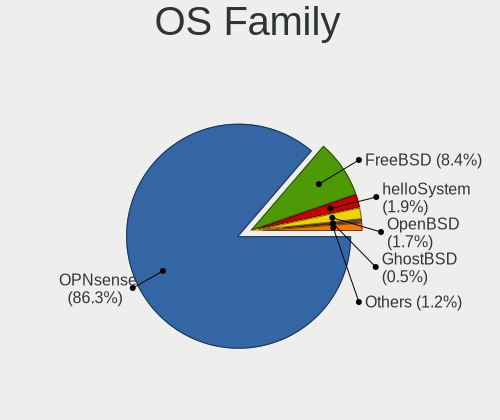
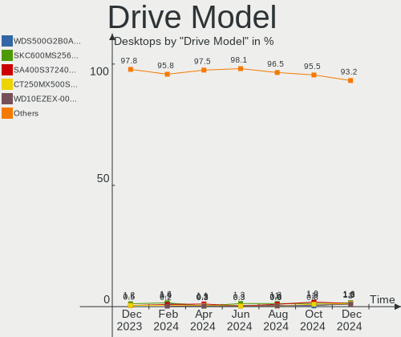
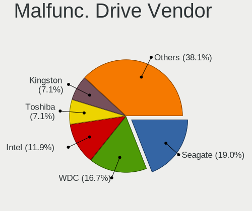
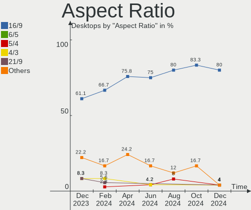
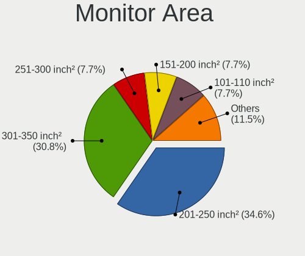
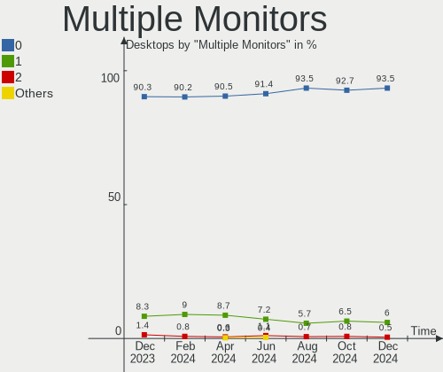
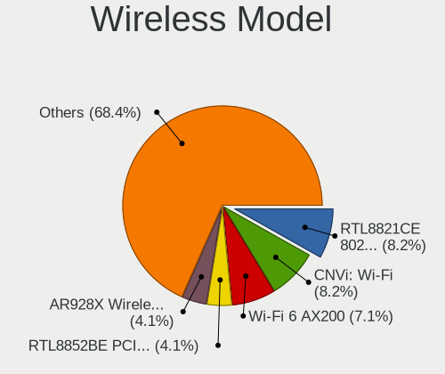

BSD Hardware Trends (Desktops)
------------------------------

A project to identify most popular hardware characteristics and track their change
over time based on data collected by BSD users at https://BSD-Hardware.info.

Anyone can contribute to this report by the [hw-probe](https://github.com/linuxhw/hw-probe/blob/master/INSTALL.BSD.md) tool:

    hw-probe -all -upload

Full-feature report is available here: https://bsd-hardware.info/?view=trends

Period: Nov, 2021.

Contents
--------

* [ System ](#system)
  - [ OS                       ](#os)
  - [ OS Family                ](#os-family)
  - [ Arch                     ](#arch)
  - [ DE                       ](#de)
  - [ Display Server           ](#display-server)
  - [ Display Manager          ](#display-manager)
  - [ OS Lang                  ](#os-lang)
  - [ Boot Mode                ](#boot-mode)
  - [ Filesystem               ](#filesystem)
  - [ Part. scheme             ](#part-scheme)

* [ Board ](#board)
  - [ Vendor                   ](#vendor)
  - [ Model                    ](#model)
  - [ Model Family             ](#model-family)
  - [ MFG Year                 ](#mfg-year)
  - [ Form Factor              ](#form-factor)
  - [ Coreboot                 ](#coreboot)
  - [ RAM Size                 ](#ram-size)
  - [ RAM Used                 ](#ram-used)
  - [ Total Drives             ](#total-drives)
  - [ Has CD-ROM               ](#has-cd-rom)
  - [ Has Ethernet             ](#has-ethernet)
  - [ Has WiFi                 ](#has-wifi)
  - [ Has Bluetooth            ](#has-bluetooth)

* [ Location ](#location)
  - [ Country                  ](#country)
  - [ City                     ](#city)

* [ Drives ](#drives)
  - [ Drive Vendor             ](#drive-vendor)
  - [ Drive Model              ](#drive-model)
  - [ HDD Vendor               ](#hdd-vendor)
  - [ SSD Vendor               ](#ssd-vendor)
  - [ Drive Kind               ](#drive-kind)
  - [ Drive Connector          ](#drive-connector)
  - [ Drive Size               ](#drive-size)
  - [ Space Total              ](#space-total)
  - [ Space Used               ](#space-used)
  - [ Malfunc. Drives          ](#malfunc-drives)
  - [ Malfunc. Drive Vendor    ](#malfunc-drive-vendor)
  - [ Malfunc. HDD Vendor      ](#malfunc-hdd-vendor)
  - [ Malfunc. Drive Kind      ](#malfunc-drive-kind)
  - [ Failed Drives            ](#failed-drives)
  - [ Failed Drive Vendor      ](#failed-drive-vendor)
  - [ Drive Status             ](#drive-status)

* [ Storage controller ](#storage-controller)
  - [ Storage Vendor           ](#storage-vendor)
  - [ Storage Model            ](#storage-model)
  - [ Storage Kind             ](#storage-kind)

* [ Processor ](#processor)
  - [ CPU Vendor               ](#cpu-vendor)
  - [ CPU Model                ](#cpu-model)
  - [ CPU Model Family         ](#cpu-model-family)
  - [ CPU Cores                ](#cpu-cores)
  - [ CPU Sockets              ](#cpu-sockets)
  - [ CPU Threads              ](#cpu-threads)
  - [ CPU Microarch            ](#cpu-microarch)

* [ Graphics ](#graphics)
  - [ GPU Vendor               ](#gpu-vendor)
  - [ GPU Model                ](#gpu-model)
  - [ GPU Combo                ](#gpu-combo)
  - [ GPU Driver               ](#gpu-driver)
  - [ GPU Memory               ](#gpu-memory)

* [ Monitor ](#monitor)
  - [ Monitor Vendor           ](#monitor-vendor)
  - [ Monitor Model            ](#monitor-model)
  - [ Monitor Resolution       ](#monitor-resolution)
  - [ Monitor Diagonal         ](#monitor-diagonal)
  - [ Monitor Width            ](#monitor-width)
  - [ Aspect Ratio             ](#aspect-ratio)
  - [ Monitor Area             ](#monitor-area)
  - [ Pixel Density            ](#pixel-density)
  - [ Multiple Monitors        ](#multiple-monitors)

* [ Network ](#network)
  - [ Net Controller Vendor    ](#net-controller-vendor)
  - [ Net Controller Model     ](#net-controller-model)
  - [ Wireless Vendor          ](#wireless-vendor)
  - [ Wireless Model           ](#wireless-model)
  - [ Ethernet Vendor          ](#ethernet-vendor)
  - [ Ethernet Model           ](#ethernet-model)
  - [ Net Controller Kind      ](#net-controller-kind)
  - [ Used Controller          ](#used-controller)
  - [ NICs                     ](#nics)
  - [ IPv6                     ](#ipv6)

* [ Bluetooth ](#bluetooth)
  - [ Bluetooth Vendor         ](#bluetooth-vendor)
  - [ Bluetooth Model          ](#bluetooth-model)

* [ Sound ](#sound)
  - [ Sound Vendor             ](#sound-vendor)
  - [ Sound Model              ](#sound-model)

* [ Memory ](#memory)
  - [ Memory Vendor            ](#memory-vendor)
  - [ Memory Model             ](#memory-model)
  - [ Memory Kind              ](#memory-kind)
  - [ Memory Form Factor       ](#memory-form-factor)
  - [ Memory Size              ](#memory-size)
  - [ Memory Speed             ](#memory-speed)

* [ Printers & scanners ](#printers--scanners)
  - [ Printer Vendor           ](#printer-vendor)
  - [ Printer Model            ](#printer-model)
  - [ Scanner Vendor           ](#scanner-vendor)
  - [ Scanner Model            ](#scanner-model)

* [ Camera ](#camera)
  - [ Camera Vendor            ](#camera-vendor)
  - [ Camera Model             ](#camera-model)

* [ Security ](#security)
  - [ Fingerprint Vendor       ](#fingerprint-vendor)
  - [ Fingerprint Model        ](#fingerprint-model)
  - [ Chipcard Vendor          ](#chipcard-vendor)
  - [ Chipcard Model           ](#chipcard-model)

* [ Unsupported ](#unsupported)
  - [ Unsupported Devices      ](#unsupported-devices)
  - [ Unsupported Device Types ](#unsupported-device-types)

System
------

OS
--

Installed operating systems

| Name                   | Desktops | Percent |
|------------------------|----------|---------|
| OPNsense 21.7.5        | 86       | 36.44%  |
| OPNsense 21.7.4        | 43       | 18.22%  |
| OPNsense 21.7.6        | 23       | 9.75%   |
| helloSystem 0.6.0      | 15       | 6.36%   |
| FreeBSD 13.0-p5        | 12       | 5.08%   |
| FreeBSD 13.0-p4        | 8        | 3.39%   |
| OPNsense 21.7.3        | 7        | 2.97%   |
| helloSystem 0.7.0      | 7        | 2.97%   |
| OpenBSD 7.0            | 5        | 2.12%   |
| FreeBSD 12.2-p6        | 4        | 1.69%   |
| FreeBSD 12.2-p10       | 4        | 1.69%   |
| OPNsense 22.1          | 3        | 1.27%   |
| NomadBSD 5806f915      | 3        | 1.27%   |
| helloSystem 0.5.0      | 2        | 0.85%   |
| FreeBSD 14.0-CURRENT   | 2        | 0.85%   |
| FreeBSD 13.0-STABLE    | 2        | 0.85%   |
| FreeBSD 12.2-p11       | 2        | 0.85%   |
| FreeBSD 12.1-p13       | 2        | 0.85%   |
| pfSense 2.5.0          | 1        | 0.42%   |
| OPNsense 12.1-p20-HBSD | 1        | 0.42%   |
| GhostBSD 21.08.27      | 1        | 0.42%   |
| FreeBSD 13.0           | 1        | 0.42%   |
| FreeBSD 12.2           | 1        | 0.42%   |
| FreeBSD 12.1-p9        | 1        | 0.42%   |

OS Family
---------

OS without a version

| Name        | Desktops | Percent |
|-------------|----------|---------|
| OPNsense    | 163      | 69.07%  |
| FreeBSD     | 39       | 16.53%  |
| helloSystem | 24       | 10.17%  |
| OpenBSD     | 5        | 2.12%   |
| NomadBSD    | 3        | 1.27%   |
| pfSense     | 1        | 0.42%   |
| GhostBSD    | 1        | 0.42%   |

Arch
----

OS architecture (x86_64, i586, etc.)

| Name  | Desktops | Percent |
|-------|----------|---------|
| amd64 | 227      | 96.19%  |
| arm64 | 5        | 2.12%   |
| i386  | 4        | 1.69%   |

DE
--

Desktop Environment

| Name         | Desktops | Percent |
|--------------|----------|---------|
| Console      | 193      | 81.78%  |
| helloDesktop | 24       | 10.17%  |
| XFCE         | 4        | 1.69%   |
| Openbox      | 4        | 1.69%   |
| MATE         | 4        | 1.69%   |
| KDE5         | 2        | 0.85%   |
| i3           | 2        | 0.85%   |
| fvwm         | 2        | 0.85%   |
| LXQt         | 1        | 0.42%   |

Display Server
--------------

X11 or Wayland

| Name    | Desktops | Percent |
|---------|----------|---------|
| Console | 194      | 82.2%   |
| X11     | 42       | 17.8%   |

Display Manager
---------------

SDDM, LightDM, etc.

| Name    | Desktops | Percent |
|---------|----------|---------|
| Console | 201      | 85.17%  |
| SLiM    | 29       | 12.29%  |
| LightDM | 3        | 1.27%   |
| SDDM    | 2        | 0.85%   |
| XDM     | 1        | 0.42%   |

OS Lang
-------

Language

| Lang    | Desktops | Percent |
|---------|----------|---------|
| Unknown | 181      | 76.69%  |
| en_US   | 28       | 11.86%  |
| C       | 19       | 8.05%   |
| de_DE   | 2        | 0.85%   |
| ru_RU   | 1        | 0.42%   |
| pt_BR   | 1        | 0.42%   |
| nl_NL   | 1        | 0.42%   |
| fi_FI   | 1        | 0.42%   |
| es_ES   | 1        | 0.42%   |
| en_AU   | 1        | 0.42%   |

Boot Mode
---------

EFI or BIOS

| Mode | Desktops | Percent |
|------|----------|---------|
| EFI  | 195      | 82.63%  |
| BIOS | 41       | 17.37%  |

Filesystem
----------

Type of filesystem

| Type   | Desktops | Percent |
|--------|----------|---------|
| Ufs    | 148      | 62.71%  |
| Zfs    | 80       | 33.9%   |
| Ffs    | 5        | 2.12%   |
| Cd9660 | 3        | 1.27%   |

Part. scheme
------------

Scheme of partitioning

| Type    | Desktops | Percent |
|---------|----------|---------|
| GPT     | 219      | 92.8%   |
| MBR     | 13       | 5.51%   |
| BSD     | 2        | 0.85%   |
| Unknown | 2        | 0.85%   |

Board
-----

Vendor
------

Motherboard manufacturer

| Name                                       | Desktops | Percent |
|--------------------------------------------|----------|---------|
| Unknown                                    | 27       | 11.44%  |
| Dell                                       | 24       | 10.17%  |
| ASUSTek Computer                           | 23       | 9.75%   |
| Hewlett-Packard                            | 21       | 8.9%    |
| PC Engines                                 | 20       | 8.47%   |
| ASRock                                     | 18       | 7.63%   |
| Intel                                      | 13       | 5.51%   |
| Gigabyte Technology                        | 12       | 5.08%   |
| Protectli                                  | 11       | 4.66%   |
| MSI                                        | 11       | 4.66%   |
| Fujitsu                                    | 8        | 3.39%   |
| Shuttle                                    | 6        | 2.54%   |
| Supermicro                                 | 5        | 2.12%   |
| Lenovo                                     | 3        | 1.27%   |
| HARDKERNEL                                 | 3        | 1.27%   |
| ASRockRack                                 | 3        | 1.27%   |
| RUNING                                     | 2        | 0.85%   |
| HPE                                        | 2        | 0.85%   |
| ECS                                        | 2        | 0.85%   |
| Acer                                       | 2        | 0.85%   |
| Yanling                                    | 1        | 0.42%   |
| Winston Marriot                            | 1        | 0.42%   |
| T-bao                                      | 1        | 0.42%   |
| ShenZhen MinWin Technology                 | 1        | 0.42%   |
| Seneca                                     | 1        | 0.42%   |
| SeeedStudio                                | 1        | 0.42%   |
| NF841                                      | 1        | 0.42%   |
| Medion                                     | 1        | 0.42%   |
| Lex                                        | 1        | 0.42%   |
| Itautec                                    | 1        | 0.42%   |
| Inventec                                   | 1        | 0.42%   |
| GuoGuang                                   | 1        | 0.42%   |
| Gateway                                    | 1        | 0.42%   |
| friendlyelec                               | 1        | 0.42%   |
| firefly                                    | 1        | 0.42%   |
| Dell EMC                                   | 1        | 0.42%   |
| Colorful YuGong Technology And Development | 1        | 0.42%   |
| Biostar                                    | 1        | 0.42%   |
| BESSTAR Tech                               | 1        | 0.42%   |
| AAEON                                      | 1        | 0.42%   |

Model
-----

Motherboard model

| Name                                     | Desktops | Percent |
|------------------------------------------|----------|---------|
| Unknown                                  | 27       | 11.44%  |
| PC Engines APU2                          | 11       | 4.66%   |
| Intel Q3XXG4-P V1.0                      | 6        | 2.54%   |
| Protectli FW4B                           | 5        | 2.12%   |
| PC Engines APU                           | 5        | 2.12%   |
| PC Engines apu4                          | 4        | 1.69%   |
| Protectli FW2B                           | 3        | 1.27%   |
| HARDKERNEL ODROID-H2                     | 3        | 1.27%   |
| Dell OptiPlex 390                        | 3        | 1.27%   |
| Dell OptiPlex 3020                       | 3        | 1.27%   |
| RUNING B75M INTEL H3V                    | 2        | 0.85%   |
| Protectli FW6                            | 2        | 0.85%   |
| MSI MS-9129                              | 2        | 0.85%   |
| MSI MS-7721                              | 2        | 0.85%   |
| HP ProLiant MicroServer Gen8             | 2        | 0.85%   |
| HP Compaq Elite 8300 SFF                 | 2        | 0.85%   |
| Fujitsu FUTRO S920                       | 2        | 0.85%   |
| Dell OptiPlex 9010                       | 2        | 0.85%   |
| Dell OptiPlex 3010                       | 2        | 0.85%   |
| ASUS TUF GAMING X570-PLUS                | 2        | 0.85%   |
| ASUS P5Q-E                               | 2        | 0.85%   |
| ASRock Q1900B-ITX                        | 2        | 0.85%   |
| Yanling YL-KBR6L                         | 1        | 0.42%   |
| Winston Marriot PICO PC                  | 1        | 0.42%   |
| T-bao MINI PC                            | 1        | 0.42%   |
| Supermicro X9SRE/X9SRE-3F/X9SRi/X9SRi-3F | 1        | 0.42%   |
| Supermicro X7SPA-HF                      | 1        | 0.42%   |
| Supermicro SYS-E200-9A                   | 1        | 0.42%   |
| Supermicro SYS-5019A-FTN4                | 1        | 0.42%   |
| Supermicro SYS-5018A-FTN4                | 1        | 0.42%   |
| Shuttle XS35V3                           | 1        | 0.42%   |
| Shuttle XH270                            | 1        | 0.42%   |
| Shuttle SZ270R9                          | 1        | 0.42%   |
| Shuttle SH61R                            | 1        | 0.42%   |
| Shuttle DH470                            | 1        | 0.42%   |
| Shuttle DH370                            | 1        | 0.42%   |
| ShenZhen MinWin MW-NANO-APL-4L           | 1        | 0.42%   |
| Seneca pro469788                         | 1        | 0.42%   |
| SeeedStudio ODYSSEY-X86J4125             | 1        | 0.42%   |
| Protectli FW6E                           | 1        | 0.42%   |
| NF841 LES network                        | 1        | 0.42%   |
| MSI MS-S0891                             | 1        | 0.42%   |
| MSI MS-9899                              | 1        | 0.42%   |
| MSI MS-7D14                              | 1        | 0.42%   |
| MSI MS-7C56                              | 1        | 0.42%   |
| MSI MS-7A71                              | 1        | 0.42%   |
| MSI MS-7817                              | 1        | 0.42%   |
| MSI MS-7597                              | 1        | 0.42%   |
| Medion MS-7728                           | 1        | 0.42%   |
| Lex Pineview-D                           | 1        | 0.42%   |
| Lenovo ThinkStation E31 255526G          | 1        | 0.42%   |
| Lenovo ThinkCentre E73z 10BD004RRU       | 1        | 0.42%   |
| Lenovo SHARKBAY SDK0E50510 WIN           | 1        | 0.42%   |
| Itautec Infoway ST-4344                  | 1        | 0.42%   |
| Inventec Z CLASS                         | 1        | 0.42%   |
| Intel HURONRIVER                         | 1        | 0.42%   |
| Intel H81                                | 1        | 0.42%   |
| Intel DH55PJ AAE93812-303                | 1        | 0.42%   |
| Intel DG41TY AAE47335-300                | 1        | 0.42%   |
| Intel D510MO AAE76523-302                | 1        | 0.42%   |

Model Family
------------

Motherboard model prefix

| Name                           | Desktops | Percent |
|--------------------------------|----------|---------|
| Unknown                        | 27       | 11.44%  |
| Dell OptiPlex                  | 20       | 8.47%   |
| PC Engines APU2                | 11       | 4.66%   |
| HP Compaq                      | 8        | 3.39%   |
| Intel Q3XXG4-P                 | 6        | 2.54%   |
| Protectli FW4B                 | 5        | 2.12%   |
| PC Engines APU                 | 5        | 2.12%   |
| PC Engines apu4                | 4        | 1.69%   |
| HP ProDesk                     | 4        | 1.69%   |
| Protectli FW2B                 | 3        | 1.27%   |
| HARDKERNEL ODROID-H2           | 3        | 1.27%   |
| Fujitsu FUTRO                  | 3        | 1.27%   |
| ASUS ROG                       | 3        | 1.27%   |
| RUNING B75M                    | 2        | 0.85%   |
| Protectli FW6                  | 2        | 0.85%   |
| MSI MS-9129                    | 2        | 0.85%   |
| MSI MS-7721                    | 2        | 0.85%   |
| HPE ProLiant                   | 2        | 0.85%   |
| HP ProLiant                    | 2        | 0.85%   |
| HP Pavilion                    | 2        | 0.85%   |
| Fujitsu ESPRIMO                | 2        | 0.85%   |
| ASUS TUF                       | 2        | 0.85%   |
| ASUS PRIME                     | 2        | 0.85%   |
| ASUS P5Q-E                     | 2        | 0.85%   |
| ASRock Q1900B-ITX              | 2        | 0.85%   |
| Acer Aspire                    | 2        | 0.85%   |
| Yanling YL-KBR6L               | 1        | 0.42%   |
| Winston Marriot PICO           | 1        | 0.42%   |
| T-bao MINI                     | 1        | 0.42%   |
| Supermicro X9SRE               | 1        | 0.42%   |
| Supermicro X7SPA-HF            | 1        | 0.42%   |
| Supermicro SYS-E200-9A         | 1        | 0.42%   |
| Supermicro SYS-5019A-FTN4      | 1        | 0.42%   |
| Supermicro SYS-5018A-FTN4      | 1        | 0.42%   |
| Shuttle XS35V3                 | 1        | 0.42%   |
| Shuttle XH270                  | 1        | 0.42%   |
| Shuttle SZ270R9                | 1        | 0.42%   |
| Shuttle SH61R                  | 1        | 0.42%   |
| Shuttle DH470                  | 1        | 0.42%   |
| Shuttle DH370                  | 1        | 0.42%   |
| ShenZhen MinWin MW-NANO-APL-4L | 1        | 0.42%   |
| Seneca pro469788               | 1        | 0.42%   |
| SeeedStudio ODYSSEY-X86J4125   | 1        | 0.42%   |
| Protectli FW6E                 | 1        | 0.42%   |
| NF841 LES                      | 1        | 0.42%   |
| MSI MS-S0891                   | 1        | 0.42%   |
| MSI MS-9899                    | 1        | 0.42%   |
| MSI MS-7D14                    | 1        | 0.42%   |
| MSI MS-7C56                    | 1        | 0.42%   |
| MSI MS-7A71                    | 1        | 0.42%   |
| MSI MS-7817                    | 1        | 0.42%   |
| MSI MS-7597                    | 1        | 0.42%   |
| Medion MS-7728                 | 1        | 0.42%   |
| Lex Pineview-D                 | 1        | 0.42%   |
| Lenovo ThinkStation            | 1        | 0.42%   |
| Lenovo ThinkCentre             | 1        | 0.42%   |
| Lenovo SHARKBAY                | 1        | 0.42%   |
| Itautec Infoway                | 1        | 0.42%   |
| Inventec Z                     | 1        | 0.42%   |
| Intel HURONRIVER               | 1        | 0.42%   |

MFG Year
--------

Motherboard manufacture year

| Year    | Desktops | Percent |
|---------|----------|---------|
| 2021    | 39       | 16.53%  |
| 2018    | 29       | 12.29%  |
| 2020    | 28       | 11.86%  |
| 2019    | 28       | 11.86%  |
| 2014    | 21       | 8.9%    |
| 2015    | 18       | 7.63%   |
| 2017    | 14       | 5.93%   |
| 2012    | 14       | 5.93%   |
| 2013    | 9        | 3.81%   |
| 2011    | 9        | 3.81%   |
| 2016    | 7        | 2.97%   |
| 2010    | 6        | 2.54%   |
| 2009    | 4        | 1.69%   |
| Unknown | 3        | 1.27%   |
| 2008    | 2        | 0.85%   |
| 2007    | 2        | 0.85%   |
| 2002    | 2        | 0.85%   |
| 2004    | 1        | 0.42%   |

Form Factor
-----------

Physical design of the computer

| Name    | Desktops | Percent |
|---------|----------|---------|
| Desktop | 236      | 100%    |

Coreboot
--------

Have coreboot on board

| Used | Desktops | Percent |
|------|----------|---------|
| No   | 213      | 90.25%  |
| Yes  | 23       | 9.75%   |

RAM Size
--------

Total RAM memory

| Size in GB  | Desktops | Percent |
|-------------|----------|---------|
| 8.01-16.0   | 83       | 35.17%  |
| 4.01-8.0    | 67       | 28.39%  |
| 16.01-24.0  | 42       | 17.8%   |
| 32.01-64.0  | 17       | 7.2%    |
| 2.01-3.0    | 9        | 3.81%   |
| 64.01-256.0 | 6        | 2.54%   |
| 3.01-4.0    | 5        | 2.12%   |
| 0.51-1.0    | 3        | 1.27%   |
| 1.01-2.0    | 2        | 0.85%   |
| 24.01-32.0  | 1        | 0.42%   |
| 0.01-0.5    | 1        | 0.42%   |

RAM Used
--------

Used RAM memory

| Used GB     | Desktops | Percent |
|-------------|----------|---------|
| 0.01-0.5    | 135      | 57.2%   |
| 0.51-1.0    | 54       | 22.88%  |
| 1.01-2.0    | 23       | 9.75%   |
| 4.01-8.0    | 9        | 3.81%   |
| 2.01-3.0    | 7        | 2.97%   |
| 3.01-4.0    | 3        | 1.27%   |
| 8.01-16.0   | 3        | 1.27%   |
| 64.01-256.0 | 2        | 0.85%   |

Total Drives
------------

Number of drives on board

| Drives | Desktops | Percent |
|--------|----------|---------|
| 1      | 169      | 71.61%  |
| 2      | 28       | 11.86%  |
| 0      | 13       | 5.51%   |
| 3      | 12       | 5.08%   |
| 4      | 8        | 3.39%   |
| 5      | 3        | 1.27%   |
| 23     | 1        | 0.42%   |
| 13     | 1        | 0.42%   |
| 6      | 1        | 0.42%   |

Has CD-ROM
----------

Has CD-ROM on board

| Presented | Desktops | Percent |
|-----------|----------|---------|
| No        | 189      | 80.08%  |
| Yes       | 47       | 19.92%  |

Has Ethernet
------------

Has Ethernet on board

| Presented | Desktops | Percent |
|-----------|----------|---------|
| Yes       | 232      | 98.31%  |
| No        | 4        | 1.69%   |

Has WiFi
--------

Has WiFi module

| Presented | Desktops | Percent |
|-----------|----------|---------|
| No        | 186      | 78.81%  |
| Yes       | 50       | 21.19%  |

Has Bluetooth
-------------

Has Bluetooth module

| Presented | Desktops | Percent |
|-----------|----------|---------|
| No        | 214      | 90.68%  |
| Yes       | 22       | 9.32%   |

Location
--------

Country
-------

Geographic location (country)

| Country      | Desktops | Percent |
|--------------|----------|---------|
| USA          | 59       | 25%     |
| Germany      | 55       | 23.31%  |
| Czechia      | 10       | 4.24%   |
| UK           | 9        | 3.81%   |
| Poland       | 9        | 3.81%   |
| Netherlands  | 8        | 3.39%   |
| Australia    | 8        | 3.39%   |
| France       | 6        | 2.54%   |
| Canada       | 6        | 2.54%   |
| Switzerland  | 5        | 2.12%   |
| China        | 5        | 2.12%   |
| Finland      | 4        | 1.69%   |
| Ukraine      | 3        | 1.27%   |
| Spain        | 3        | 1.27%   |
| Peru         | 3        | 1.27%   |
| Norway       | 3        | 1.27%   |
| Brazil       | 3        | 1.27%   |
| South Africa | 2        | 0.85%   |
| Slovenia     | 2        | 0.85%   |
| Russia       | 2        | 0.85%   |
| Romania      | 2        | 0.85%   |
| Mexico       | 2        | 0.85%   |
| Italy        | 2        | 0.85%   |
| Indonesia    | 2        | 0.85%   |
| Denmark      | 2        | 0.85%   |
| Belgium      | 2        | 0.85%   |
| Austria      | 2        | 0.85%   |
| Vietnam      | 1        | 0.42%   |
| Taiwan       | 1        | 0.42%   |
| Sweden       | 1        | 0.42%   |
| South Korea  | 1        | 0.42%   |
| Slovakia     | 1        | 0.42%   |
| Singapore    | 1        | 0.42%   |
| Portugal     | 1        | 0.42%   |
| New Zealand  | 1        | 0.42%   |
| Lithuania    | 1        | 0.42%   |
| Jersey       | 1        | 0.42%   |
| Israel       | 1        | 0.42%   |
| India        | 1        | 0.42%   |
| Hungary      | 1        | 0.42%   |
| Hong Kong    | 1        | 0.42%   |
| Guatemala    | 1        | 0.42%   |
| Greece       | 1        | 0.42%   |
| Albania      | 1        | 0.42%   |

City
----

Geographic location (city)

| City                | Desktops | Percent |
|---------------------|----------|---------|
| Tuklaty             | 8        | 3.39%   |
| Munich              | 5        | 2.12%   |
| Salem               | 3        | 1.27%   |
| Redmond             | 3        | 1.27%   |
| Lima                | 3        | 1.27%   |
| Berlin              | 3        | 1.27%   |
| Poplar              | 2        | 0.85%   |
| Playa del Carmen    | 2        | 0.85%   |
| Perth               | 2        | 0.85%   |
| Oslo                | 2        | 0.85%   |
| Newcastle upon Tyne | 2        | 0.85%   |
| Moscow              | 2        | 0.85%   |
| Johannesburg        | 2        | 0.85%   |
| Hobart              | 2        | 0.85%   |
| Helsinki            | 2        | 0.85%   |
| Glincz              | 2        | 0.85%   |
| Frankfurt am Main   | 2        | 0.85%   |
| Dortmund            | 2        | 0.85%   |
| Columbus            | 2        | 0.85%   |
| Brisbane            | 2        | 0.85%   |
| Beijing             | 2        | 0.85%   |
| Amsterdam           | 2        | 0.85%   |
| Zurich              | 1        | 0.42%   |
| Zuidhorn            | 1        | 0.42%   |
| Zhengzhou           | 1        | 0.42%   |
| Zell im Wiesental   | 1        | 0.42%   |
| Zarrentin           | 1        | 0.42%   |
| Yens                | 1        | 0.42%   |
| Wendell             | 1        | 0.42%   |
| Wenatchee           | 1        | 0.42%   |
| W??rzburg           | 1        | 0.42%   |
| Watertown           | 1        | 0.42%   |
| Warrenton           | 1        | 0.42%   |
| Warminster          | 1        | 0.42%   |
| Vlaardingen         | 1        | 0.42%   |
| Vitoria-Gasteiz     | 1        | 0.42%   |
| Vienna              | 1        | 0.42%   |
| Victoria            | 1        | 0.42%   |
| Valencia            | 1        | 0.42%   |
| Ulm                 | 1        | 0.42%   |
| Treuchtlingen       | 1        | 0.42%   |
| Trenton             | 1        | 0.42%   |
| Traunstein          | 1        | 0.42%   |
| Toulouse            | 1        | 0.42%   |
| Tirana              | 1        | 0.42%   |
| Tampere             | 1        | 0.42%   |
| Szeged              | 1        | 0.42%   |
| Syeverodonets'k     | 1        | 0.42%   |
| Sydney              | 1        | 0.42%   |
| Stralsund           | 1        | 0.42%   |
| Steinen             | 1        | 0.42%   |
| Steenbergen         | 1        | 0.42%   |
| Statesboro          | 1        | 0.42%   |
| Spotsylvania        | 1        | 0.42%   |
| Solingen            | 1        | 0.42%   |
| Sokal'              | 1        | 0.42%   |
| Smiths Falls        | 1        | 0.42%   |
| Slavkov u Brna      | 1        | 0.42%   |
| Singapore           | 1        | 0.42%   |
| Siedlce             | 1        | 0.42%   |

Drives
------

Drive Vendor
------------

Hard drive vendors

| Vendor              | Desktops | Drives | Percent |
|---------------------|----------|--------|---------|
| WDC                 | 46       | 95     | 16.55%  |
| Samsung Electronics | 42       | 53     | 15.11%  |
| Kingston            | 30       | 30     | 10.79%  |
| Seagate             | 28       | 32     | 10.07%  |
| Crucial             | 14       | 15     | 5.04%   |
| Transcend           | 11       | 11     | 3.96%   |
| Toshiba             | 11       | 12     | 3.96%   |
| Intel               | 11       | 11     | 3.96%   |
| Phison              | 8        | 8      | 2.88%   |
| SanDisk             | 6        | 7      | 2.16%   |
| Protectli           | 6        | 6      | 2.16%   |
| A-DATA Technology   | 6        | 6      | 2.16%   |
| Micron Technology   | 5        | 5      | 1.8%    |
| HGST                | 5        | 10     | 1.8%    |
| Hoodisk             | 4        | 4      | 1.44%   |
| Hitachi             | 4        | 5      | 1.44%   |
| SK Hynix            | 3        | 3      | 1.08%   |
| PNY                 | 3        | 3      | 1.08%   |
| GOODRAM             | 3        | 4      | 1.08%   |
| TCSUNBOW            | 2        | 2      | 0.72%   |
| Intenso             | 2        | 2      | 0.72%   |
| InnoDisk            | 2        | 2      | 0.72%   |
| Corsair             | 2        | 2      | 0.72%   |
| BIWIN               | 2        | 2      | 0.72%   |
| XUM                 | 1        | 1      | 0.36%   |
| V-GeN               | 1        | 1      | 0.36%   |
| SPCC                | 1        | 1      | 0.36%   |
| Silicon Motion      | 1        | 1      | 0.36%   |
| Ramsta              | 1        | 1      | 0.36%   |
| OCZ                 | 1        | 1      | 0.36%   |
| MyDigitalSSD        | 1        | 1      | 0.36%   |
| Mushkin             | 1        | 1      | 0.36%   |
| MAXTOR              | 1        | 1      | 0.36%   |
| Mach Xtreme         | 1        | 1      | 0.36%   |
| Kston               | 1        | 1      | 0.36%   |
| KIOXIA              | 1        | 1      | 0.36%   |
| KingSpec            | 1        | 1      | 0.36%   |
| HPE                 | 1        | 1      | 0.36%   |
| Gigabyte Technology | 1        | 1      | 0.36%   |
| Fordisk             | 1        | 1      | 0.36%   |
| DOGFISH             | 1        | 1      | 0.36%   |
| Colorful            | 1        | 1      | 0.36%   |
| ATP                 | 1        | 1      | 0.36%   |
| ASMT                | 1        | 1      | 0.36%   |
| Apacer              | 1        | 1      | 0.36%   |
| Advantech           | 1        | 2      | 0.36%   |

Drive Model
-----------

Hard drive models

| Model                           | Desktops | Percent |
|---------------------------------|----------|---------|
| Phison SATA SSD 16GB            | 7        | 2.28%   |
| Seagate ST500DM002-1BD142 500GB | 4        | 1.3%    |
| Samsung SSD 850 EVO 120GB       | 4        | 1.3%    |
| Kingston SUV500MS120G 120GB     | 4        | 1.3%    |
| WDC WD20EFRX-68EUZN0 2TB        | 3        | 0.98%   |
| WDC WD10EFRX-68FYTN0 1TB        | 3        | 0.98%   |
| Transcend TS128GMSA230S 128GB   | 3        | 0.98%   |
| Toshiba DT01ACA100 1TB          | 3        | 0.98%   |
| Samsung SSD 850 EVO 250GB       | 3        | 0.98%   |
| Kingston SV300S37A240G 240GB    | 3        | 0.98%   |
| Kingston SMS200S360G 64GB       | 3        | 0.98%   |
| Kingston SA400S37480G 480GB     | 3        | 0.98%   |
| Crucial M4-CT064M4SSD2 64GB     | 3        | 0.98%   |
| Crucial CT120BX500SSD1 120GB    | 3        | 0.98%   |
| WDC WDS240G2G0A-00JH30 240GB    | 2        | 0.65%   |
| WDC WD5000AAKX-08U6AA0 500GB    | 2        | 0.65%   |
| WDC WD40EFRX-68WT0N0 4TB        | 2        | 0.65%   |
| Transcend TS64GMSA370 64GB      | 2        | 0.65%   |
| Transcend TS32GSSD370S 32GB     | 2        | 0.65%   |
| Transcend TS32GMSA370 32GB      | 2        | 0.65%   |
| Toshiba DT01ACA050 500GB        | 2        | 0.65%   |
| Seagate ST4000DM000-1F2168 4TB  | 2        | 0.65%   |
| Seagate ST3160318AS 160GB       | 2        | 0.65%   |
| SanDisk SDSSDA120G 120GB        | 2        | 0.65%   |
| Samsung SSD 970 EVO Plus 500GB  | 2        | 0.65%   |
| Samsung SSD 960 EVO 500GB       | 2        | 0.65%   |
| Samsung SSD 860 QVO 1TB         | 2        | 0.65%   |
| Samsung SSD 860 EVO 250GB       | 2        | 0.65%   |
| Samsung SSD 850 PRO 256GB       | 2        | 0.65%   |
| Samsung SSD 850 EVO 1TB         | 2        | 0.65%   |
| Samsung SSD 840 EVO 120GB       | 2        | 0.65%   |
| Protectli 240GB mSATA           | 2        | 0.65%   |
| Protectli 120GB mSATA           | 2        | 0.65%   |
| Kingston SV300S37A120G 120GB    | 2        | 0.65%   |
| Kingston SUV400S37240G 240GB    | 2        | 0.65%   |
| Kingston SA400S37240G 240GB     | 2        | 0.65%   |
| Kingston SA400S37120G 120GB     | 2        | 0.65%   |
| Hoodisk SSD 128GB               | 2        | 0.65%   |
| Crucial CT500MX500SSD4 500GB    | 2        | 0.65%   |
| A-DATA SU630 240GB              | 2        | 0.65%   |
| XUM HX128GSSDSATA3 256GB        | 1        | 0.33%   |
| WDC WDS500G3X0C-00SJG0 500GB    | 1        | 0.33%   |
| WDC WDS500G2B0A-00SM50 500GB    | 1        | 0.33%   |
| WDC WDS500G1R0B-68A4Z0 500GB    | 1        | 0.33%   |
| WDC WDS250G2B0A-00SM50 250GB    | 1        | 0.33%   |
| WDC WDS250G1B0A-00H9H0 250GB    | 1        | 0.33%   |
| WDC WDS120G2G0B-00EPW0 120GB    | 1        | 0.33%   |
| WDC WDS120G2G0A-00JH30 120GB    | 1        | 0.33%   |
| WDC WDS120G1G0A-00SS50 120GB    | 1        | 0.33%   |
| WDC WD80EMAZ-00WJTA0 8TB        | 1        | 0.33%   |
| WDC WD80EFZX-68UW8N0 8TB        | 1        | 0.33%   |
| WDC WD80EFAX-68LHPN0 8TB        | 1        | 0.33%   |
| WDC WD80EDBZ-11B0ZA0 8TB        | 1        | 0.33%   |
| WDC WD800JD-75MSA3 80GB         | 1        | 0.33%   |
| WDC WD800JD-60LSA5 80GB         | 1        | 0.33%   |
| WDC WD800JD-00LSA0 80GB         | 1        | 0.33%   |
| WDC WD800JB-00JJC0 80GB         | 1        | 0.33%   |
| WDC WD6400AARS-00Y5B1 640GB     | 1        | 0.33%   |
| WDC WD6002FRYZ-01WD5B1 6TB      | 1        | 0.33%   |
| WDC WD6002FRYZ-01WD5B0 6TB      | 1        | 0.33%   |

HDD Vendor
----------

Hard disk drive vendors

| Vendor              | Desktops | Drives | Percent |
|---------------------|----------|--------|---------|
| WDC                 | 37       | 82     | 42.05%  |
| Seagate             | 27       | 31     | 30.68%  |
| Toshiba             | 9        | 10     | 10.23%  |
| HGST                | 5        | 10     | 5.68%   |
| Hitachi             | 4        | 5      | 4.55%   |
| Samsung Electronics | 3        | 4      | 3.41%   |
| MAXTOR              | 1        | 1      | 1.14%   |
| HPE                 | 1        | 1      | 1.14%   |
| ASMT                | 1        | 1      | 1.14%   |

SSD Vendor
----------

Solid state drive vendors

| Vendor              | Desktops | Drives | Percent |
|---------------------|----------|--------|---------|
| Samsung Electronics | 31       | 38     | 18.9%   |
| Kingston            | 28       | 28     | 17.07%  |
| Crucial             | 13       | 14     | 7.93%   |
| Transcend           | 11       | 11     | 6.71%   |
| Intel               | 9        | 9      | 5.49%   |
| WDC                 | 8        | 12     | 4.88%   |
| Phison              | 7        | 7      | 4.27%   |
| SanDisk             | 6        | 7      | 3.66%   |
| Protectli           | 6        | 6      | 3.66%   |
| Micron Technology   | 4        | 4      | 2.44%   |
| Hoodisk             | 4        | 4      | 2.44%   |
| A-DATA Technology   | 4        | 4      | 2.44%   |
| PNY                 | 3        | 3      | 1.83%   |
| GOODRAM             | 3        | 4      | 1.83%   |
| Toshiba             | 2        | 2      | 1.22%   |
| TCSUNBOW            | 2        | 2      | 1.22%   |
| Intenso             | 2        | 2      | 1.22%   |
| Innodisk            | 2        | 2      | 1.22%   |
| BIWIN               | 2        | 2      | 1.22%   |
| XUM                 | 1        | 1      | 0.61%   |
| V-GeN               | 1        | 1      | 0.61%   |
| Ramsta              | 1        | 1      | 0.61%   |
| OCZ                 | 1        | 1      | 0.61%   |
| MyDigitalSSD        | 1        | 1      | 0.61%   |
| Mushkin             | 1        | 1      | 0.61%   |
| Mach Xtreme         | 1        | 1      | 0.61%   |
| Kston               | 1        | 1      | 0.61%   |
| KingSpec            | 1        | 1      | 0.61%   |
| Gigabyte Technology | 1        | 1      | 0.61%   |
| Fordisk             | 1        | 1      | 0.61%   |
| DOGFISH             | 1        | 1      | 0.61%   |
| Corsair             | 1        | 1      | 0.61%   |
| Colorful            | 1        | 1      | 0.61%   |
| ATP                 | 1        | 1      | 0.61%   |
| Apacer              | 1        | 1      | 0.61%   |
| Advantech           | 1        | 2      | 0.61%   |

Drive Kind
----------

HDD or SSD

| Kind | Desktops | Drives | Percent |
|------|----------|--------|---------|
| SSD  | 154      | 179    | 59.69%  |
| HDD  | 76       | 145    | 29.46%  |
| NVMe | 28       | 29     | 10.85%  |

Drive Connector
---------------

SATA, SAS, NVMe, etc.

| Type | Desktops | Drives | Percent |
|------|----------|--------|---------|
| SATA | 204      | 324    | 87.93%  |
| NVMe | 28       | 29     | 12.07%  |

Drive Size
----------

Size of hard drive

| Size in TB | Desktops | Drives | Percent |
|------------|----------|--------|---------|
| 0.01-0.5   | 184      | 222    | 79.31%  |
| 0.51-1.0   | 22       | 34     | 9.48%   |
| 1.01-2.0   | 10       | 18     | 4.31%   |
| 3.01-4.0   | 7        | 17     | 3.02%   |
| 4.01-10.0  | 6        | 24     | 2.59%   |
| 2.01-3.0   | 2        | 7      | 0.86%   |
| 10.01-20.0 | 1        | 2      | 0.43%   |

Space Total
-----------

Amount of disk space available on the file system

| Size in GB     | Desktops | Percent |
|----------------|----------|---------|
| 101-250        | 81       | 34.32%  |
| 251-500        | 43       | 18.22%  |
| 51-100         | 40       | 16.95%  |
| 1-20           | 33       | 13.98%  |
| 21-50          | 23       | 9.75%   |
| 501-1000       | 10       | 4.24%   |
| More than 3000 | 4        | 1.69%   |
| 1001-2000      | 2        | 0.85%   |

Space Used
----------

Amount of used disk space

| Used GB        | Desktops | Percent |
|----------------|----------|---------|
| 1-20           | 216      | 91.53%  |
| 21-50          | 13       | 5.51%   |
| 51-100         | 4        | 1.69%   |
| 1001-2000      | 2        | 0.85%   |
| More than 3000 | 1        | 0.42%   |

Malfunc. Drives
---------------

Drive models with a malfunction

| Model                                            | Desktops | Drives | Percent |
|--------------------------------------------------|----------|--------|---------|
| WDC WD20EFRX-68EUZN0 2TB                         | 2        | 2      | 4.76%   |
| Seagate ST500DM002-1BD142 500GB                  | 2        | 2      | 4.76%   |
| Kingston SMS200S360G 64GB                        | 2        | 2      | 4.76%   |
| WDC WD800JB-00JJC0 80GB                          | 1        | 1      | 2.38%   |
| WDC WD5000AAKX-60U6AA0 500GB                     | 1        | 1      | 2.38%   |
| WDC WD5000AAKX-001CA0 500GB                      | 1        | 1      | 2.38%   |
| WDC WD5000AAKS-08V0A0 500GB                      | 1        | 1      | 2.38%   |
| WDC WD5000AADS-00S9B0 500GB                      | 1        | 1      | 2.38%   |
| WDC WD40EFRX-68WT0N0 4TB                         | 1        | 4      | 2.38%   |
| WDC WD3200BEKX-00B7WT0 320GB                     | 1        | 1      | 2.38%   |
| WDC WD2000FYYZ-01UL1B1 2TB                       | 1        | 2      | 2.38%   |
| WDC WD1600JS-56MHB1 160GB                        | 1        | 1      | 2.38%   |
| Toshiba MK3261GSYN 320GB                         | 1        | 1      | 2.38%   |
| Toshiba DT01ACA100 1TB                           | 1        | 1      | 2.38%   |
| Seagate ST96812AS 64GB                           | 1        | 4      | 2.38%   |
| Seagate ST500LT012-1DG142 500GB                  | 1        | 1      | 2.38%   |
| Seagate ST500DM002-1BC142 500GB                  | 1        | 1      | 2.38%   |
| Seagate ST3750640AS 752GB                        | 1        | 1      | 2.38%   |
| Seagate ST3500418AS 500GB                        | 1        | 1      | 2.38%   |
| Seagate ST3500413AS 500GB                        | 1        | 1      | 2.38%   |
| Seagate ST3320620AS 320GB                        | 1        | 1      | 2.38%   |
| Seagate ST3160318AS 160GB                        | 1        | 1      | 2.38%   |
| Seagate ST250DM000-1BD141 250GB                  | 1        | 1      | 2.38%   |
| Seagate ST1000DL002-9TT153 1TB                   | 1        | 1      | 2.38%   |
| SanDisk SD8TB8U-256G-1006 256GB                  | 1        | 1      | 2.38%   |
| Samsung Electronics SSD PM810 2.5-inch 7mm 256GB | 1        | 1      | 2.38%   |
| Samsung Electronics SSD 840 EVO 120GB            | 1        | 1      | 2.38%   |
| MyDigitalSSD SB2 128GB                           | 1        | 1      | 2.38%   |
| MAXTOR 6Y080M0 82GB                              | 1        | 1      | 2.38%   |
| Kingston SV300S37A60G 64GB                       | 1        | 1      | 2.38%   |
| Kingston SV300S37A120G 120GB                     | 1        | 1      | 2.38%   |
| Kingston SNS4151S316G 16GB                       | 1        | 1      | 2.38%   |
| Kingston SMS200S330G 32GB                        | 1        | 1      | 2.38%   |
| Intel SSDSC2CT120A3 120GB                        | 1        | 1      | 2.38%   |
| Intel SSDSA2BW160G3H 160GB                       | 1        | 1      | 2.38%   |
| HPE MB0500EBNCR 500GB                            | 1        | 1      | 2.38%   |
| Hitachi HTS545016B9SA02 160GB                    | 1        | 1      | 2.38%   |
| Colorful SL500 640GB                             | 1        | 1      | 2.38%   |
| BIWIN SSD 32GB                                   | 1        | 1      | 2.38%   |

Malfunc. Drive Vendor
---------------------

Vendors of faulty drives

| Vendor              | Desktops | Drives | Percent |
|---------------------|----------|--------|---------|
| Seagate             | 12       | 15     | 28.57%  |
| WDC                 | 11       | 15     | 26.19%  |
| Kingston            | 6        | 6      | 14.29%  |
| Toshiba             | 2        | 2      | 4.76%   |
| Samsung Electronics | 2        | 2      | 4.76%   |
| Intel               | 2        | 2      | 4.76%   |
| SanDisk             | 1        | 1      | 2.38%   |
| MyDigitalSSD        | 1        | 1      | 2.38%   |
| MAXTOR              | 1        | 1      | 2.38%   |
| HPE                 | 1        | 1      | 2.38%   |
| Hitachi             | 1        | 1      | 2.38%   |
| Colorful            | 1        | 1      | 2.38%   |
| BIWIN               | 1        | 1      | 2.38%   |

Malfunc. HDD Vendor
-------------------

Vendors of faulty HDD drives

| Vendor  | Desktops | Drives | Percent |
|---------|----------|--------|---------|
| Seagate | 12       | 15     | 42.86%  |
| WDC     | 11       | 15     | 39.29%  |
| Toshiba | 2        | 2      | 7.14%   |
| MAXTOR  | 1        | 1      | 3.57%   |
| HPE     | 1        | 1      | 3.57%   |
| Hitachi | 1        | 1      | 3.57%   |

Malfunc. Drive Kind
-------------------

Kinds of faulty drives

| Kind | Desktops | Drives | Percent |
|------|----------|--------|---------|
| HDD  | 27       | 35     | 65.85%  |
| SSD  | 14       | 14     | 34.15%  |

Failed Drives
-------------

Failed drive models

| Model                       | Desktops | Drives | Percent |
|-----------------------------|----------|--------|---------|
| WDC WD6400AARS-00Y5B1 640GB | 1        | 1      | 100%    |

Failed Drive Vendor
-------------------

Failed drive vendors

| Vendor | Desktops | Drives | Percent |
|--------|----------|--------|---------|
| WDC    | 1        | 1      | 100%    |

Drive Status
------------

Number of failed and malfunc. drives

| Status   | Desktops | Drives | Percent |
|----------|----------|--------|---------|
| Works    | 194      | 298    | 80.83%  |
| Malfunc  | 41       | 49     | 17.08%  |
| Detected | 4        | 5      | 1.67%   |
| Failed   | 1        | 1      | 0.42%   |

Storage controller
------------------

Storage Vendor
--------------

Storage controller vendors

| Vendor                      | Desktops | Percent |
|-----------------------------|----------|---------|
| Intel                       | 174      | 63.27%  |
| AMD                         | 54       | 19.64%  |
| Samsung Electronics         | 10       | 3.64%   |
| Marvell Technology Group    | 5        | 1.82%   |
| ASMedia Technology          | 5        | 1.82%   |
| SK Hynix                    | 3        | 1.09%   |
| Phison Electronics          | 3        | 1.09%   |
| Broadcom / LSI              | 3        | 1.09%   |
| Silicon Image               | 2        | 0.73%   |
| Realtek Semiconductor       | 2        | 0.73%   |
| Promise Technology          | 2        | 0.73%   |
| Nvidia                      | 2        | 0.73%   |
| Kingston Technology Company | 2        | 0.73%   |
| VMware                      | 1        | 0.36%   |
| Silicon Motion              | 1        | 0.36%   |
| Seagate Technology          | 1        | 0.36%   |
| Sandisk                     | 1        | 0.36%   |
| Micron/Crucial Technology   | 1        | 0.36%   |
| Micron Technology           | 1        | 0.36%   |
| JMicron Technology          | 1        | 0.36%   |
| Chelsio Communications      | 1        | 0.36%   |

Storage Model
-------------

Storage controller models

| Model                                                                                   | Desktops | Percent |
|-----------------------------------------------------------------------------------------|----------|---------|
| AMD FCH SATA Controller [AHCI mode]                                                     | 32       | 10.42%  |
| Intel 8 Series/C220 Series Chipset Family 6-port SATA Controller 1 [AHCI mode]          | 20       | 6.51%   |
| Intel Sunrise Point-LP SATA Controller [AHCI mode]                                      | 16       | 5.21%   |
| Intel Atom/Celeron/Pentium Processor x5-E8000/J3xxx/N3xxx Series SATA Controller        | 12       | 3.91%   |
| Intel 7 Series/C210 Series Chipset Family 6-port SATA Controller [AHCI mode]            | 12       | 3.91%   |
| Intel 6 Series/C200 Series Chipset Family 6 port Desktop SATA AHCI Controller           | 11       | 3.58%   |
| Intel Q170/Q150/B150/H170/H110/Z170/CM236 Chipset SATA Controller [AHCI Mode]           | 10       | 3.26%   |
| AMD SB7x0/SB8x0/SB9x0 SATA Controller [AHCI mode]                                       | 9        | 2.93%   |
| AMD FCH SATA Controller [IDE mode]                                                      | 9        | 2.93%   |
| Intel Cannon Lake PCH SATA AHCI Controller                                              | 8        | 2.61%   |
| Samsung NVMe SSD Controller SM981/PM981/PM983                                           | 6        | 1.95%   |
| Intel SATA Controller [RAID mode]                                                       | 6        | 1.95%   |
| Intel 6 Series/C200 Series Chipset Family Desktop SATA Controller (IDE mode, ports 4-5) | 6        | 1.95%   |
| Intel 6 Series/C200 Series Chipset Family Desktop SATA Controller (IDE mode, ports 0-3) | 6        | 1.95%   |
| Intel 200 Series PCH SATA controller [AHCI mode]                                        | 6        | 1.95%   |
| Intel NM10/ICH7 Family SATA Controller [IDE mode]                                       | 5        | 1.63%   |
| Intel NM10/ICH7 Family SATA Controller [AHCI mode]                                      | 5        | 1.63%   |
| Intel Celeron/Pentium Silver Processor SATA Controller                                  | 5        | 1.63%   |
| Intel Atom Processor E3800 Series SATA AHCI Controller                                  | 5        | 1.63%   |
| ASMedia ASM1062 Serial ATA Controller                                                   | 5        | 1.63%   |
| Unknown                                                                                 | 5        | 1.63%   |
| Intel Wildcat Point-LP SATA Controller [AHCI Mode]                                      | 4        | 1.3%    |
| Intel Celeron N3350/Pentium N4200/Atom E3900 Series SATA AHCI Controller                | 4        | 1.3%    |
| Intel 82801IR/IO/IH (ICH9R/DO/DH) 6 port SATA Controller [AHCI mode]                    | 4        | 1.3%    |
| AMD 400 Series Chipset SATA Controller                                                  | 4        | 1.3%    |
| Samsung NVMe SSD Controller SM961/PM961/SM963                                           | 3        | 0.98%   |
| Intel Comet Lake SATA AHCI Controller                                                   | 3        | 0.98%   |
| Intel Atom Processor C3000 Series SATA Controller 0                                     | 3        | 0.98%   |
| Intel 82801JI (ICH10 Family) SATA AHCI Controller                                       | 3        | 0.98%   |
| Intel 82801JD/DO (ICH10 Family) SATA AHCI Controller                                    | 3        | 0.98%   |
| Intel 82801G (ICH7 Family) IDE Controller                                               | 3        | 0.98%   |
| Intel 82801DB (ICH4) IDE Controller                                                     | 3        | 0.98%   |
| Promise PDC20276 (MBFastTrak133 Lite)                                                   | 2        | 0.65%   |
| Marvell Group 88SE9230 PCIe 2.0 x2 4-port SATA 6 Gb/s RAID Controller                   | 2        | 0.65%   |
| Marvell Group 88SE6111/6121 SATA II / PATA Controller                                   | 2        | 0.65%   |
| Intel SSD Pro 7600p/760p/E 6100p Series                                                 | 2        | 0.65%   |
| Intel C600/X79 series chipset 6-Port SATA AHCI Controller                               | 2        | 0.65%   |
| Intel Atom Processor C3000 Series SATA Controller 1                                     | 2        | 0.65%   |
| Intel 82801H (ICH8 Family) 4 port SATA Controller [IDE mode]                            | 2        | 0.65%   |
| Intel 8 Series SATA Controller 1 [AHCI mode]                                            | 2        | 0.65%   |
| Intel 500 Series Chipset Family SATA AHCI Controller                                    | 2        | 0.65%   |
| Intel 5 Series/3400 Series Chipset 6 port SATA AHCI Controller                          | 2        | 0.65%   |
| Intel 400 Series Chipset Family SATA AHCI Controller                                    | 2        | 0.65%   |
| Intel 4 Series Chipset PT IDER Controller                                               | 2        | 0.65%   |
| Broadcom / LSI SAS2008 PCI-Express Fusion-MPT SAS-2 [Falcon]                            | 2        | 0.65%   |
| AMD X370 Series Chipset SATA Controller                                                 | 2        | 0.65%   |
| AMD Starship/Matisse Chipset SATA Controller [AHCI mode]                                | 2        | 0.65%   |
| AMD SB7x0/SB8x0/SB9x0 IDE Controller                                                    | 2        | 0.65%   |
| VMware SATA AHCI controller                                                             | 1        | 0.33%   |
| SK Hynix Gold P31 SSD                                                                   | 1        | 0.33%   |
| SK Hynix BC511                                                                          | 1        | 0.33%   |
| SK Hynix BC501 NVMe Solid State Drive                                                   | 1        | 0.33%   |
| Silicon Motion SM2263EN/SM2263XT SSD Controller                                         | 1        | 0.33%   |
| Silicon Image SiI 3114 [SATALink/SATARaid] Serial ATA Controller                        | 1        | 0.33%   |
| Silicon Image SiI 3112 [SATALink/SATARaid] Serial ATA Controller                        | 1        | 0.33%   |
| Seagate FireCuda 510 SSD                                                                | 1        | 0.33%   |
| Sandisk WD Black 2018/SN750 / PC SN720 NVMe SSD                                         | 1        | 0.33%   |
| Samsung NVMe SSD Controller SM951/PM951                                                 | 1        | 0.33%   |
| Phison PS5013 E13 NVMe Controller                                                       | 1        | 0.33%   |
| Phison E16 PCIe4 NVMe Controller                                                        | 1        | 0.33%   |

Storage Kind
------------

Kind of storage controller (IDE, SATA, NVMe, SAS, ...)

| Kind | Desktops | Percent |
|------|----------|---------|
| SATA | 194      | 71.32%  |
| IDE  | 38       | 13.97%  |
| NVMe | 28       | 10.29%  |
| RAID | 8        | 2.94%   |
| SAS  | 2        | 0.74%   |
| SCSI | 2        | 0.74%   |

Processor
---------

CPU Vendor
----------

Processor vendors

| Vendor  | Desktops | Percent |
|---------|----------|---------|
| Intel   | 175      | 74.15%  |
| AMD     | 56       | 23.73%  |
| Unknown | 4        | 1.69%   |
| ARM     | 1        | 0.42%   |

CPU Model
---------

Processor models

| Model                                       | Desktops | Percent |
|---------------------------------------------|----------|---------|
| AMD GX-412TC SOC                            | 15       | 6.36%   |
| Intel Celeron CPU J3160 @ 1.60GHz           | 8        | 3.39%   |
| Intel Core i5-3470 CPU @ 3.20GHz            | 6        | 2.54%   |
| Intel Celeron CPU 3865U @ 1.80GHz           | 6        | 2.54%   |
| Intel Core i5-6500 CPU @ 3.20GHz            | 5        | 2.12%   |
| AMD G-T40E Processor                        | 5        | 2.12%   |
| Intel Celeron CPU J1900 @ 1.99GHz           | 4        | 1.69%   |
| AMD Ryzen 9 3900X 12-Core Processor         | 4        | 1.69%   |
|                                             | 4        | 1.69%   |
| Intel Core i7-7500U CPU @ 2.70GHz           | 3        | 1.27%   |
| Intel Core i3-2120 CPU @ 3.30GHz            | 3        | 1.27%   |
| Intel Celeron J4105 CPU @ 1.50GHz           | 3        | 1.27%   |
| Intel Celeron CPU J3060 @ 1.60GHz           | 3        | 1.27%   |
| Intel Pentium Gold G5420 CPU @ 3.80GHz      | 2        | 0.85%   |
| Intel Core i7-8550U CPU @ 1.80GHz           | 2        | 0.85%   |
| Intel Core i7-3770 CPU @ 3.40GHz            | 2        | 0.85%   |
| Intel Core i5-7500 CPU @ 3.40GHz            | 2        | 0.85%   |
| Intel Core i5-5200U CPU @ 2.20GHz           | 2        | 0.85%   |
| Intel Core i5-4590T CPU @ 2.00GHz           | 2        | 0.85%   |
| Intel Core i5-4570 CPU @ 3.20GHz            | 2        | 0.85%   |
| Intel Core i5-3550 CPU @ 3.30GHz            | 2        | 0.85%   |
| Intel Core i5-2500K CPU @ 3.30GHz           | 2        | 0.85%   |
| Intel Core i5-2400 CPU @ 3.10GH             | 2        | 0.85%   |
| Intel Core i3-6100 CPU @ 3.70GHz            | 2        | 0.85%   |
| Intel Core i3-4160 CPU @ 3.60GHz            | 2        | 0.85%   |
| Intel Core i3-4130 CPU @ 3.40GHz            | 2        | 0.85%   |
| Intel Core i3-10100 CPU @ 3.60GHz           | 2        | 0.85%   |
| Intel Core 2 Quad CPU Q6600 @ 2.40GHz       | 2        | 0.85%   |
| Intel Core 2 Duo CPU E8400 @ 3.00GHz        | 2        | 0.85%   |
| Intel Core 2 Duo                            | 2        | 0.85%   |
| Intel Celeron J4125 CPU @ 2.00GHz           | 2        | 0.85%   |
| Intel Celeron CPU N3450 @ 1.10GHz           | 2        | 0.85%   |
| Intel Celeron CPU J3455 @ 1.50GHz           | 2        | 0.85%   |
| Intel Atom CPU D2550 @ 1.86GHz              | 2        | 0.85%   |
| Intel Atom CPU C3758 @ 2.20GHz              | 2        | 0.85%   |
| AMD Ryzen 7 5800X 8-Core Processor          | 2        | 0.85%   |
| AMD Ryzen 5 1600 Six-Core Processor         | 2        | 0.85%   |
| AMD GX-420CA SOC with Radeon HD Graphics    | 2        | 0.85%   |
| AMD FX-8350 Eight-Core Processor            | 2        | 0.85%   |
| Intel Xeon E-2288G CPU @ 3.70GHz            | 1        | 0.42%   |
| Intel Xeon D-2187NT CPU @ 2.00GHz           | 1        | 0.42%   |
| Intel Xeon CPU E5-2690 0 @ 2.90GHz          | 1        | 0.42%   |
| Intel Xeon CPU E5-1650 v2 @ 3.50GHz         | 1        | 0.42%   |
| Intel Xeon CPU E3-1225 v5 @ 3.30GHz         | 1        | 0.42%   |
| Intel Xeon CPU E3-1220L v3 @ 1.10GHz        | 1        | 0.42%   |
| Intel Xeon CPU E3-1220L V2 @ 2.30GHz        | 1        | 0.42%   |
| Intel Xeon CPU E3-1220 v6 @ 3.00GHz         | 1        | 0.42%   |
| Intel Pentium Dual-Core CPU E5700 @ 3.00GHz | 1        | 0.42%   |
| Intel Pentium Dual-Core CPU E5400 @ 2.70GHz | 1        | 0.42%   |
| Intel Pentium Dual-Core CPU E5300 @ 2.60GHz | 1        | 0.42%   |
| Intel Pentium Dual CPU E2160 @ 1.80GHz      | 1        | 0.42%   |
| Intel Pentium CPU G3220 @ 3.00GHz           | 1        | 0.42%   |
| Intel Pentium 4                             | 1        | 0.42%   |
| Intel Genuine CPU 2160 @ 1.80GHz            | 1        | 0.42%   |
| Intel Core i7-9700K CPU @ 3.60GHz           | 1        | 0.42%   |
| Intel Core i7-8700 CPU @ 3.20GHz            | 1        | 0.42%   |
| Intel Core i7-8565U CPU @ 1.80GHz           | 1        | 0.42%   |
| Intel Core i7-7700K CPU @ 4.20GHz           | 1        | 0.42%   |
| Intel Core i7-6700TE CPU @ 2.40GHz          | 1        | 0.42%   |
| Intel Core i7-6500U CPU @ 2.50GHz           | 1        | 0.42%   |

CPU Model Family
----------------

Processor model prefix

| Model                   | Desktops | Percent |
|-------------------------|----------|---------|
| Intel Core i5           | 56       | 23.73%  |
| Intel Celeron           | 37       | 15.68%  |
| Intel Core i3           | 23       | 9.75%   |
| AMD GX                  | 19       | 8.05%   |
| Intel Core i7           | 18       | 7.63%   |
| Intel Atom              | 11       | 4.66%   |
| Intel Xeon              | 8        | 3.39%   |
| Intel Core 2 Duo        | 8        | 3.39%   |
| AMD G                   | 7        | 2.97%   |
| AMD Ryzen 7             | 6        | 2.54%   |
| Other                   | 5        | 2.12%   |
| AMD Ryzen 9             | 5        | 2.12%   |
| AMD Ryzen 5             | 5        | 2.12%   |
| Intel Pentium Dual-Core | 3        | 1.27%   |
| Intel Core 2 Quad       | 3        | 1.27%   |
| Intel Pentium Gold      | 2        | 0.85%   |
| AMD Ryzen 3             | 2        | 0.85%   |
| AMD FX                  | 2        | 0.85%   |
| AMD A4                  | 2        | 0.85%   |
| Intel Pentium Dual      | 1        | 0.42%   |
| Intel Pentium 4         | 1        | 0.42%   |
| Intel Pentium           | 1        | 0.42%   |
| Intel Genuine           | 1        | 0.42%   |
| Intel Celeron D         | 1        | 0.42%   |
| ARM Cortex              | 1        | 0.42%   |
| AMD Sempron             | 1        | 0.42%   |
| AMD Ryzen Embedded      | 1        | 0.42%   |
| AMD Ryzen 5 PRO         | 1        | 0.42%   |
| AMD Opteron             | 1        | 0.42%   |
| AMD Geode Integrated    | 1        | 0.42%   |
| AMD E                   | 1        | 0.42%   |
| AMD Athlon              | 1        | 0.42%   |
| AMD A6                  | 1        | 0.42%   |

CPU Cores
---------

Number of processor cores

| Number  | Desktops | Percent |
|---------|----------|---------|
| 4       | 109      | 46.19%  |
| 2       | 75       | 31.78%  |
| Unknown | 11       | 4.66%   |
| 8       | 10       | 4.24%   |
| 6       | 9        | 3.81%   |
| 16      | 6        | 2.54%   |
| 1       | 6        | 2.54%   |
| 24      | 5        | 2.12%   |
| 12      | 5        | 2.12%   |

CPU Sockets
-----------

Number of sockets

| Number  | Desktops | Percent |
|---------|----------|---------|
| 1       | 231      | 97.88%  |
| Unknown | 3        | 1.27%   |
| 2       | 2        | 0.85%   |

CPU Threads
-----------

Threads per core (Hyper-Threading)

| Number  | Desktops | Percent |
|---------|----------|---------|
| 1       | 161      | 68.22%  |
| 2       | 61       | 25.85%  |
| Unknown | 14       | 5.93%   |

CPU Microarch
-------------

Microarchitecture

| Name          | Desktops | Percent |
|---------------|----------|---------|
| KabyLake      | 28       | 11.86%  |
| Haswell       | 24       | 10.17%  |
| SandyBridge   | 19       | 8.05%   |
| Silvermont    | 18       | 7.63%   |
| IvyBridge     | 17       | 7.2%    |
| Skylake       | 16       | 6.78%   |
| Puma          | 16       | 6.78%   |
| Penryn        | 10       | 4.24%   |
| Bobcat        | 8        | 3.39%   |
| Zen 2         | 7        | 2.97%   |
| Zen           | 7        | 2.97%   |
| Goldmont      | 7        | 2.97%   |
| Bonnell       | 7        | 2.97%   |
| Unknown       | 7        | 2.97%   |
| Goldmont plus | 6        | 2.54%   |
| Core          | 6        | 2.54%   |
| CometLake     | 6        | 2.54%   |
| Piledriver    | 5        | 2.12%   |
| Zen 3         | 4        | 1.69%   |
| Broadwell     | 4        | 1.69%   |
| NetBurst      | 3        | 1.27%   |
| Jaguar        | 3        | 1.27%   |
| Zen+          | 2        | 0.85%   |
| Westmere      | 2        | 0.85%   |
| Nehalem       | 1        | 0.42%   |
| K10           | 1        | 0.42%   |
| Geode         | 1        | 0.42%   |
| Excavator     | 1        | 0.42%   |

Graphics
--------

GPU Vendor
----------

Vendors of graphics cards

| Vendor                     | Desktops | Percent |
|----------------------------|----------|---------|
| Intel                      | 143      | 67.14%  |
| AMD                        | 32       | 15.02%  |
| Nvidia                     | 23       | 10.8%   |
| ASPEED Technology          | 8        | 3.76%   |
| Matrox Electronics Systems | 5        | 2.35%   |
| VMware                     | 1        | 0.47%   |
| S3 Graphics                | 1        | 0.47%   |

GPU Model
---------

Graphics card models

| Model                                                                                    | Desktops | Percent |
|------------------------------------------------------------------------------------------|----------|---------|
| Intel 2nd Generation Core Processor Family Integrated Graphics Controller                | 16       | 7.48%   |
| Intel Xeon E3-1200 v3/4th Gen Core Processor Integrated Graphics Controller              | 14       | 6.54%   |
| Intel Atom/Celeron/Pentium Processor x5-E8000/J3xxx/N3xxx Integrated Graphics Controller | 12       | 5.61%   |
| Intel HD Graphics 530                                                                    | 11       | 5.14%   |
| Intel Xeon E3-1200 v2/3rd Gen Core processor Graphics Controller                         | 8        | 3.74%   |
| ASPEED Technology ASPEED Graphics Family                                                 | 8        | 3.74%   |
| Intel 4 Series Chipset Integrated Graphics Controller                                    | 7        | 3.27%   |
| Intel Kaby Lake-U GT1 Integrated Graphics Controller                                     | 6        | 2.8%    |
| Intel GeminiLake [UHD Graphics 600]                                                      | 6        | 2.8%    |
| Intel CometLake-S GT2 [UHD Graphics 630]                                                 | 6        | 2.8%    |
| Intel IvyBridge GT2 [HD Graphics 4000]                                                   | 5        | 2.34%   |
| Intel Atom Processor Z36xxx/Z37xxx Series Graphics & Display                             | 5        | 2.34%   |
| Intel 4th Generation Core Processor Family Integrated Graphics Controller                | 5        | 2.34%   |
| Intel HD Graphics 620                                                                    | 4        | 1.87%   |
| Intel HD Graphics 500                                                                    | 4        | 1.87%   |
| Intel CoffeeLake-S GT2 [UHD Graphics 630]                                                | 4        | 1.87%   |
| Intel Atom Processor D2xxx/N2xxx Integrated Graphics Controller                          | 4        | 1.87%   |
| Intel Skylake GT2 [HD Graphics 520]                                                      | 3        | 1.4%    |
| Intel HD Graphics 630                                                                    | 3        | 1.4%    |
| Intel Atom Processor D4xx/D5xx/N4xx/N5xx Integrated Graphics Controller                  | 3        | 1.4%    |
| AMD Raven Ridge [Radeon Vega Series / Radeon Vega Mobile Series]                         | 3        | 1.4%    |
| Nvidia GT218 [GeForce 210]                                                               | 2        | 0.93%   |
| Nvidia GP108 [GeForce GT 1030]                                                           | 2        | 0.93%   |
| Nvidia GP104 [GeForce GTX 1080]                                                          | 2        | 0.93%   |
| Nvidia GK208B [GeForce GT 710]                                                           | 2        | 0.93%   |
| Matrox Electronics Systems MGA G200eW WPCM450                                            | 2        | 0.93%   |
| Matrox Electronics Systems MGA G200EH                                                    | 2        | 0.93%   |
| Intel UHD Graphics 620                                                                   | 2        | 0.93%   |
| Intel HD Graphics 5500                                                                   | 2        | 0.93%   |
| Intel 82Q963/Q965 Integrated Graphics Controller                                         | 2        | 0.93%   |
| AMD Wrestler [Radeon HD 6320]                                                            | 2        | 0.93%   |
| AMD Richland [Radeon HD 8470D]                                                           | 2        | 0.93%   |
| AMD Renoir                                                                               | 2        | 0.93%   |
| AMD Rage 3 [Rage XL PCI]                                                                 | 2        | 0.93%   |
| AMD Picasso/Raven 2 [Radeon Vega Series / Radeon Vega Mobile Series]                     | 2        | 0.93%   |
| AMD Kabini [Radeon HD 8400E]                                                             | 2        | 0.93%   |
| AMD Ellesmere [Radeon RX 470/480/570/570X/580/580X/590]                                  | 2        | 0.93%   |
| AMD Cezanne                                                                              | 2        | 0.93%   |
| S3 Graphics 86c375 [ViRGE/DX] or 86c385 [ViRGE/GX]                                       | 1        | 0.47%   |
| Nvidia TU117 [GeForce GTX 1650]                                                          | 1        | 0.47%   |
| Nvidia TU116 [GeForce GTX 1660]                                                          | 1        | 0.47%   |
| Nvidia NV34 [GeForce FX 5200]                                                            | 1        | 0.47%   |
| Nvidia GT218 [NVS 300]                                                                   | 1        | 0.47%   |
| Nvidia GP107 [GeForce GTX 1050 Ti]                                                       | 1        | 0.47%   |
| Nvidia GP106 [GeForce GTX 1060 3GB]                                                      | 1        | 0.47%   |
| Nvidia GP104 [GeForce GTX 1070 Ti]                                                       | 1        | 0.47%   |
| Nvidia GM206 [GeForce GTX 950]                                                           | 1        | 0.47%   |
| Nvidia GM204 [GeForce GTX 970]                                                           | 1        | 0.47%   |
| Nvidia GF119 [GeForce GT 610]                                                            | 1        | 0.47%   |
| Nvidia G98 [GeForce 8400 GS Rev. 2]                                                      | 1        | 0.47%   |
| Nvidia G96C [GeForce 9400 GT]                                                            | 1        | 0.47%   |
| Nvidia G92 [GeForce GT 330]                                                              | 1        | 0.47%   |
| Nvidia C73 [GeForce 7100 / nForce 630i]                                                  | 1        | 0.47%   |
| Nvidia C61 [GeForce 7025 / nForce 630a]                                                  | 1        | 0.47%   |
| Matrox Electronics Systems MGA G200eH3                                                   | 1        | 0.47%   |
| Intel WhiskeyLake-U GT2 [UHD Graphics 620]                                               | 1        | 0.47%   |
| Intel RocketLake-S GT1 [UHD Graphics 750]                                                | 1        | 0.47%   |
| Intel Iris Plus Graphics 650                                                             | 1        | 0.47%   |
| Intel HD Graphics P530                                                                   | 1        | 0.47%   |
| Intel HD Graphics 6000                                                                   | 1        | 0.47%   |

GPU Combo
---------

Combinations of graphics cards

| Name            | Desktops | Percent |
|-----------------|----------|---------|
| 1 x Intel       | 132      | 55.93%  |
| 1 x AMD         | 32       | 13.56%  |
| Other           | 27       | 11.44%  |
| 1 x Nvidia      | 21       | 8.9%    |
| 2 x Intel       | 7        | 2.97%   |
| 1 x ASPEED      | 7        | 2.97%   |
| 1 x Matrox      | 5        | 2.12%   |
| Intel + Nvidia  | 2        | 0.85%   |
| 1 x VMware      | 1        | 0.42%   |
| 1 x S3 Graphics | 1        | 0.42%   |
| Intel + ASPEED  | 1        | 0.42%   |

GPU Driver
----------

Free vs proprietary

| Driver      | Desktops | Percent |
|-------------|----------|---------|
| Free        | 197      | 83.47%  |
| Unknown     | 29       | 12.29%  |
| Proprietary | 10       | 4.24%   |

GPU Memory
----------

Total video memory

| Size in GB | Desktops | Percent |
|------------|----------|---------|
| Unknown    | 217      | 91.95%  |
| 3.01-4.0   | 5        | 2.12%   |
| 1.01-2.0   | 5        | 2.12%   |
| 7.01-8.0   | 3        | 1.27%   |
| 0.01-0.5   | 3        | 1.27%   |
| 0.51-1.0   | 2        | 0.85%   |
| 5.01-6.0   | 1        | 0.42%   |

Monitor
-------

Monitor Vendor
--------------

Monitor vendors

| Vendor               | Desktops | Percent |
|----------------------|----------|---------|
| Samsung Electronics  | 5        | 16.67%  |
| Hewlett-Packard      | 3        | 10%     |
| Goldstar             | 3        | 10%     |
| Dell                 | 3        | 10%     |
| AOC                  | 3        | 10%     |
| Ancor Communications | 2        | 6.67%   |
| Acer                 | 2        | 6.67%   |
| ___                  | 1        | 3.33%   |
| ViewSonic            | 1        | 3.33%   |
| Philips              | 1        | 3.33%   |
| NEC Computers        | 1        | 3.33%   |
| LG Electronics       | 1        | 3.33%   |
| Lenovo               | 1        | 3.33%   |
| Iiyama               | 1        | 3.33%   |
| BenQ                 | 1        | 3.33%   |
| ASUSTek Computer     | 1        | 3.33%   |

Monitor Model
-------------

Monitor models

| Model                                                                | Desktops | Percent |
|----------------------------------------------------------------------|----------|---------|
| ___ LCD TV ___0101 1360x768                                          | 1        | 3.33%   |
| ViewSonic LCD Monitor VX3276-QHD 2560x1440                           | 1        | 3.33%   |
| Samsung Electronics U28E590 SAM0C4E 3840x2160 610x350mm 27.7-inch    | 1        | 3.33%   |
| Samsung Electronics SMT27A300 SAM087A 1920x1080 600x340mm 27.2-inch  | 1        | 3.33%   |
| Samsung Electronics SMS24A450 SAM083A 1920x1200 520x320mm 24.0-inch  | 1        | 3.33%   |
| Samsung Electronics S27E390 SAM0C1B 1920x1080 600x340mm 27.2-inch    | 1        | 3.33%   |
| Samsung Electronics S24D390 SAM0B65 1920x1080 520x290mm 23.4-inch    | 1        | 3.33%   |
| Philips PHL 243V7 PHLC155 1920x1080 530x300mm 24.0-inch              | 1        | 3.33%   |
| NEC Computers LCD1770VX NEC6696 1280x1024 340x270mm 17.1-inch        | 1        | 3.33%   |
| LG Electronics LCD Monitor LG HDR WQHD 3440x1440                     | 1        | 3.33%   |
| Lenovo LEN-E73Z-D LEN00A1 1600x900 440x240mm 19.7-inch               | 1        | 3.33%   |
| Iiyama PLE2407HDS IVM560D 1920x1080 520x300mm 23.6-inch              | 1        | 3.33%   |
| Hewlett-Packard V24 HPN36B5 1920x1080 540x300mm 24.3-inch            | 1        | 3.33%   |
| Hewlett-Packard LA2306 HWP294B 1920x1080 510x290mm 23.1-inch         | 1        | 3.33%   |
| Hewlett-Packard 24fw HPN3545 1920x1080 530x300mm 24.0-inch           | 1        | 3.33%   |
| Goldstar E2241 GSM581A 1920x1080 480x270mm 21.7-inch                 | 1        | 3.33%   |
| Goldstar D2342P GSM5840 1920x1080 510x290mm 23.1-inch                | 1        | 3.33%   |
| Goldstar 700E GSM4317 1280x1024 330x250mm 16.3-inch                  | 1        | 3.33%   |
| Dell U3415W DELA0A6 3440x1440 800x330mm 34.1-inch                    | 1        | 3.33%   |
| Dell U2515H DELD06F 2560x1440 550x310mm 24.9-inch                    | 1        | 3.33%   |
| Dell E228WFP DELD014 1680x1050 470x300mm 22.0-inch                   | 1        | 3.33%   |
| BenQ LCD Monitor BNQ7725 1920x1080 480x270mm 21.7-inch               | 1        | 3.33%   |
| ASUSTek Computer VP247 AUS24CA 1920x1080 520x290mm 23.4-inch         | 1        | 3.33%   |
| AOC Q32G2WG3 AOC3202 2560x1440 700x390mm 31.5-inch                   | 1        | 3.33%   |
| AOC 22V2WG5 AOC2202 1920x1080 480x270mm 21.7-inch                    | 1        | 3.33%   |
| AOC 2260W AOC2260 1920x1080 480x270mm 21.7-inch                      | 1        | 3.33%   |
| Ancor Communications BE24A ACI24AB 1920x1200 520x320mm 24.0-inch     | 1        | 3.33%   |
| Ancor Communications ASUS VW199 ACI19ED 1440x900 410x260mm 19.1-inch | 1        | 3.33%   |
| Acer G236HL ACR02EB 1920x1080 510x290mm 23.1-inch                    | 1        | 3.33%   |
| Acer AL1716 ACRAD46 1280x1024 340x270mm 17.1-inch                    | 1        | 3.33%   |

Monitor Resolution
------------------

Monitor screen resolution

| Resolution         | Desktops | Percent |
|--------------------|----------|---------|
| 1920x1080 (FHD)    | 15       | 50%     |
| 2560x1440 (QHD)    | 3        | 10%     |
| 1280x1024 (SXGA)   | 3        | 10%     |
| 3440x1440          | 2        | 6.67%   |
| 1920x1200 (WUXGA)  | 2        | 6.67%   |
| 3840x2160 (4K)     | 1        | 3.33%   |
| 1680x1050 (WSXGA+) | 1        | 3.33%   |
| 1600x900 (HD+)     | 1        | 3.33%   |
| 1440x900 (WXGA+)   | 1        | 3.33%   |
| 1360x768           | 1        | 3.33%   |

Monitor Diagonal
----------------

Diagonal size in inches

| Inches  | Desktops | Percent |
|---------|----------|---------|
| 24      | 6        | 20%     |
| 23      | 6        | 20%     |
| 21      | 4        | 13.33%  |
| 27      | 3        | 10%     |
| Unknown | 3        | 10%     |
| 19      | 2        | 6.67%   |
| 17      | 2        | 6.67%   |
| 34      | 1        | 3.33%   |
| 31      | 1        | 3.33%   |
| 22      | 1        | 3.33%   |
| 16      | 1        | 3.33%   |

Monitor Width
-------------

Physical width

| Width in mm | Desktops | Percent |
|-------------|----------|---------|
| 501-600     | 13       | 44.83%  |
| 401-500     | 7        | 24.14%  |
| 301-350     | 3        | 10.34%  |
| Unknown     | 3        | 10.34%  |
| 601-700     | 2        | 6.9%    |
| 701-800     | 1        | 3.45%   |

Aspect Ratio
------------

Proportional relationship between the width and the height

| Ratio   | Desktops | Percent |
|---------|----------|---------|
| 16/9    | 19       | 65.52%  |
| 16/10   | 4        | 13.79%  |
| 5/4     | 2        | 6.9%    |
| Unknown | 2        | 6.9%    |
| 4/3     | 1        | 3.45%   |
| 21/9    | 1        | 3.45%   |

Monitor Area
------------

Area in inch

| Area in inch | Desktops | Percent |
|----------------|----------|---------|
| 201-250        | 13       | 43.33%  |
| 251-300        | 4        | 13.33%  |
| 301-350        | 3        | 10%     |
| Unknown        | 3        | 10%     |
| 351-500        | 2        | 6.67%   |
| 151-200        | 2        | 6.67%   |
| 141-150        | 2        | 6.67%   |
| 121-130        | 1        | 3.33%   |

Pixel Density
-------------

Pixels per inch

| Density | Desktops | Percent |
|---------|----------|---------|
| 51-100  | 19       | 63.33%  |
| 101-120 | 7        | 23.33%  |
| Unknown | 3        | 10%     |
| 121-160 | 1        | 3.33%   |

Multiple Monitors
-----------------

Total monitors connected

| Total | Desktops | Percent |
|-------|----------|---------|
| 0     | 206      | 87.29%  |
| 1     | 29       | 12.29%  |
| 2     | 1        | 0.42%   |

Network
-------

Net Controller Vendor
---------------------

Controller vendors

| Vendor                      | Desktops | Percent |
|-----------------------------|----------|---------|
| Intel                       | 165      | 52.72%  |
| Realtek Semiconductor       | 100      | 31.95%  |
| Qualcomm Atheros            | 12       | 3.83%   |
| Broadcom                    | 10       | 3.19%   |
| Marvell Technology Group    | 3        | 0.96%   |
| IMC Networks                | 3        | 0.96%   |
| American Megatrends         | 3        | 0.96%   |
| Huawei Technologies         | 2        | 0.64%   |
| Xiaomi                      | 1        | 0.32%   |
| VIA Technologies            | 1        | 0.32%   |
| U-Blox                      | 1        | 0.32%   |
| Standard Microsystems [SMC] | 1        | 0.32%   |
| Solarflare Communications   | 1        | 0.32%   |
| Seeed Technology            | 1        | 0.32%   |
| Ralink Technology           | 1        | 0.32%   |
| Ralink                      | 1        | 0.32%   |
| Microchip Technology        | 1        | 0.32%   |
| Mellanox Technologies       | 1        | 0.32%   |
| Edimax Technology           | 1        | 0.32%   |
| D-Link System               | 1        | 0.32%   |
| Chelsio Communications      | 1        | 0.32%   |
| Belkin Components           | 1        | 0.32%   |
| Aquantia                    | 1        | 0.32%   |

Net Controller Model
--------------------

Controller models

| Model                                                                         | Desktops | Percent |
|-------------------------------------------------------------------------------|----------|---------|
| Realtek RTL8111/8168/8411 PCI Express Gigabit Ethernet Controller             | 85       | 21.25%  |
| Intel I211 Gigabit Network Connection                                         | 46       | 11.5%   |
| Intel I210 Gigabit Network Connection                                         | 25       | 6.25%   |
| Intel I350 Gigabit Network Connection                                         | 14       | 3.5%    |
| Intel 82574L Gigabit Network Connection                                       | 14       | 3.5%    |
| Intel 82579LM Gigabit Network Connection (Lewisville)                         | 13       | 3.25%   |
| Intel 82580 Gigabit Network Connection                                        | 11       | 2.75%   |
| Intel 82571EB/82571GB Gigabit Ethernet Controller D0/D1 (copper applications) | 10       | 2.5%    |
| Realtek RTL8125 2.5GbE Controller                                             | 8        | 2%      |
| Intel Ethernet Connection I217-V                                              | 6        | 1.5%    |
| Intel 82583V Gigabit Network Connection                                       | 6        | 1.5%    |
| Intel Ethernet Connection I217-LM                                             | 5        | 1.25%   |
| Intel 82571EB/82571GB Gigabit Ethernet Controller (Copper)                    | 5        | 1.25%   |
| Realtek RTL8188EUS 802.11n Wireless Network Adapter                           | 4        | 1%      |
| Realtek RTL-8100/8101L/8139 PCI Fast Ethernet Adapter                         | 4        | 1%      |
| Qualcomm Atheros AR928X Wireless Network Adapter (PCI-Express)                | 4        | 1%      |
| Intel Ethernet Connection (2) I219-LM                                         | 4        | 1%      |
| Intel 82576 Gigabit Network Connection                                        | 4        | 1%      |
| Marvell Group 88E8056 PCI-E Gigabit Ethernet Controller                       | 3        | 0.75%   |
| Intel Wireless 7265                                                           | 3        | 0.75%   |
| Intel Ethernet Controller 10G X550T                                           | 3        | 0.75%   |
| Intel Ethernet Connection X553 1GbE                                           | 3        | 0.75%   |
| Intel Ethernet Connection (2) I219-V                                          | 3        | 0.75%   |
| Intel 82579V Gigabit Network Connection                                       | 3        | 0.75%   |
| Intel 82572EI Gigabit Ethernet Controller (Copper)                            | 3        | 0.75%   |
| Intel 82567LM-3 Gigabit Network Connection                                    | 3        | 0.75%   |
| Intel 82557/8/9/0/1 Ethernet Pro 100                                          | 3        | 0.75%   |
| Intel 82541PI Gigabit Ethernet Controller                                     | 3        | 0.75%   |
| IMC Networks 802.11 n/g/b Wireless LAN USB Mini-Card                          | 3        | 0.75%   |
| Broadcom NetXtreme BCM5720 Gigabit Ethernet PCIe                              | 3        | 0.75%   |
| American Megatrends Virtual Ethernet                                          | 3        | 0.75%   |
| Realtek RTL8822BE 802.11a/b/g/n/ac WiFi adapter                               | 2        | 0.5%    |
| Realtek RTL8169 PCI Gigabit Ethernet Controller                               | 2        | 0.5%    |
| Qualcomm Atheros QCA986x/988x 802.11ac Wireless Network Adapter               | 2        | 0.5%    |
| Marvell Group 88E8001 Gigabit Ethernet Controller                             | 2        | 0.5%    |
| Intel Wireless-AC 9260                                                        | 2        | 0.5%    |
| Intel Wireless 7260                                                           | 2        | 0.5%    |
| Intel Wireless 3165                                                           | 2        | 0.5%    |
| Intel Wi-Fi 6 AX200                                                           | 2        | 0.5%    |
| Intel Ethernet Controller I225-LM                                             | 2        | 0.5%    |
| Intel Ethernet Controller 10-Gigabit X540-AT2                                 | 2        | 0.5%    |
| Intel Dual Band Wireless-AC 3168NGW [Stone Peak]                              | 2        | 0.5%    |
| Intel 82540EM Gigabit Ethernet Controller                                     | 2        | 0.5%    |
| Huawei E3372 LTE/UMTS/GSM HiLink Modem/Networkcard                            | 2        | 0.5%    |
| Xiaomi Mi/Redmi series (RNDIS)                                                | 1        | 0.25%   |
| VIA VT6105M [Rhine-III]                                                       | 1        | 0.25%   |
| U-Blox [u-blox 8]                                                             | 1        | 0.25%   |
| Standard Microsystems [SMC] 83c170 EPIC/100 Fast Ethernet Adapter             | 1        | 0.25%   |
| Solarflare SFC9120 10G Ethernet Controller                                    | 1        | 0.25%   |
| Seeed Seeeduino_Cortex_M0+                                                    | 1        | 0.25%   |
| Realtek RTL8822CE 802.11ac PCIe Wireless Network Adapter                      | 1        | 0.25%   |
| Realtek RTL8821CE 802.11ac PCIe Wireless Network Adapter                      | 1        | 0.25%   |
| Realtek RTL8821AE 802.11ac PCIe Wireless Network Adapter                      | 1        | 0.25%   |
| Realtek RTL8814AU 802.11a/b/g/n/ac Wireless Adapter                           | 1        | 0.25%   |
| Realtek RTL8192SU 802.11n WLAN Adapter                                        | 1        | 0.25%   |
| Realtek RTL8192CE PCIe Wireless Network Adapter                               | 1        | 0.25%   |
| Realtek RTL8188EE Wireless Network Adapter                                    | 1        | 0.25%   |
| Realtek RTL8188CUS 802.11n WLAN Adapter                                       | 1        | 0.25%   |
| Realtek RTL8188CE 802.11b/g/n WiFi Adapter                                    | 1        | 0.25%   |
| Realtek RTL810xE PCI Express Fast Ethernet controller                         | 1        | 0.25%   |

Wireless Vendor
---------------

Wireless vendors

| Vendor                | Desktops | Percent |
|-----------------------|----------|---------|
| Intel                 | 17       | 33.33%  |
| Realtek Semiconductor | 15       | 29.41%  |
| Qualcomm Atheros      | 9        | 17.65%  |
| IMC Networks          | 3        | 5.88%   |
| Broadcom              | 3        | 5.88%   |
| Ralink Technology     | 1        | 1.96%   |
| Ralink                | 1        | 1.96%   |
| Edimax Technology     | 1        | 1.96%   |
| Belkin Components     | 1        | 1.96%   |

Wireless Model
--------------

Wireless models

| Model                                                                   | Desktops | Percent |
|-------------------------------------------------------------------------|----------|---------|
| Realtek RTL8188EUS 802.11n Wireless Network Adapter                     | 4        | 7.69%   |
| Qualcomm Atheros AR928X Wireless Network Adapter (PCI-Express)          | 4        | 7.69%   |
| Intel Wireless 7265                                                     | 3        | 5.77%   |
| IMC Networks 802.11 n/g/b Wireless LAN USB Mini-Card                    | 3        | 5.77%   |
| Realtek RTL8822BE 802.11a/b/g/n/ac WiFi adapter                         | 2        | 3.85%   |
| Qualcomm Atheros QCA986x/988x 802.11ac Wireless Network Adapter         | 2        | 3.85%   |
| Intel Wireless-AC 9260                                                  | 2        | 3.85%   |
| Intel Wireless 7260                                                     | 2        | 3.85%   |
| Intel Wireless 3165                                                     | 2        | 3.85%   |
| Intel Wi-Fi 6 AX200                                                     | 2        | 3.85%   |
| Intel Dual Band Wireless-AC 3168NGW [Stone Peak]                        | 2        | 3.85%   |
| Realtek RTL8822CE 802.11ac PCIe Wireless Network Adapter                | 1        | 1.92%   |
| Realtek RTL8821CE 802.11ac PCIe Wireless Network Adapter                | 1        | 1.92%   |
| Realtek RTL8821AE 802.11ac PCIe Wireless Network Adapter                | 1        | 1.92%   |
| Realtek RTL8814AU 802.11a/b/g/n/ac Wireless Adapter                     | 1        | 1.92%   |
| Realtek RTL8192SU 802.11n WLAN Adapter                                  | 1        | 1.92%   |
| Realtek RTL8192CE PCIe Wireless Network Adapter                         | 1        | 1.92%   |
| Realtek RTL8188EE Wireless Network Adapter                              | 1        | 1.92%   |
| Realtek RTL8188CUS 802.11n WLAN Adapter                                 | 1        | 1.92%   |
| Realtek RTL8188CE 802.11b/g/n WiFi Adapter                              | 1        | 1.92%   |
| Realtek Realtek Bluetooth Adapter                                       | 1        | 1.92%   |
| Ralink RT5370 Wireless Adapter                                          | 1        | 1.92%   |
| Ralink RT2500 Wireless 802.11bg                                         | 1        | 1.92%   |
| Qualcomm Atheros QCA9377 802.11ac Wireless Network Adapter              | 1        | 1.92%   |
| Qualcomm Atheros AR9485 Wireless Network Adapter                        | 1        | 1.92%   |
| Qualcomm Atheros AR242x / AR542x Wireless Network Adapter (PCI-Express) | 1        | 1.92%   |
| Intel Wi-Fi 6 AX210/AX211/AX411 160MHz                                  | 1        | 1.92%   |
| Intel PRO/Wireless 5100 AGN [Shiloh] Network Connection                 | 1        | 1.92%   |
| Intel Gemini Lake PCH CNVi WiFi                                         | 1        | 1.92%   |
| Intel Centrino Wireless-N 105                                           | 1        | 1.92%   |
| Edimax Edimax AC600 Wireless LAN USB Adapter                            | 1        | 1.92%   |
| Broadcom BCM4360 802.11ac Wireless Network Adapter                      | 1        | 1.92%   |
| Broadcom BCM4352 802.11ac Wireless Network Adapter                      | 1        | 1.92%   |
| Broadcom BCM43228 802.11a/b/g/n                                         | 1        | 1.92%   |
| Belkin Components F5D7050 Wireless G Adapter v4000 [Zydas ZD1211B]      | 1        | 1.92%   |

Ethernet Vendor
---------------

Ethernet vendors

| Vendor                      | Desktops | Percent |
|-----------------------------|----------|---------|
| Intel                       | 159      | 57.61%  |
| Realtek Semiconductor       | 94       | 34.06%  |
| Broadcom                    | 7        | 2.54%   |
| Qualcomm Atheros            | 3        | 1.09%   |
| Marvell Technology Group    | 3        | 1.09%   |
| American Megatrends         | 3        | 1.09%   |
| Xiaomi                      | 1        | 0.36%   |
| VIA Technologies            | 1        | 0.36%   |
| Standard Microsystems [SMC] | 1        | 0.36%   |
| Solarflare Communications   | 1        | 0.36%   |
| D-Link System               | 1        | 0.36%   |
| Chelsio Communications      | 1        | 0.36%   |
| Aquantia                    | 1        | 0.36%   |

Ethernet Model
--------------

Ethernet models

| Model                                                                         | Desktops | Percent |
|-------------------------------------------------------------------------------|----------|---------|
| Realtek RTL8111/8168/8411 PCI Express Gigabit Ethernet Controller             | 85       | 24.85%  |
| Intel I211 Gigabit Network Connection                                         | 46       | 13.45%  |
| Intel I210 Gigabit Network Connection                                         | 25       | 7.31%   |
| Intel I350 Gigabit Network Connection                                         | 14       | 4.09%   |
| Intel 82574L Gigabit Network Connection                                       | 14       | 4.09%   |
| Intel 82579LM Gigabit Network Connection (Lewisville)                         | 13       | 3.8%    |
| Intel 82580 Gigabit Network Connection                                        | 11       | 3.22%   |
| Intel 82571EB/82571GB Gigabit Ethernet Controller D0/D1 (copper applications) | 10       | 2.92%   |
| Realtek RTL8125 2.5GbE Controller                                             | 8        | 2.34%   |
| Intel Ethernet Connection I217-V                                              | 6        | 1.75%   |
| Intel 82583V Gigabit Network Connection                                       | 6        | 1.75%   |
| Intel Ethernet Connection I217-LM                                             | 5        | 1.46%   |
| Intel 82571EB/82571GB Gigabit Ethernet Controller (Copper)                    | 5        | 1.46%   |
| Realtek RTL-8100/8101L/8139 PCI Fast Ethernet Adapter                         | 4        | 1.17%   |
| Intel Ethernet Connection (2) I219-LM                                         | 4        | 1.17%   |
| Intel 82576 Gigabit Network Connection                                        | 4        | 1.17%   |
| Marvell Group 88E8056 PCI-E Gigabit Ethernet Controller                       | 3        | 0.88%   |
| Intel Ethernet Controller 10G X550T                                           | 3        | 0.88%   |
| Intel Ethernet Connection X553 1GbE                                           | 3        | 0.88%   |
| Intel Ethernet Connection (2) I219-V                                          | 3        | 0.88%   |
| Intel 82579V Gigabit Network Connection                                       | 3        | 0.88%   |
| Intel 82572EI Gigabit Ethernet Controller (Copper)                            | 3        | 0.88%   |
| Intel 82567LM-3 Gigabit Network Connection                                    | 3        | 0.88%   |
| Intel 82557/8/9/0/1 Ethernet Pro 100                                          | 3        | 0.88%   |
| Intel 82541PI Gigabit Ethernet Controller                                     | 3        | 0.88%   |
| Broadcom NetXtreme BCM5720 Gigabit Ethernet PCIe                              | 3        | 0.88%   |
| American Megatrends Virtual Ethernet                                          | 3        | 0.88%   |
| Realtek RTL8169 PCI Gigabit Ethernet Controller                               | 2        | 0.58%   |
| Marvell Group 88E8001 Gigabit Ethernet Controller                             | 2        | 0.58%   |
| Intel Ethernet Controller I225-LM                                             | 2        | 0.58%   |
| Intel Ethernet Controller 10-Gigabit X540-AT2                                 | 2        | 0.58%   |
| Intel 82540EM Gigabit Ethernet Controller                                     | 2        | 0.58%   |
| Xiaomi Mi/Redmi series (RNDIS)                                                | 1        | 0.29%   |
| VIA VT6105M [Rhine-III]                                                       | 1        | 0.29%   |
| Standard Microsystems [SMC] 83c170 EPIC/100 Fast Ethernet Adapter             | 1        | 0.29%   |
| Solarflare SFC9120 10G Ethernet Controller                                    | 1        | 0.29%   |
| Realtek RTL810xE PCI Express Fast Ethernet controller                         | 1        | 0.29%   |
| Realtek RTL-8029(AS)                                                          | 1        | 0.29%   |
| Qualcomm Atheros QCA8171 Gigabit Ethernet                                     | 1        | 0.29%   |
| Qualcomm Atheros Killer E220x Gigabit Ethernet Controller                     | 1        | 0.29%   |
| Qualcomm Atheros AR8151 v2.0 Gigabit Ethernet                                 | 1        | 0.29%   |
| Intel NM10/ICH7 Family LAN Controller                                         | 1        | 0.29%   |
| Intel Ethernet Controller X710 for 10GbE SFP+                                 | 1        | 0.29%   |
| Intel Ethernet Controller I225-V                                              | 1        | 0.29%   |
| Intel Ethernet Connection X722 for 10GbE SFP+                                 | 1        | 0.29%   |
| Intel Ethernet Connection X722 for 10GbE backplane                            | 1        | 0.29%   |
| Intel Ethernet Connection X553 10 GbE SFP+                                    | 1        | 0.29%   |
| Intel Ethernet Connection I354                                                | 1        | 0.29%   |
| Intel Ethernet Connection I219-LM                                             | 1        | 0.29%   |
| Intel Ethernet Connection (7) I219-LM                                         | 1        | 0.29%   |
| Intel Ethernet Connection (5) I219-LM                                         | 1        | 0.29%   |
| Intel Ethernet Connection (14) I219-V                                         | 1        | 0.29%   |
| Intel Ethernet Connection (12) I219-V                                         | 1        | 0.29%   |
| Intel Ethernet Connection (11) I219-V                                         | 1        | 0.29%   |
| Intel Ethernet Connection (11) I219-LM                                        | 1        | 0.29%   |
| Intel Ethernet 10G 2P X520 Adapter                                            | 1        | 0.29%   |
| Intel 82599ES 10-Gigabit SFI/SFP+ Network Connection                          | 1        | 0.29%   |
| Intel 82598EB 10-Gigabit AT2 Server Adapter                                   | 1        | 0.29%   |
| Intel 82578DC Gigabit Network Connection                                      | 1        | 0.29%   |
| Intel 82575GB Gigabit Network Connection                                      | 1        | 0.29%   |

Net Controller Kind
-------------------

Ethernet, WiFi or modem

| Kind     | Desktops | Percent |
|----------|----------|---------|
| Ethernet | 232      | 80.56%  |
| WiFi     | 50       | 17.36%  |
| Modem    | 3        | 1.04%   |
| Unknown  | 3        | 1.04%   |

Used Controller
---------------

Currently used network controller

| Kind     | Desktops | Percent |
|----------|----------|---------|
| Ethernet | 230      | 95.44%  |
| WiFi     | 11       | 4.56%   |

NICs
----

Total network controllers on board

| Total | Desktops | Percent |
|-------|----------|---------|
| 2     | 65       | 27.54%  |
| 1     | 41       | 17.37%  |
| 4     | 40       | 16.95%  |
| 3     | 35       | 14.83%  |
| 6     | 23       | 9.75%   |
| 5     | 17       | 7.2%    |
| 8     | 4        | 1.69%   |
| 7     | 3        | 1.27%   |
| 0     | 3        | 1.27%   |
| 11    | 2        | 0.85%   |
| 13    | 1        | 0.42%   |
| 10    | 1        | 0.42%   |
| 9     | 1        | 0.42%   |

IPv6
----

IPv6 vs IPv4

| Used | Desktops | Percent |
|------|----------|---------|
| No   | 198      | 83.9%   |
| Yes  | 38       | 16.1%   |

Bluetooth
---------

Bluetooth Vendor
----------------

Controller vendors

| Vendor                          | Desktops | Percent |
|---------------------------------|----------|---------|
| Intel                           | 12       | 54.55%  |
| Realtek Semiconductor           | 4        | 18.18%  |
| Cambridge Silicon Radio         | 3        | 13.64%  |
| Qualcomm Atheros Communications | 1        | 4.55%   |
| IMC Networks                    | 1        | 4.55%   |
| Apple                           | 1        | 4.55%   |

Bluetooth Model
---------------

Controller models

| Model                                                | Desktops | Percent |
|------------------------------------------------------|----------|---------|
| Intel Bluetooth wireless interface                   | 5        | 22.73%  |
| Realtek  Bluetooth 4.2 Adapter                       | 3        | 13.64%  |
| Cambridge Silicon Radio Bluetooth Dongle (HCI mode)  | 3        | 13.64%  |
| Intel Wireless-AC 9260 Bluetooth Adapter             | 2        | 9.09%   |
| Intel Wireless-AC 3168 Bluetooth                     | 2        | 9.09%   |
| Intel AX200 Bluetooth                                | 2        | 9.09%   |
| Realtek  Bluetooth Adapter                           | 1        | 4.55%   |
| Qualcomm Atheros AR3011 Bluetooth (no firmware)      | 1        | 4.55%   |
| Intel Bluetooth 9460/9560 Jefferson Peak (JfP)       | 1        | 4.55%   |
| IMC Networks Realtek Bluetooth 4.0 + High Speed Chip | 1        | 4.55%   |
| Apple Apple Broadcom Built-in Bluetooth              | 1        | 4.55%   |

Sound
-----

Sound Vendor
------------

Sound card vendors

| Vendor            | Desktops | Percent |
|-------------------|----------|---------|
| Intel             | 132      | 68.04%  |
| AMD               | 38       | 19.59%  |
| Nvidia            | 19       | 9.79%   |
| VMware            | 1        | 0.52%   |
| Texas Instruments | 1        | 0.52%   |
| Sony              | 1        | 0.52%   |
| JMTek             | 1        | 0.52%   |
| Audio-Technica    | 1        | 0.52%   |

Sound Model
-----------

Sound card models

| Model                                                                                             | Desktops | Percent |
|---------------------------------------------------------------------------------------------------|----------|---------|
| Intel 8 Series/C220 Series Chipset High Definition Audio Controller                               | 17       | 7.42%   |
| Intel Xeon E3-1200 v3/4th Gen Core Processor HD Audio Controller                                  | 16       | 6.99%   |
| Intel 7 Series/C216 Chipset Family High Definition Audio Controller                               | 13       | 5.68%   |
| Intel 6 Series/C200 Series Chipset Family High Definition Audio Controller                        | 13       | 5.68%   |
| Intel Sunrise Point-LP HD Audio                                                                   | 12       | 5.24%   |
| Intel Atom/Celeron/Pentium Processor x5-E8000/J3xxx/N3xxx Series High Definition Audio Controller | 11       | 4.8%    |
| Intel 100 Series/C230 Series Chipset Family HD Audio Controller                                   | 10       | 4.37%   |
| Intel NM10/ICH7 Family High Definition Audio Controller                                           | 8        | 3.49%   |
| AMD Starship/Matisse HD Audio Controller                                                          | 8        | 3.49%   |
| AMD Family 17h (Models 10h-1fh) HD Audio Controller                                               | 8        | 3.49%   |
| Intel Cannon Lake PCH cAVS                                                                        | 5        | 2.18%   |
| AMD Raven/Raven2/Fenghuang HDMI/DP Audio Controller                                               | 5        | 2.18%   |
| AMD FCH Azalia Controller                                                                         | 5        | 2.18%   |
| Intel Wildcat Point-LP High Definition Audio Controller                                           | 4        | 1.75%   |
| Intel Celeron N3350/Pentium N4200/Atom E3900 Series Audio Cluster                                 | 4        | 1.75%   |
| Intel 200 Series PCH HD Audio                                                                     | 4        | 1.75%   |
| AMD SBx00 Azalia (Intel HDA)                                                                      | 4        | 1.75%   |
| AMD Renoir Radeon High Definition Audio Controller                                                | 4        | 1.75%   |
| AMD Kabini HDMI/DP Audio                                                                          | 4        | 1.75%   |
| Nvidia High Definition Audio Controller                                                           | 3        | 1.31%   |
| Nvidia GP104 High Definition Audio Controller                                                     | 3        | 1.31%   |
| Intel Comet Lake PCH cAVS                                                                         | 3        | 1.31%   |
| Intel Celeron/Pentium Silver Processor High Definition Audio                                      | 3        | 1.31%   |
| Intel 82801JI (ICH10 Family) HD Audio Controller                                                  | 3        | 1.31%   |
| Intel 82801JD/DO (ICH10 Family) HD Audio Controller                                               | 3        | 1.31%   |
| Intel 82801H (ICH8 Family) HD Audio Controller                                                    | 3        | 1.31%   |
| Intel 5 Series/3400 Series Chipset High Definition Audio                                          | 3        | 1.31%   |
| AMD Wrestler HDMI Audio                                                                           | 3        | 1.31%   |
| AMD Family 17h (Models 00h-0fh) HD Audio Controller                                               | 3        | 1.31%   |
| Nvidia GP108 High Definition Audio Controller                                                     | 2        | 0.87%   |
| Nvidia GK208 HDMI/DP Audio Controller                                                             | 2        | 0.87%   |
| Intel Haswell-ULT HD Audio Controller                                                             | 2        | 0.87%   |
| Intel Comet Lake PCH-V cAVS                                                                       | 2        | 0.87%   |
| Intel Broadwell-U Audio Controller                                                                | 2        | 0.87%   |
| Intel Atom Processor Z36xxx/Z37xxx Series High Definition Audio Controller                        | 2        | 0.87%   |
| Intel 8 Series HD Audio Controller                                                                | 2        | 0.87%   |
| AMD Trinity HDMI Audio Controller                                                                 | 2        | 0.87%   |
| AMD Oland/Hainan/Cape Verde/Pitcairn HDMI Audio [Radeon HD 7000 Series]                           | 2        | 0.87%   |
| AMD Ellesmere HDMI Audio [Radeon RX 470/480 / 570/580/590]                                        | 2        | 0.87%   |
| AMD Cedar HDMI Audio [Radeon HD 5400/6300/7300 Series]                                            | 2        | 0.87%   |
| VMware HD Audio Controller                                                                        | 1        | 0.44%   |
| Texas Instruments PCM2902 Audio Codec                                                             | 1        | 0.44%   |
| Sony DualShock 4 [CUH-ZCT2x]                                                                      | 1        | 0.44%   |
| Nvidia TU116 High Definition Audio Controller                                                     | 1        | 0.44%   |
| Nvidia TU107 GeForce GTX 1650 High Definition Audio Controller                                    | 1        | 0.44%   |
| Nvidia MCP73 High Definition Audio                                                                | 1        | 0.44%   |
| Nvidia MCP61 High Definition Audio                                                                | 1        | 0.44%   |
| Nvidia GP107GL High Definition Audio Controller                                                   | 1        | 0.44%   |
| Nvidia GP106 High Definition Audio Controller                                                     | 1        | 0.44%   |
| Nvidia GM206 High Definition Audio Controller                                                     | 1        | 0.44%   |
| Nvidia GM204 High Definition Audio Controller                                                     | 1        | 0.44%   |
| Nvidia GF119 HDMI Audio Controller                                                                | 1        | 0.44%   |
| JMTek USB PnP Audio Device                                                                        | 1        | 0.44%   |
| Intel Tiger Lake-H HD Audio Controller                                                            | 1        | 0.44%   |
| Intel Cannon Point-LP High Definition Audio Controller                                            | 1        | 0.44%   |
| Intel 82801I (ICH9 Family) HD Audio Controller                                                    | 1        | 0.44%   |
| Intel 82801DB/DBL/DBM (ICH4/ICH4-L/ICH4-M) AC'97 Audio Controller                                 | 1        | 0.44%   |
| Audio-Technica AT2020USB+                                                                         | 1        | 0.44%   |
| AMD Turks HDMI Audio [Radeon HD 6500/6600 / 6700M Series]                                         | 1        | 0.44%   |
| AMD RS780 HDMI Audio [Radeon 3000/3100 / HD 3200/3300]                                            | 1        | 0.44%   |

Memory
------

Memory Vendor
-------------

Memory module vendors

| Vendor              | Desktops | Percent |
|---------------------|----------|---------|
| Samsung Electronics | 37       | 15.88%  |
| Kingston            | 33       | 14.16%  |
| Unknown             | 31       | 13.3%   |
| SK Hynix            | 22       | 9.44%   |
| Micron Technology   | 21       | 9.01%   |
| Crucial             | 20       | 8.58%   |
| G.Skill             | 13       | 5.58%   |
| Corsair             | 11       | 4.72%   |
| Nanya Technology    | 6        | 2.58%   |
| GOODRAM             | 4        | 1.72%   |
| A-DATA Technology   | 4        | 1.72%   |
| Unknown             | 4        | 1.72%   |
| Ramaxel Technology  | 3        | 1.29%   |
| ELPIDA              | 3        | 1.29%   |
| Transcend           | 2        | 0.86%   |
| Team                | 2        | 0.86%   |
| PNY                 | 2        | 0.86%   |
| Patriot             | 2        | 0.86%   |
| Kimtigo             | 2        | 0.86%   |
| Hewlett-Packard     | 2        | 0.86%   |
| Unknown (ABCD)      | 1        | 0.43%   |
| Unknown (8A26)      | 1        | 0.43%   |
| Innodisk            | 1        | 0.43%   |
| HPE                 | 1        | 0.43%   |
| Hikvision           | 1        | 0.43%   |
| Goldenmars          | 1        | 0.43%   |
| Avant               | 1        | 0.43%   |
| ATP                 | 1        | 0.43%   |
| Apacer              | 1        | 0.43%   |

Memory Model
------------

Memory module models

| Model                                                             | Desktops | Percent |
|-------------------------------------------------------------------|----------|---------|
| Unknown RAM Module 4GB SODIMM DDR3 1333MT/s                       | 5        | 1.99%   |
| Unknown                                                           | 4        | 1.59%   |
| Unknown RAM Module 2GB DIMM DDR 800MT/s                           | 3        | 1.2%    |
| SK Hynix RAM HMT351U6CFR8C-PB 4GB DIMM DDR3 1600MT/s              | 3        | 1.2%    |
| Samsung RAM M378B5273CH0-CK0 4GB DIMM DDR3 1600MT/s               | 3        | 1.2%    |
| Samsung RAM M378B5173QH0-CK0 4GB DIMM DDR3 1600MT/s               | 3        | 1.2%    |
| Kingston RAM 99U5471-012.A00LF 4GB DIMM DDR3 1333MT/s             | 3        | 1.2%    |
| Unknown RAM Module 8GB 1600MT/s                                   | 2        | 0.8%    |
| Unknown RAM Module 512MB DIMM SDRAM                               | 2        | 0.8%    |
| Unknown RAM Module 4GB SODIMM DDR3 667MT/s                        | 2        | 0.8%    |
| Unknown RAM Module 2GB DIMM DDR3 1333MT/s                         | 2        | 0.8%    |
| Unknown RAM Module 2GB DIMM DDR2 800MT/s                          | 2        | 0.8%    |
| Unknown RAM Module 1GB DIMM SDRAM                                 | 2        | 0.8%    |
| SK Hynix RAM HMT451S6BFR8A-PB 4GB SODIMM DDR3 1600MT/s            | 2        | 0.8%    |
| SK Hynix RAM HMT351U6EFR8C-PB 4GB DIMM DDR3 1600MT/s              | 2        | 0.8%    |
| Samsung RAM M471B5273DH0-CH9 4GB SODIMM DDR3 1334MT/s             | 2        | 0.8%    |
| Samsung RAM M471B5173DB0-YK0 4GB SODIMM DDR3 1600MT/s             | 2        | 0.8%    |
| Samsung RAM M471B1G73QH0-YK0 8GB DIMM DDR3 1600MT/s               | 2        | 0.8%    |
| Samsung RAM M471A1K43CB1-CTD 8GB SODIMM DDR4 2667MT/s             | 2        | 0.8%    |
| Samsung RAM M378B5773DH0-CH9 2GB DIMM DDR3 1333MT/s               | 2        | 0.8%    |
| Samsung RAM M378B5173DB0-CK0 4GB DIMM DDR3 1600MT/s               | 2        | 0.8%    |
| Micron RAM 9ASF1G72AZ-2G3B1 8GB DIMM DDR4 2400MT/s                | 2        | 0.8%    |
| Micron RAM 8JTF25664AZ-1G4M1 2GB DIMM DDR3 1333MT/s               | 2        | 0.8%    |
| Kingston RAM 99U5428-082.A00LF 8GB DIMM DDR3 1600MT/s             | 2        | 0.8%    |
| Kimtigo RAM KT8GS3EDF 8GB SODIMM DDR3 1600MT/s                    | 2        | 0.8%    |
| G.Skill RAM F4-3200C16-32GVK 32GB DIMM DDR4 2666MT/s              | 2        | 0.8%    |
| Elpida RAM EBJ21UE8BDS0-DJ-F 2GB SODIMM DDR3 1333MT/s             | 2        | 0.8%    |
| Crucial RAM CT8G4SFD824A.C16FF 8GB SODIMM DDR4 2400MT/s           | 2        | 0.8%    |
| Crucial RAM CT102464BF160B.M16 8GB DIMM DDR3 1600MT/s             | 2        | 0.8%    |
| Crucial RAM BLS4G3D1609DS1S00. 4GB DIMM DDR3 1600MT/s             | 2        | 0.8%    |
| Corsair RAM CMK16GX4M2B3200C16 8GB DIMM DDR4 3200MT/s             | 2        | 0.8%    |
| Unknown RAM Module 8GB SODIMM DDR3 1600MT/s                       | 1        | 0.4%    |
| Unknown RAM Module 8GB DIMM 1600MT/s                              | 1        | 0.4%    |
| Unknown RAM Module 4GB DIMM DDR3 800MT/s                          | 1        | 0.4%    |
| Unknown RAM Module 4GB DIMM DDR3 1333MT/s                         | 1        | 0.4%    |
| Unknown RAM Module 4GB DIMM DDR3 1066MT/s                         | 1        | 0.4%    |
| Unknown RAM Module 4GB DIMM DDR3                                  | 1        | 0.4%    |
| Unknown RAM Module 4GB DIMM DDR 1333MT/s                          | 1        | 0.4%    |
| Unknown RAM Module 4GB DIMM 400MT/s                               | 1        | 0.4%    |
| Unknown RAM Module 2GB SODIMM DDR3 800MT/s                        | 1        | 0.4%    |
| Unknown RAM Module 2GB SODIMM DDR2 667MT/s                        | 1        | 0.4%    |
| Unknown RAM Module 2GB DIMM SDRAM                                 | 1        | 0.4%    |
| Unknown RAM Module 1GB DIMM DDR2 667MT/s                          | 1        | 0.4%    |
| Unknown (ABCD) RAM 123456789012345678 1536MB DIMM LPDDR3 2400MT/s | 1        | 0.4%    |
| Unknown (8A26) RAM K000MD48S 8GB SODIMM DDR4 2667MT/s             | 1        | 0.4%    |
| Transcend RAM TS2GSH64V1B 16GB SODIMM DDR4 2133MT/s               | 1        | 0.4%    |
| Transcend RAM Module 2GB DIMM DDR3 1333MT/s                       | 1        | 0.4%    |
| Team RAM TEAMGROUP-SD4-2400 8GB SODIMM DDR4 2400MT/s              | 1        | 0.4%    |
| Team RAM Dark-1600 4GB DIMM DDR3 1333MT/s                         | 1        | 0.4%    |
| SK Hynix RAM Module 4GB SODIMM DDR4 2133MT/s                      | 1        | 0.4%    |
| SK Hynix RAM Module 4GB DIMM DDR4 2133MT/s                        | 1        | 0.4%    |
| SK Hynix RAM Module 2GB DIMM DDR2 800MT/s                         | 1        | 0.4%    |
| SK Hynix RAM Module 1GB DIMM DDR2 800MT/s                         | 1        | 0.4%    |
| SK Hynix RAM HMT451U6MFR8C-PB 4GB DIMM DDR3 1600MT/s              | 1        | 0.4%    |
| SK Hynix RAM HMT451U6BFR8A-PB 4GB DIMM DDR3 1600MT/s              | 1        | 0.4%    |
| SK Hynix RAM HMT451U6AFR8C-PB 4GB DIMM DDR3 1600MT/s              | 1        | 0.4%    |
| SK Hynix RAM HMT451U6AFR8A-PB 4GB DIMM DDR3 1600MT/s              | 1        | 0.4%    |
| SK Hynix RAM HMT451S6BCFR8A-PB 4GB DIMM DDR3 1600MT/s             | 1        | 0.4%    |
| SK Hynix RAM HMT451S6AFR8A-PB 4GB DIMM DDR3 1600MT/s              | 1        | 0.4%    |
| SK Hynix RAM HMT41GS6BFR8A-PB 8GB SODIMM DDR3 1600MT/s            | 1        | 0.4%    |

Memory Kind
-----------

Memory module kinds

| Kind    | Desktops | Percent |
|---------|----------|---------|
| DDR3    | 110      | 51.89%  |
| DDR4    | 76       | 35.85%  |
| DDR2    | 11       | 5.19%   |
| SDRAM   | 6        | 2.83%   |
| DDR     | 4        | 1.89%   |
| Unknown | 4        | 1.89%   |
| LPDDR4  | 1        | 0.47%   |

Memory Form Factor
------------------

Physical design of the memory module

| Name    | Desktops | Percent |
|---------|----------|---------|
| DIMM    | 141      | 66.82%  |
| SODIMM  | 66       | 31.28%  |
| Unknown | 3        | 1.42%   |
| Chip    | 1        | 0.47%   |

Memory Size
-----------

Memory module size

| Size  | Desktops | Percent |
|-------|----------|---------|
| 4096  | 83       | 37.56%  |
| 8192  | 68       | 30.77%  |
| 2048  | 30       | 13.57%  |
| 16384 | 22       | 9.95%   |
| 1024  | 10       | 4.52%   |
| 32768 | 5        | 2.26%   |
| 512   | 3        | 1.36%   |

Memory Speed
------------

Memory module speed

| Speed   | Desktops | Percent |
|---------|----------|---------|
| 1600    | 67       | 30.73%  |
| 1333    | 37       | 16.97%  |
| 2400    | 26       | 11.93%  |
| 2667    | 15       | 6.88%   |
| 3200    | 12       | 5.5%    |
| 800     | 11       | 5.05%   |
| 2666    | 10       | 4.59%   |
| 2133    | 10       | 4.59%   |
| 667     | 6        | 2.75%   |
| Unknown | 6        | 2.75%   |
| 2933    | 3        | 1.38%   |
| 1866    | 3        | 1.38%   |
| 1334    | 2        | 0.92%   |
| 1066    | 2        | 0.92%   |
| 3600    | 1        | 0.46%   |
| 3000    | 1        | 0.46%   |
| 1867    | 1        | 0.46%   |
| 1400    | 1        | 0.46%   |
| 1200    | 1        | 0.46%   |
| 1067    | 1        | 0.46%   |
| 533     | 1        | 0.46%   |
| 400     | 1        | 0.46%   |

Printers & scanners
-------------------

Printer Vendor
--------------

Printer device vendors

| Vendor             | Desktops | Percent |
|--------------------|----------|---------|
| Brother Industries | 1        | 100%    |

Printer Model
-------------

Printer device models

| Model                         | Desktops | Percent |
|-------------------------------|----------|---------|
| Brother HL-1430 Laser Printer | 1        | 100%    |

Scanner Vendor
--------------

Scanner device vendors

Zero info for selected period =(

Scanner Model
-------------

Scanner device models

Zero info for selected period =(

Camera
------

Camera Vendor
-------------

Camera device vendors

| Vendor                  | Desktops | Percent |
|-------------------------|----------|---------|
| Z-Star Microelectronics | 1        | 20%     |
| Sonix Technology        | 1        | 20%     |
| Logitech                | 1        | 20%     |
| IMC Networks            | 1        | 20%     |
| Hewlett-Packard         | 1        | 20%     |

Camera Model
------------

Camera device models

| Model                     | Desktops | Percent |
|---------------------------|----------|---------|
| Z-Star Integrated Camera  | 1        | 20%     |
| Sonix FHD Webcam          | 1        | 20%     |
| Logitech Webcam C270      | 1        | 20%     |
| IMC Networks XHC Camera   | 1        | 20%     |
| HP Premium Starter Webcam | 1        | 20%     |

Security
--------

Fingerprint Vendor
------------------

Fingerprint sensor vendors

Zero info for selected period =(

Fingerprint Model
-----------------

Fingerprint sensor models

Zero info for selected period =(

Chipcard Vendor
---------------

Chipcard module vendors

Zero info for selected period =(

Chipcard Model
--------------

Chipcard module models

Zero info for selected period =(

Unsupported
-----------

Unsupported Devices
-------------------

Total unsupported devices on board

| Total | Desktops | Percent |
|-------|----------|---------|
| 1     | 119      | 50.42%  |
| 0     | 86       | 36.44%  |
| 2     | 21       | 8.9%    |
| 3     | 7        | 2.97%   |
| 4     | 3        | 1.27%   |

Unsupported Device Types
------------------------

Types of unsupported devices

| Type                     | Desktops | Percent |
|--------------------------|----------|---------|
| Communication controller | 128      | 74.42%  |
| Net/wireless             | 18       | 10.47%  |
| Firewire controller      | 7        | 4.07%   |
| Sound                    | 5        | 2.91%   |
| Bluetooth                | 5        | 2.91%   |
| Net/ethernet             | 4        | 2.33%   |
| Card reader              | 4        | 2.33%   |
| Graphics card            | 1        | 0.58%   |

