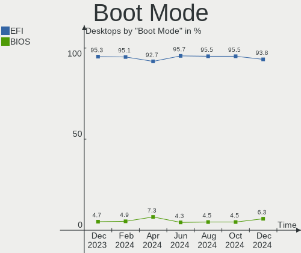
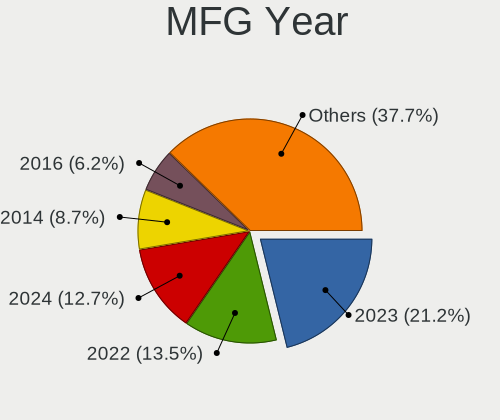
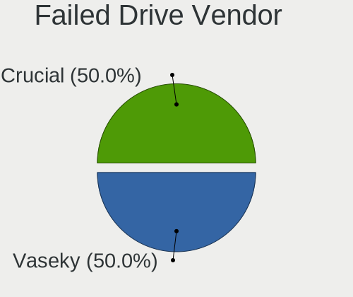
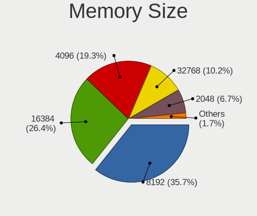

BSD Hardware Trends (Desktop)
-----------------------------

A project to identify most popular hardware characteristics and track their change
over time based on data collected by BSD users at https://BSD-Hardware.info.

Anyone can contribute to the study by uploading probes of their computers by
the [hw-probe](https://github.com/linuxhw/hw-probe/blob/master/INSTALL.BSD.md) tool:

    hw-probe -all -upload

Full-feature report is available here: https://bsd-hardware.info/?view=trends&formfactor=desktop

Period: Oct, 2020.

Contents
--------

- [ OS                       ](#os)
- [ OS Family                ](#os-family)
- [ Arch                     ](#arch)
- [ DE                       ](#de)
- [ Display Server           ](#display-server)
- [ Display Manager          ](#display-manager)
- [ OS Lang                  ](#os-lang)
- [ Boot Mode                ](#boot-mode)
- [ Filesystem               ](#filesystem)
- [ Part. scheme             ](#part-scheme)
- [ Country                  ](#country)
- [ City                     ](#city)
- [ Vendor                   ](#vendor)
- [ Model                    ](#model)
- [ Model Family             ](#model-family)
- [ MFG Year                 ](#mfg-year)
- [ Form Factor              ](#form-factor)
- [ Coreboot                 ](#coreboot)
- [ RAM Size                 ](#ram-size)
- [ RAM Used                 ](#ram-used)
- [ Has CD-ROM               ](#has-cd-rom)
- [ Total Drives             ](#total-drives)
- [ Has Ethernet             ](#has-ethernet)
- [ Drive Vendor             ](#drive-vendor)
- [ HDD Vendor               ](#hdd-vendor)
- [ SSD Vendor               ](#ssd-vendor)
- [ Drive Model              ](#drive-model)
- [ Drive Kind               ](#drive-kind)
- [ Drive Connector          ](#drive-connector)
- [ Drive Size               ](#drive-size)
- [ Space Total              ](#space-total)
- [ Space Used               ](#space-used)
- [ Malfunc. Drives          ](#malfunc-drives)
- [ Malfunc. Drive Vendor    ](#malfunc-drive-vendor)
- [ Malfunc. HDD Vendor      ](#malfunc-hdd-vendor)
- [ Malfunc. Drive Kind      ](#malfunc-drive-kind)
- [ Failed Drives            ](#failed-drives)
- [ Failed Drive Vendor      ](#failed-drive-vendor)
- [ Drive Status             ](#drive-status)
- [ Storage Vendor           ](#storage-vendor)
- [ Storage Model            ](#storage-model)
- [ Storage Kind             ](#storage-kind)
- [ CPU Vendor               ](#cpu-vendor)
- [ CPU Model                ](#cpu-model)
- [ CPU Model Family         ](#cpu-model-family)
- [ CPU Cores                ](#cpu-cores)
- [ CPU Sockets              ](#cpu-sockets)
- [ CPU Threads              ](#cpu-threads)
- [ CPU Microarch            ](#cpu-microarch)
- [ GPU Vendor               ](#gpu-vendor)
- [ GPU Model                ](#gpu-model)
- [ GPU Combo                ](#gpu-combo)
- [ GPU Driver               ](#gpu-driver)
- [ GPU Memory               ](#gpu-memory)
- [ Monitor Vendor           ](#monitor-vendor)
- [ Monitor Model            ](#monitor-model)
- [ Monitor Resolution       ](#monitor-resolution)
- [ Monitor Diagonal         ](#monitor-diagonal)
- [ Monitor Width            ](#monitor-width)
- [ Aspect Ratio             ](#aspect-ratio)
- [ Monitor Area             ](#monitor-area)
- [ Pixel Density            ](#pixel-density)
- [ Multiple Monitors        ](#multiple-monitors)
- [ Net Controller Vendor    ](#net-controller-vendor)
- [ Net Controller Model     ](#net-controller-model)
- [ Wireless Vendor          ](#wireless-vendor)
- [ Wireless Model           ](#wireless-model)
- [ Ethernet Vendor          ](#ethernet-vendor)
- [ Ethernet Model           ](#ethernet-model)
- [ Net Controller Kind      ](#net-controller-kind)
- [ Used Controller          ](#used-controller)
- [ NICs                     ](#nics)
- [ Memory Vendor            ](#memory-vendor)
- [ Memory Model             ](#memory-model)
- [ Memory Kind              ](#memory-kind)
- [ Memory Form Factor       ](#memory-form-factor)
- [ Memory Size              ](#memory-size)
- [ Memory Speed             ](#memory-speed)
- [ Sound Vendor             ](#sound-vendor)
- [ Sound Model              ](#sound-model)
- [ Camera Vendor            ](#camera-vendor)
- [ Camera Model             ](#camera-model)
- [ Fingerprint Vendor       ](#fingerprint-vendor)
- [ Fingerprint Model        ](#fingerprint-model)
- [ Chipcard Vendor          ](#chipcard-vendor)
- [ Chipcard Model           ](#chipcard-model)
- [ Printer Vendor           ](#printer-vendor)
- [ Printer Model            ](#printer-model)
- [ Scanner Vendor           ](#scanner-vendor)
- [ Scanner Model            ](#scanner-model)
- [ Bluetooth Vendor         ](#bluetooth-vendor)
- [ Bluetooth Model          ](#bluetooth-model)
- [ Unsupported Devices      ](#unsupported-devices)
- [ Unsupported Device Types ](#unsupported-device-types)

OS
--

Installed operating systems

| Name                 | Desktops | Percent |
|----------------------|----------|---------|
| OpenBSD 6.8          | 103      | 51.24%  |
| FreeBSD 12.1-p10     | 26       | 12.94%  |
| FreeBSD 12.2         | 20       | 9.95%   |
| FreeBSD 12.1         | 6        | 2.99%   |
| OPNsense 20.7.3      | 4        | 1.99%   |
| NetBSD 9.1           | 3        | 1.49%   |
| FreeBSD 12.1-STABLE  | 3        | 1.49%   |
| FreeBSD 12.1-p7      | 3        | 1.49%   |
| NomadBSD 1.3.2       | 2        | 1%      |
| GhostBSD 20.04.02    | 2        | 1%      |
| FreeNAS 11.4-p4      | 2        | 1%      |
| FreeNAS 11.3-p14     | 2        | 1%      |
| FreeBSD 13.0-CURRENT | 2        | 1%      |
| FreeBSD 12.2-RC3     | 2        | 1%      |
| FreeBSD 12.1-p9      | 2        | 1%      |
| pfSense 2.4.5        | 1        | 0.5%    |
| PC-BSD 12.1-p10      | 1        | 0.5%    |
| OPNsense 20.7        | 1        | 0.5%    |
| NetBSD 9.99.74       | 1        | 0.5%    |
| NetBSD 9.99.71       | 1        | 0.5%    |
| NetBSD 9.0_STABLE    | 1        | 0.5%    |
| MidnightBSD 1.2.9    | 1        | 0.5%    |
| FuryBSD 12.2         | 1        | 0.5%    |
| FuryBSD 12.1-p9      | 1        | 0.5%    |
| FuryBSD 12.1-p10     | 1        | 0.5%    |
| FreeNAS 11.3-p8      | 1        | 0.5%    |
| FreeBSD 12.1-p6      | 1        | 0.5%    |
| FreeBSD 12.1-p1      | 1        | 0.5%    |
| FreeBSD 11.4-p4      | 1        | 0.5%    |
| FreeBSD 11.3-p5      | 1        | 0.5%    |
| FreeBSD 11.3         | 1        | 0.5%    |
| DragonFly 5.8        | 1        | 0.5%    |
| ClonOS 13.0-CURRENT  | 1        | 0.5%    |
| ClonOS 12.1-p10      | 1        | 0.5%    |

OS Family
---------

OS without a version

| Name        | Desktops | Percent |
|-------------|----------|---------|
| OpenBSD     | 103      | 51.24%  |
| FreeBSD     | 69       | 34.33%  |
| NetBSD      | 6        | 2.99%   |
| OPNsense    | 5        | 2.49%   |
| FreeNAS     | 5        | 2.49%   |
| FuryBSD     | 3        | 1.49%   |
| NomadBSD    | 2        | 1%      |
| GhostBSD    | 2        | 1%      |
| ClonOS      | 2        | 1%      |
| pfSense     | 1        | 0.5%    |
| PC-BSD      | 1        | 0.5%    |
| MidnightBSD | 1        | 0.5%    |
| DragonFly   | 1        | 0.5%    |

Arch
----

OS architecture (x86_64, i586, etc.)

| Name   | Desktops | Percent |
|--------|----------|---------|
| amd64  | 186      | 92.54%  |
| i386   | 10       | 4.98%   |
| arm64  | 3        | 1.49%   |
| macppc | 1        | 0.5%    |
| arm    | 1        | 0.5%    |

DE
--

Desktop Environment

| Name    | Desktops | Percent |
|---------|----------|---------|
| Console | 102      | 50.75%  |
| fvwm    | 61       | 30.35%  |
| XFCE    | 14       | 6.97%   |
| TWM     | 7        | 3.48%   |
| i3      | 5        | 2.49%   |
| GNOME   | 4        | 1.99%   |
| MATE    | 3        | 1.49%   |
| Openbox | 2        | 1%      |
| LXDE    | 2        | 1%      |
| KDE5    | 1        | 0.5%    |

Display Server
--------------

X11 or Wayland

| Name    | Desktops | Percent |
|---------|----------|---------|
| Console | 121      | 60.2%   |
| X11     | 80       | 39.8%   |

Display Manager
---------------

SDDM, LightDM, etc.

| Name    | Desktops | Percent |
|---------|----------|---------|
| Console | 171      | 85.07%  |
| SLiM    | 11       | 5.47%   |
| SDDM    | 7        | 3.48%   |
| GDM     | 6        | 2.99%   |
| LightDM | 4        | 1.99%   |
| XDM     | 2        | 1%      |

OS Lang
-------

Language

| Lang             | Desktops | Percent |
|------------------|----------|---------|
| Unknown          | 137      | 68.16%  |
| en_US            | 29       | 14.43%  |
| ru_RU            | 6        | 2.99%   |
| el_GR            | 4        | 1.99%   |
| ""               | 4        | 1.99%   |
| en_GB            | 3        | 1.49%   |
| de_DE            | 3        | 1.49%   |
| es_ES            | 2        | 1%      |
| C                | 2        | 1%      |
| sl_SI            | 1        | 0.5%    |
| pl_PL            | 1        | 0.5%    |
| nb_NO            | 1        | 0.5%    |
| ja_JP            | 1        | 0.5%    |
| it_IT            | 1        | 0.5%    |
| fi_FI            | 1        | 0.5%    |
| fi_FI.ISO8859-15 | 1        | 0.5%    |
| en_IE            | 1        | 0.5%    |
| en_DE            | 1        | 0.5%    |
| en_CA            | 1        | 0.5%    |
| en_AU            | 1        | 0.5%    |

Boot Mode
---------

EFI or BIOS

| Mode | Desktops | Percent |
|------|----------|---------|
| BIOS | 118      | 58.71%  |
| EFI  | 83       | 41.29%  |

Filesystem
----------

Type of filesystem

| Type    | Desktops | Percent |
|---------|----------|---------|
| Ufs     | 150      | 74.63%  |
| Zfs     | 49       | 24.38%  |
| Hammer2 | 1        | 0.5%    |
| Unknown | 1        | 0.5%    |

Part. scheme
------------

Scheme of partitioning

| Type    | Desktops | Percent |
|---------|----------|---------|
| GPT     | 105      | 52.24%  |
| MBR     | 94       | 46.77%  |
| Unknown | 2        | 1%      |

Country
-------

Geographic location (country)

| Country              | Desktops | Percent |
|----------------------|----------|---------|
| USA                  | 30       | 14.93%  |
| Germany              | 29       | 14.43%  |
| Russia               | 19       | 9.45%   |
| Netherlands          | 12       | 5.97%   |
| France               | 11       | 5.47%   |
| Canada               | 10       | 4.98%   |
| Norway               | 8        | 3.98%   |
| UK                   | 6        | 2.99%   |
| Poland               | 6        | 2.99%   |
| Austria              | 6        | 2.99%   |
| Australia            | 6        | 2.99%   |
| Spain                | 5        | 2.49%   |
| Finland              | 5        | 2.49%   |
| Italy                | 4        | 1.99%   |
| Greece               | 4        | 1.99%   |
| Japan                | 3        | 1.49%   |
| Denmark              | 3        | 1.49%   |
| Bulgaria             | 3        | 1.49%   |
| Ukraine              | 2        | 1%      |
| Switzerland          | 2        | 1%      |
| Slovenia             | 2        | 1%      |
| Serbia               | 2        | 1%      |
| Romania              | 2        | 1%      |
| New Zealand          | 2        | 1%      |
| Ireland              | 2        | 1%      |
| Hungary              | 2        | 1%      |
| Estonia              | 2        | 1%      |
| Colombia             | 2        | 1%      |
| China                | 2        | 1%      |
| Brazil               | 2        | 1%      |
| UAE                  | 1        | 0.5%    |
| Sweden               | 1        | 0.5%    |
| South Africa         | 1        | 0.5%    |
| Nicaragua            | 1        | 0.5%    |
| Moldova, Republic of | 1        | 0.5%    |
| Latvia               | 1        | 0.5%    |
| Croatia              | 1        | 0.5%    |

City
----

Geographic location (city)

| City           | Desktops | Percent |
|----------------|----------|---------|
| Moscow         | 12       | 5.97%   |
| Berlin         | 7        | 3.48%   |
| Utrecht        | 5        | 2.49%   |
| Vienna         | 4        | 1.99%   |
| Montreal       | 4        | 1.99%   |
| Voyenenga      | 3        | 1.49%   |
| Vladivostok    | 3        | 1.49%   |
| Ibiza Town     | 3        | 1.49%   |
| Dublin         | 3        | 1.49%   |
| Amsterdam      | 3        | 1.49%   |
| Tampere        | 2        | 1%      |
| Tallinn        | 2        | 1%      |
| Sydney         | 2        | 1%      |
| Subotica       | 2        | 1%      |
| Sofia          | 2        | 1%      |
| Skien          | 2        | 1%      |
| Shenzhen       | 2        | 1%      |
| Saint-Herblain | 2        | 1%      |
| Porto Alegre   | 2        | 1%      |
| Paris          | 2        | 1%      |
| Odense         | 2        | 1%      |
| Notaresco      | 2        | 1%      |
| Leipzig        | 2        | 1%      |
| Igoumenitsa    | 2        | 1%      |
| Grenoble       | 2        | 1%      |
| Calgary        | 2        | 1%      |
| Banino         | 2        | 1%      |
| Auckland       | 2        | 1%      |
| Athens         | 2        | 1%      |
| Zurich         | 1        | 0.5%    |
| Zhukovskiy     | 1        | 0.5%    |
| Zerkow         | 1        | 0.5%    |
| Zagreb         | 1        | 0.5%    |
| Ypsilanti      | 1        | 0.5%    |
| Yanchep        | 1        | 0.5%    |
| Wolmirstedt    | 1        | 0.5%    |
| Winterswijk    | 1        | 0.5%    |
| Wetzlar        | 1        | 0.5%    |
| Waukesha       | 1        | 0.5%    |
| Warsaw         | 1        | 0.5%    |
| Wackersberg    | 1        | 0.5%    |
| Villeurbanne   | 1        | 0.5%    |
| Victoria       | 1        | 0.5%    |
| Vantaa         | 1        | 0.5%    |
| Ujkigyos       | 1        | 0.5%    |
| Tyreso Strand  | 1        | 0.5%    |
| Tustin         | 1        | 0.5%    |
| Turin          | 1        | 0.5%    |
| Tokyo          | 1        | 0.5%    |
| Taufkirchen    | 1        | 0.5%    |
| Tatabánya     | 1        | 0.5%    |
| Svilengrad     | 1        | 0.5%    |
| Stryn          | 1        | 0.5%    |
| Stramproy      | 1        | 0.5%    |
| Stourbridge    | 1        | 0.5%    |
| Stezzano       | 1        | 0.5%    |
| St. John's     | 1        | 0.5%    |
| St Petersburg  | 1        | 0.5%    |
| St Louis       | 1        | 0.5%    |
| Springfield    | 1        | 0.5%    |

Vendor
------

Motherboard manufacturer

| Name                | Desktops | Percent |
|---------------------|----------|---------|
| Lenovo              | 27       | 13.43%  |
| ASUSTek Computer    | 25       | 12.44%  |
| PC Engines          | 20       | 9.95%   |
| Dell                | 19       | 9.45%   |
| Unknown             | 17       | 8.46%   |
| ASRock              | 16       | 7.96%   |
| Gigabyte Technology | 15       | 7.46%   |
| Hewlett-Packard     | 13       | 6.47%   |
| Intel               | 9        | 4.48%   |
| MSI                 | 6        | 2.99%   |
| Fujitsu             | 4        | 1.99%   |
| Supermicro          | 3        | 1.49%   |
| IBM                 | 3        | 1.49%   |
| Shuttle             | 2        | 1%      |
| Panasonic           | 2        | 1%      |
| AZW                 | 2        | 1%      |
| ASRockRack          | 2        | 1%      |
| Acer                | 2        | 1%      |
| ZOTAC               | 1        | 0.5%    |
| TYAN Computer       | 1        | 0.5%    |
| Thomas-Krenn.AG     | 1        | 0.5%    |
| NF541               | 1        | 0.5%    |
| NA                  | 1        | 0.5%    |
| HPE                 | 1        | 0.5%    |
| Foxconn             | 1        | 0.5%    |
| eMachines           | 1        | 0.5%    |
| ECS                 | 1        | 0.5%    |
| Compaq              | 1        | 0.5%    |
| Bluechip Computer   | 1        | 0.5%    |
| Apple               | 1        | 0.5%    |
| AMD                 | 1        | 0.5%    |
| ADI Engineering     | 1        | 0.5%    |

Model
-----

Motherboard model

| Name                                     | Desktops | Percent |
|------------------------------------------|----------|---------|
| Unknown                                  | 21       | 10.45%  |
| PC Engines apu2                          | 12       | 5.97%   |
| PC Engines apu4                          | 4        | 1.99%   |
| Dell PowerEdge R620                      | 4        | 1.99%   |
| PC Engines apu1                          | 3        | 1.49%   |
| HP ProLiant MicroServer Gen8             | 3        | 1.49%   |
| Lenovo ThinkPad X1 Carbon 3rd 20BSCTO1WW | 2        | 1%      |
| HP ProLiant MicroServer                  | 2        | 1%      |
| Gigabyte Z77X-UD5H                       | 2        | 1%      |
| Fujitsu ESPRIMO E510                     | 2        | 1%      |
| ASUS H110I-PLUS                          | 2        | 1%      |
| ASUS All Series                          | 2        | 1%      |
| ASRock J3455-ITX                         | 2        | 1%      |
| ZOTAC XXXXXX                             | 1        | 0.5%    |
| Supermicro X8STi                         | 1        | 0.5%    |
| Supermicro X7SPA-HF                      | 1        | 0.5%    |
| Supermicro X11SSW-F                      | 1        | 0.5%    |
| Shuttle XH270                            | 1        | 0.5%    |
| Shuttle DS77U                            | 1        | 0.5%    |
| PC Engines APU                           | 1        | 0.5%    |
| Panasonic CF-C1BT02EGE                   | 1        | 0.5%    |
| Panasonic CF-52PFPBSFQ                   | 1        | 0.5%    |
| NF541 1.0                                | 1        | 0.5%    |
| MSI MS-7C02                              | 1        | 0.5%    |
| MSI MS-7B89                              | 1        | 0.5%    |
| MSI MS-7B22                              | 1        | 0.5%    |
| MSI MS-7816                              | 1        | 0.5%    |
| MSI MS-7345                              | 1        | 0.5%    |
| MSI MS-6533                              | 1        | 0.5%    |
| Lenovo ThinkPad X270 20HNA004CD          | 1        | 0.5%    |
| Lenovo ThinkPad X250 20CLS4WV08          | 1        | 0.5%    |
| Lenovo ThinkPad X240 20AMS2QD0C          | 1        | 0.5%    |
| Lenovo ThinkPad X240 20AL00DKRT          | 1        | 0.5%    |
| Lenovo ThinkPad X230 2325Y36             | 1        | 0.5%    |
| Lenovo ThinkPad X230 2325R74             | 1        | 0.5%    |
| Lenovo ThinkPad X230 2325AJ9             | 1        | 0.5%    |
| Lenovo ThinkPad X1 Carbon 5th 20HRCTO1WW | 1        | 0.5%    |
| Lenovo ThinkPad X1 Carbon 2nd 20A7002CUK | 1        | 0.5%    |
| Lenovo ThinkPad W540 20BG001KUK          | 1        | 0.5%    |
| Lenovo ThinkPad T560 20FJS0CE00          | 1        | 0.5%    |
| Lenovo ThinkPad T500 2087A16             | 1        | 0.5%    |
| Lenovo ThinkPad T480 20L6S4GR02          | 1        | 0.5%    |
| Lenovo ThinkPad T460 20FMS1BC01          | 1        | 0.5%    |
| Lenovo ThinkPad T450 20BV0005US          | 1        | 0.5%    |
| Lenovo ThinkPad T430 2347GZU             | 1        | 0.5%    |
| Lenovo ThinkPad T410 2537N24             | 1        | 0.5%    |
| Lenovo ThinkPad Edge E531 68852HG        | 1        | 0.5%    |
| Lenovo ThinkPad E485 20KUCTO1WW          | 1        | 0.5%    |
| Lenovo ThinkCentre M93p 10AAS1MD00       | 1        | 0.5%    |
| Lenovo ThinkCentre M91p 0266B8U          | 1        | 0.5%    |
| Lenovo ThinkCentre M700 10HY002XAU       | 1        | 0.5%    |
| Lenovo ThinkCentre M58p 7220W5B          | 1        | 0.5%    |
| Lenovo IdeaPad 1 14IGL05 81VU            | 1        | 0.5%    |
| Lenovo 70TT0008EA ThinkServer TS460      | 1        | 0.5%    |
| Intel X79 V2.81A                         | 1        | 0.5%    |
| Intel S3000AH                            | 1        | 0.5%    |
| Intel GT5449E                            | 1        | 0.5%    |
| Intel DH61CR AAG14064-210                | 1        | 0.5%    |
| Intel DH61CR AAG14064-208                | 1        | 0.5%    |
| Intel D945GCLF2                          | 1        | 0.5%    |

Model Family
------------

Motherboard model prefix

| Name                   | Desktops | Percent |
|------------------------|----------|---------|
| Lenovo ThinkPad        | 21       | 10.45%  |
| Unknown                | 21       | 10.45%  |
| PC Engines apu2        | 12       | 5.97%   |
| Dell PowerEdge         | 9        | 4.48%   |
| HP ProLiant            | 6        | 2.99%   |
| Dell OptiPlex          | 6        | 2.99%   |
| PC Engines apu4        | 4        | 1.99%   |
| Lenovo ThinkCentre     | 4        | 1.99%   |
| Dell Precision         | 4        | 1.99%   |
| PC Engines apu1        | 3        | 1.49%   |
| Fujitsu ESPRIMO        | 3        | 1.49%   |
| ASUS PRIME             | 3        | 1.49%   |
| Intel DH61CR           | 2        | 1%      |
| Gigabyte Z77X-UD5H     | 2        | 1%      |
| ASUS VivoBook          | 2        | 1%      |
| ASUS M5A78L-M          | 2        | 1%      |
| ASUS H110I-PLUS        | 2        | 1%      |
| ASUS All               | 2        | 1%      |
| ASRock J3455-ITX       | 2        | 1%      |
| ZOTAC XXXXXX           | 1        | 0.5%    |
| Supermicro X8STi       | 1        | 0.5%    |
| Supermicro X7SPA-HF    | 1        | 0.5%    |
| Supermicro X11SSW-F    | 1        | 0.5%    |
| Shuttle XH270          | 1        | 0.5%    |
| Shuttle DS77U          | 1        | 0.5%    |
| PC Engines APU         | 1        | 0.5%    |
| Panasonic CF-C1BT02EGE | 1        | 0.5%    |
| Panasonic CF-52PFPBSFQ | 1        | 0.5%    |
| NF541 1.0              | 1        | 0.5%    |
| MSI MS-7C02            | 1        | 0.5%    |
| MSI MS-7B89            | 1        | 0.5%    |
| MSI MS-7B22            | 1        | 0.5%    |
| MSI MS-7816            | 1        | 0.5%    |
| MSI MS-7345            | 1        | 0.5%    |
| MSI MS-6533            | 1        | 0.5%    |
| Lenovo IdeaPad         | 1        | 0.5%    |
| Lenovo 70TT0008EA      | 1        | 0.5%    |
| Intel X79              | 1        | 0.5%    |
| Intel S3000AH          | 1        | 0.5%    |
| Intel GT5449E          | 1        | 0.5%    |
| Intel D945GCLF2        | 1        | 0.5%    |
| Intel D53427RKE        | 1        | 0.5%    |
| Intel D2500HN          | 1        | 0.5%    |
| Intel CRESCENTBAY      | 1        | 0.5%    |
| IBM ThinkPad           | 1        | 0.5%    |
| IBM 81832BG            | 1        | 0.5%    |
| IBM 8173KUB            | 1        | 0.5%    |
| HPE ProLiant           | 1        | 0.5%    |
| HP Z420                | 1        | 0.5%    |
| HP Vectra              | 1        | 0.5%    |
| HP t620                | 1        | 0.5%    |
| HP Pavilion            | 1        | 0.5%    |
| HP Compaq              | 1        | 0.5%    |
| HP 870-244             | 1        | 0.5%    |
| HP 120-1136            | 1        | 0.5%    |
| Gigabyte Z97X-UD5H     | 1        | 0.5%    |
| Gigabyte Z97X-UD3H-BK  | 1        | 0.5%    |
| Gigabyte Z97-D3H       | 1        | 0.5%    |
| Gigabyte Z68A-D3H-B3   | 1        | 0.5%    |
| Gigabyte Z170X-Gaming  | 1        | 0.5%    |

MFG Year
--------

Motherboard manufacture year

| Year    | Desktops | Percent |
|---------|----------|---------|
| 2019    | 33       | 16.42%  |
| 2020    | 22       | 10.95%  |
| 2018    | 21       | 10.45%  |
| Unknown | 20       | 9.95%   |
| 2013    | 16       | 7.96%   |
| 2015    | 14       | 6.97%   |
| 2012    | 14       | 6.97%   |
| 2017    | 11       | 5.47%   |
| 2016    | 10       | 4.98%   |
| 2014    | 9        | 4.48%   |
| 2011    | 9        | 4.48%   |
| 2010    | 7        | 3.48%   |
| 2008    | 4        | 1.99%   |
| 2007    | 3        | 1.49%   |
| 2006    | 3        | 1.49%   |
| 2009    | 2        | 1%      |
| 2005    | 1        | 0.5%    |
| 2003    | 1        | 0.5%    |
| 2001    | 1        | 0.5%    |

Form Factor
-----------

Physical design of the computer

| Name    | Desktops | Percent |
|---------|----------|---------|
| Desktop | 201      | 100%    |

Coreboot
--------

Have coreboot on board

| Used | Desktops | Percent |
|------|----------|---------|
| No   | 180      | 89.55%  |
| Yes  | 21       | 10.45%  |

RAM Size
--------

Total RAM memory

| Size in GB      | Desktops | Percent |
|-----------------|----------|---------|
| 8.01-16.0       | 51       | 25.37%  |
| 4.01-8.0        | 42       | 20.9%   |
| 16.01-24.0      | 37       | 18.41%  |
| 32.01-64.0      | 21       | 10.45%  |
| 0.01-1.0        | 10       | 4.98%   |
| 3.01-4.0        | 9        | 4.48%   |
| 2.01-3.0        | 8        | 3.98%   |
| 24.01-32.0      | 7        | 3.48%   |
| 64.01-256.0     | 7        | 3.48%   |
| 1.01-2.0        | 6        | 2.99%   |
| More than 256.0 | 2        | 1%      |
| Unknown         | 1        | 0.5%    |

RAM Used
--------

Used RAM memory

| Used GB    | Desktops | Percent |
|------------|----------|---------|
| 0.01-1.0   | 142      | 70.65%  |
| 1.01-2.0   | 11       | 5.47%   |
| 4.01-8.0   | 10       | 4.98%   |
| 0          | 9        | 4.48%   |
| 16.01-24.0 | 7        | 3.48%   |
| Unknown    | 7        | 3.48%   |
| 2.01-3.0   | 5        | 2.49%   |
| 8.01-16.0  | 5        | 2.49%   |
| 3.01-4.0   | 3        | 1.49%   |
| 32.01-64.0 | 2        | 1%      |

Has CD-ROM
----------

Has CD-ROM on board

| Presented | Desktops | Percent |
|-----------|----------|---------|
| No        | 176      | 87.56%  |
| Yes       | 25       | 12.44%  |

Total Drives
------------

Number of drives on board

| Drives | Desktops | Percent |
|--------|----------|---------|
| 1      | 87       | 43.28%  |
| 2      | 52       | 25.87%  |
| 3      | 20       | 9.95%   |
| 4      | 16       | 7.96%   |
| 0      | 8        | 3.98%   |
| 5      | 7        | 3.48%   |
| 10     | 3        | 1.49%   |
| 6      | 3        | 1.49%   |
| 7      | 2        | 1%      |
| 14     | 1        | 0.5%    |
| 12     | 1        | 0.5%    |
| 11     | 1        | 0.5%    |

Has Ethernet
------------

Has Ethernet on board

| Presented | Desktops | Percent |
|-----------|----------|---------|
| Yes       | 192      | 95.52%  |
| No        | 9        | 4.48%   |

Drive Vendor
------------

Hard drive vendors

| Vendor              | Desktops | Drives | Percent |
|---------------------|----------|--------|---------|
| WDC                 | 53       | 110    | 17.55%  |
| Seagate             | 40       | 60     | 13.25%  |
| Samsung Electronics | 33       | 40     | 10.93%  |
| Kingston            | 24       | 27     | 7.95%   |
| Intel               | 15       | 17     | 4.97%   |
| SanDisk             | 14       | 15     | 4.64%   |
| Crucial             | 13       | 15     | 4.3%    |
| Toshiba             | 12       | 18     | 3.97%   |
| Hitachi             | 12       | 20     | 3.97%   |
| NVMe                | 10       | 11     | 3.31%   |
| Transcend           | 9        | 9      | 2.98%   |
| Phison              | 9        | 9      | 2.98%   |
| HGST                | 9        | 11     | 2.98%   |
| Dell                | 6        | 10     | 1.99%   |
| OPENBSD             | 4        | 4      | 1.32%   |
| MAXTOR              | 4        | 5      | 1.32%   |
| China               | 4        | 4      | 1.32%   |
| A-DATA Technology   | 3        | 3      | 0.99%   |
| PNY                 | 2        | 2      | 0.66%   |
| ORICO               | 2        | 2      | 0.66%   |
| Generic             | 2        | 2      | 0.66%   |
| Corsair             | 2        | 2      | 0.66%   |
| ZTC                 | 1        | 1      | 0.33%   |
| Vaseky              | 1        | 1      | 0.33%   |
| SPCC                | 1        | 2      | 0.33%   |
| SK Hynix            | 1        | 1      | 0.33%   |
| SABRENT             | 1        | 1      | 0.33%   |
| QUMO                | 1        | 1      | 0.33%   |
| OCZ                 | 1        | 1      | 0.33%   |
| NETAPP              | 1        | 4      | 0.33%   |
| LSI                 | 1        | 1      | 0.33%   |
| LITEONIT            | 1        | 1      | 0.33%   |
| LITEON              | 1        | 1      | 0.33%   |
| Lexar               | 1        | 1      | 0.33%   |
| KingDian            | 1        | 1      | 0.33%   |
| IBM                 | 1        | 1      | 0.33%   |
| HPE                 | 1        | 4      | 0.33%   |
| Hoodisk             | 1        | 1      | 0.33%   |
| FREEBSD             | 1        | 1      | 0.33%   |
| FORESEE             | 1        | 1      | 0.33%   |
| Biwin               | 1        | 1      | 0.33%   |
| Apacer              | 1        | 1      | 0.33%   |

HDD Vendor
----------

Hard disk drive vendors

| Vendor              | Desktops | Drives | Percent |
|---------------------|----------|--------|---------|
| WDC                 | 48       | 102    | 30.97%  |
| Seagate             | 40       | 60     | 25.81%  |
| Toshiba             | 12       | 18     | 7.74%   |
| Hitachi             | 12       | 20     | 7.74%   |
| HGST                | 9        | 11     | 5.81%   |
| Samsung Electronics | 8        | 10     | 5.16%   |
| NVMe                | 6        | 6      | 3.87%   |
| Dell                | 6        | 10     | 3.87%   |
| OPENBSD             | 4        | 4      | 2.58%   |
| MAXTOR              | 4        | 5      | 2.58%   |
| Generic             | 2        | 2      | 1.29%   |
| SABRENT             | 1        | 1      | 0.65%   |
| Lexar               | 1        | 1      | 0.65%   |
| IBM                 | 1        | 1      | 0.65%   |
| HPE                 | 1        | 4      | 0.65%   |

SSD Vendor
----------

Solid state drive vendors

| Vendor              | Desktops | Drives | Percent |
|---------------------|----------|--------|---------|
| Samsung Electronics | 24       | 28     | 17.02%  |
| Kingston            | 24       | 27     | 17.02%  |
| SanDisk             | 14       | 15     | 9.93%   |
| Intel               | 14       | 16     | 9.93%   |
| Crucial             | 13       | 15     | 9.22%   |
| Transcend           | 9        | 9      | 6.38%   |
| Phison              | 9        | 9      | 6.38%   |
| WDC                 | 5        | 8      | 3.55%   |
| NVMe                | 5        | 5      | 3.55%   |
| China               | 4        | 4      | 2.84%   |
| A-DATA Technology   | 3        | 3      | 2.13%   |
| PNY                 | 2        | 2      | 1.42%   |
| ZTC                 | 1        | 1      | 0.71%   |
| Vaseky              | 1        | 1      | 0.71%   |
| SK Hynix            | 1        | 1      | 0.71%   |
| QUMO                | 1        | 1      | 0.71%   |
| ORICO               | 1        | 1      | 0.71%   |
| OCZ                 | 1        | 1      | 0.71%   |
| NETAPP              | 1        | 4      | 0.71%   |
| LSI                 | 1        | 1      | 0.71%   |
| LITEONIT            | 1        | 1      | 0.71%   |
| LITEON              | 1        | 1      | 0.71%   |
| KingDian            | 1        | 1      | 0.71%   |
| Hoodisk             | 1        | 1      | 0.71%   |
| FREEBSD             | 1        | 1      | 0.71%   |
| FORESEE             | 1        | 1      | 0.71%   |
| Apacer              | 1        | 1      | 0.71%   |

Drive Model
-----------

Hard drive models

| Model                      | Desktops | Percent |
|----------------------------|----------|---------|
| SATA SSD 16GB              | 8        | 2.35%   |
| ST1000DM010-2EP102 1TB     | 6        | 1.76%   |
| SSD 850 EVO 250GB          | 5        | 1.47%   |
| SA400S37120G 120GB         | 5        | 1.47%   |
| PERC H710 2.9TB            | 4        | 1.18%   |
| WD60EFRX-68L0BN1 6TB       | 3        | 0.88%   |
| WD40EFRX-68N32N0 4TB       | 3        | 0.88%   |
| WD30EFRX-68EUZN0 3TB       | 3        | 0.88%   |
| ST8000DM004-2CX188 8TB     | 3        | 0.88%   |
| ST4000DM000-1F2168 4TB     | 3        | 0.88%   |
| ST3000DM001-1CH166 3TB     | 3        | 0.88%   |
| SR RAID 1 2TB              | 3        | 0.88%   |
| SA400S37240G 240GB         | 3        | 0.88%   |
| HUS724020ALA640 2TB        | 3        | 0.88%   |
| DT01ACA100 1TB             | 3        | 0.88%   |
| CT525MX300SSD1 528GB       | 3        | 0.88%   |
| CT250MX500SSD1 250GB       | 3        | 0.88%   |
| WDS240G2G0B-00EPW0 240GB   | 2        | 0.59%   |
| WDS240G2G0A-00JH30 240GB   | 2        | 0.59%   |
| TS64GMSA370 64GB           | 2        | 0.59%   |
| TS32GMSA370 32GB           | 2        | 0.59%   |
| SUV500MS240G 240GB         | 2        | 0.59%   |
| SUV500MS120G 120GB         | 2        | 0.59%   |
| SUV500240G 240GB           | 2        | 0.59%   |
| STM3250310AS 250GB         | 2        | 0.59%   |
| ST8000AS0002-1NA17Z 8TB    | 2        | 0.59%   |
| ST500DM002-1BD142 500GB    | 2        | 0.59%   |
| ST4000DM004-2CV104 4TB     | 2        | 0.59%   |
| ST1000LM024 HN-M101MBB 1TB | 2        | 0.59%   |
| SSD 850 PRO 256GB          | 2        | 0.59%   |
| SSD 850 EVO 1TB            | 2        | 0.59%   |
| SMS200S360G 64GB           | 2        | 0.59%   |
| Samsung SSD 970 250GB      | 2        | 0.59%   |
| HTS725050A7E630 500GB      | 2        | 0.59%   |
| HD103UJ 1TB                | 2        | 0.59%   |
| CT240BX500SSD1 240GB       | 2        | 0.59%   |
| X446_RALS200MCHT 200GB     | 1        | 0.29%   |
| X400 M.2 2280 512GB        | 1        | 0.29%   |
| WDS500G2B0A-00SM50 500GB   | 1        | 0.29%   |
| WDC PC SN520 SDA 512GB     | 1        | 0.29%   |
| WD80EFZX-68UW8N0 8TB       | 1        | 0.29%   |
| WD800BB-00HEA0 80GB        | 1        | 0.29%   |
| WD8001FFWX-68J1UN0 8TB     | 1        | 0.29%   |
| WD7500BPKX-00HPJT0 752GB   | 1        | 0.29%   |
| WD7500BPKT-00PK4T0 752GB   | 1        | 0.29%   |
| WD7500BMVW-11AJGS4 752GB   | 1        | 0.29%   |
| WD5000LPLX-00ZNTT0 500GB   | 1        | 0.29%   |
| WD5000BPKX-00HPJT0 500GB   | 1        | 0.29%   |
| WD5000BMVV-11A1CS0 500GB   | 1        | 0.29%   |
| WD5000AAKX-60U6AA0 500GB   | 1        | 0.29%   |
| WD5000AAKX-603CA0 500GB    | 1        | 0.29%   |
| WD5000AAKS-00UU3A0 500GB   | 1        | 0.29%   |
| WD5000AAKS-00D2B0 500GB    | 1        | 0.29%   |
| WD40EZRZ-22GXCB0 4TB       | 1        | 0.29%   |
| WD40EZRX-00SPEB0 4TB       | 1        | 0.29%   |
| WD40EFRX-68WT0N0 4TB       | 1        | 0.29%   |
| WD400BB-00GFA0 40GB        | 1        | 0.29%   |
| WD4003FFBX-68MU3N0 4TB     | 1        | 0.29%   |
| WD3750LMCW-11D9GS3 375GB   | 1        | 0.29%   |
| WD3200AAKX-00ERMA0 320GB   | 1        | 0.29%   |

Drive Kind
----------

HDD or SSD

| Kind | Desktops | Drives | Percent |
|------|----------|--------|---------|
| SSD  | 127      | 159    | 50.8%   |
| HDD  | 115      | 255    | 46%     |
| NVMe | 8        | 9      | 3.2%    |

Drive Connector
---------------

SATA, SAS, NVMe, etc.

| Type | Desktops | Drives | Percent |
|------|----------|--------|---------|
| SATA | 190      | 414    | 95.96%  |
| NVMe | 8        | 9      | 4.04%   |

Drive Size
----------

Size of hard drive

| Size in TB | Desktops | Drives | Percent |
|------------|----------|--------|---------|
| 0.01-0.5   | 148      | 192    | 56.06%  |
| 0.51-1.0   | 51       | 76     | 19.32%  |
| 1.01-2.0   | 25       | 49     | 9.47%   |
| 2.01-3.0   | 14       | 35     | 5.3%    |
| 3.01-4.0   | 13       | 31     | 4.92%   |
| 4.01-10.0  | 12       | 30     | 4.55%   |
| 10.01-20.0 | 1        | 1      | 0.38%   |

Space Total
-----------

Amount of disk space available on the file system

| Size in GB     | Desktops | Percent |
|----------------|----------|---------|
| 101-250        | 65       | 32.34%  |
| 251-500        | 33       | 16.42%  |
| 21-50          | 22       | 10.95%  |
| 51-100         | 21       | 10.45%  |
| 1-20           | 20       | 9.95%   |
| 501-1000       | 13       | 6.47%   |
| 1001-2000      | 11       | 5.47%   |
| More than 3000 | 8        | 3.98%   |
| 2001-3000      | 7        | 3.48%   |
| Unknown        | 1        | 0.5%    |

Space Used
----------

Amount of used disk space

| Used GB        | Desktops | Percent |
|----------------|----------|---------|
| 1-20           | 128      | 63.68%  |
| 21-50          | 24       | 11.94%  |
| 101-250        | 17       | 8.46%   |
| 51-100         | 12       | 5.97%   |
| 251-500        | 7        | 3.48%   |
| 501-1000       | 5        | 2.49%   |
| 1001-2000      | 4        | 1.99%   |
| More than 3000 | 3        | 1.49%   |
| Unknown        | 1        | 0.5%    |

Malfunc. Drives
---------------

Drive models with a malfunction

| Model                   | Desktops | Drives | Percent |
|-------------------------|----------|--------|---------|
| WD800BB-00HEA0 80GB     | 1        | 1      | 2.44%   |
| WD60EFRX-68L0BN1 6TB    | 1        | 6      | 2.44%   |
| WD30EFRX-68EUZN0 3TB    | 1        | 3      | 2.44%   |
| WD2001FASS-00W2B0 2TB   | 1        | 1      | 2.44%   |
| WD10SPZX-24Z10 1TB      | 1        | 1      | 2.44%   |
| WD10EZEX-60M2NA0 1TB    | 1        | 1      | 2.44%   |
| SV300S37A120G 120GB     | 1        | 1      | 2.44%   |
| ST9500325AS 500GB       | 1        | 1      | 2.44%   |
| ST3750640NS 752GB       | 1        | 2      | 2.44%   |
| ST320LT007-9ZV142 320GB | 1        | 1      | 2.44%   |
| ST3160815A 160GB        | 1        | 1      | 2.44%   |
| ST31500341AS 1.5TB      | 1        | 1      | 2.44%   |
| ST3120211AS 120GB       | 1        | 1      | 2.44%   |
| ST3000DM001-1CH166 3TB  | 1        | 1      | 2.44%   |
| ST2000DM001-9YN164 2TB  | 1        | 1      | 2.44%   |
| ST1000DM010-2EP102 1TB  | 1        | 1      | 2.44%   |
| SSDSC2KW120H6 120GB     | 1        | 1      | 2.44%   |
| SSDSC2CW060A3 64GB      | 1        | 1      | 2.44%   |
| SSDSC2CT240A3 240GB     | 1        | 1      | 2.44%   |
| SSDSC2BB080G4 80GB      | 1        | 1      | 2.44%   |
| SSDSC2BA200G3T 200GB    | 1        | 2      | 2.44%   |
| SSDSA2M040G2GC 40GB     | 1        | 1      | 2.44%   |
| SMSM151S3128GD 128GB    | 1        | 1      | 2.44%   |
| SMS200S330G 32GB        | 1        | 1      | 2.44%   |
| SMS200S3120G 120GB      | 1        | 1      | 2.44%   |
| SD7UB3Q256G1001 256GB   | 1        | 1      | 2.44%   |
| HUS722T2TALA604 2TB     | 1        | 1      | 2.44%   |
| HTS725050A7E630 500GB   | 1        | 1      | 2.44%   |
| HTS721060G9SA00 64GB    | 1        | 1      | 2.44%   |
| HTS547550A9E384 500GB   | 1        | 1      | 2.44%   |
| HTS545050A7E380 500GB   | 1        | 1      | 2.44%   |
| HTS541010A7E630 1TB     | 1        | 1      | 2.44%   |
| HM500JI 500GB           | 1        | 1      | 2.44%   |
| HDS721010KLA330 1TB     | 1        | 1      | 2.44%   |
| HDP725016GLA380 160GB   | 1        | 1      | 2.44%   |
| HD154UI 1.5TB           | 1        | 1      | 2.44%   |
| HD103SJ 1TB             | 1        | 2      | 2.44%   |
| CT525MX300SSD1 528GB    | 1        | 1      | 2.44%   |
| CT480M500SSD1 480GB     | 1        | 1      | 2.44%   |
| 6Y080P0 82GB            | 1        | 2      | 2.44%   |
| 32GB SATA Flash Drive   | 1        | 1      | 2.44%   |

Malfunc. Drive Vendor
---------------------

Vendors of faulty drives

| Vendor              | Desktops | Drives | Percent |
|---------------------|----------|--------|---------|
| Seagate             | 8        | 10     | 20%     |
| WDC                 | 6        | 13     | 15%     |
| Intel               | 6        | 7      | 15%     |
| Hitachi             | 5        | 5      | 12.5%   |
| Kingston            | 4        | 4      | 10%     |
| Samsung Electronics | 3        | 4      | 7.5%    |
| HGST                | 3        | 3      | 7.5%    |
| Crucial             | 2        | 2      | 5%      |
| SanDisk             | 1        | 1      | 2.5%    |
| Maxtor              | 1        | 2      | 2.5%    |
| Apacer              | 1        | 1      | 2.5%    |

Malfunc. HDD Vendor
-------------------

Vendors of faulty HDD drives

| Vendor              | Desktops | Drives | Percent |
|---------------------|----------|--------|---------|
| Seagate             | 8        | 10     | 30.77%  |
| WDC                 | 6        | 13     | 23.08%  |
| Hitachi             | 5        | 5      | 19.23%  |
| Samsung Electronics | 3        | 4      | 11.54%  |
| HGST                | 3        | 3      | 11.54%  |
| Maxtor              | 1        | 2      | 3.85%   |

Malfunc. Drive Kind
-------------------

Kinds of faulty drives

| Kind | Desktops | Drives | Percent |
|------|----------|--------|---------|
| HDD  | 25       | 37     | 64.1%   |
| SSD  | 14       | 15     | 35.9%   |

Failed Drives
-------------

Failed drive models

| Model        | Desktops | Drives | Percent |
|--------------|----------|--------|---------|
| HD204UI 2TB  | 1        | 2      | 50%     |
| 6E040L0 41GB | 1        | 1      | 50%     |

Failed Drive Vendor
-------------------

Failed drive vendors

| Vendor              | Desktops | Drives | Percent |
|---------------------|----------|--------|---------|
| Samsung Electronics | 1        | 2      | 50%     |
| Maxtor              | 1        | 1      | 50%     |

Drive Status
------------

Number of failed and malfunc. drives

| Status   | Desktops | Drives | Percent |
|----------|----------|--------|---------|
| Works    | 157      | 325    | 70.4%   |
| Malfunc  | 37       | 52     | 16.59%  |
| Detected | 27       | 43     | 12.11%  |
| Failed   | 2        | 3      | 0.9%    |

Storage Vendor
--------------

Storage controller vendors

| Vendor                           | Desktops | Percent |
|----------------------------------|----------|---------|
| Intel                            | 130      | 54.17%  |
| AMD                              | 55       | 22.92%  |
| Broadcom / LSI                   | 14       | 5.83%   |
| Samsung Electronics              | 6        | 2.5%    |
| Marvell Technology Group         | 6        | 2.5%    |
| ASMedia Technology               | 6        | 2.5%    |
| Phison Electronics               | 4        | 1.67%   |
| Silicon Image                    | 3        | 1.25%   |
| Nvidia                           | 3        | 1.25%   |
| Silicon Motion                   | 2        | 0.83%   |
| Hewlett-Packard                  | 2        | 0.83%   |
| VIA Technologies                 | 1        | 0.42%   |
| Union Memory (Shenzhen)          | 1        | 0.42%   |
| Toshiba                          | 1        | 0.42%   |
| Silicon Integrated Systems [SiS] | 1        | 0.42%   |
| Sandisk                          | 1        | 0.42%   |
| Lenovo                           | 1        | 0.42%   |
| Kingston Technology Company      | 1        | 0.42%   |
| JMicron Technology               | 1        | 0.42%   |
| Dell                             | 1        | 0.42%   |

Storage Model
-------------

Storage controller models

| Model                                                                             | Desktops | Percent |
|-----------------------------------------------------------------------------------|----------|---------|
| FCH SATA Controller [AHCI mode]                                                   | 26       | 9.15%   |
| Q170/Q150/B150/H170/H110/Z170/CM236 Chipset SATA Controller [AHCI Mode]           | 16       | 5.63%   |
| SB7x0/SB8x0/SB9x0 SATA Controller [AHCI mode]                                     | 12       | 4.23%   |
| FCH SATA Controller [IDE mode]                                                    | 12       | 4.23%   |
| 6 Series/C200 Series Chipset Family 6 port Desktop SATA AHCI Controller           | 12       | 4.23%   |
| 8 Series/C220 Series Chipset Family 6-port SATA Controller 1 [AHCI mode]          | 9        | 3.17%   |
| 7 Series/C210 Series Chipset Family 6-port SATA Controller [AHCI mode]            | 8        | 2.82%   |
| 7 Series Chipset Family 6-port SATA Controller [AHCI mode]                        | 8        | 2.82%   |
| SB7x0/SB8x0/SB9x0 IDE Controller                                                  | 7        | 2.46%   |
| SAS2008 PCI-Express Fusion-MPT SAS-2 [Falcon]                                     | 6        | 2.11%   |
| Sunrise Point-LP SATA Controller [AHCI mode]                                      | 5        | 1.76%   |
| Cannon Lake PCH SATA AHCI Controller                                              | 5        | 1.76%   |
| C600/X79 series chipset 6-Port SATA AHCI Controller                               | 5        | 1.76%   |
| ASM1062 Serial ATA Controller                                                     | 5        | 1.76%   |
| 82801G (ICH7 Family) IDE Controller                                               | 5        | 1.76%   |
| Wildcat Point-LP SATA Controller [AHCI Mode]                                      | 4        | 1.41%   |
| NVMe SSD Controller SM981/PM981/PM983                                             | 4        | 1.41%   |
| NM10/ICH7 Family SATA Controller [IDE mode]                                       | 4        | 1.41%   |
| MegaRAID SAS 2208 [Thunderbolt]                                                   | 4        | 1.41%   |
| Celeron N3350/Pentium N4200/Atom E3900 Series SATA AHCI Controller                | 4        | 1.41%   |
| 88SE9172 SATA 6Gb/s Controller                                                    | 4        | 1.41%   |
| SiI 3114 [SATALink/SATARaid] Serial ATA Controller                                | 3        | 1.06%   |
| FCH IDE Controller                                                                | 3        | 1.06%   |
| Atom/Celeron/Pentium Processor x5-E8000/J3xxx/N3xxx Series SATA Controller        | 3        | 1.06%   |
| 9 Series Chipset Family SATA Controller [AHCI Mode]                               | 3        | 1.06%   |
| 8 Series SATA Controller 1 [AHCI mode]                                            | 3        | 1.06%   |
| 400 Series Chipset SATA Controller                                                | 3        | 1.06%   |
| 300 Series Chipset SATA Controller                                                | 3        | 1.06%   |
| 200 Series PCH SATA controller [AHCI mode]                                        | 3        | 1.06%   |
| Unknown                                                                           | 3        | 1.06%   |
| unknown                                                                           | 2        | 0.7%    |
| SSD Pro 7600p/760p/E 6100p Series                                                 | 2        | 0.7%    |
| Smart Array G6 controllers                                                        | 2        | 0.7%    |
| SB7x0/SB8x0/SB9x0 SATA Controller [IDE mode]                                      | 2        | 0.7%    |
| SATA Controller [RAID mode]                                                       | 2        | 0.7%    |
| NM10/ICH7 Family SATA Controller [AHCI mode]                                      | 2        | 0.7%    |
| MCP61 SATA Controller                                                             | 2        | 0.7%    |
| MCP61 IDE                                                                         | 2        | 0.7%    |
| FCH SATA Controller D                                                             | 2        | 0.7%    |
| E12 NVMe Controller                                                               | 2        | 0.7%    |
| C610/X99 series chipset sSATA Controller [AHCI mode]                              | 2        | 0.7%    |
| C610/X99 series chipset 6-Port SATA Controller [AHCI mode]                        | 2        | 0.7%    |
| C600/X79 series chipset SATA RAID Controller                                      | 2        | 0.7%    |
| 82801JI (ICH10 Family) SATA AHCI Controller                                       | 2        | 0.7%    |
| 82801JI (ICH10 Family) 4 port SATA IDE Controller #1                              | 2        | 0.7%    |
| 82801JI (ICH10 Family) 2 port SATA IDE Controller #2                              | 2        | 0.7%    |
| 82801IR/IO/IH (ICH9R/DO/DH) 6 port SATA Controller [AHCI mode]                    | 2        | 0.7%    |
| 82371AB/EB/MB PIIX4 IDE                                                           | 2        | 0.7%    |
| 6 Series/C200 Series Chipset Family Desktop SATA Controller (IDE mode, ports 4-5) | 2        | 0.7%    |
| 6 Series/C200 Series Chipset Family Desktop SATA Controller (IDE mode, ports 0-3) | 2        | 0.7%    |
| 6 Series/C200 Series Chipset Family 6 port Mobile SATA AHCI Controller            | 2        | 0.7%    |
| 5 Series/3400 Series Chipset 6 port SATA AHCI Controller                          | 2        | 0.7%    |
| X370 Series Chipset SATA Controller                                               | 1        | 0.35%   |
| VT6415 PATA IDE Host Controller                                                   | 1        | 0.35%   |
| SSD 660P Series                                                                   | 1        | 0.35%   |
| SM951 AHCI                                                                        | 1        | 0.35%   |
| SB7x0/SB8x0/SB9x0 SATA Controller [Non-RAID5 mode]                                | 1        | 0.35%   |
| SAS3008 PCI-Express Fusion-MPT SAS-3                                              | 1        | 0.35%   |
| SAS2308 PCI-Express Fusion-MPT SAS-2                                              | 1        | 0.35%   |
| SAS1068E PCI-Express Fusion-MPT SAS                                               | 1        | 0.35%   |

Storage Kind
------------

Kind of storage controller (IDE, SATA, NVMe, SAS, ...)

| Kind | Desktops | Percent |
|------|----------|---------|
| SATA | 159      | 65.16%  |
| IDE  | 39       | 15.98%  |
| NVMe | 19       | 7.79%   |
| RAID | 18       | 7.38%   |
| SAS  | 8        | 3.28%   |
| SCSI | 1        | 0.41%   |

CPU Vendor
----------

Processor vendors

| Vendor  | Desktops | Percent |
|---------|----------|---------|
| Intel   | 139      | 69.15%  |
| AMD     | 57       | 28.36%  |
| ARM     | 4        | 1.99%   |
| PowerPC | 1        | 0.5%    |

CPU Model
---------

Processor models

| Model                                                        | Desktops | Percent |
|--------------------------------------------------------------|----------|---------|
| AMD GX-412TC SOC                                             | 16       | 7.96%   |
| Intel Xeon CPU E3-1220 v5 @ 3.00GHz                          | 4        | 1.99%   |
| Intel Core i7-3770 CPU @ 3.40GHz                             | 4        | 1.99%   |
| Intel Core i5-3320M CPU @ 2.60GHz                            | 4        | 1.99%   |
| Intel Core i3-3220 CPU @ 3.30GHz                             | 4        | 1.99%   |
| AMD G-T40E Processor                                         | 4        | 1.99%   |
| Intel Pentium CPU G4560 @ 3.50GHz                            | 3        | 1.49%   |
| AMD Ryzen 5 2400G with Radeon Vega Graphics                  | 3        | 1.49%   |
| Intel Xeon CPU E5620 @ 2.40GHz                               | 2        | 1%      |
| Intel Xeon CPU E5-2630 0 @ 2.30GHz                           | 2        | 1%      |
| Intel Core i7-6700 CPU @ 3.40GHz                             | 2        | 1%      |
| Intel Core i7-4790K CPU @ 4.00GHz                            | 2        | 1%      |
| Intel Core i7-4770 CPU @ 3.40GHz                             | 2        | 1%      |
| Intel Core i7-3770K CPU @ 3.50GHz                            | 2        | 1%      |
| Intel Core i5-6300U CPU @ 2.40GHz                            | 2        | 1%      |
| Intel Core i5-5200U CPU @ 2.20GHz                            | 2        | 1%      |
| Intel Core i5-4570T CPU @ 2.90GHz                            | 2        | 1%      |
| Intel Core i5-2400 CPU @ 3.10GHz                             | 2        | 1%      |
| Intel Core i5 CPU M 520 @ 2.40GHz                            | 2        | 1%      |
| Intel Celeron CPU J3455 @ 1.50GHz                            | 2        | 1%      |
| Intel Celeron CPU G1610T @ 2.30GHz                           | 2        | 1%      |
| Intel 686-class                                              | 2        | 1%      |
| ARM Cortex-A53 r0p4                                          | 2        | 1%      |
| AMD Ryzen 5 2500U with Radeon Vega Mobile Gfx                | 2        | 1%      |
| AMD FX-8320E Eight-Core Processor                            | 2        | 1%      |
| AMD E2-1800 APU with Radeon HD Graphics                      | 2        | 1%      |
| PowerPC 7447A (Revision 0x105)                               | 1        | 0.5%    |
| Intel Xeon E-2278G CPU @ 3.40GHz                             | 1        | 0.5%    |
| Intel Xeon E-2224 CPU @ 3.40GHz                              | 1        | 0.5%    |
| Intel Xeon CPU X5680 @ 3.33GHz                               | 1        | 0.5%    |
| Intel Xeon CPU W3530 @ 2.80GHz                               | 1        | 0.5%    |
| Intel Xeon CPU E5410 @ 2.33GHz                               | 1        | 0.5%    |
| Intel Xeon CPU E5320 @ 1.86GHz                               | 1        | 0.5%    |
| Intel Xeon CPU E5-2690 0 @ 2.90GHz                           | 1        | 0.5%    |
| Intel Xeon CPU E5-2670 v3 @ 2.30GHz                          | 1        | 0.5%    |
| Intel Xeon CPU E5-2650L v3 @ 1.80GHz                         | 1        | 0.5%    |
| Intel Xeon CPU E5-2650 v2 @ 2.60GHz                          | 1        | 0.5%    |
| Intel Xeon CPU E5-2640 0 @ 2.50GHz                           | 1        | 0.5%    |
| Intel Xeon CPU E5-2620 v3 @ 2.40GHz                          | 1        | 0.5%    |
| Intel Xeon CPU E5-2403 0 @ 1.80GHz                           | 1        | 0.5%    |
| Intel Xeon CPU E5-1620 v2 @ 3.70GHz                          | 1        | 0.5%    |
| Intel Xeon CPU E31230 @ 3.20GHz                              | 1        | 0.5%    |
| Intel Xeon CPU E31225 @ 3.10GH                               | 1        | 0.5%    |
| Intel Xeon CPU E3-1275 v5 @ 3.60GHz                          | 1        | 0.5%    |
| Intel Xeon CPU E3-1230 v6 @ 3.50GHz                          | 1        | 0.5%    |
| Intel Xeon CPU E3-1225 v5 @ 3.30GHz                          | 1        | 0.5%    |
| Intel Pentium Silver N5030 CPU @ 1.10GHz                     | 1        | 0.5%    |
| Intel Pentium M processor 1.60GHz ("GenuineIntel" 686-class) | 1        | 0.5%    |
| Intel Pentium III                                            | 1        | 0.5%    |
| Intel Pentium II                                             | 1        | 0.5%    |
| Intel Pentium Dual-Core CPU E5700 @ 3.00GHz                  | 1        | 0.5%    |
| Intel Pentium D CPU 2.80GHz                                  | 1        | 0.5%    |
| Intel Pentium CPU G860 @ 3.00GHz                             | 1        | 0.5%    |
| Intel Pentium CPU G4400T @ 2.90GHz                           | 1        | 0.5%    |
| Intel Pentium CPU G2020T @ 2.50GHz                           | 1        | 0.5%    |
| Intel Pentium 4 CPU 3.20GHz ("GenuineIntel" 686-class)       | 1        | 0.5%    |
| Intel Pentium 4 CPU 2.66GHz                                  | 1        | 0.5%    |
| Intel Pentium 4                                              | 1        | 0.5%    |
| Intel Core m3-7Y30 CPU @ 1.00GHz                             | 1        | 0.5%    |
| Intel Core i7-7700K CPU @ 4.20GHz                            | 1        | 0.5%    |

CPU Model Family
----------------

Processor model prefix

| Model                   | Desktops | Percent |
|-------------------------|----------|---------|
| Intel Core i7           | 30       | 14.93%  |
| Intel Core i5           | 30       | 14.93%  |
| Intel Xeon              | 27       | 13.43%  |
| AMD GX                  | 17       | 8.46%   |
| Intel Celeron           | 12       | 5.97%   |
| AMD Ryzen 5             | 11       | 5.47%   |
| Intel Core i3           | 9        | 4.48%   |
| Intel Atom              | 8        | 3.98%   |
| Intel Pentium           | 7        | 3.48%   |
| AMD FX                  | 5        | 2.49%   |
| ARM Cortex              | 4        | 1.99%   |
| AMD G                   | 4        | 1.99%   |
| Intel Pentium 4         | 3        | 1.49%   |
| Intel Core 2 Duo        | 3        | 1.49%   |
| AMD Turion II Neo       | 3        | 1.49%   |
| AMD A4                  | 3        | 1.49%   |
| Intel 686-class         | 2        | 1%      |
| AMD Ryzen 7             | 2        | 1%      |
| AMD E2                  | 2        | 1%      |
| Other                   | 1        | 0.5%    |
| Intel Pentium Silver    | 1        | 0.5%    |
| Intel Pentium M         | 1        | 0.5%    |
| Intel Pentium III       | 1        | 0.5%    |
| Intel Pentium Dual-Core | 1        | 0.5%    |
| Intel Pentium D         | 1        | 0.5%    |
| Intel Core m3           | 1        | 0.5%    |
| Intel Core 2 Quad       | 1        | 0.5%    |
| Intel Core 2            | 1        | 0.5%    |
| AMD V120                | 1        | 0.5%    |
| AMD Ryzen Threadripper  | 1        | 0.5%    |
| AMD Ryzen 3             | 1        | 0.5%    |
| AMD Phenom II X6        | 1        | 0.5%    |
| AMD Phenom II X4        | 1        | 0.5%    |
| AMD Opteron             | 1        | 0.5%    |
| AMD Geode Integrated    | 1        | 0.5%    |
| AMD Athlon              | 1        | 0.5%    |
| AMD A10                 | 1        | 0.5%    |
| AMD 686-class           | 1        | 0.5%    |

CPU Cores
---------

Number of processor cores

| Number  | Desktops | Percent |
|---------|----------|---------|
| 4       | 76       | 37.81%  |
| 2       | 60       | 29.85%  |
| Unknown | 20       | 9.95%   |
| 8       | 16       | 7.96%   |
| 1       | 10       | 4.98%   |
| 12      | 9        | 4.48%   |
| 6       | 7        | 3.48%   |
| 16      | 2        | 1%      |
| 64      | 1        | 0.5%    |

CPU Sockets
-----------

Number of sockets

| Number  | Desktops | Percent |
|---------|----------|---------|
| 1       | 174      | 86.57%  |
| Unknown | 20       | 9.95%   |
| 2       | 7        | 3.48%   |

CPU Threads
-----------

Threads per core (Hyper-Threading)

| Number  | Desktops | Percent |
|---------|----------|---------|
| 1       | 92       | 45.77%  |
| 2       | 82       | 40.8%   |
| Unknown | 27       | 13.43%  |

CPU Microarch
-------------

Microarchitecture

| Name          | Desktops | Percent |
|---------------|----------|---------|
| IvyBridge     | 23       | 11.44%  |
| KabyLake      | 19       | 9.45%   |
| Haswell       | 18       | 8.96%   |
| Puma          | 16       | 7.96%   |
| Skylake       | 15       | 7.46%   |
| SandyBridge   | 15       | 7.46%   |
| Unknown       | 12       | 5.97%   |
| Zen           | 7        | 3.48%   |
| Zen 2         | 6        | 2.99%   |
| Westmere      | 6        | 2.99%   |
| Silvermont    | 6        | 2.99%   |
| Piledriver    | 6        | 2.99%   |
| K10           | 6        | 2.99%   |
| Bobcat        | 6        | 2.99%   |
| Broadwell     | 5        | 2.49%   |
| Bonnell       | 5        | 2.49%   |
| Penryn        | 4        | 1.99%   |
| NetBurst      | 4        | 1.99%   |
| P6            | 3        | 1.49%   |
| Nehalem       | 3        | 1.49%   |
| Jaguar        | 3        | 1.49%   |
| Goldmont      | 3        | 1.49%   |
| Core          | 3        | 1.49%   |
| K8 Hammer     | 2        | 1%      |
| Goldmont plus | 2        | 1%      |
| Zen+          | 1        | 0.5%    |
| K10 Llano     | 1        | 0.5%    |
| Geode         | 1        | 0.5%    |

GPU Vendor
----------

Vendors of graphics cards

| Vendor                     | Desktops | Percent |
|----------------------------|----------|---------|
| Intel                      | 89       | 48.63%  |
| AMD                        | 42       | 22.95%  |
| Nvidia                     | 32       | 17.49%  |
| Matrox Electronics Systems | 14       | 7.65%   |
| ASPEED Technology          | 5        | 2.73%   |
| S3 Graphics                | 1        | 0.55%   |

GPU Model
---------

Graphics card models

| Model                                                                              | Desktops | Percent |
|------------------------------------------------------------------------------------|----------|---------|
| 2nd Generation Core Processor Family Integrated Graphics Controller                | 8        | 4.3%    |
| Xeon E3-1200 v2/3rd Gen Core processor Graphics Controller                         | 7        | 3.76%   |
| 3rd Gen Core processor Graphics Controller                                         | 7        | 3.76%   |
| Raven Ridge [Radeon Vega Series / Radeon Vega Mobile Series]                       | 6        | 3.23%   |
| G200eR2                                                                            | 6        | 3.23%   |
| Xeon E3-1200 v3/4th Gen Core Processor Integrated Graphics Controller              | 5        | 2.69%   |
| HD Graphics 530                                                                    | 5        | 2.69%   |
| Ellesmere [Radeon RX 470/480/570/570X/580/580X/590]                                | 5        | 2.69%   |
| ASPEED Graphics Family                                                             | 5        | 2.69%   |
| RS880M [Mobility Radeon HD 4225/4250]                                              | 4        | 2.15%   |
| MGA G200EH                                                                         | 4        | 2.15%   |
| HD Graphics 5500                                                                   | 4        | 2.15%   |
| GK208B [GeForce GT 710]                                                            | 4        | 2.15%   |
| Atom/Celeron/Pentium Processor x5-E8000/J3xxx/N3xxx Integrated Graphics Controller | 4        | 2.15%   |
| Skylake GT2 [HD Graphics 520]                                                      | 3        | 1.61%   |
| MGA G200eW WPCM450                                                                 | 3        | 1.61%   |
| HD Graphics 620                                                                    | 3        | 1.61%   |
| HD Graphics 610                                                                    | 3        | 1.61%   |
| HD Graphics 500                                                                    | 3        | 1.61%   |
| Haswell-ULT Integrated Graphics Controller                                         | 3        | 1.61%   |
| ES1000                                                                             | 3        | 1.61%   |
| 82945G/GZ Integrated Graphics Controller                                           | 3        | 1.61%   |
| Wrestler [Radeon HD 7340]                                                          | 2        | 1.08%   |
| UHD Graphics 630 (Desktop)                                                         | 2        | 1.08%   |
| UHD Graphics 605                                                                   | 2        | 1.08%   |
| RS780L [Radeon 3000]                                                               | 2        | 1.08%   |
| Rage 3 [Rage XL PCI]                                                               | 2        | 1.08%   |
| HD Graphics P530                                                                   | 2        | 1.08%   |
| GT218 [GeForce 8400 GS Rev. 3]                                                     | 2        | 1.08%   |
| GP107 [GeForce GTX 1050 Ti]                                                        | 2        | 1.08%   |
| GF119 [GeForce GT 610]                                                             | 2        | 1.08%   |
| GF114 [GeForce GTX 560]                                                            | 2        | 1.08%   |
| Core Processor Integrated Graphics Controller                                      | 2        | 1.08%   |
| Atom Processor D2xxx/N2xxx Integrated Graphics Controller                          | 2        | 1.08%   |
| 4th Gen Core Processor Integrated Graphics Controller                              | 2        | 1.08%   |
| 4 Series Chipset Integrated Graphics Controller                                    | 2        | 1.08%   |
| UHD Graphics                                                                       | 1        | 0.54%   |
| TU116 [GeForce GTX 1660 SUPER]                                                     | 1        | 0.54%   |
| Tonga PRO [Radeon R9 285/380]                                                      | 1        | 0.54%   |
| SuperSumo [Radeon HD 6410D]                                                        | 1        | 0.54%   |
| Sun LE [Radeon HD 8550M / R5 M230]                                                 | 1        | 0.54%   |
| Stoney [Radeon R2/R3/R4/R5 Graphics]                                               | 1        | 0.54%   |
| RV635/M86 [Mobility Radeon HD 3650]                                                | 1        | 0.54%   |
| RV360/M12 [Mobility Radeon 9550]                                                   | 1        | 0.54%   |
| RV280 [Radeon 9200 PRO] (Secondary)                                                | 1        | 0.54%   |
| RV280 [Radeon 9200 PRO / 9250]                                                     | 1        | 0.54%   |
| Rage Mobility AGP 2x Series                                                        | 1        | 0.54%   |
| NV18 [GeForce4 MX 440 AGP 8x]                                                      | 1        | 0.54%   |
| Navi 10 [Radeon RX 5600 OEM/5600 XT / 5700/5700 XT]                                | 1        | 0.54%   |
| Mobile 945GSE Express Integrated Graphics Controller                               | 1        | 0.54%   |
| Mobile 945GM/GMS/GME, 943/940GML Express Integrated Graphics Controller            | 1        | 0.54%   |
| Mobile 915GM/GMS/910GML Express Graphics Controller                                | 1        | 0.54%   |
| Mobile 4 Series Chipset Integrated Graphics Controller                             | 1        | 0.54%   |
| MGA G200eH3                                                                        | 1        | 0.54%   |
| Kaby Lake-U GT1 Integrated Graphics Controller                                     | 1        | 0.54%   |
| Kabini [Radeon HD 8400E]                                                           | 1        | 0.54%   |
| Kabini [Radeon HD 8330]                                                            | 1        | 0.54%   |
| Kabini [Radeon HD 8180]                                                            | 1        | 0.54%   |
| HD Graphics 630                                                                    | 1        | 0.54%   |
| HD Graphics 615                                                                    | 1        | 0.54%   |

GPU Combo
---------

Combinations of graphics cards

| Name            | Desktops | Percent |
|-----------------|----------|---------|
| 1 x Intel       | 78       | 38.81%  |
| 1 x AMD         | 35       | 17.41%  |
| Other           | 28       | 13.93%  |
| 1 x Nvidia      | 24       | 11.94%  |
| 1 x Matrox      | 14       | 6.97%   |
| 2 x Intel       | 4        | 1.99%   |
| Intel + Nvidia  | 4        | 1.99%   |
| 1 x ASPEED      | 4        | 1.99%   |
| Intel + AMD     | 3        | 1.49%   |
| 2 x AMD         | 2        | 1%      |
| AMD + Nvidia    | 2        | 1%      |
| 2 x Nvidia      | 1        | 0.5%    |
| 1 x S3 Graphics | 1        | 0.5%    |
| Nvidia + ASPEED | 1        | 0.5%    |

GPU Driver
----------

Free vs proprietary

| Driver      | Desktops | Percent |
|-------------|----------|---------|
| Free        | 150      | 74.63%  |
| Unknown     | 34       | 16.92%  |
| Proprietary | 17       | 8.46%   |

GPU Memory
----------

Total video memory

| Size in GB | Desktops | Percent |
|------------|----------|---------|
| Unknown    | 178      | 88.56%  |
| 1.01-2.0   | 7        | 3.48%   |
| 0.51-1.0   | 5        | 2.49%   |
| 3.01-4.0   | 3        | 1.49%   |
| 0.01-0.5   | 3        | 1.49%   |
| 7.01-8.0   | 2        | 1%      |
| 5.01-6.0   | 2        | 1%      |
| 2.01-3.0   | 1        | 0.5%    |

Monitor Vendor
--------------

Monitor vendors

| Vendor               | Desktops | Percent |
|----------------------|----------|---------|
| Samsung Electronics  | 10       | 12.82%  |
| Dell                 | 9        | 11.54%  |
| LG Display           | 8        | 10.26%  |
| Iiyama               | 5        | 6.41%   |
| Goldstar             | 5        | 6.41%   |
| AU Optronics         | 5        | 6.41%   |
| BenQ                 | 4        | 5.13%   |
| AOC                  | 4        | 5.13%   |
| Ancor Communications | 4        | 5.13%   |
| Philips              | 3        | 3.85%   |
| BOE                  | 3        | 3.85%   |
| LG Electronics       | 2        | 2.56%   |
| Chimei Innolux       | 2        | 2.56%   |
| Sony                 | 1        | 1.28%   |
| PANDA                | 1        | 1.28%   |
| NEC Computers        | 1        | 1.28%   |
| LTM                  | 1        | 1.28%   |
| Lenovo               | 1        | 1.28%   |
| InfoVision           | 1        | 1.28%   |
| IBM                  | 1        | 1.28%   |
| HPN                  | 1        | 1.28%   |
| Hewlett-Packard      | 1        | 1.28%   |
| Gateway              | 1        | 1.28%   |
| Envision             | 1        | 1.28%   |
| Eizo                 | 1        | 1.28%   |
| Apple                | 1        | 1.28%   |
| Acer                 | 1        | 1.28%   |

Monitor Model
-------------

Monitor models

| Model                                              | Desktops | Percent |
|----------------------------------------------------|----------|---------|
| LCD Monitor SAM0C39 1920x1080 890x500mm 40.2-inch  | 2        | 2.44%   |
| LCD Monitor LGD0418 2560x1440 310x170mm 13.9-inch  | 2        | 2.44%   |
| VS248 ACI2498 1920x1080 530x300mm 24.0-inch        | 1        | 1.22%   |
| VG248 ACI24E1 1920x1080 530x300mm 24.0-inch        | 1        | 1.22%   |
| VE247 ACI2493 1920x1080 530x300mm 24.0-inch        | 1        | 1.22%   |
| U3417W DELA0DF 3440x1440 800x330mm 34.1-inch       | 1        | 1.22%   |
| U32R59x SAM0F94 3840x2160 700x390mm 31.5-inch      | 1        | 1.22%   |
| U2415 DELA0BA 1920x1200 520x320mm 24.0-inch        | 1        | 1.22%   |
| U2414H DELA0A4 1920x1080 530x300mm 24.0-inch       | 1        | 1.22%   |
| U2414H DELA0A2 1920x1080 530x300mm 24.0-inch       | 1        | 1.22%   |
| U2212HM DELD046 1920x1080 480x270mm 21.7-inch      | 1        | 1.22%   |
| T24D390 SAM0B6E 1920x1080 520x290mm 23.4-inch      | 1        | 1.22%   |
| SyncMaster SAM00A1 1280x1024 340x270mm 17.1-inch   | 1        | 1.22%   |
| SMB2340 SAM0691 1920x1080 510x290mm 23.1-inch      | 1        | 1.22%   |
| SE790C SAM0BFE 3440x1440 800x330mm 34.1-inch       | 1        | 1.22%   |
| SE2216H DELF070 1920x1080 480x270mm 21.7-inch      | 1        | 1.22%   |
| SDM-X72 SNY1D70 1280x1024 340x270mm 17.1-inch      | 1        | 1.22%   |
| S24E310 SAM0C2E 1920x1080 520x290mm 23.4-inch      | 1        | 1.22%   |
| R221Q ACR0503 1920x1080 480x270mm 21.7-inch        | 1        | 1.22%   |
| PL2792UH IVM664E 3840x2160 600x340mm 27.2-inch     | 1        | 1.22%   |
| PL2495W IVM613B 1920x1200 520x320mm 24.0-inch      | 1        | 1.22%   |
| PL2493H IVM6141 1920x1080 530x300mm 24.0-inch      | 1        | 1.22%   |
| PL2492H IVM612F 1920x1080 530x300mm 24.0-inch      | 1        | 1.22%   |
| PL2280 IVM562F 1920x1080 480x270mm 21.7-inch       | 1        | 1.22%   |
| PHL 328E9Q PHLC180 1920x1080 700x390mm 31.5-inch   | 1        | 1.22%   |
| PA249 ACI24B2 1920x1200 520x320mm 24.0-inch        | 1        | 1.22%   |
| P2417H DELA0DC 1920x1080 530x300mm 24.0-inch       | 1        | 1.22%   |
| LG ULTRAWIDE GSM5AE2 3440x1440 800x340mm 34.2-inch | 1        | 1.22%   |
| LG Ultra HD GSM5B08 3840x2160 600x340mm 27.2-inch  | 1        | 1.22%   |
| LG FULL HD GSM5B55 1920x1080 480x270mm 21.7-inch   | 1        | 1.22%   |
| LEN T24i-10 LEN61CE 1920x1080 530x300mm 24.0-inch  | 1        | 1.22%   |
| LCD190V NEC66D3 1280x1024 380x300mm 19.1-inch      | 1        | 1.22%   |
| LCD Monitor SEC304C 1366x768 310x170mm 13.9-inch   | 1        | 1.22%   |
| LCD Monitor SDC314D 1366x768 310x170mm 13.9-inch   | 1        | 1.22%   |
| LCD Monitor NCP0046 1920x1080 340x190mm 15.3-inch  | 1        | 1.22%   |
| LCD Monitor LTM3937 720x1280 130x80mm 6.0-inch     | 1        | 1.22%   |
| LCD Monitor LGD058B 2560x1440 310x170mm 13.9-inch  | 1        | 1.22%   |
| LCD Monitor LGD049B 1920x1080 340x190mm 15.3-inch  | 1        | 1.22%   |
| LCD Monitor LGD0437 1920x1080 280x160mm 12.7-inch  | 1        | 1.22%   |
| LCD Monitor LGD03DB 1366x768 350x190mm 15.7-inch   | 1        | 1.22%   |
| LCD Monitor LGD03A3 1366x768 280x160mm 12.7-inch   | 1        | 1.22%   |
| LCD Monitor LGD02DC 1366x768 340x190mm 15.3-inch   | 1        | 1.22%   |
| LCD Monitor LG FULL HD 2648x1024                   | 1        | 1.22%   |
| LCD Monitor L1753S                                 | 1        | 1.22%   |
| LCD Monitor IVO057D 1920x1080 310x170mm 13.9-inch  | 1        | 1.22%   |
| LCD Monitor IBM2887 1680x1050 330x210mm 15.4-inch  | 1        | 1.22%   |
| LCD Monitor HWP4218 1600x900 440x250mm 19.9-inch   | 1        | 1.22%   |
| LCD Monitor HP E233 1920x1080                      | 1        | 1.22%   |
| LCD Monitor CMN14D6 1366x768 310x170mm 13.9-inch   | 1        | 1.22%   |
| LCD Monitor CMN14B1 1920x1080 310x170mm 13.9-inch  | 1        | 1.22%   |
| LCD Monitor BOE0742 1920x1080 310x170mm 13.9-inch  | 1        | 1.22%   |
| LCD Monitor BOE0630 1920x1080 340x190mm 15.3-inch  | 1        | 1.22%   |
| LCD Monitor BOE05E0 1366x768 280x160mm 12.7-inch   | 1        | 1.22%   |
| LCD Monitor AUO38ED 1920x1080 340x190mm 15.3-inch  | 1        | 1.22%   |
| LCD Monitor AUO34ED 1920x1080 340x190mm 15.3-inch  | 1        | 1.22%   |
| LCD Monitor AUO226D 1920x1080 280x160mm 12.7-inch  | 1        | 1.22%   |
| LCD Monitor AUO21EC 1366x768 340x190mm 15.3-inch   | 1        | 1.22%   |
| LCD Monitor AUO10DC 1366x768 220x130mm 10.1-inch   | 1        | 1.22%   |
| LCD Monitor 47LG6000 1920x1080                     | 1        | 1.22%   |
| LCD Monitor 2260W 1920x1080                        | 1        | 1.22%   |

Monitor Resolution
------------------

Monitor screen resolution

| Resolution         | Desktops | Percent |
|--------------------|----------|---------|
| 1920x1080 (FHD)    | 38       | 48.72%  |
| 1366x768 (WXGA)    | 10       | 12.82%  |
| 1280x1024 (SXGA)   | 10       | 12.82%  |
| 2560x1440 (QHD)    | 4        | 5.13%   |
| 3840x2160 (4K)     | 3        | 3.85%   |
| 3440x1440          | 3        | 3.85%   |
| 1920x1200 (WUXGA)  | 2        | 2.56%   |
| 1600x900 (HD+)     | 2        | 2.56%   |
| 1024x768 (XGA)     | 2        | 2.56%   |
| 720x1280           | 1        | 1.28%   |
| 2648x1024          | 1        | 1.28%   |
| 1680x1050 (WSXGA+) | 1        | 1.28%   |
| Unknown            | 1        | 1.28%   |

Monitor Diagonal
----------------

Diagonal size in inches

| Inches  | Desktops | Percent |
|---------|----------|---------|
| 24      | 11       | 14.1%   |
| 15      | 10       | 12.82%  |
| 13      | 9        | 11.54%  |
| 21      | 8        | 10.26%  |
| 17      | 6        | 7.69%   |
| 23      | 5        | 6.41%   |
| 19      | 5        | 6.41%   |
| 12      | 5        | 6.41%   |
| 27      | 4        | 5.13%   |
| Unknown | 4        | 5.13%   |
| 34      | 3        | 3.85%   |
| 40      | 2        | 2.56%   |
| 31      | 2        | 2.56%   |
| 18      | 1        | 1.28%   |
| 14      | 1        | 1.28%   |
| 10      | 1        | 1.28%   |
| 6       | 1        | 1.28%   |

Monitor Width
-------------

Physical width

| Width in mm | Desktops | Percent |
|-------------|----------|---------|
| 301-350     | 25       | 32.47%  |
| 501-600     | 19       | 24.68%  |
| 401-500     | 11       | 14.29%  |
| 201-300     | 7        | 9.09%   |
| Unknown     | 4        | 5.19%   |
| 701-800     | 3        | 3.9%    |
| 351-400     | 3        | 3.9%    |
| 801-900     | 2        | 2.6%    |
| 601-700     | 2        | 2.6%    |
| 101-200     | 1        | 1.3%    |

Aspect Ratio
------------

Proportional relationship between the width and the height

| Ratio   | Desktops | Percent |
|---------|----------|---------|
| 16/9    | 53       | 69.74%  |
| 5/4     | 9        | 11.84%  |
| 16/10   | 4        | 5.26%   |
| Unknown | 4        | 5.26%   |
| 4/3     | 3        | 3.95%   |
| 21/9    | 3        | 3.95%   |

Monitor Area
------------

Area in inch²

| Area in inch² | Desktops | Percent |
|----------------|----------|---------|
| 201-250        | 21       | 27.27%  |
| 81-90          | 9        | 11.69%  |
| 141-150        | 7        | 9.09%   |
| 91-100         | 7        | 9.09%   |
| 61-70          | 5        | 6.49%   |
| 351-500        | 5        | 6.49%   |
| 151-200        | 5        | 6.49%   |
| 301-350        | 4        | 5.19%   |
| Unknown        | 4        | 5.19%   |
| 101-110        | 3        | 3.9%    |
| 251-300        | 2        | 2.6%    |
| 501-1000       | 2        | 2.6%    |
| 41-50          | 1        | 1.3%    |
| 1-40           | 1        | 1.3%    |
| 111-120        | 1        | 1.3%    |

Pixel Density
-------------

Pixels per inch

| Density       | Desktops | Percent |
|---------------|----------|---------|
| 51-100        | 32       | 42.67%  |
| 101-120       | 18       | 24%     |
| 121-160       | 13       | 17.33%  |
| 161-240       | 7        | 9.33%   |
| Unknown       | 4        | 5.33%   |
| More than 240 | 1        | 1.33%   |

Multiple Monitors
-----------------

Total monitors connected

| Total | Desktops | Percent |
|-------|----------|---------|
| 0     | 115      | 57.21%  |
| 1     | 76       | 37.81%  |
| 2     | 9        | 4.48%   |
| 3     | 1        | 0.5%    |

Net Controller Vendor
---------------------

Controller vendors

| Vendor                            | Desktops | Percent |
|-----------------------------------|----------|---------|
| Intel                             | 119      | 47.22%  |
| Realtek Semiconductor             | 74       | 29.37%  |
| Qualcomm Atheros                  | 23       | 9.13%   |
| Broadcom Inc. and subsidiaries    | 18       | 7.14%   |
| Ralink                            | 2        | 0.79%   |
| Emulex                            | 2        | 0.79%   |
| Edimax Technology                 | 2        | 0.79%   |
| VIA Technologies                  | 1        | 0.4%    |
| Tehuti Networks                   | 1        | 0.4%    |
| Nvidia                            | 1        | 0.4%    |
| Mercucys                          | 1        | 0.4%    |
| Marvell Technology Group          | 1        | 0.4%    |
| Linksys                           | 1        | 0.4%    |
| Hewlett-Packard                   | 1        | 0.4%    |
| Ericsson Business Mobile Networks | 1        | 0.4%    |
| Davicom Semiconductor             | 1        | 0.4%    |
| Apple                             | 1        | 0.4%    |
| Accton Technology                 | 1        | 0.4%    |
| 3Com                              | 1        | 0.4%    |

Net Controller Model
--------------------

Controller models

| Model                                                                   | Desktops | Percent |
|-------------------------------------------------------------------------|----------|---------|
| RTL8111/8168/8411 PCI Express Gigabit Ethernet Controller               | 63       | 21%     |
| I210 Gigabit Network Connection                                         | 20       | 6.67%   |
| I211 Gigabit Network Connection                                         | 15       | 5%      |
| 82579LM Gigabit Network Connection (Lewisville)                         | 13       | 4.33%   |
| I350 Gigabit Network Connection                                         | 8        | 2.67%   |
| 82574L Gigabit Network Connection                                       | 7        | 2.33%   |
| Wireless 7265                                                           | 6        | 2%      |
| Wireless 7260                                                           | 6        | 2%      |
| NetXtreme BCM5720 2-port Gigabit Ethernet PCIe                          | 6        | 2%      |
| Ethernet Connection I217-LM                                             | 5        | 1.67%   |
| 82571EB/82571GB Gigabit Ethernet Controller D0/D1 (copper applications) | 5        | 1.67%   |
| Wireless 8265 / 8275                                                    | 4        | 1.33%   |
| Ethernet Connection I219-LM                                             | 4        | 1.33%   |
| Ethernet Connection (2) I219-V                                          | 4        | 1.33%   |
| Centrino Advanced-N 6205 [Taylor Peak]                                  | 4        | 1.33%   |
| AR928X Wireless Network Adapter (PCI-Express)                           | 4        | 1.33%   |
| 82579V Gigabit Network Connection                                       | 4        | 1.33%   |
| Wireless 8260                                                           | 3        | 1%      |
| RTL8188EUS 802.11n Wireless Network Adapter                             | 3        | 1%      |
| RTL-8100/8101L/8139 PCI Fast Ethernet Adapter                           | 3        | 1%      |
| Ethernet Connection I217-V                                              | 3        | 1%      |
| Ethernet Connection (2) I219-LM                                         | 3        | 1%      |
| AR8161 Gigabit Ethernet                                                 | 3        | 1%      |
| 82541PI Gigabit Ethernet Controller                                     | 3        | 1%      |
| Wi-Fi 6 AX200                                                           | 2        | 0.67%   |
| RTL8821CE 802.11ac PCIe Wireless Network Adapter                        | 2        | 0.67%   |
| RTL810xE PCI Express Fast Ethernet controller                           | 2        | 0.67%   |
| QCA9377 802.11ac Wireless Network Adapter                               | 2        | 0.67%   |
| NM10/ICH7 Family LAN Controller                                         | 2        | 0.67%   |
| NetXtreme II BCM5709 Gigabit Ethernet                                   | 2        | 0.67%   |
| NetXtreme BCM5723 Gigabit Ethernet PCIe                                 | 2        | 0.67%   |
| EW-7811Un 802.11n Wireless Adapter [Realtek RTL8188CUS]                 | 2        | 0.67%   |
| Ethernet Connection I218-LM                                             | 2        | 0.67%   |
| Ethernet Connection (7) I219-V                                          | 2        | 0.67%   |
| Ethernet Connection (4) I219-LM                                         | 2        | 0.67%   |
| Ethernet Connection (3) I218-V                                          | 2        | 0.67%   |
| Ethernet Connection (3) I218-LM                                         | 2        | 0.67%   |
| Dual Band Wireless-AC 3168NGW [Stone Peak]                              | 2        | 0.67%   |
| Centrino Wireless-N 2200                                                | 2        | 0.67%   |
| Centrino Advanced-N 6200                                                | 2        | 0.67%   |
| AR9485 Wireless Network Adapter                                         | 2        | 0.67%   |
| AR9287 Wireless Network Adapter (PCI-Express)                           | 2        | 0.67%   |
| AR9285 Wireless Network Adapter (PCI-Express)                           | 2        | 0.67%   |
| AR5212/5213/2414 Wireless Network Adapter                               | 2        | 0.67%   |
| 82577LM Gigabit Network Connection                                      | 2        | 0.67%   |
| WUSB54G v4 802.11g Adapter [Ralink RT2500USB]                           | 1        | 0.33%   |
| Wireless 3165                                                           | 1        | 0.33%   |
| Wireless 3160                                                           | 1        | 0.33%   |
| VT6105M [Rhine-III]                                                     | 1        | 0.33%   |
| Virtual NIC                                                             | 1        | 0.33%   |
| UniNorth 2 GMAC (Sun GEM)                                               | 1        | 0.33%   |
| Ultimate N WiFi Link 5300                                               | 1        | 0.33%   |
| TN9710P 10GBase-T/NBASE-T Ethernet Adapter                              | 1        | 0.33%   |
| SMC2-1211TX                                                             | 1        | 0.33%   |
| RTL8723BE PCIe Wireless Network Adapter                                 | 1        | 0.33%   |
| RTL8192EU 802.11b/g/n WLAN Adapter                                      | 1        | 0.33%   |
| RTL8188EE Wireless Network Adapter                                      | 1        | 0.33%   |
| RTL8125 2.5GbE Controller                                               | 1        | 0.33%   |
| RTL-8110SC/8169SC Gigabit Ethernet                                      | 1        | 0.33%   |
| RT5390 Wireless 802.11n 1T/1R PCIe                                      | 1        | 0.33%   |

Wireless Vendor
---------------

Wireless vendors

| Vendor                         | Desktops | Percent |
|--------------------------------|----------|---------|
| Intel                          | 35       | 50%     |
| Qualcomm Atheros               | 19       | 27.14%  |
| Realtek Semiconductor          | 8        | 11.43%  |
| Ralink                         | 2        | 2.86%   |
| Edimax Technology              | 2        | 2.86%   |
| Broadcom Inc. and subsidiaries | 2        | 2.86%   |
| Mercucys                       | 1        | 1.43%   |
| Linksys                        | 1        | 1.43%   |

Wireless Model
--------------

Wireless models

| Model                                                      | Desktops | Percent |
|------------------------------------------------------------|----------|---------|
| Wireless 7265                                              | 6        | 8.57%   |
| Wireless 7260                                              | 6        | 8.57%   |
| Wireless 8265 / 8275                                       | 4        | 5.71%   |
| Centrino Advanced-N 6205 [Taylor Peak]                     | 4        | 5.71%   |
| AR928X Wireless Network Adapter (PCI-Express)              | 4        | 5.71%   |
| Wireless 8260                                              | 3        | 4.29%   |
| RTL8188EUS 802.11n Wireless Network Adapter                | 3        | 4.29%   |
| Wi-Fi 6 AX200                                              | 2        | 2.86%   |
| RTL8821CE 802.11ac PCIe Wireless Network Adapter           | 2        | 2.86%   |
| QCA9377 802.11ac Wireless Network Adapter                  | 2        | 2.86%   |
| EW-7811Un 802.11n Wireless Adapter [Realtek RTL8188CUS]    | 2        | 2.86%   |
| Dual Band Wireless-AC 3168NGW [Stone Peak]                 | 2        | 2.86%   |
| Centrino Wireless-N 2200                                   | 2        | 2.86%   |
| AR9485 Wireless Network Adapter                            | 2        | 2.86%   |
| AR9287 Wireless Network Adapter (PCI-Express)              | 2        | 2.86%   |
| AR9285 Wireless Network Adapter (PCI-Express)              | 2        | 2.86%   |
| AR5212/5213/2414 Wireless Network Adapter                  | 2        | 2.86%   |
| WUSB54G v4 802.11g Adapter [Ralink RT2500USB]              | 1        | 1.43%   |
| Wireless 3165                                              | 1        | 1.43%   |
| Wireless 3160                                              | 1        | 1.43%   |
| Ultimate N WiFi Link 5300                                  | 1        | 1.43%   |
| RTL8723BE PCIe Wireless Network Adapter                    | 1        | 1.43%   |
| RTL8192EU 802.11b/g/n WLAN Adapter                         | 1        | 1.43%   |
| RTL8188EE Wireless Network Adapter                         | 1        | 1.43%   |
| RT5390 Wireless 802.11n 1T/1R PCIe                         | 1        | 1.43%   |
| RT2790 Wireless 802.11n 1T/2R PCIe                         | 1        | 1.43%   |
| QCA986x/988x 802.11ac Wireless Network Adapter             | 1        | 1.43%   |
| PRO/Wireless 2915ABG [Calexico2] Network Connection        | 1        | 1.43%   |
| MERCUSYS Wireless USB Adapter                              | 1        | 1.43%   |
| Centrino Wireless-N 2230                                   | 1        | 1.43%   |
| Centrino Advanced-N 6200                                   | 1        | 1.43%   |
| BCM43225 802.11b/g/n                                       | 1        | 1.43%   |
| BCM4318 [AirForce One 54g] 802.11g Wireless LAN Controller | 1        | 1.43%   |
| AR958x 802.11abgn Wireless Network Adapter                 | 1        | 1.43%   |
| AR93xx Wireless Network Adapter                            | 1        | 1.43%   |
| AR922X Wireless Network Adapter                            | 1        | 1.43%   |
| AR242x / AR542x Wireless Network Adapter (PCI-Express)     | 1        | 1.43%   |

Ethernet Vendor
---------------

Ethernet vendors

| Vendor                         | Desktops | Percent |
|--------------------------------|----------|---------|
| Intel                          | 109      | 51.9%   |
| Realtek Semiconductor          | 69       | 32.86%  |
| Broadcom Inc. and subsidiaries | 17       | 8.1%    |
| Qualcomm Atheros               | 5        | 2.38%   |
| Emulex                         | 2        | 0.95%   |
| VIA Technologies               | 1        | 0.48%   |
| Tehuti Networks                | 1        | 0.48%   |
| Nvidia                         | 1        | 0.48%   |
| Marvell Technology Group       | 1        | 0.48%   |
| Davicom Semiconductor          | 1        | 0.48%   |
| Apple                          | 1        | 0.48%   |
| Accton Technology              | 1        | 0.48%   |
| 3Com                           | 1        | 0.48%   |

Ethernet Model
--------------

Ethernet models

| Model                                                                   | Desktops | Percent |
|-------------------------------------------------------------------------|----------|---------|
| RTL8111/8168/8411 PCI Express Gigabit Ethernet Controller               | 63       | 28.13%  |
| I210 Gigabit Network Connection                                         | 20       | 8.93%   |
| I211 Gigabit Network Connection                                         | 15       | 6.7%    |
| 82579LM Gigabit Network Connection (Lewisville)                         | 13       | 5.8%    |
| I350 Gigabit Network Connection                                         | 8        | 3.57%   |
| 82574L Gigabit Network Connection                                       | 7        | 3.13%   |
| NetXtreme BCM5720 2-port Gigabit Ethernet PCIe                          | 6        | 2.68%   |
| Ethernet Connection I217-LM                                             | 5        | 2.23%   |
| 82571EB/82571GB Gigabit Ethernet Controller D0/D1 (copper applications) | 5        | 2.23%   |
| Ethernet Connection I219-LM                                             | 4        | 1.79%   |
| Ethernet Connection (2) I219-V                                          | 4        | 1.79%   |
| 82579V Gigabit Network Connection                                       | 4        | 1.79%   |
| RTL-8100/8101L/8139 PCI Fast Ethernet Adapter                           | 3        | 1.34%   |
| Ethernet Connection I217-V                                              | 3        | 1.34%   |
| Ethernet Connection (2) I219-LM                                         | 3        | 1.34%   |
| AR8161 Gigabit Ethernet                                                 | 3        | 1.34%   |
| 82541PI Gigabit Ethernet Controller                                     | 3        | 1.34%   |
| RTL810xE PCI Express Fast Ethernet controller                           | 2        | 0.89%   |
| NM10/ICH7 Family LAN Controller                                         | 2        | 0.89%   |
| NetXtreme II BCM5709 Gigabit Ethernet                                   | 2        | 0.89%   |
| NetXtreme BCM5723 Gigabit Ethernet PCIe                                 | 2        | 0.89%   |
| Ethernet Connection I218-LM                                             | 2        | 0.89%   |
| Ethernet Connection (7) I219-V                                          | 2        | 0.89%   |
| Ethernet Connection (4) I219-LM                                         | 2        | 0.89%   |
| Ethernet Connection (3) I218-V                                          | 2        | 0.89%   |
| Ethernet Connection (3) I218-LM                                         | 2        | 0.89%   |
| 82577LM Gigabit Network Connection                                      | 2        | 0.89%   |
| VT6105M [Rhine-III]                                                     | 1        | 0.45%   |
| UniNorth 2 GMAC (Sun GEM)                                               | 1        | 0.45%   |
| TN9710P 10GBase-T/NBASE-T Ethernet Adapter                              | 1        | 0.45%   |
| SMC2-1211TX                                                             | 1        | 0.45%   |
| RTL-8110SC/8169SC Gigabit Ethernet                                      | 1        | 0.45%   |
| OneConnect OCe10100/OCe10102 Series 10 GbE                              | 1        | 0.45%   |
| OneConnect 10Gb NIC (be3)                                               | 1        | 0.45%   |
| NetXtreme II BCM5708 Gigabit Ethernet                                   | 1        | 0.45%   |
| NetXtreme BCM5761 Gigabit Ethernet PCIe                                 | 1        | 0.45%   |
| NetXtreme BCM5751M Gigabit Ethernet PCI Express                         | 1        | 0.45%   |
| NetXtreme BCM5751 Gigabit Ethernet PCI Express                          | 1        | 0.45%   |
| NetXtreme BCM5719 Gigabit Ethernet PCIe                                 | 1        | 0.45%   |
| NetXtreme BCM5705_2 Gigabit Ethernet                                    | 1        | 0.45%   |
| NetXtreme BCM5704 Gigabit Ethernet                                      | 1        | 0.45%   |
| NetLink BCM57780 Gigabit Ethernet PCIe                                  | 1        | 0.45%   |
| MCP73 Ethernet                                                          | 1        | 0.45%   |
| Killer E220x Gigabit Ethernet Controller                                | 1        | 0.45%   |
| Ethernet Controller 10G X550T                                           | 1        | 0.45%   |
| Ethernet Connection X553 1GbE                                           | 1        | 0.45%   |
| Ethernet Connection I354                                                | 1        | 0.45%   |
| Ethernet Connection I218-V                                              | 1        | 0.45%   |
| Ethernet Connection (7) I219-LM                                         | 1        | 0.45%   |
| Ethernet Connection (4) I219-V                                          | 1        | 0.45%   |
| AR8121/AR8113/AR8114 Gigabit or Fast Ethernet                           | 1        | 0.45%   |
| 88E8056 PCI-E Gigabit Ethernet Controller                               | 1        | 0.45%   |
| 82580 Gigabit Network Connection                                        | 1        | 0.45%   |
| 82578DM Gigabit Network Connection                                      | 1        | 0.45%   |
| 82573E Gigabit Ethernet Controller (Copper)                             | 1        | 0.45%   |
| 82567LM-3 Gigabit Network Connection                                    | 1        | 0.45%   |
| 82567LM Gigabit Network Connection                                      | 1        | 0.45%   |
| 82557/8/9/0/1 Ethernet Pro 100                                          | 1        | 0.45%   |
| 82541GI Gigabit Ethernet Controller                                     | 1        | 0.45%   |
| 82541EI Gigabit Ethernet Controller                                     | 1        | 0.45%   |

Net Controller Kind
-------------------

Ethernet, WiFi or modem

| Kind     | Desktops | Percent |
|----------|----------|---------|
| Ethernet | 192      | 73.28%  |
| WiFi     | 64       | 24.43%  |
| Unknown  | 4        | 1.53%   |
| Modem    | 2        | 0.76%   |

Used Controller
---------------

Currently used network controller

| Kind     | Desktops | Percent |
|----------|----------|---------|
| Ethernet | 151      | 76.65%  |
| WiFi     | 45       | 22.84%  |
| Unknown  | 1        | 0.51%   |

NICs
----

Total network controllers on board

| Total | Desktops | Percent |
|-------|----------|---------|
| 1     | 108      | 53.73%  |
| 2     | 73       | 36.32%  |
| 3     | 12       | 5.97%   |
| 0     | 7        | 3.48%   |
| 4     | 1        | 0.5%    |

Memory Vendor
-------------

Memory module vendors

| Vendor              | Desktops | Percent |
|---------------------|----------|---------|
| Unknown             | 25       | 25%     |
| Kingston            | 18       | 18%     |
| Corsair             | 9        | 9%      |
| Samsung Electronics | 8        | 8%      |
| SK Hynix            | 6        | 6%      |
| Micron Technology   | 5        | 5%      |
| G.Skill             | 5        | 5%      |
| Crucial             | 5        | 5%      |
| Patriot             | 2        | 2%      |
| Nanya Technology    | 2        | 2%      |
| Hewlett-Packard     | 2        | 2%      |
| GOODRAM             | 2        | 2%      |
| Unknown (ABCD)      | 1        | 1%      |
| Unknown (AB)        | 1        | 1%      |
| Transcend           | 1        | 1%      |
| Ramaxel Technology  | 1        | 1%      |
| Qumo                | 1        | 1%      |
| HPE                 | 1        | 1%      |
| Elpida              | 1        | 1%      |
| Avant               | 1        | 1%      |
| ATP                 | 1        | 1%      |
| AMD                 | 1        | 1%      |
| A-DATA Technology   | 1        | 1%      |

Memory Model
------------

Memory module models

| Model                                              | Desktops | Percent |
|----------------------------------------------------|----------|---------|
| RAM Module 8192MB DIMM DDR3 1600MT/s               | 4        | 3.54%   |
| RAM Module 4096MB SODIMM DDR3 1333MT/s             | 2        | 1.77%   |
| RAM Module 128MB DIMM DRAM                         | 2        | 1.77%   |
| RAM M378B5273DH0-CK0 4096MB DIMM DDR3 1333MT/s     | 2        | 1.77%   |
| RAM M378B5273CH0-CK0 4096MB DIMM DDR3 1600MT/s     | 2        | 1.77%   |
| RAM CML8GX3M2A1600C9 4096MB DIMM DDR3 1600MT/s     | 2        | 1.77%   |
| RAM 99U5474-028.A00LF 4096MB DIMM DDR3 1333MT/s    | 2        | 1.77%   |
| RAM TS1GSK64W6H 8192MB DIMM DDR3 1600MT/s          | 1        | 0.88%   |
| RAM RMT3170ME68F9F1600 4096MB SODIMM DDR3 1600MT/s | 1        | 0.88%   |
| RAM R9S48G3206U1K 4096MB DIMM DDR4 2667MT/s        | 1        | 0.88%   |
| RAM QUM3S-4G1600K11L 4096MB SODIMM DDR3 1600MT/s   | 1        | 0.88%   |
| RAM PSD44G213382 4096MB DIMM DDR4 2133MT/s         | 1        | 0.88%   |
| RAM PSD38G16002 8192MB DIMM DDR3 1600MT/s          | 1        | 0.88%   |
| RAM NT4GC64B8HG0NS-DI 4096MB SODIMM DDR3 1600MT/s  | 1        | 0.88%   |
| RAM Module 8GB DIMM DDR3 1866MT/s                  | 1        | 0.88%   |
| RAM Module 8192MB DIMM 667MT/s                     | 1        | 0.88%   |
| RAM Module 64MB DIMM DRAM                          | 1        | 0.88%   |
| RAM Module 512MB DIMM SDRAM                        | 1        | 0.88%   |
| RAM Module 512MB DIMM DDR 400MT/s                  | 1        | 0.88%   |
| RAM Module 4GB DIMM 1333MT/s                       | 1        | 0.88%   |
| RAM Module 4096MB SODIMM DDR3 667MT/s              | 1        | 0.88%   |
| RAM Module 4096MB DIMM 1600MT/s                    | 1        | 0.88%   |
| RAM Module 32MB DIMM DRAM                          | 1        | 0.88%   |
| RAM Module 2048MB SODIMM DDR2 667MT/s              | 1        | 0.88%   |
| RAM Module 2048MB DIMM SDRAM                       | 1        | 0.88%   |
| RAM Module 2048MB DIMM LPDDR4 2133MT/s             | 1        | 0.88%   |
| RAM Module 2048MB DIMM DDR3 667MT/s                | 1        | 0.88%   |
| RAM Module 2048MB DIMM DDR2 800MT/s                | 1        | 0.88%   |
| RAM Module 2048MB DIMM DDR2 266MT/s                | 1        | 0.88%   |
| RAM Module 2048MB DIMM DDR2 1067MT/s               | 1        | 0.88%   |
| RAM Module 2048MB DIMM 1066MT/s                    | 1        | 0.88%   |
| RAM Module 16GB DIMM DDR4 2133MT/s                 | 1        | 0.88%   |
| RAM Module 1024MB DIMM DDR2 533MT/s                | 1        | 0.88%   |
| RAM Module 1024MB DIMM DDR                         | 1        | 0.88%   |
| RAM Module 1024MB DIMM 667MT/s                     | 1        | 0.88%   |
| RAM M471A5143DB0-CPB 4096MB SODIMM DDR4 2133MT/s   | 1        | 0.88%   |
| RAM M393A4K40BB1-CRC 32GB RIMM DDR4 2400MT/s       | 1        | 0.88%   |
| RAM M393A1G43DB0-CPB 8192MB RIMM DDR4 2133MT/s     | 1        | 0.88%   |
| RAM M391A2K43BB1-CTD 16GB DIMM DDR4 2667MT/s       | 1        | 0.88%   |
| RAM M391A2K43BB1-CPB 16GB DIMM DDR4 2133MT/s       | 1        | 0.88%   |
| RAM M378B5673FH0-CH9 2GB DIMM DDR3 1333MT/s        | 1        | 0.88%   |
| RAM M378B5173QH0-CK0 4GB DIMM DDR3 1600MT/s        | 1        | 0.88%   |
| RAM M2F2G64CB88G4N-CG 2048MB DIMM DDR3 1333MT/s    | 1        | 0.88%   |
| RAM KHX3200C16D4/8GX 8192MB DIMM DDR4 3200MT/s     | 1        | 0.88%   |
| RAM KHX3200C16D4/32GX 32GB DIMM DDR4 3200MT/s      | 1        | 0.88%   |
| RAM KHX2400C15D4/8G 8192MB DIMM DDR4 2400MT/s      | 1        | 0.88%   |
| RAM KHX2400C15D4/4G 4096MB DIMM DDR4 2400MT/s      | 1        | 0.88%   |
| RAM KHX2400C15/8G 8192MB DIMM DDR4 2400MT/s        | 1        | 0.88%   |
| RAM KHX2400C15/16G 16384MB DIMM DDR4 2400MT/s      | 1        | 0.88%   |
| RAM KHX2133C14/8G 8GB DIMM DDR4 2133MT/s           | 1        | 0.88%   |
| RAM KHX1600C9D3/4GX 4096MB DIMM DDR3 1333MT/s      | 1        | 0.88%   |
| RAM KHX1600C9D3/2GX 2048MB DIMM DDR3 1333MT/s      | 1        | 0.88%   |
| RAM KHX1600C10D3/ 8192MB DIMM DDR3 1600MT/s        | 1        | 0.88%   |
| RAM K531R8-ETB 4096MB DIMM DDR3 1600MT/s           | 1        | 0.88%   |
| RAM HMT451S6BFR8A-PB 4GB DIMM DDR3 1333MT/s        | 1        | 0.88%   |
| RAM HMT451S6AFR8A-PB 4GB DIMM DDR3 1333MT/s        | 1        | 0.88%   |
| RAM HMT351U6CFR8C-PB 4GB DIMM DDR3 1333MT/s        | 1        | 0.88%   |
| RAM HMT351U6CFR8C-H9 4096MB DIMM DDR3 1333MT/s     | 1        | 0.88%   |
| RAM HMT325U6EFR8C-PB 2GB DIMM DDR3 1333MT/s        | 1        | 0.88%   |
| RAM HMA82GU7CJR8N-VK 16GB DIMM DDR4 2667MT/s       | 1        | 0.88%   |

Memory Kind
-----------

Memory module kinds

| Kind    | Desktops | Percent |
|---------|----------|---------|
| DDR3    | 41       | 45.56%  |
| DDR4    | 30       | 33.33%  |
| Unknown | 7        | 7.78%   |
| DDR2    | 5        | 5.56%   |
| SDRAM   | 2        | 2.22%   |
| DRAM    | 2        | 2.22%   |
| DDR     | 2        | 2.22%   |
| LPDDR4  | 1        | 1.11%   |

Memory Form Factor
------------------

Physical design of the memory module

| Name   | Desktops | Percent |
|--------|----------|---------|
| DIMM   | 77       | 85.56%  |
| SODIMM | 12       | 13.33%  |
| RIMM   | 1        | 1.11%   |

Memory Size
-----------

Memory module size

| Size  | Desktops | Percent |
|-------|----------|---------|
| 4096  | 36       | 35.64%  |
| 8192  | 31       | 30.69%  |
| 2048  | 12       | 11.88%  |
| 16384 | 11       | 10.89%  |
| 1024  | 3        | 2.97%   |
| 32768 | 2        | 1.98%   |
| 512   | 2        | 1.98%   |
| 128   | 2        | 1.98%   |
| 64    | 1        | 0.99%   |
| 32    | 1        | 0.99%   |

Memory Speed
------------

Memory module speed

| Speed   | Desktops | Percent |
|---------|----------|---------|
| 1333    | 21       | 22.34%  |
| 1600    | 19       | 20.21%  |
| 2400    | 13       | 13.83%  |
| 2133    | 10       | 10.64%  |
| 667     | 5        | 5.32%   |
| Unknown | 5        | 5.32%   |
| 3200    | 3        | 3.19%   |
| 2933    | 2        | 2.13%   |
| 2667    | 2        | 2.13%   |
| 2666    | 2        | 2.13%   |
| 2134    | 2        | 2.13%   |
| 800     | 2        | 2.13%   |
| 3000    | 1        | 1.06%   |
| 1867    | 1        | 1.06%   |
| 1866    | 1        | 1.06%   |
| 1067    | 1        | 1.06%   |
| 1066    | 1        | 1.06%   |
| 533     | 1        | 1.06%   |
| 400     | 1        | 1.06%   |
| 266     | 1        | 1.06%   |

Sound Vendor
------------

Sound card vendors

| Vendor                           | Desktops | Percent |
|----------------------------------|----------|---------|
| Intel                            | 85       | 54.84%  |
| AMD                              | 38       | 24.52%  |
| Nvidia                           | 23       | 14.84%  |
| C-Media Electronics              | 2        | 1.29%   |
| BEHRINGER International          | 2        | 1.29%   |
| Silicon Integrated Systems [SiS] | 1        | 0.65%   |
| ESS Technology                   | 1        | 0.65%   |
| Creative Labs                    | 1        | 0.65%   |
| Blue Microphones                 | 1        | 0.65%   |
| Audient                          | 1        | 0.65%   |

Sound Model
-----------

Sound card models

| Model                                                                         | Desktops | Percent |
|-------------------------------------------------------------------------------|----------|---------|
| 7 Series/C216 Chipset Family High Definition Audio Controller                 | 14       | 7.57%   |
| 100 Series/C230 Series Chipset Family HD Audio Controller                     | 10       | 5.41%   |
| 6 Series/C200 Series Chipset Family High Definition Audio Controller          | 9        | 4.86%   |
| SBx00 Azalia (Intel HDA)                                                      | 8        | 4.32%   |
| Sunrise Point-LP HD Audio                                                     | 7        | 3.78%   |
| 8 Series/C220 Series Chipset High Definition Audio Controller                 | 7        | 3.78%   |
| Xeon E3-1200 v3/4th Gen Core Processor HD Audio Controller                    | 6        | 3.24%   |
| Starship/Matisse HD Audio Controller                                          | 6        | 3.24%   |
| Raven/Raven2/Fenghuang HDMI/DP Audio Controller                               | 6        | 3.24%   |
| Wildcat Point-LP High Definition Audio Controller                             | 5        | 2.7%    |
| Family 17h (Models 10h-1fh) HD Audio Controller                               | 5        | 2.7%    |
| Ellesmere HDMI Audio [Radeon RX 470/480 / 570/580/590]                        | 5        | 2.7%    |
| Broadwell-U Audio Controller                                                  | 5        | 2.7%    |
| GK208 HDMI/DP Audio Controller                                                | 4        | 2.16%   |
| FCH Azalia Controller                                                         | 4        | 2.16%   |
| RS880 HDMI Audio [Radeon HD 4200 Series]                                      | 3        | 1.62%   |
| NM10/ICH7 Family High Definition Audio Controller                             | 3        | 1.62%   |
| High Definition Audio Controller                                              | 3        | 1.62%   |
| Haswell-ULT HD Audio Controller                                               | 3        | 1.62%   |
| Celeron N3350/Pentium N4200/Atom E3900 Series Audio Cluster                   | 3        | 1.62%   |
| Cannon Lake PCH cAVS                                                          | 3        | 1.62%   |
| 8 Series HD Audio Controller                                                  | 3        | 1.62%   |
| Oland/Hainan/Cape Verde/Pitcairn HDMI Audio [Radeon HD 7000 Series]           | 2        | 1.08%   |
| MCP61 High Definition Audio                                                   | 2        | 1.08%   |
| Kabini HDMI/DP Audio                                                          | 2        | 1.08%   |
| GP107GL High Definition Audio Controller                                      | 2        | 1.08%   |
| GM107 High Definition Audio Controller [GeForce 940MX]                        | 2        | 1.08%   |
| GK106 HDMI Audio Controller                                                   | 2        | 1.08%   |
| GF119 HDMI Audio Controller                                                   | 2        | 1.08%   |
| GF114 HDMI Audio Controller                                                   | 2        | 1.08%   |
| Family 17h (Models 00h-0fh) HD Audio Controller                               | 2        | 1.08%   |
| Caicos HDMI Audio [Radeon HD 6450 / 7450/8450/8490 OEM / R5 230/235/235X OEM] | 2        | 1.08%   |
| C610/X99 series chipset HD Audio Controller                                   | 2        | 1.08%   |
| C600/X79 series chipset High Definition Audio Controller                      | 2        | 1.08%   |
| 82801JI (ICH10 Family) HD Audio Controller                                    | 2        | 1.08%   |
| 82801I (ICH9 Family) HD Audio Controller                                      | 2        | 1.08%   |
| 5 Series/3400 Series Chipset High Definition Audio                            | 2        | 1.08%   |
| Yeti Stereo Microphone                                                        | 1        | 0.54%   |
| X18/XR18                                                                      | 1        | 0.54%   |
| Wrestler HDMI Audio                                                           | 1        | 0.54%   |
| TU116 High Definition Audio Controller                                        | 1        | 0.54%   |
| Tonga HDMI Audio [Radeon R9 285/380]                                          | 1        | 0.54%   |
| Sound Core3D [Sound Blaster Recon3D / Z-Series]                               | 1        | 0.54%   |
| SiS7012 AC'97 Sound Controller                                                | 1        | 0.54%   |
| RS780 HDMI Audio [Radeon 3000/3100 / HD 3200/3300]                            | 1        | 0.54%   |
| Navi 10 HDMI Audio                                                            | 1        | 0.54%   |
| MCP73 High Definition Audio                                                   | 1        | 0.54%   |
| GP106 High Definition Audio Controller                                        | 1        | 0.54%   |
| GP104 High Definition Audio Controller                                        | 1        | 0.54%   |
| GF110 High Definition Audio Controller                                        | 1        | 0.54%   |
| GF106 High Definition Audio Controller                                        | 1        | 0.54%   |
| Family 15h (Models 60h-6fh) Audio Controller                                  | 1        | 0.54%   |
| ES1968 Maestro 2                                                              | 1        | 0.54%   |
| Crystal Well HD Audio Controller                                              | 1        | 0.54%   |
| Comet Lake PCH-LP cAVS                                                        | 1        | 0.54%   |
| CMI8788 [Oxygen HD Audio]                                                     | 1        | 0.54%   |
| Celeron/Pentium Silver Processor High Definition Audio                        | 1        | 0.54%   |
| Cedar HDMI Audio [Radeon HD 5400/6300/7300 Series]                            | 1        | 0.54%   |
| C-1U                                                                          | 1        | 0.54%   |
| BeaverCreek HDMI Audio [Radeon HD 6500D and 6400G-6600G series]               | 1        | 0.54%   |

Camera Vendor
-------------

Camera device vendors

| Vendor                        | Desktops | Percent |
|-------------------------------|----------|---------|
| Chicony Electronics           | 13       | 43.33%  |
| Logitech                      | 5        | 16.67%  |
| Lite-On Technology            | 3        | 10%     |
| IMC Networks                  | 3        | 10%     |
| Realtek Semiconductor         | 2        | 6.67%   |
| Suyin                         | 1        | 3.33%   |
| Sunplus Innovation Technology | 1        | 3.33%   |
| Alcor Micro                   | 1        | 3.33%   |
| Acer                          | 1        | 3.33%   |

Camera Model
------------

Camera device models

| Model                                                 | Desktops | Percent |
|-------------------------------------------------------|----------|---------|
| Integrated Camera                                     | 11       | 36.67%  |
| USB2.0 VGA UVC WebCam                                 | 3        | 10%     |
| Webcam C310                                           | 1        | 3.33%   |
| Webcam C270                                           | 1        | 3.33%   |
| USB2.0 UVC HD Webcam                                  | 1        | 3.33%   |
| QuickCam Messenger Communicate                        | 1        | 3.33%   |
| OrbiCam                                               | 1        | 3.33%   |
| Ltd., USB2.0 HD UVC WebCam                            | 1        | 3.33%   |
| Ltd., HP 0.3MP Webcam                                 | 1        | 3.33%   |
| Integrated Camera [ThinkPad]                          | 1        | 3.33%   |
| Integrated Camera (1280x720@30)                       | 1        | 3.33%   |
| HD Pro Webcam C920                                    | 1        | 3.33%   |
| EasyCamera                                            | 1        | 3.33%   |
| Dell E5570 integrated webcam                          | 1        | 3.33%   |
| Asus Integrated Webcam                                | 1        | 3.33%   |
| Acer 640 x 480 laptop camera                          | 1        | 3.33%   |
| 2.0M UVC Webcam / CNF7129                             | 1        | 3.33%   |
| 1.3M WebCam (notebook emachines E730, Acer sub-brand) | 1        | 3.33%   |

Fingerprint Vendor
------------------

Fingerprint sensor vendors

| Vendor             | Desktops | Percent |
|--------------------|----------|---------|
| Validity Sensors   | 6        | 75%     |
| STMicroelectronics | 1        | 12.5%   |
| AuthenTec          | 1        | 12.5%   |

Fingerprint Model
-----------------

Fingerprint sensor models

| Model                       | Desktops | Percent |
|-----------------------------|----------|---------|
| VFS 5011 fingerprint sensor | 3        | 37.5%   |
| Synaptics WBDI              | 2        | 25%     |
| VFS5011 Fingerprint Reader  | 1        | 12.5%   |
| Fingerprint Reader          | 1        | 12.5%   |
| AES2810                     | 1        | 12.5%   |

Chipcard Vendor
---------------

Chipcard module vendors

Zero info for selected period =(

Chipcard Model
--------------

Chipcard module models

Zero info for selected period =(

Printer Vendor
--------------

Printer device vendors

Zero info for selected period =(

Printer Model
-------------

Printer device models

Zero info for selected period =(

Scanner Vendor
--------------

Scanner device vendors

Zero info for selected period =(

Scanner Model
-------------

Scanner device models

Zero info for selected period =(

Bluetooth Vendor
----------------

Controller vendors

| Vendor                | Desktops | Percent |
|-----------------------|----------|---------|
| Intel                 | 16       | 55.17%  |
| Broadcom              | 4        | 13.79%  |
| IMC Networks          | 3        | 10.34%  |
| Realtek Semiconductor | 2        | 6.9%    |
| ASUSTek Computer      | 2        | 6.9%    |
| Alps Electric         | 2        | 6.9%    |

Bluetooth Model
---------------

Controller models

| Model                                     | Desktops | Percent |
|-------------------------------------------|----------|---------|
| Bluetooth wireless interface              | 11       | 37.93%  |
| BCM20702 Bluetooth 4.0 [ThinkPad]         | 3        | 10.34%  |
| Wireless-AC 3168 Bluetooth                | 2        | 6.9%    |
| UGTZ4 Bluetooth                           | 2        | 6.9%    |
| AX200 Bluetooth                           | 2        | 6.9%    |
| Realtek Bluetooth Adapter                 | 1        | 3.45%   |
| Realtek Bluetooth 4.2 Adapter             | 1        | 3.45%   |
| Realtek Bluetooth 4.0 Adapter             | 1        | 3.45%   |
| Qualcomm Atheros Bluetooth 4.1            | 1        | 3.45%   |
| Centrino Bluetooth Wireless Transceiver   | 1        | 3.45%   |
| Broadcom Bluetooth 2.1                    | 1        | 3.45%   |
| Broadcom BCM20702A0 Bluetooth             | 1        | 3.45%   |
| BCM2045B (BDC-2.1) [Bluetooth Controller] | 1        | 3.45%   |
| Asus Integrated Bluetooth module [AR3011] | 1        | 3.45%   |

Unsupported Devices
-------------------

Total unsupported devices on board

| Total | Desktops | Percent |
|-------|----------|---------|
| 0     | 82       | 40.8%   |
| 1     | 81       | 40.3%   |
| 2     | 32       | 15.92%  |
| 3     | 3        | 1.49%   |
| 8     | 1        | 0.5%    |
| 5     | 1        | 0.5%    |
| 4     | 1        | 0.5%    |

Unsupported Device Types
------------------------

Types of unsupported devices

| Type                     | Desktops | Percent |
|--------------------------|----------|---------|
| Communication controller | 100      | 64.52%  |
| Net/wireless             | 13       | 8.39%   |
| Firewire controller      | 12       | 7.74%   |
| Graphics card            | 10       | 6.45%   |
| Sound                    | 7        | 4.52%   |
| Storage/ata              | 3        | 1.94%   |
| Network                  | 3        | 1.94%   |
| Bluetooth                | 3        | 1.94%   |
| Card reader              | 2        | 1.29%   |
| Net/ethernet             | 1        | 0.65%   |
| Modem                    | 1        | 0.65%   |

