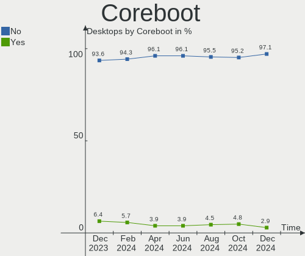
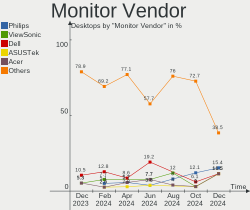
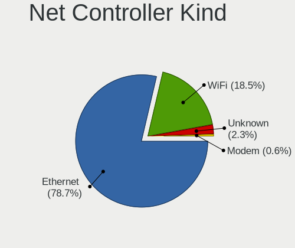
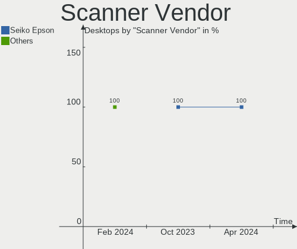

BSD - Hardware Trends (Desktops)
--------------------------------

A project to identify most popular hardware characteristics and track their change
over time based on data collected by BSD users at https://BSD-Hardware.info.

Anyone can contribute to this report by the [hw-probe](https://github.com/linuxhw/hw-probe/blob/master/INSTALL.BSD.md) tool:

    hw-probe -all -upload

This report is for one last month. Overall report since the beginning of time: [TestDays](https://github.com/bsdhw/TestDays)

Period: Oct, 2023.

Contents
--------

* [ System ](#system)
  - [ OS                       ](#os)
  - [ OS Family                ](#os-family)
  - [ Arch                     ](#arch)
  - [ DE                       ](#de)
  - [ Display Server           ](#display-server)
  - [ Display Manager          ](#display-manager)
  - [ OS Lang                  ](#os-lang)
  - [ Boot Mode                ](#boot-mode)
  - [ Filesystem               ](#filesystem)
  - [ Part. scheme             ](#part-scheme)

* [ Board ](#board)
  - [ Vendor                   ](#vendor)
  - [ Model                    ](#model)
  - [ Model Family             ](#model-family)
  - [ MFG Year                 ](#mfg-year)
  - [ Form Factor              ](#form-factor)
  - [ Coreboot                 ](#coreboot)
  - [ RAM Size                 ](#ram-size)
  - [ RAM Used                 ](#ram-used)
  - [ Total Drives             ](#total-drives)
  - [ Has CD-ROM               ](#has-cd-rom)
  - [ Has Ethernet             ](#has-ethernet)
  - [ Has WiFi                 ](#has-wifi)
  - [ Has Bluetooth            ](#has-bluetooth)

* [ Location ](#location)
  - [ Country                  ](#country)
  - [ City                     ](#city)

* [ Drives ](#drives)
  - [ Drive Vendor             ](#drive-vendor)
  - [ Drive Model              ](#drive-model)
  - [ HDD Vendor               ](#hdd-vendor)
  - [ SSD Vendor               ](#ssd-vendor)
  - [ Drive Kind               ](#drive-kind)
  - [ Drive Connector          ](#drive-connector)
  - [ Drive Size               ](#drive-size)
  - [ Space Total              ](#space-total)
  - [ Space Used               ](#space-used)
  - [ Malfunc. Drives          ](#malfunc-drives)
  - [ Malfunc. Drive Vendor    ](#malfunc-drive-vendor)
  - [ Malfunc. HDD Vendor      ](#malfunc-hdd-vendor)
  - [ Malfunc. Drive Kind      ](#malfunc-drive-kind)
  - [ Failed Drives            ](#failed-drives)
  - [ Failed Drive Vendor      ](#failed-drive-vendor)
  - [ Drive Status             ](#drive-status)

* [ Storage controller ](#storage-controller)
  - [ Storage Vendor           ](#storage-vendor)
  - [ Storage Model            ](#storage-model)
  - [ Storage Kind             ](#storage-kind)

* [ Processor ](#processor)
  - [ CPU Vendor               ](#cpu-vendor)
  - [ CPU Model                ](#cpu-model)
  - [ CPU Model Family         ](#cpu-model-family)
  - [ CPU Cores                ](#cpu-cores)
  - [ CPU Sockets              ](#cpu-sockets)
  - [ CPU Threads              ](#cpu-threads)
  - [ CPU Microarch            ](#cpu-microarch)

* [ Graphics ](#graphics)
  - [ GPU Vendor               ](#gpu-vendor)
  - [ GPU Model                ](#gpu-model)
  - [ GPU Combo                ](#gpu-combo)
  - [ GPU Driver               ](#gpu-driver)
  - [ GPU Memory               ](#gpu-memory)

* [ Monitor ](#monitor)
  - [ Monitor Vendor           ](#monitor-vendor)
  - [ Monitor Model            ](#monitor-model)
  - [ Monitor Resolution       ](#monitor-resolution)
  - [ Monitor Diagonal         ](#monitor-diagonal)
  - [ Monitor Width            ](#monitor-width)
  - [ Aspect Ratio             ](#aspect-ratio)
  - [ Monitor Area             ](#monitor-area)
  - [ Pixel Density            ](#pixel-density)
  - [ Multiple Monitors        ](#multiple-monitors)

* [ Network ](#network)
  - [ Net Controller Vendor    ](#net-controller-vendor)
  - [ Net Controller Model     ](#net-controller-model)
  - [ Wireless Vendor          ](#wireless-vendor)
  - [ Wireless Model           ](#wireless-model)
  - [ Ethernet Vendor          ](#ethernet-vendor)
  - [ Ethernet Model           ](#ethernet-model)
  - [ Net Controller Kind      ](#net-controller-kind)
  - [ Used Controller          ](#used-controller)
  - [ NICs                     ](#nics)
  - [ IPv6                     ](#ipv6)

* [ Bluetooth ](#bluetooth)
  - [ Bluetooth Vendor         ](#bluetooth-vendor)
  - [ Bluetooth Model          ](#bluetooth-model)

* [ Sound ](#sound)
  - [ Sound Vendor             ](#sound-vendor)
  - [ Sound Model              ](#sound-model)

* [ Memory ](#memory)
  - [ Memory Vendor            ](#memory-vendor)
  - [ Memory Model             ](#memory-model)
  - [ Memory Kind              ](#memory-kind)
  - [ Memory Form Factor       ](#memory-form-factor)
  - [ Memory Size              ](#memory-size)
  - [ Memory Speed             ](#memory-speed)

* [ Printers & scanners ](#printers--scanners)
  - [ Printer Vendor           ](#printer-vendor)
  - [ Printer Model            ](#printer-model)
  - [ Scanner Vendor           ](#scanner-vendor)
  - [ Scanner Model            ](#scanner-model)

* [ Camera ](#camera)
  - [ Camera Vendor            ](#camera-vendor)
  - [ Camera Model             ](#camera-model)

* [ Security ](#security)
  - [ Fingerprint Vendor       ](#fingerprint-vendor)
  - [ Fingerprint Model        ](#fingerprint-model)
  - [ Chipcard Vendor          ](#chipcard-vendor)
  - [ Chipcard Model           ](#chipcard-model)

* [ Unsupported ](#unsupported)
  - [ Unsupported Devices      ](#unsupported-devices)
  - [ Unsupported Device Types ](#unsupported-device-types)

System
------

OS
--

Installed operating systems

| Name                 | Desktops | Percent |
|----------------------|----------|---------|
| OPNsense 23.7.6      | 83       | 27.57%  |
| OPNsense 23.7.5      | 77       | 25.58%  |
| OPNsense 23.7.7      | 60       | 19.93%  |
| OPNsense 23.1.11     | 8        | 2.66%   |
| FreeBSD 13.2-p4      | 7        | 2.33%   |
| OpenBSD 7.4          | 6        | 1.99%   |
| helloSystem 0.9.0    | 6        | 1.99%   |
| helloSystem 0.8.1    | 6        | 1.99%   |
| OPNsense 24.1        | 4        | 1.33%   |
| FreeBSD 13.2-p3      | 4        | 1.33%   |
| OPNsense 23.7.3      | 3        | 1%      |
| OPNsense 23.7.1      | 3        | 1%      |
| NomadBSD 20231013    | 3        | 1%      |
| FreeBSD 14.0-RC1     | 3        | 1%      |
| OPNsense 23.7.4      | 2        | 0.66%   |
| NetBSD 9.3           | 2        | 0.66%   |
| GhostBSD 23.06.01    | 2        | 0.66%   |
| FreeBSD 14.0-RC3     | 2        | 0.66%   |
| FreeBSD 14.0-RC2     | 2        | 0.66%   |
| XigmaNAS 13.2-p1     | 1        | 0.33%   |
| TrueNAS 13.1-p7      | 1        | 0.33%   |
| OPNsense 23.4.2      | 1        | 0.33%   |
| OPNsense 23.1.6      | 1        | 0.33%   |
| OPNsense 23.1.10     | 1        | 0.33%   |
| OPNsense 22.7.9      | 1        | 0.33%   |
| OPNsense 22.7.8      | 1        | 0.33%   |
| OPNsense 22.7.11     | 1        | 0.33%   |
| OpenBSD 7.3          | 1        | 0.33%   |
| MyBee 14.0-BETA3     | 1        | 0.33%   |
| GhostBSD 23.09.29    | 1        | 0.33%   |
| FreeBSD 15.0-CURRENT | 1        | 0.33%   |
| FreeBSD 14.0-STABLE  | 1        | 0.33%   |
| FreeBSD 14.0-BETA2   | 1        | 0.33%   |
| FreeBSD 13.2-STABLE  | 1        | 0.33%   |
| FreeBSD 13.2         | 1        | 0.33%   |
| FreeBSD 12.4-p6      | 1        | 0.33%   |
| FreeBSD 12.3-p12     | 1        | 0.33%   |

OS Family
---------

OS without a version

| Name        | Desktops | Percent |
|-------------|----------|---------|
| OPNsense    | 246      | 81.73%  |
| FreeBSD     | 25       | 8.31%   |
| helloSystem | 12       | 3.99%   |
| OpenBSD     | 7        | 2.33%   |
| NomadBSD    | 3        | 1%      |
| GhostBSD    | 3        | 1%      |
| NetBSD      | 2        | 0.66%   |
| XigmaNAS    | 1        | 0.33%   |
| TrueNAS     | 1        | 0.33%   |
| MyBee       | 1        | 0.33%   |

Arch
----

OS architecture (x86_64, i586, etc.)

| Name    | Desktops | Percent |
|---------|----------|---------|
| amd64   | 294      | 97.67%  |
| arm64   | 4        | 1.33%   |
| sparc64 | 1        | 0.33%   |
| macppc  | 1        | 0.33%   |
| i386    | 1        | 0.33%   |

DE
--

Desktop Environment

| Name         | Desktops | Percent |
|--------------|----------|---------|
| Console      | 264      | 87.71%  |
| helloDesktop | 18       | 5.98%   |
| XFCE         | 6        | 1.99%   |
| KDE5         | 5        | 1.66%   |
| MATE         | 3        | 1%      |
| TWM          | 2        | 0.66%   |
| Window Maker | 1        | 0.33%   |
| Picom        | 1        | 0.33%   |
| JWM          | 1        | 0.33%   |

Display Server
--------------

X11 or Wayland

| Name    | Desktops | Percent |
|---------|----------|---------|
| Console | 268      | 89.04%  |
| X11     | 33       | 10.96%  |

Display Manager
---------------

SDDM, LightDM, etc.

| Name    | Desktops | Percent |
|---------|----------|---------|
| Console | 276      | 91.69%  |
| SLiM    | 12       | 3.99%   |
| SDDM    | 5        | 1.66%   |
| LightDM | 5        | 1.66%   |
| XDM     | 3        | 1%      |

OS Lang
-------

Language

| Lang    | Desktops | Percent |
|---------|----------|---------|
| Unknown | 262      | 87.04%  |
| C       | 22       | 7.31%   |
| en_US   | 11       | 3.65%   |
| de_DE   | 3        | 1%      |
| ru_RU   | 1        | 0.33%   |
| pl_PL   | 1        | 0.33%   |
| fr_FR   | 1        | 0.33%   |

Boot Mode
---------

EFI or BIOS

| Mode | Desktops | Percent |
|------|----------|---------|
| EFI  | 282      | 93.69%  |
| BIOS | 19       | 6.31%   |

Filesystem
----------

Type of filesystem

| Type   | Desktops | Percent |
|--------|----------|---------|
| Ufs    | 155      | 51.5%   |
| Zfs    | 132      | 43.85%  |
| Ffs    | 7        | 2.33%   |
| Cd9660 | 7        | 2.33%   |

Part. scheme
------------

Scheme of partitioning

| Type    | Desktops | Percent |
|---------|----------|---------|
| GPT     | 286      | 95.02%  |
| MBR     | 10       | 3.32%   |
| Unknown | 5        | 1.66%   |

Board
-----

Vendor
------

Motherboard manufacturer

| Name                                 | Desktops | Percent |
|--------------------------------------|----------|---------|
| Unknown                              | 58       | 19.27%  |
| Dell                                 | 29       | 9.63%   |
| ASUSTek Computer                     | 23       | 7.64%   |
| Gigabyte Technology                  | 20       | 6.64%   |
| Intel                                | 18       | 5.98%   |
| Hewlett-Packard                      | 15       | 4.98%   |
| Fujitsu                              | 14       | 4.65%   |
| ASRock                               | 14       | 4.65%   |
| Protectli                            | 12       | 3.99%   |
| PC Engines                           | 8        | 2.66%   |
| Techvision                           | 7        | 2.33%   |
| Lenovo                               | 7        | 2.33%   |
| Supermicro                           | 5        | 1.66%   |
| MSI                                  | 5        | 1.66%   |
| CWWK                                 | 5        | 1.66%   |
| AZW                                  | 5        | 1.66%   |
| MW                                   | 4        | 1.33%   |
| Yanling                              | 3        | 1%      |
| Win element                          | 3        | 1%      |
| Hardkernel                           | 3        | 1%      |
| GoWin Solution                       | 3        | 1%      |
| CncTion                              | 3        | 1%      |
| Shuttle                              | 2        | 0.66%   |
| ShenZhen MinWin Technology           | 2        | 0.66%   |
| Shenzhen Meigao Electronic Equipment | 2        | 0.66%   |
| ASRockRack                           | 2        | 0.66%   |
| Acer                                 | 2        | 0.66%   |
| YANYU                                | 1        | 0.33%   |
| YanRay Technology                    | 1        | 0.33%   |
| Wistron                              | 1        | 0.33%   |
| Winston Marriot                      | 1        | 0.33%   |
| TONK                                 | 1        | 0.33%   |
| Sun                                  | 1        | 0.33%   |
| Seeed Studio                         | 1        | 0.33%   |
| PICO PC                              | 1        | 0.33%   |
| Pegatron                             | 1        | 0.33%   |
| OEM                                  | 1        | 0.33%   |
| NEXCOM                               | 1        | 0.33%   |
| MECHREVO                             | 1        | 0.33%   |
| JHZD                                 | 1        | 0.33%   |

Model
-----

Motherboard model

| Name                         | Desktops | Percent |
|------------------------------|----------|---------|
| Unknown                      | 59       | 19.6%   |
| Techvision TVI7309X          | 7        | 2.33%   |
| Fujitsu FUTRO S920           | 7        | 2.33%   |
| AZW EQ                       | 5        | 1.66%   |
| PC Engines APU2              | 4        | 1.33%   |
| MW GMLK-2_5G4L               | 4        | 1.33%   |
| Dell OptiPlex 7050           | 4        | 1.33%   |
| Win element M600             | 3        | 1%      |
| Protectli FW4B               | 3        | 1%      |
| PC Engines apu4              | 3        | 1%      |
| Intel Q3XXG4-P V1.0          | 3        | 1%      |
| Intel MAHOBAY                | 3        | 1%      |
| HP Compaq Elite 8300 SFF     | 3        | 1%      |
| GoWin Solution R86S          | 3        | 1%      |
| Dell OptiPlex 7020           | 3        | 1%      |
| Dell OptiPlex 7010           | 3        | 1%      |
| Dell OptiPlex 3050           | 3        | 1%      |
| Yanling YL-KBR6L             | 2        | 0.66%   |
| Protectli VP2410             | 2        | 0.66%   |
| Protectli FW6                | 2        | 0.66%   |
| HP EliteDesk 800 G3 SFF      | 2        | 0.66%   |
| Hardkernel ODROID-H3         | 2        | 0.66%   |
| Fujitsu FUTRO S940           | 2        | 0.66%   |
| Fujitsu FUTRO S520           | 2        | 0.66%   |
| Dell OptiPlex 5050           | 2        | 0.66%   |
| CWWK CW-MBX-AD12             | 2        | 0.66%   |
| CncTion N5105-4L             | 2        | 0.66%   |
| ASUS P8Z77-V LX              | 2        | 0.66%   |
| ASRock X570 Phantom Gaming 4 | 2        | 0.66%   |
| YANYU M9F baytrail           | 1        | 0.33%   |
| YanRay B1904                 | 1        | 0.33%   |
| Yanling LES network 6L       | 1        | 0.33%   |
| Wistron ProLiant ML110 G6    | 1        | 0.33%   |
| Winston Marriot PICO PC V1.2 | 1        | 0.33%   |
| TONK TN2800                  | 1        | 0.33%   |
| Supermicro SYS-E300-9A       | 1        | 0.33%   |
| Supermicro SYS-E200-9A       | 1        | 0.33%   |
| Supermicro SYS-5019S-M       | 1        | 0.33%   |
| Supermicro SYS-1UUP-01-AI036 | 1        | 0.33%   |
| Supermicro Pro546267         | 1        | 0.33%   |

Model Family
------------

Motherboard model prefix

| Name                         | Desktops | Percent |
|------------------------------|----------|---------|
| Unknown                      | 59       | 19.6%   |
| Dell OptiPlex                | 24       | 7.97%   |
| Fujitsu FUTRO                | 11       | 3.65%   |
| Techvision TVI7309X          | 7        | 2.33%   |
| HP EliteDesk                 | 7        | 2.33%   |
| ASUS PRIME                   | 6        | 1.99%   |
| Lenovo ThinkCentre           | 5        | 1.66%   |
| AZW EQ                       | 5        | 1.66%   |
| PC Engines APU2              | 4        | 1.33%   |
| MW GMLK-2                    | 4        | 1.33%   |
| HP Compaq                    | 4        | 1.33%   |
| Win element M600             | 3        | 1%      |
| Protectli FW4B               | 3        | 1%      |
| PC Engines apu4              | 3        | 1%      |
| Intel Q3XXG4-P               | 3        | 1%      |
| Intel MAHOBAY                | 3        | 1%      |
| GoWin Solution R86S          | 3        | 1%      |
| Dell Precision               | 3        | 1%      |
| Yanling YL-KBR6L             | 2        | 0.66%   |
| Protectli VP2410             | 2        | 0.66%   |
| Protectli FW6                | 2        | 0.66%   |
| Hardkernel ODROID-H3         | 2        | 0.66%   |
| Gigabyte B550M               | 2        | 0.66%   |
| CWWK CW-MBX-AD12             | 2        | 0.66%   |
| CncTion N5105-4L             | 2        | 0.66%   |
| ASUS Pro                     | 2        | 0.66%   |
| ASUS P8Z77-V                 | 2        | 0.66%   |
| ASRock X570                  | 2        | 0.66%   |
| YANYU M9F                    | 1        | 0.33%   |
| YanRay B1904                 | 1        | 0.33%   |
| Yanling LES                  | 1        | 0.33%   |
| Wistron ProLiant             | 1        | 0.33%   |
| Winston Marriot PICO         | 1        | 0.33%   |
| TONK TN2800                  | 1        | 0.33%   |
| Supermicro SYS-E300-9A       | 1        | 0.33%   |
| Supermicro SYS-E200-9A       | 1        | 0.33%   |
| Supermicro SYS-5019S-M       | 1        | 0.33%   |
| Supermicro SYS-1UUP-01-AI036 | 1        | 0.33%   |
| Supermicro Pro546267         | 1        | 0.33%   |
| Sun SUNW                     | 1        | 0.33%   |

MFG Year
--------

Motherboard manufacture year

| Year    | Desktops | Percent |
|---------|----------|---------|
| 2023    | 54       | 17.94%  |
| 2022    | 47       | 15.61%  |
| 2021    | 29       | 9.63%   |
| 2018    | 25       | 8.31%   |
| 2014    | 24       | 7.97%   |
| 2019    | 17       | 5.65%   |
| 2016    | 17       | 5.65%   |
| 2012    | 16       | 5.32%   |
| 2020    | 15       | 4.98%   |
| 2017    | 15       | 4.98%   |
| 2015    | 9        | 2.99%   |
| 2013    | 8        | 2.66%   |
| Unknown | 7        | 2.33%   |
| 2011    | 6        | 1.99%   |
| 2010    | 4        | 1.33%   |
| 2009    | 4        | 1.33%   |
| 2008    | 2        | 0.66%   |
| 2007    | 2        | 0.66%   |

Form Factor
-----------

Physical design of the computer

| Name    | Desktops | Percent |
|---------|----------|---------|
| Desktop | 301      | 100%    |

Coreboot
--------

Have coreboot on board

| Used | Desktops | Percent |
|------|----------|---------|
| No   | 290      | 96.35%  |
| Yes  | 11       | 3.65%   |

RAM Size
--------

Total RAM memory

| Size in GB  | Desktops | Percent |
|-------------|----------|---------|
| 8.01-16.0   | 108      | 35.88%  |
| 16.01-24.0  | 95       | 31.56%  |
| 4.01-8.0    | 34       | 11.3%   |
| 32.01-64.0  | 33       | 10.96%  |
| 64.01-256.0 | 14       | 4.65%   |
| 2.01-3.0    | 8        | 2.66%   |
| 24.01-32.0  | 3        | 1%      |
| 3.01-4.0    | 2        | 0.66%   |
| 0.51-1.0    | 2        | 0.66%   |
| 0.01-0.5    | 2        | 0.66%   |

RAM Used
--------

Used RAM memory

| Used GB  | Desktops | Percent |
|----------|----------|---------|
| 0.01-0.5 | 124      | 41.2%   |
| 0.51-1.0 | 122      | 40.53%  |
| 1.01-2.0 | 43       | 14.29%  |
| 2.01-3.0 | 6        | 1.99%   |
| 3.01-4.0 | 2        | 0.66%   |
| Unknown  | 2        | 0.66%   |
| 4.01-8.0 | 1        | 0.33%   |
| 0        | 1        | 0.33%   |

Total Drives
------------

Number of drives on board

| Drives | Desktops | Percent |
|--------|----------|---------|
| 1      | 219      | 72.76%  |
| 0      | 34       | 11.3%   |
| 2      | 30       | 9.97%   |
| 3      | 12       | 3.99%   |
| 4      | 2        | 0.66%   |
| 13     | 1        | 0.33%   |
| 7      | 1        | 0.33%   |
| 6      | 1        | 0.33%   |
| 5      | 1        | 0.33%   |

Has CD-ROM
----------

Has CD-ROM on board

| Presented | Desktops | Percent |
|-----------|----------|---------|
| No        | 265      | 88.04%  |
| Yes       | 36       | 11.96%  |

Has Ethernet
------------

Has Ethernet on board

| Presented | Desktops | Percent |
|-----------|----------|---------|
| Yes       | 296      | 98.34%  |
| No        | 5        | 1.66%   |

Has WiFi
--------

Has WiFi module

| Presented | Desktops | Percent |
|-----------|----------|---------|
| No        | 239      | 79.4%   |
| Yes       | 62       | 20.6%   |

Has Bluetooth
-------------

Has Bluetooth module

| Presented | Desktops | Percent |
|-----------|----------|---------|
| No        | 264      | 87.71%  |
| Yes       | 37       | 12.29%  |

Location
--------

Country
-------

Geographic location (country)

| Country      | Desktops | Percent |
|--------------|----------|---------|
| USA          | 82       | 27.24%  |
| Germany      | 47       | 15.61%  |
| Russia       | 14       | 4.65%   |
| Canada       | 12       | 3.99%   |
| UK           | 11       | 3.65%   |
| Italy        | 11       | 3.65%   |
| Australia    | 10       | 3.32%   |
| Poland       | 9        | 2.99%   |
| Netherlands  | 8        | 2.66%   |
| France       | 8        | 2.66%   |
| Taiwan       | 6        | 1.99%   |
| Sweden       | 6        | 1.99%   |
| Austria      | 5        | 1.66%   |
| Turkey       | 4        | 1.33%   |
| Switzerland  | 4        | 1.33%   |
| Spain        | 4        | 1.33%   |
| Mexico       | 4        | 1.33%   |
| China        | 4        | 1.33%   |
| South Korea  | 3        | 1%      |
| Romania      | 3        | 1%      |
| Japan        | 3        | 1%      |
| Greece       | 3        | 1%      |
| Finland      | 3        | 1%      |
| Thailand     | 2        | 0.66%   |
| Singapore    | 2        | 0.66%   |
| Norway       | 2        | 0.66%   |
| New Zealand  | 2        | 0.66%   |
| Latvia       | 2        | 0.66%   |
| Denmark      | 2        | 0.66%   |
| Czechia      | 2        | 0.66%   |
| Bulgaria     | 2        | 0.66%   |
| Brazil       | 2        | 0.66%   |
| Vietnam      | 1        | 0.33%   |
| Ukraine      | 1        | 0.33%   |
| UAE          | 1        | 0.33%   |
| Tunisia      | 1        | 0.33%   |
| South Africa | 1        | 0.33%   |
| Slovenia     | 1        | 0.33%   |
| Slovakia     | 1        | 0.33%   |
| Paraguay     | 1        | 0.33%   |

City
----

Geographic location (city)

| City              | Desktops | Percent |
|-------------------|----------|---------|
| Taichung          | 4        | 1.33%   |
| St Petersburg     | 4        | 1.33%   |
| Perth             | 4        | 1.33%   |
| Frankfurt am Main | 4        | 1.33%   |
| Berlin            | 4        | 1.33%   |
| Wuppertal         | 3        | 1%      |
| Paris             | 3        | 1%      |
| Melbourne         | 3        | 1%      |
| Hamburg           | 3        | 1%      |
| Chicago           | 3        | 1%      |
| Charlottesville   | 3        | 1%      |
| Cabo San Lucas    | 3        | 1%      |
| Boston            | 3        | 1%      |
| Worthing          | 2        | 0.66%   |
| Tampa             | 2        | 0.66%   |
| Sydney            | 2        | 0.66%   |
| Sofia             | 2        | 0.66%   |
| Singapore         | 2        | 0.66%   |
| Salem             | 2        | 0.66%   |
| Riga              | 2        | 0.66%   |
| Redmond           | 2        | 0.66%   |
| Raleigh           | 2        | 0.66%   |
| Montreal          | 2        | 0.66%   |
| Magdeburg         | 2        | 0.66%   |
| London            | 2        | 0.66%   |
| Krasnodar         | 2        | 0.66%   |
| Istanbul          | 2        | 0.66%   |
| Higashihatsuishi  | 2        | 0.66%   |
| Helsinki          | 2        | 0.66%   |
| Gdansk            | 2        | 0.66%   |
| Columbus          | 2        | 0.66%   |
| Bangkok           | 2        | 0.66%   |
| Athens            | 2        | 0.66%   |
| Zurich            | 1        | 0.33%   |
| Zhongli District  | 1        | 0.33%   |
| Zhengzhou         | 1        | 0.33%   |
| Zagreb            | 1        | 0.33%   |
| Yuma              | 1        | 0.33%   |
| York Haven        | 1        | 0.33%   |
| Yekaterinburg     | 1        | 0.33%   |

Drives
------

Drive Vendor
------------

Hard drive vendors

| Vendor              | Desktops | Drives | Percent |
|---------------------|----------|--------|---------|
| Samsung Electronics | 56       | 65     | 18.12%  |
| WDC                 | 27       | 44     | 8.74%   |
| Crucial             | 24       | 25     | 7.77%   |
| Kingston            | 23       | 26     | 7.44%   |
| Seagate             | 18       | 22     | 5.83%   |
| SanDisk             | 13       | 15     | 4.21%   |
| Transcend           | 12       | 13     | 3.88%   |
| Toshiba             | 9        | 11     | 2.91%   |
| Intel               | 9        | 10     | 2.91%   |
| China               | 8        | 8      | 2.59%   |
| Phison              | 7        | 7      | 2.27%   |
| A-DATA Technology   | 7        | 7      | 2.27%   |
| SPCC                | 5        | 6      | 1.62%   |
| Silicon Motion      | 5        | 5      | 1.62%   |
| Protectli           | 5        | 5      | 1.62%   |
| Innodisk            | 5        | 5      | 1.62%   |
| HGST                | 5        | 5      | 1.62%   |
| FORESEE             | 5        | 5      | 1.62%   |
| SK hynix            | 4        | 4      | 1.29%   |
| Hitachi             | 4        | 4      | 1.29%   |
| Hoodisk             | 3        | 3      | 0.97%   |
| Hewlett-Packard     | 3        | 3      | 0.97%   |
| Fanxiang            | 3        | 3      | 0.97%   |
| Apacer              | 3        | 3      | 0.97%   |
| Team                | 2        | 3      | 0.65%   |
| Patriot             | 2        | 2      | 0.65%   |
| OCZ                 | 2        | 2      | 0.65%   |
| NVMe                | 2        | 3      | 0.65%   |
| Netac               | 2        | 2      | 0.65%   |
| Micron Technology   | 2        | 3      | 0.65%   |
| Intenso             | 2        | 2      | 0.65%   |
| Gigabyte Technology | 2        | 3      | 0.65%   |
| Corsair             | 2        | 2      | 0.65%   |
| ATP                 | 2        | 2      | 0.65%   |
| XUNZHE              | 1        | 1      | 0.32%   |
| Vaseky              | 1        | 1      | 0.32%   |
| TrueNAS             | 1        | 1      | 0.32%   |
| Timetec             | 1        | 2      | 0.32%   |
| Silicon Power       | 1        | 1      | 0.32%   |
| ShiJi               | 1        | 1      | 0.32%   |

Drive Model
-----------

Hard drive models

| Model                              | Desktops | Percent |
|------------------------------------|----------|---------|
| Crucial CT500P3SSD8 500GB          | 5        | 1.54%   |
| Crucial CT240BX500SSD1 240GB       | 5        | 1.54%   |
| Samsung SSD 860 EVO 1TB            | 3        | 0.92%   |
| Phison PCIe SSD 512GB              | 3        | 0.92%   |
| Kingston SKC600MS256G 256GB        | 3        | 0.92%   |
| Kingston SA400S37240G 240GB        | 3        | 0.92%   |
| Hitachi HTS541612J9SA00 120GB      | 3        | 0.92%   |
| Crucial CT500P3PSSD8 500GB         | 3        | 0.92%   |
| Crucial CT250MX500SSD1 250GB       | 3        | 0.92%   |
| China SATA SSD 16GB                | 3        | 0.92%   |
| WDC WDS500G2B0A-00SM50 500GB       | 2        | 0.62%   |
| WDC WDS120G2G0A-00JH30 120GB       | 2        | 0.62%   |
| Transcend TS32GMSA370S 32GB        | 2        | 0.62%   |
| SPCC Solid State Disk 512GB        | 2        | 0.62%   |
| Seagate ST4000DM000-1F2168 4TB     | 2        | 0.62%   |
| Samsung SSD 980 PRO 1TB            | 2        | 0.62%   |
| Samsung SSD 980 500GB              | 2        | 0.62%   |
| Samsung SSD 980 1TB                | 2        | 0.62%   |
| Samsung SSD 970 EVO Plus 500GB     | 2        | 0.62%   |
| Samsung SSD 970 EVO Plus 1TB       | 2        | 0.62%   |
| Samsung SSD 960 EVO 500GB          | 2        | 0.62%   |
| Samsung SSD 870 EVO 500GB          | 2        | 0.62%   |
| Samsung SSD 850 PRO 256GB          | 2        | 0.62%   |
| Samsung SSD 850 EVO 1TB            | 2        | 0.62%   |
| Samsung SSD 840 EVO 500GB          | 2        | 0.62%   |
| Samsung SSD 840 EVO 120GB          | 2        | 0.62%   |
| Samsung HD161GJ 160GB              | 2        | 0.62%   |
| Protectli 480GB mSATA              | 2        | 0.62%   |
| Kingston SA400S37480G 480GB        | 2        | 0.62%   |
| Innodisk DEMSR- 08GB mSATA 3ME3    | 2        | 0.62%   |
| Innodisk DEM24-32GM41BC1DC-PC 32GB | 2        | 0.62%   |
| Hoodisk SSD 64GB                   | 2        | 0.62%   |
| HGST HTS545050A7E680 500GB         | 2        | 0.62%   |
| FORESEE 64GB SSD                   | 2        | 0.62%   |
| FORESEE 128GB SSD                  | 2        | 0.62%   |
| Fanxiang S501 128GB                | 2        | 0.62%   |
| Crucial CT250P2SSD8 250GB          | 2        | 0.62%   |
| XUNZHE MSATA 128GB                 | 1        | 0.31%   |
| WDC WDS250G2B0B-00YS70 250GB       | 1        | 0.31%   |
| WDC WDS240G2G0A-00JH30 240GB       | 1        | 0.31%   |

HDD Vendor
----------

Hard disk drive vendors

| Vendor              | Desktops | Drives | Percent |
|---------------------|----------|--------|---------|
| WDC                 | 17       | 33     | 29.82%  |
| Seagate             | 17       | 21     | 29.82%  |
| Toshiba             | 6        | 8      | 10.53%  |
| HGST                | 5        | 5      | 8.77%   |
| Hitachi             | 4        | 4      | 7.02%   |
| Samsung Electronics | 3        | 4      | 5.26%   |
| Maxtor              | 1        | 1      | 1.75%   |
| LSILOGIC            | 1        | 1      | 1.75%   |
| IBM/Hitachi         | 1        | 1      | 1.75%   |
| Hewlett-Packard     | 1        | 1      | 1.75%   |
| Fujitsu             | 1        | 1      | 1.75%   |

SSD Vendor
----------

Solid state drive vendors

| Vendor              | Desktops | Drives | Percent |
|---------------------|----------|--------|---------|
| Samsung Electronics | 30       | 35     | 17.54%  |
| Kingston            | 18       | 21     | 10.53%  |
| SanDisk             | 13       | 15     | 7.6%    |
| Crucial             | 13       | 14     | 7.6%    |
| Transcend           | 11       | 12     | 6.43%   |
| Intel               | 8        | 9      | 4.68%   |
| China               | 8        | 8      | 4.68%   |
| WDC                 | 6        | 6      | 3.51%   |
| Protectli           | 5        | 5      | 2.92%   |
| Innodisk            | 5        | 5      | 2.92%   |
| A-DATA Technology   | 5        | 5      | 2.92%   |
| FORESEE             | 4        | 4      | 2.34%   |
| SPCC                | 3        | 4      | 1.75%   |
| SK hynix            | 3        | 3      | 1.75%   |
| Hoodisk             | 3        | 3      | 1.75%   |
| Toshiba             | 2        | 2      | 1.17%   |
| Team                | 2        | 3      | 1.17%   |
| OCZ                 | 2        | 2      | 1.17%   |
| NVMe                | 2        | 2      | 1.17%   |
| Intenso             | 2        | 2      | 1.17%   |
| ATP                 | 2        | 2      | 1.17%   |
| Apacer              | 2        | 2      | 1.17%   |
| XUNZHE              | 1        | 1      | 0.58%   |
| Vaseky              | 1        | 1      | 0.58%   |
| TrueNAS             | 1        | 1      | 0.58%   |
| Timetec             | 1        | 2      | 0.58%   |
| Silicon Power       | 1        | 1      | 0.58%   |
| ShiJi               | 1        | 1      | 0.58%   |
| PNY                 | 1        | 1      | 0.58%   |
| Patriot             | 1        | 1      | 0.58%   |
| Micron Technology   | 1        | 2      | 0.58%   |
| LITEONIT            | 1        | 1      | 0.58%   |
| Lexar               | 1        | 1      | 0.58%   |
| KeepData            | 1        | 1      | 0.58%   |
| Indilinx            | 1        | 1      | 0.58%   |
| Hewlett-Packard     | 1        | 1      | 0.58%   |
| GLOWAY              | 1        | 1      | 0.58%   |
| Gigastone           | 1        | 1      | 0.58%   |
| Gigabyte Technology | 1        | 2      | 0.58%   |
| Dogfish             | 1        | 1      | 0.58%   |

Drive Kind
----------

HDD or SSD

| Kind | Desktops | Drives | Percent |
|------|----------|--------|---------|
| SSD  | 166      | 189    | 56.85%  |
| NVMe | 80       | 86     | 27.4%   |
| HDD  | 46       | 80     | 15.75%  |

Drive Connector
---------------

SATA, SAS, NVMe, etc.

| Type | Desktops | Drives | Percent |
|------|----------|--------|---------|
| SATA | 201      | 269    | 71.53%  |
| NVMe | 80       | 86     | 28.47%  |

Drive Size
----------

Size of hard drive

| Size in TB | Desktops | Drives | Percent |
|------------|----------|--------|---------|
| 0.01-0.5   | 168      | 185    | 76.71%  |
| 0.51-1.0   | 27       | 36     | 12.33%  |
| 1.01-2.0   | 10       | 16     | 4.57%   |
| 3.01-4.0   | 7        | 14     | 3.2%    |
| 4.01-10.0  | 6        | 16     | 2.74%   |
| 10.01-20.0 | 1        | 2      | 0.46%   |

Space Total
-----------

Amount of disk space available on the file system

| Size in GB     | Desktops | Percent |
|----------------|----------|---------|
| 101-250        | 132      | 43.85%  |
| 251-500        | 71       | 23.59%  |
| 21-50          | 25       | 8.31%   |
| 51-100         | 24       | 7.97%   |
| 501-1000       | 22       | 7.31%   |
| 1-20           | 21       | 6.98%   |
| 1001-2000      | 4        | 1.33%   |
| More than 3000 | 1        | 0.33%   |
| Unknown        | 1        | 0.33%   |

Space Used
----------

Amount of used disk space

| Used GB  | Desktops | Percent |
|----------|----------|---------|
| 1-20     | 273      | 90.7%   |
| 21-50    | 14       | 4.65%   |
| 101-250  | 6        | 1.99%   |
| 51-100   | 5        | 1.66%   |
| 251-500  | 1        | 0.33%   |
| 501-1000 | 1        | 0.33%   |
| Unknown  | 1        | 0.33%   |

Malfunc. Drives
---------------

Drive models with a malfunction

| Model                                     | Desktops | Drives | Percent |
|-------------------------------------------|----------|--------|---------|
| Samsung Electronics HD161GJ 160GB         | 2        | 2      | 6.06%   |
| Hitachi HTS541612J9SA00 120GB             | 2        | 2      | 6.06%   |
| WDC WD5000AAKX-75U6AA0 500GB              | 1        | 1      | 3.03%   |
| WDC WD40EFRX-68WT0N0 4TB                  | 1        | 3      | 3.03%   |
| WDC WD20EADS-00W4B0 2TB                   | 1        | 1      | 3.03%   |
| WDC WD10EZRZ-00Z5HB0 1TB                  | 1        | 1      | 3.03%   |
| Transcend TS8GMSM610 8GB                  | 1        | 1      | 3.03%   |
| Transcend TS120GSSD220S 120GB             | 1        | 1      | 3.03%   |
| Toshiba MD04ACA500 5TB                    | 1        | 1      | 3.03%   |
| Seagate ST3500418AS 500GB                 | 1        | 1      | 3.03%   |
| Seagate ST3360320AS 360GB                 | 1        | 1      | 3.03%   |
| Seagate ST250DM000-1BD141 250GB           | 1        | 1      | 3.03%   |
| Seagate ST1000DM003-1SB102 1TB            | 1        | 1      | 3.03%   |
| SanDisk SSD PLUS 480GB                    | 1        | 1      | 3.03%   |
| SanDisk SD8SBAT256G1122 256GB             | 1        | 1      | 3.03%   |
| Samsung Electronics SSD 870 EVO 250GB     | 1        | 1      | 3.03%   |
| Samsung Electronics SSD 870 EVO 1TB       | 1        | 1      | 3.03%   |
| Samsung Electronics SSD 850 EVO mSATA 1TB | 1        | 1      | 3.03%   |
| Samsung Electronics HD160JJ 160GB         | 1        | 1      | 3.03%   |
| OCZ AGILITY3 120GB                        | 1        | 1      | 3.03%   |
| Micron Technology 2200S NVMe 256GB        | 1        | 1      | 3.03%   |
| Kingston SHFS37A120G 120GB                | 1        | 1      | 3.03%   |
| Intel SSDSA2M120G2GC 120GB                | 1        | 1      | 3.03%   |
| Intel SSDSA2BW120G3H 120GB                | 1        | 1      | 3.03%   |
| IBM/Hitachi IC25N040ATMR04-0 40GB         | 1        | 1      | 3.03%   |
| HGST HTS725032A7E630 320GB                | 1        | 1      | 3.03%   |
| HGST HTS545050A7E680 500GB                | 1        | 1      | 3.03%   |
| Hewlett-Packard GB0500EAFJH 500GB         | 1        | 1      | 3.03%   |
| GLOWAY VAL32GS3-mSATA 32GB                | 1        | 1      | 3.03%   |
| China SH00M128GB                          | 1        | 1      | 3.03%   |
| A-DATA Technology SX7000NP 128GB          | 1        | 1      | 3.03%   |

Malfunc. Drive Vendor
---------------------

Vendors of faulty drives

| Vendor              | Desktops | Drives | Percent |
|---------------------|----------|--------|---------|
| Samsung Electronics | 5        | 6      | 15.63%  |
| WDC                 | 4        | 6      | 12.5%   |
| Seagate             | 4        | 4      | 12.5%   |
| Transcend           | 2        | 2      | 6.25%   |
| SanDisk             | 2        | 2      | 6.25%   |
| Intel               | 2        | 2      | 6.25%   |
| Hitachi             | 2        | 2      | 6.25%   |
| HGST                | 2        | 2      | 6.25%   |
| Toshiba             | 1        | 1      | 3.13%   |
| OCZ                 | 1        | 1      | 3.13%   |
| Micron Technology   | 1        | 1      | 3.13%   |
| Kingston            | 1        | 1      | 3.13%   |
| IBM/Hitachi         | 1        | 1      | 3.13%   |
| Hewlett-Packard     | 1        | 1      | 3.13%   |
| GLOWAY              | 1        | 1      | 3.13%   |
| China               | 1        | 1      | 3.13%   |
| A-DATA Technology   | 1        | 1      | 3.13%   |

Malfunc. HDD Vendor
-------------------

Vendors of faulty HDD drives

| Vendor              | Desktops | Drives | Percent |
|---------------------|----------|--------|---------|
| WDC                 | 4        | 6      | 23.53%  |
| Seagate             | 4        | 4      | 23.53%  |
| Samsung Electronics | 2        | 3      | 11.76%  |
| Hitachi             | 2        | 2      | 11.76%  |
| HGST                | 2        | 2      | 11.76%  |
| Toshiba             | 1        | 1      | 5.88%   |
| IBM/Hitachi         | 1        | 1      | 5.88%   |
| Hewlett-Packard     | 1        | 1      | 5.88%   |

Malfunc. Drive Kind
-------------------

Kinds of faulty drives

| Kind | Desktops | Drives | Percent |
|------|----------|--------|---------|
| HDD  | 16       | 20     | 51.61%  |
| SSD  | 13       | 13     | 41.94%  |
| NVMe | 2        | 2      | 6.45%   |

Failed Drives
-------------

Failed drive models

| Model                       | Desktops | Drives | Percent |
|-----------------------------|----------|--------|---------|
| Kingston SA2000M8500G 500GB | 1        | 1      | 50%     |
| Intel SSDSC2KB019T8 1.9TB   | 1        | 2      | 50%     |

Failed Drive Vendor
-------------------

Failed drive vendors

| Vendor   | Desktops | Drives | Percent |
|----------|----------|--------|---------|
| Kingston | 1        | 1      | 50%     |
| Intel    | 1        | 2      | 50%     |

Drive Status
------------

Number of failed and malfunc. drives

| Status   | Desktops | Drives | Percent |
|----------|----------|--------|---------|
| Works    | 241      | 308    | 86.07%  |
| Malfunc  | 30       | 35     | 10.71%  |
| Detected | 7        | 9      | 2.5%    |
| Failed   | 2        | 3      | 0.71%   |

Storage controller
------------------

Storage Vendor
--------------

Storage controller vendors

| Vendor                       | Desktops | Percent |
|------------------------------|----------|---------|
| Intel                        | 239      | 60.51%  |
| AMD                          | 40       | 10.13%  |
| Samsung Electronics          | 26       | 6.58%   |
| Phison Electronics           | 13       | 3.29%   |
| Silicon Motion               | 12       | 3.04%   |
| Micron/Crucial Technology    | 11       | 2.78%   |
| SanDisk                      | 10       | 2.53%   |
| Kingston Technology Company  | 6        | 1.52%   |
| ASMedia Technology           | 6        | 1.52%   |
| Shenzhen Longsys Electronics | 4        | 1.01%   |
| MAXIO Technology (Hangzhou)  | 4        | 1.01%   |
| Realtek Semiconductor        | 3        | 0.76%   |
| Hosin Global Electronics     | 3        | 0.76%   |
| O2 Micro                     | 2        | 0.51%   |
| Marvell Technology Group     | 2        | 0.51%   |
| JMicron Technology           | 2        | 0.51%   |
| Broadcom / LSI               | 2        | 0.51%   |
| Transcend                    | 1        | 0.25%   |
| Toshiba                      | 1        | 0.25%   |
| SK hynix                     | 1        | 0.25%   |
| Seagate Technology           | 1        | 0.25%   |
| Netac Technology             | 1        | 0.25%   |
| Micron Technology            | 1        | 0.25%   |
| Lite-On Technology           | 1        | 0.25%   |
| KIOXIA                       | 1        | 0.25%   |
| ADATA Technology             | 1        | 0.25%   |
| Unknown                      | 1        | 0.25%   |

Storage Model
-------------

Storage controller models

| Model                                                                            | Desktops | Percent |
|----------------------------------------------------------------------------------|----------|---------|
| Unknown                                                                          | 25       | 5.95%   |
| Intel Celeron/Pentium Silver Processor SATA Controller                           | 23       | 5.48%   |
| AMD FCH SATA Controller [AHCI mode]                                              | 23       | 5.48%   |
| Intel 8 Series/C220 Series Chipset Family 6-port SATA Controller 1 [AHCI mode]   | 21       | 5%      |
| Intel Jasper Lake SATA AHCI Controller                                           | 17       | 4.05%   |
| Intel 200 Series PCH SATA controller [AHCI mode]                                 | 16       | 3.81%   |
| Intel 7 Series/C210 Series Chipset Family 6-port SATA Controller [AHCI mode]     | 12       | 2.86%   |
| Silicon Motion SM2263EN/SM2263XT (DRAM-less) NVMe SSD Controllers                | 11       | 2.62%   |
| Micron/Crucial P2 [Nick P2] / P3 / P3 Plus NVMe PCIe SSD (DRAM-less)             | 11       | 2.62%   |
| Samsung NVMe SSD Controller SM981/PM981/PM983                                    | 9        | 2.14%   |
| Intel Q170/Q150/B150/H170/H110/Z170/CM236 Chipset SATA Controller [AHCI Mode]    | 9        | 2.14%   |
| Intel Atom Processor E3800 Series SATA AHCI Controller                           | 9        | 2.14%   |
| Intel Comet Lake SATA AHCI Controller                                            | 8        | 1.9%    |
| Intel Atom/Celeron/Pentium Processor x5-E8000/J3xxx/N3xxx Series SATA Controller | 8        | 1.9%    |
| Intel 6 Series/C200 Series Chipset Family 6 port Desktop SATA AHCI Controller    | 8        | 1.9%    |
| Intel Sunrise Point-LP SATA Controller [AHCI mode]                               | 7        | 1.67%   |
| Samsung NVMe SSD Controller SM961/PM961/SM963                                    | 6        | 1.43%   |
| Samsung NVMe SSD Controller 980 (DRAM-less)                                      | 6        | 1.43%   |
| Intel Cannon Lake PCH SATA AHCI Controller                                       | 6        | 1.43%   |
| Intel Alder Lake-P SATA AHCI Controller                                          | 6        | 1.43%   |
| AMD FCH SATA Controller [IDE mode]                                               | 6        | 1.43%   |
| Intel Wildcat Point-LP SATA Controller [AHCI Mode]                               | 5        | 1.19%   |
| Intel SATA Controller [RAID mode]                                                | 5        | 1.19%   |
| Intel Alder Lake-S PCH SATA Controller [AHCI Mode]                               | 5        | 1.19%   |
| Phison PS5013-E13 PCIe3 NVMe Controller (DRAM-less)                              | 4        | 0.95%   |
| Phison E12 NVMe Controller                                                       | 4        | 0.95%   |
| Intel 500 Series Chipset Family SATA AHCI Controller                             | 4        | 0.95%   |
| ASMedia ASM1062 Serial ATA Controller                                            | 4        | 0.95%   |
| SanDisk Extreme Pro / WD Black SN750 / PC SN730 / Red SN700 NVMe SSD             | 3        | 0.71%   |
| Samsung NVMe SSD Controller PM9A1/PM9A3/980PRO                                   | 3        | 0.71%   |
| Realtek RTS5765DL NVMe SSD Controller (DRAM-less)                                | 3        | 0.71%   |
| MAXIO (Hangzhou) NVMe SSD Controller MAP1202                                     | 3        | 0.71%   |
| Intel Tiger Lake-LP SATA Controller                                              | 3        | 0.71%   |
| Intel NM10/ICH7 Family SATA Controller [IDE mode]                                | 3        | 0.71%   |
| Intel Elkhart Lake SATA AHCI                                                     | 3        | 0.71%   |
| Intel Celeron N3350/Pentium N4200/Atom E3900 Series SATA AHCI Controller         | 3        | 0.71%   |
| Intel Atom Processor C3000 Series SATA Controller 1                              | 3        | 0.71%   |
| Intel Atom Processor C3000 Series SATA Controller 0                              | 3        | 0.71%   |
| Intel 82801G (ICH7 Family) IDE Controller                                        | 3        | 0.71%   |
| Intel 7 Series/C210 Series Chipset Family 4-port SATA Controller [IDE mode]      | 3        | 0.71%   |

Storage Kind
------------

Kind of storage controller (IDE, SATA, NVMe, SAS, ...)

| Kind | Desktops | Percent |
|------|----------|---------|
| SATA | 259      | 66.07%  |
| NVMe | 98       | 25%     |
| IDE  | 22       | 5.61%   |
| RAID | 10       | 2.55%   |
| SAS  | 2        | 0.51%   |
| SCSI | 1        | 0.26%   |

Processor
---------

CPU Vendor
----------

Processor vendors

| Vendor  | Desktops | Percent |
|---------|----------|---------|
| Intel   | 249      | 82.72%  |
| AMD     | 46       | 15.28%  |
| ARM     | 4        | 1.33%   |
| 7447A   | 1        | 0.33%   |
| Unknown | 1        | 0.33%   |

CPU Model
---------

Processor models

| Model                                    | Desktops | Percent |
|------------------------------------------|----------|---------|
| Intel N100                               | 25       | 8.31%   |
| Intel Celeron J4125 CPU @ 2.00GHz        | 18       | 5.98%   |
| Intel Celeron N5105 @ 2.00GHz            | 14       | 4.65%   |
| AMD GX-412TC SOC                         | 8        | 2.66%   |
| Intel Celeron CPU J3160 @ 1.60GHz        | 7        | 2.33%   |
| Intel Pentium Silver N6005 @ 2.00GHz     | 5        | 1.66%   |
| Intel Core i5-6500 CPU @ 3.20GHz         | 5        | 1.66%   |
| Intel Core i5-3470 CPU @ 3.20GHz         | 5        | 1.66%   |
| AMD GX-415GA SOC with Radeon HD Graphics | 5        | 1.66%   |
| Intel Core i5-7500 CPU @ 3.40GHz         | 4        | 1.33%   |
| Intel Celeron CPU J1900 @ 1.99GHz        | 4        | 1.33%   |
| Intel Pentium Silver J5005 CPU @ 1.50GHz | 3        | 1%      |
| Intel Core i7-6700 CPU @ 3.40GHz         | 3        | 1%      |
| Intel Core i5-4570 CPU @ 3.20GHz         | 3        | 1%      |
| Intel Core i5-4460 CPU @ 3.20GHz         | 3        | 1%      |
| Intel Core i5-10210U CPU @ 1.60GHz       | 3        | 1%      |
| Intel Atom CPU C3558 @ 2.20GHz           | 3        | 1%      |
| ARM Cortex-A55 r2p0                      | 3        | 1%      |
| AMD Ryzen 5 6600H with Radeon Graphics   | 3        | 1%      |
| Intel Pentium Gold 8505                  | 2        | 0.66%   |
| Intel Core i7-7700 CPU @ 3.60GHz         | 2        | 0.66%   |
| Intel Core i5-9400 CPU @ 2.90GHz         | 2        | 0.66%   |
| Intel Core i5-8500 CPU @ 3.00GHz         | 2        | 0.66%   |
| Intel Core i5-8250U CPU @ 1.60GHz        | 2        | 0.66%   |
| Intel Core i5-7200U CPU @ 2.50GHz        | 2        | 0.66%   |
| Intel Core i5-6600 CPU @ 3.30GHz         | 2        | 0.66%   |
| Intel Core i5-5200U CPU @ 2.20GHz        | 2        | 0.66%   |
| Intel Core i5-4590T CPU @ 2.00GHz        | 2        | 0.66%   |
| Intel Core i5-4590 CPU @ 3.30GHz         | 2        | 0.66%   |
| Intel Core i5-10400 CPU @ 2.90GHz        | 2        | 0.66%   |
| Intel Core i3-N305                       | 2        | 0.66%   |
| Intel Core i3-7100 CPU @ 3.90GHz         | 2        | 0.66%   |
| Intel Core i3-3220 CPU @ 3.30GHz         | 2        | 0.66%   |
| Intel Core i3-10110U CPU @ 2.10GHz       | 2        | 0.66%   |
| Intel Celeron J6413 @ 1.80GHz            | 2        | 0.66%   |
| Intel Celeron CPU J1800 @ 2.41GHz        | 2        | 0.66%   |
| Intel Celeron CPU G1820 @ 2.70GHz        | 2        | 0.66%   |
| Intel 11th Gen Core i7-1165G7 @ 2.80GHz  | 2        | 0.66%   |
| AMD Ryzen 9 3900X 12-Core Processor      | 2        | 0.66%   |
| AMD Ryzen 5 5600X 6-Core Processor       | 2        | 0.66%   |

CPU Model Family
----------------

Processor model prefix

| Model                   | Desktops | Percent |
|-------------------------|----------|---------|
| Intel Celeron           | 64       | 21.26%  |
| Intel Core i5           | 63       | 20.93%  |
| Other                   | 40       | 13.29%  |
| AMD GX                  | 19       | 6.31%   |
| Intel Core i7           | 17       | 5.65%   |
| Intel Core i3           | 16       | 5.32%   |
| Intel Xeon              | 12       | 3.99%   |
| Intel Pentium Silver    | 9        | 2.99%   |
| Intel Pentium           | 9        | 2.99%   |
| Intel Atom              | 8        | 2.66%   |
| AMD Ryzen 5             | 7        | 2.33%   |
| AMD Ryzen 7             | 6        | 1.99%   |
| ARM Cortex              | 4        | 1.33%   |
| AMD Ryzen 9             | 4        | 1.33%   |
| Intel Pentium Gold      | 3        | 1%      |
| Intel Core 2 Quad       | 3        | 1%      |
| Intel Core i9           | 2        | 0.66%   |
| Intel Core 2 Duo        | 2        | 0.66%   |
| AMD Phenom              | 2        | 0.66%   |
| AMD FX                  | 2        | 0.66%   |
| Intel Pentium Dual-Core | 1        | 0.33%   |
| Intel Pentium Dual      | 1        | 0.33%   |
| Intel Core 2            | 1        | 0.33%   |
| AMD Ryzen 7 PRO         | 1        | 0.33%   |
| AMD Ryzen 3             | 1        | 0.33%   |
| AMD EPYC                | 1        | 0.33%   |
| AMD Athlon II X2        | 1        | 0.33%   |
| AMD Athlon              | 1        | 0.33%   |
| AMD A8                  | 1        | 0.33%   |

CPU Cores
---------

Number of processor cores

| Number  | Desktops | Percent |
|---------|----------|---------|
| 4       | 185      | 61.46%  |
| 2       | 54       | 17.94%  |
| 6       | 16       | 5.32%   |
| 12      | 10       | 3.32%   |
| 8       | 9        | 2.99%   |
| 16      | 8        | 2.66%   |
| Unknown | 8        | 2.66%   |
| 24      | 3        | 1%      |
| 10      | 3        | 1%      |
| 1       | 2        | 0.66%   |
| 32      | 1        | 0.33%   |
| 5       | 1        | 0.33%   |
| 3       | 1        | 0.33%   |

CPU Sockets
-----------

Number of sockets

| Number  | Desktops | Percent |
|---------|----------|---------|
| 1       | 294      | 97.67%  |
| Unknown | 6        | 1.99%   |
| 2       | 1        | 0.33%   |

CPU Threads
-----------

Threads per core (Hyper-Threading)

| Number  | Desktops | Percent |
|---------|----------|---------|
| 1       | 219      | 72.76%  |
| 2       | 73       | 24.25%  |
| Unknown | 9        | 2.99%   |

CPU Microarch
-------------

Microarchitecture

| Name          | Desktops | Percent |
|---------------|----------|---------|
| Unknown       | 78       | 25.91%  |
| KabyLake      | 33       | 10.96%  |
| Haswell       | 24       | 7.97%   |
| Goldmont plus | 24       | 7.97%   |
| IvyBridge     | 19       | 6.31%   |
| Silvermont    | 17       | 5.65%   |
| Skylake       | 16       | 5.32%   |
| SandyBridge   | 12       | 3.99%   |
| Puma          | 12       | 3.99%   |
| Zen 3         | 8        | 2.66%   |
| Goldmont      | 8        | 2.66%   |
| Jaguar        | 7        | 2.33%   |
| CometLake     | 7        | 2.33%   |
| Penryn        | 5        | 1.66%   |
| Broadwell     | 5        | 1.66%   |
| Westmere      | 4        | 1.33%   |
| Core          | 4        | 1.33%   |
| Zen 2         | 3        | 1%      |
| TigerLake     | 3        | 1%      |
| K10           | 3        | 1%      |
| Zen+          | 2        | 0.66%   |
| Zen           | 2        | 0.66%   |
| Piledriver    | 1        | 0.33%   |
| P6            | 1        | 0.33%   |
| K10 Llano     | 1        | 0.33%   |
| Bulldozer     | 1        | 0.33%   |
| Bonnell       | 1        | 0.33%   |

Graphics
--------

GPU Vendor
----------

Vendors of graphics cards

| Vendor                               | Desktops | Percent |
|--------------------------------------|----------|---------|
| Intel                                | 216      | 74.74%  |
| AMD                                  | 40       | 13.84%  |
| Nvidia                               | 19       | 6.57%   |
| ASPEED Technology                    | 10       | 3.46%   |
| Matrox Electronics Systems           | 3        | 1.04%   |
| NVidia / SGS Thomson (Joint Venture) | 1        | 0.35%   |

GPU Model
---------

Graphics card models

| Model                                                                                    | Desktops | Percent |
|------------------------------------------------------------------------------------------|----------|---------|
| Intel Alder Lake-N [UHD Graphics]                                                        | 27       | 9.25%   |
| Intel JasperLake [UHD Graphics]                                                          | 21       | 7.19%   |
| Intel GeminiLake [UHD Graphics 600]                                                      | 20       | 6.85%   |
| Intel Xeon E3-1200 v3/4th Gen Core Processor Integrated Graphics Controller              | 19       | 6.51%   |
| Intel HD Graphics 530                                                                    | 11       | 3.77%   |
| Intel HD Graphics 630                                                                    | 10       | 3.42%   |
| ASPEED Technology ASPEED Graphics Family                                                 | 10       | 3.42%   |
| Intel Xeon E3-1200 v2/3rd Gen Core processor Graphics Controller                         | 9        | 3.08%   |
| Intel Atom Processor Z36xxx/Z37xxx Series Graphics & Display                             | 9        | 3.08%   |
| Intel 2nd Generation Core Processor Family Integrated Graphics Controller                | 9        | 3.08%   |
| Intel CoffeeLake-S GT2 [UHD Graphics 630]                                                | 8        | 2.74%   |
| Intel Atom/Celeron/Pentium Processor x5-E8000/J3xxx/N3xxx Integrated Graphics Controller | 8        | 2.74%   |
| AMD Kabini [Radeon HD 8330E]                                                             | 5        | 1.71%   |
| AMD Cezanne [Radeon Vega Series / Radeon Vega Mobile Series]                             | 5        | 1.71%   |
| Intel GeminiLake [UHD Graphics 605]                                                      | 4        | 1.37%   |
| Intel CometLake-S GT2 [UHD Graphics 630]                                                 | 4        | 1.37%   |
| AMD Rembrandt [Radeon 680M]                                                              | 4        | 1.37%   |
| Nvidia GK208B [GeForce GT 710]                                                           | 3        | 1.03%   |
| Intel TigerLake-LP GT2 [Iris Xe Graphics]                                                | 3        | 1.03%   |
| Intel HD Graphics 620                                                                    | 3        | 1.03%   |
| Intel HD Graphics 500                                                                    | 3        | 1.03%   |
| Intel Elkhart Lake [UHD Graphics Gen11 16EU]                                             | 3        | 1.03%   |
| Intel CometLake-U GT2 [UHD Graphics]                                                     | 3        | 1.03%   |
| Intel Alder Lake-UP3 GT1 [UHD Graphics]                                                  | 3        | 1.03%   |
| Intel 4 Series Chipset Integrated Graphics Controller                                    | 3        | 1.03%   |
| AMD Mullins [Radeon R4/R5 Graphics]                                                      | 3        | 1.03%   |
| Nvidia GF108 [GeForce GT 440]                                                            | 2        | 0.68%   |
| Matrox Electronics Systems MGA G200eW WPCM450                                            | 2        | 0.68%   |
| Intel UHD Graphics 620                                                                   | 2        | 0.68%   |
| Intel IvyBridge GT2 [HD Graphics 4000]                                                   | 2        | 0.68%   |
| Intel HD Graphics 610                                                                    | 2        | 0.68%   |
| Intel HD Graphics 6000                                                                   | 2        | 0.68%   |
| Intel HD Graphics 5500                                                                   | 2        | 0.68%   |
| Intel Comet Lake UHD Graphics                                                            | 2        | 0.68%   |
| Intel Alder Lake-S GT1 [UHD Graphics 710]                                                | 2        | 0.68%   |
| Intel 82G33/G31 Express Integrated Graphics Controller                                   | 2        | 0.68%   |
| AMD Vega 10 XL/XT [Radeon RX Vega 56/64]                                                 | 2        | 0.68%   |
| AMD Lexa XT [Radeon PRO WX 3200]                                                         | 2        | 0.68%   |
| AMD Ellesmere [Radeon RX 470/480/570/570X/580/580X/590]                                  | 2        | 0.68%   |
| Nvidia GT218 [NVS 300]                                                                   | 1        | 0.34%   |

GPU Combo
---------

Combinations of graphics cards

| Name                                     | Desktops | Percent |
|------------------------------------------|----------|---------|
| 1 x Intel                                | 209      | 69.44%  |
| 1 x AMD                                  | 35       | 11.63%  |
| Other                                    | 18       | 5.98%   |
| 1 x Nvidia                               | 16       | 5.32%   |
| 1 x ASPEED                               | 8        | 2.66%   |
| 2 x Intel                                | 4        | 1.33%   |
| 1 x Matrox                               | 3        | 1%      |
| 2 x AMD                                  | 2        | 0.66%   |
| 1 x NVidia / SGS Thomson (Joint Venture) | 1        | 0.33%   |
| Nvidia + ASPEED                          | 1        | 0.33%   |
| Intel + 2 x AMD                          | 1        | 0.33%   |
| Intel + ASPEED                           | 1        | 0.33%   |
| Intel + AMD + 1 x Nvidia                 | 1        | 0.33%   |
| AMD + Nvidia                             | 1        | 0.33%   |

GPU Driver
----------

Free vs proprietary

| Driver      | Desktops | Percent |
|-------------|----------|---------|
| Free        | 275      | 91.36%  |
| Unknown     | 21       | 6.98%   |
| Proprietary | 5        | 1.66%   |

GPU Memory
----------

Total video memory

| Size in GB | Desktops | Percent |
|------------|----------|---------|
| Unknown    | 284      | 94.35%  |
| 3.01-4.0   | 4        | 1.33%   |
| 0.51-1.0   | 4        | 1.33%   |
| 7.01-8.0   | 3        | 1%      |
| 0.01-0.5   | 3        | 1%      |
| 1.01-2.0   | 2        | 0.66%   |
| 8.01-16.0  | 1        | 0.33%   |

Monitor
-------

Monitor Vendor
--------------

Monitor vendors

| Vendor               | Desktops | Percent |
|----------------------|----------|---------|
| Fujitsu Siemens      | 4        | 12.12%  |
| Ancor Communications | 4        | 12.12%  |
| Acer                 | 4        | 12.12%  |
| Samsung Electronics  | 3        | 9.09%   |
| BenQ                 | 3        | 9.09%   |
| Lenovo               | 2        | 6.06%   |
| Goldstar             | 2        | 6.06%   |
| Eizo                 | 2        | 6.06%   |
| Dell                 | 2        | 6.06%   |
| Wacom                | 1        | 3.03%   |
| ViewSonic            | 1        | 3.03%   |
| LG Electronics       | 1        | 3.03%   |
| Impression           | 1        | 3.03%   |
| Hewlett-Packard      | 1        | 3.03%   |
| Daewoo               | 1        | 3.03%   |
| ASUSTek Computer     | 1        | 3.03%   |

Monitor Model
-------------

Monitor models

| Model                                                                 | Desktops | Percent |
|-----------------------------------------------------------------------|----------|---------|
| Fujitsu Siemens B24-9 WE FUS08C3 1920x1200 520x320mm 24.0-inch        | 3        | 9.09%   |
| Lenovo LEN X24A LEN60CF 1920x1080 530x300mm 24.0-inch                 | 2        | 6.06%   |
| Eizo M170 ENC1768 1280x1024 340x270mm 17.1-inch                       | 2        | 6.06%   |
| Acer G227HQL ACR03DE 1920x1080 480x270mm 21.7-inch                    | 2        | 6.06%   |
| Wacom One 13 WAC1070 1920x1080 290x170mm 13.2-inch                    | 1        | 3.03%   |
| ViewSonic VA2418-FHD VSCD739 1920x1080 530x300mm 24.0-inch            | 1        | 3.03%   |
| Samsung Electronics SyncMaster SAM05C5 1920x1080                      | 1        | 3.03%   |
| Samsung Electronics SyncMaster SAM00A4 1024x768 300x230mm 14.9-inch   | 1        | 3.03%   |
| Samsung Electronics S27D590C SAM0BEA 1920x1080 600x340mm 27.2-inch    | 1        | 3.03%   |
| LG Electronics LCD Monitor LG HDR WQHD+ 3840x1600                     | 1        | 3.03%   |
| Impression *19W1*B IMP19C1 1440x900 410x260mm 19.1-inch               | 1        | 3.03%   |
| Hewlett-Packard 27wm HWP3354 1920x1080 600x340mm 27.2-inch            | 1        | 3.03%   |
| Goldstar LG HDR 4K GSM7707 3840x2160 600x340mm 27.2-inch              | 1        | 3.03%   |
| Goldstar 22M35 GSM5A31 1920x1080 480x270mm 21.7-inch                  | 1        | 3.03%   |
| Fujitsu Siemens L19-1 FUS07DB 1280x1024 380x300mm 19.1-inch           | 1        | 3.03%   |
| Dell U2717D DEL40EB 2560x1440 600x340mm 27.2-inch                     | 1        | 3.03%   |
| Dell P2412H DELA07D 1920x1080 530x300mm 24.0-inch                     | 1        | 3.03%   |
| Daewoo HDMI DWE2100 1280x1024 470x260mm 21.1-inch                     | 1        | 3.03%   |
| BenQ PD3200Q BNQ8026 2560x1440 710x400mm 32.1-inch                    | 1        | 3.03%   |
| BenQ LCD BNQ801B 2560x1440 530x300mm 24.0-inch                        | 1        | 3.03%   |
| BenQ G2420HDBL BNQ785F 1920x1080 530x290mm 23.8-inch                  | 1        | 3.03%   |
| ASUSTek Computer XG49WCR AUS4932 3840x1080 1190x340mm 48.7-inch       | 1        | 3.03%   |
| Ancor Communications ASUS VW227 ACI22E1 1920x1080 480x270mm 21.7-inch | 1        | 3.03%   |
| Ancor Communications ASUS VW199 ACI19ED 1440x900 410x260mm 19.1-inch  | 1        | 3.03%   |
| Ancor Communications ASUS VS228 ACI22FD 1920x1080 480x270mm 21.7-inch | 1        | 3.03%   |
| Ancor Communications ASUS VS197 ACI19F2 1366x768 410x230mm 18.5-inch  | 1        | 3.03%   |
| Acer X183H ACR006A 1366x768 410x230mm 18.5-inch                       | 1        | 3.03%   |
| Acer HA240Y ACR0583 1920x1080 530x300mm 24.0-inch                     | 1        | 3.03%   |

Monitor Resolution
------------------

Monitor screen resolution

| Resolution        | Desktops | Percent |
|-------------------|----------|---------|
| 1920x1080 (FHD)   | 14       | 43.75%  |
| 1280x1024 (SXGA)  | 4        | 12.5%   |
| 2560x1440 (QHD)   | 3        | 9.38%   |
| 1920x1200 (WUXGA) | 3        | 9.38%   |
| 1440x900 (WXGA+)  | 2        | 6.25%   |
| 1366x768 (WXGA)   | 2        | 6.25%   |
| 3840x2160 (4K)    | 1        | 3.13%   |
| 3840x1600         | 1        | 3.13%   |
| 3840x1080         | 1        | 3.13%   |
| 1024x768 (XGA)    | 1        | 3.13%   |

Monitor Diagonal
----------------

Diagonal size in inches

| Inches  | Desktops | Percent |
|---------|----------|---------|
| 24      | 9        | 27.27%  |
| 21      | 6        | 18.18%  |
| 27      | 4        | 12.12%  |
| 19      | 3        | 9.09%   |
| 18      | 2        | 6.06%   |
| 17      | 2        | 6.06%   |
| Unknown | 2        | 6.06%   |
| 48      | 1        | 3.03%   |
| 32      | 1        | 3.03%   |
| 23      | 1        | 3.03%   |
| 14      | 1        | 3.03%   |
| 13      | 1        | 3.03%   |

Monitor Width
-------------

Physical width

| Width in mm | Desktops | Percent |
|-------------|----------|---------|
| 501-600     | 13       | 40.63%  |
| 401-500     | 10       | 31.25%  |
| 301-350     | 2        | 6.25%   |
| 201-300     | 2        | 6.25%   |
| Unknown     | 2        | 6.25%   |
| 701-800     | 1        | 3.13%   |
| 351-400     | 1        | 3.13%   |
| 1001-1500   | 1        | 3.13%   |

Aspect Ratio
------------

Proportional relationship between the width and the height

| Ratio   | Desktops | Percent |
|---------|----------|---------|
| 16/9    | 20       | 64.52%  |
| 16/10   | 5        | 16.13%  |
| 5/4     | 3        | 9.68%   |
| 4/3     | 1        | 3.23%   |
| 32/9    | 1        | 3.23%   |
| Unknown | 1        | 3.23%   |

Monitor Area
------------

Area in inch

| Area in inch | Desktops | Percent |
|----------------|----------|---------|
| 201-250        | 12       | 36.36%  |
| 301-350        | 4        | 12.12%  |
| 151-200        | 4        | 12.12%  |
| 141-150        | 4        | 12.12%  |
| 251-300        | 3        | 9.09%   |
| Unknown        | 2        | 6.06%   |
| 71-80          | 1        | 3.03%   |
| 351-500        | 1        | 3.03%   |
| 101-110        | 1        | 3.03%   |
| 501-1000       | 1        | 3.03%   |

Pixel Density
-------------

Pixels per inch

| Density | Desktops | Percent |
|---------|----------|---------|
| 51-100  | 21       | 65.63%  |
| 101-120 | 6        | 18.75%  |
| 161-240 | 2        | 6.25%   |
| Unknown | 2        | 6.25%   |
| 121-160 | 1        | 3.13%   |

Multiple Monitors
-----------------

Total monitors connected

| Total | Desktops | Percent |
|-------|----------|---------|
| 0     | 271      | 90.03%  |
| 1     | 28       | 9.3%    |
| 2     | 2        | 0.66%   |

Network
-------

Net Controller Vendor
---------------------

Controller vendors

| Vendor                          | Desktops | Percent |
|---------------------------------|----------|---------|
| Intel                           | 238      | 58.77%  |
| Realtek Semiconductor           | 96       | 23.7%   |
| Broadcom                        | 19       | 4.69%   |
| Qualcomm Atheros                | 15       | 3.7%    |
| Mellanox Technologies           | 10       | 2.47%   |
| Samsung Electronics             | 4        | 0.99%   |
| MediaTek                        | 4        | 0.99%   |
| TP-Link                         | 3        | 0.74%   |
| American Megatrends             | 3        | 0.74%   |
| Ralink Technology               | 2        | 0.49%   |
| IMC Networks                    | 2        | 0.49%   |
| Aquantia                        | 2        | 0.49%   |
| Seeed Technology                | 1        | 0.25%   |
| Qualcomm Atheros Communications | 1        | 0.25%   |
| Marvell Technology Group        | 1        | 0.25%   |
| ICS Advent                      | 1        | 0.25%   |
| D-Link System                   | 1        | 0.25%   |
| Arduino SA                      | 1        | 0.25%   |
| Android                         | 1        | 0.25%   |

Net Controller Model
--------------------

Controller models

| Model                                                                         | Desktops | Percent |
|-------------------------------------------------------------------------------|----------|---------|
| Realtek RTL8111/8168/8411 PCI Express Gigabit Ethernet Controller             | 72       | 14.75%  |
| Intel Ethernet Controller I226-V                                              | 45       | 9.22%   |
| Intel Ethernet Controller I225-V                                              | 35       | 7.17%   |
| Intel I211 Gigabit Network Connection                                         | 34       | 6.97%   |
| Realtek RTL8125 2.5GbE Controller                                             | 18       | 3.69%   |
| Intel I350 Gigabit Network Connection                                         | 17       | 3.48%   |
| Intel I210 Gigabit Network Connection                                         | 17       | 3.48%   |
| Intel Ethernet Connection I217-LM                                             | 11       | 2.25%   |
| Intel 82576 Gigabit Network Connection                                        | 11       | 2.25%   |
| Intel 82583V Gigabit Network Connection                                       | 8        | 1.64%   |
| Intel 82579LM Gigabit Network Connection (Lewisville)                         | 8        | 1.64%   |
| Mellanox MT27500 Family [ConnectX-3]                                          | 7        | 1.43%   |
| Intel Ethernet Connection (5) I219-LM                                         | 7        | 1.43%   |
| Intel 82574L Gigabit Network Connection                                       | 7        | 1.43%   |
| Intel Ethernet Connection (2) I219-LM                                         | 6        | 1.23%   |
| Intel 82599ES 10-Gigabit SFI/SFP+ Network Connection                          | 6        | 1.23%   |
| Intel 82580 Gigabit Network Connection                                        | 6        | 1.23%   |
| Intel 82571EB/82571GB Gigabit Ethernet Controller (Copper)                    | 6        | 1.23%   |
| Samsung Galaxy series, misc. (tethering mode)                                 | 4        | 0.82%   |
| Realtek RTL8821CE 802.11ac PCIe Wireless Network Adapter                      | 4        | 0.82%   |
| Intel Wireless 7260                                                           | 4        | 0.82%   |
| Intel Ethernet Connection (7) I219-LM                                         | 4        | 0.82%   |
| Intel CNVi: Wi-Fi                                                             | 4        | 0.82%   |
| Intel 82575EB Gigabit Network Connection                                      | 4        | 0.82%   |
| Intel 82571EB/82571GB Gigabit Ethernet Controller D0/D1 (copper applications) | 4        | 0.82%   |
| Realtek RTL-8100/8101L/8139 PCI Fast Ethernet Adapter                         | 3        | 0.61%   |
| Intel Wi-Fi 6 AX201 160MHz                                                    | 3        | 0.61%   |
| Intel Ethernet Controller X550                                                | 3        | 0.61%   |
| Intel Ethernet Connection X553 1GbE                                           | 3        | 0.61%   |
| Intel Ethernet Connection (7) I219-V                                          | 3        | 0.61%   |
| Intel Ethernet Connection (11) I219-V                                         | 3        | 0.61%   |
| Broadcom NetXtreme II BCM5709 Gigabit Ethernet                                | 3        | 0.61%   |
| Broadcom NetXtreme BCM5719 Gigabit Ethernet PCIe                              | 3        | 0.61%   |
| Broadcom BCM4360 802.11ac Dual Band Wireless Network Adapter                  | 3        | 0.61%   |
| American Megatrends Virtual Ethernet                                          | 3        | 0.61%   |
| Realtek RTL8192CU 802.11n WLAN Adapter                                        | 2        | 0.41%   |
| Realtek RTL810xE PCI Express Fast Ethernet controller                         | 2        | 0.41%   |
| Ralink RT2501/RT2573 Wireless Adapter                                         | 2        | 0.41%   |
| Qualcomm Atheros AR9485 Wireless Network Adapter                              | 2        | 0.41%   |
| Qualcomm Atheros AR93xx Wireless Network Adapter                              | 2        | 0.41%   |

Wireless Vendor
---------------

Wireless vendors

| Vendor                          | Desktops | Percent |
|---------------------------------|----------|---------|
| Intel                           | 25       | 39.06%  |
| Realtek Semiconductor           | 12       | 18.75%  |
| Qualcomm Atheros                | 11       | 17.19%  |
| MediaTek                        | 4        | 6.25%   |
| Broadcom                        | 4        | 6.25%   |
| TP-Link                         | 3        | 4.69%   |
| Ralink Technology               | 2        | 3.13%   |
| IMC Networks                    | 2        | 3.13%   |
| Qualcomm Atheros Communications | 1        | 1.56%   |

Wireless Model
--------------

Wireless models

| Model                                                          | Desktops | Percent |
|----------------------------------------------------------------|----------|---------|
| Realtek RTL8821CE 802.11ac PCIe Wireless Network Adapter       | 4        | 6.25%   |
| Intel Wireless 7260                                            | 4        | 6.25%   |
| Intel CNVi: Wi-Fi                                              | 4        | 6.25%   |
| Intel Wi-Fi 6 AX201 160MHz                                     | 3        | 4.69%   |
| Broadcom BCM4360 802.11ac Dual Band Wireless Network Adapter   | 3        | 4.69%   |
| Realtek RTL8192CU 802.11n WLAN Adapter                         | 2        | 3.13%   |
| Ralink RT2501/RT2573 Wireless Adapter                          | 2        | 3.13%   |
| Qualcomm Atheros AR9485 Wireless Network Adapter               | 2        | 3.13%   |
| Qualcomm Atheros AR93xx Wireless Network Adapter               | 2        | 3.13%   |
| Qualcomm Atheros AR928X Wireless Network Adapter (PCI-Express) | 2        | 3.13%   |
| MediaTek MT7922 802.11ax PCI Express Wireless Network Adapter  | 2        | 3.13%   |
| MediaTek MT7921K (RZ608) Wi-Fi 6E 80MHz                        | 2        | 3.13%   |
| Intel Wireless 3165                                            | 2        | 3.13%   |
| Intel Wi-Fi 6 AX210/AX211/AX411 160MHz                         | 2        | 3.13%   |
| Intel Wi-Fi 6 AX200                                            | 2        | 3.13%   |
| Intel Dual Band Wireless-AC 3168NGW [Stone Peak]               | 2        | 3.13%   |
| IMC Networks 802.11 n/g/b Wireless LAN USB Mini-Card           | 2        | 3.13%   |
| TP-Link Archer T3U [Realtek RTL8812BU]                         | 1        | 1.56%   |
| TP-Link Archer T2U PLUS [RTL8821AU]                            | 1        | 1.56%   |
| TP-Link AC600 wireless Realtek RTL8811AU [Archer T2U Nano]     | 1        | 1.56%   |
| Realtek RTL8852BE PCIe 802.11ax Wireless Network Controller    | 1        | 1.56%   |
| Realtek RTL8723BE PCIe Wireless Network Adapter                | 1        | 1.56%   |
| Realtek RTL8191SU 802.11n WLAN Adapter                         | 1        | 1.56%   |
| Realtek RTL8191SEvA Wireless LAN Controller                    | 1        | 1.56%   |
| Realtek RTL8187SE Wireless LAN Controller                      | 1        | 1.56%   |
| Realtek Bluetooth Adapter                                      | 1        | 1.56%   |
| Qualcomm Atheros QCA9377 802.11ac Wireless Network Adapter     | 1        | 1.56%   |
| Qualcomm Atheros AR9271 802.11n                                | 1        | 1.56%   |
| Qualcomm Atheros AR9462 Wireless Network Adapter               | 1        | 1.56%   |
| Qualcomm Atheros AR9287 Wireless Network Adapter (PCI-Express) | 1        | 1.56%   |
| Qualcomm Atheros AR9285 Wireless Network Adapter (PCI-Express) | 1        | 1.56%   |
| Qualcomm Atheros AR9227 Wireless Network Adapter               | 1        | 1.56%   |
| Intel Wireless 8265 / 8275                                     | 1        | 1.56%   |
| Intel Ultimate N WiFi Link 5300                                | 1        | 1.56%   |
| Intel Tiger Lake PCH CNVi WiFi                                 | 1        | 1.56%   |
| Intel Raptor Lake PCH CNVi WiFi                                | 1        | 1.56%   |
| Intel PRO/Wireless 4965 AG or AGN [Kedron] Network Connection  | 1        | 1.56%   |
| Intel Gemini Lake PCH CNVi WiFi                                | 1        | 1.56%   |
| Broadcom BCM4313 802.11bgn Wireless Network Adapter            | 1        | 1.56%   |

Ethernet Vendor
---------------

Ethernet vendors

| Vendor                   | Desktops | Percent |
|--------------------------|----------|---------|
| Intel                    | 232      | 64.8%   |
| Realtek Semiconductor    | 93       | 25.98%  |
| Broadcom                 | 16       | 4.47%   |
| Samsung Electronics      | 4        | 1.12%   |
| Qualcomm Atheros         | 4        | 1.12%   |
| American Megatrends      | 3        | 0.84%   |
| Aquantia                 | 2        | 0.56%   |
| Marvell Technology Group | 1        | 0.28%   |
| ICS Advent               | 1        | 0.28%   |
| D-Link System            | 1        | 0.28%   |
| Android                  | 1        | 0.28%   |

Ethernet Model
--------------

Ethernet models

| Model                                                                         | Desktops | Percent |
|-------------------------------------------------------------------------------|----------|---------|
| Realtek RTL8111/8168/8411 PCI Express Gigabit Ethernet Controller             | 72       | 17.52%  |
| Intel Ethernet Controller I226-V                                              | 45       | 10.95%  |
| Intel Ethernet Controller I225-V                                              | 35       | 8.52%   |
| Intel I211 Gigabit Network Connection                                         | 34       | 8.27%   |
| Realtek RTL8125 2.5GbE Controller                                             | 18       | 4.38%   |
| Intel I350 Gigabit Network Connection                                         | 17       | 4.14%   |
| Intel I210 Gigabit Network Connection                                         | 17       | 4.14%   |
| Intel Ethernet Connection I217-LM                                             | 11       | 2.68%   |
| Intel 82576 Gigabit Network Connection                                        | 11       | 2.68%   |
| Intel 82583V Gigabit Network Connection                                       | 8        | 1.95%   |
| Intel 82579LM Gigabit Network Connection (Lewisville)                         | 8        | 1.95%   |
| Intel Ethernet Connection (5) I219-LM                                         | 7        | 1.7%    |
| Intel 82574L Gigabit Network Connection                                       | 7        | 1.7%    |
| Intel Ethernet Connection (2) I219-LM                                         | 6        | 1.46%   |
| Intel 82599ES 10-Gigabit SFI/SFP+ Network Connection                          | 6        | 1.46%   |
| Intel 82580 Gigabit Network Connection                                        | 6        | 1.46%   |
| Intel 82571EB/82571GB Gigabit Ethernet Controller (Copper)                    | 6        | 1.46%   |
| Samsung Galaxy series, misc. (tethering mode)                                 | 4        | 0.97%   |
| Intel Ethernet Connection (7) I219-LM                                         | 4        | 0.97%   |
| Intel 82575EB Gigabit Network Connection                                      | 4        | 0.97%   |
| Intel 82571EB/82571GB Gigabit Ethernet Controller D0/D1 (copper applications) | 4        | 0.97%   |
| Realtek RTL-8100/8101L/8139 PCI Fast Ethernet Adapter                         | 3        | 0.73%   |
| Intel Ethernet Controller X550                                                | 3        | 0.73%   |
| Intel Ethernet Connection X553 1GbE                                           | 3        | 0.73%   |
| Intel Ethernet Connection (7) I219-V                                          | 3        | 0.73%   |
| Intel Ethernet Connection (11) I219-V                                         | 3        | 0.73%   |
| Broadcom NetXtreme II BCM5709 Gigabit Ethernet                                | 3        | 0.73%   |
| Broadcom NetXtreme BCM5719 Gigabit Ethernet PCIe                              | 3        | 0.73%   |
| American Megatrends Virtual Ethernet                                          | 3        | 0.73%   |
| Realtek RTL810xE PCI Express Fast Ethernet controller                         | 2        | 0.49%   |
| Intel I210 Gigabit Fiber Network Connection                                   | 2        | 0.49%   |
| Intel Ethernet Controller X710 for 10GbE SFP+                                 | 2        | 0.49%   |
| Intel Ethernet Controller 10-Gigabit X540-AT2                                 | 2        | 0.49%   |
| Intel Ethernet Connection X553 10 GbE SFP+                                    | 2        | 0.49%   |
| Intel Ethernet Connection (5) I219-V                                          | 2        | 0.49%   |
| Intel Ethernet Connection (2) I219-V                                          | 2        | 0.49%   |
| Intel Ethernet Connection (2) I218-V                                          | 2        | 0.49%   |
| Intel Ethernet Connection (17) I219-V                                         | 2        | 0.49%   |
| Intel 82579V Gigabit Network Connection                                       | 2        | 0.49%   |
| Intel 82575GB Gigabit Network Connection                                      | 2        | 0.49%   |

Net Controller Kind
-------------------

Ethernet, WiFi or modem

| Kind     | Desktops | Percent |
|----------|----------|---------|
| Ethernet | 296      | 79.78%  |
| WiFi     | 62       | 16.71%  |
| Unknown  | 11       | 2.96%   |
| Modem    | 2        | 0.54%   |

Used Controller
---------------

Currently used network controller

| Kind     | Desktops | Percent |
|----------|----------|---------|
| Ethernet | 285      | 99.3%   |
| WiFi     | 1        | 0.35%   |
| Unknown  | 1        | 0.35%   |

NICs
----

Total network controllers on board

| Total | Desktops | Percent |
|-------|----------|---------|
| 4     | 75       | 24.92%  |
| 3     | 54       | 17.94%  |
| 2     | 49       | 16.28%  |
| 1     | 40       | 13.29%  |
| 6     | 36       | 11.96%  |
| 5     | 30       | 9.97%   |
| 9     | 4        | 1.33%   |
| 8     | 4        | 1.33%   |
| 7     | 4        | 1.33%   |
| 0     | 4        | 1.33%   |
| 13    | 1        | 0.33%   |

IPv6
----

IPv6 vs IPv4

| Used | Desktops | Percent |
|------|----------|---------|
| No   | 239      | 79.4%   |
| Yes  | 62       | 20.6%   |

Bluetooth
---------

Bluetooth Vendor
----------------

Controller vendors

| Vendor                          | Desktops | Percent |
|---------------------------------|----------|---------|
| Intel                           | 23       | 60.53%  |
| Realtek Semiconductor           | 4        | 10.53%  |
| IMC Networks                    | 3        | 7.89%   |
| Apple                           | 3        | 7.89%   |
| MediaTek                        | 2        | 5.26%   |
| Qualcomm Atheros Communications | 1        | 2.63%   |
| Lite-On Technology              | 1        | 2.63%   |
| Foxconn / Hon Hai               | 1        | 2.63%   |

Bluetooth Model
---------------

Controller models

| Model                                                | Desktops | Percent |
|------------------------------------------------------|----------|---------|
| Intel AX201 Bluetooth                                | 8        | 21.05%  |
| Intel Bluetooth wireless interface                   | 6        | 15.79%  |
| Realtek Bluetooth Adapter                            | 4        | 10.53%  |
| Apple Bluetooth Host Controller                      | 3        | 7.89%   |
| MediaTek RZ608 Bluetooth Adapter                     | 2        | 5.26%   |
| Intel Wireless-AC 3168 Bluetooth                     | 2        | 5.26%   |
| Intel Bluetooth 9460/9560 Jefferson Peak (JfP)       | 2        | 5.26%   |
| Intel AX210 Bluetooth                                | 2        | 5.26%   |
| Intel AX200 Bluetooth                                | 2        | 5.26%   |
| Qualcomm Atheros AR3012 Bluetooth 4.0                | 1        | 2.63%   |
| Lite-On Qualcomm Atheros QCA9377 Bluetooth           | 1        | 2.63%   |
| Intel Centrino Bluetooth Wireless Transceiver        | 1        | 2.63%   |
| IMC Networks Realtek Bluetooth Adapter               | 1        | 2.63%   |
| IMC Networks Realtek Bluetooth 4.0 + High Speed Chip | 1        | 2.63%   |
| IMC Networks Qualcomm Atheros AR9462 Bluetooth 4.0   | 1        | 2.63%   |
| Foxconn / Hon Hai RZ616 Bluetooth Adapter            | 1        | 2.63%   |

Sound
-----

Sound Vendor
------------

Sound card vendors

| Vendor                                       | Desktops | Percent |
|----------------------------------------------|----------|---------|
| Intel                                        | 204      | 74.45%  |
| AMD                                          | 43       | 15.69%  |
| Nvidia                                       | 16       | 5.84%   |
| Zoran Co. Personal Media Division (Nogatech) | 4        | 1.46%   |
| C-Media Electronics                          | 4        | 1.46%   |
| Generalplus Technology                       | 1        | 0.36%   |
| Ensoniq                                      | 1        | 0.36%   |
| Creative Technology                          | 1        | 0.36%   |

Sound Model
-----------

Sound card models

| Model                                                                                             | Desktops | Percent |
|---------------------------------------------------------------------------------------------------|----------|---------|
| Intel Alder Lake-N HD Graphics SGPC                                                               | 26       | 8.25%   |
| Intel Jasper Lake HD Audio                                                                        | 21       | 6.67%   |
| Intel Celeron/Pentium Silver Processor High Definition Audio                                      | 19       | 6.03%   |
| Intel 200 Series PCH HD Audio                                                                     | 18       | 5.71%   |
| Intel 8 Series/C220 Series Chipset High Definition Audio Controller                               | 17       | 5.4%    |
| Intel Xeon E3-1200 v3/4th Gen Core Processor HD Audio Controller                                  | 15       | 4.76%   |
| Intel 7 Series/C216 Chipset Family High Definition Audio Controller                               | 14       | 4.44%   |
| AMD Family 17h/19h HD Audio Controller                                                            | 13       | 4.13%   |
| AMD Kabini HDMI/DP Audio                                                                          | 10       | 3.17%   |
| Intel 6 Series/C200 Series Chipset Family High Definition Audio Controller                        | 8        | 2.54%   |
| Intel Cannon Lake PCH cAVS                                                                        | 7        | 2.22%   |
| Intel Atom/Celeron/Pentium Processor x5-E8000/J3xxx/N3xxx Series High Definition Audio Controller | 7        | 2.22%   |
| Intel 100 Series/C230 Series Chipset Family HD Audio Controller                                   | 7        | 2.22%   |
| Intel Comet Lake PCH-LP cAVS                                                                      | 6        | 1.9%    |
| AMD Renoir Radeon High Definition Audio Controller                                                | 6        | 1.9%    |
| AMD FCH Azalia Controller                                                                         | 6        | 1.9%    |
| Intel Sunrise Point-LP HD Audio                                                                   | 5        | 1.59%   |
| Intel Atom Processor Z36xxx/Z37xxx Series High Definition Audio Controller                        | 5        | 1.59%   |
| Intel Alder Lake PCH-P High Definition Audio Controller                                           | 5        | 1.59%   |
| AMD Starship/Matisse HD Audio Controller                                                          | 5        | 1.59%   |
| AMD SBx00 Azalia (Intel HDA)                                                                      | 5        | 1.59%   |
| Zoran Co. Personal Media Division (Nogatech) USB Audio and HID                                    | 4        | 1.27%   |
| Intel Wildcat Point-LP High Definition Audio Controller                                           | 4        | 1.27%   |
| Intel Broadwell-U Audio Controller                                                                | 4        | 1.27%   |
| Intel Alder Lake-S HD Audio Controller                                                            | 4        | 1.27%   |
| AMD Rembrandt Radeon High Definition Audio Controller                                             | 4        | 1.27%   |
| Nvidia GK208 HDMI/DP Audio Controller                                                             | 3        | 0.95%   |
| Intel NM10/ICH7 Family High Definition Audio Controller                                           | 3        | 0.95%   |
| Intel Elkhart Lake High Density Audio bus interface                                               | 3        | 0.95%   |
| Nvidia High Definition Audio Controller                                                           | 2        | 0.63%   |
| Nvidia GK107 HDMI Audio Controller                                                                | 2        | 0.63%   |
| Nvidia GF108 High Definition Audio Controller                                                     | 2        | 0.63%   |
| Intel Tiger Lake-LP Smart Sound Technology Audio Controller                                       | 2        | 0.63%   |
| Intel Smart Sound Technology (SST) Audio Controller                                               | 2        | 0.63%   |
| Intel Comet Lake PCH cAVS                                                                         | 2        | 0.63%   |
| Intel Celeron N3350/Pentium N4200/Atom E3900 Series Audio Cluster                                 | 2        | 0.63%   |
| Intel Cannon Point-LP High Definition Audio Controller                                            | 2        | 0.63%   |
| Intel C600/X79 series chipset High Definition Audio Controller                                    | 2        | 0.63%   |
| Intel 82801JI (ICH10 Family) HD Audio Controller                                                  | 2        | 0.63%   |
| Intel 5 Series/3400 Series Chipset High Definition Audio                                          | 2        | 0.63%   |

Memory
------

Memory Vendor
-------------

Memory module vendors

| Vendor                                  | Desktops | Percent |
|-----------------------------------------|----------|---------|
| Samsung Electronics                     | 56       | 17.83%  |
| Crucial                                 | 43       | 13.69%  |
| SK hynix                                | 36       | 11.46%  |
| Micron Technology                       | 29       | 9.24%   |
| Kingston                                | 27       | 8.6%    |
| Corsair                                 | 21       | 6.69%   |
| Unknown                                 | 19       | 6.05%   |
| G.Skill                                 | 13       | 4.14%   |
| Unknown                                 | 13       | 4.14%   |
| Team                                    | 10       | 3.18%   |
| A-DATA Technology                       | 5        | 1.59%   |
| Transcend                               | 4        | 1.27%   |
| Ramaxel Technology                      | 4        | 1.27%   |
| Unknown (ABCD)                          | 3        | 0.96%   |
| Apacer                                  | 3        | 0.96%   |
| Silicon Power Computer & Communications | 2        | 0.64%   |
| Patriot                                 | 2        | 0.64%   |
| Heoriady                                | 2        | 0.64%   |
| GOODRAM                                 | 2        | 0.64%   |
| Elpida                                  | 2        | 0.64%   |
| CSX                                     | 2        | 0.64%   |
| ATP                                     | 2        | 0.64%   |
| Wodposit                                | 1        | 0.32%   |
| Unknown (AB)                            | 1        | 0.32%   |
| Unknown (0x0B45)                        | 1        | 0.32%   |
| Toshiba                                 | 1        | 0.32%   |
| Teikon                                  | 1        | 0.32%   |
| SK_Hynix                                | 1        | 0.32%   |
| PUSKILL                                 | 1        | 0.32%   |
| PNY                                     | 1        | 0.32%   |
| Nanya Technology                        | 1        | 0.32%   |
| Lexar Co Limited                        | 1        | 0.32%   |
| Kimtigo                                 | 1        | 0.32%   |
| AMD                                     | 1        | 0.32%   |
| 83250000802C                            | 1        | 0.32%   |
| 83130000802C                            | 1        | 0.32%   |

Memory Model
------------

Memory module models

| Model                                                          | Desktops | Percent |
|----------------------------------------------------------------|----------|---------|
| Unknown                                                        | 13       | 3.93%   |
| Crucial RAM CT16G48C40S5.M8A1 16GB SODIMM DDR5 4800MT/s        | 6        | 1.81%   |
| SK hynix RAM HMA81GS6AFR8N-UH 8GB SODIMM DDR4 2400MT/s         | 5        | 1.51%   |
| Unknown RAM Module 4GB DIMM 1333MT/s                           | 3        | 0.91%   |
| Unknown (ABCD) RAM 123456789012345678 2GB DIMM LPDDR4 2400MT/s | 3        | 0.91%   |
| SK hynix RAM HMT451U6AFR8C-PB 4GB DIMM DDR3 1600MT/s           | 3        | 0.91%   |
| Micron RAM MTC4C10163S1SC48BA1 8GB SODIMM DDR5 4800MT/s        | 3        | 0.91%   |
| Micron RAM 8JTF51264AZ-1G6E1 4GB DIMM DDR3 1600MT/s            | 3        | 0.91%   |
| Crucial RAM CT8G48C40S5.M4A1 8GB SODIMM DDR5 4800MT/s          | 3        | 0.91%   |
| Crucial RAM CT16G56C46S5.M8G1 16GB SODIMM DDR5 5600MT/s        | 3        | 0.91%   |
| Corsair RAM CMK16GX4M2B3200C16 8GB DIMM DDR4 3200MT/s          | 3        | 0.91%   |
| Unknown RAM Module 8GB DIMM DDR3 1600MT/s                      | 2        | 0.6%    |
| Unknown RAM Module 8GB 1600MT/s                                | 2        | 0.6%    |
| Unknown RAM Module 4GB SODIMM DDR3 1333MT/s                    | 2        | 0.6%    |
| Unknown RAM Module 2GB DIMM DDR2 800MT/s                       | 2        | 0.6%    |
| Team RAM Elite-1333 2GB DIMM DDR3 1333MT/s                     | 2        | 0.6%    |
| SK hynix RAM HMT451U6BFR8C-PB 4GB DIMM DDR3 1600MT/s           | 2        | 0.6%    |
| SK hynix RAM HMT451U6BFR8A-PB 4GB DIMM DDR3 1600MT/s           | 2        | 0.6%    |
| SK hynix RAM HMT451S6BFR8A-PB 4GB SODIMM DDR3 1600MT/s         | 2        | 0.6%    |
| SK hynix RAM HMA81GU6AFR8N-UH 8GB DIMM DDR4 2400MT/s           | 2        | 0.6%    |
| Silicon Power & RAM Module 8GB DIMM DDR4 3200MT/s              | 2        | 0.6%    |
| Samsung RAM Module 8GB DIMM DDR4 2133MT/s                      | 2        | 0.6%    |
| Samsung RAM M471B5173QH0-YK0 4GB SODIMM DDR3 1600MT/s          | 2        | 0.6%    |
| Samsung RAM M471B5173EB0-YK0 4GB SODIMM DDR3 1600MT/s          | 2        | 0.6%    |
| Samsung RAM M471B1G73EB0-YK0 8GB DIMM DDR3 1600MT/s            | 2        | 0.6%    |
| Samsung RAM M471A1K43DB1-CTD 8GB SODIMM DDR4 2667MT/s          | 2        | 0.6%    |
| Samsung RAM M471A1K43CB1-CRC 8GB SODIMM DDR4 2667MT/s          | 2        | 0.6%    |
| Samsung RAM M425R1GB4BB0-CQKOL 8GB SODIMM DDR5 4800MT/s        | 2        | 0.6%    |
| Samsung RAM M378B5773CH0-CH9 2GB DIMM DDR3 1333MT/s            | 2        | 0.6%    |
| Samsung RAM M378B5273DH0-CH9 4GB DIMM DDR3 1333MT/s            | 2        | 0.6%    |
| Samsung RAM M378B5173QH0-CK0 4GB DIMM DDR3 1600MT/s            | 2        | 0.6%    |
| Samsung RAM M378B5173DB0-CK0 4GB DIMM DDR3 1600MT/s            | 2        | 0.6%    |
| Ramaxel RAM RMSA3260MH78HAF-2666 8GB SODIMM DDR4 2667MT/s      | 2        | 0.6%    |
| Micron RAM Module 16GB Row Of Chips LPDDR4 4267MT/s            | 2        | 0.6%    |
| Kingston RAM HP698650-154-MCN 4GB DIMM DDR3 1600MT/s           | 2        | 0.6%    |
| Kingston RAM 9965745-002.A00G 16GB DIMM DDR4 3000MT/s          | 2        | 0.6%    |
| G.Skill RAM F4-3200C16-16GVK 16GB DIMM DDR4 3200MT/s           | 2        | 0.6%    |
| Crucial RAM CT16G4SFS832A.C8FF 16GB SODIMM DDR4 3200MT/s       | 2        | 0.6%    |
| Wodposit RAM WPBH26D408SWA-8G 8GB SODIMM DDR4 2400MT/s         | 1        | 0.3%    |
| Unknown RAM Module 8GB DIMM DDR4 2400MT/s                      | 1        | 0.3%    |

Memory Kind
-----------

Memory module kinds

| Kind    | Desktops | Percent |
|---------|----------|---------|
| DDR4    | 132      | 47.14%  |
| DDR3    | 91       | 32.5%   |
| DDR5    | 29       | 10.36%  |
| DDR2    | 9        | 3.21%   |
| LPDDR4  | 7        | 2.5%    |
| Unknown | 7        | 2.5%    |
| LPDDR5  | 3        | 1.07%   |
| SDRAM   | 1        | 0.36%   |
| DDR     | 1        | 0.36%   |

Memory Form Factor
------------------

Physical design of the memory module

| Name         | Desktops | Percent |
|--------------|----------|---------|
| DIMM         | 141      | 50.36%  |
| SODIMM       | 128      | 45.71%  |
| Row Of Chips | 7        | 2.5%    |
| Unknown      | 3        | 1.07%   |
| FB-DIMM      | 1        | 0.36%   |

Memory Size
-----------

Memory module size

| Size  | Desktops | Percent |
|-------|----------|---------|
| 8192  | 124      | 41.47%  |
| 4096  | 65       | 21.74%  |
| 16384 | 62       | 20.74%  |
| 2048  | 29       | 9.7%    |
| 32768 | 14       | 4.68%   |
| 1024  | 4        | 1.34%   |
| 512   | 1        | 0.33%   |

Memory Speed
------------

Memory module speed

| Speed   | Desktops | Percent |
|---------|----------|---------|
| 1600    | 65       | 22.03%  |
| 3200    | 54       | 18.31%  |
| 2400    | 42       | 14.24%  |
| 1333    | 32       | 10.85%  |
| 4800    | 25       | 8.47%   |
| 2667    | 21       | 7.12%   |
| 2133    | 13       | 4.41%   |
| 800     | 8        | 2.71%   |
| 2666    | 7        | 2.37%   |
| 6400    | 4        | 1.36%   |
| 3000    | 4        | 1.36%   |
| 5600    | 3        | 1.02%   |
| 1867    | 3        | 1.02%   |
| 4267    | 2        | 0.68%   |
| 3600    | 2        | 0.68%   |
| 1067    | 2        | 0.68%   |
| 667     | 2        | 0.68%   |
| 1866    | 1        | 0.34%   |
| 1332    | 1        | 0.34%   |
| 1066    | 1        | 0.34%   |
| 1033    | 1        | 0.34%   |
| 533     | 1        | 0.34%   |
| Unknown | 1        | 0.34%   |

Printers & scanners
-------------------

Printer Vendor
--------------

Printer device vendors

Zero info for selected period =(

Printer Model
-------------

Printer device models

Zero info for selected period =(

Scanner Vendor
--------------

Scanner device vendors

| Vendor      | Desktops | Percent |
|-------------|----------|---------|
| Seiko Epson | 1        | 100%    |

Scanner Model
-------------

Scanner device models

| Model                                                                               | Desktops | Percent |
|-------------------------------------------------------------------------------------|----------|---------|
| Seiko Epson WF-2850 Series EPSON Scanner USB2.0 Printer EPSON Utility USB2.0 Faxout | 1        | 100%    |

Camera
------

Camera Vendor
-------------

Camera device vendors

| Vendor                        | Desktops | Percent |
|-------------------------------|----------|---------|
| Sunplus Innovation Technology | 1        | 33.33%  |
| Logitech                      | 1        | 33.33%  |
| GEMBIRD                       | 1        | 33.33%  |

Camera Model
------------

Camera device models

| Model                         | Desktops | Percent |
|-------------------------------|----------|---------|
| Sunplus hama C-600 Pro Webcam | 1        | 33.33%  |
| Logitech Webcam C170          | 1        | 33.33%  |
| GEMBIRD USB2.0 PC CAMERA      | 1        | 33.33%  |

Security
--------

Fingerprint Vendor
------------------

Fingerprint sensor vendors

Zero info for selected period =(

Fingerprint Model
-----------------

Fingerprint sensor models

Zero info for selected period =(

Chipcard Vendor
---------------

Chipcard module vendors

Zero info for selected period =(

Chipcard Model
--------------

Chipcard module models

Zero info for selected period =(

Unsupported
-----------

Unsupported Devices
-------------------

Total unsupported devices on board

| Total | Desktops | Percent |
|-------|----------|---------|
| 1     | 175      | 58.14%  |
| 0     | 75       | 24.92%  |
| 2     | 45       | 14.95%  |
| 4     | 3        | 1%      |
| 3     | 3        | 1%      |

Unsupported Device Types
------------------------

Types of unsupported devices

| Type                     | Desktops | Percent |
|--------------------------|----------|---------|
| Communication controller | 208      | 79.39%  |
| Net/wireless             | 20       | 7.63%   |
| Bluetooth                | 19       | 7.25%   |
| Net/ethernet             | 5        | 1.91%   |
| Firewire controller      | 4        | 1.53%   |
| Network                  | 2        | 0.76%   |
| Card reader              | 2        | 0.76%   |
| Sound                    | 1        | 0.38%   |
| Graphics card            | 1        | 0.38%   |

