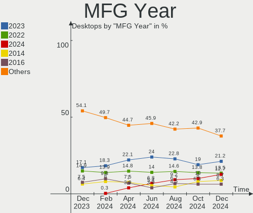
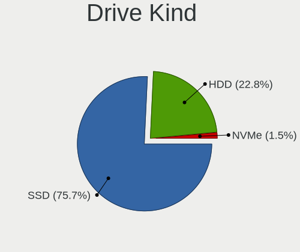
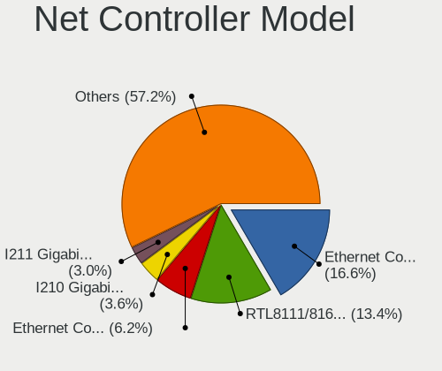

BSD - Hardware Trends (Desktops)
--------------------------------

A project to identify most popular hardware characteristics and track their change
over time based on data collected by BSD users at https://BSD-Hardware.info.

Anyone can contribute to this report by the [hw-probe](https://github.com/linuxhw/hw-probe/blob/master/INSTALL.BSD.md) tool:

    hw-probe -all -upload

This report is for one last month. Overall report since the beginning of time: [TestCoverage](https://github.com/bsdhw/TestCoverage)

Period: Aug, 2022.

Contents
--------

* [ System ](#system)
  - [ OS                       ](#os)
  - [ OS Family                ](#os-family)
  - [ Arch                     ](#arch)
  - [ DE                       ](#de)
  - [ Display Server           ](#display-server)
  - [ Display Manager          ](#display-manager)
  - [ OS Lang                  ](#os-lang)
  - [ Boot Mode                ](#boot-mode)
  - [ Filesystem               ](#filesystem)
  - [ Part. scheme             ](#part-scheme)

* [ Board ](#board)
  - [ Vendor                   ](#vendor)
  - [ Model                    ](#model)
  - [ Model Family             ](#model-family)
  - [ MFG Year                 ](#mfg-year)
  - [ Form Factor              ](#form-factor)
  - [ Coreboot                 ](#coreboot)
  - [ RAM Size                 ](#ram-size)
  - [ RAM Used                 ](#ram-used)
  - [ Total Drives             ](#total-drives)
  - [ Has CD-ROM               ](#has-cd-rom)
  - [ Has Ethernet             ](#has-ethernet)
  - [ Has WiFi                 ](#has-wifi)
  - [ Has Bluetooth            ](#has-bluetooth)

* [ Location ](#location)
  - [ Country                  ](#country)
  - [ City                     ](#city)

* [ Drives ](#drives)
  - [ Drive Vendor             ](#drive-vendor)
  - [ Drive Model              ](#drive-model)
  - [ HDD Vendor               ](#hdd-vendor)
  - [ SSD Vendor               ](#ssd-vendor)
  - [ Drive Kind               ](#drive-kind)
  - [ Drive Connector          ](#drive-connector)
  - [ Drive Size               ](#drive-size)
  - [ Space Total              ](#space-total)
  - [ Space Used               ](#space-used)
  - [ Malfunc. Drives          ](#malfunc-drives)
  - [ Malfunc. Drive Vendor    ](#malfunc-drive-vendor)
  - [ Malfunc. HDD Vendor      ](#malfunc-hdd-vendor)
  - [ Malfunc. Drive Kind      ](#malfunc-drive-kind)
  - [ Failed Drives            ](#failed-drives)
  - [ Failed Drive Vendor      ](#failed-drive-vendor)
  - [ Drive Status             ](#drive-status)

* [ Storage controller ](#storage-controller)
  - [ Storage Vendor           ](#storage-vendor)
  - [ Storage Model            ](#storage-model)
  - [ Storage Kind             ](#storage-kind)

* [ Processor ](#processor)
  - [ CPU Vendor               ](#cpu-vendor)
  - [ CPU Model                ](#cpu-model)
  - [ CPU Model Family         ](#cpu-model-family)
  - [ CPU Cores                ](#cpu-cores)
  - [ CPU Sockets              ](#cpu-sockets)
  - [ CPU Threads              ](#cpu-threads)
  - [ CPU Microarch            ](#cpu-microarch)

* [ Graphics ](#graphics)
  - [ GPU Vendor               ](#gpu-vendor)
  - [ GPU Model                ](#gpu-model)
  - [ GPU Combo                ](#gpu-combo)
  - [ GPU Driver               ](#gpu-driver)
  - [ GPU Memory               ](#gpu-memory)

* [ Monitor ](#monitor)
  - [ Monitor Vendor           ](#monitor-vendor)
  - [ Monitor Model            ](#monitor-model)
  - [ Monitor Resolution       ](#monitor-resolution)
  - [ Monitor Diagonal         ](#monitor-diagonal)
  - [ Monitor Width            ](#monitor-width)
  - [ Aspect Ratio             ](#aspect-ratio)
  - [ Monitor Area             ](#monitor-area)
  - [ Pixel Density            ](#pixel-density)
  - [ Multiple Monitors        ](#multiple-monitors)

* [ Network ](#network)
  - [ Net Controller Vendor    ](#net-controller-vendor)
  - [ Net Controller Model     ](#net-controller-model)
  - [ Wireless Vendor          ](#wireless-vendor)
  - [ Wireless Model           ](#wireless-model)
  - [ Ethernet Vendor          ](#ethernet-vendor)
  - [ Ethernet Model           ](#ethernet-model)
  - [ Net Controller Kind      ](#net-controller-kind)
  - [ Used Controller          ](#used-controller)
  - [ NICs                     ](#nics)
  - [ IPv6                     ](#ipv6)

* [ Bluetooth ](#bluetooth)
  - [ Bluetooth Vendor         ](#bluetooth-vendor)
  - [ Bluetooth Model          ](#bluetooth-model)

* [ Sound ](#sound)
  - [ Sound Vendor             ](#sound-vendor)
  - [ Sound Model              ](#sound-model)

* [ Memory ](#memory)
  - [ Memory Vendor            ](#memory-vendor)
  - [ Memory Model             ](#memory-model)
  - [ Memory Kind              ](#memory-kind)
  - [ Memory Form Factor       ](#memory-form-factor)
  - [ Memory Size              ](#memory-size)
  - [ Memory Speed             ](#memory-speed)

* [ Printers & scanners ](#printers--scanners)
  - [ Printer Vendor           ](#printer-vendor)
  - [ Printer Model            ](#printer-model)
  - [ Scanner Vendor           ](#scanner-vendor)
  - [ Scanner Model            ](#scanner-model)

* [ Camera ](#camera)
  - [ Camera Vendor            ](#camera-vendor)
  - [ Camera Model             ](#camera-model)

* [ Security ](#security)
  - [ Fingerprint Vendor       ](#fingerprint-vendor)
  - [ Fingerprint Model        ](#fingerprint-model)
  - [ Chipcard Vendor          ](#chipcard-vendor)
  - [ Chipcard Model           ](#chipcard-model)

* [ Unsupported ](#unsupported)
  - [ Unsupported Devices      ](#unsupported-devices)
  - [ Unsupported Device Types ](#unsupported-device-types)

System
------

OS
--

Installed operating systems

| Name                 | Desktops | Percent |
|----------------------|----------|---------|
| OPNsense 22.7.2      | 73       | 28.29%  |
| OPNsense 22.7        | 59       | 22.87%  |
| OPNsense 22.7.1      | 50       | 19.38%  |
| OPNsense 22.1.10     | 15       | 5.81%   |
| FreeBSD 13.1-p1      | 10       | 3.88%   |
| helloSystem 0.7.0    | 9        | 3.49%   |
| FreeBSD 13.1         | 8        | 3.1%    |
| OPNsense 23.1        | 5        | 1.94%   |
| OpenBSD 7.1          | 4        | 1.55%   |
| helloSystem 0.8.0    | 3        | 1.16%   |
| OPNsense 22.1        | 2        | 0.78%   |
| MyBee 13.1-p1        | 2        | 0.78%   |
| FreeBSD 14.0-CURRENT | 2        | 0.78%   |
| FreeBSD 13.0-p12     | 2        | 0.78%   |
| FreeBSD 13.0-p11     | 2        | 0.78%   |
| TrueNAS 13.1         | 1        | 0.39%   |
| OPNsense 22.4.3      | 1        | 0.39%   |
| OPNsense 22.4.2      | 1        | 0.39%   |
| OPNsense 22.1.8      | 1        | 0.39%   |
| OPNsense 21.7.6      | 1        | 0.39%   |
| OpenBSD 7.2          | 1        | 0.39%   |
| NetBSD 9.2           | 1        | 0.39%   |
| NetBSD 9.1           | 1        | 0.39%   |
| GhostBSD 22.08.23    | 1        | 0.39%   |
| FreeBSD 13.1-STABLE  | 1        | 0.39%   |
| FreeBSD 12.3-p5      | 1        | 0.39%   |
| FreeBSD 12.1-p2      | 1        | 0.39%   |

OS Family
---------

OS without a version

| Name        | Desktops | Percent |
|-------------|----------|---------|
| OPNsense    | 208      | 80.62%  |
| FreeBSD     | 27       | 10.47%  |
| helloSystem | 12       | 4.65%   |
| OpenBSD     | 5        | 1.94%   |
| NetBSD      | 2        | 0.78%   |
| MyBee       | 2        | 0.78%   |
| TrueNAS     | 1        | 0.39%   |
| GhostBSD    | 1        | 0.39%   |

Arch
----

OS architecture (x86_64, i586, etc.)

| Name  | Desktops | Percent |
|-------|----------|---------|
| amd64 | 255      | 98.84%  |
| arm64 | 2        | 0.78%   |
| i386  | 1        | 0.39%   |

DE
--

Desktop Environment

| Name         | Desktops | Percent |
|--------------|----------|---------|
| Console      | 226      | 87.6%   |
| helloDesktop | 19       | 7.36%   |
| KDE5         | 6        | 2.33%   |
| MATE         | 4        | 1.55%   |
| XFCE         | 2        | 0.78%   |
| i3           | 1        | 0.39%   |

Display Server
--------------

X11 or Wayland

| Name    | Desktops | Percent |
|---------|----------|---------|
| Console | 230      | 89.15%  |
| X11     | 28       | 10.85%  |

Display Manager
---------------

SDDM, LightDM, etc.

| Name    | Desktops | Percent |
|---------|----------|---------|
| Console | 235      | 91.09%  |
| SLiM    | 12       | 4.65%   |
| SDDM    | 6        | 2.33%   |
| LightDM | 3        | 1.16%   |
| XDM     | 1        | 0.39%   |
| GDM     | 1        | 0.39%   |

OS Lang
-------

Language

| Lang    | Desktops | Percent |
|---------|----------|---------|
| Unknown | 216      | 83.72%  |
| en_US   | 20       | 7.75%   |
| C       | 16       | 6.2%    |
| ru_RU   | 2        | 0.78%   |
| es_ES   | 1        | 0.39%   |
| en_GB   | 1        | 0.39%   |
| de_DE   | 1        | 0.39%   |
| da_DK   | 1        | 0.39%   |

Boot Mode
---------

EFI or BIOS

| Mode | Desktops | Percent |
|------|----------|---------|
| EFI  | 225      | 87.21%  |
| BIOS | 33       | 12.79%  |

Filesystem
----------

Type of filesystem

| Type   | Desktops | Percent |
|--------|----------|---------|
| Ufs    | 136      | 52.71%  |
| Zfs    | 112      | 43.41%  |
| Ffs    | 5        | 1.94%   |
| Cd9660 | 5        | 1.94%   |

Part. scheme
------------

Scheme of partitioning

| Type    | Desktops | Percent |
|---------|----------|---------|
| GPT     | 241      | 93.41%  |
| MBR     | 13       | 5.04%   |
| Unknown | 4        | 1.55%   |

Board
-----

Vendor
------

Motherboard manufacturer

| Name                          | Desktops | Percent |
|-------------------------------|----------|---------|
| Unknown                       | 37       | 14.34%  |
| Dell                          | 30       | 11.63%  |
| ASUSTek Computer              | 23       | 8.91%   |
| Hewlett-Packard               | 18       | 6.98%   |
| Gigabyte Technology           | 18       | 6.98%   |
| Fujitsu                       | 15       | 5.81%   |
| ASRock                        | 15       | 5.81%   |
| Protectli                     | 14       | 5.43%   |
| Lenovo                        | 12       | 4.65%   |
| Intel                         | 12       | 4.65%   |
| PC Engines                    | 9        | 3.49%   |
| Supermicro                    | 6        | 2.33%   |
| MSI                           | 5        | 1.94%   |
| YANYU                         | 3        | 1.16%   |
| MW                            | 3        | 1.16%   |
| BESSTAR Tech                  | 3        | 1.16%   |
| AZW                           | 3        | 1.16%   |
| Acer                          | 3        | 1.16%   |
| SmbiosType2_BoardManufacturer | 2        | 0.78%   |
| Inventec                      | 2        | 0.78%   |
| iEi                           | 2        | 0.78%   |
| Cisco                         | 2        | 0.78%   |
| WlanCN                        | 1        | 0.39%   |
| Wistron                       | 1        | 0.39%   |
| Shuttle                       | 1        | 0.39%   |
| Seeed Studio                  | 1        | 0.39%   |
| Pegatron                      | 1        | 0.39%   |
| NF792                         | 1        | 0.39%   |
| NF541                         | 1        | 0.39%   |
| MiTAC                         | 1        | 0.39%   |
| maiyunda                      | 1        | 0.39%   |
| Lex                           | 1        | 0.39%   |
| Jingsha                       | 1        | 0.39%   |
| IceWhale Technology           | 1        | 0.39%   |
| GVC                           | 1        | 0.39%   |
| Foxconn                       | 1        | 0.39%   |
| Deciso                        | 1        | 0.39%   |
| CncTion                       | 1        | 0.39%   |
| CheckPoint                    | 1        | 0.39%   |
| Biostar                       | 1        | 0.39%   |
| ASRockRack                    | 1        | 0.39%   |
| AOpen                         | 1        | 0.39%   |
| AMD                           | 1        | 0.39%   |

Model
-----

Motherboard model

| Name                                                        | Desktops | Percent |
|-------------------------------------------------------------|----------|---------|
| Unknown                                                     | 37       | 14.34%  |
| Fujitsu FUTRO S920                                          | 8        | 3.1%    |
| Protectli FW4B                                              | 7        | 2.71%   |
| PC Engines APU2                                             | 7        | 2.71%   |
| HP t620 PLUS Quad Core TC                                   | 7        | 2.71%   |
| Protectli FW6                                               | 4        | 1.55%   |
| Intel Q3XXG4-P V1.0                                         | 4        | 1.55%   |
| Protectli VP2410                                            | 3        | 1.16%   |
| MW GMLK-2_5G4L                                              | 3        | 1.16%   |
| HP ProDesk 600 G3 SFF                                       | 3        | 1.16%   |
| Gigabyte H61M-DS2                                           | 3        | 1.16%   |
| Dell OptiPlex 3020                                          | 3        | 1.16%   |
| Dell OptiPlex 3010                                          | 3        | 1.16%   |
| SmbiosType2_BoardManufacturer SmbiosType1_SystemProductName | 2        | 0.78%   |
| PC Engines apu4                                             | 2        | 0.78%   |
| Lenovo ThinkCentre M75s Gen 2 11R8000JUS                    | 2        | 0.78%   |
| Inventec Z CLASS                                            | 2        | 0.78%   |
| Intel DENLOW_WS                                             | 2        | 0.78%   |
| Dell PowerEdge T30                                          | 2        | 0.78%   |
| Dell OptiPlex 9020                                          | 2        | 0.78%   |
| Dell OptiPlex 7050                                          | 2        | 0.78%   |
| Dell OptiPlex 5060                                          | 2        | 0.78%   |
| Cisco SALEEN                                                | 2        | 0.78%   |
| BESSTAR Tech TH50                                           | 2        | 0.78%   |
| AZW GK55                                                    | 2        | 0.78%   |
| ASUS PRIME X370-PRO                                         | 2        | 0.78%   |
| ASRock X570 Phantom Gaming 4                                | 2        | 0.78%   |
| YANYU R250                                                  | 1        | 0.39%   |
| YANYU H67SL                                                 | 1        | 0.39%   |
| YANYU D19SL_B                                               | 1        | 0.39%   |
| WlanCN 6000 Series                                          | 1        | 0.39%   |
| Wistron ProLiant ML110 G6                                   | 1        | 0.39%   |
| Supermicro X9SCI/X9SCA                                      | 1        | 0.39%   |
| Supermicro SYS-E300-9A-4C                                   | 1        | 0.39%   |
| Supermicro SYS-1019D-4C-FHN13TP                             | 1        | 0.39%   |
| Supermicro PIO-618U-T4T+-ST031                              | 1        | 0.39%   |
| Supermicro PIO-518D-N6TRF-ST031                             | 1        | 0.39%   |
| Supermicro PDSMi                                            | 1        | 0.39%   |
| Shuttle TERRA_PC                                            | 1        | 0.39%   |
| Seeed Studio ODYSSEY-X86J4105                               | 1        | 0.39%   |
| Pegatron IPMIP-GS                                           | 1        | 0.39%   |
| NF792 1.0                                                   | 1        | 0.39%   |
| NF541 1.0                                                   | 1        | 0.39%   |
| MSI MS-7C52                                                 | 1        | 0.39%   |
| MSI MS-7B89                                                 | 1        | 0.39%   |
| MSI MS-7817                                                 | 1        | 0.39%   |
| MSI MS-7623                                                 | 1        | 0.39%   |
| MSI MS-7551                                                 | 1        | 0.39%   |
| MiTAC PH11CMI                                               | 1        | 0.39%   |
| maiyunda www.maiyunda.com                                   | 1        | 0.39%   |
| Lex Pineview-D                                              | 1        | 0.39%   |
| Lenovo ThinkCentre M93z 10AD002UUS                          | 1        | 0.39%   |
| Lenovo ThinkCentre M92p 3227K75                             | 1        | 0.39%   |
| Lenovo ThinkCentre M91p 4512A47                             | 1        | 0.39%   |
| Lenovo ThinkCentre M910t 10MMS02F00                         | 1        | 0.39%   |
| Lenovo ThinkCentre M82 2929AZ6                              | 1        | 0.39%   |
| Lenovo ThinkCentre M82 2742B1G                              | 1        | 0.39%   |
| Lenovo ThinkCentre M73 10AXS02600                           | 1        | 0.39%   |
| Lenovo ThinkCentre M710q 10MR0049US                         | 1        | 0.39%   |
| Lenovo ThinkCentre M700 10GSS0F500                          | 1        | 0.39%   |

Model Family
------------

Motherboard model prefix

| Name                                      | Desktops | Percent |
|-------------------------------------------|----------|---------|
| Unknown                                   | 37       | 14.34%  |
| Dell OptiPlex                             | 20       | 7.75%   |
| Lenovo ThinkCentre                        | 12       | 4.65%   |
| Fujitsu FUTRO                             | 9        | 3.49%   |
| HP t620                                   | 8        | 3.1%    |
| Protectli FW4B                            | 7        | 2.71%   |
| PC Engines APU2                           | 7        | 2.71%   |
| ASUS PRIME                                | 7        | 2.71%   |
| Protectli FW6                             | 4        | 1.55%   |
| Intel Q3XXG4-P                            | 4        | 1.55%   |
| Gigabyte H61M-DS2                         | 4        | 1.55%   |
| Fujitsu ESPRIMO                           | 4        | 1.55%   |
| Protectli VP2410                          | 3        | 1.16%   |
| MW GMLK-2                                 | 3        | 1.16%   |
| HP ProDesk                                | 3        | 1.16%   |
| HP EliteDesk                              | 3        | 1.16%   |
| HP Compaq                                 | 3        | 1.16%   |
| Dell Precision                            | 3        | 1.16%   |
| Dell PowerEdge                            | 3        | 1.16%   |
| Dell Inspiron                             | 3        | 1.16%   |
| ASRock X570                               | 3        | 1.16%   |
| SmbiosType2_BoardManufacturer SmbiosType1 | 2        | 0.78%   |
| PC Engines apu4                           | 2        | 0.78%   |
| Inventec Z                                | 2        | 0.78%   |
| Intel DENLOW                              | 2        | 0.78%   |
| Gigabyte X570                             | 2        | 0.78%   |
| Fujitsu PRIMERGY                          | 2        | 0.78%   |
| Cisco SALEEN                              | 2        | 0.78%   |
| BESSTAR Tech TH50                         | 2        | 0.78%   |
| AZW GK55                                  | 2        | 0.78%   |
| ASUS ROG                                  | 2        | 0.78%   |
| Acer Aspire                               | 2        | 0.78%   |
| YANYU R250                                | 1        | 0.39%   |
| YANYU H67SL                               | 1        | 0.39%   |
| YANYU D19SL                               | 1        | 0.39%   |
| WlanCN 6000                               | 1        | 0.39%   |
| Wistron ProLiant                          | 1        | 0.39%   |
| Supermicro X9SCI                          | 1        | 0.39%   |
| Supermicro SYS-E300-9A-4C                 | 1        | 0.39%   |
| Supermicro SYS-1019D-4C-FHN13TP           | 1        | 0.39%   |
| Supermicro PIO-618U-T4T+-ST031            | 1        | 0.39%   |
| Supermicro PIO-518D-N6TRF-ST031           | 1        | 0.39%   |
| Supermicro PDSMi                          | 1        | 0.39%   |
| Shuttle TERRA                             | 1        | 0.39%   |
| Seeed Studio ODYSSEY-X86J4105             | 1        | 0.39%   |
| Pegatron IPMIP-GS                         | 1        | 0.39%   |
| NF792 1.0                                 | 1        | 0.39%   |
| NF541 1.0                                 | 1        | 0.39%   |
| MSI MS-7C52                               | 1        | 0.39%   |
| MSI MS-7B89                               | 1        | 0.39%   |
| MSI MS-7817                               | 1        | 0.39%   |
| MSI MS-7623                               | 1        | 0.39%   |
| MSI MS-7551                               | 1        | 0.39%   |
| MiTAC PH11CMI                             | 1        | 0.39%   |
| maiyunda www.maiyunda.com                 | 1        | 0.39%   |
| Lex Pineview-D                            | 1        | 0.39%   |
| Jingsha x79-P3                            | 1        | 0.39%   |
| Intel X79                                 | 1        | 0.39%   |
| Intel SHARKBAY                            | 1        | 0.39%   |
| Intel NCB-4210WG                          | 1        | 0.39%   |

MFG Year
--------

Motherboard manufacture year

| Year    | Desktops | Percent |
|---------|----------|---------|
| 2021    | 27       | 10.47%  |
| 2020    | 27       | 10.47%  |
| 2019    | 27       | 10.47%  |
| 2014    | 27       | 10.47%  |
| 2022    | 24       | 9.3%    |
| 2018    | 23       | 8.91%   |
| 2016    | 21       | 8.14%   |
| 2017    | 16       | 6.2%    |
| 2013    | 13       | 5.04%   |
| 2012    | 13       | 5.04%   |
| 2010    | 10       | 3.88%   |
| 2011    | 9        | 3.49%   |
| 2015    | 6        | 2.33%   |
| 2009    | 5        | 1.94%   |
| Unknown | 5        | 1.94%   |
| 2008    | 3        | 1.16%   |
| 2007    | 1        | 0.39%   |
| 2006    | 1        | 0.39%   |

Form Factor
-----------

Physical design of the computer

| Name    | Desktops | Percent |
|---------|----------|---------|
| Desktop | 258      | 100%    |

Coreboot
--------

Have coreboot on board

| Used | Desktops | Percent |
|------|----------|---------|
| No   | 245      | 94.96%  |
| Yes  | 13       | 5.04%   |

RAM Size
--------

Total RAM memory

| Size in GB      | Desktops | Percent |
|-----------------|----------|---------|
| 8.01-16.0       | 100      | 38.76%  |
| 16.01-24.0      | 60       | 23.26%  |
| 4.01-8.0        | 50       | 19.38%  |
| 32.01-64.0      | 23       | 8.91%   |
| 2.01-3.0        | 9        | 3.49%   |
| 64.01-256.0     | 9        | 3.49%   |
| 24.01-32.0      | 3        | 1.16%   |
| More than 256.0 | 1        | 0.39%   |
| 3.01-4.0        | 1        | 0.39%   |
| 1.01-2.0        | 1        | 0.39%   |
| 0.01-0.5        | 1        | 0.39%   |

RAM Used
--------

Used RAM memory

| Used GB   | Desktops | Percent |
|-----------|----------|---------|
| 0.01-0.5  | 127      | 49.22%  |
| 0.51-1.0  | 85       | 32.95%  |
| 1.01-2.0  | 29       | 11.24%  |
| 3.01-4.0  | 6        | 2.33%   |
| 2.01-3.0  | 6        | 2.33%   |
| Unknown   | 2        | 0.78%   |
| 4.01-8.0  | 1        | 0.39%   |
| 8.01-16.0 | 1        | 0.39%   |
| 0         | 1        | 0.39%   |

Total Drives
------------

Number of drives on board

| Drives | Desktops | Percent |
|--------|----------|---------|
| 1      | 187      | 72.48%  |
| 0      | 27       | 10.47%  |
| 2      | 19       | 7.36%   |
| 3      | 13       | 5.04%   |
| 4      | 7        | 2.71%   |
| 19     | 1        | 0.39%   |
| 13     | 1        | 0.39%   |
| 9      | 1        | 0.39%   |
| 6      | 1        | 0.39%   |
| 5      | 1        | 0.39%   |

Has CD-ROM
----------

Has CD-ROM on board

| Presented | Desktops | Percent |
|-----------|----------|---------|
| No        | 220      | 85.27%  |
| Yes       | 38       | 14.73%  |

Has Ethernet
------------

Has Ethernet on board

| Presented | Desktops | Percent |
|-----------|----------|---------|
| Yes       | 257      | 99.61%  |
| No        | 1        | 0.39%   |

Has WiFi
--------

Has WiFi module

| Presented | Desktops | Percent |
|-----------|----------|---------|
| No        | 208      | 80.62%  |
| Yes       | 50       | 19.38%  |

Has Bluetooth
-------------

Has Bluetooth module

| Presented | Desktops | Percent |
|-----------|----------|---------|
| No        | 234      | 90.7%   |
| Yes       | 24       | 9.3%    |

Location
--------

Country
-------

Geographic location (country)

| Country      | Desktops | Percent |
|--------------|----------|---------|
| USA          | 70       | 27.13%  |
| Germany      | 42       | 16.28%  |
| Russia       | 13       | 5.04%   |
| Canada       | 11       | 4.26%   |
| Spain        | 10       | 3.88%   |
| France       | 10       | 3.88%   |
| UK           | 9        | 3.49%   |
| Italy        | 9        | 3.49%   |
| Switzerland  | 8        | 3.1%    |
| Poland       | 7        | 2.71%   |
| Netherlands  | 7        | 2.71%   |
| Sweden       | 5        | 1.94%   |
| South Korea  | 4        | 1.55%   |
| Austria      | 4        | 1.55%   |
| New Zealand  | 3        | 1.16%   |
| Greece       | 3        | 1.16%   |
| Czechia      | 3        | 1.16%   |
| Brazil       | 3        | 1.16%   |
| Romania      | 2        | 0.78%   |
| Peru         | 2        | 0.78%   |
| Pakistan     | 2        | 0.78%   |
| Mexico       | 2        | 0.78%   |
| Lithuania    | 2        | 0.78%   |
| India        | 2        | 0.78%   |
| Denmark      | 2        | 0.78%   |
| Australia    | 2        | 0.78%   |
| Argentina    | 2        | 0.78%   |
| Vietnam      | 1        | 0.39%   |
| Venezuela    | 1        | 0.39%   |
| Taiwan       | 1        | 0.39%   |
| South Africa | 1        | 0.39%   |
| Slovenia     | 1        | 0.39%   |
| Serbia       | 1        | 0.39%   |
| Philippines  | 1        | 0.39%   |
| Paraguay     | 1        | 0.39%   |
| Norway       | 1        | 0.39%   |
| Malaysia     | 1        | 0.39%   |
| Japan        | 1        | 0.39%   |
| Israel       | 1        | 0.39%   |
| Indonesia    | 1        | 0.39%   |
| Hungary      | 1        | 0.39%   |
| Finland      | 1        | 0.39%   |
| Croatia      | 1        | 0.39%   |
| Costa Rica   | 1        | 0.39%   |
| China        | 1        | 0.39%   |
| Bahamas      | 1        | 0.39%   |

City
----

Geographic location (city)

| City                 | Desktops | Percent |
|----------------------|----------|---------|
| Winterthur           | 3        | 1.16%   |
| Vienna               | 3        | 1.16%   |
| St Petersburg        | 3        | 1.16%   |
| Moscow               | 3        | 1.16%   |
| Amsterdam            | 3        | 1.16%   |
| Vancouver            | 2        | 0.78%   |
| Siegen               | 2        | 0.78%   |
| Seoul                | 2        | 0.78%   |
| Sao José dos Campos | 2        | 0.78%   |
| Salem                | 2        | 0.78%   |
| Redmond              | 2        | 0.78%   |
| Ottawa               | 2        | 0.78%   |
| Munich               | 2        | 0.78%   |
| Ludwigsburg          | 2        | 0.78%   |
| Lima                 | 2        | 0.78%   |
| Lille                | 2        | 0.78%   |
| Legionowo            | 2        | 0.78%   |
| Kamensk-Ural'skiy    | 2        | 0.78%   |
| Houston              | 2        | 0.78%   |
| Horgen               | 2        | 0.78%   |
| Göttingen           | 2        | 0.78%   |
| Fredericksburg       | 2        | 0.78%   |
| Federal Way          | 2        | 0.78%   |
| Essex                | 2        | 0.78%   |
| Brno                 | 2        | 0.78%   |
| Bilbao               | 2        | 0.78%   |
| Berlin               | 2        | 0.78%   |
| Atlanta              | 2        | 0.78%   |
| Zeist                | 1        | 0.39%   |
| Zagreb               | 1        | 0.39%   |
| Worms                | 1        | 0.39%   |
| Wolfsburg            | 1        | 0.39%   |
| Winter Park          | 1        | 0.39%   |
| Winschoten           | 1        | 0.39%   |
| Wiesbaden            | 1        | 0.39%   |
| West Orange          | 1        | 0.39%   |
| Wenatchee            | 1        | 0.39%   |
| Wellington           | 1        | 0.39%   |
| Watford              | 1        | 0.39%   |
| Warsaw               | 1        | 0.39%   |
| Waldbrunn            | 1        | 0.39%   |
| Vilnius              | 1        | 0.39%   |
| Victoria             | 1        | 0.39%   |
| Verona               | 1        | 0.39%   |
| Valladolid           | 1        | 0.39%   |
| Upice                | 1        | 0.39%   |
| Tver                 | 1        | 0.39%   |
| Tres Cantos          | 1        | 0.39%   |
| Trento               | 1        | 0.39%   |
| Toronto              | 1        | 0.39%   |
| Tokyo                | 1        | 0.39%   |
| Targoviste           | 1        | 0.39%   |
| Tampa                | 1        | 0.39%   |
| Suwanee              | 1        | 0.39%   |
| Summerville          | 1        | 0.39%   |
| Statesboro           | 1        | 0.39%   |
| Springboro           | 1        | 0.39%   |
| Southampton          | 1        | 0.39%   |
| South Tangerang      | 1        | 0.39%   |
| Seongnam-si          | 1        | 0.39%   |

Drives
------

Drive Vendor
------------

Hard drive vendors

| Vendor              | Desktops | Drives | Percent |
|---------------------|----------|--------|---------|
| Samsung Electronics | 40       | 50     | 14.65%  |
| Seagate             | 32       | 56     | 11.72%  |
| Kingston            | 29       | 29     | 10.62%  |
| WDC                 | 28       | 50     | 10.26%  |
| Transcend           | 18       | 18     | 6.59%   |
| SanDisk             | 15       | 15     | 5.49%   |
| Toshiba             | 9        | 13     | 3.3%    |
| China               | 9        | 9      | 3.3%    |
| Hoodisk             | 8        | 8      | 2.93%   |
| Intel               | 6        | 7      | 2.2%    |
| Innodisk            | 6        | 6      | 2.2%    |
| Crucial             | 6        | 7      | 2.2%    |
| PNY                 | 4        | 5      | 1.47%   |
| Micron Technology   | 4        | 4      | 1.47%   |
| FORESEE             | 4        | 4      | 1.47%   |
| Dogfish             | 4        | 4      | 1.47%   |
| SPCC                | 3        | 3      | 1.1%    |
| Patriot             | 3        | 3      | 1.1%    |
| Intenso             | 3        | 3      | 1.1%    |
| A-DATA Technology   | 3        | 3      | 1.1%    |
| SK hynix            | 2        | 2      | 0.73%   |
| ShiJi               | 2        | 2      | 0.73%   |
| Protectli           | 2        | 2      | 0.73%   |
| Phison              | 2        | 2      | 0.73%   |
| KIOXIA              | 2        | 2      | 0.73%   |
| Hitachi             | 2        | 11     | 0.73%   |
| GOODRAM             | 2        | 3      | 0.73%   |
| Corsair             | 2        | 2      | 0.73%   |
| BIWIN               | 2        | 2      | 0.73%   |
| AMD                 | 2        | 2      | 0.73%   |
| Team                | 1        | 1      | 0.37%   |
| Silicon Motion      | 1        | 1      | 0.37%   |
| OPENBSD             | 1        | 1      | 0.37%   |
| OCZ                 | 1        | 1      | 0.37%   |
| Netac               | 1        | 1      | 0.37%   |
| Maxtor              | 1        | 1      | 0.37%   |
| MARVELL             | 1        | 1      | 0.37%   |
| LuminouTek          | 1        | 1      | 0.37%   |
| LSI                 | 1        | 1      | 0.37%   |
| LITEON              | 1        | 1      | 0.37%   |
| Lenovo              | 1        | 1      | 0.37%   |
| Kston               | 1        | 1      | 0.37%   |
| Integral            | 1        | 1      | 0.37%   |
| INDMEM              | 1        | 1      | 0.37%   |
| Indilinx            | 1        | 1      | 0.37%   |
| HGST                | 1        | 1      | 0.37%   |
| Hewlett-Packard     | 1        | 1      | 0.37%   |
| BR                  | 1        | 1      | 0.37%   |
| Apacer              | 1        | 1      | 0.37%   |

Drive Model
-----------

Hard drive models

| Model                           | Desktops | Percent |
|---------------------------------|----------|---------|
| Transcend TS128GMSA230S 128GB   | 5        | 1.67%   |
| Kingston SA400S37240G 240GB     | 5        | 1.67%   |
| Transcend TS64GMSA370 64GB      | 3        | 1%      |
| Seagate ST1000DM003-1CH162 1TB  | 3        | 1%      |
| Samsung SSD 980 500GB           | 3        | 1%      |
| Kingston SUV500MS240G 240GB     | 3        | 1%      |
| Kingston SA400S37120G 120GB     | 3        | 1%      |
| Hoodisk SSD 256GB               | 3        | 1%      |
| WDC WD40EFRX-68N32N0 4TB        | 2        | 0.67%   |
| Transcend TS64GMSA230S 64GB     | 2        | 0.67%   |
| Transcend TS128GMSA370 128GB    | 2        | 0.67%   |
| ShiJi SSD 128GB                 | 2        | 0.67%   |
| Seagate ST500DM002-1BD142 500GB | 2        | 0.67%   |
| Seagate ST4000DM000-1F2168 4TB  | 2        | 0.67%   |
| Seagate ST2000DM008-2FR102 2TB  | 2        | 0.67%   |
| Seagate ST1000LM035-1RK172 1TB  | 2        | 0.67%   |
| Seagate ST1000DM010-2EP102 1TB  | 2        | 0.67%   |
| Samsung SSD 870 EVO 500GB       | 2        | 0.67%   |
| Samsung SSD 860 EVO 500GB       | 2        | 0.67%   |
| Samsung SSD 850 PRO 256GB       | 2        | 0.67%   |
| Samsung SSD 840 Series 120GB    | 2        | 0.67%   |
| Samsung SSD 840 EVO 250GB       | 2        | 0.67%   |
| Kingston SV300S37A60G 64GB      | 2        | 0.67%   |
| Kingston SKC600MS256G 256GB     | 2        | 0.67%   |
| Kingston OM8PDP3512B-A01 512GB  | 2        | 0.67%   |
| Innodisk DEMSR- 08GB mSATA 3ME3 | 2        | 0.67%   |
| Hoodisk SSD 32GB                | 2        | 0.67%   |
| Hoodisk SSD 128GB               | 2        | 0.67%   |
| FORESEE 64GB SSD                | 2        | 0.67%   |
| Crucial CT250MX500SSD1 250GB    | 2        | 0.67%   |
| Crucial CT240BX500SSD1 240GB    | 2        | 0.67%   |
| Crucial CT120BX500SSD1 120GB    | 2        | 0.67%   |
| China SATA SSD 16GB             | 2        | 0.67%   |
| China SATA SSD 120GB            | 2        | 0.67%   |
| China NGFF 2280 256GB SSD       | 2        | 0.67%   |
| BIWIN SSD 128GB                 | 2        | 0.67%   |
| WDC WDS500G3X0C-00SJG0 500GB    | 1        | 0.33%   |
| WDC WDS500G2B0C-00PXH0 500GB    | 1        | 0.33%   |
| WDC WDS500G2B0A-00SM50 500GB    | 1        | 0.33%   |
| WDC WDS480G2G0A-00JH30 480GB    | 1        | 0.33%   |
| WDC WDS120G2G0A-00JH30 120GB    | 1        | 0.33%   |
| WDC WDS120G1G0A-00SS50 120GB    | 1        | 0.33%   |
| WDC WDS100T2B0C-00PXH0 1TB      | 1        | 0.33%   |
| WDC WD80EMAZ-00WJTA0 8TB        | 1        | 0.33%   |
| WDC WD80EFZZ-68BTXN0 8TB        | 1        | 0.33%   |
| WDC WD80EFZX-68UW8N0 8TB        | 1        | 0.33%   |
| WDC WD80EFAX-68LHPN0 8TB        | 1        | 0.33%   |
| WDC WD80EDBZ-11B0ZA0 8TB        | 1        | 0.33%   |
| WDC WD800AAJS-00PSA0 80GB       | 1        | 0.33%   |
| WDC WD6400AARS-00Y5B1 640GB     | 1        | 0.33%   |
| WDC WD5003ABYX-01WERA2 500GB    | 1        | 0.33%   |
| WDC WD5000LUCT-63Y8HY0 500GB    | 1        | 0.33%   |
| WDC WD5000LPLX-00ZNTT0 500GB    | 1        | 0.33%   |
| WDC WD5000AZLX-00K2TA0 500GB    | 1        | 0.33%   |
| WDC WD40EZRZ-22GXCB0 4TB        | 1        | 0.33%   |
| WDC WD40EFRX-68WT0N0 4TB        | 1        | 0.33%   |
| WDC WD4003FRYZ-01F0DB0 4TB      | 1        | 0.33%   |
| WDC WD30NMRW-11YL9S4 3TB        | 1        | 0.33%   |
| WDC WD2500AAJS-07M0A0 250GB     | 1        | 0.33%   |
| WDC WD20EZRZ-00Z5HB0 2TB        | 1        | 0.33%   |

HDD Vendor
----------

Hard disk drive vendors

| Vendor              | Desktops | Drives | Percent |
|---------------------|----------|--------|---------|
| Seagate             | 31       | 55     | 45.59%  |
| WDC                 | 21       | 41     | 30.88%  |
| Toshiba             | 6        | 10     | 8.82%   |
| Samsung Electronics | 2        | 2      | 2.94%   |
| Hitachi             | 2        | 11     | 2.94%   |
| OPENBSD             | 1        | 1      | 1.47%   |
| Maxtor              | 1        | 1      | 1.47%   |
| MARVELL             | 1        | 1      | 1.47%   |
| LSI                 | 1        | 1      | 1.47%   |
| HGST                | 1        | 1      | 1.47%   |
| Hewlett-Packard     | 1        | 1      | 1.47%   |

SSD Vendor
----------

Solid state drive vendors

| Vendor              | Desktops | Drives | Percent |
|---------------------|----------|--------|---------|
| Samsung Electronics | 28       | 34     | 16.67%  |
| Kingston            | 22       | 22     | 13.1%   |
| Transcend           | 18       | 18     | 10.71%  |
| SanDisk             | 15       | 15     | 8.93%   |
| China               | 9        | 9      | 5.36%   |
| Hoodisk             | 7        | 7      | 4.17%   |
| Intel               | 6        | 7      | 3.57%   |
| Innodisk            | 6        | 6      | 3.57%   |
| Crucial             | 6        | 7      | 3.57%   |
| WDC                 | 4        | 5      | 2.38%   |
| Micron Technology   | 4        | 4      | 2.38%   |
| FORESEE             | 4        | 4      | 2.38%   |
| Dogfish             | 4        | 4      | 2.38%   |
| SPCC                | 3        | 3      | 1.79%   |
| PNY                 | 3        | 4      | 1.79%   |
| Patriot             | 3        | 3      | 1.79%   |
| Intenso             | 3        | 3      | 1.79%   |
| ShiJi               | 2        | 2      | 1.19%   |
| Protectli           | 2        | 2      | 1.19%   |
| BIWIN               | 2        | 2      | 1.19%   |
| AMD                 | 2        | 2      | 1.19%   |
| Toshiba             | 1        | 1      | 0.6%    |
| SK hynix            | 1        | 1      | 0.6%    |
| Seagate             | 1        | 1      | 0.6%    |
| OCZ                 | 1        | 1      | 0.6%    |
| Netac               | 1        | 1      | 0.6%    |
| LITEON              | 1        | 1      | 0.6%    |
| Kston               | 1        | 1      | 0.6%    |
| Integral            | 1        | 1      | 0.6%    |
| INDMEM              | 1        | 1      | 0.6%    |
| Indilinx            | 1        | 1      | 0.6%    |
| GOODRAM             | 1        | 2      | 0.6%    |
| Corsair             | 1        | 1      | 0.6%    |
| BR                  | 1        | 1      | 0.6%    |
| Apacer              | 1        | 1      | 0.6%    |
| A-DATA Technology   | 1        | 1      | 0.6%    |

Drive Kind
----------

HDD or SSD

| Kind | Desktops | Drives | Percent |
|------|----------|--------|---------|
| SSD  | 166      | 179    | 64.09%  |
| HDD  | 54       | 125    | 20.85%  |
| NVMe | 39       | 42     | 15.06%  |

Drive Connector
---------------

SATA, SAS, NVMe, etc.

| Type | Desktops | Drives | Percent |
|------|----------|--------|---------|
| SATA | 205      | 304    | 84.02%  |
| NVMe | 39       | 42     | 15.98%  |

Drive Size
----------

Size of hard drive

| Size in TB | Desktops | Drives | Percent |
|------------|----------|--------|---------|
| 0.01-0.5   | 186      | 209    | 79.83%  |
| 0.51-1.0   | 25       | 30     | 10.73%  |
| 1.01-2.0   | 8        | 26     | 3.43%   |
| 3.01-4.0   | 6        | 10     | 2.58%   |
| 10.01-20.0 | 3        | 10     | 1.29%   |
| 4.01-10.0  | 3        | 10     | 1.29%   |
| 2.01-3.0   | 2        | 9      | 0.86%   |

Space Total
-----------

Amount of disk space available on the file system

| Size in GB     | Desktops | Percent |
|----------------|----------|---------|
| 101-250        | 132      | 51.16%  |
| 251-500        | 40       | 15.5%   |
| 1-20           | 24       | 9.3%    |
| 21-50          | 21       | 8.14%   |
| 51-100         | 18       | 6.98%   |
| 501-1000       | 15       | 5.81%   |
| 2001-3000      | 3        | 1.16%   |
| More than 3000 | 2        | 0.78%   |
| 1001-2000      | 2        | 0.78%   |
| Unknown        | 1        | 0.39%   |

Space Used
----------

Amount of used disk space

| Used GB   | Desktops | Percent |
|-----------|----------|---------|
| 1-20      | 239      | 92.64%  |
| 21-50     | 12       | 4.65%   |
| 51-100    | 4        | 1.55%   |
| 2001-3000 | 1        | 0.39%   |
| 1001-2000 | 1        | 0.39%   |
| Unknown   | 1        | 0.39%   |

Malfunc. Drives
---------------

Drive models with a malfunction

| Model                                      | Desktops | Drives | Percent |
|--------------------------------------------|----------|--------|---------|
| Seagate ST1000DM003-1CH162 1TB             | 2        | 2      | 6.25%   |
| WDC WDS480G2G0A-00JH30 480GB               | 1        | 2      | 3.13%   |
| WDC WD6400AARS-00Y5B1 640GB                | 1        | 1      | 3.13%   |
| WDC WD40EFRX-68N32N0 4TB                   | 1        | 2      | 3.13%   |
| WDC WD20EFRX-68EUZN0 2TB                   | 1        | 2      | 3.13%   |
| WDC WD1600BEKT-66F3T2 160GB                | 1        | 1      | 3.13%   |
| WDC WD1000DHTZ-04N21V1 1TB                 | 1        | 2      | 3.13%   |
| Toshiba THNSNK128GCS8 SATA 128GB           | 1        | 1      | 3.13%   |
| Toshiba MQ01ABD025 250GB                   | 1        | 1      | 3.13%   |
| SPCC M.2 SSD 256GB                         | 1        | 1      | 3.13%   |
| Seagate ST9500325AS 500GB                  | 1        | 1      | 3.13%   |
| Seagate ST500DM002-1BD142 500GB            | 1        | 1      | 3.13%   |
| Seagate ST380815AS 80GB                    | 1        | 1      | 3.13%   |
| Seagate ST3500418AS 500GB                  | 1        | 1      | 3.13%   |
| Seagate ST3250620NS 250GB                  | 1        | 1      | 3.13%   |
| Seagate ST320LM000 HM321HI 320GB           | 1        | 1      | 3.13%   |
| Seagate ST2000DM001-9YN164 2TB             | 1        | 1      | 3.13%   |
| SanDisk SDCFHS-016G                        | 1        | 1      | 3.13%   |
| SanDisk SD8TB8U-256G-1006 256GB            | 1        | 1      | 3.13%   |
| Samsung Electronics SSD 870 EVO 500GB      | 1        | 2      | 3.13%   |
| Samsung Electronics HD081GJ 80GB           | 1        | 1      | 3.13%   |
| Micron Technology C400 RealSSD mSATA 128GB | 1        | 1      | 3.13%   |
| LITEON CS1-SP32-11 M.2 2242 32GB           | 1        | 1      | 3.13%   |
| Kingston SV300S37A60G 64GB                 | 1        | 1      | 3.13%   |
| Kingston SUV400S37120G 120GB               | 1        | 1      | 3.13%   |
| Intel SSDSC2BB480G4 480GB                  | 1        | 1      | 3.13%   |
| INDMEM SSD mSATA 128GB                     | 1        | 1      | 3.13%   |
| Hitachi HDS723020BLA642 2TB                | 1        | 3      | 3.13%   |
| HGST HTS725050A7E630 500GB                 | 1        | 1      | 3.13%   |
| Hewlett-Packard VB0160EAVEQ 160GB          | 1        | 1      | 3.13%   |
| Apacer 16GB SATA Flash Drive               | 1        | 1      | 3.13%   |

Malfunc. Drive Vendor
---------------------

Vendors of faulty drives

| Vendor              | Desktops | Drives | Percent |
|---------------------|----------|--------|---------|
| Seagate             | 9        | 9      | 30%     |
| WDC                 | 4        | 10     | 13.33%  |
| Toshiba             | 2        | 2      | 6.67%   |
| SanDisk             | 2        | 2      | 6.67%   |
| Samsung Electronics | 2        | 3      | 6.67%   |
| Kingston            | 2        | 2      | 6.67%   |
| SPCC                | 1        | 1      | 3.33%   |
| Micron Technology   | 1        | 1      | 3.33%   |
| LITEON              | 1        | 1      | 3.33%   |
| Intel               | 1        | 1      | 3.33%   |
| INDMEM              | 1        | 1      | 3.33%   |
| Hitachi             | 1        | 3      | 3.33%   |
| HGST                | 1        | 1      | 3.33%   |
| Hewlett-Packard     | 1        | 1      | 3.33%   |
| Apacer              | 1        | 1      | 3.33%   |

Malfunc. HDD Vendor
-------------------

Vendors of faulty HDD drives

| Vendor              | Desktops | Drives | Percent |
|---------------------|----------|--------|---------|
| Seagate             | 9        | 9      | 52.94%  |
| WDC                 | 3        | 8      | 17.65%  |
| Toshiba             | 1        | 1      | 5.88%   |
| Samsung Electronics | 1        | 1      | 5.88%   |
| Hitachi             | 1        | 3      | 5.88%   |
| HGST                | 1        | 1      | 5.88%   |
| Hewlett-Packard     | 1        | 1      | 5.88%   |

Malfunc. Drive Kind
-------------------

Kinds of faulty drives

| Kind | Desktops | Drives | Percent |
|------|----------|--------|---------|
| HDD  | 16       | 24     | 55.17%  |
| SSD  | 13       | 15     | 44.83%  |

Failed Drives
-------------

Failed drive models

| Model                   | Desktops | Drives | Percent |
|-------------------------|----------|--------|---------|
| Toshiba MG05ACA800E 8TB | 1        | 1      | 100%    |

Failed Drive Vendor
-------------------

Failed drive vendors

| Vendor  | Desktops | Drives | Percent |
|---------|----------|--------|---------|
| Toshiba | 1        | 1      | 100%    |

Drive Status
------------

Number of failed and malfunc. drives

| Status   | Desktops | Drives | Percent |
|----------|----------|--------|---------|
| Works    | 209      | 301    | 86.01%  |
| Malfunc  | 28       | 39     | 11.52%  |
| Detected | 5        | 5      | 2.06%   |
| Failed   | 1        | 1      | 0.41%   |

Storage controller
------------------

Storage Vendor
--------------

Storage controller vendors

| Vendor                      | Desktops | Percent |
|-----------------------------|----------|---------|
| Intel                       | 193      | 61.46%  |
| AMD                         | 60       | 19.11%  |
| Samsung Electronics         | 12       | 3.82%   |
| Kingston Technology Company | 7        | 2.23%   |
| SanDisk                     | 6        | 1.91%   |
| ASMedia Technology          | 6        | 1.91%   |
| Phison Electronics          | 5        | 1.59%   |
| Marvell Technology Group    | 5        | 1.59%   |
| Silicon Motion              | 4        | 1.27%   |
| Broadcom / LSI              | 4        | 1.27%   |
| Toshiba                     | 3        | 0.96%   |
| JMicron Technology          | 2        | 0.64%   |
| SK hynix                    | 1        | 0.32%   |
| MAXIO Technology (Hangzhou) | 1        | 0.32%   |
| Lenovo                      | 1        | 0.32%   |
| KIOXIA                      | 1        | 0.32%   |
| Chelsio Communications      | 1        | 0.32%   |
| Biwin Storage Technology    | 1        | 0.32%   |
| ADATA Technology            | 1        | 0.32%   |

Storage Model
-------------

Storage controller models

| Model                                                                            | Desktops | Percent |
|----------------------------------------------------------------------------------|----------|---------|
| AMD FCH SATA Controller [AHCI mode]                                              | 42       | 12.24%  |
| Intel Celeron/Pentium Silver Processor SATA Controller                           | 22       | 6.41%   |
| Intel 8 Series/C220 Series Chipset Family 6-port SATA Controller 1 [AHCI mode]   | 21       | 6.12%   |
| Intel 6 Series/C200 Series Chipset Family 6 port Desktop SATA AHCI Controller    | 17       | 4.96%   |
| Intel Sunrise Point-LP SATA Controller [AHCI mode]                               | 14       | 4.08%   |
| Intel 200 Series PCH SATA controller [AHCI mode]                                 | 13       | 3.79%   |
| Intel Atom/Celeron/Pentium Processor x5-E8000/J3xxx/N3xxx Series SATA Controller | 11       | 3.21%   |
| Intel Q170/Q150/B150/H170/H110/Z170/CM236 Chipset SATA Controller [AHCI Mode]    | 10       | 2.92%   |
| AMD SB7x0/SB8x0/SB9x0 SATA Controller [AHCI mode]                                | 9        | 2.62%   |
| Intel Atom Processor E3800 Series SATA AHCI Controller                           | 7        | 2.04%   |
| Intel SATA Controller [RAID mode]                                                | 6        | 1.75%   |
| Intel 7 Series/C210 Series Chipset Family 6-port SATA Controller [AHCI mode]     | 6        | 1.75%   |
| ASMedia ASM1062 Serial ATA Controller                                            | 6        | 1.75%   |
| AMD SB7x0/SB8x0/SB9x0 IDE Controller                                             | 6        | 1.75%   |
| Samsung NVMe SSD Controller SM981/PM981/PM983                                    | 5        | 1.46%   |
| Intel NM10/ICH7 Family SATA Controller [IDE mode]                                | 5        | 1.46%   |
| Intel Jasper Lake SATA AHCI Controller                                           | 5        | 1.46%   |
| Intel 5 Series/3400 Series Chipset 6 port SATA AHCI Controller                   | 5        | 1.46%   |
| AMD 500 Series Chipset SATA Controller                                           | 5        | 1.46%   |
| Unknown                                                                          | 5        | 1.46%   |
| Samsung NVMe SSD Controller 980                                                  | 4        | 1.17%   |
| Intel Wildcat Point-LP SATA Controller [AHCI Mode]                               | 4        | 1.17%   |
| Intel Tiger Lake-LP SATA Controller                                              | 4        | 1.17%   |
| Intel Celeron N3350/Pentium N4200/Atom E3900 Series SATA AHCI Controller         | 4        | 1.17%   |
| Intel C600/X79 series chipset 6-Port SATA AHCI Controller                        | 4        | 1.17%   |
| Intel 400 Series Chipset Family SATA AHCI Controller                             | 4        | 1.17%   |
| Silicon Motion SM2263EN/SM2263XT SSD Controller                                  | 3        | 0.87%   |
| Phison E12 NVMe Controller                                                       | 3        | 0.87%   |
| Kingston Company OM3PDP3 NVMe SSD                                                | 3        | 0.87%   |
| Intel Cannon Lake PCH SATA AHCI Controller                                       | 3        | 0.87%   |
| Intel 82801JI (ICH10 Family) SATA AHCI Controller                                | 3        | 0.87%   |
| Intel 82801G (ICH7 Family) IDE Controller                                        | 3        | 0.87%   |
| AMD FCH SATA Controller [IDE mode]                                               | 3        | 0.87%   |
| AMD FCH SATA Controller D                                                        | 3        | 0.87%   |
| SanDisk WD Blue SN570 NVMe SSD                                                   | 2        | 0.58%   |
| SanDisk WD Black SN750 / PC SN730 NVMe SSD                                       | 2        | 0.58%   |
| Samsung NVMe SSD Controller SM961/PM961/SM963                                    | 2        | 0.58%   |
| Kingston Company A2000 NVMe SSD                                                  | 2        | 0.58%   |
| Intel NM10/ICH7 Family SATA Controller [AHCI mode]                               | 2        | 0.58%   |
| Intel C620 Series Chipset Family SSATA Controller [AHCI mode]                    | 2        | 0.58%   |
| Intel C610/X99 series chipset sSATA Controller [AHCI mode]                       | 2        | 0.58%   |
| Intel Alder Lake-S PCH SATA Controller [AHCI Mode]                               | 2        | 0.58%   |
| Intel 82801HM/HEM (ICH8M/ICH8M-E) SATA Controller [IDE mode]                     | 2        | 0.58%   |
| Intel 8 Series SATA Controller 1 [AHCI mode]                                     | 2        | 0.58%   |
| Intel 7 Series/C210 Series Chipset Family 4-port SATA Controller [IDE mode]      | 2        | 0.58%   |
| Intel 7 Series/C210 Series Chipset Family 2-port SATA Controller [IDE mode]      | 2        | 0.58%   |
| Broadcom / LSI SAS2008 PCI-Express Fusion-MPT SAS-2 [Falcon]                     | 2        | 0.58%   |
| AMD X370 Series Chipset SATA Controller                                          | 2        | 0.58%   |
| AMD 400 Series Chipset SATA Controller                                           | 2        | 0.58%   |
| Toshiba XG6 NVMe SSD Controller                                                  | 1        | 0.29%   |
| Toshiba XG4 NVMe SSD Controller                                                  | 1        | 0.29%   |
| Toshiba unknown                                                                  | 1        | 0.29%   |
| SanDisk WD Blue SN550 NVMe SSD                                                   | 1        | 0.29%   |
| SanDisk unknown                                                                  | 1        | 0.29%   |
| Samsung NVMe SSD Controller PM9A1/PM9A3/980PRO                                   | 1        | 0.29%   |
| Phison PS5013 E13 NVMe Controller                                                | 1        | 0.29%   |
| Phison E16 PCIe4 NVMe Controller                                                 | 1        | 0.29%   |
| MAXIO (Hangzhou) NVMe SSD Controller MAP1202                                     | 1        | 0.29%   |
| Marvell Group 88SE9230 PCIe 2.0 x2 4-port SATA 6 Gb/s RAID Controller            | 1        | 0.29%   |
| Marvell Group 88SE9215 PCIe 2.0 x1 4-port SATA 6 Gb/s Controller                 | 1        | 0.29%   |

Storage Kind
------------

Kind of storage controller (IDE, SATA, NVMe, SAS, ...)

| Kind | Desktops | Percent |
|------|----------|---------|
| SATA | 230      | 73.02%  |
| NVMe | 42       | 13.33%  |
| IDE  | 29       | 9.21%   |
| RAID | 10       | 3.17%   |
| SAS  | 2        | 0.63%   |
| SCSI | 2        | 0.63%   |

Processor
---------

CPU Vendor
----------

Processor vendors

| Vendor   | Desktops | Percent |
|----------|----------|---------|
| Intel    | 195      | 75.58%  |
| AMD      | 61       | 23.64%  |
| Research | 1        | 0.39%   |
| ARM      | 1        | 0.39%   |

CPU Model
---------

Processor models

| Model                                      | Desktops | Percent |
|--------------------------------------------|----------|---------|
| Intel Celeron J4125 CPU @ 2.00GHz          | 19       | 7.36%   |
| Intel Core i5-3470 CPU @ 3.20GHz           | 9        | 3.49%   |
| Intel Celeron CPU J3160 @ 1.60GHz          | 9        | 3.49%   |
| AMD GX-412TC SOC                           | 9        | 3.49%   |
| AMD GX-420CA SOC with Radeon HD Graphics   | 7        | 2.71%   |
| AMD GX-415GA SOC with Radeon HD Graphics   | 7        | 2.71%   |
| Intel Celeron N5105 @ 2.00GHz              | 6        | 2.33%   |
| Intel Celeron CPU J1900 @ 1.99GHz          | 5        | 1.94%   |
| Intel Core i7-7500U CPU @ 2.70GHz          | 4        | 1.55%   |
| Intel Core i5-6500 CPU @ 3.20GHz           | 4        | 1.55%   |
| Intel Core i7-4770 CPU @ 3.40GHz           | 3        | 1.16%   |
| Intel Core i5-7500 CPU @ 3.40GHz           | 3        | 1.16%   |
| Intel Core i5-7200U CPU @ 2.50GHz          | 3        | 1.16%   |
| Intel Core i3-7100 CPU @ 3.90GHz           | 3        | 1.16%   |
| AMD Ryzen 9 3900X 12-Core Processor        | 3        | 1.16%   |
| AMD Ryzen 5 5600G with Radeon Graphics     | 3        | 1.16%   |
| Intel Xeon CPU E31270 @ 3.40GHz            | 2        | 0.78%   |
| Intel Xeon CPU E3-1225 v5 @ 3.30GHz        | 2        | 0.78%   |
| Intel Xeon                                 | 2        | 0.78%   |
| Intel Core i7-8700 CPU @ 3.20GHz           | 2        | 0.78%   |
| Intel Core i7-7700K CPU @ 4.20GHz          | 2        | 0.78%   |
| Intel Core i5-9500 CPU @ 3.00GHz           | 2        | 0.78%   |
| Intel Core i5-9400 CPU @ 2.90GHz           | 2        | 0.78%   |
| Intel Core i5-5200U CPU @ 2.20GHz          | 2        | 0.78%   |
| Intel Core i5-4590S CPU @ 3.00GHz          | 2        | 0.78%   |
| Intel Core i5-4570 CPU @ 3.20GHz           | 2        | 0.78%   |
| Intel Core i5-2400 CPU @ 3.10GHz           | 2        | 0.78%   |
| Intel Core i3-7167U CPU @ 2.80GHz          | 2        | 0.78%   |
| Intel Core i3-7100U CPU @ 2.40GHz          | 2        | 0.78%   |
| Intel Core i3-10100 CPU @ 3.60GHz          | 2        | 0.78%   |
| Intel Core i3 CPU 530 @ 2.93GHz            | 2        | 0.78%   |
| Intel Core 2 Quad CPU Q6600 @ 2.40GHz      | 2        | 0.78%   |
| Intel Celeron CPU N3450 @ 1.10GHz          | 2        | 0.78%   |
| Intel Celeron CPU N3160 @ 1.60GHz          | 2        | 0.78%   |
| Intel Celeron CPU 3865U @ 1.80GHz          | 2        | 0.78%   |
| Intel 686-class                            | 2        | 0.78%   |
| Intel 11th Gen Core i5-11320H @ 3.20GHz    | 2        | 0.78%   |
| AMD Ryzen 7 2700 Eight-Core Processor      | 2        | 0.78%   |
| AMD Ryzen 7 1700 Eight-Core Processor      | 2        | 0.78%   |
| AMD Ryzen 5 PRO 5650G with Radeon Graphics | 2        | 0.78%   |
| AMD GX-420MC SOC                           | 2        | 0.78%   |
| AMD GX-222GC SOC with Radeon R5E Graphics  | 2        | 0.78%   |
| AMD G-T56N Processor                       | 2        | 0.78%   |
| AMD FX-6300 Six-Core Processor             | 2        | 0.78%   |
| AMD Athlon 3000G with Radeon Vega Graphics | 2        | 0.78%   |
| Research Morello SoC r0p0                  | 1        | 0.39%   |
| Intel Xeon D-2145NT CPU @ 1.90GHz          | 1        | 0.39%   |
| Intel Xeon D-2123IT CPU @ 2.20GHz          | 1        | 0.39%   |
| Intel Xeon CPU X5690 @ 3.47GHz             | 1        | 0.39%   |
| Intel Xeon CPU X3430 @ 2.40GHz             | 1        | 0.39%   |
| Intel Xeon CPU L3426 @ 1.87GHz             | 1        | 0.39%   |
| Intel Xeon CPU E5-2697 v2 @ 2.70GHz        | 1        | 0.39%   |
| Intel Xeon CPU E5-2660 v3 @ 2.60GHz        | 1        | 0.39%   |
| Intel Xeon CPU E5-2640 0 @ 2.50GHz         | 1        | 0.39%   |
| Intel Xeon CPU E5-2620 v2 @ 2.10GHz        | 1        | 0.39%   |
| Intel Xeon CPU E5-1603 0 @ 2.80GH          | 1        | 0.39%   |
| Intel Xeon CPU E31260L @ 2.40GHz           | 1        | 0.39%   |
| Intel Xeon CPU E3-1271 v3 @ 3.60GHz        | 1        | 0.39%   |
| Intel Xeon CPU E3-1245 v3 @ 3.40GHz        | 1        | 0.39%   |
| Intel Xeon CPU E3-1225 V2 @ 3.20GHz        | 1        | 0.39%   |

CPU Model Family
----------------

Processor model prefix

| Model                   | Desktops | Percent |
|-------------------------|----------|---------|
| Intel Celeron           | 55       | 21.32%  |
| Intel Core i5           | 47       | 18.22%  |
| AMD GX                  | 28       | 10.85%  |
| Intel Xeon              | 21       | 8.14%   |
| Intel Core i7           | 21       | 8.14%   |
| Intel Core i3           | 21       | 8.14%   |
| Other                   | 10       | 3.88%   |
| Intel Pentium           | 6        | 2.33%   |
| AMD Ryzen 7             | 6        | 2.33%   |
| AMD Ryzen 5             | 6        | 2.33%   |
| Intel Core 2 Duo        | 5        | 1.94%   |
| Intel Atom              | 5        | 1.94%   |
| AMD Ryzen 9             | 3        | 1.16%   |
| AMD Ryzen 5 PRO         | 3        | 1.16%   |
| Intel Core 2 Quad       | 2        | 0.78%   |
| Intel 686-class         | 2        | 0.78%   |
| AMD G                   | 2        | 0.78%   |
| AMD FX                  | 2        | 0.78%   |
| AMD Athlon              | 2        | 0.78%   |
| Intel Pentium Silver    | 1        | 0.39%   |
| Intel Pentium Dual-Core | 1        | 0.39%   |
| Intel Pentium 4         | 1        | 0.39%   |
| Intel Genuine           | 1        | 0.39%   |
| ARM Cortex              | 1        | 0.39%   |
| AMD Sempron             | 1        | 0.39%   |
| AMD Ryzen Threadripper  | 1        | 0.39%   |
| AMD Ryzen 3             | 1        | 0.39%   |
| AMD Phenom II X4        | 1        | 0.39%   |
| AMD Phenom              | 1        | 0.39%   |
| AMD E                   | 1        | 0.39%   |

CPU Cores
---------

Number of processor cores

| Number  | Desktops | Percent |
|---------|----------|---------|
| 4       | 146      | 56.59%  |
| 2       | 59       | 22.87%  |
| 6       | 16       | 6.2%    |
| 12      | 10       | 3.88%   |
| 16      | 7        | 2.71%   |
| Unknown | 7        | 2.71%   |
| 24      | 4        | 1.55%   |
| 8       | 4        | 1.55%   |
| 1       | 2        | 0.78%   |
| 20      | 1        | 0.39%   |
| 10      | 1        | 0.39%   |
| 3       | 1        | 0.39%   |

CPU Sockets
-----------

Number of sockets

| Number  | Desktops | Percent |
|---------|----------|---------|
| 1       | 251      | 97.29%  |
| Unknown | 4        | 1.55%   |
| 2       | 3        | 1.16%   |

CPU Threads
-----------

Threads per core (Hyper-Threading)

| Number  | Desktops | Percent |
|---------|----------|---------|
| 1       | 173      | 67.05%  |
| 2       | 77       | 29.84%  |
| Unknown | 8        | 3.1%    |

CPU Microarch
-------------

Microarchitecture

| Name          | Desktops | Percent |
|---------------|----------|---------|
| KabyLake      | 34       | 13.18%  |
| Haswell       | 26       | 10.08%  |
| Goldmont plus | 22       | 8.53%   |
| IvyBridge     | 21       | 8.14%   |
| Silvermont    | 18       | 6.98%   |
| Puma          | 14       | 5.43%   |
| Jaguar        | 14       | 5.43%   |
| Unknown       | 14       | 5.43%   |
| Skylake       | 13       | 5.04%   |
| SandyBridge   | 10       | 3.88%   |
| Zen+          | 7        | 2.71%   |
| Zen 3         | 6        | 2.33%   |
| Zen 2         | 6        | 2.33%   |
| Westmere      | 5        | 1.94%   |
| Penryn        | 5        | 1.94%   |
| Goldmont      | 5        | 1.94%   |
| Broadwell     | 5        | 1.94%   |
| TigerLake     | 4        | 1.55%   |
| K10           | 4        | 1.55%   |
| Core          | 4        | 1.55%   |
| CometLake     | 4        | 1.55%   |
| Zen           | 3        | 1.16%   |
| Nehalem       | 3        | 1.16%   |
| Bonnell       | 3        | 1.16%   |
| Bobcat        | 3        | 1.16%   |
| Piledriver    | 2        | 0.78%   |
| P6            | 1        | 0.39%   |
| NetBurst      | 1        | 0.39%   |
| Excavator     | 1        | 0.39%   |

Graphics
--------

GPU Vendor
----------

Vendors of graphics cards

| Vendor                               | Desktops | Percent |
|--------------------------------------|----------|---------|
| Intel                                | 160      | 65.84%  |
| AMD                                  | 50       | 20.58%  |
| Nvidia                               | 19       | 7.82%   |
| ASPEED Technology                    | 8        | 3.29%   |
| Matrox Electronics Systems           | 5        | 2.06%   |
| NVidia / SGS Thomson (Joint Venture) | 1        | 0.41%   |

GPU Model
---------

Graphics card models

| Model                                                                                    | Desktops | Percent |
|------------------------------------------------------------------------------------------|----------|---------|
| Intel GeminiLake [UHD Graphics 600]                                                      | 21       | 8.61%   |
| Intel Xeon E3-1200 v3/4th Gen Core Processor Integrated Graphics Controller              | 16       | 6.56%   |
| Intel Xeon E3-1200 v2/3rd Gen Core processor Graphics Controller                         | 14       | 5.74%   |
| Intel Atom/Celeron/Pentium Processor x5-E8000/J3xxx/N3xxx Integrated Graphics Controller | 11       | 4.51%   |
| Intel HD Graphics 630                                                                    | 9        | 3.69%   |
| Intel HD Graphics 620                                                                    | 9        | 3.69%   |
| Intel HD Graphics 530                                                                    | 9        | 3.69%   |
| ASPEED Technology ASPEED Graphics Family                                                 | 8        | 3.28%   |
| Intel JasperLake [UHD Graphics]                                                          | 7        | 2.87%   |
| Intel CoffeeLake-S GT2 [UHD Graphics 630]                                                | 7        | 2.87%   |
| Intel Atom Processor Z36xxx/Z37xxx Series Graphics & Display                             | 7        | 2.87%   |
| AMD Kabini [Radeon HD 8400E]                                                             | 7        | 2.87%   |
| AMD Kabini [Radeon HD 8330E]                                                             | 7        | 2.87%   |
| Intel 2nd Generation Core Processor Family Integrated Graphics Controller                | 5        | 2.05%   |
| AMD Picasso/Raven 2 [Radeon Vega Series / Radeon Vega Mobile Series]                     | 5        | 2.05%   |
| AMD Cezanne                                                                              | 5        | 2.05%   |
| Intel TigerLake-LP GT2 [Iris Xe Graphics]                                                | 4        | 1.64%   |
| Intel HD Graphics 500                                                                    | 4        | 1.64%   |
| Intel CometLake-S GT2 [UHD Graphics 630]                                                 | 4        | 1.64%   |
| Intel 4 Series Chipset Integrated Graphics Controller                                    | 4        | 1.64%   |
| Intel HD Graphics 5500                                                                   | 3        | 1.23%   |
| Intel 4th Generation Core Processor Family Integrated Graphics Controller                | 3        | 1.23%   |
| AMD Wrestler [Radeon HD 6320]                                                            | 3        | 1.23%   |
| AMD Mullins [Radeon R4/R5 Graphics]                                                      | 3        | 1.23%   |
| Nvidia GP108 [GeForce GT 1030]                                                           | 2        | 0.82%   |
| Nvidia GK208B [GeForce GT 710]                                                           | 2        | 0.82%   |
| Matrox Electronics Systems MGA G200e [Pilot] ServerEngines (SEP1)                        | 2        | 0.82%   |
| Intel Kaby Lake-U GT1 Integrated Graphics Controller                                     | 2        | 0.82%   |
| Intel Iris Plus Graphics 650                                                             | 2        | 0.82%   |
| Intel HD Graphics P530                                                                   | 2        | 0.82%   |
| Intel Core Processor Integrated Graphics Controller                                      | 2        | 0.82%   |
| Intel Atom Processor D4xx/D5xx/N4xx/N5xx Integrated Graphics Controller                  | 2        | 0.82%   |
| AMD Cedar [Radeon HD 5000/6000/7350/8350 Series]                                         | 2        | 0.82%   |
| Nvidia TU117 [GeForce GTX 1650]                                                          | 1        | 0.41%   |
| Nvidia TU104 [GeForce RTX 2060]                                                          | 1        | 0.41%   |
| Nvidia NV44 [GeForce 6200 LE]                                                            | 1        | 0.41%   |
| Nvidia NV43 [GeForce 6600]                                                               | 1        | 0.41%   |
| Nvidia GT218 [NVS 300]                                                                   | 1        | 0.41%   |
| Nvidia GP107 [GeForce GTX 1050]                                                          | 1        | 0.41%   |
| Nvidia GP106 [GeForce GTX 1060 3GB]                                                      | 1        | 0.41%   |
| Nvidia GP104 [GeForce GTX 1080]                                                          | 1        | 0.41%   |
| Nvidia GP102 [GeForce GTX 1080 Ti]                                                       | 1        | 0.41%   |
| Nvidia GM107 [GeForce GTX 750 Ti]                                                        | 1        | 0.41%   |
| Nvidia GM107 [GeForce GTX 745]                                                           | 1        | 0.41%   |
| Nvidia GK104 [GeForce GTX 760]                                                           | 1        | 0.41%   |
| Nvidia GK104 [GeForce GTX 680]                                                           | 1        | 0.41%   |
| Nvidia GF119 [GeForce GT 520]                                                            | 1        | 0.41%   |
| Nvidia GF108 [GeForce GT 440]                                                            | 1        | 0.41%   |
| NVidia / SGS Thomson (Joint Venture) Riva128                                             | 1        | 0.41%   |
| Matrox Electronics Systems MGA G200eW WPCM450                                            | 1        | 0.41%   |
| Matrox Electronics Systems MGA G200EH                                                    | 1        | 0.41%   |
| Matrox Electronics Systems G200eR2                                                       | 1        | 0.41%   |
| Intel WhiskeyLake-U GT2 [UHD Graphics 620]                                               | 1        | 0.41%   |
| Intel UHD Graphics 620                                                                   | 1        | 0.41%   |
| Intel RocketLake-S GT1 [UHD Graphics 750]                                                | 1        | 0.41%   |
| Intel IvyBridge GT2 [HD Graphics 4000]                                                   | 1        | 0.41%   |
| Intel Iris Pro Graphics 6200                                                             | 1        | 0.41%   |
| Intel HD Graphics 6000                                                                   | 1        | 0.41%   |
| Intel Haswell-ULT Integrated Graphics Controller                                         | 1        | 0.41%   |
| Intel Haswell-ULT High Definition Audio Controller [HD Graphics]                         | 1        | 0.41%   |

GPU Combo
---------

Combinations of graphics cards

| Name                                     | Desktops | Percent |
|------------------------------------------|----------|---------|
| 1 x Intel                                | 155      | 60.08%  |
| 1 x AMD                                  | 50       | 19.38%  |
| Other                                    | 17       | 6.59%   |
| 1 x Nvidia                               | 17       | 6.59%   |
| 1 x ASPEED                               | 8        | 3.1%    |
| 1 x Matrox                               | 5        | 1.94%   |
| 2 x Intel                                | 3        | 1.16%   |
| Intel + Nvidia                           | 2        | 0.78%   |
| 1 x NVidia / SGS Thomson (Joint Venture) | 1        | 0.39%   |

GPU Driver
----------

Free vs proprietary

| Driver      | Desktops | Percent |
|-------------|----------|---------|
| Free        | 232      | 89.92%  |
| Unknown     | 18       | 6.98%   |
| Proprietary | 8        | 3.1%    |

GPU Memory
----------

Total video memory

| Size in GB | Desktops | Percent |
|------------|----------|---------|
| Unknown    | 243      | 94.19%  |
| 1.01-2.0   | 5        | 1.94%   |
| 3.01-4.0   | 4        | 1.55%   |
| 7.01-8.0   | 2        | 0.78%   |
| 0.51-1.0   | 2        | 0.78%   |
| 5.01-6.0   | 1        | 0.39%   |
| 8.01-16.0  | 1        | 0.39%   |

Monitor
-------

Monitor Vendor
--------------

Monitor vendors

| Vendor              | Desktops | Percent |
|---------------------|----------|---------|
| Samsung Electronics | 6        | 24%     |
| Philips             | 3        | 12%     |
| Goldstar            | 3        | 12%     |
| Dell                | 2        | 8%      |
| Acer                | 2        | 8%      |
| Vizio               | 1        | 4%      |
| Sceptre Tech        | 1        | 4%      |
| SAC                 | 1        | 4%      |
| Panasonic           | 1        | 4%      |
| MSI                 | 1        | 4%      |
| LG Electronics      | 1        | 4%      |
| Lenovo              | 1        | 4%      |
| Hewlett-Packard     | 1        | 4%      |
| AOC                 | 1        | 4%      |

Monitor Model
-------------

Monitor models

| Model                                                                | Desktops | Percent |
|----------------------------------------------------------------------|----------|---------|
| Vizio D43-D2 VIZ1004 1920x1080 930x520mm 41.9-inch                   | 1        | 4%      |
| Sceptre Tech C305W-2560UN SPT0C0D 2560x1080 690x290mm 29.5-inch      | 1        | 4%      |
| Samsung Electronics U32J59x SAM0F35 3840x2160 700x390mm 31.5-inch    | 1        | 4%      |
| Samsung Electronics SyncMaster SAM03CF 1280x1024 340x270mm 17.1-inch | 1        | 4%      |
| Samsung Electronics SyncMaster SAM02E3 1440x900 370x230mm 17.2-inch  | 1        | 4%      |
| Samsung Electronics S24H85x SAM0E0C 2560x1440 530x300mm 24.0-inch    | 1        | 4%      |
| Samsung Electronics S22B300 SAM08AC 1920x1080 480x270mm 21.7-inch    | 1        | 4%      |
| Samsung Electronics LCD Monitor T27C370 1920x1080                    | 1        | 4%      |
| SAC LED MONITOR SAC952D 1920x1080 470x280mm 21.5-inch                | 1        | 4%      |
| Philips PHL 243V5 PHLC0D1 1920x1080 520x290mm 23.4-inch              | 1        | 4%      |
| Philips PHL 240V5 PHLC10A 1920x1080 530x300mm 24.0-inch              | 1        | 4%      |
| Philips PHL 221B6Q PHL08DF 1920x1080 480x270mm 21.7-inch             | 1        | 4%      |
| Panasonic TV MEIA296 1920x1080 1280x720mm 57.8-inch                  | 1        | 4%      |
| MSI MP242 MSI30A1 1920x1080 530x300mm 24.0-inch                      | 1        | 4%      |
| LG Electronics LCD Monitor E2360 1920x1080                           | 1        | 4%      |
| Lenovo LEN-M93z-B  LEN0093 1920x1080 510x290mm 23.1-inch             | 1        | 4%      |
| Hewlett-Packard LE1711 HWP2856 1280x1024 340x270mm 17.1-inch         | 1        | 4%      |
| Goldstar W1943 GSM4BAD 1360x768 410x230mm 18.5-inch                  | 1        | 4%      |
| Goldstar LG ULTRAWIDE GSM76F9 2560x1080 800x340mm 34.2-inch          | 1        | 4%      |
| Goldstar 2D FHD LG TV GSM59C6 1920x1080 510x290mm 23.1-inch          | 1        | 4%      |
| Dell U2412M DELA07A 1920x1200 520x320mm 24.0-inch                    | 1        | 4%      |
| Dell LCD Monitor DELF003 1440x900 410x260mm 19.1-inch                | 1        | 4%      |
| AOC Q32G2WG3 AOC3202 2560x1440 700x390mm 31.5-inch                   | 1        | 4%      |
| Acer V193 ACR004C 1280x1024 380x300mm 19.1-inch                      | 1        | 4%      |
| Acer H223HQ ACR0086 1920x1080 480x270mm 21.7-inch                    | 1        | 4%      |

Monitor Resolution
------------------

Monitor screen resolution

| Resolution        | Desktops | Percent |
|-------------------|----------|---------|
| 1920x1080 (FHD)   | 12       | 50%     |
| 1280x1024 (SXGA)  | 3        | 12.5%   |
| 2560x1440 (QHD)   | 2        | 8.33%   |
| 2560x1080         | 2        | 8.33%   |
| 1440x900 (WXGA+)  | 2        | 8.33%   |
| 3840x2160 (4K)    | 1        | 4.17%   |
| 1920x1200 (WUXGA) | 1        | 4.17%   |
| 1360x768          | 1        | 4.17%   |

Monitor Diagonal
----------------

Diagonal size in inches

| Inches  | Desktops | Percent |
|---------|----------|---------|
| 24      | 4        | 16%     |
| 21      | 4        | 16%     |
| 23      | 3        | 12%     |
| 17      | 3        | 12%     |
| 31      | 2        | 8%      |
| 19      | 2        | 8%      |
| Unknown | 2        | 8%      |
| 57      | 1        | 4%      |
| 41      | 1        | 4%      |
| 34      | 1        | 4%      |
| 29      | 1        | 4%      |
| 18      | 1        | 4%      |

Monitor Width
-------------

Physical width

| Width in mm | Desktops | Percent |
|-------------|----------|---------|
| 501-600     | 7        | 28%     |
| 401-500     | 6        | 24%     |
| 601-700     | 3        | 12%     |
| 351-400     | 2        | 8%      |
| 301-350     | 2        | 8%      |
| Unknown     | 2        | 8%      |
| 701-800     | 1        | 4%      |
| 1001-1500   | 1        | 4%      |
| 901-1000    | 1        | 4%      |

Aspect Ratio
------------

Proportional relationship between the width and the height

| Ratio   | Desktops | Percent |
|---------|----------|---------|
| 16/9    | 14       | 58.33%  |
| 5/4     | 3        | 12.5%   |
| 16/10   | 3        | 12.5%   |
| 21/9    | 2        | 8.33%   |
| Unknown | 2        | 8.33%   |

Monitor Area
------------

Area in inch²

| Area in inch² | Desktops | Percent |
|----------------|----------|---------|
| 201-250        | 10       | 40%     |
| 351-500        | 3        | 12%     |
| 141-150        | 3        | 12%     |
| 151-200        | 2        | 8%      |
| Unknown        | 2        | 8%      |
| More than 1000 | 1        | 4%      |
| 301-350        | 1        | 4%      |
| 251-300        | 1        | 4%      |
| 131-140        | 1        | 4%      |
| 501-1000       | 1        | 4%      |

Pixel Density
-------------

Pixels per inch

| Density | Desktops | Percent |
|---------|----------|---------|
| 51-100  | 16       | 64%     |
| 101-120 | 4        | 16%     |
| 121-160 | 2        | 8%      |
| Unknown | 2        | 8%      |
| 1-50    | 1        | 4%      |

Multiple Monitors
-----------------

Total monitors connected

| Total | Desktops | Percent |
|-------|----------|---------|
| 0     | 232      | 89.92%  |
| 1     | 25       | 9.69%   |
| 2     | 1        | 0.39%   |

Network
-------

Net Controller Vendor
---------------------

Controller vendors

| Vendor                                | Desktops | Percent |
|---------------------------------------|----------|---------|
| Intel                                 | 200      | 56.02%  |
| Realtek Semiconductor                 | 105      | 29.41%  |
| Qualcomm Atheros                      | 16       | 4.48%   |
| Broadcom                              | 15       | 4.2%    |
| MediaTek                              | 2        | 0.56%   |
| Marvell Technology Group              | 2        | 0.56%   |
| Chelsio Communications                | 2        | 0.56%   |
| ZyXEL Communications                  | 1        | 0.28%   |
| ZTE WCDMA Technologies MSM            | 1        | 0.28%   |
| VIA Technologies                      | 1        | 0.28%   |
| U-Blox                                | 1        | 0.28%   |
| TP-Link                               | 1        | 0.28%   |
| SysKonnect                            | 1        | 0.28%   |
| Solarflare Communications             | 1        | 0.28%   |
| Sitecom Europe                        | 1        | 0.28%   |
| Ralink Technology                     | 1        | 0.28%   |
| Ralink                                | 1        | 0.28%   |
| Nuvoton                               | 1        | 0.28%   |
| Huawei Technologies                   | 1        | 0.28%   |
| American Megatrends                   | 1        | 0.28%   |
| 802.11g Adapter [Linksys WUSB54GC v3] | 1        | 0.28%   |
| 3Com                                  | 1        | 0.28%   |

Net Controller Model
--------------------

Controller models

| Model                                                                         | Desktops | Percent |
|-------------------------------------------------------------------------------|----------|---------|
| Realtek RTL8111/8168/8411 PCI Express Gigabit Ethernet Controller             | 96       | 22.27%  |
| Intel I211 Gigabit Network Connection                                         | 47       | 10.9%   |
| Intel I210 Gigabit Network Connection                                         | 23       | 5.34%   |
| Intel Ethernet Controller I225-V                                              | 19       | 4.41%   |
| Intel I350 Gigabit Network Connection                                         | 18       | 4.18%   |
| Intel 82574L Gigabit Network Connection                                       | 12       | 2.78%   |
| Intel 82579LM Gigabit Network Connection (Lewisville)                         | 11       | 2.55%   |
| Realtek RTL8125 2.5GbE Controller                                             | 8        | 1.86%   |
| Intel 82580 Gigabit Network Connection                                        | 8        | 1.86%   |
| Intel 82571EB/82571GB Gigabit Ethernet Controller D0/D1 (copper applications) | 8        | 1.86%   |
| Intel 82576 Gigabit Network Connection                                        | 7        | 1.62%   |
| Intel 82571EB/82571GB Gigabit Ethernet Controller (Copper)                    | 6        | 1.39%   |
| Intel Ethernet Connection I217-LM                                             | 5        | 1.16%   |
| Intel Ethernet Connection (5) I219-LM                                         | 5        | 1.16%   |
| Intel 82583V Gigabit Network Connection                                       | 5        | 1.16%   |
| Intel Wireless 3165                                                           | 4        | 0.93%   |
| Intel Wi-Fi 6 AX200                                                           | 4        | 0.93%   |
| Intel Ethernet Connection (2) I219-V                                          | 4        | 0.93%   |
| Intel Ethernet Connection (2) I219-LM                                         | 4        | 0.93%   |
| Intel 82599ES 10-Gigabit SFI/SFP+ Network Connection                          | 4        | 0.93%   |
| Qualcomm Atheros AR928X Wireless Network Adapter (PCI-Express)                | 3        | 0.7%    |
| Intel Ethernet Controller X550                                                | 3        | 0.7%    |
| Intel Ethernet Controller 10-Gigabit X540-AT2                                 | 3        | 0.7%    |
| Intel Ethernet Connection I217-V                                              | 3        | 0.7%    |
| Intel DH8900CC Null Device                                                    | 3        | 0.7%    |
| Intel Centrino Advanced-N 6235                                                | 3        | 0.7%    |
| Intel 82572EI Gigabit Ethernet Controller (Copper)                            | 3        | 0.7%    |
| Intel 82541PI Gigabit Ethernet Controller                                     | 3        | 0.7%    |
| Unknown                                                                       | 3        | 0.7%    |
| Realtek RTL8188EUS 802.11n Wireless Network Adapter                           | 2        | 0.46%   |
| Qualcomm Atheros QCA9565 / AR9565 Wireless Network Adapter                    | 2        | 0.46%   |
| Qualcomm Atheros AR93xx Wireless Network Adapter                              | 2        | 0.46%   |
| Qualcomm Atheros AR9287 Wireless Network Adapter (PCI-Express)                | 2        | 0.46%   |
| Qualcomm Atheros AR9285 Wireless Network Adapter (PCI-Express)                | 2        | 0.46%   |
| MediaTek MT7921K (RZ608) Wi-Fi 6E 80MHz                                       | 2        | 0.46%   |
| Marvell Group 88E8001 Gigabit Ethernet Controller                             | 2        | 0.46%   |
| Intel I210 Gigabit Fiber Network Connection                                   | 2        | 0.46%   |
| Intel Ethernet Controller X710 for 10GbE SFP+                                 | 2        | 0.46%   |
| Intel Ethernet Connection X722 for 10GbE SFP+                                 | 2        | 0.46%   |
| Intel Ethernet Connection (7) I219-V                                          | 2        | 0.46%   |
| Intel Ethernet Connection (12) I219-V                                         | 2        | 0.46%   |
| Intel Dual Band Wireless-AC 3168NGW [Stone Peak]                              | 2        | 0.46%   |
| Intel 82578DC Gigabit Network Connection                                      | 2        | 0.46%   |
| Intel 82576NS Gigabit Network Connection                                      | 2        | 0.46%   |
| Intel 82575EB Gigabit Network Connection                                      | 2        | 0.46%   |
| ZyXEL NWD2105 802.11bgn Wireless Adapter [Ralink RT3070]                      | 1        | 0.23%   |
| ZTE WCDMA MSM AT Interface                                                    | 1        | 0.23%   |
| VIA VT6105/VT6106S [Rhine-III]                                                | 1        | 0.23%   |
| U-Blox [u-blox 7]                                                             | 1        | 0.23%   |
| TP-Link TL-WN821N v5/v6 [RTL8192EU]                                           | 1        | 0.23%   |
| SysKonnect SK-98xx V2.0 Gigabit Ethernet Adapter [Marvell 88E8001]            | 1        | 0.23%   |
| Solarflare SFC9020 10G Ethernet Controller                                    | 1        | 0.23%   |
| Sitecom Europe 802.11n WLAN Adapter                                           | 1        | 0.23%   |
| Realtek RTL8821AE 802.11ac PCIe Wireless Network Adapter                      | 1        | 0.23%   |
| Realtek RTL8812AE 802.11ac PCIe Wireless Network Adapter                      | 1        | 0.23%   |
| Realtek RTL8191SU 802.11n WLAN Adapter                                        | 1        | 0.23%   |
| Realtek RTL8188EE Wireless Network Adapter                                    | 1        | 0.23%   |
| Realtek RTL8188CUS 802.11n WLAN Adapter                                       | 1        | 0.23%   |
| Realtek RTL8169 PCI Gigabit Ethernet Controller                               | 1        | 0.23%   |
| Realtek RTL-8100/8101L/8139 PCI Fast Ethernet Adapter                         | 1        | 0.23%   |

Wireless Vendor
---------------

Wireless vendors

| Vendor                                | Desktops | Percent |
|---------------------------------------|----------|---------|
| Intel                                 | 18       | 35.29%  |
| Qualcomm Atheros                      | 14       | 27.45%  |
| Realtek Semiconductor                 | 7        | 13.73%  |
| Broadcom                              | 4        | 7.84%   |
| MediaTek                              | 2        | 3.92%   |
| ZyXEL Communications                  | 1        | 1.96%   |
| TP-Link                               | 1        | 1.96%   |
| Sitecom Europe                        | 1        | 1.96%   |
| Ralink Technology                     | 1        | 1.96%   |
| Ralink                                | 1        | 1.96%   |
| 802.11g Adapter [Linksys WUSB54GC v3] | 1        | 1.96%   |

Wireless Model
--------------

Wireless models

| Model                                                                              | Desktops | Percent |
|------------------------------------------------------------------------------------|----------|---------|
| Intel Wireless 3165                                                                | 4        | 7.69%   |
| Intel Wi-Fi 6 AX200                                                                | 4        | 7.69%   |
| Qualcomm Atheros AR928X Wireless Network Adapter (PCI-Express)                     | 3        | 5.77%   |
| Realtek RTL8188EUS 802.11n Wireless Network Adapter                                | 2        | 3.85%   |
| Qualcomm Atheros QCA9565 / AR9565 Wireless Network Adapter                         | 2        | 3.85%   |
| Qualcomm Atheros AR93xx Wireless Network Adapter                                   | 2        | 3.85%   |
| Qualcomm Atheros AR9287 Wireless Network Adapter (PCI-Express)                     | 2        | 3.85%   |
| Qualcomm Atheros AR9285 Wireless Network Adapter (PCI-Express)                     | 2        | 3.85%   |
| MediaTek MT7921K (RZ608) Wi-Fi 6E 80MHz                                            | 2        | 3.85%   |
| Intel Dual Band Wireless-AC 3168NGW [Stone Peak]                                   | 2        | 3.85%   |
| Intel Centrino Advanced-N 6235                                                     | 2        | 3.85%   |
| ZyXEL NWD2105 802.11bgn Wireless Adapter [Ralink RT3070]                           | 1        | 1.92%   |
| TP-Link TL-WN821N v5/v6 [RTL8192EU]                                                | 1        | 1.92%   |
| Sitecom Europe 802.11n WLAN Adapter                                                | 1        | 1.92%   |
| Realtek RTL8821AE 802.11ac PCIe Wireless Network Adapter                           | 1        | 1.92%   |
| Realtek RTL8812AE 802.11ac PCIe Wireless Network Adapter                           | 1        | 1.92%   |
| Realtek RTL8191SU 802.11n WLAN Adapter                                             | 1        | 1.92%   |
| Realtek RTL8188EE Wireless Network Adapter                                         | 1        | 1.92%   |
| Realtek RTL8188CUS 802.11n WLAN Adapter                                            | 1        | 1.92%   |
| Ralink RT5370 Wireless Adapter                                                     | 1        | 1.92%   |
| Ralink RT2790 Wireless 802.11n 1T/2R PCIe                                          | 1        | 1.92%   |
| Qualcomm Atheros QCA986x/988x 802.11ac Wireless Network Adapter                    | 1        | 1.92%   |
| Qualcomm Atheros AR9485 Wireless Network Adapter                                   | 1        | 1.92%   |
| Qualcomm Atheros AR9227 Wireless Network Adapter                                   | 1        | 1.92%   |
| Qualcomm Atheros AR5212/5213/2414 Wireless Network Adapter                         | 1        | 1.92%   |
| Intel Wireless 7260                                                                | 1        | 1.92%   |
| Intel Wireless 3160                                                                | 1        | 1.92%   |
| Intel WiFi Link 5100                                                               | 1        | 1.92%   |
| Intel Wi-Fi 6 AX201 160MHz                                                         | 1        | 1.92%   |
| Intel Gemini Lake PCH CNVi WiFi                                                    | 1        | 1.92%   |
| Intel Dual Band Wireless-AC 3165 Plus Bluetooth                                    | 1        | 1.92%   |
| Broadcom BCM4360 802.11ac Wireless Network Adapter                                 | 1        | 1.92%   |
| Broadcom BCM4352 802.11ac Wireless Network Adapter                                 | 1        | 1.92%   |
| Broadcom BCM43228 802.11a/b/g/n                                                    | 1        | 1.92%   |
| Broadcom BCM43224 802.11a/b/g/n                                                    | 1        | 1.92%   |
| 802.11g Adapter [Linksys WUSB54GC v3] WUSB54GC v3 802.11g Adapter [Ralink RT2070L] | 1        | 1.92%   |

Ethernet Vendor
---------------

Ethernet vendors

| Vendor                     | Desktops | Percent |
|----------------------------|----------|---------|
| Intel                      | 192      | 60.38%  |
| Realtek Semiconductor      | 104      | 32.7%   |
| Broadcom                   | 11       | 3.46%   |
| Qualcomm Atheros           | 2        | 0.63%   |
| Marvell Technology Group   | 2        | 0.63%   |
| ZTE WCDMA Technologies MSM | 1        | 0.31%   |
| VIA Technologies           | 1        | 0.31%   |
| SysKonnect                 | 1        | 0.31%   |
| Solarflare Communications  | 1        | 0.31%   |
| Chelsio Communications     | 1        | 0.31%   |
| American Megatrends        | 1        | 0.31%   |
| 3Com                       | 1        | 0.31%   |

Ethernet Model
--------------

Ethernet models

| Model                                                                         | Desktops | Percent |
|-------------------------------------------------------------------------------|----------|---------|
| Realtek RTL8111/8168/8411 PCI Express Gigabit Ethernet Controller             | 96       | 26.02%  |
| Intel I211 Gigabit Network Connection                                         | 47       | 12.74%  |
| Intel I210 Gigabit Network Connection                                         | 23       | 6.23%   |
| Intel Ethernet Controller I225-V                                              | 19       | 5.15%   |
| Intel I350 Gigabit Network Connection                                         | 18       | 4.88%   |
| Intel 82574L Gigabit Network Connection                                       | 12       | 3.25%   |
| Intel 82579LM Gigabit Network Connection (Lewisville)                         | 11       | 2.98%   |
| Realtek RTL8125 2.5GbE Controller                                             | 8        | 2.17%   |
| Intel 82580 Gigabit Network Connection                                        | 8        | 2.17%   |
| Intel 82571EB/82571GB Gigabit Ethernet Controller D0/D1 (copper applications) | 8        | 2.17%   |
| Intel 82576 Gigabit Network Connection                                        | 7        | 1.9%    |
| Intel 82571EB/82571GB Gigabit Ethernet Controller (Copper)                    | 6        | 1.63%   |
| Intel Ethernet Connection I217-LM                                             | 5        | 1.36%   |
| Intel Ethernet Connection (5) I219-LM                                         | 5        | 1.36%   |
| Intel 82583V Gigabit Network Connection                                       | 5        | 1.36%   |
| Intel Ethernet Connection (2) I219-V                                          | 4        | 1.08%   |
| Intel Ethernet Connection (2) I219-LM                                         | 4        | 1.08%   |
| Intel 82599ES 10-Gigabit SFI/SFP+ Network Connection                          | 4        | 1.08%   |
| Intel Ethernet Controller X550                                                | 3        | 0.81%   |
| Intel Ethernet Controller 10-Gigabit X540-AT2                                 | 3        | 0.81%   |
| Intel Ethernet Connection I217-V                                              | 3        | 0.81%   |
| Intel 82572EI Gigabit Ethernet Controller (Copper)                            | 3        | 0.81%   |
| Intel 82541PI Gigabit Ethernet Controller                                     | 3        | 0.81%   |
| Marvell Group 88E8001 Gigabit Ethernet Controller                             | 2        | 0.54%   |
| Intel I210 Gigabit Fiber Network Connection                                   | 2        | 0.54%   |
| Intel Ethernet Controller X710 for 10GbE SFP+                                 | 2        | 0.54%   |
| Intel Ethernet Connection X722 for 10GbE SFP+                                 | 2        | 0.54%   |
| Intel Ethernet Connection (7) I219-V                                          | 2        | 0.54%   |
| Intel Ethernet Connection (12) I219-V                                         | 2        | 0.54%   |
| Intel 82578DC Gigabit Network Connection                                      | 2        | 0.54%   |
| Intel 82576NS Gigabit Network Connection                                      | 2        | 0.54%   |
| Intel 82575EB Gigabit Network Connection                                      | 2        | 0.54%   |
| Unknown                                                                       | 2        | 0.54%   |
| ZTE WCDMA MSM AT Interface                                                    | 1        | 0.27%   |
| VIA VT6105/VT6106S [Rhine-III]                                                | 1        | 0.27%   |
| SysKonnect SK-98xx V2.0 Gigabit Ethernet Adapter [Marvell 88E8001]            | 1        | 0.27%   |
| Solarflare SFC9020 10G Ethernet Controller                                    | 1        | 0.27%   |
| Realtek RTL8169 PCI Gigabit Ethernet Controller                               | 1        | 0.27%   |
| Realtek RTL-8100/8101L/8139 PCI Fast Ethernet Adapter                         | 1        | 0.27%   |
| Qualcomm Atheros Attansic L2 Fast Ethernet                                    | 1        | 0.27%   |
| Qualcomm Atheros AR8131 Gigabit Ethernet                                      | 1        | 0.27%   |
| Marvell Group 88E8056 PCI-E Gigabit Ethernet Controller                       | 1        | 0.27%   |
| Marvell Group 88E8052 PCI-E ASF Gigabit Ethernet Controller                   | 1        | 0.27%   |
| Intel I350 Gigabit Fiber Network Connection                                   | 1        | 0.27%   |
| Intel Ethernet Controller I225-LM                                             | 1        | 0.27%   |
| Intel Ethernet Connection X722 for 10GBASE-T                                  | 1        | 0.27%   |
| Intel Ethernet Connection X553 1GbE                                           | 1        | 0.27%   |
| Intel Ethernet Connection I218-V                                              | 1        | 0.27%   |
| Intel Ethernet Connection (7) I219-LM                                         | 1        | 0.27%   |
| Intel Ethernet Connection (5) I219-V                                          | 1        | 0.27%   |
| Intel Ethernet Connection (2) I218-V                                          | 1        | 0.27%   |
| Intel Ethernet Connection (17) I219-V                                         | 1        | 0.27%   |
| Intel Ethernet Connection (14) I219-LM                                        | 1        | 0.27%   |
| Intel Ethernet 10G 2P X520 Adapter                                            | 1        | 0.27%   |
| Intel 82599 10 Gigabit Network Connection                                     | 1        | 0.27%   |
| Intel 82579V Gigabit Network Connection                                       | 1        | 0.27%   |
| Intel 82575GB Gigabit Network Connection                                      | 1        | 0.27%   |
| Intel 82573L Gigabit Ethernet Controller                                      | 1        | 0.27%   |
| Intel 82573E Gigabit Ethernet Controller (Copper)                             | 1        | 0.27%   |
| Intel 82571EB Gigabit Ethernet Controller                                     | 1        | 0.27%   |

Net Controller Kind
-------------------

Ethernet, WiFi or modem

| Kind     | Desktops | Percent |
|----------|----------|---------|
| Ethernet | 257      | 81.07%  |
| WiFi     | 50       | 15.77%  |
| Unknown  | 8        | 2.52%   |
| Modem    | 2        | 0.63%   |

Used Controller
---------------

Currently used network controller

| Kind     | Desktops | Percent |
|----------|----------|---------|
| Ethernet | 250      | 98.81%  |
| WiFi     | 3        | 1.19%   |

NICs
----

Total network controllers on board

| Total | Desktops | Percent |
|-------|----------|---------|
| 4     | 51       | 19.77%  |
| 3     | 49       | 18.99%  |
| 2     | 44       | 17.05%  |
| 1     | 37       | 14.34%  |
| 5     | 32       | 12.4%   |
| 6     | 26       | 10.08%  |
| 9     | 5        | 1.94%   |
| 7     | 4        | 1.55%   |
| 8     | 3        | 1.16%   |
| 13    | 2        | 0.78%   |
| 0     | 2        | 0.78%   |
| 20    | 1        | 0.39%   |
| 16    | 1        | 0.39%   |
| 10    | 1        | 0.39%   |

IPv6
----

IPv6 vs IPv4

| Used | Desktops | Percent |
|------|----------|---------|
| No   | 203      | 78.68%  |
| Yes  | 55       | 21.32%  |

Bluetooth
---------

Bluetooth Vendor
----------------

Controller vendors

| Vendor                          | Desktops | Percent |
|---------------------------------|----------|---------|
| Intel                           | 17       | 70.83%  |
| Qualcomm Atheros Communications | 2        | 8.33%   |
| MediaTek                        | 2        | 8.33%   |
| TP-Link                         | 1        | 4.17%   |
| IMC Networks                    | 1        | 4.17%   |
| Cambridge Silicon Radio         | 1        | 4.17%   |

Bluetooth Model
---------------

Controller models

| Model                                                | Desktops | Percent |
|------------------------------------------------------|----------|---------|
| Intel Bluetooth wireless interface                   | 6        | 25%     |
| Intel AX200 Bluetooth                                | 4        | 16.67%  |
| Intel Centrino Bluetooth Wireless Transceiver        | 3        | 12.5%   |
| Qualcomm Atheros AR9462 Bluetooth                    | 2        | 8.33%   |
| MediaTek Wireless_Device                             | 2        | 8.33%   |
| Intel Wireless-AC 3168 Bluetooth                     | 2        | 8.33%   |
| Intel Bluetooth 9460/9560 Jefferson Peak (JfP)       | 2        | 8.33%   |
| TP-Link TP-Link UB500 Adapter                        | 1        | 4.17%   |
| IMC Networks Realtek Bluetooth 4.0 + High Speed Chip | 1        | 4.17%   |
| Cambridge Silicon Radio Bluetooth Dongle (HCI mode)  | 1        | 4.17%   |

Sound
-----

Sound Vendor
------------

Sound card vendors

| Vendor          | Desktops | Percent |
|-----------------|----------|---------|
| Intel           | 157      | 67.97%  |
| AMD             | 54       | 23.38%  |
| Nvidia          | 17       | 7.36%   |
| SteelSeries ApS | 1        | 0.43%   |
| ESS Technology  | 1        | 0.43%   |
| Ensoniq         | 1        | 0.43%   |

Sound Model
-----------

Sound card models

| Model                                                                                             | Desktops | Percent |
|---------------------------------------------------------------------------------------------------|----------|---------|
| Intel Celeron/Pentium Silver Processor High Definition Audio                                      | 20       | 7.04%   |
| AMD Kabini HDMI/DP Audio                                                                          | 18       | 6.34%   |
| Intel 8 Series/C220 Series Chipset High Definition Audio Controller                               | 17       | 5.99%   |
| AMD FCH Azalia Controller                                                                         | 16       | 5.63%   |
| Intel Xeon E3-1200 v3/4th Gen Core Processor HD Audio Controller                                  | 15       | 5.28%   |
| Intel 6 Series/C200 Series Chipset Family High Definition Audio Controller                        | 13       | 4.58%   |
| Intel 200 Series PCH HD Audio                                                                     | 13       | 4.58%   |
| Intel Sunrise Point-LP HD Audio                                                                   | 11       | 3.87%   |
| Intel 100 Series/C230 Series Chipset Family HD Audio Controller                                   | 11       | 3.87%   |
| Intel Atom/Celeron/Pentium Processor x5-E8000/J3xxx/N3xxx Series High Definition Audio Controller | 10       | 3.52%   |
| Intel 7 Series/C216 Chipset Family High Definition Audio Controller                               | 9        | 3.17%   |
| AMD Family 17h/19h HD Audio Controller                                                            | 9        | 3.17%   |
| Intel Jasper Lake HD Audio                                                                        | 7        | 2.46%   |
| AMD Starship/Matisse HD Audio Controller                                                          | 6        | 2.11%   |
| AMD Renoir Radeon High Definition Audio Controller                                                | 6        | 2.11%   |
| Intel NM10/ICH7 Family High Definition Audio Controller                                           | 5        | 1.76%   |
| Intel Atom Processor Z36xxx/Z37xxx Series High Definition Audio Controller                        | 5        | 1.76%   |
| AMD SBx00 Azalia (Intel HDA)                                                                      | 5        | 1.76%   |
| AMD Raven/Raven2/Fenghuang HDMI/DP Audio Controller                                               | 5        | 1.76%   |
| Intel Tiger Lake-LP Smart Sound Technology Audio Controller                                       | 4        | 1.41%   |
| Intel Comet Lake PCH-V cAVS                                                                       | 4        | 1.41%   |
| Intel Celeron N3350/Pentium N4200/Atom E3900 Series Audio Cluster                                 | 4        | 1.41%   |
| Intel Broadwell-U Audio Controller                                                                | 4        | 1.41%   |
| AMD Family 17h (Models 00h-0fh) HD Audio Controller                                               | 4        | 1.41%   |
| Intel Wildcat Point-LP High Definition Audio Controller                                           | 3        | 1.06%   |
| Intel C600/X79 series chipset High Definition Audio Controller                                    | 3        | 1.06%   |
| Intel 82801JI (ICH10 Family) HD Audio Controller                                                  | 3        | 1.06%   |
| AMD Wrestler HDMI Audio                                                                           | 3        | 1.06%   |
| Nvidia GP108 High Definition Audio Controller                                                     | 2        | 0.7%    |
| Nvidia GM107 High Definition Audio Controller [GeForce 940MX]                                     | 2        | 0.7%    |
| Nvidia GK208 HDMI/DP Audio Controller                                                             | 2        | 0.7%    |
| Nvidia GK104 HDMI Audio Controller                                                                | 2        | 0.7%    |
| Intel Cannon Lake PCH cAVS                                                                        | 2        | 0.7%    |
| Intel Alder Lake-S HD Audio Controller                                                            | 2        | 0.7%    |
| Intel 5 Series/3400 Series Chipset High Definition Audio                                          | 2        | 0.7%    |
| AMD Turks HDMI Audio [Radeon HD 6500/6600 / 6700M Series]                                         | 2        | 0.7%    |
| AMD Oland/Hainan/Cape Verde/Pitcairn HDMI Audio [Radeon HD 7000 Series]                           | 2        | 0.7%    |
| AMD Navi 21/23 HDMI/DP Audio Controller                                                           | 2        | 0.7%    |
| AMD Cedar HDMI Audio [Radeon HD 5400/6300/7300 Series]                                            | 2        | 0.7%    |
| SteelSeries ApS Arctis 7P+                                                                        | 1        | 0.35%   |
| Nvidia TU107 GeForce GTX 1650 High Definition Audio Controller                                    | 1        | 0.35%   |
| Nvidia TU104 HD Audio Controller                                                                  | 1        | 0.35%   |
| Nvidia High Definition Audio Controller                                                           | 1        | 0.35%   |
| Nvidia GP107GL High Definition Audio Controller                                                   | 1        | 0.35%   |
| Nvidia GP106 High Definition Audio Controller                                                     | 1        | 0.35%   |
| Nvidia GP104 High Definition Audio Controller                                                     | 1        | 0.35%   |
| Nvidia GP102 HDMI Audio Controller                                                                | 1        | 0.35%   |
| Nvidia GF119 HDMI Audio Controller                                                                | 1        | 0.35%   |
| Nvidia GF108 High Definition Audio Controller                                                     | 1        | 0.35%   |
| Intel Tiger Lake-H HD Audio Controller                                                            | 1        | 0.35%   |
| Intel Haswell-ULT HD Audio Controller                                                             | 1        | 0.35%   |
| Intel Comet Lake PCH-LP cAVS                                                                      | 1        | 0.35%   |
| Intel Cannon Point-LP High Definition Audio Controller                                            | 1        | 0.35%   |
| Intel Atom Processor Z36xxx/Z37xxx Series LPE Audio Controller                                    | 1        | 0.35%   |
| Intel 9 Series Chipset Family HD Audio Controller                                                 | 1        | 0.35%   |
| Intel 82801JD/DO (ICH10 Family) HD Audio Controller                                               | 1        | 0.35%   |
| Intel 82801I (ICH9 Family) HD Audio Controller                                                    | 1        | 0.35%   |
| Intel 82801H (ICH8 Family) HD Audio Controller                                                    | 1        | 0.35%   |
| Intel 8 Series HD Audio Controller                                                                | 1        | 0.35%   |
| ESS Technology ESS USB DAC                                                                        | 1        | 0.35%   |

Memory
------

Memory Vendor
-------------

Memory module vendors

| Vendor              | Desktops | Percent |
|---------------------|----------|---------|
| Samsung Electronics | 46       | 16.25%  |
| SK hynix            | 39       | 13.78%  |
| Kingston            | 35       | 12.37%  |
| Crucial             | 28       | 9.89%   |
| Unknown             | 24       | 8.48%   |
| Micron Technology   | 19       | 6.71%   |
| Unknown             | 18       | 6.36%   |
| G.Skill             | 12       | 4.24%   |
| Corsair             | 12       | 4.24%   |
| Ramaxel Technology  | 7        | 2.47%   |
| Transcend           | 6        | 2.12%   |
| Unknown (ABCD)      | 3        | 1.06%   |
| Team                | 3        | 1.06%   |
| Nanya Technology    | 3        | 1.06%   |
| Kimtigo             | 3        | 1.06%   |
| A-DATA Technology   | 3        | 1.06%   |
| Patriot             | 2        | 0.71%   |
| GOODRAM             | 2        | 0.71%   |
| Goldkey             | 2        | 0.71%   |
| Unknown (AB)        | 1        | 0.35%   |
| Unknown (0B45)      | 1        | 0.35%   |
| Unifosa             | 1        | 0.35%   |
| Undefined-0002      | 1        | 0.35%   |
| PNY                 | 1        | 0.35%   |
| OCZ                 | 1        | 0.35%   |
| Kingmax             | 1        | 0.35%   |
| Hitachi             | 1        | 0.35%   |
| Hewlett-Packard     | 1        | 0.35%   |
| Heoriady            | 1        | 0.35%   |
| Goldenmars          | 1        | 0.35%   |
| Essencore           | 1        | 0.35%   |
| ATP                 | 1        | 0.35%   |
| ASint Technology    | 1        | 0.35%   |
| Apacer              | 1        | 0.35%   |
| AMD                 | 1        | 0.35%   |

Memory Model
------------

Memory module models

| Model                                                             | Desktops | Percent |
|-------------------------------------------------------------------|----------|---------|
| Unknown                                                           | 18       | 5.98%   |
| Unknown RAM Module 4GB SODIMM DDR3 1333MT/s                       | 5        | 1.66%   |
| Samsung RAM M471B5173QH0-YK0 4GB SODIMM DDR3 1600MT/s             | 4        | 1.33%   |
| Unknown RAM Module 8GB DIMM DDR3 1600MT/s                         | 3        | 1%      |
| Unknown RAM Module 8GB 1600MT/s                                   | 3        | 1%      |
| Unknown (ABCD) RAM 123456789012345678 1536MB DIMM LPDDR3 2400MT/s | 3        | 1%      |
| Team RAM TEAMGROUP-UD4-3200 16GB DIMM DDR4 3200MT/s               | 3        | 1%      |
| SK hynix RAM HMT451U6AFR8C-PB 4GB DIMM DDR3 1600MT/s              | 3        | 1%      |
| SK hynix RAM HMT351U6EFR8C-PB 4GB DIMM DDR3 1600MT/s              | 3        | 1%      |
| SK hynix RAM HMT351U6CFR8C-PB 4GB DIMM DDR3 1600MT/s              | 3        | 1%      |
| SK hynix RAM HMA81GU6AFR8N-UH 8GB DIMM DDR4 2400MT/s              | 3        | 1%      |
| Unknown RAM Module 2GB DIMM DDR2 800MT/s                          | 2        | 0.66%   |
| Transcend RAM TS512MLK72V6H 4GB DIMM DDR3 1600MT/s                | 2        | 0.66%   |
| SK hynix RAM Module 4GB DIMM DDR3 1333MT/s                        | 2        | 0.66%   |
| SK hynix RAM HMT451U6BFR8C-PB 4GB DIMM DDR3 1600MT/s              | 2        | 0.66%   |
| SK hynix RAM HMT451S6BFR8A-PB 4GB SODIMM DDR3 1600MT/s            | 2        | 0.66%   |
| SK hynix RAM HMT351S6BFR8C-H9 4GB SODIMM DDR3 1333MT/s            | 2        | 0.66%   |
| SK hynix RAM HKNNNFBMAVAR-NEH 2GB Row Of Chips LPDDR4 3200MT/s    | 2        | 0.66%   |
| Samsung RAM M471B5173DB0-YK0 4GB SODIMM DDR3 1600MT/s             | 2        | 0.66%   |
| Samsung RAM M471A1K43BB1-CRC 8GB SODIMM DDR4 2400MT/s             | 2        | 0.66%   |
| Samsung RAM M378B5673FH0-CH9 2GB DIMM DDR3 1333MT/s               | 2        | 0.66%   |
| Samsung RAM M378B5273DH0-CK0 4GB DIMM DDR3 1600MT/s               | 2        | 0.66%   |
| Samsung RAM M378A2G43AB3-CWE 16GB DIMM DDR4 3200MT/s              | 2        | 0.66%   |
| Samsung RAM M378A1K43CB2-CRC 8GB DIMM DDR4 2400MT/s               | 2        | 0.66%   |
| Ramaxel RAM RMR5030ME68F9F1600 4GB DIMM DDR3 1600MT/s             | 2        | 0.66%   |
| Micron RAM Module 4GB DIMM DDR3 1333MT/s                          | 2        | 0.66%   |
| Micron RAM 8JTF51264AZ-1G6E1 4GB DIMM DDR3 1600MT/s               | 2        | 0.66%   |
| Kingston RAM KF2666C15S4/8G 8GB SODIMM DDR4 2667MT/s              | 2        | 0.66%   |
| Kingston RAM 99U5471-066.A00LF 8GB DIMM DDR3 1600MT/s             | 2        | 0.66%   |
| Kingston RAM 9965745-002.A00G 16GB DIMM DDR4 3000MT/s             | 2        | 0.66%   |
| Kimtigo RAM KT8GS3EDF 8GB SODIMM DDR3 1600MT/s                    | 2        | 0.66%   |
| Goldkey RAM BKH400SO51208-1333 4GB SODIMM DDR3 1333MT/s           | 2        | 0.66%   |
| Crucial RAM CT102464BF160B.C16 8GB SODIMM DDR3 1600MT/s           | 2        | 0.66%   |
| Unknown RAM Module 8GB SODIMM DDR3 1600MT/s                       | 1        | 0.33%   |
| Unknown RAM Module 8GB DIMM DDR4 2400MT/s                         | 1        | 0.33%   |
| Unknown RAM Module 8GB DIMM DDR3 1333MT/s                         | 1        | 0.33%   |
| Unknown RAM Module 4GB DIMM SDRAM                                 | 1        | 0.33%   |
| Unknown RAM Module 2GB SODIMM DDR3 800MT/s                        | 1        | 0.33%   |
| Unknown RAM Module 2GB SODIMM DDR3 1333MT/s                       | 1        | 0.33%   |
| Unknown RAM Module 2GB DIMM DDR3 1333MT/s                         | 1        | 0.33%   |
| Unknown RAM Module 2GB DIMM DDR3 1332MT/s                         | 1        | 0.33%   |
| Unknown RAM Module 2GB DIMM DDR2                                  | 1        | 0.33%   |
| Unknown RAM Module 2GB DIMM DDR 800MT/s                           | 1        | 0.33%   |
| Unknown RAM Module 1GB DIMM DDR2 533MT/s                          | 1        | 0.33%   |
| Unknown (AB) RAM Module 1GB DIMM LPDDR3 1600MT/s                  | 1        | 0.33%   |
| Unknown (0B45) RAM WPBC26D416SWM-16G 16GB SODIMM DDR4 2667MT/s    | 1        | 0.33%   |
| Unifosa RAM HU6B4303EP0200 2GB SODIMM DDR3 1333MT/s               | 1        | 0.33%   |
| Undefined-0002 RAM 1600 CL10 Series 8GB DIMM DDR3 1067MT/s        | 1        | 0.33%   |
| Transcend RAM TS512MSK64W6N 4GB SODIMM DDR3 1600MT/s              | 1        | 0.33%   |
| Transcend RAM TS512MSK64V3H 4GB SODIMM DDR3 667MT/s               | 1        | 0.33%   |
| Transcend RAM TS512MLH72V1H 4GB DIMM DDR4 2133MT/s                | 1        | 0.33%   |
| Transcend RAM JM1333KSN-2G 2GB SODIMM DDR3 1066MT/s               | 1        | 0.33%   |
| SK hynix RAM Module 16GB DIMM DDR4 2667MT/s                       | 1        | 0.33%   |
| SK hynix RAM HYMP125U64CP8-S6 2GB DIMM DDR2 667MT/s               | 1        | 0.33%   |
| SK hynix RAM HMT451S6AFR8A-PB 4GB SODIMM DDR3 1600MT/s            | 1        | 0.33%   |
| SK hynix RAM HMT425S6AFR6A-PB 2GB SODIMM DDR3 3200MT/s            | 1        | 0.33%   |
| SK hynix RAM HMT41GS6MFR8C-PB 8GB SODIMM DDR3 1600MT/s            | 1        | 0.33%   |
| SK hynix RAM HMT41GS6BFR8A-PB 8GB SODIMM DDR3 1600MT/s            | 1        | 0.33%   |
| SK hynix RAM HMT41GS6AFR8A-PB 8GB SODIMM DDR3 1600MT/s            | 1        | 0.33%   |
| SK hynix RAM HMT351S6EFR8C-PB 4GB DIMM DDR3 1600MT/s              | 1        | 0.33%   |

Memory Kind
-----------

Memory module kinds

| Kind    | Desktops | Percent |
|---------|----------|---------|
| DDR3    | 119      | 48.37%  |
| DDR4    | 102      | 41.46%  |
| DDR2    | 10       | 4.07%   |
| Unknown | 7        | 2.85%   |
| LPDDR4  | 5        | 2.03%   |
| SDRAM   | 1        | 0.41%   |
| LPDDR3  | 1        | 0.41%   |
| DDR     | 1        | 0.41%   |

Memory Form Factor
------------------

Physical design of the memory module

| Name         | Desktops | Percent |
|--------------|----------|---------|
| DIMM         | 144      | 59.26%  |
| SODIMM       | 93       | 38.27%  |
| Unknown      | 3        | 1.23%   |
| Row Of Chips | 2        | 0.82%   |
| Chip         | 1        | 0.41%   |

Memory Size
-----------

Memory module size

| Size  | Desktops | Percent |
|-------|----------|---------|
| 8192  | 102      | 38.93%  |
| 4096  | 81       | 30.92%  |
| 16384 | 36       | 13.74%  |
| 2048  | 30       | 11.45%  |
| 1024  | 7        | 2.67%   |
| 32768 | 6        | 2.29%   |

Memory Speed
------------

Memory module speed

| Speed   | Desktops | Percent |
|---------|----------|---------|
| 1600    | 86       | 32.7%   |
| 2400    | 40       | 15.21%  |
| 1333    | 33       | 12.55%  |
| 2667    | 24       | 9.13%   |
| 3200    | 23       | 8.75%   |
| 2133    | 17       | 6.46%   |
| 667     | 6        | 2.28%   |
| 2666    | 5        | 1.9%    |
| 800     | 5        | 1.9%    |
| 1067    | 4        | 1.52%   |
| 2933    | 3        | 1.14%   |
| Unknown | 3        | 1.14%   |
| 3600    | 2        | 0.76%   |
| 3000    | 2        | 0.76%   |
| 1867    | 2        | 0.76%   |
| 1866    | 2        | 0.76%   |
| 1066    | 2        | 0.76%   |
| 1334    | 1        | 0.38%   |
| 1332    | 1        | 0.38%   |
| 533     | 1        | 0.38%   |
| 333     | 1        | 0.38%   |

Printers & scanners
-------------------

Printer Vendor
--------------

Printer device vendors

| Vendor             | Desktops | Percent |
|--------------------|----------|---------|
| Brother Industries | 1        | 100%    |

Printer Model
-------------

Printer device models

| Model                         | Desktops | Percent |
|-------------------------------|----------|---------|
| Brother HL-1430 Laser Printer | 1        | 100%    |

Scanner Vendor
--------------

Scanner device vendors

Zero info for selected period =(

Scanner Model
-------------

Scanner device models

Zero info for selected period =(

Camera
------

Camera Vendor
-------------

Camera device vendors

| Vendor   | Desktops | Percent |
|----------|----------|---------|
| Logitech | 4        | 100%    |

Camera Model
------------

Camera device models

| Model                   | Desktops | Percent |
|-------------------------|----------|---------|
| Logitech Webcam C270    | 2        | 50%     |
| Logitech HD Webcam C525 | 1        | 25%     |
| Logitech C505 HD Webcam | 1        | 25%     |

Security
--------

Fingerprint Vendor
------------------

Fingerprint sensor vendors

Zero info for selected period =(

Fingerprint Model
-----------------

Fingerprint sensor models

Zero info for selected period =(

Chipcard Vendor
---------------

Chipcard module vendors

Zero info for selected period =(

Chipcard Model
--------------

Chipcard module models

Zero info for selected period =(

Unsupported
-----------

Unsupported Devices
-------------------

Total unsupported devices on board

| Total | Desktops | Percent |
|-------|----------|---------|
| 1     | 119      | 46.12%  |
| 0     | 95       | 36.82%  |
| 2     | 33       | 12.79%  |
| 3     | 10       | 3.88%   |
| 4     | 1        | 0.39%   |

Unsupported Device Types
------------------------

Types of unsupported devices

| Type                     | Desktops | Percent |
|--------------------------|----------|---------|
| Communication controller | 148      | 77.89%  |
| Net/wireless             | 12       | 6.32%   |
| Bluetooth                | 10       | 5.26%   |
| Network                  | 5        | 2.63%   |
| Firewire controller      | 4        | 2.11%   |
| Card reader              | 4        | 2.11%   |
| Sound                    | 3        | 1.58%   |
| Net/ethernet             | 3        | 1.58%   |
| Storage/ide              | 1        | 0.53%   |

