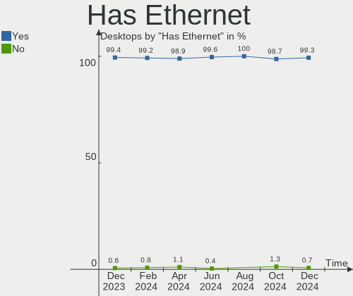
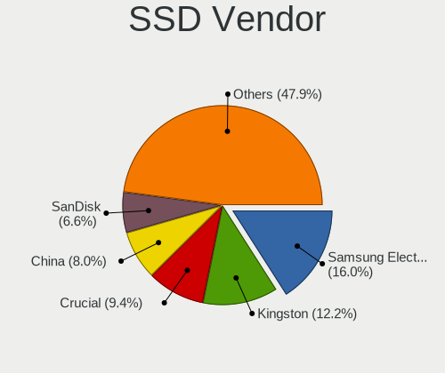
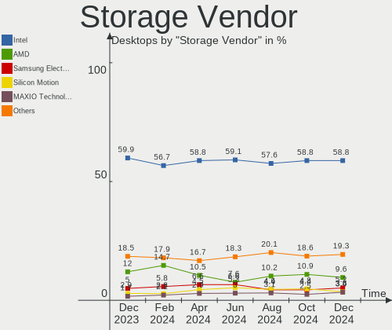

BSD Hardware Trends (Desktops)
------------------------------

A project to identify most popular hardware characteristics and track their change
over time based on data collected by BSD users at https://BSD-Hardware.info.

Anyone can contribute to this report by the [hw-probe](https://github.com/linuxhw/hw-probe/blob/master/INSTALL.BSD.md) tool:

    hw-probe -all -upload

Full-feature report is available here: https://bsd-hardware.info/?view=trends&formfactor=desktop

Period: Sep, 2021.

Contents
--------

* [ System ](#system)
  - [ OS                       ](#os)
  - [ OS Family                ](#os-family)
  - [ Arch                     ](#arch)
  - [ DE                       ](#de)
  - [ Display Server           ](#display-server)
  - [ Display Manager          ](#display-manager)
  - [ OS Lang                  ](#os-lang)
  - [ Boot Mode                ](#boot-mode)
  - [ Filesystem               ](#filesystem)
  - [ Part. scheme             ](#part-scheme)

* [ Board ](#board)
  - [ Vendor                   ](#vendor)
  - [ Model                    ](#model)
  - [ Model Family             ](#model-family)
  - [ MFG Year                 ](#mfg-year)
  - [ Form Factor              ](#form-factor)
  - [ Coreboot                 ](#coreboot)
  - [ RAM Size                 ](#ram-size)
  - [ RAM Used                 ](#ram-used)
  - [ Total Drives             ](#total-drives)
  - [ Has CD-ROM               ](#has-cd-rom)
  - [ Has Ethernet             ](#has-ethernet)
  - [ Has WiFi                 ](#has-wifi)
  - [ Has Bluetooth            ](#has-bluetooth)

* [ Location ](#location)
  - [ Country                  ](#country)
  - [ City                     ](#city)

* [ Drives ](#drives)
  - [ Drive Vendor             ](#drive-vendor)
  - [ Drive Model              ](#drive-model)
  - [ HDD Vendor               ](#hdd-vendor)
  - [ SSD Vendor               ](#ssd-vendor)
  - [ Drive Kind               ](#drive-kind)
  - [ Drive Connector          ](#drive-connector)
  - [ Drive Size               ](#drive-size)
  - [ Space Total              ](#space-total)
  - [ Space Used               ](#space-used)
  - [ Malfunc. Drives          ](#malfunc-drives)
  - [ Malfunc. Drive Vendor    ](#malfunc-drive-vendor)
  - [ Malfunc. HDD Vendor      ](#malfunc-hdd-vendor)
  - [ Malfunc. Drive Kind      ](#malfunc-drive-kind)
  - [ Failed Drives            ](#failed-drives)
  - [ Failed Drive Vendor      ](#failed-drive-vendor)
  - [ Drive Status             ](#drive-status)

* [ Storage controller ](#storage-controller)
  - [ Storage Vendor           ](#storage-vendor)
  - [ Storage Model            ](#storage-model)
  - [ Storage Kind             ](#storage-kind)

* [ Processor ](#processor)
  - [ CPU Vendor               ](#cpu-vendor)
  - [ CPU Model                ](#cpu-model)
  - [ CPU Model Family         ](#cpu-model-family)
  - [ CPU Cores                ](#cpu-cores)
  - [ CPU Sockets              ](#cpu-sockets)
  - [ CPU Threads              ](#cpu-threads)
  - [ CPU Microarch            ](#cpu-microarch)

* [ Graphics ](#graphics)
  - [ GPU Vendor               ](#gpu-vendor)
  - [ GPU Model                ](#gpu-model)
  - [ GPU Combo                ](#gpu-combo)
  - [ GPU Driver               ](#gpu-driver)
  - [ GPU Memory               ](#gpu-memory)

* [ Monitor ](#monitor)
  - [ Monitor Vendor           ](#monitor-vendor)
  - [ Monitor Model            ](#monitor-model)
  - [ Monitor Resolution       ](#monitor-resolution)
  - [ Monitor Diagonal         ](#monitor-diagonal)
  - [ Monitor Width            ](#monitor-width)
  - [ Aspect Ratio             ](#aspect-ratio)
  - [ Monitor Area             ](#monitor-area)
  - [ Pixel Density            ](#pixel-density)
  - [ Multiple Monitors        ](#multiple-monitors)

* [ Network ](#network)
  - [ Net Controller Vendor    ](#net-controller-vendor)
  - [ Net Controller Model     ](#net-controller-model)
  - [ Wireless Vendor          ](#wireless-vendor)
  - [ Wireless Model           ](#wireless-model)
  - [ Ethernet Vendor          ](#ethernet-vendor)
  - [ Ethernet Model           ](#ethernet-model)
  - [ Net Controller Kind      ](#net-controller-kind)
  - [ Used Controller          ](#used-controller)
  - [ NICs                     ](#nics)
  - [ IPv6                     ](#ipv6)

* [ Bluetooth ](#bluetooth)
  - [ Bluetooth Vendor         ](#bluetooth-vendor)
  - [ Bluetooth Model          ](#bluetooth-model)

* [ Sound ](#sound)
  - [ Sound Vendor             ](#sound-vendor)
  - [ Sound Model              ](#sound-model)

* [ Memory ](#memory)
  - [ Memory Vendor            ](#memory-vendor)
  - [ Memory Model             ](#memory-model)
  - [ Memory Kind              ](#memory-kind)
  - [ Memory Form Factor       ](#memory-form-factor)
  - [ Memory Size              ](#memory-size)
  - [ Memory Speed             ](#memory-speed)

* [ Printers & scanners ](#printers--scanners)
  - [ Printer Vendor           ](#printer-vendor)
  - [ Printer Model            ](#printer-model)
  - [ Scanner Vendor           ](#scanner-vendor)
  - [ Scanner Model            ](#scanner-model)

* [ Camera ](#camera)
  - [ Camera Vendor            ](#camera-vendor)
  - [ Camera Model             ](#camera-model)

* [ Security ](#security)
  - [ Fingerprint Vendor       ](#fingerprint-vendor)
  - [ Fingerprint Model        ](#fingerprint-model)
  - [ Chipcard Vendor          ](#chipcard-vendor)
  - [ Chipcard Model           ](#chipcard-model)

* [ Unsupported ](#unsupported)
  - [ Unsupported Devices      ](#unsupported-devices)
  - [ Unsupported Device Types ](#unsupported-device-types)

System
------

OS
--

Installed operating systems

| Name                         | Desktops | Percent |
|------------------------------|----------|---------|
| OPNsense 21.7.2              | 66       | 30.41%  |
| OPNsense 21.7.3              | 43       | 19.82%  |
| OPNsense 21.7.1              | 28       | 12.9%   |
| helloSystem 0.5.0            | 13       | 5.99%   |
| FreeBSD 13.0-p4              | 12       | 5.53%   |
| helloSystem 0.6.0            | 9        | 4.15%   |
| OpenBSD 6.9                  | 7        | 3.23%   |
| FreeBSD 13.0                 | 7        | 3.23%   |
| FreeBSD 13.0-STABLE          | 6        | 2.76%   |
| FreeBSD 13.0-p3              | 5        | 2.3%    |
| OPNsense 21.7                | 3        | 1.38%   |
| FreeBSD 12.2-p10             | 3        | 1.38%   |
| TrueNAS 12.2-p9              | 2        | 0.92%   |
| OS108 9.2                    | 2        | 0.92%   |
| GhostBSD 21.08.27            | 2        | 0.92%   |
| FreeBSD 14.0-CURRENT         | 2        | 0.92%   |
| TrueNAS 12.2-p6              | 1        | 0.46%   |
| OPNsense 21.1.9              | 1        | 0.46%   |
| OPNsense 21.1.7              | 1        | 0.46%   |
| OpenBSD 7.0                  | 1        | 0.46%   |
| NomadBSD 5806f915            | 1        | 0.46%   |
| NetBSD 9.2                   | 1        | 0.46%   |
| HardenedBSD 13.0-STABLE-HBSD | 1        | 0.46%   |

OS Family
---------

OS without a version

| Name        | Desktops | Percent |
|-------------|----------|---------|
| OPNsense    | 142      | 65.44%  |
| FreeBSD     | 35       | 16.13%  |
| helloSystem | 22       | 10.14%  |
| OpenBSD     | 8        | 3.69%   |
| TrueNAS     | 3        | 1.38%   |
| OS108       | 2        | 0.92%   |
| GhostBSD    | 2        | 0.92%   |
| NomadBSD    | 1        | 0.46%   |
| NetBSD      | 1        | 0.46%   |
| HardenedBSD | 1        | 0.46%   |

Arch
----

OS architecture (x86_64, i586, etc.)

| Name  | Desktops | Percent |
|-------|----------|---------|
| amd64 | 211      | 97.24%  |
| arm64 | 6        | 2.76%   |

DE
--

Desktop Environment

| Name         | Desktops | Percent |
|--------------|----------|---------|
| Console      | 159      | 73.27%  |
| helloDesktop | 22       | 10.14%  |
| MATE         | 10       | 4.61%   |
| KDE5         | 6        | 2.76%   |
| fvwm         | 6        | 2.76%   |
| GNOME        | 3        | 1.38%   |
| XFCE         | 2        | 0.92%   |
| Openbox      | 2        | 0.92%   |
| Cinnamon     | 2        | 0.92%   |
| TWM          | 1        | 0.46%   |
| Lumina       | 1        | 0.46%   |
| i3           | 1        | 0.46%   |
| dwm          | 1        | 0.46%   |
| AwesomeWM    | 1        | 0.46%   |

Display Server
--------------

X11 or Wayland

| Name    | Desktops | Percent |
|---------|----------|---------|
| Console | 159      | 73.27%  |
| X11     | 58       | 26.73%  |

Display Manager
---------------

SDDM, LightDM, etc.

| Name    | Desktops | Percent |
|---------|----------|---------|
| Console | 172      | 79.26%  |
| SLiM    | 32       | 14.75%  |
| XDM     | 4        | 1.84%   |
| GDM     | 4        | 1.84%   |
| SDDM    | 3        | 1.38%   |
| LightDM | 2        | 0.92%   |

OS Lang
-------

Language

| Lang    | Desktops | Percent |
|---------|----------|---------|
| Unknown | 155      | 71.43%  |
| en_US   | 33       | 15.21%  |
| C       | 21       | 9.68%   |
| en_GB   | 2        | 0.92%   |
| de_DE   | 2        | 0.92%   |
| ru_RU   | 1        | 0.46%   |
| fr_FR   | 1        | 0.46%   |
| en_AU   | 1        | 0.46%   |
| de_CH   | 1        | 0.46%   |

Boot Mode
---------

EFI or BIOS

| Mode | Desktops | Percent |
|------|----------|---------|
| EFI  | 180      | 82.95%  |
| BIOS | 37       | 17.05%  |

Filesystem
----------

Type of filesystem

| Type | Desktops | Percent |
|------|----------|---------|
| Ufs  | 118      | 54.38%  |
| Zfs  | 91       | 41.94%  |
| Ffs  | 8        | 3.69%   |

Part. scheme
------------

Scheme of partitioning

| Type    | Desktops | Percent |
|---------|----------|---------|
| GPT     | 204      | 94.01%  |
| MBR     | 11       | 5.07%   |
| Unknown | 2        | 0.92%   |

Board
-----

Vendor
------

Motherboard manufacturer

| Name                       | Desktops | Percent |
|----------------------------|----------|---------|
| ASUSTek Computer           | 32       | 14.75%  |
| Unknown                    | 28       | 12.9%   |
| ASRock                     | 20       | 9.22%   |
| Gigabyte Technology        | 19       | 8.76%   |
| Hewlett-Packard            | 18       | 8.29%   |
| Dell                       | 17       | 7.83%   |
| Protectli                  | 10       | 4.61%   |
| MSI                        | 10       | 4.61%   |
| PC Engines                 | 9        | 4.15%   |
| Intel                      | 9        | 4.15%   |
| Fujitsu                    | 6        | 2.76%   |
| Lenovo                     | 5        | 2.3%    |
| Supermicro                 | 4        | 1.84%   |
| Foxconn                    | 3        | 1.38%   |
| Biostar                    | 3        | 1.38%   |
| Shuttle                    | 2        | 0.92%   |
| SeeedStudio                | 2        | 0.92%   |
| YANYU                      | 1        | 0.46%   |
| Yanling                    | 1        | 0.46%   |
| ShenZhen MinWin Technology | 1        | 0.46%   |
| Sapphire                   | 1        | 0.46%   |
| QTQD                       | 1        | 0.46%   |
| PCWare                     | 1        | 0.46%   |
| Packard Bell               | 1        | 0.46%   |
| NF541                      | 1        | 0.46%   |
| NEC Computers              | 1        | 0.46%   |
| Medion                     | 1        | 0.46%   |
| Lex                        | 1        | 0.46%   |
| friendlyelec               | 1        | 0.46%   |
| Essentiel B                | 1        | 0.46%   |
| ECS                        | 1        | 0.46%   |
| Deciso                     | 1        | 0.46%   |
| CNCTION-IAF-E3845          | 1        | 0.46%   |
| BESSTAR Tech               | 1        | 0.46%   |
| ASRockRack                 | 1        | 0.46%   |
| AMI                        | 1        | 0.46%   |
| Acer                       | 1        | 0.46%   |

Model
-----

Motherboard model

| Name                                | Desktops | Percent |
|-------------------------------------|----------|---------|
| Unknown                             | 30       | 13.82%  |
| PC Engines apu4                     | 5        | 2.3%    |
| PC Engines APU2                     | 4        | 1.84%   |
| Protectli FW4B                      | 3        | 1.38%   |
| Intel Q3XXG4-P V1.0                 | 3        | 1.38%   |
| HP Compaq Elite 8300 SFF            | 3        | 1.38%   |
| Fujitsu FUTRO S920                  | 3        | 1.38%   |
| Dell OptiPlex 9020                  | 3        | 1.38%   |
| ASUS All Series                     | 3        | 1.38%   |
| Protectli FW6                       | 2        | 0.92%   |
| HP t620 PLUS Quad Core TC           | 2        | 0.92%   |
| Dell Precision 3630 Tower           | 2        | 0.92%   |
| Dell OptiPlex 7010                  | 2        | 0.92%   |
| Dell OptiPlex 3020                  | 2        | 0.92%   |
| ASRock X570 Phantom Gaming 4        | 2        | 0.92%   |
| YANYU ITX-N29 VER:1.5 baytrail      | 1        | 0.46%   |
| Yanling YL-KBR6L                    | 1        | 0.46%   |
| Supermicro X8SIL                    | 1        | 0.46%   |
| Supermicro X7SPA-HF                 | 1        | 0.46%   |
| Supermicro X7SLA                    | 1        | 0.46%   |
| Supermicro SYS-5019A-FTN4           | 1        | 0.46%   |
| Shuttle XH310V2                     | 1        | 0.46%   |
| Shuttle DS10U                       | 1        | 0.46%   |
| ShenZhen MinWin 3865U-6L            | 1        | 0.46%   |
| SeeedStudio ODYSSEY-X86J4125        | 1        | 0.46%   |
| SeeedStudio ODYSSEY-X86J4105        | 1        | 0.46%   |
| Sapphire EDGE-FT1M1 E450 1AOVU044   | 1        | 0.46%   |
| QTQD Board                          | 1        | 0.46%   |
| Protectli VP2410                    | 1        | 0.46%   |
| Protectli FW6E                      | 1        | 0.46%   |
| Protectli FW6D                      | 1        | 0.46%   |
| Protectli FW2                       | 1        | 0.46%   |
| Protectli FW1                       | 1        | 0.46%   |
| PCWare PW-945GCX                    | 1        | 0.46%   |
| Packard Bell imedia S2110           | 1        | 0.46%   |
| NEC Computers SHARKBAY              | 1        | 0.46%   |
| MSI MS-7D09                         | 1        | 0.46%   |
| MSI MS-7C36                         | 1        | 0.46%   |
| MSI MS-7C02                         | 1        | 0.46%   |
| MSI MS-7B31                         | 1        | 0.46%   |
| MSI MS-7B22                         | 1        | 0.46%   |
| MSI MS-7A34                         | 1        | 0.46%   |
| MSI MS-7891                         | 1        | 0.46%   |
| MSI MS-7846                         | 1        | 0.46%   |
| MSI MS-7817                         | 1        | 0.46%   |
| MSI MS-7677                         | 1        | 0.46%   |
| Medion H61H2-LM3                    | 1        | 0.46%   |
| Lex Pineview-D                      | 1        | 0.46%   |
| Lenovo ThinkCentre M91p 7033HS8     | 1        | 0.46%   |
| Lenovo ThinkCentre M91p 7033D54     | 1        | 0.46%   |
| Lenovo ThinkCentre M83 10AHS0EW00   | 1        | 0.46%   |
| Lenovo ThinkCentre M78 10BU0008US   | 1        | 0.46%   |
| Lenovo ThinkCentre M720s 10SUS4WT00 | 1        | 0.46%   |
| Intel SHARKBAY                      | 1        | 0.46%   |
| Intel PL-20-00                      | 1        | 0.46%   |
| Intel DH67BL AAG10189-211           | 1        | 0.46%   |
| Intel D2500CC AAG81477-401          | 1        | 0.46%   |
| Intel CRESCENTBAY                   | 1        | 0.46%   |
| Intel CARLOW                        | 1        | 0.46%   |
| HP Zako                             | 1        | 0.46%   |

Model Family
------------

Motherboard model prefix

| Name                         | Desktops | Percent |
|------------------------------|----------|---------|
| Unknown                      | 30       | 13.82%  |
| Dell OptiPlex                | 13       | 5.99%   |
| ASUS PRIME                   | 6        | 2.76%   |
| PC Engines apu4              | 5        | 2.3%    |
| Lenovo ThinkCentre           | 5        | 2.3%    |
| HP Compaq                    | 5        | 2.3%    |
| Fujitsu FUTRO                | 5        | 2.3%    |
| PC Engines APU2              | 4        | 1.84%   |
| ASUS ROG                     | 4        | 1.84%   |
| Protectli FW4B               | 3        | 1.38%   |
| Intel Q3XXG4-P               | 3        | 1.38%   |
| ASUS M5A78L-M                | 3        | 1.38%   |
| ASUS All                     | 3        | 1.38%   |
| ASRock X570                  | 3        | 1.38%   |
| Protectli FW6                | 2        | 0.92%   |
| HP t620                      | 2        | 0.92%   |
| HP ProDesk                   | 2        | 0.92%   |
| HP EliteDesk                 | 2        | 0.92%   |
| Dell Precision               | 2        | 0.92%   |
| ASUS P8H61-M                 | 2        | 0.92%   |
| YANYU ITX-N29                | 1        | 0.46%   |
| Yanling YL-KBR6L             | 1        | 0.46%   |
| Supermicro X8SIL             | 1        | 0.46%   |
| Supermicro X7SPA-HF          | 1        | 0.46%   |
| Supermicro X7SLA             | 1        | 0.46%   |
| Supermicro SYS-5019A-FTN4    | 1        | 0.46%   |
| Shuttle XH310V2              | 1        | 0.46%   |
| Shuttle DS10U                | 1        | 0.46%   |
| ShenZhen MinWin 3865U-6L     | 1        | 0.46%   |
| SeeedStudio ODYSSEY-X86J4125 | 1        | 0.46%   |
| SeeedStudio ODYSSEY-X86J4105 | 1        | 0.46%   |
| Sapphire EDGE-FT1M1          | 1        | 0.46%   |
| QTQD Board                   | 1        | 0.46%   |
| Protectli VP2410             | 1        | 0.46%   |
| Protectli FW6E               | 1        | 0.46%   |
| Protectli FW6D               | 1        | 0.46%   |
| Protectli FW2                | 1        | 0.46%   |
| Protectli FW1                | 1        | 0.46%   |
| PCWare PW-945GCX             | 1        | 0.46%   |
| Packard Bell imedia          | 1        | 0.46%   |
| NEC Computers SHARKBAY       | 1        | 0.46%   |
| MSI MS-7D09                  | 1        | 0.46%   |
| MSI MS-7C36                  | 1        | 0.46%   |
| MSI MS-7C02                  | 1        | 0.46%   |
| MSI MS-7B31                  | 1        | 0.46%   |
| MSI MS-7B22                  | 1        | 0.46%   |
| MSI MS-7A34                  | 1        | 0.46%   |
| MSI MS-7891                  | 1        | 0.46%   |
| MSI MS-7846                  | 1        | 0.46%   |
| MSI MS-7817                  | 1        | 0.46%   |
| MSI MS-7677                  | 1        | 0.46%   |
| Medion H61H2-LM3             | 1        | 0.46%   |
| Lex Pineview-D               | 1        | 0.46%   |
| Intel SHARKBAY               | 1        | 0.46%   |
| Intel PL-20-00               | 1        | 0.46%   |
| Intel DH67BL                 | 1        | 0.46%   |
| Intel D2500CC                | 1        | 0.46%   |
| Intel CRESCENTBAY            | 1        | 0.46%   |
| Intel CARLOW                 | 1        | 0.46%   |
| HP Zako                      | 1        | 0.46%   |

MFG Year
--------

Motherboard manufacture year

| Year    | Desktops | Percent |
|---------|----------|---------|
| 2021    | 36       | 16.59%  |
| 2020    | 32       | 14.75%  |
| 2019    | 29       | 13.36%  |
| 2018    | 22       | 10.14%  |
| 2014    | 20       | 9.22%   |
| 2017    | 12       | 5.53%   |
| 2016    | 12       | 5.53%   |
| 2011    | 11       | 5.07%   |
| 2013    | 10       | 4.61%   |
| 2015    | 8        | 3.69%   |
| 2012    | 7        | 3.23%   |
| 2010    | 6        | 2.76%   |
| Unknown | 6        | 2.76%   |
| 2009    | 4        | 1.84%   |
| 2008    | 2        | 0.92%   |

Form Factor
-----------

Physical design of the computer

| Name    | Desktops | Percent |
|---------|----------|---------|
| Desktop | 217      | 100%    |

Coreboot
--------

Have coreboot on board

| Used | Desktops | Percent |
|------|----------|---------|
| No   | 202      | 93.09%  |
| Yes  | 15       | 6.91%   |

RAM Size
--------

Total RAM memory

| Size in GB  | Desktops | Percent |
|-------------|----------|---------|
| 8.01-16.0   | 75       | 34.56%  |
| 4.01-8.0    | 49       | 22.58%  |
| 16.01-24.0  | 49       | 22.58%  |
| 32.01-64.0  | 18       | 8.29%   |
| 64.01-256.0 | 9        | 4.15%   |
| 2.01-3.0    | 6        | 2.76%   |
| 3.01-4.0    | 4        | 1.84%   |
| 24.01-32.0  | 4        | 1.84%   |
| 1.01-2.0    | 3        | 1.38%   |

RAM Used
--------

Used RAM memory

| Used GB    | Desktops | Percent |
|------------|----------|---------|
| 0.01-0.5   | 105      | 48.39%  |
| 0.51-1.0   | 60       | 27.65%  |
| 1.01-2.0   | 29       | 13.36%  |
| 2.01-3.0   | 7        | 3.23%   |
| 3.01-4.0   | 6        | 2.76%   |
| Unknown    | 4        | 1.84%   |
| 4.01-8.0   | 3        | 1.38%   |
| 16.01-24.0 | 2        | 0.92%   |
| 24.01-32.0 | 1        | 0.46%   |

Total Drives
------------

Number of drives on board

| Drives | Desktops | Percent |
|--------|----------|---------|
| 1      | 145      | 66.82%  |
| 2      | 26       | 11.98%  |
| 0      | 13       | 5.99%   |
| 3      | 10       | 4.61%   |
| 5      | 8        | 3.69%   |
| 6      | 6        | 2.76%   |
| 4      | 6        | 2.76%   |
| 17     | 1        | 0.46%   |
| 13     | 1        | 0.46%   |
| 10     | 1        | 0.46%   |

Has CD-ROM
----------

Has CD-ROM on board

| Presented | Desktops | Percent |
|-----------|----------|---------|
| No        | 171      | 78.8%   |
| Yes       | 46       | 21.2%   |

Has Ethernet
------------

Has Ethernet on board

| Presented | Desktops | Percent |
|-----------|----------|---------|
| Yes       | 214      | 98.62%  |
| No        | 3        | 1.38%   |

Has WiFi
--------

Has WiFi module

| Presented | Desktops | Percent |
|-----------|----------|---------|
| No        | 170      | 78.34%  |
| Yes       | 47       | 21.66%  |

Has Bluetooth
-------------

Has Bluetooth module

| Presented | Desktops | Percent |
|-----------|----------|---------|
| No        | 192      | 88.48%  |
| Yes       | 25       | 11.52%  |

Location
--------

Country
-------

Geographic location (country)

| Country      | Desktops | Percent |
|--------------|----------|---------|
| USA          | 73       | 33.64%  |
| Germany      | 37       | 17.05%  |
| Canada       | 9        | 4.15%   |
| UK           | 8        | 3.69%   |
| Netherlands  | 8        | 3.69%   |
| Australia    | 8        | 3.69%   |
| Russia       | 6        | 2.76%   |
| France       | 6        | 2.76%   |
| Switzerland  | 5        | 2.3%    |
| Poland       | 5        | 2.3%    |
| South Africa | 4        | 1.84%   |
| Brazil       | 4        | 1.84%   |
| Spain        | 3        | 1.38%   |
| Japan        | 3        | 1.38%   |
| Israel       | 3        | 1.38%   |
| China        | 3        | 1.38%   |
| Austria      | 3        | 1.38%   |
| Slovakia     | 2        | 0.92%   |
| Singapore    | 2        | 0.92%   |
| Romania      | 2        | 0.92%   |
| New Zealand  | 2        | 0.92%   |
| Italy        | 2        | 0.92%   |
| India        | 2        | 0.92%   |
| Denmark      | 2        | 0.92%   |
| Thailand     | 1        | 0.46%   |
| Sweden       | 1        | 0.46%   |
| Saudi Arabia | 1        | 0.46%   |
| Philippines  | 1        | 0.46%   |
| Peru         | 1        | 0.46%   |
| Paraguay     | 1        | 0.46%   |
| Norway       | 1        | 0.46%   |
| Nigeria      | 1        | 0.46%   |
| Latvia       | 1        | 0.46%   |
| Indonesia    | 1        | 0.46%   |
| Hungary      | 1        | 0.46%   |
| Eswatini     | 1        | 0.46%   |
| Ecuador      | 1        | 0.46%   |
| Czechia      | 1        | 0.46%   |
| Argentina    | 1        | 0.46%   |

City
----

Geographic location (city)

| City                        | Desktops | Percent |
|-----------------------------|----------|---------|
| Denver                      | 4        | 1.84%   |
| Moscow                      | 3        | 1.38%   |
| London                      | 3        | 1.38%   |
| Zurich                      | 2        | 0.92%   |
| Yokohama                    | 2        | 0.92%   |
| Tulsa                       | 2        | 0.92%   |
| Springfield                 | 2        | 0.92%   |
| Singapore                   | 2        | 0.92%   |
| Seattle                     | 2        | 0.92%   |
| Salem                       | 2        | 0.92%   |
| Oensingen                   | 2        | 0.92%   |
| Munich                      | 2        | 0.92%   |
| Marlborough                 | 2        | 0.92%   |
| Lake Forest                 | 2        | 0.92%   |
| Koblenz                     | 2        | 0.92%   |
| Kirkland                    | 2        | 0.92%   |
| Johannesburg                | 2        | 0.92%   |
| Hamburg                     | 2        | 0.92%   |
| Groningen                   | 2        | 0.92%   |
| Gdansk                      | 2        | 0.92%   |
| Fairfax                     | 2        | 0.92%   |
| Dortmund                    | 2        | 0.92%   |
| Brisbane                    | 2        | 0.92%   |
| Bielefeld                   | 2        | 0.92%   |
| Barrington                  | 2        | 0.92%   |
| Zaltbommel                  | 1        | 0.46%   |
| Yverdon-les-Bains           | 1        | 0.46%   |
| Yarang                      | 1        | 0.46%   |
| Wylie                       | 1        | 0.46%   |
| Wittersham                  | 1        | 0.46%   |
| West Kelowna                | 1        | 0.46%   |
| Wenatchee                   | 1        | 0.46%   |
| Violet                      | 1        | 0.46%   |
| Vienna                      | 1        | 0.46%   |
| Victoria                    | 1        | 0.46%   |
| Vechta                      | 1        | 0.46%   |
| V?¤ster??s                  | 1        | 0.46%   |
| Vauclerc                    | 1        | 0.46%   |
| Valkenswaard                | 1        | 0.46%   |
| Upeslejas                   | 1        | 0.46%   |
| Trujillo                    | 1        | 0.46%   |
| Todtnau                     | 1        | 0.46%   |
| The Hague                   | 1        | 0.46%   |
| Tempe                       | 1        | 0.46%   |
| Tel Aviv                    | 1        | 0.46%   |
| Tampa                       | 1        | 0.46%   |
| Sydney                      | 1        | 0.46%   |
| Swansea                     | 1        | 0.46%   |
| Suleja                      | 1        | 0.46%   |
| Stuttgart                   | 1        | 0.46%   |
| Statesboro                  | 1        | 0.46%   |
| St. Catharines              | 1        | 0.46%   |
| Spring                      | 1        | 0.46%   |
| Spokane                     | 1        | 0.46%   |
| Singen                      | 1        | 0.46%   |
| Shell Cove                  | 1        | 0.46%   |
| Shanghai                    | 1        | 0.46%   |
| Sassenburg                  | 1        | 0.46%   |
| Sankt Veit an der Glan      | 1        | 0.46%   |
| San Sebasti??n de los Reyes | 1        | 0.46%   |

Drives
------

Drive Vendor
------------

Hard drive vendors

| Vendor              | Desktops | Drives | Percent |
|---------------------|----------|--------|---------|
| WDC                 | 41       | 80     | 14.44%  |
| Samsung Electronics | 40       | 49     | 14.08%  |
| Seagate             | 38       | 47     | 13.38%  |
| Kingston            | 18       | 18     | 6.34%   |
| Transcend           | 15       | 16     | 5.28%   |
| Crucial             | 15       | 22     | 5.28%   |
| Sandisk             | 13       | 13     | 4.58%   |
| Toshiba             | 11       | 14     | 3.87%   |
| Intel               | 11       | 13     | 3.87%   |
| Micron Technology   | 6        | 7      | 2.11%   |
| Hitachi             | 6        | 8      | 2.11%   |
| SK Hynix            | 5        | 5      | 1.76%   |
| Phison              | 5        | 5      | 1.76%   |
| A-DATA Technology   | 5        | 6      | 1.76%   |
| China               | 4        | 4      | 1.41%   |
| Protectli           | 3        | 3      | 1.06%   |
| PNY                 | 3        | 3      | 1.06%   |
| Hoodisk             | 3        | 3      | 1.06%   |
| Corsair             | 3        | 3      | 1.06%   |
| SPCC                | 2        | 2      | 0.7%    |
| PLEXTOR             | 2        | 2      | 0.7%    |
| OCZ                 | 2        | 2      | 0.7%    |
| NVMe                | 2        | 2      | 0.7%    |
| LITEONIT            | 2        | 2      | 0.7%    |
| Intenso             | 2        | 2      | 0.7%    |
| Hewlett-Packard     | 2        | 2      | 0.7%    |
| XPG                 | 1        | 1      | 0.35%   |
| VMware              | 1        | 1      | 0.35%   |
| Vaseky              | 1        | 1      | 0.35%   |
| Pioneer             | 1        | 1      | 0.35%   |
| Patriot             | 1        | 1      | 0.35%   |
| OPENBSD             | 1        | 1      | 0.35%   |
| Netac               | 1        | 1      | 0.35%   |
| MEMXPRO             | 1        | 1      | 0.35%   |
| MAXTOR              | 1        | 1      | 0.35%   |
| LITEON              | 1        | 1      | 0.35%   |
| Kston               | 1        | 1      | 0.35%   |
| KingSpec            | 1        | 1      | 0.35%   |
| KingDian            | 1        | 1      | 0.35%   |
| Integral            | 1        | 1      | 0.35%   |
| Indilinx            | 1        | 1      | 0.35%   |
| HPT                 | 1        | 16     | 0.35%   |
| HGST                | 1        | 1      | 0.35%   |
| GOODRAM             | 1        | 1      | 0.35%   |
| Gigabyte Technology | 1        | 1      | 0.35%   |
| Fordisk             | 1        | 1      | 0.35%   |
| Dogfish             | 1        | 1      | 0.35%   |
| BIWIN               | 1        | 1      | 0.35%   |
| Apple               | 1        | 1      | 0.35%   |
| Advantech           | 1        | 1      | 0.35%   |
| Adaptec             | 1        | 1      | 0.35%   |

Drive Model
-----------

Hard drive models

| Model                           | Desktops | Percent |
|---------------------------------|----------|---------|
| Seagate ST500DM002-1BD142 500GB | 6        | 1.81%   |
| Crucial CT250MX500SSD1 250GB    | 5        | 1.51%   |
| Transcend TS128GMSA230S 128GB   | 4        | 1.2%    |
| Kingston SUV500MS120G 120GB     | 4        | 1.2%    |
| Kingston SA400S37240G 240GB     | 4        | 1.2%    |
| Kingston SA400S37120G 120GB     | 4        | 1.2%    |
| WDC WD10EZEX-08WN4A0 1TB        | 3        | 0.9%    |
| Transcend TS64GSSD25S-M 64GB    | 3        | 0.9%    |
| Seagate ST4000DM000-1F2168 4TB  | 3        | 0.9%    |
| Seagate ST1000DM010-2EP102 1TB  | 3        | 0.9%    |
| Samsung SSD 860 EVO 1TB         | 3        | 0.9%    |
| Samsung SSD 850 EVO mSATA 250GB | 3        | 0.9%    |
| Samsung SSD 850 EVO 250GB       | 3        | 0.9%    |
| Phison SATA SSD 16GB            | 3        | 0.9%    |
| WDC WDS500G2B0A-00SM50 500GB    | 2        | 0.6%    |
| Toshiba MQ01ABF050 500GB        | 2        | 0.6%    |
| Toshiba DT01ACA200 2TB          | 2        | 0.6%    |
| Toshiba DT01ACA100 1TB          | 2        | 0.6%    |
| Seagate ST4000DM004-2CV104 4TB  | 2        | 0.6%    |
| Seagate ST380815AS 80GB         | 2        | 0.6%    |
| Seagate ST3000DM001-1ER166 3TB  | 2        | 0.6%    |
| Seagate ST250DM000-1BD141 250GB | 2        | 0.6%    |
| Seagate ST1000DM003-1ER162 1TB  | 2        | 0.6%    |
| SanDisk SDSA6MM-016G-1006 16GB  | 2        | 0.6%    |
| Samsung SSD 970 EVO Plus 500GB  | 2        | 0.6%    |
| Samsung SSD 970 EVO 500GB       | 2        | 0.6%    |
| Samsung SSD 860 QVO 1TB         | 2        | 0.6%    |
| Samsung SSD 860 EVO 500GB       | 2        | 0.6%    |
| Samsung SSD 850 EVO 120GB       | 2        | 0.6%    |
| Protectli 120GB mSATA           | 2        | 0.6%    |
| Phison SATA SSD 32GB            | 2        | 0.6%    |
| NVMe Samsung SSD 970 250GB      | 2        | 0.6%    |
| Intenso SSD 120GB               | 2        | 0.6%    |
| Intel SSDSC2KB240G8 240GB       | 2        | 0.6%    |
| Hoodisk SSD 128GB               | 2        | 0.6%    |
| China SATA SSD 120GB            | 2        | 0.6%    |
| A-DATA SX8200PNP 256GB          | 2        | 0.6%    |
| XPG GAMMIX S11 Pro 512GB        | 1        | 0.3%    |
| WDC WDS500G1R0A-68A4W0 500GB    | 1        | 0.3%    |
| WDC WDS250G2X0C-00L350 250GB    | 1        | 0.3%    |
| WDC WDS250G2B0A 250GB           | 1        | 0.3%    |
| WDC WDS240G2G0B-00EPW0 240GB    | 1        | 0.3%    |
| WDC WDS120G2G0A-00JH30 120GB    | 1        | 0.3%    |
| WDC WDS100T2B0C-00PXH0 1TB      | 1        | 0.3%    |
| WDC WDS100T1X0E-00AFY0 1TB      | 1        | 0.3%    |
| WDC WD80EMAZ-00WJTA0 8TB        | 1        | 0.3%    |
| WDC WD80EFZX-68UW8N0 8TB        | 1        | 0.3%    |
| WDC WD80EFAX-68LHPN0 8TB        | 1        | 0.3%    |
| WDC WD80EDBZ-11B0ZA0 8TB        | 1        | 0.3%    |
| WDC WD60EZRZ-00GZ5B1 6TB        | 1        | 0.3%    |
| WDC WD6003FZBX-00K5WB0 6TB      | 1        | 0.3%    |
| WDC WD5003ABYZ-011FA0 500GB     | 1        | 0.3%    |
| WDC WD5000LPVT-80G33T2 500GB    | 1        | 0.3%    |
| WDC WD5000BPVT-08HXZT3 500GB    | 1        | 0.3%    |
| WDC WD5000ABYS-01TNA0 500GB     | 1        | 0.3%    |
| WDC WD5000AAKX-22ERMA0 500GB    | 1        | 0.3%    |
| WDC WD5000AAKX-083CA1 500GB     | 1        | 0.3%    |
| WDC WD5000AAKX-00U6AA0 500GB    | 1        | 0.3%    |
| WDC WD40EZRZ-22GXCB0 4TB        | 1        | 0.3%    |
| WDC WD40EFRX-68N32N0 4TB        | 1        | 0.3%    |

HDD Vendor
----------

Hard disk drive vendors

| Vendor              | Desktops | Drives | Percent |
|---------------------|----------|--------|---------|
| Seagate             | 38       | 47     | 38.78%  |
| WDC                 | 34       | 71     | 34.69%  |
| Toshiba             | 9        | 12     | 9.18%   |
| Hitachi             | 6        | 8      | 6.12%   |
| Samsung Electronics | 5        | 9      | 5.1%    |
| OPENBSD             | 1        | 1      | 1.02%   |
| MAXTOR              | 1        | 1      | 1.02%   |
| HPT                 | 1        | 16     | 1.02%   |
| HGST                | 1        | 1      | 1.02%   |
| Hewlett-Packard     | 1        | 1      | 1.02%   |
| Adaptec             | 1        | 1      | 1.02%   |

SSD Vendor
----------

Solid state drive vendors

| Vendor              | Desktops | Drives | Percent |
|---------------------|----------|--------|---------|
| Samsung Electronics | 29       | 31     | 18.01%  |
| Kingston            | 18       | 18     | 11.18%  |
| Transcend           | 15       | 16     | 9.32%   |
| Crucial             | 13       | 20     | 8.07%   |
| SanDisk             | 12       | 12     | 7.45%   |
| Intel               | 10       | 12     | 6.21%   |
| WDC                 | 6        | 6      | 3.73%   |
| Phison              | 5        | 5      | 3.11%   |
| Micron Technology   | 4        | 4      | 2.48%   |
| China               | 4        | 4      | 2.48%   |
| SK Hynix            | 3        | 3      | 1.86%   |
| Protectli           | 3        | 3      | 1.86%   |
| Hoodisk             | 3        | 3      | 1.86%   |
| A-DATA Technology   | 3        | 3      | 1.86%   |
| PNY                 | 2        | 2      | 1.24%   |
| PLEXTOR             | 2        | 2      | 1.24%   |
| OCZ                 | 2        | 2      | 1.24%   |
| NVMe                | 2        | 2      | 1.24%   |
| LITEONIT            | 2        | 2      | 1.24%   |
| Intenso             | 2        | 2      | 1.24%   |
| Corsair             | 2        | 2      | 1.24%   |
| VMware              | 1        | 1      | 0.62%   |
| Vaseky              | 1        | 1      | 0.62%   |
| SPCC                | 1        | 1      | 0.62%   |
| Pioneer             | 1        | 1      | 0.62%   |
| Patriot             | 1        | 1      | 0.62%   |
| Netac               | 1        | 1      | 0.62%   |
| MEMXPRO             | 1        | 1      | 0.62%   |
| LITEON              | 1        | 1      | 0.62%   |
| Kston               | 1        | 1      | 0.62%   |
| KingSpec            | 1        | 1      | 0.62%   |
| KingDian            | 1        | 1      | 0.62%   |
| Integral            | 1        | 1      | 0.62%   |
| Indilinx            | 1        | 1      | 0.62%   |
| GOODRAM             | 1        | 1      | 0.62%   |
| Fordisk             | 1        | 1      | 0.62%   |
| Dogfish             | 1        | 1      | 0.62%   |
| BIWIN               | 1        | 1      | 0.62%   |
| Apple               | 1        | 1      | 0.62%   |
| Advantech           | 1        | 1      | 0.62%   |

Drive Kind
----------

HDD or SSD

| Kind | Desktops | Drives | Percent |
|------|----------|--------|---------|
| SSD  | 144      | 173    | 57.37%  |
| HDD  | 79       | 168    | 31.47%  |
| NVMe | 28       | 32     | 11.16%  |

Drive Connector
---------------

SATA, SAS, NVMe, etc.

| Type | Desktops | Drives | Percent |
|------|----------|--------|---------|
| SATA | 191      | 341    | 87.21%  |
| NVMe | 28       | 32     | 12.79%  |

Drive Size
----------

Size of hard drive

| Size in TB | Desktops | Drives | Percent |
|------------|----------|--------|---------|
| 0.01-0.5   | 166      | 209    | 70.94%  |
| 0.51-1.0   | 35       | 60     | 14.96%  |
| 1.01-2.0   | 12       | 19     | 5.13%   |
| 3.01-4.0   | 10       | 17     | 4.27%   |
| 2.01-3.0   | 5        | 13     | 2.14%   |
| 4.01-10.0  | 4        | 18     | 1.71%   |
| 10.01-20.0 | 2        | 5      | 0.85%   |

Space Total
-----------

Amount of disk space available on the file system

| Size in GB     | Desktops | Percent |
|----------------|----------|---------|
| 101-250        | 85       | 39.17%  |
| 251-500        | 32       | 14.75%  |
| 1-20           | 29       | 13.36%  |
| 51-100         | 24       | 11.06%  |
| 21-50          | 18       | 8.29%   |
| 501-1000       | 17       | 7.83%   |
| 1001-2000      | 8        | 3.69%   |
| More than 3000 | 2        | 0.92%   |
| 2001-3000      | 2        | 0.92%   |

Space Used
----------

Amount of used disk space

| Used GB   | Desktops | Percent |
|-----------|----------|---------|
| 1-20      | 193      | 88.94%  |
| 21-50     | 16       | 7.37%   |
| 51-100    | 3        | 1.38%   |
| 101-250   | 2        | 0.92%   |
| 251-500   | 1        | 0.46%   |
| 2001-3000 | 1        | 0.46%   |
| 1001-2000 | 1        | 0.46%   |

Malfunc. Drives
---------------

Drive models with a malfunction

| Model                               | Desktops | Drives | Percent |
|-------------------------------------|----------|--------|---------|
| Seagate ST500DM002-1BD142 500GB     | 3        | 3      | 6.98%   |
| WDC WD5000AAKX-00U6AA0 500GB        | 1        | 1      | 2.33%   |
| WDC WD3200AAJS-56M0A0 320GB         | 1        | 1      | 2.33%   |
| WDC WD1600AAJS-60WAA0 160GB         | 1        | 1      | 2.33%   |
| WDC WD10PURX-64E5EY0 1TB            | 1        | 1      | 2.33%   |
| WDC WD10EZEX-08WN4A0 1TB            | 1        | 1      | 2.33%   |
| WDC WD10EZEX-00RKKA0 1TB            | 1        | 1      | 2.33%   |
| WDC WD10EAVS-00D7B0 1TB             | 1        | 1      | 2.33%   |
| Toshiba DT01ACA200 2TB              | 1        | 1      | 2.33%   |
| SK Hynix HFS128G39TND-N210A 128GB   | 1        | 1      | 2.33%   |
| Seagate ST9160827AS 160GB           | 1        | 1      | 2.33%   |
| Seagate ST500VT000-1DK142 500GB     | 1        | 1      | 2.33%   |
| Seagate ST380815AS 80GB             | 1        | 1      | 2.33%   |
| Seagate ST3500418AS 500GB           | 1        | 1      | 2.33%   |
| Seagate ST3500413AS 500GB           | 1        | 1      | 2.33%   |
| Seagate ST32000542AS 2TB            | 1        | 1      | 2.33%   |
| Seagate ST31000528AS 1TB            | 1        | 1      | 2.33%   |
| Seagate ST3000DM001-1ER166 3TB      | 1        | 1      | 2.33%   |
| Seagate ST250DM000-1BD141 250GB     | 1        | 1      | 2.33%   |
| Seagate ST2000DM001-9YN164 2TB      | 1        | 1      | 2.33%   |
| Seagate ST1000DM003-1CH162 1TB      | 1        | 1      | 2.33%   |
| Seagate ST1000DL002-9TT153 1TB      | 1        | 1      | 2.33%   |
| SanDisk SSD PLUS 480GB              | 1        | 1      | 2.33%   |
| SanDisk SDSSDA240G 240GB            | 1        | 1      | 2.33%   |
| Samsung Electronics SSD 870 EVO 1TB | 1        | 1      | 2.33%   |
| Samsung Electronics HD501LJ 500GB   | 1        | 1      | 2.33%   |
| Samsung Electronics HD322GJ 320GB   | 1        | 1      | 2.33%   |
| Samsung Electronics HD256GJ 250GB   | 1        | 1      | 2.33%   |
| Samsung Electronics HD103UJ 1TB     | 1        | 1      | 2.33%   |
| Kingston SMS200S3120G 120GB         | 1        | 1      | 2.33%   |
| Intel SSDSC2CW060A3 64GB            | 1        | 1      | 2.33%   |
| Intel SSDSC2BF240A5 240GB           | 1        | 1      | 2.33%   |
| Intel SSDSA2M120G2GC 120GB          | 1        | 1      | 2.33%   |
| Hitachi HDT721010SLA360 1TB         | 1        | 1      | 2.33%   |
| HGST HTS541010A9E680 1TB            | 1        | 1      | 2.33%   |
| Hewlett-Packard MB1000GCWCV 1TB     | 1        | 1      | 2.33%   |
| Dogfish SSD 128GB                   | 1        | 1      | 2.33%   |
| Crucial CT525MX300SSD1 528GB        | 1        | 1      | 2.33%   |
| Crucial CT275MX300SSD1 275GB        | 1        | 3      | 2.33%   |
| Crucial CT128MX100SSD1 128GB        | 1        | 1      | 2.33%   |
| Crucial CT1000MX500SSD1 1TB         | 1        | 1      | 2.33%   |

Malfunc. Drive Vendor
---------------------

Vendors of faulty drives

| Vendor              | Desktops | Drives | Percent |
|---------------------|----------|--------|---------|
| Seagate             | 15       | 15     | 38.46%  |
| WDC                 | 5        | 7      | 12.82%  |
| Crucial             | 4        | 6      | 10.26%  |
| Samsung Electronics | 3        | 5      | 7.69%   |
| Intel               | 3        | 3      | 7.69%   |
| SanDisk             | 2        | 2      | 5.13%   |
| Toshiba             | 1        | 1      | 2.56%   |
| SK Hynix            | 1        | 1      | 2.56%   |
| Kingston            | 1        | 1      | 2.56%   |
| Hitachi             | 1        | 1      | 2.56%   |
| HGST                | 1        | 1      | 2.56%   |
| Hewlett-Packard     | 1        | 1      | 2.56%   |
| Dogfish             | 1        | 1      | 2.56%   |

Malfunc. HDD Vendor
-------------------

Vendors of faulty HDD drives

| Vendor              | Desktops | Drives | Percent |
|---------------------|----------|--------|---------|
| Seagate             | 15       | 15     | 57.69%  |
| WDC                 | 5        | 7      | 19.23%  |
| Samsung Electronics | 2        | 4      | 7.69%   |
| Toshiba             | 1        | 1      | 3.85%   |
| Hitachi             | 1        | 1      | 3.85%   |
| HGST                | 1        | 1      | 3.85%   |
| Hewlett-Packard     | 1        | 1      | 3.85%   |

Malfunc. Drive Kind
-------------------

Kinds of faulty drives

| Kind | Desktops | Drives | Percent |
|------|----------|--------|---------|
| HDD  | 24       | 30     | 64.86%  |
| SSD  | 13       | 15     | 35.14%  |

Failed Drives
-------------

Failed drive models

Zero info for selected period =(

Failed Drive Vendor
-------------------

Failed drive vendors

Zero info for selected period =(

Drive Status
------------

Number of failed and malfunc. drives

| Status   | Desktops | Drives | Percent |
|----------|----------|--------|---------|
| Works    | 181      | 300    | 79.74%  |
| Malfunc  | 35       | 45     | 15.42%  |
| Detected | 11       | 28     | 4.85%   |

Storage controller
------------------

Storage Vendor
--------------

Storage controller vendors

| Vendor                    | Desktops | Percent |
|---------------------------|----------|---------|
| Intel                     | 158      | 59.4%   |
| AMD                       | 53       | 19.92%  |
| Samsung Electronics       | 12       | 4.51%   |
| ASMedia Technology        | 6        | 2.26%   |
| Phison Electronics        | 5        | 1.88%   |
| Sandisk                   | 4        | 1.5%    |
| Marvell Technology Group  | 4        | 1.5%    |
| JMicron Technology        | 3        | 1.13%   |
| ADATA Technology          | 3        | 1.13%   |
| VMware                    | 2        | 0.75%   |
| Toshiba                   | 2        | 0.75%   |
| SK Hynix                  | 2        | 0.75%   |
| Micron/Crucial Technology | 2        | 0.75%   |
| Micron Technology         | 2        | 0.75%   |
| Broadcom / LSI            | 2        | 0.75%   |
| Adaptec                   | 2        | 0.75%   |
| XenSource                 | 1        | 0.38%   |
| Silicon Motion            | 1        | 0.38%   |
| Silicon Image             | 1        | 0.38%   |
| HighPoint Technologies    | 1        | 0.38%   |

Storage Model
-------------

Storage controller models

| Model                                                                            | Desktops | Percent |
|----------------------------------------------------------------------------------|----------|---------|
| AMD FCH SATA Controller [AHCI mode]                                              | 36       | 12%     |
| Intel 8 Series/C220 Series Chipset Family 6-port SATA Controller 1 [AHCI mode]   | 16       | 5.33%   |
| Intel 6 Series/C200 Series Chipset Family 6 port Desktop SATA AHCI Controller    | 16       | 5.33%   |
| Intel Atom Processor E3800 Series SATA AHCI Controller                           | 12       | 4%      |
| Intel 7 Series/C210 Series Chipset Family 6-port SATA Controller [AHCI mode]     | 11       | 3.67%   |
| Intel Sunrise Point-LP SATA Controller [AHCI mode]                               | 10       | 3.33%   |
| Intel SATA Controller [RAID mode]                                                | 10       | 3.33%   |
| Intel Cannon Lake PCH SATA AHCI Controller                                       | 10       | 3.33%   |
| AMD 400 Series Chipset SATA Controller                                           | 10       | 3.33%   |
| Intel Q170/Q150/B150/H170/H110/Z170/CM236 Chipset SATA Controller [AHCI Mode]    | 8        | 2.67%   |
| AMD SB7x0/SB8x0/SB9x0 SATA Controller [AHCI mode]                                | 7        | 2.33%   |
| Samsung NVMe SSD Controller SM981/PM981/PM983                                    | 6        | 2%      |
| Intel Celeron/Pentium Silver Processor SATA Controller                           | 6        | 2%      |
| Intel Atom/Celeron/Pentium Processor x5-E8000/J3xxx/N3xxx Series SATA Controller | 6        | 2%      |
| Intel 82801G (ICH7 Family) IDE Controller                                        | 5        | 1.67%   |
| Intel 500 Series Chipset Family SATA AHCI Controller                             | 5        | 1.67%   |
| Intel 200 Series PCH SATA controller [AHCI mode]                                 | 5        | 1.67%   |
| ASMedia ASM1062 Serial ATA Controller                                            | 5        | 1.67%   |
| AMD SB7x0/SB8x0/SB9x0 IDE Controller                                             | 5        | 1.67%   |
| Samsung NVMe SSD Controller SM961/PM961/SM963                                    | 4        | 1.33%   |
| Intel 82801JI (ICH10 Family) SATA AHCI Controller                                | 4        | 1.33%   |
| Intel 8 Series SATA Controller 1 [AHCI mode]                                     | 4        | 1.33%   |
| AMD Starship/Matisse Chipset SATA Controller [AHCI mode]                         | 4        | 1.33%   |
| Unknown                                                                          | 4        | 1.33%   |
| Phison PS5013 E13 NVMe Controller                                                | 3        | 1%      |
| Intel NM10/ICH7 Family SATA Controller [IDE mode]                                | 3        | 1%      |
| Intel NM10/ICH7 Family SATA Controller [AHCI mode]                               | 3        | 1%      |
| Intel Comet Lake SATA AHCI Controller                                            | 3        | 1%      |
| Intel 400 Series Chipset Family SATA AHCI Controller                             | 3        | 1%      |
| AMD FCH SATA Controller [IDE mode]                                               | 3        | 1%      |
| ADATA XPG SX8200 Pro PCIe Gen3x4 M.2 2280 Solid State Drive                      | 3        | 1%      |
| VMware SATA AHCI controller                                                      | 2        | 0.67%   |
| Sandisk WD Black SN850                                                           | 2        | 0.67%   |
| Intel Wildcat Point-LP SATA Controller [AHCI Mode]                               | 2        | 0.67%   |
| Intel Cannon Point-LP SATA Controller [AHCI Mode]                                | 2        | 0.67%   |
| Intel 9 Series Chipset Family SATA Controller [AHCI Mode]                        | 2        | 0.67%   |
| Intel 82801IR/IO/IH (ICH9R/DO/DH) 6 port SATA Controller [AHCI mode]             | 2        | 0.67%   |
| Intel 82801HM/HEM (ICH8M/ICH8M-E) IDE Controller                                 | 2        | 0.67%   |
| Intel 7 Series Chipset Family 6-port SATA Controller [AHCI mode]                 | 2        | 0.67%   |
| Intel 5 Series/3400 Series Chipset 6 port SATA AHCI Controller                   | 2        | 0.67%   |
| Broadcom / LSI SAS2008 PCI-Express Fusion-MPT SAS-2 [Falcon]                     | 2        | 0.67%   |
| XenSource Xen Platform Device                                                    | 1        | 0.33%   |
| VMware PVSCSI SCSI Controller                                                    | 1        | 0.33%   |
| Toshiba XG4 NVMe SSD Controller                                                  | 1        | 0.33%   |
| Toshiba unknown                                                                  | 1        | 0.33%   |
| SK Hynix PC300 NVMe Solid State Drive 256GB                                      | 1        | 0.33%   |
| SK Hynix Gold P31 SSD                                                            | 1        | 0.33%   |
| Silicon Motion SM2263EN/SM2263XT SSD Controller                                  | 1        | 0.33%   |
| Silicon Image SiI 3114 [SATALink/SATARaid] Serial ATA Controller                 | 1        | 0.33%   |
| Sandisk WD Blue SN550 NVMe SSD                                                   | 1        | 0.33%   |
| Sandisk WD Black 2018/SN750 / PC SN720 NVMe SSD                                  | 1        | 0.33%   |
| Samsung SM951 AHCI                                                               | 1        | 0.33%   |
| Samsung NVMe SSD Controller 980                                                  | 1        | 0.33%   |
| Phison E16 PCIe4 NVMe Controller                                                 | 1        | 0.33%   |
| Phison E12 NVMe Controller                                                       | 1        | 0.33%   |
| Micron/Crucial P2 NVMe PCIe SSD                                                  | 1        | 0.33%   |
| Micron/Crucial P1 NVMe PCIe SSD                                                  | 1        | 0.33%   |
| Marvell Group 88SE9215 PCIe 2.0 x1 4-port SATA 6 Gb/s Controller                 | 1        | 0.33%   |
| Marvell Group 88SE91A3 SATA-600 Controller                                       | 1        | 0.33%   |
| Marvell Group 88SE912x IDE Controller                                            | 1        | 0.33%   |

Storage Kind
------------

Kind of storage controller (IDE, SATA, NVMe, SAS, ...)

| Kind | Desktops | Percent |
|------|----------|---------|
| SATA | 192      | 71.11%  |
| NVMe | 33       | 12.22%  |
| IDE  | 23       | 8.52%   |
| RAID | 16       | 5.93%   |
| SAS  | 4        | 1.48%   |
| SCSI | 2        | 0.74%   |

Processor
---------

CPU Vendor
----------

Processor vendors

| Vendor  | Desktops | Percent |
|---------|----------|---------|
| Intel   | 157      | 72.35%  |
| AMD     | 54       | 24.88%  |
| ARM     | 3        | 1.38%   |
| Unknown | 2        | 0.92%   |
| Unknown | 1        | 0.46%   |

CPU Model
---------

Processor models

| Model                                       | Desktops | Percent |
|---------------------------------------------|----------|---------|
| Intel Core i5-3470 CPU @ 3.20GHz            | 8        | 3.69%   |
| AMD GX-412TC SOC                            | 8        | 3.69%   |
| Intel Celeron CPU J3160 @ 1.60GHz           | 5        | 2.3%    |
| Intel Celeron CPU J1900 @ 1.99GHz           | 5        | 2.3%    |
| Intel Core i5-2400 CPU @ 3.10GHz            | 4        | 1.84%   |
| Intel Celeron J4125 CPU @ 2.00GHz           | 4        | 1.84%   |
| AMD Ryzen 9 3900X 12-Core Processor         | 4        | 1.84%   |
| Intel Core i5-4570 CPU @ 3.20GHz            | 3        | 1.38%   |
| Intel Core i3-2120 CPU @ 3.30GHz            | 3        | 1.38%   |
| Intel Core i3-10100 CPU @ 3.60GHz           | 3        | 1.38%   |
| Intel Celeron CPU J1800 @ 2.41GHz           | 3        | 1.38%   |
| AMD Ryzen 7 5700G with Radeon Graphics      | 3        | 1.38%   |
| AMD GX-222GC SOC with Radeon R5E Graphics   | 3        | 1.38%   |
| Intel Pentium CPU G3220 @ 3.00GHz           | 2        | 0.92%   |
| Intel Core i7-7700 CPU @ 3.60GHz            | 2        | 0.92%   |
| Intel Core i7-7500U CPU @ 2.70GHz           | 2        | 0.92%   |
| Intel Core i7-5550U CPU @ 2.00GHz           | 2        | 0.92%   |
| Intel Core i7-4790 CPU @ 3.60GHz            | 2        | 0.92%   |
| Intel Core i7-4770 CPU @ 3.40GHz            | 2        | 0.92%   |
| Intel Core i7-4500U CPU @ 1.80GHz           | 2        | 0.92%   |
| Intel Core i5-8500 CPU @ 3.00GHz            | 2        | 0.92%   |
| Intel Core i5-8250U CPU @ 1.60GHz           | 2        | 0.92%   |
| Intel Core i5-7500 CPU @ 3.40GHz            | 2        | 0.92%   |
| Intel Core i5-7400 CPU @ 3.00GHz            | 2        | 0.92%   |
| Intel Core i5-6500 CPU @ 3.20GHz            | 2        | 0.92%   |
| Intel Core i5-2405S CPU @ 2.50GHz           | 2        | 0.92%   |
| Intel Core i3-9100F CPU @ 3.60GHz           | 2        | 0.92%   |
| Intel Core i3-8100 CPU @ 3.60GHz            | 2        | 0.92%   |
| Intel Core i3-7100U CPU @ 2.40GHz           | 2        | 0.92%   |
| Intel Core i3-6100T CPU @ 3.20GHz           | 2        | 0.92%   |
| Intel Core i3-10110U CPU @ 2.10GHz          | 2        | 0.92%   |
| Intel Celeron CPU N2930 @ 1.83GHz           | 2        | 0.92%   |
| ARM Cortex-A57 r1p3                         | 2        | 0.92%   |
| AMD Ryzen 7 2700 Eight-Core Processor       | 2        | 0.92%   |
| AMD Ryzen 7 1700 Eight-Core Processor       | 2        | 0.92%   |
| AMD GX-420CA SOC with Radeon HD Graphics    | 2        | 0.92%   |
|                                             | 2        | 0.92%   |
| Unknown Implementer Processor r0p0          | 1        | 0.46%   |
| Intel Xeon E-2236 CPU @ 3.40GHz             | 1        | 0.46%   |
| Intel Xeon CPU X5570 @ 2.93GHz              | 1        | 0.46%   |
| Intel Xeon CPU X3440 @ 2.53GHz              | 1        | 0.46%   |
| Intel Xeon CPU E5-2670 @ 2.60GHz            | 1        | 0.46%   |
| Intel Xeon CPU E5-1620 v3 @ 3.50GHz         | 1        | 0.46%   |
| Intel Xeon CPU E3-1225 v3 @ 3.20GHz         | 1        | 0.46%   |
| Intel Xeon CPU E3-1225 V2 @ 3.20GHz         | 1        | 0.46%   |
| Intel Pentium Silver J5005 CPU @ 1.50GHz    | 1        | 0.46%   |
| Intel Pentium Gold G5400 CPU @ 3.70GHz      | 1        | 0.46%   |
| Intel Pentium Dual-Core CPU E5400 @ 2.70GHz | 1        | 0.46%   |
| Intel Pentium CPU N3540 @ 2.16GHz           | 1        | 0.46%   |
| Intel Pentium CPU G3260T @ 2.90GHz          | 1        | 0.46%   |
| Intel Pentium CPU 5405U @ 2.30GHz           | 1        | 0.46%   |
| Intel Core i7-9700 CPU @ 3.00GHz            | 1        | 0.46%   |
| Intel Core i7-8700K CPU @ 3.70GHz           | 1        | 0.46%   |
| Intel Core i7-8550U CPU @ 1.80GHz           | 1        | 0.46%   |
| Intel Core i7-6700 CPU @ 3.40GHz            | 1        | 0.46%   |
| Intel Core i7-6500U CPU @ 2.50GHz           | 1        | 0.46%   |
| Intel Core i7-4790K CPU @ 4.00GHz           | 1        | 0.46%   |
| Intel Core i7-3770 CPU @ 3.40GHz            | 1        | 0.46%   |
| Intel Core i7-2600K CPU @ 3.40GHz           | 1        | 0.46%   |
| Intel Core i7-10700K CPU @ 3.80GHz          | 1        | 0.46%   |

CPU Model Family
----------------

Processor model prefix

| Model                   | Desktops | Percent |
|-------------------------|----------|---------|
| Intel Core i5           | 48       | 22.12%  |
| Intel Core i3           | 28       | 12.9%   |
| Intel Celeron           | 27       | 12.44%  |
| Intel Core i7           | 24       | 11.06%  |
| AMD GX                  | 15       | 6.91%   |
| AMD Ryzen 7             | 10       | 4.61%   |
| Intel Atom              | 8        | 3.69%   |
| Intel Xeon              | 7        | 3.23%   |
| AMD Ryzen 9             | 6        | 2.76%   |
| Other                   | 5        | 2.3%    |
| Intel Pentium           | 5        | 2.3%    |
| AMD Ryzen 5             | 4        | 1.84%   |
| Intel Core 2 Quad       | 3        | 1.38%   |
| ARM Cortex              | 3        | 1.38%   |
| AMD E1                  | 3        | 1.38%   |
| AMD FX                  | 2        | 0.92%   |
| AMD A8                  | 2        | 0.92%   |
| Intel Pentium Silver    | 1        | 0.46%   |
| Intel Pentium Gold      | 1        | 0.46%   |
| Intel Pentium Dual-Core | 1        | 0.46%   |
| Intel Core 2 Duo        | 1        | 0.46%   |
| Intel Core 2            | 1        | 0.46%   |
| Intel 686-class         | 1        | 0.46%   |
| AMD Sempron             | 1        | 0.46%   |
| AMD Ryzen Threadripper  | 1        | 0.46%   |
| AMD Ryzen 7 PRO         | 1        | 0.46%   |
| AMD Ryzen 3             | 1        | 0.46%   |
| AMD Phenom II X6        | 1        | 0.46%   |
| AMD Phenom II X4        | 1        | 0.46%   |
| AMD E                   | 1        | 0.46%   |
| AMD Athlon II X3        | 1        | 0.46%   |
| AMD Athlon              | 1        | 0.46%   |
| AMD A4                  | 1        | 0.46%   |
| AMD A10                 | 1        | 0.46%   |

CPU Cores
---------

Number of processor cores

| Number  | Desktops | Percent |
|---------|----------|---------|
| 4       | 107      | 49.31%  |
| 2       | 56       | 25.81%  |
| 8       | 11       | 5.07%   |
| Unknown | 11       | 5.07%   |
| 16      | 10       | 4.61%   |
| 6       | 10       | 4.61%   |
| 24      | 5        | 2.3%    |
| 32      | 2        | 0.92%   |
| 12      | 2        | 0.92%   |
| 1       | 2        | 0.92%   |
| 3       | 1        | 0.46%   |

CPU Sockets
-----------

Number of sockets

| Number  | Desktops | Percent |
|---------|----------|---------|
| 1       | 210      | 96.77%  |
| Unknown | 6        | 2.76%   |
| 2       | 1        | 0.46%   |

CPU Threads
-----------

Threads per core (Hyper-Threading)

| Number  | Desktops | Percent |
|---------|----------|---------|
| 1       | 141      | 64.98%  |
| 2       | 65       | 29.95%  |
| Unknown | 11       | 5.07%   |

CPU Microarch
-------------

Microarchitecture

| Name          | Desktops | Percent |
|---------------|----------|---------|
| KabyLake      | 32       | 14.75%  |
| Haswell       | 26       | 11.98%  |
| Silvermont    | 19       | 8.76%   |
| IvyBridge     | 18       | 8.29%   |
| SandyBridge   | 16       | 7.37%   |
| Puma          | 13       | 5.99%   |
| Zen 2         | 8        | 3.69%   |
| Skylake       | 8        | 3.69%   |
| CometLake     | 8        | 3.69%   |
| Unknown       | 8        | 3.69%   |
| Zen           | 6        | 2.76%   |
| Goldmont plus | 6        | 2.76%   |
| Zen+          | 5        | 2.3%    |
| Zen 3         | 5        | 2.3%    |
| Jaguar        | 5        | 2.3%    |
| Core          | 5        | 2.3%    |
| Bonnell       | 5        | 2.3%    |
| Piledriver    | 4        | 1.84%   |
| Nehalem       | 4        | 1.84%   |
| K10           | 4        | 1.84%   |
| Steamroller   | 2        | 0.92%   |
| Penryn        | 2        | 0.92%   |
| Goldmont      | 2        | 0.92%   |
| Broadwell     | 2        | 0.92%   |
| Bobcat        | 2        | 0.92%   |
| Westmere      | 1        | 0.46%   |
| IceLake       | 1        | 0.46%   |

Graphics
--------

GPU Vendor
----------

Vendors of graphics cards

| Vendor                     | Desktops | Percent |
|----------------------------|----------|---------|
| Intel                      | 132      | 63.46%  |
| AMD                        | 38       | 18.27%  |
| Nvidia                     | 29       | 13.94%  |
| ASPEED Technology          | 4        | 1.92%   |
| VMware                     | 2        | 0.96%   |
| Matrox Electronics Systems | 2        | 0.96%   |
| Cirrus Logic               | 1        | 0.48%   |

GPU Model
---------

Graphics card models

| Model                                                                                    | Desktops | Percent |
|------------------------------------------------------------------------------------------|----------|---------|
| Intel Xeon E3-1200 v3/4th Gen Core Processor Integrated Graphics Controller              | 16       | 7.62%   |
| Intel Xeon E3-1200 v2/3rd Gen Core processor Graphics Controller                         | 15       | 7.14%   |
| Intel Atom Processor Z36xxx/Z37xxx Series Graphics & Display                             | 12       | 5.71%   |
| Intel 2nd Generation Core Processor Family Integrated Graphics Controller                | 12       | 5.71%   |
| Intel CometLake-S GT2 [UHD Graphics 630]                                                 | 9        | 4.29%   |
| Intel Atom/Celeron/Pentium Processor x5-E8000/J3xxx/N3xxx Integrated Graphics Controller | 7        | 3.33%   |
| Nvidia GK208B [GeForce GT 710]                                                           | 6        | 2.86%   |
| Intel HD Graphics 630                                                                    | 5        | 2.38%   |
| Intel GeminiLake [UHD Graphics 600]                                                      | 5        | 2.38%   |
| Intel CoffeeLake-S GT2 [UHD Graphics 630]                                                | 5        | 2.38%   |
| Intel HD Graphics 620                                                                    | 4        | 1.9%    |
| Intel HD Graphics 530                                                                    | 4        | 1.9%    |
| Intel Haswell-ULT Integrated Graphics Controller                                         | 4        | 1.9%    |
| ASPEED Technology ASPEED Graphics Family                                                 | 4        | 1.9%    |
| Nvidia GP108 [GeForce GT 1030]                                                           | 3        | 1.43%   |
| Nvidia GM206 [GeForce GTX 960]                                                           | 3        | 1.43%   |
| Intel UHD Graphics 620                                                                   | 3        | 1.43%   |
| Intel Atom Processor D4xx/D5xx/N4xx/N5xx Integrated Graphics Controller                  | 3        | 1.43%   |
| Intel 4th Generation Core Processor Family Integrated Graphics Controller                | 3        | 1.43%   |
| AMD Picasso                                                                              | 3        | 1.43%   |
| AMD Mullins [Radeon R4/R5 Graphics]                                                      | 3        | 1.43%   |
| AMD Cezanne                                                                              | 3        | 1.43%   |
| Matrox Electronics Systems MGA G200eW WPCM450                                            | 2        | 0.95%   |
| Intel Skylake GT2 [HD Graphics 520]                                                      | 2        | 0.95%   |
| Intel HD Graphics 6000                                                                   | 2        | 0.95%   |
| Intel CometLake-U GT2 [UHD Graphics]                                                     | 2        | 0.95%   |
| Intel Coffee Lake UHD 610 Graphics Controller                                            | 2        | 0.95%   |
| Intel 82G33/G31 Express Integrated Graphics Controller                                   | 2        | 0.95%   |
| Intel 82945G/GZ Integrated Graphics Controller                                           | 2        | 0.95%   |
| Intel 3rd Gen Core processor Graphics Controller                                         | 2        | 0.95%   |
| AMD RS780L [Radeon 3000]                                                                 | 2        | 0.95%   |
| AMD Renoir                                                                               | 2        | 0.95%   |
| AMD Kaveri [Radeon R7 Graphics]                                                          | 2        | 0.95%   |
| AMD Kabini [Radeon HD 8400E]                                                             | 2        | 0.95%   |
| AMD Baffin [Radeon RX 550 640SP / RX 560/560X]                                           | 2        | 0.95%   |
| Unknown                                                                                  | 2        | 0.95%   |
| Nvidia GT218 [NVS 300]                                                                   | 1        | 0.48%   |
| Nvidia GT216 [GeForce GT 220]                                                            | 1        | 0.48%   |
| Nvidia GP107M [GeForce GTX 1050 Mobile]                                                  | 1        | 0.48%   |
| Nvidia GP107GL [Quadro P620]                                                             | 1        | 0.48%   |
| Nvidia GP107 [GeForce GTX 1050 Ti]                                                       | 1        | 0.48%   |
| Nvidia GP106 [GeForce GTX 1060 6GB]                                                      | 1        | 0.48%   |
| Nvidia GP106 [GeForce GTX 1060 3GB]                                                      | 1        | 0.48%   |
| Nvidia GP102 [GeForce GTX 1080 Ti]                                                       | 1        | 0.48%   |
| Nvidia GM206 [GeForce GTX 950]                                                           | 1        | 0.48%   |
| Nvidia GM204 [GeForce GTX 970]                                                           | 1        | 0.48%   |
| Nvidia GM107GL [Quadro K620]                                                             | 1        | 0.48%   |
| Nvidia GM107GL [Quadro K2200]                                                            | 1        | 0.48%   |
| Nvidia GM107 [GeForce GTX 750]                                                           | 1        | 0.48%   |
| Nvidia GM107 [GeForce GTX 750 Ti]                                                        | 1        | 0.48%   |
| Nvidia GK208B [GeForce GT 730]                                                           | 1        | 0.48%   |
| Nvidia GF119 [GeForce GT 625 OEM]                                                        | 1        | 0.48%   |
| Nvidia G98 [GeForce 8400 GS Rev. 2]                                                      | 1        | 0.48%   |
| Intel Xeon E3-1200 v3 Processor Integrated Graphics Controller                           | 1        | 0.48%   |
| Intel RocketLake-S GT1 [UHD Graphics 750]                                                | 1        | 0.48%   |
| Intel Iris Plus Graphics G1 (Ice Lake)                                                   | 1        | 0.48%   |
| Intel HD Graphics 510                                                                    | 1        | 0.48%   |
| Intel HD Graphics 500                                                                    | 1        | 0.48%   |
| Intel GeminiLake [UHD Graphics 605]                                                      | 1        | 0.48%   |
| Intel Core Processor Integrated Graphics Controller                                      | 1        | 0.48%   |

GPU Combo
---------

Combinations of graphics cards

| Name             | Desktops | Percent |
|------------------|----------|---------|
| 1 x Intel        | 123      | 56.68%  |
| 1 x AMD          | 35       | 16.13%  |
| 1 x Nvidia       | 24       | 11.06%  |
| Other            | 16       | 7.37%   |
| Intel + Nvidia   | 5        | 2.3%    |
| 1 x ASPEED       | 4        | 1.84%   |
| 2 x Intel        | 3        | 1.38%   |
| 2 x AMD          | 2        | 0.92%   |
| 1 x VMware       | 2        | 0.92%   |
| 1 x Matrox       | 1        | 0.46%   |
| Intel + AMD      | 1        | 0.46%   |
| 1 x Cirrus Logic | 1        | 0.46%   |

GPU Driver
----------

Free vs proprietary

| Driver      | Desktops | Percent |
|-------------|----------|---------|
| Free        | 179      | 82.49%  |
| Unknown     | 23       | 10.6%   |
| Proprietary | 15       | 6.91%   |

GPU Memory
----------

Total video memory

| Size in GB | Desktops | Percent |
|------------|----------|---------|
| Unknown    | 192      | 88.48%  |
| 0.51-1.0   | 9        | 4.15%   |
| 1.01-2.0   | 8        | 3.69%   |
| 3.01-4.0   | 4        | 1.84%   |
| 0.01-0.5   | 3        | 1.38%   |
| 5.01-6.0   | 1        | 0.46%   |

Monitor
-------

Monitor Vendor
--------------

Monitor vendors

| Vendor               | Desktops | Percent |
|----------------------|----------|---------|
| Samsung Electronics  | 6        | 14.29%  |
| Goldstar             | 6        | 14.29%  |
| Dell                 | 5        | 11.9%   |
| Iiyama               | 4        | 9.52%   |
| Acer                 | 4        | 9.52%   |
| Philips              | 2        | 4.76%   |
| LG Electronics       | 2        | 4.76%   |
| Hewlett-Packard      | 2        | 4.76%   |
| BenQ                 | 2        | 4.76%   |
| VIE                  | 1        | 2.38%   |
| Videoseven           | 1        | 2.38%   |
| Unknown              | 1        | 2.38%   |
| NEC Computers        | 1        | 2.38%   |
| Medion               | 1        | 2.38%   |
| Idek Iiyama          | 1        | 2.38%   |
| ASUSTek Computer     | 1        | 2.38%   |
| AOC                  | 1        | 2.38%   |
| Ancor Communications | 1        | 2.38%   |

Monitor Model
-------------

Monitor models

| Model                                                                | Desktops | Percent |
|----------------------------------------------------------------------|----------|---------|
| Iiyama PLE2407HDS IVM560D 1920x1080 520x300mm 23.6-inch              | 2        | 4.55%   |
| VIE A/G2356 VIE2300 1920x1080 500x300mm 23.0-inch                    | 1        | 2.27%   |
| Videoseven WL19A IGM1908 1280x1024 380x300mm 19.1-inch               | 1        | 2.27%   |
| Unknown LCD Monitor KJT4K2K60DP 3840x2160                            | 1        | 2.27%   |
| Samsung Electronics U28E510 SAM0D68 3840x2160 610x350mm 27.7-inch    | 1        | 2.27%   |
| Samsung Electronics SyncMaster SAM05C5 1920x1080                     | 1        | 2.27%   |
| Samsung Electronics SyncMaster SAM04D4 1920x1080 530x300mm 24.0-inch | 1        | 2.27%   |
| Samsung Electronics SA300/SA350 SAM078A 1366x768 410x230mm 18.5-inch | 1        | 2.27%   |
| Samsung Electronics S24C650 SAM09E9 1920x1080 520x290mm 23.4-inch    | 1        | 2.27%   |
| Samsung Electronics S24C650 SAM09E8 1920x1080 520x290mm 23.4-inch    | 1        | 2.27%   |
| Samsung Electronics LF32TU87 SAM706B 3840x2160 700x400mm 31.7-inch   | 1        | 2.27%   |
| Philips PHL 276E8V PHLC18F 3840x2160 600x340mm 27.2-inch             | 1        | 2.27%   |
| Philips PHL 273V7 PHLC156 1920x1080 600x340mm 27.2-inch              | 1        | 2.27%   |
| NEC Computers LCD24WMCX NEC6720 1920x1200 520x320mm 24.0-inch        | 1        | 2.27%   |
| Medion MD21281 MED3947 1366x768 410x230mm 18.5-inch                  | 1        | 2.27%   |
| LG Electronics LCD Monitor LG Ultra HD 11520x2160                    | 1        | 2.27%   |
| LG Electronics LCD Monitor LG Ultra HD                               | 1        | 2.27%   |
| LG Electronics LCD Monitor LG HDR QHD 2560x1440                      | 1        | 2.27%   |
| Iiyama PL3288UH IVM7610 3840x2160 700x390mm 31.5-inch                | 1        | 2.27%   |
| Iiyama PL2409HD IVM560C 1920x1080 520x290mm 23.4-inch                | 1        | 2.27%   |
| Idek Iiyama LCD Monitor PL2206W 1680x1050                            | 1        | 2.27%   |
| Hewlett-Packard W2371b HWP3045 1920x1080 510x290mm 23.1-inch         | 1        | 2.27%   |
| Hewlett-Packard 2211 HWP2938 1920x1080 480x270mm 21.7-inch           | 1        | 2.27%   |
| Goldstar W2246 GSM5784 1920x1080 480x270mm 21.7-inch                 | 1        | 2.27%   |
| Goldstar W2243 GSM56FE 1920x1080 480x270mm 21.7-inch                 | 1        | 2.27%   |
| Goldstar W2052 GSM4E88 1680x1050 470x300mm 22.0-inch                 | 1        | 2.27%   |
| Goldstar MP59G GSM5B34 1920x1080 480x270mm 21.7-inch                 | 1        | 2.27%   |
| Goldstar LG Ultra HD GSM5B09 3840x2160 600x340mm 27.2-inch           | 1        | 2.27%   |
| Goldstar L1753T GSM4477 1280x1024 340x270mm 17.1-inch                | 1        | 2.27%   |
| Dell U4919DW DELA107 3840x1080 1200x340mm 49.1-inch                  | 1        | 2.27%   |
| Dell U2412M DELA07A 1920x1200 520x320mm 24.0-inch                    | 1        | 2.27%   |
| Dell SE2216H DELF070 1920x1080 480x270mm 21.7-inch                   | 1        | 2.27%   |
| Dell 2408WFP DELA02B 1920x1200 520x320mm 24.0-inch                   | 1        | 2.27%   |
| Dell 1909W DELA03D 1440x900 410x260mm 19.1-inch                      | 1        | 2.27%   |
| BenQ GW2475H BNQ78EE 1920x1080 530x300mm 24.0-inch                   | 1        | 2.27%   |
| BenQ GW2270 BNQ78DB 1920x1080 480x270mm 21.7-inch                    | 1        | 2.27%   |
| ASUSTek Computer VP247 AUS24CA 1920x1080 520x290mm 23.4-inch         | 1        | 2.27%   |
| AOC 24B1W AOC2401 1920x1080 520x290mm 23.4-inch                      | 1        | 2.27%   |
| Ancor Communications ASUS VS197 ACI19F2 1366x768 410x230mm 18.5-inch | 1        | 2.27%   |
| Acer VG270U ACR06C9 2560x1440 600x340mm 27.2-inch                    | 1        | 2.27%   |
| Acer V246HQL ACR0424 1920x1080 520x290mm 23.4-inch                   | 1        | 2.27%   |
| Acer ET430K ACR0558 3840x2160 940x530mm 42.5-inch                    | 1        | 2.27%   |
| Acer B223W ACR0018 1680x1050 470x300mm 22.0-inch                     | 1        | 2.27%   |

Monitor Resolution
------------------

Monitor screen resolution

| Resolution         | Desktops | Percent |
|--------------------|----------|---------|
| 1920x1080 (FHD)    | 19       | 44.19%  |
| 3840x2160 (4K)     | 7        | 16.28%  |
| 1920x1200 (WUXGA)  | 3        | 6.98%   |
| 1680x1050 (WSXGA+) | 3        | 6.98%   |
| 1366x768 (WXGA)    | 3        | 6.98%   |
| 2560x1440 (QHD)    | 2        | 4.65%   |
| 1280x1024 (SXGA)   | 2        | 4.65%   |
| 3840x1080          | 1        | 2.33%   |
| 1440x900 (WXGA+)   | 1        | 2.33%   |
| 11520x2160         | 1        | 2.33%   |
| Unknown            | 1        | 2.33%   |

Monitor Diagonal
----------------

Diagonal size in inches

| Inches  | Desktops | Percent |
|---------|----------|---------|
| 23      | 9        | 21.43%  |
| 21      | 6        | 14.29%  |
| 27      | 5        | 11.9%   |
| 24      | 5        | 11.9%   |
| Unknown | 5        | 11.9%   |
| 18      | 3        | 7.14%   |
| 31      | 2        | 4.76%   |
| 22      | 2        | 4.76%   |
| 19      | 2        | 4.76%   |
| 49      | 1        | 2.38%   |
| 42      | 1        | 2.38%   |
| 17      | 1        | 2.38%   |

Monitor Width
-------------

Physical width

| Width in mm | Desktops | Percent |
|-------------|----------|---------|
| 501-600     | 17       | 40.48%  |
| 401-500     | 13       | 30.95%  |
| Unknown     | 5        | 11.9%   |
| 601-700     | 3        | 7.14%   |
| 351-400     | 1        | 2.38%   |
| 301-350     | 1        | 2.38%   |
| 1001-1500   | 1        | 2.38%   |
| 901-1000    | 1        | 2.38%   |

Aspect Ratio
------------

Proportional relationship between the width and the height

| Ratio   | Desktops | Percent |
|---------|----------|---------|
| 16/9    | 29       | 69.05%  |
| 16/10   | 6        | 14.29%  |
| Unknown | 4        | 9.52%   |
| 5/4     | 2        | 4.76%   |
| 32/9    | 1        | 2.38%   |

Monitor Area
------------

Area in inch²

| Area in inch² | Desktops | Percent |
|----------------|----------|---------|
| 201-250        | 19       | 46.34%  |
| 301-350        | 5        | 12.2%   |
| Unknown        | 5        | 12.2%   |
| 251-300        | 3        | 7.32%   |
| 141-150        | 3        | 7.32%   |
| 351-500        | 2        | 4.88%   |
| 151-200        | 2        | 4.88%   |
| 501-1000       | 2        | 4.88%   |

Pixel Density
-------------

Pixels per inch

| Density | Desktops | Percent |
|---------|----------|---------|
| 51-100  | 23       | 56.1%   |
| 101-120 | 8        | 19.51%  |
| Unknown | 5        | 12.2%   |
| 121-160 | 3        | 7.32%   |
| 161-240 | 2        | 4.88%   |

Multiple Monitors
-----------------

Total monitors connected

| Total | Desktops | Percent |
|-------|----------|---------|
| 0     | 175      | 80.65%  |
| 1     | 38       | 17.51%  |
| 2     | 4        | 1.84%   |

Network
-------

Net Controller Vendor
---------------------

Controller vendors

| Vendor                    | Desktops | Percent |
|---------------------------|----------|---------|
| Intel                     | 160      | 53.69%  |
| Realtek Semiconductor     | 99       | 33.22%  |
| Qualcomm Atheros          | 12       | 4.03%   |
| Broadcom                  | 8        | 2.68%   |
| IMC Networks              | 3        | 1.01%   |
| Marvell Technology Group  | 2        | 0.67%   |
| TP-Link                   | 1        | 0.34%   |
| Solarflare Communications | 1        | 0.34%   |
| Seeed Technology          | 1        | 0.34%   |
| Ralink Technology         | 1        | 0.34%   |
| Ralink                    | 1        | 0.34%   |
| QLogic                    | 1        | 0.34%   |
| ICS Advent                | 1        | 0.34%   |
| D-Link System             | 1        | 0.34%   |
| Bluegiga Technologies     | 1        | 0.34%   |
| ASUSTek Computer          | 1        | 0.34%   |
| Aquantia                  | 1        | 0.34%   |
| American Megatrends       | 1        | 0.34%   |
| Accton Technology         | 1        | 0.34%   |
| 3Com                      | 1        | 0.34%   |

Net Controller Model
--------------------

Controller models

| Model                                                                          | Desktops | Percent |
|--------------------------------------------------------------------------------|----------|---------|
| Realtek RTL8111/8168/8411 PCI Express Gigabit Ethernet Controller              | 90       | 24.46%  |
| Intel I211 Gigabit Network Connection                                          | 38       | 10.33%  |
| Intel I210 Gigabit Network Connection                                          | 19       | 5.16%   |
| Intel 82574L Gigabit Network Connection                                        | 18       | 4.89%   |
| Intel 82579LM Gigabit Network Connection (Lewisville)                          | 12       | 3.26%   |
| Intel 82571EB/82571GB Gigabit Ethernet Controller D0/D1 (copper applications)  | 12       | 3.26%   |
| Intel 82571EB/82571GB Gigabit Ethernet Controller (Copper)                     | 12       | 3.26%   |
| Intel I350 Gigabit Network Connection                                          | 11       | 2.99%   |
| Intel Ethernet Connection I217-LM                                              | 8        | 2.17%   |
| Intel 82576 Gigabit Network Connection                                         | 8        | 2.17%   |
| Intel 82583V Gigabit Network Connection                                        | 7        | 1.9%    |
| Intel Wi-Fi 6 AX200                                                            | 6        | 1.63%   |
| Intel Ethernet Connection (7) I219-V                                           | 6        | 1.63%   |
| Intel 82580 Gigabit Network Connection                                         | 6        | 1.63%   |
| Intel Ethernet Controller I225-V                                               | 4        | 1.09%   |
| Qualcomm Atheros AR9485 Wireless Network Adapter                               | 3        | 0.82%   |
| Intel Ethernet Controller 10G X550T                                            | 3        | 0.82%   |
| Intel Ethernet Connection (7) I219-LM                                          | 3        | 0.82%   |
| Intel 82579V Gigabit Network Connection                                        | 3        | 0.82%   |
| Realtek RTL8821CE 802.11ac PCIe Wireless Network Adapter                       | 2        | 0.54%   |
| Realtek RTL8723BE PCIe Wireless Network Adapter                                | 2        | 0.54%   |
| Realtek RTL8192CE PCIe Wireless Network Adapter                                | 2        | 0.54%   |
| Realtek RTL8169 PCI Gigabit Ethernet Controller                                | 2        | 0.54%   |
| Realtek RTL8125 2.5GbE Controller                                              | 2        | 0.54%   |
| Realtek RTL810xE PCI Express Fast Ethernet controller                          | 2        | 0.54%   |
| Qualcomm Atheros AR928X Wireless Network Adapter (PCI-Express)                 | 2        | 0.54%   |
| Intel I210 Gigabit Fiber Network Connection                                    | 2        | 0.54%   |
| Intel Ethernet Controller 10-Gigabit X540-AT2                                  | 2        | 0.54%   |
| Intel Ethernet Connection I217-V                                               | 2        | 0.54%   |
| Intel Ethernet Connection (12) I219-V                                          | 2        | 0.54%   |
| Intel Ethernet Connection (11) I219-V                                          | 2        | 0.54%   |
| Intel Centrino Wireless-N 2230                                                 | 2        | 0.54%   |
| Intel Cannon Lake PCH CNVi WiFi                                                | 2        | 0.54%   |
| Intel 82599ES 10-Gigabit SFI/SFP+ Network Connection                           | 2        | 0.54%   |
| Intel 82557/8/9/0/1 Ethernet Pro 100                                           | 2        | 0.54%   |
| IMC Networks 802.11 n/g/b Wireless LAN USB Mini-Card                           | 2        | 0.54%   |
| Broadcom NetXtreme BCM5722 Gigabit Ethernet PCI Express                        | 2        | 0.54%   |
| Broadcom BCM4360 802.11ac Wireless Network Adapter                             | 2        | 0.54%   |
| TP-Link TL-WN823N v2/v3 [Realtek RTL8192EU]                                    | 1        | 0.27%   |
| Solarflare SFC9120 10G Ethernet Controller                                     | 1        | 0.27%   |
| Seeed Seeeduino_Cortex_M0+                                                     | 1        | 0.27%   |
| Realtek RTL8811AU 802.11a/b/g/n/ac WLAN Adapter                                | 1        | 0.27%   |
| Realtek RTL8192CU 802.11n WLAN Adapter                                         | 1        | 0.27%   |
| Realtek RTL8188EE Wireless Network Adapter                                     | 1        | 0.27%   |
| Realtek RTL8188CE 802.11b/g/n WiFi Adapter                                     | 1        | 0.27%   |
| Realtek RTL-8110SC/8169SC Gigabit Ethernet                                     | 1        | 0.27%   |
| Realtek Realtek Bluetooth Adapter                                              | 1        | 0.27%   |
| Ralink RT5372 Wireless Adapter                                                 | 1        | 0.27%   |
| Ralink RT3090 Wireless 802.11n 1T/1R PCIe                                      | 1        | 0.27%   |
| Qualcomm Atheros QCA8171 Gigabit Ethernet                                      | 1        | 0.27%   |
| Qualcomm Atheros Killer E220x Gigabit Ethernet Controller                      | 1        | 0.27%   |
| Qualcomm Atheros AR9462 Wireless Network Adapter                               | 1        | 0.27%   |
| Qualcomm Atheros AR93xx Wireless Network Adapter                               | 1        | 0.27%   |
| Qualcomm Atheros AR9285 Wireless Network Adapter (PCI-Express)                 | 1        | 0.27%   |
| Qualcomm Atheros AR922X Wireless Network Adapter                               | 1        | 0.27%   |
| Qualcomm Atheros AR8121/AR8113/AR8114 Gigabit or Fast Ethernet                 | 1        | 0.27%   |
| QLogic cLOM8214 1/10GbE Controller                                             | 1        | 0.27%   |
| Marvell Group Yukon Optima 88E8059 [PCIe Gigabit Ethernet Controller with AVB] | 1        | 0.27%   |
| Marvell Group 88E8056 PCI-E Gigabit Ethernet Controller                        | 1        | 0.27%   |
| Marvell Group 88E8001 Gigabit Ethernet Controller                              | 1        | 0.27%   |

Wireless Vendor
---------------

Wireless vendors

| Vendor                | Desktops | Percent |
|-----------------------|----------|---------|
| Intel                 | 18       | 36.73%  |
| Realtek Semiconductor | 11       | 22.45%  |
| Qualcomm Atheros      | 9        | 18.37%  |
| Broadcom              | 4        | 8.16%   |
| IMC Networks          | 3        | 6.12%   |
| TP-Link               | 1        | 2.04%   |
| Ralink Technology     | 1        | 2.04%   |
| Ralink                | 1        | 2.04%   |
| ASUSTek Computer      | 1        | 2.04%   |

Wireless Model
--------------

Wireless models

| Model                                                                       | Desktops | Percent |
|-----------------------------------------------------------------------------|----------|---------|
| Intel Wi-Fi 6 AX200                                                         | 6        | 12.24%  |
| Qualcomm Atheros AR9485 Wireless Network Adapter                            | 3        | 6.12%   |
| Realtek RTL8821CE 802.11ac PCIe Wireless Network Adapter                    | 2        | 4.08%   |
| Realtek RTL8723BE PCIe Wireless Network Adapter                             | 2        | 4.08%   |
| Realtek RTL8192CE PCIe Wireless Network Adapter                             | 2        | 4.08%   |
| Qualcomm Atheros AR928X Wireless Network Adapter (PCI-Express)              | 2        | 4.08%   |
| Intel Centrino Wireless-N 2230                                              | 2        | 4.08%   |
| Intel Cannon Lake PCH CNVi WiFi                                             | 2        | 4.08%   |
| IMC Networks 802.11 n/g/b Wireless LAN USB Mini-Card                        | 2        | 4.08%   |
| Broadcom BCM4360 802.11ac Wireless Network Adapter                          | 2        | 4.08%   |
| TP-Link TL-WN823N v2/v3 [Realtek RTL8192EU]                                 | 1        | 2.04%   |
| Realtek RTL8811AU 802.11a/b/g/n/ac WLAN Adapter                             | 1        | 2.04%   |
| Realtek RTL8192CU 802.11n WLAN Adapter                                      | 1        | 2.04%   |
| Realtek RTL8188EE Wireless Network Adapter                                  | 1        | 2.04%   |
| Realtek RTL8188CE 802.11b/g/n WiFi Adapter                                  | 1        | 2.04%   |
| Realtek Realtek Bluetooth Adapter                                           | 1        | 2.04%   |
| Ralink RT5372 Wireless Adapter                                              | 1        | 2.04%   |
| Ralink RT3090 Wireless 802.11n 1T/1R PCIe                                   | 1        | 2.04%   |
| Qualcomm Atheros AR9462 Wireless Network Adapter                            | 1        | 2.04%   |
| Qualcomm Atheros AR93xx Wireless Network Adapter                            | 1        | 2.04%   |
| Qualcomm Atheros AR9285 Wireless Network Adapter (PCI-Express)              | 1        | 2.04%   |
| Qualcomm Atheros AR922X Wireless Network Adapter                            | 1        | 2.04%   |
| Intel Wireless-AC 9260                                                      | 1        | 2.04%   |
| Intel Wireless 8265 / 8275                                                  | 1        | 2.04%   |
| Intel Wireless 7260                                                         | 1        | 2.04%   |
| Intel Wireless 3165                                                         | 1        | 2.04%   |
| Intel Wi-Fi 6 AX210/AX211/AX411 160MHz                                      | 1        | 2.04%   |
| Intel Tiger Lake PCH CNVi WiFi                                              | 1        | 2.04%   |
| Intel Gemini Lake PCH CNVi WiFi                                             | 1        | 2.04%   |
| Intel Dual Band Wireless-AC 3168NGW [Stone Peak]                            | 1        | 2.04%   |
| IMC Networks Realtek RTL8191SU Wireless LAN 802.11n USB 2.0 Network Adapter | 1        | 2.04%   |
| Broadcom BCM43224 802.11a/b/g/n                                             | 1        | 2.04%   |
| Broadcom BCM4313 802.11bgn Wireless Network Adapter                         | 1        | 2.04%   |
| ASUS N10 Nano 802.11n Network Adapter [Realtek RTL8192CU]                   | 1        | 2.04%   |

Ethernet Vendor
---------------

Ethernet vendors

| Vendor                    | Desktops | Percent |
|---------------------------|----------|---------|
| Intel                     | 158      | 58.74%  |
| Realtek Semiconductor     | 95       | 35.32%  |
| Broadcom                  | 4        | 1.49%   |
| Qualcomm Atheros          | 3        | 1.12%   |
| Marvell Technology Group  | 2        | 0.74%   |
| Solarflare Communications | 1        | 0.37%   |
| QLogic                    | 1        | 0.37%   |
| ICS Advent                | 1        | 0.37%   |
| D-Link System             | 1        | 0.37%   |
| Aquantia                  | 1        | 0.37%   |
| American Megatrends       | 1        | 0.37%   |
| 3Com                      | 1        | 0.37%   |

Ethernet Model
--------------

Ethernet models

| Model                                                                          | Desktops | Percent |
|--------------------------------------------------------------------------------|----------|---------|
| Realtek RTL8111/8168/8411 PCI Express Gigabit Ethernet Controller              | 90       | 28.57%  |
| Intel I211 Gigabit Network Connection                                          | 38       | 12.06%  |
| Intel I210 Gigabit Network Connection                                          | 19       | 6.03%   |
| Intel 82574L Gigabit Network Connection                                        | 18       | 5.71%   |
| Intel 82579LM Gigabit Network Connection (Lewisville)                          | 12       | 3.81%   |
| Intel 82571EB/82571GB Gigabit Ethernet Controller D0/D1 (copper applications)  | 12       | 3.81%   |
| Intel 82571EB/82571GB Gigabit Ethernet Controller (Copper)                     | 12       | 3.81%   |
| Intel I350 Gigabit Network Connection                                          | 11       | 3.49%   |
| Intel Ethernet Connection I217-LM                                              | 8        | 2.54%   |
| Intel 82576 Gigabit Network Connection                                         | 8        | 2.54%   |
| Intel 82583V Gigabit Network Connection                                        | 7        | 2.22%   |
| Intel Ethernet Connection (7) I219-V                                           | 6        | 1.9%    |
| Intel 82580 Gigabit Network Connection                                         | 6        | 1.9%    |
| Intel Ethernet Controller I225-V                                               | 4        | 1.27%   |
| Intel Ethernet Controller 10G X550T                                            | 3        | 0.95%   |
| Intel Ethernet Connection (7) I219-LM                                          | 3        | 0.95%   |
| Intel 82579V Gigabit Network Connection                                        | 3        | 0.95%   |
| Realtek RTL8169 PCI Gigabit Ethernet Controller                                | 2        | 0.63%   |
| Realtek RTL8125 2.5GbE Controller                                              | 2        | 0.63%   |
| Realtek RTL810xE PCI Express Fast Ethernet controller                          | 2        | 0.63%   |
| Intel I210 Gigabit Fiber Network Connection                                    | 2        | 0.63%   |
| Intel Ethernet Controller 10-Gigabit X540-AT2                                  | 2        | 0.63%   |
| Intel Ethernet Connection I217-V                                               | 2        | 0.63%   |
| Intel Ethernet Connection (12) I219-V                                          | 2        | 0.63%   |
| Intel Ethernet Connection (11) I219-V                                          | 2        | 0.63%   |
| Intel 82599ES 10-Gigabit SFI/SFP+ Network Connection                           | 2        | 0.63%   |
| Intel 82557/8/9/0/1 Ethernet Pro 100                                           | 2        | 0.63%   |
| Broadcom NetXtreme BCM5722 Gigabit Ethernet PCI Express                        | 2        | 0.63%   |
| Solarflare SFC9120 10G Ethernet Controller                                     | 1        | 0.32%   |
| Realtek RTL-8110SC/8169SC Gigabit Ethernet                                     | 1        | 0.32%   |
| Qualcomm Atheros QCA8171 Gigabit Ethernet                                      | 1        | 0.32%   |
| Qualcomm Atheros Killer E220x Gigabit Ethernet Controller                      | 1        | 0.32%   |
| Qualcomm Atheros AR8121/AR8113/AR8114 Gigabit or Fast Ethernet                 | 1        | 0.32%   |
| QLogic cLOM8214 1/10GbE Controller                                             | 1        | 0.32%   |
| Marvell Group Yukon Optima 88E8059 [PCIe Gigabit Ethernet Controller with AVB] | 1        | 0.32%   |
| Marvell Group 88E8056 PCI-E Gigabit Ethernet Controller                        | 1        | 0.32%   |
| Marvell Group 88E8001 Gigabit Ethernet Controller                              | 1        | 0.32%   |
| Intel NM10/ICH7 Family LAN Controller                                          | 1        | 0.32%   |
| Intel Ethernet Connection X553 1GbE                                            | 1        | 0.32%   |
| Intel Ethernet Connection I218-V                                               | 1        | 0.32%   |
| Intel Ethernet Connection (6) I219-V                                           | 1        | 0.32%   |
| Intel Ethernet Connection (6) I219-LM                                          | 1        | 0.32%   |
| Intel Ethernet Connection (5) I219-V                                           | 1        | 0.32%   |
| Intel Ethernet Connection (2) I219-V                                           | 1        | 0.32%   |
| Intel Ethernet Connection (2) I219-LM                                          | 1        | 0.32%   |
| Intel Ethernet Connection (2) I218-LM                                          | 1        | 0.32%   |
| Intel Ethernet Connection (14) I219-V                                          | 1        | 0.32%   |
| Intel 82578DM Gigabit Network Connection                                       | 1        | 0.32%   |
| Intel 82576NS Gigabit Network Connection                                       | 1        | 0.32%   |
| Intel 82575GB Gigabit Network Connection                                       | 1        | 0.32%   |
| Intel 82575EB Gigabit Network Connection                                       | 1        | 0.32%   |
| Intel 82573L Gigabit Ethernet Controller                                       | 1        | 0.32%   |
| Intel 82566DM-2 Gigabit Network Connection                                     | 1        | 0.32%   |
| Intel 82541PI Gigabit Ethernet Controller                                      | 1        | 0.32%   |
| ICS Advent DM9601 Fast Ethernet Adapter                                        | 1        | 0.32%   |
| D-Link System DGE-528T Gigabit Ethernet Adapter                                | 1        | 0.32%   |
| Broadcom NetXtreme BCM5764M Gigabit Ethernet PCIe                              | 1        | 0.32%   |
| Broadcom NetXtreme BCM5719 Gigabit Ethernet PCIe                               | 1        | 0.32%   |
| Aquantia AQC107 NBase-T/IEEE 802.3bz Ethernet Controller [AQtion]              | 1        | 0.32%   |
| American Megatrends Virtual Ethernet                                           | 1        | 0.32%   |

Net Controller Kind
-------------------

Ethernet, WiFi or modem

| Kind     | Desktops | Percent |
|----------|----------|---------|
| Ethernet | 214      | 80.75%  |
| WiFi     | 47       | 17.74%  |
| Modem    | 2        | 0.75%   |
| Unknown  | 2        | 0.75%   |

Used Controller
---------------

Currently used network controller

| Kind     | Desktops | Percent |
|----------|----------|---------|
| Ethernet | 204      | 94.88%  |
| WiFi     | 11       | 5.12%   |

NICs
----

Total network controllers on board

| Total | Desktops | Percent |
|-------|----------|---------|
| 1     | 50       | 23.04%  |
| 3     | 43       | 19.82%  |
| 2     | 37       | 17.05%  |
| 5     | 29       | 13.36%  |
| 4     | 23       | 10.6%   |
| 6     | 20       | 9.22%   |
| 10    | 4        | 1.84%   |
| 7     | 4        | 1.84%   |
| 8     | 3        | 1.38%   |
| 0     | 3        | 1.38%   |
| 15    | 1        | 0.46%   |

IPv6
----

IPv6 vs IPv4

| Used | Desktops | Percent |
|------|----------|---------|
| No   | 176      | 81.11%  |
| Yes  | 41       | 18.89%  |

Bluetooth
---------

Bluetooth Vendor
----------------

Controller vendors

| Vendor                          | Desktops | Percent |
|---------------------------------|----------|---------|
| Intel                           | 15       | 57.69%  |
| IMC Networks                    | 3        | 11.54%  |
| Realtek Semiconductor           | 2        | 7.69%   |
| Apple                           | 2        | 7.69%   |
| VMware                          | 1        | 3.85%   |
| Qualcomm Atheros Communications | 1        | 3.85%   |
| Cambridge Silicon Radio         | 1        | 3.85%   |
| ASUSTek Computer                | 1        | 3.85%   |

Bluetooth Model
---------------

Controller models

| Model                                                | Desktops | Percent |
|------------------------------------------------------|----------|---------|
| Intel AX200 Bluetooth                                | 5        | 19.23%  |
| Intel Bluetooth 9460/9560 Jefferson Peak (JfP)       | 4        | 15.38%  |
| Intel Centrino Bluetooth Wireless Transceiver        | 2        | 7.69%   |
| Intel Bluetooth wireless interface                   | 2        | 7.69%   |
| Apple Apple Broadcom Built-in Bluetooth              | 2        | 7.69%   |
| VMware Virtual Bluetooth Adapter                     | 1        | 3.85%   |
| Realtek  Bluetooth 4.2 Adapter                       | 1        | 3.85%   |
| Realtek  Bluetooth 4.0 Adapter                       | 1        | 3.85%   |
| Qualcomm Atheros AR3012 Bluetooth 4.0                | 1        | 3.85%   |
| Intel Wireless-AC 9260 Bluetooth Adapter             | 1        | 3.85%   |
| Intel Wireless-AC 3168 Bluetooth                     | 1        | 3.85%   |
| IMC Networks Realtek Bluetooth Adapter               | 1        | 3.85%   |
| IMC Networks Realtek Bluetooth 4.0 + High Speed Chip | 1        | 3.85%   |
| IMC Networks Atheros AR3012 Bluetooth 4.0 Adapter    | 1        | 3.85%   |
| Cambridge Silicon Radio Bluetooth Dongle (HCI mode)  | 1        | 3.85%   |
| ASUS Broadcom BCM20702A0 Bluetooth                   | 1        | 3.85%   |

Sound
-----

Sound Vendor
------------

Sound card vendors

| Vendor                  | Desktops | Percent |
|-------------------------|----------|---------|
| Intel                   | 119      | 59.2%   |
| AMD                     | 44       | 21.89%  |
| Nvidia                  | 28       | 13.93%  |
| C-Media Electronics     | 3        | 1.49%   |
| Logitech                | 2        | 1%      |
| XMOS                    | 1        | 0.5%    |
| VMware                  | 1        | 0.5%    |
| Texas Instruments       | 1        | 0.5%    |
| Ensoniq                 | 1        | 0.5%    |
| AKAI  Professional M.I. | 1        | 0.5%    |

Sound Model
-----------

Sound card models

| Model                                                                                             | Desktops | Percent |
|---------------------------------------------------------------------------------------------------|----------|---------|
| Intel Xeon E3-1200 v3/4th Gen Core Processor HD Audio Controller                                  | 16       | 6.53%   |
| Intel 8 Series/C220 Series Chipset High Definition Audio Controller                               | 14       | 5.71%   |
| Intel 7 Series/C216 Chipset Family High Definition Audio Controller                               | 13       | 5.31%   |
| Intel 6 Series/C200 Series Chipset Family High Definition Audio Controller                        | 12       | 4.9%    |
| Intel Cannon Lake PCH cAVS                                                                        | 9        | 3.67%   |
| Intel Atom Processor Z36xxx/Z37xxx Series High Definition Audio Controller                        | 9        | 3.67%   |
| AMD Starship/Matisse HD Audio Controller                                                          | 8        | 3.27%   |
| AMD Kabini HDMI/DP Audio                                                                          | 8        | 3.27%   |
| Nvidia GK208 HDMI/DP Audio Controller                                                             | 7        | 2.86%   |
| Intel 100 Series/C230 Series Chipset Family HD Audio Controller                                   | 7        | 2.86%   |
| AMD SBx00 Azalia (Intel HDA)                                                                      | 7        | 2.86%   |
| AMD FCH Azalia Controller                                                                         | 7        | 2.86%   |
| AMD Family 17h (Models 10h-1fh) HD Audio Controller                                               | 7        | 2.86%   |
| Intel Sunrise Point-LP HD Audio                                                                   | 6        | 2.45%   |
| AMD Family 17h (Models 00h-0fh) HD Audio Controller                                               | 6        | 2.45%   |
| Intel Celeron/Pentium Silver Processor High Definition Audio                                      | 5        | 2.04%   |
| Intel Atom/Celeron/Pentium Processor x5-E8000/J3xxx/N3xxx Series High Definition Audio Controller | 5        | 2.04%   |
| Intel 200 Series PCH HD Audio                                                                     | 5        | 2.04%   |
| AMD Renoir Radeon High Definition Audio Controller                                                | 5        | 2.04%   |
| Nvidia GM206 High Definition Audio Controller                                                     | 4        | 1.63%   |
| Intel Haswell-ULT HD Audio Controller                                                             | 4        | 1.63%   |
| Intel 82801JI (ICH10 Family) HD Audio Controller                                                  | 4        | 1.63%   |
| Intel 8 Series HD Audio Controller                                                                | 4        | 1.63%   |
| Nvidia GP108 High Definition Audio Controller                                                     | 3        | 1.22%   |
| Nvidia GP107GL High Definition Audio Controller                                                   | 3        | 1.22%   |
| Nvidia GM107 High Definition Audio Controller [GeForce 940MX]                                     | 3        | 1.22%   |
| Intel NM10/ICH7 Family High Definition Audio Controller                                           | 3        | 1.22%   |
| Intel Comet Lake PCH-V Smart Sound Technology Audio Controller                                    | 3        | 1.22%   |
| AMD Raven/Raven2/Fenghuang HDMI/DP Audio Controller                                               | 3        | 1.22%   |
| AMD Baffin HDMI/DP Audio [Radeon RX 550 640SP / RX 560/560X]                                      | 3        | 1.22%   |
| Unknown                                                                                           | 3        | 1.22%   |
| Nvidia GP106 High Definition Audio Controller                                                     | 2        | 0.82%   |
| Intel Wildcat Point-LP High Definition Audio Controller                                           | 2        | 0.82%   |
| Intel Comet Lake PCH-LP cAVS                                                                      | 2        | 0.82%   |
| Intel Broadwell-U Audio Controller                                                                | 2        | 0.82%   |
| Intel 9 Series Chipset Family HD Audio Controller                                                 | 2        | 0.82%   |
| AMD Wrestler HDMI Audio                                                                           | 2        | 0.82%   |
| AMD Kaveri HDMI/DP Audio Controller                                                               | 2        | 0.82%   |
| AMD Caicos HDMI Audio [Radeon HD 6450 / 7450/8450/8490 OEM / R5 230/235/235X OEM]                 | 2        | 0.82%   |
| XMOS XMOS XS1-U8 MFA (ST)                                                                         | 1        | 0.41%   |
| VMware HD Audio Controller                                                                        | 1        | 0.41%   |
| Texas Instruments PCM2902 Audio Codec                                                             | 1        | 0.41%   |
| Nvidia High Definition Audio Controller                                                           | 1        | 0.41%   |
| Nvidia GT216 HDMI Audio Controller                                                                | 1        | 0.41%   |
| Nvidia GP102 HDMI Audio Controller                                                                | 1        | 0.41%   |
| Nvidia GM204 High Definition Audio Controller                                                     | 1        | 0.41%   |
| Nvidia GF119 HDMI Audio Controller                                                                | 1        | 0.41%   |
| Nvidia GF116 High Definition Audio Controller                                                     | 1        | 0.41%   |
| Logitech HD Webcam C910                                                                           | 1        | 0.41%   |
| Logitech HD Webcam C510                                                                           | 1        | 0.41%   |
| Intel Tiger Lake-H HD Audio Controller                                                            | 1        | 0.41%   |
| Intel Ice Lake-LP Smart Sound Technology Audio Controller                                         | 1        | 0.41%   |
| Intel Comet Lake PCH cAVS                                                                         | 1        | 0.41%   |
| Intel Celeron N3350/Pentium N4200/Atom E3900 Series Audio Cluster                                 | 1        | 0.41%   |
| Intel Cannon Point-LP High Definition Audio Controller                                            | 1        | 0.41%   |
| Intel C600/X79 series chipset High Definition Audio Controller                                    | 1        | 0.41%   |
| Intel 82801H (ICH8 Family) HD Audio Controller                                                    | 1        | 0.41%   |
| Intel 5 Series/3400 Series Chipset High Definition Audio                                          | 1        | 0.41%   |
| Ensoniq ES1371/ES1373 / Creative Labs CT2518                                                      | 1        | 0.41%   |
| C-Media Electronics USB Audio Class 1.0 and 2.0 Device                                            | 1        | 0.41%   |

Memory
------

Memory Vendor
-------------

Memory module vendors

| Vendor                       | Desktops | Percent |
|------------------------------|----------|---------|
| Unknown                      | 34       | 16.04%  |
| Samsung Electronics          | 27       | 12.74%  |
| Kingston                     | 25       | 11.79%  |
| SK Hynix                     | 22       | 10.38%  |
| Crucial                      | 21       | 9.91%   |
| Corsair                      | 18       | 8.49%   |
| G.Skill                      | 17       | 8.02%   |
| Micron Technology            | 12       | 5.66%   |
| Transcend                    | 5        | 2.36%   |
| Team                         | 4        | 1.89%   |
| PNY                          | 4        | 1.89%   |
| Nanya Technology             | 3        | 1.42%   |
| Unknown (ABCD)               | 2        | 0.94%   |
| Ramaxel Technology           | 2        | 0.94%   |
| GeIL                         | 2        | 0.94%   |
| Elpida                       | 2        | 0.94%   |
| A-DATA Technology            | 2        | 0.94%   |
| Unknown                      | 2        | 0.94%   |
| Unknown (07FB)               | 1        | 0.47%   |
| Tigo                         | 1        | 0.47%   |
| Teikon                       | 1        | 0.47%   |
| Sesame                       | 1        | 0.47%   |
| Patriot Memory (PDP Systems) | 1        | 0.47%   |
| Klevv                        | 1        | 0.47%   |
| GOODRAM                      | 1        | 0.47%   |
| ATP                          | 1        | 0.47%   |

Memory Model
------------

Memory module models

| Model                                                          | Desktops | Percent |
|----------------------------------------------------------------|----------|---------|
| Unknown RAM Module 4GB SODIMM DDR3 1333MT/s                    | 5        | 2.2%    |
| Unknown RAM Module 2GB DIMM SDRAM                              | 5        | 2.2%    |
| SK Hynix RAM HMT451U6AFR8C-PB 4GB DIMM DDR3 1600MT/s           | 4        | 1.76%   |
| Unknown RAM Module 4GB DIMM 1333MT/s                           | 3        | 1.32%   |
| Samsung RAM M378B5173DB0-CK0 4GB DIMM DDR3 1600MT/s            | 3        | 1.32%   |
| Unknown RAM Module 8GB DIMM DDR3 1333MT/s                      | 2        | 0.88%   |
| Unknown RAM Module 8GB 1600MT/s                                | 2        | 0.88%   |
| Unknown RAM Module 2GB DIMM 1333MT/s                           | 2        | 0.88%   |
| Unknown (ABCD) RAM 123456789012345678 2GB DIMM LPDDR4 2400MT/s | 2        | 0.88%   |
| Team RAM TEAMGROUP-UD4-2666 8GB DIMM DDR4 2667MT/s             | 2        | 0.88%   |
| SK Hynix RAM HMA851U6AFR6N-UH 4GB DIMM DDR4 2400MT/s           | 2        | 0.88%   |
| Samsung RAM M471B5273DH0-CH9 4GB SODIMM DDR3 1334MT/s          | 2        | 0.88%   |
| Samsung RAM M471B5173QH0-YK0 4GB SODIMM DDR3 1600MT/s          | 2        | 0.88%   |
| Samsung RAM M378B5273CH0-CK0 4GB DIMM DDR3 1600MT/s            | 2        | 0.88%   |
| Samsung RAM M378B5173QH0-CK0 4GB DIMM DDR3 1600MT/s            | 2        | 0.88%   |
| Micron RAM 8KTF51264HZ-1G9P1 4GB SODIMM DDR3 1867MT/s          | 2        | 0.88%   |
| Kingston RAM KHX1600C9D3/4GX 4GB DIMM DDR3 1600MT/s            | 2        | 0.88%   |
| Kingston RAM 99U5469-045.A00LF 4GB DIMM DDR3 1600MT/s          | 2        | 0.88%   |
| G.Skill RAM F4-3200C16-16GVK 16GB DIMM DDR4 3200MT/s           | 2        | 0.88%   |
| Elpida RAM EBJ21UE8BDS0-DJ-F 2GB SODIMM DDR3 1333MT/s          | 2        | 0.88%   |
| Crucial RAM CT8G4DFS8266.M8FD 8GB DIMM DDR4 2667MT/s           | 2        | 0.88%   |
| Corsair RAM CMX8GX3M2B1600C9 4GB DIMM DDR3 1600MT/s            | 2        | 0.88%   |
| Corsair RAM CMK16GX4M2B3200C16 8GB DIMM DDR4 3200MT/s          | 2        | 0.88%   |
| A-DATA RAM Module 4GB DIMM DDR3 1333MT/s                       | 2        | 0.88%   |
| Unknown                                                        | 2        | 0.88%   |
| Unknown RAM XinJuHuo 8GB DIMM DDR3 1600MT/s                    | 1        | 0.44%   |
| Unknown RAM Module 8GB DIMM DDR4 2666MT/s                      | 1        | 0.44%   |
| Unknown RAM Module 8GB DIMM DDR4 2133MT/s                      | 1        | 0.44%   |
| Unknown RAM Module 8GB DIMM DDR3 1600MT/s                      | 1        | 0.44%   |
| Unknown RAM Module 8GB DIMM 1600MT/s                           | 1        | 0.44%   |
| Unknown RAM Module 8GB DIMM 1333MT/s                           | 1        | 0.44%   |
| Unknown RAM Module 8192MB DIMM DDR3 1333MT/s                   | 1        | 0.44%   |
| Unknown RAM Module 512MB DIMM DDR2 667MT/s                     | 1        | 0.44%   |
| Unknown RAM Module 4GB SODIMM DDR3 800MT/s                     | 1        | 0.44%   |
| Unknown RAM Module 4GB DIMM DDR2 800MT/s                       | 1        | 0.44%   |
| Unknown RAM Module 4GB DIMM 1600MT/s                           | 1        | 0.44%   |
| Unknown RAM Module 2GB SODIMM DDR2 667MT/s                     | 1        | 0.44%   |
| Unknown RAM Module 2GB DIMM DDR3 1333MT/s                      | 1        | 0.44%   |
| Unknown RAM Module 2GB DIMM DDR3 1066MT/s                      | 1        | 0.44%   |
| Unknown RAM Module 2GB DIMM DDR 800MT/s                        | 1        | 0.44%   |
| Unknown RAM Module 2GB DIMM 800MT/s                            | 1        | 0.44%   |
| Unknown RAM Module 2GB DIMM 533MT/s                            | 1        | 0.44%   |
| Unknown RAM Module 2048MB DIMM DDR3 1333MT/s                   | 1        | 0.44%   |
| Unknown RAM Module 1GB DIMM DDR2 667MT/s                       | 1        | 0.44%   |
| Unknown RAM Module 1GB DIMM 800MT/s                            | 1        | 0.44%   |
| Unknown RAM Module 1GB DIMM 1333MT/s                           | 1        | 0.44%   |
| Unknown RAM 7TE39AA# 8GB DIMM DDR4 2667MT/s                    | 1        | 0.44%   |
| Unknown (07FB) RAM GSA8G4SCL156P-21 8GB SODIMM DDR4 2133MT/s   | 1        | 0.44%   |
| Transcend RAM TS512MSK64V6N 4GB SODIMM DDR3 1600MT/s           | 1        | 0.44%   |
| Transcend RAM TS1GLK72V6H 8GB DIMM DDR3 1600MT/s               | 1        | 0.44%   |
| Transcend RAM JM1600KLN-4G 4GB DIMM DDR3 1600MT/s              | 1        | 0.44%   |
| Transcend RAM JM1333KSN-4G 4GB DIMM DDR3 1333MT/s              | 1        | 0.44%   |
| Transcend RAM JM1333KLN-4G 4GB DIMM DDR3 1333MT/s              | 1        | 0.44%   |
| Tigo RAM 1600MHz-4G 4GB SODIMM DDR3 1600MT/s                   | 1        | 0.44%   |
| Teikon RAM TMTS8G58DFRBFIR-16 8GB SODIMM DDR3 1600MT/s         | 1        | 0.44%   |
| Team RAM TEAMGROUP-UD4-3200 16GB DIMM DDR4 3200MT/s            | 1        | 0.44%   |
| Team RAM TEAMGROUP-UD4-2400 4GB DIMM DDR4 2400MT/s             | 1        | 0.44%   |
| SK Hynix RAM Module 8GB DIMM DDR4 2133MT/s                     | 1        | 0.44%   |
| SK Hynix RAM Module 4GB SODIMM DDR3 1333MT/s                   | 1        | 0.44%   |
| SK Hynix RAM Module 4GB DIMM DDR3 1066MT/s                     | 1        | 0.44%   |

Memory Kind
-----------

Memory module kinds

| Kind    | Desktops | Percent |
|---------|----------|---------|
| DDR3    | 96       | 50%     |
| DDR4    | 73       | 38.02%  |
| Unknown | 10       | 5.21%   |
| SDRAM   | 5        | 2.6%    |
| LPDDR4  | 3        | 1.56%   |
| DDR2    | 3        | 1.56%   |
| RAM     | 1        | 0.52%   |
| DDR     | 1        | 0.52%   |

Memory Form Factor
------------------

Physical design of the memory module

| Name         | Desktops | Percent |
|--------------|----------|---------|
| DIMM         | 145      | 75.92%  |
| SODIMM       | 42       | 21.99%  |
| Unknown      | 3        | 1.57%   |
| Row Of Chips | 1        | 0.52%   |

Memory Size
-----------

Memory module size

| Size  | Desktops | Percent |
|-------|----------|---------|
| 4096  | 79       | 38.54%  |
| 8192  | 73       | 35.61%  |
| 2048  | 27       | 13.17%  |
| 16384 | 19       | 9.27%   |
| 1024  | 3        | 1.46%   |
| 32768 | 2        | 0.98%   |
| 1556  | 1        | 0.49%   |
| 512   | 1        | 0.49%   |

Memory Speed
------------

Memory module speed

| Speed   | Desktops | Percent |
|---------|----------|---------|
| 1600    | 56       | 28.28%  |
| 1333    | 42       | 21.21%  |
| 2400    | 24       | 12.12%  |
| 2667    | 15       | 7.58%   |
| 2133    | 13       | 6.57%   |
| 3200    | 10       | 5.05%   |
| Unknown | 6        | 3.03%   |
| 2666    | 5        | 2.53%   |
| 800     | 5        | 2.53%   |
| 2933    | 4        | 2.02%   |
| 1867    | 4        | 2.02%   |
| 1066    | 4        | 2.02%   |
| 3600    | 2        | 1.01%   |
| 3000    | 2        | 1.01%   |
| 1334    | 2        | 1.01%   |
| 667     | 2        | 1.01%   |
| 3066    | 1        | 0.51%   |
| 533     | 1        | 0.51%   |

Printers & scanners
-------------------

Printer Vendor
--------------

Printer device vendors

| Vendor              | Desktops | Percent |
|---------------------|----------|---------|
| Prolific Technology | 1        | 50%     |
| Hewlett-Packard     | 1        | 50%     |

Printer Model
-------------

Printer device models

| Model                                                                    | Desktops | Percent |
|--------------------------------------------------------------------------|----------|---------|
| Prolific PL2305 Parallel Port                                            | 1        | 33.33%  |
| HP PNP Fax Null                                                          | 1        | 33.33%  |
| HP HP LaserJet M101-M106 Printer HP LEDM HP LEDM IPP Printer IPP Printer | 1        | 33.33%  |

Scanner Vendor
--------------

Scanner device vendors

| Vendor | Desktops | Percent |
|--------|----------|---------|
| Canon  | 1        | 100%    |

Scanner Model
-------------

Scanner device models

| Model                  | Desktops | Percent |
|------------------------|----------|---------|
| Canon CanoScan LIDE 25 | 1        | 100%    |

Camera
------

Camera Vendor
-------------

Camera device vendors

| Vendor                    | Desktops | Percent |
|---------------------------|----------|---------|
| Logitech                  | 3        | 50%     |
| SHENZHEN EMEET TECHNOLOGY | 1        | 16.67%  |
| Hewlett-Packard           | 1        | 16.67%  |
| GEMBIRD                   | 1        | 16.67%  |

Camera Model
------------

Camera device models

| Model                                             | Desktops | Percent |
|---------------------------------------------------|----------|---------|
| Logitech HD Pro Webcam C920                       | 2        | 33.33%  |
| SHENZHEN EMEET TECHNOLOGY HD Webcam eMeet C960    | 1        | 16.67%  |
| Logitech Webcam C270                              | 1        | 16.67%  |
| HP Premium Starter Webcam                         | 1        | 16.67%  |
| GEMBIRD Generic UVC 1.00 camera [AppoTech AX2311] | 1        | 16.67%  |

Security
--------

Fingerprint Vendor
------------------

Fingerprint sensor vendors

Zero info for selected period =(

Fingerprint Model
-----------------

Fingerprint sensor models

Zero info for selected period =(

Chipcard Vendor
---------------

Chipcard module vendors

Zero info for selected period =(

Chipcard Model
--------------

Chipcard module models

Zero info for selected period =(

Unsupported
-----------

Unsupported Devices
-------------------

Total unsupported devices on board

| Total | Desktops | Percent |
|-------|----------|---------|
| 1     | 106      | 48.85%  |
| 0     | 84       | 38.71%  |
| 2     | 15       | 6.91%   |
| 3     | 6        | 2.76%   |
| 5     | 3        | 1.38%   |
| 4     | 2        | 0.92%   |
| 7     | 1        | 0.46%   |

Unsupported Device Types
------------------------

Types of unsupported devices

| Type                     | Desktops | Percent |
|--------------------------|----------|---------|
| Communication controller | 115      | 68.45%  |
| Net/wireless             | 20       | 11.9%   |
| Bluetooth                | 7        | 4.17%   |
| Card reader              | 6        | 3.57%   |
| Sound                    | 5        | 2.98%   |
| Firewire controller      | 5        | 2.98%   |
| Net/ethernet             | 4        | 2.38%   |
| Graphics card            | 3        | 1.79%   |
| Wireless                 | 1        | 0.6%    |
| Storage/ata              | 1        | 0.6%    |
| Network                  | 1        | 0.6%    |

