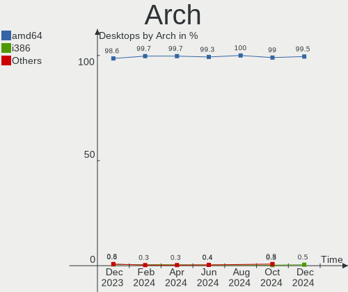
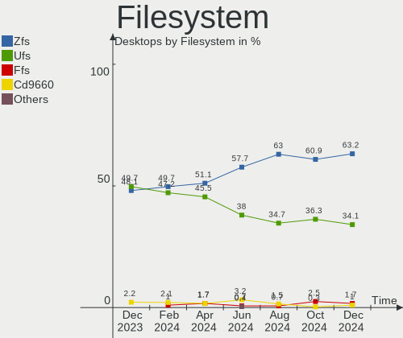
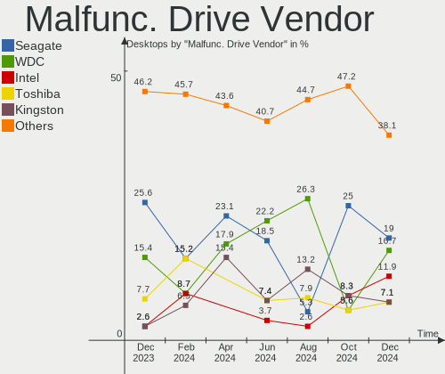
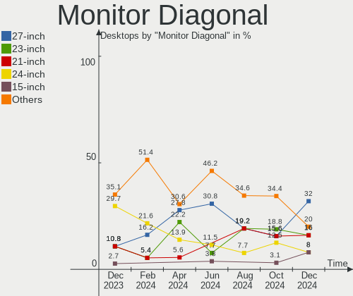
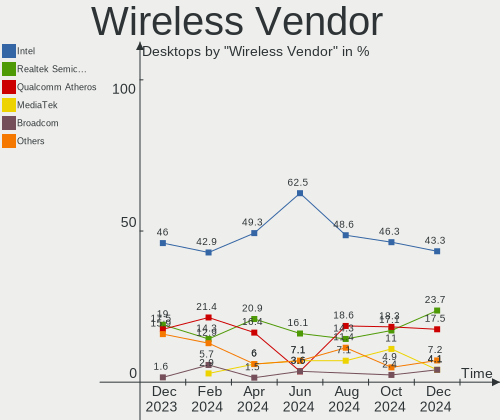
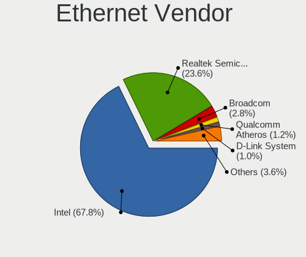

BSD - Hardware Trends (Desktops)
--------------------------------

A project to identify most popular hardware characteristics and track their change
over time based on data collected by BSD users at https://BSD-Hardware.info.

Anyone can contribute to this report by the [hw-probe](https://github.com/linuxhw/hw-probe/blob/master/INSTALL.BSD.md) tool:

    hw-probe -all -upload

This report is for one last month. Overall report since the beginning of time: [TestDays](https://github.com/bsdhw/TestDays)

Period: Mar, 2023.

Contents
--------

* [ System ](#system)
  - [ OS                       ](#os)
  - [ OS Family                ](#os-family)
  - [ Arch                     ](#arch)
  - [ DE                       ](#de)
  - [ Display Server           ](#display-server)
  - [ Display Manager          ](#display-manager)
  - [ OS Lang                  ](#os-lang)
  - [ Boot Mode                ](#boot-mode)
  - [ Filesystem               ](#filesystem)
  - [ Part. scheme             ](#part-scheme)

* [ Board ](#board)
  - [ Vendor                   ](#vendor)
  - [ Model                    ](#model)
  - [ Model Family             ](#model-family)
  - [ MFG Year                 ](#mfg-year)
  - [ Form Factor              ](#form-factor)
  - [ Coreboot                 ](#coreboot)
  - [ RAM Size                 ](#ram-size)
  - [ RAM Used                 ](#ram-used)
  - [ Total Drives             ](#total-drives)
  - [ Has CD-ROM               ](#has-cd-rom)
  - [ Has Ethernet             ](#has-ethernet)
  - [ Has WiFi                 ](#has-wifi)
  - [ Has Bluetooth            ](#has-bluetooth)

* [ Location ](#location)
  - [ Country                  ](#country)
  - [ City                     ](#city)

* [ Drives ](#drives)
  - [ Drive Vendor             ](#drive-vendor)
  - [ Drive Model              ](#drive-model)
  - [ HDD Vendor               ](#hdd-vendor)
  - [ SSD Vendor               ](#ssd-vendor)
  - [ Drive Kind               ](#drive-kind)
  - [ Drive Connector          ](#drive-connector)
  - [ Drive Size               ](#drive-size)
  - [ Space Total              ](#space-total)
  - [ Space Used               ](#space-used)
  - [ Malfunc. Drives          ](#malfunc-drives)
  - [ Malfunc. Drive Vendor    ](#malfunc-drive-vendor)
  - [ Malfunc. HDD Vendor      ](#malfunc-hdd-vendor)
  - [ Malfunc. Drive Kind      ](#malfunc-drive-kind)
  - [ Failed Drives            ](#failed-drives)
  - [ Failed Drive Vendor      ](#failed-drive-vendor)
  - [ Drive Status             ](#drive-status)

* [ Storage controller ](#storage-controller)
  - [ Storage Vendor           ](#storage-vendor)
  - [ Storage Model            ](#storage-model)
  - [ Storage Kind             ](#storage-kind)

* [ Processor ](#processor)
  - [ CPU Vendor               ](#cpu-vendor)
  - [ CPU Model                ](#cpu-model)
  - [ CPU Model Family         ](#cpu-model-family)
  - [ CPU Cores                ](#cpu-cores)
  - [ CPU Sockets              ](#cpu-sockets)
  - [ CPU Threads              ](#cpu-threads)
  - [ CPU Microarch            ](#cpu-microarch)

* [ Graphics ](#graphics)
  - [ GPU Vendor               ](#gpu-vendor)
  - [ GPU Model                ](#gpu-model)
  - [ GPU Combo                ](#gpu-combo)
  - [ GPU Driver               ](#gpu-driver)
  - [ GPU Memory               ](#gpu-memory)

* [ Monitor ](#monitor)
  - [ Monitor Vendor           ](#monitor-vendor)
  - [ Monitor Model            ](#monitor-model)
  - [ Monitor Resolution       ](#monitor-resolution)
  - [ Monitor Diagonal         ](#monitor-diagonal)
  - [ Monitor Width            ](#monitor-width)
  - [ Aspect Ratio             ](#aspect-ratio)
  - [ Monitor Area             ](#monitor-area)
  - [ Pixel Density            ](#pixel-density)
  - [ Multiple Monitors        ](#multiple-monitors)

* [ Network ](#network)
  - [ Net Controller Vendor    ](#net-controller-vendor)
  - [ Net Controller Model     ](#net-controller-model)
  - [ Wireless Vendor          ](#wireless-vendor)
  - [ Wireless Model           ](#wireless-model)
  - [ Ethernet Vendor          ](#ethernet-vendor)
  - [ Ethernet Model           ](#ethernet-model)
  - [ Net Controller Kind      ](#net-controller-kind)
  - [ Used Controller          ](#used-controller)
  - [ NICs                     ](#nics)
  - [ IPv6                     ](#ipv6)

* [ Bluetooth ](#bluetooth)
  - [ Bluetooth Vendor         ](#bluetooth-vendor)
  - [ Bluetooth Model          ](#bluetooth-model)

* [ Sound ](#sound)
  - [ Sound Vendor             ](#sound-vendor)
  - [ Sound Model              ](#sound-model)

* [ Memory ](#memory)
  - [ Memory Vendor            ](#memory-vendor)
  - [ Memory Model             ](#memory-model)
  - [ Memory Kind              ](#memory-kind)
  - [ Memory Form Factor       ](#memory-form-factor)
  - [ Memory Size              ](#memory-size)
  - [ Memory Speed             ](#memory-speed)

* [ Printers & scanners ](#printers--scanners)
  - [ Printer Vendor           ](#printer-vendor)
  - [ Printer Model            ](#printer-model)
  - [ Scanner Vendor           ](#scanner-vendor)
  - [ Scanner Model            ](#scanner-model)

* [ Camera ](#camera)
  - [ Camera Vendor            ](#camera-vendor)
  - [ Camera Model             ](#camera-model)

* [ Security ](#security)
  - [ Fingerprint Vendor       ](#fingerprint-vendor)
  - [ Fingerprint Model        ](#fingerprint-model)
  - [ Chipcard Vendor          ](#chipcard-vendor)
  - [ Chipcard Model           ](#chipcard-model)

* [ Unsupported ](#unsupported)
  - [ Unsupported Devices      ](#unsupported-devices)
  - [ Unsupported Device Types ](#unsupported-device-types)

System
------

OS
--

Installed operating systems

| Name                 | Desktops | Percent |
|----------------------|----------|---------|
| helloSystem 0.8.1    | 89       | 21.29%  |
| OPNsense 23.1.3      | 85       | 20.33%  |
| OPNsense 23.1.4      | 77       | 18.42%  |
| OPNsense 23.1.1      | 45       | 10.77%  |
| OPNsense 23.1.2      | 20       | 4.78%   |
| FreeBSD 13.1-p7      | 18       | 4.31%   |
| OPNsense 23.1.5      | 16       | 3.83%   |
| OPNsense 23.1        | 7        | 1.67%   |
| OPNsense 23.7        | 5        | 1.2%    |
| OPNsense 22.7.11     | 5        | 1.2%    |
| OPNsense 22.10.2     | 4        | 0.96%   |
| helloSystem 0.8.0    | 4        | 0.96%   |
| OpenBSD 7.2          | 3        | 0.72%   |
| FreeBSD 13.1-p5      | 3        | 0.72%   |
| FreeBSD 13.1         | 3        | 0.72%   |
| OPNsense 22.1.10     | 2        | 0.48%   |
| MyBee 13.1-p7        | 2        | 0.48%   |
| MidnightBSD 3.0.0    | 2        | 0.48%   |
| helloSystem 0.8.2    | 2        | 0.48%   |
| helloSystem 0.7.0    | 2        | 0.48%   |
| GhostBSD 23.02.02    | 2        | 0.48%   |
| FreeBSD 14.0-CURRENT | 2        | 0.48%   |
| FreeBSD 13.2-STABLE  | 2        | 0.48%   |
| OPNsense 21.1.9      | 1        | 0.24%   |
| OPNsense 20.7.5      | 1        | 0.24%   |
| OPNsense 20.7        | 1        | 0.24%   |
| OpenBSD 7.3          | 1        | 0.24%   |
| OpenBSD 6.8          | 1        | 0.24%   |
| NetBSD 9.3           | 1        | 0.24%   |
| MyBee 13.2-RC4       | 1        | 0.24%   |
| MyBee 13.2-RC2       | 1        | 0.24%   |
| MidnightBSD 2.2.8    | 1        | 0.24%   |
| GhostBSD 23.03.17    | 1        | 0.24%   |
| FreeBSD 13.2-RC5     | 1        | 0.24%   |
| FreeBSD 13.2-RC3     | 1        | 0.24%   |
| FreeBSD 13.1-STABLE  | 1        | 0.24%   |
| FreeBSD 13.1-p4      | 1        | 0.24%   |
| FreeBSD 13.1-p2      | 1        | 0.24%   |
| FreeBSD 13.0-p7      | 1        | 0.24%   |
| FreeBSD 12.4-STABLE  | 1        | 0.24%   |

OS Family
---------

OS without a version

| Name        | Desktops | Percent |
|-------------|----------|---------|
| OPNsense    | 269      | 64.35%  |
| helloSystem | 97       | 23.21%  |
| FreeBSD     | 36       | 8.61%   |
| OpenBSD     | 5        | 1.2%    |
| MyBee       | 4        | 0.96%   |
| MidnightBSD | 3        | 0.72%   |
| GhostBSD    | 3        | 0.72%   |
| NetBSD      | 1        | 0.24%   |

Arch
----

OS architecture (x86_64, i586, etc.)

| Name   | Desktops | Percent |
|--------|----------|---------|
| amd64  | 414      | 99.04%  |
| arm64  | 2        | 0.48%   |
| macppc | 1        | 0.24%   |
| i386   | 1        | 0.24%   |

DE
--

Desktop Environment

| Name         | Desktops | Percent |
|--------------|----------|---------|
| Console      | 299      | 71.53%  |
| helloDesktop | 99       | 23.68%  |
| XFCE         | 5        | 1.2%    |
| KDE5         | 5        | 1.2%    |
| MATE         | 3        | 0.72%   |
| TWM          | 2        | 0.48%   |
| GNOME        | 2        | 0.48%   |
| X-Cinnamon   | 1        | 0.24%   |
| fvwm         | 1        | 0.24%   |
| AwesomeWM    | 1        | 0.24%   |

Display Server
--------------

X11 or Wayland

| Name    | Desktops | Percent |
|---------|----------|---------|
| Console | 299      | 71.53%  |
| X11     | 118      | 28.23%  |
| Wayland | 1        | 0.24%   |

Display Manager
---------------

SDDM, LightDM, etc.

| Name    | Desktops | Percent |
|---------|----------|---------|
| Console | 308      | 73.68%  |
| SLiM    | 100      | 23.92%  |
| LightDM | 5        | 1.2%    |
| SDDM    | 3        | 0.72%   |
| GDM     | 2        | 0.48%   |

OS Lang
-------

Language

| Lang    | Desktops | Percent |
|---------|----------|---------|
| Unknown | 274      | 65.55%  |
| fr_FR   | 40       | 9.57%   |
| en_US   | 39       | 9.33%   |
| C       | 32       | 7.66%   |
| ru_RU   | 9        | 2.15%   |
| es_ES   | 8        | 1.91%   |
| de_DE   | 5        | 1.2%    |
| pl_PL   | 2        | 0.48%   |
| jp_JP   | 2        | 0.48%   |
| it_IT   | 2        | 0.48%   |
| fr      | 2        | 0.48%   |
| ru      | 1        | 0.24%   |
| pt_BR   | 1        | 0.24%   |
| es      | 1        | 0.24%   |

Boot Mode
---------

EFI or BIOS

| Mode | Desktops | Percent |
|------|----------|---------|
| EFI  | 390      | 93.3%   |
| BIOS | 28       | 6.7%    |

Filesystem
----------

Type of filesystem

| Type   | Desktops | Percent |
|--------|----------|---------|
| Zfs    | 178      | 42.58%  |
| Ufs    | 173      | 41.39%  |
| Cd9660 | 62       | 14.83%  |
| Ffs    | 5        | 1.2%    |

Part. scheme
------------

Scheme of partitioning

| Type    | Desktops | Percent |
|---------|----------|---------|
| GPT     | 407      | 97.37%  |
| MBR     | 9        | 2.15%   |
| Unknown | 2        | 0.48%   |

Board
-----

Vendor
------

Motherboard manufacturer

| Name                       | Desktops | Percent |
|----------------------------|----------|---------|
| ASUSTek Computer           | 51       | 12.2%   |
| Unknown                    | 46       | 11%     |
| Hewlett-Packard            | 41       | 9.81%   |
| Dell                       | 30       | 7.18%   |
| Gigabyte Technology        | 26       | 6.22%   |
| ASRock                     | 26       | 6.22%   |
| Intel                      | 23       | 5.5%    |
| Protectli                  | 20       | 4.78%   |
| Lenovo                     | 20       | 4.78%   |
| Techvision                 | 19       | 4.55%   |
| MSI                        | 18       | 4.31%   |
| Fujitsu                    | 11       | 2.63%   |
| Supermicro                 | 6        | 1.44%   |
| Acer                       | 6        | 1.44%   |
| MW                         | 5        | 1.2%    |
| PC Engines                 | 4        | 0.96%   |
| ASRockRack                 | 4        | 0.96%   |
| Foxconn                    | 3        | 0.72%   |
| CncTion                    | 3        | 0.72%   |
| T-bao                      | 2        | 0.48%   |
| Shuttle                    | 2        | 0.48%   |
| Huanan                     | 2        | 0.48%   |
| GoWin Solution             | 2        | 0.48%   |
| Fujitsu Siemens            | 2        | 0.48%   |
| CheckPoint                 | 2        | 0.48%   |
| Biostar                    | 2        | 0.48%   |
| BESSTAR Tech               | 2        | 0.48%   |
| AZW                        | 2        | 0.48%   |
| Apple                      | 2        | 0.48%   |
| AMI                        | 2        | 0.48%   |
| YENTEK                     | 1        | 0.24%   |
| YANYU                      | 1        | 0.24%   |
| WeiBu                      | 1        | 0.24%   |
| Stonesoft                  | 1        | 0.24%   |
| SolidRun                   | 1        | 0.24%   |
| Silicom                    | 1        | 0.24%   |
| ShenZhen MinWin Technology | 1        | 0.24%   |
| Seeed Studio               | 1        | 0.24%   |
| Positivo                   | 1        | 0.24%   |
| Pegatron                   | 1        | 0.24%   |

Model
-----

Motherboard model

| Name                        | Desktops | Percent |
|-----------------------------|----------|---------|
| Unknown                     | 47       | 11.24%  |
| Techvision TVI7309X         | 19       | 4.55%   |
| Protectli FW4B              | 9        | 2.15%   |
| Fujitsu FUTRO S920          | 7        | 1.67%   |
| Intel Q3XXG4-P V1.0         | 6        | 1.44%   |
| MW GMLK-2_5G4L              | 5        | 1.2%    |
| Dell OptiPlex 3020          | 5        | 1.2%    |
| ASUS All Series             | 5        | 1.2%    |
| Protectli VP2410            | 3        | 0.72%   |
| Protectli FW6               | 3        | 0.72%   |
| Protectli FW4C              | 3        | 0.72%   |
| PC Engines APU2             | 3        | 0.72%   |
| Intel DENLOW_WS             | 3        | 0.72%   |
| HP t620 PLUS Quad Core TC   | 3        | 0.72%   |
| HP ProDesk 600 G1 SFF       | 3        | 0.72%   |
| HP Compaq 6200 Pro MT PC    | 3        | 0.72%   |
| T-bao MINI PC               | 2        | 0.48%   |
| Protectli VP2420            | 2        | 0.48%   |
| MSI MS-7D46                 | 2        | 0.48%   |
| MSI MS-7B86                 | 2        | 0.48%   |
| MSI MS-7788                 | 2        | 0.48%   |
| Huanan X99-QD4 V1.0         | 2        | 0.48%   |
| HP Z440 Workstation         | 2        | 0.48%   |
| HP EliteDesk 800 G2 SFF     | 2        | 0.48%   |
| HP EliteDesk 800 G2 DM 65W  | 2        | 0.48%   |
| HP Compaq Elite 8300 USDT   | 2        | 0.48%   |
| HP Compaq Elite 8300 SFF    | 2        | 0.48%   |
| HP Compaq 8200 Elite SFF PC | 2        | 0.48%   |
| GoWin Solution R86S         | 2        | 0.48%   |
| Gigabyte X570 UD            | 2        | 0.48%   |
| Dell OptiPlex 9020          | 2        | 0.48%   |
| Dell OptiPlex 9010          | 2        | 0.48%   |
| Dell OptiPlex 7060          | 2        | 0.48%   |
| Dell OptiPlex 7020          | 2        | 0.48%   |
| CncTion N5105-4L            | 2        | 0.48%   |
| ASUS P11C-M Series          | 2        | 0.48%   |
| ASRock X570M Pro4           | 2        | 0.48%   |
| ASRock Q1900M               | 2        | 0.48%   |
| ASRock J5040-ITX            | 2        | 0.48%   |
| YENTEK R250                 | 1        | 0.24%   |

Model Family
------------

Motherboard model prefix

| Name                    | Desktops | Percent |
|-------------------------|----------|---------|
| Unknown                 | 47       | 11.24%  |
| Dell OptiPlex           | 23       | 5.5%    |
| Techvision TVI7309X     | 19       | 4.55%   |
| Lenovo ThinkCentre      | 15       | 3.59%   |
| HP Compaq               | 13       | 3.11%   |
| Protectli FW4B          | 9        | 2.15%   |
| ASUS PRIME              | 8        | 1.91%   |
| HP EliteDesk            | 7        | 1.67%   |
| Fujitsu FUTRO           | 7        | 1.67%   |
| Intel Q3XXG4-P          | 6        | 1.44%   |
| MW GMLK-2               | 5        | 1.2%    |
| HP ProDesk              | 5        | 1.2%    |
| ASUS ROG                | 5        | 1.2%    |
| ASUS All                | 5        | 1.2%    |
| HP t620                 | 4        | 0.96%   |
| ASUS TUF                | 4        | 0.96%   |
| Protectli VP2410        | 3        | 0.72%   |
| Protectli FW6           | 3        | 0.72%   |
| Protectli FW4C          | 3        | 0.72%   |
| PC Engines APU2         | 3        | 0.72%   |
| Intel DENLOW            | 3        | 0.72%   |
| Acer Aspire             | 3        | 0.72%   |
| T-bao MINI              | 2        | 0.48%   |
| Protectli VP2420        | 2        | 0.48%   |
| MSI MS-7D46             | 2        | 0.48%   |
| MSI MS-7B86             | 2        | 0.48%   |
| MSI MS-7788             | 2        | 0.48%   |
| Huanan X99-QD4          | 2        | 0.48%   |
| HP Z440                 | 2        | 0.48%   |
| HP Slim                 | 2        | 0.48%   |
| GoWin Solution R86S     | 2        | 0.48%   |
| Gigabyte X570           | 2        | 0.48%   |
| Gigabyte B450M          | 2        | 0.48%   |
| Fujitsu Siemens ESPRIMO | 2        | 0.48%   |
| Fujitsu ESPRIMO         | 2        | 0.48%   |
| Dell Inspiron           | 2        | 0.48%   |
| CncTion N5105-4L        | 2        | 0.48%   |
| ASUS Pro                | 2        | 0.48%   |
| ASUS P5G41T-M           | 2        | 0.48%   |
| ASUS P11C-M             | 2        | 0.48%   |

MFG Year
--------

Motherboard manufacture year

| Year    | Desktops | Percent |
|---------|----------|---------|
| 2022    | 90       | 21.53%  |
| 2021    | 39       | 9.33%   |
| 2019    | 37       | 8.85%   |
| 2018    | 33       | 7.89%   |
| 2014    | 33       | 7.89%   |
| 2016    | 32       | 7.66%   |
| 2020    | 27       | 6.46%   |
| 2012    | 25       | 5.98%   |
| 2017    | 18       | 4.31%   |
| 2013    | 18       | 4.31%   |
| 2011    | 18       | 4.31%   |
| 2015    | 14       | 3.35%   |
| 2010    | 11       | 2.63%   |
| 2009    | 7        | 1.67%   |
| 2023    | 5        | 1.2%    |
| 2008    | 4        | 0.96%   |
| Unknown | 4        | 0.96%   |
| 2006    | 2        | 0.48%   |
| 2007    | 1        | 0.24%   |

Form Factor
-----------

Physical design of the computer

| Name    | Desktops | Percent |
|---------|----------|---------|
| Desktop | 418      | 100%    |

Coreboot
--------

Have coreboot on board

| Used | Desktops | Percent |
|------|----------|---------|
| No   | 410      | 98.09%  |
| Yes  | 8        | 1.91%   |

RAM Size
--------

Total RAM memory

| Size in GB  | Desktops | Percent |
|-------------|----------|---------|
| 8.01-16.0   | 169      | 40.43%  |
| 16.01-24.0  | 99       | 23.68%  |
| 4.01-8.0    | 65       | 15.55%  |
| 32.01-64.0  | 45       | 10.77%  |
| 64.01-256.0 | 17       | 4.07%   |
| 24.01-32.0  | 10       | 2.39%   |
| 2.01-3.0    | 9        | 2.15%   |
| 3.01-4.0    | 2        | 0.48%   |
| 0.01-0.5    | 2        | 0.48%   |

RAM Used
--------

Used RAM memory

| Used GB    | Desktops | Percent |
|------------|----------|---------|
| 0.01-0.5   | 196      | 46.89%  |
| 0.51-1.0   | 148      | 35.41%  |
| 1.01-2.0   | 50       | 11.96%  |
| 2.01-3.0   | 13       | 3.11%   |
| 3.01-4.0   | 3        | 0.72%   |
| 4.01-8.0   | 2        | 0.48%   |
| 0          | 2        | 0.48%   |
| Unknown    | 2        | 0.48%   |
| 16.01-24.0 | 1        | 0.24%   |
| 8.01-16.0  | 1        | 0.24%   |

Total Drives
------------

Number of drives on board

| Drives | Desktops | Percent |
|--------|----------|---------|
| 1      | 281      | 67.22%  |
| 2      | 60       | 14.35%  |
| 0      | 27       | 6.46%   |
| 3      | 25       | 5.98%   |
| 5      | 11       | 2.63%   |
| 4      | 7        | 1.67%   |
| 6      | 3        | 0.72%   |
| 13     | 1        | 0.24%   |
| 9      | 1        | 0.24%   |
| 8      | 1        | 0.24%   |
| 7      | 1        | 0.24%   |

Has CD-ROM
----------

Has CD-ROM on board

| Presented | Desktops | Percent |
|-----------|----------|---------|
| No        | 332      | 79.43%  |
| Yes       | 86       | 20.57%  |

Has Ethernet
------------

Has Ethernet on board

| Presented | Desktops | Percent |
|-----------|----------|---------|
| Yes       | 412      | 98.56%  |
| No        | 6        | 1.44%   |

Has WiFi
--------

Has WiFi module

| Presented | Desktops | Percent |
|-----------|----------|---------|
| No        | 327      | 78.23%  |
| Yes       | 91       | 21.77%  |

Has Bluetooth
-------------

Has Bluetooth module

| Presented | Desktops | Percent |
|-----------|----------|---------|
| No        | 363      | 86.84%  |
| Yes       | 55       | 13.16%  |

Location
--------

Country
-------

Geographic location (country)

| Country      | Desktops | Percent |
|--------------|----------|---------|
| USA          | 123      | 29.43%  |
| Germany      | 58       | 13.88%  |
| Russia       | 29       | 6.94%   |
| France       | 20       | 4.78%   |
| Canada       | 15       | 3.59%   |
| UK           | 13       | 3.11%   |
| Italy        | 13       | 3.11%   |
| Poland       | 11       | 2.63%   |
| Spain        | 10       | 2.39%   |
| Brazil       | 8        | 1.91%   |
| Australia    | 8        | 1.91%   |
| Sweden       | 7        | 1.67%   |
| Netherlands  | 6        | 1.44%   |
| Belgium      | 6        | 1.44%   |
| Indonesia    | 5        | 1.2%    |
| Hungary      | 5        | 1.2%    |
| Austria      | 5        | 1.2%    |
| South Korea  | 4        | 0.96%   |
| Serbia       | 4        | 0.96%   |
| Romania      | 4        | 0.96%   |
| Bulgaria     | 4        | 0.96%   |
| Portugal     | 3        | 0.72%   |
| Norway       | 3        | 0.72%   |
| New Zealand  | 3        | 0.72%   |
| Mexico       | 3        | 0.72%   |
| Japan        | 3        | 0.72%   |
| Finland      | 3        | 0.72%   |
| Turkey       | 2        | 0.48%   |
| Taiwan       | 2        | 0.48%   |
| Switzerland  | 2        | 0.48%   |
| South Africa | 2        | 0.48%   |
| Malaysia     | 2        | 0.48%   |
| India        | 2        | 0.48%   |
| Greece       | 2        | 0.48%   |
| Denmark      | 2        | 0.48%   |
| Czechia      | 2        | 0.48%   |
| Argentina    | 2        | 0.48%   |
| Vietnam      | 1        | 0.24%   |
| Ukraine      | 1        | 0.24%   |
| Tunisia      | 1        | 0.24%   |

City
----

Geographic location (city)

| City           | Desktops | Percent |
|----------------|----------|---------|
| Moscow         | 8        | 1.91%   |
| Vienna         | 4        | 0.96%   |
| Sydney         | 4        | 0.96%   |
| Paris          | 4        | 0.96%   |
| Montreal       | 4        | 0.96%   |
| London         | 4        | 0.96%   |
| Hamburg        | 4        | 0.96%   |
| Berlin         | 4        | 0.96%   |
| St Petersburg  | 3        | 0.72%   |
| Seattle        | 3        | 0.72%   |
| Portland       | 3        | 0.72%   |
| Los Angeles    | 3        | 0.72%   |
| Jakarta        | 3        | 0.72%   |
| Houston        | 3        | 0.72%   |
| Ypsilanti      | 2        | 0.48%   |
| Warsaw         | 2        | 0.48%   |
| Solingen       | 2        | 0.48%   |
| Sofia          | 2        | 0.48%   |
| Silver Spring  | 2        | 0.48%   |
| Sao Paulo      | 2        | 0.48%   |
| Salem          | 2        | 0.48%   |
| Redmond        | 2        | 0.48%   |
| Plymouth       | 2        | 0.48%   |
| Munich         | 2        | 0.48%   |
| Minneapolis    | 2        | 0.48%   |
| Milan          | 2        | 0.48%   |
| Miercurea-Ciuc | 2        | 0.48%   |
| Melbourne      | 2        | 0.48%   |
| Marietta       | 2        | 0.48%   |
| Madrid         | 2        | 0.48%   |
| Ludwigsburg    | 2        | 0.48%   |
| Kirov          | 2        | 0.48%   |
| Indianapolis   | 2        | 0.48%   |
| Gdynia         | 2        | 0.48%   |
| Daly City      | 2        | 0.48%   |
| Cologne        | 2        | 0.48%   |
| Chelyabinsk    | 2        | 0.48%   |
| Charlotte      | 2        | 0.48%   |
| Cape Town      | 2        | 0.48%   |
| Belgrade       | 2        | 0.48%   |

Drives
------

Drive Vendor
------------

Hard drive vendors

| Vendor              | Desktops | Drives | Percent |
|---------------------|----------|--------|---------|
| WDC                 | 65       | 101    | 12.72%  |
| Samsung Electronics | 61       | 82     | 11.94%  |
| Seagate             | 54       | 72     | 10.57%  |
| Kingston            | 49       | 50     | 9.59%   |
| Crucial             | 22       | 26     | 4.31%   |
| SanDisk             | 19       | 19     | 3.72%   |
| Toshiba             | 16       | 23     | 3.13%   |
| Intel               | 15       | 17     | 2.94%   |
| Hoodisk             | 15       | 15     | 2.94%   |
| Transcend           | 14       | 16     | 2.74%   |
| China               | 14       | 16     | 2.74%   |
| A-DATA Technology   | 13       | 15     | 2.54%   |
| Micron Technology   | 11       | 11     | 2.15%   |
| Protectli           | 9        | 9      | 1.76%   |
| PNY                 | 8        | 8      | 1.57%   |
| Apacer              | 8        | 8      | 1.57%   |
| Innodisk            | 7        | 7      | 1.37%   |
| Hitachi             | 7        | 8      | 1.37%   |
| Fanxiang            | 7        | 8      | 1.37%   |
| Corsair             | 6        | 7      | 1.17%   |
| Maxtor              | 5        | 5      | 0.98%   |
| SPCC                | 4        | 4      | 0.78%   |
| SK hynix            | 4        | 4      | 0.78%   |
| Patriot             | 4        | 4      | 0.78%   |
| OCZ                 | 4        | 4      | 0.78%   |
| KingSpec            | 4        | 4      | 0.78%   |
| Dogfish             | 4        | 4      | 0.78%   |
| Team                | 3        | 4      | 0.59%   |
| ShiJi               | 3        | 3      | 0.59%   |
| Phison              | 3        | 3      | 0.59%   |
| KIOXIA-EXCERIA      | 3        | 4      | 0.59%   |
| HGST                | 3        | 3      | 0.59%   |
| Hewlett-Packard     | 3        | 4      | 0.59%   |
| Silicon Motion      | 2        | 2      | 0.39%   |
| NVMe                | 2        | 2      | 0.39%   |
| Intenso             | 2        | 2      | 0.39%   |
| Gigabyte Technology | 2        | 2      | 0.39%   |
| Colorful            | 2        | 3      | 0.39%   |
| BORY                | 2        | 2      | 0.39%   |
| BIWIN               | 2        | 2      | 0.39%   |

Drive Model
-----------

Hard drive models

| Model                           | Desktops | Percent |
|---------------------------------|----------|---------|
| Kingston SA400S37120G 120GB     | 10       | 1.76%   |
| Kingston SA400S37240G 240GB     | 8        | 1.41%   |
| Seagate ST500DM002-1BD142 500GB | 7        | 1.23%   |
| Samsung SSD 850 EVO 250GB       | 7        | 1.23%   |
| Samsung SSD 860 EVO 500GB       | 6        | 1.06%   |
| Seagate ST2000DM008-2FR102 2TB  | 5        | 0.88%   |
| Seagate ST1000DM010-2EP102 1TB  | 5        | 0.88%   |
| Samsung SSD 870 EVO 500GB       | 5        | 0.88%   |
| Crucial CT240BX500SSD1 240GB    | 5        | 0.88%   |
| Seagate ST3500418AS 500GB       | 4        | 0.7%    |
| Seagate ST2000LM007-1R8174 2TB  | 4        | 0.7%    |
| Protectli 120GB M.2             | 4        | 0.7%    |
| Hoodisk SSD 64GB                | 4        | 0.7%    |
| Hoodisk SSD 32GB                | 4        | 0.7%    |
| Hoodisk SSD 128GB               | 4        | 0.7%    |
| WDC WDS240G2G0A-00JH30 240GB    | 3        | 0.53%   |
| WDC WD5000AAKX-08U6AA0 500GB    | 3        | 0.53%   |
| WDC WD10EZEX-08WN4A0 1TB        | 3        | 0.53%   |
| Transcend TS128GMSA230S 128GB   | 3        | 0.53%   |
| Toshiba DT01ACA050 500GB        | 3        | 0.53%   |
| SanDisk SSD PLUS 240GB          | 3        | 0.53%   |
| Samsung SSD 970 EVO Plus 250GB  | 3        | 0.53%   |
| PNY CS900 120GB SSD             | 3        | 0.53%   |
| Kingston SNV2S500G 500GB        | 3        | 0.53%   |
| Innodisk DEMSR- 08GB mSATA 3ME3 | 3        | 0.53%   |
| Fanxiang S501 128GB             | 3        | 0.53%   |
| Crucial CT120BX500SSD1 120GB    | 3        | 0.53%   |
| WDC WDS500G1B0A-00H9H0 500GB    | 2        | 0.35%   |
| WDC WDS120G2G0A-00JH30 120GB    | 2        | 0.35%   |
| WDC WDS100T3X0C-00SJG0 1TB      | 2        | 0.35%   |
| WDC WD80EFAX-68LHPN0 8TB        | 2        | 0.35%   |
| WDC WD5003AZEX-00K1GA0 500GB    | 2        | 0.35%   |
| WDC WD30EFRX-68EUZN0 3TB        | 2        | 0.35%   |
| WDC WD20EFRX-68EUZN0 2TB        | 2        | 0.35%   |
| WDC WD10EZEX-60WN4A0 1TB        | 2        | 0.35%   |
| Toshiba DT01ACA100 1TB          | 2        | 0.35%   |
| SPCC Solid State Disk 128GB     | 2        | 0.35%   |
| SK hynix SC308 SATA 256GB       | 2        | 0.35%   |
| ShiJi SSD 128GB                 | 2        | 0.35%   |
| Seagate ST4000LM024-2AN17V 4TB  | 2        | 0.35%   |

HDD Vendor
----------

Hard disk drive vendors

| Vendor              | Desktops | Drives | Percent |
|---------------------|----------|--------|---------|
| Seagate             | 52       | 70     | 37.96%  |
| WDC                 | 50       | 84     | 36.5%   |
| Toshiba             | 12       | 19     | 8.76%   |
| Hitachi             | 7        | 8      | 5.11%   |
| Maxtor              | 5        | 5      | 3.65%   |
| Samsung Electronics | 3        | 3      | 2.19%   |
| HGST                | 2        | 2      | 1.46%   |
| Hewlett-Packard     | 2        | 3      | 1.46%   |
| QUANTUM             | 1        | 1      | 0.73%   |
| NVMe                | 1        | 1      | 0.73%   |
| HPT                 | 1        | 1      | 0.73%   |
| Apple               | 1        | 1      | 0.73%   |

SSD Vendor
----------

Solid state drive vendors

| Vendor              | Desktops | Drives | Percent |
|---------------------|----------|--------|---------|
| Samsung Electronics | 45       | 58     | 15.2%   |
| Kingston            | 36       | 37     | 12.16%  |
| Crucial             | 21       | 24     | 7.09%   |
| SanDisk             | 19       | 19     | 6.42%   |
| Hoodisk             | 15       | 15     | 5.07%   |
| China               | 14       | 16     | 4.73%   |
| WDC                 | 13       | 13     | 4.39%   |
| Transcend           | 13       | 15     | 4.39%   |
| A-DATA Technology   | 10       | 10     | 3.38%   |
| Protectli           | 9        | 9      | 3.04%   |
| Intel               | 9        | 11     | 3.04%   |
| Apacer              | 8        | 8      | 2.7%    |
| PNY                 | 7        | 7      | 2.36%   |
| Innodisk            | 7        | 7      | 2.36%   |
| Micron Technology   | 6        | 6      | 2.03%   |
| OCZ                 | 4        | 4      | 1.35%   |
| KingSpec            | 4        | 4      | 1.35%   |
| Dogfish             | 4        | 4      | 1.35%   |
| Toshiba             | 3        | 3      | 1.01%   |
| ShiJi               | 3        | 3      | 1.01%   |
| Patriot             | 3        | 3      | 1.01%   |
| SPCC                | 2        | 2      | 0.68%   |
| SK hynix            | 2        | 2      | 0.68%   |
| Intenso             | 2        | 2      | 0.68%   |
| Gigabyte Technology | 2        | 2      | 0.68%   |
| BORY                | 2        | 2      | 0.68%   |
| BIWIN               | 2        | 2      | 0.68%   |
| Zheino              | 1        | 1      | 0.34%   |
| walram              | 1        | 1      | 0.34%   |
| Vaseky              | 1        | 1      | 0.34%   |
| Team                | 1        | 1      | 0.34%   |
| TCSUNBOW            | 1        | 1      | 0.34%   |
| T-FORCE             | 1        | 1      | 0.34%   |
| SSSTC               | 1        | 2      | 0.34%   |
| Smartbuy            | 1        | 1      | 0.34%   |
| Seagate             | 1        | 1      | 0.34%   |
| RECADATA            | 1        | 1      | 0.34%   |
| Pioneer             | 1        | 1      | 0.34%   |
| Palit               | 1        | 1      | 0.34%   |
| NVMe                | 1        | 1      | 0.34%   |

Drive Kind
----------

HDD or SSD

| Kind | Desktops | Drives | Percent |
|------|----------|--------|---------|
| SSD  | 267      | 321    | 56.93%  |
| HDD  | 120      | 198    | 25.59%  |
| NVMe | 82       | 95     | 17.48%  |

Drive Connector
---------------

SATA, SAS, NVMe, etc.

| Type | Desktops | Drives | Percent |
|------|----------|--------|---------|
| SATA | 343      | 519    | 80.71%  |
| NVMe | 82       | 95     | 19.29%  |

Drive Size
----------

Size of hard drive

| Size in TB | Desktops | Drives | Percent |
|------------|----------|--------|---------|
| 0.01-0.5   | 283      | 347    | 70.57%  |
| 0.51-1.0   | 59       | 69     | 14.71%  |
| 1.01-2.0   | 31       | 45     | 7.73%   |
| 3.01-4.0   | 14       | 22     | 3.49%   |
| 2.01-3.0   | 5        | 10     | 1.25%   |
| 4.01-10.0  | 5        | 21     | 1.25%   |
| 10.01-20.0 | 4        | 5      | 1%      |

Space Total
-----------

Amount of disk space available on the file system

| Size in GB     | Desktops | Percent |
|----------------|----------|---------|
| 101-250        | 151      | 36.12%  |
| 1-20           | 78       | 18.66%  |
| 251-500        | 61       | 14.59%  |
| 51-100         | 42       | 10.05%  |
| 501-1000       | 40       | 9.57%   |
| 21-50          | 29       | 6.94%   |
| 1001-2000      | 9        | 2.15%   |
| More than 3000 | 4        | 0.96%   |
| 2001-3000      | 3        | 0.72%   |
| Unknown        | 1        | 0.24%   |

Space Used
----------

Amount of used disk space

| Used GB   | Desktops | Percent |
|-----------|----------|---------|
| 1-20      | 390      | 93.3%   |
| 21-50     | 13       | 3.11%   |
| 51-100    | 9        | 2.15%   |
| 101-250   | 2        | 0.48%   |
| 1001-2000 | 2        | 0.48%   |
| 501-1000  | 1        | 0.24%   |
| Unknown   | 1        | 0.24%   |

Malfunc. Drives
---------------

Drive models with a malfunction

| Model                                      | Desktops | Drives | Percent |
|--------------------------------------------|----------|--------|---------|
| Toshiba DT01ACA100 1TB                     | 2        | 2      | 3.45%   |
| Seagate ST31000524AS 1TB                   | 2        | 2      | 3.45%   |
| Seagate ST2000DM008-2FR102 2TB             | 2        | 2      | 3.45%   |
| WDC WDS240G2G0A-00JH30 240GB               | 1        | 1      | 1.72%   |
| WDC WD80EDAZ-11TA3A0 8TB                   | 1        | 1      | 1.72%   |
| WDC WD800JD-75MSA3 80GB                    | 1        | 1      | 1.72%   |
| WDC WD6400BPVT-22HXZT3 640GB               | 1        | 1      | 1.72%   |
| WDC WD5000AAKX-60U6AA0 500GB               | 1        | 1      | 1.72%   |
| WDC WD5000AAKX-08U6AA0 500GB               | 1        | 1      | 1.72%   |
| WDC WD30EFRX-68EUZN0 3TB                   | 1        | 1      | 1.72%   |
| WDC WD20EZRX-00D8PB0 2TB                   | 1        | 1      | 1.72%   |
| WDC WD10JPVX-00JC3T0 1TB                   | 1        | 1      | 1.72%   |
| WDC WD10EZRZ-00HTKB0 1TB                   | 1        | 1      | 1.72%   |
| WDC WD10EZEX-60WN4A0 1TB                   | 1        | 1      | 1.72%   |
| WDC WD10EARS-003BB1 1TB                    | 1        | 1      | 1.72%   |
| walram SSD 120G                            | 1        | 1      | 1.72%   |
| Toshiba MK3259GSXP 320GB                   | 1        | 1      | 1.72%   |
| SK hynix SC308 SATA 256GB                  | 1        | 1      | 1.72%   |
| Seagate ST500NM0011 500GB                  | 1        | 1      | 1.72%   |
| Seagate ST500LM000-1EJ162 500GB            | 1        | 1      | 1.72%   |
| Seagate ST500DM002-1BD142 500GB            | 1        | 1      | 1.72%   |
| Seagate ST4000VN008-2DR166 4TB             | 1        | 2      | 1.72%   |
| Seagate ST380215AS 80GB                    | 1        | 1      | 1.72%   |
| Seagate ST3500418AS 500GB                  | 1        | 1      | 1.72%   |
| Seagate ST3500320AS 500GB                  | 1        | 1      | 1.72%   |
| Seagate ST2000LX001-1RG174 2TB             | 1        | 1      | 1.72%   |
| Seagate ST1000DM010-2EP102 1TB             | 1        | 1      | 1.72%   |
| SanDisk SSD U100 64GB                      | 1        | 1      | 1.72%   |
| SanDisk SSD PLUS 240 GB                    | 1        | 1      | 1.72%   |
| Samsung Electronics SSD 870 EVO 250GB      | 1        | 3      | 1.72%   |
| Samsung Electronics MZVL22T0HBLB-00B00 2TB | 1        | 1      | 1.72%   |
| Samsung Electronics HM250JI 250GB          | 1        | 1      | 1.72%   |
| Samsung Electronics HD103SJ 1TB            | 1        | 1      | 1.72%   |
| Patriot Burst Elite 120GB                  | 1        | 1      | 1.72%   |
| Maxtor 6Y080M0 82GB                        | 1        | 1      | 1.72%   |
| Maxtor 6V080E0 80GB                        | 1        | 1      | 1.72%   |
| Maxtor 6L080P0 82GB                        | 1        | 1      | 1.72%   |
| Kingston SV300S37A60G 64GB                 | 1        | 1      | 1.72%   |
| Kingston SA400S37240G 240GB                | 1        | 1      | 1.72%   |
| Kingston SA400S37120G 120GB                | 1        | 1      | 1.72%   |

Malfunc. Drive Vendor
---------------------

Vendors of faulty drives

| Vendor              | Desktops | Drives | Percent |
|---------------------|----------|--------|---------|
| WDC                 | 12       | 12     | 21.43%  |
| Seagate             | 11       | 14     | 19.64%  |
| Samsung Electronics | 4        | 6      | 7.14%   |
| Crucial             | 4        | 4      | 7.14%   |
| Toshiba             | 3        | 3      | 5.36%   |
| Maxtor              | 3        | 3      | 5.36%   |
| Kingston            | 3        | 3      | 5.36%   |
| Intel               | 3        | 3      | 5.36%   |
| Hitachi             | 3        | 3      | 5.36%   |
| SanDisk             | 2        | 2      | 3.57%   |
| HGST                | 2        | 2      | 3.57%   |
| walram              | 1        | 1      | 1.79%   |
| SK hynix            | 1        | 1      | 1.79%   |
| Patriot             | 1        | 1      | 1.79%   |
| KingDian            | 1        | 1      | 1.79%   |
| BAITITON            | 1        | 1      | 1.79%   |
| A-DATA Technology   | 1        | 1      | 1.79%   |

Malfunc. HDD Vendor
-------------------

Vendors of faulty HDD drives

| Vendor              | Desktops | Drives | Percent |
|---------------------|----------|--------|---------|
| WDC                 | 11       | 11     | 32.35%  |
| Seagate             | 11       | 14     | 32.35%  |
| Toshiba             | 3        | 3      | 8.82%   |
| Maxtor              | 3        | 3      | 8.82%   |
| Hitachi             | 3        | 3      | 8.82%   |
| Samsung Electronics | 2        | 2      | 5.88%   |
| HGST                | 1        | 1      | 2.94%   |

Malfunc. Drive Kind
-------------------

Kinds of faulty drives

| Kind | Desktops | Drives | Percent |
|------|----------|--------|---------|
| HDD  | 34       | 37     | 60.71%  |
| SSD  | 21       | 23     | 37.5%   |
| NVMe | 1        | 1      | 1.79%   |

Failed Drives
-------------

Failed drive models

| Model                       | Desktops | Drives | Percent |
|-----------------------------|----------|--------|---------|
| WDC WD7501AALS-00J7B0 752GB | 1        | 1      | 50%     |
| SanDisk pSSD 128GB          | 1        | 1      | 50%     |

Failed Drive Vendor
-------------------

Failed drive vendors

| Vendor  | Desktops | Drives | Percent |
|---------|----------|--------|---------|
| WDC     | 1        | 1      | 50%     |
| SanDisk | 1        | 1      | 50%     |

Drive Status
------------

Number of failed and malfunc. drives

| Status   | Desktops | Drives | Percent |
|----------|----------|--------|---------|
| Works    | 351      | 535    | 83.97%  |
| Malfunc  | 55       | 61     | 13.16%  |
| Detected | 10       | 16     | 2.39%   |
| Failed   | 2        | 2      | 0.48%   |

Storage controller
------------------

Storage Vendor
--------------

Storage controller vendors

| Vendor                      | Desktops | Percent |
|-----------------------------|----------|---------|
| Intel                       | 324      | 61.02%  |
| AMD                         | 81       | 15.25%  |
| Samsung Electronics         | 23       | 4.33%   |
| SanDisk                     | 13       | 2.45%   |
| Kingston Technology Company | 13       | 2.45%   |
| Silicon Motion              | 11       | 2.07%   |
| Phison Electronics          | 10       | 1.88%   |
| Marvell Technology Group    | 9        | 1.69%   |
| ASMedia Technology          | 9        | 1.69%   |
| Micron Technology           | 6        | 1.13%   |
| Realtek Semiconductor       | 4        | 0.75%   |
| MAXIO Technology (Hangzhou) | 4        | 0.75%   |
| Broadcom / LSI              | 4        | 0.75%   |
| KIOXIA                      | 3        | 0.56%   |
| ADATA Technology            | 3        | 0.56%   |
| VIA Technologies            | 2        | 0.38%   |
| SK hynix                    | 2        | 0.38%   |
| Nvidia                      | 2        | 0.38%   |
| Micron/Crucial Technology   | 2        | 0.38%   |
| JMicron Technology          | 2        | 0.38%   |
| Transcend                   | 1        | 0.19%   |
| Toshiba                     | 1        | 0.19%   |
| Seagate Technology          | 1        | 0.19%   |
| HighPoint Technologies      | 1        | 0.19%   |

Storage Model
-------------

Storage controller models

| Model                                                                                   | Desktops | Percent |
|-----------------------------------------------------------------------------------------|----------|---------|
| AMD FCH SATA Controller [AHCI mode]                                                     | 47       | 7.79%   |
| Intel 8 Series/C220 Series Chipset Family 6-port SATA Controller 1 [AHCI mode]          | 41       | 6.8%    |
| Intel Jasper Lake SATA AHCI Controller                                                  | 32       | 5.31%   |
| Intel Celeron/Pentium Silver Processor SATA Controller                                  | 30       | 4.98%   |
| Intel 6 Series/C200 Series Chipset Family 6 port Desktop SATA AHCI Controller           | 20       | 3.32%   |
| Intel Q170/Q150/B150/H170/H110/Z170/CM236 Chipset SATA Controller [AHCI Mode]           | 19       | 3.15%   |
| Intel Atom/Celeron/Pentium Processor x5-E8000/J3xxx/N3xxx Series SATA Controller        | 15       | 2.49%   |
| Intel 200 Series PCH SATA controller [AHCI mode]                                        | 14       | 2.32%   |
| Unknown                                                                                 | 14       | 2.32%   |
| Intel Cannon Lake PCH SATA AHCI Controller                                              | 13       | 2.16%   |
| Silicon Motion SM2263EN/SM2263XT SSD Controller                                         | 11       | 1.82%   |
| Intel SATA Controller [RAID mode]                                                       | 11       | 1.82%   |
| Samsung NVMe SSD Controller SM981/PM981/PM983                                           | 10       | 1.66%   |
| Intel Atom Processor E3800 Series SATA AHCI Controller                                  | 10       | 1.66%   |
| Intel 7 Series/C210 Series Chipset Family 6-port SATA Controller [AHCI mode]            | 10       | 1.66%   |
| AMD SB7x0/SB8x0/SB9x0 SATA Controller [AHCI mode]                                       | 10       | 1.66%   |
| AMD 400 Series Chipset SATA Controller                                                  | 10       | 1.66%   |
| Intel Sunrise Point-LP SATA Controller [AHCI mode]                                      | 9        | 1.49%   |
| AMD SB7x0/SB8x0/SB9x0 IDE Controller                                                    | 9        | 1.49%   |
| AMD 500 Series Chipset SATA Controller                                                  | 9        | 1.49%   |
| Intel Alder Lake-S PCH SATA Controller [AHCI Mode]                                      | 8        | 1.33%   |
| ASMedia ASM1062 Serial ATA Controller                                                   | 8        | 1.33%   |
| Samsung NVMe SSD Controller PM9A1/PM9A3/980PRO                                          | 7        | 1.16%   |
| Intel 8 Series SATA Controller 1 [AHCI mode]                                            | 7        | 1.16%   |
| Intel 6 Series/C200 Series Chipset Family Desktop SATA Controller (IDE mode, ports 4-5) | 7        | 1.16%   |
| Intel 6 Series/C200 Series Chipset Family Desktop SATA Controller (IDE mode, ports 0-3) | 7        | 1.16%   |
| Phison PS5013 E13 NVMe Controller                                                       | 5        | 0.83%   |
| Micron NVMe Storage Controller                                                          | 5        | 0.83%   |
| Intel 9 Series Chipset Family SATA Controller [AHCI Mode]                               | 5        | 0.83%   |
| SanDisk WD Black SN750 / PC SN730 NVMe SSD                                              | 4        | 0.66%   |
| Samsung NVMe SSD Controller 980                                                         | 4        | 0.66%   |
| MAXIO (Hangzhou) NVMe SSD Controller MAP1202                                            | 4        | 0.66%   |
| Intel NM10/ICH7 Family SATA Controller [IDE mode]                                       | 4        | 0.66%   |
| Intel C620 Series Chipset Family SSATA Controller [AHCI mode]                           | 4        | 0.66%   |
| Intel C610/X99 series chipset 6-Port SATA Controller [AHCI mode]                        | 4        | 0.66%   |
| Intel 82801JI (ICH10 Family) SATA AHCI Controller                                       | 4        | 0.66%   |
| Intel 82801I (ICH9 Family) 2 port SATA Controller [IDE mode]                            | 4        | 0.66%   |
| Intel 4 Series Chipset PT IDER Controller                                               | 4        | 0.66%   |
| AMD FCH SATA Controller [IDE mode]                                                      | 4        | 0.66%   |
| SanDisk WD Blue SN570 NVMe SSD 1TB                                                      | 3        | 0.5%    |

Storage Kind
------------

Kind of storage controller (IDE, SATA, NVMe, SAS, ...)

| Kind | Desktops | Percent |
|------|----------|---------|
| SATA | 355      | 68.27%  |
| NVMe | 96       | 18.46%  |
| IDE  | 48       | 9.23%   |
| RAID | 17       | 3.27%   |
| SAS  | 3        | 0.58%   |
| SCSI | 1        | 0.19%   |

Processor
---------

CPU Vendor
----------

Processor vendors

| Vendor  | Desktops | Percent |
|---------|----------|---------|
| Intel   | 333      | 79.67%  |
| AMD     | 82       | 19.62%  |
| PowerPC | 1        | 0.24%   |
| NXP     | 1        | 0.24%   |
| ARM     | 1        | 0.24%   |

CPU Model
---------

Processor models

| Model                                    | Desktops | Percent |
|------------------------------------------|----------|---------|
| Intel Celeron N5105 @ 2.00GHz            | 26       | 6.22%   |
| Intel Celeron J4125 CPU @ 2.00GHz        | 25       | 5.98%   |
| Intel Celeron CPU J3160 @ 1.60GHz        | 11       | 2.63%   |
| Intel Pentium Silver N6005 @ 2.00GHz     | 7        | 1.67%   |
| Intel Core i5-6500 CPU @ 3.20GHz         | 7        | 1.67%   |
| Intel Core i3-7100 CPU @ 3.90GHz         | 6        | 1.44%   |
| Intel Celeron CPU J1900 @ 1.99GHz        | 6        | 1.44%   |
| AMD GX-415GA SOC with Radeon HD Graphics | 6        | 1.44%   |
| Intel Core i5-4590 CPU @ 3.30GHz         | 5        | 1.2%    |
| Intel Core i5-2400 CPU @ 3.10GHz         | 5        | 1.2%    |
| Intel Core i3-4130 CPU @ 3.40GHz         | 5        | 1.2%    |
| Intel Celeron N5100 @ 1.10GHz            | 5        | 1.2%    |
| Intel Pentium CPU G3220 @ 3.00GHz        | 4        | 0.96%   |
| Intel Core i7-3770 CPU @ 3.40GHz         | 4        | 0.96%   |
| Intel Core i3-4160 CPU @ 3.60GHz         | 4        | 0.96%   |
| Intel Core i3-2100 CPU @ 3.10GHz         | 4        | 0.96%   |
| Intel 12th Gen Core i5-12400             | 4        | 0.96%   |
| AMD Ryzen 5 5600X 6-Core Processor       | 4        | 0.96%   |
| AMD GX-420CA SOC with Radeon HD Graphics | 4        | 0.96%   |
| AMD GX-412TC SOC                         | 4        | 0.96%   |
| Intel Pentium CPU J3710 @ 1.60GHz        | 3        | 0.72%   |
| Intel Core i7-7500U CPU @ 2.70GHz        | 3        | 0.72%   |
| Intel Core i7-6700 CPU @ 3.40GHz         | 3        | 0.72%   |
| Intel Core i7-4770S CPU @ 3.10GHz        | 3        | 0.72%   |
| Intel Core i7-4770 CPU @ 3.40GHz         | 3        | 0.72%   |
| Intel Core i5-6500T CPU @ 2.50GHz        | 3        | 0.72%   |
| Intel Core i5-4590T CPU @ 2.00GHz        | 3        | 0.72%   |
| Intel Core i5-4570 CPU @ 3.20GHz         | 3        | 0.72%   |
| Intel Core i5-3470 CPU @ 3.20GHz         | 3        | 0.72%   |
| Intel Core i3-3240 CPU @ 3.40GHz         | 3        | 0.72%   |
| Intel Core i3-3220 CPU @ 3.30GHz         | 3        | 0.72%   |
| Intel Core i3-10100 CPU @ 3.60GHz        | 3        | 0.72%   |
| Intel Atom CPU E3845 @ 1.91GHz           | 3        | 0.72%   |
| Intel Atom CPU C3558 @ 2.20GHz           | 3        | 0.72%   |
| AMD Ryzen 7 5700G with Radeon Graphics   | 3        | 0.72%   |
| AMD Ryzen 5 5600G with Radeon Graphics   | 3        | 0.72%   |
| Intel Xeon CPU E3-1220 v5 @ 3.00GHz      | 2        | 0.48%   |
| Intel Pentium Silver J5040 CPU @ 2.00GHz | 2        | 0.48%   |
| Intel Pentium Dual CPU E2180 @ 2.00GHz   | 2        | 0.48%   |
| Intel Core i7-8700 CPU @ 3.20GHz         | 2        | 0.48%   |

CPU Model Family
----------------

Processor model prefix

| Model                   | Desktops | Percent |
|-------------------------|----------|---------|
| Intel Celeron           | 89       | 21.29%  |
| Intel Core i5           | 62       | 14.83%  |
| Intel Core i3           | 47       | 11.24%  |
| Intel Core i7           | 42       | 10.05%  |
| Intel Xeon              | 28       | 6.7%    |
| AMD GX                  | 17       | 4.07%   |
| Other                   | 16       | 3.83%   |
| AMD Ryzen 5             | 14       | 3.35%   |
| Intel Pentium           | 13       | 3.11%   |
| AMD Ryzen 7             | 13       | 3.11%   |
| Intel Atom              | 11       | 2.63%   |
| Intel Pentium Silver    | 9        | 2.15%   |
| Intel Core 2 Quad       | 8        | 1.91%   |
| AMD Ryzen 3             | 5        | 1.2%    |
| AMD FX                  | 5        | 1.2%    |
| Intel Core 2 Duo        | 4        | 0.96%   |
| AMD Ryzen 9             | 3        | 0.72%   |
| AMD Ryzen 5 PRO         | 3        | 0.72%   |
| AMD E                   | 3        | 0.72%   |
| AMD A4                  | 3        | 0.72%   |
| Intel Pentium Dual-Core | 2        | 0.48%   |
| Intel Pentium Dual      | 2        | 0.48%   |
| AMD Phenom II X4        | 2        | 0.48%   |
| AMD EPYC                | 2        | 0.48%   |
| Intel Pentium Gold      | 1        | 0.24%   |
| Intel Pentium 4         | 1        | 0.24%   |
| Intel Core i9           | 1        | 0.24%   |
| Intel 686-class         | 1        | 0.24%   |
| ARM Cortex              | 1        | 0.24%   |
| AMD Ryzen Embedded      | 1        | 0.24%   |
| AMD Phenom II X2        | 1        | 0.24%   |
| AMD G                   | 1        | 0.24%   |
| AMD Athlon II X4        | 1        | 0.24%   |
| AMD Athlon II X2        | 1        | 0.24%   |
| AMD Athlon 64           | 1        | 0.24%   |
| AMD Athlon              | 1        | 0.24%   |
| AMD A8                  | 1        | 0.24%   |
| AMD A6                  | 1        | 0.24%   |
| AMD A10                 | 1        | 0.24%   |

CPU Cores
---------

Number of processor cores

| Number  | Desktops | Percent |
|---------|----------|---------|
| 4       | 233      | 55.74%  |
| 2       | 94       | 22.49%  |
| 6       | 28       | 6.7%    |
| 12      | 16       | 3.83%   |
| 8       | 16       | 3.83%   |
| 16      | 10       | 2.39%   |
| Unknown | 9        | 2.15%   |
| 32      | 3        | 0.72%   |
| 1       | 3        | 0.72%   |
| 24      | 2        | 0.48%   |
| 10      | 2        | 0.48%   |
| 64      | 1        | 0.24%   |
| 18      | 1        | 0.24%   |

CPU Sockets
-----------

Number of sockets

| Number  | Desktops | Percent |
|---------|----------|---------|
| 1       | 412      | 98.56%  |
| 2       | 3        | 0.72%   |
| Unknown | 3        | 0.72%   |

CPU Threads
-----------

Threads per core (Hyper-Threading)

| Number  | Desktops | Percent |
|---------|----------|---------|
| 1       | 276      | 66.03%  |
| 2       | 131      | 31.34%  |
| Unknown | 11       | 2.63%   |

CPU Microarch
-------------

Microarchitecture

| Name          | Desktops | Percent |
|---------------|----------|---------|
| Haswell       | 58       | 13.88%  |
| Unknown       | 56       | 13.4%   |
| KabyLake      | 44       | 10.53%  |
| Goldmont plus | 30       | 7.18%   |
| Skylake       | 25       | 5.98%   |
| Silvermont    | 25       | 5.98%   |
| IvyBridge     | 23       | 5.5%    |
| Zen 3         | 18       | 4.31%   |
| SandyBridge   | 18       | 4.31%   |
| Penryn        | 13       | 3.11%   |
| Jaguar        | 12       | 2.87%   |
| Zen 2         | 8        | 1.91%   |
| Zen           | 8        | 1.91%   |
| CometLake     | 8        | 1.91%   |
| Zen+          | 7        | 1.67%   |
| Puma          | 7        | 1.67%   |
| Piledriver    | 7        | 1.67%   |
| Goldmont      | 7        | 1.67%   |
| Nehalem       | 6        | 1.44%   |
| Broadwell     | 6        | 1.44%   |
| K10           | 5        | 1.2%    |
| Core          | 5        | 1.2%    |
| Bonnell       | 4        | 0.96%   |
| Bobcat        | 4        | 0.96%   |
| Westmere      | 3        | 0.72%   |
| TigerLake     | 3        | 0.72%   |
| K10 Llano     | 2        | 0.48%   |
| Bulldozer     | 2        | 0.48%   |
| Steamroller   | 1        | 0.24%   |
| P6            | 1        | 0.24%   |
| NetBurst      | 1        | 0.24%   |
| K8 Hammer     | 1        | 0.24%   |

Graphics
--------

GPU Vendor
----------

Vendors of graphics cards

| Vendor                                       | Desktops | Percent |
|----------------------------------------------|----------|---------|
| Intel                                        | 269      | 66.26%  |
| AMD                                          | 68       | 16.75%  |
| Nvidia                                       | 51       | 12.56%  |
| ASPEED Technology                            | 11       | 2.71%   |
| Matrox Electronics Systems                   | 5        | 1.23%   |
| XGI Technology (eXtreme Graphics Innovation) | 1        | 0.25%   |
| NVidia / SGS Thomson (Joint Venture)         | 1        | 0.25%   |

GPU Model
---------

Graphics card models

| Model                                                                                    | Desktops | Percent |
|------------------------------------------------------------------------------------------|----------|---------|
| Intel JasperLake [UHD Graphics]                                                          | 39       | 9.61%   |
| Intel Xeon E3-1200 v3/4th Gen Core Processor Integrated Graphics Controller              | 33       | 8.13%   |
| Intel GeminiLake [UHD Graphics 600]                                                      | 28       | 6.9%    |
| Intel 2nd Generation Core Processor Family Integrated Graphics Controller                | 17       | 4.19%   |
| Intel Atom/Celeron/Pentium Processor x5-E8000/J3xxx/N3xxx Integrated Graphics Controller | 15       | 3.69%   |
| Intel HD Graphics 530                                                                    | 14       | 3.45%   |
| Intel CoffeeLake-S GT2 [UHD Graphics 630]                                                | 13       | 3.2%    |
| Intel HD Graphics 630                                                                    | 11       | 2.71%   |
| ASPEED Technology ASPEED Graphics Family                                                 | 11       | 2.71%   |
| Intel Xeon E3-1200 v2/3rd Gen Core processor Graphics Controller                         | 10       | 2.46%   |
| Intel Atom Processor Z36xxx/Z37xxx Series Graphics & Display                             | 9        | 2.22%   |
| Intel 4th Generation Core Processor Family Integrated Graphics Controller                | 9        | 2.22%   |
| Nvidia GK208B [GeForce GT 710]                                                           | 7        | 1.72%   |
| Intel CometLake-S GT2 [UHD Graphics 630]                                                 | 7        | 1.72%   |
| Intel 4 Series Chipset Integrated Graphics Controller                                    | 7        | 1.72%   |
| AMD Cezanne [Radeon Vega Series / Radeon Vega Mobile Series]                             | 7        | 1.72%   |
| AMD Kabini [Radeon HD 8330E]                                                             | 6        | 1.48%   |
| Nvidia GP107 [GeForce GTX 1050 Ti]                                                       | 5        | 1.23%   |
| Intel HD Graphics 620                                                                    | 5        | 1.23%   |
| Intel Haswell-ULT Integrated Graphics Controller                                         | 5        | 1.23%   |
| Nvidia GT218 [GeForce 210]                                                               | 4        | 0.99%   |
| Intel IvyBridge GT2 [HD Graphics 4000]                                                   | 4        | 0.99%   |
| Intel Alder Lake-S GT1 [UHD Graphics 730]                                                | 4        | 0.99%   |
| AMD Raven Ridge [Radeon Vega Series / Radeon Vega Mobile Series]                         | 4        | 0.99%   |
| AMD Kabini [Radeon HD 8400E]                                                             | 4        | 0.99%   |
| AMD Ellesmere [Radeon RX 470/480/570/570X/580/580X/590]                                  | 4        | 0.99%   |
| AMD Cedar [Radeon HD 5000/6000/7350/8350 Series]                                         | 4        | 0.99%   |
| Intel TigerLake-LP GT2 [Iris Xe Graphics]                                                | 3        | 0.74%   |
| Intel HD Graphics 5500                                                                   | 3        | 0.74%   |
| Intel Elkhart Lake [UHD Graphics Gen11 16EU]                                             | 3        | 0.74%   |
| Intel Atom Processor D4xx/D5xx/N4xx/N5xx Integrated Graphics Controller                  | 3        | 0.74%   |
| AMD RS780L [Radeon 3000]                                                                 | 3        | 0.74%   |
| AMD Navi 23 [Radeon RX 6600/6600 XT/6600M]                                               | 3        | 0.74%   |
| AMD Mullins [Radeon R4/R5 Graphics]                                                      | 3        | 0.74%   |
| AMD Lexa PRO [Radeon 540/540X/550/550X / RX 540X/550/550X]                               | 3        | 0.74%   |
| Nvidia TU117 [GeForce GTX 1650]                                                          | 2        | 0.49%   |
| Nvidia TU116 [GeForce GTX 1660 SUPER]                                                    | 2        | 0.49%   |
| Nvidia TU106 [GeForce RTX 2060 Rev. A]                                                   | 2        | 0.49%   |
| Nvidia GP108 [GeForce GT 1030]                                                           | 2        | 0.49%   |
| Nvidia GP106 [GeForce GTX 1060 3GB]                                                      | 2        | 0.49%   |

GPU Combo
---------

Combinations of graphics cards

| Name                                     | Desktops | Percent |
|------------------------------------------|----------|---------|
| 1 x Intel                                | 256      | 61.24%  |
| 1 x AMD                                  | 66       | 15.79%  |
| 1 x Nvidia                               | 48       | 11.48%  |
| Other                                    | 17       | 4.07%   |
| 1 x ASPEED                               | 11       | 2.63%   |
| 2 x Intel                                | 8        | 1.91%   |
| 1 x Matrox                               | 5        | 1.2%    |
| Intel + Nvidia                           | 3        | 0.72%   |
| Intel + AMD                              | 2        | 0.48%   |
| 1 x XGI                                  | 1        | 0.24%   |
| 1 x NVidia / SGS Thomson (Joint Venture) | 1        | 0.24%   |

GPU Driver
----------

Free vs proprietary

| Driver      | Desktops | Percent |
|-------------|----------|---------|
| Free        | 371      | 88.76%  |
| Proprietary | 27       | 6.46%   |
| Unknown     | 20       | 4.78%   |

GPU Memory
----------

Total video memory

| Size in GB | Desktops | Percent |
|------------|----------|---------|
| Unknown    | 371      | 88.76%  |
| 3.01-4.0   | 13       | 3.11%   |
| 1.01-2.0   | 8        | 1.91%   |
| 5.01-6.0   | 7        | 1.67%   |
| 0.51-1.0   | 7        | 1.67%   |
| 0.01-0.5   | 7        | 1.67%   |
| 7.01-8.0   | 3        | 0.72%   |
| 2.01-3.0   | 1        | 0.24%   |
| 8.01-16.0  | 1        | 0.24%   |

Monitor
-------

Monitor Vendor
--------------

Monitor vendors

| Vendor               | Desktops | Percent |
|----------------------|----------|---------|
| Acer                 | 6        | 22.22%  |
| LG Electronics       | 3        | 11.11%  |
| Dell                 | 3        | 11.11%  |
| Lenovo Group Limited | 2        | 7.41%   |
| Idek Iiyama          | 2        | 7.41%   |
| Ancor Communications | 2        | 7.41%   |
| Unknown              | 2        | 7.41%   |
| PKB                  | 1        | 3.7%    |
| Philips              | 1        | 3.7%    |
| NEC Computers        | 1        | 3.7%    |
| Microstep            | 1        | 3.7%    |
| BenQ                 | 1        | 3.7%    |
| AUS                  | 1        | 3.7%    |
| AOC                  | 1        | 3.7%    |

Monitor Model
-------------

Monitor models

| Model                                                  | Desktops | Percent |
|--------------------------------------------------------|----------|---------|
| Unknown                                                | 2        | 7.14%   |
| PKB LCD Monitor MAE200W 1680x1050                      | 1        | 3.57%   |
| Philips LCD Monitor PHL 326E8F 2560x1440               | 1        | 3.57%   |
| NEC Computers LCD Monitor 70GX2 1280x1024              | 1        | 3.57%   |
| Microstep LCD Monitor MSI MAG241C 1920x1080            | 1        | 3.57%   |
| LG Electronics LCD Monitor LG Ultra HD                 | 1        | 3.57%   |
| LG Electronics LCD Monitor LG TV 1920x1080             | 1        | 3.57%   |
| LG Electronics LCD Monitor L1918S 1280x1024            | 1        | 3.57%   |
| Lenovo Group Limited LCD Monitor LEN P27h-10 2560x1440 | 1        | 3.57%   |
| Lenovo Group Limited LCD Monitor LEN L174              | 1        | 3.57%   |
| Idek Iiyama LCD Monitor PL2791Q 2560x1440              | 1        | 3.57%   |
| Idek Iiyama LCD Monitor PL2209HD 5760x2160             | 1        | 3.57%   |
| Dell LCD Monitor U2419HC 1920x1080                     | 1        | 3.57%   |
| Dell LCD Monitor S2721D 2560x1440                      | 1        | 3.57%   |
| Dell LCD Monitor P2418HZ 3840x1080                     | 1        | 3.57%   |
| Dell LCD Monitor P2219H                                | 1        | 3.57%   |
| BenQ LCD Monitor GW2780 1920x1080                      | 1        | 3.57%   |
| AUS LCD Monitor ASUS VG247Q1A 1920x1080                | 1        | 3.57%   |
| AOC LCD Monitor 27B2 1920x1080                         | 1        | 3.57%   |
| Ancor Communications LCD Monitor VX238                 | 1        | 3.57%   |
| Ancor Communications LCD Monitor ASUS VH236H 4640x1080 | 1        | 3.57%   |
| Acer LCD Monitor XV280K 3840x2160                      | 1        | 3.57%   |
| Acer LCD Monitor XB273K GP 3840x2160                   | 1        | 3.57%   |
| Acer LCD Monitor VG270U 2560x1440                      | 1        | 3.57%   |
| Acer LCD Monitor QG241Y 1920x1080                      | 1        | 3.57%   |
| Acer LCD Monitor KG251Q 3840x1080                      | 1        | 3.57%   |
| Acer LCD Monitor AL1916W                               | 1        | 3.57%   |

Monitor Resolution
------------------

Monitor screen resolution

| Resolution         | Desktops | Percent |
|--------------------|----------|---------|
| 1920x1080 (FHD)    | 7        | 25.93%  |
| 2560x1440 (QHD)    | 5        | 18.52%  |
| Unknown            | 5        | 18.52%  |
| 3840x2160 (4K)     | 3        | 11.11%  |
| 3840x1080          | 2        | 7.41%   |
| 1280x1024 (SXGA)   | 2        | 7.41%   |
| 5760x2160          | 1        | 3.7%    |
| 4640x1080          | 1        | 3.7%    |
| 1680x1050 (WSXGA+) | 1        | 3.7%    |

Monitor Diagonal
----------------

Diagonal size in inches

| Inches  | Desktops | Percent |
|---------|----------|---------|
| Unknown | 22       | 100%    |

Monitor Width
-------------

Physical width

| Width in mm | Desktops | Percent |
|-------------|----------|---------|
| Unknown     | 22       | 100%    |

Aspect Ratio
------------

Proportional relationship between the width and the height

| Ratio   | Desktops | Percent |
|---------|----------|---------|
| Unknown | 22       | 100%    |

Monitor Area
------------

Area in inch

| Area in inch | Desktops | Percent |
|----------------|----------|---------|
| Unknown        | 22       | 100%    |

Pixel Density
-------------

Pixels per inch

| Density | Desktops | Percent |
|---------|----------|---------|
| Unknown | 22       | 100%    |

Multiple Monitors
-----------------

Total monitors connected

| Total | Desktops | Percent |
|-------|----------|---------|
| 0     | 319      | 76.32%  |
| 1     | 94       | 22.49%  |
| 2     | 4        | 0.96%   |
| 3     | 1        | 0.24%   |

Network
-------

Net Controller Vendor
---------------------

Controller vendors

| Vendor                          | Desktops | Percent |
|---------------------------------|----------|---------|
| Intel                           | 305      | 54.46%  |
| Realtek Semiconductor           | 169      | 30.18%  |
| Qualcomm Atheros                | 22       | 3.93%   |
| Broadcom                        | 14       | 2.5%    |
| Mellanox Technologies           | 5        | 0.89%   |
| TP-Link                         | 4        | 0.71%   |
| Ralink Technology               | 4        | 0.71%   |
| Ralink                          | 4        | 0.71%   |
| IMC Networks                    | 4        | 0.71%   |
| Marvell Technology Group        | 3        | 0.54%   |
| Aquantia                        | 3        | 0.54%   |
| Solarflare Communications       | 2        | 0.36%   |
| MediaTek                        | 2        | 0.36%   |
| Huawei Technologies             | 2        | 0.36%   |
| D-Link System                   | 2        | 0.36%   |
| ZTE WCDMA Technologies MSM      | 1        | 0.18%   |
| U-Blox                          | 1        | 0.18%   |
| Samsung Electronics             | 1        | 0.18%   |
| Qualcomm Atheros Communications | 1        | 0.18%   |
| OnePlus Technology (Shenzhen)   | 1        | 0.18%   |
| Novatel Wireless                | 1        | 0.18%   |
| IBM                             | 1        | 0.18%   |
| Emulex                          | 1        | 0.18%   |
| Dresden Elektronik              | 1        | 0.18%   |
| Dell                            | 1        | 0.18%   |
| D-Link                          | 1        | 0.18%   |
| Atheros                         | 1        | 0.18%   |
| Apple                           | 1        | 0.18%   |
| American Megatrends             | 1        | 0.18%   |
| Accton Technology               | 1        | 0.18%   |

Net Controller Model
--------------------

Controller models

| Model                                                                         | Desktops | Percent |
|-------------------------------------------------------------------------------|----------|---------|
| Realtek RTL8111/8168/8411 PCI Express Gigabit Ethernet Controller             | 142      | 20.73%  |
| Intel I211 Gigabit Network Connection                                         | 44       | 6.42%   |
| Intel Ethernet Controller I225-V                                              | 44       | 6.42%   |
| Intel I210 Gigabit Network Connection                                         | 30       | 4.38%   |
| Intel Ethernet Controller I226-V                                              | 30       | 4.38%   |
| Intel 82574L Gigabit Network Connection                                       | 22       | 3.21%   |
| Intel 82579LM Gigabit Network Connection (Lewisville)                         | 20       | 2.92%   |
| Intel I350 Gigabit Network Connection                                         | 17       | 2.48%   |
| Intel Ethernet Connection I217-LM                                             | 16       | 2.34%   |
| Intel Ethernet Connection (2) I219-LM                                         | 14       | 2.04%   |
| Intel 82580 Gigabit Network Connection                                        | 13       | 1.9%    |
| Intel 82576 Gigabit Network Connection                                        | 12       | 1.75%   |
| Realtek RTL8125 2.5GbE Controller                                             | 11       | 1.61%   |
| Intel 82571EB/82571GB Gigabit Ethernet Controller D0/D1 (copper applications) | 11       | 1.61%   |
| Intel 82571EB/82571GB Gigabit Ethernet Controller (Copper)                    | 8        | 1.17%   |
| Realtek RTL8821CE 802.11ac PCIe Wireless Network Adapter                      | 7        | 1.02%   |
| Realtek RTL8188EUS 802.11n Wireless Network Adapter                           | 6        | 0.88%   |
| Intel 82599ES 10-Gigabit SFI/SFP+ Network Connection                          | 6        | 0.88%   |
| Mellanox MT27500 Family [ConnectX-3]                                          | 5        | 0.73%   |
| Intel Wi-Fi 6 AX210/AX211/AX411 160MHz                                        | 5        | 0.73%   |
| Intel Ethernet Connection I217-V                                              | 5        | 0.73%   |
| Intel Ethernet Connection (17) I219-V                                         | 5        | 0.73%   |
| Intel 82583V Gigabit Network Connection                                       | 5        | 0.73%   |
| Realtek RTL810xE PCI Express Fast Ethernet controller                         | 4        | 0.58%   |
| Realtek RTL-8100/8101L/8139 PCI Fast Ethernet Adapter                         | 4        | 0.58%   |
| Qualcomm Atheros AR9287 Wireless Network Adapter (PCI-Express)                | 4        | 0.58%   |
| Intel Wi-Fi 6 AX200                                                           | 4        | 0.58%   |
| Intel Ethernet Connection X722 for 10GbE SFP+                                 | 4        | 0.58%   |
| Intel Ethernet Connection (7) I219-LM                                         | 4        | 0.58%   |
| Intel Centrino Advanced-N 6235                                                | 4        | 0.58%   |
| Intel 82579V Gigabit Network Connection                                       | 4        | 0.58%   |
| Intel 82566DM-2 Gigabit Network Connection                                    | 4        | 0.58%   |
| IMC Networks 802.11 n/g/b Wireless LAN USB Mini-Card                          | 4        | 0.58%   |
| TP-Link TL-WN722N v2/v3 [Realtek RTL8188EUS]                                  | 3        | 0.44%   |
| Realtek RTL8169 PCI Gigabit Ethernet Controller                               | 3        | 0.44%   |
| Marvell Group 88E8056 PCI-E Gigabit Ethernet Controller                       | 3        | 0.44%   |
| Intel Wireless 8265 / 8275                                                    | 3        | 0.44%   |
| Intel I210 Gigabit Fiber Network Connection                                   | 3        | 0.44%   |
| Intel Ethernet Controller X710 for 10GbE SFP+                                 | 3        | 0.44%   |
| Intel Ethernet Controller X550                                                | 3        | 0.44%   |

Wireless Vendor
---------------

Wireless vendors

| Vendor                          | Desktops | Percent |
|---------------------------------|----------|---------|
| Intel                           | 34       | 36.96%  |
| Realtek Semiconductor           | 18       | 19.57%  |
| Qualcomm Atheros                | 16       | 17.39%  |
| TP-Link                         | 4        | 4.35%   |
| Ralink Technology               | 4        | 4.35%   |
| Ralink                          | 4        | 4.35%   |
| IMC Networks                    | 4        | 4.35%   |
| Broadcom                        | 3        | 3.26%   |
| Qualcomm Atheros Communications | 1        | 1.09%   |
| MediaTek                        | 1        | 1.09%   |
| D-Link                          | 1        | 1.09%   |
| Atheros                         | 1        | 1.09%   |
| Accton Technology               | 1        | 1.09%   |

Wireless Model
--------------

Wireless models

| Model                                                           | Desktops | Percent |
|-----------------------------------------------------------------|----------|---------|
| Realtek RTL8821CE 802.11ac PCIe Wireless Network Adapter        | 7        | 7.53%   |
| Realtek RTL8188EUS 802.11n Wireless Network Adapter             | 6        | 6.45%   |
| Intel Wi-Fi 6 AX210/AX211/AX411 160MHz                          | 5        | 5.38%   |
| Qualcomm Atheros AR9287 Wireless Network Adapter (PCI-Express)  | 4        | 4.3%    |
| Intel Wi-Fi 6 AX200                                             | 4        | 4.3%    |
| Intel Centrino Advanced-N 6235                                  | 4        | 4.3%    |
| IMC Networks 802.11 n/g/b Wireless LAN USB Mini-Card            | 4        | 4.3%    |
| TP-Link TL-WN722N v2/v3 [Realtek RTL8188EUS]                    | 3        | 3.23%   |
| Intel Wireless 8265 / 8275                                      | 3        | 3.23%   |
| Intel Dual Band Wireless-AC 3168NGW [Stone Peak]                | 3        | 3.23%   |
| Ralink RT2870/RT3070 Wireless Adapter                           | 2        | 2.15%   |
| Ralink RT5390 Wireless 802.11n 1T/1R PCIe                       | 2        | 2.15%   |
| Qualcomm Atheros QCA986x/988x 802.11ac Wireless Network Adapter | 2        | 2.15%   |
| Qualcomm Atheros QCA6174 802.11ac Wireless Network Adapter      | 2        | 2.15%   |
| Qualcomm Atheros AR9462 Wireless Network Adapter                | 2        | 2.15%   |
| Qualcomm Atheros AR9227 Wireless Network Adapter                | 2        | 2.15%   |
| Intel Wireless 7265                                             | 2        | 2.15%   |
| Intel Wireless 7260                                             | 2        | 2.15%   |
| Intel Wireless 3165                                             | 2        | 2.15%   |
| Intel Centrino Wireless-N 105                                   | 2        | 2.15%   |
| Broadcom BCM43224 802.11a/b/g/n                                 | 2        | 2.15%   |
| TP-Link TL-WN823N v2/v3 [Realtek RTL8192EU]                     | 1        | 1.08%   |
| Realtek RTL8812AE 802.11ac PCIe Wireless Network Adapter        | 1        | 1.08%   |
| Realtek RTL8192EE PCIe Wireless Network Adapter                 | 1        | 1.08%   |
| Realtek RTL8192CU 802.11n WLAN Adapter                          | 1        | 1.08%   |
| Realtek RTL8188EE Wireless Network Adapter                      | 1        | 1.08%   |
| Realtek RTL8188CUS 802.11n WLAN Adapter                         | 1        | 1.08%   |
| Realtek 8811CU Wireless LAN 802.11ac USB NIC                    | 1        | 1.08%   |
| Ralink RT5370 Wireless Adapter                                  | 1        | 1.08%   |
| Ralink RT3072 Wireless Adapter                                  | 1        | 1.08%   |
| Ralink RT5392 PCIe Wireless Network Adapter                     | 1        | 1.08%   |
| Ralink RT3090 Wireless 802.11n 1T/1R PCIe                       | 1        | 1.08%   |
| Qualcomm Atheros QCA9565 / AR9565 Wireless Network Adapter      | 1        | 1.08%   |
| Qualcomm Atheros QCA9377 802.11ac Wireless Network Adapter      | 1        | 1.08%   |
| Qualcomm Atheros AR9271 802.11n                                 | 1        | 1.08%   |
| Qualcomm Atheros AR9485 Wireless Network Adapter                | 1        | 1.08%   |
| Qualcomm Atheros AR928X Wireless Network Adapter (PCI-Express)  | 1        | 1.08%   |
| MediaTek MT7921K (RZ608) Wi-Fi 6E 80MHz                         | 1        | 1.08%   |
| Intel Wireless-AC 9260                                          | 1        | 1.08%   |
| Intel Wireless 3160                                             | 1        | 1.08%   |

Ethernet Vendor
---------------

Ethernet vendors

| Vendor                        | Desktops | Percent |
|-------------------------------|----------|---------|
| Intel                         | 294      | 60%     |
| Realtek Semiconductor         | 160      | 32.65%  |
| Broadcom                      | 11       | 2.24%   |
| Qualcomm Atheros              | 6        | 1.22%   |
| Marvell Technology Group      | 3        | 0.61%   |
| Aquantia                      | 3        | 0.61%   |
| Solarflare Communications     | 2        | 0.41%   |
| Huawei Technologies           | 2        | 0.41%   |
| D-Link System                 | 2        | 0.41%   |
| ZTE WCDMA Technologies MSM    | 1        | 0.2%    |
| Samsung Electronics           | 1        | 0.2%    |
| OnePlus Technology (Shenzhen) | 1        | 0.2%    |
| Novatel Wireless              | 1        | 0.2%    |
| Emulex                        | 1        | 0.2%    |
| Apple                         | 1        | 0.2%    |
| American Megatrends           | 1        | 0.2%    |

Ethernet Model
--------------

Ethernet models

| Model                                                                         | Desktops | Percent |
|-------------------------------------------------------------------------------|----------|---------|
| Realtek RTL8111/8168/8411 PCI Express Gigabit Ethernet Controller             | 142      | 24.65%  |
| Intel I211 Gigabit Network Connection                                         | 44       | 7.64%   |
| Intel Ethernet Controller I225-V                                              | 44       | 7.64%   |
| Intel I210 Gigabit Network Connection                                         | 30       | 5.21%   |
| Intel Ethernet Controller I226-V                                              | 30       | 5.21%   |
| Intel 82574L Gigabit Network Connection                                       | 22       | 3.82%   |
| Intel 82579LM Gigabit Network Connection (Lewisville)                         | 20       | 3.47%   |
| Intel I350 Gigabit Network Connection                                         | 17       | 2.95%   |
| Intel Ethernet Connection I217-LM                                             | 16       | 2.78%   |
| Intel Ethernet Connection (2) I219-LM                                         | 14       | 2.43%   |
| Intel 82580 Gigabit Network Connection                                        | 13       | 2.26%   |
| Intel 82576 Gigabit Network Connection                                        | 12       | 2.08%   |
| Intel 82571EB/82571GB Gigabit Ethernet Controller D0/D1 (copper applications) | 11       | 1.91%   |
| Realtek RTL8125 2.5GbE Controller                                             | 9        | 1.56%   |
| Intel 82571EB/82571GB Gigabit Ethernet Controller (Copper)                    | 8        | 1.39%   |
| Intel 82599ES 10-Gigabit SFI/SFP+ Network Connection                          | 6        | 1.04%   |
| Intel Ethernet Connection I217-V                                              | 5        | 0.87%   |
| Intel Ethernet Connection (17) I219-V                                         | 5        | 0.87%   |
| Intel 82583V Gigabit Network Connection                                       | 5        | 0.87%   |
| Realtek RTL810xE PCI Express Fast Ethernet controller                         | 4        | 0.69%   |
| Realtek RTL-8100/8101L/8139 PCI Fast Ethernet Adapter                         | 4        | 0.69%   |
| Intel Ethernet Connection X722 for 10GbE SFP+                                 | 4        | 0.69%   |
| Intel Ethernet Connection (7) I219-LM                                         | 4        | 0.69%   |
| Intel 82579V Gigabit Network Connection                                       | 4        | 0.69%   |
| Intel 82566DM-2 Gigabit Network Connection                                    | 4        | 0.69%   |
| Realtek RTL8169 PCI Gigabit Ethernet Controller                               | 3        | 0.52%   |
| Marvell Group 88E8056 PCI-E Gigabit Ethernet Controller                       | 3        | 0.52%   |
| Intel I210 Gigabit Fiber Network Connection                                   | 3        | 0.52%   |
| Intel Ethernet Controller X710 for 10GbE SFP+                                 | 3        | 0.52%   |
| Intel Ethernet Controller X550                                                | 3        | 0.52%   |
| Intel Ethernet Controller 10-Gigabit X540-AT2                                 | 3        | 0.52%   |
| Intel Ethernet Connection X553 1GbE                                           | 3        | 0.52%   |
| Intel Ethernet Connection (7) I219-V                                          | 3        | 0.52%   |
| Broadcom NetXtreme BCM5719 Gigabit Ethernet PCIe                              | 3        | 0.52%   |
| Aquantia AQC107 NBase-T/IEEE 802.3bz Ethernet Controller [AQtion]             | 3        | 0.52%   |
| Solarflare SFC9120 10G Ethernet Controller                                    | 2        | 0.35%   |
| Intel Ethernet Connection X722 for 10GBASE-T                                  | 2        | 0.35%   |
| Intel Ethernet Connection X553 10 GbE SFP+                                    | 2        | 0.35%   |
| Intel Ethernet Connection (5) I219-LM                                         | 2        | 0.35%   |
| Intel Ethernet Connection (2) I218-V                                          | 2        | 0.35%   |

Net Controller Kind
-------------------

Ethernet, WiFi or modem

| Kind     | Desktops | Percent |
|----------|----------|---------|
| Ethernet | 412      | 79.38%  |
| WiFi     | 91       | 17.53%  |
| Unknown  | 12       | 2.31%   |
| Modem    | 4        | 0.77%   |

Used Controller
---------------

Currently used network controller

| Kind     | Desktops | Percent |
|----------|----------|---------|
| Ethernet | 391      | 98.49%  |
| WiFi     | 6        | 1.51%   |

NICs
----

Total network controllers on board

| Total | Desktops | Percent |
|-------|----------|---------|
| 1     | 101      | 24.16%  |
| 4     | 85       | 20.33%  |
| 2     | 79       | 18.9%   |
| 3     | 48       | 11.48%  |
| 5     | 41       | 9.81%   |
| 6     | 31       | 7.42%   |
| 9     | 9        | 2.15%   |
| 0     | 7        | 1.67%   |
| 8     | 6        | 1.44%   |
| 10    | 5        | 1.2%    |
| 7     | 5        | 1.2%    |
| 12    | 1        | 0.24%   |

IPv6
----

IPv6 vs IPv4

| Used | Desktops | Percent |
|------|----------|---------|
| No   | 332      | 79.43%  |
| Yes  | 86       | 20.57%  |

Bluetooth
---------

Bluetooth Vendor
----------------

Controller vendors

| Vendor                          | Desktops | Percent |
|---------------------------------|----------|---------|
| Intel                           | 29       | 52.73%  |
| Realtek Semiconductor           | 8        | 14.55%  |
| Cambridge Silicon Radio         | 6        | 10.91%  |
| Qualcomm Atheros Communications | 3        | 5.45%   |
| TP-Link                         | 2        | 3.64%   |
| Primax Electronics              | 1        | 1.82%   |
| MediaTek                        | 1        | 1.82%   |
| IMC Networks                    | 1        | 1.82%   |
| Fujitsu                         | 1        | 1.82%   |
| Broadcom                        | 1        | 1.82%   |
| ASUSTek Computer                | 1        | 1.82%   |
| Apple                           | 1        | 1.82%   |

Bluetooth Model
---------------

Controller models

| Model                                                      | Desktops | Percent |
|------------------------------------------------------------|----------|---------|
| Intel Bluetooth wireless interface                         | 10       | 18.18%  |
| Intel Centrino Bluetooth Wireless Transceiver              | 6        | 10.91%  |
| Cambridge Silicon Radio Bluetooth Dongle (HCI mode)        | 6        | 10.91%  |
| Realtek Bluetooth Adapter                                  | 5        | 9.09%   |
| Intel AX210 Bluetooth                                      | 5        | 9.09%   |
| Realtek  Bluetooth 4.2 Adapter                             | 3        | 5.45%   |
| Intel Wireless-AC 3168 Bluetooth                           | 3        | 5.45%   |
| TP-Link Bluetooth 5.0 USB Adapter                          | 2        | 3.64%   |
| Qualcomm Atheros AR3012 Bluetooth 4.0                      | 2        | 3.64%   |
| Intel AX201 Bluetooth                                      | 2        | 3.64%   |
| Intel AX200 Bluetooth                                      | 2        | 3.64%   |
| Qualcomm Atheros AR3012 Bluetooth                          | 1        | 1.82%   |
| Primax Rocketfish RF-FLBTAD Bluetooth Adapter              | 1        | 1.82%   |
| MediaTek RZ608 Bluetooth Adapter                           | 1        | 1.82%   |
| Intel Bluetooth 9460/9560 Jefferson Peak (JfP)             | 1        | 1.82%   |
| IMC Networks Qualcomm Atheros AR9462 Bluetooth 4.0 + HS    | 1        | 1.82%   |
| Fujitsu Qualcomm Atheros AR9462 Bluetooth 4.0 + HS Adapter | 1        | 1.82%   |
| Broadcom BCM20702A0 Bluetooth 4.0                          | 1        | 1.82%   |
| ASUS USB-BT500                                             | 1        | 1.82%   |
| Apple Built-in Bluetooth 2.0+EDR HCI                       | 1        | 1.82%   |

Sound
-----

Sound Vendor
------------

Sound card vendors

| Vendor                                       | Desktops | Percent |
|----------------------------------------------|----------|---------|
| Intel                                        | 270      | 63.08%  |
| AMD                                          | 80       | 18.69%  |
| Nvidia                                       | 48       | 11.21%  |
| C-Media Electronics                          | 10       | 2.34%   |
| Texas Instruments                            | 3        | 0.7%    |
| Creative Labs                                | 3        | 0.7%    |
| Realtek Semiconductor                        | 2        | 0.47%   |
| Hewlett-Packard                              | 2        | 0.47%   |
| Zoran Co. Personal Media Division (Nogatech) | 1        | 0.23%   |
| Yamaha                                       | 1        | 0.23%   |
| OPPO Electronics                             | 1        | 0.23%   |
| Logitech                                     | 1        | 0.23%   |
| KTMicro                                      | 1        | 0.23%   |
| GEMBIRD                                      | 1        | 0.23%   |
| Ensoniq                                      | 1        | 0.23%   |
| Edifier Technology                           | 1        | 0.23%   |
| Dell                                         | 1        | 0.23%   |
| Corsair                                      | 1        | 0.23%   |

Sound Model
-----------

Sound card models

| Model                                                                                             | Desktops | Percent |
|---------------------------------------------------------------------------------------------------|----------|---------|
| Intel Jasper Lake HD Audio                                                                        | 38       | 7.44%   |
| Intel Xeon E3-1200 v3/4th Gen Core Processor HD Audio Controller                                  | 36       | 7.05%   |
| Intel 8 Series/C220 Series Chipset High Definition Audio Controller                               | 36       | 7.05%   |
| Intel Celeron/Pentium Silver Processor High Definition Audio                                      | 26       | 5.09%   |
| Intel 6 Series/C200 Series Chipset Family High Definition Audio Controller                        | 21       | 4.11%   |
| AMD FCH Azalia Controller                                                                         | 17       | 3.33%   |
| Intel 100 Series/C230 Series Chipset Family HD Audio Controller                                   | 16       | 3.13%   |
| Intel 200 Series PCH HD Audio                                                                     | 15       | 2.94%   |
| AMD Family 17h/19h HD Audio Controller                                                            | 15       | 2.94%   |
| Intel Cannon Lake PCH cAVS                                                                        | 13       | 2.54%   |
| Intel Atom/Celeron/Pentium Processor x5-E8000/J3xxx/N3xxx Series High Definition Audio Controller | 13       | 2.54%   |
| AMD Starship/Matisse HD Audio Controller                                                          | 13       | 2.54%   |
| AMD Kabini HDMI/DP Audio                                                                          | 13       | 2.54%   |
| Intel 7 Series/C216 Chipset Family High Definition Audio Controller                               | 10       | 1.96%   |
| AMD SBx00 Azalia (Intel HDA)                                                                      | 10       | 1.96%   |
| AMD Renoir Radeon High Definition Audio Controller                                                | 10       | 1.96%   |
| Nvidia GK208 HDMI/DP Audio Controller                                                             | 8        | 1.57%   |
| Intel Alder Lake-S HD Audio Controller                                                            | 7        | 1.37%   |
| Nvidia High Definition Audio Controller                                                           | 6        | 1.17%   |
| Intel Sunrise Point-LP HD Audio                                                                   | 6        | 1.17%   |
| Intel NM10/ICH7 Family High Definition Audio Controller                                           | 6        | 1.17%   |
| Intel Haswell-ULT HD Audio Controller                                                             | 6        | 1.17%   |
| Intel Atom Processor Z36xxx/Z37xxx Series High Definition Audio Controller                        | 6        | 1.17%   |
| Intel 82801I (ICH9 Family) HD Audio Controller                                                    | 6        | 1.17%   |
| Intel 8 Series HD Audio Controller                                                                | 6        | 1.17%   |
| AMD Raven/Raven2/Fenghuang HDMI/DP Audio Controller                                               | 6        | 1.17%   |
| Nvidia GP107GL High Definition Audio Controller                                                   | 5        | 0.98%   |
| AMD Oland/Hainan/Cape Verde/Pitcairn HDMI Audio [Radeon HD 7000 Series]                           | 5        | 0.98%   |
| AMD Family 17h (Models 00h-0fh) HD Audio Controller                                               | 5        | 0.98%   |
| Intel 82801JI (ICH10 Family) HD Audio Controller                                                  | 4        | 0.78%   |
| C-Media Electronics Audio Adapter (Unitek Y-247A)                                                 | 4        | 0.78%   |
| AMD Navi 21/23 HDMI/DP Audio Controller                                                           | 4        | 0.78%   |
| AMD Ellesmere HDMI Audio [Radeon RX 470/480 / 570/580/590]                                        | 4        | 0.78%   |
| AMD Cedar HDMI Audio [Radeon HD 5400/6300/7300 Series]                                            | 4        | 0.78%   |
| AMD Baffin HDMI/DP Audio [Radeon RX 550 640SP / RX 560/560X]                                      | 4        | 0.78%   |
| Nvidia TU116 High Definition Audio Controller                                                     | 3        | 0.59%   |
| Nvidia GP106 High Definition Audio Controller                                                     | 3        | 0.59%   |
| Nvidia GM107 High Definition Audio Controller [GeForce 940MX]                                     | 3        | 0.59%   |
| Intel Tiger Lake-LP Smart Sound Technology Audio Controller                                       | 3        | 0.59%   |
| Intel Elkhart Lake High Density Audio bus interface                                               | 3        | 0.59%   |

Memory
------

Memory Vendor
-------------

Memory module vendors

| Vendor                                  | Desktops | Percent |
|-----------------------------------------|----------|---------|
| Samsung Electronics                     | 71       | 15.47%  |
| Kingston                                | 68       | 14.81%  |
| SK hynix                                | 51       | 11.11%  |
| Micron Technology                       | 45       | 9.8%    |
| Crucial                                 | 42       | 9.15%   |
| Unknown                                 | 35       | 7.63%   |
| Corsair                                 | 30       | 6.54%   |
| Unknown                                 | 19       | 4.14%   |
| G.Skill                                 | 16       | 3.49%   |
| A-DATA Technology                       | 10       | 2.18%   |
| Ramaxel Technology                      | 8        | 1.74%   |
| Transcend                               | 6        | 1.31%   |
| Team                                    | 6        | 1.31%   |
| Patriot                                 | 6        | 1.31%   |
| Nanya Technology                        | 4        | 0.87%   |
| GOODRAM                                 | 4        | 0.87%   |
| Apacer                                  | 3        | 0.65%   |
| Unknown (ABCD)                          | 2        | 0.44%   |
| Smart                                   | 2        | 0.44%   |
| SK_Hynix                                | 2        | 0.44%   |
| Silicon Power Computer & Communications | 2        | 0.44%   |
| PNY                                     | 2        | 0.44%   |
| Mushkin                                 | 2        | 0.44%   |
| Kimtigo                                 | 2        | 0.44%   |
| Elpida                                  | 2        | 0.44%   |
| Unknown (0B49)                          | 1        | 0.22%   |
| Toshiba                                 | 1        | 0.22%   |
| Timetec                                 | 1        | 0.22%   |
| Teikon                                  | 1        | 0.22%   |
| Silicon Power                           | 1        | 0.22%   |
| Qumo                                    | 1        | 0.22%   |
| OCZ                                     | 1        | 0.22%   |
| Netac                                   | 1        | 0.22%   |
| MemoWise                                | 1        | 0.22%   |
| Kingmax                                 | 1        | 0.22%   |
| Juhor                                   | 1        | 0.22%   |
| J&A Information                         | 1        | 0.22%   |
| Hewlett-Packard                         | 1        | 0.22%   |
| Heoriady                                | 1        | 0.22%   |
| Goldenmars                              | 1        | 0.22%   |

Memory Model
------------

Memory module models

| Model                                                          | Desktops | Percent |
|----------------------------------------------------------------|----------|---------|
| Unknown                                                        | 19       | 3.85%   |
| Unknown RAM Module 4GB DIMM 1333MT/s                           | 4        | 0.81%   |
| SK hynix RAM HMA81GS6AFR8N-UH 8GB SODIMM DDR4 2400MT/s         | 4        | 0.81%   |
| Corsair RAM CMK16GX4M2B3200C16 8GB DIMM DDR4 3200MT/s          | 4        | 0.81%   |
| Unknown RAM Module 4GB SODIMM DDR3 1333MT/s                    | 3        | 0.61%   |
| Unknown RAM Module 2GB DIMM DDR3 1333MT/s                      | 3        | 0.61%   |
| Unknown RAM Module 2GB DIMM DDR2 800MT/s                       | 3        | 0.61%   |
| SK hynix RAM HMT351U6CFR8C-PB 4GB DIMM DDR3                    | 3        | 0.61%   |
| Samsung RAM M471B5173QH0-YK0 4GB SODIMM DDR3 1600MT/s          | 3        | 0.61%   |
| Samsung RAM M471B1G73QH0-YK0 8GB DIMM DDR3 1600MT/s            | 3        | 0.61%   |
| Samsung RAM M471A1K43CB1-CTD 8GB SODIMM DDR4 2667MT/s          | 3        | 0.61%   |
| Samsung RAM M378B5173EB0-YK0 4GB DIMM DDR3 1600MT/s            | 3        | 0.61%   |
| Kingston RAM 9965745-002.A00G 16GB DIMM DDR4 3000MT/s          | 3        | 0.61%   |
| Crucial RAM CT16G4SFRA32A.M8FF 16GB SODIMM DDR4 3200MT/s       | 3        | 0.61%   |
| Unknown RAM Module 8GB 1600MT/s                                | 2        | 0.4%    |
| Unknown RAM Module 4GB DIMM DDR3 1333MT/s                      | 2        | 0.4%    |
| Unknown RAM Module 2GB DIMM SDRAM                              | 2        | 0.4%    |
| Unknown RAM Module 2GB DIMM 1333MT/s                           | 2        | 0.4%    |
| Unknown RAM Module 2GB DIMM                                    | 2        | 0.4%    |
| Unknown (ABCD) RAM 123456789012345678 2GB DIMM LPDDR4 2400MT/s | 2        | 0.4%    |
| Team RAM TEAMGROUP-SD4-3200 32GB SODIMM DDR4 3200MT/s          | 2        | 0.4%    |
| SK hynix RAM Module 4GB DIMM DDR3 1333MT/s                     | 2        | 0.4%    |
| SK hynix RAM HMT451U6AFR8C-PB 4GB DIMM DDR3 1600MT/s           | 2        | 0.4%    |
| SK hynix RAM HMT451S6BFR8A-PB 4GB SODIMM DDR3 1600MT/s         | 2        | 0.4%    |
| SK hynix RAM HMT41GS6BFR8A-PB 8GB SODIMM DDR3 1600MT/s         | 2        | 0.4%    |
| SK hynix RAM HMT351U6EFR8C-PB 4GB DIMM DDR3 1600MT/s           | 2        | 0.4%    |
| Silicon Power & RAM Module 8GB DIMM DDR4 3200MT/s              | 2        | 0.4%    |
| Samsung RAM Module 8GB DIMM DDR4 2133MT/s                      | 2        | 0.4%    |
| Samsung RAM Module 2GB SODIMM DDR3 1333MT/s                    | 2        | 0.4%    |
| Samsung RAM M471B5674EB0-YK0 2GB SODIMM DDR3 1600MT/s          | 2        | 0.4%    |
| Samsung RAM M471B5273DH0-CK0 4GB SODIMM DDR3 1600MT/s          | 2        | 0.4%    |
| Samsung RAM M471B1G73EB0-YK0 8GB DIMM DDR3 1600MT/s            | 2        | 0.4%    |
| Samsung RAM M471A2K43CB1-CTD 16GB SODIMM DDR4 2667MT/s         | 2        | 0.4%    |
| Samsung RAM M471A1G44AB0-CWE 8GB SODIMM DDR4 3200MT/s          | 2        | 0.4%    |
| Samsung RAM M378B5773CH0-CH9 2GB DIMM DDR3 1333MT/s            | 2        | 0.4%    |
| Samsung RAM M378B5173DB0-CK0 4GB DIMM DDR3 1600MT/s            | 2        | 0.4%    |
| Patriot RAM 2666 C16 Series 4GB DIMM DDR4 3000MT/s             | 2        | 0.4%    |
| Micron RAM MTA8ATF1G64HZ-3G2J1 8GB SODIMM DDR4 3200MT/s        | 2        | 0.4%    |
| Micron RAM Module 2GB DIMM DDR3 1333MT/s                       | 2        | 0.4%    |
| Micron RAM 8JTF51264AZ-1G6E1 4GB DIMM DDR3 1600MT/s            | 2        | 0.4%    |

Memory Kind
-----------

Memory module kinds

| Kind         | Desktops | Percent |
|--------------|----------|---------|
| DDR4         | 196      | 49.25%  |
| DDR3         | 154      | 38.69%  |
| Unknown      | 18       | 4.52%   |
| DDR2         | 16       | 4.02%   |
| LPDDR4       | 9        | 2.26%   |
| SDRAM        | 2        | 0.5%    |
| DDR          | 2        | 0.5%    |
| DDR2 FB-DIMM | 1        | 0.25%   |

Memory Form Factor
------------------

Physical design of the memory module

| Name         | Desktops | Percent |
|--------------|----------|---------|
| DIMM         | 248      | 62.31%  |
| SODIMM       | 141      | 35.43%  |
| Row Of Chips | 6        | 1.51%   |
| Unknown      | 3        | 0.75%   |

Memory Size
-----------

Memory module size

| Size  | Desktops | Percent |
|-------|----------|---------|
| 8192  | 174      | 40.85%  |
| 4096  | 119      | 27.93%  |
| 2048  | 54       | 12.68%  |
| 16384 | 52       | 12.21%  |
| 32768 | 16       | 3.76%   |
| 1024  | 11       | 2.58%   |

Memory Speed
------------

Memory module speed

| Speed   | Desktops | Percent |
|---------|----------|---------|
| 1600    | 112      | 26.48%  |
| 3200    | 60       | 14.18%  |
| 2400    | 55       | 13%     |
| 1333    | 52       | 12.29%  |
| 2667    | 42       | 9.93%   |
| 2133    | 27       | 6.38%   |
| 800     | 16       | 3.78%   |
| 2666    | 12       | 2.84%   |
| 3000    | 10       | 2.36%   |
| 667     | 7        | 1.65%   |
| 3600    | 5        | 1.18%   |
| Unknown | 5        | 1.18%   |
| 1067    | 3        | 0.71%   |
| 1066    | 3        | 0.71%   |
| 4267    | 2        | 0.47%   |
| 4000    | 2        | 0.47%   |
| 2933    | 2        | 0.47%   |
| 1867    | 2        | 0.47%   |
| 1866    | 2        | 0.47%   |
| 3333    | 1        | 0.24%   |
| 1639    | 1        | 0.24%   |
| 1200    | 1        | 0.24%   |
| 400     | 1        | 0.24%   |

Printers & scanners
-------------------

Printer Vendor
--------------

Printer device vendors

| Vendor      | Desktops | Percent |
|-------------|----------|---------|
| Dymo-CoStar | 1        | 100%    |

Printer Model
-------------

Printer device models

| Model                       | Desktops | Percent |
|-----------------------------|----------|---------|
| Dymo-CoStar LabelWriter 450 | 1        | 100%    |

Scanner Vendor
--------------

Scanner device vendors

Zero info for selected period =(

Scanner Model
-------------

Scanner device models

Zero info for selected period =(

Camera
------

Camera Vendor
-------------

Camera device vendors

| Vendor                        | Desktops | Percent |
|-------------------------------|----------|---------|
| Logitech                      | 4        | 40%     |
| Trust                         | 1        | 10%     |
| Sunplus Innovation Technology | 1        | 10%     |
| Importek                      | 1        | 10%     |
| IMC Networks                  | 1        | 10%     |
| Genesys Logic                 | 1        | 10%     |
| GEMBIRD                       | 1        | 10%     |

Camera Model
------------

Camera device models

| Model                                             | Desktops | Percent |
|---------------------------------------------------|----------|---------|
| Logitech Webcam C270                              | 2        | 20%     |
| Trust Canyon CNS-CWC6 Webcam                      | 1        | 10%     |
| Sunplus USB 2.0 Camera                            | 1        | 10%     |
| Logitech HD Webcam C525                           | 1        | 10%     |
| Logitech HD Pro Webcam C920                       | 1        | 10%     |
| Importek FJ Camera                                | 1        | 10%     |
| IMC Networks XHC Camera                           | 1        | 10%     |
| Genesys Logic Digital Microscope                  | 1        | 10%     |
| GEMBIRD Generic UVC 1.00 camera [AppoTech AX2311] | 1        | 10%     |

Security
--------

Fingerprint Vendor
------------------

Fingerprint sensor vendors

Zero info for selected period =(

Fingerprint Model
-----------------

Fingerprint sensor models

Zero info for selected period =(

Chipcard Vendor
---------------

Chipcard module vendors

Zero info for selected period =(

Chipcard Model
--------------

Chipcard module models

Zero info for selected period =(

Unsupported
-----------

Unsupported Devices
-------------------

Total unsupported devices on board

| Total | Desktops | Percent |
|-------|----------|---------|
| 1     | 226      | 54.07%  |
| 0     | 128      | 30.62%  |
| 2     | 42       | 10.05%  |
| 3     | 21       | 5.02%   |
| 4     | 1        | 0.24%   |

Unsupported Device Types
------------------------

Types of unsupported devices

| Type                     | Desktops | Percent |
|--------------------------|----------|---------|
| Communication controller | 266      | 78.24%  |
| Net/wireless             | 22       | 6.47%   |
| Bluetooth                | 17       | 5%      |
| Sound                    | 11       | 3.24%   |
| Network                  | 8        | 2.35%   |
| Card reader              | 6        | 1.76%   |
| Firewire controller      | 5        | 1.47%   |
| Net/ethernet             | 4        | 1.18%   |
| Dvb card                 | 1        | 0.29%   |

