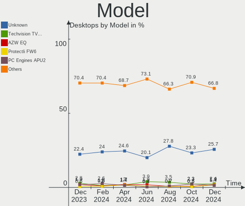
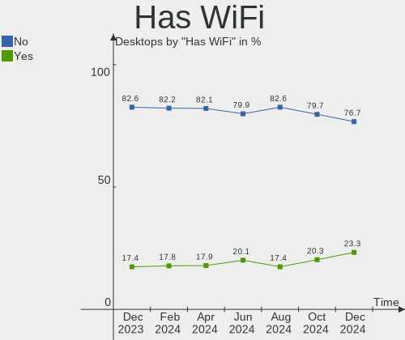
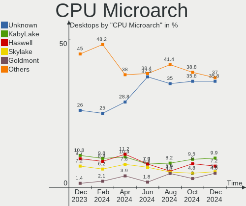
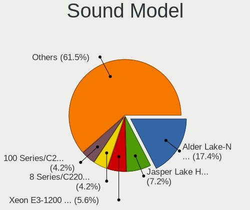

BSD - Hardware Trends (Desktops)
--------------------------------

A project to identify most popular hardware characteristics and track their change
over time based on data collected by BSD users at https://BSD-Hardware.info.

Anyone can contribute to this report by the [hw-probe](https://github.com/linuxhw/hw-probe/blob/master/INSTALL.BSD.md) tool:

    hw-probe -all -upload

This report is for one last month. Overall report since the beginning of time: [TestCoverage](https://github.com/bsdhw/TestCoverage)

Period: May, 2022.

Contents
--------

* [ System ](#system)
  - [ OS                       ](#os)
  - [ OS Family                ](#os-family)
  - [ Arch                     ](#arch)
  - [ DE                       ](#de)
  - [ Display Server           ](#display-server)
  - [ Display Manager          ](#display-manager)
  - [ OS Lang                  ](#os-lang)
  - [ Boot Mode                ](#boot-mode)
  - [ Filesystem               ](#filesystem)
  - [ Part. scheme             ](#part-scheme)

* [ Board ](#board)
  - [ Vendor                   ](#vendor)
  - [ Model                    ](#model)
  - [ Model Family             ](#model-family)
  - [ MFG Year                 ](#mfg-year)
  - [ Form Factor              ](#form-factor)
  - [ Coreboot                 ](#coreboot)
  - [ RAM Size                 ](#ram-size)
  - [ RAM Used                 ](#ram-used)
  - [ Total Drives             ](#total-drives)
  - [ Has CD-ROM               ](#has-cd-rom)
  - [ Has Ethernet             ](#has-ethernet)
  - [ Has WiFi                 ](#has-wifi)
  - [ Has Bluetooth            ](#has-bluetooth)

* [ Location ](#location)
  - [ Country                  ](#country)
  - [ City                     ](#city)

* [ Drives ](#drives)
  - [ Drive Vendor             ](#drive-vendor)
  - [ Drive Model              ](#drive-model)
  - [ HDD Vendor               ](#hdd-vendor)
  - [ SSD Vendor               ](#ssd-vendor)
  - [ Drive Kind               ](#drive-kind)
  - [ Drive Connector          ](#drive-connector)
  - [ Drive Size               ](#drive-size)
  - [ Space Total              ](#space-total)
  - [ Space Used               ](#space-used)
  - [ Malfunc. Drives          ](#malfunc-drives)
  - [ Malfunc. Drive Vendor    ](#malfunc-drive-vendor)
  - [ Malfunc. HDD Vendor      ](#malfunc-hdd-vendor)
  - [ Malfunc. Drive Kind      ](#malfunc-drive-kind)
  - [ Failed Drives            ](#failed-drives)
  - [ Failed Drive Vendor      ](#failed-drive-vendor)
  - [ Drive Status             ](#drive-status)

* [ Storage controller ](#storage-controller)
  - [ Storage Vendor           ](#storage-vendor)
  - [ Storage Model            ](#storage-model)
  - [ Storage Kind             ](#storage-kind)

* [ Processor ](#processor)
  - [ CPU Vendor               ](#cpu-vendor)
  - [ CPU Model                ](#cpu-model)
  - [ CPU Model Family         ](#cpu-model-family)
  - [ CPU Cores                ](#cpu-cores)
  - [ CPU Sockets              ](#cpu-sockets)
  - [ CPU Threads              ](#cpu-threads)
  - [ CPU Microarch            ](#cpu-microarch)

* [ Graphics ](#graphics)
  - [ GPU Vendor               ](#gpu-vendor)
  - [ GPU Model                ](#gpu-model)
  - [ GPU Combo                ](#gpu-combo)
  - [ GPU Driver               ](#gpu-driver)
  - [ GPU Memory               ](#gpu-memory)

* [ Monitor ](#monitor)
  - [ Monitor Vendor           ](#monitor-vendor)
  - [ Monitor Model            ](#monitor-model)
  - [ Monitor Resolution       ](#monitor-resolution)
  - [ Monitor Diagonal         ](#monitor-diagonal)
  - [ Monitor Width            ](#monitor-width)
  - [ Aspect Ratio             ](#aspect-ratio)
  - [ Monitor Area             ](#monitor-area)
  - [ Pixel Density            ](#pixel-density)
  - [ Multiple Monitors        ](#multiple-monitors)

* [ Network ](#network)
  - [ Net Controller Vendor    ](#net-controller-vendor)
  - [ Net Controller Model     ](#net-controller-model)
  - [ Wireless Vendor          ](#wireless-vendor)
  - [ Wireless Model           ](#wireless-model)
  - [ Ethernet Vendor          ](#ethernet-vendor)
  - [ Ethernet Model           ](#ethernet-model)
  - [ Net Controller Kind      ](#net-controller-kind)
  - [ Used Controller          ](#used-controller)
  - [ NICs                     ](#nics)
  - [ IPv6                     ](#ipv6)

* [ Bluetooth ](#bluetooth)
  - [ Bluetooth Vendor         ](#bluetooth-vendor)
  - [ Bluetooth Model          ](#bluetooth-model)

* [ Sound ](#sound)
  - [ Sound Vendor             ](#sound-vendor)
  - [ Sound Model              ](#sound-model)

* [ Memory ](#memory)
  - [ Memory Vendor            ](#memory-vendor)
  - [ Memory Model             ](#memory-model)
  - [ Memory Kind              ](#memory-kind)
  - [ Memory Form Factor       ](#memory-form-factor)
  - [ Memory Size              ](#memory-size)
  - [ Memory Speed             ](#memory-speed)

* [ Printers & scanners ](#printers--scanners)
  - [ Printer Vendor           ](#printer-vendor)
  - [ Printer Model            ](#printer-model)
  - [ Scanner Vendor           ](#scanner-vendor)
  - [ Scanner Model            ](#scanner-model)

* [ Camera ](#camera)
  - [ Camera Vendor            ](#camera-vendor)
  - [ Camera Model             ](#camera-model)

* [ Security ](#security)
  - [ Fingerprint Vendor       ](#fingerprint-vendor)
  - [ Fingerprint Model        ](#fingerprint-model)
  - [ Chipcard Vendor          ](#chipcard-vendor)
  - [ Chipcard Model           ](#chipcard-model)

* [ Unsupported ](#unsupported)
  - [ Unsupported Devices      ](#unsupported-devices)
  - [ Unsupported Device Types ](#unsupported-device-types)

System
------

OS
--

Installed operating systems

| Name                 | Desktops | Percent |
|----------------------|----------|---------|
| OPNsense 22.1.7      | 73       | 30.42%  |
| OPNsense 22.1.6      | 52       | 21.67%  |
| OPNsense 22.1.8      | 32       | 13.33%  |
| FreeBSD 13.1         | 19       | 7.92%   |
| helloSystem 0.7.0    | 16       | 6.67%   |
| OpenBSD 7.1          | 12       | 5%      |
| FreeBSD 13.0-p11     | 5        | 2.08%   |
| FreeBSD 14.0-CURRENT | 4        | 1.67%   |
| OPNsense 21.7.8      | 3        | 1.25%   |
| OPNsense 22.7        | 2        | 0.83%   |
| GhostBSD 22.01.12    | 2        | 0.83%   |
| FreeBSD 13.1-STABLE  | 2        | 0.83%   |
| FreeBSD 13.1-RC6     | 2        | 0.83%   |
| FreeBSD 13.0-p10     | 2        | 0.83%   |
| FreeBSD 12.3-p5      | 2        | 0.83%   |
| OPNsense 22.4        | 1        | 0.42%   |
| OPNsense 22.1.4      | 1        | 0.42%   |
| OPNsense 22.1.2      | 1        | 0.42%   |
| OPNsense 22.1        | 1        | 0.42%   |
| MidnightBSD 2.2.0    | 1        | 0.42%   |
| MidnightBSD 2.1.1    | 1        | 0.42%   |
| helloSystem 0.8.0    | 1        | 0.42%   |
| GhostBSD 22.05.14    | 1        | 0.42%   |
| GhostBSD 22.04.22    | 1        | 0.42%   |
| FreeBSD 13.1-RC3     | 1        | 0.42%   |
| FreeBSD 13.0-p8      | 1        | 0.42%   |
| FreeBSD 13.0-p2      | 1        | 0.42%   |

OS Family
---------

OS without a version

| Name        | Desktops | Percent |
|-------------|----------|---------|
| OPNsense    | 166      | 69.17%  |
| FreeBSD     | 39       | 16.25%  |
| helloSystem | 17       | 7.08%   |
| OpenBSD     | 12       | 5%      |
| GhostBSD    | 4        | 1.67%   |
| MidnightBSD | 2        | 0.83%   |

Arch
----

OS architecture (x86_64, i586, etc.)

| Name  | Desktops | Percent |
|-------|----------|---------|
| amd64 | 226      | 94.17%  |
| arm64 | 11       | 4.58%   |
| i386  | 2        | 0.83%   |
| arm   | 1        | 0.42%   |

DE
--

Desktop Environment

| Name         | Desktops | Percent |
|--------------|----------|---------|
| Console      | 190      | 79.17%  |
| helloDesktop | 27       | 11.25%  |
| KDE5         | 7        | 2.92%   |
| XFCE         | 6        | 2.5%    |
| GNOME        | 3        | 1.25%   |
| Openbox      | 2        | 0.83%   |
| MATE         | 2        | 0.83%   |
| Window Maker | 1        | 0.42%   |
| Compton      | 1        | 0.42%   |
| Cinnamon     | 1        | 0.42%   |

Display Server
--------------

X11 or Wayland

| Name    | Desktops | Percent |
|---------|----------|---------|
| Console | 197      | 82.08%  |
| X11     | 42       | 17.5%   |
| Wayland | 1        | 0.42%   |

Display Manager
---------------

SDDM, LightDM, etc.

| Name    | Desktops | Percent |
|---------|----------|---------|
| Console | 210      | 87.5%   |
| SLiM    | 18       | 7.5%    |
| SDDM    | 6        | 2.5%    |
| LightDM | 4        | 1.67%   |
| XDM     | 1        | 0.42%   |
| GDM     | 1        | 0.42%   |

OS Lang
-------

Language

| Lang    | Desktops | Percent |
|---------|----------|---------|
| Unknown | 179      | 74.58%  |
| C       | 31       | 12.92%  |
| en_US   | 25       | 10.42%  |
| ru_RU   | 2        | 0.83%   |
| en_CA   | 1        | 0.42%   |
| en_AU   | 1        | 0.42%   |
| de_DE   | 1        | 0.42%   |

Boot Mode
---------

EFI or BIOS

| Mode | Desktops | Percent |
|------|----------|---------|
| EFI  | 209      | 87.08%  |
| BIOS | 31       | 12.92%  |

Filesystem
----------

Type of filesystem

| Type   | Desktops | Percent |
|--------|----------|---------|
| Ufs    | 119      | 49.58%  |
| Zfs    | 98       | 40.83%  |
| Ffs    | 12       | 5%      |
| Cd9660 | 11       | 4.58%   |

Part. scheme
------------

Scheme of partitioning

| Type    | Desktops | Percent |
|---------|----------|---------|
| GPT     | 219      | 91.25%  |
| MBR     | 19       | 7.92%   |
| Unknown | 2        | 0.83%   |

Board
-----

Vendor
------

Motherboard manufacturer

| Name                       | Desktops | Percent |
|----------------------------|----------|---------|
| ASUSTek Computer           | 37       | 15.42%  |
| Unknown                    | 35       | 14.58%  |
| Dell                       | 24       | 10%     |
| Protectli                  | 19       | 7.92%   |
| Hewlett-Packard            | 16       | 6.67%   |
| Gigabyte Technology        | 16       | 6.67%   |
| Intel                      | 14       | 5.83%   |
| ASRock                     | 11       | 4.58%   |
| MSI                        | 10       | 4.17%   |
| Supermicro                 | 7        | 2.92%   |
| Fujitsu                    | 7        | 2.92%   |
| Lenovo                     | 5        | 2.08%   |
| PC Engines                 | 4        | 1.67%   |
| MW                         | 4        | 1.67%   |
| Biostar                    | 3        | 1.25%   |
| BESSTAR Tech               | 2        | 0.83%   |
| AMI                        | 2        | 0.83%   |
| YANYU                      | 1        | 0.42%   |
| T-bao                      | 1        | 0.42%   |
| Shuttle                    | 1        | 0.42%   |
| ShenZhen MinWin Technology | 1        | 0.42%   |
| Seeed Studio               | 1        | 0.42%   |
| radxa                      | 1        | 0.42%   |
| Positivo                   | 1        | 0.42%   |
| Pegatron                   | 1        | 0.42%   |
| OEM                        | 1        | 0.42%   |
| NF-M2S                     | 1        | 0.42%   |
| NEXCOM                     | 1        | 0.42%   |
| khadas                     | 1        | 0.42%   |
| JGINYUE                    | 1        | 0.42%   |
| iEi                        | 1        | 0.42%   |
| HARDKERNEL                 | 1        | 0.42%   |
| GVC                        | 1        | 0.42%   |
| friendlyelec               | 1        | 0.42%   |
| Deciso                     | 1        | 0.42%   |
| CNCTION-IAF-E3845          | 1        | 0.42%   |
| BCM Advanced Research      | 1        | 0.42%   |
| AZW                        | 1        | 0.42%   |
| ASRockRack                 | 1        | 0.42%   |
| ADI Engineering            | 1        | 0.42%   |
| Acer                       | 1        | 0.42%   |

Model
-----

Motherboard model

| Name                                     | Desktops | Percent |
|------------------------------------------|----------|---------|
| Unknown                                  | 36       | 15%     |
| Protectli FW4B                           | 8        | 3.33%   |
| Intel Q3XXG4-P V1.0                      | 5        | 2.08%   |
| Protectli FW6                            | 4        | 1.67%   |
| MW GMLK-2_5G4L                           | 4        | 1.67%   |
| MSI MS-7817                              | 4        | 1.67%   |
| Protectli FW2B                           | 3        | 1.25%   |
| HP ProLiant MicroServer                  | 3        | 1.25%   |
| Dell OptiPlex 3020                       | 3        | 1.25%   |
| Supermicro X9SCL/X9SCM                   | 2        | 0.83%   |
| Protectli VP2410                         | 2        | 0.83%   |
| PC Engines APU3                          | 2        | 0.83%   |
| Fujitsu PRIMERGY TX100 S3P               | 2        | 0.83%   |
| Fujitsu FUTRO S920                       | 2        | 0.83%   |
| Dell PowerEdge T30                       | 2        | 0.83%   |
| Dell OptiPlex 990                        | 2        | 0.83%   |
| Dell OptiPlex 7010                       | 2        | 0.83%   |
| ASUS PRIME B350-PLUS                     | 2        | 0.83%   |
| ASUS PRIME A320M-K                       | 2        | 0.83%   |
| ASUS P5Q-E                               | 2        | 0.83%   |
| ASUS All Series                          | 2        | 0.83%   |
| ASRock X570 Phantom Gaming 4             | 2        | 0.83%   |
| AMI PEISIA E3845 VER1.0                  | 2        | 0.83%   |
| YANYU EPIC-N31 Ver:1.1                   | 1        | 0.42%   |
| T-bao MINI PC                            | 1        | 0.42%   |
| Supermicro X7SPA-HF                      | 1        | 0.42%   |
| Supermicro SYS-6028R-TRT                 | 1        | 0.42%   |
| Supermicro SYS-5019D-FN8TP-2-NC041       | 1        | 0.42%   |
| Supermicro SYS-5019A-12TN4               | 1        | 0.42%   |
| Supermicro SYS-5018D-FN4T                | 1        | 0.42%   |
| Shuttle DS10U                            | 1        | 0.42%   |
| ShenZhen MinWin MW-GMLK-2.5G6L           | 1        | 0.42%   |
| Seeed Studio ODYSSEY-X86J4125            | 1        | 0.42%   |
| radxa rock-pi-4                          | 1        | 0.42%   |
| Protectli FW6D                           | 1        | 0.42%   |
| Protectli FW4A                           | 1        | 0.42%   |
| Positivo POS-PIQ77CL                     | 1        | 0.42%   |
| Pegatron h8-1102nl                       | 1        | 0.42%   |
| PC Engines apu4                          | 1        | 0.42%   |
| PC Engines APU2                          | 1        | 0.42%   |
| OEM B85 JHS359                           | 1        | 0.42%   |
| NF-M2S ABIT                              | 1        | 0.42%   |
| NEXCOM NSA3110 B                         | 1        | 0.42%   |
| MSI Pro 3130 Small Form Factor PC        | 1        | 0.42%   |
| MSI MS-7C91                              | 1        | 0.42%   |
| MSI MS-7C82                              | 1        | 0.42%   |
| MSI MS-7369                              | 1        | 0.42%   |
| MSI MS-7309                              | 1        | 0.42%   |
| MSI MS-6788                              | 1        | 0.42%   |
| Lenovo YangTianA8800T                    | 1        | 0.42%   |
| Lenovo ThinkCentre M92p 2121D5U          | 1        | 0.42%   |
| Lenovo ThinkCentre M82 2929CL6           | 1        | 0.42%   |
| Lenovo ThinkCentre M75s Gen 2 11R8000JUS | 1        | 0.42%   |
| Lenovo SHARKBAY 0B98401 WIN              | 1        | 0.42%   |
| khadas edge-v                            | 1        | 0.42%   |
| JGINYUE B85I PLUS V1.0                   | 1        | 0.42%   |
| Intel SKYBAY                             | 1        | 0.42%   |
| Intel S1200KP AAG34877-201               | 1        | 0.42%   |
| Intel Q3XXG4-P                           | 1        | 0.42%   |
| Intel MAHOBAY                            | 1        | 0.42%   |

Model Family
------------

Motherboard model prefix

| Name                               | Desktops | Percent |
|------------------------------------|----------|---------|
| Unknown                            | 36       | 15%     |
| Dell OptiPlex                      | 16       | 6.67%   |
| ASUS PRIME                         | 15       | 6.25%   |
| Protectli FW4B                     | 8        | 3.33%   |
| Intel Q3XXG4-P                     | 6        | 2.5%    |
| ASUS ROG                           | 5        | 2.08%   |
| Protectli FW6                      | 4        | 1.67%   |
| MW GMLK-2                          | 4        | 1.67%   |
| MSI MS-7817                        | 4        | 1.67%   |
| HP ProLiant                        | 4        | 1.67%   |
| ASUS TUF                           | 4        | 1.67%   |
| Protectli FW2B                     | 3        | 1.25%   |
| Lenovo ThinkCentre                 | 3        | 1.25%   |
| HP Compaq                          | 3        | 1.25%   |
| Dell Precision                     | 3        | 1.25%   |
| Supermicro X9SCL                   | 2        | 0.83%   |
| Protectli VP2410                   | 2        | 0.83%   |
| PC Engines APU3                    | 2        | 0.83%   |
| HP ProDesk                         | 2        | 0.83%   |
| Fujitsu PRIMERGY                   | 2        | 0.83%   |
| Fujitsu FUTRO                      | 2        | 0.83%   |
| Fujitsu ESPRIMO                    | 2        | 0.83%   |
| Dell PowerEdge                     | 2        | 0.83%   |
| Dell Inspiron                      | 2        | 0.83%   |
| ASUS P5Q-E                         | 2        | 0.83%   |
| ASUS All                           | 2        | 0.83%   |
| ASRock X570                        | 2        | 0.83%   |
| AMI PEISIA                         | 2        | 0.83%   |
| YANYU EPIC-N31                     | 1        | 0.42%   |
| T-bao MINI                         | 1        | 0.42%   |
| Supermicro X7SPA-HF                | 1        | 0.42%   |
| Supermicro SYS-6028R-TRT           | 1        | 0.42%   |
| Supermicro SYS-5019D-FN8TP-2-NC041 | 1        | 0.42%   |
| Supermicro SYS-5019A-12TN4         | 1        | 0.42%   |
| Supermicro SYS-5018D-FN4T          | 1        | 0.42%   |
| Shuttle DS10U                      | 1        | 0.42%   |
| ShenZhen MinWin MW-GMLK-2.5G6L     | 1        | 0.42%   |
| Seeed Studio ODYSSEY-X86J4125      | 1        | 0.42%   |
| radxa rock-pi-4                    | 1        | 0.42%   |
| Protectli FW6D                     | 1        | 0.42%   |
| Protectli FW4A                     | 1        | 0.42%   |
| Positivo POS-PIQ77CL               | 1        | 0.42%   |
| Pegatron h8-1102nl                 | 1        | 0.42%   |
| PC Engines apu4                    | 1        | 0.42%   |
| PC Engines APU2                    | 1        | 0.42%   |
| OEM B85                            | 1        | 0.42%   |
| NF-M2S ABIT                        | 1        | 0.42%   |
| NEXCOM NSA3110                     | 1        | 0.42%   |
| MSI Pro                            | 1        | 0.42%   |
| MSI MS-7C91                        | 1        | 0.42%   |
| MSI MS-7C82                        | 1        | 0.42%   |
| MSI MS-7369                        | 1        | 0.42%   |
| MSI MS-7309                        | 1        | 0.42%   |
| MSI MS-6788                        | 1        | 0.42%   |
| Lenovo YangTianA8800T              | 1        | 0.42%   |
| Lenovo SHARKBAY                    | 1        | 0.42%   |
| khadas edge-v                      | 1        | 0.42%   |
| JGINYUE B85I                       | 1        | 0.42%   |
| Intel SKYBAY                       | 1        | 0.42%   |
| Intel S1200KP                      | 1        | 0.42%   |

MFG Year
--------

Motherboard manufacture year

| Year    | Desktops | Percent |
|---------|----------|---------|
| 2021    | 35       | 14.58%  |
| 2018    | 31       | 12.92%  |
| 2020    | 27       | 11.25%  |
| 2019    | 25       | 10.42%  |
| 2017    | 16       | 6.67%   |
| 2022    | 13       | 5.42%   |
| 2014    | 12       | 5%      |
| 2013    | 12       | 5%      |
| 2011    | 12       | 5%      |
| 2012    | 11       | 4.58%   |
| Unknown | 11       | 4.58%   |
| 2016    | 10       | 4.17%   |
| 2015    | 9        | 3.75%   |
| 2009    | 6        | 2.5%    |
| 2010    | 5        | 2.08%   |
| 2008    | 3        | 1.25%   |
| 2007    | 2        | 0.83%   |

Form Factor
-----------

Physical design of the computer

| Name    | Desktops | Percent |
|---------|----------|---------|
| Desktop | 240      | 100%    |

Coreboot
--------

Have coreboot on board

| Used | Desktops | Percent |
|------|----------|---------|
| No   | 231      | 96.25%  |
| Yes  | 9        | 3.75%   |

RAM Size
--------

Total RAM memory

| Size in GB  | Desktops | Percent |
|-------------|----------|---------|
| 8.01-16.0   | 97       | 40.42%  |
| 16.01-24.0  | 50       | 20.83%  |
| 4.01-8.0    | 43       | 17.92%  |
| 32.01-64.0  | 20       | 8.33%   |
| 2.01-3.0    | 9        | 3.75%   |
| 64.01-256.0 | 8        | 3.33%   |
| 3.01-4.0    | 4        | 1.67%   |
| 1.01-2.0    | 3        | 1.25%   |
| 24.01-32.0  | 2        | 0.83%   |
| 0.51-1.0    | 2        | 0.83%   |
| 0.01-0.5    | 2        | 0.83%   |

RAM Used
--------

Used RAM memory

| Used GB  | Desktops | Percent |
|----------|----------|---------|
| 0.01-0.5 | 138      | 57.5%   |
| 0.51-1.0 | 69       | 28.75%  |
| 1.01-2.0 | 17       | 7.08%   |
| 3.01-4.0 | 6        | 2.5%    |
| 2.01-3.0 | 6        | 2.5%    |
| 0        | 4        | 1.67%   |

Total Drives
------------

Number of drives on board

| Drives | Desktops | Percent |
|--------|----------|---------|
| 1      | 164      | 68.33%  |
| 2      | 34       | 14.17%  |
| 0      | 21       | 8.75%   |
| 4      | 8        | 3.33%   |
| 3      | 7        | 2.92%   |
| 5      | 2        | 0.83%   |
| 15     | 1        | 0.42%   |
| 13     | 1        | 0.42%   |
| 7      | 1        | 0.42%   |
| 6      | 1        | 0.42%   |

Has CD-ROM
----------

Has CD-ROM on board

| Presented | Desktops | Percent |
|-----------|----------|---------|
| No        | 196      | 81.67%  |
| Yes       | 44       | 18.33%  |

Has Ethernet
------------

Has Ethernet on board

| Presented | Desktops | Percent |
|-----------|----------|---------|
| Yes       | 228      | 95%     |
| No        | 12       | 5%      |

Has WiFi
--------

Has WiFi module

| Presented | Desktops | Percent |
|-----------|----------|---------|
| No        | 196      | 81.67%  |
| Yes       | 44       | 18.33%  |

Has Bluetooth
-------------

Has Bluetooth module

| Presented | Desktops | Percent |
|-----------|----------|---------|
| No        | 212      | 88.33%  |
| Yes       | 28       | 11.67%  |

Location
--------

Country
-------

Geographic location (country)

| Country            | Desktops | Percent |
|--------------------|----------|---------|
| USA                | 76       | 31.67%  |
| Germany            | 32       | 13.33%  |
| Canada             | 13       | 5.42%   |
| Russia             | 10       | 4.17%   |
| Netherlands        | 8        | 3.33%   |
| France             | 7        | 2.92%   |
| Switzerland        | 6        | 2.5%    |
| UK                 | 5        | 2.08%   |
| Italy              | 5        | 2.08%   |
| Austria            | 5        | 2.08%   |
| New Zealand        | 4        | 1.67%   |
| Mexico             | 4        | 1.67%   |
| Brazil             | 4        | 1.67%   |
| Australia          | 4        | 1.67%   |
| South Africa       | 3        | 1.25%   |
| Portugal           | 3        | 1.25%   |
| Poland             | 3        | 1.25%   |
| Norway             | 3        | 1.25%   |
| Denmark            | 3        | 1.25%   |
| China              | 3        | 1.25%   |
| Belgium            | 3        | 1.25%   |
| Romania            | 2        | 0.83%   |
| Paraguay           | 2        | 0.83%   |
| Japan              | 2        | 0.83%   |
| India              | 2        | 0.83%   |
| Greece             | 2        | 0.83%   |
| Dominican Republic | 2        | 0.83%   |
| Czechia            | 2        | 0.83%   |
| Ukraine            | 1        | 0.42%   |
| Turkey             | 1        | 0.42%   |
| Thailand           | 1        | 0.42%   |
| Taiwan             | 1        | 0.42%   |
| Sweden             | 1        | 0.42%   |
| Spain              | 1        | 0.42%   |
| South Korea        | 1        | 0.42%   |
| Slovenia           | 1        | 0.42%   |
| Singapore          | 1        | 0.42%   |
| Serbia             | 1        | 0.42%   |
| Peru               | 1        | 0.42%   |
| Monaco             | 1        | 0.42%   |
| Malaysia           | 1        | 0.42%   |
| Lithuania          | 1        | 0.42%   |
| Israel             | 1        | 0.42%   |
| Ireland            | 1        | 0.42%   |
| Indonesia          | 1        | 0.42%   |
| Hungary            | 1        | 0.42%   |
| Hong Kong          | 1        | 0.42%   |
| Croatia            | 1        | 0.42%   |
| Bolivia            | 1        | 0.42%   |
| Argentina          | 1        | 0.42%   |

City
----

Geographic location (city)

| City                        | Desktops | Percent |
|-----------------------------|----------|---------|
| Poortugaal                  | 4        | 1.67%   |
| Frisco                      | 4        | 1.67%   |
| Vienna                      | 3        | 1.25%   |
| Paris                       | 3        | 1.25%   |
| Moscow                      | 3        | 1.25%   |
| Zurich                      | 2        | 0.83%   |
| Ypsilanti                   | 2        | 0.83%   |
| St Petersburg               | 2        | 0.83%   |
| Santo Domingo Este          | 2        | 0.83%   |
| Salem                       | 2        | 0.83%   |
| Saarbrücken                | 2        | 0.83%   |
| Redmond                     | 2        | 0.83%   |
| Ottawa                      | 2        | 0.83%   |
| Munich                      | 2        | 0.83%   |
| Frankfurt am Main           | 2        | 0.83%   |
| Denver                      | 2        | 0.83%   |
| Berlin                      | 2        | 0.83%   |
| Austin                      | 2        | 0.83%   |
| Zhengzhou                   | 1        | 0.42%   |
| Zapopan                     | 1        | 0.42%   |
| Wichita Falls               | 1        | 0.42%   |
| West Fargo                  | 1        | 0.42%   |
| Wendell                     | 1        | 0.42%   |
| Wenatchee                   | 1        | 0.42%   |
| Watford                     | 1        | 0.42%   |
| Warsaw                      | 1        | 0.42%   |
| Warminster                  | 1        | 0.42%   |
| Waldorf                     | 1        | 0.42%   |
| Vila Real de Santo António | 1        | 0.42%   |
| Vénissieux                 | 1        | 0.42%   |
| Velbert                     | 1        | 0.42%   |
| Valladolid                  | 1        | 0.42%   |
| Tromsø                     | 1        | 0.42%   |
| Trieste                     | 1        | 0.42%   |
| Traverse City               | 1        | 0.42%   |
| Toulouse                    | 1        | 0.42%   |
| Toronto                     | 1        | 0.42%   |
| Tolmin                      | 1        | 0.42%   |
| Tinley Park                 | 1        | 0.42%   |
| Terrebonne                  | 1        | 0.42%   |
| Targoviste                  | 1        | 0.42%   |
| Taipei                      | 1        | 0.42%   |
| Tacoma                      | 1        | 0.42%   |
| Taastrup                    | 1        | 0.42%   |
| Sydney                      | 1        | 0.42%   |
| Surrey                      | 1        | 0.42%   |
| Sunbury                     | 1        | 0.42%   |
| Stuttgart                   | 1        | 0.42%   |
| Stopnica                    | 1        | 0.42%   |
| Statesboro                  | 1        | 0.42%   |
| St. Albert                  | 1        | 0.42%   |
| Springfield                 | 1        | 0.42%   |
| Somersworth                 | 1        | 0.42%   |
| Somerset West               | 1        | 0.42%   |
| Skowhegan                   | 1        | 0.42%   |
| Singapore                   | 1        | 0.42%   |
| Scunthorpe                  | 1        | 0.42%   |
| Sarnia                      | 1        | 0.42%   |
| San Luis Potosí City       | 1        | 0.42%   |
| San Jose                    | 1        | 0.42%   |

Drives
------

Drive Vendor
------------

Hard drive vendors

| Vendor              | Desktops | Drives | Percent |
|---------------------|----------|--------|---------|
| Samsung Electronics | 45       | 58     | 16.54%  |
| WDC                 | 33       | 48     | 12.13%  |
| Kingston            | 25       | 26     | 9.19%   |
| Seagate             | 24       | 38     | 8.82%   |
| Transcend           | 12       | 12     | 4.41%   |
| Toshiba             | 11       | 17     | 4.04%   |
| Crucial             | 11       | 13     | 4.04%   |
| Intel               | 10       | 12     | 3.68%   |
| SanDisk             | 8        | 9      | 2.94%   |
| Hitachi             | 8        | 12     | 2.94%   |
| Hoodisk             | 6        | 6      | 2.21%   |
| A-DATA Technology   | 6        | 7      | 2.21%   |
| ShiJi               | 4        | 4      | 1.47%   |
| FORESEE             | 4        | 4      | 1.47%   |
| BIWIN               | 4        | 4      | 1.47%   |
| SPCC                | 3        | 3      | 1.1%    |
| Protectli           | 3        | 3      | 1.1%    |
| KIOXIA              | 3        | 3      | 1.1%    |
| Hewlett-Packard     | 3        | 3      | 1.1%    |
| Dogfish             | 3        | 3      | 1.1%    |
| CORSAIR             | 3        | 3      | 1.1%    |
| China               | 3        | 3      | 1.1%    |
| XPG                 | 2        | 2      | 0.74%   |
| Wicgtyp             | 2        | 2      | 0.74%   |
| Verbatim            | 2        | 2      | 0.74%   |
| Phison              | 2        | 2      | 0.74%   |
| OCZ                 | 2        | 2      | 0.74%   |
| NVMe                | 2        | 3      | 0.74%   |
| Micron Technology   | 2        | 3      | 0.74%   |
| Intenso             | 2        | 2      | 0.74%   |
| Apacer              | 2        | 2      | 0.74%   |
| Vaseky              | 1        | 1      | 0.37%   |
| Team                | 1        | 1      | 0.37%   |
| StoreJet            | 1        | 1      | 0.37%   |
| SK Hynix            | 1        | 1      | 0.37%   |
| Silicon Motion      | 1        | 1      | 0.37%   |
| Patriot             | 1        | 1      | 0.37%   |
| ORTIAL              | 1        | 1      | 0.37%   |
| ORICO               | 1        | 1      | 0.37%   |
| MyDigitalSSD        | 1        | 1      | 0.37%   |
| LITEONIT            | 1        | 1      | 0.37%   |
| LITEON              | 1        | 1      | 0.37%   |
| Lexar               | 1        | 1      | 0.37%   |
| KingSpec            | 1        | 1      | 0.37%   |
| Kingchuxing         | 1        | 1      | 0.37%   |
| InnoLite            | 1        | 1      | 0.37%   |
| HGST                | 1        | 3      | 0.37%   |
| Gigabyte Technology | 1        | 1      | 0.37%   |
| Fordisk             | 1        | 1      | 0.37%   |
| EAGET               | 1        | 1      | 0.37%   |
| DST                 | 1        | 1      | 0.37%   |
| Drevo               | 1        | 1      | 0.37%   |
| AMD                 | 1        | 1      | 0.37%   |

Drive Model
-----------

Hard drive models

| Model                          | Desktops | Percent |
|--------------------------------|----------|---------|
| Samsung SSD 850 EVO 500GB      | 4        | 1.37%   |
| Samsung SSD 850 EVO 250GB      | 4        | 1.37%   |
| Kingston SA400S37120G 120GB    | 4        | 1.37%   |
| BIWIN SSD 128GB                | 4        | 1.37%   |
| Transcend TS64GMSA230S 64GB    | 3        | 1.03%   |
| ShiJi SSD 128GB                | 3        | 1.03%   |
| Seagate ST1000DM010-2EP102 1TB | 3        | 1.03%   |
| Samsung SSD 860 EVO 500GB      | 3        | 1.03%   |
| Kingston SA400S37240G 240GB    | 3        | 1.03%   |
| Hoodisk SSD 32GB               | 3        | 1.03%   |
| FORESEE 128GB SSD              | 3        | 1.03%   |
| Crucial CT240BX500SSD1 240GB   | 3        | 1.03%   |
| XPG GAMMIX S11 Pro 256GB       | 2        | 0.68%   |
| Wicgtyp M900-128 128GB         | 2        | 0.68%   |
| WDC WD40EFZX-68AWUN0 4TB       | 2        | 0.68%   |
| Verbatim Vi550 S3 SSD 512GB    | 2        | 0.68%   |
| Transcend TS64GMSA370 64GB     | 2        | 0.68%   |
| Transcend TS256GMSA230S 256GB  | 2        | 0.68%   |
| Transcend TS128GMSA230S 128GB  | 2        | 0.68%   |
| Toshiba DT01ACA100 1TB         | 2        | 0.68%   |
| Toshiba DT01ACA050 500GB       | 2        | 0.68%   |
| SPCC Solid State Disk 1TB      | 2        | 0.68%   |
| Seagate ST4000DM000-1F2168 4TB | 2        | 0.68%   |
| Samsung SSD 980 PRO 500GB      | 2        | 0.68%   |
| Samsung SSD 980 PRO 1TB        | 2        | 0.68%   |
| Samsung SSD 870 QVO 2TB        | 2        | 0.68%   |
| Samsung SSD 870 EVO 1TB        | 2        | 0.68%   |
| Samsung SSD 860 EVO 250GB      | 2        | 0.68%   |
| Samsung SSD 850 EVO 1TB        | 2        | 0.68%   |
| Samsung SSD 750 EVO 120GB      | 2        | 0.68%   |
| Samsung HD161HJ 160GB          | 2        | 0.68%   |
| Phison Sabrent 1TB             | 2        | 0.68%   |
| KIOXIA KBG40ZNV1T02 1TB        | 2        | 0.68%   |
| Kingston SV300S37A60G 64GB     | 2        | 0.68%   |
| Kingston SV300S37A120G 120GB   | 2        | 0.68%   |
| Kingston SUV500MS120G 120GB    | 2        | 0.68%   |
| Kingston SKC600MS256G 256GB    | 2        | 0.68%   |
| Kingston OM8PDP3256B-A01 256GB | 2        | 0.68%   |
| Intel SSDSC2BB080G4 80GB       | 2        | 0.68%   |
| Hoodisk SSD 128GB              | 2        | 0.68%   |
| Crucial CT500P2SSD8 500GB      | 2        | 0.68%   |
| A-DATA SU650 240GB             | 2        | 0.68%   |
| WDC WDS120G2G0A-00JH30 120GB   | 1        | 0.34%   |
| WDC WD80EMAZ-00WJTA0 8TB       | 1        | 0.34%   |
| WDC WD80EFZX-68UW8N0 8TB       | 1        | 0.34%   |
| WDC WD80EFBX-68AZZN0 8TB       | 1        | 0.34%   |
| WDC WD80EFAX-68LHPN0 8TB       | 1        | 0.34%   |
| WDC WD80EDBZ-11B0ZA0 8TB       | 1        | 0.34%   |
| WDC WD800JD-60LSA5 80GB        | 1        | 0.34%   |
| WDC WD8003FFBX-68B9AN0 8TB     | 1        | 0.34%   |
| WDC WD6400AARS-00Y5B1 640GB    | 1        | 0.34%   |
| WDC WD5000AZLX-00K2TA0 500GB   | 1        | 0.34%   |
| WDC WD5000AAKX-60U6AA0 500GB   | 1        | 0.34%   |
| WDC WD40EZRZ-22GXCB0 4TB       | 1        | 0.34%   |
| WDC WD40EFRX-68N32N0 4TB       | 1        | 0.34%   |
| WDC WD4000AAKS-00C8A0 400GB    | 1        | 0.34%   |
| WDC WD3200BEVT-22A23T0 320GB   | 1        | 0.34%   |
| WDC WD3200BEKT-00KA9T0 320GB   | 1        | 0.34%   |
| WDC WD3200AAJS-60Z0A0 320GB    | 1        | 0.34%   |
| WDC WD3200AAJS-60M0A0 320GB    | 1        | 0.34%   |

HDD Vendor
----------

Hard disk drive vendors

| Vendor              | Desktops | Drives | Percent |
|---------------------|----------|--------|---------|
| WDC                 | 29       | 43     | 38.16%  |
| Seagate             | 21       | 35     | 27.63%  |
| Toshiba             | 9        | 15     | 11.84%  |
| Hitachi             | 8        | 12     | 10.53%  |
| Samsung Electronics | 3        | 4      | 3.95%   |
| Hewlett-Packard     | 2        | 2      | 2.63%   |
| StoreJet            | 1        | 1      | 1.32%   |
| NVMe                | 1        | 2      | 1.32%   |
| InnoLite            | 1        | 1      | 1.32%   |
| HGST                | 1        | 3      | 1.32%   |

SSD Vendor
----------

Solid state drive vendors

| Vendor              | Desktops | Drives | Percent |
|---------------------|----------|--------|---------|
| Samsung Electronics | 32       | 38     | 20.13%  |
| Kingston            | 21       | 22     | 13.21%  |
| Transcend           | 11       | 11     | 6.92%   |
| Crucial             | 9        | 9      | 5.66%   |
| SanDisk             | 8        | 9      | 5.03%   |
| Intel               | 8        | 10     | 5.03%   |
| Hoodisk             | 6        | 6      | 3.77%   |
| A-DATA Technology   | 5        | 6      | 3.14%   |
| ShiJi               | 4        | 4      | 2.52%   |
| FORESEE             | 4        | 4      | 2.52%   |
| BIWIN               | 4        | 4      | 2.52%   |
| SPCC                | 3        | 3      | 1.89%   |
| Protectli           | 3        | 3      | 1.89%   |
| Dogfish             | 3        | 3      | 1.89%   |
| China               | 3        | 3      | 1.89%   |
| Wicgtyp             | 2        | 2      | 1.26%   |
| Verbatim            | 2        | 2      | 1.26%   |
| Seagate             | 2        | 2      | 1.26%   |
| OCZ                 | 2        | 2      | 1.26%   |
| Micron Technology   | 2        | 3      | 1.26%   |
| Intenso             | 2        | 2      | 1.26%   |
| Corsair             | 2        | 2      | 1.26%   |
| Apacer              | 2        | 2      | 1.26%   |
| WDC                 | 1        | 1      | 0.63%   |
| Vaseky              | 1        | 1      | 0.63%   |
| Toshiba             | 1        | 1      | 0.63%   |
| Team                | 1        | 1      | 0.63%   |
| Patriot             | 1        | 1      | 0.63%   |
| ORICO               | 1        | 1      | 0.63%   |
| NVMe                | 1        | 1      | 0.63%   |
| MyDigitalSSD        | 1        | 1      | 0.63%   |
| LITEONIT            | 1        | 1      | 0.63%   |
| LITEON              | 1        | 1      | 0.63%   |
| Lexar               | 1        | 1      | 0.63%   |
| KingSpec            | 1        | 1      | 0.63%   |
| Kingchuxing         | 1        | 1      | 0.63%   |
| Gigabyte Technology | 1        | 1      | 0.63%   |
| Fordisk             | 1        | 1      | 0.63%   |
| EAGET               | 1        | 1      | 0.63%   |
| DST                 | 1        | 1      | 0.63%   |
| Drevo               | 1        | 1      | 0.63%   |
| AMD                 | 1        | 1      | 0.63%   |

Drive Kind
----------

HDD or SSD

| Kind | Desktops | Drives | Percent |
|------|----------|--------|---------|
| SSD  | 149      | 171    | 59.36%  |
| HDD  | 64       | 118    | 25.5%   |
| NVMe | 38       | 46     | 15.14%  |

Drive Connector
---------------

SATA, SAS, NVMe, etc.

| Type | Desktops | Drives | Percent |
|------|----------|--------|---------|
| SATA | 192      | 289    | 83.48%  |
| NVMe | 38       | 46     | 16.52%  |

Drive Size
----------

Size of hard drive

| Size in TB | Desktops | Drives | Percent |
|------------|----------|--------|---------|
| 0.01-0.5   | 162      | 186    | 72.65%  |
| 0.51-1.0   | 35       | 41     | 15.7%   |
| 1.01-2.0   | 11       | 19     | 4.93%   |
| 3.01-4.0   | 7        | 10     | 3.14%   |
| 4.01-10.0  | 6        | 30     | 2.69%   |
| 2.01-3.0   | 1        | 1      | 0.45%   |
| 10.01-20.0 | 1        | 2      | 0.45%   |

Space Total
-----------

Amount of disk space available on the file system

| Size in GB     | Desktops | Percent |
|----------------|----------|---------|
| 101-250        | 106      | 44.17%  |
| 251-500        | 35       | 14.58%  |
| 21-50          | 27       | 11.25%  |
| 1-20           | 24       | 10%     |
| 501-1000       | 21       | 8.75%   |
| 51-100         | 18       | 7.5%    |
| 1001-2000      | 5        | 2.08%   |
| Unknown        | 2        | 0.83%   |
| More than 3000 | 1        | 0.42%   |
| 2001-3000      | 1        | 0.42%   |

Space Used
----------

Amount of used disk space

| Used GB        | Desktops | Percent |
|----------------|----------|---------|
| 1-20           | 218      | 90.83%  |
| 21-50          | 11       | 4.58%   |
| 51-100         | 5        | 2.08%   |
| 101-250        | 3        | 1.25%   |
| Unknown        | 2        | 0.83%   |
| More than 3000 | 1        | 0.42%   |

Malfunc. Drives
---------------

Drive models with a malfunction

| Model                                      | Desktops | Drives | Percent |
|--------------------------------------------|----------|--------|---------|
| Samsung Electronics SSD 870 EVO 1TB        | 2        | 4      | 8%      |
| WDC WDS120G2G0A-00JH30 120GB               | 1        | 1      | 4%      |
| WDC WD4000AAKS-00C8A0 400GB                | 1        | 1      | 4%      |
| WDC WD3200BEVT-22A23T0 320GB               | 1        | 1      | 4%      |
| WDC WD3200AAJS-60M0A0 320GB                | 1        | 1      | 4%      |
| WDC WD1001FALS-00J7B1 1TB                  | 1        | 1      | 4%      |
| Toshiba MQ01ABD075 752GB                   | 1        | 1      | 4%      |
| Seagate ST500DM002-1BC142 500GB            | 1        | 1      | 4%      |
| Seagate ST3500413AS 500GB                  | 1        | 1      | 4%      |
| Seagate ST31000520AS 1TB                   | 1        | 1      | 4%      |
| Seagate ST250DM000-1BD141 250GB            | 1        | 1      | 4%      |
| Seagate ST1000LM024 HN-M101MBB 1TB         | 1        | 1      | 4%      |
| Seagate ST1000DM003-1ER162 1TB             | 1        | 1      | 4%      |
| SanDisk SD8TB8U-256G-1006 256GB            | 1        | 1      | 4%      |
| Samsung Electronics HD321KJ 320GB          | 1        | 1      | 4%      |
| Samsung Electronics HD161HJ 160GB          | 1        | 1      | 4%      |
| MyDigitalSSD SB2 128GB                     | 1        | 1      | 4%      |
| Micron Technology 1100_MTFDDAK512TBN 512GB | 1        | 2      | 4%      |
| Kingston SV300S37A60G 64GB                 | 1        | 1      | 4%      |
| Kingston SA400S37120G 120GB                | 1        | 1      | 4%      |
| InnoLite InnoDisk. - iCF 16GB              | 1        | 1      | 4%      |
| Hitachi HDS723015BLA642 1.5TB              | 1        | 1      | 4%      |
| Hewlett-Packard MB1000GCWCV 1TB            | 1        | 1      | 4%      |
| Apacer 32GB SATA Flash Drive               | 1        | 1      | 4%      |

Malfunc. Drive Vendor
---------------------

Vendors of faulty drives

| Vendor              | Desktops | Drives | Percent |
|---------------------|----------|--------|---------|
| Seagate             | 6        | 6      | 24%     |
| WDC                 | 5        | 5      | 20%     |
| Samsung Electronics | 4        | 6      | 16%     |
| Kingston            | 2        | 2      | 8%      |
| Toshiba             | 1        | 1      | 4%      |
| SanDisk             | 1        | 1      | 4%      |
| MyDigitalSSD        | 1        | 1      | 4%      |
| Micron Technology   | 1        | 2      | 4%      |
| InnoLite            | 1        | 1      | 4%      |
| Hitachi             | 1        | 1      | 4%      |
| Hewlett-Packard     | 1        | 1      | 4%      |
| Apacer              | 1        | 1      | 4%      |

Malfunc. HDD Vendor
-------------------

Vendors of faulty HDD drives

| Vendor              | Desktops | Drives | Percent |
|---------------------|----------|--------|---------|
| Seagate             | 6        | 6      | 37.5%   |
| WDC                 | 4        | 4      | 25%     |
| Samsung Electronics | 2        | 2      | 12.5%   |
| Toshiba             | 1        | 1      | 6.25%   |
| InnoLite            | 1        | 1      | 6.25%   |
| Hitachi             | 1        | 1      | 6.25%   |
| Hewlett-Packard     | 1        | 1      | 6.25%   |

Malfunc. Drive Kind
-------------------

Kinds of faulty drives

| Kind | Desktops | Drives | Percent |
|------|----------|--------|---------|
| HDD  | 15       | 16     | 65.22%  |
| SSD  | 8        | 12     | 34.78%  |

Failed Drives
-------------

Failed drive models

| Model                       | Desktops | Drives | Percent |
|-----------------------------|----------|--------|---------|
| WDC WD6400AARS-00Y5B1 640GB | 1        | 1      | 100%    |

Failed Drive Vendor
-------------------

Failed drive vendors

| Vendor | Desktops | Drives | Percent |
|--------|----------|--------|---------|
| WDC    | 1        | 1      | 100%    |

Drive Status
------------

Number of failed and malfunc. drives

| Status   | Desktops | Drives | Percent |
|----------|----------|--------|---------|
| Works    | 201      | 302    | 88.16%  |
| Malfunc  | 23       | 28     | 10.09%  |
| Detected | 3        | 4      | 1.32%   |
| Failed   | 1        | 1      | 0.44%   |

Storage controller
------------------

Storage Vendor
--------------

Storage controller vendors

| Vendor                      | Desktops | Percent |
|-----------------------------|----------|---------|
| Intel                       | 176      | 64.23%  |
| AMD                         | 45       | 16.42%  |
| Samsung Electronics         | 14       | 5.11%   |
| Silicon Motion              | 5        | 1.82%   |
| Sandisk                     | 4        | 1.46%   |
| Nvidia                      | 4        | 1.46%   |
| Kingston Technology Company | 4        | 1.46%   |
| Phison Electronics          | 3        | 1.09%   |
| Micron/Crucial Technology   | 3        | 1.09%   |
| KIOXIA                      | 3        | 1.09%   |
| Broadcom / LSI              | 3        | 1.09%   |
| ADATA Technology            | 3        | 1.09%   |
| Toshiba                     | 1        | 0.36%   |
| SK Hynix                    | 1        | 0.36%   |
| Seagate Technology          | 1        | 0.36%   |
| Marvell Technology Group    | 1        | 0.36%   |
| JMicron Technology          | 1        | 0.36%   |
| Chelsio Communications      | 1        | 0.36%   |
| ASMedia Technology          | 1        | 0.36%   |

Storage Model
-------------

Storage controller models

| Model                                                                                   | Desktops | Percent |
|-----------------------------------------------------------------------------------------|----------|---------|
| AMD FCH SATA Controller [AHCI mode]                                                     | 28       | 8.81%   |
| Intel Celeron/Pentium Silver Processor SATA Controller                                  | 21       | 6.6%    |
| Intel 8 Series/C220 Series Chipset Family 6-port SATA Controller 1 [AHCI mode]          | 19       | 5.97%   |
| Intel Atom/Celeron/Pentium Processor x5-E8000/J3xxx/N3xxx Series SATA Controller        | 17       | 5.35%   |
| Intel 6 Series/C200 Series Chipset Family 6 port Desktop SATA AHCI Controller           | 14       | 4.4%    |
| Intel Sunrise Point-LP SATA Controller [AHCI mode]                                      | 12       | 3.77%   |
| Intel 7 Series/C210 Series Chipset Family 6-port SATA Controller [AHCI mode]            | 7        | 2.2%    |
| Intel 200 Series PCH SATA controller [AHCI mode]                                        | 7        | 2.2%    |
| AMD 500 Series Chipset SATA Controller                                                  | 7        | 2.2%    |
| Intel Cannon Lake PCH SATA AHCI Controller                                              | 6        | 1.89%   |
| Intel Atom Processor E3800 Series SATA AHCI Controller                                  | 6        | 1.89%   |
| AMD 400 Series Chipset SATA Controller                                                  | 6        | 1.89%   |
| Samsung NVMe SSD Controller SM961/PM961/SM963                                           | 5        | 1.57%   |
| Intel Q170/Q150/B150/H170/H110/Z170/CM236 Chipset SATA Controller [AHCI Mode]           | 5        | 1.57%   |
| AMD SB7x0/SB8x0/SB9x0 SATA Controller [AHCI mode]                                       | 5        | 1.57%   |
| Silicon Motion SM2263EN/SM2263XT SSD Controller                                         | 4        | 1.26%   |
| Samsung NVMe SSD Controller SM981/PM981/PM983                                           | 4        | 1.26%   |
| Samsung NVMe SSD Controller PM9A1/PM9A3/980PRO                                          | 4        | 1.26%   |
| Intel Wildcat Point-LP SATA Controller [AHCI Mode]                                      | 4        | 1.26%   |
| Intel Comet Lake SATA AHCI Controller                                                   | 4        | 1.26%   |
| Intel 82801G (ICH7 Family) IDE Controller                                               | 4        | 1.26%   |
| Intel 7 Series/C210 Series Chipset Family 4-port SATA Controller [IDE mode]             | 4        | 1.26%   |
| Intel 7 Series/C210 Series Chipset Family 2-port SATA Controller [IDE mode]             | 4        | 1.26%   |
| Intel 500 Series Chipset Family SATA AHCI Controller                                    | 4        | 1.26%   |
| AMD FCH SATA Controller D                                                               | 4        | 1.26%   |
| AMD 300 Series Chipset SATA Controller                                                  | 4        | 1.26%   |
| Micron/Crucial P2 NVMe PCIe SSD                                                         | 3        | 0.94%   |
| KIOXIA unknown                                                                          | 3        | 0.94%   |
| Intel SATA Controller [RAID mode]                                                       | 3        | 0.94%   |
| Intel NM10/ICH7 Family SATA Controller [IDE mode]                                       | 3        | 0.94%   |
| Intel Cannon Point-LP SATA Controller [AHCI Mode]                                       | 3        | 0.94%   |
| Intel Alder Lake-S PCH SATA Controller [AHCI Mode]                                      | 3        | 0.94%   |
| Intel 8 Series SATA Controller 1 [AHCI mode]                                            | 3        | 0.94%   |
| Intel 400 Series Chipset Family SATA AHCI Controller                                    | 3        | 0.94%   |
| AMD SB7x0/SB8x0/SB9x0 IDE Controller                                                    | 3        | 0.94%   |
| AMD FCH SATA Controller [IDE mode]                                                      | 3        | 0.94%   |
| ADATA XPG SX8200 Pro PCIe Gen3x4 M.2 2280 Solid State Drive                             | 3        | 0.94%   |
| Sandisk WD Black SN750 / PC SN730 NVMe SSD                                              | 2        | 0.63%   |
| Phison E12 NVMe Controller                                                              | 2        | 0.63%   |
| Nvidia MCP61 SATA Controller                                                            | 2        | 0.63%   |
| Nvidia MCP61 IDE                                                                        | 2        | 0.63%   |
| Kingston Company OM3PDP3 NVMe SSD                                                       | 2        | 0.63%   |
| Intel NM10/ICH7 Family SATA Controller [AHCI mode]                                      | 2        | 0.63%   |
| Intel C610/X99 series chipset 6-Port SATA Controller [AHCI mode]                        | 2        | 0.63%   |
| Intel 82801JI (ICH10 Family) SATA AHCI Controller                                       | 2        | 0.63%   |
| Intel 82801JD/DO (ICH10 Family) SATA AHCI Controller                                    | 2        | 0.63%   |
| Intel 6 Series/C200 Series Chipset Family Desktop SATA Controller (IDE mode, ports 4-5) | 2        | 0.63%   |
| Intel 6 Series/C200 Series Chipset Family Desktop SATA Controller (IDE mode, ports 0-3) | 2        | 0.63%   |
| Intel 5 Series/3400 Series Chipset 6 port SATA AHCI Controller                          | 2        | 0.63%   |
| AMD X370 Series Chipset SATA Controller                                                 | 2        | 0.63%   |
| Unknown                                                                                 | 2        | 0.63%   |
| Toshiba BG3 NVMe SSD Controller                                                         | 1        | 0.31%   |
| SK Hynix Gold P31 SSD                                                                   | 1        | 0.31%   |
| Silicon Motion SM2262/SM2262EN SSD Controller                                           | 1        | 0.31%   |
| Sandisk WD Black 2018/SN750 / PC SN720 NVMe SSD                                         | 1        | 0.31%   |
| Sandisk unknown                                                                         | 1        | 0.31%   |
| Sandisk PC SN520 NVMe SSD                                                               | 1        | 0.31%   |
| Samsung NVMe SSD Controller 980                                                         | 1        | 0.31%   |
| Phison E16 PCIe4 NVMe Controller                                                        | 1        | 0.31%   |
| Nvidia MCP65 SATA Controller                                                            | 1        | 0.31%   |

Storage Kind
------------

Kind of storage controller (IDE, SATA, NVMe, SAS, ...)

| Kind | Desktops | Percent |
|------|----------|---------|
| SATA | 198      | 70.46%  |
| NVMe | 42       | 14.95%  |
| IDE  | 29       | 10.32%  |
| RAID | 9        | 3.2%    |
| SAS  | 2        | 0.71%   |
| SCSI | 1        | 0.36%   |

Processor
---------

CPU Vendor
----------

Processor vendors

| Vendor | Desktops | Percent |
|--------|----------|---------|
| Intel  | 179      | 74.58%  |
| AMD    | 49       | 20.42%  |
| ARM    | 12       | 5%      |

CPU Model
---------

Processor models

| Model                                       | Desktops | Percent |
|---------------------------------------------|----------|---------|
| Intel Celeron J4125 CPU @ 2.00GHz           | 19       | 7.92%   |
| Intel Celeron CPU J3160 @ 1.60GHz           | 10       | 4.17%   |
| ARM Cortex-A53 r0p4                         | 6        | 2.5%    |
| ARM Cortex-A72 r0p3                         | 4        | 1.67%   |
| AMD GX-412TC SOC                            | 4        | 1.67%   |
| Intel Xeon CPU E3-1225 V2 @ 3.20GHz         | 3        | 1.25%   |
| Intel Core i5-6500 CPU @ 3.20GHz            | 3        | 1.25%   |
| Intel Core i5-3470 CPU @ 3.20GHz            | 3        | 1.25%   |
| Intel Core i5-10400 CPU @ 2.90GHz           | 3        | 1.25%   |
| Intel Celeron CPU J3060 @ 1.60GHz           | 3        | 1.25%   |
| Intel Celeron CPU 3865U @ 1.80GHz           | 3        | 1.25%   |
| Intel Atom CPU E3845 @ 1.91GHz              | 3        | 1.25%   |
| AMD Ryzen 9 3900X 12-Core Processor         | 3        | 1.25%   |
| AMD Ryzen 7 2700X Eight-Core Processor      | 3        | 1.25%   |
| AMD Ryzen 5 5600G with Radeon Graphics      | 3        | 1.25%   |
| AMD Ryzen 5 2600 Six-Core Processor         | 3        | 1.25%   |
| AMD Athlon 64 X2 Dual Core Processor 6000+  | 3        | 1.25%   |
| Intel Xeon CPU E3-1225 v5 @ 3.30GHz         | 2        | 0.83%   |
| Intel Xeon CPU E3-1220 v3 @ 3.10GHz         | 2        | 0.83%   |
| Intel Xeon CPU E3-1220 V2 @ 3.10GHz         | 2        | 0.83%   |
| Intel Pentium Dual-Core CPU E5800 @ 3.20GHz | 2        | 0.83%   |
| Intel Pentium CPU N3700 @ 1.60GHz           | 2        | 0.83%   |
| Intel Pentium CPU G3220 @ 3.00GHz           | 2        | 0.83%   |
| Intel Core i7-7700 CPU @ 3.60GHz            | 2        | 0.83%   |
| Intel Core i7-3770 CPU @ 3.40GHz            | 2        | 0.83%   |
| Intel Core i7-10510U CPU @ 1.80GHz          | 2        | 0.83%   |
| Intel Core i5-8265U CPU @ 1.60GHz           | 2        | 0.83%   |
| Intel Core i5-8250U CPU @ 1.60GHz           | 2        | 0.83%   |
| Intel Core i5-7500 CPU @ 3.40GHz            | 2        | 0.83%   |
| Intel Core i5-6200U CPU @ 2.30GHz           | 2        | 0.83%   |
| Intel Core i5-4570 CPU @ 3.20GHz            | 2        | 0.83%   |
| Intel Core i3-7100U CPU @ 2.40GHz           | 2        | 0.83%   |
| Intel Core i3-4160 CPU @ 3.60GHz            | 2        | 0.83%   |
| Intel Core i3-4150 CPU @ 3.50GHz            | 2        | 0.83%   |
| Intel Core 2 Quad CPU Q6600 @ 2.40GHz       | 2        | 0.83%   |
| Intel Core 2 Duo                            | 2        | 0.83%   |
| AMD Turion II Neo N40L Dual-Core Processor  | 2        | 0.83%   |
| AMD Ryzen 7 3700X 8-Core Processor          | 2        | 0.83%   |
| AMD Ryzen 7 2700 Eight-Core Processor       | 2        | 0.83%   |
| AMD Ryzen 7 1700 Eight-Core Processor       | 2        | 0.83%   |
| AMD Ryzen 5 3600 6-Core Processor           | 2        | 0.83%   |
| AMD GX-415GA SOC with Radeon HD Graphics    | 2        | 0.83%   |
| Intel Xeon E-2136 CPU @ 3.30GHz             | 1        | 0.42%   |
| Intel Xeon D-2123IT CPU @ 2.20GHz           | 1        | 0.42%   |
| Intel Xeon CPU W3680 @ 3.33GHz              | 1        | 0.42%   |
| Intel Xeon CPU E5-2670 @ 2.60GHz            | 1        | 0.42%   |
| Intel Xeon CPU E5-2660 v4 @ 2.00GHz         | 1        | 0.42%   |
| Intel Xeon CPU E5-2660 v3 @ 2.60GHz         | 1        | 0.42%   |
| Intel Xeon CPU E31240 @ 3.30GHz             | 1        | 0.42%   |
| Intel Xeon CPU E31220 @ 3.10GHz             | 1        | 0.42%   |
| Intel Xeon CPU E3-1270 v3 @ 3.50GHz         | 1        | 0.42%   |
| Intel Xeon CPU E3-1265L V2 @ 2.50GHz        | 1        | 0.42%   |
| Intel Xeon CPU E3-1226 v3 @ 3.30GHz         | 1        | 0.42%   |
| Intel Xeon CPU D-1540 @ 2.00GHz             | 1        | 0.42%   |
| Intel Pentium II                            | 1        | 0.42%   |
| Intel Pentium Gold G7400                    | 1        | 0.42%   |
| Intel Pentium Dual-Core CPU E6600           | 1        | 0.42%   |
| Intel Pentium Dual CPU E2180 @ 2.00GHz      | 1        | 0.42%   |
| Intel Pentium D CPU 3.00GHz                 | 1        | 0.42%   |
| Intel Pentium CPU N3530 @ 2.16GHz           | 1        | 0.42%   |

CPU Model Family
----------------

Processor model prefix

| Model                   | Desktops | Percent |
|-------------------------|----------|---------|
| Intel Celeron           | 46       | 19.17%  |
| Intel Core i5           | 44       | 18.33%  |
| Intel Xeon              | 21       | 8.75%   |
| Intel Core i3           | 16       | 6.67%   |
| Intel Core i7           | 15       | 6.25%   |
| AMD Ryzen 5             | 13       | 5.42%   |
| Intel Pentium           | 11       | 4.58%   |
| ARM Cortex              | 11       | 4.58%   |
| AMD Ryzen 7             | 10       | 4.17%   |
| AMD GX                  | 8        | 3.33%   |
| Other                   | 7        | 2.92%   |
| Intel Atom              | 6        | 2.5%    |
| Intel Core 2 Quad       | 4        | 1.67%   |
| AMD Athlon 64 X2        | 4        | 1.67%   |
| Intel Pentium Dual-Core | 3        | 1.25%   |
| AMD Turion II Neo       | 3        | 1.25%   |
| AMD Ryzen 9             | 3        | 1.25%   |
| Intel Core 2 Duo        | 2        | 0.83%   |
| AMD Ryzen 3             | 2        | 0.83%   |
| Intel Pentium Gold      | 1        | 0.42%   |
| Intel Pentium Dual      | 1        | 0.42%   |
| Intel Pentium D         | 1        | 0.42%   |
| Intel Pentium 4         | 1        | 0.42%   |
| Intel Core i9           | 1        | 0.42%   |
| AMD Ryzen 5 PRO         | 1        | 0.42%   |
| AMD Ryzen 3 PRO         | 1        | 0.42%   |
| AMD FX                  | 1        | 0.42%   |
| AMD A6                  | 1        | 0.42%   |
| AMD A4                  | 1        | 0.42%   |
| AMD A10                 | 1        | 0.42%   |

CPU Cores
---------

Number of processor cores

| Number  | Desktops | Percent |
|---------|----------|---------|
| 4       | 110      | 45.83%  |
| 2       | 62       | 25.83%  |
| Unknown | 16       | 6.67%   |
| 12      | 13       | 5.42%   |
| 6       | 12       | 5%      |
| 8       | 10       | 4.17%   |
| 16      | 9        | 3.75%   |
| 24      | 3        | 1.25%   |
| 1       | 2        | 0.83%   |
| 28      | 1        | 0.42%   |
| 11      | 1        | 0.42%   |
| 10      | 1        | 0.42%   |

CPU Sockets
-----------

Number of sockets

| Number  | Desktops | Percent |
|---------|----------|---------|
| 1       | 224      | 93.33%  |
| Unknown | 15       | 6.25%   |
| 2       | 1        | 0.42%   |

CPU Threads
-----------

Threads per core (Hyper-Threading)

| Number  | Desktops | Percent |
|---------|----------|---------|
| 1       | 154      | 64.17%  |
| 2       | 68       | 28.33%  |
| Unknown | 18       | 7.5%    |

CPU Microarch
-------------

Microarchitecture

| Name          | Desktops | Percent |
|---------------|----------|---------|
| KabyLake      | 26       | 10.83%  |
| Haswell       | 26       | 10.83%  |
| Silvermont    | 24       | 10%     |
| Goldmont plus | 21       | 8.75%   |
| Unknown       | 19       | 7.92%   |
| IvyBridge     | 18       | 7.5%    |
| Skylake       | 11       | 4.58%   |
| SandyBridge   | 11       | 4.58%   |
| Zen+          | 9        | 3.75%   |
| Zen 2         | 8        | 3.33%   |
| Zen           | 7        | 2.92%   |
| Penryn        | 7        | 2.92%   |
| CometLake     | 7        | 2.92%   |
| Zen 3         | 6        | 2.5%    |
| Broadwell     | 6        | 2.5%    |
| Puma          | 4        | 1.67%   |
| Piledriver    | 4        | 1.67%   |
| K8 Hammer     | 4        | 1.67%   |
| Jaguar        | 4        | 1.67%   |
| Core          | 4        | 1.67%   |
| Westmere      | 3        | 1.25%   |
| K10           | 3        | 1.25%   |
| NetBurst      | 2        | 0.83%   |
| Goldmont      | 2        | 0.83%   |
| TigerLake     | 1        | 0.42%   |
| P6            | 1        | 0.42%   |
| IceLake       | 1        | 0.42%   |
| Bonnell       | 1        | 0.42%   |

Graphics
--------

GPU Vendor
----------

Vendors of graphics cards

| Vendor                               | Desktops | Percent |
|--------------------------------------|----------|---------|
| Intel                                | 145      | 65.02%  |
| Nvidia                               | 35       | 15.7%   |
| AMD                                  | 31       | 13.9%   |
| ASPEED Technology                    | 6        | 2.69%   |
| Matrox Electronics Systems           | 5        | 2.24%   |
| NVidia / SGS Thomson (Joint Venture) | 1        | 0.45%   |

GPU Model
---------

Graphics card models

| Model                                                                                    | Desktops | Percent |
|------------------------------------------------------------------------------------------|----------|---------|
| Intel GeminiLake [UHD Graphics 600]                                                      | 21       | 9.38%   |
| Intel Atom/Celeron/Pentium Processor x5-E8000/J3xxx/N3xxx Integrated Graphics Controller | 17       | 7.59%   |
| Intel Xeon E3-1200 v3/4th Gen Core Processor Integrated Graphics Controller              | 13       | 5.8%    |
| Intel Xeon E3-1200 v2/3rd Gen Core processor Graphics Controller                         | 13       | 5.8%    |
| Intel 2nd Generation Core Processor Family Integrated Graphics Controller                | 7        | 3.13%   |
| Intel Atom Processor Z36xxx/Z37xxx Series Graphics & Display                             | 6        | 2.68%   |
| Intel 4 Series Chipset Integrated Graphics Controller                                    | 6        | 2.68%   |
| ASPEED Technology ASPEED Graphics Family                                                 | 6        | 2.68%   |
| Intel CometLake-S GT2 [UHD Graphics 630]                                                 | 5        | 2.23%   |
| Intel 4th Generation Core Processor Family Integrated Graphics Controller                | 5        | 2.23%   |
| Nvidia GP108 [GeForce GT 1030]                                                           | 4        | 1.79%   |
| Intel HD Graphics 630                                                                    | 4        | 1.79%   |
| Intel CoffeeLake-S GT2 [UHD Graphics 630]                                                | 4        | 1.79%   |
| AMD Raven Ridge [Radeon Vega Series / Radeon Vega Mobile Series]                         | 4        | 1.79%   |
| AMD Cezanne                                                                              | 4        | 1.79%   |
| Nvidia GK208B [GeForce GT 710]                                                           | 3        | 1.34%   |
| Matrox Electronics Systems MGA G200eW WPCM450                                            | 3        | 1.34%   |
| Intel WhiskeyLake-U GT2 [UHD Graphics 620]                                               | 3        | 1.34%   |
| Intel Skylake GT2 [HD Graphics 520]                                                      | 3        | 1.34%   |
| Intel Kaby Lake-U GT1 Integrated Graphics Controller                                     | 3        | 1.34%   |
| Intel HD Graphics 620                                                                    | 3        | 1.34%   |
| Intel HD Graphics 5500                                                                   | 3        | 1.34%   |
| Intel HD Graphics 530                                                                    | 3        | 1.34%   |
| Intel Haswell-ULT Integrated Graphics Controller                                         | 3        | 1.34%   |
| AMD Cedar [Radeon HD 5000/6000/7350/8350 Series]                                         | 3        | 1.34%   |
| Nvidia GP106 [GeForce GTX 1060 3GB]                                                      | 2        | 0.89%   |
| Intel UHD Graphics 620                                                                   | 2        | 0.89%   |
| Intel IvyBridge GT2 [HD Graphics 4000]                                                   | 2        | 0.89%   |
| Intel HD Graphics P530                                                                   | 2        | 0.89%   |
| Intel Core Processor Integrated Graphics Controller                                      | 2        | 0.89%   |
| Intel CometLake-U GT2 [UHD Graphics]                                                     | 2        | 0.89%   |
| AMD RS880M [Mobility Radeon HD 4225/4250]                                                | 2        | 0.89%   |
| AMD Navi 10 [Radeon RX 5600 OEM/5600 XT / 5700/5700 XT]                                  | 2        | 0.89%   |
| AMD Kabini [Radeon HD 8330E]                                                             | 2        | 0.89%   |
| AMD ES1000                                                                               | 2        | 0.89%   |
| AMD Ellesmere [Radeon RX 470/480/570/570X/580/580X/590]                                  | 2        | 0.89%   |
| Unknown                                                                                  | 2        | 0.89%   |
| Nvidia TU117 [GeForce GTX 1650]                                                          | 1        | 0.45%   |
| Nvidia TU106 [GeForce RTX 2060 SUPER]                                                    | 1        | 0.45%   |
| Nvidia TU102 [GeForce RTX 2080 Ti Rev. A]                                                | 1        | 0.45%   |
| Nvidia NV28 [GeForce4 Ti 4200 AGP 8x]                                                    | 1        | 0.45%   |
| Nvidia GT218 [NVS 300]                                                                   | 1        | 0.45%   |
| Nvidia GT218 [GeForce 210]                                                               | 1        | 0.45%   |
| Nvidia GT215 [GeForce GT 240]                                                            | 1        | 0.45%   |
| Nvidia GT200b [GeForce GTX 275]                                                          | 1        | 0.45%   |
| Nvidia GP107 [GeForce GTX 1050 Ti]                                                       | 1        | 0.45%   |
| Nvidia GP106 [GeForce GTX 1060 6GB]                                                      | 1        | 0.45%   |
| Nvidia GM206 [GeForce GTX 960]                                                           | 1        | 0.45%   |
| Nvidia GM107GL [Quadro K2200]                                                            | 1        | 0.45%   |
| Nvidia GM107 [GeForce GTX 750 Ti]                                                        | 1        | 0.45%   |
| Nvidia GK208 [GeForce GT 635]                                                            | 1        | 0.45%   |
| Nvidia GK107GL [Quadro K2000]                                                            | 1        | 0.45%   |
| Nvidia GK104 [GeForce GTX 770]                                                           | 1        | 0.45%   |
| Nvidia GF119 [GeForce GT 610]                                                            | 1        | 0.45%   |
| Nvidia GF108 [GeForce GT 730]                                                            | 1        | 0.45%   |
| Nvidia GF108 [GeForce GT 530]                                                            | 1        | 0.45%   |
| Nvidia GF108 [GeForce GT 430]                                                            | 1        | 0.45%   |
| Nvidia GF100GL [Quadro 4000]                                                             | 1        | 0.45%   |
| Nvidia GA106 [GeForce RTX 3060 Lite Hash Rate]                                           | 1        | 0.45%   |
| Nvidia GA102 [GeForce RTX 3080 Lite Hash Rate]                                           | 1        | 0.45%   |

GPU Combo
---------

Combinations of graphics cards

| Name                                     | Desktops | Percent |
|------------------------------------------|----------|---------|
| 1 x Intel                                | 139      | 57.92%  |
| 1 x Nvidia                               | 34       | 14.17%  |
| 1 x AMD                                  | 28       | 11.67%  |
| Other                                    | 20       | 8.33%   |
| 1 x ASPEED                               | 6        | 2.5%    |
| 1 x Matrox                               | 5        | 2.08%   |
| 2 x Intel                                | 4        | 1.67%   |
| 2 x AMD                                  | 1        | 0.42%   |
| 1 x NVidia / SGS Thomson (Joint Venture) | 1        | 0.42%   |
| Intel + Nvidia                           | 1        | 0.42%   |
| Intel + AMD                              | 1        | 0.42%   |

GPU Driver
----------

Free vs proprietary

| Driver      | Desktops | Percent |
|-------------|----------|---------|
| Free        | 201      | 83.75%  |
| Unknown     | 20       | 8.33%   |
| Proprietary | 19       | 7.92%   |

GPU Memory
----------

Total video memory

| Size in GB | Desktops | Percent |
|------------|----------|---------|
| Unknown    | 217      | 90.42%  |
| 1.01-2.0   | 8        | 3.33%   |
| 7.01-8.0   | 4        | 1.67%   |
| 3.01-4.0   | 4        | 1.67%   |
| 8.01-16.0  | 2        | 0.83%   |
| 0.01-0.5   | 2        | 0.83%   |
| 5.01-6.0   | 1        | 0.42%   |
| 2.01-3.0   | 1        | 0.42%   |
| 0.51-1.0   | 1        | 0.42%   |

Monitor
-------

Monitor Vendor
--------------

Monitor vendors

| Vendor               | Desktops | Percent |
|----------------------|----------|---------|
| Dell                 | 8        | 18.18%  |
| Samsung Electronics  | 6        | 13.64%  |
| Acer                 | 5        | 11.36%  |
| Hewlett-Packard      | 4        | 9.09%   |
| Goldstar             | 4        | 9.09%   |
| Lenovo               | 3        | 6.82%   |
| LG Electronics       | 2        | 4.55%   |
| AOC                  | 2        | 4.55%   |
| Ancor Communications | 2        | 4.55%   |
| ZL_                  | 1        | 2.27%   |
| WYT                  | 1        | 2.27%   |
| Philips              | 1        | 2.27%   |
| MSI                  | 1        | 2.27%   |
| LTV                  | 1        | 2.27%   |
| Idek Iiyama          | 1        | 2.27%   |
| Fujitsu Siemens      | 1        | 2.27%   |
| BenQ                 | 1        | 2.27%   |

Monitor Model
-------------

Monitor models

| Model                                                                  | Desktops | Percent |
|------------------------------------------------------------------------|----------|---------|
| ZL_ zhuoyue-DP ZL_2716 2560x1440 600x330mm 27.0-inch                   | 1        | 2.27%   |
| WYT MNT-ANALOG WYT0323 1280x1024 330x270mm 16.8-inch                   | 1        | 2.27%   |
| Samsung Electronics SyncMaster SAM05B0 1920x1080                       | 1        | 2.27%   |
| Samsung Electronics S24F350 SAM0D21 1920x1080 520x290mm 23.4-inch      | 1        | 2.27%   |
| Samsung Electronics S24D332 SAM0F5E 1920x1080 530x300mm 24.0-inch      | 1        | 2.27%   |
| Samsung Electronics LCD Monitor SyncMaster 1920x1200                   | 1        | 2.27%   |
| Samsung Electronics LCD Monitor SyncMaster 1280x1024                   | 1        | 2.27%   |
| Samsung Electronics LCD Monitor SAM7004 3840x2160 1210x680mm 54.6-inch | 1        | 2.27%   |
| Philips 227E4LH PHLC0AC 1920x1080 480x270mm 21.7-inch                  | 1        | 2.27%   |
| MSI MAG271C MSI3FA6 1920x1080 600x340mm 27.2-inch                      | 1        | 2.27%   |
| LTV LTV1280M1A LTV0A3C 1024x768 800x450mm 36.1-inch                    | 1        | 2.27%   |
| LG Electronics LCD Monitor LG ULTRAGEAR 2560x1440                      | 1        | 2.27%   |
| LG Electronics LCD Monitor LG HDR QHD 2560x1440                        | 1        | 2.27%   |
| Lenovo LEN T24i-10 LEN61CE 1920x1080 530x300mm 24.0-inch               | 1        | 2.27%   |
| Lenovo LEN S24e-10 LEN61CA 1920x1080 530x300mm 24.0-inch               | 1        | 2.27%   |
| Lenovo G27q-20 LEN66C3 2560x1440 600x340mm 27.2-inch                   | 1        | 2.27%   |
| Idek Iiyama LCD Monitor PL2730Q 2560x1440                              | 1        | 2.27%   |
| Hewlett-Packard w1907 HWP26A3 1440x900 410x260mm 19.1-inch             | 1        | 2.27%   |
| Hewlett-Packard LA2205 HWP2848 1680x1050 470x300mm 22.0-inch           | 1        | 2.27%   |
| Hewlett-Packard E243i HPN3463 1920x1200 520x320mm 24.0-inch            | 1        | 2.27%   |
| Hewlett-Packard 23xw HWP318A 1920x1080 510x290mm 23.1-inch             | 1        | 2.27%   |
| Goldstar LG ULTRAGEAR GSM7765 2560x1440 700x390mm 31.5-inch            | 1        | 2.27%   |
| Goldstar LCD Monitor GSM5AB6 1920x1080 480x270mm 21.7-inch             | 1        | 2.27%   |
| Goldstar E2411 GSM583B 1920x1080 530x300mm 24.0-inch                   | 1        | 2.27%   |
| Goldstar E1942 GSM4C09 1366x768 410x230mm 18.5-inch                    | 1        | 2.27%   |
| Fujitsu Siemens E19-7 FUS0757 1280x1024 380x300mm 19.1-inch            | 1        | 2.27%   |
| Dell S2418HN/NX DEL4123 1920x1080 530x300mm 24.0-inch                  | 1        | 2.27%   |
| Dell P3222QE DEL4246 3840x2160 700x390mm 31.5-inch                     | 1        | 2.27%   |
| Dell P2418D DELD0C2 2560x1440 530x300mm 24.0-inch                      | 1        | 2.27%   |
| Dell P2219H DELA114 1920x1080 480x270mm 21.7-inch                      | 1        | 2.27%   |
| Dell LCD Monitor U2715H 2560x1440                                      | 1        | 2.27%   |
| Dell IN2020M DELF030 1600x900 440x250mm 19.9-inch                      | 1        | 2.27%   |
| Dell E1916H DELF064 1366x768 410x230mm 18.5-inch                       | 1        | 2.27%   |
| Dell 2001FP DELA007 1600x1200 410x310mm 20.2-inch                      | 1        | 2.27%   |
| BenQ GW2283 BNQ78E9 1920x1080 480x270mm 21.7-inch                      | 1        | 2.27%   |
| AOC Q27P1B AOC2701 1920x1080 600x340mm 27.2-inch                       | 1        | 2.27%   |
| AOC F19 AOC1900 1366x768 410x230mm 18.5-inch                           | 1        | 2.27%   |
| Ancor Communications ASUS VW199 ACI19ED 1440x900 410x260mm 19.1-inch   | 1        | 2.27%   |
| Ancor Communications ASUS MG279 ACI27A7 2560x1440 600x340mm 27.2-inch  | 1        | 2.27%   |
| Acer XB271HU ACR0490 2560x1440 600x340mm 27.2-inch                     | 1        | 2.27%   |
| Acer SA240Y ACR057F 1920x1080 530x300mm 24.0-inch                      | 1        | 2.27%   |
| Acer K222HQL ACR040D 1920x1080 480x270mm 21.7-inch                     | 1        | 2.27%   |
| Acer G195WV ACR0263 1440x900 410x260mm 19.1-inch                       | 1        | 2.27%   |
| Acer AL1916 ACR077C 1280x1024 380x310mm 19.3-inch                      | 1        | 2.27%   |

Monitor Resolution
------------------

Monitor screen resolution

| Resolution         | Desktops | Percent |
|--------------------|----------|---------|
| 1920x1080 (FHD)    | 15       | 34.88%  |
| 2560x1440 (QHD)    | 10       | 23.26%  |
| 1280x1024 (SXGA)   | 4        | 9.3%    |
| 1440x900 (WXGA+)   | 3        | 6.98%   |
| 1366x768 (WXGA)    | 3        | 6.98%   |
| 3840x2160 (4K)     | 2        | 4.65%   |
| 1920x1200 (WUXGA)  | 2        | 4.65%   |
| 1680x1050 (WSXGA+) | 1        | 2.33%   |
| 1600x900 (HD+)     | 1        | 2.33%   |
| 1600x1200          | 1        | 2.33%   |
| 1024x768 (XGA)     | 1        | 2.33%   |

Monitor Diagonal
----------------

Diagonal size in inches

| Inches  | Desktops | Percent |
|---------|----------|---------|
| 24      | 8        | 18.6%   |
| Unknown | 7        | 16.28%  |
| 27      | 6        | 13.95%  |
| 21      | 5        | 11.63%  |
| 19      | 5        | 11.63%  |
| 18      | 3        | 6.98%   |
| 31      | 2        | 4.65%   |
| 23      | 2        | 4.65%   |
| 54      | 1        | 2.33%   |
| 36      | 1        | 2.33%   |
| 22      | 1        | 2.33%   |
| 20      | 1        | 2.33%   |
| 16      | 1        | 2.33%   |

Monitor Width
-------------

Physical width

| Width in mm | Desktops | Percent |
|-------------|----------|---------|
| 501-600     | 16       | 37.21%  |
| 401-500     | 13       | 30.23%  |
| Unknown     | 7        | 16.28%  |
| 601-700     | 2        | 4.65%   |
| 351-400     | 2        | 4.65%   |
| 701-800     | 1        | 2.33%   |
| 301-350     | 1        | 2.33%   |
| 1001-1500   | 1        | 2.33%   |

Aspect Ratio
------------

Proportional relationship between the width and the height

| Ratio   | Desktops | Percent |
|---------|----------|---------|
| 16/9    | 27       | 64.29%  |
| Unknown | 6        | 14.29%  |
| 16/10   | 5        | 11.9%   |
| 6/5     | 2        | 4.76%   |
| 5/4     | 1        | 2.38%   |
| 4/3     | 1        | 2.38%   |

Monitor Area
------------

Area in inch²

| Area in inch² | Desktops | Percent |
|----------------|----------|---------|
| 201-250        | 14       | 33.33%  |
| Unknown        | 7        | 16.67%  |
| 301-350        | 6        | 14.29%  |
| 151-200        | 6        | 14.29%  |
| 141-150        | 3        | 7.14%   |
| 351-500        | 2        | 4.76%   |
| More than 1000 | 1        | 2.38%   |
| 251-300        | 1        | 2.38%   |
| 131-140        | 1        | 2.38%   |
| 501-1000       | 1        | 2.38%   |

Pixel Density
-------------

Pixels per inch

| Density | Desktops | Percent |
|---------|----------|---------|
| 51-100  | 23       | 54.76%  |
| 101-120 | 9        | 21.43%  |
| Unknown | 7        | 16.67%  |
| 121-160 | 2        | 4.76%   |
| 1-50    | 1        | 2.38%   |

Multiple Monitors
-----------------

Total monitors connected

| Total | Desktops | Percent |
|-------|----------|---------|
| 0     | 200      | 83.33%  |
| 1     | 36       | 15%     |
| 2     | 3        | 1.25%   |
| 3     | 1        | 0.42%   |

Network
-------

Net Controller Vendor
---------------------

Controller vendors

| Vendor                          | Desktops | Percent |
|---------------------------------|----------|---------|
| Intel                           | 183      | 58.47%  |
| Realtek Semiconductor           | 91       | 29.07%  |
| Broadcom                        | 12       | 3.83%   |
| Qualcomm Atheros                | 5        | 1.6%    |
| Marvell Technology Group        | 4        | 1.28%   |
| IMC Networks                    | 4        | 1.28%   |
| Qualcomm Atheros Communications | 2        | 0.64%   |
| D-Link System                   | 2        | 0.64%   |
| Xiaomi                          | 1        | 0.32%   |
| Solarflare Communications       | 1        | 0.32%   |
| Sierra Wireless                 | 1        | 0.32%   |
| Seeed Technology                | 1        | 0.32%   |
| Qualcomm                        | 1        | 0.32%   |
| Mellanox Technologies           | 1        | 0.32%   |
| Edimax Technology               | 1        | 0.32%   |
| Chelsio Communications          | 1        | 0.32%   |
| AVM                             | 1        | 0.32%   |
| Aquantia                        | 1        | 0.32%   |

Net Controller Model
--------------------

Controller models

| Model                                                                         | Desktops | Percent |
|-------------------------------------------------------------------------------|----------|---------|
| Realtek RTL8111/8168/8411 PCI Express Gigabit Ethernet Controller             | 76       | 19.49%  |
| Intel I211 Gigabit Network Connection                                         | 47       | 12.05%  |
| Intel 82579LM Gigabit Network Connection (Lewisville)                         | 19       | 4.87%   |
| Intel I210 Gigabit Network Connection                                         | 17       | 4.36%   |
| Intel 82574L Gigabit Network Connection                                       | 16       | 4.1%    |
| Intel I350 Gigabit Network Connection                                         | 15       | 3.85%   |
| Intel Ethernet Controller I225-V                                              | 14       | 3.59%   |
| Realtek RTL8125 2.5GbE Controller                                             | 12       | 3.08%   |
| Intel 82571EB/82571GB Gigabit Ethernet Controller D0/D1 (copper applications) | 9        | 2.31%   |
| Intel 82580 Gigabit Network Connection                                        | 8        | 2.05%   |
| Intel 82571EB/82571GB Gigabit Ethernet Controller (Copper)                    | 8        | 2.05%   |
| Intel Wi-Fi 6 AX200                                                           | 7        | 1.79%   |
| Intel Ethernet Connection (2) I219-LM                                         | 6        | 1.54%   |
| Intel 82576 Gigabit Network Connection                                        | 6        | 1.54%   |
| Intel Ethernet Controller 10-Gigabit X540-AT2                                 | 5        | 1.28%   |
| Intel 82583V Gigabit Network Connection                                       | 5        | 1.28%   |
| IMC Networks 802.11 n/g/b Wireless LAN USB Mini-Card                          | 4        | 1.03%   |
| Realtek RTL8821CE 802.11ac PCIe Wireless Network Adapter                      | 3        | 0.77%   |
| Marvell Group 88E8056 PCI-E Gigabit Ethernet Controller                       | 3        | 0.77%   |
| Intel Wireless 3165                                                           | 3        | 0.77%   |
| Intel Ethernet Controller X550                                                | 3        | 0.77%   |
| Intel Ethernet Connection I217-LM                                             | 3        | 0.77%   |
| Intel 82599ES 10-Gigabit SFI/SFP+ Network Connection                          | 3        | 0.77%   |
| Broadcom NetXtreme BCM5723 Gigabit Ethernet PCIe                              | 3        | 0.77%   |
| Realtek RTL8812AE 802.11ac PCIe Wireless Network Adapter                      | 2        | 0.51%   |
| Realtek RTL8188EUS 802.11n Wireless Network Adapter                           | 2        | 0.51%   |
| Realtek RTL8169 PCI Gigabit Ethernet Controller                               | 2        | 0.51%   |
| Realtek RTL810xE PCI Express Fast Ethernet controller                         | 2        | 0.51%   |
| Realtek RTL-8100/8101L/8139 PCI Fast Ethernet Adapter                         | 2        | 0.51%   |
| Marvell Group 88E8001 Gigabit Ethernet Controller                             | 2        | 0.51%   |
| Intel Wi-Fi 6 AX210/AX211/AX411 160MHz                                        | 2        | 0.51%   |
| Intel I350 Gigabit Fiber Network Connection                                   | 2        | 0.51%   |
| Intel Ethernet Connection (7) I219-V                                          | 2        | 0.51%   |
| Intel Ethernet Connection (5) I219-LM                                         | 2        | 0.51%   |
| Intel Ethernet Connection (14) I219-V                                         | 2        | 0.51%   |
| Intel DH8900CC Null Device                                                    | 2        | 0.51%   |
| Intel Centrino Advanced-N 6235                                                | 2        | 0.51%   |
| Intel Alder Lake-S PCH CNVi WiFi                                              | 2        | 0.51%   |
| Intel 82599 10 Gigabit Network Connection                                     | 2        | 0.51%   |
| Broadcom NetXtreme II BCM57810 10 Gigabit Ethernet                            | 2        | 0.51%   |
| Broadcom NetXtreme BCM5720 Gigabit Ethernet PCIe                              | 2        | 0.51%   |
| Xiaomi Mi/Redmi series (RNDIS)                                                | 1        | 0.26%   |
| Solarflare SFC9020 10G Ethernet Controller                                    | 1        | 0.26%   |
| Sierra Wireless EM7455                                                        | 1        | 0.26%   |
| Seeed Seeeduino_Cortex_M0+                                                    | 1        | 0.26%   |
| Realtek RTL8822CE 802.11ac PCIe Wireless Network Adapter                      | 1        | 0.26%   |
| Realtek RTL8188CUS 802.11n WLAN Adapter                                       | 1        | 0.26%   |
| Realtek RTL8188CE 802.11b/g/n WiFi Adapter                                    | 1        | 0.26%   |
| Realtek Killer E2500 Gigabit Ethernet Controller                              | 1        | 0.26%   |
| Qualcomm Atheros QCA8171 Gigabit Ethernet                                     | 1        | 0.26%   |
| Qualcomm Atheros TP-Link TL-WN322G v3 / TL-WN422G v2 802.11g [Atheros AR9271] | 1        | 0.26%   |
| Qualcomm Atheros AR9271 802.11n                                               | 1        | 0.26%   |
| Qualcomm Atheros AR93xx Wireless Network Adapter                              | 1        | 0.26%   |
| Qualcomm Atheros AR9287 Wireless Network Adapter (PCI-Express)                | 1        | 0.26%   |
| Qualcomm Atheros AR9227 Wireless Network Adapter                              | 1        | 0.26%   |
| Qualcomm Atheros AR8151 v2.0 Gigabit Ethernet                                 | 1        | 0.26%   |
| Qualcomm ALCATEL Composite RNDIS Interface                                    | 1        | 0.26%   |
| Mellanox MT27500 Family [ConnectX-3]                                          | 1        | 0.26%   |
| Marvell Group 88E8053 PCI-E Gigabit Ethernet Controller                       | 1        | 0.26%   |
| Intel Wireless-AC 9260                                                        | 1        | 0.26%   |

Wireless Vendor
---------------

Wireless vendors

| Vendor                          | Desktops | Percent |
|---------------------------------|----------|---------|
| Intel                           | 24       | 52.17%  |
| Realtek Semiconductor           | 9        | 19.57%  |
| IMC Networks                    | 4        | 8.7%    |
| Qualcomm Atheros                | 3        | 6.52%   |
| Qualcomm Atheros Communications | 2        | 4.35%   |
| Broadcom                        | 2        | 4.35%   |
| Sierra Wireless                 | 1        | 2.17%   |
| Edimax Technology               | 1        | 2.17%   |

Wireless Model
--------------

Wireless models

| Model                                                                         | Desktops | Percent |
|-------------------------------------------------------------------------------|----------|---------|
| Intel Wi-Fi 6 AX200                                                           | 7        | 14.89%  |
| IMC Networks 802.11 n/g/b Wireless LAN USB Mini-Card                          | 4        | 8.51%   |
| Realtek RTL8821CE 802.11ac PCIe Wireless Network Adapter                      | 3        | 6.38%   |
| Intel Wireless 3165                                                           | 3        | 6.38%   |
| Realtek RTL8812AE 802.11ac PCIe Wireless Network Adapter                      | 2        | 4.26%   |
| Realtek RTL8188EUS 802.11n Wireless Network Adapter                           | 2        | 4.26%   |
| Intel Wi-Fi 6 AX210/AX211/AX411 160MHz                                        | 2        | 4.26%   |
| Intel Centrino Advanced-N 6235                                                | 2        | 4.26%   |
| Intel Alder Lake-S PCH CNVi WiFi                                              | 2        | 4.26%   |
| Sierra Wireless EM7455                                                        | 1        | 2.13%   |
| Realtek RTL8822CE 802.11ac PCIe Wireless Network Adapter                      | 1        | 2.13%   |
| Realtek RTL8188CUS 802.11n WLAN Adapter                                       | 1        | 2.13%   |
| Realtek RTL8188CE 802.11b/g/n WiFi Adapter                                    | 1        | 2.13%   |
| Qualcomm Atheros TP-Link TL-WN322G v3 / TL-WN422G v2 802.11g [Atheros AR9271] | 1        | 2.13%   |
| Qualcomm Atheros AR9271 802.11n                                               | 1        | 2.13%   |
| Qualcomm Atheros AR93xx Wireless Network Adapter                              | 1        | 2.13%   |
| Qualcomm Atheros AR9287 Wireless Network Adapter (PCI-Express)                | 1        | 2.13%   |
| Qualcomm Atheros AR9227 Wireless Network Adapter                              | 1        | 2.13%   |
| Intel Wireless-AC 9260                                                        | 1        | 2.13%   |
| Intel Wireless 8260                                                           | 1        | 2.13%   |
| Intel Wireless 7265                                                           | 1        | 2.13%   |
| Intel WiFi Link 5100                                                          | 1        | 2.13%   |
| Intel Tiger Lake PCH CNVi WiFi                                                | 1        | 2.13%   |
| Intel Gemini Lake PCH CNVi WiFi                                               | 1        | 2.13%   |
| Intel Centrino Wireless-N 105                                                 | 1        | 2.13%   |
| Intel Cannon Lake PCH CNVi WiFi                                               | 1        | 2.13%   |
| Edimax EW-7612UAn V2 802.11n Wireless Adapter [Realtek RTL8192CU]             | 1        | 2.13%   |
| Broadcom BCM43228 802.11a/b/g/n                                               | 1        | 2.13%   |
| Broadcom BCM4313 802.11bgn Wireless Network Adapter                           | 1        | 2.13%   |

Ethernet Vendor
---------------

Ethernet vendors

| Vendor                    | Desktops | Percent |
|---------------------------|----------|---------|
| Intel                     | 172      | 60.78%  |
| Realtek Semiconductor     | 88       | 31.1%   |
| Broadcom                  | 10       | 3.53%   |
| Marvell Technology Group  | 4        | 1.41%   |
| Qualcomm Atheros          | 2        | 0.71%   |
| D-Link System             | 2        | 0.71%   |
| Xiaomi                    | 1        | 0.35%   |
| Solarflare Communications | 1        | 0.35%   |
| Qualcomm                  | 1        | 0.35%   |
| Chelsio Communications    | 1        | 0.35%   |
| Aquantia                  | 1        | 0.35%   |

Ethernet Model
--------------

Ethernet models

| Model                                                                         | Desktops | Percent |
|-------------------------------------------------------------------------------|----------|---------|
| Realtek RTL8111/8168/8411 PCI Express Gigabit Ethernet Controller             | 76       | 22.55%  |
| Intel I211 Gigabit Network Connection                                         | 47       | 13.95%  |
| Intel 82579LM Gigabit Network Connection (Lewisville)                         | 19       | 5.64%   |
| Intel I210 Gigabit Network Connection                                         | 17       | 5.04%   |
| Intel 82574L Gigabit Network Connection                                       | 16       | 4.75%   |
| Intel I350 Gigabit Network Connection                                         | 15       | 4.45%   |
| Intel Ethernet Controller I225-V                                              | 14       | 4.15%   |
| Realtek RTL8125 2.5GbE Controller                                             | 11       | 3.26%   |
| Intel 82571EB/82571GB Gigabit Ethernet Controller D0/D1 (copper applications) | 9        | 2.67%   |
| Intel 82580 Gigabit Network Connection                                        | 8        | 2.37%   |
| Intel 82571EB/82571GB Gigabit Ethernet Controller (Copper)                    | 8        | 2.37%   |
| Intel Ethernet Connection (2) I219-LM                                         | 6        | 1.78%   |
| Intel 82576 Gigabit Network Connection                                        | 6        | 1.78%   |
| Intel Ethernet Controller 10-Gigabit X540-AT2                                 | 5        | 1.48%   |
| Intel 82583V Gigabit Network Connection                                       | 5        | 1.48%   |
| Marvell Group 88E8056 PCI-E Gigabit Ethernet Controller                       | 3        | 0.89%   |
| Intel Ethernet Controller X550                                                | 3        | 0.89%   |
| Intel Ethernet Connection I217-LM                                             | 3        | 0.89%   |
| Intel 82599ES 10-Gigabit SFI/SFP+ Network Connection                          | 3        | 0.89%   |
| Broadcom NetXtreme BCM5723 Gigabit Ethernet PCIe                              | 3        | 0.89%   |
| Realtek RTL8169 PCI Gigabit Ethernet Controller                               | 2        | 0.59%   |
| Realtek RTL810xE PCI Express Fast Ethernet controller                         | 2        | 0.59%   |
| Realtek RTL-8100/8101L/8139 PCI Fast Ethernet Adapter                         | 2        | 0.59%   |
| Marvell Group 88E8001 Gigabit Ethernet Controller                             | 2        | 0.59%   |
| Intel I350 Gigabit Fiber Network Connection                                   | 2        | 0.59%   |
| Intel Ethernet Connection (7) I219-V                                          | 2        | 0.59%   |
| Intel Ethernet Connection (5) I219-LM                                         | 2        | 0.59%   |
| Intel Ethernet Connection (14) I219-V                                         | 2        | 0.59%   |
| Intel 82599 10 Gigabit Network Connection                                     | 2        | 0.59%   |
| Broadcom NetXtreme II BCM57810 10 Gigabit Ethernet                            | 2        | 0.59%   |
| Broadcom NetXtreme BCM5720 Gigabit Ethernet PCIe                              | 2        | 0.59%   |
| Xiaomi Mi/Redmi series (RNDIS)                                                | 1        | 0.3%    |
| Solarflare SFC9020 10G Ethernet Controller                                    | 1        | 0.3%    |
| Realtek Killer E2500 Gigabit Ethernet Controller                              | 1        | 0.3%    |
| Qualcomm Atheros QCA8171 Gigabit Ethernet                                     | 1        | 0.3%    |
| Qualcomm Atheros AR8151 v2.0 Gigabit Ethernet                                 | 1        | 0.3%    |
| Qualcomm ALCATEL Composite RNDIS Interface                                    | 1        | 0.3%    |
| Marvell Group 88E8053 PCI-E Gigabit Ethernet Controller                       | 1        | 0.3%    |
| Intel I210 Gigabit Fiber Network Connection                                   | 1        | 0.3%    |
| Intel Ethernet Connection X722 for 10GbE SFP+                                 | 1        | 0.3%    |
| Intel Ethernet Connection X722 for 10GBASE-T                                  | 1        | 0.3%    |
| Intel Ethernet Connection X552/X557-AT 10GBASE-T                              | 1        | 0.3%    |
| Intel Ethernet Connection I354                                                | 1        | 0.3%    |
| Intel Ethernet Connection I218-V                                              | 1        | 0.3%    |
| Intel Ethernet Connection I217-V                                              | 1        | 0.3%    |
| Intel Ethernet Connection (6) I219-LM                                         | 1        | 0.3%    |
| Intel Ethernet Connection (5) I219-V                                          | 1        | 0.3%    |
| Intel Ethernet Connection (2) I219-V                                          | 1        | 0.3%    |
| Intel Ethernet Connection (2) I218-V                                          | 1        | 0.3%    |
| Intel Ethernet Connection (17) I219-V                                         | 1        | 0.3%    |
| Intel Ethernet Connection (11) I219-V                                         | 1        | 0.3%    |
| Intel Ethernet Connection (11) I219-LM                                        | 1        | 0.3%    |
| Intel 82579V Gigabit Network Connection                                       | 1        | 0.3%    |
| Intel 82576NS Gigabit Network Connection                                      | 1        | 0.3%    |
| Intel 82575GB Gigabit Network Connection                                      | 1        | 0.3%    |
| Intel 82572EI Gigabit Ethernet Controller (Copper)                            | 1        | 0.3%    |
| Intel 82571EB Gigabit Ethernet Controller                                     | 1        | 0.3%    |
| Intel 82567LM-3 Gigabit Network Connection                                    | 1        | 0.3%    |
| Intel 82567LF-3 Gigabit Network Connection                                    | 1        | 0.3%    |
| Intel 82566DM-2 Gigabit Network Connection                                    | 1        | 0.3%    |

Net Controller Kind
-------------------

Ethernet, WiFi or modem

| Kind     | Desktops | Percent |
|----------|----------|---------|
| Ethernet | 228      | 82.01%  |
| WiFi     | 44       | 15.83%  |
| Unknown  | 5        | 1.8%    |
| Modem    | 1        | 0.36%   |

Used Controller
---------------

Currently used network controller

| Kind     | Desktops | Percent |
|----------|----------|---------|
| Ethernet | 218      | 99.09%  |
| WiFi     | 2        | 0.91%   |

NICs
----

Total network controllers on board

| Total | Desktops | Percent |
|-------|----------|---------|
| 4     | 46       | 19.17%  |
| 2     | 45       | 18.75%  |
| 1     | 38       | 15.83%  |
| 3     | 34       | 14.17%  |
| 6     | 28       | 11.67%  |
| 5     | 22       | 9.17%   |
| 0     | 12       | 5%      |
| 7     | 6        | 2.5%    |
| 8     | 4        | 1.67%   |
| 9     | 3        | 1.25%   |
| 20    | 1        | 0.42%   |
| 15    | 1        | 0.42%   |

IPv6
----

IPv6 vs IPv4

| Used | Desktops | Percent |
|------|----------|---------|
| No   | 193      | 80.42%  |
| Yes  | 47       | 19.58%  |

Bluetooth
---------

Bluetooth Vendor
----------------

Controller vendors

| Vendor                  | Desktops | Percent |
|-------------------------|----------|---------|
| Intel                   | 21       | 75%     |
| Realtek Semiconductor   | 3        | 10.71%  |
| Cambridge Silicon Radio | 2        | 7.14%   |
| IMC Networks            | 1        | 3.57%   |
| Broadcom                | 1        | 3.57%   |

Bluetooth Model
---------------

Controller models

| Model                                               | Desktops | Percent |
|-----------------------------------------------------|----------|---------|
| Intel AX200 Bluetooth                               | 6        | 21.43%  |
| Intel Bluetooth wireless interface                  | 5        | 17.86%  |
| Intel AX201 Bluetooth                               | 3        | 10.71%  |
| Realtek  Bluetooth 4.2 Adapter                      | 2        | 7.14%   |
| Intel Centrino Bluetooth Wireless Transceiver       | 2        | 7.14%   |
| Intel Bluetooth 9460/9560 Jefferson Peak (JfP)      | 2        | 7.14%   |
| Intel AX210 Bluetooth                               | 2        | 7.14%   |
| Cambridge Silicon Radio Bluetooth Dongle (HCI mode) | 2        | 7.14%   |
| Realtek  Bluetooth Adapter                          | 1        | 3.57%   |
| Intel Wireless-AC 9260 Bluetooth Adapter            | 1        | 3.57%   |
| IMC Networks Realtek Bluetooth Adapter              | 1        | 3.57%   |
| Broadcom BCM2070 Bluetooth 2.1 + EDR                | 1        | 3.57%   |

Sound
-----

Sound Vendor
------------

Sound card vendors

| Vendor                                       | Desktops | Percent |
|----------------------------------------------|----------|---------|
| Intel                                        | 140      | 61.67%  |
| AMD                                          | 40       | 17.62%  |
| Nvidia                                       | 31       | 13.66%  |
| C-Media Electronics                          | 3        | 1.32%   |
| Kingston Technology                          | 2        | 0.88%   |
| Zoran Co. Personal Media Division (Nogatech) | 1        | 0.44%   |
| XMOS                                         | 1        | 0.44%   |
| Sony                                         | 1        | 0.44%   |
| Realtek Semiconductor                        | 1        | 0.44%   |
| Razer USA                                    | 1        | 0.44%   |
| Micronas                                     | 1        | 0.44%   |
| Logitech                                     | 1        | 0.44%   |
| Giga-Byte Technology                         | 1        | 0.44%   |
| Ensoniq                                      | 1        | 0.44%   |
| Creative Labs                                | 1        | 0.44%   |
| Astro Gaming                                 | 1        | 0.44%   |

Sound Model
-----------

Sound card models

| Model                                                                                             | Desktops | Percent |
|---------------------------------------------------------------------------------------------------|----------|---------|
| Intel Celeron/Pentium Silver Processor High Definition Audio                                      | 20       | 7.46%   |
| Intel Atom/Celeron/Pentium Processor x5-E8000/J3xxx/N3xxx Series High Definition Audio Controller | 17       | 6.34%   |
| Intel 8 Series/C220 Series Chipset High Definition Audio Controller                               | 17       | 6.34%   |
| Intel Xeon E3-1200 v3/4th Gen Core Processor HD Audio Controller                                  | 15       | 5.6%    |
| Intel 7 Series/C216 Chipset Family High Definition Audio Controller                               | 10       | 3.73%   |
| Intel 6 Series/C200 Series Chipset Family High Definition Audio Controller                        | 9        | 3.36%   |
| AMD Starship/Matisse HD Audio Controller                                                          | 9        | 3.36%   |
| AMD Family 17h/19h HD Audio Controller                                                            | 9        | 3.36%   |
| AMD Family 17h (Models 00h-0fh) HD Audio Controller                                               | 8        | 2.99%   |
| Intel Sunrise Point-LP HD Audio                                                                   | 7        | 2.61%   |
| AMD FCH Azalia Controller                                                                         | 7        | 2.61%   |
| Intel 200 Series PCH HD Audio                                                                     | 5        | 1.87%   |
| AMD Renoir Radeon High Definition Audio Controller                                                | 5        | 1.87%   |
| AMD Raven/Raven2/Fenghuang HDMI/DP Audio Controller                                               | 5        | 1.87%   |
| Nvidia GP108 High Definition Audio Controller                                                     | 4        | 1.49%   |
| Nvidia GK208 HDMI/DP Audio Controller                                                             | 4        | 1.49%   |
| Intel Wildcat Point-LP High Definition Audio Controller                                           | 4        | 1.49%   |
| Intel NM10/ICH7 Family High Definition Audio Controller                                           | 4        | 1.49%   |
| Intel Atom Processor Z36xxx/Z37xxx Series High Definition Audio Controller                        | 4        | 1.49%   |
| Intel 100 Series/C230 Series Chipset Family HD Audio Controller                                   | 4        | 1.49%   |
| Nvidia High Definition Audio Controller                                                           | 3        | 1.12%   |
| Nvidia GP106 High Definition Audio Controller                                                     | 3        | 1.12%   |
| Nvidia GF108 High Definition Audio Controller                                                     | 3        | 1.12%   |
| Intel Tiger Lake-H HD Audio Controller                                                            | 3        | 1.12%   |
| Intel Haswell-ULT HD Audio Controller                                                             | 3        | 1.12%   |
| Intel Comet Lake PCH cAVS                                                                         | 3        | 1.12%   |
| Intel Cannon Point-LP High Definition Audio Controller                                            | 3        | 1.12%   |
| Intel Cannon Lake PCH cAVS                                                                        | 3        | 1.12%   |
| Intel Broadwell-U Audio Controller                                                                | 3        | 1.12%   |
| Intel Alder Lake-S HD Audio Controller                                                            | 3        | 1.12%   |
| Intel 82801JI (ICH10 Family) HD Audio Controller                                                  | 3        | 1.12%   |
| Intel 8 Series HD Audio Controller                                                                | 3        | 1.12%   |
| AMD Kabini HDMI/DP Audio                                                                          | 3        | 1.12%   |
| AMD Cedar HDMI Audio [Radeon HD 5400/6300/7300 Series]                                            | 3        | 1.12%   |
| Unknown                                                                                           | 3        | 1.12%   |
| Nvidia MCP61 High Definition Audio                                                                | 2        | 0.75%   |
| Nvidia GM107 High Definition Audio Controller [GeForce 940MX]                                     | 2        | 0.75%   |
| Intel Comet Lake PCH-V cAVS                                                                       | 2        | 0.75%   |
| Intel Comet Lake PCH-LP cAVS                                                                      | 2        | 0.75%   |
| Intel 82801JD/DO (ICH10 Family) HD Audio Controller                                               | 2        | 0.75%   |
| Intel 82801I (ICH9 Family) HD Audio Controller                                                    | 2        | 0.75%   |
| AMD RV710/730 HDMI Audio [Radeon HD 4000 series]                                                  | 2        | 0.75%   |
| AMD Navi 10 HDMI Audio                                                                            | 2        | 0.75%   |
| AMD Ellesmere HDMI Audio [Radeon RX 470/480 / 570/580/590]                                        | 2        | 0.75%   |
| Zoran Co. Personal Media Division (Nogatech) USB Audio and HID                                    | 1        | 0.37%   |
| XMOS XMOS XS1-U8 MFA (ST)                                                                         | 1        | 0.37%   |
| Sony DualShock 4 [CUH-ZCT2x]                                                                      | 1        | 0.37%   |
| Realtek Semiconductor Realtek USB Audio                                                           | 1        | 0.37%   |
| Razer USA Razer BlackShark V2 Pro Razer BlackShark V2 Pro                                         | 1        | 0.37%   |
| Nvidia TU107 GeForce GTX 1650 High Definition Audio Controller                                    | 1        | 0.37%   |
| Nvidia TU106 High Definition Audio Controller                                                     | 1        | 0.37%   |
| Nvidia TU102 High Definition Audio Controller                                                     | 1        | 0.37%   |
| Nvidia MCP65 High Definition Audio                                                                | 1        | 0.37%   |
| Nvidia GP107GL High Definition Audio Controller                                                   | 1        | 0.37%   |
| Nvidia GM206 High Definition Audio Controller                                                     | 1        | 0.37%   |
| Nvidia GK107 HDMI Audio Controller                                                                | 1        | 0.37%   |
| Nvidia GK104 HDMI Audio Controller                                                                | 1        | 0.37%   |
| Nvidia GF119 HDMI Audio Controller                                                                | 1        | 0.37%   |
| Nvidia GF100 High Definition Audio Controller                                                     | 1        | 0.37%   |
| Nvidia GA102 High Definition Audio Controller                                                     | 1        | 0.37%   |

Memory
------

Memory Vendor
-------------

Memory module vendors

| Vendor              | Desktops | Percent |
|---------------------|----------|---------|
| Samsung Electronics | 40       | 16.74%  |
| Kingston            | 37       | 15.48%  |
| SK Hynix            | 29       | 12.13%  |
| Crucial             | 28       | 11.72%  |
| Unknown             | 22       | 9.21%   |
| Micron Technology   | 14       | 5.86%   |
| Corsair             | 14       | 5.86%   |
| Unknown             | 11       | 4.6%    |
| G.Skill             | 10       | 4.18%   |
| Ramaxel Technology  | 4        | 1.67%   |
| Unknown (ABCD)      | 3        | 1.26%   |
| Transcend           | 3        | 1.26%   |
| Kimtigo             | 3        | 1.26%   |
| Elpida              | 3        | 1.26%   |
| TIMETEC             | 2        | 0.84%   |
| Team                | 2        | 0.84%   |
| Patriot             | 2        | 0.84%   |
| GOODRAM             | 2        | 0.84%   |
| A-DATA Technology   | 2        | 0.84%   |
| Unknown (AB)        | 1        | 0.42%   |
| Unknown (0x0C26)    | 1        | 0.42%   |
| Strontium           | 1        | 0.42%   |
| Smart               | 1        | 0.42%   |
| Silicon Power       | 1        | 0.42%   |
| Neo Forza           | 1        | 0.42%   |
| Nanya Technology    | 1        | 0.42%   |
| Avant               | 1        | 0.42%   |

Memory Model
------------

Memory module models

| Model                                                          | Desktops | Percent |
|----------------------------------------------------------------|----------|---------|
| Unknown                                                        | 11       | 4.37%   |
| Samsung RAM M471B1G73DB0-YK0 8GB DIMM DDR3 1600MT/s            | 4        | 1.59%   |
| Unknown RAM Module 4GB DIMM 1333MT/s                           | 3        | 1.19%   |
| Unknown RAM Module 2GB DIMM 1333MT/s                           | 3        | 1.19%   |
| Unknown (ABCD) RAM 123456789012345678 2GB DIMM LPDDR4 2400MT/s | 3        | 1.19%   |
| SK Hynix RAM HMT451U6BFR8C-PB 4GB DIMM DDR3 1600MT/s           | 3        | 1.19%   |
| SK Hynix RAM HMT325U6CFR8C-H9 2GB DIMM DDR3 1333MT/s           | 3        | 1.19%   |
| Kimtigo RAM KT8GS3EDF 8GB SODIMM DDR3 1600MT/s                 | 3        | 1.19%   |
| Corsair RAM CMK16GX4M2B3200C16 8GB DIMM DDR4 3200MT/s          | 3        | 1.19%   |
| Unknown RAM Module 2GB DIMM DDR 800MT/s                        | 2        | 0.79%   |
| SK Hynix RAM HMT351U6EFR8C-PB 4GB DIMM DDR3 1600MT/s           | 2        | 0.79%   |
| SK Hynix RAM HMA81GU6JJR8N-VK 8GB DIMM DDR4 2666MT/s           | 2        | 0.79%   |
| SK Hynix RAM HMA81GS6CJR8N-VK 8GB SODIMM DDR4 2667MT/s         | 2        | 0.79%   |
| Samsung RAM M471B5674EB0-YK0 2GB SODIMM DDR3 1600MT/s          | 2        | 0.79%   |
| Samsung RAM M471B1G73QH0-YK0 8GB DIMM DDR3 1600MT/s            | 2        | 0.79%   |
| Samsung RAM M471A1K43CB1-CTD 8GB SODIMM DDR4 2667MT/s          | 2        | 0.79%   |
| Samsung RAM M391B1G73QH0-YK0 8GB DIMM DDR3 1600MT/s            | 2        | 0.79%   |
| Kingston RAM KHX1866C10D3/8G 8GB DIMM DDR3 1867MT/s            | 2        | 0.79%   |
| Kingston RAM KF552C40-16 16GB DIMM 5200MT/s                    | 2        | 0.79%   |
| Kingston RAM 99U5584-005.A00LF 4GB DIMM DDR3 1600MT/s          | 2        | 0.79%   |
| Kingston RAM 99U5471-052.A00LF 8GB DIMM DDR3 1333MT/s          | 2        | 0.79%   |
| Crucial RAM CT102464BF160B.C16 8GB DIMM DDR3 1600MT/s          | 2        | 0.79%   |
| Unknown RAM R3 4G 1600 CL11 4GB DIMM DDR3 1600MT/s             | 1        | 0.4%    |
| Unknown RAM Module 8GB SODIMM DDR4 2400MT/s                    | 1        | 0.4%    |
| Unknown RAM Module 8GB SODIMM DDR3 1600MT/s                    | 1        | 0.4%    |
| Unknown RAM Module 8GB DIMM DDR3 1866MT/s                      | 1        | 0.4%    |
| Unknown RAM Module 512MB DIMM SDRAM                            | 1        | 0.4%    |
| Unknown RAM Module 4GB SODIMM DDR3 667MT/s                     | 1        | 0.4%    |
| Unknown RAM Module 4GB SODIMM DDR3 1333MT/s                    | 1        | 0.4%    |
| Unknown RAM Module 4GB DIMM DDR4 2133MT/s                      | 1        | 0.4%    |
| Unknown RAM Module 4GB DIMM DDR3 1600MT/s                      | 1        | 0.4%    |
| Unknown RAM Module 4GB DIMM DDR2 800MT/s                       | 1        | 0.4%    |
| Unknown RAM Module 2GB SODIMM DDR3 800MT/s                     | 1        | 0.4%    |
| Unknown RAM Module 2GB DIMM DDR3 1333MT/s                      | 1        | 0.4%    |
| Unknown RAM Module 2GB DIMM DDR2 800MT/s                       | 1        | 0.4%    |
| Unknown RAM Module 2GB DIMM                                    | 1        | 0.4%    |
| Unknown RAM Module 1GB DIMM DDR2 667MT/s                       | 1        | 0.4%    |
| Unknown RAM Module 1GB DIMM DDR2 333MT/s                       | 1        | 0.4%    |
| Unknown RAM Module 16GB DIMM DDR4 2667MT/s                     | 1        | 0.4%    |
| Unknown (AB) RAM Module 1GB DIMM LPDDR3 1600MT/s               | 1        | 0.4%    |
| Unknown (0x0C26) RAM Timetec 36NU1R8-8G 8GB DIMM DDR4 3600MT/s | 1        | 0.4%    |
| Transcend RAM TS1GLK72V6H 8GB DIMM DDR3 1600MT/s               | 1        | 0.4%    |
| Transcend RAM JM2666HLE-32G 32GB DIMM DDR4 2666MT/s            | 1        | 0.4%    |
| Transcend RAM JM1333KLN-2G 2GB DIMM DDR3 1333MT/s              | 1        | 0.4%    |
| TIMETEC RAM SD4-2666 16GB SODIMM DDR4 2666MT/s                 | 1        | 0.4%    |
| TIMETEC RAM SD3-1600 8GB DIMM DDR3 1600MT/s                    | 1        | 0.4%    |
| Team RAM TEAMGROUP-UD4-2666 4GB DIMM DDR4 2666MT/s             | 1        | 0.4%    |
| Team RAM TEAMGROUP-SD4-2400 8GB SODIMM DDR4 2400MT/s           | 1        | 0.4%    |
| Strontium RAM EVMT2G1333U88S 2GB DIMM DDR3 1333MT/s            | 1        | 0.4%    |
| Smart RAM SH564568FH8N6PHSFG 2GB DIMM DDR3 1333MT/s            | 1        | 0.4%    |
| Smart RAM SH564568FH8N0QHSCG 2GB DIMM DDR3 1333MT/s            | 1        | 0.4%    |
| SK Hynix RAM Module 4GB DIMM DDR4 2133MT/s                     | 1        | 0.4%    |
| SK Hynix RAM Module 4GB DIMM DDR3 1600MT/s                     | 1        | 0.4%    |
| SK Hynix RAM Module 4GB DIMM DDR3 1333MT/s                     | 1        | 0.4%    |
| SK Hynix RAM HMT451U6MFR8C-PB 8GB DIMM DDR3 1600MT/s           | 1        | 0.4%    |
| SK Hynix RAM HMT451U6AFR8C-PB 4GB DIMM DDR3 1600MT/s           | 1        | 0.4%    |
| SK Hynix RAM HMT451S6BFR8A-PB 4GB SODIMM DDR3 1600MT/s         | 1        | 0.4%    |
| SK Hynix RAM HMT41GU6MFR8C-PB 8GB DIMM DDR3 1600MT/s           | 1        | 0.4%    |
| SK Hynix RAM HMT351U6CFR8C-PB 4GB DIMM DDR3 1600MT/s           | 1        | 0.4%    |
| SK Hynix RAM HMT325U6BFR8C-H9 2GB DIMM DDR3 1333MT/s           | 1        | 0.4%    |

Memory Kind
-----------

Memory module kinds

| Kind    | Desktops | Percent |
|---------|----------|---------|
| DDR4    | 94       | 44.13%  |
| DDR3    | 94       | 44.13%  |
| Unknown | 9        | 4.23%   |
| DDR2    | 8        | 3.76%   |
| LPDDR4  | 4        | 1.88%   |
| DDR     | 2        | 0.94%   |
| SDRAM   | 1        | 0.47%   |
| LPDDR3  | 1        | 0.47%   |

Memory Form Factor
------------------

Physical design of the memory module

| Name         | Desktops | Percent |
|--------------|----------|---------|
| DIMM         | 152      | 71.7%   |
| SODIMM       | 57       | 26.89%  |
| Row Of Chips | 1        | 0.47%   |
| RIMM         | 1        | 0.47%   |
| Unknown      | 1        | 0.47%   |

Memory Size
-----------

Memory module size

| Size  | Desktops | Percent |
|-------|----------|---------|
| 8192  | 95       | 43.18%  |
| 4096  | 56       | 25.45%  |
| 16384 | 29       | 13.18%  |
| 2048  | 27       | 12.27%  |
| 32768 | 6        | 2.73%   |
| 1024  | 6        | 2.73%   |
| 512   | 1        | 0.45%   |

Memory Speed
------------

Memory module speed

| Speed   | Desktops | Percent |
|---------|----------|---------|
| 1600    | 60       | 27.15%  |
| 1333    | 30       | 13.57%  |
| 2400    | 27       | 12.22%  |
| 2667    | 21       | 9.5%    |
| 3200    | 18       | 8.14%   |
| 2133    | 18       | 8.14%   |
| 2666    | 11       | 4.98%   |
| 800     | 7        | 3.17%   |
| 1867    | 4        | 1.81%   |
| 667     | 4        | 1.81%   |
| 3600    | 3        | 1.36%   |
| 3000    | 3        | 1.36%   |
| 5200    | 2        | 0.9%    |
| 1067    | 2        | 0.9%    |
| 1066    | 2        | 0.9%    |
| Unknown | 2        | 0.9%    |
| 3500    | 1        | 0.45%   |
| 2933    | 1        | 0.45%   |
| 1866    | 1        | 0.45%   |
| 1334    | 1        | 0.45%   |
| 1200    | 1        | 0.45%   |
| 1033    | 1        | 0.45%   |
| 333     | 1        | 0.45%   |

Printers & scanners
-------------------

Printer Vendor
--------------

Printer device vendors

Zero info for selected period =(

Printer Model
-------------

Printer device models

Zero info for selected period =(

Scanner Vendor
--------------

Scanner device vendors

Zero info for selected period =(

Scanner Model
-------------

Scanner device models

Zero info for selected period =(

Camera
------

Camera Vendor
-------------

Camera device vendors

| Vendor          | Desktops | Percent |
|-----------------|----------|---------|
| Logitech        | 3        | 60%     |
| Trust           | 1        | 20%     |
| Aveo Technology | 1        | 20%     |

Camera Model
------------

Camera device models

| Model                           | Desktops | Percent |
|---------------------------------|----------|---------|
| Logitech C922 Pro Stream Webcam | 2        | 40%     |
| Trust Trust USB Camera          | 1        | 20%     |
| Logitech C670i FHD Webcam       | 1        | 20%     |
| Aveo Camera                     | 1        | 20%     |

Security
--------

Fingerprint Vendor
------------------

Fingerprint sensor vendors

Zero info for selected period =(

Fingerprint Model
-----------------

Fingerprint sensor models

Zero info for selected period =(

Chipcard Vendor
---------------

Chipcard module vendors

Zero info for selected period =(

Chipcard Model
--------------

Chipcard module models

Zero info for selected period =(

Unsupported
-----------

Unsupported Devices
-------------------

Total unsupported devices on board

| Total | Desktops | Percent |
|-------|----------|---------|
| 1     | 124      | 51.67%  |
| 0     | 81       | 33.75%  |
| 2     | 23       | 9.58%   |
| 3     | 10       | 4.17%   |
| 5     | 1        | 0.42%   |
| 4     | 1        | 0.42%   |

Unsupported Device Types
------------------------

Types of unsupported devices

| Type                     | Desktops | Percent |
|--------------------------|----------|---------|
| Communication controller | 135      | 69.95%  |
| Net/wireless             | 20       | 10.36%  |
| Bluetooth                | 15       | 7.77%   |
| Network                  | 6        | 3.11%   |
| Net/ethernet             | 5        | 2.59%   |
| Firewire controller      | 5        | 2.59%   |
| Card reader              | 5        | 2.59%   |
| Sound                    | 2        | 1.04%   |

