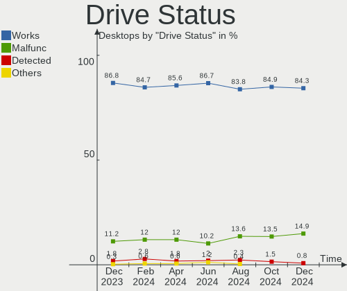
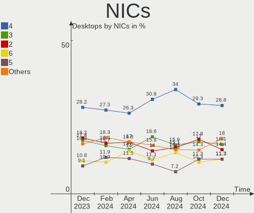
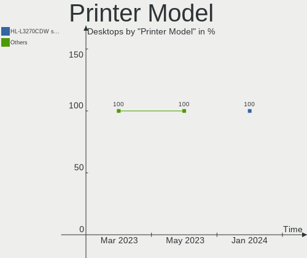

BSD Hardware Trends (Desktops)
------------------------------

A project to identify most popular hardware characteristics and track their change
over time based on data collected by BSD users at https://BSD-Hardware.info.

Anyone can contribute to this report by the [hw-probe](https://github.com/linuxhw/hw-probe/blob/master/INSTALL.BSD.md) tool:

    hw-probe -all -upload

Full-feature report is available here: https://bsd-hardware.info/?view=trends&formfactor=desktop

Period: Jul, 2021.

Contents
--------

* [ System ](#system)
  - [ OS                       ](#os)
  - [ OS Family                ](#os-family)
  - [ Arch                     ](#arch)
  - [ DE                       ](#de)
  - [ Display Server           ](#display-server)
  - [ Display Manager          ](#display-manager)
  - [ OS Lang                  ](#os-lang)
  - [ Boot Mode                ](#boot-mode)
  - [ Filesystem               ](#filesystem)
  - [ Part. scheme             ](#part-scheme)

* [ Board ](#board)
  - [ Vendor                   ](#vendor)
  - [ Model                    ](#model)
  - [ Model Family             ](#model-family)
  - [ MFG Year                 ](#mfg-year)
  - [ Form Factor              ](#form-factor)
  - [ Coreboot                 ](#coreboot)
  - [ RAM Size                 ](#ram-size)
  - [ RAM Used                 ](#ram-used)
  - [ Total Drives             ](#total-drives)
  - [ Has CD-ROM               ](#has-cd-rom)
  - [ Has Ethernet             ](#has-ethernet)
  - [ Has WiFi                 ](#has-wifi)
  - [ Has Bluetooth            ](#has-bluetooth)

* [ Location ](#location)
  - [ Country                  ](#country)
  - [ City                     ](#city)

* [ Drives ](#drives)
  - [ Drive Vendor             ](#drive-vendor)
  - [ Drive Model              ](#drive-model)
  - [ HDD Vendor               ](#hdd-vendor)
  - [ SSD Vendor               ](#ssd-vendor)
  - [ Drive Kind               ](#drive-kind)
  - [ Drive Connector          ](#drive-connector)
  - [ Drive Size               ](#drive-size)
  - [ Space Total              ](#space-total)
  - [ Space Used               ](#space-used)
  - [ Malfunc. Drives          ](#malfunc-drives)
  - [ Malfunc. Drive Vendor    ](#malfunc-drive-vendor)
  - [ Malfunc. HDD Vendor      ](#malfunc-hdd-vendor)
  - [ Malfunc. Drive Kind      ](#malfunc-drive-kind)
  - [ Failed Drives            ](#failed-drives)
  - [ Failed Drive Vendor      ](#failed-drive-vendor)
  - [ Drive Status             ](#drive-status)

* [ Storage controller ](#storage-controller)
  - [ Storage Vendor           ](#storage-vendor)
  - [ Storage Model            ](#storage-model)
  - [ Storage Kind             ](#storage-kind)

* [ Processor ](#processor)
  - [ CPU Vendor               ](#cpu-vendor)
  - [ CPU Model                ](#cpu-model)
  - [ CPU Model Family         ](#cpu-model-family)
  - [ CPU Cores                ](#cpu-cores)
  - [ CPU Sockets              ](#cpu-sockets)
  - [ CPU Threads              ](#cpu-threads)
  - [ CPU Microarch            ](#cpu-microarch)

* [ Graphics ](#graphics)
  - [ GPU Vendor               ](#gpu-vendor)
  - [ GPU Model                ](#gpu-model)
  - [ GPU Combo                ](#gpu-combo)
  - [ GPU Driver               ](#gpu-driver)
  - [ GPU Memory               ](#gpu-memory)

* [ Monitor ](#monitor)
  - [ Monitor Vendor           ](#monitor-vendor)
  - [ Monitor Model            ](#monitor-model)
  - [ Monitor Resolution       ](#monitor-resolution)
  - [ Monitor Diagonal         ](#monitor-diagonal)
  - [ Monitor Width            ](#monitor-width)
  - [ Aspect Ratio             ](#aspect-ratio)
  - [ Monitor Area             ](#monitor-area)
  - [ Pixel Density            ](#pixel-density)
  - [ Multiple Monitors        ](#multiple-monitors)

* [ Network ](#network)
  - [ Net Controller Vendor    ](#net-controller-vendor)
  - [ Net Controller Model     ](#net-controller-model)
  - [ Wireless Vendor          ](#wireless-vendor)
  - [ Wireless Model           ](#wireless-model)
  - [ Ethernet Vendor          ](#ethernet-vendor)
  - [ Ethernet Model           ](#ethernet-model)
  - [ Net Controller Kind      ](#net-controller-kind)
  - [ Used Controller          ](#used-controller)
  - [ NICs                     ](#nics)
  - [ IPv6                     ](#ipv6)

* [ Bluetooth ](#bluetooth)
  - [ Bluetooth Vendor         ](#bluetooth-vendor)
  - [ Bluetooth Model          ](#bluetooth-model)

* [ Sound ](#sound)
  - [ Sound Vendor             ](#sound-vendor)
  - [ Sound Model              ](#sound-model)

* [ Memory ](#memory)
  - [ Memory Vendor            ](#memory-vendor)
  - [ Memory Model             ](#memory-model)
  - [ Memory Kind              ](#memory-kind)
  - [ Memory Form Factor       ](#memory-form-factor)
  - [ Memory Size              ](#memory-size)
  - [ Memory Speed             ](#memory-speed)

* [ Printers & scanners ](#printers-scanners)
  - [ Printer Vendor           ](#printer-vendor)
  - [ Printer Model            ](#printer-model)
  - [ Scanner Vendor           ](#scanner-vendor)
  - [ Scanner Model            ](#scanner-model)

* [ Camera ](#camera)
  - [ Camera Vendor            ](#camera-vendor)
  - [ Camera Model             ](#camera-model)

* [ Security ](#security)
  - [ Fingerprint Vendor       ](#fingerprint-vendor)
  - [ Fingerprint Model        ](#fingerprint-model)
  - [ Chipcard Vendor          ](#chipcard-vendor)
  - [ Chipcard Model           ](#chipcard-model)

* [ Unsupported ](#unsupported)
  - [ Unsupported Devices      ](#unsupported-devices)
  - [ Unsupported Device Types ](#unsupported-device-types)

System
------

OS
--

Installed operating systems

| Name                          | Desktops | Percent |
|-------------------------------|----------|---------|
| OPNsense 21.1.8               | 83       | 39.71%  |
| OPNsense 21.1.7               | 34       | 16.27%  |
| OPNsense 21.7                 | 24       | 11.48%  |
| helloSystem 0.5.0             | 14       | 6.7%    |
| OPNsense 21.1.9               | 10       | 4.78%   |
| FreeBSD 13.0                  | 8        | 3.83%   |
| OpenBSD 6.9                   | 6        | 2.87%   |
| OPNsense 21.1                 | 4        | 1.91%   |
| FreeBSD 13.0-p3               | 4        | 1.91%   |
| TrueNAS 12.2-p6               | 2        | 0.96%   |
| OPNsense 21.1.6               | 2        | 0.96%   |
| FreeBSD 12.2-p9               | 2        | 0.96%   |
| TrueNAS 12.2-p9               | 1        | 0.48%   |
| pfSense 2.5.0                 | 1        | 0.48%   |
| OPNsense 21.1.4               | 1        | 0.48%   |
| OPNsense 21.1.3               | 1        | 0.48%   |
| OPNsense 21.1.2               | 1        | 0.48%   |
| OPNsense 12.1-p19-HBSD        | 1        | 0.48%   |
| helloSystem 0.6.0             | 1        | 0.48%   |
| helloSystem 0.1.0             | 1        | 0.48%   |
| HardenedBSD 14.0-CURRENT-HBSD | 1        | 0.48%   |
| FreeBSD 14.0-CURRENT          | 1        | 0.48%   |
| FreeBSD 13.0-STABLE           | 1        | 0.48%   |
| FreeBSD 13.0-p2               | 1        | 0.48%   |
| FreeBSD 12.2-p6               | 1        | 0.48%   |
| FreeBSD 12.2-p2               | 1        | 0.48%   |
| FreeBSD 12.2                  | 1        | 0.48%   |
| FreeBSD 12.1-p8               | 1        | 0.48%   |

OS Family
---------

OS without a version

| Name        | Desktops | Percent |
|-------------|----------|---------|
| OPNsense    | 161      | 77.03%  |
| FreeBSD     | 21       | 10.05%  |
| helloSystem | 16       | 7.66%   |
| OpenBSD     | 6        | 2.87%   |
| TrueNAS     | 3        | 1.44%   |
| pfSense     | 1        | 0.48%   |
| HardenedBSD | 1        | 0.48%   |

Arch
----

OS architecture (x86_64, i586, etc.)

| Name    | Desktops | Percent |
|---------|----------|---------|
| amd64   | 205      | 98.09%  |
| riscv   | 1        | 0.48%   |
| powerpc | 1        | 0.48%   |
| i386    | 1        | 0.48%   |
| arm64   | 1        | 0.48%   |

DE
--

Desktop Environment

| Name         | Desktops | Percent |
|--------------|----------|---------|
| Console      | 180      | 86.12%  |
| helloDesktop | 16       | 7.66%   |
| XFCE         | 3        | 1.44%   |
| KDE5         | 3        | 1.44%   |
| fvwm         | 2        | 0.96%   |
| TWM          | 1        | 0.48%   |
| MATE         | 1        | 0.48%   |
| LXQt         | 1        | 0.48%   |
| GNOME        | 1        | 0.48%   |
| AwesomeWM    | 1        | 0.48%   |

Display Server
--------------

X11 or Wayland

| Name    | Desktops | Percent |
|---------|----------|---------|
| Console | 179      | 85.65%  |
| X11     | 30       | 14.35%  |

Display Manager
---------------

SDDM, LightDM, etc.

| Name    | Desktops | Percent |
|---------|----------|---------|
| Console | 185      | 88.52%  |
| SLiM    | 19       | 9.09%   |
| SDDM    | 3        | 1.44%   |
| LightDM | 1        | 0.48%   |
| GDM     | 1        | 0.48%   |

OS Lang
-------

Language

| Lang    | Desktops | Percent |
|---------|----------|---------|
| Unknown | 169      | 80.86%  |
| en_US   | 22       | 10.53%  |
| C       | 14       | 6.7%    |
| ru_RU   | 2        | 0.96%   |
| it_IT   | 1        | 0.48%   |
| fi_FI   | 1        | 0.48%   |

Boot Mode
---------

EFI or BIOS

| Mode | Desktops | Percent |
|------|----------|---------|
| EFI  | 174      | 83.25%  |
| BIOS | 35       | 16.75%  |

Filesystem
----------

Type of filesystem

| Type    | Desktops | Percent |
|---------|----------|---------|
| Ufs     | 162      | 77.51%  |
| Zfs     | 40       | 19.14%  |
| Ffs     | 6        | 2.87%   |
| Unknown | 1        | 0.48%   |

Part. scheme
------------

Scheme of partitioning

| Type    | Desktops | Percent |
|---------|----------|---------|
| GPT     | 184      | 88.04%  |
| MBR     | 20       | 9.57%   |
| Unknown | 5        | 2.39%   |

Board
-----

Vendor
------

Motherboard manufacturer

| Name                | Desktops | Percent |
|---------------------|----------|---------|
| Unknown             | 33       | 15.79%  |
| ASUSTek Computer    | 27       | 12.92%  |
| Dell                | 22       | 10.53%  |
| Hewlett-Packard     | 20       | 9.57%   |
| ASRock              | 15       | 7.18%   |
| Protectli           | 14       | 6.7%    |
| PC Engines          | 12       | 5.74%   |
| Supermicro          | 11       | 5.26%   |
| Gigabyte Technology | 10       | 4.78%   |
| Intel               | 9        | 4.31%   |
| MSI                 | 6        | 2.87%   |
| Lenovo              | 3        | 1.44%   |
| Fujitsu             | 3        | 1.44%   |
| Biostar             | 3        | 1.44%   |
| Shuttle             | 2        | 0.96%   |
| SeeedStudio         | 2        | 0.96%   |
| NEXCOM              | 2        | 0.96%   |
| Foxconn             | 2        | 0.96%   |
| Yanling             | 1        | 0.48%   |
| Wistron             | 1        | 0.48%   |
| Thomas-Krenn.AG     | 1        | 0.48%   |
| Pegatron            | 1        | 0.48%   |
| PCPartner           | 1        | 0.48%   |
| NF841               | 1        | 0.48%   |
| NF541               | 1        | 0.48%   |
| GuoGuang            | 1        | 0.48%   |
| Deciso              | 1        | 0.48%   |
| Cisco Systems       | 1        | 0.48%   |
| CheckPoint          | 1        | 0.48%   |
| ASRockRack          | 1        | 0.48%   |
| Acer                | 1        | 0.48%   |

Model
-----

Motherboard model

| Name                               | Desktops | Percent |
|------------------------------------|----------|---------|
| Unknown                            | 33       | 15.79%  |
| Protectli FW4B                     | 10       | 4.78%   |
| PC Engines APU2                    | 7        | 3.35%   |
| Intel Q3XXG4-P V1.0                | 6        | 2.87%   |
| PC Engines apu4                    | 5        | 2.39%   |
| Dell OptiPlex 990                  | 4        | 1.91%   |
| Supermicro X9SCL/X9SCM             | 3        | 1.44%   |
| HP t620 PLUS Quad Core TC          | 3        | 1.44%   |
| Dell OptiPlex 790                  | 3        | 1.44%   |
| Dell OptiPlex 7010                 | 3        | 1.44%   |
| SeeedStudio ODYSSEY-X86J4125       | 2        | 0.96%   |
| Protectli FW6                      | 2        | 0.96%   |
| NEXCOM ASG                         | 2        | 0.96%   |
| HP ProLiant MicroServer Gen8       | 2        | 0.96%   |
| Fujitsu ESPRIMO_D756               | 2        | 0.96%   |
| Dell OptiPlex 3040                 | 2        | 0.96%   |
| ASRock B365M Pro4                  | 2        | 0.96%   |
| Yanling NS-1U8L                    | 1        | 0.48%   |
| Wistron ProLiant ML110 G6          | 1        | 0.48%   |
| Thomas-Krenn.AG LES network+       | 1        | 0.48%   |
| Supermicro X7SPA-HF                | 1        | 0.48%   |
| Supermicro X7SBL                   | 1        | 0.48%   |
| Supermicro SYS-5018A-MLTN4         | 1        | 0.48%   |
| Supermicro SYS-1028U-TN10RT+       | 1        | 0.48%   |
| Supermicro SYS-1019D-4C-FHN13TP    | 1        | 0.48%   |
| Supermicro ReadyDATA 5200          | 1        | 0.48%   |
| Supermicro Pro546267               | 1        | 0.48%   |
| Supermicro PDSML                   | 1        | 0.48%   |
| Shuttle NC10U                      | 1        | 0.48%   |
| Shuttle DS10U                      | 1        | 0.48%   |
| Protectli FW6D                     | 1        | 0.48%   |
| Protectli FW4A                     | 1        | 0.48%   |
| Pegatron SAISHIAT2                 | 1        | 0.48%   |
| PCPartner DREAMSYS                 | 1        | 0.48%   |
| NF841 1.0                          | 1        | 0.48%   |
| NF541 1.0                          | 1        | 0.48%   |
| MSI WC791AA-UUW HPE-119sc          | 1        | 0.48%   |
| MSI MS-S0891                       | 1        | 0.48%   |
| MSI MS-7C08                        | 1        | 0.48%   |
| MSI MS-7850                        | 1        | 0.48%   |
| MSI MS-7817                        | 1        | 0.48%   |
| MSI MS-7816                        | 1        | 0.48%   |
| Lenovo ThinkCentre M93p 10AAS0GN00 | 1        | 0.48%   |
| Lenovo ThinkCentre M83 10AHS35Q00  | 1        | 0.48%   |
| Lenovo ThinkCentre E73 10AU003FUK  | 1        | 0.48%   |
| Intel NDISB533                     | 1        | 0.48%   |
| Intel Granite Well                 | 1        | 0.48%   |
| Intel D33217GKE G76540-207         | 1        | 0.48%   |
| HP Z620 Workstation                | 1        | 0.48%   |
| HP Z600 Workstation                | 1        | 0.48%   |
| HP Z420 Workstation                | 1        | 0.48%   |
| HP Z230 SFF Workstation            | 1        | 0.48%   |
| HP ProLiant ML350 G6               | 1        | 0.48%   |
| HP ProLiant DL360e Gen8            | 1        | 0.48%   |
| HP ProLiant DL320 G5               | 1        | 0.48%   |
| HP ProDesk 600 G1 SFF              | 1        | 0.48%   |
| HP ProDesk 400 G4 MT               | 1        | 0.48%   |
| HP EliteDesk 800 G1 SFF            | 1        | 0.48%   |
| HP Compaq Pro 6300 SFF             | 1        | 0.48%   |
| HP Compaq Elite 8300 SFF           | 1        | 0.48%   |

Model Family
------------

Motherboard model prefix

| Name                            | Desktops | Percent |
|---------------------------------|----------|---------|
| Unknown                         | 33       | 15.79%  |
| Dell OptiPlex                   | 18       | 8.61%   |
| Protectli FW4B                  | 10       | 4.78%   |
| PC Engines APU2                 | 7        | 3.35%   |
| Intel Q3XXG4-P                  | 6        | 2.87%   |
| PC Engines apu4                 | 5        | 2.39%   |
| HP ProLiant                     | 5        | 2.39%   |
| ASUS PRIME                      | 5        | 2.39%   |
| HP Compaq                       | 4        | 1.91%   |
| Supermicro X9SCL                | 3        | 1.44%   |
| Lenovo ThinkCentre              | 3        | 1.44%   |
| HP t620                         | 3        | 1.44%   |
| SeeedStudio ODYSSEY-X86J4125    | 2        | 0.96%   |
| Protectli FW6                   | 2        | 0.96%   |
| NEXCOM ASG                      | 2        | 0.96%   |
| HP ProDesk                      | 2        | 0.96%   |
| Gigabyte X570                   | 2        | 0.96%   |
| Fujitsu ESPRIMO                 | 2        | 0.96%   |
| ASUS ROG                        | 2        | 0.96%   |
| ASRock X570                     | 2        | 0.96%   |
| ASRock B365M                    | 2        | 0.96%   |
| Yanling NS-1U8L                 | 1        | 0.48%   |
| Wistron ProLiant                | 1        | 0.48%   |
| Thomas-Krenn.AG LES             | 1        | 0.48%   |
| Supermicro X7SPA-HF             | 1        | 0.48%   |
| Supermicro X7SBL                | 1        | 0.48%   |
| Supermicro SYS-5018A-MLTN4      | 1        | 0.48%   |
| Supermicro SYS-1028U-TN10RT+    | 1        | 0.48%   |
| Supermicro SYS-1019D-4C-FHN13TP | 1        | 0.48%   |
| Supermicro ReadyDATA            | 1        | 0.48%   |
| Supermicro Pro546267            | 1        | 0.48%   |
| Supermicro PDSML                | 1        | 0.48%   |
| Shuttle NC10U                   | 1        | 0.48%   |
| Shuttle DS10U                   | 1        | 0.48%   |
| Protectli FW6D                  | 1        | 0.48%   |
| Protectli FW4A                  | 1        | 0.48%   |
| Pegatron SAISHIAT2              | 1        | 0.48%   |
| PCPartner DREAMSYS              | 1        | 0.48%   |
| NF841 1.0                       | 1        | 0.48%   |
| NF541 1.0                       | 1        | 0.48%   |
| MSI WC791AA-UUW                 | 1        | 0.48%   |
| MSI MS-S0891                    | 1        | 0.48%   |
| MSI MS-7C08                     | 1        | 0.48%   |
| MSI MS-7850                     | 1        | 0.48%   |
| MSI MS-7817                     | 1        | 0.48%   |
| MSI MS-7816                     | 1        | 0.48%   |
| Intel NDISB533                  | 1        | 0.48%   |
| Intel Granite                   | 1        | 0.48%   |
| Intel D33217GKE                 | 1        | 0.48%   |
| HP Z620                         | 1        | 0.48%   |
| HP Z600                         | 1        | 0.48%   |
| HP Z420                         | 1        | 0.48%   |
| HP Z230                         | 1        | 0.48%   |
| HP EliteDesk                    | 1        | 0.48%   |
| HP 860-012nf                    | 1        | 0.48%   |
| GuoGuang IC2M1028V-6            | 1        | 0.48%   |
| Gigabyte PH67A-D3-B3            | 1        | 0.48%   |
| Gigabyte P55A-UD3               | 1        | 0.48%   |
| Gigabyte J1900N-D3V             | 1        | 0.48%   |
| Gigabyte H110M-S2H              | 1        | 0.48%   |

MFG Year
--------

Motherboard manufacture year

| Year    | Desktops | Percent |
|---------|----------|---------|
| 2019    | 34       | 16.27%  |
| 2020    | 33       | 15.79%  |
| 2021    | 29       | 13.88%  |
| 2018    | 24       | 11.48%  |
| 2013    | 18       | 8.61%   |
| 2017    | 11       | 5.26%   |
| 2014    | 11       | 5.26%   |
| 2012    | 9        | 4.31%   |
| 2011    | 9        | 4.31%   |
| 2015    | 7        | 3.35%   |
| 2010    | 5        | 2.39%   |
| 2009    | 5        | 2.39%   |
| 2016    | 4        | 1.91%   |
| 2008    | 4        | 1.91%   |
| Unknown | 4        | 1.91%   |
| 2007    | 1        | 0.48%   |
| 2006    | 1        | 0.48%   |

Form Factor
-----------

Physical design of the computer

| Name    | Desktops | Percent |
|---------|----------|---------|
| Desktop | 209      | 100%    |

Coreboot
--------

Have coreboot on board

| Used | Desktops | Percent |
|------|----------|---------|
| No   | 194      | 92.82%  |
| Yes  | 15       | 7.18%   |

RAM Size
--------

Total RAM memory

| Size in GB      | Desktops | Percent |
|-----------------|----------|---------|
| 8.01-16.0       | 80       | 38.28%  |
| 4.01-8.0        | 50       | 23.92%  |
| 16.01-24.0      | 44       | 21.05%  |
| 32.01-64.0      | 14       | 6.7%    |
| 2.01-3.0        | 8        | 3.83%   |
| 64.01-256.0     | 4        | 1.91%   |
| 0.51-1.0        | 4        | 1.91%   |
| 24.01-32.0      | 3        | 1.44%   |
| More than 256.0 | 1        | 0.48%   |
| 3.01-4.0        | 1        | 0.48%   |

RAM Used
--------

Used RAM memory

| Used GB    | Desktops | Percent |
|------------|----------|---------|
| 0.01-0.5   | 119      | 56.94%  |
| 0.51-1.0   | 63       | 30.14%  |
| 1.01-2.0   | 15       | 7.18%   |
| 4.01-8.0   | 4        | 1.91%   |
| 2.01-3.0   | 4        | 1.91%   |
| 32.01-64.0 | 1        | 0.48%   |
| 3.01-4.0   | 1        | 0.48%   |
| 16.01-24.0 | 1        | 0.48%   |
| 0          | 1        | 0.48%   |

Total Drives
------------

Number of drives on board

| Drives | Desktops | Percent |
|--------|----------|---------|
| 1      | 159      | 76.08%  |
| 2      | 14       | 6.7%    |
| 0      | 11       | 5.26%   |
| 3      | 10       | 4.78%   |
| 4      | 5        | 2.39%   |
| 5      | 3        | 1.44%   |
| 27     | 1        | 0.48%   |
| 18     | 1        | 0.48%   |
| 14     | 1        | 0.48%   |
| 13     | 1        | 0.48%   |
| 12     | 1        | 0.48%   |
| 9      | 1        | 0.48%   |
| 6      | 1        | 0.48%   |

Has CD-ROM
----------

Has CD-ROM on board

| Presented | Desktops | Percent |
|-----------|----------|---------|
| No        | 173      | 82.78%  |
| Yes       | 36       | 17.22%  |

Has Ethernet
------------

Has Ethernet on board

| Presented | Desktops | Percent |
|-----------|----------|---------|
| Yes       | 206      | 98.56%  |
| No        | 3        | 1.44%   |

Has WiFi
--------

Has WiFi module

| Presented | Desktops | Percent |
|-----------|----------|---------|
| No        | 166      | 79.43%  |
| Yes       | 43       | 20.57%  |

Has Bluetooth
-------------

Has Bluetooth module

| Presented | Desktops | Percent |
|-----------|----------|---------|
| No        | 190      | 90.91%  |
| Yes       | 19       | 9.09%   |

Location
--------

Country
-------

Geographic location (country)

| Country      | Desktops | Percent |
|--------------|----------|---------|
| USA          | 71       | 33.97%  |
| Germany      | 33       | 15.79%  |
| UK           | 16       | 7.66%   |
| Russia       | 6        | 2.87%   |
| France       | 6        | 2.87%   |
| Austria      | 6        | 2.87%   |
| Switzerland  | 5        | 2.39%   |
| Norway       | 5        | 2.39%   |
| Canada       | 5        | 2.39%   |
| Taiwan       | 4        | 1.91%   |
| Sweden       | 4        | 1.91%   |
| Netherlands  | 4        | 1.91%   |
| Australia    | 4        | 1.91%   |
| Italy        | 3        | 1.44%   |
| Finland      | 3        | 1.44%   |
| Ukraine      | 2        | 0.96%   |
| Spain        | 2        | 0.96%   |
| South Korea  | 2        | 0.96%   |
| India        | 2        | 0.96%   |
| Denmark      | 2        | 0.96%   |
| Czechia      | 2        | 0.96%   |
| China        | 2        | 0.96%   |
| Belgium      | 2        | 0.96%   |
| Venezuela    | 1        | 0.48%   |
| UAE          | 1        | 0.48%   |
| Thailand     | 1        | 0.48%   |
| South Africa | 1        | 0.48%   |
| Singapore    | 1        | 0.48%   |
| Romania      | 1        | 0.48%   |
| Portugal     | 1        | 0.48%   |
| Poland       | 1        | 0.48%   |
| Israel       | 1        | 0.48%   |
| Indonesia    | 1        | 0.48%   |
| Guatemala    | 1        | 0.48%   |
| Greece       | 1        | 0.48%   |
| Estonia      | 1        | 0.48%   |
| Egypt        | 1        | 0.48%   |
| Colombia     | 1        | 0.48%   |
| Cabo Verde   | 1        | 0.48%   |
| Brazil       | 1        | 0.48%   |
| Belarus      | 1        | 0.48%   |

City
----

Geographic location (city)

| City                 | Desktops | Percent |
|----------------------|----------|---------|
| Moscow               | 5        | 2.39%   |
| Vienna               | 3        | 1.44%   |
| Vaulx-en-Velin       | 2        | 0.96%   |
| Toronto              | 2        | 0.96%   |
| Tampere              | 2        | 0.96%   |
| Salem                | 2        | 0.96%   |
| Oslo                 | 2        | 0.96%   |
| Kirkland             | 2        | 0.96%   |
| Karlsruhe            | 2        | 0.96%   |
| Graz                 | 2        | 0.96%   |
| Franklin             | 2        | 0.96%   |
| Canal Fulton         | 2        | 0.96%   |
| Brno                 | 2        | 0.96%   |
| Bremerhaven          | 2        | 0.96%   |
| Bielefeld            | 2        | 0.96%   |
| Bergen               | 2        | 0.96%   |
| Augsburg             | 2        | 0.96%   |
| Åhus                | 1        | 0.48%   |
| Zurich               | 1        | 0.48%   |
| Zaltbommel           | 1        | 0.48%   |
| Yuanlin              | 1        | 0.48%   |
| Wroclaw              | 1        | 0.48%   |
| Worms                | 1        | 0.48%   |
| Westland             | 1        | 0.48%   |
| West Valley City     | 1        | 0.48%   |
| West Fargo           | 1        | 0.48%   |
| Warminster           | 1        | 0.48%   |
| Villeurbanne         | 1        | 0.48%   |
| Vila Nova de Gaia    | 1        | 0.48%   |
| Vancouver            | 1        | 0.48%   |
| Van Nuys             | 1        | 0.48%   |
| Trelleborg           | 1        | 0.48%   |
| Tobique First Nation | 1        | 0.48%   |
| Tielt-Winge          | 1        | 0.48%   |
| The Hague            | 1        | 0.48%   |
| Tettnang Castle      | 1        | 0.48%   |
| Tel Aviv             | 1        | 0.48%   |
| Teaneck              | 1        | 0.48%   |
| Tapa                 | 1        | 0.48%   |
| Taipei               | 1        | 0.48%   |
| Taganrog             | 1        | 0.48%   |
| Suwanee              | 1        | 0.48%   |
| Stuttgart            | 1        | 0.48%   |
| Stockholm            | 1        | 0.48%   |
| Statesboro           | 1        | 0.48%   |
| Springfield          | 1        | 0.48%   |
| Sonthofen            | 1        | 0.48%   |
| Singapore            | 1        | 0.48%   |
| Silver Spring        | 1        | 0.48%   |
| Shanghai             | 1        | 0.48%   |
| Schoten              | 1        | 0.48%   |
| Saint Paul           | 1        | 0.48%   |
| Rosharon             | 1        | 0.48%   |
| Rome                 | 1        | 0.48%   |
| Rochester            | 1        | 0.48%   |
| Riverside            | 1        | 0.48%   |
| Rickenbach bei Wil   | 1        | 0.48%   |
| Redmond              | 1        | 0.48%   |
| Raleigh              | 1        | 0.48%   |
| Queens               | 1        | 0.48%   |

Drives
------

Drive Vendor
------------

Hard drive vendors

| Vendor              | Desktops | Drives | Percent |
|---------------------|----------|--------|---------|
| Samsung Electronics | 32       | 39     | 12.96%  |
| WDC                 | 29       | 67     | 11.74%  |
| Seagate             | 28       | 49     | 11.34%  |
| Kingston            | 19       | 26     | 7.69%   |
| Transcend           | 16       | 16     | 6.48%   |
| SanDisk             | 13       | 13     | 5.26%   |
| Hoodisk             | 12       | 12     | 4.86%   |
| Intel               | 10       | 11     | 4.05%   |
| OCZ                 | 8        | 8      | 3.24%   |
| Hewlett-Packard     | 7        | 20     | 2.83%   |
| Crucial             | 7        | 7      | 2.83%   |
| SPCC                | 6        | 6      | 2.43%   |
| Hitachi             | 5        | 8      | 2.02%   |
| A-DATA Technology   | 5        | 6      | 2.02%   |
| Phison              | 4        | 4      | 1.62%   |
| Micron Technology   | 4        | 4      | 1.62%   |
| HGST                | 4        | 11     | 1.62%   |
| Corsair             | 4        | 4      | 1.62%   |
| Protectli           | 3        | 3      | 1.21%   |
| Toshiba             | 2        | 7      | 0.81%   |
| PNY                 | 2        | 2      | 0.81%   |
| OPENBSD             | 2        | 2      | 0.81%   |
| KingDian            | 2        | 2      | 0.81%   |
| China               | 2        | 2      | 0.81%   |
| Apacer              | 2        | 2      | 0.81%   |
| XrayDisk            | 1        | 1      | 0.4%    |
| TCSUNBOW            | 1        | 1      | 0.4%    |
| Smartbuy            | 1        | 1      | 0.4%    |
| SK Hynix            | 1        | 1      | 0.4%    |
| SATADOM             | 1        | 2      | 0.4%    |
| Product:            | 1        | 1      | 0.4%    |
| PLEXTOR             | 1        | 1      | 0.4%    |
| Patriot             | 1        | 1      | 0.4%    |
| MEMXPRO             | 1        | 1      | 0.4%    |
| LITEON              | 1        | 1      | 0.4%    |
| Kston               | 1        | 1      | 0.4%    |
| KLEVV               | 1        | 2      | 0.4%    |
| KingSpec            | 1        | 1      | 0.4%    |
| Indilinx            | 1        | 1      | 0.4%    |
| FORESEE             | 1        | 1      | 0.4%    |
| BIWIN               | 1        | 1      | 0.4%    |
| ATP                 | 1        | 1      | 0.4%    |
| asmedia             | 1        | 1      | 0.4%    |
| Apple               | 1        | 1      | 0.4%    |

Drive Model
-----------

Hard drive models

| Model                           | Desktops | Percent |
|---------------------------------|----------|---------|
| Hoodisk SSD 64GB                | 6        | 2.06%   |
| Samsung SSD 850 EVO 250GB       | 4        | 1.37%   |
| WDC WD30EFRX-68EUZN0 3TB        | 3        | 1.03%   |
| Transcend TS128GMSA230S 128GB   | 3        | 1.03%   |
| Samsung SSD 860 EVO M.2 250GB   | 3        | 1.03%   |
| Samsung SSD 860 EVO 250GB       | 3        | 1.03%   |
| Samsung SSD 840 EVO 120GB       | 3        | 1.03%   |
| Phison SATA SSD 16GB            | 3        | 1.03%   |
| Kingston SUV500MS240G 240GB     | 3        | 1.03%   |
| Kingston SUV500MS120G 120GB     | 3        | 1.03%   |
| Kingston SA400S37240G 240GB     | 3        | 1.03%   |
| Kingston SA400S37120G 120GB     | 3        | 1.03%   |
| Transcend TS64GMSA370 64GB      | 2        | 0.69%   |
| SPCC Solid State Disk 128GB     | 2        | 0.69%   |
| SPCC Solid State Disk 120GB     | 2        | 0.69%   |
| Seagate ST500DM002-1BD142 500GB | 2        | 0.69%   |
| Seagate ST4000DM000-1F2168 4TB  | 2        | 0.69%   |
| Seagate ST3160318AS 160GB       | 2        | 0.69%   |
| Seagate ST3000DM001-1CH166 3TB  | 2        | 0.69%   |
| Samsung SSD 970 EVO 500GB       | 2        | 0.69%   |
| Samsung SSD 840 EVO 250GB       | 2        | 0.69%   |
| Protectli 120GB mSATA           | 2        | 0.69%   |
| OPENBSD SR RAID 1 304GB         | 2        | 0.69%   |
| OCZ AGILITY3 64GB               | 2        | 0.69%   |
| Kingston SV300S37A120G 120GB    | 2        | 0.69%   |
| Kingston SA400S37480G 480GB     | 2        | 0.69%   |
| Kingston SA2000M8500G 500GB     | 2        | 0.69%   |
| Intel SSDSC2KG240G8 240GB       | 2        | 0.69%   |
| Hoodisk SSD 32GB                | 2        | 0.69%   |
| Hoodisk SSD 16GB                | 2        | 0.69%   |
| HGST HTS725050A7E630 500GB      | 2        | 0.69%   |
| HP RAID 0 450GB                 | 2        | 0.69%   |
| Crucial CT240BX500SSD1 240GB    | 2        | 0.69%   |
| A-DATA SX8200PNP 512GB          | 2        | 0.69%   |
| A-DATA SU650 120GB              | 2        | 0.69%   |
| XrayDisk SSD 128GB              | 1        | 0.34%   |
| WDC WDS500G3X0C-00SJG0 500GB    | 1        | 0.34%   |
| WDC WDS500G1X0E-00AFY0 500GB    | 1        | 0.34%   |
| WDC WDS240G2G0A-00JH30 240GB    | 1        | 0.34%   |
| WDC WDS120G2G0B-00EPW0 120GB    | 1        | 0.34%   |
| WDC WDS120G2G0A-00JH30 120GB    | 1        | 0.34%   |
| WDC WDS100T3XHC-00SJG0 1TB      | 1        | 0.34%   |
| WDC WDBNCE2500PNC 250GB         | 1        | 0.34%   |
| WDC WD80EMAZ-00WJTA0 8TB        | 1        | 0.34%   |
| WDC WD80EFZX-68UW8N0 8TB        | 1        | 0.34%   |
| WDC WD80EFAX-68LHPN0 8TB        | 1        | 0.34%   |
| WDC WD800JD-55MUA1 80GB         | 1        | 0.34%   |
| WDC WD60EFRX-68L0BN1 6TB        | 1        | 0.34%   |
| WDC WD5003AZEX-00K3CA0 500GB    | 1        | 0.34%   |
| WDC WD5000LPVT-80G33T2 500GB    | 1        | 0.34%   |
| WDC WD5000LPLX-08ZNTT0 500GB    | 1        | 0.34%   |
| WDC WD5000LPLX-00ZNTT0 500GB    | 1        | 0.34%   |
| WDC WD5000AZRX-00L4HB0 500GB    | 1        | 0.34%   |
| WDC WD5000AAKX-083CA0 500GB     | 1        | 0.34%   |
| WDC WD5000AAKX-001CA0 500GB     | 1        | 0.34%   |
| WDC WD5000AAKS-00V1A0 500GB     | 1        | 0.34%   |
| WDC WD5000AAKS-00A7B2 500GB     | 1        | 0.34%   |
| WDC WD40EZRZ-22GXCB0 4TB        | 1        | 0.34%   |
| WDC WD30PURX-64P6ZY0 3TB        | 1        | 0.34%   |
| WDC WD30EZRX-00MMMB0 3TB        | 1        | 0.34%   |

HDD Vendor
----------

Hard disk drive vendors

| Vendor              | Desktops | Drives | Percent |
|---------------------|----------|--------|---------|
| Seagate             | 27       | 48     | 38.03%  |
| WDC                 | 25       | 60     | 35.21%  |
| Hitachi             | 5        | 8      | 7.04%   |
| HGST                | 4        | 11     | 5.63%   |
| Hewlett-Packard     | 4        | 9      | 5.63%   |
| Toshiba             | 2        | 5      | 2.82%   |
| OPENBSD             | 2        | 2      | 2.82%   |
| Samsung Electronics | 1        | 2      | 1.41%   |
| Product:            | 1        | 1      | 1.41%   |

SSD Vendor
----------

Solid state drive vendors

| Vendor              | Desktops | Drives | Percent |
|---------------------|----------|--------|---------|
| Samsung Electronics | 26       | 30     | 15.85%  |
| Kingston            | 17       | 22     | 10.37%  |
| Transcend           | 16       | 16     | 9.76%   |
| SanDisk             | 13       | 13     | 7.93%   |
| Hoodisk             | 12       | 12     | 7.32%   |
| Intel               | 10       | 11     | 6.1%    |
| OCZ                 | 8        | 8      | 4.88%   |
| Crucial             | 7        | 7      | 4.27%   |
| SPCC                | 5        | 5      | 3.05%   |
| WDC                 | 4        | 4      | 2.44%   |
| Micron Technology   | 4        | 4      | 2.44%   |
| Protectli           | 3        | 3      | 1.83%   |
| Phison              | 3        | 3      | 1.83%   |
| Corsair             | 3        | 3      | 1.83%   |
| A-DATA Technology   | 3        | 3      | 1.83%   |
| PNY                 | 2        | 2      | 1.22%   |
| KingDian            | 2        | 2      | 1.22%   |
| Hewlett-Packard     | 2        | 3      | 1.22%   |
| China               | 2        | 2      | 1.22%   |
| Apacer              | 2        | 2      | 1.22%   |
| XrayDisk            | 1        | 1      | 0.61%   |
| Toshiba             | 1        | 2      | 0.61%   |
| TCSUNBOW            | 1        | 1      | 0.61%   |
| Smartbuy            | 1        | 1      | 0.61%   |
| SK Hynix            | 1        | 1      | 0.61%   |
| Seagate             | 1        | 1      | 0.61%   |
| SATADOM             | 1        | 2      | 0.61%   |
| PLEXTOR             | 1        | 1      | 0.61%   |
| Patriot             | 1        | 1      | 0.61%   |
| MEMXPRO             | 1        | 1      | 0.61%   |
| LITEON              | 1        | 1      | 0.61%   |
| Kston               | 1        | 1      | 0.61%   |
| KLEVV               | 1        | 2      | 0.61%   |
| KingSpec            | 1        | 1      | 0.61%   |
| Indilinx            | 1        | 1      | 0.61%   |
| FORESEE             | 1        | 1      | 0.61%   |
| BIWIN               | 1        | 1      | 0.61%   |
| ATP                 | 1        | 1      | 0.61%   |
| asmedia             | 1        | 1      | 0.61%   |
| Apple               | 1        | 1      | 0.61%   |

Drive Kind
----------

HDD or SSD

| Kind | Desktops | Drives | Percent |
|------|----------|--------|---------|
| SSD  | 154      | 178    | 68.75%  |
| HDD  | 52       | 146    | 23.21%  |
| NVMe | 18       | 28     | 8.04%   |

Drive Connector
---------------

SATA, SAS, NVMe, etc.

| Type | Desktops | Drives | Percent |
|------|----------|--------|---------|
| SATA | 189      | 324    | 91.3%   |
| NVMe | 18       | 28     | 8.7%    |

Drive Size
----------

Size of hard drive

| Size in TB      | Desktops | Drives | Percent |
|-----------------|----------|--------|---------|
| 0.01-0.5        | 175      | 221    | 82.16%  |
| 0.51-1.0        | 19       | 36     | 8.92%   |
| 2.01-3.0        | 6        | 29     | 2.82%   |
| 1.01-2.0        | 5        | 11     | 2.35%   |
| 3.01-4.0        | 3        | 11     | 1.41%   |
| 4.01-10.0       | 3        | 13     | 1.41%   |
| More than 100.0 | 1        | 1      | 0.47%   |
| 10.01-20.0      | 1        | 2      | 0.47%   |

Space Total
-----------

Amount of disk space available on the file system

| Size in GB | Desktops | Percent |
|------------|----------|---------|
| 101-250    | 84       | 40.19%  |
| 21-50      | 33       | 15.79%  |
| 51-100     | 29       | 13.88%  |
| 1-20       | 27       | 12.92%  |
| 251-500    | 23       | 11%     |
| 501-1000   | 9        | 4.31%   |
| 1001-2000  | 3        | 1.44%   |
| 2001-3000  | 1        | 0.48%   |

Space Used
----------

Amount of used disk space

| Used GB | Desktops | Percent |
|---------|----------|---------|
| 1-20    | 196      | 93.78%  |
| 21-50   | 11       | 5.26%   |
| 51-100  | 2        | 0.96%   |

Malfunc. Drives
---------------

Drive models with a malfunction

| Model                             | Desktops | Drives | Percent |
|-----------------------------------|----------|--------|---------|
| WDC WD800JD-55MUA1 80GB           | 1        | 1      | 2.94%   |
| WDC WD5000AAKX-083CA0 500GB       | 1        | 1      | 2.94%   |
| WDC WD5000AAKX-001CA0 500GB       | 1        | 1      | 2.94%   |
| WDC WD5000AAKS-00V1A0 500GB       | 1        | 1      | 2.94%   |
| WDC WD30PURX-64P6ZY0 3TB          | 1        | 1      | 2.94%   |
| WDC WD30EZRX-00MMMB0 3TB          | 1        | 2      | 2.94%   |
| WDC WD30EFRX-68EUZN0 3TB          | 1        | 3      | 2.94%   |
| WDC WD30EFRX-68AX9N0 3TB          | 1        | 1      | 2.94%   |
| WDC WD2500AAKS-60L9A0 250GB       | 1        | 1      | 2.94%   |
| WDC WD10JMVW-11AJGS0 1TB          | 1        | 1      | 2.94%   |
| WDC WD1001FALS-00J7B1 1TB         | 1        | 1      | 2.94%   |
| Toshiba HDWD130 3TB               | 1        | 2      | 2.94%   |
| SK Hynix HFS256G3AMNB-2200A 256GB | 1        | 1      | 2.94%   |
| Seagate ST9160310AS 160GB         | 1        | 1      | 2.94%   |
| Seagate ST3500418AS 500GB         | 1        | 1      | 2.94%   |
| Seagate ST3500413AS 500GB         | 1        | 1      | 2.94%   |
| Seagate ST3320311CS 320GB         | 1        | 1      | 2.94%   |
| Seagate ST3250410AS 250GB         | 1        | 1      | 2.94%   |
| Seagate ST3160318AS 160GB         | 1        | 1      | 2.94%   |
| Seagate ST31000340NS 1TB          | 1        | 1      | 2.94%   |
| Seagate ST1000VM002-1SD102 1TB    | 1        | 1      | 2.94%   |
| Seagate ST1000DL002-9TT153 1TB    | 1        | 1      | 2.94%   |
| SanDisk SSD PLUS 120 GB           | 1        | 1      | 2.94%   |
| Kingston SUV400S37120G 120GB      | 1        | 1      | 2.94%   |
| Intel SSDSA2M160G2GN 160GB        | 1        | 1      | 2.94%   |
| Intel SSDSA2BW160G3H 160GB        | 1        | 1      | 2.94%   |
| Hitachi HUA722020ALA331 2TB       | 1        | 1      | 2.94%   |
| Hitachi HTS723232A7A364 320GB     | 1        | 1      | 2.94%   |
| Hitachi HDS721050CLA660 500GB     | 1        | 2      | 2.94%   |
| HGST HTS725050A7E630 500GB        | 1        | 1      | 2.94%   |
| HGST HTS541010A7E630 1TB          | 1        | 1      | 2.94%   |
| Hewlett-Packard VB0250EAVER 250GB | 1        | 1      | 2.94%   |
| Crucial CT128M550SSD3 128GB       | 1        | 1      | 2.94%   |
| A-DATA Technology SU650 120GB     | 1        | 1      | 2.94%   |

Malfunc. Drive Vendor
---------------------

Vendors of faulty drives

| Vendor            | Desktops | Drives | Percent |
|-------------------|----------|--------|---------|
| WDC               | 9        | 14     | 29.03%  |
| Seagate           | 8        | 9      | 25.81%  |
| Hitachi           | 3        | 4      | 9.68%   |
| Intel             | 2        | 2      | 6.45%   |
| HGST              | 2        | 2      | 6.45%   |
| Toshiba           | 1        | 2      | 3.23%   |
| SK Hynix          | 1        | 1      | 3.23%   |
| SanDisk           | 1        | 1      | 3.23%   |
| Kingston          | 1        | 1      | 3.23%   |
| Hewlett-Packard   | 1        | 1      | 3.23%   |
| Crucial           | 1        | 1      | 3.23%   |
| A-DATA Technology | 1        | 1      | 3.23%   |

Malfunc. HDD Vendor
-------------------

Vendors of faulty HDD drives

| Vendor          | Desktops | Drives | Percent |
|-----------------|----------|--------|---------|
| WDC             | 9        | 14     | 37.5%   |
| Seagate         | 8        | 9      | 33.33%  |
| Hitachi         | 3        | 4      | 12.5%   |
| HGST            | 2        | 2      | 8.33%   |
| Toshiba         | 1        | 2      | 4.17%   |
| Hewlett-Packard | 1        | 1      | 4.17%   |

Malfunc. Drive Kind
-------------------

Kinds of faulty drives

| Kind | Desktops | Drives | Percent |
|------|----------|--------|---------|
| HDD  | 22       | 32     | 75.86%  |
| SSD  | 7        | 7      | 24.14%  |

Failed Drives
-------------

Failed drive models

Zero info for selected period =(

Failed Drive Vendor
-------------------

Failed drive vendors

Zero info for selected period =(

Drive Status
------------

Number of failed and malfunc. drives

| Status   | Desktops | Drives | Percent |
|----------|----------|--------|---------|
| Works    | 178      | 302    | 83.18%  |
| Malfunc  | 29       | 39     | 13.55%  |
| Detected | 7        | 11     | 3.27%   |

Storage controller
------------------

Storage Vendor
--------------

Storage controller vendors

| Vendor                        | Desktops | Percent |
|-------------------------------|----------|---------|
| Intel                         | 173      | 69.76%  |
| AMD                           | 29       | 11.69%  |
| Samsung Electronics           | 9        | 3.63%   |
| Broadcom / LSI                | 8        | 3.23%   |
| ASMedia Technology            | 5        | 2.02%   |
| Kingston Technology Company   | 4        | 1.61%   |
| Sandisk                       | 3        | 1.21%   |
| Phison Electronics            | 3        | 1.21%   |
| Marvell Technology Group      | 3        | 1.21%   |
| Nvidia                        | 2        | 0.81%   |
| JMicron Technology            | 2        | 0.81%   |
| Hewlett-Packard               | 2        | 0.81%   |
| ADATA Technology              | 2        | 0.81%   |
| Silicon Motion                | 1        | 0.4%    |
| Integrated Technology Express | 1        | 0.4%    |
| Broadcom                      | 1        | 0.4%    |

Storage Model
-------------

Storage controller models

| Model                                                                                   | Desktops | Percent |
|-----------------------------------------------------------------------------------------|----------|---------|
| AMD FCH SATA Controller [AHCI mode]                                                     | 24       | 8.6%    |
| Intel Sunrise Point-LP SATA Controller [AHCI mode]                                      | 15       | 5.38%   |
| Intel Q170/Q150/B150/H170/H110/Z170/CM236 Chipset SATA Controller [AHCI Mode]           | 15       | 5.38%   |
| Intel Atom/Celeron/Pentium Processor x5-E8000/J3xxx/N3xxx Series SATA Controller        | 15       | 5.38%   |
| Intel 6 Series/C200 Series Chipset Family 6 port Desktop SATA AHCI Controller           | 13       | 4.66%   |
| Intel 8 Series/C220 Series Chipset Family 6-port SATA Controller 1 [AHCI mode]          | 12       | 4.3%    |
| Intel SATA Controller [RAID mode]                                                       | 10       | 3.58%   |
| Intel 7 Series/C210 Series Chipset Family 6-port SATA Controller [AHCI mode]            | 9        | 3.23%   |
| Intel Atom Processor E3800 Series SATA AHCI Controller                                  | 8        | 2.87%   |
| Intel 200 Series PCH SATA controller [AHCI mode]                                        | 8        | 2.87%   |
| Samsung NVMe SSD Controller SM981/PM981/PM983                                           | 7        | 2.51%   |
| Intel Cannon Lake PCH SATA AHCI Controller                                              | 6        | 2.15%   |
| Intel NM10/ICH7 Family SATA Controller [AHCI mode]                                      | 5        | 1.79%   |
| Intel 82801G (ICH7 Family) IDE Controller                                               | 5        | 1.79%   |
| Kingston Company A2000 NVMe SSD                                                         | 4        | 1.43%   |
| Intel Wildcat Point-LP SATA Controller [AHCI Mode]                                      | 4        | 1.43%   |
| Intel Cannon Point-LP SATA Controller [AHCI Mode]                                       | 4        | 1.43%   |
| Intel 82801HM/HEM (ICH8M/ICH8M-E) IDE Controller                                        | 4        | 1.43%   |
| Intel 7 Series Chipset Family 6-port SATA Controller [AHCI mode]                        | 4        | 1.43%   |
| Broadcom / LSI SAS2008 PCI-Express Fusion-MPT SAS-2 [Falcon]                            | 4        | 1.43%   |
| Intel NM10/ICH7 Family SATA Controller [IDE mode]                                       | 3        | 1.08%   |
| Intel Celeron N3350/Pentium N4200/Atom E3900 Series SATA AHCI Controller                | 3        | 1.08%   |
| Intel 82801JI (ICH10 Family) SATA AHCI Controller                                       | 3        | 1.08%   |
| Intel 82801HM/HEM (ICH8M/ICH8M-E) SATA Controller [IDE mode]                            | 3        | 1.08%   |
| Intel 500 Series Chipset Family SATA AHCI Controller                                    | 3        | 1.08%   |
| Intel 5 Series/3400 Series Chipset 6 port SATA AHCI Controller                          | 3        | 1.08%   |
| ASMedia ASM1062 Serial ATA Controller                                                   | 3        | 1.08%   |
| AMD 400 Series Chipset SATA Controller                                                  | 3        | 1.08%   |
| Nvidia MCP61 SATA Controller                                                            | 2        | 0.72%   |
| Nvidia MCP61 IDE                                                                        | 2        | 0.72%   |
| JMicron JMB58x AHCI SATA controller                                                     | 2        | 0.72%   |
| Intel Celeron/Pentium Silver Processor SATA Controller                                  | 2        | 0.72%   |
| Intel C610/X99 series chipset sSATA Controller [AHCI mode]                              | 2        | 0.72%   |
| Intel C610/X99 series chipset 6-Port SATA Controller [AHCI mode]                        | 2        | 0.72%   |
| Intel C602 chipset 4-Port SATA Storage Control Unit                                     | 2        | 0.72%   |
| Intel C600/X79 series chipset 6-Port SATA AHCI Controller                               | 2        | 0.72%   |
| Intel 82801JI (ICH10 Family) 2 port SATA IDE Controller #2                              | 2        | 0.72%   |
| Intel 82801IR/IO/IH (ICH9R/DO/DH) 6 port SATA Controller [AHCI mode]                    | 2        | 0.72%   |
| Intel 8 Series SATA Controller 1 [AHCI mode]                                            | 2        | 0.72%   |
| Intel 6 Series/C200 Series Chipset Family Desktop SATA Controller (IDE mode, ports 4-5) | 2        | 0.72%   |
| Intel 6 Series/C200 Series Chipset Family Desktop SATA Controller (IDE mode, ports 0-3) | 2        | 0.72%   |
| Intel 400 Series Chipset Family SATA AHCI Controller                                    | 2        | 0.72%   |
| Broadcom / LSI SAS2308 PCI-Express Fusion-MPT SAS-2                                     | 2        | 0.72%   |
| ASMedia 106x SATA/RAID Controller                                                       | 2        | 0.72%   |
| AMD SB7x0/SB8x0/SB9x0 SATA Controller [AHCI mode]                                       | 2        | 0.72%   |
| AMD FCH SATA Controller [IDE mode]                                                      | 2        | 0.72%   |
| ADATA XPG SX8200 Pro PCIe Gen3x4 M.2 2280 Solid State Drive                             | 2        | 0.72%   |
| Silicon Motion SM2262/SM2262EN SSD Controller                                           | 1        | 0.36%   |
| Sandisk WD Black SN850                                                                  | 1        | 0.36%   |
| Sandisk WD Black SN750 / PC SN730 NVMe SSD                                              | 1        | 0.36%   |
| Sandisk WD Black 2018/SN750 / PC SN720 NVMe SSD                                         | 1        | 0.36%   |
| Samsung NVMe SSD Controller SM961/PM961/SM963                                           | 1        | 0.36%   |
| Samsung NVMe SSD Controller SM951/PM951                                                 | 1        | 0.36%   |
| Phison PS5013 E13 NVMe Controller                                                       | 1        | 0.36%   |
| Phison E16 PCIe4 NVMe Controller                                                        | 1        | 0.36%   |
| Phison E12 NVMe Controller                                                              | 1        | 0.36%   |
| Marvell Group 88SE9215 PCIe 2.0 x1 4-port SATA 6 Gb/s Controller                        | 1        | 0.36%   |
| Marvell Group 88SE91A3 SATA-600 Controller                                              | 1        | 0.36%   |
| Marvell Group 88SE6111/6121 SATA II / PATA Controller                                   | 1        | 0.36%   |
| Intel Comet Lake SATA AHCI Controller                                                   | 1        | 0.36%   |

Storage Kind
------------

Kind of storage controller (IDE, SATA, NVMe, SAS, ...)

| Kind | Desktops | Percent |
|------|----------|---------|
| SATA | 174      | 70.45%  |
| IDE  | 28       | 11.34%  |
| NVMe | 21       | 8.5%    |
| RAID | 16       | 6.48%   |
| SAS  | 8        | 3.24%   |

Processor
---------

CPU Vendor
----------

Processor vendors

| Vendor  | Desktops | Percent |
|---------|----------|---------|
| Intel   | 175      | 83.73%  |
| AMD     | 31       | 14.83%  |
| IBM     | 1        | 0.48%   |
| ARM     | 1        | 0.48%   |
| Unknown | 1        | 0.48%   |

CPU Model
---------

Processor models

| Model                                       | Desktops | Percent |
|---------------------------------------------|----------|---------|
| Intel Celeron CPU J3160 @ 1.60GHz           | 13       | 6.22%   |
| AMD GX-412TC SOC                            | 12       | 5.74%   |
| Intel Core i5-7500 CPU @ 3.40GHz            | 6        | 2.87%   |
| Intel Core i5-7200U CPU @ 2.50GHz           | 6        | 2.87%   |
| Intel Core i5-3470 CPU @ 3.20GHz            | 6        | 2.87%   |
| Intel Atom CPU D525 @ 1.80GHz               | 5        | 2.39%   |
| Intel Core i5-2400 CPU @ 3.10GH             | 4        | 1.91%   |
| Intel Core i3-4130 CPU @ 3.40GHz            | 4        | 1.91%   |
| Intel Core i7-7500U CPU @ 2.70GHz           | 3        | 1.44%   |
| Intel Core i5-6500 CPU @ 3.20GHz            | 3        | 1.44%   |
| Intel Atom CPU E3845 @ 1.91GHz              | 3        | 1.44%   |
| AMD GX-420CA SOC with Radeon HD Graphics    | 3        | 1.44%   |
| Intel Core i7-9700K CPU @ 3.60GHz           | 2        | 0.96%   |
| Intel Core i7-2600 CPU @ 3.40GH             | 2        | 0.96%   |
| Intel Core i5-6400 CPU @ 2.70GHz            | 2        | 0.96%   |
| Intel Core i5-5300U CPU @ 2.30GHz           | 2        | 0.96%   |
| Intel Core i5-4460 CPU @ 3.20GHz            | 2        | 0.96%   |
| Intel Core i5-4200U CPU @ 1.60GHz           | 2        | 0.96%   |
| Intel Core i5-3570 CPU @ 3.40GHz            | 2        | 0.96%   |
| Intel Core i3-8100 CPU @ 3.60GHz            | 2        | 0.96%   |
| Intel Core i3-6100 CPU @ 3.70GHz            | 2        | 0.96%   |
| Intel Core i3-3217U CPU @ 1.80GHz           | 2        | 0.96%   |
| Intel Core i3-2100 CPU @ 3.10GH             | 2        | 0.96%   |
| Intel Celeron J4125 CPU @ 2.00GHz           | 2        | 0.96%   |
| Intel Celeron CPU J3455 @ 1.50GHz           | 2        | 0.96%   |
| Intel Celeron CPU J1900 @ 1.99GHz           | 2        | 0.96%   |
| Intel Celeron CPU G1610T @ 2.30GHz          | 2        | 0.96%   |
| Intel Atom CPU D2550 @ 1.86GHz              | 2        | 0.96%   |
| Intel 11th Gen Core i5-11600K @ 3.90GHz     | 2        | 0.96%   |
| AMD Ryzen 3 2200G with Radeon Vega Graphics | 2        | 0.96%   |
| Intel Xeon E-2236 CPU @ 3.40GHz             | 1        | 0.48%   |
| Intel Xeon E-2224 CPU @ 3.40GHz             | 1        | 0.48%   |
| Intel Xeon D-2123IT CPU @ 2.20GHz           | 1        | 0.48%   |
| Intel Xeon CPU X3450 @ 2.67GHz              | 1        | 0.48%   |
| Intel Xeon CPU X3430 @ 2.40GHz              | 1        | 0.48%   |
| Intel Xeon CPU E5530 @ 2.40GHz              | 1        | 0.48%   |
| Intel Xeon CPU E5520 @ 2.27GHz              | 1        | 0.48%   |
| Intel Xeon CPU E5-2697 v3 @ 2.60GHz         | 1        | 0.48%   |
| Intel Xeon CPU E5-2630 v2 @ 2.60GHz         | 1        | 0.48%   |
| Intel Xeon CPU E5-2620 v2 @ 2.10GHz         | 1        | 0.48%   |
| Intel Xeon CPU E5-2407 0 @ 2.20GHz          | 1        | 0.48%   |
| Intel Xeon CPU E5-1650 v3 @ 3.50GHz         | 1        | 0.48%   |
| Intel Xeon CPU E5-1620 @ 3.60GHz            | 1        | 0.48%   |
| Intel Xeon CPU E31225 @ 3.10GHz             | 1        | 0.48%   |
| Intel Xeon CPU E3-1230 V2 @ 3.30GHz         | 1        | 0.48%   |
| Intel Xeon CPU E3-1220L v3 @ 1.10GHz        | 1        | 0.48%   |
| Intel Xeon CPU E3-1220L V2 @ 2.30GHz        | 1        | 0.48%   |
| Intel Xeon CPU E3-1220 v6 @ 3.00GHz         | 1        | 0.48%   |
| Intel Xeon CPU E3-1220 V2 @ 3.10GHz         | 1        | 0.48%   |
| Intel Pentium CPU N3540 @ 2.16GHz           | 1        | 0.48%   |
| Intel Pentium CPU J2900 @ 2.41GHz           | 1        | 0.48%   |
| Intel Pentium CPU G4620 @ 3.70GHz           | 1        | 0.48%   |
| Intel Pentium CPU G3420 @ 3.20GHz           | 1        | 0.48%   |
| Intel Pentium CPU 5405U @ 2.30GHz           | 1        | 0.48%   |
| Intel Core i9-9900K CPU @ 3.60GHz           | 1        | 0.48%   |
| Intel Core i9-10850K CPU @ 3.60GHz          | 1        | 0.48%   |
| Intel Core i7-9700F CPU @ 3.00GHz           | 1        | 0.48%   |
| Intel Core i7-9700 CPU @ 3.00GHz            | 1        | 0.48%   |
| Intel Core i7-8700K CPU @ 3.70GHz           | 1        | 0.48%   |
| Intel Core i7-8565U CPU @ 1.80GHz           | 1        | 0.48%   |

CPU Model Family
----------------

Processor model prefix

| Model             | Desktops | Percent |
|-------------------|----------|---------|
| Intel Core i5     | 52       | 24.88%  |
| Intel Celeron     | 32       | 15.31%  |
| Intel Core i3     | 22       | 10.53%  |
| Intel Xeon        | 19       | 9.09%   |
| Intel Core i7     | 17       | 8.13%   |
| AMD GX            | 16       | 7.66%   |
| Intel Atom        | 15       | 7.18%   |
| Other             | 6        | 2.87%   |
| Intel Pentium     | 5        | 2.39%   |
| Intel Core 2 Quad | 3        | 1.44%   |
| Intel Core 2 Duo  | 3        | 1.44%   |
| AMD Ryzen 7       | 3        | 1.44%   |
| Intel Core i9     | 2        | 0.96%   |
| AMD Ryzen 5       | 2        | 0.96%   |
| AMD Ryzen 3       | 2        | 0.96%   |
| Intel Celeron D   | 1        | 0.48%   |
| ARM Cortex        | 1        | 0.48%   |
| AMD Ryzen 9       | 1        | 0.48%   |
| AMD Phenom II X6  | 1        | 0.48%   |
| AMD G             | 1        | 0.48%   |
| AMD FX            | 1        | 0.48%   |
| AMD E             | 1        | 0.48%   |
| AMD Athlon II X2  | 1        | 0.48%   |
| AMD Athlon        | 1        | 0.48%   |
| AMD A6            | 1        | 0.48%   |

CPU Cores
---------

Number of processor cores

| Number  | Desktops | Percent |
|---------|----------|---------|
| 4       | 104      | 49.76%  |
| 2       | 70       | 33.49%  |
| 6       | 10       | 4.78%   |
| Unknown | 8        | 3.83%   |
| 8       | 6        | 2.87%   |
| 16      | 3        | 1.44%   |
| 12      | 3        | 1.44%   |
| 1       | 2        | 0.96%   |
| 24      | 1        | 0.48%   |
| 14      | 1        | 0.48%   |
| 10      | 1        | 0.48%   |

CPU Sockets
-----------

Number of sockets

| Number  | Desktops | Percent |
|---------|----------|---------|
| 1       | 202      | 96.65%  |
| Unknown | 5        | 2.39%   |
| 2       | 2        | 0.96%   |

CPU Threads
-----------

Threads per core (Hyper-Threading)

| Number  | Desktops | Percent |
|---------|----------|---------|
| 1       | 122      | 58.37%  |
| 2       | 78       | 37.32%  |
| Unknown | 9        | 4.31%   |

CPU Microarch
-------------

Microarchitecture

| Name          | Desktops | Percent |
|---------------|----------|---------|
| KabyLake      | 39       | 18.66%  |
| Silvermont    | 25       | 11.96%  |
| IvyBridge     | 22       | 10.53%  |
| Haswell       | 18       | 8.61%   |
| SandyBridge   | 16       | 7.66%   |
| Skylake       | 12       | 5.74%   |
| Puma          | 12       | 5.74%   |
| Bonnell       | 10       | 4.78%   |
| Unknown       | 6        | 2.87%   |
| Nehalem       | 5        | 2.39%   |
| Jaguar        | 5        | 2.39%   |
| Core          | 5        | 2.39%   |
| Goldmont      | 4        | 1.91%   |
| CometLake     | 4        | 1.91%   |
| Broadwell     | 4        | 1.91%   |
| Zen           | 3        | 1.44%   |
| Penryn        | 3        | 1.44%   |
| Zen+          | 2        | 0.96%   |
| Zen 3         | 2        | 0.96%   |
| Westmere      | 2        | 0.96%   |
| Piledriver    | 2        | 0.96%   |
| K10           | 2        | 0.96%   |
| Goldmont plus | 2        | 0.96%   |
| Bobcat        | 2        | 0.96%   |
| Zen 2         | 1        | 0.48%   |
| NetBurst      | 1        | 0.48%   |

Graphics
--------

GPU Vendor
----------

Vendors of graphics cards

| Vendor                                       | Desktops | Percent |
|----------------------------------------------|----------|---------|
| Intel                                        | 130      | 68.42%  |
| Nvidia                                       | 23       | 12.11%  |
| AMD                                          | 18       | 9.47%   |
| Matrox Electronics Systems                   | 9        | 4.74%   |
| ASPEED Technology                            | 8        | 4.21%   |
| XGI Technology (eXtreme Graphics Innovation) | 2        | 1.05%   |

GPU Model
---------

Graphics card models

| Model                                                                                    | Desktops | Percent |
|------------------------------------------------------------------------------------------|----------|---------|
| Intel Atom/Celeron/Pentium Processor x5-E8000/J3xxx/N3xxx Integrated Graphics Controller | 16       | 8.38%   |
| Intel Xeon E3-1200 v2/3rd Gen Core processor Graphics Controller                         | 11       | 5.76%   |
| Intel HD Graphics 620                                                                    | 11       | 5.76%   |
| Intel 2nd Generation Core Processor Family Integrated Graphics Controller                | 10       | 5.24%   |
| Intel HD Graphics 530                                                                    | 9        | 4.71%   |
| Intel Atom Processor Z36xxx/Z37xxx Series Graphics & Display                             | 8        | 4.19%   |
| ASPEED Technology ASPEED Graphics Family                                                 | 8        | 4.19%   |
| Intel Xeon E3-1200 v3/4th Gen Core Processor Integrated Graphics Controller              | 6        | 3.14%   |
| Intel HD Graphics 630                                                                    | 6        | 3.14%   |
| Intel CoffeeLake-S GT2 [UHD Graphics 630]                                                | 6        | 3.14%   |
| Intel Atom Processor D4xx/D5xx/N4xx/N5xx Integrated Graphics Controller                  | 6        | 3.14%   |
| Intel 4th Generation Core Processor Family Integrated Graphics Controller                | 6        | 3.14%   |
| Matrox Electronics Systems MGA G200eW WPCM450                                            | 5        | 2.62%   |
| Nvidia GT218 [GeForce 210]                                                               | 3        | 1.57%   |
| Intel HD Graphics 500                                                                    | 3        | 1.57%   |
| Intel CometLake-S GT2 [UHD Graphics 630]                                                 | 3        | 1.57%   |
| Intel Atom Processor D2xxx/N2xxx Integrated Graphics Controller                          | 3        | 1.57%   |
| Intel 4 Series Chipset Integrated Graphics Controller                                    | 3        | 1.57%   |
| Intel 3rd Gen Core processor Graphics Controller                                         | 3        | 1.57%   |
| AMD Kabini [Radeon HD 8400E]                                                             | 3        | 1.57%   |
| Nvidia GK208B [GeForce GT 710]                                                           | 2        | 1.05%   |
| Matrox Electronics Systems MGA G200EH                                                    | 2        | 1.05%   |
| Matrox Electronics Systems MGA G200e [Pilot] ServerEngines (SEP1)                        | 2        | 1.05%   |
| Intel WhiskeyLake-U GT2 [UHD Graphics 620]                                               | 2        | 1.05%   |
| Intel Skylake GT2 [HD Graphics 520]                                                      | 2        | 1.05%   |
| Intel HD Graphics 6000                                                                   | 2        | 1.05%   |
| Intel HD Graphics 5500                                                                   | 2        | 1.05%   |
| Intel Haswell-ULT Integrated Graphics Controller                                         | 2        | 1.05%   |
| Intel GeminiLake [UHD Graphics 600]                                                      | 2        | 1.05%   |
| Intel Coffee Lake UHD 610 Graphics Controller                                            | 2        | 1.05%   |
| AMD ES1000                                                                               | 2        | 1.05%   |
| XGI Technology (eXtreme Graphics Innovation) Z9s/Z9m (XG21 core)                         | 1        | 0.52%   |
| XGI Technology (eXtreme Graphics Innovation) Z7/Z9 (XG20 core)                           | 1        | 0.52%   |
| Nvidia TU116 [GeForce GTX 1660 SUPER]                                                    | 1        | 0.52%   |
| Nvidia TU104 [GeForce RTX 2080 Rev. A]                                                   | 1        | 0.52%   |
| Nvidia TU104 [GeForce RTX 2070 SUPER]                                                    | 1        | 0.52%   |
| Nvidia TU102 [GeForce RTX 2080 Ti Rev. A]                                                | 1        | 0.52%   |
| Nvidia NV43 [GeForce 6600]                                                               | 1        | 0.52%   |
| Nvidia GT218 [NVS 300]                                                                   | 1        | 0.52%   |
| Nvidia GT218 [GeForce 8400 GS Rev. 3]                                                    | 1        | 0.52%   |
| Nvidia GP107 [GeForce GTX 1050 Ti]                                                       | 1        | 0.52%   |
| Nvidia GP106 [GeForce GTX 1060 3GB]                                                      | 1        | 0.52%   |
| Nvidia GM206 [GeForce GTX 950]                                                           | 1        | 0.52%   |
| Nvidia GM204 [GeForce GTX 970]                                                           | 1        | 0.52%   |
| Nvidia GK107GL [Quadro K2000]                                                            | 1        | 0.52%   |
| Nvidia GK106 [GeForce GTX 660]                                                           | 1        | 0.52%   |
| Nvidia GF108 [GeForce GT 530]                                                            | 1        | 0.52%   |
| Nvidia GF106GL [Quadro 2000]                                                             | 1        | 0.52%   |
| Nvidia G98 [Quadro NVS 295]                                                              | 1        | 0.52%   |
| Nvidia G98 [GeForce 8400 GS Rev. 2]                                                      | 1        | 0.52%   |
| Nvidia G92 [GeForce GTS 250]                                                             | 1        | 0.52%   |
| Intel UHD Graphics 620                                                                   | 1        | 0.52%   |
| Intel RocketLake-S GT1 [UHD Graphics 750]                                                | 1        | 0.52%   |
| Intel RocketLake-S GT1 [UHD Graphics 730]                                                | 1        | 0.52%   |
| Intel Mobile 945GSE Express Integrated Graphics Controller                               | 1        | 0.52%   |
| Intel Mobile 945GM/GMS/GME, 943/940GML Express Integrated Graphics Controller            | 1        | 0.52%   |
| Intel Iris Plus Graphics 650                                                             | 1        | 0.52%   |
| Intel Comet Lake UHD Graphics                                                            | 1        | 0.52%   |
| AMD Wrestler [Radeon HD 6310]                                                            | 1        | 0.52%   |
| AMD Wrestler [Radeon HD 6250]                                                            | 1        | 0.52%   |

GPU Combo
---------

Combinations of graphics cards

| Name         | Desktops | Percent |
|--------------|----------|---------|
| 1 x Intel    | 121      | 57.89%  |
| 1 x Nvidia   | 22       | 10.53%  |
| Other        | 20       | 9.57%   |
| 1 x AMD      | 17       | 8.13%   |
| 2 x Intel    | 9        | 4.31%   |
| 1 x Matrox   | 9        | 4.31%   |
| 1 x ASPEED   | 8        | 3.83%   |
| 1 x XGI      | 2        | 0.96%   |
| AMD + Nvidia | 1        | 0.48%   |

GPU Driver
----------

Free vs proprietary

| Driver      | Desktops | Percent |
|-------------|----------|---------|
| Free        | 178      | 85.17%  |
| Unknown     | 21       | 10.05%  |
| Proprietary | 10       | 4.78%   |

GPU Memory
----------

Total video memory

| Size in GB | Desktops | Percent |
|------------|----------|---------|
| Unknown    | 195      | 93.3%   |
| 1.01-2.0   | 5        | 2.39%   |
| 3.01-4.0   | 3        | 1.44%   |
| 7.01-8.0   | 2        | 0.96%   |
| 5.01-6.0   | 1        | 0.48%   |
| 8.01-16.0  | 1        | 0.48%   |
| 0.51-1.0   | 1        | 0.48%   |
| 0.01-0.5   | 1        | 0.48%   |

Monitor
-------

Monitor Vendor
--------------

Monitor vendors

| Vendor               | Desktops | Percent |
|----------------------|----------|---------|
| Samsung Electronics  | 11       | 39.29%  |
| Dell                 | 8        | 28.57%  |
| Acer                 | 3        | 10.71%  |
| Philips              | 1        | 3.57%   |
| LED                  | 1        | 3.57%   |
| Hewlett-Packard      | 1        | 3.57%   |
| Eizo                 | 1        | 3.57%   |
| AOC                  | 1        | 3.57%   |
| Ancor Communications | 1        | 3.57%   |

Monitor Model
-------------

Monitor models

| Model                                                                 | Desktops | Percent |
|-----------------------------------------------------------------------|----------|---------|
| Samsung Electronics U28E590 SAM0C4C 3840x2160 610x350mm 27.7-inch     | 1        | 3.33%   |
| Samsung Electronics U28D590 SAM0B80 3840x2160 610x350mm 27.7-inch     | 1        | 3.33%   |
| Samsung Electronics SyncMaster SAM021E 1680x1050 430x270mm 20.0-inch  | 1        | 3.33%   |
| Samsung Electronics SyncMaster SAM01BB 1280x1024 380x300mm 19.1-inch  | 1        | 3.33%   |
| Samsung Electronics SyncMaster SAM01B7 1280x1024 340x270mm 17.1-inch  | 1        | 3.33%   |
| Samsung Electronics SE790C SAM0C62 2560x1080 700x310mm 30.1-inch      | 1        | 3.33%   |
| Samsung Electronics S27D590 SAM0B49 1920x1080 600x340mm 27.2-inch     | 1        | 3.33%   |
| Samsung Electronics S24F350 SAM0D20 1920x1080 520x290mm 23.4-inch     | 1        | 3.33%   |
| Samsung Electronics S22F350 SAM0D1A 1920x1080 480x270mm 21.7-inch     | 1        | 3.33%   |
| Samsung Electronics LCD Monitor SAM4A75 1024x768 300x230mm 14.9-inch  | 1        | 3.33%   |
| Samsung Electronics LCD Monitor S27D850                               | 1        | 3.33%   |
| Samsung Electronics LC24RG50 SAM0F91 1920x1080 530x300mm 24.0-inch    | 1        | 3.33%   |
| Philips PHL 243V5 PHLC0D1 1920x1080 520x290mm 23.4-inch               | 1        | 3.33%   |
| LED 2250W LED2250 1920x1080 480x270mm 21.7-inch                       | 1        | 3.33%   |
| Hewlett-Packard LCD Monitor LA2306                                    | 1        | 3.33%   |
| Eizo EV2450 ENC2530 1920x1080 530x300mm 24.0-inch                     | 1        | 3.33%   |
| Dell U2515H DELD06E 2560x1440 550x310mm 24.9-inch                     | 1        | 3.33%   |
| Dell ST2420L DELA068 1920x1080 530x300mm 24.0-inch                    | 1        | 3.33%   |
| Dell P2715Q DEL40BD 3840x2160 600x340mm 27.2-inch                     | 1        | 3.33%   |
| Dell P2312H DEL4076 1920x1080 510x290mm 23.1-inch                     | 1        | 3.33%   |
| Dell LCD Monitor U2412M 3840x1200                                     | 1        | 3.33%   |
| Dell LCD Monitor U2412M                                               | 1        | 3.33%   |
| Dell LCD Monitor P2314H 2560x2520                                     | 1        | 3.33%   |
| Dell E1916H DELF065 1366x768 410x230mm 18.5-inch                      | 1        | 3.33%   |
| Dell E1914H DELD03A 1366x768 410x230mm 18.5-inch                      | 1        | 3.33%   |
| AOC 2270W AOC2270 1920x1080 480x270mm 21.7-inch                       | 1        | 3.33%   |
| Ancor Communications ASUS PB238 ACI23A2 1920x1080 510x290mm 23.1-inch | 1        | 3.33%   |
| Acer X203H ACR0097 1600x900 440x250mm 19.9-inch                       | 1        | 3.33%   |
| Acer LCD Monitor XB271HU 2560x1440                                    | 1        | 3.33%   |
| Acer K272HL ACR0523 1920x1080 600x340mm 27.2-inch                     | 1        | 3.33%   |

Monitor Resolution
------------------

Monitor screen resolution

| Resolution         | Desktops | Percent |
|--------------------|----------|---------|
| 1920x1080 (FHD)    | 12       | 41.38%  |
| 3840x2160 (4K)     | 3        | 10.34%  |
| 2560x1440 (QHD)    | 2        | 6.9%    |
| 1366x768 (WXGA)    | 2        | 6.9%    |
| 1280x1024 (SXGA)   | 2        | 6.9%    |
| Unknown            | 2        | 6.9%    |
| 3840x1200          | 1        | 3.45%   |
| 2560x2520          | 1        | 3.45%   |
| 2560x1080          | 1        | 3.45%   |
| 1680x1050 (WSXGA+) | 1        | 3.45%   |
| 1600x900 (HD+)     | 1        | 3.45%   |
| 1024x768 (XGA)     | 1        | 3.45%   |

Monitor Diagonal
----------------

Diagonal size in inches

| Inches  | Desktops | Percent |
|---------|----------|---------|
| 27      | 5        | 18.52%  |
| 24      | 4        | 14.81%  |
| 23      | 4        | 14.81%  |
| 21      | 3        | 11.11%  |
| Unknown | 3        | 11.11%  |
| 19      | 2        | 7.41%   |
| 18      | 2        | 7.41%   |
| 30      | 1        | 3.7%    |
| 20      | 1        | 3.7%    |
| 17      | 1        | 3.7%    |
| 14      | 1        | 3.7%    |

Monitor Width
-------------

Physical width

| Width in mm | Desktops | Percent |
|-------------|----------|---------|
| 501-600     | 11       | 42.31%  |
| 401-500     | 6        | 23.08%  |
| 601-700     | 3        | 11.54%  |
| Unknown     | 3        | 11.54%  |
| 351-400     | 1        | 3.85%   |
| 301-350     | 1        | 3.85%   |
| 201-300     | 1        | 3.85%   |

Aspect Ratio
------------

Proportional relationship between the width and the height

| Ratio   | Desktops | Percent |
|---------|----------|---------|
| 16/9    | 17       | 68%     |
| Unknown | 3        | 12%     |
| 5/4     | 2        | 8%      |
| 4/3     | 1        | 4%      |
| 21/9    | 1        | 4%      |
| 16/10   | 1        | 4%      |

Monitor Area
------------

Area in inch²

| Area in inch² | Desktops | Percent |
|----------------|----------|---------|
| 201-250        | 10       | 37.04%  |
| 301-350        | 6        | 22.22%  |
| 151-200        | 3        | 11.11%  |
| 141-150        | 3        | 11.11%  |
| Unknown        | 3        | 11.11%  |
| 251-300        | 1        | 3.7%    |
| 101-110        | 1        | 3.7%    |

Pixel Density
-------------

Pixels per inch

| Density | Desktops | Percent |
|---------|----------|---------|
| 51-100  | 16       | 61.54%  |
| 101-120 | 4        | 15.38%  |
| Unknown | 3        | 11.54%  |
| 121-160 | 2        | 7.69%   |
| 161-240 | 1        | 3.85%   |

Multiple Monitors
-----------------

Total monitors connected

| Total | Desktops | Percent |
|-------|----------|---------|
| 0     | 185      | 88.52%  |
| 1     | 19       | 9.09%   |
| 2     | 4        | 1.91%   |
| 3     | 1        | 0.48%   |

Network
-------

Net Controller Vendor
---------------------

Controller vendors

| Vendor                    | Desktops | Percent |
|---------------------------|----------|---------|
| Intel                     | 170      | 58.82%  |
| Realtek Semiconductor     | 66       | 22.84%  |
| Qualcomm Atheros          | 14       | 4.84%   |
| Broadcom                  | 14       | 4.84%   |
| Ralink Technology         | 3        | 1.04%   |
| U-Blox                    | 2        | 0.69%   |
| Solarflare Communications | 2        | 0.69%   |
| Seeed Technology          | 2        | 0.69%   |
| Ralink                    | 2        | 0.69%   |
| Mellanox Technologies     | 2        | 0.69%   |
| Marvell Technology Group  | 2        | 0.69%   |
| IMC Networks              | 2        | 0.69%   |
| VIA Technologies          | 1        | 0.35%   |
| TP-Link                   | 1        | 0.35%   |
| Qualcomm                  | 1        | 0.35%   |
| NetXen Incorporated       | 1        | 0.35%   |
| LG Electronics            | 1        | 0.35%   |
| ASUSTek Computer          | 1        | 0.35%   |
| Apple                     | 1        | 0.35%   |
| American Megatrends       | 1        | 0.35%   |

Net Controller Model
--------------------

Controller models

| Model                                                                         | Desktops | Percent |
|-------------------------------------------------------------------------------|----------|---------|
| Realtek RTL8111/8168/8411 PCI Express Gigabit Ethernet Controller             | 56       | 15.51%  |
| Intel I211 Gigabit Network Connection                                         | 39       | 10.8%   |
| Intel I210 Gigabit Network Connection                                         | 30       | 8.31%   |
| Intel 82574L Gigabit Network Connection                                       | 21       | 5.82%   |
| Intel 82579LM Gigabit Network Connection (Lewisville)                         | 20       | 5.54%   |
| Intel I350 Gigabit Network Connection                                         | 16       | 4.43%   |
| Intel Ethernet Connection (2) I219-V                                          | 10       | 2.77%   |
| Intel 82571EB/82571GB Gigabit Ethernet Controller (Copper)                    | 9        | 2.49%   |
| Intel 82583V Gigabit Network Connection                                       | 8        | 2.22%   |
| Intel 82580 Gigabit Network Connection                                        | 8        | 2.22%   |
| Intel 82571EB/82571GB Gigabit Ethernet Controller D0/D1 (copper applications) | 8        | 2.22%   |
| Intel Ethernet Connection I217-LM                                             | 6        | 1.66%   |
| Intel 82599ES 10-Gigabit SFI/SFP+ Network Connection                          | 6        | 1.66%   |
| Realtek RTL8125 2.5GbE Controller                                             | 5        | 1.39%   |
| Intel 82576 Gigabit Network Connection                                        | 5        | 1.39%   |
| Qualcomm Atheros AR9485 Wireless Network Adapter                              | 3        | 0.83%   |
| Qualcomm Atheros AR93xx Wireless Network Adapter                              | 3        | 0.83%   |
| Intel Wi-Fi 6 AX200                                                           | 3        | 0.83%   |
| Intel 82579V Gigabit Network Connection                                       | 3        | 0.83%   |
| Broadcom NetXtreme BCM5720 Gigabit Ethernet PCIe                              | 3        | 0.83%   |
| U-Blox [u-blox 7]                                                             | 2        | 0.55%   |
| Solarflare SFC9120 10G Ethernet Controller                                    | 2        | 0.55%   |
| Seeed Seeeduino_Cortex_M0+                                                    | 2        | 0.55%   |
| Realtek RTL8169 PCI Gigabit Ethernet Controller                               | 2        | 0.55%   |
| Ralink MT7601U Wireless Adapter                                               | 2        | 0.55%   |
| Qualcomm Atheros QCA6174 802.11ac Wireless Network Adapter                    | 2        | 0.55%   |
| Intel Wireless 7260                                                           | 2        | 0.55%   |
| Intel Wireless 3165                                                           | 2        | 0.55%   |
| Intel Gemini Lake PCH CNVi WiFi                                               | 2        | 0.55%   |
| Intel Ethernet Controller 10G X550T                                           | 2        | 0.55%   |
| Intel Ethernet Connection X722 for 10GbE SFP+                                 | 2        | 0.55%   |
| Intel Ethernet Connection (7) I219-V                                          | 2        | 0.55%   |
| Intel Ethernet Connection (14) I219-V                                         | 2        | 0.55%   |
| Intel 82573L Gigabit Ethernet Controller                                      | 2        | 0.55%   |
| Intel 82572EI Gigabit Ethernet Controller (Copper)                            | 2        | 0.55%   |
| IMC Networks 802.11 n/g/b Wireless LAN USB Mini-Card                          | 2        | 0.55%   |
| VIA VT6105/VT6106S [Rhine-III]                                                | 1        | 0.28%   |
| TP-Link RTL8812AU Archer T4U 802.11ac                                         | 1        | 0.28%   |
| Realtek RTL8821CE 802.11ac PCIe Wireless Network Adapter                      | 1        | 0.28%   |
| Realtek RTL8821AE 802.11ac PCIe Wireless Network Adapter                      | 1        | 0.28%   |
| Realtek RTL8723AE PCIe Wireless Network Adapter                               | 1        | 0.28%   |
| Realtek RTL8188FTV 802.11b/g/n 1T1R 2.4G WLAN Adapter                         | 1        | 0.28%   |
| Realtek RTL8188EE Wireless Network Adapter                                    | 1        | 0.28%   |
| Realtek RTL8188CE 802.11b/g/n WiFi Adapter                                    | 1        | 0.28%   |
| Realtek RTL-8100/8101L/8139 PCI Fast Ethernet Adapter                         | 1        | 0.28%   |
| Realtek Killer E3000 2.5GbE Controller                                        | 1        | 0.28%   |
| Ralink RT5370 Wireless Adapter                                                | 1        | 0.28%   |
| Ralink RT3092 Wireless 802.11n 2T/2R PCIe                                     | 1        | 0.28%   |
| Ralink RT2790 Wireless 802.11n 1T/2R PCIe                                     | 1        | 0.28%   |
| Qualcomm Atheros QCA9565 / AR9565 Wireless Network Adapter                    | 1        | 0.28%   |
| Qualcomm Atheros AR928X Wireless Network Adapter (PCI-Express)                | 1        | 0.28%   |
| Qualcomm Atheros AR9285 Wireless Network Adapter (PCI-Express)                | 1        | 0.28%   |
| Qualcomm Atheros AR8151 v2.0 Gigabit Ethernet                                 | 1        | 0.28%   |
| Qualcomm Atheros AR8121/AR8113/AR8114 Gigabit or Fast Ethernet                | 1        | 0.28%   |
| Qualcomm Atheros AR5416 Wireless Network Adapter [AR5008 802.11(a)bgn]        | 1        | 0.28%   |
| Qualcomm ALCATEL Composite RNDIS Interface                                    | 1        | 0.28%   |
| NetXen Incorporated NX3031 Multifunction 1/10-Gigabit Server Adapter          | 1        | 0.28%   |
| Mellanox MT27500 Family [ConnectX-3]                                          | 1        | 0.28%   |
| Mellanox MT26448 [ConnectX EN 10GigE, PCIe 2.0 5GT/s]                         | 1        | 0.28%   |
| Marvell Group 88E8056 PCI-E Gigabit Ethernet Controller                       | 1        | 0.28%   |

Wireless Vendor
---------------

Wireless vendors

| Vendor                | Desktops | Percent |
|-----------------------|----------|---------|
| Intel                 | 15       | 34.09%  |
| Qualcomm Atheros      | 12       | 27.27%  |
| Realtek Semiconductor | 6        | 13.64%  |
| Ralink Technology     | 3        | 6.82%   |
| Ralink                | 2        | 4.55%   |
| IMC Networks          | 2        | 4.55%   |
| Broadcom              | 2        | 4.55%   |
| TP-Link               | 1        | 2.27%   |
| ASUSTek Computer      | 1        | 2.27%   |

Wireless Model
--------------

Wireless models

| Model                                                                  | Desktops | Percent |
|------------------------------------------------------------------------|----------|---------|
| Qualcomm Atheros AR9485 Wireless Network Adapter                       | 3        | 6.82%   |
| Qualcomm Atheros AR93xx Wireless Network Adapter                       | 3        | 6.82%   |
| Intel Wi-Fi 6 AX200                                                    | 3        | 6.82%   |
| Ralink MT7601U Wireless Adapter                                        | 2        | 4.55%   |
| Qualcomm Atheros QCA6174 802.11ac Wireless Network Adapter             | 2        | 4.55%   |
| Intel Wireless 7260                                                    | 2        | 4.55%   |
| Intel Wireless 3165                                                    | 2        | 4.55%   |
| Intel Gemini Lake PCH CNVi WiFi                                        | 2        | 4.55%   |
| IMC Networks 802.11 n/g/b Wireless LAN USB Mini-Card                   | 2        | 4.55%   |
| TP-Link RTL8812AU Archer T4U 802.11ac                                  | 1        | 2.27%   |
| Realtek RTL8821CE 802.11ac PCIe Wireless Network Adapter               | 1        | 2.27%   |
| Realtek RTL8821AE 802.11ac PCIe Wireless Network Adapter               | 1        | 2.27%   |
| Realtek RTL8723AE PCIe Wireless Network Adapter                        | 1        | 2.27%   |
| Realtek RTL8188FTV 802.11b/g/n 1T1R 2.4G WLAN Adapter                  | 1        | 2.27%   |
| Realtek RTL8188EE Wireless Network Adapter                             | 1        | 2.27%   |
| Realtek RTL8188CE 802.11b/g/n WiFi Adapter                             | 1        | 2.27%   |
| Ralink RT5370 Wireless Adapter                                         | 1        | 2.27%   |
| Ralink RT3092 Wireless 802.11n 2T/2R PCIe                              | 1        | 2.27%   |
| Ralink RT2790 Wireless 802.11n 1T/2R PCIe                              | 1        | 2.27%   |
| Qualcomm Atheros QCA9565 / AR9565 Wireless Network Adapter             | 1        | 2.27%   |
| Qualcomm Atheros AR928X Wireless Network Adapter (PCI-Express)         | 1        | 2.27%   |
| Qualcomm Atheros AR9285 Wireless Network Adapter (PCI-Express)         | 1        | 2.27%   |
| Qualcomm Atheros AR5416 Wireless Network Adapter [AR5008 802.11(a)bgn] | 1        | 2.27%   |
| Intel Wireless 3160                                                    | 1        | 2.27%   |
| Intel Wi-Fi 6 AX210/AX211/AX411 160MHz                                 | 1        | 2.27%   |
| Intel Dual Band Wireless-AC 3168NGW [Stone Peak]                       | 1        | 2.27%   |
| Intel Centrino Wireless-N 2200                                         | 1        | 2.27%   |
| Intel Centrino Advanced-N 6205 [Taylor Peak]                           | 1        | 2.27%   |
| Intel Cannon Lake PCH CNVi WiFi                                        | 1        | 2.27%   |
| Broadcom BCM4352 802.11ac Wireless Network Adapter                     | 1        | 2.27%   |
| Broadcom BCM43224 802.11a/b/g/n                                        | 1        | 2.27%   |
| ASUS N10 Nano 802.11n Network Adapter [Realtek RTL8192CU]              | 1        | 2.27%   |

Ethernet Vendor
---------------

Ethernet vendors

| Vendor                    | Desktops | Percent |
|---------------------------|----------|---------|
| Intel                     | 168      | 66.93%  |
| Realtek Semiconductor     | 62       | 24.7%   |
| Broadcom                  | 12       | 4.78%   |
| Solarflare Communications | 2        | 0.8%    |
| Qualcomm Atheros          | 2        | 0.8%    |
| Marvell Technology Group  | 2        | 0.8%    |
| VIA Technologies          | 1        | 0.4%    |
| Qualcomm                  | 1        | 0.4%    |
| American Megatrends       | 1        | 0.4%    |

Ethernet Model
--------------

Ethernet models

| Model                                                                         | Desktops | Percent |
|-------------------------------------------------------------------------------|----------|---------|
| Realtek RTL8111/8168/8411 PCI Express Gigabit Ethernet Controller             | 56       | 18.24%  |
| Intel I211 Gigabit Network Connection                                         | 39       | 12.7%   |
| Intel I210 Gigabit Network Connection                                         | 30       | 9.77%   |
| Intel 82574L Gigabit Network Connection                                       | 21       | 6.84%   |
| Intel 82579LM Gigabit Network Connection (Lewisville)                         | 20       | 6.51%   |
| Intel I350 Gigabit Network Connection                                         | 16       | 5.21%   |
| Intel Ethernet Connection (2) I219-V                                          | 10       | 3.26%   |
| Intel 82571EB/82571GB Gigabit Ethernet Controller (Copper)                    | 9        | 2.93%   |
| Intel 82583V Gigabit Network Connection                                       | 8        | 2.61%   |
| Intel 82580 Gigabit Network Connection                                        | 8        | 2.61%   |
| Intel 82571EB/82571GB Gigabit Ethernet Controller D0/D1 (copper applications) | 8        | 2.61%   |
| Intel Ethernet Connection I217-LM                                             | 6        | 1.95%   |
| Intel 82599ES 10-Gigabit SFI/SFP+ Network Connection                          | 6        | 1.95%   |
| Realtek RTL8125 2.5GbE Controller                                             | 5        | 1.63%   |
| Intel 82576 Gigabit Network Connection                                        | 5        | 1.63%   |
| Intel 82579V Gigabit Network Connection                                       | 3        | 0.98%   |
| Broadcom NetXtreme BCM5720 Gigabit Ethernet PCIe                              | 3        | 0.98%   |
| Solarflare SFC9120 10G Ethernet Controller                                    | 2        | 0.65%   |
| Realtek RTL8169 PCI Gigabit Ethernet Controller                               | 2        | 0.65%   |
| Intel Ethernet Controller 10G X550T                                           | 2        | 0.65%   |
| Intel Ethernet Connection X722 for 10GbE SFP+                                 | 2        | 0.65%   |
| Intel Ethernet Connection (7) I219-V                                          | 2        | 0.65%   |
| Intel Ethernet Connection (14) I219-V                                         | 2        | 0.65%   |
| Intel 82573L Gigabit Ethernet Controller                                      | 2        | 0.65%   |
| Intel 82572EI Gigabit Ethernet Controller (Copper)                            | 2        | 0.65%   |
| VIA VT6105/VT6106S [Rhine-III]                                                | 1        | 0.33%   |
| Realtek RTL-8100/8101L/8139 PCI Fast Ethernet Adapter                         | 1        | 0.33%   |
| Qualcomm Atheros AR8151 v2.0 Gigabit Ethernet                                 | 1        | 0.33%   |
| Qualcomm Atheros AR8121/AR8113/AR8114 Gigabit or Fast Ethernet                | 1        | 0.33%   |
| Qualcomm ALCATEL Composite RNDIS Interface                                    | 1        | 0.33%   |
| Marvell Group 88E8056 PCI-E Gigabit Ethernet Controller                       | 1        | 0.33%   |
| Marvell Group 88E8053 PCI-E Gigabit Ethernet Controller                       | 1        | 0.33%   |
| Marvell Group 88E8001 Gigabit Ethernet Controller                             | 1        | 0.33%   |
| Intel I210 Gigabit Fiber Network Connection                                   | 1        | 0.33%   |
| Intel Ethernet Controller I225-V                                              | 1        | 0.33%   |
| Intel Ethernet Controller 10-Gigabit X540-AT2                                 | 1        | 0.33%   |
| Intel Ethernet Connection X722 for 10GBASE-T                                  | 1        | 0.33%   |
| Intel Ethernet Connection X553 1GbE                                           | 1        | 0.33%   |
| Intel Ethernet Connection I354                                                | 1        | 0.33%   |
| Intel Ethernet Connection I219-LM                                             | 1        | 0.33%   |
| Intel Ethernet Connection I217-V                                              | 1        | 0.33%   |
| Intel Ethernet Connection (7) I219-LM                                         | 1        | 0.33%   |
| Intel Ethernet Connection (6) I219-LM                                         | 1        | 0.33%   |
| Intel Ethernet Connection (2) I219-LM                                         | 1        | 0.33%   |
| Intel Ethernet Connection (2) I218-V                                          | 1        | 0.33%   |
| Intel Ethernet Connection (11) I219-V                                         | 1        | 0.33%   |
| Intel Ethernet Connection (11) I219-LM                                        | 1        | 0.33%   |
| Intel 82575GB Gigabit Network Connection                                      | 1        | 0.33%   |
| Intel 82573E Gigabit Ethernet Controller (Copper)                             | 1        | 0.33%   |
| Intel 82567LM-2 Gigabit Network Connection                                    | 1        | 0.33%   |
| Intel 82557/8/9/0/1 Ethernet Pro 100                                          | 1        | 0.33%   |
| Intel 82546EB Gigabit Ethernet Controller (Copper)                            | 1        | 0.33%   |
| Intel 82541PI Gigabit Ethernet Controller                                     | 1        | 0.33%   |
| Broadcom NetXtreme II BCM57810 10 Gigabit Ethernet Multi Function             | 1        | 0.33%   |
| Broadcom NetXtreme II BCM57810 10 Gigabit Ethernet                            | 1        | 0.33%   |
| Broadcom NetXtreme II BCM5709 Gigabit Ethernet                                | 1        | 0.33%   |
| Broadcom NetXtreme BCM5780 Gigabit Ethernet                                   | 1        | 0.33%   |
| Broadcom NetXtreme BCM5764M Gigabit Ethernet PCIe                             | 1        | 0.33%   |
| Broadcom NetXtreme BCM5723 Gigabit Ethernet PCIe                              | 1        | 0.33%   |
| Broadcom NetXtreme BCM5715 Gigabit Ethernet                                   | 1        | 0.33%   |

Net Controller Kind
-------------------

Ethernet, WiFi or modem

| Kind     | Desktops | Percent |
|----------|----------|---------|
| Ethernet | 206      | 79.54%  |
| WiFi     | 43       | 16.6%   |
| Modem    | 5        | 1.93%   |
| Unknown  | 5        | 1.93%   |

Used Controller
---------------

Currently used network controller

| Kind     | Desktops | Percent |
|----------|----------|---------|
| Ethernet | 201      | 95.71%  |
| WiFi     | 9        | 4.29%   |

NICs
----

Total network controllers on board

| Total | Desktops | Percent |
|-------|----------|---------|
| 4     | 40       | 19.14%  |
| 3     | 40       | 19.14%  |
| 2     | 37       | 17.7%   |
| 6     | 31       | 14.83%  |
| 1     | 26       | 12.44%  |
| 5     | 18       | 8.61%   |
| 10    | 4        | 1.91%   |
| 8     | 4        | 1.91%   |
| 7     | 4        | 1.91%   |
| 0     | 3        | 1.44%   |
| 14    | 1        | 0.48%   |
| 13    | 1        | 0.48%   |

IPv6
----

IPv6 vs IPv4

| Used | Desktops | Percent |
|------|----------|---------|
| No   | 165      | 78.95%  |
| Yes  | 44       | 21.05%  |

Bluetooth
---------

Bluetooth Vendor
----------------

Controller vendors

| Vendor                          | Desktops | Percent |
|---------------------------------|----------|---------|
| Intel                           | 9        | 45%     |
| Qualcomm Atheros Communications | 4        | 20%     |
| IMC Networks                    | 2        | 10%     |
| Broadcom                        | 2        | 10%     |
| ASUSTek Computer                | 2        | 10%     |
| Edimax Technology               | 1        | 5%      |

Bluetooth Model
---------------

Controller models

| Model                                                   | Desktops | Percent |
|---------------------------------------------------------|----------|---------|
| Intel Bluetooth 9460/9560 Jefferson Peak (JfP)          | 3        | 15%     |
| Intel AX200 Bluetooth                                   | 3        | 15%     |
| ASUS Broadcom BCM20702A0 Bluetooth                      | 2        | 10%     |
| Qualcomm Atheros QCA61x4 Bluetooth 4.0                  | 1        | 5%      |
| Qualcomm Atheros AR3012 Bluetooth 4.0                   | 1        | 5%      |
| Qualcomm Atheros AR3012 Bluetooth                       | 1        | 5%      |
| Qualcomm Atheros AR3011 Bluetooth (no firmware)         | 1        | 5%      |
| Intel Wireless-AC 3168 Bluetooth                        | 1        | 5%      |
| Intel Bluetooth wireless interface                      | 1        | 5%      |
| Intel AX210 Bluetooth                                   | 1        | 5%      |
| IMC Networks Realtek Bluetooth Adapter                  | 1        | 5%      |
| IMC Networks Realtek Bluetooth 4.0 + High Speed Chip    | 1        | 5%      |
| Edimax EW-7611ULB 802.11b/g/n and Bluetooth 4.0 Adapter | 1        | 5%      |
| Broadcom Bluetooth Device                               | 1        | 5%      |
| Broadcom BCM20702A0 Bluetooth 4.0                       | 1        | 5%      |

Sound
-----

Sound Vendor
------------

Sound card vendors

| Vendor                | Desktops | Percent |
|-----------------------|----------|---------|
| Intel                 | 125      | 71.84%  |
| AMD                   | 22       | 12.64%  |
| Nvidia                | 19       | 10.92%  |
| SteelSeries ApS       | 2        | 1.15%   |
| Logitech              | 2        | 1.15%   |
| Texas Instruments     | 1        | 0.57%   |
| Realtek Semiconductor | 1        | 0.57%   |
| M-Audio               | 1        | 0.57%   |
| Creative Labs         | 1        | 0.57%   |

Sound Model
-----------

Sound card models

| Model                                                                                                     | Desktops | Percent |
|-----------------------------------------------------------------------------------------------------------|----------|---------|
| Intel 7 Series/C216 Chipset Family High Definition Audio Controller                                       | 14       | 7.04%   |
| Intel Atom/Celeron/Pentium Processor x5-E8000/J3xxx/N3xxx Series High Definition Audio Controller         | 13       | 6.53%   |
| Intel 6 Series/C200 Series Chipset Family High Definition Audio Controller                                | 13       | 6.53%   |
| Intel Xeon E3-1200 v3/4th Gen Core Processor HD Audio Controller                                          | 12       | 6.03%   |
| Intel Sunrise Point-LP HD Audio                                                                           | 12       | 6.03%   |
| Intel 8 Series/C220 Series Chipset High Definition Audio Controller                                       | 12       | 6.03%   |
| Intel 100 Series/C230 Series Chipset Family HD Audio Controller                                           | 10       | 5.03%   |
| Intel 200 Series PCH HD Audio                                                                             | 6        | 3.02%   |
| AMD FCH Azalia Controller                                                                                 | 6        | 3.02%   |
| Intel Atom Processor Z36xxx/Z37xxx Series High Definition Audio Controller                                | 5        | 2.51%   |
| Nvidia High Definition Audio Controller                                                                   | 4        | 2.01%   |
| Intel NM10/ICH7 Family High Definition Audio Controller                                                   | 4        | 2.01%   |
| Intel Cannon Point-LP High Definition Audio Controller                                                    | 4        | 2.01%   |
| Intel Cannon Lake PCH cAVS                                                                                | 4        | 2.01%   |
| Intel Broadwell-U Audio Controller                                                                        | 4        | 2.01%   |
| AMD Kabini HDMI/DP Audio                                                                                  | 4        | 2.01%   |
| Intel Wildcat Point-LP High Definition Audio Controller                                                   | 3        | 1.51%   |
| Intel Tiger Lake-H HD Audio Controller                                                                    | 3        | 1.51%   |
| Intel Celeron N3350/Pentium N4200/Atom E3900 Series Audio Cluster                                         | 3        | 1.51%   |
| Intel 82801JI (ICH10 Family) HD Audio Controller                                                          | 3        | 1.51%   |
| AMD Starship/Matisse HD Audio Controller                                                                  | 3        | 1.51%   |
| Nvidia TU104 HD Audio Controller                                                                          | 2        | 1.01%   |
| Nvidia MCP61 High Definition Audio                                                                        | 2        | 1.01%   |
| Nvidia GK208 HDMI/DP Audio Controller                                                                     | 2        | 1.01%   |
| Intel Haswell-ULT HD Audio Controller                                                                     | 2        | 1.01%   |
| Intel Comet Lake PCH-V Smart Sound Technology Audio Controller                                            | 2        | 1.01%   |
| Intel Comet Lake PCH cAVS                                                                                 | 2        | 1.01%   |
| Intel Celeron/Pentium Silver Processor High Definition Audio                                              | 2        | 1.01%   |
| Intel C600/X79 series chipset High Definition Audio Controller                                            | 2        | 1.01%   |
| Intel 8 Series HD Audio Controller                                                                        | 2        | 1.01%   |
| Intel 5 Series/3400 Series Chipset High Definition Audio                                                  | 2        | 1.01%   |
| AMD Wrestler HDMI Audio                                                                                   | 2        | 1.01%   |
| AMD SBx00 Azalia (Intel HDA)                                                                              | 2        | 1.01%   |
| AMD Family 17h (Models 10h-1fh) HD Audio Controller                                                       | 2        | 1.01%   |
| AMD Family 17h (Models 00h-0fh) HD Audio Controller                                                       | 2        | 1.01%   |
| Texas Instruments SMSL Q5 AMP                                                                             | 1        | 0.5%    |
| SteelSeries ApS Arctis Pro Wireless Arctis Pro Wireless Chat Arctis Pro Wireless Game Arctis Pro Wireless | 1        | 0.5%    |
| SteelSeries ApS Arctis 7 wireless adapter                                                                 | 1        | 0.5%    |
| Realtek Semiconductor Realtek Audio USB Realtek Audio USB Microphone                                      | 1        | 0.5%    |
| Nvidia TU116 High Definition Audio Controller                                                             | 1        | 0.5%    |
| Nvidia TU102 High Definition Audio Controller                                                             | 1        | 0.5%    |
| Nvidia GP107GL High Definition Audio Controller                                                           | 1        | 0.5%    |
| Nvidia GP106 High Definition Audio Controller                                                             | 1        | 0.5%    |
| Nvidia GM206 High Definition Audio Controller                                                             | 1        | 0.5%    |
| Nvidia GM204 High Definition Audio Controller                                                             | 1        | 0.5%    |
| Nvidia GK107 HDMI Audio Controller                                                                        | 1        | 0.5%    |
| Nvidia GK106 HDMI Audio Controller                                                                        | 1        | 0.5%    |
| Nvidia GF108 High Definition Audio Controller                                                             | 1        | 0.5%    |
| Nvidia GF106 High Definition Audio Controller                                                             | 1        | 0.5%    |
| M-Audio AIR HUB                                                                                           | 1        | 0.5%    |
| Logitech Headset H340                                                                                     | 1        | 0.5%    |
| Logitech HD Webcam C910                                                                                   | 1        | 0.5%    |
| Intel C610/X99 series chipset HD Audio Controller                                                         | 1        | 0.5%    |
| Intel 82801H (ICH8 Family) HD Audio Controller                                                            | 1        | 0.5%    |
| Creative Labs EMU20k2 [Sound Blaster X-Fi Titanium Series]                                                | 1        | 0.5%    |
| AMD Trinity HDMI Audio Controller                                                                         | 1        | 0.5%    |
| AMD RV710/730 HDMI Audio [Radeon HD 4000 series]                                                          | 1        | 0.5%    |
| AMD RV620 HDMI Audio [Radeon HD 3450/3470/3550/3570]                                                      | 1        | 0.5%    |
| AMD RS780 HDMI Audio [Radeon 3000/3100 / HD 3200/3300]                                                    | 1        | 0.5%    |
| AMD Navi 10 HDMI Audio                                                                                    | 1        | 0.5%    |

Memory
------

Memory Vendor
-------------

Memory module vendors

| Vendor              | Desktops | Percent |
|---------------------|----------|---------|
| Unknown             | 42       | 19.18%  |
| Samsung Electronics | 39       | 17.81%  |
| SK Hynix            | 24       | 10.96%  |
| Kingston            | 24       | 10.96%  |
| Crucial             | 24       | 10.96%  |
| Corsair             | 14       | 6.39%   |
| G.Skill             | 10       | 4.57%   |
| Micron Technology   | 6        | 2.74%   |
| Team                | 4        | 1.83%   |
| PNY                 | 4        | 1.83%   |
| Transcend           | 3        | 1.37%   |
| Patriot             | 3        | 1.37%   |
| Unknown (ABCD)      | 2        | 0.91%   |
| Ramaxel Technology  | 2        | 0.91%   |
| Apacer              | 2        | 0.91%   |
| Unknown (07FB)      | 1        | 0.46%   |
| Toshiba             | 1        | 0.46%   |
| Tigo                | 1        | 0.46%   |
| Teikon              | 1        | 0.46%   |
| Super Talent        | 1        | 0.46%   |
| PUSKILL             | 1        | 0.46%   |
| KLEVV               | 1        | 0.46%   |
| Kimtigo             | 1        | 0.46%   |
| Innodisk            | 1        | 0.46%   |
| Hewlett-Packard     | 1        | 0.46%   |
| GSkill              | 1        | 0.46%   |
| Exceleram           | 1        | 0.46%   |
| Elpida              | 1        | 0.46%   |
| Cors                | 1        | 0.46%   |
| ATP                 | 1        | 0.46%   |
| A-DATA Technology   | 1        | 0.46%   |

Memory Model
------------

Memory module models

| Model                                                             | Desktops | Percent |
|-------------------------------------------------------------------|----------|---------|
| Unknown RAM Module 4GB SODIMM DDR3 1333MT/s                       | 7        | 2.98%   |
| Unknown RAM Module 8GB DIMM DDR3 1600MT/s                         | 4        | 1.7%    |
| Samsung RAM M471B5173DB0-YK0 4GB SODIMM DDR3 1600MT/s             | 4        | 1.7%    |
| Kingston RAM KHX2666C16/8G 8GB DIMM DDR4 2667MT/s                 | 4        | 1.7%    |
| Samsung RAM M471B5173QH0-YK0 4GB SODIMM DDR3 1600MT/s             | 3        | 1.28%   |
| Samsung RAM M378B1G73EB0-YK0 8GB DIMM DDR3 1600MT/s               | 3        | 1.28%   |
| Crucial RAM CT102464BF160B.M16 8GB DIMM DDR3 1600MT/s             | 3        | 1.28%   |
| Unknown RAM Module 8GB 1600MT/s                                   | 2        | 0.85%   |
| Unknown RAM Module 4GB SODIMM DDR3 667MT/s                        | 2        | 0.85%   |
| Unknown RAM Module 4GB DIMM DDR3 1333MT/s                         | 2        | 0.85%   |
| Unknown RAM Module 2GB SODIMM DDR2 800MT/s                        | 2        | 0.85%   |
| Unknown RAM Module 2GB DIMM DDR2 800MT/s                          | 2        | 0.85%   |
| Unknown RAM Module 2GB DIMM 1333MT/s                              | 2        | 0.85%   |
| Unknown (ABCD) RAM 123456789012345678 1536MB DIMM LPDDR3 2400MT/s | 2        | 0.85%   |
| SK Hynix RAM HMT351U6CFR8C-PB 4GB DIMM DDR3 1600MT/s              | 2        | 0.85%   |
| SK Hynix RAM HMA82GS6AFR8N-UH 16GB SODIMM DDR4 2400MT/s           | 2        | 0.85%   |
| Samsung RAM M471B5173QH0-YK0 4GB DIMM DDR3 1600MT/s               | 2        | 0.85%   |
| Samsung RAM M471B1G73DB0-YK0 8GB DIMM DDR3 1600MT/s               | 2        | 0.85%   |
| Samsung RAM M378B5173DB0-CK0 4GB DIMM DDR3 1600MT/s               | 2        | 0.85%   |
| Kingston RAM KHX2400C15/8G 8GB DIMM DDR4 2400MT/s                 | 2        | 0.85%   |
| G.Skill RAM F4-3200C16-4GVKB 4GB DIMM DDR4 2667MT/s               | 2        | 0.85%   |
| Crucial RAM CT16G4SFRA266.C16FJ 16GB SODIMM DDR4 2667MT/s         | 2        | 0.85%   |
| Corsair RAM CML8GX3M2A1600C9 4GB DIMM DDR3 1600MT/s               | 2        | 0.85%   |
| Unknown RAM R9P5316-007.A02LF 2GB DIMM 533MT/s                    | 1        | 0.43%   |
| Unknown RAM Module 8GB SODIMM DDR3 1600MT/s                       | 1        | 0.43%   |
| Unknown RAM Module 8GB DIMM DDR3 1333MT/s                         | 1        | 0.43%   |
| Unknown RAM Module 8GB DIMM DDR3 1067MT/s                         | 1        | 0.43%   |
| Unknown RAM Module 8GB DIMM DDR3                                  | 1        | 0.43%   |
| Unknown RAM Module 8GB DIMM 1333MT/s                              | 1        | 0.43%   |
| Unknown RAM Module 512MB DIMM DDR2 667MT/s                        | 1        | 0.43%   |
| Unknown RAM Module 4GB SODIMM DDR3 800MT/s                        | 1        | 0.43%   |
| Unknown RAM Module 4GB DIMM DDR2 800MT/s                          | 1        | 0.43%   |
| Unknown RAM Module 4GB DIMM 667MT/s                               | 1        | 0.43%   |
| Unknown RAM Module 4GB DIMM 400MT/s                               | 1        | 0.43%   |
| Unknown RAM Module 2GB SODIMM DDR3 800MT/s                        | 1        | 0.43%   |
| Unknown RAM Module 2GB SODIMM DDR3 1333MT/s                       | 1        | 0.43%   |
| Unknown RAM Module 2GB SODIMM DDR2 667MT/s                        | 1        | 0.43%   |
| Unknown RAM Module 2GB DIMM DDR3 1332MT/s                         | 1        | 0.43%   |
| Unknown RAM Module 2GB DIMM DDR 800MT/s                           | 1        | 0.43%   |
| Unknown RAM Module 2GB DIMM DDR 1066MT/s                          | 1        | 0.43%   |
| Unknown RAM Module 1GB DIMM DDR2 1033MT/s                         | 1        | 0.43%   |
| Unknown RAM Module 1GB DIMM 667MT/s                               | 1        | 0.43%   |
| Unknown RAM HooDisk NB 4G 1600 4GB DIMM DDR3 1600MT/s             | 1        | 0.43%   |
| Unknown RAM AW24P64F8BLK0S 8GB SODIMM DDR3 1600MT/s               | 1        | 0.43%   |
| Unknown (07FB) RAM GSA8G4SCL156P-21 8GB SODIMM DDR4 2133MT/s      | 1        | 0.43%   |
| Transcend RAM TS512MSK64W6H 4GB SODIMM DDR3 1600MT/s              | 1        | 0.43%   |
| Transcend RAM TS128MSK64V1U 1GB SODIMM DDR3 1066MT/s              | 1        | 0.43%   |
| Transcend RAM JM1333KLN-4G 4GB DIMM DDR3 1066MT/s                 | 1        | 0.43%   |
| Toshiba RAM 9965432-068.A00LF 4GB DIMM DDR3 1600MT/s              | 1        | 0.43%   |
| Tigo RAM 1600Mhz-4G 4GB SODIMM DDR3 1600MT/s                      | 1        | 0.43%   |
| Teikon RAM TMTS8G58DFRBFTZ-16 8GB SODIMM DDR3 1600MT/s            | 1        | 0.43%   |
| Team RAM TEAMGROUP-UD4-3000 4GB DIMM DDR4 2400MT/s                | 1        | 0.43%   |
| Team RAM TEAMGROUP-UD4-2666 8GB DIMM DDR4 2667MT/s                | 1        | 0.43%   |
| Team RAM TEAMGROUP-SD4-2400 8GB SODIMM DDR4 2400MT/s              | 1        | 0.43%   |
| Team RAM TEAMGROUP-SD3-1600 8GB DIMM DDR3 1600MT/s                | 1        | 0.43%   |
| Super Talent RAM SUPERTALENT02 4GB DIMM DDR3 1333MT/s             | 1        | 0.43%   |
| SK Hynix RAM HMT451U7BFR8A-PB 4GB DIMM DDR3 1600MT/s              | 1        | 0.43%   |
| SK Hynix RAM HMT451U6DFR8A-PB 4GB DIMM DDR3 1600MT/s              | 1        | 0.43%   |
| SK Hynix RAM HMT451U6BFR8A-PB 4GB DIMM DDR3 1600MT/s              | 1        | 0.43%   |
| SK Hynix RAM HMT451S6BFR8A-PB 4GB SODIMM DDR3 1600MT/s            | 1        | 0.43%   |

Memory Kind
-----------

Memory module kinds

| Kind    | Desktops | Percent |
|---------|----------|---------|
| DDR3    | 112      | 56.85%  |
| DDR4    | 64       | 32.49%  |
| Unknown | 9        | 4.57%   |
| DDR2    | 8        | 4.06%   |
| LPDDR4  | 2        | 1.02%   |
| DDR     | 2        | 1.02%   |

Memory Form Factor
------------------

Physical design of the memory module

| Name    | Desktops | Percent |
|---------|----------|---------|
| DIMM    | 141      | 71.57%  |
| SODIMM  | 54       | 27.41%  |
| Unknown | 2        | 1.02%   |

Memory Size
-----------

Memory module size

| Size  | Desktops | Percent |
|-------|----------|---------|
| 4096  | 88       | 40.74%  |
| 8192  | 70       | 32.41%  |
| 2048  | 31       | 14.35%  |
| 16384 | 20       | 9.26%   |
| 1024  | 4        | 1.85%   |
| 32768 | 2        | 0.93%   |
| 512   | 1        | 0.46%   |

Memory Speed
------------

Memory module speed

| Speed   | Desktops | Percent |
|---------|----------|---------|
| 1600    | 69       | 33.01%  |
| 1333    | 41       | 19.62%  |
| 2400    | 24       | 11.48%  |
| 2667    | 23       | 11%     |
| 2133    | 12       | 5.74%   |
| 800     | 9        | 4.31%   |
| 667     | 6        | 2.87%   |
| 1066    | 5        | 2.39%   |
| 3200    | 4        | 1.91%   |
| 2666    | 3        | 1.44%   |
| 3600    | 2        | 0.96%   |
| 3400    | 1        | 0.48%   |
| 3000    | 1        | 0.48%   |
| 2933    | 1        | 0.48%   |
| 1866    | 1        | 0.48%   |
| 1334    | 1        | 0.48%   |
| 1332    | 1        | 0.48%   |
| 1067    | 1        | 0.48%   |
| 1033    | 1        | 0.48%   |
| 533     | 1        | 0.48%   |
| 400     | 1        | 0.48%   |
| Unknown | 1        | 0.48%   |

Printers & scanners
-------------------

Printer Vendor
--------------

Printer device vendors

| Vendor                | Desktops | Percent |
|-----------------------|----------|---------|
| Lexmark International | 2        | 66.67%  |
| Seiko Epson           | 1        | 33.33%  |

Printer Model
-------------

Printer device models

| Model                                        | Desktops | Percent |
|----------------------------------------------|----------|---------|
| Seiko Epson USB2.0 Printer (Hi-speed)        | 1        | 33.33%  |
| Lexmark International SINDOH A603_A608 Print | 1        | 33.33%  |
| Lexmark International Lexmark MS710 Print    | 1        | 33.33%  |

Scanner Vendor
--------------

Scanner device vendors

Zero info for selected period =(

Scanner Model
-------------

Scanner device models

Zero info for selected period =(

Camera
------

Camera Vendor
-------------

Camera device vendors

| Vendor | Desktops | Percent |
|--------|----------|---------|
| A4Tech | 1        | 100%    |

Camera Model
------------

Camera device models

| Model                             | Desktops | Percent |
|-----------------------------------|----------|---------|
| A4Tech A4tech FHD 1080P PC Camera | 1        | 100%    |

Security
--------

Fingerprint Vendor
------------------

Fingerprint sensor vendors

Zero info for selected period =(

Fingerprint Model
-----------------

Fingerprint sensor models

Zero info for selected period =(

Chipcard Vendor
---------------

Chipcard module vendors

Zero info for selected period =(

Chipcard Model
--------------

Chipcard module models

Zero info for selected period =(

Unsupported
-----------

Unsupported Devices
-------------------

Total unsupported devices on board

| Total | Desktops | Percent |
|-------|----------|---------|
| 1     | 98       | 46.89%  |
| 0     | 84       | 40.19%  |
| 2     | 15       | 7.18%   |
| 3     | 9        | 4.31%   |
| 4     | 3        | 1.44%   |

Unsupported Device Types
------------------------

Types of unsupported devices

| Type                     | Desktops | Percent |
|--------------------------|----------|---------|
| Communication controller | 110      | 72.85%  |
| Net/wireless             | 15       | 9.93%   |
| Bluetooth                | 6        | 3.97%   |
| Firewire controller      | 5        | 3.31%   |
| Card reader              | 5        | 3.31%   |
| Network                  | 4        | 2.65%   |
| Net/ethernet             | 3        | 1.99%   |
| Storage/raid             | 1        | 0.66%   |
| Sound                    | 1        | 0.66%   |
| Graphics card            | 1        | 0.66%   |

