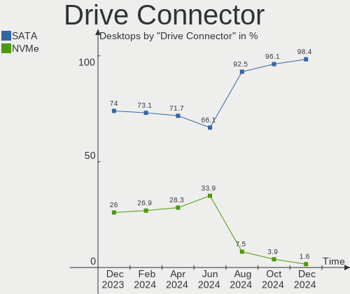
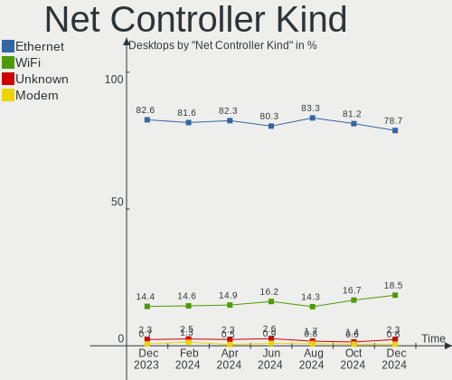

BSD Hardware Trends (Desktops)
------------------------------

A project to identify most popular hardware characteristics and track their change
over time based on data collected by BSD users at https://BSD-Hardware.info.

Anyone can contribute to this report by the [hw-probe](https://github.com/linuxhw/hw-probe/blob/master/INSTALL.BSD.md) tool:

    hw-probe -all -upload

Full-feature report is available here: https://bsd-hardware.info/?view=trends

Period: Feb, 2022.

Contents
--------

* [ System ](#system)
  - [ OS                       ](#os)
  - [ OS Family                ](#os-family)
  - [ Arch                     ](#arch)
  - [ DE                       ](#de)
  - [ Display Server           ](#display-server)
  - [ Display Manager          ](#display-manager)
  - [ OS Lang                  ](#os-lang)
  - [ Boot Mode                ](#boot-mode)
  - [ Filesystem               ](#filesystem)
  - [ Part. scheme             ](#part-scheme)

* [ Board ](#board)
  - [ Vendor                   ](#vendor)
  - [ Model                    ](#model)
  - [ Model Family             ](#model-family)
  - [ MFG Year                 ](#mfg-year)
  - [ Form Factor              ](#form-factor)
  - [ Coreboot                 ](#coreboot)
  - [ RAM Size                 ](#ram-size)
  - [ RAM Used                 ](#ram-used)
  - [ Total Drives             ](#total-drives)
  - [ Has CD-ROM               ](#has-cd-rom)
  - [ Has Ethernet             ](#has-ethernet)
  - [ Has WiFi                 ](#has-wifi)
  - [ Has Bluetooth            ](#has-bluetooth)

* [ Location ](#location)
  - [ Country                  ](#country)
  - [ City                     ](#city)

* [ Drives ](#drives)
  - [ Drive Vendor             ](#drive-vendor)
  - [ Drive Model              ](#drive-model)
  - [ HDD Vendor               ](#hdd-vendor)
  - [ SSD Vendor               ](#ssd-vendor)
  - [ Drive Kind               ](#drive-kind)
  - [ Drive Connector          ](#drive-connector)
  - [ Drive Size               ](#drive-size)
  - [ Space Total              ](#space-total)
  - [ Space Used               ](#space-used)
  - [ Malfunc. Drives          ](#malfunc-drives)
  - [ Malfunc. Drive Vendor    ](#malfunc-drive-vendor)
  - [ Malfunc. HDD Vendor      ](#malfunc-hdd-vendor)
  - [ Malfunc. Drive Kind      ](#malfunc-drive-kind)
  - [ Failed Drives            ](#failed-drives)
  - [ Failed Drive Vendor      ](#failed-drive-vendor)
  - [ Drive Status             ](#drive-status)

* [ Storage controller ](#storage-controller)
  - [ Storage Vendor           ](#storage-vendor)
  - [ Storage Model            ](#storage-model)
  - [ Storage Kind             ](#storage-kind)

* [ Processor ](#processor)
  - [ CPU Vendor               ](#cpu-vendor)
  - [ CPU Model                ](#cpu-model)
  - [ CPU Model Family         ](#cpu-model-family)
  - [ CPU Cores                ](#cpu-cores)
  - [ CPU Sockets              ](#cpu-sockets)
  - [ CPU Threads              ](#cpu-threads)
  - [ CPU Microarch            ](#cpu-microarch)

* [ Graphics ](#graphics)
  - [ GPU Vendor               ](#gpu-vendor)
  - [ GPU Model                ](#gpu-model)
  - [ GPU Combo                ](#gpu-combo)
  - [ GPU Driver               ](#gpu-driver)
  - [ GPU Memory               ](#gpu-memory)

* [ Monitor ](#monitor)
  - [ Monitor Vendor           ](#monitor-vendor)
  - [ Monitor Model            ](#monitor-model)
  - [ Monitor Resolution       ](#monitor-resolution)
  - [ Monitor Diagonal         ](#monitor-diagonal)
  - [ Monitor Width            ](#monitor-width)
  - [ Aspect Ratio             ](#aspect-ratio)
  - [ Monitor Area             ](#monitor-area)
  - [ Pixel Density            ](#pixel-density)
  - [ Multiple Monitors        ](#multiple-monitors)

* [ Network ](#network)
  - [ Net Controller Vendor    ](#net-controller-vendor)
  - [ Net Controller Model     ](#net-controller-model)
  - [ Wireless Vendor          ](#wireless-vendor)
  - [ Wireless Model           ](#wireless-model)
  - [ Ethernet Vendor          ](#ethernet-vendor)
  - [ Ethernet Model           ](#ethernet-model)
  - [ Net Controller Kind      ](#net-controller-kind)
  - [ Used Controller          ](#used-controller)
  - [ NICs                     ](#nics)
  - [ IPv6                     ](#ipv6)

* [ Bluetooth ](#bluetooth)
  - [ Bluetooth Vendor         ](#bluetooth-vendor)
  - [ Bluetooth Model          ](#bluetooth-model)

* [ Sound ](#sound)
  - [ Sound Vendor             ](#sound-vendor)
  - [ Sound Model              ](#sound-model)

* [ Memory ](#memory)
  - [ Memory Vendor            ](#memory-vendor)
  - [ Memory Model             ](#memory-model)
  - [ Memory Kind              ](#memory-kind)
  - [ Memory Form Factor       ](#memory-form-factor)
  - [ Memory Size              ](#memory-size)
  - [ Memory Speed             ](#memory-speed)

* [ Printers & scanners ](#printers--scanners)
  - [ Printer Vendor           ](#printer-vendor)
  - [ Printer Model            ](#printer-model)
  - [ Scanner Vendor           ](#scanner-vendor)
  - [ Scanner Model            ](#scanner-model)

* [ Camera ](#camera)
  - [ Camera Vendor            ](#camera-vendor)
  - [ Camera Model             ](#camera-model)

* [ Security ](#security)
  - [ Fingerprint Vendor       ](#fingerprint-vendor)
  - [ Fingerprint Model        ](#fingerprint-model)
  - [ Chipcard Vendor          ](#chipcard-vendor)
  - [ Chipcard Model           ](#chipcard-model)

* [ Unsupported ](#unsupported)
  - [ Unsupported Devices      ](#unsupported-devices)
  - [ Unsupported Device Types ](#unsupported-device-types)

System
------

OS
--

Installed operating systems

| Name                     | Desktops | Percent |
|--------------------------|----------|---------|
| OPNsense 22.1            | 96       | 35.04%  |
| OPNsense 22.1.1          | 75       | 27.37%  |
| helloSystem 0.7.0        | 23       | 8.39%   |
| OPNsense 21.7.8          | 22       | 8.03%   |
| OpenBSD 7.0              | 11       | 4.01%   |
| FreeBSD 13.0-p7          | 11       | 4.01%   |
| FreeBSD 13.0-STABLE      | 9        | 3.28%   |
| helloSystem 0.8.0        | 4        | 1.46%   |
| FreeBSD 13.0             | 3        | 1.09%   |
| OPNsense 21.7.4          | 2        | 0.73%   |
| OPNsense 20.7.8          | 2        | 0.73%   |
| FreeBSD 13.0-p5          | 2        | 0.73%   |
| FreeBSD 12.3-p2          | 2        | 0.73%   |
| TrueNAS 12.2-p12         | 1        | 0.36%   |
| TrueNAS 12.2-p10         | 1        | 0.36%   |
| OPNsense 22.7            | 1        | 0.36%   |
| OPNsense 21.7.7          | 1        | 0.36%   |
| OPNsense 21.1.9          | 1        | 0.36%   |
| NomadBSD 5806f915        | 1        | 0.36%   |
| NetBSD 9.2               | 1        | 0.36%   |
| helloSystem 0.6.0        | 1        | 0.36%   |
| FreeBSD 14.0-CURRENT     | 1        | 0.36%   |
| FreeBSD 13.0-STABLE-HBSD | 1        | 0.36%   |
| FreeBSD 13.0-p6          | 1        | 0.36%   |
| FreeBSD 13.0-p4          | 1        | 0.36%   |

OS Family
---------

OS without a version

| Name        | Desktops | Percent |
|-------------|----------|---------|
| OPNsense    | 200      | 72.99%  |
| FreeBSD     | 31       | 11.31%  |
| helloSystem | 28       | 10.22%  |
| OpenBSD     | 11       | 4.01%   |
| TrueNAS     | 2        | 0.73%   |
| NomadBSD    | 1        | 0.36%   |
| NetBSD      | 1        | 0.36%   |

Arch
----

OS architecture (x86_64, i586, etc.)

| Name  | Desktops | Percent |
|-------|----------|---------|
| amd64 | 268      | 97.81%  |
| i386  | 3        | 1.09%   |
| arm64 | 2        | 0.73%   |
| armv7 | 1        | 0.36%   |

DE
--

Desktop Environment

| Name         | Desktops | Percent |
|--------------|----------|---------|
| Console      | 221      | 80.66%  |
| helloDesktop | 31       | 11.31%  |
| fvwm         | 9        | 3.28%   |
| KDE5         | 7        | 2.55%   |
| xfwm         | 1        | 0.36%   |
| XFCE         | 1        | 0.36%   |
| Openbox      | 1        | 0.36%   |
| KWin         | 1        | 0.36%   |
| i3           | 1        | 0.36%   |
| akonadi_newm | 1        | 0.36%   |

Display Server
--------------

X11 or Wayland

| Name    | Desktops | Percent |
|---------|----------|---------|
| Console | 223      | 81.39%  |
| X11     | 49       | 17.88%  |
| Wayland | 2        | 0.73%   |

Display Manager
---------------

SDDM, LightDM, etc.

| Name    | Desktops | Percent |
|---------|----------|---------|
| Console | 236      | 86.13%  |
| SLiM    | 29       | 10.58%  |
| SDDM    | 8        | 2.92%   |
| LightDM | 1        | 0.36%   |

OS Lang
-------

Language

| Lang    | Desktops | Percent |
|---------|----------|---------|
| Unknown | 212      | 77.37%  |
| en_US   | 39       | 14.23%  |
| C       | 19       | 6.93%   |
| ru_RU   | 3        | 1.09%   |
| en_AU   | 1        | 0.36%   |

Boot Mode
---------

EFI or BIOS

| Mode | Desktops | Percent |
|------|----------|---------|
| EFI  | 243      | 88.69%  |
| BIOS | 31       | 11.31%  |

Filesystem
----------

Type of filesystem

| Type   | Desktops | Percent |
|--------|----------|---------|
| Ufs    | 149      | 54.38%  |
| Zfs    | 97       | 35.4%   |
| Cd9660 | 15       | 5.47%   |
| Ffs    | 11       | 4.01%   |
| XXX    | 2        | 0.73%   |

Part. scheme
------------

Scheme of partitioning

| Type    | Desktops | Percent |
|---------|----------|---------|
| GPT     | 259      | 94.53%  |
| MBR     | 14       | 5.11%   |
| Unknown | 1        | 0.36%   |

Board
-----

Vendor
------

Motherboard manufacturer

| Name                    | Desktops | Percent |
|-------------------------|----------|---------|
| ASRock                  | 29       | 10.58%  |
| Unknown                 | 24       | 8.76%   |
| Protectli               | 22       | 8.03%   |
| Hewlett-Packard         | 22       | 8.03%   |
| Dell                    | 22       | 8.03%   |
| ASUSTek Computer        | 22       | 8.03%   |
| Intel                   | 20       | 7.3%    |
| MSI                     | 15       | 5.47%   |
| PC Engines              | 14       | 5.11%   |
| Gigabyte Technology     | 13       | 4.74%   |
| Supermicro              | 12       | 4.38%   |
| Lenovo                  | 6        | 2.19%   |
| SeeedStudio             | 5        | 1.82%   |
| Fujitsu                 | 5        | 1.82%   |
| Shuttle                 | 4        | 1.46%   |
| Biostar                 | 4        | 1.46%   |
| Pegatron                | 3        | 1.09%   |
| MW                      | 3        | 1.09%   |
| CheckPoint              | 3        | 1.09%   |
| HARDKERNEL              | 2        | 0.73%   |
| Gateway                 | 2        | 0.73%   |
| BESSTAR Tech            | 2        | 0.73%   |
| AZW                     | 2        | 0.73%   |
| AAEON                   | 2        | 0.73%   |
| YANYU                   | 1        | 0.36%   |
| Thomas-Krenn.AG         | 1        | 0.36%   |
| Raspberry Pi Foundation | 1        | 0.36%   |
| PAIQ                    | 1        | 0.36%   |
| Medion                  | 1        | 0.36%   |
| MACHINIST               | 1        | 0.36%   |
| Kontron                 | 1        | 0.36%   |
| KLLISRE                 | 1        | 0.36%   |
| HPE                     | 1        | 0.36%   |
| GALAX                   | 1        | 0.36%   |
| ECS                     | 1        | 0.36%   |
| ASRockRack              | 1        | 0.36%   |
| Apple                   | 1        | 0.36%   |
| AOpen                   | 1        | 0.36%   |
| AMD                     | 1        | 0.36%   |
| Acer                    | 1        | 0.36%   |

Model
-----

Motherboard model

| Name                            | Desktops | Percent |
|---------------------------------|----------|---------|
| Unknown                         | 24       | 8.76%   |
| Intel Q3XXG4-P V1.0             | 9        | 3.28%   |
| Protectli FW4B                  | 8        | 2.92%   |
| PC Engines APU2                 | 8        | 2.92%   |
| Protectli FW6                   | 7        | 2.55%   |
| PC Engines apu4                 | 5        | 1.82%   |
| SeeedStudio ODYSSEY-X86J4105    | 4        | 1.46%   |
| HP t620 PLUS Quad Core TC       | 4        | 1.46%   |
| ASUS All Series                 | 4        | 1.46%   |
| Supermicro X9SCL/X9SCM          | 3        | 1.09%   |
| MW GMLK-2_5G4L                  | 3        | 1.09%   |
| Protectli VP2410                | 2        | 0.73%   |
| Intel MAHOBAY                   | 2        | 0.73%   |
| HP ProDesk 600 G3 SFF           | 2        | 0.73%   |
| HARDKERNEL ODROID-H2            | 2        | 0.73%   |
| Gigabyte Z390 GAMING X          | 2        | 0.73%   |
| Gateway DX4870                  | 2        | 0.73%   |
| Dell OptiPlex 755               | 2        | 0.73%   |
| Dell OptiPlex 3020              | 2        | 0.73%   |
| CheckPoint T-110-00             | 2        | 0.73%   |
| AZW GK55                        | 2        | 0.73%   |
| ASRock AM1H-ITX                 | 2        | 0.73%   |
| YANYU M9F baytrail              | 1        | 0.36%   |
| Thomas-Krenn.AG LES network 6L  | 1        | 0.36%   |
| Supermicro X9DRD-7LN4F          | 1        | 0.36%   |
| Supermicro X8STi                | 1        | 0.36%   |
| Supermicro X8SIL                | 1        | 0.36%   |
| Supermicro X7SPA-H              | 1        | 0.36%   |
| Supermicro SYS-E300-9D-8CN8TP   | 1        | 0.36%   |
| Supermicro SYS-E200-9B          | 1        | 0.36%   |
| Supermicro SYS-1019D-4C-FHN13TP | 1        | 0.36%   |
| Supermicro pro379410            | 1        | 0.36%   |
| Supermicro AS -E301-9D-8CN4     | 1        | 0.36%   |
| Shuttle SZ270                   | 1        | 0.36%   |
| Shuttle DS77U                   | 1        | 0.36%   |
| Shuttle DS10U                   | 1        | 0.36%   |
| Shuttle DH170                   | 1        | 0.36%   |
| SeeedStudio ODYSSEY-X86J4125    | 1        | 0.36%   |
| RPi Raspberry Pi 400            | 1        | 0.36%   |
| Protectli FW6E                  | 1        | 0.36%   |
| Protectli FW4A                  | 1        | 0.36%   |
| Protectli FW2B                  | 1        | 0.36%   |
| Protectli FW2                   | 1        | 0.36%   |
| Protectli FW1                   | 1        | 0.36%   |
| Pegatron Pro 3405 Series        | 1        | 0.36%   |
| Pegatron Elite 7500 Series MT   | 1        | 0.36%   |
| Pegatron AY627AA-ABA a4313w     | 1        | 0.36%   |
| PC Engines apu1                 | 1        | 0.36%   |
| PAIQ EC3-BT19D4L                | 1        | 0.36%   |
| MSI MS-7C96                     | 1        | 0.36%   |
| MSI MS-7C95                     | 1        | 0.36%   |
| MSI MS-7C52                     | 1        | 0.36%   |
| MSI MS-7C39                     | 1        | 0.36%   |
| MSI MS-7C09                     | 1        | 0.36%   |
| MSI MS-7B86                     | 1        | 0.36%   |
| MSI MS-7B79                     | 1        | 0.36%   |
| MSI MS-7995                     | 1        | 0.36%   |
| MSI MS-7851                     | 1        | 0.36%   |
| MSI MS-7850                     | 1        | 0.36%   |
| MSI MS-7817                     | 1        | 0.36%   |

Model Family
------------

Motherboard model prefix

| Name                            | Desktops | Percent |
|---------------------------------|----------|---------|
| Unknown                         | 24       | 8.76%   |
| Dell OptiPlex                   | 15       | 5.47%   |
| Intel Q3XXG4-P                  | 9        | 3.28%   |
| Protectli FW4B                  | 8        | 2.92%   |
| PC Engines APU2                 | 8        | 2.92%   |
| Protectli FW6                   | 7        | 2.55%   |
| HP ProDesk                      | 6        | 2.19%   |
| ASUS PRIME                      | 6        | 2.19%   |
| PC Engines apu4                 | 5        | 1.82%   |
| HP t620                         | 5        | 1.82%   |
| SeeedStudio ODYSSEY-X86J4105    | 4        | 1.46%   |
| Lenovo ThinkCentre              | 4        | 1.46%   |
| ASUS All                        | 4        | 1.46%   |
| Supermicro X9SCL                | 3        | 1.09%   |
| MW GMLK-2                       | 3        | 1.09%   |
| HP EliteDesk                    | 3        | 1.09%   |
| Dell PowerEdge                  | 3        | 1.09%   |
| ASUS ROG                        | 3        | 1.09%   |
| Protectli VP2410                | 2        | 0.73%   |
| Intel MAHOBAY                   | 2        | 0.73%   |
| HP ProLiant                     | 2        | 0.73%   |
| HP Compaq                       | 2        | 0.73%   |
| HARDKERNEL ODROID-H2            | 2        | 0.73%   |
| Gigabyte Z390                   | 2        | 0.73%   |
| Gigabyte X570                   | 2        | 0.73%   |
| Gateway DX4870                  | 2        | 0.73%   |
| Fujitsu FUTRO                   | 2        | 0.73%   |
| Dell Inspiron                   | 2        | 0.73%   |
| CheckPoint T-110-00             | 2        | 0.73%   |
| AZW GK55                        | 2        | 0.73%   |
| ASRock AM1H-ITX                 | 2        | 0.73%   |
| YANYU M9F                       | 1        | 0.36%   |
| Thomas-Krenn.AG LES             | 1        | 0.36%   |
| Supermicro X9DRD-7LN4F          | 1        | 0.36%   |
| Supermicro X8STi                | 1        | 0.36%   |
| Supermicro X8SIL                | 1        | 0.36%   |
| Supermicro X7SPA-H              | 1        | 0.36%   |
| Supermicro SYS-E300-9D-8CN8TP   | 1        | 0.36%   |
| Supermicro SYS-E200-9B          | 1        | 0.36%   |
| Supermicro SYS-1019D-4C-FHN13TP | 1        | 0.36%   |
| Supermicro pro379410            | 1        | 0.36%   |
| Supermicro AS                   | 1        | 0.36%   |
| Shuttle SZ270                   | 1        | 0.36%   |
| Shuttle DS77U                   | 1        | 0.36%   |
| Shuttle DS10U                   | 1        | 0.36%   |
| Shuttle DH170                   | 1        | 0.36%   |
| SeeedStudio ODYSSEY-X86J4125    | 1        | 0.36%   |
| RPi Raspberry                   | 1        | 0.36%   |
| Protectli FW6E                  | 1        | 0.36%   |
| Protectli FW4A                  | 1        | 0.36%   |
| Protectli FW2B                  | 1        | 0.36%   |
| Protectli FW2                   | 1        | 0.36%   |
| Protectli FW1                   | 1        | 0.36%   |
| Pegatron Pro                    | 1        | 0.36%   |
| Pegatron Elite                  | 1        | 0.36%   |
| Pegatron AY627AA-ABA            | 1        | 0.36%   |
| PC Engines apu1                 | 1        | 0.36%   |
| PAIQ EC3-BT19D4L                | 1        | 0.36%   |
| MSI MS-7C96                     | 1        | 0.36%   |
| MSI MS-7C95                     | 1        | 0.36%   |

MFG Year
--------

Motherboard manufacture year

| Year    | Desktops | Percent |
|---------|----------|---------|
| 2020    | 41       | 14.96%  |
| 2018    | 37       | 13.5%   |
| 2019    | 36       | 13.14%  |
| 2021    | 35       | 12.77%  |
| 2016    | 30       | 10.95%  |
| 2014    | 23       | 8.39%   |
| 2012    | 22       | 8.03%   |
| 2013    | 11       | 4.01%   |
| 2011    | 8        | 2.92%   |
| 2017    | 7        | 2.55%   |
| 2015    | 7        | 2.55%   |
| 2010    | 5        | 1.82%   |
| 2009    | 4        | 1.46%   |
| 2008    | 4        | 1.46%   |
| 2007    | 2        | 0.73%   |
| 2004    | 1        | 0.36%   |
| Unknown | 1        | 0.36%   |

Form Factor
-----------

Physical design of the computer

| Name    | Desktops | Percent |
|---------|----------|---------|
| Desktop | 274      | 100%    |

Coreboot
--------

Have coreboot on board

| Used | Desktops | Percent |
|------|----------|---------|
| No   | 257      | 93.8%   |
| Yes  | 17       | 6.2%    |

RAM Size
--------

Total RAM memory

| Size in GB  | Desktops | Percent |
|-------------|----------|---------|
| 8.01-16.0   | 109      | 39.78%  |
| 4.01-8.0    | 50       | 18.25%  |
| 16.01-24.0  | 50       | 18.25%  |
| 32.01-64.0  | 30       | 10.95%  |
| 64.01-256.0 | 11       | 4.01%   |
| 2.01-3.0    | 9        | 3.28%   |
| 24.01-32.0  | 7        | 2.55%   |
| 3.01-4.0    | 5        | 1.82%   |
| 1.01-2.0    | 2        | 0.73%   |
| 0.51-1.0    | 1        | 0.36%   |

RAM Used
--------

Used RAM memory

| Used GB     | Desktops | Percent |
|-------------|----------|---------|
| 0.01-0.5    | 145      | 52.92%  |
| 0.51-1.0    | 79       | 28.83%  |
| 1.01-2.0    | 38       | 13.87%  |
| 2.01-3.0    | 5        | 1.82%   |
| 4.01-8.0    | 2        | 0.73%   |
| 3.01-4.0    | 2        | 0.73%   |
| 64.01-256.0 | 1        | 0.36%   |
| 0           | 1        | 0.36%   |
| Unknown     | 1        | 0.36%   |

Total Drives
------------

Number of drives on board

| Drives | Desktops | Percent |
|--------|----------|---------|
| 1      | 189      | 68.98%  |
| 2      | 41       | 14.96%  |
| 0      | 15       | 5.47%   |
| 3      | 13       | 4.74%   |
| 4      | 9        | 3.28%   |
| 5      | 3        | 1.09%   |
| 6      | 2        | 0.73%   |
| 13     | 1        | 0.36%   |
| 7      | 1        | 0.36%   |

Has CD-ROM
----------

Has CD-ROM on board

| Presented | Desktops | Percent |
|-----------|----------|---------|
| No        | 233      | 85.04%  |
| Yes       | 41       | 14.96%  |

Has Ethernet
------------

Has Ethernet on board

| Presented | Desktops | Percent |
|-----------|----------|---------|
| Yes       | 269      | 98.18%  |
| No        | 5        | 1.82%   |

Has WiFi
--------

Has WiFi module

| Presented | Desktops | Percent |
|-----------|----------|---------|
| No        | 224      | 81.75%  |
| Yes       | 50       | 18.25%  |

Has Bluetooth
-------------

Has Bluetooth module

| Presented | Desktops | Percent |
|-----------|----------|---------|
| No        | 245      | 89.42%  |
| Yes       | 29       | 10.58%  |

Location
--------

Country
-------

Geographic location (country)

| Country       | Desktops | Percent |
|---------------|----------|---------|
| USA           | 84       | 30.66%  |
| Germany       | 43       | 15.69%  |
| Russia        | 12       | 4.38%   |
| Poland        | 12       | 4.38%   |
| France        | 12       | 4.38%   |
| Canada        | 10       | 3.65%   |
| Austria       | 10       | 3.65%   |
| Spain         | 8        | 2.92%   |
| UK            | 7        | 2.55%   |
| Brazil        | 7        | 2.55%   |
| Switzerland   | 6        | 2.19%   |
| Australia     | 6        | 2.19%   |
| Ukraine       | 5        | 1.82%   |
| Thailand      | 5        | 1.82%   |
| Netherlands   | 5        | 1.82%   |
| Italy         | 4        | 1.46%   |
| Hungary       | 4        | 1.46%   |
| Sweden        | 3        | 1.09%   |
| Portugal      | 3        | 1.09%   |
| Hong Kong     | 3        | 1.09%   |
| Taiwan        | 2        | 0.73%   |
| Romania       | 2        | 0.73%   |
| Israel        | 2        | 0.73%   |
| Indonesia     | 2        | 0.73%   |
| India         | 2        | 0.73%   |
| Finland       | 2        | 0.73%   |
| South Korea   | 1        | 0.36%   |
| Slovakia      | 1        | 0.36%   |
| Peru          | 1        | 0.36%   |
| Liechtenstein | 1        | 0.36%   |
| Ireland       | 1        | 0.36%   |
| Guatemala     | 1        | 0.36%   |
| Greece        | 1        | 0.36%   |
| Denmark       | 1        | 0.36%   |
| Czechia       | 1        | 0.36%   |
| Colombia      | 1        | 0.36%   |
| China         | 1        | 0.36%   |
| Bulgaria      | 1        | 0.36%   |
| Unknown       | 1        | 0.36%   |

City
----

Geographic location (city)

| City                | Desktops | Percent |
|---------------------|----------|---------|
| Moscow              | 6        | 2.19%   |
| Vienna              | 5        | 1.82%   |
| Berlin              | 5        | 1.82%   |
| Bangkok             | 5        | 1.82%   |
| Teaneck             | 4        | 1.46%   |
| Zurich              | 3        | 1.09%   |
| Salem               | 3        | 1.09%   |
| Kharkiv             | 3        | 1.09%   |
| Tel Aviv            | 2        | 0.73%   |
| Redmond             | 2        | 0.73%   |
| Paris               | 2        | 0.73%   |
| Munich              | 2        | 0.73%   |
| Melbourne           | 2        | 0.73%   |
| Herford             | 2        | 0.73%   |
| Hanover             | 2        | 0.73%   |
| Hagerstown          | 2        | 0.73%   |
| Graz                | 2        | 0.73%   |
| Gdansk              | 2        | 0.73%   |
| Frankfurt am Main   | 2        | 0.73%   |
| Denver              | 2        | 0.73%   |
| Bucharest           | 2        | 0.73%   |
| Bad Vilbel          | 2        | 0.73%   |
| Amsterdam           | 2        | 0.73%   |
| Zeven               | 1        | 0.36%   |
| Zeist               | 1        | 0.36%   |
| Zagnansk            | 1        | 0.36%   |
| York                | 1        | 0.36%   |
| Woodstock           | 1        | 0.36%   |
| Wollongong          | 1        | 0.36%   |
| Windsor             | 1        | 0.36%   |
| Wentorf bei Hamburg | 1        | 0.36%   |
| Wendell             | 1        | 0.36%   |
| Wenatchee           | 1        | 0.36%   |
| Würzburg         | 1        | 0.36%   |
| Watford             | 1        | 0.36%   |
| Watertown           | 1        | 0.36%   |
| Vila Real           | 1        | 0.36%   |
| Victoria            | 1        | 0.36%   |
| Västerås      | 1        | 0.36%   |
| Varpalota           | 1        | 0.36%   |
| Vancouver           | 1        | 0.36%   |
| Urupes              | 1        | 0.36%   |
| Upper Marlboro      | 1        | 0.36%   |
| Ulyanovsk           | 1        | 0.36%   |
| Uhorske             | 1        | 0.36%   |
| Toulouse            | 1        | 0.36%   |
| Todtnau             | 1        | 0.36%   |
| Taipei              | 1        | 0.36%   |
| Suwanee             | 1        | 0.36%   |
| Suderfahrenstedt    | 1        | 0.36%   |
| Statesboro          | 1        | 0.36%   |
| Stary Sacz          | 1        | 0.36%   |
| Stamford            | 1        | 0.36%   |
| Stafford            | 1        | 0.36%   |
| Sopron              | 1        | 0.36%   |
| Sofia               | 1        | 0.36%   |
| Siegen              | 1        | 0.36%   |
| Shreveport          | 1        | 0.36%   |
| Seville             | 1        | 0.36%   |
| Seocho-gu           | 1        | 0.36%   |

Drives
------

Drive Vendor
------------

Hard drive vendors

| Vendor              | Desktops | Drives | Percent |
|---------------------|----------|--------|---------|
| WDC                 | 53       | 78     | 16.31%  |
| Samsung Electronics | 47       | 53     | 14.46%  |
| Seagate             | 36       | 47     | 11.08%  |
| Kingston            | 24       | 26     | 7.38%   |
| Transcend           | 18       | 19     | 5.54%   |
| Toshiba             | 13       | 16     | 4%      |
| Crucial             | 12       | 12     | 3.69%   |
| SanDisk             | 10       | 10     | 3.08%   |
| Phison              | 10       | 11     | 3.08%   |
| Intel               | 10       | 16     | 3.08%   |
| Hoodisk             | 9        | 9      | 2.77%   |
| SPCC                | 8        | 9      | 2.46%   |
| A-DATA Technology   | 6        | 7      | 1.85%   |
| Patriot             | 5        | 5      | 1.54%   |
| Protectli           | 4        | 4      | 1.23%   |
| Hitachi             | 4        | 5      | 1.23%   |
| FORESEE             | 4        | 4      | 1.23%   |
| LITEONIT            | 3        | 3      | 0.92%   |
| Intenso             | 3        | 3      | 0.92%   |
| Hewlett-Packard     | 3        | 7      | 0.92%   |
| GOODRAM             | 3        | 3      | 0.92%   |
| Dogfish             | 3        | 3      | 0.92%   |
| BIWIN               | 3        | 3      | 0.92%   |
| SK Hynix            | 2        | 2      | 0.62%   |
| PNY                 | 2        | 2      | 0.62%   |
| OCZ                 | 2        | 2      | 0.62%   |
| Gigabyte Technology | 2        | 2      | 0.62%   |
| Corsair             | 2        | 2      | 0.62%   |
| China               | 2        | 2      | 0.62%   |
| Zheino              | 1        | 1      | 0.31%   |
| VisionTek           | 1        | 1      | 0.31%   |
| V-GeN               | 1        | 1      | 0.31%   |
| SSSTC               | 1        | 1      | 0.31%   |
| SSDPR-CX            | 1        | 1      | 0.31%   |
| Netac               | 1        | 1      | 0.31%   |
| Mushkin             | 1        | 1      | 0.31%   |
| Micron Technology   | 1        | 1      | 0.31%   |
| Micro Center        | 1        | 1      | 0.31%   |
| MAXTOR              | 1        | 2      | 0.31%   |
| Lexar               | 1        | 2      | 0.31%   |
| Leven               | 1        | 1      | 0.31%   |
| Kston               | 1        | 1      | 0.31%   |
| KingSpec            | 1        | 1      | 0.31%   |
| HGST                | 1        | 1      | 0.31%   |
| Generic             | 1        | 1      | 0.31%   |
| Fujitsu             | 1        | 1      | 0.31%   |
| faspeed             | 1        | 1      | 0.31%   |
| Drevo               | 1        | 1      | 0.31%   |
| Biostar             | 1        | 1      | 0.31%   |
| Apple               | 1        | 1      | 0.31%   |
| Apacer              | 1        | 1      | 0.31%   |

Drive Model
-----------

Hard drive models

| Model                             | Desktops | Percent |
|-----------------------------------|----------|---------|
| Transcend TS256GMSA230S 256GB     | 6        | 1.69%   |
| Samsung SSD 860 EVO 500GB         | 5        | 1.41%   |
| Kingston SA400S37240G 240GB       | 5        | 1.41%   |
| Transcend TS64GMSA370 64GB        | 4        | 1.13%   |
| SPCC Solid State Disk 256GB       | 3        | 0.85%   |
| SPCC Solid State Disk 128GB       | 3        | 0.85%   |
| Seagate ST500DM002-1BD142 500GB   | 3        | 0.85%   |
| Seagate ST1000DM010-2EP102 1TB    | 3        | 0.85%   |
| Samsung SSD 870 EVO 250GB         | 3        | 0.85%   |
| Kingston SUV500MS120G 120GB       | 3        | 0.85%   |
| Kingston SA400S37120G 120GB       | 3        | 0.85%   |
| Hoodisk SSD 128GB                 | 3        | 0.85%   |
| BIWIN SSD 128GB                   | 3        | 0.85%   |
| WDC WDS500G2B0C-00PXH0 500GB      | 2        | 0.56%   |
| WDC WDS120G2G0B-00EPW0 120GB      | 2        | 0.56%   |
| WDC WD6002FRYZ-01WD5B1 6TB        | 2        | 0.56%   |
| WDC WD20PURZ-85GU6Y0 2TB          | 2        | 0.56%   |
| WDC WD10EZEX-22MFCA0 1TB          | 2        | 0.56%   |
| WDC WD10EZEX-08WN4A0 1TB          | 2        | 0.56%   |
| Transcend TS64GMSA230S 64GB       | 2        | 0.56%   |
| Transcend TS128GMSA230S 128GB     | 2        | 0.56%   |
| Toshiba DT01ACA100 1TB            | 2        | 0.56%   |
| Seagate ST500DM002-1BC142 500GB   | 2        | 0.56%   |
| Seagate ST4000LM024-2AN17V 4TB    | 2        | 0.56%   |
| Seagate ST4000DM004-2CV104 4TB    | 2        | 0.56%   |
| Seagate ST4000DM000-1F2168 4TB    | 2        | 0.56%   |
| Seagate ST2000VN000-1HJ164 2TB    | 2        | 0.56%   |
| Seagate ST2000DM008-2FR102 2TB    | 2        | 0.56%   |
| SanDisk SDSA6MM-016G-1006 16GB    | 2        | 0.56%   |
| Samsung SSD 980 250GB             | 2        | 0.56%   |
| Samsung SSD 970 EVO Plus 250GB    | 2        | 0.56%   |
| Samsung SSD 860 QVO 1TB           | 2        | 0.56%   |
| Samsung SSD 850 EVO 500GB         | 2        | 0.56%   |
| Samsung SSD 840 EVO 250GB         | 2        | 0.56%   |
| PNY CS900 250GB SSD               | 2        | 0.56%   |
| Phison SATA SSD 32GB              | 2        | 0.56%   |
| Phison SATA SSD 16GB              | 2        | 0.56%   |
| Patriot Burst 120GB               | 2        | 0.56%   |
| LITEONIT LCS-256M6S 2.5 7mm 256GB | 2        | 0.56%   |
| Kingston SMS200S330G 32GB         | 2        | 0.56%   |
| Kingston SKC600MS256G 256GB       | 2        | 0.56%   |
| Intel SSDSC2KW256G8 256GB         | 2        | 0.56%   |
| Intel SSDSC2CW060A3 64GB          | 2        | 0.56%   |
| Hoodisk SSD 64GB                  | 2        | 0.56%   |
| Hoodisk SSD 256GB                 | 2        | 0.56%   |
| FORESEE 64GB SSD                  | 2        | 0.56%   |
| FORESEE 128GB SSD                 | 2        | 0.56%   |
| Crucial M4-CT064M4SSD2 64GB       | 2        | 0.56%   |
| Crucial CT256MX100SSD1 256GB      | 2        | 0.56%   |
| Crucial CT250MX500SSD1 250GB      | 2        | 0.56%   |
| China NGFF 2280 256GB SSD         | 2        | 0.56%   |
| Zheino CHN mSATAM1 064 64GB       | 1        | 0.28%   |
| WDC WDS500G2B0B-00YS70 500GB      | 1        | 0.28%   |
| WDC WDS500G1X0E-00AFY0 500GB      | 1        | 0.28%   |
| WDC WDS500G1R0B-68A4Z0 500GB      | 1        | 0.28%   |
| WDC WDS500G1B0A-00H9H0 500GB      | 1        | 0.28%   |
| WDC WDS250G2B0C-00PXH0 250GB      | 1        | 0.28%   |
| WDC WDS250G2B0A-00SM50 250GB      | 1        | 0.28%   |
| WDC WDS240G2G0A-00JH30 240GB      | 1        | 0.28%   |
| WDC WDS240G1G0A-00SS50 240GB      | 1        | 0.28%   |

HDD Vendor
----------

Hard disk drive vendors

| Vendor              | Desktops | Drives | Percent |
|---------------------|----------|--------|---------|
| WDC                 | 41       | 63     | 42.71%  |
| Seagate             | 34       | 42     | 35.42%  |
| Toshiba             | 9        | 12     | 9.38%   |
| Hitachi             | 4        | 5      | 4.17%   |
| SSDPR-CX            | 1        | 1      | 1.04%   |
| Samsung Electronics | 1        | 1      | 1.04%   |
| MAXTOR              | 1        | 2      | 1.04%   |
| HGST                | 1        | 1      | 1.04%   |
| Hewlett-Packard     | 1        | 5      | 1.04%   |
| Generic             | 1        | 1      | 1.04%   |
| Fujitsu             | 1        | 1      | 1.04%   |
| Apple               | 1        | 1      | 1.04%   |

SSD Vendor
----------

Solid state drive vendors

| Vendor              | Desktops | Drives | Percent |
|---------------------|----------|--------|---------|
| Samsung Electronics | 35       | 39     | 17.95%  |
| Kingston            | 23       | 24     | 11.79%  |
| Transcend           | 17       | 17     | 8.72%   |
| Crucial             | 11       | 11     | 5.64%   |
| SanDisk             | 10       | 10     | 5.13%   |
| Intel               | 10       | 16     | 5.13%   |
| Hoodisk             | 9        | 9      | 4.62%   |
| WDC                 | 8        | 9      | 4.1%    |
| SPCC                | 8        | 9      | 4.1%    |
| Phison              | 6        | 7      | 3.08%   |
| Patriot             | 5        | 5      | 2.56%   |
| Protectli           | 4        | 4      | 2.05%   |
| FORESEE             | 4        | 4      | 2.05%   |
| A-DATA Technology   | 4        | 5      | 2.05%   |
| Toshiba             | 3        | 3      | 1.54%   |
| LITEONIT            | 3        | 3      | 1.54%   |
| Intenso             | 3        | 3      | 1.54%   |
| Dogfish             | 3        | 3      | 1.54%   |
| BIWIN               | 3        | 3      | 1.54%   |
| PNY                 | 2        | 2      | 1.03%   |
| OCZ                 | 2        | 2      | 1.03%   |
| GOODRAM             | 2        | 2      | 1.03%   |
| China               | 2        | 2      | 1.03%   |
| Zheino              | 1        | 1      | 0.51%   |
| VisionTek           | 1        | 1      | 0.51%   |
| V-GeN               | 1        | 1      | 0.51%   |
| Seagate             | 1        | 1      | 0.51%   |
| Netac               | 1        | 1      | 0.51%   |
| Mushkin             | 1        | 1      | 0.51%   |
| Micro Center        | 1        | 1      | 0.51%   |
| Lexar               | 1        | 1      | 0.51%   |
| Leven               | 1        | 1      | 0.51%   |
| Kston               | 1        | 1      | 0.51%   |
| KingSpec            | 1        | 1      | 0.51%   |
| Hewlett-Packard     | 1        | 1      | 0.51%   |
| Gigabyte Technology | 1        | 1      | 0.51%   |
| faspeed             | 1        | 1      | 0.51%   |
| Drevo               | 1        | 1      | 0.51%   |
| Corsair             | 1        | 1      | 0.51%   |
| Biostar             | 1        | 1      | 0.51%   |
| Apacer              | 1        | 1      | 0.51%   |

Drive Kind
----------

HDD or SSD

| Kind | Desktops | Drives | Percent |
|------|----------|--------|---------|
| SSD  | 185      | 210    | 61.46%  |
| HDD  | 79       | 135    | 26.25%  |
| NVMe | 37       | 44     | 12.29%  |

Drive Connector
---------------

SATA, SAS, NVMe, etc.

| Type | Desktops | Drives | Percent |
|------|----------|--------|---------|
| SATA | 234      | 345    | 86.35%  |
| NVMe | 37       | 44     | 13.65%  |

Drive Size
----------

Size of hard drive

| Size in TB | Desktops | Drives | Percent |
|------------|----------|--------|---------|
| 0.01-0.5   | 206      | 246    | 75.18%  |
| 0.51-1.0   | 33       | 40     | 12.04%  |
| 1.01-2.0   | 14       | 23     | 5.11%   |
| 3.01-4.0   | 10       | 15     | 3.65%   |
| 4.01-10.0  | 5        | 12     | 1.82%   |
| 2.01-3.0   | 3        | 4      | 1.09%   |
| 10.01-20.0 | 3        | 5      | 1.09%   |

Space Total
-----------

Amount of disk space available on the file system

| Size in GB     | Desktops | Percent |
|----------------|----------|---------|
| 101-250        | 121      | 44.16%  |
| 251-500        | 45       | 16.42%  |
| 21-50          | 31       | 11.31%  |
| 51-100         | 28       | 10.22%  |
| 1-20           | 26       | 9.49%   |
| 501-1000       | 16       | 5.84%   |
| More than 3000 | 3        | 1.09%   |
| Unknown        | 2        | 0.73%   |
| 2001-3000      | 1        | 0.36%   |
| 1001-2000      | 1        | 0.36%   |

Space Used
----------

Amount of used disk space

| Used GB        | Desktops | Percent |
|----------------|----------|---------|
| 1-20           | 251      | 91.61%  |
| 21-50          | 15       | 5.47%   |
| More than 3000 | 2        | 0.73%   |
| 101-250        | 2        | 0.73%   |
| Unknown        | 2        | 0.73%   |
| 251-500        | 1        | 0.36%   |
| 51-100         | 1        | 0.36%   |

Malfunc. Drives
---------------

Drive models with a malfunction

| Model                                            | Desktops | Drives | Percent |
|--------------------------------------------------|----------|--------|---------|
| Seagate ST500DM002-1BD142 500GB                  | 2        | 2      | 5.41%   |
| WDC WD6003FZBX-00K5WB0 6TB                       | 1        | 1      | 2.7%    |
| WDC WD6002FRYZ-01WD5B1 6TB                       | 1        | 1      | 2.7%    |
| WDC WD5000AZLX-00CL5A0 500GB                     | 1        | 1      | 2.7%    |
| WDC WD3200AAVS-00ZTB0 320GB                      | 1        | 1      | 2.7%    |
| WDC WD3200AAJS-22B4A0 320GB                      | 1        | 1      | 2.7%    |
| WDC WD2000FYYZ-01UL1B2 2TB                       | 1        | 2      | 2.7%    |
| WDC WD10EZEX-08M2NA0 1TB                         | 1        | 1      | 2.7%    |
| WDC WD10EARS-003BB1 1TB                          | 1        | 1      | 2.7%    |
| VisionTek mSATA 120GB                            | 1        | 1      | 2.7%    |
| Toshiba MK2555GSX 250GB                          | 1        | 1      | 2.7%    |
| Toshiba MD04ACA400 4TB                           | 1        | 1      | 2.7%    |
| Toshiba DT01ABA300 3TB                           | 1        | 1      | 2.7%    |
| SPCC Solid State Disk 128GB                      | 1        | 1      | 2.7%    |
| Seagate ST9500420AS 500GB                        | 1        | 1      | 2.7%    |
| Seagate ST500DM002-1BC142 500GB                  | 1        | 1      | 2.7%    |
| Seagate ST3500418AS 500GB                        | 1        | 1      | 2.7%    |
| Seagate ST3500413AS 500GB                        | 1        | 1      | 2.7%    |
| Seagate ST3320418AS 320GB                        | 1        | 1      | 2.7%    |
| Seagate ST3160812AS 160GB                        | 1        | 1      | 2.7%    |
| Seagate ST3160318AS 160GB                        | 1        | 1      | 2.7%    |
| Seagate ST31000528AS 1TB                         | 1        | 1      | 2.7%    |
| Seagate ST1000DM003-9YN162 1TB                   | 1        | 1      | 2.7%    |
| SanDisk SD8TB8U-256G-1006 256GB                  | 1        | 1      | 2.7%    |
| Samsung Electronics SSD RBX Series 128GB M       | 1        | 1      | 2.7%    |
| Samsung Electronics SSD PM810 2.5-inch 7mm 256GB | 1        | 1      | 2.7%    |
| Samsung Electronics SSD 960 PRO 512GB            | 1        | 1      | 2.7%    |
| Kingston SV200S3128G 128GB                       | 1        | 1      | 2.7%    |
| Kingston SMS200S3120G 120GB                      | 1        | 1      | 2.7%    |
| Intel SSDSC2BW240A4 240GB                        | 1        | 1      | 2.7%    |
| Intel SSDSA2BW160G3H 160GB                       | 1        | 1      | 2.7%    |
| Intel SSDMCEAW240A4 240GB                        | 1        | 1      | 2.7%    |
| Intel SSDMCEAC060B3 64GB                         | 1        | 1      | 2.7%    |
| Hitachi HDT721010SLA360 1TB                      | 1        | 1      | 2.7%    |
| Hitachi HDS723020BLA642 2TB                      | 1        | 1      | 2.7%    |
| Dogfish SSD 128GB                                | 1        | 1      | 2.7%    |

Malfunc. Drive Vendor
---------------------

Vendors of faulty drives

| Vendor              | Desktops | Drives | Percent |
|---------------------|----------|--------|---------|
| Seagate             | 10       | 11     | 28.57%  |
| WDC                 | 8        | 9      | 22.86%  |
| Intel               | 4        | 4      | 11.43%  |
| Samsung Electronics | 3        | 3      | 8.57%   |
| Toshiba             | 2        | 3      | 5.71%   |
| Kingston            | 2        | 2      | 5.71%   |
| Hitachi             | 2        | 2      | 5.71%   |
| VisionTek           | 1        | 1      | 2.86%   |
| SPCC                | 1        | 1      | 2.86%   |
| SanDisk             | 1        | 1      | 2.86%   |
| Dogfish             | 1        | 1      | 2.86%   |

Malfunc. HDD Vendor
-------------------

Vendors of faulty HDD drives

| Vendor  | Desktops | Drives | Percent |
|---------|----------|--------|---------|
| Seagate | 10       | 11     | 45.45%  |
| WDC     | 8        | 9      | 36.36%  |
| Toshiba | 2        | 3      | 9.09%   |
| Hitachi | 2        | 2      | 9.09%   |

Malfunc. Drive Kind
-------------------

Kinds of faulty drives

| Kind | Desktops | Drives | Percent |
|------|----------|--------|---------|
| HDD  | 20       | 25     | 60.61%  |
| SSD  | 12       | 12     | 36.36%  |
| NVMe | 1        | 1      | 3.03%   |

Failed Drives
-------------

Failed drive models

Zero info for selected period =(

Failed Drive Vendor
-------------------

Failed drive vendors

Zero info for selected period =(

Drive Status
------------

Number of failed and malfunc. drives

| Status   | Desktops | Drives | Percent |
|----------|----------|--------|---------|
| Works    | 237      | 338    | 86.18%  |
| Malfunc  | 31       | 38     | 11.27%  |
| Detected | 7        | 13     | 2.55%   |

Storage controller
------------------

Storage Vendor
--------------

Storage controller vendors

| Vendor                           | Desktops | Percent |
|----------------------------------|----------|---------|
| Intel                            | 206      | 64.58%  |
| AMD                              | 57       | 17.87%  |
| Samsung Electronics              | 13       | 4.08%   |
| Sandisk                          | 6        | 1.88%   |
| Phison Electronics               | 6        | 1.88%   |
| ASMedia Technology               | 4        | 1.25%   |
| SK Hynix                         | 2        | 0.63%   |
| Silicon Motion                   | 2        | 0.63%   |
| Seagate Technology               | 2        | 0.63%   |
| Marvell Technology Group         | 2        | 0.63%   |
| Broadcom / LSI                   | 2        | 0.63%   |
| VIA Technologies                 | 1        | 0.31%   |
| Toshiba                          | 1        | 0.31%   |
| Solid State Storage Technology   | 1        | 0.31%   |
| Silicon Integrated Systems [SiS] | 1        | 0.31%   |
| Shenzhen Longsys Electronics     | 1        | 0.31%   |
| Realtek Semiconductor            | 1        | 0.31%   |
| Nvidia                           | 1        | 0.31%   |
| Micron/Crucial Technology        | 1        | 0.31%   |
| Micron Technology                | 1        | 0.31%   |
| Kingston Technology Company      | 1        | 0.31%   |
| Hewlett-Packard                  | 1        | 0.31%   |
| Chelsio Communications           | 1        | 0.31%   |
| Biwin Storage Technology         | 1        | 0.31%   |
| Areca Technology                 | 1        | 0.31%   |
| ADATA Technology                 | 1        | 0.31%   |
| Adaptec                          | 1        | 0.31%   |
| Unknown                          | 1        | 0.31%   |

Storage Model
-------------

Storage controller models

| Model                                                                                   | Desktops | Percent |
|-----------------------------------------------------------------------------------------|----------|---------|
| AMD FCH SATA Controller [AHCI mode]                                                     | 41       | 11.52%  |
| Intel 8 Series/C220 Series Chipset Family 6-port SATA Controller 1 [AHCI mode]          | 22       | 6.18%   |
| Intel Sunrise Point-LP SATA Controller [AHCI mode]                                      | 21       | 5.9%    |
| Intel Celeron/Pentium Silver Processor SATA Controller                                  | 19       | 5.34%   |
| Intel 6 Series/C200 Series Chipset Family 6 port Desktop SATA AHCI Controller           | 15       | 4.21%   |
| Intel Atom/Celeron/Pentium Processor x5-E8000/J3xxx/N3xxx Series SATA Controller        | 12       | 3.37%   |
| Intel Cannon Lake PCH SATA AHCI Controller                                              | 11       | 3.09%   |
| Intel Q170/Q150/B150/H170/H110/Z170/CM236 Chipset SATA Controller [AHCI Mode]           | 10       | 2.81%   |
| Intel Atom Processor E3800 Series SATA AHCI Controller                                  | 9        | 2.53%   |
| Intel 200 Series PCH SATA controller [AHCI mode]                                        | 9        | 2.53%   |
| Samsung NVMe SSD Controller SM981/PM981/PM983                                           | 7        | 1.97%   |
| Intel 7 Series/C210 Series Chipset Family 6-port SATA Controller [AHCI mode]            | 7        | 1.97%   |
| Intel SATA Controller [RAID mode]                                                       | 6        | 1.69%   |
| AMD FCH SATA Controller [IDE mode]                                                      | 6        | 1.69%   |
| AMD 400 Series Chipset SATA Controller                                                  | 6        | 1.69%   |
| Unknown                                                                                 | 6        | 1.69%   |
| Intel Wildcat Point-LP SATA Controller [AHCI Mode]                                      | 5        | 1.4%    |
| Intel 8 Series SATA Controller 1 [AHCI mode]                                            | 5        | 1.4%    |
| Intel NM10/ICH7 Family SATA Controller [IDE mode]                                       | 4        | 1.12%   |
| Intel Comet Lake SATA AHCI Controller                                                   | 4        | 1.12%   |
| Intel 82801JI (ICH10 Family) 4 port SATA IDE Controller #1                              | 4        | 1.12%   |
| Intel 82801G (ICH7 Family) IDE Controller                                               | 4        | 1.12%   |
| ASMedia ASM1062 Serial ATA Controller                                                   | 4        | 1.12%   |
| AMD SB7x0/SB8x0/SB9x0 SATA Controller [AHCI mode]                                       | 4        | 1.12%   |
| Sandisk WD Blue SN550 NVMe SSD                                                          | 3        | 0.84%   |
| Phison E12 NVMe Controller                                                              | 3        | 0.84%   |
| Intel C600/X79 series chipset 6-Port SATA AHCI Controller                               | 3        | 0.84%   |
| Intel 82Q35 Express PT IDER Controller                                                  | 3        | 0.84%   |
| Intel 82801JI (ICH10 Family) SATA AHCI Controller                                       | 3        | 0.84%   |
| Intel 82801JI (ICH10 Family) 2 port SATA IDE Controller #2                              | 3        | 0.84%   |
| Intel 82801HM/HEM (ICH8M/ICH8M-E) SATA Controller [IDE mode]                            | 3        | 0.84%   |
| Intel 82801HM/HEM (ICH8M/ICH8M-E) IDE Controller                                        | 3        | 0.84%   |
| Intel 6 Series/C200 Series Chipset Family Desktop SATA Controller (IDE mode, ports 4-5) | 3        | 0.84%   |
| Intel 6 Series/C200 Series Chipset Family Desktop SATA Controller (IDE mode, ports 0-3) | 3        | 0.84%   |
| Intel 400 Series Chipset Family SATA AHCI Controller                                    | 3        | 0.84%   |
| AMD X370 Series Chipset SATA Controller                                                 | 3        | 0.84%   |
| AMD Starship/Matisse Chipset SATA Controller [AHCI mode]                                | 3        | 0.84%   |
| SK Hynix Gold P31 SSD                                                                   | 2        | 0.56%   |
| Silicon Motion SM2263EN/SM2263XT SSD Controller                                         | 2        | 0.56%   |
| Seagate FireCuda 520 SSD                                                                | 2        | 0.56%   |
| Sandisk WD PC SN810 / Black SN850 NVMe SSD                                              | 2        | 0.56%   |
| Samsung NVMe SSD Controller SM961/PM961/SM963                                           | 2        | 0.56%   |
| Samsung NVMe SSD Controller PM9A1/PM9A3/980PRO                                          | 2        | 0.56%   |
| Samsung NVMe SSD Controller 980                                                         | 2        | 0.56%   |
| Phison E16 PCIe4 NVMe Controller                                                        | 2        | 0.56%   |
| Intel Cannon Point-LP SATA Controller [AHCI Mode]                                       | 2        | 0.56%   |
| Intel C620 Series Chipset Family SSATA Controller [AHCI mode]                           | 2        | 0.56%   |
| Intel 82801IR/IO/IH (ICH9R/DO/DH) 6 port SATA Controller [AHCI mode]                    | 2        | 0.56%   |
| Intel 82801IR/IO/IH (ICH9R/DO/DH) 4 port SATA Controller [IDE mode]                     | 2        | 0.56%   |
| Intel 82801I (ICH9 Family) 2 port SATA Controller [IDE mode]                            | 2        | 0.56%   |
| Intel 7 Series Chipset Family 6-port SATA Controller [AHCI mode]                        | 2        | 0.56%   |
| Intel 500 Series Chipset Family SATA AHCI Controller                                    | 2        | 0.56%   |
| AMD SB7x0/SB8x0/SB9x0 IDE Controller                                                    | 2        | 0.56%   |
| VIA VT82C586A/B/VT82C686/A/B/VT823x/A/C PIPC Bus Master IDE                             | 1        | 0.28%   |
| VIA VT8237A SATA 2-Port Controller                                                      | 1        | 0.28%   |
| Toshiba XG4 NVMe SSD Controller                                                         | 1        | 0.28%   |
| Silicon Integrated Systems [SiS] AHCI IDE Controller (0106)                             | 1        | 0.28%   |
| Shenzhen Longsys SM2263EN/SM2263XT-based OEM SSD                                        | 1        | 0.28%   |
| Sandisk WD Black SN750 / PC SN730 NVMe SSD                                              | 1        | 0.28%   |
| Phison PS5013 E13 NVMe Controller                                                       | 1        | 0.28%   |

Storage Kind
------------

Kind of storage controller (IDE, SATA, NVMe, SAS, ...)

| Kind | Desktops | Percent |
|------|----------|---------|
| SATA | 233      | 73.04%  |
| NVMe | 39       | 12.23%  |
| IDE  | 34       | 10.66%  |
| RAID | 8        | 2.51%   |
| SAS  | 3        | 0.94%   |
| SCSI | 2        | 0.63%   |

Processor
---------

CPU Vendor
----------

Processor vendors

| Vendor | Desktops | Percent |
|--------|----------|---------|
| Intel  | 210      | 76.64%  |
| AMD    | 61       | 22.26%  |
| ARM    | 3        | 1.09%   |

CPU Model
---------

Processor models

| Model                                       | Desktops | Percent |
|---------------------------------------------|----------|---------|
| AMD GX-412TC SOC                            | 13       | 4.74%   |
| Intel Celeron J4125 CPU @ 2.00GHz           | 9        | 3.28%   |
| Intel Celeron CPU J3160 @ 1.60GHz           | 9        | 3.28%   |
| Intel Celeron J4105 CPU @ 1.50GHz           | 7        | 2.55%   |
| Intel Core i5-4570 CPU @ 3.20GHz            | 6        | 2.19%   |
| Intel Core i5-7200U CPU @ 2.50GHz           | 5        | 1.82%   |
| Intel Celeron CPU J1900 @ 1.99GHz           | 5        | 1.82%   |
| Intel Atom CPU D525 @ 1.80GHz               | 4        | 1.46%   |
| AMD Ryzen 9 3900X 12-Core Processor         | 4        | 1.46%   |
| AMD GX-420CA SOC with Radeon HD Graphics    | 4        | 1.46%   |
| AMD Athlon 5350 APU with Radeon R3          | 4        | 1.46%   |
| Intel Core i7-8550U CPU @ 1.80GHz           | 3        | 1.09%   |
| Intel Core i5-9400 CPU @ 2.90GHz            | 3        | 1.09%   |
| Intel Core i5-3470 CPU @ 3.20GHz            | 3        | 1.09%   |
| Intel Core i3-7100U CPU @ 2.40GHz           | 3        | 1.09%   |
| Intel Core i3-4130 CPU @ 3.40GHz            | 3        | 1.09%   |
| Intel Core i3-2120 CPU @ 3.30GHz            | 3        | 1.09%   |
| Intel Celeron CPU G1840 @ 2.80GHz           | 3        | 1.09%   |
| Intel Celeron CPU 3865U @ 1.80GHz           | 3        | 1.09%   |
| Intel Atom CPU E3845 @ 1.91GHz              | 3        | 1.09%   |
| Intel Xeon CPU E5-2609 0 @ 2.40GHz          | 2        | 0.73%   |
| Intel Xeon CPU E3-1230 V2 @ 3.30GHz         | 2        | 0.73%   |
| Intel Pentium CPU G3220 @ 3.00GHz           | 2        | 0.73%   |
| Intel Core i7-6700 CPU @ 3.40GHz            | 2        | 0.73%   |
| Intel Core i5-9600K CPU @ 3.70GHz           | 2        | 0.73%   |
| Intel Core i5-8500 CPU @ 3.00GHz            | 2        | 0.73%   |
| Intel Core i5-8250U CPU @ 1.60GHz           | 2        | 0.73%   |
| Intel Core i5-6500T CPU @ 2.50GHz           | 2        | 0.73%   |
| Intel Core i5-6500 CPU @ 3.20GHz            | 2        | 0.73%   |
| Intel Core i5-5200U CPU @ 2.20GHz           | 2        | 0.73%   |
| Intel Core i5-4590 CPU @ 3.30GHz            | 2        | 0.73%   |
| Intel Core i5-4300Y CPU @ 1.60GHz           | 2        | 0.73%   |
| Intel Core i5-3330 CPU @ 3.00GHz            | 2        | 0.73%   |
| Intel Core i5-10500 CPU @ 3.10GHz           | 2        | 0.73%   |
| Intel Core i5-10400 CPU @ 2.90GHz           | 2        | 0.73%   |
| Intel Core i3-6100 CPU @ 3.70GHz            | 2        | 0.73%   |
| Intel Core i3-3225 CPU @ 3.30GHz            | 2        | 0.73%   |
| Intel Core 2 Duo CPU E8400 @ 3.00GHz        | 2        | 0.73%   |
| Intel Core 2 Duo                            | 2        | 0.73%   |
| Intel Celeron CPU J1800 @ 2.41GHz           | 2        | 0.73%   |
| ARM Cortex-A72 r0p3                         | 2        | 0.73%   |
| AMD Ryzen 3 3200G with Radeon Vega Graphics | 2        | 0.73%   |
| AMD GX-415GA SOC with Radeon HD Graphics    | 2        | 0.73%   |
| Intel Xeon E-2236 CPU @ 3.40GHz             | 1        | 0.36%   |
| Intel Xeon E-2224G CPU @ 3.50GHz            | 1        | 0.36%   |
| Intel Xeon E-2224 CPU @ 3.40GHz             | 1        | 0.36%   |
| Intel Xeon E-2136 CPU @ 3.30GHz             | 1        | 0.36%   |
| Intel Xeon D-2146NT CPU @ 2.30GHz           | 1        | 0.36%   |
| Intel Xeon D-2123IT CPU @ 2.20GHz           | 1        | 0.36%   |
| Intel Xeon CPU X5647 @ 2.93GHz              | 1        | 0.36%   |
| Intel Xeon CPU X3470 @ 2.93GHz              | 1        | 0.36%   |
| Intel Xeon CPU W3680 @ 3.33GHz              | 1        | 0.36%   |
| Intel Xeon CPU E5630 @ 2.53GHz              | 1        | 0.36%   |
| Intel Xeon CPU E5506 @ 2.13GHz              | 1        | 0.36%   |
| Intel Xeon CPU E5-2630L v4 @ 1.80GHz        | 1        | 0.36%   |
| Intel Xeon CPU E5-2630L v3 @ 1.80GHz        | 1        | 0.36%   |
| Intel Xeon CPU E5-1620 0 @ 3.60GHz          | 1        | 0.36%   |
| Intel Xeon CPU E5-1607 0 @ 3.00GHz          | 1        | 0.36%   |
| Intel Xeon CPU E31230 @ 3.20GHz             | 1        | 0.36%   |
| Intel Xeon CPU E3-1275 V2 @ 3.50GHz         | 1        | 0.36%   |

CPU Model Family
----------------

Processor model prefix

| Model                   | Desktops | Percent |
|-------------------------|----------|---------|
| Intel Core i5           | 56       | 20.44%  |
| Intel Celeron           | 51       | 18.61%  |
| Intel Xeon              | 27       | 9.85%   |
| Intel Core i3           | 23       | 8.39%   |
| AMD GX                  | 19       | 6.93%   |
| Intel Core i7           | 16       | 5.84%   |
| Intel Atom              | 12       | 4.38%   |
| Intel Pentium           | 9        | 3.28%   |
| Intel Core 2 Duo        | 7        | 2.55%   |
| AMD Ryzen 9             | 7        | 2.55%   |
| AMD Ryzen 7             | 7        | 2.55%   |
| AMD Athlon              | 6        | 2.19%   |
| ARM Cortex              | 3        | 1.09%   |
| AMD Ryzen 5             | 3        | 1.09%   |
| AMD Ryzen 3             | 3        | 1.09%   |
| Other                   | 2        | 0.73%   |
| Intel Pentium Silver    | 2        | 0.73%   |
| Intel Pentium Dual-Core | 2        | 0.73%   |
| AMD Ryzen Embedded      | 2        | 0.73%   |
| AMD G                   | 2        | 0.73%   |
| AMD EPYC                | 2        | 0.73%   |
| AMD A10                 | 2        | 0.73%   |
| Intel Pentium Gold      | 1        | 0.36%   |
| Intel Pentium 4         | 1        | 0.36%   |
| Intel Core 2 Quad       | 1        | 0.36%   |
| Intel Core 2            | 1        | 0.36%   |
| AMD Ryzen Threadripper  | 1        | 0.36%   |
| AMD Ryzen 5 PRO         | 1        | 0.36%   |
| AMD Phenom II X4        | 1        | 0.36%   |
| AMD FX                  | 1        | 0.36%   |
| AMD E2                  | 1        | 0.36%   |
| AMD C-70                | 1        | 0.36%   |
| AMD Athlon 64 X2        | 1        | 0.36%   |

CPU Cores
---------

Number of processor cores

| Number  | Desktops | Percent |
|---------|----------|---------|
| 4       | 138      | 50.36%  |
| 2       | 76       | 27.74%  |
| 6       | 18       | 6.57%   |
| 8       | 11       | 4.01%   |
| Unknown | 10       | 3.65%   |
| 16      | 8        | 2.92%   |
| 24      | 5        | 1.82%   |
| 1       | 3        | 1.09%   |
| 12      | 2        | 0.73%   |
| 64      | 1        | 0.36%   |
| 32      | 1        | 0.36%   |
| 10      | 1        | 0.36%   |

CPU Sockets
-----------

Number of sockets

| Number  | Desktops | Percent |
|---------|----------|---------|
| 1       | 264      | 96.35%  |
| Unknown | 8        | 2.92%   |
| 2       | 2        | 0.73%   |

CPU Threads
-----------

Threads per core (Hyper-Threading)

| Number  | Desktops | Percent |
|---------|----------|---------|
| 1       | 174      | 63.5%   |
| 2       | 88       | 32.12%  |
| Unknown | 12       | 4.38%   |

CPU Microarch
-------------

Microarchitecture

| Name          | Desktops | Percent |
|---------------|----------|---------|
| KabyLake      | 42       | 15.33%  |
| Haswell       | 31       | 11.31%  |
| Silvermont    | 23       | 8.39%   |
| SandyBridge   | 19       | 6.93%   |
| Goldmont plus | 19       | 6.93%   |
| Skylake       | 17       | 6.2%    |
| IvyBridge     | 14       | 5.11%   |
| Puma          | 13       | 4.74%   |
| Zen 2         | 11       | 4.01%   |
| Jaguar        | 11       | 4.01%   |
| Penryn        | 10       | 3.65%   |
| Unknown       | 8        | 2.92%   |
| CometLake     | 7        | 2.55%   |
| Bonnell       | 7        | 2.55%   |
| Zen           | 6        | 2.19%   |
| Broadwell     | 6        | 2.19%   |
| Zen+          | 5        | 1.82%   |
| Zen 3         | 5        | 1.82%   |
| Westmere      | 4        | 1.46%   |
| Piledriver    | 3        | 1.09%   |
| Nehalem       | 3        | 1.09%   |
| Bobcat        | 3        | 1.09%   |
| Goldmont      | 2        | 0.73%   |
| Core          | 2        | 0.73%   |
| NetBurst      | 1        | 0.36%   |
| K10 Llano     | 1        | 0.36%   |
| K10           | 1        | 0.36%   |

Graphics
--------

GPU Vendor
----------

Vendors of graphics cards

| Vendor                           | Desktops | Percent |
|----------------------------------|----------|---------|
| Intel                            | 170      | 65.89%  |
| AMD                              | 49       | 18.99%  |
| Nvidia                           | 20       | 7.75%   |
| Matrox Electronics Systems       | 10       | 3.88%   |
| ASPEED Technology                | 8        | 3.1%    |
| Silicon Integrated Systems [SiS] | 1        | 0.39%   |

GPU Model
---------

Graphics card models

| Model                                                                                    | Desktops | Percent |
|------------------------------------------------------------------------------------------|----------|---------|
| Intel GeminiLake [UHD Graphics 600]                                                      | 17       | 6.54%   |
| Intel Xeon E3-1200 v3/4th Gen Core Processor Integrated Graphics Controller              | 14       | 5.38%   |
| Intel Atom/Celeron/Pentium Processor x5-E8000/J3xxx/N3xxx Integrated Graphics Controller | 12       | 4.62%   |
| Intel 2nd Generation Core Processor Family Integrated Graphics Controller                | 12       | 4.62%   |
| Intel HD Graphics 530                                                                    | 11       | 4.23%   |
| Intel Atom Processor Z36xxx/Z37xxx Series Graphics & Display                             | 10       | 3.85%   |
| Intel HD Graphics 620                                                                    | 9        | 3.46%   |
| ASPEED Technology ASPEED Graphics Family                                                 | 8        | 3.08%   |
| Matrox Electronics Systems MGA G200eW WPCM450                                            | 7        | 2.69%   |
| Intel CoffeeLake-S GT2 [UHD Graphics 630]                                                | 7        | 2.69%   |
| Intel CometLake-S GT2 [UHD Graphics 630]                                                 | 6        | 2.31%   |
| Intel Xeon E3-1200 v2/3rd Gen Core processor Graphics Controller                         | 5        | 1.92%   |
| Intel UHD Graphics 620                                                                   | 5        | 1.92%   |
| Intel 4th Generation Core Processor Family Integrated Graphics Controller                | 5        | 1.92%   |
| AMD Kabini [Radeon HD 8400 / R3 Series]                                                  | 5        | 1.92%   |
| AMD Ellesmere [Radeon RX 470/480/570/570X/580/580X/590]                                  | 5        | 1.92%   |
| Intel Kaby Lake-U GT1 Integrated Graphics Controller                                     | 4        | 1.54%   |
| Intel Atom Processor D4xx/D5xx/N4xx/N5xx Integrated Graphics Controller                  | 4        | 1.54%   |
| Intel 4 Series Chipset Integrated Graphics Controller                                    | 4        | 1.54%   |
| AMD Kabini [Radeon HD 8400E]                                                             | 4        | 1.54%   |
| Intel IvyBridge GT2 [HD Graphics 4000]                                                   | 3        | 1.15%   |
| Intel HD Graphics 5500                                                                   | 3        | 1.15%   |
| Intel Haswell-ULT Integrated Graphics Controller                                         | 3        | 1.15%   |
| Intel 82Q35 Express Integrated Graphics Controller                                       | 3        | 1.15%   |
| AMD Renoir                                                                               | 3        | 1.15%   |
| AMD Picasso/Raven 2 [Radeon Vega Series / Radeon Vega Mobile Series]                     | 3        | 1.15%   |
| AMD Lexa PRO [Radeon 540/540X/550/550X / RX 540X/550/550X]                               | 3        | 1.15%   |
| Nvidia GT218 [GeForce 210]                                                               | 2        | 0.77%   |
| Nvidia GF119 [GeForce GT 610]                                                            | 2        | 0.77%   |
| Matrox Electronics Systems MGA G200EH                                                    | 2        | 0.77%   |
| Intel Xeon E3-1200 v3 Processor Integrated Graphics Controller                           | 2        | 0.77%   |
| Intel WhiskeyLake-U GT2 [UHD Graphics 620]                                               | 2        | 0.77%   |
| Intel HD Graphics 630                                                                    | 2        | 0.77%   |
| Intel HD Graphics 510                                                                    | 2        | 0.77%   |
| Intel Haswell-ULT High Definition Audio Controller [HD Graphics]                         | 2        | 0.77%   |
| Intel GeminiLake [UHD Graphics 605]                                                      | 2        | 0.77%   |
| Intel CometLake-U GT2 [UHD Graphics]                                                     | 2        | 0.77%   |
| AMD Raven Ridge [Radeon Vega Series / Radeon Vega Mobile Series]                         | 2        | 0.77%   |
| AMD Navi 21 [Radeon RX 6800/6800 XT / 6900 XT]                                           | 2        | 0.77%   |
| AMD Kabini [Radeon HD 8330E]                                                             | 2        | 0.77%   |
| AMD Cezanne                                                                              | 2        | 0.77%   |
| AMD Cedar [Radeon HD 5000/6000/7350/8350 Series]                                         | 2        | 0.77%   |
| Silicon Integrated Systems [SiS] 771/671 PCIE VGA Display Adapter                        | 1        | 0.38%   |
| Nvidia TU117 [GeForce GTX 1650]                                                          | 1        | 0.38%   |
| Nvidia TU116 [GeForce GTX 1660 Ti]                                                       | 1        | 0.38%   |
| Nvidia GT218 [NVS 300]                                                                   | 1        | 0.38%   |
| Nvidia GT218 [GeForce 8400 GS Rev. 3]                                                    | 1        | 0.38%   |
| Nvidia GT216 [GeForce GT 220]                                                            | 1        | 0.38%   |
| Nvidia GP108 [GeForce GT 1030]                                                           | 1        | 0.38%   |
| Nvidia GP106 [GeForce GTX 1060 3GB]                                                      | 1        | 0.38%   |
| Nvidia GM206 [GeForce GTX 950]                                                           | 1        | 0.38%   |
| Nvidia GK208B [GeForce GT 710]                                                           | 1        | 0.38%   |
| Nvidia GK107GL [Quadro K2000]                                                            | 1        | 0.38%   |
| Nvidia GK107 [GeForce GT 740]                                                            | 1        | 0.38%   |
| Nvidia GF110 [GeForce GTX 580]                                                           | 1        | 0.38%   |
| Nvidia GF108 [GeForce GT 430]                                                            | 1        | 0.38%   |
| Nvidia GA102 [GeForce RTX 3080]                                                          | 1        | 0.38%   |
| Nvidia G86 [GeForce 8500 GT]                                                             | 1        | 0.38%   |
| Nvidia C61 [GeForce 6150SE nForce 430]                                                   | 1        | 0.38%   |
| Matrox Electronics Systems MGA G200eH3                                                   | 1        | 0.38%   |

GPU Combo
---------

Combinations of graphics cards

| Name           | Desktops | Percent |
|----------------|----------|---------|
| 1 x Intel      | 156      | 56.93%  |
| 1 x AMD        | 46       | 16.79%  |
| 1 x Nvidia     | 20       | 7.3%    |
| Other          | 19       | 6.93%   |
| 2 x Intel      | 11       | 4.01%   |
| 1 x Matrox     | 10       | 3.65%   |
| 1 x ASPEED     | 7        | 2.55%   |
| Intel + AMD    | 2        | 0.73%   |
| 2 x AMD        | 1        | 0.36%   |
| 1 x SiS        | 1        | 0.36%   |
| Intel + ASPEED | 1        | 0.36%   |

GPU Driver
----------

Free vs proprietary

| Driver      | Desktops | Percent |
|-------------|----------|---------|
| Free        | 241      | 87.96%  |
| Unknown     | 20       | 7.3%    |
| Proprietary | 13       | 4.74%   |

GPU Memory
----------

Total video memory

| Size in GB | Desktops | Percent |
|------------|----------|---------|
| Unknown    | 248      | 90.51%  |
| 3.01-4.0   | 6        | 2.19%   |
| 1.01-2.0   | 6        | 2.19%   |
| 0.51-1.0   | 6        | 2.19%   |
| 7.01-8.0   | 4        | 1.46%   |
| 5.01-6.0   | 2        | 0.73%   |
| 0.01-0.5   | 2        | 0.73%   |

Monitor
-------

Monitor Vendor
--------------

Monitor vendors

| Vendor               | Desktops | Percent |
|----------------------|----------|---------|
| Philips              | 6        | 15%     |
| Goldstar             | 6        | 15%     |
| Acer                 | 5        | 12.5%   |
| Dell                 | 4        | 10%     |
| Samsung Electronics  | 3        | 7.5%    |
| Lenovo               | 2        | 5%      |
| AOC                  | 2        | 5%      |
| Ancor Communications | 2        | 5%      |
| Westinghouse         | 1        | 2.5%    |
| Sony                 | 1        | 2.5%    |
| SHI                  | 1        | 2.5%    |
| SGT                  | 1        | 2.5%    |
| Panasonic            | 1        | 2.5%    |
| Iiyama               | 1        | 2.5%    |
| Hewlett-Packard      | 1        | 2.5%    |
| Fujitsu Siemens      | 1        | 2.5%    |
| Denver               | 1        | 2.5%    |
| ASUSTek Computer     | 1        | 2.5%    |

Monitor Model
-------------

Monitor models

| Model                                                                | Desktops | Percent |
|----------------------------------------------------------------------|----------|---------|
| Westinghouse LCM-19w4 WDE1904 1440x900 410x260mm 19.1-inch           | 1        | 2.44%   |
| Sony TV SNY9C01 1360x768                                             | 1        | 2.44%   |
| SHI LCD-TV**** SHI6102 1360x768 700x390mm 31.5-inch                  | 1        | 2.44%   |
| SGT YSD SGT1700 1280x1024 380x210mm 17.1-inch                        | 1        | 2.44%   |
| Samsung Electronics S27C750 SAM0A60 1920x1080 600x340mm 27.2-inch    | 1        | 2.44%   |
| Samsung Electronics S24C450 SAM09CB 1920x1080 530x300mm 24.0-inch    | 1        | 2.44%   |
| Samsung Electronics C24FG7x SAM0E44 1920x1080 530x300mm 24.0-inch    | 1        | 2.44%   |
| Samsung Electronics C24F390 SAM0D2C 1920x1080 520x290mm 23.4-inch    | 1        | 2.44%   |
| Philips PHL 276E8V PHLC18F 3840x2160 600x340mm 27.2-inch             | 1        | 2.44%   |
| Philips PHL 243V5 PHLC0D1 1920x1080 520x290mm 23.4-inch              | 1        | 2.44%   |
| Philips PHL 193V5 PHLC0CD 1366x768 410x230mm 18.5-inch               | 1        | 2.44%   |
| Philips LCD Monitor PHLC00B 1280x1024 340x270mm 17.1-inch            | 1        | 2.44%   |
| Philips 220E PHLC02E 1920x1080 470x260mm 21.1-inch                   | 1        | 2.44%   |
| Philips 190V PHL0081 1440x900 400x250mm 18.6-inch                    | 1        | 2.44%   |
| Panasonic TV MEIC136 1280x720 698x392mm 31.5-inch                    | 1        | 2.44%   |
| Lenovo LEN T22i-10 LEN61A9 1920x1080 480x270mm 21.7-inch             | 1        | 2.44%   |
| Lenovo LCD Monitor LEN4033 1440x900 300x190mm 14.0-inch              | 1        | 2.44%   |
| Iiyama PLE2407HDS IVM560D 1920x1080 520x300mm 23.6-inch              | 1        | 2.44%   |
| Hewlett-Packard E233 HPN345F 1920x1080 510x290mm 23.1-inch           | 1        | 2.44%   |
| Goldstar W2361 GSM56FB 1920x1080 510x290mm 23.1-inch                 | 1        | 2.44%   |
| Goldstar W1952 GSM4B78 1440x900 410x260mm 19.1-inch                  | 1        | 2.44%   |
| Goldstar LG Ultra HD GSM5B09 3840x2160 600x340mm 27.2-inch           | 1        | 2.44%   |
| Goldstar LG FULL HD GSM5B55 1920x1080 480x270mm 21.7-inch            | 1        | 2.44%   |
| Goldstar LCD Monitor GSM5AB8 1920x1080 480x270mm 21.7-inch           | 1        | 2.44%   |
| Goldstar L1751SQ GSM43F1 1280x1024 340x270mm 17.1-inch               | 1        | 2.44%   |
| Fujitsu Siemens L19-8 FUS075B 1280x1024 380x300mm 19.1-inch          | 1        | 2.44%   |
| Denver UXGA-100-C LHC2900 2560x1080 680x280mm 29.0-inch              | 1        | 2.44%   |
| Dell P2719H DEL4184 1920x1080 600x340mm 27.2-inch                    | 1        | 2.44%   |
| Dell P1914S DELF04B 1280x1024 380x300mm 19.1-inch                    | 1        | 2.44%   |
| Dell LCD Monitor ST2420L 1920x1080                                   | 1        | 2.44%   |
| Dell D1918H DEL2005 1366x768 410x230mm 18.5-inch                     | 1        | 2.44%   |
| ASUSTek Computer VA24E AUS24D1 1920x1080 530x300mm 24.0-inch         | 1        | 2.44%   |
| AOC Q3279WG5B AOC3279 2560x1440 730x430mm 33.4-inch                  | 1        | 2.44%   |
| AOC 2481W AOC2481 1920x1080 530x300mm 24.0-inch                      | 1        | 2.44%   |
| Ancor Communications PA249 ACI24B2 1920x1200 520x320mm 24.0-inch     | 1        | 2.44%   |
| Ancor Communications ASUS VW199 ACI19ED 1440x900 410x260mm 19.1-inch | 1        | 2.44%   |
| Acer XB271HU A ACR052F 2560x1440 600x340mm 27.2-inch                 | 1        | 2.44%   |
| Acer X193HQ ACR0064 1366x768 400x250mm 18.6-inch                     | 1        | 2.44%   |
| Acer V193W ACR001A 1440x900 410x260mm 19.1-inch                      | 1        | 2.44%   |
| Acer S240HL ACR0289 1920x1080 530x300mm 24.0-inch                    | 1        | 2.44%   |
| Acer ET322QK C ACR06E3 3840x2160 700x390mm 31.5-inch                 | 1        | 2.44%   |

Monitor Resolution
------------------

Monitor screen resolution

| Resolution        | Desktops | Percent |
|-------------------|----------|---------|
| 1920x1080 (FHD)   | 16       | 40%     |
| 1440x900 (WXGA+)  | 6        | 15%     |
| 1280x1024 (SXGA)  | 5        | 12.5%   |
| 3840x2160 (4K)    | 3        | 7.5%    |
| 1366x768 (WXGA)   | 3        | 7.5%    |
| 2560x1440 (QHD)   | 2        | 5%      |
| 1360x768          | 2        | 5%      |
| 2560x1080         | 1        | 2.5%    |
| 1920x1200 (WUXGA) | 1        | 2.5%    |
| 1280x720 (HD)     | 1        | 2.5%    |

Monitor Diagonal
----------------

Diagonal size in inches

| Inches  | Desktops | Percent |
|---------|----------|---------|
| 19      | 6        | 15%     |
| 27      | 5        | 12.5%   |
| 24      | 5        | 12.5%   |
| 23      | 5        | 12.5%   |
| 21      | 4        | 10%     |
| 18      | 4        | 10%     |
| 31      | 3        | 7.5%    |
| 17      | 3        | 7.5%    |
| Unknown | 2        | 5%      |
| 33      | 1        | 2.5%    |
| 29      | 1        | 2.5%    |
| 14      | 1        | 2.5%    |

Monitor Width
-------------

Physical width

| Width in mm | Desktops | Percent |
|-------------|----------|---------|
| 501-600     | 15       | 37.5%   |
| 401-500     | 10       | 25%     |
| 351-400     | 5        | 12.5%   |
| 601-700     | 4        | 10%     |
| 301-350     | 2        | 5%      |
| Unknown     | 2        | 5%      |
| 701-800     | 1        | 2.5%    |
| 201-300     | 1        | 2.5%    |

Aspect Ratio
------------

Proportional relationship between the width and the height

| Ratio   | Desktops | Percent |
|---------|----------|---------|
| 16/9    | 26       | 65%     |
| 16/10   | 8        | 20%     |
| 5/4     | 4        | 10%     |
| 21/9    | 1        | 2.5%    |
| Unknown | 1        | 2.5%    |

Monitor Area
------------

Area in inch²

| Area in inch² | Desktops | Percent |
|----------------|----------|---------|
| 201-250        | 12       | 30%     |
| 151-200        | 9        | 22.5%   |
| 301-350        | 5        | 12.5%   |
| 351-500        | 4        | 10%     |
| 141-150        | 4        | 10%     |
| 251-300        | 2        | 5%      |
| Unknown        | 2        | 5%      |
| 81-90          | 1        | 2.5%    |
| 121-130        | 1        | 2.5%    |

Pixel Density
-------------

Pixels per inch

| Density | Desktops | Percent |
|---------|----------|---------|
| 51-100  | 27       | 67.5%   |
| 101-120 | 5        | 12.5%   |
| 1-50    | 2        | 5%      |
| 161-240 | 2        | 5%      |
| 121-160 | 2        | 5%      |
| Unknown | 2        | 5%      |

Multiple Monitors
-----------------

Total monitors connected

| Total | Desktops | Percent |
|-------|----------|---------|
| 0     | 232      | 84.67%  |
| 1     | 40       | 14.6%   |
| 2     | 2        | 0.73%   |

Network
-------

Net Controller Vendor
---------------------

Controller vendors

| Vendor                          | Desktops | Percent |
|---------------------------------|----------|---------|
| Intel                           | 217      | 58.33%  |
| Realtek Semiconductor           | 101      | 27.15%  |
| Broadcom                        | 17       | 4.57%   |
| Qualcomm Atheros                | 11       | 2.96%   |
| VIA Technologies                | 2        | 0.54%   |
| TP-Link                         | 2        | 0.54%   |
| Ralink                          | 2        | 0.54%   |
| Qualcomm Atheros Communications | 2        | 0.54%   |
| MEDIATEK                        | 2        | 0.54%   |
| D-Link System                   | 2        | 0.54%   |
| 3Com                            | 2        | 0.54%   |
| Tehuti Networks                 | 1        | 0.27%   |
| Samsung Electronics             | 1        | 0.27%   |
| Ralink Technology               | 1        | 0.27%   |
| Mellanox Technologies           | 1        | 0.27%   |
| Marvell Technology Group        | 1        | 0.27%   |
| LG Electronics                  | 1        | 0.27%   |
| IMC Networks                    | 1        | 0.27%   |
| ICS Advent                      | 1        | 0.27%   |
| Chelsio Communications          | 1        | 0.27%   |
| Cavium QLogic                   | 1        | 0.27%   |
| Aquantia                        | 1        | 0.27%   |
| American Megatrends             | 1        | 0.27%   |

Net Controller Model
--------------------

Controller models

| Model                                                                         | Desktops | Percent |
|-------------------------------------------------------------------------------|----------|---------|
| Realtek RTL8111/8168/8411 PCI Express Gigabit Ethernet Controller             | 89       | 19.52%  |
| Intel I211 Gigabit Network Connection                                         | 58       | 12.72%  |
| Intel I210 Gigabit Network Connection                                         | 29       | 6.36%   |
| Intel I350 Gigabit Network Connection                                         | 21       | 4.61%   |
| Intel 82574L Gigabit Network Connection                                       | 17       | 3.73%   |
| Intel 82583V Gigabit Network Connection                                       | 13       | 2.85%   |
| Intel 82579LM Gigabit Network Connection (Lewisville)                         | 12       | 2.63%   |
| Intel 82571EB/82571GB Gigabit Ethernet Controller D0/D1 (copper applications) | 11       | 2.41%   |
| Intel 82571EB/82571GB Gigabit Ethernet Controller (Copper)                    | 10       | 2.19%   |
| Intel Ethernet Connection (2) I219-LM                                         | 8        | 1.75%   |
| Intel 82576 Gigabit Network Connection                                        | 8        | 1.75%   |
| Realtek RTL8125 2.5GbE Controller                                             | 7        | 1.54%   |
| Intel Ethernet Connection I217-LM                                             | 7        | 1.54%   |
| Intel Ethernet Controller I225-V                                              | 5        | 1.1%    |
| Intel 82575GB Gigabit Network Connection                                      | 5        | 1.1%    |
| Realtek RTL810xE PCI Express Fast Ethernet controller                         | 4        | 0.88%   |
| Intel Gemini Lake PCH CNVi WiFi                                               | 4        | 0.88%   |
| Intel Ethernet Connection (7) I219-LM                                         | 4        | 0.88%   |
| Intel Dual Band Wireless-AC 3168NGW [Stone Peak]                              | 4        | 0.88%   |
| Intel 82572EI Gigabit Ethernet Controller (Copper)                            | 4        | 0.88%   |
| Intel Wireless 7265                                                           | 3        | 0.66%   |
| Intel Wireless 3165                                                           | 3        | 0.66%   |
| Intel Wi-Fi 6 AX200                                                           | 3        | 0.66%   |
| Intel Ethernet Controller 10-Gigabit X540-AT2                                 | 3        | 0.66%   |
| Intel Ethernet Connection X722 for 10GbE SFP+                                 | 3        | 0.66%   |
| Intel Ethernet Connection (7) I219-V                                          | 3        | 0.66%   |
| Intel Ethernet Connection (5) I219-LM                                         | 3        | 0.66%   |
| Intel 82599ES 10-Gigabit SFI/SFP+ Network Connection                          | 3        | 0.66%   |
| Intel 82579V Gigabit Network Connection                                       | 3        | 0.66%   |
| Intel 82566DM-2 Gigabit Network Connection                                    | 3        | 0.66%   |
| Broadcom NetXtreme II BCM57810 10 Gigabit Ethernet                            | 3        | 0.66%   |
| Broadcom NetXtreme BCM5719 Gigabit Ethernet PCIe                              | 3        | 0.66%   |
| Broadcom BCM43228 802.11a/b/g/n                                               | 3        | 0.66%   |
| Realtek RTL8821CE 802.11ac PCIe Wireless Network Adapter                      | 2        | 0.44%   |
| Realtek RTL8188EE Wireless Network Adapter                                    | 2        | 0.44%   |
| Qualcomm Atheros QCA8171 Gigabit Ethernet                                     | 2        | 0.44%   |
| Qualcomm Atheros AR9271 802.11n                                               | 2        | 0.44%   |
| Qualcomm Atheros AR9462 Wireless Network Adapter                              | 2        | 0.44%   |
| Intel I350 Gigabit Fiber Network Connection                                   | 2        | 0.44%   |
| Intel Ethernet Controller X710 for 10GbE SFP+                                 | 2        | 0.44%   |
| Intel Ethernet Controller 10G X550T                                           | 2        | 0.44%   |
| Intel Ethernet Connection X722 for 10GBASE-T                                  | 2        | 0.44%   |
| Intel Ethernet Connection (12) I219-V                                         | 2        | 0.44%   |
| Intel 82557/8/9/0/1 Ethernet Pro 100                                          | 2        | 0.44%   |
| Broadcom NetXtreme BCM5764M Gigabit Ethernet PCIe                             | 2        | 0.44%   |
| VIA VT6105/VT6106S [Rhine-III]                                                | 1        | 0.22%   |
| VIA VT6102/VT6103 [Rhine-II]                                                  | 1        | 0.22%   |
| TP-Link RTL8812AU Archer T4U 802.11ac                                         | 1        | 0.22%   |
| TP-Link Archer T2U PLUS [RTL8821AU]                                           | 1        | 0.22%   |
| Tehuti Networks TN9710P 10GBase-T/NBASE-T Ethernet Adapter                    | 1        | 0.22%   |
| Samsung GT-I9070 (network tethering, USB debugging enabled)                   | 1        | 0.22%   |
| Realtek RTL8814AU 802.11a/b/g/n/ac Wireless Adapter                           | 1        | 0.22%   |
| Realtek RTL8812AU 802.11a/b/g/n/ac 2T2R DB WLAN Adapter                       | 1        | 0.22%   |
| Realtek RTL8812AE 802.11ac PCIe Wireless Network Adapter                      | 1        | 0.22%   |
| Realtek RTL8192EE PCIe Wireless Network Adapter                               | 1        | 0.22%   |
| Realtek RTL8188EUS 802.11n Wireless Network Adapter                           | 1        | 0.22%   |
| Realtek RTL-8100/8101L/8139 PCI Fast Ethernet Adapter                         | 1        | 0.22%   |
| Realtek Realtek 8811CU Wireless LAN 802.11ac USB NIC                          | 1        | 0.22%   |
| Ralink RT5370 Wireless Adapter                                                | 1        | 0.22%   |
| Ralink RT2790 Wireless 802.11n 1T/2R PCIe                                     | 1        | 0.22%   |

Wireless Vendor
---------------

Wireless vendors

| Vendor                          | Desktops | Percent |
|---------------------------------|----------|---------|
| Intel                           | 21       | 41.18%  |
| Realtek Semiconductor           | 9        | 17.65%  |
| Qualcomm Atheros                | 6        | 11.76%  |
| Broadcom                        | 6        | 11.76%  |
| TP-Link                         | 2        | 3.92%   |
| Ralink                          | 2        | 3.92%   |
| Qualcomm Atheros Communications | 2        | 3.92%   |
| Ralink Technology               | 1        | 1.96%   |
| MEDIATEK                        | 1        | 1.96%   |
| IMC Networks                    | 1        | 1.96%   |

Wireless Model
--------------

Wireless models

| Model                                                             | Desktops | Percent |
|-------------------------------------------------------------------|----------|---------|
| Intel Gemini Lake PCH CNVi WiFi                                   | 4        | 7.69%   |
| Intel Dual Band Wireless-AC 3168NGW [Stone Peak]                  | 4        | 7.69%   |
| Intel Wireless 7265                                               | 3        | 5.77%   |
| Intel Wireless 3165                                               | 3        | 5.77%   |
| Intel Wi-Fi 6 AX200                                               | 3        | 5.77%   |
| Broadcom BCM43228 802.11a/b/g/n                                   | 3        | 5.77%   |
| Realtek RTL8821CE 802.11ac PCIe Wireless Network Adapter          | 2        | 3.85%   |
| Realtek RTL8188EE Wireless Network Adapter                        | 2        | 3.85%   |
| Qualcomm Atheros AR9271 802.11n                                   | 2        | 3.85%   |
| Qualcomm Atheros AR9462 Wireless Network Adapter                  | 2        | 3.85%   |
| TP-Link RTL8812AU Archer T4U 802.11ac                             | 1        | 1.92%   |
| TP-Link Archer T2U PLUS [RTL8821AU]                               | 1        | 1.92%   |
| Realtek RTL8814AU 802.11a/b/g/n/ac Wireless Adapter               | 1        | 1.92%   |
| Realtek RTL8812AU 802.11a/b/g/n/ac 2T2R DB WLAN Adapter           | 1        | 1.92%   |
| Realtek RTL8812AE 802.11ac PCIe Wireless Network Adapter          | 1        | 1.92%   |
| Realtek RTL8192EE PCIe Wireless Network Adapter                   | 1        | 1.92%   |
| Realtek RTL8188EUS 802.11n Wireless Network Adapter               | 1        | 1.92%   |
| Realtek Realtek 8811CU Wireless LAN 802.11ac USB NIC              | 1        | 1.92%   |
| Ralink RT5370 Wireless Adapter                                    | 1        | 1.92%   |
| Ralink RT2790 Wireless 802.11n 1T/2R PCIe                         | 1        | 1.92%   |
| Ralink RT2561/RT61 802.11g PCI                                    | 1        | 1.92%   |
| Qualcomm Atheros AR93xx Wireless Network Adapter                  | 1        | 1.92%   |
| Qualcomm Atheros AR928X Wireless Network Adapter (PCI-Express)    | 1        | 1.92%   |
| Qualcomm Atheros AR9287 Wireless Network Adapter (PCI-Express)    | 1        | 1.92%   |
| Qualcomm Atheros AR9285 Wireless Network Adapter (PCI-Express)    | 1        | 1.92%   |
| MEDIATEK MT7612E 802.11acbgn PCI Express Wireless Network Adapter | 1        | 1.92%   |
| Intel Wireless 8265 / 8275                                        | 1        | 1.92%   |
| Intel Wireless 7260                                               | 1        | 1.92%   |
| Intel Ultimate N WiFi Link 5300                                   | 1        | 1.92%   |
| Intel Cannon Lake PCH CNVi WiFi                                   | 1        | 1.92%   |
| IMC Networks 802.11 n/g/b Wireless LAN USB Mini-Card              | 1        | 1.92%   |
| Broadcom BCM4360 802.11ac Wireless Network Adapter                | 1        | 1.92%   |
| Broadcom BCM4322 802.11a/b/g/n Wireless LAN Controller            | 1        | 1.92%   |
| Broadcom BCM4313 802.11bgn Wireless Network Adapter               | 1        | 1.92%   |

Ethernet Vendor
---------------

Ethernet vendors

| Vendor                   | Desktops | Percent |
|--------------------------|----------|---------|
| Intel                    | 209      | 62.39%  |
| Realtek Semiconductor    | 97       | 28.96%  |
| Broadcom                 | 11       | 3.28%   |
| Qualcomm Atheros         | 5        | 1.49%   |
| VIA Technologies         | 2        | 0.6%    |
| D-Link System            | 2        | 0.6%    |
| 3Com                     | 2        | 0.6%    |
| Tehuti Networks          | 1        | 0.3%    |
| Samsung Electronics      | 1        | 0.3%    |
| Marvell Technology Group | 1        | 0.3%    |
| ICS Advent               | 1        | 0.3%    |
| Chelsio Communications   | 1        | 0.3%    |
| Aquantia                 | 1        | 0.3%    |
| American Megatrends      | 1        | 0.3%    |

Ethernet Model
--------------

Ethernet models

| Model                                                                         | Desktops | Percent |
|-------------------------------------------------------------------------------|----------|---------|
| Realtek RTL8111/8168/8411 PCI Express Gigabit Ethernet Controller             | 89       | 22.36%  |
| Intel I211 Gigabit Network Connection                                         | 58       | 14.57%  |
| Intel I210 Gigabit Network Connection                                         | 29       | 7.29%   |
| Intel I350 Gigabit Network Connection                                         | 21       | 5.28%   |
| Intel 82574L Gigabit Network Connection                                       | 17       | 4.27%   |
| Intel 82583V Gigabit Network Connection                                       | 13       | 3.27%   |
| Intel 82579LM Gigabit Network Connection (Lewisville)                         | 12       | 3.02%   |
| Intel 82571EB/82571GB Gigabit Ethernet Controller D0/D1 (copper applications) | 11       | 2.76%   |
| Intel 82571EB/82571GB Gigabit Ethernet Controller (Copper)                    | 10       | 2.51%   |
| Intel Ethernet Connection (2) I219-LM                                         | 8        | 2.01%   |
| Intel 82576 Gigabit Network Connection                                        | 8        | 2.01%   |
| Realtek RTL8125 2.5GbE Controller                                             | 7        | 1.76%   |
| Intel Ethernet Connection I217-LM                                             | 7        | 1.76%   |
| Intel Ethernet Controller I225-V                                              | 5        | 1.26%   |
| Intel 82575GB Gigabit Network Connection                                      | 5        | 1.26%   |
| Realtek RTL810xE PCI Express Fast Ethernet controller                         | 4        | 1.01%   |
| Intel Ethernet Connection (7) I219-LM                                         | 4        | 1.01%   |
| Intel 82572EI Gigabit Ethernet Controller (Copper)                            | 4        | 1.01%   |
| Intel Ethernet Controller 10-Gigabit X540-AT2                                 | 3        | 0.75%   |
| Intel Ethernet Connection X722 for 10GbE SFP+                                 | 3        | 0.75%   |
| Intel Ethernet Connection (7) I219-V                                          | 3        | 0.75%   |
| Intel Ethernet Connection (5) I219-LM                                         | 3        | 0.75%   |
| Intel 82599ES 10-Gigabit SFI/SFP+ Network Connection                          | 3        | 0.75%   |
| Intel 82579V Gigabit Network Connection                                       | 3        | 0.75%   |
| Intel 82566DM-2 Gigabit Network Connection                                    | 3        | 0.75%   |
| Broadcom NetXtreme II BCM57810 10 Gigabit Ethernet                            | 3        | 0.75%   |
| Broadcom NetXtreme BCM5719 Gigabit Ethernet PCIe                              | 3        | 0.75%   |
| Qualcomm Atheros QCA8171 Gigabit Ethernet                                     | 2        | 0.5%    |
| Intel I350 Gigabit Fiber Network Connection                                   | 2        | 0.5%    |
| Intel Ethernet Controller X710 for 10GbE SFP+                                 | 2        | 0.5%    |
| Intel Ethernet Controller 10G X550T                                           | 2        | 0.5%    |
| Intel Ethernet Connection X722 for 10GBASE-T                                  | 2        | 0.5%    |
| Intel Ethernet Connection (12) I219-V                                         | 2        | 0.5%    |
| Intel 82557/8/9/0/1 Ethernet Pro 100                                          | 2        | 0.5%    |
| Broadcom NetXtreme BCM5764M Gigabit Ethernet PCIe                             | 2        | 0.5%    |
| VIA VT6105/VT6106S [Rhine-III]                                                | 1        | 0.25%   |
| VIA VT6102/VT6103 [Rhine-II]                                                  | 1        | 0.25%   |
| Tehuti Networks TN9710P 10GBase-T/NBASE-T Ethernet Adapter                    | 1        | 0.25%   |
| Samsung GT-I9070 (network tethering, USB debugging enabled)                   | 1        | 0.25%   |
| Realtek RTL-8100/8101L/8139 PCI Fast Ethernet Adapter                         | 1        | 0.25%   |
| Qualcomm Atheros AR8161 Gigabit Ethernet                                      | 1        | 0.25%   |
| Qualcomm Atheros AR8151 v2.0 Gigabit Ethernet                                 | 1        | 0.25%   |
| Qualcomm Atheros AR8131 Gigabit Ethernet                                      | 1        | 0.25%   |
| Marvell Group 88E8056 PCI-E Gigabit Ethernet Controller                       | 1        | 0.25%   |
| Marvell Group 88E8001 Gigabit Ethernet Controller                             | 1        | 0.25%   |
| Intel I210 Gigabit Fiber Network Connection                                   | 1        | 0.25%   |
| Intel Ethernet Connection X553 10 GbE SFP+                                    | 1        | 0.25%   |
| Intel Ethernet Connection I354                                                | 1        | 0.25%   |
| Intel Ethernet Connection I219-LM                                             | 1        | 0.25%   |
| Intel Ethernet Connection I217-V                                              | 1        | 0.25%   |
| Intel Ethernet Connection (6) I219-V                                          | 1        | 0.25%   |
| Intel Ethernet Connection (6) I219-LM                                         | 1        | 0.25%   |
| Intel Ethernet Connection (5) I219-V                                          | 1        | 0.25%   |
| Intel Ethernet Connection (2) I218-V                                          | 1        | 0.25%   |
| Intel Ethernet Connection (14) I219-V                                         | 1        | 0.25%   |
| Intel Ethernet Connection (11) I219-V                                         | 1        | 0.25%   |
| Intel Ethernet Connection (11) I219-LM                                        | 1        | 0.25%   |
| Intel 82580 Gigabit Network Connection                                        | 1        | 0.25%   |
| Intel 82580 Gigabit Fiber Network Connection                                  | 1        | 0.25%   |
| Intel 82571EB Gigabit Ethernet Controller                                     | 1        | 0.25%   |

Net Controller Kind
-------------------

Ethernet, WiFi or modem

| Kind     | Desktops | Percent |
|----------|----------|---------|
| Ethernet | 269      | 82.77%  |
| WiFi     | 50       | 15.38%  |
| Unknown  | 5        | 1.54%   |
| Modem    | 1        | 0.31%   |

Used Controller
---------------

Currently used network controller

| Kind     | Desktops | Percent |
|----------|----------|---------|
| Ethernet | 265      | 96.01%  |
| WiFi     | 11       | 3.99%   |

NICs
----

Total network controllers on board

| Total | Desktops | Percent |
|-------|----------|---------|
| 3     | 53       | 19.34%  |
| 2     | 50       | 18.25%  |
| 4     | 43       | 15.69%  |
| 1     | 43       | 15.69%  |
| 5     | 31       | 11.31%  |
| 6     | 29       | 10.58%  |
| 8     | 10       | 3.65%   |
| 7     | 5        | 1.82%   |
| 0     | 4        | 1.46%   |
| 10    | 2        | 0.73%   |
| 13    | 1        | 0.36%   |
| 12    | 1        | 0.36%   |
| 11    | 1        | 0.36%   |
| 9     | 1        | 0.36%   |

IPv6
----

IPv6 vs IPv4

| Used | Desktops | Percent |
|------|----------|---------|
| No   | 230      | 83.94%  |
| Yes  | 44       | 16.06%  |

Bluetooth
---------

Bluetooth Vendor
----------------

Controller vendors

| Vendor                          | Desktops | Percent |
|---------------------------------|----------|---------|
| Intel                           | 19       | 65.52%  |
| Cambridge Silicon Radio         | 2        | 6.9%    |
| ASUSTek Computer                | 2        | 6.9%    |
| Apple                           | 2        | 6.9%    |
| Realtek Semiconductor           | 1        | 3.45%   |
| Qualcomm Atheros Communications | 1        | 3.45%   |
| MediaTek                        | 1        | 3.45%   |
| IMC Networks                    | 1        | 3.45%   |

Bluetooth Model
---------------

Controller models

| Model                                                      | Desktops | Percent |
|------------------------------------------------------------|----------|---------|
| Intel Bluetooth wireless interface                         | 7        | 24.14%  |
| Intel Bluetooth 9460/9560 Jefferson Peak (JfP)             | 5        | 17.24%  |
| Intel Wireless-AC 3168 Bluetooth                           | 4        | 13.79%  |
| Intel AX200 Bluetooth                                      | 3        | 10.34%  |
| Cambridge Silicon Radio Bluetooth Dongle (HCI mode)        | 2        | 6.9%    |
| Realtek  Bluetooth 4.2 Adapter                             | 1        | 3.45%   |
| Qualcomm Atheros Atheros AR9462 Bluetooth 3.0 + HS Adapter | 1        | 3.45%   |
| MediaTek Wireless_Device                                   | 1        | 3.45%   |
| IMC Networks Realtek Bluetooth Adapter                     | 1        | 3.45%   |
| ASUS Broadcom BCM20702A0 Bluetooth                         | 1        | 3.45%   |
| ASUS ASUS USB-BT500                                        | 1        | 3.45%   |
| Apple Built-in Bluetooth 2.0+EDR HCI                       | 1        | 3.45%   |
| Apple Apple Broadcom Built-in Bluetooth                    | 1        | 3.45%   |

Sound
-----

Sound Vendor
------------

Sound card vendors

| Vendor                           | Desktops | Percent |
|----------------------------------|----------|---------|
| Intel                            | 148      | 61.92%  |
| AMD                              | 53       | 22.18%  |
| Nvidia                           | 19       | 7.95%   |
| Texas Instruments                | 3        | 1.26%   |
| C-Media Electronics              | 3        | 1.26%   |
| Realtek Semiconductor            | 2        | 0.84%   |
| Creative Labs                    | 2        | 0.84%   |
| VIA Technologies                 | 1        | 0.42%   |
| Sony                             | 1        | 0.42%   |
| Silicon Integrated Systems [SiS] | 1        | 0.42%   |
| Logitech                         | 1        | 0.42%   |
| Generalplus Technology           | 1        | 0.42%   |
| Focusrite-Novation               | 1        | 0.42%   |
| Corsair                          | 1        | 0.42%   |
| Cambridge Silicon Radio          | 1        | 0.42%   |
| ASUSTek Computer                 | 1        | 0.42%   |

Sound Model
-----------

Sound card models

| Model                                                                                                                                                                                      | Desktops | Percent |
|--------------------------------------------------------------------------------------------------------------------------------------------------------------------------------------------|----------|---------|
| Intel 8 Series/C220 Series Chipset High Definition Audio Controller                                                                                                                        | 21       | 7.27%   |
| Intel Xeon E3-1200 v3/4th Gen Core Processor HD Audio Controller                                                                                                                           | 15       | 5.19%   |
| Intel Celeron/Pentium Silver Processor High Definition Audio                                                                                                                               | 15       | 5.19%   |
| AMD FCH Azalia Controller                                                                                                                                                                  | 13       | 4.5%    |
| Intel Sunrise Point-LP HD Audio                                                                                                                                                            | 11       | 3.81%   |
| AMD Starship/Matisse HD Audio Controller                                                                                                                                                   | 11       | 3.81%   |
| AMD Kabini HDMI/DP Audio                                                                                                                                                                   | 11       | 3.81%   |
| Intel Atom/Celeron/Pentium Processor x5-E8000/J3xxx/N3xxx Series High Definition Audio Controller                                                                                          | 9        | 3.11%   |
| Intel 7 Series/C216 Chipset Family High Definition Audio Controller                                                                                                                        | 9        | 3.11%   |
| Intel Atom Processor Z36xxx/Z37xxx Series High Definition Audio Controller                                                                                                                 | 8        | 2.77%   |
| Intel 6 Series/C200 Series Chipset Family High Definition Audio Controller                                                                                                                 | 8        | 2.77%   |
| Intel 100 Series/C230 Series Chipset Family HD Audio Controller                                                                                                                            | 8        | 2.77%   |
| Intel Cannon Lake PCH cAVS                                                                                                                                                                 | 7        | 2.42%   |
| Intel 200 Series PCH HD Audio                                                                                                                                                              | 7        | 2.42%   |
| AMD Family 17h/19h HD Audio Controller                                                                                                                                                     | 7        | 2.42%   |
| Intel 82801JI (ICH10 Family) HD Audio Controller                                                                                                                                           | 6        | 2.08%   |
| Intel Wildcat Point-LP High Definition Audio Controller                                                                                                                                    | 5        | 1.73%   |
| Intel Broadwell-U Audio Controller                                                                                                                                                         | 5        | 1.73%   |
| AMD Renoir Radeon High Definition Audio Controller                                                                                                                                         | 5        | 1.73%   |
| AMD Raven/Raven2/Fenghuang HDMI/DP Audio Controller                                                                                                                                        | 5        | 1.73%   |
| AMD Ellesmere HDMI Audio [Radeon RX 470/480 / 570/580/590]                                                                                                                                 | 5        | 1.73%   |
| Nvidia High Definition Audio Controller                                                                                                                                                    | 4        | 1.38%   |
| Intel NM10/ICH7 Family High Definition Audio Controller                                                                                                                                    | 4        | 1.38%   |
| Intel Haswell-ULT HD Audio Controller                                                                                                                                                      | 4        | 1.38%   |
| Intel Comet Lake PCH-V cAVS                                                                                                                                                                | 4        | 1.38%   |
| Intel 82801I (ICH9 Family) HD Audio Controller                                                                                                                                             | 4        | 1.38%   |
| Intel 8 Series HD Audio Controller                                                                                                                                                         | 4        | 1.38%   |
| AMD Baffin HDMI/DP Audio [Radeon RX 550 640SP / RX 560/560X]                                                                                                                               | 4        | 1.38%   |
| AMD Navi 21 HDMI Audio [Radeon RX 6800/6800 XT / 6900 XT]                                                                                                                                  | 3        | 1.04%   |
| Texas Instruments PCM2902 Audio Codec                                                                                                                                                      | 2        | 0.69%   |
| Nvidia GK107 HDMI Audio Controller                                                                                                                                                         | 2        | 0.69%   |
| Nvidia GF119 HDMI Audio Controller                                                                                                                                                         | 2        | 0.69%   |
| Intel Comet Lake PCH-LP cAVS                                                                                                                                                               | 2        | 0.69%   |
| Intel Comet Lake PCH cAVS                                                                                                                                                                  | 2        | 0.69%   |
| Intel Cannon Point-LP High Definition Audio Controller                                                                                                                                     | 2        | 0.69%   |
| Intel C600/X79 series chipset High Definition Audio Controller                                                                                                                             | 2        | 0.69%   |
| Intel 82801H (ICH8 Family) HD Audio Controller                                                                                                                                             | 2        | 0.69%   |
| AMD SBx00 Azalia (Intel HDA)                                                                                                                                                               | 2        | 0.69%   |
| AMD Oland/Hainan/Cape Verde/Pitcairn HDMI Audio [Radeon HD 7000 Series]                                                                                                                    | 2        | 0.69%   |
| AMD Navi 10 HDMI Audio                                                                                                                                                                     | 2        | 0.69%   |
| AMD Cedar HDMI Audio [Radeon HD 5400/6300/7300 Series]                                                                                                                                     | 2        | 0.69%   |
| VIA Technologies VX900/VT8xxx High Definition Audio Controller                                                                                                                             | 1        | 0.35%   |
| Texas Instruments PCM2902C Audio CODEC                                                                                                                                                     | 1        | 0.35%   |
| Sony Sony Audio                                                                                                                                                                            | 1        | 0.35%   |
| Silicon Integrated Systems [SiS] Azalia Audio Controller                                                                                                                                   | 1        | 0.35%   |
| Realtek Semiconductor USB Audio Maono Elf retrieving string failed                                                                                                                         | 1        | 0.35%   |
| Realtek Semiconductor Realtek USB Audio                                                                                                                                                    | 1        | 0.35%   |
| Nvidia TU116 High Definition Audio Controller                                                                                                                                              | 1        | 0.35%   |
| Nvidia TU107 GeForce GTX 1650 High Definition Audio Controller                                                                                                                             | 1        | 0.35%   |
| Nvidia MCP61 High Definition Audio                                                                                                                                                         | 1        | 0.35%   |
| Nvidia GT216 HDMI Audio Controller                                                                                                                                                         | 1        | 0.35%   |
| Nvidia GP108 High Definition Audio Controller                                                                                                                                              | 1        | 0.35%   |
| Nvidia GP106 High Definition Audio Controller                                                                                                                                              | 1        | 0.35%   |
| Nvidia GM206 High Definition Audio Controller                                                                                                                                              | 1        | 0.35%   |
| Nvidia GK208 HDMI/DP Audio Controller                                                                                                                                                      | 1        | 0.35%   |
| Nvidia GF110 High Definition Audio Controller                                                                                                                                              | 1        | 0.35%   |
| Nvidia GF108 High Definition Audio Controller                                                                                                                                              | 1        | 0.35%   |
| Nvidia GA102 High Definition Audio Controller                                                                                                                                              | 1        | 0.35%   |
| Logitech Blue Microphones Yeti Stereo Microphone Yeti Stereo Microphone Yeti Stereo Microphone Yeti Stereo Microphone Yeti Stereo Microphone Yeti Stereo Microphone Yeti Stereo Microphone | 1        | 0.35%   |
| Intel Tiger Lake-H HD Audio Controller                                                                                                                                                     | 1        | 0.35%   |

Memory
------

Memory Vendor
-------------

Memory module vendors

| Vendor              | Desktops | Percent |
|---------------------|----------|---------|
| Kingston            | 55       | 19.64%  |
| Samsung Electronics | 40       | 14.29%  |
| Crucial             | 40       | 14.29%  |
| Unknown             | 30       | 10.71%  |
| SK Hynix            | 28       | 10%     |
| G.Skill             | 22       | 7.86%   |
| Corsair             | 15       | 5.36%   |
| Micron Technology   | 14       | 5%      |
| Unknown (ABCD)      | 5        | 1.79%   |
| Patriot             | 3        | 1.07%   |
| Nanya Technology    | 3        | 1.07%   |
| A-DATA Technology   | 3        | 1.07%   |
| Transcend           | 2        | 0.71%   |
| Ramaxel Technology  | 2        | 0.71%   |
| Elpida              | 2        | 0.71%   |
| Unknown             | 2        | 0.71%   |
| Toshiba             | 1        | 0.36%   |
| Tigo                | 1        | 0.36%   |
| SMART               | 1        | 0.36%   |
| PNY                 | 1        | 0.36%   |
| Neo Forza           | 1        | 0.36%   |
| HPE                 | 1        | 0.36%   |
| Hikvision           | 1        | 0.36%   |
| Hewlett-Packard     | 1        | 0.36%   |
| GOODRAM             | 1        | 0.36%   |
| Goldenmars          | 1        | 0.36%   |
| GeIL                | 1        | 0.36%   |
| Exceleram           | 1        | 0.36%   |
| ATP                 | 1        | 0.36%   |
| Apacer              | 1        | 0.36%   |

Memory Model
------------

Memory module models

| Model                                                        | Desktops | Percent |
|--------------------------------------------------------------|----------|---------|
| Unknown RAM Module 4GB SODIMM DDR3 1333MT/s                  | 7        | 2.41%   |
| Unknown (ABCD) RAM 123456789012345678 4GB DIMM DDR4 2400MT/s | 5        | 1.72%   |
| Unknown RAM Module 2GB SODIMM DDR2 800MT/s                   | 3        | 1.03%   |
| Samsung RAM Module 4GB DIMM DDR4 2133MT/s                    | 3        | 1.03%   |
| Samsung RAM M471B1G73QH0-YK0 8GB DIMM DDR3 1600MT/s          | 3        | 1.03%   |
| Crucial RAM CT102464BF160B.C16 8GB SODIMM DDR3 1600MT/s      | 3        | 1.03%   |
| Crucial RAM BLS4G3D1609DS1S00. 4GB DIMM DDR3 1600MT/s        | 3        | 1.03%   |
| Unknown RAM Module 8GB DIMM DDR3 1333MT/s                    | 2        | 0.69%   |
| Unknown RAM Module 8GB 1600MT/s                              | 2        | 0.69%   |
| Unknown RAM Module 4GB DIMM DDR3 1333MT/s                    | 2        | 0.69%   |
| SK Hynix RAM HMT451U6AFR8C-PB 4GB DIMM DDR3 1600MT/s         | 2        | 0.69%   |
| SK Hynix RAM HMT451S6BFR8A-PB 4GB SODIMM DDR3 1600MT/s       | 2        | 0.69%   |
| SK Hynix RAM HMT351U6CFR8C-PB 4GB DIMM DDR3 1600MT/s         | 2        | 0.69%   |
| Samsung RAM M471B5173QH0-YK0 4GB SODIMM DDR3 1600MT/s        | 2        | 0.69%   |
| Samsung RAM M471B1G73DB0-YK0 8GB SODIMM DDR3 1600MT/s        | 2        | 0.69%   |
| Samsung RAM M471B1G73DB0-YK0 8GB DIMM DDR3 1600MT/s          | 2        | 0.69%   |
| Samsung RAM M471A1K43CB1-CTD 8GB SODIMM DDR4 2667MT/s        | 2        | 0.69%   |
| Samsung RAM M3 78T5663EH3-CF7 2GB DIMM DDR2 800MT/s          | 2        | 0.69%   |
| Kingston RAM Module 4GB DIMM DDR3 1600MT/s                   | 2        | 0.69%   |
| Kingston RAM KHX2666C16/8G 8GB DIMM DDR4 2667MT/s            | 2        | 0.69%   |
| Kingston RAM KHX2400C14S4/8G 8GB SODIMM DDR4 2400MT/s        | 2        | 0.69%   |
| Kingston RAM KF3200C16D4/16GX 16GB DIMM DDR4 2400MT/s        | 2        | 0.69%   |
| Kingston RAM 99U5469-045.A00LF 4GB DIMM DDR3 1600MT/s        | 2        | 0.69%   |
| Kingston RAM 9965745-002.A00G 16GB DIMM DDR4 3000MT/s        | 2        | 0.69%   |
| G.Skill RAM F4-3200C22-16GRS 16GB SODIMM DDR4 3200MT/s       | 2        | 0.69%   |
| G.Skill RAM F4-3200C16-16GTZSW 16GB DIMM DDR4 2133MT/s       | 2        | 0.69%   |
| G.Skill RAM F4-2400C16-16GRS 16GB SODIMM DDR4 2400MT/s       | 2        | 0.69%   |
| Crucial RAM CT8G4SFS824A.M8FD 8GB SODIMM DDR4 2400MT/s       | 2        | 0.69%   |
| Crucial RAM CT8G4SFRA266.M8FRS 8GB SODIMM DDR4 2667MT/s      | 2        | 0.69%   |
| Crucial RAM CT16G4SFD824A.C16FDD 16GB SODIMM DDR4 2400MT/s   | 2        | 0.69%   |
| Crucial RAM CT102464BF160B.M16 8GB SODIMM DDR3 1600MT/s      | 2        | 0.69%   |
| Crucial RAM CT102464BF160B.C16 8GB DIMM DDR3 1600MT/s        | 2        | 0.69%   |
| Crucial RAM CT102464BD160B.M16 8GB DIMM DDR3 1600MT/s        | 2        | 0.69%   |
| Corsair RAM CMK16GX4M2B3200C16 8GB DIMM DDR4 3200MT/s        | 2        | 0.69%   |
| Unknown                                                      | 2        | 0.69%   |
| Unknown RAM Module 512MB DIMM SDRAM                          | 1        | 0.34%   |
| Unknown RAM Module 4GB SODIMM DDR3 667MT/s                   | 1        | 0.34%   |
| Unknown RAM Module 4GB DIMM SDRAM                            | 1        | 0.34%   |
| Unknown RAM Module 4GB DIMM DDR3 1600MT/s                    | 1        | 0.34%   |
| Unknown RAM Module 4GB DIMM DDR3 1066MT/s                    | 1        | 0.34%   |
| Unknown RAM Module 4GB DIMM DDR3                             | 1        | 0.34%   |
| Unknown RAM Module 4096MB DIMM 1333MT/s                      | 1        | 0.34%   |
| Unknown RAM Module 2GB SODIMM DDR3 800MT/s                   | 1        | 0.34%   |
| Unknown RAM Module 2GB DIMM DDR3 1600MT/s                    | 1        | 0.34%   |
| Unknown RAM Module 2GB DIMM DDR 800MT/s                      | 1        | 0.34%   |
| Unknown RAM Module 2GB DIMM 400MT/s                          | 1        | 0.34%   |
| Unknown RAM Module 2GB DIMM                                  | 1        | 0.34%   |
| Unknown RAM Module 1GB DIMM SDRAM                            | 1        | 0.34%   |
| Unknown RAM 992072 (99707 8GB DIMM DDR3 800MT/s              | 1        | 0.34%   |
| Transcend RAM TS1GLK72V6H 8GB DIMM DDR3 1600MT/s             | 1        | 0.34%   |
| Transcend RAM TS1GLK64V6H 8GB DIMM DDR3 1600MT/s             | 1        | 0.34%   |
| Toshiba RAM 9905678-024.A00G 4GB DIMM DDR4 2133MT/s          | 1        | 0.34%   |
| Tigo RAM 1600Mhz-8G 8GB SODIMM DDR3 1600MT/s                 | 1        | 0.34%   |
| SMART RAM Module 8GB DIMM DDR4 2667MT/s                      | 1        | 0.34%   |
| SK Hynix RAM Module 8GB DIMM DDR4 2133MT/s                   | 1        | 0.34%   |
| SK Hynix RAM Module 4GB DIMM DDR3 1333MT/s                   | 1        | 0.34%   |
| SK Hynix RAM HMT451U7BFR8A-PB 4GB DIMM DDR3 1600MT/s         | 1        | 0.34%   |
| SK Hynix RAM HMT451U7AFR8A-PB 4GB DIMM DDR3 1600MT/s         | 1        | 0.34%   |
| SK Hynix RAM HMT451S6BCFR8A-PB 4GB DIMM DDR3 1600MT/s        | 1        | 0.34%   |
| SK Hynix RAM HMT41GU7AFR8C-RD 8GB DIMM DDR3 1333MT/s         | 1        | 0.34%   |

Memory Kind
-----------

Memory module kinds

| Kind    | Desktops | Percent |
|---------|----------|---------|
| DDR3    | 124      | 48.82%  |
| DDR4    | 107      | 42.13%  |
| DDR2    | 8        | 3.15%   |
| Unknown | 6        | 2.36%   |
| LPDDR4  | 5        | 1.97%   |
| SDRAM   | 3        | 1.18%   |
| DDR     | 1        | 0.39%   |

Memory Form Factor
------------------

Physical design of the memory module

| Name    | Desktops | Percent |
|---------|----------|---------|
| DIMM    | 170      | 66.93%  |
| SODIMM  | 82       | 32.28%  |
| Unknown | 2        | 0.79%   |

Memory Size
-----------

Memory module size

| Size  | Desktops | Percent |
|-------|----------|---------|
| 8192  | 104      | 38.52%  |
| 4096  | 91       | 33.7%   |
| 16384 | 43       | 15.93%  |
| 2048  | 25       | 9.26%   |
| 32768 | 5        | 1.85%   |
| 1024  | 1        | 0.37%   |
| 512   | 1        | 0.37%   |

Memory Speed
------------

Memory module speed

| Speed   | Desktops | Percent |
|---------|----------|---------|
| 1600    | 78       | 29.66%  |
| 2400    | 41       | 15.59%  |
| 1333    | 41       | 15.59%  |
| 2667    | 27       | 10.27%  |
| 2133    | 20       | 7.6%    |
| 3200    | 14       | 5.32%   |
| 800     | 13       | 4.94%   |
| 2666    | 9        | 3.42%   |
| Unknown | 5        | 1.9%    |
| 1066    | 3        | 1.14%   |
| 667     | 3        | 1.14%   |
| 3600    | 2        | 0.76%   |
| 3000    | 2        | 0.76%   |
| 1067    | 2        | 0.76%   |
| 3534    | 1        | 0.38%   |
| 1867    | 1        | 0.38%   |
| 400     | 1        | 0.38%   |

Printers & scanners
-------------------

Printer Vendor
--------------

Printer device vendors

Zero info for selected period =(

Printer Model
-------------

Printer device models

Zero info for selected period =(

Scanner Vendor
--------------

Scanner device vendors

Zero info for selected period =(

Scanner Model
-------------

Scanner device models

Zero info for selected period =(

Camera
------

Camera Vendor
-------------

Camera device vendors

| Vendor       | Desktops | Percent |
|--------------|----------|---------|
| Logitech     | 2        | 40%     |
| WCM_USB      | 1        | 20%     |
| Microdia     | 1        | 20%     |
| IMC Networks | 1        | 20%     |

Camera Model
------------

Camera device models

| Model                         | Desktops | Percent |
|-------------------------------|----------|---------|
| WCM_USB WEB CAM               | 1        | 20%     |
| Microdia Camera               | 1        | 20%     |
| Logitech Webcam C270          | 1        | 20%     |
| Logitech BRIO Ultra HD Webcam | 1        | 20%     |
| IMC Networks XHC Camera       | 1        | 20%     |

Security
--------

Fingerprint Vendor
------------------

Fingerprint sensor vendors

Zero info for selected period =(

Fingerprint Model
-----------------

Fingerprint sensor models

Zero info for selected period =(

Chipcard Vendor
---------------

Chipcard module vendors

Zero info for selected period =(

Chipcard Model
--------------

Chipcard module models

Zero info for selected period =(

Unsupported
-----------

Unsupported Devices
-------------------

Total unsupported devices on board

| Total | Desktops | Percent |
|-------|----------|---------|
| 1     | 136      | 49.64%  |
| 0     | 93       | 33.94%  |
| 2     | 31       | 11.31%  |
| 3     | 11       | 4.01%   |
| 4     | 3        | 1.09%   |

Unsupported Device Types
------------------------

Types of unsupported devices

| Type                     | Desktops | Percent |
|--------------------------|----------|---------|
| Communication controller | 156      | 71.23%  |
| Net/wireless             | 17       | 7.76%   |
| Bluetooth                | 15       | 6.85%   |
| Card reader              | 8        | 3.65%   |
| Network                  | 7        | 3.2%    |
| Firewire controller      | 5        | 2.28%   |
| Sound                    | 4        | 1.83%   |
| Net/ethernet             | 4        | 1.83%   |
| Graphics card            | 3        | 1.37%   |

