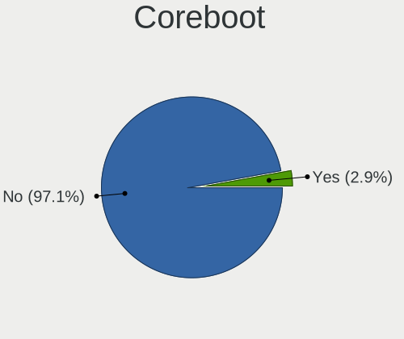
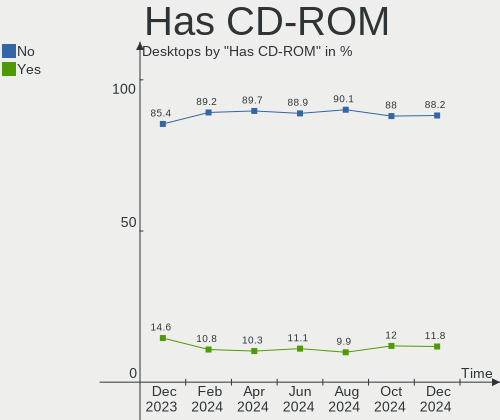
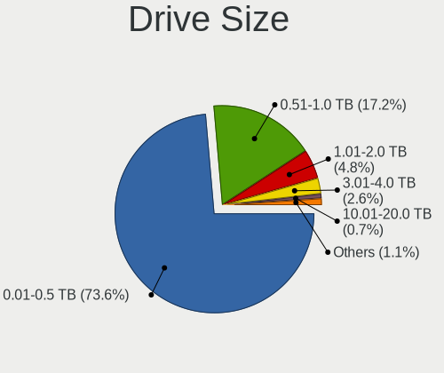

BSD - Hardware Trends (Desktops)
--------------------------------

A project to identify most popular hardware characteristics and track their change
over time based on data collected by BSD users at https://BSD-Hardware.info.

Anyone can contribute to this report by the [hw-probe](https://github.com/linuxhw/hw-probe/blob/master/INSTALL.BSD.md) tool:

    hw-probe -all -upload

This report is for one last month. Overall report since the beginning of time: [TestDays](https://github.com/bsdhw/TestDays)

Period: Dec, 2025.

Contents
--------

* [ System ](#system)
  - [ OS                       ](#os)
  - [ OS Family                ](#os-family)
  - [ Arch                     ](#arch)
  - [ DE                       ](#de)
  - [ Display Server           ](#display-server)
  - [ Display Manager          ](#display-manager)
  - [ OS Lang                  ](#os-lang)
  - [ Boot Mode                ](#boot-mode)
  - [ Filesystem               ](#filesystem)
  - [ Part. scheme             ](#part-scheme)

* [ Board ](#board)
  - [ Vendor                   ](#vendor)
  - [ Model                    ](#model)
  - [ Model Family             ](#model-family)
  - [ MFG Year                 ](#mfg-year)
  - [ Form Factor              ](#form-factor)
  - [ Coreboot                 ](#coreboot)
  - [ RAM Size                 ](#ram-size)
  - [ RAM Used                 ](#ram-used)
  - [ Total Drives             ](#total-drives)
  - [ Has CD-ROM               ](#has-cd-rom)
  - [ Has Ethernet             ](#has-ethernet)
  - [ Has WiFi                 ](#has-wifi)
  - [ Has Bluetooth            ](#has-bluetooth)

* [ Location ](#location)
  - [ Country                  ](#country)
  - [ City                     ](#city)

* [ Drives ](#drives)
  - [ Drive Vendor             ](#drive-vendor)
  - [ Drive Model              ](#drive-model)
  - [ HDD Vendor               ](#hdd-vendor)
  - [ SSD Vendor               ](#ssd-vendor)
  - [ Drive Kind               ](#drive-kind)
  - [ Drive Connector          ](#drive-connector)
  - [ Drive Size               ](#drive-size)
  - [ Space Total              ](#space-total)
  - [ Space Used               ](#space-used)
  - [ Malfunc. Drives          ](#malfunc-drives)
  - [ Malfunc. Drive Vendor    ](#malfunc-drive-vendor)
  - [ Malfunc. HDD Vendor      ](#malfunc-hdd-vendor)
  - [ Malfunc. Drive Kind      ](#malfunc-drive-kind)
  - [ Failed Drives            ](#failed-drives)
  - [ Failed Drive Vendor      ](#failed-drive-vendor)
  - [ Drive Status             ](#drive-status)

* [ Storage controller ](#storage-controller)
  - [ Storage Vendor           ](#storage-vendor)
  - [ Storage Model            ](#storage-model)
  - [ Storage Kind             ](#storage-kind)

* [ Processor ](#processor)
  - [ CPU Vendor               ](#cpu-vendor)
  - [ CPU Model                ](#cpu-model)
  - [ CPU Model Family         ](#cpu-model-family)
  - [ CPU Cores                ](#cpu-cores)
  - [ CPU Sockets              ](#cpu-sockets)
  - [ CPU Threads              ](#cpu-threads)
  - [ CPU Microarch            ](#cpu-microarch)

* [ Graphics ](#graphics)
  - [ GPU Vendor               ](#gpu-vendor)
  - [ GPU Model                ](#gpu-model)
  - [ GPU Combo                ](#gpu-combo)
  - [ GPU Driver               ](#gpu-driver)
  - [ GPU Memory               ](#gpu-memory)

* [ Monitor ](#monitor)
  - [ Monitor Vendor           ](#monitor-vendor)
  - [ Monitor Model            ](#monitor-model)
  - [ Monitor Resolution       ](#monitor-resolution)
  - [ Monitor Diagonal         ](#monitor-diagonal)
  - [ Monitor Width            ](#monitor-width)
  - [ Aspect Ratio             ](#aspect-ratio)
  - [ Monitor Area             ](#monitor-area)
  - [ Pixel Density            ](#pixel-density)
  - [ Multiple Monitors        ](#multiple-monitors)

* [ Network ](#network)
  - [ Net Controller Vendor    ](#net-controller-vendor)
  - [ Net Controller Model     ](#net-controller-model)
  - [ Wireless Vendor          ](#wireless-vendor)
  - [ Wireless Model           ](#wireless-model)
  - [ Ethernet Vendor          ](#ethernet-vendor)
  - [ Ethernet Model           ](#ethernet-model)
  - [ Net Controller Kind      ](#net-controller-kind)
  - [ Used Controller          ](#used-controller)
  - [ NICs                     ](#nics)
  - [ IPv6                     ](#ipv6)

* [ Bluetooth ](#bluetooth)
  - [ Bluetooth Vendor         ](#bluetooth-vendor)
  - [ Bluetooth Model          ](#bluetooth-model)

* [ Sound ](#sound)
  - [ Sound Vendor             ](#sound-vendor)
  - [ Sound Model              ](#sound-model)

* [ Memory ](#memory)
  - [ Memory Vendor            ](#memory-vendor)
  - [ Memory Model             ](#memory-model)
  - [ Memory Kind              ](#memory-kind)
  - [ Memory Form Factor       ](#memory-form-factor)
  - [ Memory Size              ](#memory-size)
  - [ Memory Speed             ](#memory-speed)

* [ Printers & scanners ](#printers--scanners)
  - [ Printer Vendor           ](#printer-vendor)
  - [ Printer Model            ](#printer-model)
  - [ Scanner Vendor           ](#scanner-vendor)
  - [ Scanner Model            ](#scanner-model)

* [ Camera ](#camera)
  - [ Camera Vendor            ](#camera-vendor)
  - [ Camera Model             ](#camera-model)

* [ Security ](#security)
  - [ Fingerprint Vendor       ](#fingerprint-vendor)
  - [ Fingerprint Model        ](#fingerprint-model)
  - [ Chipcard Vendor          ](#chipcard-vendor)
  - [ Chipcard Model           ](#chipcard-model)

* [ Unsupported ](#unsupported)
  - [ Unsupported Devices      ](#unsupported-devices)
  - [ Unsupported Device Types ](#unsupported-device-types)

System
------

OS
--

Installed operating systems

| Name                | Desktops | Percent |
|---------------------|----------|---------|
| OPNsense 25.7.9     | 111      | 35.13%  |
| OPNsense 25.7.10    | 103      | 32.59%  |
| OPNsense 25.7.8     | 23       | 7.28%   |
| FreeBSD 15.0        | 10       | 3.16%   |
| FreeBSD 15.0-p1     | 9        | 2.85%   |
| OpenBSD 7.8         | 8        | 2.53%   |
| OPNsense 25.7.7     | 6        | 1.9%    |
| OPNsense 25.1.12    | 5        | 1.58%   |
| helloSystem 0.8.1   | 5        | 1.58%   |
| FreeBSD 15.0-STABLE | 4        | 1.27%   |
| OPNsense 25.10      | 3        | 0.95%   |
| FreeBSD 14.3-p7     | 3        | 0.95%   |
| OPNsense 25.7.6     | 2        | 0.63%   |
| OPNsense 25.7.4     | 2        | 0.63%   |
| OPNsense 25.7.2     | 2        | 0.63%   |
| OPNsense 25.10.1    | 2        | 0.63%   |
| OPNsense 25.1.5     | 2        | 0.63%   |
| FreeBSD 14.3-p6     | 2        | 0.63%   |
| FreeBSD 14.3-p5     | 2        | 0.63%   |
| TrueNAS 13.3-p4     | 1        | 0.32%   |
| OPNsense 26.1       | 1        | 0.32%   |
| OPNsense 25.7.5     | 1        | 0.32%   |
| OPNsense 25.7.3     | 1        | 0.32%   |
| OPNsense 25.4.3     | 1        | 0.32%   |
| OPNsense 25.1.8     | 1        | 0.32%   |
| OPNsense 25.1.11    | 1        | 0.32%   |
| OPNsense 25.1       | 1        | 0.32%   |
| OPNsense 24.7.12    | 1        | 0.32%   |
| MidnightBSD 4.0     | 1        | 0.32%   |
| FreeBSD 14.3-STABLE | 1        | 0.32%   |
| FreeBSD 13.5-p3     | 1        | 0.32%   |

OS Family
---------

OS without a version

| Name        | Desktops | Percent |
|-------------|----------|---------|
| OPNsense    | 269      | 85.13%  |
| FreeBSD     | 32       | 10.13%  |
| OpenBSD     | 8        | 2.53%   |
| helloSystem | 5        | 1.58%   |
| TrueNAS     | 1        | 0.32%   |
| MidnightBSD | 1        | 0.32%   |

Arch
----

OS architecture (x86_64, i586, etc.)

| Name  | Desktops | Percent |
|-------|----------|---------|
| amd64 | 309      | 97.78%  |
| arm64 | 4        | 1.27%   |
| i386  | 3        | 0.95%   |

DE
--

Desktop Environment

| Name         | Desktops | Percent |
|--------------|----------|---------|
| Console      | 285      | 90.19%  |
| helloDesktop | 13       | 4.11%   |
| TWM          | 6        | 1.9%    |
| XFCE         | 5        | 1.58%   |
| MATE         | 3        | 0.95%   |
| GNOME        | 3        | 0.95%   |
| cwm          | 1        | 0.32%   |

Display Server
--------------

X11 or Wayland

| Name    | Desktops | Percent |
|---------|----------|---------|
| Console | 286      | 90.51%  |
| X11     | 26       | 8.23%   |
| Wayland | 4        | 1.27%   |

Display Manager
---------------

SDDM, LightDM, etc.

| Name    | Desktops | Percent |
|---------|----------|---------|
| Console | 299      | 94.62%  |
| SDDM    | 8        | 2.53%   |
| SLiM    | 7        | 2.22%   |
| LightDM | 2        | 0.63%   |

OS Lang
-------

Language

| Lang    | Desktops | Percent |
|---------|----------|---------|
| Unknown | 276      | 87.34%  |
| C       | 25       | 7.91%   |
| en_US   | 12       | 3.8%    |
| ru_RU   | 1        | 0.32%   |
| fr_FR   | 1        | 0.32%   |
| de_DE   | 1        | 0.32%   |

Boot Mode
---------

EFI or BIOS

| Mode | Desktops | Percent |
|------|----------|---------|
| EFI  | 301      | 95.25%  |
| BIOS | 15       | 4.75%   |

Filesystem
----------

Type of filesystem

| Type   | Desktops | Percent |
|--------|----------|---------|
| Zfs    | 226      | 71.52%  |
| Ufs    | 78       | 24.68%  |
| Ffs    | 8        | 2.53%   |
| Cd9660 | 4        | 1.27%   |

Part. scheme
------------

Scheme of partitioning

| Type    | Desktops | Percent |
|---------|----------|---------|
| GPT     | 308      | 97.47%  |
| MBR     | 6        | 1.9%    |
| BSD     | 1        | 0.32%   |
| Unknown | 1        | 0.32%   |

Board
-----

Vendor
------

Motherboard manufacturer

| Name                                 | Desktops | Percent |
|--------------------------------------|----------|---------|
| Unknown                              | 77       | 24.37%  |
| Dell                                 | 30       | 9.49%   |
| Protectli                            | 27       | 8.54%   |
| Hewlett-Packard                      | 23       | 7.28%   |
| ASUSTek Computer                     | 19       | 6.01%   |
| Gigabyte Technology                  | 12       | 3.8%    |
| Intel                                | 11       | 3.48%   |
| ASRock                               | 11       | 3.48%   |
| MSI                                  | 9        | 2.85%   |
| Techvision                           | 8        | 2.53%   |
| Shenzhen Meigao Electronic Equipment | 7        | 2.22%   |
| PC Engines                           | 7        | 2.22%   |
| Fujitsu                              | 7        | 2.22%   |
| Supermicro                           | 6        | 1.9%    |
| Lenovo                               | 6        | 1.9%    |
| TianBei                              | 4        | 1.27%   |
| CWWK                                 | 3        | 0.95%   |
| Biostar                              | 3        | 0.95%   |
| Acer                                 | 3        | 0.95%   |
| SLIMBOOK                             | 2        | 0.63%   |
| OEM                                  | 2        | 0.63%   |
| MW                                   | 2        | 0.63%   |
| Foxconn                              | 2        | 0.63%   |
| Deciso                               | 2        | 0.63%   |
| AZW                                  | 2        | 0.63%   |
| ASRockRack                           | 2        | 0.63%   |
| YF                                   | 1        | 0.32%   |
| Yanling                              | 1        | 0.32%   |
| Wistron                              | 1        | 0.32%   |
| Wincor Nixdorf                       | 1        | 0.32%   |
| Thomas-Krenn.AG                      | 1        | 0.32%   |
| Teknoservice                         | 1        | 0.32%   |
| Star Labs                            | 1        | 0.32%   |
| SJRC                                 | 1        | 0.32%   |
| Shuttle                              | 1        | 0.32%   |
| ShenZhen MinWin Technology           | 1        | 0.32%   |
| Pegatron                             | 1        | 0.32%   |
| PAIQ                                 | 1        | 0.32%   |
| Nitrokey                             | 1        | 0.32%   |
| NEC Computers                        | 1        | 0.32%   |

Model
-----

Motherboard model

| Name                                              | Desktops | Percent |
|---------------------------------------------------|----------|---------|
| Unknown                                           | 77       | 24.37%  |
| Techvision TVI7309X                               | 8        | 2.53%   |
| Shenzhen Meigao Electronic Equipment Venus Series | 6        | 1.9%    |
| Protectli V1410                                   | 6        | 1.9%    |
| PC Engines APU2                                   | 6        | 1.9%    |
| Protectli VP2420                                  | 5        | 1.58%   |
| Dell OptiPlex 7010                                | 4        | 1.27%   |
| Dell OptiPlex 3050                                | 4        | 1.27%   |
| TianBei N1 PRO                                    | 3        | 0.95%   |
| Protectli FW6                                     | 3        | 0.95%   |
| Intel BKHD-1264-SFP                               | 3        | 0.95%   |
| SLIMBOOK ZERO-N100-4RJ                            | 2        | 0.63%   |
| Protectli VP6630                                  | 2        | 0.63%   |
| Protectli FW4B                                    | 2        | 0.63%   |
| MW GMLK-2_5G4L                                    | 2        | 0.63%   |
| Intel Jasper Lake Client Platform                 | 2        | 0.63%   |
| HP Slim Desktop S01-pF1xxx                        | 2        | 0.63%   |
| HP EliteDesk 805 G6 Small Form Factor PC          | 2        | 0.63%   |
| HP EliteDesk 800 G3 SFF                           | 2        | 0.63%   |
| Fujitsu FUTRO S930                                | 2        | 0.63%   |
| Dell XPS 8700                                     | 2        | 0.63%   |
| Dell OptiPlex 9020                                | 2        | 0.63%   |
| Dell OptiPlex 3010                                | 2        | 0.63%   |
| Deciso Netboard A8V2                              | 2        | 0.63%   |
| AZW EQ                                            | 2        | 0.63%   |
| ASUS PRIME X470-PRO                               | 2        | 0.63%   |
| ASRock Q1900-ITX                                  | 2        | 0.63%   |
| YF ADLNN01                                        | 1        | 0.32%   |
| Yanling YL-KBR6L                                  | 1        | 0.32%   |
| Wistron ProLiant ML110 G6                         | 1        | 0.32%   |
| Wincor Nixdorf BEETLE /MIII                       | 1        | 0.32%   |
| TianBei WTR PRO                                   | 1        | 0.32%   |
| Thomas-Krenn.AG LES plus                          | 1        | 0.32%   |
| Teknoservice TTL TeknoSlim                        | 1        | 0.32%   |
| Supermicro X7SLA                                  | 1        | 0.32%   |
| Supermicro SYS-E300-12D-4CN6P                     | 1        | 0.32%   |
| Supermicro SYS-5018D-MF                           | 1        | 0.32%   |
| Supermicro SYS-5018A-FTN4                         | 1        | 0.32%   |
| Supermicro PIO-1UUP-ND1-AI036                     | 1        | 0.32%   |
| Supermicro EDGE2000                               | 1        | 0.32%   |

Model Family
------------

Motherboard model prefix

| Name                                       | Desktops | Percent |
|--------------------------------------------|----------|---------|
| Unknown                                    | 77       | 24.37%  |
| Dell OptiPlex                              | 22       | 6.96%   |
| HP EliteDesk                               | 10       | 3.16%   |
| Techvision TVI7309X                        | 8        | 2.53%   |
| Shenzhen Meigao Electronic Equipment Venus | 6        | 1.9%    |
| Protectli V1410                            | 6        | 1.9%    |
| PC Engines APU2                            | 6        | 1.9%    |
| Protectli VP2420                           | 5        | 1.58%   |
| ASUS PRIME                                 | 5        | 1.58%   |
| HP ProDesk                                 | 4        | 1.27%   |
| TianBei N1                                 | 3        | 0.95%   |
| Protectli FW6                              | 3        | 0.95%   |
| Intel BKHD-1264-SFP                        | 3        | 0.95%   |
| Fujitsu FUTRO                              | 3        | 0.95%   |
| Dell XPS                                   | 3        | 0.95%   |
| SLIMBOOK ZERO-N100-4RJ                     | 2        | 0.63%   |
| Protectli VP6630                           | 2        | 0.63%   |
| Protectli FW4B                             | 2        | 0.63%   |
| MW GMLK-2                                  | 2        | 0.63%   |
| Lenovo ThinkCentre                         | 2        | 0.63%   |
| Intel Jasper                               | 2        | 0.63%   |
| HP Slim                                    | 2        | 0.63%   |
| Fujitsu ESPRIMO                            | 2        | 0.63%   |
| Dell Precision                             | 2        | 0.63%   |
| Dell Inspiron                              | 2        | 0.63%   |
| Deciso Netboard                            | 2        | 0.63%   |
| AZW EQ                                     | 2        | 0.63%   |
| ASUS ROG                                   | 2        | 0.63%   |
| ASRock Q1900-ITX                           | 2        | 0.63%   |
| Acer Veriton                               | 2        | 0.63%   |
| YF ADLNN01                                 | 1        | 0.32%   |
| Yanling YL-KBR6L                           | 1        | 0.32%   |
| Wistron ProLiant                           | 1        | 0.32%   |
| Wincor Nixdorf BEETLE                      | 1        | 0.32%   |
| TianBei WTR                                | 1        | 0.32%   |
| Thomas-Krenn.AG LES                        | 1        | 0.32%   |
| Teknoservice TTL                           | 1        | 0.32%   |
| Supermicro X7SLA                           | 1        | 0.32%   |
| Supermicro SYS-E300-12D-4CN6P              | 1        | 0.32%   |
| Supermicro SYS-5018D-MF                    | 1        | 0.32%   |

MFG Year
--------

Motherboard manufacture year

| Year    | Desktops | Percent |
|---------|----------|---------|
| 2024    | 52       | 16.46%  |
| 2023    | 39       | 12.34%  |
| 2025    | 31       | 9.81%   |
| 2022    | 30       | 9.49%   |
| 2021    | 21       | 6.65%   |
| 2014    | 20       | 6.33%   |
| 2016    | 19       | 6.01%   |
| 2018    | 17       | 5.38%   |
| 2020    | 16       | 5.06%   |
| 2019    | 14       | 4.43%   |
| 2013    | 14       | 4.43%   |
| 2017    | 13       | 4.11%   |
| 2015    | 6        | 1.9%    |
| 2010    | 5        | 1.58%   |
| 2008    | 5        | 1.58%   |
| 2009    | 3        | 0.95%   |
| Unknown | 3        | 0.95%   |
| 2012    | 2        | 0.63%   |
| 2011    | 2        | 0.63%   |
| 2007    | 2        | 0.63%   |
| 2006    | 1        | 0.32%   |
| 2004    | 1        | 0.32%   |

Form Factor
-----------

Physical design of the computer

| Name    | Desktops | Percent |
|---------|----------|---------|
| Desktop | 316      | 100%    |

Coreboot
--------

Have coreboot on board

| Used | Desktops | Percent |
|------|----------|---------|
| No   | 303      | 95.89%  |
| Yes  | 13       | 4.11%   |

RAM Size
--------

Total RAM memory

| Size in GB      | Desktops | Percent |
|-----------------|----------|---------|
| 8.01-16.0       | 109      | 34.49%  |
| 16.01-24.0      | 96       | 30.38%  |
| 32.01-64.0      | 53       | 16.77%  |
| 4.01-8.0        | 30       | 9.49%   |
| 64.01-256.0     | 19       | 6.01%   |
| 2.01-3.0        | 4        | 1.27%   |
| 1.01-2.0        | 2        | 0.63%   |
| More than 256.0 | 1        | 0.32%   |
| 3.01-4.0        | 1        | 0.32%   |
| 0.51-1.0        | 1        | 0.32%   |

RAM Used
--------

Used RAM memory

| Used GB   | Desktops | Percent |
|-----------|----------|---------|
| 0.51-1.0  | 145      | 45.89%  |
| 0.01-0.5  | 95       | 30.06%  |
| 1.01-2.0  | 58       | 18.35%  |
| 4.01-8.0  | 5        | 1.58%   |
| 3.01-4.0  | 5        | 1.58%   |
| 2.01-3.0  | 5        | 1.58%   |
| 0         | 2        | 0.63%   |
| 8.01-16.0 | 1        | 0.32%   |

Total Drives
------------

Number of drives on board

| Drives | Desktops | Percent |
|--------|----------|---------|
| 1      | 138      | 43.67%  |
| 0      | 129      | 40.82%  |
| 2      | 33       | 10.44%  |
| 4      | 8        | 2.53%   |
| 5      | 3        | 0.95%   |
| 3      | 3        | 0.95%   |
| 11     | 1        | 0.32%   |
| 10     | 1        | 0.32%   |

Has CD-ROM
----------

Has CD-ROM on board

| Presented | Desktops | Percent |
|-----------|----------|---------|
| No        | 285      | 90.19%  |
| Yes       | 31       | 9.81%   |

Has Ethernet
------------

Has Ethernet on board

| Presented | Desktops | Percent |
|-----------|----------|---------|
| Yes       | 312      | 98.73%  |
| No        | 4        | 1.27%   |

Has WiFi
--------

Has WiFi module

| Presented | Desktops | Percent |
|-----------|----------|---------|
| No        | 257      | 81.33%  |
| Yes       | 59       | 18.67%  |

Has Bluetooth
-------------

Has Bluetooth module

| Presented | Desktops | Percent |
|-----------|----------|---------|
| No        | 272      | 86.08%  |
| Yes       | 44       | 13.92%  |

Location
--------

Country
-------

Geographic location (country)

| Country             | Desktops | Percent |
|---------------------|----------|---------|
| USA                 | 106      | 33.54%  |
| Germany             | 48       | 15.19%  |
| UK                  | 16       | 5.06%   |
| Canada              | 15       | 4.75%   |
| Australia           | 10       | 3.16%   |
| Poland              | 9        | 2.85%   |
| Italy               | 9        | 2.85%   |
| France              | 9        | 2.85%   |
| Russia              | 8        | 2.53%   |
| Brazil              | 8        | 2.53%   |
| Netherlands         | 7        | 2.22%   |
| Sweden              | 5        | 1.58%   |
| Austria             | 5        | 1.58%   |
| Vietnam             | 4        | 1.27%   |
| Portugal            | 4        | 1.27%   |
| China               | 4        | 1.27%   |
| Thailand            | 3        | 0.95%   |
| Spain               | 3        | 0.95%   |
| Norway              | 3        | 0.95%   |
| Mexico              | 3        | 0.95%   |
| Belgium             | 3        | 0.95%   |
| Venezuela           | 2        | 0.63%   |
| The Netherlands     | 2        | 0.63%   |
| Taiwan              | 2        | 0.63%   |
| Switzerland         | 2        | 0.63%   |
| South Africa        | 2        | 0.63%   |
| Puerto Rico         | 2        | 0.63%   |
| New Zealand         | 2        | 0.63%   |
| Malaysia            | 2        | 0.63%   |
| Japan               | 2        | 0.63%   |
| Finland             | 2        | 0.63%   |
| Trinidad and Tobago | 1        | 0.32%   |
| Slovenia            | 1        | 0.32%   |
| Singapore           | 1        | 0.32%   |
| Romania             | 1        | 0.32%   |
| Lithuania           | 1        | 0.32%   |
| Jordan              | 1        | 0.32%   |
| Ireland             | 1        | 0.32%   |
| Indonesia           | 1        | 0.32%   |
| Hungary             | 1        | 0.32%   |

City
----

Geographic location (city)

| City             | Desktops | Percent |
|------------------|----------|---------|
| Berlin           | 8        | 2.53%   |
| St Petersburg    | 4        | 1.27%   |
| Seattle          | 4        | 1.27%   |
| Paris            | 4        | 1.27%   |
| Melbourne        | 4        | 1.27%   |
| Vienna           | 3        | 0.95%   |
| Sydney           | 3        | 0.95%   |
| Pontotoc         | 3        | 0.95%   |
| Lisbon           | 3        | 0.95%   |
| Wroclaw          | 2        | 0.63%   |
| Winnipeg         | 2        | 0.63%   |
| Tacoma           | 2        | 0.63%   |
| Springville      | 2        | 0.63%   |
| Redmond          | 2        | 0.63%   |
| Reading          | 2        | 0.63%   |
| Queens           | 2        | 0.63%   |
| Oslo             | 2        | 0.63%   |
| Orlando          | 2        | 0.63%   |
| Mountain View    | 2        | 0.63%   |
| Moscow           | 2        | 0.63%   |
| Montreal         | 2        | 0.63%   |
| Monterrey        | 2        | 0.63%   |
| Miami            | 2        | 0.63%   |
| Launceston       | 2        | 0.63%   |
| Krakow           | 2        | 0.63%   |
| Koblenz          | 2        | 0.63%   |
| Jacksonville     | 2        | 0.63%   |
| Ho Chi Minh City | 2        | 0.63%   |
| Helsinki         | 2        | 0.63%   |
| Hanover          | 2        | 0.63%   |
| Hanoi            | 2        | 0.63%   |
| Freiberg         | 2        | 0.63%   |
| Ealing           | 2        | 0.63%   |
| Duncan           | 2        | 0.63%   |
| Denver           | 2        | 0.63%   |
| Dearborn Heights | 2        | 0.63%   |
| Cambridge        | 2        | 0.63%   |
| Bradford         | 2        | 0.63%   |
| Zurich           | 1        | 0.32%   |
| Zagreb           | 1        | 0.32%   |

Drives
------

Drive Vendor
------------

Hard drive vendors

| Vendor              | Desktops | Drives | Percent |
|---------------------|----------|--------|---------|
| Samsung Electronics | 36       | 45     | 15.93%  |
| WDC                 | 22       | 29     | 9.73%   |
| Seagate             | 19       | 39     | 8.41%   |
| Kingston            | 18       | 21     | 7.96%   |
| SanDisk             | 13       | 14     | 5.75%   |
| Crucial             | 13       | 17     | 5.75%   |
| China               | 13       | 13     | 5.75%   |
| Transcend           | 12       | 14     | 5.31%   |
| Protectli           | 7        | 7      | 3.1%    |
| A-DATA Technology   | 7        | 9      | 3.1%    |
| Intel               | 6        | 7      | 2.65%   |
| Patriot             | 5        | 6      | 2.21%   |
| Hitachi             | 5        | 5      | 2.21%   |
| Toshiba             | 4        | 5      | 1.77%   |
| PNY                 | 4        | 4      | 1.77%   |
| SK hynix            | 3        | 3      | 1.33%   |
| Micron Technology   | 3        | 3      | 1.33%   |
| KingSpec            | 3        | 4      | 1.33%   |
| Hoodisk             | 3        | 3      | 1.33%   |
| Team                | 2        | 2      | 0.88%   |
| ShiJi               | 2        | 2      | 0.88%   |
| LITEONIT            | 2        | 2      | 0.88%   |
| Lexar               | 2        | 2      | 0.88%   |
| Fujitsu             | 2        | 2      | 0.88%   |
| FORESEE             | 2        | 2      | 0.88%   |
| VICK                | 1        | 1      | 0.44%   |
| Verbatim            | 1        | 1      | 0.44%   |
| SPCC                | 1        | 1      | 0.44%   |
| PUSKILL             | 1        | 1      | 0.44%   |
| OCZ                 | 1        | 1      | 0.44%   |
| Netac               | 1        | 2      | 0.44%   |
| LuminouTek          | 1        | 1      | 0.44%   |
| LITEON              | 1        | 1      | 0.44%   |
| KLEVV               | 1        | 1      | 0.44%   |
| KIOXIA-EXCERIA      | 1        | 1      | 0.44%   |
| Innodisk            | 1        | 1      | 0.44%   |
| HGST                | 1        | 1      | 0.44%   |
| Hanstor             | 1        | 1      | 0.44%   |
| GOFATOO             | 1        | 1      | 0.44%   |
| FIKWOT              | 1        | 1      | 0.44%   |

Drive Model
-----------

Hard drive models

| Model                            | Desktops | Percent |
|----------------------------------|----------|---------|
| Samsung SSD 870 EVO 500GB        | 4        | 1.65%   |
| Kingston SA400S37480G 480GB      | 4        | 1.65%   |
| Kingston SA400S37240G 240GB      | 4        | 1.65%   |
| Crucial CT240BX500SSD1 240GB     | 4        | 1.65%   |
| Samsung SSD 840 EVO 500GB        | 3        | 1.24%   |
| WDC WDS100T2B0A-00SM50 1TB       | 2        | 0.83%   |
| WDC WD5000AAKX-75U6AA0 500GB     | 2        | 0.83%   |
| Transcend TS64GMSA230S 64GB      | 2        | 0.83%   |
| Transcend TS256GMSA230S 256GB    | 2        | 0.83%   |
| Transcend TS128GMSA230S 128GB    | 2        | 0.83%   |
| SK hynix SC311 SATA 128GB        | 2        | 0.83%   |
| Seagate ST8000DM004-2U9188 8TB   | 2        | 0.83%   |
| Seagate ST4000DM000-1F2168 4TB   | 2        | 0.83%   |
| Seagate ST3250312AS 250GB        | 2        | 0.83%   |
| Seagate ST1000DM010-2EP102 1TB   | 2        | 0.83%   |
| SanDisk SDSSDA120G 120GB         | 2        | 0.83%   |
| Samsung SSD 860 EVO mSATA 250GB  | 2        | 0.83%   |
| Samsung SSD 860 EVO 500GB        | 2        | 0.83%   |
| Samsung SSD 860 EVO 1TB          | 2        | 0.83%   |
| Samsung SSD 850 EVO 250GB        | 2        | 0.83%   |
| Samsung SSD 840 PRO Series 512GB | 2        | 0.83%   |
| Samsung MZ7LN256HMJP-000H1 256GB | 2        | 0.83%   |
| Protectli 64GB mSATA             | 2        | 0.83%   |
| Protectli 1TB M.2                | 2        | 0.83%   |
| Protectli 120GB M.2              | 2        | 0.83%   |
| Patriot P210 128GB               | 2        | 0.83%   |
| Patriot Burst Elite 120GB        | 2        | 0.83%   |
| Kingston SUV500MS120G 120GB      | 2        | 0.83%   |
| Kingston SA400S37120G 120GB      | 2        | 0.83%   |
| KingSpec P3-128 128GB            | 2        | 0.83%   |
| Hoodisk SSD 128GB                | 2        | 0.83%   |
| Crucial CT2000MX500SSD1 2TB      | 2        | 0.83%   |
| China SATA SSD 16GB              | 2        | 0.83%   |
| China SATA SSD 128GB             | 2        | 0.83%   |
| China FPT310M4SSD256G 256GB      | 2        | 0.83%   |
| A-DATA SP550 240GB               | 2        | 0.83%   |
| WDC WDS500G3X0C-00SJG0 500GB     | 1        | 0.41%   |
| WDC WDS500G2B0A-00SM50 500GB     | 1        | 0.41%   |
| WDC WDS500G1R0A-68A4W0 500GB     | 1        | 0.41%   |
| WDC WDS100T1R0A-68A4W0 1TB       | 1        | 0.41%   |

HDD Vendor
----------

Hard disk drive vendors

| Vendor              | Desktops | Drives | Percent |
|---------------------|----------|--------|---------|
| Seagate             | 18       | 38     | 38.3%   |
| WDC                 | 17       | 20     | 36.17%  |
| Hitachi             | 5        | 5      | 10.64%  |
| Toshiba             | 3        | 4      | 6.38%   |
| Fujitsu             | 2        | 2      | 4.26%   |
| Samsung Electronics | 1        | 1      | 2.13%   |
| HGST                | 1        | 1      | 2.13%   |

SSD Vendor
----------

Solid state drive vendors

| Vendor              | Desktops | Drives | Percent |
|---------------------|----------|--------|---------|
| Samsung Electronics | 34       | 43     | 19.32%  |
| Kingston            | 18       | 21     | 10.23%  |
| Crucial             | 13       | 17     | 7.39%   |
| China               | 13       | 13     | 7.39%   |
| Transcend           | 12       | 14     | 6.82%   |
| SanDisk             | 12       | 13     | 6.82%   |
| Protectli           | 7        | 7      | 3.98%   |
| A-DATA Technology   | 7        | 9      | 3.98%   |
| Intel               | 6        | 7      | 3.41%   |
| WDC                 | 5        | 7      | 2.84%   |
| Patriot             | 5        | 6      | 2.84%   |
| SK hynix            | 3        | 3      | 1.7%    |
| PNY                 | 3        | 3      | 1.7%    |
| Micron Technology   | 3        | 3      | 1.7%    |
| KingSpec            | 3        | 4      | 1.7%    |
| Hoodisk             | 3        | 3      | 1.7%    |
| Team                | 2        | 2      | 1.14%   |
| ShiJi               | 2        | 2      | 1.14%   |
| LITEONIT            | 2        | 2      | 1.14%   |
| Lexar               | 2        | 2      | 1.14%   |
| FORESEE             | 2        | 2      | 1.14%   |
| VICK                | 1        | 1      | 0.57%   |
| Verbatim            | 1        | 1      | 0.57%   |
| Toshiba             | 1        | 1      | 0.57%   |
| SPCC                | 1        | 1      | 0.57%   |
| Seagate             | 1        | 1      | 0.57%   |
| PUSKILL             | 1        | 1      | 0.57%   |
| OCZ                 | 1        | 1      | 0.57%   |
| Netac               | 1        | 2      | 0.57%   |
| LuminouTek          | 1        | 1      | 0.57%   |
| LITEON              | 1        | 1      | 0.57%   |
| KLEVV               | 1        | 1      | 0.57%   |
| KIOXIA-EXCERIA      | 1        | 1      | 0.57%   |
| Innodisk            | 1        | 1      | 0.57%   |
| Hanstor             | 1        | 1      | 0.57%   |
| GOFATOO             | 1        | 1      | 0.57%   |
| FIKWOT              | 1        | 1      | 0.57%   |
| FCS                 | 1        | 1      | 0.57%   |
| CWDISK              | 1        | 1      | 0.57%   |
| ASint Technology    | 1        | 1      | 0.57%   |

Drive Kind
----------

HDD or SSD

| Kind | Desktops | Drives | Percent |
|------|----------|--------|---------|
| SSD  | 164      | 203    | 78.47%  |
| HDD  | 42       | 71     | 20.1%   |
| NVMe | 3        | 5      | 1.44%   |

Drive Connector
---------------

SATA, SAS, NVMe, etc.

| Type | Desktops | Drives | Percent |
|------|----------|--------|---------|
| SATA | 187      | 274    | 98.42%  |
| NVMe | 3        | 5      | 1.58%   |

Drive Size
----------

Size of hard drive

| Size in TB | Desktops | Drives | Percent |
|------------|----------|--------|---------|
| 0.01-0.5   | 154      | 181    | 73.33%  |
| 0.51-1.0   | 26       | 35     | 12.38%  |
| 1.01-2.0   | 13       | 17     | 6.19%   |
| 4.01-10.0  | 8        | 12     | 3.81%   |
| 3.01-4.0   | 6        | 16     | 2.86%   |
| 20.01-50.0 | 1        | 1      | 0.48%   |
| 2.01-3.0   | 1        | 1      | 0.48%   |
| 10.01-20.0 | 1        | 11     | 0.48%   |

Space Total
-----------

Amount of disk space available on the file system

| Size in GB     | Desktops | Percent |
|----------------|----------|---------|
| 101-250        | 130      | 41.14%  |
| 251-500        | 78       | 24.68%  |
| 51-100         | 34       | 10.76%  |
| 501-1000       | 31       | 9.81%   |
| 21-50          | 15       | 4.75%   |
| 1-20           | 13       | 4.11%   |
| 1001-2000      | 11       | 3.48%   |
| More than 3000 | 3        | 0.95%   |
| 2001-3000      | 1        | 0.32%   |

Space Used
----------

Amount of used disk space

| Used GB   | Desktops | Percent |
|-----------|----------|---------|
| 1-20      | 290      | 91.77%  |
| 21-50     | 16       | 5.06%   |
| 51-100    | 4        | 1.27%   |
| 101-250   | 2        | 0.63%   |
| 501-1000  | 2        | 0.63%   |
| 251-500   | 1        | 0.32%   |
| 2001-3000 | 1        | 0.32%   |

Malfunc. Drives
---------------

Drive models with a malfunction

| Model                                           | Desktops | Drives | Percent |
|-------------------------------------------------|----------|--------|---------|
| WDC WD5000AAKX-75U6AA0 500GB                    | 2        | 2      | 7.41%   |
| WDC WD5000AAKX-221CA1 500GB                     | 1        | 1      | 3.7%    |
| WDC WD5000AAKX-083CA1 500GB                     | 1        | 1      | 3.7%    |
| WDC WD3200BEVT-11ZCT0 320GB                     | 1        | 1      | 3.7%    |
| WDC WD2500AAJS-00YZCA0 250GB                    | 1        | 1      | 3.7%    |
| WDC WD10EZEX-21M2NA0 1TB                        | 1        | 1      | 3.7%    |
| Toshiba HDWD110 1TB                             | 1        | 1      | 3.7%    |
| Seagate ST8000DM004-2CX188 8TB                  | 1        | 2      | 3.7%    |
| Seagate ST4000DM000-1F2168 4TB                  | 1        | 1      | 3.7%    |
| Seagate ST3250312AS 250GB                       | 1        | 1      | 3.7%    |
| Seagate ST18000NM014J-2WS103 18TB               | 1        | 5      | 3.7%    |
| Seagate ST1000DM010-2EP102 1TB                  | 1        | 1      | 3.7%    |
| SanDisk SD8SBAT128G 128GB                       | 1        | 1      | 3.7%    |
| Samsung Electronics SSD 860 EVO 500GB           | 1        | 1      | 3.7%    |
| Samsung Electronics SSD 850 PRO 256GB           | 1        | 1      | 3.7%    |
| Samsung Electronics HD161HJ 160GB               | 1        | 1      | 3.7%    |
| Micron Technology MTFDDAK256MAY-1AH12ABHA 256GB | 1        | 1      | 3.7%    |
| Micron Technology MTFDDAK256MAM-1K12 256GB      | 1        | 1      | 3.7%    |
| Kingston SV300S37A120G 120GB                    | 1        | 1      | 3.7%    |
| Intel SSDSC2BB480G6R 480GB                      | 1        | 1      | 3.7%    |
| Hitachi HTS723216L9SA60 160GB                   | 1        | 1      | 3.7%    |
| Hitachi HTS541612J9SA00 120GB                   | 1        | 1      | 3.7%    |
| Hitachi HDS728080PLAT20 82GB                    | 1        | 1      | 3.7%    |
| FCS SSD 480GB                                   | 1        | 1      | 3.7%    |
| China SATA SSD 128GB                            | 1        | 1      | 3.7%    |
| China BK-32GB MSATA SSD                         | 1        | 1      | 3.7%    |

Malfunc. Drive Vendor
---------------------

Vendors of faulty drives

| Vendor              | Desktops | Drives | Percent |
|---------------------|----------|--------|---------|
| WDC                 | 7        | 7      | 25.93%  |
| Seagate             | 5        | 10     | 18.52%  |
| Samsung Electronics | 3        | 3      | 11.11%  |
| Hitachi             | 3        | 3      | 11.11%  |
| Micron Technology   | 2        | 2      | 7.41%   |
| China               | 2        | 2      | 7.41%   |
| Toshiba             | 1        | 1      | 3.7%    |
| SanDisk             | 1        | 1      | 3.7%    |
| Kingston            | 1        | 1      | 3.7%    |
| Intel               | 1        | 1      | 3.7%    |
| FCS                 | 1        | 1      | 3.7%    |

Malfunc. HDD Vendor
-------------------

Vendors of faulty HDD drives

| Vendor              | Desktops | Drives | Percent |
|---------------------|----------|--------|---------|
| WDC                 | 7        | 7      | 41.18%  |
| Seagate             | 5        | 10     | 29.41%  |
| Hitachi             | 3        | 3      | 17.65%  |
| Toshiba             | 1        | 1      | 5.88%   |
| Samsung Electronics | 1        | 1      | 5.88%   |

Malfunc. Drive Kind
-------------------

Kinds of faulty drives

| Kind | Desktops | Drives | Percent |
|------|----------|--------|---------|
| HDD  | 16       | 22     | 61.54%  |
| SSD  | 10       | 10     | 38.46%  |

Failed Drives
-------------

Failed drive models

| Model                                        | Desktops | Drives | Percent |
|----------------------------------------------|----------|--------|---------|
| Toshiba MQ01ABD075 752GB                     | 1        | 1      | 50%     |
| Samsung Electronics MZ7LN128HCHP-000H1 128GB | 1        | 1      | 50%     |

Failed Drive Vendor
-------------------

Failed drive vendors

| Vendor              | Desktops | Drives | Percent |
|---------------------|----------|--------|---------|
| Toshiba             | 1        | 1      | 50%     |
| Samsung Electronics | 1        | 1      | 50%     |

Drive Status
------------

Number of failed and malfunc. drives

| Status   | Desktops | Drives | Percent |
|----------|----------|--------|---------|
| Works    | 166      | 241    | 84.26%  |
| Malfunc  | 26       | 32     | 13.2%   |
| Detected | 3        | 4      | 1.52%   |
| Failed   | 2        | 2      | 1.02%   |

Storage controller
------------------

Storage Vendor
--------------

Storage controller vendors

| Vendor                          | Desktops | Percent |
|---------------------------------|----------|---------|
| Intel                           | 227      | 53.29%  |
| AMD                             | 45       | 10.56%  |
| Samsung Electronics             | 20       | 4.69%   |
| MAXIO Technology (Hangzhou)     | 16       | 3.76%   |
| SanDisk                         | 14       | 3.29%   |
| Kingston Technology Company     | 12       | 2.82%   |
| Silicon Motion                  | 10       | 2.35%   |
| Phison Electronics              | 9        | 2.11%   |
| Toshiba                         | 8        | 1.88%   |
| INNOGRIT                        | 8        | 1.88%   |
| Micron/Crucial Technology       | 7        | 1.64%   |
| ASMedia Technology              | 7        | 1.64%   |
| Shenzhen Longsys Electronics    | 6        | 1.41%   |
| Realtek Semiconductor           | 5        | 1.17%   |
| SK hynix                        | 4        | 0.94%   |
| VIA Technologies                | 3        | 0.7%    |
| Transcend                       | 3        | 0.7%    |
| ADATA Technology                | 3        | 0.7%    |
| Nvidia                          | 2        | 0.47%   |
| Marvell Technology Group        | 2        | 0.47%   |
| Broadcom / LSI                  | 2        | 0.47%   |
| Solidigm                        | 1        | 0.23%   |
| Shenzhen Techwinsemi Technology | 1        | 0.23%   |
| Seagate Technology              | 1        | 0.23%   |
| Micron Technology               | 1        | 0.23%   |
| Lite-On Technology              | 1        | 0.23%   |
| KIOXIA                          | 1        | 0.23%   |
| JMicron Technology              | 1        | 0.23%   |
| Integrated Technology Express   | 1        | 0.23%   |
| Hosin Global Electronics        | 1        | 0.23%   |
| Chelsio Communications          | 1        | 0.23%   |
| Biwin Storage Technology        | 1        | 0.23%   |
| ATP ELECTRONICS                 | 1        | 0.23%   |
| Unknown                         | 1        | 0.23%   |

Storage Model
-------------

Storage controller models

| Model                                                                            | Desktops | Percent |
|----------------------------------------------------------------------------------|----------|---------|
| Intel Alder Lake-N SATA AHCI Controller                                          | 38       | 8.17%   |
| Intel 8 Series/C220 Series Chipset Family 6-port SATA Controller 1 [AHCI mode]   | 23       | 4.95%   |
| AMD FCH SATA Controller [AHCI mode]                                              | 22       | 4.73%   |
| Intel Celeron/Pentium Silver Processor SATA Controller                           | 17       | 3.66%   |
| MAXIO (Hangzhou) NVMe SSD Controller MAP1202 (DRAM-less)                         | 15       | 3.23%   |
| Intel Jasper Lake SATA AHCI Controller                                           | 15       | 3.23%   |
| Intel Q170/Q150/B150/H170/H110/Z170/CM236 Chipset SATA Controller [AHCI Mode]    | 12       | 2.58%   |
| Intel Elkhart Lake SATA AHCI                                                     | 11       | 2.37%   |
| Intel 200 Series PCH SATA controller [AHCI mode]                                 | 11       | 2.37%   |
| Samsung NVMe SSD Controller SM981/PM981/PM983                                    | 9        | 1.94%   |
| AMD 400 Series Chipset SATA Controller                                           | 9        | 1.94%   |
| Silicon Motion SM2263EN/SM2263XT (DRAM-less) NVMe SSD Controllers                | 8        | 1.72%   |
| Intel Sunrise Point-LP SATA Controller [AHCI mode]                               | 8        | 1.72%   |
| Intel Cannon Lake PCH SATA AHCI Controller                                       | 8        | 1.72%   |
| AMD FCH SATA Controller [IDE mode]                                               | 8        | 1.72%   |
| Intel Alder Lake-P SATA AHCI Controller                                          | 7        | 1.51%   |
| Intel 7 Series/C210 Series Chipset Family 6-port SATA Controller [AHCI mode]     | 7        | 1.51%   |
| ASMedia ASM1061/ASM1062 Serial ATA Controller                                    | 6        | 1.29%   |
| Intel Atom/Celeron/Pentium Processor x5-E8000/J3xxx/N3xxx Series SATA Controller | 5        | 1.08%   |
| Intel Atom Processor C3000 Series SATA Controller 1                              | 5        | 1.08%   |
| AMD 500 Series Chipset SATA Controller                                           | 5        | 1.08%   |
| SanDisk Ultra 3D / WD PC SN530, IX SN530, Blue SN550 NVMe SSD (DRAM-less)        | 4        | 0.86%   |
| Realtek RTS5765DL NVMe SSD Controller (DRAM-less)                                | 4        | 0.86%   |
| Phison PS5013-E13 PCIe3 NVMe Controller (DRAM-less)                              | 4        | 0.86%   |
| Micron/Crucial P310 NVMe PCIe SSD (DRAM-less)                                    | 4        | 0.86%   |
| Intel Tiger Lake-LP SATA Controller                                              | 4        | 0.86%   |
| Intel SATA Controller [RAID mode]                                                | 4        | 0.86%   |
| Intel NM10/ICH7 Family SATA Controller [IDE mode]                                | 4        | 0.86%   |
| Intel Comet Lake SATA AHCI Controller                                            | 4        | 0.86%   |
| Intel Atom Processor E3800 Series SATA AHCI Controller                           | 4        | 0.86%   |
| Intel Atom Processor C3000 Series SATA Controller 0                              | 4        | 0.86%   |
| Intel 82801G (ICH7 Family) IDE Controller                                        | 4        | 0.86%   |
| Intel 500 Series Chipset Family SATA AHCI Controller                             | 4        | 0.86%   |
| INNOGRIT NVMe SSD Controller IG5216 [Shasta+] (DRAM-less)                        | 4        | 0.86%   |
| AMD 600 Series Chipset SATA Controller                                           | 4        | 0.86%   |
| Unknown                                                                          | 4        | 0.86%   |
| VIA VT82C586A/B/VT82C686/A/B/VT823x/A/C PIPC Bus Master IDE                      | 3        | 0.65%   |
| Transcend NVMe PCIe SSD 110Q (DRAM-less)                                         | 3        | 0.65%   |
| Toshiba XG5 NVMe SSD Controller                                                  | 3        | 0.65%   |
| Shenzhen Longsys Lexar NM790 / Patriot Viper VP4300 Lite NVMe SSD (DRAM-less)    | 3        | 0.65%   |

Storage Kind
------------

Kind of storage controller (IDE, SATA, NVMe, SAS, ...)

| Kind | Desktops | Percent |
|------|----------|---------|
| SATA | 254      | 60.05%  |
| NVMe | 134      | 31.68%  |
| IDE  | 24       | 5.67%   |
| RAID | 8        | 1.89%   |
| SAS  | 2        | 0.47%   |
| SCSI | 1        | 0.24%   |

Processor
---------

CPU Vendor
----------

Processor vendors

| Vendor               | Desktops | Percent |
|----------------------|----------|---------|
| Intel                | 259      | 81.96%  |
| AMD                  | 53       | 16.77%  |
| ARM                  | 3        | 0.95%   |
| Cix Technology Group | 1        | 0.32%   |

CPU Model
---------

Processor models

| Model                              | Desktops | Percent |
|------------------------------------|----------|---------|
| Intel N150                         | 22       | 6.96%   |
| Intel N100                         | 19       | 6.01%   |
| Intel Celeron J4125 CPU @ 2.00GHz  | 13       | 4.11%   |
| Intel Celeron N5105 @ 2.00GHz      | 12       | 3.8%    |
| Intel Core i3-N305                 | 10       | 3.16%   |
| Intel Celeron J6412 @ 2.00GHz      | 7        | 2.22%   |
| AMD GX-412TC SOC                   | 6        | 1.9%    |
| Intel Celeron J6413 @ 1.80GHz      | 5        | 1.58%   |
| Intel Core i5-6500 CPU @ 3.20GHz   | 4        | 1.27%   |
| Intel Core 3 N355                  | 4        | 1.27%   |
| Intel Celeron N5100 @ 1.10GHz      | 4        | 1.27%   |
| Intel Celeron CPU J1900 @ 1.99GHz  | 4        | 1.27%   |
| Intel Core i7-6700 CPU @ 3.40GHz   | 3        | 0.95%   |
| Intel Core i5-7500 CPU @ 3.40GHz   | 3        | 0.95%   |
| Intel Core i5-4590 CPU @ 3.30GHz   | 3        | 0.95%   |
| Intel Core i5-3470 CPU @ 3.20GHz   | 3        | 0.95%   |
| Intel Core i3-7100 CPU @ 3.90GHz   | 3        | 0.95%   |
| Intel Core i3-6100 CPU @ 3.70GHz   | 3        | 0.95%   |
| Intel Core i3-4130 CPU @ 3.40GHz   | 3        | 0.95%   |
| Intel Celeron CPU J3160 @ 1.60GHz  | 3        | 0.95%   |
| Intel Celeron CPU 3865U @ 1.80GHz  | 3        | 0.95%   |
| Intel 12th Gen Core i5-12600H      | 3        | 0.95%   |
| AMD Ryzen 5 3600 6-Core Processor  | 3        | 0.95%   |
| Intel Pentium Gold 8505            | 2        | 0.63%   |
| Intel N200                         | 2        | 0.63%   |
| Intel Core i7-8550U CPU @ 1.80GHz  | 2        | 0.63%   |
| Intel Core i7-4790 CPU @ 3.60GHz   | 2        | 0.63%   |
| Intel Core i7-4770 CPU @ 3.40GHz   | 2        | 0.63%   |
| Intel Core i5-9500T CPU @ 2.20GHz  | 2        | 0.63%   |
| Intel Core i5-9400 CPU @ 2.90GHz   | 2        | 0.63%   |
| Intel Core i5-8500 CPU @ 3.00GHz   | 2        | 0.63%   |
| Intel Core i5-8260U CPU @ 1.60GHz  | 2        | 0.63%   |
| Intel Core i5-4570 CPU @ 3.20GHz   | 2        | 0.63%   |
| Intel Core i3-5005U CPU @ 2.00GHz  | 2        | 0.63%   |
| Intel Core i3-4150 CPU @ 3.50GHz   | 2        | 0.63%   |
| Intel Core i3-3220 CPU @ 3.30GHz   | 2        | 0.63%   |
| Intel Core i3-10110U CPU @ 2.10GHz | 2        | 0.63%   |
| Intel Atom CPU C3758R @ 2.40GHz    | 2        | 0.63%   |
| Intel Atom CPU C3758 @ 2.20GHz     | 2        | 0.63%   |
| Intel 12th Gen Core i9-12900H      | 2        | 0.63%   |

CPU Model Family
----------------

Processor model prefix

| Model                   | Desktops | Percent |
|-------------------------|----------|---------|
| Other                   | 63       | 19.94%  |
| Intel Celeron           | 63       | 19.94%  |
| Intel Core i5           | 38       | 12.03%  |
| Intel Core i3           | 31       | 9.81%   |
| Intel Core i7           | 16       | 5.06%   |
| AMD GX                  | 13       | 4.11%   |
| Intel Xeon              | 12       | 3.8%    |
| Intel Atom              | 9        | 2.85%   |
| AMD Ryzen 5             | 9        | 2.85%   |
| AMD Ryzen 7             | 7        | 2.22%   |
| Intel Pentium           | 6        | 1.9%    |
| AMD Ryzen 9             | 6        | 1.9%    |
| Intel Core              | 5        | 1.58%   |
| Intel Pentium Gold      | 4        | 1.27%   |
| Intel Pentium Silver    | 3        | 0.95%   |
| ARM Cortex              | 3        | 0.95%   |
| AMD A8                  | 3        | 0.95%   |
| Intel Pentium Dual-Core | 2        | 0.63%   |
| Intel Core 2 Duo        | 2        | 0.63%   |
| AMD Ryzen 5 PRO         | 2        | 0.63%   |
| AMD Ryzen 3             | 2        | 0.63%   |
| Intel Xeon Bronze       | 1        | 0.32%   |
| Intel Pentium Dual      | 1        | 0.32%   |
| Intel Pentium D         | 1        | 0.32%   |
| Intel Core i9           | 1        | 0.32%   |
| Intel Core 2 Quad       | 1        | 0.32%   |
| Intel Core 2            | 1        | 0.32%   |
| Intel Celeron M         | 1        | 0.32%   |
| AMD Turion II Neo       | 1        | 0.32%   |
| AMD Ryzen Threadripper  | 1        | 0.32%   |
| AMD Ryzen 3 PRO         | 1        | 0.32%   |
| AMD PRO A8              | 1        | 0.32%   |
| AMD Phenom              | 1        | 0.32%   |
| AMD Opteron             | 1        | 0.32%   |
| AMD G                   | 1        | 0.32%   |
| AMD FX                  | 1        | 0.32%   |
| AMD Athlon 64 X2        | 1        | 0.32%   |
| AMD Athlon              | 1        | 0.32%   |

CPU Cores
---------

Number of processor cores

| Number  | Desktops | Percent |
|---------|----------|---------|
| 4       | 173      | 54.75%  |
| 2       | 52       | 16.46%  |
| 8       | 35       | 11.08%  |
| 6       | 24       | 7.59%   |
| Unknown | 9        | 2.85%   |
| 12      | 6        | 1.9%    |
| 16      | 5        | 1.58%   |
| 10      | 4        | 1.27%   |
| 1       | 2        | 0.63%   |
| 32      | 1        | 0.32%   |
| 28      | 1        | 0.32%   |
| 20      | 1        | 0.32%   |
| 18      | 1        | 0.32%   |
| 14      | 1        | 0.32%   |
| 3       | 1        | 0.32%   |

CPU Sockets
-----------

Number of sockets

| Number  | Desktops | Percent |
|---------|----------|---------|
| 1       | 308      | 97.47%  |
| Unknown | 5        | 1.58%   |
| 2       | 3        | 0.95%   |

CPU Threads
-----------

Threads per core (Hyper-Threading)

| Number  | Desktops | Percent |
|---------|----------|---------|
| 1       | 204      | 64.56%  |
| 2       | 102      | 32.28%  |
| Unknown | 10       | 3.16%   |

CPU Microarch
-------------

Microarchitecture

| Name          | Desktops | Percent |
|---------------|----------|---------|
| Unknown       | 119      | 37.66%  |
| KabyLake      | 29       | 9.18%   |
| Haswell       | 24       | 7.59%   |
| Goldmont plus | 17       | 5.38%   |
| Skylake       | 15       | 4.75%   |
| Silvermont    | 12       | 3.8%    |
| Puma          | 11       | 3.48%   |
| Zen 2         | 9        | 2.85%   |
| IvyBridge     | 9        | 2.85%   |
| Zen 3         | 8        | 2.53%   |
| Goldmont      | 8        | 2.53%   |
| CometLake     | 8        | 2.53%   |
| Penryn        | 5        | 1.58%   |
| TigerLake     | 4        | 1.27%   |
| SandyBridge   | 4        | 1.27%   |
| Jaguar        | 4        | 1.27%   |
| Broadwell     | 4        | 1.27%   |
| Zen+          | 3        | 0.95%   |
| Steamroller   | 3        | 0.95%   |
| Core          | 3        | 0.95%   |
| Zen           | 2        | 0.63%   |
| Westmere      | 2        | 0.63%   |
| Nehalem       | 2        | 0.63%   |
| K10           | 2        | 0.63%   |
| Bonnell       | 2        | 0.63%   |
| P6            | 1        | 0.32%   |
| NetBurst      | 1        | 0.32%   |
| K8 Hammer     | 1        | 0.32%   |
| K6            | 1        | 0.32%   |
| Excavator     | 1        | 0.32%   |
| Bulldozer     | 1        | 0.32%   |
| Bobcat        | 1        | 0.32%   |

Graphics
--------

GPU Vendor
----------

Vendors of graphics cards

| Vendor                     | Desktops | Percent |
|----------------------------|----------|---------|
| Intel                      | 226      | 74.83%  |
| AMD                        | 35       | 11.59%  |
| Nvidia                     | 19       | 6.29%   |
| ASPEED Technology          | 18       | 5.96%   |
| VIA Technologies           | 2        | 0.66%   |
| S3 Graphics                | 1        | 0.33%   |
| Matrox Electronics Systems | 1        | 0.33%   |

GPU Model
---------

Graphics card models

| Model                                                                                    | Desktops | Percent |
|------------------------------------------------------------------------------------------|----------|---------|
| Intel Alder Lake-N [UHD Graphics]                                                        | 32       | 10.6%   |
| Intel Alder Lake-N [Intel Graphics]                                                      | 26       | 8.61%   |
| Intel JasperLake [UHD Graphics]                                                          | 18       | 5.96%   |
| ASPEED Technology ASPEED Graphics Family                                                 | 18       | 5.96%   |
| Intel Xeon E3-1200 v3/4th Gen Core Processor Integrated Graphics Controller              | 15       | 4.97%   |
| Intel GeminiLake [UHD Graphics 600]                                                      | 15       | 4.97%   |
| Intel Skylake-S GT2 [HD Graphics 530]                                                    | 12       | 3.97%   |
| Intel Elkhart Lake [UHD Graphics Gen11 16EU]                                             | 12       | 3.97%   |
| Intel CoffeeLake-S GT2 [UHD Graphics 630]                                                | 11       | 3.64%   |
| Intel Kaby Lake-S GT2 [HD Graphics 630]                                                  | 7        | 2.32%   |
| Intel Xeon E3-1200 v2/3rd Gen Core processor Graphics Controller                         | 6        | 1.99%   |
| Intel Atom/Celeron/Pentium Processor x5-E8000/J3xxx/N3xxx Integrated Graphics Controller | 6        | 1.99%   |
| Intel Alder Lake-P GT2 [Iris Xe Graphics]                                                | 5        | 1.66%   |
| Intel 4th Generation Core Processor Family Integrated Graphics Controller                | 5        | 1.66%   |
| Intel Kaby Lake-U GT1 [HD Graphics 610]                                                  | 4        | 1.32%   |
| Intel Atom Processor Z36xxx/Z37xxx Series Graphics & Display                             | 4        | 1.32%   |
| Intel Alder Lake-UP3 GT1 [UHD Graphics]                                                  | 4        | 1.32%   |
| AMD Granite Ridge [Radeon Graphics]                                                      | 4        | 1.32%   |
| AMD Cezanne [Radeon Vega Series / Radeon Vega Mobile Series]                             | 4        | 1.32%   |
| Nvidia GK208B [GeForce GT 710]                                                           | 3        | 0.99%   |
| Intel Tiger Lake-LP GT2 [UHD Graphics G4]                                                | 3        | 0.99%   |
| Intel Kaby Lake-R GT2 [UHD Graphics 620]                                                 | 3        | 0.99%   |
| Intel CometLake-S GT2 [UHD Graphics 630]                                                 | 3        | 0.99%   |
| Intel Comet Lake UHD Graphics                                                            | 3        | 0.99%   |
| Intel Apollo Lake GT1 [HD Graphics 500]                                                  | 3        | 0.99%   |
| Intel 4 Series Chipset Integrated Graphics Controller                                    | 3        | 0.99%   |
| AMD Renoir [Radeon Vega Series / Radeon Vega Mobile Series]                              | 3        | 0.99%   |
| AMD Mullins [Radeon R4/R5 Graphics]                                                      | 3        | 0.99%   |
| AMD Kaveri [Radeon R7 Graphics]                                                          | 3        | 0.99%   |
| Nvidia GP108 [GeForce GT 1030]                                                           | 2        | 0.66%   |
| Nvidia GA106 [GeForce RTX 3060 Lite Hash Rate]                                           | 2        | 0.66%   |
| Intel GeminiLake [UHD Graphics 605]                                                      | 2        | 0.66%   |
| Intel Coffee Lake-U GT2 [UHD Graphics 620]                                               | 2        | 0.66%   |
| Intel Broadwell-U GT2 [HD Graphics 5500]                                                 | 2        | 0.66%   |
| Intel 82G33/G31 Express Integrated Graphics Controller                                   | 2        | 0.66%   |
| Intel 82945G/GZ Integrated Graphics Controller                                           | 2        | 0.66%   |
| Intel 2nd Generation Core Processor Family Integrated Graphics Controller                | 2        | 0.66%   |
| AMD Raven Ridge [Radeon Vega Series / Radeon Vega Mobile Series]                         | 2        | 0.66%   |
| AMD Kabini [Radeon HD 8400E]                                                             | 2        | 0.66%   |
| AMD Cedar [Radeon HD 5000/6000/7350/8350 Series]                                         | 2        | 0.66%   |

GPU Combo
---------

Combinations of graphics cards

| Name            | Desktops | Percent |
|-----------------|----------|---------|
| 1 x Intel       | 220      | 69.62%  |
| 1 x AMD         | 32       | 10.13%  |
| Other           | 21       | 6.65%   |
| 1 x ASPEED      | 17       | 5.38%   |
| 1 x Nvidia      | 14       | 4.43%   |
| Intel + Nvidia  | 4        | 1.27%   |
| 2 x Intel       | 2        | 0.63%   |
| 1 x VIA         | 2        | 0.63%   |
| 1 x S3 Graphics | 1        | 0.32%   |
| 1 x Matrox      | 1        | 0.32%   |
| AMD + Nvidia    | 1        | 0.32%   |
| AMD + ASPEED    | 1        | 0.32%   |

GPU Driver
----------

Free vs proprietary

| Driver      | Desktops | Percent |
|-------------|----------|---------|
| Free        | 286      | 90.51%  |
| Unknown     | 23       | 7.28%   |
| Proprietary | 7        | 2.22%   |

GPU Memory
----------

Total video memory

| Size in GB | Desktops | Percent |
|------------|----------|---------|
| Unknown    | 302      | 95.57%  |
| 3.01-4.0   | 3        | 0.95%   |
| 0.51-1.0   | 3        | 0.95%   |
| 8.01-16.0  | 2        | 0.63%   |
| 0.01-0.5   | 2        | 0.63%   |
| 7.01-8.0   | 1        | 0.32%   |
| 5.01-6.0   | 1        | 0.32%   |
| 16.01-24.0 | 1        | 0.32%   |
| 1.01-2.0   | 1        | 0.32%   |

Monitor
-------

Monitor Vendor
--------------

Monitor vendors

| Vendor               | Desktops | Percent |
|----------------------|----------|---------|
| Samsung Electronics  | 4        | 16.67%  |
| Goldstar             | 4        | 16.67%  |
| Dell                 | 3        | 12.5%   |
| Hewlett-Packard      | 2        | 8.33%   |
| Unknown              | 2        | 8.33%   |
| ViewSonic            | 1        | 4.17%   |
| Philips              | 1        | 4.17%   |
| LG Philips           | 1        | 4.17%   |
| LG Electronics       | 1        | 4.17%   |
| Lenovo               | 1        | 4.17%   |
| IPS                  | 1        | 4.17%   |
| HannStar             | 1        | 4.17%   |
| Ancor Communications | 1        | 4.17%   |
| Acer                 | 1        | 4.17%   |

Monitor Model
-------------

Monitor models

| Model                                                                 | Desktops | Percent |
|-----------------------------------------------------------------------|----------|---------|
| Unknown                                                               | 2        | 8.33%   |
| ViewSonic VA703-4SERIES VSC6A1E 1280x1024 340x270mm 17.1-inch         | 1        | 4.17%   |
| Samsung Electronics U28E590 SAM0C4E 3840x2160 610x350mm 27.7-inch     | 1        | 4.17%   |
| Samsung Electronics SyncMaster SAM0471 1360x768 340x190mm 15.3-inch   | 1        | 4.17%   |
| Samsung Electronics LCD Monitor SAM07BA 1920x1080                     | 1        | 4.17%   |
| Samsung Electronics C24F390 SAM0D2C 1920x1080 520x290mm 23.4-inch     | 1        | 4.17%   |
| Philips FTV PHL0583 3840x2160 1440x810mm 65.0-inch                    | 1        | 4.17%   |
| LG Philips LCD Monitor LPLAC00 1280x800 330x210mm 15.4-inch           | 1        | 4.17%   |
| LG Electronics LCD Monitor LG HDR WQHD 3440x1440                      | 1        | 4.17%   |
| Lenovo LEN L174 LEN240B 1280x1024 340x270mm 17.1-inch                 | 1        | 4.17%   |
| IPS HDMI IPS0001 1280x1024 340x270mm 17.1-inch                        | 1        | 4.17%   |
| Hewlett-Packard 24mh HPN366C 1920x1080 530x300mm 24.0-inch            | 1        | 4.17%   |
| Hewlett-Packard 22w HPN342E 1920x1080 480x270mm 21.7-inch             | 1        | 4.17%   |
| HannStar Hanns.G HH191 HSD213F 1280x1024 380x300mm 19.1-inch          | 1        | 4.17%   |
| Goldstar LG ULTRAGEAR+ GSM5C34 2560x1440 590x330mm 26.6-inch          | 1        | 4.17%   |
| Goldstar LG ULTRAFINE GSM5BC1 3840x2160 700x400mm 31.7-inch           | 1        | 4.17%   |
| Goldstar LG IPS FULLHD GSM5AB8 1920x1080 480x270mm 21.7-inch          | 1        | 4.17%   |
| Goldstar E1942 GSM4C09 1366x768 410x230mm 18.5-inch                   | 1        | 4.17%   |
| Dell P2422HE DELA1C7 1920x1080 530x300mm 24.0-inch                    | 1        | 4.17%   |
| Dell P2217H DELA0D7 1920x1080 480x270mm 21.7-inch                     | 1        | 4.17%   |
| Dell LCD Monitor P2415Q 1920x1080                                     | 1        | 4.17%   |
| Ancor Communications ASUS MG278 ACI27A8 2560x1440 600x340mm 27.2-inch | 1        | 4.17%   |
| Acer SA242Y ACR0B09 1920x1080 530x290mm 23.8-inch                     | 1        | 4.17%   |

Monitor Resolution
------------------

Monitor screen resolution

| Resolution       | Desktops | Percent |
|------------------|----------|---------|
| 1920x1080 (FHD)  | 9        | 39.13%  |
| 3840x2160 (4K)   | 4        | 17.39%  |
| 1280x1024 (SXGA) | 4        | 17.39%  |
| 2560x1440 (QHD)  | 2        | 8.7%    |
| 3440x1440        | 1        | 4.35%   |
| 1366x768 (WXGA)  | 1        | 4.35%   |
| 1360x768         | 1        | 4.35%   |
| 1280x800 (WXGA)  | 1        | 4.35%   |

Monitor Diagonal
----------------

Diagonal size in inches

| Inches  | Desktops | Percent |
|---------|----------|---------|
| Unknown | 5        | 20.83%  |
| 21      | 3        | 12.5%   |
| 17      | 3        | 12.5%   |
| 27      | 2        | 8.33%   |
| 24      | 2        | 8.33%   |
| 23      | 2        | 8.33%   |
| 15      | 2        | 8.33%   |
| 65      | 1        | 4.17%   |
| 31      | 1        | 4.17%   |
| 26      | 1        | 4.17%   |
| 19      | 1        | 4.17%   |
| 18      | 1        | 4.17%   |

Monitor Width
-------------

Physical width

| Width in mm | Desktops | Percent |
|-------------|----------|---------|
| 501-600     | 5        | 21.74%  |
| 301-350     | 5        | 21.74%  |
| Unknown     | 5        | 21.74%  |
| 401-500     | 4        | 17.39%  |
| 601-700     | 2        | 8.7%    |
| 351-400     | 1        | 4.35%   |
| 1001-1500   | 1        | 4.35%   |

Aspect Ratio
------------

Proportional relationship between the width and the height

| Ratio   | Desktops | Percent |
|---------|----------|---------|
| 16/9    | 13       | 59.09%  |
| 5/4     | 4        | 18.18%  |
| Unknown | 4        | 18.18%  |
| 16/10   | 1        | 4.55%   |

Monitor Area
------------

Area in inch

| Area in inch | Desktops | Percent |
|----------------|----------|---------|
| 201-250        | 7        | 30.43%  |
| Unknown        | 5        | 21.74%  |
| 141-150        | 4        | 17.39%  |
| 301-350        | 2        | 8.7%    |
| More than 1000 | 1        | 4.35%   |
| 351-500        | 1        | 4.35%   |
| 151-200        | 1        | 4.35%   |
| 101-110        | 1        | 4.35%   |
| 91-100         | 1        | 4.35%   |

Pixel Density
-------------

Pixels per inch

| Density | Desktops | Percent |
|---------|----------|---------|
| 51-100  | 11       | 50%     |
| Unknown | 5        | 22.73%  |
| 101-120 | 4        | 18.18%  |
| 121-160 | 2        | 9.09%   |

Multiple Monitors
-----------------

Total monitors connected

| Total | Desktops | Percent |
|-------|----------|---------|
| 0     | 294      | 93.04%  |
| 1     | 19       | 6.01%   |
| 2     | 3        | 0.95%   |

Network
-------

Net Controller Vendor
---------------------

Controller vendors

| Vendor                     | Desktops | Percent |
|----------------------------|----------|---------|
| Intel                      | 257      | 60.33%  |
| Realtek Semiconductor      | 100      | 23.47%  |
| Broadcom                   | 20       | 4.69%   |
| Qualcomm Atheros           | 7        | 1.64%   |
| MediaTek                   | 7        | 1.64%   |
| TP-Link                    | 5        | 1.17%   |
| Mellanox Technologies      | 4        | 0.94%   |
| VIA Technologies           | 3        | 0.7%    |
| IMC Networks               | 2        | 0.47%   |
| Aquantia                   | 2        | 0.47%   |
| American Megatrends        | 2        | 0.47%   |
| ZTE WCDMA Technologies MSM | 1        | 0.23%   |
| Solarflare Communications  | 1        | 0.23%   |
| sipeed                     | 1        | 0.23%   |
| Sierra Wireless            | 1        | 0.23%   |
| Qualcomm Technologies      | 1        | 0.23%   |
| QinHeng Electronics        | 1        | 0.23%   |
| Nvidia                     | 1        | 0.23%   |
| Marvell Technology Group   | 1        | 0.23%   |
| Insyde Software            | 1        | 0.23%   |
| Espressif                  | 1        | 0.23%   |
| Emulex                     | 1        | 0.23%   |
| Edimax Technology          | 1        | 0.23%   |
| Dell                       | 1        | 0.23%   |
| Chelsio Communications     | 1        | 0.23%   |
| Atheros                    | 1        | 0.23%   |
| American Future Technology | 1        | 0.23%   |
| 3Com                       | 1        | 0.23%   |

Net Controller Model
--------------------

Controller models

| Model                                                                         | Desktops | Percent |
|-------------------------------------------------------------------------------|----------|---------|
| Intel Ethernet Controller I226-V                                              | 110      | 19.86%  |
| Realtek RTL8111/8168/8211/8411 PCI Express Gigabit Ethernet Controller        | 78       | 14.08%  |
| Intel Ethernet Controller I225-V                                              | 26       | 4.69%   |
| Intel I210 Gigabit Network Connection                                         | 24       | 4.33%   |
| Intel I350 Gigabit Network Connection                                         | 19       | 3.43%   |
| Intel 82599ES 10-Gigabit SFI/SFP+ Network Connection                          | 19       | 3.43%   |
| Realtek RTL8125 2.5GbE Controller                                             | 18       | 3.25%   |
| Intel I211 Gigabit Network Connection                                         | 14       | 2.53%   |
| Intel Ethernet Controller X710 for 10GbE SFP+                                 | 11       | 1.99%   |
| Intel Ethernet Controller 10-Gigabit X540-AT2                                 | 10       | 1.81%   |
| Intel Ethernet Connection I217-LM                                             | 10       | 1.81%   |
| Intel 82576 Gigabit Network Connection                                        | 9        | 1.62%   |
| Realtek RTL8821CE 802.11ac PCIe Wireless Network Adapter                      | 8        | 1.44%   |
| Intel Ethernet Controller X550                                                | 7        | 1.26%   |
| Intel 82574L Gigabit Network Connection                                       | 7        | 1.26%   |
| MediaTek MT7922 802.11ax PCI Express Wireless Network Adapter                 | 6        | 1.08%   |
| Intel Ethernet Controller I226-LM                                             | 6        | 1.08%   |
| Intel Ethernet Connection (2) I219-LM                                         | 6        | 1.08%   |
| Intel 82579LM Gigabit Network Connection (Lewisville)                         | 6        | 1.08%   |
| Intel Ethernet Controller X710 for 10GBASE-T                                  | 5        | 0.9%    |
| Intel Ethernet Connection X553 10 GbE SFP+                                    | 5        | 0.9%    |
| Broadcom NetXtreme II BCM5709 Gigabit Ethernet                                | 5        | 0.9%    |
| Realtek RTL8111/8168/8411 PCI Express Gigabit Ethernet Controller             | 4        | 0.72%   |
| Intel Alder Lake-N PCH CNVi WiFi                                              | 4        | 0.72%   |
| Intel 82571EB/82571GB Gigabit Ethernet Controller D0/D1 (copper applications) | 4        | 0.72%   |
| Intel 82571EB/82571GB Gigabit Ethernet Controller (Copper)                    | 4        | 0.72%   |
| Realtek RTL810xE PCI Express Fast Ethernet controller                         | 3        | 0.54%   |
| Intel Wireless 7265                                                           | 3        | 0.54%   |
| Intel Wireless 3165                                                           | 3        | 0.54%   |
| Intel 82580 Gigabit Network Connection                                        | 3        | 0.54%   |
| VIA VT6102/VT6103 [Rhine-II]                                                  | 2        | 0.36%   |
| TP-Link TL-WN722N v2/v3 [Realtek RTL8188EUS]                                  | 2        | 0.36%   |
| TP-Link AC600 wireless Realtek RTL8811AU [Archer T2U Nano]                    | 2        | 0.36%   |
| Realtek USB 2.5GbE Controller                                                 | 2        | 0.36%   |
| Realtek RTL8188EUS 802.11n Wireless Network Adapter                           | 2        | 0.36%   |
| Realtek RTL-8100/8101L/8139 PCI Fast Ethernet Adapter                         | 2        | 0.36%   |
| Realtek 8811CU Wireless LAN 802.11ac USB NIC                                  | 2        | 0.36%   |
| Qualcomm Atheros QCA9377 802.11ac Wireless Network Adapter                    | 2        | 0.36%   |
| Qualcomm Atheros AR9485 Wireless Network Adapter                              | 2        | 0.36%   |
| Mellanox MT27500 Family [ConnectX-3]                                          | 2        | 0.36%   |

Wireless Vendor
---------------

Wireless vendors

| Vendor                | Desktops | Percent |
|-----------------------|----------|---------|
| Intel                 | 17       | 28.33%  |
| Realtek Semiconductor | 15       | 25%     |
| Qualcomm Atheros      | 7        | 11.67%  |
| MediaTek              | 7        | 11.67%  |
| TP-Link               | 5        | 8.33%   |
| IMC Networks          | 2        | 3.33%   |
| Broadcom              | 2        | 3.33%   |
| Sierra Wireless       | 1        | 1.67%   |
| Qualcomm Technologies | 1        | 1.67%   |
| Edimax Technology     | 1        | 1.67%   |
| Dell                  | 1        | 1.67%   |
| Atheros               | 1        | 1.67%   |

Wireless Model
--------------

Wireless models

| Model                                                                                                              | Desktops | Percent |
|--------------------------------------------------------------------------------------------------------------------|----------|---------|
| Realtek RTL8821CE 802.11ac PCIe Wireless Network Adapter                                                           | 8        | 12.9%   |
| MediaTek MT7922 802.11ax PCI Express Wireless Network Adapter                                                      | 6        | 9.68%   |
| Intel Alder Lake-N PCH CNVi WiFi                                                                                   | 4        | 6.45%   |
| Intel Wireless 7265                                                                                                | 3        | 4.84%   |
| Intel Wireless 3165                                                                                                | 3        | 4.84%   |
| TP-Link TL-WN722N v2/v3 [Realtek RTL8188EUS]                                                                       | 2        | 3.23%   |
| TP-Link AC600 wireless Realtek RTL8811AU [Archer T2U Nano]                                                         | 2        | 3.23%   |
| Realtek RTL8188EUS 802.11n Wireless Network Adapter                                                                | 2        | 3.23%   |
| Realtek 8811CU Wireless LAN 802.11ac USB NIC                                                                       | 2        | 3.23%   |
| Qualcomm Atheros QCA9377 802.11ac Wireless Network Adapter                                                         | 2        | 3.23%   |
| Qualcomm Atheros AR9485 Wireless Network Adapter                                                                   | 2        | 3.23%   |
| Intel Wi-Fi 6 AX200                                                                                                | 2        | 3.23%   |
| Intel Tiger Lake PCH CNVi WiFi                                                                                     | 2        | 3.23%   |
| Intel Alder Lake-S PCH CNVi WiFi                                                                                   | 2        | 3.23%   |
| IMC Networks 802.11 n/g/b Wireless LAN USB Mini-Card                                                               | 2        | 3.23%   |
| Broadcom BCM43142 802.11b/g/n                                                                                      | 2        | 3.23%   |
| TP-Link Archer T3U [Realtek RTL8812BU]                                                                             | 1        | 1.61%   |
| Sierra Wireless EM7345 4G LTE                                                                                      | 1        | 1.61%   |
| Realtek RTL8851BE PCIe 802.11ax Wireless Network Controller                                                        | 1        | 1.61%   |
| Realtek RTL8822CE 802.11ac PCIe Wireless Network Adapter                                                           | 1        | 1.61%   |
| Realtek RTL8822BE 802.11a/b/g/n/ac WiFi adapter                                                                    | 1        | 1.61%   |
| Realtek RTL8188FTV 802.11b/g/n 1T1R 2.4G WLAN Adapter                                                              | 1        | 1.61%   |
| Realtek RTL8188CUS 802.11n WLAN Adapter                                                                            | 1        | 1.61%   |
| Qualcomm QCNFA765 Wireless Network Adapter                                                                         | 1        | 1.61%   |
| Qualcomm Atheros QCA9565 / AR9565 Wireless Network Adapter                                                         | 1        | 1.61%   |
| Qualcomm Atheros AR9285 Wireless Network Adapter (PCI-Express)                                                     | 1        | 1.61%   |
| Qualcomm Atheros AR5212/5213/2414 Wireless Network Adapter                                                         | 1        | 1.61%   |
| MediaTek MT7921 802.11ax PCIe Wireless Network Adapter [Filogic 330]                                               | 1        | 1.61%   |
| Intel Dual Band Wireless-AC 3168NGW [Stone Peak]                                                                   | 1        | 1.61%   |
| Edimax EW-7711UTn nLite Wireless Adapter [Ralink RT3070]                                                           | 1        | 1.61%   |
| Dell Wireless 5808 Mobile Broadband (Sierra Wireless Mini PCIE, 4G UMTS,HSDPA,HSPA+,LTE,1xRTT,EVDO Rev A,GSM,GPRS) | 1        | 1.61%   |
| Atheros AR2413/AR2414 Wireless Network Adapter [AR5005G(S) 802.11bg]                                               | 1        | 1.61%   |

Ethernet Vendor
---------------

Ethernet vendors

| Vendor                     | Desktops | Percent |
|----------------------------|----------|---------|
| Intel                      | 251      | 66.23%  |
| Realtek Semiconductor      | 93       | 24.54%  |
| Broadcom                   | 18       | 4.75%   |
| VIA Technologies           | 3        | 0.79%   |
| Aquantia                   | 2        | 0.53%   |
| American Megatrends        | 2        | 0.53%   |
| ZTE WCDMA Technologies MSM | 1        | 0.26%   |
| Solarflare Communications  | 1        | 0.26%   |
| sipeed                     | 1        | 0.26%   |
| Qualcomm Atheros           | 1        | 0.26%   |
| Nvidia                     | 1        | 0.26%   |
| Marvell Technology Group   | 1        | 0.26%   |
| Insyde Software            | 1        | 0.26%   |
| Emulex                     | 1        | 0.26%   |
| Chelsio Communications     | 1        | 0.26%   |
| 3Com                       | 1        | 0.26%   |

Ethernet Model
--------------

Ethernet models

| Model                                                                             | Desktops | Percent |
|-----------------------------------------------------------------------------------|----------|---------|
| Intel Ethernet Controller I226-V                                                  | 110      | 22.77%  |
| Realtek RTL8111/8168/8211/8411 PCI Express Gigabit Ethernet Controller            | 78       | 16.15%  |
| Intel Ethernet Controller I225-V                                                  | 26       | 5.38%   |
| Intel I210 Gigabit Network Connection                                             | 24       | 4.97%   |
| Intel I350 Gigabit Network Connection                                             | 19       | 3.93%   |
| Intel 82599ES 10-Gigabit SFI/SFP+ Network Connection                              | 19       | 3.93%   |
| Realtek RTL8125 2.5GbE Controller                                                 | 17       | 3.52%   |
| Intel I211 Gigabit Network Connection                                             | 14       | 2.9%    |
| Intel Ethernet Controller X710 for 10GbE SFP+                                     | 11       | 2.28%   |
| Intel Ethernet Controller 10-Gigabit X540-AT2                                     | 10       | 2.07%   |
| Intel Ethernet Connection I217-LM                                                 | 10       | 2.07%   |
| Intel 82576 Gigabit Network Connection                                            | 9        | 1.86%   |
| Intel Ethernet Controller X550                                                    | 7        | 1.45%   |
| Intel 82574L Gigabit Network Connection                                           | 7        | 1.45%   |
| Intel Ethernet Controller I226-LM                                                 | 6        | 1.24%   |
| Intel Ethernet Connection (2) I219-LM                                             | 6        | 1.24%   |
| Intel 82579LM Gigabit Network Connection (Lewisville)                             | 6        | 1.24%   |
| Intel Ethernet Controller X710 for 10GBASE-T                                      | 5        | 1.04%   |
| Intel Ethernet Connection X553 10 GbE SFP+                                        | 5        | 1.04%   |
| Broadcom NetXtreme II BCM5709 Gigabit Ethernet                                    | 5        | 1.04%   |
| Realtek RTL8111/8168/8411 PCI Express Gigabit Ethernet Controller                 | 4        | 0.83%   |
| Intel 82571EB/82571GB Gigabit Ethernet Controller D0/D1 (copper applications)     | 4        | 0.83%   |
| Intel 82571EB/82571GB Gigabit Ethernet Controller (Copper)                        | 4        | 0.83%   |
| Realtek RTL810xE PCI Express Fast Ethernet controller                             | 3        | 0.62%   |
| Intel 82580 Gigabit Network Connection                                            | 3        | 0.62%   |
| VIA VT6102/VT6103 [Rhine-II]                                                      | 2        | 0.41%   |
| Realtek USB 2.5GbE Controller                                                     | 2        | 0.41%   |
| Realtek RTL-8100/8101L/8139 PCI Fast Ethernet Adapter                             | 2        | 0.41%   |
| Intel Ethernet Connection (7) I219-V                                              | 2        | 0.41%   |
| Intel Ethernet Connection (5) I219-LM                                             | 2        | 0.41%   |
| Intel Ethernet Connection (2) I219-V                                              | 2        | 0.41%   |
| Intel DH8900CC Series Gigabit Network Connection                                  | 2        | 0.41%   |
| Intel 82583V Gigabit Network Connection                                           | 2        | 0.41%   |
| Intel 82576NS Gigabit Network Connection                                          | 2        | 0.41%   |
| Broadcom NetXtreme II BCM57810 10 Gigabit Ethernet                                | 2        | 0.41%   |
| Broadcom NetXtreme BCM5755 Gigabit Ethernet PCI Express                           | 2        | 0.41%   |
| Broadcom NetXtreme BCM5719 Gigabit Ethernet PCIe                                  | 2        | 0.41%   |
| Aquantia AQC113C NBase-T/IEEE 802.3an Ethernet Controller [Marvell Scalable mGig] | 2        | 0.41%   |
| American Megatrends Virtual Ethernet                                              | 2        | 0.41%   |
| ZTE WCDMA MSM Android CDC Ethernet Control Model (ECM) CDC Ethernet Data          | 1        | 0.21%   |

Net Controller Kind
-------------------

Ethernet, WiFi or modem

| Kind     | Desktops | Percent |
|----------|----------|---------|
| Ethernet | 312      | 82.11%  |
| WiFi     | 59       | 15.53%  |
| Unknown  | 6        | 1.58%   |
| Modem    | 3        | 0.79%   |

Used Controller
---------------

Currently used network controller

| Kind     | Desktops | Percent |
|----------|----------|---------|
| Ethernet | 306      | 98.71%  |
| WiFi     | 4        | 1.29%   |

NICs
----

Total network controllers on board

| Total | Desktops | Percent |
|-------|----------|---------|
| 4     | 89       | 28.16%  |
| 3     | 62       | 19.62%  |
| 6     | 45       | 14.24%  |
| 2     | 45       | 14.24%  |
| 5     | 33       | 10.44%  |
| 1     | 19       | 6.01%   |
| 9     | 7        | 2.22%   |
| 7     | 7        | 2.22%   |
| 8     | 3        | 0.95%   |
| 0     | 3        | 0.95%   |
| 12    | 2        | 0.63%   |
| 10    | 1        | 0.32%   |

IPv6
----

IPv6 vs IPv4

| Used | Desktops | Percent |
|------|----------|---------|
| No   | 223      | 70.57%  |
| Yes  | 93       | 29.43%  |

Bluetooth
---------

Bluetooth Vendor
----------------

Controller vendors

| Vendor                          | Desktops | Percent |
|---------------------------------|----------|---------|
| Intel                           | 17       | 36.96%  |
| Realtek Semiconductor           | 9        | 19.57%  |
| MediaTek                        | 9        | 19.57%  |
| Qualcomm Atheros Communications | 3        | 6.52%   |
| Cambridge Silicon Radio         | 3        | 6.52%   |
| Broadcom                        | 2        | 4.35%   |
| Lite-On Technology              | 1        | 2.17%   |
| Foxconn / Hon Hai               | 1        | 2.17%   |
| ASUSTek Computer                | 1        | 2.17%   |

Bluetooth Model
---------------

Controller models

| Model                                                       | Desktops | Percent |
|-------------------------------------------------------------|----------|---------|
| Realtek Bluetooth Adapter                                   | 8        | 17.39%  |
| MediaTek Wireless_Device                                    | 6        | 13.04%  |
| Intel AX201 Bluetooth                                       | 5        | 10.87%  |
| Intel Bluetooth wireless interface                          | 4        | 8.7%    |
| Intel AX200 Bluetooth                                       | 3        | 6.52%   |
| Cambridge Silicon Radio Bluetooth Dongle (HCI mode)         | 3        | 6.52%   |
| Intel Bluetooth 9460/9560 Jefferson Peak (JfP)              | 2        | 4.35%   |
| Realtek Bluetooth 4.2 Adapter                               | 1        | 2.17%   |
| Qualcomm Atheros Dell Wireless 1707 Bluetooth 4.0 LE Device | 1        | 2.17%   |
| Qualcomm Atheros Dell Wireless 1703 Bluetooth               | 1        | 2.17%   |
| Qualcomm Atheros AR3012 Bluetooth 4.0                       | 1        | 2.17%   |
| MediaTek RZ616 Bluetooth Adapter                            | 1        | 2.17%   |
| MediaTek RZ608 Bluetooth Adapter                            | 1        | 2.17%   |
| MediaTek Bluetooth Adapter                                  | 1        | 2.17%   |
| Lite-On Qualcomm Atheros QCA9377 Bluetooth                  | 1        | 2.17%   |
| Intel Wireless-AC 3168 Bluetooth                            | 1        | 2.17%   |
| Intel AX211 Bluetooth                                       | 1        | 2.17%   |
| Intel AX210 Bluetooth                                       | 1        | 2.17%   |
| Foxconn / Hon Hai Android ADB Interface                     | 1        | 2.17%   |
| Broadcom BCM43142A0 Bluetooth Device                        | 1        | 2.17%   |
| Broadcom BCM43142 Bluetooth 4.0                             | 1        | 2.17%   |
| ASUS Bluetooth Controller                                   | 1        | 2.17%   |

Sound
-----

Sound Vendor
------------

Sound card vendors

| Vendor                                       | Desktops | Percent |
|----------------------------------------------|----------|---------|
| Intel                                        | 211      | 71.77%  |
| AMD                                          | 44       | 14.97%  |
| Nvidia                                       | 21       | 7.14%   |
| C-Media Electronics                          | 4        | 1.36%   |
| VIA Technologies                             | 3        | 1.02%   |
| Zoran Co. Personal Media Division (Nogatech) | 2        | 0.68%   |
| Walmart                                      | 1        | 0.34%   |
| Realtek Semiconductor                        | 1        | 0.34%   |
| Plantronics                                  | 1        | 0.34%   |
| Micro Star International                     | 1        | 0.34%   |
| Kingston Technology                          | 1        | 0.34%   |
| Focusrite-Novation                           | 1        | 0.34%   |
| Creative Labs                                | 1        | 0.34%   |
| Cambridge Silicon Radio                      | 1        | 0.34%   |
| ASUSTek Computer                             | 1        | 0.34%   |

Sound Model
-----------

Sound card models

| Model                                                                                             | Desktops | Percent |
|---------------------------------------------------------------------------------------------------|----------|---------|
| Intel Alder Lake-N PCH High Definition Audio Controller                                           | 55       | 16.27%  |
| Intel 8 Series/C220 Series Chipset High Definition Audio Controller                               | 19       | 5.62%   |
| Intel Xeon E3-1200 v3/4th Gen Core Processor HD Audio Controller                                  | 17       | 5.03%   |
| Intel Jasper Lake HD Audio                                                                        | 17       | 5.03%   |
| Intel Celeron/Pentium Silver Processor High Definition Audio                                      | 15       | 4.44%   |
| AMD Ryzen HD Audio Controller                                                                     | 14       | 4.14%   |
| Intel 200 Series PCH HD Audio                                                                     | 12       | 3.55%   |
| Intel Elkhart Lake High Density Audio bus interface                                               | 11       | 3.25%   |
| Intel Alder Lake PCH-P High Definition Audio Controller                                           | 10       | 2.96%   |
| AMD Renoir/Cezanne HDMI/DP Audio Controller                                                       | 10       | 2.96%   |
| AMD FCH Azalia Controller                                                                         | 10       | 2.96%   |
| Intel 7 Series/C216 Chipset Family High Definition Audio Controller                               | 8        | 2.37%   |
| AMD Starship/Matisse HD Audio Controller                                                          | 8        | 2.37%   |
| Intel 100 Series/C230 Series Chipset Family HD Audio Controller                                   | 7        | 2.07%   |
| AMD Kabini HDMI/DP Audio                                                                          | 7        | 2.07%   |
| Intel Cannon Lake PCH cAVS                                                                        | 6        | 1.78%   |
| Intel Atom/Celeron/Pentium Processor x5-E8000/J3xxx/N3xxx Series High Definition Audio Controller | 6        | 1.78%   |
| Intel Sunrise Point-LP HD Audio                                                                   | 5        | 1.48%   |
| Nvidia GK208 HDMI/DP Audio Controller                                                             | 4        | 1.18%   |
| Intel Tiger Lake-LP Smart Sound Technology Audio Controller                                       | 4        | 1.18%   |
| Intel 82801JI (ICH10 Family) HD Audio Controller                                                  | 4        | 1.18%   |
| AMD Radeon High Definition Audio Controller                                                       | 4        | 1.18%   |
| Nvidia TU116 High Definition Audio Controller                                                     | 3        | 0.89%   |
| Intel NM10/ICH7 Family High Definition Audio Controller                                           | 3        | 0.89%   |
| Intel Comet Lake PCH-LP cAVS                                                                      | 3        | 0.89%   |
| Intel Atom Processor Z36xxx/Z37xxx Series High Definition Audio Controller                        | 3        | 0.89%   |
| Intel 6 Series/C200 Series Chipset Family High Definition Audio Controller                        | 3        | 0.89%   |
| C-Media Electronics Audio Adapter (Unitek Y-247A)                                                 | 3        | 0.89%   |
| AMD Kaveri HDMI/DP Audio Controller                                                               | 3        | 0.89%   |
| AMD Family 17h (Models 00h-0fh) HD Audio Controller                                               | 3        | 0.89%   |
| AMD Cedar HDMI Audio [Radeon HD 5400/6300/7300 Series]                                            | 3        | 0.89%   |
| Zoran Co. Personal Media Division (Nogatech) USB Audio and HID                                    | 2        | 0.59%   |
| VIA Technologies VX900/VT8xxx High Definition Audio Controller                                    | 2        | 0.59%   |
| Nvidia GP108 High Definition Audio Controller                                                     | 2        | 0.59%   |
| Nvidia GA106 High Definition Audio Controller                                                     | 2        | 0.59%   |
| Intel Tiger Lake-H HD Audio Controller                                                            | 2        | 0.59%   |
| Intel Raptor Lake High Definition Audio Controller                                                | 2        | 0.59%   |
| Intel Comet Lake PCH-V cAVS                                                                       | 2        | 0.59%   |
| Intel Celeron N3350/Pentium N4200/Atom E3900 Series Audio Cluster                                 | 2        | 0.59%   |
| Intel Cannon Point-LP High Definition Audio Controller                                            | 2        | 0.59%   |

Memory
------

Memory Vendor
-------------

Memory module vendors

| Vendor                                  | Desktops | Percent |
|-----------------------------------------|----------|---------|
| Samsung Electronics                     | 62       | 18.96%  |
| Micron Technology                       | 46       | 14.07%  |
| SK hynix                                | 43       | 13.15%  |
| Kingston                                | 36       | 11.01%  |
| Crucial                                 | 33       | 10.09%  |
| Unknown                                 | 21       | 6.42%   |
| Corsair                                 | 16       | 4.89%   |
| G.Skill                                 | 12       | 3.67%   |
| Unknown                                 | 9        | 2.75%   |
| A-DATA Technology                       | 7        | 2.14%   |
| Ramaxel Technology                      | 3        | 0.92%   |
| Hoodisk                                 | 3        | 0.92%   |
| Unknown (ABCD)                          | 2        | 0.61%   |
| Unknown (0x0080)                        | 2        | 0.61%   |
| Timetec                                 | 2        | 0.61%   |
| Silicon Power Computer & Communications | 2        | 0.61%   |
| Patriot Memory (PDP Systems)            | 2        | 0.61%   |
| Patriot                                 | 2        | 0.61%   |
| Nanya Technology                        | 2        | 0.61%   |
| Unknown (0x0FBA)                        | 1        | 0.31%   |
| Unknown (0x0C32)                        | 1        | 0.31%   |
| Unknown (0x0C26)                        | 1        | 0.31%   |
| Unknown (0x0B45)                        | 1        | 0.31%   |
| Unknown (08C8)                          | 1        | 0.31%   |
| Unknown (00009B001100)                  | 1        | 0.31%   |
| Transcend                               | 1        | 0.31%   |
| Toshiba                                 | 1        | 0.31%   |
| Team                                    | 1        | 0.31%   |
| SK_Hynix                                | 1        | 0.31%   |
| Qimonda                                 | 1        | 0.31%   |
| PNY                                     | 1        | 0.31%   |
| Patriot Memory                          | 1        | 0.31%   |
| Lexar Co Limited                        | 1        | 0.31%   |
| KLEVV                                   | 1        | 0.31%   |
| Kimtigo                                 | 1        | 0.31%   |
| GSkill                                  | 1        | 0.31%   |
| Gowe                                    | 1        | 0.31%   |
| GOODRAM                                 | 1        | 0.31%   |
| GLOWAY                                  | 1        | 0.31%   |
| Avant                                   | 1        | 0.31%   |

Memory Model
------------

Memory module models

| Model                                                         | Desktops | Percent |
|---------------------------------------------------------------|----------|---------|
| Unknown                                                       | 9        | 2.62%   |
| Samsung RAM M425R1GB4BB0-CQKOL 8GB SODIMM DDR5 4800MT/s       | 7        | 2.04%   |
| SK hynix RAM HMA81GU6AFR8N-UH 8GB DIMM DDR4 2400MT/s          | 6        | 1.75%   |
| Micron RAM 53D512M64D4RQ-046 8GB Row Of Chips LPDDR4 4800MT/s | 6        | 1.75%   |
| Unknown RAM Module 4GB SODIMM DDR3 1333MT/s                   | 4        | 1.17%   |
| SK hynix RAM HMT451U6BFR8A-PB 4GB DIMM DDR3 1600MT/s          | 4        | 1.17%   |
| SK hynix RAM HMT451U6AFR8C-PB 4GB DIMM DDR3 1600MT/s          | 4        | 1.17%   |
| SK hynix RAM Module 3GB Row Of Chips LPDDR5 4800MT/s          | 3        | 0.87%   |
| SK hynix RAM HMA81GS6AFR8N-UH 8GB SODIMM DDR4 2400MT/s        | 3        | 0.87%   |
| Samsung RAM M471B1G73EB0-YK0 8GB DIMM DDR3 1600MT/s           | 3        | 0.87%   |
| Samsung RAM M425R1GB4BB0-CQKOD 8GB SODIMM DDR5 4800MT/s       | 3        | 0.87%   |
| Hoodisk RAM 16G 2666 16GB SODIMM DDR4 2667MT/s                | 3        | 0.87%   |
| Unknown RAM Module 8GB 1600MT/s                               | 2        | 0.58%   |
| Unknown RAM Module 4GB DIMM DDR3 1600MT/s                     | 2        | 0.58%   |
| Unknown (ABCD) RAM 123456789012345678 8GB DIMM DDR4 2400MT/s  | 2        | 0.58%   |
| SK hynix RAM HMT41GS6BFR8A-PB 8GB SODIMM DDR3 1600MT/s        | 2        | 0.58%   |
| Samsung RAM Module 8GB DIMM DDR4 3200MT/s                     | 2        | 0.58%   |
| Samsung RAM M471B5273DH0-CK0 8GB SODIMM DDR3 1600MT/s         | 2        | 0.58%   |
| Samsung RAM M471A5244CB0-CWE 4GB SODIMM DDR4 3200MT/s         | 2        | 0.58%   |
| Samsung RAM M471A5244CB0-CTD 4GB SODIMM DDR4 3200MT/s         | 2        | 0.58%   |
| Samsung RAM M471A1K43DB1-CWE 8GB SODIMM DDR4 3200MT/s         | 2        | 0.58%   |
| Samsung RAM M471A1K43CB1-CTD 8GB SODIMM DDR4 3200MT/s         | 2        | 0.58%   |
| Samsung RAM M471A1K43CB1-CRC 8GB SODIMM DDR4 2667MT/s         | 2        | 0.58%   |
| Samsung RAM M425R2GA3BB0-CQKOL 16GB SODIMM DDR5 4800MT/s      | 2        | 0.58%   |
| Samsung RAM M378B5773DH0-CH9 2GB DIMM DDR3 1333MT/s           | 2        | 0.58%   |
| Samsung RAM M378B1G73EB0-YK0 8GB DIMM DDR3 1600MT/s           | 2        | 0.58%   |
| Micron RAM CT32G56C46S5.M16D1 32GB SODIMM DDR5 5600MT/s       | 2        | 0.58%   |
| Micron RAM CT32G48C40S5.C16A1 32GB SODIMM DDR5 4800MT/s       | 2        | 0.58%   |
| Micron RAM CT16G56C46S5.M8D1 16GB SODIMM DDR5 5600MT/s        | 2        | 0.58%   |
| Micron RAM CT16G56C46S5.C8D 16GB SODIMM DDR5 5600MT/s         | 2        | 0.58%   |
| Micron RAM 8HTF12864AY-800E1 1GB DIMM DDR2 800MT/s            | 2        | 0.58%   |
| Kingston RAM KF3200C20S4/32GX 32GB SODIMM DDR4 3200MT/s       | 2        | 0.58%   |
| Kingston RAM CBD32D4S2D8HC-32 32GB DIMM DDR4 3200MT/s         | 2        | 0.58%   |
| Crucial RAM CT8G56C46S5.M4D1 8GB SODIMM DDR5 5600MT/s         | 2        | 0.58%   |
| Crucial RAM CT8G4SFS824A.M8FR 8GB SODIMM DDR4 2400MT/s        | 2        | 0.58%   |
| Crucial RAM CT8G48C40S5.M4A1 8GB SODIMM DDR5 4800MT/s         | 2        | 0.58%   |
| Crucial RAM CT32G48C40S5.C16A1 32GB SODIMM DDR5 4800MT/s      | 2        | 0.58%   |
| Crucial RAM CT16G56C46S5.M8G1 16GB SODIMM DDR5 5600MT/s       | 2        | 0.58%   |
| Crucial RAM CT16G4SFRA32A.C8FF 16GB SODIMM DDR4 3200MT/s      | 2        | 0.58%   |
| Corsair RAM Module 16GB DIMM DDR4 2133MT/s                    | 2        | 0.58%   |

Memory Kind
-----------

Memory module kinds

| Kind    | Desktops | Percent |
|---------|----------|---------|
| DDR4    | 134      | 44.67%  |
| DDR3    | 68       | 22.67%  |
| DDR5    | 64       | 21.33%  |
| LPDDR4  | 10       | 3.33%   |
| LPDDR5  | 7        | 2.33%   |
| DDR2    | 7        | 2.33%   |
| SDRAM   | 4        | 1.33%   |
| Unknown | 4        | 1.33%   |
| DRAM    | 1        | 0.33%   |
| DDR     | 1        | 0.33%   |

Memory Form Factor
------------------

Physical design of the memory module

| Name         | Desktops | Percent |
|--------------|----------|---------|
| DIMM         | 143      | 47.99%  |
| SODIMM       | 136      | 45.64%  |
| Row Of Chips | 15       | 5.03%   |
| Unknown      | 4        | 1.34%   |

Memory Size
-----------

Memory module size

| Size  | Desktops | Percent |
|-------|----------|---------|
| 8192  | 123      | 39.17%  |
| 16384 | 73       | 23.25%  |
| 4096  | 54       | 17.2%   |
| 32768 | 30       | 9.55%   |
| 2048  | 21       | 6.69%   |
| 1024  | 6        | 1.91%   |
| 49152 | 3        | 0.96%   |
| 3072  | 3        | 0.96%   |
| 6144  | 1        | 0.32%   |

Memory Speed
------------

Memory module speed

| Speed   | Desktops | Percent |
|---------|----------|---------|
| 3200    | 61       | 19.37%  |
| 1600    | 51       | 16.19%  |
| 4800    | 46       | 14.6%   |
| 2667    | 33       | 10.48%  |
| 2400    | 33       | 10.48%  |
| 5600    | 25       | 7.94%   |
| 1333    | 18       | 5.71%   |
| 2133    | 11       | 3.49%   |
| 800     | 5        | 1.59%   |
| Unknown | 5        | 1.59%   |
| 3600    | 4        | 1.27%   |
| 1066    | 4        | 1.27%   |
| 6400    | 3        | 0.95%   |
| 3733    | 3        | 0.95%   |
| 1067    | 3        | 0.95%   |
| 2666    | 2        | 0.63%   |
| 667     | 2        | 0.63%   |
| 6000    | 1        | 0.32%   |
| 5500    | 1        | 0.32%   |
| 5200    | 1        | 0.32%   |
| 2933    | 1        | 0.32%   |
| 2800    | 1        | 0.32%   |
| 1866    | 1        | 0.32%   |

Printers & scanners
-------------------

Printer Vendor
--------------

Printer device vendors

Zero info for selected period =(

Printer Model
-------------

Printer device models

Zero info for selected period =(

Scanner Vendor
--------------

Scanner device vendors

Zero info for selected period =(

Scanner Model
-------------

Scanner device models

Zero info for selected period =(

Camera
------

Camera Vendor
-------------

Camera device vendors

| Vendor                        | Desktops | Percent |
|-------------------------------|----------|---------|
| Sunplus Innovation Technology | 2        | 100%    |

Camera Model
------------

Camera device models

| Model                                 | Desktops | Percent |
|---------------------------------------|----------|---------|
| Sunplus SPCA2281 Web Camera           | 1        | 50%     |
| Sunplus LTD, NexiGo N930AF FHD Webcam | 1        | 50%     |

Security
--------

Fingerprint Vendor
------------------

Fingerprint sensor vendors

Zero info for selected period =(

Fingerprint Model
-----------------

Fingerprint sensor models

Zero info for selected period =(

Chipcard Vendor
---------------

Chipcard module vendors

Zero info for selected period =(

Chipcard Model
--------------

Chipcard module models

Zero info for selected period =(

Unsupported
-----------

Unsupported Devices
-------------------

Total unsupported devices on board

| Total | Desktops | Percent |
|-------|----------|---------|
| 1     | 180      | 56.96%  |
| 0     | 76       | 24.05%  |
| 2     | 38       | 12.03%  |
| 3     | 17       | 5.38%   |
| 4     | 4        | 1.27%   |
| 5     | 1        | 0.32%   |

Unsupported Device Types
------------------------

Types of unsupported devices

| Type                     | Desktops | Percent |
|--------------------------|----------|---------|
| Communication controller | 219      | 76.31%  |
| Bluetooth                | 25       | 8.71%   |
| Net/wireless             | 22       | 7.67%   |
| Net/ethernet             | 6        | 2.09%   |
| Firewire controller      | 4        | 1.39%   |
| Card reader              | 4        | 1.39%   |
| Network                  | 3        | 1.05%   |
| Storage/raid             | 2        | 0.7%    |
| Sound                    | 1        | 0.35%   |
| Graphics card            | 1        | 0.35%   |

