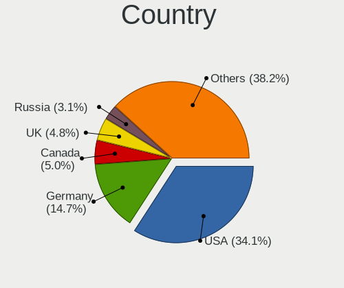
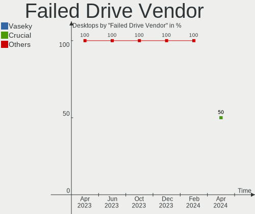
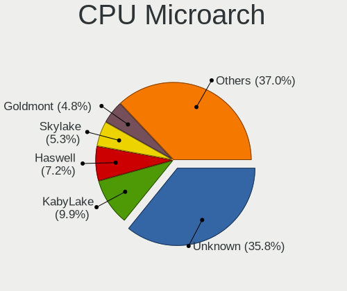
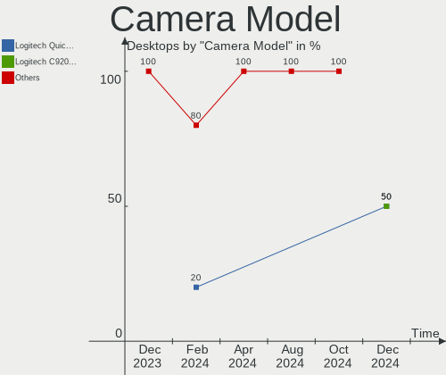

BSD - Hardware Trends (Desktops)
--------------------------------

A project to identify most popular hardware characteristics and track their change
over time based on data collected by BSD users at https://BSD-Hardware.info.

Anyone can contribute to this report by the [hw-probe](https://github.com/linuxhw/hw-probe/blob/master/INSTALL.BSD.md) tool:

    hw-probe -all -upload

This report is for one last month. Overall report since the beginning of time: [TestDays](https://github.com/bsdhw/TestDays)

Period: Dec, 2023.

Contents
--------

* [ System ](#system)
  - [ OS                       ](#os)
  - [ OS Family                ](#os-family)
  - [ Arch                     ](#arch)
  - [ DE                       ](#de)
  - [ Display Server           ](#display-server)
  - [ Display Manager          ](#display-manager)
  - [ OS Lang                  ](#os-lang)
  - [ Boot Mode                ](#boot-mode)
  - [ Filesystem               ](#filesystem)
  - [ Part. scheme             ](#part-scheme)

* [ Board ](#board)
  - [ Vendor                   ](#vendor)
  - [ Model                    ](#model)
  - [ Model Family             ](#model-family)
  - [ MFG Year                 ](#mfg-year)
  - [ Form Factor              ](#form-factor)
  - [ Coreboot                 ](#coreboot)
  - [ RAM Size                 ](#ram-size)
  - [ RAM Used                 ](#ram-used)
  - [ Total Drives             ](#total-drives)
  - [ Has CD-ROM               ](#has-cd-rom)
  - [ Has Ethernet             ](#has-ethernet)
  - [ Has WiFi                 ](#has-wifi)
  - [ Has Bluetooth            ](#has-bluetooth)

* [ Location ](#location)
  - [ Country                  ](#country)
  - [ City                     ](#city)

* [ Drives ](#drives)
  - [ Drive Vendor             ](#drive-vendor)
  - [ Drive Model              ](#drive-model)
  - [ HDD Vendor               ](#hdd-vendor)
  - [ SSD Vendor               ](#ssd-vendor)
  - [ Drive Kind               ](#drive-kind)
  - [ Drive Connector          ](#drive-connector)
  - [ Drive Size               ](#drive-size)
  - [ Space Total              ](#space-total)
  - [ Space Used               ](#space-used)
  - [ Malfunc. Drives          ](#malfunc-drives)
  - [ Malfunc. Drive Vendor    ](#malfunc-drive-vendor)
  - [ Malfunc. HDD Vendor      ](#malfunc-hdd-vendor)
  - [ Malfunc. Drive Kind      ](#malfunc-drive-kind)
  - [ Failed Drives            ](#failed-drives)
  - [ Failed Drive Vendor      ](#failed-drive-vendor)
  - [ Drive Status             ](#drive-status)

* [ Storage controller ](#storage-controller)
  - [ Storage Vendor           ](#storage-vendor)
  - [ Storage Model            ](#storage-model)
  - [ Storage Kind             ](#storage-kind)

* [ Processor ](#processor)
  - [ CPU Vendor               ](#cpu-vendor)
  - [ CPU Model                ](#cpu-model)
  - [ CPU Model Family         ](#cpu-model-family)
  - [ CPU Cores                ](#cpu-cores)
  - [ CPU Sockets              ](#cpu-sockets)
  - [ CPU Threads              ](#cpu-threads)
  - [ CPU Microarch            ](#cpu-microarch)

* [ Graphics ](#graphics)
  - [ GPU Vendor               ](#gpu-vendor)
  - [ GPU Model                ](#gpu-model)
  - [ GPU Combo                ](#gpu-combo)
  - [ GPU Driver               ](#gpu-driver)
  - [ GPU Memory               ](#gpu-memory)

* [ Monitor ](#monitor)
  - [ Monitor Vendor           ](#monitor-vendor)
  - [ Monitor Model            ](#monitor-model)
  - [ Monitor Resolution       ](#monitor-resolution)
  - [ Monitor Diagonal         ](#monitor-diagonal)
  - [ Monitor Width            ](#monitor-width)
  - [ Aspect Ratio             ](#aspect-ratio)
  - [ Monitor Area             ](#monitor-area)
  - [ Pixel Density            ](#pixel-density)
  - [ Multiple Monitors        ](#multiple-monitors)

* [ Network ](#network)
  - [ Net Controller Vendor    ](#net-controller-vendor)
  - [ Net Controller Model     ](#net-controller-model)
  - [ Wireless Vendor          ](#wireless-vendor)
  - [ Wireless Model           ](#wireless-model)
  - [ Ethernet Vendor          ](#ethernet-vendor)
  - [ Ethernet Model           ](#ethernet-model)
  - [ Net Controller Kind      ](#net-controller-kind)
  - [ Used Controller          ](#used-controller)
  - [ NICs                     ](#nics)
  - [ IPv6                     ](#ipv6)

* [ Bluetooth ](#bluetooth)
  - [ Bluetooth Vendor         ](#bluetooth-vendor)
  - [ Bluetooth Model          ](#bluetooth-model)

* [ Sound ](#sound)
  - [ Sound Vendor             ](#sound-vendor)
  - [ Sound Model              ](#sound-model)

* [ Memory ](#memory)
  - [ Memory Vendor            ](#memory-vendor)
  - [ Memory Model             ](#memory-model)
  - [ Memory Kind              ](#memory-kind)
  - [ Memory Form Factor       ](#memory-form-factor)
  - [ Memory Size              ](#memory-size)
  - [ Memory Speed             ](#memory-speed)

* [ Printers & scanners ](#printers--scanners)
  - [ Printer Vendor           ](#printer-vendor)
  - [ Printer Model            ](#printer-model)
  - [ Scanner Vendor           ](#scanner-vendor)
  - [ Scanner Model            ](#scanner-model)

* [ Camera ](#camera)
  - [ Camera Vendor            ](#camera-vendor)
  - [ Camera Model             ](#camera-model)

* [ Security ](#security)
  - [ Fingerprint Vendor       ](#fingerprint-vendor)
  - [ Fingerprint Model        ](#fingerprint-model)
  - [ Chipcard Vendor          ](#chipcard-vendor)
  - [ Chipcard Model           ](#chipcard-model)

* [ Unsupported ](#unsupported)
  - [ Unsupported Devices      ](#unsupported-devices)
  - [ Unsupported Device Types ](#unsupported-device-types)

System
------

OS
--

Installed operating systems

| Name                 | Desktops | Percent |
|----------------------|----------|---------|
| OPNsense 23.7.10     | 164      | 45.3%   |
| OPNsense 23.7.9      | 117      | 32.32%  |
| FreeBSD 14.0-p4      | 8        | 2.21%   |
| helloSystem 0.8.1    | 7        | 1.93%   |
| FreeBSD 14.0-p2      | 7        | 1.93%   |
| OPNsense 23.7.7      | 5        | 1.38%   |
| OPNsense 23.1.11     | 4        | 1.1%    |
| helloSystem 0.9.0    | 4        | 1.1%    |
| FreeBSD 14.0         | 4        | 1.1%    |
| FreeBSD 13.2-p5      | 4        | 1.1%    |
| OPNsense 24.1        | 3        | 0.83%   |
| NomadBSD 20231121    | 3        | 0.83%   |
| GhostBSD 23.10.1     | 3        | 0.83%   |
| FreeBSD 14.0-p1      | 3        | 0.83%   |
| OPNsense 23.7.8      | 2        | 0.55%   |
| OPNsense 21.7.8      | 2        | 0.55%   |
| OPNsense 23.7.5      | 1        | 0.28%   |
| OPNsense 23.7.4      | 1        | 0.28%   |
| OPNsense 23.7.2      | 1        | 0.28%   |
| OPNsense 23.7.1      | 1        | 0.28%   |
| OPNsense 23.10.1     | 1        | 0.28%   |
| OPNsense 23.1.5      | 1        | 0.28%   |
| OPNsense 22.7.11     | 1        | 0.28%   |
| NomadBSD 20231013    | 1        | 0.28%   |
| NetBSD 9.3           | 1        | 0.28%   |
| NetBSD 10.0_RC1      | 1        | 0.28%   |
| helloSystem 0.7.0    | 1        | 0.28%   |
| FreeBSD 15.0-CURRENT | 1        | 0.28%   |
| FreeBSD 14.0-STABLE  | 1        | 0.28%   |
| FreeBSD 14.0-p3      | 1        | 0.28%   |
| FreeBSD 13.2-p6      | 1        | 0.28%   |
| FreeBSD 13.2-p3      | 1        | 0.28%   |
| FreeBSD 13.2         | 1        | 0.28%   |
| FreeBSD 13.1         | 1        | 0.28%   |
| FreeBSD 12.4-p5      | 1        | 0.28%   |
| FreeBSD 12.4-p3      | 1        | 0.28%   |
| FreeBSD 12.4-p2      | 1        | 0.28%   |
| FreeBSD 12.4         | 1        | 0.28%   |

OS Family
---------

OS without a version

| Name        | Desktops | Percent |
|-------------|----------|---------|
| OPNsense    | 304      | 83.98%  |
| FreeBSD     | 37       | 10.22%  |
| helloSystem | 12       | 3.31%   |
| NomadBSD    | 4        | 1.1%    |
| GhostBSD    | 3        | 0.83%   |
| NetBSD      | 2        | 0.55%   |

Arch
----

OS architecture (x86_64, i586, etc.)

| Name    | Desktops | Percent |
|---------|----------|---------|
| amd64   | 357      | 98.62%  |
| i386    | 2        | 0.55%   |
| powerpc | 1        | 0.28%   |
| macppc  | 1        | 0.28%   |
| arm64   | 1        | 0.28%   |

DE
--

Desktop Environment

| Name         | Desktops | Percent |
|--------------|----------|---------|
| Console      | 321      | 88.67%  |
| helloDesktop | 12       | 3.31%   |
| KDE5         | 10       | 2.76%   |
| XFCE         | 4        | 1.1%    |
| MATE         | 4        | 1.1%    |
| xinitrc      | 3        | 0.83%   |
| GNOME        | 3        | 0.83%   |
| TWM          | 1        | 0.28%   |
| Openbox      | 1        | 0.28%   |
| ICEWM        | 1        | 0.28%   |
| i3           | 1        | 0.28%   |
| fvwm2        | 1        | 0.28%   |

Display Server
--------------

X11 or Wayland

| Name    | Desktops | Percent |
|---------|----------|---------|
| Console | 321      | 88.67%  |
| X11     | 39       | 10.77%  |
| Wayland | 2        | 0.55%   |

Display Manager
---------------

SDDM, LightDM, etc.

| Name    | Desktops | Percent |
|---------|----------|---------|
| Console | 326      | 90.06%  |
| SDDM    | 15       | 4.14%   |
| SLiM    | 12       | 3.31%   |
| LightDM | 7        | 1.93%   |
| XDM     | 1        | 0.28%   |
| GDM     | 1        | 0.28%   |

OS Lang
-------

Language

| Lang    | Desktops | Percent |
|---------|----------|---------|
| Unknown | 303      | 83.7%   |
| C       | 39       | 10.77%  |
| en_US   | 13       | 3.59%   |
| UTF-8   | 1        | 0.28%   |
| ru      | 1        | 0.28%   |
| pl_PL   | 1        | 0.28%   |
| fr_FR   | 1        | 0.28%   |
| fi_FI   | 1        | 0.28%   |
| es_ES   | 1        | 0.28%   |
| de_DE   | 1        | 0.28%   |

Boot Mode
---------

EFI or BIOS

| Mode | Desktops | Percent |
|------|----------|---------|
| EFI  | 345      | 95.3%   |
| BIOS | 17       | 4.7%    |

Filesystem
----------

Type of filesystem

| Type   | Desktops | Percent |
|--------|----------|---------|
| Ufs    | 180      | 49.72%  |
| Zfs    | 174      | 48.07%  |
| Cd9660 | 8        | 2.21%   |

Part. scheme
------------

Scheme of partitioning

| Type    | Desktops | Percent |
|---------|----------|---------|
| GPT     | 351      | 96.96%  |
| MBR     | 8        | 2.21%   |
| Unknown | 3        | 0.83%   |

Board
-----

Vendor
------

Motherboard manufacturer

| Name                | Desktops | Percent |
|---------------------|----------|---------|
| Unknown             | 81       | 22.38%  |
| Dell                | 35       | 9.67%   |
| ASUSTek Computer    | 30       | 8.29%   |
| Intel               | 27       | 7.46%   |
| Protectli           | 24       | 6.63%   |
| Hewlett-Packard     | 20       | 5.52%   |
| ASRock              | 19       | 5.25%   |
| Lenovo              | 16       | 4.42%   |
| PC Engines          | 15       | 4.14%   |
| Gigabyte Technology | 15       | 4.14%   |
| MSI                 | 11       | 3.04%   |
| Techvision          | 10       | 2.76%   |
| AZW                 | 10       | 2.76%   |
| Fujitsu             | 7        | 1.93%   |
| Supermicro          | 5        | 1.38%   |
| CWWK                | 4        | 1.1%    |
| Yanling             | 2        | 0.55%   |
| Pegatron            | 2        | 0.55%   |
| MW                  | 2        | 0.55%   |
| ECS                 | 2        | 0.55%   |
| ASRockRack          | 2        | 0.55%   |
| Advantech           | 2        | 0.55%   |
| Acer                | 2        | 0.55%   |
| ZX                  | 1        | 0.28%   |
| YANYU               | 1        | 0.28%   |
| Shuttle             | 1        | 0.28%   |
| SHANGZHAOYUAN       | 1        | 0.28%   |
| Seeed Studio        | 1        | 0.28%   |
| MiTAC               | 1        | 0.28%   |
| Itautec             | 1        | 0.28%   |
| Hardkernel          | 1        | 0.28%   |
| GoWin Solution      | 1        | 0.28%   |
| Google              | 1        | 0.28%   |
| Fusion5             | 1        | 0.28%   |
| Fujitsu Siemens     | 1        | 0.28%   |
| EVGA                | 1        | 0.28%   |
| Casper              | 1        | 0.28%   |
| Biostar             | 1        | 0.28%   |
| Apple               | 1        | 0.28%   |
| AMI                 | 1        | 0.28%   |

Model
-----

Motherboard model

| Name                              | Desktops | Percent |
|-----------------------------------|----------|---------|
| Unknown                           | 81       | 22.38%  |
| Techvision TVI7309X               | 10       | 2.76%   |
| Protectli FW4B                    | 8        | 2.21%   |
| Protectli VP2420                  | 7        | 1.93%   |
| PC Engines APU2                   | 7        | 1.93%   |
| AZW EQ                            | 7        | 1.93%   |
| PC Engines apu4                   | 5        | 1.38%   |
| Intel Q3XXG4-P V1.0               | 5        | 1.38%   |
| Dell OptiPlex 7050                | 4        | 1.1%    |
| Dell OptiPlex 7020                | 4        | 1.1%    |
| PC Engines APU3                   | 3        | 0.83%   |
| Intel Jasper Lake Client Platform | 3        | 0.83%   |
| Fujitsu FUTRO S920                | 3        | 0.83%   |
| Dell OptiPlex 9020                | 3        | 0.83%   |
| Dell OptiPlex 7060                | 3        | 0.83%   |
| Protectli FW6                     | 2        | 0.55%   |
| Protectli FW4C                    | 2        | 0.55%   |
| Protectli FW4A                    | 2        | 0.55%   |
| Protectli FW2B                    | 2        | 0.55%   |
| MW GMLK-2_5G4L                    | 2        | 0.55%   |
| Intel QHSW02                      | 2        | 0.55%   |
| Intel NDISB533                    | 2        | 0.55%   |
| Intel NDiS 167                    | 2        | 0.55%   |
| HP ProDesk 400 G4 SFF             | 2        | 0.55%   |
| HP EliteDesk 800 G1 SFF           | 2        | 0.55%   |
| HP Compaq Elite 8300 SFF          | 2        | 0.55%   |
| Fujitsu FUTRO S940                | 2        | 0.55%   |
| Dell OptiPlex 9010                | 2        | 0.55%   |
| Dell OptiPlex 780                 | 2        | 0.55%   |
| Dell OptiPlex 3020M               | 2        | 0.55%   |
| Dell OptiPlex 3020                | 2        | 0.55%   |
| CWWK CW-ADLN-6L                   | 2        | 0.55%   |
| ASUS TUF Gaming B550M-PLUS        | 2        | 0.55%   |
| ASUS ROG CROSSHAIR VIII HERO      | 2        | 0.55%   |
| ASUS All Series                   | 2        | 0.55%   |
| Advantech DTADB                   | 2        | 0.55%   |
| ZX H610ITX                        | 1        | 0.28%   |
| YANYU H17SL                       | 1        | 0.28%   |
| Yanling LES plus                  | 1        | 0.28%   |
| Yanling LES network 6L            | 1        | 0.28%   |

Model Family
------------

Motherboard model prefix

| Name                     | Desktops | Percent |
|--------------------------|----------|---------|
| Unknown                  | 81       | 22.38%  |
| Dell OptiPlex            | 31       | 8.56%   |
| Techvision TVI7309X      | 10       | 2.76%   |
| Lenovo ThinkCentre       | 10       | 2.76%   |
| HP ProDesk               | 10       | 2.76%   |
| Protectli FW4B           | 8        | 2.21%   |
| Protectli VP2420         | 7        | 1.93%   |
| PC Engines APU2          | 7        | 1.93%   |
| AZW EQ                   | 7        | 1.93%   |
| Fujitsu FUTRO            | 6        | 1.66%   |
| ASUS TUF                 | 6        | 1.66%   |
| ASUS PRIME               | 6        | 1.66%   |
| PC Engines apu4          | 5        | 1.38%   |
| Intel Q3XXG4-P           | 5        | 1.38%   |
| HP EliteDesk             | 4        | 1.1%    |
| ASUS ROG                 | 4        | 1.1%    |
| PC Engines APU3          | 3        | 0.83%   |
| Intel Jasper             | 3        | 0.83%   |
| HP Compaq                | 3        | 0.83%   |
| Dell Precision           | 3        | 0.83%   |
| Yanling LES              | 2        | 0.55%   |
| Protectli FW6            | 2        | 0.55%   |
| Protectli FW4C           | 2        | 0.55%   |
| Protectli FW4A           | 2        | 0.55%   |
| Protectli FW2B           | 2        | 0.55%   |
| MW GMLK-2                | 2        | 0.55%   |
| Intel QHSW02             | 2        | 0.55%   |
| Intel NDISB533           | 2        | 0.55%   |
| Intel NDiS               | 2        | 0.55%   |
| CWWK CW-ADLN-6L          | 2        | 0.55%   |
| AZW Green                | 2        | 0.55%   |
| ASUS Pro                 | 2        | 0.55%   |
| ASUS All                 | 2        | 0.55%   |
| ASRock Z370              | 2        | 0.55%   |
| Advantech DTADB          | 2        | 0.55%   |
| ZX H610ITX               | 1        | 0.28%   |
| YANYU H17SL              | 1        | 0.28%   |
| Supermicro X8SIE         | 1        | 0.28%   |
| Supermicro X7SBi         | 1        | 0.28%   |
| Supermicro SYS-6028R-TRT | 1        | 0.28%   |

MFG Year
--------

Motherboard manufacture year

| Year    | Desktops | Percent |
|---------|----------|---------|
| 2023    | 64       | 17.68%  |
| 2022    | 55       | 15.19%  |
| 2021    | 33       | 9.12%   |
| 2018    | 32       | 8.84%   |
| 2016    | 29       | 8.01%   |
| 2019    | 25       | 6.91%   |
| 2014    | 20       | 5.52%   |
| 2012    | 17       | 4.7%    |
| 2017    | 16       | 4.42%   |
| 2013    | 16       | 4.42%   |
| 2015    | 15       | 4.14%   |
| 2020    | 11       | 3.04%   |
| 2011    | 7        | 1.93%   |
| 2010    | 6        | 1.66%   |
| 2009    | 6        | 1.66%   |
| 2008    | 5        | 1.38%   |
| Unknown | 3        | 0.83%   |
| 2007    | 2        | 0.55%   |

Form Factor
-----------

Physical design of the computer

| Name    | Desktops | Percent |
|---------|----------|---------|
| Desktop | 362      | 100%    |

Coreboot
--------

Have coreboot on board

| Used | Desktops | Percent |
|------|----------|---------|
| No   | 339      | 93.65%  |
| Yes  | 23       | 6.35%   |

RAM Size
--------

Total RAM memory

| Size in GB      | Desktops | Percent |
|-----------------|----------|---------|
| 8.01-16.0       | 126      | 34.81%  |
| 16.01-24.0      | 113      | 31.22%  |
| 4.01-8.0        | 48       | 13.26%  |
| 32.01-64.0      | 38       | 10.5%   |
| 64.01-256.0     | 22       | 6.08%   |
| 2.01-3.0        | 6        | 1.66%   |
| 24.01-32.0      | 3        | 0.83%   |
| 3.01-4.0        | 2        | 0.55%   |
| More than 256.0 | 1        | 0.28%   |
| 1.01-2.0        | 1        | 0.28%   |
| 0.51-1.0        | 1        | 0.28%   |
| 0.01-0.5        | 1        | 0.28%   |

RAM Used
--------

Used RAM memory

| Used GB   | Desktops | Percent |
|-----------|----------|---------|
| 0.51-1.0  | 154      | 42.54%  |
| 0.01-0.5  | 134      | 37.02%  |
| 1.01-2.0  | 52       | 14.36%  |
| 2.01-3.0  | 12       | 3.31%   |
| 3.01-4.0  | 5        | 1.38%   |
| Unknown   | 2        | 0.55%   |
| 4.01-8.0  | 1        | 0.28%   |
| 8.01-16.0 | 1        | 0.28%   |
| 0         | 1        | 0.28%   |

Total Drives
------------

Number of drives on board

| Drives | Desktops | Percent |
|--------|----------|---------|
| 1      | 266      | 73.48%  |
| 2      | 39       | 10.77%  |
| 0      | 34       | 9.39%   |
| 3      | 14       | 3.87%   |
| 4      | 6        | 1.66%   |
| 13     | 1        | 0.28%   |
| 12     | 1        | 0.28%   |
| 6      | 1        | 0.28%   |

Has CD-ROM
----------

Has CD-ROM on board

| Presented | Desktops | Percent |
|-----------|----------|---------|
| No        | 309      | 85.36%  |
| Yes       | 53       | 14.64%  |

Has Ethernet
------------

Has Ethernet on board

| Presented | Desktops | Percent |
|-----------|----------|---------|
| Yes       | 360      | 99.45%  |
| No        | 2        | 0.55%   |

Has WiFi
--------

Has WiFi module

| Presented | Desktops | Percent |
|-----------|----------|---------|
| No        | 300      | 82.87%  |
| Yes       | 62       | 17.13%  |

Has Bluetooth
-------------

Has Bluetooth module

| Presented | Desktops | Percent |
|-----------|----------|---------|
| No        | 322      | 88.95%  |
| Yes       | 40       | 11.05%  |

Location
--------

Country
-------

Geographic location (country)

| Country         | Desktops | Percent |
|-----------------|----------|---------|
| USA             | 110      | 30.39%  |
| Germany         | 54       | 14.92%  |
| Canada          | 21       | 5.8%    |
| UK              | 16       | 4.42%   |
| France          | 13       | 3.59%   |
| Russia          | 12       | 3.31%   |
| Brazil          | 11       | 3.04%   |
| Netherlands     | 10       | 2.76%   |
| Australia       | 9        | 2.49%   |
| Austria         | 8        | 2.21%   |
| Italy           | 7        | 1.93%   |
| Sweden          | 6        | 1.66%   |
| Romania         | 5        | 1.38%   |
| Portugal        | 5        | 1.38%   |
| Poland          | 5        | 1.38%   |
| Taiwan          | 4        | 1.1%    |
| Switzerland     | 4        | 1.1%    |
| Norway          | 4        | 1.1%    |
| Finland         | 4        | 1.1%    |
| Czechia         | 3        | 0.83%   |
| China           | 3        | 0.83%   |
| Chile           | 3        | 0.83%   |
| Belgium         | 3        | 0.83%   |
| Turkey          | 2        | 0.55%   |
| Thailand        | 2        | 0.55%   |
| South Korea     | 2        | 0.55%   |
| South Africa    | 2        | 0.55%   |
| Slovakia        | 2        | 0.55%   |
| New Zealand     | 2        | 0.55%   |
| Mexico          | 2        | 0.55%   |
| Indonesia       | 2        | 0.55%   |
| Greece          | 2        | 0.55%   |
| Estonia         | 2        | 0.55%   |
| Venezuela       | 1        | 0.28%   |
| Spain           | 1        | 0.28%   |
| Slovenia        | 1        | 0.28%   |
| Saudi Arabia    | 1        | 0.28%   |
| Qatar           | 1        | 0.28%   |
| Panama          | 1        | 0.28%   |
| North Macedonia | 1        | 0.28%   |

City
----

Geographic location (city)

| City                     | Desktops | Percent |
|--------------------------|----------|---------|
| Berlin                   | 6        | 1.66%   |
| Vienna                   | 4        | 1.1%    |
| Paris                    | 4        | 1.1%    |
| Munich                   | 4        | 1.1%    |
| Moscow                   | 4        | 1.1%    |
| Brisbane                 | 4        | 1.1%    |
| South San Francisco      | 3        | 0.83%   |
| Ottawa                   | 3        | 0.83%   |
| Kooyong                  | 3        | 0.83%   |
| Fayetteville             | 3        | 0.83%   |
| Cologne                  | 3        | 0.83%   |
| Warsaw                   | 2        | 0.55%   |
| Vancouver                | 2        | 0.55%   |
| Toronto                  | 2        | 0.55%   |
| Thessaloniki             | 2        | 0.55%   |
| Taipei                   | 2        | 0.55%   |
| Sterling                 | 2        | 0.55%   |
| Sorocaba                 | 2        | 0.55%   |
| Santiago                 | 2        | 0.55%   |
| San Luis Potosí City    | 2        | 0.55%   |
| Salem                    | 2        | 0.55%   |
| Sainte-Marthe-sur-le-Lac | 2        | 0.55%   |
| Rotterdam                | 2        | 0.55%   |
| Redmond                  | 2        | 0.55%   |
| Prague                   | 2        | 0.55%   |
| Montreal                 | 2        | 0.55%   |
| London                   | 2        | 0.55%   |
| Lisbon                   | 2        | 0.55%   |
| Lille                    | 2        | 0.55%   |
| Leeds                    | 2        | 0.55%   |
| Kissing                  | 2        | 0.55%   |
| Istanbul                 | 2        | 0.55%   |
| Hittisau                 | 2        | 0.55%   |
| Helsinki                 | 2        | 0.55%   |
| Hayward                  | 2        | 0.55%   |
| Frankfurt am Main        | 2        | 0.55%   |
| Denver                   | 2        | 0.55%   |
| Cary                     | 2        | 0.55%   |
| Calgary                  | 2        | 0.55%   |
| Brooklyn                 | 2        | 0.55%   |

Drives
------

Drive Vendor
------------

Hard drive vendors

| Vendor              | Desktops | Drives | Percent |
|---------------------|----------|--------|---------|
| Samsung Electronics | 65       | 82     | 16.71%  |
| Seagate             | 38       | 51     | 9.77%   |
| WDC                 | 30       | 40     | 7.71%   |
| Kingston            | 27       | 30     | 6.94%   |
| Crucial             | 23       | 23     | 5.91%   |
| Intel               | 16       | 22     | 4.11%   |
| Transcend           | 15       | 15     | 3.86%   |
| Hoodisk             | 15       | 15     | 3.86%   |
| Toshiba             | 13       | 13     | 3.34%   |
| SanDisk             | 13       | 13     | 3.34%   |
| SK hynix            | 12       | 12     | 3.08%   |
| China               | 11       | 11     | 2.83%   |
| Protectli           | 8        | 8      | 2.06%   |
| SPCC                | 6        | 7      | 1.54%   |
| Fanxiang            | 6        | 6      | 1.54%   |
| Team                | 5        | 6      | 1.29%   |
| Silicon Motion      | 5        | 5      | 1.29%   |
| Lexar               | 5        | 5      | 1.29%   |
| Gigabyte Technology | 5        | 5      | 1.29%   |
| Patriot             | 4        | 5      | 1.03%   |
| Hitachi             | 4        | 4      | 1.03%   |
| ShiJi               | 3        | 3      | 0.77%   |
| PNY                 | 3        | 3      | 0.77%   |
| Phison              | 3        | 4      | 0.77%   |
| OCZ                 | 3        | 3      | 0.77%   |
| Micron Technology   | 3        | 3      | 0.77%   |
| KingSpec            | 3        | 3      | 0.77%   |
| Hewlett-Packard     | 3        | 3      | 0.77%   |
| Corsair             | 3        | 3      | 0.77%   |
| A-DATA Technology   | 3        | 3      | 0.77%   |
| KeepData            | 2        | 2      | 0.51%   |
| Intenso             | 2        | 2      | 0.51%   |
| HGST                | 2        | 2      | 0.51%   |
| GAMER               | 2        | 2      | 0.51%   |
| FORESEE             | 2        | 2      | 0.51%   |
| Dogfish             | 2        | 2      | 0.51%   |
| BIWIN               | 2        | 2      | 0.51%   |
| Wibtek              | 1        | 1      | 0.26%   |
| WD MediaMax         | 1        | 1      | 0.26%   |
| VICKTER             | 1        | 1      | 0.26%   |

Drive Model
-----------

Hard drive models

| Model                            | Desktops | Percent |
|----------------------------------|----------|---------|
| Hoodisk SSD 128GB                | 9        | 2.18%   |
| Seagate ST500DM002-1BD142 500GB  | 6        | 1.46%   |
| Kingston SA400S37480G 480GB      | 6        | 1.46%   |
| Kingston SKC600MS256G 256GB      | 5        | 1.21%   |
| Samsung SSD 840 EVO 250GB        | 4        | 0.97%   |
| Samsung MZ7PD256HCGM-000H7 256GB | 4        | 0.97%   |
| Crucial CT500P3SSD8 500GB        | 4        | 0.97%   |
| Transcend TS128GMSA230S 128GB    | 3        | 0.73%   |
| Team TM8FP6256G 256GB            | 3        | 0.73%   |
| Seagate ST4000DM004-2CV104 4TB   | 3        | 0.73%   |
| Samsung SSD 860 QVO 1TB          | 3        | 0.73%   |
| Samsung SSD 840 EVO 120GB        | 3        | 0.73%   |
| Protectli 120GB mSATA            | 3        | 0.73%   |
| Phison PCIe SSD 250GB            | 3        | 0.73%   |
| Hoodisk SSD 32GB                 | 3        | 0.73%   |
| WDC WD40EZRZ-22GXCB0 4TB         | 2        | 0.49%   |
| Transcend TS64GMSA230S 64GB      | 2        | 0.49%   |
| Transcend TS256GMSA230S 256GB    | 2        | 0.49%   |
| Transcend TS16GMSA370 16GB       | 2        | 0.49%   |
| SK hynix SC300 M.2 2280 128GB    | 2        | 0.49%   |
| Silicon Motion GV128 128GB       | 2        | 0.49%   |
| Seagate ST940110A 40GB           | 2        | 0.49%   |
| Seagate ST4000DM000-1F2168 4TB   | 2        | 0.49%   |
| Seagate ST2000DM008-2FR102 2TB   | 2        | 0.49%   |
| Samsung SSD 980 PRO 500GB        | 2        | 0.49%   |
| Samsung SSD 860 EVO M.2 500GB    | 2        | 0.49%   |
| Samsung SSD 860 EVO M.2 250GB    | 2        | 0.49%   |
| Samsung SSD 860 EVO 500GB        | 2        | 0.49%   |
| Samsung SSD 860 EVO 250GB        | 2        | 0.49%   |
| Samsung SSD 850 EVO 250GB        | 2        | 0.49%   |
| Samsung MZVLQ128HCHQ-00BH1 128GB | 2        | 0.49%   |
| Protectli 480GB M.2              | 2        | 0.49%   |
| Lexar SSD NS100 256GB            | 2        | 0.49%   |
| Kingston SV300S37A120G 120GB     | 2        | 0.49%   |
| Kingston SUV500MS120G 120GB      | 2        | 0.49%   |
| Kingston SMS200S360G 64GB        | 2        | 0.49%   |
| Kingston SA400S37240G 240GB      | 2        | 0.49%   |
| Kingston SA400S37120G 120GB      | 2        | 0.49%   |
| KeepData GIM128 128GB            | 2        | 0.49%   |
| Intel SSDSC2BF180A4L 180GB       | 2        | 0.49%   |

HDD Vendor
----------

Hard disk drive vendors

| Vendor              | Desktops | Drives | Percent |
|---------------------|----------|--------|---------|
| Seagate             | 35       | 48     | 44.87%  |
| WDC                 | 20       | 30     | 25.64%  |
| Toshiba             | 9        | 9      | 11.54%  |
| Samsung Electronics | 4        | 5      | 5.13%   |
| Hitachi             | 4        | 4      | 5.13%   |
| HGST                | 2        | 2      | 2.56%   |
| WD MediaMax         | 1        | 1      | 1.28%   |
| Maxtor              | 1        | 1      | 1.28%   |
| Hewlett-Packard     | 1        | 1      | 1.28%   |
| Fujitsu             | 1        | 1      | 1.28%   |

SSD Vendor
----------

Solid state drive vendors

| Vendor              | Desktops | Drives | Percent |
|---------------------|----------|--------|---------|
| Samsung Electronics | 44       | 56     | 19.82%  |
| Kingston            | 23       | 26     | 10.36%  |
| Transcend           | 15       | 15     | 6.76%   |
| Hoodisk             | 15       | 15     | 6.76%   |
| Crucial             | 15       | 15     | 6.76%   |
| SanDisk             | 13       | 13     | 5.86%   |
| Intel               | 11       | 16     | 4.95%   |
| China               | 11       | 11     | 4.95%   |
| Protectli           | 8        | 8      | 3.6%    |
| SK hynix            | 7        | 7      | 3.15%   |
| SPCC                | 4        | 4      | 1.8%    |
| WDC                 | 3        | 3      | 1.35%   |
| OCZ                 | 3        | 3      | 1.35%   |
| Lexar               | 3        | 3      | 1.35%   |
| KingSpec            | 3        | 3      | 1.35%   |
| A-DATA Technology   | 3        | 3      | 1.35%   |
| Toshiba             | 2        | 2      | 0.9%    |
| PNY                 | 2        | 2      | 0.9%    |
| Patriot             | 2        | 2      | 0.9%    |
| Micron Technology   | 2        | 2      | 0.9%    |
| KeepData            | 2        | 2      | 0.9%    |
| Intenso             | 2        | 2      | 0.9%    |
| Gigabyte Technology | 2        | 2      | 0.9%    |
| GAMER               | 2        | 2      | 0.9%    |
| Dogfish             | 2        | 2      | 0.9%    |
| BIWIN               | 2        | 2      | 0.9%    |
| Wibtek              | 1        | 1      | 0.45%   |
| VICKTER             | 1        | 1      | 0.45%   |
| Team                | 1        | 1      | 0.45%   |
| SSSTC               | 1        | 1      | 0.45%   |
| ShiJi               | 1        | 1      | 0.45%   |
| SHAREVDI            | 1        | 1      | 0.45%   |
| Seagate             | 1        | 1      | 0.45%   |
| Pioneer             | 1        | 1      | 0.45%   |
| Pccooler            | 1        | 1      | 0.45%   |
| OWC                 | 1        | 3      | 0.45%   |
| Netac               | 1        | 1      | 0.45%   |
| Mushkin             | 1        | 1      | 0.45%   |
| MidasForce          | 1        | 2      | 0.45%   |
| MACROVIP            | 1        | 1      | 0.45%   |

Drive Kind
----------

HDD or SSD

| Kind | Desktops | Drives | Percent |
|------|----------|--------|---------|
| SSD  | 211      | 245    | 57.49%  |
| NVMe | 89       | 98     | 24.25%  |
| HDD  | 67       | 102    | 18.26%  |

Drive Connector
---------------

SATA, SAS, NVMe, etc.

| Type | Desktops | Drives | Percent |
|------|----------|--------|---------|
| SATA | 253      | 347    | 73.98%  |
| NVMe | 89       | 98     | 26.02%  |

Drive Size
----------

Size of hard drive

| Size in TB | Desktops | Drives | Percent |
|------------|----------|--------|---------|
| 0.01-0.5   | 215      | 247    | 74.91%  |
| 0.51-1.0   | 32       | 38     | 11.15%  |
| 1.01-2.0   | 23       | 27     | 8.01%   |
| 3.01-4.0   | 10       | 12     | 3.48%   |
| 4.01-10.0  | 5        | 20     | 1.74%   |
| 10.01-20.0 | 2        | 3      | 0.7%    |

Space Total
-----------

Amount of disk space available on the file system

| Size in GB     | Desktops | Percent |
|----------------|----------|---------|
| 101-250        | 181      | 50%     |
| 251-500        | 70       | 19.34%  |
| 501-1000       | 28       | 7.73%   |
| 1-20           | 24       | 6.63%   |
| 21-50          | 23       | 6.35%   |
| 51-100         | 21       | 5.8%    |
| 1001-2000      | 12       | 3.31%   |
| More than 3000 | 3        | 0.83%   |

Space Used
----------

Amount of used disk space

| Used GB        | Desktops | Percent |
|----------------|----------|---------|
| 1-20           | 334      | 92.27%  |
| 21-50          | 19       | 5.25%   |
| 51-100         | 5        | 1.38%   |
| More than 3000 | 1        | 0.28%   |
| 251-500        | 1        | 0.28%   |
| 101-250        | 1        | 0.28%   |
| 1001-2000      | 1        | 0.28%   |

Malfunc. Drives
---------------

Drive models with a malfunction

| Model                                      | Desktops | Drives | Percent |
|--------------------------------------------|----------|--------|---------|
| Seagate ST500DM002-1BD142 500GB            | 3        | 3      | 7.5%    |
| WDC WD5000AAKX-00ERMA0 500GB               | 1        | 1      | 2.5%    |
| WDC WD3200AAKS-75L9A0 320GB                | 1        | 1      | 2.5%    |
| WDC WD20EZRX-19D8PB0 2TB                   | 1        | 1      | 2.5%    |
| WDC WD2000FYYZ-01UL1B2 2TB                 | 1        | 1      | 2.5%    |
| WDC WD10EZEX-08M2NA0 1TB                   | 1        | 1      | 2.5%    |
| WDC WD10EZEX-00RKKA0 1TB                   | 1        | 1      | 2.5%    |
| WDC WD10EALX-009BA0 1TB                    | 1        | 1      | 2.5%    |
| Transcend TS8GMSM610 8GB                   | 1        | 1      | 2.5%    |
| Toshiba THNSNK128GCS8 SATA 128GB           | 1        | 1      | 2.5%    |
| Toshiba MQ01ABD100 1TB                     | 1        | 1      | 2.5%    |
| Toshiba MK3261GSYN 320GB                   | 1        | 1      | 2.5%    |
| SSSTC CVB-8D128-HP 128GB                   | 1        | 1      | 2.5%    |
| SPCC Solid State Disk 512GB                | 1        | 1      | 2.5%    |
| SK hynix HFS256G39TND-N210A 256GB          | 1        | 1      | 2.5%    |
| SK hynix HFS064G3AMNB-2200A 64GB           | 1        | 1      | 2.5%    |
| Seagate ST9500420AS 500GB                  | 1        | 1      | 2.5%    |
| Seagate ST500LT012-9WS142 500GB            | 1        | 1      | 2.5%    |
| Seagate ST4000VN000-1H4168 4TB             | 1        | 1      | 2.5%    |
| Seagate ST3320418AS 320GB                  | 1        | 1      | 2.5%    |
| Seagate ST320LT012-1DG14C 320GB            | 1        | 2      | 2.5%    |
| Seagate ST250DM000-1BD141 250GB            | 1        | 1      | 2.5%    |
| Seagate ST1000DM003-1SB102 1TB             | 1        | 1      | 2.5%    |
| Samsung Electronics SSD RBX Series 128GB M | 1        | 1      | 2.5%    |
| Samsung Electronics SSD 980 PRO 2TB        | 1        | 1      | 2.5%    |
| Samsung Electronics SSD 970 EVO Plus 2TB   | 1        | 1      | 2.5%    |
| Samsung Electronics SP2504C 250GB          | 1        | 1      | 2.5%    |
| Samsung Electronics HD204UI 2TB            | 1        | 1      | 2.5%    |
| Plextor PX-256M8PeG 256GB                  | 1        | 1      | 2.5%    |
| Patriot Pyro SE 120GB                      | 1        | 1      | 2.5%    |
| Kingston SHFS37A120G 120GB                 | 1        | 1      | 2.5%    |
| KingSpec P4-120 120GB                      | 1        | 1      | 2.5%    |
| Intel SSDSC2BF180A4L 180GB                 | 1        | 1      | 2.5%    |
| Hitachi HUA722020ALA330 2TB                | 1        | 1      | 2.5%    |
| Hitachi HTS725050A9A364 500GB              | 1        | 1      | 2.5%    |
| HGST HTE545032A7E380 320GB                 | 1        | 1      | 2.5%    |
| Crucial CT480BX500SSD1 480GB               | 1        | 1      | 2.5%    |
| Crucial CT275MX300SSD1 275GB               | 1        | 1      | 2.5%    |

Malfunc. Drive Vendor
---------------------

Vendors of faulty drives

| Vendor              | Desktops | Drives | Percent |
|---------------------|----------|--------|---------|
| Seagate             | 10       | 11     | 25.64%  |
| WDC                 | 6        | 7      | 15.38%  |
| Samsung Electronics | 5        | 5      | 12.82%  |
| Toshiba             | 3        | 3      | 7.69%   |
| SK hynix            | 2        | 2      | 5.13%   |
| Hitachi             | 2        | 2      | 5.13%   |
| Crucial             | 2        | 2      | 5.13%   |
| Transcend           | 1        | 1      | 2.56%   |
| SSSTC               | 1        | 1      | 2.56%   |
| SPCC                | 1        | 1      | 2.56%   |
| Plextor             | 1        | 1      | 2.56%   |
| Patriot             | 1        | 1      | 2.56%   |
| Kingston            | 1        | 1      | 2.56%   |
| KingSpec            | 1        | 1      | 2.56%   |
| Intel               | 1        | 1      | 2.56%   |
| HGST                | 1        | 1      | 2.56%   |

Malfunc. HDD Vendor
-------------------

Vendors of faulty HDD drives

| Vendor              | Desktops | Drives | Percent |
|---------------------|----------|--------|---------|
| Seagate             | 10       | 11     | 43.48%  |
| WDC                 | 6        | 7      | 26.09%  |
| Toshiba             | 2        | 2      | 8.7%    |
| Samsung Electronics | 2        | 2      | 8.7%    |
| Hitachi             | 2        | 2      | 8.7%    |
| HGST                | 1        | 1      | 4.35%   |

Malfunc. Drive Kind
-------------------

Kinds of faulty drives

| Kind | Desktops | Drives | Percent |
|------|----------|--------|---------|
| HDD  | 23       | 25     | 58.97%  |
| SSD  | 13       | 13     | 33.33%  |
| NVMe | 3        | 3      | 7.69%   |

Failed Drives
-------------

Failed drive models

| Model                                        | Desktops | Drives | Percent |
|----------------------------------------------|----------|--------|---------|
| Samsung Electronics MZVLB256HBHQ-000H1 256GB | 1        | 1      | 100%    |

Failed Drive Vendor
-------------------

Failed drive vendors

| Vendor              | Desktops | Drives | Percent |
|---------------------|----------|--------|---------|
| Samsung Electronics | 1        | 1      | 100%    |

Drive Status
------------

Number of failed and malfunc. drives

| Status   | Desktops | Drives | Percent |
|----------|----------|--------|---------|
| Works    | 295      | 396    | 86.76%  |
| Malfunc  | 38       | 41     | 11.18%  |
| Detected | 6        | 7      | 1.76%   |
| Failed   | 1        | 1      | 0.29%   |

Storage controller
------------------

Storage Vendor
--------------

Storage controller vendors

| Vendor                        | Desktops | Percent |
|-------------------------------|----------|---------|
| Intel                         | 285      | 59.87%  |
| AMD                           | 57       | 11.97%  |
| Samsung Electronics           | 24       | 5.04%   |
| SanDisk                       | 15       | 3.15%   |
| Silicon Motion                | 14       | 2.94%   |
| Phison Electronics            | 14       | 2.94%   |
| Micron/Crucial Technology     | 12       | 2.52%   |
| MAXIO Technology (Hangzhou)   | 8        | 1.68%   |
| ASMedia Technology            | 7        | 1.47%   |
| SK hynix                      | 6        | 1.26%   |
| Kingston Technology Company   | 6        | 1.26%   |
| Nvidia                        | 3        | 0.63%   |
| Hosin Global Electronics      | 3        | 0.63%   |
| Broadcom / LSI                | 3        | 0.63%   |
| Toshiba                       | 2        | 0.42%   |
| Seagate Technology            | 2        | 0.42%   |
| Realtek Semiconductor         | 2        | 0.42%   |
| Marvell Technology Group      | 2        | 0.42%   |
| KIOXIA                        | 2        | 0.42%   |
| JMicron Technology            | 2        | 0.42%   |
| Shenzhen Longsys Electronics  | 1        | 0.21%   |
| Micron Technology             | 1        | 0.21%   |
| Lite-On Technology            | 1        | 0.21%   |
| Integrated Technology Express | 1        | 0.21%   |
| Chelsio Communications        | 1        | 0.21%   |
| Biwin Storage Technology      | 1        | 0.21%   |
| ATP ELECTRONICS               | 1        | 0.21%   |

Storage Model
-------------

Storage controller models

| Model                                                                            | Desktops | Percent |
|----------------------------------------------------------------------------------|----------|---------|
| AMD FCH SATA Controller [AHCI mode]                                              | 38       | 7.22%   |
| Intel unknown                                                                    | 36       | 6.84%   |
| Intel 8 Series/C220 Series Chipset Family 6-port SATA Controller 1 [AHCI mode]   | 29       | 5.51%   |
| Intel Jasper Lake SATA AHCI Controller                                           | 24       | 4.56%   |
| Intel Q170/Q150/B150/H170/H110/Z170/CM236 Chipset SATA Controller [AHCI Mode]    | 19       | 3.61%   |
| Intel Celeron/Pentium Silver Processor SATA Controller                           | 17       | 3.23%   |
| Silicon Motion SM2263EN/SM2263XT (DRAM-less) NVMe SSD Controllers                | 14       | 2.66%   |
| Intel Sunrise Point-LP SATA Controller [AHCI mode]                               | 14       | 2.66%   |
| Intel Atom/Celeron/Pentium Processor x5-E8000/J3xxx/N3xxx Series SATA Controller | 14       | 2.66%   |
| Intel 200 Series PCH SATA controller [AHCI mode]                                 | 11       | 2.09%   |
| Intel Cannon Lake PCH SATA AHCI Controller                                       | 10       | 1.9%    |
| Micron/Crucial P2 [Nick P2] / P3 / P3 Plus NVMe PCIe SSD (DRAM-less)             | 9        | 1.71%   |
| Samsung NVMe SSD Controller SM981/PM981/PM983                                    | 8        | 1.52%   |
| MAXIO (Hangzhou) NVMe SSD Controller MAP1202                                     | 8        | 1.52%   |
| Intel Elkhart Lake SATA AHCI                                                     | 8        | 1.52%   |
| Intel SATA Controller [RAID mode]                                                | 7        | 1.33%   |
| AMD 500 Series Chipset SATA Controller                                           | 7        | 1.33%   |
| SK hynix Gold P31/BC711/PC711 NVMe Solid State Drive                             | 6        | 1.14%   |
| SanDisk Extreme Pro / WD Black SN750 / PC SN730 / Red SN700 NVMe SSD             | 6        | 1.14%   |
| Samsung NVMe SSD Controller 980 (DRAM-less)                                      | 6        | 1.14%   |
| Phison PS5013-E13 PCIe3 NVMe Controller (DRAM-less)                              | 6        | 1.14%   |
| ASMedia ASM1062 Serial ATA Controller                                            | 6        | 1.14%   |
| AMD FCH SATA Controller [IDE mode]                                               | 6        | 1.14%   |
| AMD 400 Series Chipset SATA Controller                                           | 6        | 1.14%   |
| Samsung NVMe SSD Controller PM9A1/PM9A3/980PRO                                   | 5        | 0.95%   |
| Intel Wildcat Point-LP SATA Controller [AHCI Mode]                               | 5        | 0.95%   |
| Intel Atom Processor E3800 Series SATA AHCI Controller                           | 5        | 0.95%   |
| Intel Alder Lake-S PCH SATA Controller [AHCI Mode]                               | 5        | 0.95%   |
| Intel 7 Series/C210 Series Chipset Family 6-port SATA Controller [AHCI mode]     | 5        | 0.95%   |
| Intel 7 Series/C210 Series Chipset Family 4-port SATA Controller [IDE mode]      | 5        | 0.95%   |
| Intel 7 Series/C210 Series Chipset Family 2-port SATA Controller [IDE mode]      | 5        | 0.95%   |
| Intel 6 Series/C200 Series Chipset Family 6 port Desktop SATA AHCI Controller    | 5        | 0.95%   |
| Intel 500 Series Chipset Family SATA AHCI Controller                             | 5        | 0.95%   |
| Unknown                                                                          | 5        | 0.95%   |
| Intel Atom Processor C3000 Series SATA Controller 0                              | 4        | 0.76%   |
| Intel 8 Series SATA Controller 1 [AHCI mode]                                     | 4        | 0.76%   |
| Intel 5 Series/3400 Series Chipset 6 port SATA AHCI Controller                   | 4        | 0.76%   |
| AMD SB7x0/SB8x0/SB9x0 IDE Controller                                             | 4        | 0.76%   |
| Sandisk WD Black SN770 / PC SN740 256GB / PC SN560 (DRAM-less) NVMe SSD          | 3        | 0.57%   |
| SanDisk Ultra 3D / WD Blue SN550 NVMe SSD                                        | 3        | 0.57%   |

Storage Kind
------------

Kind of storage controller (IDE, SATA, NVMe, SAS, ...)

| Kind | Desktops | Percent |
|------|----------|---------|
| SATA | 312      | 65.27%  |
| NVMe | 115      | 24.06%  |
| IDE  | 38       | 7.95%   |
| RAID | 10       | 2.09%   |
| SAS  | 2        | 0.42%   |
| SCSI | 1        | 0.21%   |

Processor
---------

CPU Vendor
----------

Processor vendors

| Vendor  | Desktops | Percent |
|---------|----------|---------|
| Intel   | 298      | 82.32%  |
| AMD     | 61       | 16.85%  |
| ARM     | 1        | 0.28%   |
| 7447A   | 1        | 0.28%   |
| Unknown | 1        | 0.28%   |

CPU Model
---------

Processor models

| Model                                       | Desktops | Percent |
|---------------------------------------------|----------|---------|
| Intel N100                                  | 35       | 9.67%   |
| Intel Celeron N5105 @ 2.00GHz               | 18       | 4.97%   |
| AMD GX-412TC SOC                            | 15       | 4.14%   |
| Intel Celeron J4125 CPU @ 2.00GHz           | 12       | 3.31%   |
| Intel Celeron CPU J3160 @ 1.60GHz           | 10       | 2.76%   |
| Intel Celeron J6412 @ 2.00GHz               | 8        | 2.21%   |
| Intel Pentium Silver N6005 @ 2.00GHz        | 7        | 1.93%   |
| Intel Core i5-6500 CPU @ 3.20GHz            | 6        | 1.66%   |
| Intel Core i5-4590 CPU @ 3.30GHz            | 6        | 1.66%   |
| Intel Core i3-N305                          | 6        | 1.66%   |
| Intel Core i7-7500U CPU @ 2.70GHz           | 5        | 1.38%   |
| Intel Core i7-3770 CPU @ 3.40GHz            | 5        | 1.38%   |
| Intel Core i7-4770 CPU @ 3.40GHz            | 4        | 1.1%    |
| Intel Core i5-8500 CPU @ 3.00GHz            | 4        | 1.1%    |
| Intel Core i3-6100 CPU @ 3.70GHz            | 4        | 1.1%    |
| Intel Pentium Silver J5005 CPU @ 1.50GHz    | 3        | 0.83%   |
| Intel Core i5-4590T CPU @ 2.00GHz           | 3        | 0.83%   |
| Intel Atom CPU E3845 @ 1.91GHz              | 3        | 0.83%   |
| Intel Atom CPU D525 @ 1.80GHz               | 3        | 0.83%   |
| Intel Atom CPU C3558 @ 2.20GHz              | 3        | 0.83%   |
| AMD Ryzen 7 5700G with Radeon Graphics      | 3        | 0.83%   |
| AMD Ryzen 5 5600G with Radeon Graphics      | 3        | 0.83%   |
| Intel Xeon CPU E3-1225 v3 @ 3.20GHz         | 2        | 0.55%   |
| Intel Pentium Dual-Core CPU E5200 @ 2.50GHz | 2        | 0.55%   |
| Intel Pentium CPU J3710 @ 1.60GHz           | 2        | 0.55%   |
| Intel Pentium CPU G3220 @ 3.00GHz           | 2        | 0.55%   |
| Intel N95                                   | 2        | 0.55%   |
| Intel Core i7-8700K CPU @ 3.70GHz           | 2        | 0.55%   |
| Intel Core i7-7700 CPU @ 3.60GHz            | 2        | 0.55%   |
| Intel Core i7-6700T CPU @ 2.80GHz           | 2        | 0.55%   |
| Intel Core i5-8260U CPU @ 1.60GHz           | 2        | 0.55%   |
| Intel Core i5-8250U CPU @ 1.60GHz           | 2        | 0.55%   |
| Intel Core i5-7500 CPU @ 3.40GHz            | 2        | 0.55%   |
| Intel Core i5-7200U CPU @ 2.50GHz           | 2        | 0.55%   |
| Intel Core i5-6600 CPU @ 3.30GHz            | 2        | 0.55%   |
| Intel Core i5-6500T CPU @ 2.50GHz           | 2        | 0.55%   |
| Intel Core i5-4460 CPU @ 3.20GHz            | 2        | 0.55%   |
| Intel Core i5-3610ME CPU @ 2.70GHz          | 2        | 0.55%   |
| Intel Core i5-3470 CPU @ 3.20GHz            | 2        | 0.55%   |
| Intel Core i5-10210U CPU @ 1.60GHz          | 2        | 0.55%   |

CPU Model Family
----------------

Processor model prefix

| Model                   | Desktops | Percent |
|-------------------------|----------|---------|
| Intel Core i5           | 67       | 18.51%  |
| Intel Celeron           | 65       | 17.96%  |
| Other                   | 50       | 13.81%  |
| Intel Core i3           | 31       | 8.56%   |
| Intel Core i7           | 29       | 8.01%   |
| AMD GX                  | 19       | 5.25%   |
| Intel Xeon              | 16       | 4.42%   |
| Intel Atom              | 13       | 3.59%   |
| Intel Pentium Silver    | 10       | 2.76%   |
| Intel Pentium           | 10       | 2.76%   |
| AMD Ryzen 7             | 10       | 2.76%   |
| AMD Ryzen 5             | 6        | 1.66%   |
| AMD Ryzen 9             | 5        | 1.38%   |
| Intel Pentium Dual-Core | 3        | 0.83%   |
| AMD FX                  | 3        | 0.83%   |
| Intel Genuine           | 2        | 0.55%   |
| Intel Core 2 Quad       | 2        | 0.55%   |
| Intel Core 2 Duo        | 2        | 0.55%   |
| AMD Ryzen 3             | 2        | 0.55%   |
| AMD Athlon              | 2        | 0.55%   |
| Intel Core i9           | 1        | 0.28%   |
| ARM Cortex              | 1        | 0.28%   |
| AMD Sempron             | 1        | 0.28%   |
| AMD Ryzen Threadripper  | 1        | 0.28%   |
| AMD Ryzen Embedded      | 1        | 0.28%   |
| AMD Ryzen 7 PRO         | 1        | 0.28%   |
| AMD Ryzen 5 PRO         | 1        | 0.28%   |
| AMD Phenom              | 1        | 0.28%   |
| AMD EPYC                | 1        | 0.28%   |
| AMD E2                  | 1        | 0.28%   |
| AMD E1                  | 1        | 0.28%   |
| AMD Athlon II X3        | 1        | 0.28%   |
| AMD Athlon II X2        | 1        | 0.28%   |
| AMD Athlon 64 X2        | 1        | 0.28%   |
| AMD A10                 | 1        | 0.28%   |

CPU Cores
---------

Number of processor cores

| Number  | Desktops | Percent |
|---------|----------|---------|
| 4       | 217      | 59.94%  |
| 2       | 71       | 19.61%  |
| 6       | 17       | 4.7%    |
| 8       | 16       | 4.42%   |
| 16      | 14       | 3.87%   |
| 12      | 7        | 1.93%   |
| Unknown | 5        | 1.38%   |
| 32      | 4        | 1.1%    |
| 24      | 2        | 0.55%   |
| 1       | 2        | 0.55%   |
| 36      | 1        | 0.28%   |
| 28      | 1        | 0.28%   |
| 22      | 1        | 0.28%   |
| 14      | 1        | 0.28%   |
| 10      | 1        | 0.28%   |
| 5       | 1        | 0.28%   |
| 3       | 1        | 0.28%   |

CPU Sockets
-----------

Number of sockets

| Number  | Desktops | Percent |
|---------|----------|---------|
| 1       | 354      | 97.79%  |
| 2       | 4        | 1.1%    |
| Unknown | 4        | 1.1%    |

CPU Threads
-----------

Threads per core (Hyper-Threading)

| Number  | Desktops | Percent |
|---------|----------|---------|
| 1       | 256      | 70.72%  |
| 2       | 100      | 27.62%  |
| Unknown | 6        | 1.66%   |

CPU Microarch
-------------

Microarchitecture

| Name          | Desktops | Percent |
|---------------|----------|---------|
| Unknown       | 94       | 25.97%  |
| KabyLake      | 39       | 10.77%  |
| Haswell       | 35       | 9.67%   |
| Skylake       | 26       | 7.18%   |
| Silvermont    | 22       | 6.08%   |
| Puma          | 17       | 4.7%    |
| Goldmont plus | 17       | 4.7%    |
| IvyBridge     | 15       | 4.14%   |
| Zen 3         | 12       | 3.31%   |
| SandyBridge   | 10       | 2.76%   |
| CometLake     | 8        | 2.21%   |
| Broadwell     | 8        | 2.21%   |
| Zen+          | 6        | 1.66%   |
| Zen 2         | 6        | 1.66%   |
| Westmere      | 6        | 1.66%   |
| Penryn        | 6        | 1.66%   |
| Goldmont      | 5        | 1.38%   |
| Zen           | 4        | 1.1%    |
| Core          | 4        | 1.1%    |
| Bonnell       | 4        | 1.1%    |
| TigerLake     | 3        | 0.83%   |
| Piledriver    | 3        | 0.83%   |
| K10           | 3        | 0.83%   |
| K8 Hammer     | 2        | 0.55%   |
| Jaguar        | 2        | 0.55%   |
| Nehalem       | 1        | 0.28%   |
| K10 Llano     | 1        | 0.28%   |
| Excavator     | 1        | 0.28%   |
| Bulldozer     | 1        | 0.28%   |
| Bobcat        | 1        | 0.28%   |

Graphics
--------

GPU Vendor
----------

Vendors of graphics cards

| Vendor                     | Desktops | Percent |
|----------------------------|----------|---------|
| Intel                      | 267      | 77.84%  |
| AMD                        | 46       | 13.41%  |
| Nvidia                     | 22       | 6.41%   |
| ASPEED Technology          | 7        | 2.04%   |
| Matrox Electronics Systems | 1        | 0.29%   |

GPU Model
---------

Graphics card models

| Model                                                                                    | Desktops | Percent |
|------------------------------------------------------------------------------------------|----------|---------|
| Intel Alder Lake-N [UHD Graphics]                                                        | 43       | 12.54%  |
| Intel JasperLake [UHD Graphics]                                                          | 29       | 8.45%   |
| Intel Xeon E3-1200 v3/4th Gen Core Processor Integrated Graphics Controller              | 21       | 6.12%   |
| Intel HD Graphics 530                                                                    | 21       | 6.12%   |
| Intel GeminiLake [UHD Graphics 600]                                                      | 14       | 4.08%   |
| Intel Atom/Celeron/Pentium Processor x5-E8000/J3xxx/N3xxx Integrated Graphics Controller | 14       | 4.08%   |
| Intel CoffeeLake-S GT2 [UHD Graphics 630]                                                | 13       | 3.79%   |
| Intel 2nd Generation Core Processor Family Integrated Graphics Controller                | 9        | 2.62%   |
| Intel HD Graphics 620                                                                    | 8        | 2.33%   |
| Intel Elkhart Lake [UHD Graphics Gen11 16EU]                                             | 8        | 2.33%   |
| Intel HD Graphics 630                                                                    | 7        | 2.04%   |
| ASPEED Technology ASPEED Graphics Family                                                 | 7        | 2.04%   |
| AMD Cezanne [Radeon Vega Series / Radeon Vega Mobile Series]                             | 7        | 2.04%   |
| Intel CometLake-S GT2 [UHD Graphics 630]                                                 | 6        | 1.75%   |
| Intel Atom Processor Z36xxx/Z37xxx Series Graphics & Display                             | 6        | 1.75%   |
| Intel IvyBridge GT2 [HD Graphics 4000]                                                   | 5        | 1.46%   |
| Intel 4th Generation Core Processor Family Integrated Graphics Controller                | 5        | 1.46%   |
| Nvidia GP107 [GeForce GTX 1050 Ti]                                                       | 4        | 1.17%   |
| Intel 4 Series Chipset Integrated Graphics Controller                                    | 4        | 1.17%   |
| AMD Picasso/Raven 2 [Radeon Vega Series / Radeon Vega Mobile Series]                     | 4        | 1.17%   |
| AMD Ellesmere [Radeon RX 470/480/570/570X/580/580X/590]                                  | 4        | 1.17%   |
| Intel UHD Graphics 620                                                                   | 3        | 0.87%   |
| Intel TigerLake-LP GT2 [Iris Xe Graphics]                                                | 3        | 0.87%   |
| Intel HD Graphics 610                                                                    | 3        | 0.87%   |
| Intel Haswell-ULT Integrated Graphics Controller                                         | 3        | 0.87%   |
| Intel GeminiLake [UHD Graphics 605]                                                      | 3        | 0.87%   |
| Intel Core Processor Integrated Graphics Controller                                      | 3        | 0.87%   |
| Intel Atom Processor D4xx/D5xx/N4xx/N5xx Integrated Graphics Controller                  | 3        | 0.87%   |
| Intel Alder Lake-S GT1 [UHD Graphics 730]                                                | 3        | 0.87%   |
| Intel 3rd Gen Core processor Graphics Controller                                         | 3        | 0.87%   |
| Nvidia GP108 [GeForce GT 1030]                                                           | 2        | 0.58%   |
| Nvidia GP104 [GeForce GTX 1080]                                                          | 2        | 0.58%   |
| Intel Xeon E3-1200 v3 Processor Integrated Graphics Controller                           | 2        | 0.58%   |
| Intel Xeon E3-1200 v2/3rd Gen Core processor Graphics Controller                         | 2        | 0.58%   |
| Intel Raptor Lake-S GT1 [UHD Graphics 770]                                               | 2        | 0.58%   |
| Intel HD Graphics 5500                                                                   | 2        | 0.58%   |
| Intel HD Graphics                                                                        | 2        | 0.58%   |
| Intel CometLake-U GT2 [UHD Graphics]                                                     | 2        | 0.58%   |
| Intel Coffee Lake-U GT2 [UHD Graphics 620]                                               | 2        | 0.58%   |
| Intel 82G33/G31 Express Integrated Graphics Controller                                   | 2        | 0.58%   |

GPU Combo
---------

Combinations of graphics cards

| Name            | Desktops | Percent |
|-----------------|----------|---------|
| 1 x Intel       | 259      | 71.55%  |
| 1 x AMD         | 44       | 12.15%  |
| Other           | 24       | 6.63%   |
| 1 x Nvidia      | 18       | 4.97%   |
| 2 x Intel       | 6        | 1.66%   |
| 1 x ASPEED      | 6        | 1.66%   |
| Nvidia + ASPEED | 1        | 0.28%   |
| 1 x Matrox      | 1        | 0.28%   |
| Intel + Nvidia  | 1        | 0.28%   |
| Intel + AMD     | 1        | 0.28%   |
| AMD + Nvidia    | 1        | 0.28%   |

GPU Driver
----------

Free vs proprietary

| Driver      | Desktops | Percent |
|-------------|----------|---------|
| Free        | 324      | 89.5%   |
| Unknown     | 27       | 7.46%   |
| Proprietary | 11       | 3.04%   |

GPU Memory
----------

Total video memory

| Size in GB | Desktops | Percent |
|------------|----------|---------|
| Unknown    | 339      | 93.65%  |
| 7.01-8.0   | 7        | 1.93%   |
| 3.01-4.0   | 5        | 1.38%   |
| 0.01-0.5   | 5        | 1.38%   |
| 8.01-16.0  | 3        | 0.83%   |
| 0.51-1.0   | 2        | 0.55%   |
| 1.01-2.0   | 1        | 0.28%   |

Monitor
-------

Monitor Vendor
--------------

Monitor vendors

| Vendor               | Desktops | Percent |
|----------------------|----------|---------|
| Samsung Electronics  | 10       | 26.32%  |
| Goldstar             | 4        | 10.53%  |
| Dell                 | 4        | 10.53%  |
| Hewlett-Packard      | 3        | 7.89%   |
| ViewSonic            | 2        | 5.26%   |
| Ancor Communications | 2        | 5.26%   |
| Acer                 | 2        | 5.26%   |
| SANYO                | 1        | 2.63%   |
| NEC Computers        | 1        | 2.63%   |
| MSI                  | 1        | 2.63%   |
| Mi                   | 1        | 2.63%   |
| Lenovo               | 1        | 2.63%   |
| ITE                  | 1        | 2.63%   |
| Idek Iiyama          | 1        | 2.63%   |
| Gigabyte Technology  | 1        | 2.63%   |
| DENON                | 1        | 2.63%   |
| AGO                  | 1        | 2.63%   |
| Unknown              | 1        | 2.63%   |

Monitor Model
-------------

Monitor models

| Model                                                                 | Desktops | Percent |
|-----------------------------------------------------------------------|----------|---------|
| ViewSonic VA2432-FHD VSCB639 1920x1080 530x300mm 24.0-inch            | 1        | 2.56%   |
| ViewSonic VA2212 Series VSCBD2B 1920x1080 480x270mm 21.7-inch         | 1        | 2.56%   |
| SANYO Casper SAN309A 1920x1080 470x280mm 21.5-inch                    | 1        | 2.56%   |
| Samsung Electronics SyncMaster SAM05FB 1920x1080 510x290mm 23.1-inch  | 1        | 2.56%   |
| Samsung Electronics SyncMaster SAM0587 1920x1200 520x320mm 24.0-inch  | 1        | 2.56%   |
| Samsung Electronics SyncMaster SAM022F 1280x1024 310x230mm 15.2-inch  | 1        | 2.56%   |
| Samsung Electronics SyncMaster SAM00A4 1024x768 300x230mm 14.9-inch   | 1        | 2.56%   |
| Samsung Electronics SMS27A850 SAM083D 2560x1440 520x320mm 24.0-inch   | 1        | 2.56%   |
| Samsung Electronics S24E310 SAM0C2E 1920x1080 520x290mm 23.4-inch     | 1        | 2.56%   |
| Samsung Electronics S24C31x SAM7311 1920x1080 520x310mm 23.8-inch     | 1        | 2.56%   |
| Samsung Electronics LCD Monitor SAM0A7C 1366x768 700x390mm 31.5-inch  | 1        | 2.56%   |
| Samsung Electronics LCD Monitor SAM0678 1360x768                      | 1        | 2.56%   |
| Samsung Electronics C24F390 SAM0D2C 1920x1080 520x290mm 23.4-inch     | 1        | 2.56%   |
| NEC Computers P221W NEC674A 1680x1050 470x300mm 22.0-inch             | 1        | 2.56%   |
| MSI G241 MSI3BA4 1920x1080 530x300mm 24.0-inch                        | 1        | 2.56%   |
| Mi 30 HFCW XMIA010 2560x1080 690x290mm 29.5-inch                      | 1        | 2.56%   |
| Lenovo LEN T24i-20 LEN61F7 1920x1080 530x300mm 24.0-inch              | 1        | 2.56%   |
| ITE DP2VGA  V205 ITE6512 1920x1080 600x340mm 27.2-inch                | 1        | 2.56%   |
| Idek Iiyama LCD Monitor PL2710HD(D) 8960x1440                         | 1        | 2.56%   |
| Hewlett-Packard Z24i HWP309F 1920x1200 520x320mm 24.0-inch            | 1        | 2.56%   |
| Hewlett-Packard X24ih HPN36D9 1920x1080 530x300mm 24.0-inch           | 1        | 2.56%   |
| Hewlett-Packard All-in-One HWP4218 1600x900 440x250mm 19.9-inch       | 1        | 2.56%   |
| Goldstar W1934 GSM4B7A 1440x900 410x260mm 19.1-inch                   | 1        | 2.56%   |
| Goldstar LG ULTRAWIDE GSM5BF7 2560x1080 670x280mm 28.6-inch           | 1        | 2.56%   |
| Goldstar LG ULTRAWIDE GSM5AFB 2560x1080 800x340mm 34.2-inch           | 1        | 2.56%   |
| Goldstar LG ULTRAGEAR GSM5B7F 2560x1440 600x340mm 27.2-inch           | 1        | 2.56%   |
| Gigabyte Technology M27Q P GBT2718 2560x1440 600x340mm 27.2-inch      | 1        | 2.56%   |
| DENON AVAMP DON000D 1920x1080 530x300mm 24.0-inch                     | 1        | 2.56%   |
| Dell U2414H DELA0A4 1920x1080 530x300mm 24.0-inch                     | 1        | 2.56%   |
| Dell P2219H DELA115 1920x1080 480x270mm 21.7-inch                     | 1        | 2.56%   |
| Dell AW2521HFA DELA161 1920x1080 540x300mm 24.3-inch                  | 1        | 2.56%   |
| Dell 2408WFP DELA02C 1920x1200 520x320mm 24.0-inch                    | 1        | 2.56%   |
| Ancor Communications LCD Monitor VE228 3840x1080                      | 1        | 2.56%   |
| Ancor Communications LCD Monitor VE228                                | 1        | 2.56%   |
| Ancor Communications ASUS VH222 ACI22AB 1920x1080 470x260mm 21.1-inch | 1        | 2.56%   |
| AGO LCD Monitor AGO0001 1920x1080 300x230mm 14.9-inch                 | 1        | 2.56%   |
| Acer XV272U X ACR0832 2560x1440 600x340mm 27.2-inch                   | 1        | 2.56%   |
| Acer ED322Q ACR0574 1920x1080 700x390mm 31.5-inch                     | 1        | 2.56%   |
| Unknown                                                               | 1        | 2.56%   |

Monitor Resolution
------------------

Monitor screen resolution

| Resolution         | Desktops | Percent |
|--------------------|----------|---------|
| 1920x1080 (FHD)    | 17       | 44.74%  |
| 2560x1440 (QHD)    | 4        | 10.53%  |
| 2560x1080          | 3        | 7.89%   |
| 1920x1200 (WUXGA)  | 3        | 7.89%   |
| Unknown            | 2        | 5.26%   |
| 8960x1440          | 1        | 2.63%   |
| 3840x1080          | 1        | 2.63%   |
| 1680x1050 (WSXGA+) | 1        | 2.63%   |
| 1600x900 (HD+)     | 1        | 2.63%   |
| 1440x900 (WXGA+)   | 1        | 2.63%   |
| 1366x768 (WXGA)    | 1        | 2.63%   |
| 1360x768           | 1        | 2.63%   |
| 1280x1024 (SXGA)   | 1        | 2.63%   |
| 1024x768 (XGA)     | 1        | 2.63%   |

Monitor Diagonal
----------------

Diagonal size in inches

| Inches  | Desktops | Percent |
|---------|----------|---------|
| 24      | 11       | 29.73%  |
| 27      | 4        | 10.81%  |
| 23      | 4        | 10.81%  |
| 21      | 4        | 10.81%  |
| Unknown | 3        | 8.11%   |
| 31      | 2        | 5.41%   |
| 19      | 2        | 5.41%   |
| 14      | 2        | 5.41%   |
| 34      | 1        | 2.7%    |
| 29      | 1        | 2.7%    |
| 28      | 1        | 2.7%    |
| 22      | 1        | 2.7%    |
| 15      | 1        | 2.7%    |

Monitor Width
-------------

Physical width

| Width in mm | Desktops | Percent |
|-------------|----------|---------|
| 501-600     | 18       | 51.43%  |
| 401-500     | 7        | 20%     |
| 601-700     | 3        | 8.57%   |
| Unknown     | 3        | 8.57%   |
| 201-300     | 2        | 5.71%   |
| 701-800     | 1        | 2.86%   |
| 301-350     | 1        | 2.86%   |

Aspect Ratio
------------

Proportional relationship between the width and the height

| Ratio   | Desktops | Percent |
|---------|----------|---------|
| 16/9    | 22       | 61.11%  |
| 16/10   | 6        | 16.67%  |
| 4/3     | 3        | 8.33%   |
| 21/9    | 3        | 8.33%   |
| Unknown | 2        | 5.56%   |

Monitor Area
------------

Area in inch²

| Area in inch² | Desktops | Percent |
|----------------|----------|---------|
| 201-250        | 13       | 36.11%  |
| 251-300        | 6        | 16.67%  |
| 301-350        | 5        | 13.89%  |
| 351-500        | 3        | 8.33%   |
| 151-200        | 3        | 8.33%   |
| Unknown        | 3        | 8.33%   |
| 101-110        | 2        | 5.56%   |
| 111-120        | 1        | 2.78%   |

Pixel Density
-------------

Pixels per inch

| Density | Desktops | Percent |
|---------|----------|---------|
| 51-100  | 23       | 62.16%  |
| 101-120 | 8        | 21.62%  |
| Unknown | 3        | 8.11%   |
| 121-160 | 2        | 5.41%   |
| 1-50    | 1        | 2.7%    |

Multiple Monitors
-----------------

Total monitors connected

| Total | Desktops | Percent |
|-------|----------|---------|
| 0     | 327      | 90.33%  |
| 1     | 30       | 8.29%   |
| 2     | 5        | 1.38%   |

Network
-------

Net Controller Vendor
---------------------

Controller vendors

| Vendor                            | Desktops | Percent |
|-----------------------------------|----------|---------|
| Intel                             | 299      | 63.89%  |
| Realtek Semiconductor             | 106      | 22.65%  |
| Broadcom                          | 14       | 2.99%   |
| Qualcomm Atheros                  | 12       | 2.56%   |
| Mellanox Technologies             | 6        | 1.28%   |
| IMC Networks                      | 4        | 0.85%   |
| U-Blox                            | 3        | 0.64%   |
| Samsung Electronics               | 2        | 0.43%   |
| Ralink Technology                 | 2        | 0.43%   |
| Marvell Technology Group          | 2        | 0.43%   |
| Chelsio Communications            | 2        | 0.43%   |
| Xiaomi                            | 1        | 0.21%   |
| VIA Technologies                  | 1        | 0.21%   |
| TP-Link                           | 1        | 0.21%   |
| Sundance Technology Inc / IC Plus | 1        | 0.21%   |
| Seeed Technology                  | 1        | 0.21%   |
| Ralink                            | 1        | 0.21%   |
| QLogic                            | 1        | 0.21%   |
| OPPO Electronics                  | 1        | 0.21%   |
| Huawei Technologies               | 1        | 0.21%   |
| Edimax Technology                 | 1        | 0.21%   |
| Davicom Semiconductor             | 1        | 0.21%   |
| D-Link System                     | 1        | 0.21%   |
| ASUSTek Computer                  | 1        | 0.21%   |
| Apple                             | 1        | 0.21%   |
| Android                           | 1        | 0.21%   |
| American Megatrends               | 1        | 0.21%   |

Net Controller Model
--------------------

Controller models

| Model                                                                         | Desktops | Percent |
|-------------------------------------------------------------------------------|----------|---------|
| Realtek RTL8111/8168/8411 PCI Express Gigabit Ethernet Controller             | 87       | 15.03%  |
| Intel Ethernet Controller I226-V                                              | 59       | 10.19%  |
| Intel I211 Gigabit Network Connection                                         | 46       | 7.94%   |
| Intel Ethernet Controller I225-V                                              | 44       | 7.6%    |
| Intel I210 Gigabit Network Connection                                         | 29       | 5.01%   |
| Intel Ethernet Connection I217-LM                                             | 19       | 3.28%   |
| Intel I350 Gigabit Network Connection                                         | 14       | 2.42%   |
| Realtek RTL8125 2.5GbE Controller                                             | 13       | 2.25%   |
| Intel 82583V Gigabit Network Connection                                       | 12       | 2.07%   |
| Intel 82579LM Gigabit Network Connection (Lewisville)                         | 11       | 1.9%    |
| Intel 82574L Gigabit Network Connection                                       | 11       | 1.9%    |
| Intel Ethernet Controller 10-Gigabit X540-AT2                                 | 9        | 1.55%   |
| Intel 82576 Gigabit Network Connection                                        | 9        | 1.55%   |
| Intel Ethernet Connection (2) I219-V                                          | 8        | 1.38%   |
| Intel CNVi: Wi-Fi                                                             | 8        | 1.38%   |
| Intel 82571EB/82571GB Gigabit Ethernet Controller D0/D1 (copper applications) | 7        | 1.21%   |
| Intel Ethernet Connection (7) I219-LM                                         | 6        | 1.04%   |
| Intel 82599ES 10-Gigabit SFI/SFP+ Network Connection                          | 6        | 1.04%   |
| Intel 82580 Gigabit Network Connection                                        | 6        | 1.04%   |
| Intel Ethernet Controller X550                                                | 5        | 0.86%   |
| Intel Ethernet Connection (5) I219-LM                                         | 5        | 0.86%   |
| Intel Ethernet Connection (2) I219-LM                                         | 5        | 0.86%   |
| Qualcomm Atheros AR928X Wireless Network Adapter (PCI-Express)                | 4        | 0.69%   |
| Intel Wireless 7260                                                           | 4        | 0.69%   |
| Intel 82579V Gigabit Network Connection                                       | 4        | 0.69%   |
| IMC Networks 802.11 n/g/b Wireless LAN USB Mini-Card                          | 4        | 0.69%   |
| Realtek RTL8821CE 802.11ac PCIe Wireless Network Adapter                      | 3        | 0.52%   |
| Realtek RTL-8100/8101L/8139 PCI Fast Ethernet Adapter                         | 3        | 0.52%   |
| Intel Wi-Fi 6 AX200                                                           | 3        | 0.52%   |
| Intel Ethernet Controller X710 for 10GbE SFP+                                 | 3        | 0.52%   |
| Intel Ethernet Connection X553 1GbE                                           | 3        | 0.52%   |
| Intel 82575GB Gigabit Network Connection                                      | 3        | 0.52%   |
| Intel 82575EB Gigabit Network Connection                                      | 3        | 0.52%   |
| Intel 82571EB/82571GB Gigabit Ethernet Controller (Copper)                    | 3        | 0.52%   |
| Broadcom NetXtreme II BCM57810 10 Gigabit Ethernet                            | 3        | 0.52%   |
| Broadcom NetXtreme BCM5721 Gigabit Ethernet PCI Express                       | 3        | 0.52%   |
| Samsung Galaxy series, misc. (tethering mode)                                 | 2        | 0.35%   |
| Realtek RTL8852BE PCIe 802.11ax Wireless Network Controller                   | 2        | 0.35%   |
| Realtek RTL8188EE Wireless Network Adapter                                    | 2        | 0.35%   |
| Realtek RTL810xE PCI Express Fast Ethernet controller                         | 2        | 0.35%   |

Wireless Vendor
---------------

Wireless vendors

| Vendor                | Desktops | Percent |
|-----------------------|----------|---------|
| Intel                 | 29       | 46.77%  |
| Realtek Semiconductor | 11       | 17.74%  |
| Qualcomm Atheros      | 11       | 17.74%  |
| IMC Networks          | 4        | 6.45%   |
| Ralink Technology     | 2        | 3.23%   |
| TP-Link               | 1        | 1.61%   |
| Ralink                | 1        | 1.61%   |
| Edimax Technology     | 1        | 1.61%   |
| Broadcom              | 1        | 1.61%   |
| ASUSTek Computer      | 1        | 1.61%   |

Wireless Model
--------------

Wireless models

| Model                                                           | Desktops | Percent |
|-----------------------------------------------------------------|----------|---------|
| Intel CNVi: Wi-Fi                                               | 8        | 12.9%   |
| Qualcomm Atheros AR928X Wireless Network Adapter (PCI-Express)  | 4        | 6.45%   |
| Intel Wireless 7260                                             | 4        | 6.45%   |
| IMC Networks 802.11 n/g/b Wireless LAN USB Mini-Card            | 4        | 6.45%   |
| Realtek RTL8821CE 802.11ac PCIe Wireless Network Adapter        | 3        | 4.84%   |
| Intel Wi-Fi 6 AX200                                             | 3        | 4.84%   |
| Realtek RTL8852BE PCIe 802.11ax Wireless Network Controller     | 2        | 3.23%   |
| Realtek RTL8188EE Wireless Network Adapter                      | 2        | 3.23%   |
| Qualcomm Atheros AR93xx Wireless Network Adapter                | 2        | 3.23%   |
| Qualcomm Atheros AR9287 Wireless Network Adapter (PCI-Express)  | 2        | 3.23%   |
| Intel Wi-Fi 6 AX210/AX211/AX411 160MHz                          | 2        | 3.23%   |
| Intel Dual Band Wireless-AC 3168NGW [Stone Peak]                | 2        | 3.23%   |
| Intel Dual Band Wireless-AC 3165 Plus Bluetooth                 | 2        | 3.23%   |
| TP-Link AC600 wireless Realtek RTL8811AU [Archer T2U Nano]      | 1        | 1.61%   |
| Realtek RTL88x2bu [AC1200 Techkey]                              | 1        | 1.61%   |
| Realtek RTL8192EE PCIe Wireless Network Adapter                 | 1        | 1.61%   |
| Realtek RTL8188ETV Wireless LAN 802.11n Network Adapter         | 1        | 1.61%   |
| Realtek RTL8188CUS 802.11n WLAN Adapter                         | 1        | 1.61%   |
| Ralink RT5370 Wireless Adapter                                  | 1        | 1.61%   |
| Ralink RT2870 Wireless Adapter                                  | 1        | 1.61%   |
| Ralink RT5390R 802.11bgn PCIe Wireless Network Adapter          | 1        | 1.61%   |
| Qualcomm Atheros QCA986x/988x 802.11ac Wireless Network Adapter | 1        | 1.61%   |
| Qualcomm Atheros AR9485 Wireless Network Adapter                | 1        | 1.61%   |
| Qualcomm Atheros AR9462 Wireless Network Adapter                | 1        | 1.61%   |
| Intel Wireless-AC 9260                                          | 1        | 1.61%   |
| Intel Wireless 8260                                             | 1        | 1.61%   |
| Intel Wireless 7265                                             | 1        | 1.61%   |
| Intel Wireless 3165                                             | 1        | 1.61%   |
| Intel Gemini Lake PCH CNVi WiFi                                 | 1        | 1.61%   |
| Intel Centrino Wireless-N 2230                                  | 1        | 1.61%   |
| Intel Centrino Advanced-N 6235                                  | 1        | 1.61%   |
| Intel Alder Lake-S PCH CNVi WiFi                                | 1        | 1.61%   |
| Edimax EW-7811Un 802.11n Wireless Adapter [Realtek RTL8188CUS]  | 1        | 1.61%   |
| Broadcom BCM4322 802.11a/b/g/n Wireless LAN Controller          | 1        | 1.61%   |
| ASUS N10 Nano 802.11n Network Adapter [Realtek RTL8192CU]       | 1        | 1.61%   |

Ethernet Vendor
---------------

Ethernet vendors

| Vendor                            | Desktops | Percent |
|-----------------------------------|----------|---------|
| Intel                             | 290      | 69.21%  |
| Realtek Semiconductor             | 100      | 23.87%  |
| Broadcom                          | 13       | 3.1%    |
| Samsung Electronics               | 2        | 0.48%   |
| Marvell Technology Group          | 2        | 0.48%   |
| Xiaomi                            | 1        | 0.24%   |
| VIA Technologies                  | 1        | 0.24%   |
| Sundance Technology Inc / IC Plus | 1        | 0.24%   |
| Qualcomm Atheros                  | 1        | 0.24%   |
| QLogic                            | 1        | 0.24%   |
| OPPO Electronics                  | 1        | 0.24%   |
| Davicom Semiconductor             | 1        | 0.24%   |
| D-Link System                     | 1        | 0.24%   |
| Chelsio Communications            | 1        | 0.24%   |
| Apple                             | 1        | 0.24%   |
| Android                           | 1        | 0.24%   |
| American Megatrends               | 1        | 0.24%   |

Ethernet Model
--------------

Ethernet models

| Model                                                                         | Desktops | Percent |
|-------------------------------------------------------------------------------|----------|---------|
| Realtek RTL8111/8168/8411 PCI Express Gigabit Ethernet Controller             | 87       | 17.3%   |
| Intel Ethernet Controller I226-V                                              | 59       | 11.73%  |
| Intel I211 Gigabit Network Connection                                         | 46       | 9.15%   |
| Intel Ethernet Controller I225-V                                              | 44       | 8.75%   |
| Intel I210 Gigabit Network Connection                                         | 29       | 5.77%   |
| Intel Ethernet Connection I217-LM                                             | 19       | 3.78%   |
| Intel I350 Gigabit Network Connection                                         | 14       | 2.78%   |
| Realtek RTL8125 2.5GbE Controller                                             | 13       | 2.58%   |
| Intel 82583V Gigabit Network Connection                                       | 12       | 2.39%   |
| Intel 82579LM Gigabit Network Connection (Lewisville)                         | 11       | 2.19%   |
| Intel 82574L Gigabit Network Connection                                       | 11       | 2.19%   |
| Intel Ethernet Controller 10-Gigabit X540-AT2                                 | 9        | 1.79%   |
| Intel 82576 Gigabit Network Connection                                        | 9        | 1.79%   |
| Intel Ethernet Connection (2) I219-V                                          | 8        | 1.59%   |
| Intel 82571EB/82571GB Gigabit Ethernet Controller D0/D1 (copper applications) | 7        | 1.39%   |
| Intel Ethernet Connection (7) I219-LM                                         | 6        | 1.19%   |
| Intel 82599ES 10-Gigabit SFI/SFP+ Network Connection                          | 6        | 1.19%   |
| Intel 82580 Gigabit Network Connection                                        | 6        | 1.19%   |
| Intel Ethernet Controller X550                                                | 5        | 0.99%   |
| Intel Ethernet Connection (5) I219-LM                                         | 5        | 0.99%   |
| Intel Ethernet Connection (2) I219-LM                                         | 5        | 0.99%   |
| Intel 82579V Gigabit Network Connection                                       | 4        | 0.8%    |
| Realtek RTL-8100/8101L/8139 PCI Fast Ethernet Adapter                         | 3        | 0.6%    |
| Intel Ethernet Controller X710 for 10GbE SFP+                                 | 3        | 0.6%    |
| Intel Ethernet Connection X553 1GbE                                           | 3        | 0.6%    |
| Intel 82575GB Gigabit Network Connection                                      | 3        | 0.6%    |
| Intel 82575EB Gigabit Network Connection                                      | 3        | 0.6%    |
| Intel 82571EB/82571GB Gigabit Ethernet Controller (Copper)                    | 3        | 0.6%    |
| Broadcom NetXtreme II BCM57810 10 Gigabit Ethernet                            | 3        | 0.6%    |
| Broadcom NetXtreme BCM5721 Gigabit Ethernet PCI Express                       | 3        | 0.6%    |
| Samsung Galaxy series, misc. (tethering mode)                                 | 2        | 0.4%    |
| Realtek RTL810xE PCI Express Fast Ethernet controller                         | 2        | 0.4%    |
| Intel Ethernet Connection X722 for 10GbE SFP+                                 | 2        | 0.4%    |
| Intel Ethernet Connection I354                                                | 2        | 0.4%    |
| Intel Ethernet Connection (7) I219-V                                          | 2        | 0.4%    |
| Intel Ethernet Connection (12) I219-V                                         | 2        | 0.4%    |
| Intel DH8900CC Series Gigabit Network Connection                              | 2        | 0.4%    |
| Intel 82578DM Gigabit Network Connection                                      | 2        | 0.4%    |
| Intel 82567LM-3 Gigabit Network Connection                                    | 2        | 0.4%    |
| Broadcom NetXtreme II BCM5709 Gigabit Ethernet                                | 2        | 0.4%    |

Net Controller Kind
-------------------

Ethernet, WiFi or modem

| Kind     | Desktops | Percent |
|----------|----------|---------|
| Ethernet | 360      | 82.57%  |
| WiFi     | 62       | 14.22%  |
| Unknown  | 11       | 2.52%   |
| Modem    | 3        | 0.69%   |

Used Controller
---------------

Currently used network controller

| Kind     | Desktops | Percent |
|----------|----------|---------|
| Ethernet | 348      | 99.43%  |
| WiFi     | 2        | 0.57%   |

NICs
----

Total network controllers on board

| Total | Desktops | Percent |
|-------|----------|---------|
| 4     | 102      | 28.18%  |
| 2     | 66       | 18.23%  |
| 3     | 63       | 17.4%   |
| 1     | 41       | 11.33%  |
| 6     | 39       | 10.77%  |
| 5     | 33       | 9.12%   |
| 7     | 8        | 2.21%   |
| 8     | 3        | 0.83%   |
| 10    | 2        | 0.55%   |
| 9     | 2        | 0.55%   |
| 0     | 2        | 0.55%   |
| 17    | 1        | 0.28%   |

IPv6
----

IPv6 vs IPv4

| Used | Desktops | Percent |
|------|----------|---------|
| No   | 298      | 82.32%  |
| Yes  | 64       | 17.68%  |

Bluetooth
---------

Bluetooth Vendor
----------------

Controller vendors

| Vendor                  | Desktops | Percent |
|-------------------------|----------|---------|
| Intel                   | 27       | 65.85%  |
| Realtek Semiconductor   | 7        | 17.07%  |
| TP-Link                 | 2        | 4.88%   |
| Cambridge Silicon Radio | 2        | 4.88%   |
| IMC Networks            | 1        | 2.44%   |
| Apple                   | 1        | 2.44%   |
| Unknown                 | 1        | 2.44%   |

Bluetooth Model
---------------

Controller models

| Model                                               | Desktops | Percent |
|-----------------------------------------------------|----------|---------|
| Intel AX201 Bluetooth                               | 9        | 21.95%  |
| Intel Bluetooth wireless interface                  | 8        | 19.51%  |
| Realtek Bluetooth Adapter                           | 7        | 17.07%  |
| Intel AX200 Bluetooth                               | 4        | 9.76%   |
| TP-Link Bluetooth 5.0 USB Adapter                   | 2        | 4.88%   |
| Intel Wireless-AC 3168 Bluetooth                    | 2        | 4.88%   |
| Cambridge Silicon Radio Bluetooth Dongle (HCI mode) | 2        | 4.88%   |
| Intel Wireless-AC 9260 Bluetooth Adapter            | 1        | 2.44%   |
| Intel Centrino Bluetooth Wireless Transceiver       | 1        | 2.44%   |
| Intel Bluetooth 9460/9560 Jefferson Peak (JfP)      | 1        | 2.44%   |
| Intel AX210 Bluetooth                               | 1        | 2.44%   |
| IMC Networks Qualcomm Atheros AR9462 Bluetooth 4.0  | 1        | 2.44%   |
| Apple Built-in Bluetooth 2.0+EDR HCI                | 1        | 2.44%   |
| Unknown                                             | 1        | 2.44%   |

Sound
-----

Sound Vendor
------------

Sound card vendors

| Vendor                                       | Desktops | Percent |
|----------------------------------------------|----------|---------|
| Intel                                        | 253      | 75.07%  |
| AMD                                          | 46       | 13.65%  |
| Nvidia                                       | 20       | 5.93%   |
| C-Media Electronics                          | 4        | 1.19%   |
| Zoran Co. Personal Media Division (Nogatech) | 3        | 0.89%   |
| Logitech                                     | 2        | 0.59%   |
| Universal Audio                              | 1        | 0.3%    |
| SteelSeries ApS                              | 1        | 0.3%    |
| Realtek Semiconductor                        | 1        | 0.3%    |
| Micro Star International                     | 1        | 0.3%    |
| Generalplus Technology                       | 1        | 0.3%    |
| Focusrite-Novation                           | 1        | 0.3%    |
| Creative Labs                                | 1        | 0.3%    |
| BEHRINGER International                      | 1        | 0.3%    |
| Audient                                      | 1        | 0.3%    |

Sound Model
-----------

Sound card models

| Model                                                                                             | Desktops | Percent |
|---------------------------------------------------------------------------------------------------|----------|---------|
| Intel Alder Lake-N HD Graphics SGPC                                                               | 42       | 10.71%  |
| Intel Jasper Lake HD Audio                                                                        | 29       | 7.4%    |
| Intel Xeon E3-1200 v3/4th Gen Core Processor HD Audio Controller                                  | 24       | 6.12%   |
| Intel 8 Series/C220 Series Chipset High Definition Audio Controller                               | 23       | 5.87%   |
| Intel 100 Series/C230 Series Chipset Family HD Audio Controller                                   | 18       | 4.59%   |
| Intel Celeron/Pentium Silver Processor High Definition Audio                                      | 14       | 3.57%   |
| Intel 7 Series/C216 Chipset Family High Definition Audio Controller                               | 14       | 3.57%   |
| Intel Atom/Celeron/Pentium Processor x5-E8000/J3xxx/N3xxx Series High Definition Audio Controller | 13       | 3.32%   |
| AMD Family 17h/19h HD Audio Controller                                                            | 13       | 3.32%   |
| Intel Sunrise Point-LP HD Audio                                                                   | 11       | 2.81%   |
| Intel 200 Series PCH HD Audio                                                                     | 10       | 2.55%   |
| AMD Starship/Matisse HD Audio Controller                                                          | 10       | 2.55%   |
| Intel Cannon Lake PCH cAVS                                                                        | 9        | 2.3%    |
| Intel Elkhart Lake High Density Audio bus interface                                               | 8        | 2.04%   |
| AMD Renoir Radeon High Definition Audio Controller                                                | 8        | 2.04%   |
| Intel 6 Series/C200 Series Chipset Family High Definition Audio Controller                        | 7        | 1.79%   |
| Intel Alder Lake-S HD Audio Controller                                                            | 5        | 1.28%   |
| AMD SBx00 Azalia (Intel HDA)                                                                      | 5        | 1.28%   |
| AMD Raven/Raven2/Fenghuang HDMI/DP Audio Controller                                               | 5        | 1.28%   |
| AMD Kabini HDMI/DP Audio                                                                          | 5        | 1.28%   |
| AMD FCH Azalia Controller                                                                         | 5        | 1.28%   |
| Nvidia GP107GL High Definition Audio Controller                                                   | 4        | 1.02%   |
| Intel Wildcat Point-LP High Definition Audio Controller                                           | 4        | 1.02%   |
| Intel Haswell-ULT HD Audio Controller                                                             | 4        | 1.02%   |
| Intel Broadwell-U Audio Controller                                                                | 4        | 1.02%   |
| Intel 8 Series HD Audio Controller                                                                | 4        | 1.02%   |
| Intel 5 Series/3400 Series Chipset High Definition Audio                                          | 4        | 1.02%   |
| AMD Ellesmere HDMI Audio [Radeon RX 470/480 / 570/580/590]                                        | 4        | 1.02%   |
| Zoran Co. Personal Media Division (Nogatech) USB Audio and HID                                    | 3        | 0.77%   |
| Intel Tiger Lake-LP Smart Sound Technology Audio Controller                                       | 3        | 0.77%   |
| Intel NM10/ICH7 Family High Definition Audio Controller                                           | 3        | 0.77%   |
| Intel Comet Lake PCH-LP cAVS                                                                      | 3        | 0.77%   |
| Intel C610/X99 series chipset HD Audio Controller                                                 | 3        | 0.77%   |
| Intel Atom Processor Z36xxx/Z37xxx Series High Definition Audio Controller                        | 3        | 0.77%   |
| Intel 82801JI (ICH10 Family) HD Audio Controller                                                  | 3        | 0.77%   |
| Intel 82801JD/DO (ICH10 Family) HD Audio Controller                                               | 3        | 0.77%   |
| C-Media Electronics Audio Adapter (Unitek Y-247A)                                                 | 3        | 0.77%   |
| AMD Navi 21/23 HDMI/DP Audio Controller                                                           | 3        | 0.77%   |
| Nvidia MCP61 High Definition Audio                                                                | 2        | 0.51%   |
| Nvidia High Definition Audio Controller                                                           | 2        | 0.51%   |

Memory
------

Memory Vendor
-------------

Memory module vendors

| Vendor                       | Desktops | Percent |
|------------------------------|----------|---------|
| Samsung Electronics          | 68       | 17.48%  |
| Crucial                      | 63       | 16.2%   |
| Kingston                     | 43       | 11.05%  |
| SK hynix                     | 40       | 10.28%  |
| Unknown                      | 28       | 7.2%    |
| Corsair                      | 27       | 6.94%   |
| Micron Technology            | 26       | 6.68%   |
| G.Skill                      | 20       | 5.14%   |
| Unknown                      | 16       | 4.11%   |
| A-DATA Technology            | 11       | 2.83%   |
| Team                         | 8        | 2.06%   |
| Ramaxel Technology           | 4        | 1.03%   |
| Patriot                      | 4        | 1.03%   |
| ATP                          | 4        | 1.03%   |
| Unknown (ABCD)               | 3        | 0.77%   |
| Toshiba                      | 3        | 0.77%   |
| Transcend                    | 2        | 0.51%   |
| Nanya Technology             | 2        | 0.51%   |
| CSX                          | 2        | 0.51%   |
| Apacer                       | 2        | 0.51%   |
| Smart                        | 1        | 0.26%   |
| Silicon Power                | 1        | 0.26%   |
| Shenzhen Giant Hui Kang Tech | 1        | 0.26%   |
| PUSKILL                      | 1        | 0.26%   |
| PDPSystems                   | 1        | 0.26%   |
| Kimtigo                      | 1        | 0.26%   |
| Innodisk                     | 1        | 0.26%   |
| Goldenmars                   | 1        | 0.26%   |
| GeIL                         | 1        | 0.26%   |
| Elpida                       | 1        | 0.26%   |
| ASint Technology             | 1        | 0.26%   |
| AMD                          | 1        | 0.26%   |
| 48spaces                     | 1        | 0.26%   |

Memory Model
------------

Memory module models

| Model                                                             | Desktops | Percent |
|-------------------------------------------------------------------|----------|---------|
| Unknown                                                           | 16       | 3.96%   |
| Unknown RAM Module 4GB SODIMM DDR3 1333MT/s                       | 9        | 2.23%   |
| Crucial RAM CT16G56C46S5.M8G1 16GB SODIMM DDR5 5600MT/s           | 7        | 1.73%   |
| Unknown RAM Module 8GB 1600MT/s                                   | 4        | 0.99%   |
| Crucial RAM CT8G48C40S5.M4A1 8GB SODIMM DDR5 4800MT/s             | 4        | 0.99%   |
| Crucial RAM CT16G48C40S5.M8A1 16GB SODIMM DDR5 4800MT/s           | 4        | 0.99%   |
| Unknown RAM Module 4GB DIMM 1333MT/s                              | 3        | 0.74%   |
| Unknown (ABCD) RAM 123456789012345678 1536MB DIMM LPDDR3 2400MT/s | 3        | 0.74%   |
| Samsung RAM M471B1G73QH0-YK0 8GB DIMM DDR3 1600MT/s               | 3        | 0.74%   |
| Samsung RAM M425R1GB4BB0-CQKOL 8GB SODIMM DDR5 4800MT/s           | 3        | 0.74%   |
| Samsung RAM M378B5173DB0-CK0 4GB DIMM DDR3 1600MT/s               | 3        | 0.74%   |
| Crucial RAM CT16G4SFRA32A.C8FF 16GB SODIMM DDR4 3200MT/s          | 3        | 0.74%   |
| Unknown RAM Module 4GB SODIMM DDR3 667MT/s                        | 2        | 0.5%    |
| Unknown RAM Module 2GB DIMM DDR2 800MT/s                          | 2        | 0.5%    |
| SK hynix RAM Module 16GB SODIMM DDR4 3200MT/s                     | 2        | 0.5%    |
| SK hynix RAM HMT451U6AFR8C-PB 4GB DIMM DDR3 1600MT/s              | 2        | 0.5%    |
| SK hynix RAM HMT41GU6MFR8C-PB 8GB DIMM DDR3 1600MT/s              | 2        | 0.5%    |
| SK hynix RAM HMCG78AEBSA092N 16GB SODIMM DDR5 4800MT/s            | 2        | 0.5%    |
| SK hynix RAM HMA81GU6AFR8N-UH 8GB DIMM DDR4 2400MT/s              | 2        | 0.5%    |
| Samsung RAM Module 8GB DIMM DDR4 2133MT/s                         | 2        | 0.5%    |
| Samsung RAM Module 2GB Row Of Chips LPDDR5 6400MT/s               | 2        | 0.5%    |
| Samsung RAM M471B5173QH0-YK0 4GB SODIMM DDR3 1600MT/s             | 2        | 0.5%    |
| Samsung RAM M471B5173QH0-YK0 4GB DIMM DDR3 1600MT/s               | 2        | 0.5%    |
| Samsung RAM M471B5173EB0-YK0 4GB SODIMM DDR3 1600MT/s             | 2        | 0.5%    |
| Samsung RAM M471B5173EB0-YK0 4GB DIMM DDR3 1600MT/s               | 2        | 0.5%    |
| Samsung RAM M471B5173DB0-YK0 4GB SODIMM DDR3 1600MT/s             | 2        | 0.5%    |
| Samsung RAM M471A2K43CB1-CRC 16GB SODIMM DDR4 2400MT/s            | 2        | 0.5%    |
| Samsung RAM M471A1K43CB1-CTD 8GB SODIMM DDR4 2667MT/s             | 2        | 0.5%    |
| Samsung RAM M425R2GA3BBO-CQKOL 16GB SODIMM DDR5 4800MT/s          | 2        | 0.5%    |
| Samsung RAM M378B5173EB0-CK0 4GB DIMM DDR3 1600MT/s               | 2        | 0.5%    |
| Samsung RAM M378A4G43MB1-CTD 32GB DIMM DDR4 2666MT/s              | 2        | 0.5%    |
| Samsung RAM M378A1K43CB2-CTD 8GB DIMM DDR4 2667MT/s               | 2        | 0.5%    |
| Samsung RAM 53D512M64D4RQ-046 4GB Row Of Chips LPDDR4 3200MT/s    | 2        | 0.5%    |
| Micron RAM 8ATF1G64AZ-2G6E1 8GB DIMM DDR4 2667MT/s                | 2        | 0.5%    |
| Micron RAM 8ATF1G64AZ-2G3B1 8GB DIMM DDR4 2400MT/s                | 2        | 0.5%    |
| Kingston RAM CBD26D4S9S8K1C-8 8GB SODIMM DDR4 2667MT/s            | 2        | 0.5%    |
| Kingston RAM 9965745-002.A00G 16GB DIMM DDR4 3000MT/s             | 2        | 0.5%    |
| G.Skill RAM F4-2133C15-4GVR 4GB DIMM DDR4 2133MT/s                | 2        | 0.5%    |
| Crucial RAM CT8G4DFD8213.C16FBR2 8GB DIMM DDR4 2133MT/s           | 2        | 0.5%    |
| Crucial RAM CT51264BD160B.C16F 4GB DIMM DDR3 1600MT/s             | 2        | 0.5%    |

Memory Kind
-----------

Memory module kinds

| Kind    | Desktops | Percent |
|---------|----------|---------|
| DDR4    | 165      | 47.55%  |
| DDR3    | 111      | 31.99%  |
| DDR5    | 38       | 10.95%  |
| LPDDR4  | 8        | 2.31%   |
| DDR2    | 8        | 2.31%   |
| Unknown | 7        | 2.02%   |
| SDRAM   | 5        | 1.44%   |
| LPDDR5  | 4        | 1.15%   |
| DDR     | 1        | 0.29%   |

Memory Form Factor
------------------

Physical design of the memory module

| Name         | Desktops | Percent |
|--------------|----------|---------|
| DIMM         | 173      | 50%     |
| SODIMM       | 157      | 45.38%  |
| Row Of Chips | 8        | 2.31%   |
| Unknown      | 6        | 1.73%   |
| RIMM         | 1        | 0.29%   |
| FB-DIMM      | 1        | 0.29%   |

Memory Size
-----------

Memory module size

| Size  | Desktops | Percent |
|-------|----------|---------|
| 8192  | 141      | 38.84%  |
| 4096  | 87       | 23.97%  |
| 16384 | 73       | 20.11%  |
| 2048  | 32       | 8.82%   |
| 32768 | 25       | 6.89%   |
| 1024  | 2        | 0.55%   |
| 512   | 2        | 0.55%   |
| 65536 | 1        | 0.28%   |

Memory Speed
------------

Memory module speed

| Speed   | Desktops | Percent |
|---------|----------|---------|
| 1600    | 77       | 21.21%  |
| 3200    | 53       | 14.6%   |
| 2400    | 46       | 12.67%  |
| 1333    | 36       | 9.92%   |
| 2667    | 33       | 9.09%   |
| 2133    | 29       | 7.99%   |
| 4800    | 27       | 7.44%   |
| 800     | 11       | 3.03%   |
| 5600    | 9        | 2.48%   |
| 2666    | 8        | 2.2%    |
| 6400    | 5        | 1.38%   |
| 3600    | 5        | 1.38%   |
| 3000    | 5        | 1.38%   |
| 667     | 5        | 1.38%   |
| 1067    | 3        | 0.83%   |
| 2933    | 2        | 0.55%   |
| 1334    | 2        | 0.55%   |
| 5200    | 1        | 0.28%   |
| 3733    | 1        | 0.28%   |
| 2048    | 1        | 0.28%   |
| 1867    | 1        | 0.28%   |
| 1066    | 1        | 0.28%   |
| 533     | 1        | 0.28%   |
| Unknown | 1        | 0.28%   |

Printers & scanners
-------------------

Printer Vendor
--------------

Printer device vendors

| Vendor              | Desktops | Percent |
|---------------------|----------|---------|
| Prolific Technology | 1        | 100%    |

Printer Model
-------------

Printer device models

| Model                         | Desktops | Percent |
|-------------------------------|----------|---------|
| Prolific PL2305 Parallel Port | 1        | 100%    |

Scanner Vendor
--------------

Scanner device vendors

Zero info for selected period =(

Scanner Model
-------------

Scanner device models

Zero info for selected period =(

Camera
------

Camera Vendor
-------------

Camera device vendors

| Vendor              | Desktops | Percent |
|---------------------|----------|---------|
| Logitech            | 2        | 50%     |
| Microdia            | 1        | 25%     |
| Chicony Electronics | 1        | 25%     |

Camera Model
------------

Camera device models

| Model                                 | Desktops | Percent |
|---------------------------------------|----------|---------|
| Microdia USB 2.0 Camera               | 1        | 25%     |
| Logitech Webcam C270                  | 1        | 25%     |
| Logitech HD Webcam C525               | 1        | 25%     |
| Chicony HP High Definition 1MP Webcam | 1        | 25%     |

Security
--------

Fingerprint Vendor
------------------

Fingerprint sensor vendors

Zero info for selected period =(

Fingerprint Model
-----------------

Fingerprint sensor models

Zero info for selected period =(

Chipcard Vendor
---------------

Chipcard module vendors

Zero info for selected period =(

Chipcard Model
--------------

Chipcard module models

Zero info for selected period =(

Unsupported
-----------

Unsupported Devices
-------------------

Total unsupported devices on board

| Total | Desktops | Percent |
|-------|----------|---------|
| 1     | 221      | 61.05%  |
| 0     | 91       | 25.14%  |
| 2     | 37       | 10.22%  |
| 4     | 7        | 1.93%   |
| 3     | 6        | 1.66%   |

Unsupported Device Types
------------------------

Types of unsupported devices

| Type                     | Desktops | Percent |
|--------------------------|----------|---------|
| Communication controller | 253      | 82.14%  |
| Bluetooth                | 22       | 7.14%   |
| Net/wireless             | 11       | 3.57%   |
| Net/ethernet             | 6        | 1.95%   |
| Firewire controller      | 4        | 1.3%    |
| Card reader              | 4        | 1.3%    |
| Sound                    | 3        | 0.97%   |
| Network                  | 3        | 0.97%   |
| Storage/raid             | 1        | 0.32%   |
| Dvb card                 | 1        | 0.32%   |

