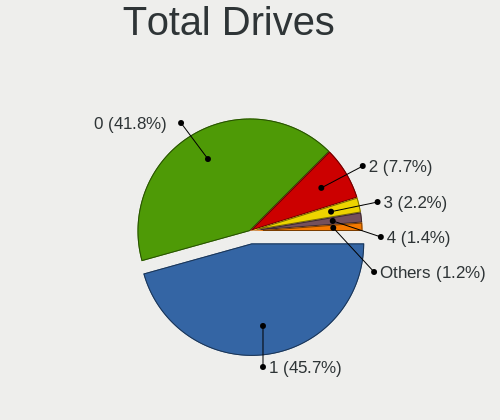
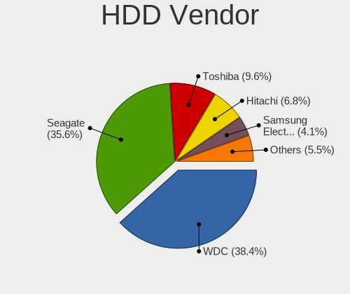
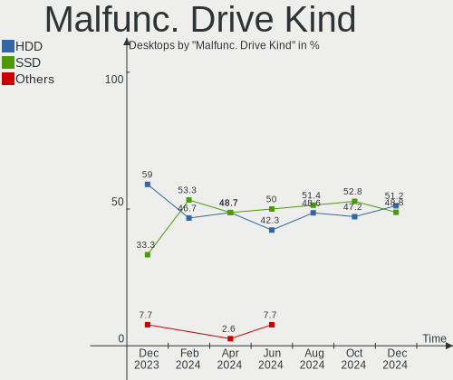
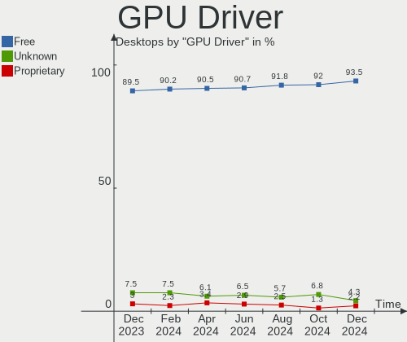
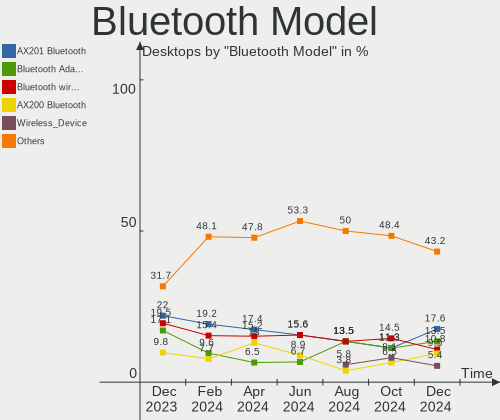
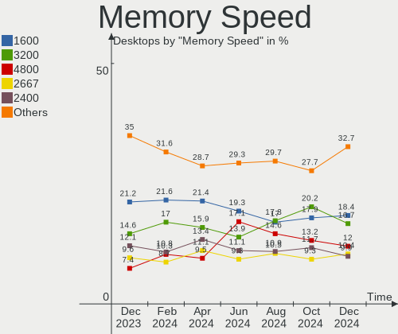

BSD - Hardware Trends (Desktops)
--------------------------------

A project to identify most popular hardware characteristics and track their change
over time based on data collected by BSD users at https://BSD-Hardware.info.

Anyone can contribute to this report by the [hw-probe](https://github.com/linuxhw/hw-probe/blob/master/INSTALL.BSD.md) tool:

    hw-probe -all -upload

This report is for one last month. Overall report since the beginning of time: [TestDays](https://github.com/bsdhw/TestDays)

Period: Aug, 2023.

Contents
--------

* [ System ](#system)
  - [ OS                       ](#os)
  - [ OS Family                ](#os-family)
  - [ Arch                     ](#arch)
  - [ DE                       ](#de)
  - [ Display Server           ](#display-server)
  - [ Display Manager          ](#display-manager)
  - [ OS Lang                  ](#os-lang)
  - [ Boot Mode                ](#boot-mode)
  - [ Filesystem               ](#filesystem)
  - [ Part. scheme             ](#part-scheme)

* [ Board ](#board)
  - [ Vendor                   ](#vendor)
  - [ Model                    ](#model)
  - [ Model Family             ](#model-family)
  - [ MFG Year                 ](#mfg-year)
  - [ Form Factor              ](#form-factor)
  - [ Coreboot                 ](#coreboot)
  - [ RAM Size                 ](#ram-size)
  - [ RAM Used                 ](#ram-used)
  - [ Total Drives             ](#total-drives)
  - [ Has CD-ROM               ](#has-cd-rom)
  - [ Has Ethernet             ](#has-ethernet)
  - [ Has WiFi                 ](#has-wifi)
  - [ Has Bluetooth            ](#has-bluetooth)

* [ Location ](#location)
  - [ Country                  ](#country)
  - [ City                     ](#city)

* [ Drives ](#drives)
  - [ Drive Vendor             ](#drive-vendor)
  - [ Drive Model              ](#drive-model)
  - [ HDD Vendor               ](#hdd-vendor)
  - [ SSD Vendor               ](#ssd-vendor)
  - [ Drive Kind               ](#drive-kind)
  - [ Drive Connector          ](#drive-connector)
  - [ Drive Size               ](#drive-size)
  - [ Space Total              ](#space-total)
  - [ Space Used               ](#space-used)
  - [ Malfunc. Drives          ](#malfunc-drives)
  - [ Malfunc. Drive Vendor    ](#malfunc-drive-vendor)
  - [ Malfunc. HDD Vendor      ](#malfunc-hdd-vendor)
  - [ Malfunc. Drive Kind      ](#malfunc-drive-kind)
  - [ Failed Drives            ](#failed-drives)
  - [ Failed Drive Vendor      ](#failed-drive-vendor)
  - [ Drive Status             ](#drive-status)

* [ Storage controller ](#storage-controller)
  - [ Storage Vendor           ](#storage-vendor)
  - [ Storage Model            ](#storage-model)
  - [ Storage Kind             ](#storage-kind)

* [ Processor ](#processor)
  - [ CPU Vendor               ](#cpu-vendor)
  - [ CPU Model                ](#cpu-model)
  - [ CPU Model Family         ](#cpu-model-family)
  - [ CPU Cores                ](#cpu-cores)
  - [ CPU Sockets              ](#cpu-sockets)
  - [ CPU Threads              ](#cpu-threads)
  - [ CPU Microarch            ](#cpu-microarch)

* [ Graphics ](#graphics)
  - [ GPU Vendor               ](#gpu-vendor)
  - [ GPU Model                ](#gpu-model)
  - [ GPU Combo                ](#gpu-combo)
  - [ GPU Driver               ](#gpu-driver)
  - [ GPU Memory               ](#gpu-memory)

* [ Monitor ](#monitor)
  - [ Monitor Vendor           ](#monitor-vendor)
  - [ Monitor Model            ](#monitor-model)
  - [ Monitor Resolution       ](#monitor-resolution)
  - [ Monitor Diagonal         ](#monitor-diagonal)
  - [ Monitor Width            ](#monitor-width)
  - [ Aspect Ratio             ](#aspect-ratio)
  - [ Monitor Area             ](#monitor-area)
  - [ Pixel Density            ](#pixel-density)
  - [ Multiple Monitors        ](#multiple-monitors)

* [ Network ](#network)
  - [ Net Controller Vendor    ](#net-controller-vendor)
  - [ Net Controller Model     ](#net-controller-model)
  - [ Wireless Vendor          ](#wireless-vendor)
  - [ Wireless Model           ](#wireless-model)
  - [ Ethernet Vendor          ](#ethernet-vendor)
  - [ Ethernet Model           ](#ethernet-model)
  - [ Net Controller Kind      ](#net-controller-kind)
  - [ Used Controller          ](#used-controller)
  - [ NICs                     ](#nics)
  - [ IPv6                     ](#ipv6)

* [ Bluetooth ](#bluetooth)
  - [ Bluetooth Vendor         ](#bluetooth-vendor)
  - [ Bluetooth Model          ](#bluetooth-model)

* [ Sound ](#sound)
  - [ Sound Vendor             ](#sound-vendor)
  - [ Sound Model              ](#sound-model)

* [ Memory ](#memory)
  - [ Memory Vendor            ](#memory-vendor)
  - [ Memory Model             ](#memory-model)
  - [ Memory Kind              ](#memory-kind)
  - [ Memory Form Factor       ](#memory-form-factor)
  - [ Memory Size              ](#memory-size)
  - [ Memory Speed             ](#memory-speed)

* [ Printers & scanners ](#printers--scanners)
  - [ Printer Vendor           ](#printer-vendor)
  - [ Printer Model            ](#printer-model)
  - [ Scanner Vendor           ](#scanner-vendor)
  - [ Scanner Model            ](#scanner-model)

* [ Camera ](#camera)
  - [ Camera Vendor            ](#camera-vendor)
  - [ Camera Model             ](#camera-model)

* [ Security ](#security)
  - [ Fingerprint Vendor       ](#fingerprint-vendor)
  - [ Fingerprint Model        ](#fingerprint-model)
  - [ Chipcard Vendor          ](#chipcard-vendor)
  - [ Chipcard Model           ](#chipcard-model)

* [ Unsupported ](#unsupported)
  - [ Unsupported Devices      ](#unsupported-devices)
  - [ Unsupported Device Types ](#unsupported-device-types)

System
------

OS
--

Installed operating systems

| Name                 | Desktops | Percent |
|----------------------|----------|---------|
| OPNsense 23.7.1      | 131      | 36.69%  |
| OPNsense 23.7        | 61       | 17.09%  |
| OPNsense 23.7.2      | 55       | 15.41%  |
| OPNsense 23.1.11     | 30       | 8.4%    |
| helloSystem 0.8.1    | 18       | 5.04%   |
| FreeBSD 13.2-p2      | 13       | 3.64%   |
| OPNsense 23.7.3      | 8        | 2.24%   |
| OpenBSD 7.3          | 5        | 1.4%    |
| FreeBSD 13.2         | 5        | 1.4%    |
| helloSystem 0.8.2    | 4        | 1.12%   |
| OPNsense 23.4.2      | 3        | 0.84%   |
| OPNsense 24.1        | 2        | 0.56%   |
| OPNsense 22.7.11     | 2        | 0.56%   |
| OPNsense 22.1.10     | 2        | 0.56%   |
| MidnightBSD 3.1.0    | 2        | 0.56%   |
| OPNsense 23.4.1      | 1        | 0.28%   |
| OPNsense 23.1.9      | 1        | 0.28%   |
| OPNsense 23.1        | 1        | 0.28%   |
| OPNsense 21.7.8      | 1        | 0.28%   |
| NomadBSD 20221130    | 1        | 0.28%   |
| NetBSD 9.3           | 1        | 0.28%   |
| MyBee 13.2           | 1        | 0.28%   |
| helloSystem 0.9.0    | 1        | 0.28%   |
| helloSystem 0.8.0    | 1        | 0.28%   |
| FreeBSD 15.0-CURRENT | 1        | 0.28%   |
| FreeBSD 14.0-CURRENT | 1        | 0.28%   |
| FreeBSD 14.0-ALPHA3  | 1        | 0.28%   |
| FreeBSD 13.2-STABLE  | 1        | 0.28%   |
| FreeBSD 13.2-p1      | 1        | 0.28%   |
| FreeBSD 13.1-p5      | 1        | 0.28%   |
| FreeBSD 13.0         | 1        | 0.28%   |

OS Family
---------

OS without a version

| Name        | Desktops | Percent |
|-------------|----------|---------|
| OPNsense    | 298      | 83.47%  |
| FreeBSD     | 25       | 7%      |
| helloSystem | 24       | 6.72%   |
| OpenBSD     | 5        | 1.4%    |
| MidnightBSD | 2        | 0.56%   |
| NomadBSD    | 1        | 0.28%   |
| NetBSD      | 1        | 0.28%   |
| MyBee       | 1        | 0.28%   |

Arch
----

OS architecture (x86_64, i586, etc.)

| Name  | Desktops | Percent |
|-------|----------|---------|
| amd64 | 352      | 98.6%   |
| arm64 | 3        | 0.84%   |
| i386  | 2        | 0.56%   |

DE
--

Desktop Environment

| Name         | Desktops | Percent |
|--------------|----------|---------|
| Console      | 316      | 88.52%  |
| helloDesktop | 29       | 8.12%   |
| XFCE         | 3        | 0.84%   |
| KDE5         | 3        | 0.84%   |
| MATE         | 2        | 0.56%   |
| X-Cinnamon   | 1        | 0.28%   |
| TWM          | 1        | 0.28%   |
| Openbox      | 1        | 0.28%   |
| GNOME        | 1        | 0.28%   |

Display Server
--------------

X11 or Wayland

| Name    | Desktops | Percent |
|---------|----------|---------|
| Console | 317      | 88.8%   |
| X11     | 39       | 10.92%  |
| Wayland | 1        | 0.28%   |

Display Manager
---------------

SDDM, LightDM, etc.

| Name    | Desktops | Percent |
|---------|----------|---------|
| Console | 325      | 91.04%  |
| SLiM    | 26       | 7.28%   |
| XDM     | 2        | 0.56%   |
| SDDM    | 2        | 0.56%   |
| GDM     | 2        | 0.56%   |

OS Lang
-------

Language

| Lang    | Desktops | Percent |
|---------|----------|---------|
| Unknown | 303      | 84.87%  |
| C       | 28       | 7.84%   |
| en_US   | 11       | 3.08%   |
| fr_FR   | 5        | 1.4%    |
| pt_BR   | 3        | 0.84%   |
| it_IT   | 2        | 0.56%   |
| ru_RU   | 1        | 0.28%   |
| es_ES   | 1        | 0.28%   |
| en_GB   | 1        | 0.28%   |
| en      | 1        | 0.28%   |
| de_DE   | 1        | 0.28%   |

Boot Mode
---------

EFI or BIOS

| Mode | Desktops | Percent |
|------|----------|---------|
| EFI  | 333      | 93.28%  |
| BIOS | 24       | 6.72%   |

Filesystem
----------

Type of filesystem

| Type   | Desktops | Percent |
|--------|----------|---------|
| Ufs    | 176      | 49.3%   |
| Zfs    | 162      | 45.38%  |
| Cd9660 | 14       | 3.92%   |
| Ffs    | 5        | 1.4%    |

Part. scheme
------------

Scheme of partitioning

| Type    | Desktops | Percent |
|---------|----------|---------|
| GPT     | 343      | 96.08%  |
| MBR     | 11       | 3.08%   |
| Unknown | 3        | 0.84%   |

Board
-----

Vendor
------

Motherboard manufacturer

| Name                       | Desktops | Percent |
|----------------------------|----------|---------|
| Unknown                    | 58       | 16.25%  |
| Dell                       | 25       | 7%      |
| ASUSTek Computer           | 25       | 7%      |
| Protectli                  | 24       | 6.72%   |
| Hewlett-Packard            | 21       | 5.88%   |
| Intel                      | 20       | 5.6%    |
| MSI                        | 18       | 5.04%   |
| Techvision                 | 17       | 4.76%   |
| ASRock                     | 17       | 4.76%   |
| Gigabyte Technology        | 16       | 4.48%   |
| PC Engines                 | 15       | 4.2%    |
| Supermicro                 | 13       | 3.64%   |
| Lenovo                     | 12       | 3.36%   |
| Fujitsu                    | 8        | 2.24%   |
| CncTion                    | 8        | 2.24%   |
| MW                         | 7        | 1.96%   |
| CWWK                       | 7        | 1.96%   |
| IceWhale Technology        | 5        | 1.4%    |
| AZW                        | 4        | 1.12%   |
| Acer                       | 4        | 1.12%   |
| Shuttle                    | 3        | 0.84%   |
| Hardkernel                 | 3        | 0.84%   |
| Cisco                      | 2        | 0.56%   |
| AMI                        | 2        | 0.56%   |
| Advantech                  | 2        | 0.56%   |
| ZOTAC                      | 1        | 0.28%   |
| YANYU                      | 1        | 0.28%   |
| WeiBu                      | 1        | 0.28%   |
| VIA Technologies           | 1        | 0.28%   |
| SolidRun                   | 1        | 0.28%   |
| ShenZhen MinWin Technology | 1        | 0.28%   |
| Premio                     | 1        | 0.28%   |
| PICO PC                    | 1        | 0.28%   |
| Pegatron                   | 1        | 0.28%   |
| Nvidia                     | 1        | 0.28%   |
| Lanner                     | 1        | 0.28%   |
| Inventec                   | 1        | 0.28%   |
| Intel BOX4A200             | 1        | 0.28%   |
| Infoblox                   | 1        | 0.28%   |
| IGEL Technology            | 1        | 0.28%   |

Model
-----

Motherboard model

| Name                              | Desktops | Percent |
|-----------------------------------|----------|---------|
| Unknown                           | 59       | 16.53%  |
| Techvision TVI7309X               | 17       | 4.76%   |
| PC Engines APU2                   | 8        | 2.24%   |
| Protectli FW4B                    | 7        | 1.96%   |
| MW GMLK-2_5G4L                    | 7        | 1.96%   |
| Intel Q3XXG4-P V1.0               | 7        | 1.96%   |
| Fujitsu FUTRO S920                | 6        | 1.68%   |
| Protectli VP2420                  | 5        | 1.4%    |
| Dell OptiPlex 7010                | 5        | 1.4%    |
| Protectli FW6                     | 4        | 1.12%   |
| PC Engines apu4                   | 4        | 1.12%   |
| Protectli VP2410                  | 3        | 0.84%   |
| Intel SKYBAY                      | 3        | 0.84%   |
| Intel Jasper Lake Client Platform | 3        | 0.84%   |
| IceWhale ZimaBoard 832 ZMB        | 3        | 0.84%   |
| Dell OptiPlex 7060                | 3        | 0.84%   |
| Dell OptiPlex 3060                | 3        | 0.84%   |
| CWWK CW-MBX-AD12                  | 3        | 0.84%   |
| CWWK CW-AD4L-N V1                 | 3        | 0.84%   |
| CncTion N5105-4L                  | 3        | 0.84%   |
| AZW EQ                            | 3        | 0.84%   |
| Supermicro SYS-E300-9D-8CN8TP     | 2        | 0.56%   |
| Supermicro SYS-5018A-FTN4         | 2        | 0.56%   |
| IceWhale ZimaBoard 432 ZMB        | 2        | 0.56%   |
| HP t620 PLUS Quad Core TC         | 2        | 0.56%   |
| Hardkernel ODROID-H3              | 2        | 0.56%   |
| Dell OptiPlex 3050                | 2        | 0.56%   |
| CncTion N6000-4L                  | 2        | 0.56%   |
| CncTion J4125-4L-I225             | 2        | 0.56%   |
| Cisco SALEEN                      | 2        | 0.56%   |
| YANYU R250                        | 1        | 0.28%   |
| WeiBu ADL-N                       | 1        | 0.28%   |
| VIA VT8623-8235                   | 1        | 0.28%   |
| Supermicro X9SCI/X9SCA            | 1        | 0.28%   |
| Supermicro X7SPA-H                | 1        | 0.28%   |
| Supermicro SYS-E302-9D            | 1        | 0.28%   |
| Supermicro SYS-6017R-TDF          | 1        | 0.28%   |
| Supermicro SYS-510D-4C-FN6P       | 1        | 0.28%   |
| Supermicro SYS-1019D-FHN13TP      | 1        | 0.28%   |
| Supermicro Pro546267              | 1        | 0.28%   |

Model Family
------------

Motherboard model prefix

| Name                          | Desktops | Percent |
|-------------------------------|----------|---------|
| Unknown                       | 59       | 16.53%  |
| Dell OptiPlex                 | 23       | 6.44%   |
| Techvision TVI7309X           | 17       | 4.76%   |
| PC Engines APU2               | 8        | 2.24%   |
| Lenovo ThinkCentre            | 8        | 2.24%   |
| HP EliteDesk                  | 8        | 2.24%   |
| ASUS PRIME                    | 8        | 2.24%   |
| Protectli FW4B                | 7        | 1.96%   |
| MW GMLK-2                     | 7        | 1.96%   |
| Intel Q3XXG4-P                | 7        | 1.96%   |
| Fujitsu FUTRO                 | 7        | 1.96%   |
| Protectli VP2420              | 5        | 1.4%    |
| IceWhale ZimaBoard            | 5        | 1.4%    |
| Protectli FW6                 | 4        | 1.12%   |
| PC Engines apu4               | 4        | 1.12%   |
| HP ProDesk                    | 4        | 1.12%   |
| HP Compaq                     | 4        | 1.12%   |
| Protectli VP2410              | 3        | 0.84%   |
| Intel SKYBAY                  | 3        | 0.84%   |
| Intel Jasper                  | 3        | 0.84%   |
| CWWK CW-MBX-AD12              | 3        | 0.84%   |
| CWWK CW-AD4L-N                | 3        | 0.84%   |
| CncTion N5105-4L              | 3        | 0.84%   |
| AZW EQ                        | 3        | 0.84%   |
| Acer Aspire                   | 3        | 0.84%   |
| Supermicro SYS-E300-9D-8CN8TP | 2        | 0.56%   |
| Supermicro SYS-5018A-FTN4     | 2        | 0.56%   |
| Lenovo IdeaCentre             | 2        | 0.56%   |
| HP t620                       | 2        | 0.56%   |
| Hardkernel ODROID-H3          | 2        | 0.56%   |
| CncTion N6000-4L              | 2        | 0.56%   |
| CncTion J4125-4L-I225         | 2        | 0.56%   |
| Cisco SALEEN                  | 2        | 0.56%   |
| ASUS TUF                      | 2        | 0.56%   |
| ASUS ROG                      | 2        | 0.56%   |
| YANYU R250                    | 1        | 0.28%   |
| WeiBu ADL-N                   | 1        | 0.28%   |
| VIA VT8623-8235               | 1        | 0.28%   |
| Supermicro X9SCI              | 1        | 0.28%   |
| Supermicro X7SPA-H            | 1        | 0.28%   |

MFG Year
--------

Motherboard manufacture year

| Year    | Desktops | Percent |
|---------|----------|---------|
| 2022    | 68       | 19.05%  |
| 2023    | 43       | 12.04%  |
| 2018    | 35       | 9.8%    |
| 2021    | 33       | 9.24%   |
| 2016    | 30       | 8.4%    |
| 2019    | 25       | 7%      |
| 2017    | 24       | 6.72%   |
| 2020    | 19       | 5.32%   |
| 2014    | 16       | 4.48%   |
| 2012    | 13       | 3.64%   |
| 2010    | 12       | 3.36%   |
| 2015    | 10       | 2.8%    |
| 2013    | 8        | 2.24%   |
| 2011    | 8        | 2.24%   |
| 2008    | 4        | 1.12%   |
| Unknown | 3        | 0.84%   |
| 2009    | 2        | 0.56%   |
| 2007    | 2        | 0.56%   |
| 2006    | 1        | 0.28%   |
| 2004    | 1        | 0.28%   |

Form Factor
-----------

Physical design of the computer

| Name    | Desktops | Percent |
|---------|----------|---------|
| Desktop | 357      | 100%    |

Coreboot
--------

Have coreboot on board

| Used | Desktops | Percent |
|------|----------|---------|
| No   | 338      | 94.68%  |
| Yes  | 19       | 5.32%   |

RAM Size
--------

Total RAM memory

| Size in GB      | Desktops | Percent |
|-----------------|----------|---------|
| 8.01-16.0       | 121      | 33.89%  |
| 16.01-24.0      | 102      | 28.57%  |
| 4.01-8.0        | 59       | 16.53%  |
| 32.01-64.0      | 39       | 10.92%  |
| 64.01-256.0     | 19       | 5.32%   |
| 2.01-3.0        | 11       | 3.08%   |
| 24.01-32.0      | 4        | 1.12%   |
| More than 256.0 | 1        | 0.28%   |
| 0.01-0.5        | 1        | 0.28%   |

RAM Used
--------

Used RAM memory

| Used GB  | Desktops | Percent |
|----------|----------|---------|
| 0.01-0.5 | 164      | 45.94%  |
| 0.51-1.0 | 124      | 34.73%  |
| 1.01-2.0 | 46       | 12.89%  |
| 2.01-3.0 | 12       | 3.36%   |
| 3.01-4.0 | 5        | 1.4%    |
| 4.01-8.0 | 3        | 0.84%   |
| Unknown  | 2        | 0.56%   |
| 0        | 1        | 0.28%   |

Total Drives
------------

Number of drives on board

| Drives | Desktops | Percent |
|--------|----------|---------|
| 1      | 261      | 73.11%  |
| 0      | 37       | 10.36%  |
| 2      | 33       | 9.24%   |
| 3      | 11       | 3.08%   |
| 4      | 5        | 1.4%    |
| 5      | 3        | 0.84%   |
| 13     | 2        | 0.56%   |
| 8      | 2        | 0.56%   |
| 24     | 1        | 0.28%   |
| 7      | 1        | 0.28%   |
| 6      | 1        | 0.28%   |

Has CD-ROM
----------

Has CD-ROM on board

| Presented | Desktops | Percent |
|-----------|----------|---------|
| No        | 309      | 86.55%  |
| Yes       | 48       | 13.45%  |

Has Ethernet
------------

Has Ethernet on board

| Presented | Desktops | Percent |
|-----------|----------|---------|
| Yes       | 354      | 99.16%  |
| No        | 3        | 0.84%   |

Has WiFi
--------

Has WiFi module

| Presented | Desktops | Percent |
|-----------|----------|---------|
| No        | 293      | 82.07%  |
| Yes       | 64       | 17.93%  |

Has Bluetooth
-------------

Has Bluetooth module

| Presented | Desktops | Percent |
|-----------|----------|---------|
| No        | 319      | 89.36%  |
| Yes       | 38       | 10.64%  |

Location
--------

Country
-------

Geographic location (country)

| Country      | Desktops | Percent |
|--------------|----------|---------|
| USA          | 119      | 33.33%  |
| Germany      | 51       | 14.29%  |
| UK           | 19       | 5.32%   |
| Russia       | 17       | 4.76%   |
| Canada       | 16       | 4.48%   |
| France       | 10       | 2.8%    |
| Netherlands  | 8        | 2.24%   |
| Italy        | 8        | 2.24%   |
| Australia    | 8        | 2.24%   |
| India        | 7        | 1.96%   |
| Poland       | 6        | 1.68%   |
| Brazil       | 6        | 1.68%   |
| Austria      | 6        | 1.68%   |
| Switzerland  | 5        | 1.4%    |
| Belgium      | 5        | 1.4%    |
| Singapore    | 4        | 1.12%   |
| Hungary      | 4        | 1.12%   |
| Denmark      | 4        | 1.12%   |
| China        | 4        | 1.12%   |
| Sweden       | 3        | 0.84%   |
| Norway       | 3        | 0.84%   |
| Japan        | 3        | 0.84%   |
| Czechia      | 3        | 0.84%   |
| Turkey       | 2        | 0.56%   |
| Spain        | 2        | 0.56%   |
| South Korea  | 2        | 0.56%   |
| South Africa | 2        | 0.56%   |
| Romania      | 2        | 0.56%   |
| Peru         | 2        | 0.56%   |
| Paraguay     | 2        | 0.56%   |
| Israel       | 2        | 0.56%   |
| Hong Kong    | 2        | 0.56%   |
| Finland      | 2        | 0.56%   |
| Argentina    | 2        | 0.56%   |
| Vietnam      | 1        | 0.28%   |
| Thailand     | 1        | 0.28%   |
| Taiwan       | 1        | 0.28%   |
| Slovakia     | 1        | 0.28%   |
| Serbia       | 1        | 0.28%   |
| Qatar        | 1        | 0.28%   |

City
----

Geographic location (city)

| City            | Desktops | Percent |
|-----------------|----------|---------|
| St Petersburg   | 9        | 2.52%   |
| Hamburg         | 6        | 1.68%   |
| Singapore       | 4        | 1.12%   |
| London          | 4        | 1.12%   |
| Vancouver       | 3        | 0.84%   |
| Seattle         | 3        | 0.84%   |
| Palo Alto       | 3        | 0.84%   |
| New York        | 3        | 0.84%   |
| Chennai         | 3        | 0.84%   |
| Brisbane        | 3        | 0.84%   |
| Akron           | 3        | 0.84%   |
| Zurich          | 2        | 0.56%   |
| Ypsilanti       | 2        | 0.56%   |
| Woking          | 2        | 0.56%   |
| Winnipeg        | 2        | 0.56%   |
| Vienna          | 2        | 0.56%   |
| Victoria        | 2        | 0.56%   |
| Shenzhen        | 2        | 0.56%   |
| Salem           | 2        | 0.56%   |
| Redmond         | 2        | 0.56%   |
| Paris           | 2        | 0.56%   |
| Ogden           | 2        | 0.56%   |
| North Vancouver | 2        | 0.56%   |
| Munich          | 2        | 0.56%   |
| Mountain View   | 2        | 0.56%   |
| Moscow          | 2        | 0.56%   |
| Lima            | 2        | 0.56%   |
| Lichtaart       | 2        | 0.56%   |
| Helsinki        | 2        | 0.56%   |
| Frankenfeld     | 2        | 0.56%   |
| Coventry        | 2        | 0.56%   |
| Copenhagen      | 2        | 0.56%   |
| Cherepovets     | 2        | 0.56%   |
| Champlin        | 2        | 0.56%   |
| Bucharest       | 2        | 0.56%   |
| Berlin          | 2        | 0.56%   |
| Bengaluru       | 2        | 0.56%   |
| Arvada          | 2        | 0.56%   |
| Amsterdam       | 2        | 0.56%   |
| Zug             | 1        | 0.28%   |

Drives
------

Drive Vendor
------------

Hard drive vendors

| Vendor              | Desktops | Drives | Percent |
|---------------------|----------|--------|---------|
| Samsung Electronics | 58       | 77     | 15.1%   |
| WDC                 | 40       | 68     | 10.42%  |
| Kingston            | 33       | 34     | 8.59%   |
| Crucial             | 29       | 33     | 7.55%   |
| Seagate             | 26       | 46     | 6.77%   |
| Transcend           | 18       | 18     | 4.69%   |
| Intel               | 18       | 21     | 4.69%   |
| Hoodisk             | 15       | 15     | 3.91%   |
| China               | 15       | 15     | 3.91%   |
| SanDisk             | 10       | 10     | 2.6%    |
| Micron Technology   | 9        | 9      | 2.34%   |
| Toshiba             | 7        | 29     | 1.82%   |
| SPCC                | 7        | 7      | 1.82%   |
| Fanxiang            | 6        | 6      | 1.56%   |
| Team                | 5        | 6      | 1.3%    |
| Silicon Motion      | 5        | 5      | 1.3%    |
| Protectli           | 5        | 5      | 1.3%    |
| Innodisk            | 5        | 5      | 1.3%    |
| SK hynix            | 4        | 4      | 1.04%   |
| PNY                 | 4        | 4      | 1.04%   |
| Patriot             | 4        | 6      | 1.04%   |
| Hitachi             | 3        | 3      | 0.78%   |
| BR                  | 3        | 3      | 0.78%   |
| A-DATA Technology   | 3        | 3      | 0.78%   |
| Plextor             | 2        | 2      | 0.52%   |
| Maxtor              | 2        | 2      | 0.52%   |
| KIOXIA              | 2        | 2      | 0.52%   |
| KingSpec            | 2        | 2      | 0.52%   |
| JWX                 | 2        | 2      | 0.52%   |
| Intenso             | 2        | 2      | 0.52%   |
| Hewlett-Packard     | 2        | 3      | 0.52%   |
| Gigabyte Technology | 2        | 2      | 0.52%   |
| FORESEE             | 2        | 2      | 0.52%   |
| Corsair             | 2        | 2      | 0.52%   |
| BORY                | 2        | 2      | 0.52%   |
| Apacer              | 2        | 2      | 0.52%   |
| AMD                 | 2        | 2      | 0.52%   |
| Wicgtyp             | 1        | 1      | 0.26%   |
| WALRAM              | 1        | 1      | 0.26%   |
| VICKTER             | 1        | 1      | 0.26%   |

Drive Model
-----------

Hard drive models

| Model                           | Desktops | Percent |
|---------------------------------|----------|---------|
| Transcend TS128GMSA230S 128GB   | 6        | 1.41%   |
| Hoodisk SSD 64GB                | 6        | 1.41%   |
| Kingston SKC600MS256G 256GB     | 5        | 1.17%   |
| Kingston SA400S37240G 240GB     | 5        | 1.17%   |
| Transcend TS256GMSA230S 256GB   | 4        | 0.94%   |
| Samsung SSD 870 EVO 250GB       | 4        | 0.94%   |
| Samsung SSD 860 EVO 500GB       | 4        | 0.94%   |
| Samsung SSD 850 EVO 500GB       | 4        | 0.94%   |
| Samsung SSD 850 EVO 250GB       | 4        | 0.94%   |
| Hoodisk SSD 128GB               | 4        | 0.94%   |
| Crucial CT500MX500SSD1 500GB    | 4        | 0.94%   |
| Crucial CT240BX500SSD1 240GB    | 4        | 0.94%   |
| SPCC Solid State Disk 128GB     | 3        | 0.7%    |
| Samsung SSD 860 EVO mSATA 250GB | 3        | 0.7%    |
| Samsung SSD 860 EVO 250GB       | 3        | 0.7%    |
| PNY CS900 120GB SSD             | 3        | 0.7%    |
| Kingston SUV500MS120G 120GB     | 3        | 0.7%    |
| Kingston SNV2S250G 250GB        | 3        | 0.7%    |
| Hoodisk SSD 32GB                | 3        | 0.7%    |
| Fanxiang S501 128GB             | 3        | 0.7%    |
| WDC WDS100T3X0C-00SJG0 1TB      | 2        | 0.47%   |
| WDC WD40EFRX-68N32N0 4TB        | 2        | 0.47%   |
| Toshiba MQ01ABD050 500GB        | 2        | 0.47%   |
| Team TM8FP6512G 512GB           | 2        | 0.47%   |
| SPCC M.2 PCIe SSD 256GB         | 2        | 0.47%   |
| Seagate ST8000VN0022-2EL112 8TB | 2        | 0.47%   |
| Seagate ST4000DM000-1F2168 4TB  | 2        | 0.47%   |
| Seagate ST2000DM006-2DM164 2TB  | 2        | 0.47%   |
| Seagate ST1000DM010-2EP102 1TB  | 2        | 0.47%   |
| Samsung SSD 980 500GB           | 2        | 0.47%   |
| Samsung SSD 980 250GB           | 2        | 0.47%   |
| Samsung SSD 970 PRO 512GB       | 2        | 0.47%   |
| Samsung SSD 970 EVO Plus 500GB  | 2        | 0.47%   |
| Samsung SSD 870 EVO 500GB       | 2        | 0.47%   |
| Samsung SSD 870 EVO 1TB         | 2        | 0.47%   |
| Samsung SSD 840 EVO 250GB       | 2        | 0.47%   |
| Protectli 240GB M.2             | 2        | 0.47%   |
| Kingston SUV500MS240G 240GB     | 2        | 0.47%   |
| Kingston SNV2S500G 500GB        | 2        | 0.47%   |
| Intel SSDSC2KG480G8 480GB       | 2        | 0.47%   |

HDD Vendor
----------

Hard disk drive vendors

| Vendor  | Desktops | Drives | Percent |
|---------|----------|--------|---------|
| WDC     | 27       | 53     | 42.19%  |
| Seagate | 25       | 45     | 39.06%  |
| Toshiba | 5        | 27     | 7.81%   |
| Hitachi | 3        | 3      | 4.69%   |
| Maxtor  | 2        | 2      | 3.13%   |
| HGST    | 1        | 1      | 1.56%   |
| Fujitsu | 1        | 1      | 1.56%   |

SSD Vendor
----------

Solid state drive vendors

| Vendor              | Desktops | Drives | Percent |
|---------------------|----------|--------|---------|
| Samsung Electronics | 42       | 58     | 18.34%  |
| Kingston            | 26       | 27     | 11.35%  |
| Crucial             | 21       | 25     | 9.17%   |
| Transcend           | 17       | 17     | 7.42%   |
| Hoodisk             | 15       | 15     | 6.55%   |
| China               | 15       | 15     | 6.55%   |
| Intel               | 11       | 13     | 4.8%    |
| SanDisk             | 10       | 10     | 4.37%   |
| Micron Technology   | 6        | 6      | 2.62%   |
| Protectli           | 5        | 5      | 2.18%   |
| Innodisk            | 5        | 5      | 2.18%   |
| SPCC                | 4        | 4      | 1.75%   |
| WDC                 | 3        | 3      | 1.31%   |
| PNY                 | 3        | 3      | 1.31%   |
| Plextor             | 2        | 2      | 0.87%   |
| Patriot             | 2        | 4      | 0.87%   |
| KingSpec            | 2        | 2      | 0.87%   |
| JWX                 | 2        | 2      | 0.87%   |
| Intenso             | 2        | 2      | 0.87%   |
| FORESEE             | 2        | 2      | 0.87%   |
| BORY                | 2        | 2      | 0.87%   |
| Apacer              | 2        | 2      | 0.87%   |
| AMD                 | 2        | 2      | 0.87%   |
| A-DATA Technology   | 2        | 2      | 0.87%   |
| Wicgtyp             | 1        | 1      | 0.44%   |
| WALRAM              | 1        | 1      | 0.44%   |
| VICKTER             | 1        | 1      | 0.44%   |
| Verbatim            | 1        | 1      | 0.44%   |
| Vaseky              | 1        | 1      | 0.44%   |
| V-GeN               | 1        | 1      | 0.44%   |
| Toshiba             | 1        | 1      | 0.44%   |
| Team                | 1        | 1      | 0.44%   |
| TCSUNBOW            | 1        | 1      | 0.44%   |
| SK hynix            | 1        | 1      | 0.44%   |
| ShiJi               | 1        | 1      | 0.44%   |
| Seagate             | 1        | 1      | 0.44%   |
| Qunion              | 1        | 1      | 0.44%   |
| Pccooler            | 1        | 1      | 0.44%   |
| OCZ                 | 1        | 1      | 0.44%   |
| LITEON              | 1        | 1      | 0.44%   |

Drive Kind
----------

HDD or SSD

| Kind | Desktops | Drives | Percent |
|------|----------|--------|---------|
| SSD  | 214      | 255    | 59.44%  |
| NVMe | 93       | 98     | 25.83%  |
| HDD  | 53       | 132    | 14.72%  |

Drive Connector
---------------

SATA, SAS, NVMe, etc.

| Type | Desktops | Drives | Percent |
|------|----------|--------|---------|
| SATA | 249      | 387    | 72.81%  |
| NVMe | 93       | 98     | 27.19%  |

Drive Size
----------

Size of hard drive

| Size in TB | Desktops | Drives | Percent |
|------------|----------|--------|---------|
| 0.01-0.5   | 217      | 248    | 76.95%  |
| 0.51-1.0   | 31       | 44     | 10.99%  |
| 1.01-2.0   | 14       | 24     | 4.96%   |
| 3.01-4.0   | 8        | 26     | 2.84%   |
| 4.01-10.0  | 7        | 31     | 2.48%   |
| 2.01-3.0   | 3        | 11     | 1.06%   |
| 10.01-20.0 | 2        | 3      | 0.71%   |

Space Total
-----------

Amount of disk space available on the file system

| Size in GB     | Desktops | Percent |
|----------------|----------|---------|
| 101-250        | 167      | 46.78%  |
| 251-500        | 67       | 18.77%  |
| 1-20           | 33       | 9.24%   |
| 501-1000       | 30       | 8.4%    |
| 51-100         | 28       | 7.84%   |
| 21-50          | 22       | 6.16%   |
| 1001-2000      | 6        | 1.68%   |
| More than 3000 | 3        | 0.84%   |
| 2001-3000      | 1        | 0.28%   |

Space Used
----------

Amount of used disk space

| Used GB   | Desktops | Percent |
|-----------|----------|---------|
| 1-20      | 326      | 91.32%  |
| 21-50     | 21       | 5.88%   |
| 51-100    | 4        | 1.12%   |
| 251-500   | 2        | 0.56%   |
| 501-1000  | 2        | 0.56%   |
| 101-250   | 1        | 0.28%   |
| 1001-2000 | 1        | 0.28%   |

Malfunc. Drives
---------------

Drive models with a malfunction

| Model                                 | Desktops | Drives | Percent |
|---------------------------------------|----------|--------|---------|
| Intel SSDSC2BW480H6 480GB             | 2        | 2      | 4.88%   |
| WDC WD5000AAKX-60U6AA0 500GB          | 1        | 1      | 2.44%   |
| WDC WD4500HLHX-01JJPV0 450GB          | 1        | 1      | 2.44%   |
| WDC WD3000FYYZ-05UL1B0 3TB            | 1        | 1      | 2.44%   |
| WDC WD20EARS-00MVWB0 2TB              | 1        | 1      | 2.44%   |
| WDC WD15EARS-00Z5B1 1.5TB             | 1        | 1      | 2.44%   |
| WDC WD15EARS-00MVWB0 1.5TB            | 1        | 1      | 2.44%   |
| WDC WD10EZEX-60M2NA0 1TB              | 1        | 1      | 2.44%   |
| WDC WD10EADS-11M2B2 1TB               | 1        | 1      | 2.44%   |
| V-GeN V-GEN08AS19FS120IT 120GB        | 1        | 1      | 2.44%   |
| Toshiba MQ01ABD050 500GB              | 1        | 1      | 2.44%   |
| Toshiba HDWE140 4TB                   | 1        | 3      | 2.44%   |
| SPCC M.2 PCIe SSD 256GB               | 1        | 1      | 2.44%   |
| SK hynix HFS064G3AMNB-2220A 64GB      | 1        | 1      | 2.44%   |
| Seagate ST9500420AS 500GB             | 1        | 1      | 2.44%   |
| Seagate ST9100824AS 100GB             | 1        | 1      | 2.44%   |
| Seagate ST8000AS0002-1NA17Z 8TB       | 1        | 1      | 2.44%   |
| Seagate ST5000DM000-1FK178 5TB        | 1        | 1      | 2.44%   |
| Seagate ST3250312AS 250GB             | 1        | 1      | 2.44%   |
| Seagate ST31000524AS 1TB              | 1        | 1      | 2.44%   |
| SanDisk SSD U100 64GB                 | 1        | 1      | 2.44%   |
| SanDisk SSD PLUS 240GB                | 1        | 1      | 2.44%   |
| SanDisk SD8TB8U-256G-1006 256GB       | 1        | 1      | 2.44%   |
| Samsung Electronics SSD 870 EVO 500GB | 1        | 1      | 2.44%   |
| Samsung Electronics SSD 870 EVO 250GB | 1        | 1      | 2.44%   |
| Plextor PX-128M5Pro 128GB             | 1        | 1      | 2.44%   |
| Maxtor STM380215AS 80GB               | 1        | 1      | 2.44%   |
| Maxtor 6Y120M0 122GB                  | 1        | 1      | 2.44%   |
| Kingston SV300S37A60G 64GB            | 1        | 1      | 2.44%   |
| Kingston SUV500MS-256G                | 1        | 1      | 2.44%   |
| Kingston SNS4151S316GD 16GB           | 1        | 1      | 2.44%   |
| Kingston SHFS37A120G 120GB            | 1        | 1      | 2.44%   |
| Kingston SA400S37240G 240GB           | 1        | 1      | 2.44%   |
| Intel SSDSC2CW120A3 120GB             | 1        | 1      | 2.44%   |
| Hitachi HDS721680PLA380 80GB          | 1        | 1      | 2.44%   |
| HGST HTS541010A7E630 1TB              | 1        | 1      | 2.44%   |
| Crucial CT512M550SSD1 512GB           | 1        | 2      | 2.44%   |
| Crucial CT480BX500SSD1 480GB          | 1        | 1      | 2.44%   |
| Crucial CT2000MX500SSD1 2TB           | 1        | 1      | 2.44%   |
| Crucial CT120M500SSD1 120GB           | 1        | 1      | 2.44%   |

Malfunc. Drive Vendor
---------------------

Vendors of faulty drives

| Vendor              | Desktops | Drives | Percent |
|---------------------|----------|--------|---------|
| Seagate             | 6        | 6      | 15.79%  |
| WDC                 | 5        | 8      | 13.16%  |
| Kingston            | 5        | 5      | 13.16%  |
| Crucial             | 4        | 5      | 10.53%  |
| SanDisk             | 3        | 3      | 7.89%   |
| Intel               | 3        | 3      | 7.89%   |
| Toshiba             | 2        | 4      | 5.26%   |
| Samsung Electronics | 2        | 2      | 5.26%   |
| Maxtor              | 2        | 2      | 5.26%   |
| V-GeN               | 1        | 1      | 2.63%   |
| SPCC                | 1        | 1      | 2.63%   |
| SK hynix            | 1        | 1      | 2.63%   |
| Plextor             | 1        | 1      | 2.63%   |
| Hitachi             | 1        | 1      | 2.63%   |
| HGST                | 1        | 1      | 2.63%   |

Malfunc. HDD Vendor
-------------------

Vendors of faulty HDD drives

| Vendor  | Desktops | Drives | Percent |
|---------|----------|--------|---------|
| Seagate | 6        | 6      | 35.29%  |
| WDC     | 5        | 8      | 29.41%  |
| Toshiba | 2        | 4      | 11.76%  |
| Maxtor  | 2        | 2      | 11.76%  |
| Hitachi | 1        | 1      | 5.88%   |
| HGST    | 1        | 1      | 5.88%   |

Malfunc. Drive Kind
-------------------

Kinds of faulty drives

| Kind | Desktops | Drives | Percent |
|------|----------|--------|---------|
| SSD  | 20       | 21     | 55.56%  |
| HDD  | 15       | 22     | 41.67%  |
| NVMe | 1        | 1      | 2.78%   |

Failed Drives
-------------

Failed drive models

Zero info for selected period =(

Failed Drive Vendor
-------------------

Failed drive vendors

Zero info for selected period =(

Drive Status
------------

Number of failed and malfunc. drives

| Status   | Desktops | Drives | Percent |
|----------|----------|--------|---------|
| Works    | 293      | 438    | 88.25%  |
| Malfunc  | 36       | 44     | 10.84%  |
| Detected | 3        | 3      | 0.9%    |

Storage controller
------------------

Storage Vendor
--------------

Storage controller vendors

| Vendor                                  | Desktops | Percent |
|-----------------------------------------|----------|---------|
| Intel                                   | 267      | 57.17%  |
| AMD                                     | 68       | 14.56%  |
| Samsung Electronics                     | 21       | 4.5%    |
| SanDisk                                 | 19       | 4.07%   |
| Silicon Motion                          | 16       | 3.43%   |
| MAXIO Technology (Hangzhou)             | 9        | 1.93%   |
| Phison Electronics                      | 8        | 1.71%   |
| Micron/Crucial Technology               | 8        | 1.71%   |
| ASMedia Technology                      | 8        | 1.71%   |
| Kingston Technology Company             | 7        | 1.5%    |
| Broadcom / LSI                          | 5        | 1.07%   |
| SK hynix                                | 4        | 0.86%   |
| Hosin Global Electronics                | 4        | 0.86%   |
| Realtek Semiconductor                   | 3        | 0.64%   |
| Micron Technology                       | 3        | 0.64%   |
| Marvell Technology Group                | 3        | 0.64%   |
| JMicron Technology                      | 3        | 0.64%   |
| VIA Technologies                        | 2        | 0.43%   |
| Toshiba                                 | 2        | 0.43%   |
| Nvidia                                  | 2        | 0.43%   |
| Solidigm                                | 1        | 0.21%   |
| Shenzhen Unionmemory Information System | 1        | 0.21%   |
| KIOXIA                                  | 1        | 0.21%   |
| INNOGRIT                                | 1        | 0.21%   |
| Chelsio Communications                  | 1        | 0.21%   |

Storage Model
-------------

Storage controller models

| Model                                                                            | Desktops | Percent |
|----------------------------------------------------------------------------------|----------|---------|
| AMD FCH SATA Controller [AHCI mode]                                              | 43       | 8.35%   |
| Intel Jasper Lake SATA AHCI Controller                                           | 36       | 6.99%   |
| Intel Celeron/Pentium Silver Processor SATA Controller                           | 21       | 4.08%   |
| Intel Sunrise Point-LP SATA Controller [AHCI mode]                               | 18       | 3.5%    |
| Intel Q170/Q150/B150/H170/H110/Z170/CM236 Chipset SATA Controller [AHCI Mode]    | 17       | 3.3%    |
| Intel 8 Series/C220 Series Chipset Family 6-port SATA Controller 1 [AHCI mode]   | 17       | 3.3%    |
| Silicon Motion SM2263EN/SM2263XT (DRAM-less) NVMe SSD Controllers                | 15       | 2.91%   |
| Intel Cannon Lake PCH SATA AHCI Controller                                       | 15       | 2.91%   |
| Intel Atom/Celeron/Pentium Processor x5-E8000/J3xxx/N3xxx Series SATA Controller | 13       | 2.52%   |
| Unknown                                                                          | 13       | 2.52%   |
| Intel 200 Series PCH SATA controller [AHCI mode]                                 | 11       | 2.14%   |
| Intel Atom Processor E3800 Series SATA AHCI Controller                           | 10       | 1.94%   |
| Samsung NVMe SSD Controller SM981/PM981/PM983                                    | 9        | 1.75%   |
| MAXIO (Hangzhou) NVMe SSD Controller MAP1202                                     | 9        | 1.75%   |
| Intel 6 Series/C200 Series Chipset Family 6 port Desktop SATA AHCI Controller    | 9        | 1.75%   |
| AMD 500 Series Chipset SATA Controller                                           | 9        | 1.75%   |
| Intel Elkhart Lake SATA AHCI                                                     | 8        | 1.55%   |
| Samsung NVMe SSD Controller 980                                                  | 7        | 1.36%   |
| ASMedia ASM1062 Serial ATA Controller                                            | 7        | 1.36%   |
| SanDisk WD Blue SN570 NVMe SSD 1TB                                               | 6        | 1.17%   |
| Phison PS5013 E13 NVMe Controller                                                | 6        | 1.17%   |
| Intel Celeron N3350/Pentium N4200/Atom E3900 Series SATA AHCI Controller         | 6        | 1.17%   |
| Intel Alder Lake-S PCH SATA Controller [AHCI Mode]                               | 6        | 1.17%   |
| Intel 7 Series/C210 Series Chipset Family 6-port SATA Controller [AHCI mode]     | 6        | 1.17%   |
| AMD SB7x0/SB8x0/SB9x0 SATA Controller [AHCI mode]                                | 6        | 1.17%   |
| AMD SB7x0/SB8x0/SB9x0 IDE Controller                                             | 6        | 1.17%   |
| Micron/Crucial P2 [Nick P2] / P3 / P3 Plus NVMe PCIe SSD (DRAM-less)             | 5        | 0.97%   |
| Intel Comet Lake SATA AHCI Controller                                            | 5        | 0.97%   |
| AMD SB7x0/SB8x0/SB9x0 SATA Controller [IDE mode]                                 | 5        | 0.97%   |
| AMD 400 Series Chipset SATA Controller                                           | 5        | 0.97%   |
| SanDisk WD Black SN750 / PC SN730 NVMe SSD                                       | 4        | 0.78%   |
| Kingston Company unknown                                                         | 4        | 0.78%   |
| Intel Wildcat Point-LP SATA Controller [AHCI Mode]                               | 4        | 0.78%   |
| Intel NM10/ICH7 Family SATA Controller [IDE mode]                                | 4        | 0.78%   |
| Intel NM10/ICH7 Family SATA Controller [AHCI mode]                               | 4        | 0.78%   |
| Intel C620 Series Chipset Family SSATA Controller [AHCI mode]                    | 4        | 0.78%   |
| Intel Alder Lake-P SATA AHCI Controller                                          | 4        | 0.78%   |
| Intel 82801G (ICH7 Family) IDE Controller                                        | 4        | 0.78%   |
| Intel 8 Series SATA Controller 1 [AHCI mode]                                     | 4        | 0.78%   |
| Intel 500 Series Chipset Family SATA AHCI Controller                             | 4        | 0.78%   |

Storage Kind
------------

Kind of storage controller (IDE, SATA, NVMe, SAS, ...)

| Kind | Desktops | Percent |
|------|----------|---------|
| SATA | 310      | 66.24%  |
| NVMe | 111      | 23.72%  |
| IDE  | 32       | 6.84%   |
| RAID | 7        | 1.5%    |
| SAS  | 6        | 1.28%   |
| SCSI | 2        | 0.43%   |

Processor
---------

CPU Vendor
----------

Processor vendors

| Vendor | Desktops | Percent |
|--------|----------|---------|
| Intel  | 283      | 79.27%  |
| AMD    | 70       | 19.61%  |
| ARM    | 2        | 0.56%   |
| VIA    | 1        | 0.28%   |
| NXP    | 1        | 0.28%   |

CPU Model
---------

Processor models

| Model                                     | Desktops | Percent |
|-------------------------------------------|----------|---------|
| Intel Celeron N5105 @ 2.00GHz             | 29       | 8.12%   |
| Intel Celeron J4125 CPU @ 2.00GHz         | 19       | 5.32%   |
| Intel N100                                | 14       | 3.92%   |
| AMD GX-412TC SOC                          | 13       | 3.64%   |
| Intel Celeron CPU J3160 @ 1.60GHz         | 8        | 2.24%   |
| Intel Pentium Silver N6005 @ 2.00GHz      | 6        | 1.68%   |
| Intel Core i5-8500 CPU @ 3.00GHz          | 6        | 1.68%   |
| Intel Core i5-6500 CPU @ 3.20GHz          | 6        | 1.68%   |
| Intel Core i5-6600 CPU @ 3.30GHz          | 5        | 1.4%    |
| Intel Celeron J6412 @ 2.00GHz             | 5        | 1.4%    |
| Intel Celeron CPU N3450 @ 1.10GHz         | 5        | 1.4%    |
| Intel Core i7-8550U CPU @ 1.80GHz         | 4        | 1.12%   |
| Intel Core i5-4590T CPU @ 2.00GHz         | 4        | 1.12%   |
| Intel Core i5-3570 CPU @ 3.40GHz          | 4        | 1.12%   |
| AMD Ryzen 7 5700G with Radeon Graphics    | 4        | 1.12%   |
| AMD GX-222GC SOC with Radeon R5E Graphics | 4        | 1.12%   |
| Intel Xeon D-2146NT CPU @ 2.30GHz         | 3        | 0.84%   |
| Intel Core i7-7500U CPU @ 2.70GHz         | 3        | 0.84%   |
| Intel Core i5-9500 CPU @ 3.00GHz          | 3        | 0.84%   |
| Intel Core i5-6200U CPU @ 2.30GHz         | 3        | 0.84%   |
| Intel Core i5-3470 CPU @ 3.20GHz          | 3        | 0.84%   |
| Intel Core i3-N305                        | 3        | 0.84%   |
| Intel Core i3-10100 CPU @ 3.60GHz         | 3        | 0.84%   |
| Intel Celeron N5100 @ 1.10GHz             | 3        | 0.84%   |
| Intel Celeron J6413 @ 1.80GHz             | 3        | 0.84%   |
| Intel Celeron CPU J1900 @ 1.99GHz         | 3        | 0.84%   |
| Intel Atom CPU E3845 @ 1.91GHz            | 3        | 0.84%   |
| Intel Atom CPU D525 @ 1.80GHz             | 3        | 0.84%   |
| Intel Atom CPU D510 @ 1.66GHz             | 3        | 0.84%   |
| Intel Pentium Silver N6000 @ 1.10GHz      | 2        | 0.56%   |
| Intel Pentium Gold 8505                   | 2        | 0.56%   |
| Intel Pentium Dual-Core CPU E5            | 2        | 0.56%   |
| Intel Pentium CPU G3220 @ 3.00GHz         | 2        | 0.56%   |
| Intel Core i7-6700 CPU @ 3.40GHz          | 2        | 0.56%   |
| Intel Core i5-8500T CPU @ 2.10GHz         | 2        | 0.56%   |
| Intel Core i5-7500 CPU @ 3.40GHz          | 2        | 0.56%   |
| Intel Core i5-7400 CPU @ 3.00GHz          | 2        | 0.56%   |
| Intel Core i5-6500T CPU @ 2.50GHz         | 2        | 0.56%   |
| Intel Core i5-5200U CPU @ 2.20GHz         | 2        | 0.56%   |
| Intel Core i5-4590 CPU @ 3.30GHz          | 2        | 0.56%   |

CPU Model Family
----------------

Processor model prefix

| Model                   | Desktops | Percent |
|-------------------------|----------|---------|
| Intel Celeron           | 91       | 25.49%  |
| Intel Core i5           | 68       | 19.05%  |
| Other                   | 30       | 8.4%    |
| AMD GX                  | 22       | 6.16%   |
| Intel Core i7           | 21       | 5.88%   |
| Intel Core i3           | 20       | 5.6%    |
| Intel Xeon              | 15       | 4.2%    |
| Intel Atom              | 14       | 3.92%   |
| AMD Ryzen 7             | 11       | 3.08%   |
| Intel Pentium Silver    | 8        | 2.24%   |
| Intel Pentium           | 8        | 2.24%   |
| AMD Ryzen 5             | 8        | 2.24%   |
| Intel Core 2 Duo        | 4        | 1.12%   |
| AMD Ryzen 9             | 4        | 1.12%   |
| Intel Core 2 Quad       | 3        | 0.84%   |
| AMD G                   | 3        | 0.84%   |
| AMD FX                  | 3        | 0.84%   |
| Intel Pentium Gold      | 2        | 0.56%   |
| Intel Pentium Dual-Core | 2        | 0.56%   |
| ARM Cortex              | 2        | 0.56%   |
| AMD Athlon II X2        | 2        | 0.56%   |
| AMD Athlon              | 2        | 0.56%   |
| AMD A8                  | 2        | 0.56%   |
| Intel 686-class         | 1        | 0.28%   |
| AMD Ryzen Threadripper  | 1        | 0.28%   |
| AMD Ryzen 7 PRO         | 1        | 0.28%   |
| AMD Ryzen 5 PRO         | 1        | 0.28%   |
| AMD Phenom II X6        | 1        | 0.28%   |
| AMD Phenom II X4        | 1        | 0.28%   |
| AMD EPYC                | 1        | 0.28%   |
| AMD E2                  | 1        | 0.28%   |
| AMD E                   | 1        | 0.28%   |
| AMD Athlon X4           | 1        | 0.28%   |
| AMD Athlon 64           | 1        | 0.28%   |
| AMD A6                  | 1        | 0.28%   |

CPU Cores
---------

Number of processor cores

| Number  | Desktops | Percent |
|---------|----------|---------|
| 4       | 212      | 59.38%  |
| 2       | 68       | 19.05%  |
| 6       | 23       | 6.44%   |
| 8       | 17       | 4.76%   |
| 16      | 10       | 2.8%    |
| 12      | 10       | 2.8%    |
| Unknown | 8        | 2.24%   |
| 24      | 3        | 0.84%   |
| 1       | 3        | 0.84%   |
| 32      | 2        | 0.56%   |
| 20      | 1        | 0.28%   |

CPU Sockets
-----------

Number of sockets

| Number  | Desktops | Percent |
|---------|----------|---------|
| 1       | 353      | 98.88%  |
| Unknown | 3        | 0.84%   |
| 2       | 1        | 0.28%   |

CPU Threads
-----------

Threads per core (Hyper-Threading)

| Number  | Desktops | Percent |
|---------|----------|---------|
| 1       | 267      | 74.79%  |
| 2       | 81       | 22.69%  |
| Unknown | 9        | 2.52%   |

CPU Microarch
-------------

Microarchitecture

| Name          | Desktops | Percent |
|---------------|----------|---------|
| Unknown       | 88       | 24.65%  |
| KabyLake      | 38       | 10.64%  |
| Skylake       | 33       | 9.24%   |
| Silvermont    | 25       | 7%      |
| Haswell       | 22       | 6.16%   |
| Goldmont plus | 21       | 5.88%   |
| Puma          | 19       | 5.32%   |
| IvyBridge     | 13       | 3.64%   |
| Zen 3         | 11       | 3.08%   |
| Zen 2         | 8        | 2.24%   |
| SandyBridge   | 7        | 1.96%   |
| Penryn        | 7        | 1.96%   |
| CometLake     | 7        | 1.96%   |
| Bonnell       | 7        | 1.96%   |
| Goldmont      | 6        | 1.68%   |
| Zen           | 5        | 1.4%    |
| Jaguar        | 5        | 1.4%    |
| Zen+          | 4        | 1.12%   |
| Piledriver    | 4        | 1.12%   |
| K10           | 4        | 1.12%   |
| Broadwell     | 4        | 1.12%   |
| Bobcat        | 4        | 1.12%   |
| Nehalem       | 3        | 0.84%   |
| Core          | 3        | 0.84%   |
| Westmere      | 2        | 0.56%   |
| Steamroller   | 2        | 0.56%   |
| Excavator     | 2        | 0.56%   |
| K8 Hammer     | 1        | 0.28%   |
| K10 Llano     | 1        | 0.28%   |
| IceLake       | 1        | 0.28%   |

Graphics
--------

GPU Vendor
----------

Vendors of graphics cards

| Vendor                     | Desktops | Percent |
|----------------------------|----------|---------|
| Intel                      | 249      | 73.45%  |
| AMD                        | 49       | 14.45%  |
| Nvidia                     | 22       | 6.49%   |
| ASPEED Technology          | 14       | 4.13%   |
| Matrox Electronics Systems | 4        | 1.18%   |
| VIA Technologies           | 1        | 0.29%   |

GPU Model
---------

Graphics card models

| Model                                                                                    | Desktops | Percent |
|------------------------------------------------------------------------------------------|----------|---------|
| Intel JasperLake [UHD Graphics]                                                          | 42       | 12.35%  |
| Intel GeminiLake [UHD Graphics 600]                                                      | 21       | 6.18%   |
| Intel Alder Lake-N [UHD Graphics]                                                        | 18       | 5.29%   |
| Intel HD Graphics 530                                                                    | 17       | 5%      |
| ASPEED Technology ASPEED Graphics Family                                                 | 14       | 4.12%   |
| Intel Xeon E3-1200 v3/4th Gen Core Processor Integrated Graphics Controller              | 13       | 3.82%   |
| Intel CoffeeLake-S GT2 [UHD Graphics 630]                                                | 13       | 3.82%   |
| Intel Atom/Celeron/Pentium Processor x5-E8000/J3xxx/N3xxx Integrated Graphics Controller | 13       | 3.82%   |
| Intel Atom Processor Z36xxx/Z37xxx Series Graphics & Display                             | 10       | 2.94%   |
| Intel Elkhart Lake [UHD Graphics Gen11 16EU]                                             | 8        | 2.35%   |
| Intel Xeon E3-1200 v2/3rd Gen Core processor Graphics Controller                         | 7        | 2.06%   |
| Intel HD Graphics 630                                                                    | 7        | 2.06%   |
| Intel HD Graphics 500                                                                    | 6        | 1.76%   |
| Intel 2nd Generation Core Processor Family Integrated Graphics Controller                | 6        | 1.76%   |
| AMD Cezanne [Radeon Vega Series / Radeon Vega Mobile Series]                             | 6        | 1.76%   |
| Intel UHD Graphics 620                                                                   | 5        | 1.47%   |
| Intel Skylake GT2 [HD Graphics 520]                                                      | 5        | 1.47%   |
| Intel Atom Processor D4xx/D5xx/N4xx/N5xx Integrated Graphics Controller                  | 5        | 1.47%   |
| AMD Mullins [Radeon R4/R5 Graphics]                                                      | 5        | 1.47%   |
| Intel HD Graphics 620                                                                    | 4        | 1.18%   |
| Intel HD Graphics 5500                                                                   | 4        | 1.18%   |
| Intel CometLake-S GT2 [UHD Graphics 630]                                                 | 4        | 1.18%   |
| Nvidia GK208B [GeForce GT 710]                                                           | 3        | 0.88%   |
| Matrox Electronics Systems MGA G200eW WPCM450                                            | 3        | 0.88%   |
| Intel HD Graphics 510                                                                    | 3        | 0.88%   |
| Intel Haswell-ULT Integrated Graphics Controller                                         | 3        | 0.88%   |
| Intel Alder Lake-UP3 GT1 [UHD Graphics]                                                  | 3        | 0.88%   |
| Intel Alder Lake-S GT1 [UHD Graphics 730]                                                | 3        | 0.88%   |
| Intel 82G33/G31 Express Integrated Graphics Controller                                   | 3        | 0.88%   |
| AMD Renoir                                                                               | 3        | 0.88%   |
| AMD Park [Mobility Radeon HD 5430]                                                       | 3        | 0.88%   |
| Intel WhiskeyLake-U GT2 [UHD Graphics 620]                                               | 2        | 0.59%   |
| Intel Comet Lake-U GT2 [UHD Graphics 620]                                                | 2        | 0.59%   |
| Intel Comet Lake UHD Graphics                                                            | 2        | 0.59%   |
| Intel Alder Lake-UP3 GT2 [Iris Xe Graphics]                                              | 2        | 0.59%   |
| Intel Alder Lake-S GT1 [UHD Graphics 770]                                                | 2        | 0.59%   |
| Intel 4th Generation Core Processor Family Integrated Graphics Controller                | 2        | 0.59%   |
| AMD Raven Ridge [Radeon Vega Series / Radeon Vega Mobile Series]                         | 2        | 0.59%   |
| AMD Picasso/Raven 2 [Radeon Vega Series / Radeon Vega Mobile Series]                     | 2        | 0.59%   |
| AMD Kabini [Radeon HD 8400E]                                                             | 2        | 0.59%   |

GPU Combo
---------

Combinations of graphics cards

| Name       | Desktops | Percent |
|------------|----------|---------|
| 1 x Intel  | 241      | 67.51%  |
| 1 x AMD    | 49       | 13.73%  |
| 1 x Nvidia | 22       | 6.16%   |
| Other      | 18       | 5.04%   |
| 1 x ASPEED | 14       | 3.92%   |
| 2 x Intel  | 8        | 2.24%   |
| 1 x Matrox | 4        | 1.12%   |
| 1 x VIA    | 1        | 0.28%   |

GPU Driver
----------

Free vs proprietary

| Driver      | Desktops | Percent |
|-------------|----------|---------|
| Free        | 330      | 92.44%  |
| Unknown     | 19       | 5.32%   |
| Proprietary | 8        | 2.24%   |

GPU Memory
----------

Total video memory

| Size in GB | Desktops | Percent |
|------------|----------|---------|
| Unknown    | 340      | 95.24%  |
| 0.51-1.0   | 5        | 1.4%    |
| 7.01-8.0   | 3        | 0.84%   |
| 1.01-2.0   | 3        | 0.84%   |
| 3.01-4.0   | 2        | 0.56%   |
| 8.01-16.0  | 2        | 0.56%   |
| 5.01-6.0   | 1        | 0.28%   |
| 0.01-0.5   | 1        | 0.28%   |

Monitor
-------

Monitor Vendor
--------------

Monitor vendors

| Vendor               | Desktops | Percent |
|----------------------|----------|---------|
| Dell                 | 6        | 17.65%  |
| AOC                  | 5        | 14.71%  |
| Goldstar             | 4        | 11.76%  |
| Hewlett-Packard      | 3        | 8.82%   |
| ViewSonic            | 2        | 5.88%   |
| Samsung Electronics  | 2        | 5.88%   |
| Philips              | 2        | 5.88%   |
| BenQ                 | 2        | 5.88%   |
| Acer                 | 2        | 5.88%   |
| Unknown              | 1        | 2.94%   |
| RS                   | 1        | 2.94%   |
| Microstep            | 1        | 2.94%   |
| ITE                  | 1        | 2.94%   |
| ASUSTek Computer     | 1        | 2.94%   |
| Ancor Communications | 1        | 2.94%   |

Monitor Model
-------------

Monitor models

| Model                                                                | Desktops | Percent |
|----------------------------------------------------------------------|----------|---------|
| Samsung Electronics SyncMaster SAM03CF 1280x1024 340x270mm 17.1-inch | 2        | 5.71%   |
| Philips 170S PHL0839 1280x1024 340x270mm 17.1-inch                   | 2        | 5.71%   |
| ViewSonic VX2250 SERIES VSCCB25 1920x1080 480x270mm 21.7-inch        | 1        | 2.86%   |
| ViewSonic TD2420 SERIES VSC452D 1920x1080 520x290mm 23.4-inch        | 1        | 2.86%   |
| Unknown LCD Monitor KJT4K2K60DP 3840x2160                            | 1        | 2.86%   |
| RS LM-1702 BTC1702 1280x1024 340x270mm 17.1-inch                     | 1        | 2.86%   |
| Microstep LCD Monitor MSI G2412 1920x1080                            | 1        | 2.86%   |
| ITE DP2VGA V235 ITE6516 1920x1080 600x340mm 27.2-inch                | 1        | 2.86%   |
| Hewlett-Packard Z24i HWP309F 1920x1200 520x320mm 24.0-inch           | 1        | 2.86%   |
| Hewlett-Packard w2007 HWP26A6 1680x1050 430x270mm 20.0-inch          | 1        | 2.86%   |
| Hewlett-Packard 32 Display HPN351A 1920x1080 700x390mm 31.5-inch     | 1        | 2.86%   |
| Goldstar E2242 GSM58BE 1920x1080 480x270mm 21.7-inch                 | 1        | 2.86%   |
| Goldstar 2D FHD LG TV GSM59C4 1920x1080 510x290mm 23.1-inch          | 1        | 2.86%   |
| Goldstar 22EA53 GSM59A6 1920x1080 480x270mm 21.7-inch                | 1        | 2.86%   |
| Goldstar 20EN43 GSM4EE3 1600x900 450x250mm 20.3-inch                 | 1        | 2.86%   |
| Dell U2414H DELA0A4 1920x1080 530x300mm 24.0-inch                    | 1        | 2.86%   |
| Dell U2412M DELA07A 1920x1200 520x320mm 24.0-inch                    | 1        | 2.86%   |
| Dell U2311H DELA060 1920x1080 510x290mm 23.1-inch                    | 1        | 2.86%   |
| Dell S2721DS DELA19C 2560x1440 590x330mm 26.6-inch                   | 1        | 2.86%   |
| Dell S2421H DEL41EF 1920x1080 530x300mm 24.0-inch                    | 1        | 2.86%   |
| Dell P2419H DELD0DA 1920x1080 530x300mm 24.0-inch                    | 1        | 2.86%   |
| Dell LCD Monitor U2412M 1920x1200                                    | 1        | 2.86%   |
| BenQ GW2480 BNQ78E7 1920x1080 530x300mm 24.0-inch                    | 1        | 2.86%   |
| BenQ GW2283 BNQ78E9 1920x1080 480x270mm 21.7-inch                    | 1        | 2.86%   |
| ASUSTek Computer VA32U AUS32A4 3840x2160 700x390mm 31.5-inch         | 1        | 2.86%   |
| AOC U2790B AOC2790 3840x2160 600x340mm 27.2-inch                     | 1        | 2.86%   |
| AOC 27V2G5 AOC2702 1920x1080 600x340mm 27.2-inch                     | 1        | 2.86%   |
| AOC 2470W AOC2470 1920x1080 520x290mm 23.4-inch                      | 1        | 2.86%   |
| AOC 2250W AOC2250 1920x1080 480x270mm 21.7-inch                      | 1        | 2.86%   |
| AOC 1970W AOC1970 1366x768 410x230mm 18.5-inch                       | 1        | 2.86%   |
| Ancor Communications VH226 ACI22F2 1920x1080 480x270mm 21.7-inch     | 1        | 2.86%   |
| Acer S220HQL ACR0281 1920x1080 480x270mm 21.7-inch                   | 1        | 2.86%   |
| Acer CB272 ACR0894 1920x1080 600x340mm 27.2-inch                     | 1        | 2.86%   |

Monitor Resolution
------------------

Monitor screen resolution

| Resolution         | Desktops | Percent |
|--------------------|----------|---------|
| 1920x1080 (FHD)    | 20       | 58.82%  |
| 1280x1024 (SXGA)   | 5        | 14.71%  |
| 3840x2160 (4K)     | 3        | 8.82%   |
| 1920x1200 (WUXGA)  | 2        | 5.88%   |
| 2560x1440 (QHD)    | 1        | 2.94%   |
| 1680x1050 (WSXGA+) | 1        | 2.94%   |
| 1600x900 (HD+)     | 1        | 2.94%   |
| 1366x768 (WXGA)    | 1        | 2.94%   |

Monitor Diagonal
----------------

Diagonal size in inches

| Inches  | Desktops | Percent |
|---------|----------|---------|
| 21      | 7        | 20%     |
| 24      | 6        | 17.14%  |
| 17      | 5        | 14.29%  |
| 27      | 4        | 11.43%  |
| 23      | 4        | 11.43%  |
| Unknown | 3        | 8.57%   |
| 31      | 2        | 5.71%   |
| 20      | 2        | 5.71%   |
| 26      | 1        | 2.86%   |
| 18      | 1        | 2.86%   |

Monitor Width
-------------

Physical width

| Width in mm | Desktops | Percent |
|-------------|----------|---------|
| 501-600     | 14       | 41.18%  |
| 401-500     | 10       | 29.41%  |
| 301-350     | 5        | 14.71%  |
| Unknown     | 3        | 8.82%   |
| 601-700     | 2        | 5.88%   |

Aspect Ratio
------------

Proportional relationship between the width and the height

| Ratio   | Desktops | Percent |
|---------|----------|---------|
| 16/9    | 24       | 68.57%  |
| 5/4     | 5        | 14.29%  |
| 16/10   | 3        | 8.57%   |
| Unknown | 3        | 8.57%   |

Monitor Area
------------

Area in inch

| Area in inch | Desktops | Percent |
|----------------|----------|---------|
| 201-250        | 15       | 42.86%  |
| 141-150        | 6        | 17.14%  |
| 301-350        | 5        | 14.29%  |
| Unknown        | 3        | 8.57%   |
| 351-500        | 2        | 5.71%   |
| 251-300        | 2        | 5.71%   |
| 151-200        | 2        | 5.71%   |

Pixel Density
-------------

Pixels per inch

| Density | Desktops | Percent |
|---------|----------|---------|
| 51-100  | 22       | 62.86%  |
| 101-120 | 8        | 22.86%  |
| Unknown | 3        | 8.57%   |
| 161-240 | 1        | 2.86%   |
| 121-160 | 1        | 2.86%   |

Multiple Monitors
-----------------

Total monitors connected

| Total | Desktops | Percent |
|-------|----------|---------|
| 0     | 320      | 89.64%  |
| 1     | 36       | 10.08%  |
| 2     | 1        | 0.28%   |

Network
-------

Net Controller Vendor
---------------------

Controller vendors

| Vendor                    | Desktops | Percent |
|---------------------------|----------|---------|
| Intel                     | 286      | 60.72%  |
| Realtek Semiconductor     | 118      | 25.05%  |
| Broadcom                  | 14       | 2.97%   |
| Qualcomm Atheros          | 11       | 2.34%   |
| Mellanox Technologies     | 7        | 1.49%   |
| U-Blox                    | 3        | 0.64%   |
| Samsung Electronics       | 3        | 0.64%   |
| Ralink                    | 3        | 0.64%   |
| Aquantia                  | 3        | 0.64%   |
| TP-Link                   | 2        | 0.42%   |
| Ralink Technology         | 2        | 0.42%   |
| Marvell Technology Group  | 2        | 0.42%   |
| VIA Technologies          | 1        | 0.21%   |
| Solarflare Communications | 1        | 0.21%   |
| Nvidia                    | 1        | 0.21%   |
| Novatel Wireless          | 1        | 0.21%   |
| National Semiconductor    | 1        | 0.21%   |
| MYRICOM                   | 1        | 0.21%   |
| Microsoft                 | 1        | 0.21%   |
| Insyde Software           | 1        | 0.21%   |
| IMC Networks              | 1        | 0.21%   |
| Huawei Technologies       | 1        | 0.21%   |
| Edimax Technology         | 1        | 0.21%   |
| D-Link System             | 1        | 0.21%   |
| D-Link                    | 1        | 0.21%   |
| Chelsio Communications    | 1        | 0.21%   |
| ASUSTek Computer          | 1        | 0.21%   |
| Apple                     | 1        | 0.21%   |
| American Megatrends       | 1        | 0.21%   |

Net Controller Model
--------------------

Controller models

| Model                                                                         | Desktops | Percent |
|-------------------------------------------------------------------------------|----------|---------|
| Realtek RTL8111/8168/8411 PCI Express Gigabit Ethernet Controller             | 99       | 17.16%  |
| Intel I211 Gigabit Network Connection                                         | 50       | 8.67%   |
| Intel Ethernet Controller I226-V                                              | 50       | 8.67%   |
| Intel Ethernet Controller I225-V                                              | 37       | 6.41%   |
| Intel I210 Gigabit Network Connection                                         | 28       | 4.85%   |
| Intel I350 Gigabit Network Connection                                         | 23       | 3.99%   |
| Intel 82574L Gigabit Network Connection                                       | 17       | 2.95%   |
| Realtek RTL8125 2.5GbE Controller                                             | 12       | 2.08%   |
| Intel 82583V Gigabit Network Connection                                       | 11       | 1.91%   |
| Intel 82579LM Gigabit Network Connection (Lewisville)                         | 11       | 1.91%   |
| Intel 82599ES 10-Gigabit SFI/SFP+ Network Connection                          | 10       | 1.73%   |
| Intel 82580 Gigabit Network Connection                                        | 10       | 1.73%   |
| Intel Ethernet Connection I217-LM                                             | 9        | 1.56%   |
| Intel 82576 Gigabit Network Connection                                        | 8        | 1.39%   |
| Realtek RTL8821CE 802.11ac PCIe Wireless Network Adapter                      | 7        | 1.21%   |
| Broadcom NetXtreme BCM5719 Gigabit Ethernet PCIe                              | 7        | 1.21%   |
| Mellanox MT27500 Family [ConnectX-3]                                          | 6        | 1.04%   |
| Intel Wi-Fi 6 AX200                                                           | 6        | 1.04%   |
| Intel Ethernet Connection (2) I219-LM                                         | 6        | 1.04%   |
| Intel Ethernet Connection (7) I219-LM                                         | 5        | 0.87%   |
| Intel 82575EB Gigabit Network Connection                                      | 5        | 0.87%   |
| Realtek RTL8169 PCI Gigabit Ethernet Controller                               | 4        | 0.69%   |
| Intel Ethernet Controller X710 for 10GbE SFP+                                 | 4        | 0.69%   |
| Intel Ethernet Connection X722 for 10GbE SFP+                                 | 4        | 0.69%   |
| Intel Ethernet Connection X722 for 10GBASE-T                                  | 4        | 0.69%   |
| Intel Ethernet Connection (5) I219-LM                                         | 4        | 0.69%   |
| Intel Ethernet Connection (2) I219-V                                          | 4        | 0.69%   |
| Intel 82571EB/82571GB Gigabit Ethernet Controller (Copper)                    | 4        | 0.69%   |
| Realtek RTL8188EUS 802.11n Wireless Network Adapter                           | 3        | 0.52%   |
| Qualcomm Atheros AR93xx Wireless Network Adapter                              | 3        | 0.52%   |
| Qualcomm Atheros AR9287 Wireless Network Adapter (PCI-Express)                | 3        | 0.52%   |
| Intel Ethernet Controller X550                                                | 3        | 0.52%   |
| Intel Ethernet Connection (17) I219-V                                         | 3        | 0.52%   |
| Intel CNVi: Wi-Fi                                                             | 3        | 0.52%   |
| Intel 82571EB/82571GB Gigabit Ethernet Controller D0/D1 (copper applications) | 3        | 0.52%   |
| U-Blox [u-blox 7]                                                             | 2        | 0.35%   |
| Samsung Galaxy series, misc. (tethering mode)                                 | 2        | 0.35%   |
| Realtek RTL8192CU 802.11n WLAN Adapter                                        | 2        | 0.35%   |
| Realtek RTL8188CUS 802.11n WLAN Adapter                                       | 2        | 0.35%   |
| Marvell Group 88E8056 PCI-E Gigabit Ethernet Controller                       | 2        | 0.35%   |

Wireless Vendor
---------------

Wireless vendors

| Vendor                | Desktops | Percent |
|-----------------------|----------|---------|
| Intel                 | 26       | 38.81%  |
| Realtek Semiconductor | 18       | 26.87%  |
| Qualcomm Atheros      | 9        | 13.43%  |
| Ralink                | 3        | 4.48%   |
| Broadcom              | 3        | 4.48%   |
| TP-Link               | 2        | 2.99%   |
| Ralink Technology     | 2        | 2.99%   |
| IMC Networks          | 1        | 1.49%   |
| Edimax Technology     | 1        | 1.49%   |
| D-Link                | 1        | 1.49%   |
| ASUSTek Computer      | 1        | 1.49%   |

Wireless Model
--------------

Wireless models

| Model                                                                | Desktops | Percent |
|----------------------------------------------------------------------|----------|---------|
| Realtek RTL8821CE 802.11ac PCIe Wireless Network Adapter             | 7        | 10.45%  |
| Intel Wi-Fi 6 AX200                                                  | 6        | 8.96%   |
| Realtek RTL8188EUS 802.11n Wireless Network Adapter                  | 3        | 4.48%   |
| Qualcomm Atheros AR93xx Wireless Network Adapter                     | 3        | 4.48%   |
| Qualcomm Atheros AR9287 Wireless Network Adapter (PCI-Express)       | 3        | 4.48%   |
| Intel CNVi: Wi-Fi                                                    | 3        | 4.48%   |
| Realtek RTL8192CU 802.11n WLAN Adapter                               | 2        | 2.99%   |
| Realtek RTL8188CUS 802.11n WLAN Adapter                              | 2        | 2.99%   |
| Intel Wireless 7265                                                  | 2        | 2.99%   |
| Intel Wireless 3165                                                  | 2        | 2.99%   |
| Intel Cannon Lake PCH CNVi WiFi                                      | 2        | 2.99%   |
| TP-Link Archer T3U [Realtek RTL8812BU]                               | 1        | 1.49%   |
| TP-Link Archer T2U PLUS [RTL8821AU]                                  | 1        | 1.49%   |
| Realtek RTL8822CE 802.11ac PCIe Wireless Network Adapter             | 1        | 1.49%   |
| Realtek RTL8822BE 802.11a/b/g/n/ac WiFi adapter                      | 1        | 1.49%   |
| Realtek RTL8812AU 802.11a/b/g/n/ac 2T2R DB WLAN Adapter              | 1        | 1.49%   |
| Realtek 8811CU Wireless LAN 802.11ac USB NIC                         | 1        | 1.49%   |
| Ralink RT5370 Wireless Adapter                                       | 1        | 1.49%   |
| Ralink RT2870/RT3070 Wireless Adapter                                | 1        | 1.49%   |
| Ralink RT5390 Wireless 802.11n 1T/1R PCIe                            | 1        | 1.49%   |
| Ralink RT2800 802.11n PCI                                            | 1        | 1.49%   |
| Ralink RT2500 Wireless 802.11bg                                      | 1        | 1.49%   |
| Qualcomm Atheros AR9485 Wireless Network Adapter                     | 1        | 1.49%   |
| Qualcomm Atheros AR9462 Wireless Network Adapter                     | 1        | 1.49%   |
| Qualcomm Atheros AR928X Wireless Network Adapter (PCI-Express)       | 1        | 1.49%   |
| Intel Wireless-AC 9260                                               | 1        | 1.49%   |
| Intel Wireless 8260                                                  | 1        | 1.49%   |
| Intel Wireless 3160                                                  | 1        | 1.49%   |
| Intel Wi-Fi 6 AX210/AX211/AX411 160MHz                               | 1        | 1.49%   |
| Intel Wi-Fi 6 AX201 160MHz                                           | 1        | 1.49%   |
| Intel Tiger Lake PCH CNVi WiFi                                       | 1        | 1.49%   |
| Intel Dual Band Wireless-AC 3168NGW [Stone Peak]                     | 1        | 1.49%   |
| Intel Dual Band Wireless-AC 3165 Plus Bluetooth                      | 1        | 1.49%   |
| Intel Centrino Wireless-N 105                                        | 1        | 1.49%   |
| Intel Centrino Wireless-N 1000 [Condor Peak]                         | 1        | 1.49%   |
| Intel Alder Lake-S PCH CNVi WiFi                                     | 1        | 1.49%   |
| IMC Networks 802.11 n/g/b Wireless LAN USB Mini-Card                 | 1        | 1.49%   |
| Edimax EW-7811Un 802.11n Wireless Adapter [Realtek RTL8188CUS]       | 1        | 1.49%   |
| D-Link DWA-171 AC600 DB Wireless Adapter(rev.A1) [Realtek RTL8811AU] | 1        | 1.49%   |
| Broadcom BCM4360 802.11ac Wireless Network Adapter                   | 1        | 1.49%   |

Ethernet Vendor
---------------

Ethernet vendors

| Vendor                    | Desktops | Percent |
|---------------------------|----------|---------|
| Intel                     | 277      | 65.33%  |
| Realtek Semiconductor     | 113      | 26.65%  |
| Broadcom                  | 12       | 2.83%   |
| Samsung Electronics       | 3        | 0.71%   |
| Aquantia                  | 3        | 0.71%   |
| Qualcomm Atheros          | 2        | 0.47%   |
| Marvell Technology Group  | 2        | 0.47%   |
| VIA Technologies          | 1        | 0.24%   |
| Solarflare Communications | 1        | 0.24%   |
| Nvidia                    | 1        | 0.24%   |
| Novatel Wireless          | 1        | 0.24%   |
| National Semiconductor    | 1        | 0.24%   |
| MYRICOM                   | 1        | 0.24%   |
| Microsoft                 | 1        | 0.24%   |
| Insyde Software           | 1        | 0.24%   |
| D-Link System             | 1        | 0.24%   |
| Chelsio Communications    | 1        | 0.24%   |
| Apple                     | 1        | 0.24%   |
| American Megatrends       | 1        | 0.24%   |

Ethernet Model
--------------

Ethernet models

| Model                                                                         | Desktops | Percent |
|-------------------------------------------------------------------------------|----------|---------|
| Realtek RTL8111/8168/8411 PCI Express Gigabit Ethernet Controller             | 99       | 19.96%  |
| Intel I211 Gigabit Network Connection                                         | 50       | 10.08%  |
| Intel Ethernet Controller I226-V                                              | 50       | 10.08%  |
| Intel Ethernet Controller I225-V                                              | 37       | 7.46%   |
| Intel I210 Gigabit Network Connection                                         | 28       | 5.65%   |
| Intel I350 Gigabit Network Connection                                         | 23       | 4.64%   |
| Intel 82574L Gigabit Network Connection                                       | 17       | 3.43%   |
| Realtek RTL8125 2.5GbE Controller                                             | 11       | 2.22%   |
| Intel 82583V Gigabit Network Connection                                       | 11       | 2.22%   |
| Intel 82579LM Gigabit Network Connection (Lewisville)                         | 11       | 2.22%   |
| Intel 82599ES 10-Gigabit SFI/SFP+ Network Connection                          | 10       | 2.02%   |
| Intel 82580 Gigabit Network Connection                                        | 10       | 2.02%   |
| Intel Ethernet Connection I217-LM                                             | 9        | 1.81%   |
| Intel 82576 Gigabit Network Connection                                        | 8        | 1.61%   |
| Broadcom NetXtreme BCM5719 Gigabit Ethernet PCIe                              | 7        | 1.41%   |
| Intel Ethernet Connection (2) I219-LM                                         | 6        | 1.21%   |
| Intel Ethernet Connection (7) I219-LM                                         | 5        | 1.01%   |
| Intel 82575EB Gigabit Network Connection                                      | 5        | 1.01%   |
| Realtek RTL8169 PCI Gigabit Ethernet Controller                               | 4        | 0.81%   |
| Intel Ethernet Controller X710 for 10GbE SFP+                                 | 4        | 0.81%   |
| Intel Ethernet Connection X722 for 10GbE SFP+                                 | 4        | 0.81%   |
| Intel Ethernet Connection X722 for 10GBASE-T                                  | 4        | 0.81%   |
| Intel Ethernet Connection (5) I219-LM                                         | 4        | 0.81%   |
| Intel Ethernet Connection (2) I219-V                                          | 4        | 0.81%   |
| Intel 82571EB/82571GB Gigabit Ethernet Controller (Copper)                    | 4        | 0.81%   |
| Intel Ethernet Controller X550                                                | 3        | 0.6%    |
| Intel Ethernet Connection (17) I219-V                                         | 3        | 0.6%    |
| Intel 82571EB/82571GB Gigabit Ethernet Controller D0/D1 (copper applications) | 3        | 0.6%    |
| Samsung Galaxy series, misc. (tethering mode)                                 | 2        | 0.4%    |
| Marvell Group 88E8056 PCI-E Gigabit Ethernet Controller                       | 2        | 0.4%    |
| Intel I210 Gigabit Fiber Network Connection                                   | 2        | 0.4%    |
| Intel Ethernet Controller I225-LM                                             | 2        | 0.4%    |
| Intel Ethernet Controller 10-Gigabit X540-AT2                                 | 2        | 0.4%    |
| Intel Ethernet Connection I354                                                | 2        | 0.4%    |
| Intel Ethernet Connection (7) I219-V                                          | 2        | 0.4%    |
| Intel Ethernet Connection (14) I219-V                                         | 2        | 0.4%    |
| Intel 82575GB Gigabit Network Connection                                      | 2        | 0.4%    |
| Intel 82567V-3 Gigabit Network Connection                                     | 2        | 0.4%    |
| Aquantia AQC107 NBase-T/IEEE 802.3bz Ethernet Controller [AQtion]             | 2        | 0.4%    |
| VIA VT6102/VT6103 [Rhine-II]                                                  | 1        | 0.2%    |

Net Controller Kind
-------------------

Ethernet, WiFi or modem

| Kind     | Desktops | Percent |
|----------|----------|---------|
| Ethernet | 354      | 81.94%  |
| WiFi     | 64       | 14.81%  |
| Unknown  | 11       | 2.55%   |
| Modem    | 3        | 0.69%   |

Used Controller
---------------

Currently used network controller

| Kind     | Desktops | Percent |
|----------|----------|---------|
| Ethernet | 344      | 99.42%  |
| WiFi     | 2        | 0.58%   |

NICs
----

Total network controllers on board

| Total | Desktops | Percent |
|-------|----------|---------|
| 4     | 108      | 30.25%  |
| 2     | 55       | 15.41%  |
| 3     | 52       | 14.57%  |
| 1     | 45       | 12.61%  |
| 6     | 42       | 11.76%  |
| 5     | 33       | 9.24%   |
| 8     | 8        | 2.24%   |
| 9     | 4        | 1.12%   |
| 7     | 4        | 1.12%   |
| 0     | 3        | 0.84%   |
| 15    | 2        | 0.56%   |
| 10    | 1        | 0.28%   |

IPv6
----

IPv6 vs IPv4

| Used | Desktops | Percent |
|------|----------|---------|
| No   | 279      | 78.15%  |
| Yes  | 78       | 21.85%  |

Bluetooth
---------

Bluetooth Vendor
----------------

Controller vendors

| Vendor                  | Desktops | Percent |
|-------------------------|----------|---------|
| Intel                   | 24       | 63.16%  |
| Realtek Semiconductor   | 8        | 21.05%  |
| ASUSTek Computer        | 2        | 5.26%   |
| Lite-On Technology      | 1        | 2.63%   |
| Cambridge Silicon Radio | 1        | 2.63%   |
| Broadcom                | 1        | 2.63%   |
| Apple                   | 1        | 2.63%   |

Bluetooth Model
---------------

Controller models

| Model                                               | Desktops | Percent |
|-----------------------------------------------------|----------|---------|
| Realtek Bluetooth Adapter                           | 7        | 18.42%  |
| Intel Bluetooth wireless interface                  | 7        | 18.42%  |
| Intel AX201 Bluetooth                               | 5        | 13.16%  |
| Intel AX200 Bluetooth                               | 5        | 13.16%  |
| Intel Bluetooth 9460/9560 Jefferson Peak (JfP)      | 3        | 7.89%   |
| Realtek  Bluetooth 4.2 Adapter                      | 1        | 2.63%   |
| Lite-On Atheros AR3012 Bluetooth                    | 1        | 2.63%   |
| Intel Wireless-AC 9260 Bluetooth Adapter            | 1        | 2.63%   |
| Intel Wireless-AC 3168 Bluetooth                    | 1        | 2.63%   |
| Intel Centrino Bluetooth Wireless Transceiver       | 1        | 2.63%   |
| Intel AX210 Bluetooth                               | 1        | 2.63%   |
| Cambridge Silicon Radio Bluetooth Dongle (HCI mode) | 1        | 2.63%   |
| Broadcom BCM43142 Bluetooth 4.0                     | 1        | 2.63%   |
| ASUS USB-BT500                                      | 1        | 2.63%   |
| ASUS Bluetooth Controller                           | 1        | 2.63%   |
| Apple Broadcom Built-in Bluetooth                   | 1        | 2.63%   |

Sound
-----

Sound Vendor
------------

Sound card vendors

| Vendor                                       | Desktops | Percent |
|----------------------------------------------|----------|---------|
| Intel                                        | 229      | 70.9%   |
| AMD                                          | 58       | 17.96%  |
| Nvidia                                       | 20       | 6.19%   |
| C-Media Electronics                          | 6        | 1.86%   |
| Zoran Co. Personal Media Division (Nogatech) | 2        | 0.62%   |
| VIA Technologies                             | 1        | 0.31%   |
| Trust International                          | 1        | 0.31%   |
| KTMicro                                      | 1        | 0.31%   |
| JMTek                                        | 1        | 0.31%   |
| Hewlett-Packard                              | 1        | 0.31%   |
| HECATE G2 GAMING HEADSET                     | 1        | 0.31%   |
| Creative Technology                          | 1        | 0.31%   |
| Unknown                                      | 1        | 0.31%   |

Sound Model
-----------

Sound card models

| Model                                                                                             | Desktops | Percent |
|---------------------------------------------------------------------------------------------------|----------|---------|
| Intel Jasper Lake HD Audio                                                                        | 42       | 11.17%  |
| Intel Celeron/Pentium Silver Processor High Definition Audio                                      | 20       | 5.32%   |
| Intel Alder Lake-N HD Graphics SGPC                                                               | 17       | 4.52%   |
| Intel 8 Series/C220 Series Chipset High Definition Audio Controller                               | 16       | 4.26%   |
| Intel 100 Series/C230 Series Chipset Family HD Audio Controller                                   | 15       | 3.99%   |
| AMD FCH Azalia Controller                                                                         | 14       | 3.72%   |
| Intel Xeon E3-1200 v3/4th Gen Core Processor HD Audio Controller                                  | 12       | 3.19%   |
| AMD Kabini HDMI/DP Audio                                                                          | 12       | 3.19%   |
| Intel Sunrise Point-LP HD Audio                                                                   | 11       | 2.93%   |
| Intel Atom/Celeron/Pentium Processor x5-E8000/J3xxx/N3xxx Series High Definition Audio Controller | 11       | 2.93%   |
| Intel 200 Series PCH HD Audio                                                                     | 11       | 2.93%   |
| Intel Cannon Lake PCH cAVS                                                                        | 10       | 2.66%   |
| AMD Renoir Radeon High Definition Audio Controller                                                | 9        | 2.39%   |
| Intel Elkhart Lake High Density Audio bus interface                                               | 8        | 2.13%   |
| Intel 7 Series/C216 Chipset Family High Definition Audio Controller                               | 8        | 2.13%   |
| AMD Starship/Matisse HD Audio Controller                                                          | 8        | 2.13%   |
| AMD SBx00 Azalia (Intel HDA)                                                                      | 8        | 2.13%   |
| AMD Family 17h/19h HD Audio Controller                                                            | 8        | 2.13%   |
| Intel NM10/ICH7 Family High Definition Audio Controller                                           | 6        | 1.6%    |
| Intel Celeron N3350/Pentium N4200/Atom E3900 Series Audio Cluster                                 | 6        | 1.6%    |
| Intel Alder Lake-S HD Audio Controller                                                            | 6        | 1.6%    |
| AMD Cedar HDMI Audio [Radeon HD 5400/6300/7300 Series]                                            | 6        | 1.6%    |
| Intel Wildcat Point-LP High Definition Audio Controller                                           | 5        | 1.33%   |
| Intel Atom Processor Z36xxx/Z37xxx Series High Definition Audio Controller                        | 5        | 1.33%   |
| C-Media Electronics Audio Adapter (Unitek Y-247A)                                                 | 5        | 1.33%   |
| Nvidia GK208 HDMI/DP Audio Controller                                                             | 4        | 1.06%   |
| Intel Haswell-ULT HD Audio Controller                                                             | 4        | 1.06%   |
| Intel Comet Lake PCH-LP cAVS                                                                      | 4        | 1.06%   |
| Intel Broadwell-U Audio Controller                                                                | 4        | 1.06%   |
| Intel Alder Lake PCH-P High Definition Audio Controller                                           | 4        | 1.06%   |
| Intel 8 Series HD Audio Controller                                                                | 4        | 1.06%   |
| Intel 6 Series/C200 Series Chipset Family High Definition Audio Controller                        | 4        | 1.06%   |
| AMD Raven/Raven2/Fenghuang HDMI/DP Audio Controller                                               | 4        | 1.06%   |
| Nvidia High Definition Audio Controller                                                           | 3        | 0.8%    |
| Intel 82801JI (ICH10 Family) HD Audio Controller                                                  | 3        | 0.8%    |
| AMD Family 17h (Models 00h-0fh) HD Audio Controller                                               | 3        | 0.8%    |
| Zoran Co. Personal Media Division (Nogatech) USB Audio and HID                                    | 2        | 0.53%   |
| Nvidia GP106 High Definition Audio Controller                                                     | 2        | 0.53%   |
| Intel Smart Sound Technology (SST) Audio Controller                                               | 2        | 0.53%   |
| Intel Cannon Point-LP High Definition Audio Controller                                            | 2        | 0.53%   |

Memory
------

Memory Vendor
-------------

Memory module vendors

| Vendor                                  | Desktops | Percent |
|-----------------------------------------|----------|---------|
| Samsung Electronics                     | 60       | 15.67%  |
| Crucial                                 | 47       | 12.27%  |
| Unknown                                 | 39       | 10.18%  |
| SK hynix                                | 35       | 9.14%   |
| Kingston                                | 35       | 9.14%   |
| Micron Technology                       | 34       | 8.88%   |
| G.Skill                                 | 25       | 6.53%   |
| Corsair                                 | 17       | 4.44%   |
| Unknown                                 | 17       | 4.44%   |
| Team                                    | 9        | 2.35%   |
| Ramaxel Technology                      | 9        | 2.35%   |
| Unknown (ABCD)                          | 7        | 1.83%   |
| Kimtigo                                 | 6        | 1.57%   |
| Transcend                               | 4        | 1.04%   |
| Nanya Technology                        | 4        | 1.04%   |
| A-DATA Technology                       | 4        | 1.04%   |
| Patriot                                 | 3        | 0.78%   |
| Wodposit                                | 2        | 0.52%   |
| Unknown (AB)                            | 2        | 0.52%   |
| Timetec                                 | 2        | 0.52%   |
| Avant                                   | 2        | 0.52%   |
| Apacer                                  | 2        | 0.52%   |
| Wilk                                    | 1        | 0.26%   |
| Unknown (8A02)                          | 1        | 0.26%   |
| Unknown (0x0B45)                        | 1        | 0.26%   |
| Unknown (07FB)                          | 1        | 0.26%   |
| Toshiba                                 | 1        | 0.26%   |
| TakeMS                                  | 1        | 0.26%   |
| Smart Modular                           | 1        | 0.26%   |
| Silicon Power Computer & Communications | 1        | 0.26%   |
| PUSKILL                                 | 1        | 0.26%   |
| PNY                                     | 1        | 0.26%   |
| Patriot Memory (PDP Systems)            | 1        | 0.26%   |
| Mushkin                                 | 1        | 0.26%   |
| Lexar Co Limited                        | 1        | 0.26%   |
| Innodisk                                | 1        | 0.26%   |
| HPE                                     | 1        | 0.26%   |
| Hikvision                               | 1        | 0.26%   |
| Centon                                  | 1        | 0.26%   |
| Atermiter                               | 1        | 0.26%   |

Memory Model
------------

Memory module models

| Model                                                          | Desktops | Percent |
|----------------------------------------------------------------|----------|---------|
| Unknown                                                        | 17       | 4.23%   |
| Unknown RAM Module 4GB SODIMM DDR3 1333MT/s                    | 8        | 1.99%   |
| Unknown (ABCD) RAM 123456789012345678 2GB DIMM LPDDR4 2400MT/s | 7        | 1.74%   |
| Crucial RAM CT16G48C40S5.M8A1 16GB SODIMM DDR5 4800MT/s        | 5        | 1.24%   |
| Team RAM TEAMGROUP-SD4-3200 8GB SODIMM DDR4 3200MT/s           | 4        | 1%      |
| Samsung RAM M471A1K43CB1-CTD 8GB SODIMM DDR4 2667MT/s          | 4        | 1%      |
| Micron RAM 8ATF1G64AZ-2G6E1 8GB DIMM DDR4 2667MT/s             | 4        | 1%      |
| Kimtigo RAM KT8GS3EDF 8GB SODIMM DDR3 1600MT/s                 | 4        | 1%      |
| SK hynix RAM HMT451S6BFR8A-PB 4GB SODIMM DDR3 1600MT/s         | 3        | 0.75%   |
| Samsung RAM M378B5173DB0-CK0 4GB DIMM DDR3 1600MT/s            | 3        | 0.75%   |
| Micron RAM 8KTF51264HZ-1G9P1 4GB SODIMM DDR3 1867MT/s          | 3        | 0.75%   |
| Micron RAM 8JTF51264AZ-1G6E1 4GB DIMM DDR3 1600MT/s            | 3        | 0.75%   |
| Micron RAM 8ATF1G64HZ-3G2R1 8GB SODIMM DDR4 3200MT/s           | 3        | 0.75%   |
| Crucial RAM CT32G4SFD832A.M16FF 32GB SODIMM DDR4 3200MT/s      | 3        | 0.75%   |
| Crucial RAM CT16G4SFRA32A.M16FR 16GB SODIMM DDR4 3200MT/s      | 3        | 0.75%   |
| Crucial RAM CT102464BF160B.C16 8GB DIMM DDR3 1600MT/s          | 3        | 0.75%   |
| Unknown RAM Module 8GB SODIMM DDR4 2400MT/s                    | 2        | 0.5%    |
| Unknown RAM Module 4GB SODIMM DDR3 667MT/s                     | 2        | 0.5%    |
| Unknown RAM Module 4GB DIMM DDR3 1333MT/s                      | 2        | 0.5%    |
| Unknown RAM Module 2GB SODIMM DDR3 1333MT/s                    | 2        | 0.5%    |
| Unknown RAM Module 2GB DIMM DDR2 667MT/s                       | 2        | 0.5%    |
| Unknown RAM Module 1GB SODIMM DDR2 667MT/s                     | 2        | 0.5%    |
| Unknown (AB) RAM Module 2GB DIMM LPDDR4 1600MT/s               | 2        | 0.5%    |
| SK hynix RAM Module 8GB SODIMM DDR4 2667MT/s                   | 2        | 0.5%    |
| SK hynix RAM Module 16GB SODIMM DDR4 3200MT/s                  | 2        | 0.5%    |
| SK hynix RAM HMT451U6BFR8A-PB 4GB DIMM DDR3 1600MT/s           | 2        | 0.5%    |
| SK hynix RAM HMT451U6AFR8C-PB 4GB DIMM DDR3 1600MT/s           | 2        | 0.5%    |
| SK hynix RAM HMA851S6AFR6N-UH 4GB SODIMM DDR4 2400MT/s         | 2        | 0.5%    |
| SK hynix RAM HMA81GS6AFR8N-UH 8GB SODIMM DDR4 2400MT/s         | 2        | 0.5%    |
| Samsung RAM M471B1G73QH0-YK0 8GB DIMM DDR3 1600MT/s            | 2        | 0.5%    |
| Samsung RAM M471B1G73DB0-YK0 8GB SODIMM DDR3 1600MT/s          | 2        | 0.5%    |
| Samsung RAM M471A2K43BB1-CPB 16GB SODIMM DDR4 2133MT/s         | 2        | 0.5%    |
| Samsung RAM M471A1K43EB1-CWE 8GB SODIMM DDR4 3200MT/s          | 2        | 0.5%    |
| Samsung RAM M471A1K43DB1-CWE 8GB SODIMM DDR4 3200MT/s          | 2        | 0.5%    |
| Samsung RAM M471A1K43CB1-CWE 8GB SODIMM DDR4 3200MT/s          | 2        | 0.5%    |
| Samsung RAM M425R1GB4BB0-CQKOL 8GB SODIMM DDR5 4800MT/s        | 2        | 0.5%    |
| Samsung RAM M391B5273CH0-CH9 4GB DIMM DDR3 1600MT/s            | 2        | 0.5%    |
| Samsung RAM M378B5773DH0-CK0 2GB DIMM DDR3 1600MT/s            | 2        | 0.5%    |
| Samsung RAM M378A5244CB0-CRC 4GB DIMM DDR4 2666MT/s            | 2        | 0.5%    |
| Samsung RAM M378A1K43CB2-CRC 8GB DIMM DDR4 2400MT/s            | 2        | 0.5%    |

Memory Kind
-----------

Memory module kinds

| Kind    | Desktops | Percent |
|---------|----------|---------|
| DDR4    | 180      | 52.02%  |
| DDR3    | 111      | 32.08%  |
| DDR5    | 16       | 4.62%   |
| LPDDR4  | 13       | 3.76%   |
| Unknown | 12       | 3.47%   |
| DDR2    | 8        | 2.31%   |
| SDRAM   | 2        | 0.58%   |
| LPDDR5  | 2        | 0.58%   |
| DDR     | 2        | 0.58%   |

Memory Form Factor
------------------

Physical design of the memory module

| Name         | Desktops | Percent |
|--------------|----------|---------|
| DIMM         | 171      | 49.57%  |
| SODIMM       | 161      | 46.67%  |
| Row Of Chips | 8        | 2.32%   |
| Unknown      | 5        | 1.45%   |

Memory Size
-----------

Memory module size

| Size  | Desktops | Percent |
|-------|----------|---------|
| 8192  | 143      | 38.75%  |
| 4096  | 84       | 22.76%  |
| 16384 | 73       | 19.78%  |
| 2048  | 30       | 8.13%   |
| 32768 | 28       | 7.59%   |
| 1024  | 10       | 2.71%   |
| 512   | 1        | 0.27%   |

Memory Speed
------------

Memory module speed

| Speed   | Desktops | Percent |
|---------|----------|---------|
| 1600    | 79       | 21.07%  |
| 3200    | 74       | 19.73%  |
| 2400    | 49       | 13.07%  |
| 2667    | 36       | 9.6%    |
| 1333    | 33       | 8.8%    |
| 2133    | 24       | 6.4%    |
| 4800    | 13       | 3.47%   |
| 667     | 13       | 3.47%   |
| 2666    | 11       | 2.93%   |
| 800     | 8        | 2.13%   |
| 1867    | 6        | 1.6%    |
| 3000    | 5        | 1.33%   |
| 1066    | 4        | 1.07%   |
| Unknown | 4        | 1.07%   |
| 5600    | 3        | 0.8%    |
| 3600    | 3        | 0.8%    |
| 6400    | 2        | 0.53%   |
| 2933    | 2        | 0.53%   |
| 1067    | 2        | 0.53%   |
| 4000    | 1        | 0.27%   |
| 3066    | 1        | 0.27%   |
| 1866    | 1        | 0.27%   |
| 1400    | 1        | 0.27%   |

Printers & scanners
-------------------

Printer Vendor
--------------

Printer device vendors

Zero info for selected period =(

Printer Model
-------------

Printer device models

Zero info for selected period =(

Scanner Vendor
--------------

Scanner device vendors

Zero info for selected period =(

Scanner Model
-------------

Scanner device models

Zero info for selected period =(

Camera
------

Camera Vendor
-------------

Camera device vendors

| Vendor                 | Desktops | Percent |
|------------------------|----------|---------|
| Microdia               | 1        | 25%     |
| Logitech               | 1        | 25%     |
| Genesys Logic          | 1        | 25%     |
| Generalplus Technology | 1        | 25%     |

Camera Model
------------

Camera device models

| Model                            | Desktops | Percent |
|----------------------------------|----------|---------|
| Microdia Webcam Vitade AF        | 1        | 25%     |
| Logitech C922 Pro Stream Webcam  | 1        | 25%     |
| Genesys Logic Digital Microscope | 1        | 25%     |
| Generalplus HD Webcam            | 1        | 25%     |

Security
--------

Fingerprint Vendor
------------------

Fingerprint sensor vendors

Zero info for selected period =(

Fingerprint Model
-----------------

Fingerprint sensor models

Zero info for selected period =(

Chipcard Vendor
---------------

Chipcard module vendors

Zero info for selected period =(

Chipcard Model
--------------

Chipcard module models

Zero info for selected period =(

Unsupported
-----------

Unsupported Devices
-------------------

Total unsupported devices on board

| Total | Desktops | Percent |
|-------|----------|---------|
| 1     | 198      | 55.46%  |
| 0     | 105      | 29.41%  |
| 2     | 36       | 10.08%  |
| 3     | 13       | 3.64%   |
| 4     | 4        | 1.12%   |
| 9     | 1        | 0.28%   |

Unsupported Device Types
------------------------

Types of unsupported devices

| Type                     | Desktops | Percent |
|--------------------------|----------|---------|
| Communication controller | 232      | 81.98%  |
| Bluetooth                | 19       | 6.71%   |
| Net/wireless             | 13       | 4.59%   |
| Network                  | 5        | 1.77%   |
| Net/ethernet             | 5        | 1.77%   |
| Sound                    | 3        | 1.06%   |
| Firewire controller      | 3        | 1.06%   |
| Card reader              | 3        | 1.06%   |

