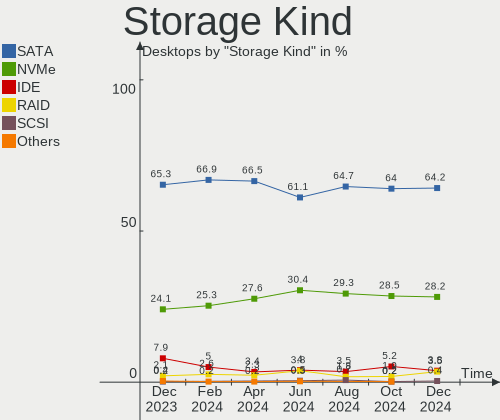
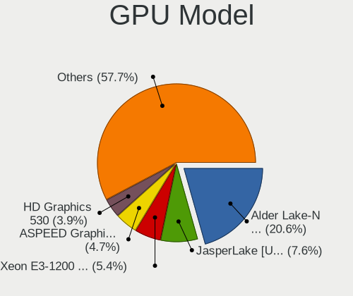
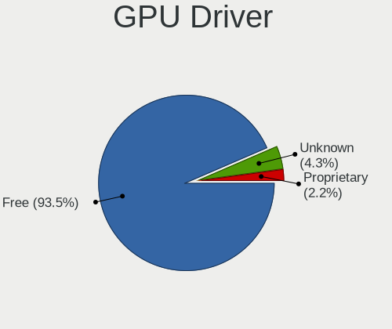
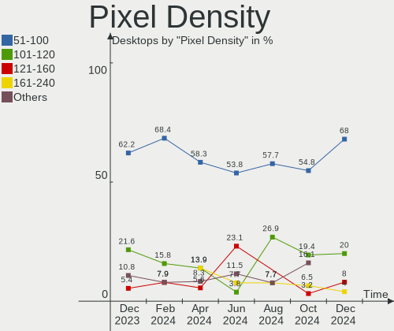

BSD - Hardware Trends (Desktops)
--------------------------------

A project to identify most popular hardware characteristics and track their change
over time based on data collected by BSD users at https://BSD-Hardware.info.

Anyone can contribute to this report by the [hw-probe](https://github.com/linuxhw/hw-probe/blob/master/INSTALL.BSD.md) tool:

    hw-probe -all -upload

This report is for one last month. Overall report since the beginning of time: [TestCoverage](https://github.com/bsdhw/TestCoverage)

Period: Nov, 2022.

Contents
--------

* [ System ](#system)
  - [ OS                       ](#os)
  - [ OS Family                ](#os-family)
  - [ Arch                     ](#arch)
  - [ DE                       ](#de)
  - [ Display Server           ](#display-server)
  - [ Display Manager          ](#display-manager)
  - [ OS Lang                  ](#os-lang)
  - [ Boot Mode                ](#boot-mode)
  - [ Filesystem               ](#filesystem)
  - [ Part. scheme             ](#part-scheme)

* [ Board ](#board)
  - [ Vendor                   ](#vendor)
  - [ Model                    ](#model)
  - [ Model Family             ](#model-family)
  - [ MFG Year                 ](#mfg-year)
  - [ Form Factor              ](#form-factor)
  - [ Coreboot                 ](#coreboot)
  - [ RAM Size                 ](#ram-size)
  - [ RAM Used                 ](#ram-used)
  - [ Total Drives             ](#total-drives)
  - [ Has CD-ROM               ](#has-cd-rom)
  - [ Has Ethernet             ](#has-ethernet)
  - [ Has WiFi                 ](#has-wifi)
  - [ Has Bluetooth            ](#has-bluetooth)

* [ Location ](#location)
  - [ Country                  ](#country)
  - [ City                     ](#city)

* [ Drives ](#drives)
  - [ Drive Vendor             ](#drive-vendor)
  - [ Drive Model              ](#drive-model)
  - [ HDD Vendor               ](#hdd-vendor)
  - [ SSD Vendor               ](#ssd-vendor)
  - [ Drive Kind               ](#drive-kind)
  - [ Drive Connector          ](#drive-connector)
  - [ Drive Size               ](#drive-size)
  - [ Space Total              ](#space-total)
  - [ Space Used               ](#space-used)
  - [ Malfunc. Drives          ](#malfunc-drives)
  - [ Malfunc. Drive Vendor    ](#malfunc-drive-vendor)
  - [ Malfunc. HDD Vendor      ](#malfunc-hdd-vendor)
  - [ Malfunc. Drive Kind      ](#malfunc-drive-kind)
  - [ Failed Drives            ](#failed-drives)
  - [ Failed Drive Vendor      ](#failed-drive-vendor)
  - [ Drive Status             ](#drive-status)

* [ Storage controller ](#storage-controller)
  - [ Storage Vendor           ](#storage-vendor)
  - [ Storage Model            ](#storage-model)
  - [ Storage Kind             ](#storage-kind)

* [ Processor ](#processor)
  - [ CPU Vendor               ](#cpu-vendor)
  - [ CPU Model                ](#cpu-model)
  - [ CPU Model Family         ](#cpu-model-family)
  - [ CPU Cores                ](#cpu-cores)
  - [ CPU Sockets              ](#cpu-sockets)
  - [ CPU Threads              ](#cpu-threads)
  - [ CPU Microarch            ](#cpu-microarch)

* [ Graphics ](#graphics)
  - [ GPU Vendor               ](#gpu-vendor)
  - [ GPU Model                ](#gpu-model)
  - [ GPU Combo                ](#gpu-combo)
  - [ GPU Driver               ](#gpu-driver)
  - [ GPU Memory               ](#gpu-memory)

* [ Monitor ](#monitor)
  - [ Monitor Vendor           ](#monitor-vendor)
  - [ Monitor Model            ](#monitor-model)
  - [ Monitor Resolution       ](#monitor-resolution)
  - [ Monitor Diagonal         ](#monitor-diagonal)
  - [ Monitor Width            ](#monitor-width)
  - [ Aspect Ratio             ](#aspect-ratio)
  - [ Monitor Area             ](#monitor-area)
  - [ Pixel Density            ](#pixel-density)
  - [ Multiple Monitors        ](#multiple-monitors)

* [ Network ](#network)
  - [ Net Controller Vendor    ](#net-controller-vendor)
  - [ Net Controller Model     ](#net-controller-model)
  - [ Wireless Vendor          ](#wireless-vendor)
  - [ Wireless Model           ](#wireless-model)
  - [ Ethernet Vendor          ](#ethernet-vendor)
  - [ Ethernet Model           ](#ethernet-model)
  - [ Net Controller Kind      ](#net-controller-kind)
  - [ Used Controller          ](#used-controller)
  - [ NICs                     ](#nics)
  - [ IPv6                     ](#ipv6)

* [ Bluetooth ](#bluetooth)
  - [ Bluetooth Vendor         ](#bluetooth-vendor)
  - [ Bluetooth Model          ](#bluetooth-model)

* [ Sound ](#sound)
  - [ Sound Vendor             ](#sound-vendor)
  - [ Sound Model              ](#sound-model)

* [ Memory ](#memory)
  - [ Memory Vendor            ](#memory-vendor)
  - [ Memory Model             ](#memory-model)
  - [ Memory Kind              ](#memory-kind)
  - [ Memory Form Factor       ](#memory-form-factor)
  - [ Memory Size              ](#memory-size)
  - [ Memory Speed             ](#memory-speed)

* [ Printers & scanners ](#printers--scanners)
  - [ Printer Vendor           ](#printer-vendor)
  - [ Printer Model            ](#printer-model)
  - [ Scanner Vendor           ](#scanner-vendor)
  - [ Scanner Model            ](#scanner-model)

* [ Camera ](#camera)
  - [ Camera Vendor            ](#camera-vendor)
  - [ Camera Model             ](#camera-model)

* [ Security ](#security)
  - [ Fingerprint Vendor       ](#fingerprint-vendor)
  - [ Fingerprint Model        ](#fingerprint-model)
  - [ Chipcard Vendor          ](#chipcard-vendor)
  - [ Chipcard Model           ](#chipcard-model)

* [ Unsupported ](#unsupported)
  - [ Unsupported Devices      ](#unsupported-devices)
  - [ Unsupported Device Types ](#unsupported-device-types)

System
------

OS
--

Installed operating systems

| Name                 | Desktops | Percent |
|----------------------|----------|---------|
| OPNsense 22.7.8      | 87       | 31.07%  |
| OPNsense 22.7.7      | 82       | 29.29%  |
| helloSystem 0.7.0    | 18       | 6.43%   |
| OPNsense 22.7.6      | 17       | 6.07%   |
| FreeBSD 13.1-p3      | 10       | 3.57%   |
| helloSystem 0.8.0    | 8        | 2.86%   |
| FreeBSD 13.1-p2      | 8        | 2.86%   |
| FreeBSD 13.1-p4      | 7        | 2.5%    |
| FreeBSD 13.1         | 6        | 2.14%   |
| OpenBSD 7.2          | 4        | 1.43%   |
| FreeBSD 12.3-p2      | 4        | 1.43%   |
| OPNsense 23.1        | 3        | 1.07%   |
| XigmaNAS 12.3-p6     | 2        | 0.71%   |
| pfSense 2.6.0        | 2        | 0.71%   |
| OPNsense 22.1.10     | 2        | 0.71%   |
| TrueNAS 13.1-p2      | 1        | 0.36%   |
| TrueNAS 12.3-p2      | 1        | 0.36%   |
| Ting 22.1            | 1        | 0.36%   |
| pfSense 12.3-STABLE  | 1        | 0.36%   |
| OPNsense 22.7.5      | 1        | 0.36%   |
| OPNsense 22.10       | 1        | 0.36%   |
| OpenBSD 6.8          | 1        | 0.36%   |
| NomadBSD 80dec9b9    | 1        | 0.36%   |
| NetBSD 9.99.107      | 1        | 0.36%   |
| NetBSD 9.3_STABLE    | 1        | 0.36%   |
| helloSystem 0.6.0    | 1        | 0.36%   |
| GhostBSD 22.11.22    | 1        | 0.36%   |
| GhostBSD 22.11.02    | 1        | 0.36%   |
| FreeBSD 14.0-CURRENT | 1        | 0.36%   |
| FreeBSD 13.1-STABLE  | 1        | 0.36%   |
| FreeBSD 13.1-RC4     | 1        | 0.36%   |
| FreeBSD 12.3-p9      | 1        | 0.36%   |
| FreeBSD 12.3-p8      | 1        | 0.36%   |
| FreeBSD 12.3-p7      | 1        | 0.36%   |
| FreeBSD 12.1-p13     | 1        | 0.36%   |

OS Family
---------

OS without a version

| Name        | Desktops | Percent |
|-------------|----------|---------|
| OPNsense    | 193      | 68.93%  |
| FreeBSD     | 42       | 15%     |
| helloSystem | 27       | 9.64%   |
| OpenBSD     | 5        | 1.79%   |
| pfSense     | 3        | 1.07%   |
| XigmaNAS    | 2        | 0.71%   |
| TrueNAS     | 2        | 0.71%   |
| NetBSD      | 2        | 0.71%   |
| GhostBSD    | 2        | 0.71%   |
| Ting        | 1        | 0.36%   |
| NomadBSD    | 1        | 0.36%   |

Arch
----

OS architecture (x86_64, i586, etc.)

| Name   | Desktops | Percent |
|--------|----------|---------|
| amd64  | 278      | 99.29%  |
| macppc | 1        | 0.36%   |
| arm    | 1        | 0.36%   |

DE
--

Desktop Environment

| Name         | Desktops | Percent |
|--------------|----------|---------|
| Console      | 226      | 80.71%  |
| helloDesktop | 31       | 11.07%  |
| XFCE         | 7        | 2.5%    |
| KDE5         | 5        | 1.79%   |
| MATE         | 4        | 1.43%   |
| i3           | 2        | 0.71%   |
| Openbox      | 1        | 0.36%   |
| LXQt         | 1        | 0.36%   |
| GNUstep      | 1        | 0.36%   |
| fvwm         | 1        | 0.36%   |
| Fluxbox      | 1        | 0.36%   |

Display Server
--------------

X11 or Wayland

| Name    | Desktops | Percent |
|---------|----------|---------|
| Console | 229      | 81.79%  |
| X11     | 50       | 17.86%  |
| Wayland | 1        | 0.36%   |

Display Manager
---------------

SDDM, LightDM, etc.

| Name    | Desktops | Percent |
|---------|----------|---------|
| Console | 237      | 84.64%  |
| SLiM    | 30       | 10.71%  |
| SDDM    | 6        | 2.14%   |
| XDM     | 3        | 1.07%   |
| LightDM | 3        | 1.07%   |
| GDM     | 1        | 0.36%   |

OS Lang
-------

Language

| Lang    | Desktops | Percent |
|---------|----------|---------|
| Unknown | 207      | 73.93%  |
| en_US   | 36       | 12.86%  |
| C       | 32       | 11.43%  |
| zh_CN   | 2        | 0.71%   |
| nl_NL   | 1        | 0.36%   |
| es_ES   | 1        | 0.36%   |
| de_DE   | 1        | 0.36%   |

Boot Mode
---------

EFI or BIOS

| Mode | Desktops | Percent |
|------|----------|---------|
| EFI  | 248      | 88.57%  |
| BIOS | 32       | 11.43%  |

Filesystem
----------

Type of filesystem

| Type   | Desktops | Percent |
|--------|----------|---------|
| Zfs    | 131      | 46.79%  |
| Ufs    | 124      | 44.29%  |
| Cd9660 | 20       | 7.14%   |
| Ffs    | 5        | 1.79%   |

Part. scheme
------------

Scheme of partitioning

| Type    | Desktops | Percent |
|---------|----------|---------|
| GPT     | 272      | 97.14%  |
| MBR     | 7        | 2.5%    |
| Unknown | 1        | 0.36%   |

Board
-----

Vendor
------

Motherboard manufacturer

| Name                       | Desktops | Percent |
|----------------------------|----------|---------|
| ASUSTek Computer           | 36       | 12.86%  |
| Hewlett-Packard            | 31       | 11.07%  |
| Unknown                    | 27       | 9.64%   |
| Dell                       | 21       | 7.5%    |
| ASRock                     | 18       | 6.43%   |
| Gigabyte Technology        | 17       | 6.07%   |
| Protectli                  | 16       | 5.71%   |
| Intel                      | 13       | 4.64%   |
| MSI                        | 12       | 4.29%   |
| PC Engines                 | 11       | 3.93%   |
| Lenovo                     | 11       | 3.93%   |
| Fujitsu                    | 9        | 3.21%   |
| MW                         | 6        | 2.14%   |
| Techvision                 | 5        | 1.79%   |
| Shuttle                    | 5        | 1.79%   |
| Supermicro                 | 4        | 1.43%   |
| Acer                       | 3        | 1.07%   |
| IceWhale Technology        | 2        | 0.71%   |
| Hardkernel                 | 2        | 0.71%   |
| Foxconn                    | 2        | 0.71%   |
| Datto                      | 2        | 0.71%   |
| Cisco                      | 2        | 0.71%   |
| BESSTAR Tech               | 2        | 0.71%   |
| AZW                        | 2        | 0.71%   |
| ASRockRack                 | 2        | 0.71%   |
| YANYU                      | 1        | 0.36%   |
| TOPFEEL                    | 1        | 0.36%   |
| ShenZhen MinWin Technology | 1        | 0.36%   |
| Seeed Studio               | 1        | 0.36%   |
| QIYIDA                     | 1        | 0.36%   |
| Pegatron                   | 1        | 0.36%   |
| ONDA                       | 1        | 0.36%   |
| OEM                        | 1        | 0.36%   |
| Infoblox                   | 1        | 0.36%   |
| Huanan                     | 1        | 0.36%   |
| Google                     | 1        | 0.36%   |
| Deciso                     | 1        | 0.36%   |
| CncTion                    | 1        | 0.36%   |
| CheckPoint                 | 1        | 0.36%   |
| ASRock Industrial          | 1        | 0.36%   |

Model
-----

Motherboard model

| Name                             | Desktops | Percent |
|----------------------------------|----------|---------|
| Unknown                          | 27       | 9.64%   |
| Fujitsu FUTRO S920               | 8        | 2.86%   |
| Protectli FW4B                   | 6        | 2.14%   |
| MW GMLK-2_5G4L                   | 6        | 2.14%   |
| Techvision TVI7309X              | 5        | 1.79%   |
| Protectli FW6                    | 5        | 1.79%   |
| PC Engines apu4                  | 5        | 1.79%   |
| PC Engines APU2                  | 5        | 1.79%   |
| Intel Q3XXG4-P V1.0              | 3        | 1.07%   |
| HP t620 Quad Core TC             | 3        | 1.07%   |
| ASUS All Series                  | 3        | 1.07%   |
| ASRock Q1900B-ITX                | 3        | 1.07%   |
| Protectli FW2B                   | 2        | 0.71%   |
| Intel D54250WYK H13922-303       | 2        | 0.71%   |
| Intel CRESCENTBAY                | 2        | 0.71%   |
| HP Slim Desktop 290-p0xxx        | 2        | 0.71%   |
| HP ProDesk 600 G1 SFF            | 2        | 0.71%   |
| Gigabyte J3455N-D3H              | 2        | 0.71%   |
| Dell OptiPlex 960                | 2        | 0.71%   |
| Datto SSD                        | 2        | 0.71%   |
| ASRock H670M-ITX/ax              | 2        | 0.71%   |
| YANYU R250                       | 1        | 0.36%   |
| TOPFEEL Topone series            | 1        | 0.36%   |
| Supermicro X7SPA-HF              | 1        | 0.36%   |
| Supermicro SYS-E200-9A           | 1        | 0.36%   |
| Supermicro SYS-5019D-4C-FN8TP    | 1        | 0.36%   |
| Supermicro SYS-1018GR-TA02-CG009 | 1        | 0.36%   |
| Shuttle XH61V                    | 1        | 0.36%   |
| Shuttle XH270                    | 1        | 0.36%   |
| Shuttle SZ270R9                  | 1        | 0.36%   |
| Shuttle SZ270                    | 1        | 0.36%   |
| Shuttle DS81D                    | 1        | 0.36%   |
| ShenZhen MinWin MW-NANO-APL-4L   | 1        | 0.36%   |
| Seeed Studio ODYSSEY-X86J4105    | 1        | 0.36%   |
| QIYIDA X99-H9 V2.0               | 1        | 0.36%   |
| Protectli VP2410                 | 1        | 0.36%   |
| Protectli FW4C                   | 1        | 0.36%   |
| Protectli FW4A                   | 1        | 0.36%   |
| Pegatron IPM41-D3                | 1        | 0.36%   |
| PC Engines apu6                  | 1        | 0.36%   |

Model Family
------------

Motherboard model prefix

| Name                          | Desktops | Percent |
|-------------------------------|----------|---------|
| Unknown                       | 27       | 9.64%   |
| Dell OptiPlex                 | 12       | 4.29%   |
| Fujitsu FUTRO                 | 8        | 2.86%   |
| HP ProDesk                    | 7        | 2.5%    |
| HP EliteDesk                  | 7        | 2.5%    |
| ASUS PRIME                    | 7        | 2.5%    |
| Protectli FW4B                | 6        | 2.14%   |
| MW GMLK-2                     | 6        | 2.14%   |
| Techvision TVI7309X           | 5        | 1.79%   |
| Protectli FW6                 | 5        | 1.79%   |
| PC Engines apu4               | 5        | 1.79%   |
| PC Engines APU2               | 5        | 1.79%   |
| HP Compaq                     | 5        | 1.79%   |
| Lenovo ThinkCentre            | 4        | 1.43%   |
| HP t620                       | 4        | 1.43%   |
| ASUS ROG                      | 4        | 1.43%   |
| Intel Q3XXG4-P                | 3        | 1.07%   |
| HP Slim                       | 3        | 1.07%   |
| Dell Precision                | 3        | 1.07%   |
| Dell Inspiron                 | 3        | 1.07%   |
| ASUS All                      | 3        | 1.07%   |
| ASRock Q1900B-ITX             | 3        | 1.07%   |
| Protectli FW2B                | 2        | 0.71%   |
| Lenovo ThinkStation           | 2        | 0.71%   |
| Intel D54250WYK               | 2        | 0.71%   |
| Intel CRESCENTBAY             | 2        | 0.71%   |
| IceWhale ZimaBoard            | 2        | 0.71%   |
| HP ProLiant                   | 2        | 0.71%   |
| Gigabyte J3455N-D3H           | 2        | 0.71%   |
| Gigabyte B450M                | 2        | 0.71%   |
| Datto SSD                     | 2        | 0.71%   |
| ASUS TUF                      | 2        | 0.71%   |
| ASUS SABERTOOTH               | 2        | 0.71%   |
| ASRock X570                   | 2        | 0.71%   |
| ASRock H670M-ITX              | 2        | 0.71%   |
| YANYU R250                    | 1        | 0.36%   |
| TOPFEEL Topone                | 1        | 0.36%   |
| Supermicro X7SPA-HF           | 1        | 0.36%   |
| Supermicro SYS-E200-9A        | 1        | 0.36%   |
| Supermicro SYS-5019D-4C-FN8TP | 1        | 0.36%   |

MFG Year
--------

Motherboard manufacture year

| Year    | Desktops | Percent |
|---------|----------|---------|
| 2018    | 36       | 12.86%  |
| 2022    | 34       | 12.14%  |
| 2021    | 30       | 10.71%  |
| 2016    | 24       | 8.57%   |
| 2020    | 23       | 8.21%   |
| 2014    | 23       | 8.21%   |
| 2019    | 21       | 7.5%    |
| 2013    | 21       | 7.5%    |
| 2017    | 16       | 5.71%   |
| 2015    | 12       | 4.29%   |
| 2012    | 10       | 3.57%   |
| 2010    | 10       | 3.57%   |
| 2011    | 6        | 2.14%   |
| 2008    | 5        | 1.79%   |
| 2009    | 4        | 1.43%   |
| Unknown | 4        | 1.43%   |
| 2007    | 1        | 0.36%   |

Form Factor
-----------

Physical design of the computer

| Name    | Desktops | Percent |
|---------|----------|---------|
| Desktop | 280      | 100%    |

Coreboot
--------

Have coreboot on board

| Used | Desktops | Percent |
|------|----------|---------|
| No   | 265      | 94.64%  |
| Yes  | 15       | 5.36%   |

RAM Size
--------

Total RAM memory

| Size in GB  | Desktops | Percent |
|-------------|----------|---------|
| 8.01-16.0   | 104      | 37.14%  |
| 16.01-24.0  | 66       | 23.57%  |
| 4.01-8.0    | 63       | 22.5%   |
| 32.01-64.0  | 27       | 9.64%   |
| 64.01-256.0 | 8        | 2.86%   |
| 24.01-32.0  | 5        | 1.79%   |
| 2.01-3.0    | 5        | 1.79%   |
| 1.01-2.0    | 1        | 0.36%   |
| 0.01-0.5    | 1        | 0.36%   |

RAM Used
--------

Used RAM memory

| Used GB   | Desktops | Percent |
|-----------|----------|---------|
| 0.01-0.5  | 143      | 51.07%  |
| 0.51-1.0  | 94       | 33.57%  |
| 1.01-2.0  | 29       | 10.36%  |
| 2.01-3.0  | 5        | 1.79%   |
| 3.01-4.0  | 3        | 1.07%   |
| 8.01-16.0 | 2        | 0.71%   |
| Unknown   | 2        | 0.71%   |
| 4.01-8.0  | 1        | 0.36%   |
| 0         | 1        | 0.36%   |

Total Drives
------------

Number of drives on board

| Drives | Desktops | Percent |
|--------|----------|---------|
| 1      | 189      | 67.5%   |
| 2      | 34       | 12.14%  |
| 0      | 25       | 8.93%   |
| 3      | 16       | 5.71%   |
| 4      | 9        | 3.21%   |
| 6      | 2        | 0.71%   |
| 5      | 2        | 0.71%   |
| 13     | 1        | 0.36%   |
| 11     | 1        | 0.36%   |
| 7      | 1        | 0.36%   |

Has CD-ROM
----------

Has CD-ROM on board

| Presented | Desktops | Percent |
|-----------|----------|---------|
| No        | 235      | 83.93%  |
| Yes       | 45       | 16.07%  |

Has Ethernet
------------

Has Ethernet on board

| Presented | Desktops | Percent |
|-----------|----------|---------|
| Yes       | 276      | 98.57%  |
| No        | 4        | 1.43%   |

Has WiFi
--------

Has WiFi module

| Presented | Desktops | Percent |
|-----------|----------|---------|
| No        | 227      | 81.07%  |
| Yes       | 53       | 18.93%  |

Has Bluetooth
-------------

Has Bluetooth module

| Presented | Desktops | Percent |
|-----------|----------|---------|
| No        | 244      | 87.14%  |
| Yes       | 36       | 12.86%  |

Location
--------

Country
-------

Geographic location (country)

| Country     | Desktops | Percent |
|-------------|----------|---------|
| USA         | 84       | 30%     |
| Germany     | 39       | 13.93%  |
| Canada      | 15       | 5.36%   |
| UK          | 13       | 4.64%   |
| Russia      | 11       | 3.93%   |
| Poland      | 9        | 3.21%   |
| Spain       | 8        | 2.86%   |
| France      | 7        | 2.5%    |
| Brazil      | 7        | 2.5%    |
| Taiwan      | 6        | 2.14%   |
| Sweden      | 6        | 2.14%   |
| South Korea | 5        | 1.79%   |
| Italy       | 5        | 1.79%   |
| Austria     | 5        | 1.79%   |
| Switzerland | 4        | 1.43%   |
| Portugal    | 4        | 1.43%   |
| Denmark     | 4        | 1.43%   |
| China       | 4        | 1.43%   |
| Australia   | 4        | 1.43%   |
| Netherlands | 3        | 1.07%   |
| Indonesia   | 3        | 1.07%   |
| Czechia     | 3        | 1.07%   |
| Venezuela   | 2        | 0.71%   |
| Slovenia    | 2        | 0.71%   |
| New Zealand | 2        | 0.71%   |
| India       | 2        | 0.71%   |
| Greece      | 2        | 0.71%   |
| Finland     | 2        | 0.71%   |
| Chile       | 2        | 0.71%   |
| Belgium     | 2        | 0.71%   |
| Turkey      | 1        | 0.36%   |
| Thailand    | 1        | 0.36%   |
| Slovakia    | 1        | 0.36%   |
| Singapore   | 1        | 0.36%   |
| Philippines | 1        | 0.36%   |
| Paraguay    | 1        | 0.36%   |
| Norway      | 1        | 0.36%   |
| Mexico      | 1        | 0.36%   |
| Japan       | 1        | 0.36%   |
| Israel      | 1        | 0.36%   |

City
----

Geographic location (city)

| City                | Desktops | Percent |
|---------------------|----------|---------|
| Ludwigsburg         | 7        | 2.5%    |
| Aquan               | 4        | 1.43%   |
| Oakland             | 3        | 1.07%   |
| London              | 3        | 1.07%   |
| Lezno               | 3        | 1.07%   |
| Gdansk              | 3        | 1.07%   |
| Vienna              | 2        | 0.71%   |
| Taichung City       | 2        | 0.71%   |
| St Petersburg       | 2        | 0.71%   |
| Seattle             | 2        | 0.71%   |
| Salem               | 2        | 0.71%   |
| Renton              | 2        | 0.71%   |
| Redmond             | 2        | 0.71%   |
| Plano               | 2        | 0.71%   |
| Perth               | 2        | 0.71%   |
| Papendrecht         | 2        | 0.71%   |
| Ozersk              | 2        | 0.71%   |
| Munich              | 2        | 0.71%   |
| Moscow              | 2        | 0.71%   |
| Karlsruhe           | 2        | 0.71%   |
| Helsinki            | 2        | 0.71%   |
| El Paso             | 2        | 0.71%   |
| City of Westminster | 2        | 0.71%   |
| Cedar Rapids        | 2        | 0.71%   |
| Busan               | 2        | 0.71%   |
| Zusmarshausen       | 1        | 0.36%   |
| Zurich              | 1        | 0.36%   |
| Xanthi              | 1        | 0.36%   |
| Wuppertal           | 1        | 0.36%   |
| Wroclaw             | 1        | 0.36%   |
| Worcester           | 1        | 0.36%   |
| Winnipeg            | 1        | 0.36%   |
| Willingboro         | 1        | 0.36%   |
| White Haven         | 1        | 0.36%   |
| Wermelskirchen      | 1        | 0.36%   |
| Wenatchee           | 1        | 0.36%   |
| Wels                | 1        | 0.36%   |
| Webster             | 1        | 0.36%   |
| Waterbury           | 1        | 0.36%   |
| Warsaw              | 1        | 0.36%   |

Drives
------

Drive Vendor
------------

Hard drive vendors

| Vendor              | Desktops | Drives | Percent |
|---------------------|----------|--------|---------|
| Samsung Electronics | 41       | 54     | 12.93%  |
| WDC                 | 40       | 75     | 12.62%  |
| Seagate             | 31       | 40     | 9.78%   |
| Kingston            | 23       | 26     | 7.26%   |
| Crucial             | 23       | 25     | 7.26%   |
| Intel               | 15       | 15     | 4.73%   |
| Transcend           | 13       | 15     | 4.1%    |
| SanDisk             | 13       | 15     | 4.1%    |
| Toshiba             | 10       | 15     | 3.15%   |
| Hoodisk             | 8        | 8      | 2.52%   |
| A-DATA Technology   | 8        | 8      | 2.52%   |
| Hitachi             | 7        | 7      | 2.21%   |
| SK hynix            | 6        | 6      | 1.89%   |
| China               | 5        | 5      | 1.58%   |
| Silicon Motion      | 4        | 4      | 1.26%   |
| Protectli           | 4        | 4      | 1.26%   |
| PNY                 | 4        | 5      | 1.26%   |
| Intenso             | 4        | 4      | 1.26%   |
| Innodisk            | 4        | 4      | 1.26%   |
| HGST                | 4        | 5      | 1.26%   |
| ShiJi               | 3        | 3      | 0.95%   |
| GOODRAM             | 3        | 4      | 0.95%   |
| Corsair             | 3        | 3      | 0.95%   |
| BIWIN               | 3        | 3      | 0.95%   |
| Phison              | 2        | 2      | 0.63%   |
| OCZ                 | 2        | 2      | 0.63%   |
| LITEON              | 2        | 2      | 0.63%   |
| KIOXIA              | 2        | 2      | 0.63%   |
| FORESEE             | 2        | 2      | 0.63%   |
| CWDISK              | 2        | 2      | 0.63%   |
| Apacer              | 2        | 2      | 0.63%   |
| Zheino              | 1        | 1      | 0.32%   |
| Verbatim            | 1        | 1      | 0.32%   |
| Vaseky              | 1        | 1      | 0.32%   |
| Timetec             | 1        | 1      | 0.32%   |
| Team                | 1        | 1      | 0.32%   |
| Supermicro          | 1        | 1      | 0.32%   |
| SPCC                | 1        | 1      | 0.32%   |
| Patriot             | 1        | 1      | 0.32%   |
| OPENBSD             | 1        | 1      | 0.32%   |

Drive Model
-----------

Hard drive models

| Model                           | Desktops | Percent |
|---------------------------------|----------|---------|
| Kingston SKC600MS256G 256GB     | 6        | 1.75%   |
| Crucial CT480BX500SSD1 480GB    | 5        | 1.46%   |
| Seagate ST500DM002-1BD142 500GB | 4        | 1.17%   |
| Samsung SSD 860 EVO 500GB       | 4        | 1.17%   |
| Innodisk DEMSR- 08GB mSATA 3ME3 | 4        | 1.17%   |
| Hoodisk SSD 32GB                | 4        | 1.17%   |
| Crucial CT500MX500SSD1 500GB    | 4        | 1.17%   |
| SanDisk SDSA6MM-008G-1006 8GB   | 3        | 0.88%   |
| Hoodisk SSD 64GB                | 3        | 0.88%   |
| Crucial CT240BX500SSD1 240GB    | 3        | 0.88%   |
| BIWIN SSD 128GB                 | 3        | 0.88%   |
| WDC WD10EFRX-68FYTN0 1TB        | 2        | 0.58%   |
| Transcend TS64GMSA230S 64GB     | 2        | 0.58%   |
| Transcend TS256GMSA230S 256GB   | 2        | 0.58%   |
| Toshiba DT01ACA100 1TB          | 2        | 0.58%   |
| SK hynix SC311 SATA 256GB       | 2        | 0.58%   |
| ShiJi SSD 128GB                 | 2        | 0.58%   |
| Seagate ST500LT012-1DG142 500GB | 2        | 0.58%   |
| Seagate ST4000DM000-1F2168 4TB  | 2        | 0.58%   |
| SanDisk SDSSDP064G 64GB         | 2        | 0.58%   |
| Samsung SSD 980 PRO 1TB         | 2        | 0.58%   |
| Samsung SSD 970 EVO Plus 500GB  | 2        | 0.58%   |
| Samsung SSD 970 EVO 500GB       | 2        | 0.58%   |
| Samsung SSD 870 EVO 250GB       | 2        | 0.58%   |
| Samsung SSD 860 QVO 1TB         | 2        | 0.58%   |
| Samsung SSD 860 EVO 1TB         | 2        | 0.58%   |
| Samsung SSD 840 Series 120GB    | 2        | 0.58%   |
| Kingston SUV500MS120G 120GB     | 2        | 0.58%   |
| Kingston SFYRS1000G 1TB         | 2        | 0.58%   |
| Kingston SA400S37240G 240GB     | 2        | 0.58%   |
| Kingston SA400S37120G 120GB     | 2        | 0.58%   |
| HGST HTS725050A7E630 500GB      | 2        | 0.58%   |
| FORESEE 128GB SSD               | 2        | 0.58%   |
| Crucial CT240M500SSD1 240GB     | 2        | 0.58%   |
| China SATA SSD 256GB            | 2        | 0.58%   |
| A-DATA SU630 240GB              | 2        | 0.58%   |
| Zheino CHN mSATA01M 060 64GB    | 1        | 0.29%   |
| WDC WDS500G2B0C-00PXH0 500GB    | 1        | 0.29%   |
| WDC WDS500G2B0A-00SM50 500GB    | 1        | 0.29%   |
| WDC WDS500G2B0A 500GB           | 1        | 0.29%   |

HDD Vendor
----------

Hard disk drive vendors

| Vendor              | Desktops | Drives | Percent |
|---------------------|----------|--------|---------|
| WDC                 | 30       | 61     | 37.5%   |
| Seagate             | 29       | 38     | 36.25%  |
| Hitachi             | 7        | 7      | 8.75%   |
| Toshiba             | 6        | 10     | 7.5%    |
| HGST                | 4        | 5      | 5%      |
| Samsung Electronics | 1        | 2      | 1.25%   |
| OPENBSD             | 1        | 1      | 1.25%   |
| NVMe                | 1        | 1      | 1.25%   |
| Apple               | 1        | 1      | 1.25%   |

SSD Vendor
----------

Solid state drive vendors

| Vendor              | Desktops | Drives | Percent |
|---------------------|----------|--------|---------|
| Samsung Electronics | 31       | 38     | 16.06%  |
| Kingston            | 20       | 23     | 10.36%  |
| Crucial             | 20       | 22     | 10.36%  |
| Transcend           | 13       | 15     | 6.74%   |
| SanDisk             | 13       | 15     | 6.74%   |
| Intel               | 11       | 11     | 5.7%    |
| Hoodisk             | 8        | 8      | 4.15%   |
| A-DATA Technology   | 7        | 7      | 3.63%   |
| China               | 5        | 5      | 2.59%   |
| WDC                 | 4        | 7      | 2.07%   |
| Toshiba             | 4        | 5      | 2.07%   |
| SK hynix            | 4        | 4      | 2.07%   |
| Protectli           | 4        | 4      | 2.07%   |
| PNY                 | 4        | 5      | 2.07%   |
| Intenso             | 4        | 4      | 2.07%   |
| Innodisk            | 4        | 4      | 2.07%   |
| ShiJi               | 3        | 3      | 1.55%   |
| GOODRAM             | 3        | 4      | 1.55%   |
| BIWIN               | 3        | 3      | 1.55%   |
| Seagate             | 2        | 2      | 1.04%   |
| OCZ                 | 2        | 2      | 1.04%   |
| LITEON              | 2        | 2      | 1.04%   |
| FORESEE             | 2        | 2      | 1.04%   |
| Corsair             | 2        | 2      | 1.04%   |
| Apacer              | 2        | 2      | 1.04%   |
| Zheino              | 1        | 1      | 0.52%   |
| Verbatim            | 1        | 1      | 0.52%   |
| Vaseky              | 1        | 1      | 0.52%   |
| Supermicro          | 1        | 1      | 0.52%   |
| Patriot             | 1        | 1      | 0.52%   |
| Micron Technology   | 1        | 1      | 0.52%   |
| LITEONIT            | 1        | 1      | 0.52%   |
| KingDian            | 1        | 1      | 0.52%   |
| Kingchuxing         | 1        | 1      | 0.52%   |
| Integral            | 1        | 1      | 0.52%   |
| Hikvision           | 1        | 1      | 0.52%   |
| Emtec               | 1        | 1      | 0.52%   |
| Dogfish             | 1        | 1      | 0.52%   |
| CWDISK              | 1        | 1      | 0.52%   |
| BORY                | 1        | 1      | 0.52%   |

Drive Kind
----------

HDD or SSD

| Kind | Desktops | Drives | Percent |
|------|----------|--------|---------|
| SSD  | 175      | 215    | 59.73%  |
| HDD  | 71       | 126    | 24.23%  |
| NVMe | 47       | 50     | 16.04%  |

Drive Connector
---------------

SATA, SAS, NVMe, etc.

| Type | Desktops | Drives | Percent |
|------|----------|--------|---------|
| SATA | 225      | 341    | 82.72%  |
| NVMe | 47       | 50     | 17.28%  |

Drive Size
----------

Size of hard drive

| Size in TB | Desktops | Drives | Percent |
|------------|----------|--------|---------|
| 0.01-0.5   | 199      | 253    | 78.97%  |
| 0.51-1.0   | 30       | 46     | 11.9%   |
| 1.01-2.0   | 11       | 17     | 4.37%   |
| 3.01-4.0   | 7        | 12     | 2.78%   |
| 2.01-3.0   | 2        | 2      | 0.79%   |
| 4.01-10.0  | 2        | 9      | 0.79%   |
| 10.01-20.0 | 1        | 2      | 0.4%    |

Space Total
-----------

Amount of disk space available on the file system

| Size in GB     | Desktops | Percent |
|----------------|----------|---------|
| 101-250        | 109      | 38.93%  |
| 251-500        | 54       | 19.29%  |
| 1-20           | 41       | 14.64%  |
| 51-100         | 27       | 9.64%   |
| 21-50          | 25       | 8.93%   |
| 501-1000       | 18       | 6.43%   |
| 1001-2000      | 3        | 1.07%   |
| More than 3000 | 1        | 0.36%   |
| 2001-3000      | 1        | 0.36%   |
| Unknown        | 1        | 0.36%   |

Space Used
----------

Amount of used disk space

| Used GB        | Desktops | Percent |
|----------------|----------|---------|
| 1-20           | 260      | 92.86%  |
| 21-50          | 12       | 4.29%   |
| 251-500        | 3        | 1.07%   |
| 51-100         | 3        | 1.07%   |
| More than 3000 | 1        | 0.36%   |
| Unknown        | 1        | 0.36%   |

Malfunc. Drives
---------------

Drive models with a malfunction

| Model                                 | Desktops | Drives | Percent |
|---------------------------------------|----------|--------|---------|
| Seagate ST500DM002-1BD142 500GB       | 3        | 3      | 8.57%   |
| Seagate ST500LT012-1DG142 500GB       | 2        | 2      | 5.71%   |
| Samsung Electronics SSD 970 EVO 500GB | 2        | 2      | 5.71%   |
| HGST HTS725050A7E630 500GB            | 2        | 2      | 5.71%   |
| Crucial CT480BX500SSD1 480GB          | 2        | 2      | 5.71%   |
| WDC WD6400AAKS-22A7B2 640GB           | 1        | 1      | 2.86%   |
| WDC WD4000AAKS-00C8A0 400GB           | 1        | 1      | 2.86%   |
| WDC WD30EZRX-00D8PB0 3TB              | 1        | 1      | 2.86%   |
| WDC WD10EZEX-60WN4A1 1TB              | 1        | 1      | 2.86%   |
| Toshiba MK1255GSX H 120GB             | 1        | 1      | 2.86%   |
| Toshiba DT01ACA100 1TB                | 1        | 1      | 2.86%   |
| SK hynix SC308 SATA 128GB             | 1        | 1      | 2.86%   |
| Seagate ST500LT012-9WS142 500GB       | 1        | 1      | 2.86%   |
| Seagate ST500LM012 HN-M500MBB 500GB   | 1        | 1      | 2.86%   |
| Seagate ST3750640NS 752GB             | 1        | 2      | 2.86%   |
| Seagate ST3500414CS 500GB             | 1        | 1      | 2.86%   |
| Seagate ST320LT007-9ZV142 320GB       | 1        | 1      | 2.86%   |
| Seagate ST3160211AS 160GB             | 1        | 1      | 2.86%   |
| Seagate ST31000340NS 1TB              | 1        | 1      | 2.86%   |
| Samsung Electronics SSD 960 PRO 512GB | 1        | 1      | 2.86%   |
| LITEON IT LST-16S9G-HP 16GB           | 1        | 1      | 2.86%   |
| Intel SSDSC2CT120A3 120GB             | 1        | 1      | 2.86%   |
| Intel SSDSC2CT060A3 64GB              | 1        | 1      | 2.86%   |
| Hitachi HDS728080PLA380 82GB          | 1        | 1      | 2.86%   |
| Hitachi HDS721010CLA332 1TB           | 1        | 1      | 2.86%   |
| HGST HTS541010A7E630 1TB              | 1        | 1      | 2.86%   |
| Crucial CT480M500SSD1 480GB           | 1        | 1      | 2.86%   |
| Crucial CT240M500SSD1 240GB           | 1        | 1      | 2.86%   |
| A-DATA Technology SX300 128GB         | 1        | 1      | 2.86%   |

Malfunc. Drive Vendor
---------------------

Vendors of faulty drives

| Vendor              | Desktops | Drives | Percent |
|---------------------|----------|--------|---------|
| Seagate             | 11       | 13     | 32.35%  |
| WDC                 | 4        | 4      | 11.76%  |
| Crucial             | 4        | 4      | 11.76%  |
| Samsung Electronics | 3        | 3      | 8.82%   |
| HGST                | 3        | 3      | 8.82%   |
| Toshiba             | 2        | 2      | 5.88%   |
| Intel               | 2        | 2      | 5.88%   |
| Hitachi             | 2        | 2      | 5.88%   |
| SK hynix            | 1        | 1      | 2.94%   |
| LITEON              | 1        | 1      | 2.94%   |
| A-DATA Technology   | 1        | 1      | 2.94%   |

Malfunc. HDD Vendor
-------------------

Vendors of faulty HDD drives

| Vendor  | Desktops | Drives | Percent |
|---------|----------|--------|---------|
| Seagate | 11       | 13     | 50%     |
| WDC     | 4        | 4      | 18.18%  |
| HGST    | 3        | 3      | 13.64%  |
| Toshiba | 2        | 2      | 9.09%   |
| Hitachi | 2        | 2      | 9.09%   |

Malfunc. Drive Kind
-------------------

Kinds of faulty drives

| Kind | Desktops | Drives | Percent |
|------|----------|--------|---------|
| HDD  | 21       | 24     | 63.64%  |
| SSD  | 9        | 9      | 27.27%  |
| NVMe | 3        | 3      | 9.09%   |

Failed Drives
-------------

Failed drive models

| Model                        | Desktops | Drives | Percent |
|------------------------------|----------|--------|---------|
| WDC WD3200BPVT-16JJ5T0 320GB | 1        | 1      | 33.33%  |
| SK hynix SC308 SATA 256GB    | 1        | 1      | 33.33%  |
| Seagate ST3500418AS 500GB    | 1        | 1      | 33.33%  |

Failed Drive Vendor
-------------------

Failed drive vendors

| Vendor   | Desktops | Drives | Percent |
|----------|----------|--------|---------|
| WDC      | 1        | 1      | 33.33%  |
| SK hynix | 1        | 1      | 33.33%  |
| Seagate  | 1        | 1      | 33.33%  |

Drive Status
------------

Number of failed and malfunc. drives

| Status   | Desktops | Drives | Percent |
|----------|----------|--------|---------|
| Works    | 228      | 344    | 84.76%  |
| Malfunc  | 31       | 36     | 11.52%  |
| Detected | 7        | 8      | 2.6%    |
| Failed   | 3        | 3      | 1.12%   |

Storage controller
------------------

Storage Vendor
--------------

Storage controller vendors

| Vendor                       | Desktops | Percent |
|------------------------------|----------|---------|
| Intel                        | 216      | 61.89%  |
| AMD                          | 57       | 16.33%  |
| Samsung Electronics          | 13       | 3.72%   |
| Sandisk                      | 12       | 3.44%   |
| ASMedia Technology           | 11       | 3.15%   |
| Silicon Motion               | 9        | 2.58%   |
| Marvell Technology Group     | 4        | 1.15%   |
| Phison Electronics           | 3        | 0.86%   |
| Micron/Crucial Technology    | 3        | 0.86%   |
| Kingston Technology Company  | 3        | 0.86%   |
| Broadcom / LSI               | 3        | 0.86%   |
| SK hynix                     | 2        | 0.57%   |
| Shenzhen Longsys Electronics | 2        | 0.57%   |
| Nvidia                       | 2        | 0.57%   |
| KIOXIA                       | 2        | 0.57%   |
| JMicron Technology           | 2        | 0.57%   |
| VIA Technologies             | 1        | 0.29%   |
| Silicon Image                | 1        | 0.29%   |
| MAXIO Technology (Hangzhou)  | 1        | 0.29%   |
| ADATA Technology             | 1        | 0.29%   |
| 3ware                        | 1        | 0.29%   |

Storage Model
-------------

Storage controller models

| Model                                                                                   | Desktops | Percent |
|-----------------------------------------------------------------------------------------|----------|---------|
| AMD FCH SATA Controller [AHCI mode]                                                     | 35       | 8.93%   |
| Intel Celeron/Pentium Silver Processor SATA Controller                                  | 21       | 5.36%   |
| Intel Q170/Q150/B150/H170/H110/Z170/CM236 Chipset SATA Controller [AHCI Mode]           | 19       | 4.85%   |
| Intel 8 Series/C220 Series Chipset Family 6-port SATA Controller 1 [AHCI mode]          | 16       | 4.08%   |
| Intel Jasper Lake SATA AHCI Controller                                                  | 12       | 3.06%   |
| Intel 7 Series/C210 Series Chipset Family 6-port SATA Controller [AHCI mode]            | 11       | 2.81%   |
| Intel 200 Series PCH SATA controller [AHCI mode]                                        | 11       | 2.81%   |
| ASMedia ASM1062 Serial ATA Controller                                                   | 11       | 2.81%   |
| AMD 400 Series Chipset SATA Controller                                                  | 11       | 2.81%   |
| Silicon Motion SM2263EN/SM2263XT SSD Controller                                         | 9        | 2.3%    |
| Intel Sunrise Point-LP SATA Controller [AHCI mode]                                      | 9        | 2.3%    |
| Intel Atom/Celeron/Pentium Processor x5-E8000/J3xxx/N3xxx Series SATA Controller        | 9        | 2.3%    |
| Intel Cannon Lake PCH SATA AHCI Controller                                              | 8        | 2.04%   |
| Intel Atom Processor E3800 Series SATA AHCI Controller                                  | 8        | 2.04%   |
| Unknown                                                                                 | 8        | 2.04%   |
| Intel 6 Series/C200 Series Chipset Family 6 port Desktop SATA AHCI Controller           | 7        | 1.79%   |
| Samsung NVMe SSD Controller SM981/PM981/PM983                                           | 6        | 1.53%   |
| Intel NM10/ICH7 Family SATA Controller [IDE mode]                                       | 6        | 1.53%   |
| Intel 8 Series SATA Controller 1 [AHCI mode]                                            | 6        | 1.53%   |
| Intel 500 Series Chipset Family SATA AHCI Controller                                    | 6        | 1.53%   |
| AMD FCH SATA Controller [IDE mode]                                                      | 6        | 1.53%   |
| Intel Wildcat Point-LP SATA Controller [AHCI Mode]                                      | 5        | 1.28%   |
| Intel SATA Controller [RAID mode]                                                       | 5        | 1.28%   |
| Intel Celeron N3350/Pentium N4200/Atom E3900 Series SATA AHCI Controller                | 5        | 1.28%   |
| Intel 6 Series/C200 Series Chipset Family Desktop SATA Controller (IDE mode, ports 4-5) | 5        | 1.28%   |
| Intel 6 Series/C200 Series Chipset Family Desktop SATA Controller (IDE mode, ports 0-3) | 5        | 1.28%   |
| AMD SB7x0/SB8x0/SB9x0 SATA Controller [AHCI mode]                                       | 5        | 1.28%   |
| Intel C610/X99 series chipset sSATA Controller [AHCI mode]                              | 4        | 1.02%   |
| Intel Alder Lake-S PCH SATA Controller [AHCI Mode]                                      | 4        | 1.02%   |
| Intel 9 Series Chipset Family SATA Controller [AHCI Mode]                               | 4        | 1.02%   |
| Intel 400 Series Chipset Family SATA AHCI Controller                                    | 4        | 1.02%   |
| AMD SB7x0/SB8x0/SB9x0 IDE Controller                                                    | 4        | 1.02%   |
| SanDisk WD Blue SN550 NVMe SSD                                                          | 3        | 0.77%   |
| SanDisk WD Black SN750 / PC SN730 NVMe SSD                                              | 3        | 0.77%   |
| Samsung NVMe SSD Controller PM9A1/PM9A3/980PRO                                          | 3        | 0.77%   |
| Intel Tiger Lake-LP SATA Controller                                                     | 3        | 0.77%   |
| Intel C610/X99 series chipset 6-Port SATA Controller [AHCI mode]                        | 3        | 0.77%   |
| Intel C600/X79 series chipset 6-Port SATA AHCI Controller                               | 3        | 0.77%   |
| AMD 500 Series Chipset SATA Controller                                                  | 3        | 0.77%   |
| Samsung NVMe SSD Controller SM961/PM961/SM963                                           | 2        | 0.51%   |

Storage Kind
------------

Kind of storage controller (IDE, SATA, NVMe, SAS, ...)

| Kind | Desktops | Percent |
|------|----------|---------|
| SATA | 241      | 69.86%  |
| NVMe | 54       | 15.65%  |
| IDE  | 35       | 10.14%  |
| RAID | 11       | 3.19%   |
| SAS  | 4        | 1.16%   |

Processor
---------

CPU Vendor
----------

Processor vendors

| Vendor  | Desktops | Percent |
|---------|----------|---------|
| Intel   | 218      | 77.86%  |
| AMD     | 59       | 21.07%  |
| VIA     | 1        | 0.36%   |
| PowerPC | 1        | 0.36%   |
| ARM     | 1        | 0.36%   |

CPU Model
---------

Processor models

| Model                                       | Desktops | Percent |
|---------------------------------------------|----------|---------|
| Intel Celeron J4125 CPU @ 2.00GHz           | 17       | 6.07%   |
| AMD GX-412TC SOC                            | 11       | 3.93%   |
| Intel Celeron N5105 @ 2.00GHz               | 9        | 3.21%   |
| AMD GX-415GA SOC with Radeon HD Graphics    | 7        | 2.5%    |
| Intel Celeron CPU J3160 @ 1.60GHz           | 6        | 2.14%   |
| Intel Core i5-6500 CPU @ 3.20GHz            | 5        | 1.79%   |
| Intel Core i5-3470 CPU @ 3.20GHz            | 4        | 1.43%   |
| Intel Celeron CPU J1900 @ 1.99GHz           | 4        | 1.43%   |
| AMD Ryzen 5 3600 6-Core Processor           | 4        | 1.43%   |
| AMD GX-222GC SOC with Radeon R5E Graphics   | 4        | 1.43%   |
| Intel Pentium CPU G3220 @ 3.00GHz           | 3        | 1.07%   |
| Intel Core i5-6500T CPU @ 2.50GHz           | 3        | 1.07%   |
| Intel Core i5-3570 CPU @ 3.40GHz            | 3        | 1.07%   |
| Intel Core i3-7100 CPU @ 3.90GHz            | 3        | 1.07%   |
| Intel Core i3-6100 CPU @ 3.70GHz            | 3        | 1.07%   |
| Intel Core 2 Quad CPU Q6600 @ 2.40GHz       | 3        | 1.07%   |
| Intel Celeron CPU J3455 @ 1.50GHz           | 3        | 1.07%   |
| Intel Atom CPU D525 @ 1.80GHz               | 3        | 1.07%   |
| AMD Ryzen 3 3200G with Radeon Vega Graphics | 3        | 1.07%   |
| Intel Xeon CPU E5-2630 v3 @ 2.40GHz         | 2        | 0.71%   |
| Intel Xeon CPU E5-1620 0 @ 3.60GH           | 2        | 0.71%   |
| Intel Pentium Silver N6005 @ 2.00GHz        | 2        | 0.71%   |
| Intel Pentium Gold G7400                    | 2        | 0.71%   |
| Intel Core i7-6700 CPU @ 3.40GHz            | 2        | 0.71%   |
| Intel Core i5-9500 CPU @ 3.00GHz            | 2        | 0.71%   |
| Intel Core i5-4590 CPU @ 3.30GHz            | 2        | 0.71%   |
| Intel Core i5-4570 CPU @ 3.20GHz            | 2        | 0.71%   |
| Intel Core i5-4250U CPU @ 1.30GHz           | 2        | 0.71%   |
| Intel Core i5-3550 CPU @ 3.30GHz            | 2        | 0.71%   |
| Intel Core i3-7100U CPU @ 2.40GHz           | 2        | 0.71%   |
| Intel Core i3-5005U CPU @ 2.00GHz           | 2        | 0.71%   |
| Intel Core i3-10100 CPU @ 3.60GHz           | 2        | 0.71%   |
| Intel Core 2 Quad CPU                       | 2        | 0.71%   |
| Intel Core 2 Duo CPU E7500 @ 2.93GHz        | 2        | 0.71%   |
| Intel Celeron J4105 CPU @ 1.50GHz           | 2        | 0.71%   |
| Intel Celeron CPU J3060 @ 1.60GHz           | 2        | 0.71%   |
| Intel Celeron CPU J1800 @ 2.41GHz           | 2        | 0.71%   |
| Intel Celeron CPU 3865U @ 1.80GHz           | 2        | 0.71%   |
| Intel 11th Gen Core i5-11400 @ 2.60GHz      | 2        | 0.71%   |
| AMD Ryzen 9 3900X 12-Core Processor         | 2        | 0.71%   |

CPU Model Family
----------------

Processor model prefix

| Model                | Desktops | Percent |
|----------------------|----------|---------|
| Intel Celeron        | 59       | 21.07%  |
| Intel Core i5        | 53       | 18.93%  |
| AMD GX               | 24       | 8.57%   |
| Intel Core i3        | 23       | 8.21%   |
| Intel Xeon           | 19       | 6.79%   |
| Intel Core i7        | 16       | 5.71%   |
| Other                | 12       | 4.29%   |
| Intel Pentium        | 10       | 3.57%   |
| Intel Core 2 Quad    | 7        | 2.5%    |
| Intel Atom           | 6        | 2.14%   |
| AMD Ryzen 3          | 6        | 2.14%   |
| AMD Ryzen 7          | 5        | 1.79%   |
| AMD Ryzen 5          | 5        | 1.79%   |
| Intel Core 2 Duo     | 4        | 1.43%   |
| Intel Pentium Silver | 3        | 1.07%   |
| Intel Pentium Gold   | 3        | 1.07%   |
| AMD Ryzen 9          | 3        | 1.07%   |
| Intel Core i9        | 2        | 0.71%   |
| AMD Phenom II X6     | 2        | 0.71%   |
| AMD Phenom II X4     | 2        | 0.71%   |
| Intel Genuine        | 1        | 0.36%   |
| Intel Core 2         | 1        | 0.36%   |
| Intel 686-class      | 1        | 0.36%   |
| ARM Cortex           | 1        | 0.36%   |
| AMD Turion II Neo    | 1        | 0.36%   |
| AMD Ryzen 5 PRO      | 1        | 0.36%   |
| AMD Phenom II X2     | 1        | 0.36%   |
| AMD G                | 1        | 0.36%   |
| AMD FX               | 1        | 0.36%   |
| AMD EPYC             | 1        | 0.36%   |
| AMD E1               | 1        | 0.36%   |
| AMD Athlon X4        | 1        | 0.36%   |
| AMD Athlon II X4     | 1        | 0.36%   |
| AMD Athlon           | 1        | 0.36%   |
| AMD A8               | 1        | 0.36%   |
| AMD A10              | 1        | 0.36%   |

CPU Cores
---------

Number of processor cores

| Number  | Desktops | Percent |
|---------|----------|---------|
| 4       | 157      | 56.07%  |
| 2       | 70       | 25%     |
| 6       | 16       | 5.71%   |
| 8       | 8        | 2.86%   |
| Unknown | 8        | 2.86%   |
| 16      | 7        | 2.5%    |
| 12      | 5        | 1.79%   |
| 24      | 3        | 1.07%   |
| 10      | 3        | 1.07%   |
| 1       | 2        | 0.71%   |
| 28      | 1        | 0.36%   |

CPU Sockets
-----------

Number of sockets

| Number  | Desktops | Percent |
|---------|----------|---------|
| 1       | 274      | 97.86%  |
| 2       | 3        | 1.07%   |
| Unknown | 3        | 1.07%   |

CPU Threads
-----------

Threads per core (Hyper-Threading)

| Number  | Desktops | Percent |
|---------|----------|---------|
| 1       | 186      | 66.43%  |
| 2       | 85       | 30.36%  |
| Unknown | 9        | 3.21%   |

CPU Microarch
-------------

Microarchitecture

| Name          | Desktops | Percent |
|---------------|----------|---------|
| Haswell       | 29       | 10.36%  |
| KabyLake      | 28       | 10%     |
| Unknown       | 26       | 9.29%   |
| Skylake       | 23       | 8.21%   |
| Goldmont plus | 21       | 7.5%    |
| Silvermont    | 19       | 6.79%   |
| IvyBridge     | 18       | 6.43%   |
| Puma          | 16       | 5.71%   |
| SandyBridge   | 12       | 4.29%   |
| Zen 2         | 9        | 3.21%   |
| Jaguar        | 9        | 3.21%   |
| Penryn        | 8        | 2.86%   |
| Zen+          | 7        | 2.5%    |
| K10           | 7        | 2.5%    |
| CometLake     | 7        | 2.5%    |
| Broadwell     | 7        | 2.5%    |
| Goldmont      | 6        | 2.14%   |
| Core          | 5        | 1.79%   |
| Zen           | 4        | 1.43%   |
| Westmere      | 3        | 1.07%   |
| TigerLake     | 3        | 1.07%   |
| Nehalem       | 3        | 1.07%   |
| Bonnell       | 3        | 1.07%   |
| Zen 3         | 2        | 0.71%   |
| Piledriver    | 2        | 0.71%   |
| Steamroller   | 1        | 0.36%   |
| Excavator     | 1        | 0.36%   |
| Bobcat        | 1        | 0.36%   |

Graphics
--------

GPU Vendor
----------

Vendors of graphics cards

| Vendor                     | Desktops | Percent |
|----------------------------|----------|---------|
| Intel                      | 176      | 66.17%  |
| AMD                        | 38       | 14.29%  |
| Nvidia                     | 35       | 13.16%  |
| ASPEED Technology          | 10       | 3.76%   |
| Matrox Electronics Systems | 6        | 2.26%   |
| VIA Technologies           | 1        | 0.38%   |

GPU Model
---------

Graphics card models

| Model                                                                                    | Desktops | Percent |
|------------------------------------------------------------------------------------------|----------|---------|
| Intel GeminiLake [UHD Graphics 600]                                                      | 20       | 7.49%   |
| Intel HD Graphics 530                                                                    | 18       | 6.74%   |
| Intel Xeon E3-1200 v3/4th Gen Core Processor Integrated Graphics Controller              | 16       | 5.99%   |
| Intel JasperLake [UHD Graphics]                                                          | 12       | 4.49%   |
| Intel Atom/Celeron/Pentium Processor x5-E8000/J3xxx/N3xxx Integrated Graphics Controller | 11       | 4.12%   |
| ASPEED Technology ASPEED Graphics Family                                                 | 10       | 3.75%   |
| Intel Xeon E3-1200 v2/3rd Gen Core processor Graphics Controller                         | 9        | 3.37%   |
| Intel Atom Processor Z36xxx/Z37xxx Series Graphics & Display                             | 8        | 3%      |
| Intel HD Graphics 630                                                                    | 7        | 2.62%   |
| AMD Kabini [Radeon HD 8330E]                                                             | 7        | 2.62%   |
| Intel Haswell-ULT Integrated Graphics Controller                                         | 6        | 2.25%   |
| Intel CoffeeLake-S GT2 [UHD Graphics 630]                                                | 6        | 2.25%   |
| Intel HD Graphics 500                                                                    | 5        | 1.87%   |
| Intel CometLake-S GT2 [UHD Graphics 630]                                                 | 5        | 1.87%   |
| Intel 2nd Generation Core Processor Family Integrated Graphics Controller                | 5        | 1.87%   |
| Intel HD Graphics 5500                                                                   | 4        | 1.5%    |
| AMD Mullins [Radeon R4/R5 Graphics]                                                      | 4        | 1.5%    |
| Nvidia GP107 [GeForce GTX 1050 Ti]                                                       | 3        | 1.12%   |
| Nvidia GP106 [GeForce GTX 1060 6GB]                                                      | 3        | 1.12%   |
| Matrox Electronics Systems MGA G200eW WPCM450                                            | 3        | 1.12%   |
| Intel TigerLake-LP GT2 [Iris Xe Graphics]                                                | 3        | 1.12%   |
| Intel HD Graphics 620                                                                    | 3        | 1.12%   |
| Intel HD Graphics 610                                                                    | 3        | 1.12%   |
| Intel 82G33/G31 Express Integrated Graphics Controller                                   | 3        | 1.12%   |
| AMD Picasso/Raven 2 [Radeon Vega Series / Radeon Vega Mobile Series]                     | 3        | 1.12%   |
| Nvidia TU117 [GeForce GTX 1650]                                                          | 2        | 0.75%   |
| Nvidia GP108 [GeForce GT 1030]                                                           | 2        | 0.75%   |
| Nvidia GK208B [GeForce GT 710]                                                           | 2        | 0.75%   |
| Nvidia GF108 [GeForce GT 620]                                                            | 2        | 0.75%   |
| Nvidia G96C [GeForce 9500 GT]                                                            | 2        | 0.75%   |
| Intel UHD Graphics 620                                                                   | 2        | 0.75%   |
| Intel RocketLake-S GT1 [UHD Graphics 730]                                                | 2        | 0.75%   |
| Intel IvyBridge GT2 [HD Graphics 4000]                                                   | 2        | 0.75%   |
| Intel HD Graphics 510                                                                    | 2        | 0.75%   |
| Intel CometLake-U GT2 [UHD Graphics]                                                     | 2        | 0.75%   |
| Intel CometLake-S GT1 [UHD Graphics 610]                                                 | 2        | 0.75%   |
| Intel Alder Lake-S GT1 [UHD Graphics 710]                                                | 2        | 0.75%   |
| Intel 4 Series Chipset Integrated Graphics Controller                                    | 2        | 0.75%   |
| Intel 3rd Gen Core processor Graphics Controller                                         | 2        | 0.75%   |
| AMD Renoir                                                                               | 2        | 0.75%   |

GPU Combo
---------

Combinations of graphics cards

| Name           | Desktops | Percent |
|----------------|----------|---------|
| 1 x Intel      | 170      | 60.71%  |
| 1 x AMD        | 38       | 13.57%  |
| 1 x Nvidia     | 33       | 11.79%  |
| Other          | 19       | 6.79%   |
| 1 x ASPEED     | 10       | 3.57%   |
| 1 x Matrox     | 5        | 1.79%   |
| 2 x Intel      | 2        | 0.71%   |
| 1 x VIA        | 1        | 0.36%   |
| Intel + Nvidia | 1        | 0.36%   |
| Intel + Matrox | 1        | 0.36%   |

GPU Driver
----------

Free vs proprietary

| Driver      | Desktops | Percent |
|-------------|----------|---------|
| Free        | 242      | 86.43%  |
| Unknown     | 20       | 7.14%   |
| Proprietary | 18       | 6.43%   |

GPU Memory
----------

Total video memory

| Size in GB | Desktops | Percent |
|------------|----------|---------|
| Unknown    | 255      | 91.07%  |
| 0.51-1.0   | 9        | 3.21%   |
| 5.01-6.0   | 4        | 1.43%   |
| 3.01-4.0   | 4        | 1.43%   |
| 1.01-2.0   | 3        | 1.07%   |
| 7.01-8.0   | 2        | 0.71%   |
| 2.01-3.0   | 2        | 0.71%   |
| 0.01-0.5   | 1        | 0.36%   |

Monitor
-------

Monitor Vendor
--------------

Monitor vendors

| Vendor               | Desktops | Percent |
|----------------------|----------|---------|
| Samsung Electronics  | 8        | 21.05%  |
| Dell                 | 4        | 10.53%  |
| BenQ                 | 4        | 10.53%  |
| Hewlett-Packard      | 3        | 7.89%   |
| AOC                  | 3        | 7.89%   |
| ViewSonic            | 2        | 5.26%   |
| Philips              | 2        | 5.26%   |
| Iiyama               | 2        | 5.26%   |
| Acer                 | 2        | 5.26%   |
| unknown              | 1        | 2.63%   |
| Mi                   | 1        | 2.63%   |
| LG Electronics       | 1        | 2.63%   |
| Lenovo               | 1        | 2.63%   |
| Goldstar             | 1        | 2.63%   |
| Eizo                 | 1        | 2.63%   |
| Chimei Innolux       | 1        | 2.63%   |
| Ancor Communications | 1        | 2.63%   |

Monitor Model
-------------

Monitor models

| Model                                                                 | Desktops | Percent |
|-----------------------------------------------------------------------|----------|---------|
| Acer G227HQL ACR03DE 1920x1080 480x270mm 21.7-inch                    | 2        | 5.13%   |
| ViewSonic LCD Monitor VX3276-QHD 2560x1440                            | 1        | 2.56%   |
| ViewSonic LCD Monitor VSCD22B 1920x1080 520x290mm 23.4-inch           | 1        | 2.56%   |
| unknown LCD Monitor SAMSUNG 1920x1080                                 | 1        | 2.56%   |
| Samsung Electronics SyncMaster SAM05C5 1920x1080                      | 1        | 2.56%   |
| Samsung Electronics SyncMaster SAM030D 1680x1050 470x300mm 22.0-inch  | 1        | 2.56%   |
| Samsung Electronics SyncMaster SAM021E 1680x1050 430x270mm 20.0-inch  | 1        | 2.56%   |
| Samsung Electronics SMT22A300 SAM087B 1920x1080 480x270mm 21.7-inch   | 1        | 2.56%   |
| Samsung Electronics SME2020 SAM06A0 1600x900 440x250mm 19.9-inch      | 1        | 2.56%   |
| Samsung Electronics S24B300 SAM08B3 1920x1080 520x290mm 23.4-inch     | 1        | 2.56%   |
| Samsung Electronics LCD Monitor SAM7103 3840x2160 700x390mm 31.5-inch | 1        | 2.56%   |
| Samsung Electronics C27FG7x SAM0E41 1920x1080 600x340mm 27.2-inch     | 1        | 2.56%   |
| Philips PHL BDM3270 PHL08E7 2560x1440 710x400mm 32.1-inch             | 1        | 2.56%   |
| Philips 227E4LH PHLC0AC 1920x1080 480x270mm 21.7-inch                 | 1        | 2.56%   |
| Mi 27 NFGL XMIB004 1920x1080 600x330mm 27.0-inch                      | 1        | 2.56%   |
| LG Electronics LCD Monitor LG FULL HD 1920x1080                       | 1        | 2.56%   |
| Lenovo L197 Wide LEN1152 1440x900 410x260mm 19.1-inch                 | 1        | 2.56%   |
| Iiyama PLX2283H IVM5638 1920x1080 480x270mm 21.7-inch                 | 1        | 2.56%   |
| Iiyama PL2280 IVM562F 1920x1080 480x270mm 21.7-inch                   | 1        | 2.56%   |
| Hewlett-Packard W2072a HWP3000 1600x900 440x250mm 19.9-inch           | 1        | 2.56%   |
| Hewlett-Packard LCD Monitor HPN351A 1920x1080 700x390mm 31.5-inch     | 1        | 2.56%   |
| Hewlett-Packard L1506 HWP265B 1024x768 300x230mm 14.9-inch            | 1        | 2.56%   |
| Goldstar L192WS GSM4B32 1440x900 410x260mm 19.1-inch                  | 1        | 2.56%   |
| Eizo EV2450 ENC2531 1920x1080 530x300mm 24.0-inch                     | 1        | 2.56%   |
| Dell UP3216Q DEL40C1 3840x2160 700x400mm 31.7-inch                    | 1        | 2.56%   |
| Dell U3014 DEL4082 2560x1600 640x400mm 29.7-inch                      | 1        | 2.56%   |
| Dell U2413 DELF046 1920x1200 520x320mm 24.0-inch                      | 1        | 2.56%   |
| Dell P2415Q DELA0C0 3840x2160 530x300mm 24.0-inch                     | 1        | 2.56%   |
| Dell LCD Monitor DELF003 1440x900 410x260mm 19.1-inch                 | 1        | 2.56%   |
| Chimei Innolux LCD Monitor CMN14A8 1920x1080 310x170mm 13.9-inch      | 1        | 2.56%   |
| BenQ XL2730Z BNQ7F44 2560x1440 600x340mm 27.2-inch                    | 1        | 2.56%   |
| BenQ GW2780 BNQ78E6 1920x1080 600x340mm 27.2-inch                     | 1        | 2.56%   |
| BenQ GL2480 BNQ78ED 1920x1080 530x300mm 24.0-inch                     | 1        | 2.56%   |
| BenQ GL2450H BNQ78A7 1920x1080 530x300mm 24.0-inch                    | 1        | 2.56%   |
| AOC 24G1WG4 AOC2401 1920x1080 520x290mm 23.4-inch                     | 1        | 2.56%   |
| AOC 1950 AOC1950 1440x900 410x260mm 19.1-inch                         | 1        | 2.56%   |
| AOC 1621w AOC1621 1366x768 340x190mm 15.3-inch                        | 1        | 2.56%   |
| Ancor Communications VS248 ACI2498 1920x1080 530x300mm 24.0-inch      | 1        | 2.56%   |

Monitor Resolution
------------------

Monitor screen resolution

| Resolution         | Desktops | Percent |
|--------------------|----------|---------|
| 1920x1080 (FHD)    | 21       | 53.85%  |
| 1440x900 (WXGA+)   | 4        | 10.26%  |
| 3840x2160 (4K)     | 3        | 7.69%   |
| 2560x1440 (QHD)    | 3        | 7.69%   |
| 1680x1050 (WSXGA+) | 2        | 5.13%   |
| 1600x900 (HD+)     | 2        | 5.13%   |
| 2560x1600          | 1        | 2.56%   |
| 1920x1200 (WUXGA)  | 1        | 2.56%   |
| 1366x768 (WXGA)    | 1        | 2.56%   |
| 1024x768 (XGA)     | 1        | 2.56%   |

Monitor Diagonal
----------------

Diagonal size in inches

| Inches  | Desktops | Percent |
|---------|----------|---------|
| 24      | 7        | 17.95%  |
| 21      | 6        | 15.38%  |
| 19      | 6        | 15.38%  |
| 27      | 4        | 10.26%  |
| Unknown | 4        | 10.26%  |
| 31      | 3        | 7.69%   |
| 23      | 2        | 5.13%   |
| 32      | 1        | 2.56%   |
| 29      | 1        | 2.56%   |
| 22      | 1        | 2.56%   |
| 20      | 1        | 2.56%   |
| 15      | 1        | 2.56%   |
| 14      | 1        | 2.56%   |
| 13      | 1        | 2.56%   |

Monitor Width
-------------

Physical width

| Width in mm | Desktops | Percent |
|-------------|----------|---------|
| 401-500     | 14       | 36.84%  |
| 501-600     | 12       | 31.58%  |
| 601-700     | 4        | 10.53%  |
| Unknown     | 4        | 10.53%  |
| 301-350     | 2        | 5.26%   |
| 701-800     | 1        | 2.63%   |
| 201-300     | 1        | 2.63%   |

Aspect Ratio
------------

Proportional relationship between the width and the height

| Ratio   | Desktops | Percent |
|---------|----------|---------|
| 16/9    | 26       | 68.42%  |
| 16/10   | 8        | 21.05%  |
| Unknown | 3        | 7.89%   |
| 4/3     | 1        | 2.63%   |

Monitor Area
------------

Area in inch

| Area in inch | Desktops | Percent |
|----------------|----------|---------|
| 201-250        | 15       | 38.46%  |
| 151-200        | 7        | 17.95%  |
| 351-500        | 5        | 12.82%  |
| 301-350        | 4        | 10.26%  |
| Unknown        | 4        | 10.26%  |
| 81-90          | 1        | 2.56%   |
| 251-300        | 1        | 2.56%   |
| 101-110        | 1        | 2.56%   |
| 91-100         | 1        | 2.56%   |

Pixel Density
-------------

Pixels per inch

| Density | Desktops | Percent |
|---------|----------|---------|
| 51-100  | 22       | 56.41%  |
| 101-120 | 9        | 23.08%  |
| Unknown | 4        | 10.26%  |
| 121-160 | 3        | 7.69%   |
| 161-240 | 1        | 2.56%   |

Multiple Monitors
-----------------

Total monitors connected

| Total | Desktops | Percent |
|-------|----------|---------|
| 0     | 237      | 84.64%  |
| 1     | 41       | 14.64%  |
| 2     | 2        | 0.71%   |

Network
-------

Net Controller Vendor
---------------------

Controller vendors

| Vendor                    | Desktops | Percent |
|---------------------------|----------|---------|
| Intel                     | 210      | 55.26%  |
| Realtek Semiconductor     | 117      | 30.79%  |
| Qualcomm Atheros          | 16       | 4.21%   |
| Broadcom                  | 10       | 2.63%   |
| Mellanox Technologies     | 5        | 1.32%   |
| Marvell Technology Group  | 5        | 1.32%   |
| IMC Networks              | 3        | 0.79%   |
| MediaTek                  | 2        | 0.53%   |
| Apple                     | 2        | 0.53%   |
| TP-Link                   | 1        | 0.26%   |
| SysKonnect                | 1        | 0.26%   |
| Solarflare Communications | 1        | 0.26%   |
| Ralink Technology         | 1        | 0.26%   |
| Microchip Technology      | 1        | 0.26%   |
| LG Electronics            | 1        | 0.26%   |
| Emulex                    | 1        | 0.26%   |
| ASUSTek Computer          | 1        | 0.26%   |
| American Megatrends       | 1        | 0.26%   |
| Accton Technology         | 1        | 0.26%   |

Net Controller Model
--------------------

Controller models

| Model                                                                         | Desktops | Percent |
|-------------------------------------------------------------------------------|----------|---------|
| Realtek RTL8111/8168/8411 PCI Express Gigabit Ethernet Controller             | 102      | 22.82%  |
| Intel I211 Gigabit Network Connection                                         | 44       | 9.84%   |
| Intel Ethernet Controller I225-V                                              | 24       | 5.37%   |
| Intel 82579LM Gigabit Network Connection (Lewisville)                         | 17       | 3.8%    |
| Intel 82574L Gigabit Network Connection                                       | 15       | 3.36%   |
| Intel I210 Gigabit Network Connection                                         | 14       | 3.13%   |
| Intel I350 Gigabit Network Connection                                         | 13       | 2.91%   |
| Intel 82571EB/82571GB Gigabit Ethernet Controller D0/D1 (copper applications) | 13       | 2.91%   |
| Realtek RTL8125 2.5GbE Controller                                             | 12       | 2.68%   |
| Intel Ethernet Controller 10-Gigabit X540-AT2                                 | 9        | 2.01%   |
| Intel 82583V Gigabit Network Connection                                       | 8        | 1.79%   |
| Intel Ethernet Connection I217-LM                                             | 7        | 1.57%   |
| Intel 82580 Gigabit Network Connection                                        | 7        | 1.57%   |
| Intel 82576 Gigabit Network Connection                                        | 6        | 1.34%   |
| Qualcomm Atheros AR928X Wireless Network Adapter (PCI-Express)                | 5        | 1.12%   |
| Marvell Group 88E8056 PCI-E Gigabit Ethernet Controller                       | 5        | 1.12%   |
| Intel Wireless 3165                                                           | 5        | 1.12%   |
| Intel Ethernet Controller I226-V                                              | 5        | 1.12%   |
| Intel Ethernet Connection (2) I219-V                                          | 5        | 1.12%   |
| Intel 82599ES 10-Gigabit SFI/SFP+ Network Connection                          | 5        | 1.12%   |
| Mellanox MT27500 Family [ConnectX-3]                                          | 4        | 0.89%   |
| Intel Ethernet Connection I217-V                                              | 4        | 0.89%   |
| Intel Ethernet Connection (7) I219-LM                                         | 4        | 0.89%   |
| Intel Ethernet Connection (2) I219-LM                                         | 4        | 0.89%   |
| Realtek RTL810xE PCI Express Fast Ethernet controller                         | 3        | 0.67%   |
| Qualcomm Atheros AR9485 Wireless Network Adapter                              | 3        | 0.67%   |
| Intel Ethernet Connection (17) I219-V                                         | 3        | 0.67%   |
| Intel 82575EB Gigabit Network Connection                                      | 3        | 0.67%   |
| Intel 82572EI Gigabit Ethernet Controller (Copper)                            | 3        | 0.67%   |
| Intel 82567LM-3 Gigabit Network Connection                                    | 3        | 0.67%   |
| IMC Networks 802.11 n/g/b Wireless LAN USB Mini-Card                          | 3        | 0.67%   |
| Broadcom NetXtreme BCM5719 Gigabit Ethernet PCIe                              | 3        | 0.67%   |
| Realtek RTL8821CE 802.11ac PCIe Wireless Network Adapter                      | 2        | 0.45%   |
| Realtek RTL-8100/8101L/8139 PCI Fast Ethernet Adapter                         | 2        | 0.45%   |
| Qualcomm Atheros Attansic L1 Gigabit Ethernet                                 | 2        | 0.45%   |
| Qualcomm Atheros AR9462 Wireless Network Adapter                              | 2        | 0.45%   |
| MediaTek MT7921K (RZ608) Wi-Fi 6E 80MHz                                       | 2        | 0.45%   |
| Marvell Group 88E8001 Gigabit Ethernet Controller                             | 2        | 0.45%   |
| Intel Wireless 7260                                                           | 2        | 0.45%   |
| Intel Wi-Fi 6 AX210/AX211/AX411 160MHz                                        | 2        | 0.45%   |

Wireless Vendor
---------------

Wireless vendors

| Vendor                | Desktops | Percent |
|-----------------------|----------|---------|
| Intel                 | 23       | 42.59%  |
| Qualcomm Atheros      | 12       | 22.22%  |
| Realtek Semiconductor | 7        | 12.96%  |
| IMC Networks          | 3        | 5.56%   |
| Broadcom              | 3        | 5.56%   |
| MediaTek              | 2        | 3.7%    |
| TP-Link               | 1        | 1.85%   |
| Ralink Technology     | 1        | 1.85%   |
| ASUSTek Computer      | 1        | 1.85%   |
| Accton Technology     | 1        | 1.85%   |

Wireless Model
--------------

Wireless models

| Model                                                               | Desktops | Percent |
|---------------------------------------------------------------------|----------|---------|
| Qualcomm Atheros AR928X Wireless Network Adapter (PCI-Express)      | 5        | 9.26%   |
| Intel Wireless 3165                                                 | 5        | 9.26%   |
| Qualcomm Atheros AR9485 Wireless Network Adapter                    | 3        | 5.56%   |
| IMC Networks 802.11 n/g/b Wireless LAN USB Mini-Card                | 3        | 5.56%   |
| Realtek RTL8821CE 802.11ac PCIe Wireless Network Adapter            | 2        | 3.7%    |
| Qualcomm Atheros AR9462 Wireless Network Adapter                    | 2        | 3.7%    |
| MediaTek MT7921K (RZ608) Wi-Fi 6E 80MHz                             | 2        | 3.7%    |
| Intel Wireless 7260                                                 | 2        | 3.7%    |
| Intel Wi-Fi 6 AX210/AX211/AX411 160MHz                              | 2        | 3.7%    |
| Intel Cannon Lake PCH CNVi WiFi                                     | 2        | 3.7%    |
| Intel Alder Lake-S PCH CNVi WiFi                                    | 2        | 3.7%    |
| TP-Link TL-WN823N v2/v3 [Realtek RTL8192EU]                         | 1        | 1.85%   |
| Realtek RTL8723AE PCIe Wireless Network Adapter                     | 1        | 1.85%   |
| Realtek RTL8192EE PCIe Wireless Network Adapter                     | 1        | 1.85%   |
| Realtek RTL8188SU 802.11n WLAN Adapter                              | 1        | 1.85%   |
| Realtek RTL8188FTV 802.11b/g/n 1T1R 2.4G WLAN Adapter               | 1        | 1.85%   |
| Realtek RTL8188CUS 802.11n WLAN Adapter                             | 1        | 1.85%   |
| Ralink RT5572 Wireless Adapter                                      | 1        | 1.85%   |
| Qualcomm Atheros AR93xx Wireless Network Adapter                    | 1        | 1.85%   |
| Qualcomm Atheros AR9287 Wireless Network Adapter (PCI-Express)      | 1        | 1.85%   |
| Intel Wireless-AC 9260                                              | 1        | 1.85%   |
| Intel Wireless 8265 / 8275                                          | 1        | 1.85%   |
| Intel Wireless 7265                                                 | 1        | 1.85%   |
| Intel Wireless 3160                                                 | 1        | 1.85%   |
| Intel Wi-Fi 6 AX200                                                 | 1        | 1.85%   |
| Intel Gemini Lake PCH CNVi WiFi                                     | 1        | 1.85%   |
| Intel Dual Band Wireless-AC 3168NGW [Stone Peak]                    | 1        | 1.85%   |
| Intel Comet Lake PCH-LP CNVi WiFi                                   | 1        | 1.85%   |
| Intel Centrino Advanced-N 6235                                      | 1        | 1.85%   |
| Intel Alder Lake-P PCH CNVi WiFi                                    | 1        | 1.85%   |
| Broadcom BCM4360 802.11ac Wireless Network Adapter                  | 1        | 1.85%   |
| Broadcom BCM43526 802.11a/b/g/n/ac (2x2) Wireless Adapter           | 1        | 1.85%   |
| Broadcom BCM4318 [AirForce One 54g] 802.11g Wireless LAN Controller | 1        | 1.85%   |
| ASUS ASUS USB-AC53 Nano USB Wieless adapter                         | 1        | 1.85%   |
| Accton Speedport W 102 Stick IEEE 802.11n USB 2.0 Adapter           | 1        | 1.85%   |

Ethernet Vendor
---------------

Ethernet vendors

| Vendor                    | Desktops | Percent |
|---------------------------|----------|---------|
| Intel                     | 198      | 59.64%  |
| Realtek Semiconductor     | 113      | 34.04%  |
| Broadcom                  | 7        | 2.11%   |
| Marvell Technology Group  | 5        | 1.51%   |
| Qualcomm Atheros          | 4        | 1.2%    |
| Apple                     | 2        | 0.6%    |
| SysKonnect                | 1        | 0.3%    |
| Solarflare Communications | 1        | 0.3%    |
| American Megatrends       | 1        | 0.3%    |

Ethernet Model
--------------

Ethernet models

| Model                                                                         | Desktops | Percent |
|-------------------------------------------------------------------------------|----------|---------|
| Realtek RTL8111/8168/8411 PCI Express Gigabit Ethernet Controller             | 102      | 26.63%  |
| Intel I211 Gigabit Network Connection                                         | 44       | 11.49%  |
| Intel Ethernet Controller I225-V                                              | 24       | 6.27%   |
| Intel 82579LM Gigabit Network Connection (Lewisville)                         | 17       | 4.44%   |
| Intel 82574L Gigabit Network Connection                                       | 15       | 3.92%   |
| Intel I210 Gigabit Network Connection                                         | 14       | 3.66%   |
| Intel I350 Gigabit Network Connection                                         | 13       | 3.39%   |
| Intel 82571EB/82571GB Gigabit Ethernet Controller D0/D1 (copper applications) | 13       | 3.39%   |
| Realtek RTL8125 2.5GbE Controller                                             | 11       | 2.87%   |
| Intel Ethernet Controller 10-Gigabit X540-AT2                                 | 9        | 2.35%   |
| Intel 82583V Gigabit Network Connection                                       | 8        | 2.09%   |
| Intel Ethernet Connection I217-LM                                             | 7        | 1.83%   |
| Intel 82580 Gigabit Network Connection                                        | 7        | 1.83%   |
| Intel 82576 Gigabit Network Connection                                        | 6        | 1.57%   |
| Marvell Group 88E8056 PCI-E Gigabit Ethernet Controller                       | 5        | 1.31%   |
| Intel Ethernet Controller I226-V                                              | 5        | 1.31%   |
| Intel Ethernet Connection (2) I219-V                                          | 5        | 1.31%   |
| Intel 82599ES 10-Gigabit SFI/SFP+ Network Connection                          | 5        | 1.31%   |
| Intel Ethernet Connection I217-V                                              | 4        | 1.04%   |
| Intel Ethernet Connection (7) I219-LM                                         | 4        | 1.04%   |
| Intel Ethernet Connection (2) I219-LM                                         | 4        | 1.04%   |
| Realtek RTL810xE PCI Express Fast Ethernet controller                         | 3        | 0.78%   |
| Intel Ethernet Connection (17) I219-V                                         | 3        | 0.78%   |
| Intel 82575EB Gigabit Network Connection                                      | 3        | 0.78%   |
| Intel 82572EI Gigabit Ethernet Controller (Copper)                            | 3        | 0.78%   |
| Intel 82567LM-3 Gigabit Network Connection                                    | 3        | 0.78%   |
| Broadcom NetXtreme BCM5719 Gigabit Ethernet PCIe                              | 3        | 0.78%   |
| Realtek RTL-8100/8101L/8139 PCI Fast Ethernet Adapter                         | 2        | 0.52%   |
| Qualcomm Atheros Attansic L1 Gigabit Ethernet                                 | 2        | 0.52%   |
| Marvell Group 88E8001 Gigabit Ethernet Controller                             | 2        | 0.52%   |
| Intel Ethernet Controller X550                                                | 2        | 0.52%   |
| Intel Ethernet Connection X722 for 10GbE SFP+                                 | 2        | 0.52%   |
| Intel Ethernet Connection I218-V                                              | 2        | 0.52%   |
| Intel Ethernet Connection (5) I219-LM                                         | 2        | 0.52%   |
| Intel Ethernet Connection (2) I218-V                                          | 2        | 0.52%   |
| Intel Ethernet Connection (14) I219-V                                         | 2        | 0.52%   |
| Intel 82571EB/82571GB Gigabit Ethernet Controller (Copper)                    | 2        | 0.52%   |
| SysKonnect SK-98xx V2.0 Gigabit Ethernet Adapter [Marvell 88E8001]            | 1        | 0.26%   |
| Solarflare SFC9120 10G Ethernet Controller                                    | 1        | 0.26%   |
| Realtek RTL8169 PCI Gigabit Ethernet Controller                               | 1        | 0.26%   |

Net Controller Kind
-------------------

Ethernet, WiFi or modem

| Kind     | Desktops | Percent |
|----------|----------|---------|
| Ethernet | 276      | 81.9%   |
| WiFi     | 53       | 15.73%  |
| Unknown  | 6        | 1.78%   |
| Modem    | 2        | 0.59%   |

Used Controller
---------------

Currently used network controller

| Kind     | Desktops | Percent |
|----------|----------|---------|
| Ethernet | 268      | 99.26%  |
| WiFi     | 2        | 0.74%   |

NICs
----

Total network controllers on board

| Total | Desktops | Percent |
|-------|----------|---------|
| 1     | 64       | 22.86%  |
| 4     | 57       | 20.36%  |
| 2     | 53       | 18.93%  |
| 3     | 50       | 17.86%  |
| 6     | 26       | 9.29%   |
| 5     | 16       | 5.71%   |
| 8     | 4        | 1.43%   |
| 7     | 4        | 1.43%   |
| 10    | 2        | 0.71%   |
| 9     | 2        | 0.71%   |
| 0     | 2        | 0.71%   |

IPv6
----

IPv6 vs IPv4

| Used | Desktops | Percent |
|------|----------|---------|
| No   | 230      | 82.14%  |
| Yes  | 50       | 17.86%  |

Bluetooth
---------

Bluetooth Vendor
----------------

Controller vendors

| Vendor                          | Desktops | Percent |
|---------------------------------|----------|---------|
| Intel                           | 21       | 58.33%  |
| Cambridge Silicon Radio         | 5        | 13.89%  |
| Realtek Semiconductor           | 2        | 5.56%   |
| MediaTek                        | 2        | 5.56%   |
| Foxconn / Hon Hai               | 2        | 5.56%   |
| Qualcomm Atheros Communications | 1        | 2.78%   |
| Integrated System Solution      | 1        | 2.78%   |
| IMC Networks                    | 1        | 2.78%   |
| ASUSTek Computer                | 1        | 2.78%   |

Bluetooth Model
---------------

Controller models

| Model                                                       | Desktops | Percent |
|-------------------------------------------------------------|----------|---------|
| Intel Bluetooth wireless interface                          | 8        | 22.22%  |
| Cambridge Silicon Radio Bluetooth Dongle (HCI mode)         | 5        | 13.89%  |
| Intel Intel Wireless Bluetooth                              | 3        | 8.33%   |
| Intel Bluetooth 9460/9560 Jefferson Peak (JfP)              | 3        | 8.33%   |
| Realtek  Bluetooth 4.2 Adapter                              | 2        | 5.56%   |
| MediaTek Wireless_Device                                    | 2        | 5.56%   |
| Intel Centrino Bluetooth Wireless Transceiver               | 2        | 5.56%   |
| Qualcomm Atheros Atheros AR9462 Bluetooth 3.0 + HS Adapter  | 1        | 2.78%   |
| Intel Wireless-AC 9260 Bluetooth Adapter                    | 1        | 2.78%   |
| Intel Wireless-AC 3168 Bluetooth                            | 1        | 2.78%   |
| Intel AX210 Bluetooth                                       | 1        | 2.78%   |
| Intel AX201 Bluetooth                                       | 1        | 2.78%   |
| Intel AX200 Bluetooth                                       | 1        | 2.78%   |
| Integrated System Solution Bluetooth Device                 | 1        | 2.78%   |
| IMC Networks Bluetooth                                      | 1        | 2.78%   |
| Foxconn / Hon Hai Qualcomm Atheros AR3012 Bluetooth Adapter | 1        | 2.78%   |
| Foxconn / Hon Hai Bluetooth USB Module                      | 1        | 2.78%   |
| ASUS Broadcom BCM20702 Single-Chip Bluetooth 4.0 + LE       | 1        | 2.78%   |

Sound
-----

Sound Vendor
------------

Sound card vendors

| Vendor                                       | Desktops | Percent |
|----------------------------------------------|----------|---------|
| Intel                                        | 173      | 65.53%  |
| AMD                                          | 47       | 17.8%   |
| Nvidia                                       | 33       | 12.5%   |
| C-Media Electronics                          | 4        | 1.52%   |
| Logitech                                     | 2        | 0.76%   |
| Zoran Co. Personal Media Division (Nogatech) | 1        | 0.38%   |
| VIA Technologies                             | 1        | 0.38%   |
| Tenx Technology                              | 1        | 0.38%   |
| KTMicro                                      | 1        | 0.38%   |
| BEHRINGER International                      | 1        | 0.38%   |

Sound Model
-----------

Sound card models

| Model                                                                                             | Desktops | Percent |
|---------------------------------------------------------------------------------------------------|----------|---------|
| Intel Celeron/Pentium Silver Processor High Definition Audio                                      | 18       | 5.9%    |
| Intel 100 Series/C230 Series Chipset Family HD Audio Controller                                   | 15       | 4.92%   |
| AMD Kabini HDMI/DP Audio                                                                          | 14       | 4.59%   |
| Intel Xeon E3-1200 v3/4th Gen Core Processor HD Audio Controller                                  | 13       | 4.26%   |
| Intel 7 Series/C216 Chipset Family High Definition Audio Controller                               | 13       | 4.26%   |
| Intel Jasper Lake HD Audio                                                                        | 12       | 3.93%   |
| Intel 8 Series/C220 Series Chipset High Definition Audio Controller                               | 12       | 3.93%   |
| AMD FCH Azalia Controller                                                                         | 10       | 3.28%   |
| Intel Atom/Celeron/Pentium Processor x5-E8000/J3xxx/N3xxx Series High Definition Audio Controller | 9        | 2.95%   |
| Intel 6 Series/C200 Series Chipset Family High Definition Audio Controller                        | 9        | 2.95%   |
| AMD Family 17h/19h HD Audio Controller                                                            | 9        | 2.95%   |
| Intel 200 Series PCH HD Audio                                                                     | 8        | 2.62%   |
| Intel Cannon Lake PCH cAVS                                                                        | 7        | 2.3%    |
| Intel Haswell-ULT HD Audio Controller                                                             | 6        | 1.97%   |
| Intel 8 Series HD Audio Controller                                                                | 6        | 1.97%   |
| AMD Starship/Matisse HD Audio Controller                                                          | 6        | 1.97%   |
| Intel NM10/ICH7 Family High Definition Audio Controller                                           | 5        | 1.64%   |
| Intel Celeron N3350/Pentium N4200/Atom E3900 Series Audio Cluster                                 | 5        | 1.64%   |
| AMD SBx00 Azalia (Intel HDA)                                                                      | 5        | 1.64%   |
| Nvidia High Definition Audio Controller                                                           | 4        | 1.31%   |
| Nvidia GP106 High Definition Audio Controller                                                     | 4        | 1.31%   |
| Nvidia GF108 High Definition Audio Controller                                                     | 4        | 1.31%   |
| Intel Sunrise Point-LP HD Audio                                                                   | 4        | 1.31%   |
| Intel C600/X79 series chipset High Definition Audio Controller                                    | 4        | 1.31%   |
| Intel Broadwell-U Audio Controller                                                                | 4        | 1.31%   |
| Intel Atom Processor Z36xxx/Z37xxx Series High Definition Audio Controller                        | 4        | 1.31%   |
| Intel Alder Lake-S HD Audio Controller                                                            | 4        | 1.31%   |
| Intel 9 Series Chipset Family HD Audio Controller                                                 | 4        | 1.31%   |
| Intel 82801JI (ICH10 Family) HD Audio Controller                                                  | 4        | 1.31%   |
| AMD Raven/Raven2/Fenghuang HDMI/DP Audio Controller                                               | 4        | 1.31%   |
| Nvidia GP107GL High Definition Audio Controller                                                   | 3        | 0.98%   |
| Nvidia GK208 HDMI/DP Audio Controller                                                             | 3        | 0.98%   |
| Intel Tiger Lake-LP Smart Sound Technology Audio Controller                                       | 3        | 0.98%   |
| Intel Comet Lake PCH-V cAVS                                                                       | 3        | 0.98%   |
| Intel 82801JD/DO (ICH10 Family) HD Audio Controller                                               | 3        | 0.98%   |
| AMD Renoir Radeon High Definition Audio Controller                                                | 3        | 0.98%   |
| Unknown                                                                                           | 3        | 0.98%   |
| Nvidia TU107 GeForce GTX 1650 High Definition Audio Controller                                    | 2        | 0.66%   |
| Nvidia MCP61 High Definition Audio                                                                | 2        | 0.66%   |
| Nvidia GP108 High Definition Audio Controller                                                     | 2        | 0.66%   |

Memory
------

Memory Vendor
-------------

Memory module vendors

| Vendor                                  | Desktops | Percent |
|-----------------------------------------|----------|---------|
| Samsung Electronics                     | 58       | 19.46%  |
| Kingston                                | 40       | 13.42%  |
| SK hynix                                | 39       | 13.09%  |
| Unknown                                 | 27       | 9.06%   |
| Crucial                                 | 26       | 8.72%   |
| Micron Technology                       | 17       | 5.7%    |
| Unknown                                 | 15       | 5.03%   |
| Corsair                                 | 13       | 4.36%   |
| G.Skill                                 | 11       | 3.69%   |
| Team                                    | 8        | 2.68%   |
| Nanya Technology                        | 5        | 1.68%   |
| GOODRAM                                 | 4        | 1.34%   |
| A-DATA Technology                       | 4        | 1.34%   |
| Unknown (ABCD)                          | 3        | 1.01%   |
| Transcend                               | 3        | 1.01%   |
| Teikon                                  | 2        | 0.67%   |
| Silicon Power                           | 2        | 0.67%   |
| Patriot                                 | 2        | 0.67%   |
| Vasekey                                 | 1        | 0.34%   |
| V-Color                                 | 1        | 0.34%   |
| Unknown (D386)                          | 1        | 0.34%   |
| Unknown (AB)                            | 1        | 0.34%   |
| Unknown (0x0DD5)                        | 1        | 0.34%   |
| Unknown (0x0C26)                        | 1        | 0.34%   |
| Unknown (0B45)                          | 1        | 0.34%   |
| Unknown (0B38)                          | 1        | 0.34%   |
| Smart                                   | 1        | 0.34%   |
| Silicon Power Computer & Communications | 1        | 0.34%   |
| Sesame                                  | 1        | 0.34%   |
| Ramaxel Technology                      | 1        | 0.34%   |
| Patriot Memory (PDP Systems)            | 1        | 0.34%   |
| Kllisre                                 | 1        | 0.34%   |
| Kimtigo                                 | 1        | 0.34%   |
| Essencore Limited                       | 1        | 0.34%   |
| Elpida                                  | 1        | 0.34%   |
| DSL                                     | 1        | 0.34%   |
| Apacer                                  | 1        | 0.34%   |

Memory Model
------------

Memory module models

| Model                                                             | Desktops | Percent |
|-------------------------------------------------------------------|----------|---------|
| Unknown                                                           | 15       | 4.69%   |
| Unknown RAM Module 4GB SODIMM DDR3 1333MT/s                       | 4        | 1.25%   |
| SK hynix RAM HMT451S6BFR8A-PB 4GB SODIMM DDR3 1600MT/s            | 4        | 1.25%   |
| Unknown (ABCD) RAM 123456789012345678 1536MB DIMM LPDDR3 2400MT/s | 3        | 0.94%   |
| SK hynix RAM HMA81GU6AFR8N-UH 8GB DIMM DDR4 2400MT/s              | 3        | 0.94%   |
| Samsung RAM Module 8GB DIMM DDR4 2133MT/s                         | 3        | 0.94%   |
| Samsung RAM M471B5173EB0-YK0 4GB SODIMM DDR3 1600MT/s             | 3        | 0.94%   |
| Samsung RAM M471B1G73DB0-YK0 8GB DIMM DDR3 1600MT/s               | 3        | 0.94%   |
| Samsung RAM M471A1K43CB1-CTD 8GB SODIMM DDR4 2667MT/s             | 3        | 0.94%   |
| Kingston RAM KF3200C16D4/8GX 8GB DIMM DDR4 3200MT/s               | 3        | 0.94%   |
| Kingston RAM 99U5428-082.A00LF 8GB DIMM DDR3 1600MT/s             | 3        | 0.94%   |
| Unknown RAM Module 4GB DIMM DDR3 1333MT/s                         | 2        | 0.63%   |
| Unknown RAM Module 4GB DIMM 1333MT/s                              | 2        | 0.63%   |
| Unknown RAM Module 2GB SODIMM DDR3 800MT/s                        | 2        | 0.63%   |
| Unknown RAM Module 2GB DIMM DDR2 800MT/s                          | 2        | 0.63%   |
| Unknown RAM Module 2GB DIMM DDR 800MT/s                           | 2        | 0.63%   |
| Unknown RAM Module 2GB DIMM 800MT/s                               | 2        | 0.63%   |
| Transcend RAM JM1333KLN-4G 4GB DIMM DDR3 1333MT/s                 | 2        | 0.63%   |
| SK hynix RAM Module 8GB DIMM DDR4 2133MT/s                        | 2        | 0.63%   |
| SK hynix RAM HMT425S6CFR6A-PB 2GB SODIMM DDR3 1600MT/s            | 2        | 0.63%   |
| SK hynix RAM HMA81GS6JJR8N-VK 8GB SODIMM DDR4 2667MT/s            | 2        | 0.63%   |
| Samsung RAM Module 4GB SODIMM DDR4 2133MT/s                       | 2        | 0.63%   |
| Samsung RAM M471A1K43DB1-CTD 8GB SODIMM DDR4 2667MT/s             | 2        | 0.63%   |
| Samsung RAM M471A1K43BB1-CRC 8GB SODIMM DDR4 2400MT/s             | 2        | 0.63%   |
| Samsung RAM M378B5773DH0-CH9 2GB DIMM DDR3 1333MT/s               | 2        | 0.63%   |
| Samsung RAM M378B5173DB0-CK0 4GB DIMM DDR3 1600MT/s               | 2        | 0.63%   |
| Kingston RAM KHX2400C15/8G 8GB DIMM DDR4 2400MT/s                 | 2        | 0.63%   |
| Kingston RAM KHX1600C9D3/4GX 4GB DIMM DDR3 1600MT/s               | 2        | 0.63%   |
| Kingston RAM 9965745-002.A00G 16GB DIMM DDR4 3000MT/s             | 2        | 0.63%   |
| GOODRAM RAM GR2400D464L17S/8G 8GB DIMM DDR4 2400MT/s              | 2        | 0.63%   |
| Crucial RAM BLS16G4D32AESE.M16FE 16GB DIMM DDR4 2400MT/s          | 2        | 0.63%   |
| Corsair RAM CMK16GX4M2B3200C16 8GB DIMM DDR4 3200MT/s             | 2        | 0.63%   |
| Vasekey RAM Module 8GB SODIMM DDR4 2400MT/s                       | 1        | 0.31%   |
| V-Color RAM TN432G32D822 32GB SODIMM DDR4 3200MT/s                | 1        | 0.31%   |
| Unknown RAM Module 8GB SODIMM DDR4 2400MT/s                       | 1        | 0.31%   |
| Unknown RAM Module 8GB DIMM DDR3 1600MT/s                         | 1        | 0.31%   |
| Unknown RAM Module 4GB SODIMM DDR3 667MT/s                        | 1        | 0.31%   |
| Unknown RAM Module 4GB SODIMM DDR3 1600MT/s                       | 1        | 0.31%   |
| Unknown RAM Module 4GB DIMM DDR3 1600MT/s                         | 1        | 0.31%   |
| Unknown RAM Module 4GB DIMM DDR3                                  | 1        | 0.31%   |

Memory Kind
-----------

Memory module kinds

| Kind    | Desktops | Percent |
|---------|----------|---------|
| DDR4    | 121      | 46.01%  |
| DDR3    | 115      | 43.73%  |
| Unknown | 9        | 3.42%   |
| DDR2    | 8        | 3.04%   |
| LPDDR4  | 6        | 2.28%   |
| SDRAM   | 2        | 0.76%   |
| DDR     | 2        | 0.76%   |

Memory Form Factor
------------------

Physical design of the memory module

| Name         | Desktops | Percent |
|--------------|----------|---------|
| DIMM         | 160      | 61.07%  |
| SODIMM       | 97       | 37.02%  |
| Unknown      | 3        | 1.15%   |
| Row Of Chips | 2        | 0.76%   |

Memory Size
-----------

Memory module size

| Size  | Desktops | Percent |
|-------|----------|---------|
| 8192  | 113      | 39.37%  |
| 4096  | 95       | 33.1%   |
| 2048  | 35       | 12.2%   |
| 16384 | 34       | 11.85%  |
| 32768 | 6        | 2.09%   |
| 1024  | 4        | 1.39%   |

Memory Speed
------------

Memory module speed

| Speed   | Desktops | Percent |
|---------|----------|---------|
| 1600    | 78       | 28.16%  |
| 2400    | 51       | 18.41%  |
| 1333    | 32       | 11.55%  |
| 3200    | 29       | 10.47%  |
| 2667    | 23       | 8.3%    |
| 2133    | 20       | 7.22%   |
| 800     | 11       | 3.97%   |
| 667     | 6        | 2.17%   |
| 2666    | 5        | 1.81%   |
| 1867    | 5        | 1.81%   |
| Unknown | 4        | 1.44%   |
| 3000    | 3        | 1.08%   |
| 3600    | 2        | 0.72%   |
| 533     | 2        | 0.72%   |
| 3400    | 1        | 0.36%   |
| 1866    | 1        | 0.36%   |
| 1400    | 1        | 0.36%   |
| 1067    | 1        | 0.36%   |
| 1066    | 1        | 0.36%   |
| 400     | 1        | 0.36%   |

Printers & scanners
-------------------

Printer Vendor
--------------

Printer device vendors

| Vendor             | Desktops | Percent |
|--------------------|----------|---------|
| Brother Industries | 1        | 100%    |

Printer Model
-------------

Printer device models

| Model               | Desktops | Percent |
|---------------------|----------|---------|
| Brother MFC-L2685DW | 1        | 100%    |

Scanner Vendor
--------------

Scanner device vendors

Zero info for selected period =(

Scanner Model
-------------

Scanner device models

Zero info for selected period =(

Camera
------

Camera Vendor
-------------

Camera device vendors

| Vendor                | Desktops | Percent |
|-----------------------|----------|---------|
| Logitech              | 2        | 28.57%  |
| Sonix Technology      | 1        | 14.29%  |
| Microdia              | 1        | 14.29%  |
| Genesys Logic         | 1        | 14.29%  |
| Creative Technology   | 1        | 14.29%  |
| Arkmicro Technologies | 1        | 14.29%  |

Camera Model
------------

Camera device models

| Model                            | Desktops | Percent |
|----------------------------------|----------|---------|
| Sonix FHD Webcam                 | 1        | 14.29%  |
| Microdia FHD Webcam              | 1        | 14.29%  |
| Logitech HD Webcam C525          | 1        | 14.29%  |
| Logitech HD Pro Webcam C920      | 1        | 14.29%  |
| Genesys Logic Digital Microscope | 1        | 14.29%  |
| Creative Webcam Instant          | 1        | 14.29%  |
| Arkmicro USB2.0 PC CAMERA        | 1        | 14.29%  |

Security
--------

Fingerprint Vendor
------------------

Fingerprint sensor vendors

| Vendor         | Desktops | Percent |
|----------------|----------|---------|
| DigitalPersona | 1        | 100%    |

Fingerprint Model
-----------------

Fingerprint sensor models

| Model                             | Desktops | Percent |
|-----------------------------------|----------|---------|
| DigitalPersona Fingerprint Reader | 1        | 100%    |

Chipcard Vendor
---------------

Chipcard module vendors

Zero info for selected period =(

Chipcard Model
--------------

Chipcard module models

Zero info for selected period =(

Unsupported
-----------

Unsupported Devices
-------------------

Total unsupported devices on board

| Total | Desktops | Percent |
|-------|----------|---------|
| 1     | 143      | 51.07%  |
| 0     | 95       | 33.93%  |
| 2     | 27       | 9.64%   |
| 3     | 12       | 4.29%   |
| 4     | 2        | 0.71%   |
| 6     | 1        | 0.36%   |

Unsupported Device Types
------------------------

Types of unsupported devices

| Type                     | Desktops | Percent |
|--------------------------|----------|---------|
| Communication controller | 170      | 75.89%  |
| Bluetooth                | 19       | 8.48%   |
| Net/wireless             | 12       | 5.36%   |
| Firewire controller      | 5        | 2.23%   |
| Sound                    | 4        | 1.79%   |
| Card reader              | 4        | 1.79%   |
| Network                  | 3        | 1.34%   |
| Net/ethernet             | 3        | 1.34%   |
| Storage/raid             | 2        | 0.89%   |
| Storage/ata              | 1        | 0.45%   |
| Fingerprint reader       | 1        | 0.45%   |

