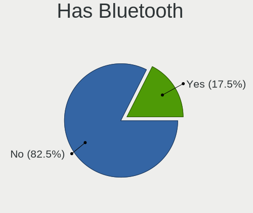
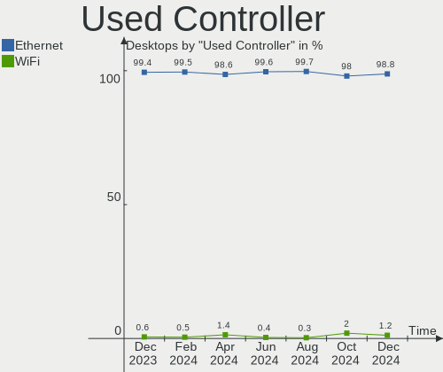

BSD - Hardware Trends (Desktops)
--------------------------------

A project to identify most popular hardware characteristics and track their change
over time based on data collected by BSD users at https://BSD-Hardware.info.

Anyone can contribute to this report by the [hw-probe](https://github.com/linuxhw/hw-probe/blob/master/INSTALL.BSD.md) tool:

    hw-probe -all -upload

This report is for one last month. Overall report since the beginning of time: [TestDays](https://github.com/bsdhw/TestDays)

Period: Feb, 2023.

Contents
--------

* [ System ](#system)
  - [ OS                       ](#os)
  - [ OS Family                ](#os-family)
  - [ Arch                     ](#arch)
  - [ DE                       ](#de)
  - [ Display Server           ](#display-server)
  - [ Display Manager          ](#display-manager)
  - [ OS Lang                  ](#os-lang)
  - [ Boot Mode                ](#boot-mode)
  - [ Filesystem               ](#filesystem)
  - [ Part. scheme             ](#part-scheme)

* [ Board ](#board)
  - [ Vendor                   ](#vendor)
  - [ Model                    ](#model)
  - [ Model Family             ](#model-family)
  - [ MFG Year                 ](#mfg-year)
  - [ Form Factor              ](#form-factor)
  - [ Coreboot                 ](#coreboot)
  - [ RAM Size                 ](#ram-size)
  - [ RAM Used                 ](#ram-used)
  - [ Total Drives             ](#total-drives)
  - [ Has CD-ROM               ](#has-cd-rom)
  - [ Has Ethernet             ](#has-ethernet)
  - [ Has WiFi                 ](#has-wifi)
  - [ Has Bluetooth            ](#has-bluetooth)

* [ Location ](#location)
  - [ Country                  ](#country)
  - [ City                     ](#city)

* [ Drives ](#drives)
  - [ Drive Vendor             ](#drive-vendor)
  - [ Drive Model              ](#drive-model)
  - [ HDD Vendor               ](#hdd-vendor)
  - [ SSD Vendor               ](#ssd-vendor)
  - [ Drive Kind               ](#drive-kind)
  - [ Drive Connector          ](#drive-connector)
  - [ Drive Size               ](#drive-size)
  - [ Space Total              ](#space-total)
  - [ Space Used               ](#space-used)
  - [ Malfunc. Drives          ](#malfunc-drives)
  - [ Malfunc. Drive Vendor    ](#malfunc-drive-vendor)
  - [ Malfunc. HDD Vendor      ](#malfunc-hdd-vendor)
  - [ Malfunc. Drive Kind      ](#malfunc-drive-kind)
  - [ Failed Drives            ](#failed-drives)
  - [ Failed Drive Vendor      ](#failed-drive-vendor)
  - [ Drive Status             ](#drive-status)

* [ Storage controller ](#storage-controller)
  - [ Storage Vendor           ](#storage-vendor)
  - [ Storage Model            ](#storage-model)
  - [ Storage Kind             ](#storage-kind)

* [ Processor ](#processor)
  - [ CPU Vendor               ](#cpu-vendor)
  - [ CPU Model                ](#cpu-model)
  - [ CPU Model Family         ](#cpu-model-family)
  - [ CPU Cores                ](#cpu-cores)
  - [ CPU Sockets              ](#cpu-sockets)
  - [ CPU Threads              ](#cpu-threads)
  - [ CPU Microarch            ](#cpu-microarch)

* [ Graphics ](#graphics)
  - [ GPU Vendor               ](#gpu-vendor)
  - [ GPU Model                ](#gpu-model)
  - [ GPU Combo                ](#gpu-combo)
  - [ GPU Driver               ](#gpu-driver)
  - [ GPU Memory               ](#gpu-memory)

* [ Monitor ](#monitor)
  - [ Monitor Vendor           ](#monitor-vendor)
  - [ Monitor Model            ](#monitor-model)
  - [ Monitor Resolution       ](#monitor-resolution)
  - [ Monitor Diagonal         ](#monitor-diagonal)
  - [ Monitor Width            ](#monitor-width)
  - [ Aspect Ratio             ](#aspect-ratio)
  - [ Monitor Area             ](#monitor-area)
  - [ Pixel Density            ](#pixel-density)
  - [ Multiple Monitors        ](#multiple-monitors)

* [ Network ](#network)
  - [ Net Controller Vendor    ](#net-controller-vendor)
  - [ Net Controller Model     ](#net-controller-model)
  - [ Wireless Vendor          ](#wireless-vendor)
  - [ Wireless Model           ](#wireless-model)
  - [ Ethernet Vendor          ](#ethernet-vendor)
  - [ Ethernet Model           ](#ethernet-model)
  - [ Net Controller Kind      ](#net-controller-kind)
  - [ Used Controller          ](#used-controller)
  - [ NICs                     ](#nics)
  - [ IPv6                     ](#ipv6)

* [ Bluetooth ](#bluetooth)
  - [ Bluetooth Vendor         ](#bluetooth-vendor)
  - [ Bluetooth Model          ](#bluetooth-model)

* [ Sound ](#sound)
  - [ Sound Vendor             ](#sound-vendor)
  - [ Sound Model              ](#sound-model)

* [ Memory ](#memory)
  - [ Memory Vendor            ](#memory-vendor)
  - [ Memory Model             ](#memory-model)
  - [ Memory Kind              ](#memory-kind)
  - [ Memory Form Factor       ](#memory-form-factor)
  - [ Memory Size              ](#memory-size)
  - [ Memory Speed             ](#memory-speed)

* [ Printers & scanners ](#printers--scanners)
  - [ Printer Vendor           ](#printer-vendor)
  - [ Printer Model            ](#printer-model)
  - [ Scanner Vendor           ](#scanner-vendor)
  - [ Scanner Model            ](#scanner-model)

* [ Camera ](#camera)
  - [ Camera Vendor            ](#camera-vendor)
  - [ Camera Model             ](#camera-model)

* [ Security ](#security)
  - [ Fingerprint Vendor       ](#fingerprint-vendor)
  - [ Fingerprint Model        ](#fingerprint-model)
  - [ Chipcard Vendor          ](#chipcard-vendor)
  - [ Chipcard Model           ](#chipcard-model)

* [ Unsupported ](#unsupported)
  - [ Unsupported Devices      ](#unsupported-devices)
  - [ Unsupported Device Types ](#unsupported-device-types)

System
------

OS
--

Installed operating systems

| Name                 | Desktops | Percent |
|----------------------|----------|---------|
| OPNsense 23.1.1      | 99       | 32.25%  |
| OPNsense 23.1        | 99       | 32.25%  |
| helloSystem 0.8.0    | 28       | 9.12%   |
| OPNsense 22.7.11     | 23       | 7.49%   |
| FreeBSD 13.1         | 8        | 2.61%   |
| OPNsense 23.7        | 6        | 1.95%   |
| FreeBSD 13.1-p7      | 5        | 1.63%   |
| OpenBSD 7.2          | 4        | 1.3%    |
| helloSystem 0.8.1    | 4        | 1.3%    |
| FreeBSD 13.1-p5      | 4        | 1.3%    |
| OPNsense 22.7.9      | 3        | 0.98%   |
| OPNsense 22.1.10     | 3        | 0.98%   |
| FreeBSD 14.0-CURRENT | 3        | 0.98%   |
| FreeBSD 13.1-p6      | 3        | 0.98%   |
| OPNsense 22.7.10     | 2        | 0.65%   |
| GhostBSD 23.02.02    | 2        | 0.65%   |
| FreeBSD 13.2-BETA2   | 2        | 0.65%   |
| OPNsense 21.7.8      | 1        | 0.33%   |
| NomadBSD 20221130    | 1        | 0.33%   |
| NetBSD 9.3           | 1        | 0.33%   |
| MyBee 13.1-p7        | 1        | 0.33%   |
| helloSystem 0.7.0    | 1        | 0.33%   |
| GhostBSD 22.06.18    | 1        | 0.33%   |
| FreeBSD 13.1-p2      | 1        | 0.33%   |
| FreeBSD 12.4         | 1        | 0.33%   |
| ClonOS 13.1.2        | 1        | 0.33%   |

OS Family
---------

OS without a version

| Name        | Desktops | Percent |
|-------------|----------|---------|
| OPNsense    | 236      | 76.87%  |
| helloSystem | 33       | 10.75%  |
| FreeBSD     | 27       | 8.79%   |
| OpenBSD     | 4        | 1.3%    |
| GhostBSD    | 3        | 0.98%   |
| NomadBSD    | 1        | 0.33%   |
| NetBSD      | 1        | 0.33%   |
| MyBee       | 1        | 0.33%   |
| ClonOS      | 1        | 0.33%   |

Arch
----

OS architecture (x86_64, i586, etc.)

| Name    | Desktops | Percent |
|---------|----------|---------|
| amd64   | 305      | 99.35%  |
| powerpc | 1        | 0.33%   |
| macppc  | 1        | 0.33%   |

DE
--

Desktop Environment

| Name         | Desktops | Percent |
|--------------|----------|---------|
| Console      | 250      | 81.43%  |
| helloDesktop | 37       | 12.05%  |
| XFCE         | 6        | 1.95%   |
| MATE         | 5        | 1.63%   |
| KDE5         | 4        | 1.3%    |
| TWM          | 1        | 0.33%   |
| Openbox      | 1        | 0.33%   |
| LXQt         | 1        | 0.33%   |
| DWM          | 1        | 0.33%   |
| AwesomeWM    | 1        | 0.33%   |

Display Server
--------------

X11 or Wayland

| Name    | Desktops | Percent |
|---------|----------|---------|
| Console | 252      | 82.08%  |
| X11     | 54       | 17.59%  |
| Tty     | 1        | 0.33%   |

Display Manager
---------------

SDDM, LightDM, etc.

| Name    | Desktops | Percent |
|---------|----------|---------|
| Console | 259      | 84.36%  |
| SLiM    | 35       | 11.4%   |
| LightDM | 6        | 1.95%   |
| SDDM    | 5        | 1.63%   |
| XDM     | 1        | 0.33%   |
| Ly      | 1        | 0.33%   |

OS Lang
-------

Language

| Lang    | Desktops | Percent |
|---------|----------|---------|
| Unknown | 236      | 76.87%  |
| C       | 27       | 8.79%   |
| en      | 14       | 4.56%   |
| en_US   | 9        | 2.93%   |
| fr      | 7        | 2.28%   |
| es      | 3        | 0.98%   |
| de_DE   | 3        | 0.98%   |
| ru_RU   | 2        | 0.65%   |
| ru      | 1        | 0.33%   |
| pt      | 1        | 0.33%   |
| pl_PL   | 1        | 0.33%   |
| pl      | 1        | 0.33%   |
| nl      | 1        | 0.33%   |
| en_GB   | 1        | 0.33%   |

Boot Mode
---------

EFI or BIOS

| Mode | Desktops | Percent |
|------|----------|---------|
| EFI  | 289      | 94.14%  |
| BIOS | 18       | 5.86%   |

Filesystem
----------

Type of filesystem

| Type   | Desktops | Percent |
|--------|----------|---------|
| Ufs    | 148      | 48.21%  |
| Zfs    | 133      | 43.32%  |
| Cd9660 | 22       | 7.17%   |
| Ffs    | 4        | 1.3%    |

Part. scheme
------------

Scheme of partitioning

| Type    | Desktops | Percent |
|---------|----------|---------|
| GPT     | 300      | 97.72%  |
| MBR     | 6        | 1.95%   |
| Unknown | 1        | 0.33%   |

Board
-----

Vendor
------

Motherboard manufacturer

| Name                | Desktops | Percent |
|---------------------|----------|---------|
| Unknown             | 48       | 15.64%  |
| Dell                | 39       | 12.7%   |
| ASUSTek Computer    | 30       | 9.77%   |
| Hewlett-Packard     | 19       | 6.19%   |
| Gigabyte Technology | 18       | 5.86%   |
| ASRock              | 18       | 5.86%   |
| Techvision          | 13       | 4.23%   |
| Supermicro          | 12       | 3.91%   |
| Protectli           | 12       | 3.91%   |
| PC Engines          | 12       | 3.91%   |
| Lenovo              | 12       | 3.91%   |
| Fujitsu             | 12       | 3.91%   |
| MSI                 | 10       | 3.26%   |
| Intel               | 10       | 3.26%   |
| CncTion             | 3        | 0.98%   |
| AZW                 | 3        | 0.98%   |
| Yanling             | 2        | 0.65%   |
| Seeed Studio        | 2        | 0.65%   |
| MW                  | 2        | 0.65%   |
| Huanan              | 2        | 0.65%   |
| Hardkernel          | 2        | 0.65%   |
| CWWK                | 2        | 0.65%   |
| Biostar             | 2        | 0.65%   |
| ZOTAC               | 1        | 0.33%   |
| YANYU               | 1        | 0.33%   |
| TYAN Computer       | 1        | 0.33%   |
| Stonesoft           | 1        | 0.33%   |
| Shuttle             | 1        | 0.33%   |
| NF541               | 1        | 0.33%   |
| MiTAC               | 1        | 0.33%   |
| Jingsha             | 1        | 0.33%   |
| Inventec            | 1        | 0.33%   |
| Intel BOX4A200      | 1        | 0.33%   |
| IceWhale Technology | 1        | 0.33%   |
| iBASE               | 1        | 0.33%   |
| HPE                 | 1        | 0.33%   |
| Foxconn             | 1        | 0.33%   |
| CNCTION-IAF-E3845   | 1        | 0.33%   |
| CheckPoint          | 1        | 0.33%   |
| ChangWang           | 1        | 0.33%   |

Model
-----

Motherboard model

| Name                            | Desktops | Percent |
|---------------------------------|----------|---------|
| Unknown                         | 50       | 16.29%  |
| Techvision TVI7309X             | 13       | 4.23%   |
| PC Engines APU2                 | 8        | 2.61%   |
| Dell OptiPlex 3020              | 6        | 1.95%   |
| Fujitsu FUTRO S920              | 4        | 1.3%    |
| Dell OptiPlex 9020              | 4        | 1.3%    |
| Dell OptiPlex 7010              | 4        | 1.3%    |
| Supermicro X7SPA-HF             | 3        | 0.98%   |
| Protectli FW4B                  | 3        | 0.98%   |
| Dell OptiPlex 9010              | 3        | 0.98%   |
| Dell OptiPlex 7060              | 3        | 0.98%   |
| Supermicro X9SCL/X9SCM          | 2        | 0.65%   |
| Protectli VP2420                | 2        | 0.65%   |
| Protectli VP2410                | 2        | 0.65%   |
| Protectli FW6                   | 2        | 0.65%   |
| Protectli FW2B                  | 2        | 0.65%   |
| PC Engines apu4                 | 2        | 0.65%   |
| MW GMLK-2_5G4L                  | 2        | 0.65%   |
| Intel Q3XXG4-P V1.0             | 2        | 0.65%   |
| HP Compaq Elite 8300 CMT        | 2        | 0.65%   |
| Hardkernel ODROID-H2            | 2        | 0.65%   |
| Fujitsu FUTRO S930              | 2        | 0.65%   |
| Dell Precision Tower 5810       | 2        | 0.65%   |
| Dell OptiPlex 7020              | 2        | 0.65%   |
| Dell Inspiron 3470              | 2        | 0.65%   |
| CncTion N5105-4L                | 2        | 0.65%   |
| AZW U59                         | 2        | 0.65%   |
| ASRock A520M-ITX/ac             | 2        | 0.65%   |
| YANYU R250                      | 1        | 0.33%   |
| Yanling YL-KBR6L                | 1        | 0.33%   |
| Yanling LES network 6L          | 1        | 0.33%   |
| TYAN 1X8-X6 CACHEH              | 1        | 0.33%   |
| Supermicro X8STi                | 1        | 0.33%   |
| Supermicro X7SLA                | 1        | 0.33%   |
| Supermicro SYS-E200-8D          | 1        | 0.33%   |
| Supermicro Pro546267            | 1        | 0.33%   |
| Supermicro PIO-518D-N6TRF-ST031 | 1        | 0.33%   |
| Supermicro PDSBM                | 1        | 0.33%   |
| Supermicro AS -5019D-FTN4       | 1        | 0.33%   |
| Stonesoft FW-315-C1             | 1        | 0.33%   |

Model Family
------------

Motherboard model prefix

| Name                   | Desktops | Percent |
|------------------------|----------|---------|
| Unknown                | 50       | 16.29%  |
| Dell OptiPlex          | 30       | 9.77%   |
| Techvision TVI7309X    | 13       | 4.23%   |
| Lenovo ThinkCentre     | 9        | 2.93%   |
| Fujitsu FUTRO          | 9        | 2.93%   |
| PC Engines APU2        | 8        | 2.61%   |
| ASUS PRIME             | 8        | 2.61%   |
| HP Compaq              | 7        | 2.28%   |
| HP ProDesk             | 5        | 1.63%   |
| Dell Precision         | 4        | 1.3%    |
| Dell Inspiron          | 4        | 1.3%    |
| Supermicro X7SPA-HF    | 3        | 0.98%   |
| Protectli FW4B         | 3        | 0.98%   |
| HP EliteDesk           | 3        | 0.98%   |
| ASUS ROG               | 3        | 0.98%   |
| Supermicro X9SCL       | 2        | 0.65%   |
| Protectli VP2420       | 2        | 0.65%   |
| Protectli VP2410       | 2        | 0.65%   |
| Protectli FW6          | 2        | 0.65%   |
| Protectli FW2B         | 2        | 0.65%   |
| PC Engines apu4        | 2        | 0.65%   |
| MW GMLK-2              | 2        | 0.65%   |
| Intel Q3XXG4-P         | 2        | 0.65%   |
| HP Pavilion            | 2        | 0.65%   |
| Hardkernel ODROID-H2   | 2        | 0.65%   |
| Fujitsu ESPRIMO        | 2        | 0.65%   |
| CncTion N5105-4L       | 2        | 0.65%   |
| AZW U59                | 2        | 0.65%   |
| ASUS TUF               | 2        | 0.65%   |
| ASUS P8Z68-V           | 2        | 0.65%   |
| ASUS H110I-PLUS        | 2        | 0.65%   |
| ASRock X570            | 2        | 0.65%   |
| ASRock A520M-ITX       | 2        | 0.65%   |
| YANYU R250             | 1        | 0.33%   |
| Yanling YL-KBR6L       | 1        | 0.33%   |
| Yanling LES            | 1        | 0.33%   |
| TYAN 1X8-X6            | 1        | 0.33%   |
| Supermicro X8STi       | 1        | 0.33%   |
| Supermicro X7SLA       | 1        | 0.33%   |
| Supermicro SYS-E200-8D | 1        | 0.33%   |

MFG Year
--------

Motherboard manufacture year

| Year    | Desktops | Percent |
|---------|----------|---------|
| 2022    | 64       | 20.85%  |
| 2019    | 31       | 10.1%   |
| 2021    | 29       | 9.45%   |
| 2014    | 28       | 9.12%   |
| 2018    | 27       | 8.79%   |
| 2012    | 23       | 7.49%   |
| 2016    | 21       | 6.84%   |
| 2020    | 18       | 5.86%   |
| 2015    | 14       | 4.56%   |
| 2013    | 13       | 4.23%   |
| 2011    | 11       | 3.58%   |
| 2010    | 9        | 2.93%   |
| 2017    | 7        | 2.28%   |
| 2009    | 3        | 0.98%   |
| 2008    | 3        | 0.98%   |
| Unknown | 3        | 0.98%   |
| 2023    | 2        | 0.65%   |
| 2007    | 1        | 0.33%   |

Form Factor
-----------

Physical design of the computer

| Name    | Desktops | Percent |
|---------|----------|---------|
| Desktop | 307      | 100%    |

Coreboot
--------

Have coreboot on board

| Used | Desktops | Percent |
|------|----------|---------|
| No   | 292      | 95.11%  |
| Yes  | 15       | 4.89%   |

RAM Size
--------

Total RAM memory

| Size in GB  | Desktops | Percent |
|-------------|----------|---------|
| 8.01-16.0   | 120      | 39.09%  |
| 16.01-24.0  | 81       | 26.38%  |
| 4.01-8.0    | 45       | 14.66%  |
| 32.01-64.0  | 23       | 7.49%   |
| 2.01-3.0    | 16       | 5.21%   |
| 64.01-256.0 | 13       | 4.23%   |
| 24.01-32.0  | 4        | 1.3%    |
| 3.01-4.0    | 2        | 0.65%   |
| 0.51-1.0    | 2        | 0.65%   |
| 1.01-2.0    | 1        | 0.33%   |

RAM Used
--------

Used RAM memory

| Used GB  | Desktops | Percent |
|----------|----------|---------|
| 0.01-0.5 | 153      | 49.84%  |
| 0.51-1.0 | 102      | 33.22%  |
| 1.01-2.0 | 37       | 12.05%  |
| 2.01-3.0 | 10       | 3.26%   |
| 3.01-4.0 | 3        | 0.98%   |
| 4.01-8.0 | 1        | 0.33%   |
| Unknown  | 1        | 0.33%   |

Total Drives
------------

Number of drives on board

| Drives | Desktops | Percent |
|--------|----------|---------|
| 1      | 201      | 65.47%  |
| 2      | 47       | 15.31%  |
| 0      | 33       | 10.75%  |
| 3      | 11       | 3.58%   |
| 4      | 9        | 2.93%   |
| 5      | 2        | 0.65%   |
| 13     | 1        | 0.33%   |
| 9      | 1        | 0.33%   |
| 7      | 1        | 0.33%   |
| 6      | 1        | 0.33%   |

Has CD-ROM
----------

Has CD-ROM on board

| Presented | Desktops | Percent |
|-----------|----------|---------|
| No        | 244      | 79.48%  |
| Yes       | 63       | 20.52%  |

Has Ethernet
------------

Has Ethernet on board

| Presented | Desktops | Percent |
|-----------|----------|---------|
| Yes       | 306      | 99.67%  |
| No        | 1        | 0.33%   |

Has WiFi
--------

Has WiFi module

| Presented | Desktops | Percent |
|-----------|----------|---------|
| No        | 242      | 78.83%  |
| Yes       | 65       | 21.17%  |

Has Bluetooth
-------------

Has Bluetooth module

| Presented | Desktops | Percent |
|-----------|----------|---------|
| No        | 262      | 85.34%  |
| Yes       | 45       | 14.66%  |

Location
--------

Country
-------

Geographic location (country)

| Country     | Desktops | Percent |
|-------------|----------|---------|
| USA         | 101      | 32.9%   |
| Germany     | 53       | 17.26%  |
| Canada      | 16       | 5.21%   |
| Russia      | 13       | 4.23%   |
| France      | 11       | 3.58%   |
| Poland      | 10       | 3.26%   |
| UK          | 9        | 2.93%   |
| Switzerland | 9        | 2.93%   |
| Brazil      | 7        | 2.28%   |
| Netherlands | 6        | 1.95%   |
| Austria     | 6        | 1.95%   |
| Australia   | 6        | 1.95%   |
| Spain       | 4        | 1.3%    |
| Italy       | 4        | 1.3%    |
| China       | 4        | 1.3%    |
| Thailand    | 3        | 0.98%   |
| South Korea | 3        | 0.98%   |
| Romania     | 3        | 0.98%   |
| Portugal    | 3        | 0.98%   |
| Japan       | 3        | 0.98%   |
| Peru        | 2        | 0.65%   |
| Mexico      | 2        | 0.65%   |
| Indonesia   | 2        | 0.65%   |
| India       | 2        | 0.65%   |
| Finland     | 2        | 0.65%   |
| Bulgaria    | 2        | 0.65%   |
| Belgium     | 2        | 0.65%   |
| Argentina   | 2        | 0.65%   |
| Turkey      | 1        | 0.33%   |
| Sweden      | 1        | 0.33%   |
| Slovakia    | 1        | 0.33%   |
| Singapore   | 1        | 0.33%   |
| Puerto Rico | 1        | 0.33%   |
| Philippines | 1        | 0.33%   |
| New Zealand | 1        | 0.33%   |
| Malaysia    | 1        | 0.33%   |
| Luxembourg  | 1        | 0.33%   |
| Ireland     | 1        | 0.33%   |
| Hungary     | 1        | 0.33%   |
| Estonia     | 1        | 0.33%   |

City
----

Geographic location (city)

| City             | Desktops | Percent |
|------------------|----------|---------|
| Moscow           | 5        | 1.63%   |
| Berlin           | 5        | 1.63%   |
| London           | 4        | 1.3%    |
| Zurich           | 3        | 0.98%   |
| Toronto          | 3        | 0.98%   |
| Salem            | 3        | 0.98%   |
| New York         | 3        | 0.98%   |
| Melbourne        | 3        | 0.98%   |
| Bucharest        | 3        | 0.98%   |
| Zhengzhou        | 2        | 0.65%   |
| Warsaw           | 2        | 0.65%   |
| Vienna           | 2        | 0.65%   |
| Statesboro       | 2        | 0.65%   |
| St Petersburg    | 2        | 0.65%   |
| Rio de Janeiro   | 2        | 0.65%   |
| Redmond          | 2        | 0.65%   |
| Portland         | 2        | 0.65%   |
| Paris            | 2        | 0.65%   |
| Munich           | 2        | 0.65%   |
| Mönchengladbach | 2        | 0.65%   |
| Medford          | 2        | 0.65%   |
| Lima             | 2        | 0.65%   |
| Jakarta          | 2        | 0.65%   |
| Gistel           | 2        | 0.65%   |
| Erlangen         | 2        | 0.65%   |
| Chelyabinsk      | 2        | 0.65%   |
| Bangkok          | 2        | 0.65%   |
| Atlanta          | 2        | 0.65%   |
| Zagreb           | 1        | 0.33%   |
| Yekaterinburg    | 1        | 0.33%   |
| Yala             | 1        | 0.33%   |
| Włocławek      | 1        | 0.33%   |
| Wokingham        | 1        | 0.33%   |
| Winterthur       | 1        | 0.33%   |
| Wiesbaden        | 1        | 0.33%   |
| Wetaskiwin       | 1        | 0.33%   |
| Westminster      | 1        | 0.33%   |
| West Kelowna     | 1        | 0.33%   |
| Wenatchee        | 1        | 0.33%   |
| Wejherowo        | 1        | 0.33%   |

Drives
------

Drive Vendor
------------

Hard drive vendors

| Vendor              | Desktops | Drives | Percent |
|---------------------|----------|--------|---------|
| Samsung Electronics | 53       | 65     | 15.32%  |
| WDC                 | 47       | 65     | 13.58%  |
| Seagate             | 27       | 41     | 7.8%    |
| Kingston            | 26       | 28     | 7.51%   |
| Intel               | 18       | 20     | 5.2%    |
| Crucial             | 15       | 19     | 4.34%   |
| Transcend           | 14       | 14     | 4.05%   |
| A-DATA Technology   | 14       | 16     | 4.05%   |
| China               | 13       | 13     | 3.76%   |
| SanDisk             | 11       | 11     | 3.18%   |
| Toshiba             | 9        | 10     | 2.6%    |
| Hitachi             | 8        | 10     | 2.31%   |
| Team                | 5        | 5      | 1.45%   |
| SPCC                | 5        | 5      | 1.45%   |
| SK hynix            | 5        | 6      | 1.45%   |
| Hoodisk             | 5        | 5      | 1.45%   |
| Protectli           | 4        | 4      | 1.16%   |
| Patriot             | 4        | 4      | 1.16%   |
| LITEON              | 4        | 4      | 1.16%   |
| FORESEE             | 4        | 4      | 1.16%   |
| Silicon Motion      | 3        | 3      | 0.87%   |
| Gigabyte Technology | 3        | 3      | 0.87%   |
| Corsair             | 3        | 4      | 0.87%   |
| T-FORCE             | 2        | 2      | 0.58%   |
| PNY                 | 2        | 2      | 0.58%   |
| Mushkin             | 2        | 2      | 0.58%   |
| Micron Technology   | 2        | 2      | 0.58%   |
| LITEONIT            | 2        | 2      | 0.58%   |
| Lexar               | 2        | 2      | 0.58%   |
| Kimtigo             | 2        | 2      | 0.58%   |
| Intenso             | 2        | 2      | 0.58%   |
| Innodisk            | 2        | 2      | 0.58%   |
| Fanxiang            | 2        | 2      | 0.58%   |
| Dogfish             | 2        | 2      | 0.58%   |
| Apacer              | 2        | 2      | 0.58%   |
| Zheino              | 1        | 1      | 0.29%   |
| XrayDisk            | 1        | 1      | 0.29%   |
| Smartbuy            | 1        | 1      | 0.29%   |
| Reletech            | 1        | 1      | 0.29%   |
| Phison              | 1        | 1      | 0.29%   |

Drive Model
-----------

Hard drive models

| Model                           | Desktops | Percent |
|---------------------------------|----------|---------|
| China SATA SSD 16GB             | 6        | 1.59%   |
| Samsung SSD 850 EVO 250GB       | 5        | 1.32%   |
| FORESEE 128GB SSD               | 4        | 1.06%   |
| WDC WDS120G2G0A-00JH30 120GB    | 3        | 0.79%   |
| Transcend TS64GMSA230S 64GB     | 3        | 0.79%   |
| Transcend TS128GMSA230S 128GB   | 3        | 0.79%   |
| Seagate ST500DM002-1BD142 500GB | 3        | 0.79%   |
| Samsung SSD 970 EVO Plus 1TB    | 3        | 0.79%   |
| Protectli 120GB M.2             | 3        | 0.79%   |
| Kingston SV300S37A120G 120GB    | 3        | 0.79%   |
| Kingston SUV500MS120G 120GB     | 3        | 0.79%   |
| Crucial CT250MX500SSD1 250GB    | 3        | 0.79%   |
| A-DATA SU630 240GB              | 3        | 0.79%   |
| WDC WDS240G2G0A-00JH30 240GB    | 2        | 0.53%   |
| WDC WD1002FBYS-02A6B0 1TB       | 2        | 0.53%   |
| Transcend TS128GMTE110S 128GB   | 2        | 0.53%   |
| SPCC Solid State Disk 256GB     | 2        | 0.53%   |
| Silicon Motion GV128 128GB      | 2        | 0.53%   |
| Seagate ST4000DM000-1F2168 4TB  | 2        | 0.53%   |
| Seagate ST1000DM010-2EP102 1TB  | 2        | 0.53%   |
| SanDisk SDSSDA120G 120GB        | 2        | 0.53%   |
| SanDisk SD7SN3Q512G1002 512GB   | 2        | 0.53%   |
| Samsung SSD 970 EVO Plus 500GB  | 2        | 0.53%   |
| Samsung SSD 970 EVO Plus 2TB    | 2        | 0.53%   |
| Samsung SSD 870 EVO 2TB         | 2        | 0.53%   |
| Samsung SSD 860 EVO 500GB       | 2        | 0.53%   |
| Samsung SSD 860 EVO 250GB       | 2        | 0.53%   |
| Samsung SSD 840 EVO 250GB       | 2        | 0.53%   |
| Samsung HD322HJ 320GB           | 2        | 0.53%   |
| LITEON CV8-8E128-11 SATA 128GB  | 2        | 0.53%   |
| Kingston SUV500MS240G 240GB     | 2        | 0.53%   |
| Kingston SNVS500G 500GB         | 2        | 0.53%   |
| Kingston SA400S37240G 240GB     | 2        | 0.53%   |
| Kingston SA400S37120G 120GB     | 2        | 0.53%   |
| Intenso SSD 128GB               | 2        | 0.53%   |
| Hoodisk SSD 32GB                | 2        | 0.53%   |
| Hoodisk SSD 128GB               | 2        | 0.53%   |
| Crucial CT500P3SSD8 500GB       | 2        | 0.53%   |
| Crucial CT480BX500SSD1 480GB    | 2        | 0.53%   |
| Crucial CT240BX500SSD1 240GB    | 2        | 0.53%   |

HDD Vendor
----------

Hard disk drive vendors

| Vendor              | Desktops | Drives | Percent |
|---------------------|----------|--------|---------|
| WDC                 | 35       | 50     | 41.18%  |
| Seagate             | 26       | 39     | 30.59%  |
| Samsung Electronics | 8        | 9      | 9.41%   |
| Hitachi             | 8        | 10     | 9.41%   |
| Toshiba             | 6        | 7      | 7.06%   |
| HPT                 | 1        | 8      | 1.18%   |
| HGST                | 1        | 1      | 1.18%   |

SSD Vendor
----------

Solid state drive vendors

| Vendor              | Desktops | Drives | Percent |
|---------------------|----------|--------|---------|
| Samsung Electronics | 29       | 35     | 14.8%   |
| Kingston            | 19       | 21     | 9.69%   |
| Intel               | 15       | 17     | 7.65%   |
| China               | 13       | 13     | 6.63%   |
| Transcend           | 12       | 12     | 6.12%   |
| Crucial             | 12       | 16     | 6.12%   |
| A-DATA Technology   | 12       | 14     | 6.12%   |
| SanDisk             | 11       | 11     | 5.61%   |
| WDC                 | 6        | 8      | 3.06%   |
| Hoodisk             | 5        | 5      | 2.55%   |
| Team                | 4        | 4      | 2.04%   |
| SPCC                | 4        | 4      | 2.04%   |
| Protectli           | 4        | 4      | 2.04%   |
| Patriot             | 4        | 4      | 2.04%   |
| FORESEE             | 4        | 4      | 2.04%   |
| LITEON              | 3        | 3      | 1.53%   |
| SK hynix            | 2        | 2      | 1.02%   |
| PNY                 | 2        | 2      | 1.02%   |
| Mushkin             | 2        | 2      | 1.02%   |
| Micron Technology   | 2        | 2      | 1.02%   |
| LITEONIT            | 2        | 2      | 1.02%   |
| Intenso             | 2        | 2      | 1.02%   |
| Innodisk            | 2        | 2      | 1.02%   |
| Dogfish             | 2        | 2      | 1.02%   |
| Apacer              | 2        | 2      | 1.02%   |
| Zheino              | 1        | 1      | 0.51%   |
| XrayDisk            | 1        | 1      | 0.51%   |
| Toshiba             | 1        | 1      | 0.51%   |
| T-FORCE             | 1        | 1      | 0.51%   |
| Smartbuy            | 1        | 1      | 0.51%   |
| Seagate             | 1        | 2      | 0.51%   |
| OCZ                 | 1        | 1      | 0.51%   |
| Leven               | 1        | 1      | 0.51%   |
| Kston               | 1        | 1      | 0.51%   |
| KingSpec            | 1        | 1      | 0.51%   |
| KingDian            | 1        | 1      | 0.51%   |
| KeepData            | 1        | 1      | 0.51%   |
| Hewlett-Packard     | 1        | 1      | 0.51%   |
| Gigabyte Technology | 1        | 1      | 0.51%   |
| EDGE                | 1        | 1      | 0.51%   |

Drive Kind
----------

HDD or SSD

| Kind | Desktops | Drives | Percent |
|------|----------|--------|---------|
| SSD  | 186      | 215    | 57.41%  |
| HDD  | 72       | 124    | 22.22%  |
| NVMe | 66       | 73     | 20.37%  |

Drive Connector
---------------

SATA, SAS, NVMe, etc.

| Type | Desktops | Drives | Percent |
|------|----------|--------|---------|
| SATA | 229      | 339    | 77.63%  |
| NVMe | 66       | 73     | 22.37%  |

Drive Size
----------

Size of hard drive

| Size in TB | Desktops | Drives | Percent |
|------------|----------|--------|---------|
| 0.01-0.5   | 201      | 238    | 76.72%  |
| 0.51-1.0   | 31       | 47     | 11.83%  |
| 1.01-2.0   | 18       | 25     | 6.87%   |
| 3.01-4.0   | 6        | 10     | 2.29%   |
| 4.01-10.0  | 3        | 10     | 1.15%   |
| 10.01-20.0 | 2        | 8      | 0.76%   |
| 2.01-3.0   | 1        | 1      | 0.38%   |

Space Total
-----------

Amount of disk space available on the file system

| Size in GB     | Desktops | Percent |
|----------------|----------|---------|
| 101-250        | 148      | 48.21%  |
| 251-500        | 41       | 13.36%  |
| 1-20           | 35       | 11.4%   |
| 51-100         | 33       | 10.75%  |
| 501-1000       | 22       | 7.17%   |
| 21-50          | 20       | 6.51%   |
| 1001-2000      | 4        | 1.3%    |
| More than 3000 | 3        | 0.98%   |
| 2001-3000      | 1        | 0.33%   |

Space Used
----------

Amount of used disk space

| Used GB        | Desktops | Percent |
|----------------|----------|---------|
| 1-20           | 282      | 91.86%  |
| 21-50          | 18       | 5.86%   |
| 51-100         | 4        | 1.3%    |
| More than 3000 | 1        | 0.33%   |
| 2001-3000      | 1        | 0.33%   |
| 101-250        | 1        | 0.33%   |

Malfunc. Drives
---------------

Drive models with a malfunction

| Model                                 | Desktops | Drives | Percent |
|---------------------------------------|----------|--------|---------|
| WDC WDS240G2G0A-00JH30 240GB          | 2        | 3      | 5.56%   |
| WDC WD800AAJS-00TDA0 80GB             | 1        | 1      | 2.78%   |
| WDC WD5000LPLX-00ZNTT0 500GB          | 1        | 1      | 2.78%   |
| WDC WD2503ABYX-01WERA0 256GB          | 1        | 1      | 2.78%   |
| WDC WD1600AAJS-60Z0A0 160GB           | 1        | 1      | 2.78%   |
| WDC WD10EACS-00D6B1 1TB               | 1        | 1      | 2.78%   |
| Toshiba DT01ACA100 1TB                | 1        | 1      | 2.78%   |
| Seagate ST500DM002-1BD142 500GB       | 1        | 1      | 2.78%   |
| Seagate ST5000DM000-1FK178 5TB        | 1        | 1      | 2.78%   |
| Seagate ST3250310NS 250GB             | 1        | 2      | 2.78%   |
| Seagate ST310212A 10GB                | 1        | 1      | 2.78%   |
| Seagate ST1000DX001-1CM162 1TB        | 1        | 1      | 2.78%   |
| Seagate ST1000DM010-2EP102 1TB        | 1        | 1      | 2.78%   |
| Seagate ST1000DM003-1CH162 1TB        | 1        | 1      | 2.78%   |
| SanDisk SDSSDH3512G 512GB             | 1        | 1      | 2.78%   |
| Samsung Electronics SSD 970 EVO 500GB | 1        | 1      | 2.78%   |
| Samsung Electronics SSD 950 PRO 256GB | 1        | 1      | 2.78%   |
| Samsung Electronics SSD 870 EVO 250GB | 1        | 1      | 2.78%   |
| Samsung Electronics HM320II 320GB     | 1        | 1      | 2.78%   |
| Samsung Electronics HM160HI 160GB     | 1        | 1      | 2.78%   |
| Samsung Electronics HD322HJ 320GB     | 1        | 1      | 2.78%   |
| OCZ VERTEX3 64GB                      | 1        | 1      | 2.78%   |
| LITEONIT LCT-128M3S 128GB             | 1        | 1      | 2.78%   |
| Intel SSDSC2CW120A3 120GB             | 1        | 1      | 2.78%   |
| Intel SSDSC2BB120G6R 120GB            | 1        | 1      | 2.78%   |
| Hitachi HTS542516K9SA00 160GB         | 1        | 1      | 2.78%   |
| Hitachi HTS541680J9SA00 80GB          | 1        | 1      | 2.78%   |
| Hitachi HDT721010SLA360 1TB           | 1        | 1      | 2.78%   |
| HGST HTS725050A7E630 500GB            | 1        | 1      | 2.78%   |
| EDGE Boost Pro 120GB SSD              | 1        | 1      | 2.78%   |
| Crucial CT480BX500SSD1 480GB          | 1        | 1      | 2.78%   |
| Crucial CT1050MX300SSD1 1TB           | 1        | 1      | 2.78%   |
| China SH00M256GB                      | 1        | 1      | 2.78%   |
| A-DATA Technology SU800 256GB         | 1        | 1      | 2.78%   |
| A-DATA Technology SU800 128GB         | 1        | 1      | 2.78%   |

Malfunc. Drive Vendor
---------------------

Vendors of faulty drives

| Vendor              | Desktops | Drives | Percent |
|---------------------|----------|--------|---------|
| WDC                 | 7        | 8      | 19.44%  |
| Seagate             | 7        | 8      | 19.44%  |
| Samsung Electronics | 6        | 6      | 16.67%  |
| Hitachi             | 3        | 3      | 8.33%   |
| Intel               | 2        | 2      | 5.56%   |
| Crucial             | 2        | 2      | 5.56%   |
| A-DATA Technology   | 2        | 2      | 5.56%   |
| Toshiba             | 1        | 1      | 2.78%   |
| SanDisk             | 1        | 1      | 2.78%   |
| OCZ                 | 1        | 1      | 2.78%   |
| LITEONIT            | 1        | 1      | 2.78%   |
| HGST                | 1        | 1      | 2.78%   |
| EDGE                | 1        | 1      | 2.78%   |
| China               | 1        | 1      | 2.78%   |

Malfunc. HDD Vendor
-------------------

Vendors of faulty HDD drives

| Vendor              | Desktops | Drives | Percent |
|---------------------|----------|--------|---------|
| Seagate             | 7        | 8      | 35%     |
| WDC                 | 5        | 5      | 25%     |
| Samsung Electronics | 3        | 3      | 15%     |
| Hitachi             | 3        | 3      | 15%     |
| Toshiba             | 1        | 1      | 5%      |
| HGST                | 1        | 1      | 5%      |

Malfunc. Drive Kind
-------------------

Kinds of faulty drives

| Kind | Desktops | Drives | Percent |
|------|----------|--------|---------|
| HDD  | 20       | 21     | 55.56%  |
| SSD  | 14       | 15     | 38.89%  |
| NVMe | 2        | 2      | 5.56%   |

Failed Drives
-------------

Failed drive models

| Model                             | Desktops | Drives | Percent |
|-----------------------------------|----------|--------|---------|
| Seagate ST3250310AS 250GB         | 1        | 1      | 25%     |
| Samsung Electronics SSD 980 250GB | 1        | 1      | 25%     |
| Samsung Electronics HD103SJ 1TB   | 1        | 1      | 25%     |
| Kingston SA2000M8500G 500GB       | 1        | 1      | 25%     |

Failed Drive Vendor
-------------------

Failed drive vendors

| Vendor              | Desktops | Drives | Percent |
|---------------------|----------|--------|---------|
| Samsung Electronics | 2        | 2      | 50%     |
| Seagate             | 1        | 1      | 25%     |
| Kingston            | 1        | 1      | 25%     |

Drive Status
------------

Number of failed and malfunc. drives

| Status   | Desktops | Drives | Percent |
|----------|----------|--------|---------|
| Works    | 250      | 357    | 84.75%  |
| Malfunc  | 36       | 38     | 12.2%   |
| Detected | 5        | 13     | 1.69%   |
| Failed   | 4        | 4      | 1.36%   |

Storage controller
------------------

Storage Vendor
--------------

Storage controller vendors

| Vendor                       | Desktops | Percent |
|------------------------------|----------|---------|
| Intel                        | 237      | 62.2%   |
| AMD                          | 58       | 15.22%  |
| Samsung Electronics          | 19       | 4.99%   |
| Sandisk                      | 13       | 3.41%   |
| Silicon Motion               | 11       | 2.89%   |
| Kingston Technology Company  | 7        | 1.84%   |
| Phison Electronics           | 6        | 1.57%   |
| Marvell Technology Group     | 4        | 1.05%   |
| SK hynix                     | 3        | 0.79%   |
| Micron/Crucial Technology    | 3        | 0.79%   |
| JMicron Technology           | 3        | 0.79%   |
| ASMedia Technology           | 3        | 0.79%   |
| Toshiba                      | 2        | 0.52%   |
| Shenzhen Longsys Electronics | 2        | 0.52%   |
| MAXIO Technology (Hangzhou)  | 2        | 0.52%   |
| Broadcom / LSI               | 2        | 0.52%   |
| ADATA Technology             | 2        | 0.52%   |
| Transcend                    | 1        | 0.26%   |
| Nvidia                       | 1        | 0.26%   |
| Lite-On Technology           | 1        | 0.26%   |
| HighPoint Technologies       | 1        | 0.26%   |

Storage Model
-------------

Storage controller models

| Model                                                                                   | Desktops | Percent |
|-----------------------------------------------------------------------------------------|----------|---------|
| AMD FCH SATA Controller [AHCI mode]                                                     | 41       | 9.45%   |
| Intel 8 Series/C220 Series Chipset Family 6-port SATA Controller 1 [AHCI mode]          | 30       | 6.91%   |
| Intel Celeron/Pentium Silver Processor SATA Controller                                  | 29       | 6.68%   |
| Intel Jasper Lake SATA AHCI Controller                                                  | 23       | 5.3%    |
| Samsung NVMe SSD Controller SM981/PM981/PM983                                           | 12       | 2.76%   |
| Intel Sunrise Point-LP SATA Controller [AHCI mode]                                      | 12       | 2.76%   |
| Intel Cannon Lake PCH SATA AHCI Controller                                              | 12       | 2.76%   |
| Intel 7 Series/C210 Series Chipset Family 6-port SATA Controller [AHCI mode]            | 12       | 2.76%   |
| Silicon Motion SM2263EN/SM2263XT SSD Controller                                         | 11       | 2.53%   |
| Intel Q170/Q150/B150/H170/H110/Z170/CM236 Chipset SATA Controller [AHCI Mode]           | 11       | 2.53%   |
| Intel NM10/ICH7 Family SATA Controller [IDE mode]                                       | 11       | 2.53%   |
| Intel 6 Series/C200 Series Chipset Family 6 port Desktop SATA AHCI Controller           | 11       | 2.53%   |
| Intel Atom/Celeron/Pentium Processor x5-E8000/J3xxx/N3xxx Series SATA Controller        | 10       | 2.3%    |
| Unknown                                                                                 | 10       | 2.3%    |
| Intel 82801G (ICH7 Family) IDE Controller                                               | 9        | 2.07%   |
| Intel 200 Series PCH SATA controller [AHCI mode]                                        | 8        | 1.84%   |
| AMD 400 Series Chipset SATA Controller                                                  | 8        | 1.84%   |
| Intel SATA Controller [RAID mode]                                                       | 7        | 1.61%   |
| Intel 82801IR/IO/IH (ICH9R/DO/DH) 4 port SATA Controller [IDE mode]                     | 5        | 1.15%   |
| Intel 82801I (ICH9 Family) 2 port SATA Controller [IDE mode]                            | 5        | 1.15%   |
| Intel 82801HM/HEM (ICH8M/ICH8M-E) IDE Controller                                        | 5        | 1.15%   |
| SanDisk WD Blue SN570 NVMe SSD                                                          | 4        | 0.92%   |
| Intel Elkhart Lake SATA AHCI                                                            | 4        | 0.92%   |
| Intel Comet Lake SATA AHCI Controller                                                   | 4        | 0.92%   |
| Intel 9 Series Chipset Family SATA Controller [AHCI Mode]                               | 4        | 0.92%   |
| AMD SB7x0/SB8x0/SB9x0 SATA Controller [AHCI mode]                                       | 4        | 0.92%   |
| AMD FCH SATA Controller D                                                               | 4        | 0.92%   |
| AMD 500 Series Chipset SATA Controller                                                  | 4        | 0.92%   |
| SanDisk WD Blue SN500 / PC SN520 NVMe SSD                                               | 3        | 0.69%   |
| Samsung NVMe SSD Controller SM961/PM961/SM963                                           | 3        | 0.69%   |
| Phison PS5013 E13 NVMe Controller                                                       | 3        | 0.69%   |
| Phison E16 PCIe4 NVMe Controller                                                        | 3        | 0.69%   |
| Micron/Crucial P2 NVMe PCIe SSD                                                         | 3        | 0.69%   |
| Intel C610/X99 series chipset 6-Port SATA Controller [AHCI mode]                        | 3        | 0.69%   |
| Intel Atom Processor E3800 Series SATA AHCI Controller                                  | 3        | 0.69%   |
| Intel 82801HM/HEM (ICH8M/ICH8M-E) SATA Controller [AHCI mode]                           | 3        | 0.69%   |
| Intel 6 Series/C200 Series Chipset Family Desktop SATA Controller (IDE mode, ports 4-5) | 3        | 0.69%   |
| Intel 6 Series/C200 Series Chipset Family Desktop SATA Controller (IDE mode, ports 0-3) | 3        | 0.69%   |
| Intel 500 Series Chipset Family SATA AHCI Controller                                    | 3        | 0.69%   |
| ASMedia ASM1062 Serial ATA Controller                                                   | 3        | 0.69%   |

Storage Kind
------------

Kind of storage controller (IDE, SATA, NVMe, SAS, ...)

| Kind | Desktops | Percent |
|------|----------|---------|
| SATA | 258      | 67.36%  |
| NVMe | 72       | 18.8%   |
| IDE  | 39       | 10.18%  |
| RAID | 12       | 3.13%   |
| SAS  | 2        | 0.52%   |

Processor
---------

CPU Vendor
----------

Processor vendors

| Vendor  | Desktops | Percent |
|---------|----------|---------|
| Intel   | 246      | 80.13%  |
| AMD     | 59       | 19.22%  |
| IBM     | 1        | 0.33%   |
| Unknown | 1        | 0.33%   |

CPU Model
---------

Processor models

| Model                                      | Desktops | Percent |
|--------------------------------------------|----------|---------|
| Intel Celeron N5105 @ 2.00GHz              | 20       | 6.51%   |
| Intel Celeron J4125 CPU @ 2.00GHz          | 20       | 6.51%   |
| AMD GX-412TC SOC                           | 10       | 3.26%   |
| Intel Core i5-3570 CPU @ 3.40GHz           | 6        | 1.95%   |
| Intel Celeron CPU J3160 @ 1.60GHz          | 6        | 1.95%   |
| Intel Atom CPU D525 @ 1.80GHz              | 6        | 1.95%   |
| Intel Pentium Silver N6005 @ 2.00GHz       | 4        | 1.3%    |
| Intel Core i5-4590T CPU @ 2.00GHz          | 4        | 1.3%    |
| Intel Core i5-4590 CPU @ 3.30GHz           | 4        | 1.3%    |
| Intel Core i5-4570 CPU @ 3.20GHz           | 4        | 1.3%    |
| Intel Core i3-8100 CPU @ 3.60GHz           | 4        | 1.3%    |
| AMD GX-415GA SOC with Radeon HD Graphics   | 4        | 1.3%    |
| AMD Athlon 3000G with Radeon Vega Graphics | 4        | 1.3%    |
| Intel Core i7-7500U CPU @ 2.70GHz          | 3        | 0.98%   |
| Intel Core i7-3770 CPU @ 3.40GHz           | 3        | 0.98%   |
| Intel Core i5-7200U CPU @ 2.50GHz          | 3        | 0.98%   |
| Intel Core i5-6500T CPU @ 2.50GHz          | 3        | 0.98%   |
| Intel Core i5-2400 CPU @ 3.10GHz           | 3        | 0.98%   |
| Intel Core i3-4130 CPU @ 3.40GHz           | 3        | 0.98%   |
| Intel Core 2 Duo                           | 3        | 0.98%   |
| Intel Celeron J6413 @ 1.80GHz              | 3        | 0.98%   |
| Intel Pentium CPU G2020 @ 2.90GHz          | 2        | 0.65%   |
| Intel Core i7-8700 CPU @ 3.20GHz           | 2        | 0.65%   |
| Intel Core i7-8550U CPU @ 1.80GHz          | 2        | 0.65%   |
| Intel Core i5-8250U CPU @ 1.60GHz          | 2        | 0.65%   |
| Intel Core i5-6500 CPU @ 3.20GHz           | 2        | 0.65%   |
| Intel Core i5-6400 CPU @ 2.70GHz           | 2        | 0.65%   |
| Intel Core i5-4590S CPU @ 3.00GHz          | 2        | 0.65%   |
| Intel Core i5-4570T CPU @ 2.90GHz          | 2        | 0.65%   |
| Intel Core i5-4460 CPU @ 3.20GHz           | 2        | 0.65%   |
| Intel Core i5-3470 CPU @ 3.20GHz           | 2        | 0.65%   |
| Intel Core i5-2500K CPU @ 3.30GHz          | 2        | 0.65%   |
| Intel Core i5-10400 CPU @ 2.90GHz          | 2        | 0.65%   |
| Intel Core i3-4160 CPU @ 3.60GHz           | 2        | 0.65%   |
| Intel Core 2 Quad CPU Q6600 @ 2.40GHz      | 2        | 0.65%   |
| Intel Core 2 Duo CPU E7500 @ 2.93GHz       | 2        | 0.65%   |
| Intel Celeron N5100 @ 1.10GHz              | 2        | 0.65%   |
| Intel Celeron J6412 @ 2.00GHz              | 2        | 0.65%   |
| Intel Celeron J4115 CPU @ 1.80GHz          | 2        | 0.65%   |
| Intel Celeron J4105 CPU @ 1.50GHz          | 2        | 0.65%   |

CPU Model Family
----------------

Processor model prefix

| Model                   | Desktops | Percent |
|-------------------------|----------|---------|
| Intel Celeron           | 74       | 24.1%   |
| Intel Core i5           | 65       | 21.17%  |
| Intel Xeon              | 21       | 6.84%   |
| Intel Core i7           | 21       | 6.84%   |
| Intel Core i3           | 18       | 5.86%   |
| AMD GX                  | 17       | 5.54%   |
| Intel Atom              | 10       | 3.26%   |
| Other                   | 7        | 2.28%   |
| Intel Pentium Silver    | 7        | 2.28%   |
| Intel Pentium           | 7        | 2.28%   |
| Intel Core 2 Duo        | 7        | 2.28%   |
| AMD Ryzen 5             | 7        | 2.28%   |
| AMD Ryzen 7             | 6        | 1.95%   |
| AMD Ryzen 9             | 5        | 1.63%   |
| Intel Core i9           | 4        | 1.3%    |
| AMD Athlon              | 4        | 1.3%    |
| Intel Core 2 Quad       | 3        | 0.98%   |
| AMD Phenom II X4        | 3        | 0.98%   |
| AMD G                   | 3        | 0.98%   |
| Intel Pentium Dual-Core | 2        | 0.65%   |
| AMD Ryzen 5 PRO         | 2        | 0.65%   |
| AMD EPYC                | 2        | 0.65%   |
| AMD A8                  | 2        | 0.65%   |
| AMD A4                  | 2        | 0.65%   |
| Intel Pentium Gold      | 1        | 0.33%   |
| Intel Celeron D         | 1        | 0.33%   |
| AMD Ryzen 3 PRO         | 1        | 0.33%   |
| AMD Ryzen 3             | 1        | 0.33%   |
| AMD FX                  | 1        | 0.33%   |
| AMD E2                  | 1        | 0.33%   |
| AMD A6                  | 1        | 0.33%   |
| AMD 686-class           | 1        | 0.33%   |

CPU Cores
---------

Number of processor cores

| Number  | Desktops | Percent |
|---------|----------|---------|
| 4       | 187      | 60.91%  |
| 2       | 63       | 20.52%  |
| 6       | 16       | 5.21%   |
| 12      | 10       | 3.26%   |
| 16      | 7        | 2.28%   |
| 8       | 7        | 2.28%   |
| Unknown | 6        | 1.95%   |
| 24      | 3        | 0.98%   |
| 10      | 3        | 0.98%   |
| 1       | 3        | 0.98%   |
| 32      | 2        | 0.65%   |

CPU Sockets
-----------

Number of sockets

| Number  | Desktops | Percent |
|---------|----------|---------|
| 1       | 304      | 99.02%  |
| Unknown | 3        | 0.98%   |

CPU Threads
-----------

Threads per core (Hyper-Threading)

| Number  | Desktops | Percent |
|---------|----------|---------|
| 1       | 222      | 72.31%  |
| 2       | 79       | 25.73%  |
| Unknown | 6        | 1.95%   |

CPU Microarch
-------------

Microarchitecture

| Name          | Desktops | Percent |
|---------------|----------|---------|
| Haswell       | 43       | 14.01%  |
| Unknown       | 41       | 13.36%  |
| KabyLake      | 34       | 11.07%  |
| Goldmont plus | 29       | 9.45%   |
| IvyBridge     | 20       | 6.51%   |
| Skylake       | 14       | 4.56%   |
| Silvermont    | 14       | 4.56%   |
| SandyBridge   | 13       | 4.23%   |
| Puma          | 13       | 4.23%   |
| Penryn        | 10       | 3.26%   |
| Bonnell       | 9        | 2.93%   |
| Zen+          | 8        | 2.61%   |
| Zen 3         | 7        | 2.28%   |
| Zen 2         | 7        | 2.28%   |
| CometLake     | 7        | 2.28%   |
| Jaguar        | 6        | 1.95%   |
| Zen           | 5        | 1.63%   |
| Core          | 5        | 1.63%   |
| Piledriver    | 3        | 0.98%   |
| Nehalem       | 3        | 0.98%   |
| K10           | 3        | 0.98%   |
| Broadwell     | 3        | 0.98%   |
| Bobcat        | 3        | 0.98%   |
| Steamroller   | 2        | 0.65%   |
| Goldmont      | 2        | 0.65%   |
| Westmere      | 1        | 0.33%   |
| TigerLake     | 1        | 0.33%   |
| NetBurst      | 1        | 0.33%   |

Graphics
--------

GPU Vendor
----------

Vendors of graphics cards

| Vendor                     | Desktops | Percent |
|----------------------------|----------|---------|
| Intel                      | 210      | 70.23%  |
| AMD                        | 45       | 15.05%  |
| Nvidia                     | 29       | 9.7%    |
| Matrox Electronics Systems | 8        | 2.68%   |
| ASPEED Technology          | 7        | 2.34%   |

GPU Model
---------

Graphics card models

| Model                                                                                    | Desktops | Percent |
|------------------------------------------------------------------------------------------|----------|---------|
| Intel Xeon E3-1200 v3/4th Gen Core Processor Integrated Graphics Controller              | 28       | 9.36%   |
| Intel JasperLake [UHD Graphics]                                                          | 27       | 9.03%   |
| Intel GeminiLake [UHD Graphics 600]                                                      | 26       | 8.7%    |
| Intel CoffeeLake-S GT2 [UHD Graphics 630]                                                | 13       | 4.35%   |
| Intel Xeon E3-1200 v2/3rd Gen Core processor Graphics Controller                         | 10       | 3.34%   |
| Intel Atom/Celeron/Pentium Processor x5-E8000/J3xxx/N3xxx Integrated Graphics Controller | 10       | 3.34%   |
| Intel HD Graphics 530                                                                    | 9        | 3.01%   |
| Intel 4 Series Chipset Integrated Graphics Controller                                    | 9        | 3.01%   |
| Intel 2nd Generation Core Processor Family Integrated Graphics Controller                | 8        | 2.68%   |
| Matrox Electronics Systems MGA G200eW WPCM450                                            | 7        | 2.34%   |
| ASPEED Technology ASPEED Graphics Family                                                 | 7        | 2.34%   |
| Intel HD Graphics 620                                                                    | 6        | 2.01%   |
| Intel 4th Generation Core Processor Family Integrated Graphics Controller                | 6        | 2.01%   |
| Intel Elkhart Lake [UHD Graphics Gen11 16EU]                                             | 5        | 1.67%   |
| Intel Atom Processor D4xx/D5xx/N4xx/N5xx Integrated Graphics Controller                  | 5        | 1.67%   |
| AMD Picasso/Raven 2 [Radeon Vega Series / Radeon Vega Mobile Series]                     | 5        | 1.67%   |
| Intel UHD Graphics 620                                                                   | 4        | 1.34%   |
| Intel IvyBridge GT2 [HD Graphics 4000]                                                   | 4        | 1.34%   |
| AMD Kabini [Radeon HD 8330E]                                                             | 4        | 1.34%   |
| AMD Cezanne [Radeon Vega Series / Radeon Vega Mobile Series]                             | 4        | 1.34%   |
| Nvidia TU117 [GeForce GTX 1650]                                                          | 3        | 1%      |
| Intel HD Graphics 630                                                                    | 3        | 1%      |
| Intel GeminiLake [UHD Graphics 605]                                                      | 3        | 1%      |
| Intel CometLake-S GT2 [UHD Graphics 630]                                                 | 3        | 1%      |
| Intel Atom Processor Z36xxx/Z37xxx Series Graphics & Display                             | 3        | 1%      |
| AMD Ellesmere [Radeon RX 470/480/570/570X/580/580X/590]                                  | 3        | 1%      |
| Nvidia GP108 [GeForce GT 1030]                                                           | 2        | 0.67%   |
| Nvidia GP107 [GeForce GTX 1050 Ti]                                                       | 2        | 0.67%   |
| Nvidia GF106GL [Quadro 2000]                                                             | 2        | 0.67%   |
| Intel HD Graphics 500                                                                    | 2        | 0.67%   |
| Intel 82G33/G31 Express Integrated Graphics Controller                                   | 2        | 0.67%   |
| Intel 3rd Gen Core processor Graphics Controller                                         | 2        | 0.67%   |
| AMD Renoir                                                                               | 2        | 0.67%   |
| AMD Raven Ridge [Radeon Vega Series / Radeon Vega Mobile Series]                         | 2        | 0.67%   |
| AMD Mullins [Radeon R4/R5 Graphics]                                                      | 2        | 0.67%   |
| AMD Kaveri [Radeon R7 Graphics]                                                          | 2        | 0.67%   |
| AMD Cedar [Radeon HD 5000/6000/7350/8350 Series]                                         | 2        | 0.67%   |
| Nvidia TU116 [GeForce GTX 1660 SUPER]                                                    | 1        | 0.33%   |
| Nvidia TU106 [GeForce RTX 2070]                                                          | 1        | 0.33%   |
| Nvidia TU106 [GeForce RTX 2060 Rev. A]                                                   | 1        | 0.33%   |

GPU Combo
---------

Combinations of graphics cards

| Name           | Desktops | Percent |
|----------------|----------|---------|
| 1 x Intel      | 197      | 64.17%  |
| 1 x AMD        | 41       | 13.36%  |
| 1 x Nvidia     | 26       | 8.47%   |
| Other          | 14       | 4.56%   |
| 2 x Intel      | 8        | 2.61%   |
| 1 x Matrox     | 8        | 2.61%   |
| 1 x ASPEED     | 7        | 2.28%   |
| Intel + AMD    | 3        | 0.98%   |
| Intel + Nvidia | 2        | 0.65%   |
| AMD + Nvidia   | 1        | 0.33%   |

GPU Driver
----------

Free vs proprietary

| Driver      | Desktops | Percent |
|-------------|----------|---------|
| Free        | 276      | 89.9%   |
| Proprietary | 17       | 5.54%   |
| Unknown     | 14       | 4.56%   |

GPU Memory
----------

Total video memory

| Size in GB | Desktops | Percent |
|------------|----------|---------|
| Unknown    | 282      | 91.86%  |
| 3.01-4.0   | 8        | 2.61%   |
| 1.01-2.0   | 7        | 2.28%   |
| 0.51-1.0   | 3        | 0.98%   |
| 7.01-8.0   | 2        | 0.65%   |
| 5.01-6.0   | 2        | 0.65%   |
| 0.01-0.5   | 2        | 0.65%   |
| 8.01-16.0  | 1        | 0.33%   |

Monitor
-------

Monitor Vendor
--------------

Monitor vendors

| Vendor               | Desktops | Percent |
|----------------------|----------|---------|
| LG Electronics       | 3        | 17.65%  |
| Idek Iiyama          | 3        | 17.65%  |
| Dell                 | 2        | 11.76%  |
| BenQ                 | 2        | 11.76%  |
| Acer                 | 2        | 11.76%  |
| Samsung Electronics  | 1        | 5.88%   |
| Philips              | 1        | 5.88%   |
| Lenovo Group Limited | 1        | 5.88%   |
| Ancor Communications | 1        | 5.88%   |
| Unknown              | 1        | 5.88%   |

Monitor Model
-------------

Monitor models

| Model                                             | Desktops | Percent |
|---------------------------------------------------|----------|---------|
| Samsung Electronics LCD Monitor S22C300 1920x1080 | 1        | 5.88%   |
| Philips LCD Monitor PHL 243V7 3840x1080           | 1        | 5.88%   |
| LG Electronics LCD Monitor LG FULL HD 1920x1080   | 1        | 5.88%   |
| LG Electronics LCD Monitor E2441 3840x1080        | 1        | 5.88%   |
| LG Electronics LCD Monitor 23MP55 1920x1080       | 1        | 5.88%   |
| Lenovo Group Limited LCD Monitor C24-25 1920x1080 | 1        | 5.88%   |
| Idek Iiyama LCD Monitor PL3270Q 2560x1440         | 1        | 5.88%   |
| Idek Iiyama LCD Monitor PL2792UH 3840x2160        | 1        | 5.88%   |
| Idek Iiyama LCD Monitor PL2791Q 2560x1440         | 1        | 5.88%   |
| Dell LCD Monitor SE2719H 1920x1080                | 1        | 5.88%   |
| Dell LCD Monitor E2014H                           | 1        | 5.88%   |
| BenQ LCD Monitor V2220H 1920x1080                 | 1        | 5.88%   |
| BenQ LCD Monitor GW2260 1920x1080                 | 1        | 5.88%   |
| Ancor Communications LCD Monitor PA249 1920x1200  | 1        | 5.88%   |
| Acer LCD Monitor VG270U 2560x1440                 | 1        | 5.88%   |
| Acer LCD Monitor G226HQL 3520x1080                | 1        | 5.88%   |
| Unknown                                           | 1        | 5.88%   |

Monitor Resolution
------------------

Monitor screen resolution

| Resolution        | Desktops | Percent |
|-------------------|----------|---------|
| 1920x1080 (FHD)   | 8        | 50%     |
| 2560x1440 (QHD)   | 3        | 18.75%  |
| 3840x2160 (4K)    | 1        | 6.25%   |
| 3840x1080         | 1        | 6.25%   |
| 3520x1080         | 1        | 6.25%   |
| 1920x1200 (WUXGA) | 1        | 6.25%   |
| Unknown           | 1        | 6.25%   |

Monitor Diagonal
----------------

Diagonal size in inches

| Inches  | Desktops | Percent |
|---------|----------|---------|
| Unknown | 15       | 100%    |

Monitor Width
-------------

Physical width

| Width in mm | Desktops | Percent |
|-------------|----------|---------|
| Unknown     | 15       | 100%    |

Aspect Ratio
------------

Proportional relationship between the width and the height

| Ratio   | Desktops | Percent |
|---------|----------|---------|
| Unknown | 15       | 100%    |

Monitor Area
------------

Area in inch²

| Area in inch² | Desktops | Percent |
|----------------|----------|---------|
| Unknown        | 15       | 100%    |

Pixel Density
-------------

Pixels per inch

| Density | Desktops | Percent |
|---------|----------|---------|
| Unknown | 15       | 100%    |

Multiple Monitors
-----------------

Total monitors connected

| Total | Desktops | Percent |
|-------|----------|---------|
| 0     | 261      | 85.02%  |
| 1     | 43       | 14.01%  |
| 2     | 3        | 0.98%   |

Network
-------

Net Controller Vendor
---------------------

Controller vendors

| Vendor                          | Desktops | Percent |
|---------------------------------|----------|---------|
| Intel                           | 247      | 57.98%  |
| Realtek Semiconductor           | 115      | 27%     |
| Qualcomm Atheros                | 20       | 4.69%   |
| Broadcom                        | 17       | 3.99%   |
| Mellanox Technologies           | 3        | 0.7%    |
| U-Blox                          | 2        | 0.47%   |
| TP-Link                         | 2        | 0.47%   |
| Solarflare Communications       | 2        | 0.47%   |
| Ralink                          | 2        | 0.47%   |
| Qualcomm Atheros Communications | 2        | 0.47%   |
| D-Link System                   | 2        | 0.47%   |
| ZTE WCDMA Technologies MSM      | 1        | 0.23%   |
| STMicroelectronics              | 1        | 0.23%   |
| Seeed Technology                | 1        | 0.23%   |
| Motorola                        | 1        | 0.23%   |
| Marvell Technology Group        | 1        | 0.23%   |
| IMC Networks                    | 1        | 0.23%   |
| Huawei Technologies             | 1        | 0.23%   |
| Hewlett-Packard                 | 1        | 0.23%   |
| Edimax Technology               | 1        | 0.23%   |
| Aquantia                        | 1        | 0.23%   |
| Apple                           | 1        | 0.23%   |
| American Megatrends             | 1        | 0.23%   |

Net Controller Model
--------------------

Controller models

| Model                                                                         | Desktops | Percent |
|-------------------------------------------------------------------------------|----------|---------|
| Realtek RTL8111/8168/8411 PCI Express Gigabit Ethernet Controller             | 97       | 18.48%  |
| Intel I211 Gigabit Network Connection                                         | 32       | 6.1%    |
| Intel Ethernet Controller I225-V                                              | 30       | 5.71%   |
| Intel I210 Gigabit Network Connection                                         | 23       | 4.38%   |
| Intel Ethernet Controller I226-V                                              | 22       | 4.19%   |
| Intel 82579LM Gigabit Network Connection (Lewisville)                         | 20       | 3.81%   |
| Intel 82574L Gigabit Network Connection                                       | 20       | 3.81%   |
| Intel I350 Gigabit Network Connection                                         | 18       | 3.43%   |
| Intel Ethernet Connection I217-LM                                             | 14       | 2.67%   |
| Intel 82576 Gigabit Network Connection                                        | 12       | 2.29%   |
| Realtek RTL8125 2.5GbE Controller                                             | 11       | 2.1%    |
| Intel 82583V Gigabit Network Connection                                       | 9        | 1.71%   |
| Broadcom NetXtreme BCM5719 Gigabit Ethernet PCIe                              | 9        | 1.71%   |
| Intel 82571EB/82571GB Gigabit Ethernet Controller D0/D1 (copper applications) | 8        | 1.52%   |
| Intel 82580 Gigabit Network Connection                                        | 7        | 1.33%   |
| Intel Wi-Fi 6 AX210/AX211/AX411 160MHz                                        | 6        | 1.14%   |
| Intel 82599ES 10-Gigabit SFI/SFP+ Network Connection                          | 6        | 1.14%   |
| Intel Wireless 3165                                                           | 5        | 0.95%   |
| Intel Ethernet Controller X550                                                | 5        | 0.95%   |
| Intel Ethernet Controller 10-Gigabit X540-AT2                                 | 5        | 0.95%   |
| Intel Ethernet Connection I217-V                                              | 5        | 0.95%   |
| Intel Ethernet Connection (7) I219-V                                          | 5        | 0.95%   |
| Intel Ethernet Connection (7) I219-LM                                         | 5        | 0.95%   |
| Intel Ethernet Connection (2) I219-V                                          | 5        | 0.95%   |
| Intel 82571EB/82571GB Gigabit Ethernet Controller (Copper)                    | 5        | 0.95%   |
| Realtek RTL810xE PCI Express Fast Ethernet controller                         | 4        | 0.76%   |
| Qualcomm Atheros QCA9565 / AR9565 Wireless Network Adapter                    | 4        | 0.76%   |
| Intel Wi-Fi 6 AX200                                                           | 4        | 0.76%   |
| Intel Dual Band Wireless-AC 3168NGW [Stone Peak]                              | 4        | 0.76%   |
| Realtek RTL8188EUS 802.11n Wireless Network Adapter                           | 3        | 0.57%   |
| Realtek RTL8169 PCI Gigabit Ethernet Controller                               | 3        | 0.57%   |
| Qualcomm Atheros AR9485 Wireless Network Adapter                              | 3        | 0.57%   |
| Qualcomm Atheros AR928X Wireless Network Adapter (PCI-Express)                | 3        | 0.57%   |
| Qualcomm Atheros AR8151 v2.0 Gigabit Ethernet                                 | 3        | 0.57%   |
| Intel Centrino Advanced-N 6235                                                | 3        | 0.57%   |
| Intel Cannon Lake PCH CNVi WiFi                                               | 3        | 0.57%   |
| Intel 82579V Gigabit Network Connection                                       | 3        | 0.57%   |
| Intel 82572EI Gigabit Ethernet Controller (Copper)                            | 3        | 0.57%   |
| U-Blox [u-blox 8]                                                             | 2        | 0.38%   |
| Realtek RTL-8100/8101L/8139 PCI Fast Ethernet Adapter                         | 2        | 0.38%   |

Wireless Vendor
---------------

Wireless vendors

| Vendor                          | Desktops | Percent |
|---------------------------------|----------|---------|
| Intel                           | 35       | 51.47%  |
| Qualcomm Atheros                | 13       | 19.12%  |
| Realtek Semiconductor           | 12       | 17.65%  |
| TP-Link                         | 2        | 2.94%   |
| Ralink                          | 2        | 2.94%   |
| Qualcomm Atheros Communications | 2        | 2.94%   |
| IMC Networks                    | 1        | 1.47%   |
| Edimax Technology               | 1        | 1.47%   |

Wireless Model
--------------

Wireless models

| Model                                                                         | Desktops | Percent |
|-------------------------------------------------------------------------------|----------|---------|
| Intel Wi-Fi 6 AX210/AX211/AX411 160MHz                                        | 6        | 8.82%   |
| Intel Wireless 3165                                                           | 5        | 7.35%   |
| Qualcomm Atheros QCA9565 / AR9565 Wireless Network Adapter                    | 4        | 5.88%   |
| Intel Wi-Fi 6 AX200                                                           | 4        | 5.88%   |
| Intel Dual Band Wireless-AC 3168NGW [Stone Peak]                              | 4        | 5.88%   |
| Realtek RTL8188EUS 802.11n Wireless Network Adapter                           | 3        | 4.41%   |
| Qualcomm Atheros AR9485 Wireless Network Adapter                              | 3        | 4.41%   |
| Qualcomm Atheros AR928X Wireless Network Adapter (PCI-Express)                | 3        | 4.41%   |
| Intel Centrino Advanced-N 6235                                                | 3        | 4.41%   |
| Intel Cannon Lake PCH CNVi WiFi                                               | 3        | 4.41%   |
| Intel Wireless 3160                                                           | 2        | 2.94%   |
| Intel Gemini Lake PCH CNVi WiFi                                               | 2        | 2.94%   |
| TP-Link TP-Link Wireless MU-MIMO USB Adapter                                  | 1        | 1.47%   |
| TP-Link Archer T2U PLUS [RTL8821AU]                                           | 1        | 1.47%   |
| Realtek RTL88x2bu [AC1200 Techkey]                                            | 1        | 1.47%   |
| Realtek RTL8821CE 802.11ac PCIe Wireless Network Adapter                      | 1        | 1.47%   |
| Realtek RTL8812AE 802.11ac PCIe Wireless Network Adapter                      | 1        | 1.47%   |
| Realtek RTL8192EE PCIe Wireless Network Adapter                               | 1        | 1.47%   |
| Realtek RTL8192CE PCIe Wireless Network Adapter                               | 1        | 1.47%   |
| Realtek RTL8188EE Wireless Network Adapter                                    | 1        | 1.47%   |
| Realtek RTL8188CUS 802.11n WLAN Adapter                                       | 1        | 1.47%   |
| Realtek Realtek Bluetooth Adapter                                             | 1        | 1.47%   |
| Realtek Realtek 8811CU Wireless LAN 802.11ac USB NIC                          | 1        | 1.47%   |
| Ralink RT2561/RT61 rev B 802.11g                                              | 1        | 1.47%   |
| Ralink RT2500 Wireless 802.11bg                                               | 1        | 1.47%   |
| Qualcomm Atheros QCA6174 802.11ac Wireless Network Adapter                    | 1        | 1.47%   |
| Qualcomm Atheros TP-Link TL-WN322G v3 / TL-WN422G v2 802.11g [Atheros AR9271] | 1        | 1.47%   |
| Qualcomm Atheros AR9271 802.11n                                               | 1        | 1.47%   |
| Qualcomm Atheros AR9462 Wireless Network Adapter                              | 1        | 1.47%   |
| Qualcomm Atheros AR9227 Wireless Network Adapter                              | 1        | 1.47%   |
| Intel Wireless-AC 9260                                                        | 1        | 1.47%   |
| Intel Wireless 8260                                                           | 1        | 1.47%   |
| Intel Wireless 7260                                                           | 1        | 1.47%   |
| Intel PRO/Wireless 4965 AG or AGN [Kedron] Network Connection                 | 1        | 1.47%   |
| Intel Centrino Wireless-N 2230                                                | 1        | 1.47%   |
| Intel Centrino Advanced-N 6200                                                | 1        | 1.47%   |
| IMC Networks 802.11 n/g/b Wireless LAN USB Mini-Card                          | 1        | 1.47%   |
| Edimax EW-7811Un 802.11n Wireless Adapter [Realtek RTL8188CUS]                | 1        | 1.47%   |

Ethernet Vendor
---------------

Ethernet vendors

| Vendor                    | Desktops | Percent |
|---------------------------|----------|---------|
| Intel                     | 235      | 62.17%  |
| Realtek Semiconductor     | 109      | 28.84%  |
| Broadcom                  | 17       | 4.5%    |
| Qualcomm Atheros          | 8        | 2.12%   |
| Solarflare Communications | 2        | 0.53%   |
| D-Link System             | 2        | 0.53%   |
| Marvell Technology Group  | 1        | 0.26%   |
| Huawei Technologies       | 1        | 0.26%   |
| Aquantia                  | 1        | 0.26%   |
| Apple                     | 1        | 0.26%   |
| American Megatrends       | 1        | 0.26%   |

Ethernet Model
--------------

Ethernet models

| Model                                                                         | Desktops | Percent |
|-------------------------------------------------------------------------------|----------|---------|
| Realtek RTL8111/8168/8411 PCI Express Gigabit Ethernet Controller             | 97       | 21.85%  |
| Intel I211 Gigabit Network Connection                                         | 32       | 7.21%   |
| Intel Ethernet Controller I225-V                                              | 30       | 6.76%   |
| Intel I210 Gigabit Network Connection                                         | 23       | 5.18%   |
| Intel Ethernet Controller I226-V                                              | 22       | 4.95%   |
| Intel 82579LM Gigabit Network Connection (Lewisville)                         | 20       | 4.5%    |
| Intel 82574L Gigabit Network Connection                                       | 20       | 4.5%    |
| Intel I350 Gigabit Network Connection                                         | 18       | 4.05%   |
| Intel Ethernet Connection I217-LM                                             | 14       | 3.15%   |
| Intel 82576 Gigabit Network Connection                                        | 12       | 2.7%    |
| Realtek RTL8125 2.5GbE Controller                                             | 10       | 2.25%   |
| Intel 82583V Gigabit Network Connection                                       | 9        | 2.03%   |
| Broadcom NetXtreme BCM5719 Gigabit Ethernet PCIe                              | 9        | 2.03%   |
| Intel 82571EB/82571GB Gigabit Ethernet Controller D0/D1 (copper applications) | 8        | 1.8%    |
| Intel 82580 Gigabit Network Connection                                        | 7        | 1.58%   |
| Intel 82599ES 10-Gigabit SFI/SFP+ Network Connection                          | 6        | 1.35%   |
| Intel Ethernet Controller X550                                                | 5        | 1.13%   |
| Intel Ethernet Controller 10-Gigabit X540-AT2                                 | 5        | 1.13%   |
| Intel Ethernet Connection I217-V                                              | 5        | 1.13%   |
| Intel Ethernet Connection (7) I219-V                                          | 5        | 1.13%   |
| Intel Ethernet Connection (7) I219-LM                                         | 5        | 1.13%   |
| Intel Ethernet Connection (2) I219-V                                          | 5        | 1.13%   |
| Intel 82571EB/82571GB Gigabit Ethernet Controller (Copper)                    | 5        | 1.13%   |
| Realtek RTL810xE PCI Express Fast Ethernet controller                         | 4        | 0.9%    |
| Realtek RTL8169 PCI Gigabit Ethernet Controller                               | 3        | 0.68%   |
| Qualcomm Atheros AR8151 v2.0 Gigabit Ethernet                                 | 3        | 0.68%   |
| Intel 82579V Gigabit Network Connection                                       | 3        | 0.68%   |
| Intel 82572EI Gigabit Ethernet Controller (Copper)                            | 3        | 0.68%   |
| Realtek RTL-8100/8101L/8139 PCI Fast Ethernet Adapter                         | 2        | 0.45%   |
| Qualcomm Atheros Killer E220x Gigabit Ethernet Controller                     | 2        | 0.45%   |
| Intel NM10/ICH7 Family LAN Controller                                         | 2        | 0.45%   |
| Intel Ethernet Controller X710 for 10GbE SFP+                                 | 2        | 0.45%   |
| Intel Ethernet Controller X710 for 10GBASE-T                                  | 2        | 0.45%   |
| Intel Ethernet Connection (2) I219-LM                                         | 2        | 0.45%   |
| Intel Ethernet Connection (17) I219-V                                         | 2        | 0.45%   |
| Intel Ethernet 10G 2P X520 Adapter                                            | 2        | 0.45%   |
| Intel 82575EB Gigabit Network Connection                                      | 2        | 0.45%   |
| Intel 82573L Gigabit Ethernet Controller                                      | 2        | 0.45%   |
| Intel 82567LM-3 Gigabit Network Connection                                    | 2        | 0.45%   |
| Intel 82566DM-2 Gigabit Network Connection                                    | 2        | 0.45%   |

Net Controller Kind
-------------------

Ethernet, WiFi or modem

| Kind     | Desktops | Percent |
|----------|----------|---------|
| Ethernet | 306      | 79.69%  |
| WiFi     | 65       | 16.93%  |
| Modem    | 7        | 1.82%   |
| Unknown  | 6        | 1.56%   |

Used Controller
---------------

Currently used network controller

| Kind     | Desktops | Percent |
|----------|----------|---------|
| Ethernet | 297      | 98.67%  |
| WiFi     | 4        | 1.33%   |

NICs
----

Total network controllers on board

| Total | Desktops | Percent |
|-------|----------|---------|
| 4     | 72       | 23.45%  |
| 2     | 59       | 19.22%  |
| 3     | 47       | 15.31%  |
| 1     | 45       | 14.66%  |
| 5     | 35       | 11.4%   |
| 6     | 26       | 8.47%   |
| 7     | 10       | 3.26%   |
| 8     | 8        | 2.61%   |
| 9     | 2        | 0.65%   |
| 0     | 2        | 0.65%   |
| 10    | 1        | 0.33%   |

IPv6
----

IPv6 vs IPv4

| Used | Desktops | Percent |
|------|----------|---------|
| No   | 247      | 80.46%  |
| Yes  | 60       | 19.54%  |

Bluetooth
---------

Bluetooth Vendor
----------------

Controller vendors

| Vendor                          | Desktops | Percent |
|---------------------------------|----------|---------|
| Intel                           | 31       | 67.39%  |
| Qualcomm Atheros Communications | 5        | 10.87%  |
| Cambridge Silicon Radio         | 4        | 8.7%    |
| Realtek Semiconductor           | 3        | 6.52%   |
| ASUSTek Computer                | 2        | 4.35%   |
| Lite-On Technology              | 1        | 2.17%   |

Bluetooth Model
---------------

Controller models

| Model                                                       | Desktops | Percent |
|-------------------------------------------------------------|----------|---------|
| Intel Bluetooth wireless interface                          | 9        | 19.57%  |
| Intel AX210 Bluetooth                                       | 6        | 13.04%  |
| Intel Bluetooth 9460/9560 Jefferson Peak (JfP)              | 5        | 10.87%  |
| Intel Centrino Bluetooth Wireless Transceiver               | 4        | 8.7%    |
| Cambridge Silicon Radio Bluetooth Dongle (HCI mode)         | 4        | 8.7%    |
| Intel Wireless-AC 3168 Bluetooth                            | 3        | 6.52%   |
| Intel AX200 Bluetooth                                       | 3        | 6.52%   |
| Realtek  Bluetooth Adapter                                  | 2        | 4.35%   |
| Qualcomm Atheros Dell Wireless 1707 Bluetooth 4.0 LE Device | 2        | 4.35%   |
| Qualcomm Atheros AR3012 Bluetooth 4.0                       | 2        | 4.35%   |
| Realtek RTL8723A Bluetooth                                  | 1        | 2.17%   |
| Qualcomm Atheros AR3011 Bluetooth (no firmware)             | 1        | 2.17%   |
| Lite-On Atheros AR3012 Bluetooth                            | 1        | 2.17%   |
| Intel Wireless-AC 9260 Bluetooth Adapter                    | 1        | 2.17%   |
| ASUS Qualcomm Bluetooth 4.1                                 | 1        | 2.17%   |
| ASUS Broadcom BCM20702A0 Bluetooth                          | 1        | 2.17%   |

Sound
-----

Sound Vendor
------------

Sound card vendors

| Vendor                                       | Desktops | Percent |
|----------------------------------------------|----------|---------|
| Intel                                        | 198      | 68.28%  |
| AMD                                          | 50       | 17.24%  |
| Nvidia                                       | 28       | 9.66%   |
| Logitech                                     | 3        | 1.03%   |
| C-Media Electronics                          | 3        | 1.03%   |
| KTMicro                                      | 2        | 0.69%   |
| Generalplus Technology                       | 2        | 0.69%   |
| Zoran Co. Personal Media Division (Nogatech) | 1        | 0.34%   |
| VIA Technologies                             | 1        | 0.34%   |
| Razer USA                                    | 1        | 0.34%   |
| ASUSTek Computer                             | 1        | 0.34%   |

Sound Model
-----------

Sound card models

| Model                                                                                             | Desktops | Percent |
|---------------------------------------------------------------------------------------------------|----------|---------|
| Intel Xeon E3-1200 v3/4th Gen Core Processor HD Audio Controller                                  | 30       | 8.57%   |
| Intel 8 Series/C220 Series Chipset High Definition Audio Controller                               | 29       | 8.29%   |
| Intel Celeron/Pentium Silver Processor High Definition Audio                                      | 28       | 8%      |
| Intel Jasper Lake HD Audio                                                                        | 27       | 7.71%   |
| Intel 7 Series/C216 Chipset Family High Definition Audio Controller                               | 15       | 4.29%   |
| Intel Cannon Lake PCH cAVS                                                                        | 13       | 3.71%   |
| AMD Family 17h/19h HD Audio Controller                                                            | 13       | 3.71%   |
| AMD FCH Azalia Controller                                                                         | 11       | 3.14%   |
| Intel 6 Series/C200 Series Chipset Family High Definition Audio Controller                        | 9        | 2.57%   |
| AMD Kabini HDMI/DP Audio                                                                          | 9        | 2.57%   |
| Intel Sunrise Point-LP HD Audio                                                                   | 8        | 2.29%   |
| Intel Atom/Celeron/Pentium Processor x5-E8000/J3xxx/N3xxx Series High Definition Audio Controller | 8        | 2.29%   |
| Intel 100 Series/C230 Series Chipset Family HD Audio Controller                                   | 8        | 2.29%   |
| AMD Renoir Radeon High Definition Audio Controller                                                | 7        | 2%      |
| AMD Raven/Raven2/Fenghuang HDMI/DP Audio Controller                                               | 7        | 2%      |
| AMD Starship/Matisse HD Audio Controller                                                          | 6        | 1.71%   |
| Intel NM10/ICH7 Family High Definition Audio Controller                                           | 5        | 1.43%   |
| Intel Elkhart Lake High Density Audio bus interface                                               | 5        | 1.43%   |
| Intel 200 Series PCH HD Audio                                                                     | 5        | 1.43%   |
| AMD SBx00 Azalia (Intel HDA)                                                                      | 4        | 1.14%   |
| AMD Ellesmere HDMI Audio [Radeon RX 470/480 / 570/580/590]                                        | 4        | 1.14%   |
| Nvidia TU107 GeForce GTX 1650 High Definition Audio Controller                                    | 3        | 0.86%   |
| Nvidia GP107GL High Definition Audio Controller                                                   | 3        | 0.86%   |
| Intel C610/X99 series chipset HD Audio Controller                                                 | 3        | 0.86%   |
| Intel Atom Processor Z36xxx/Z37xxx Series High Definition Audio Controller                        | 3        | 0.86%   |
| Intel 9 Series Chipset Family HD Audio Controller                                                 | 3        | 0.86%   |
| Intel 82801I (ICH9 Family) HD Audio Controller                                                    | 3        | 0.86%   |
| AMD Family 17h (Models 00h-0fh) HD Audio Controller                                               | 3        | 0.86%   |
| Nvidia TU106 High Definition Audio Controller                                                     | 2        | 0.57%   |
| Nvidia High Definition Audio Controller                                                           | 2        | 0.57%   |
| Nvidia GP108 High Definition Audio Controller                                                     | 2        | 0.57%   |
| Nvidia GM206 High Definition Audio Controller                                                     | 2        | 0.57%   |
| Nvidia GM107 High Definition Audio Controller [GeForce 940MX]                                     | 2        | 0.57%   |
| Nvidia GF119 HDMI Audio Controller                                                                | 2        | 0.57%   |
| Nvidia GF106 High Definition Audio Controller                                                     | 2        | 0.57%   |
| KTMicro KT USB Audio                                                                              | 2        | 0.57%   |
| Intel Tiger Lake-H HD Audio Controller                                                            | 2        | 0.57%   |
| Intel Comet Lake PCH-V cAVS                                                                       | 2        | 0.57%   |
| Intel Comet Lake PCH-LP cAVS                                                                      | 2        | 0.57%   |
| Intel Comet Lake PCH cAVS                                                                         | 2        | 0.57%   |

Memory
------

Memory Vendor
-------------

Memory module vendors

| Vendor                                  | Desktops | Percent |
|-----------------------------------------|----------|---------|
| Kingston                                | 53       | 15.87%  |
| Samsung Electronics                     | 42       | 12.57%  |
| SK hynix                                | 39       | 11.68%  |
| Unknown                                 | 34       | 10.18%  |
| Crucial                                 | 33       | 9.88%   |
| Micron Technology                       | 25       | 7.49%   |
| Unknown                                 | 19       | 5.69%   |
| Corsair                                 | 13       | 3.89%   |
| G.Skill                                 | 11       | 3.29%   |
| Unknown (ABCD)                          | 7        | 2.1%    |
| Team                                    | 7        | 2.1%    |
| Patriot                                 | 7        | 2.1%    |
| Ramaxel Technology                      | 6        | 1.8%    |
| Timetec                                 | 4        | 1.2%    |
| Transcend                               | 3        | 0.9%    |
| PNY                                     | 3        | 0.9%    |
| A-DATA Technology                       | 3        | 0.9%    |
| SK_Hynix                                | 2        | 0.6%    |
| Silicon Power Computer & Communications | 2        | 0.6%    |
| ATP                                     | 2        | 0.6%    |
| Atermiter                               | 2        | 0.6%    |
| Wilk                                    | 1        | 0.3%    |
| Unknown (8A5D)                          | 1        | 0.3%    |
| Unknown (0x5846)                        | 1        | 0.3%    |
| Unknown (0B45)                          | 1        | 0.3%    |
| Toshiba                                 | 1        | 0.3%    |
| Sesame                                  | 1        | 0.3%    |
| Ramsta                                  | 1        | 0.3%    |
| Netac                                   | 1        | 0.3%    |
| Nanya Technology                        | 1        | 0.3%    |
| J&A Information                         | 1        | 0.3%    |
| HPE                                     | 1        | 0.3%    |
| Goldenmars                              | 1        | 0.3%    |
| Golden Empire                           | 1        | 0.3%    |
| GeIL                                    | 1        | 0.3%    |
| Elpida                                  | 1        | 0.3%    |
| Centon                                  | 1        | 0.3%    |
| Avant                                   | 1        | 0.3%    |

Memory Model
------------

Memory module models

| Model                                                             | Desktops | Percent |
|-------------------------------------------------------------------|----------|---------|
| Unknown                                                           | 19       | 5.4%    |
| Unknown (ABCD) RAM 123456789012345678 1536MB DIMM LPDDR4 2400MT/s | 7        | 1.99%   |
| Unknown RAM Module 4GB SODIMM DDR3 1333MT/s                       | 5        | 1.42%   |
| Unknown RAM Module 4GB DIMM 1333MT/s                              | 3        | 0.85%   |
| Unknown RAM Module 2GB SODIMM DDR3 800MT/s                        | 3        | 0.85%   |
| Samsung RAM M471A1K43CB1-CTD 8GB SODIMM DDR4 2667MT/s             | 3        | 0.85%   |
| Micron RAM 8ATF1G64HZ-3G2R1 8GB SODIMM DDR4 3200MT/s              | 3        | 0.85%   |
| Kingston RAM KHX1600C10D3/8G 8GB DIMM DDR3 1600MT/s               | 3        | 0.85%   |
| Unknown RAM Module 2GB SODIMM DDR3 1333MT/s                       | 2        | 0.57%   |
| Unknown RAM Module 2GB SODIMM DDR2 800MT/s                        | 2        | 0.57%   |
| Unknown RAM Module 2GB DIMM SDRAM                                 | 2        | 0.57%   |
| Unknown RAM Module 2GB DIMM DDR2 800MT/s                          | 2        | 0.57%   |
| Unknown RAM Module 2GB DIMM 800MT/s                               | 2        | 0.57%   |
| Unknown RAM Module 1GB DIMM SDRAM                                 | 2        | 0.57%   |
| Timetec RAM UD3-1600 8GB DIMM DDR3 1600MT/s                       | 2        | 0.57%   |
| Team RAM TEAMGROUP-UD4-3200 16GB DIMM DDR4 3200MT/s               | 2        | 0.57%   |
| SK hynix RAM HMT451U6BFR8A-PB 4GB DIMM DDR3 1600MT/s              | 2        | 0.57%   |
| SK hynix RAM HMT451U6AFR8C-PB 4GB DIMM DDR3 1600MT/s              | 2        | 0.57%   |
| SK hynix RAM HMT451S6BFR8A-PB 4GB SODIMM DDR3 1600MT/s            | 2        | 0.57%   |
| SK hynix RAM HMT41GS6BFR8A-PB 8GB SODIMM DDR3 1600MT/s            | 2        | 0.57%   |
| SK hynix RAM HMT351U7BFR8A-H9 4GB DIMM DDR3 1333MT/s              | 2        | 0.57%   |
| SK hynix RAM HMA81GS6AFR8N-UH 8GB SODIMM DDR4 2400MT/s            | 2        | 0.57%   |
| Samsung RAM M471B5173QH0-YK0 4GB SODIMM DDR3 1600MT/s             | 2        | 0.57%   |
| Samsung RAM M471A1K43DB1-CTD 8GB SODIMM DDR4 2667MT/s             | 2        | 0.57%   |
| Samsung RAM M471A1G44AB0-CWE 8GB SODIMM DDR4 3200MT/s             | 2        | 0.57%   |
| Samsung RAM M378A5244CB0-CRC 4GB DIMM DDR4 2666MT/s               | 2        | 0.57%   |
| Ramaxel RAM RMR5030MN68F9F1600 4GB DIMM DDR3 1600MT/s             | 2        | 0.57%   |
| Ramaxel RAM RMR5030EF68F9W1600 4GB DIMM DDR3 1600MT/s             | 2        | 0.57%   |
| Micron RAM 8JTF51264AZ-1G6E1 4GB DIMM DDR3 1600MT/s               | 2        | 0.57%   |
| Micron RAM 8ATF1G64AZ-2G3E1 8GB DIMM DDR4 2400MT/s                | 2        | 0.57%   |
| Kingston RAM KF3200C20S4/8G 8GB SODIMM DDR4 3200MT/s              | 2        | 0.57%   |
| Kingston RAM K531R8-HYA 4GB DIMM DDR3 1600MT/s                    | 2        | 0.57%   |
| Kingston RAM CL16-16-16 D4-2400 8GB DIMM DDR4 2133MT/s            | 2        | 0.57%   |
| Kingston RAM 99U5471-054.A00LF 8GB DIMM DDR3 1600MT/s             | 2        | 0.57%   |
| Kingston RAM 9965745-002.A00G 16GB DIMM DDR4 3000MT/s             | 2        | 0.57%   |
| Kingston RAM 9905584-015.A00LF 4GB DIMM DDR3 1600MT/s             | 2        | 0.57%   |
| G.Skill RAM F3-12800CL9-4GBXL 4GB DIMM DDR3 1600MT/s              | 2        | 0.57%   |
| Crucial RAM CT8G4SFRA32A.M4FF 8GB SODIMM DDR4 3200MT/s            | 2        | 0.57%   |
| Crucial RAM CT51264BD160B.C16F 4GB DIMM DDR3 1600MT/s             | 2        | 0.57%   |
| Crucial RAM CT16G4SFRA32A.M8FF 16GB SODIMM DDR4 3200MT/s          | 2        | 0.57%   |

Memory Kind
-----------

Memory module kinds

| Kind    | Desktops | Percent |
|---------|----------|---------|
| DDR4    | 143      | 48.81%  |
| DDR3    | 114      | 38.91%  |
| DDR2    | 12       | 4.1%    |
| LPDDR4  | 9        | 3.07%   |
| Unknown | 7        | 2.39%   |
| SDRAM   | 4        | 1.37%   |
| DDR     | 3        | 1.02%   |
| DDR5    | 1        | 0.34%   |

Memory Form Factor
------------------

Physical design of the memory module

| Name         | Desktops | Percent |
|--------------|----------|---------|
| DIMM         | 178      | 60.96%  |
| SODIMM       | 108      | 36.99%  |
| Unknown      | 3        | 1.03%   |
| RIMM         | 2        | 0.68%   |
| Row Of Chips | 1        | 0.34%   |

Memory Size
-----------

Memory module size

| Size  | Desktops | Percent |
|-------|----------|---------|
| 8192  | 135      | 43.13%  |
| 4096  | 81       | 25.88%  |
| 16384 | 43       | 13.74%  |
| 2048  | 35       | 11.18%  |
| 32768 | 12       | 3.83%   |
| 1024  | 7        | 2.24%   |

Memory Speed
------------

Memory module speed

| Speed   | Desktops | Percent |
|---------|----------|---------|
| 1600    | 77       | 25%     |
| 2400    | 50       | 16.23%  |
| 3200    | 46       | 14.94%  |
| 1333    | 33       | 10.71%  |
| 2667    | 31       | 10.06%  |
| 2133    | 19       | 6.17%   |
| 800     | 15       | 4.87%   |
| 2666    | 10       | 3.25%   |
| 3000    | 5        | 1.62%   |
| Unknown | 5        | 1.62%   |
| 667     | 4        | 1.3%    |
| 1067    | 3        | 0.97%   |
| 3600    | 2        | 0.65%   |
| 1066    | 2        | 0.65%   |
| 5200    | 1        | 0.32%   |
| 2933    | 1        | 0.32%   |
| 1867    | 1        | 0.32%   |
| 1866    | 1        | 0.32%   |
| 533     | 1        | 0.32%   |
| 400     | 1        | 0.32%   |

Printers & scanners
-------------------

Printer Vendor
--------------

Printer device vendors

Zero info for selected period =(

Printer Model
-------------

Printer device models

Zero info for selected period =(

Scanner Vendor
--------------

Scanner device vendors

| Vendor | Desktops | Percent |
|--------|----------|---------|
| Canon  | 1        | 100%    |

Scanner Model
-------------

Scanner device models

| Model                   | Desktops | Percent |
|-------------------------|----------|---------|
| Canon CanoScan LiDE 120 | 1        | 100%    |

Camera
------

Camera Vendor
-------------

Camera device vendors

| Vendor   | Desktops | Percent |
|----------|----------|---------|
| Trust    | 1        | 33.33%  |
| Microdia | 1        | 33.33%  |
| Logitech | 1        | 33.33%  |

Camera Model
------------

Camera device models

| Model                          | Desktops | Percent |
|--------------------------------|----------|---------|
| Trust Trust Full HD Webcam     | 1        | 33.33%  |
| Microdia REDRAGON  Live Camera | 1        | 33.33%  |
| Logitech HD Webcam C525        | 1        | 33.33%  |

Security
--------

Fingerprint Vendor
------------------

Fingerprint sensor vendors

Zero info for selected period =(

Fingerprint Model
-----------------

Fingerprint sensor models

Zero info for selected period =(

Chipcard Vendor
---------------

Chipcard module vendors

Zero info for selected period =(

Chipcard Model
--------------

Chipcard module models

Zero info for selected period =(

Unsupported
-----------

Unsupported Devices
-------------------

Total unsupported devices on board

| Total | Desktops | Percent |
|-------|----------|---------|
| 1     | 170      | 55.37%  |
| 0     | 85       | 27.69%  |
| 2     | 46       | 14.98%  |
| 3     | 6        | 1.95%   |

Unsupported Device Types
------------------------

Types of unsupported devices

| Type                     | Desktops | Percent |
|--------------------------|----------|---------|
| Communication controller | 198      | 77.04%  |
| Bluetooth                | 26       | 10.12%  |
| Net/wireless             | 11       | 4.28%   |
| Network                  | 4        | 1.56%   |
| Net/ethernet             | 4        | 1.56%   |
| Firewire controller      | 4        | 1.56%   |
| Card reader              | 4        | 1.56%   |
| Sound                    | 3        | 1.17%   |
| Storage/raid             | 2        | 0.78%   |
| Modem                    | 1        | 0.39%   |

