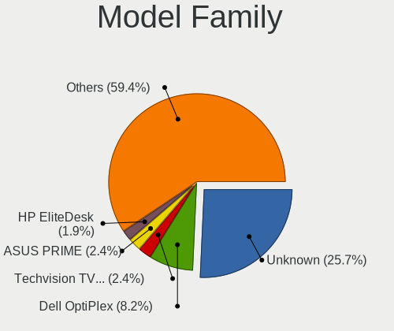
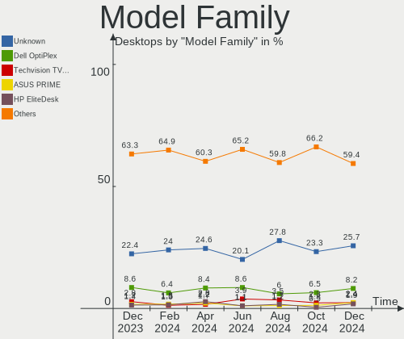
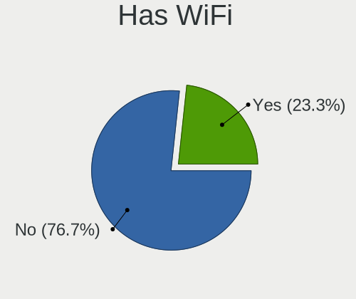
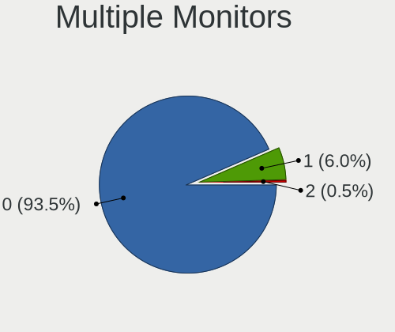
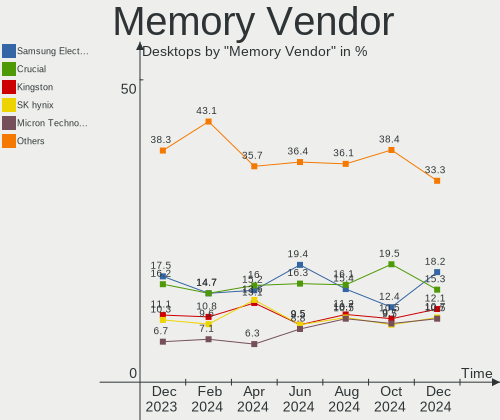

BSD - Hardware Trends (Desktops)
--------------------------------

A project to identify most popular hardware characteristics and track their change
over time based on data collected by BSD users at https://BSD-Hardware.info.

Anyone can contribute to this report by the [hw-probe](https://github.com/linuxhw/hw-probe/blob/master/INSTALL.BSD.md) tool:

    hw-probe -all -upload

This report is for one last month. Overall report since the beginning of time: [TestDays](https://github.com/bsdhw/TestDays)

Period: Sep, 2023.

Contents
--------

* [ System ](#system)
  - [ OS                       ](#os)
  - [ OS Family                ](#os-family)
  - [ Arch                     ](#arch)
  - [ DE                       ](#de)
  - [ Display Server           ](#display-server)
  - [ Display Manager          ](#display-manager)
  - [ OS Lang                  ](#os-lang)
  - [ Boot Mode                ](#boot-mode)
  - [ Filesystem               ](#filesystem)
  - [ Part. scheme             ](#part-scheme)

* [ Board ](#board)
  - [ Vendor                   ](#vendor)
  - [ Model                    ](#model)
  - [ Model Family             ](#model-family)
  - [ MFG Year                 ](#mfg-year)
  - [ Form Factor              ](#form-factor)
  - [ Coreboot                 ](#coreboot)
  - [ RAM Size                 ](#ram-size)
  - [ RAM Used                 ](#ram-used)
  - [ Total Drives             ](#total-drives)
  - [ Has CD-ROM               ](#has-cd-rom)
  - [ Has Ethernet             ](#has-ethernet)
  - [ Has WiFi                 ](#has-wifi)
  - [ Has Bluetooth            ](#has-bluetooth)

* [ Location ](#location)
  - [ Country                  ](#country)
  - [ City                     ](#city)

* [ Drives ](#drives)
  - [ Drive Vendor             ](#drive-vendor)
  - [ Drive Model              ](#drive-model)
  - [ HDD Vendor               ](#hdd-vendor)
  - [ SSD Vendor               ](#ssd-vendor)
  - [ Drive Kind               ](#drive-kind)
  - [ Drive Connector          ](#drive-connector)
  - [ Drive Size               ](#drive-size)
  - [ Space Total              ](#space-total)
  - [ Space Used               ](#space-used)
  - [ Malfunc. Drives          ](#malfunc-drives)
  - [ Malfunc. Drive Vendor    ](#malfunc-drive-vendor)
  - [ Malfunc. HDD Vendor      ](#malfunc-hdd-vendor)
  - [ Malfunc. Drive Kind      ](#malfunc-drive-kind)
  - [ Failed Drives            ](#failed-drives)
  - [ Failed Drive Vendor      ](#failed-drive-vendor)
  - [ Drive Status             ](#drive-status)

* [ Storage controller ](#storage-controller)
  - [ Storage Vendor           ](#storage-vendor)
  - [ Storage Model            ](#storage-model)
  - [ Storage Kind             ](#storage-kind)

* [ Processor ](#processor)
  - [ CPU Vendor               ](#cpu-vendor)
  - [ CPU Model                ](#cpu-model)
  - [ CPU Model Family         ](#cpu-model-family)
  - [ CPU Cores                ](#cpu-cores)
  - [ CPU Sockets              ](#cpu-sockets)
  - [ CPU Threads              ](#cpu-threads)
  - [ CPU Microarch            ](#cpu-microarch)

* [ Graphics ](#graphics)
  - [ GPU Vendor               ](#gpu-vendor)
  - [ GPU Model                ](#gpu-model)
  - [ GPU Combo                ](#gpu-combo)
  - [ GPU Driver               ](#gpu-driver)
  - [ GPU Memory               ](#gpu-memory)

* [ Monitor ](#monitor)
  - [ Monitor Vendor           ](#monitor-vendor)
  - [ Monitor Model            ](#monitor-model)
  - [ Monitor Resolution       ](#monitor-resolution)
  - [ Monitor Diagonal         ](#monitor-diagonal)
  - [ Monitor Width            ](#monitor-width)
  - [ Aspect Ratio             ](#aspect-ratio)
  - [ Monitor Area             ](#monitor-area)
  - [ Pixel Density            ](#pixel-density)
  - [ Multiple Monitors        ](#multiple-monitors)

* [ Network ](#network)
  - [ Net Controller Vendor    ](#net-controller-vendor)
  - [ Net Controller Model     ](#net-controller-model)
  - [ Wireless Vendor          ](#wireless-vendor)
  - [ Wireless Model           ](#wireless-model)
  - [ Ethernet Vendor          ](#ethernet-vendor)
  - [ Ethernet Model           ](#ethernet-model)
  - [ Net Controller Kind      ](#net-controller-kind)
  - [ Used Controller          ](#used-controller)
  - [ NICs                     ](#nics)
  - [ IPv6                     ](#ipv6)

* [ Bluetooth ](#bluetooth)
  - [ Bluetooth Vendor         ](#bluetooth-vendor)
  - [ Bluetooth Model          ](#bluetooth-model)

* [ Sound ](#sound)
  - [ Sound Vendor             ](#sound-vendor)
  - [ Sound Model              ](#sound-model)

* [ Memory ](#memory)
  - [ Memory Vendor            ](#memory-vendor)
  - [ Memory Model             ](#memory-model)
  - [ Memory Kind              ](#memory-kind)
  - [ Memory Form Factor       ](#memory-form-factor)
  - [ Memory Size              ](#memory-size)
  - [ Memory Speed             ](#memory-speed)

* [ Printers & scanners ](#printers--scanners)
  - [ Printer Vendor           ](#printer-vendor)
  - [ Printer Model            ](#printer-model)
  - [ Scanner Vendor           ](#scanner-vendor)
  - [ Scanner Model            ](#scanner-model)

* [ Camera ](#camera)
  - [ Camera Vendor            ](#camera-vendor)
  - [ Camera Model             ](#camera-model)

* [ Security ](#security)
  - [ Fingerprint Vendor       ](#fingerprint-vendor)
  - [ Fingerprint Model        ](#fingerprint-model)
  - [ Chipcard Vendor          ](#chipcard-vendor)
  - [ Chipcard Model           ](#chipcard-model)

* [ Unsupported ](#unsupported)
  - [ Unsupported Devices      ](#unsupported-devices)
  - [ Unsupported Device Types ](#unsupported-device-types)

System
------

OS
--

Installed operating systems

| Name                 | Desktops | Percent |
|----------------------|----------|---------|
| OPNsense 23.7.3      | 92       | 32.51%  |
| OPNsense 23.7.4      | 81       | 28.62%  |
| OPNsense 23.7.5      | 30       | 10.6%   |
| helloSystem 0.8.1    | 11       | 3.89%   |
| OPNsense 23.1.11     | 8        | 2.83%   |
| OpenBSD 7.3          | 7        | 2.47%   |
| FreeBSD 13.2-p3      | 7        | 2.47%   |
| OPNsense 23.7.1      | 6        | 2.12%   |
| helloSystem 0.9.0    | 6        | 2.12%   |
| FreeBSD 13.2         | 4        | 1.41%   |
| OPNsense 23.7        | 3        | 1.06%   |
| FreeBSD 13.2-p2      | 3        | 1.06%   |
| OPNsense 24.1        | 2        | 0.71%   |
| NetBSD 9.3           | 2        | 0.71%   |
| FreeBSD 14.0-BETA1   | 2        | 0.71%   |
| FreeBSD 14.0-ALPHA3  | 2        | 0.71%   |
| FreeBSD 13.1         | 2        | 0.71%   |
| OPNsense 23.4.2      | 1        | 0.35%   |
| OPNsense 22.7.6      | 1        | 0.35%   |
| OPNsense 22.1.10     | 1        | 0.35%   |
| NomadBSD 20221130    | 1        | 0.35%   |
| NetBSD 9.3_STABLE    | 1        | 0.35%   |
| NetBSD 10.0_BETA     | 1        | 0.35%   |
| MyBee 14.0-BETA2     | 1        | 0.35%   |
| MyBee 13.2           | 1        | 0.35%   |
| MidnightBSD 3.1.0    | 1        | 0.35%   |
| GhostBSD 23.09.06    | 1        | 0.35%   |
| FreeBSD 15.0-CURRENT | 1        | 0.35%   |
| FreeBSD 14.0-STABLE  | 1        | 0.35%   |
| FreeBSD 13.2-STABLE  | 1        | 0.35%   |
| FreeBSD 13.2-p1      | 1        | 0.35%   |
| FreeBSD 13.0         | 1        | 0.35%   |

OS Family
---------

OS without a version

| Name        | Desktops | Percent |
|-------------|----------|---------|
| OPNsense    | 225      | 79.51%  |
| FreeBSD     | 25       | 8.83%   |
| helloSystem | 17       | 6.01%   |
| OpenBSD     | 7        | 2.47%   |
| NetBSD      | 4        | 1.41%   |
| MyBee       | 2        | 0.71%   |
| NomadBSD    | 1        | 0.35%   |
| MidnightBSD | 1        | 0.35%   |
| GhostBSD    | 1        | 0.35%   |

Arch
----

OS architecture (x86_64, i586, etc.)

| Name    | Desktops | Percent |
|---------|----------|---------|
| amd64   | 279      | 98.59%  |
| arm     | 2        | 0.71%   |
| sparc64 | 1        | 0.35%   |
| macppc  | 1        | 0.35%   |

DE
--

Desktop Environment

| Name         | Desktops | Percent |
|--------------|----------|---------|
| Console      | 242      | 85.51%  |
| helloDesktop | 23       | 8.13%   |
| XFCE         | 5        | 1.77%   |
| MATE         | 3        | 1.06%   |
| TWM          | 2        | 0.71%   |
| GNOME        | 2        | 0.71%   |
| Openbox      | 1        | 0.35%   |
| KDE5         | 1        | 0.35%   |
| i3           | 1        | 0.35%   |
| Fluxbox      | 1        | 0.35%   |
| DWM          | 1        | 0.35%   |
| ctwm         | 1        | 0.35%   |

Display Server
--------------

X11 or Wayland

| Name    | Desktops | Percent |
|---------|----------|---------|
| Console | 245      | 86.57%  |
| X11     | 38       | 13.43%  |

Display Manager
---------------

SDDM, LightDM, etc.

| Name    | Desktops | Percent |
|---------|----------|---------|
| Console | 254      | 89.75%  |
| SLiM    | 19       | 6.71%   |
| LightDM | 5        | 1.77%   |
| SDDM    | 4        | 1.41%   |
| XDM     | 1        | 0.35%   |

OS Lang
-------

Language

| Lang    | Desktops | Percent |
|---------|----------|---------|
| Unknown | 239      | 84.45%  |
| C       | 20       | 7.07%   |
| en_US   | 16       | 5.65%   |
| ru_RU   | 4        | 1.41%   |
| zh_TW   | 1        | 0.35%   |
| pt_BR   | 1        | 0.35%   |
| it_IT   | 1        | 0.35%   |
| fr_FR   | 1        | 0.35%   |

Boot Mode
---------

EFI or BIOS

| Mode | Desktops | Percent |
|------|----------|---------|
| EFI  | 261      | 92.23%  |
| BIOS | 22       | 7.77%   |

Filesystem
----------

Type of filesystem

| Type   | Desktops | Percent |
|--------|----------|---------|
| Ufs    | 137      | 48.41%  |
| Zfs    | 130      | 45.94%  |
| Cd9660 | 9        | 3.18%   |
| Ffs    | 7        | 2.47%   |

Part. scheme
------------

Scheme of partitioning

| Type    | Desktops | Percent |
|---------|----------|---------|
| GPT     | 270      | 95.41%  |
| MBR     | 11       | 3.89%   |
| Unknown | 2        | 0.71%   |

Board
-----

Vendor
------

Motherboard manufacturer

| Name                                 | Desktops | Percent |
|--------------------------------------|----------|---------|
| Unknown                              | 62       | 21.91%  |
| ASUSTek Computer                     | 24       | 8.48%   |
| Dell                                 | 23       | 8.13%   |
| Hewlett-Packard                      | 17       | 6.01%   |
| Protectli                            | 14       | 4.95%   |
| ASRock                               | 14       | 4.95%   |
| Intel                                | 13       | 4.59%   |
| Lenovo                               | 12       | 4.24%   |
| Gigabyte Technology                  | 12       | 4.24%   |
| Techvision                           | 11       | 3.89%   |
| MSI                                  | 9        | 3.18%   |
| Supermicro                           | 8        | 2.83%   |
| PC Engines                           | 7        | 2.47%   |
| Fujitsu                              | 5        | 1.77%   |
| AZW                                  | 5        | 1.77%   |
| MW                                   | 3        | 1.06%   |
| IceWhale Technology                  | 3        | 1.06%   |
| CWWK                                 | 3        | 1.06%   |
| CncTion                              | 3        | 1.06%   |
| ASRockRack                           | 3        | 1.06%   |
| Shuttle                              | 2        | 0.71%   |
| ShenZhen MinWin Technology           | 2        | 0.71%   |
| Inventec                             | 2        | 0.71%   |
| Hardkernel                           | 2        | 0.71%   |
| GoWin Solution                       | 2        | 0.71%   |
| Biostar                              | 2        | 0.71%   |
| Apple                                | 2        | 0.71%   |
| AAEON                                | 2        | 0.71%   |
| Yanling                              | 1        | 0.35%   |
| Win element                          | 1        | 0.35%   |
| TYAN Computer                        | 1        | 0.35%   |
| TONK                                 | 1        | 0.35%   |
| Shenzhen Meigao Electronic Equipment | 1        | 0.35%   |
| Seeed Studio                         | 1        | 0.35%   |
| Premio                               | 1        | 0.35%   |
| PAIQ                                 | 1        | 0.35%   |
| NU591                                | 1        | 0.35%   |
| Lex                                  | 1        | 0.35%   |
| IGEL Technology                      | 1        | 0.35%   |
| Huanan                               | 1        | 0.35%   |

Model
-----

Motherboard model

| Name                           | Desktops | Percent |
|--------------------------------|----------|---------|
| Unknown                        | 63       | 22.26%  |
| Techvision TVI7309X            | 11       | 3.89%   |
| Protectli VP2420               | 5        | 1.77%   |
| Protectli FW4B                 | 4        | 1.41%   |
| PC Engines APU2                | 4        | 1.41%   |
| Intel Q3XXG4-P V1.0            | 4        | 1.41%   |
| MW GMLK-2_5G4L                 | 3        | 1.06%   |
| Dell OptiPlex 7050             | 3        | 1.06%   |
| Dell OptiPlex 7040             | 3        | 1.06%   |
| CWWK CW-AD4L-N V1              | 3        | 1.06%   |
| Protectli FW6                  | 2        | 0.71%   |
| Protectli FW4C                 | 2        | 0.71%   |
| Intel HM570                    | 2        | 0.71%   |
| IceWhale ZimaBoard 432 ZMB     | 2        | 0.71%   |
| HP EliteDesk 800 G2 DM 35W     | 2        | 0.71%   |
| GoWin Solution R86S            | 2        | 0.71%   |
| Fujitsu FUTRO S920             | 2        | 0.71%   |
| Dell OptiPlex 7060             | 2        | 0.71%   |
| Dell OptiPlex 7020             | 2        | 0.71%   |
| Dell OptiPlex 3040             | 2        | 0.71%   |
| Dell OptiPlex 3020             | 2        | 0.71%   |
| AZW EQ                         | 2        | 0.71%   |
| ASUS SABERTOOTH 990FX R2.0     | 2        | 0.71%   |
| ASUS P8H67-M PRO               | 2        | 0.71%   |
| Yanling LES network 6L         | 1        | 0.35%   |
| Win element M600               | 1        | 0.35%   |
| TYAN S5510HE                   | 1        | 0.35%   |
| TONK TN2800                    | 1        | 0.35%   |
| Supermicro X9SCL/X9SCM         | 1        | 0.35%   |
| Supermicro X9SCI/X9SCA         | 1        | 0.35%   |
| Supermicro X8DTH-i/6/iF/6F     | 1        | 0.35%   |
| Supermicro SYS-E300-9A         | 1        | 0.35%   |
| Supermicro SYS-5018D-MTF       | 1        | 0.35%   |
| Supermicro SYS-5018A-FTN4      | 1        | 0.35%   |
| Supermicro Pro546267           | 1        | 0.35%   |
| Supermicro PIO-1UUP-ND1-AI036  | 1        | 0.35%   |
| Shuttle DS77U                  | 1        | 0.35%   |
| Shuttle DS20U                  | 1        | 0.35%   |
| ShenZhen MinWin MW-NANO-APL-4L | 1        | 0.35%   |
| ShenZhen MinWin 3865U-6L       | 1        | 0.35%   |

Model Family
------------

Motherboard model prefix

| Name                           | Desktops | Percent |
|--------------------------------|----------|---------|
| Unknown                        | 63       | 22.26%  |
| Dell OptiPlex                  | 22       | 7.77%   |
| Techvision TVI7309X            | 11       | 3.89%   |
| Lenovo ThinkCentre             | 10       | 3.53%   |
| HP ProDesk                     | 6        | 2.12%   |
| HP EliteDesk                   | 6        | 2.12%   |
| Protectli VP2420               | 5        | 1.77%   |
| ASUS PRIME                     | 5        | 1.77%   |
| Protectli FW4B                 | 4        | 1.41%   |
| PC Engines APU2                | 4        | 1.41%   |
| Intel Q3XXG4-P                 | 4        | 1.41%   |
| Fujitsu FUTRO                  | 4        | 1.41%   |
| MW GMLK-2                      | 3        | 1.06%   |
| IceWhale ZimaBoard             | 3        | 1.06%   |
| CWWK CW-AD4L-N                 | 3        | 1.06%   |
| Protectli FW6                  | 2        | 0.71%   |
| Protectli FW4C                 | 2        | 0.71%   |
| Intel HM570                    | 2        | 0.71%   |
| GoWin Solution R86S            | 2        | 0.71%   |
| AZW EQ                         | 2        | 0.71%   |
| ASUS SABERTOOTH                | 2        | 0.71%   |
| ASUS P8H67-M                   | 2        | 0.71%   |
| ASUS P8H61-M                   | 2        | 0.71%   |
| ASRock X570                    | 2        | 0.71%   |
| Yanling LES                    | 1        | 0.35%   |
| Win element M600               | 1        | 0.35%   |
| TYAN S5510HE                   | 1        | 0.35%   |
| TONK TN2800                    | 1        | 0.35%   |
| Supermicro X9SCL               | 1        | 0.35%   |
| Supermicro X9SCI               | 1        | 0.35%   |
| Supermicro X8DTH-i             | 1        | 0.35%   |
| Supermicro SYS-E300-9A         | 1        | 0.35%   |
| Supermicro SYS-5018D-MTF       | 1        | 0.35%   |
| Supermicro SYS-5018A-FTN4      | 1        | 0.35%   |
| Supermicro Pro546267           | 1        | 0.35%   |
| Supermicro PIO-1UUP-ND1-AI036  | 1        | 0.35%   |
| Shuttle DS77U                  | 1        | 0.35%   |
| Shuttle DS20U                  | 1        | 0.35%   |
| ShenZhen MinWin MW-NANO-APL-4L | 1        | 0.35%   |
| ShenZhen MinWin 3865U-6L       | 1        | 0.35%   |

MFG Year
--------

Motherboard manufacture year

| Year    | Desktops | Percent |
|---------|----------|---------|
| 2022    | 54       | 19.08%  |
| 2023    | 32       | 11.31%  |
| 2021    | 26       | 9.19%   |
| 2016    | 23       | 8.13%   |
| 2019    | 22       | 7.77%   |
| 2012    | 20       | 7.07%   |
| 2018    | 18       | 6.36%   |
| 2020    | 17       | 6.01%   |
| 2015    | 16       | 5.65%   |
| 2017    | 13       | 4.59%   |
| 2014    | 13       | 4.59%   |
| 2011    | 9        | 3.18%   |
| Unknown | 7        | 2.47%   |
| 2013    | 6        | 2.12%   |
| 2008    | 3        | 1.06%   |
| 2009    | 2        | 0.71%   |
| 2010    | 1        | 0.35%   |
| 2007    | 1        | 0.35%   |

Form Factor
-----------

Physical design of the computer

| Name    | Desktops | Percent |
|---------|----------|---------|
| Desktop | 283      | 100%    |

Coreboot
--------

Have coreboot on board

| Used | Desktops | Percent |
|------|----------|---------|
| No   | 275      | 97.17%  |
| Yes  | 8        | 2.83%   |

RAM Size
--------

Total RAM memory

| Size in GB  | Desktops | Percent |
|-------------|----------|---------|
| 8.01-16.0   | 99       | 34.98%  |
| 16.01-24.0  | 81       | 28.62%  |
| 4.01-8.0    | 43       | 15.19%  |
| 32.01-64.0  | 34       | 12.01%  |
| 64.01-256.0 | 16       | 5.65%   |
| 2.01-3.0    | 5        | 1.77%   |
| 0.01-0.5    | 2        | 0.71%   |
| 24.01-32.0  | 1        | 0.35%   |
| 1.01-2.0    | 1        | 0.35%   |
| 0.51-1.0    | 1        | 0.35%   |

RAM Used
--------

Used RAM memory

| Used GB  | Desktops | Percent |
|----------|----------|---------|
| 0.01-0.5 | 116      | 40.99%  |
| 0.51-1.0 | 110      | 38.87%  |
| 1.01-2.0 | 39       | 13.78%  |
| 2.01-3.0 | 6        | 2.12%   |
| 3.01-4.0 | 5        | 1.77%   |
| Unknown  | 4        | 1.41%   |
| 0        | 2        | 0.71%   |
| 4.01-8.0 | 1        | 0.35%   |

Total Drives
------------

Number of drives on board

| Drives | Desktops | Percent |
|--------|----------|---------|
| 1      | 199      | 70.32%  |
| 0      | 32       | 11.31%  |
| 2      | 30       | 10.6%   |
| 3      | 8        | 2.83%   |
| 4      | 5        | 1.77%   |
| 5      | 4        | 1.41%   |
| 13     | 2        | 0.71%   |
| 11     | 1        | 0.35%   |
| 8      | 1        | 0.35%   |
| 6      | 1        | 0.35%   |

Has CD-ROM
----------

Has CD-ROM on board

| Presented | Desktops | Percent |
|-----------|----------|---------|
| No        | 245      | 86.57%  |
| Yes       | 38       | 13.43%  |

Has Ethernet
------------

Has Ethernet on board

| Presented | Desktops | Percent |
|-----------|----------|---------|
| Yes       | 279      | 98.59%  |
| No        | 4        | 1.41%   |

Has WiFi
--------

Has WiFi module

| Presented | Desktops | Percent |
|-----------|----------|---------|
| No        | 235      | 83.04%  |
| Yes       | 48       | 16.96%  |

Has Bluetooth
-------------

Has Bluetooth module

| Presented | Desktops | Percent |
|-----------|----------|---------|
| No        | 251      | 88.69%  |
| Yes       | 32       | 11.31%  |

Location
--------

Country
-------

Geographic location (country)

| Country         | Desktops | Percent |
|-----------------|----------|---------|
| USA             | 94       | 33.22%  |
| Germany         | 43       | 15.19%  |
| Canada          | 21       | 7.42%   |
| Russia          | 10       | 3.53%   |
| France          | 10       | 3.53%   |
| UK              | 9        | 3.18%   |
| Taiwan          | 7        | 2.47%   |
| Poland          | 7        | 2.47%   |
| Switzerland     | 6        | 2.12%   |
| Sweden          | 6        | 2.12%   |
| Australia       | 6        | 2.12%   |
| Italy           | 5        | 1.77%   |
| Netherlands     | 4        | 1.41%   |
| Austria         | 4        | 1.41%   |
| Singapore       | 3        | 1.06%   |
| Japan           | 3        | 1.06%   |
| Finland         | 3        | 1.06%   |
| Bulgaria        | 3        | 1.06%   |
| Brazil          | 3        | 1.06%   |
| Belgium         | 3        | 1.06%   |
| South Korea     | 2        | 0.71%   |
| Serbia          | 2        | 0.71%   |
| Romania         | 2        | 0.71%   |
| Norway          | 2        | 0.71%   |
| New Zealand     | 2        | 0.71%   |
| Malaysia        | 2        | 0.71%   |
| Lithuania       | 2        | 0.71%   |
| Indonesia       | 2        | 0.71%   |
| India           | 2        | 0.71%   |
| Denmark         | 2        | 0.71%   |
| UAE             | 1        | 0.35%   |
| Thailand        | 1        | 0.35%   |
| Pakistan        | 1        | 0.35%   |
| North Macedonia | 1        | 0.35%   |
| Malta           | 1        | 0.35%   |
| Israel          | 1        | 0.35%   |
| Iceland         | 1        | 0.35%   |
| Hungary         | 1        | 0.35%   |
| Hong Kong       | 1        | 0.35%   |
| Greece          | 1        | 0.35%   |

City
----

Geographic location (city)

| City                 | Desktops | Percent |
|----------------------|----------|---------|
| Taichung             | 4        | 1.41%   |
| Montreal             | 4        | 1.41%   |
| Taipei               | 3        | 1.06%   |
| Sydney               | 3        | 1.06%   |
| Sofia                | 3        | 1.06%   |
| Singapore            | 3        | 1.06%   |
| Orlando              | 3        | 1.06%   |
| Karlsruhe            | 3        | 1.06%   |
| Helsinki             | 3        | 1.06%   |
| Calgary              | 3        | 1.06%   |
| Bietigheim-Bissingen | 3        | 1.06%   |
| Berlin               | 3        | 1.06%   |
| Toronto              | 2        | 0.71%   |
| St Petersburg        | 2        | 0.71%   |
| South San Francisco  | 2        | 0.71%   |
| Simpsonville         | 2        | 0.71%   |
| Salem                | 2        | 0.71%   |
| Rome                 | 2        | 0.71%   |
| Riverside            | 2        | 0.71%   |
| Redmond              | 2        | 0.71%   |
| Raversbeuren         | 2        | 0.71%   |
| Raleigh              | 2        | 0.71%   |
| Pittsburgh           | 2        | 0.71%   |
| New York             | 2        | 0.71%   |
| Moscow               | 2        | 0.71%   |
| Meeuwen              | 2        | 0.71%   |
| Mainz                | 2        | 0.71%   |
| London               | 2        | 0.71%   |
| Fort Wayne           | 2        | 0.71%   |
| Edmonton             | 2        | 0.71%   |
| Charlotte            | 2        | 0.71%   |
| Bristol              | 2        | 0.71%   |
| Arvada               | 2        | 0.71%   |
| Aresing              | 2        | 0.71%   |
| Zurich               | 1        | 0.35%   |
| Ypsilanti            | 1        | 0.35%   |
| Włocławek          | 1        | 0.35%   |
| Wroclaw              | 1        | 0.35%   |
| Worcester            | 1        | 0.35%   |
| Wood Dale            | 1        | 0.35%   |

Drives
------

Drive Vendor
------------

Hard drive vendors

| Vendor              | Desktops | Drives | Percent |
|---------------------|----------|--------|---------|
| Samsung Electronics | 49       | 62     | 16.12%  |
| WDC                 | 28       | 56     | 9.21%   |
| Kingston            | 27       | 29     | 8.88%   |
| Seagate             | 17       | 26     | 5.59%   |
| Crucial             | 15       | 18     | 4.93%   |
| Intel               | 14       | 16     | 4.61%   |
| Hoodisk             | 11       | 11     | 3.62%   |
| SanDisk             | 10       | 13     | 3.29%   |
| Transcend           | 9        | 10     | 2.96%   |
| Toshiba             | 7        | 7      | 2.3%    |
| SPCC                | 6        | 6      | 1.97%   |
| Silicon Motion      | 6        | 6      | 1.97%   |
| Protectli           | 5        | 5      | 1.64%   |
| China               | 5        | 5      | 1.64%   |
| SK hynix            | 4        | 4      | 1.32%   |
| Micron Technology   | 4        | 4      | 1.32%   |
| Intenso             | 4        | 5      | 1.32%   |
| Hitachi             | 4        | 4      | 1.32%   |
| Hewlett-Packard     | 4        | 4      | 1.32%   |
| Fanxiang            | 4        | 5      | 1.32%   |
| VICKTER             | 3        | 3      | 0.99%   |
| Team                | 3        | 3      | 0.99%   |
| Phison              | 3        | 3      | 0.99%   |
| OCZ                 | 3        | 3      | 0.99%   |
| Innodisk            | 3        | 3      | 0.99%   |
| Corsair             | 3        | 3      | 0.99%   |
| BIWIN               | 3        | 3      | 0.99%   |
| Apacer              | 3        | 3      | 0.99%   |
| A-DATA Technology   | 3        | 3      | 0.99%   |
| Vaseky              | 2        | 2      | 0.66%   |
| Timetec             | 2        | 2      | 0.66%   |
| PNY                 | 2        | 3      | 0.66%   |
| LITEON              | 2        | 3      | 0.66%   |
| Lexar               | 2        | 2      | 0.66%   |
| Leven               | 2        | 2      | 0.66%   |
| HGST                | 2        | 2      | 0.66%   |
| Gigabyte Technology | 2        | 2      | 0.66%   |
| Dogfish             | 2        | 2      | 0.66%   |
| CWDISK              | 2        | 2      | 0.66%   |
| Zheino              | 1        | 1      | 0.33%   |

Drive Model
-----------

Hard drive models

| Model                            | Desktops | Percent |
|----------------------------------|----------|---------|
| Hoodisk SSD 64GB                 | 6        | 1.81%   |
| Transcend TS256GMSA230S 256GB    | 4        | 1.21%   |
| Samsung SSD 860 EVO 500GB        | 4        | 1.21%   |
| VICKTER SSD 64GB                 | 3        | 0.91%   |
| Samsung SSD 870 EVO 500GB        | 3        | 0.91%   |
| Samsung SSD 860 EVO 250GB        | 3        | 0.91%   |
| Kingston SKC600MS256G 256GB      | 3        | 0.91%   |
| Intenso SSD 120GB                | 3        | 0.91%   |
| Hoodisk SSD 32GB                 | 3        | 0.91%   |
| Fanxiang S501 128GB              | 3        | 0.91%   |
| WDC WD80EFAX-68LHPN0 8TB         | 2        | 0.6%    |
| WDC WD20EFRX-68EUZN0 2TB         | 2        | 0.6%    |
| Timetec 35TTFP6PCIE-256G         | 2        | 0.6%    |
| Team TM8FP6256G 256GB            | 2        | 0.6%    |
| SPCC Solid State Disk 128GB      | 2        | 0.6%    |
| Silicon Motion SZBKHDTEK128GB    | 2        | 0.6%    |
| Seagate ST500DM002-1BD142 500GB  | 2        | 0.6%    |
| Seagate ST4000DM000-1F2168 4TB   | 2        | 0.6%    |
| Seagate ST1000DM010-2EP102 1TB   | 2        | 0.6%    |
| Seagate ST1000DM003-9YN162 1TB   | 2        | 0.6%    |
| SanDisk SD7TB3Q-128G-1006 128GB  | 2        | 0.6%    |
| Samsung SSD 980 PRO 500GB        | 2        | 0.6%    |
| Samsung SSD 970 EVO Plus 500GB   | 2        | 0.6%    |
| Samsung SSD 970 EVO Plus 250GB   | 2        | 0.6%    |
| Samsung SSD 970 EVO Plus 1TB     | 2        | 0.6%    |
| Samsung SSD 860 EVO 1TB          | 2        | 0.6%    |
| Samsung SSD 850 EVO 120GB        | 2        | 0.6%    |
| Samsung SSD 840 EVO 250GB        | 2        | 0.6%    |
| Samsung SSD 840 EVO 120GB        | 2        | 0.6%    |
| Samsung MZVLW256HEHP-000L7 256GB | 2        | 0.6%    |
| Protectli 240GB M.2              | 2        | 0.6%    |
| Lexar SSD NM620 1TB              | 2        | 0.6%    |
| Kingston SV300S37A60G 64GB       | 2        | 0.6%    |
| Kingston SV300S37A120G 120GB     | 2        | 0.6%    |
| Kingston SA400S37240G 240GB      | 2        | 0.6%    |
| Kingston SA400M8240G 240GB       | 2        | 0.6%    |
| Intel SSDPEK1A118GA 118GB        | 2        | 0.6%    |
| Hoodisk SSD 128GB                | 2        | 0.6%    |
| Hitachi HTS541612J9SA00 120GB    | 2        | 0.6%    |
| HP SSD EX900 250GB               | 2        | 0.6%    |

HDD Vendor
----------

Hard disk drive vendors

| Vendor              | Desktops | Drives | Percent |
|---------------------|----------|--------|---------|
| WDC                 | 21       | 48     | 40.38%  |
| Seagate             | 17       | 26     | 32.69%  |
| Hitachi             | 4        | 4      | 7.69%   |
| Toshiba             | 3        | 3      | 5.77%   |
| HGST                | 2        | 2      | 3.85%   |
| Samsung Electronics | 1        | 1      | 1.92%   |
| NVMe                | 1        | 2      | 1.92%   |
| Maxtor              | 1        | 1      | 1.92%   |
| LSI                 | 1        | 1      | 1.92%   |
| Apple               | 1        | 1      | 1.92%   |

SSD Vendor
----------

Solid state drive vendors

| Vendor              | Desktops | Drives | Percent |
|---------------------|----------|--------|---------|
| Samsung Electronics | 32       | 40     | 17.98%  |
| Kingston            | 23       | 25     | 12.92%  |
| Intel               | 11       | 13     | 6.18%   |
| Hoodisk             | 11       | 11     | 6.18%   |
| Transcend           | 9        | 10     | 5.06%   |
| SanDisk             | 9        | 12     | 5.06%   |
| Crucial             | 8        | 10     | 4.49%   |
| Protectli           | 5        | 5      | 2.81%   |
| China               | 5        | 5      | 2.81%   |
| SPCC                | 4        | 4      | 2.25%   |
| Micron Technology   | 4        | 4      | 2.25%   |
| Intenso             | 4        | 5      | 2.25%   |
| WDC                 | 3        | 3      | 1.69%   |
| VICKTER             | 3        | 3      | 1.69%   |
| Toshiba             | 3        | 3      | 1.69%   |
| OCZ                 | 3        | 3      | 1.69%   |
| Innodisk            | 3        | 3      | 1.69%   |
| BIWIN               | 3        | 3      | 1.69%   |
| Apacer              | 3        | 3      | 1.69%   |
| PNY                 | 2        | 3      | 1.12%   |
| LITEON              | 2        | 3      | 1.12%   |
| Leven               | 2        | 2      | 1.12%   |
| Dogfish             | 2        | 2      | 1.12%   |
| CWDISK              | 2        | 2      | 1.12%   |
| Corsair             | 2        | 2      | 1.12%   |
| A-DATA Technology   | 2        | 2      | 1.12%   |
| Zheino              | 1        | 1      | 0.56%   |
| Vaseky              | 1        | 1      | 0.56%   |
| Team                | 1        | 1      | 0.56%   |
| SUNEAST             | 1        | 1      | 0.56%   |
| SATADOM             | 1        | 1      | 0.56%   |
| RX7                 | 1        | 1      | 0.56%   |
| Patriot             | 1        | 1      | 0.56%   |
| Neo Forza           | 1        | 2      | 0.56%   |
| Mushkin             | 1        | 1      | 0.56%   |
| LITEONIT            | 1        | 1      | 0.56%   |
| KingDian            | 1        | 1      | 0.56%   |
| HPE                 | 1        | 2      | 0.56%   |
| Hewlett-Packard     | 1        | 1      | 0.56%   |
| GOODRAM             | 1        | 1      | 0.56%   |

Drive Kind
----------

HDD or SSD

| Kind | Desktops | Drives | Percent |
|------|----------|--------|---------|
| SSD  | 168      | 201    | 58.33%  |
| NVMe | 75       | 83     | 26.04%  |
| HDD  | 45       | 89     | 15.63%  |

Drive Connector
---------------

SATA, SAS, NVMe, etc.

| Type | Desktops | Drives | Percent |
|------|----------|--------|---------|
| SATA | 195      | 290    | 72.22%  |
| NVMe | 75       | 83     | 27.78%  |

Drive Size
----------

Size of hard drive

| Size in TB | Desktops | Drives | Percent |
|------------|----------|--------|---------|
| 0.01-0.5   | 179      | 223    | 82.49%  |
| 0.51-1.0   | 17       | 19     | 7.83%   |
| 1.01-2.0   | 8        | 15     | 3.69%   |
| 3.01-4.0   | 7        | 9      | 3.23%   |
| 4.01-10.0  | 4        | 21     | 1.84%   |
| 2.01-3.0   | 1        | 1      | 0.46%   |
| 10.01-20.0 | 1        | 2      | 0.46%   |

Space Total
-----------

Amount of disk space available on the file system

| Size in GB | Desktops | Percent |
|------------|----------|---------|
| 101-250    | 136      | 48.06%  |
| 251-500    | 48       | 16.96%  |
| 21-50      | 26       | 9.19%   |
| 1-20       | 23       | 8.13%   |
| 501-1000   | 23       | 8.13%   |
| 51-100     | 22       | 7.77%   |
| 1001-2000  | 4        | 1.41%   |
| 2001-3000  | 1        | 0.35%   |

Space Used
----------

Amount of used disk space

| Used GB  | Desktops | Percent |
|----------|----------|---------|
| 1-20     | 266      | 93.99%  |
| 21-50    | 10       | 3.53%   |
| 51-100   | 3        | 1.06%   |
| 501-1000 | 2        | 0.71%   |
| 251-500  | 1        | 0.35%   |
| 101-250  | 1        | 0.35%   |

Malfunc. Drives
---------------

Drive models with a malfunction

| Model                                      | Desktops | Drives | Percent |
|--------------------------------------------|----------|--------|---------|
| WDC WD80EDAZ-11TA3A0 8TB                   | 1        | 1      | 3.03%   |
| WDC WD6400AAKS-22A7B2 640GB                | 1        | 1      | 3.03%   |
| WDC WD5003ABYZ-011FA0 500GB                | 1        | 1      | 3.03%   |
| WDC WD5000AAKX-083CA0 500GB                | 1        | 1      | 3.03%   |
| WDC WD3200AAKS-00L9A0 320GB                | 1        | 1      | 3.03%   |
| WDC WD2500BEKT-75PVMT0 250GB               | 1        | 1      | 3.03%   |
| WDC WD2500AAJS-75M0A0 250GB                | 1        | 1      | 3.03%   |
| WDC WD2500AAJS-00L7A0 250GB                | 1        | 1      | 3.03%   |
| WDC WD1600HLFS-75G6U1 160GB                | 1        | 1      | 3.03%   |
| Toshiba MK8052GSX 80GB                     | 1        | 1      | 3.03%   |
| Seagate ST9500325AS 500GB                  | 1        | 1      | 3.03%   |
| Seagate ST500DM002-1BD142 500GB            | 1        | 1      | 3.03%   |
| Seagate ST1000DM003-9YN162 1TB             | 1        | 1      | 3.03%   |
| SanDisk SSD i110 32GB                      | 1        | 1      | 3.03%   |
| Samsung Electronics SSD RBX Series 128GB M | 1        | 1      | 3.03%   |
| Samsung Electronics SSD 860 EVO 500GB      | 1        | 1      | 3.03%   |
| Samsung Electronics SSD 840 EVO 250GB      | 1        | 1      | 3.03%   |
| Patriot Pyro SE 120GB                      | 1        | 1      | 3.03%   |
| OCZ AGILITY3 120GB                         | 1        | 1      | 3.03%   |
| Mushkin MKNSSDEC512GB                      | 1        | 1      | 3.03%   |
| Micron Technology M550_mSATA_256GB         | 1        | 1      | 3.03%   |
| Maxtor 6E040L0 40GB                        | 1        | 1      | 3.03%   |
| Kingston SV300S37A60G 64GB                 | 1        | 1      | 3.03%   |
| Kingston SV300S37A120G 120GB               | 1        | 1      | 3.03%   |
| Kingston SNV2S500G 500GB                   | 1        | 1      | 3.03%   |
| Kingston SNS4151S316GD 16GB                | 1        | 1      | 3.03%   |
| Kingston SMS200S330G 32GB                  | 1        | 1      | 3.03%   |
| Kingston SMS200S3120G 120GB                | 1        | 1      | 3.03%   |
| Intel SSDSC2CW120A3 120GB                  | 1        | 1      | 3.03%   |
| Intel SSDSC2BW480H6 480GB                  | 1        | 1      | 3.03%   |
| GLOWAY VAL32GS3-mSATA 32GB                 | 1        | 1      | 3.03%   |
| Corsair CSSD-F120GB2                       | 1        | 1      | 3.03%   |
| Apacer 16GB SATA Flash Drive               | 1        | 1      | 3.03%   |

Malfunc. Drive Vendor
---------------------

Vendors of faulty drives

| Vendor              | Desktops | Drives | Percent |
|---------------------|----------|--------|---------|
| WDC                 | 9        | 9      | 27.27%  |
| Kingston            | 6        | 6      | 18.18%  |
| Seagate             | 3        | 3      | 9.09%   |
| Samsung Electronics | 3        | 3      | 9.09%   |
| Intel               | 2        | 2      | 6.06%   |
| Toshiba             | 1        | 1      | 3.03%   |
| SanDisk             | 1        | 1      | 3.03%   |
| Patriot             | 1        | 1      | 3.03%   |
| OCZ                 | 1        | 1      | 3.03%   |
| Mushkin             | 1        | 1      | 3.03%   |
| Micron Technology   | 1        | 1      | 3.03%   |
| Maxtor              | 1        | 1      | 3.03%   |
| GLOWAY              | 1        | 1      | 3.03%   |
| Corsair             | 1        | 1      | 3.03%   |
| Apacer              | 1        | 1      | 3.03%   |

Malfunc. HDD Vendor
-------------------

Vendors of faulty HDD drives

| Vendor  | Desktops | Drives | Percent |
|---------|----------|--------|---------|
| WDC     | 9        | 9      | 64.29%  |
| Seagate | 3        | 3      | 21.43%  |
| Toshiba | 1        | 1      | 7.14%   |
| Maxtor  | 1        | 1      | 7.14%   |

Malfunc. Drive Kind
-------------------

Kinds of faulty drives

| Kind | Desktops | Drives | Percent |
|------|----------|--------|---------|
| SSD  | 18       | 18     | 54.55%  |
| HDD  | 14       | 14     | 42.42%  |
| NVMe | 1        | 1      | 3.03%   |

Failed Drives
-------------

Failed drive models

| Model                                        | Desktops | Drives | Percent |
|----------------------------------------------|----------|--------|---------|
| Samsung Electronics MZALQ256HBJD-00BL2 256GB | 1        | 1      | 33.33%  |
| Intel SSDMCEAW120A4 120GB                    | 1        | 1      | 33.33%  |
| Hoodisk SSD 64GB                             | 1        | 1      | 33.33%  |

Failed Drive Vendor
-------------------

Failed drive vendors

| Vendor              | Desktops | Drives | Percent |
|---------------------|----------|--------|---------|
| Samsung Electronics | 1        | 1      | 33.33%  |
| Intel               | 1        | 1      | 33.33%  |
| Hoodisk             | 1        | 1      | 33.33%  |

Drive Status
------------

Number of failed and malfunc. drives

| Status   | Desktops | Drives | Percent |
|----------|----------|--------|---------|
| Works    | 214      | 328    | 83.59%  |
| Malfunc  | 32       | 33     | 12.5%   |
| Detected | 7        | 9      | 2.73%   |
| Failed   | 3        | 3      | 1.17%   |

Storage controller
------------------

Storage Vendor
--------------

Storage controller vendors

| Vendor                           | Desktops | Percent |
|----------------------------------|----------|---------|
| Intel                            | 225      | 59.68%  |
| AMD                              | 39       | 10.34%  |
| Samsung Electronics              | 24       | 6.37%   |
| Silicon Motion                   | 16       | 4.24%   |
| SanDisk                          | 11       | 2.92%   |
| Micron/Crucial Technology        | 8        | 2.12%   |
| Phison Electronics               | 7        | 1.86%   |
| ASMedia Technology               | 7        | 1.86%   |
| MAXIO Technology (Hangzhou)      | 6        | 1.59%   |
| SK hynix                         | 4        | 1.06%   |
| Realtek Semiconductor            | 4        | 1.06%   |
| Kingston Technology Company      | 4        | 1.06%   |
| VIA Technologies                 | 3        | 0.8%    |
| JMicron Technology               | 3        | 0.8%    |
| Broadcom / LSI                   | 3        | 0.8%    |
| Toshiba                          | 2        | 0.53%   |
| Marvell Technology Group         | 2        | 0.53%   |
| ULi Electronics                  | 1        | 0.27%   |
| Solidigm                         | 1        | 0.27%   |
| Silicon Integrated Systems [SiS] | 1        | 0.27%   |
| Shenzhen Longsys Electronics     | 1        | 0.27%   |
| KIOXIA                           | 1        | 0.27%   |
| Hosin Global Electronics         | 1        | 0.27%   |
| Chelsio Communications           | 1        | 0.27%   |
| Biwin Storage Technology         | 1        | 0.27%   |
| ADATA Technology                 | 1        | 0.27%   |

Storage Model
-------------

Storage controller models

| Model                                                                                   | Desktops | Percent |
|-----------------------------------------------------------------------------------------|----------|---------|
| Intel Jasper Lake SATA AHCI Controller                                                  | 30       | 7.39%   |
| Intel 8 Series/C220 Series Chipset Family 6-port SATA Controller 1 [AHCI mode]          | 22       | 5.42%   |
| AMD FCH SATA Controller [AHCI mode]                                                     | 20       | 4.93%   |
| Silicon Motion SM2263EN/SM2263XT (DRAM-less) NVMe SSD Controllers                       | 16       | 3.94%   |
| Intel Q170/Q150/B150/H170/H110/Z170/CM236 Chipset SATA Controller [AHCI Mode]           | 15       | 3.69%   |
| Unknown                                                                                 | 15       | 3.69%   |
| Intel Celeron/Pentium Silver Processor SATA Controller                                  | 13       | 3.2%    |
| Intel Sunrise Point-LP SATA Controller [AHCI mode]                                      | 12       | 2.96%   |
| Samsung NVMe SSD Controller SM981/PM981/PM983                                           | 11       | 2.71%   |
| Intel 200 Series PCH SATA controller [AHCI mode]                                        | 11       | 2.71%   |
| Intel Cannon Lake PCH SATA AHCI Controller                                              | 10       | 2.46%   |
| Intel Atom Processor E3800 Series SATA AHCI Controller                                  | 10       | 2.46%   |
| Micron/Crucial P2 [Nick P2] / P3 / P3 Plus NVMe PCIe SSD (DRAM-less)                    | 8        | 1.97%   |
| Intel Elkhart Lake SATA AHCI                                                            | 8        | 1.97%   |
| Intel 6 Series/C200 Series Chipset Family 6 port Desktop SATA AHCI Controller           | 8        | 1.97%   |
| Intel Atom/Celeron/Pentium Processor x5-E8000/J3xxx/N3xxx Series SATA Controller        | 7        | 1.72%   |
| Intel 6 Series/C200 Series Chipset Family Desktop SATA Controller (IDE mode, ports 4-5) | 7        | 1.72%   |
| Intel 6 Series/C200 Series Chipset Family Desktop SATA Controller (IDE mode, ports 0-3) | 7        | 1.72%   |
| ASMedia ASM1062 Serial ATA Controller                                                   | 7        | 1.72%   |
| AMD 400 Series Chipset SATA Controller                                                  | 7        | 1.72%   |
| MAXIO (Hangzhou) NVMe SSD Controller MAP1202                                            | 6        | 1.48%   |
| Intel Celeron N3350/Pentium N4200/Atom E3900 Series SATA AHCI Controller                | 6        | 1.48%   |
| Samsung NVMe SSD Controller 980                                                         | 5        | 1.23%   |
| Intel 7 Series/C210 Series Chipset Family 6-port SATA Controller [AHCI mode]            | 5        | 1.23%   |
| AMD SB7x0/SB8x0/SB9x0 SATA Controller [AHCI mode]                                       | 5        | 1.23%   |
| AMD 500 Series Chipset SATA Controller                                                  | 5        | 1.23%   |
| Samsung NVMe SSD Controller SM961/PM961/SM963                                           | 4        | 0.99%   |
| Realtek RTS5765DL NVMe SSD Controller (DRAM-less)                                       | 4        | 0.99%   |
| Phison E16 PCIe4 NVMe Controller                                                        | 4        | 0.99%   |
| Intel Tiger Lake-LP SATA Controller                                                     | 4        | 0.99%   |
| Intel Comet Lake SATA AHCI Controller                                                   | 4        | 0.99%   |
| AMD FCH SATA Controller [IDE mode]                                                      | 4        | 0.99%   |
| SK hynix Gold P31/BC711/PC711 NVMe Solid State Drive                                    | 3        | 0.74%   |
| SanDisk WD Black SN750 / PC SN730 NVMe SSD                                              | 3        | 0.74%   |
| Samsung NVMe SSD Controller PM9A1/PM9A3/980PRO                                          | 3        | 0.74%   |
| Intel Wildcat Point-LP SATA Controller [AHCI Mode]                                      | 3        | 0.74%   |
| Intel 82801G (ICH7 Family) IDE Controller                                               | 3        | 0.74%   |
| VIA VT6415 PATA IDE Host Controller                                                     | 2        | 0.49%   |
| SanDisk WD Blue SN550 NVMe SSD                                                          | 2        | 0.49%   |
| Phison E12 NVMe Controller                                                              | 2        | 0.49%   |

Storage Kind
------------

Kind of storage controller (IDE, SATA, NVMe, SAS, ...)

| Kind | Desktops | Percent |
|------|----------|---------|
| SATA | 242      | 66.12%  |
| NVMe | 90       | 24.59%  |
| IDE  | 28       | 7.65%   |
| RAID | 3        | 0.82%   |
| SAS  | 2        | 0.55%   |
| SCSI | 1        | 0.27%   |

Processor
---------

CPU Vendor
----------

Processor vendors

| Vendor          | Desktops | Percent |
|-----------------|----------|---------|
| Intel           | 235      | 83.04%  |
| AMD             | 42       | 14.84%  |
| ARM             | 2        | 0.71%   |
| VIA             | 1        | 0.35%   |
| SUNW,UltraAX-i2 | 1        | 0.35%   |
| Bochs           | 1        | 0.35%   |
| Unknown         | 1        | 0.35%   |

CPU Model
---------

Processor models

| Model                                       | Desktops | Percent |
|---------------------------------------------|----------|---------|
| Intel Celeron N5105 @ 2.00GHz               | 23       | 8.13%   |
| Intel N100                                  | 15       | 5.3%    |
| Intel Celeron J4125 CPU @ 2.00GHz           | 9        | 3.18%   |
| Intel Core i5-6500 CPU @ 3.20GHz            | 7        | 2.47%   |
| Intel Celeron CPU J1900 @ 1.99GHz           | 7        | 2.47%   |
| Intel Pentium Silver N6005 @ 2.00GHz        | 6        | 2.12%   |
| Intel Celeron J6412 @ 2.00GHz               | 6        | 2.12%   |
| AMD GX-412TC SOC                            | 6        | 2.12%   |
| Intel Core i5-7200U CPU @ 2.50GHz           | 5        | 1.77%   |
| Intel Core i5-4570 CPU @ 3.20GHz            | 4        | 1.41%   |
| Intel Celeron N5100 @ 1.10GHz               | 4        | 1.41%   |
| Intel Celeron CPU J3160 @ 1.60GHz           | 4        | 1.41%   |
| Intel Core i5-8500 CPU @ 3.00GHz            | 3        | 1.06%   |
| Intel Core i5-7500 CPU @ 3.40GHz            | 3        | 1.06%   |
| Intel Core i5-6500T CPU @ 2.50GHz           | 3        | 1.06%   |
| Intel Core i5-4590S CPU @ 3.00GHz           | 3        | 1.06%   |
| Intel Core i5-4590 CPU @ 3.30GHz            | 3        | 1.06%   |
| Intel Core i3-6100 CPU @ 3.70GHz            | 3        | 1.06%   |
| Intel Celeron J4105 CPU @ 1.50GHz           | 3        | 1.06%   |
| Intel Celeron CPU J3455 @ 1.50GHz           | 3        | 1.06%   |
| Intel Celeron CPU 3865U @ 1.80GHz           | 3        | 1.06%   |
| Intel 11th Gen Core i7-1165G7 @ 2.80GHz     | 3        | 1.06%   |
| AMD Ryzen 5 2600 Six-Core Processor         | 3        | 1.06%   |
| AMD Ryzen 5 2400G with Radeon Vega Graphics | 3        | 1.06%   |
| Intel Xeon CPU E5-2690 v4 @ 2.60GHz         | 2        | 0.71%   |
| Intel Xeon CPU E3-1240 v5 @ 3.50GHz         | 2        | 0.71%   |
| Intel Xeon CPU E3-1225 V2 @ 3.20GHz         | 2        | 0.71%   |
| Intel Pentium CPU J3710 @ 1.60GHz           | 2        | 0.71%   |
| Intel Pentium CPU G3220 @ 3.00GHz           | 2        | 0.71%   |
| Intel N95                                   | 2        | 0.71%   |
| Intel Core i7-8550U CPU @ 1.80GHz           | 2        | 0.71%   |
| Intel Core i7-6700T CPU @ 2.80GHz           | 2        | 0.71%   |
| Intel Core i7-2600 CPU @ 3.40GHz            | 2        | 0.71%   |
| Intel Core i5-8400 CPU @ 2.80GHz            | 2        | 0.71%   |
| Intel Core i5-6600T CPU @ 2.70GHz           | 2        | 0.71%   |
| Intel Core i5-4590T CPU @ 2.00GHz           | 2        | 0.71%   |
| Intel Core i5-3470 CPU @ 3.20GHz            | 2        | 0.71%   |
| Intel Core i3-9100 CPU @ 3.60GHz            | 2        | 0.71%   |
| Intel Core i3-2100 CPU @ 3.10GHz            | 2        | 0.71%   |
| Intel Celeron J6413 @ 1.80GHz               | 2        | 0.71%   |

CPU Model Family
----------------

Processor model prefix

| Model                  | Desktops | Percent |
|------------------------|----------|---------|
| Intel Celeron          | 81       | 28.62%  |
| Intel Core i5          | 52       | 18.37%  |
| Other                  | 33       | 11.66%  |
| Intel Xeon             | 19       | 6.71%   |
| Intel Core i3          | 16       | 5.65%   |
| Intel Core i7          | 14       | 4.95%   |
| AMD Ryzen 5            | 12       | 4.24%   |
| AMD GX                 | 10       | 3.53%   |
| Intel Pentium Silver   | 7        | 2.47%   |
| Intel Pentium          | 6        | 2.12%   |
| Intel Atom             | 6        | 2.12%   |
| AMD Ryzen 7            | 5        | 1.77%   |
| AMD Ryzen 9            | 4        | 1.41%   |
| Intel Genuine          | 2        | 0.71%   |
| Intel 686-class        | 2        | 0.71%   |
| AMD G                  | 2        | 0.71%   |
| AMD FX                 | 2        | 0.71%   |
| Intel Core i9          | 1        | 0.35%   |
| Intel Core 2 Quad      | 1        | 0.35%   |
| Intel Core 2 Duo       | 1        | 0.35%   |
| AMD Ryzen Threadripper | 1        | 0.35%   |
| AMD Phenom II X6       | 1        | 0.35%   |
| AMD Phenom II X4       | 1        | 0.35%   |
| AMD EPYC               | 1        | 0.35%   |
| AMD Athlon II X4       | 1        | 0.35%   |
| AMD Athlon 64 X2       | 1        | 0.35%   |
| AMD A10                | 1        | 0.35%   |

CPU Cores
---------

Number of processor cores

| Number  | Desktops | Percent |
|---------|----------|---------|
| 4       | 169      | 59.72%  |
| 2       | 54       | 19.08%  |
| 6       | 15       | 5.3%    |
| 12      | 12       | 4.24%   |
| 8       | 9        | 3.18%   |
| Unknown | 9        | 3.18%   |
| 16      | 6        | 2.12%   |
| 32      | 2        | 0.71%   |
| 24      | 2        | 0.71%   |
| 14      | 2        | 0.71%   |
| 64      | 1        | 0.35%   |
| 10      | 1        | 0.35%   |
| 1       | 1        | 0.35%   |

CPU Sockets
-----------

Number of sockets

| Number  | Desktops | Percent |
|---------|----------|---------|
| 1       | 274      | 96.82%  |
| Unknown | 6        | 2.12%   |
| 2       | 2        | 0.71%   |
| 8       | 1        | 0.35%   |

CPU Threads
-----------

Threads per core (Hyper-Threading)

| Number  | Desktops | Percent |
|---------|----------|---------|
| 1       | 207      | 73.14%  |
| 2       | 67       | 23.67%  |
| Unknown | 9        | 3.18%   |

CPU Microarch
-------------

Microarchitecture

| Name          | Desktops | Percent |
|---------------|----------|---------|
| Unknown       | 76       | 26.86%  |
| KabyLake      | 31       | 10.95%  |
| Haswell       | 25       | 8.83%   |
| Skylake       | 23       | 8.13%   |
| Silvermont    | 19       | 6.71%   |
| IvyBridge     | 15       | 5.3%    |
| Goldmont plus | 13       | 4.59%   |
| SandyBridge   | 9        | 3.18%   |
| Puma          | 8        | 2.83%   |
| Goldmont      | 8        | 2.83%   |
| Zen 3         | 6        | 2.12%   |
| Zen 2         | 6        | 2.12%   |
| Zen           | 5        | 1.77%   |
| Broadwell     | 5        | 1.77%   |
| Zen+          | 4        | 1.41%   |
| TigerLake     | 4        | 1.41%   |
| Westmere      | 3        | 1.06%   |
| Penryn        | 3        | 1.06%   |
| Core          | 3        | 1.06%   |
| Nehalem       | 2        | 0.71%   |
| K10           | 2        | 0.71%   |
| Jaguar        | 2        | 0.71%   |
| CometLake     | 2        | 0.71%   |
| Bonnell       | 2        | 0.71%   |
| Bobcat        | 2        | 0.71%   |
| Steamroller   | 1        | 0.35%   |
| Piledriver    | 1        | 0.35%   |
| K8 Hammer     | 1        | 0.35%   |
| K10 Llano     | 1        | 0.35%   |
| Bulldozer     | 1        | 0.35%   |

Graphics
--------

GPU Vendor
----------

Vendors of graphics cards

| Vendor                           | Desktops | Percent |
|----------------------------------|----------|---------|
| Intel                            | 208      | 75.91%  |
| AMD                              | 28       | 10.22%  |
| Nvidia                           | 20       | 7.3%    |
| ASPEED Technology                | 11       | 4.01%   |
| Matrox Electronics Systems       | 4        | 1.46%   |
| VIA Technologies                 | 1        | 0.36%   |
| Silicon Integrated Systems [SiS] | 1        | 0.36%   |
| Red Hat                          | 1        | 0.36%   |

GPU Model
---------

Graphics card models

| Model                                                                                    | Desktops | Percent |
|------------------------------------------------------------------------------------------|----------|---------|
| Intel JasperLake [UHD Graphics]                                                          | 34       | 12.32%  |
| Intel Xeon E3-1200 v3/4th Gen Core Processor Integrated Graphics Controller              | 21       | 7.61%   |
| Intel Alder Lake-N [UHD Graphics]                                                        | 19       | 6.88%   |
| Intel HD Graphics 530                                                                    | 18       | 6.52%   |
| Intel GeminiLake [UHD Graphics 600]                                                      | 12       | 4.35%   |
| Intel Atom Processor Z36xxx/Z37xxx Series Graphics & Display                             | 11       | 3.99%   |
| ASPEED Technology ASPEED Graphics Family                                                 | 11       | 3.99%   |
| Intel CoffeeLake-S GT2 [UHD Graphics 630]                                                | 10       | 3.62%   |
| Intel Elkhart Lake [UHD Graphics Gen11 16EU]                                             | 8        | 2.9%    |
| Intel 2nd Generation Core Processor Family Integrated Graphics Controller                | 8        | 2.9%    |
| Intel Atom/Celeron/Pentium Processor x5-E8000/J3xxx/N3xxx Integrated Graphics Controller | 7        | 2.54%   |
| Intel Xeon E3-1200 v2/3rd Gen Core processor Graphics Controller                         | 6        | 2.17%   |
| Intel HD Graphics 620                                                                    | 6        | 2.17%   |
| Intel HD Graphics 500                                                                    | 6        | 2.17%   |
| Matrox Electronics Systems MGA G200eW WPCM450                                            | 4        | 1.45%   |
| Intel TigerLake-LP GT2 [Iris Xe Graphics]                                                | 4        | 1.45%   |
| Intel HD Graphics 630                                                                    | 4        | 1.45%   |
| Intel HD Graphics 610                                                                    | 3        | 1.09%   |
| Intel 3rd Gen Core processor Graphics Controller                                         | 3        | 1.09%   |
| AMD Raven Ridge [Radeon Vega Series / Radeon Vega Mobile Series]                         | 3        | 1.09%   |
| AMD Cezanne [Radeon Vega Series / Radeon Vega Mobile Series]                             | 3        | 1.09%   |
| Nvidia GF108 [GeForce GT 630]                                                            | 2        | 0.72%   |
| Nvidia GF108 [GeForce GT 440]                                                            | 2        | 0.72%   |
| Intel UHD Graphics 620                                                                   | 2        | 0.72%   |
| Intel TigerLake-H GT1 [UHD Graphics]                                                     | 2        | 0.72%   |
| Intel HD Graphics 5500                                                                   | 2        | 0.72%   |
| Intel Haswell-ULT Integrated Graphics Controller                                         | 2        | 0.72%   |
| Intel Atom Processor D4xx/D5xx/N4xx/N5xx Integrated Graphics Controller                  | 2        | 0.72%   |
| Intel 4 Series Chipset Integrated Graphics Controller                                    | 2        | 0.72%   |
| AMD Renoir                                                                               | 2        | 0.72%   |
| AMD Mullins [Radeon R4/R5 Graphics]                                                      | 2        | 0.72%   |
| AMD Kabini [Radeon HD 8330E]                                                             | 2        | 0.72%   |
| AMD Ellesmere [Radeon RX 470/480/570/570X/580/580X/590]                                  | 2        | 0.72%   |
| VIA Technologies VX900 Graphics [Chrome9 HD]                                             | 1        | 0.36%   |
| Silicon Integrated Systems [SiS] 771/671 PCIE VGA Display Adapter                        | 1        | 0.36%   |
| Red Hat QXL paravirtual graphic card                                                     | 1        | 0.36%   |
| Nvidia TU116 [GeForce GTX 1660 Ti]                                                       | 1        | 0.36%   |
| Nvidia TU106 [GeForce RTX 2060 Rev. A]                                                   | 1        | 0.36%   |
| Nvidia GT218 [NVS 300]                                                                   | 1        | 0.36%   |
| Nvidia GT218 [GeForce 210]                                                               | 1        | 0.36%   |

GPU Combo
---------

Combinations of graphics cards

| Name         | Desktops | Percent |
|--------------|----------|---------|
| 1 x Intel    | 202      | 71.38%  |
| 1 x AMD      | 23       | 8.13%   |
| 1 x Nvidia   | 19       | 6.71%   |
| Other        | 14       | 4.95%   |
| 1 x ASPEED   | 11       | 3.89%   |
| 2 x Intel    | 3        | 1.06%   |
| 1 x Matrox   | 3        | 1.06%   |
| Intel + AMD  | 2        | 0.71%   |
| 2 x AMD      | 1        | 0.35%   |
| 1 x VIA      | 1        | 0.35%   |
| 1 x SiS      | 1        | 0.35%   |
| 1 x Red Hat  | 1        | 0.35%   |
| AMD + Nvidia | 1        | 0.35%   |
| AMD + Matrox | 1        | 0.35%   |

GPU Driver
----------

Free vs proprietary

| Driver      | Desktops | Percent |
|-------------|----------|---------|
| Free        | 257      | 90.81%  |
| Unknown     | 17       | 6.01%   |
| Proprietary | 9        | 3.18%   |

GPU Memory
----------

Total video memory

| Size in GB | Desktops | Percent |
|------------|----------|---------|
| Unknown    | 266      | 93.99%  |
| 1.01-2.0   | 5        | 1.77%   |
| 7.01-8.0   | 3        | 1.06%   |
| 5.01-6.0   | 3        | 1.06%   |
| 3.01-4.0   | 2        | 0.71%   |
| 0.51-1.0   | 2        | 0.71%   |
| 0.01-0.5   | 2        | 0.71%   |

Monitor
-------

Monitor Vendor
--------------

Monitor vendors

| Vendor               | Desktops | Percent |
|----------------------|----------|---------|
| Samsung Electronics  | 4        | 12.12%  |
| Dell                 | 4        | 12.12%  |
| BenQ                 | 3        | 9.09%   |
| ViewSonic            | 2        | 6.06%   |
| Iiyama               | 2        | 6.06%   |
| Hewlett-Packard      | 2        | 6.06%   |
| Goldstar             | 2        | 6.06%   |
| Ancor Communications | 2        | 6.06%   |
| Acer                 | 2        | 6.06%   |
| Vizio                | 1        | 3.03%   |
| Unknown              | 1        | 3.03%   |
| Philips              | 1        | 3.03%   |
| MStar                | 1        | 3.03%   |
| MSI                  | 1        | 3.03%   |
| Lenovo               | 1        | 3.03%   |
| CVT                  | 1        | 3.03%   |
| ASUSTek Computer     | 1        | 3.03%   |
| AOC                  | 1        | 3.03%   |
| AMT International    | 1        | 3.03%   |

Monitor Model
-------------

Monitor models

| Model                                                                 | Desktops | Percent |
|-----------------------------------------------------------------------|----------|---------|
| ViewSonic VA2418-FHD VSCD739 1920x1080 530x300mm 24.0-inch            | 2        | 5.71%   |
| Vizio E321VL VIZ0083 1366x768 700x400mm 31.7-inch                     | 1        | 2.86%   |
| Unknown LCD Monitor KJT4K2K60DP 3840x2160                             | 1        | 2.86%   |
| Samsung Electronics U32J59x SAM0F35 3840x2160 700x390mm 31.5-inch     | 1        | 2.86%   |
| Samsung Electronics SyncMaster SAM04E4 1600x900 440x250mm 19.9-inch   | 1        | 2.86%   |
| Samsung Electronics SyncMaster SAM011F 1280x1024 380x300mm 19.1-inch  | 1        | 2.86%   |
| Samsung Electronics S23C550 SAM0A42 1920x1080 510x290mm 23.1-inch     | 1        | 2.86%   |
| Samsung Electronics S22B150 SAM08A3 1920x1080 480x270mm 21.7-inch     | 1        | 2.86%   |
| Philips 227E4LH PHLC0AC 1920x1080 480x270mm 21.7-inch                 | 1        | 2.86%   |
| MStar TSB LEDTV MST0030 1920x1080 1150x650mm 52.0-inch                | 1        | 2.86%   |
| MSI MP242 MSI30A1 1920x1080 530x300mm 24.0-inch                       | 1        | 2.86%   |
| Lenovo LEN S22e-19 LEN61C9 1920x1080 480x270mm 21.7-inch              | 1        | 2.86%   |
| Iiyama PLX2283H IVM5638 1920x1080 480x270mm 21.7-inch                 | 1        | 2.86%   |
| Iiyama PL2792Q IVM6630 2560x1440 600x340mm 27.2-inch                  | 1        | 2.86%   |
| Iiyama PL1980 IVM4844 1280x1024 380x300mm 19.1-inch                   | 1        | 2.86%   |
| Hewlett-Packard HPQ 600 AIO HWP108B 1920x1080 480x270mm 21.7-inch     | 1        | 2.86%   |
| Hewlett-Packard 32 Display HPN351A 1920x1080 700x390mm 31.5-inch      | 1        | 2.86%   |
| Goldstar W1934 GSM4B7A 1440x900 410x260mm 19.1-inch                   | 1        | 2.86%   |
| Goldstar LG IPS FULLHD GSM5AB6 1920x1080 480x270mm 21.7-inch          | 1        | 2.86%   |
| Dell U3417W DELA0DF 3440x1440 800x330mm 34.1-inch                     | 1        | 2.86%   |
| Dell U2415 DELA0B9 1920x1200 520x320mm 24.0-inch                      | 1        | 2.86%   |
| Dell P2419H DELD0DA 1920x1080 530x300mm 24.0-inch                     | 1        | 2.86%   |
| Dell 2007WFP DELA018 1680x1050 430x270mm 20.0-inch                    | 1        | 2.86%   |
| CVT CVTE TV CVT0003 1360x768 1000x610mm 46.1-inch                     | 1        | 2.86%   |
| BenQ GW2270 BNQ78DB 1920x1080 480x270mm 21.7-inch                     | 1        | 2.86%   |
| BenQ GL930A BNQ7870 1366x768 410x230mm 18.5-inch                      | 1        | 2.86%   |
| BenQ GL2450 BNQ78A5 1920x1080 530x300mm 24.0-inch                     | 1        | 2.86%   |
| ASUSTek Computer PA279 AUS2768 3840x2160 600x340mm 27.2-inch          | 1        | 2.86%   |
| AOC 2770 AOC2770 1920x1080 600x340mm 27.2-inch                        | 1        | 2.86%   |
| Ancor Communications ASUS VS247 ACI249A 1920x1080 520x290mm 23.4-inch | 1        | 2.86%   |
| Ancor Communications ASUS VS228 ACI22FD 1920x1080 480x270mm 21.7-inch | 1        | 2.86%   |
| AMT International AN-238W03K-1T AMT2380 2560x1440 520x310mm 23.8-inch | 1        | 2.86%   |
| Acer G276HL ACR0300 1920x1080 600x340mm 27.2-inch                     | 1        | 2.86%   |
| Acer G227HQL ACR03DE 1920x1080 480x270mm 21.7-inch                    | 1        | 2.86%   |

Monitor Resolution
------------------

Monitor screen resolution

| Resolution         | Desktops | Percent |
|--------------------|----------|---------|
| 1920x1080 (FHD)    | 20       | 57.14%  |
| 3840x2160 (4K)     | 3        | 8.57%   |
| 2560x1440 (QHD)    | 2        | 5.71%   |
| 1366x768 (WXGA)    | 2        | 5.71%   |
| 1280x1024 (SXGA)   | 2        | 5.71%   |
| 3440x1440          | 1        | 2.86%   |
| 1920x1200 (WUXGA)  | 1        | 2.86%   |
| 1680x1050 (WSXGA+) | 1        | 2.86%   |
| 1600x900 (HD+)     | 1        | 2.86%   |
| 1440x900 (WXGA+)   | 1        | 2.86%   |
| 1360x768           | 1        | 2.86%   |

Monitor Diagonal
----------------

Diagonal size in inches

| Inches  | Desktops | Percent |
|---------|----------|---------|
| 21      | 9        | 25.71%  |
| 24      | 6        | 17.14%  |
| 27      | 4        | 11.43%  |
| 19      | 4        | 11.43%  |
| 31      | 3        | 8.57%   |
| 23      | 3        | 8.57%   |
| 52      | 1        | 2.86%   |
| 46      | 1        | 2.86%   |
| 34      | 1        | 2.86%   |
| 20      | 1        | 2.86%   |
| 18      | 1        | 2.86%   |
| Unknown | 1        | 2.86%   |

Monitor Width
-------------

Physical width

| Width in mm | Desktops | Percent |
|-------------|----------|---------|
| 501-600     | 13       | 37.14%  |
| 401-500     | 13       | 37.14%  |
| 601-700     | 3        | 8.57%   |
| 351-400     | 2        | 5.71%   |
| 701-800     | 1        | 2.86%   |
| 1001-1500   | 1        | 2.86%   |
| 901-1000    | 1        | 2.86%   |
| Unknown     | 1        | 2.86%   |

Aspect Ratio
------------

Proportional relationship between the width and the height

| Ratio   | Desktops | Percent |
|---------|----------|---------|
| 16/9    | 25       | 75.76%  |
| 16/10   | 4        | 12.12%  |
| 5/4     | 2        | 6.06%   |
| 21/9    | 1        | 3.03%   |
| Unknown | 1        | 3.03%   |

Monitor Area
------------

Area in inch²

| Area in inch² | Desktops | Percent |
|----------------|----------|---------|
| 201-250        | 17       | 48.57%  |
| 151-200        | 5        | 14.29%  |
| 351-500        | 4        | 11.43%  |
| 301-350        | 4        | 11.43%  |
| More than 1000 | 1        | 2.86%   |
| 251-300        | 1        | 2.86%   |
| 141-150        | 1        | 2.86%   |
| 501-1000       | 1        | 2.86%   |
| Unknown        | 1        | 2.86%   |

Pixel Density
-------------

Pixels per inch

| Density | Desktops | Percent |
|---------|----------|---------|
| 51-100  | 15       | 45.45%  |
| 101-120 | 11       | 33.33%  |
| 1-50    | 3        | 9.09%   |
| 121-160 | 2        | 6.06%   |
| 161-240 | 1        | 3.03%   |
| Unknown | 1        | 3.03%   |

Multiple Monitors
-----------------

Total monitors connected

| Total | Desktops | Percent |
|-------|----------|---------|
| 0     | 249      | 87.99%  |
| 1     | 31       | 10.95%  |
| 2     | 3        | 1.06%   |

Network
-------

Net Controller Vendor
---------------------

Controller vendors

| Vendor                   | Desktops | Percent |
|--------------------------|----------|---------|
| Intel                    | 225      | 60.81%  |
| Realtek Semiconductor    | 87       | 23.51%  |
| Broadcom                 | 19       | 5.14%   |
| Qualcomm Atheros         | 7        | 1.89%   |
| Mellanox Technologies    | 5        | 1.35%   |
| Samsung Electronics      | 4        | 1.08%   |
| American Megatrends      | 3        | 0.81%   |
| U-Blox                   | 2        | 0.54%   |
| Ralink Technology        | 2        | 0.54%   |
| IMC Networks             | 2        | 0.54%   |
| D-Link System            | 2        | 0.54%   |
| Chelsio Communications   | 2        | 0.54%   |
| 3Com                     | 2        | 0.54%   |
| TP-Link                  | 1        | 0.27%   |
| Ralink                   | 1        | 0.27%   |
| MediaTek                 | 1        | 0.27%   |
| Marvell Technology Group | 1        | 0.27%   |
| Google                   | 1        | 0.27%   |
| Davicom Semiconductor    | 1        | 0.27%   |
| Aquantia                 | 1        | 0.27%   |
| Apple                    | 1        | 0.27%   |

Net Controller Model
--------------------

Controller models

| Model                                                                         | Desktops | Percent |
|-------------------------------------------------------------------------------|----------|---------|
| Realtek RTL8111/8168/8411 PCI Express Gigabit Ethernet Controller             | 74       | 16.34%  |
| Intel Ethernet Controller I226-V                                              | 43       | 9.49%   |
| Intel I211 Gigabit Network Connection                                         | 36       | 7.95%   |
| Intel Ethernet Controller I225-V                                              | 29       | 6.4%    |
| Intel I210 Gigabit Network Connection                                         | 25       | 5.52%   |
| Intel 82574L Gigabit Network Connection                                       | 14       | 3.09%   |
| Realtek RTL8125 2.5GbE Controller                                             | 10       | 2.21%   |
| Intel I350 Gigabit Network Connection                                         | 10       | 2.21%   |
| Intel Ethernet Connection I217-LM                                             | 10       | 2.21%   |
| Intel Ethernet Connection (2) I219-LM                                         | 9        | 1.99%   |
| Intel 82599ES 10-Gigabit SFI/SFP+ Network Connection                          | 9        | 1.99%   |
| Intel 82583V Gigabit Network Connection                                       | 8        | 1.77%   |
| Intel 82579LM Gigabit Network Connection (Lewisville)                         | 8        | 1.77%   |
| Intel Wi-Fi 6 AX200                                                           | 7        | 1.55%   |
| Intel 82576 Gigabit Network Connection                                        | 7        | 1.55%   |
| Intel 82571EB/82571GB Gigabit Ethernet Controller (Copper)                    | 7        | 1.55%   |
| Broadcom NetXtreme BCM5719 Gigabit Ethernet PCIe                              | 7        | 1.55%   |
| Intel 82580 Gigabit Network Connection                                        | 6        | 1.32%   |
| Intel Ethernet Controller 10-Gigabit X540-AT2                                 | 5        | 1.1%    |
| Samsung Galaxy series, misc. (tethering mode)                                 | 4        | 0.88%   |
| Intel Ethernet Controller X550                                                | 4        | 0.88%   |
| Intel Ethernet Connection (5) I219-LM                                         | 4        | 0.88%   |
| Intel 82571EB/82571GB Gigabit Ethernet Controller D0/D1 (copper applications) | 4        | 0.88%   |
| Realtek RTL8821CE 802.11ac PCIe Wireless Network Adapter                      | 3        | 0.66%   |
| Mellanox MT27500 Family [ConnectX-3]                                          | 3        | 0.66%   |
| Intel Wireless 8260                                                           | 3        | 0.66%   |
| Intel I210 Gigabit Fiber Network Connection                                   | 3        | 0.66%   |
| Intel Ethernet Connection (7) I219-V                                          | 3        | 0.66%   |
| Intel Ethernet Connection (7) I219-LM                                         | 3        | 0.66%   |
| Intel Ethernet Connection (2) I219-V                                          | 3        | 0.66%   |
| Broadcom NetXtreme BCM5722 Gigabit Ethernet PCI Express                       | 3        | 0.66%   |
| American Megatrends Virtual Ethernet                                          | 3        | 0.66%   |
| U-Blox [u-blox 7]                                                             | 2        | 0.44%   |
| Mellanox MT27520 Family [ConnectX-3 Pro]                                      | 2        | 0.44%   |
| Intel Wireless 3165                                                           | 2        | 0.44%   |
| Intel Ethernet Connection (17) I219-V                                         | 2        | 0.44%   |
| Intel Ethernet 10G 2P X520 Adapter                                            | 2        | 0.44%   |
| Intel Dual Band Wireless-AC 3168NGW [Stone Peak]                              | 2        | 0.44%   |
| IMC Networks 802.11 n/g/b Wireless LAN USB Mini-Card                          | 2        | 0.44%   |
| Broadcom NetXtreme BCM5720 Gigabit Ethernet PCIe                              | 2        | 0.44%   |

Wireless Vendor
---------------

Wireless vendors

| Vendor                | Desktops | Percent |
|-----------------------|----------|---------|
| Intel                 | 24       | 48%     |
| Realtek Semiconductor | 10       | 20%     |
| Qualcomm Atheros      | 6        | 12%     |
| Ralink Technology     | 2        | 4%      |
| IMC Networks          | 2        | 4%      |
| Broadcom              | 2        | 4%      |
| TP-Link               | 1        | 2%      |
| Ralink                | 1        | 2%      |
| MediaTek              | 1        | 2%      |
| D-Link System         | 1        | 2%      |

Wireless Model
--------------

Wireless models

| Model                                                                      | Desktops | Percent |
|----------------------------------------------------------------------------|----------|---------|
| Intel Wi-Fi 6 AX200                                                        | 7        | 14%     |
| Realtek RTL8821CE 802.11ac PCIe Wireless Network Adapter                   | 3        | 6%      |
| Intel Wireless 8260                                                        | 3        | 6%      |
| Intel Wireless 3165                                                        | 2        | 4%      |
| Intel Dual Band Wireless-AC 3168NGW [Stone Peak]                           | 2        | 4%      |
| IMC Networks 802.11 n/g/b Wireless LAN USB Mini-Card                       | 2        | 4%      |
| TP-Link Archer T2U PLUS [RTL8821AU]                                        | 1        | 2%      |
| Realtek RTL8812AU 802.11a/b/g/n/ac 2T2R DB WLAN Adapter                    | 1        | 2%      |
| Realtek RTL8723BE PCIe Wireless Network Adapter                            | 1        | 2%      |
| Realtek RTL8192EU 802.11b/g/n WLAN Adapter                                 | 1        | 2%      |
| Realtek RTL8192CU 802.11n WLAN Adapter                                     | 1        | 2%      |
| Realtek RTL8192CE PCIe Wireless Network Adapter                            | 1        | 2%      |
| Realtek RTL8188EUS 802.11n Wireless Network Adapter                        | 1        | 2%      |
| Realtek RTL8188EE Wireless Network Adapter                                 | 1        | 2%      |
| Ralink RT5370 Wireless Adapter                                             | 1        | 2%      |
| Ralink MT7601U Wireless Adapter                                            | 1        | 2%      |
| Ralink RT2561/RT61 rev B 802.11g                                           | 1        | 2%      |
| Qualcomm Atheros QCA9565 / AR9565 Wireless Network Adapter                 | 1        | 2%      |
| Qualcomm Atheros QCA6174 802.11ac Wireless Network Adapter                 | 1        | 2%      |
| Qualcomm Atheros AR9462 Wireless Network Adapter                           | 1        | 2%      |
| Qualcomm Atheros AR928X Wireless Network Adapter (PCI-Express)             | 1        | 2%      |
| Qualcomm Atheros AR9287 Wireless Network Adapter (PCI-Express)             | 1        | 2%      |
| Qualcomm Atheros AR9285 Wireless Network Adapter (PCI-Express)             | 1        | 2%      |
| MediaTek MT7921K (RZ608) Wi-Fi 6E 80MHz                                    | 1        | 2%      |
| Intel Wireless-AC 9260                                                     | 1        | 2%      |
| Intel Wireless 8265 / 8275                                                 | 1        | 2%      |
| Intel Wireless 7265                                                        | 1        | 2%      |
| Intel Wireless 7260                                                        | 1        | 2%      |
| Intel Wi-Fi 6 AX210/AX211/AX411 160MHz                                     | 1        | 2%      |
| Intel Wi-Fi 6 AX201 160MHz                                                 | 1        | 2%      |
| Intel Wi-Fi 6 AX201                                                        | 1        | 2%      |
| Intel CNVi: Wi-Fi                                                          | 1        | 2%      |
| Intel Cannon Lake PCH CNVi WiFi                                            | 1        | 2%      |
| Intel Alder Lake-S PCH CNVi WiFi                                           | 1        | 2%      |
| D-Link System AirPlus G DWL-G122 Wireless Adapter(rev.C1) [Ralink RT2571W] | 1        | 2%      |
| Broadcom BCM4360 802.11ac Wireless Network Adapter                         | 1        | 2%      |
| Broadcom BCM4313 802.11bgn Wireless Network Adapter                        | 1        | 2%      |

Ethernet Vendor
---------------

Ethernet vendors

| Vendor                   | Desktops | Percent |
|--------------------------|----------|---------|
| Intel                    | 217      | 64.97%  |
| Realtek Semiconductor    | 84       | 25.15%  |
| Broadcom                 | 18       | 5.39%   |
| Samsung Electronics      | 4        | 1.2%    |
| American Megatrends      | 3        | 0.9%    |
| Qualcomm Atheros         | 1        | 0.3%    |
| Marvell Technology Group | 1        | 0.3%    |
| Davicom Semiconductor    | 1        | 0.3%    |
| D-Link System            | 1        | 0.3%    |
| Chelsio Communications   | 1        | 0.3%    |
| Aquantia                 | 1        | 0.3%    |
| Apple                    | 1        | 0.3%    |
| 3Com                     | 1        | 0.3%    |

Ethernet Model
--------------

Ethernet models

| Model                                                                         | Desktops | Percent |
|-------------------------------------------------------------------------------|----------|---------|
| Realtek RTL8111/8168/8411 PCI Express Gigabit Ethernet Controller             | 74       | 18.88%  |
| Intel Ethernet Controller I226-V                                              | 43       | 10.97%  |
| Intel I211 Gigabit Network Connection                                         | 36       | 9.18%   |
| Intel Ethernet Controller I225-V                                              | 29       | 7.4%    |
| Intel I210 Gigabit Network Connection                                         | 25       | 6.38%   |
| Intel 82574L Gigabit Network Connection                                       | 14       | 3.57%   |
| Realtek RTL8125 2.5GbE Controller                                             | 10       | 2.55%   |
| Intel I350 Gigabit Network Connection                                         | 10       | 2.55%   |
| Intel Ethernet Connection I217-LM                                             | 10       | 2.55%   |
| Intel Ethernet Connection (2) I219-LM                                         | 9        | 2.3%    |
| Intel 82599ES 10-Gigabit SFI/SFP+ Network Connection                          | 9        | 2.3%    |
| Intel 82583V Gigabit Network Connection                                       | 8        | 2.04%   |
| Intel 82579LM Gigabit Network Connection (Lewisville)                         | 8        | 2.04%   |
| Intel 82576 Gigabit Network Connection                                        | 7        | 1.79%   |
| Intel 82571EB/82571GB Gigabit Ethernet Controller (Copper)                    | 7        | 1.79%   |
| Broadcom NetXtreme BCM5719 Gigabit Ethernet PCIe                              | 7        | 1.79%   |
| Intel 82580 Gigabit Network Connection                                        | 6        | 1.53%   |
| Intel Ethernet Controller 10-Gigabit X540-AT2                                 | 5        | 1.28%   |
| Samsung Galaxy series, misc. (tethering mode)                                 | 4        | 1.02%   |
| Intel Ethernet Controller X550                                                | 4        | 1.02%   |
| Intel Ethernet Connection (5) I219-LM                                         | 4        | 1.02%   |
| Intel 82571EB/82571GB Gigabit Ethernet Controller D0/D1 (copper applications) | 4        | 1.02%   |
| Intel I210 Gigabit Fiber Network Connection                                   | 3        | 0.77%   |
| Intel Ethernet Connection (7) I219-V                                          | 3        | 0.77%   |
| Intel Ethernet Connection (7) I219-LM                                         | 3        | 0.77%   |
| Intel Ethernet Connection (2) I219-V                                          | 3        | 0.77%   |
| Broadcom NetXtreme BCM5722 Gigabit Ethernet PCI Express                       | 3        | 0.77%   |
| American Megatrends Virtual Ethernet                                          | 3        | 0.77%   |
| Intel Ethernet Connection (17) I219-V                                         | 2        | 0.51%   |
| Intel Ethernet 10G 2P X520 Adapter                                            | 2        | 0.51%   |
| Broadcom NetXtreme BCM5720 Gigabit Ethernet PCIe                              | 2        | 0.51%   |
| Realtek RTL810xE PCI Express Fast Ethernet controller                         | 1        | 0.26%   |
| Realtek RTL-8110SC/8169SC Gigabit Ethernet                                    | 1        | 0.26%   |
| Realtek RTL-8100/8101L/8139 PCI Fast Ethernet Adapter                         | 1        | 0.26%   |
| Qualcomm Atheros AR8151 v2.0 Gigabit Ethernet                                 | 1        | 0.26%   |
| Marvell Group 88E8056 PCI-E Gigabit Ethernet Controller                       | 1        | 0.26%   |
| Marvell Group 88E8001 Gigabit Ethernet Controller                             | 1        | 0.26%   |
| Intel Ethernet Controller X710 for 10GbE SFP+                                 | 1        | 0.26%   |
| Intel Ethernet Controller I225-LM                                             | 1        | 0.26%   |
| Intel Ethernet Connection X553/X557-AT 10GBASE-T                              | 1        | 0.26%   |

Net Controller Kind
-------------------

Ethernet, WiFi or modem

| Kind     | Desktops | Percent |
|----------|----------|---------|
| Ethernet | 279      | 82.54%  |
| WiFi     | 48       | 14.2%   |
| Unknown  | 9        | 2.66%   |
| Modem    | 2        | 0.59%   |

Used Controller
---------------

Currently used network controller

| Kind     | Desktops | Percent |
|----------|----------|---------|
| Ethernet | 260      | 98.48%  |
| WiFi     | 4        | 1.52%   |

NICs
----

Total network controllers on board

| Total | Desktops | Percent |
|-------|----------|---------|
| 4     | 78       | 27.56%  |
| 2     | 61       | 21.55%  |
| 3     | 42       | 14.84%  |
| 1     | 32       | 11.31%  |
| 6     | 31       | 10.95%  |
| 5     | 24       | 8.48%   |
| 8     | 5        | 1.77%   |
| 0     | 4        | 1.41%   |
| 9     | 2        | 0.71%   |
| 7     | 2        | 0.71%   |
| 14    | 1        | 0.35%   |
| 10    | 1        | 0.35%   |

IPv6
----

IPv6 vs IPv4

| Used | Desktops | Percent |
|------|----------|---------|
| No   | 221      | 78.09%  |
| Yes  | 62       | 21.91%  |

Bluetooth
---------

Bluetooth Vendor
----------------

Controller vendors

| Vendor                          | Desktops | Percent |
|---------------------------------|----------|---------|
| Intel                           | 20       | 57.14%  |
| Realtek Semiconductor           | 6        | 17.14%  |
| Lite-On Technology              | 2        | 5.71%   |
| Apple                           | 2        | 5.71%   |
| TP-Link                         | 1        | 2.86%   |
| Qualcomm Atheros Communications | 1        | 2.86%   |
| MediaTek                        | 1        | 2.86%   |
| IMC Networks                    | 1        | 2.86%   |
| Corsair                         | 1        | 2.86%   |

Bluetooth Model
---------------

Controller models

| Model                                                | Desktops | Percent |
|------------------------------------------------------|----------|---------|
| Intel Bluetooth wireless interface                   | 7        | 20%     |
| Realtek Bluetooth Adapter                            | 5        | 14.29%  |
| Intel AX200 Bluetooth                                | 5        | 14.29%  |
| Intel AX201 Bluetooth                                | 3        | 8.57%   |
| Lite-On Atheros AR3012 Bluetooth                     | 2        | 5.71%   |
| Intel Wireless-AC 3168 Bluetooth                     | 2        | 5.71%   |
| TP-Link Bluetooth 5.0 USB Adapter                    | 1        | 2.86%   |
| Realtek Bluetooth 5.1 Adapter                        | 1        | 2.86%   |
| Qualcomm Atheros QCA61x4 Bluetooth 4.0               | 1        | 2.86%   |
| MediaTek RZ608 Bluetooth Adapter                     | 1        | 2.86%   |
| Intel Wireless-AC 9260 Bluetooth Adapter             | 1        | 2.86%   |
| Intel Wireless Bluetooth                             | 1        | 2.86%   |
| Intel Bluetooth 9460/9560 Jefferson Peak (JfP)       | 1        | 2.86%   |
| IMC Networks Realtek Bluetooth 4.0 + High Speed Chip | 1        | 2.86%   |
| Corsair HS70 BLUETOOTH Gaming Headset                | 1        | 2.86%   |
| Apple Built-in Bluetooth 2.0+EDR HCI                 | 1        | 2.86%   |
| Apple Bluetooth Host Controller                      | 1        | 2.86%   |

Sound
-----

Sound Vendor
------------

Sound card vendors

| Vendor                                       | Desktops | Percent |
|----------------------------------------------|----------|---------|
| Intel                                        | 187      | 70.83%  |
| AMD                                          | 39       | 14.77%  |
| Nvidia                                       | 17       | 6.44%   |
| Zoran Co. Personal Media Division (Nogatech) | 4        | 1.52%   |
| C-Media Electronics                          | 4        | 1.52%   |
| Logitech                                     | 2        | 0.76%   |
| VIA Technologies                             | 1        | 0.38%   |
| Texas Instruments                            | 1        | 0.38%   |
| SteelSeries ApS                              | 1        | 0.38%   |
| Realtek Semiconductor                        | 1        | 0.38%   |
| Razer USA                                    | 1        | 0.38%   |
| KTMicro                                      | 1        | 0.38%   |
| DSEA A/S                                     | 1        | 0.38%   |
| Creative Labs                                | 1        | 0.38%   |
| BEHRINGER International                      | 1        | 0.38%   |
| ASUSTek Computer                             | 1        | 0.38%   |
| Alesis                                       | 1        | 0.38%   |

Sound Model
-----------

Sound card models

| Model                                                                                             | Desktops | Percent |
|---------------------------------------------------------------------------------------------------|----------|---------|
| Intel Jasper Lake HD Audio                                                                        | 34       | 11.33%  |
| Intel Xeon E3-1200 v3/4th Gen Core Processor HD Audio Controller                                  | 17       | 5.67%   |
| Intel Alder Lake-N HD Graphics SGPC                                                               | 17       | 5.67%   |
| Intel 8 Series/C220 Series Chipset High Definition Audio Controller                               | 15       | 5%      |
| Intel Celeron/Pentium Silver Processor High Definition Audio                                      | 11       | 3.67%   |
| Intel Sunrise Point-LP HD Audio                                                                   | 10       | 3.33%   |
| Intel Atom Processor Z36xxx/Z37xxx Series High Definition Audio Controller                        | 10       | 3.33%   |
| Intel 6 Series/C200 Series Chipset Family High Definition Audio Controller                        | 9        | 3%      |
| Intel 100 Series/C230 Series Chipset Family HD Audio Controller                                   | 9        | 3%      |
| AMD Family 17h/19h HD Audio Controller                                                            | 8        | 2.67%   |
| Intel Cannon Lake PCH cAVS                                                                        | 7        | 2.33%   |
| Intel Atom/Celeron/Pentium Processor x5-E8000/J3xxx/N3xxx Series High Definition Audio Controller | 7        | 2.33%   |
| Intel 200 Series PCH HD Audio                                                                     | 7        | 2.33%   |
| AMD Starship/Matisse HD Audio Controller                                                          | 7        | 2.33%   |
| Intel Elkhart Lake High Density Audio bus interface                                               | 6        | 2%      |
| Intel 7 Series/C216 Chipset Family High Definition Audio Controller                               | 6        | 2%      |
| Intel Celeron N3350/Pentium N4200/Atom E3900 Series Audio Cluster                                 | 5        | 1.67%   |
| AMD SBx00 Azalia (Intel HDA)                                                                      | 5        | 1.67%   |
| AMD Renoir Radeon High Definition Audio Controller                                                | 5        | 1.67%   |
| AMD FCH Azalia Controller                                                                         | 5        | 1.67%   |
| Zoran Co. Personal Media Division (Nogatech) USB Audio and HID                                    | 4        | 1.33%   |
| Intel Tiger Lake-LP Smart Sound Technology Audio Controller                                       | 4        | 1.33%   |
| AMD Kabini HDMI/DP Audio                                                                          | 4        | 1.33%   |
| AMD Family 17h (Models 00h-0fh) HD Audio Controller                                               | 4        | 1.33%   |
| Nvidia GF108 High Definition Audio Controller                                                     | 3        | 1%      |
| Intel Wildcat Point-LP High Definition Audio Controller                                           | 3        | 1%      |
| Intel Comet Lake PCH-LP cAVS                                                                      | 3        | 1%      |
| Intel Broadwell-U Audio Controller                                                                | 3        | 1%      |
| Intel 82801JI (ICH10 Family) HD Audio Controller                                                  | 3        | 1%      |
| AMD Raven/Raven2/Fenghuang HDMI/DP Audio Controller                                               | 3        | 1%      |
| Nvidia High Definition Audio Controller                                                           | 2        | 0.67%   |
| Nvidia GP106 High Definition Audio Controller                                                     | 2        | 0.67%   |
| Nvidia GK208 HDMI/DP Audio Controller                                                             | 2        | 0.67%   |
| Intel Tiger Lake-H HD Audio Controller                                                            | 2        | 0.67%   |
| Intel NM10/ICH7 Family High Definition Audio Controller                                           | 2        | 0.67%   |
| Intel Haswell-ULT HD Audio Controller                                                             | 2        | 0.67%   |
| Intel C610/X99 series chipset HD Audio Controller                                                 | 2        | 0.67%   |
| Intel Alder Lake-S HD Audio Controller                                                            | 2        | 0.67%   |
| Intel 8 Series HD Audio Controller                                                                | 2        | 0.67%   |
| Intel 700 Series Chipset Family Precise Touch and Stylus Port #1                                  | 2        | 0.67%   |

Memory
------

Memory Vendor
-------------

Memory module vendors

| Vendor                       | Desktops | Percent |
|------------------------------|----------|---------|
| Samsung Electronics          | 48       | 16.33%  |
| Crucial                      | 43       | 14.63%  |
| SK hynix                     | 37       | 12.59%  |
| Kingston                     | 29       | 9.86%   |
| Micron Technology            | 23       | 7.82%   |
| Unknown                      | 20       | 6.8%    |
| Corsair                      | 16       | 5.44%   |
| G.Skill                      | 12       | 4.08%   |
| Team                         | 11       | 3.74%   |
| Unknown                      | 11       | 3.74%   |
| Ramaxel Technology           | 6        | 2.04%   |
| A-DATA Technology            | 6        | 2.04%   |
| Unknown (ABCD)               | 5        | 1.7%    |
| Unknown (AB)                 | 3        | 1.02%   |
| Nanya Technology             | 3        | 1.02%   |
| Kimtigo                      | 3        | 1.02%   |
| Patriot                      | 2        | 0.68%   |
| ATP                          | 2        | 0.68%   |
| Unknown (89EC)               | 1        | 0.34%   |
| Unknown (0x0C26)             | 1        | 0.34%   |
| Unknown (0B38)               | 1        | 0.34%   |
| Transcend                    | 1        | 0.34%   |
| Teikon                       | 1        | 0.34%   |
| TakeMS                       | 1        | 0.34%   |
| Silicon Power                | 1        | 0.34%   |
| Shenzhen Giant Hui Kang Tech | 1        | 0.34%   |
| Patriot Memory (PDP Systems) | 1        | 0.34%   |
| Innodisk                     | 1        | 0.34%   |
| Gold Key                     | 1        | 0.34%   |
| GeIL                         | 1        | 0.34%   |
| Elpida                       | 1        | 0.34%   |
| Apacer                       | 1        | 0.34%   |

Memory Model
------------

Memory module models

| Model                                                        | Desktops | Percent |
|--------------------------------------------------------------|----------|---------|
| Unknown                                                      | 11       | 3.61%   |
| Unknown (ABCD) RAM 123456789012345678 4GB DIMM DDR4 2400MT/s | 5        | 1.64%   |
| Samsung RAM M425R1GB4BB0-CQKOL 8GB SODIMM DDR5 4800MT/s      | 4        | 1.31%   |
| Unknown RAM Module 4GB SODIMM DDR3 1333MT/s                  | 3        | 0.98%   |
| SK hynix RAM HMA851S6AFR6N-UH 4GB SODIMM DDR4 2400MT/s       | 3        | 0.98%   |
| SK hynix RAM HMA81GU6AFR8N-UH 8GB DIMM DDR4 2400MT/s         | 3        | 0.98%   |
| Kimtigo RAM KT8GS3EDF 8GB SODIMM DDR3 1600MT/s               | 3        | 0.98%   |
| Crucial RAM CT16G48C40S5.M8A1 16GB SODIMM DDR5 4800MT/s      | 3        | 0.98%   |
| Unknown RAM Module 8GB SODIMM DDR3 1600MT/s                  | 2        | 0.66%   |
| Unknown RAM Module 4GB DIMM 1333MT/s                         | 2        | 0.66%   |
| Unknown RAM Module 2GB DIMM DDR2 800MT/s                     | 2        | 0.66%   |
| Unknown (AB) RAM Module 2GB DIMM LPDDR4 1600MT/s             | 2        | 0.66%   |
| Team RAM TEAMGROUP-SD4-3200 32GB SODIMM DDR4 3200MT/s        | 2        | 0.66%   |
| Team RAM TEAMGROUP-SD3-1600 8GB SODIMM DDR3 1600MT/s         | 2        | 0.66%   |
| Team RAM Elite-1333 2GB DIMM DDR3 1333MT/s                   | 2        | 0.66%   |
| SK hynix RAM Module 16GB SODIMM DDR4 3200MT/s                | 2        | 0.66%   |
| SK hynix RAM HMT451U6BFR8A-PB 4GB DIMM DDR3 1600MT/s         | 2        | 0.66%   |
| SK hynix RAM HMT451S6BFR8A-PB 4GB SODIMM DDR3 1600MT/s       | 2        | 0.66%   |
| SK hynix RAM HMT41GU7AFR8A-PB 8GB DIMM DDR3 1600MT/s         | 2        | 0.66%   |
| SK hynix RAM HMT351U6EFR8C-PB 4GB DIMM DDR3 1600MT/s         | 2        | 0.66%   |
| Samsung RAM Module 8GB SODIMM DDR4 2133MT/s                  | 2        | 0.66%   |
| Samsung RAM Module 2GB Row Of Chips LPDDR5 6400MT/s          | 2        | 0.66%   |
| Samsung RAM M471B5173EB0-YK0 4GB SODIMM DDR3 1600MT/s        | 2        | 0.66%   |
| Samsung RAM M471B1G73QH0-YK0 8GB DIMM DDR3 1600MT/s          | 2        | 0.66%   |
| Samsung RAM M471B1G73DB0-YK0 8GB DIMM DDR3 1600MT/s          | 2        | 0.66%   |
| Samsung RAM M471A1K43CB1-CWE 8GB SODIMM DDR4 3200MT/s        | 2        | 0.66%   |
| Samsung RAM M471A1K43CB1-CTD 8GB SODIMM DDR4 2667MT/s        | 2        | 0.66%   |
| Samsung RAM M471A1K43CB1-CRC 8GB SODIMM DDR4 2667MT/s        | 2        | 0.66%   |
| Samsung RAM M378B5173EB0-YK0 4GB DIMM DDR3 1600MT/s          | 2        | 0.66%   |
| Micron RAM Module 4GB Row Of Chips LPDDR5 6400MT/s           | 2        | 0.66%   |
| Micron RAM 8JTF51264AZ-1G6E1 4GB DIMM DDR3 1600MT/s          | 2        | 0.66%   |
| Micron RAM 8ATF1G64HZ-3G2R1 8GB SODIMM DDR4 3200MT/s         | 2        | 0.66%   |
| Kingston RAM 99U5469-045.A00LF 4GB DIMM DDR3 1600MT/s        | 2        | 0.66%   |
| Kingston RAM 9965745-002.A00G 16GB DIMM DDR4 3000MT/s        | 2        | 0.66%   |
| G.Skill RAM F4-2400C16-4GRS 4GB SODIMM DDR4 2400MT/s         | 2        | 0.66%   |
| G.Skill RAM F3-12800CL10-8GBXL 8GB DIMM DDR3 1600MT/s        | 2        | 0.66%   |
| Crucial RAM CT32G4SFD832A.C16FF 32GB SODIMM DDR4 3200MT/s    | 2        | 0.66%   |
| Crucial RAM CT16G56C46S5.M8G1 16GB SODIMM DDR5 5600MT/s      | 2        | 0.66%   |
| Crucial RAM CT16G4SFRA32A.C16FP 16GB SODIMM DDR4 3200MT/s    | 2        | 0.66%   |
| Unknown RAM Module 8GB SODIMM DDR4 2400MT/s                  | 1        | 0.33%   |

Memory Kind
-----------

Memory module kinds

| Kind    | Desktops | Percent |
|---------|----------|---------|
| DDR4    | 137      | 52.09%  |
| DDR3    | 88       | 33.46%  |
| DDR5    | 16       | 6.08%   |
| LPDDR4  | 6        | 2.28%   |
| Unknown | 5        | 1.9%    |
| LPDDR5  | 4        | 1.52%   |
| DDR2    | 3        | 1.14%   |
| SDRAM   | 2        | 0.76%   |
| RAM     | 1        | 0.38%   |
| DDR     | 1        | 0.38%   |

Memory Form Factor
------------------

Physical design of the memory module

| Name         | Desktops | Percent |
|--------------|----------|---------|
| DIMM         | 136      | 51.71%  |
| SODIMM       | 121      | 46.01%  |
| Row Of Chips | 5        | 1.9%    |
| Unknown      | 1        | 0.38%   |

Memory Size
-----------

Memory module size

| Size  | Desktops | Percent |
|-------|----------|---------|
| 8192  | 109      | 39.64%  |
| 4096  | 74       | 26.91%  |
| 16384 | 49       | 17.82%  |
| 32768 | 20       | 7.27%   |
| 2048  | 19       | 6.91%   |
| 1024  | 3        | 1.09%   |
| 1491  | 1        | 0.36%   |

Memory Speed
------------

Memory module speed

| Speed   | Desktops | Percent |
|---------|----------|---------|
| 1600    | 73       | 26.35%  |
| 3200    | 45       | 16.25%  |
| 2400    | 45       | 16.25%  |
| 2667    | 25       | 9.03%   |
| 1333    | 22       | 7.94%   |
| 2133    | 18       | 6.5%    |
| 4800    | 13       | 4.69%   |
| 3600    | 5        | 1.81%   |
| 6400    | 4        | 1.44%   |
| 3000    | 4        | 1.44%   |
| 800     | 4        | 1.44%   |
| Unknown | 4        | 1.44%   |
| 5600    | 3        | 1.08%   |
| 1067    | 3        | 1.08%   |
| 2666    | 2        | 0.72%   |
| 1867    | 2        | 0.72%   |
| 667     | 2        | 0.72%   |
| 4267    | 1        | 0.36%   |
| 3066    | 1        | 0.36%   |
| 1334    | 1        | 0.36%   |

Printers & scanners
-------------------

Printer Vendor
--------------

Printer device vendors

Zero info for selected period =(

Printer Model
-------------

Printer device models

Zero info for selected period =(

Scanner Vendor
--------------

Scanner device vendors

Zero info for selected period =(

Scanner Model
-------------

Scanner device models

Zero info for selected period =(

Camera
------

Camera Vendor
-------------

Camera device vendors

| Vendor                  | Desktops | Percent |
|-------------------------|----------|---------|
| Logitech                | 3        | 50%     |
| Z-Star Microelectronics | 1        | 16.67%  |
| Genesys Logic           | 1        | 16.67%  |
| Chicony Electronics     | 1        | 16.67%  |

Camera Model
------------

Camera device models

| Model                                   | Desktops | Percent |
|-----------------------------------------|----------|---------|
| Z-Star Venus USB2.0 Camera              | 1        | 16.67%  |
| Logitech Webcam C270                    | 1        | 16.67%  |
| Logitech HD Pro Webcam C920             | 1        | 16.67%  |
| Logitech C920 PRO HD Webcam             | 1        | 16.67%  |
| Genesys Logic Digital Microscope        | 1        | 16.67%  |
| Chicony HP 2.0MP High Definition Webcam | 1        | 16.67%  |

Security
--------

Fingerprint Vendor
------------------

Fingerprint sensor vendors

Zero info for selected period =(

Fingerprint Model
-----------------

Fingerprint sensor models

Zero info for selected period =(

Chipcard Vendor
---------------

Chipcard module vendors

Zero info for selected period =(

Chipcard Model
--------------

Chipcard module models

Zero info for selected period =(

Unsupported
-----------

Unsupported Devices
-------------------

Total unsupported devices on board

| Total | Desktops | Percent |
|-------|----------|---------|
| 1     | 163      | 57.6%   |
| 0     | 77       | 27.21%  |
| 2     | 34       | 12.01%  |
| 3     | 8        | 2.83%   |
| 4     | 1        | 0.35%   |

Unsupported Device Types
------------------------

Types of unsupported devices

| Type                     | Desktops | Percent |
|--------------------------|----------|---------|
| Communication controller | 193      | 83.19%  |
| Bluetooth                | 12       | 5.17%   |
| Net/wireless             | 9        | 3.88%   |
| Firewire controller      | 5        | 2.16%   |
| Net/ethernet             | 4        | 1.72%   |
| Card reader              | 3        | 1.29%   |
| Network                  | 2        | 0.86%   |
| Graphics card            | 2        | 0.86%   |
| Storage/ata              | 1        | 0.43%   |
| Sound                    | 1        | 0.43%   |

