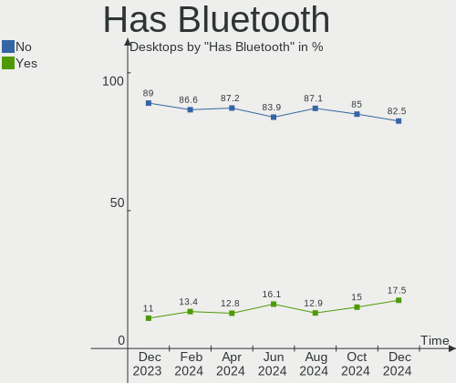
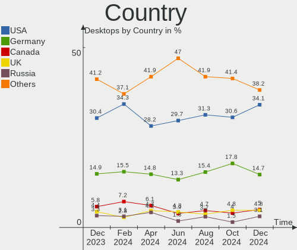
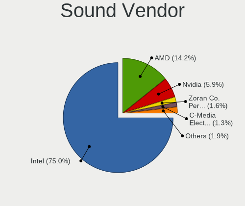
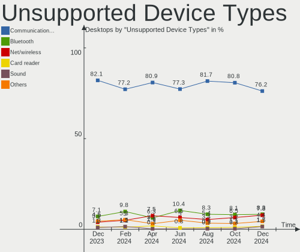

BSD - Hardware Trends (Desktops)
--------------------------------

A project to identify most popular hardware characteristics and track their change
over time based on data collected by BSD users at https://BSD-Hardware.info.

Anyone can contribute to this report by the [hw-probe](https://github.com/linuxhw/hw-probe/blob/master/INSTALL.BSD.md) tool:

    hw-probe -all -upload

This report is for one last month. Overall report since the beginning of time: [TestDays](https://github.com/bsdhw/TestDays)

Period: Apr, 2024.

Contents
--------

* [ System ](#system)
  - [ OS                       ](#os)
  - [ OS Family                ](#os-family)
  - [ Arch                     ](#arch)
  - [ DE                       ](#de)
  - [ Display Server           ](#display-server)
  - [ Display Manager          ](#display-manager)
  - [ OS Lang                  ](#os-lang)
  - [ Boot Mode                ](#boot-mode)
  - [ Filesystem               ](#filesystem)
  - [ Part. scheme             ](#part-scheme)

* [ Board ](#board)
  - [ Vendor                   ](#vendor)
  - [ Model                    ](#model)
  - [ Model Family             ](#model-family)
  - [ MFG Year                 ](#mfg-year)
  - [ Form Factor              ](#form-factor)
  - [ Coreboot                 ](#coreboot)
  - [ RAM Size                 ](#ram-size)
  - [ RAM Used                 ](#ram-used)
  - [ Total Drives             ](#total-drives)
  - [ Has CD-ROM               ](#has-cd-rom)
  - [ Has Ethernet             ](#has-ethernet)
  - [ Has WiFi                 ](#has-wifi)
  - [ Has Bluetooth            ](#has-bluetooth)

* [ Location ](#location)
  - [ Country                  ](#country)
  - [ City                     ](#city)

* [ Drives ](#drives)
  - [ Drive Vendor             ](#drive-vendor)
  - [ Drive Model              ](#drive-model)
  - [ HDD Vendor               ](#hdd-vendor)
  - [ SSD Vendor               ](#ssd-vendor)
  - [ Drive Kind               ](#drive-kind)
  - [ Drive Connector          ](#drive-connector)
  - [ Drive Size               ](#drive-size)
  - [ Space Total              ](#space-total)
  - [ Space Used               ](#space-used)
  - [ Malfunc. Drives          ](#malfunc-drives)
  - [ Malfunc. Drive Vendor    ](#malfunc-drive-vendor)
  - [ Malfunc. HDD Vendor      ](#malfunc-hdd-vendor)
  - [ Malfunc. Drive Kind      ](#malfunc-drive-kind)
  - [ Failed Drives            ](#failed-drives)
  - [ Failed Drive Vendor      ](#failed-drive-vendor)
  - [ Drive Status             ](#drive-status)

* [ Storage controller ](#storage-controller)
  - [ Storage Vendor           ](#storage-vendor)
  - [ Storage Model            ](#storage-model)
  - [ Storage Kind             ](#storage-kind)

* [ Processor ](#processor)
  - [ CPU Vendor               ](#cpu-vendor)
  - [ CPU Model                ](#cpu-model)
  - [ CPU Model Family         ](#cpu-model-family)
  - [ CPU Cores                ](#cpu-cores)
  - [ CPU Sockets              ](#cpu-sockets)
  - [ CPU Threads              ](#cpu-threads)
  - [ CPU Microarch            ](#cpu-microarch)

* [ Graphics ](#graphics)
  - [ GPU Vendor               ](#gpu-vendor)
  - [ GPU Model                ](#gpu-model)
  - [ GPU Combo                ](#gpu-combo)
  - [ GPU Driver               ](#gpu-driver)
  - [ GPU Memory               ](#gpu-memory)

* [ Monitor ](#monitor)
  - [ Monitor Vendor           ](#monitor-vendor)
  - [ Monitor Model            ](#monitor-model)
  - [ Monitor Resolution       ](#monitor-resolution)
  - [ Monitor Diagonal         ](#monitor-diagonal)
  - [ Monitor Width            ](#monitor-width)
  - [ Aspect Ratio             ](#aspect-ratio)
  - [ Monitor Area             ](#monitor-area)
  - [ Pixel Density            ](#pixel-density)
  - [ Multiple Monitors        ](#multiple-monitors)

* [ Network ](#network)
  - [ Net Controller Vendor    ](#net-controller-vendor)
  - [ Net Controller Model     ](#net-controller-model)
  - [ Wireless Vendor          ](#wireless-vendor)
  - [ Wireless Model           ](#wireless-model)
  - [ Ethernet Vendor          ](#ethernet-vendor)
  - [ Ethernet Model           ](#ethernet-model)
  - [ Net Controller Kind      ](#net-controller-kind)
  - [ Used Controller          ](#used-controller)
  - [ NICs                     ](#nics)
  - [ IPv6                     ](#ipv6)

* [ Bluetooth ](#bluetooth)
  - [ Bluetooth Vendor         ](#bluetooth-vendor)
  - [ Bluetooth Model          ](#bluetooth-model)

* [ Sound ](#sound)
  - [ Sound Vendor             ](#sound-vendor)
  - [ Sound Model              ](#sound-model)

* [ Memory ](#memory)
  - [ Memory Vendor            ](#memory-vendor)
  - [ Memory Model             ](#memory-model)
  - [ Memory Kind              ](#memory-kind)
  - [ Memory Form Factor       ](#memory-form-factor)
  - [ Memory Size              ](#memory-size)
  - [ Memory Speed             ](#memory-speed)

* [ Printers & scanners ](#printers--scanners)
  - [ Printer Vendor           ](#printer-vendor)
  - [ Printer Model            ](#printer-model)
  - [ Scanner Vendor           ](#scanner-vendor)
  - [ Scanner Model            ](#scanner-model)

* [ Camera ](#camera)
  - [ Camera Vendor            ](#camera-vendor)
  - [ Camera Model             ](#camera-model)

* [ Security ](#security)
  - [ Fingerprint Vendor       ](#fingerprint-vendor)
  - [ Fingerprint Model        ](#fingerprint-model)
  - [ Chipcard Vendor          ](#chipcard-vendor)
  - [ Chipcard Model           ](#chipcard-model)

* [ Unsupported ](#unsupported)
  - [ Unsupported Devices      ](#unsupported-devices)
  - [ Unsupported Device Types ](#unsupported-device-types)

System
------

OS
--

Installed operating systems

| Name                    | Desktops | Percent |
|-------------------------|----------|---------|
| OPNsense 24.1.5         | 112      | 31.28%  |
| OPNsense 24.1.6         | 110      | 30.73%  |
| OPNsense 24.1.4         | 43       | 12.01%  |
| FreeBSD 14.0-p6         | 18       | 5.03%   |
| OPNsense 23.7.12        | 10       | 2.79%   |
| OpenBSD 7.5             | 6        | 1.68%   |
| OPNsense 24.7           | 5        | 1.4%    |
| NetBSD 10.0             | 5        | 1.4%    |
| helloSystem 0.9.0       | 5        | 1.4%    |
| FreeBSD 14.0            | 5        | 1.4%    |
| GhostBSD 24.01.1        | 4        | 1.12%   |
| FreeBSD 15.0-CURRENT    | 4        | 1.12%   |
| helloSystem 0.8.1       | 3        | 0.84%   |
| OPNsense 24.1.3         | 2        | 0.56%   |
| OPNsense 23.7.3         | 2        | 0.56%   |
| OPNsense 23.1.11        | 2        | 0.56%   |
| MyBee 14.0-p2           | 2        | 0.56%   |
| FreeBSD 14.0-BETA5      | 2        | 0.56%   |
| FreeBSD 13.2            | 2        | 0.56%   |
| XigmaNAS 13.2-p8        | 1        | 0.28%   |
| Ting 23.7               | 1        | 0.28%   |
| OPNsense 24.1.2         | 1        | 0.28%   |
| OPNsense 23.7.1         | 1        | 0.28%   |
| OPNsense 23.1.5         | 1        | 0.28%   |
| OPNsense 22.1.10        | 1        | 0.28%   |
| OPNsense 21.7.8         | 1        | 0.28%   |
| helloSystem 0.7.0       | 1        | 0.28%   |
| FreeBSD 14.1-PRERELEASE | 1        | 0.28%   |
| FreeBSD 14.0-STABLE     | 1        | 0.28%   |
| FreeBSD 14.0-p2         | 1        | 0.28%   |
| FreeBSD 13.2-STABLE     | 1        | 0.28%   |
| FreeBSD 13.2-p11        | 1        | 0.28%   |
| FreeBSD 12.4            | 1        | 0.28%   |
| FreeBSD 12.1-p10        | 1        | 0.28%   |
| FreeBSD 11.1-p6         | 1        | 0.28%   |

OS Family
---------

OS without a version

| Name        | Desktops | Percent |
|-------------|----------|---------|
| OPNsense    | 291      | 81.28%  |
| FreeBSD     | 39       | 10.89%  |
| helloSystem | 9        | 2.51%   |
| OpenBSD     | 6        | 1.68%   |
| NetBSD      | 5        | 1.4%    |
| GhostBSD    | 4        | 1.12%   |
| MyBee       | 2        | 0.56%   |
| XigmaNAS    | 1        | 0.28%   |
| Ting        | 1        | 0.28%   |

Arch
----

OS architecture (x86_64, i586, etc.)

| Name  | Desktops | Percent |
|-------|----------|---------|
| amd64 | 357      | 99.72%  |
| arm64 | 1        | 0.28%   |

DE
--

Desktop Environment

| Name         | Desktops | Percent |
|--------------|----------|---------|
| Console      | 316      | 88.27%  |
| helloDesktop | 14       | 3.91%   |
| KDE5         | 8        | 2.23%   |
| XFCE         | 7        | 1.96%   |
| MATE         | 5        | 1.4%    |
| GNOME        | 3        | 0.84%   |
| xinitrc      | 1        | 0.28%   |
| X-Cinnamon   | 1        | 0.28%   |
| TWM          | 1        | 0.28%   |
| LXQt         | 1        | 0.28%   |
| i3           | 1        | 0.28%   |

Display Server
--------------

X11 or Wayland

| Name    | Desktops | Percent |
|---------|----------|---------|
| Console | 313      | 87.43%  |
| X11     | 43       | 12.01%  |
| Wayland | 2        | 0.56%   |

Display Manager
---------------

SDDM, LightDM, etc.

| Name    | Desktops | Percent |
|---------|----------|---------|
| Console | 325      | 90.78%  |
| SDDM    | 12       | 3.35%   |
| SLiM    | 11       | 3.07%   |
| LightDM | 7        | 1.96%   |
| XDM     | 2        | 0.56%   |
| GDM     | 1        | 0.28%   |

OS Lang
-------

Language

| Lang    | Desktops | Percent |
|---------|----------|---------|
| Unknown | 302      | 84.36%  |
| C       | 32       | 8.94%   |
| en_US   | 15       | 4.19%   |
| fr_FR   | 3        | 0.84%   |
| ru_RU   | 2        | 0.56%   |
| zh_CN   | 1        | 0.28%   |
| ja_JP   | 1        | 0.28%   |
| en_AU   | 1        | 0.28%   |
| de.DE   | 1        | 0.28%   |

Boot Mode
---------

EFI or BIOS

| Mode | Desktops | Percent |
|------|----------|---------|
| EFI  | 332      | 92.74%  |
| BIOS | 26       | 7.26%   |

Filesystem
----------

Type of filesystem

| Type   | Desktops | Percent |
|--------|----------|---------|
| Zfs    | 183      | 51.12%  |
| Ufs    | 163      | 45.53%  |
| Ffs    | 6        | 1.68%   |
| Cd9660 | 6        | 1.68%   |

Part. scheme
------------

Scheme of partitioning

| Type    | Desktops | Percent |
|---------|----------|---------|
| GPT     | 348      | 97.21%  |
| MBR     | 8        | 2.23%   |
| Unknown | 2        | 0.56%   |

Board
-----

Vendor
------

Motherboard manufacturer

| Name                                 | Desktops | Percent |
|--------------------------------------|----------|---------|
| Unknown                              | 89       | 24.86%  |
| Dell                                 | 34       | 9.5%    |
| Hewlett-Packard                      | 29       | 8.1%    |
| ASUSTek Computer                     | 27       | 7.54%   |
| Gigabyte Technology                  | 22       | 6.15%   |
| Protectli                            | 21       | 5.87%   |
| Intel                                | 20       | 5.59%   |
| ASRock                               | 15       | 4.19%   |
| Lenovo                               | 10       | 2.79%   |
| PC Engines                           | 9        | 2.51%   |
| AZW                                  | 9        | 2.51%   |
| MSI                                  | 8        | 2.23%   |
| Fujitsu                              | 8        | 2.23%   |
| Techvision                           | 6        | 1.68%   |
| Supermicro                           | 5        | 1.4%    |
| IceWhale Technology                  | 4        | 1.12%   |
| CWWK                                 | 4        | 1.12%   |
| Seeed Studio                         | 2        | 0.56%   |
| MW                                   | 2        | 0.56%   |
| Hardkernel                           | 2        | 0.56%   |
| CncTion                              | 2        | 0.56%   |
| Advantech                            | 2        | 0.56%   |
| Wistron                              | 1        | 0.28%   |
| Winston Marriot                      | 1        | 0.28%   |
| Trigkey                              | 1        | 0.28%   |
| SolidRun                             | 1        | 0.28%   |
| SJRC                                 | 1        | 0.28%   |
| Silicom                              | 1        | 0.28%   |
| Shuttle                              | 1        | 0.28%   |
| Shenzhen Meigao Electronic Equipment | 1        | 0.28%   |
| SHANGZHAOYUAN                        | 1        | 0.28%   |
| Quantum engineering                  | 1        | 0.28%   |
| OEM                                  | 1        | 0.28%   |
| NF541                                | 1        | 0.28%   |
| MAXSUN                               | 1        | 0.28%   |
| Lanner                               | 1        | 0.28%   |
| HUAWEI                               | 1        | 0.28%   |
| HPE                                  | 1        | 0.28%   |
| GoWin Solution                       | 1        | 0.28%   |
| Google                               | 1        | 0.28%   |

Model
-----

Motherboard model

| Name                                | Desktops | Percent |
|-------------------------------------|----------|---------|
| Unknown                             | 89       | 24.86%  |
| AZW EQ                              | 7        | 1.96%   |
| Techvision TVI7309X                 | 6        | 1.68%   |
| Protectli FW6                       | 6        | 1.68%   |
| Protectli FW4B                      | 5        | 1.4%    |
| PC Engines APU2                     | 5        | 1.4%    |
| Fujitsu FUTRO S920                  | 5        | 1.4%    |
| IceWhale ZimaBoard 832 ZMB          | 4        | 1.12%   |
| HP EliteDesk 800 G2 SFF             | 4        | 1.12%   |
| ASUS All Series                     | 4        | 1.12%   |
| Protectli VP2420                    | 3        | 0.84%   |
| Dell OptiPlex 9020                  | 3        | 0.84%   |
| Dell OptiPlex 790                   | 3        | 0.84%   |
| Dell OptiPlex 3040                  | 3        | 0.84%   |
| Dell OptiPlex 3020                  | 3        | 0.84%   |
| Seeed Studio ODYSSEY-X86J4105       | 2        | 0.56%   |
| Protectli VP4630                    | 2        | 0.56%   |
| PC Engines apu4                     | 2        | 0.56%   |
| MW GMLK-2_5G4L                      | 2        | 0.56%   |
| Lenovo ThinkCentre M720s 10SUSA5A00 | 2        | 0.56%   |
| Intel SHARKBAY                      | 2        | 0.56%   |
| Intel Q3XXG4-P V1.0                 | 2        | 0.56%   |
| Intel MAHOBAY                       | 2        | 0.56%   |
| Intel CRESCENTBAY                   | 2        | 0.56%   |
| HP Z240 SFF Workstation             | 2        | 0.56%   |
| HP ProDesk 400 G4 SFF               | 2        | 0.56%   |
| Hardkernel ODROID-H2                | 2        | 0.56%   |
| Gigabyte X570 I AORUS PRO WIFI      | 2        | 0.56%   |
| Dell OptiPlex 780                   | 2        | 0.56%   |
| Dell OptiPlex 755                   | 2        | 0.56%   |
| Dell OptiPlex 7050                  | 2        | 0.56%   |
| Dell OptiPlex 7040                  | 2        | 0.56%   |
| Dell OptiPlex 7010                  | 2        | 0.56%   |
| Dell OptiPlex 3010                  | 2        | 0.56%   |
| CWWK CW-AD4L-N V1                   | 2        | 0.56%   |
| CncTion N4505-4L                    | 2        | 0.56%   |
| ASUS Z170I PRO GAMING               | 2        | 0.56%   |
| Wistron ProLiant ML110 G6           | 1        | 0.28%   |
| Winston Marriot PICO PC PICOPC      | 1        | 0.28%   |
| Trigkey Green G5                    | 1        | 0.28%   |

Model Family
------------

Motherboard model prefix

| Name                            | Desktops | Percent |
|---------------------------------|----------|---------|
| Unknown                         | 89       | 24.86%  |
| Dell OptiPlex                   | 30       | 8.38%   |
| HP EliteDesk                    | 10       | 2.79%   |
| AZW EQ                          | 7        | 1.96%   |
| ASUS PRIME                      | 7        | 1.96%   |
| Techvision TVI7309X             | 6        | 1.68%   |
| Protectli FW6                   | 6        | 1.68%   |
| Fujitsu FUTRO                   | 6        | 1.68%   |
| Protectli FW4B                  | 5        | 1.4%    |
| PC Engines APU2                 | 5        | 1.4%    |
| Lenovo ThinkCentre              | 5        | 1.4%    |
| HP ProDesk                      | 5        | 1.4%    |
| IceWhale ZimaBoard              | 4        | 1.12%   |
| Gigabyte X570                   | 4        | 1.12%   |
| ASUS All                        | 4        | 1.12%   |
| Protectli VP2420                | 3        | 0.84%   |
| HP ProLiant                     | 3        | 0.84%   |
| HP Compaq                       | 3        | 0.84%   |
| ASUS TUF                        | 3        | 0.84%   |
| ASUS ROG                        | 3        | 0.84%   |
| Seeed Studio ODYSSEY-X86J4105   | 2        | 0.56%   |
| Protectli VP4630                | 2        | 0.56%   |
| PC Engines apu4                 | 2        | 0.56%   |
| MW GMLK-2                       | 2        | 0.56%   |
| Intel SHARKBAY                  | 2        | 0.56%   |
| Intel Q3XXG4-P                  | 2        | 0.56%   |
| Intel MAHOBAY                   | 2        | 0.56%   |
| Intel CRESCENTBAY               | 2        | 0.56%   |
| HP Z240                         | 2        | 0.56%   |
| Hardkernel ODROID-H2            | 2        | 0.56%   |
| Dell Precision                  | 2        | 0.56%   |
| CWWK CW-AD4L-N                  | 2        | 0.56%   |
| CncTion N4505-4L                | 2        | 0.56%   |
| ASUS Z170I                      | 2        | 0.56%   |
| Wistron ProLiant                | 1        | 0.28%   |
| Winston Marriot PICO            | 1        | 0.28%   |
| Trigkey Green                   | 1        | 0.28%   |
| Supermicro X9SCL                | 1        | 0.28%   |
| Supermicro PIO-518D-TLN4F-ST031 | 1        | 0.28%   |
| Supermicro PIO-518D-N6TRF-ST031 | 1        | 0.28%   |

MFG Year
--------

Motherboard manufacture year

| Year | Desktops | Percent |
|------|----------|---------|
| 2023 | 80       | 22.35%  |
| 2022 | 53       | 14.8%   |
| 2019 | 27       | 7.54%   |
| 2016 | 26       | 7.26%   |
| 2018 | 25       | 6.98%   |
| 2021 | 23       | 6.42%   |
| 2014 | 23       | 6.42%   |
| 2017 | 20       | 5.59%   |
| 2015 | 15       | 4.19%   |
| 2024 | 14       | 3.91%   |
| 2020 | 13       | 3.63%   |
| 2012 | 10       | 2.79%   |
| 2011 | 8        | 2.23%   |
| 2010 | 7        | 1.96%   |
| 2013 | 5        | 1.4%    |
| 2008 | 5        | 1.4%    |
| 2009 | 3        | 0.84%   |
| 2007 | 1        | 0.28%   |

Form Factor
-----------

Physical design of the computer

| Name    | Desktops | Percent |
|---------|----------|---------|
| Desktop | 358      | 100%    |

Coreboot
--------

Have coreboot on board

| Used | Desktops | Percent |
|------|----------|---------|
| No   | 344      | 96.09%  |
| Yes  | 14       | 3.91%   |

RAM Size
--------

Total RAM memory

| Size in GB      | Desktops | Percent |
|-----------------|----------|---------|
| 8.01-16.0       | 131      | 36.59%  |
| 16.01-24.0      | 115      | 32.12%  |
| 32.01-64.0      | 42       | 11.73%  |
| 4.01-8.0        | 41       | 11.45%  |
| 64.01-256.0     | 17       | 4.75%   |
| 24.01-32.0      | 6        | 1.68%   |
| 2.01-3.0        | 4        | 1.12%   |
| More than 256.0 | 1        | 0.28%   |
| 1.01-2.0        | 1        | 0.28%   |

RAM Used
--------

Used RAM memory

| Used GB     | Desktops | Percent |
|-------------|----------|---------|
| 0.51-1.0    | 155      | 43.3%   |
| 0.01-0.5    | 134      | 37.43%  |
| 1.01-2.0    | 48       | 13.41%  |
| 2.01-3.0    | 9        | 2.51%   |
| Unknown     | 5        | 1.4%    |
| 4.01-8.0    | 4        | 1.12%   |
| 3.01-4.0    | 1        | 0.28%   |
| 64.01-256.0 | 1        | 0.28%   |
| 8.01-16.0   | 1        | 0.28%   |

Total Drives
------------

Number of drives on board

| Drives | Desktops | Percent |
|--------|----------|---------|
| 1      | 260      | 72.63%  |
| 0      | 46       | 12.85%  |
| 2      | 35       | 9.78%   |
| 3      | 7        | 1.96%   |
| 4      | 6        | 1.68%   |
| 5      | 3        | 0.84%   |
| 8      | 1        | 0.28%   |

Has CD-ROM
----------

Has CD-ROM on board

| Presented | Desktops | Percent |
|-----------|----------|---------|
| No        | 321      | 89.66%  |
| Yes       | 37       | 10.34%  |

Has Ethernet
------------

Has Ethernet on board

| Presented | Desktops | Percent |
|-----------|----------|---------|
| Yes       | 354      | 98.88%  |
| No        | 4        | 1.12%   |

Has WiFi
--------

Has WiFi module

| Presented | Desktops | Percent |
|-----------|----------|---------|
| No        | 294      | 82.12%  |
| Yes       | 64       | 17.88%  |

Has Bluetooth
-------------

Has Bluetooth module

| Presented | Desktops | Percent |
|-----------|----------|---------|
| No        | 312      | 87.15%  |
| Yes       | 46       | 12.85%  |

Location
--------

Country
-------

Geographic location (country)

| Country         | Desktops | Percent |
|-----------------|----------|---------|
| USA             | 101      | 28.21%  |
| Germany         | 53       | 14.8%   |
| Canada          | 22       | 6.15%   |
| UK              | 17       | 4.75%   |
| Australia       | 17       | 4.75%   |
| Russia          | 15       | 4.19%   |
| Poland          | 11       | 3.07%   |
| Brazil          | 10       | 2.79%   |
| Spain           | 9        | 2.51%   |
| Sweden          | 8        | 2.23%   |
| France          | 7        | 1.96%   |
| Netherlands     | 6        | 1.68%   |
| Italy           | 6        | 1.68%   |
| Denmark         | 6        | 1.68%   |
| Switzerland     | 5        | 1.4%    |
| Philippines     | 5        | 1.4%    |
| Japan           | 5        | 1.4%    |
| Belgium         | 4        | 1.12%   |
| Slovenia        | 3        | 0.84%   |
| Norway          | 3        | 0.84%   |
| India           | 3        | 0.84%   |
| Austria         | 3        | 0.84%   |
| Vietnam         | 2        | 0.56%   |
| The Netherlands | 2        | 0.56%   |
| Thailand        | 2        | 0.56%   |
| Taiwan          | 2        | 0.56%   |
| South Korea     | 2        | 0.56%   |
| South Africa    | 2        | 0.56%   |
| Romania         | 2        | 0.56%   |
| Portugal        | 2        | 0.56%   |
| Hungary         | 2        | 0.56%   |
| Hong Kong       | 2        | 0.56%   |
| Finland         | 2        | 0.56%   |
| China           | 2        | 0.56%   |
| Turkey          | 1        | 0.28%   |
| Singapore       | 1        | 0.28%   |
| Peru            | 1        | 0.28%   |
| Panama          | 1        | 0.28%   |
| Lithuania       | 1        | 0.28%   |
| Israel          | 1        | 0.28%   |

City
----

Geographic location (city)

| City             | Desktops | Percent |
|------------------|----------|---------|
| Berlin           | 6        | 1.68%   |
| Moscow           | 5        | 1.4%    |
| Melbourne        | 4        | 1.12%   |
| Madrid           | 4        | 1.12%   |
| Frederiksberg    | 4        | 1.12%   |
| Bonn             | 4        | 1.12%   |
| Wroclaw          | 3        | 0.84%   |
| Toronto          | 3        | 0.84%   |
| Sydney           | 3        | 0.84%   |
| St Petersburg    | 3        | 0.84%   |
| Philadelphia     | 3        | 0.84%   |
| Oldham           | 3        | 0.84%   |
| Krakow           | 3        | 0.84%   |
| Calgary          | 3        | 0.84%   |
| Brisbane         | 3        | 0.84%   |
| Worcester        | 2        | 0.56%   |
| Vienna           | 2        | 0.56%   |
| Vancouver        | 2        | 0.56%   |
| St Louis         | 2        | 0.56%   |
| Sheffield        | 2        | 0.56%   |
| Seattle          | 2        | 0.56%   |
| Sao Paulo        | 2        | 0.56%   |
| Rome             | 2        | 0.56%   |
| Rochester        | 2        | 0.56%   |
| Rillieux-la-Pape | 2        | 0.56%   |
| Quezon City      | 2        | 0.56%   |
| Pretoria         | 2        | 0.56%   |
| Paris            | 2        | 0.56%   |
| Palo Alto        | 2        | 0.56%   |
| Oakland          | 2        | 0.56%   |
| Nottuln          | 2        | 0.56%   |
| Northampton      | 2        | 0.56%   |
| New York         | 2        | 0.56%   |
| Mülheim         | 2        | 0.56%   |
| London           | 2        | 0.56%   |
| Ljubljana        | 2        | 0.56%   |
| Lahug            | 2        | 0.56%   |
| Jacksonville     | 2        | 0.56%   |
| Helsinki         | 2        | 0.56%   |
| Erfurt           | 2        | 0.56%   |

Drives
------

Drive Vendor
------------

Hard drive vendors

| Vendor              | Desktops | Drives | Percent |
|---------------------|----------|--------|---------|
| Samsung Electronics | 52       | 66     | 14.99%  |
| WDC                 | 31       | 34     | 8.93%   |
| Seagate             | 28       | 46     | 8.07%   |
| Kingston            | 26       | 29     | 7.49%   |
| Crucial             | 21       | 22     | 6.05%   |
| Transcend           | 14       | 14     | 4.03%   |
| China               | 14       | 14     | 4.03%   |
| SanDisk             | 12       | 12     | 3.46%   |
| Phison              | 9        | 9      | 2.59%   |
| Silicon Motion      | 8        | 8      | 2.31%   |
| A-DATA Technology   | 8        | 9      | 2.31%   |
| Toshiba             | 7        | 7      | 2.02%   |
| Team                | 7        | 9      | 2.02%   |
| Hoodisk             | 7        | 7      | 2.02%   |
| Patriot             | 6        | 7      | 1.73%   |
| SK hynix            | 5        | 5      | 1.44%   |
| Lexar               | 5        | 7      | 1.44%   |
| SPCC                | 4        | 4      | 1.15%   |
| Protectli           | 4        | 4      | 1.15%   |
| PNY                 | 4        | 4      | 1.15%   |
| NVMe                | 4        | 5      | 1.15%   |
| LITEON              | 4        | 5      | 1.15%   |
| Intel               | 4        | 4      | 1.15%   |
| faspeed             | 4        | 4      | 1.15%   |
| ShiJi               | 3        | 3      | 0.86%   |
| Micron Technology   | 3        | 3      | 0.86%   |
| HGST                | 3        | 3      | 0.86%   |
| FORESEE             | 3        | 3      | 0.86%   |
| CWdisk              | 3        | 3      | 0.86%   |
| Vaseky              | 2        | 2      | 0.58%   |
| T-FORCE             | 2        | 2      | 0.58%   |
| OCZ                 | 2        | 2      | 0.58%   |
| Netac               | 2        | 2      | 0.58%   |
| KingSpec            | 2        | 2      | 0.58%   |
| Intenso             | 2        | 3      | 0.58%   |
| Innodisk            | 2        | 2      | 0.58%   |
| Hitachi             | 2        | 2      | 0.58%   |
| Fanxiang            | 2        | 2      | 0.58%   |
| ZTC                 | 1        | 1      | 0.29%   |
| Zheino              | 1        | 1      | 0.29%   |

Drive Model
-----------

Hard drive models

| Model                            | Desktops | Percent |
|----------------------------------|----------|---------|
| Crucial CT500P3SSD8 500GB        | 5        | 1.37%   |
| Kingston SA400S37240G 240GB      | 4        | 1.1%    |
| Crucial CT500MX500SSD1 500GB     | 4        | 1.1%    |
| Silicon Motion BKKJ nvme 128G    | 3        | 0.82%   |
| Samsung SSD 970 EVO Plus 500GB   | 3        | 0.82%   |
| Samsung SSD 860 EVO 250GB        | 3        | 0.82%   |
| Phison YSO128GTLCW-E3C-2 128GB   | 3        | 0.82%   |
| Hoodisk SSD 128GB                | 3        | 0.82%   |
| WDC WDS120G2G0A-00JH30 120GB     | 2        | 0.55%   |
| Transcend TS32GMSA370 32GB       | 2        | 0.55%   |
| Transcend TS128GMSA230S 128GB    | 2        | 0.55%   |
| Toshiba DT01ACA050 500GB         | 2        | 0.55%   |
| Silicon Motion BKKJ nvme 256G    | 2        | 0.55%   |
| ShiJi 128GB M.2-NVMe             | 2        | 0.55%   |
| Seagate ST500DM002-1BD142 500GB  | 2        | 0.55%   |
| Seagate ST3250312AS 250GB        | 2        | 0.55%   |
| Seagate ST1000DM010-2EP102 1TB   | 2        | 0.55%   |
| Samsung SSD 970 EVO Plus 1TB     | 2        | 0.55%   |
| Samsung SSD 960 EVO 250GB        | 2        | 0.55%   |
| Samsung SSD 870 EVO 2TB          | 2        | 0.55%   |
| Samsung SSD 850 EVO mSATA 250GB  | 2        | 0.55%   |
| Samsung MZVLB256HAHQ-000H1 256GB | 2        | 0.55%   |
| Samsung MZ7LN512HMJP-000L1 512GB | 2        | 0.55%   |
| PNY CS900 120GB SSD              | 2        | 0.55%   |
| Phison YSO256GTLCW-E3C-2 256GB   | 2        | 0.55%   |
| Phison Sabrent 1TB               | 2        | 0.55%   |
| Patriot M.2 P300 128GB           | 2        | 0.55%   |
| Patriot Burst Elite 120GB        | 2        | 0.55%   |
| Micron 1100_MTFDDAV256TBN 256GB  | 2        | 0.55%   |
| LITEON LCH-256V2S-HP 256GB       | 2        | 0.55%   |
| Lexar SSD NS100 512GB            | 2        | 0.55%   |
| Kingston SV300S37A120G 120GB     | 2        | 0.55%   |
| Kingston SNV2S500G 500GB         | 2        | 0.55%   |
| Kingston SKC600MS512G 512GB      | 2        | 0.55%   |
| Kingston SA400S37960G 960GB      | 2        | 0.55%   |
| Kingston SA400S37480G 480GB      | 2        | 0.55%   |
| Kingston OM8SEP4512Q-A0 512GB    | 2        | 0.55%   |
| Intel SSDSC2BF180A4L 180GB       | 2        | 0.55%   |
| Hoodisk SSD 16GB                 | 2        | 0.55%   |
| faspeed P8-512G                  | 2        | 0.55%   |

HDD Vendor
----------

Hard disk drive vendors

| Vendor              | Desktops | Drives | Percent |
|---------------------|----------|--------|---------|
| Seagate             | 28       | 45     | 39.44%  |
| WDC                 | 26       | 29     | 36.62%  |
| Toshiba             | 5        | 5      | 7.04%   |
| HGST                | 3        | 3      | 4.23%   |
| NVMe                | 2        | 3      | 2.82%   |
| Hitachi             | 2        | 2      | 2.82%   |
| USB                 | 1        | 1      | 1.41%   |
| Samsung Electronics | 1        | 1      | 1.41%   |
| OPENBSD             | 1        | 1      | 1.41%   |
| JetFlash            | 1        | 1      | 1.41%   |
| ASMedia             | 1        | 1      | 1.41%   |

SSD Vendor
----------

Solid state drive vendors

| Vendor              | Desktops | Drives | Percent |
|---------------------|----------|--------|---------|
| Samsung Electronics | 31       | 39     | 16.49%  |
| Kingston            | 19       | 22     | 10.11%  |
| China               | 14       | 14     | 7.45%   |
| Crucial             | 13       | 14     | 6.91%   |
| Transcend           | 12       | 12     | 6.38%   |
| SanDisk             | 12       | 12     | 6.38%   |
| Hoodisk             | 7        | 7      | 3.72%   |
| A-DATA Technology   | 6        | 7      | 3.19%   |
| Team                | 5        | 7      | 2.66%   |
| WDC                 | 4        | 4      | 2.13%   |
| Protectli           | 4        | 4      | 2.13%   |
| PNY                 | 4        | 4      | 2.13%   |
| LITEON              | 4        | 5      | 2.13%   |
| SPCC                | 3        | 3      | 1.6%    |
| Micron Technology   | 3        | 3      | 1.6%    |
| Lexar               | 3        | 4      | 1.6%    |
| Intel               | 3        | 3      | 1.6%    |
| T-FORCE             | 2        | 2      | 1.06%   |
| SK hynix            | 2        | 2      | 1.06%   |
| Patriot             | 2        | 3      | 1.06%   |
| OCZ                 | 2        | 2      | 1.06%   |
| NVMe                | 2        | 2      | 1.06%   |
| KingSpec            | 2        | 2      | 1.06%   |
| Intenso             | 2        | 3      | 1.06%   |
| Innodisk            | 2        | 2      | 1.06%   |
| ZTC                 | 1        | 1      | 0.53%   |
| Zheino              | 1        | 1      | 0.53%   |
| Vaseky              | 1        | 1      | 0.53%   |
| UDinfo              | 1        | 1      | 0.53%   |
| Timetec             | 1        | 1      | 0.53%   |
| Terabit             | 1        | 1      | 0.53%   |
| Teelkoou            | 1        | 1      | 0.53%   |
| ShiJi               | 1        | 1      | 0.53%   |
| Seagate             | 1        | 1      | 0.53%   |
| Plextor             | 1        | 1      | 0.53%   |
| Pioneer             | 1        | 1      | 0.53%   |
| Netac               | 1        | 1      | 0.53%   |
| LITEONIT            | 1        | 1      | 0.53%   |
| KIOXIA-EXCERIA      | 1        | 1      | 0.53%   |
| GOODRAM             | 1        | 1      | 0.53%   |

Drive Kind
----------

HDD or SSD

| Kind | Desktops | Drives | Percent |
|------|----------|--------|---------|
| SSD  | 182      | 207    | 54.98%  |
| NVMe | 89       | 96     | 26.89%  |
| HDD  | 60       | 92     | 18.13%  |

Drive Connector
---------------

SATA, SAS, NVMe, etc.

| Type | Desktops | Drives | Percent |
|------|----------|--------|---------|
| SATA | 225      | 299    | 71.66%  |
| NVMe | 89       | 96     | 28.34%  |

Drive Size
----------

Size of hard drive

| Size in TB | Desktops | Drives | Percent |
|------------|----------|--------|---------|
| 0.01-0.5   | 185      | 211    | 74.3%   |
| 0.51-1.0   | 33       | 39     | 13.25%  |
| 1.01-2.0   | 18       | 29     | 7.23%   |
| 3.01-4.0   | 8        | 14     | 3.21%   |
| 4.01-10.0  | 3        | 3      | 1.2%    |
| 2.01-3.0   | 1        | 1      | 0.4%    |
| 10.01-20.0 | 1        | 2      | 0.4%    |

Space Total
-----------

Amount of disk space available on the file system

| Size in GB     | Desktops | Percent |
|----------------|----------|---------|
| 101-250        | 173      | 48.32%  |
| 251-500        | 71       | 19.83%  |
| 21-50          | 29       | 8.1%    |
| 501-1000       | 27       | 7.54%   |
| 51-100         | 21       | 5.87%   |
| 1-20           | 20       | 5.59%   |
| 1001-2000      | 11       | 3.07%   |
| More than 3000 | 4        | 1.12%   |
| 2001-3000      | 2        | 0.56%   |

Space Used
----------

Amount of used disk space

| Used GB   | Desktops | Percent |
|-----------|----------|---------|
| 1-20      | 327      | 91.34%  |
| 21-50     | 19       | 5.31%   |
| 51-100    | 8        | 2.23%   |
| 101-250   | 2        | 0.56%   |
| 1001-2000 | 1        | 0.28%   |
| 501-1000  | 1        | 0.28%   |

Malfunc. Drives
---------------

Drive models with a malfunction

| Model                                      | Desktops | Drives | Percent |
|--------------------------------------------|----------|--------|---------|
| Seagate ST500DM002-1BD142 500GB            | 2        | 2      | 5.13%   |
| Kingston SV300S37A120G 120GB               | 2        | 2      | 5.13%   |
| WDC WD40EZRZ-00WN9B0 4TB                   | 1        | 1      | 2.56%   |
| WDC WD3200AAJS-00YZCA0 320GB               | 1        | 1      | 2.56%   |
| WDC WD2502ABYS-18B7A0 250GB                | 1        | 1      | 2.56%   |
| WDC WD20NMVW-11W68S0 2TB                   | 1        | 1      | 2.56%   |
| WDC WD2000FYYZ-01UL1B2 2TB                 | 1        | 1      | 2.56%   |
| WDC WD1200SD-01KCB0 120GB                  | 1        | 1      | 2.56%   |
| WDC WD10EZEX-75M2NA0 1TB                   | 1        | 1      | 2.56%   |
| Transcend TS32GMSA370 32GB                 | 1        | 1      | 2.56%   |
| Transcend TS256GMTE550T 256GB              | 1        | 1      | 2.56%   |
| SK hynix SHGS31-250GS-2 250GB              | 1        | 1      | 2.56%   |
| Seagate ST9500325AS 500GB                  | 1        | 1      | 2.56%   |
| Seagate ST500LT012-9WS142 500GB            | 1        | 1      | 2.56%   |
| Seagate ST3500413AS 500GB                  | 1        | 1      | 2.56%   |
| Seagate ST3500312CS 500GB                  | 1        | 1      | 2.56%   |
| Seagate ST3250820AS 250GB                  | 1        | 1      | 2.56%   |
| Seagate ST3160815AS 160GB                  | 1        | 1      | 2.56%   |
| Seagate ST1000DM010-2EP102 1TB             | 1        | 1      | 2.56%   |
| Samsung Electronics SSD 870 EVO 1TB        | 1        | 1      | 2.56%   |
| Samsung Electronics SSD 850 EVO 250GB      | 1        | 1      | 2.56%   |
| Samsung Electronics SSD 840 EVO 250GB      | 1        | 1      | 2.56%   |
| Patriot Burst Elite 120GB                  | 1        | 1      | 2.56%   |
| Micron Technology 1100_MTFDDAV256TBN 256GB | 1        | 1      | 2.56%   |
| LITEON CV8-8E128-HP 128GB                  | 1        | 1      | 2.56%   |
| Kingston SUV400S37120G 120GB               | 1        | 1      | 2.56%   |
| Kingston SMS200S3120G 120GB                | 1        | 1      | 2.56%   |
| Kingston SMS151S324G 24GB                  | 1        | 1      | 2.56%   |
| Kingston SHFS37A120G 120GB                 | 1        | 2      | 2.56%   |
| Hitachi HTS545032B9A300 320GB              | 1        | 1      | 2.56%   |
| HGST HTS725050A7E630 500GB                 | 1        | 1      | 2.56%   |
| HGST HTS545050A7E380 500GB                 | 1        | 1      | 2.56%   |
| Crucial CT256MX100SSD1 256GB               | 1        | 1      | 2.56%   |
| Crucial CT128MX100SSD1 128GB               | 1        | 1      | 2.56%   |
| China SH00M128GB                           | 1        | 1      | 2.56%   |
| China SATA SSD 120GB                       | 1        | 1      | 2.56%   |
| AMD R3SL120G 120GB                         | 1        | 1      | 2.56%   |

Malfunc. Drive Vendor
---------------------

Vendors of faulty drives

| Vendor              | Desktops | Drives | Percent |
|---------------------|----------|--------|---------|
| Seagate             | 9        | 9      | 23.08%  |
| WDC                 | 7        | 7      | 17.95%  |
| Kingston            | 6        | 7      | 15.38%  |
| Samsung Electronics | 3        | 3      | 7.69%   |
| Transcend           | 2        | 2      | 5.13%   |
| HGST                | 2        | 2      | 5.13%   |
| Crucial             | 2        | 2      | 5.13%   |
| China               | 2        | 2      | 5.13%   |
| SK hynix            | 1        | 1      | 2.56%   |
| Patriot             | 1        | 1      | 2.56%   |
| Micron Technology   | 1        | 1      | 2.56%   |
| LITEON              | 1        | 1      | 2.56%   |
| Hitachi             | 1        | 1      | 2.56%   |
| AMD                 | 1        | 1      | 2.56%   |

Malfunc. HDD Vendor
-------------------

Vendors of faulty HDD drives

| Vendor  | Desktops | Drives | Percent |
|---------|----------|--------|---------|
| Seagate | 9        | 9      | 47.37%  |
| WDC     | 7        | 7      | 36.84%  |
| HGST    | 2        | 2      | 10.53%  |
| Hitachi | 1        | 1      | 5.26%   |

Malfunc. Drive Kind
-------------------

Kinds of faulty drives

| Kind | Desktops | Drives | Percent |
|------|----------|--------|---------|
| SSD  | 19       | 20     | 48.72%  |
| HDD  | 19       | 19     | 48.72%  |
| NVMe | 1        | 1      | 2.56%   |

Failed Drives
-------------

Failed drive models

| Model                     | Desktops | Drives | Percent |
|---------------------------|----------|--------|---------|
| Vaseky V900-120G          | 1        | 1      | 50%     |
| Crucial CT500P3SSD8 500GB | 1        | 1      | 50%     |

Failed Drive Vendor
-------------------

Failed drive vendors

| Vendor  | Desktops | Drives | Percent |
|---------|----------|--------|---------|
| Vaseky  | 1        | 1      | 50%     |
| Crucial | 1        | 1      | 50%     |

Drive Status
------------

Number of failed and malfunc. drives

| Status   | Desktops | Drives | Percent |
|----------|----------|--------|---------|
| Works    | 279      | 345    | 85.58%  |
| Malfunc  | 39       | 40     | 11.96%  |
| Detected | 6        | 8      | 1.84%   |
| Failed   | 2        | 2      | 0.61%   |

Storage controller
------------------

Storage Vendor
--------------

Storage controller vendors

| Vendor                       | Desktops | Percent |
|------------------------------|----------|---------|
| Intel                        | 285      | 58.76%  |
| AMD                          | 51       | 10.52%  |
| Samsung Electronics          | 32       | 6.6%    |
| Silicon Motion               | 22       | 4.54%   |
| Phison Electronics           | 20       | 4.12%   |
| MAXIO Technology (Hangzhou)  | 14       | 2.89%   |
| Sandisk                      | 10       | 2.06%   |
| Kingston Technology Company  | 10       | 2.06%   |
| Micron/Crucial Technology    | 8        | 1.65%   |
| Shenzhen Longsys Electronics | 5        | 1.03%   |
| SK hynix                     | 3        | 0.62%   |
| Nvidia                       | 3        | 0.62%   |
| ASMedia Technology           | 3        | 0.62%   |
| Toshiba                      | 2        | 0.41%   |
| Realtek Semiconductor        | 2        | 0.41%   |
| Marvell Technology Group     | 2        | 0.41%   |
| JMicron Technology           | 2        | 0.41%   |
| Hosin Global Electronics     | 2        | 0.41%   |
| ADATA Technology             | 2        | 0.41%   |
| Transcend                    | 1        | 0.21%   |
| Netac Technology             | 1        | 0.21%   |
| Micron Technology            | 1        | 0.21%   |
| Lite-On Technology           | 1        | 0.21%   |
| Hewlett-Packard              | 1        | 0.21%   |
| Broadcom / LSI               | 1        | 0.21%   |
| Unknown                      | 1        | 0.21%   |

Storage Model
-------------

Storage controller models

| Model                                                                                   | Desktops | Percent |
|-----------------------------------------------------------------------------------------|----------|---------|
| Intel unknown                                                                           | 32       | 6.19%   |
| AMD FCH SATA Controller [AHCI mode]                                                     | 31       | 6%      |
| Intel 8 Series/C220 Series Chipset Family 6-port SATA Controller 1 [AHCI mode]          | 29       | 5.61%   |
| Intel Q170/Q150/B150/H170/H110/Z170/CM236 Chipset SATA Controller [AHCI Mode]           | 23       | 4.45%   |
| Intel Celeron/Pentium Silver Processor SATA Controller                                  | 23       | 4.45%   |
| Silicon Motion SM2263EN/SM2263XT (DRAM-less) NVMe SSD Controllers                       | 22       | 4.26%   |
| Intel Jasper Lake SATA AHCI Controller                                                  | 21       | 4.06%   |
| Samsung NVMe SSD Controller SM981/PM981/PM983                                           | 15       | 2.9%    |
| Intel Sunrise Point-LP SATA Controller [AHCI mode]                                      | 14       | 2.71%   |
| Phison PS5013-E13 PCIe3 NVMe Controller (DRAM-less)                                     | 13       | 2.51%   |
| MAXIO (Hangzhou) NVMe SSD Controller MAP1202 (DRAM-less)                                | 13       | 2.51%   |
| Intel Cannon Lake PCH SATA AHCI Controller                                              | 13       | 2.51%   |
| Intel 6 Series/C200 Series Chipset Family 6 port Desktop SATA AHCI Controller           | 11       | 2.13%   |
| Intel Alder Lake-P SATA AHCI Controller                                                 | 10       | 1.93%   |
| Intel Atom/Celeron/Pentium Processor x5-E8000/J3xxx/N3xxx Series SATA Controller        | 9        | 1.74%   |
| Micron/Crucial P2 [Nick P2] / P3 / P3 Plus NVMe PCIe SSD (DRAM-less)                    | 8        | 1.55%   |
| Intel SATA Controller [RAID mode]                                                       | 8        | 1.55%   |
| Intel Elkhart Lake SATA AHCI                                                            | 8        | 1.55%   |
| Intel 200 Series PCH SATA controller [AHCI mode]                                        | 8        | 1.55%   |
| AMD 500 Series Chipset SATA Controller                                                  | 8        | 1.55%   |
| Intel Atom Processor E3800 Series SATA AHCI Controller                                  | 7        | 1.35%   |
| Intel 7 Series/C210 Series Chipset Family 6-port SATA Controller [AHCI mode]            | 7        | 1.35%   |
| AMD 400 Series Chipset SATA Controller                                                  | 7        | 1.35%   |
| Samsung NVMe SSD Controller PM9A1/PM9A3/980PRO                                          | 6        | 1.16%   |
| Intel Comet Lake SATA AHCI Controller                                                   | 6        | 1.16%   |
| Intel Atom Processor C3000 Series SATA Controller 1                                     | 6        | 1.16%   |
| Intel Atom Processor C3000 Series SATA Controller 0                                     | 6        | 1.16%   |
| Intel Alder Lake-S PCH SATA Controller [AHCI Mode]                                      | 6        | 1.16%   |
| Intel 8 Series SATA Controller 1 [AHCI mode]                                            | 6        | 1.16%   |
| Samsung NVMe SSD Controller SM961/PM961/SM963                                           | 5        | 0.97%   |
| Intel Celeron N3350/Pentium N4200/Atom E3900 Series SATA AHCI Controller                | 5        | 0.97%   |
| SanDisk Extreme Pro / WD Black SN750 / PC SN730 / Red SN700 NVMe SSD                    | 4        | 0.77%   |
| Samsung NVMe SSD Controller 980 (DRAM-less)                                             | 4        | 0.77%   |
| Phison E12 NVMe Controller                                                              | 4        | 0.77%   |
| AMD SB7x0/SB8x0/SB9x0 SATA Controller [AHCI mode]                                       | 4        | 0.77%   |
| SK hynix Gold P31/BC711/PC711 NVMe Solid State Drive                                    | 3        | 0.58%   |
| Shenzhen Longsys Lexar NM790 NVME SSD (DRAM-less)                                       | 3        | 0.58%   |
| Sandisk WD Black SN770 / PC SN740 256GB / PC SN560 (DRAM-less) NVMe SSD                 | 3        | 0.58%   |
| Intel 9 Series Chipset Family SATA Controller [AHCI Mode]                               | 3        | 0.58%   |
| Intel 6 Series/C200 Series Chipset Family Desktop SATA Controller (IDE mode, ports 4-5) | 3        | 0.58%   |

Storage Kind
------------

Kind of storage controller (IDE, SATA, NVMe, SAS, ...)

| Kind | Desktops | Percent |
|------|----------|---------|
| SATA | 315      | 66.46%  |
| NVMe | 131      | 27.64%  |
| IDE  | 16       | 3.38%   |
| RAID | 11       | 2.32%   |
| SAS  | 1        | 0.21%   |

Processor
---------

CPU Vendor
----------

Processor vendors

| Vendor | Desktops | Percent |
|--------|----------|---------|
| Intel  | 302      | 84.36%  |
| AMD    | 55       | 15.36%  |
| NXP    | 1        | 0.28%   |

CPU Model
---------

Processor models

| Model                                    | Desktops | Percent |
|------------------------------------------|----------|---------|
| Intel N100                               | 38       | 10.61%  |
| Intel Celeron N5105 @ 2.00GHz            | 15       | 4.19%   |
| Intel Celeron J4125 CPU @ 2.00GHz        | 15       | 4.19%   |
| Intel Core i5-6500 CPU @ 3.20GHz         | 9        | 2.51%   |
| Intel Pentium Silver N6005 @ 2.00GHz     | 7        | 1.96%   |
| AMD GX-412TC SOC                         | 7        | 1.96%   |
| Intel Core i3-6100 CPU @ 3.70GHz         | 6        | 1.68%   |
| Intel Celeron J6412 @ 2.00GHz            | 6        | 1.68%   |
| Intel Celeron CPU J3160 @ 1.60GHz        | 6        | 1.68%   |
| Intel Atom CPU C3758R @ 2.40GHz          | 6        | 1.68%   |
| AMD Ryzen 5 5600G with Radeon Graphics   | 5        | 1.4%    |
| AMD GX-415GA SOC with Radeon HD Graphics | 5        | 1.4%    |
| Intel Core i7-6700 CPU @ 3.40GHz         | 4        | 1.12%   |
| Intel Core i5-4460 CPU @ 3.20GHz         | 4        | 1.12%   |
| Intel Core i3-N305                       | 4        | 1.12%   |
| Intel Celeron J4105 CPU @ 1.50GHz        | 4        | 1.12%   |
| Intel Celeron CPU J1900 @ 1.99GHz        | 4        | 1.12%   |
| AMD Ryzen 7 3700X 8-Core Processor       | 4        | 1.12%   |
| Intel Pentium Gold 8505                  | 3        | 0.84%   |
| Intel Core i7-7500U CPU @ 2.70GHz        | 3        | 0.84%   |
| Intel Core i7-4770 CPU @ 3.40GHz         | 3        | 0.84%   |
| Intel Core i5-8400 CPU @ 2.80GHz         | 3        | 0.84%   |
| Intel Core i5-7200U CPU @ 2.50GHz        | 3        | 0.84%   |
| Intel Core i5-4590 CPU @ 3.30GHz         | 3        | 0.84%   |
| Intel Core i5-3470 CPU @ 3.20GHz         | 3        | 0.84%   |
| Intel Core 2 Duo                         | 3        | 0.84%   |
| Intel Celeron CPU N3450 @ 1.10GHz        | 3        | 0.84%   |
| Intel Xeon CPU E3-1270 v3 @ 3.50GHz      | 2        | 0.56%   |
| Intel Xeon CPU E3-1225 V2 @ 3.20GHz      | 2        | 0.56%   |
| Intel Core i7-8550U CPU @ 1.80GHz        | 2        | 0.56%   |
| Intel Core i7-4790 CPU @ 3.60GHz         | 2        | 0.56%   |
| Intel Core i5-9400F CPU @ 2.90GHz        | 2        | 0.56%   |
| Intel Core i5-8500T CPU @ 2.10GHz        | 2        | 0.56%   |
| Intel Core i5-8500 CPU @ 3.00GHz         | 2        | 0.56%   |
| Intel Core i5-7500 CPU @ 3.40GHz         | 2        | 0.56%   |
| Intel Core i5-6500T CPU @ 2.50GHz        | 2        | 0.56%   |
| Intel Core i5-4670 CPU @ 3.40GHz         | 2        | 0.56%   |
| Intel Core i5-2400S CPU @ 2.50GHz        | 2        | 0.56%   |
| Intel Core i5-2400 CPU @ 3.10GHz         | 2        | 0.56%   |
| Intel Core i5-2400 CPU @ 3.10GH          | 2        | 0.56%   |

CPU Model Family
----------------

Processor model prefix

| Model                   | Desktops | Percent |
|-------------------------|----------|---------|
| Intel Celeron           | 77       | 21.51%  |
| Other                   | 58       | 16.2%   |
| Intel Core i5           | 58       | 16.2%   |
| Intel Core i3           | 34       | 9.5%    |
| Intel Core i7           | 23       | 6.42%   |
| Intel Xeon              | 18       | 5.03%   |
| AMD GX                  | 14       | 3.91%   |
| AMD Ryzen 7             | 13       | 3.63%   |
| Intel Atom              | 12       | 3.35%   |
| AMD Ryzen 5             | 11       | 3.07%   |
| Intel Pentium Silver    | 8        | 2.23%   |
| Intel Pentium           | 4        | 1.12%   |
| AMD Ryzen 9             | 4        | 1.12%   |
| Intel Pentium Gold      | 3        | 0.84%   |
| Intel Core 2 Duo        | 3        | 0.84%   |
| Intel Core 2 Quad       | 2        | 0.56%   |
| AMD G                   | 2        | 0.56%   |
| AMD FX                  | 2        | 0.56%   |
| AMD EPYC                | 2        | 0.56%   |
| AMD A8                  | 2        | 0.56%   |
| Intel Pentium Dual-Core | 1        | 0.28%   |
| Intel Genuine           | 1        | 0.28%   |
| Intel Core i9           | 1        | 0.28%   |
| Intel Core 2            | 1        | 0.28%   |
| AMD Ryzen 5 PRO         | 1        | 0.28%   |
| AMD Ryzen 3             | 1        | 0.28%   |
| AMD Athlon II X3        | 1        | 0.28%   |
| AMD Athlon 64 X2        | 1        | 0.28%   |

CPU Cores
---------

Number of processor cores

| Number  | Desktops | Percent |
|---------|----------|---------|
| 4       | 204      | 56.98%  |
| 2       | 71       | 19.83%  |
| 6       | 21       | 5.87%   |
| 8       | 20       | 5.59%   |
| 12      | 13       | 3.63%   |
| 16      | 12       | 3.35%   |
| 3       | 5        | 1.4%    |
| Unknown | 4        | 1.12%   |
| 10      | 3        | 0.84%   |
| 32      | 2        | 0.56%   |
| 14      | 2        | 0.56%   |
| 24      | 1        | 0.28%   |

CPU Sockets
-----------

Number of sockets

| Number | Desktops | Percent |
|--------|----------|---------|
| 1      | 358      | 100%    |

CPU Threads
-----------

Threads per core (Hyper-Threading)

| Number  | Desktops | Percent |
|---------|----------|---------|
| 1       | 260      | 72.63%  |
| 2       | 94       | 26.26%  |
| Unknown | 4        | 1.12%   |

CPU Microarch
-------------

Microarchitecture

| Name          | Desktops | Percent |
|---------------|----------|---------|
| Unknown       | 103      | 28.77%  |
| Haswell       | 40       | 11.17%  |
| KabyLake      | 37       | 10.34%  |
| Skylake       | 28       | 7.82%   |
| Goldmont plus | 23       | 6.42%   |
| Silvermont    | 17       | 4.75%   |
| Goldmont      | 14       | 3.91%   |
| Zen 3         | 13       | 3.63%   |
| IvyBridge     | 12       | 3.35%   |
| SandyBridge   | 11       | 3.07%   |
| Zen 2         | 9        | 2.51%   |
| Puma          | 8        | 2.23%   |
| CometLake     | 7        | 1.96%   |
| Jaguar        | 6        | 1.68%   |
| Penryn        | 5        | 1.4%    |
| Zen+          | 3        | 0.84%   |
| Zen           | 3        | 0.84%   |
| Nehalem       | 3        | 0.84%   |
| Core          | 3        | 0.84%   |
| Steamroller   | 2        | 0.56%   |
| Piledriver    | 2        | 0.56%   |
| Bonnell       | 2        | 0.56%   |
| Bobcat        | 2        | 0.56%   |
| Westmere      | 1        | 0.28%   |
| TigerLake     | 1        | 0.28%   |
| K8 Hammer     | 1        | 0.28%   |
| K10           | 1        | 0.28%   |
| Broadwell     | 1        | 0.28%   |

Graphics
--------

GPU Vendor
----------

Vendors of graphics cards

| Vendor                     | Desktops | Percent |
|----------------------------|----------|---------|
| Intel                      | 259      | 75.29%  |
| AMD                        | 37       | 10.76%  |
| Nvidia                     | 30       | 8.72%   |
| ASPEED Technology          | 12       | 3.49%   |
| Matrox Electronics Systems | 6        | 1.74%   |

GPU Model
---------

Graphics card models

| Model                                                                                    | Desktops | Percent |
|------------------------------------------------------------------------------------------|----------|---------|
| Intel Alder Lake-N [UHD Graphics]                                                        | 44       | 12.68%  |
| Intel JasperLake [UHD Graphics]                                                          | 24       | 6.92%   |
| Intel HD Graphics 530                                                                    | 23       | 6.63%   |
| Intel GeminiLake [UHD Graphics 600]                                                      | 22       | 6.34%   |
| Intel Xeon E3-1200 v3/4th Gen Core Processor Integrated Graphics Controller              | 17       | 4.9%    |
| ASPEED Technology ASPEED Graphics Family                                                 | 12       | 3.46%   |
| Intel CoffeeLake-S GT2 [UHD Graphics 630]                                                | 10       | 2.88%   |
| Intel Xeon E3-1200 v2/3rd Gen Core processor Graphics Controller                         | 9        | 2.59%   |
| Intel Atom/Celeron/Pentium Processor x5-E8000/J3xxx/N3xxx Integrated Graphics Controller | 9        | 2.59%   |
| Intel HD Graphics 620                                                                    | 8        | 2.31%   |
| Intel Elkhart Lake [UHD Graphics Gen11 16EU]                                             | 8        | 2.31%   |
| Intel 2nd Generation Core Processor Family Integrated Graphics Controller                | 8        | 2.31%   |
| Intel Atom Processor Z36xxx/Z37xxx Series Graphics & Display                             | 7        | 2.02%   |
| AMD Cezanne [Radeon Vega Series / Radeon Vega Mobile Series]                             | 7        | 2.02%   |
| Intel 4th Generation Core Processor Family Integrated Graphics Controller                | 6        | 1.73%   |
| Intel HD Graphics 630                                                                    | 5        | 1.44%   |
| Intel HD Graphics 500                                                                    | 5        | 1.44%   |
| Intel Haswell-ULT Integrated Graphics Controller                                         | 5        | 1.44%   |
| Intel Alder Lake-S GT1 [UHD Graphics 730]                                                | 5        | 1.44%   |
| AMD Kabini [Radeon HD 8330E]                                                             | 5        | 1.44%   |
| Intel Alder Lake-UP3 GT1 [UHD Graphics]                                                  | 4        | 1.15%   |
| Intel 4 Series Chipset Integrated Graphics Controller                                    | 4        | 1.15%   |
| Nvidia GP108 [GeForce GT 1030]                                                           | 3        | 0.86%   |
| Nvidia GK208B [GeForce GT 710]                                                           | 3        | 0.86%   |
| Matrox Electronics Systems MGA G200EH                                                    | 3        | 0.86%   |
| Intel Xeon E3-1200 v3 Processor Integrated Graphics Controller                           | 3        | 0.86%   |
| Intel UHD Graphics 620                                                                   | 3        | 0.86%   |
| Intel Comet Lake UHD Graphics                                                            | 3        | 0.86%   |
| Intel Alder Lake-UP3 GT2 [UHD Graphics]                                                  | 3        | 0.86%   |
| AMD Navi 22 [Radeon RX 6700/6700 XT/6750 XT / 6800M/6850M XT]                            | 3        | 0.86%   |
| Matrox Electronics Systems MGA G200eW WPCM450                                            | 2        | 0.58%   |
| Intel Raptor Lake-S GT1 [UHD Graphics 770]                                               | 2        | 0.58%   |
| Intel HD Graphics 510                                                                    | 2        | 0.58%   |
| Intel CometLake-S GT2 [UHD Graphics 630]                                                 | 2        | 0.58%   |
| AMD Renoir [Radeon RX Vega 6 (Ryzen 4000/5000 Mobile Series)]                            | 2        | 0.58%   |
| AMD Raphael                                                                              | 2        | 0.58%   |
| AMD Kaveri [Radeon R7 Graphics]                                                          | 2        | 0.58%   |
| Nvidia TU116 [GeForce GTX 1660]                                                          | 1        | 0.29%   |
| Nvidia TU116 [GeForce GTX 1660 SUPER]                                                    | 1        | 0.29%   |
| Nvidia TU106 [GeForce RTX 2070 Rev. A]                                                   | 1        | 0.29%   |

GPU Combo
---------

Combinations of graphics cards

| Name           | Desktops | Percent |
|----------------|----------|---------|
| 1 x Intel      | 253      | 70.67%  |
| 1 x AMD        | 33       | 9.22%   |
| 1 x Nvidia     | 26       | 7.26%   |
| Other          | 19       | 5.31%   |
| 1 x ASPEED     | 12       | 3.35%   |
| 1 x Matrox     | 6        | 1.68%   |
| 2 x Intel      | 4        | 1.12%   |
| 2 x AMD        | 2        | 0.56%   |
| Intel + Nvidia | 2        | 0.56%   |
| AMD + Nvidia   | 1        | 0.28%   |

GPU Driver
----------

Free vs proprietary

| Driver      | Desktops | Percent |
|-------------|----------|---------|
| Free        | 324      | 90.5%   |
| Unknown     | 22       | 6.15%   |
| Proprietary | 12       | 3.35%   |

GPU Memory
----------

Total video memory

| Size in GB | Desktops | Percent |
|------------|----------|---------|
| Unknown    | 340      | 94.97%  |
| 7.01-8.0   | 6        | 1.68%   |
| 1.01-2.0   | 5        | 1.4%    |
| 3.01-4.0   | 2        | 0.56%   |
| 0.51-1.0   | 2        | 0.56%   |
| 5.01-6.0   | 1        | 0.28%   |
| 8.01-16.0  | 1        | 0.28%   |
| 0.01-0.5   | 1        | 0.28%   |

Monitor
-------

Monitor Vendor
--------------

Monitor vendors

| Vendor              | Desktops | Percent |
|---------------------|----------|---------|
| Samsung Electronics | 9        | 25.71%  |
| Goldstar            | 3        | 8.57%   |
| Dell                | 3        | 8.57%   |
| BenQ                | 3        | 8.57%   |
| Philips             | 2        | 5.71%   |
| AOC                 | 2        | 5.71%   |
| Acer                | 2        | 5.71%   |
| Sony                | 1        | 2.86%   |
| MDA                 | 1        | 2.86%   |
| Lenovo              | 1        | 2.86%   |
| JRY                 | 1        | 2.86%   |
| Hewlett-Packard     | 1        | 2.86%   |
| Gigabyte Technology | 1        | 2.86%   |
| Gateway             | 1        | 2.86%   |
| Eizo                | 1        | 2.86%   |
| DENON               | 1        | 2.86%   |
| CMT                 | 1        | 2.86%   |
| ASUSTek Computer    | 1        | 2.86%   |

Monitor Model
-------------

Monitor models

| Model                                                                 | Desktops | Percent |
|-----------------------------------------------------------------------|----------|---------|
| Samsung Electronics S24C650 SAM09E9 1920x1080 520x290mm 23.4-inch     | 3        | 8.33%   |
| Sony AVAMP SNY1F02 1280x720 800x450mm 36.1-inch                       | 1        | 2.78%   |
| Samsung Electronics U32R59x SAM0F94 3840x2160 700x390mm 31.5-inch     | 1        | 2.78%   |
| Samsung Electronics U28E590 SAM0C4D 3840x2160 610x350mm 27.7-inch     | 1        | 2.78%   |
| Samsung Electronics SyncMaster SAM01E7 1920x1200 520x320mm 24.0-inch  | 1        | 2.78%   |
| Samsung Electronics SMEX2220 SAM0685 1920x1080 480x270mm 21.7-inch    | 1        | 2.78%   |
| Samsung Electronics S19C200 SAM09AC 1366x768 410x230mm 18.5-inch      | 1        | 2.78%   |
| Samsung Electronics LCD Monitor S24D330 1920x1080                     | 1        | 2.78%   |
| Philips PHL 278B1 PHL0949 3840x2160 600x340mm 27.2-inch               | 1        | 2.78%   |
| Philips 200VW PHL0852 1680x1050 470x300mm 22.0-inch                   | 1        | 2.78%   |
| MDA N2755 MDA0270 1920x1080 600x330mm 27.0-inch                       | 1        | 2.78%   |
| Lenovo L197 Wide LEN1152 1440x900 410x260mm 19.1-inch                 | 1        | 2.78%   |
| JRY UHD DP JRY2380 3840x2160 520x310mm 23.8-inch                      | 1        | 2.78%   |
| Hewlett-Packard Compaq WF1907 HWP26A4 1440x900 410x260mm 19.1-inch    | 1        | 2.78%   |
| Goldstar LG ULTRAFINE GSM5BC1 3840x2160 600x340mm 27.2-inch           | 1        | 2.78%   |
| Goldstar LG IPS FULLHD GSM5AB8 1920x1080 480x270mm 21.7-inch          | 1        | 2.78%   |
| Goldstar E2340 GSM57C7 1920x1080 510x290mm 23.1-inch                  | 1        | 2.78%   |
| Gigabyte Technology AORUS FI27Q GBT2706 2560x1440 610x350mm 27.7-inch | 1        | 2.78%   |
| Gateway HD2201 GWY08AF 1680x1050 470x300mm 22.0-inch                  | 1        | 2.78%   |
| Eizo S2243W ENC2139 1920x1200 480x300mm 22.3-inch                     | 1        | 2.78%   |
| DENON AVR DON004B 1920x1080 1330x750mm 60.1-inch                      | 1        | 2.78%   |
| Dell U2311H DELA060 1920x1080 510x290mm 23.1-inch                     | 1        | 2.78%   |
| Dell S2721HN DEL41F7 1920x1080 600x340mm 27.2-inch                    | 1        | 2.78%   |
| Dell S2522HG DELA1C1 1920x1080 540x300mm 24.3-inch                    | 1        | 2.78%   |
| CMT GP27-FUS CMT2704 3840x2160 600x340mm 27.2-inch                    | 1        | 2.78%   |
| BenQ XL2430T BNQ7F3F 1920x1080 530x300mm 24.0-inch                    | 1        | 2.78%   |
| BenQ GL2460 BNQ78CE 1920x1080 530x300mm 24.0-inch                     | 1        | 2.78%   |
| BenQ GL2055 BNQ78B8 1600x900 440x250mm 19.9-inch                      | 1        | 2.78%   |
| BenQ EX2710Q BNQ7F87 2560x1440 600x340mm 27.2-inch                    | 1        | 2.78%   |
| ASUSTek Computer PA279 AUS2768 3840x2160 600x340mm 27.2-inch          | 1        | 2.78%   |
| AOC Q27T1G5 AOC2701 2560x1440 600x340mm 27.2-inch                     | 1        | 2.78%   |
| AOC D2369 AOC2369 1920x1080 510x290mm 23.1-inch                       | 1        | 2.78%   |
| Acer T232HL ACR013A 1920x1080 510x290mm 23.1-inch                     | 1        | 2.78%   |
| Acer QG241Y ACR079C 1920x1080 520x320mm 24.0-inch                     | 1        | 2.78%   |

Monitor Resolution
------------------

Monitor screen resolution

| Resolution         | Desktops | Percent |
|--------------------|----------|---------|
| 1920x1080 (FHD)    | 17       | 47.22%  |
| 3840x2160 (4K)     | 7        | 19.44%  |
| 2560x1440 (QHD)    | 3        | 8.33%   |
| 1920x1200 (WUXGA)  | 2        | 5.56%   |
| 1680x1050 (WSXGA+) | 2        | 5.56%   |
| 1440x900 (WXGA+)   | 2        | 5.56%   |
| 1600x900 (HD+)     | 1        | 2.78%   |
| 1366x768 (WXGA)    | 1        | 2.78%   |
| 1280x720 (HD)      | 1        | 2.78%   |

Monitor Diagonal
----------------

Diagonal size in inches

| Inches  | Desktops | Percent |
|---------|----------|---------|
| 27      | 10       | 27.78%  |
| 23      | 8        | 22.22%  |
| 24      | 5        | 13.89%  |
| 22      | 3        | 8.33%   |
| 19      | 3        | 8.33%   |
| 21      | 2        | 5.56%   |
| 60      | 1        | 2.78%   |
| 36      | 1        | 2.78%   |
| 31      | 1        | 2.78%   |
| 18      | 1        | 2.78%   |
| Unknown | 1        | 2.78%   |

Monitor Width
-------------

Physical width

| Width in mm | Desktops | Percent |
|-------------|----------|---------|
| 501-600     | 20       | 57.14%  |
| 401-500     | 9        | 25.71%  |
| 601-700     | 3        | 8.57%   |
| 701-800     | 1        | 2.86%   |
| 1001-1500   | 1        | 2.86%   |
| Unknown     | 1        | 2.86%   |

Aspect Ratio
------------

Proportional relationship between the width and the height

| Ratio   | Desktops | Percent |
|---------|----------|---------|
| 16/9    | 25       | 75.76%  |
| 16/10   | 7        | 21.21%  |
| Unknown | 1        | 3.03%   |

Monitor Area
------------

Area in inch²

| Area in inch² | Desktops | Percent |
|----------------|----------|---------|
| 201-250        | 14       | 40%     |
| 301-350        | 10       | 28.57%  |
| 251-300        | 3        | 8.57%   |
| 151-200        | 3        | 8.57%   |
| More than 1000 | 1        | 2.86%   |
| 351-500        | 1        | 2.86%   |
| 141-150        | 1        | 2.86%   |
| 501-1000       | 1        | 2.86%   |
| Unknown        | 1        | 2.86%   |

Pixel Density
-------------

Pixels per inch

| Density | Desktops | Percent |
|---------|----------|---------|
| 51-100  | 21       | 58.33%  |
| 161-240 | 5        | 13.89%  |
| 101-120 | 5        | 13.89%  |
| 1-50    | 2        | 5.56%   |
| 121-160 | 2        | 5.56%   |
| Unknown | 1        | 2.78%   |

Multiple Monitors
-----------------

Total monitors connected

| Total | Desktops | Percent |
|-------|----------|---------|
| 0     | 324      | 90.5%   |
| 1     | 31       | 8.66%   |
| 2     | 2        | 0.56%   |
| 3     | 1        | 0.28%   |

Network
-------

Net Controller Vendor
---------------------

Controller vendors

| Vendor                     | Desktops | Percent |
|----------------------------|----------|---------|
| Intel                      | 306      | 65.25%  |
| Realtek Semiconductor      | 106      | 22.6%   |
| Broadcom                   | 14       | 2.99%   |
| Qualcomm Atheros           | 11       | 2.35%   |
| Mellanox Technologies      | 8        | 1.71%   |
| MediaTek                   | 4        | 0.85%   |
| D-Link System              | 3        | 0.64%   |
| Samsung Electronics        | 2        | 0.43%   |
| American Megatrends        | 2        | 0.43%   |
| ZTE WCDMA Technologies MSM | 1        | 0.21%   |
| VIA Technologies           | 1        | 0.21%   |
| U-Blox                     | 1        | 0.21%   |
| Ralink Technology          | 1        | 0.21%   |
| QinHeng Electronics        | 1        | 0.21%   |
| Marvell Technology Group   | 1        | 0.21%   |
| Huawei Technologies        | 1        | 0.21%   |
| Edimax Technology          | 1        | 0.21%   |
| Atmel                      | 1        | 0.21%   |
| ASUSTek Computer           | 1        | 0.21%   |
| Aquantia                   | 1        | 0.21%   |
| Android                    | 1        | 0.21%   |
| 3Com                       | 1        | 0.21%   |

Net Controller Model
--------------------

Controller models

| Model                                                                  | Desktops | Percent |
|------------------------------------------------------------------------|----------|---------|
| Realtek RTL8111/8168/8211/8411 PCI Express Gigabit Ethernet Controller | 87       | 14.67%  |
| Intel Ethernet Controller I226-V                                       | 81       | 13.66%  |
| Intel Ethernet Controller I225-V                                       | 47       | 7.93%   |
| Intel I211 Gigabit Network Connection                                  | 38       | 6.41%   |
| Intel I210 Gigabit Network Connection                                  | 26       | 4.38%   |
| Intel I350 Gigabit Network Connection                                  | 13       | 2.19%   |
| Intel Ethernet Connection (2) I219-LM                                  | 13       | 2.19%   |
| Intel 82579LM Gigabit Network Connection (Lewisville)                  | 13       | 2.19%   |
| Intel 82580 Gigabit Network Connection                                 | 12       | 2.02%   |
| Realtek RTL8125 2.5GbE Controller                                      | 11       | 1.85%   |
| Intel Ethernet Connection I217-LM                                      | 11       | 1.85%   |
| Intel 82599ES 10-Gigabit SFI/SFP+ Network Connection                   | 11       | 1.85%   |
| Intel 82574L Gigabit Network Connection                                | 11       | 1.85%   |
| Intel Ethernet Connection X553 10 GbE SFP+                             | 9        | 1.52%   |
| Intel Ethernet Controller X550                                         | 7        | 1.18%   |
| Intel 82575EB Gigabit Network Connection                               | 7        | 1.18%   |
| Intel Wi-Fi 6 AX200                                                    | 6        | 1.01%   |
| Intel Ethernet Controller 10-Gigabit X540-AT2                          | 6        | 1.01%   |
| Intel Ethernet Connection (2) I219-V                                   | 6        | 1.01%   |
| Intel CNVi: Wi-Fi                                                      | 6        | 1.01%   |
| Realtek RTL8111/8168/8411 PCI Express Gigabit Ethernet Controller      | 5        | 0.84%   |
| Intel Ethernet Controller X710 for 10GbE SFP+                          | 5        | 0.84%   |
| Intel 82571EB/82571GB Gigabit Ethernet Controller (Copper)             | 5        | 0.84%   |
| Mellanox MT27710 Family [ConnectX-4 Lx]                                | 4        | 0.67%   |
| Intel Ethernet Controller I225-LM                                      | 4        | 0.67%   |
| Intel Ethernet Connection (7) I219-V                                   | 4        | 0.67%   |
| Intel Ethernet Connection (7) I219-LM                                  | 4        | 0.67%   |
| Mellanox MT27500 Family [ConnectX-3]                                   | 3        | 0.51%   |
| MediaTek MT7922 802.11ax PCI Express Wireless Network Adapter          | 3        | 0.51%   |
| Intel Ethernet Connection (5) I219-LM                                  | 3        | 0.51%   |
| Intel Ethernet Connection (2) I218-V                                   | 3        | 0.51%   |
| Intel 82583V Gigabit Network Connection                                | 3        | 0.51%   |
| Intel 82567LM-3 Gigabit Network Connection                             | 3        | 0.51%   |
| Broadcom NetXtreme BCM5720 Gigabit Ethernet PCIe                       | 3        | 0.51%   |
| Broadcom NetXtreme BCM5719 Gigabit Ethernet PCIe                       | 3        | 0.51%   |
| Realtek USB 2.5GbE Controller                                          | 2        | 0.34%   |
| Realtek RTL8822CE 802.11ac PCIe Wireless Network Adapter               | 2        | 0.34%   |
| Realtek RTL8821CE 802.11ac PCIe Wireless Network Adapter               | 2        | 0.34%   |
| Realtek RTL8192CU 802.11n WLAN Adapter                                 | 2        | 0.34%   |
| Realtek RTL8188EE Wireless Network Adapter                             | 2        | 0.34%   |

Wireless Vendor
---------------

Wireless vendors

| Vendor                   | Desktops | Percent |
|--------------------------|----------|---------|
| Intel                    | 33       | 49.25%  |
| Realtek Semiconductor    | 14       | 20.9%   |
| Qualcomm Atheros         | 11       | 16.42%  |
| MediaTek                 | 4        | 5.97%   |
| Ralink Technology        | 1        | 1.49%   |
| Marvell Technology Group | 1        | 1.49%   |
| Edimax Technology        | 1        | 1.49%   |
| Broadcom                 | 1        | 1.49%   |
| ASUSTek Computer         | 1        | 1.49%   |

Wireless Model
--------------

Wireless models

| Model                                                           | Desktops | Percent |
|-----------------------------------------------------------------|----------|---------|
| Intel Wi-Fi 6 AX200                                             | 6        | 8.82%   |
| Intel CNVi: Wi-Fi                                               | 6        | 8.82%   |
| MediaTek MT7922 802.11ax PCI Express Wireless Network Adapter   | 3        | 4.41%   |
| Realtek RTL8822CE 802.11ac PCIe Wireless Network Adapter        | 2        | 2.94%   |
| Realtek RTL8821CE 802.11ac PCIe Wireless Network Adapter        | 2        | 2.94%   |
| Realtek RTL8192CU 802.11n WLAN Adapter                          | 2        | 2.94%   |
| Realtek RTL8188EE Wireless Network Adapter                      | 2        | 2.94%   |
| Qualcomm Atheros AR9485 Wireless Network Adapter                | 2        | 2.94%   |
| Qualcomm Atheros AR93xx Wireless Network Adapter                | 2        | 2.94%   |
| Qualcomm Atheros AR928X Wireless Network Adapter (PCI-Express)  | 2        | 2.94%   |
| Intel Wireless 8260                                             | 2        | 2.94%   |
| Intel Wireless 7260                                             | 2        | 2.94%   |
| Intel Wi-Fi 6E(802.11ax) AX210/AX1675* 2x2 [Typhoon Peak]       | 2        | 2.94%   |
| Intel Wi-Fi 6 AX201 160MHz                                      | 2        | 2.94%   |
| Intel Gemini Lake PCH CNVi WiFi                                 | 2        | 2.94%   |
| Intel Dual Band Wireless-AC 3168NGW [Stone Peak]                | 2        | 2.94%   |
| Realtek RTL88x2bu [AC1200 Techkey]                              | 1        | 1.47%   |
| Realtek RTL8821AE 802.11ac PCIe Wireless Network Adapter        | 1        | 1.47%   |
| Realtek RTL8723BE PCIe Wireless Network Adapter                 | 1        | 1.47%   |
| Realtek RTL8192EE PCIe Wireless Network Adapter                 | 1        | 1.47%   |
| Realtek RTL8188EUS 802.11n Wireless Network Adapter             | 1        | 1.47%   |
| Realtek RTL8188CUS 802.11n WLAN Adapter                         | 1        | 1.47%   |
| Ralink MT7601U Wireless Adapter                                 | 1        | 1.47%   |
| Qualcomm Atheros QCA986x/988x 802.11ac Wireless Network Adapter | 1        | 1.47%   |
| Qualcomm Atheros QCA9565 / AR9565 Wireless Network Adapter      | 1        | 1.47%   |
| Qualcomm Atheros QCA6174 802.11ac Wireless Network Adapter      | 1        | 1.47%   |
| Qualcomm Atheros AR9462 Wireless Network Adapter                | 1        | 1.47%   |
| Qualcomm Atheros AR9287 Wireless Network Adapter (PCI-Express)  | 1        | 1.47%   |
| Qualcomm Atheros AR9285 Wireless Network Adapter (PCI-Express)  | 1        | 1.47%   |
| MediaTek 802.11 n WLAN                                          | 1        | 1.47%   |
| Marvell Group 88W8897 [AVASTAR] 802.11ac Wireless               | 1        | 1.47%   |
| Intel Wireless 8265 / 8275                                      | 1        | 1.47%   |
| Intel Wireless 7265                                             | 1        | 1.47%   |
| Intel Wireless 3165                                             | 1        | 1.47%   |
| Intel Wi-Fi 5(802.11ac) Wireless-AC 9x6x [Thunder Peak]         | 1        | 1.47%   |
| Intel Raptor Lake-S PCH CNVi WiFi                               | 1        | 1.47%   |
| Intel Centrino Advanced-N 6235                                  | 1        | 1.47%   |
| Intel Centrino Advanced-N 6200                                  | 1        | 1.47%   |
| Intel Cannon Lake PCH CNVi WiFi                                 | 1        | 1.47%   |
| Intel Alder Lake-S PCH CNVi WiFi                                | 1        | 1.47%   |

Ethernet Vendor
---------------

Ethernet vendors

| Vendor                     | Desktops | Percent |
|----------------------------|----------|---------|
| Intel                      | 297      | 70.05%  |
| Realtek Semiconductor      | 101      | 23.82%  |
| Broadcom                   | 13       | 3.07%   |
| D-Link System              | 3        | 0.71%   |
| Samsung Electronics        | 2        | 0.47%   |
| American Megatrends        | 2        | 0.47%   |
| ZTE WCDMA Technologies MSM | 1        | 0.24%   |
| VIA Technologies           | 1        | 0.24%   |
| MediaTek                   | 1        | 0.24%   |
| Aquantia                   | 1        | 0.24%   |
| Android                    | 1        | 0.24%   |
| 3Com                       | 1        | 0.24%   |

Ethernet Model
--------------

Ethernet models

| Model                                                                         | Desktops | Percent |
|-------------------------------------------------------------------------------|----------|---------|
| Realtek RTL8111/8168/8211/8411 PCI Express Gigabit Ethernet Controller        | 87       | 16.99%  |
| Intel Ethernet Controller I226-V                                              | 81       | 15.82%  |
| Intel Ethernet Controller I225-V                                              | 47       | 9.18%   |
| Intel I211 Gigabit Network Connection                                         | 38       | 7.42%   |
| Intel I210 Gigabit Network Connection                                         | 26       | 5.08%   |
| Intel I350 Gigabit Network Connection                                         | 13       | 2.54%   |
| Intel Ethernet Connection (2) I219-LM                                         | 13       | 2.54%   |
| Intel 82579LM Gigabit Network Connection (Lewisville)                         | 13       | 2.54%   |
| Intel 82580 Gigabit Network Connection                                        | 12       | 2.34%   |
| Realtek RTL8125 2.5GbE Controller                                             | 11       | 2.15%   |
| Intel Ethernet Connection I217-LM                                             | 11       | 2.15%   |
| Intel 82599ES 10-Gigabit SFI/SFP+ Network Connection                          | 11       | 2.15%   |
| Intel 82574L Gigabit Network Connection                                       | 11       | 2.15%   |
| Intel Ethernet Connection X553 10 GbE SFP+                                    | 9        | 1.76%   |
| Intel Ethernet Controller X550                                                | 7        | 1.37%   |
| Intel 82575EB Gigabit Network Connection                                      | 7        | 1.37%   |
| Intel Ethernet Controller 10-Gigabit X540-AT2                                 | 6        | 1.17%   |
| Intel Ethernet Connection (2) I219-V                                          | 6        | 1.17%   |
| Realtek RTL8111/8168/8411 PCI Express Gigabit Ethernet Controller             | 5        | 0.98%   |
| Intel Ethernet Controller X710 for 10GbE SFP+                                 | 5        | 0.98%   |
| Intel 82571EB/82571GB Gigabit Ethernet Controller (Copper)                    | 5        | 0.98%   |
| Intel Ethernet Controller I225-LM                                             | 4        | 0.78%   |
| Intel Ethernet Connection (7) I219-V                                          | 4        | 0.78%   |
| Intel Ethernet Connection (7) I219-LM                                         | 4        | 0.78%   |
| Intel Ethernet Connection (5) I219-LM                                         | 3        | 0.59%   |
| Intel Ethernet Connection (2) I218-V                                          | 3        | 0.59%   |
| Intel 82583V Gigabit Network Connection                                       | 3        | 0.59%   |
| Intel 82567LM-3 Gigabit Network Connection                                    | 3        | 0.59%   |
| Broadcom NetXtreme BCM5720 Gigabit Ethernet PCIe                              | 3        | 0.59%   |
| Broadcom NetXtreme BCM5719 Gigabit Ethernet PCIe                              | 3        | 0.59%   |
| Realtek USB 2.5GbE Controller                                                 | 2        | 0.39%   |
| Intel Ethernet Connection X553 1GbE                                           | 2        | 0.39%   |
| Intel Ethernet Connection (17) I219-V                                         | 2        | 0.39%   |
| Intel Ethernet 10G 2P X520 Adapter                                            | 2        | 0.39%   |
| Intel 82599 10 Gigabit Network Connection                                     | 2        | 0.39%   |
| Intel 82576 Gigabit Network Connection                                        | 2        | 0.39%   |
| Intel 82571EB/82571GB Gigabit Ethernet Controller D0/D1 (copper applications) | 2        | 0.39%   |
| Intel 82566DM-2 Gigabit Network Connection                                    | 2        | 0.39%   |
| D-Link System DGE-530T Gigabit Ethernet Adapter (rev 11)                      | 2        | 0.39%   |
| Broadcom NetXtreme II BCM57810 10 Gigabit Ethernet                            | 2        | 0.39%   |

Net Controller Kind
-------------------

Ethernet, WiFi or modem

| Kind     | Desktops | Percent |
|----------|----------|---------|
| Ethernet | 354      | 82.33%  |
| WiFi     | 64       | 14.88%  |
| Unknown  | 10       | 2.33%   |
| Modem    | 2        | 0.47%   |

Used Controller
---------------

Currently used network controller

| Kind     | Desktops | Percent |
|----------|----------|---------|
| Ethernet | 343      | 98.56%  |
| WiFi     | 5        | 1.44%   |

NICs
----

Total network controllers on board

| Total | Desktops | Percent |
|-------|----------|---------|
| 4     | 94       | 26.26%  |
| 2     | 60       | 16.76%  |
| 3     | 52       | 14.53%  |
| 6     | 50       | 13.97%  |
| 5     | 41       | 11.45%  |
| 1     | 34       | 9.5%    |
| 9     | 9        | 2.51%   |
| 0     | 6        | 1.68%   |
| 10    | 4        | 1.12%   |
| 7     | 4        | 1.12%   |
| 8     | 3        | 0.84%   |
| 12    | 1        | 0.28%   |

IPv6
----

IPv6 vs IPv4

| Used | Desktops | Percent |
|------|----------|---------|
| No   | 270      | 75.42%  |
| Yes  | 88       | 24.58%  |

Bluetooth
---------

Bluetooth Vendor
----------------

Controller vendors

| Vendor                          | Desktops | Percent |
|---------------------------------|----------|---------|
| Intel                           | 30       | 65.22%  |
| Realtek Semiconductor           | 4        | 8.7%    |
| Qualcomm Atheros Communications | 3        | 6.52%   |
| Foxconn / Hon Hai               | 2        | 4.35%   |
| Cambridge Silicon Radio         | 2        | 4.35%   |
| ASUSTek Computer                | 2        | 4.35%   |
| Skylight Digital                | 1        | 2.17%   |
| Sino Wealth Electronic          | 1        | 2.17%   |
| MediaTek                        | 1        | 2.17%   |

Bluetooth Model
---------------

Controller models

| Model                                                       | Desktops | Percent |
|-------------------------------------------------------------|----------|---------|
| Intel AX201 Bluetooth                                       | 8        | 17.39%  |
| Intel Bluetooth wireless interface                          | 7        | 15.22%  |
| Intel AX200 Bluetooth                                       | 6        | 13.04%  |
| Realtek Bluetooth Adapter                                   | 3        | 6.52%   |
| Intel Bluetooth 9460/9560 Jefferson Peak (JfP)              | 3        | 6.52%   |
| Qualcomm Atheros Dell Wireless 1707 Bluetooth 4.0 LE Device | 2        | 4.35%   |
| Intel AX210 Bluetooth                                       | 2        | 4.35%   |
| Foxconn / Hon Hai RZ616 Bluetooth Adapter                   | 2        | 4.35%   |
| Cambridge Silicon Radio Bluetooth Dongle (HCI mode)         | 2        | 4.35%   |
| Skylight Digital Realtek Bluetooth Adapter                  | 1        | 2.17%   |
| Sino Wealth Electronic RK Bluetooth Keyboar                 | 1        | 2.17%   |
| Realtek RTL8723B Bluetooth                                  | 1        | 2.17%   |
| Qualcomm Atheros AR3012 Bluetooth 4.0                       | 1        | 2.17%   |
| MediaTek RZ616 Bluetooth Adapter                            | 1        | 2.17%   |
| Intel Wireless-AC 9260 Bluetooth Adapter                    | 1        | 2.17%   |
| Intel Wireless-AC 3168 Bluetooth                            | 1        | 2.17%   |
| Intel Centrino Bluetooth Wireless Transceiver               | 1        | 2.17%   |
| Intel AX211 Bluetooth                                       | 1        | 2.17%   |
| ASUS USB-BT500                                              | 1        | 2.17%   |
| ASUS Realtek Bluetooth 4.0 + High Speed Chip                | 1        | 2.17%   |

Sound
-----

Sound Vendor
------------

Sound card vendors

| Vendor                                       | Desktops | Percent |
|----------------------------------------------|----------|---------|
| Intel                                        | 230      | 72.56%  |
| AMD                                          | 44       | 13.88%  |
| Nvidia                                       | 26       | 8.2%    |
| C-Media Electronics                          | 3        | 0.95%   |
| Zoran Co. Personal Media Division (Nogatech) | 2        | 0.63%   |
| Sony                                         | 1        | 0.32%   |
| Shure                                        | 1        | 0.32%   |
| Roland                                       | 1        | 0.32%   |
| Realtek Semiconductor                        | 1        | 0.32%   |
| Plantronics                                  | 1        | 0.32%   |
| Logitech                                     | 1        | 0.32%   |
| KTMicro                                      | 1        | 0.32%   |
| Huawei Technologies                          | 1        | 0.32%   |
| Hewlett-Packard                              | 1        | 0.32%   |
| Creative Technology                          | 1        | 0.32%   |
| Creative Labs                                | 1        | 0.32%   |
| ASUSTek Computer                             | 1        | 0.32%   |

Sound Model
-----------

Sound card models

| Model                                                                                             | Desktops | Percent |
|---------------------------------------------------------------------------------------------------|----------|---------|
| Intel Alder Lake-N PCH High Definition Audio Controller                                           | 38       | 10.3%   |
| Intel Jasper Lake HD Audio                                                                        | 24       | 6.5%    |
| Intel Xeon E3-1200 v3/4th Gen Core Processor HD Audio Controller                                  | 21       | 5.69%   |
| Intel 8 Series/C220 Series Chipset High Definition Audio Controller                               | 20       | 5.42%   |
| Intel Celeron/Pentium Silver Processor High Definition Audio                                      | 18       | 4.88%   |
| Intel 100 Series/C230 Series Chipset Family HD Audio Controller                                   | 17       | 4.61%   |
| AMD Family 17h/19h HD Audio Controller                                                            | 14       | 3.79%   |
| Intel Sunrise Point-LP HD Audio                                                                   | 12       | 3.25%   |
| AMD Starship/Matisse HD Audio Controller                                                          | 10       | 2.71%   |
| Intel Atom/Celeron/Pentium Processor x5-E8000/J3xxx/N3xxx Series High Definition Audio Controller | 9        | 2.44%   |
| Intel Alder Lake PCH-P High Definition Audio Controller                                           | 9        | 2.44%   |
| AMD Renoir Radeon High Definition Audio Controller                                                | 9        | 2.44%   |
| Intel Cannon Lake PCH cAVS                                                                        | 8        | 2.17%   |
| AMD FCH Azalia Controller                                                                         | 8        | 2.17%   |
| Intel Elkhart Lake High Density Audio bus interface                                               | 7        | 1.9%    |
| Intel 7 Series/C216 Chipset Family High Definition Audio Controller                               | 7        | 1.9%    |
| Intel 6 Series/C200 Series Chipset Family High Definition Audio Controller                        | 7        | 1.9%    |
| Intel 8 Series HD Audio Controller                                                                | 6        | 1.63%   |
| Intel 200 Series PCH HD Audio                                                                     | 6        | 1.63%   |
| AMD Kabini HDMI/DP Audio                                                                          | 6        | 1.63%   |
| Intel Haswell-ULT HD Audio Controller                                                             | 5        | 1.36%   |
| AMD Navi 21/23 HDMI/DP Audio Controller                                                           | 5        | 1.36%   |
| Nvidia GK208 HDMI/DP Audio Controller                                                             | 4        | 1.08%   |
| Intel Comet Lake PCH-LP cAVS                                                                      | 4        | 1.08%   |
| Intel Celeron N3350/Pentium N4200/Atom E3900 Series Audio Cluster                                 | 4        | 1.08%   |
| Intel Atom Processor Z36xxx/Z37xxx Series High Definition Audio Controller                        | 4        | 1.08%   |
| Intel Alder Lake-S HD Audio Controller                                                            | 4        | 1.08%   |
| Nvidia GP108 High Definition Audio Controller                                                     | 3        | 0.81%   |
| Intel NM10/ICH7 Family High Definition Audio Controller                                           | 3        | 0.81%   |
| Intel 9 Series Chipset Family HD Audio Controller                                                 | 3        | 0.81%   |
| Intel 82801JD/DO (ICH10 Family) HD Audio Controller                                               | 3        | 0.81%   |
| AMD Rembrandt Radeon High Definition Audio Controller                                             | 3        | 0.81%   |
| Zoran Co. Personal Media Division (Nogatech) USB Audio and HID                                    | 2        | 0.54%   |
| Nvidia TU116 High Definition Audio Controller                                                     | 2        | 0.54%   |
| Nvidia TU106 High Definition Audio Controller                                                     | 2        | 0.54%   |
| Nvidia MCP61 High Definition Audio                                                                | 2        | 0.54%   |
| Nvidia GP107GL High Definition Audio Controller                                                   | 2        | 0.54%   |
| Nvidia GF119 HDMI Audio Controller                                                                | 2        | 0.54%   |
| Intel Raptor Lake-P/U/H cAVS                                                                      | 2        | 0.54%   |
| Intel Raptor Lake High Definition Audio Controller                                                | 2        | 0.54%   |

Memory
------

Memory Vendor
-------------

Memory module vendors

| Vendor                                  | Desktops | Percent |
|-----------------------------------------|----------|---------|
| Crucial                                 | 61       | 16.01%  |
| Samsung Electronics                     | 58       | 15.22%  |
| SK hynix                                | 52       | 13.65%  |
| Kingston                                | 50       | 13.12%  |
| Micron Technology                       | 24       | 6.3%    |
| Unknown                                 | 21       | 5.51%   |
| G.Skill                                 | 17       | 4.46%   |
| Corsair                                 | 16       | 4.2%    |
| Unknown                                 | 16       | 4.2%    |
| Unknown (ABCD)                          | 9        | 2.36%   |
| Team                                    | 9        | 2.36%   |
| A-DATA Technology                       | 8        | 2.1%    |
| Patriot                                 | 4        | 1.05%   |
| Nanya Technology                        | 4        | 1.05%   |
| Transcend                               | 3        | 0.79%   |
| SK_Hynix                                | 2        | 0.52%   |
| Silicon Power Computer & Communications | 2        | 0.52%   |
| Ramaxel Technology                      | 2        | 0.52%   |
| Kimtigo                                 | 2        | 0.52%   |
| Hewlett-Packard                         | 2        | 0.52%   |
| Apacer                                  | 2        | 0.52%   |
| AMD                                     | 2        | 0.52%   |
| Vasekey                                 | 1        | 0.26%   |
| Unifosa                                 | 1        | 0.26%   |
| Timetec                                 | 1        | 0.26%   |
| Smart                                   | 1        | 0.26%   |
| Silicon Power                           | 1        | 0.26%   |
| Qimonda                                 | 1        | 0.26%   |
| PUSKILL                                 | 1        | 0.26%   |
| PNY                                     | 1        | 0.26%   |
| Kllisre                                 | 1        | 0.26%   |
| HPE                                     | 1        | 0.26%   |
| Goldenmars                              | 1        | 0.26%   |
| Elpida                                  | 1        | 0.26%   |
| ATP                                     | 1        | 0.26%   |
| Atermiter                               | 1        | 0.26%   |
| 83130000802C                            | 1        | 0.26%   |

Memory Model
------------

Memory module models

| Model                                                        | Desktops | Percent |
|--------------------------------------------------------------|----------|---------|
| Unknown                                                      | 16       | 4.02%   |
| Unknown (ABCD) RAM 123456789012345678 4GB DIMM DDR4 2400MT/s | 9        | 2.26%   |
| Crucial RAM CT16G48C40S5.M8A1 16GB SODIMM DDR5 4800MT/s      | 9        | 2.26%   |
| Crucial RAM CT16G56C46S5.M8G1 16GB SODIMM DDR5 5600MT/s      | 5        | 1.26%   |
| Unknown RAM Module 4GB SODIMM DDR3 1333MT/s                  | 4        | 1.01%   |
| SK hynix RAM HMA81GS6AFR8N-UH 8GB SODIMM DDR4 2400MT/s       | 4        | 1.01%   |
| Unknown RAM Module 8GB DIMM DDR3 1600MT/s                    | 3        | 0.75%   |
| Unknown RAM Module 8GB 1600MT/s                              | 3        | 0.75%   |
| SK hynix RAM Module 8GB SODIMM DDR4 2667MT/s                 | 3        | 0.75%   |
| SK hynix RAM HMT41GU6BFR8A-PB 8GB DIMM DDR3 1600MT/s         | 3        | 0.75%   |
| Samsung RAM M425R1GB4BB0-CQKOL 8GB SODIMM DDR5 4800MT/s      | 3        | 0.75%   |
| Samsung RAM M378B5173DB0-CK0 4GB DIMM DDR3 1600MT/s          | 3        | 0.75%   |
| Micron RAM 8ATF1G64HZ-3G2R1 8GB SODIMM DDR4 3200MT/s         | 3        | 0.75%   |
| Crucial RAM CT32G48C40S5.C16A1 32GB SODIMM DDR5 4800MT/s     | 3        | 0.75%   |
| Unknown RAM Module 8GB DIMM DDR4 2400MT/s                    | 2        | 0.5%    |
| Team RAM TEAMGROUP-SD4-3200 16GB SODIMM DDR4 3200MT/s        | 2        | 0.5%    |
| Team RAM SD5-4800 32GB SODIMM DDR5 4800MT/s                  | 2        | 0.5%    |
| SK_Hynix RAM M471A1K43CB1-CTD 8GB SODIMM DDR4 2667MT/s       | 2        | 0.5%    |
| SK hynix RAM Module 8GB SODIMM DDR4 2133MT/s                 | 2        | 0.5%    |
| SK hynix RAM HMT451U6AFR8C-PB 4GB DIMM DDR3 1600MT/s         | 2        | 0.5%    |
| SK hynix RAM HMT451S6BFR8A-PB 4GB SODIMM DDR3 1600MT/s       | 2        | 0.5%    |
| SK hynix RAM HMT41GU7AFR8A-PB 8GB DIMM DDR3 1600MT/s         | 2        | 0.5%    |
| SK hynix RAM HMCG78AEBSA092N 16GB SODIMM DDR5 4800MT/s       | 2        | 0.5%    |
| SK hynix RAM HMA81GU6AFR8N-UH 8GB DIMM DDR4 2400MT/s         | 2        | 0.5%    |
| Samsung RAM Module 8GB SODIMM DDR4 2133MT/s                  | 2        | 0.5%    |
| Samsung RAM M471A2K43CB1-CTD 16GB SODIMM DDR4 2667MT/s       | 2        | 0.5%    |
| Samsung RAM M471A1K43DB1-CWE 8GB SODIMM DDR4 3200MT/s        | 2        | 0.5%    |
| Samsung RAM M471A1G44BB0-CWE 8GB SODIMM DDR4 3200MT/s        | 2        | 0.5%    |
| Samsung RAM M391B5273DH0-CK0 4GB DIMM DDR3 1600MT/s          | 2        | 0.5%    |
| Samsung RAM M378B5273CH0-CH9 4096MB DIMM DDR3 1333MT/s       | 2        | 0.5%    |
| Samsung RAM M378B5173BH0-CK0 4GB DIMM DDR3 1600MT/s          | 2        | 0.5%    |
| Samsung RAM M378B1G73QH0-CK0 8GB DIMM DDR3 1600MT/s          | 2        | 0.5%    |
| Samsung RAM M378A1K43CB2-CTD 8GB DIMM DDR4 2667MT/s          | 2        | 0.5%    |
| Micron RAM Module 4GB Row Of Chips LPDDR5 6400MT/s           | 2        | 0.5%    |
| Micron RAM 8JTF51264AZ-1G6E1 4GB DIMM DDR3 1600MT/s          | 2        | 0.5%    |
| Micron RAM 16KTF1G64AZ-1G6P1 8GB DIMM DDR3 1600MT/s          | 2        | 0.5%    |
| Kingston RAM KHX1600C9D3/4GX 4GB DIMM DDR3 1600MT/s          | 2        | 0.5%    |
| Kingston RAM KHX1600C10D3/8G 8GB DIMM DDR3 1600MT/s          | 2        | 0.5%    |
| Kingston RAM CBD26D4S9S8K1C-8 8GB SODIMM DDR4 2667MT/s       | 2        | 0.5%    |
| Kingston RAM 99U5700-031.A00G 8GB SODIMM DDR4 3200MT/s       | 2        | 0.5%    |

Memory Kind
-----------

Memory module kinds

| Kind    | Desktops | Percent |
|---------|----------|---------|
| DDR4    | 166      | 48.26%  |
| DDR3    | 105      | 30.52%  |
| DDR5    | 47       | 13.66%  |
| LPDDR4  | 11       | 3.2%    |
| Unknown | 7        | 2.03%   |
| DDR2    | 4        | 1.16%   |
| LPDDR5  | 3        | 0.87%   |
| SDRAM   | 1        | 0.29%   |

Memory Form Factor
------------------

Physical design of the memory module

| Name         | Desktops | Percent |
|--------------|----------|---------|
| DIMM         | 178      | 52.05%  |
| SODIMM       | 154      | 45.03%  |
| Row Of Chips | 5        | 1.46%   |
| Unknown      | 3        | 0.88%   |
| RIMM         | 1        | 0.29%   |
| Chip         | 1        | 0.29%   |

Memory Size
-----------

Memory module size

| Size  | Desktops | Percent |
|-------|----------|---------|
| 8192  | 144      | 40.22%  |
| 16384 | 81       | 22.63%  |
| 4096  | 76       | 21.23%  |
| 32768 | 26       | 7.26%   |
| 2048  | 23       | 6.42%   |
| 1024  | 7        | 1.96%   |
| 49152 | 1        | 0.28%   |

Memory Speed
------------

Memory module speed

| Speed   | Desktops | Percent |
|---------|----------|---------|
| 1600    | 77       | 21.51%  |
| 3200    | 57       | 15.92%  |
| 2400    | 49       | 13.69%  |
| 2667    | 40       | 11.17%  |
| 4800    | 34       | 9.5%    |
| 1333    | 25       | 6.98%   |
| 2133    | 20       | 5.59%   |
| 5600    | 11       | 3.07%   |
| 3000    | 7        | 1.96%   |
| 2666    | 7        | 1.96%   |
| 667     | 6        | 1.68%   |
| 3600    | 5        | 1.4%    |
| 6400    | 4        | 1.12%   |
| 2933    | 3        | 0.84%   |
| 1067    | 3        | 0.84%   |
| 800     | 3        | 0.84%   |
| 1066    | 2        | 0.56%   |
| 5200    | 1        | 0.28%   |
| 1866    | 1        | 0.28%   |
| 1332    | 1        | 0.28%   |
| 400     | 1        | 0.28%   |
| Unknown | 1        | 0.28%   |

Printers & scanners
-------------------

Printer Vendor
--------------

Printer device vendors

Zero info for selected period =(

Printer Model
-------------

Printer device models

Zero info for selected period =(

Scanner Vendor
--------------

Scanner device vendors

| Vendor      | Desktops | Percent |
|-------------|----------|---------|
| Seiko Epson | 1        | 100%    |

Scanner Model
-------------

Scanner device models

| Model                                               | Desktops | Percent |
|-----------------------------------------------------|----------|---------|
| Seiko Epson GT-F520/GT-F570 [Perfection 3590 PHOTO] | 1        | 100%    |

Camera
------

Camera Vendor
-------------

Camera device vendors

| Vendor         | Desktops | Percent |
|----------------|----------|---------|
| Logitech       | 2        | 50%     |
| Silicon Motion | 1        | 25%     |
| Microdia       | 1        | 25%     |

Camera Model
------------

Camera device models

| Model                           | Desktops | Percent |
|---------------------------------|----------|---------|
| Silicon Motion LG HD WebCam     | 1        | 25%     |
| Microdia Lenovo EasyCamera      | 1        | 25%     |
| Logitech Webcam C270            | 1        | 25%     |
| Logitech C922 Pro Stream Webcam | 1        | 25%     |

Security
--------

Fingerprint Vendor
------------------

Fingerprint sensor vendors

Zero info for selected period =(

Fingerprint Model
-----------------

Fingerprint sensor models

Zero info for selected period =(

Chipcard Vendor
---------------

Chipcard module vendors

Zero info for selected period =(

Chipcard Model
--------------

Chipcard module models

Zero info for selected period =(

Unsupported
-----------

Unsupported Devices
-------------------

Total unsupported devices on board

| Total | Desktops | Percent |
|-------|----------|---------|
| 1     | 222      | 62.01%  |
| 0     | 80       | 22.35%  |
| 2     | 42       | 11.73%  |
| 4     | 7        | 1.96%   |
| 3     | 7        | 1.96%   |

Unsupported Device Types
------------------------

Types of unsupported devices

| Type                     | Desktops | Percent |
|--------------------------|----------|---------|
| Communication controller | 259      | 80.94%  |
| Net/wireless             | 24       | 7.5%    |
| Bluetooth                | 20       | 6.25%   |
| Card reader              | 6        | 1.88%   |
| Net/ethernet             | 3        | 0.94%   |
| Network                  | 2        | 0.63%   |
| Graphics card            | 2        | 0.63%   |
| Firewire controller      | 2        | 0.63%   |
| Storage/raid             | 1        | 0.31%   |
| Sound                    | 1        | 0.31%   |

