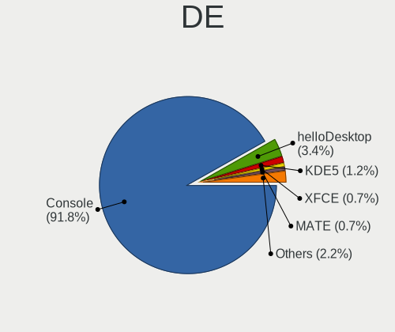
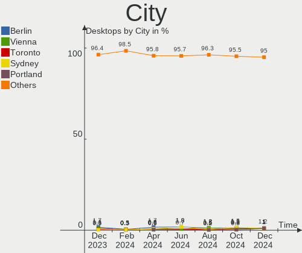
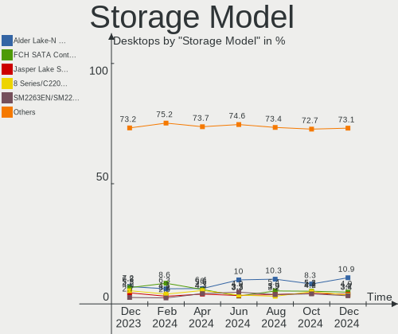
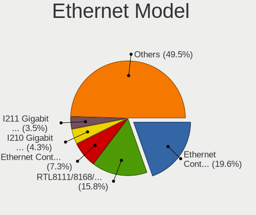
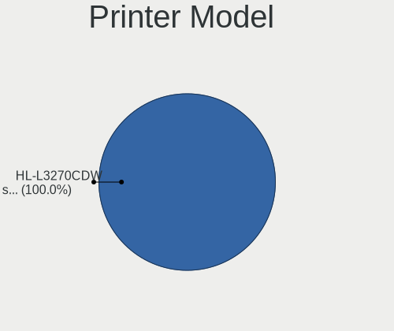
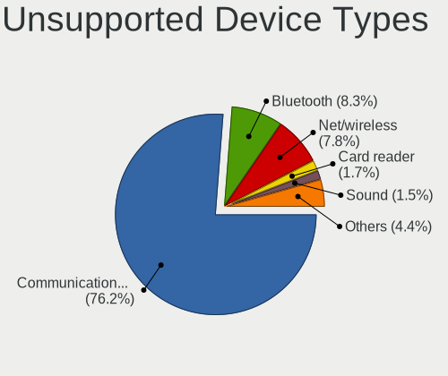

BSD Hardware Trends (Desktop)
-----------------------------

A project to identify most popular hardware characteristics and track their change
over time based on data collected by BSD users at https://BSD-Hardware.info.

Anyone can contribute to the study by uploading probes of their computers by
the [hw-probe](https://github.com/linuxhw/hw-probe/blob/master/INSTALL.BSD.md) tool:

    hw-probe -all -upload

Full-feature report is available here: https://bsd-hardware.info/?view=trends&formfactor=desktop

Period: Jan, 2021.

Contents
--------

- [ OS                       ](#os)
- [ OS Family                ](#os-family)
- [ Arch                     ](#arch)
- [ DE                       ](#de)
- [ Display Server           ](#display-server)
- [ Display Manager          ](#display-manager)
- [ OS Lang                  ](#os-lang)
- [ Boot Mode                ](#boot-mode)
- [ Filesystem               ](#filesystem)
- [ Part. scheme             ](#part-scheme)
- [ Country                  ](#country)
- [ City                     ](#city)
- [ Vendor                   ](#vendor)
- [ Model                    ](#model)
- [ Model Family             ](#model-family)
- [ MFG Year                 ](#mfg-year)
- [ Form Factor              ](#form-factor)
- [ Coreboot                 ](#coreboot)
- [ RAM Size                 ](#ram-size)
- [ RAM Used                 ](#ram-used)
- [ Has CD-ROM               ](#has-cd-rom)
- [ Total Drives             ](#total-drives)
- [ Has Ethernet             ](#has-ethernet)
- [ Drive Vendor             ](#drive-vendor)
- [ Drive Model              ](#drive-model)
- [ HDD Vendor               ](#hdd-vendor)
- [ SSD Vendor               ](#ssd-vendor)
- [ Drive Kind               ](#drive-kind)
- [ Drive Connector          ](#drive-connector)
- [ Drive Size               ](#drive-size)
- [ Space Total              ](#space-total)
- [ Space Used               ](#space-used)
- [ Malfunc. Drives          ](#malfunc-drives)
- [ Malfunc. Drive Vendor    ](#malfunc-drive-vendor)
- [ Malfunc. HDD Vendor      ](#malfunc-hdd-vendor)
- [ Malfunc. Drive Kind      ](#malfunc-drive-kind)
- [ Failed Drives            ](#failed-drives)
- [ Failed Drive Vendor      ](#failed-drive-vendor)
- [ Drive Status             ](#drive-status)
- [ Storage Vendor           ](#storage-vendor)
- [ Storage Model            ](#storage-model)
- [ Storage Kind             ](#storage-kind)
- [ CPU Vendor               ](#cpu-vendor)
- [ CPU Model                ](#cpu-model)
- [ CPU Model Family         ](#cpu-model-family)
- [ CPU Cores                ](#cpu-cores)
- [ CPU Sockets              ](#cpu-sockets)
- [ CPU Threads              ](#cpu-threads)
- [ CPU Microarch            ](#cpu-microarch)
- [ GPU Vendor               ](#gpu-vendor)
- [ GPU Model                ](#gpu-model)
- [ GPU Combo                ](#gpu-combo)
- [ GPU Driver               ](#gpu-driver)
- [ GPU Memory               ](#gpu-memory)
- [ Monitor Vendor           ](#monitor-vendor)
- [ Monitor Model            ](#monitor-model)
- [ Monitor Resolution       ](#monitor-resolution)
- [ Monitor Diagonal         ](#monitor-diagonal)
- [ Monitor Width            ](#monitor-width)
- [ Aspect Ratio             ](#aspect-ratio)
- [ Monitor Area             ](#monitor-area)
- [ Pixel Density            ](#pixel-density)
- [ Multiple Monitors        ](#multiple-monitors)
- [ Net Controller Vendor    ](#net-controller-vendor)
- [ Net Controller Model     ](#net-controller-model)
- [ Wireless Vendor          ](#wireless-vendor)
- [ Wireless Model           ](#wireless-model)
- [ Ethernet Vendor          ](#ethernet-vendor)
- [ Ethernet Model           ](#ethernet-model)
- [ Net Controller Kind      ](#net-controller-kind)
- [ Used Controller          ](#used-controller)
- [ NICs                     ](#nics)
- [ Memory Vendor            ](#memory-vendor)
- [ Memory Model             ](#memory-model)
- [ Memory Kind              ](#memory-kind)
- [ Memory Form Factor       ](#memory-form-factor)
- [ Memory Size              ](#memory-size)
- [ Memory Speed             ](#memory-speed)
- [ Sound Vendor             ](#sound-vendor)
- [ Sound Model              ](#sound-model)
- [ Camera Vendor            ](#camera-vendor)
- [ Camera Model             ](#camera-model)
- [ Fingerprint Vendor       ](#fingerprint-vendor)
- [ Fingerprint Model        ](#fingerprint-model)
- [ Chipcard Vendor          ](#chipcard-vendor)
- [ Chipcard Model           ](#chipcard-model)
- [ Printer Vendor           ](#printer-vendor)
- [ Printer Model            ](#printer-model)
- [ Scanner Vendor           ](#scanner-vendor)
- [ Scanner Model            ](#scanner-model)
- [ Bluetooth Vendor         ](#bluetooth-vendor)
- [ Bluetooth Model          ](#bluetooth-model)
- [ Unsupported Devices      ](#unsupported-devices)
- [ Unsupported Device Types ](#unsupported-device-types)

OS
--

Installed operating systems

| Name                 | Desktops | Percent |
|----------------------|----------|---------|
| OPNsense 20.7.8      | 148      | 50.86%  |
| OPNsense 21.1        | 50       | 17.18%  |
| FreeBSD 12.2-p2      | 14       | 4.81%   |
| OPNsense 20.7.7      | 10       | 3.44%   |
| OpenBSD 6.8          | 10       | 3.44%   |
| GhostBSD 20.04.02    | 8        | 2.75%   |
| helloSystem 0.3.0    | 7        | 2.41%   |
| NomadBSD 1.3.2       | 6        | 2.06%   |
| FreeBSD 12.2-STABLE  | 5        | 1.72%   |
| OPNsense 20.7        | 4        | 1.37%   |
| TrueNAS 12.2-p2      | 3        | 1.03%   |
| helloSystem 0.4.0    | 3        | 1.03%   |
| FreeBSD 13.0-CURRENT | 3        | 1.03%   |
| FreeBSD 12.1-p12     | 3        | 1.03%   |
| FreeBSD 11.4-p6      | 3        | 1.03%   |
| FreeBSD 12.2         | 2        | 0.69%   |
| Ting 21.1            | 1        | 0.34%   |
| pfSense 2.4.5        | 1        | 0.34%   |
| OPNsense 20.7.5      | 1        | 0.34%   |
| NomadBSD 1.4-RC1     | 1        | 0.34%   |
| NetBSD 9.99.77       | 1        | 0.34%   |
| MidnightBSD 2.0.1    | 1        | 0.34%   |
| FreeBSD 14.0-CURRENT | 1        | 0.34%   |
| FreeBSD 13.0-ALPHA2  | 1        | 0.34%   |
| FreeBSD 13.0-ALPHA1  | 1        | 0.34%   |
| FreeBSD 12.2-p1      | 1        | 0.34%   |
| FreeBSD 12.1-p7      | 1        | 0.34%   |
| FreeBSD 12.1--HBSD   | 1        | 0.34%   |

OS Family
---------

OS without a version

| Name        | Desktops | Percent |
|-------------|----------|---------|
| OPNsense    | 213      | 73.2%   |
| FreeBSD     | 36       | 12.37%  |
| OpenBSD     | 10       | 3.44%   |
| helloSystem | 10       | 3.44%   |
| GhostBSD    | 8        | 2.75%   |
| NomadBSD    | 7        | 2.41%   |
| TrueNAS     | 3        | 1.03%   |
| Ting        | 1        | 0.34%   |
| pfSense     | 1        | 0.34%   |
| NetBSD      | 1        | 0.34%   |
| MidnightBSD | 1        | 0.34%   |

Arch
----

OS architecture (x86_64, i586, etc.)

| Name    | Desktops | Percent |
|---------|----------|---------|
| amd64   | 287      | 98.63%  |
| sparc64 | 2        | 0.69%   |
| arm64   | 2        | 0.69%   |

DE
--

Desktop Environment

| Name         | Desktops | Percent |
|--------------|----------|---------|
| Console      | 236      | 81.1%   |
| KDE5         | 10       | 3.44%   |
| helloDesktop | 10       | 3.44%   |
| MATE         | 9        | 3.09%   |
| Openbox      | 7        | 2.41%   |
| fvwm         | 7        | 2.41%   |
| XFCE         | 5        | 1.72%   |
| TWM          | 2        | 0.69%   |
| Window Maker | 1        | 0.34%   |
| Ratpoison    | 1        | 0.34%   |
| GNOME        | 1        | 0.34%   |
| filer        | 1        | 0.34%   |
| Cinnamon     | 1        | 0.34%   |

Display Server
--------------

X11 or Wayland

| Name    | Desktops | Percent |
|---------|----------|---------|
| Console | 239      | 82.13%  |
| X11     | 52       | 17.87%  |

Display Manager
---------------

SDDM, LightDM, etc.

| Name    | Desktops | Percent |
|---------|----------|---------|
| Console | 246      | 84.54%  |
| SLiM    | 22       | 7.56%   |
| LightDM | 12       | 4.12%   |
| SDDM    | 9        | 3.09%   |
| XDM     | 1        | 0.34%   |
| GDM     | 1        | 0.34%   |

OS Lang
-------

Language

| Lang    | Desktops | Percent |
|---------|----------|---------|
| Unknown | 246      | 84.54%  |
| en_US   | 29       | 9.97%   |
| C       | 7        | 2.41%   |
| ru_RU   | 3        | 1.03%   |
| de_DE   | 2        | 0.69%   |
| uk_UA   | 1        | 0.34%   |
| tr_TR   | 1        | 0.34%   |
| sk_SK   | 1        | 0.34%   |
| en_GB   | 1        | 0.34%   |

Boot Mode
---------

EFI or BIOS

| Mode | Desktops | Percent |
|------|----------|---------|
| EFI  | 241      | 82.82%  |
| BIOS | 50       | 17.18%  |

Filesystem
----------

Type of filesystem

| Type | Desktops | Percent |
|------|----------|---------|
| Ufs  | 229      | 78.69%  |
| Zfs  | 52       | 17.87%  |
| Ffs  | 10       | 3.44%   |

Part. scheme
------------

Scheme of partitioning

| Type    | Desktops | Percent |
|---------|----------|---------|
| GPT     | 252      | 86.6%   |
| MBR     | 37       | 12.71%  |
| Unknown | 2        | 0.69%   |

Country
-------

Geographic location (country)

| Country        | Desktops | Percent |
|----------------|----------|---------|
| USA            | 80       | 27.49%  |
| Germany        | 58       | 19.93%  |
| UK             | 19       | 6.53%   |
| Netherlands    | 13       | 4.47%   |
| Canada         | 12       | 4.12%   |
| Switzerland    | 11       | 3.78%   |
| France         | 10       | 3.44%   |
| Ukraine        | 7        | 2.41%   |
| Italy          | 7        | 2.41%   |
| Czech Republic | 6        | 2.06%   |
| Brazil         | 6        | 2.06%   |
| Australia      | 6        | 2.06%   |
| Sweden         | 5        | 1.72%   |
| Russia         | 5        | 1.72%   |
| Hungary        | 4        | 1.37%   |
| Finland        | 4        | 1.37%   |
| Belgium        | 4        | 1.37%   |
| Norway         | 3        | 1.03%   |
| Austria        | 3        | 1.03%   |
| Taiwan         | 2        | 0.69%   |
| Mexico         | 2        | 0.69%   |
| Japan          | 2        | 0.69%   |
| Indonesia      | 2        | 0.69%   |
| Hong Kong      | 2        | 0.69%   |
| Denmark        | 2        | 0.69%   |
| Vietnam        | 1        | 0.34%   |
| Uruguay        | 1        | 0.34%   |
| UAE            | 1        | 0.34%   |
| Turkey         | 1        | 0.34%   |
| Spain          | 1        | 0.34%   |
| Portugal       | 1        | 0.34%   |
| Niue           | 1        | 0.34%   |
| Nicaragua      | 1        | 0.34%   |
| New Zealand    | 1        | 0.34%   |
| Malaysia       | 1        | 0.34%   |
| Luxembourg     | 1        | 0.34%   |
| Liechtenstein  | 1        | 0.34%   |
| Israel         | 1        | 0.34%   |
| Ireland        | 1        | 0.34%   |
| India          | 1        | 0.34%   |
| China          | 1        | 0.34%   |

City
----

Geographic location (city)

| City                  | Desktops | Percent |
|-----------------------|----------|---------|
| Berlin                | 7        | 2.41%   |
| Frankfurt am Main     | 5        | 1.72%   |
| Ferreux-Quincey       | 5        | 1.72%   |
| São José dos Campos | 4        | 1.37%   |
| Prague                | 4        | 1.37%   |
| Bothell               | 4        | 1.37%   |
| Vienna                | 3        | 1.03%   |
| Stuttgart             | 3        | 1.03%   |
| Seattle               | 3        | 1.03%   |
| Saint Paul            | 3        | 1.03%   |
| Milan                 | 3        | 1.03%   |
| Zaporizhia            | 2        | 0.69%   |
| Woodland              | 2        | 0.69%   |
| Umeå                 | 2        | 0.69%   |
| Tecumseh              | 2        | 0.69%   |
| Taipei                | 2        | 0.69%   |
| Sydney                | 2        | 0.69%   |
| Rochester             | 2        | 0.69%   |
| Richmond              | 2        | 0.69%   |
| Paris                 | 2        | 0.69%   |
| Munich                | 2        | 0.69%   |
| Montreal              | 2        | 0.69%   |
| Maastricht            | 2        | 0.69%   |
| Louisville            | 2        | 0.69%   |
| London                | 2        | 0.69%   |
| Lausanne              | 2        | 0.69%   |
| Langen                | 2        | 0.69%   |
| Kyiv                  | 2        | 0.69%   |
| Kenosha               | 2        | 0.69%   |
| Jakarta               | 2        | 0.69%   |
| Hamburg               | 2        | 0.69%   |
| Cologne               | 2        | 0.69%   |
| Chicago               | 2        | 0.69%   |
| Central               | 2        | 0.69%   |
| Bruges                | 2        | 0.69%   |
| Birmingham            | 2        | 0.69%   |
| Échirolles           | 1        | 0.34%   |
| Zutphen               | 1        | 0.34%   |
| Zurich                | 1        | 0.34%   |
| Zaandam               | 1        | 0.34%   |
| Ypsilanti             | 1        | 0.34%   |
| Wolfratshausen        | 1        | 0.34%   |
| Winnipeg              | 1        | 0.34%   |
| Wiesbaden             | 1        | 0.34%   |
| Wiedlisbach           | 1        | 0.34%   |
| Westland              | 1        | 0.34%   |
| Weehawken             | 1        | 0.34%   |
| Watford               | 1        | 0.34%   |
| Wallisellen           | 1        | 0.34%   |
| Vohenstrauss          | 1        | 0.34%   |
| Vlaardingen           | 1        | 0.34%   |
| Vista                 | 1        | 0.34%   |
| Vigodarzere           | 1        | 0.34%   |
| Uznach                | 1        | 0.34%   |
| Upper Basildon        | 1        | 0.34%   |
| Ulm                   | 1        | 0.34%   |
| Tuusula               | 1        | 0.34%   |
| Triesenberg           | 1        | 0.34%   |
| Toulouse              | 1        | 0.34%   |
| Torokszentmiklos      | 1        | 0.34%   |

Vendor
------

Motherboard manufacturer

| Name                       | Desktops | Percent |
|----------------------------|----------|---------|
| PC Engines                 | 35       | 12.03%  |
| Unknown                    | 32       | 11%     |
| ASUSTek Computer           | 28       | 9.62%   |
| Hewlett-Packard            | 22       | 7.56%   |
| Intel                      | 21       | 7.22%   |
| Dell                       | 19       | 6.53%   |
| Protectli                  | 18       | 6.19%   |
| ASRock                     | 16       | 5.5%    |
| MSI                        | 14       | 4.81%   |
| Gigabyte Technology        | 13       | 4.47%   |
| Supermicro                 | 12       | 4.12%   |
| Lenovo                     | 10       | 3.44%   |
| Shuttle                    | 5        | 1.72%   |
| Sophos                     | 3        | 1.03%   |
| HARDKERNEL                 | 3        | 1.03%   |
| Acer                       | 3        | 1.03%   |
| YANYU                      | 2        | 0.69%   |
| Yanling                    | 2        | 0.69%   |
| Sun                        | 2        | 0.69%   |
| Lanner                     | 2        | 0.69%   |
| Fujitsu                    | 2        | 0.69%   |
| Cisco                      | 2        | 0.69%   |
| AAEON                      | 2        | 0.69%   |
| ZOTAC                      | 1        | 0.34%   |
| TYAN Computer              | 1        | 0.34%   |
| STARFACE                   | 1        | 0.34%   |
| ShenZhen MinWin Technology | 1        | 0.34%   |
| Scaleway                   | 1        | 0.34%   |
| Sangoma Technologies       | 1        | 0.34%   |
| Raspberry Pi Foundation    | 1        | 0.34%   |
| Pegatron                   | 1        | 0.34%   |
| PCWare                     | 1        | 0.34%   |
| NU941                      | 1        | 0.34%   |
| Jetway                     | 1        | 0.34%   |
| Inventec                   | 1        | 0.34%   |
| Huanan                     | 1        | 0.34%   |
| HPE                        | 1        | 0.34%   |
| Gateway                    | 1        | 0.34%   |
| EVGA                       | 1        | 0.34%   |
| CheckPoint                 | 1        | 0.34%   |
| Biostar                    | 1        | 0.34%   |
| AZW                        | 1        | 0.34%   |
| ASRockRack                 | 1        | 0.34%   |
| AMI                        | 1        | 0.34%   |
| ADI Engineering            | 1        | 0.34%   |
| ADI                        | 1        | 0.34%   |

Model
-----

Motherboard model

| Name                                       | Desktops | Percent |
|--------------------------------------------|----------|---------|
| Unknown                                    | 33       | 11.34%  |
| PC Engines apu2                            | 24       | 8.25%   |
| Intel Q3XXG4-P V1.0                        | 14       | 4.81%   |
| Protectli FW4B                             | 13       | 4.47%   |
| PC Engines apu4                            | 9        | 3.09%   |
| ASUS All Series                            | 7        | 2.41%   |
| HP t620 PLUS Quad Core TC                  | 5        | 1.72%   |
| Supermicro A1SAi                           | 3        | 1.03%   |
| Protectli FW6                              | 3        | 1.03%   |
| HP Compaq Elite 8300 SFF                   | 3        | 1.03%   |
| HARDKERNEL ODROID-H2                       | 3        | 1.03%   |
| Dell OptiPlex 9020                         | 3        | 1.03%   |
| Dell OptiPlex 3020                         | 3        | 1.03%   |
| Yanling YL-KBR6L                           | 2        | 0.69%   |
| Supermicro X8STi                           | 2        | 0.69%   |
| Supermicro X7SPA-HF                        | 2        | 0.69%   |
| Supermicro SYS-E200-8D                     | 2        | 0.69%   |
| Sophos SG                                  | 2        | 0.69%   |
| Gigabyte J3455N-D3H                        | 2        | 0.69%   |
| Dell OptiPlex 9010                         | 2        | 0.69%   |
| Cisco VXC Class                            | 2        | 0.69%   |
| ASRock J3455-ITX                           | 2        | 0.69%   |
| ASRock B450M Pro4                          | 2        | 0.69%   |
| AAEON UP-APL01                             | 2        | 0.69%   |
| YANYU ITX-N38SL Ver                        | 1        | 0.34%   |
| YANYU D19SL_B                              | 1        | 0.34%   |
| TYAN S5512                                 | 1        | 0.34%   |
| Supermicro X7SLA                           | 1        | 0.34%   |
| Supermicro SYS-1019D-4C-FHN13TP            | 1        | 0.34%   |
| Supermicro PIO-628U-TR4T+-ST031            | 1        | 0.34%   |
| Sun SUNW,Sun-Blade-1500                    | 1        | 0.34%   |
| Sun SUNW,Sun-Blade-100                     | 1        | 0.34%   |
| STARFACE Compact                           | 1        | 0.34%   |
| Sophos XG                                  | 1        | 0.34%   |
| Shuttle XH110G                             | 1        | 0.34%   |
| Shuttle TERRA_PC                           | 1        | 0.34%   |
| Shuttle SH370V2                            | 1        | 0.34%   |
| Shuttle DS67U                              | 1        | 0.34%   |
| Shuttle DH110                              | 1        | 0.34%   |
| ShenZhen MinWin MW-NANO-APL-4L             | 1        | 0.34%   |
| Scaleway Standard PC (i440FX + PIIX, 1996) | 1        | 0.34%   |
| Sangoma SNG040                             | 1        | 0.34%   |
| RPi Raspberry Pi 4 Model B                 | 1        | 0.34%   |
| Protectli FW6E                             | 1        | 0.34%   |
| Protectli FW4A                             | 1        | 0.34%   |
| Pegatron Elite 7300 Series MT              | 1        | 0.34%   |
| PCWare IPX1800G2                           | 1        | 0.34%   |
| PC Engines apu1                            | 1        | 0.34%   |
| PC Engines APU                             | 1        | 0.34%   |
| NU941 1.0                                  | 1        | 0.34%   |
| MSI NR074AA-ABZ CQ5125IT                   | 1        | 0.34%   |
| MSI MS-7C37                                | 1        | 0.34%   |
| MSI MS-7C36                                | 1        | 0.34%   |
| MSI MS-7B84                                | 1        | 0.34%   |
| MSI MS-7B22                                | 1        | 0.34%   |
| MSI MS-7A40                                | 1        | 0.34%   |
| MSI MS-7A32                                | 1        | 0.34%   |
| MSI MS-7917                                | 1        | 0.34%   |
| MSI MS-7891                                | 1        | 0.34%   |
| MSI MS-7877                                | 1        | 0.34%   |

Model Family
------------

Motherboard model prefix

| Name                            | Desktops | Percent |
|---------------------------------|----------|---------|
| Unknown                         | 33       | 11.34%  |
| PC Engines apu2                 | 24       | 8.25%   |
| Dell OptiPlex                   | 17       | 5.84%   |
| Intel Q3XXG4-P                  | 14       | 4.81%   |
| Protectli FW4B                  | 13       | 4.47%   |
| PC Engines apu4                 | 9        | 3.09%   |
| ASUS All                        | 7        | 2.41%   |
| HP Compaq                       | 6        | 2.06%   |
| Lenovo ThinkCentre              | 5        | 1.72%   |
| HP t620                         | 5        | 1.72%   |
| Supermicro A1SAi                | 3        | 1.03%   |
| Protectli FW6                   | 3        | 1.03%   |
| HP ProLiant                     | 3        | 1.03%   |
| HARDKERNEL ODROID-H2            | 3        | 1.03%   |
| ASUS SABERTOOTH                 | 3        | 1.03%   |
| Yanling YL-KBR6L                | 2        | 0.69%   |
| Supermicro X8STi                | 2        | 0.69%   |
| Supermicro X7SPA-HF             | 2        | 0.69%   |
| Supermicro SYS-E200-8D          | 2        | 0.69%   |
| Sun SUNW                        | 2        | 0.69%   |
| Sophos SG                       | 2        | 0.69%   |
| Lenovo ThinkStation             | 2        | 0.69%   |
| Lenovo ThinkPad                 | 2        | 0.69%   |
| HP ProDesk                      | 2        | 0.69%   |
| HP EliteDesk                    | 2        | 0.69%   |
| Gigabyte J3455N-D3H             | 2        | 0.69%   |
| Cisco VXC                       | 2        | 0.69%   |
| ASUS TUF                        | 2        | 0.69%   |
| ASUS ROG                        | 2        | 0.69%   |
| ASUS PRIME                      | 2        | 0.69%   |
| ASRock J3455-ITX                | 2        | 0.69%   |
| ASRock B450M                    | 2        | 0.69%   |
| AAEON UP-APL01                  | 2        | 0.69%   |
| YANYU ITX-N38SL                 | 1        | 0.34%   |
| YANYU D19SL                     | 1        | 0.34%   |
| TYAN S5512                      | 1        | 0.34%   |
| Supermicro X7SLA                | 1        | 0.34%   |
| Supermicro SYS-1019D-4C-FHN13TP | 1        | 0.34%   |
| Supermicro PIO-628U-TR4T+-ST031 | 1        | 0.34%   |
| STARFACE Compact                | 1        | 0.34%   |
| Sophos XG                       | 1        | 0.34%   |
| Shuttle XH110G                  | 1        | 0.34%   |
| Shuttle TERRA                   | 1        | 0.34%   |
| Shuttle SH370V2                 | 1        | 0.34%   |
| Shuttle DS67U                   | 1        | 0.34%   |
| Shuttle DH110                   | 1        | 0.34%   |
| ShenZhen MinWin MW-NANO-APL-4L  | 1        | 0.34%   |
| Scaleway Standard               | 1        | 0.34%   |
| Sangoma SNG040                  | 1        | 0.34%   |
| RPi Raspberry                   | 1        | 0.34%   |
| Protectli FW6E                  | 1        | 0.34%   |
| Protectli FW4A                  | 1        | 0.34%   |
| Pegatron Elite                  | 1        | 0.34%   |
| PCWare IPX1800G2                | 1        | 0.34%   |
| PC Engines apu1                 | 1        | 0.34%   |
| PC Engines APU                  | 1        | 0.34%   |
| NU941 1.0                       | 1        | 0.34%   |
| MSI NR074AA-ABZ                 | 1        | 0.34%   |
| MSI MS-7C37                     | 1        | 0.34%   |
| MSI MS-7C36                     | 1        | 0.34%   |

MFG Year
--------

Motherboard manufacture year

| Year    | Desktops | Percent |
|---------|----------|---------|
| 2020    | 72       | 24.74%  |
| 2019    | 52       | 17.87%  |
| 2018    | 49       | 16.84%  |
| 2014    | 19       | 6.53%   |
| 2017    | 16       | 5.5%    |
| 2016    | 13       | 4.47%   |
| 2013    | 13       | 4.47%   |
| 2015    | 11       | 3.78%   |
| 2012    | 10       | 3.44%   |
| 2010    | 10       | 3.44%   |
| 2011    | 7        | 2.41%   |
| 2009    | 5        | 1.72%   |
| Unknown | 5        | 1.72%   |
| 2007    | 4        | 1.37%   |
| 2021    | 2        | 0.69%   |
| 2008    | 2        | 0.69%   |
| 2006    | 1        | 0.34%   |

Form Factor
-----------

Physical design of the computer

| Name     | Desktops | Percent |
|----------|----------|---------|
| Desktop  | 288      | 98.97%  |
| Notebook | 3        | 1.03%   |

Coreboot
--------

Have coreboot on board

| Used | Desktops | Percent |
|------|----------|---------|
| No   | 248      | 85.22%  |
| Yes  | 43       | 14.78%  |

RAM Size
--------

Total RAM memory

| Size in GB  | Desktops | Percent |
|-------------|----------|---------|
| 8.01-16.0   | 99       | 34.02%  |
| 4.01-8.0    | 88       | 30.24%  |
| 16.01-24.0  | 49       | 16.84%  |
| 32.01-64.0  | 26       | 8.93%   |
| 2.01-3.0    | 12       | 4.12%   |
| 64.01-256.0 | 8        | 2.75%   |
| 24.01-32.0  | 6        | 2.06%   |
| 3.01-4.0    | 2        | 0.69%   |
| 1.01-2.0    | 1        | 0.34%   |

RAM Used
--------

Used RAM memory

| Used GB     | Desktops | Percent |
|-------------|----------|---------|
| 0.01-0.5    | 173      | 59.45%  |
| 0.51-1.0    | 65       | 22.34%  |
| 1.01-2.0    | 28       | 9.62%   |
| 8.01-16.0   | 8        | 2.75%   |
| 2.01-3.0    | 7        | 2.41%   |
| 3.01-4.0    | 4        | 1.37%   |
| 4.01-8.0    | 2        | 0.69%   |
| 24.01-32.0  | 1        | 0.34%   |
| 64.01-256.0 | 1        | 0.34%   |
| 0           | 1        | 0.34%   |
| Unknown     | 1        | 0.34%   |

Has CD-ROM
----------

Has CD-ROM on board

| Presented | Desktops | Percent |
|-----------|----------|---------|
| No        | 249      | 85.57%  |
| Yes       | 42       | 14.43%  |

Total Drives
------------

Number of drives on board

| Drives | Desktops | Percent |
|--------|----------|---------|
| 1      | 215      | 73.88%  |
| 2      | 27       | 9.28%   |
| 0      | 20       | 6.87%   |
| 3      | 11       | 3.78%   |
| 4      | 7        | 2.41%   |
| 6      | 3        | 1.03%   |
| 5      | 3        | 1.03%   |
| 11     | 2        | 0.69%   |
| 12     | 1        | 0.34%   |
| 8      | 1        | 0.34%   |
| 7      | 1        | 0.34%   |

Has Ethernet
------------

Has Ethernet on board

| Presented | Desktops | Percent |
|-----------|----------|---------|
| Yes       | 286      | 98.28%  |
| No        | 5        | 1.72%   |

Drive Vendor
------------

Hard drive vendors

| Vendor              | Desktops | Drives | Percent |
|---------------------|----------|--------|---------|
| Samsung Electronics | 46       | 53     | 13.86%  |
| WDC                 | 41       | 67     | 12.35%  |
| Kingston            | 38       | 40     | 11.45%  |
| Seagate             | 32       | 48     | 9.64%   |
| Phison              | 25       | 28     | 7.53%   |
| Hoodisk             | 23       | 23     | 6.93%   |
| SanDisk             | 18       | 19     | 5.42%   |
| Crucial             | 18       | 19     | 5.42%   |
| Transcend           | 16       | 18     | 4.82%   |
| Intel               | 11       | 12     | 3.31%   |
| Toshiba             | 7        | 9      | 2.11%   |
| HGST                | 6        | 18     | 1.81%   |
| A-DATA Technology   | 5        | 5      | 1.51%   |
| OCZ                 | 4        | 4      | 1.2%    |
| Micron Technology   | 4        | 5      | 1.2%    |
| DOGFISH             | 4        | 4      | 1.2%    |
| PNY                 | 3        | 5      | 0.9%    |
| Hitachi             | 3        | 3      | 0.9%    |
| BIWIN               | 3        | 3      | 0.9%    |
| SPCC                | 2        | 2      | 0.6%    |
| Patriot             | 2        | 2      | 0.6%    |
| NVMe                | 2        | 2      | 0.6%    |
| Hewlett-Packard     | 2        | 3      | 0.6%    |
| Corsair             | 2        | 2      | 0.6%    |
| Apacer              | 2        | 2      | 0.6%    |
| Zheino              | 1        | 1      | 0.3%    |
| TCSUNBOW            | 1        | 1      | 0.3%    |
| Multiple            | 1        | 1      | 0.3%    |
| MaxDigital          | 1        | 1      | 0.3%    |
| LITEON              | 1        | 1      | 0.3%    |
| Lexar               | 1        | 1      | 0.3%    |
| KingSpec            | 1        | 1      | 0.3%    |
| HPE                 | 1        | 1      | 0.3%    |
| EMTEC               | 1        | 1      | 0.3%    |
| China               | 1        | 2      | 0.3%    |
| ASMT                | 1        | 1      | 0.3%    |
| Apple               | 1        | 1      | 0.3%    |
| Adaptec             | 1        | 1      | 0.3%    |

Drive Model
-----------

Hard drive models

| Model                           | Desktops | Percent |
|---------------------------------|----------|---------|
| Phison SATA SSD 16GB            | 13       | 3.61%   |
| Samsung SSD 850 EVO 250GB       | 9        | 2.5%    |
| Kingston SA400S37120G 120GB     | 9        | 2.5%    |
| Kingston SUV500MS120G 120GB     | 8        | 2.22%   |
| Hoodisk SSD 64GB                | 8        | 2.22%   |
| Hoodisk SSD 128GB               | 6        | 1.67%   |
| Samsung SSD 860 EVO 250GB       | 4        | 1.11%   |
| Kingston SUV500MS240G 240GB     | 4        | 1.11%   |
| Hoodisk SSD 32GB                | 4        | 1.11%   |
| Crucial CT120BX500SSD1 120GB    | 4        | 1.11%   |
| WDC WDS120G2G0A-00JH30 120GB    | 3        | 0.83%   |
| Transcend TS128GMSA370 128GB    | 3        | 0.83%   |
| Seagate ST500DM002-1BD142 500GB | 3        | 0.83%   |
| SanDisk SSD PLUS 120GB          | 3        | 0.83%   |
| Samsung SSD 860 EVO 500GB       | 3        | 0.83%   |
| Phison SATA SSD 32GB            | 3        | 0.83%   |
| Phison Sabrent 512GB            | 3        | 0.83%   |
| Kingston SA400S37240G 240GB     | 3        | 0.83%   |
| Hoodisk SSD 16GB                | 3        | 0.83%   |
| WDC WD5003AZEX-00K3CA0 500GB    | 2        | 0.56%   |
| WDC WD5000LPVX-22V0TT0 500GB    | 2        | 0.56%   |
| Transcend TS64GMSA230S 64GB     | 2        | 0.56%   |
| Transcend TS32GSSD370 32GB      | 2        | 0.56%   |
| Transcend TS32GMSA370 32GB      | 2        | 0.56%   |
| Transcend TS256GMSA230S 256GB   | 2        | 0.56%   |
| Seagate ST5000DM000-1FK178 5TB  | 2        | 0.56%   |
| Seagate ST2000NM0008-2F3100 2TB | 2        | 0.56%   |
| SanDisk SDSSDA120G 120GB        | 2        | 0.56%   |
| SanDisk SDSA6MM-016G-1006 16GB  | 2        | 0.56%   |
| Samsung SSD 970 EVO Plus 250GB  | 2        | 0.56%   |
| Samsung SSD 970 EVO 500GB       | 2        | 0.56%   |
| Samsung SSD 850 PRO 512GB       | 2        | 0.56%   |
| Samsung HD161HJ 160GB           | 2        | 0.56%   |
| PNY CS900 120GB SSD             | 2        | 0.56%   |
| Phison SATA SSD 128GB           | 2        | 0.56%   |
| Kingston SMS200S330G 32GB       | 2        | 0.56%   |
| Kingston SA2000M81000G 1TB      | 2        | 0.56%   |
| Intel SSDSA2M080G2GC 80GB       | 2        | 0.56%   |
| Hoodisk SSD 256GB               | 2        | 0.56%   |
| DOGFISH SSD 512GB               | 2        | 0.56%   |
| BIWIN SSD 128GB                 | 2        | 0.56%   |
| A-DATA SX300 128GB              | 2        | 0.56%   |
| Zheino CHN-mSATAM3-256 256GB    | 1        | 0.28%   |
| WDC WDS500G2B0C-00PXH0 500GB    | 1        | 0.28%   |
| WDC WDS250G2B0A-00SM50 250GB    | 1        | 0.28%   |
| WDC WDS120G2G0B-00EPW0 120GB    | 1        | 0.28%   |
| WDC WDS100T3X0C-00SJG0 1TB      | 1        | 0.28%   |
| WDC WDS100T2B0C-00PXH0 1TB      | 1        | 0.28%   |
| WDC WDS100T1R0A-68A4W0 1TB      | 1        | 0.28%   |
| WDC WD80EZZX-11CSGA0 8TB        | 1        | 0.28%   |
| WDC WD80EZAZ-11TDBA0 8TB        | 1        | 0.28%   |
| WDC WD80EFZX-68UW8N0 8TB        | 1        | 0.28%   |
| WDC WD80EFAX-68LHPN0 8TB        | 1        | 0.28%   |
| WDC WD800JD-75MSA3 80GB         | 1        | 0.28%   |
| WDC WD6400AAKS-75A7B2 640GB     | 1        | 0.28%   |
| WDC WD6400AAKS-22A7B0 640GB     | 1        | 0.28%   |
| WDC WD60EZRZ-00GZ5B1 6TB        | 1        | 0.28%   |
| WDC WD50NDZW-11MR8S1 5TB        | 1        | 0.28%   |
| WDC WD5003AZEX-00MK2A0 500GB    | 1        | 0.28%   |
| WDC WD5003AZEX-00K1GA0 500GB    | 1        | 0.28%   |

HDD Vendor
----------

Hard disk drive vendors

| Vendor              | Desktops | Drives | Percent |
|---------------------|----------|--------|---------|
| WDC                 | 35       | 58     | 38.46%  |
| Seagate             | 32       | 48     | 35.16%  |
| HGST                | 6        | 18     | 6.59%   |
| Samsung Electronics | 4        | 4      | 4.4%    |
| Toshiba             | 3        | 5      | 3.3%    |
| Hitachi             | 3        | 3      | 3.3%    |
| NVMe                | 1        | 1      | 1.1%    |
| Multiple            | 1        | 1      | 1.1%    |
| MaxDigital          | 1        | 1      | 1.1%    |
| Lexar               | 1        | 1      | 1.1%    |
| Hewlett-Packard     | 1        | 1      | 1.1%    |
| ASMT                | 1        | 1      | 1.1%    |
| Apple               | 1        | 1      | 1.1%    |
| Adaptec             | 1        | 1      | 1.1%    |

SSD Vendor
----------

Solid state drive vendors

| Vendor              | Desktops | Drives | Percent |
|---------------------|----------|--------|---------|
| Kingston            | 35       | 37     | 16.28%  |
| Samsung Electronics | 30       | 34     | 13.95%  |
| Hoodisk             | 23       | 23     | 10.7%   |
| Phison              | 20       | 20     | 9.3%    |
| SanDisk             | 18       | 19     | 8.37%   |
| Crucial             | 17       | 18     | 7.91%   |
| Transcend           | 15       | 17     | 6.98%   |
| Intel               | 10       | 11     | 4.65%   |
| WDC                 | 6        | 6      | 2.79%   |
| A-DATA Technology   | 5        | 5      | 2.33%   |
| Toshiba             | 4        | 4      | 1.86%   |
| OCZ                 | 4        | 4      | 1.86%   |
| Micron Technology   | 4        | 5      | 1.86%   |
| DOGFISH             | 4        | 4      | 1.86%   |
| PNY                 | 3        | 5      | 1.4%    |
| BIWIN               | 3        | 3      | 1.4%    |
| Patriot             | 2        | 2      | 0.93%   |
| Corsair             | 2        | 2      | 0.93%   |
| Apacer              | 2        | 2      | 0.93%   |
| Zheino              | 1        | 1      | 0.47%   |
| TCSUNBOW            | 1        | 1      | 0.47%   |
| SPCC                | 1        | 1      | 0.47%   |
| LITEON              | 1        | 1      | 0.47%   |
| KingSpec            | 1        | 1      | 0.47%   |
| HPE                 | 1        | 1      | 0.47%   |
| EMTEC               | 1        | 1      | 0.47%   |
| China               | 1        | 2      | 0.47%   |

Drive Kind
----------

HDD or SSD

| Kind | Desktops | Drives | Percent |
|------|----------|--------|---------|
| SSD  | 204      | 230    | 66.67%  |
| HDD  | 75       | 144    | 24.51%  |
| NVMe | 27       | 36     | 8.82%   |

Drive Connector
---------------

SATA, SAS, NVMe, etc.

| Type | Desktops | Drives | Percent |
|------|----------|--------|---------|
| SATA | 257      | 374    | 90.49%  |
| NVMe | 27       | 36     | 9.51%   |

Drive Size
----------

Size of hard drive

| Size in TB | Desktops | Drives | Percent |
|------------|----------|--------|---------|
| 0.01-0.5   | 232      | 270    | 79.45%  |
| 0.51-1.0   | 26       | 35     | 8.9%    |
| 1.01-2.0   | 15       | 19     | 5.14%   |
| 3.01-4.0   | 8        | 24     | 2.74%   |
| 4.01-10.0  | 8        | 22     | 2.74%   |
| 2.01-3.0   | 3        | 4      | 1.03%   |

Space Total
-----------

Amount of disk space available on the file system

| Size in GB     | Desktops | Percent |
|----------------|----------|---------|
| 101-250        | 98       | 33.68%  |
| 1-20           | 47       | 16.15%  |
| 21-50          | 45       | 15.46%  |
| 51-100         | 42       | 14.43%  |
| 251-500        | 40       | 13.75%  |
| 501-1000       | 13       | 4.47%   |
| 1001-2000      | 4        | 1.37%   |
| More than 3000 | 1        | 0.34%   |
| 2001-3000      | 1        | 0.34%   |

Space Used
----------

Amount of used disk space

| Used GB   | Desktops | Percent |
|-----------|----------|---------|
| 1-20      | 267      | 91.75%  |
| 21-50     | 11       | 3.78%   |
| 51-100    | 8        | 2.75%   |
| 101-250   | 2        | 0.69%   |
| 251-500   | 1        | 0.34%   |
| 1001-2000 | 1        | 0.34%   |
| 501-1000  | 1        | 0.34%   |

Malfunc. Drives
---------------

Drive models with a malfunction

| Model                                 | Desktops | Drives | Percent |
|---------------------------------------|----------|--------|---------|
| Seagate ST500DM002-1BD142 500GB       | 2        | 2      | 6.45%   |
| Intel SSDSA2M080G2GC 80GB             | 2        | 2      | 6.45%   |
| A-DATA Technology SX300 128GB         | 2        | 2      | 6.45%   |
| WDC WD6400AAKS-22A7B0 640GB           | 1        | 1      | 3.23%   |
| WDC WD3200LPVX-22V0TT0 320GB          | 1        | 1      | 3.23%   |
| WDC WD10EARX-22N0YB0 1TB              | 1        | 1      | 3.23%   |
| Seagate ST9500620NS 500GB             | 1        | 1      | 3.23%   |
| Seagate ST9320325AS 320GB             | 1        | 1      | 3.23%   |
| Seagate ST500LT012-1DG142 500GB       | 1        | 1      | 3.23%   |
| Seagate ST500LM021-1KJ152 500GB       | 1        | 1      | 3.23%   |
| Seagate ST3500413AS 500GB             | 1        | 2      | 3.23%   |
| Seagate ST3250823AS 250GB             | 1        | 1      | 3.23%   |
| Seagate ST2000LM015-2E8174 2TB        | 1        | 1      | 3.23%   |
| Seagate ST1000DM003-9YN162 1TB        | 1        | 1      | 3.23%   |
| Samsung Electronics SSD 950 PRO 256GB | 1        | 1      | 3.23%   |
| Samsung Electronics SSD 850 EVO 500GB | 1        | 1      | 3.23%   |
| Samsung Electronics HD502HJ 500GB     | 1        | 1      | 3.23%   |
| Samsung Electronics HD103UJ 1TB       | 1        | 1      | 3.23%   |
| OCZ VERTEX3 64GB                      | 1        | 1      | 3.23%   |
| OCZ VECTOR150 120GB                   | 1        | 1      | 3.23%   |
| Kingston SV300S37A120G 120GB          | 1        | 1      | 3.23%   |
| Kingston SNS4151S316G 16GB            | 1        | 1      | 3.23%   |
| Kingston SMS200S330G 32GB             | 1        | 1      | 3.23%   |
| Kingston SMS200S3120G 120GB           | 1        | 1      | 3.23%   |
| Crucial CT525MX300SSD1 528GB          | 1        | 1      | 3.23%   |
| Crucial CT480M500SSD1 480GB           | 1        | 1      | 3.23%   |
| Crucial CT128MX100SSD1 128GB          | 1        | 1      | 3.23%   |
| Crucial CT128M550SSD3 128GB           | 1        | 1      | 3.23%   |

Malfunc. Drive Vendor
---------------------

Vendors of faulty drives

| Vendor              | Desktops | Drives | Percent |
|---------------------|----------|--------|---------|
| Seagate             | 10       | 11     | 32.26%  |
| Samsung Electronics | 4        | 4      | 12.9%   |
| Kingston            | 4        | 4      | 12.9%   |
| Crucial             | 4        | 4      | 12.9%   |
| WDC                 | 3        | 3      | 9.68%   |
| OCZ                 | 2        | 2      | 6.45%   |
| Intel               | 2        | 2      | 6.45%   |
| A-DATA Technology   | 2        | 2      | 6.45%   |

Malfunc. HDD Vendor
-------------------

Vendors of faulty HDD drives

| Vendor              | Desktops | Drives | Percent |
|---------------------|----------|--------|---------|
| Seagate             | 10       | 11     | 66.67%  |
| WDC                 | 3        | 3      | 20%     |
| Samsung Electronics | 2        | 2      | 13.33%  |

Malfunc. Drive Kind
-------------------

Kinds of faulty drives

| Kind | Desktops | Drives | Percent |
|------|----------|--------|---------|
| SSD  | 15       | 15     | 48.39%  |
| HDD  | 15       | 16     | 48.39%  |
| NVMe | 1        | 1      | 3.23%   |

Failed Drives
-------------

Failed drive models

Zero info for selected period =(

Failed Drive Vendor
-------------------

Failed drive vendors

Zero info for selected period =(

Drive Status
------------

Number of failed and malfunc. drives

| Status   | Desktops | Drives | Percent |
|----------|----------|--------|---------|
| Works    | 241      | 370    | 86.07%  |
| Malfunc  | 31       | 32     | 11.07%  |
| Detected | 8        | 8      | 2.86%   |

Storage Vendor
--------------

Storage controller vendors

| Vendor                      | Desktops | Percent |
|-----------------------------|----------|---------|
| Intel                       | 206      | 59.71%  |
| AMD                         | 73       | 21.16%  |
| Samsung Electronics         | 13       | 3.77%   |
| ASMedia Technology          | 13       | 3.77%   |
| Sandisk                     | 5        | 1.45%   |
| Phison Electronics          | 5        | 1.45%   |
| Broadcom / LSI              | 5        | 1.45%   |
| Nvidia                      | 4        | 1.16%   |
| Marvell Technology Group    | 4        | 1.16%   |
| Silicon Motion              | 3        | 0.87%   |
| Kingston Technology Company | 3        | 0.87%   |
| Chelsio Communications      | 3        | 0.87%   |
| ULi Electronics             | 2        | 0.58%   |
| JMicron Technology          | 2        | 0.58%   |
| SK Hynix                    | 1        | 0.29%   |
| Red Hat                     | 1        | 0.29%   |
| Micron/Crucial Technology   | 1        | 0.29%   |
| Adaptec                     | 1        | 0.29%   |

Storage Model
-------------

Storage controller models

| Model                                                                            | Desktops | Percent |
|----------------------------------------------------------------------------------|----------|---------|
| AMD FCH SATA Controller [AHCI mode]                                              | 55       | 14.29%  |
| Intel Sunrise Point-LP SATA Controller [AHCI mode]                               | 27       | 7.01%   |
| Intel 8 Series/C220 Series Chipset Family 6-port SATA Controller 1 [AHCI mode]   | 24       | 6.23%   |
| Intel Atom/Celeron/Pentium Processor x5-E8000/J3xxx/N3xxx Series SATA Controller | 19       | 4.94%   |
| Intel Atom Processor E3800 Series SATA AHCI Controller                           | 15       | 3.9%    |
| Intel 7 Series/C210 Series Chipset Family 6-port SATA Controller [AHCI mode]     | 13       | 3.38%   |
| ASMedia ASM1062 Serial ATA Controller                                            | 13       | 3.38%   |
| Intel Wildcat Point-LP SATA Controller [AHCI Mode]                               | 11       | 2.86%   |
| Samsung NVMe SSD Controller SM981/PM981/PM983                                    | 10       | 2.6%    |
| Intel Celeron N3350/Pentium N4200/Atom E3900 Series SATA AHCI Controller         | 10       | 2.6%    |
| Intel Q170/Q150/B150/H170/H110/Z170/CM236 Chipset SATA Controller [AHCI Mode]    | 9        | 2.34%   |
| Intel 6 Series/C200 Series Chipset Family 6 port Desktop SATA AHCI Controller    | 9        | 2.34%   |
| AMD SB7x0/SB8x0/SB9x0 SATA Controller [AHCI mode]                                | 9        | 2.34%   |
| AMD 400 Series Chipset SATA Controller                                           | 8        | 2.08%   |
| Intel Cannon Lake PCH SATA AHCI Controller                                       | 6        | 1.56%   |
| AMD FCH SATA Controller [IDE mode]                                               | 6        | 1.56%   |
| Intel SATA Controller [RAID mode]                                                | 5        | 1.3%    |
| Intel 9 Series Chipset Family SATA Controller [AHCI Mode]                        | 5        | 1.3%    |
| Phison E12 NVMe Controller                                                       | 4        | 1.04%   |
| Intel NM10/ICH7 Family SATA Controller [IDE mode]                                | 4        | 1.04%   |
| Intel 82801JI (ICH10 Family) SATA AHCI Controller                                | 4        | 1.04%   |
| Intel 8 Series SATA Controller 1 [AHCI mode]                                     | 4        | 1.04%   |
| Intel 200 Series PCH SATA controller [AHCI mode]                                 | 4        | 1.04%   |
| Silicon Motion SM2263EN/SM2263XT SSD Controller                                  | 3        | 0.78%   |
| Sandisk WD Blue SN550 NVMe SSD                                                   | 3        | 0.78%   |
| Kingston Company A2000 NVMe SSD                                                  | 3        | 0.78%   |
| Intel Celeron/Pentium Silver Processor SATA Controller                           | 3        | 0.78%   |
| Intel C610/X99 series chipset sSATA Controller [AHCI mode]                       | 3        | 0.78%   |
| Intel Atom processor C2000 AHCI SATA3 Controller                                 | 3        | 0.78%   |
| Intel Atom processor C2000 AHCI SATA2 Controller                                 | 3        | 0.78%   |
| Intel 82801JD/DO (ICH10 Family) SATA AHCI Controller                             | 3        | 0.78%   |
| Intel 82801G (ICH7 Family) IDE Controller                                        | 3        | 0.78%   |
| Intel 400 Series Chipset Family SATA AHCI Controller                             | 3        | 0.78%   |
| Intel 4 Series Chipset PT IDER Controller                                        | 3        | 0.78%   |
| ULi M5229 IDE                                                                    | 2        | 0.52%   |
| Nvidia MCP51 Serial ATA Controller                                               | 2        | 0.52%   |
| Intel NM10/ICH7 Family SATA Controller [AHCI mode]                               | 2        | 0.52%   |
| Intel C610/X99 series chipset 6-Port SATA Controller [AHCI mode]                 | 2        | 0.52%   |
| Intel C600/X79 series chipset 6-Port SATA AHCI Controller                        | 2        | 0.52%   |
| Intel 82801IR/IO/IH (ICH9R/DO/DH) 6 port SATA Controller [AHCI mode]             | 2        | 0.52%   |
| Intel 7 Series/C210 Series Chipset Family 4-port SATA Controller [IDE mode]      | 2        | 0.52%   |
| Intel 7 Series/C210 Series Chipset Family 2-port SATA Controller [IDE mode]      | 2        | 0.52%   |
| Intel 5 Series/3400 Series Chipset 6 port SATA AHCI Controller                   | 2        | 0.52%   |
| AMD X370 Series Chipset SATA Controller                                          | 2        | 0.52%   |
| AMD SB7x0/SB8x0/SB9x0 IDE Controller                                             | 2        | 0.52%   |
| Unknown                                                                          | 2        | 0.52%   |
| SK Hynix hynix unknown                                                           | 1        | 0.26%   |
| Silicon Motion SM2262/SM2262EN SSD Controller                                    | 1        | 0.26%   |
| Sandisk WD Black SN750 / PC SN730 NVMe SSD                                       | 1        | 0.26%   |
| Sandisk WD Black 2018 / PC SN720 NVMe SSD                                        | 1        | 0.26%   |
| Samsung NVMe SSD Controller SM961/PM961/SM963                                    | 1        | 0.26%   |
| Samsung NVMe SSD Controller SM951/PM951                                          | 1        | 0.26%   |
| Samsung NVMe SSD Controller PM9A1/980PRO                                         | 1        | 0.26%   |
| Red Hat Virtio SCSI                                                              | 1        | 0.26%   |
| Red Hat Virtio block device                                                      | 1        | 0.26%   |
| Phison E16 PCIe4 NVMe Controller                                                 | 1        | 0.26%   |
| Nvidia MCP79 AHCI Controller                                                     | 1        | 0.26%   |
| Nvidia MCP61 SATA Controller                                                     | 1        | 0.26%   |
| Nvidia MCP61 IDE                                                                 | 1        | 0.26%   |
| Nvidia MCP51 IDE                                                                 | 1        | 0.26%   |

Storage Kind
------------

Kind of storage controller (IDE, SATA, NVMe, SAS, ...)

| Kind | Desktops | Percent |
|------|----------|---------|
| SATA | 261      | 78.14%  |
| NVMe | 29       | 8.68%   |
| IDE  | 26       | 7.78%   |
| RAID | 9        | 2.69%   |
| SCSI | 7        | 2.1%    |
| SAS  | 2        | 0.6%    |

CPU Vendor
----------

Processor vendors

| Vendor  | Desktops | Percent |
|---------|----------|---------|
| Intel   | 210      | 72.16%  |
| AMD     | 76       | 26.12%  |
| ARM     | 2        | 0.69%   |
| Unknown | 2        | 0.69%   |
| QEMU    | 1        | 0.34%   |

CPU Model
---------

Processor models

| Model                                       | Desktops | Percent |
|---------------------------------------------|----------|---------|
| AMD GX-412TC SOC                            | 33       | 11.34%  |
| Intel Celeron CPU J3160 @ 1.60GHz           | 15       | 5.15%   |
| Intel Core i7-7500U CPU @ 2.70GHz           | 8        | 2.75%   |
| Intel Celeron CPU J1900 @ 1.99GHz           | 8        | 2.75%   |
| Intel Celeron CPU J3455 @ 1.50GHz           | 6        | 2.06%   |
| AMD GX-420CA SOC with Radeon HD Graphics    | 5        | 1.72%   |
| Intel Core i5-7200U CPU @ 2.50GHz           | 4        | 1.37%   |
| Intel Core i5-5250U CPU @ 1.60GHz           | 4        | 1.37%   |
| Intel Core i3-7100U CPU @ 2.40GHz           | 4        | 1.37%   |
| Intel Atom CPU E3845 @ 1.91GHz              | 4        | 1.37%   |
| Intel Core i7-4790K CPU @ 4.00GHz           | 3        | 1.03%   |
| Intel Core i7-3770 CPU @ 3.40GHz            | 3        | 1.03%   |
| Intel Core i5-6500 CPU @ 3.20GHz            | 3        | 1.03%   |
| Intel Core i5-5200U CPU @ 2.20GHz           | 3        | 1.03%   |
| Intel Core i5-4590 CPU @ 3.30GHz            | 3        | 1.03%   |
| Intel Core i5-4570 CPU @ 3.20GHz            | 3        | 1.03%   |
| Intel Core i3-4160 CPU @ 3.60GHz            | 3        | 1.03%   |
| Intel Core 2 Duo                            | 3        | 1.03%   |
| Intel Celeron J4115 CPU @ 1.80GHz           | 3        | 1.03%   |
| Intel Celeron CPU 3855U @ 1.60GHz           | 3        | 1.03%   |
| Intel Atom CPU C2558 @ 2.40GHz              | 3        | 1.03%   |
| Intel Xeon CPU E3-1220 v3 @ 3.10GHz         | 2        | 0.69%   |
| Intel Xeon CPU D-1528 @ 1.90GHz             | 2        | 0.69%   |
| Intel Core i7-6700 CPU @ 3.40GHz            | 2        | 0.69%   |
| Intel Core i7-4790 CPU @ 3.60GHz            | 2        | 0.69%   |
| Intel Core i5-8250U CPU @ 1.60GHz           | 2        | 0.69%   |
| Intel Core i5-3570 CPU @ 3.40GHz            | 2        | 0.69%   |
| Intel Core i5-3475S CPU @ 2.90GHz           | 2        | 0.69%   |
| Intel Core i5-3470 CPU @ 3.20GHz            | 2        | 0.69%   |
| Intel Core i5-2400 CPU @ 3.10GHz            | 2        | 0.69%   |
| Intel Core i3-4150 CPU @ 3.50GHz            | 2        | 0.69%   |
| Intel Core i3-4130 CPU @ 3.40GHz            | 2        | 0.69%   |
| Intel Core i3-3240 CPU @ 3.40GHz            | 2        | 0.69%   |
| Intel Celeron CPU N3350 @ 1.10GHz           | 2        | 0.69%   |
| Intel Celeron CPU J3060 @ 1.60GHz           | 2        | 0.69%   |
| Intel Celeron CPU J1800 @ 2.41GHz           | 2        | 0.69%   |
| Intel Celeron CPU 3865U @ 1.80GHz           | 2        | 0.69%   |
| Intel Atom CPU 330 @ 1.60GHz                | 2        | 0.69%   |
| AMD Ryzen 7 3700X 8-Core Processor          | 2        | 0.69%   |
| AMD Ryzen 7 2700 Eight-Core Processor       | 2        | 0.69%   |
| AMD Ryzen 5 3400G with Radeon Vega Graphics | 2        | 0.69%   |
| AMD G-T56N Processor                        | 2        | 0.69%   |
| AMD G-T40E Processor                        | 2        | 0.69%   |
|                                             | 2        | 0.69%   |
| QEMU pc-i440fx-bionic                       | 1        | 0.34%   |
| Intel Xeon MP                               | 1        | 0.34%   |
| Intel Xeon E-2236 CPU @ 3.40GHz             | 1        | 0.34%   |
| Intel Xeon E-2224 CPU @ 3.40GHz             | 1        | 0.34%   |
| Intel Xeon D-2123IT CPU @ 2.20GHz           | 1        | 0.34%   |
| Intel Xeon CPU W3520 @ 2.67GHz              | 1        | 0.34%   |
| Intel Xeon CPU L5640 @ 2.27GHz              | 1        | 0.34%   |
| Intel Xeon CPU E5-2678 v3 @ 2.50GHz         | 1        | 0.34%   |
| Intel Xeon CPU E5-2670 @ 2.60GHz            | 1        | 0.34%   |
| Intel Xeon CPU E5-2630L v3 @ 1.80GHz        | 1        | 0.34%   |
| Intel Xeon CPU E3-1226 v3 @ 3.30GHz         | 1        | 0.34%   |
| Intel Xeon CPU E3-1225 v5 @ 3.30GHz         | 1        | 0.34%   |
| Intel Xeon CPU E3-1225 V2 @ 3.20GHz         | 1        | 0.34%   |
| Intel Xeon CPU E3-1220 V2 @ 3.10GHz         | 1        | 0.34%   |
| Intel Pentium Gold G6500 CPU @ 4.10GHz      | 1        | 0.34%   |
| Intel Pentium Gold G5400 CPU @ 3.70GHz      | 1        | 0.34%   |

CPU Model Family
----------------

Processor model prefix

| Model                   | Desktops | Percent |
|-------------------------|----------|---------|
| Intel Core i5           | 52       | 17.87%  |
| Intel Celeron           | 52       | 17.87%  |
| AMD GX                  | 38       | 13.06%  |
| Intel Core i7           | 33       | 11.34%  |
| Intel Core i3           | 22       | 7.56%   |
| Intel Xeon              | 17       | 5.84%   |
| Intel Atom              | 16       | 5.5%    |
| Intel Core 2 Duo        | 8        | 2.75%   |
| AMD Ryzen 7             | 7        | 2.41%   |
| AMD Ryzen 5             | 6        | 2.06%   |
| Other                   | 4        | 1.37%   |
| AMD G                   | 4        | 1.37%   |
| Intel Pentium           | 3        | 1.03%   |
| AMD Ryzen 9             | 3        | 1.03%   |
| AMD Athlon 64 X2        | 3        | 1.03%   |
| Intel Pentium Gold      | 2        | 0.69%   |
| Intel Core 2 Quad       | 2        | 0.69%   |
| ARM Cortex              | 2        | 0.69%   |
| AMD Ryzen Threadripper  | 2        | 0.69%   |
| AMD Ryzen 3             | 2        | 0.69%   |
| AMD Phenom II X4        | 2        | 0.69%   |
| Intel Pentium Dual-Core | 1        | 0.34%   |
| Intel Core i9           | 1        | 0.34%   |
| Intel 686-class         | 1        | 0.34%   |
| AMD Turion II Neo       | 1        | 0.34%   |
| AMD Phenom II X6        | 1        | 0.34%   |
| AMD E1                  | 1        | 0.34%   |
| AMD E                   | 1        | 0.34%   |
| AMD Athlon Dual Core    | 1        | 0.34%   |
| AMD Athlon              | 1        | 0.34%   |
| AMD A4                  | 1        | 0.34%   |
| AMD A10                 | 1        | 0.34%   |

CPU Cores
---------

Number of processor cores

| Number  | Desktops | Percent |
|---------|----------|---------|
| 4       | 150      | 51.55%  |
| 2       | 95       | 32.65%  |
| 6       | 12       | 4.12%   |
| 8       | 9        | 3.09%   |
| 16      | 7        | 2.41%   |
| Unknown | 5        | 1.72%   |
| 12      | 4        | 1.37%   |
| 24      | 3        | 1.03%   |
| 1       | 3        | 1.03%   |
| 64      | 1        | 0.34%   |
| 32      | 1        | 0.34%   |
| 10      | 1        | 0.34%   |

CPU Sockets
-----------

Number of sockets

| Number  | Desktops | Percent |
|---------|----------|---------|
| 1       | 282      | 96.91%  |
| Unknown | 6        | 2.06%   |
| 6       | 1        | 0.34%   |
| 4       | 1        | 0.34%   |
| 2       | 1        | 0.34%   |

CPU Threads
-----------

Threads per core (Hyper-Threading)

| Number  | Desktops | Percent |
|---------|----------|---------|
| 1       | 192      | 65.98%  |
| 2       | 92       | 31.62%  |
| Unknown | 7        | 2.41%   |

CPU Microarch
-------------

Microarchitecture

| Name          | Desktops | Percent |
|---------------|----------|---------|
| Silvermont    | 39       | 13.4%   |
| KabyLake      | 36       | 12.37%  |
| Haswell       | 36       | 12.37%  |
| Puma          | 33       | 11.34%  |
| IvyBridge     | 20       | 6.87%   |
| Skylake       | 16       | 5.5%    |
| Broadwell     | 14       | 4.81%   |
| Goldmont      | 10       | 3.44%   |
| SandyBridge   | 8        | 2.75%   |
| Penryn        | 8        | 2.75%   |
| Jaguar        | 8        | 2.75%   |
| Unknown       | 8        | 2.75%   |
| Zen+          | 7        | 2.41%   |
| Zen 2         | 7        | 2.41%   |
| Zen           | 5        | 1.72%   |
| K8 Hammer     | 5        | 1.72%   |
| Bonnell       | 5        | 1.72%   |
| Bobcat        | 5        | 1.72%   |
| K10           | 4        | 1.37%   |
| Goldmont plus | 4        | 1.37%   |
| Core          | 4        | 1.37%   |
| Nehalem       | 3        | 1.03%   |
| CometLake     | 3        | 1.03%   |
| Westmere      | 2        | 0.69%   |
| Steamroller   | 1        | 0.34%   |

GPU Vendor
----------

Vendors of graphics cards

| Vendor                     | Desktops | Percent |
|----------------------------|----------|---------|
| Intel                      | 166      | 66.14%  |
| Nvidia                     | 35       | 13.94%  |
| AMD                        | 32       | 12.75%  |
| ASPEED Technology          | 12       | 4.78%   |
| Matrox Electronics Systems | 5        | 1.99%   |
| 3DLabs                     | 1        | 0.4%    |

GPU Model
---------

Graphics card models

| Model                                                                                    | Desktops | Percent |
|------------------------------------------------------------------------------------------|----------|---------|
| Intel Atom/Celeron/Pentium Processor x5-E8000/J3xxx/N3xxx Integrated Graphics Controller | 19       | 7.51%   |
| Intel HD Graphics 620                                                                    | 17       | 6.72%   |
| Intel Xeon E3-1200 v3/4th Gen Core Processor Integrated Graphics Controller              | 16       | 6.32%   |
| Intel Xeon E3-1200 v2/3rd Gen Core processor Graphics Controller                         | 15       | 5.93%   |
| Intel Atom Processor Z36xxx/Z37xxx Series Graphics & Display                             | 14       | 5.53%   |
| ASPEED Technology ASPEED Graphics Family                                                 | 12       | 4.74%   |
| Intel HD Graphics 500                                                                    | 10       | 3.95%   |
| Intel 4th Generation Core Processor Family Integrated Graphics Controller                | 8        | 3.16%   |
| Intel HD Graphics 5500                                                                   | 7        | 2.77%   |
| Nvidia GK208B [GeForce GT 710]                                                           | 6        | 2.37%   |
| Intel 2nd Generation Core Processor Family Integrated Graphics Controller                | 6        | 2.37%   |
| AMD Kabini [Radeon HD 8400E]                                                             | 5        | 1.98%   |
| Intel HD Graphics 6000                                                                   | 4        | 1.58%   |
| Intel HD Graphics 530                                                                    | 4        | 1.58%   |
| Intel Haswell-ULT Integrated Graphics Controller                                         | 4        | 1.58%   |
| Intel GeminiLake [UHD Graphics 600]                                                      | 4        | 1.58%   |
| Intel CometLake-S GT2 [UHD Graphics 630]                                                 | 4        | 1.58%   |
| Intel UHD Graphics 620                                                                   | 3        | 1.19%   |
| Intel HD Graphics 630                                                                    | 3        | 1.19%   |
| Intel HD Graphics 510                                                                    | 3        | 1.19%   |
| Intel 4 Series Chipset Integrated Graphics Controller                                    | 3        | 1.19%   |
| AMD Wrestler [Radeon HD 6310]                                                            | 3        | 1.19%   |
| AMD Ellesmere [Radeon RX 470/480/570/570X/580/580X/590]                                  | 3        | 1.19%   |
| Nvidia TU116 [GeForce GTX 1660 Ti]                                                       | 2        | 0.79%   |
| Nvidia GT218 [GeForce 210]                                                               | 2        | 0.79%   |
| Nvidia GP108 [GeForce GT 1030]                                                           | 2        | 0.79%   |
| Nvidia GP106 [GeForce GTX 1060 6GB]                                                      | 2        | 0.79%   |
| Nvidia GP106 [GeForce GTX 1060 3GB]                                                      | 2        | 0.79%   |
| Matrox Electronics Systems MGA G200eW WPCM450                                            | 2        | 0.79%   |
| Matrox Electronics Systems MGA G200EH                                                    | 2        | 0.79%   |
| Intel Skylake GT2 [HD Graphics 520]                                                      | 2        | 0.79%   |
| Intel Kaby Lake-U GT1 Integrated Graphics Controller                                     | 2        | 0.79%   |
| Intel CoffeeLake-S GT2 [UHD Graphics 630]                                                | 2        | 0.79%   |
| Intel CoffeeLake-S GT1 [UHD Graphics 610]                                                | 2        | 0.79%   |
| AMD Raven Ridge [Radeon Vega Series / Radeon Vega Mobile Series]                         | 2        | 0.79%   |
| AMD Picasso                                                                              | 2        | 0.79%   |
| AMD Caicos [Radeon HD 6450/7450/8450 / R5 230 OEM]                                       | 2        | 0.79%   |
| Nvidia TU117M [GeForce GTX 1650 Mobile / Max-Q]                                          | 1        | 0.4%    |
| Nvidia TU116 [GeForce GTX 1660 SUPER]                                                    | 1        | 0.4%    |
| Nvidia TU106 [GeForce RTX 2060 SUPER]                                                    | 1        | 0.4%    |
| Nvidia GP107 [GeForce GTX 1050 Ti]                                                       | 1        | 0.4%    |
| Nvidia GP104 [GeForce GTX 1080]                                                          | 1        | 0.4%    |
| Nvidia GP104 [GeForce GTX 1070 Ti]                                                       | 1        | 0.4%    |
| Nvidia GM206 [GeForce GTX 960]                                                           | 1        | 0.4%    |
| Nvidia GM204 [GeForce GTX 970]                                                           | 1        | 0.4%    |
| Nvidia GM107GL [Quadro K2200]                                                            | 1        | 0.4%    |
| Nvidia GM107 [GeForce GTX 750]                                                           | 1        | 0.4%    |
| Nvidia GK208 [GeForce GT 640 Rev. 2]                                                     | 1        | 0.4%    |
| Nvidia GK104 [GeForce GTX 760]                                                           | 1        | 0.4%    |
| Nvidia GF119 [GeForce GT 610]                                                            | 1        | 0.4%    |
| Nvidia GF119 [GeForce GT 520]                                                            | 1        | 0.4%    |
| Nvidia GA104 [GeForce RTX 3070]                                                          | 1        | 0.4%    |
| Nvidia G84GL [Quadro FX 1700]                                                            | 1        | 0.4%    |
| Nvidia C79 [ION]                                                                         | 1        | 0.4%    |
| Nvidia C61 [GeForce 6100 nForce 405]                                                     | 1        | 0.4%    |
| Nvidia C51PV [GeForce 6150]                                                              | 1        | 0.4%    |
| Nvidia C51 [GeForce 6150 LE]                                                             | 1        | 0.4%    |
| Matrox Electronics Systems MGA G200eH3                                                   | 1        | 0.4%    |
| Intel Xeon E3-1200 v3 Processor Integrated Graphics Controller                           | 1        | 0.4%    |
| Intel WhiskeyLake-U GT2 [UHD Graphics 620]                                               | 1        | 0.4%    |

GPU Combo
---------

Combinations of graphics cards

| Name           | Desktops | Percent |
|----------------|----------|---------|
| 1 x Intel      | 162      | 55.67%  |
| Other          | 42       | 14.43%  |
| 1 x Nvidia     | 33       | 11.34%  |
| 1 x AMD        | 31       | 10.65%  |
| 1 x ASPEED     | 12       | 4.12%   |
| 1 x Matrox     | 5        | 1.72%   |
| 2 x Intel      | 2        | 0.69%   |
| 2 x Nvidia     | 1        | 0.34%   |
| Intel + Nvidia | 1        | 0.34%   |
| Intel + AMD    | 1        | 0.34%   |
| 1 x 3DLabs     | 1        | 0.34%   |

GPU Driver
----------

Free vs proprietary

| Driver      | Desktops | Percent |
|-------------|----------|---------|
| Free        | 224      | 76.98%  |
| Unknown     | 45       | 15.46%  |
| Proprietary | 22       | 7.56%   |

GPU Memory
----------

Total video memory

| Size in GB | Desktops | Percent |
|------------|----------|---------|
| Unknown    | 263      | 90.38%  |
| 1.01-2.0   | 8        | 2.75%   |
| 0.51-1.0   | 6        | 2.06%   |
| 5.01-6.0   | 5        | 1.72%   |
| 7.01-8.0   | 3        | 1.03%   |
| 3.01-4.0   | 3        | 1.03%   |
| 2.01-3.0   | 1        | 0.34%   |
| 8.01-16.0  | 1        | 0.34%   |
| 0.01-0.5   | 1        | 0.34%   |

Monitor Vendor
--------------

Monitor vendors

| Vendor               | Desktops | Percent |
|----------------------|----------|---------|
| Dell                 | 8        | 18.18%  |
| Samsung Electronics  | 5        | 11.36%  |
| Lenovo               | 3        | 6.82%   |
| BenQ                 | 3        | 6.82%   |
| Acer                 | 3        | 6.82%   |
| Unknown              | 2        | 4.55%   |
| Sony                 | 2        | 4.55%   |
| Hewlett-Packard      | 2        | 4.55%   |
| Goldstar             | 2        | 4.55%   |
| AOC                  | 2        | 4.55%   |
| Ancor Communications | 2        | 4.55%   |
| Vizio                | 1        | 2.27%   |
| ViewSonic            | 1        | 2.27%   |
| Sharp                | 1        | 2.27%   |
| Orion                | 1        | 2.27%   |
| NEC Computers        | 1        | 2.27%   |
| LG Electronics       | 1        | 2.27%   |
| Iiyama               | 1        | 2.27%   |
| Idek Iiyama          | 1        | 2.27%   |
| BOE                  | 1        | 2.27%   |
| AVX                  | 1        | 2.27%   |

Monitor Model
-------------

Monitor models

| Model                                                                | Desktops | Percent |
|----------------------------------------------------------------------|----------|---------|
| BenQ GW2260 BNQ78C4 1920x1080 480x270mm 21.7-inch                    | 2        | 4.44%   |
| Vizio SV370XVT VIZ0057 1920x1080 820x460mm 37.0-inch                 | 1        | 2.22%   |
| ViewSonic LCD Monitor VX2451 SERIES 1920x1080                        | 1        | 2.22%   |
| Unknown LCD Monitor Sony SDM-HS95D 1280x1024                         | 1        | 2.22%   |
| Unknown LCD Monitor KJT4K2K60DP 3840x2160                            | 1        | 2.22%   |
| Sony TV SNY4B03 1920x1080 930x520mm 41.9-inch                        | 1        | 2.22%   |
| Sony LCD Monitor TV XV 1920x1080                                     | 1        | 2.22%   |
| Sharp LCD Monitor SHP14BA 1920x1080 340x190mm 15.3-inch              | 1        | 2.22%   |
| Samsung Electronics U32J59x SAM0F35 3840x2160 700x390mm 31.5-inch    | 1        | 2.22%   |
| Samsung Electronics SyncMaster SAM036F 1440x900 410x260mm 19.1-inch  | 1        | 2.22%   |
| Samsung Electronics SyncMaster SAM01AE 1600x1200 410x310mm 20.2-inch | 1        | 2.22%   |
| Samsung Electronics S27D590 SAM0BE9 1920x1080 600x340mm 27.2-inch    | 1        | 2.22%   |
| Samsung Electronics LCD Monitor S27C750 1920x1080                    | 1        | 2.22%   |
| Orion LCD Monitor ORN1207 1920x1080                                  | 1        | 2.22%   |
| NEC Computers LCD Monitor EA241WM 1920x1200                          | 1        | 2.22%   |
| LG Electronics LCD Monitor E2360 1920x1080                           | 1        | 2.22%   |
| Lenovo V20-10 LEN65DC 1600x900 430x240mm 19.4-inch                   | 1        | 2.22%   |
| Lenovo LEN P27h-10 LEN61AF 2560x1440 600x340mm 27.2-inch             | 1        | 2.22%   |
| Lenovo LCD Monitor LEN4033 1440x900 300x190mm 14.0-inch              | 1        | 2.22%   |
| Iiyama PL2779Q IVM6615 2560x1440 600x340mm 27.2-inch                 | 1        | 2.22%   |
| Idek Iiyama LCD Monitor PL3270Q 5120x1440                            | 1        | 2.22%   |
| Idek Iiyama LCD Monitor PL3270Q                                      | 1        | 2.22%   |
| Hewlett-Packard L1710 HWP26EB 1280x1024 340x270mm 17.1-inch          | 1        | 2.22%   |
| Hewlett-Packard HPQ 8300 AiO HWP4212 1920x1080 510x290mm 23.1-inch   | 1        | 2.22%   |
| Goldstar W2242 GSM5678 1680x1050 490x320mm 23.0-inch                 | 1        | 2.22%   |
| Goldstar 34GN850 GSM774B 3440x1440 800x330mm 34.1-inch               | 1        | 2.22%   |
| Dell U2412M DELA07B 1920x1200 520x320mm 24.0-inch                    | 1        | 2.22%   |
| Dell P2717H DEL40F7 1920x1080 600x340mm 27.2-inch                    | 1        | 2.22%   |
| Dell P1917S DELD092 1280x1024 380x300mm 19.1-inch                    | 1        | 2.22%   |
| Dell P1917S DELD091 1280x1024 380x300mm 19.1-inch                    | 1        | 2.22%   |
| Dell LCD Monitor U3818DW 3840x1600                                   | 1        | 2.22%   |
| Dell E2014H DELD03B 1600x900 430x240mm 19.4-inch                     | 1        | 2.22%   |
| Dell E198FP DELA028 1280x1024 380x300mm 19.1-inch                    | 1        | 2.22%   |
| Dell E1715S DELD062 1280x1024 340x270mm 17.1-inch                    | 1        | 2.22%   |
| BOE LCD Monitor BOE07C8 3840x2160 310x170mm 13.9-inch                | 1        | 2.22%   |
| BenQ GW2283 BNQ78E9 1920x1080 480x270mm 21.7-inch                    | 1        | 2.22%   |
| AVX AVERMEDIA_HD AVX0003 1920x1080 380x300mm 19.1-inch               | 1        | 2.22%   |
| AOC Q3277 AOC3277 2560x1440 710x400mm 32.1-inch                      | 1        | 2.22%   |
| AOC LCD Monitor 2279WH 1920x1080                                     | 1        | 2.22%   |
| Ancor Communications VX279 ACI27E4 1920x1080 600x340mm 27.2-inch     | 1        | 2.22%   |
| Ancor Communications LCD Monitor ASUS VW266H 1920x1200               | 1        | 2.22%   |
| Acer XB271HU ACR0490 2560x1440 600x340mm 27.2-inch                   | 1        | 2.22%   |
| Acer RT240Y ACR0539 1920x1080 530x300mm 24.0-inch                    | 1        | 2.22%   |
| Acer P191W ACR0010 1600x1200 410x260mm 19.1-inch                     | 1        | 2.22%   |

Monitor Resolution
------------------

Monitor screen resolution

| Resolution         | Desktops | Percent |
|--------------------|----------|---------|
| 1920x1080 (FHD)    | 18       | 40%     |
| 1280x1024 (SXGA)   | 6        | 13.33%  |
| 3840x2160 (4K)     | 4        | 8.89%   |
| 2560x1440 (QHD)    | 3        | 6.67%   |
| 1920x1200 (WUXGA)  | 3        | 6.67%   |
| 1600x900 (HD+)     | 2        | 4.44%   |
| 1600x1200          | 2        | 4.44%   |
| 1440x900 (WXGA+)   | 2        | 4.44%   |
| 5120x1440          | 1        | 2.22%   |
| 3840x1600          | 1        | 2.22%   |
| 3440x1440          | 1        | 2.22%   |
| 1680x1050 (WSXGA+) | 1        | 2.22%   |
| Unknown            | 1        | 2.22%   |

Monitor Diagonal
----------------

Diagonal size in inches

| Inches  | Desktops | Percent |
|---------|----------|---------|
| Unknown | 12       | 27.27%  |
| 19      | 8        | 18.18%  |
| 27      | 6        | 13.64%  |
| 21      | 3        | 6.82%   |
| 24      | 2        | 4.55%   |
| 23      | 2        | 4.55%   |
| 17      | 2        | 4.55%   |
| 41      | 1        | 2.27%   |
| 37      | 1        | 2.27%   |
| 34      | 1        | 2.27%   |
| 32      | 1        | 2.27%   |
| 31      | 1        | 2.27%   |
| 20      | 1        | 2.27%   |
| 15      | 1        | 2.27%   |
| 14      | 1        | 2.27%   |
| 13      | 1        | 2.27%   |

Monitor Width
-------------

Physical width

| Width in mm | Desktops | Percent |
|-------------|----------|---------|
| Unknown     | 12       | 27.27%  |
| 501-600     | 9        | 20.45%  |
| 401-500     | 9        | 20.45%  |
| 351-400     | 4        | 9.09%   |
| 301-350     | 4        | 9.09%   |
| 701-800     | 2        | 4.55%   |
| 801-900     | 1        | 2.27%   |
| 601-700     | 1        | 2.27%   |
| 201-300     | 1        | 2.27%   |
| 901-1000    | 1        | 2.27%   |

Aspect Ratio
------------

Proportional relationship between the width and the height

| Ratio   | Desktops | Percent |
|---------|----------|---------|
| 16/9    | 20       | 45.45%  |
| Unknown | 11       | 25%     |
| 5/4     | 6        | 13.64%  |
| 16/10   | 4        | 9.09%   |
| 4/3     | 1        | 2.27%   |
| 3/2     | 1        | 2.27%   |
| 21/9    | 1        | 2.27%   |

Monitor Area
------------

Area in inch²

| Area in inch² | Desktops | Percent |
|----------------|----------|---------|
| Unknown        | 12       | 27.27%  |
| 151-200        | 9        | 20.45%  |
| 301-350        | 6        | 13.64%  |
| 201-250        | 6        | 13.64%  |
| 351-500        | 3        | 6.82%   |
| 81-90          | 2        | 4.55%   |
| 141-150        | 2        | 4.55%   |
| 501-1000       | 2        | 4.55%   |
| 251-300        | 1        | 2.27%   |
| 91-100         | 1        | 2.27%   |

Pixel Density
-------------

Pixels per inch

| Density       | Desktops | Percent |
|---------------|----------|---------|
| 51-100        | 19       | 43.18%  |
| Unknown       | 12       | 27.27%  |
| 101-120       | 9        | 20.45%  |
| 121-160       | 3        | 6.82%   |
| More than 240 | 1        | 2.27%   |

Multiple Monitors
-----------------

Total monitors connected

| Total | Desktops | Percent |
|-------|----------|---------|
| 0     | 246      | 84.54%  |
| 1     | 44       | 15.12%  |
| 2     | 1        | 0.34%   |

Net Controller Vendor
---------------------

Controller vendors

| Vendor                          | Desktops | Percent |
|---------------------------------|----------|---------|
| Intel                           | 236      | 62.11%  |
| Realtek Semiconductor           | 84       | 22.11%  |
| Qualcomm Atheros                | 19       | 5%      |
| Broadcom Inc. and subsidiaries  | 12       | 3.16%   |
| Mellanox Technologies           | 5        | 1.32%   |
| Huawei Technologies             | 3        | 0.79%   |
| Chelsio Communications          | 3        | 0.79%   |
| IMC Networks                    | 2        | 0.53%   |
| TP-Link                         | 1        | 0.26%   |
| Red Hat                         | 1        | 0.26%   |
| Ralink Technology               | 1        | 0.26%   |
| Qualcomm Atheros Communications | 1        | 0.26%   |
| Qualcomm                        | 1        | 0.26%   |
| QLogic                          | 1        | 0.26%   |
| Oracle/SUN                      | 1        | 0.26%   |
| Nvidia                          | 1        | 0.26%   |
| MediaTek                        | 1        | 0.26%   |
| Marvell Technology Group        | 1        | 0.26%   |
| Hewlett-Packard                 | 1        | 0.26%   |
| Gemtek                          | 1        | 0.26%   |
| Emulex                          | 1        | 0.26%   |
| D-Link System                   | 1        | 0.26%   |
| Aquantia                        | 1        | 0.26%   |
| AMD                             | 1        | 0.26%   |

Net Controller Model
--------------------

Controller models

| Model                                                                         | Desktops | Percent |
|-------------------------------------------------------------------------------|----------|---------|
| Realtek RTL8111/8168/8411 PCI Express Gigabit Ethernet Controller             | 73       | 16.44%  |
| Intel I211 Gigabit Network Connection                                         | 65       | 14.64%  |
| Intel I210 Gigabit Network Connection                                         | 49       | 11.04%  |
| Intel I350 Gigabit Network Connection                                         | 18       | 4.05%   |
| Intel 82574L Gigabit Network Connection                                       | 15       | 3.38%   |
| Intel 82583V Gigabit Network Connection                                       | 12       | 2.7%    |
| Intel Ethernet Connection I217-LM                                             | 10       | 2.25%   |
| Intel 82579LM Gigabit Network Connection (Lewisville)                         | 10       | 2.25%   |
| Intel 82571EB/82571GB Gigabit Ethernet Controller (Copper)                    | 10       | 2.25%   |
| Intel 82580 Gigabit Network Connection                                        | 8        | 1.8%    |
| Intel 82576 Gigabit Network Connection                                        | 8        | 1.8%    |
| Intel 82571EB/82571GB Gigabit Ethernet Controller D0/D1 (copper applications) | 8        | 1.8%    |
| Realtek RTL8125 2.5GbE Controller                                             | 6        | 1.35%   |
| Intel Wi-Fi 6 AX200                                                           | 6        | 1.35%   |
| Intel Ethernet Connection (2) I219-V                                          | 5        | 1.13%   |
| Intel Ethernet Connection (2) I219-LM                                         | 5        | 1.13%   |
| Intel 82599ES 10-Gigabit SFI/SFP+ Network Connection                          | 5        | 1.13%   |
| Mellanox MT27500 Family [ConnectX-3]                                          | 4        | 0.9%    |
| Intel Ethernet Connection I354                                                | 4        | 0.9%    |
| Intel Ethernet Connection (2) I218-V                                          | 4        | 0.9%    |
| Intel 82579V Gigabit Network Connection                                       | 4        | 0.9%    |
| Realtek RTL8821AE 802.11ac PCIe Wireless Network Adapter                      | 3        | 0.68%   |
| Qualcomm Atheros AR242x / AR542x Wireless Network Adapter (PCI-Express)       | 3        | 0.68%   |
| Intel 82567LM-3 Gigabit Network Connection                                    | 3        | 0.68%   |
| Broadcom Inc. and subsidiaries NetXtreme BCM5720 2-port Gigabit Ethernet PCIe | 3        | 0.68%   |
| Realtek RTL810xE PCI Express Fast Ethernet controller                         | 2        | 0.45%   |
| Realtek RTL-8110SC/8169SC Gigabit Ethernet                                    | 2        | 0.45%   |
| Realtek RTL-8100/8101L/8139 PCI Fast Ethernet Adapter                         | 2        | 0.45%   |
| Qualcomm Atheros Killer E220x Gigabit Ethernet Controller                     | 2        | 0.45%   |
| Qualcomm Atheros AR9462 Wireless Network Adapter                              | 2        | 0.45%   |
| Qualcomm Atheros AR93xx Wireless Network Adapter                              | 2        | 0.45%   |
| Qualcomm Atheros AR928X Wireless Network Adapter (PCI-Express)                | 2        | 0.45%   |
| Qualcomm Atheros AR8161 Gigabit Ethernet                                      | 2        | 0.45%   |
| Intel Wireless 3160                                                           | 2        | 0.45%   |
| Intel Ethernet Controller 10-Gigabit X540-AT2                                 | 2        | 0.45%   |
| Intel Ethernet Connection X552/X557-AT 10GBASE-T                              | 2        | 0.45%   |
| Intel Ethernet Connection (7) I219-V                                          | 2        | 0.45%   |
| Intel Ethernet Connection (5) I219-LM                                         | 2        | 0.45%   |
| Intel Dual Band Wireless-AC 3168NGW [Stone Peak]                              | 2        | 0.45%   |
| Intel 82571EB Gigabit Ethernet Controller                                     | 2        | 0.45%   |
| IMC Networks 802.11 n/g/b Wireless LAN USB Mini-Card                          | 2        | 0.45%   |
| Huawei ME909u-521 mPCIe LTE/GPS card                                          | 2        | 0.45%   |
| TP-Link Archer T2U PLUS [RTL8821AU]                                           | 1        | 0.23%   |
| Red Hat Virtio network device                                                 | 1        | 0.23%   |
| Realtek RTL8188EUS 802.11n Wireless Network Adapter                           | 1        | 0.23%   |
| Realtek RTL8169 PCI Gigabit Ethernet Controller                               | 1        | 0.23%   |
| Ralink RT5572 Wireless Adapter                                                | 1        | 0.23%   |
| Qualcomm Atheros QCA9565 / AR9565 Wireless Network Adapter                    | 1        | 0.23%   |
| Qualcomm Atheros AR9271 802.11n                                               | 1        | 0.23%   |
| Qualcomm Atheros AR9485 Wireless Network Adapter                              | 1        | 0.23%   |
| Qualcomm Atheros AR9287 Wireless Network Adapter (PCI-Express)                | 1        | 0.23%   |
| Qualcomm Atheros AR9285 Wireless Network Adapter (PCI-Express)                | 1        | 0.23%   |
| Qualcomm Atheros AR9227 Wireless Network Adapter                              | 1        | 0.23%   |
| Qualcomm Atheros AR8151 v2.0 Gigabit Ethernet                                 | 1        | 0.23%   |
| Qualcomm ALCATEL Composite RNDIS Interface                                    | 1        | 0.23%   |
| QLogic cLOM8214 1/10GbE Controller                                            | 1        | 0.23%   |
| Oracle/SUN RIO 10/100 Ethernet [eri]                                          | 1        | 0.23%   |
| Nvidia MCP79 Ethernet                                                         | 1        | 0.23%   |
| Mellanox MT26448 [ConnectX EN 10GigE, PCIe 2.0 5GT/s]                         | 1        | 0.23%   |
| MediaTek 802.11ac Wireless LAN Card                                           | 1        | 0.23%   |

Wireless Vendor
---------------

Wireless vendors

| Vendor                          | Desktops | Percent |
|---------------------------------|----------|---------|
| Intel                           | 16       | 36.36%  |
| Qualcomm Atheros                | 14       | 31.82%  |
| Realtek Semiconductor           | 4        | 9.09%   |
| Broadcom Inc. and subsidiaries  | 3        | 6.82%   |
| IMC Networks                    | 2        | 4.55%   |
| TP-Link                         | 1        | 2.27%   |
| Ralink Technology               | 1        | 2.27%   |
| Qualcomm Atheros Communications | 1        | 2.27%   |
| MediaTek                        | 1        | 2.27%   |
| Gemtek                          | 1        | 2.27%   |

Wireless Model
--------------

Wireless models

| Model                                                                    | Desktops | Percent |
|--------------------------------------------------------------------------|----------|---------|
| Intel Wi-Fi 6 AX200                                                      | 6        | 13.64%  |
| Realtek RTL8821AE 802.11ac PCIe Wireless Network Adapter                 | 3        | 6.82%   |
| Qualcomm Atheros AR242x / AR542x Wireless Network Adapter (PCI-Express)  | 3        | 6.82%   |
| Qualcomm Atheros AR9462 Wireless Network Adapter                         | 2        | 4.55%   |
| Qualcomm Atheros AR93xx Wireless Network Adapter                         | 2        | 4.55%   |
| Qualcomm Atheros AR928X Wireless Network Adapter (PCI-Express)           | 2        | 4.55%   |
| Intel Wireless 3160                                                      | 2        | 4.55%   |
| Intel Dual Band Wireless-AC 3168NGW [Stone Peak]                         | 2        | 4.55%   |
| IMC Networks 802.11 n/g/b Wireless LAN USB Mini-Card                     | 2        | 4.55%   |
| TP-Link Archer T2U PLUS [RTL8821AU]                                      | 1        | 2.27%   |
| Realtek RTL8188EUS 802.11n Wireless Network Adapter                      | 1        | 2.27%   |
| Ralink RT5572 Wireless Adapter                                           | 1        | 2.27%   |
| Qualcomm Atheros QCA9565 / AR9565 Wireless Network Adapter               | 1        | 2.27%   |
| Qualcomm Atheros AR9271 802.11n                                          | 1        | 2.27%   |
| Qualcomm Atheros AR9485 Wireless Network Adapter                         | 1        | 2.27%   |
| Qualcomm Atheros AR9287 Wireless Network Adapter (PCI-Express)           | 1        | 2.27%   |
| Qualcomm Atheros AR9285 Wireless Network Adapter (PCI-Express)           | 1        | 2.27%   |
| Qualcomm Atheros AR9227 Wireless Network Adapter                         | 1        | 2.27%   |
| MediaTek 802.11ac Wireless LAN Card                                      | 1        | 2.27%   |
| Intel Wireless-AC 9260                                                   | 1        | 2.27%   |
| Intel Wireless 3165                                                      | 1        | 2.27%   |
| Intel PRO/Wireless 4965 AG or AGN [Kedron] Network Connection            | 1        | 2.27%   |
| Intel Comet Lake PCH CNVi WiFi                                           | 1        | 2.27%   |
| Intel Centrino Wireless-N 105                                            | 1        | 2.27%   |
| Intel Cannon Point-LP CNVi [Wireless-AC]                                 | 1        | 2.27%   |
| Gemtek WUBR-177G [Ralink RT2571W]                                        | 1        | 2.27%   |
| Broadcom Inc. and subsidiaries BCM4360 802.11ac Wireless Network Adapter | 1        | 2.27%   |
| Broadcom Inc. and subsidiaries BCM4352 802.11ac Wireless Network Adapter | 1        | 2.27%   |
| Broadcom Inc. and subsidiaries BCM43224 802.11a/b/g/n                    | 1        | 2.27%   |

Ethernet Vendor
---------------

Ethernet vendors

| Vendor                         | Desktops | Percent |
|--------------------------------|----------|---------|
| Intel                          | 231      | 68.34%  |
| Realtek Semiconductor          | 81       | 23.96%  |
| Broadcom Inc. and subsidiaries | 9        | 2.66%   |
| Qualcomm Atheros               | 5        | 1.48%   |
| Chelsio Communications         | 3        | 0.89%   |
| Qualcomm                       | 1        | 0.3%    |
| QLogic                         | 1        | 0.3%    |
| Oracle/SUN                     | 1        | 0.3%    |
| Nvidia                         | 1        | 0.3%    |
| Marvell Technology Group       | 1        | 0.3%    |
| Emulex                         | 1        | 0.3%    |
| D-Link System                  | 1        | 0.3%    |
| Aquantia                       | 1        | 0.3%    |
| AMD                            | 1        | 0.3%    |

Ethernet Model
--------------

Ethernet models

| Model                                                                         | Desktops | Percent |
|-------------------------------------------------------------------------------|----------|---------|
| Realtek RTL8111/8168/8411 PCI Express Gigabit Ethernet Controller             | 73       | 18.91%  |
| Intel I211 Gigabit Network Connection                                         | 65       | 16.84%  |
| Intel I210 Gigabit Network Connection                                         | 49       | 12.69%  |
| Intel I350 Gigabit Network Connection                                         | 18       | 4.66%   |
| Intel 82574L Gigabit Network Connection                                       | 15       | 3.89%   |
| Intel 82583V Gigabit Network Connection                                       | 12       | 3.11%   |
| Intel Ethernet Connection I217-LM                                             | 10       | 2.59%   |
| Intel 82579LM Gigabit Network Connection (Lewisville)                         | 10       | 2.59%   |
| Intel 82571EB/82571GB Gigabit Ethernet Controller (Copper)                    | 10       | 2.59%   |
| Intel 82580 Gigabit Network Connection                                        | 8        | 2.07%   |
| Intel 82576 Gigabit Network Connection                                        | 8        | 2.07%   |
| Intel 82571EB/82571GB Gigabit Ethernet Controller D0/D1 (copper applications) | 8        | 2.07%   |
| Realtek RTL8125 2.5GbE Controller                                             | 5        | 1.3%    |
| Intel Ethernet Connection (2) I219-V                                          | 5        | 1.3%    |
| Intel Ethernet Connection (2) I219-LM                                         | 5        | 1.3%    |
| Intel 82599ES 10-Gigabit SFI/SFP+ Network Connection                          | 5        | 1.3%    |
| Intel Ethernet Connection I354                                                | 4        | 1.04%   |
| Intel Ethernet Connection (2) I218-V                                          | 4        | 1.04%   |
| Intel 82579V Gigabit Network Connection                                       | 4        | 1.04%   |
| Intel 82567LM-3 Gigabit Network Connection                                    | 3        | 0.78%   |
| Broadcom Inc. and subsidiaries NetXtreme BCM5720 2-port Gigabit Ethernet PCIe | 3        | 0.78%   |
| Realtek RTL810xE PCI Express Fast Ethernet controller                         | 2        | 0.52%   |
| Realtek RTL-8110SC/8169SC Gigabit Ethernet                                    | 2        | 0.52%   |
| Realtek RTL-8100/8101L/8139 PCI Fast Ethernet Adapter                         | 2        | 0.52%   |
| Qualcomm Atheros Killer E220x Gigabit Ethernet Controller                     | 2        | 0.52%   |
| Qualcomm Atheros AR8161 Gigabit Ethernet                                      | 2        | 0.52%   |
| Intel Ethernet Controller 10-Gigabit X540-AT2                                 | 2        | 0.52%   |
| Intel Ethernet Connection X552/X557-AT 10GBASE-T                              | 2        | 0.52%   |
| Intel Ethernet Connection (7) I219-V                                          | 2        | 0.52%   |
| Intel Ethernet Connection (5) I219-LM                                         | 2        | 0.52%   |
| Intel 82571EB Gigabit Ethernet Controller                                     | 2        | 0.52%   |
| Realtek RTL8169 PCI Gigabit Ethernet Controller                               | 1        | 0.26%   |
| Qualcomm Atheros AR8151 v2.0 Gigabit Ethernet                                 | 1        | 0.26%   |
| Qualcomm ALCATEL Composite RNDIS Interface                                    | 1        | 0.26%   |
| QLogic cLOM8214 1/10GbE Controller                                            | 1        | 0.26%   |
| Oracle/SUN RIO 10/100 Ethernet [eri]                                          | 1        | 0.26%   |
| Nvidia MCP79 Ethernet                                                         | 1        | 0.26%   |
| Marvell Group 88E8056 PCI-E Gigabit Ethernet Controller                       | 1        | 0.26%   |
| Intel NM10/ICH7 Family LAN Controller                                         | 1        | 0.26%   |
| Intel I350 Gigabit Fiber Network Connection                                   | 1        | 0.26%   |
| Intel I210 Gigabit Fiber Network Connection                                   | 1        | 0.26%   |
| Intel Ethernet Connection X722 for 10GbE SFP+                                 | 1        | 0.26%   |
| Intel Ethernet Connection X722 for 10GBASE-T                                  | 1        | 0.26%   |
| Intel Ethernet Connection X553 10 GbE SFP+                                    | 1        | 0.26%   |
| Intel Ethernet Connection I219-LM                                             | 1        | 0.26%   |
| Intel Ethernet Connection I217-V                                              | 1        | 0.26%   |
| Intel Ethernet Connection (7) I219-LM                                         | 1        | 0.26%   |
| Intel Ethernet Connection (6) I219-V                                          | 1        | 0.26%   |
| Intel Ethernet Connection (12) I219-V                                         | 1        | 0.26%   |
| Intel Ethernet Connection (11) I219-LM                                        | 1        | 0.26%   |
| Intel 82598EB 10-Gigabit AF Dual Port Network Connection                      | 1        | 0.26%   |
| Intel 82580 Gigabit Fiber Network Connection                                  | 1        | 0.26%   |
| Intel 82577LM Gigabit Network Connection                                      | 1        | 0.26%   |
| Intel 82575GB Gigabit Network Connection                                      | 1        | 0.26%   |
| Intel 82575EB Gigabit Network Connection                                      | 1        | 0.26%   |
| Intel 82566MM Gigabit Network Connection                                      | 1        | 0.26%   |
| Intel 82566DM-2 Gigabit Network Connection                                    | 1        | 0.26%   |
| Intel 82541PI Gigabit Ethernet Controller                                     | 1        | 0.26%   |
| Intel 80003ES2LAN Gigabit Ethernet Controller (Copper)                        | 1        | 0.26%   |
| Emulex OneConnect OCe10100/OCe10102 Series 10 GbE                             | 1        | 0.26%   |

Net Controller Kind
-------------------

Ethernet, WiFi or modem

| Kind     | Desktops | Percent |
|----------|----------|---------|
| Ethernet | 286      | 84.12%  |
| WiFi     | 41       | 12.06%  |
| Unknown  | 13       | 3.82%   |

Used Controller
---------------

Currently used network controller

| Kind     | Desktops | Percent |
|----------|----------|---------|
| Ethernet | 280      | 94.59%  |
| WiFi     | 12       | 4.05%   |
| Unknown  | 4        | 1.35%   |

NICs
----

Total network controllers on board

| Total | Desktops | Percent |
|-------|----------|---------|
| 4     | 60       | 20.62%  |
| 3     | 54       | 18.56%  |
| 2     | 54       | 18.56%  |
| 6     | 41       | 14.09%  |
| 1     | 41       | 14.09%  |
| 5     | 26       | 8.93%   |
| 7     | 4        | 1.37%   |
| 8     | 3        | 1.03%   |
| 9     | 2        | 0.69%   |
| 0     | 2        | 0.69%   |
| 15    | 1        | 0.34%   |
| 14    | 1        | 0.34%   |
| 13    | 1        | 0.34%   |
| 10    | 1        | 0.34%   |

Memory Vendor
-------------

Memory module vendors

| Vendor              | Desktops | Percent |
|---------------------|----------|---------|
| Unknown             | 58       | 20.35%  |
| Samsung Electronics | 46       | 16.14%  |
| Kingston            | 46       | 16.14%  |
| SK Hynix            | 25       | 8.77%   |
| Corsair             | 25       | 8.77%   |
| Crucial             | 22       | 7.72%   |
| Micron Technology   | 17       | 5.96%   |
| G.Skill             | 8        | 2.81%   |
| Unknown (ABCD)      | 5        | 1.75%   |
| Transcend           | 4        | 1.4%    |
| Nanya Technology    | 4        | 1.4%    |
| Apacer              | 4        | 1.4%    |
| Toshiba             | 2        | 0.7%    |
| Team                | 2        | 0.7%    |
| Patriot             | 2        | 0.7%    |
| Hewlett-Packard     | 2        | 0.7%    |
| A-DATA Technology   | 2        | 0.7%    |
| V-Color             | 1        | 0.35%   |
| Smart               | 1        | 0.35%   |
| Ramaxel Technology  | 1        | 0.35%   |
| QEMU                | 1        | 0.35%   |
| PNY                 | 1        | 0.35%   |
| Kimtigo             | 1        | 0.35%   |
| HPE                 | 1        | 0.35%   |
| Elpida              | 1        | 0.35%   |
| CSX                 | 1        | 0.35%   |
| Cors                | 1        | 0.35%   |
| Avant               | 1        | 0.35%   |

Memory Model
------------

Memory module models

| Model                                                        | Desktops | Percent |
|--------------------------------------------------------------|----------|---------|
| Unknown RAM Module 4GB SODIMM DDR3 1333MT/s                  | 23       | 7.72%   |
| Samsung RAM M471B5173QH0-YK0 4GB SODIMM DDR3 1600MT/s        | 6        | 2.01%   |
| Unknown (ABCD) RAM 123456789012345678 4GB DIMM DDR4 2400MT/s | 5        | 1.68%   |
| Samsung RAM M471A2K43CB1-CTD 16GB SODIMM DDR4 2667MT/s       | 4        | 1.34%   |
| Unknown RAM Module 4GB DIMM DDR3 1333MT/s                    | 3        | 1.01%   |
| Unknown RAM Module 2GB DIMM SDRAM                            | 3        | 1.01%   |
| SK Hynix RAM HMT451U6BFR8C-PB 4GB DIMM DDR3 1600MT/s         | 3        | 1.01%   |
| Samsung RAM M471B1G73DB0-YK0 8GB DIMM DDR3 1600MT/s          | 3        | 1.01%   |
| Crucial RAM CT102464BF160B.M16 8GB DIMM DDR3 1600MT/s        | 3        | 1.01%   |
| Unknown RAM Module 8GB SODIMM DDR4 2133MT/s                  | 2        | 0.67%   |
| Unknown RAM Module 8GB DIMM 1333MT/s                         | 2        | 0.67%   |
| Unknown RAM Module 4GB SODIMM DDR3 667MT/s                   | 2        | 0.67%   |
| Unknown RAM Module 4GB DIMM 1333MT/s                         | 2        | 0.67%   |
| Unknown RAM Module 2GB SODIMM DDR3 1333MT/s                  | 2        | 0.67%   |
| SK Hynix RAM HMT451S6AFR8A-PB 4GB SODIMM DDR3 1600MT/s       | 2        | 0.67%   |
| SK Hynix RAM HMT351U6CFR8C-PB 4GB DIMM DDR3 1600MT/s         | 2        | 0.67%   |
| Samsung RAM M471B5273CH0-CH9 4GB SODIMM DDR3 1333MT/s        | 2        | 0.67%   |
| Samsung RAM M378B5273DH0-CK0 4GB DIMM DDR3 1600MT/s          | 2        | 0.67%   |
| Samsung RAM M378B5173QH0-CK0 4GB DIMM DDR3 1600MT/s          | 2        | 0.67%   |
| Samsung RAM M378B5173EB0-CK0 4GB DIMM DDR3 1600MT/s          | 2        | 0.67%   |
| Nanya RAM NT4GC64B8HG0NF-DI 4GB DIMM DDR3 1600MT/s           | 2        | 0.67%   |
| Kingston RAM KHX3200C16D4/8GX 8GB DIMM DDR4 3200MT/s         | 2        | 0.67%   |
| Kingston RAM KHX1866C10D3/4G 4GB DIMM DDR3 1867MT/s          | 2        | 0.67%   |
| Kingston RAM 99U5469-045.A00LF 4GB DIMM DDR3 1600MT/s        | 2        | 0.67%   |
| G.Skill RAM F4-3200C16-16GVK 16GB DIMM DDR4 3200MT/s         | 2        | 0.67%   |
| Crucial RAM CT102464BF160B.C16 8GB SODIMM DDR3 1600MT/s      | 2        | 0.67%   |
| Corsair RAM Module 4GB DIMM DDR4 2133MT/s                    | 2        | 0.67%   |
| Corsair RAM CMZ16GX3M2A1600C10 8GB DIMM DDR3 1600MT/s        | 2        | 0.67%   |
| Corsair RAM CMY16GX3M2A1600C9 8GB DIMM DDR3 1600MT/s         | 2        | 0.67%   |
| Corsair RAM CMSO32GX4M2A2133C15 16GB SODIMM DDR4 2133MT/s    | 2        | 0.67%   |
| Corsair RAM CMSO16GX4M1A2133C15 16GB SODIMM DDR4 2133MT/s    | 2        | 0.67%   |
| Apacer RAM 37352E4138334331 2GB SODIMM DDR3 1333MT/s         | 2        | 0.67%   |
| V-Color RAM VCOLOR-TD2G16C9-H8 2GB DIMM 1333MT/s             | 1        | 0.34%   |
| Unknown RAM WL3SN608G10JSE-SPK 8GB DIMM DDR3 1066MT/s        | 1        | 0.34%   |
| Unknown RAM Module 8GB DIMM DDR4 2400MT/s                    | 1        | 0.34%   |
| Unknown RAM Module 8GB DIMM DDR4 2133MT/s                    | 1        | 0.34%   |
| Unknown RAM Module 8GB DIMM 1600MT/s                         | 1        | 0.34%   |
| Unknown RAM Module 8GB 1600MT/s                              | 1        | 0.34%   |
| Unknown RAM Module 8192MB DIMM DDR3 1333MT/s                 | 1        | 0.34%   |
| Unknown RAM Module 4GB DIMM SDRAM                            | 1        | 0.34%   |
| Unknown RAM Module 4GB DIMM DDR3 1600MT/s                    | 1        | 0.34%   |
| Unknown RAM Module 4GB DIMM DDR2 667MT/s                     | 1        | 0.34%   |
| Unknown RAM Module 4096MB DIMM DDR3 1600MT/s                 | 1        | 0.34%   |
| Unknown RAM Module 2GB SODIMM DDR3 800MT/s                   | 1        | 0.34%   |
| Unknown RAM Module 2GB DIMM DDR2 667MT/s                     | 1        | 0.34%   |
| Unknown RAM Module 2GB DIMM DDR2                             | 1        | 0.34%   |
| Unknown RAM Module 2GB DIMM DDR 133MT/s                      | 1        | 0.34%   |
| Unknown RAM Module 2GB DIMM 800MT/s                          | 1        | 0.34%   |
| Unknown RAM Module 2GB DIMM 667MT/s                          | 1        | 0.34%   |
| Unknown RAM Module 2GB DIMM 1067MT/s                         | 1        | 0.34%   |
| Unknown RAM Module 2048MB SODIMM DDR2 667MT/s                | 1        | 0.34%   |
| Unknown RAM Module 2048MB DIMM DDR2 667MT/s                  | 1        | 0.34%   |
| Unknown RAM Module 2048MB DIMM                               | 1        | 0.34%   |
| Unknown RAM Module 1GB DIMM 667MT/s                          | 1        | 0.34%   |
| Transcend RAM TS256MSK64W6N 2GB SODIMM DDR3 1600MT/s         | 1        | 0.34%   |
| Transcend RAM TS1GLK72V6H 8GB DIMM DDR3 1600MT/s             | 1        | 0.34%   |
| Transcend RAM TS1GLK64W6H 8GB DIMM DDR3 1333MT/s             | 1        | 0.34%   |
| Transcend RAM TS1GLK64V6H 8GB DIMM DDR3 1600MT/s             | 1        | 0.34%   |
| Toshiba RAM 9965527-027.A00LF 8GB SODIMM DDR3 1600MT/s       | 1        | 0.34%   |
| Toshiba RAM 9965527-021.A00LF 8GB SODIMM DDR3 1600MT/s       | 1        | 0.34%   |

Memory Kind
-----------

Memory module kinds

| Kind    | Desktops | Percent |
|---------|----------|---------|
| DDR3    | 152      | 58.91%  |
| DDR4    | 73       | 28.29%  |
| Unknown | 12       | 4.65%   |
| DDR2    | 9        | 3.49%   |
| SDRAM   | 5        | 1.94%   |
| LPDDR4  | 5        | 1.94%   |
| RAM     | 1        | 0.39%   |
| DDR     | 1        | 0.39%   |

Memory Form Factor
------------------

Physical design of the memory module

| Name    | Desktops | Percent |
|---------|----------|---------|
| DIMM    | 161      | 62.4%   |
| SODIMM  | 91       | 35.27%  |
| Unknown | 6        | 2.33%   |

Memory Size
-----------

Memory module size

| Size  | Desktops | Percent |
|-------|----------|---------|
| 4096  | 113      | 41.24%  |
| 8192  | 90       | 32.85%  |
| 16384 | 32       | 11.68%  |
| 2048  | 31       | 11.31%  |
| 1024  | 4        | 1.46%   |
| 32768 | 3        | 1.09%   |
| 15360 | 1        | 0.36%   |

Memory Speed
------------

Memory module speed

| Speed   | Desktops | Percent |
|---------|----------|---------|
| 1600    | 86       | 32.45%  |
| 1333    | 62       | 23.4%   |
| 2400    | 24       | 9.06%   |
| 2133    | 18       | 6.79%   |
| 2667    | 14       | 5.28%   |
| 3200    | 9        | 3.4%    |
| 800     | 8        | 3.02%   |
| 2666    | 7        | 2.64%   |
| 667     | 7        | 2.64%   |
| Unknown | 7        | 2.64%   |
| 1867    | 5        | 1.89%   |
| 2933    | 4        | 1.51%   |
| 1066    | 4        | 1.51%   |
| 1067    | 2        | 0.75%   |
| 3600    | 1        | 0.38%   |
| 3534    | 1        | 0.38%   |
| 3066    | 1        | 0.38%   |
| 3000    | 1        | 0.38%   |
| 2048    | 1        | 0.38%   |
| 1866    | 1        | 0.38%   |
| 1800    | 1        | 0.38%   |
| 133     | 1        | 0.38%   |

Sound Vendor
------------

Sound card vendors

| Vendor               | Desktops | Percent |
|----------------------|----------|---------|
| Intel                | 155      | 64.05%  |
| AMD                  | 38       | 15.7%   |
| Nvidia               | 33       | 13.64%  |
| C-Media Electronics  | 5        | 2.07%   |
| ULi Electronics      | 2        | 0.83%   |
| Logitech             | 2        | 0.83%   |
| ZOOM                 | 1        | 0.41%   |
| Yamaha               | 1        | 0.41%   |
| Texas Instruments    | 1        | 0.41%   |
| SteelSeries ApS      | 1        | 0.41%   |
| Giga-Byte Technology | 1        | 0.41%   |
| Blue Microphones     | 1        | 0.41%   |
| AudioQuest           | 1        | 0.41%   |

Sound Model
-----------

Sound card models

| Model                                                                                             | Desktops | Percent |
|---------------------------------------------------------------------------------------------------|----------|---------|
| Intel Xeon E3-1200 v3/4th Gen Core Processor HD Audio Controller                                  | 22       | 7.64%   |
| Intel Atom/Celeron/Pentium Processor x5-E8000/J3xxx/N3xxx Series High Definition Audio Controller | 19       | 6.6%    |
| Intel Sunrise Point-LP HD Audio                                                                   | 18       | 6.25%   |
| Intel 8 Series/C220 Series Chipset High Definition Audio Controller                               | 17       | 5.9%    |
| Intel 7 Series/C216 Chipset Family High Definition Audio Controller                               | 15       | 5.21%   |
| Intel Atom Processor Z36xxx/Z37xxx Series High Definition Audio Controller                        | 12       | 4.17%   |
| Intel Wildcat Point-LP High Definition Audio Controller                                           | 11       | 3.82%   |
| Intel Broadwell-U Audio Controller                                                                | 11       | 3.82%   |
| Intel 100 Series/C230 Series Chipset Family HD Audio Controller                                   | 9        | 3.13%   |
| AMD Starship/Matisse HD Audio Controller                                                          | 9        | 3.13%   |
| Nvidia GK208 HDMI/DP Audio Controller                                                             | 7        | 2.43%   |
| AMD Kabini HDMI/DP Audio                                                                          | 7        | 2.43%   |
| Intel Celeron N3350/Pentium N4200/Atom E3900 Series Audio Cluster                                 | 6        | 2.08%   |
| Intel Cannon Lake PCH cAVS                                                                        | 6        | 2.08%   |
| AMD SBx00 Azalia (Intel HDA)                                                                      | 6        | 2.08%   |
| Intel 6 Series/C200 Series Chipset Family High Definition Audio Controller                        | 5        | 1.74%   |
| AMD FCH Azalia Controller                                                                         | 5        | 1.74%   |
| Nvidia GP106 High Definition Audio Controller                                                     | 4        | 1.39%   |
| Intel Haswell-ULT HD Audio Controller                                                             | 4        | 1.39%   |
| Intel 8 Series HD Audio Controller                                                                | 4        | 1.39%   |
| AMD Raven/Raven2/Fenghuang HDMI/DP Audio Controller                                               | 4        | 1.39%   |
| AMD Family 17h (Models 00h-0fh) HD Audio Controller                                               | 4        | 1.39%   |
| Nvidia TU116 High Definition Audio Controller                                                     | 3        | 1.04%   |
| Intel NM10/ICH7 Family High Definition Audio Controller                                           | 3        | 1.04%   |
| Intel Celeron/Pentium Silver Processor High Definition Audio                                      | 3        | 1.04%   |
| Intel 9 Series Chipset Family HD Audio Controller                                                 | 3        | 1.04%   |
| Intel 200 Series PCH HD Audio                                                                     | 3        | 1.04%   |
| AMD Wrestler HDMI Audio                                                                           | 3        | 1.04%   |
| AMD Ellesmere HDMI Audio [Radeon RX 470/480 / 570/580/590]                                        | 3        | 1.04%   |
| AMD Caicos HDMI Audio [Radeon HD 6450 / 7450/8450/8490 OEM / R5 230/235/235X OEM]                 | 3        | 1.04%   |
| ULi Electronics M5451 PCI AC-Link Controller Audio Device                                         | 2        | 0.69%   |
| Nvidia MCP51 High Definition Audio                                                                | 2        | 0.69%   |
| Nvidia High Definition Audio Controller                                                           | 2        | 0.69%   |
| Nvidia GP108 High Definition Audio Controller                                                     | 2        | 0.69%   |
| Nvidia GP104 High Definition Audio Controller                                                     | 2        | 0.69%   |
| Nvidia GM107 High Definition Audio Controller [GeForce 940MX]                                     | 2        | 0.69%   |
| Nvidia GF119 HDMI Audio Controller                                                                | 2        | 0.69%   |
| Intel C610/X99 series chipset HD Audio Controller                                                 | 2        | 0.69%   |
| Intel C600/X79 series chipset High Definition Audio Controller                                    | 2        | 0.69%   |
| Intel 82801JI (ICH10 Family) HD Audio Controller                                                  | 2        | 0.69%   |
| Intel 82801JD/DO (ICH10 Family) HD Audio Controller                                               | 2        | 0.69%   |
| Intel 82801H (ICH8 Family) HD Audio Controller                                                    | 2        | 0.69%   |
| C-Media Electronics Audio Adapter                                                                 | 2        | 0.69%   |
| ZOOM Handy Recorder stereo mix                                                                    | 1        | 0.35%   |
| Yamaha Steinberg UR12                                                                             | 1        | 0.35%   |
| Texas Instruments PCM2900 Audio Codec                                                             | 1        | 0.35%   |
| SteelSeries ApS SteelSeries Arctis 7 Arctis 7 Chat Arctis 7 Game SteelSeries Arctis 7             | 1        | 0.35%   |
| Nvidia TU106 High Definition Audio Controller                                                     | 1        | 0.35%   |
| Nvidia MCP79 High Definition Audio                                                                | 1        | 0.35%   |
| Nvidia MCP61 High Definition Audio                                                                | 1        | 0.35%   |
| Nvidia GP107GL High Definition Audio Controller                                                   | 1        | 0.35%   |
| Nvidia GM206 High Definition Audio Controller                                                     | 1        | 0.35%   |
| Nvidia GM204 High Definition Audio Controller                                                     | 1        | 0.35%   |
| Nvidia GK104 HDMI Audio Controller                                                                | 1        | 0.35%   |
| Nvidia GA104 High Definition Audio Controller                                                     | 1        | 0.35%   |
| Logitech Headset H340                                                                             | 1        | 0.35%   |
| Logitech H600 [Wireless Headset]                                                                  | 1        | 0.35%   |
| Intel Comet Lake PCH cAVS                                                                         | 1        | 0.35%   |
| Intel Cannon Point-LP High Definition Audio Controller                                            | 1        | 0.35%   |
| Intel 82801I (ICH9 Family) HD Audio Controller                                                    | 1        | 0.35%   |

Camera Vendor
-------------

Camera device vendors

| Vendor                   | Desktops | Percent |
|--------------------------|----------|---------|
| Microdia                 | 2        | 33.33%  |
| Logitech                 | 2        | 33.33%  |
| Novatek Microelectronics | 1        | 16.67%  |
| IMC Networks             | 1        | 16.67%  |

Camera Model
------------

Camera device models

| Model                                 | Desktops | Percent |
|---------------------------------------|----------|---------|
| Novatek HP High Definition 2MP Webcam | 1        | 16.67%  |
| Microdia Integrated_Webcam_HD         | 1        | 16.67%  |
| Microdia HP Integrated Webcam         | 1        | 16.67%  |
| Logitech HD Pro Webcam C920           | 1        | 16.67%  |
| Logitech C922 Pro Stream Webcam       | 1        | 16.67%  |
| IMC Networks Integrated Camera        | 1        | 16.67%  |

Fingerprint Vendor
------------------

Fingerprint sensor vendors

| Vendor                     | Desktops | Percent |
|----------------------------|----------|---------|
| Shenzhen Goodix Technology | 1        | 100%    |

Fingerprint Model
-----------------

Fingerprint sensor models

| Model                              | Desktops | Percent |
|------------------------------------|----------|---------|
| Shenzhen Goodix Fingerprint Reader | 1        | 100%    |

Chipcard Vendor
---------------

Chipcard module vendors

Zero info for selected period =(

Chipcard Model
--------------

Chipcard module models

Zero info for selected period =(

Printer Vendor
--------------

Printer device vendors

| Vendor             | Desktops | Percent |
|--------------------|----------|---------|
| Brother Industries | 1        | 100%    |

Printer Model
-------------

Printer device models

| Model             | Desktops | Percent |
|-------------------|----------|---------|
| Brother MFC-7360N | 1        | 100%    |

Scanner Vendor
--------------

Scanner device vendors

Zero info for selected period =(

Scanner Model
-------------

Scanner device models

Zero info for selected period =(

Bluetooth Vendor
----------------

Controller vendors

| Vendor                          | Desktops | Percent |
|---------------------------------|----------|---------|
| Intel                           | 11       | 55%     |
| Qualcomm Atheros Communications | 2        | 10%     |
| IMC Networks                    | 2        | 10%     |
| Lite-On Technology              | 1        | 5%      |
| Cambridge Silicon Radio         | 1        | 5%      |
| Broadcom                        | 1        | 5%      |
| ASUSTek Computer                | 1        | 5%      |
| Apple                           | 1        | 5%      |

Bluetooth Model
---------------

Controller models

| Model                                               | Desktops | Percent |
|-----------------------------------------------------|----------|---------|
| Intel AX200 Bluetooth                               | 5        | 25%     |
| Intel Wireless-AC 3168 Bluetooth                    | 3        | 15%     |
| IMC Networks Realtek Bluetooth 4.0 Adapter          | 2        | 10%     |
| Qualcomm Atheros AR3012 Bluetooth                   | 1        | 5%      |
| Qualcomm Atheros AR3011 Bluetooth (no firmware)     | 1        | 5%      |
| Lite-On Bluetooth USB Module                        | 1        | 5%      |
| Intel Wireless-AC 9260 Bluetooth Adapter            | 1        | 5%      |
| Intel Intel Wireless Bluetooth                      | 1        | 5%      |
| Intel Bluetooth wireless interface                  | 1        | 5%      |
| Cambridge Silicon Radio Bluetooth Dongle (HCI mode) | 1        | 5%      |
| Broadcom Broadcom 20702 Bluetooth 4.0 Adapter       | 1        | 5%      |
| ASUS Realtek Bluetooth 4.0 + High Speed Chip        | 1        | 5%      |
| Apple Apple Broadcom Built-in Bluetooth             | 1        | 5%      |

Unsupported Devices
-------------------

Total unsupported devices on board

| Total | Desktops | Percent |
|-------|----------|---------|
| 0     | 128      | 43.99%  |
| 1     | 127      | 43.64%  |
| 2     | 27       | 9.28%   |
| 3     | 9        | 3.09%   |

Unsupported Device Types
------------------------

Types of unsupported devices

| Type                     | Desktops | Percent |
|--------------------------|----------|---------|
| Communication controller | 144      | 75.39%  |
| Net/wireless             | 12       | 6.28%   |
| Firewire controller      | 11       | 5.76%   |
| Bluetooth                | 6        | 3.14%   |
| Card reader              | 5        | 2.62%   |
| Network                  | 4        | 2.09%   |
| Graphics card            | 4        | 2.09%   |
| Sound                    | 3        | 1.57%   |
| Net/ethernet             | 2        | 1.05%   |

