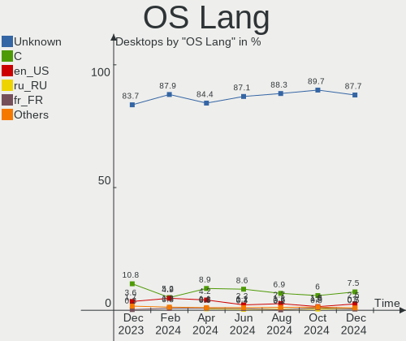
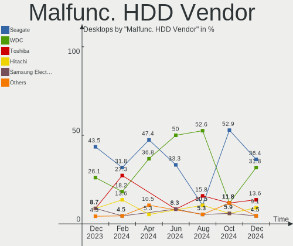

BSD Hardware Trends (Desktops)
------------------------------

A project to identify most popular hardware characteristics and track their change
over time based on data collected by BSD users at https://BSD-Hardware.info.

Anyone can contribute to this report by the [hw-probe](https://github.com/linuxhw/hw-probe/blob/master/INSTALL.BSD.md) tool:

    hw-probe -all -upload

Full-feature report is available here: https://bsd-hardware.info/?view=trends

Period: Mar, 2022.

Contents
--------

* [ System ](#system)
  - [ OS                       ](#os)
  - [ OS Family                ](#os-family)
  - [ Arch                     ](#arch)
  - [ DE                       ](#de)
  - [ Display Server           ](#display-server)
  - [ Display Manager          ](#display-manager)
  - [ OS Lang                  ](#os-lang)
  - [ Boot Mode                ](#boot-mode)
  - [ Filesystem               ](#filesystem)
  - [ Part. scheme             ](#part-scheme)

* [ Board ](#board)
  - [ Vendor                   ](#vendor)
  - [ Model                    ](#model)
  - [ Model Family             ](#model-family)
  - [ MFG Year                 ](#mfg-year)
  - [ Form Factor              ](#form-factor)
  - [ Coreboot                 ](#coreboot)
  - [ RAM Size                 ](#ram-size)
  - [ RAM Used                 ](#ram-used)
  - [ Total Drives             ](#total-drives)
  - [ Has CD-ROM               ](#has-cd-rom)
  - [ Has Ethernet             ](#has-ethernet)
  - [ Has WiFi                 ](#has-wifi)
  - [ Has Bluetooth            ](#has-bluetooth)

* [ Location ](#location)
  - [ Country                  ](#country)
  - [ City                     ](#city)

* [ Drives ](#drives)
  - [ Drive Vendor             ](#drive-vendor)
  - [ Drive Model              ](#drive-model)
  - [ HDD Vendor               ](#hdd-vendor)
  - [ SSD Vendor               ](#ssd-vendor)
  - [ Drive Kind               ](#drive-kind)
  - [ Drive Connector          ](#drive-connector)
  - [ Drive Size               ](#drive-size)
  - [ Space Total              ](#space-total)
  - [ Space Used               ](#space-used)
  - [ Malfunc. Drives          ](#malfunc-drives)
  - [ Malfunc. Drive Vendor    ](#malfunc-drive-vendor)
  - [ Malfunc. HDD Vendor      ](#malfunc-hdd-vendor)
  - [ Malfunc. Drive Kind      ](#malfunc-drive-kind)
  - [ Failed Drives            ](#failed-drives)
  - [ Failed Drive Vendor      ](#failed-drive-vendor)
  - [ Drive Status             ](#drive-status)

* [ Storage controller ](#storage-controller)
  - [ Storage Vendor           ](#storage-vendor)
  - [ Storage Model            ](#storage-model)
  - [ Storage Kind             ](#storage-kind)

* [ Processor ](#processor)
  - [ CPU Vendor               ](#cpu-vendor)
  - [ CPU Model                ](#cpu-model)
  - [ CPU Model Family         ](#cpu-model-family)
  - [ CPU Cores                ](#cpu-cores)
  - [ CPU Sockets              ](#cpu-sockets)
  - [ CPU Threads              ](#cpu-threads)
  - [ CPU Microarch            ](#cpu-microarch)

* [ Graphics ](#graphics)
  - [ GPU Vendor               ](#gpu-vendor)
  - [ GPU Model                ](#gpu-model)
  - [ GPU Combo                ](#gpu-combo)
  - [ GPU Driver               ](#gpu-driver)
  - [ GPU Memory               ](#gpu-memory)

* [ Monitor ](#monitor)
  - [ Monitor Vendor           ](#monitor-vendor)
  - [ Monitor Model            ](#monitor-model)
  - [ Monitor Resolution       ](#monitor-resolution)
  - [ Monitor Diagonal         ](#monitor-diagonal)
  - [ Monitor Width            ](#monitor-width)
  - [ Aspect Ratio             ](#aspect-ratio)
  - [ Monitor Area             ](#monitor-area)
  - [ Pixel Density            ](#pixel-density)
  - [ Multiple Monitors        ](#multiple-monitors)

* [ Network ](#network)
  - [ Net Controller Vendor    ](#net-controller-vendor)
  - [ Net Controller Model     ](#net-controller-model)
  - [ Wireless Vendor          ](#wireless-vendor)
  - [ Wireless Model           ](#wireless-model)
  - [ Ethernet Vendor          ](#ethernet-vendor)
  - [ Ethernet Model           ](#ethernet-model)
  - [ Net Controller Kind      ](#net-controller-kind)
  - [ Used Controller          ](#used-controller)
  - [ NICs                     ](#nics)
  - [ IPv6                     ](#ipv6)

* [ Bluetooth ](#bluetooth)
  - [ Bluetooth Vendor         ](#bluetooth-vendor)
  - [ Bluetooth Model          ](#bluetooth-model)

* [ Sound ](#sound)
  - [ Sound Vendor             ](#sound-vendor)
  - [ Sound Model              ](#sound-model)

* [ Memory ](#memory)
  - [ Memory Vendor            ](#memory-vendor)
  - [ Memory Model             ](#memory-model)
  - [ Memory Kind              ](#memory-kind)
  - [ Memory Form Factor       ](#memory-form-factor)
  - [ Memory Size              ](#memory-size)
  - [ Memory Speed             ](#memory-speed)

* [ Printers & scanners ](#printers--scanners)
  - [ Printer Vendor           ](#printer-vendor)
  - [ Printer Model            ](#printer-model)
  - [ Scanner Vendor           ](#scanner-vendor)
  - [ Scanner Model            ](#scanner-model)

* [ Camera ](#camera)
  - [ Camera Vendor            ](#camera-vendor)
  - [ Camera Model             ](#camera-model)

* [ Security ](#security)
  - [ Fingerprint Vendor       ](#fingerprint-vendor)
  - [ Fingerprint Model        ](#fingerprint-model)
  - [ Chipcard Vendor          ](#chipcard-vendor)
  - [ Chipcard Model           ](#chipcard-model)

* [ Unsupported ](#unsupported)
  - [ Unsupported Devices      ](#unsupported-devices)
  - [ Unsupported Device Types ](#unsupported-device-types)

System
------

OS
--

Installed operating systems

| Name                    | Desktops | Percent |
|-------------------------|----------|---------|
| OPNsense 22.1.2         | 86       | 30.94%  |
| OPNsense 22.1.3         | 56       | 20.14%  |
| OPNsense 22.1.4         | 41       | 14.75%  |
| helloSystem 0.7.0       | 17       | 6.12%   |
| OPNsense 21.7.8         | 13       | 4.68%   |
| FreeBSD 13.0-p10        | 7        | 2.52%   |
| FreeBSD 13.0-p7         | 6        | 2.16%   |
| OPNsense 22.1.1         | 5        | 1.8%    |
| FreeBSD 13.0            | 5        | 1.8%    |
| OPNsense 22.1           | 4        | 1.44%   |
| FreeBSD 13.0-p8         | 4        | 1.44%   |
| helloSystem 0.8.0       | 3        | 1.08%   |
| XigmaNAS 12.3-p2        | 2        | 0.72%   |
| OPNsense 22.7           | 2        | 0.72%   |
| OPNsense 21.7.7         | 2        | 0.72%   |
| OPNsense 21.7.6         | 2        | 0.72%   |
| OpenBSD 7.1             | 2        | 0.72%   |
| NetBSD 9.99.94          | 2        | 0.72%   |
| FreeBSD 13.1-BETA2      | 2        | 0.72%   |
| TrueNAS 12.2-p12        | 1        | 0.36%   |
| pfSense 12.3-STABLE     | 1        | 0.36%   |
| OPNsense 21.7           | 1        | 0.36%   |
| OPNsense 21.1.8         | 1        | 0.36%   |
| OPNsense 21.1           | 1        | 0.36%   |
| MidnightBSD 2.1.6       | 1        | 0.36%   |
| helloSystem 0.6.0       | 1        | 0.36%   |
| GhostBSD 22.01.12       | 1        | 0.36%   |
| GhostBSD 21.08.27       | 1        | 0.36%   |
| FreeBSD 13.1-PRERELEASE | 1        | 0.36%   |
| FreeBSD 13.1-BETA1      | 1        | 0.36%   |
| FreeBSD 13.0-STABLE     | 1        | 0.36%   |
| FreeBSD 13.0-p5         | 1        | 0.36%   |
| FreeBSD 13.0-p4         | 1        | 0.36%   |
| FreeBSD 12.3-p2         | 1        | 0.36%   |
| FreeBSD 12.1-p22-HBSD   | 1        | 0.36%   |
| DragonFly 6.2           | 1        | 0.36%   |

OS Family
---------

OS without a version

| Name        | Desktops | Percent |
|-------------|----------|---------|
| OPNsense    | 214      | 76.98%  |
| FreeBSD     | 31       | 11.15%  |
| helloSystem | 21       | 7.55%   |
| XigmaNAS    | 2        | 0.72%   |
| OpenBSD     | 2        | 0.72%   |
| NetBSD      | 2        | 0.72%   |
| GhostBSD    | 2        | 0.72%   |
| TrueNAS     | 1        | 0.36%   |
| pfSense     | 1        | 0.36%   |
| MidnightBSD | 1        | 0.36%   |
| DragonFly   | 1        | 0.36%   |

Arch
----

OS architecture (x86_64, i586, etc.)

| Name  | Desktops | Percent |
|-------|----------|---------|
| amd64 | 272      | 97.84%  |
| arm64 | 3        | 1.08%   |
| i386  | 2        | 0.72%   |
| armv7 | 1        | 0.36%   |

DE
--

Desktop Environment

| Name         | Desktops | Percent |
|--------------|----------|---------|
| Console      | 235      | 84.53%  |
| helloDesktop | 23       | 8.27%   |
| XFCE         | 5        | 1.8%    |
| MATE         | 5        | 1.8%    |
| KDE5         | 5        | 1.8%    |
| TWM          | 2        | 0.72%   |
| Openbox      | 2        | 0.72%   |
| AwesomeWM    | 1        | 0.36%   |

Display Server
--------------

X11 or Wayland

| Name    | Desktops | Percent |
|---------|----------|---------|
| Console | 235      | 84.53%  |
| X11     | 43       | 15.47%  |

Display Manager
---------------

SDDM, LightDM, etc.

| Name    | Desktops | Percent |
|---------|----------|---------|
| Console | 245      | 88.13%  |
| SLiM    | 23       | 8.27%   |
| SDDM    | 6        | 2.16%   |
| LightDM | 3        | 1.08%   |
| XDM     | 1        | 0.36%   |

OS Lang
-------

Language

| Lang    | Desktops | Percent |
|---------|----------|---------|
| Unknown | 220      | 79.14%  |
| en_US   | 28       | 10.07%  |
| C       | 27       | 9.71%   |
| ru_RU   | 1        | 0.36%   |
| es_MX   | 1        | 0.36%   |
| de_DE   | 1        | 0.36%   |

Boot Mode
---------

EFI or BIOS

| Mode | Desktops | Percent |
|------|----------|---------|
| EFI  | 246      | 88.49%  |
| BIOS | 32       | 11.51%  |

Filesystem
----------

Type of filesystem

| Type    | Desktops | Percent |
|---------|----------|---------|
| Ufs     | 156      | 56.12%  |
| Zfs     | 106      | 38.13%  |
| Cd9660  | 13       | 4.68%   |
| Ffs     | 2        | 0.72%   |
| Hammer2 | 1        | 0.36%   |

Part. scheme
------------

Scheme of partitioning

| Type    | Desktops | Percent |
|---------|----------|---------|
| GPT     | 262      | 94.24%  |
| MBR     | 10       | 3.6%    |
| Unknown | 5        | 1.8%    |
| BSD     | 1        | 0.36%   |

Board
-----

Vendor
------

Motherboard manufacturer

| Name                       | Desktops | Percent |
|----------------------------|----------|---------|
| Unknown                    | 36       | 12.95%  |
| ASUSTek Computer           | 32       | 11.51%  |
| Dell                       | 24       | 8.63%   |
| Protectli                  | 23       | 8.27%   |
| ASRock                     | 21       | 7.55%   |
| Gigabyte Technology        | 20       | 7.19%   |
| PC Engines                 | 17       | 6.12%   |
| MSI                        | 17       | 6.12%   |
| Intel                      | 17       | 6.12%   |
| Hewlett-Packard            | 17       | 6.12%   |
| Supermicro                 | 7        | 2.52%   |
| Lenovo                     | 7        | 2.52%   |
| Fujitsu                    | 5        | 1.8%    |
| ASRockRack                 | 3        | 1.08%   |
| Seeed Studio               | 2        | 0.72%   |
| Inventec                   | 2        | 0.72%   |
| Foxconn                    | 2        | 0.72%   |
| Biostar                    | 2        | 0.72%   |
| BESSTAR Tech               | 2        | 0.72%   |
| ShenZhen MinWin Technology | 1        | 0.36%   |
| Secudos                    | 1        | 0.36%   |
| Pegatron                   | 1        | 0.36%   |
| PAIQ                       | 1        | 0.36%   |
| NF541                      | 1        | 0.36%   |
| MW                         | 1        | 0.36%   |
| Lanner                     | 1        | 0.36%   |
| Koloe                      | 1        | 0.36%   |
| Huanan                     | 1        | 0.36%   |
| HPE                        | 1        | 0.36%   |
| HARDKERNEL                 | 1        | 0.36%   |
| Fujitsu Siemens            | 1        | 0.36%   |
| friendlyelec               | 1        | 0.36%   |
| ECS                        | 1        | 0.36%   |
| Deciso                     | 1        | 0.36%   |
| CNCTION-IAF-E3845          | 1        | 0.36%   |
| CNCTION-IAF                | 1        | 0.36%   |
| Cisco                      | 1        | 0.36%   |
| CheckPoint                 | 1        | 0.36%   |
| Beckhoff Automation        | 1        | 0.36%   |
| AOPEN                      | 1        | 0.36%   |
| AAEON                      | 1        | 0.36%   |

Model
-----

Motherboard model

| Name                               | Desktops | Percent |
|------------------------------------|----------|---------|
| Unknown                            | 39       | 14.03%  |
| Protectli FW6                      | 8        | 2.88%   |
| Protectli VP2410                   | 6        | 2.16%   |
| PC Engines apu4                    | 6        | 2.16%   |
| PC Engines APU2                    | 6        | 2.16%   |
| Intel Q3XXG4-P V1.0                | 6        | 2.16%   |
| Protectli FW4B                     | 5        | 1.8%    |
| ASUS All Series                    | 4        | 1.44%   |
| HP t620 PLUS Quad Core TC          | 3        | 1.08%   |
| Dell OptiPlex 7010                 | 3        | 1.08%   |
| Supermicro X9SCL/X9SCM             | 2        | 0.72%   |
| Seeed Studio ODYSSEY-X86J4105      | 2        | 0.72%   |
| Protectli FW2B                     | 2        | 0.72%   |
| PC Engines APU3                    | 2        | 0.72%   |
| PC Engines APU                     | 2        | 0.72%   |
| Lenovo ThinkCentre E73 10AU003DUK  | 2        | 0.72%   |
| HP Z620 Workstation                | 2        | 0.72%   |
| HP ProLiant MicroServer Gen8       | 2        | 0.72%   |
| HP EliteDesk 800 G2 SFF            | 2        | 0.72%   |
| Gigabyte N3150ND3V                 | 2        | 0.72%   |
| Gigabyte 970A-D3P                  | 2        | 0.72%   |
| Dell Precision 3440                | 2        | 0.72%   |
| Dell OptiPlex 5050                 | 2        | 0.72%   |
| Dell OptiPlex 3020                 | 2        | 0.72%   |
| ASUS PRO B460M-C                   | 2        | 0.72%   |
| ASUS PRIME B550M-A                 | 2        | 0.72%   |
| ASRock B550M Steel Legend          | 2        | 0.72%   |
| Supermicro X9SCAA/-L               | 1        | 0.36%   |
| Supermicro X9SAE                   | 1        | 0.36%   |
| Supermicro X7SPA-H                 | 1        | 0.36%   |
| Supermicro SYS-6028R-TRT           | 1        | 0.36%   |
| Supermicro SYS-5019A-12TN4         | 1        | 0.36%   |
| ShenZhen MinWin MW-NANO-APL-4L     | 1        | 0.36%   |
| Protectli FW4A                     | 1        | 0.36%   |
| Protectli FW2                      | 1        | 0.36%   |
| Pegatron IPM41-D3                  | 1        | 0.36%   |
| PC Engines apu1                    | 1        | 0.36%   |
| PAIQ EC3-BT19D4L                   | 1        | 0.36%   |
| NF541 1.0                          | 1        | 0.36%   |
| MW GMLK-2_5G4L                     | 1        | 0.36%   |
| MSI U-100                          | 1        | 0.36%   |
| MSI MS-A62211                      | 1        | 0.36%   |
| MSI MS-7C02                        | 1        | 0.36%   |
| MSI MS-7A72                        | 1        | 0.36%   |
| MSI MS-7A38                        | 1        | 0.36%   |
| MSI MS-7850                        | 1        | 0.36%   |
| MSI MS-7817                        | 1        | 0.36%   |
| MSI MS-7816                        | 1        | 0.36%   |
| MSI MS-7808                        | 1        | 0.36%   |
| MSI MS-7799                        | 1        | 0.36%   |
| MSI MS-7760                        | 1        | 0.36%   |
| MSI MS-7721                        | 1        | 0.36%   |
| MSI MS-7680                        | 1        | 0.36%   |
| MSI MS-7592                        | 1        | 0.36%   |
| MSI MS-7388                        | 1        | 0.36%   |
| MSI Compaq dx2420 Microtower       | 1        | 0.36%   |
| MSI CML-U PRO Cubi 5 (MS-B183)     | 1        | 0.36%   |
| Lenovo ThinkCentre M93p 10AAS25M00 | 1        | 0.36%   |
| Lenovo ThinkCentre M93p 10A8S16X0J | 1        | 0.36%   |
| Lenovo ThinkCentre M82 27562K1     | 1        | 0.36%   |

Model Family
------------

Motherboard model prefix

| Name                           | Desktops | Percent |
|--------------------------------|----------|---------|
| Unknown                        | 39       | 14.03%  |
| Dell OptiPlex                  | 17       | 6.12%   |
| Protectli FW6                  | 8        | 2.88%   |
| ASUS PRIME                     | 7        | 2.52%   |
| Protectli VP2410               | 6        | 2.16%   |
| PC Engines apu4                | 6        | 2.16%   |
| PC Engines APU2                | 6        | 2.16%   |
| Intel Q3XXG4-P                 | 6        | 2.16%   |
| Protectli FW4B                 | 5        | 1.8%    |
| Lenovo ThinkCentre             | 5        | 1.8%    |
| HP EliteDesk                   | 4        | 1.44%   |
| Dell Precision                 | 4        | 1.44%   |
| ASUS All                       | 4        | 1.44%   |
| HP t620                        | 3        | 1.08%   |
| HP ProLiant                    | 3        | 1.08%   |
| Fujitsu ESPRIMO                | 3        | 1.08%   |
| ASRock X570                    | 3        | 1.08%   |
| Supermicro X9SCL               | 2        | 0.72%   |
| Seeed Studio ODYSSEY-X86J4105  | 2        | 0.72%   |
| Protectli FW2B                 | 2        | 0.72%   |
| PC Engines APU3                | 2        | 0.72%   |
| PC Engines APU                 | 2        | 0.72%   |
| HP Z620                        | 2        | 0.72%   |
| HP Compaq                      | 2        | 0.72%   |
| Gigabyte N3150ND3V             | 2        | 0.72%   |
| Gigabyte 970A-D3P              | 2        | 0.72%   |
| Fujitsu FUTRO                  | 2        | 0.72%   |
| Dell Inspiron                  | 2        | 0.72%   |
| ASUS PRO                       | 2        | 0.72%   |
| ASRock B550M                   | 2        | 0.72%   |
| ASRock B450M                   | 2        | 0.72%   |
| Supermicro X9SCAA              | 1        | 0.36%   |
| Supermicro X9SAE               | 1        | 0.36%   |
| Supermicro X7SPA-H             | 1        | 0.36%   |
| Supermicro SYS-6028R-TRT       | 1        | 0.36%   |
| Supermicro SYS-5019A-12TN4     | 1        | 0.36%   |
| ShenZhen MinWin MW-NANO-APL-4L | 1        | 0.36%   |
| Protectli FW4A                 | 1        | 0.36%   |
| Protectli FW2                  | 1        | 0.36%   |
| Pegatron IPM41-D3              | 1        | 0.36%   |
| PC Engines apu1                | 1        | 0.36%   |
| PAIQ EC3-BT19D4L               | 1        | 0.36%   |
| NF541 1.0                      | 1        | 0.36%   |
| MW GMLK-2                      | 1        | 0.36%   |
| MSI U-100                      | 1        | 0.36%   |
| MSI MS-A62211                  | 1        | 0.36%   |
| MSI MS-7C02                    | 1        | 0.36%   |
| MSI MS-7A72                    | 1        | 0.36%   |
| MSI MS-7A38                    | 1        | 0.36%   |
| MSI MS-7850                    | 1        | 0.36%   |
| MSI MS-7817                    | 1        | 0.36%   |
| MSI MS-7816                    | 1        | 0.36%   |
| MSI MS-7808                    | 1        | 0.36%   |
| MSI MS-7799                    | 1        | 0.36%   |
| MSI MS-7760                    | 1        | 0.36%   |
| MSI MS-7721                    | 1        | 0.36%   |
| MSI MS-7680                    | 1        | 0.36%   |
| MSI MS-7592                    | 1        | 0.36%   |
| MSI MS-7388                    | 1        | 0.36%   |
| MSI Compaq                     | 1        | 0.36%   |

MFG Year
--------

Motherboard manufacture year

| Year    | Desktops | Percent |
|---------|----------|---------|
| 2021    | 41       | 14.75%  |
| 2019    | 38       | 13.67%  |
| 2014    | 35       | 12.59%  |
| 2020    | 27       | 9.71%   |
| 2016    | 24       | 8.63%   |
| 2018    | 21       | 7.55%   |
| 2012    | 20       | 7.19%   |
| 2013    | 17       | 6.12%   |
| 2017    | 16       | 5.76%   |
| 2015    | 9        | 3.24%   |
| 2011    | 8        | 2.88%   |
| 2009    | 7        | 2.52%   |
| 2010    | 5        | 1.8%    |
| 2008    | 4        | 1.44%   |
| Unknown | 3        | 1.08%   |
| 2022    | 2        | 0.72%   |
| 2004    | 1        | 0.36%   |

Form Factor
-----------

Physical design of the computer

| Name    | Desktops | Percent |
|---------|----------|---------|
| Desktop | 278      | 100%    |

Coreboot
--------

Have coreboot on board

| Used | Desktops | Percent |
|------|----------|---------|
| No   | 253      | 91.01%  |
| Yes  | 25       | 8.99%   |

RAM Size
--------

Total RAM memory

| Size in GB  | Desktops | Percent |
|-------------|----------|---------|
| 8.01-16.0   | 88       | 31.65%  |
| 4.01-8.0    | 79       | 28.42%  |
| 16.01-24.0  | 63       | 22.66%  |
| 32.01-64.0  | 27       | 9.71%   |
| 2.01-3.0    | 8        | 2.88%   |
| 64.01-256.0 | 8        | 2.88%   |
| 0.51-1.0    | 2        | 0.72%   |
| 3.01-4.0    | 1        | 0.36%   |
| 24.01-32.0  | 1        | 0.36%   |
| 1.01-2.0    | 1        | 0.36%   |

RAM Used
--------

Used RAM memory

| Used GB     | Desktops | Percent |
|-------------|----------|---------|
| 0.01-0.5    | 139      | 50%     |
| 0.51-1.0    | 95       | 34.17%  |
| 1.01-2.0    | 21       | 7.55%   |
| 3.01-4.0    | 7        | 2.52%   |
| 2.01-3.0    | 7        | 2.52%   |
| Unknown     | 3        | 1.08%   |
| 4.01-8.0    | 2        | 0.72%   |
| 0           | 2        | 0.72%   |
| 64.01-256.0 | 1        | 0.36%   |
| 16.01-24.0  | 1        | 0.36%   |

Total Drives
------------

Number of drives on board

| Drives | Desktops | Percent |
|--------|----------|---------|
| 1      | 209      | 75.18%  |
| 2      | 27       | 9.71%   |
| 0      | 17       | 6.12%   |
| 3      | 13       | 4.68%   |
| 4      | 6        | 2.16%   |
| 7      | 2        | 0.72%   |
| 13     | 1        | 0.36%   |
| 9      | 1        | 0.36%   |
| 8      | 1        | 0.36%   |
| 5      | 1        | 0.36%   |

Has CD-ROM
----------

Has CD-ROM on board

| Presented | Desktops | Percent |
|-----------|----------|---------|
| No        | 226      | 81.29%  |
| Yes       | 52       | 18.71%  |

Has Ethernet
------------

Has Ethernet on board

| Presented | Desktops | Percent |
|-----------|----------|---------|
| Yes       | 276      | 99.28%  |
| No        | 2        | 0.72%   |

Has WiFi
--------

Has WiFi module

| Presented | Desktops | Percent |
|-----------|----------|---------|
| No        | 231      | 83.09%  |
| Yes       | 47       | 16.91%  |

Has Bluetooth
-------------

Has Bluetooth module

| Presented | Desktops | Percent |
|-----------|----------|---------|
| No        | 256      | 92.09%  |
| Yes       | 22       | 7.91%   |

Location
--------

Country
-------

Geographic location (country)

| Country      | Desktops | Percent |
|--------------|----------|---------|
| USA          | 91       | 32.73%  |
| Germany      | 43       | 15.47%  |
| UK           | 13       | 4.68%   |
| France       | 11       | 3.96%   |
| Russia       | 9        | 3.24%   |
| Canada       | 9        | 3.24%   |
| China        | 8        | 2.88%   |
| Switzerland  | 7        | 2.52%   |
| Poland       | 7        | 2.52%   |
| Netherlands  | 6        | 2.16%   |
| Australia    | 6        | 2.16%   |
| Romania      | 5        | 1.8%    |
| Brazil       | 5        | 1.8%    |
| Sweden       | 4        | 1.44%   |
| Spain        | 4        | 1.44%   |
| Czechia      | 4        | 1.44%   |
| South Korea  | 3        | 1.08%   |
| Portugal     | 3        | 1.08%   |
| Norway       | 3        | 1.08%   |
| Japan        | 3        | 1.08%   |
| India        | 3        | 1.08%   |
| Austria      | 3        | 1.08%   |
| Slovenia     | 2        | 0.72%   |
| Italy        | 2        | 0.72%   |
| Hungary      | 2        | 0.72%   |
| Finland      | 2        | 0.72%   |
| Ukraine      | 1        | 0.36%   |
| Thailand     | 1        | 0.36%   |
| South Africa | 1        | 0.36%   |
| Singapore    | 1        | 0.36%   |
| Serbia       | 1        | 0.36%   |
| Paraguay     | 1        | 0.36%   |
| Mexico       | 1        | 0.36%   |
| Madagascar   | 1        | 0.36%   |
| Luxembourg   | 1        | 0.36%   |
| Lithuania    | 1        | 0.36%   |
| Israel       | 1        | 0.36%   |
| Isle of Man  | 1        | 0.36%   |
| Indonesia    | 1        | 0.36%   |
| Iceland      | 1        | 0.36%   |
| Hong Kong    | 1        | 0.36%   |
| Egypt        | 1        | 0.36%   |
| Croatia      | 1        | 0.36%   |
| Bulgaria     | 1        | 0.36%   |
| Belgium      | 1        | 0.36%   |
| Argentina    | 1        | 0.36%   |

City
----

Geographic location (city)

| City              | Desktops | Percent |
|-------------------|----------|---------|
| Moscow            | 4        | 1.44%   |
| Bucharest         | 4        | 1.44%   |
| Portland          | 3        | 1.08%   |
| Munich            | 3        | 1.08%   |
| Gdansk            | 3        | 1.08%   |
| Berlin            | 3        | 1.08%   |
| Toulouse          | 2        | 0.72%   |
| Tamm              | 2        | 0.72%   |
| Surrey            | 2        | 0.72%   |
| Stockholm         | 2        | 0.72%   |
| St. Moritz        | 2        | 0.72%   |
| Seattle           | 2        | 0.72%   |
| Salem             | 2        | 0.72%   |
| Reutlingen        | 2        | 0.72%   |
| Redmond           | 2        | 0.72%   |
| Paris             | 2        | 0.72%   |
| National Park     | 2        | 0.72%   |
| Montfermeil       | 2        | 0.72%   |
| Milwaukee         | 2        | 0.72%   |
| Mettmenstetten    | 2        | 0.72%   |
| Melbourne         | 2        | 0.72%   |
| Mannheim          | 2        | 0.72%   |
| Madrid            | 2        | 0.72%   |
| Lüneburg         | 2        | 0.72%   |
| Houston           | 2        | 0.72%   |
| Hamm              | 2        | 0.72%   |
| Hamburg           | 2        | 0.72%   |
| Chicago           | 2        | 0.72%   |
| Brisbane          | 2        | 0.72%   |
| Bonn              | 2        | 0.72%   |
| Beijing           | 2        | 0.72%   |
| Zagreb            | 1        | 0.36%   |
| Ypsilanti         | 1        | 0.36%   |
| Yafa              | 1        | 0.36%   |
| Wuppertal         | 1        | 0.36%   |
| Wroclaw           | 1        | 0.36%   |
| Woodstock         | 1        | 0.36%   |
| Wenatchee         | 1        | 0.36%   |
| Weissach          | 1        | 0.36%   |
| Warminster        | 1        | 0.36%   |
| Volgograd         | 1        | 0.36%   |
| Victoria          | 1        | 0.36%   |
| Venda do Pinheiro | 1        | 0.36%   |
| Union City        | 1        | 0.36%   |
| Tucson            | 1        | 0.36%   |
| Torrance          | 1        | 0.36%   |
| Toronto           | 1        | 0.36%   |
| Thionville        | 1        | 0.36%   |
| Teaneck           | 1        | 0.36%   |
| Tai Po            | 1        | 0.36%   |
| Szombathely       | 1        | 0.36%   |
| Sydney            | 1        | 0.36%   |
| Swindon           | 1        | 0.36%   |
| Swansea           | 1        | 0.36%   |
| Sundsvall         | 1        | 0.36%   |
| Stratford         | 1        | 0.36%   |
| Stoke Newington   | 1        | 0.36%   |
| Steckborn         | 1        | 0.36%   |
| Statesboro        | 1        | 0.36%   |
| St Petersburg     | 1        | 0.36%   |

Drives
------

Drive Vendor
------------

Hard drive vendors

| Vendor              | Desktops | Drives | Percent |
|---------------------|----------|--------|---------|
| Samsung Electronics | 55       | 63     | 17.08%  |
| WDC                 | 37       | 58     | 11.49%  |
| Kingston            | 31       | 32     | 9.63%   |
| Seagate             | 30       | 50     | 9.32%   |
| Transcend           | 17       | 17     | 5.28%   |
| SanDisk             | 15       | 16     | 4.66%   |
| China               | 15       | 15     | 4.66%   |
| Intel               | 12       | 13     | 3.73%   |
| Hitachi             | 9        | 10     | 2.8%    |
| Crucial             | 9        | 10     | 2.8%    |
| Toshiba             | 8        | 8      | 2.48%   |
| Phison              | 8        | 8      | 2.48%   |
| Protectli           | 7        | 7      | 2.17%   |
| Hoodisk             | 6        | 6      | 1.86%   |
| SPCC                | 5        | 6      | 1.55%   |
| Dogfish             | 4        | 4      | 1.24%   |
| Patriot             | 3        | 4      | 0.93%   |
| Micron Technology   | 3        | 3      | 0.93%   |
| KIOXIA-EXCERIA      | 3        | 5      | 0.93%   |
| A-DATA Technology   | 3        | 3      | 0.93%   |
| PNY                 | 2        | 3      | 0.62%   |
| OCZ                 | 2        | 2      | 0.62%   |
| KingSpec            | 2        | 2      | 0.62%   |
| InnoDisk            | 2        | 2      | 0.62%   |
| Gigabyte Technology | 2        | 2      | 0.62%   |
| FORESEE             | 2        | 2      | 0.62%   |
| Corsair             | 2        | 2      | 0.62%   |
| Apacer              | 2        | 2      | 0.62%   |
| Wicgtyp             | 1        | 1      | 0.31%   |
| Valuetech           | 1        | 2      | 0.31%   |
| UDinfo              | 1        | 1      | 0.31%   |
| Team                | 1        | 1      | 0.31%   |
| SSSTC               | 1        | 1      | 0.31%   |
| SK Hynix            | 1        | 1      | 0.31%   |
| ShiJi               | 1        | 1      | 0.31%   |
| Pioneer             | 1        | 1      | 0.31%   |
| Netac               | 1        | 1      | 0.31%   |
| MyDigitalSSD        | 1        | 1      | 0.31%   |
| LITEONIT            | 1        | 1      | 0.31%   |
| LITEON              | 1        | 1      | 0.31%   |
| Lexar               | 1        | 1      | 0.31%   |
| Leven               | 1        | 1      | 0.31%   |
| LDLC                | 1        | 1      | 0.31%   |
| KIOXIA              | 1        | 1      | 0.31%   |
| Intenso             | 1        | 1      | 0.31%   |
| Integral            | 1        | 1      | 0.31%   |
| HPE                 | 1        | 1      | 0.31%   |
| HGST                | 1        | 1      | 0.31%   |
| Hewlett-Packard     | 1        | 1      | 0.31%   |
| HCiPC               | 1        | 1      | 0.31%   |
| GOODRAM             | 1        | 1      | 0.31%   |
| faspeed             | 1        | 1      | 0.31%   |
| BIWIN               | 1        | 1      | 0.31%   |
| Biostar             | 1        | 1      | 0.31%   |

Drive Model
-----------

Hard drive models

| Model                           | Desktops | Percent |
|---------------------------------|----------|---------|
| Samsung SSD 860 EVO 500GB       | 6        | 1.72%   |
| Transcend TS64GMSA230S 64GB     | 5        | 1.43%   |
| Kingston SA400S37120G 120GB     | 5        | 1.43%   |
| Crucial CT240BX500SSD1 240GB    | 4        | 1.15%   |
| China SATA SSD 16GB             | 4        | 1.15%   |
| Samsung SSD 980 PRO 500GB       | 3        | 0.86%   |
| Samsung SSD 870 EVO 500GB       | 3        | 0.86%   |
| Samsung SSD 870 EVO 250GB       | 3        | 0.86%   |
| Samsung SSD 850 EVO 500GB       | 3        | 0.86%   |
| Protectli 120GB mSATA           | 3        | 0.86%   |
| Phison SATA SSD 16GB            | 3        | 0.86%   |
| Kingston SUV500MS120G 120GB     | 3        | 0.86%   |
| Kingston SKC600MS256G 256GB     | 3        | 0.86%   |
| Kingston SA400M8240G 240GB      | 3        | 0.86%   |
| China SATA SSD 120GB            | 3        | 0.86%   |
| WDC WDS240G2G0A-00JH30 240GB    | 2        | 0.57%   |
| WDC WDS120G2G0A-00JH30 120GB    | 2        | 0.57%   |
| WDC WD5003ABYZ-011FA0 500GB     | 2        | 0.57%   |
| Transcend TS64GMSA370 64GB      | 2        | 0.57%   |
| Transcend TS32GMSA370 32GB      | 2        | 0.57%   |
| Transcend TS128GMSA230S 128GB   | 2        | 0.57%   |
| Toshiba DT01ACA100 1TB          | 2        | 0.57%   |
| Seagate ST4000DM000-1F2168 4TB  | 2        | 0.57%   |
| Seagate ST3500418AS 500GB       | 2        | 0.57%   |
| Seagate ST3500414CS 500GB       | 2        | 0.57%   |
| Seagate ST3500312CS 500GB       | 2        | 0.57%   |
| Seagate ST3160815AS 160GB       | 2        | 0.57%   |
| Seagate ST250DM000-1BD141 250GB | 2        | 0.57%   |
| Seagate ST1000DM010-2EP102 1TB  | 2        | 0.57%   |
| SanDisk SDSSDA120G 120GB        | 2        | 0.57%   |
| Samsung SSD 960 EVO 250GB       | 2        | 0.57%   |
| Samsung SSD 860 EVO 250GB       | 2        | 0.57%   |
| Samsung SSD 840 Series 250GB    | 2        | 0.57%   |
| Samsung SSD 840 EVO 120GB       | 2        | 0.57%   |
| Samsung HD250HJ 250GB           | 2        | 0.57%   |
| Patriot Burst Elite 120GB       | 2        | 0.57%   |
| KIOXIA-EXCERIA SSD 500GB        | 2        | 0.57%   |
| Kingston SV300S37A120G 120GB    | 2        | 0.57%   |
| Kingston SUV500MS240G 240GB     | 2        | 0.57%   |
| Kingston SA400S37240G 240GB     | 2        | 0.57%   |
| Intel SSDSC2BF180A4L 180GB      | 2        | 0.57%   |
| Hoodisk SSD 512GB               | 2        | 0.57%   |
| Hoodisk SSD 32GB                | 2        | 0.57%   |
| FORESEE 128GB SSD               | 2        | 0.57%   |
| Dogfish SSD 256GB               | 2        | 0.57%   |
| Dogfish SSD 128GB               | 2        | 0.57%   |
| China M10C 256GB                | 2        | 0.57%   |
| Wicgtyp M900-128 128GB          | 1        | 0.29%   |
| WDC WDS500G3X0C-00SJG0 500GB    | 1        | 0.29%   |
| WDC WDS500G2B0A-00SM50 500GB    | 1        | 0.29%   |
| WDC WDS500G1R0B-68A4Z0 500GB    | 1        | 0.29%   |
| WDC WDS100T3X0C-00SJG0 1TB      | 1        | 0.29%   |
| WDC WDS100T2B0A-00SM50 1TB      | 1        | 0.29%   |
| WDC WDBRPG5000ANC-WRSN 500GB    | 1        | 0.29%   |
| WDC WD80EMAZ-00WJTA0 8TB        | 1        | 0.29%   |
| WDC WD80EFZX-68UW8N0 8TB        | 1        | 0.29%   |
| WDC WD80EFAX-68LHPN0 8TB        | 1        | 0.29%   |
| WDC WD80EDBZ-11B0ZA0 8TB        | 1        | 0.29%   |
| WDC WD60EFAX-68SHWN0 6TB        | 1        | 0.29%   |
| WDC WD50EFRX-68L0BN1 5TB        | 1        | 0.29%   |

HDD Vendor
----------

Hard disk drive vendors

| Vendor              | Desktops | Drives | Percent |
|---------------------|----------|--------|---------|
| Seagate             | 30       | 47     | 36.59%  |
| WDC                 | 29       | 47     | 35.37%  |
| Hitachi             | 9        | 10     | 10.98%  |
| Toshiba             | 7        | 7      | 8.54%   |
| Samsung Electronics | 5        | 5      | 6.1%    |
| HGST                | 1        | 1      | 1.22%   |
| Hewlett-Packard     | 1        | 1      | 1.22%   |

SSD Vendor
----------

Solid state drive vendors

| Vendor              | Desktops | Drives | Percent |
|---------------------|----------|--------|---------|
| Samsung Electronics | 37       | 42     | 17.96%  |
| Kingston            | 28       | 29     | 13.59%  |
| Transcend           | 17       | 17     | 8.25%   |
| SanDisk             | 15       | 16     | 7.28%   |
| China               | 15       | 15     | 7.28%   |
| Crucial             | 8        | 9      | 3.88%   |
| WDC                 | 7        | 8      | 3.4%    |
| Protectli           | 7        | 7      | 3.4%    |
| Phison              | 7        | 7      | 3.4%    |
| Intel               | 7        | 7      | 3.4%    |
| Hoodisk             | 6        | 6      | 2.91%   |
| SPCC                | 5        | 6      | 2.43%   |
| Dogfish             | 4        | 4      | 1.94%   |
| Patriot             | 3        | 4      | 1.46%   |
| Micron Technology   | 3        | 3      | 1.46%   |
| PNY                 | 2        | 3      | 0.97%   |
| OCZ                 | 2        | 2      | 0.97%   |
| KingSpec            | 2        | 2      | 0.97%   |
| Innodisk            | 2        | 2      | 0.97%   |
| FORESEE             | 2        | 2      | 0.97%   |
| Apacer              | 2        | 2      | 0.97%   |
| A-DATA Technology   | 2        | 2      | 0.97%   |
| Wicgtyp             | 1        | 1      | 0.49%   |
| Valuetech           | 1        | 2      | 0.49%   |
| UDinfo              | 1        | 1      | 0.49%   |
| Toshiba             | 1        | 1      | 0.49%   |
| ShiJi               | 1        | 1      | 0.49%   |
| Seagate             | 1        | 3      | 0.49%   |
| Pioneer             | 1        | 1      | 0.49%   |
| Netac               | 1        | 1      | 0.49%   |
| MyDigitalSSD        | 1        | 1      | 0.49%   |
| LITEONIT            | 1        | 1      | 0.49%   |
| LITEON              | 1        | 1      | 0.49%   |
| Lexar               | 1        | 1      | 0.49%   |
| Leven               | 1        | 1      | 0.49%   |
| KIOXIA-EXCERIA      | 1        | 1      | 0.49%   |
| Intenso             | 1        | 1      | 0.49%   |
| Integral            | 1        | 1      | 0.49%   |
| HPE                 | 1        | 1      | 0.49%   |
| HCiPC               | 1        | 1      | 0.49%   |
| Gigabyte Technology | 1        | 1      | 0.49%   |
| faspeed             | 1        | 1      | 0.49%   |
| Corsair             | 1        | 1      | 0.49%   |
| BIWIN               | 1        | 1      | 0.49%   |
| Biostar             | 1        | 1      | 0.49%   |

Drive Kind
----------

HDD or SSD

| Kind | Desktops | Drives | Percent |
|------|----------|--------|---------|
| SSD  | 192      | 221    | 64.86%  |
| HDD  | 68       | 118    | 22.97%  |
| NVMe | 36       | 43     | 12.16%  |

Drive Connector
---------------

SATA, SAS, NVMe, etc.

| Type | Desktops | Drives | Percent |
|------|----------|--------|---------|
| SATA | 237      | 339    | 86.81%  |
| NVMe | 36       | 43     | 13.19%  |

Drive Size
----------

Size of hard drive

| Size in TB | Desktops | Drives | Percent |
|------------|----------|--------|---------|
| 0.01-0.5   | 212      | 261    | 80.61%  |
| 0.51-1.0   | 28       | 31     | 10.65%  |
| 1.01-2.0   | 13       | 20     | 4.94%   |
| 10.01-20.0 | 4        | 10     | 1.52%   |
| 4.01-10.0  | 3        | 13     | 1.14%   |
| 3.01-4.0   | 2        | 3      | 0.76%   |
| 2.01-3.0   | 1        | 1      | 0.38%   |

Space Total
-----------

Amount of disk space available on the file system

| Size in GB     | Desktops | Percent |
|----------------|----------|---------|
| 101-250        | 128      | 46.04%  |
| 251-500        | 41       | 14.75%  |
| 21-50          | 33       | 11.87%  |
| 1-20           | 33       | 11.87%  |
| 51-100         | 23       | 8.27%   |
| 501-1000       | 13       | 4.68%   |
| 1001-2000      | 3        | 1.08%   |
| 2001-3000      | 2        | 0.72%   |
| More than 3000 | 1        | 0.36%   |
| Unknown        | 1        | 0.36%   |

Space Used
----------

Amount of used disk space

| Used GB   | Desktops | Percent |
|-----------|----------|---------|
| 1-20      | 257      | 92.45%  |
| 21-50     | 14       | 5.04%   |
| 51-100    | 3        | 1.08%   |
| 2001-3000 | 1        | 0.36%   |
| 101-250   | 1        | 0.36%   |
| 1001-2000 | 1        | 0.36%   |
| Unknown   | 1        | 0.36%   |

Malfunc. Drives
---------------

Drive models with a malfunction

| Model                                            | Desktops | Drives | Percent |
|--------------------------------------------------|----------|--------|---------|
| WDC WD60EFAX-68SHWN0 6TB                         | 1        | 2      | 3.23%   |
| WDC WD50EFRX-68L0BN1 5TB                         | 1        | 1      | 3.23%   |
| WDC WD5000AAKX-083CA1 500GB                      | 1        | 1      | 3.23%   |
| WDC WD400JB-00ENA0 40GB                          | 1        | 1      | 3.23%   |
| WDC WD3200BEVT-22A23T0 320GB                     | 1        | 1      | 3.23%   |
| WDC WD2500AAKX-321CA0 250GB                      | 1        | 1      | 3.23%   |
| WDC WD2500AAJS-75M0A0 250GB                      | 1        | 1      | 3.23%   |
| WDC WD2500AAJS-60B4A0 250GB                      | 1        | 2      | 3.23%   |
| Toshiba MK1655GSX 160GB                          | 1        | 1      | 3.23%   |
| Seagate ST3500418AS 500GB                        | 1        | 1      | 3.23%   |
| Seagate ST3500413AS 500GB                        | 1        | 1      | 3.23%   |
| Seagate ST3250310AS 250GB                        | 1        | 1      | 3.23%   |
| Seagate ST3160815AS 160GB                        | 1        | 1      | 3.23%   |
| Seagate ST3160023AS 160GB                        | 1        | 1      | 3.23%   |
| Seagate ST31000528AS 1TB                         | 1        | 1      | 3.23%   |
| Seagate ST2000DM001-1E6164 2TB                   | 1        | 1      | 3.23%   |
| Seagate ST2000DL003-9VT166 2TB                   | 1        | 1      | 3.23%   |
| Seagate ST1000NM0011 1TB                         | 1        | 1      | 3.23%   |
| SanDisk SDSSDA240G 240GB                         | 1        | 2      | 3.23%   |
| SanDisk SDCFHS-016G                              | 1        | 1      | 3.23%   |
| Samsung Electronics SSD PM810 2.5-inch 7mm 128GB | 1        | 1      | 3.23%   |
| Samsung Electronics HD250HJ 250GB                | 1        | 1      | 3.23%   |
| Kingston SNS4151S316GD 16GB                      | 1        | 1      | 3.23%   |
| Intel SSDSA2BW160G3H 160GB                       | 1        | 1      | 3.23%   |
| Hitachi HTS722020K9SA00 200GB                    | 1        | 1      | 3.23%   |
| Hitachi HTS541680J9SA00 80GB                     | 1        | 1      | 3.23%   |
| Hitachi HDT725032VLA360 320GB                    | 1        | 2      | 3.23%   |
| Hewlett-Packard MB1000GCWCV 1TB                  | 1        | 1      | 3.23%   |
| Dogfish SSD 128GB                                | 1        | 1      | 3.23%   |
| Crucial CT1050MX300SSD1 1TB                      | 1        | 1      | 3.23%   |
| China XJH-32GB                                   | 1        | 1      | 3.23%   |

Malfunc. Drive Vendor
---------------------

Vendors of faulty drives

| Vendor              | Desktops | Drives | Percent |
|---------------------|----------|--------|---------|
| Seagate             | 9        | 9      | 29.03%  |
| WDC                 | 8        | 10     | 25.81%  |
| Hitachi             | 3        | 4      | 9.68%   |
| SanDisk             | 2        | 3      | 6.45%   |
| Samsung Electronics | 2        | 2      | 6.45%   |
| Toshiba             | 1        | 1      | 3.23%   |
| Kingston            | 1        | 1      | 3.23%   |
| Intel               | 1        | 1      | 3.23%   |
| Hewlett-Packard     | 1        | 1      | 3.23%   |
| Dogfish             | 1        | 1      | 3.23%   |
| Crucial             | 1        | 1      | 3.23%   |
| China               | 1        | 1      | 3.23%   |

Malfunc. HDD Vendor
-------------------

Vendors of faulty HDD drives

| Vendor              | Desktops | Drives | Percent |
|---------------------|----------|--------|---------|
| Seagate             | 9        | 9      | 39.13%  |
| WDC                 | 8        | 10     | 34.78%  |
| Hitachi             | 3        | 4      | 13.04%  |
| Toshiba             | 1        | 1      | 4.35%   |
| Samsung Electronics | 1        | 1      | 4.35%   |
| Hewlett-Packard     | 1        | 1      | 4.35%   |

Malfunc. Drive Kind
-------------------

Kinds of faulty drives

| Kind | Desktops | Drives | Percent |
|------|----------|--------|---------|
| HDD  | 22       | 26     | 73.33%  |
| SSD  | 8        | 9      | 26.67%  |

Failed Drives
-------------

Failed drive models

Zero info for selected period =(

Failed Drive Vendor
-------------------

Failed drive vendors

Zero info for selected period =(

Drive Status
------------

Number of failed and malfunc. drives

| Status   | Desktops | Drives | Percent |
|----------|----------|--------|---------|
| Works    | 233      | 339    | 86.3%   |
| Malfunc  | 30       | 35     | 11.11%  |
| Detected | 7        | 8      | 2.59%   |

Storage controller
------------------

Storage Vendor
--------------

Storage controller vendors

| Vendor                         | Desktops | Percent |
|--------------------------------|----------|---------|
| Intel                          | 213      | 64.94%  |
| AMD                            | 61       | 18.6%   |
| Samsung Electronics            | 15       | 4.57%   |
| ASMedia Technology             | 9        | 2.74%   |
| Marvell Technology Group       | 4        | 1.22%   |
| Sandisk                        | 3        | 0.91%   |
| Phison Electronics             | 3        | 0.91%   |
| KIOXIA                         | 3        | 0.91%   |
| Kingston Technology Company    | 3        | 0.91%   |
| Chelsio Communications         | 3        | 0.91%   |
| Broadcom / LSI                 | 3        | 0.91%   |
| Silicon Motion                 | 2        | 0.61%   |
| Shenzhen Longsys Electronics   | 2        | 0.61%   |
| Solid State Storage Technology | 1        | 0.3%    |
| SK Hynix                       | 1        | 0.3%    |
| Micron/Crucial Technology      | 1        | 0.3%    |
| ADATA Technology               | 1        | 0.3%    |

Storage Model
-------------

Storage controller models

| Model                                                                                   | Desktops | Percent |
|-----------------------------------------------------------------------------------------|----------|---------|
| AMD FCH SATA Controller [AHCI mode]                                                     | 35       | 9.41%   |
| Intel 8 Series/C220 Series Chipset Family 6-port SATA Controller 1 [AHCI mode]          | 26       | 6.99%   |
| Intel Sunrise Point-LP SATA Controller [AHCI mode]                                      | 19       | 5.11%   |
| Intel Celeron/Pentium Silver Processor SATA Controller                                  | 18       | 4.84%   |
| Intel 6 Series/C200 Series Chipset Family 6 port Desktop SATA AHCI Controller           | 15       | 4.03%   |
| Intel Atom/Celeron/Pentium Processor x5-E8000/J3xxx/N3xxx Series SATA Controller        | 14       | 3.76%   |
| Intel Atom Processor E3800 Series SATA AHCI Controller                                  | 14       | 3.76%   |
| Intel 7 Series/C210 Series Chipset Family 6-port SATA Controller [AHCI mode]            | 10       | 2.69%   |
| AMD SB7x0/SB8x0/SB9x0 SATA Controller [AHCI mode]                                       | 10       | 2.69%   |
| Intel NM10/ICH7 Family SATA Controller [IDE mode]                                       | 9        | 2.42%   |
| ASMedia ASM1062 Serial ATA Controller                                                   | 9        | 2.42%   |
| Intel Q170/Q150/B150/H170/H110/Z170/CM236 Chipset SATA Controller [AHCI Mode]           | 8        | 2.15%   |
| Intel 200 Series PCH SATA controller [AHCI mode]                                        | 7        | 1.88%   |
| Intel Comet Lake SATA AHCI Controller                                                   | 6        | 1.61%   |
| Intel 82801G (ICH7 Family) IDE Controller                                               | 6        | 1.61%   |
| AMD SB7x0/SB8x0/SB9x0 IDE Controller                                                    | 6        | 1.61%   |
| AMD FCH SATA Controller [IDE mode]                                                      | 6        | 1.61%   |
| Samsung NVMe SSD Controller SM981/PM981/PM983                                           | 5        | 1.34%   |
| Samsung NVMe SSD Controller SM961/PM961/SM963                                           | 5        | 1.34%   |
| Samsung NVMe SSD Controller PM9A1/PM9A3/980PRO                                          | 5        | 1.34%   |
| Intel Cannon Lake PCH SATA AHCI Controller                                              | 5        | 1.34%   |
| Intel C600/X79 series chipset 6-Port SATA AHCI Controller                               | 5        | 1.34%   |
| Intel 400 Series Chipset Family SATA AHCI Controller                                    | 5        | 1.34%   |
| AMD 500 Series Chipset SATA Controller                                                  | 5        | 1.34%   |
| Intel Wildcat Point-LP SATA Controller [AHCI Mode]                                      | 4        | 1.08%   |
| Intel SATA Controller [RAID mode]                                                       | 4        | 1.08%   |
| Intel 82801JI (ICH10 Family) SATA AHCI Controller                                       | 4        | 1.08%   |
| AMD SB7x0/SB8x0/SB9x0 SATA Controller [IDE mode]                                        | 4        | 1.08%   |
| Sandisk WD Black SN750 / PC SN730 NVMe SSD                                              | 3        | 0.81%   |
| Intel NM10/ICH7 Family SATA Controller [AHCI mode]                                      | 3        | 0.81%   |
| Intel C610/X99 series chipset sSATA Controller [AHCI mode]                              | 3        | 0.81%   |
| Intel C602 chipset 4-Port SATA Storage Control Unit                                     | 3        | 0.81%   |
| Intel C600/X79 series chipset IDE-r Controller                                          | 3        | 0.81%   |
| Intel 82801IR/IO/IH (ICH9R/DO/DH) 6 port SATA Controller [AHCI mode]                    | 3        | 0.81%   |
| Intel 500 Series Chipset Family SATA AHCI Controller                                    | 3        | 0.81%   |
| AMD 400 Series Chipset SATA Controller                                                  | 3        | 0.81%   |
| AMD 300 Series Chipset SATA Controller                                                  | 3        | 0.81%   |
| Silicon Motion SM2263EN/SM2263XT SSD Controller                                         | 2        | 0.54%   |
| Marvell Group 88SE6111/6121 SATA II / PATA Controller                                   | 2        | 0.54%   |
| KIOXIA NVMe SSD                                                                         | 2        | 0.54%   |
| Intel Tiger Lake-LP SATA Controller [AHCI mode]                                         | 2        | 0.54%   |
| Intel Optane SSD 900P Series                                                            | 2        | 0.54%   |
| Intel NVMe Optane Memory Series                                                         | 2        | 0.54%   |
| Intel Cannon Point-LP SATA Controller [AHCI Mode]                                       | 2        | 0.54%   |
| Intel C610/X99 series chipset 6-Port SATA Controller [AHCI mode]                        | 2        | 0.54%   |
| Intel C600/X79 series chipset SATA RAID Controller                                      | 2        | 0.54%   |
| Intel Atom Processor C3000 Series SATA Controller 1                                     | 2        | 0.54%   |
| Intel Atom Processor C3000 Series SATA Controller 0                                     | 2        | 0.54%   |
| Intel 8 Series SATA Controller 1 [AHCI mode]                                            | 2        | 0.54%   |
| Intel 6 Series/C200 Series Chipset Family Desktop SATA Controller (IDE mode, ports 4-5) | 2        | 0.54%   |
| Intel 6 Series/C200 Series Chipset Family Desktop SATA Controller (IDE mode, ports 0-3) | 2        | 0.54%   |
| Intel 5 Series/3400 Series Chipset 6 port SATA AHCI Controller                          | 2        | 0.54%   |
| Intel 4 Series Chipset PT IDER Controller                                               | 2        | 0.54%   |
| AMD FCH SATA Controller D                                                               | 2        | 0.54%   |
| Unknown                                                                                 | 2        | 0.54%   |
| SK Hynix BC501 NVMe Solid State Drive                                                   | 1        | 0.27%   |
| Shenzhen Longsys SM2263EN/SM2263XT-based OEM SSD                                        | 1        | 0.27%   |
| Samsung NVMe SSD Controller 980                                                         | 1        | 0.27%   |
| Phison PS5013 E13 NVMe Controller                                                       | 1        | 0.27%   |
| Phison E16 PCIe4 NVMe Controller                                                        | 1        | 0.27%   |

Storage Kind
------------

Kind of storage controller (IDE, SATA, NVMe, SAS, ...)

| Kind | Desktops | Percent |
|------|----------|---------|
| SATA | 244      | 73.49%  |
| NVMe | 37       | 11.14%  |
| IDE  | 34       | 10.24%  |
| RAID | 9        | 2.71%   |
| SAS  | 4        | 1.2%    |
| SCSI | 4        | 1.2%    |

Processor
---------

CPU Vendor
----------

Processor vendors

| Vendor | Desktops | Percent |
|--------|----------|---------|
| Intel  | 212      | 76.26%  |
| AMD    | 62       | 22.3%   |
| ARM    | 4        | 1.44%   |

CPU Model
---------

Processor models

| Model                                       | Desktops | Percent |
|---------------------------------------------|----------|---------|
| Intel Celeron J4125 CPU @ 2.00GHz           | 15       | 5.4%    |
| AMD GX-412TC SOC                            | 14       | 5.04%   |
| Intel Celeron CPU J3160 @ 1.60GHz           | 8        | 2.88%   |
| Intel Celeron CPU J1900 @ 1.99GHz           | 7        | 2.52%   |
| Intel Core i7-3770 CPU @ 3.40GHz            | 5        | 1.8%    |
| Intel Core i5-6500 CPU @ 3.20GHz            | 5        | 1.8%    |
| Intel Core i3-7100U CPU @ 2.40GHz           | 4        | 1.44%   |
| Intel Core i7-4770 CPU @ 3.40GHz            | 3        | 1.08%   |
| Intel Core i5-7200U CPU @ 2.50GHz           | 3        | 1.08%   |
| Intel Core i3-4150 CPU @ 3.50GHz            | 3        | 1.08%   |
| Intel Core i3-3220 CPU @ 3.30GHz            | 3        | 1.08%   |
| Intel Core i3-10100 CPU @ 3.60GHz           | 3        | 1.08%   |
| Intel Core 2 Duo                            | 3        | 1.08%   |
| Intel Celeron CPU N3150 @ 1.60GHz           | 3        | 1.08%   |
| Intel Celeron CPU 3865U @ 1.80GHz           | 3        | 1.08%   |
| ARM Cortex-A53 r0p4                         | 3        | 1.08%   |
| AMD GX-420CA SOC with Radeon HD Graphics    | 3        | 1.08%   |
| AMD G-T40E Processor                        | 3        | 1.08%   |
| AMD FX-8350 Eight-Core Processor            | 3        | 1.08%   |
| Intel Xeon CPU E5504 @ 2.00GHz              | 2        | 0.72%   |
| Intel Xeon CPU E5-2670 @ 2.60GHz            | 2        | 0.72%   |
| Intel Xeon CPU E3-1226 v3 @ 3.30GHz         | 2        | 0.72%   |
| Intel Pentium CPU G860 @ 3.00GHz            | 2        | 0.72%   |
| Intel Pentium CPU G3220 @ 3.00GHz           | 2        | 0.72%   |
| Intel Core i5-8250U CPU @ 1.60GHz           | 2        | 0.72%   |
| Intel Core i5-7500 CPU @ 3.40GHz            | 2        | 0.72%   |
| Intel Core i5-7400 CPU @ 3.00GHz            | 2        | 0.72%   |
| Intel Core i5-4590 CPU @ 3.30GHz            | 2        | 0.72%   |
| Intel Core i5-4570 CPU @ 3.20GHz            | 2        | 0.72%   |
| Intel Core i5-4430 CPU @ 3.00GHz            | 2        | 0.72%   |
| Intel Core i5-3570 CPU @ 3.40GHz            | 2        | 0.72%   |
| Intel Core i5-3470 CPU @ 3.20GHz            | 2        | 0.72%   |
| Intel Core i5-2400 CPU @ 3.10GHz            | 2        | 0.72%   |
| Intel Core i5-10500 CPU @ 3.10GHz           | 2        | 0.72%   |
| Intel Core i3-2120 CPU @ 3.30GHz            | 2        | 0.72%   |
| Intel Core i3-10110U CPU @ 2.10GHz          | 2        | 0.72%   |
| Intel Core 2 Quad CPU Q6600 @ 2.40GHz       | 2        | 0.72%   |
| Intel Celeron J4105 CPU @ 1.50GHz           | 2        | 0.72%   |
| Intel Celeron CPU N2930 @ 1.83GHz           | 2        | 0.72%   |
| Intel Celeron CPU J3060 @ 1.60GHz           | 2        | 0.72%   |
| Intel Celeron CPU J1800 @ 2.41GHz           | 2        | 0.72%   |
| Intel Atom CPU N2800 @ 1.86GHz              | 2        | 0.72%   |
| Intel Atom CPU E3845 @ 1.91GHz              | 2        | 0.72%   |
| Intel Atom CPU D525 @ 1.80GHz               | 2        | 0.72%   |
| Intel Atom CPU C3558 @ 2.20GHz              | 2        | 0.72%   |
| Intel 11th Gen Core i7-1165G7 @ 2.80GHz     | 2        | 0.72%   |
| AMD Ryzen 9 3900X 12-Core Processor         | 2        | 0.72%   |
| AMD Ryzen 7 5800X 8-Core Processor          | 2        | 0.72%   |
| AMD Ryzen 7 3800X 8-Core Processor          | 2        | 0.72%   |
| AMD Ryzen 7 1700 Eight-Core Processor       | 2        | 0.72%   |
| AMD Ryzen 5 5600G with Radeon Graphics      | 2        | 0.72%   |
| AMD Ryzen 5 2400G with Radeon Vega Graphics | 2        | 0.72%   |
| AMD GX-415GA SOC with Radeon HD Graphics    | 2        | 0.72%   |
| Intel Xeon E-2224G CPU @ 3.50GHz            | 1        | 0.36%   |
| Intel Xeon E-2224 CPU @ 3.40GHz             | 1        | 0.36%   |
| Intel Xeon CPU X3430 @ 2.40GHz              | 1        | 0.36%   |
| Intel Xeon CPU E5-2680 v4 @ 2.40GHz         | 1        | 0.36%   |
| Intel Xeon CPU E5-2670 0 @ 2.60GHz          | 1        | 0.36%   |
| Intel Xeon CPU E5-2667 v2 @ 3.30GHz         | 1        | 0.36%   |
| Intel Xeon CPU E5-2660 v4 @ 2.00GHz         | 1        | 0.36%   |

CPU Model Family
----------------

Processor model prefix

| Model                   | Desktops | Percent |
|-------------------------|----------|---------|
| Intel Celeron           | 50       | 17.99%  |
| Intel Core i5           | 47       | 16.91%  |
| Intel Core i3           | 26       | 9.35%   |
| Intel Xeon              | 22       | 7.91%   |
| AMD GX                  | 21       | 7.55%   |
| Intel Core i7           | 20       | 7.19%   |
| Intel Atom              | 13       | 4.68%   |
| AMD Ryzen 7             | 10       | 3.6%    |
| Intel Pentium           | 9        | 3.24%   |
| Intel Core 2 Quad       | 6        | 2.16%   |
| AMD Ryzen 5             | 6        | 2.16%   |
| Other                   | 5        | 1.8%    |
| Intel Core 2 Duo        | 5        | 1.8%    |
| AMD FX                  | 5        | 1.8%    |
| ARM Cortex              | 4        | 1.44%   |
| AMD Ryzen 9             | 4        | 1.44%   |
| AMD G                   | 4        | 1.44%   |
| Intel Pentium Dual-Core | 3        | 1.08%   |
| Intel Pentium 4         | 2        | 0.72%   |
| AMD Ryzen 3             | 2        | 0.72%   |
| AMD A8                  | 2        | 0.72%   |
| Intel Pentium Gold      | 1        | 0.36%   |
| Intel Genuine           | 1        | 0.36%   |
| Intel Core i9           | 1        | 0.36%   |
| Intel 686-class         | 1        | 0.36%   |
| AMD Sempron             | 1        | 0.36%   |
| AMD Phenom II X6        | 1        | 0.36%   |
| AMD Phenom II X4        | 1        | 0.36%   |
| AMD Phenom II X3        | 1        | 0.36%   |
| AMD Athlon II X4        | 1        | 0.36%   |
| AMD Athlon II X2        | 1        | 0.36%   |
| AMD A4                  | 1        | 0.36%   |
| AMD A10                 | 1        | 0.36%   |

CPU Cores
---------

Number of processor cores

| Number  | Desktops | Percent |
|---------|----------|---------|
| 4       | 148      | 53.24%  |
| 2       | 75       | 26.98%  |
| 8       | 13       | 4.68%   |
| 16      | 10       | 3.6%    |
| 6       | 10       | 3.6%    |
| Unknown | 8        | 2.88%   |
| 12      | 5        | 1.8%    |
| 24      | 3        | 1.08%   |
| 28      | 2        | 0.72%   |
| 1       | 2        | 0.72%   |
| 10      | 1        | 0.36%   |
| 3       | 1        | 0.36%   |

CPU Sockets
-----------

Number of sockets

| Number  | Desktops | Percent |
|---------|----------|---------|
| 1       | 271      | 97.48%  |
| Unknown | 5        | 1.8%    |
| 2       | 2        | 0.72%   |

CPU Threads
-----------

Threads per core (Hyper-Threading)

| Number  | Desktops | Percent |
|---------|----------|---------|
| 1       | 178      | 64.03%  |
| 2       | 90       | 32.37%  |
| Unknown | 10       | 3.6%    |

CPU Microarch
-------------

Microarchitecture

| Name          | Desktops | Percent |
|---------------|----------|---------|
| KabyLake      | 35       | 12.59%  |
| Haswell       | 32       | 11.51%  |
| Silvermont    | 29       | 10.43%  |
| IvyBridge     | 21       | 7.55%   |
| Goldmont plus | 18       | 6.47%   |
| SandyBridge   | 14       | 5.04%   |
| Puma          | 14       | 5.04%   |
| Skylake       | 12       | 4.32%   |
| Penryn        | 9        | 3.24%   |
| Jaguar        | 8        | 2.88%   |
| CometLake     | 8        | 2.88%   |
| Unknown       | 8        | 2.88%   |
| Zen 2         | 7        | 2.52%   |
| Piledriver    | 7        | 2.52%   |
| Zen 3         | 6        | 2.16%   |
| Broadwell     | 6        | 2.16%   |
| Bonnell       | 6        | 2.16%   |
| Zen           | 5        | 1.8%    |
| K10           | 5        | 1.8%    |
| Core          | 5        | 1.8%    |
| Zen+          | 4        | 1.44%   |
| Nehalem       | 4        | 1.44%   |
| Goldmont      | 4        | 1.44%   |
| Bobcat        | 4        | 1.44%   |
| TigerLake     | 2        | 0.72%   |
| NetBurst      | 2        | 0.72%   |
| Steamroller   | 1        | 0.36%   |
| IceLake       | 1        | 0.36%   |
| Bulldozer     | 1        | 0.36%   |

Graphics
--------

GPU Vendor
----------

Vendors of graphics cards

| Vendor                     | Desktops | Percent |
|----------------------------|----------|---------|
| Intel                      | 174      | 68.77%  |
| AMD                        | 35       | 13.83%  |
| Nvidia                     | 31       | 12.25%  |
| ASPEED Technology          | 7        | 2.77%   |
| Matrox Electronics Systems | 6        | 2.37%   |

GPU Model
---------

Graphics card models

| Model                                                                                    | Desktops | Percent |
|------------------------------------------------------------------------------------------|----------|---------|
| Intel Xeon E3-1200 v3/4th Gen Core Processor Integrated Graphics Controller              | 20       | 7.84%   |
| Intel GeminiLake [UHD Graphics 600]                                                      | 18       | 7.06%   |
| Intel Atom/Celeron/Pentium Processor x5-E8000/J3xxx/N3xxx Integrated Graphics Controller | 15       | 5.88%   |
| Intel Atom Processor Z36xxx/Z37xxx Series Graphics & Display                             | 14       | 5.49%   |
| Intel HD Graphics 620                                                                    | 8        | 3.14%   |
| Intel Xeon E3-1200 v2/3rd Gen Core processor Graphics Controller                         | 7        | 2.75%   |
| Intel HD Graphics 530                                                                    | 7        | 2.75%   |
| Intel CometLake-S GT2 [UHD Graphics 630]                                                 | 7        | 2.75%   |
| Intel 2nd Generation Core Processor Family Integrated Graphics Controller                | 7        | 2.75%   |
| ASPEED Technology ASPEED Graphics Family                                                 | 7        | 2.75%   |
| Nvidia GK208B [GeForce GT 710]                                                           | 6        | 2.35%   |
| Intel 4 Series Chipset Integrated Graphics Controller                                    | 6        | 2.35%   |
| Intel IvyBridge GT2 [HD Graphics 4000]                                                   | 5        | 1.96%   |
| Intel HD Graphics 630                                                                    | 5        | 1.96%   |
| Intel 4th Generation Core Processor Family Integrated Graphics Controller                | 5        | 1.96%   |
| Intel Kaby Lake-U GT1 Integrated Graphics Controller                                     | 4        | 1.57%   |
| Intel CometLake-U GT2 [UHD Graphics]                                                     | 4        | 1.57%   |
| Intel CoffeeLake-S GT2 [UHD Graphics 630]                                                | 3        | 1.18%   |
| Intel Atom Processor D2xxx/N2xxx Integrated Graphics Controller                          | 3        | 1.18%   |
| Intel 82G33/G31 Express Integrated Graphics Controller                                   | 3        | 1.18%   |
| AMD RV710 [Radeon HD 4350/4550]                                                          | 3        | 1.18%   |
| AMD Kabini [Radeon HD 8400E]                                                             | 3        | 1.18%   |
| AMD Cezanne                                                                              | 3        | 1.18%   |
| Nvidia GP108 [GeForce GT 1030]                                                           | 2        | 0.78%   |
| Nvidia GP107 [GeForce GTX 1050 Ti]                                                       | 2        | 0.78%   |
| Matrox Electronics Systems MGA G200eW WPCM450                                            | 2        | 0.78%   |
| Matrox Electronics Systems MGA G200EH                                                    | 2        | 0.78%   |
| Intel Xeon E3-1200 v3 Processor Integrated Graphics Controller                           | 2        | 0.78%   |
| Intel WhiskeyLake-U GT2 [UHD Graphics 620]                                               | 2        | 0.78%   |
| Intel UHD Graphics 620                                                                   | 2        | 0.78%   |
| Intel TigerLake-LP GT2 [Iris Xe Graphics]                                                | 2        | 0.78%   |
| Intel Skylake GT2 [HD Graphics 520]                                                      | 2        | 0.78%   |
| Intel RocketLake-S GT1 [UHD Graphics 750]                                                | 2        | 0.78%   |
| Intel Iris Plus Graphics 650                                                             | 2        | 0.78%   |
| Intel HD Graphics 6000                                                                   | 2        | 0.78%   |
| Intel HD Graphics 510                                                                    | 2        | 0.78%   |
| Intel Haswell-ULT Integrated Graphics Controller                                         | 2        | 0.78%   |
| Intel Atom Processor D4xx/D5xx/N4xx/N5xx Integrated Graphics Controller                  | 2        | 0.78%   |
| AMD RS880 [Radeon HD 4250]                                                               | 2        | 0.78%   |
| AMD Raven Ridge [Radeon Vega Series / Radeon Vega Mobile Series]                         | 2        | 0.78%   |
| AMD Kabini [Radeon HD 8330E]                                                             | 2        | 0.78%   |
| Nvidia TU116 [GeForce GTX 1660]                                                          | 1        | 0.39%   |
| Nvidia TU116 [GeForce GTX 1650 SUPER]                                                    | 1        | 0.39%   |
| Nvidia TU104GL [Quadro RTX 4000]                                                         | 1        | 0.39%   |
| Nvidia NV34 [GeForce FX 5200]                                                            | 1        | 0.39%   |
| Nvidia GT218 [NVS 300]                                                                   | 1        | 0.39%   |
| Nvidia GP106 [GeForce GTX 1060 6GB]                                                      | 1        | 0.39%   |
| Nvidia GP106 [GeForce GTX 1060 3GB]                                                      | 1        | 0.39%   |
| Nvidia GP104 [GeForce GTX 1080]                                                          | 1        | 0.39%   |
| Nvidia GM107GL [Quadro K2200]                                                            | 1        | 0.39%   |
| Nvidia GK208B [GeForce GT 730]                                                           | 1        | 0.39%   |
| Nvidia GK208 [GeForce GT 635]                                                            | 1        | 0.39%   |
| Nvidia GK107GL [Quadro K600]                                                             | 1        | 0.39%   |
| Nvidia GK107GL [Quadro K2000]                                                            | 1        | 0.39%   |
| Nvidia GK104 [GeForce GTX 770]                                                           | 1        | 0.39%   |
| Nvidia GF119 [GeForce GT 625 OEM]                                                        | 1        | 0.39%   |
| Nvidia GF119 [GeForce GT 610]                                                            | 1        | 0.39%   |
| Nvidia GF108GL [Quadro 600]                                                              | 1        | 0.39%   |
| Nvidia GF108 [GeForce GT 430]                                                            | 1        | 0.39%   |
| Nvidia GF106GL [Quadro 2000]                                                             | 1        | 0.39%   |

GPU Combo
---------

Combinations of graphics cards

| Name           | Desktops | Percent |
|----------------|----------|---------|
| 1 x Intel      | 166      | 59.71%  |
| 1 x AMD        | 34       | 12.23%  |
| 1 x Nvidia     | 30       | 10.79%  |
| Other          | 26       | 9.35%   |
| 2 x Intel      | 7        | 2.52%   |
| 1 x ASPEED     | 7        | 2.52%   |
| 1 x Matrox     | 6        | 2.16%   |
| 2 x AMD        | 1        | 0.36%   |
| Intel + Nvidia | 1        | 0.36%   |

GPU Driver
----------

Free vs proprietary

| Driver      | Desktops | Percent |
|-------------|----------|---------|
| Free        | 237      | 85.25%  |
| Unknown     | 27       | 9.71%   |
| Proprietary | 14       | 5.04%   |

GPU Memory
----------

Total video memory

| Size in GB | Desktops | Percent |
|------------|----------|---------|
| Unknown    | 253      | 91.01%  |
| 1.01-2.0   | 7        | 2.52%   |
| 0.51-1.0   | 5        | 1.8%    |
| 0.01-0.5   | 5        | 1.8%    |
| 3.01-4.0   | 4        | 1.44%   |
| 7.01-8.0   | 3        | 1.08%   |
| 5.01-6.0   | 1        | 0.36%   |

Monitor
-------

Monitor Vendor
--------------

Monitor vendors

| Vendor               | Desktops | Percent |
|----------------------|----------|---------|
| Dell                 | 9        | 25%     |
| Samsung Electronics  | 4        | 11.11%  |
| Lenovo               | 3        | 8.33%   |
| Goldstar             | 3        | 8.33%   |
| Acer                 | 3        | 8.33%   |
| ViewSonic            | 2        | 5.56%   |
| Mi                   | 2        | 5.56%   |
| Ancor Communications | 2        | 5.56%   |
| Vestel Elektronik    | 1        | 2.78%   |
| Sony                 | 1        | 2.78%   |
| Philips              | 1        | 2.78%   |
| LG Electronics       | 1        | 2.78%   |
| Hewlett-Packard      | 1        | 2.78%   |
| Fujitsu Siemens      | 1        | 2.78%   |
| FND                  | 1        | 2.78%   |
| BOE                  | 1        | 2.78%   |

Monitor Model
-------------

Monitor models

| Model                                                                | Desktops | Percent |
|----------------------------------------------------------------------|----------|---------|
| Ancor Communications MX27AQ ACI27A5 2560x1440 600x340mm 27.2-inch    | 2        | 5.56%   |
| ViewSonic LCD Monitor VSCFA2B 1920x1080 510x290mm 23.1-inch          | 1        | 2.78%   |
| ViewSonic LCD Monitor VSCD22B 1920x1080 520x290mm 23.4-inch          | 1        | 2.78%   |
| Vestel Elektronik 24W_LCD_TV VES3700 1920x1080 530x300mm 24.0-inch   | 1        | 2.78%   |
| Sony TV  *00 SNYF903 3840x2160 950x540mm 43.0-inch                   | 1        | 2.78%   |
| Samsung Electronics SyncMaster SAM05FF 1600x900 440x250mm 19.9-inch  | 1        | 2.78%   |
| Samsung Electronics SMS27A350H SAM07CE 1920x1080 600x340mm 27.2-inch | 1        | 2.78%   |
| Samsung Electronics S22B300 SAM08AC 1920x1080 480x270mm 21.7-inch    | 1        | 2.78%   |
| Samsung Electronics C24F390 SAM0D2C 1920x1080 520x290mm 23.4-inch    | 1        | 2.78%   |
| Philips 190S PHL083F 1280x1024 380x300mm 19.1-inch                   | 1        | 2.78%   |
| Mi Redmi 27 NQ XMIE001 2560x1440 600x330mm 27.0-inch                 | 1        | 2.78%   |
| Mi Monitor XMI23C3 1920x1080 530x290mm 23.8-inch                     | 1        | 2.78%   |
| LG Electronics LCD Monitor LG HDR QHD 2560x1440                      | 1        | 2.78%   |
| Lenovo P27h-20 LEN61E9 2560x1440 600x340mm 27.2-inch                 | 1        | 2.78%   |
| Lenovo LEN T22i-10 LEN61A9 1920x1080 480x270mm 21.7-inch             | 1        | 2.78%   |
| Lenovo LCD Monitor LEN4000 1920x1080 510x290mm 23.1-inch             | 1        | 2.78%   |
| Hewlett-Packard 27wm HWP3355 1920x1080 600x340mm 27.2-inch           | 1        | 2.78%   |
| Goldstar LCD Monitor GSM5AB6 1920x1080 480x270mm 21.7-inch           | 1        | 2.78%   |
| Goldstar L1730S GSM438D 1280x1024 340x270mm 17.1-inch                | 1        | 2.78%   |
| Goldstar 2D FHD LG TV GSM59C6 1920x1080 510x290mm 23.1-inch          | 1        | 2.78%   |
| Fujitsu Siemens A17-2 DVI FUS0620 1280x1024 340x270mm 17.1-inch      | 1        | 2.78%   |
| FND F191WL FND02B8 1440x900 410x260mm 19.1-inch                      | 1        | 2.78%   |
| Dell U2518D DEL413C 2560x1440 550x310mm 24.9-inch                    | 1        | 2.78%   |
| Dell U2412M DELA079 1920x1200 520x320mm 24.0-inch                    | 1        | 2.78%   |
| Dell S2418HN/NX DEL4123 1920x1080 530x300mm 24.0-inch                | 1        | 2.78%   |
| Dell P2418D DELD0C2 2560x1440 530x300mm 24.0-inch                    | 1        | 2.78%   |
| Dell LCD Monitor DELF004 1440x900 410x260mm 19.1-inch                | 1        | 2.78%   |
| Dell IN2020M DELF029 1600x900 440x250mm 19.9-inch                    | 1        | 2.78%   |
| Dell E2216HV DELF06F 1920x1080 480x270mm 21.7-inch                   | 1        | 2.78%   |
| Dell E197FP DELA024 1280x1024 380x300mm 19.1-inch                    | 1        | 2.78%   |
| Dell E173FP DELA00B 1280x1024 340x270mm 17.1-inch                    | 1        | 2.78%   |
| BOE LCD Monitor BOE075A 1366x768 310x170mm 13.9-inch                 | 1        | 2.78%   |
| Acer X223HQ ACR00AB 1920x1080 480x270mm 21.7-inch                    | 1        | 2.78%   |
| Acer S202HL ACR020B 1600x900 440x250mm 19.9-inch                     | 1        | 2.78%   |
| Acer B173 ACR001C 1280x1024 340x270mm 17.1-inch                      | 1        | 2.78%   |

Monitor Resolution
------------------

Monitor screen resolution

| Resolution        | Desktops | Percent |
|-------------------|----------|---------|
| 1920x1080 (FHD)   | 14       | 38.89%  |
| 2560x1440 (QHD)   | 7        | 19.44%  |
| 1280x1024 (SXGA)  | 6        | 16.67%  |
| 1600x900 (HD+)    | 3        | 8.33%   |
| 1440x900 (WXGA+)  | 2        | 5.56%   |
| 3840x2160 (4K)    | 1        | 2.78%   |
| 1920x540          | 1        | 2.78%   |
| 1920x1200 (WUXGA) | 1        | 2.78%   |
| 1366x768 (WXGA)   | 1        | 2.78%   |

Monitor Diagonal
----------------

Diagonal size in inches

| Inches  | Desktops | Percent |
|---------|----------|---------|
| 19      | 7        | 19.44%  |
| 27      | 6        | 16.67%  |
| 23      | 6        | 16.67%  |
| 21      | 5        | 13.89%  |
| 24      | 4        | 11.11%  |
| 17      | 4        | 11.11%  |
| 43      | 1        | 2.78%   |
| 42      | 1        | 2.78%   |
| 13      | 1        | 2.78%   |
| Unknown | 1        | 2.78%   |

Monitor Width
-------------

Physical width

| Width in mm | Desktops | Percent |
|-------------|----------|---------|
| 501-600     | 16       | 44.44%  |
| 401-500     | 10       | 27.78%  |
| 301-350     | 5        | 13.89%  |
| 351-400     | 2        | 5.56%   |
| 901-1000    | 2        | 5.56%   |
| Unknown     | 1        | 2.78%   |

Aspect Ratio
------------

Proportional relationship between the width and the height

| Ratio   | Desktops | Percent |
|---------|----------|---------|
| 16/9    | 25       | 71.43%  |
| 5/4     | 6        | 17.14%  |
| 16/10   | 3        | 8.57%   |
| Unknown | 1        | 2.86%   |

Monitor Area
------------

Area in inch²

| Area in inch² | Desktops | Percent |
|----------------|----------|---------|
| 201-250        | 13       | 36.11%  |
| 151-200        | 7        | 19.44%  |
| 301-350        | 6        | 16.67%  |
| 141-150        | 4        | 11.11%  |
| 251-300        | 2        | 5.56%   |
| 501-1000       | 2        | 5.56%   |
| 81-90          | 1        | 2.78%   |
| Unknown        | 1        | 2.78%   |

Pixel Density
-------------

Pixels per inch

| Density | Desktops | Percent |
|---------|----------|---------|
| 51-100  | 22       | 61.11%  |
| 101-120 | 12       | 33.33%  |
| 121-160 | 1        | 2.78%   |
| Unknown | 1        | 2.78%   |

Multiple Monitors
-----------------

Total monitors connected

| Total | Desktops | Percent |
|-------|----------|---------|
| 0     | 242      | 87.05%  |
| 1     | 36       | 12.95%  |

Network
-------

Net Controller Vendor
---------------------

Controller vendors

| Vendor                          | Desktops | Percent |
|---------------------------------|----------|---------|
| Intel                           | 215      | 55.13%  |
| Realtek Semiconductor           | 112      | 28.72%  |
| Qualcomm Atheros                | 18       | 4.62%   |
| Broadcom                        | 10       | 2.56%   |
| Chelsio Communications          | 4        | 1.03%   |
| TP-Link                         | 3        | 0.77%   |
| Ralink Technology               | 3        | 0.77%   |
| MediaTek                        | 3        | 0.77%   |
| Marvell Technology Group        | 3        | 0.77%   |
| IMC Networks                    | 3        | 0.77%   |
| American Megatrends             | 3        | 0.77%   |
| Ralink                          | 2        | 0.51%   |
| Qualcomm Atheros Communications | 2        | 0.51%   |
| Huawei Technologies             | 2        | 0.51%   |
| U-Blox                          | 1        | 0.26%   |
| Solarflare Communications       | 1        | 0.26%   |
| Emulex                          | 1        | 0.26%   |
| Dell                            | 1        | 0.26%   |
| D-Link System                   | 1        | 0.26%   |
| ASUSTek Computer                | 1        | 0.26%   |
| Aquantia                        | 1        | 0.26%   |

Net Controller Model
--------------------

Controller models

| Model                                                                         | Desktops | Percent |
|-------------------------------------------------------------------------------|----------|---------|
| Realtek RTL8111/8168/8411 PCI Express Gigabit Ethernet Controller             | 95       | 20.39%  |
| Intel I211 Gigabit Network Connection                                         | 59       | 12.66%  |
| Intel I210 Gigabit Network Connection                                         | 36       | 7.73%   |
| Intel 82574L Gigabit Network Connection                                       | 19       | 4.08%   |
| Intel I350 Gigabit Network Connection                                         | 17       | 3.65%   |
| Intel 82579LM Gigabit Network Connection (Lewisville)                         | 14       | 3%      |
| Intel Ethernet Connection I217-LM                                             | 11       | 2.36%   |
| Realtek RTL8125 2.5GbE Controller                                             | 10       | 2.15%   |
| Intel 82583V Gigabit Network Connection                                       | 10       | 2.15%   |
| Intel 82571EB/82571GB Gigabit Ethernet Controller D0/D1 (copper applications) | 10       | 2.15%   |
| Intel Wi-Fi 6 AX200                                                           | 8        | 1.72%   |
| Intel 82580 Gigabit Network Connection                                        | 7        | 1.5%    |
| Intel 82599ES 10-Gigabit SFI/SFP+ Network Connection                          | 6        | 1.29%   |
| Intel 82576 Gigabit Network Connection                                        | 6        | 1.29%   |
| Intel 82571EB/82571GB Gigabit Ethernet Controller (Copper)                    | 6        | 1.29%   |
| Realtek RTL810xE PCI Express Fast Ethernet controller                         | 5        | 1.07%   |
| Intel Ethernet Controller 10-Gigabit X540-AT2                                 | 5        | 1.07%   |
| Intel Ethernet Connection (2) I219-LM                                         | 5        | 1.07%   |
| Intel 82572EI Gigabit Ethernet Controller (Copper)                            | 5        | 1.07%   |
| Qualcomm Atheros AR928X Wireless Network Adapter (PCI-Express)                | 4        | 0.86%   |
| Intel Ethernet Connection (12) I219-V                                         | 4        | 0.86%   |
| Intel 82579V Gigabit Network Connection                                       | 4        | 0.86%   |
| Marvell Group 88E8056 PCI-E Gigabit Ethernet Controller                       | 3        | 0.64%   |
| Intel Ethernet Controller I225-V                                              | 3        | 0.64%   |
| Intel Ethernet Controller I225-LM                                             | 3        | 0.64%   |
| Intel Ethernet Controller 10G X550T                                           | 3        | 0.64%   |
| Intel Ethernet Connection (2) I219-V                                          | 3        | 0.64%   |
| IMC Networks 802.11 n/g/b Wireless LAN USB Mini-Card                          | 3        | 0.64%   |
| American Megatrends Virtual Ethernet                                          | 3        | 0.64%   |
| Realtek RTL8188EUS 802.11n Wireless Network Adapter                           | 2        | 0.43%   |
| Realtek RTL8169 PCI Gigabit Ethernet Controller                               | 2        | 0.43%   |
| Qualcomm Atheros AR9271 802.11n                                               | 2        | 0.43%   |
| Qualcomm Atheros AR93xx Wireless Network Adapter                              | 2        | 0.43%   |
| Qualcomm Atheros AR9285 Wireless Network Adapter (PCI-Express)                | 2        | 0.43%   |
| Qualcomm Atheros AR8121/AR8113/AR8114 Gigabit or Fast Ethernet                | 2        | 0.43%   |
| MEDIATEK RZ608 Wi-Fi 6E 80MHz                                                 | 2        | 0.43%   |
| Intel Wireless 3160                                                           | 2        | 0.43%   |
| Intel Ethernet Controller X710 for 10GbE SFP+                                 | 2        | 0.43%   |
| Intel Ethernet Connection X553 1GbE                                           | 2        | 0.43%   |
| Intel Ethernet Connection (7) I219-LM                                         | 2        | 0.43%   |
| Intel Ethernet Connection (5) I219-V                                          | 2        | 0.43%   |
| Intel Ethernet Connection (14) I219-V                                         | 2        | 0.43%   |
| Intel Ethernet Connection (11) I219-LM                                        | 2        | 0.43%   |
| Broadcom NetXtreme BCM5720 Gigabit Ethernet PCIe                              | 2        | 0.43%   |
| Broadcom NetLink BCM57781 Gigabit Ethernet PCIe                               | 2        | 0.43%   |
| Unknown                                                                       | 2        | 0.43%   |
| U-Blox [u-blox 7]                                                             | 1        | 0.21%   |
| TP-Link Archer T3U [Realtek RTL8812BU]                                        | 1        | 0.21%   |
| TP-Link Archer T2U PLUS [RTL8821AU]                                           | 1        | 0.21%   |
| TP-Link AC600 wireless Realtek RTL8811AU [Archer T2U Nano]                    | 1        | 0.21%   |
| Solarflare SFC9020 10G Ethernet Controller                                    | 1        | 0.21%   |
| Realtek RTL88x2bu [AC1200 Techkey]                                            | 1        | 0.21%   |
| Realtek RTL8192CE PCIe Wireless Network Adapter                               | 1        | 0.21%   |
| Realtek RTL8188CE 802.11b/g/n WiFi Adapter                                    | 1        | 0.21%   |
| Realtek RTL8187SE Wireless LAN Controller                                     | 1        | 0.21%   |
| Realtek RTL-8100/8101L/8139 PCI Fast Ethernet Adapter                         | 1        | 0.21%   |
| Realtek Realtek 8811CU Wireless LAN 802.11ac USB NIC                          | 1        | 0.21%   |
| Realtek Killer E3000 2.5GbE Controller                                        | 1        | 0.21%   |
| Ralink RT5572 Wireless Adapter                                                | 1        | 0.21%   |
| Ralink RT5370 Wireless Adapter                                                | 1        | 0.21%   |

Wireless Vendor
---------------

Wireless vendors

| Vendor                          | Desktops | Percent |
|---------------------------------|----------|---------|
| Intel                           | 16       | 30.77%  |
| Qualcomm Atheros                | 12       | 23.08%  |
| Realtek Semiconductor           | 7        | 13.46%  |
| TP-Link                         | 3        | 5.77%   |
| Ralink Technology               | 3        | 5.77%   |
| IMC Networks                    | 3        | 5.77%   |
| Ralink                          | 2        | 3.85%   |
| Qualcomm Atheros Communications | 2        | 3.85%   |
| MediaTek                        | 1        | 1.92%   |
| Dell                            | 1        | 1.92%   |
| Broadcom                        | 1        | 1.92%   |
| ASUSTek Computer                | 1        | 1.92%   |

Wireless Model
--------------

Wireless models

| Model                                                           | Desktops | Percent |
|-----------------------------------------------------------------|----------|---------|
| Intel Wi-Fi 6 AX200                                             | 8        | 15.38%  |
| Qualcomm Atheros AR928X Wireless Network Adapter (PCI-Express)  | 4        | 7.69%   |
| IMC Networks 802.11 n/g/b Wireless LAN USB Mini-Card            | 3        | 5.77%   |
| Realtek RTL8188EUS 802.11n Wireless Network Adapter             | 2        | 3.85%   |
| Qualcomm Atheros AR9271 802.11n                                 | 2        | 3.85%   |
| Qualcomm Atheros AR93xx Wireless Network Adapter                | 2        | 3.85%   |
| Qualcomm Atheros AR9285 Wireless Network Adapter (PCI-Express)  | 2        | 3.85%   |
| Intel Wireless 3160                                             | 2        | 3.85%   |
| TP-Link Archer T3U [Realtek RTL8812BU]                          | 1        | 1.92%   |
| TP-Link Archer T2U PLUS [RTL8821AU]                             | 1        | 1.92%   |
| TP-Link AC600 wireless Realtek RTL8811AU [Archer T2U Nano]      | 1        | 1.92%   |
| Realtek RTL88x2bu [AC1200 Techkey]                              | 1        | 1.92%   |
| Realtek RTL8192CE PCIe Wireless Network Adapter                 | 1        | 1.92%   |
| Realtek RTL8188CE 802.11b/g/n WiFi Adapter                      | 1        | 1.92%   |
| Realtek RTL8187SE Wireless LAN Controller                       | 1        | 1.92%   |
| Realtek Realtek 8811CU Wireless LAN 802.11ac USB NIC            | 1        | 1.92%   |
| Ralink RT5572 Wireless Adapter                                  | 1        | 1.92%   |
| Ralink RT5370 Wireless Adapter                                  | 1        | 1.92%   |
| Ralink MT7601U Wireless Adapter                                 | 1        | 1.92%   |
| Ralink RT5390R 802.11bgn PCIe Wireless Network Adapter          | 1        | 1.92%   |
| Ralink RT5390 Wireless 802.11n 1T/1R PCIe                       | 1        | 1.92%   |
| Qualcomm Atheros QCA986x/988x 802.11ac Wireless Network Adapter | 1        | 1.92%   |
| Qualcomm Atheros QCA9377 802.11ac Wireless Network Adapter      | 1        | 1.92%   |
| Qualcomm Atheros AR922X Wireless Network Adapter                | 1        | 1.92%   |
| Qualcomm Atheros AR9227 Wireless Network Adapter                | 1        | 1.92%   |
| MediaTek 802.11ac Wireless LAN Card                             | 1        | 1.92%   |
| Intel Wireless 8265 / 8275                                      | 1        | 1.92%   |
| Intel Wireless 3165                                             | 1        | 1.92%   |
| Intel Wi-Fi 6 AX201 160MHz                                      | 1        | 1.92%   |
| Intel Gemini Lake PCH CNVi WiFi                                 | 1        | 1.92%   |
| Intel Dual Band Wireless-AC 3168NGW [Stone Peak]                | 1        | 1.92%   |
| Intel Centrino Wireless-N 2230                                  | 1        | 1.92%   |
| Dell Dell Wireless 5550 HSPA+ Mini-Card Network Adapter         | 1        | 1.92%   |
| Broadcom BCM43228 802.11a/b/g/n                                 | 1        | 1.92%   |
| ASUS WL-167G v2 802.11g Adapter [Ralink RT2571W]                | 1        | 1.92%   |

Ethernet Vendor
---------------

Ethernet vendors

| Vendor                    | Desktops | Percent |
|---------------------------|----------|---------|
| Intel                     | 207      | 59.65%  |
| Realtek Semiconductor     | 110      | 31.7%   |
| Broadcom                  | 9        | 2.59%   |
| Qualcomm Atheros          | 7        | 2.02%   |
| Marvell Technology Group  | 3        | 0.86%   |
| Chelsio Communications    | 3        | 0.86%   |
| American Megatrends       | 3        | 0.86%   |
| Solarflare Communications | 1        | 0.29%   |
| Huawei Technologies       | 1        | 0.29%   |
| Emulex                    | 1        | 0.29%   |
| D-Link System             | 1        | 0.29%   |
| Aquantia                  | 1        | 0.29%   |

Ethernet Model
--------------

Ethernet models

| Model                                                                         | Desktops | Percent |
|-------------------------------------------------------------------------------|----------|---------|
| Realtek RTL8111/8168/8411 PCI Express Gigabit Ethernet Controller             | 95       | 23.51%  |
| Intel I211 Gigabit Network Connection                                         | 59       | 14.6%   |
| Intel I210 Gigabit Network Connection                                         | 36       | 8.91%   |
| Intel 82574L Gigabit Network Connection                                       | 19       | 4.7%    |
| Intel I350 Gigabit Network Connection                                         | 17       | 4.21%   |
| Intel 82579LM Gigabit Network Connection (Lewisville)                         | 14       | 3.47%   |
| Intel Ethernet Connection I217-LM                                             | 11       | 2.72%   |
| Realtek RTL8125 2.5GbE Controller                                             | 10       | 2.48%   |
| Intel 82583V Gigabit Network Connection                                       | 10       | 2.48%   |
| Intel 82571EB/82571GB Gigabit Ethernet Controller D0/D1 (copper applications) | 10       | 2.48%   |
| Intel 82580 Gigabit Network Connection                                        | 7        | 1.73%   |
| Intel 82599ES 10-Gigabit SFI/SFP+ Network Connection                          | 6        | 1.49%   |
| Intel 82576 Gigabit Network Connection                                        | 6        | 1.49%   |
| Intel 82571EB/82571GB Gigabit Ethernet Controller (Copper)                    | 6        | 1.49%   |
| Realtek RTL810xE PCI Express Fast Ethernet controller                         | 5        | 1.24%   |
| Intel Ethernet Controller 10-Gigabit X540-AT2                                 | 5        | 1.24%   |
| Intel Ethernet Connection (2) I219-LM                                         | 5        | 1.24%   |
| Intel 82572EI Gigabit Ethernet Controller (Copper)                            | 5        | 1.24%   |
| Intel Ethernet Connection (12) I219-V                                         | 4        | 0.99%   |
| Intel 82579V Gigabit Network Connection                                       | 4        | 0.99%   |
| Marvell Group 88E8056 PCI-E Gigabit Ethernet Controller                       | 3        | 0.74%   |
| Intel Ethernet Controller I225-V                                              | 3        | 0.74%   |
| Intel Ethernet Controller I225-LM                                             | 3        | 0.74%   |
| Intel Ethernet Controller 10G X550T                                           | 3        | 0.74%   |
| Intel Ethernet Connection (2) I219-V                                          | 3        | 0.74%   |
| American Megatrends Virtual Ethernet                                          | 3        | 0.74%   |
| Realtek RTL8169 PCI Gigabit Ethernet Controller                               | 2        | 0.5%    |
| Qualcomm Atheros AR8121/AR8113/AR8114 Gigabit or Fast Ethernet                | 2        | 0.5%    |
| Intel Ethernet Controller X710 for 10GbE SFP+                                 | 2        | 0.5%    |
| Intel Ethernet Connection X553 1GbE                                           | 2        | 0.5%    |
| Intel Ethernet Connection (7) I219-LM                                         | 2        | 0.5%    |
| Intel Ethernet Connection (5) I219-V                                          | 2        | 0.5%    |
| Intel Ethernet Connection (14) I219-V                                         | 2        | 0.5%    |
| Intel Ethernet Connection (11) I219-LM                                        | 2        | 0.5%    |
| Broadcom NetXtreme BCM5720 Gigabit Ethernet PCIe                              | 2        | 0.5%    |
| Broadcom NetLink BCM57781 Gigabit Ethernet PCIe                               | 2        | 0.5%    |
| Solarflare SFC9020 10G Ethernet Controller                                    | 1        | 0.25%   |
| Realtek RTL-8100/8101L/8139 PCI Fast Ethernet Adapter                         | 1        | 0.25%   |
| Qualcomm Atheros QCA8171 Gigabit Ethernet                                     | 1        | 0.25%   |
| Qualcomm Atheros Killer E2500 Gigabit Ethernet Controller                     | 1        | 0.25%   |
| Qualcomm Atheros AR8161 Gigabit Ethernet                                      | 1        | 0.25%   |
| Qualcomm Atheros AR8151 v2.0 Gigabit Ethernet                                 | 1        | 0.25%   |
| Qualcomm Atheros AR8132 Fast Ethernet                                         | 1        | 0.25%   |
| Marvell Group 88E8001 Gigabit Ethernet Controller                             | 1        | 0.25%   |
| Intel I210 Gigabit Fiber Network Connection                                   | 1        | 0.25%   |
| Intel Ethernet Connection I217-V                                              | 1        | 0.25%   |
| Intel Ethernet Connection (6) I219-V                                          | 1        | 0.25%   |
| Intel Ethernet Connection (2) I218-V                                          | 1        | 0.25%   |
| Intel 82578DM Gigabit Network Connection                                      | 1        | 0.25%   |
| Intel 82575GB Gigabit Network Connection                                      | 1        | 0.25%   |
| Intel 82571EB Gigabit Ethernet Controller                                     | 1        | 0.25%   |
| Intel 82567LM-3 Gigabit Network Connection                                    | 1        | 0.25%   |
| Intel 82567LF-3 Gigabit Network Connection                                    | 1        | 0.25%   |
| Intel 82566DM-2 Gigabit Network Connection                                    | 1        | 0.25%   |
| Intel 82562EZ 10/100 Ethernet Controller                                      | 1        | 0.25%   |
| Intel 82541PI Gigabit Ethernet Controller                                     | 1        | 0.25%   |
| Huawei USB Composite Device                                                   | 1        | 0.25%   |
| Emulex OneConnect 10Gb NIC (be3)                                              | 1        | 0.25%   |
| D-Link System DGE-528T Gigabit Ethernet Adapter                               | 1        | 0.25%   |
| Chelsio T520-CR Unified Wire Ethernet Controller                              | 1        | 0.25%   |

Net Controller Kind
-------------------

Ethernet, WiFi or modem

| Kind     | Desktops | Percent |
|----------|----------|---------|
| Ethernet | 276      | 82.88%  |
| WiFi     | 47       | 14.11%  |
| Unknown  | 9        | 2.7%    |
| Modem    | 1        | 0.3%    |

Used Controller
---------------

Currently used network controller

| Kind     | Desktops | Percent |
|----------|----------|---------|
| Ethernet | 272      | 97.84%  |
| WiFi     | 6        | 2.16%   |

NICs
----

Total network controllers on board

| Total | Desktops | Percent |
|-------|----------|---------|
| 2     | 57       | 20.5%   |
| 4     | 54       | 19.42%  |
| 1     | 46       | 16.55%  |
| 3     | 42       | 15.11%  |
| 6     | 40       | 14.39%  |
| 5     | 22       | 7.91%   |
| 9     | 5        | 1.8%    |
| 7     | 5        | 1.8%    |
| 10    | 3        | 1.08%   |
| 0     | 2        | 0.72%   |
| 14    | 1        | 0.36%   |
| 8     | 1        | 0.36%   |

IPv6
----

IPv6 vs IPv4

| Used | Desktops | Percent |
|------|----------|---------|
| No   | 217      | 78.06%  |
| Yes  | 61       | 21.94%  |

Bluetooth
---------

Bluetooth Vendor
----------------

Controller vendors

| Vendor                  | Desktops | Percent |
|-------------------------|----------|---------|
| Intel                   | 16       | 72.73%  |
| MediaTek                | 2        | 9.09%   |
| Cambridge Silicon Radio | 2        | 9.09%   |
| Dynex                   | 1        | 4.55%   |
| Broadcom                | 1        | 4.55%   |

Bluetooth Model
---------------

Controller models

| Model                                                    | Desktops | Percent |
|----------------------------------------------------------|----------|---------|
| Intel AX200 Bluetooth                                    | 7        | 31.82%  |
| Intel Bluetooth wireless interface                       | 3        | 13.64%  |
| MediaTek Wireless_Device                                 | 2        | 9.09%   |
| Intel Centrino Bluetooth Wireless Transceiver            | 2        | 9.09%   |
| Intel Bluetooth 9460/9560 Jefferson Peak (JfP)           | 2        | 9.09%   |
| Cambridge Silicon Radio Bluetooth Dongle (HCI mode)      | 2        | 9.09%   |
| Intel Wireless-AC 3168 Bluetooth                         | 1        | 4.55%   |
| Intel AX210 Bluetooth                                    | 1        | 4.55%   |
| Dynex Bluetooth 4.0 Adapter [Broadcom, 1.12, BCM20702A0] | 1        | 4.55%   |
| Broadcom BCM20702A0 Bluetooth 4.0                        | 1        | 4.55%   |

Sound
-----

Sound Vendor
------------

Sound card vendors

| Vendor              | Desktops | Percent |
|---------------------|----------|---------|
| Intel               | 165      | 66.8%   |
| AMD                 | 48       | 19.43%  |
| Nvidia              | 28       | 11.34%  |
| C-Media Electronics | 3        | 1.21%   |
| XMOS                | 1        | 0.4%    |
| Genesys Logic       | 1        | 0.4%    |
| Focusrite-Novation  | 1        | 0.4%    |

Sound Model
-----------

Sound card models

| Model                                                                                             | Desktops | Percent |
|---------------------------------------------------------------------------------------------------|----------|---------|
| Intel Xeon E3-1200 v3/4th Gen Core Processor HD Audio Controller                                  | 21       | 7.34%   |
| Intel 8 Series/C220 Series Chipset High Definition Audio Controller                               | 18       | 6.29%   |
| Intel Celeron/Pentium Silver Processor High Definition Audio                                      | 17       | 5.94%   |
| Intel Sunrise Point-LP HD Audio                                                                   | 13       | 4.55%   |
| Intel Atom/Celeron/Pentium Processor x5-E8000/J3xxx/N3xxx Series High Definition Audio Controller | 13       | 4.55%   |
| Intel NM10/ICH7 Family High Definition Audio Controller                                           | 12       | 4.2%    |
| Intel 6 Series/C200 Series Chipset Family High Definition Audio Controller                        | 11       | 3.85%   |
| AMD SBx00 Azalia (Intel HDA)                                                                      | 10       | 3.5%    |
| Intel 7 Series/C216 Chipset Family High Definition Audio Controller                               | 9        | 3.15%   |
| Nvidia GK208 HDMI/DP Audio Controller                                                             | 8        | 2.8%    |
| Intel Atom Processor Z36xxx/Z37xxx Series High Definition Audio Controller                        | 8        | 2.8%    |
| AMD FCH Azalia Controller                                                                         | 8        | 2.8%    |
| Intel C600/X79 series chipset High Definition Audio Controller                                    | 7        | 2.45%   |
| Intel 200 Series PCH HD Audio                                                                     | 7        | 2.45%   |
| AMD Starship/Matisse HD Audio Controller                                                          | 7        | 2.45%   |
| AMD Family 17h/19h HD Audio Controller                                                            | 7        | 2.45%   |
| Intel 100 Series/C230 Series Chipset Family HD Audio Controller                                   | 6        | 2.1%    |
| AMD Kabini HDMI/DP Audio                                                                          | 6        | 2.1%    |
| Intel Cannon Lake PCH cAVS                                                                        | 5        | 1.75%   |
| Intel Wildcat Point-LP High Definition Audio Controller                                           | 4        | 1.4%    |
| Intel Comet Lake PCH-LP cAVS                                                                      | 4        | 1.4%    |
| AMD Renoir Radeon High Definition Audio Controller                                                | 4        | 1.4%    |
| Intel Comet Lake PCH-V cAVS                                                                       | 3        | 1.05%   |
| Intel Broadwell-U Audio Controller                                                                | 3        | 1.05%   |
| Intel 82801JI (ICH10 Family) HD Audio Controller                                                  | 3        | 1.05%   |
| AMD RV710/730 HDMI Audio [Radeon HD 4000 series]                                                  | 3        | 1.05%   |
| AMD Raven/Raven2/Fenghuang HDMI/DP Audio Controller                                               | 3        | 1.05%   |
| AMD Family 17h (Models 00h-0fh) HD Audio Controller                                               | 3        | 1.05%   |
| Nvidia TU116 High Definition Audio Controller                                                     | 2        | 0.7%    |
| Nvidia GP108 High Definition Audio Controller                                                     | 2        | 0.7%    |
| Nvidia GP107GL High Definition Audio Controller                                                   | 2        | 0.7%    |
| Nvidia GP106 High Definition Audio Controller                                                     | 2        | 0.7%    |
| Nvidia GK107 HDMI Audio Controller                                                                | 2        | 0.7%    |
| Nvidia GF119 HDMI Audio Controller                                                                | 2        | 0.7%    |
| Nvidia GF108 High Definition Audio Controller                                                     | 2        | 0.7%    |
| Intel Tiger Lake-LP Smart Sound Technology Audio Controller                                       | 2        | 0.7%    |
| Intel Tiger Lake-H HD Audio Controller                                                            | 2        | 0.7%    |
| Intel Haswell-ULT HD Audio Controller                                                             | 2        | 0.7%    |
| Intel Comet Lake PCH cAVS                                                                         | 2        | 0.7%    |
| Intel Cannon Point-LP High Definition Audio Controller                                            | 2        | 0.7%    |
| Intel C610/X99 series chipset HD Audio Controller                                                 | 2        | 0.7%    |
| Intel 82801I (ICH9 Family) HD Audio Controller                                                    | 2        | 0.7%    |
| Intel 8 Series HD Audio Controller                                                                | 2        | 0.7%    |
| AMD Trinity HDMI Audio Controller                                                                 | 2        | 0.7%    |
| AMD RS880 HDMI Audio [Radeon HD 4200 Series]                                                      | 2        | 0.7%    |
| AMD Redwood HDMI Audio [Radeon HD 5000 Series]                                                    | 2        | 0.7%    |
| AMD Cedar HDMI Audio [Radeon HD 5400/6300/7300 Series]                                            | 2        | 0.7%    |
| AMD Caicos HDMI Audio [Radeon HD 6450 / 7450/8450/8490 OEM / R5 230/235/235X OEM]                 | 2        | 0.7%    |
| XMOS XMOS XS1-U8 MFA (ST)                                                                         | 1        | 0.35%   |
| Nvidia TU104 HD Audio Controller                                                                  | 1        | 0.35%   |
| Nvidia High Definition Audio Controller                                                           | 1        | 0.35%   |
| Nvidia GP104 High Definition Audio Controller                                                     | 1        | 0.35%   |
| Nvidia GM107 High Definition Audio Controller [GeForce 940MX]                                     | 1        | 0.35%   |
| Nvidia GK104 HDMI Audio Controller                                                                | 1        | 0.35%   |
| Nvidia GF106 High Definition Audio Controller                                                     | 1        | 0.35%   |
| Intel Jasper Lake HD Audio                                                                        | 1        | 0.35%   |
| Intel Ice Lake-LP Smart Sound Technology Audio Controller                                         | 1        | 0.35%   |
| Intel Celeron N3350/Pentium N4200/Atom E3900 Series Audio Cluster                                 | 1        | 0.35%   |
| Intel 9 Series Chipset Family HD Audio Controller                                                 | 1        | 0.35%   |
| Intel 82801JD/DO (ICH10 Family) HD Audio Controller                                               | 1        | 0.35%   |

Memory
------

Memory Vendor
-------------

Memory module vendors

| Vendor              | Desktops | Percent |
|---------------------|----------|---------|
| Unknown             | 43       | 15.14%  |
| Kingston            | 38       | 13.38%  |
| SK Hynix            | 35       | 12.32%  |
| Samsung Electronics | 32       | 11.27%  |
| Crucial             | 32       | 11.27%  |
| Corsair             | 25       | 8.8%    |
| Micron Technology   | 21       | 7.39%   |
| G.Skill             | 13       | 4.58%   |
| Unknown             | 9        | 3.17%   |
| Patriot             | 5        | 1.76%   |
| Ramaxel Technology  | 4        | 1.41%   |
| Unknown (ABCD)      | 3        | 1.06%   |
| Kimtigo             | 3        | 1.06%   |
| Apacer              | 3        | 1.06%   |
| Transcend           | 2        | 0.7%    |
| Team                | 2        | 0.7%    |
| GOODRAM             | 2        | 0.7%    |
| Unknown (07FB)      | 1        | 0.35%   |
| Super Talent        | 1        | 0.35%   |
| Sesame              | 1        | 0.35%   |
| PNY                 | 1        | 0.35%   |
| Pioneer             | 1        | 0.35%   |
| OCZ                 | 1        | 0.35%   |
| HPE                 | 1        | 0.35%   |
| Hewlett-Packard     | 1        | 0.35%   |
| Goldenmars          | 1        | 0.35%   |
| GeIL                | 1        | 0.35%   |
| ATP                 | 1        | 0.35%   |
| A-DATA Technology   | 1        | 0.35%   |

Memory Model
------------

Memory module models

| Model                                                          | Desktops | Percent |
|----------------------------------------------------------------|----------|---------|
| Unknown                                                        | 9        | 2.89%   |
| Unknown RAM Module 4GB SODIMM DDR3 1333MT/s                    | 8        | 2.57%   |
| Unknown RAM Module 2GB DIMM DDR2 800MT/s                       | 4        | 1.29%   |
| SK Hynix RAM HMT351U6CFR8C-PB 4GB DIMM DDR3 1600MT/s           | 4        | 1.29%   |
| Unknown (ABCD) RAM 123456789012345678 2GB DIMM LPDDR4 2400MT/s | 3        | 0.96%   |
| SK Hynix RAM HMT451U6AFR8C-PB 4GB DIMM DDR3 1600MT/s           | 3        | 0.96%   |
| Samsung RAM M471A1K43BB1-CRC 8GB SODIMM DDR4 2400MT/s          | 3        | 0.96%   |
| Corsair RAM CMK16GX4M2B3200C16 8GB DIMM DDR4 3200MT/s          | 3        | 0.96%   |
| Unknown RAM Module 8GB DIMM DDR3 1600MT/s                      | 2        | 0.64%   |
| Unknown RAM Module 4GB DIMM 1600MT/s                           | 2        | 0.64%   |
| Unknown RAM Module 4GB DIMM 1333MT/s                           | 2        | 0.64%   |
| Unknown RAM Module 2GB DIMM DDR3 1066MT/s                      | 2        | 0.64%   |
| Team RAM Elite-1600 8GB DIMM DDR3 1600MT/s                     | 2        | 0.64%   |
| SK Hynix RAM HMA851U6AFR6N-UH 4GB DIMM DDR4 2400MT/s           | 2        | 0.64%   |
| SK Hynix RAM HMA81GU6CJR8N-XN 8GB DIMM DDR4 3200MT/s           | 2        | 0.64%   |
| Samsung RAM M378B5173QH0-CK0 4GB DIMM DDR3 1600MT/s            | 2        | 0.64%   |
| Samsung RAM M378B5173DB0-CK0 4GB DIMM DDR3 1600MT/s            | 2        | 0.64%   |
| Ramaxel RAM RMR5040ED58E9W1600 4GB DIMM DDR3 1600MT/s          | 2        | 0.64%   |
| Micron RAM Module 4GB DIMM DDR4 2133MT/s                       | 2        | 0.64%   |
| Micron RAM 8JTF51264AZ-1G6E1 4GB DIMM DDR3 1600MT/s            | 2        | 0.64%   |
| Kingston RAM KHX2133C14D4/8G 8GB DIMM DDR4 2133MT/s            | 2        | 0.64%   |
| Kimtigo RAM KT8GS3EDF 8GB SODIMM DDR3 1600MT/s                 | 2        | 0.64%   |
| Crucial RAM CT8G4DFRA266.C8FB 8GB DIMM DDR4 2666MT/s           | 2        | 0.64%   |
| Corsair RAM CM3X2G1333C9 2GB DIMM DDR3 1333MT/s                | 2        | 0.64%   |
| Unknown RAM XinJuHuo 8GB SODIMM DDR3 1600MT/s                  | 1        | 0.32%   |
| Unknown RAM Module 8GB SODIMM DDR3 1600MT/s                    | 1        | 0.32%   |
| Unknown RAM Module 8GB DIMM DDR3 1333MT/s                      | 1        | 0.32%   |
| Unknown RAM Module 8GB DIMM 1333MT/s                           | 1        | 0.32%   |
| Unknown RAM Module 8GB 1600MT/s                                | 1        | 0.32%   |
| Unknown RAM Module 4GB SODIMM DDR3 667MT/s                     | 1        | 0.32%   |
| Unknown RAM Module 4GB SODIMM DDR2 800MT/s                     | 1        | 0.32%   |
| Unknown RAM Module 4GB DIMM DDR3 800MT/s                       | 1        | 0.32%   |
| Unknown RAM Module 4GB DIMM DDR3 65535MT/s                     | 1        | 0.32%   |
| Unknown RAM Module 4GB DIMM DDR3 1600MT/s                      | 1        | 0.32%   |
| Unknown RAM Module 4GB DIMM DDR3 1333MT/s                      | 1        | 0.32%   |
| Unknown RAM Module 4GB 1600MT/s                                | 1        | 0.32%   |
| Unknown RAM Module 2GB SODIMM DDR3 800MT/s                     | 1        | 0.32%   |
| Unknown RAM Module 2GB DIMM DDR3 1333MT/s                      | 1        | 0.32%   |
| Unknown RAM Module 2GB DIMM DDR2                               | 1        | 0.32%   |
| Unknown RAM Module 2GB DIMM DDR 800MT/s                        | 1        | 0.32%   |
| Unknown RAM Module 2GB DIMM DDR 1066MT/s                       | 1        | 0.32%   |
| Unknown RAM Module 2GB DIMM 800MT/s                            | 1        | 0.32%   |
| Unknown RAM Module 2GB DIMM 1333MT/s                           | 1        | 0.32%   |
| Unknown RAM Module 2GB DIMM 1066MT/s                           | 1        | 0.32%   |
| Unknown RAM Module 2GB DIMM                                    | 1        | 0.32%   |
| Unknown RAM Module 1GB DIMM SDRAM                              | 1        | 0.32%   |
| Unknown RAM Module 1GB DIMM DDR2 800MT/s                       | 1        | 0.32%   |
| Unknown RAM Module 1GB DIMM DDR 400MT/s                        | 1        | 0.32%   |
| Unknown RAM Module 16GB DIMM DDR4 2667MT/s                     | 1        | 0.32%   |
| Unknown RAM IM38GS48A16-BBBHB0 8GB DIMM DDR3 1600MT/s          | 1        | 0.32%   |
| Unknown (07FB) RAM GSA8G4SCL196P-26 8GB SODIMM DDR4 2667MT/s   | 1        | 0.32%   |
| Transcend RAM TS512MLK72V6H 4GB DIMM DDR3 1600MT/s             | 1        | 0.32%   |
| Transcend RAM TS512MLK64V6H 4GB DIMM DDR3 1600MT/s             | 1        | 0.32%   |
| Super Talent RAM SUPERTALENT02 2GB DIMM DDR3 1333MT/s          | 1        | 0.32%   |
| SK Hynix RAM Module 8GB DIMM DDR4 2133MT/s                     | 1        | 0.32%   |
| SK Hynix RAM Module 4GB DIMM DDR3 1333MT/s                     | 1        | 0.32%   |
| SK Hynix RAM Module 2GB DIMM DDR3 1600MT/s                     | 1        | 0.32%   |
| SK Hynix RAM HMT451U7AFR8A-PB 4GB DIMM DDR3 1600MT/s           | 1        | 0.32%   |
| SK Hynix RAM HMT451U6BFR8C-PB 4GB DIMM DDR3 1600MT/s           | 1        | 0.32%   |
| SK Hynix RAM HMT451U6BFR8C-PB 4GB DIMM DDR3 1333MT/s           | 1        | 0.32%   |

Memory Kind
-----------

Memory module kinds

| Kind    | Desktops | Percent |
|---------|----------|---------|
| DDR3    | 130      | 50.98%  |
| DDR4    | 95       | 37.25%  |
| Unknown | 11       | 4.31%   |
| DDR2    | 10       | 3.92%   |
| LPDDR4  | 4        | 1.57%   |
| DDR     | 3        | 1.18%   |
| SDRAM   | 2        | 0.78%   |

Memory Form Factor
------------------

Physical design of the memory module

| Name         | Desktops | Percent |
|--------------|----------|---------|
| DIMM         | 173      | 68.11%  |
| SODIMM       | 74       | 29.13%  |
| Unknown      | 6        | 2.36%   |
| Row Of Chips | 1        | 0.39%   |

Memory Size
-----------

Memory module size

| Size  | Desktops | Percent |
|-------|----------|---------|
| 4096  | 103      | 37.73%  |
| 8192  | 80       | 29.3%   |
| 2048  | 42       | 15.38%  |
| 16384 | 34       | 12.45%  |
| 32768 | 9        | 3.3%    |
| 1024  | 5        | 1.83%   |

Memory Speed
------------

Memory module speed

| Speed   | Desktops | Percent |
|---------|----------|---------|
| 1600    | 88       | 32%     |
| 1333    | 47       | 17.09%  |
| 2400    | 31       | 11.27%  |
| 2667    | 20       | 7.27%   |
| 3200    | 18       | 6.55%   |
| 2133    | 18       | 6.55%   |
| 800     | 13       | 4.73%   |
| 2666    | 10       | 3.64%   |
| 1066    | 7        | 2.55%   |
| 3000    | 3        | 1.09%   |
| 2933    | 3        | 1.09%   |
| 667     | 3        | 1.09%   |
| Unknown | 3        | 1.09%   |
| 65535   | 2        | 0.73%   |
| 3600    | 2        | 0.73%   |
| 1867    | 2        | 0.73%   |
| 1334    | 2        | 0.73%   |
| 1067    | 2        | 0.73%   |
| 400     | 1        | 0.36%   |

Printers & scanners
-------------------

Printer Vendor
--------------

Printer device vendors

Zero info for selected period =(

Printer Model
-------------

Printer device models

Zero info for selected period =(

Scanner Vendor
--------------

Scanner device vendors

Zero info for selected period =(

Scanner Model
-------------

Scanner device models

Zero info for selected period =(

Camera
------

Camera Vendor
-------------

Camera device vendors

| Vendor                  | Desktops | Percent |
|-------------------------|----------|---------|
| Z-Star Microelectronics | 1        | 50%     |
| Quanta                  | 1        | 50%     |

Camera Model
------------

Camera device models

| Model                           | Desktops | Percent |
|---------------------------------|----------|---------|
| Z-Star Lenovo USB2.0 UVC Camera | 1        | 50%     |
| Quanta VGA WebCam               | 1        | 50%     |

Security
--------

Fingerprint Vendor
------------------

Fingerprint sensor vendors

Zero info for selected period =(

Fingerprint Model
-----------------

Fingerprint sensor models

Zero info for selected period =(

Chipcard Vendor
---------------

Chipcard module vendors

Zero info for selected period =(

Chipcard Model
--------------

Chipcard module models

Zero info for selected period =(

Unsupported
-----------

Unsupported Devices
-------------------

Total unsupported devices on board

| Total | Desktops | Percent |
|-------|----------|---------|
| 1     | 138      | 49.64%  |
| 0     | 103      | 37.05%  |
| 2     | 31       | 11.15%  |
| 4     | 3        | 1.08%   |
| 3     | 2        | 0.72%   |
| 5     | 1        | 0.36%   |

Unsupported Device Types
------------------------

Types of unsupported devices

| Type                     | Desktops | Percent |
|--------------------------|----------|---------|
| Communication controller | 149      | 71.98%  |
| Net/wireless             | 19       | 9.18%   |
| Bluetooth                | 12       | 5.8%    |
| Firewire controller      | 9        | 4.35%   |
| Network                  | 7        | 3.38%   |
| Net/ethernet             | 4        | 1.93%   |
| Card reader              | 4        | 1.93%   |
| Sound                    | 3        | 1.45%   |

