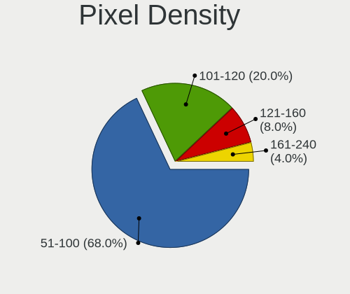
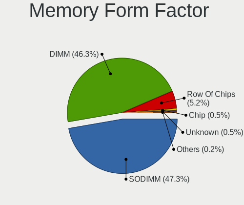

BSD - Hardware Trends (Desktops)
--------------------------------

A project to identify most popular hardware characteristics and track their change
over time based on data collected by BSD users at https://BSD-Hardware.info.

Anyone can contribute to this report by the [hw-probe](https://github.com/linuxhw/hw-probe/blob/master/INSTALL.BSD.md) tool:

    hw-probe -all -upload

This report is for one last month. Overall report since the beginning of time: [TestDays](https://github.com/bsdhw/TestDays)

Period: Nov, 2023.

Contents
--------

* [ System ](#system)
  - [ OS                       ](#os)
  - [ OS Family                ](#os-family)
  - [ Arch                     ](#arch)
  - [ DE                       ](#de)
  - [ Display Server           ](#display-server)
  - [ Display Manager          ](#display-manager)
  - [ OS Lang                  ](#os-lang)
  - [ Boot Mode                ](#boot-mode)
  - [ Filesystem               ](#filesystem)
  - [ Part. scheme             ](#part-scheme)

* [ Board ](#board)
  - [ Vendor                   ](#vendor)
  - [ Model                    ](#model)
  - [ Model Family             ](#model-family)
  - [ MFG Year                 ](#mfg-year)
  - [ Form Factor              ](#form-factor)
  - [ Coreboot                 ](#coreboot)
  - [ RAM Size                 ](#ram-size)
  - [ RAM Used                 ](#ram-used)
  - [ Total Drives             ](#total-drives)
  - [ Has CD-ROM               ](#has-cd-rom)
  - [ Has Ethernet             ](#has-ethernet)
  - [ Has WiFi                 ](#has-wifi)
  - [ Has Bluetooth            ](#has-bluetooth)

* [ Location ](#location)
  - [ Country                  ](#country)
  - [ City                     ](#city)

* [ Drives ](#drives)
  - [ Drive Vendor             ](#drive-vendor)
  - [ Drive Model              ](#drive-model)
  - [ HDD Vendor               ](#hdd-vendor)
  - [ SSD Vendor               ](#ssd-vendor)
  - [ Drive Kind               ](#drive-kind)
  - [ Drive Connector          ](#drive-connector)
  - [ Drive Size               ](#drive-size)
  - [ Space Total              ](#space-total)
  - [ Space Used               ](#space-used)
  - [ Malfunc. Drives          ](#malfunc-drives)
  - [ Malfunc. Drive Vendor    ](#malfunc-drive-vendor)
  - [ Malfunc. HDD Vendor      ](#malfunc-hdd-vendor)
  - [ Malfunc. Drive Kind      ](#malfunc-drive-kind)
  - [ Failed Drives            ](#failed-drives)
  - [ Failed Drive Vendor      ](#failed-drive-vendor)
  - [ Drive Status             ](#drive-status)

* [ Storage controller ](#storage-controller)
  - [ Storage Vendor           ](#storage-vendor)
  - [ Storage Model            ](#storage-model)
  - [ Storage Kind             ](#storage-kind)

* [ Processor ](#processor)
  - [ CPU Vendor               ](#cpu-vendor)
  - [ CPU Model                ](#cpu-model)
  - [ CPU Model Family         ](#cpu-model-family)
  - [ CPU Cores                ](#cpu-cores)
  - [ CPU Sockets              ](#cpu-sockets)
  - [ CPU Threads              ](#cpu-threads)
  - [ CPU Microarch            ](#cpu-microarch)

* [ Graphics ](#graphics)
  - [ GPU Vendor               ](#gpu-vendor)
  - [ GPU Model                ](#gpu-model)
  - [ GPU Combo                ](#gpu-combo)
  - [ GPU Driver               ](#gpu-driver)
  - [ GPU Memory               ](#gpu-memory)

* [ Monitor ](#monitor)
  - [ Monitor Vendor           ](#monitor-vendor)
  - [ Monitor Model            ](#monitor-model)
  - [ Monitor Resolution       ](#monitor-resolution)
  - [ Monitor Diagonal         ](#monitor-diagonal)
  - [ Monitor Width            ](#monitor-width)
  - [ Aspect Ratio             ](#aspect-ratio)
  - [ Monitor Area             ](#monitor-area)
  - [ Pixel Density            ](#pixel-density)
  - [ Multiple Monitors        ](#multiple-monitors)

* [ Network ](#network)
  - [ Net Controller Vendor    ](#net-controller-vendor)
  - [ Net Controller Model     ](#net-controller-model)
  - [ Wireless Vendor          ](#wireless-vendor)
  - [ Wireless Model           ](#wireless-model)
  - [ Ethernet Vendor          ](#ethernet-vendor)
  - [ Ethernet Model           ](#ethernet-model)
  - [ Net Controller Kind      ](#net-controller-kind)
  - [ Used Controller          ](#used-controller)
  - [ NICs                     ](#nics)
  - [ IPv6                     ](#ipv6)

* [ Bluetooth ](#bluetooth)
  - [ Bluetooth Vendor         ](#bluetooth-vendor)
  - [ Bluetooth Model          ](#bluetooth-model)

* [ Sound ](#sound)
  - [ Sound Vendor             ](#sound-vendor)
  - [ Sound Model              ](#sound-model)

* [ Memory ](#memory)
  - [ Memory Vendor            ](#memory-vendor)
  - [ Memory Model             ](#memory-model)
  - [ Memory Kind              ](#memory-kind)
  - [ Memory Form Factor       ](#memory-form-factor)
  - [ Memory Size              ](#memory-size)
  - [ Memory Speed             ](#memory-speed)

* [ Printers & scanners ](#printers--scanners)
  - [ Printer Vendor           ](#printer-vendor)
  - [ Printer Model            ](#printer-model)
  - [ Scanner Vendor           ](#scanner-vendor)
  - [ Scanner Model            ](#scanner-model)

* [ Camera ](#camera)
  - [ Camera Vendor            ](#camera-vendor)
  - [ Camera Model             ](#camera-model)

* [ Security ](#security)
  - [ Fingerprint Vendor       ](#fingerprint-vendor)
  - [ Fingerprint Model        ](#fingerprint-model)
  - [ Chipcard Vendor          ](#chipcard-vendor)
  - [ Chipcard Model           ](#chipcard-model)

* [ Unsupported ](#unsupported)
  - [ Unsupported Devices      ](#unsupported-devices)
  - [ Unsupported Device Types ](#unsupported-device-types)

System
------

OS
--

Installed operating systems

| Name               | Desktops | Percent |
|--------------------|----------|---------|
| OPNsense 23.7.8    | 101      | 29.53%  |
| OPNsense 23.7.7    | 94       | 27.49%  |
| OPNsense 23.7.9    | 62       | 18.13%  |
| FreeBSD 14.0       | 14       | 4.09%   |
| helloSystem 0.9.0  | 9        | 2.63%   |
| helloSystem 0.8.1  | 8        | 2.34%   |
| OpenBSD 7.4        | 7        | 2.05%   |
| OPNsense 23.1.11   | 6        | 1.75%   |
| FreeBSD 13.2-p4    | 6        | 1.75%   |
| OPNsense 24.1      | 4        | 1.17%   |
| OPNsense 23.7.5    | 4        | 1.17%   |
| FreeBSD 13.2-p5    | 4        | 1.17%   |
| OPNsense 23.7.6    | 3        | 0.88%   |
| FreeBSD 14.0-BETA5 | 3        | 0.88%   |
| FreeBSD 13.2-p3    | 2        | 0.58%   |
| FreeBSD 13.2       | 2        | 0.58%   |
| TrueNAS 13.1-p9    | 1        | 0.29%   |
| TrueNAS 13.1-p7    | 1        | 0.29%   |
| OPNsense 23.7.2    | 1        | 0.29%   |
| OPNsense 23.7.1    | 1        | 0.29%   |
| OPNsense 23.10     | 1        | 0.29%   |
| OPNsense 22.7.6    | 1        | 0.29%   |
| OPNsense 22.7.11   | 1        | 0.29%   |
| OPNsense 22.7      | 1        | 0.29%   |
| OPNsense 22.1.10   | 1        | 0.29%   |
| MyBee 14.0         | 1        | 0.29%   |
| helloSystem 0.5.0  | 1        | 0.29%   |
| FreeBSD 14.0-RC3   | 1        | 0.29%   |
| FreeBSD 12.4       | 1        | 0.29%   |

OS Family
---------

OS without a version

| Name        | Desktops | Percent |
|-------------|----------|---------|
| OPNsense    | 281      | 82.16%  |
| FreeBSD     | 33       | 9.65%   |
| helloSystem | 18       | 5.26%   |
| OpenBSD     | 7        | 2.05%   |
| TrueNAS     | 2        | 0.58%   |
| MyBee       | 1        | 0.29%   |

Arch
----

OS architecture (x86_64, i586, etc.)

| Name  | Desktops | Percent |
|-------|----------|---------|
| amd64 | 340      | 99.42%  |
| arm64 | 2        | 0.58%   |

DE
--

Desktop Environment

| Name         | Desktops | Percent |
|--------------|----------|---------|
| Console      | 298      | 87.13%  |
| helloDesktop | 23       | 6.73%   |
| XFCE         | 6        | 1.75%   |
| KDE5         | 6        | 1.75%   |
| GNOME        | 4        | 1.17%   |
| TWM          | 1        | 0.29%   |
| Picom        | 1        | 0.29%   |
| MATE         | 1        | 0.29%   |
| i3           | 1        | 0.29%   |
| Budgie       | 1        | 0.29%   |

Display Server
--------------

X11 or Wayland

| Name    | Desktops | Percent |
|---------|----------|---------|
| Console | 300      | 87.72%  |
| X11     | 42       | 12.28%  |

Display Manager
---------------

SDDM, LightDM, etc.

| Name    | Desktops | Percent |
|---------|----------|---------|
| Console | 308      | 90.06%  |
| SLiM    | 20       | 5.85%   |
| SDDM    | 7        | 2.05%   |
| LightDM | 3        | 0.88%   |
| GDM     | 2        | 0.58%   |
| XDM     | 1        | 0.29%   |
| Ly      | 1        | 0.29%   |

OS Lang
-------

Language

| Lang    | Desktops | Percent |
|---------|----------|---------|
| Unknown | 294      | 85.96%  |
| C       | 27       | 7.89%   |
| en_US   | 10       | 2.92%   |
| fr_FR   | 4        | 1.17%   |
| ru_RU   | 2        | 0.58%   |
| pt_BR   | 1        | 0.29%   |
| es_ES   | 1        | 0.29%   |
| es_CO   | 1        | 0.29%   |
| en_GB   | 1        | 0.29%   |
| de_DE   | 1        | 0.29%   |

Boot Mode
---------

EFI or BIOS

| Mode | Desktops | Percent |
|------|----------|---------|
| EFI  | 323      | 94.44%  |
| BIOS | 19       | 5.56%   |

Filesystem
----------

Type of filesystem

| Type   | Desktops | Percent |
|--------|----------|---------|
| Ufs    | 164      | 47.95%  |
| Zfs    | 161      | 47.08%  |
| Cd9660 | 10       | 2.92%   |
| Ffs    | 7        | 2.05%   |

Part. scheme
------------

Scheme of partitioning

| Type    | Desktops | Percent |
|---------|----------|---------|
| GPT     | 331      | 96.78%  |
| MBR     | 8        | 2.34%   |
| Unknown | 3        | 0.88%   |

Board
-----

Vendor
------

Motherboard manufacturer

| Name                                 | Desktops | Percent |
|--------------------------------------|----------|---------|
| Unknown                              | 55       | 16.08%  |
| Hewlett-Packard                      | 30       | 8.77%   |
| ASUSTek Computer                     | 25       | 7.31%   |
| Dell                                 | 23       | 6.73%   |
| Protectli                            | 21       | 6.14%   |
| Intel                                | 18       | 5.26%   |
| Lenovo                               | 15       | 4.39%   |
| ASRock                               | 15       | 4.39%   |
| Techvision                           | 14       | 4.09%   |
| Gigabyte Technology                  | 14       | 4.09%   |
| MSI                                  | 13       | 3.8%    |
| Fujitsu                              | 13       | 3.8%    |
| PC Engines                           | 11       | 3.22%   |
| CWWK                                 | 7        | 2.05%   |
| Supermicro                           | 6        | 1.75%   |
| AZW                                  | 6        | 1.75%   |
| MW                                   | 4        | 1.17%   |
| Deciso                               | 4        | 1.17%   |
| CncTion                              | 4        | 1.17%   |
| Shuttle                              | 3        | 0.88%   |
| PICO PC                              | 3        | 0.88%   |
| IceWhale Technology                  | 3        | 0.88%   |
| Cisco                                | 3        | 0.88%   |
| YANYU                                | 2        | 0.58%   |
| Yanling                              | 2        | 0.58%   |
| ShenZhen MinWin Technology           | 2        | 0.58%   |
| Shenzhen Meigao Electronic Equipment | 2        | 0.58%   |
| ASRockRack                           | 2        | 0.58%   |
| Advantech                            | 2        | 0.58%   |
| YENTEK                               | 1        | 0.29%   |
| WTM                                  | 1        | 0.29%   |
| TYAN Computer                        | 1        | 0.29%   |
| Thomas-Krenn.AG                      | 1        | 0.29%   |
| Silicom                              | 1        | 0.29%   |
| Samsung Electronics                  | 1        | 0.29%   |
| Pegatron                             | 1        | 0.29%   |
| NU591R                               | 1        | 0.29%   |
| NU591                                | 1        | 0.29%   |
| MUCAI                                | 1        | 0.29%   |
| Lanner                               | 1        | 0.29%   |

Model
-----

Motherboard model

| Name                                              | Desktops | Percent |
|---------------------------------------------------|----------|---------|
| Unknown                                           | 55       | 16.08%  |
| Techvision TVI7309X                               | 14       | 4.09%   |
| Protectli FW6                                     | 9        | 2.63%   |
| Protectli VP2420                                  | 7        | 2.05%   |
| Intel Q3XXG4-P V1.0                               | 5        | 1.46%   |
| Fujitsu FUTRO S920                                | 5        | 1.46%   |
| AZW EQ                                            | 5        | 1.46%   |
| PC Engines apu4                                   | 4        | 1.17%   |
| MW GMLK-2_5G4L                                    | 4        | 1.17%   |
| HP t620 PLUS Quad Core TC                         | 4        | 1.17%   |
| Dell OptiPlex 9020                                | 4        | 1.17%   |
| Protectli FW4B                                    | 3        | 0.88%   |
| PICO PC MNHO-113                                  | 3        | 0.88%   |
| PC Engines APU2                                   | 3        | 0.88%   |
| Intel QHSW02                                      | 3        | 0.88%   |
| CWWK CW-MBX-AD12                                  | 3        | 0.88%   |
| CncTion N5105-4L                                  | 3        | 0.88%   |
| Shenzhen Meigao Electronic Equipment Venus Series | 2        | 0.58%   |
| PC Engines APU3                                   | 2        | 0.58%   |
| MSI MS-7B89                                       | 2        | 0.58%   |
| IceWhale ZimaBoard 832 ZMB                        | 2        | 0.58%   |
| HP ProDesk 600 G1 SFF                             | 2        | 0.58%   |
| HP EliteDesk 800 G1 SFF                           | 2        | 0.58%   |
| HP Compaq dc7900 Small Form Factor                | 2        | 0.58%   |
| HP Compaq 8200 Elite SFF PC                       | 2        | 0.58%   |
| Dell OptiPlex 7040                                | 2        | 0.58%   |
| Dell OptiPlex 7010                                | 2        | 0.58%   |
| Dell OptiPlex 3050                                | 2        | 0.58%   |
| Dell OptiPlex 3020                                | 2        | 0.58%   |
| CWWK CW-ADLN-6L                                   | 2        | 0.58%   |
| Cisco SALEEN                                      | 2        | 0.58%   |
| ASUS All Series                                   | 2        | 0.58%   |
| ASRock X570 Phantom Gaming 4                      | 2        | 0.58%   |
| Advantech DTADB                                   | 2        | 0.58%   |
| YENTEK D41SL                                      | 1        | 0.29%   |
| YANYU R250                                        | 1        | 0.29%   |
| YANYU ITX-M9F VER:1.3 baytrail                    | 1        | 0.29%   |
| Yanling YL-EL4L-0A                                | 1        | 0.29%   |
| Yanling YL-ALU6L                                  | 1        | 0.29%   |
| WTM BKHD-N5105-5LAN                               | 1        | 0.29%   |

Model Family
------------

Motherboard model prefix

| Name                                       | Desktops | Percent |
|--------------------------------------------|----------|---------|
| Unknown                                    | 55       | 16.08%  |
| Dell OptiPlex                              | 21       | 6.14%   |
| Techvision TVI7309X                        | 14       | 4.09%   |
| Lenovo ThinkCentre                         | 10       | 2.92%   |
| Protectli FW6                              | 9        | 2.63%   |
| Protectli VP2420                           | 7        | 2.05%   |
| HP EliteDesk                               | 7        | 2.05%   |
| HP Compaq                                  | 7        | 2.05%   |
| Fujitsu FUTRO                              | 7        | 2.05%   |
| HP ProDesk                                 | 6        | 1.75%   |
| ASUS PRIME                                 | 6        | 1.75%   |
| Intel Q3XXG4-P                             | 5        | 1.46%   |
| AZW EQ                                     | 5        | 1.46%   |
| PC Engines apu4                            | 4        | 1.17%   |
| MW GMLK-2                                  | 4        | 1.17%   |
| HP t620                                    | 4        | 1.17%   |
| Fujitsu ESPRIMO                            | 4        | 1.17%   |
| Deciso Netboard                            | 4        | 1.17%   |
| ASUS ROG                                   | 4        | 1.17%   |
| Protectli FW4B                             | 3        | 0.88%   |
| PICO PC MNHO-113                           | 3        | 0.88%   |
| PC Engines APU2                            | 3        | 0.88%   |
| Intel QHSW02                               | 3        | 0.88%   |
| IceWhale ZimaBoard                         | 3        | 0.88%   |
| HP ProLiant                                | 3        | 0.88%   |
| CWWK CW-MBX-AD12                           | 3        | 0.88%   |
| CncTion N5105-4L                           | 3        | 0.88%   |
| ASUS TUF                                   | 3        | 0.88%   |
| Shenzhen Meigao Electronic Equipment Venus | 2        | 0.58%   |
| PC Engines APU3                            | 2        | 0.58%   |
| MSI MS-7B89                                | 2        | 0.58%   |
| Gigabyte B450M                             | 2        | 0.58%   |
| Dell Precision                             | 2        | 0.58%   |
| CWWK CW-ADLN-6L                            | 2        | 0.58%   |
| Cisco SALEEN                               | 2        | 0.58%   |
| ASUS P8Z77-V                               | 2        | 0.58%   |
| ASUS All                                   | 2        | 0.58%   |
| ASRock X570                                | 2        | 0.58%   |
| Advantech DTADB                            | 2        | 0.58%   |
| YENTEK D41SL                               | 1        | 0.29%   |

MFG Year
--------

Motherboard manufacture year

| Year    | Desktops | Percent |
|---------|----------|---------|
| 2022    | 59       | 17.25%  |
| 2023    | 51       | 14.91%  |
| 2021    | 34       | 9.94%   |
| 2014    | 29       | 8.48%   |
| 2016    | 27       | 7.89%   |
| 2018    | 26       | 7.6%    |
| 2019    | 21       | 6.14%   |
| 2017    | 20       | 5.85%   |
| 2020    | 18       | 5.26%   |
| 2013    | 12       | 3.51%   |
| 2015    | 10       | 2.92%   |
| 2012    | 9        | 2.63%   |
| 2011    | 9        | 2.63%   |
| 2008    | 6        | 1.75%   |
| 2009    | 4        | 1.17%   |
| 2010    | 3        | 0.88%   |
| Unknown | 3        | 0.88%   |
| 2007    | 1        | 0.29%   |

Form Factor
-----------

Physical design of the computer

| Name    | Desktops | Percent |
|---------|----------|---------|
| Desktop | 342      | 100%    |

Coreboot
--------

Have coreboot on board

| Used | Desktops | Percent |
|------|----------|---------|
| No   | 325      | 95.03%  |
| Yes  | 17       | 4.97%   |

RAM Size
--------

Total RAM memory

| Size in GB  | Desktops | Percent |
|-------------|----------|---------|
| 8.01-16.0   | 121      | 35.38%  |
| 16.01-24.0  | 117      | 34.21%  |
| 4.01-8.0    | 39       | 11.4%   |
| 32.01-64.0  | 30       | 8.77%   |
| 64.01-256.0 | 19       | 5.56%   |
| 24.01-32.0  | 10       | 2.92%   |
| 2.01-3.0    | 3        | 0.88%   |
| 3.01-4.0    | 1        | 0.29%   |
| 1.01-2.0    | 1        | 0.29%   |
| 0.51-1.0    | 1        | 0.29%   |

RAM Used
--------

Used RAM memory

| Used GB  | Desktops | Percent |
|----------|----------|---------|
| 0.51-1.0 | 146      | 42.69%  |
| 0.01-0.5 | 128      | 37.43%  |
| 1.01-2.0 | 45       | 13.16%  |
| 2.01-3.0 | 17       | 4.97%   |
| 3.01-4.0 | 4        | 1.17%   |
| 4.01-8.0 | 2        | 0.58%   |

Total Drives
------------

Number of drives on board

| Drives | Desktops | Percent |
|--------|----------|---------|
| 1      | 242      | 70.76%  |
| 0      | 41       | 11.99%  |
| 2      | 34       | 9.94%   |
| 3      | 10       | 2.92%   |
| 4      | 9        | 2.63%   |
| 5      | 2        | 0.58%   |
| 17     | 1        | 0.29%   |
| 13     | 1        | 0.29%   |
| 8      | 1        | 0.29%   |
| 7      | 1        | 0.29%   |

Has CD-ROM
----------

Has CD-ROM on board

| Presented | Desktops | Percent |
|-----------|----------|---------|
| No        | 301      | 88.01%  |
| Yes       | 41       | 11.99%  |

Has Ethernet
------------

Has Ethernet on board

| Presented | Desktops | Percent |
|-----------|----------|---------|
| Yes       | 339      | 99.12%  |
| No        | 3        | 0.88%   |

Has WiFi
--------

Has WiFi module

| Presented | Desktops | Percent |
|-----------|----------|---------|
| No        | 286      | 83.63%  |
| Yes       | 56       | 16.37%  |

Has Bluetooth
-------------

Has Bluetooth module

| Presented | Desktops | Percent |
|-----------|----------|---------|
| No        | 300      | 87.72%  |
| Yes       | 42       | 12.28%  |

Location
--------

Country
-------

Geographic location (country)

| Country      | Desktops | Percent |
|--------------|----------|---------|
| USA          | 103      | 30.12%  |
| Germany      | 50       | 14.62%  |
| Canada       | 18       | 5.26%   |
| UK           | 14       | 4.09%   |
| France       | 14       | 4.09%   |
| Australia    | 12       | 3.51%   |
| Russia       | 11       | 3.22%   |
| Sweden       | 9        | 2.63%   |
| Poland       | 8        | 2.34%   |
| Netherlands  | 8        | 2.34%   |
| Italy        | 7        | 2.05%   |
| Switzerland  | 6        | 1.75%   |
| Spain        | 5        | 1.46%   |
| Singapore    | 5        | 1.46%   |
| Finland      | 5        | 1.46%   |
| Austria      | 5        | 1.46%   |
| Vietnam      | 4        | 1.17%   |
| Taiwan       | 4        | 1.17%   |
| Czechia      | 4        | 1.17%   |
| China        | 4        | 1.17%   |
| Belgium      | 4        | 1.17%   |
| Slovakia     | 3        | 0.88%   |
| Romania      | 3        | 0.88%   |
| Brazil       | 3        | 0.88%   |
| Japan        | 2        | 0.58%   |
| India        | 2        | 0.58%   |
| Croatia      | 2        | 0.58%   |
| Colombia     | 2        | 0.58%   |
| Uruguay      | 1        | 0.29%   |
| Turkey       | 1        | 0.29%   |
| Thailand     | 1        | 0.29%   |
| South Korea  | 1        | 0.29%   |
| South Africa | 1        | 0.29%   |
| Portugal     | 1        | 0.29%   |
| Philippines  | 1        | 0.29%   |
| Panama       | 1        | 0.29%   |
| Norway       | 1        | 0.29%   |
| New Zealand  | 1        | 0.29%   |
| Moldova      | 1        | 0.29%   |
| Mexico       | 1        | 0.29%   |

City
----

Geographic location (city)

| City                     | Desktops | Percent |
|--------------------------|----------|---------|
| Singapore                | 5        | 1.46%   |
| New York                 | 4        | 1.17%   |
| Helsinki                 | 4        | 1.17%   |
| Berlin                   | 4        | 1.17%   |
| Melbourne                | 3        | 0.88%   |
| Calgary                  | 3        | 0.88%   |
| Atlanta                  | 3        | 0.88%   |
| Zurich                   | 2        | 0.58%   |
| Vancouver                | 2        | 0.58%   |
| Sydney                   | 2        | 0.58%   |
| St Petersburg            | 2        | 0.58%   |
| Seattle                  | 2        | 0.58%   |
| Sao Paulo                | 2        | 0.58%   |
| Salem                    | 2        | 0.58%   |
| Sainte-Marthe-sur-le-Lac | 2        | 0.58%   |
| Redmond                  | 2        | 0.58%   |
| Portland                 | 2        | 0.58%   |
| Pittsburgh               | 2        | 0.58%   |
| Oklahoma City            | 2        | 0.58%   |
| Nottuln                  | 2        | 0.58%   |
| Mountain View            | 2        | 0.58%   |
| Moscow                   | 2        | 0.58%   |
| London                   | 2        | 0.58%   |
| Koenigswinter            | 2        | 0.58%   |
| Ho Chi Minh City         | 2        | 0.58%   |
| Hanoi                    | 2        | 0.58%   |
| Hamburg                  | 2        | 0.58%   |
| Chennai                  | 2        | 0.58%   |
| Canberra                 | 2        | 0.58%   |
| Brussels                 | 2        | 0.58%   |
| Brisbane                 | 2        | 0.58%   |
| Boston                   | 2        | 0.58%   |
| Béziers                 | 2        | 0.58%   |
| Zhangjiakou              | 1        | 0.29%   |
| Ypsilanti                | 1        | 0.29%   |
| Yokohama                 | 1        | 0.29%   |
| Xi'an                    | 1        | 0.29%   |
| Wuppertal                | 1        | 0.29%   |
| Worcester                | 1        | 0.29%   |
| Winslow                  | 1        | 0.29%   |

Drives
------

Drive Vendor
------------

Hard drive vendors

| Vendor              | Desktops | Drives | Percent |
|---------------------|----------|--------|---------|
| Samsung Electronics | 74       | 93     | 20.79%  |
| WDC                 | 34       | 56     | 9.55%   |
| Seagate             | 26       | 31     | 7.3%    |
| Kingston            | 22       | 23     | 6.18%   |
| China               | 18       | 20     | 5.06%   |
| Intel               | 16       | 18     | 4.49%   |
| Transcend           | 13       | 14     | 3.65%   |
| Crucial             | 12       | 12     | 3.37%   |
| Toshiba             | 11       | 13     | 3.09%   |
| Protectli           | 10       | 10     | 2.81%   |
| Micron Technology   | 10       | 11     | 2.81%   |
| SPCC                | 7        | 7      | 1.97%   |
| SK hynix            | 7        | 7      | 1.97%   |
| Silicon Motion      | 6        | 6      | 1.69%   |
| SanDisk             | 5        | 5      | 1.4%    |
| PNY                 | 5        | 6      | 1.4%    |
| Hoodisk             | 5        | 5      | 1.4%    |
| A-DATA Technology   | 5        | 5      | 1.4%    |
| Fanxiang            | 4        | 4      | 1.12%   |
| Phison              | 3        | 3      | 0.84%   |
| NVMe                | 3        | 3      | 0.84%   |
| Innodisk            | 3        | 3      | 0.84%   |
| Hitachi             | 3        | 4      | 0.84%   |
| Hewlett-Packard     | 3        | 15     | 0.84%   |
| GOODRAM             | 3        | 4      | 0.84%   |
| Gigabyte Technology | 3        | 5      | 0.84%   |
| Dogfish             | 3        | 3      | 0.84%   |
| Corsair             | 3        | 3      | 0.84%   |
| VICKTER             | 2        | 2      | 0.56%   |
| Team                | 2        | 2      | 0.56%   |
| Patriot             | 2        | 2      | 0.56%   |
| Leven               | 2        | 2      | 0.56%   |
| HPE                 | 2        | 6      | 0.56%   |
| HGST                | 2        | 2      | 0.56%   |
| BORY                | 2        | 2      | 0.56%   |
| Apacer              | 2        | 2      | 0.56%   |
| Smartbuy            | 1        | 1      | 0.28%   |
| SemsoTai            | 1        | 1      | 0.28%   |
| OPENBSD             | 1        | 1      | 0.28%   |
| OCZ                 | 1        | 1      | 0.28%   |

Drive Model
-----------

Hard drive models

| Model                           | Desktops | Percent |
|---------------------------------|----------|---------|
| Samsung SSD 870 EVO 250GB       | 5        | 1.3%    |
| Samsung SSD 860 EVO 250GB       | 5        | 1.3%    |
| Kingston SKC600MS256G 256GB     | 5        | 1.3%    |
| Crucial CT500P3SSD8 500GB       | 5        | 1.3%    |
| Samsung SSD 860 EVO 500GB       | 4        | 1.04%   |
| Kingston SA400S37240G 240GB     | 4        | 1.04%   |
| Samsung SSD 980 500GB           | 3        | 0.78%   |
| Samsung SSD 980 250GB           | 3        | 0.78%   |
| Samsung SSD 850 PRO 256GB       | 3        | 0.78%   |
| Protectli 64GB mSATA            | 3        | 0.78%   |
| Protectli 120GB mSATA           | 3        | 0.78%   |
| Fanxiang S501 128GB             | 3        | 0.78%   |
| WDC WDS240G2G0A-00JH30 240GB    | 2        | 0.52%   |
| WDC WD5000AAKX-60U6AA0 500GB    | 2        | 0.52%   |
| WDC WD10EZEX-08WN4A0 1TB        | 2        | 0.52%   |
| VICKTER SSD 64GB                | 2        | 0.52%   |
| Transcend TS128GMSA230S 128GB   | 2        | 0.52%   |
| Toshiba DT01ACA100 1TB          | 2        | 0.52%   |
| Silicon Motion GV128 128GB      | 2        | 0.52%   |
| Seagate ST500DM002-1BD142 500GB | 2        | 0.52%   |
| Seagate ST4000DM000-1F2168 4TB  | 2        | 0.52%   |
| Seagate ST3320310CS 320GB       | 2        | 0.52%   |
| Seagate ST1000DM010-2EP102 1TB  | 2        | 0.52%   |
| SanDisk SDSSDP128G 128GB        | 2        | 0.52%   |
| Samsung SSD 980 PRO 500GB       | 2        | 0.52%   |
| Samsung SSD 970 PRO 512GB       | 2        | 0.52%   |
| Samsung SSD 870 QVO 2TB         | 2        | 0.52%   |
| Samsung SSD 870 QVO 1TB         | 2        | 0.52%   |
| Samsung SSD 850 EVO mSATA 500GB | 2        | 0.52%   |
| Samsung SSD 850 EVO 500GB       | 2        | 0.52%   |
| Samsung SSD 850 EVO 1TB         | 2        | 0.52%   |
| Samsung PM961 NVMe 256GB        | 2        | 0.52%   |
| Protectli 480GB M.2             | 2        | 0.52%   |
| PNY CS900 120GB SSD             | 2        | 0.52%   |
| Phison PCIe SSD 512GB           | 2        | 0.52%   |
| Patriot M.2 P300 128GB          | 2        | 0.52%   |
| Kingston SV300S37A120G 120GB    | 2        | 0.52%   |
| Kingston SKC600MS512G 512GB     | 2        | 0.52%   |
| Kingston SHFS37A120G 120GB      | 2        | 0.52%   |
| Kingston SA2000M8250G 250GB     | 2        | 0.52%   |

HDD Vendor
----------

Hard disk drive vendors

| Vendor              | Desktops | Drives | Percent |
|---------------------|----------|--------|---------|
| Seagate             | 25       | 30     | 36.23%  |
| WDC                 | 24       | 43     | 34.78%  |
| Toshiba             | 6        | 8      | 8.7%    |
| Samsung Electronics | 3        | 3      | 4.35%   |
| Hitachi             | 3        | 4      | 4.35%   |
| HGST                | 2        | 2      | 2.9%    |
| Hewlett-Packard     | 2        | 14     | 2.9%    |
| OPENBSD             | 1        | 1      | 1.45%   |
| NVMe                | 1        | 1      | 1.45%   |
| Maxtor              | 1        | 1      | 1.45%   |
| HPE                 | 1        | 4      | 1.45%   |

SSD Vendor
----------

Solid state drive vendors

| Vendor              | Desktops | Drives | Percent |
|---------------------|----------|--------|---------|
| Samsung Electronics | 47       | 61     | 22.82%  |
| Kingston            | 19       | 20     | 9.22%   |
| China               | 18       | 20     | 8.74%   |
| Transcend           | 11       | 11     | 5.34%   |
| Protectli           | 10       | 10     | 4.85%   |
| WDC                 | 7        | 8      | 3.4%    |
| Micron Technology   | 7        | 8      | 3.4%    |
| Intel               | 7        | 8      | 3.4%    |
| SPCC                | 5        | 5      | 2.43%   |
| SanDisk             | 5        | 5      | 2.43%   |
| Hoodisk             | 5        | 5      | 2.43%   |
| Crucial             | 5        | 5      | 2.43%   |
| A-DATA Technology   | 5        | 5      | 2.43%   |
| PNY                 | 4        | 5      | 1.94%   |
| Innodisk            | 3        | 3      | 1.46%   |
| GOODRAM             | 3        | 4      | 1.46%   |
| Gigabyte Technology | 3        | 5      | 1.46%   |
| Dogfish             | 3        | 3      | 1.46%   |
| VICKTER             | 2        | 2      | 0.97%   |
| Toshiba             | 2        | 2      | 0.97%   |
| Team                | 2        | 2      | 0.97%   |
| SK hynix            | 2        | 2      | 0.97%   |
| NVMe                | 2        | 2      | 0.97%   |
| Leven               | 2        | 2      | 0.97%   |
| BORY                | 2        | 2      | 0.97%   |
| Apacer              | 2        | 2      | 0.97%   |
| Smartbuy            | 1        | 1      | 0.49%   |
| SemsoTai            | 1        | 1      | 0.49%   |
| Seagate             | 1        | 1      | 0.49%   |
| OCZ                 | 1        | 1      | 0.49%   |
| Netac               | 1        | 1      | 0.49%   |
| MidasForce          | 1        | 2      | 0.49%   |
| LuminouTek          | 1        | 1      | 0.49%   |
| LITEONIT            | 1        | 1      | 0.49%   |
| LITEON              | 1        | 1      | 0.49%   |
| Lexar               | 1        | 1      | 0.49%   |
| Kingsand            | 1        | 1      | 0.49%   |
| Intenso             | 1        | 1      | 0.49%   |
| INNOVATION IT       | 1        | 1      | 0.49%   |
| HPE                 | 1        | 2      | 0.49%   |

Drive Kind
----------

HDD or SSD

| Kind | Desktops | Drives | Percent |
|------|----------|--------|---------|
| SSD  | 195      | 232    | 58.04%  |
| NVMe | 84       | 90     | 25%     |
| HDD  | 57       | 111    | 16.96%  |

Drive Connector
---------------

SATA, SAS, NVMe, etc.

| Type | Desktops | Drives | Percent |
|------|----------|--------|---------|
| SATA | 230      | 343    | 73.25%  |
| NVMe | 84       | 90     | 26.75%  |

Drive Size
----------

Size of hard drive

| Size in TB | Desktops | Drives | Percent |
|------------|----------|--------|---------|
| 0.01-0.5   | 196      | 231    | 74.81%  |
| 0.51-1.0   | 41       | 63     | 15.65%  |
| 1.01-2.0   | 10       | 20     | 3.82%   |
| 3.01-4.0   | 6        | 9      | 2.29%   |
| 4.01-10.0  | 6        | 15     | 2.29%   |
| 10.01-20.0 | 2        | 3      | 0.76%   |
| 2.01-3.0   | 1        | 2      | 0.38%   |

Space Total
-----------

Amount of disk space available on the file system

| Size in GB     | Desktops | Percent |
|----------------|----------|---------|
| 101-250        | 167      | 48.83%  |
| 251-500        | 73       | 21.35%  |
| 51-100         | 25       | 7.31%   |
| 21-50          | 23       | 6.73%   |
| 1-20           | 23       | 6.73%   |
| 501-1000       | 21       | 6.14%   |
| 1001-2000      | 5        | 1.46%   |
| More than 3000 | 3        | 0.88%   |
| 2001-3000      | 2        | 0.58%   |

Space Used
----------

Amount of used disk space

| Used GB        | Desktops | Percent |
|----------------|----------|---------|
| 1-20           | 321      | 93.86%  |
| 21-50          | 11       | 3.22%   |
| 101-250        | 4        | 1.17%   |
| 51-100         | 2        | 0.58%   |
| More than 3000 | 1        | 0.29%   |
| 251-500        | 1        | 0.29%   |
| 1001-2000      | 1        | 0.29%   |
| 501-1000       | 1        | 0.29%   |

Malfunc. Drives
---------------

Drive models with a malfunction

| Model                                     | Desktops | Drives | Percent |
|-------------------------------------------|----------|--------|---------|
| WDC WD5000AAKX-60U6AA0 500GB              | 2        | 2      | 5.26%   |
| Kingston SV300S37A120G 120GB              | 2        | 2      | 5.26%   |
| Kingston SHFS37A120G 120GB                | 2        | 2      | 5.26%   |
| WDC WD5000AAKX-001CA0 500GB               | 1        | 1      | 2.63%   |
| WDC WD40EFRX-68WT0N0 4TB                  | 1        | 3      | 2.63%   |
| WDC WD2500AAJS-00L7A0 250GB               | 1        | 1      | 2.63%   |
| WDC WD20EZRX-00D8PB0 2TB                  | 1        | 1      | 2.63%   |
| WDC WD10JPVX-22JC3T0 1TB                  | 1        | 1      | 2.63%   |
| Toshiba THNSNK128GCS8 SATA 128GB          | 1        | 1      | 2.63%   |
| Toshiba MQ01ABD100 1TB                    | 1        | 1      | 2.63%   |
| Toshiba DT01ABA200 2TB                    | 1        | 1      | 2.63%   |
| SPCC Solid State Disk 512GB               | 1        | 1      | 2.63%   |
| SK hynix HFS120G32TND-N1A2A 120GB         | 1        | 1      | 2.63%   |
| Seagate ST98823AS 80GB                    | 1        | 1      | 2.63%   |
| Seagate ST5000DM000-1FK178 5TB            | 1        | 1      | 2.63%   |
| Seagate ST3320310CS 320GB                 | 1        | 1      | 2.63%   |
| Seagate ST1000DM010-2EP102 1TB            | 1        | 1      | 2.63%   |
| Seagate ST10000VN0004-1ZD101 10TB         | 1        | 2      | 2.63%   |
| SanDisk SD6SF1M032G1022 32GB              | 1        | 1      | 2.63%   |
| Samsung Electronics SSD 870 EVO 250GB     | 1        | 1      | 2.63%   |
| Samsung Electronics HM250HI 250GB         | 1        | 1      | 2.63%   |
| Samsung Electronics HD161HJ 160GB         | 1        | 1      | 2.63%   |
| OCZ VERTEX4 512GB                         | 1        | 1      | 2.63%   |
| Micron Technology C400 RealSSD mSATA 32GB | 1        | 1      | 2.63%   |
| Kingston SH103S3240G 240GB                | 1        | 1      | 2.63%   |
| Kingston SA400S37240G 240GB               | 1        | 1      | 2.63%   |
| HPE MM1000GBKAL 1TB                       | 1        | 4      | 2.63%   |
| Hitachi HDS722580VLSA80 82GB              | 1        | 1      | 2.63%   |
| HGST HTS725050A7E630 500GB                | 1        | 1      | 2.63%   |
| HGST HTS545050A7E380 500GB                | 1        | 1      | 2.63%   |
| Hewlett-Packard SSD S700 Pro 128GB        | 1        | 1      | 2.63%   |
| Crucial FCCT256M550SSD1 256GB             | 1        | 1      | 2.63%   |
| Crucial CT256MX100SSD1 256GB              | 1        | 1      | 2.63%   |
| Corsair Force LS SSD 240GB                | 1        | 1      | 2.63%   |
| A-DATA Technology SP600 32GB              | 1        | 1      | 2.63%   |

Malfunc. Drive Vendor
---------------------

Vendors of faulty drives

| Vendor              | Desktops | Drives | Percent |
|---------------------|----------|--------|---------|
| WDC                 | 7        | 9      | 18.42%  |
| Kingston            | 6        | 6      | 15.79%  |
| Seagate             | 5        | 6      | 13.16%  |
| Toshiba             | 3        | 3      | 7.89%   |
| Samsung Electronics | 3        | 3      | 7.89%   |
| HGST                | 2        | 2      | 5.26%   |
| Crucial             | 2        | 2      | 5.26%   |
| SPCC                | 1        | 1      | 2.63%   |
| SK hynix            | 1        | 1      | 2.63%   |
| SanDisk             | 1        | 1      | 2.63%   |
| OCZ                 | 1        | 1      | 2.63%   |
| Micron Technology   | 1        | 1      | 2.63%   |
| HPE                 | 1        | 4      | 2.63%   |
| Hitachi             | 1        | 1      | 2.63%   |
| Hewlett-Packard     | 1        | 1      | 2.63%   |
| Corsair             | 1        | 1      | 2.63%   |
| A-DATA Technology   | 1        | 1      | 2.63%   |

Malfunc. HDD Vendor
-------------------

Vendors of faulty HDD drives

| Vendor              | Desktops | Drives | Percent |
|---------------------|----------|--------|---------|
| WDC                 | 7        | 9      | 35%     |
| Seagate             | 5        | 6      | 25%     |
| Toshiba             | 2        | 2      | 10%     |
| Samsung Electronics | 2        | 2      | 10%     |
| HGST                | 2        | 2      | 10%     |
| HPE                 | 1        | 4      | 5%      |
| Hitachi             | 1        | 1      | 5%      |

Malfunc. Drive Kind
-------------------

Kinds of faulty drives

| Kind | Desktops | Drives | Percent |
|------|----------|--------|---------|
| HDD  | 20       | 26     | 52.63%  |
| SSD  | 18       | 18     | 47.37%  |

Failed Drives
-------------

Failed drive models

| Model                                | Desktops | Drives | Percent |
|--------------------------------------|----------|--------|---------|
| Samsung Electronics PM961 NVMe 256GB | 1        | 1      | 33.33%  |
| Samsung Electronics HD103SJ 1TB      | 1        | 1      | 33.33%  |
| Intel SSDPEKKW128G7 128GB            | 1        | 1      | 33.33%  |

Failed Drive Vendor
-------------------

Failed drive vendors

| Vendor              | Desktops | Drives | Percent |
|---------------------|----------|--------|---------|
| Samsung Electronics | 2        | 2      | 66.67%  |
| Intel               | 1        | 1      | 33.33%  |

Drive Status
------------

Number of failed and malfunc. drives

| Status   | Desktops | Drives | Percent |
|----------|----------|--------|---------|
| Works    | 274      | 379    | 85.89%  |
| Malfunc  | 37       | 44     | 11.6%   |
| Detected | 5        | 7      | 1.57%   |
| Failed   | 3        | 3      | 0.94%   |

Storage controller
------------------

Storage Vendor
--------------

Storage controller vendors

| Vendor                        | Desktops | Percent |
|-------------------------------|----------|---------|
| Intel                         | 264      | 57.77%  |
| AMD                           | 63       | 13.79%  |
| Samsung Electronics           | 34       | 7.44%   |
| SanDisk                       | 16       | 3.5%    |
| Silicon Motion                | 14       | 3.06%   |
| Micron/Crucial Technology     | 10       | 2.19%   |
| ASMedia Technology            | 9        | 1.97%   |
| Phison Electronics            | 7        | 1.53%   |
| SK hynix                      | 5        | 1.09%   |
| MAXIO Technology (Hangzhou)   | 5        | 1.09%   |
| Marvell Technology Group      | 5        | 1.09%   |
| Kingston Technology Company   | 4        | 0.88%   |
| Toshiba                       | 3        | 0.66%   |
| Micron Technology             | 3        | 0.66%   |
| JMicron Technology            | 2        | 0.44%   |
| Hosin Global Electronics      | 2        | 0.44%   |
| Hewlett-Packard               | 2        | 0.44%   |
| Chelsio Communications        | 2        | 0.44%   |
| Broadcom / LSI                | 2        | 0.44%   |
| Transcend                     | 1        | 0.22%   |
| Seagate Technology            | 1        | 0.22%   |
| Realtek Semiconductor         | 1        | 0.22%   |
| KIOXIA                        | 1        | 0.22%   |
| Integrated Technology Express | 1        | 0.22%   |

Storage Model
-------------

Storage controller models

| Model                                                                            | Desktops | Percent |
|----------------------------------------------------------------------------------|----------|---------|
| AMD FCH SATA Controller [AHCI mode]                                              | 36       | 7.32%   |
| Intel Jasper Lake SATA AHCI Controller                                           | 33       | 6.71%   |
| Intel 8 Series/C220 Series Chipset Family 6-port SATA Controller 1 [AHCI mode]   | 20       | 4.07%   |
| Intel Sunrise Point-LP SATA Controller [AHCI mode]                               | 19       | 3.86%   |
| Intel unknown                                                                    | 18       | 3.66%   |
| Intel 6 Series/C200 Series Chipset Family 6 port Desktop SATA AHCI Controller    | 17       | 3.46%   |
| Intel Q170/Q150/B150/H170/H110/Z170/CM236 Chipset SATA Controller [AHCI Mode]    | 15       | 3.05%   |
| Silicon Motion SM2263EN/SM2263XT (DRAM-less) NVMe SSD Controllers                | 14       | 2.85%   |
| Intel Celeron/Pentium Silver Processor SATA Controller                           | 13       | 2.64%   |
| Samsung NVMe SSD Controller SM981/PM981/PM983                                    | 12       | 2.44%   |
| Intel SATA Controller [RAID mode]                                                | 11       | 2.24%   |
| Intel Elkhart Lake SATA AHCI                                                     | 10       | 2.03%   |
| Intel 200 Series PCH SATA controller [AHCI mode]                                 | 10       | 2.03%   |
| AMD 400 Series Chipset SATA Controller                                           | 10       | 2.03%   |
| Samsung NVMe SSD Controller 980 (DRAM-less)                                      | 9        | 1.83%   |
| Micron/Crucial P2 [Nick P2] / P3 / P3 Plus NVMe PCIe SSD (DRAM-less)             | 9        | 1.83%   |
| Intel Cannon Lake PCH SATA AHCI Controller                                       | 9        | 1.83%   |
| Samsung NVMe SSD Controller SM961/PM961/SM963                                    | 8        | 1.63%   |
| Intel Alder Lake-P SATA AHCI Controller                                          | 8        | 1.63%   |
| Intel Atom/Celeron/Pentium Processor x5-E8000/J3xxx/N3xxx Series SATA Controller | 7        | 1.42%   |
| Intel Wildcat Point-LP SATA Controller [AHCI Mode]                               | 6        | 1.22%   |
| ASMedia ASM1062 Serial ATA Controller                                            | 6        | 1.22%   |
| AMD FCH SATA Controller [IDE mode]                                               | 6        | 1.22%   |
| SanDisk Ultra 3D / WD Blue SN570 NVMe SSD (DRAM-less)                            | 5        | 1.02%   |
| Samsung NVMe SSD Controller PM9A1/PM9A3/980PRO                                   | 5        | 1.02%   |
| MAXIO (Hangzhou) NVMe SSD Controller MAP1202                                     | 5        | 1.02%   |
| Intel Celeron N3350/Pentium N4200/Atom E3900 Series SATA AHCI Controller         | 5        | 1.02%   |
| Intel Alder Lake-S PCH SATA Controller [AHCI Mode]                               | 5        | 1.02%   |
| Intel 7 Series/C210 Series Chipset Family 6-port SATA Controller [AHCI mode]     | 5        | 1.02%   |
| AMD 500 Series Chipset SATA Controller                                           | 5        | 1.02%   |
| SanDisk Extreme Pro / WD Black 2018/SN750/PC SN720 NVMe SSD                      | 4        | 0.81%   |
| Intel 500 Series Chipset Family SATA AHCI Controller                             | 4        | 0.81%   |
| AMD SB7x0/SB8x0/SB9x0 SATA Controller [AHCI mode]                                | 4        | 0.81%   |
| SK hynix Gold P31/BC711/PC711 NVMe Solid State Drive                             | 3        | 0.61%   |
| Phison PS5013-E13 PCIe3 NVMe Controller (DRAM-less)                              | 3        | 0.61%   |
| Kingston Company A2000 NVMe SSD SM2263EN                                         | 3        | 0.61%   |
| Intel NVMe Optane Memory Series                                                  | 3        | 0.61%   |
| Intel Cannon Point-LP SATA Controller [AHCI Mode]                                | 3        | 0.61%   |
| Intel Atom Processor E3800 Series SATA AHCI Controller                           | 3        | 0.61%   |
| Intel 8 Series SATA Controller 1 [AHCI mode]                                     | 3        | 0.61%   |

Storage Kind
------------

Kind of storage controller (IDE, SATA, NVMe, SAS, ...)

| Kind | Desktops | Percent |
|------|----------|---------|
| SATA | 301      | 66.59%  |
| NVMe | 109      | 24.12%  |
| IDE  | 22       | 4.87%   |
| RAID | 17       | 3.76%   |
| SCSI | 2        | 0.44%   |
| SAS  | 1        | 0.22%   |

Processor
---------

CPU Vendor
----------

Processor vendors

| Vendor | Desktops | Percent |
|--------|----------|---------|
| Intel  | 276      | 80.7%   |
| AMD    | 64       | 18.71%  |
| ARM    | 2        | 0.58%   |

CPU Model
---------

Processor models

| Model                                       | Desktops | Percent |
|---------------------------------------------|----------|---------|
| Intel Celeron N5105 @ 2.00GHz               | 27       | 7.89%   |
| Intel N100                                  | 17       | 4.97%   |
| Intel Celeron J4125 CPU @ 2.00GHz           | 10       | 2.92%   |
| AMD GX-412TC SOC                            | 9        | 2.63%   |
| Intel Celeron J6412 @ 2.00GHz               | 8        | 2.34%   |
| Intel Core i5-6500 CPU @ 3.20GHz            | 7        | 2.05%   |
| Intel Core i5-4570 CPU @ 3.20GHz            | 6        | 1.75%   |
| Intel Pentium Silver N6005 @ 2.00GHz        | 5        | 1.46%   |
| Intel Core i5-8250U CPU @ 1.60GHz           | 5        | 1.46%   |
| Intel Celeron CPU 3865U @ 1.80GHz           | 5        | 1.46%   |
| Intel N95                                   | 4        | 1.17%   |
| Intel Core i7-6700 CPU @ 3.40GHz            | 4        | 1.17%   |
| Intel Core i7-4770 CPU @ 3.40GHz            | 4        | 1.17%   |
| Intel Core i5-3470 CPU @ 3.20GHz            | 4        | 1.17%   |
| Intel Core i5-2400 CPU @ 3.10GHz            | 4        | 1.17%   |
| AMD GX-420CA SOC with Radeon HD Graphics    | 4        | 1.17%   |
| Intel Core i5-7500 CPU @ 3.40GHz            | 3        | 0.88%   |
| Intel Core i5-5250U CPU @ 1.60GHz           | 3        | 0.88%   |
| Intel Core i5-4590T CPU @ 2.00GHz           | 3        | 0.88%   |
| Intel Core i5-4590 CPU @ 3.30GHz            | 3        | 0.88%   |
| Intel Core i5-2500 CPU @ 3.30GHz            | 3        | 0.88%   |
| Intel Core i3-N305                          | 3        | 0.88%   |
| Intel Core 2 Duo CPU E8400 @ 3.00GHz        | 3        | 0.88%   |
| Intel Celeron CPU N3450 @ 1.10GHz           | 3        | 0.88%   |
| Intel Celeron CPU J3160 @ 1.60GHz           | 3        | 0.88%   |
| AMD Ryzen 7 3700X 8-Core Processor          | 3        | 0.88%   |
| AMD Ryzen 5 5600G with Radeon Graphics      | 3        | 0.88%   |
| AMD Ryzen 3 3200G with Radeon Vega Graphics | 3        | 0.88%   |
| AMD GX-415GA SOC with Radeon HD Graphics    | 3        | 0.88%   |
| Intel Xeon CPU X3430 @ 2.40GHz              | 2        | 0.58%   |
| Intel Xeon CPU E3-1230 V2 @ 3.30GHz         | 2        | 0.58%   |
| Intel Core i7-8700 CPU @ 3.20GHz            | 2        | 0.58%   |
| Intel Core i7-3770 CPU @ 3.40GHz            | 2        | 0.58%   |
| Intel Core i7-10700 CPU @ 2.90GHz           | 2        | 0.58%   |
| Intel Core i5-9500 CPU @ 3.00GHz            | 2        | 0.58%   |
| Intel Core i5-7400 CPU @ 3.00GHz            | 2        | 0.58%   |
| Intel Core i5-7200U CPU @ 2.50GHz           | 2        | 0.58%   |
| Intel Core i5-6200U CPU @ 2.30GHz           | 2        | 0.58%   |
| Intel Core i5-10400F CPU @ 2.90GHz          | 2        | 0.58%   |
| Intel Core i3-8100 CPU @ 3.60GHz            | 2        | 0.58%   |

CPU Model Family
----------------

Processor model prefix

| Model                  | Desktops | Percent |
|------------------------|----------|---------|
| Intel Celeron          | 78       | 22.81%  |
| Intel Core i5          | 69       | 20.18%  |
| Other                  | 38       | 11.11%  |
| Intel Core i7          | 26       | 7.6%    |
| AMD GX                 | 23       | 6.73%   |
| Intel Core i3          | 21       | 6.14%   |
| Intel Xeon             | 15       | 4.39%   |
| AMD Ryzen 5            | 11       | 3.22%   |
| Intel Atom             | 7        | 2.05%   |
| Intel Pentium Silver   | 6        | 1.75%   |
| Intel Pentium          | 6        | 1.75%   |
| AMD Ryzen 7            | 6        | 1.75%   |
| Intel Core 2 Duo       | 4        | 1.17%   |
| AMD Ryzen 3            | 4        | 1.17%   |
| Intel Core 2 Quad      | 3        | 0.88%   |
| AMD Ryzen 9            | 3        | 0.88%   |
| AMD Athlon             | 3        | 0.88%   |
| AMD A10                | 3        | 0.88%   |
| Intel Pentium Gold     | 2        | 0.58%   |
| ARM Cortex             | 2        | 0.58%   |
| AMD Ryzen Threadripper | 2        | 0.58%   |
| AMD G                  | 2        | 0.58%   |
| Intel Genuine          | 1        | 0.29%   |
| Intel Core i9          | 1        | 0.29%   |
| AMD Ryzen 7 PRO        | 1        | 0.29%   |
| AMD Ryzen 3 PRO        | 1        | 0.29%   |
| AMD Opteron            | 1        | 0.29%   |
| AMD FX                 | 1        | 0.29%   |
| AMD EPYC               | 1        | 0.29%   |
| AMD A8                 | 1        | 0.29%   |

CPU Cores
---------

Number of processor cores

| Number  | Desktops | Percent |
|---------|----------|---------|
| 4       | 214      | 62.57%  |
| 2       | 60       | 17.54%  |
| 8       | 20       | 5.85%   |
| 6       | 17       | 4.97%   |
| 12      | 11       | 3.22%   |
| 16      | 9        | 2.63%   |
| 10      | 4        | 1.17%   |
| 24      | 3        | 0.88%   |
| 32      | 2        | 0.58%   |
| Unknown | 2        | 0.58%   |

CPU Sockets
-----------

Number of sockets

| Number  | Desktops | Percent |
|---------|----------|---------|
| 1       | 336      | 98.25%  |
| 2       | 4        | 1.17%   |
| Unknown | 2        | 0.58%   |

CPU Threads
-----------

Threads per core (Hyper-Threading)

| Number  | Desktops | Percent |
|---------|----------|---------|
| 1       | 250      | 73.1%   |
| 2       | 90       | 26.32%  |
| Unknown | 2        | 0.58%   |

CPU Microarch
-------------

Microarchitecture

| Name          | Desktops | Percent |
|---------------|----------|---------|
| Unknown       | 88       | 25.73%  |
| KabyLake      | 42       | 12.28%  |
| Haswell       | 28       | 8.19%   |
| Skylake       | 21       | 6.14%   |
| IvyBridge     | 16       | 4.68%   |
| SandyBridge   | 15       | 4.39%   |
| Puma          | 15       | 4.39%   |
| Goldmont plus | 13       | 3.8%    |
| Silvermont    | 11       | 3.22%   |
| Jaguar        | 10       | 2.92%   |
| CometLake     | 10       | 2.92%   |
| Zen+          | 9        | 2.63%   |
| Zen 2         | 8        | 2.34%   |
| Goldmont      | 8        | 2.34%   |
| Zen 3         | 7        | 2.05%   |
| Zen           | 7        | 2.05%   |
| Broadwell     | 6        | 1.75%   |
| Penryn        | 5        | 1.46%   |
| Nehalem       | 5        | 1.46%   |
| Westmere      | 4        | 1.17%   |
| Piledriver    | 4        | 1.17%   |
| Core          | 3        | 0.88%   |
| Steamroller   | 2        | 0.58%   |
| Bonnell       | 2        | 0.58%   |
| Bobcat        | 2        | 0.58%   |
| TigerLake     | 1        | 0.29%   |

Graphics
--------

GPU Vendor
----------

Vendors of graphics cards

| Vendor                     | Desktops | Percent |
|----------------------------|----------|---------|
| Intel                      | 242      | 74.46%  |
| AMD                        | 49       | 15.08%  |
| Nvidia                     | 19       | 5.85%   |
| ASPEED Technology          | 8        | 2.46%   |
| Matrox Electronics Systems | 7        | 2.15%   |

GPU Model
---------

Graphics card models

| Model                                                                                    | Desktops | Percent |
|------------------------------------------------------------------------------------------|----------|---------|
| Intel JasperLake [UHD Graphics]                                                          | 36       | 11.04%  |
| Intel Alder Lake-N [UHD Graphics]                                                        | 24       | 7.36%   |
| Intel Xeon E3-1200 v3/4th Gen Core Processor Integrated Graphics Controller              | 19       | 5.83%   |
| Intel HD Graphics 530                                                                    | 14       | 4.29%   |
| Intel GeminiLake [UHD Graphics 600]                                                      | 13       | 3.99%   |
| Intel HD Graphics 630                                                                    | 11       | 3.37%   |
| Intel CoffeeLake-S GT2 [UHD Graphics 630]                                                | 11       | 3.37%   |
| Intel 2nd Generation Core Processor Family Integrated Graphics Controller                | 11       | 3.37%   |
| Intel Elkhart Lake [UHD Graphics Gen11 16EU]                                             | 10       | 3.07%   |
| ASPEED Technology ASPEED Graphics Family                                                 | 8        | 2.45%   |
| Intel Atom/Celeron/Pentium Processor x5-E8000/J3xxx/N3xxx Integrated Graphics Controller | 7        | 2.15%   |
| Intel UHD Graphics 620                                                                   | 6        | 1.84%   |
| AMD Picasso/Raven 2 [Radeon Vega Series / Radeon Vega Mobile Series]                     | 6        | 1.84%   |
| Intel Xeon E3-1200 v2/3rd Gen Core processor Graphics Controller                         | 5        | 1.53%   |
| Intel HD Graphics 610                                                                    | 5        | 1.53%   |
| AMD Cezanne [Radeon Vega Series / Radeon Vega Mobile Series]                             | 5        | 1.53%   |
| Matrox Electronics Systems MGA G200eW WPCM450                                            | 4        | 1.23%   |
| Intel HD Graphics 500                                                                    | 4        | 1.23%   |
| Intel CometLake-S GT2 [UHD Graphics 630]                                                 | 4        | 1.23%   |
| Intel 4th Generation Core Processor Family Integrated Graphics Controller                | 4        | 1.23%   |
| AMD Raven Ridge [Radeon Vega Series / Radeon Vega Mobile Series]                         | 4        | 1.23%   |
| AMD Mullins [Radeon R4/R5 Graphics]                                                      | 4        | 1.23%   |
| AMD Kabini [Radeon HD 8400E]                                                             | 4        | 1.23%   |
| Nvidia GP108 [GeForce GT 1030]                                                           | 3        | 0.92%   |
| Intel Skylake GT2 [HD Graphics 520]                                                      | 3        | 0.92%   |
| Intel IvyBridge GT2 [HD Graphics 4000]                                                   | 3        | 0.92%   |
| Intel HD Graphics 620                                                                    | 3        | 0.92%   |
| Intel HD Graphics 6000                                                                   | 3        | 0.92%   |
| Intel Haswell-ULT Integrated Graphics Controller                                         | 3        | 0.92%   |
| Intel Atom Processor Z36xxx/Z37xxx Series Graphics & Display                             | 3        | 0.92%   |
| Intel Alder Lake-UP3 GT2 [Iris Xe Graphics]                                              | 3        | 0.92%   |
| Intel 4 Series Chipset Integrated Graphics Controller                                    | 3        | 0.92%   |
| AMD Kabini [Radeon HD 8330E]                                                             | 3        | 0.92%   |
| Nvidia GT218 [NVS 300]                                                                   | 2        | 0.61%   |
| Nvidia GP106 [GeForce GTX 1060 3GB]                                                      | 2        | 0.61%   |
| Matrox Electronics Systems MGA G200EH                                                    | 2        | 0.61%   |
| Intel WhiskeyLake-U GT2 [UHD Graphics 620]                                               | 2        | 0.61%   |
| Intel Whiskey Lake-U GT1 [UHD Graphics 610]                                              | 2        | 0.61%   |
| Intel Raptor Lake-P [Iris Xe Graphics]                                                   | 2        | 0.61%   |
| Intel HD Graphics 5500                                                                   | 2        | 0.61%   |

GPU Combo
---------

Combinations of graphics cards

| Name           | Desktops | Percent |
|----------------|----------|---------|
| 1 x Intel      | 235      | 68.71%  |
| 1 x AMD        | 47       | 13.74%  |
| Other          | 22       | 6.43%   |
| 1 x Nvidia     | 17       | 4.97%   |
| 1 x Matrox     | 7        | 2.05%   |
| 1 x ASPEED     | 7        | 2.05%   |
| 2 x Intel      | 3        | 0.88%   |
| Intel + Nvidia | 2        | 0.58%   |
| 2 x AMD        | 1        | 0.29%   |
| Intel + ASPEED | 1        | 0.29%   |

GPU Driver
----------

Free vs proprietary

| Driver      | Desktops | Percent |
|-------------|----------|---------|
| Free        | 309      | 90.35%  |
| Unknown     | 26       | 7.6%    |
| Proprietary | 7        | 2.05%   |

GPU Memory
----------

Total video memory

| Size in GB | Desktops | Percent |
|------------|----------|---------|
| Unknown    | 320      | 93.57%  |
| 3.01-4.0   | 6        | 1.75%   |
| 1.01-2.0   | 5        | 1.46%   |
| 7.01-8.0   | 4        | 1.17%   |
| 0.51-1.0   | 3        | 0.88%   |
| 0.01-0.5   | 2        | 0.58%   |
| 2.01-3.0   | 1        | 0.29%   |
| 8.01-16.0  | 1        | 0.29%   |

Monitor
-------

Monitor Vendor
--------------

Monitor vendors

| Vendor               | Desktops | Percent |
|----------------------|----------|---------|
| Samsung Electronics  | 7        | 17.5%   |
| Dell                 | 7        | 17.5%   |
| ViewSonic            | 3        | 7.5%    |
| Goldstar             | 3        | 7.5%    |
| ASUSTek Computer     | 3        | 7.5%    |
| Hewlett-Packard      | 2        | 5%      |
| BenQ                 | 2        | 5%      |
| Acer                 | 2        | 5%      |
| Wacom                | 1        | 2.5%    |
| Sony                 | 1        | 2.5%    |
| Philips              | 1        | 2.5%    |
| MSI                  | 1        | 2.5%    |
| LG Display           | 1        | 2.5%    |
| Iiyama               | 1        | 2.5%    |
| Eizo                 | 1        | 2.5%    |
| CVT                  | 1        | 2.5%    |
| AOC                  | 1        | 2.5%    |
| Ancor Communications | 1        | 2.5%    |
| Unknown              | 1        | 2.5%    |

Monitor Model
-------------

Monitor models

| Model                                                                 | Desktops | Percent |
|-----------------------------------------------------------------------|----------|---------|
| Wacom One 13 WAC1070 1920x1080 290x170mm 13.2-inch                    | 1        | 2.44%   |
| ViewSonic VX2880-4K-HDU VSCA33A 3840x2160 630x360mm 28.6-inch         | 1        | 2.44%   |
| ViewSonic VX2457 VSCB931 1920x1080 520x290mm 23.4-inch                | 1        | 2.44%   |
| ViewSonic VA2261 Series VSC0F30 1920x1080 480x270mm 21.7-inch         | 1        | 2.44%   |
| Sony TV SNY6804 1680x1050                                             | 1        | 2.44%   |
| Samsung Electronics SyncMaster SAM058F 1920x1080 480x270mm 21.7-inch  | 1        | 2.44%   |
| Samsung Electronics SyncMaster SAM049C 1920x1080 480x270mm 21.7-inch  | 1        | 2.44%   |
| Samsung Electronics SyncMaster SAM030D 1680x1050 470x300mm 22.0-inch  | 1        | 2.44%   |
| Samsung Electronics SyncMaster SAM022F 1280x1024 310x230mm 15.2-inch  | 1        | 2.44%   |
| Samsung Electronics S27R35x SAM1053 1920x1080 600x340mm 27.2-inch     | 1        | 2.44%   |
| Samsung Electronics LCD Monitor SAM0FEF 3840x2160 950x540mm 43.0-inch | 1        | 2.44%   |
| Samsung Electronics LCD Monitor S19B150                               | 1        | 2.44%   |
| Philips 227E4LH PHLC0AC 1920x1080 480x270mm 21.7-inch                 | 1        | 2.44%   |
| MSI G241 MSI3BA4 1920x1080 530x300mm 24.0-inch                        | 1        | 2.44%   |
| LG Display LCD Monitor LGD0385 1366x768 310x170mm 13.9-inch           | 1        | 2.44%   |
| Iiyama X2483_2481 IVM6128 1920x1080 530x300mm 24.0-inch               | 1        | 2.44%   |
| Hewlett-Packard w1907 HWP26A2 1440x900 410x260mm 19.1-inch            | 1        | 2.44%   |
| Hewlett-Packard E221 HWP3060 1920x1080 500x290mm 22.8-inch            | 1        | 2.44%   |
| Goldstar W2043 GSM4E9E 1600x900 450x250mm 20.3-inch                   | 1        | 2.44%   |
| Goldstar LG ULTRAGEAR GSM5B7F 2560x1440 600x340mm 27.2-inch           | 1        | 2.44%   |
| Goldstar LG HD GSM5ACD 1366x768 410x230mm 18.5-inch                   | 1        | 2.44%   |
| Eizo FS2331 ENC2211 1920x1080 510x290mm 23.1-inch                     | 1        | 2.44%   |
| Dell U2717D DEL40EB 2560x1440 600x340mm 27.2-inch                     | 1        | 2.44%   |
| Dell P2214H DELA098 1920x1080 480x270mm 21.7-inch                     | 1        | 2.44%   |
| Dell LCD Monitor E2222H 2560x1080                                     | 1        | 2.44%   |
| Dell LCD Monitor E2222H                                               | 1        | 2.44%   |
| Dell LCD Monitor 1908FP 2390x1280                                     | 1        | 2.44%   |
| Dell E1913 DELD051 1440x900 410x260mm 19.1-inch                       | 1        | 2.44%   |
| Dell 2408WFP DELA02B 1920x1200 520x320mm 24.0-inch                    | 1        | 2.44%   |
| Dell 2001FP DELA008 1600x1200 410x310mm 20.2-inch                     | 1        | 2.44%   |
| CVT LCD Monitor CVT4668 1440x900 360x290mm 18.2-inch                  | 1        | 2.44%   |
| BenQ PD3200Q BNQ8026 2560x1440 710x400mm 32.1-inch                    | 1        | 2.44%   |
| BenQ G2320HDB BNQ7828 1920x1080 510x290mm 23.1-inch                   | 1        | 2.44%   |
| ASUSTek Computer XG49V AUS49A1 3840x1080 1200x340mm 49.1-inch         | 1        | 2.44%   |
| ASUSTek Computer XG35V AUS3551 3440x1440 820x350mm 35.1-inch          | 1        | 2.44%   |
| ASUSTek Computer ROG PG259QN AUS25B5 1920x1080 540x300mm 24.3-inch    | 1        | 2.44%   |
| AOC Q3279WG5B AOC3279 2560x1440 730x430mm 33.4-inch                   | 1        | 2.44%   |
| Ancor Communications ASUS PB238 ACI23A2 1920x1080 510x290mm 23.1-inch | 1        | 2.44%   |
| Acer K242HQL ACR0446 1920x1080 520x290mm 23.4-inch                    | 1        | 2.44%   |
| Acer G226HQL ACR0311 1920x1080 480x270mm 21.7-inch                    | 1        | 2.44%   |

Monitor Resolution
------------------

Monitor screen resolution

| Resolution         | Desktops | Percent |
|--------------------|----------|---------|
| 1920x1080 (FHD)    | 16       | 41.03%  |
| 2560x1440 (QHD)    | 4        | 10.26%  |
| 1440x900 (WXGA+)   | 3        | 7.69%   |
| 3840x2160 (4K)     | 2        | 5.13%   |
| 1680x1050 (WSXGA+) | 2        | 5.13%   |
| 1366x768 (WXGA)    | 2        | 5.13%   |
| Unknown            | 2        | 5.13%   |
| 3840x1080          | 1        | 2.56%   |
| 3440x1440          | 1        | 2.56%   |
| 2560x1080          | 1        | 2.56%   |
| 2390x1280          | 1        | 2.56%   |
| 1920x1200 (WUXGA)  | 1        | 2.56%   |
| 1600x900 (HD+)     | 1        | 2.56%   |
| 1600x1200          | 1        | 2.56%   |
| 1280x1024 (SXGA)   | 1        | 2.56%   |

Monitor Diagonal
----------------

Diagonal size in inches

| Inches  | Desktops | Percent |
|---------|----------|---------|
| 21      | 6        | 15.79%  |
| 23      | 5        | 13.16%  |
| 24      | 4        | 10.53%  |
| 27      | 3        | 7.89%   |
| Unknown | 3        | 7.89%   |
| 22      | 2        | 5.26%   |
| 20      | 2        | 5.26%   |
| 19      | 2        | 5.26%   |
| 18      | 2        | 5.26%   |
| 13      | 2        | 5.26%   |
| 49      | 1        | 2.63%   |
| 43      | 1        | 2.63%   |
| 35      | 1        | 2.63%   |
| 33      | 1        | 2.63%   |
| 32      | 1        | 2.63%   |
| 28      | 1        | 2.63%   |
| 15      | 1        | 2.63%   |

Monitor Width
-------------

Physical width

| Width in mm | Desktops | Percent |
|-------------|----------|---------|
| 401-500     | 13       | 34.21%  |
| 501-600     | 12       | 31.58%  |
| Unknown     | 3        | 7.89%   |
| 701-800     | 2        | 5.26%   |
| 301-350     | 2        | 5.26%   |
| 801-900     | 1        | 2.63%   |
| 601-700     | 1        | 2.63%   |
| 351-400     | 1        | 2.63%   |
| 201-300     | 1        | 2.63%   |
| 1001-1500   | 1        | 2.63%   |
| 901-1000    | 1        | 2.63%   |

Aspect Ratio
------------

Proportional relationship between the width and the height

| Ratio   | Desktops | Percent |
|---------|----------|---------|
| 16/9    | 24       | 66.67%  |
| 16/10   | 5        | 13.89%  |
| 4/3     | 2        | 5.56%   |
| Unknown | 2        | 5.56%   |
| 6/5     | 1        | 2.78%   |
| 32/9    | 1        | 2.78%   |
| 21/9    | 1        | 2.78%   |

Monitor Area
------------

Area in inch²

| Area in inch² | Desktops | Percent |
|----------------|----------|---------|
| 201-250        | 15       | 39.47%  |
| 151-200        | 5        | 13.16%  |
| 351-500        | 4        | 10.53%  |
| 301-350        | 3        | 7.89%   |
| Unknown        | 3        | 7.89%   |
| 251-300        | 2        | 5.26%   |
| 501-1000       | 2        | 5.26%   |
| 81-90          | 1        | 2.63%   |
| 71-80          | 1        | 2.63%   |
| 141-150        | 1        | 2.63%   |
| 111-120        | 1        | 2.63%   |

Pixel Density
-------------

Pixels per inch

| Density | Desktops | Percent |
|---------|----------|---------|
| 51-100  | 21       | 55.26%  |
| 101-120 | 12       | 31.58%  |
| Unknown | 3        | 7.89%   |
| 161-240 | 1        | 2.63%   |
| 121-160 | 1        | 2.63%   |

Multiple Monitors
-----------------

Total monitors connected

| Total | Desktops | Percent |
|-------|----------|---------|
| 0     | 307      | 89.77%  |
| 1     | 30       | 8.77%   |
| 2     | 4        | 1.17%   |
| 3     | 1        | 0.29%   |

Network
-------

Net Controller Vendor
---------------------

Controller vendors

| Vendor                                | Desktops | Percent |
|---------------------------------------|----------|---------|
| Intel                                 | 292      | 67.75%  |
| Realtek Semiconductor                 | 91       | 21.11%  |
| Qualcomm Atheros                      | 10       | 2.32%   |
| Broadcom                              | 10       | 2.32%   |
| Mellanox Technologies                 | 4        | 0.93%   |
| Ralink Technology                     | 3        | 0.7%    |
| MediaTek                              | 3        | 0.7%    |
| Chelsio Communications                | 3        | 0.7%    |
| Samsung Electronics                   | 2        | 0.46%   |
| IMC Networks                          | 2        | 0.46%   |
| Huawei Technologies                   | 2        | 0.46%   |
| American Megatrends                   | 2        | 0.46%   |
| U-Blox                                | 1        | 0.23%   |
| TP-Link                               | 1        | 0.23%   |
| Marvell Technology Group              | 1        | 0.23%   |
| D-Link System                         | 1        | 0.23%   |
| Belkin Components                     | 1        | 0.23%   |
| Aquantia                              | 1        | 0.23%   |
| 802.11g Adapter [Linksys WUSB54GC v3] | 1        | 0.23%   |

Net Controller Model
--------------------

Controller models

| Model                                                                         | Desktops | Percent |
|-------------------------------------------------------------------------------|----------|---------|
| Realtek RTL8111/8168/8411 PCI Express Gigabit Ethernet Controller             | 75       | 13.69%  |
| Intel I211 Gigabit Network Connection                                         | 56       | 10.22%  |
| Intel Ethernet Controller I226-V                                              | 54       | 9.85%   |
| Intel Ethernet Controller I225-V                                              | 47       | 8.58%   |
| Intel I350 Gigabit Network Connection                                         | 20       | 3.65%   |
| Intel Ethernet Connection I217-LM                                             | 18       | 3.28%   |
| Intel I210 Gigabit Network Connection                                         | 16       | 2.92%   |
| Intel 82574L Gigabit Network Connection                                       | 14       | 2.55%   |
| Intel 82599ES 10-Gigabit SFI/SFP+ Network Connection                          | 12       | 2.19%   |
| Realtek RTL8125 2.5GbE Controller                                             | 11       | 2.01%   |
| Intel 82583V Gigabit Network Connection                                       | 10       | 1.82%   |
| Intel Ethernet Connection (2) I219-V                                          | 9        | 1.64%   |
| Intel 82576 Gigabit Network Connection                                        | 9        | 1.64%   |
| Intel 82571EB/82571GB Gigabit Ethernet Controller D0/D1 (copper applications) | 8        | 1.46%   |
| Intel Ethernet Controller 10-Gigabit X540-AT2                                 | 7        | 1.28%   |
| Intel Ethernet Connection (2) I219-LM                                         | 7        | 1.28%   |
| Intel 82580 Gigabit Network Connection                                        | 7        | 1.28%   |
| Intel 82579LM Gigabit Network Connection (Lewisville)                         | 7        | 1.28%   |
| Realtek RTL8821CE 802.11ac PCIe Wireless Network Adapter                      | 5        | 0.91%   |
| Intel Wi-Fi 6 AX210/AX211/AX411 160MHz                                        | 5        | 0.91%   |
| Intel CNVi: Wi-Fi                                                             | 5        | 0.91%   |
| Intel 82579V Gigabit Network Connection                                       | 5        | 0.91%   |
| Broadcom NetXtreme BCM5719 Gigabit Ethernet PCIe                              | 5        | 0.91%   |
| Mellanox MT27500 Family [ConnectX-3]                                          | 4        | 0.73%   |
| Intel Ethernet Controller X550                                                | 4        | 0.73%   |
| Intel Ethernet Connection (7) I219-V                                          | 4        | 0.73%   |
| Intel 82571EB/82571GB Gigabit Ethernet Controller (Copper)                    | 4        | 0.73%   |
| Intel Wireless-AC 9260                                                        | 3        | 0.55%   |
| Intel Wi-Fi 6 AX201 160MHz                                                    | 3        | 0.55%   |
| Intel Ethernet Controller X710 for 10GbE SFP+                                 | 3        | 0.55%   |
| Intel Ethernet Controller X710 for 10GBASE-T                                  | 3        | 0.55%   |
| Intel Ethernet Connection X553 10 GbE SFP+                                    | 3        | 0.55%   |
| Intel Ethernet Connection (7) I219-LM                                         | 3        | 0.55%   |
| Intel Ethernet Connection (5) I219-LM                                         | 3        | 0.55%   |
| Intel 82575EB Gigabit Network Connection                                      | 3        | 0.55%   |
| Intel 82567LM-3 Gigabit Network Connection                                    | 3        | 0.55%   |
| Samsung Galaxy series, misc. (tethering mode)                                 | 2        | 0.36%   |
| Realtek RTL8188EE Wireless Network Adapter                                    | 2        | 0.36%   |
| Realtek RTL8169 PCI Gigabit Ethernet Controller                               | 2        | 0.36%   |
| Realtek RTL810xE PCI Express Fast Ethernet controller                         | 2        | 0.36%   |

Wireless Vendor
---------------

Wireless vendors

| Vendor                                | Desktops | Percent |
|---------------------------------------|----------|---------|
| Intel                                 | 29       | 50%     |
| Realtek Semiconductor                 | 9        | 15.52%  |
| Qualcomm Atheros                      | 8        | 13.79%  |
| Ralink Technology                     | 3        | 5.17%   |
| MediaTek                              | 3        | 5.17%   |
| IMC Networks                          | 2        | 3.45%   |
| TP-Link                               | 1        | 1.72%   |
| Broadcom                              | 1        | 1.72%   |
| Belkin Components                     | 1        | 1.72%   |
| 802.11g Adapter [Linksys WUSB54GC v3] | 1        | 1.72%   |

Wireless Model
--------------

Wireless models

| Model                                                                                                  | Desktops | Percent |
|--------------------------------------------------------------------------------------------------------|----------|---------|
| Realtek RTL8821CE 802.11ac PCIe Wireless Network Adapter                                               | 5        | 8.47%   |
| Intel Wi-Fi 6 AX210/AX211/AX411 160MHz                                                                 | 5        | 8.47%   |
| Intel CNVi: Wi-Fi                                                                                      | 5        | 8.47%   |
| Intel Wireless-AC 9260                                                                                 | 3        | 5.08%   |
| Intel Wi-Fi 6 AX201 160MHz                                                                             | 3        | 5.08%   |
| Realtek RTL8188EE Wireless Network Adapter                                                             | 2        | 3.39%   |
| Ralink RT2870/RT3070 Wireless Adapter                                                                  | 2        | 3.39%   |
| Qualcomm Atheros AR928X Wireless Network Adapter (PCI-Express)                                         | 2        | 3.39%   |
| MediaTek MT7921K (RZ608) Wi-Fi 6E 80MHz                                                                | 2        | 3.39%   |
| Intel Wireless 8265 / 8275                                                                             | 2        | 3.39%   |
| Intel Wi-Fi 6 AX200                                                                                    | 2        | 3.39%   |
| Intel Dual Band Wireless-AC 3168NGW [Stone Peak]                                                       | 2        | 3.39%   |
| Intel Centrino Advanced-N 6205 [Taylor Peak]                                                           | 2        | 3.39%   |
| IMC Networks 802.11 n/g/b Wireless LAN USB Mini-Card                                                   | 2        | 3.39%   |
| TP-Link Archer T4U ver.3                                                                               | 1        | 1.69%   |
| Realtek RTL8822CE 802.11ac PCIe Wireless Network Adapter                                               | 1        | 1.69%   |
| Realtek RTL8192EE PCIe Wireless Network Adapter                                                        | 1        | 1.69%   |
| Ralink RT5572 Wireless Adapter                                                                         | 1        | 1.69%   |
| Qualcomm Atheros QCA9565 / AR9565 Wireless Network Adapter                                             | 1        | 1.69%   |
| Qualcomm Atheros QCA9377 802.11ac Wireless Network Adapter                                             | 1        | 1.69%   |
| Qualcomm Atheros QCA6174 802.11ac Wireless Network Adapter                                             | 1        | 1.69%   |
| Qualcomm Atheros AR93xx Wireless Network Adapter                                                       | 1        | 1.69%   |
| Qualcomm Atheros AR9287 Wireless Network Adapter (PCI-Express)                                         | 1        | 1.69%   |
| Qualcomm Atheros AR242x / AR542x Wireless Network Adapter (PCI-Express)                                | 1        | 1.69%   |
| MediaTek MT7922 802.11ax PCI Express Wireless Network Adapter                                          | 1        | 1.69%   |
| Intel Wireless 8260                                                                                    | 1        | 1.69%   |
| Intel Wireless 3160                                                                                    | 1        | 1.69%   |
| Intel Tiger Lake PCH CNVi WiFi                                                                         | 1        | 1.69%   |
| Intel Comet Lake PCH CNVi WiFi                                                                         | 1        | 1.69%   |
| Intel Cannon Point-LP CNVi [Wireless-AC]                                                               | 1        | 1.69%   |
| Intel Cannon Lake PCH CNVi WiFi                                                                        | 1        | 1.69%   |
| Broadcom BCM4322 802.11a/b/g/n Wireless LAN Controller                                                 | 1        | 1.69%   |
| Belkin Components F7D2102 802.11n N300 Micro Wireless Adapter v3000 [Realtek RTL8192CU]                | 1        | 1.69%   |
| 802.11g Adapter [Linksys WUSB54GC v3] WUSB600N v2 Dual-Band Wireless-N Network Adapter [Ralink RT3572] | 1        | 1.69%   |

Ethernet Vendor
---------------

Ethernet vendors

| Vendor                   | Desktops | Percent |
|--------------------------|----------|---------|
| Intel                    | 287      | 72.66%  |
| Realtek Semiconductor    | 88       | 22.28%  |
| Broadcom                 | 9        | 2.28%   |
| Samsung Electronics      | 2        | 0.51%   |
| Qualcomm Atheros         | 2        | 0.51%   |
| Chelsio Communications   | 2        | 0.51%   |
| American Megatrends      | 2        | 0.51%   |
| Marvell Technology Group | 1        | 0.25%   |
| D-Link System            | 1        | 0.25%   |
| Aquantia                 | 1        | 0.25%   |

Ethernet Model
--------------

Ethernet models

| Model                                                                         | Desktops | Percent |
|-------------------------------------------------------------------------------|----------|---------|
| Realtek RTL8111/8168/8411 PCI Express Gigabit Ethernet Controller             | 75       | 15.69%  |
| Intel I211 Gigabit Network Connection                                         | 56       | 11.72%  |
| Intel Ethernet Controller I226-V                                              | 54       | 11.3%   |
| Intel Ethernet Controller I225-V                                              | 47       | 9.83%   |
| Intel I350 Gigabit Network Connection                                         | 20       | 4.18%   |
| Intel Ethernet Connection I217-LM                                             | 18       | 3.77%   |
| Intel I210 Gigabit Network Connection                                         | 16       | 3.35%   |
| Intel 82574L Gigabit Network Connection                                       | 14       | 2.93%   |
| Intel 82599ES 10-Gigabit SFI/SFP+ Network Connection                          | 12       | 2.51%   |
| Realtek RTL8125 2.5GbE Controller                                             | 11       | 2.3%    |
| Intel 82583V Gigabit Network Connection                                       | 10       | 2.09%   |
| Intel Ethernet Connection (2) I219-V                                          | 9        | 1.88%   |
| Intel 82576 Gigabit Network Connection                                        | 9        | 1.88%   |
| Intel 82571EB/82571GB Gigabit Ethernet Controller D0/D1 (copper applications) | 8        | 1.67%   |
| Intel Ethernet Controller 10-Gigabit X540-AT2                                 | 7        | 1.46%   |
| Intel Ethernet Connection (2) I219-LM                                         | 7        | 1.46%   |
| Intel 82580 Gigabit Network Connection                                        | 7        | 1.46%   |
| Intel 82579LM Gigabit Network Connection (Lewisville)                         | 7        | 1.46%   |
| Intel 82579V Gigabit Network Connection                                       | 5        | 1.05%   |
| Broadcom NetXtreme BCM5719 Gigabit Ethernet PCIe                              | 5        | 1.05%   |
| Intel Ethernet Controller X550                                                | 4        | 0.84%   |
| Intel Ethernet Connection (7) I219-V                                          | 4        | 0.84%   |
| Intel 82571EB/82571GB Gigabit Ethernet Controller (Copper)                    | 4        | 0.84%   |
| Intel Ethernet Controller X710 for 10GbE SFP+                                 | 3        | 0.63%   |
| Intel Ethernet Controller X710 for 10GBASE-T                                  | 3        | 0.63%   |
| Intel Ethernet Connection X553 10 GbE SFP+                                    | 3        | 0.63%   |
| Intel Ethernet Connection (7) I219-LM                                         | 3        | 0.63%   |
| Intel Ethernet Connection (5) I219-LM                                         | 3        | 0.63%   |
| Intel 82575EB Gigabit Network Connection                                      | 3        | 0.63%   |
| Intel 82567LM-3 Gigabit Network Connection                                    | 3        | 0.63%   |
| Samsung Galaxy series, misc. (tethering mode)                                 | 2        | 0.42%   |
| Realtek RTL8169 PCI Gigabit Ethernet Controller                               | 2        | 0.42%   |
| Realtek RTL810xE PCI Express Fast Ethernet controller                         | 2        | 0.42%   |
| Intel Ethernet Controller XXV710 for 25GbE SFP28                              | 2        | 0.42%   |
| Intel DH8900CC Series Gigabit Network Connection                              | 2        | 0.42%   |
| Intel 82557/8/9/0/1 Ethernet Pro 100                                          | 2        | 0.42%   |
| Broadcom NetXtreme II BCM5709 Gigabit Ethernet                                | 2        | 0.42%   |
| American Megatrends Virtual Ethernet                                          | 2        | 0.42%   |
| Realtek RTL-8100/8101L/8139 PCI Fast Ethernet Adapter                         | 1        | 0.21%   |
| Qualcomm Atheros Killer E220x Gigabit Ethernet Controller                     | 1        | 0.21%   |

Net Controller Kind
-------------------

Ethernet, WiFi or modem

| Kind     | Desktops | Percent |
|----------|----------|---------|
| Ethernet | 339      | 83.7%   |
| WiFi     | 56       | 13.83%  |
| Unknown  | 9        | 2.22%   |
| Modem    | 1        | 0.25%   |

Used Controller
---------------

Currently used network controller

| Kind     | Desktops | Percent |
|----------|----------|---------|
| Ethernet | 331      | 99.4%   |
| WiFi     | 2        | 0.6%    |

NICs
----

Total network controllers on board

| Total | Desktops | Percent |
|-------|----------|---------|
| 4     | 86       | 25.15%  |
| 3     | 56       | 16.37%  |
| 6     | 55       | 16.08%  |
| 2     | 47       | 13.74%  |
| 1     | 44       | 12.87%  |
| 5     | 29       | 8.48%   |
| 7     | 11       | 3.22%   |
| 8     | 5        | 1.46%   |
| 9     | 4        | 1.17%   |
| 0     | 3        | 0.88%   |
| 15    | 1        | 0.29%   |
| 12    | 1        | 0.29%   |

IPv6
----

IPv6 vs IPv4

| Used | Desktops | Percent |
|------|----------|---------|
| No   | 278      | 81.29%  |
| Yes  | 64       | 18.71%  |

Bluetooth
---------

Bluetooth Vendor
----------------

Controller vendors

| Vendor                          | Desktops | Percent |
|---------------------------------|----------|---------|
| Intel                           | 26       | 61.9%   |
| Realtek Semiconductor           | 7        | 16.67%  |
| Cambridge Silicon Radio         | 3        | 7.14%   |
| Qualcomm Atheros Communications | 2        | 4.76%   |
| MediaTek                        | 2        | 4.76%   |
| Foxconn / Hon Hai               | 1        | 2.38%   |
| Apple                           | 1        | 2.38%   |

Bluetooth Model
---------------

Controller models

| Model                                               | Desktops | Percent |
|-----------------------------------------------------|----------|---------|
| Intel AX201 Bluetooth                               | 10       | 23.81%  |
| Realtek Bluetooth Adapter                           | 6        | 14.29%  |
| Intel Bluetooth wireless interface                  | 5        | 11.9%   |
| Intel AX210 Bluetooth                               | 3        | 7.14%   |
| Cambridge Silicon Radio Bluetooth Dongle (HCI mode) | 3        | 7.14%   |
| MediaTek RZ608 Bluetooth Adapter                    | 2        | 4.76%   |
| Intel Wireless-AC 9260 Bluetooth Adapter            | 2        | 4.76%   |
| Intel Wireless-AC 3168 Bluetooth                    | 2        | 4.76%   |
| Intel Bluetooth 9460/9560 Jefferson Peak (JfP)      | 2        | 4.76%   |
| Intel AX200 Bluetooth                               | 2        | 4.76%   |
| Realtek Bluetooth 4.2 Adapter                       | 1        | 2.38%   |
| Qualcomm Atheros QCA61x4 Bluetooth 4.0              | 1        | 2.38%   |
| Qualcomm Atheros AR3012 Bluetooth                   | 1        | 2.38%   |
| Foxconn / Hon Hai Bluetooth Adapter                 | 1        | 2.38%   |
| Apple Built-in Bluetooth 2.0+EDR HCI                | 1        | 2.38%   |

Sound
-----

Sound Vendor
------------

Sound card vendors

| Vendor                                       | Desktops | Percent |
|----------------------------------------------|----------|---------|
| Intel                                        | 219      | 72.04%  |
| AMD                                          | 54       | 17.76%  |
| Nvidia                                       | 17       | 5.59%   |
| Zoran Co. Personal Media Division (Nogatech) | 5        | 1.64%   |
| JMTek                                        | 2        | 0.66%   |
| Texas Instruments                            | 1        | 0.33%   |
| Solid State Logic                            | 1        | 0.33%   |
| M-Audio                                      | 1        | 0.33%   |
| GEMBIRD                                      | 1        | 0.33%   |
| Cambridge Silicon Radio                      | 1        | 0.33%   |
| C-Media Electronics                          | 1        | 0.33%   |
| Unknown                                      | 1        | 0.33%   |

Sound Model
-----------

Sound card models

| Model                                                                                             | Desktops | Percent |
|---------------------------------------------------------------------------------------------------|----------|---------|
| Intel Jasper Lake HD Audio                                                                        | 36       | 9.97%   |
| Intel Alder Lake-N HD Graphics SGPC                                                               | 22       | 6.09%   |
| Intel 8 Series/C220 Series Chipset High Definition Audio Controller                               | 21       | 5.82%   |
| Intel Xeon E3-1200 v3/4th Gen Core Processor HD Audio Controller                                  | 20       | 5.54%   |
| AMD Family 17h/19h HD Audio Controller                                                            | 16       | 4.43%   |
| Intel Sunrise Point-LP HD Audio                                                                   | 13       | 3.6%    |
| AMD FCH Azalia Controller                                                                         | 13       | 3.6%    |
| Intel Celeron/Pentium Silver Processor High Definition Audio                                      | 12       | 3.32%   |
| Intel 100 Series/C230 Series Chipset Family HD Audio Controller                                   | 12       | 3.32%   |
| AMD Kabini HDMI/DP Audio                                                                          | 12       | 3.32%   |
| Intel 6 Series/C200 Series Chipset Family High Definition Audio Controller                        | 11       | 3.05%   |
| AMD Raven/Raven2/Fenghuang HDMI/DP Audio Controller                                               | 10       | 2.77%   |
| Intel Elkhart Lake High Density Audio bus interface                                               | 9        | 2.49%   |
| AMD Starship/Matisse HD Audio Controller                                                          | 9        | 2.49%   |
| Intel 7 Series/C216 Chipset Family High Definition Audio Controller                               | 8        | 2.22%   |
| Intel Atom/Celeron/Pentium Processor x5-E8000/J3xxx/N3xxx Series High Definition Audio Controller | 7        | 1.94%   |
| Intel 200 Series PCH HD Audio                                                                     | 7        | 1.94%   |
| Intel Wildcat Point-LP High Definition Audio Controller                                           | 6        | 1.66%   |
| AMD Renoir Radeon High Definition Audio Controller                                                | 6        | 1.66%   |
| Zoran Co. Personal Media Division (Nogatech) USB Audio and HID                                    | 5        | 1.39%   |
| Intel Celeron N3350/Pentium N4200/Atom E3900 Series Audio Cluster                                 | 5        | 1.39%   |
| Intel Cannon Lake PCH cAVS                                                                        | 5        | 1.39%   |
| Intel Alder Lake PCH-P High Definition Audio Controller                                           | 5        | 1.39%   |
| Intel Comet Lake PCH cAVS                                                                         | 4        | 1.11%   |
| Intel Cannon Point-LP High Definition Audio Controller                                            | 4        | 1.11%   |
| Intel Alder Lake-S HD Audio Controller                                                            | 4        | 1.11%   |
| Intel 82801JI (ICH10 Family) HD Audio Controller                                                  | 4        | 1.11%   |
| Nvidia GP108 High Definition Audio Controller                                                     | 3        | 0.83%   |
| Intel Raptor Lake-P/U/H cAVS                                                                      | 3        | 0.83%   |
| Intel Broadwell-U Audio Controller                                                                | 3        | 0.83%   |
| Intel 82801JD/DO (ICH10 Family) HD Audio Controller                                               | 3        | 0.83%   |
| Intel 8 Series HD Audio Controller                                                                | 3        | 0.83%   |
| AMD Family 17h (Models 00h-0fh) HD Audio Controller                                               | 3        | 0.83%   |
| Nvidia TU107 GeForce GTX 1650 High Definition Audio Controller                                    | 2        | 0.55%   |
| Nvidia High Definition Audio Controller                                                           | 2        | 0.55%   |
| Nvidia GP107GL High Definition Audio Controller                                                   | 2        | 0.55%   |
| Nvidia GP106 High Definition Audio Controller                                                     | 2        | 0.55%   |
| Nvidia GK208 HDMI/DP Audio Controller                                                             | 2        | 0.55%   |
| JMTek USB PnP Audio Device                                                                        | 2        | 0.55%   |
| Intel Tiger Lake-H HD Audio Controller                                                            | 2        | 0.55%   |

Memory
------

Memory Vendor
-------------

Memory module vendors

| Vendor                                  | Desktops | Percent |
|-----------------------------------------|----------|---------|
| Samsung Electronics                     | 58       | 16.07%  |
| Crucial                                 | 55       | 15.24%  |
| SK hynix                                | 38       | 10.53%  |
| Micron Technology                       | 32       | 8.86%   |
| Kingston                                | 29       | 8.03%   |
| Unknown                                 | 25       | 6.93%   |
| Corsair                                 | 25       | 6.93%   |
| G.Skill                                 | 20       | 5.54%   |
| Unknown                                 | 11       | 3.05%   |
| Transcend                               | 5        | 1.39%   |
| Ramaxel Technology                      | 5        | 1.39%   |
| Unknown (ABCD)                          | 4        | 1.11%   |
| Nanya Technology                        | 4        | 1.11%   |
| A-DATA Technology                       | 4        | 1.11%   |
| Team                                    | 3        | 0.83%   |
| Apacer                                  | 3        | 0.83%   |
| Wodposit                                | 2        | 0.55%   |
| Teikon                                  | 2        | 0.55%   |
| PNY                                     | 2        | 0.55%   |
| Patriot                                 | 2        | 0.55%   |
| KingFast                                | 2        | 0.55%   |
| Kimtigo                                 | 2        | 0.55%   |
| ATP                                     | 2        | 0.55%   |
| Unknown (AB)                            | 1        | 0.28%   |
| Unknown (0x0E9D)                        | 1        | 0.28%   |
| Unknown (0x0C26)                        | 1        | 0.28%   |
| Unknown (0000000009B85)                 | 1        | 0.28%   |
| Toshiba                                 | 1        | 0.28%   |
| Smart                                   | 1        | 0.28%   |
| Silicon Power Computer & Communications | 1        | 0.28%   |
| Silicon Power                           | 1        | 0.28%   |
| Shenzhen Jinge Information              | 1        | 0.28%   |
| SanMax                                  | 1        | 0.28%   |
| Patriot Memory (PDP Systems)            | 1        | 0.28%   |
| Panram                                  | 1        | 0.28%   |
| Netac                                   | 1        | 0.28%   |
| KLEVV                                   | 1        | 0.28%   |
| Kingmax                                 | 1        | 0.28%   |
| Innodisk                                | 1        | 0.28%   |
| HPE                                     | 1        | 0.28%   |

Memory Model
------------

Memory module models

| Model                                                          | Desktops | Percent |
|----------------------------------------------------------------|----------|---------|
| Unknown                                                        | 11       | 2.89%   |
| Crucial RAM CT16G4SFRA32A.M16FR 16GB SODIMM DDR4 3200MT/s      | 5        | 1.31%   |
| Unknown RAM Module 4GB SODIMM DDR3 1333MT/s                    | 4        | 1.05%   |
| Unknown (ABCD) RAM 123456789012345678 2GB DIMM LPDDR4 2400MT/s | 4        | 1.05%   |
| Crucial RAM CT8G4SFRA32A.M4FF 8GB SODIMM DDR4 3200MT/s         | 4        | 1.05%   |
| SK hynix RAM HMT451S6BFR8A-PB 4GB SODIMM DDR3 1600MT/s         | 3        | 0.79%   |
| SK hynix RAM HMA81GS6AFR8N-UH 8GB SODIMM DDR4 2400MT/s         | 3        | 0.79%   |
| Samsung RAM M471B5173QH0-YK0 4GB SODIMM DDR3 1600MT/s          | 3        | 0.79%   |
| Samsung RAM M471A1K43CB1-CWE 8GB SODIMM DDR4 3200MT/s          | 3        | 0.79%   |
| Samsung RAM M471A1K43CB1-CRC 8GB SODIMM DDR4 2667MT/s          | 3        | 0.79%   |
| Micron RAM Module 8GB Row Of Chips LPDDR4 3200MT/s             | 3        | 0.79%   |
| Crucial RAM CT8G48C40S5.M4A1 8GB SODIMM DDR5 4800MT/s          | 3        | 0.79%   |
| Crucial RAM CT16G48C40S5.M8A1 16GB SODIMM DDR5 4800MT/s        | 3        | 0.79%   |
| Unknown RAM Module 4GB SODIMM DDR3 667MT/s                     | 2        | 0.52%   |
| Unknown RAM Module 4GB DIMM DDR3 1600MT/s                      | 2        | 0.52%   |
| Unknown RAM Module 4GB DIMM DDR3 1333MT/s                      | 2        | 0.52%   |
| SK hynix RAM Module 4GB DIMM DDR3 1333MT/s                     | 2        | 0.52%   |
| SK hynix RAM HMT451U6BFR8C-PB 4GB DIMM DDR3 1600MT/s           | 2        | 0.52%   |
| SK hynix RAM HMT451U6AFR8C-PB 4GB DIMM DDR3 1600MT/s           | 2        | 0.52%   |
| SK hynix RAM HMT41GU6MFR8C-PB 8GB DIMM DDR3 1600MT/s           | 2        | 0.52%   |
| SK hynix RAM HMT41GU6BFR8A-PB 8GB DIMM DDR3 1600MT/s           | 2        | 0.52%   |
| SK hynix RAM HMA851S6AFR6N-UH 4GB SODIMM DDR4 2400MT/s         | 2        | 0.52%   |
| Samsung RAM M471B5173EB0-YK0 4GB SODIMM DDR3 1600MT/s          | 2        | 0.52%   |
| Samsung RAM M471B1G73QH0-YK0 8GB DIMM DDR3 1600MT/s            | 2        | 0.52%   |
| Samsung RAM M471A1K43DB1-CWE 8GB SODIMM DDR4 3200MT/s          | 2        | 0.52%   |
| Samsung RAM M425R1GB4BB0-CQKOL 8GB SODIMM DDR5 4800MT/s        | 2        | 0.52%   |
| Samsung RAM M391B1G73QH0-YK0 8GB DIMM DDR3 1600MT/s            | 2        | 0.52%   |
| Samsung RAM M378A1K43CB2-CTD 8GB DIMM DDR4 2667MT/s            | 2        | 0.52%   |
| Samsung RAM M378A1K43CB2-CRC 8GB DIMM DDR4 2667MT/s            | 2        | 0.52%   |
| Ramaxel RAM RMR5030MN68F9F1600 4GB DIMM DDR3 1600MT/s          | 2        | 0.52%   |
| Micron RAM Module 8GB SODIMM DDR4 3200MT/s                     | 2        | 0.52%   |
| Kingston RAM KHX3200C16D4/8GX 8GB DIMM DDR4 3200MT/s           | 2        | 0.52%   |
| Kingston RAM KHX2666C16/8G 8GB DIMM DDR4 2933MT/s              | 2        | 0.52%   |
| Kingston RAM KHX1866C10D3/8G 8GB DIMM DDR3 1867MT/s            | 2        | 0.52%   |
| Kingston RAM KF3600C18D4/32GX 32GB DIMM DDR4 3000MT/s          | 2        | 0.52%   |
| Kingston RAM 9965745-002.A00G 16GB DIMM DDR4 3000MT/s          | 2        | 0.52%   |
| Kimtigo RAM KT8GS3EDF 8GB SODIMM DDR3 1600MT/s                 | 2        | 0.52%   |
| G.Skill RAM F4-3200C16-32GVK 32GB DIMM DDR4 3200MT/s           | 2        | 0.52%   |
| G.Skill RAM F3-12800CL10-8GBXL 8GB DIMM DDR3 1600MT/s          | 2        | 0.52%   |
| Crucial RAM CT8G4SFRA32A.M8FR 8GB SODIMM DDR4 3200MT/s         | 2        | 0.52%   |

Memory Kind
-----------

Memory module kinds

| Kind    | Desktops | Percent |
|---------|----------|---------|
| DDR4    | 172      | 53.25%  |
| DDR3    | 106      | 32.82%  |
| DDR5    | 22       | 6.81%   |
| LPDDR4  | 8        | 2.48%   |
| DDR2    | 4        | 1.24%   |
| Unknown | 4        | 1.24%   |
| LPDDR5  | 3        | 0.93%   |
| SDRAM   | 2        | 0.62%   |
| DDR     | 2        | 0.62%   |

Memory Form Factor
------------------

Physical design of the memory module

| Name         | Desktops | Percent |
|--------------|----------|---------|
| DIMM         | 160      | 49.84%  |
| SODIMM       | 151      | 47.04%  |
| Row Of Chips | 7        | 2.18%   |
| RIMM         | 1        | 0.31%   |
| FB-DIMM      | 1        | 0.31%   |
| Unknown      | 1        | 0.31%   |

Memory Size
-----------

Memory module size

| Size  | Desktops | Percent |
|-------|----------|---------|
| 8192  | 149      | 44.21%  |
| 4096  | 79       | 23.44%  |
| 16384 | 63       | 18.69%  |
| 2048  | 24       | 7.12%   |
| 32768 | 19       | 5.64%   |
| 1024  | 3        | 0.89%   |

Memory Speed
------------

Memory module speed

| Speed   | Desktops | Percent |
|---------|----------|---------|
| 1600    | 75       | 21.8%   |
| 3200    | 72       | 20.93%  |
| 2667    | 41       | 11.92%  |
| 2400    | 35       | 10.17%  |
| 1333    | 33       | 9.59%   |
| 2133    | 21       | 6.1%    |
| 4800    | 20       | 5.81%   |
| 3000    | 9        | 2.62%   |
| 667     | 6        | 1.74%   |
| 2666    | 5        | 1.45%   |
| 1867    | 4        | 1.16%   |
| 800     | 4        | 1.16%   |
| Unknown | 4        | 1.16%   |
| 6400    | 3        | 0.87%   |
| 2933    | 3        | 0.87%   |
| 1066    | 3        | 0.87%   |
| 5600    | 2        | 0.58%   |
| 5200    | 1        | 0.29%   |
| 4000    | 1        | 0.29%   |
| 3600    | 1        | 0.29%   |
| 1866    | 1        | 0.29%   |

Printers & scanners
-------------------

Printer Vendor
--------------

Printer device vendors

Zero info for selected period =(

Printer Model
-------------

Printer device models

Zero info for selected period =(

Scanner Vendor
--------------

Scanner device vendors

Zero info for selected period =(

Scanner Model
-------------

Scanner device models

Zero info for selected period =(

Camera
------

Camera Vendor
-------------

Camera device vendors

| Vendor               | Desktops | Percent |
|----------------------|----------|---------|
| Nam Tai E&E Products | 1        | 33.33%  |
| Microdia             | 1        | 33.33%  |
| Logitech             | 1        | 33.33%  |

Camera Model
------------

Camera device models

| Model                                     | Desktops | Percent |
|-------------------------------------------|----------|---------|
| Nam Tai E&E Products Sony Playstation Eye | 1        | 33.33%  |
| Microdia Lenovo EasyCamera                | 1        | 33.33%  |
| Logitech BRIO Ultra HD Webcam             | 1        | 33.33%  |

Security
--------

Fingerprint Vendor
------------------

Fingerprint sensor vendors

Zero info for selected period =(

Fingerprint Model
-----------------

Fingerprint sensor models

Zero info for selected period =(

Chipcard Vendor
---------------

Chipcard module vendors

Zero info for selected period =(

Chipcard Model
--------------

Chipcard module models

Zero info for selected period =(

Unsupported
-----------

Unsupported Devices
-------------------

Total unsupported devices on board

| Total | Desktops | Percent |
|-------|----------|---------|
| 1     | 195      | 57.02%  |
| 0     | 91       | 26.61%  |
| 2     | 43       | 12.57%  |
| 3     | 11       | 3.22%   |
| 4     | 2        | 0.58%   |

Unsupported Device Types
------------------------

Types of unsupported devices

| Type                     | Desktops | Percent |
|--------------------------|----------|---------|
| Communication controller | 236      | 81.1%   |
| Bluetooth                | 19       | 6.53%   |
| Net/wireless             | 13       | 4.47%   |
| Net/ethernet             | 7        | 2.41%   |
| Firewire controller      | 4        | 1.37%   |
| Card reader              | 4        | 1.37%   |
| Sound                    | 3        | 1.03%   |
| Network                  | 3        | 1.03%   |
| Graphics card            | 2        | 0.69%   |

