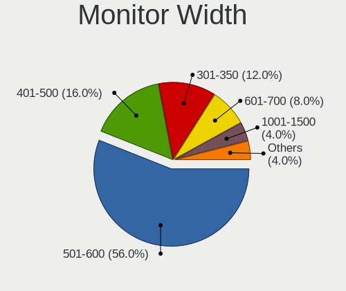
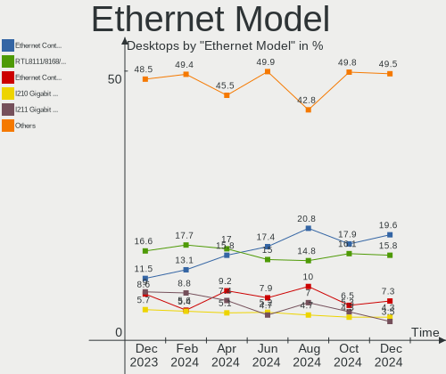
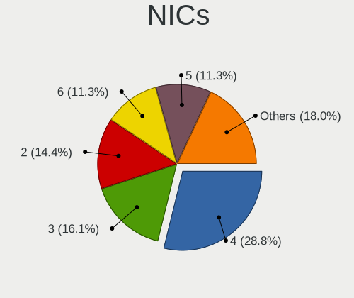

BSD - Hardware Trends (Desktops)
--------------------------------

A project to identify most popular hardware characteristics and track their change
over time based on data collected by BSD users at https://BSD-Hardware.info.

Anyone can contribute to this report by the [hw-probe](https://github.com/linuxhw/hw-probe/blob/master/INSTALL.BSD.md) tool:

    hw-probe -all -upload

This report is for one last month. Overall report since the beginning of time: [TestDays](https://github.com/bsdhw/TestDays)

Period: Jan, 2024.

Contents
--------

* [ System ](#system)
  - [ OS                       ](#os)
  - [ OS Family                ](#os-family)
  - [ Arch                     ](#arch)
  - [ DE                       ](#de)
  - [ Display Server           ](#display-server)
  - [ Display Manager          ](#display-manager)
  - [ OS Lang                  ](#os-lang)
  - [ Boot Mode                ](#boot-mode)
  - [ Filesystem               ](#filesystem)
  - [ Part. scheme             ](#part-scheme)

* [ Board ](#board)
  - [ Vendor                   ](#vendor)
  - [ Model                    ](#model)
  - [ Model Family             ](#model-family)
  - [ MFG Year                 ](#mfg-year)
  - [ Form Factor              ](#form-factor)
  - [ Coreboot                 ](#coreboot)
  - [ RAM Size                 ](#ram-size)
  - [ RAM Used                 ](#ram-used)
  - [ Total Drives             ](#total-drives)
  - [ Has CD-ROM               ](#has-cd-rom)
  - [ Has Ethernet             ](#has-ethernet)
  - [ Has WiFi                 ](#has-wifi)
  - [ Has Bluetooth            ](#has-bluetooth)

* [ Location ](#location)
  - [ Country                  ](#country)
  - [ City                     ](#city)

* [ Drives ](#drives)
  - [ Drive Vendor             ](#drive-vendor)
  - [ Drive Model              ](#drive-model)
  - [ HDD Vendor               ](#hdd-vendor)
  - [ SSD Vendor               ](#ssd-vendor)
  - [ Drive Kind               ](#drive-kind)
  - [ Drive Connector          ](#drive-connector)
  - [ Drive Size               ](#drive-size)
  - [ Space Total              ](#space-total)
  - [ Space Used               ](#space-used)
  - [ Malfunc. Drives          ](#malfunc-drives)
  - [ Malfunc. Drive Vendor    ](#malfunc-drive-vendor)
  - [ Malfunc. HDD Vendor      ](#malfunc-hdd-vendor)
  - [ Malfunc. Drive Kind      ](#malfunc-drive-kind)
  - [ Failed Drives            ](#failed-drives)
  - [ Failed Drive Vendor      ](#failed-drive-vendor)
  - [ Drive Status             ](#drive-status)

* [ Storage controller ](#storage-controller)
  - [ Storage Vendor           ](#storage-vendor)
  - [ Storage Model            ](#storage-model)
  - [ Storage Kind             ](#storage-kind)

* [ Processor ](#processor)
  - [ CPU Vendor               ](#cpu-vendor)
  - [ CPU Model                ](#cpu-model)
  - [ CPU Model Family         ](#cpu-model-family)
  - [ CPU Cores                ](#cpu-cores)
  - [ CPU Sockets              ](#cpu-sockets)
  - [ CPU Threads              ](#cpu-threads)
  - [ CPU Microarch            ](#cpu-microarch)

* [ Graphics ](#graphics)
  - [ GPU Vendor               ](#gpu-vendor)
  - [ GPU Model                ](#gpu-model)
  - [ GPU Combo                ](#gpu-combo)
  - [ GPU Driver               ](#gpu-driver)
  - [ GPU Memory               ](#gpu-memory)

* [ Monitor ](#monitor)
  - [ Monitor Vendor           ](#monitor-vendor)
  - [ Monitor Model            ](#monitor-model)
  - [ Monitor Resolution       ](#monitor-resolution)
  - [ Monitor Diagonal         ](#monitor-diagonal)
  - [ Monitor Width            ](#monitor-width)
  - [ Aspect Ratio             ](#aspect-ratio)
  - [ Monitor Area             ](#monitor-area)
  - [ Pixel Density            ](#pixel-density)
  - [ Multiple Monitors        ](#multiple-monitors)

* [ Network ](#network)
  - [ Net Controller Vendor    ](#net-controller-vendor)
  - [ Net Controller Model     ](#net-controller-model)
  - [ Wireless Vendor          ](#wireless-vendor)
  - [ Wireless Model           ](#wireless-model)
  - [ Ethernet Vendor          ](#ethernet-vendor)
  - [ Ethernet Model           ](#ethernet-model)
  - [ Net Controller Kind      ](#net-controller-kind)
  - [ Used Controller          ](#used-controller)
  - [ NICs                     ](#nics)
  - [ IPv6                     ](#ipv6)

* [ Bluetooth ](#bluetooth)
  - [ Bluetooth Vendor         ](#bluetooth-vendor)
  - [ Bluetooth Model          ](#bluetooth-model)

* [ Sound ](#sound)
  - [ Sound Vendor             ](#sound-vendor)
  - [ Sound Model              ](#sound-model)

* [ Memory ](#memory)
  - [ Memory Vendor            ](#memory-vendor)
  - [ Memory Model             ](#memory-model)
  - [ Memory Kind              ](#memory-kind)
  - [ Memory Form Factor       ](#memory-form-factor)
  - [ Memory Size              ](#memory-size)
  - [ Memory Speed             ](#memory-speed)

* [ Printers & scanners ](#printers--scanners)
  - [ Printer Vendor           ](#printer-vendor)
  - [ Printer Model            ](#printer-model)
  - [ Scanner Vendor           ](#scanner-vendor)
  - [ Scanner Model            ](#scanner-model)

* [ Camera ](#camera)
  - [ Camera Vendor            ](#camera-vendor)
  - [ Camera Model             ](#camera-model)

* [ Security ](#security)
  - [ Fingerprint Vendor       ](#fingerprint-vendor)
  - [ Fingerprint Model        ](#fingerprint-model)
  - [ Chipcard Vendor          ](#chipcard-vendor)
  - [ Chipcard Model           ](#chipcard-model)

* [ Unsupported ](#unsupported)
  - [ Unsupported Devices      ](#unsupported-devices)
  - [ Unsupported Device Types ](#unsupported-device-types)

System
------

OS
--

Installed operating systems

| Name                 | Desktops | Percent |
|----------------------|----------|---------|
| OPNsense 23.7.12     | 116      | 32.95%  |
| OPNsense 23.7.11     | 104      | 29.55%  |
| OPNsense 23.7.10     | 46       | 13.07%  |
| OPNsense 24.1        | 21       | 5.97%   |
| FreeBSD 14.0-p4      | 12       | 3.41%   |
| helloSystem 0.8.1    | 5        | 1.42%   |
| helloSystem 0.9.0    | 4        | 1.14%   |
| OpenBSD 7.4          | 3        | 0.85%   |
| FreeBSD 13.2         | 3        | 0.85%   |
| OPNsense 23.7.9      | 2        | 0.57%   |
| OPNsense 23.10.1     | 2        | 0.57%   |
| OPNsense 23.1.11     | 2        | 0.57%   |
| NomadBSD 20231121    | 2        | 0.57%   |
| NetBSD 10.0_RC2      | 2        | 0.57%   |
| FreeBSD 15.0-CURRENT | 2        | 0.57%   |
| FreeBSD 14.0-STABLE  | 2        | 0.57%   |
| FreeBSD 14.0-p2      | 2        | 0.57%   |
| FreeBSD 14.0         | 2        | 0.57%   |
| FreeBSD 13.2-p9      | 2        | 0.57%   |
| Ting 22.7            | 1        | 0.28%   |
| OPNsense 23.7.7      | 1        | 0.28%   |
| OPNsense 23.7.4      | 1        | 0.28%   |
| OPNsense 23.7.1      | 1        | 0.28%   |
| OPNsense 22.7        | 1        | 0.28%   |
| OPNsense 21.7.8      | 1        | 0.28%   |
| OpenBSD 7.0          | 1        | 0.28%   |
| MyBee 14.0-p2        | 1        | 0.28%   |
| MyBee 13.2           | 1        | 0.28%   |
| MidnightBSD 3.1.3    | 1        | 0.28%   |
| MidnightBSD 3.1.1    | 1        | 0.28%   |
| GhostBSD 23.10.1     | 1        | 0.28%   |
| GhostBSD 22.06.18    | 1        | 0.28%   |
| FreeBSD 14.0-p3      | 1        | 0.28%   |
| FreeBSD 14.0-BETA5   | 1        | 0.28%   |
| FreeBSD 13.2-STABLE  | 1        | 0.28%   |
| FreeBSD 13.2-p5      | 1        | 0.28%   |
| FreeBSD 13.2-p1      | 1        | 0.28%   |

OS Family
---------

OS without a version

| Name        | Desktops | Percent |
|-------------|----------|---------|
| OPNsense    | 298      | 84.66%  |
| FreeBSD     | 30       | 8.52%   |
| helloSystem | 9        | 2.56%   |
| OpenBSD     | 4        | 1.14%   |
| NomadBSD    | 2        | 0.57%   |
| NetBSD      | 2        | 0.57%   |
| MyBee       | 2        | 0.57%   |
| MidnightBSD | 2        | 0.57%   |
| GhostBSD    | 2        | 0.57%   |
| Ting        | 1        | 0.28%   |

Arch
----

OS architecture (x86_64, i586, etc.)

| Name    | Desktops | Percent |
|---------|----------|---------|
| amd64   | 345      | 98.01%  |
| arm64   | 3        | 0.85%   |
| i386    | 2        | 0.57%   |
| powerpc | 1        | 0.28%   |
| arm     | 1        | 0.28%   |

DE
--

Desktop Environment

| Name         | Desktops | Percent |
|--------------|----------|---------|
| Console      | 318      | 90.34%  |
| helloDesktop | 12       | 3.41%   |
| XFCE         | 6        | 1.7%    |
| KDE5         | 4        | 1.14%   |
| MATE         | 3        | 0.85%   |
| i3           | 2        | 0.57%   |
| GNOME        | 2        | 0.57%   |
| xinitrc      | 1        | 0.28%   |
| wlroots      | 1        | 0.28%   |
| TWM          | 1        | 0.28%   |
| Openbox      | 1        | 0.28%   |
| fvwm         | 1        | 0.28%   |

Display Server
--------------

X11 or Wayland

| Name    | Desktops | Percent |
|---------|----------|---------|
| Console | 321      | 91.19%  |
| X11     | 30       | 8.52%   |
| Wayland | 1        | 0.28%   |

Display Manager
---------------

SDDM, LightDM, etc.

| Name    | Desktops | Percent |
|---------|----------|---------|
| Console | 328      | 93.18%  |
| SLiM    | 11       | 3.13%   |
| SDDM    | 6        | 1.7%    |
| LightDM | 4        | 1.14%   |
| XDM     | 2        | 0.57%   |
| GDM     | 1        | 0.28%   |

OS Lang
-------

Language

| Lang    | Desktops | Percent |
|---------|----------|---------|
| Unknown | 300      | 85.23%  |
| C       | 34       | 9.66%   |
| en_US   | 11       | 3.13%   |
| pl_PL   | 2        | 0.57%   |
| fr_FR   | 2        | 0.57%   |
| ru_RU   | 1        | 0.28%   |
| nl_NL   | 1        | 0.28%   |
| it_IT   | 1        | 0.28%   |

Boot Mode
---------

EFI or BIOS

| Mode | Desktops | Percent |
|------|----------|---------|
| EFI  | 335      | 95.17%  |
| BIOS | 17       | 4.83%   |

Filesystem
----------

Type of filesystem

| Type   | Desktops | Percent |
|--------|----------|---------|
| Ufs    | 184      | 52.27%  |
| Zfs    | 160      | 45.45%  |
| Ffs    | 4        | 1.14%   |
| Cd9660 | 4        | 1.14%   |

Part. scheme
------------

Scheme of partitioning

| Type    | Desktops | Percent |
|---------|----------|---------|
| GPT     | 344      | 97.73%  |
| MBR     | 5        | 1.42%   |
| BSD     | 2        | 0.57%   |
| Unknown | 1        | 0.28%   |

Board
-----

Vendor
------

Motherboard manufacturer

| Name                | Desktops | Percent |
|---------------------|----------|---------|
| Unknown             | 81       | 23.01%  |
| ASUSTek Computer    | 32       | 9.09%   |
| Hewlett-Packard     | 25       | 7.1%    |
| Dell                | 22       | 6.25%   |
| Protectli           | 18       | 5.11%   |
| Gigabyte Technology | 16       | 4.55%   |
| ASRock              | 16       | 4.55%   |
| PC Engines          | 13       | 3.69%   |
| Lenovo              | 12       | 3.41%   |
| Intel               | 12       | 3.41%   |
| Techvision          | 10       | 2.84%   |
| AZW                 | 9        | 2.56%   |
| MSI                 | 8        | 2.27%   |
| Fujitsu             | 8        | 2.27%   |
| CWWK                | 7        | 1.99%   |
| Supermicro          | 6        | 1.7%    |
| MW                  | 4        | 1.14%   |
| Gowin Solution      | 3        | 0.85%   |
| CncTion             | 3        | 0.85%   |
| Yanling             | 2        | 0.57%   |
| OEM                 | 2        | 0.57%   |
| Foxconn             | 2        | 0.57%   |
| AWOW                | 2        | 0.57%   |
| ASRockRack          | 2        | 0.57%   |
| ZX                  | 1        | 0.28%   |
| ZOTAC               | 1        | 0.28%   |
| YANYU               | 1        | 0.28%   |
| SolidRun            | 1        | 0.28%   |
| Silicom             | 1        | 0.28%   |
| Shuttle             | 1        | 0.28%   |
| SHANGZHAOYUAN       | 1        | 0.28%   |
| Seco                | 1        | 0.28%   |
| Roqos               | 1        | 0.28%   |
| NU591               | 1        | 0.28%   |
| NEXCOM              | 1        | 0.28%   |
| MiTAC               | 1        | 0.28%   |
| Microsoft           | 1        | 0.28%   |
| maiyunda            | 1        | 0.28%   |
| Lanner              | 1        | 0.28%   |
| LANCOM Systems      | 1        | 0.28%   |

Model
-----

Motherboard model

| Name                               | Desktops | Percent |
|------------------------------------|----------|---------|
| Unknown                            | 83       | 23.58%  |
| Techvision TVI7309X                | 10       | 2.84%   |
| PC Engines APU2                    | 8        | 2.27%   |
| AZW EQ                             | 7        | 1.99%   |
| Fujitsu FUTRO S920                 | 6        | 1.7%    |
| PC Engines apu4                    | 5        | 1.42%   |
| Protectli FW4C                     | 4        | 1.14%   |
| MW GMLK-2_5G4L                     | 4        | 1.14%   |
| Protectli FW6                      | 3        | 0.85%   |
| Protectli FW4B                     | 3        | 0.85%   |
| Protectli FW2B                     | 3        | 0.85%   |
| Intel Q3XXG4-P V1.0                | 3        | 0.85%   |
| Dell OptiPlex 7050                 | 3        | 0.85%   |
| CWWK CW-AD4L-N V1                  | 3        | 0.85%   |
| Protectli VP2420                   | 2        | 0.57%   |
| OEM 1.0                            | 2        | 0.57%   |
| Intel CRESCENTBAY                  | 2        | 0.57%   |
| HP Slim Desktop 290-p0xxx          | 2        | 0.57%   |
| GoWin Solution R86S                | 2        | 0.57%   |
| Foxconn Pro3500 Series             | 2        | 0.57%   |
| Dell OptiPlex 7070                 | 2        | 0.57%   |
| Dell OptiPlex 7010                 | 2        | 0.57%   |
| Dell Inspiron 660s                 | 2        | 0.57%   |
| CWWK CW-J6-6L                      | 2        | 0.57%   |
| CncTion N4505-4L                   | 2        | 0.57%   |
| AWOW AK10                          | 2        | 0.57%   |
| ASUS TUF Gaming X570-PLUS          | 2        | 0.57%   |
| ASUS PRIME A320M-K                 | 2        | 0.57%   |
| ASUS All Series                    | 2        | 0.57%   |
| ASRock H310M-ITX/ac                | 2        | 0.57%   |
| ASRock AB350 Pro4                  | 2        | 0.57%   |
| ZX H610ITX                         | 1        | 0.28%   |
| ZOTAC H67ITX-C-E                   | 1        | 0.28%   |
| YANYU R250                         | 1        | 0.28%   |
| Yanling YL-KBR6L                   | 1        | 0.28%   |
| Yanling YL-CLU6L-V1                | 1        | 0.28%   |
| Supermicro SYS-E301-9D-8CN8TP      | 1        | 0.28%   |
| Supermicro SYS-E200-9A             | 1        | 0.28%   |
| Supermicro SYS-5019D-FN8TP-2-NC041 | 1        | 0.28%   |
| Supermicro Pro546267               | 1        | 0.28%   |

Model Family
------------

Motherboard model prefix

| Name                | Desktops | Percent |
|---------------------|----------|---------|
| Unknown             | 83       | 23.58%  |
| Dell OptiPlex       | 18       | 5.11%   |
| Techvision TVI7309X | 10       | 2.84%   |
| ASUS TUF            | 9        | 2.56%   |
| PC Engines APU2     | 8        | 2.27%   |
| Lenovo ThinkCentre  | 7        | 1.99%   |
| HP Compaq           | 7        | 1.99%   |
| Fujitsu FUTRO       | 7        | 1.99%   |
| AZW EQ              | 7        | 1.99%   |
| ASUS PRIME          | 7        | 1.99%   |
| HP EliteDesk        | 6        | 1.7%    |
| PC Engines apu4     | 5        | 1.42%   |
| Protectli FW4C      | 4        | 1.14%   |
| MW GMLK-2           | 4        | 1.14%   |
| ASUS ROG            | 4        | 1.14%   |
| Protectli FW6       | 3        | 0.85%   |
| Protectli FW4B      | 3        | 0.85%   |
| Protectli FW2B      | 3        | 0.85%   |
| Intel Q3XXG4-P      | 3        | 0.85%   |
| Dell Inspiron       | 3        | 0.85%   |
| CWWK CW-AD4L-N      | 3        | 0.85%   |
| Protectli VP2420    | 2        | 0.57%   |
| OEM 1.0             | 2        | 0.57%   |
| Lenovo ThinkStation | 2        | 0.57%   |
| Intel CRESCENTBAY   | 2        | 0.57%   |
| HP Slim             | 2        | 0.57%   |
| HP ProLiant         | 2        | 0.57%   |
| HP ProDesk          | 2        | 0.57%   |
| GoWin Solution R86S | 2        | 0.57%   |
| Gigabyte B550       | 2        | 0.57%   |
| Foxconn Pro3500     | 2        | 0.57%   |
| CWWK CW-J6-6L       | 2        | 0.57%   |
| CncTion N4505-4L    | 2        | 0.57%   |
| AWOW AK10           | 2        | 0.57%   |
| ASUS All            | 2        | 0.57%   |
| ASRock H310M-ITX    | 2        | 0.57%   |
| ASRock AB350        | 2        | 0.57%   |
| ZX H610ITX          | 1        | 0.28%   |
| ZOTAC H67ITX-C-E    | 1        | 0.28%   |
| YANYU R250          | 1        | 0.28%   |

MFG Year
--------

Motherboard manufacture year

| Year    | Desktops | Percent |
|---------|----------|---------|
| 2023    | 81       | 23.01%  |
| 2022    | 67       | 19.03%  |
| 2018    | 33       | 9.38%   |
| 2021    | 26       | 7.39%   |
| 2016    | 23       | 6.53%   |
| 2019    | 20       | 5.68%   |
| 2014    | 17       | 4.83%   |
| 2017    | 16       | 4.55%   |
| 2015    | 14       | 3.98%   |
| 2012    | 14       | 3.98%   |
| 2013    | 11       | 3.13%   |
| 2020    | 9        | 2.56%   |
| 2011    | 6        | 1.7%    |
| 2009    | 5        | 1.42%   |
| 2010    | 3        | 0.85%   |
| 2008    | 3        | 0.85%   |
| Unknown | 2        | 0.57%   |
| 2007    | 1        | 0.28%   |
| 2005    | 1        | 0.28%   |

Form Factor
-----------

Physical design of the computer

| Name    | Desktops | Percent |
|---------|----------|---------|
| Desktop | 352      | 100%    |

Coreboot
--------

Have coreboot on board

| Used | Desktops | Percent |
|------|----------|---------|
| No   | 334      | 94.89%  |
| Yes  | 18       | 5.11%   |

RAM Size
--------

Total RAM memory

| Size in GB      | Desktops | Percent |
|-----------------|----------|---------|
| 8.01-16.0       | 134      | 38.07%  |
| 16.01-24.0      | 104      | 29.55%  |
| 4.01-8.0        | 42       | 11.93%  |
| 32.01-64.0      | 42       | 11.93%  |
| 64.01-256.0     | 18       | 5.11%   |
| 2.01-3.0        | 6        | 1.7%    |
| 3.01-4.0        | 3        | 0.85%   |
| More than 256.0 | 1        | 0.28%   |
| 24.01-32.0      | 1        | 0.28%   |
| 0.01-0.5        | 1        | 0.28%   |

RAM Used
--------

Used RAM memory

| Used GB   | Desktops | Percent |
|-----------|----------|---------|
| 0.51-1.0  | 148      | 42.05%  |
| 0.01-0.5  | 134      | 38.07%  |
| 1.01-2.0  | 45       | 12.78%  |
| 2.01-3.0  | 13       | 3.69%   |
| 3.01-4.0  | 6        | 1.7%    |
| Unknown   | 3        | 0.85%   |
| 4.01-8.0  | 1        | 0.28%   |
| 8.01-16.0 | 1        | 0.28%   |
| 0         | 1        | 0.28%   |

Total Drives
------------

Number of drives on board

| Drives | Desktops | Percent |
|--------|----------|---------|
| 1      | 258      | 73.3%   |
| 0      | 49       | 13.92%  |
| 2      | 25       | 7.1%    |
| 3      | 10       | 2.84%   |
| 4      | 5        | 1.42%   |
| 5      | 3        | 0.85%   |
| 13     | 1        | 0.28%   |
| 8      | 1        | 0.28%   |

Has CD-ROM
----------

Has CD-ROM on board

| Presented | Desktops | Percent |
|-----------|----------|---------|
| No        | 317      | 90.06%  |
| Yes       | 35       | 9.94%   |

Has Ethernet
------------

Has Ethernet on board

| Presented | Desktops | Percent |
|-----------|----------|---------|
| Yes       | 349      | 99.15%  |
| No        | 3        | 0.85%   |

Has WiFi
--------

Has WiFi module

| Presented | Desktops | Percent |
|-----------|----------|---------|
| No        | 281      | 79.83%  |
| Yes       | 71       | 20.17%  |

Has Bluetooth
-------------

Has Bluetooth module

| Presented | Desktops | Percent |
|-----------|----------|---------|
| No        | 301      | 85.51%  |
| Yes       | 51       | 14.49%  |

Location
--------

Country
-------

Geographic location (country)

| Country         | Desktops | Percent |
|-----------------|----------|---------|
| USA             | 105      | 29.83%  |
| Germany         | 51       | 14.49%  |
| Canada          | 19       | 5.4%    |
| UK              | 16       | 4.55%   |
| France          | 14       | 3.98%   |
| Russia          | 12       | 3.41%   |
| Poland          | 10       | 2.84%   |
| Netherlands     | 10       | 2.84%   |
| Italy           | 8        | 2.27%   |
| Brazil          | 7        | 1.99%   |
| Australia       | 7        | 1.99%   |
| Sweden          | 6        | 1.7%    |
| Romania         | 6        | 1.7%    |
| Austria         | 6        | 1.7%    |
| South Korea     | 5        | 1.42%   |
| Norway          | 5        | 1.42%   |
| Spain           | 4        | 1.14%   |
| Indonesia       | 4        | 1.14%   |
| Turkey          | 3        | 0.85%   |
| The Netherlands | 3        | 0.85%   |
| Switzerland     | 3        | 0.85%   |
| Portugal        | 3        | 0.85%   |
| Ireland         | 3        | 0.85%   |
| Finland         | 3        | 0.85%   |
| Bulgaria        | 3        | 0.85%   |
| Belgium         | 3        | 0.85%   |
| Thailand        | 2        | 0.57%   |
| South Africa    | 2        | 0.57%   |
| Slovakia        | 2        | 0.57%   |
| New Zealand     | 2        | 0.57%   |
| India           | 2        | 0.57%   |
| China           | 2        | 0.57%   |
| Venezuela       | 1        | 0.28%   |
| Ukraine         | 1        | 0.28%   |
| Tunisia         | 1        | 0.28%   |
| Taiwan          | 1        | 0.28%   |
| Slovenia        | 1        | 0.28%   |
| Saudi Arabia    | 1        | 0.28%   |
| Mexico          | 1        | 0.28%   |
| Malaysia        | 1        | 0.28%   |

City
----

Geographic location (city)

| City         | Desktops | Percent |
|--------------|----------|---------|
| Vienna       | 4        | 1.14%   |
| Toronto      | 4        | 1.14%   |
| Leipzig      | 4        | 1.14%   |
| Ypsilanti    | 3        | 0.85%   |
| Sydney       | 3        | 0.85%   |
| Sofia        | 3        | 0.85%   |
| Seattle      | 3        | 0.85%   |
| Sao Paulo    | 3        | 0.85%   |
| Munich       | 3        | 0.85%   |
| Moscow       | 3        | 0.85%   |
| Brooklyn     | 3        | 0.85%   |
| Atlanta      | 3        | 0.85%   |
| Amsterdam    | 3        | 0.85%   |
| Winnipeg     | 2        | 0.57%   |
| Vancouver    | 2        | 0.57%   |
| Trondheim    | 2        | 0.57%   |
| Stockholm    | 2        | 0.57%   |
| Salem        | 2        | 0.57%   |
| Rocky Point  | 2        | 0.57%   |
| Redmond      | 2        | 0.57%   |
| Philadelphia | 2        | 0.57%   |
| Paris        | 2        | 0.57%   |
| Oslo         | 2        | 0.57%   |
| Oakland      | 2        | 0.57%   |
| New York     | 2        | 0.57%   |
| Milan        | 2        | 0.57%   |
| Longueuil    | 2        | 0.57%   |
| Khabarovsk   | 2        | 0.57%   |
| Johannesburg | 2        | 0.57%   |
| Jakarta      | 2        | 0.57%   |
| Houston      | 2        | 0.57%   |
| Hamburg      | 2        | 0.57%   |
| Düsseldorf  | 2        | 0.57%   |
| Cologne      | 2        | 0.57%   |
| Cheonan      | 2        | 0.57%   |
| Brussels     | 2        | 0.57%   |
| Augsburg     | 2        | 0.57%   |
| Albany       | 2        | 0.57%   |
| Acworth      | 2        | 0.57%   |
| Yuseong      | 1        | 0.28%   |

Drives
------

Drive Vendor
------------

Hard drive vendors

| Vendor              | Desktops | Drives | Percent |
|---------------------|----------|--------|---------|
| Samsung Electronics | 55       | 64     | 15.8%   |
| Kingston            | 37       | 39     | 10.63%  |
| WDC                 | 27       | 42     | 7.76%   |
| Seagate             | 25       | 32     | 7.18%   |
| Crucial             | 20       | 23     | 5.75%   |
| Intel               | 18       | 20     | 5.17%   |
| SK hynix            | 12       | 13     | 3.45%   |
| Transcend           | 11       | 13     | 3.16%   |
| Silicon Motion      | 11       | 11     | 3.16%   |
| China               | 11       | 11     | 3.16%   |
| SanDisk             | 10       | 10     | 2.87%   |
| PNY                 | 7        | 7      | 2.01%   |
| Toshiba             | 6        | 7      | 1.72%   |
| A-DATA Technology   | 6        | 6      | 1.72%   |
| SPCC                | 5        | 6      | 1.44%   |
| Phison              | 5        | 6      | 1.44%   |
| Patriot             | 5        | 5      | 1.44%   |
| FORESEE             | 5        | 5      | 1.44%   |
| Team                | 4        | 4      | 1.15%   |
| Hoodisk             | 4        | 4      | 1.15%   |
| Hewlett-Packard     | 4        | 7      | 1.15%   |
| ShiJi               | 3        | 3      | 0.86%   |
| Netac               | 3        | 3      | 0.86%   |
| LITEON              | 3        | 3      | 0.86%   |
| Kimtigo             | 3        | 3      | 0.86%   |
| BIWIN               | 3        | 3      | 0.86%   |
| Protectli           | 2        | 2      | 0.57%   |
| OCZ                 | 2        | 2      | 0.57%   |
| LITEONIT            | 2        | 2      | 0.57%   |
| Lexar               | 2        | 2      | 0.57%   |
| KIOXIA              | 2        | 2      | 0.57%   |
| Kingsand            | 2        | 2      | 0.57%   |
| HGST                | 2        | 2      | 0.57%   |
| Fanxiang            | 2        | 2      | 0.57%   |
| Dogfish             | 2        | 2      | 0.57%   |
| Apacer              | 2        | 2      | 0.57%   |
| YMTC                | 1        | 1      | 0.29%   |
| Verbatim            | 1        | 1      | 0.29%   |
| Vaseky              | 1        | 1      | 0.29%   |
| V-GeN               | 1        | 1      | 0.29%   |

Drive Model
-----------

Hard drive models

| Model                            | Desktops | Percent |
|----------------------------------|----------|---------|
| Kingston SKC600MS256G 256GB      | 10       | 2.72%   |
| Samsung SSD 980 500GB            | 5        | 1.36%   |
| Phison PCIe SSD 512GB            | 5        | 1.36%   |
| SPCC M.2 PCIe SSD 128GB          | 4        | 1.09%   |
| Kingston SMS200S330G 32GB        | 4        | 1.09%   |
| Kingston SA400S37120G 120GB      | 4        | 1.09%   |
| Crucial CT240BX500SSD1 240GB     | 4        | 1.09%   |
| Silicon Motion NVME SSD 128GB    | 3        | 0.82%   |
| Samsung SSD 980 PRO 1TB          | 3        | 0.82%   |
| Kingston SMS200S360G 64GB        | 3        | 0.82%   |
| Kimtigo SSD 128GB                | 3        | 0.82%   |
| Hoodisk SSD 128GB                | 3        | 0.82%   |
| Crucial CT500P3SSD8 500GB        | 3        | 0.82%   |
| Transcend TS120GMTS420S 120GB    | 2        | 0.54%   |
| Toshiba KXG60ZNV256G NVMe 256GB  | 2        | 0.54%   |
| Silicon Motion GV-128-2242 128GB | 2        | 0.54%   |
| Seagate ST4000DM000-1F2168 4TB   | 2        | 0.54%   |
| Seagate ST3500312CS 500GB        | 2        | 0.54%   |
| SanDisk SDSSDP128G 128GB         | 2        | 0.54%   |
| Samsung SSD 980 250GB            | 2        | 0.54%   |
| Samsung SSD 970 PRO 512GB        | 2        | 0.54%   |
| Samsung SSD 970 EVO Plus 1TB     | 2        | 0.54%   |
| Samsung SSD 870 QVO 2TB          | 2        | 0.54%   |
| Samsung SSD 870 EVO 500GB        | 2        | 0.54%   |
| Samsung SSD 860 QVO 1TB          | 2        | 0.54%   |
| Samsung SSD 860 EVO 500GB        | 2        | 0.54%   |
| Samsung SSD 850 EVO 250GB        | 2        | 0.54%   |
| Samsung MZ7LN128HCHP-000H1 128GB | 2        | 0.54%   |
| PNY CS900 250GB SSD              | 2        | 0.54%   |
| PNY CS900 120GB SSD              | 2        | 0.54%   |
| Patriot M.2 P310 240GB           | 2        | 0.54%   |
| Patriot Burst Elite 120GB        | 2        | 0.54%   |
| Kingston SMS200S3120G 120GB      | 2        | 0.54%   |
| Kingston SA400S37240G 240GB      | 2        | 0.54%   |
| Kingsand T600 128G               | 2        | 0.54%   |
| Intel SSDPEKNU512GZ 512GB        | 2        | 0.54%   |
| FORESEE XP1000F128G 128GB        | 2        | 0.54%   |
| FORESEE P900F128GBH              | 2        | 0.54%   |
| Fanxiang S501 128GB              | 2        | 0.54%   |
| Crucial M4-CT128M4SSD2 128GB     | 2        | 0.54%   |

HDD Vendor
----------

Hard disk drive vendors

| Vendor              | Desktops | Drives | Percent |
|---------------------|----------|--------|---------|
| Seagate             | 22       | 28     | 43.14%  |
| WDC                 | 20       | 34     | 39.22%  |
| Toshiba             | 3        | 4      | 5.88%   |
| HGST                | 2        | 2      | 3.92%   |
| Samsung Electronics | 1        | 1      | 1.96%   |
| NVMe                | 1        | 1      | 1.96%   |
| Hitachi             | 1        | 1      | 1.96%   |
| Hewlett-Packard     | 1        | 4      | 1.96%   |

SSD Vendor
----------

Solid state drive vendors

| Vendor              | Desktops | Drives | Percent |
|---------------------|----------|--------|---------|
| Kingston            | 35       | 37     | 18.13%  |
| Samsung Electronics | 27       | 32     | 13.99%  |
| Intel               | 13       | 15     | 6.74%   |
| Crucial             | 13       | 16     | 6.74%   |
| China               | 11       | 11     | 5.7%    |
| Transcend           | 10       | 11     | 5.18%   |
| SanDisk             | 10       | 10     | 5.18%   |
| A-DATA Technology   | 6        | 6      | 3.11%   |
| PNY                 | 5        | 5      | 2.59%   |
| SK hynix            | 4        | 4      | 2.07%   |
| Hoodisk             | 4        | 4      | 2.07%   |
| WDC                 | 3        | 3      | 1.55%   |
| Team                | 3        | 3      | 1.55%   |
| Patriot             | 3        | 3      | 1.55%   |
| LITEON              | 3        | 3      | 1.55%   |
| ShiJi               | 2        | 2      | 1.04%   |
| Seagate             | 2        | 3      | 1.04%   |
| Protectli           | 2        | 2      | 1.04%   |
| OCZ                 | 2        | 2      | 1.04%   |
| LITEONIT            | 2        | 2      | 1.04%   |
| Lexar               | 2        | 2      | 1.04%   |
| Kingsand            | 2        | 2      | 1.04%   |
| Dogfish             | 2        | 2      | 1.04%   |
| Apacer              | 2        | 2      | 1.04%   |
| Verbatim            | 1        | 1      | 0.52%   |
| Vaseky              | 1        | 1      | 0.52%   |
| V-GeN               | 1        | 1      | 0.52%   |
| Toshiba             | 1        | 1      | 0.52%   |
| tecmiyo             | 1        | 1      | 0.52%   |
| SPCC                | 1        | 1      | 0.52%   |
| Smartbuy            | 1        | 1      | 0.52%   |
| Netac               | 1        | 1      | 0.52%   |
| Micron Technology   | 1        | 1      | 0.52%   |
| KingSpec            | 1        | 1      | 0.52%   |
| KingDian            | 1        | 1      | 0.52%   |
| Kingchuxing         | 1        | 1      | 0.52%   |
| KeepData            | 1        | 1      | 0.52%   |
| Innodisk            | 1        | 1      | 0.52%   |
| Inland              | 1        | 1      | 0.52%   |
| Hewlett-Packard     | 1        | 1      | 0.52%   |

Drive Kind
----------

HDD or SSD

| Kind | Desktops | Drives | Percent |
|------|----------|--------|---------|
| SSD  | 185      | 207    | 54.9%   |
| NVMe | 106      | 113    | 31.45%  |
| HDD  | 46       | 75     | 13.65%  |

Drive Connector
---------------

SATA, SAS, NVMe, etc.

| Type | Desktops | Drives | Percent |
|------|----------|--------|---------|
| SATA | 215      | 282    | 66.98%  |
| NVMe | 106      | 113    | 33.02%  |

Drive Size
----------

Size of hard drive

| Size in TB | Desktops | Drives | Percent |
|------------|----------|--------|---------|
| 0.01-0.5   | 186      | 205    | 78.15%  |
| 0.51-1.0   | 26       | 30     | 10.92%  |
| 1.01-2.0   | 11       | 18     | 4.62%   |
| 3.01-4.0   | 6        | 9      | 2.52%   |
| 4.01-10.0  | 5        | 15     | 2.1%    |
| 10.01-20.0 | 4        | 5      | 1.68%   |

Space Total
-----------

Amount of disk space available on the file system

| Size in GB     | Desktops | Percent |
|----------------|----------|---------|
| 101-250        | 184      | 52.27%  |
| 251-500        | 67       | 19.03%  |
| 51-100         | 25       | 7.1%    |
| 1-20           | 23       | 6.53%   |
| 21-50          | 22       | 6.25%   |
| 501-1000       | 19       | 5.4%    |
| 1001-2000      | 9        | 2.56%   |
| More than 3000 | 3        | 0.85%   |

Space Used
----------

Amount of used disk space

| Used GB        | Desktops | Percent |
|----------------|----------|---------|
| 1-20           | 324      | 92.05%  |
| 21-50          | 21       | 5.97%   |
| More than 3000 | 2        | 0.57%   |
| 101-250        | 2        | 0.57%   |
| 51-100         | 2        | 0.57%   |
| 251-500        | 1        | 0.28%   |

Malfunc. Drives
---------------

Drive models with a malfunction

| Model                                   | Desktops | Drives | Percent |
|-----------------------------------------|----------|--------|---------|
| Kingston SMS200S330G 32GB               | 2        | 2      | 6.9%    |
| Kingston SMS200S3120G 120GB             | 2        | 2      | 6.9%    |
| WDC WD6400AAKS-22A7B2 640GB             | 1        | 1      | 3.45%   |
| WDC WD40EFRX-68WT0N0 4TB                | 1        | 1      | 3.45%   |
| WDC WD10EZEX-60M2NA0 1TB                | 1        | 1      | 3.45%   |
| WDC WD10EARS-00MVWB0 1TB                | 1        | 1      | 3.45%   |
| Toshiba THNSNK128GCS8 SATA 128GB        | 1        | 1      | 3.45%   |
| tecmiyo SSD MSATA 64GB                  | 1        | 1      | 3.45%   |
| SK hynix SC313 HFS256G32TNF-N3A0A 256GB | 1        | 1      | 3.45%   |
| SK hynix SC308 SATA 128GB               | 1        | 1      | 3.45%   |
| ShiJi SSD 32GB                          | 1        | 1      | 3.45%   |
| Seagate ST9250610NS 250GB               | 1        | 1      | 3.45%   |
| Seagate ST3160318AS 160GB               | 1        | 1      | 3.45%   |
| SanDisk SSD U100 64GB                   | 1        | 1      | 3.45%   |
| Samsung Electronics SSD 970 EVO 250GB   | 1        | 1      | 3.45%   |
| Plextor PX-512M8PeG 512GB               | 1        | 1      | 3.45%   |
| Patriot Pyro SE 120GB                   | 1        | 1      | 3.45%   |
| Patriot Burst Elite 120GB               | 1        | 1      | 3.45%   |
| Micron Technology M550_mSATA_256GB      | 1        | 1      | 3.45%   |
| Kingston SHFS37A120G 120GB              | 1        | 1      | 3.45%   |
| KingSpec P4-120 120GB                   | 1        | 1      | 3.45%   |
| KingDian S100 32GB                      | 1        | 1      | 3.45%   |
| Intel SSDSC2CW060A3 64GB                | 1        | 1      | 3.45%   |
| Intel SSDSC2BF180A4H 180GB              | 1        | 1      | 3.45%   |
| Intel SSDSA2M120G2GC 120GB              | 1        | 1      | 3.45%   |
| HGST HTS725050A7E630 500GB              | 1        | 1      | 3.45%   |
| Crucial CT525MX300SSD1 528GB            | 1        | 1      | 3.45%   |

Malfunc. Drive Vendor
---------------------

Vendors of faulty drives

| Vendor              | Desktops | Drives | Percent |
|---------------------|----------|--------|---------|
| Kingston            | 5        | 5      | 17.24%  |
| WDC                 | 4        | 4      | 13.79%  |
| Intel               | 3        | 3      | 10.34%  |
| SK hynix            | 2        | 2      | 6.9%    |
| Seagate             | 2        | 2      | 6.9%    |
| Patriot             | 2        | 2      | 6.9%    |
| Toshiba             | 1        | 1      | 3.45%   |
| tecmiyo             | 1        | 1      | 3.45%   |
| ShiJi               | 1        | 1      | 3.45%   |
| SanDisk             | 1        | 1      | 3.45%   |
| Samsung Electronics | 1        | 1      | 3.45%   |
| Plextor             | 1        | 1      | 3.45%   |
| Micron Technology   | 1        | 1      | 3.45%   |
| KingSpec            | 1        | 1      | 3.45%   |
| KingDian            | 1        | 1      | 3.45%   |
| HGST                | 1        | 1      | 3.45%   |
| Crucial             | 1        | 1      | 3.45%   |

Malfunc. HDD Vendor
-------------------

Vendors of faulty HDD drives

| Vendor  | Desktops | Drives | Percent |
|---------|----------|--------|---------|
| WDC     | 4        | 4      | 57.14%  |
| Seagate | 2        | 2      | 28.57%  |
| HGST    | 1        | 1      | 14.29%  |

Malfunc. Drive Kind
-------------------

Kinds of faulty drives

| Kind | Desktops | Drives | Percent |
|------|----------|--------|---------|
| SSD  | 20       | 20     | 68.97%  |
| HDD  | 7        | 7      | 24.14%  |
| NVMe | 2        | 2      | 6.9%    |

Failed Drives
-------------

Failed drive models

| Model                         | Desktops | Drives | Percent |
|-------------------------------|----------|--------|---------|
| SanDisk SD7TB6S256G1001 256GB | 1        | 1      | 50%     |
| Kingston SMS200S330G 32GB     | 1        | 1      | 50%     |

Failed Drive Vendor
-------------------

Failed drive vendors

| Vendor   | Desktops | Drives | Percent |
|----------|----------|--------|---------|
| SanDisk  | 1        | 1      | 50%     |
| Kingston | 1        | 1      | 50%     |

Drive Status
------------

Number of failed and malfunc. drives

| Status   | Desktops | Drives | Percent |
|----------|----------|--------|---------|
| Works    | 274      | 357    | 88.96%  |
| Malfunc  | 28       | 29     | 9.09%   |
| Detected | 4        | 7      | 1.3%    |
| Failed   | 2        | 2      | 0.65%   |

Storage controller
------------------

Storage Vendor
--------------

Storage controller vendors

| Vendor                       | Desktops | Percent |
|------------------------------|----------|---------|
| Intel                        | 269      | 56.16%  |
| AMD                          | 61       | 12.73%  |
| Samsung Electronics          | 37       | 7.72%   |
| Silicon Motion               | 21       | 4.38%   |
| SanDisk                      | 15       | 3.13%   |
| MAXIO Technology (Hangzhou)  | 11       | 2.3%    |
| Micron/Crucial Technology    | 9        | 1.88%   |
| SK hynix                     | 8        | 1.67%   |
| Phison Electronics           | 8        | 1.67%   |
| Shenzhen Longsys Electronics | 6        | 1.25%   |
| Hosin Global Electronics     | 6        | 1.25%   |
| ASMedia Technology           | 6        | 1.25%   |
| Realtek Semiconductor        | 3        | 0.63%   |
| KIOXIA                       | 3        | 0.63%   |
| Toshiba                      | 2        | 0.42%   |
| Marvell Technology Group     | 2        | 0.42%   |
| Kingston Technology Company  | 2        | 0.42%   |
| JMicron Technology           | 2        | 0.42%   |
| Broadcom / LSI               | 2        | 0.42%   |
| Yangtze Memory Technologies  | 1        | 0.21%   |
| Transcend                    | 1        | 0.21%   |
| Seagate Technology           | 1        | 0.21%   |
| Netac Technology             | 1        | 0.21%   |
| Micron Technology            | 1        | 0.21%   |
| Lite-On Technology           | 1        | 0.21%   |

Storage Model
-------------

Storage controller models

| Model                                                                                                              | Desktops | Percent |
|--------------------------------------------------------------------------------------------------------------------|----------|---------|
| AMD FCH SATA Controller [AHCI mode]                                                                                | 39       | 7.54%   |
| Intel unknown                                                                                                      | 38       | 7.35%   |
| Intel Jasper Lake SATA AHCI Controller                                                                             | 24       | 4.64%   |
| Intel Celeron/Pentium Silver Processor SATA Controller                                                             | 23       | 4.45%   |
| Silicon Motion SM2263EN/SM2263XT (DRAM-less) NVMe SSD Controllers                                                  | 21       | 4.06%   |
| Intel 8 Series/C220 Series Chipset Family 6-port SATA Controller 1 [AHCI mode]                                     | 19       | 3.68%   |
| Samsung NVMe SSD Controller SM981/PM981/PM983                                                                      | 15       | 2.9%    |
| Samsung NVMe SSD Controller 980 (DRAM-less)                                                                        | 14       | 2.71%   |
| Intel Cannon Lake PCH SATA AHCI Controller                                                                         | 14       | 2.71%   |
| Intel Atom/Celeron/Pentium Processor x5-E8000/J3xxx/N3xxx Series SATA Controller                                   | 12       | 2.32%   |
| MAXIO (Hangzhou) NVMe SSD Controller MAP1202 (DRAM-less)                                                           | 11       | 2.13%   |
| Intel Q170/Q150/B150/H170/H110/Z170/CM236 Chipset SATA Controller [AHCI Mode]                                      | 11       | 2.13%   |
| Intel 6 Series/C200 Series Chipset Family 6 port Desktop SATA AHCI Controller                                      | 11       | 2.13%   |
| Intel 200 Series PCH SATA controller [AHCI mode]                                                                   | 10       | 1.93%   |
| AMD 400 Series Chipset SATA Controller                                                                             | 9        | 1.74%   |
| Intel Atom Processor E3800 Series SATA AHCI Controller                                                             | 8        | 1.55%   |
| Micron/Crucial P2 [Nick P2] / P3 / P3 Plus NVMe PCIe SSD (DRAM-less)                                               | 7        | 1.35%   |
| Intel Sunrise Point-LP SATA Controller [AHCI mode]                                                                 | 7        | 1.35%   |
| Intel Elkhart Lake SATA AHCI                                                                                       | 7        | 1.35%   |
| Intel Alder Lake-S PCH SATA Controller [AHCI Mode]                                                                 | 7        | 1.35%   |
| Intel Alder Lake-P SATA AHCI Controller                                                                            | 7        | 1.35%   |
| Unknown                                                                                                            | 7        | 1.35%   |
| Samsung NVMe SSD Controller PM9A1/PM9A3/980PRO                                                                     | 6        | 1.16%   |
| Intel NM10/ICH7 Family SATA Controller [IDE mode]                                                                  | 6        | 1.16%   |
| Intel 7 Series/C210 Series Chipset Family 6-port SATA Controller [AHCI mode]                                       | 6        | 1.16%   |
| ASMedia ASM1061/ASM1062 Serial ATA Controller                                                                      | 6        | 1.16%   |
| AMD SB7x0/SB8x0/SB9x0 SATA Controller [AHCI mode]                                                                  | 6        | 1.16%   |
| AMD 500 Series Chipset SATA Controller                                                                             | 6        | 1.16%   |
| SK hynix Gold P31/BC711/PC711 NVMe Solid State Drive                                                               | 5        | 0.97%   |
| Phison PS5015-E15 PCIe3 NVMe Controller (DRAM-less)                                                                | 5        | 0.97%   |
| Intel SATA Controller [RAID mode]                                                                                  | 5        | 0.97%   |
| Intel Comet Lake SATA AHCI Controller                                                                              | 5        | 0.97%   |
| Intel 82801G (ICH7 Family) IDE Controller                                                                          | 5        | 0.97%   |
| Intel Wildcat Point-LP SATA Controller [AHCI Mode]                                                                 | 4        | 0.77%   |
| Intel Celeron N3350/Pentium N4200/Atom E3900 Series SATA AHCI Controller                                           | 4        | 0.77%   |
| Intel Atom Processor C3000 Series SATA Controller 0                                                                | 4        | 0.77%   |
| Intel 500 Series Chipset Family SATA AHCI Controller                                                               | 4        | 0.77%   |
| Shenzhen Longsys FORESEE XP1000 / Lexar Professional CFexpress Type B Gold series, NM620 PCIe NVME SSD (DRAM-less) | 3        | 0.58%   |
| Sandisk WD Black SN770 / PC SN740 256GB / PC SN560 (DRAM-less) NVMe SSD                                            | 3        | 0.58%   |
| SanDisk Ultra 3D / WD Blue SN550 NVMe SSD                                                                          | 3        | 0.58%   |

Storage Kind
------------

Kind of storage controller (IDE, SATA, NVMe, SAS, ...)

| Kind | Desktops | Percent |
|------|----------|---------|
| SATA | 310      | 64.85%  |
| NVMe | 138      | 28.87%  |
| IDE  | 20       | 4.18%   |
| RAID | 8        | 1.67%   |
| SAS  | 2        | 0.42%   |

Processor
---------

CPU Vendor
----------

Processor vendors

| Vendor | Desktops | Percent |
|--------|----------|---------|
| Intel  | 285      | 80.97%  |
| AMD    | 62       | 17.61%  |
| ARM    | 3        | 0.85%   |
| NXP    | 1        | 0.28%   |
| IBM    | 1        | 0.28%   |

CPU Model
---------

Processor models

| Model                                    | Desktops | Percent |
|------------------------------------------|----------|---------|
| Intel N100                               | 42       | 11.93%  |
| Intel Celeron J4125 CPU @ 2.00GHz        | 20       | 5.68%   |
| Intel Celeron N5105 @ 2.00GHz            | 17       | 4.83%   |
| AMD GX-412TC SOC                         | 13       | 3.69%   |
| Intel Core i3-N305                       | 7        | 1.99%   |
| Intel Celeron J6412 @ 2.00GHz            | 5        | 1.42%   |
| Intel Celeron CPU J1900 @ 1.99GHz        | 5        | 1.42%   |
| AMD GX-415GA SOC with Radeon HD Graphics | 5        | 1.42%   |
| Intel Pentium Silver N6005 @ 2.00GHz     | 4        | 1.14%   |
| Intel Pentium CPU J3710 @ 1.60GHz        | 4        | 1.14%   |
| Intel Core i5-9500 CPU @ 3.00GHz         | 4        | 1.14%   |
| Intel Core i5-6500 CPU @ 3.20GHz         | 4        | 1.14%   |
| Intel Celeron CPU J3160 @ 1.60GHz        | 4        | 1.14%   |
| Intel Pentium Gold 8505                  | 3        | 0.85%   |
| Intel N95                                | 3        | 0.85%   |
| Intel Core i7-3770 CPU @ 3.40GHz         | 3        | 0.85%   |
| Intel Core i5-8500 CPU @ 3.00GHz         | 3        | 0.85%   |
| Intel Core i5-7500T CPU @ 2.70GHz        | 3        | 0.85%   |
| Intel Core i5-6400 CPU @ 2.70GHz         | 3        | 0.85%   |
| Intel Core i5-4570 CPU @ 3.20GHz         | 3        | 0.85%   |
| Intel Celeron CPU J3060 @ 1.60GHz        | 3        | 0.85%   |
| AMD Ryzen 9 3900X 12-Core Processor      | 3        | 0.85%   |
| AMD Ryzen 5 5600G with Radeon Graphics   | 3        | 0.85%   |
| Intel Pentium Gold G5400 CPU @ 3.70GHz   | 2        | 0.57%   |
| Intel Pentium CPU G3220 @ 3.00GHz        | 2        | 0.57%   |
| Intel Core i7-7500U CPU @ 2.70GHz        | 2        | 0.57%   |
| Intel Core i7-4770 CPU @ 3.40GHz         | 2        | 0.57%   |
| Intel Core i5-8500T CPU @ 2.10GHz        | 2        | 0.57%   |
| Intel Core i5-5300U CPU @ 2.30GHz        | 2        | 0.57%   |
| Intel Core i5-4670K CPU @ 3.40GHz        | 2        | 0.57%   |
| Intel Core i5-4210U CPU @ 1.70GHz        | 2        | 0.57%   |
| Intel Core i5-3470 CPU @ 3.20GHz         | 2        | 0.57%   |
| Intel Core i5-2500 CPU @ 3.30GHz         | 2        | 0.57%   |
| Intel Core i3-8100 CPU @ 3.60GHz         | 2        | 0.57%   |
| Intel Core i3-7100U CPU @ 2.40GHz        | 2        | 0.57%   |
| Intel Core i3-10110U CPU @ 2.10GHz       | 2        | 0.57%   |
| Intel Core 2 Duo CPU E8400 @ 3.00GHz     | 2        | 0.57%   |
| Intel Celeron N4505 @ 2.00GHz            | 2        | 0.57%   |
| Intel Celeron N4000 CPU @ 1.10GHz        | 2        | 0.57%   |
| Intel Celeron J6413 @ 1.80GHz            | 2        | 0.57%   |

CPU Model Family
----------------

Processor model prefix

| Model                   | Desktops | Percent |
|-------------------------|----------|---------|
| Intel Celeron           | 75       | 21.31%  |
| Other                   | 64       | 18.18%  |
| Intel Core i5           | 55       | 15.63%  |
| Intel Core i3           | 23       | 6.53%   |
| AMD GX                  | 22       | 6.25%   |
| Intel Core i7           | 17       | 4.83%   |
| Intel Atom              | 13       | 3.69%   |
| Intel Xeon              | 12       | 3.41%   |
| Intel Pentium           | 10       | 2.84%   |
| AMD Ryzen 9             | 7        | 1.99%   |
| AMD Ryzen 7             | 7        | 1.99%   |
| AMD Ryzen 5             | 6        | 1.7%    |
| Intel Pentium Gold      | 5        | 1.42%   |
| Intel Pentium Silver    | 4        | 1.14%   |
| Intel Core 2 Duo        | 4        | 1.14%   |
| AMD Ryzen 3             | 4        | 1.14%   |
| AMD G                   | 3        | 0.85%   |
| AMD FX                  | 3        | 0.85%   |
| Intel Core 2 Quad       | 2        | 0.57%   |
| ARM Cortex              | 2        | 0.57%   |
| AMD Ryzen 5 PRO         | 2        | 0.57%   |
| AMD EPYC                | 2        | 0.57%   |
| AMD Athlon              | 2        | 0.57%   |
| Intel Pentium Dual-Core | 1        | 0.28%   |
| Intel Pentium Dual      | 1        | 0.28%   |
| Intel Pentium 4         | 1        | 0.28%   |
| Intel Core i9           | 1        | 0.28%   |
| AMD Turion II Neo       | 1        | 0.28%   |
| AMD Ryzen Threadripper  | 1        | 0.28%   |
| AMD Athlon II X3        | 1        | 0.28%   |
| AMD A6                  | 1        | 0.28%   |

CPU Cores
---------

Number of processor cores

| Number  | Desktops | Percent |
|---------|----------|---------|
| 4       | 215      | 61.08%  |
| 2       | 61       | 17.33%  |
| 8       | 19       | 5.4%    |
| 6       | 18       | 5.11%   |
| 16      | 8        | 2.27%   |
| Unknown | 8        | 2.27%   |
| 12      | 7        | 1.99%   |
| 24      | 5        | 1.42%   |
| 1       | 3        | 0.85%   |
| 32      | 2        | 0.57%   |
| 10      | 2        | 0.57%   |
| 3       | 2        | 0.57%   |
| 64      | 1        | 0.28%   |
| 20      | 1        | 0.28%   |

CPU Sockets
-----------

Number of sockets

| Number  | Desktops | Percent |
|---------|----------|---------|
| 1       | 347      | 98.58%  |
| Unknown | 5        | 1.42%   |

CPU Threads
-----------

Threads per core (Hyper-Threading)

| Number  | Desktops | Percent |
|---------|----------|---------|
| 1       | 269      | 76.42%  |
| 2       | 74       | 21.02%  |
| Unknown | 9        | 2.56%   |

CPU Microarch
-------------

Microarchitecture

| Name          | Desktops | Percent |
|---------------|----------|---------|
| Unknown       | 113      | 32.1%   |
| KabyLake      | 36       | 10.23%  |
| Haswell       | 27       | 7.67%   |
| Goldmont plus | 23       | 6.53%   |
| Silvermont    | 21       | 5.97%   |
| Skylake       | 15       | 4.26%   |
| Puma          | 14       | 3.98%   |
| IvyBridge     | 12       | 3.41%   |
| Zen 3         | 9        | 2.56%   |
| Zen           | 9        | 2.56%   |
| SandyBridge   | 9        | 2.56%   |
| Goldmont      | 9        | 2.56%   |
| Jaguar        | 8        | 2.27%   |
| Zen+          | 6        | 1.7%    |
| Penryn        | 6        | 1.7%    |
| Zen 2         | 5        | 1.42%   |
| Bonnell       | 5        | 1.42%   |
| CometLake     | 4        | 1.14%   |
| Broadwell     | 4        | 1.14%   |
| Piledriver    | 3        | 0.85%   |
| Core          | 3        | 0.85%   |
| Bobcat        | 3        | 0.85%   |
| Westmere      | 2        | 0.57%   |
| TigerLake     | 2        | 0.57%   |
| K10           | 2        | 0.57%   |
| NetBurst      | 1        | 0.28%   |
| Bulldozer     | 1        | 0.28%   |

Graphics
--------

GPU Vendor
----------

Vendors of graphics cards

| Vendor                     | Desktops | Percent |
|----------------------------|----------|---------|
| Intel                      | 261      | 79.33%  |
| AMD                        | 36       | 10.94%  |
| Nvidia                     | 18       | 5.47%   |
| ASPEED Technology          | 12       | 3.65%   |
| Matrox Electronics Systems | 2        | 0.61%   |

GPU Model
---------

Graphics card models

| Model                                                                                    | Desktops | Percent |
|------------------------------------------------------------------------------------------|----------|---------|
| Intel Alder Lake-N [UHD Graphics]                                                        | 52       | 15.71%  |
| Intel JasperLake [UHD Graphics]                                                          | 26       | 7.85%   |
| Intel GeminiLake [UHD Graphics 600]                                                      | 23       | 6.95%   |
| Intel Xeon E3-1200 v3/4th Gen Core Processor Integrated Graphics Controller              | 17       | 5.14%   |
| Intel CoffeeLake-S GT2 [UHD Graphics 630]                                                | 13       | 3.93%   |
| Intel Atom/Celeron/Pentium Processor x5-E8000/J3xxx/N3xxx Integrated Graphics Controller | 12       | 3.63%   |
| ASPEED Technology ASPEED Graphics Family                                                 | 12       | 3.63%   |
| Intel HD Graphics 530                                                                    | 11       | 3.32%   |
| Intel Atom Processor Z36xxx/Z37xxx Series Graphics & Display                             | 9        | 2.72%   |
| Intel HD Graphics 630                                                                    | 7        | 2.11%   |
| Intel Elkhart Lake [UHD Graphics Gen11 16EU]                                             | 7        | 2.11%   |
| Intel 2nd Generation Core Processor Family Integrated Graphics Controller                | 7        | 2.11%   |
| Intel 4 Series Chipset Integrated Graphics Controller                                    | 6        | 1.81%   |
| Intel Xeon E3-1200 v2/3rd Gen Core processor Graphics Controller                         | 5        | 1.51%   |
| Intel HD Graphics 620                                                                    | 5        | 1.51%   |
| AMD Raven Ridge [Radeon Vega Series / Radeon Vega Mobile Series]                         | 5        | 1.51%   |
| AMD Kabini [Radeon HD 8330E]                                                             | 5        | 1.51%   |
| AMD Cezanne [Radeon Vega Series / Radeon Vega Mobile Series]                             | 5        | 1.51%   |
| Intel IvyBridge GT2 [HD Graphics 4000]                                                   | 4        | 1.21%   |
| Intel CoffeeLake-S GT1 [UHD Graphics 610]                                                | 4        | 1.21%   |
| Intel Alder Lake-UP3 GT1 [UHD Graphics]                                                  | 4        | 1.21%   |
| Intel Alder Lake-S GT1 [UHD Graphics 730]                                                | 4        | 1.21%   |
| AMD Picasso/Raven 2 [Radeon Vega Series / Radeon Vega Mobile Series]                     | 4        | 1.21%   |
| Nvidia GK208B [GeForce GT 710]                                                           | 3        | 0.91%   |
| Intel HD Graphics 5500                                                                   | 3        | 0.91%   |
| Intel HD Graphics 500                                                                    | 3        | 0.91%   |
| Intel Haswell-ULT Integrated Graphics Controller                                         | 3        | 0.91%   |
| Intel 4th Generation Core Processor Family Integrated Graphics Controller                | 3        | 0.91%   |
| Nvidia GP108 [GeForce GT 1030]                                                           | 2        | 0.6%    |
| Intel UHD Graphics 620                                                                   | 2        | 0.6%    |
| Intel Core Processor Integrated Graphics Controller                                      | 2        | 0.6%    |
| Intel Atom Processor D4xx/D5xx/N4xx/N5xx Integrated Graphics Controller                  | 2        | 0.6%    |
| Intel Atom Processor D2xxx/N2xxx Integrated Graphics Controller                          | 2        | 0.6%    |
| Intel Alder Lake-S GT1 [UHD Graphics 710]                                                | 2        | 0.6%    |
| Intel 3rd Gen Core processor Graphics Controller                                         | 2        | 0.6%    |
| AMD Wrestler [Radeon HD 6320]                                                            | 2        | 0.6%    |
| AMD Navi 31 [Radeon RX 7900 XT/7900 XTX/7900M]                                           | 2        | 0.6%    |
| Nvidia TU116 [GeForce GTX 1660 SUPER]                                                    | 1        | 0.3%    |
| Nvidia GT218 [NVS 300]                                                                   | 1        | 0.3%    |
| Nvidia GP106GL [Quadro P2000]                                                            | 1        | 0.3%    |

GPU Combo
---------

Combinations of graphics cards

| Name           | Desktops | Percent |
|----------------|----------|---------|
| 1 x Intel      | 255      | 72.44%  |
| 1 x AMD        | 34       | 9.66%   |
| Other          | 24       | 6.82%   |
| 1 x Nvidia     | 17       | 4.83%   |
| 1 x ASPEED     | 12       | 3.41%   |
| 2 x Intel      | 5        | 1.42%   |
| 2 x AMD        | 2        | 0.57%   |
| 1 x Matrox     | 2        | 0.57%   |
| Intel + Nvidia | 1        | 0.28%   |

GPU Driver
----------

Free vs proprietary

| Driver      | Desktops | Percent |
|-------------|----------|---------|
| Free        | 321      | 91.19%  |
| Unknown     | 26       | 7.39%   |
| Proprietary | 5        | 1.42%   |

GPU Memory
----------

Total video memory

| Size in GB | Desktops | Percent |
|------------|----------|---------|
| Unknown    | 340      | 96.59%  |
| 7.01-8.0   | 3        | 0.85%   |
| 0.51-1.0   | 2        | 0.57%   |
| 0.01-0.5   | 2        | 0.57%   |
| 4.01-5.0   | 1        | 0.28%   |
| 3.01-4.0   | 1        | 0.28%   |
| 16.01-24.0 | 1        | 0.28%   |
| 1.01-2.0   | 1        | 0.28%   |
| 8.01-16.0  | 1        | 0.28%   |

Monitor
-------

Monitor Vendor
--------------

Monitor vendors

| Vendor              | Desktops | Percent |
|---------------------|----------|---------|
| Dell                | 7        | 33.33%  |
| Hewlett-Packard     | 4        | 19.05%  |
| Goldstar            | 3        | 14.29%  |
| Samsung Electronics | 2        | 9.52%   |
| Lenovo              | 2        | 9.52%   |
| RTK                 | 1        | 4.76%   |
| MSI                 | 1        | 4.76%   |
| AOC                 | 1        | 4.76%   |

Monitor Model
-------------

Monitor models

| Model                                                                   | Desktops | Percent |
|-------------------------------------------------------------------------|----------|---------|
| Samsung Electronics SyncMaster SAM030D 1680x1050 470x300mm 22.0-inch    | 1        | 4%      |
| Samsung Electronics SA300/350/360 SAM07D5 1920x1080 530x300mm 24.0-inch | 1        | 4%      |
| RTK FHD RTK0039 1920x1080 300x190mm 14.0-inch                           | 1        | 4%      |
| MSI MP242 MSI30A1 1920x1080 530x300mm 24.0-inch                         | 1        | 4%      |
| Lenovo P27h-20 LEN61E9 2560x1440 600x340mm 27.2-inch                    | 1        | 4%      |
| Lenovo C19-10 LEN66A0 1366x768 410x230mm 18.5-inch                      | 1        | 4%      |
| Hewlett-Packard ZR24w HWP286A 1920x1200 540x350mm 25.3-inch             | 1        | 4%      |
| Hewlett-Packard LV1911 HWP3005 1366x768 410x230mm 18.5-inch             | 1        | 4%      |
| Hewlett-Packard LA2405x HWP301E 1920x1200 520x320mm 24.0-inch           | 1        | 4%      |
| Hewlett-Packard 27f 4k HPN3639 3840x2160 600x340mm 27.2-inch            | 1        | 4%      |
| Goldstar LG ULTRAWIDE GSM59F1 2560x1080 580x240mm 24.7-inch             | 1        | 4%      |
| Goldstar LG ULTRAGEAR GSM5B73 1920x1080 530x300mm 24.0-inch             | 1        | 4%      |
| Goldstar LG FULL HD GSM5B55 1920x1080 480x270mm 21.7-inch               | 1        | 4%      |
| Dell U3417W DELA0DE 3440x1440 800x330mm 34.1-inch                       | 1        | 4%      |
| Dell U3011 DEL4065 2560x1600 640x400mm 29.7-inch                        | 1        | 4%      |
| Dell U2917W DEL40F9 2560x1080 670x280mm 28.6-inch                       | 1        | 4%      |
| Dell U2722D DEL422F 2560x1440 600x340mm 27.2-inch                       | 1        | 4%      |
| Dell U2311H DELA060 1920x1080 510x290mm 23.1-inch                       | 1        | 4%      |
| Dell LCD Monitor U2718Q 5120x1440                                       | 1        | 4%      |
| Dell LCD Monitor U2718Q                                                 | 1        | 4%      |
| Dell LCD Monitor U2412M                                                 | 1        | 4%      |
| Dell LCD Monitor SE3223Q                                                | 1        | 4%      |
| Dell LCD Monitor 2209WA 7860x2400                                       | 1        | 4%      |
| Dell LCD Monitor 2209WA                                                 | 1        | 4%      |
| AOC 27G2G8 AOC2702 1920x1080 600x340mm 27.2-inch                        | 1        | 4%      |

Monitor Resolution
------------------

Monitor screen resolution

| Resolution         | Desktops | Percent |
|--------------------|----------|---------|
| 1920x1080 (FHD)    | 7        | 30.43%  |
| 2560x1440 (QHD)    | 2        | 8.7%    |
| 2560x1080          | 2        | 8.7%    |
| 1920x1200 (WUXGA)  | 2        | 8.7%    |
| 1366x768 (WXGA)    | 2        | 8.7%    |
| Unknown            | 2        | 8.7%    |
| 7860x2400          | 1        | 4.35%   |
| 5120x1440          | 1        | 4.35%   |
| 3840x2160 (4K)     | 1        | 4.35%   |
| 3440x1440          | 1        | 4.35%   |
| 2560x1600          | 1        | 4.35%   |
| 1680x1050 (WSXGA+) | 1        | 4.35%   |

Monitor Diagonal
----------------

Diagonal size in inches

| Inches  | Desktops | Percent |
|---------|----------|---------|
| 27      | 4        | 19.05%  |
| 24      | 4        | 19.05%  |
| 34      | 2        | 9.52%   |
| 18      | 2        | 9.52%   |
| Unknown | 2        | 9.52%   |
| 29      | 1        | 4.76%   |
| 28      | 1        | 4.76%   |
| 25      | 1        | 4.76%   |
| 23      | 1        | 4.76%   |
| 22      | 1        | 4.76%   |
| 21      | 1        | 4.76%   |
| 14      | 1        | 4.76%   |

Monitor Width
-------------

Physical width

| Width in mm | Desktops | Percent |
|-------------|----------|---------|
| 501-600     | 10       | 47.62%  |
| 401-500     | 4        | 19.05%  |
| 701-800     | 2        | 9.52%   |
| 601-700     | 2        | 9.52%   |
| Unknown     | 2        | 9.52%   |
| 201-300     | 1        | 4.76%   |

Aspect Ratio
------------

Proportional relationship between the width and the height

| Ratio   | Desktops | Percent |
|---------|----------|---------|
| 16/9    | 11       | 52.38%  |
| 16/10   | 4        | 19.05%  |
| 21/9    | 3        | 14.29%  |
| Unknown | 2        | 9.52%   |
| 3/2     | 1        | 4.76%   |

Monitor Area
------------

Area in inch²

| Area in inch² | Desktops | Percent |
|----------------|----------|---------|
| 201-250        | 6        | 28.57%  |
| 301-350        | 4        | 19.05%  |
| 351-500        | 3        | 14.29%  |
| 251-300        | 3        | 14.29%  |
| 141-150        | 2        | 9.52%   |
| Unknown        | 2        | 9.52%   |
| 81-90          | 1        | 4.76%   |

Pixel Density
-------------

Pixels per inch

| Density | Desktops | Percent |
|---------|----------|---------|
| 51-100  | 12       | 57.14%  |
| 101-120 | 5        | 23.81%  |
| Unknown | 2        | 9.52%   |
| 161-240 | 1        | 4.76%   |
| 121-160 | 1        | 4.76%   |

Multiple Monitors
-----------------

Total monitors connected

| Total | Desktops | Percent |
|-------|----------|---------|
| 0     | 327      | 92.9%   |
| 1     | 23       | 6.53%   |
| 4     | 1        | 0.28%   |
| 2     | 1        | 0.28%   |

Network
-------

Net Controller Vendor
---------------------

Controller vendors

| Vendor                     | Desktops | Percent |
|----------------------------|----------|---------|
| Intel                      | 303      | 66.74%  |
| Realtek Semiconductor      | 98       | 21.59%  |
| Broadcom                   | 13       | 2.86%   |
| Qualcomm Atheros           | 11       | 2.42%   |
| Mellanox Technologies      | 6        | 1.32%   |
| TP-Link                    | 3        | 0.66%   |
| Huawei Technologies        | 3        | 0.66%   |
| Marvell Technology Group   | 2        | 0.44%   |
| ASUSTek Computer           | 2        | 0.44%   |
| American Megatrends        | 2        | 0.44%   |
| ZTE WCDMA Technologies MSM | 1        | 0.22%   |
| Solarflare Communications  | 1        | 0.22%   |
| Samsung Electronics        | 1        | 0.22%   |
| Ralink Technology          | 1        | 0.22%   |
| Qualcomm Technologies      | 1        | 0.22%   |
| MediaTek                   | 1        | 0.22%   |
| LG Electronics             | 1        | 0.22%   |
| IMC Networks               | 1        | 0.22%   |
| D-Link System              | 1        | 0.22%   |
| Arduino SA                 | 1        | 0.22%   |
| Accton Technology          | 1        | 0.22%   |

Net Controller Model
--------------------

Controller models

| Model                                                                         | Desktops | Percent |
|-------------------------------------------------------------------------------|----------|---------|
| Realtek RTL8111/8168/8211/8411 PCI Express Gigabit Ethernet Controller        | 78       | 13.71%  |
| Intel Ethernet Controller I226-V                                              | 74       | 13.01%  |
| Intel Ethernet Controller I225-V                                              | 51       | 8.96%   |
| Intel I211 Gigabit Network Connection                                         | 35       | 6.15%   |
| Realtek RTL8125 2.5GbE Controller                                             | 18       | 3.16%   |
| Intel I210 Gigabit Network Connection                                         | 18       | 3.16%   |
| Intel I350 Gigabit Network Connection                                         | 15       | 2.64%   |
| Intel 82574L Gigabit Network Connection                                       | 15       | 2.64%   |
| Intel Ethernet Controller 10-Gigabit X540-AT2                                 | 12       | 2.11%   |
| Intel 82599ES 10-Gigabit SFI/SFP+ Network Connection                          | 12       | 2.11%   |
| Intel Ethernet Connection I217-LM                                             | 10       | 1.76%   |
| Intel Ethernet Controller X550                                                | 8        | 1.41%   |
| Intel 82571EB/82571GB Gigabit Ethernet Controller (Copper)                    | 8        | 1.41%   |
| Realtek RTL8821CE 802.11ac PCIe Wireless Network Adapter                      | 7        | 1.23%   |
| Intel CNVi: Wi-Fi                                                             | 7        | 1.23%   |
| Intel 82576 Gigabit Network Connection                                        | 7        | 1.23%   |
| Realtek RTL8111/8168/8411 PCI Express Gigabit Ethernet Controller             | 6        | 1.05%   |
| Intel 82583V Gigabit Network Connection                                       | 6        | 1.05%   |
| Intel 82579LM Gigabit Network Connection (Lewisville)                         | 6        | 1.05%   |
| Mellanox MT27500 Family [ConnectX-3]                                          | 5        | 0.88%   |
| Intel Ethernet Connection (7) I219-LM                                         | 5        | 0.88%   |
| Intel Ethernet Connection (5) I219-LM                                         | 5        | 0.88%   |
| Intel 82580 Gigabit Network Connection                                        | 5        | 0.88%   |
| Intel 82571EB/82571GB Gigabit Ethernet Controller D0/D1 (copper applications) | 5        | 0.88%   |
| Intel Wi-Fi 6 AX200                                                           | 4        | 0.7%    |
| Intel Ethernet Connection X553 10 GbE SFP+                                    | 4        | 0.7%    |
| Intel Ethernet Connection (2) I219-LM                                         | 4        | 0.7%    |
| Intel 82575GB Gigabit Network Connection                                      | 4        | 0.7%    |
| Intel 82575EB Gigabit Network Connection                                      | 4        | 0.7%    |
| Realtek RTL8188EE Wireless Network Adapter                                    | 3        | 0.53%   |
| Qualcomm Atheros AR9485 Wireless Network Adapter                              | 3        | 0.53%   |
| Intel Wireless 7265                                                           | 3        | 0.53%   |
| Intel Wireless 3165                                                           | 3        | 0.53%   |
| Intel Wi-Fi 6 AX201 160MHz                                                    | 3        | 0.53%   |
| Intel Ethernet Connection X722 for 10GbE SFP+                                 | 3        | 0.53%   |
| Intel Ethernet Connection X553 1GbE                                           | 3        | 0.53%   |
| Intel Ethernet Connection (7) I219-V                                          | 3        | 0.53%   |
| Intel Ethernet Connection (2) I219-V                                          | 3        | 0.53%   |
| Intel Dual Band Wireless-AC 3168NGW [Stone Peak]                              | 3        | 0.53%   |
| Broadcom NetXtreme II BCM5709 Gigabit Ethernet                                | 3        | 0.53%   |

Wireless Vendor
---------------

Wireless vendors

| Vendor                | Desktops | Percent |
|-----------------------|----------|---------|
| Intel                 | 41       | 57.75%  |
| Realtek Semiconductor | 13       | 18.31%  |
| Qualcomm Atheros      | 8        | 11.27%  |
| TP-Link               | 3        | 4.23%   |
| ASUSTek Computer      | 2        | 2.82%   |
| Ralink Technology     | 1        | 1.41%   |
| Qualcomm Technologies | 1        | 1.41%   |
| MediaTek              | 1        | 1.41%   |
| IMC Networks          | 1        | 1.41%   |

Wireless Model
--------------

Wireless models

| Model                                                                  | Desktops | Percent |
|------------------------------------------------------------------------|----------|---------|
| Realtek RTL8821CE 802.11ac PCIe Wireless Network Adapter               | 7        | 9.72%   |
| Intel CNVi: Wi-Fi                                                      | 7        | 9.72%   |
| Intel Wi-Fi 6 AX200                                                    | 4        | 5.56%   |
| Realtek RTL8188EE Wireless Network Adapter                             | 3        | 4.17%   |
| Qualcomm Atheros AR9485 Wireless Network Adapter                       | 3        | 4.17%   |
| Intel Wireless 7265                                                    | 3        | 4.17%   |
| Intel Wireless 3165                                                    | 3        | 4.17%   |
| Intel Wi-Fi 6 AX201 160MHz                                             | 3        | 4.17%   |
| Intel Dual Band Wireless-AC 3168NGW [Stone Peak]                       | 3        | 4.17%   |
| TP-Link Archer T3U [Realtek RTL8812BU]                                 | 2        | 2.78%   |
| Realtek RTL8852BE PCIe 802.11ax Wireless Network Controller            | 2        | 2.78%   |
| Qualcomm Atheros AR9287 Wireless Network Adapter (PCI-Express)         | 2        | 2.78%   |
| Intel Wireless 8260                                                    | 2        | 2.78%   |
| Intel Wi-Fi 6E(802.11ax) AX210/AX1675* 2x2 [Typhoon Peak]              | 2        | 2.78%   |
| Intel Tiger Lake PCH CNVi WiFi                                         | 2        | 2.78%   |
| Intel Centrino Advanced-N 6205 [Taylor Peak]                           | 2        | 2.78%   |
| TP-Link TL-WN821N v5/v6 [RTL8192EU]                                    | 1        | 1.39%   |
| Realtek RTL8812AU 802.11a/b/g/n/ac 2T2R DB WLAN Adapter                | 1        | 1.39%   |
| Ralink RT2870 Wireless Adapter                                         | 1        | 1.39%   |
| Qualcomm QCNFA765 Wireless Network Adapter                             | 1        | 1.39%   |
| Qualcomm Atheros QCA986x/988x 802.11ac Wireless Network Adapter        | 1        | 1.39%   |
| Qualcomm Atheros AR928X Wireless Network Adapter (PCI-Express)         | 1        | 1.39%   |
| Qualcomm Atheros AR9285 Wireless Network Adapter (PCI-Express)         | 1        | 1.39%   |
| Qualcomm Atheros AR5416 Wireless Network Adapter [AR5008 802.11(a)bgn] | 1        | 1.39%   |
| MediaTek MT7922 802.11ax PCI Express Wireless Network Adapter          | 1        | 1.39%   |
| Intel Wireless 8265 / 8275                                             | 1        | 1.39%   |
| Intel Wireless 7260                                                    | 1        | 1.39%   |
| Intel Wi-Fi 5(802.11ac) Wireless-AC 9x6x [Thunder Peak]                | 1        | 1.39%   |
| Intel Raptor Lake-S PCH CNVi WiFi                                      | 1        | 1.39%   |
| Intel Raptor Lake PCH CNVi WiFi                                        | 1        | 1.39%   |
| Intel PRO/Wireless 4965 AG or AGN [Kedron] Network Connection          | 1        | 1.39%   |
| Intel Dual Band Wireless-AC 3165 Plus Bluetooth                        | 1        | 1.39%   |
| Intel Centrino Advanced-N 6235                                         | 1        | 1.39%   |
| Intel Alder Lake-S PCH CNVi WiFi                                       | 1        | 1.39%   |
| Intel Alder Lake-P PCH CNVi WiFi                                       | 1        | 1.39%   |
| IMC Networks 802.11 n/g/b Wireless LAN USB Mini-Card                   | 1        | 1.39%   |
| ASUS USB-AC53 Nano USB Wieless Adapter                                 | 1        | 1.39%   |
| ASUS Realtek 8188EUS [USB-N10 Nano]                                    | 1        | 1.39%   |

Ethernet Vendor
---------------

Ethernet vendors

| Vendor                    | Desktops | Percent |
|---------------------------|----------|---------|
| Intel                     | 289      | 70.66%  |
| Realtek Semiconductor     | 96       | 23.47%  |
| Broadcom                  | 13       | 3.18%   |
| Qualcomm Atheros          | 3        | 0.73%   |
| Marvell Technology Group  | 2        | 0.49%   |
| American Megatrends       | 2        | 0.49%   |
| Solarflare Communications | 1        | 0.24%   |
| Samsung Electronics       | 1        | 0.24%   |
| D-Link System             | 1        | 0.24%   |
| Accton Technology         | 1        | 0.24%   |

Ethernet Model
--------------

Ethernet models

| Model                                                                         | Desktops | Percent |
|-------------------------------------------------------------------------------|----------|---------|
| Realtek RTL8111/8168/8211/8411 PCI Express Gigabit Ethernet Controller        | 78       | 16.08%  |
| Intel Ethernet Controller I226-V                                              | 74       | 15.26%  |
| Intel Ethernet Controller I225-V                                              | 51       | 10.52%  |
| Intel I211 Gigabit Network Connection                                         | 35       | 7.22%   |
| Realtek RTL8125 2.5GbE Controller                                             | 18       | 3.71%   |
| Intel I210 Gigabit Network Connection                                         | 18       | 3.71%   |
| Intel I350 Gigabit Network Connection                                         | 15       | 3.09%   |
| Intel 82574L Gigabit Network Connection                                       | 15       | 3.09%   |
| Intel Ethernet Controller 10-Gigabit X540-AT2                                 | 12       | 2.47%   |
| Intel 82599ES 10-Gigabit SFI/SFP+ Network Connection                          | 12       | 2.47%   |
| Intel Ethernet Connection I217-LM                                             | 10       | 2.06%   |
| Intel Ethernet Controller X550                                                | 8        | 1.65%   |
| Intel 82571EB/82571GB Gigabit Ethernet Controller (Copper)                    | 8        | 1.65%   |
| Intel 82576 Gigabit Network Connection                                        | 7        | 1.44%   |
| Realtek RTL8111/8168/8411 PCI Express Gigabit Ethernet Controller             | 6        | 1.24%   |
| Intel 82583V Gigabit Network Connection                                       | 6        | 1.24%   |
| Intel 82579LM Gigabit Network Connection (Lewisville)                         | 6        | 1.24%   |
| Intel Ethernet Connection (7) I219-LM                                         | 5        | 1.03%   |
| Intel Ethernet Connection (5) I219-LM                                         | 5        | 1.03%   |
| Intel 82580 Gigabit Network Connection                                        | 5        | 1.03%   |
| Intel 82571EB/82571GB Gigabit Ethernet Controller D0/D1 (copper applications) | 5        | 1.03%   |
| Intel Ethernet Connection X553 10 GbE SFP+                                    | 4        | 0.82%   |
| Intel Ethernet Connection (2) I219-LM                                         | 4        | 0.82%   |
| Intel 82575GB Gigabit Network Connection                                      | 4        | 0.82%   |
| Intel 82575EB Gigabit Network Connection                                      | 4        | 0.82%   |
| Intel Ethernet Connection X722 for 10GbE SFP+                                 | 3        | 0.62%   |
| Intel Ethernet Connection X553 1GbE                                           | 3        | 0.62%   |
| Intel Ethernet Connection (7) I219-V                                          | 3        | 0.62%   |
| Intel Ethernet Connection (2) I219-V                                          | 3        | 0.62%   |
| Broadcom NetXtreme II BCM5709 Gigabit Ethernet                                | 3        | 0.62%   |
| Realtek RTL810xE PCI Express Fast Ethernet controller                         | 2        | 0.41%   |
| Intel Ethernet Controller XXV710 for 25GbE SFP28                              | 2        | 0.41%   |
| Intel Ethernet Controller I225-LM                                             | 2        | 0.41%   |
| Intel Ethernet Connection X722 for 10GBASE-T                                  | 2        | 0.41%   |
| Intel Ethernet Connection I217-V                                              | 2        | 0.41%   |
| Intel Ethernet Connection (2) I218-V                                          | 2        | 0.41%   |
| Intel Ethernet Connection (17) I219-V                                         | 2        | 0.41%   |
| Intel 82579V Gigabit Network Connection                                       | 2        | 0.41%   |
| Intel 82578DM Gigabit Network Connection                                      | 2        | 0.41%   |
| Intel 82567LM-3 Gigabit Network Connection                                    | 2        | 0.41%   |

Net Controller Kind
-------------------

Ethernet, WiFi or modem

| Kind     | Desktops | Percent |
|----------|----------|---------|
| Ethernet | 349      | 80.79%  |
| WiFi     | 71       | 16.44%  |
| Unknown  | 9        | 2.08%   |
| Modem    | 3        | 0.69%   |

Used Controller
---------------

Currently used network controller

| Kind     | Desktops | Percent |
|----------|----------|---------|
| Ethernet | 341      | 99.42%  |
| WiFi     | 2        | 0.58%   |

NICs
----

Total network controllers on board

| Total | Desktops | Percent |
|-------|----------|---------|
| 4     | 114      | 32.39%  |
| 3     | 62       | 17.61%  |
| 2     | 53       | 15.06%  |
| 1     | 36       | 10.23%  |
| 6     | 34       | 9.66%   |
| 5     | 30       | 8.52%   |
| 8     | 10       | 2.84%   |
| 9     | 4        | 1.14%   |
| 0     | 4        | 1.14%   |
| 7     | 2        | 0.57%   |
| 17    | 1        | 0.28%   |
| 12    | 1        | 0.28%   |
| 10    | 1        | 0.28%   |

IPv6
----

IPv6 vs IPv4

| Used | Desktops | Percent |
|------|----------|---------|
| No   | 267      | 75.85%  |
| Yes  | 85       | 24.15%  |

Bluetooth
---------

Bluetooth Vendor
----------------

Controller vendors

| Vendor                  | Desktops | Percent |
|-------------------------|----------|---------|
| Intel                   | 38       | 74.51%  |
| Realtek Semiconductor   | 9        | 17.65%  |
| MediaTek                | 1        | 1.96%   |
| IMC Networks            | 1        | 1.96%   |
| Foxconn / Hon Hai       | 1        | 1.96%   |
| Cambridge Silicon Radio | 1        | 1.96%   |

Bluetooth Model
---------------

Controller models

| Model                                               | Desktops | Percent |
|-----------------------------------------------------|----------|---------|
| Intel AX201 Bluetooth                               | 15       | 29.41%  |
| Intel Bluetooth wireless interface                  | 11       | 21.57%  |
| Realtek Bluetooth Adapter                           | 6        | 11.76%  |
| Intel AX200 Bluetooth                               | 4        | 7.84%   |
| Intel Wireless-AC 3168 Bluetooth                    | 3        | 5.88%   |
| Realtek  Bluetooth 4.2 Adapter                      | 2        | 3.92%   |
| Intel AX210 Bluetooth                               | 2        | 3.92%   |
| Realtek Bluetooth 4.2 Adapter                       | 1        | 1.96%   |
| MediaTek Bluetooth Adapter                          | 1        | 1.96%   |
| Intel Wireless-AC 9260 Bluetooth Adapter            | 1        | 1.96%   |
| Intel Centrino Bluetooth Wireless Transceiver       | 1        | 1.96%   |
| Intel AX211 Bluetooth                               | 1        | 1.96%   |
| IMC Networks Realtek Bluetooth Adapter              | 1        | 1.96%   |
| Foxconn / Hon Hai RZ616 Bluetooth Adapter           | 1        | 1.96%   |
| Cambridge Silicon Radio Bluetooth Dongle (HCI mode) | 1        | 1.96%   |

Sound
-----

Sound Vendor
------------

Sound card vendors

| Vendor                                       | Desktops | Percent |
|----------------------------------------------|----------|---------|
| Intel                                        | 235      | 74.84%  |
| AMD                                          | 42       | 13.38%  |
| Nvidia                                       | 17       | 5.41%   |
| C-Media Electronics                          | 7        | 2.23%   |
| Zoran Co. Personal Media Division (Nogatech) | 5        | 1.59%   |
| KTMicro                                      | 2        | 0.64%   |
| Texas Instruments                            | 1        | 0.32%   |
| Microsoft                                    | 1        | 0.32%   |
| Micro Star International                     | 1        | 0.32%   |
| Logitech                                     | 1        | 0.32%   |
| Giga-Byte Technology                         | 1        | 0.32%   |
| ASUSTek Computer                             | 1        | 0.32%   |

Sound Model
-----------

Sound card models

| Model                                                                                             | Desktops | Percent |
|---------------------------------------------------------------------------------------------------|----------|---------|
| Intel Alder Lake-N PCH High Definition Audio Controller                                           | 50       | 13.93%  |
| Intel Jasper Lake HD Audio                                                                        | 26       | 7.24%   |
| Intel Celeron/Pentium Silver Processor High Definition Audio                                      | 22       | 6.13%   |
| Intel 8 Series/C220 Series Chipset High Definition Audio Controller                               | 17       | 4.74%   |
| Intel Xeon E3-1200 v3/4th Gen Core Processor HD Audio Controller                                  | 16       | 4.46%   |
| Intel Atom/Celeron/Pentium Processor x5-E8000/J3xxx/N3xxx Series High Definition Audio Controller | 11       | 3.06%   |
| Intel 200 Series PCH HD Audio                                                                     | 11       | 3.06%   |
| AMD Family 17h/19h HD Audio Controller                                                            | 11       | 3.06%   |
| Intel 7 Series/C216 Chipset Family High Definition Audio Controller                               | 9        | 2.51%   |
| AMD Raven/Raven2/Fenghuang HDMI/DP Audio Controller                                               | 9        | 2.51%   |
| Intel Atom Processor Z36xxx/Z37xxx Series High Definition Audio Controller                        | 8        | 2.23%   |
| AMD Kabini HDMI/DP Audio                                                                          | 8        | 2.23%   |
| AMD FCH Azalia Controller                                                                         | 8        | 2.23%   |
| Intel Elkhart Lake High Density Audio bus interface                                               | 7        | 1.95%   |
| Intel Cannon Lake PCH cAVS                                                                        | 7        | 1.95%   |
| Intel 6 Series/C200 Series Chipset Family High Definition Audio Controller                        | 7        | 1.95%   |
| Intel 100 Series/C230 Series Chipset Family HD Audio Controller                                   | 7        | 1.95%   |
| AMD Starship/Matisse HD Audio Controller                                                          | 6        | 1.67%   |
| AMD SBx00 Azalia (Intel HDA)                                                                      | 6        | 1.67%   |
| Zoran Co. Personal Media Division (Nogatech) USB Audio and HID                                    | 5        | 1.39%   |
| Intel Sunrise Point-LP HD Audio                                                                   | 5        | 1.39%   |
| Intel NM10/ICH7 Family High Definition Audio Controller                                           | 5        | 1.39%   |
| Intel Alder Lake PCH-P High Definition Audio Controller                                           | 5        | 1.39%   |
| AMD Renoir Radeon High Definition Audio Controller                                                | 5        | 1.39%   |
| Nvidia GK208 HDMI/DP Audio Controller                                                             | 4        | 1.11%   |
| Intel Alder Lake-S HD Audio Controller                                                            | 4        | 1.11%   |
| Nvidia GP106 High Definition Audio Controller                                                     | 3        | 0.84%   |
| Intel Wildcat Point-LP High Definition Audio Controller                                           | 3        | 0.84%   |
| Intel Tiger Lake-H HD Audio Controller                                                            | 3        | 0.84%   |
| Intel Haswell-ULT HD Audio Controller                                                             | 3        | 0.84%   |
| Intel Comet Lake PCH-LP cAVS                                                                      | 3        | 0.84%   |
| Intel Celeron N3350/Pentium N4200/Atom E3900 Series Audio Cluster                                 | 3        | 0.84%   |
| Intel Broadwell-U Audio Controller                                                                | 3        | 0.84%   |
| Intel 8 Series HD Audio Controller                                                                | 3        | 0.84%   |
| C-Media Electronics Audio Adapter (Unitek Y-247A)                                                 | 3        | 0.84%   |
| Nvidia GP108 High Definition Audio Controller                                                     | 2        | 0.56%   |
| KTMicro KT USB Audio                                                                              | 2        | 0.56%   |
| Intel Tiger Lake-LP Smart Sound Technology Audio Controller                                       | 2        | 0.56%   |
| Intel 82801JD/DO (ICH10 Family) HD Audio Controller                                               | 2        | 0.56%   |
| Intel 82801I (ICH9 Family) HD Audio Controller                                                    | 2        | 0.56%   |

Memory
------

Memory Vendor
-------------

Memory module vendors

| Vendor                                  | Desktops | Percent |
|-----------------------------------------|----------|---------|
| Samsung Electronics                     | 70       | 19.66%  |
| Crucial                                 | 53       | 14.89%  |
| Unknown                                 | 34       | 9.55%   |
| SK hynix                                | 32       | 8.99%   |
| Micron Technology                       | 28       | 7.87%   |
| Kingston                                | 27       | 7.58%   |
| G.Skill                                 | 24       | 6.74%   |
| Corsair                                 | 18       | 5.06%   |
| Unknown                                 | 11       | 3.09%   |
| A-DATA Technology                       | 9        | 2.53%   |
| Team                                    | 4        | 1.12%   |
| Kimtigo                                 | 4        | 1.12%   |
| Ramaxel Technology                      | 3        | 0.84%   |
| Mushkin                                 | 3        | 0.84%   |
| ATP                                     | 3        | 0.84%   |
| Wodposit                                | 2        | 0.56%   |
| SK_Hynix                                | 2        | 0.56%   |
| Silicon Power                           | 2        | 0.56%   |
| Patriot                                 | 2        | 0.56%   |
| GOODRAM                                 | 2        | 0.56%   |
| Apacer                                  | 2        | 0.56%   |
| Unknown (ABCD)                          | 1        | 0.28%   |
| Unknown (89EC)                          | 1        | 0.28%   |
| Unifosa                                 | 1        | 0.28%   |
| tigo                                    | 1        | 0.28%   |
| Silicon Power Computer & Communications | 1        | 0.28%   |
| PUSKILL                                 | 1        | 0.28%   |
| Patriot Memory (PDP Systems)            | 1        | 0.28%   |
| Netac                                   | 1        | 0.28%   |
| Nanya Technology                        | 1        | 0.28%   |
| Lexar Co Limited                        | 1        | 0.28%   |
| Juhor                                   | 1        | 0.28%   |
| INNOVATION PC                           | 1        | 0.28%   |
| Innodisk                                | 1        | 0.28%   |
| Hikvision                               | 1        | 0.28%   |
| Golden Empire                           | 1        | 0.28%   |
| Essencore Limited                       | 1        | 0.28%   |
| Elpida                                  | 1        | 0.28%   |
| CSX                                     | 1        | 0.28%   |
| Atermiter                               | 1        | 0.28%   |

Memory Model
------------

Memory module models

| Model                                                     | Desktops | Percent |
|-----------------------------------------------------------|----------|---------|
| Unknown                                                   | 11       | 2.96%   |
| Unknown RAM Module 4GB SODIMM DDR3 1333MT/s               | 8        | 2.15%   |
| Crucial RAM CT16G48C40S5.M8A1 16GB SODIMM DDR5 4800MT/s   | 8        | 2.15%   |
| Samsung RAM M425R1GB4BB0-CQKOL 8GB SODIMM DDR5 4800MT/s   | 6        | 1.61%   |
| Samsung RAM M471B1G73QH0-YK0 8GB DIMM DDR3 1600MT/s       | 5        | 1.34%   |
| Crucial RAM CT16G56C46S5.M8G1 16GB SODIMM DDR5 5600MT/s   | 5        | 1.34%   |
| Samsung RAM Module 2GB Row Of Chips LPDDR5 6400MT/s       | 4        | 1.08%   |
| Samsung RAM M471A1K43CB1-CTD 8GB SODIMM DDR4 2667MT/s     | 4        | 1.08%   |
| Unknown RAM Module 4GB SODIMM DDR3 667MT/s                | 3        | 0.81%   |
| Unknown RAM Module 4GB DIMM DDR3 1333MT/s                 | 3        | 0.81%   |
| Unknown RAM Module 4GB DIMM 1333MT/s                      | 3        | 0.81%   |
| SK hynix RAM HMCG78MEBSA092N 16GB SODIMM DDR5 4800MT/s    | 3        | 0.81%   |
| SK hynix RAM HMA851S6AFR6N-UH 4GB SODIMM DDR4 2400MT/s    | 3        | 0.81%   |
| Samsung RAM M471B5173QH0-YK0 4GB SODIMM DDR3 1600MT/s     | 3        | 0.81%   |
| Samsung RAM M471A1K43DB1-CWE 8GB SODIMM DDR4 3200MT/s     | 3        | 0.81%   |
| Micron RAM Module 4GB Row Of Chips LPDDR5 6400MT/s        | 3        | 0.81%   |
| Kimtigo RAM KT8GS3EDF 8GB SODIMM DDR3 1600MT/s            | 3        | 0.81%   |
| Crucial RAM CT8G48C40S5.M4A1 8GB SODIMM DDR5 4800MT/s     | 3        | 0.81%   |
| Crucial RAM CT32G4SFD832A.M16FE 32GB SODIMM DDR4 3200MT/s | 3        | 0.81%   |
| Crucial RAM CT102464BF160B.C16 8GB DIMM DDR3 1600MT/s     | 3        | 0.81%   |
| Unknown RAM Module 8GB SODIMM DDR3 1600MT/s               | 2        | 0.54%   |
| Unknown RAM Module 8GB DIMM DDR4 2400MT/s                 | 2        | 0.54%   |
| Unknown RAM Module 8GB DIMM DDR3 1600MT/s                 | 2        | 0.54%   |
| Unknown RAM Module 2GB DIMM SDRAM                         | 2        | 0.54%   |
| Unknown RAM Module 2GB DIMM 1333MT/s                      | 2        | 0.54%   |
| Team RAM TEAMGROUP-SD4-3200 16GB DIMM DDR4 3200MT/s       | 2        | 0.54%   |
| SK hynix RAM HMT451U6BFR8C-PB 4GB DIMM DDR3 1600MT/s      | 2        | 0.54%   |
| SK hynix RAM HMT451S6BFR8A-PB 4GB SODIMM DDR3 1600MT/s    | 2        | 0.54%   |
| SK hynix RAM HMCG66MEBSA095N 8GB SODIMM DDR5 4800MT/s     | 2        | 0.54%   |
| SK hynix RAM HMA851U6AFR6N-UH 4GB DIMM DDR4 2400MT/s      | 2        | 0.54%   |
| SK hynix RAM HMA81GU6AFR8N-UH 8GB DIMM DDR4 2400MT/s      | 2        | 0.54%   |
| Samsung RAM M471B5173DB0-YK0 4GB SODIMM DDR3 1600MT/s     | 2        | 0.54%   |
| Samsung RAM M471B1G73EB0-YK0 8GB DIMM DDR3 1600MT/s       | 2        | 0.54%   |
| Samsung RAM M471A2K43CB1-CRC 16GB SODIMM DDR4 2400MT/s    | 2        | 0.54%   |
| Samsung RAM M471A1K43CB1-CWE 8GB SODIMM DDR4 3200MT/s     | 2        | 0.54%   |
| Samsung RAM M425R2GA3BB0-CQKOL 16GB SODIMM DDR5 4800MT/s  | 2        | 0.54%   |
| Samsung RAM M378A1K43CB2-CTD 8GB DIMM DDR4 2667MT/s       | 2        | 0.54%   |
| Micron RAM 8JTF51264AZ-1G6E1 4GB DIMM DDR3 1600MT/s       | 2        | 0.54%   |
| Micron RAM 8ATF1G64AZ-2G3E1 8GB DIMM DDR4 2400MT/s        | 2        | 0.54%   |
| Kingston RAM Module 2GB DIMM DDR2 800MT/s                 | 2        | 0.54%   |

Memory Kind
-----------

Memory module kinds

| Kind    | Desktops | Percent |
|---------|----------|---------|
| DDR4    | 161      | 47.92%  |
| DDR3    | 103      | 30.65%  |
| DDR5    | 44       | 13.1%   |
| LPDDR5  | 9        | 2.68%   |
| Unknown | 6        | 1.79%   |
| LPDDR4  | 5        | 1.49%   |
| DDR2    | 5        | 1.49%   |
| SDRAM   | 2        | 0.6%    |
| DDR     | 1        | 0.3%    |

Memory Form Factor
------------------

Physical design of the memory module

| Name         | Desktops | Percent |
|--------------|----------|---------|
| DIMM         | 164      | 48.81%  |
| SODIMM       | 159      | 47.32%  |
| Row Of Chips | 12       | 3.57%   |
| Unknown      | 1        | 0.3%    |

Memory Size
-----------

Memory module size

| Size  | Desktops | Percent |
|-------|----------|---------|
| 8192  | 142      | 40.8%   |
| 4096  | 83       | 23.85%  |
| 16384 | 67       | 19.25%  |
| 2048  | 27       | 7.76%   |
| 32768 | 26       | 7.47%   |
| 1024  | 3        | 0.86%   |

Memory Speed
------------

Memory module speed

| Speed   | Desktops | Percent |
|---------|----------|---------|
| 1600    | 76       | 22.09%  |
| 3200    | 69       | 20.06%  |
| 2400    | 44       | 12.79%  |
| 4800    | 35       | 10.17%  |
| 2667    | 28       | 8.14%   |
| 1333    | 27       | 7.85%   |
| 2133    | 12       | 3.49%   |
| 6400    | 9        | 2.62%   |
| 5600    | 8        | 2.33%   |
| 3600    | 7        | 2.03%   |
| 3000    | 6        | 1.74%   |
| 800     | 6        | 1.74%   |
| 2666    | 3        | 0.87%   |
| 667     | 3        | 0.87%   |
| Unknown | 3        | 0.87%   |
| 1066    | 2        | 0.58%   |
| 5200    | 1        | 0.29%   |
| 4267    | 1        | 0.29%   |
| 2933    | 1        | 0.29%   |
| 1400    | 1        | 0.29%   |
| 1067    | 1        | 0.29%   |
| 1033    | 1        | 0.29%   |

Printers & scanners
-------------------

Printer Vendor
--------------

Printer device vendors

| Vendor             | Desktops | Percent |
|--------------------|----------|---------|
| Brother Industries | 1        | 100%    |

Printer Model
-------------

Printer device models

| Model                      | Desktops | Percent |
|----------------------------|----------|---------|
| Brother HL-L3270CDW series | 1        | 100%    |

Scanner Vendor
--------------

Scanner device vendors

Zero info for selected period =(

Scanner Model
-------------

Scanner device models

Zero info for selected period =(

Camera
------

Camera Vendor
-------------

Camera device vendors

| Vendor                           | Desktops | Percent |
|----------------------------------|----------|---------|
| Silicon Motion                   | 1        | 25%     |
| Shenzhen Kingcome Optoelectronic | 1        | 25%     |
| Pixart Imaging                   | 1        | 25%     |
| Logitech                         | 1        | 25%     |

Camera Model
------------

Camera device models

| Model                                                         | Desktops | Percent |
|---------------------------------------------------------------|----------|---------|
| Silicon Motion 300k Pixel Camera                              | 1        | 25%     |
| Shenzhen Kingcome Optoelectronic NexiGo HelloCam N930W Camera | 1        | 25%     |
| Pixart Imaging PAC731x Trust Webcam                           | 1        | 25%     |
| Logitech BRIO Ultra HD Webcam                                 | 1        | 25%     |

Security
--------

Fingerprint Vendor
------------------

Fingerprint sensor vendors

Zero info for selected period =(

Fingerprint Model
-----------------

Fingerprint sensor models

Zero info for selected period =(

Chipcard Vendor
---------------

Chipcard module vendors

Zero info for selected period =(

Chipcard Model
--------------

Chipcard module models

Zero info for selected period =(

Unsupported
-----------

Unsupported Devices
-------------------

Total unsupported devices on board

| Total | Desktops | Percent |
|-------|----------|---------|
| 1     | 193      | 54.83%  |
| 0     | 98       | 27.84%  |
| 2     | 42       | 11.93%  |
| 3     | 12       | 3.41%   |
| 4     | 7        | 1.99%   |

Unsupported Device Types
------------------------

Types of unsupported devices

| Type                     | Desktops | Percent |
|--------------------------|----------|---------|
| Communication controller | 242      | 81.48%  |
| Bluetooth                | 28       | 9.43%   |
| Net/wireless             | 16       | 5.39%   |
| Card reader              | 4        | 1.35%   |
| Net/ethernet             | 3        | 1.01%   |
| Network                  | 2        | 0.67%   |
| Firewire controller      | 2        | 0.67%   |

