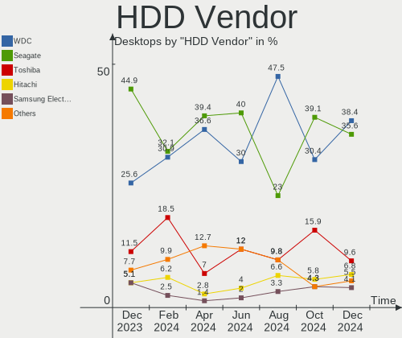
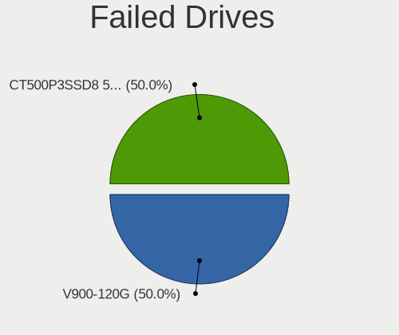
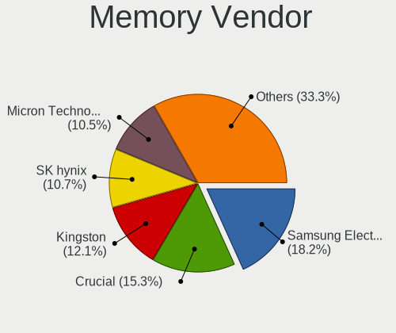

BSD Hardware Trends (Desktops)
------------------------------

A project to identify most popular hardware characteristics and track their change
over time based on data collected by BSD users at https://BSD-Hardware.info.

Anyone can contribute to this report by the [hw-probe](https://github.com/linuxhw/hw-probe/blob/master/INSTALL.BSD.md) tool:

    hw-probe -all -upload

This report is for one last month. Overall report since the beginning of time: [TestCoverage](https://github.com/bsdhw/TestCoverage)

Period: Apr, 2022.

Contents
--------

* [ System ](#system)
  - [ OS                       ](#os)
  - [ OS Family                ](#os-family)
  - [ Arch                     ](#arch)
  - [ DE                       ](#de)
  - [ Display Server           ](#display-server)
  - [ Display Manager          ](#display-manager)
  - [ OS Lang                  ](#os-lang)
  - [ Boot Mode                ](#boot-mode)
  - [ Filesystem               ](#filesystem)
  - [ Part. scheme             ](#part-scheme)

* [ Board ](#board)
  - [ Vendor                   ](#vendor)
  - [ Model                    ](#model)
  - [ Model Family             ](#model-family)
  - [ MFG Year                 ](#mfg-year)
  - [ Form Factor              ](#form-factor)
  - [ Coreboot                 ](#coreboot)
  - [ RAM Size                 ](#ram-size)
  - [ RAM Used                 ](#ram-used)
  - [ Total Drives             ](#total-drives)
  - [ Has CD-ROM               ](#has-cd-rom)
  - [ Has Ethernet             ](#has-ethernet)
  - [ Has WiFi                 ](#has-wifi)
  - [ Has Bluetooth            ](#has-bluetooth)

* [ Location ](#location)
  - [ Country                  ](#country)
  - [ City                     ](#city)

* [ Drives ](#drives)
  - [ Drive Vendor             ](#drive-vendor)
  - [ Drive Model              ](#drive-model)
  - [ HDD Vendor               ](#hdd-vendor)
  - [ SSD Vendor               ](#ssd-vendor)
  - [ Drive Kind               ](#drive-kind)
  - [ Drive Connector          ](#drive-connector)
  - [ Drive Size               ](#drive-size)
  - [ Space Total              ](#space-total)
  - [ Space Used               ](#space-used)
  - [ Malfunc. Drives          ](#malfunc-drives)
  - [ Malfunc. Drive Vendor    ](#malfunc-drive-vendor)
  - [ Malfunc. HDD Vendor      ](#malfunc-hdd-vendor)
  - [ Malfunc. Drive Kind      ](#malfunc-drive-kind)
  - [ Failed Drives            ](#failed-drives)
  - [ Failed Drive Vendor      ](#failed-drive-vendor)
  - [ Drive Status             ](#drive-status)

* [ Storage controller ](#storage-controller)
  - [ Storage Vendor           ](#storage-vendor)
  - [ Storage Model            ](#storage-model)
  - [ Storage Kind             ](#storage-kind)

* [ Processor ](#processor)
  - [ CPU Vendor               ](#cpu-vendor)
  - [ CPU Model                ](#cpu-model)
  - [ CPU Model Family         ](#cpu-model-family)
  - [ CPU Cores                ](#cpu-cores)
  - [ CPU Sockets              ](#cpu-sockets)
  - [ CPU Threads              ](#cpu-threads)
  - [ CPU Microarch            ](#cpu-microarch)

* [ Graphics ](#graphics)
  - [ GPU Vendor               ](#gpu-vendor)
  - [ GPU Model                ](#gpu-model)
  - [ GPU Combo                ](#gpu-combo)
  - [ GPU Driver               ](#gpu-driver)
  - [ GPU Memory               ](#gpu-memory)

* [ Monitor ](#monitor)
  - [ Monitor Vendor           ](#monitor-vendor)
  - [ Monitor Model            ](#monitor-model)
  - [ Monitor Resolution       ](#monitor-resolution)
  - [ Monitor Diagonal         ](#monitor-diagonal)
  - [ Monitor Width            ](#monitor-width)
  - [ Aspect Ratio             ](#aspect-ratio)
  - [ Monitor Area             ](#monitor-area)
  - [ Pixel Density            ](#pixel-density)
  - [ Multiple Monitors        ](#multiple-monitors)

* [ Network ](#network)
  - [ Net Controller Vendor    ](#net-controller-vendor)
  - [ Net Controller Model     ](#net-controller-model)
  - [ Wireless Vendor          ](#wireless-vendor)
  - [ Wireless Model           ](#wireless-model)
  - [ Ethernet Vendor          ](#ethernet-vendor)
  - [ Ethernet Model           ](#ethernet-model)
  - [ Net Controller Kind      ](#net-controller-kind)
  - [ Used Controller          ](#used-controller)
  - [ NICs                     ](#nics)
  - [ IPv6                     ](#ipv6)

* [ Bluetooth ](#bluetooth)
  - [ Bluetooth Vendor         ](#bluetooth-vendor)
  - [ Bluetooth Model          ](#bluetooth-model)

* [ Sound ](#sound)
  - [ Sound Vendor             ](#sound-vendor)
  - [ Sound Model              ](#sound-model)

* [ Memory ](#memory)
  - [ Memory Vendor            ](#memory-vendor)
  - [ Memory Model             ](#memory-model)
  - [ Memory Kind              ](#memory-kind)
  - [ Memory Form Factor       ](#memory-form-factor)
  - [ Memory Size              ](#memory-size)
  - [ Memory Speed             ](#memory-speed)

* [ Printers & scanners ](#printers--scanners)
  - [ Printer Vendor           ](#printer-vendor)
  - [ Printer Model            ](#printer-model)
  - [ Scanner Vendor           ](#scanner-vendor)
  - [ Scanner Model            ](#scanner-model)

* [ Camera ](#camera)
  - [ Camera Vendor            ](#camera-vendor)
  - [ Camera Model             ](#camera-model)

* [ Security ](#security)
  - [ Fingerprint Vendor       ](#fingerprint-vendor)
  - [ Fingerprint Model        ](#fingerprint-model)
  - [ Chipcard Vendor          ](#chipcard-vendor)
  - [ Chipcard Model           ](#chipcard-model)

* [ Unsupported ](#unsupported)
  - [ Unsupported Devices      ](#unsupported-devices)
  - [ Unsupported Device Types ](#unsupported-device-types)

System
------

OS
--

Installed operating systems

| Name                 | Desktops | Percent |
|----------------------|----------|---------|
| OPNsense 22.1.6      | 87       | 29.39%  |
| OPNsense 22.1.4      | 56       | 18.92%  |
| OPNsense 22.1.5      | 42       | 14.19%  |
| helloSystem 0.7.0    | 21       | 7.09%   |
| FreeBSD 13.0-p11     | 16       | 5.41%   |
| OpenBSD 7.1          | 10       | 3.38%   |
| OPNsense 21.7.8      | 9        | 3.04%   |
| FreeBSD 12.3         | 9        | 3.04%   |
| OpenBSD 7.0          | 4        | 1.35%   |
| FreeBSD 13.0-p10     | 4        | 1.35%   |
| FreeBSD 13.0-p5      | 3        | 1.01%   |
| TrueNAS 12.2-p12     | 2        | 0.68%   |
| OPNsense 22.7        | 2        | 0.68%   |
| OPNsense 22.1.3      | 2        | 0.68%   |
| OPNsense 22.1.2      | 2        | 0.68%   |
| MidnightBSD 2.1.8    | 2        | 0.68%   |
| GhostBSD 22.04.06    | 2        | 0.68%   |
| FreeBSD 13.1-STABLE  | 2        | 0.68%   |
| FreeBSD 13.1-RC4     | 2        | 0.68%   |
| FreeBSD 13.1-RC2     | 2        | 0.68%   |
| FreeBSD 13.0-p9      | 2        | 0.68%   |
| FreeBSD 13.0-p7      | 2        | 0.68%   |
| FreeBSD 13.0         | 2        | 0.68%   |
| OPNsense 21.7.7      | 1        | 0.34%   |
| OPNsense 21.1.9      | 1        | 0.34%   |
| NomadBSD 5806f915    | 1        | 0.34%   |
| NetBSD 9.99.94       | 1        | 0.34%   |
| helloSystem 0.8.0    | 1        | 0.34%   |
| helloSystem 0.5.0    | 1        | 0.34%   |
| helloSystem 0.4.0    | 1        | 0.34%   |
| FreeBSD 14.0-CURRENT | 1        | 0.34%   |
| FreeBSD 13.0-p4      | 1        | 0.34%   |
| FreeBSD 12.3-STABLE  | 1        | 0.34%   |
| FreeBSD 12.3-p5      | 1        | 0.34%   |

OS Family
---------

OS without a version

| Name        | Desktops | Percent |
|-------------|----------|---------|
| OPNsense    | 202      | 68.24%  |
| FreeBSD     | 48       | 16.22%  |
| helloSystem | 24       | 8.11%   |
| OpenBSD     | 14       | 4.73%   |
| TrueNAS     | 2        | 0.68%   |
| MidnightBSD | 2        | 0.68%   |
| GhostBSD    | 2        | 0.68%   |
| NomadBSD    | 1        | 0.34%   |
| NetBSD      | 1        | 0.34%   |

Arch
----

OS architecture (x86_64, i586, etc.)

| Name   | Desktops | Percent |
|--------|----------|---------|
| amd64  | 290      | 97.97%  |
| arm64  | 4        | 1.35%   |
| macppc | 1        | 0.34%   |
| i386   | 1        | 0.34%   |

DE
--

Desktop Environment

| Name          | Desktops | Percent |
|---------------|----------|---------|
| Console       | 233      | 78.72%  |
| helloDesktop  | 34       | 11.49%  |
| XFCE          | 8        | 2.7%    |
| MATE          | 6        | 2.03%   |
| KDE5          | 6        | 2.03%   |
| Openbox       | 2        | 0.68%   |
| Enlightenment | 2        | 0.68%   |
| xfwm          | 1        | 0.34%   |
| TWM           | 1        | 0.34%   |
| LXQt          | 1        | 0.34%   |
| i3            | 1        | 0.34%   |
| AwesomeWM     | 1        | 0.34%   |

Display Server
--------------

X11 or Wayland

| Name    | Desktops | Percent |
|---------|----------|---------|
| Console | 238      | 80.41%  |
| X11     | 58       | 19.59%  |

Display Manager
---------------

SDDM, LightDM, etc.

| Name    | Desktops | Percent |
|---------|----------|---------|
| Console | 253      | 85.47%  |
| SLiM    | 28       | 9.46%   |
| LightDM | 7        | 2.36%   |
| SDDM    | 5        | 1.69%   |
| XDM     | 3        | 1.01%   |

OS Lang
-------

Language

| Lang    | Desktops | Percent |
|---------|----------|---------|
| Unknown | 215      | 72.64%  |
| C       | 37       | 12.5%   |
| en_US   | 30       | 10.14%  |
| ru_RU   | 7        | 2.36%   |
| fr_FR   | 2        | 0.68%   |
| es_ES   | 2        | 0.68%   |
| en_GB   | 2        | 0.68%   |
| it_IT   | 1        | 0.34%   |

Boot Mode
---------

EFI or BIOS

| Mode | Desktops | Percent |
|------|----------|---------|
| EFI  | 251      | 84.8%   |
| BIOS | 45       | 15.2%   |

Filesystem
----------

Type of filesystem

| Type   | Desktops | Percent |
|--------|----------|---------|
| Ufs    | 162      | 54.73%  |
| Zfs    | 107      | 36.15%  |
| Ffs    | 14       | 4.73%   |
| Cd9660 | 13       | 4.39%   |

Part. scheme
------------

Scheme of partitioning

| Type    | Desktops | Percent |
|---------|----------|---------|
| GPT     | 263      | 88.85%  |
| MBR     | 28       | 9.46%   |
| Unknown | 4        | 1.35%   |
| BSD     | 1        | 0.34%   |

Board
-----

Vendor
------

Motherboard manufacturer

| Name                       | Desktops | Percent |
|----------------------------|----------|---------|
| ASUSTek Computer           | 34       | 11.49%  |
| Unknown                    | 31       | 10.47%  |
| Dell                       | 24       | 8.11%   |
| Protectli                  | 22       | 7.43%   |
| PC Engines                 | 22       | 7.43%   |
| Gigabyte Technology        | 22       | 7.43%   |
| Hewlett-Packard            | 21       | 7.09%   |
| ASRock                     | 21       | 7.09%   |
| Intel                      | 20       | 6.76%   |
| MSI                        | 17       | 5.74%   |
| Lenovo                     | 13       | 4.39%   |
| Supermicro                 | 9        | 3.04%   |
| Fujitsu                    | 5        | 1.69%   |
| Shuttle                    | 4        | 1.35%   |
| Seeed Studio               | 3        | 1.01%   |
| Biostar                    | 3        | 1.01%   |
| OEM                        | 2        | 0.68%   |
| Jetway                     | 2        | 0.68%   |
| Winston Marriot            | 1        | 0.34%   |
| Sony                       | 1        | 0.34%   |
| ShenZhen MinWin Technology | 1        | 0.34%   |
| Quanmax                    | 1        | 0.34%   |
| Pegatron                   | 1        | 0.34%   |
| Packard Bell               | 1        | 0.34%   |
| MW                         | 1        | 0.34%   |
| KOHJINSHA                  | 1        | 0.34%   |
| IceWhale Technology        | 1        | 0.34%   |
| HPE                        | 1        | 0.34%   |
| eMachines                  | 1        | 0.34%   |
| Deciso                     | 1        | 0.34%   |
| Datto                      | 1        | 0.34%   |
| CheckPoint                 | 1        | 0.34%   |
| BESSTAR Tech               | 1        | 0.34%   |
| AZW                        | 1        | 0.34%   |
| ASRockRack                 | 1        | 0.34%   |
| Apple                      | 1        | 0.34%   |
| Alienware                  | 1        | 0.34%   |
| Acidanthera                | 1        | 0.34%   |
| Acer                       | 1        | 0.34%   |

Model
-----

Motherboard model

| Name                                | Desktops | Percent |
|-------------------------------------|----------|---------|
| Unknown                             | 31       | 10.47%  |
| PC Engines APU2                     | 14       | 4.73%   |
| Protectli FW6                       | 7        | 2.36%   |
| Intel Nobilis                       | 7        | 2.36%   |
| Protectli FW4B                      | 6        | 2.03%   |
| PC Engines apu4                     | 5        | 1.69%   |
| HP t620 PLUS Quad Core TC           | 5        | 1.69%   |
| Protectli VP2410                    | 4        | 1.35%   |
| ASUS All Series                     | 4        | 1.35%   |
| Lenovo ThinkCentre M725s 10VUS19H00 | 3        | 1.01%   |
| Intel Q3XXG4-P V1.0                 | 3        | 1.01%   |
| HP EliteDesk 800 G1 SFF             | 3        | 1.01%   |
| Dell OptiPlex 7040                  | 3        | 1.01%   |
| Dell G5 5090                        | 3        | 1.01%   |
| Supermicro X9SCL/X9SCM              | 2        | 0.68%   |
| Seeed Studio ODYSSEY-X86J4105       | 2        | 0.68%   |
| Protectli FW1                       | 2        | 0.68%   |
| PC Engines APU3                     | 2        | 0.68%   |
| MSI MS-7C37                         | 2        | 0.68%   |
| Jetway 1.0                          | 2        | 0.68%   |
| Intel CRESCENTBAY                   | 2        | 0.68%   |
| HP ProDesk 600 G3 SFF               | 2        | 0.68%   |
| HP Compaq 8200 Elite SFF PC         | 2        | 0.68%   |
| Gigabyte X570 AORUS PRO             | 2        | 0.68%   |
| Gigabyte 990FXA-UD3                 | 2        | 0.68%   |
| Dell OptiPlex 9020                  | 2        | 0.68%   |
| Dell OptiPlex 790                   | 2        | 0.68%   |
| Dell OptiPlex 7010                  | 2        | 0.68%   |
| Dell OptiPlex 5040                  | 2        | 0.68%   |
| ASRock X570 Phantom Gaming 4        | 2        | 0.68%   |
| Winston Marriot PICO PC             | 1        | 0.34%   |
| Supermicro X9SAE                    | 1        | 0.34%   |
| Supermicro X9DAL                    | 1        | 0.34%   |
| Supermicro X8SIL                    | 1        | 0.34%   |
| Supermicro X7SPA-HF                 | 1        | 0.34%   |
| Supermicro SYS-6028R-TRT            | 1        | 0.34%   |
| Supermicro SYS-5018D-MF             | 1        | 0.34%   |
| Supermicro Pro546267                | 1        | 0.34%   |
| Sony VPCL22Z1R                      | 1        | 0.34%   |
| Shuttle XH61V                       | 1        | 0.34%   |
| Shuttle SH570                       | 1        | 0.34%   |
| Shuttle DS20U                       | 1        | 0.34%   |
| Shuttle DS10U                       | 1        | 0.34%   |
| ShenZhen MinWin MW-NANO-APL-4L      | 1        | 0.34%   |
| Seeed Studio ODYSSEY-X86J4125       | 1        | 0.34%   |
| Quanmax spo-book TECH QUAD          | 1        | 0.34%   |
| Protectli FW6E                      | 1        | 0.34%   |
| Protectli FW6D                      | 1        | 0.34%   |
| Protectli FW2                       | 1        | 0.34%   |
| Pegatron KX629AA-ABZ a6561.it       | 1        | 0.34%   |
| PC Engines APU                      | 1        | 0.34%   |
| Packard Bell APL00                  | 1        | 0.34%   |
| OEM NU93 Series                     | 1        | 0.34%   |
| OEM 1.0                             | 1        | 0.34%   |
| MW GMLK-2_5G4L                      | 1        | 0.34%   |
| MSI Pro 3130 Small Form Factor PC   | 1        | 0.34%   |
| MSI p6-2330                         | 1        | 0.34%   |
| MSI MS-7C96                         | 1        | 0.34%   |
| MSI MS-7C94                         | 1        | 0.34%   |
| MSI MS-7C91                         | 1        | 0.34%   |

Model Family
------------

Motherboard model prefix

| Name                           | Desktops | Percent |
|--------------------------------|----------|---------|
| Unknown                        | 31       | 10.47%  |
| Dell OptiPlex                  | 15       | 5.07%   |
| PC Engines APU2                | 14       | 4.73%   |
| Lenovo ThinkCentre             | 9        | 3.04%   |
| ASUS PRIME                     | 8        | 2.7%    |
| Protectli FW6                  | 7        | 2.36%   |
| Intel Nobilis                  | 7        | 2.36%   |
| Protectli FW4B                 | 6        | 2.03%   |
| PC Engines apu4                | 5        | 1.69%   |
| HP t620                        | 5        | 1.69%   |
| HP EliteDesk                   | 5        | 1.69%   |
| HP Compaq                      | 5        | 1.69%   |
| Protectli VP2410               | 4        | 1.35%   |
| ASUS All                       | 4        | 1.35%   |
| Intel Q3XXG4-P                 | 3        | 1.01%   |
| Fujitsu ESPRIMO                | 3        | 1.01%   |
| Dell Precision                 | 3        | 1.01%   |
| Dell G5                        | 3        | 1.01%   |
| ASUS TUF                       | 3        | 1.01%   |
| Supermicro X9SCL               | 2        | 0.68%   |
| Seeed Studio ODYSSEY-X86J4105  | 2        | 0.68%   |
| Protectli FW1                  | 2        | 0.68%   |
| PC Engines APU3                | 2        | 0.68%   |
| MSI MS-7C37                    | 2        | 0.68%   |
| Jetway 1.0                     | 2        | 0.68%   |
| Intel CRESCENTBAY              | 2        | 0.68%   |
| HP ProDesk                     | 2        | 0.68%   |
| Gigabyte X570                  | 2        | 0.68%   |
| Gigabyte B560M                 | 2        | 0.68%   |
| Gigabyte 990FXA-UD3            | 2        | 0.68%   |
| Fujitsu FUTRO                  | 2        | 0.68%   |
| ASUS ROG                       | 2        | 0.68%   |
| ASUS M5A97                     | 2        | 0.68%   |
| ASRock X570                    | 2        | 0.68%   |
| Winston Marriot PICO           | 1        | 0.34%   |
| Supermicro X9SAE               | 1        | 0.34%   |
| Supermicro X9DAL               | 1        | 0.34%   |
| Supermicro X8SIL               | 1        | 0.34%   |
| Supermicro X7SPA-HF            | 1        | 0.34%   |
| Supermicro SYS-6028R-TRT       | 1        | 0.34%   |
| Supermicro SYS-5018D-MF        | 1        | 0.34%   |
| Supermicro Pro546267           | 1        | 0.34%   |
| Sony VPCL22Z1R                 | 1        | 0.34%   |
| Shuttle XH61V                  | 1        | 0.34%   |
| Shuttle SH570                  | 1        | 0.34%   |
| Shuttle DS20U                  | 1        | 0.34%   |
| Shuttle DS10U                  | 1        | 0.34%   |
| ShenZhen MinWin MW-NANO-APL-4L | 1        | 0.34%   |
| Seeed Studio ODYSSEY-X86J4125  | 1        | 0.34%   |
| Quanmax spo-book               | 1        | 0.34%   |
| Protectli FW6E                 | 1        | 0.34%   |
| Protectli FW6D                 | 1        | 0.34%   |
| Protectli FW2                  | 1        | 0.34%   |
| Pegatron KX629AA-ABZ           | 1        | 0.34%   |
| PC Engines APU                 | 1        | 0.34%   |
| Packard Bell APL00             | 1        | 0.34%   |
| OEM NU93                       | 1        | 0.34%   |
| OEM 1.0                        | 1        | 0.34%   |
| MW GMLK-2                      | 1        | 0.34%   |
| MSI Pro                        | 1        | 0.34%   |

MFG Year
--------

Motherboard manufacture year

| Year    | Desktops | Percent |
|---------|----------|---------|
| 2019    | 46       | 15.54%  |
| 2021    | 38       | 12.84%  |
| 2020    | 35       | 11.82%  |
| 2018    | 35       | 11.82%  |
| 2016    | 34       | 11.49%  |
| 2011    | 20       | 6.76%   |
| 2014    | 19       | 6.42%   |
| 2015    | 14       | 4.73%   |
| 2013    | 13       | 4.39%   |
| 2012    | 9        | 3.04%   |
| 2022    | 8        | 2.7%    |
| 2010    | 7        | 2.36%   |
| 2017    | 5        | 1.69%   |
| 2008    | 5        | 1.69%   |
| Unknown | 5        | 1.69%   |
| 2009    | 2        | 0.68%   |
| 2007    | 1        | 0.34%   |

Form Factor
-----------

Physical design of the computer

| Name    | Desktops | Percent |
|---------|----------|---------|
| Desktop | 296      | 100%    |

Coreboot
--------

Have coreboot on board

| Used | Desktops | Percent |
|------|----------|---------|
| No   | 270      | 91.22%  |
| Yes  | 26       | 8.78%   |

RAM Size
--------

Total RAM memory

| Size in GB  | Desktops | Percent |
|-------------|----------|---------|
| 8.01-16.0   | 112      | 37.84%  |
| 4.01-8.0    | 67       | 22.64%  |
| 16.01-24.0  | 57       | 19.26%  |
| 32.01-64.0  | 30       | 10.14%  |
| 64.01-256.0 | 14       | 4.73%   |
| 2.01-3.0    | 7        | 2.36%   |
| 0.51-1.0    | 4        | 1.35%   |
| 24.01-32.0  | 2        | 0.68%   |
| 1.01-2.0    | 2        | 0.68%   |
| 3.01-4.0    | 1        | 0.34%   |

RAM Used
--------

Used RAM memory

| Used GB   | Desktops | Percent |
|-----------|----------|---------|
| 0.01-0.5  | 162      | 54.73%  |
| 0.51-1.0  | 82       | 27.7%   |
| 1.01-2.0  | 36       | 12.16%  |
| 2.01-3.0  | 5        | 1.69%   |
| 3.01-4.0  | 4        | 1.35%   |
| 0         | 3        | 1.01%   |
| 4.01-8.0  | 2        | 0.68%   |
| 8.01-16.0 | 1        | 0.34%   |
| Unknown   | 1        | 0.34%   |

Total Drives
------------

Number of drives on board

| Drives | Desktops | Percent |
|--------|----------|---------|
| 1      | 214      | 72.3%   |
| 2      | 26       | 8.78%   |
| 0      | 17       | 5.74%   |
| 4      | 13       | 4.39%   |
| 3      | 11       | 3.72%   |
| 5      | 8        | 2.7%    |
| 6      | 2        | 0.68%   |
| 16     | 1        | 0.34%   |
| 13     | 1        | 0.34%   |
| 9      | 1        | 0.34%   |
| 8      | 1        | 0.34%   |
| 7      | 1        | 0.34%   |

Has CD-ROM
----------

Has CD-ROM on board

| Presented | Desktops | Percent |
|-----------|----------|---------|
| No        | 243      | 82.09%  |
| Yes       | 53       | 17.91%  |

Has Ethernet
------------

Has Ethernet on board

| Presented | Desktops | Percent |
|-----------|----------|---------|
| Yes       | 291      | 98.31%  |
| No        | 5        | 1.69%   |

Has WiFi
--------

Has WiFi module

| Presented | Desktops | Percent |
|-----------|----------|---------|
| No        | 237      | 80.07%  |
| Yes       | 59       | 19.93%  |

Has Bluetooth
-------------

Has Bluetooth module

| Presented | Desktops | Percent |
|-----------|----------|---------|
| No        | 265      | 89.53%  |
| Yes       | 31       | 10.47%  |

Location
--------

Country
-------

Geographic location (country)

| Country             | Desktops | Percent |
|---------------------|----------|---------|
| USA                 | 88       | 29.73%  |
| Germany             | 39       | 13.18%  |
| Russia              | 21       | 7.09%   |
| France              | 17       | 5.74%   |
| UK                  | 14       | 4.73%   |
| Netherlands         | 11       | 3.72%   |
| Canada              | 9        | 3.04%   |
| Romania             | 8        | 2.7%    |
| Poland              | 8        | 2.7%    |
| Italy               | 7        | 2.36%   |
| Switzerland         | 5        | 1.69%   |
| Australia           | 5        | 1.69%   |
| Slovenia            | 4        | 1.35%   |
| Norway              | 4        | 1.35%   |
| Belgium             | 4        | 1.35%   |
| Austria             | 4        | 1.35%   |
| Sweden              | 3        | 1.01%   |
| Spain               | 3        | 1.01%   |
| Portugal            | 3        | 1.01%   |
| Israel              | 3        | 1.01%   |
| Brazil              | 3        | 1.01%   |
| Ukraine             | 2        | 0.68%   |
| Taiwan              | 2        | 0.68%   |
| Singapore           | 2        | 0.68%   |
| Indonesia           | 2        | 0.68%   |
| India               | 2        | 0.68%   |
| Hungary             | 2        | 0.68%   |
| Denmark             | 2        | 0.68%   |
| Czechia             | 2        | 0.68%   |
| Argentina           | 2        | 0.68%   |
| U.S. Virgin Islands | 1        | 0.34%   |
| Turkey              | 1        | 0.34%   |
| Trinidad and Tobago | 1        | 0.34%   |
| Thailand            | 1        | 0.34%   |
| Peru                | 1        | 0.34%   |
| Panama              | 1        | 0.34%   |
| Pakistan            | 1        | 0.34%   |
| New Zealand         | 1        | 0.34%   |
| Japan               | 1        | 0.34%   |
| Iceland             | 1        | 0.34%   |
| Hong Kong           | 1        | 0.34%   |
| Egypt               | 1        | 0.34%   |
| Bulgaria            | 1        | 0.34%   |
| Belarus             | 1        | 0.34%   |
| Albania             | 1        | 0.34%   |

City
----

Geographic location (city)

| City                    | Desktops | Percent |
|-------------------------|----------|---------|
| Grand Rapids            | 9        | 3.04%   |
| Paris                   | 5        | 1.69%   |
| Moscow                  | 4        | 1.35%   |
| Cluj-Napoca             | 4        | 1.35%   |
| Vladivostok             | 3        | 1.01%   |
| St. Albert              | 3        | 1.01%   |
| Oslo                    | 3        | 1.01%   |
| Milan                   | 3        | 1.01%   |
| Berlin                  | 3        | 1.01%   |
| Zurich                  | 2        | 0.68%   |
| Ypsilanti               | 2        | 0.68%   |
| Wroclaw                 | 2        | 0.68%   |
| Vienna                  | 2        | 0.68%   |
| Tampa                   | 2        | 0.68%   |
| Tainan City             | 2        | 0.68%   |
| Singapore               | 2        | 0.68%   |
| Scottsdale              | 2        | 0.68%   |
| Salem                   | 2        | 0.68%   |
| Redmond                 | 2        | 0.68%   |
| Portland                | 2        | 0.68%   |
| Perth                   | 2        | 0.68%   |
| Ospel                   | 2        | 0.68%   |
| Omsk                    | 2        | 0.68%   |
| Los Angeles             | 2        | 0.68%   |
| London                  | 2        | 0.68%   |
| Krasnodar               | 2        | 0.68%   |
| Kranj                   | 2        | 0.68%   |
| Independence            | 2        | 0.68%   |
| Denver                  | 2        | 0.68%   |
| Cologne                 | 2        | 0.68%   |
| Champlin                | 2        | 0.68%   |
| Bucharest               | 2        | 0.68%   |
| Amsterdam               | 2        | 0.68%   |
| Zetten                  | 1        | 0.34%   |
| Yafa                    | 1        | 0.34%   |
| Wuppertal               | 1        | 0.34%   |
| Wunstorf                | 1        | 0.34%   |
| Willisau                | 1        | 0.34%   |
| Wendell                 | 1        | 0.34%   |
| Wenatchee               | 1        | 0.34%   |
| Ward of Tacarigua       | 1        | 0.34%   |
| Walla Walla             | 1        | 0.34%   |
| Waldwick                | 1        | 0.34%   |
| Volgograd               | 1        | 0.34%   |
| Virginia Beach          | 1        | 0.34%   |
| Villanueva de la Canada | 1        | 0.34%   |
| Vichy                   | 1        | 0.34%   |
| Varna                   | 1        | 0.34%   |
| Vancouver               | 1        | 0.34%   |
| Valparaiso              | 1        | 0.34%   |
| Umeå                   | 1        | 0.34%   |
| Tulln                   | 1        | 0.34%   |
| Toulouse                | 1        | 0.34%   |
| Toronto                 | 1        | 0.34%   |
| Tirana                  | 1        | 0.34%   |
| Teplice                 | 1        | 0.34%   |
| Tel Aviv                | 1        | 0.34%   |
| Tambov                  | 1        | 0.34%   |
| Taastrup                | 1        | 0.34%   |
| Sydney                  | 1        | 0.34%   |

Drives
------

Drive Vendor
------------

Hard drive vendors

| Vendor                             | Desktops | Drives | Percent |
|------------------------------------|----------|--------|---------|
| Samsung Electronics                | 58       | 69     | 15.89%  |
| WDC                                | 55       | 88     | 15.07%  |
| Seagate                            | 34       | 50     | 9.32%   |
| Kingston                           | 33       | 33     | 9.04%   |
| Crucial                            | 25       | 27     | 6.85%   |
| China                              | 14       | 14     | 3.84%   |
| Toshiba                            | 13       | 18     | 3.56%   |
| SanDisk                            | 13       | 13     | 3.56%   |
| Transcend                          | 12       | 12     | 3.29%   |
| Intel                              | 11       | 12     | 3.01%   |
| Hoodisk                            | 9        | 9      | 2.47%   |
| A-DATA Technology                  | 8        | 9      | 2.19%   |
| Hitachi                            | 7        | 12     | 1.92%   |
| PNY                                | 6        | 6      | 1.64%   |
| Dogfish                            | 6        | 6      | 1.64%   |
| Protectli                          | 5        | 5      | 1.37%   |
| OCZ                                | 4        | 4      | 1.1%    |
| Corsair                            | 4        | 4      | 1.1%    |
| NVMe                               | 3        | 4      | 0.82%   |
| Intenso                            | 3        | 4      | 0.82%   |
| BIWIN                              | 3        | 3      | 0.82%   |
| Apple                              | 3        | 3      | 0.82%   |
| ShiJi                              | 2        | 2      | 0.55%   |
| OPENBSD                            | 2        | 2      | 0.55%   |
| Micron Technology                  | 2        | 2      | 0.55%   |
| LITEONIT                           | 2        | 2      | 0.55%   |
| Leven                              | 2        | 3      | 0.55%   |
| HGST                               | 2        | 2      | 0.55%   |
| XPG                                | 1        | 1      | 0.27%   |
| WD MediaMax                        | 1        | 1      | 0.27%   |
| Valuetech                          | 1        | 2      | 0.27%   |
| Team                               | 1        | 1      | 0.27%   |
| SPCC                               | 1        | 1      | 0.27%   |
| SK Hynix                           | 1        | 1      | 0.27%   |
| Silicon Power                      | 1        | 1      | 0.27%   |
| Product:              USB DISK 2.0 | 1        | 1      | 0.27%   |
| Phison                             | 1        | 1      | 0.27%   |
| Pccooler                           | 1        | 1      | 0.27%   |
| Patriot                            | 1        | 2      | 0.27%   |
| Netac                              | 1        | 1      | 0.27%   |
| LITEON                             | 1        | 1      | 0.27%   |
| Lexar                              | 1        | 1      | 0.27%   |
| KIOXIA-EXCERIA                     | 1        | 1      | 0.27%   |
| KIOXIA                             | 1        | 1      | 0.27%   |
| KingSpec                           | 1        | 1      | 0.27%   |
| KimMiDi                            | 1        | 1      | 0.27%   |
| Innodisk                           | 1        | 1      | 0.27%   |
| HPT                                | 1        | 15     | 0.27%   |
| Gigabyte Technology                | 1        | 1      | 0.27%   |
| FORESEE                            | 1        | 1      | 0.27%   |
| EMTEC                              | 1        | 1      | 0.27%   |
| Apacer                             | 1        | 1      | 0.27%   |

Drive Model
-----------

Hard drive models

| Model                                | Desktops | Percent |
|--------------------------------------|----------|---------|
| Crucial CT240BX500SSD1 240GB         | 10       | 2.39%   |
| WDC WD800JD-75MSA3 80GB              | 9        | 2.15%   |
| Seagate ST1000DM010-2EP102 1TB       | 5        | 1.2%    |
| Samsung SSD 860 EVO 500GB            | 5        | 1.2%    |
| Kingston SA400S37120G 120GB          | 5        | 1.2%    |
| Samsung SSD 860 EVO 250GB            | 4        | 0.96%   |
| Kingston SUV500MS120G 120GB          | 4        | 0.96%   |
| A-DATA SU650 120GB                   | 4        | 0.96%   |
| WDC WD20EFRX-68EUZN0 2TB             | 3        | 0.72%   |
| Transcend TS256GMSA230S 256GB        | 3        | 0.72%   |
| Transcend TS128GMSA230S 128GB        | 3        | 0.72%   |
| Seagate ST3500413AS 500GB            | 3        | 0.72%   |
| Seagate ST1000DM003-1ER162 1TB       | 3        | 0.72%   |
| Samsung SSD 980 PRO 1TB              | 3        | 0.72%   |
| Samsung SSD 870 EVO 1TB              | 3        | 0.72%   |
| Samsung MZ7LN256HAJQ-000L7 256GB     | 3        | 0.72%   |
| Hoodisk SSD 64GB                     | 3        | 0.72%   |
| China SATA SSD 32GB                  | 3        | 0.72%   |
| China SATA SSD 16GB                  | 3        | 0.72%   |
| WDC WDS120G2G0A-00JH30 120GB         | 2        | 0.48%   |
| WDC WDS100T2B0C-00PXH0 1TB           | 2        | 0.48%   |
| WDC WD80EFAX-68LHPN0 8TB             | 2        | 0.48%   |
| WDC PC SN520 NVMe 256GB              | 2        | 0.48%   |
| Transcend TS64GMSA230S 64GB          | 2        | 0.48%   |
| Toshiba MQ01ABF050 500GB             | 2        | 0.48%   |
| Toshiba HDWD110 1TB                  | 2        | 0.48%   |
| Toshiba DT01ACA100 1TB               | 2        | 0.48%   |
| ShiJi SSD 128GB                      | 2        | 0.48%   |
| Seagate ST8000DM004-2CX188 8TB       | 2        | 0.48%   |
| Seagate ST4000DM000-1F2168 4TB       | 2        | 0.48%   |
| Seagate ST3750640NS 752GB            | 2        | 0.48%   |
| Seagate ST2000DM006-2DM164 2TB       | 2        | 0.48%   |
| Seagate ST1000LM035-1RK172 1TB       | 2        | 0.48%   |
| SanDisk X400 M.2 2280 128GB          | 2        | 0.48%   |
| SanDisk SDSSDA120G 120GB             | 2        | 0.48%   |
| Samsung SSD PM830 2.5-inch 7mm 128GB | 2        | 0.48%   |
| Samsung SSD 980 PRO 500GB            | 2        | 0.48%   |
| Samsung SSD 970 EVO Plus 250GB       | 2        | 0.48%   |
| Samsung SSD 960 EVO 250GB            | 2        | 0.48%   |
| Samsung SSD 850 EVO 250GB            | 2        | 0.48%   |
| Samsung HD204UI 2TB                  | 2        | 0.48%   |
| Protectli 120GB mSATA                | 2        | 0.48%   |
| PNY CS900 120GB SSD                  | 2        | 0.48%   |
| OPENBSD SR RAID 1 752GB              | 2        | 0.48%   |
| Kingston SV300S37A120G 120GB         | 2        | 0.48%   |
| Kingston SUV500MS240G 240GB          | 2        | 0.48%   |
| Kingston SMS200S330G 32GB            | 2        | 0.48%   |
| Kingston SKC600MS256G 256GB          | 2        | 0.48%   |
| Kingston SA400S37240G 240GB          | 2        | 0.48%   |
| Kingston SA400M8120G 120GB           | 2        | 0.48%   |
| Kingston SA2000M81000G 1TB           | 2        | 0.48%   |
| Hoodisk SSD 128GB                    | 2        | 0.48%   |
| Hitachi HUA723020ALA640 2TB          | 2        | 0.48%   |
| Dogfish SSD 256GB                    | 2        | 0.48%   |
| Dogfish SSD 128GB                    | 2        | 0.48%   |
| Crucial CT128M550SSD1 128GB          | 2        | 0.48%   |
| Crucial CT1000BX500SSD1 1TB          | 2        | 0.48%   |
| China XJH-128GB                      | 2        | 0.48%   |
| BIWIN SSD 128GB                      | 2        | 0.48%   |
| XPG SX950U 240GB                     | 1        | 0.24%   |

HDD Vendor
----------

Hard disk drive vendors

| Vendor                             | Desktops | Drives | Percent |
|------------------------------------|----------|--------|---------|
| WDC                                | 42       | 67     | 38.18%  |
| Seagate                            | 32       | 48     | 29.09%  |
| Toshiba                            | 13       | 18     | 11.82%  |
| Samsung Electronics                | 7        | 8      | 6.36%   |
| Hitachi                            | 7        | 12     | 6.36%   |
| OPENBSD                            | 2        | 2      | 1.82%   |
| HGST                               | 2        | 2      | 1.82%   |
| WD MediaMax                        | 1        | 1      | 0.91%   |
| Product:              USB DISK 2.0 | 1        | 1      | 0.91%   |
| NVMe                               | 1        | 1      | 0.91%   |
| HPT                                | 1        | 15     | 0.91%   |
| Apple                              | 1        | 1      | 0.91%   |

SSD Vendor
----------

Solid state drive vendors

| Vendor              | Desktops | Drives | Percent |
|---------------------|----------|--------|---------|
| Samsung Electronics | 39       | 43     | 17.97%  |
| Kingston            | 29       | 29     | 13.36%  |
| Crucial             | 23       | 25     | 10.6%   |
| China               | 14       | 14     | 6.45%   |
| SanDisk             | 13       | 13     | 5.99%   |
| Transcend           | 11       | 11     | 5.07%   |
| Hoodisk             | 9        | 9      | 4.15%   |
| Intel               | 8        | 9      | 3.69%   |
| A-DATA Technology   | 7        | 7      | 3.23%   |
| WDC                 | 6        | 7      | 2.76%   |
| Dogfish             | 6        | 6      | 2.76%   |
| Protectli           | 5        | 5      | 2.3%    |
| PNY                 | 5        | 5      | 2.3%    |
| OCZ                 | 4        | 4      | 1.84%   |
| Intenso             | 3        | 4      | 1.38%   |
| Corsair             | 3        | 3      | 1.38%   |
| BIWIN               | 3        | 3      | 1.38%   |
| ShiJi               | 2        | 2      | 0.92%   |
| Micron Technology   | 2        | 2      | 0.92%   |
| LITEONIT            | 2        | 2      | 0.92%   |
| Leven               | 2        | 3      | 0.92%   |
| Apple               | 2        | 2      | 0.92%   |
| XPG                 | 1        | 1      | 0.46%   |
| Valuetech           | 1        | 2      | 0.46%   |
| Team                | 1        | 1      | 0.46%   |
| SPCC                | 1        | 1      | 0.46%   |
| SK Hynix            | 1        | 1      | 0.46%   |
| Silicon Power       | 1        | 1      | 0.46%   |
| Pccooler            | 1        | 1      | 0.46%   |
| Patriot             | 1        | 2      | 0.46%   |
| NVMe                | 1        | 2      | 0.46%   |
| Netac               | 1        | 1      | 0.46%   |
| LITEON              | 1        | 1      | 0.46%   |
| Lexar               | 1        | 1      | 0.46%   |
| KingSpec            | 1        | 1      | 0.46%   |
| KimMiDi             | 1        | 1      | 0.46%   |
| Innodisk            | 1        | 1      | 0.46%   |
| Gigabyte Technology | 1        | 1      | 0.46%   |
| FORESEE             | 1        | 1      | 0.46%   |
| EMTEC               | 1        | 1      | 0.46%   |
| Apacer              | 1        | 1      | 0.46%   |

Drive Kind
----------

HDD or SSD

| Kind | Desktops | Drives | Percent |
|------|----------|--------|---------|
| SSD  | 198      | 230    | 59.64%  |
| HDD  | 89       | 176    | 26.81%  |
| NVMe | 45       | 52     | 13.55%  |

Drive Connector
---------------

SATA, SAS, NVMe, etc.

| Type | Desktops | Drives | Percent |
|------|----------|--------|---------|
| SATA | 261      | 406    | 85.29%  |
| NVMe | 45       | 52     | 14.71%  |

Drive Size
----------

Size of hard drive

| Size in TB | Desktops | Drives | Percent |
|------------|----------|--------|---------|
| 0.01-0.5   | 229      | 261    | 73.4%   |
| 0.51-1.0   | 41       | 51     | 13.14%  |
| 1.01-2.0   | 17       | 35     | 5.45%   |
| 4.01-10.0  | 11       | 34     | 3.53%   |
| 3.01-4.0   | 8        | 10     | 2.56%   |
| 10.01-20.0 | 4        | 6      | 1.28%   |
| 2.01-3.0   | 2        | 9      | 0.64%   |

Space Total
-----------

Amount of disk space available on the file system

| Size in GB     | Desktops | Percent |
|----------------|----------|---------|
| 101-250        | 122      | 41.22%  |
| 251-500        | 42       | 14.19%  |
| 51-100         | 36       | 12.16%  |
| 21-50          | 33       | 11.15%  |
| 1-20           | 33       | 11.15%  |
| 501-1000       | 19       | 6.42%   |
| More than 3000 | 4        | 1.35%   |
| 2001-3000      | 4        | 1.35%   |
| 1001-2000      | 3        | 1.01%   |

Space Used
----------

Amount of used disk space

| Used GB   | Desktops | Percent |
|-----------|----------|---------|
| 1-20      | 267      | 90.2%   |
| 21-50     | 12       | 4.05%   |
| 51-100    | 6        | 2.03%   |
| 101-250   | 4        | 1.35%   |
| 501-1000  | 3        | 1.01%   |
| 2001-3000 | 2        | 0.68%   |
| 251-500   | 1        | 0.34%   |
| 1001-2000 | 1        | 0.34%   |

Malfunc. Drives
---------------

Drive models with a malfunction

| Model                                    | Desktops | Drives | Percent |
|------------------------------------------|----------|--------|---------|
| Seagate ST3750640NS 752GB                | 2        | 4      | 4.76%   |
| Seagate ST3500413AS 500GB                | 2        | 2      | 4.76%   |
| Seagate ST2000DM006-2DM164 2TB           | 2        | 2      | 4.76%   |
| Samsung Electronics SSD 870 EVO 1TB      | 2        | 2      | 4.76%   |
| XPG SX950U 240GB                         | 1        | 1      | 2.38%   |
| WDC WDS120G2G0A-00JH30 120GB             | 1        | 1      | 2.38%   |
| WDC WD60EZRZ-00RWYB1 6TB                 | 1        | 1      | 2.38%   |
| WDC WD3200BEVT-22A23T0 320GB             | 1        | 1      | 2.38%   |
| WDC WD20EFRX-68EUZN0 2TB                 | 1        | 3      | 2.38%   |
| WDC WD1600BEVE-00UYT0 160GB              | 1        | 1      | 2.38%   |
| SK Hynix SC308 SATA 128GB                | 1        | 1      | 2.38%   |
| Seagate ST8000NM0055-1RM112 8TB          | 1        | 1      | 2.38%   |
| Seagate ST4000LM024-2AN17V 4TB           | 1        | 1      | 2.38%   |
| Seagate ST3250310AS 250GB                | 1        | 1      | 2.38%   |
| Seagate ST3160310CS 160GB                | 1        | 1      | 2.38%   |
| Seagate ST1000DM003-1ER162 1TB           | 1        | 1      | 2.38%   |
| SanDisk SD8TB8U-256G-1006 256GB          | 1        | 1      | 2.38%   |
| Samsung Electronics SSD 960 PRO 512GB    | 1        | 1      | 2.38%   |
| Samsung Electronics SSD 840 Series 120GB | 1        | 1      | 2.38%   |
| Samsung Electronics SP2004C 200GB        | 1        | 1      | 2.38%   |
| Samsung Electronics HM160HI 160GB        | 1        | 1      | 2.38%   |
| Samsung Electronics HD204UI 2TB          | 1        | 1      | 2.38%   |
| Samsung Electronics HD161HJ 160GB        | 1        | 1      | 2.38%   |
| OCZ VERTEX3 120GB                        | 1        | 1      | 2.38%   |
| OCZ VECTOR150 240GB                      | 1        | 1      | 2.38%   |
| Kingston SV300S37A60G 64GB               | 1        | 1      | 2.38%   |
| Kingston SMS200S360G 64GB                | 1        | 1      | 2.38%   |
| Intel SSDSC2KB480G7K 480GB               | 1        | 1      | 2.38%   |
| Intel SSDSC2BW120H6 120GB                | 1        | 1      | 2.38%   |
| Hitachi HTS725032A9A364 320GB            | 1        | 1      | 2.38%   |
| Hitachi HTS543232A7A384 320GB            | 1        | 1      | 2.38%   |
| HGST HTS725050A7E630 500GB               | 1        | 1      | 2.38%   |
| Dogfish SSD 128GB                        | 1        | 1      | 2.38%   |
| Crucial M4-CT064M4SSD2 64GB              | 1        | 1      | 2.38%   |
| Crucial CT480M500SSD1 480GB              | 1        | 1      | 2.38%   |
| Crucial CT128M550SSD1 128GB              | 1        | 1      | 2.38%   |
| Corsair Force 3 SSD 180GB                | 1        | 1      | 2.38%   |
| A-DATA Technology SX8200PNP 512GB        | 1        | 1      | 2.38%   |

Malfunc. Drive Vendor
---------------------

Vendors of faulty drives

| Vendor              | Desktops | Drives | Percent |
|---------------------|----------|--------|---------|
| Seagate             | 11       | 13     | 26.19%  |
| Samsung Electronics | 8        | 8      | 19.05%  |
| WDC                 | 5        | 7      | 11.9%   |
| Crucial             | 3        | 3      | 7.14%   |
| OCZ                 | 2        | 2      | 4.76%   |
| Kingston            | 2        | 2      | 4.76%   |
| Intel               | 2        | 2      | 4.76%   |
| Hitachi             | 2        | 2      | 4.76%   |
| XPG                 | 1        | 1      | 2.38%   |
| SK Hynix            | 1        | 1      | 2.38%   |
| SanDisk             | 1        | 1      | 2.38%   |
| HGST                | 1        | 1      | 2.38%   |
| Dogfish             | 1        | 1      | 2.38%   |
| Corsair             | 1        | 1      | 2.38%   |
| A-DATA Technology   | 1        | 1      | 2.38%   |

Malfunc. HDD Vendor
-------------------

Vendors of faulty HDD drives

| Vendor              | Desktops | Drives | Percent |
|---------------------|----------|--------|---------|
| Seagate             | 11       | 13     | 50%     |
| WDC                 | 4        | 6      | 18.18%  |
| Samsung Electronics | 4        | 4      | 18.18%  |
| Hitachi             | 2        | 2      | 9.09%   |
| HGST                | 1        | 1      | 4.55%   |

Malfunc. Drive Kind
-------------------

Kinds of faulty drives

| Kind | Desktops | Drives | Percent |
|------|----------|--------|---------|
| HDD  | 21       | 26     | 51.22%  |
| SSD  | 18       | 18     | 43.9%   |
| NVMe | 2        | 2      | 4.88%   |

Failed Drives
-------------

Failed drive models

| Model                        | Desktops | Drives | Percent |
|------------------------------|----------|--------|---------|
| WDC WD3200AAJS-00YZCA0 320GB | 1        | 1      | 100%    |

Failed Drive Vendor
-------------------

Failed drive vendors

| Vendor | Desktops | Drives | Percent |
|--------|----------|--------|---------|
| WDC    | 1        | 1      | 100%    |

Drive Status
------------

Number of failed and malfunc. drives

| Status   | Desktops | Drives | Percent |
|----------|----------|--------|---------|
| Works    | 254      | 387    | 84.67%  |
| Malfunc  | 37       | 46     | 12.33%  |
| Detected | 8        | 24     | 2.67%   |
| Failed   | 1        | 1      | 0.33%   |

Storage controller
------------------

Storage Vendor
--------------

Storage controller vendors

| Vendor                      | Desktops | Percent |
|-----------------------------|----------|---------|
| Intel                       | 195      | 52.85%  |
| AMD                         | 91       | 24.66%  |
| Samsung Electronics         | 19       | 5.15%   |
| Sandisk                     | 14       | 3.79%   |
| ASMedia Technology          | 12       | 3.25%   |
| Marvell Technology Group    | 5        | 1.36%   |
| Phison Electronics          | 4        | 1.08%   |
| Kingston Technology Company | 4        | 1.08%   |
| JMicron Technology          | 4        | 1.08%   |
| Broadcom / LSI              | 4        | 1.08%   |
| Toshiba                     | 2        | 0.54%   |
| Seagate Technology          | 2        | 0.54%   |
| Nvidia                      | 2        | 0.54%   |
| Micron/Crucial Technology   | 2        | 0.54%   |
| KIOXIA                      | 2        | 0.54%   |
| ADATA Technology            | 2        | 0.54%   |
| VIA Technologies            | 1        | 0.27%   |
| Silicon Motion              | 1        | 0.27%   |
| Silicon Image               | 1        | 0.27%   |
| Realtek Semiconductor       | 1        | 0.27%   |
| HighPoint Technologies      | 1        | 0.27%   |

Storage Model
-------------

Storage controller models

| Model                                                                                   | Desktops | Percent |
|-----------------------------------------------------------------------------------------|----------|---------|
| AMD FCH SATA Controller [AHCI mode]                                                     | 59       | 13.98%  |
| Intel Sunrise Point-LP SATA Controller [AHCI mode]                                      | 20       | 4.74%   |
| Intel 6 Series/C200 Series Chipset Family 6 port Desktop SATA AHCI Controller           | 18       | 4.27%   |
| Intel 8 Series/C220 Series Chipset Family 6-port SATA Controller 1 [AHCI mode]          | 15       | 3.55%   |
| Intel Q170/Q150/B150/H170/H110/Z170/CM236 Chipset SATA Controller [AHCI Mode]           | 14       | 3.32%   |
| Intel Celeron/Pentium Silver Processor SATA Controller                                  | 13       | 3.08%   |
| ASMedia ASM1062 Serial ATA Controller                                                   | 12       | 2.84%   |
| AMD 400 Series Chipset SATA Controller                                                  | 12       | 2.84%   |
| Intel Atom/Celeron/Pentium Processor x5-E8000/J3xxx/N3xxx Series SATA Controller        | 11       | 2.61%   |
| AMD SB7x0/SB8x0/SB9x0 SATA Controller [AHCI mode]                                       | 11       | 2.61%   |
| Intel Atom Processor E3800 Series SATA AHCI Controller                                  | 10       | 2.37%   |
| Intel 200 Series PCH SATA controller [AHCI mode]                                        | 9        | 2.13%   |
| Intel Cannon Lake PCH SATA AHCI Controller                                              | 8        | 1.9%    |
| AMD SB7x0/SB8x0/SB9x0 IDE Controller                                                    | 8        | 1.9%    |
| AMD FCH SATA Controller [IDE mode]                                                      | 8        | 1.9%    |
| Samsung NVMe SSD Controller PM9A1/PM9A3/980PRO                                          | 7        | 1.66%   |
| Intel 7 Series/C210 Series Chipset Family 6-port SATA Controller [AHCI mode]            | 7        | 1.66%   |
| Unknown                                                                                 | 7        | 1.66%   |
| Samsung NVMe SSD Controller SM981/PM981/PM983                                           | 6        | 1.42%   |
| Samsung NVMe SSD Controller SM961/PM961/SM963                                           | 6        | 1.42%   |
| AMD 500 Series Chipset SATA Controller                                                  | 6        | 1.42%   |
| Intel SATA Controller [RAID mode]                                                       | 5        | 1.18%   |
| Intel NM10/ICH7 Family SATA Controller [IDE mode]                                       | 5        | 1.18%   |
| Intel C600/X79 series chipset 6-Port SATA AHCI Controller                               | 5        | 1.18%   |
| Intel 82801G (ICH7 Family) IDE Controller                                               | 5        | 1.18%   |
| Intel 6 Series/C200 Series Chipset Family Desktop SATA Controller (IDE mode, ports 0-3) | 5        | 1.18%   |
| Intel Wildcat Point-LP SATA Controller [AHCI Mode]                                      | 4        | 0.95%   |
| Intel Cannon Point-LP SATA Controller [AHCI Mode]                                       | 4        | 0.95%   |
| Intel 6 Series/C200 Series Chipset Family Desktop SATA Controller (IDE mode, ports 4-5) | 4        | 0.95%   |
| Intel 500 Series Chipset Family SATA AHCI Controller                                    | 4        | 0.95%   |
| AMD SB7x0/SB8x0/SB9x0 SATA Controller [IDE mode]                                        | 4        | 0.95%   |
| Sandisk WD Black SN750 / PC SN730 NVMe SSD                                              | 3        | 0.71%   |
| Sandisk PC SN520 NVMe SSD                                                               | 3        | 0.71%   |
| Intel Comet Lake SATA AHCI Controller                                                   | 3        | 0.71%   |
| Intel Celeron N3350/Pentium N4200/Atom E3900 Series SATA AHCI Controller                | 3        | 0.71%   |
| Intel 82801IR/IO/IH (ICH9R/DO/DH) 6 port SATA Controller [AHCI mode]                    | 3        | 0.71%   |
| Intel 82801I (ICH9 Family) 2 port SATA Controller [IDE mode]                            | 3        | 0.71%   |
| Intel 8 Series SATA Controller 1 [AHCI mode]                                            | 3        | 0.71%   |
| Sandisk WD PC SN810 / Black SN850 NVMe SSD                                              | 2        | 0.47%   |
| Sandisk WD Blue SN570 NVMe SSD                                                          | 2        | 0.47%   |
| Sandisk WD Blue SN550 NVMe SSD                                                          | 2        | 0.47%   |
| Phison E16 PCIe4 NVMe Controller                                                        | 2        | 0.47%   |
| Phison E12 NVMe Controller                                                              | 2        | 0.47%   |
| Marvell Group 88SE9172 SATA 6Gb/s Controller                                            | 2        | 0.47%   |
| Kingston Company A2000 NVMe SSD                                                         | 2        | 0.47%   |
| JMicron JMB363 SATA/IDE Controller                                                      | 2        | 0.47%   |
| JMicron JMB362 SATA Controller                                                          | 2        | 0.47%   |
| Intel Optane SSD 900P Series                                                            | 2        | 0.47%   |
| Intel NM10/ICH7 Family SATA Controller [AHCI mode]                                      | 2        | 0.47%   |
| Intel C610/X99 series chipset sSATA Controller [AHCI mode]                              | 2        | 0.47%   |
| Intel C610/X99 series chipset 6-Port SATA Controller [AHCI mode]                        | 2        | 0.47%   |
| Intel C602 chipset 4-Port SATA Storage Control Unit                                     | 2        | 0.47%   |
| Intel C600/X79 series chipset SATA RAID Controller                                      | 2        | 0.47%   |
| Intel C600/X79 series chipset IDE-r Controller                                          | 2        | 0.47%   |
| Intel 82801IR/IO/IH (ICH9R/DO/DH) 4 port SATA Controller [IDE mode]                     | 2        | 0.47%   |
| Intel 7 Series Chipset Family 6-port SATA Controller [AHCI mode]                        | 2        | 0.47%   |
| Intel 5 Series/3400 Series Chipset 4 port SATA AHCI Controller                          | 2        | 0.47%   |
| Broadcom / LSI SAS2008 PCI-Express Fusion-MPT SAS-2 [Falcon]                            | 2        | 0.47%   |
| AMD X399 Series Chipset SATA Controller                                                 | 2        | 0.47%   |
| AMD X370 Series Chipset SATA Controller                                                 | 2        | 0.47%   |

Storage Kind
------------

Kind of storage controller (IDE, SATA, NVMe, SAS, ...)

| Kind | Desktops | Percent |
|------|----------|---------|
| SATA | 253      | 69.51%  |
| NVMe | 52       | 14.29%  |
| IDE  | 43       | 11.81%  |
| RAID | 11       | 3.02%   |
| SAS  | 5        | 1.37%   |

Processor
---------

CPU Vendor
----------

Processor vendors

| Vendor  | Desktops | Percent |
|---------|----------|---------|
| Intel   | 199      | 67.23%  |
| AMD     | 92       | 31.08%  |
| ARM     | 4        | 1.35%   |
| PowerPC | 1        | 0.34%   |

CPU Model
---------

Processor models

| Model                                       | Desktops | Percent |
|---------------------------------------------|----------|---------|
| AMD GX-412TC SOC                            | 21       | 7.09%   |
| Intel Celeron J4125 CPU @ 2.00GHz           | 10       | 3.38%   |
| Intel Celeron CPU J3160 @ 1.60GHz           | 7        | 2.36%   |
| Intel Celeron CPU J1900 @ 1.99GHz           | 7        | 2.36%   |
| AMD Ryzen 7 5800X 8-Core Processor          | 5        | 1.69%   |
| AMD Ryzen 5 3600 6-Core Processor           | 5        | 1.69%   |
| AMD GX-420CA SOC with Radeon HD Graphics    | 5        | 1.69%   |
| Intel Core i5-8250U CPU @ 1.60GHz           | 4        | 1.35%   |
| Intel Core i5-4570 CPU @ 3.20GHz            | 4        | 1.35%   |
| Intel Core i5-3470 CPU @ 3.20GHz            | 4        | 1.35%   |
| Intel Core i5-2320 CPU @ 3.00GHz            | 4        | 1.35%   |
| Intel Celeron CPU 3865U @ 1.80GHz           | 4        | 1.35%   |
| AMD Ryzen 9 3900X 12-Core Processor         | 4        | 1.35%   |
| AMD Athlon 5350 APU with Radeon R3          | 4        | 1.35%   |
| Intel Core i7-9700K CPU @ 3.60GHz           | 3        | 1.01%   |
| Intel Core i7-6700 CPU @ 3.40GHz            | 3        | 1.01%   |
| Intel Core i5-9400 CPU @ 2.90GHz            | 3        | 1.01%   |
| Intel Core i5-7200U CPU @ 2.50GHz           | 3        | 1.01%   |
| Intel Core i5-6500 CPU @ 3.20GHz            | 3        | 1.01%   |
| Intel Core i5-5200U CPU @ 2.20GHz           | 3        | 1.01%   |
| Intel Core i5-4590 CPU @ 3.30GHz            | 3        | 1.01%   |
| Intel Core i3-7100U CPU @ 2.40GHz           | 3        | 1.01%   |
| Intel Core 2 Quad CPU Q6600 @ 2.40GHz       | 3        | 1.01%   |
| Intel Celeron J4105 CPU @ 1.50GHz           | 3        | 1.01%   |
| ARM Cortex-A53 r0p4                         | 3        | 1.01%   |
| AMD Ryzen 9 5950X 16-Core Processor         | 3        | 1.01%   |
| AMD PRO A10-8770 R7, 10 COMPUTE CORES 4C+6G | 3        | 1.01%   |
| Intel Xeon CPU E5-2689 0 @ 2.60GHz          | 2        | 0.68%   |
| Intel Xeon CPU E3-1230 V2 @ 3.30GHz         | 2        | 0.68%   |
| Intel Xeon CPU E3-1220L V2 @ 2.30GHz        | 2        | 0.68%   |
| Intel Pentium Gold G5400 CPU @ 3.70GHz      | 2        | 0.68%   |
| Intel Pentium CPU N3700 @ 1.60GHz           | 2        | 0.68%   |
| Intel Pentium CPU G620 @ 2.60GHz            | 2        | 0.68%   |
| Intel Pentium CPU G4400 @ 3.30GHz           | 2        | 0.68%   |
| Intel Core i7-8550U CPU @ 1.80GHz           | 2        | 0.68%   |
| Intel Core i7-7500U CPU @ 2.70GHz           | 2        | 0.68%   |
| Intel Core i7-4770 CPU @ 3.40GHz            | 2        | 0.68%   |
| Intel Core i7-2600 CPU @ 3.40GHz            | 2        | 0.68%   |
| Intel Core i5-8365U CPU @ 1.60GHz           | 2        | 0.68%   |
| Intel Core i5-6600 CPU @ 3.30GHz            | 2        | 0.68%   |
| Intel Core i5-2400 CPU @ 3.10GHz            | 2        | 0.68%   |
| Intel Core i5-10400 CPU @ 2.90GHz           | 2        | 0.68%   |
| Intel Core i3-3225 CPU @ 3.30GHz            | 2        | 0.68%   |
| Intel Core i3 CPU 540 @ 3.07GHz             | 2        | 0.68%   |
| Intel Core 2 Quad CPU Q8300 @ 2.50GHz       | 2        | 0.68%   |
| Intel Celeron CPU N2930 @ 1.83GHz           | 2        | 0.68%   |
| Intel Celeron CPU J3455 @ 1.50GHz           | 2        | 0.68%   |
| Intel Atom CPU D525 @ 1.80GHz               | 2        | 0.68%   |
| AMD Ryzen 7 5700G with Radeon Graphics      | 2        | 0.68%   |
| AMD Ryzen 7 3700X 8-Core Processor          | 2        | 0.68%   |
| AMD Ryzen 7 2700X Eight-Core Processor      | 2        | 0.68%   |
| AMD FX-8320 Eight-Core Processor            | 2        | 0.68%   |
| PowerPC 7447A (Revision 0x102)              | 1        | 0.34%   |
| Intel Xeon W-2255 CPU @ 3.70GHz             | 1        | 0.34%   |
| Intel Xeon E-2224G CPU @ 3.50GHz            | 1        | 0.34%   |
| Intel Xeon E-2224 CPU @ 3.40GHz             | 1        | 0.34%   |
| Intel Xeon CPU X3460 @ 2.80GHz              | 1        | 0.34%   |
| Intel Xeon CPU E5-2667 v2 @ 3.30GHz         | 1        | 0.34%   |
| Intel Xeon CPU E5-2660 v4 @ 2.00GHz         | 1        | 0.34%   |
| Intel Xeon CPU E5-2630 0 @ 2.30GH           | 1        | 0.34%   |

CPU Model Family
----------------

Processor model prefix

| Model                   | Desktops | Percent |
|-------------------------|----------|---------|
| Intel Core i5           | 61       | 20.61%  |
| Intel Celeron           | 48       | 16.22%  |
| AMD GX                  | 29       | 9.8%    |
| Intel Xeon              | 20       | 6.76%   |
| Intel Core i7           | 20       | 6.76%   |
| Intel Core i3           | 17       | 5.74%   |
| AMD Ryzen 7             | 15       | 5.07%   |
| Intel Pentium           | 9        | 3.04%   |
| AMD FX                  | 8        | 2.7%    |
| AMD Ryzen 9             | 7        | 2.36%   |
| AMD Ryzen 5             | 7        | 2.36%   |
| Intel Core 2 Quad       | 5        | 1.69%   |
| Intel Atom              | 5        | 1.69%   |
| Other                   | 4        | 1.35%   |
| ARM Cortex              | 4        | 1.35%   |
| AMD Athlon              | 4        | 1.35%   |
| Intel Pentium Gold      | 3        | 1.01%   |
| AMD PRO A10             | 3        | 1.01%   |
| Intel Pentium Dual-Core | 2        | 0.68%   |
| Intel Genuine           | 2        | 0.68%   |
| Intel Core 2 Duo        | 2        | 0.68%   |
| AMD Ryzen Threadripper  | 2        | 0.68%   |
| AMD Ryzen 5 PRO         | 2        | 0.68%   |
| AMD E                   | 2        | 0.68%   |
| AMD Athlon II X4        | 2        | 0.68%   |
| Intel Pentium 4         | 1        | 0.34%   |
| Intel Core 2            | 1        | 0.34%   |
| AMD Turion II Neo       | 1        | 0.34%   |
| AMD Ryzen 7 PRO         | 1        | 0.34%   |
| AMD Ryzen 3             | 1        | 0.34%   |
| AMD G                   | 1        | 0.34%   |
| AMD E2                  | 1        | 0.34%   |
| AMD Athlon X4           | 1        | 0.34%   |
| AMD Athlon II X2        | 1        | 0.34%   |
| AMD Athlon Dual Core    | 1        | 0.34%   |
| AMD A8                  | 1        | 0.34%   |
| AMD A6                  | 1        | 0.34%   |
| AMD A4                  | 1        | 0.34%   |

CPU Cores
---------

Number of processor cores

| Number  | Desktops | Percent |
|---------|----------|---------|
| 4       | 152      | 51.35%  |
| 2       | 70       | 23.65%  |
| 8       | 19       | 6.42%   |
| 16      | 15       | 5.07%   |
| 12      | 9        | 3.04%   |
| 6       | 9        | 3.04%   |
| Unknown | 9        | 3.04%   |
| 32      | 3        | 1.01%   |
| 24      | 3        | 1.01%   |
| 1       | 3        | 1.01%   |
| 10      | 2        | 0.68%   |
| 48      | 1        | 0.34%   |
| 28      | 1        | 0.34%   |

CPU Sockets
-----------

Number of sockets

| Number  | Desktops | Percent |
|---------|----------|---------|
| 1       | 286      | 96.62%  |
| Unknown | 7        | 2.36%   |
| 2       | 3        | 1.01%   |

CPU Threads
-----------

Threads per core (Hyper-Threading)

| Number  | Desktops | Percent |
|---------|----------|---------|
| 1       | 205      | 69.26%  |
| 2       | 80       | 27.03%  |
| Unknown | 11       | 3.72%   |

CPU Microarch
-------------

Microarchitecture

| Name          | Desktops | Percent |
|---------------|----------|---------|
| KabyLake      | 41       | 13.85%  |
| Haswell       | 24       | 8.11%   |
| SandyBridge   | 22       | 7.43%   |
| Silvermont    | 21       | 7.09%   |
| Puma          | 21       | 7.09%   |
| IvyBridge     | 20       | 6.76%   |
| Skylake       | 19       | 6.42%   |
| Zen 2         | 14       | 4.73%   |
| Jaguar        | 13       | 4.39%   |
| Goldmont plus | 13       | 4.39%   |
| Piledriver    | 11       | 3.72%   |
| Zen 3         | 10       | 3.38%   |
| Unknown       | 9        | 3.04%   |
| Penryn        | 6        | 2.03%   |
| Zen+          | 5        | 1.69%   |
| Zen           | 5        | 1.69%   |
| Goldmont      | 5        | 1.69%   |
| Core          | 5        | 1.69%   |
| Broadwell     | 5        | 1.69%   |
| K10           | 4        | 1.35%   |
| CometLake     | 4        | 1.35%   |
| Bonnell       | 4        | 1.35%   |
| Westmere      | 3        | 1.01%   |
| Excavator     | 3        | 1.01%   |
| Bobcat        | 3        | 1.01%   |
| TigerLake     | 1        | 0.34%   |
| Steamroller   | 1        | 0.34%   |
| P6            | 1        | 0.34%   |
| NetBurst      | 1        | 0.34%   |
| Nehalem       | 1        | 0.34%   |
| K8 Hammer     | 1        | 0.34%   |

Graphics
--------

GPU Vendor
----------

Vendors of graphics cards

| Vendor                     | Desktops | Percent |
|----------------------------|----------|---------|
| Intel                      | 152      | 57.36%  |
| AMD                        | 56       | 21.13%  |
| Nvidia                     | 47       | 17.74%  |
| Matrox Electronics Systems | 6        | 2.26%   |
| ASPEED Technology          | 4        | 1.51%   |

GPU Model
---------

Graphics card models

| Model                                                                                    | Desktops | Percent |
|------------------------------------------------------------------------------------------|----------|---------|
| Intel Xeon E3-1200 v3/4th Gen Core Processor Integrated Graphics Controller              | 16       | 5.99%   |
| Intel GeminiLake [UHD Graphics 600]                                                      | 13       | 4.87%   |
| Intel Atom/Celeron/Pentium Processor x5-E8000/J3xxx/N3xxx Integrated Graphics Controller | 11       | 4.12%   |
| Intel HD Graphics 530                                                                    | 10       | 3.75%   |
| Intel Atom Processor Z36xxx/Z37xxx Series Graphics & Display                             | 10       | 3.75%   |
| Intel 2nd Generation Core Processor Family Integrated Graphics Controller                | 10       | 3.75%   |
| Nvidia GK208B [GeForce GT 710]                                                           | 9        | 3.37%   |
| Intel Xeon E3-1200 v2/3rd Gen Core processor Graphics Controller                         | 8        | 3%      |
| Intel HD Graphics 620                                                                    | 8        | 3%      |
| AMD RV730 XT [Radeon HD 4670]                                                            | 7        | 2.62%   |
| Intel UHD Graphics 620                                                                   | 6        | 2.25%   |
| Matrox Electronics Systems MGA G200eW WPCM450                                            | 5        | 1.87%   |
| Intel Kaby Lake-U GT1 Integrated Graphics Controller                                     | 5        | 1.87%   |
| AMD Kabini [Radeon HD 8400E]                                                             | 5        | 1.87%   |
| Nvidia TU116 [GeForce GTX 1660 Ti]                                                       | 4        | 1.5%    |
| Nvidia GT218 [GeForce 210]                                                               | 4        | 1.5%    |
| Intel WhiskeyLake-U GT2 [UHD Graphics 620]                                               | 4        | 1.5%    |
| Intel HD Graphics 5500                                                                   | 4        | 1.5%    |
| Intel HD Graphics 510                                                                    | 4        | 1.5%    |
| Intel HD Graphics 500                                                                    | 4        | 1.5%    |
| Intel CoffeeLake-S GT2 [UHD Graphics 630]                                                | 4        | 1.5%    |
| ASPEED Technology ASPEED Graphics Family                                                 | 4        | 1.5%    |
| Nvidia GP108 [GeForce GT 1030]                                                           | 3        | 1.12%   |
| Intel IvyBridge GT2 [HD Graphics 4000]                                                   | 3        | 1.12%   |
| Intel CometLake-S GT2 [UHD Graphics 630]                                                 | 3        | 1.12%   |
| Intel Atom Processor D4xx/D5xx/N4xx/N5xx Integrated Graphics Controller                  | 3        | 1.12%   |
| Intel 4 Series Chipset Integrated Graphics Controller                                    | 3        | 1.12%   |
| AMD Wani [Radeon R5/R6/R7 Graphics]                                                      | 3        | 1.12%   |
| AMD Kabini [Radeon HD 8400 / R3 Series]                                                  | 3        | 1.12%   |
| AMD Cezanne                                                                              | 3        | 1.12%   |
| AMD Cedar [Radeon HD 5000/6000/7350/8350 Series]                                         | 3        | 1.12%   |
| Nvidia GT218 [NVS 300]                                                                   | 2        | 0.75%   |
| Nvidia GP104 [GeForce GTX 1080]                                                          | 2        | 0.75%   |
| Nvidia GF108 [GeForce GT 730]                                                            | 2        | 0.75%   |
| Intel Haswell-ULT Integrated Graphics Controller                                         | 2        | 0.75%   |
| Intel Core Processor Integrated Graphics Controller                                      | 2        | 0.75%   |
| Intel CometLake-U GT2 [UHD Graphics]                                                     | 2        | 0.75%   |
| Intel CoffeeLake-S GT1 [UHD Graphics 610]                                                | 2        | 0.75%   |
| Intel 4th Generation Core Processor Family Integrated Graphics Controller                | 2        | 0.75%   |
| AMD Wrestler [Radeon HD 6310]                                                            | 2        | 0.75%   |
| AMD RS880 [Radeon HD 4250]                                                               | 2        | 0.75%   |
| AMD Raven Ridge [Radeon Vega Series / Radeon Vega Mobile Series]                         | 2        | 0.75%   |
| AMD Navi 21 [Radeon RX 6800/6800 XT / 6900 XT]                                           | 2        | 0.75%   |
| AMD Navi 10 [Radeon RX 5600 OEM/5600 XT / 5700/5700 XT]                                  | 2        | 0.75%   |
| AMD Ellesmere [Radeon RX 470/480/570/570X/580/580X/590]                                  | 2        | 0.75%   |
| AMD Baffin [Radeon RX 550 640SP / RX 560/560X]                                           | 2        | 0.75%   |
| Nvidia TU117 [GeForce GTX 1650]                                                          | 1        | 0.37%   |
| Nvidia TU116 [GeForce GTX 1660 SUPER]                                                    | 1        | 0.37%   |
| Nvidia GT200b [GeForce GTX 275]                                                          | 1        | 0.37%   |
| Nvidia GP106 [GeForce GTX 1060 3GB]                                                      | 1        | 0.37%   |
| Nvidia GP102 [GeForce GTX 1080 Ti]                                                       | 1        | 0.37%   |
| Nvidia GM206 [GeForce GTX 960]                                                           | 1        | 0.37%   |
| Nvidia GK104GL [Quadro K4200]                                                            | 1        | 0.37%   |
| Nvidia GK104 [GeForce GTX 680]                                                           | 1        | 0.37%   |
| Nvidia GF119 [NVS 310]                                                                   | 1        | 0.37%   |
| Nvidia GF119 [GeForce GT 610]                                                            | 1        | 0.37%   |
| Nvidia GF114 [GeForce GTX 560]                                                           | 1        | 0.37%   |
| Nvidia GF108M [GeForce GT 540M]                                                          | 1        | 0.37%   |
| Nvidia GF108GL [Quadro 600]                                                              | 1        | 0.37%   |
| Nvidia GA106 [RTX A2000]                                                                 | 1        | 0.37%   |

GPU Combo
---------

Combinations of graphics cards

| Name        | Desktops | Percent |
|-------------|----------|---------|
| 1 x Intel   | 148      | 50%     |
| 1 x AMD     | 54       | 18.24%  |
| 1 x Nvidia  | 47       | 15.88%  |
| Other       | 33       | 11.15%  |
| 1 x Matrox  | 6        | 2.03%   |
| 1 x ASPEED  | 4        | 1.35%   |
| 2 x Intel   | 3        | 1.01%   |
| Intel + AMD | 1        | 0.34%   |

GPU Driver
----------

Free vs proprietary

| Driver      | Desktops | Percent |
|-------------|----------|---------|
| Free        | 243      | 82.09%  |
| Unknown     | 34       | 11.49%  |
| Proprietary | 19       | 6.42%   |

GPU Memory
----------

Total video memory

| Size in GB | Desktops | Percent |
|------------|----------|---------|
| Unknown    | 266      | 89.86%  |
| 5.01-6.0   | 6        | 2.03%   |
| 3.01-4.0   | 5        | 1.69%   |
| 1.01-2.0   | 5        | 1.69%   |
| 0.51-1.0   | 5        | 1.69%   |
| 0.01-0.5   | 4        | 1.35%   |
| 7.01-8.0   | 3        | 1.01%   |
| 8.01-16.0  | 2        | 0.68%   |

Monitor
-------

Monitor Vendor
--------------

Monitor vendors

| Vendor               | Desktops | Percent |
|----------------------|----------|---------|
| Samsung Electronics  | 10       | 20%     |
| Goldstar             | 8        | 16%     |
| Dell                 | 7        | 14%     |
| ViewSonic            | 4        | 8%      |
| Acer                 | 3        | 6%      |
| Philips              | 2        | 4%      |
| Hewlett-Packard      | 2        | 4%      |
| AOC                  | 2        | 4%      |
| Unknown              | 1        | 2%      |
| Toshiba              | 1        | 2%      |
| NEC Computers        | 1        | 2%      |
| LG Electronics       | 1        | 2%      |
| Lenovo               | 1        | 2%      |
| InfoVision           | 1        | 2%      |
| Iiyama               | 1        | 2%      |
| Eizo                 | 1        | 2%      |
| BenQ                 | 1        | 2%      |
| ASUSTek Computer     | 1        | 2%      |
| Apple                | 1        | 2%      |
| Ancor Communications | 1        | 2%      |

Monitor Model
-------------

Monitor models

| Model                                                                  | Desktops | Percent |
|------------------------------------------------------------------------|----------|---------|
| Samsung Electronics LCD Monitor SAM7004 3840x2160 1210x680mm 54.6-inch | 2        | 3.7%    |
| Goldstar LG Ultra HD GSM5B09 3840x2160 600x340mm 27.2-inch             | 2        | 3.7%    |
| ViewSonic VX1940w VSC6A20 1680x1050 410x260mm 19.1-inch                | 1        | 1.85%   |
| ViewSonic LCD Monitor VSCC42B 1920x1080 480x270mm 21.7-inch            | 1        | 1.85%   |
| ViewSonic LCD Monitor VSCBD2B 1920x1080 480x270mm 21.7-inch            | 1        | 1.85%   |
| ViewSonic LCD Monitor VSC2528 1920x1080 520x290mm 23.4-inch            | 1        | 1.85%   |
| Unknown LCD Monitor KJT4K2K60DP 3840x2160                              | 1        | 1.85%   |
| Toshiba TV TSB0110 1920x1080 1110x620mm 50.1-inch                      | 1        | 1.85%   |
| Samsung Electronics SyncMaster SAM060B 1920x1080 510x290mm 23.1-inch   | 1        | 1.85%   |
| Samsung Electronics SyncMaster SAM0601 1600x900                        | 1        | 1.85%   |
| Samsung Electronics SyncMaster SAM021E 1680x1050 430x270mm 20.0-inch   | 1        | 1.85%   |
| Samsung Electronics SyncMaster SAM01AE 1600x1200 410x310mm 20.2-inch   | 1        | 1.85%   |
| Samsung Electronics SyncMaster SAM0116 1024x768 280x210mm 13.8-inch    | 1        | 1.85%   |
| Samsung Electronics LCD Monitor SE790C 3440x1440                       | 1        | 1.85%   |
| Samsung Electronics LCD Monitor SAM7002 3840x2160 1210x680mm 54.6-inch | 1        | 1.85%   |
| Samsung Electronics LCD Monitor SAM0A7D 1920x1080 1020x570mm 46.0-inch | 1        | 1.85%   |
| Samsung Electronics LCD Monitor S24R35x 1920x1080                      | 1        | 1.85%   |
| Philips LCD Monitor PHL086D 1440x900 400x250mm 18.6-inch               | 1        | 1.85%   |
| Philips 227E4LH PHLC0AC 1920x1080 480x270mm 21.7-inch                  | 1        | 1.85%   |
| NEC Computers LCD24WMCX NEC6720 1920x1200 520x320mm 24.0-inch          | 1        | 1.85%   |
| LG Electronics LCD Monitor LG Ultra HD 3840x2160                       | 1        | 1.85%   |
| Lenovo LEN S24e-10 LEN61CA 1920x1080 530x300mm 24.0-inch               | 1        | 1.85%   |
| InfoVision LCD Monitor IVO04E3 1366x768 280x160mm 12.7-inch            | 1        | 1.85%   |
| Iiyama PLE2403WS IVM5604 1920x1200 520x330mm 24.2-inch                 | 1        | 1.85%   |
| Hewlett-Packard Z24nf HWP3209 1920x1080 530x300mm 24.0-inch            | 1        | 1.85%   |
| Hewlett-Packard LCD Monitor HPN351A 1920x1080 700x390mm 31.5-inch      | 1        | 1.85%   |
| Goldstar W2043 GSM4E9D 1600x900 450x250mm 20.3-inch                    | 1        | 1.85%   |
| Goldstar MP59G GSM5B34 1920x1080 480x270mm 21.7-inch                   | 1        | 1.85%   |
| Goldstar LG UltraFine GSM5B10 3840x2160 480x270mm 21.7-inch            | 1        | 1.85%   |
| Goldstar LG HDR WFHD GSM7714 2560x1080 800x340mm 34.2-inch             | 1        | 1.85%   |
| Goldstar LCD Monitor GSM5AB7 1920x1080 480x270mm 21.7-inch             | 1        | 1.85%   |
| Goldstar LCD Monitor GSM5AB6 1920x1080 480x270mm 21.7-inch             | 1        | 1.85%   |
| Eizo LCD Monitor S2202W 3360x1050                                      | 1        | 1.85%   |
| Eizo LCD Monitor S2201W 3360x1050                                      | 1        | 1.85%   |
| Dell U2412M DELA07A 1920x1200 520x320mm 24.0-inch                      | 1        | 1.85%   |
| Dell S2721QS DELA196 3840x2160 600x340mm 27.2-inch                     | 1        | 1.85%   |
| Dell S2716DG DELA0D1 2560x1440 600x340mm 27.2-inch                     | 1        | 1.85%   |
| Dell S2418HN/NX DEL4123 1920x1080 530x300mm 24.0-inch                  | 1        | 1.85%   |
| Dell P2312H DEL4076 1920x1080 510x290mm 23.1-inch                      | 1        | 1.85%   |
| Dell LCD Monitor P2419H 1920x1080                                      | 1        | 1.85%   |
| Dell IN2020M DELF029 1600x900 440x250mm 19.9-inch                      | 1        | 1.85%   |
| BenQ G900HD BNQ7816 1366x768 410x230mm 18.5-inch                       | 1        | 1.85%   |
| ASUSTek Computer VZ279 AUS27C0 1920x1080 600x340mm 27.2-inch           | 1        | 1.85%   |
| Apple Cinema HD APP9223 1920x1200 490x310mm 22.8-inch                  | 1        | 1.85%   |
| AOC LCD Monitor 2460X 5760x1200                                        | 1        | 1.85%   |
| AOC LCD Monitor 2460X                                                  | 1        | 1.85%   |
| AOC 24G2W1G4 AOC2402 1920x1080 530x300mm 24.0-inch                     | 1        | 1.85%   |
| Ancor Communications ASUS VW198 ACI19AA 1680x1050 400x250mm 18.6-inch  | 1        | 1.85%   |
| Acer XZ342CK ACR078B 3440x1440 800x330mm 34.1-inch                     | 1        | 1.85%   |
| Acer KA242Y ACR073C 1920x1080 530x300mm 24.0-inch                      | 1        | 1.85%   |
| Acer EG240Y ACR077B 1920x1080 530x300mm 24.0-inch                      | 1        | 1.85%   |
| Acer EB321HQU ACR0507 2560x1440 700x390mm 31.5-inch                    | 1        | 1.85%   |

Monitor Resolution
------------------

Monitor screen resolution

| Resolution         | Desktops | Percent |
|--------------------|----------|---------|
| 1920x1080 (FHD)    | 20       | 38.46%  |
| 3840x2160 (4K)     | 9        | 17.31%  |
| 1920x1200 (WUXGA)  | 4        | 7.69%   |
| 1680x1050 (WSXGA+) | 3        | 5.77%   |
| 1600x900 (HD+)     | 3        | 5.77%   |
| 3440x1440          | 2        | 3.85%   |
| 2560x1440 (QHD)    | 2        | 3.85%   |
| 1366x768 (WXGA)    | 2        | 3.85%   |
| 5760x1200          | 1        | 1.92%   |
| 3360x1050          | 1        | 1.92%   |
| 2560x1080          | 1        | 1.92%   |
| 1600x1200          | 1        | 1.92%   |
| 1440x900 (WXGA+)   | 1        | 1.92%   |
| 1024x768 (XGA)     | 1        | 1.92%   |
| Unknown            | 1        | 1.92%   |

Monitor Diagonal
----------------

Diagonal size in inches

| Inches  | Desktops | Percent |
|---------|----------|---------|
| 24      | 8        | 15.69%  |
| Unknown | 8        | 15.69%  |
| 21      | 7        | 13.73%  |
| 27      | 5        | 9.8%    |
| 54      | 3        | 5.88%   |
| 23      | 3        | 5.88%   |
| 20      | 3        | 5.88%   |
| 18      | 3        | 5.88%   |
| 34      | 2        | 3.92%   |
| 31      | 2        | 3.92%   |
| 19      | 2        | 3.92%   |
| 50      | 1        | 1.96%   |
| 46      | 1        | 1.96%   |
| 22      | 1        | 1.96%   |
| 13      | 1        | 1.96%   |
| 12      | 1        | 1.96%   |

Monitor Width
-------------

Physical width

| Width in mm | Desktops | Percent |
|-------------|----------|---------|
| 501-600     | 16       | 31.37%  |
| 401-500     | 14       | 27.45%  |
| Unknown     | 8        | 15.69%  |
| 1001-1500   | 5        | 9.8%    |
| 701-800     | 2        | 3.92%   |
| 601-700     | 2        | 3.92%   |
| 351-400     | 2        | 3.92%   |
| 201-300     | 2        | 3.92%   |

Aspect Ratio
------------

Proportional relationship between the width and the height

| Ratio   | Desktops | Percent |
|---------|----------|---------|
| 16/9    | 30       | 61.22%  |
| 16/10   | 8        | 16.33%  |
| Unknown | 7        | 14.29%  |
| 4/3     | 2        | 4.08%   |
| 21/9    | 2        | 4.08%   |

Monitor Area
------------

Area in inch²

| Area in inch² | Desktops | Percent |
|----------------|----------|---------|
| 201-250        | 16       | 31.37%  |
| Unknown        | 8        | 15.69%  |
| 151-200        | 7        | 13.73%  |
| 301-350        | 5        | 9.8%    |
| More than 1000 | 4        | 7.84%   |
| 351-500        | 4        | 7.84%   |
| 251-300        | 3        | 5.88%   |
| 61-70          | 1        | 1.96%   |
| 141-150        | 1        | 1.96%   |
| 501-1000       | 1        | 1.96%   |
| 91-100         | 1        | 1.96%   |

Pixel Density
-------------

Pixels per inch

| Density | Desktops | Percent |
|---------|----------|---------|
| 51-100  | 25       | 50%     |
| 101-120 | 10       | 20%     |
| Unknown | 8        | 16%     |
| 161-240 | 4        | 8%      |
| 1-50    | 2        | 4%      |
| 121-160 | 1        | 2%      |

Multiple Monitors
-----------------

Total monitors connected

| Total | Desktops | Percent |
|-------|----------|---------|
| 0     | 246      | 83.11%  |
| 1     | 42       | 14.19%  |
| 2     | 8        | 2.7%    |

Network
-------

Net Controller Vendor
---------------------

Controller vendors

| Vendor                          | Desktops | Percent |
|---------------------------------|----------|---------|
| Intel                           | 238      | 58.48%  |
| Realtek Semiconductor           | 105      | 25.8%   |
| Qualcomm Atheros                | 18       | 4.42%   |
| Broadcom                        | 13       | 3.19%   |
| Ralink                          | 3        | 0.74%   |
| ASUSTek Computer                | 3        | 0.74%   |
| VIA Technologies                | 2        | 0.49%   |
| Mellanox Technologies           | 2        | 0.49%   |
| Marvell Technology Group        | 2        | 0.49%   |
| IMC Networks                    | 2        | 0.49%   |
| D-Link System                   | 2        | 0.49%   |
| U-Blox                          | 1        | 0.25%   |
| TP-Link                         | 1        | 0.25%   |
| Solarflare Communications       | 1        | 0.25%   |
| Ralink Technology               | 1        | 0.25%   |
| Qualcomm Atheros Communications | 1        | 0.25%   |
| Qcom                            | 1        | 0.25%   |
| Nvidia                          | 1        | 0.25%   |
| NetXen Incorporated             | 1        | 0.25%   |
| Microchip Technology            | 1        | 0.25%   |
| MEDIATEK                        | 1        | 0.25%   |
| LG Electronics                  | 1        | 0.25%   |
| ICS Advent                      | 1        | 0.25%   |
| Hewlett-Packard                 | 1        | 0.25%   |
| Chelsio Communications          | 1        | 0.25%   |
| Arduino SA                      | 1        | 0.25%   |
| Aquantia                        | 1        | 0.25%   |
| Apple                           | 1        | 0.25%   |

Net Controller Model
--------------------

Controller models

| Model                                                                         | Desktops | Percent |
|-------------------------------------------------------------------------------|----------|---------|
| Realtek RTL8111/8168/8411 PCI Express Gigabit Ethernet Controller             | 88       | 18.18%  |
| Intel I211 Gigabit Network Connection                                         | 64       | 13.22%  |
| Intel I210 Gigabit Network Connection                                         | 38       | 7.85%   |
| Intel 82574L Gigabit Network Connection                                       | 20       | 4.13%   |
| Intel 82579LM Gigabit Network Connection (Lewisville)                         | 16       | 3.31%   |
| Intel I350 Gigabit Network Connection                                         | 15       | 3.1%    |
| Intel 82583V Gigabit Network Connection                                       | 14       | 2.89%   |
| Intel Ethernet Connection I217-LM                                             | 11       | 2.27%   |
| Intel 82571EB/82571GB Gigabit Ethernet Controller D0/D1 (copper applications) | 11       | 2.27%   |
| Realtek RTL8125 2.5GbE Controller                                             | 9        | 1.86%   |
| Intel 82579V Gigabit Network Connection                                       | 9        | 1.86%   |
| Intel 82571EB/82571GB Gigabit Ethernet Controller (Copper)                    | 9        | 1.86%   |
| Intel 82580 Gigabit Network Connection                                        | 8        | 1.65%   |
| Intel 82576 Gigabit Network Connection                                        | 7        | 1.45%   |
| Intel Wi-Fi 6 AX200                                                           | 6        | 1.24%   |
| Intel Ethernet Controller 10-Gigabit X540-AT2                                 | 6        | 1.24%   |
| Intel 82572EI Gigabit Ethernet Controller (Copper)                            | 5        | 1.03%   |
| Qualcomm Atheros AR93xx Wireless Network Adapter                              | 4        | 0.83%   |
| Intel Ethernet Controller 10G X550T                                           | 4        | 0.83%   |
| Intel Ethernet Connection (2) I219-V                                          | 4        | 0.83%   |
| Intel Ethernet Connection (2) I219-LM                                         | 4        | 0.83%   |
| Realtek RTL810xE PCI Express Fast Ethernet controller                         | 3        | 0.62%   |
| Realtek Killer E2500 Gigabit Ethernet Controller                              | 3        | 0.62%   |
| Qualcomm Atheros AR928X Wireless Network Adapter (PCI-Express)                | 3        | 0.62%   |
| Qualcomm Atheros AR8151 v2.0 Gigabit Ethernet                                 | 3        | 0.62%   |
| Intel Gemini Lake PCH CNVi WiFi                                               | 3        | 0.62%   |
| Intel Ethernet Connection (5) I219-LM                                         | 3        | 0.62%   |
| Intel Ethernet Connection (14) I219-V                                         | 3        | 0.62%   |
| Intel Dual Band Wireless-AC 3168NGW [Stone Peak]                              | 3        | 0.62%   |
| VIA VT6105/VT6106S [Rhine-III]                                                | 2        | 0.41%   |
| Realtek RTL8192CU 802.11n WLAN Adapter                                        | 2        | 0.41%   |
| Realtek RTL8188EUS 802.11n Wireless Network Adapter                           | 2        | 0.41%   |
| Realtek RTL8169 PCI Gigabit Ethernet Controller                               | 2        | 0.41%   |
| Ralink RT2790 Wireless 802.11n 1T/2R PCIe                                     | 2        | 0.41%   |
| Qualcomm Atheros AR9485 Wireless Network Adapter                              | 2        | 0.41%   |
| Qualcomm Atheros AR9285 Wireless Network Adapter (PCI-Express)                | 2        | 0.41%   |
| Mellanox MT26448 [ConnectX EN 10GigE, PCIe 2.0 5GT/s]                         | 2        | 0.41%   |
| Marvell Group 88E8001 Gigabit Ethernet Controller                             | 2        | 0.41%   |
| Intel Wireless-AC 9260                                                        | 2        | 0.41%   |
| Intel Wireless 3165                                                           | 2        | 0.41%   |
| Intel Ethernet Controller I225-V                                              | 2        | 0.41%   |
| Intel Ethernet Connection (7) I219-LM                                         | 2        | 0.41%   |
| Intel Ethernet 10G 2P X520 Adapter                                            | 2        | 0.41%   |
| Intel 82575GB Gigabit Network Connection                                      | 2        | 0.41%   |
| Intel 82566DM-2 Gigabit Network Connection                                    | 2        | 0.41%   |
| IMC Networks 802.11 n/g/b Wireless LAN USB Mini-Card                          | 2        | 0.41%   |
| D-Link System DGE-528T Gigabit Ethernet Adapter                               | 2        | 0.41%   |
| Broadcom NetXtreme II BCM57810 10 Gigabit Ethernet                            | 2        | 0.41%   |
| Broadcom NetXtreme BCM5722 Gigabit Ethernet PCI Express                       | 2        | 0.41%   |
| Broadcom BCM4360 802.11ac Wireless Network Adapter                            | 2        | 0.41%   |
| Broadcom BCM43228 802.11a/b/g/n                                               | 2        | 0.41%   |
| U-Blox [u-blox 7]                                                             | 1        | 0.21%   |
| TP-Link TL-WN822N Version 4 RTL8192EU                                         | 1        | 0.21%   |
| Solarflare SFC9120 10G Ethernet Controller                                    | 1        | 0.21%   |
| Realtek RTL88x2bu [AC1200 Techkey]                                            | 1        | 0.21%   |
| Realtek RTL8821CE 802.11ac PCIe Wireless Network Adapter                      | 1        | 0.21%   |
| Realtek RTL8812AE 802.11ac PCIe Wireless Network Adapter                      | 1        | 0.21%   |
| Realtek RTL8723BU 802.11b/g/n WLAN Adapter                                    | 1        | 0.21%   |
| Realtek RTL8723BE PCIe Wireless Network Adapter                               | 1        | 0.21%   |
| Realtek RTL-8100/8101L/8139 PCI Fast Ethernet Adapter                         | 1        | 0.21%   |

Wireless Vendor
---------------

Wireless vendors

| Vendor                          | Desktops | Percent |
|---------------------------------|----------|---------|
| Intel                           | 20       | 33.33%  |
| Qualcomm Atheros                | 14       | 23.33%  |
| Realtek Semiconductor           | 9        | 15%     |
| Broadcom                        | 4        | 6.67%   |
| Ralink                          | 3        | 5%      |
| ASUSTek Computer                | 3        | 5%      |
| IMC Networks                    | 2        | 3.33%   |
| TP-Link                         | 1        | 1.67%   |
| Ralink Technology               | 1        | 1.67%   |
| Qualcomm Atheros Communications | 1        | 1.67%   |
| Qcom                            | 1        | 1.67%   |
| MEDIATEK                        | 1        | 1.67%   |

Wireless Model
--------------

Wireless models

| Model                                                              | Desktops | Percent |
|--------------------------------------------------------------------|----------|---------|
| Intel Wi-Fi 6 AX200                                                | 6        | 10%     |
| Qualcomm Atheros AR93xx Wireless Network Adapter                   | 4        | 6.67%   |
| Qualcomm Atheros AR928X Wireless Network Adapter (PCI-Express)     | 3        | 5%      |
| Intel Gemini Lake PCH CNVi WiFi                                    | 3        | 5%      |
| Intel Dual Band Wireless-AC 3168NGW [Stone Peak]                   | 3        | 5%      |
| Realtek RTL8192CU 802.11n WLAN Adapter                             | 2        | 3.33%   |
| Realtek RTL8188EUS 802.11n Wireless Network Adapter                | 2        | 3.33%   |
| Ralink RT2790 Wireless 802.11n 1T/2R PCIe                          | 2        | 3.33%   |
| Qualcomm Atheros AR9485 Wireless Network Adapter                   | 2        | 3.33%   |
| Qualcomm Atheros AR9285 Wireless Network Adapter (PCI-Express)     | 2        | 3.33%   |
| Intel Wireless-AC 9260                                             | 2        | 3.33%   |
| Intel Wireless 3165                                                | 2        | 3.33%   |
| IMC Networks 802.11 n/g/b Wireless LAN USB Mini-Card               | 2        | 3.33%   |
| Broadcom BCM4360 802.11ac Wireless Network Adapter                 | 2        | 3.33%   |
| Broadcom BCM43228 802.11a/b/g/n                                    | 2        | 3.33%   |
| TP-Link TL-WN822N Version 4 RTL8192EU                              | 1        | 1.67%   |
| Realtek RTL88x2bu [AC1200 Techkey]                                 | 1        | 1.67%   |
| Realtek RTL8821CE 802.11ac PCIe Wireless Network Adapter           | 1        | 1.67%   |
| Realtek RTL8812AE 802.11ac PCIe Wireless Network Adapter           | 1        | 1.67%   |
| Realtek RTL8723BU 802.11b/g/n WLAN Adapter                         | 1        | 1.67%   |
| Realtek RTL8723BE PCIe Wireless Network Adapter                    | 1        | 1.67%   |
| Ralink RT5370 Wireless Adapter                                     | 1        | 1.67%   |
| Ralink RT5390R 802.11bgn PCIe Wireless Network Adapter             | 1        | 1.67%   |
| Qualcomm Atheros QCA986x/988x 802.11ac Wireless Network Adapter    | 1        | 1.67%   |
| Qualcomm Atheros AR9271 802.11n                                    | 1        | 1.67%   |
| Qualcomm Atheros AR9462 Wireless Network Adapter                   | 1        | 1.67%   |
| Qualcomm Atheros AR922X Wireless Network Adapter                   | 1        | 1.67%   |
| Qcom RT73 USB Wireless LAN Card                                    | 1        | 1.67%   |
| MEDIATEK RZ608 Wi-Fi 6E 80MHz                                      | 1        | 1.67%   |
| Intel Wireless 7265                                                | 1        | 1.67%   |
| Intel Wireless 7260                                                | 1        | 1.67%   |
| Intel Wireless 3160                                                | 1        | 1.67%   |
| Intel Wi-Fi 6 AX210/AX211/AX411 160MHz                             | 1        | 1.67%   |
| ASUS WL-167G v2 802.11g Adapter [Ralink RT2571W]                   | 1        | 1.67%   |
| ASUS USB-N13 802.11n Network Adapter (rev. A1) [Ralink RT3072]     | 1        | 1.67%   |
| ASUS USB-AC55 802.11a/b/g/n/ac Wireless Adapter [MediaTek MT7612U] | 1        | 1.67%   |

Ethernet Vendor
---------------

Ethernet vendors

| Vendor                    | Desktops | Percent |
|---------------------------|----------|---------|
| Intel                     | 233      | 65.08%  |
| Realtek Semiconductor     | 100      | 27.93%  |
| Broadcom                  | 9        | 2.51%   |
| Qualcomm Atheros          | 5        | 1.4%    |
| VIA Technologies          | 2        | 0.56%   |
| Marvell Technology Group  | 2        | 0.56%   |
| D-Link System             | 2        | 0.56%   |
| Solarflare Communications | 1        | 0.28%   |
| Nvidia                    | 1        | 0.28%   |
| ICS Advent                | 1        | 0.28%   |
| Aquantia                  | 1        | 0.28%   |
| Apple                     | 1        | 0.28%   |

Ethernet Model
--------------

Ethernet models

| Model                                                                         | Desktops | Percent |
|-------------------------------------------------------------------------------|----------|---------|
| Realtek RTL8111/8168/8411 PCI Express Gigabit Ethernet Controller             | 88       | 21.36%  |
| Intel I211 Gigabit Network Connection                                         | 64       | 15.53%  |
| Intel I210 Gigabit Network Connection                                         | 38       | 9.22%   |
| Intel 82574L Gigabit Network Connection                                       | 20       | 4.85%   |
| Intel 82579LM Gigabit Network Connection (Lewisville)                         | 16       | 3.88%   |
| Intel I350 Gigabit Network Connection                                         | 15       | 3.64%   |
| Intel 82583V Gigabit Network Connection                                       | 14       | 3.4%    |
| Intel Ethernet Connection I217-LM                                             | 11       | 2.67%   |
| Intel 82571EB/82571GB Gigabit Ethernet Controller D0/D1 (copper applications) | 11       | 2.67%   |
| Intel 82579V Gigabit Network Connection                                       | 9        | 2.18%   |
| Intel 82571EB/82571GB Gigabit Ethernet Controller (Copper)                    | 9        | 2.18%   |
| Realtek RTL8125 2.5GbE Controller                                             | 8        | 1.94%   |
| Intel 82580 Gigabit Network Connection                                        | 8        | 1.94%   |
| Intel 82576 Gigabit Network Connection                                        | 7        | 1.7%    |
| Intel Ethernet Controller 10-Gigabit X540-AT2                                 | 6        | 1.46%   |
| Intel 82572EI Gigabit Ethernet Controller (Copper)                            | 5        | 1.21%   |
| Intel Ethernet Controller 10G X550T                                           | 4        | 0.97%   |
| Intel Ethernet Connection (2) I219-V                                          | 4        | 0.97%   |
| Intel Ethernet Connection (2) I219-LM                                         | 4        | 0.97%   |
| Realtek RTL810xE PCI Express Fast Ethernet controller                         | 3        | 0.73%   |
| Realtek Killer E2500 Gigabit Ethernet Controller                              | 3        | 0.73%   |
| Qualcomm Atheros AR8151 v2.0 Gigabit Ethernet                                 | 3        | 0.73%   |
| Intel Ethernet Connection (5) I219-LM                                         | 3        | 0.73%   |
| Intel Ethernet Connection (14) I219-V                                         | 3        | 0.73%   |
| VIA VT6105/VT6106S [Rhine-III]                                                | 2        | 0.49%   |
| Realtek RTL8169 PCI Gigabit Ethernet Controller                               | 2        | 0.49%   |
| Marvell Group 88E8001 Gigabit Ethernet Controller                             | 2        | 0.49%   |
| Intel Ethernet Controller I225-V                                              | 2        | 0.49%   |
| Intel Ethernet Connection (7) I219-LM                                         | 2        | 0.49%   |
| Intel Ethernet 10G 2P X520 Adapter                                            | 2        | 0.49%   |
| Intel 82575GB Gigabit Network Connection                                      | 2        | 0.49%   |
| Intel 82566DM-2 Gigabit Network Connection                                    | 2        | 0.49%   |
| D-Link System DGE-528T Gigabit Ethernet Adapter                               | 2        | 0.49%   |
| Broadcom NetXtreme II BCM57810 10 Gigabit Ethernet                            | 2        | 0.49%   |
| Broadcom NetXtreme BCM5722 Gigabit Ethernet PCI Express                       | 2        | 0.49%   |
| Solarflare SFC9120 10G Ethernet Controller                                    | 1        | 0.24%   |
| Realtek RTL-8100/8101L/8139 PCI Fast Ethernet Adapter                         | 1        | 0.24%   |
| Qualcomm Atheros Attansic L1 Gigabit Ethernet                                 | 1        | 0.24%   |
| Qualcomm Atheros AR8161 Gigabit Ethernet                                      | 1        | 0.24%   |
| Nvidia MCP73 Ethernet                                                         | 1        | 0.24%   |
| Marvell Group 88E8056 PCI-E Gigabit Ethernet Controller                       | 1        | 0.24%   |
| Intel I350 Gigabit Fiber Network Connection                                   | 1        | 0.24%   |
| Intel Ethernet Connection X722 for 10GbE SFP+                                 | 1        | 0.24%   |
| Intel Ethernet Connection X553 1GbE                                           | 1        | 0.24%   |
| Intel Ethernet Connection I218-LM                                             | 1        | 0.24%   |
| Intel Ethernet Connection I217-V                                              | 1        | 0.24%   |
| Intel Ethernet Connection (7) I219-V                                          | 1        | 0.24%   |
| Intel Ethernet Connection (6) I219-LM                                         | 1        | 0.24%   |
| Intel Ethernet Connection (5) I219-V                                          | 1        | 0.24%   |
| Intel Ethernet Connection (2) I218-V                                          | 1        | 0.24%   |
| Intel Ethernet Connection (2) I218-LM                                         | 1        | 0.24%   |
| Intel Ethernet Connection (17) I219-V                                         | 1        | 0.24%   |
| Intel Ethernet Connection (14) I219-LM                                        | 1        | 0.24%   |
| Intel Ethernet Connection (10) I219-LM                                        | 1        | 0.24%   |
| Intel 82599ES 10-Gigabit SFI/SFP+ Network Connection                          | 1        | 0.24%   |
| Intel 82578DC Gigabit Network Connection                                      | 1        | 0.24%   |
| Intel 82575EB Gigabit Network Connection                                      | 1        | 0.24%   |
| Intel 82573L Gigabit Ethernet Controller                                      | 1        | 0.24%   |
| Intel 82567V-3 Gigabit Network Connection                                     | 1        | 0.24%   |
| Intel 82566DC-2 Gigabit Network Connection                                    | 1        | 0.24%   |

Net Controller Kind
-------------------

Ethernet, WiFi or modem

| Kind     | Desktops | Percent |
|----------|----------|---------|
| Ethernet | 291      | 80.39%  |
| WiFi     | 59       | 16.3%   |
| Unknown  | 8        | 2.21%   |
| Modem    | 4        | 1.1%    |

Used Controller
---------------

Currently used network controller

| Kind     | Desktops | Percent |
|----------|----------|---------|
| Ethernet | 279      | 98.24%  |
| WiFi     | 5        | 1.76%   |

NICs
----

Total network controllers on board

| Total | Desktops | Percent |
|-------|----------|---------|
| 3     | 68       | 22.97%  |
| 2     | 59       | 19.93%  |
| 1     | 57       | 19.26%  |
| 4     | 45       | 15.2%   |
| 6     | 31       | 10.47%  |
| 5     | 21       | 7.09%   |
| 8     | 5        | 1.69%   |
| 0     | 4        | 1.35%   |
| 12    | 2        | 0.68%   |
| 16    | 1        | 0.34%   |
| 11    | 1        | 0.34%   |
| 10    | 1        | 0.34%   |
| 9     | 1        | 0.34%   |

IPv6
----

IPv6 vs IPv4

| Used | Desktops | Percent |
|------|----------|---------|
| No   | 244      | 82.43%  |
| Yes  | 52       | 17.57%  |

Bluetooth
---------

Bluetooth Vendor
----------------

Controller vendors

| Vendor                          | Desktops | Percent |
|---------------------------------|----------|---------|
| Intel                           | 19       | 59.38%  |
| Cambridge Silicon Radio         | 3        | 9.38%   |
| IMC Networks                    | 2        | 6.25%   |
| Apple                           | 2        | 6.25%   |
| Realtek Semiconductor           | 1        | 3.13%   |
| Qualcomm Atheros Communications | 1        | 3.13%   |
| Micro Star International        | 1        | 3.13%   |
| MediaTek                        | 1        | 3.13%   |
| Integrated System Solution      | 1        | 3.13%   |
| Foxconn / Hon Hai               | 1        | 3.13%   |

Bluetooth Model
---------------

Controller models

| Model                                                       | Desktops | Percent |
|-------------------------------------------------------------|----------|---------|
| Intel AX200 Bluetooth                                       | 5        | 15.63%  |
| Intel Bluetooth wireless interface                          | 4        | 12.5%   |
| Intel Wireless-AC 3168 Bluetooth                            | 3        | 9.38%   |
| Intel Bluetooth 9460/9560 Jefferson Peak (JfP)              | 3        | 9.38%   |
| Cambridge Silicon Radio Bluetooth Dongle (HCI mode)         | 3        | 9.38%   |
| Intel Wireless-AC 9260 Bluetooth Adapter                    | 2        | 6.25%   |
| Apple Apple Broadcom Built-in Bluetooth                     | 2        | 6.25%   |
| Realtek  Bluetooth 4.2 Adapter                              | 1        | 3.13%   |
| Qualcomm Atheros AR3012 Bluetooth 4.0                       | 1        | 3.13%   |
| Micro Star International MS-6970 BToes Bluetooth adapter    | 1        | 3.13%   |
| MediaTek Wireless_Device                                    | 1        | 3.13%   |
| Intel Centrino Bluetooth Wireless Transceiver               | 1        | 3.13%   |
| Intel AX210 Bluetooth                                       | 1        | 3.13%   |
| Integrated System Solution Bluetooth Device                 | 1        | 3.13%   |
| IMC Networks Realtek Bluetooth 4.0 + High Speed Chip        | 1        | 3.13%   |
| IMC Networks Qualcomm Atheros AR9462 Bluetooth 4.0          | 1        | 3.13%   |
| Foxconn / Hon Hai Qualcomm Atheros AR3011 Bluetooth Adapter | 1        | 3.13%   |

Sound
-----

Sound Vendor
------------

Sound card vendors

| Vendor                                          | Desktops | Percent |
|-------------------------------------------------|----------|---------|
| Intel                                           | 155      | 54.01%  |
| AMD                                             | 76       | 26.48%  |
| Nvidia                                          | 43       | 14.98%  |
| Logitech                                        | 3        | 1.05%   |
| Creative Labs                                   | 3        | 1.05%   |
| Realtek Semiconductor                           | 1        | 0.35%   |
| Licensed by Sony Computer Entertainment America | 1        | 0.35%   |
| LG Electronics                                  | 1        | 0.35%   |
| JMTek                                           | 1        | 0.35%   |
| FiiO Electronics Technology                     | 1        | 0.35%   |
| Creative Technology                             | 1        | 0.35%   |
| C-Media Electronics                             | 1        | 0.35%   |

Sound Model
-----------

Sound card models

| Model                                                                                             | Desktops | Percent |
|---------------------------------------------------------------------------------------------------|----------|---------|
| Intel 6 Series/C200 Series Chipset Family High Definition Audio Controller                        | 20       | 5.95%   |
| AMD Starship/Matisse HD Audio Controller                                                          | 19       | 5.65%   |
| Intel Xeon E3-1200 v3/4th Gen Core Processor HD Audio Controller                                  | 14       | 4.17%   |
| Intel 8 Series/C220 Series Chipset High Definition Audio Controller                               | 14       | 4.17%   |
| AMD FCH Azalia Controller                                                                         | 14       | 4.17%   |
| Intel Celeron/Pentium Silver Processor High Definition Audio                                      | 13       | 3.87%   |
| AMD Kabini HDMI/DP Audio                                                                          | 13       | 3.87%   |
| Intel 100 Series/C230 Series Chipset Family HD Audio Controller                                   | 12       | 3.57%   |
| AMD SBx00 Azalia (Intel HDA)                                                                      | 12       | 3.57%   |
| Intel Sunrise Point-LP HD Audio                                                                   | 11       | 3.27%   |
| Intel Atom/Celeron/Pentium Processor x5-E8000/J3xxx/N3xxx Series High Definition Audio Controller | 10       | 2.98%   |
| Nvidia GK208 HDMI/DP Audio Controller                                                             | 9        | 2.68%   |
| Intel 200 Series PCH HD Audio                                                                     | 9        | 2.68%   |
| Intel 7 Series/C216 Chipset Family High Definition Audio Controller                               | 8        | 2.38%   |
| Intel NM10/ICH7 Family High Definition Audio Controller                                           | 7        | 2.08%   |
| Intel Cannon Lake PCH cAVS                                                                        | 7        | 2.08%   |
| AMD RV710/730 HDMI Audio [Radeon HD 4000 series]                                                  | 7        | 2.08%   |
| Nvidia High Definition Audio Controller                                                           | 6        | 1.79%   |
| Nvidia TU116 High Definition Audio Controller                                                     | 5        | 1.49%   |
| Intel C600/X79 series chipset High Definition Audio Controller                                    | 5        | 1.49%   |
| AMD Family 17h (Models 00h-0fh) HD Audio Controller                                               | 5        | 1.49%   |
| Unknown                                                                                           | 5        | 1.49%   |
| Nvidia GF108 High Definition Audio Controller                                                     | 4        | 1.19%   |
| Intel Cannon Point-LP High Definition Audio Controller                                            | 4        | 1.19%   |
| Intel Broadwell-U Audio Controller                                                                | 4        | 1.19%   |
| Intel Atom Processor Z36xxx/Z37xxx Series High Definition Audio Controller                        | 4        | 1.19%   |
| Intel 82801I (ICH9 Family) HD Audio Controller                                                    | 4        | 1.19%   |
| AMD Renoir Radeon High Definition Audio Controller                                                | 4        | 1.19%   |
| AMD Navi 21/23 HDMI/DP Audio Controller                                                           | 4        | 1.19%   |
| AMD Family 17h/19h HD Audio Controller                                                            | 4        | 1.19%   |
| AMD Cedar HDMI Audio [Radeon HD 5400/6300/7300 Series]                                            | 4        | 1.19%   |
| Nvidia GP108 High Definition Audio Controller                                                     | 3        | 0.89%   |
| Intel Wildcat Point-LP High Definition Audio Controller                                           | 3        | 0.89%   |
| Intel Haswell-ULT HD Audio Controller                                                             | 3        | 0.89%   |
| Intel Celeron N3350/Pentium N4200/Atom E3900 Series Audio Cluster                                 | 3        | 0.89%   |
| Intel 8 Series HD Audio Controller                                                                | 3        | 0.89%   |
| Intel 5 Series/3400 Series Chipset High Definition Audio                                          | 3        | 0.89%   |
| AMD Raven/Raven2/Fenghuang HDMI/DP Audio Controller                                               | 3        | 0.89%   |
| Nvidia GP104 High Definition Audio Controller                                                     | 2        | 0.6%    |
| Nvidia GK104 HDMI Audio Controller                                                                | 2        | 0.6%    |
| Nvidia GF119 HDMI Audio Controller                                                                | 2        | 0.6%    |
| Intel Tiger Lake-H HD Audio Controller                                                            | 2        | 0.6%    |
| Intel Comet Lake PCH-LP cAVS                                                                      | 2        | 0.6%    |
| Intel C610/X99 series chipset HD Audio Controller                                                 | 2        | 0.6%    |
| Creative Labs EMU10k2/CA0100/CA0102/CA10200 [Sound Blaster Audigy Series]                         | 2        | 0.6%    |
| AMD Wrestler HDMI Audio                                                                           | 2        | 0.6%    |
| AMD RS880 HDMI Audio [Radeon HD 4200 Series]                                                      | 2        | 0.6%    |
| AMD Navi 10 HDMI Audio                                                                            | 2        | 0.6%    |
| AMD Family 15h (Models 60h-6fh) Audio Controller                                                  | 2        | 0.6%    |
| AMD Ellesmere HDMI Audio [Radeon RX 470/480 / 570/580/590]                                        | 2        | 0.6%    |
| AMD Caicos HDMI Audio [Radeon HD 6450 / 7450/8450/8490 OEM / R5 230/235/235X OEM]                 | 2        | 0.6%    |
| AMD Baffin HDMI/DP Audio [Radeon RX 550 640SP / RX 560/560X]                                      | 2        | 0.6%    |
| Realtek Semiconductor Realtek USB Audio                                                           | 1        | 0.3%    |
| Nvidia TU107 GeForce GTX 1650 High Definition Audio Controller                                    | 1        | 0.3%    |
| Nvidia MCP73 High Definition Audio                                                                | 1        | 0.3%    |
| Nvidia MCP65 High Definition Audio                                                                | 1        | 0.3%    |
| Nvidia GP106 High Definition Audio Controller                                                     | 1        | 0.3%    |
| Nvidia GP102 HDMI Audio Controller                                                                | 1        | 0.3%    |
| Nvidia GM206 High Definition Audio Controller                                                     | 1        | 0.3%    |
| Nvidia GF114 HDMI Audio Controller                                                                | 1        | 0.3%    |

Memory
------

Memory Vendor
-------------

Memory module vendors

| Vendor              | Desktops | Percent |
|---------------------|----------|---------|
| Samsung Electronics | 49       | 16.23%  |
| Kingston            | 46       | 15.23%  |
| Unknown             | 37       | 12.25%  |
| SK Hynix            | 35       | 11.59%  |
| Crucial             | 33       | 10.93%  |
| Corsair             | 20       | 6.62%   |
| G.Skill             | 17       | 5.63%   |
| Micron Technology   | 12       | 3.97%   |
| Unknown             | 10       | 3.31%   |
| Nanya Technology    | 5        | 1.66%   |
| Kimtigo             | 5        | 1.66%   |
| A-DATA Technology   | 5        | 1.66%   |
| Unknown (ABCD)      | 4        | 1.32%   |
| Super Talent        | 3        | 0.99%   |
| Unifosa             | 2        | 0.66%   |
| Unknown (8A26)      | 1        | 0.33%   |
| Unknown (0x0C26)    | 1        | 0.33%   |
| Undefined-00BA      | 1        | 0.33%   |
| Transcend           | 1        | 0.33%   |
| Team                | 1        | 0.33%   |
| TakeMS              | 1        | 0.33%   |
| Ramaxel Technology  | 1        | 0.33%   |
| Patriot             | 1        | 0.33%   |
| Kreton              | 1        | 0.33%   |
| Kingmax             | 1        | 0.33%   |
| HPE                 | 1        | 0.33%   |
| GOODRAM             | 1        | 0.33%   |
| Goldkey             | 1        | 0.33%   |
| Goldenmars          | 1        | 0.33%   |
| Elpida              | 1        | 0.33%   |
| CSX                 | 1        | 0.33%   |
| Cors                | 1        | 0.33%   |
| Atermiter           | 1        | 0.33%   |
| ASint Technology    | 1        | 0.33%   |

Memory Model
------------

Memory module models

| Model                                                          | Desktops | Percent |
|----------------------------------------------------------------|----------|---------|
| Unknown RAM Module 4GB SODIMM DDR3 1333MT/s                    | 11       | 3.48%   |
| Unknown                                                        | 10       | 3.16%   |
| Unknown (ABCD) RAM 123456789012345678 2GB DIMM LPDDR4 2400MT/s | 4        | 1.27%   |
| Kimtigo RAM KT8GS3EDF 8GB SODIMM DDR3 1600MT/s                 | 4        | 1.27%   |
| Unknown RAM Module 8GB 1600MT/s                                | 3        | 0.95%   |
| Super Talent RAM SUPERTALENT02 4GB DIMM DDR3 1333MT/s          | 3        | 0.95%   |
| SK Hynix RAM HMA81GU6CJR8N-VK 8GB DIMM DDR4 2400MT/s           | 3        | 0.95%   |
| SK Hynix RAM HMA41GU6AFR8N-TF 8GB DIMM DDR4 2133MT/s           | 3        | 0.95%   |
| Samsung RAM Module 4GB DIMM DDR4 2133MT/s                      | 3        | 0.95%   |
| Samsung RAM M471B5173QH0-YK0 4GB DIMM DDR3 1600MT/s            | 3        | 0.95%   |
| Kingston RAM KHX3200C16D4/8GX 8GB DIMM DDR4 3200MT/s           | 3        | 0.95%   |
| Kingston RAM 9905471-001.A01LF 2GB DIMM DDR3 1333MT/s          | 3        | 0.95%   |
| G.Skill RAM F4-3200C16-16GVK 16GB DIMM DDR4 3200MT/s           | 3        | 0.95%   |
| Crucial RAM CT16G4SFRA266.C8FE 16GB SODIMM DDR4 2667MT/s       | 3        | 0.95%   |
| Crucial RAM CT102464BF160B.C16 8GB DIMM DDR3 1600MT/s          | 3        | 0.95%   |
| Corsair RAM CMK16GX4M2A2666C16 8GB DIMM DDR4 2667MT/s          | 3        | 0.95%   |
| Unknown RAM Module 4GB DIMM SDRAM                              | 2        | 0.63%   |
| Unknown RAM Module 4GB DIMM DDR3 1600MT/s                      | 2        | 0.63%   |
| Unknown RAM Module 4GB DIMM DDR3 1333MT/s                      | 2        | 0.63%   |
| Unknown RAM Module 2GB DIMM SDRAM                              | 2        | 0.63%   |
| Unknown RAM Module 2GB DIMM 1333MT/s                           | 2        | 0.63%   |
| Unifosa RAM GU512303EP0202 2GB DIMM DDR3 1333MT/s              | 2        | 0.63%   |
| SK Hynix RAM Module 4GB DIMM DDR3 1333MT/s                     | 2        | 0.63%   |
| SK Hynix RAM HMT451U6AFR8C-PB 4GB DIMM DDR3 1600MT/s           | 2        | 0.63%   |
| SK Hynix RAM HMT351U6CFR8C-PB 4GB DIMM DDR3 1600MT/s           | 2        | 0.63%   |
| SK Hynix RAM HMT351U6CFR8C-H9 4GB DIMM DDR3 1333MT/s           | 2        | 0.63%   |
| SK Hynix RAM HMA81GU6JJR8N-VK 8GB DIMM DDR4 2666MT/s           | 2        | 0.63%   |
| Samsung RAM M471B5773CHS-CH9 2GB SODIMM DDR3 1333MT/s          | 2        | 0.63%   |
| Samsung RAM M471B5173QH0-YK0 4GB SODIMM DDR3 1600MT/s          | 2        | 0.63%   |
| Samsung RAM M471B5173DB0-YK0 4GB SODIMM DDR3 1600MT/s          | 2        | 0.63%   |
| Samsung RAM M471B2873FHS-CH9 4GB DIMM DDR3 1600MT/s            | 2        | 0.63%   |
| Samsung RAM M471B1G73QH0-YK0 8GB DIMM DDR3 1600MT/s            | 2        | 0.63%   |
| Samsung RAM M378B5773DH0-CH9 2GB DIMM DDR3 1333MT/s            | 2        | 0.63%   |
| Samsung RAM M378B5173QH0-CK0 4GB DIMM DDR3 1600MT/s            | 2        | 0.63%   |
| Micron RAM 8ATF1G64HZ-3G2R1 8GB SODIMM DDR4 2400MT/s           | 2        | 0.63%   |
| Kingston RAM KHX2666C16/8G 8GB DIMM DDR4 2667MT/s              | 2        | 0.63%   |
| Kingston RAM HP497157-D88-ELFWG 2GB DIMM DDR3 1333MT/s         | 2        | 0.63%   |
| Kingston RAM 99U5458-005.A01LF 4GB DIMM DDR3 1333MT/s          | 2        | 0.63%   |
| Kingston RAM 9965745-002.A00G 16GB DIMM DDR4 3000MT/s          | 2        | 0.63%   |
| Kingston RAM 9905713-044.A00G 8GB DIMM DDR4 2400MT/s           | 2        | 0.63%   |
| Crucial RAM CT8G4SFS824A.C8FP 8GB SODIMM DDR4 2400MT/s         | 2        | 0.63%   |
| Crucial RAM CT51264BA160B.C16F 4GB DIMM DDR3 1600MT/s          | 2        | 0.63%   |
| Crucial RAM CT102464BF160B.M16 8GB SODIMM DDR3 1600MT/s        | 2        | 0.63%   |
| Corsair RAM CMZ8GX3M2A1600C9 4GB DIMM DDR3 1600MT/s            | 2        | 0.63%   |
| Corsair RAM CMK32GX4M2B3200C16 16GB DIMM DDR4 3200MT/s         | 2        | 0.63%   |
| A-DATA RAM Module 4GB DIMM DDR3 1333MT/s                       | 2        | 0.63%   |
| Unknown RAM Module 8GB DIMM DDR3 1600MT/s                      | 1        | 0.32%   |
| Unknown RAM Module 4GB SODIMM DDR3 800MT/s                     | 1        | 0.32%   |
| Unknown RAM Module 4GB DIMM DDR3 65535MT/s                     | 1        | 0.32%   |
| Unknown RAM Module 4GB DIMM 1600MT/s                           | 1        | 0.32%   |
| Unknown RAM Module 2GB SODIMM DDR3 800MT/s                     | 1        | 0.32%   |
| Unknown RAM Module 2GB DIMM DDR3 1333MT/s                      | 1        | 0.32%   |
| Unknown RAM Module 2GB DIMM DDR2 800MT/s                       | 1        | 0.32%   |
| Unknown RAM Module 2GB DIMM DDR2 667MT/s                       | 1        | 0.32%   |
| Unknown RAM Module 2GB DIMM DDR2                               | 1        | 0.32%   |
| Unknown RAM Module 2GB DIMM DDR 800MT/s                        | 1        | 0.32%   |
| Unknown RAM Module 2GB DIMM 400MT/s                            | 1        | 0.32%   |
| Unknown RAM Module 2GB DIMM 1066MT/s                           | 1        | 0.32%   |
| Unknown RAM Module 1GB DIMM DDR2 800MT/s                       | 1        | 0.32%   |
| Unknown RAM Module 16GB DIMM DDR4 2667MT/s                     | 1        | 0.32%   |

Memory Kind
-----------

Memory module kinds

| Kind    | Desktops | Percent |
|---------|----------|---------|
| DDR3    | 131      | 49.06%  |
| DDR4    | 111      | 41.57%  |
| DDR2    | 8        | 3%      |
| Unknown | 8        | 3%      |
| LPDDR4  | 4        | 1.5%    |
| SDRAM   | 3        | 1.12%   |
| DRAM    | 1        | 0.37%   |
| DDR     | 1        | 0.37%   |

Memory Form Factor
------------------

Physical design of the memory module

| Name    | Desktops | Percent |
|---------|----------|---------|
| DIMM    | 191      | 71.54%  |
| SODIMM  | 73       | 27.34%  |
| Unknown | 3        | 1.12%   |

Memory Size
-----------

Memory module size

| Size  | Desktops | Percent |
|-------|----------|---------|
| 8192  | 95       | 34.42%  |
| 4096  | 91       | 32.97%  |
| 16384 | 40       | 14.49%  |
| 2048  | 38       | 13.77%  |
| 32768 | 7        | 2.54%   |
| 1024  | 5        | 1.81%   |

Memory Speed
------------

Memory module speed

| Speed   | Desktops | Percent |
|---------|----------|---------|
| 1600    | 80       | 28.37%  |
| 1333    | 51       | 18.09%  |
| 2400    | 35       | 12.41%  |
| 2667    | 26       | 9.22%   |
| 2133    | 22       | 7.8%    |
| 3200    | 19       | 6.74%   |
| 800     | 11       | 3.9%    |
| 667     | 7        | 2.48%   |
| 3600    | 5        | 1.77%   |
| 2666    | 5        | 1.77%   |
| 3000    | 4        | 1.42%   |
| Unknown | 4        | 1.42%   |
| 1067    | 3        | 1.06%   |
| 65535   | 1        | 0.35%   |
| 3534    | 1        | 0.35%   |
| 3400    | 1        | 0.35%   |
| 3066    | 1        | 0.35%   |
| 2134    | 1        | 0.35%   |
| 1867    | 1        | 0.35%   |
| 1400    | 1        | 0.35%   |
| 1334    | 1        | 0.35%   |
| 1066    | 1        | 0.35%   |
| 400     | 1        | 0.35%   |

Printers & scanners
-------------------

Printer Vendor
--------------

Printer device vendors

| Vendor          | Desktops | Percent |
|-----------------|----------|---------|
| Hewlett-Packard | 1        | 100%    |

Printer Model
-------------

Printer device models

| Model                                                                                                             | Desktops | Percent |
|-------------------------------------------------------------------------------------------------------------------|----------|---------|
| HP HP LaserJet MFP E52645 LaserJet 0 LaserJet 0 LaserJet 1 LaserJet 1 LaserJet 2 LaserJet 2 LaserJet 3 LaserJet 3 | 1        | 100%    |

Scanner Vendor
--------------

Scanner device vendors

Zero info for selected period =(

Scanner Model
-------------

Scanner device models

Zero info for selected period =(

Camera
------

Camera Vendor
-------------

Camera device vendors

| Vendor            | Desktops | Percent |
|-------------------|----------|---------|
| Logitech          | 2        | 33.33%  |
| Ricoh             | 1        | 16.67%  |
| Lenovo            | 1        | 16.67%  |
| Genesys Logic     | 1        | 16.67%  |
| ARC International | 1        | 16.67%  |

Camera Model
------------

Camera device models

| Model                            | Desktops | Percent |
|----------------------------------|----------|---------|
| Ricoh USB2.0 Camera              | 1        | 16.67%  |
| Logitech Webcam C930e            | 1        | 16.67%  |
| Logitech C922 Pro Stream Webcam  | 1        | 16.67%  |
| Lenovo Lenovo 500 RGB Camera     | 1        | 16.67%  |
| Genesys Logic Digital Microscope | 1        | 16.67%  |
| ARC International Camera         | 1        | 16.67%  |

Security
--------

Fingerprint Vendor
------------------

Fingerprint sensor vendors

| Vendor           | Desktops | Percent |
|------------------|----------|---------|
| Validity Sensors | 1        | 100%    |

Fingerprint Model
-----------------

Fingerprint sensor models

| Model                                        | Desktops | Percent |
|----------------------------------------------|----------|---------|
| Validity Sensors VFS 5011 fingerprint sensor | 1        | 100%    |

Chipcard Vendor
---------------

Chipcard module vendors

Zero info for selected period =(

Chipcard Model
--------------

Chipcard module models

Zero info for selected period =(

Unsupported
-----------

Unsupported Devices
-------------------

Total unsupported devices on board

| Total | Desktops | Percent |
|-------|----------|---------|
| 1     | 137      | 46.28%  |
| 0     | 118      | 39.86%  |
| 2     | 34       | 11.49%  |
| 3     | 5        | 1.69%   |
| 4     | 2        | 0.68%   |

Unsupported Device Types
------------------------

Types of unsupported devices

| Type                     | Desktops | Percent |
|--------------------------|----------|---------|
| Communication controller | 151      | 70.89%  |
| Net/wireless             | 17       | 7.98%   |
| Firewire controller      | 14       | 6.57%   |
| Bluetooth                | 9        | 4.23%   |
| Net/ethernet             | 6        | 2.82%   |
| Card reader              | 5        | 2.35%   |
| Network                  | 4        | 1.88%   |
| Storage                  | 2        | 0.94%   |
| Sound                    | 2        | 0.94%   |
| Graphics card            | 2        | 0.94%   |
| Dvb card                 | 1        | 0.47%   |

