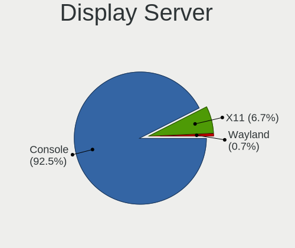
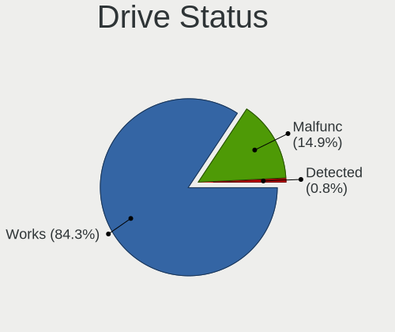
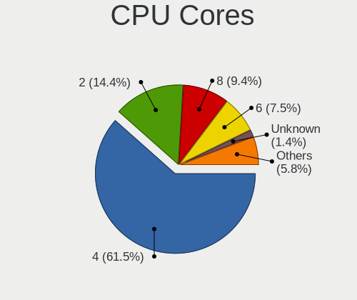
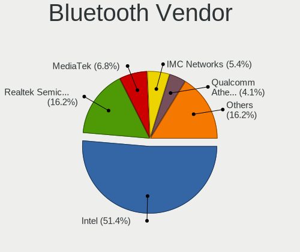
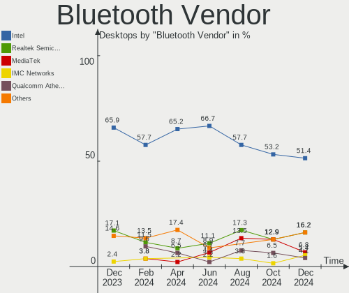

BSD Hardware Trends (Desktops)
------------------------------

A project to identify most popular hardware characteristics and track their change
over time based on data collected by BSD users at https://BSD-Hardware.info.

Anyone can contribute to this report by the [hw-probe](https://github.com/linuxhw/hw-probe/blob/master/INSTALL.BSD.md) tool:

    hw-probe -all -upload

Full-feature report is available here: https://bsd-hardware.info/?view=trends&formfactor=desktop

Period: Aug, 2021.

Contents
--------

* [ System ](#system)
  - [ OS                       ](#os)
  - [ OS Family                ](#os-family)
  - [ Arch                     ](#arch)
  - [ DE                       ](#de)
  - [ Display Server           ](#display-server)
  - [ Display Manager          ](#display-manager)
  - [ OS Lang                  ](#os-lang)
  - [ Boot Mode                ](#boot-mode)
  - [ Filesystem               ](#filesystem)
  - [ Part. scheme             ](#part-scheme)

* [ Board ](#board)
  - [ Vendor                   ](#vendor)
  - [ Model                    ](#model)
  - [ Model Family             ](#model-family)
  - [ MFG Year                 ](#mfg-year)
  - [ Form Factor              ](#form-factor)
  - [ Coreboot                 ](#coreboot)
  - [ RAM Size                 ](#ram-size)
  - [ RAM Used                 ](#ram-used)
  - [ Total Drives             ](#total-drives)
  - [ Has CD-ROM               ](#has-cd-rom)
  - [ Has Ethernet             ](#has-ethernet)
  - [ Has WiFi                 ](#has-wifi)
  - [ Has Bluetooth            ](#has-bluetooth)

* [ Location ](#location)
  - [ Country                  ](#country)
  - [ City                     ](#city)

* [ Drives ](#drives)
  - [ Drive Vendor             ](#drive-vendor)
  - [ Drive Model              ](#drive-model)
  - [ HDD Vendor               ](#hdd-vendor)
  - [ SSD Vendor               ](#ssd-vendor)
  - [ Drive Kind               ](#drive-kind)
  - [ Drive Connector          ](#drive-connector)
  - [ Drive Size               ](#drive-size)
  - [ Space Total              ](#space-total)
  - [ Space Used               ](#space-used)
  - [ Malfunc. Drives          ](#malfunc-drives)
  - [ Malfunc. Drive Vendor    ](#malfunc-drive-vendor)
  - [ Malfunc. HDD Vendor      ](#malfunc-hdd-vendor)
  - [ Malfunc. Drive Kind      ](#malfunc-drive-kind)
  - [ Failed Drives            ](#failed-drives)
  - [ Failed Drive Vendor      ](#failed-drive-vendor)
  - [ Drive Status             ](#drive-status)

* [ Storage controller ](#storage-controller)
  - [ Storage Vendor           ](#storage-vendor)
  - [ Storage Model            ](#storage-model)
  - [ Storage Kind             ](#storage-kind)

* [ Processor ](#processor)
  - [ CPU Vendor               ](#cpu-vendor)
  - [ CPU Model                ](#cpu-model)
  - [ CPU Model Family         ](#cpu-model-family)
  - [ CPU Cores                ](#cpu-cores)
  - [ CPU Sockets              ](#cpu-sockets)
  - [ CPU Threads              ](#cpu-threads)
  - [ CPU Microarch            ](#cpu-microarch)

* [ Graphics ](#graphics)
  - [ GPU Vendor               ](#gpu-vendor)
  - [ GPU Model                ](#gpu-model)
  - [ GPU Combo                ](#gpu-combo)
  - [ GPU Driver               ](#gpu-driver)
  - [ GPU Memory               ](#gpu-memory)

* [ Monitor ](#monitor)
  - [ Monitor Vendor           ](#monitor-vendor)
  - [ Monitor Model            ](#monitor-model)
  - [ Monitor Resolution       ](#monitor-resolution)
  - [ Monitor Diagonal         ](#monitor-diagonal)
  - [ Monitor Width            ](#monitor-width)
  - [ Aspect Ratio             ](#aspect-ratio)
  - [ Monitor Area             ](#monitor-area)
  - [ Pixel Density            ](#pixel-density)
  - [ Multiple Monitors        ](#multiple-monitors)

* [ Network ](#network)
  - [ Net Controller Vendor    ](#net-controller-vendor)
  - [ Net Controller Model     ](#net-controller-model)
  - [ Wireless Vendor          ](#wireless-vendor)
  - [ Wireless Model           ](#wireless-model)
  - [ Ethernet Vendor          ](#ethernet-vendor)
  - [ Ethernet Model           ](#ethernet-model)
  - [ Net Controller Kind      ](#net-controller-kind)
  - [ Used Controller          ](#used-controller)
  - [ NICs                     ](#nics)
  - [ IPv6                     ](#ipv6)

* [ Bluetooth ](#bluetooth)
  - [ Bluetooth Vendor         ](#bluetooth-vendor)
  - [ Bluetooth Model          ](#bluetooth-model)

* [ Sound ](#sound)
  - [ Sound Vendor             ](#sound-vendor)
  - [ Sound Model              ](#sound-model)

* [ Memory ](#memory)
  - [ Memory Vendor            ](#memory-vendor)
  - [ Memory Model             ](#memory-model)
  - [ Memory Kind              ](#memory-kind)
  - [ Memory Form Factor       ](#memory-form-factor)
  - [ Memory Size              ](#memory-size)
  - [ Memory Speed             ](#memory-speed)

* [ Printers & scanners ](#printers--scanners)
  - [ Printer Vendor           ](#printer-vendor)
  - [ Printer Model            ](#printer-model)
  - [ Scanner Vendor           ](#scanner-vendor)
  - [ Scanner Model            ](#scanner-model)

* [ Camera ](#camera)
  - [ Camera Vendor            ](#camera-vendor)
  - [ Camera Model             ](#camera-model)

* [ Security ](#security)
  - [ Fingerprint Vendor       ](#fingerprint-vendor)
  - [ Fingerprint Model        ](#fingerprint-model)
  - [ Chipcard Vendor          ](#chipcard-vendor)
  - [ Chipcard Model           ](#chipcard-model)

* [ Unsupported ](#unsupported)
  - [ Unsupported Devices      ](#unsupported-devices)
  - [ Unsupported Device Types ](#unsupported-device-types)

System
------

OS
--

Installed operating systems

| Name                         | Desktops | Percent |
|------------------------------|----------|---------|
| OPNsense 21.7.1              | 144      | 56.47%  |
| OPNsense 21.7                | 29       | 11.37%  |
| helloSystem 0.5.0            | 19       | 7.45%   |
| OPNsense 21.1.9              | 12       | 4.71%   |
| FreeBSD 13.0-p3              | 10       | 3.92%   |
| FreeBSD 13.0                 | 7        | 2.75%   |
| FreeBSD 13.0-p4              | 6        | 2.35%   |
| OPNsense 21.1.8              | 5        | 1.96%   |
| GhostBSD 20.04.02            | 4        | 1.57%   |
| OPNsense 21.1.6              | 3        | 1.18%   |
| OpenBSD 6.9                  | 2        | 0.78%   |
| helloSystem 0.1.0            | 2        | 0.78%   |
| OPNsense 21.1.7              | 1        | 0.39%   |
| OPNsense 12.1-p19-HBSD       | 1        | 0.39%   |
| MidnightBSD 2.1.0            | 1        | 0.39%   |
| helloSystem 0.6.0            | 1        | 0.39%   |
| helloSystem 0.4.0            | 1        | 0.39%   |
| HardenedBSD 13.0-STABLE-HBSD | 1        | 0.39%   |
| GhostBSD 21.08.27            | 1        | 0.39%   |
| FreeBSD 13.0-STABLE          | 1        | 0.39%   |
| FreeBSD 12.2-STABLE          | 1        | 0.39%   |
| FreeBSD 12.2-p9              | 1        | 0.39%   |
| FreeBSD 12.2-p8              | 1        | 0.39%   |
| FreeBSD 12.2                 | 1        | 0.39%   |

OS Family
---------

OS without a version

| Name        | Desktops | Percent |
|-------------|----------|---------|
| OPNsense    | 195      | 76.47%  |
| FreeBSD     | 28       | 10.98%  |
| helloSystem | 23       | 9.02%   |
| GhostBSD    | 5        | 1.96%   |
| OpenBSD     | 2        | 0.78%   |
| MidnightBSD | 1        | 0.39%   |
| HardenedBSD | 1        | 0.39%   |

Arch
----

OS architecture (x86_64, i586, etc.)

| Name  | Desktops | Percent |
|-------|----------|---------|
| amd64 | 252      | 98.82%  |
| i386  | 2        | 0.78%   |
| arm64 | 1        | 0.39%   |

DE
--

Desktop Environment

| Name         | Desktops | Percent |
|--------------|----------|---------|
| Console      | 207      | 81.18%  |
| helloDesktop | 23       | 9.02%   |
| KDE5         | 7        | 2.75%   |
| XFCE         | 4        | 1.57%   |
| MATE         | 4        | 1.57%   |
| TWM          | 3        | 1.18%   |
| GNOME        | 2        | 0.78%   |
| Picom        | 1        | 0.39%   |
| Lumina       | 1        | 0.39%   |
| i3           | 1        | 0.39%   |
| fvwm         | 1        | 0.39%   |
| AwesomeWM    | 1        | 0.39%   |

Display Server
--------------

X11 or Wayland

| Name    | Desktops | Percent |
|---------|----------|---------|
| Console | 209      | 81.96%  |
| X11     | 46       | 18.04%  |

Display Manager
---------------

SDDM, LightDM, etc.

| Name    | Desktops | Percent |
|---------|----------|---------|
| Console | 217      | 85.1%   |
| SLiM    | 23       | 9.02%   |
| LightDM | 6        | 2.35%   |
| SDDM    | 5        | 1.96%   |
| XDM     | 3        | 1.18%   |
| GDM     | 1        | 0.39%   |

OS Lang
-------

Language

| Lang           | Desktops | Percent |
|----------------|----------|---------|
| Unknown        | 201      | 78.82%  |
| en_US          | 26       | 10.2%   |
| C              | 20       | 7.84%   |
| ru_RU          | 2        | 0.78%   |
| de_DE          | 2        | 0.78%   |
| pt_BR          | 1        | 0.39%   |
| fr_FR.US-ASCII | 1        | 0.39%   |
| es_AR          | 1        | 0.39%   |
| en_GB          | 1        | 0.39%   |

Boot Mode
---------

EFI or BIOS

| Mode | Desktops | Percent |
|------|----------|---------|
| EFI  | 200      | 78.43%  |
| BIOS | 55       | 21.57%  |

Filesystem
----------

Type of filesystem

| Type | Desktops | Percent |
|------|----------|---------|
| Ufs  | 172      | 67.45%  |
| Zfs  | 81       | 31.76%  |
| Ffs  | 2        | 0.78%   |

Part. scheme
------------

Scheme of partitioning

| Type    | Desktops | Percent |
|---------|----------|---------|
| GPT     | 224      | 87.84%  |
| MBR     | 29       | 11.37%  |
| Unknown | 2        | 0.78%   |

Board
-----

Vendor
------

Motherboard manufacturer

| Name                       | Desktops | Percent |
|----------------------------|----------|---------|
| Unknown                    | 26       | 10.2%   |
| ASRock                     | 22       | 8.63%   |
| Gigabyte Technology        | 21       | 8.24%   |
| ASUSTek Computer           | 21       | 8.24%   |
| Dell                       | 20       | 7.84%   |
| PC Engines                 | 19       | 7.45%   |
| Hewlett-Packard            | 19       | 7.45%   |
| Protectli                  | 17       | 6.67%   |
| Intel                      | 15       | 5.88%   |
| MSI                        | 9        | 3.53%   |
| Supermicro                 | 7        | 2.75%   |
| Shuttle                    | 7        | 2.75%   |
| Lenovo                     | 5        | 1.96%   |
| SeeedStudio                | 3        | 1.18%   |
| Pegatron                   | 3        | 1.18%   |
| NF541                      | 3        | 1.18%   |
| Biostar                    | 3        | 1.18%   |
| Acer                       | 3        | 1.18%   |
| NU941                      | 2        | 0.78%   |
| Fujitsu                    | 2        | 0.78%   |
| Foxconn                    | 2        | 0.78%   |
| BESSTAR Tech               | 2        | 0.78%   |
| ZOTAC                      | 1        | 0.39%   |
| Yanling                    | 1        | 0.39%   |
| Winston Marriot            | 1        | 0.39%   |
| Silicom                    | 1        | 0.39%   |
| ShenZhen MinWin Technology | 1        | 0.39%   |
| PCPartner                  | 1        | 0.39%   |
| PAIQ                       | 1        | 0.39%   |
| NEXCOM                     | 1        | 0.39%   |
| Medion                     | 1        | 0.39%   |
| HPE                        | 1        | 0.39%   |
| HC                         | 1        | 0.39%   |
| HARDKERNEL                 | 1        | 0.39%   |
| Google                     | 1        | 0.39%   |
| EVGA                       | 1        | 0.39%   |
| ECS-USA                    | 1        | 0.39%   |
| ECS                        | 1        | 0.39%   |
| CNCTION-IAF-E3845          | 1        | 0.39%   |
| Cisco Systems              | 1        | 0.39%   |
| Caswell                    | 1        | 0.39%   |
| BCM Advanced Research      | 1        | 0.39%   |
| AWOW Techonology           | 1        | 0.39%   |
| ASRockRack                 | 1        | 0.39%   |
| AOpen                      | 1        | 0.39%   |
| AMI                        | 1        | 0.39%   |

Model
-----

Motherboard model

| Name                                      | Desktops | Percent |
|-------------------------------------------|----------|---------|
| Unknown                                   | 27       | 10.59%  |
| PC Engines apu4                           | 10       | 3.92%   |
| PC Engines APU2                           | 9        | 3.53%   |
| Intel Q3XXG4-P V1.0                       | 7        | 2.75%   |
| Protectli FW6                             | 6        | 2.35%   |
| Protectli FW4B                            | 6        | 2.35%   |
| HP t620 PLUS Quad Core TC                 | 4        | 1.57%   |
| NF541 1.0                                 | 3        | 1.18%   |
| Dell OptiPlex 7010                        | 3        | 1.18%   |
| Shuttle DS10U                             | 2        | 0.78%   |
| SeeedStudio ODYSSEY-X86J4125              | 2        | 0.78%   |
| Protectli FW6E                            | 2        | 0.78%   |
| NU941 1.0                                 | 2        | 0.78%   |
| MSI MS-7817                               | 2        | 0.78%   |
| Intel DH67BL AAG10189-211                 | 2        | 0.78%   |
| HP Z420 Workstation                       | 2        | 0.78%   |
| HP ProLiant MicroServer Gen8              | 2        | 0.78%   |
| Gigabyte H61M-S2-B3                       | 2        | 0.78%   |
| Dell OptiPlex 960                         | 2        | 0.78%   |
| Dell OptiPlex 9020                        | 2        | 0.78%   |
| Dell OptiPlex 3040                        | 2        | 0.78%   |
| BESSTAR Tech X35G                         | 2        | 0.78%   |
| ASUS All Series                           | 2        | 0.78%   |
| ASRock X570 PG Velocita                   | 2        | 0.78%   |
| ASRock B450M Pro4                         | 2        | 0.78%   |
| Yanling LES plus                          | 1        | 0.39%   |
| Winston Marriot PICO PC YANYU             | 1        | 0.39%   |
| Supermicro X9SCL/X9SCM                    | 1        | 0.39%   |
| Supermicro X8SIL                          | 1        | 0.39%   |
| Supermicro X7SPA-HF                       | 1        | 0.39%   |
| Supermicro X7SBL                          | 1        | 0.39%   |
| Supermicro SYS-E300-9D                    | 1        | 0.39%   |
| Supermicro SYS-5019D-FN8TP                | 1        | 0.39%   |
| Supermicro SSG-6028R-E1CR12T              | 1        | 0.39%   |
| Silicom Minnowboard Turbot D0/D1 PLATFORM | 1        | 0.39%   |
| Shuttle SH87R                             | 1        | 0.39%   |
| Shuttle SH81R                             | 1        | 0.39%   |
| Shuttle DS61                              | 1        | 0.39%   |
| Shuttle DH370                             | 1        | 0.39%   |
| Shuttle DH170                             | 1        | 0.39%   |
| ShenZhen MinWin MW-NANO-APL-4L            | 1        | 0.39%   |
| SeeedStudio ODYSSEY-X86J4105              | 1        | 0.39%   |
| Protectli VP2410                          | 1        | 0.39%   |
| Protectli FW4A                            | 1        | 0.39%   |
| Protectli FW2B                            | 1        | 0.39%   |
| Pegatron SAISHIAT2                        | 1        | 0.39%   |
| Pegatron IPM41-D3                         | 1        | 0.39%   |
| Pegatron Compaq dx2400 Microtower PC      | 1        | 0.39%   |
| PCPartner DREAMSYS                        | 1        | 0.39%   |
| PAIQ EC3-BT19D4L                          | 1        | 0.39%   |
| NEXCOM ASG                                | 1        | 0.39%   |
| MSI MS-S0891                              | 1        | 0.39%   |
| MSI MS-7C09                               | 1        | 0.39%   |
| MSI MS-7C02                               | 1        | 0.39%   |
| MSI MS-7996                               | 1        | 0.39%   |
| MSI MS-7721                               | 1        | 0.39%   |
| MSI MS-7418                               | 1        | 0.39%   |
| MSI KBL-U Pro Cubi 3 Silent S (MS-B159)   | 1        | 0.39%   |
| Medion MS-7616                            | 1        | 0.39%   |
| Lenovo YangTianW2090v-00                  | 1        | 0.39%   |

Model Family
------------

Motherboard model prefix

| Name                           | Desktops | Percent |
|--------------------------------|----------|---------|
| Unknown                        | 27       | 10.59%  |
| Dell OptiPlex                  | 16       | 6.27%   |
| PC Engines apu4                | 10       | 3.92%   |
| PC Engines APU2                | 9        | 3.53%   |
| Intel Q3XXG4-P                 | 7        | 2.75%   |
| Protectli FW6                  | 6        | 2.35%   |
| Protectli FW4B                 | 6        | 2.35%   |
| HP Compaq                      | 5        | 1.96%   |
| ASRock X570                    | 5        | 1.96%   |
| HP t620                        | 4        | 1.57%   |
| HP ProLiant                    | 4        | 1.57%   |
| ASUS PRIME                     | 4        | 1.57%   |
| NF541 1.0                      | 3        | 1.18%   |
| Lenovo ThinkCentre             | 3        | 1.18%   |
| Shuttle DS10U                  | 2        | 0.78%   |
| SeeedStudio ODYSSEY-X86J4125   | 2        | 0.78%   |
| Protectli FW6E                 | 2        | 0.78%   |
| NU941 1.0                      | 2        | 0.78%   |
| MSI MS-7817                    | 2        | 0.78%   |
| Intel DH67BL                   | 2        | 0.78%   |
| Intel D54250WYK                | 2        | 0.78%   |
| HP Z420                        | 2        | 0.78%   |
| HP EliteDesk                   | 2        | 0.78%   |
| Gigabyte H61M-S2-B3            | 2        | 0.78%   |
| BESSTAR Tech X35G              | 2        | 0.78%   |
| ASUS ROG                       | 2        | 0.78%   |
| ASUS All                       | 2        | 0.78%   |
| ASRock B450M                   | 2        | 0.78%   |
| Acer Veriton                   | 2        | 0.78%   |
| Yanling LES                    | 1        | 0.39%   |
| Winston Marriot PICO           | 1        | 0.39%   |
| Supermicro X9SCL               | 1        | 0.39%   |
| Supermicro X8SIL               | 1        | 0.39%   |
| Supermicro X7SPA-HF            | 1        | 0.39%   |
| Supermicro X7SBL               | 1        | 0.39%   |
| Supermicro SYS-E300-9D         | 1        | 0.39%   |
| Supermicro SYS-5019D-FN8TP     | 1        | 0.39%   |
| Supermicro SSG-6028R-E1CR12T   | 1        | 0.39%   |
| Silicom Minnowboard            | 1        | 0.39%   |
| Shuttle SH87R                  | 1        | 0.39%   |
| Shuttle SH81R                  | 1        | 0.39%   |
| Shuttle DS61                   | 1        | 0.39%   |
| Shuttle DH370                  | 1        | 0.39%   |
| Shuttle DH170                  | 1        | 0.39%   |
| ShenZhen MinWin MW-NANO-APL-4L | 1        | 0.39%   |
| SeeedStudio ODYSSEY-X86J4105   | 1        | 0.39%   |
| Protectli VP2410               | 1        | 0.39%   |
| Protectli FW4A                 | 1        | 0.39%   |
| Protectli FW2B                 | 1        | 0.39%   |
| Pegatron SAISHIAT2             | 1        | 0.39%   |
| Pegatron IPM41-D3              | 1        | 0.39%   |
| Pegatron Compaq                | 1        | 0.39%   |
| PCPartner DREAMSYS             | 1        | 0.39%   |
| PAIQ EC3-BT19D4L               | 1        | 0.39%   |
| NEXCOM ASG                     | 1        | 0.39%   |
| MSI MS-S0891                   | 1        | 0.39%   |
| MSI MS-7C09                    | 1        | 0.39%   |
| MSI MS-7C02                    | 1        | 0.39%   |
| MSI MS-7996                    | 1        | 0.39%   |
| MSI MS-7721                    | 1        | 0.39%   |

MFG Year
--------

Motherboard manufacture year

| Year    | Desktops | Percent |
|---------|----------|---------|
| 2020    | 49       | 19.22%  |
| 2018    | 32       | 12.55%  |
| 2019    | 31       | 12.16%  |
| 2021    | 27       | 10.59%  |
| 2013    | 16       | 6.27%   |
| 2015    | 14       | 5.49%   |
| 2014    | 14       | 5.49%   |
| 2012    | 13       | 5.1%    |
| 2011    | 13       | 5.1%    |
| 2017    | 12       | 4.71%   |
| 2010    | 11       | 4.31%   |
| 2016    | 10       | 3.92%   |
| 2008    | 6        | 2.35%   |
| 2009    | 3        | 1.18%   |
| 2007    | 1        | 0.39%   |
| 2004    | 1        | 0.39%   |
| 2003    | 1        | 0.39%   |
| Unknown | 1        | 0.39%   |

Form Factor
-----------

Physical design of the computer

| Name    | Desktops | Percent |
|---------|----------|---------|
| Desktop | 255      | 100%    |

Coreboot
--------

Have coreboot on board

| Used | Desktops | Percent |
|------|----------|---------|
| No   | 228      | 89.41%  |
| Yes  | 27       | 10.59%  |

RAM Size
--------

Total RAM memory

| Size in GB  | Desktops | Percent |
|-------------|----------|---------|
| 8.01-16.0   | 99       | 38.82%  |
| 4.01-8.0    | 68       | 26.67%  |
| 16.01-24.0  | 47       | 18.43%  |
| 32.01-64.0  | 19       | 7.45%   |
| 2.01-3.0    | 11       | 4.31%   |
| 64.01-256.0 | 5        | 1.96%   |
| 1.01-2.0    | 3        | 1.18%   |
| 3.01-4.0    | 2        | 0.78%   |
| 24.01-32.0  | 1        | 0.39%   |

RAM Used
--------

Used RAM memory

| Used GB   | Desktops | Percent |
|-----------|----------|---------|
| 0.01-0.5  | 141      | 55.29%  |
| 0.51-1.0  | 73       | 28.63%  |
| 1.01-2.0  | 24       | 9.41%   |
| 3.01-4.0  | 8        | 3.14%   |
| 2.01-3.0  | 4        | 1.57%   |
| 4.01-8.0  | 3        | 1.18%   |
| 8.01-16.0 | 1        | 0.39%   |
| 0         | 1        | 0.39%   |

Total Drives
------------

Number of drives on board

| Drives | Desktops | Percent |
|--------|----------|---------|
| 1      | 182      | 71.37%  |
| 2      | 31       | 12.16%  |
| 0      | 25       | 9.8%    |
| 3      | 6        | 2.35%   |
| 4      | 4        | 1.57%   |
| 6      | 2        | 0.78%   |
| 5      | 2        | 0.78%   |
| 13     | 1        | 0.39%   |
| 12     | 1        | 0.39%   |
| 8      | 1        | 0.39%   |

Has CD-ROM
----------

Has CD-ROM on board

| Presented | Desktops | Percent |
|-----------|----------|---------|
| No        | 207      | 81.18%  |
| Yes       | 48       | 18.82%  |

Has Ethernet
------------

Has Ethernet on board

| Presented | Desktops | Percent |
|-----------|----------|---------|
| Yes       | 253      | 99.22%  |
| No        | 2        | 0.78%   |

Has WiFi
--------

Has WiFi module

| Presented | Desktops | Percent |
|-----------|----------|---------|
| No        | 200      | 78.43%  |
| Yes       | 55       | 21.57%  |

Has Bluetooth
-------------

Has Bluetooth module

| Presented | Desktops | Percent |
|-----------|----------|---------|
| No        | 224      | 87.84%  |
| Yes       | 31       | 12.16%  |

Location
--------

Country
-------

Geographic location (country)

| Country      | Desktops | Percent |
|--------------|----------|---------|
| USA          | 73       | 28.63%  |
| Germany      | 43       | 16.86%  |
| France       | 11       | 4.31%   |
| Canada       | 10       | 3.92%   |
| Brazil       | 10       | 3.92%   |
| UK           | 9        | 3.53%   |
| Switzerland  | 9        | 3.53%   |
| Russia       | 9        | 3.53%   |
| Australia    | 7        | 2.75%   |
| Netherlands  | 6        | 2.35%   |
| China        | 6        | 2.35%   |
| Austria      | 6        | 2.35%   |
| Czechia      | 5        | 1.96%   |
| Taiwan       | 4        | 1.57%   |
| Sweden       | 4        | 1.57%   |
| Mexico       | 4        | 1.57%   |
| South Korea  | 3        | 1.18%   |
| Indonesia    | 3        | 1.18%   |
| Argentina    | 3        | 1.18%   |
| Spain        | 2        | 0.78%   |
| South Africa | 2        | 0.78%   |
| Slovenia     | 2        | 0.78%   |
| Poland       | 2        | 0.78%   |
| Italy        | 2        | 0.78%   |
| Finland      | 2        | 0.78%   |
| Chile        | 2        | 0.78%   |
| Vietnam      | 1        | 0.39%   |
| UAE          | 1        | 0.39%   |
| Turkey       | 1        | 0.39%   |
| Slovakia     | 1        | 0.39%   |
| Singapore    | 1        | 0.39%   |
| Serbia       | 1        | 0.39%   |
| Romania      | 1        | 0.39%   |
| Norway       | 1        | 0.39%   |
| Luxembourg   | 1        | 0.39%   |
| Japan        | 1        | 0.39%   |
| India        | 1        | 0.39%   |
| Hungary      | 1        | 0.39%   |
| Hong Kong    | 1        | 0.39%   |
| Greece       | 1        | 0.39%   |
| Belgium      | 1        | 0.39%   |
| Belarus      | 1        | 0.39%   |

City
----

Geographic location (city)

| City             | Desktops | Percent |
|------------------|----------|---------|
| Hamburg          | 7        | 2.75%   |
| Berlin           | 7        | 2.75%   |
| Vienna           | 3        | 1.18%   |
| S??o Paulo       | 3        | 1.18%   |
| San Francisco    | 3        | 1.18%   |
| Gachnang         | 3        | 1.18%   |
| Brisbane         | 3        | 1.18%   |
| Zurich           | 2        | 0.78%   |
| Tainan City      | 2        | 0.78%   |
| Sydney           | 2        | 0.78%   |
| Shanghai         | 2        | 0.78%   |
| San Antonio      | 2        | 0.78%   |
| Salem            | 2        | 0.78%   |
| Rudna            | 2        | 0.78%   |
| Rio Claro        | 2        | 0.78%   |
| Philadelphia     | 2        | 0.78%   |
| Peine            | 2        | 0.78%   |
| Paris            | 2        | 0.78%   |
| New Taipei       | 2        | 0.78%   |
| Munich           | 2        | 0.78%   |
| Montreal         | 2        | 0.78%   |
| Las Vegas        | 2        | 0.78%   |
| Kirkland         | 2        | 0.78%   |
| Johannesburg     | 2        | 0.78%   |
| Jakarta          | 2        | 0.78%   |
| Fort Lauderdale  | 2        | 0.78%   |
| Cologne          | 2        | 0.78%   |
| Barnaul          | 2        | 0.78%   |
| Ypsilanti        | 1        | 0.39%   |
| Yeovil           | 1        | 0.39%   |
| Yancheng         | 1        | 0.39%   |
| Wolfenb??ttel    | 1        | 0.39%   |
| Winterthur       | 1        | 0.39%   |
| West Valley City | 1        | 0.39%   |
| Wenatchee        | 1        | 0.39%   |
| Warminster       | 1        | 0.39%   |
| Vleuten          | 1        | 0.39%   |
| Virginia Beach   | 1        | 0.39%   |
| Vidnoye          | 1        | 0.39%   |
| Vawkavysk        | 1        | 0.39%   |
| Vauvillers       | 1        | 0.39%   |
| Vantaa           | 1        | 0.39%   |
| Tula de Allende  | 1        | 0.39%   |
| Trebnje          | 1        | 0.39%   |
| Toulouse         | 1        | 0.39%   |
| Toronto          | 1        | 0.39%   |
| Topeka           | 1        | 0.39%   |
| The Hague        | 1        | 0.39%   |
| Ten Boer         | 1        | 0.39%   |
| Swansea          | 1        | 0.39%   |
| Stuttgart        | 1        | 0.39%   |
| Stroemstad       | 1        | 0.39%   |
| Sterling Heights | 1        | 0.39%   |
| Stavanger        | 1        | 0.39%   |
| St. Gallen       | 1        | 0.39%   |
| St Petersburg    | 1        | 0.39%   |
| Spring           | 1        | 0.39%   |
| Southbury        | 1        | 0.39%   |
| Sonthofen        | 1        | 0.39%   |
| Sollentuna       | 1        | 0.39%   |

Drives
------

Drive Vendor
------------

Hard drive vendors

| Vendor              | Desktops | Drives | Percent |
|---------------------|----------|--------|---------|
| WDC                 | 43       | 59     | 15.03%  |
| Seagate             | 41       | 59     | 14.34%  |
| Samsung Electronics | 36       | 43     | 12.59%  |
| Kingston            | 24       | 25     | 8.39%   |
| Transcend           | 13       | 13     | 4.55%   |
| SanDisk             | 13       | 13     | 4.55%   |
| Toshiba             | 12       | 15     | 4.2%    |
| Phison              | 12       | 12     | 4.2%    |
| Hoodisk             | 9        | 9      | 3.15%   |
| Intel               | 8        | 8      | 2.8%    |
| Crucial             | 8        | 8      | 2.8%    |
| A-DATA Technology   | 8        | 10     | 2.8%    |
| Protectli           | 6        | 6      | 2.1%    |
| Hitachi             | 5        | 5      | 1.75%   |
| FORESEE             | 5        | 5      | 1.75%   |
| SPCC                | 3        | 3      | 1.05%   |
| Micron Technology   | 3        | 3      | 1.05%   |
| MEMXPRO             | 3        | 3      | 1.05%   |
| LITEON              | 3        | 3      | 1.05%   |
| MAXTOR              | 2        | 2      | 0.7%    |
| Intenso             | 2        | 2      | 0.7%    |
| HGST                | 2        | 3      | 0.7%    |
| Fujitsu             | 2        | 2      | 0.7%    |
| Corsair             | 2        | 2      | 0.7%    |
| Zheino              | 1        | 1      | 0.35%   |
| VisionTek           | 1        | 1      | 0.35%   |
| USB                 | 1        | 1      | 0.35%   |
| Team                | 1        | 1      | 0.35%   |
| SK Hynix            | 1        | 1      | 0.35%   |
| Silicon Motion      | 1        | 1      | 0.35%   |
| PNY                 | 1        | 1      | 0.35%   |
| ORICO               | 1        | 2      | 0.35%   |
| OCZ                 | 1        | 1      | 0.35%   |
| LSI                 | 1        | 1      | 0.35%   |
| Kston               | 1        | 1      | 0.35%   |
| KingDian            | 1        | 1      | 0.35%   |
| Integral            | 1        | 1      | 0.35%   |
| Innodisk            | 1        | 1      | 0.35%   |
| Hewlett-Packard     | 1        | 1      | 0.35%   |
| Gigabyte Technology | 1        | 1      | 0.35%   |
| China               | 1        | 1      | 0.35%   |
| BIWIN               | 1        | 1      | 0.35%   |
| Apple               | 1        | 1      | 0.35%   |
| Apacer              | 1        | 1      | 0.35%   |
| Advantech           | 1        | 1      | 0.35%   |

Drive Model
-----------

Hard drive models

| Model                                | Desktops | Percent |
|--------------------------------------|----------|---------|
| Phison SATA SSD 16GB                 | 7        | 2.26%   |
| Transcend TS128GMSA230S 128GB        | 5        | 1.61%   |
| Hoodisk SSD 128GB                    | 5        | 1.61%   |
| Seagate ST500DM002-1BD142 500GB      | 4        | 1.29%   |
| Samsung SSD 860 EVO 500GB            | 4        | 1.29%   |
| Samsung SSD 850 EVO 250GB            | 4        | 1.29%   |
| WDC WDS120G2G0A-00JH30 120GB         | 3        | 0.97%   |
| Seagate ST3250318AS 250GB            | 3        | 0.97%   |
| Seagate ST1000DM010-2EP102 1TB       | 3        | 0.97%   |
| Protectli 120GB mSATA                | 3        | 0.97%   |
| MEMXPRO mSATA M3B 32GB               | 3        | 0.97%   |
| Kingston SUV500MS240G 240GB          | 3        | 0.97%   |
| FORESEE 128GB SSD                    | 3        | 0.97%   |
| A-DATA SX8200PNP 512GB               | 3        | 0.97%   |
| WDC WD5000LPVX-22V0TT0 500GB         | 2        | 0.65%   |
| WDC WD40EZRZ-22GXCB0 4TB             | 2        | 0.65%   |
| WDC WD3200BPVT-22JJ5T0 320GB         | 2        | 0.65%   |
| Transcend TS64GMSA370 64GB           | 2        | 0.65%   |
| Toshiba DT01ACA050 500GB             | 2        | 0.65%   |
| Seagate ST500LM012 HN-M500MBB 500GB  | 2        | 0.65%   |
| Seagate ST500LM000-1EJ162-SSHD 500GB | 2        | 0.65%   |
| Seagate ST4000DM000-1F2168 4TB       | 2        | 0.65%   |
| Seagate ST380815AS 80GB              | 2        | 0.65%   |
| Seagate ST3500418AS 500GB            | 2        | 0.65%   |
| Seagate ST31000340NS 1TB             | 2        | 0.65%   |
| SanDisk SSD PLUS 120GB               | 2        | 0.65%   |
| Samsung SSD 980 PRO 250GB            | 2        | 0.65%   |
| Samsung SSD 850 PRO 256GB            | 2        | 0.65%   |
| Samsung SSD 840 PRO Series 256GB     | 2        | 0.65%   |
| Samsung MZ7LN128HCHP-000H1 128GB     | 2        | 0.65%   |
| Protectli 64GB mSATA                 | 2        | 0.65%   |
| Kingston SV300S37A120G 120GB         | 2        | 0.65%   |
| Kingston SUV500MS120G 120GB          | 2        | 0.65%   |
| Kingston SA400S37240G 240GB          | 2        | 0.65%   |
| Kingston SA400S37120G 120GB          | 2        | 0.65%   |
| Kingston SA400M8240G 240GB           | 2        | 0.65%   |
| Hoodisk SSD 32GB                     | 2        | 0.65%   |
| Crucial CT120BX500SSD1 120GB         | 2        | 0.65%   |
| A-DATA SU650 120GB                   | 2        | 0.65%   |
| Zheino CHN-mSATAM1-32 32GB           | 1        | 0.32%   |
| WDC WDS500G2B0C-00PXH0 500GB         | 1        | 0.32%   |
| WDC WDS240G2G0A-00JH30 240GB         | 1        | 0.32%   |
| WDC WDS200T2B0A-00SM50 2TB           | 1        | 0.32%   |
| WDC WDS120G1G0A-00SS50 120GB         | 1        | 0.32%   |
| WDC WD80EMAZ-00WJTA0 8TB             | 1        | 0.32%   |
| WDC WD80EFZX-68UW8N0 8TB             | 1        | 0.32%   |
| WDC WD80EFAX-68LHPN0 8TB             | 1        | 0.32%   |
| WDC WD80EDBZ-11B0ZA0 8TB             | 1        | 0.32%   |
| WDC WD800AAJS-60WAA0 80GB            | 1        | 0.32%   |
| WDC WD5003ABYZ-011FA0 500GB          | 1        | 0.32%   |
| WDC WD5000BEVT-24A0RT0 500GB         | 1        | 0.32%   |
| WDC WD5000BEVT-22ZAT0 500GB          | 1        | 0.32%   |
| WDC WD5000AAVS-00ZTB0 500GB          | 1        | 0.32%   |
| WDC WD5000AAVS-00G9B1 500GB          | 1        | 0.32%   |
| WDC WD5000AAKX-00ERMA0 500GB         | 1        | 0.32%   |
| WDC WD5000AAKS-00V1A0 500GB          | 1        | 0.32%   |
| WDC WD5000AAKS-00TMA0 500GB          | 1        | 0.32%   |
| WDC WD5000AAKS-00A7B2 500GB          | 1        | 0.32%   |
| WDC WD40EFRX-68WT0N0 4TB             | 1        | 0.32%   |
| WDC WD400BB-00JHC0 40GB              | 1        | 0.32%   |

HDD Vendor
----------

Hard disk drive vendors

| Vendor              | Desktops | Drives | Percent |
|---------------------|----------|--------|---------|
| Seagate             | 39       | 57     | 38.24%  |
| WDC                 | 37       | 51     | 36.27%  |
| Toshiba             | 8        | 11     | 7.84%   |
| Hitachi             | 5        | 5      | 4.9%    |
| Samsung Electronics | 3        | 3      | 2.94%   |
| MAXTOR              | 2        | 2      | 1.96%   |
| HGST                | 2        | 3      | 1.96%   |
| Fujitsu             | 2        | 2      | 1.96%   |
| USB                 | 1        | 1      | 0.98%   |
| LSI                 | 1        | 1      | 0.98%   |
| Hewlett-Packard     | 1        | 1      | 0.98%   |
| Apple               | 1        | 1      | 0.98%   |

SSD Vendor
----------

Solid state drive vendors

| Vendor              | Desktops | Drives | Percent |
|---------------------|----------|--------|---------|
| Samsung Electronics | 26       | 31     | 15.76%  |
| Kingston            | 23       | 24     | 13.94%  |
| Transcend           | 13       | 13     | 7.88%   |
| SanDisk             | 12       | 12     | 7.27%   |
| Phison              | 10       | 10     | 6.06%   |
| Hoodisk             | 9        | 9      | 5.45%   |
| Intel               | 8        | 8      | 4.85%   |
| Crucial             | 8        | 8      | 4.85%   |
| Protectli           | 6        | 6      | 3.64%   |
| WDC                 | 5        | 6      | 3.03%   |
| A-DATA Technology   | 5        | 6      | 3.03%   |
| Toshiba             | 4        | 4      | 2.42%   |
| FORESEE             | 4        | 4      | 2.42%   |
| SPCC                | 3        | 3      | 1.82%   |
| Micron Technology   | 3        | 3      | 1.82%   |
| MEMXPRO             | 3        | 3      | 1.82%   |
| LITEON              | 3        | 3      | 1.82%   |
| Intenso             | 2        | 2      | 1.21%   |
| Zheino              | 1        | 1      | 0.61%   |
| VisionTek           | 1        | 1      | 0.61%   |
| Team                | 1        | 1      | 0.61%   |
| SK Hynix            | 1        | 1      | 0.61%   |
| Seagate             | 1        | 1      | 0.61%   |
| PNY                 | 1        | 1      | 0.61%   |
| ORICO               | 1        | 2      | 0.61%   |
| OCZ                 | 1        | 1      | 0.61%   |
| Kston               | 1        | 1      | 0.61%   |
| KingDian            | 1        | 1      | 0.61%   |
| Integral            | 1        | 1      | 0.61%   |
| Innodisk            | 1        | 1      | 0.61%   |
| Gigabyte Technology | 1        | 1      | 0.61%   |
| Corsair             | 1        | 1      | 0.61%   |
| China               | 1        | 1      | 0.61%   |
| BIWIN               | 1        | 1      | 0.61%   |
| Apacer              | 1        | 1      | 0.61%   |
| Advantech           | 1        | 1      | 0.61%   |

Drive Kind
----------

HDD or SSD

| Kind | Desktops | Drives | Percent |
|------|----------|--------|---------|
| SSD  | 152      | 174    | 58.69%  |
| HDD  | 85       | 138    | 32.82%  |
| NVMe | 22       | 23     | 8.49%   |

Drive Connector
---------------

SATA, SAS, NVMe, etc.

| Type | Desktops | Drives | Percent |
|------|----------|--------|---------|
| SATA | 218      | 312    | 90.83%  |
| NVMe | 22       | 23     | 9.17%   |

Drive Size
----------

Size of hard drive

| Size in TB | Desktops | Drives | Percent |
|------------|----------|--------|---------|
| 0.01-0.5   | 202      | 238    | 81.78%  |
| 0.51-1.0   | 26       | 33     | 10.53%  |
| 1.01-2.0   | 9        | 9      | 3.64%   |
| 3.01-4.0   | 5        | 11     | 2.02%   |
| 4.01-10.0  | 3        | 11     | 1.21%   |
| 2.01-3.0   | 1        | 8      | 0.4%    |
| 10.01-20.0 | 1        | 2      | 0.4%    |

Space Total
-----------

Amount of disk space available on the file system

| Size in GB | Desktops | Percent |
|------------|----------|---------|
| 101-250    | 104      | 40.78%  |
| 1-20       | 38       | 14.9%   |
| 51-100     | 34       | 13.33%  |
| 251-500    | 33       | 12.94%  |
| 21-50      | 27       | 10.59%  |
| 501-1000   | 14       | 5.49%   |
| 1001-2000  | 3        | 1.18%   |
| 2001-3000  | 2        | 0.78%   |

Space Used
----------

Amount of used disk space

| Used GB | Desktops | Percent |
|---------|----------|---------|
| 1-20    | 233      | 91.37%  |
| 21-50   | 14       | 5.49%   |
| 251-500 | 3        | 1.18%   |
| 51-100  | 3        | 1.18%   |
| 101-250 | 2        | 0.78%   |

Malfunc. Drives
---------------

Drive models with a malfunction

| Model                                        | Desktops | Drives | Percent |
|----------------------------------------------|----------|--------|---------|
| Seagate ST3250318AS 250GB                    | 2        | 2      | 4.55%   |
| WDC WD800AAJS-60WAA0 80GB                    | 1        | 1      | 2.27%   |
| WDC WD5000LPVX-22V0TT0 500GB                 | 1        | 1      | 2.27%   |
| WDC WD5000AAVS-00G9B1 500GB                  | 1        | 1      | 2.27%   |
| WDC WD5000AAKX-00ERMA0 500GB                 | 1        | 1      | 2.27%   |
| WDC WD5000AAKS-00V1A0 500GB                  | 1        | 1      | 2.27%   |
| WDC WD40EFRX-68WT0N0 4TB                     | 1        | 1      | 2.27%   |
| WDC WD3200AAJS-00L7A0 320GB                  | 1        | 1      | 2.27%   |
| WDC WD2500BEVS-60UST0 250GB                  | 1        | 1      | 2.27%   |
| WDC WD20EARS-00MVWB0 2TB                     | 1        | 1      | 2.27%   |
| WDC WD1600BEKT-66F3T2 160GB                  | 1        | 1      | 2.27%   |
| WDC WD1600AAJS-75M0A0 160GB                  | 1        | 1      | 2.27%   |
| WDC WD10EARS-00Y5B1 1TB                      | 1        | 1      | 2.27%   |
| WDC WD1001FAES-75W7A0 1TB                    | 1        | 1      | 2.27%   |
| VisionTek mSATA 120GB                        | 1        | 1      | 2.27%   |
| Toshiba MQ02ABD100H 1TB                      | 1        | 1      | 2.27%   |
| Toshiba HDWE140 4TB                          | 1        | 4      | 2.27%   |
| Seagate ST9250827AS 250GB                    | 1        | 1      | 2.27%   |
| Seagate ST750LM022 HN-M750MBB 752GB          | 1        | 1      | 2.27%   |
| Seagate ST500LM012 HN-M500MBB 500GB          | 1        | 1      | 2.27%   |
| Seagate ST500DM002-1BD142 500GB              | 1        | 1      | 2.27%   |
| Seagate ST3500418AS 500GB                    | 1        | 1      | 2.27%   |
| Seagate ST3500413AS 500GB                    | 1        | 1      | 2.27%   |
| Seagate ST3250310AS 250GB                    | 1        | 1      | 2.27%   |
| Seagate ST320LT007-9ZV142 320GB              | 1        | 1      | 2.27%   |
| Seagate ST3160815AS 160GB                    | 1        | 1      | 2.27%   |
| Seagate ST3160318AS 160GB                    | 1        | 1      | 2.27%   |
| Seagate ST31500541AS 1.5TB                   | 1        | 1      | 2.27%   |
| Seagate ST3120814A 120GB                     | 1        | 1      | 2.27%   |
| Seagate ST31000340NS 1TB                     | 1        | 1      | 2.27%   |
| Samsung Electronics SSD 840 PRO Series 256GB | 1        | 1      | 2.27%   |
| Samsung Electronics HD501LJ 500GB            | 1        | 1      | 2.27%   |
| MAXTOR STM3320613AS 320GB                    | 1        | 1      | 2.27%   |
| Kingston SV300S37A120G 120GB                 | 1        | 1      | 2.27%   |
| Kingston SMS200S3120G 120GB                  | 1        | 1      | 2.27%   |
| Intel SSDMCEAC060B3 64GB                     | 1        | 1      | 2.27%   |
| Hitachi HTS541612J9SA00 120GB                | 1        | 1      | 2.27%   |
| Hitachi HDS721050CLA362 500GB                | 1        | 1      | 2.27%   |
| HGST HTS545032A7E380 320GB                   | 1        | 1      | 2.27%   |
| Fujitsu MHZ2250BH G1 250GB                   | 1        | 1      | 2.27%   |
| Crucial CT128MX100SSD1 128GB                 | 1        | 1      | 2.27%   |
| A-DATA Technology SU650 960GB                | 1        | 1      | 2.27%   |
| A-DATA Technology SU650 120GB                | 1        | 1      | 2.27%   |

Malfunc. Drive Vendor
---------------------

Vendors of faulty drives

| Vendor              | Desktops | Drives | Percent |
|---------------------|----------|--------|---------|
| Seagate             | 15       | 15     | 34.09%  |
| WDC                 | 13       | 13     | 29.55%  |
| Toshiba             | 2        | 5      | 4.55%   |
| Samsung Electronics | 2        | 2      | 4.55%   |
| Kingston            | 2        | 2      | 4.55%   |
| Hitachi             | 2        | 2      | 4.55%   |
| A-DATA Technology   | 2        | 2      | 4.55%   |
| VisionTek           | 1        | 1      | 2.27%   |
| MAXTOR              | 1        | 1      | 2.27%   |
| Intel               | 1        | 1      | 2.27%   |
| HGST                | 1        | 1      | 2.27%   |
| Fujitsu             | 1        | 1      | 2.27%   |
| Crucial             | 1        | 1      | 2.27%   |

Malfunc. HDD Vendor
-------------------

Vendors of faulty HDD drives

| Vendor              | Desktops | Drives | Percent |
|---------------------|----------|--------|---------|
| Seagate             | 15       | 15     | 41.67%  |
| WDC                 | 13       | 13     | 36.11%  |
| Toshiba             | 2        | 5      | 5.56%   |
| Hitachi             | 2        | 2      | 5.56%   |
| Samsung Electronics | 1        | 1      | 2.78%   |
| MAXTOR              | 1        | 1      | 2.78%   |
| HGST                | 1        | 1      | 2.78%   |
| Fujitsu             | 1        | 1      | 2.78%   |

Malfunc. Drive Kind
-------------------

Kinds of faulty drives

| Kind | Desktops | Drives | Percent |
|------|----------|--------|---------|
| HDD  | 32       | 39     | 80%     |
| SSD  | 8        | 8      | 20%     |

Failed Drives
-------------

Failed drive models

Zero info for selected period =(

Failed Drive Vendor
-------------------

Failed drive vendors

Zero info for selected period =(

Drive Status
------------

Number of failed and malfunc. drives

| Status   | Desktops | Drives | Percent |
|----------|----------|--------|---------|
| Works    | 201      | 278    | 81.71%  |
| Malfunc  | 39       | 47     | 15.85%  |
| Detected | 6        | 10     | 2.44%   |

Storage controller
------------------

Storage Vendor
--------------

Storage controller vendors

| Vendor                       | Desktops | Percent |
|------------------------------|----------|---------|
| Intel                        | 194      | 66.67%  |
| AMD                          | 54       | 18.56%  |
| Samsung Electronics          | 9        | 3.09%   |
| ASMedia Technology           | 7        | 2.41%   |
| Phison Electronics           | 4        | 1.37%   |
| Broadcom / LSI               | 4        | 1.37%   |
| Sandisk                      | 3        | 1.03%   |
| Marvell Technology Group     | 3        | 1.03%   |
| ADATA Technology             | 3        | 1.03%   |
| VIA Technologies             | 1        | 0.34%   |
| Silicon Motion               | 1        | 0.34%   |
| Shenzhen Longsys Electronics | 1        | 0.34%   |
| Seagate Technology           | 1        | 0.34%   |
| Realtek Semiconductor        | 1        | 0.34%   |
| Nvidia                       | 1        | 0.34%   |
| Kingston Technology Company  | 1        | 0.34%   |
| JMicron Technology           | 1        | 0.34%   |
| Chelsio Communications       | 1        | 0.34%   |
| Adaptec                      | 1        | 0.34%   |

Storage Model
-------------

Storage controller models

| Model                                                                                   | Desktops | Percent |
|-----------------------------------------------------------------------------------------|----------|---------|
| AMD FCH SATA Controller [AHCI mode]                                                     | 38       | 11.21%  |
| Intel Sunrise Point-LP SATA Controller [AHCI mode]                                      | 20       | 5.9%    |
| Intel 8 Series/C220 Series Chipset Family 6-port SATA Controller 1 [AHCI mode]          | 19       | 5.6%    |
| Intel 6 Series/C200 Series Chipset Family 6 port Desktop SATA AHCI Controller           | 18       | 5.31%   |
| Intel Atom/Celeron/Pentium Processor x5-E8000/J3xxx/N3xxx Series SATA Controller        | 16       | 4.72%   |
| Intel Atom Processor E3800 Series SATA AHCI Controller                                  | 11       | 3.24%   |
| Intel SATA Controller [RAID mode]                                                       | 8        | 2.36%   |
| Intel Q170/Q150/B150/H170/H110/Z170/CM236 Chipset SATA Controller [AHCI Mode]           | 8        | 2.36%   |
| Intel 7 Series/C210 Series Chipset Family 6-port SATA Controller [AHCI mode]            | 8        | 2.36%   |
| Intel Celeron/Pentium Silver Processor SATA Controller                                  | 7        | 2.06%   |
| Intel Cannon Lake PCH SATA AHCI Controller                                              | 7        | 2.06%   |
| Intel 82801G (ICH7 Family) IDE Controller                                               | 7        | 2.06%   |
| Intel 8 Series SATA Controller 1 [AHCI mode]                                            | 7        | 2.06%   |
| ASMedia ASM1062 Serial ATA Controller                                                   | 7        | 2.06%   |
| AMD FCH SATA Controller [IDE mode]                                                      | 7        | 2.06%   |
| Intel NM10/ICH7 Family SATA Controller [IDE mode]                                       | 6        | 1.77%   |
| AMD 400 Series Chipset SATA Controller                                                  | 6        | 1.77%   |
| Intel Cannon Point-LP SATA Controller [AHCI Mode]                                       | 5        | 1.47%   |
| AMD SB7x0/SB8x0/SB9x0 IDE Controller                                                    | 5        | 1.47%   |
| Intel Wildcat Point-LP SATA Controller [AHCI Mode]                                      | 4        | 1.18%   |
| Intel 82801IR/IO/IH (ICH9R/DO/DH) 6 port SATA Controller [AHCI mode]                    | 4        | 1.18%   |
| AMD SB7x0/SB8x0/SB9x0 SATA Controller [AHCI mode]                                       | 4        | 1.18%   |
| Samsung NVMe SSD Controller SM981/PM981/PM983                                           | 3        | 0.88%   |
| Samsung NVMe SSD Controller SM961/PM961/SM963                                           | 3        | 0.88%   |
| Samsung NVMe SSD Controller PM9A1/PM9A3/980PRO                                          | 3        | 0.88%   |
| Intel NM10/ICH7 Family SATA Controller [AHCI mode]                                      | 3        | 0.88%   |
| Intel Comet Lake SATA AHCI Controller                                                   | 3        | 0.88%   |
| Intel C602 chipset 4-Port SATA Storage Control Unit                                     | 3        | 0.88%   |
| Intel C600/X79 series chipset SATA RAID Controller                                      | 3        | 0.88%   |
| Intel 6 Series/C200 Series Chipset Family Desktop SATA Controller (IDE mode, ports 4-5) | 3        | 0.88%   |
| Intel 6 Series/C200 Series Chipset Family Desktop SATA Controller (IDE mode, ports 0-3) | 3        | 0.88%   |
| Intel 5 Series/3400 Series Chipset 4 port SATA IDE Controller                           | 3        | 0.88%   |
| Intel 5 Series/3400 Series Chipset 2 port SATA IDE Controller                           | 3        | 0.88%   |
| ADATA XPG SX8200 Pro PCIe Gen3x4 M.2 2280 Solid State Drive                             | 3        | 0.88%   |
| Sandisk WD Blue SN550 NVMe SSD                                                          | 2        | 0.59%   |
| Phison E16 PCIe4 NVMe Controller                                                        | 2        | 0.59%   |
| Intel C600/X79 series chipset IDE-r Controller                                          | 2        | 0.59%   |
| Intel 9 Series Chipset Family SATA Controller [AHCI Mode]                               | 2        | 0.59%   |
| Intel 82801JI (ICH10 Family) SATA AHCI Controller                                       | 2        | 0.59%   |
| Intel 82801JD/DO (ICH10 Family) SATA AHCI Controller                                    | 2        | 0.59%   |
| Intel 82801IR/IO/IH (ICH9R/DO/DH) 4 port SATA Controller [IDE mode]                     | 2        | 0.59%   |
| Intel 82801I (ICH9 Family) 2 port SATA Controller [IDE mode]                            | 2        | 0.59%   |
| Intel 82801HM/HEM (ICH8M/ICH8M-E) SATA Controller [IDE mode]                            | 2        | 0.59%   |
| Intel 82801HM/HEM (ICH8M/ICH8M-E) IDE Controller                                        | 2        | 0.59%   |
| Intel 82801 Mobile SATA Controller [RAID mode]                                          | 2        | 0.59%   |
| Intel 7 Series Chipset Family 6-port SATA Controller [AHCI mode]                        | 2        | 0.59%   |
| Intel 500 Series Chipset Family SATA AHCI Controller                                    | 2        | 0.59%   |
| Intel 5 Series/3400 Series Chipset 6 port SATA AHCI Controller                          | 2        | 0.59%   |
| Intel 400 Series Chipset Family SATA AHCI Controller                                    | 2        | 0.59%   |
| Intel 4 Series Chipset PT IDER Controller                                               | 2        | 0.59%   |
| Intel 200 Series PCH SATA controller [AHCI mode]                                        | 2        | 0.59%   |
| Broadcom / LSI SAS2008 PCI-Express Fusion-MPT SAS-2 [Falcon]                            | 2        | 0.59%   |
| AMD SB7x0/SB8x0/SB9x0 SATA Controller [IDE mode]                                        | 2        | 0.59%   |
| AMD FCH SATA Controller D                                                               | 2        | 0.59%   |
| Unknown                                                                                 | 2        | 0.59%   |
| VIA VT82C586A/B/VT82C686/A/B/VT823x/A/C PIPC Bus Master IDE                             | 1        | 0.29%   |
| Silicon Motion SM2263EN/SM2263XT SSD Controller                                         | 1        | 0.29%   |
| Seagate FireCuda 510 SSD                                                                | 1        | 0.29%   |
| Sandisk WD Blue SN500 / PC SN520 NVMe SSD                                               | 1        | 0.29%   |
| Phison PS5013 E13 NVMe Controller                                                       | 1        | 0.29%   |

Storage Kind
------------

Kind of storage controller (IDE, SATA, NVMe, SAS, ...)

| Kind | Desktops | Percent |
|------|----------|---------|
| SATA | 209      | 70.13%  |
| IDE  | 41       | 13.76%  |
| NVMe | 23       | 7.72%   |
| RAID | 17       | 5.7%    |
| SAS  | 6        | 2.01%   |
| SCSI | 2        | 0.67%   |

Processor
---------

CPU Vendor
----------

Processor vendors

| Vendor | Desktops | Percent |
|--------|----------|---------|
| Intel  | 198      | 77.65%  |
| AMD    | 56       | 21.96%  |
| ARM    | 1        | 0.39%   |

CPU Model
---------

Processor models

| Model                                       | Desktops | Percent |
|---------------------------------------------|----------|---------|
| AMD GX-412TC SOC                            | 19       | 7.45%   |
| Intel Celeron CPU J3160 @ 1.60GHz           | 10       | 3.92%   |
| Intel Core i3-7100U CPU @ 2.40GHz           | 6        | 2.35%   |
| Intel Core i7-4790 CPU @ 3.60GHz            | 4        | 1.57%   |
| Intel Core i5-3570 CPU @ 3.40GHz            | 4        | 1.57%   |
| Intel Core i5-3470 CPU @ 3.20GHz            | 4        | 1.57%   |
| Intel Celeron J4125 CPU @ 2.00GHz           | 4        | 1.57%   |
| Intel Celeron CPU J1900 @ 1.99GHz           | 4        | 1.57%   |
| Intel Celeron CPU 3865U @ 1.80GHz           | 4        | 1.57%   |
| AMD GX-420CA SOC with Radeon HD Graphics    | 4        | 1.57%   |
| Intel Core i7-3770 CPU @ 3.40GHz            | 3        | 1.18%   |
| Intel Core i5-4590S CPU @ 3.00GHz           | 3        | 1.18%   |
| Intel Core i5-2400 CPU @ 3.10GHz            | 3        | 1.18%   |
| Intel Core i3-2120 CPU @ 3.30GHz            | 3        | 1.18%   |
| Intel Celeron CPU N3160 @ 1.60GHz           | 3        | 1.18%   |
| Intel Celeron CPU E3400 @ 2.60GHz           | 3        | 1.18%   |
| Intel Xeon                                  | 2        | 0.78%   |
| Intel Pentium Gold G5400 CPU @ 3.70GHz      | 2        | 0.78%   |
| Intel Pentium Dual-Core CPU E5200 @ 2.50GHz | 2        | 0.78%   |
| Intel Core i7-8565U CPU @ 1.80GHz           | 2        | 0.78%   |
| Intel Core i7-8550U CPU @ 1.80GHz           | 2        | 0.78%   |
| Intel Core i7-7500U CPU @ 2.70GHz           | 2        | 0.78%   |
| Intel Core i5-7200U CPU @ 2.50GHz           | 2        | 0.78%   |
| Intel Core i5-4590 CPU @ 3.30GHz            | 2        | 0.78%   |
| Intel Core i5-4440 CPU @ 3.10GHz            | 2        | 0.78%   |
| Intel Core i5-4250U CPU @ 1.30GHz           | 2        | 0.78%   |
| Intel Core i5-4200U CPU @ 1.60GHz           | 2        | 0.78%   |
| Intel Core i3-8100 CPU @ 3.60GHz            | 2        | 0.78%   |
| Intel Core i3-6100T CPU @ 3.20GHz           | 2        | 0.78%   |
| Intel Core i3-5020U CPU @ 2.20GHz           | 2        | 0.78%   |
| Intel Core i3-2100 CPU                      | 2        | 0.78%   |
| Intel Core i3-10100 CPU @ 3.60GHz           | 2        | 0.78%   |
| Intel Core i3-1005G1 CPU @ 1.20GHz          | 2        | 0.78%   |
| Intel Core i3 CPU 530 @ 2.93GHz             | 2        | 0.78%   |
| Intel Core 2 Duo                            | 2        | 0.78%   |
| Intel Celeron J4105 CPU @ 1.50GHz           | 2        | 0.78%   |
| Intel Celeron CPU N3150 @ 1.60GHz           | 2        | 0.78%   |
| Intel Celeron CPU J1800 @ 2.41GHz           | 2        | 0.78%   |
| Intel Atom CPU E3845 @ 1.91GHz              | 2        | 0.78%   |
| Intel Atom CPU D525 @ 1.80GHz               | 2        | 0.78%   |
| Intel 11th Gen Core i5-11600K @ 3.90GHz     | 2        | 0.78%   |
| AMD Ryzen 9 3950X 16-Core Processor         | 2        | 0.78%   |
| AMD Ryzen 5 2400G with Radeon Vega Graphics | 2        | 0.78%   |
| AMD Phenom II X4 965 Processor              | 2        | 0.78%   |
| AMD Athlon 3000G with Radeon Vega Graphics  | 2        | 0.78%   |
| Intel Xeon E-2224G CPU @ 3.50GHz            | 1        | 0.39%   |
| Intel Xeon E-2224 CPU @ 3.40GHz             | 1        | 0.39%   |
| Intel Xeon D-2146NT CPU @ 2.30GHz           | 1        | 0.39%   |
| Intel Xeon D-2123IT CPU @ 2.20GHz           | 1        | 0.39%   |
| Intel Xeon CPU X3440 @ 2.53GHz              | 1        | 0.39%   |
| Intel Xeon CPU E5506 @ 2.13GHz              | 1        | 0.39%   |
| Intel Xeon CPU E5-2650 v4 @ 2.20GHz         | 1        | 0.39%   |
| Intel Xeon CPU E5-2630 v2 @ 2.60GHz         | 1        | 0.39%   |
| Intel Xeon CPU E5-2620 v2 @ 2.10GHz         | 1        | 0.39%   |
| Intel Xeon CPU E5-1650 @ 3.20GHz            | 1        | 0.39%   |
| Intel Xeon CPU E5-1603 @ 2.80GHz            | 1        | 0.39%   |
| Intel Xeon CPU E31245 @ 3.30GHz             | 1        | 0.39%   |
| Intel Xeon CPU E3-1230 V2 @ 3.30GHz         | 1        | 0.39%   |
| Intel Xeon CPU E3-1225 v5 @ 3.30GHz         | 1        | 0.39%   |
| Intel Xeon CPU E3-1220L v3 @ 1.10GHz        | 1        | 0.39%   |

CPU Model Family
----------------

Processor model prefix

| Model                   | Desktops | Percent |
|-------------------------|----------|---------|
| Intel Celeron           | 47       | 18.43%  |
| Intel Core i5           | 42       | 16.47%  |
| Intel Core i3           | 36       | 14.12%  |
| AMD GX                  | 23       | 9.02%   |
| Intel Core i7           | 19       | 7.45%   |
| Intel Xeon              | 17       | 6.67%   |
| Intel Atom              | 10       | 3.92%   |
| Intel Pentium           | 7        | 2.75%   |
| AMD Ryzen 5             | 7        | 2.75%   |
| Intel Core 2 Duo        | 6        | 2.35%   |
| AMD Ryzen 9             | 4        | 1.57%   |
| AMD Ryzen 7             | 4        | 1.57%   |
| Other                   | 3        | 1.18%   |
| Intel Pentium Gold      | 3        | 1.18%   |
| Intel Pentium Dual-Core | 3        | 1.18%   |
| Intel Core 2 Quad       | 3        | 1.18%   |
| AMD Phenom II X4        | 3        | 1.18%   |
| AMD FX                  | 2        | 0.78%   |
| AMD Athlon              | 2        | 0.78%   |
| AMD A4                  | 2        | 0.78%   |
| Intel Pentium 4         | 1        | 0.39%   |
| Intel Core i9           | 1        | 0.39%   |
| ARM Cortex              | 1        | 0.39%   |
| AMD Turion II Neo       | 1        | 0.39%   |
| AMD Ryzen 3 PRO         | 1        | 0.39%   |
| AMD Ryzen 3             | 1        | 0.39%   |
| AMD Phenom              | 1        | 0.39%   |
| AMD G                   | 1        | 0.39%   |
| AMD E1                  | 1        | 0.39%   |
| AMD Athlon XP           | 1        | 0.39%   |
| AMD Athlon II X4        | 1        | 0.39%   |
| AMD A6                  | 1        | 0.39%   |

CPU Cores
---------

Number of processor cores

| Number  | Desktops | Percent |
|---------|----------|---------|
| 4       | 129      | 50.59%  |
| 2       | 87       | 34.12%  |
| 8       | 8        | 3.14%   |
| 6       | 8        | 3.14%   |
| Unknown | 6        | 2.35%   |
| 12      | 5        | 1.96%   |
| 16      | 4        | 1.57%   |
| 24      | 3        | 1.18%   |
| 1       | 3        | 1.18%   |
| 32      | 2        | 0.78%   |

CPU Sockets
-----------

Number of sockets

| Number  | Desktops | Percent |
|---------|----------|---------|
| 1       | 251      | 98.43%  |
| 2       | 3        | 1.18%   |
| Unknown | 1        | 0.39%   |

CPU Threads
-----------

Threads per core (Hyper-Threading)

| Number  | Desktops | Percent |
|---------|----------|---------|
| 1       | 159      | 62.35%  |
| 2       | 89       | 34.9%   |
| Unknown | 7        | 2.75%   |

CPU Microarch
-------------

Microarchitecture

| Name          | Desktops | Percent |
|---------------|----------|---------|
| KabyLake      | 34       | 13.33%  |
| Haswell       | 31       | 12.16%  |
| Silvermont    | 29       | 11.37%  |
| SandyBridge   | 20       | 7.84%   |
| Puma          | 19       | 7.45%   |
| IvyBridge     | 18       | 7.06%   |
| Penryn        | 14       | 5.49%   |
| Skylake       | 12       | 4.71%   |
| Goldmont plus | 7        | 2.75%   |
| Zen 2         | 6        | 2.35%   |
| Jaguar        | 6        | 2.35%   |
| Bonnell       | 6        | 2.35%   |
| Zen+          | 5        | 1.96%   |
| Zen           | 5        | 1.96%   |
| K10           | 5        | 1.96%   |
| CometLake     | 5        | 1.96%   |
| Broadwell     | 5        | 1.96%   |
| Westmere      | 4        | 1.57%   |
| Zen 3         | 3        | 1.18%   |
| Piledriver    | 3        | 1.18%   |
| Nehalem       | 3        | 1.18%   |
| Core          | 3        | 1.18%   |
| Unknown       | 3        | 1.18%   |
| IceLake       | 2        | 0.78%   |
| Goldmont      | 2        | 0.78%   |
| NetBurst      | 1        | 0.39%   |
| K6            | 1        | 0.39%   |
| K10 Llano     | 1        | 0.39%   |
| Bulldozer     | 1        | 0.39%   |
| Bobcat        | 1        | 0.39%   |

Graphics
--------

GPU Vendor
----------

Vendors of graphics cards

| Vendor                                       | Desktops | Percent |
|----------------------------------------------|----------|---------|
| Intel                                        | 159      | 66.53%  |
| AMD                                          | 39       | 16.32%  |
| Nvidia                                       | 28       | 11.72%  |
| Matrox Electronics Systems                   | 7        | 2.93%   |
| ASPEED Technology                            | 5        | 2.09%   |
| XGI Technology (eXtreme Graphics Innovation) | 1        | 0.42%   |

GPU Model
---------

Graphics card models

| Model                                                                                    | Desktops | Percent |
|------------------------------------------------------------------------------------------|----------|---------|
| Intel Atom/Celeron/Pentium Processor x5-E8000/J3xxx/N3xxx Integrated Graphics Controller | 18       | 7.47%   |
| Intel Xeon E3-1200 v3/4th Gen Core Processor Integrated Graphics Controller              | 16       | 6.64%   |
| Intel 2nd Generation Core Processor Family Integrated Graphics Controller                | 13       | 5.39%   |
| Intel Xeon E3-1200 v2/3rd Gen Core processor Graphics Controller                         | 11       | 4.56%   |
| Intel Atom Processor Z36xxx/Z37xxx Series Graphics & Display                             | 11       | 4.56%   |
| Intel HD Graphics 620                                                                    | 10       | 4.15%   |
| Intel Haswell-ULT Integrated Graphics Controller                                         | 7        | 2.9%    |
| Intel GeminiLake [UHD Graphics 600]                                                      | 7        | 2.9%    |
| Intel 4 Series Chipset Integrated Graphics Controller                                    | 7        | 2.9%    |
| Intel HD Graphics 530                                                                    | 6        | 2.49%   |
| Intel CometLake-S GT2 [UHD Graphics 630]                                                 | 5        | 2.07%   |
| ASPEED Technology ASPEED Graphics Family                                                 | 5        | 2.07%   |
| Nvidia GP108 [GeForce GT 1030]                                                           | 4        | 1.66%   |
| Intel Kaby Lake-U GT1 Integrated Graphics Controller                                     | 4        | 1.66%   |
| Intel Atom Processor D4xx/D5xx/N4xx/N5xx Integrated Graphics Controller                  | 4        | 1.66%   |
| Intel 82G33/G31 Express Integrated Graphics Controller                                   | 4        | 1.66%   |
| AMD Picasso                                                                              | 4        | 1.66%   |
| AMD Kabini [Radeon HD 8400E]                                                             | 4        | 1.66%   |
| Nvidia GM204 [GeForce GTX 970]                                                           | 3        | 1.24%   |
| Intel WhiskeyLake-U GT2 [UHD Graphics 620]                                               | 3        | 1.24%   |
| Intel UHD Graphics 620                                                                   | 3        | 1.24%   |
| Intel HD Graphics 5500                                                                   | 3        | 1.24%   |
| Intel 4th Generation Core Processor Family Integrated Graphics Controller                | 3        | 1.24%   |
| AMD Ellesmere [Radeon RX 470/480/570/570X/580/580X/590]                                  | 3        | 1.24%   |
| AMD Cedar [Radeon HD 5000/6000/7350/8350 Series]                                         | 3        | 1.24%   |
| Nvidia GK208B [GeForce GT 710]                                                           | 2        | 0.83%   |
| Matrox Electronics Systems MGA G200eW WPCM450                                            | 2        | 0.83%   |
| Matrox Electronics Systems MGA G200EH                                                    | 2        | 0.83%   |
| Matrox Electronics Systems MGA G200e [Pilot] ServerEngines (SEP1)                        | 2        | 0.83%   |
| Intel Iris Plus Graphics G1 (Ice Lake)                                                   | 2        | 0.83%   |
| Intel Comet Lake UHD Graphics                                                            | 2        | 0.83%   |
| Intel CoffeeLake-S GT1 [UHD Graphics 610]                                                | 2        | 0.83%   |
| Intel Coffee Lake UHD 610 Graphics Controller                                            | 2        | 0.83%   |
| AMD Raven Ridge [Radeon Vega Series / Radeon Vega Mobile Series]                         | 2        | 0.83%   |
| AMD Baffin [Radeon RX 550 640SP / RX 560/560X]                                           | 2        | 0.83%   |
| XGI Technology (eXtreme Graphics Innovation) Z9s/Z9m (XG21 core)                         | 1        | 0.41%   |
| Nvidia GT218 [NVS 300]                                                                   | 1        | 0.41%   |
| Nvidia GT218 [GeForce 210]                                                               | 1        | 0.41%   |
| Nvidia GP107 [GeForce GTX 1050 Ti]                                                       | 1        | 0.41%   |
| Nvidia GP106 [GeForce GTX 1060 3GB]                                                      | 1        | 0.41%   |
| Nvidia GK208 [GeForce GT 630 Rev. 2]                                                     | 1        | 0.41%   |
| Nvidia GK107GL [Quadro K2000]                                                            | 1        | 0.41%   |
| Nvidia GK107 [GeForce GTX 650]                                                           | 1        | 0.41%   |
| Nvidia GK107 [GeForce GT 740]                                                            | 1        | 0.41%   |
| Nvidia GK107 [GeForce GT 640]                                                            | 1        | 0.41%   |
| Nvidia GK106GL [Quadro K4000]                                                            | 1        | 0.41%   |
| Nvidia GF116 [GeForce GTX 550 Ti]                                                        | 1        | 0.41%   |
| Nvidia GF108 [GeForce GT 530]                                                            | 1        | 0.41%   |
| Nvidia GF106 [GeForce GTS 450]                                                           | 1        | 0.41%   |
| Nvidia G98 [GeForce 8400 GS Rev. 2]                                                      | 1        | 0.41%   |
| Nvidia G96C [GeForce 9500 GT]                                                            | 1        | 0.41%   |
| Nvidia G92 [GeForce GTS 250]                                                             | 1        | 0.41%   |
| Nvidia G92 [GeForce GT 330]                                                              | 1        | 0.41%   |
| Nvidia G84 [GeForce 8600 GT]                                                             | 1        | 0.41%   |
| Nvidia G73 [GeForce 7600 GS]                                                             | 1        | 0.41%   |
| Matrox Electronics Systems MGA G200eH3                                                   | 1        | 0.41%   |
| Intel RocketLake-S GT1 [UHD Graphics 750]                                                | 1        | 0.41%   |
| Intel Iris Plus Graphics 650                                                             | 1        | 0.41%   |
| Intel Iris Graphics 550                                                                  | 1        | 0.41%   |
| Intel HD Graphics P530                                                                   | 1        | 0.41%   |

GPU Combo
---------

Combinations of graphics cards

| Name           | Desktops | Percent |
|----------------|----------|---------|
| 1 x Intel      | 147      | 57.65%  |
| 1 x AMD        | 33       | 12.94%  |
| 1 x Nvidia     | 25       | 9.8%    |
| Other          | 22       | 8.63%   |
| 2 x Intel      | 8        | 3.14%   |
| 1 x Matrox     | 7        | 2.75%   |
| 1 x ASPEED     | 5        | 1.96%   |
| Intel + AMD    | 3        | 1.18%   |
| 2 x AMD        | 2        | 0.78%   |
| 1 x XGI        | 1        | 0.39%   |
| Intel + Nvidia | 1        | 0.39%   |
| AMD + Nvidia   | 1        | 0.39%   |

GPU Driver
----------

Free vs proprietary

| Driver      | Desktops | Percent |
|-------------|----------|---------|
| Free        | 215      | 84.31%  |
| Unknown     | 22       | 8.63%   |
| Proprietary | 18       | 7.06%   |

GPU Memory
----------

Total video memory

| Size in GB | Desktops | Percent |
|------------|----------|---------|
| Unknown    | 222      | 87.06%  |
| 3.01-4.0   | 9        | 3.53%   |
| 1.01-2.0   | 9        | 3.53%   |
| 0.51-1.0   | 8        | 3.14%   |
| 7.01-8.0   | 3        | 1.18%   |
| 2.01-3.0   | 2        | 0.78%   |
| 8.01-16.0  | 1        | 0.39%   |
| 0.01-0.5   | 1        | 0.39%   |

Monitor
-------

Monitor Vendor
--------------

Monitor vendors

| Vendor               | Desktops | Percent |
|----------------------|----------|---------|
| Samsung Electronics  | 9        | 21.43%  |
| Goldstar             | 6        | 14.29%  |
| Hewlett-Packard      | 5        | 11.9%   |
| Dell                 | 5        | 11.9%   |
| Acer                 | 3        | 7.14%   |
| Vizio                | 2        | 4.76%   |
| BenQ                 | 2        | 4.76%   |
| AOC                  | 2        | 4.76%   |
| WYT                  | 1        | 2.38%   |
| Philips              | 1        | 2.38%   |
| Lenovo               | 1        | 2.38%   |
| IBM                  | 1        | 2.38%   |
| Fujitsu Siemens      | 1        | 2.38%   |
| CKL                  | 1        | 2.38%   |
| Ancor Communications | 1        | 2.38%   |
| ALP                  | 1        | 2.38%   |

Monitor Model
-------------

Monitor models

| Model                                                                 | Desktops | Percent |
|-----------------------------------------------------------------------|----------|---------|
| WYT MNT-ANALOG WYT0323 1280x1024 330x270mm 16.8-inch                  | 1        | 2.27%   |
| Vizio E320i-B2 VIZ1002 1360x768 700x400mm 31.7-inch                   | 1        | 2.27%   |
| Vizio D32f-F1 VIZ1027 1920x1080 700x390mm 31.5-inch                   | 1        | 2.27%   |
| Samsung Electronics SyncMaster SAM03D7 1680x1050 470x300mm 22.0-inch  | 1        | 2.27%   |
| Samsung Electronics SyncMaster SAM0320 1680x1050 470x300mm 22.0-inch  | 1        | 2.27%   |
| Samsung Electronics SyncMaster SAM030D 1680x1050 470x300mm 22.0-inch  | 1        | 2.27%   |
| Samsung Electronics SyncMaster SAM021E 1680x1050 430x270mm 20.0-inch  | 1        | 2.27%   |
| Samsung Electronics SyncMaster SAM0117 1280x1024 310x230mm 15.2-inch  | 1        | 2.27%   |
| Samsung Electronics SE790C SAM0C62 2560x1080 700x310mm 30.1-inch      | 1        | 2.27%   |
| Samsung Electronics S24C650 SAM09E9 1920x1080 520x290mm 23.4-inch     | 1        | 2.27%   |
| Samsung Electronics S24C650 SAM09E8 1920x1080 520x290mm 23.4-inch     | 1        | 2.27%   |
| Samsung Electronics S20C200 SAM09B4 1600x900 440x250mm 19.9-inch      | 1        | 2.27%   |
| Samsung Electronics LCD Monitor SAM0D3B 3840x2160 890x500mm 40.2-inch | 1        | 2.27%   |
| Philips PHL 240V5 PHLC10A 1920x1080 530x300mm 24.0-inch               | 1        | 2.27%   |
| Lenovo LEN X24A LEN60CF 1920x1080 530x300mm 24.0-inch                 | 1        | 2.27%   |
| IBM L191p IBM24CB 1280x1024 380x300mm 19.1-inch                       | 1        | 2.27%   |
| Hewlett-Packard ZR24w HWP286A 1920x1200 540x350mm 25.3-inch           | 1        | 2.27%   |
| Hewlett-Packard w2207 HWP26A9 1680x1050 470x300mm 22.0-inch           | 1        | 2.27%   |
| Hewlett-Packard w20 HWP26AB 1680x1050 430x270mm 20.0-inch             | 1        | 2.27%   |
| Hewlett-Packard 27er HWP3325 1920x1080 600x340mm 27.2-inch            | 1        | 2.27%   |
| Hewlett-Packard 2310 HWP288F 1920x1080 510x290mm 23.1-inch            | 1        | 2.27%   |
| Goldstar W1934 GSM4B7A 1440x900 410x260mm 19.1-inch                   | 1        | 2.27%   |
| Goldstar LG HDR QHD GSM5B95 2560x1440 700x390mm 31.5-inch             | 1        | 2.27%   |
| Goldstar LCD Monitor GSM5AB8 1920x1080 480x270mm 21.7-inch            | 1        | 2.27%   |
| Goldstar L1751SQ GSM43F1 1280x1024 340x270mm 17.1-inch                | 1        | 2.27%   |
| Goldstar L1715S GSM436F 1280x1024 340x270mm 17.1-inch                 | 1        | 2.27%   |
| Goldstar 19M35 GSM4C24 1366x768 410x230mm 18.5-inch                   | 1        | 2.27%   |
| Fujitsu Siemens P20-2S FUS0554 1600x1200 410x310mm 20.2-inch          | 1        | 2.27%   |
| Dell SP2309W DELD01C 2048x1152 510x290mm 23.1-inch                    | 1        | 2.27%   |
| Dell P2414H DELA09B 1920x1080 530x300mm 24.0-inch                     | 1        | 2.27%   |
| Dell LCD Monitor U2412M 3840x1200                                     | 1        | 2.27%   |
| Dell LCD Monitor U2412M                                               | 1        | 2.27%   |
| Dell E207WFP DELD010 1680x1050 430x270mm 20.0-inch                    | 1        | 2.27%   |
| Dell E196FP DELA015 1280x1024 340x270mm 17.1-inch                     | 1        | 2.27%   |
| CKL LCD Monitor CKL0001 1920x1200 1150x650mm 52.0-inch                | 1        | 2.27%   |
| BenQ GL2460 BNQ78CE 1920x1080 530x300mm 24.0-inch                     | 1        | 2.27%   |
| BenQ BL2405 BNQ8016 1920x1080 530x300mm 24.0-inch                     | 1        | 2.27%   |
| AOC 24G2W1G4 AOC2402 1920x1080 530x300mm 24.0-inch                    | 1        | 2.27%   |
| AOC 1970W AOC1970 1366x768 410x230mm 18.5-inch                        | 1        | 2.27%   |
| Ancor Communications LCD Monitor ASUS PB278 2560x1440                 | 1        | 2.27%   |
| ALP 2476 IPS ALP2476 1920x1080 530x300mm 24.0-inch                    | 1        | 2.27%   |
| Acer LCD Monitor EI342CKR 3440x1440                                   | 1        | 2.27%   |
| Acer K222HQL ACR040D 1920x1080 480x270mm 21.7-inch                    | 1        | 2.27%   |
| Acer ET430K ACR0558 3840x2160 940x530mm 42.5-inch                     | 1        | 2.27%   |

Monitor Resolution
------------------

Monitor screen resolution

| Resolution         | Desktops | Percent |
|--------------------|----------|---------|
| 1920x1080 (FHD)    | 13       | 30.23%  |
| 1680x1050 (WSXGA+) | 7        | 16.28%  |
| 1280x1024 (SXGA)   | 6        | 13.95%  |
| 3840x2160 (4K)     | 2        | 4.65%   |
| 2560x1440 (QHD)    | 2        | 4.65%   |
| 1920x1200 (WUXGA)  | 2        | 4.65%   |
| 1366x768 (WXGA)    | 2        | 4.65%   |
| 3840x1200          | 1        | 2.33%   |
| 3440x1440          | 1        | 2.33%   |
| 2560x1080          | 1        | 2.33%   |
| 2048x1152          | 1        | 2.33%   |
| 1600x900 (HD+)     | 1        | 2.33%   |
| 1600x1200          | 1        | 2.33%   |
| 1440x900 (WXGA+)   | 1        | 2.33%   |
| 1360x768           | 1        | 2.33%   |
| Unknown            | 1        | 2.33%   |

Monitor Diagonal
----------------

Diagonal size in inches

| Inches  | Desktops | Percent |
|---------|----------|---------|
| 24      | 7        | 16.67%  |
| 22      | 4        | 9.52%   |
| 20      | 4        | 9.52%   |
| 31      | 3        | 7.14%   |
| 23      | 3        | 7.14%   |
| 19      | 3        | 7.14%   |
| 17      | 3        | 7.14%   |
| Unknown | 3        | 7.14%   |
| 21      | 2        | 4.76%   |
| 18      | 2        | 4.76%   |
| 52      | 1        | 2.38%   |
| 42      | 1        | 2.38%   |
| 40      | 1        | 2.38%   |
| 30      | 1        | 2.38%   |
| 27      | 1        | 2.38%   |
| 25      | 1        | 2.38%   |
| 16      | 1        | 2.38%   |
| 15      | 1        | 2.38%   |

Monitor Width
-------------

Physical width

| Width in mm | Desktops | Percent |
|-------------|----------|---------|
| 401-500     | 14       | 33.33%  |
| 501-600     | 12       | 28.57%  |
| 301-350     | 5        | 11.9%   |
| 601-700     | 4        | 9.52%   |
| Unknown     | 3        | 7.14%   |
| 801-900     | 1        | 2.38%   |
| 351-400     | 1        | 2.38%   |
| 1001-1500   | 1        | 2.38%   |
| 901-1000    | 1        | 2.38%   |

Aspect Ratio
------------

Proportional relationship between the width and the height

| Ratio   | Desktops | Percent |
|---------|----------|---------|
| 16/9    | 22       | 52.38%  |
| 16/10   | 8        | 19.05%  |
| 5/4     | 4        | 9.52%   |
| Unknown | 3        | 7.14%   |
| 4/3     | 2        | 4.76%   |
| 6/5     | 1        | 2.38%   |
| 3/2     | 1        | 2.38%   |
| 21/9    | 1        | 2.38%   |

Monitor Area
------------

Area in inch

| Area in inch | Desktops | Percent |
|----------------|----------|---------|
| 201-250        | 16       | 38.1%   |
| 151-200        | 7        | 16.67%  |
| 141-150        | 5        | 11.9%   |
| 351-500        | 3        | 7.14%   |
| Unknown        | 3        | 7.14%   |
| 301-350        | 2        | 4.76%   |
| 501-1000       | 2        | 4.76%   |
| More than 1000 | 1        | 2.38%   |
| 251-300        | 1        | 2.38%   |
| 131-140        | 1        | 2.38%   |
| 111-120        | 1        | 2.38%   |

Pixel Density
-------------

Pixels per inch

| Density | Desktops | Percent |
|---------|----------|---------|
| 51-100  | 30       | 73.17%  |
| 101-120 | 6        | 14.63%  |
| Unknown | 3        | 7.32%   |
| 1-50    | 2        | 4.88%   |

Multiple Monitors
-----------------

Total monitors connected

| Total | Desktops | Percent |
|-------|----------|---------|
| 0     | 214      | 83.92%  |
| 1     | 37       | 14.51%  |
| 2     | 4        | 1.57%   |

Network
-------

Net Controller Vendor
---------------------

Controller vendors

| Vendor                            | Desktops | Percent |
|-----------------------------------|----------|---------|
| Intel                             | 192      | 55.65%  |
| Realtek Semiconductor             | 90       | 26.09%  |
| Qualcomm Atheros                  | 19       | 5.51%   |
| Broadcom                          | 17       | 4.93%   |
| Mellanox Technologies             | 4        | 1.16%   |
| Ralink Technology                 | 2        | 0.58%   |
| Ralink                            | 2        | 0.58%   |
| Marvell Technology Group          | 2        | 0.58%   |
| IMC Networks                      | 2        | 0.58%   |
| Edimax Technology                 | 2        | 0.58%   |
| D-Link System                     | 2        | 0.58%   |
| VIA Technologies                  | 1        | 0.29%   |
| U-Blox                            | 1        | 0.29%   |
| Solarflare Communications         | 1        | 0.29%   |
| Seeed Technology                  | 1        | 0.29%   |
| Novatel Wireless                  | 1        | 0.29%   |
| MYRICOM                           | 1        | 0.29%   |
| Ericsson Business Mobile Networks | 1        | 0.29%   |
| Digital Equipment                 | 1        | 0.29%   |
| Chelsio Communications            | 1        | 0.29%   |
| American Megatrends               | 1        | 0.29%   |
| 3Com                              | 1        | 0.29%   |

Net Controller Model
--------------------

Controller models

| Model                                                                         | Desktops | Percent |
|-------------------------------------------------------------------------------|----------|---------|
| Realtek RTL8111/8168/8411 PCI Express Gigabit Ethernet Controller             | 78       | 18.06%  |
| Intel I211 Gigabit Network Connection                                         | 57       | 13.19%  |
| Intel I210 Gigabit Network Connection                                         | 30       | 6.94%   |
| Intel I350 Gigabit Network Connection                                         | 20       | 4.63%   |
| Intel 82579LM Gigabit Network Connection (Lewisville)                         | 15       | 3.47%   |
| Intel 82574L Gigabit Network Connection                                       | 15       | 3.47%   |
| Intel 82571EB/82571GB Gigabit Ethernet Controller D0/D1 (copper applications) | 10       | 2.31%   |
| Intel Wi-Fi 6 AX200                                                           | 9        | 2.08%   |
| Intel 82583V Gigabit Network Connection                                       | 9        | 2.08%   |
| Intel 82580 Gigabit Network Connection                                        | 9        | 2.08%   |
| Realtek RTL8125 2.5GbE Controller                                             | 8        | 1.85%   |
| Intel Ethernet Connection I217-LM                                             | 7        | 1.62%   |
| Intel Ethernet Connection (7) I219-V                                          | 5        | 1.16%   |
| Intel 82599ES 10-Gigabit SFI/SFP+ Network Connection                          | 5        | 1.16%   |
| Intel 82571EB/82571GB Gigabit Ethernet Controller (Copper)                    | 5        | 1.16%   |
| Qualcomm Atheros AR928X Wireless Network Adapter (PCI-Express)                | 4        | 0.93%   |
| Realtek RTL8821CE 802.11ac PCIe Wireless Network Adapter                      | 3        | 0.69%   |
| Realtek RTL8169 PCI Gigabit Ethernet Controller                               | 3        | 0.69%   |
| Qualcomm Atheros AR8151 v2.0 Gigabit Ethernet                                 | 3        | 0.69%   |
| Mellanox MT27500 Family [ConnectX-3]                                          | 3        | 0.69%   |
| Intel Wireless 7260                                                           | 3        | 0.69%   |
| Intel Wireless 3160                                                           | 3        | 0.69%   |
| Intel Gemini Lake PCH CNVi WiFi                                               | 3        | 0.69%   |
| Intel Ethernet Connection I218-V                                              | 3        | 0.69%   |
| Intel 82579V Gigabit Network Connection                                       | 3        | 0.69%   |
| Intel 82576 Gigabit Network Connection                                        | 3        | 0.69%   |
| Intel 82572EI Gigabit Ethernet Controller (Copper)                            | 3        | 0.69%   |
| Broadcom NetXtreme BCM5720 Gigabit Ethernet PCIe                              | 3        | 0.69%   |
| Realtek RTL8821AE 802.11ac PCIe Wireless Network Adapter                      | 2        | 0.46%   |
| Realtek RTL-8100/8101L/8139 PCI Fast Ethernet Adapter                         | 2        | 0.46%   |
| Realtek Killer E3000 2.5GbE Controller                                        | 2        | 0.46%   |
| Qualcomm Atheros Killer E220x Gigabit Ethernet Controller                     | 2        | 0.46%   |
| Qualcomm Atheros AR93xx Wireless Network Adapter                              | 2        | 0.46%   |
| Qualcomm Atheros AR8161 Gigabit Ethernet                                      | 2        | 0.46%   |
| Qualcomm Atheros AR8121/AR8113/AR8114 Gigabit or Fast Ethernet                | 2        | 0.46%   |
| Intel NM10/ICH7 Family LAN Controller                                         | 2        | 0.46%   |
| Intel Ethernet Controller 10-Gigabit X540-AT2                                 | 2        | 0.46%   |
| Intel Ethernet Connection X722 for 10GBASE-T                                  | 2        | 0.46%   |
| Intel Ethernet Connection I217-V                                              | 2        | 0.46%   |
| Intel Ethernet Connection (6) I219-LM                                         | 2        | 0.46%   |
| Intel Ethernet Connection (12) I219-V                                         | 2        | 0.46%   |
| Intel Ethernet Connection (11) I219-V                                         | 2        | 0.46%   |
| Intel Dual Band Wireless-AC 3168NGW [Stone Peak]                              | 2        | 0.46%   |
| Intel 82567LM-3 Gigabit Network Connection                                    | 2        | 0.46%   |
| Intel 82541GI Gigabit Ethernet Controller                                     | 2        | 0.46%   |
| Broadcom NetXtreme II BCM57810 10 Gigabit Ethernet                            | 2        | 0.46%   |
| Broadcom NetXtreme II BCM5709 Gigabit Ethernet                                | 2        | 0.46%   |
| Broadcom NetXtreme BCM5723 Gigabit Ethernet PCIe                              | 2        | 0.46%   |
| Broadcom NetXtreme BCM5719 Gigabit Ethernet PCIe                              | 2        | 0.46%   |
| Broadcom BCM43224 802.11a/b/g/n                                               | 2        | 0.46%   |
| VIA VT6105/VT6106S [Rhine-III]                                                | 1        | 0.23%   |
| U-Blox [u-blox 7]                                                             | 1        | 0.23%   |
| Solarflare SFC9120 10G Ethernet Controller                                    | 1        | 0.23%   |
| Seeed Seeeduino_Cortex_M0+                                                    | 1        | 0.23%   |
| Realtek RTL8822CE 802.11ac PCIe Wireless Network Adapter                      | 1        | 0.23%   |
| Realtek RTL8723BE PCIe Wireless Network Adapter                               | 1        | 0.23%   |
| Realtek RTL8192EE PCIe Wireless Network Adapter                               | 1        | 0.23%   |
| Realtek RTL8188EE Wireless Network Adapter                                    | 1        | 0.23%   |
| Realtek RTL8188CE 802.11b/g/n WiFi Adapter                                    | 1        | 0.23%   |
| Realtek RTL810xE PCI Express Fast Ethernet controller                         | 1        | 0.23%   |

Wireless Vendor
---------------

Wireless vendors

| Vendor                | Desktops | Percent |
|-----------------------|----------|---------|
| Intel                 | 24       | 42.11%  |
| Qualcomm Atheros      | 11       | 19.3%   |
| Realtek Semiconductor | 10       | 17.54%  |
| Broadcom              | 4        | 7.02%   |
| Ralink Technology     | 2        | 3.51%   |
| Ralink                | 2        | 3.51%   |
| IMC Networks          | 2        | 3.51%   |
| Edimax Technology     | 2        | 3.51%   |

Wireless Model
--------------

Wireless models

| Model                                                                                 | Desktops | Percent |
|---------------------------------------------------------------------------------------|----------|---------|
| Intel Wi-Fi 6 AX200                                                                   | 9        | 15.79%  |
| Qualcomm Atheros AR928X Wireless Network Adapter (PCI-Express)                        | 4        | 7.02%   |
| Realtek RTL8821CE 802.11ac PCIe Wireless Network Adapter                              | 3        | 5.26%   |
| Intel Wireless 7260                                                                   | 3        | 5.26%   |
| Intel Wireless 3160                                                                   | 3        | 5.26%   |
| Intel Gemini Lake PCH CNVi WiFi                                                       | 3        | 5.26%   |
| Realtek RTL8821AE 802.11ac PCIe Wireless Network Adapter                              | 2        | 3.51%   |
| Qualcomm Atheros AR93xx Wireless Network Adapter                                      | 2        | 3.51%   |
| Intel Dual Band Wireless-AC 3168NGW [Stone Peak]                                      | 2        | 3.51%   |
| Broadcom BCM43224 802.11a/b/g/n                                                       | 2        | 3.51%   |
| Realtek RTL8822CE 802.11ac PCIe Wireless Network Adapter                              | 1        | 1.75%   |
| Realtek RTL8723BE PCIe Wireless Network Adapter                                       | 1        | 1.75%   |
| Realtek RTL8192EE PCIe Wireless Network Adapter                                       | 1        | 1.75%   |
| Realtek RTL8188EE Wireless Network Adapter                                            | 1        | 1.75%   |
| Realtek RTL8188CE 802.11b/g/n WiFi Adapter                                            | 1        | 1.75%   |
| Ralink RT5370 Wireless Adapter                                                        | 1        | 1.75%   |
| Ralink RT2870/RT3070 Wireless Adapter                                                 | 1        | 1.75%   |
| Ralink RT5392 PCIe Wireless Network Adapter                                           | 1        | 1.75%   |
| Ralink RT3060 Wireless 802.11n 1T/1R                                                  | 1        | 1.75%   |
| Qualcomm Atheros QCA9565 / AR9565 Wireless Network Adapter                            | 1        | 1.75%   |
| Qualcomm Atheros AR9485 Wireless Network Adapter                                      | 1        | 1.75%   |
| Qualcomm Atheros AR9462 Wireless Network Adapter                                      | 1        | 1.75%   |
| Qualcomm Atheros AR9287 Wireless Network Adapter (PCI-Express)                        | 1        | 1.75%   |
| Qualcomm Atheros AR5418 Wireless Network Adapter [AR5008E 802.11(a)bgn] (PCI-Express) | 1        | 1.75%   |
| Intel Wireless-AC 9260                                                                | 1        | 1.75%   |
| Intel WiFi Link 5100                                                                  | 1        | 1.75%   |
| Intel Wi-Fi 6 AX210/AX211/AX411 160MHz                                                | 1        | 1.75%   |
| Intel Centrino Advanced-N 6205 [Taylor Peak]                                          | 1        | 1.75%   |
| IMC Networks Mediao 802.11n WLAN [Realtek RTL8191SU]                                  | 1        | 1.75%   |
| IMC Networks 802.11 n/g/b Wireless LAN USB Mini-Card                                  | 1        | 1.75%   |
| Edimax EW-7811Un 802.11n Wireless Adapter [Realtek RTL8188CUS]                        | 1        | 1.75%   |
| Edimax EW-7711UTn nLite Wireless Adapter [Ralink RT3070]                              | 1        | 1.75%   |
| Broadcom BCM4352 802.11ac Wireless Network Adapter                                    | 1        | 1.75%   |
| Broadcom BCM43228 802.11a/b/g/n                                                       | 1        | 1.75%   |

Ethernet Vendor
---------------

Ethernet vendors

| Vendor                    | Desktops | Percent |
|---------------------------|----------|---------|
| Intel                     | 185      | 60.86%  |
| Realtek Semiconductor     | 86       | 28.29%  |
| Broadcom                  | 13       | 4.28%   |
| Qualcomm Atheros          | 9        | 2.96%   |
| Marvell Technology Group  | 2        | 0.66%   |
| D-Link System             | 2        | 0.66%   |
| VIA Technologies          | 1        | 0.33%   |
| Solarflare Communications | 1        | 0.33%   |
| Novatel Wireless          | 1        | 0.33%   |
| Digital Equipment         | 1        | 0.33%   |
| Chelsio Communications    | 1        | 0.33%   |
| American Megatrends       | 1        | 0.33%   |
| 3Com                      | 1        | 0.33%   |

Ethernet Model
--------------

Ethernet models

| Model                                                                         | Desktops | Percent |
|-------------------------------------------------------------------------------|----------|---------|
| Realtek RTL8111/8168/8411 PCI Express Gigabit Ethernet Controller             | 78       | 21.43%  |
| Intel I211 Gigabit Network Connection                                         | 57       | 15.66%  |
| Intel I210 Gigabit Network Connection                                         | 30       | 8.24%   |
| Intel I350 Gigabit Network Connection                                         | 20       | 5.49%   |
| Intel 82579LM Gigabit Network Connection (Lewisville)                         | 15       | 4.12%   |
| Intel 82574L Gigabit Network Connection                                       | 15       | 4.12%   |
| Intel 82571EB/82571GB Gigabit Ethernet Controller D0/D1 (copper applications) | 10       | 2.75%   |
| Intel 82583V Gigabit Network Connection                                       | 9        | 2.47%   |
| Intel 82580 Gigabit Network Connection                                        | 9        | 2.47%   |
| Realtek RTL8125 2.5GbE Controller                                             | 7        | 1.92%   |
| Intel Ethernet Connection I217-LM                                             | 7        | 1.92%   |
| Intel Ethernet Connection (7) I219-V                                          | 5        | 1.37%   |
| Intel 82599ES 10-Gigabit SFI/SFP+ Network Connection                          | 5        | 1.37%   |
| Intel 82571EB/82571GB Gigabit Ethernet Controller (Copper)                    | 5        | 1.37%   |
| Realtek RTL8169 PCI Gigabit Ethernet Controller                               | 3        | 0.82%   |
| Qualcomm Atheros AR8151 v2.0 Gigabit Ethernet                                 | 3        | 0.82%   |
| Intel Ethernet Connection I218-V                                              | 3        | 0.82%   |
| Intel 82579V Gigabit Network Connection                                       | 3        | 0.82%   |
| Intel 82576 Gigabit Network Connection                                        | 3        | 0.82%   |
| Intel 82572EI Gigabit Ethernet Controller (Copper)                            | 3        | 0.82%   |
| Broadcom NetXtreme BCM5720 Gigabit Ethernet PCIe                              | 3        | 0.82%   |
| Realtek RTL-8100/8101L/8139 PCI Fast Ethernet Adapter                         | 2        | 0.55%   |
| Qualcomm Atheros Killer E220x Gigabit Ethernet Controller                     | 2        | 0.55%   |
| Qualcomm Atheros AR8161 Gigabit Ethernet                                      | 2        | 0.55%   |
| Qualcomm Atheros AR8121/AR8113/AR8114 Gigabit or Fast Ethernet                | 2        | 0.55%   |
| Intel NM10/ICH7 Family LAN Controller                                         | 2        | 0.55%   |
| Intel Ethernet Controller 10-Gigabit X540-AT2                                 | 2        | 0.55%   |
| Intel Ethernet Connection X722 for 10GBASE-T                                  | 2        | 0.55%   |
| Intel Ethernet Connection I217-V                                              | 2        | 0.55%   |
| Intel Ethernet Connection (6) I219-LM                                         | 2        | 0.55%   |
| Intel Ethernet Connection (12) I219-V                                         | 2        | 0.55%   |
| Intel Ethernet Connection (11) I219-V                                         | 2        | 0.55%   |
| Intel 82567LM-3 Gigabit Network Connection                                    | 2        | 0.55%   |
| Intel 82541GI Gigabit Ethernet Controller                                     | 2        | 0.55%   |
| Broadcom NetXtreme II BCM57810 10 Gigabit Ethernet                            | 2        | 0.55%   |
| Broadcom NetXtreme II BCM5709 Gigabit Ethernet                                | 2        | 0.55%   |
| Broadcom NetXtreme BCM5723 Gigabit Ethernet PCIe                              | 2        | 0.55%   |
| Broadcom NetXtreme BCM5719 Gigabit Ethernet PCIe                              | 2        | 0.55%   |
| VIA VT6105/VT6106S [Rhine-III]                                                | 1        | 0.27%   |
| Solarflare SFC9120 10G Ethernet Controller                                    | 1        | 0.27%   |
| Realtek RTL810xE PCI Express Fast Ethernet controller                         | 1        | 0.27%   |
| Novatel Wireless MiFi 7730L RNDIS Control RNDIS Ethernet Data                 | 1        | 0.27%   |
| Marvell Group 88E8057 PCI-E Gigabit Ethernet Controller                       | 1        | 0.27%   |
| Marvell Group 88E8056 PCI-E Gigabit Ethernet Controller                       | 1        | 0.27%   |
| Marvell Group 88E8001 Gigabit Ethernet Controller                             | 1        | 0.27%   |
| Intel Ethernet Controller X710 for 10GbE SFP+                                 | 1        | 0.27%   |
| Intel Ethernet Controller I225-V                                              | 1        | 0.27%   |
| Intel Ethernet Controller I225-LM                                             | 1        | 0.27%   |
| Intel Ethernet Controller 10G X550T                                           | 1        | 0.27%   |
| Intel Ethernet Connection X722 for 10GbE SFP+                                 | 1        | 0.27%   |
| Intel Ethernet Connection X553 1GbE                                           | 1        | 0.27%   |
| Intel Ethernet Connection (7) I219-LM                                         | 1        | 0.27%   |
| Intel Ethernet Connection (2) I219-V                                          | 1        | 0.27%   |
| Intel Ethernet Connection (2) I219-LM                                         | 1        | 0.27%   |
| Intel 82599 10 Gigabit TN Network Connection                                  | 1        | 0.27%   |
| Intel 82575EB Gigabit Network Connection                                      | 1        | 0.27%   |
| Intel 82573L Gigabit Ethernet Controller                                      | 1        | 0.27%   |
| Intel 82573E Gigabit Ethernet Controller (Copper)                             | 1        | 0.27%   |
| Intel 82567V-4 Gigabit Network Connection                                     | 1        | 0.27%   |
| Intel 82566DM-2 Gigabit Network Connection                                    | 1        | 0.27%   |

Net Controller Kind
-------------------

Ethernet, WiFi or modem

| Kind     | Desktops | Percent |
|----------|----------|---------|
| Ethernet | 253      | 79.31%  |
| WiFi     | 55       | 17.24%  |
| Unknown  | 8        | 2.51%   |
| Modem    | 3        | 0.94%   |

Used Controller
---------------

Currently used network controller

| Kind     | Desktops | Percent |
|----------|----------|---------|
| Ethernet | 249      | 95.4%   |
| WiFi     | 11       | 4.21%   |
| Unknown  | 1        | 0.38%   |

NICs
----

Total network controllers on board

| Total | Desktops | Percent |
|-------|----------|---------|
| 2     | 56       | 21.96%  |
| 1     | 44       | 17.25%  |
| 4     | 41       | 16.08%  |
| 3     | 38       | 14.9%   |
| 6     | 28       | 10.98%  |
| 5     | 23       | 9.02%   |
| 7     | 13       | 5.1%    |
| 10    | 5        | 1.96%   |
| 8     | 4        | 1.57%   |
| 13    | 1        | 0.39%   |
| 12    | 1        | 0.39%   |
| 9     | 1        | 0.39%   |

IPv6
----

IPv6 vs IPv4

| Used | Desktops | Percent |
|------|----------|---------|
| No   | 185      | 72.55%  |
| Yes  | 70       | 27.45%  |

Bluetooth
---------

Bluetooth Vendor
----------------

Controller vendors

| Vendor                          | Desktops | Percent |
|---------------------------------|----------|---------|
| Intel                           | 16       | 50%     |
| IMC Networks                    | 6        | 18.75%  |
| Cambridge Silicon Radio         | 3        | 9.38%   |
| Realtek Semiconductor           | 2        | 6.25%   |
| Qualcomm Atheros Communications | 2        | 6.25%   |
| Qcom                            | 1        | 3.13%   |
| Foxconn / Hon Hai               | 1        | 3.13%   |
| ASUSTek Computer                | 1        | 3.13%   |

Bluetooth Model
---------------

Controller models

| Model                                                | Desktops | Percent |
|------------------------------------------------------|----------|---------|
| Intel AX200 Bluetooth                                | 9        | 28.13%  |
| Intel Bluetooth 9460/9560 Jefferson Peak (JfP)       | 3        | 9.38%   |
| IMC Networks Realtek Bluetooth 4.0 + High Speed Chip | 3        | 9.38%   |
| Cambridge Silicon Radio Bluetooth Dongle (HCI mode)  | 3        | 9.38%   |
| Realtek  Bluetooth Adapter                           | 2        | 6.25%   |
| Qualcomm Atheros AR3012 Bluetooth 4.0                | 2        | 6.25%   |
| Intel Wireless-AC 3168 Bluetooth                     | 2        | 6.25%   |
| IMC Networks Realtek Bluetooth Adapter               | 2        | 6.25%   |
| Qcom Broadcom BCM2070 Bluetooth 2.1+EDR USB Device   | 1        | 3.13%   |
| Intel Wireless-AC 9260 Bluetooth Adapter             | 1        | 3.13%   |
| Intel Bluetooth wireless interface                   | 1        | 3.13%   |
| IMC Networks Qualcomm Atheros Bluetooth 4.1          | 1        | 3.13%   |
| Foxconn / Hon Hai Broadcom Bluetooth 4.0 USB         | 1        | 3.13%   |
| ASUS Broadcom BCM20702A0 Bluetooth                   | 1        | 3.13%   |

Sound
-----

Sound Vendor
------------

Sound card vendors

| Vendor                | Desktops | Percent |
|-----------------------|----------|---------|
| Intel                 | 149      | 65.93%  |
| AMD                   | 42       | 18.58%  |
| Nvidia                | 23       | 10.18%  |
| C-Media Electronics   | 3        | 1.33%   |
| Logitech              | 2        | 0.88%   |
| Creative Labs         | 2        | 0.88%   |
| VIA Technologies      | 1        | 0.44%   |
| Texas Instruments     | 1        | 0.44%   |
| SteelSeries ApS       | 1        | 0.44%   |
| Realtek Semiconductor | 1        | 0.44%   |
| M-Audio               | 1        | 0.44%   |

Sound Model
-----------

Sound card models

| Model                                                                                                                                                                                      | Desktops | Percent |
|--------------------------------------------------------------------------------------------------------------------------------------------------------------------------------------------|----------|---------|
| Intel 8 Series/C220 Series Chipset High Definition Audio Controller                                                                                                                        | 17       | 6.25%   |
| Intel Xeon E3-1200 v3/4th Gen Core Processor HD Audio Controller                                                                                                                           | 16       | 5.88%   |
| Intel Atom/Celeron/Pentium Processor x5-E8000/J3xxx/N3xxx Series High Definition Audio Controller                                                                                          | 16       | 5.88%   |
| Intel 6 Series/C200 Series Chipset Family High Definition Audio Controller                                                                                                                 | 16       | 5.88%   |
| Intel Sunrise Point-LP HD Audio                                                                                                                                                            | 11       | 4.04%   |
| Intel 7 Series/C216 Chipset Family High Definition Audio Controller                                                                                                                        | 9        | 3.31%   |
| Intel Haswell-ULT HD Audio Controller                                                                                                                                                      | 7        | 2.57%   |
| Intel Cannon Lake PCH cAVS                                                                                                                                                                 | 7        | 2.57%   |
| Intel Atom Processor Z36xxx/Z37xxx Series High Definition Audio Controller                                                                                                                 | 7        | 2.57%   |
| AMD Family 17h (Models 10h-1fh) HD Audio Controller                                                                                                                                        | 7        | 2.57%   |
| Intel 8 Series HD Audio Controller                                                                                                                                                         | 6        | 2.21%   |
| Intel 100 Series/C230 Series Chipset Family HD Audio Controller                                                                                                                            | 6        | 2.21%   |
| AMD Starship/Matisse HD Audio Controller                                                                                                                                                   | 6        | 2.21%   |
| AMD Raven/Raven2/Fenghuang HDMI/DP Audio Controller                                                                                                                                        | 6        | 2.21%   |
| AMD Kabini HDMI/DP Audio                                                                                                                                                                   | 6        | 2.21%   |
| AMD FCH Azalia Controller                                                                                                                                                                  | 6        | 2.21%   |
| Intel Celeron/Pentium Silver Processor High Definition Audio                                                                                                                               | 5        | 1.84%   |
| Intel Cannon Point-LP High Definition Audio Controller                                                                                                                                     | 5        | 1.84%   |
| AMD SBx00 Azalia (Intel HDA)                                                                                                                                                               | 5        | 1.84%   |
| Nvidia GP108 High Definition Audio Controller                                                                                                                                              | 4        | 1.47%   |
| Nvidia GK107 HDMI Audio Controller                                                                                                                                                         | 4        | 1.47%   |
| Intel Wildcat Point-LP High Definition Audio Controller                                                                                                                                    | 4        | 1.47%   |
| Intel NM10/ICH7 Family High Definition Audio Controller                                                                                                                                    | 4        | 1.47%   |
| Intel Broadwell-U Audio Controller                                                                                                                                                         | 4        | 1.47%   |
| Intel 82801I (ICH9 Family) HD Audio Controller                                                                                                                                             | 4        | 1.47%   |
| Intel 5 Series/3400 Series Chipset High Definition Audio                                                                                                                                   | 4        | 1.47%   |
| AMD Baffin HDMI/DP Audio [Radeon RX 550 640SP / RX 560/560X]                                                                                                                               | 4        | 1.47%   |
| Nvidia GM204 High Definition Audio Controller                                                                                                                                              | 3        | 1.1%    |
| Nvidia GK208 HDMI/DP Audio Controller                                                                                                                                                      | 3        | 1.1%    |
| Intel Comet Lake PCH-V Smart Sound Technology Audio Controller                                                                                                                             | 3        | 1.1%    |
| Intel C600/X79 series chipset High Definition Audio Controller                                                                                                                             | 3        | 1.1%    |
| Intel 82801JI (ICH10 Family) HD Audio Controller                                                                                                                                           | 3        | 1.1%    |
| Intel 82801JD/DO (ICH10 Family) HD Audio Controller                                                                                                                                        | 3        | 1.1%    |
| AMD Renoir Radeon High Definition Audio Controller                                                                                                                                         | 3        | 1.1%    |
| AMD Ellesmere HDMI Audio [Radeon RX 470/480 / 570/580/590]                                                                                                                                 | 3        | 1.1%    |
| AMD Caicos HDMI Audio [Radeon HD 6450 / 7450/8450/8490 OEM / R5 230/235/235X OEM]                                                                                                          | 3        | 1.1%    |
| Nvidia High Definition Audio Controller                                                                                                                                                    | 2        | 0.74%   |
| Intel Tiger Lake-H HD Audio Controller                                                                                                                                                     | 2        | 0.74%   |
| Intel Ice Lake-LP Smart Sound Technology Audio Controller                                                                                                                                  | 2        | 0.74%   |
| Intel 9 Series Chipset Family HD Audio Controller                                                                                                                                          | 2        | 0.74%   |
| Intel 200 Series PCH HD Audio                                                                                                                                                              | 2        | 0.74%   |
| AMD Trinity HDMI Audio Controller                                                                                                                                                          | 2        | 0.74%   |
| AMD Family 17h (Models 00h-0fh) HD Audio Controller                                                                                                                                        | 2        | 0.74%   |
| VIA Technologies VT8233/A/8235/8237 AC97 Audio Controller                                                                                                                                  | 1        | 0.37%   |
| Texas Instruments SMSL Q5 AMP                                                                                                                                                              | 1        | 0.37%   |
| SteelSeries ApS SteelSeries GameDAC GameDAC Hi-Res                                                                                                                                         | 1        | 0.37%   |
| Realtek Semiconductor Realtek Audio USB Realtek Audio USB Microphone                                                                                                                       | 1        | 0.37%   |
| Nvidia MCP61 High Definition Audio                                                                                                                                                         | 1        | 0.37%   |
| Nvidia GP107GL High Definition Audio Controller                                                                                                                                            | 1        | 0.37%   |
| Nvidia GP106 High Definition Audio Controller                                                                                                                                              | 1        | 0.37%   |
| Nvidia GK106 HDMI Audio Controller                                                                                                                                                         | 1        | 0.37%   |
| Nvidia GF116 High Definition Audio Controller                                                                                                                                              | 1        | 0.37%   |
| Nvidia GF108 High Definition Audio Controller                                                                                                                                              | 1        | 0.37%   |
| Nvidia GF106 High Definition Audio Controller                                                                                                                                              | 1        | 0.37%   |
| M-Audio AIR HUB                                                                                                                                                                            | 1        | 0.37%   |
| Logitech HD Webcam C510                                                                                                                                                                    | 1        | 0.37%   |
| Logitech Blue Microphones Yeti Stereo Microphone Yeti Stereo Microphone Yeti Stereo Microphone Yeti Stereo Microphone Yeti Stereo Microphone Yeti Stereo Microphone Yeti Stereo Microphone | 1        | 0.37%   |
| Intel USB PnP Sound Device                                                                                                                                                                 | 1        | 0.37%   |
| Intel Comet Lake PCH-LP cAVS                                                                                                                                                               | 1        | 0.37%   |
| Intel Comet Lake PCH cAVS                                                                                                                                                                  | 1        | 0.37%   |

Memory
------

Memory Vendor
-------------

Memory module vendors

| Vendor                       | Desktops | Percent |
|------------------------------|----------|---------|
| Unknown                      | 57       | 20.07%  |
| Kingston                     | 48       | 16.9%   |
| Samsung Electronics          | 39       | 13.73%  |
| Crucial                      | 38       | 13.38%  |
| SK Hynix                     | 23       | 8.1%    |
| Micron Technology            | 21       | 7.39%   |
| Corsair                      | 15       | 5.28%   |
| G.Skill                      | 11       | 3.87%   |
| Unknown (ABCD)               | 4        | 1.41%   |
| Elpida                       | 4        | 1.41%   |
| Team                         | 3        | 1.06%   |
| Transcend                    | 2        | 0.7%    |
| Nanya Technology             | 2        | 0.7%    |
| A-DATA Technology            | 2        | 0.7%    |
| Unknown (07FB)               | 1        | 0.35%   |
| TIMETEC                      | 1        | 0.35%   |
| Tigo                         | 1        | 0.35%   |
| Super Talent                 | 1        | 0.35%   |
| Patriot Memory (PDP Systems) | 1        | 0.35%   |
| Patriot                      | 1        | 0.35%   |
| Multilaser                   | 1        | 0.35%   |
| Kingmax                      | 1        | 0.35%   |
| Innodisk                     | 1        | 0.35%   |
| HPE                          | 1        | 0.35%   |
| Hewlett-Packard              | 1        | 0.35%   |
| Goldenmars                   | 1        | 0.35%   |
| GeIL                         | 1        | 0.35%   |
| Avant                        | 1        | 0.35%   |
| ATP                          | 1        | 0.35%   |

Memory Model
------------

Memory module models

| Model                                                          | Desktops | Percent |
|----------------------------------------------------------------|----------|---------|
| Unknown RAM Module 4GB SODIMM DDR3 1333MT/s                    | 11       | 3.63%   |
| Crucial RAM CT102464BF160B.M16 8GB DIMM DDR3 1600MT/s          | 6        | 1.98%   |
| Unknown RAM Module 4GB DIMM 1333MT/s                           | 4        | 1.32%   |
| Unknown (ABCD) RAM 123456789012345678 2GB DIMM LPDDR4 2400MT/s | 4        | 1.32%   |
| Unknown RAM Module 4GB SODIMM DDR3 667MT/s                     | 3        | 0.99%   |
| Unknown RAM Module 2GB DIMM DDR2 800MT/s                       | 3        | 0.99%   |
| Corsair RAM CMK16GX4M2B3200C16 8GB DIMM DDR4 3200MT/s          | 3        | 0.99%   |
| Unknown RAM Module 8GB DIMM 1333MT/s                           | 2        | 0.66%   |
| Unknown RAM Module 8GB 1600MT/s                                | 2        | 0.66%   |
| Unknown RAM Module 4GB 1600MT/s                                | 2        | 0.66%   |
| Unknown RAM Module 2GB SODIMM DDR2 800MT/s                     | 2        | 0.66%   |
| Unknown RAM Module 2GB DIMM SDRAM                              | 2        | 0.66%   |
| Unknown RAM Module 2GB DIMM DDR2                               | 2        | 0.66%   |
| Unknown RAM Module 1GB DIMM SDRAM                              | 2        | 0.66%   |
| SK Hynix RAM HMT451U6AFR8C-PB 4GB DIMM DDR3 1600MT/s           | 2        | 0.66%   |
| SK Hynix RAM HMT351U6CFR8C-PB 4GB DIMM DDR3 1600MT/s           | 2        | 0.66%   |
| SK Hynix RAM HMP125U6EFR8C-S6 2GB DIMM DDR2 800MT/s            | 2        | 0.66%   |
| Samsung RAM M471B5273DH0-YK0 4GB DIMM DDR3 1600MT/s            | 2        | 0.66%   |
| Samsung RAM M471B5173QH0-YK0 4GB DIMM DDR3 1600MT/s            | 2        | 0.66%   |
| Samsung RAM M471B5173DB0-YK0 4GB SODIMM DDR3 1600MT/s          | 2        | 0.66%   |
| Samsung RAM M471A5244CB0-CTD 4GB SODIMM DDR4 2667MT/s          | 2        | 0.66%   |
| Samsung RAM M471A1K43CB1-CRC 8GB SODIMM DDR4 2400MT/s          | 2        | 0.66%   |
| Samsung RAM M378B5173QH0-CK0 4GB DIMM DDR3 1600MT/s            | 2        | 0.66%   |
| Samsung RAM M378B5173DB0-CK0 4GB DIMM DDR3 1600MT/s            | 2        | 0.66%   |
| Nanya RAM NT2GT64U8HD0BY-AD 2GB DIMM DDR2 800MT/s              | 2        | 0.66%   |
| Micron RAM Module 8GB Row Of Chips LPDDR4 3200MT/s             | 2        | 0.66%   |
| Micron RAM 18ASF2G72PDZ-2G3D1 16GB DIMM DDR4 2400MT/s          | 2        | 0.66%   |
| Micron RAM 16KTF1G64HZ-1G6N1 8GB SODIMM DDR3 1600MT/s          | 2        | 0.66%   |
| Kingston RAM Module 4GB DIMM DDR3 1333MT/s                     | 2        | 0.66%   |
| Kingston RAM KHX2666C16/8G 8GB DIMM DDR4 2667MT/s              | 2        | 0.66%   |
| Kingston RAM KHX1600C9D3/4GX 4GB DIMM DDR3 1600MT/s            | 2        | 0.66%   |
| Kingston RAM KHX1600C10D3/8GX 8GB DIMM DDR3 1600MT/s           | 2        | 0.66%   |
| Kingston RAM 99U5469-045.A00LF 4GB DIMM DDR3 1600MT/s          | 2        | 0.66%   |
| Kingston RAM 99U5428-018.A00LF 8GB SODIMM DDR3 1600MT/s        | 2        | 0.66%   |
| G.Skill RAM F4-3600C16-16GVKC 16GB DIMM DDR4 3200MT/s          | 2        | 0.66%   |
| Crucial RAM CT51264BF160B.C16F 4GB DIMM DDR3 1600MT/s          | 2        | 0.66%   |
| Crucial RAM CT51264BA1339.C16F 4GB DIMM DDR3 1333MT/s          | 2        | 0.66%   |
| Crucial RAM BLS8G3D1609DS1S00. 8GB DIMM DDR3 1600MT/s          | 2        | 0.66%   |
| Crucial RAM BLS4G4D240FSE.8FBD 4GB DIMM DDR4 2400MT/s          | 2        | 0.66%   |
| Unknown RAM Module 8GB SODIMM DDR3 1600MT/s                    | 1        | 0.33%   |
| Unknown RAM Module 8GB DIMM DDR4 2400MT/s                      | 1        | 0.33%   |
| Unknown RAM Module 8GB DIMM DDR3 1866MT/s                      | 1        | 0.33%   |
| Unknown RAM Module 8GB DIMM DDR3 1600MT/s                      | 1        | 0.33%   |
| Unknown RAM Module 8GB DIMM DDR3 1333MT/s                      | 1        | 0.33%   |
| Unknown RAM Module 512MB DIMM SDRAM                            | 1        | 0.33%   |
| Unknown RAM Module 512MB DIMM 400MT/s                          | 1        | 0.33%   |
| Unknown RAM Module 4GB SODIMM DDR2 800MT/s                     | 1        | 0.33%   |
| Unknown RAM Module 4GB DIMM SDRAM                              | 1        | 0.33%   |
| Unknown RAM Module 4GB DIMM DDR3 65535MT/s                     | 1        | 0.33%   |
| Unknown RAM Module 4GB DIMM DDR3 1866MT/s                      | 1        | 0.33%   |
| Unknown RAM Module 4GB DIMM DDR3 1333MT/s                      | 1        | 0.33%   |
| Unknown RAM Module 4GB DIMM DDR3 1066MT/s                      | 1        | 0.33%   |
| Unknown RAM Module 4GB DIMM DDR 1333MT/s                       | 1        | 0.33%   |
| Unknown RAM Module 2GB SODIMM DDR3 1333MT/s                    | 1        | 0.33%   |
| Unknown RAM Module 2GB SODIMM DDR2 667MT/s                     | 1        | 0.33%   |
| Unknown RAM Module 2GB DIMM DDR3 1333MT/s                      | 1        | 0.33%   |
| Unknown RAM Module 2GB DIMM DDR 800MT/s                        | 1        | 0.33%   |
| Unknown RAM Module 2GB DIMM                                    | 1        | 0.33%   |
| Unknown RAM Module 256MB DIMM 333MT/s                          | 1        | 0.33%   |
| Unknown RAM Module 1GB DIMM SDRAM 667MT/s                      | 1        | 0.33%   |

Memory Kind
-----------

Memory module kinds

| Kind    | Desktops | Percent |
|---------|----------|---------|
| DDR3    | 133      | 53.2%   |
| DDR4    | 72       | 28.8%   |
| DDR2    | 17       | 6.8%    |
| Unknown | 14       | 5.6%    |
| SDRAM   | 6        | 2.4%    |
| LPDDR4  | 6        | 2.4%    |
| DDR     | 2        | 0.8%    |

Memory Form Factor
------------------

Physical design of the memory module

| Name         | Desktops | Percent |
|--------------|----------|---------|
| DIMM         | 165      | 66.53%  |
| SODIMM       | 77       | 31.05%  |
| Unknown      | 4        | 1.61%   |
| Row Of Chips | 2        | 0.81%   |

Memory Size
-----------

Memory module size

| Size  | Desktops | Percent |
|-------|----------|---------|
| 4096  | 108      | 40.15%  |
| 8192  | 82       | 30.48%  |
| 2048  | 38       | 14.13%  |
| 16384 | 24       | 8.92%   |
| 1024  | 11       | 4.09%   |
| 32768 | 3        | 1.12%   |
| 512   | 2        | 0.74%   |
| 256   | 1        | 0.37%   |

Memory Speed
------------

Memory module speed

| Speed   | Desktops | Percent |
|---------|----------|---------|
| 1600    | 87       | 32.1%   |
| 1333    | 53       | 19.56%  |
| 2400    | 33       | 12.18%  |
| 2667    | 15       | 5.54%   |
| 2133    | 15       | 5.54%   |
| 800     | 15       | 5.54%   |
| 667     | 11       | 4.06%   |
| 3200    | 9        | 3.32%   |
| Unknown | 8        | 2.95%   |
| 2666    | 5        | 1.85%   |
| 3000    | 3        | 1.11%   |
| 1066    | 3        | 1.11%   |
| 3600    | 2        | 0.74%   |
| 2933    | 2        | 0.74%   |
| 1866    | 2        | 0.74%   |
| 65535   | 1        | 0.37%   |
| 1867    | 1        | 0.37%   |
| 1400    | 1        | 0.37%   |
| 1334    | 1        | 0.37%   |
| 1067    | 1        | 0.37%   |
| 1033    | 1        | 0.37%   |
| 400     | 1        | 0.37%   |
| 333     | 1        | 0.37%   |

Printers & scanners
-------------------

Printer Vendor
--------------

Printer device vendors

| Vendor                | Desktops | Percent |
|-----------------------|----------|---------|
| Brother Industries    | 2        | 50%     |
| Seiko Epson           | 1        | 25%     |
| Lexmark International | 1        | 25%     |

Printer Model
-------------

Printer device models

| Model                                        | Desktops | Percent |
|----------------------------------------------|----------|---------|
| Seiko Epson Printer                          | 1        | 25%     |
| Lexmark International SINDOH A603_A608 Print | 1        | 25%     |
| Brother MFC-7360N                            | 1        | 25%     |
| Brother DCP-J100                             | 1        | 25%     |

Scanner Vendor
--------------

Scanner device vendors

Zero info for selected period =(

Scanner Model
-------------

Scanner device models

Zero info for selected period =(

Camera
------

Camera Vendor
-------------

Camera device vendors

| Vendor            | Desktops | Percent |
|-------------------|----------|---------|
| Logitech          | 2        | 40%     |
| Xiongmai          | 1        | 20%     |
| Trust             | 1        | 20%     |
| ARC International | 1        | 20%     |

Camera Model
------------

Camera device models

| Model                       | Desktops | Percent |
|-----------------------------|----------|---------|
| Xiongmai web camera         | 1        | 20%     |
| Trust Trust USB Camera      | 1        | 20%     |
| Logitech Labtec Webcam Pro  | 1        | 20%     |
| Logitech HD Pro Webcam C920 | 1        | 20%     |
| ARC International Camera    | 1        | 20%     |

Security
--------

Fingerprint Vendor
------------------

Fingerprint sensor vendors

Zero info for selected period =(

Fingerprint Model
-----------------

Fingerprint sensor models

Zero info for selected period =(

Chipcard Vendor
---------------

Chipcard module vendors

Zero info for selected period =(

Chipcard Model
--------------

Chipcard module models

Zero info for selected period =(

Unsupported
-----------

Unsupported Devices
-------------------

Total unsupported devices on board

| Total | Desktops | Percent |
|-------|----------|---------|
| 1     | 117      | 45.88%  |
| 0     | 98       | 38.43%  |
| 2     | 24       | 9.41%   |
| 3     | 10       | 3.92%   |
| 4     | 4        | 1.57%   |
| 5     | 2        | 0.78%   |

Unsupported Device Types
------------------------

Types of unsupported devices

| Type                     | Desktops | Percent |
|--------------------------|----------|---------|
| Communication controller | 136      | 65.7%   |
| Net/wireless             | 25       | 12.08%  |
| Card reader              | 13       | 6.28%   |
| Bluetooth                | 13       | 6.28%   |
| Firewire controller      | 8        | 3.86%   |
| Sound                    | 4        | 1.93%   |
| Network                  | 3        | 1.45%   |
| Net/ethernet             | 3        | 1.45%   |
| Storage/raid             | 1        | 0.48%   |
| Graphics card            | 1        | 0.48%   |

