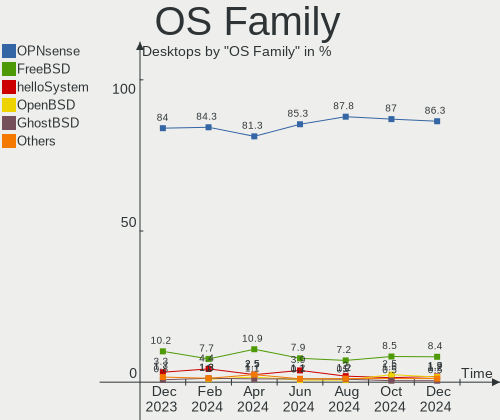
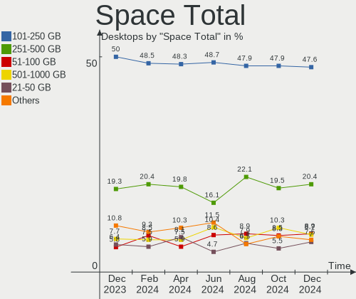
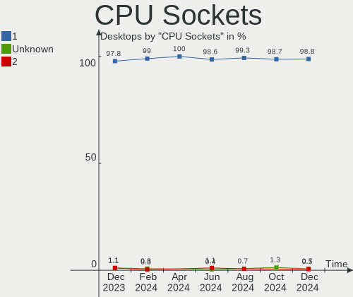
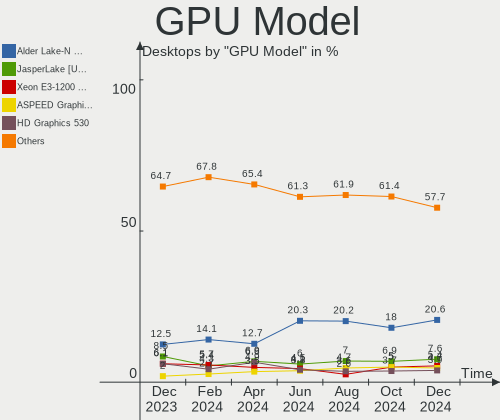
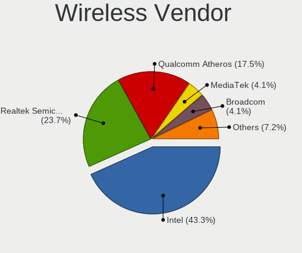
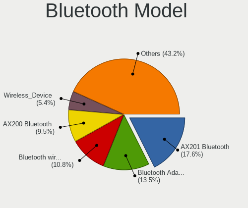

BSD Hardware Trends (Desktop)
-----------------------------

A project to identify most popular hardware characteristics and track their change
over time based on data collected by BSD users at https://BSD-Hardware.info.

Anyone can contribute to the study by uploading probes of their computers by
the [hw-probe](https://github.com/linuxhw/hw-probe/blob/master/INSTALL.BSD.md) tool:

    hw-probe -all -upload

Full-feature report is available here: https://bsd-hardware.info/?view=trends&formfactor=desktop

Period: Jun, 2021.

Contents
--------

- [ OS                       ](#os)
- [ OS Family                ](#os-family)
- [ Arch                     ](#arch)
- [ DE                       ](#de)
- [ Display Server           ](#display-server)
- [ Display Manager          ](#display-manager)
- [ OS Lang                  ](#os-lang)
- [ Boot Mode                ](#boot-mode)
- [ Filesystem               ](#filesystem)
- [ Part. scheme             ](#part-scheme)
- [ Country                  ](#country)
- [ City                     ](#city)
- [ Vendor                   ](#vendor)
- [ Model                    ](#model)
- [ Model Family             ](#model-family)
- [ MFG Year                 ](#mfg-year)
- [ Form Factor              ](#form-factor)
- [ Coreboot                 ](#coreboot)
- [ RAM Size                 ](#ram-size)
- [ RAM Used                 ](#ram-used)
- [ Has CD-ROM               ](#has-cd-rom)
- [ Total Drives             ](#total-drives)
- [ Has Ethernet             ](#has-ethernet)
- [ Has WiFi                 ](#has-wifi)
- [ Has Bluetooth            ](#has-bluetooth)
- [ Drive Vendor             ](#drive-vendor)
- [ Drive Model              ](#drive-model)
- [ HDD Vendor               ](#hdd-vendor)
- [ SSD Vendor               ](#ssd-vendor)
- [ Drive Kind               ](#drive-kind)
- [ Drive Connector          ](#drive-connector)
- [ Drive Size               ](#drive-size)
- [ Space Total              ](#space-total)
- [ Space Used               ](#space-used)
- [ Malfunc. Drives          ](#malfunc-drives)
- [ Malfunc. Drive Vendor    ](#malfunc-drive-vendor)
- [ Malfunc. HDD Vendor      ](#malfunc-hdd-vendor)
- [ Malfunc. Drive Kind      ](#malfunc-drive-kind)
- [ Failed Drives            ](#failed-drives)
- [ Failed Drive Vendor      ](#failed-drive-vendor)
- [ Drive Status             ](#drive-status)
- [ Storage Vendor           ](#storage-vendor)
- [ Storage Model            ](#storage-model)
- [ Storage Kind             ](#storage-kind)
- [ CPU Vendor               ](#cpu-vendor)
- [ CPU Model                ](#cpu-model)
- [ CPU Model Family         ](#cpu-model-family)
- [ CPU Cores                ](#cpu-cores)
- [ CPU Sockets              ](#cpu-sockets)
- [ CPU Threads              ](#cpu-threads)
- [ CPU Microarch            ](#cpu-microarch)
- [ GPU Vendor               ](#gpu-vendor)
- [ GPU Model                ](#gpu-model)
- [ GPU Combo                ](#gpu-combo)
- [ GPU Driver               ](#gpu-driver)
- [ GPU Memory               ](#gpu-memory)
- [ Monitor Vendor           ](#monitor-vendor)
- [ Monitor Model            ](#monitor-model)
- [ Monitor Resolution       ](#monitor-resolution)
- [ Monitor Diagonal         ](#monitor-diagonal)
- [ Monitor Width            ](#monitor-width)
- [ Aspect Ratio             ](#aspect-ratio)
- [ Monitor Area             ](#monitor-area)
- [ Pixel Density            ](#pixel-density)
- [ Multiple Monitors        ](#multiple-monitors)
- [ Net Controller Vendor    ](#net-controller-vendor)
- [ Net Controller Model     ](#net-controller-model)
- [ Wireless Vendor          ](#wireless-vendor)
- [ Wireless Model           ](#wireless-model)
- [ Ethernet Vendor          ](#ethernet-vendor)
- [ Ethernet Model           ](#ethernet-model)
- [ Net Controller Kind      ](#net-controller-kind)
- [ Used Controller          ](#used-controller)
- [ NICs                     ](#nics)
- [ IPv6                     ](#ipv6)
- [ Memory Vendor            ](#memory-vendor)
- [ Memory Model             ](#memory-model)
- [ Memory Kind              ](#memory-kind)
- [ Memory Form Factor       ](#memory-form-factor)
- [ Memory Size              ](#memory-size)
- [ Memory Speed             ](#memory-speed)
- [ Sound Vendor             ](#sound-vendor)
- [ Sound Model              ](#sound-model)
- [ Camera Vendor            ](#camera-vendor)
- [ Camera Model             ](#camera-model)
- [ Fingerprint Vendor       ](#fingerprint-vendor)
- [ Fingerprint Model        ](#fingerprint-model)
- [ Chipcard Vendor          ](#chipcard-vendor)
- [ Chipcard Model           ](#chipcard-model)
- [ Printer Vendor           ](#printer-vendor)
- [ Printer Model            ](#printer-model)
- [ Scanner Vendor           ](#scanner-vendor)
- [ Scanner Model            ](#scanner-model)
- [ Bluetooth Vendor         ](#bluetooth-vendor)
- [ Bluetooth Model          ](#bluetooth-model)
- [ Unsupported Devices      ](#unsupported-devices)
- [ Unsupported Device Types ](#unsupported-device-types)

OS
--

Installed operating systems

| Name                   | Desktops | Percent |
|------------------------|----------|---------|
| OPNsense 21.1.7        | 59       | 27.96%  |
| OPNsense 21.1.6        | 59       | 27.96%  |
| helloSystem 0.5.0      | 32       | 15.17%  |
| FreeBSD 13.0-p2        | 10       | 4.74%   |
| FreeBSD 13.0           | 9        | 4.27%   |
| OPNsense 21.1          | 6        | 2.84%   |
| OpenBSD 6.9            | 3        | 1.42%   |
| FreeBSD 12.2-STABLE    | 3        | 1.42%   |
| OPNsense 21.1.5        | 2        | 0.95%   |
| NomadBSD 5806f915      | 2        | 0.95%   |
| MidnightBSD 2.0.7      | 2        | 0.95%   |
| helloSystem 0.4.0      | 2        | 0.95%   |
| FreeBSD 13.0-STABLE    | 2        | 0.95%   |
| FreeBSD 12.2-p8        | 2        | 0.95%   |
| FreeBSD 12.2           | 2        | 0.95%   |
| TrueNAS 12.2           | 1        | 0.47%   |
| OPNsense 21.7          | 1        | 0.47%   |
| OPNsense 21.1.1        | 1        | 0.47%   |
| OPNsense 12.1-p16-HBSD | 1        | 0.47%   |
| OpenBSD 6.8            | 1        | 0.47%   |
| NomadBSD 1.4-RC1       | 1        | 0.47%   |
| NetBSD 9.99.85         | 1        | 0.47%   |
| helloSystem 0.6.0      | 1        | 0.47%   |
| helloSystem 0.1.0      | 1        | 0.47%   |
| GhostBSD 20.04.02      | 1        | 0.47%   |
| FreeBSD 14.0-CURRENT   | 1        | 0.47%   |
| FreeBSD 13.0-p3        | 1        | 0.47%   |
| FreeBSD 13.0-p1        | 1        | 0.47%   |
| FreeBSD 12.1-p8        | 1        | 0.47%   |
| FreeBSD 12.1-p10       | 1        | 0.47%   |
| FreeBSD 11.4           | 1        | 0.47%   |

OS Family
---------

OS without a version

| Name        | Desktops | Percent |
|-------------|----------|---------|
| OPNsense    | 129      | 61.14%  |
| helloSystem | 36       | 17.06%  |
| FreeBSD     | 34       | 16.11%  |
| OpenBSD     | 4        | 1.9%    |
| NomadBSD    | 3        | 1.42%   |
| MidnightBSD | 2        | 0.95%   |
| TrueNAS     | 1        | 0.47%   |
| NetBSD      | 1        | 0.47%   |
| GhostBSD    | 1        | 0.47%   |

Arch
----

OS architecture (x86_64, i586, etc.)

| Name  | Desktops | Percent |
|-------|----------|---------|
| amd64 | 209      | 99.05%  |
| i386  | 1        | 0.47%   |
| arm64 | 1        | 0.47%   |

DE
--

Desktop Environment

| Name         | Desktops | Percent |
|--------------|----------|---------|
| Console      | 149      | 70.62%  |
| helloDesktop | 35       | 16.59%  |
| KDE5         | 6        | 2.84%   |
| XFCE         | 5        | 2.37%   |
| MATE         | 4        | 1.9%    |
| Openbox      | 3        | 1.42%   |
| fvwm         | 3        | 1.42%   |
| GNOME        | 2        | 0.95%   |
| TWM          | 1        | 0.47%   |
| Lumina       | 1        | 0.47%   |
| Fluxbox      | 1        | 0.47%   |
| Cinnamon     | 1        | 0.47%   |

Display Server
--------------

X11 or Wayland

| Name    | Desktops | Percent |
|---------|----------|---------|
| Console | 147      | 69.67%  |
| X11     | 64       | 30.33%  |

Display Manager
---------------

SDDM, LightDM, etc.

| Name    | Desktops | Percent |
|---------|----------|---------|
| Console | 156      | 73.93%  |
| SLiM    | 41       | 19.43%  |
| SDDM    | 7        | 3.32%   |
| XDM     | 3        | 1.42%   |
| LightDM | 2        | 0.95%   |
| GDM     | 2        | 0.95%   |

OS Lang
-------

Language

| Lang    | Desktops | Percent |
|---------|----------|---------|
| Unknown | 143      | 67.77%  |
| en_US   | 43       | 20.38%  |
| C       | 16       | 7.58%   |
| de_DE   | 4        | 1.9%    |
| ru_RU   | 1        | 0.47%   |
| fr_FR   | 1        | 0.47%   |
| en_GB   | 1        | 0.47%   |
| en_CA   | 1        | 0.47%   |
| cs_CZ   | 1        | 0.47%   |

Boot Mode
---------

EFI or BIOS

| Mode | Desktops | Percent |
|------|----------|---------|
| EFI  | 172      | 81.52%  |
| BIOS | 39       | 18.48%  |

Filesystem
----------

Type of filesystem

| Type | Desktops | Percent |
|------|----------|---------|
| Ufs  | 143      | 67.77%  |
| Zfs  | 64       | 30.33%  |
| Ffs  | 4        | 1.9%    |

Part. scheme
------------

Scheme of partitioning

| Type | Desktops | Percent |
|------|----------|---------|
| GPT  | 191      | 90.52%  |
| MBR  | 20       | 9.48%   |

Country
-------

Geographic location (country)

| Country      | Desktops | Percent |
|--------------|----------|---------|
| USA          | 61       | 28.91%  |
| Germany      | 24       | 11.37%  |
| Russia       | 12       | 5.69%   |
| UK           | 11       | 5.21%   |
| Canada       | 10       | 4.74%   |
| Netherlands  | 8        | 3.79%   |
| Switzerland  | 7        | 3.32%   |
| Sweden       | 6        | 2.84%   |
| France       | 6        | 2.84%   |
| Australia    | 6        | 2.84%   |
| China        | 5        | 2.37%   |
| Ukraine      | 4        | 1.9%    |
| Poland       | 4        | 1.9%    |
| Brazil       | 4        | 1.9%    |
| Taiwan       | 3        | 1.42%   |
| Japan        | 3        | 1.42%   |
| Czechia      | 3        | 1.42%   |
| Austria      | 3        | 1.42%   |
| Spain        | 2        | 0.95%   |
| South Korea  | 2        | 0.95%   |
| Lithuania    | 2        | 0.95%   |
| Italy        | 2        | 0.95%   |
| Israel       | 2        | 0.95%   |
| Indonesia    | 2        | 0.95%   |
| Hungary      | 2        | 0.95%   |
| Uruguay      | 1        | 0.47%   |
| Turkey       | 1        | 0.47%   |
| South Africa | 1        | 0.47%   |
| Slovakia     | 1        | 0.47%   |
| Singapore    | 1        | 0.47%   |
| New Zealand  | 1        | 0.47%   |
| Mexico       | 1        | 0.47%   |
| Malta        | 1        | 0.47%   |
| Malaysia     | 1        | 0.47%   |
| India        | 1        | 0.47%   |
| Hong Kong    | 1        | 0.47%   |
| Egypt        | 1        | 0.47%   |
| Denmark      | 1        | 0.47%   |
| Cabo Verde   | 1        | 0.47%   |
| Bulgaria     | 1        | 0.47%   |
| Belgium      | 1        | 0.47%   |
| Algeria      | 1        | 0.47%   |

City
----

Geographic location (city)

| City              | Desktops | Percent |
|-------------------|----------|---------|
| Zurich            | 3        | 1.42%   |
| Moscow            | 3        | 1.42%   |
| London            | 3        | 1.42%   |
| Kamensk-Ural'skiy | 3        | 1.42%   |
| Ypsilanti         | 2        | 0.95%   |
| Wolverhampton     | 2        | 0.95%   |
| Winterthur        | 2        | 0.95%   |
| Tucson            | 2        | 0.95%   |
| Sydney            | 2        | 0.95%   |
| Shanghai          | 2        | 0.95%   |
| San Jose          | 2        | 0.95%   |
| Rotterdam         | 2        | 0.95%   |
| Petaẖ Tiqwa     | 2        | 0.95%   |
| Ottawa            | 2        | 0.95%   |
| Munich            | 2        | 0.95%   |
| Morris            | 2        | 0.95%   |
| Montreal          | 2        | 0.95%   |
| Madison           | 2        | 0.95%   |
| Kirkland          | 2        | 0.95%   |
| Jacksonville      | 2        | 0.95%   |
| Inzai             | 2        | 0.95%   |
| Hamburg           | 2        | 0.95%   |
| Dnipropetrovsk    | 2        | 0.95%   |
| Chelyabinsk       | 2        | 0.95%   |
| Brunswick         | 2        | 0.95%   |
| Beijing           | 2        | 0.95%   |
| Šiauliai         | 1        | 0.47%   |
| Zedelgem          | 1        | 0.47%   |
| Zaltbommel        | 1        | 0.47%   |
| York              | 1        | 0.47%   |
| Yokohama          | 1        | 0.47%   |
| Włocławek       | 1        | 0.47%   |
| Wylie             | 1        | 0.47%   |
| Wolfsburg         | 1        | 0.47%   |
| Winnipeg          | 1        | 0.47%   |
| Westland          | 1        | 0.47%   |
| Wenatchee         | 1        | 0.47%   |
| Warsaw            | 1        | 0.47%   |
| Warminster        | 1        | 0.47%   |
| Wake Forest       | 1        | 0.47%   |
| Vladivostok       | 1        | 0.47%   |
| Vilnius           | 1        | 0.47%   |
| Vienna            | 1        | 0.47%   |
| Victoria          | 1        | 0.47%   |
| Veenendaal        | 1        | 0.47%   |
| Vecses            | 1        | 0.47%   |
| Valletta          | 1        | 0.47%   |
| Valencia          | 1        | 0.47%   |
| Unterhaching      | 1        | 0.47%   |
| Ufa               | 1        | 0.47%   |
| Tung Chung        | 1        | 0.47%   |
| Tulsa             | 1        | 0.47%   |
| Toronto           | 1        | 0.47%   |
| Tornesch          | 1        | 0.47%   |
| Todtnau           | 1        | 0.47%   |
| Tisnov            | 1        | 0.47%   |
| Teteghem          | 1        | 0.47%   |
| Terrebonne        | 1        | 0.47%   |
| Taipei            | 1        | 0.47%   |
| Taichung          | 1        | 0.47%   |

Vendor
------

Motherboard manufacturer

| Name                                       | Desktops | Percent |
|--------------------------------------------|----------|---------|
| ASUSTek Computer                           | 33       | 15.64%  |
| Protectli                                  | 18       | 8.53%   |
| Hewlett-Packard                            | 16       | 7.58%   |
| Gigabyte Technology                        | 16       | 7.58%   |
| Unknown                                    | 16       | 7.58%   |
| Dell                                       | 15       | 7.11%   |
| MSI                                        | 13       | 6.16%   |
| PC Engines                                 | 12       | 5.69%   |
| ASRock                                     | 12       | 5.69%   |
| Intel                                      | 11       | 5.21%   |
| Lenovo                                     | 8        | 3.79%   |
| Supermicro                                 | 7        | 3.32%   |
| Biostar                                    | 3        | 1.42%   |
| Shuttle                                    | 2        | 0.95%   |
| HPE                                        | 2        | 0.95%   |
| YANYU                                      | 1        | 0.47%   |
| Wistron                                    | 1        | 0.47%   |
| ULTRATOP                                   | 1        | 0.47%   |
| TYAN Computer                              | 1        | 0.47%   |
| ShenZhen MinWin Technology                 | 1        | 0.47%   |
| SeeedStudio                                | 1        | 0.47%   |
| Samsung Electronics                        | 1        | 0.47%   |
| Raspberry Pi Foundation                    | 1        | 0.47%   |
| Nuage Networks                             | 1        | 0.47%   |
| NF541                                      | 1        | 0.47%   |
| Intel CNCTION-IAF                          | 1        | 0.47%   |
| Huanan                                     | 1        | 0.47%   |
| HARDKERNEL                                 | 1        | 0.47%   |
| GVC                                        | 1        | 0.47%   |
| Fujitsu                                    | 1        | 0.47%   |
| Foxconn                                    | 1        | 0.47%   |
| ECS                                        | 1        | 0.47%   |
| Dell EMC                                   | 1        | 0.47%   |
| Deciso                                     | 1        | 0.47%   |
| Colorful YuGong Technology And Development | 1        | 0.47%   |
| CNCTION-IAF-E3845                          | 1        | 0.47%   |
| CNCTION-IAF                                | 1        | 0.47%   |
| CheckPoint                                 | 1        | 0.47%   |
| BESSTAR Tech                               | 1        | 0.47%   |
| ASRockRack                                 | 1        | 0.47%   |
| AMI                                        | 1        | 0.47%   |
| Advantech                                  | 1        | 0.47%   |

Model
-----

Motherboard model

| Name                                    | Desktops | Percent |
|-----------------------------------------|----------|---------|
| Unknown                                 | 16       | 7.58%   |
| Protectli FW6                           | 8        | 3.79%   |
| PC Engines apu4                         | 6        | 2.84%   |
| Intel Q3XXG4-P V1.0                     | 6        | 2.84%   |
| PC Engines APU2                         | 5        | 2.37%   |
| Protectli FW4B                          | 4        | 1.9%    |
| Protectli FW2B                          | 3        | 1.42%   |
| Dell OptiPlex 990                       | 3        | 1.42%   |
| ASUS All Series                         | 3        | 1.42%   |
| Supermicro X7SPA-HF                     | 2        | 0.95%   |
| Protectli FW6D                          | 2        | 0.95%   |
| MSI MS-7B86                             | 2        | 0.95%   |
| HP Compaq Pro 6300 SFF                  | 2        | 0.95%   |
| HP Compaq 8200 Elite SFF PC             | 2        | 0.95%   |
| Gigabyte J1900N-D3V                     | 2        | 0.95%   |
| Dell OptiPlex 7020                      | 2        | 0.95%   |
| ASUS P5Q-E                              | 2        | 0.95%   |
| YANYU H67SL                             | 1        | 0.47%   |
| Wistron ProLiant ML110 G6               | 1        | 0.47%   |
| ULTRATOP C2017-LIVA-ZE                  | 1        | 0.47%   |
| TYAN S2925                              | 1        | 0.47%   |
| Supermicro X9SCL/X9SCM                  | 1        | 0.47%   |
| Supermicro X8DTH-i/6/iF/6F              | 1        | 0.47%   |
| Supermicro X10SLH-N6-ST031              | 1        | 0.47%   |
| Supermicro SYS-5018A-MLTN4              | 1        | 0.47%   |
| Supermicro SSG-6028R-E1CR12T            | 1        | 0.47%   |
| Shuttle DH370                           | 1        | 0.47%   |
| Shuttle DH110                           | 1        | 0.47%   |
| ShenZhen MinWin MW-NANO-APL-4L          | 1        | 0.47%   |
| SeeedStudio ODYSSEY-X86J4125            | 1        | 0.47%   |
| Samsung 400T7A/400S7A                   | 1        | 0.47%   |
| RPi rpi                                 | 1        | 0.47%   |
| Protectli VP2410                        | 1        | 0.47%   |
| PC Engines apu3                         | 1        | 0.47%   |
| Nuage Networks 7850 NSG-E               | 1        | 0.47%   |
| NF541 1.0                               | 1        | 0.47%   |
| MSI MS-7C36                             | 1        | 0.47%   |
| MSI MS-7C08                             | 1        | 0.47%   |
| MSI MS-7B84                             | 1        | 0.47%   |
| MSI MS-7B22                             | 1        | 0.47%   |
| MSI MS-7A32                             | 1        | 0.47%   |
| MSI MS-7A15                             | 1        | 0.47%   |
| MSI MS-7918                             | 1        | 0.47%   |
| MSI MS-7846                             | 1        | 0.47%   |
| MSI MS-7817                             | 1        | 0.47%   |
| MSI MS-7680                             | 1        | 0.47%   |
| MSI MS-7592                             | 1        | 0.47%   |
| Lenovo ThinkStation P330 30CY008AGE     | 1        | 0.47%   |
| Lenovo ThinkCentre M93p 10A8S16X0J      | 1        | 0.47%   |
| Lenovo ThinkCentre M920s 10SJ0041UK     | 1        | 0.47%   |
| Lenovo ThinkCentre M91p 7033DE6         | 1        | 0.47%   |
| Lenovo ThinkCentre M78 10BU0008US       | 1        | 0.47%   |
| Lenovo SHARKBAY 0B98401 WIN             | 1        | 0.47%   |
| Lenovo IdeaCentre 510A-15ICB 90HV0005US | 1        | 0.47%   |
| Lenovo 70F8S01J00 ThinkServer RS140     | 1        | 0.47%   |
| Intel X79 V2.72A                        | 1        | 0.47%   |
| Intel NDISB533                          | 1        | 0.47%   |
| Intel DH67CL AAG10212-206               | 1        | 0.47%   |
| Intel D33217GKE G76540-207              | 1        | 0.47%   |
| Intel CRESCENTBAY                       | 1        | 0.47%   |

Model Family
------------

Motherboard model prefix

| Name                           | Desktops | Percent |
|--------------------------------|----------|---------|
| Unknown                        | 16       | 7.58%   |
| Dell OptiPlex                  | 11       | 5.21%   |
| ASUS PRIME                     | 9        | 4.27%   |
| Protectli FW6                  | 8        | 3.79%   |
| PC Engines apu4                | 6        | 2.84%   |
| Intel Q3XXG4-P                 | 6        | 2.84%   |
| PC Engines APU2                | 5        | 2.37%   |
| HP Compaq                      | 5        | 2.37%   |
| Protectli FW4B                 | 4        | 1.9%    |
| Lenovo ThinkCentre             | 4        | 1.9%    |
| Protectli FW2B                 | 3        | 1.42%   |
| HP ProLiant                    | 3        | 1.42%   |
| HP ProDesk                     | 3        | 1.42%   |
| ASUS TUF                       | 3        | 1.42%   |
| ASUS ROG                       | 3        | 1.42%   |
| ASUS All                       | 3        | 1.42%   |
| Supermicro X7SPA-HF            | 2        | 0.95%   |
| Protectli FW6D                 | 2        | 0.95%   |
| MSI MS-7B86                    | 2        | 0.95%   |
| HPE ProLiant                   | 2        | 0.95%   |
| HP EliteDesk                   | 2        | 0.95%   |
| Gigabyte J1900N-D3V            | 2        | 0.95%   |
| Dell Inspiron                  | 2        | 0.95%   |
| ASUS P5Q-E                     | 2        | 0.95%   |
| YANYU H67SL                    | 1        | 0.47%   |
| Wistron ProLiant               | 1        | 0.47%   |
| ULTRATOP C2017-LIVA-ZE         | 1        | 0.47%   |
| TYAN S2925                     | 1        | 0.47%   |
| Supermicro X9SCL               | 1        | 0.47%   |
| Supermicro X8DTH-i             | 1        | 0.47%   |
| Supermicro X10SLH-N6-ST031     | 1        | 0.47%   |
| Supermicro SYS-5018A-MLTN4     | 1        | 0.47%   |
| Supermicro SSG-6028R-E1CR12T   | 1        | 0.47%   |
| Shuttle DH370                  | 1        | 0.47%   |
| Shuttle DH110                  | 1        | 0.47%   |
| ShenZhen MinWin MW-NANO-APL-4L | 1        | 0.47%   |
| SeeedStudio ODYSSEY-X86J4125   | 1        | 0.47%   |
| Samsung 400T7A                 | 1        | 0.47%   |
| RPi rpi                        | 1        | 0.47%   |
| Protectli VP2410               | 1        | 0.47%   |
| PC Engines apu3                | 1        | 0.47%   |
| Nuage Networks 7850            | 1        | 0.47%   |
| NF541 1.0                      | 1        | 0.47%   |
| MSI MS-7C36                    | 1        | 0.47%   |
| MSI MS-7C08                    | 1        | 0.47%   |
| MSI MS-7B84                    | 1        | 0.47%   |
| MSI MS-7B22                    | 1        | 0.47%   |
| MSI MS-7A32                    | 1        | 0.47%   |
| MSI MS-7A15                    | 1        | 0.47%   |
| MSI MS-7918                    | 1        | 0.47%   |
| MSI MS-7846                    | 1        | 0.47%   |
| MSI MS-7817                    | 1        | 0.47%   |
| MSI MS-7680                    | 1        | 0.47%   |
| MSI MS-7592                    | 1        | 0.47%   |
| Lenovo ThinkStation            | 1        | 0.47%   |
| Lenovo SHARKBAY                | 1        | 0.47%   |
| Lenovo IdeaCentre              | 1        | 0.47%   |
| Lenovo 70F8S01J00              | 1        | 0.47%   |
| Intel X79                      | 1        | 0.47%   |
| Intel NDISB533                 | 1        | 0.47%   |

MFG Year
--------

Motherboard manufacture year

| Year    | Desktops | Percent |
|---------|----------|---------|
| 2019    | 42       | 19.91%  |
| 2020    | 34       | 16.11%  |
| 2021    | 29       | 13.74%  |
| 2018    | 28       | 13.27%  |
| 2017    | 14       | 6.64%   |
| 2012    | 11       | 5.21%   |
| 2013    | 9        | 4.27%   |
| 2015    | 8        | 3.79%   |
| 2016    | 7        | 3.32%   |
| 2014    | 7        | 3.32%   |
| 2009    | 7        | 3.32%   |
| 2010    | 6        | 2.84%   |
| 2011    | 5        | 2.37%   |
| 2008    | 2        | 0.95%   |
| Unknown | 2        | 0.95%   |

Form Factor
-----------

Physical design of the computer

| Name    | Desktops | Percent |
|---------|----------|---------|
| Desktop | 211      | 100%    |

Coreboot
--------

Have coreboot on board

| Used | Desktops | Percent |
|------|----------|---------|
| No   | 190      | 90.05%  |
| Yes  | 21       | 9.95%   |

RAM Size
--------

Total RAM memory

| Size in GB  | Desktops | Percent |
|-------------|----------|---------|
| 8.01-16.0   | 79       | 37.44%  |
| 4.01-8.0    | 54       | 25.59%  |
| 16.01-24.0  | 38       | 18.01%  |
| 32.01-64.0  | 20       | 9.48%   |
| 2.01-3.0    | 7        | 3.32%   |
| 64.01-256.0 | 7        | 3.32%   |
| 24.01-32.0  | 4        | 1.9%    |
| 3.01-4.0    | 1        | 0.47%   |
| 0.01-0.5    | 1        | 0.47%   |

RAM Used
--------

Used RAM memory

| Used GB     | Desktops | Percent |
|-------------|----------|---------|
| 0.01-0.5    | 118      | 55.92%  |
| 0.51-1.0    | 54       | 25.59%  |
| 1.01-2.0    | 15       | 7.11%   |
| 3.01-4.0    | 6        | 2.84%   |
| 2.01-3.0    | 4        | 1.9%    |
| 4.01-8.0    | 3        | 1.42%   |
| 8.01-16.0   | 3        | 1.42%   |
| 32.01-64.0  | 2        | 0.95%   |
| 16.01-24.0  | 2        | 0.95%   |
| 24.01-32.0  | 1        | 0.47%   |
| 64.01-256.0 | 1        | 0.47%   |
| 0           | 1        | 0.47%   |
| Unknown     | 1        | 0.47%   |

Has CD-ROM
----------

Has CD-ROM on board

| Presented | Desktops | Percent |
|-----------|----------|---------|
| No        | 158      | 74.88%  |
| Yes       | 53       | 25.12%  |

Total Drives
------------

Number of drives on board

| Drives | Desktops | Percent |
|--------|----------|---------|
| 1      | 132      | 62.56%  |
| 2      | 31       | 14.69%  |
| 0      | 16       | 7.58%   |
| 3      | 14       | 6.64%   |
| 7      | 5        | 2.37%   |
| 4      | 5        | 2.37%   |
| 6      | 4        | 1.9%    |
| 13     | 1        | 0.47%   |
| 12     | 1        | 0.47%   |
| 10     | 1        | 0.47%   |
| 5      | 1        | 0.47%   |

Has Ethernet
------------

Has Ethernet on board

| Presented | Desktops | Percent |
|-----------|----------|---------|
| Yes       | 208      | 98.58%  |
| No        | 3        | 1.42%   |

Has WiFi
--------

Has WiFi module

| Presented | Desktops | Percent |
|-----------|----------|---------|
| No        | 171      | 81.04%  |
| Yes       | 40       | 18.96%  |

Has Bluetooth
-------------

Has Bluetooth module

| Presented | Desktops | Percent |
|-----------|----------|---------|
| No        | 189      | 89.57%  |
| Yes       | 22       | 10.43%  |

Drive Vendor
------------

Hard drive vendors

| Vendor              | Desktops | Drives | Percent |
|---------------------|----------|--------|---------|
| Samsung Electronics | 45       | 56     | 16.42%  |
| WDC                 | 42       | 74     | 15.33%  |
| Seagate             | 38       | 62     | 13.87%  |
| Kingston            | 25       | 27     | 9.12%   |
| Toshiba             | 11       | 14     | 4.01%   |
| Hoodisk             | 11       | 11     | 4.01%   |
| Crucial             | 11       | 14     | 4.01%   |
| Intel               | 10       | 11     | 3.65%   |
| Transcend           | 7        | 10     | 2.55%   |
| SanDisk             | 7        | 7      | 2.55%   |
| Phison              | 7        | 7      | 2.55%   |
| Protectli           | 5        | 5      | 1.82%   |
| A-DATA Technology   | 5        | 6      | 1.82%   |
| China               | 4        | 4      | 1.46%   |
| OCZ                 | 3        | 3      | 1.09%   |
| Hitachi             | 3        | 3      | 1.09%   |
| HGST                | 3        | 3      | 1.09%   |
| Zheino              | 2        | 2      | 0.73%   |
| Micron Technology   | 2        | 2      | 0.73%   |
| LITEON              | 2        | 2      | 0.73%   |
| KingSpec            | 2        | 2      | 0.73%   |
| KingDian            | 2        | 2      | 0.73%   |
| HPE                 | 2        | 3      | 0.73%   |
| Hewlett-Packard     | 2        | 2      | 0.73%   |
| Corsair             | 2        | 2      | 0.73%   |
| Apacer              | 2        | 2      | 0.73%   |
| XUNZHE              | 1        | 1      | 0.36%   |
| VisionTek           | 1        | 1      | 0.36%   |
| Verbatim            | 1        | 1      | 0.36%   |
| SPCC                | 1        | 1      | 0.36%   |
| Smartbuy            | 1        | 1      | 0.36%   |
| SK Hynix            | 1        | 1      | 0.36%   |
| NVMe                | 1        | 1      | 0.36%   |
| MEMXPRO             | 1        | 1      | 0.36%   |
| MAXTOR              | 1        | 1      | 0.36%   |
| LSI                 | 1        | 1      | 0.36%   |
| LITEONIT            | 1        | 1      | 0.36%   |
| LDLC                | 1        | 1      | 0.36%   |
| Kston               | 1        | 1      | 0.36%   |
| Intenso             | 1        | 1      | 0.36%   |
| Generic             | 1        | 1      | 0.36%   |
| Drevo               | 1        | 1      | 0.36%   |
| Dogfish             | 1        | 1      | 0.36%   |
| BIWIN               | 1        | 1      | 0.36%   |
| AMD                 | 1        | 1      | 0.36%   |

Drive Model
-----------

Hard drive models

| Model                                | Desktops | Percent |
|--------------------------------------|----------|---------|
| Phison SATA SSD 16GB                 | 6        | 1.92%   |
| Hoodisk SSD 32GB                     | 6        | 1.92%   |
| Samsung SSD 850 EVO 250GB            | 5        | 1.6%    |
| Seagate ST4000DM000-1F2168 4TB       | 4        | 1.28%   |
| Samsung SSD 860 EVO 500GB            | 4        | 1.28%   |
| Protectli 120GB mSATA                | 4        | 1.28%   |
| Kingston SUV500MS120G 120GB          | 4        | 1.28%   |
| Kingston SA400S37240G 240GB          | 4        | 1.28%   |
| Samsung SSD 860 EVO 1TB              | 3        | 0.96%   |
| Kingston SUV500MS240G 240GB          | 3        | 0.96%   |
| Hoodisk SSD 64GB                     | 3        | 0.96%   |
| HGST HTS725050A7E630 500GB           | 3        | 0.96%   |
| WDC WD10EZRX-00A8LB0 1TB             | 2        | 0.64%   |
| Transcend TS64GMSA230S 64GB          | 2        | 0.64%   |
| Transcend TS128GMSA370S 128GB        | 2        | 0.64%   |
| Toshiba HDWD120 2TB                  | 2        | 0.64%   |
| Toshiba DT01ACA100 1TB               | 2        | 0.64%   |
| Seagate ST500LM000-1EJ162-SSHD 500GB | 2        | 0.64%   |
| Seagate ST4000DM005-2DP166 4TB       | 2        | 0.64%   |
| Seagate ST4000DM004-2CV104 4TB       | 2        | 0.64%   |
| Seagate ST3500418AS 500GB            | 2        | 0.64%   |
| Seagate ST3500413AS 500GB            | 2        | 0.64%   |
| Seagate ST3320613AS 320GB            | 2        | 0.64%   |
| Seagate ST1000DM010-2EP102 1TB       | 2        | 0.64%   |
| Samsung SSD 970 EVO Plus 250GB       | 2        | 0.64%   |
| Samsung SSD 960 EVO 500GB            | 2        | 0.64%   |
| Samsung SSD 850 PRO 512GB            | 2        | 0.64%   |
| Samsung SSD 850 EVO 1TB              | 2        | 0.64%   |
| Kingston SV300S37A240G 240GB         | 2        | 0.64%   |
| Kingston SV300S37A120G 120GB         | 2        | 0.64%   |
| Kingston SA2000M8250G 250GB          | 2        | 0.64%   |
| KingSpec MT-64 64GB                  | 2        | 0.64%   |
| Crucial CT250MX500SSD1 250GB         | 2        | 0.64%   |
| Crucial CT120BX500SSD1 120GB         | 2        | 0.64%   |
| Zheino CHN-mSATAM3-256 256GB         | 1        | 0.32%   |
| Zheino CHN-mSATAM1-32 32GB           | 1        | 0.32%   |
| XUNZHE MSATA 128GB                   | 1        | 0.32%   |
| WDC WDS500G2B0B-00YS70 500GB         | 1        | 0.32%   |
| WDC WDS500G1X0E-00AFY0 500GB         | 1        | 0.32%   |
| WDC WDS250G3X0C-00SJG0 250GB         | 1        | 0.32%   |
| WDC WDS240G2G0B-00EPW0 240GB         | 1        | 0.32%   |
| WDC WDS120G2G0B-00EPW0 120GB         | 1        | 0.32%   |
| WDC WDS100T3X0C-00SJG0 1TB           | 1        | 0.32%   |
| WDC WDS100T2X0C-00L350 1TB           | 1        | 0.32%   |
| WDC WDS100T1X0E-00AFY0 1TB           | 1        | 0.32%   |
| WDC WD82PURZ-85TEUY0 8TB             | 1        | 0.32%   |
| WDC WD80EMAZ-00WJTA0 8TB             | 1        | 0.32%   |
| WDC WD80EFZX-68UW8N0 8TB             | 1        | 0.32%   |
| WDC WD80EFAX-68LHPN0 8TB             | 1        | 0.32%   |
| WDC WD80EFAX-68KNBN0 8TB             | 1        | 0.32%   |
| WDC WD800BEVT-75ZCT2 80GB            | 1        | 0.32%   |
| WDC WD8003FFBX-68B9AN0 8TB           | 1        | 0.32%   |
| WDC WD6400AAKS-22A7B0 640GB          | 1        | 0.32%   |
| WDC WD60EZRZ-00GZ5B1 6TB             | 1        | 0.32%   |
| WDC WD60EFAX-68SHWN0 6TB             | 1        | 0.32%   |
| WDC WD5003ABYX-23 81Y9803 500GB      | 1        | 0.32%   |
| WDC WD5002ABYS-02B1B0 500GB          | 1        | 0.32%   |
| WDC WD5000LPVX-22V0TT0 500GB         | 1        | 0.32%   |
| WDC WD5000AZLX-60K2TA0 500GB         | 1        | 0.32%   |
| WDC WD5000AAKX-60U6AA0 500GB         | 1        | 0.32%   |

HDD Vendor
----------

Hard disk drive vendors

| Vendor              | Desktops | Drives | Percent |
|---------------------|----------|--------|---------|
| Seagate             | 38       | 61     | 34.55%  |
| WDC                 | 36       | 61     | 32.73%  |
| Samsung Electronics | 13       | 13     | 11.82%  |
| Toshiba             | 10       | 13     | 9.09%   |
| Hitachi             | 3        | 3      | 2.73%   |
| HGST                | 3        | 3      | 2.73%   |
| Hewlett-Packard     | 2        | 2      | 1.82%   |
| NVMe                | 1        | 1      | 0.91%   |
| MAXTOR              | 1        | 1      | 0.91%   |
| LSI                 | 1        | 1      | 0.91%   |
| HPE                 | 1        | 2      | 0.91%   |
| Generic             | 1        | 1      | 0.91%   |

SSD Vendor
----------

Solid state drive vendors

| Vendor              | Desktops | Drives | Percent |
|---------------------|----------|--------|---------|
| Samsung Electronics | 26       | 32     | 17.93%  |
| Kingston            | 23       | 24     | 15.86%  |
| Hoodisk             | 11       | 11     | 7.59%   |
| Crucial             | 9        | 12     | 6.21%   |
| Transcend           | 7        | 10     | 4.83%   |
| SanDisk             | 7        | 7      | 4.83%   |
| Phison              | 6        | 6      | 4.14%   |
| Intel               | 6        | 7      | 4.14%   |
| Protectli           | 5        | 5      | 3.45%   |
| WDC                 | 4        | 4      | 2.76%   |
| China               | 4        | 4      | 2.76%   |
| A-DATA Technology   | 4        | 4      | 2.76%   |
| OCZ                 | 3        | 3      | 2.07%   |
| Zheino              | 2        | 2      | 1.38%   |
| Micron Technology   | 2        | 2      | 1.38%   |
| LITEON              | 2        | 2      | 1.38%   |
| KingSpec            | 2        | 2      | 1.38%   |
| KingDian            | 2        | 2      | 1.38%   |
| Corsair             | 2        | 2      | 1.38%   |
| Apacer              | 2        | 2      | 1.38%   |
| XUNZHE              | 1        | 1      | 0.69%   |
| VisionTek           | 1        | 1      | 0.69%   |
| Verbatim            | 1        | 1      | 0.69%   |
| Toshiba             | 1        | 1      | 0.69%   |
| Smartbuy            | 1        | 1      | 0.69%   |
| SK Hynix            | 1        | 1      | 0.69%   |
| Seagate             | 1        | 1      | 0.69%   |
| MEMXPRO             | 1        | 1      | 0.69%   |
| LITEONIT            | 1        | 1      | 0.69%   |
| Kston               | 1        | 1      | 0.69%   |
| Intenso             | 1        | 1      | 0.69%   |
| HPE                 | 1        | 1      | 0.69%   |
| Drevo               | 1        | 1      | 0.69%   |
| Dogfish             | 1        | 1      | 0.69%   |
| BIWIN               | 1        | 1      | 0.69%   |
| AMD                 | 1        | 1      | 0.69%   |

Drive Kind
----------

HDD or SSD

| Kind | Desktops | Drives | Percent |
|------|----------|--------|---------|
| SSD  | 130      | 159    | 54.17%  |
| HDD  | 82       | 162    | 34.17%  |
| NVMe | 28       | 34     | 11.67%  |

Drive Connector
---------------

SATA, SAS, NVMe, etc.

| Type | Desktops | Drives | Percent |
|------|----------|--------|---------|
| SATA | 185      | 321    | 86.85%  |
| NVMe | 28       | 34     | 13.15%  |

Drive Size
----------

Size of hard drive

| Size in TB | Desktops | Drives | Percent |
|------------|----------|--------|---------|
| 0.01-0.5   | 163      | 217    | 74.09%  |
| 0.51-1.0   | 27       | 35     | 12.27%  |
| 3.01-4.0   | 10       | 21     | 4.55%   |
| 4.01-10.0  | 9        | 32     | 4.09%   |
| 1.01-2.0   | 6        | 7      | 2.73%   |
| 2.01-3.0   | 4        | 7      | 1.82%   |
| 10.01-20.0 | 1        | 2      | 0.45%   |

Space Total
-----------

Amount of disk space available on the file system

| Size in GB     | Desktops | Percent |
|----------------|----------|---------|
| 101-250        | 63       | 29.86%  |
| 1-20           | 44       | 20.85%  |
| 51-100         | 30       | 14.22%  |
| 21-50          | 28       | 13.27%  |
| 251-500        | 27       | 12.8%   |
| 501-1000       | 11       | 5.21%   |
| More than 3000 | 2        | 0.95%   |
| 2001-3000      | 2        | 0.95%   |
| 1001-2000      | 2        | 0.95%   |
| Unknown        | 2        | 0.95%   |

Space Used
----------

Amount of used disk space

| Used GB  | Desktops | Percent |
|----------|----------|---------|
| 1-20     | 196      | 92.89%  |
| 21-50    | 7        | 3.32%   |
| 101-250  | 2        | 0.95%   |
| 51-100   | 2        | 0.95%   |
| Unknown  | 2        | 0.95%   |
| 251-500  | 1        | 0.47%   |
| 501-1000 | 1        | 0.47%   |

Malfunc. Drives
---------------

Drive models with a malfunction

| Model                             | Desktops | Drives | Percent |
|-----------------------------------|----------|--------|---------|
| HGST HTS725050A7E630 500GB        | 3        | 3      | 7.32%   |
| Seagate ST3500418AS 500GB         | 2        | 3      | 4.88%   |
| Kingston SV300S37A120G 120GB      | 2        | 2      | 4.88%   |
| WDC WD6400AAKS-22A7B0 640GB       | 1        | 1      | 2.44%   |
| WDC WD5003ABYX-23 81Y9803 500GB   | 1        | 1      | 2.44%   |
| WDC WD5000LPVX-22V0TT0 500GB      | 1        | 1      | 2.44%   |
| WDC WD5000AAKX-60U6AA0 500GB      | 1        | 1      | 2.44%   |
| WDC WD3200BEVT-00A0RT0 233GB      | 1        | 1      | 2.44%   |
| WDC WD2500AAKX-083CA1 250GB       | 1        | 1      | 2.44%   |
| WDC WD10EZEX-60WN4A0 1TB          | 1        | 1      | 2.44%   |
| VisionTek mSATA 120GB             | 1        | 1      | 2.44%   |
| Transcend 3E128-TS2-550B01 100GB  | 1        | 4      | 2.44%   |
| Toshiba MQ02ABD100H 1TB           | 1        | 1      | 2.44%   |
| Toshiba HDWD120 2TB               | 1        | 1      | 2.44%   |
| Toshiba DT01ACA100 1TB            | 1        | 1      | 2.44%   |
| Seagate ST380815AS 80GB           | 1        | 1      | 2.44%   |
| Seagate ST380013AS 80GB           | 1        | 2      | 2.44%   |
| Seagate ST3500413AS 500GB         | 1        | 1      | 2.44%   |
| Seagate ST3250410AS 250GB         | 1        | 1      | 2.44%   |
| Seagate ST3160815AS 160GB         | 1        | 1      | 2.44%   |
| Seagate ST3160310CS 160GB         | 1        | 1      | 2.44%   |
| Samsung Electronics SP2004C 200GB | 1        | 1      | 2.44%   |
| Samsung Electronics HM500LI 500GB | 1        | 1      | 2.44%   |
| Samsung Electronics HM160HI 160GB | 1        | 1      | 2.44%   |
| Samsung Electronics HD642JJ 640GB | 1        | 1      | 2.44%   |
| Samsung Electronics HD322HJ 320GB | 1        | 1      | 2.44%   |
| Samsung Electronics HD321KJ 320GB | 1        | 1      | 2.44%   |
| Samsung Electronics HD161HJ 160GB | 1        | 1      | 2.44%   |
| Samsung Electronics HD082GJ 80GB  | 1        | 1      | 2.44%   |
| MAXTOR STM3160815AS 160GB         | 1        | 1      | 2.44%   |
| LITEON CV8-8E128-HP 128GB         | 1        | 1      | 2.44%   |
| Kingston SUV400S37120G 120GB      | 1        | 1      | 2.44%   |
| Intel SSDSA2M160G2GC 160GB        | 1        | 1      | 2.44%   |
| Hitachi HTS727550A9E364 500GB     | 1        | 1      | 2.44%   |
| Hewlett-Packard FB160C4081 160GB  | 1        | 1      | 2.44%   |
| Corsair Force 3 SSD 120GB         | 1        | 1      | 2.44%   |
| BIWIN SSD 32GB                    | 1        | 1      | 2.44%   |

Malfunc. Drive Vendor
---------------------

Vendors of faulty drives

| Vendor              | Desktops | Drives | Percent |
|---------------------|----------|--------|---------|
| Seagate             | 8        | 10     | 19.51%  |
| Samsung Electronics | 8        | 8      | 19.51%  |
| WDC                 | 7        | 7      | 17.07%  |
| Toshiba             | 3        | 3      | 7.32%   |
| Kingston            | 3        | 3      | 7.32%   |
| HGST                | 3        | 3      | 7.32%   |
| VisionTek           | 1        | 1      | 2.44%   |
| Transcend           | 1        | 4      | 2.44%   |
| MAXTOR              | 1        | 1      | 2.44%   |
| LITEON              | 1        | 1      | 2.44%   |
| Intel               | 1        | 1      | 2.44%   |
| Hitachi             | 1        | 1      | 2.44%   |
| Hewlett-Packard     | 1        | 1      | 2.44%   |
| Corsair             | 1        | 1      | 2.44%   |
| BIWIN               | 1        | 1      | 2.44%   |

Malfunc. HDD Vendor
-------------------

Vendors of faulty HDD drives

| Vendor              | Desktops | Drives | Percent |
|---------------------|----------|--------|---------|
| Seagate             | 8        | 10     | 25%     |
| Samsung Electronics | 8        | 8      | 25%     |
| WDC                 | 7        | 7      | 21.88%  |
| Toshiba             | 3        | 3      | 9.38%   |
| HGST                | 3        | 3      | 9.38%   |
| MAXTOR              | 1        | 1      | 3.13%   |
| Hitachi             | 1        | 1      | 3.13%   |
| Hewlett-Packard     | 1        | 1      | 3.13%   |

Malfunc. Drive Kind
-------------------

Kinds of faulty drives

| Kind | Desktops | Drives | Percent |
|------|----------|--------|---------|
| HDD  | 29       | 34     | 76.32%  |
| SSD  | 9        | 12     | 23.68%  |

Failed Drives
-------------

Failed drive models

Zero info for selected period =(

Failed Drive Vendor
-------------------

Failed drive vendors

Zero info for selected period =(

Drive Status
------------

Number of failed and malfunc. drives

| Status   | Desktops | Drives | Percent |
|----------|----------|--------|---------|
| Works    | 164      | 294    | 78.1%   |
| Malfunc  | 38       | 46     | 18.1%   |
| Detected | 8        | 15     | 3.81%   |

Storage Vendor
--------------

Storage controller vendors

| Vendor                      | Desktops | Percent |
|-----------------------------|----------|---------|
| Intel                       | 159      | 59.55%  |
| AMD                         | 49       | 18.35%  |
| Samsung Electronics         | 12       | 4.49%   |
| Marvell Technology Group    | 7        | 2.62%   |
| Sandisk                     | 6        | 2.25%   |
| Broadcom / LSI              | 6        | 2.25%   |
| ASMedia Technology          | 6        | 2.25%   |
| VIA Technologies            | 3        | 1.12%   |
| Phison Electronics          | 3        | 1.12%   |
| Kingston Technology Company | 3        | 1.12%   |
| Silicon Motion              | 2        | 0.75%   |
| Nvidia                      | 2        | 0.75%   |
| Micron/Crucial Technology   | 2        | 0.75%   |
| Hewlett-Packard             | 2        | 0.75%   |
| ADATA Technology            | 2        | 0.75%   |
| XenSource                   | 1        | 0.37%   |
| Silicon Image               | 1        | 0.37%   |
| Chelsio Communications      | 1        | 0.37%   |

Storage Model
-------------

Storage controller models

| Model                                                                                   | Desktops | Percent |
|-----------------------------------------------------------------------------------------|----------|---------|
| AMD FCH SATA Controller [AHCI mode]                                                     | 36       | 11.43%  |
| Intel Sunrise Point-LP SATA Controller [AHCI mode]                                      | 16       | 5.08%   |
| Intel 8 Series/C220 Series Chipset Family 6-port SATA Controller 1 [AHCI mode]          | 16       | 5.08%   |
| Intel 6 Series/C200 Series Chipset Family 6 port Desktop SATA AHCI Controller           | 16       | 5.08%   |
| Intel Atom/Celeron/Pentium Processor x5-E8000/J3xxx/N3xxx Series SATA Controller        | 12       | 3.81%   |
| Intel Q170/Q150/B150/H170/H110/Z170/CM236 Chipset SATA Controller [AHCI Mode]           | 11       | 3.49%   |
| AMD 400 Series Chipset SATA Controller                                                  | 11       | 3.49%   |
| Samsung NVMe SSD Controller SM981/PM981/PM983                                           | 8        | 2.54%   |
| Intel Cannon Lake PCH SATA AHCI Controller                                              | 8        | 2.54%   |
| Intel Atom Processor E3800 Series SATA AHCI Controller                                  | 7        | 2.22%   |
| Intel NM10/ICH7 Family SATA Controller [IDE mode]                                       | 6        | 1.9%    |
| Intel 200 Series PCH SATA controller [AHCI mode]                                        | 6        | 1.9%    |
| ASMedia ASM1062 Serial ATA Controller                                                   | 6        | 1.9%    |
| Intel Celeron/Pentium Silver Processor SATA Controller                                  | 5        | 1.59%   |
| Intel Celeron N3350/Pentium N4200/Atom E3900 Series SATA AHCI Controller                | 4        | 1.27%   |
| Intel 82801JI (ICH10 Family) SATA AHCI Controller                                       | 4        | 1.27%   |
| Intel 82801G (ICH7 Family) IDE Controller                                               | 4        | 1.27%   |
| Intel 8 Series SATA Controller 1 [AHCI mode]                                            | 4        | 1.27%   |
| Intel 7 Series/C210 Series Chipset Family 6-port SATA Controller [AHCI mode]            | 4        | 1.27%   |
| AMD X370 Series Chipset SATA Controller                                                 | 4        | 1.27%   |
| AMD SB7x0/SB8x0/SB9x0 IDE Controller                                                    | 4        | 1.27%   |
| Samsung NVMe SSD Controller SM961/PM961/SM963                                           | 3        | 0.95%   |
| Marvell Group 88SE9230 PCIe 2.0 x2 4-port SATA 6 Gb/s RAID Controller                   | 3        | 0.95%   |
| Marvell Group 88SE6111/6121 SATA II / PATA Controller                                   | 3        | 0.95%   |
| Intel Wildcat Point-LP SATA Controller [AHCI Mode]                                      | 3        | 0.95%   |
| Intel SATA Controller [RAID mode]                                                       | 3        | 0.95%   |
| Intel C610/X99 series chipset sSATA Controller [AHCI mode]                              | 3        | 0.95%   |
| Intel C610/X99 series chipset 6-Port SATA Controller [AHCI mode]                        | 3        | 0.95%   |
| Intel Atom processor C2000 AHCI SATA3 Controller                                        | 3        | 0.95%   |
| Intel Atom processor C2000 AHCI SATA2 Controller                                        | 3        | 0.95%   |
| Intel 9 Series Chipset Family SATA Controller [AHCI Mode]                               | 3        | 0.95%   |
| Intel 82801IR/IO/IH (ICH9R/DO/DH) 6 port SATA Controller [AHCI mode]                    | 3        | 0.95%   |
| AMD Starship/Matisse Chipset SATA Controller [AHCI mode]                                | 3        | 0.95%   |
| AMD SB7x0/SB8x0/SB9x0 SATA Controller [AHCI mode]                                       | 3        | 0.95%   |
| AMD FCH SATA Controller [IDE mode]                                                      | 3        | 0.95%   |
| VIA VT6415 PATA IDE Host Controller                                                     | 2        | 0.63%   |
| Silicon Motion SM2263EN/SM2263XT SSD Controller                                         | 2        | 0.63%   |
| Sandisk WD Black SN850                                                                  | 2        | 0.63%   |
| Sandisk WD Black SN750 / PC SN730 NVMe SSD                                              | 2        | 0.63%   |
| Sandisk WD Black 2018/SN750 / PC SN720 NVMe SSD                                         | 2        | 0.63%   |
| Phison PS5013 E13 NVMe Controller                                                       | 2        | 0.63%   |
| Kingston Company A2000 NVMe SSD                                                         | 2        | 0.63%   |
| Intel 82801HM/HEM (ICH8M/ICH8M-E) SATA Controller [IDE mode]                            | 2        | 0.63%   |
| Intel 82801HM/HEM (ICH8M/ICH8M-E) IDE Controller                                        | 2        | 0.63%   |
| Intel 8 Series/C220 Series Chipset Family 4-port SATA Controller 1 [IDE mode]           | 2        | 0.63%   |
| Intel 6 Series/C200 Series Chipset Family Desktop SATA Controller (IDE mode, ports 4-5) | 2        | 0.63%   |
| Intel 6 Series/C200 Series Chipset Family Desktop SATA Controller (IDE mode, ports 0-3) | 2        | 0.63%   |
| Intel 500 Series Chipset Family SATA AHCI Controller                                    | 2        | 0.63%   |
| Intel 5 Series/3400 Series Chipset 6 port SATA AHCI Controller                          | 2        | 0.63%   |
| Intel 400 Series Chipset Family SATA AHCI Controller                                    | 2        | 0.63%   |
| Broadcom / LSI SAS2008 PCI-Express Fusion-MPT SAS-2 [Falcon]                            | 2        | 0.63%   |
| AMD SB7x0/SB8x0/SB9x0 SATA Controller [IDE mode]                                        | 2        | 0.63%   |
| AMD FCH SATA Controller D                                                               | 2        | 0.63%   |
| AMD 300 Series Chipset SATA Controller                                                  | 2        | 0.63%   |
| ADATA XPG SX8200 Pro PCIe Gen3x4 M.2 2280 Solid State Drive                             | 2        | 0.63%   |
| XenSource Xen Platform Device                                                           | 1        | 0.32%   |
| VIA VT6421 IDE/SATA Controller                                                          | 1        | 0.32%   |
| Silicon Image SiI 3512 [SATALink/SATARaid] Serial ATA Controller                        | 1        | 0.32%   |
| Sandisk WD Blue SN500 / PC SN520 NVMe SSD                                               | 1        | 0.32%   |
| Samsung NVMe SSD Controller SM951/PM951                                                 | 1        | 0.32%   |

Storage Kind
------------

Kind of storage controller (IDE, SATA, NVMe, SAS, ...)

| Kind | Desktops | Percent |
|------|----------|---------|
| SATA | 183      | 70.11%  |
| NVMe | 31       | 11.88%  |
| IDE  | 30       | 11.49%  |
| RAID | 10       | 3.83%   |
| SAS  | 4        | 1.53%   |
| SCSI | 3        | 1.15%   |

CPU Vendor
----------

Processor vendors

| Vendor  | Desktops | Percent |
|---------|----------|---------|
| Intel   | 159      | 75.36%  |
| AMD     | 51       | 24.17%  |
| Unknown | 1        | 0.47%   |

CPU Model
---------

Processor models

| Model                                       | Desktops | Percent |
|---------------------------------------------|----------|---------|
| AMD GX-412TC SOC                            | 12       | 5.69%   |
| Intel Celeron CPU J3160 @ 1.60GHz           | 9        | 4.27%   |
| Intel Core i5-7200U CPU @ 2.50GHz           | 6        | 2.84%   |
| Intel Core i5-6500 CPU @ 3.20GHz            | 4        | 1.9%    |
| Intel Celeron J4125 CPU @ 2.00GHz           | 4        | 1.9%    |
| Intel Celeron CPU J1900 @ 1.99GHz           | 4        | 1.9%    |
| Intel Celeron CPU 3865U @ 1.80GHz           | 4        | 1.9%    |
| AMD Ryzen 5 2600 Six-Core Processor         | 4        | 1.9%    |
| Intel Core i5-4460 CPU @ 3.20GHz            | 3        | 1.42%   |
| Intel Core i5-2400 CPU @ 3.10GHz            | 3        | 1.42%   |
| Intel Core i3-6100 CPU @ 3.70GHz            | 3        | 1.42%   |
| Intel Core i3-4010U CPU @ 1.70GHz           | 3        | 1.42%   |
| Intel Celeron CPU J3060 @ 1.60GHz           | 3        | 1.42%   |
| Intel Xeon CPU E3-1220 V2 @ 3.10GHz         | 2        | 0.95%   |
| Intel Xeon                                  | 2        | 0.95%   |
| Intel Pentium CPU G3220 @ 3.00GHz           | 2        | 0.95%   |
| Intel Core i5-8250U CPU @ 1.60GHz           | 2        | 0.95%   |
| Intel Core i5-5200U CPU @ 2.20GHz           | 2        | 0.95%   |
| Intel Core i5-4570 CPU @ 3.20GHz            | 2        | 0.95%   |
| Intel Core i5-3470 CPU @ 3.20GHz            | 2        | 0.95%   |
| Intel Core i5-2400S CPU @ 2.50GH            | 2        | 0.95%   |
| Intel Core i3-4160 CPU @ 3.60GHz            | 2        | 0.95%   |
| Intel Core i3-10100 CPU @ 3.60GHz           | 2        | 0.95%   |
| Intel Core 2 Quad CPU Q6600 @ 2.40GHz       | 2        | 0.95%   |
| Intel Celeron CPU J3455 @ 1.50GHz           | 2        | 0.95%   |
| Intel Celeron CPU G3900 @ 2.80GHz           | 2        | 0.95%   |
| Intel Atom CPU D525 @ 1.80GHz               | 2        | 0.95%   |
| Intel Atom CPU D510 @ 1.66GHz               | 2        | 0.95%   |
| AMD Ryzen 7 2700 Eight-Core Processor       | 2        | 0.95%   |
| AMD Ryzen 7 1700 Eight-Core Processor       | 2        | 0.95%   |
| AMD Ryzen 5 5600X 6-Core Processor          | 2        | 0.95%   |
| AMD Ryzen 5 2400G with Radeon Vega Graphics | 2        | 0.95%   |
| Intel Xeon E-2224G CPU @ 3.50GHz            | 1        | 0.47%   |
| Intel Xeon E-2224 CPU @ 3.40GHz             | 1        | 0.47%   |
| Intel Xeon CPU X5675 @ 3.07GHz              | 1        | 0.47%   |
| Intel Xeon CPU X5460 @ 3.16GHz              | 1        | 0.47%   |
| Intel Xeon CPU W3550 @ 3.07GHz              | 1        | 0.47%   |
| Intel Xeon CPU E5-2650 v4 @ 2.20GHz         | 1        | 0.47%   |
| Intel Xeon CPU E5-2630L 0 @ 2.00GHz         | 1        | 0.47%   |
| Intel Xeon CPU E3-1275L v3 @ 2.70GHz        | 1        | 0.47%   |
| Intel Xeon CPU E3-1270 v3 @ 3.50GHz         | 1        | 0.47%   |
| Intel Xeon CPU E3-1265L V2 @ 2.50GHz        | 1        | 0.47%   |
| Intel Xeon CPU E3-1241 v3 @ 3.50GHz         | 1        | 0.47%   |
| Intel Xeon CPU E3-1230 V2 @ 3.30GHz         | 1        | 0.47%   |
| Intel Xeon CPU D-1518 @ 2.20GHz             | 1        | 0.47%   |
| Intel Pentium II                            | 1        | 0.47%   |
| Intel Pentium Gold G5400T CPU @ 3.10GHz     | 1        | 0.47%   |
| Intel Pentium Dual-Core CPU E6600 @ 3.06GHz | 1        | 0.47%   |
| Intel Pentium Dual-Core CPU E6              | 1        | 0.47%   |
| Intel Pentium Dual-Core CPU E5800 @ 3.20GHz | 1        | 0.47%   |
| Intel Pentium CPU N3540 @ 2.16GHz           | 1        | 0.47%   |
| Intel Pentium CPU G850 @ 2.90GHz            | 1        | 0.47%   |
| Intel Pentium CPU G4560 @ 3.50GHz           | 1        | 0.47%   |
| Intel Pentium CPU G4400 @ 3.30GHz           | 1        | 0.47%   |
| Intel Pentium CPU G3460 @ 3.50GHz           | 1        | 0.47%   |
| Intel Pentium CPU G3260T @ 2.90GHz          | 1        | 0.47%   |
| Intel Pentium CPU 4417U @ 2.30GHz           | 1        | 0.47%   |
| Intel Other                                 | 1        | 0.47%   |
| Intel Genuine CPU 0000 @ 2.10GHz            | 1        | 0.47%   |
| Intel Core i9-7960X CPU @ 2.80GHz           | 1        | 0.47%   |

CPU Model Family
----------------

Processor model prefix

| Model                   | Desktops | Percent |
|-------------------------|----------|---------|
| Intel Core i5           | 37       | 17.54%  |
| Intel Celeron           | 34       | 16.11%  |
| Intel Core i3           | 26       | 12.32%  |
| Intel Xeon              | 17       | 8.06%   |
| AMD GX                  | 14       | 6.64%   |
| AMD Ryzen 5             | 12       | 5.69%   |
| Intel Pentium           | 10       | 4.74%   |
| Intel Core i7           | 10       | 4.74%   |
| Intel Atom              | 10       | 4.74%   |
| AMD Ryzen 7             | 8        | 3.79%   |
| Other                   | 5        | 2.37%   |
| Intel Pentium Dual-Core | 3        | 1.42%   |
| Intel Core 2 Quad       | 3        | 1.42%   |
| Intel Core 2 Duo        | 3        | 1.42%   |
| AMD FX                  | 3        | 1.42%   |
| AMD Ryzen 9             | 2        | 0.95%   |
| AMD Ryzen 3             | 2        | 0.95%   |
| AMD Athlon 64 X2        | 2        | 0.95%   |
| AMD A4                  | 2        | 0.95%   |
| Intel Pentium Gold      | 1        | 0.47%   |
| Intel Genuine           | 1        | 0.47%   |
| Intel Core i9           | 1        | 0.47%   |
| AMD Ryzen Threadripper  | 1        | 0.47%   |
| AMD Opteron             | 1        | 0.47%   |
| AMD Athlon II X4        | 1        | 0.47%   |
| AMD Athlon              | 1        | 0.47%   |
| AMD A10                 | 1        | 0.47%   |

CPU Cores
---------

Number of processor cores

| Number  | Desktops | Percent |
|---------|----------|---------|
| 4       | 99       | 46.92%  |
| 2       | 65       | 30.81%  |
| 6       | 12       | 5.69%   |
| 8       | 9        | 4.27%   |
| 16      | 8        | 3.79%   |
| 12      | 7        | 3.32%   |
| Unknown | 6        | 2.84%   |
| 24      | 3        | 1.42%   |
| 32      | 1        | 0.47%   |
| 1       | 1        | 0.47%   |

CPU Sockets
-----------

Number of sockets

| Number | Desktops | Percent |
|--------|----------|---------|
| 1      | 209      | 99.05%  |
| 2      | 2        | 0.95%   |

CPU Threads
-----------

Threads per core (Hyper-Threading)

| Number  | Desktops | Percent |
|---------|----------|---------|
| 1       | 136      | 64.45%  |
| 2       | 68       | 32.23%  |
| Unknown | 7        | 3.32%   |

CPU Microarch
-------------

Microarchitecture

| Name          | Desktops | Percent |
|---------------|----------|---------|
| KabyLake      | 30       | 14.22%  |
| Haswell       | 23       | 10.9%   |
| Silvermont    | 22       | 10.43%  |
| Skylake       | 13       | 6.16%   |
| SandyBridge   | 13       | 6.16%   |
| Puma          | 12       | 5.69%   |
| IvyBridge     | 12       | 5.69%   |
| Zen+          | 10       | 4.74%   |
| Zen           | 8        | 3.79%   |
| Penryn        | 8        | 3.79%   |
| Broadwell     | 8        | 3.79%   |
| Goldmont plus | 5        | 2.37%   |
| Goldmont      | 5        | 2.37%   |
| Bonnell       | 5        | 2.37%   |
| Zen 3         | 4        | 1.9%    |
| Zen 2         | 4        | 1.9%    |
| Westmere      | 3        | 1.42%   |
| Piledriver    | 3        | 1.42%   |
| K8 Hammer     | 3        | 1.42%   |
| Jaguar        | 3        | 1.42%   |
| Core          | 3        | 1.42%   |
| CometLake     | 3        | 1.42%   |
| Unknown       | 3        | 1.42%   |
| Nehalem       | 2        | 0.95%   |
| Bulldozer     | 2        | 0.95%   |
| P6            | 1        | 0.47%   |
| K10           | 1        | 0.47%   |
| IceLake       | 1        | 0.47%   |
| Excavator     | 1        | 0.47%   |

GPU Vendor
----------

Vendors of graphics cards

| Vendor                                       | Desktops | Percent |
|----------------------------------------------|----------|---------|
| Intel                                        | 111      | 56.35%  |
| Nvidia                                       | 43       | 21.83%  |
| AMD                                          | 27       | 13.71%  |
| Matrox Electronics Systems                   | 7        | 3.55%   |
| ASPEED Technology                            | 6        | 3.05%   |
| XGI Technology (eXtreme Graphics Innovation) | 1        | 0.51%   |
| NVidia / SGS Thomson (Joint Venture)         | 1        | 0.51%   |
| Cirrus Logic                                 | 1        | 0.51%   |

GPU Model
---------

Graphics card models

| Model                                                                                    | Desktops | Percent |
|------------------------------------------------------------------------------------------|----------|---------|
| Intel Xeon E3-1200 v3/4th Gen Core Processor Integrated Graphics Controller              | 12       | 6.06%   |
| Intel Atom/Celeron/Pentium Processor x5-E8000/J3xxx/N3xxx Integrated Graphics Controller | 12       | 6.06%   |
| Intel 2nd Generation Core Processor Family Integrated Graphics Controller                | 9        | 4.55%   |
| Intel HD Graphics 620                                                                    | 8        | 4.04%   |
| Nvidia GP108 [GeForce GT 1030]                                                           | 7        | 3.54%   |
| Nvidia GK208B [GeForce GT 710]                                                           | 7        | 3.54%   |
| Intel Atom Processor Z36xxx/Z37xxx Series Graphics & Display                             | 7        | 3.54%   |
| Intel HD Graphics 530                                                                    | 6        | 3.03%   |
| ASPEED Technology ASPEED Graphics Family                                                 | 6        | 3.03%   |
| Intel Kaby Lake-U GT1 Integrated Graphics Controller                                     | 5        | 2.53%   |
| Intel GeminiLake [UHD Graphics 600]                                                      | 5        | 2.53%   |
| Nvidia GM206 [GeForce GTX 960]                                                           | 4        | 2.02%   |
| Intel Xeon E3-1200 v2/3rd Gen Core processor Graphics Controller                         | 4        | 2.02%   |
| Intel HD Graphics 500                                                                    | 4        | 2.02%   |
| Intel Haswell-ULT Integrated Graphics Controller                                         | 4        | 2.02%   |
| Intel CometLake-S GT2 [UHD Graphics 630]                                                 | 4        | 2.02%   |
| Nvidia GP107 [GeForce GTX 1050 Ti]                                                       | 3        | 1.52%   |
| Matrox Electronics Systems MGA G200eW WPCM450                                            | 3        | 1.52%   |
| Intel CoffeeLake-S GT2 [UHD Graphics 630]                                                | 3        | 1.52%   |
| Intel Atom Processor D4xx/D5xx/N4xx/N5xx Integrated Graphics Controller                  | 3        | 1.52%   |
| Intel 4th Generation Core Processor Family Integrated Graphics Controller                | 3        | 1.52%   |
| Intel 4 Series Chipset Integrated Graphics Controller                                    | 3        | 1.52%   |
| Nvidia GM107 [GeForce GTX 750 Ti]                                                        | 2        | 1.01%   |
| Matrox Electronics Systems MGA G200EH                                                    | 2        | 1.01%   |
| Intel UHD Graphics 620                                                                   | 2        | 1.01%   |
| Intel RocketLake-S GT1 [UHD Graphics 750]                                                | 2        | 1.01%   |
| Intel HD Graphics 5500                                                                   | 2        | 1.01%   |
| Intel HD Graphics 510                                                                    | 2        | 1.01%   |
| AMD RS780L [Radeon 3000]                                                                 | 2        | 1.01%   |
| AMD Raven Ridge [Radeon Vega Series / Radeon Vega Mobile Series]                         | 2        | 1.01%   |
| AMD Picasso                                                                              | 2        | 1.01%   |
| AMD Lexa PRO [Radeon 540/540X/550/550X / RX 540X/550/550X]                               | 2        | 1.01%   |
| AMD ES1000                                                                               | 2        | 1.01%   |
| AMD Ellesmere [Radeon RX 470/480/570/570X/580/580X/590]                                  | 2        | 1.01%   |
| AMD Cedar [Radeon HD 5000/6000/7350/8350 Series]                                         | 2        | 1.01%   |
| AMD Caicos [Radeon HD 6450/7450/8450 / R5 230 OEM]                                       | 2        | 1.01%   |
| XGI Technology (eXtreme Graphics Innovation) Z7/Z9 (XG20 core)                           | 1        | 0.51%   |
| Nvidia TU116 [GeForce GTX 1650]                                                          | 1        | 0.51%   |
| Nvidia TU104 [GeForce RTX 2080 Rev. A]                                                   | 1        | 0.51%   |
| Nvidia NV43 [GeForce 6600]                                                               | 1        | 0.51%   |
| Nvidia GT218 [NVS 300]                                                                   | 1        | 0.51%   |
| Nvidia GT218 [GeForce 210]                                                               | 1        | 0.51%   |
| Nvidia GP107 [GeForce GTX 1050]                                                          | 1        | 0.51%   |
| Nvidia GP106GL [Quadro P2000]                                                            | 1        | 0.51%   |
| Nvidia GP106 [GeForce GTX 1060 6GB]                                                      | 1        | 0.51%   |
| Nvidia GP104 [GeForce GTX 1070]                                                          | 1        | 0.51%   |
| Nvidia GP104 [GeForce GTX 1060 3GB]                                                      | 1        | 0.51%   |
| Nvidia GM206 [GeForce GTX 950]                                                           | 1        | 0.51%   |
| Nvidia GK104 [GeForce GTX 760]                                                           | 1        | 0.51%   |
| Nvidia GF119 [NVS 315]                                                                   | 1        | 0.51%   |
| Nvidia GF119 [GeForce GT 610]                                                            | 1        | 0.51%   |
| Nvidia GF108 [GeForce GT 630]                                                            | 1        | 0.51%   |
| Nvidia G98 [Quadro NVS 295]                                                              | 1        | 0.51%   |
| Nvidia G98 [GeForce 8400 GS Rev. 2]                                                      | 1        | 0.51%   |
| Nvidia G92 [GeForce GTS 250]                                                             | 1        | 0.51%   |
| Nvidia G86 [Quadro NVS 290]                                                              | 1        | 0.51%   |
| Nvidia G72 [GeForce 7200 GS / 7300 SE]                                                   | 1        | 0.51%   |
| NVidia / SGS Thomson (Joint Venture) Riva128                                             | 1        | 0.51%   |
| Matrox Electronics Systems MGA G200eH3                                                   | 1        | 0.51%   |
| Matrox Electronics Systems MGA G200e [Pilot] ServerEngines (SEP1)                        | 1        | 0.51%   |

GPU Combo
---------

Combinations of graphics cards

| Name                                     | Desktops | Percent |
|------------------------------------------|----------|---------|
| 1 x Intel                                | 103      | 48.82%  |
| 1 x Nvidia                               | 40       | 18.96%  |
| 1 x AMD                                  | 24       | 11.37%  |
| Other                                    | 19       | 9%      |
| 1 x Matrox                               | 6        | 2.84%   |
| 1 x ASPEED                               | 6        | 2.84%   |
| 2 x Intel                                | 5        | 2.37%   |
| Intel + Nvidia                           | 2        | 0.95%   |
| 1 x XGI                                  | 1        | 0.47%   |
| 1 x NVidia / SGS Thomson (Joint Venture) | 1        | 0.47%   |
| Intel + AMD                              | 1        | 0.47%   |
| 1 x Cirrus Logic                         | 1        | 0.47%   |
| AMD + Nvidia                             | 1        | 0.47%   |
| AMD + Matrox                             | 1        | 0.47%   |

GPU Driver
----------

Free vs proprietary

| Driver      | Desktops | Percent |
|-------------|----------|---------|
| Free        | 161      | 76.3%   |
| Proprietary | 29       | 13.74%  |
| Unknown     | 21       | 9.95%   |

GPU Memory
----------

Total video memory

| Size in GB | Desktops | Percent |
|------------|----------|---------|
| Unknown    | 177      | 83.89%  |
| 1.01-2.0   | 18       | 8.53%   |
| 3.01-4.0   | 5        | 2.37%   |
| 0.51-1.0   | 5        | 2.37%   |
| 7.01-8.0   | 2        | 0.95%   |
| 0.01-0.5   | 2        | 0.95%   |
| 5.01-6.0   | 1        | 0.47%   |
| 4.01-5.0   | 1        | 0.47%   |

Monitor Vendor
--------------

Monitor vendors

| Vendor               | Desktops | Percent |
|----------------------|----------|---------|
| Samsung Electronics  | 17       | 27.87%  |
| Goldstar             | 9        | 14.75%  |
| Iiyama               | 5        | 8.2%    |
| Dell                 | 4        | 6.56%   |
| Acer                 | 4        | 6.56%   |
| Hewlett-Packard      | 3        | 4.92%   |
| Ancor Communications | 3        | 4.92%   |
| ViewSonic            | 2        | 3.28%   |
| Sony                 | 2        | 3.28%   |
| ASUSTek Computer     | 2        | 3.28%   |
| Westinghouse         | 1        | 1.64%   |
| Vizio                | 1        | 1.64%   |
| Unknown              | 1        | 1.64%   |
| Sun                  | 1        | 1.64%   |
| Sceptre Tech         | 1        | 1.64%   |
| Insignia             | 1        | 1.64%   |
| Gateway              | 1        | 1.64%   |
| Fujitsu Siemens      | 1        | 1.64%   |
| BenQ                 | 1        | 1.64%   |
| AOC                  | 1        | 1.64%   |

Monitor Model
-------------

Monitor models

| Model                                                                  | Desktops | Percent |
|------------------------------------------------------------------------|----------|---------|
| Westinghouse DWM40F3G1 WET1ECC 1920x1080 880x480mm 39.5-inch           | 1        | 1.56%   |
| Vizio E320i-A0 VIZ0091 1366x768 700x390mm 31.5-inch                    | 1        | 1.56%   |
| ViewSonic LCD Monitor VSCD824 1920x1080 520x290mm 23.4-inch            | 1        | 1.56%   |
| ViewSonic LCD Monitor VSC8724 1440x900 410x260mm 19.1-inch             | 1        | 1.56%   |
| Unknown LCD Monitor KJT4K2K60DP 3840x2160                              | 1        | 1.56%   |
| Sun X7202A SUN0595 1280x1024 380x300mm 19.1-inch                       | 1        | 1.56%   |
| Sony TV SNYC901 1920x1080                                              | 1        | 1.56%   |
| Sony LCD Monitor TV  *00 3840x2160                                     | 1        | 1.56%   |
| Sceptre Tech Sceptre E20 SPT080D 1600x900 410x280mm 19.5-inch          | 1        | 1.56%   |
| Samsung Electronics U32J59x SAM0F33 3840x2160 700x390mm 31.5-inch      | 1        | 1.56%   |
| Samsung Electronics U28D590 SAM0B80 3840x2160 610x350mm 27.7-inch      | 1        | 1.56%   |
| Samsung Electronics T24D390 SAM0B6E 1920x1080 520x290mm 23.4-inch      | 1        | 1.56%   |
| Samsung Electronics T22D390 SAM0B69 1920x1080 480x270mm 21.7-inch      | 1        | 1.56%   |
| Samsung Electronics SyncMaster SAM03E0 1440x900 410x260mm 19.1-inch    | 1        | 1.56%   |
| Samsung Electronics SyncMaster SAM036C 1920x1200 550x340mm 25.5-inch   | 1        | 1.56%   |
| Samsung Electronics SyncMaster SAM0304 1680x1050 490x320mm 23.0-inch   | 1        | 1.56%   |
| Samsung Electronics SyncMaster SAM021E 1680x1050 430x270mm 20.0-inch   | 1        | 1.56%   |
| Samsung Electronics S27E330 SAM0D91 1920x1080 600x340mm 27.2-inch      | 1        | 1.56%   |
| Samsung Electronics S24F350 SAM0D20 1920x1080 520x290mm 23.4-inch      | 1        | 1.56%   |
| Samsung Electronics S24D390 SAM0B65 1920x1080 520x290mm 23.4-inch      | 1        | 1.56%   |
| Samsung Electronics S24D300 SAM0B43 1920x1080 530x300mm 24.0-inch      | 1        | 1.56%   |
| Samsung Electronics S24C650 SAM09E8 1920x1080 520x290mm 23.4-inch      | 1        | 1.56%   |
| Samsung Electronics S24C650 SAM09E7 1920x1080 520x290mm 23.4-inch      | 1        | 1.56%   |
| Samsung Electronics LCD Monitor U28E590 3840x2160                      | 1        | 1.56%   |
| Samsung Electronics LCD Monitor SAM0F9F 3840x2160 1420x800mm 64.2-inch | 1        | 1.56%   |
| Samsung Electronics LCD Monitor SAM0AC6 1920x1080 700x390mm 31.5-inch  | 1        | 1.56%   |
| Insignia LCD Monitor BBY0050 1920x1080 700x400mm 31.7-inch             | 1        | 1.56%   |
| Iiyama PLE2407HDS IVM560D 1920x1080 520x300mm 23.6-inch                | 1        | 1.56%   |
| Iiyama PL3270Q IVM7608 2560x1440 700x390mm 31.5-inch                   | 1        | 1.56%   |
| Iiyama PL2783Q IVM661F 2560x1440 600x340mm 27.2-inch                   | 1        | 1.56%   |
| Iiyama PL2779QQ IVM6641 3840x2160 600x330mm 27.0-inch                  | 1        | 1.56%   |
| Iiyama PL2283H IVM562E 1920x1080 500x290mm 22.8-inch                   | 1        | 1.56%   |
| Iiyama PL2273HD IVM561A 1920x1080 480x270mm 21.7-inch                  | 1        | 1.56%   |
| Hewlett-Packard Z27n G2 HPN348A 2560x1440 600x340mm 27.2-inch          | 1        | 1.56%   |
| Hewlett-Packard w1907 HWP26A2 1440x900 410x260mm 19.1-inch             | 1        | 1.56%   |
| Hewlett-Packard LA1905 HWP2844 1440x900 410x260mm 19.1-inch            | 1        | 1.56%   |
| Goldstar LG ULTRAWIDE GSM59F2 2560x1080 580x240mm 24.7-inch            | 1        | 1.56%   |
| Goldstar LG Ultra HD GSM5B09 3840x2160 600x340mm 27.2-inch             | 1        | 1.56%   |
| Goldstar LG HDR 4K GSM7707 3840x2160 600x340mm 27.2-inch               | 1        | 1.56%   |
| Goldstar LG FULL HD GSM5B55 1920x1080 480x270mm 21.7-inch              | 1        | 1.56%   |
| Goldstar LG FULL HD GSM5ABB 1920x1080 480x270mm 21.7-inch              | 1        | 1.56%   |
| Goldstar LCD Monitor GSM76F5 1920x1080 700x390mm 31.5-inch             | 1        | 1.56%   |
| Goldstar E1941 GSM4BF0 1366x768 410x230mm 18.5-inch                    | 1        | 1.56%   |
| Goldstar 23EA53 GSM59A8 1920x1080 510x290mm 23.1-inch                  | 1        | 1.56%   |
| Goldstar 22EA53 GSM59A4 1920x1080 480x270mm 21.7-inch                  | 1        | 1.56%   |
| Gateway FPD1775W GWY06B0 1280x1024 370x210mm 16.7-inch                 | 1        | 1.56%   |
| Fujitsu Siemens B19-6 LED FUS07F2 1280x1024 380x300mm 19.1-inch        | 1        | 1.56%   |
| Dell UP2715K DEL40B6 848x480 600x340mm 27.2-inch                       | 1        | 1.56%   |
| Dell U2415 DELA0BA 1920x1200 520x320mm 24.0-inch                       | 1        | 1.56%   |
| Dell U2312HM DEL4073 1920x1080 510x290mm 23.1-inch                     | 1        | 1.56%   |
| Dell SE2216H DELF070 1920x1080 480x270mm 21.7-inch                     | 1        | 1.56%   |
| BenQ GL2760 BNQ78D5 1920x1080 600x340mm 27.2-inch                      | 1        | 1.56%   |
| ASUSTek Computer VG32V AUS32A3 2560x1440 700x390mm 31.5-inch           | 1        | 1.56%   |
| ASUSTek Computer VG245 AUS24A1 1920x1080 530x300mm 24.0-inch           | 1        | 1.56%   |
| AOC 2350 AOC2350 1920x1080 510x290mm 23.1-inch                         | 1        | 1.56%   |
| Ancor Communications MW221 ACI22B1 1680x1050 470x300mm 22.0-inch       | 1        | 1.56%   |
| Ancor Communications ASUS VS247 ACI249A 1920x1080 520x290mm 23.4-inch  | 1        | 1.56%   |
| Ancor Communications ASUS VP228 ACI22C3 1920x1080 480x270mm 21.7-inch  | 1        | 1.56%   |
| Acer LCD Monitor X233H 5760x1080                                       | 1        | 1.56%   |
| Acer LCD Monitor X233H                                                 | 1        | 1.56%   |

Monitor Resolution
------------------

Monitor screen resolution

| Resolution         | Desktops | Percent |
|--------------------|----------|---------|
| 1920x1080 (FHD)    | 23       | 40.35%  |
| 3840x2160 (4K)     | 9        | 15.79%  |
| 2560x1440 (QHD)    | 5        | 8.77%   |
| 1440x900 (WXGA+)   | 4        | 7.02%   |
| 1280x1024 (SXGA)   | 4        | 7.02%   |
| 1680x1050 (WSXGA+) | 3        | 5.26%   |
| 1920x1200 (WUXGA)  | 2        | 3.51%   |
| 1366x768 (WXGA)    | 2        | 3.51%   |
| 5760x1080          | 1        | 1.75%   |
| 3440x1440          | 1        | 1.75%   |
| 2560x1080          | 1        | 1.75%   |
| 1600x900 (HD+)     | 1        | 1.75%   |
| Unknown            | 1        | 1.75%   |

Monitor Diagonal
----------------

Diagonal size in inches

| Inches  | Desktops | Percent |
|---------|----------|---------|
| 23      | 11       | 18.97%  |
| 27      | 8        | 13.79%  |
| 19      | 8        | 13.79%  |
| 21      | 7        | 12.07%  |
| 31      | 6        | 10.34%  |
| Unknown | 5        | 8.62%   |
| 24      | 4        | 6.9%    |
| 22      | 2        | 3.45%   |
| 64      | 1        | 1.72%   |
| 39      | 1        | 1.72%   |
| 34      | 1        | 1.72%   |
| 25      | 1        | 1.72%   |
| 20      | 1        | 1.72%   |
| 18      | 1        | 1.72%   |
| 16      | 1        | 1.72%   |

Monitor Width
-------------

Physical width

| Width in mm | Desktops | Percent |
|-------------|----------|---------|
| 501-600     | 21       | 37.5%   |
| 401-500     | 16       | 28.57%  |
| 601-700     | 7        | 12.5%   |
| Unknown     | 5        | 8.93%   |
| 351-400     | 4        | 7.14%   |
| 801-900     | 1        | 1.79%   |
| 701-800     | 1        | 1.79%   |
| 1001-1500   | 1        | 1.79%   |

Aspect Ratio
------------

Proportional relationship between the width and the height

| Ratio   | Desktops | Percent |
|---------|----------|---------|
| 16/9    | 37       | 66.07%  |
| 16/10   | 8        | 14.29%  |
| Unknown | 4        | 7.14%   |
| 5/4     | 3        | 5.36%   |
| 3/2     | 2        | 3.57%   |
| 21/9    | 2        | 3.57%   |

Monitor Area
------------

Area in inch²

| Area in inch² | Desktops | Percent |
|----------------|----------|---------|
| 201-250        | 21       | 37.5%   |
| 151-200        | 9        | 16.07%  |
| 301-350        | 8        | 14.29%  |
| 351-500        | 7        | 12.5%   |
| Unknown        | 5        | 8.93%   |
| 251-300        | 2        | 3.57%   |
| More than 1000 | 1        | 1.79%   |
| 141-150        | 1        | 1.79%   |
| 111-120        | 1        | 1.79%   |
| 501-1000       | 1        | 1.79%   |

Pixel Density
-------------

Pixels per inch

| Density | Desktops | Percent |
|---------|----------|---------|
| 51-100  | 34       | 59.65%  |
| 101-120 | 11       | 19.3%   |
| Unknown | 5        | 8.77%   |
| 161-240 | 3        | 5.26%   |
| 1-50    | 2        | 3.51%   |
| 121-160 | 2        | 3.51%   |

Multiple Monitors
-----------------

Total monitors connected

| Total | Desktops | Percent |
|-------|----------|---------|
| 0     | 156      | 73.93%  |
| 1     | 47       | 22.27%  |
| 2     | 7        | 3.32%   |
| 3     | 1        | 0.47%   |

Net Controller Vendor
---------------------

Controller vendors

| Vendor                     | Desktops | Percent |
|----------------------------|----------|---------|
| Intel                      | 154      | 56%     |
| Realtek Semiconductor      | 65       | 23.64%  |
| Qualcomm Atheros           | 14       | 5.09%   |
| Broadcom                   | 13       | 4.73%   |
| Mellanox Technologies      | 4        | 1.45%   |
| IMC Networks               | 4        | 1.45%   |
| Marvell Technology Group   | 3        | 1.09%   |
| Aquantia                   | 2        | 0.73%   |
| 3Com                       | 2        | 0.73%   |
| ZTE WCDMA Technologies MSM | 1        | 0.36%   |
| U-Blox                     | 1        | 0.36%   |
| Seeed Technology           | 1        | 0.36%   |
| Ralink Technology          | 1        | 0.36%   |
| Ralink                     | 1        | 0.36%   |
| QLogic                     | 1        | 0.36%   |
| MYRICOM                    | 1        | 0.36%   |
| LG Electronics             | 1        | 0.36%   |
| Edimax Technology          | 1        | 0.36%   |
| D-Link System              | 1        | 0.36%   |
| D-Link                     | 1        | 0.36%   |
| Chelsio Communications     | 1        | 0.36%   |
| Arduino SA                 | 1        | 0.36%   |
| American Megatrends        | 1        | 0.36%   |

Net Controller Model
--------------------

Controller models

| Model                                                                         | Desktops | Percent |
|-------------------------------------------------------------------------------|----------|---------|
| Realtek RTL8111/8168/8411 PCI Express Gigabit Ethernet Controller             | 56       | 16.47%  |
| Intel I211 Gigabit Network Connection                                         | 46       | 13.53%  |
| Intel I210 Gigabit Network Connection                                         | 23       | 6.76%   |
| Intel 82574L Gigabit Network Connection                                       | 14       | 4.12%   |
| Intel 82579LM Gigabit Network Connection (Lewisville)                         | 13       | 3.82%   |
| Intel 82583V Gigabit Network Connection                                       | 11       | 3.24%   |
| Intel I350 Gigabit Network Connection                                         | 10       | 2.94%   |
| Intel Ethernet Connection I217-LM                                             | 9        | 2.65%   |
| Intel Ethernet Connection (2) I219-V                                          | 8        | 2.35%   |
| Intel 82580 Gigabit Network Connection                                        | 6        | 1.76%   |
| Intel 82576 Gigabit Network Connection                                        | 6        | 1.76%   |
| Intel 82571EB/82571GB Gigabit Ethernet Controller D0/D1 (copper applications) | 6        | 1.76%   |
| Intel Ethernet Controller 10-Gigabit X540-AT2                                 | 5        | 1.47%   |
| Intel Wi-Fi 6 AX200                                                           | 4        | 1.18%   |
| Intel Ethernet Connection (7) I219-LM                                         | 4        | 1.18%   |
| Intel 82599ES 10-Gigabit SFI/SFP+ Network Connection                          | 4        | 1.18%   |
| IMC Networks 802.11 n/g/b Wireless LAN USB Mini-Card                          | 4        | 1.18%   |
| Realtek RTL8125 2.5GbE Controller                                             | 3        | 0.88%   |
| Marvell Group 88E8056 PCI-E Gigabit Ethernet Controller                       | 3        | 0.88%   |
| Intel Ethernet Controller 10G X550T                                           | 3        | 0.88%   |
| Intel Ethernet Connection I217-V                                              | 3        | 0.88%   |
| Intel Ethernet Connection (7) I219-V                                          | 3        | 0.88%   |
| Intel Ethernet Connection (2) I219-LM                                         | 3        | 0.88%   |
| Intel 82575GB Gigabit Network Connection                                      | 3        | 0.88%   |
| Realtek RTL8822BE 802.11a/b/g/n/ac WiFi adapter                               | 2        | 0.59%   |
| Realtek RTL8811AU 802.11a/b/g/n/ac WLAN Adapter                               | 2        | 0.59%   |
| Realtek RTL8188EUS 802.11n Wireless Network Adapter                           | 2        | 0.59%   |
| Qualcomm Atheros Killer E220x Gigabit Ethernet Controller                     | 2        | 0.59%   |
| Qualcomm Atheros Attansic L1 Gigabit Ethernet                                 | 2        | 0.59%   |
| Qualcomm Atheros AR9485 Wireless Network Adapter                              | 2        | 0.59%   |
| Qualcomm Atheros AR928X Wireless Network Adapter (PCI-Express)                | 2        | 0.59%   |
| Mellanox MT26448 [ConnectX EN 10GigE, PCIe 2.0 5GT/s]                         | 2        | 0.59%   |
| Marvell Group 88E8001 Gigabit Ethernet Controller                             | 2        | 0.59%   |
| Intel Ethernet Connection I354                                                | 2        | 0.59%   |
| Intel Ethernet Connection (2) I218-V                                          | 2        | 0.59%   |
| Intel Dual Band Wireless-AC 3168NGW [Stone Peak]                              | 2        | 0.59%   |
| Intel Centrino Advanced-N 6205 [Taylor Peak]                                  | 2        | 0.59%   |
| Intel 82579V Gigabit Network Connection                                       | 2        | 0.59%   |
| Intel 82571EB/82571GB Gigabit Ethernet Controller (Copper)                    | 2        | 0.59%   |
| Broadcom NetXtreme BCM5720 Gigabit Ethernet PCIe                              | 2        | 0.59%   |
| Broadcom BCM4360 802.11ac Wireless Network Adapter                            | 2        | 0.59%   |
| Aquantia AQC107 NBase-T/IEEE 802.3bz Ethernet Controller [AQtion]             | 2        | 0.59%   |
| ZTE WCDMA MSM ZTE Mobile Broadband                                            | 1        | 0.29%   |
| U-Blox [u-blox 8]                                                             | 1        | 0.29%   |
| Seeed Seeeduino_Cortex_M0+                                                    | 1        | 0.29%   |
| Realtek RTL810xE PCI Express Fast Ethernet controller                         | 1        | 0.29%   |
| Realtek RTL-8100/8101L/8139 PCI Fast Ethernet Adapter                         | 1        | 0.29%   |
| Ralink RT2870/RT3070 Wireless Adapter                                         | 1        | 0.29%   |
| Ralink RT5390R 802.11bgn PCIe Wireless Network Adapter                        | 1        | 0.29%   |
| Qualcomm Atheros QCA986x/988x 802.11ac Wireless Network Adapter               | 1        | 0.29%   |
| Qualcomm Atheros QCA8171 Gigabit Ethernet                                     | 1        | 0.29%   |
| Qualcomm Atheros AR93xx Wireless Network Adapter                              | 1        | 0.29%   |
| Qualcomm Atheros AR922X Wireless Network Adapter                              | 1        | 0.29%   |
| Qualcomm Atheros AR9227 Wireless Network Adapter                              | 1        | 0.29%   |
| Qualcomm Atheros AR8131 Gigabit Ethernet                                      | 1        | 0.29%   |
| QLogic cLOM8214 1/10GbE Controller                                            | 1        | 0.29%   |
| MYRICOM Myri-10G Dual-Protocol NIC                                            | 1        | 0.29%   |
| Mellanox MT27710 Family [ConnectX-4 Lx]                                       | 1        | 0.29%   |
| Mellanox MT27500 Family [ConnectX-3]                                          | 1        | 0.29%   |
| LG Optimus Android Phone [USB tethering mode]                                 | 1        | 0.29%   |

Wireless Vendor
---------------

Wireless vendors

| Vendor                | Desktops | Percent |
|-----------------------|----------|---------|
| Intel                 | 16       | 39.02%  |
| Qualcomm Atheros      | 8        | 19.51%  |
| Realtek Semiconductor | 6        | 14.63%  |
| IMC Networks          | 4        | 9.76%   |
| Broadcom              | 2        | 4.88%   |
| Ralink Technology     | 1        | 2.44%   |
| Ralink                | 1        | 2.44%   |
| Edimax Technology     | 1        | 2.44%   |
| D-Link System         | 1        | 2.44%   |
| D-Link                | 1        | 2.44%   |

Wireless Model
--------------

Wireless models

| Model                                                                      | Desktops | Percent |
|----------------------------------------------------------------------------|----------|---------|
| Intel Wi-Fi 6 AX200                                                        | 4        | 9.76%   |
| IMC Networks 802.11 n/g/b Wireless LAN USB Mini-Card                       | 4        | 9.76%   |
| Realtek RTL8822BE 802.11a/b/g/n/ac WiFi adapter                            | 2        | 4.88%   |
| Realtek RTL8811AU 802.11a/b/g/n/ac WLAN Adapter                            | 2        | 4.88%   |
| Realtek RTL8188EUS 802.11n Wireless Network Adapter                        | 2        | 4.88%   |
| Qualcomm Atheros AR9485 Wireless Network Adapter                           | 2        | 4.88%   |
| Qualcomm Atheros AR928X Wireless Network Adapter (PCI-Express)             | 2        | 4.88%   |
| Intel Dual Band Wireless-AC 3168NGW [Stone Peak]                           | 2        | 4.88%   |
| Intel Centrino Advanced-N 6205 [Taylor Peak]                               | 2        | 4.88%   |
| Broadcom BCM4360 802.11ac Wireless Network Adapter                         | 2        | 4.88%   |
| Ralink RT2870/RT3070 Wireless Adapter                                      | 1        | 2.44%   |
| Ralink RT5390R 802.11bgn PCIe Wireless Network Adapter                     | 1        | 2.44%   |
| Qualcomm Atheros QCA986x/988x 802.11ac Wireless Network Adapter            | 1        | 2.44%   |
| Qualcomm Atheros AR93xx Wireless Network Adapter                           | 1        | 2.44%   |
| Qualcomm Atheros AR922X Wireless Network Adapter                           | 1        | 2.44%   |
| Qualcomm Atheros AR9227 Wireless Network Adapter                           | 1        | 2.44%   |
| Intel Wireless-AC 9260                                                     | 1        | 2.44%   |
| Intel Wireless 8265 / 8275                                                 | 1        | 2.44%   |
| Intel Wireless 7265                                                        | 1        | 2.44%   |
| Intel Wireless 7260                                                        | 1        | 2.44%   |
| Intel Wireless 3165                                                        | 1        | 2.44%   |
| Intel Wireless 3160                                                        | 1        | 2.44%   |
| Intel Gemini Lake PCH CNVi WiFi                                            | 1        | 2.44%   |
| Intel Cannon Lake PCH CNVi WiFi                                            | 1        | 2.44%   |
| Edimax EW-7811Un 802.11n Wireless Adapter [Realtek RTL8188CUS]             | 1        | 2.44%   |
| D-Link System AirPlus G DWL-G122 Wireless Adapter(rev.C1) [Ralink RT2571W] | 1        | 2.44%   |
| D-Link DWA-125 Wireless N 150 Adapter(rev.B1) [Ralink RT5370]              | 1        | 2.44%   |

Ethernet Vendor
---------------

Ethernet vendors

| Vendor                   | Desktops | Percent |
|--------------------------|----------|---------|
| Intel                    | 150      | 63.29%  |
| Realtek Semiconductor    | 61       | 25.74%  |
| Broadcom                 | 11       | 4.64%   |
| Qualcomm Atheros         | 6        | 2.53%   |
| Marvell Technology Group | 3        | 1.27%   |
| Aquantia                 | 2        | 0.84%   |
| QLogic                   | 1        | 0.42%   |
| Chelsio Communications   | 1        | 0.42%   |
| American Megatrends      | 1        | 0.42%   |
| 3Com                     | 1        | 0.42%   |

Ethernet Model
--------------

Ethernet models

| Model                                                                         | Desktops | Percent |
|-------------------------------------------------------------------------------|----------|---------|
| Realtek RTL8111/8168/8411 PCI Express Gigabit Ethernet Controller             | 56       | 19.51%  |
| Intel I211 Gigabit Network Connection                                         | 46       | 16.03%  |
| Intel I210 Gigabit Network Connection                                         | 23       | 8.01%   |
| Intel 82574L Gigabit Network Connection                                       | 14       | 4.88%   |
| Intel 82579LM Gigabit Network Connection (Lewisville)                         | 13       | 4.53%   |
| Intel 82583V Gigabit Network Connection                                       | 11       | 3.83%   |
| Intel I350 Gigabit Network Connection                                         | 10       | 3.48%   |
| Intel Ethernet Connection I217-LM                                             | 9        | 3.14%   |
| Intel Ethernet Connection (2) I219-V                                          | 8        | 2.79%   |
| Intel 82580 Gigabit Network Connection                                        | 6        | 2.09%   |
| Intel 82576 Gigabit Network Connection                                        | 6        | 2.09%   |
| Intel 82571EB/82571GB Gigabit Ethernet Controller D0/D1 (copper applications) | 6        | 2.09%   |
| Intel Ethernet Controller 10-Gigabit X540-AT2                                 | 5        | 1.74%   |
| Intel Ethernet Connection (7) I219-LM                                         | 4        | 1.39%   |
| Intel 82599ES 10-Gigabit SFI/SFP+ Network Connection                          | 4        | 1.39%   |
| Realtek RTL8125 2.5GbE Controller                                             | 3        | 1.05%   |
| Marvell Group 88E8056 PCI-E Gigabit Ethernet Controller                       | 3        | 1.05%   |
| Intel Ethernet Controller 10G X550T                                           | 3        | 1.05%   |
| Intel Ethernet Connection I217-V                                              | 3        | 1.05%   |
| Intel Ethernet Connection (7) I219-V                                          | 3        | 1.05%   |
| Intel Ethernet Connection (2) I219-LM                                         | 3        | 1.05%   |
| Intel 82575GB Gigabit Network Connection                                      | 3        | 1.05%   |
| Qualcomm Atheros Killer E220x Gigabit Ethernet Controller                     | 2        | 0.7%    |
| Qualcomm Atheros Attansic L1 Gigabit Ethernet                                 | 2        | 0.7%    |
| Marvell Group 88E8001 Gigabit Ethernet Controller                             | 2        | 0.7%    |
| Intel Ethernet Connection I354                                                | 2        | 0.7%    |
| Intel Ethernet Connection (2) I218-V                                          | 2        | 0.7%    |
| Intel 82579V Gigabit Network Connection                                       | 2        | 0.7%    |
| Intel 82571EB/82571GB Gigabit Ethernet Controller (Copper)                    | 2        | 0.7%    |
| Broadcom NetXtreme BCM5720 Gigabit Ethernet PCIe                              | 2        | 0.7%    |
| Aquantia AQC107 NBase-T/IEEE 802.3bz Ethernet Controller [AQtion]             | 2        | 0.7%    |
| Realtek RTL810xE PCI Express Fast Ethernet controller                         | 1        | 0.35%   |
| Realtek RTL-8100/8101L/8139 PCI Fast Ethernet Adapter                         | 1        | 0.35%   |
| Qualcomm Atheros QCA8171 Gigabit Ethernet                                     | 1        | 0.35%   |
| Qualcomm Atheros AR8131 Gigabit Ethernet                                      | 1        | 0.35%   |
| QLogic cLOM8214 1/10GbE Controller                                            | 1        | 0.35%   |
| Intel Ethernet Connection X553 1GbE                                           | 1        | 0.35%   |
| Intel Ethernet Connection X553 10 GbE SFP+                                    | 1        | 0.35%   |
| Intel Ethernet Connection X552/X557-AT 10GBASE-T                              | 1        | 0.35%   |
| Intel Ethernet Connection (14) I219-V                                         | 1        | 0.35%   |
| Intel Ethernet Connection (11) I219-V                                         | 1        | 0.35%   |
| Intel 82599 10 Gigabit Network Connection                                     | 1        | 0.35%   |
| Intel 82580 Gigabit Fiber Network Connection                                  | 1        | 0.35%   |
| Intel 82567V-3 Gigabit Network Connection                                     | 1        | 0.35%   |
| Intel 82567LM-3 Gigabit Network Connection                                    | 1        | 0.35%   |
| Intel 82546GB Gigabit Ethernet Controller (Copper)                            | 1        | 0.35%   |
| Chelsio T420-CR Unified Wire Ethernet Controller                              | 1        | 0.35%   |
| Broadcom NetXtreme II BCM57810 10 Gigabit Ethernet                            | 1        | 0.35%   |
| Broadcom NetXtreme II BCM5709 Gigabit Ethernet                                | 1        | 0.35%   |
| Broadcom NetXtreme BCM5764M Gigabit Ethernet PCIe                             | 1        | 0.35%   |
| Broadcom NetXtreme BCM5762 Gigabit Ethernet PCIe                              | 1        | 0.35%   |
| Broadcom NetXtreme BCM5761 Gigabit Ethernet PCIe                              | 1        | 0.35%   |
| Broadcom NetXtreme BCM5723 Gigabit Ethernet PCIe                              | 1        | 0.35%   |
| Broadcom NetXtreme BCM5717 Gigabit Ethernet PCIe                              | 1        | 0.35%   |
| Broadcom NetXtreme BCM5715 Gigabit Ethernet                                   | 1        | 0.35%   |
| Broadcom NetLink BCM57781 Gigabit Ethernet PCIe                               | 1        | 0.35%   |
| American Megatrends Virtual Ethernet                                          | 1        | 0.35%   |
| 3Com 3c905C-TX/TX-M [Tornado]                                                 | 1        | 0.35%   |

Net Controller Kind
-------------------

Ethernet, WiFi or modem

| Kind     | Desktops | Percent |
|----------|----------|---------|
| Ethernet | 208      | 80%     |
| WiFi     | 40       | 15.38%  |
| Unknown  | 7        | 2.69%   |
| Modem    | 5        | 1.92%   |

Used Controller
---------------

Currently used network controller

| Kind     | Desktops | Percent |
|----------|----------|---------|
| Ethernet | 202      | 93.52%  |
| WiFi     | 13       | 6.02%   |
| Unknown  | 1        | 0.46%   |

NICs
----

Total network controllers on board

| Total | Desktops | Percent |
|-------|----------|---------|
| 1     | 53       | 25.12%  |
| 2     | 42       | 19.91%  |
| 4     | 36       | 17.06%  |
| 3     | 32       | 15.17%  |
| 6     | 25       | 11.85%  |
| 5     | 10       | 4.74%   |
| 7     | 6        | 2.84%   |
| 8     | 4        | 1.9%    |
| 0     | 2        | 0.95%   |
| 9     | 1        | 0.47%   |

IPv6
----

IPv6 vs IPv4

| Used | Desktops | Percent |
|------|----------|---------|
| No   | 184      | 87.2%   |
| Yes  | 27       | 12.8%   |

Memory Vendor
-------------

Memory module vendors

| Vendor                       | Desktops | Percent |
|------------------------------|----------|---------|
| Unknown                      | 46       | 20.72%  |
| Kingston                     | 34       | 15.32%  |
| Samsung Electronics          | 28       | 12.61%  |
| SK Hynix                     | 27       | 12.16%  |
| Crucial                      | 22       | 9.91%   |
| Corsair                      | 17       | 7.66%   |
| Micron Technology            | 16       | 7.21%   |
| G.Skill                      | 10       | 4.5%    |
| Apacer                       | 4        | 1.8%    |
| Unknown (ABCD)               | 2        | 0.9%    |
| Nanya Technology             | 2        | 0.9%    |
| AMD                          | 2        | 0.9%    |
| Transcend                    | 1        | 0.45%   |
| Toshiba                      | 1        | 0.45%   |
| Team                         | 1        | 0.45%   |
| Super Talent                 | 1        | 0.45%   |
| Patriot Memory (PDP Systems) | 1        | 0.45%   |
| Patriot                      | 1        | 0.45%   |
| Kimtigo                      | 1        | 0.45%   |
| HPE                          | 1        | 0.45%   |
| Hewlett-Packard              | 1        | 0.45%   |
| GSkill                       | 1        | 0.45%   |
| Elpida                       | 1        | 0.45%   |
| A-DATA Technology            | 1        | 0.45%   |

Memory Model
------------

Memory module models

| Model                                                             | Desktops | Percent |
|-------------------------------------------------------------------|----------|---------|
| Unknown RAM Module 4GB SODIMM DDR3 1333MT/s                       | 7        | 2.95%   |
| Unknown RAM Module 2GB DIMM DDR2 800MT/s                          | 3        | 1.27%   |
| Kingston RAM CBD24D4S7S8K1A-8 8GB SODIMM DDR4 2133MT/s            | 3        | 1.27%   |
| Crucial RAM CT102464BF160B.C16 8GB SODIMM DDR3 1600MT/s           | 3        | 1.27%   |
| Unknown RAM Module 8GB 1600MT/s                                   | 2        | 0.84%   |
| Unknown RAM Module 4GB SODIMM DDR3 667MT/s                        | 2        | 0.84%   |
| Unknown RAM Module 4GB DIMM DDR3 1333MT/s                         | 2        | 0.84%   |
| Unknown RAM Module 1GB DIMM DDR2 800MT/s                          | 2        | 0.84%   |
| Unknown RAM 8G2400MHz 8GB SODIMM DDR4 2400MT/s                    | 2        | 0.84%   |
| Unknown (ABCD) RAM 123456789012345678 1536MB DIMM LPDDR3 2400MT/s | 2        | 0.84%   |
| SK Hynix RAM HMT451U6BFR8A-PB 4GB DIMM DDR3 1600MT/s              | 2        | 0.84%   |
| Samsung RAM Module 4GB DIMM DDR4 2133MT/s                         | 2        | 0.84%   |
| Samsung RAM M471B5173QH0-YK0 4GB SODIMM DDR3 1600MT/s             | 2        | 0.84%   |
| Samsung RAM M378B5773CH0-CH9 2GB DIMM DDR3 1333MT/s               | 2        | 0.84%   |
| Micron RAM 8JTF51264AZ-1G6E1 4GB DIMM DDR3 1600MT/s               | 2        | 0.84%   |
| Micron RAM 18ASF2G72AZ-2G6D1 16GB DIMM DDR4 2667MT/s              | 2        | 0.84%   |
| Kingston RAM KHX2400C15/8G 8GB DIMM DDR4 2400MT/s                 | 2        | 0.84%   |
| Corsair RAM CML8GX3M2A1600C9 4GB DIMM DDR3 1600MT/s               | 2        | 0.84%   |
| Corsair RAM CMK32GX4M2B3200C16 16GB DIMM DDR4 2933MT/s            | 2        | 0.84%   |
| Unknown RAM XinJuHuo 8GB SODIMM DDR3 1600MT/s                     | 1        | 0.42%   |
| Unknown RAM XinJuHuo 8GB DIMM DDR3 1600MT/s                       | 1        | 0.42%   |
| Unknown RAM Module 8GB DIMM DDR4 2400MT/s                         | 1        | 0.42%   |
| Unknown RAM Module 8192MB DIMM DDR3 1600MT/s                      | 1        | 0.42%   |
| Unknown RAM Module 4GB SODIMM DDR2 800MT/s                        | 1        | 0.42%   |
| Unknown RAM Module 4GB DIMM DDR3 1600MT/s                         | 1        | 0.42%   |
| Unknown RAM Module 4GB DIMM DDR 1333MT/s                          | 1        | 0.42%   |
| Unknown RAM Module 4GB DIMM 1600MT/s                              | 1        | 0.42%   |
| Unknown RAM Module 4GB 1600MT/s                                   | 1        | 0.42%   |
| Unknown RAM Module 4092MB DIMM RAM                                | 1        | 0.42%   |
| Unknown RAM Module 2GB SODIMM DDR3 800MT/s                        | 1        | 0.42%   |
| Unknown RAM Module 2GB SODIMM DDR3 667MT/s                        | 1        | 0.42%   |
| Unknown RAM Module 2GB SODIMM DDR2 667MT/s                        | 1        | 0.42%   |
| Unknown RAM Module 2GB DIMM SDRAM                                 | 1        | 0.42%   |
| Unknown RAM Module 2GB DIMM DDR3 1332MT/s                         | 1        | 0.42%   |
| Unknown RAM Module 2GB DIMM DDR2 667MT/s                          | 1        | 0.42%   |
| Unknown RAM Module 2GB DIMM DDR2                                  | 1        | 0.42%   |
| Unknown RAM Module 2GB DIMM DDR 800MT/s                           | 1        | 0.42%   |
| Unknown RAM Module 2GB DIMM DDR 667MT/s                           | 1        | 0.42%   |
| Unknown RAM Module 2GB DIMM DDR 1333MT/s                          | 1        | 0.42%   |
| Unknown RAM Module 2GB DIMM 800MT/s                               | 1        | 0.42%   |
| Unknown RAM Module 2GB DIMM 1600MT/s                              | 1        | 0.42%   |
| Unknown RAM Module 2GB DIMM 1333MT/s                              | 1        | 0.42%   |
| Unknown RAM Module 2048MB DIMM SDRAM 1066MT/s                     | 1        | 0.42%   |
| Unknown RAM Module 1GB DIMM DDR2 400MT/s                          | 1        | 0.42%   |
| Unknown RAM Module 1GB DIMM 1333MT/s                              | 1        | 0.42%   |
| Unknown RAM KT8GS3EDF 8GB SODIMM DDR3 1600MT/s                    | 1        | 0.42%   |
| Unknown RAM 2400 C15 Series 16GB DIMM DDR4 2133MT/s               | 1        | 0.42%   |
| Transcend RAM TS512MSK64W3N 4GB DIMM DDR3 1333MT/s                | 1        | 0.42%   |
| Toshiba RAM 9965432-068.A00LF 4GB DIMM DDR3 1600MT/s              | 1        | 0.42%   |
| Team RAM TEAMGROUP-UD3-1333 4GB DIMM DDR3 1333MT/s                | 1        | 0.42%   |
| Super Talent RAM SUPERTALENT02 8GB DIMM DDR3 1600MT/s             | 1        | 0.42%   |
| SK Hynix RAM Zhidian4GDDR800000 4GB DIMM DDR2 800MT/s             | 1        | 0.42%   |
| SK Hynix RAM Module 4GB DIMM DDR4 2133MT/s                        | 1        | 0.42%   |
| SK Hynix RAM Module 4GB DIMM DDR3 1333MT/s                        | 1        | 0.42%   |
| SK Hynix RAM Module 2GB DIMM DDR3 1333MT/s                        | 1        | 0.42%   |
| SK Hynix RAM M391B8G73BH0-PBA 8GB DIMM DDR3 1600MT/s              | 1        | 0.42%   |
| SK Hynix RAM HMT451U6DFR8A-PB 4GB DIMM DDR3 1600MT/s              | 1        | 0.42%   |
| SK Hynix RAM HMT451U6BFR8C-PB 4GB DIMM DDR3 1600MT/s              | 1        | 0.42%   |
| SK Hynix RAM HMT451U6AFR8C-PB 4GB DIMM DDR3 1600MT/s              | 1        | 0.42%   |
| SK Hynix RAM HMT451S6AFR8A-PB 4GB SODIMM DDR3 1600MT/s            | 1        | 0.42%   |

Memory Kind
-----------

Memory module kinds

| Kind    | Desktops | Percent |
|---------|----------|---------|
| DDR3    | 93       | 46.73%  |
| DDR4    | 79       | 39.7%   |
| DDR2    | 11       | 5.53%   |
| Unknown | 7        | 3.52%   |
| LPDDR4  | 3        | 1.51%   |
| DDR     | 3        | 1.51%   |
| SDRAM   | 2        | 1.01%   |
| RAM     | 1        | 0.5%    |

Memory Form Factor
------------------

Physical design of the memory module

| Name         | Desktops | Percent |
|--------------|----------|---------|
| DIMM         | 144      | 72.36%  |
| SODIMM       | 49       | 24.62%  |
| Unknown      | 5        | 2.51%   |
| Row Of Chips | 1        | 0.5%    |

Memory Size
-----------

Memory module size

| Size  | Desktops | Percent |
|-------|----------|---------|
| 4096  | 72       | 33.49%  |
| 8192  | 68       | 31.63%  |
| 2048  | 39       | 18.14%  |
| 16384 | 27       | 12.56%  |
| 1024  | 5        | 2.33%   |
| 32768 | 3        | 1.4%    |
| 4092  | 1        | 0.47%   |

Memory Speed
------------

Memory module speed

| Speed   | Desktops | Percent |
|---------|----------|---------|
| 1600    | 60       | 28.99%  |
| 1333    | 36       | 17.39%  |
| 2400    | 27       | 13.04%  |
| 2133    | 22       | 10.63%  |
| 2667    | 12       | 5.8%    |
| 800     | 10       | 4.83%   |
| 2666    | 9        | 4.35%   |
| 3200    | 6        | 2.9%    |
| 667     | 6        | 2.9%    |
| 1066    | 4        | 1.93%   |
| 2933    | 3        | 1.45%   |
| Unknown | 3        | 1.45%   |
| 3600    | 2        | 0.97%   |
| 3000    | 2        | 0.97%   |
| 3066    | 1        | 0.48%   |
| 1400    | 1        | 0.48%   |
| 1334    | 1        | 0.48%   |
| 1332    | 1        | 0.48%   |
| 400     | 1        | 0.48%   |

Sound Vendor
------------

Sound card vendors

| Vendor                               | Desktops | Percent |
|--------------------------------------|----------|---------|
| Intel                                | 116      | 57.43%  |
| Nvidia                               | 37       | 18.32%  |
| AMD                                  | 36       | 17.82%  |
| C-Media Electronics                  | 3        | 1.49%   |
| Creative Labs                        | 2        | 0.99%   |
| Corsair                              | 2        | 0.99%   |
| XMOS                                 | 1        | 0.5%    |
| Thesycon Systemsoftware & Consulting | 1        | 0.5%    |
| Steinberg Soft-und Hardware          | 1        | 0.5%    |
| SteelSeries ApS                      | 1        | 0.5%    |
| Quanta                               | 1        | 0.5%    |
| Ensoniq                              | 1        | 0.5%    |

Sound Model
-----------

Sound card models

| Model                                                                                             | Desktops | Percent |
|---------------------------------------------------------------------------------------------------|----------|---------|
| Intel Xeon E3-1200 v3/4th Gen Core Processor HD Audio Controller                                  | 13       | 5.63%   |
| Intel 6 Series/C200 Series Chipset Family High Definition Audio Controller                        | 12       | 5.19%   |
| Intel 8 Series/C220 Series Chipset High Definition Audio Controller                               | 11       | 4.76%   |
| Intel Atom/Celeron/Pentium Processor x5-E8000/J3xxx/N3xxx Series High Definition Audio Controller | 10       | 4.33%   |
| Intel 100 Series/C230 Series Chipset Family HD Audio Controller                                   | 10       | 4.33%   |
| AMD Family 17h (Models 00h-0fh) HD Audio Controller                                               | 10       | 4.33%   |
| Nvidia GP108 High Definition Audio Controller                                                     | 7        | 3.03%   |
| Nvidia GK208 HDMI/DP Audio Controller                                                             | 7        | 3.03%   |
| Intel Sunrise Point-LP HD Audio                                                                   | 7        | 3.03%   |
| Intel Cannon Lake PCH cAVS                                                                        | 7        | 3.03%   |
| AMD Starship/Matisse HD Audio Controller                                                          | 7        | 3.03%   |
| Intel 200 Series PCH HD Audio                                                                     | 6        | 2.6%    |
| Nvidia GM206 High Definition Audio Controller                                                     | 5        | 2.16%   |
| Intel NM10/ICH7 Family High Definition Audio Controller                                           | 5        | 2.16%   |
| Intel Celeron/Pentium Silver Processor High Definition Audio                                      | 5        | 2.16%   |
| Intel Atom Processor Z36xxx/Z37xxx Series High Definition Audio Controller                        | 5        | 2.16%   |
| Intel 7 Series/C216 Chipset Family High Definition Audio Controller                               | 5        | 2.16%   |
| AMD Family 17h (Models 10h-1fh) HD Audio Controller                                               | 5        | 2.16%   |
| Nvidia GP107GL High Definition Audio Controller                                                   | 4        | 1.73%   |
| Intel Celeron N3350/Pentium N4200/Atom E3900 Series Audio Cluster                                 | 4        | 1.73%   |
| Intel 8 Series HD Audio Controller                                                                | 4        | 1.73%   |
| AMD SBx00 Azalia (Intel HDA)                                                                      | 4        | 1.73%   |
| AMD Raven/Raven2/Fenghuang HDMI/DP Audio Controller                                               | 4        | 1.73%   |
| Intel Wildcat Point-LP High Definition Audio Controller                                           | 3        | 1.3%    |
| Intel Broadwell-U Audio Controller                                                                | 3        | 1.3%    |
| Intel 9 Series Chipset Family HD Audio Controller                                                 | 3        | 1.3%    |
| Intel 82801JI (ICH10 Family) HD Audio Controller                                                  | 3        | 1.3%    |
| AMD FCH Azalia Controller                                                                         | 3        | 1.3%    |
| AMD Caicos HDMI Audio [Radeon HD 6450 / 7450/8450/8490 OEM / R5 230/235/235X OEM]                 | 3        | 1.3%    |
| AMD Baffin HDMI/DP Audio [Radeon RX 550 640SP / RX 560/560X]                                      | 3        | 1.3%    |
| Nvidia High Definition Audio Controller                                                           | 2        | 0.87%   |
| Nvidia GP106 High Definition Audio Controller                                                     | 2        | 0.87%   |
| Nvidia GP104 High Definition Audio Controller                                                     | 2        | 0.87%   |
| Nvidia GM107 High Definition Audio Controller [GeForce 940MX]                                     | 2        | 0.87%   |
| Nvidia GF119 HDMI Audio Controller                                                                | 2        | 0.87%   |
| Intel Tiger Lake-H HD Audio Controller                                                            | 2        | 0.87%   |
| Intel Haswell-ULT HD Audio Controller                                                             | 2        | 0.87%   |
| Intel Comet Lake PCH-V Smart Sound Technology Audio Controller                                    | 2        | 0.87%   |
| Corsair Corsair VOID PRO Wireless Gaming Headset                                                  | 2        | 0.87%   |
| AMD Kabini HDMI/DP Audio                                                                          | 2        | 0.87%   |
| AMD Ellesmere HDMI Audio [Radeon RX 470/480 / 570/580/590]                                        | 2        | 0.87%   |
| XMOS Cyberdrive Audio Driver                                                                      | 1        | 0.43%   |
| Thesycon Systemsoftware & Consulting Topping DX3 Pro Audio Control                                | 1        | 0.43%   |
| Steinberg Soft-und Hardware MI4                                                                   | 1        | 0.43%   |
| SteelSeries ApS SteelSeries Arctis 7 Arctis 7 Chat Arctis 7 Game SteelSeries Arctis 7             | 1        | 0.43%   |
| Quanta USB Audio Realtek USB2.0 Audio Microphone                                                  | 1        | 0.43%   |
| Nvidia TU116 High Definition Audio Controller                                                     | 1        | 0.43%   |
| Nvidia TU104 HD Audio Controller                                                                  | 1        | 0.43%   |
| Nvidia MCP61 High Definition Audio                                                                | 1        | 0.43%   |
| Nvidia GK104 HDMI Audio Controller                                                                | 1        | 0.43%   |
| Nvidia GF108 High Definition Audio Controller                                                     | 1        | 0.43%   |
| Intel Ice Lake-LP Smart Sound Technology Audio Controller                                         | 1        | 0.43%   |
| Intel Comet Lake PCH cAVS                                                                         | 1        | 0.43%   |
| Intel C610/X99 series chipset HD Audio Controller                                                 | 1        | 0.43%   |
| Intel C600/X79 series chipset High Definition Audio Controller                                    | 1        | 0.43%   |
| Intel 82801JD/DO (ICH10 Family) HD Audio Controller                                               | 1        | 0.43%   |
| Intel 82801I (ICH9 Family) HD Audio Controller                                                    | 1        | 0.43%   |
| Intel 82801H (ICH8 Family) HD Audio Controller                                                    | 1        | 0.43%   |
| Intel 5 Series/3400 Series Chipset High Definition Audio                                          | 1        | 0.43%   |
| Ensoniq 5880B / Creative Labs CT5880                                                              | 1        | 0.43%   |

Camera Vendor
-------------

Camera device vendors

| Vendor                  | Desktops | Percent |
|-------------------------|----------|---------|
| Logitech                | 3        | 42.86%  |
| Z-Star Microelectronics | 1        | 14.29%  |
| Quanta                  | 1        | 14.29%  |
| Hewlett-Packard         | 1        | 14.29%  |
| Generalplus Technology  | 1        | 14.29%  |

Camera Model
------------

Camera device models

| Model                             | Desktops | Percent |
|-----------------------------------|----------|---------|
| Logitech Webcam C270              | 3        | 42.86%  |
| Z-Star A4 TECH USB2.0 PC Camera J | 1        | 14.29%  |
| Quanta Realtek DMFT - RGB         | 1        | 14.29%  |
| HP Premium Starter Webcam         | 1        | 14.29%  |
| Generalplus GENERAL WEBCAM        | 1        | 14.29%  |

Fingerprint Vendor
------------------

Fingerprint sensor vendors

Zero info for selected period =(

Fingerprint Model
-----------------

Fingerprint sensor models

Zero info for selected period =(

Chipcard Vendor
---------------

Chipcard module vendors

Zero info for selected period =(

Chipcard Model
--------------

Chipcard module models

Zero info for selected period =(

Printer Vendor
--------------

Printer device vendors

| Vendor          | Desktops | Percent |
|-----------------|----------|---------|
| Hewlett-Packard | 2        | 100%    |

Printer Model
-------------

Printer device models

| Model                         | Desktops | Percent |
|-------------------------------|----------|---------|
| HP LaserJet 2200              | 1        | 50%     |
| HP HP LaserJet P2035 HP Print | 1        | 50%     |

Scanner Vendor
--------------

Scanner device vendors

Zero info for selected period =(

Scanner Model
-------------

Scanner device models

Zero info for selected period =(

Bluetooth Vendor
----------------

Controller vendors

| Vendor                  | Desktops | Percent |
|-------------------------|----------|---------|
| Intel                   | 10       | 45.45%  |
| Cambridge Silicon Radio | 6        | 27.27%  |
| ASUSTek Computer        | 3        | 13.64%  |
| Dell                    | 1        | 4.55%   |
| Broadcom                | 1        | 4.55%   |
| Apple                   | 1        | 4.55%   |

Bluetooth Model
---------------

Controller models

| Model                                                 | Desktops | Percent |
|-------------------------------------------------------|----------|---------|
| Cambridge Silicon Radio Bluetooth Dongle (HCI mode)   | 6        | 27.27%  |
| Intel AX200 Bluetooth                                 | 3        | 13.64%  |
| Intel Wireless-AC 3168 Bluetooth                      | 2        | 9.09%   |
| Intel Bluetooth wireless interface                    | 2        | 9.09%   |
| Intel Bluetooth 9460/9560 Jefferson Peak (JfP)        | 2        | 9.09%   |
| ASUS Bluetooth Controller                             | 2        | 9.09%   |
| Intel Wireless-AC 9260 Bluetooth Adapter              | 1        | 4.55%   |
| Dell Dell Wireless 355C Bluetooth 2.0 + EDR module    | 1        | 4.55%   |
| Broadcom Bluetooth 2.0+eDR dongle                     | 1        | 4.55%   |
| ASUS Broadcom BCM20702 Single-Chip Bluetooth 4.0 + LE | 1        | 4.55%   |
| Apple Apple Broadcom Built-in Bluetooth               | 1        | 4.55%   |

Unsupported Devices
-------------------

Total unsupported devices on board

| Total | Desktops | Percent |
|-------|----------|---------|
| 0     | 95       | 45.02%  |
| 1     | 90       | 42.65%  |
| 2     | 17       | 8.06%   |
| 3     | 5        | 2.37%   |
| 5     | 2        | 0.95%   |
| 4     | 2        | 0.95%   |

Unsupported Device Types
------------------------

Types of unsupported devices

| Type                     | Desktops | Percent |
|--------------------------|----------|---------|
| Communication controller | 104      | 72.22%  |
| Net/wireless             | 12       | 8.33%   |
| Bluetooth                | 6        | 4.17%   |
| Firewire controller      | 5        | 3.47%   |
| Card reader              | 5        | 3.47%   |
| Network                  | 4        | 2.78%   |
| Net/ethernet             | 3        | 2.08%   |
| Sound                    | 2        | 1.39%   |
| Storage/ata              | 1        | 0.69%   |
| Graphics card            | 1        | 0.69%   |
| Dvb card                 | 1        | 0.69%   |

