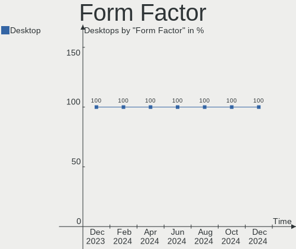
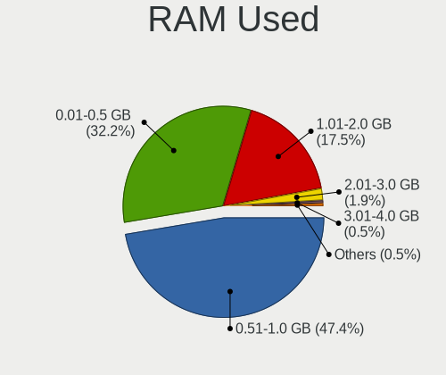
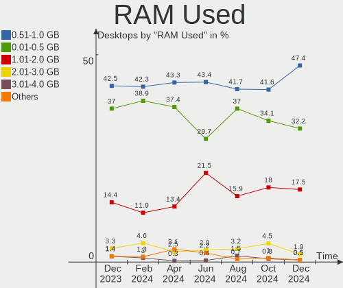
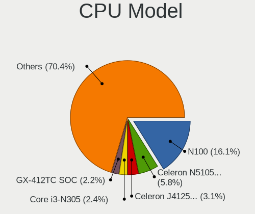
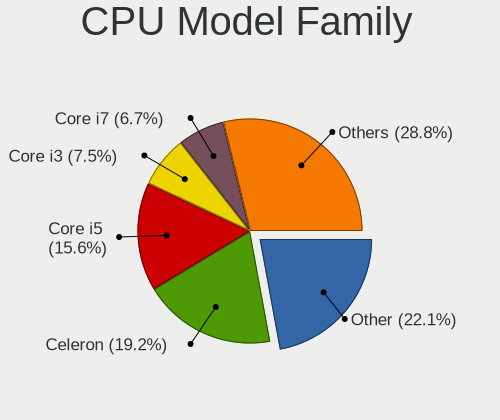
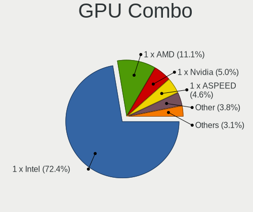
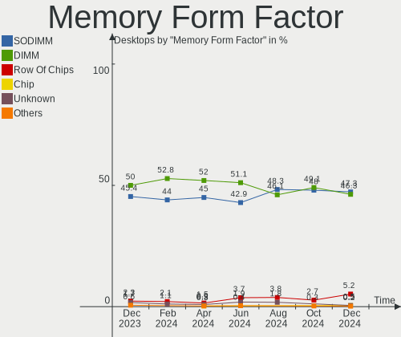
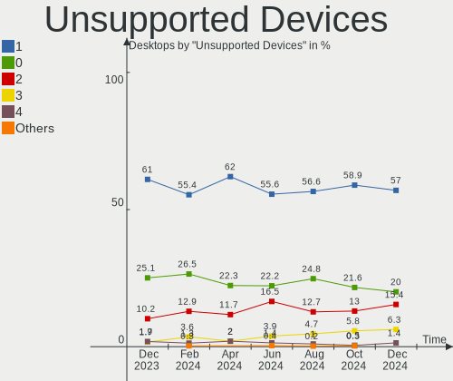

BSD - Hardware Trends (Desktops)
--------------------------------

A project to identify most popular hardware characteristics and track their change
over time based on data collected by BSD users at https://BSD-Hardware.info.

Anyone can contribute to this report by the [hw-probe](https://github.com/linuxhw/hw-probe/blob/master/INSTALL.BSD.md) tool:

    hw-probe -all -upload

This report is for one last month. Overall report since the beginning of time: [TestDays](https://github.com/bsdhw/TestDays)

Period: Apr, 2023.

Contents
--------

* [ System ](#system)
  - [ OS                       ](#os)
  - [ OS Family                ](#os-family)
  - [ Arch                     ](#arch)
  - [ DE                       ](#de)
  - [ Display Server           ](#display-server)
  - [ Display Manager          ](#display-manager)
  - [ OS Lang                  ](#os-lang)
  - [ Boot Mode                ](#boot-mode)
  - [ Filesystem               ](#filesystem)
  - [ Part. scheme             ](#part-scheme)

* [ Board ](#board)
  - [ Vendor                   ](#vendor)
  - [ Model                    ](#model)
  - [ Model Family             ](#model-family)
  - [ MFG Year                 ](#mfg-year)
  - [ Form Factor              ](#form-factor)
  - [ Coreboot                 ](#coreboot)
  - [ RAM Size                 ](#ram-size)
  - [ RAM Used                 ](#ram-used)
  - [ Total Drives             ](#total-drives)
  - [ Has CD-ROM               ](#has-cd-rom)
  - [ Has Ethernet             ](#has-ethernet)
  - [ Has WiFi                 ](#has-wifi)
  - [ Has Bluetooth            ](#has-bluetooth)

* [ Location ](#location)
  - [ Country                  ](#country)
  - [ City                     ](#city)

* [ Drives ](#drives)
  - [ Drive Vendor             ](#drive-vendor)
  - [ Drive Model              ](#drive-model)
  - [ HDD Vendor               ](#hdd-vendor)
  - [ SSD Vendor               ](#ssd-vendor)
  - [ Drive Kind               ](#drive-kind)
  - [ Drive Connector          ](#drive-connector)
  - [ Drive Size               ](#drive-size)
  - [ Space Total              ](#space-total)
  - [ Space Used               ](#space-used)
  - [ Malfunc. Drives          ](#malfunc-drives)
  - [ Malfunc. Drive Vendor    ](#malfunc-drive-vendor)
  - [ Malfunc. HDD Vendor      ](#malfunc-hdd-vendor)
  - [ Malfunc. Drive Kind      ](#malfunc-drive-kind)
  - [ Failed Drives            ](#failed-drives)
  - [ Failed Drive Vendor      ](#failed-drive-vendor)
  - [ Drive Status             ](#drive-status)

* [ Storage controller ](#storage-controller)
  - [ Storage Vendor           ](#storage-vendor)
  - [ Storage Model            ](#storage-model)
  - [ Storage Kind             ](#storage-kind)

* [ Processor ](#processor)
  - [ CPU Vendor               ](#cpu-vendor)
  - [ CPU Model                ](#cpu-model)
  - [ CPU Model Family         ](#cpu-model-family)
  - [ CPU Cores                ](#cpu-cores)
  - [ CPU Sockets              ](#cpu-sockets)
  - [ CPU Threads              ](#cpu-threads)
  - [ CPU Microarch            ](#cpu-microarch)

* [ Graphics ](#graphics)
  - [ GPU Vendor               ](#gpu-vendor)
  - [ GPU Model                ](#gpu-model)
  - [ GPU Combo                ](#gpu-combo)
  - [ GPU Driver               ](#gpu-driver)
  - [ GPU Memory               ](#gpu-memory)

* [ Monitor ](#monitor)
  - [ Monitor Vendor           ](#monitor-vendor)
  - [ Monitor Model            ](#monitor-model)
  - [ Monitor Resolution       ](#monitor-resolution)
  - [ Monitor Diagonal         ](#monitor-diagonal)
  - [ Monitor Width            ](#monitor-width)
  - [ Aspect Ratio             ](#aspect-ratio)
  - [ Monitor Area             ](#monitor-area)
  - [ Pixel Density            ](#pixel-density)
  - [ Multiple Monitors        ](#multiple-monitors)

* [ Network ](#network)
  - [ Net Controller Vendor    ](#net-controller-vendor)
  - [ Net Controller Model     ](#net-controller-model)
  - [ Wireless Vendor          ](#wireless-vendor)
  - [ Wireless Model           ](#wireless-model)
  - [ Ethernet Vendor          ](#ethernet-vendor)
  - [ Ethernet Model           ](#ethernet-model)
  - [ Net Controller Kind      ](#net-controller-kind)
  - [ Used Controller          ](#used-controller)
  - [ NICs                     ](#nics)
  - [ IPv6                     ](#ipv6)

* [ Bluetooth ](#bluetooth)
  - [ Bluetooth Vendor         ](#bluetooth-vendor)
  - [ Bluetooth Model          ](#bluetooth-model)

* [ Sound ](#sound)
  - [ Sound Vendor             ](#sound-vendor)
  - [ Sound Model              ](#sound-model)

* [ Memory ](#memory)
  - [ Memory Vendor            ](#memory-vendor)
  - [ Memory Model             ](#memory-model)
  - [ Memory Kind              ](#memory-kind)
  - [ Memory Form Factor       ](#memory-form-factor)
  - [ Memory Size              ](#memory-size)
  - [ Memory Speed             ](#memory-speed)

* [ Printers & scanners ](#printers--scanners)
  - [ Printer Vendor           ](#printer-vendor)
  - [ Printer Model            ](#printer-model)
  - [ Scanner Vendor           ](#scanner-vendor)
  - [ Scanner Model            ](#scanner-model)

* [ Camera ](#camera)
  - [ Camera Vendor            ](#camera-vendor)
  - [ Camera Model             ](#camera-model)

* [ Security ](#security)
  - [ Fingerprint Vendor       ](#fingerprint-vendor)
  - [ Fingerprint Model        ](#fingerprint-model)
  - [ Chipcard Vendor          ](#chipcard-vendor)
  - [ Chipcard Model           ](#chipcard-model)

* [ Unsupported ](#unsupported)
  - [ Unsupported Devices      ](#unsupported-devices)
  - [ Unsupported Device Types ](#unsupported-device-types)

System
------

OS
--

Installed operating systems

| Name                 | Desktops | Percent |
|----------------------|----------|---------|
| OPNsense 23.1.5      | 166      | 46.5%   |
| OPNsense 23.1.6      | 92       | 25.77%  |
| helloSystem 0.8.1    | 17       | 4.76%   |
| FreeBSD 13.2         | 15       | 4.2%    |
| OPNsense 23.7        | 9        | 2.52%   |
| FreeBSD 13.1-p7      | 7        | 1.96%   |
| OpenBSD 7.3          | 6        | 1.68%   |
| helloSystem 0.8.2    | 6        | 1.68%   |
| OPNsense 22.7.11     | 4        | 1.12%   |
| FreeBSD 14.0-CURRENT | 4        | 1.12%   |
| OPNsense 23.1.4      | 3        | 0.84%   |
| FreeBSD 13.2-STABLE  | 3        | 0.84%   |
| XigmaNAS 12.3-p6     | 2        | 0.56%   |
| OPNsense 23.4        | 2        | 0.56%   |
| OPNsense 23.1.3      | 2        | 0.56%   |
| OPNsense 23.1        | 2        | 0.56%   |
| OpenBSD 7.2          | 2        | 0.56%   |
| NomadBSD 20221130    | 2        | 0.56%   |
| helloSystem 0.8.0    | 2        | 0.56%   |
| pfSense 2.6.0        | 1        | 0.28%   |
| OPNsense 22.7.9      | 1        | 0.28%   |
| OPNsense 22.7.10     | 1        | 0.28%   |
| NetBSD 10.0_BETA     | 1        | 0.28%   |
| MyBee 13.2-RC5       | 1        | 0.28%   |
| MidnightBSD 3.0.1    | 1        | 0.28%   |
| MidnightBSD 2.1.5    | 1        | 0.28%   |
| GhostBSD 22.06.18    | 1        | 0.28%   |
| FreeBSD 13.1-p5      | 1        | 0.28%   |
| FreeBSD 13.1         | 1        | 0.28%   |
| ClonOS 13.1.2        | 1        | 0.28%   |

OS Family
---------

OS without a version

| Name        | Desktops | Percent |
|-------------|----------|---------|
| OPNsense    | 282      | 78.99%  |
| FreeBSD     | 31       | 8.68%   |
| helloSystem | 25       | 7%      |
| OpenBSD     | 8        | 2.24%   |
| XigmaNAS    | 2        | 0.56%   |
| NomadBSD    | 2        | 0.56%   |
| MidnightBSD | 2        | 0.56%   |
| pfSense     | 1        | 0.28%   |
| NetBSD      | 1        | 0.28%   |
| MyBee       | 1        | 0.28%   |
| GhostBSD    | 1        | 0.28%   |
| ClonOS      | 1        | 0.28%   |

Arch
----

OS architecture (x86_64, i586, etc.)

| Name    | Desktops | Percent |
|---------|----------|---------|
| amd64   | 348      | 97.48%  |
| arm64   | 5        | 1.4%    |
| i386    | 2        | 0.56%   |
| sparc64 | 1        | 0.28%   |
| powerpc | 1        | 0.28%   |

DE
--

Desktop Environment

| Name          | Desktops | Percent |
|---------------|----------|---------|
| Console       | 303      | 84.87%  |
| helloDesktop  | 32       | 8.96%   |
| KDE5          | 6        | 1.68%   |
| XFCE          | 5        | 1.4%    |
| GNOME         | 5        | 1.4%    |
| TWM           | 2        | 0.56%   |
| Enlightenment | 2        | 0.56%   |
| MATE          | 1        | 0.28%   |
| Fluxbox       | 1        | 0.28%   |

Display Server
--------------

X11 or Wayland

| Name    | Desktops | Percent |
|---------|----------|---------|
| Console | 309      | 86.55%  |
| X11     | 48       | 13.45%  |

Display Manager
---------------

SDDM, LightDM, etc.

| Name    | Desktops | Percent |
|---------|----------|---------|
| Console | 316      | 88.52%  |
| SLiM    | 25       | 7%      |
| SDDM    | 5        | 1.4%    |
| LightDM | 5        | 1.4%    |
| XDM     | 4        | 1.12%   |
| GDM     | 2        | 0.56%   |

OS Lang
-------

Language

| Lang             | Desktops | Percent |
|------------------|----------|---------|
| Unknown          | 290      | 81.23%  |
| en_US            | 25       | 7%      |
| C                | 20       | 5.6%    |
| fr_FR            | 7        | 1.96%   |
| ru_RU            | 5        | 1.4%    |
| es_ES            | 3        | 0.84%   |
| en               | 2        | 0.56%   |
| de_DE            | 2        | 0.56%   |
| zh_CN            | 1        | 0.28%   |
| it_IT            | 1        | 0.28%   |
| fi_FI.ISO8859-15 | 1        | 0.28%   |

Boot Mode
---------

EFI or BIOS

| Mode | Desktops | Percent |
|------|----------|---------|
| EFI  | 333      | 93.28%  |
| BIOS | 24       | 6.72%   |

Filesystem
----------

Type of filesystem

| Type   | Desktops | Percent |
|--------|----------|---------|
| Ufs    | 180      | 50.42%  |
| Zfs    | 154      | 43.14%  |
| Cd9660 | 15       | 4.2%    |
| Ffs    | 8        | 2.24%   |

Part. scheme
------------

Scheme of partitioning

| Type    | Desktops | Percent |
|---------|----------|---------|
| GPT     | 338      | 94.68%  |
| MBR     | 15       | 4.2%    |
| Unknown | 4        | 1.12%   |

Board
-----

Vendor
------

Motherboard manufacturer

| Name                       | Desktops | Percent |
|----------------------------|----------|---------|
| Unknown                    | 49       | 13.73%  |
| ASUSTek Computer           | 48       | 13.45%  |
| Hewlett-Packard            | 29       | 8.12%   |
| Dell                       | 27       | 7.56%   |
| Protectli                  | 21       | 5.88%   |
| Gigabyte Technology        | 21       | 5.88%   |
| Intel                      | 19       | 5.32%   |
| Techvision                 | 18       | 5.04%   |
| PC Engines                 | 14       | 3.92%   |
| Lenovo                     | 12       | 3.36%   |
| ASRock                     | 12       | 3.36%   |
| Supermicro                 | 11       | 3.08%   |
| Fujitsu                    | 9        | 2.52%   |
| MW                         | 7        | 1.96%   |
| MSI                        | 7        | 1.96%   |
| Acer                       | 5        | 1.4%    |
| CWWK                       | 4        | 1.12%   |
| CncTion                    | 4        | 1.12%   |
| Deciso                     | 3        | 0.84%   |
| AZW                        | 3        | 0.84%   |
| ASRockRack                 | 3        | 0.84%   |
| Shuttle                    | 2        | 0.56%   |
| Pegatron                   | 2        | 0.56%   |
| IceWhale Technology        | 2        | 0.56%   |
| GoWin Solution             | 2        | 0.56%   |
| ZOTAC                      | 1        | 0.28%   |
| YENTEK                     | 1        | 0.28%   |
| Sun                        | 1        | 0.28%   |
| ShenZhen MinWin Technology | 1        | 0.28%   |
| PICO PC                    | 1        | 0.28%   |
| NCR                        | 1        | 0.28%   |
| MiTAC                      | 1        | 0.28%   |
| maiyunda                   | 1        | 0.28%   |
| Lanner                     | 1        | 0.28%   |
| Kontron                    | 1        | 0.28%   |
| Intel GMLV114              | 1        | 0.28%   |
| Intel BOX4A200             | 1        | 0.28%   |
| IBM                        | 1        | 0.28%   |
| iBASE                      | 1        | 0.28%   |
| Hardkernel                 | 1        | 0.28%   |

Model
-----

Motherboard model

| Name                             | Desktops | Percent |
|----------------------------------|----------|---------|
| Unknown                          | 50       | 14.01%  |
| Techvision TVI7309X              | 18       | 5.04%   |
| Protectli FW4B                   | 9        | 2.52%   |
| PC Engines APU2                  | 8        | 2.24%   |
| Fujitsu FUTRO S920               | 8        | 2.24%   |
| MW GMLK-2_5G4L                   | 7        | 1.96%   |
| Intel Q3XXG4-P V1.0              | 7        | 1.96%   |
| Protectli FW4C                   | 4        | 1.12%   |
| Protectli VP2410                 | 3        | 0.84%   |
| Intel MAHOBAY                    | 3        | 0.84%   |
| HP EliteDesk 800 G4 SFF          | 3        | 0.84%   |
| Dell OptiPlex 7020               | 3        | 0.84%   |
| Dell OptiPlex 3060               | 3        | 0.84%   |
| Protectli VP2420                 | 2        | 0.56%   |
| Protectli FW6                    | 2        | 0.56%   |
| PC Engines apu4                  | 2        | 0.56%   |
| PC Engines apu1                  | 2        | 0.56%   |
| IceWhale ZimaBoard 832 ZMB       | 2        | 0.56%   |
| HP ProDesk 600 G3 SFF            | 2        | 0.56%   |
| HP ProDesk 600 G1 SFF            | 2        | 0.56%   |
| HP EliteDesk 800 G2 DM 65W       | 2        | 0.56%   |
| HP EliteDesk 800 G1 SFF          | 2        | 0.56%   |
| GoWin Solution R86S              | 2        | 0.56%   |
| Dell Precision WorkStation T3500 | 2        | 0.56%   |
| Dell OptiPlex 9020               | 2        | 0.56%   |
| Dell OptiPlex 7040               | 2        | 0.56%   |
| Dell OptiPlex 7010               | 2        | 0.56%   |
| Deciso Netboard A10 GEN2 Model G | 2        | 0.56%   |
| CWWK CW-MBX-AD12                 | 2        | 0.56%   |
| CncTion N5105-4L-I226            | 2        | 0.56%   |
| AZW EQ                           | 2        | 0.56%   |
| ASUS ROG CROSSHAIR VIII HERO     | 2        | 0.56%   |
| ASUS PRIME H510M-E               | 2        | 0.56%   |
| ASUS PRIME B250M-A               | 2        | 0.56%   |
| ASUS All Series                  | 2        | 0.56%   |
| ASRock X570S PG Riptide          | 2        | 0.56%   |
| YENTEK ITX-B75R1                 | 1        | 0.28%   |
| Supermicro SYS-E302-9D           | 1        | 0.28%   |
| Supermicro SYS-E300-9D-8CN8TP    | 1        | 0.28%   |
| Supermicro SYS-E300-9D-4CN8TP    | 1        | 0.28%   |

Model Family
------------

Motherboard model prefix

| Name                          | Desktops | Percent |
|-------------------------------|----------|---------|
| Unknown                       | 50       | 14.01%  |
| Techvision TVI7309X           | 18       | 5.04%   |
| Dell OptiPlex                 | 18       | 5.04%   |
| HP ProDesk                    | 12       | 3.36%   |
| ASUS PRIME                    | 11       | 3.08%   |
| Lenovo ThinkCentre            | 10       | 2.8%    |
| HP EliteDesk                  | 10       | 2.8%    |
| Protectli FW4B                | 9        | 2.52%   |
| PC Engines APU2               | 8        | 2.24%   |
| Fujitsu FUTRO                 | 8        | 2.24%   |
| MW GMLK-2                     | 7        | 1.96%   |
| Intel Q3XXG4-P                | 7        | 1.96%   |
| ASUS TUF                      | 6        | 1.68%   |
| ASUS ROG                      | 6        | 1.68%   |
| Dell Precision                | 5        | 1.4%    |
| Protectli FW4C                | 4        | 1.12%   |
| Protectli VP2410              | 3        | 0.84%   |
| Intel MAHOBAY                 | 3        | 0.84%   |
| Deciso Netboard               | 3        | 0.84%   |
| Acer Aspire                   | 3        | 0.84%   |
| Protectli VP2420              | 2        | 0.56%   |
| Protectli FW6                 | 2        | 0.56%   |
| PC Engines apu4               | 2        | 0.56%   |
| PC Engines apu1               | 2        | 0.56%   |
| IceWhale ZimaBoard            | 2        | 0.56%   |
| HP Compaq                     | 2        | 0.56%   |
| GoWin Solution R86S           | 2        | 0.56%   |
| Gigabyte B450M                | 2        | 0.56%   |
| Dell Inspiron                 | 2        | 0.56%   |
| CWWK CW-MBX-AD12              | 2        | 0.56%   |
| CncTion N5105-4L-I226         | 2        | 0.56%   |
| AZW EQ                        | 2        | 0.56%   |
| ASUS All                      | 2        | 0.56%   |
| ASRock X570S                  | 2        | 0.56%   |
| Acer Veriton                  | 2        | 0.56%   |
| YENTEK ITX-B75R1              | 1        | 0.28%   |
| Supermicro SYS-E302-9D        | 1        | 0.28%   |
| Supermicro SYS-E300-9D-8CN8TP | 1        | 0.28%   |
| Supermicro SYS-E300-9D-4CN8TP | 1        | 0.28%   |
| Supermicro SYS-E200-9A        | 1        | 0.28%   |

MFG Year
--------

Motherboard manufacture year

| Year    | Desktops | Percent |
|---------|----------|---------|
| 2022    | 82       | 22.97%  |
| 2021    | 35       | 9.8%    |
| 2018    | 31       | 8.68%   |
| 2016    | 28       | 7.84%   |
| 2014    | 27       | 7.56%   |
| 2019    | 25       | 7%      |
| 2020    | 22       | 6.16%   |
| 2013    | 17       | 4.76%   |
| 2023    | 16       | 4.48%   |
| 2017    | 15       | 4.2%    |
| 2012    | 12       | 3.36%   |
| 2015    | 10       | 2.8%    |
| 2011    | 8        | 2.24%   |
| 2010    | 8        | 2.24%   |
| 2008    | 8        | 2.24%   |
| Unknown | 8        | 2.24%   |
| 2009    | 3        | 0.84%   |
| 2007    | 1        | 0.28%   |
| 2001    | 1        | 0.28%   |

Form Factor
-----------

Physical design of the computer

| Name    | Desktops | Percent |
|---------|----------|---------|
| Desktop | 357      | 100%    |

Coreboot
--------

Have coreboot on board

| Used | Desktops | Percent |
|------|----------|---------|
| No   | 335      | 93.84%  |
| Yes  | 22       | 6.16%   |

RAM Size
--------

Total RAM memory

| Size in GB  | Desktops | Percent |
|-------------|----------|---------|
| 8.01-16.0   | 138      | 38.66%  |
| 16.01-24.0  | 91       | 25.49%  |
| 4.01-8.0    | 51       | 14.29%  |
| 32.01-64.0  | 37       | 10.36%  |
| 64.01-256.0 | 18       | 5.04%   |
| 2.01-3.0    | 11       | 3.08%   |
| 3.01-4.0    | 5        | 1.4%    |
| 0.01-0.5    | 3        | 0.84%   |
| 24.01-32.0  | 2        | 0.56%   |
| 1.01-2.0    | 1        | 0.28%   |

RAM Used
--------

Used RAM memory

| Used GB   | Desktops | Percent |
|-----------|----------|---------|
| 0.01-0.5  | 173      | 48.46%  |
| 0.51-1.0  | 123      | 34.45%  |
| 1.01-2.0  | 41       | 11.48%  |
| 2.01-3.0  | 9        | 2.52%   |
| 3.01-4.0  | 5        | 1.4%    |
| 0         | 3        | 0.84%   |
| 4.01-8.0  | 1        | 0.28%   |
| 8.01-16.0 | 1        | 0.28%   |
| Unknown   | 1        | 0.28%   |

Total Drives
------------

Number of drives on board

| Drives | Desktops | Percent |
|--------|----------|---------|
| 1      | 262      | 73.39%  |
| 2      | 35       | 9.8%    |
| 0      | 33       | 9.24%   |
| 3      | 10       | 2.8%    |
| 4      | 7        | 1.96%   |
| 8      | 2        | 0.56%   |
| 7      | 2        | 0.56%   |
| 6      | 2        | 0.56%   |
| 13     | 1        | 0.28%   |
| 10     | 1        | 0.28%   |
| 9      | 1        | 0.28%   |
| 5      | 1        | 0.28%   |

Has CD-ROM
----------

Has CD-ROM on board

| Presented | Desktops | Percent |
|-----------|----------|---------|
| No        | 311      | 87.11%  |
| Yes       | 46       | 12.89%  |

Has Ethernet
------------

Has Ethernet on board

| Presented | Desktops | Percent |
|-----------|----------|---------|
| Yes       | 353      | 98.88%  |
| No        | 4        | 1.12%   |

Has WiFi
--------

Has WiFi module

| Presented | Desktops | Percent |
|-----------|----------|---------|
| No        | 286      | 80.11%  |
| Yes       | 71       | 19.89%  |

Has Bluetooth
-------------

Has Bluetooth module

| Presented | Desktops | Percent |
|-----------|----------|---------|
| No        | 301      | 84.31%  |
| Yes       | 56       | 15.69%  |

Location
--------

Country
-------

Geographic location (country)

| Country      | Desktops | Percent |
|--------------|----------|---------|
| USA          | 107      | 29.97%  |
| Germany      | 42       | 11.76%  |
| Russia       | 19       | 5.32%   |
| Canada       | 18       | 5.04%   |
| France       | 17       | 4.76%   |
| UK           | 14       | 3.92%   |
| Brazil       | 10       | 2.8%    |
| Austria      | 10       | 2.8%    |
| Poland       | 9        | 2.52%   |
| Netherlands  | 9        | 2.52%   |
| Australia    | 9        | 2.52%   |
| Italy        | 8        | 2.24%   |
| China        | 6        | 1.68%   |
| Switzerland  | 5        | 1.4%    |
| Romania      | 5        | 1.4%    |
| Belgium      | 5        | 1.4%    |
| Sweden       | 4        | 1.12%   |
| Spain        | 4        | 1.12%   |
| Mexico       | 4        | 1.12%   |
| Finland      | 4        | 1.12%   |
| Vietnam      | 3        | 0.84%   |
| Singapore    | 3        | 0.84%   |
| Portugal     | 3        | 0.84%   |
| Norway       | 3        | 0.84%   |
| Hungary      | 3        | 0.84%   |
| Denmark      | 3        | 0.84%   |
| Taiwan       | 2        | 0.56%   |
| South Korea  | 2        | 0.56%   |
| Paraguay     | 2        | 0.56%   |
| Israel       | 2        | 0.56%   |
| Isle of Man  | 2        | 0.56%   |
| Czechia      | 2        | 0.56%   |
| Turkey       | 1        | 0.28%   |
| Thailand     | 1        | 0.28%   |
| Sri Lanka    | 1        | 0.28%   |
| South Africa | 1        | 0.28%   |
| Slovakia     | 1        | 0.28%   |
| San Marino   | 1        | 0.28%   |
| Peru         | 1        | 0.28%   |
| New Zealand  | 1        | 0.28%   |

City
----

Geographic location (city)

| City                 | Desktops | Percent |
|----------------------|----------|---------|
| Phoenix              | 6        | 1.68%   |
| Krasnodar            | 5        | 1.4%    |
| Melbourne            | 4        | 1.12%   |
| Berlin               | 4        | 1.12%   |
| Sydney               | 3        | 0.84%   |
| St. Jean Baptiste    | 3        | 0.84%   |
| Singapore            | 3        | 0.84%   |
| Salem                | 3        | 0.84%   |
| Rome                 | 3        | 0.84%   |
| Paris                | 3        | 0.84%   |
| Moscow               | 3        | 0.84%   |
| Ludwigsburg          | 3        | 0.84%   |
| Edmonton             | 3        | 0.84%   |
| Budapest             | 3        | 0.84%   |
| Zurich               | 2        | 0.56%   |
| Zhengzhou            | 2        | 0.56%   |
| Warsaw               | 2        | 0.56%   |
| Vantaa               | 2        | 0.56%   |
| Toronto              | 2        | 0.56%   |
| Tel Aviv             | 2        | 0.56%   |
| St Petersburg        | 2        | 0.56%   |
| Saratov              | 2        | 0.56%   |
| Sao Paulo            | 2        | 0.56%   |
| Regina               | 2        | 0.56%   |
| Redmond              | 2        | 0.56%   |
| Puebla City          | 2        | 0.56%   |
| Ozersk               | 2        | 0.56%   |
| Oslo                 | 2        | 0.56%   |
| Nuremberg            | 2        | 0.56%   |
| New York             | 2        | 0.56%   |
| Munich               | 2        | 0.56%   |
| Mesa                 | 2        | 0.56%   |
| Lutherville-Timonium | 2        | 0.56%   |
| Los Angeles          | 2        | 0.56%   |
| Lodz                 | 2        | 0.56%   |
| Klagenfurt           | 2        | 0.56%   |
| Isle of Man          | 2        | 0.56%   |
| Irvington            | 2        | 0.56%   |
| Houston              | 2        | 0.56%   |
| Hoofddorp            | 2        | 0.56%   |

Drives
------

Drive Vendor
------------

Hard drive vendors

| Vendor              | Desktops | Drives | Percent |
|---------------------|----------|--------|---------|
| Samsung Electronics | 62       | 82     | 15.46%  |
| Kingston            | 46       | 48     | 11.47%  |
| WDC                 | 42       | 68     | 10.47%  |
| Seagate             | 33       | 39     | 8.23%   |
| Crucial             | 27       | 30     | 6.73%   |
| Transcend           | 15       | 16     | 3.74%   |
| Intel               | 13       | 15     | 3.24%   |
| China               | 12       | 12     | 2.99%   |
| Toshiba             | 10       | 12     | 2.49%   |
| SPCC                | 9        | 14     | 2.24%   |
| Hitachi             | 9        | 9      | 2.24%   |
| Fanxiang            | 9        | 9      | 2.24%   |
| Hoodisk             | 8        | 8      | 2%      |
| Silicon Motion      | 6        | 6      | 1.5%    |
| Protectli           | 6        | 6      | 1.5%    |
| A-DATA Technology   | 6        | 7      | 1.5%    |
| SanDisk             | 5        | 5      | 1.25%   |
| PNY                 | 4        | 4      | 1%      |
| Patriot             | 4        | 4      | 1%      |
| NVMe                | 4        | 4      | 1%      |
| KeepData            | 4        | 4      | 1%      |
| Corsair             | 4        | 4      | 1%      |
| Team                | 3        | 3      | 0.75%   |
| Phison              | 3        | 3      | 0.75%   |
| Lexar               | 3        | 3      | 0.75%   |
| Innodisk            | 3        | 3      | 0.75%   |
| Dogfish             | 3        | 3      | 0.75%   |
| BORY                | 3        | 3      | 0.75%   |
| BAITITON            | 3        | 3      | 0.75%   |
| SK hynix            | 2        | 2      | 0.5%    |
| OPENBSD             | 2        | 2      | 0.5%    |
| Micron Technology   | 2        | 2      | 0.5%    |
| Maxtor              | 2        | 2      | 0.5%    |
| KIOXIA              | 2        | 2      | 0.5%    |
| Kimtigo             | 2        | 2      | 0.5%    |
| HGST                | 2        | 2      | 0.5%    |
| GOODRAM             | 2        | 2      | 0.5%    |
| Apacer              | 2        | 2      | 0.5%    |
| VICKTER             | 1        | 1      | 0.25%   |
| Verbatim            | 1        | 2      | 0.25%   |

Drive Model
-----------

Hard drive models

| Model                           | Desktops | Percent |
|---------------------------------|----------|---------|
| Kingston SA400S37240G 240GB     | 10       | 2.31%   |
| Kingston SV300S37A120G 120GB    | 5        | 1.16%   |
| Fanxiang S501 128GB             | 5        | 1.16%   |
| Crucial CT240BX500SSD1 240GB    | 5        | 1.16%   |
| Samsung SSD 860 EVO 500GB       | 4        | 0.93%   |
| Kingston SA400S37480G 480GB     | 4        | 0.93%   |
| KeepData GIM128 128GB           | 4        | 0.93%   |
| Crucial CT120BX500SSD1 120GB    | 4        | 0.93%   |
| China SATA SSD 16GB             | 4        | 0.93%   |
| WDC WDS500G2B0A-00SM50 500GB    | 3        | 0.69%   |
| Transcend TS64GMSA230S 64GB     | 3        | 0.69%   |
| SPCC Solid State Disk 128GB     | 3        | 0.69%   |
| Seagate ST500DM002-1BD142 500GB | 3        | 0.69%   |
| Samsung SSD 970 EVO Plus 250GB  | 3        | 0.69%   |
| Samsung SSD 870 EVO 250GB       | 3        | 0.69%   |
| Samsung SSD 850 EVO mSATA 250GB | 3        | 0.69%   |
| Protectli 120GB M.2             | 3        | 0.69%   |
| Kingston OM8PGP4512Q-A0 512GB   | 3        | 0.69%   |
| Hoodisk SSD 64GB                | 3        | 0.69%   |
| Hoodisk SSD 128GB               | 3        | 0.69%   |
| Crucial CT500P3SSD8 500GB       | 3        | 0.69%   |
| WDC WD80EFAX-68LHPN0 8TB        | 2        | 0.46%   |
| WDC WD20EZRX-22D8PB0 2TB        | 2        | 0.46%   |
| WDC WD20EZRX-00D8PB0 2TB        | 2        | 0.46%   |
| WDC WD20EFZX-68AWUN0 2TB        | 2        | 0.46%   |
| WDC WD20EFRX-68EUZN0 2TB        | 2        | 0.46%   |
| Transcend TS32GMSA370 32GB      | 2        | 0.46%   |
| Transcend TS256GMSA230S 256GB   | 2        | 0.46%   |
| Transcend TS16GMSA370 16GB      | 2        | 0.46%   |
| Transcend TS128GMSA370 128GB    | 2        | 0.46%   |
| SPCC Solid State Disk 64GB      | 2        | 0.46%   |
| Silicon Motion 256GB            | 2        | 0.46%   |
| Seagate ST4000DM000-1F2168 4TB  | 2        | 0.46%   |
| Seagate ST2000DM008-2FR102 2TB  | 2        | 0.46%   |
| Seagate ST1000DM003-1ER162 1TB  | 2        | 0.46%   |
| SanDisk SSD PLUS 120GB          | 2        | 0.46%   |
| Samsung SSD PM851 mSATA 128GB   | 2        | 0.46%   |
| Samsung SSD 980 500GB           | 2        | 0.46%   |
| Samsung SSD 970 EVO Plus 500GB  | 2        | 0.46%   |
| Samsung SSD 870 QVO 2TB         | 2        | 0.46%   |

HDD Vendor
----------

Hard disk drive vendors

| Vendor              | Desktops | Drives | Percent |
|---------------------|----------|--------|---------|
| WDC                 | 30       | 55     | 32.97%  |
| Seagate             | 30       | 35     | 32.97%  |
| Hitachi             | 9        | 9      | 9.89%   |
| Toshiba             | 7        | 9      | 7.69%   |
| Samsung Electronics | 3        | 3      | 3.3%    |
| NVMe                | 3        | 3      | 3.3%    |
| OPENBSD             | 2        | 2      | 2.2%    |
| Maxtor              | 2        | 2      | 2.2%    |
| HGST                | 2        | 2      | 2.2%    |
| Memorex             | 1        | 1      | 1.1%    |
| Lexar               | 1        | 1      | 1.1%    |
| IBM-ESXS            | 1        | 1      | 1.1%    |

SSD Vendor
----------

Solid state drive vendors

| Vendor              | Desktops | Drives | Percent |
|---------------------|----------|--------|---------|
| Samsung Electronics | 41       | 56     | 17.52%  |
| Kingston            | 36       | 38     | 15.38%  |
| Crucial             | 21       | 22     | 8.97%   |
| Transcend           | 15       | 16     | 6.41%   |
| China               | 12       | 12     | 5.13%   |
| Intel               | 11       | 13     | 4.7%    |
| Hoodisk             | 8        | 8      | 3.42%   |
| WDC                 | 7        | 7      | 2.99%   |
| SPCC                | 7        | 12     | 2.99%   |
| Protectli           | 6        | 6      | 2.56%   |
| SanDisk             | 5        | 5      | 2.14%   |
| A-DATA Technology   | 5        | 6      | 2.14%   |
| KeepData            | 4        | 4      | 1.71%   |
| Seagate             | 3        | 4      | 1.28%   |
| PNY                 | 3        | 3      | 1.28%   |
| Patriot             | 3        | 3      | 1.28%   |
| Innodisk            | 3        | 3      | 1.28%   |
| Dogfish             | 3        | 3      | 1.28%   |
| BORY                | 3        | 3      | 1.28%   |
| BAITITON            | 3        | 3      | 1.28%   |
| Team                | 2        | 2      | 0.85%   |
| Lexar               | 2        | 2      | 0.85%   |
| Corsair             | 2        | 2      | 0.85%   |
| Apacer              | 2        | 2      | 0.85%   |
| VICKTER             | 1        | 1      | 0.43%   |
| Verbatim            | 1        | 2      | 0.43%   |
| Vaseky              | 1        | 1      | 0.43%   |
| Toshiba             | 1        | 1      | 0.43%   |
| TCSUNBOW            | 1        | 1      | 0.43%   |
| SSSTC               | 1        | 1      | 0.43%   |
| SK hynix            | 1        | 1      | 0.43%   |
| Silicon Power       | 1        | 1      | 0.43%   |
| Qunion              | 1        | 1      | 0.43%   |
| OCZ                 | 1        | 1      | 0.43%   |
| NVMe                | 1        | 1      | 0.43%   |
| Mushkin             | 1        | 4      | 0.43%   |
| MSI                 | 1        | 1      | 0.43%   |
| Micron Technology   | 1        | 1      | 0.43%   |
| LITEONIT            | 1        | 1      | 0.43%   |
| LITEON              | 1        | 1      | 0.43%   |

Drive Kind
----------

HDD or SSD

| Kind | Desktops | Drives | Percent |
|------|----------|--------|---------|
| SSD  | 218      | 266    | 59.89%  |
| NVMe | 78       | 84     | 21.43%  |
| HDD  | 68       | 123    | 18.68%  |

Drive Connector
---------------

SATA, SAS, NVMe, etc.

| Type | Desktops | Drives | Percent |
|------|----------|--------|---------|
| SATA | 262      | 389    | 77.06%  |
| NVMe | 78       | 84     | 22.94%  |

Drive Size
----------

Size of hard drive

| Size in TB | Desktops | Drives | Percent |
|------------|----------|--------|---------|
| 0.01-0.5   | 234      | 274    | 78.26%  |
| 0.51-1.0   | 30       | 36     | 10.03%  |
| 1.01-2.0   | 17       | 43     | 5.69%   |
| 3.01-4.0   | 8        | 11     | 2.68%   |
| 4.01-10.0  | 5        | 14     | 1.67%   |
| 2.01-3.0   | 3        | 8      | 1%      |
| 10.01-20.0 | 2        | 3      | 0.67%   |

Space Total
-----------

Amount of disk space available on the file system

| Size in GB     | Desktops | Percent |
|----------------|----------|---------|
| 101-250        | 168      | 47.06%  |
| 251-500        | 64       | 17.93%  |
| 21-50          | 34       | 9.52%   |
| 51-100         | 34       | 9.52%   |
| 1-20           | 29       | 8.12%   |
| 501-1000       | 16       | 4.48%   |
| 1001-2000      | 5        | 1.4%    |
| More than 3000 | 4        | 1.12%   |
| 2001-3000      | 2        | 0.56%   |
| Unknown        | 1        | 0.28%   |

Space Used
----------

Amount of used disk space

| Used GB        | Desktops | Percent |
|----------------|----------|---------|
| 1-20           | 334      | 93.56%  |
| 21-50          | 9        | 2.52%   |
| 101-250        | 5        | 1.4%    |
| 51-100         | 4        | 1.12%   |
| More than 3000 | 2        | 0.56%   |
| 251-500        | 1        | 0.28%   |
| 2001-3000      | 1        | 0.28%   |
| Unknown        | 1        | 0.28%   |

Malfunc. Drives
---------------

Drive models with a malfunction

| Model                                        | Desktops | Drives | Percent |
|----------------------------------------------|----------|--------|---------|
| Seagate ST500DM002-1BD142 500GB              | 2        | 2      | 4.55%   |
| Kingston SV300S37A120G 120GB                 | 2        | 2      | 4.55%   |
| WDC WD80EDAZ-11TA3A0 8TB                     | 1        | 1      | 2.27%   |
| WDC WD6400AAKS-22A7B2 640GB                  | 1        | 1      | 2.27%   |
| WDC WD5003AZEX-00K1GA0 500GB                 | 1        | 1      | 2.27%   |
| WDC WD5000AAKX-603CA0 500GB                  | 1        | 1      | 2.27%   |
| WDC WD2500AAKX-083CA1 250GB                  | 1        | 1      | 2.27%   |
| WDC WD20EFZX-68AWUN0 2TB                     | 1        | 2      | 2.27%   |
| WDC WD1600AAJS-75M0A0 160GB                  | 1        | 1      | 2.27%   |
| WDC WD1600AAJS-60Z0A0 160GB                  | 1        | 1      | 2.27%   |
| WDC WD10EZRZ-00HTKB0 1TB                     | 1        | 1      | 2.27%   |
| Transcend TS128GMSA230S 128GB                | 1        | 1      | 2.27%   |
| Toshiba MQ01ACF050 500GB                     | 1        | 1      | 2.27%   |
| Toshiba DT01ACA050 500GB                     | 1        | 1      | 2.27%   |
| SSSTC CVB-8D128-HP 128GB                     | 1        | 1      | 2.27%   |
| SPCC Solid State Disk 128GB                  | 1        | 1      | 2.27%   |
| SK hynix HFS120G32TND-N1A2A 120GB            | 1        | 1      | 2.27%   |
| Silicon Motion Asgard AN1TNVMe-M.2-80 1TB    | 1        | 1      | 2.27%   |
| Seagate ST9250315AS 250GB                    | 1        | 1      | 2.27%   |
| Seagate ST9160821AS 160GB                    | 1        | 1      | 2.27%   |
| Seagate ST9100821AS 100GB                    | 1        | 1      | 2.27%   |
| Seagate ST500NM0011 500GB                    | 1        | 1      | 2.27%   |
| Seagate ST3500418AS 500GB                    | 1        | 1      | 2.27%   |
| Seagate ST3320620AS 320GB                    | 1        | 1      | 2.27%   |
| Seagate ST3300831AS 304GB                    | 1        | 1      | 2.27%   |
| Seagate ST32000542AS 2TB                     | 1        | 1      | 2.27%   |
| Seagate ST250DM000-1BD141 250GB              | 1        | 1      | 2.27%   |
| SanDisk SSD U100 64GB                        | 1        | 1      | 2.27%   |
| Samsung Electronics SSD PM810 2.5-inch 256GB | 1        | 1      | 2.27%   |
| Samsung Electronics HM320JI 320GB            | 1        | 1      | 2.27%   |
| Samsung Electronics HM160HI 160GB            | 1        | 1      | 2.27%   |
| Kingston SV300S3240G 240GB                   | 1        | 1      | 2.27%   |
| Kingston SMS200S360G 64GB                    | 1        | 1      | 2.27%   |
| Kingston SMS200S3120G 120GB                  | 1        | 1      | 2.27%   |
| Kingston SA400S37240G 240GB                  | 1        | 1      | 2.27%   |
| KeepData GIM128 128GB                        | 1        | 1      | 2.27%   |
| Intel SSDSC2BW480A4 480GB                    | 1        | 1      | 2.27%   |
| Hitachi HTS421260H9AT00 64GB                 | 1        | 1      | 2.27%   |
| Hitachi HDS721616PLA380 160GB                | 1        | 1      | 2.27%   |
| Crucial CT512M550SSD1 512GB                  | 1        | 2      | 2.27%   |

Malfunc. Drive Vendor
---------------------

Vendors of faulty drives

| Vendor              | Desktops | Drives | Percent |
|---------------------|----------|--------|---------|
| Seagate             | 10       | 11     | 23.26%  |
| WDC                 | 9        | 10     | 20.93%  |
| Kingston            | 6        | 6      | 13.95%  |
| Samsung Electronics | 3        | 3      | 6.98%   |
| Toshiba             | 2        | 2      | 4.65%   |
| Hitachi             | 2        | 2      | 4.65%   |
| Crucial             | 2        | 3      | 4.65%   |
| Transcend           | 1        | 1      | 2.33%   |
| SSSTC               | 1        | 1      | 2.33%   |
| SPCC                | 1        | 1      | 2.33%   |
| SK hynix            | 1        | 1      | 2.33%   |
| Silicon Motion      | 1        | 1      | 2.33%   |
| SanDisk             | 1        | 1      | 2.33%   |
| KeepData            | 1        | 1      | 2.33%   |
| Intel               | 1        | 1      | 2.33%   |
| BORY                | 1        | 1      | 2.33%   |

Malfunc. HDD Vendor
-------------------

Vendors of faulty HDD drives

| Vendor              | Desktops | Drives | Percent |
|---------------------|----------|--------|---------|
| Seagate             | 10       | 11     | 40%     |
| WDC                 | 9        | 10     | 36%     |
| Toshiba             | 2        | 2      | 8%      |
| Samsung Electronics | 2        | 2      | 8%      |
| Hitachi             | 2        | 2      | 8%      |

Malfunc. Drive Kind
-------------------

Kinds of faulty drives

| Kind | Desktops | Drives | Percent |
|------|----------|--------|---------|
| HDD  | 22       | 27     | 55%     |
| SSD  | 17       | 18     | 42.5%   |
| NVMe | 1        | 1      | 2.5%    |

Failed Drives
-------------

Failed drive models

| Model                       | Desktops | Drives | Percent |
|-----------------------------|----------|--------|---------|
| WDC WD1600BEVT-22ZCT0 160GB | 1        | 1      | 50%     |
| Kingston SMS200S360G 64GB   | 1        | 1      | 50%     |

Failed Drive Vendor
-------------------

Failed drive vendors

| Vendor   | Desktops | Drives | Percent |
|----------|----------|--------|---------|
| WDC      | 1        | 1      | 50%     |
| Kingston | 1        | 1      | 50%     |

Drive Status
------------

Number of failed and malfunc. drives

| Status   | Desktops | Drives | Percent |
|----------|----------|--------|---------|
| Works    | 292      | 416    | 85.63%  |
| Malfunc  | 40       | 46     | 11.73%  |
| Detected | 7        | 9      | 2.05%   |
| Failed   | 2        | 2      | 0.59%   |

Storage controller
------------------

Storage Vendor
--------------

Storage controller vendors

| Vendor                         | Desktops | Percent |
|--------------------------------|----------|---------|
| Intel                          | 273      | 60.53%  |
| AMD                            | 63       | 13.97%  |
| Samsung Electronics            | 22       | 4.88%   |
| Silicon Motion                 | 18       | 3.99%   |
| Sandisk                        | 16       | 3.55%   |
| Kingston Technology Company    | 10       | 2.22%   |
| Phison Electronics             | 8        | 1.77%   |
| Micron/Crucial Technology      | 8        | 1.77%   |
| MAXIO Technology (Hangzhou)    | 7        | 1.55%   |
| Broadcom / LSI                 | 4        | 0.89%   |
| ASMedia Technology             | 4        | 0.89%   |
| JMicron Technology             | 3        | 0.67%   |
| Toshiba                        | 2        | 0.44%   |
| Nvidia                         | 2        | 0.44%   |
| Marvell Technology Group       | 2        | 0.44%   |
| KIOXIA                         | 2        | 0.44%   |
| ADATA Technology               | 2        | 0.44%   |
| VIA Technologies               | 1        | 0.22%   |
| Solid State Storage Technology | 1        | 0.22%   |
| SK hynix                       | 1        | 0.22%   |
| Silicon Image                  | 1        | 0.22%   |
| Micron Technology              | 1        | 0.22%   |

Storage Model
-------------

Storage controller models

| Model                                                                            | Desktops | Percent |
|----------------------------------------------------------------------------------|----------|---------|
| AMD FCH SATA Controller [AHCI mode]                                              | 40       | 8.05%   |
| Intel Jasper Lake SATA AHCI Controller                                           | 31       | 6.24%   |
| Intel 8 Series/C220 Series Chipset Family 6-port SATA Controller 1 [AHCI mode]   | 27       | 5.43%   |
| Intel Celeron/Pentium Silver Processor SATA Controller                           | 24       | 4.83%   |
| Intel Q170/Q150/B150/H170/H110/Z170/CM236 Chipset SATA Controller [AHCI Mode]    | 22       | 4.43%   |
| Silicon Motion SM2263EN/SM2263XT SSD Controller                                  | 18       | 3.62%   |
| Intel Atom/Celeron/Pentium Processor x5-E8000/J3xxx/N3xxx Series SATA Controller | 15       | 3.02%   |
| Intel Cannon Lake PCH SATA AHCI Controller                                       | 14       | 2.82%   |
| Intel SATA Controller [RAID mode]                                                | 11       | 2.21%   |
| Intel 200 Series PCH SATA controller [AHCI mode]                                 | 11       | 2.21%   |
| Samsung NVMe SSD Controller SM981/PM981/PM983                                    | 10       | 2.01%   |
| AMD SB7x0/SB8x0/SB9x0 SATA Controller [AHCI mode]                                | 9        | 1.81%   |
| Unknown                                                                          | 9        | 1.81%   |
| Intel Sunrise Point-LP SATA Controller [AHCI mode]                               | 8        | 1.61%   |
| AMD 500 Series Chipset SATA Controller                                           | 8        | 1.61%   |
| MAXIO (Hangzhou) NVMe SSD Controller MAP1202                                     | 7        | 1.41%   |
| Intel 7 Series/C210 Series Chipset Family 6-port SATA Controller [AHCI mode]     | 7        | 1.41%   |
| Intel 6 Series/C200 Series Chipset Family 6 port Desktop SATA AHCI Controller    | 7        | 1.41%   |
| Intel 500 Series Chipset Family SATA AHCI Controller                             | 7        | 1.41%   |
| SanDisk WD Blue SN570 NVMe SSD 1TB                                               | 6        | 1.21%   |
| Micron/Crucial P2 NVMe PCIe SSD                                                  | 6        | 1.21%   |
| Intel Wildcat Point-LP SATA Controller [AHCI Mode]                               | 6        | 1.21%   |
| Intel NM10/ICH7 Family SATA Controller [IDE mode]                                | 6        | 1.21%   |
| Phison PS5013 E13 NVMe Controller                                                | 5        | 1.01%   |
| Intel Elkhart Lake SATA AHCI                                                     | 5        | 1.01%   |
| AMD 400 Series Chipset SATA Controller                                           | 5        | 1.01%   |
| Sandisk WD Black SN770 NVMe SSD                                                  | 4        | 0.8%    |
| Samsung NVMe SSD Controller SM961/PM961/SM963                                    | 4        | 0.8%    |
| Samsung NVMe SSD Controller PM9A1/PM9A3/980PRO                                   | 4        | 0.8%    |
| Intel Volume Management Device NVMe RAID Controller                              | 4        | 0.8%    |
| Intel Tiger Lake-LP SATA Controller                                              | 4        | 0.8%    |
| Intel Comet Lake SATA AHCI Controller                                            | 4        | 0.8%    |
| Intel C620 Series Chipset Family SSATA Controller [AHCI mode]                    | 4        | 0.8%    |
| Intel C620 Series Chipset Family SATA Controller [AHCI mode]                     | 4        | 0.8%    |
| Intel 82801HM/HEM (ICH8M/ICH8M-E) IDE Controller                                 | 4        | 0.8%    |
| Intel 82801G (ICH7 Family) IDE Controller                                        | 4        | 0.8%    |
| Samsung NVMe SSD Controller 980                                                  | 3        | 0.6%    |
| Kingston Company NVMe Controller                                                 | 3        | 0.6%    |
| Intel Celeron N3350/Pentium N4200/Atom E3900 Series SATA AHCI Controller         | 3        | 0.6%    |
| Intel Cannon Point-LP SATA Controller [AHCI Mode]                                | 3        | 0.6%    |

Storage Kind
------------

Kind of storage controller (IDE, SATA, NVMe, SAS, ...)

| Kind | Desktops | Percent |
|------|----------|---------|
| SATA | 299      | 65.57%  |
| NVMe | 97       | 21.27%  |
| IDE  | 36       | 7.89%   |
| RAID | 20       | 4.39%   |
| SAS  | 3        | 0.66%   |
| SCSI | 1        | 0.22%   |

Processor
---------

CPU Vendor
----------

Processor vendors

| Vendor  | Desktops | Percent |
|---------|----------|---------|
| Intel   | 283      | 79.27%  |
| AMD     | 67       | 18.77%  |
| ARM     | 5        | 1.4%    |
| Unknown | 2        | 0.56%   |

CPU Model
---------

Processor models

| Model                                    | Desktops | Percent |
|------------------------------------------|----------|---------|
| Intel Celeron N5105 @ 2.00GHz            | 25       | 7%      |
| Intel Celeron J4125 CPU @ 2.00GHz        | 23       | 6.44%   |
| AMD GX-412TC SOC                         | 11       | 3.08%   |
| Intel Celeron CPU J3160 @ 1.60GHz        | 9        | 2.52%   |
| Intel Pentium Silver N6005 @ 2.00GHz     | 8        | 2.24%   |
| Intel Core i5-6500 CPU @ 3.20GHz         | 7        | 1.96%   |
| AMD GX-415GA SOC with Radeon HD Graphics | 6        | 1.68%   |
| Intel Core i5-7400 CPU @ 3.00GHz         | 5        | 1.4%    |
| Intel Core i5-4590 CPU @ 3.30GHz         | 5        | 1.4%    |
| Intel Core i3-4160 CPU @ 3.60GHz         | 5        | 1.4%    |
| Intel Pentium CPU J3710 @ 1.60GHz        | 4        | 1.12%   |
| Intel N100                               | 4        | 1.12%   |
| Intel Core i5-8500 CPU @ 3.00GHz         | 4        | 1.12%   |
| Intel Core i5-5200U CPU @ 2.20GHz        | 4        | 1.12%   |
| Intel Celeron N5100 @ 1.10GHz            | 4        | 1.12%   |
| Intel Atom CPU D525 @ 1.80GHz            | 4        | 1.12%   |
| ARM Cortex-A55 r2p0                      | 4        | 1.12%   |
| Intel Xeon D-2123IT CPU @ 2.20GHz        | 3        | 0.84%   |
| Intel Core i7-4790 CPU @ 3.60GHz         | 3        | 0.84%   |
| Intel Core i7-3770 CPU @ 3.40GHz         | 3        | 0.84%   |
| Intel Core i5-4460 CPU @ 3.20GHz         | 3        | 0.84%   |
| Intel Core 2 Duo                         | 3        | 0.84%   |
| Intel Celeron CPU N3450 @ 1.10GHz        | 3        | 0.84%   |
| AMD Ryzen 9 5950X 16-Core Processor      | 3        | 0.84%   |
| AMD G-T40E Processor                     | 3        | 0.84%   |
| Intel Xeon D-2146NT CPU @ 2.30GHz        | 2        | 0.56%   |
| Intel Xeon CPU E3-1220 v5 @ 3.00GHz      | 2        | 0.56%   |
| Intel Xeon                               | 2        | 0.56%   |
| Intel Pentium CPU G4560 @ 3.50GHz        | 2        | 0.56%   |
| Intel Pentium CPU G3220 @ 3.00GHz        | 2        | 0.56%   |
| Intel Core i7-8700 CPU @ 3.20GHz         | 2        | 0.56%   |
| Intel Core i7-8550U CPU @ 1.80GHz        | 2        | 0.56%   |
| Intel Core i7-7700T CPU @ 2.90GHz        | 2        | 0.56%   |
| Intel Core i7-7700 CPU @ 3.60GHz         | 2        | 0.56%   |
| Intel Core i7-6700 CPU @ 3.40GHz         | 2        | 0.56%   |
| Intel Core i5-9400 CPU @ 2.90GHz         | 2        | 0.56%   |
| Intel Core i5-7200U CPU @ 2.50GHz        | 2        | 0.56%   |
| Intel Core i5-6500T CPU @ 2.50GHz        | 2        | 0.56%   |
| Intel Core i5-4570 CPU @ 3.20GHz         | 2        | 0.56%   |
| Intel Core i5-3470 CPU @ 3.20GHz         | 2        | 0.56%   |

CPU Model Family
----------------

Processor model prefix

| Model                   | Desktops | Percent |
|-------------------------|----------|---------|
| Intel Celeron           | 81       | 22.69%  |
| Intel Core i5           | 67       | 18.77%  |
| Intel Core i7           | 31       | 8.68%   |
| Other                   | 24       | 6.72%   |
| AMD GX                  | 23       | 6.44%   |
| Intel Xeon              | 20       | 5.6%    |
| Intel Core i3           | 20       | 5.6%    |
| Intel Pentium           | 11       | 3.08%   |
| Intel Core 2 Duo        | 9        | 2.52%   |
| Intel Pentium Silver    | 8        | 2.24%   |
| Intel Atom              | 8        | 2.24%   |
| AMD Ryzen 9             | 8        | 2.24%   |
| AMD Ryzen 7             | 7        | 1.96%   |
| ARM Cortex              | 5        | 1.4%    |
| AMD Ryzen 5             | 5        | 1.4%    |
| AMD Ryzen 3             | 3        | 0.84%   |
| AMD G                   | 3        | 0.84%   |
| AMD Athlon II X2        | 3        | 0.84%   |
| Intel Pentium Dual-Core | 2        | 0.56%   |
| Intel Core i9           | 2        | 0.56%   |
| Intel Core 2 Quad       | 2        | 0.56%   |
| AMD Ryzen 5 PRO         | 2        | 0.56%   |
| AMD FX                  | 2        | 0.56%   |
| AMD EPYC                | 2        | 0.56%   |
| Intel Pentium Gold      | 1        | 0.28%   |
| AMD Ryzen 3 PRO         | 1        | 0.28%   |
| AMD Phenom II X6        | 1        | 0.28%   |
| AMD Phenom II X4        | 1        | 0.28%   |
| AMD E                   | 1        | 0.28%   |
| AMD Athlon X2           | 1        | 0.28%   |
| AMD Athlon              | 1        | 0.28%   |
| AMD A6                  | 1        | 0.28%   |
| AMD A10                 | 1        | 0.28%   |

CPU Cores
---------

Number of processor cores

| Number  | Desktops | Percent |
|---------|----------|---------|
| 4       | 209      | 58.54%  |
| 2       | 74       | 20.73%  |
| 6       | 23       | 6.44%   |
| 8       | 10       | 2.8%    |
| Unknown | 10       | 2.8%    |
| 16      | 8        | 2.24%   |
| 12      | 6        | 1.68%   |
| 24      | 5        | 1.4%    |
| 32      | 4        | 1.12%   |
| 1       | 4        | 1.12%   |
| 10      | 3        | 0.84%   |
| 14      | 1        | 0.28%   |

CPU Sockets
-----------

Number of sockets

| Number  | Desktops | Percent |
|---------|----------|---------|
| 1       | 348      | 97.48%  |
| Unknown | 8        | 2.24%   |
| 2       | 1        | 0.28%   |

CPU Threads
-----------

Threads per core (Hyper-Threading)

| Number  | Desktops | Percent |
|---------|----------|---------|
| 1       | 240      | 67.23%  |
| 2       | 104      | 29.13%  |
| Unknown | 13       | 3.64%   |

CPU Microarch
-------------

Microarchitecture

| Name          | Desktops | Percent |
|---------------|----------|---------|
| Unknown       | 69       | 19.33%  |
| KabyLake      | 41       | 11.48%  |
| Haswell       | 36       | 10.08%  |
| Skylake       | 29       | 8.12%   |
| Goldmont plus | 24       | 6.72%   |
| Silvermont    | 20       | 5.6%    |
| IvyBridge     | 18       | 5.04%   |
| Puma          | 15       | 4.2%    |
| Penryn        | 12       | 3.36%   |
| Zen 3         | 10       | 2.8%    |
| Broadwell     | 9        | 2.52%   |
| Jaguar        | 8        | 2.24%   |
| SandyBridge   | 7        | 1.96%   |
| Zen 2         | 6        | 1.68%   |
| K10           | 6        | 1.68%   |
| CometLake     | 6        | 1.68%   |
| Zen+          | 5        | 1.4%    |
| Zen           | 5        | 1.4%    |
| TigerLake     | 5        | 1.4%    |
| Piledriver    | 4        | 1.12%   |
| Goldmont      | 4        | 1.12%   |
| Core          | 4        | 1.12%   |
| Bonnell       | 4        | 1.12%   |
| Bobcat        | 4        | 1.12%   |
| Westmere      | 2        | 0.56%   |
| Nehalem       | 2        | 0.56%   |
| P6            | 1        | 0.28%   |
| K6            | 1        | 0.28%   |

Graphics
--------

GPU Vendor
----------

Vendors of graphics cards

| Vendor                                       | Desktops | Percent |
|----------------------------------------------|----------|---------|
| Intel                                        | 239      | 71.34%  |
| AMD                                          | 46       | 13.73%  |
| Nvidia                                       | 28       | 8.36%   |
| ASPEED Technology                            | 19       | 5.67%   |
| XGI Technology (eXtreme Graphics Innovation) | 1        | 0.3%    |
| NVidia / SGS Thomson (Joint Venture)         | 1        | 0.3%    |
| Matrox Electronics Systems                   | 1        | 0.3%    |

GPU Model
---------

Graphics card models

| Model                                                                                    | Desktops | Percent |
|------------------------------------------------------------------------------------------|----------|---------|
| Intel JasperLake [UHD Graphics]                                                          | 37       | 10.85%  |
| Intel GeminiLake [UHD Graphics 600]                                                      | 24       | 7.04%   |
| Intel Xeon E3-1200 v3/4th Gen Core Processor Integrated Graphics Controller              | 23       | 6.74%   |
| ASPEED Technology ASPEED Graphics Family                                                 | 19       | 5.57%   |
| Intel Atom/Celeron/Pentium Processor x5-E8000/J3xxx/N3xxx Integrated Graphics Controller | 16       | 4.69%   |
| Intel HD Graphics 530                                                                    | 14       | 4.11%   |
| Intel CoffeeLake-S GT2 [UHD Graphics 630]                                                | 14       | 4.11%   |
| Intel HD Graphics 630                                                                    | 9        | 2.64%   |
| Intel Xeon E3-1200 v2/3rd Gen Core processor Graphics Controller                         | 8        | 2.35%   |
| Intel HD Graphics 5500                                                                   | 6        | 1.76%   |
| Intel 2nd Generation Core Processor Family Integrated Graphics Controller                | 6        | 1.76%   |
| AMD Kabini [Radeon HD 8330E]                                                             | 6        | 1.76%   |
| Intel Elkhart Lake [UHD Graphics Gen11 16EU]                                             | 5        | 1.47%   |
| Intel Alder Lake-N [UHD Graphics]                                                        | 5        | 1.47%   |
| Intel 4th Generation Core Processor Family Integrated Graphics Controller                | 5        | 1.47%   |
| Intel TigerLake-LP GT2 [Iris Xe Graphics]                                                | 4        | 1.17%   |
| Intel RocketLake-S GT1 [UHD Graphics 750]                                                | 4        | 1.17%   |
| Intel HD Graphics 610                                                                    | 4        | 1.17%   |
| Intel 4 Series Chipset Integrated Graphics Controller                                    | 4        | 1.17%   |
| AMD Picasso/Raven 2 [Radeon Vega Series / Radeon Vega Mobile Series]                     | 4        | 1.17%   |
| Intel IvyBridge GT2 [HD Graphics 4000]                                                   | 3        | 0.88%   |
| Intel HD Graphics 620                                                                    | 3        | 0.88%   |
| Intel HD Graphics 500                                                                    | 3        | 0.88%   |
| Intel Atom Processor D4xx/D5xx/N4xx/N5xx Integrated Graphics Controller                  | 3        | 0.88%   |
| Intel 82G33/G31 Express Integrated Graphics Controller                                   | 3        | 0.88%   |
| AMD Renoir                                                                               | 3        | 0.88%   |
| AMD Raphael                                                                              | 3        | 0.88%   |
| AMD Cedar [Radeon HD 5000/6000/7350/8350 Series]                                         | 3        | 0.88%   |
| Nvidia GP107 [GeForce GTX 1050 Ti]                                                       | 2        | 0.59%   |
| Nvidia GP106 [GeForce GTX 1060 6GB]                                                      | 2        | 0.59%   |
| Nvidia GK208B [GeForce GT 710]                                                           | 2        | 0.59%   |
| Intel WhiskeyLake-U GT2 [UHD Graphics 620]                                               | 2        | 0.59%   |
| Intel UHD Graphics 620                                                                   | 2        | 0.59%   |
| Intel RocketLake-S GT1 [UHD Graphics 730]                                                | 2        | 0.59%   |
| Intel HD Graphics 510                                                                    | 2        | 0.59%   |
| Intel Haswell-ULT Integrated Graphics Controller                                         | 2        | 0.59%   |
| Intel CometLake-U GT2 [UHD Graphics]                                                     | 2        | 0.59%   |
| Intel CometLake-S GT2 [UHD Graphics 630]                                                 | 2        | 0.59%   |
| Intel Atom Processor Z36xxx/Z37xxx Series Graphics & Display                             | 2        | 0.59%   |
| Intel Alder Lake-S GT1 [UHD Graphics 730]                                                | 2        | 0.59%   |

GPU Combo
---------

Combinations of graphics cards

| Name                                     | Desktops | Percent |
|------------------------------------------|----------|---------|
| 1 x Intel                                | 228      | 63.87%  |
| 1 x AMD                                  | 40       | 11.2%   |
| Other                                    | 27       | 7.56%   |
| 1 x Nvidia                               | 26       | 7.28%   |
| 1 x ASPEED                               | 19       | 5.32%   |
| 2 x Intel                                | 7        | 1.96%   |
| 2 x AMD                                  | 4        | 1.12%   |
| Intel + AMD                              | 2        | 0.56%   |
| 1 x XGI                                  | 1        | 0.28%   |
| 1 x NVidia / SGS Thomson (Joint Venture) | 1        | 0.28%   |
| 1 x Matrox                               | 1        | 0.28%   |
| Intel + Nvidia                           | 1        | 0.28%   |

GPU Driver
----------

Free vs proprietary

| Driver      | Desktops | Percent |
|-------------|----------|---------|
| Free        | 313      | 87.68%  |
| Unknown     | 32       | 8.96%   |
| Proprietary | 12       | 3.36%   |

GPU Memory
----------

Total video memory

| Size in GB | Desktops | Percent |
|------------|----------|---------|
| Unknown    | 336      | 94.12%  |
| 3.01-4.0   | 5        | 1.4%    |
| 5.01-6.0   | 3        | 0.84%   |
| 1.01-2.0   | 3        | 0.84%   |
| 0.51-1.0   | 3        | 0.84%   |
| 0.01-0.5   | 3        | 0.84%   |
| 7.01-8.0   | 2        | 0.56%   |
| 2.01-3.0   | 1        | 0.28%   |
| 8.01-16.0  | 1        | 0.28%   |

Monitor
-------

Monitor Vendor
--------------

Monitor vendors

| Vendor              | Desktops | Percent |
|---------------------|----------|---------|
| Samsung Electronics | 2        | 22.22%  |
| LG Electronics      | 2        | 22.22%  |
| Unknown             | 2        | 22.22%  |
| Pioneer Electronic  | 1        | 11.11%  |
| Idek Iiyama         | 1        | 11.11%  |
| Acer                | 1        | 11.11%  |

Monitor Model
-------------

Monitor models

| Model                                             | Desktops | Percent |
|---------------------------------------------------|----------|---------|
| Unknown                                           | 2        | 22.22%  |
| Samsung Electronics LCD Monitor S24F350 1920x1080 | 1        | 11.11%  |
| Samsung Electronics LCD Monitor S24C300 1920x1080 | 1        | 11.11%  |
| Pioneer Electronic LCD Monitor SC-1223 1920x1080  | 1        | 11.11%  |
| LG Electronics LCD Monitor LG Ultra HD            | 1        | 11.11%  |
| LG Electronics LCD Monitor LG FULL HD 1920x1080   | 1        | 11.11%  |
| Idek Iiyama LCD Monitor PL2473HD 1920x1080        | 1        | 11.11%  |
| Acer LCD Monitor QG241Y 1920x1080                 | 1        | 11.11%  |

Monitor Resolution
------------------

Monitor screen resolution

| Resolution      | Desktops | Percent |
|-----------------|----------|---------|
| 1920x1080 (FHD) | 6        | 66.67%  |
| 3840x2160 (4K)  | 1        | 11.11%  |
| 1366x768 (WXGA) | 1        | 11.11%  |
| Unknown         | 1        | 11.11%  |

Monitor Diagonal
----------------

Diagonal size in inches

| Inches  | Desktops | Percent |
|---------|----------|---------|
| Unknown | 8        | 100%    |

Monitor Width
-------------

Physical width

| Width in mm | Desktops | Percent |
|-------------|----------|---------|
| Unknown     | 8        | 100%    |

Aspect Ratio
------------

Proportional relationship between the width and the height

| Ratio   | Desktops | Percent |
|---------|----------|---------|
| Unknown | 8        | 100%    |

Monitor Area
------------

Area in inch

| Area in inch | Desktops | Percent |
|----------------|----------|---------|
| Unknown        | 8        | 100%    |

Pixel Density
-------------

Pixels per inch

| Density | Desktops | Percent |
|---------|----------|---------|
| Unknown | 8        | 100%    |

Multiple Monitors
-----------------

Total monitors connected

| Total | Desktops | Percent |
|-------|----------|---------|
| 0     | 324      | 90.76%  |
| 1     | 32       | 8.96%   |
| 2     | 1        | 0.28%   |

Network
-------

Net Controller Vendor
---------------------

Controller vendors

| Vendor                          | Desktops | Percent |
|---------------------------------|----------|---------|
| Intel                           | 286      | 60.21%  |
| Realtek Semiconductor           | 116      | 24.42%  |
| Broadcom                        | 18       | 3.79%   |
| Qualcomm Atheros                | 11       | 2.32%   |
| Mellanox Technologies           | 8        | 1.68%   |
| Marvell Technology Group        | 6        | 1.26%   |
| TP-Link                         | 4        | 0.84%   |
| Solarflare Communications       | 3        | 0.63%   |
| IMC Networks                    | 3        | 0.63%   |
| NetXen Incorporated             | 2        | 0.42%   |
| VIA Technologies                | 1        | 0.21%   |
| U-Blox                          | 1        | 0.21%   |
| T & A Mobile Phones             | 1        | 0.21%   |
| Ralink Technology               | 1        | 0.21%   |
| Ralink                          | 1        | 0.21%   |
| Qualcomm Atheros Communications | 1        | 0.21%   |
| Oracle/SUN                      | 1        | 0.21%   |
| Mercucys                        | 1        | 0.21%   |
| MediaTek                        | 1        | 0.21%   |
| Linksys                         | 1        | 0.21%   |
| Huawei Technologies             | 1        | 0.21%   |
| Edimax Technology               | 1        | 0.21%   |
| D-Link System                   | 1        | 0.21%   |
| Belkin Components               | 1        | 0.21%   |
| Aquantia                        | 1        | 0.21%   |
| Apple                           | 1        | 0.21%   |
| American Megatrends             | 1        | 0.21%   |
| 3Com                            | 1        | 0.21%   |

Net Controller Model
--------------------

Controller models

| Model                                                                         | Desktops | Percent |
|-------------------------------------------------------------------------------|----------|---------|
| Realtek RTL8111/8168/8411 PCI Express Gigabit Ethernet Controller             | 88       | 14.74%  |
| Intel Ethernet Controller I226-V                                              | 44       | 7.37%   |
| Intel Ethernet Controller I225-V                                              | 41       | 6.87%   |
| Intel I211 Gigabit Network Connection                                         | 34       | 5.7%    |
| Intel I210 Gigabit Network Connection                                         | 33       | 5.53%   |
| Intel I350 Gigabit Network Connection                                         | 17       | 2.85%   |
| Intel Ethernet Connection I217-LM                                             | 17       | 2.85%   |
| Realtek RTL8125 2.5GbE Controller                                             | 16       | 2.68%   |
| Intel 82574L Gigabit Network Connection                                       | 16       | 2.68%   |
| Intel Ethernet Connection (2) I219-LM                                         | 11       | 1.84%   |
| Intel 82583V Gigabit Network Connection                                       | 11       | 1.84%   |
| Intel 82576 Gigabit Network Connection                                        | 11       | 1.84%   |
| Intel 82599ES 10-Gigabit SFI/SFP+ Network Connection                          | 10       | 1.68%   |
| Intel 82579LM Gigabit Network Connection (Lewisville)                         | 8        | 1.34%   |
| Intel 82571EB/82571GB Gigabit Ethernet Controller D0/D1 (copper applications) | 8        | 1.34%   |
| Mellanox MT27500 Family [ConnectX-3]                                          | 7        | 1.17%   |
| Intel Ethernet Connection (7) I219-LM                                         | 7        | 1.17%   |
| Intel Ethernet Controller 10-Gigabit X540-AT2                                 | 6        | 1.01%   |
| Intel Ethernet Connection (2) I219-V                                          | 6        | 1.01%   |
| Intel 82580 Gigabit Network Connection                                        | 6        | 1.01%   |
| Intel 82575EB Gigabit Network Connection                                      | 6        | 1.01%   |
| Realtek RTL8821CE 802.11ac PCIe Wireless Network Adapter                      | 5        | 0.84%   |
| Realtek RTL810xE PCI Express Fast Ethernet controller                         | 5        | 0.84%   |
| Intel Wi-Fi 6 AX210/AX211/AX411 160MHz                                        | 5        | 0.84%   |
| Intel Wi-Fi 6 AX200                                                           | 5        | 0.84%   |
| Intel Ethernet Controller X550                                                | 5        | 0.84%   |
| Intel Ethernet Connection X722 for 10GbE SFP+                                 | 5        | 0.84%   |
| Intel Ethernet Connection X722 for 10GBASE-T                                  | 5        | 0.84%   |
| Intel Wireless 3165                                                           | 4        | 0.67%   |
| Intel Ethernet Controller X710 for 10GbE SFP+                                 | 4        | 0.67%   |
| Intel Ethernet Controller I225-LM                                             | 4        | 0.67%   |
| Intel Alder Lake-N Wireless-AC                                                | 4        | 0.67%   |
| Intel 82571EB/82571GB Gigabit Ethernet Controller (Copper)                    | 4        | 0.67%   |
| Realtek RTL8188EUS 802.11n Wireless Network Adapter                           | 3        | 0.5%    |
| Realtek RTL-8100/8101L/8139 PCI Fast Ethernet Adapter                         | 3        | 0.5%    |
| Marvell Group 88E8056 PCI-E Gigabit Ethernet Controller                       | 3        | 0.5%    |
| Intel Wireless 7260                                                           | 3        | 0.5%    |
| Intel Ethernet Connection (5) I219-LM                                         | 3        | 0.5%    |
| Intel Ethernet Connection (14) I219-V                                         | 3        | 0.5%    |
| Intel 82567LM-3 Gigabit Network Connection                                    | 3        | 0.5%    |

Wireless Vendor
---------------

Wireless vendors

| Vendor                          | Desktops | Percent |
|---------------------------------|----------|---------|
| Intel                           | 39       | 52%     |
| Realtek Semiconductor           | 10       | 13.33%  |
| Qualcomm Atheros                | 10       | 13.33%  |
| TP-Link                         | 4        | 5.33%   |
| IMC Networks                    | 3        | 4%      |
| Broadcom                        | 2        | 2.67%   |
| Ralink Technology               | 1        | 1.33%   |
| Ralink                          | 1        | 1.33%   |
| Qualcomm Atheros Communications | 1        | 1.33%   |
| Mercucys                        | 1        | 1.33%   |
| MediaTek                        | 1        | 1.33%   |
| Edimax Technology               | 1        | 1.33%   |
| Belkin Components               | 1        | 1.33%   |

Wireless Model
--------------

Wireless models

| Model                                                          | Desktops | Percent |
|----------------------------------------------------------------|----------|---------|
| Realtek RTL8821CE 802.11ac PCIe Wireless Network Adapter       | 5        | 6.67%   |
| Intel Wi-Fi 6 AX210/AX211/AX411 160MHz                         | 5        | 6.67%   |
| Intel Wi-Fi 6 AX200                                            | 5        | 6.67%   |
| Intel Wireless 3165                                            | 4        | 5.33%   |
| Intel Alder Lake-N Wireless-AC                                 | 4        | 5.33%   |
| Realtek RTL8188EUS 802.11n Wireless Network Adapter            | 3        | 4%      |
| Intel Wireless 7260                                            | 3        | 4%      |
| IMC Networks 802.11 n/g/b Wireless LAN USB Mini-Card           | 3        | 4%      |
| Qualcomm Atheros QCA6174 802.11ac Wireless Network Adapter     | 2        | 2.67%   |
| Qualcomm Atheros AR9485 Wireless Network Adapter               | 2        | 2.67%   |
| Qualcomm Atheros AR928X Wireless Network Adapter (PCI-Express) | 2        | 2.67%   |
| Intel Wi-Fi 6 AX201 160MHz                                     | 2        | 2.67%   |
| Intel Wi-Fi 6 AX201                                            | 2        | 2.67%   |
| Intel Tiger Lake PCH CNVi WiFi                                 | 2        | 2.67%   |
| Intel Centrino Advanced-N 6235                                 | 2        | 2.67%   |
| Intel Cannon Lake PCH CNVi WiFi                                | 2        | 2.67%   |
| TP-Link Wireless MU-MIMO USB Adapter                           | 1        | 1.33%   |
| TP-Link TL-WN722N v2/v3 [Realtek RTL8188EUS]                   | 1        | 1.33%   |
| TP-Link Archer T2U PLUS [RTL8821AU]                            | 1        | 1.33%   |
| TP-Link AC600 wireless Realtek RTL8811AU [Archer T2U Nano]     | 1        | 1.33%   |
| Realtek RTL88x2bu [AC1200 Techkey]                             | 1        | 1.33%   |
| Realtek RTL8192CU 802.11n WLAN Adapter                         | 1        | 1.33%   |
| Ralink MT7601U Wireless Adapter                                | 1        | 1.33%   |
| Ralink RT3290 Wireless 802.11n 1T/1R PCIe                      | 1        | 1.33%   |
| Qualcomm Atheros AR9170 802.11n                                | 1        | 1.33%   |
| Qualcomm Atheros AR9462 Wireless Network Adapter               | 1        | 1.33%   |
| Qualcomm Atheros AR93xx Wireless Network Adapter               | 1        | 1.33%   |
| Qualcomm Atheros AR9227 Wireless Network Adapter               | 1        | 1.33%   |
| Qualcomm Atheros AR5212/5213/2414 Wireless Network Adapter     | 1        | 1.33%   |
| Mercucys MERCUSYS Wireless USB Adapter                         | 1        | 1.33%   |
| MediaTek MT7921 802.11ax PCI Express Wireless Network Adapter  | 1        | 1.33%   |
| Intel Wireless-AC 9260                                         | 1        | 1.33%   |
| Intel Wireless 8265 / 8275                                     | 1        | 1.33%   |
| Intel Wireless 8260                                            | 1        | 1.33%   |
| Intel Wireless 7265                                            | 1        | 1.33%   |
| Intel Wireless 3160                                            | 1        | 1.33%   |
| Intel Ultimate N WiFi Link 5300                                | 1        | 1.33%   |
| Intel Dual Band Wireless-AC 3168NGW [Stone Peak]               | 1        | 1.33%   |
| Intel Alder Lake-S PCH CNVi WiFi                               | 1        | 1.33%   |
| Edimax AC600 Wireless LAN USB Adapter                          | 1        | 1.33%   |

Ethernet Vendor
---------------

Ethernet vendors

| Vendor                    | Desktops | Percent |
|---------------------------|----------|---------|
| Intel                     | 276      | 65.71%  |
| Realtek Semiconductor     | 107      | 25.48%  |
| Broadcom                  | 18       | 4.29%   |
| Marvell Technology Group  | 6        | 1.43%   |
| Solarflare Communications | 3        | 0.71%   |
| VIA Technologies          | 1        | 0.24%   |
| T & A Mobile Phones       | 1        | 0.24%   |
| Qualcomm Atheros          | 1        | 0.24%   |
| Oracle/SUN                | 1        | 0.24%   |
| Linksys                   | 1        | 0.24%   |
| D-Link System             | 1        | 0.24%   |
| Aquantia                  | 1        | 0.24%   |
| Apple                     | 1        | 0.24%   |
| American Megatrends       | 1        | 0.24%   |
| 3Com                      | 1        | 0.24%   |

Ethernet Model
--------------

Ethernet models

| Model                                                                         | Desktops | Percent |
|-------------------------------------------------------------------------------|----------|---------|
| Realtek RTL8111/8168/8411 PCI Express Gigabit Ethernet Controller             | 88       | 17.29%  |
| Intel Ethernet Controller I226-V                                              | 44       | 8.64%   |
| Intel Ethernet Controller I225-V                                              | 41       | 8.06%   |
| Intel I211 Gigabit Network Connection                                         | 34       | 6.68%   |
| Intel I210 Gigabit Network Connection                                         | 33       | 6.48%   |
| Intel I350 Gigabit Network Connection                                         | 17       | 3.34%   |
| Intel Ethernet Connection I217-LM                                             | 17       | 3.34%   |
| Realtek RTL8125 2.5GbE Controller                                             | 16       | 3.14%   |
| Intel 82574L Gigabit Network Connection                                       | 16       | 3.14%   |
| Intel Ethernet Connection (2) I219-LM                                         | 11       | 2.16%   |
| Intel 82583V Gigabit Network Connection                                       | 11       | 2.16%   |
| Intel 82576 Gigabit Network Connection                                        | 11       | 2.16%   |
| Intel 82599ES 10-Gigabit SFI/SFP+ Network Connection                          | 10       | 1.96%   |
| Intel 82579LM Gigabit Network Connection (Lewisville)                         | 8        | 1.57%   |
| Intel 82571EB/82571GB Gigabit Ethernet Controller D0/D1 (copper applications) | 8        | 1.57%   |
| Intel Ethernet Connection (7) I219-LM                                         | 7        | 1.38%   |
| Intel Ethernet Controller 10-Gigabit X540-AT2                                 | 6        | 1.18%   |
| Intel Ethernet Connection (2) I219-V                                          | 6        | 1.18%   |
| Intel 82580 Gigabit Network Connection                                        | 6        | 1.18%   |
| Intel 82575EB Gigabit Network Connection                                      | 6        | 1.18%   |
| Realtek RTL810xE PCI Express Fast Ethernet controller                         | 5        | 0.98%   |
| Intel Ethernet Controller X550                                                | 5        | 0.98%   |
| Intel Ethernet Connection X722 for 10GbE SFP+                                 | 5        | 0.98%   |
| Intel Ethernet Connection X722 for 10GBASE-T                                  | 5        | 0.98%   |
| Intel Ethernet Controller X710 for 10GbE SFP+                                 | 4        | 0.79%   |
| Intel Ethernet Controller I225-LM                                             | 4        | 0.79%   |
| Intel 82571EB/82571GB Gigabit Ethernet Controller (Copper)                    | 4        | 0.79%   |
| Realtek RTL-8100/8101L/8139 PCI Fast Ethernet Adapter                         | 3        | 0.59%   |
| Marvell Group 88E8056 PCI-E Gigabit Ethernet Controller                       | 3        | 0.59%   |
| Intel Ethernet Connection (5) I219-LM                                         | 3        | 0.59%   |
| Intel Ethernet Connection (14) I219-V                                         | 3        | 0.59%   |
| Intel 82567LM-3 Gigabit Network Connection                                    | 3        | 0.59%   |
| Broadcom NetXtreme II BCM57810 10 Gigabit Ethernet                            | 3        | 0.59%   |
| Broadcom NetXtreme BCM5720 Gigabit Ethernet PCIe                              | 3        | 0.59%   |
| Broadcom NetXtreme BCM5719 Gigabit Ethernet PCIe                              | 3        | 0.59%   |
| Solarflare SFC9020 10G Ethernet Controller                                    | 2        | 0.39%   |
| Realtek RTL8169 PCI Gigabit Ethernet Controller                               | 2        | 0.39%   |
| Realtek Killer E3000 2.5GbE Controller                                        | 2        | 0.39%   |
| Intel Ethernet Connection I354                                                | 2        | 0.39%   |
| Intel 82572EI Gigabit Ethernet Controller (Copper)                            | 2        | 0.39%   |

Net Controller Kind
-------------------

Ethernet, WiFi or modem

| Kind     | Desktops | Percent |
|----------|----------|---------|
| Ethernet | 353      | 80.78%  |
| WiFi     | 71       | 16.25%  |
| Unknown  | 12       | 2.75%   |
| Modem    | 1        | 0.23%   |

Used Controller
---------------

Currently used network controller

| Kind     | Desktops | Percent |
|----------|----------|---------|
| Ethernet | 335      | 98.24%  |
| WiFi     | 6        | 1.76%   |

NICs
----

Total network controllers on board

| Total | Desktops | Percent |
|-------|----------|---------|
| 4     | 100      | 28.01%  |
| 2     | 63       | 17.65%  |
| 3     | 61       | 17.09%  |
| 1     | 46       | 12.89%  |
| 6     | 30       | 8.4%    |
| 5     | 28       | 7.84%   |
| 7     | 10       | 2.8%    |
| 8     | 8        | 2.24%   |
| 9     | 4        | 1.12%   |
| 0     | 4        | 1.12%   |
| 20    | 1        | 0.28%   |
| 17    | 1        | 0.28%   |
| 13    | 1        | 0.28%   |

IPv6
----

IPv6 vs IPv4

| Used | Desktops | Percent |
|------|----------|---------|
| No   | 291      | 81.51%  |
| Yes  | 66       | 18.49%  |

Bluetooth
---------

Bluetooth Vendor
----------------

Controller vendors

| Vendor                          | Desktops | Percent |
|---------------------------------|----------|---------|
| Intel                           | 37       | 64.91%  |
| Realtek Semiconductor           | 5        | 8.77%   |
| Cambridge Silicon Radio         | 5        | 8.77%   |
| Qualcomm Atheros Communications | 3        | 5.26%   |
| Broadcom                        | 3        | 5.26%   |
| IMC Networks                    | 2        | 3.51%   |
| Ralink                          | 1        | 1.75%   |
| ASUSTek Computer                | 1        | 1.75%   |

Bluetooth Model
---------------

Controller models

| Model                                               | Desktops | Percent |
|-----------------------------------------------------|----------|---------|
| Intel Bluetooth wireless interface                  | 10       | 17.54%  |
| Intel AX201 Bluetooth                               | 10       | 17.54%  |
| Realtek Bluetooth Adapter                           | 5        | 8.77%   |
| Intel AX210 Bluetooth                               | 5        | 8.77%   |
| Intel AX200 Bluetooth                               | 5        | 8.77%   |
| Cambridge Silicon Radio Bluetooth Dongle (HCI mode) | 5        | 8.77%   |
| Intel Bluetooth 9460/9560 Jefferson Peak (JfP)      | 3        | 5.26%   |
| Qualcomm Atheros AR3012 Bluetooth 4.0               | 2        | 3.51%   |
| Intel Centrino Bluetooth Wireless Transceiver       | 2        | 3.51%   |
| Broadcom BCM20702A0 Bluetooth 4.0                   | 2        | 3.51%   |
| Ralink RT3290 Bluetooth                             | 1        | 1.75%   |
| Qualcomm Atheros AR3011 Bluetooth (no firmware)     | 1        | 1.75%   |
| Intel Wireless-AC 9260 Bluetooth Adapter            | 1        | 1.75%   |
| Intel Wireless-AC 3168 Bluetooth                    | 1        | 1.75%   |
| IMC Networks Realtek Bluetooth Adapter              | 1        | 1.75%   |
| IMC Networks MediaTek Bluetooth Adapter             | 1        | 1.75%   |
| Broadcom BCM43142 Bluetooth 4.0                     | 1        | 1.75%   |
| ASUS Qualcomm Bluetooth 4.1                         | 1        | 1.75%   |

Sound
-----

Sound Vendor
------------

Sound card vendors

| Vendor                                       | Desktops | Percent |
|----------------------------------------------|----------|---------|
| Intel                                        | 234      | 70.69%  |
| AMD                                          | 54       | 16.31%  |
| Nvidia                                       | 26       | 7.85%   |
| Zoran Co. Personal Media Division (Nogatech) | 4        | 1.21%   |
| Creative Labs                                | 3        | 0.91%   |
| Tenx Technology                              | 2        | 0.6%    |
| Xilinx                                       | 1        | 0.3%    |
| VIA Technologies                             | 1        | 0.3%    |
| Texas Instruments                            | 1        | 0.3%    |
| Realtek Semiconductor                        | 1        | 0.3%    |
| Logitech                                     | 1        | 0.3%    |
| JMTek                                        | 1        | 0.3%    |
| Ensoniq                                      | 1        | 0.3%    |
| C-Media Electronics                          | 1        | 0.3%    |

Sound Model
-----------

Sound card models

| Model                                                                                             | Desktops | Percent |
|---------------------------------------------------------------------------------------------------|----------|---------|
| Intel Jasper Lake HD Audio                                                                        | 37       | 9.69%   |
| Intel Xeon E3-1200 v3/4th Gen Core Processor HD Audio Controller                                  | 26       | 6.81%   |
| Intel 8 Series/C220 Series Chipset High Definition Audio Controller                               | 23       | 6.02%   |
| Intel Celeron/Pentium Silver Processor High Definition Audio                                      | 22       | 5.76%   |
| Intel 100 Series/C230 Series Chipset Family HD Audio Controller                                   | 18       | 4.71%   |
| Intel Atom/Celeron/Pentium Processor x5-E8000/J3xxx/N3xxx Series High Definition Audio Controller | 14       | 3.66%   |
| Intel 7 Series/C216 Chipset Family High Definition Audio Controller                               | 13       | 3.4%    |
| Intel Cannon Lake PCH cAVS                                                                        | 12       | 3.14%   |
| Intel 200 Series PCH HD Audio                                                                     | 11       | 2.88%   |
| AMD Starship/Matisse HD Audio Controller                                                          | 9        | 2.36%   |
| AMD Kabini HDMI/DP Audio                                                                          | 9        | 2.36%   |
| AMD FCH Azalia Controller                                                                         | 8        | 2.09%   |
| AMD Family 17h/19h HD Audio Controller                                                            | 8        | 2.09%   |
| Intel Wildcat Point-LP High Definition Audio Controller                                           | 7        | 1.83%   |
| AMD Renoir Radeon High Definition Audio Controller                                                | 6        | 1.57%   |
| Intel Tiger Lake-LP Smart Sound Technology Audio Controller                                       | 5        | 1.31%   |
| Intel Tiger Lake-H HD Audio Controller                                                            | 5        | 1.31%   |
| Intel Sunrise Point-LP HD Audio                                                                   | 5        | 1.31%   |
| Intel Elkhart Lake High Density Audio bus interface                                               | 5        | 1.31%   |
| Intel Broadwell-U Audio Controller                                                                | 5        | 1.31%   |
| Intel Alder Lake-N HD Graphics SGPC                                                               | 5        | 1.31%   |
| Intel 6 Series/C200 Series Chipset Family High Definition Audio Controller                        | 5        | 1.31%   |
| AMD SBx00 Azalia (Intel HDA)                                                                      | 5        | 1.31%   |
| AMD Oland/Hainan/Cape Verde/Pitcairn HDMI Audio [Radeon HD 7000 Series]                           | 5        | 1.31%   |
| Zoran Co. Personal Media Division (Nogatech) USB Audio and HID                                    | 4        | 1.05%   |
| Nvidia GK208 HDMI/DP Audio Controller                                                             | 4        | 1.05%   |
| Intel NM10/ICH7 Family High Definition Audio Controller                                           | 4        | 1.05%   |
| AMD Raven/Raven2/Fenghuang HDMI/DP Audio Controller                                               | 4        | 1.05%   |
| AMD Navi 21/23 HDMI/DP Audio Controller                                                           | 4        | 1.05%   |
| Nvidia GP106 High Definition Audio Controller                                                     | 3        | 0.79%   |
| Intel Comet Lake PCH-LP cAVS                                                                      | 3        | 0.79%   |
| Intel Cannon Point-LP High Definition Audio Controller                                            | 3        | 0.79%   |
| Intel Alder Lake-S HD Audio Controller                                                            | 3        | 0.79%   |
| Intel 82801JI (ICH10 Family) HD Audio Controller                                                  | 3        | 0.79%   |
| Intel 82801JD/DO (ICH10 Family) HD Audio Controller                                               | 3        | 0.79%   |
| Intel 82801I (ICH9 Family) HD Audio Controller                                                    | 3        | 0.79%   |
| AMD Rembrandt Radeon High Definition Audio Controller                                             | 3        | 0.79%   |
| AMD Family 17h (Models 00h-0fh) HD Audio Controller                                               | 3        | 0.79%   |
| AMD Cedar HDMI Audio [Radeon HD 5400/6300/7300 Series]                                            | 3        | 0.79%   |
| Tenx Technology USB  AUDIO                                                                        | 2        | 0.52%   |

Memory
------

Memory Vendor
-------------

Memory module vendors

| Vendor                                  | Desktops | Percent |
|-----------------------------------------|----------|---------|
| Kingston                                | 51       | 13.82%  |
| Samsung Electronics                     | 50       | 13.55%  |
| Crucial                                 | 46       | 12.47%  |
| Micron Technology                       | 37       | 10.03%  |
| SK hynix                                | 36       | 9.76%   |
| Unknown                                 | 28       | 7.59%   |
| G.Skill                                 | 24       | 6.5%    |
| Corsair                                 | 20       | 5.42%   |
| Unknown                                 | 12       | 3.25%   |
| Ramaxel Technology                      | 6        | 1.63%   |
| Unknown (ABCD)                          | 5        | 1.36%   |
| Team                                    | 5        | 1.36%   |
| Kimtigo                                 | 5        | 1.36%   |
| Toshiba                                 | 3        | 0.81%   |
| Patriot                                 | 3        | 0.81%   |
| Apacer                                  | 3        | 0.81%   |
| Transcend                               | 2        | 0.54%   |
| Silicon Power Computer & Communications | 2        | 0.54%   |
| Silicon Power                           | 2        | 0.54%   |
| PNY                                     | 2        | 0.54%   |
| Lexar                                   | 2        | 0.54%   |
| A-DATA Technology                       | 2        | 0.54%   |
| Wodposit                                | 1        | 0.27%   |
| Wilk                                    | 1        | 0.27%   |
| Vasekey                                 | 1        | 0.27%   |
| Unknown (AB)                            | 1        | 0.27%   |
| Unknown (8A02)                          | 1        | 0.27%   |
| Unknown (0x1636)                        | 1        | 0.27%   |
| Unknown (09C7)                          | 1        | 0.27%   |
| Timetec                                 | 1        | 0.27%   |
| Teikon                                  | 1        | 0.27%   |
| Smart                                   | 1        | 0.27%   |
| OCZ                                     | 1        | 0.27%   |
| Nanya Technology                        | 1        | 0.27%   |
| Lexar Co Limited                        | 1        | 0.27%   |
| KingSpec                                | 1        | 0.27%   |
| Juhor                                   | 1        | 0.27%   |
| Intersil                                | 1        | 0.27%   |
| Innodisk                                | 1        | 0.27%   |
| GOODRAM                                 | 1        | 0.27%   |

Memory Model
------------

Memory module models

| Model                                                          | Desktops | Percent |
|----------------------------------------------------------------|----------|---------|
| Unknown                                                        | 12       | 3.14%   |
| Unknown RAM Module 4GB SODIMM DDR3 1333MT/s                    | 7        | 1.83%   |
| Unknown (ABCD) RAM 123456789012345678 2GB DIMM LPDDR4 2400MT/s | 5        | 1.31%   |
| Unknown RAM Module 8GB 1600MT/s                                | 4        | 1.05%   |
| Micron RAM MTA8ATF1G64HZ-3G2J1 8GB SODIMM DDR4 3200MT/s        | 4        | 1.05%   |
| Kimtigo RAM KT8GS3EDF 8GB SODIMM DDR3 1600MT/s                 | 4        | 1.05%   |
| G.Skill RAM Module 16GB DIMM DDR4 2133MT/s                     | 4        | 1.05%   |
| SK hynix RAM HMT451S6BFR8A-PB 4GB SODIMM DDR3 1600MT/s         | 3        | 0.79%   |
| SK hynix RAM HMA81GS6AFR8N-UH 8GB SODIMM DDR4 2400MT/s         | 3        | 0.79%   |
| Samsung RAM M471B5173QH0-YK0 4GB SODIMM DDR3 1600MT/s          | 3        | 0.79%   |
| Samsung RAM M471B1G73DB0-YK0 8GB DIMM DDR3 1600MT/s            | 3        | 0.79%   |
| Samsung RAM M471A1K43EB1-CWE 8GB SODIMM DDR4 3200MT/s          | 3        | 0.79%   |
| Samsung RAM M378B5173EB0-YK0 4GB DIMM DDR3 1600MT/s            | 3        | 0.79%   |
| Micron RAM Module 8GB SODIMM DDR4 3200MT/s                     | 3        | 0.79%   |
| Micron RAM 8ATF1G64HZ-3G2R1 8GB SODIMM DDR4 3200MT/s           | 3        | 0.79%   |
| Kingston RAM 99U5474-028.A00LF 4GB DIMM 1333MT/s               | 3        | 0.79%   |
| Corsair RAM CMK16GX4M2B3200C16 8GB DIMM DDR4 3200MT/s          | 3        | 0.79%   |
| Unknown RAM Module 2GB SODIMM DDR3 1333MT/s                    | 2        | 0.52%   |
| Unknown RAM Module 2GB DIMM DDR2 800MT/s                       | 2        | 0.52%   |
| Unknown RAM Module 1GB DIMM SDRAM                              | 2        | 0.52%   |
| Team RAM TEAMGROUP-UD4-3200 32GB DIMM DDR4 3200MT/s            | 2        | 0.52%   |
| Team RAM TEAMGROUP-UD3-1600 8GB DIMM DDR3 1600MT/s             | 2        | 0.52%   |
| SK hynix RAM HMT451U6BFR8A-PB 4GB DIMM DDR3 1600MT/s           | 2        | 0.52%   |
| SK hynix RAM HMT351U6CFR8C-PB 4GB DIMM DDR3 1600MT/s           | 2        | 0.52%   |
| SK hynix RAM HMA451U6AFR8N-TF 4GB DIMM DDR4 2133MT/s           | 2        | 0.52%   |
| Samsung RAM M471B5273DH0-CH9 4GB SODIMM DDR3 1334MT/s          | 2        | 0.52%   |
| Samsung RAM M378B5773DH0-CH9 2GB DIMM DDR3 1333MT/s            | 2        | 0.52%   |
| Samsung RAM M378B5173DB0-CK0 4GB DIMM DDR3 1600MT/s            | 2        | 0.52%   |
| Samsung RAM M378A1K43CB2-CTD 8GB DIMM DDR4 2667MT/s            | 2        | 0.52%   |
| Samsung RAM 3UH7H70AM~AGCL 8GB Row Of Chips LPDDR4 2933MT/s    | 2        | 0.52%   |
| Micron RAM Module 8GB Row Of Chips LPDDR4 3200MT/s             | 2        | 0.52%   |
| Micron RAM Module 16GB SODIMM DDR4 3200MT/s                    | 2        | 0.52%   |
| Micron RAM 8JTF51264AZ-1G6E1 4GB DIMM DDR3 1600MT/s            | 2        | 0.52%   |
| Micron RAM 16KTF51264HZ-1G6M1 4GB SODIMM DDR3 1600MT/s         | 2        | 0.52%   |
| Micron RAM 16JTF1G64AZ-1G6E1 8GB DIMM DDR3 1600MT/s            | 2        | 0.52%   |
| Lexar RAM LD4AS008G-3200ST 8GB SODIMM DDR4 2400MT/s            | 2        | 0.52%   |
| Kingston RAM Module 2GB DIMM DDR2 800MT/s                      | 2        | 0.52%   |
| Kingston RAM KHX2400C14S4/8G 8GB SODIMM DDR4 2400MT/s          | 2        | 0.52%   |
| Kingston RAM KF3200C16D4/32GX 32GB DIMM DDR4 3200MT/s          | 2        | 0.52%   |
| Kingston RAM 99U5428-018.A00LF 8GB DIMM DDR3 1600MT/s          | 2        | 0.52%   |

Memory Kind
-----------

Memory module kinds

| Kind    | Desktops | Percent |
|---------|----------|---------|
| DDR4    | 175      | 52.08%  |
| DDR3    | 116      | 34.52%  |
| DDR2    | 11       | 3.27%   |
| LPDDR4  | 10       | 2.98%   |
| Unknown | 9        | 2.68%   |
| DDR5    | 6        | 1.79%   |
| SDRAM   | 5        | 1.49%   |
| DDR     | 2        | 0.6%    |
| LPDDR3  | 1        | 0.3%    |
| DRAM    | 1        | 0.3%    |

Memory Form Factor
------------------

Physical design of the memory module

| Name         | Desktops | Percent |
|--------------|----------|---------|
| DIMM         | 190      | 56.89%  |
| SODIMM       | 133      | 39.82%  |
| Row Of Chips | 5        | 1.5%    |
| Unknown      | 5        | 1.5%    |
| RIMM         | 1        | 0.3%    |

Memory Size
-----------

Memory module size

| Size  | Desktops | Percent |
|-------|----------|---------|
| 8192  | 138      | 39.09%  |
| 4096  | 93       | 26.35%  |
| 16384 | 63       | 17.85%  |
| 2048  | 34       | 9.63%   |
| 32768 | 16       | 4.53%   |
| 1024  | 7        | 1.98%   |
| 256   | 1        | 0.28%   |
| 64    | 1        | 0.28%   |

Memory Speed
------------

Memory module speed

| Speed   | Desktops | Percent |
|---------|----------|---------|
| 1600    | 79       | 22.77%  |
| 3200    | 62       | 17.87%  |
| 2400    | 55       | 15.85%  |
| 1333    | 36       | 10.37%  |
| 2133    | 33       | 9.51%   |
| 2667    | 32       | 9.22%   |
| 800     | 15       | 4.32%   |
| 4800    | 6        | 1.73%   |
| 2666    | 5        | 1.44%   |
| Unknown | 5        | 1.44%   |
| 3600    | 3        | 0.86%   |
| 3000    | 2        | 0.58%   |
| 2933    | 2        | 0.58%   |
| 1866    | 2        | 0.58%   |
| 1334    | 2        | 0.58%   |
| 1067    | 2        | 0.58%   |
| 1066    | 2        | 0.58%   |
| 4267    | 1        | 0.29%   |
| 4000    | 1        | 0.29%   |
| 667     | 1        | 0.29%   |
| 533     | 1        | 0.29%   |

Printers & scanners
-------------------

Printer Vendor
--------------

Printer device vendors

| Vendor             | Desktops | Percent |
|--------------------|----------|---------|
| Brother Industries | 2        | 100%    |

Printer Model
-------------

Printer device models

| Model                    | Desktops | Percent |
|--------------------------|----------|---------|
| Brother HL-L2300D series | 1        | 50%     |
| Brother DCP-J152W        | 1        | 50%     |

Scanner Vendor
--------------

Scanner device vendors

Zero info for selected period =(

Scanner Model
-------------

Scanner device models

Zero info for selected period =(

Camera
------

Camera Vendor
-------------

Camera device vendors

| Vendor                        | Desktops | Percent |
|-------------------------------|----------|---------|
| Sunplus Innovation Technology | 2        | 50%     |
| Microdia                      | 1        | 25%     |
| Chicony Electronics           | 1        | 25%     |

Camera Model
------------

Camera device models

| Model                               | Desktops | Percent |
|-------------------------------------|----------|---------|
| Sunplus USB 2.0 Camera              | 1        | 25%     |
| Sunplus SPCA2650 AV Camera          | 1        | 25%     |
| Microdia REDRAGON Live Camera Audio | 1        | 25%     |
| Chicony Integrated Camera           | 1        | 25%     |

Security
--------

Fingerprint Vendor
------------------

Fingerprint sensor vendors

Zero info for selected period =(

Fingerprint Model
-----------------

Fingerprint sensor models

Zero info for selected period =(

Chipcard Vendor
---------------

Chipcard module vendors

Zero info for selected period =(

Chipcard Model
--------------

Chipcard module models

Zero info for selected period =(

Unsupported
-----------

Unsupported Devices
-------------------

Total unsupported devices on board

| Total | Desktops | Percent |
|-------|----------|---------|
| 1     | 187      | 52.38%  |
| 0     | 98       | 27.45%  |
| 2     | 50       | 14.01%  |
| 3     | 17       | 4.76%   |
| 4     | 3        | 0.84%   |
| 8     | 1        | 0.28%   |
| 7     | 1        | 0.28%   |

Unsupported Device Types
------------------------

Types of unsupported devices

| Type                     | Desktops | Percent |
|--------------------------|----------|---------|
| Communication controller | 232      | 72.05%  |
| Bluetooth                | 32       | 9.94%   |
| Net/wireless             | 23       | 7.14%   |
| Net/ethernet             | 9        | 2.8%    |
| Sound                    | 8        | 2.48%   |
| Firewire controller      | 6        | 1.86%   |
| Network                  | 5        | 1.55%   |
| Graphics card            | 3        | 0.93%   |
| Storage/raid             | 2        | 0.62%   |
| Card reader              | 2        | 0.62%   |

