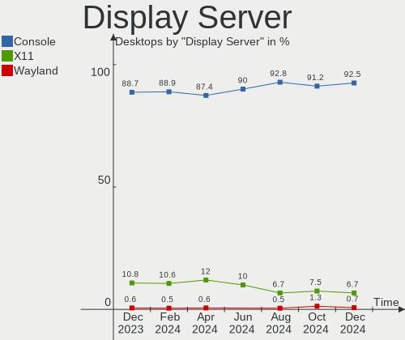
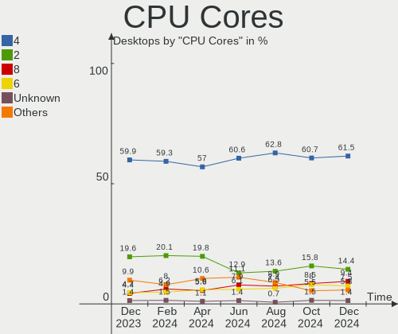
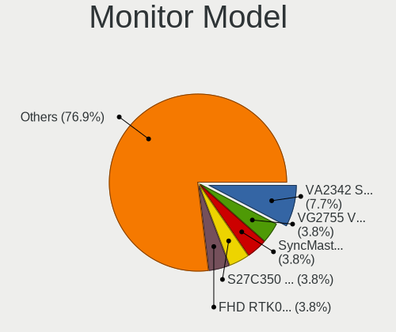
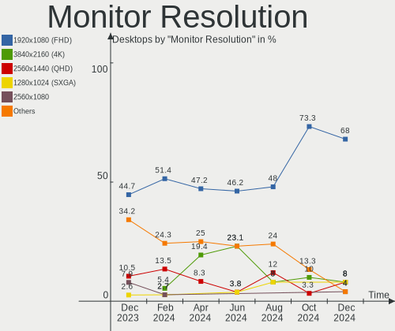

BSD Hardware Trends (Desktop)
-----------------------------

A project to identify most popular hardware characteristics and track their change
over time based on data collected by BSD users at https://BSD-Hardware.info.

Anyone can contribute to the study by uploading probes of their computers by
the [hw-probe](https://github.com/linuxhw/hw-probe/blob/master/INSTALL.BSD.md) tool:

    hw-probe -all -upload

Full-feature report is available here: https://bsd-hardware.info/?view=trends&formfactor=desktop

Period: Apr, 2021.

Contents
--------

- [ OS                       ](#os)
- [ OS Family                ](#os-family)
- [ Arch                     ](#arch)
- [ DE                       ](#de)
- [ Display Server           ](#display-server)
- [ Display Manager          ](#display-manager)
- [ OS Lang                  ](#os-lang)
- [ Boot Mode                ](#boot-mode)
- [ Filesystem               ](#filesystem)
- [ Part. scheme             ](#part-scheme)
- [ Country                  ](#country)
- [ City                     ](#city)
- [ Vendor                   ](#vendor)
- [ Model                    ](#model)
- [ Model Family             ](#model-family)
- [ MFG Year                 ](#mfg-year)
- [ Form Factor              ](#form-factor)
- [ Coreboot                 ](#coreboot)
- [ RAM Size                 ](#ram-size)
- [ RAM Used                 ](#ram-used)
- [ Has CD-ROM               ](#has-cd-rom)
- [ Total Drives             ](#total-drives)
- [ Has Ethernet             ](#has-ethernet)
- [ Has WiFi                 ](#has-wifi)
- [ Has Bluetooth            ](#has-bluetooth)
- [ Drive Vendor             ](#drive-vendor)
- [ Drive Model              ](#drive-model)
- [ HDD Vendor               ](#hdd-vendor)
- [ SSD Vendor               ](#ssd-vendor)
- [ Drive Kind               ](#drive-kind)
- [ Drive Connector          ](#drive-connector)
- [ Drive Size               ](#drive-size)
- [ Space Total              ](#space-total)
- [ Space Used               ](#space-used)
- [ Malfunc. Drives          ](#malfunc-drives)
- [ Malfunc. Drive Vendor    ](#malfunc-drive-vendor)
- [ Malfunc. HDD Vendor      ](#malfunc-hdd-vendor)
- [ Malfunc. Drive Kind      ](#malfunc-drive-kind)
- [ Failed Drives            ](#failed-drives)
- [ Failed Drive Vendor      ](#failed-drive-vendor)
- [ Drive Status             ](#drive-status)
- [ Storage Vendor           ](#storage-vendor)
- [ Storage Model            ](#storage-model)
- [ Storage Kind             ](#storage-kind)
- [ CPU Vendor               ](#cpu-vendor)
- [ CPU Model                ](#cpu-model)
- [ CPU Model Family         ](#cpu-model-family)
- [ CPU Cores                ](#cpu-cores)
- [ CPU Sockets              ](#cpu-sockets)
- [ CPU Threads              ](#cpu-threads)
- [ CPU Microarch            ](#cpu-microarch)
- [ GPU Vendor               ](#gpu-vendor)
- [ GPU Model                ](#gpu-model)
- [ GPU Combo                ](#gpu-combo)
- [ GPU Driver               ](#gpu-driver)
- [ GPU Memory               ](#gpu-memory)
- [ Monitor Vendor           ](#monitor-vendor)
- [ Monitor Model            ](#monitor-model)
- [ Monitor Resolution       ](#monitor-resolution)
- [ Monitor Diagonal         ](#monitor-diagonal)
- [ Monitor Width            ](#monitor-width)
- [ Aspect Ratio             ](#aspect-ratio)
- [ Monitor Area             ](#monitor-area)
- [ Pixel Density            ](#pixel-density)
- [ Multiple Monitors        ](#multiple-monitors)
- [ Net Controller Vendor    ](#net-controller-vendor)
- [ Net Controller Model     ](#net-controller-model)
- [ Wireless Vendor          ](#wireless-vendor)
- [ Wireless Model           ](#wireless-model)
- [ Ethernet Vendor          ](#ethernet-vendor)
- [ Ethernet Model           ](#ethernet-model)
- [ Net Controller Kind      ](#net-controller-kind)
- [ Used Controller          ](#used-controller)
- [ NICs                     ](#nics)
- [ IPv6                     ](#ipv6)
- [ Memory Vendor            ](#memory-vendor)
- [ Memory Model             ](#memory-model)
- [ Memory Kind              ](#memory-kind)
- [ Memory Form Factor       ](#memory-form-factor)
- [ Memory Size              ](#memory-size)
- [ Memory Speed             ](#memory-speed)
- [ Sound Vendor             ](#sound-vendor)
- [ Sound Model              ](#sound-model)
- [ Camera Vendor            ](#camera-vendor)
- [ Camera Model             ](#camera-model)
- [ Fingerprint Vendor       ](#fingerprint-vendor)
- [ Fingerprint Model        ](#fingerprint-model)
- [ Chipcard Vendor          ](#chipcard-vendor)
- [ Chipcard Model           ](#chipcard-model)
- [ Printer Vendor           ](#printer-vendor)
- [ Printer Model            ](#printer-model)
- [ Scanner Vendor           ](#scanner-vendor)
- [ Scanner Model            ](#scanner-model)
- [ Bluetooth Vendor         ](#bluetooth-vendor)
- [ Bluetooth Model          ](#bluetooth-model)
- [ Unsupported Devices      ](#unsupported-devices)
- [ Unsupported Device Types ](#unsupported-device-types)

OS
--

Installed operating systems

| Name                 | Desktops | Percent |
|----------------------|----------|---------|
| OPNsense 21.1.4      | 120      | 50.85%  |
| OPNsense 21.1.5      | 43       | 18.22%  |
| FreeBSD 13.0         | 20       | 8.47%   |
| OPNsense 21.1        | 7        | 2.97%   |
| OPNsense 21.7        | 6        | 2.54%   |
| FreeBSD 12.2-p6      | 4        | 1.69%   |
| OPNsense 21.1.3      | 3        | 1.27%   |
| OpenBSD 6.8          | 3        | 1.27%   |
| FreeBSD 13.0-STABLE  | 3        | 1.27%   |
| helloSystem 0.4.0    | 2        | 0.85%   |
| FreeBSD 14.0-CURRENT | 2        | 0.85%   |
| FreeBSD 13.0-RC5     | 2        | 0.85%   |
| FreeBSD 12.2-p5      | 2        | 0.85%   |
| FreeBSD 12.2-p4      | 2        | 0.85%   |
| OPNsense 21.1.2      | 1        | 0.42%   |
| OPNsense 21.1.1      | 1        | 0.42%   |
| OPNsense 20.7.5      | 1        | 0.42%   |
| OPNsense 20.7        | 1        | 0.42%   |
| NetBSD 9.99.81       | 1        | 0.42%   |
| NetBSD 9.1_STABLE    | 1        | 0.42%   |
| NetBSD 9.1           | 1        | 0.42%   |
| helloSystem 0.5.0    | 1        | 0.42%   |
| GhostBSD 20.04.02    | 1        | 0.42%   |
| FuguIta 6.8          | 1        | 0.42%   |
| FreeNAS 11.4-p9      | 1        | 0.42%   |
| FreeBSD 13.0-RC4     | 1        | 0.42%   |
| FreeBSD 12.2-p3      | 1        | 0.42%   |
| FreeBSD 12.2         | 1        | 0.42%   |
| FreeBSD 12.1-p13     | 1        | 0.42%   |
| FreeBSD 12.1         | 1        | 0.42%   |
| FreeBSD 11.4-p8      | 1        | 0.42%   |

OS Family
---------

OS without a version

| Name        | Desktops | Percent |
|-------------|----------|---------|
| OPNsense    | 183      | 77.54%  |
| FreeBSD     | 41       | 17.37%  |
| OpenBSD     | 3        | 1.27%   |
| NetBSD      | 3        | 1.27%   |
| helloSystem | 3        | 1.27%   |
| GhostBSD    | 1        | 0.42%   |
| FuguIta     | 1        | 0.42%   |
| FreeNAS     | 1        | 0.42%   |

Arch
----

OS architecture (x86_64, i586, etc.)

| Name   | Desktops | Percent |
|--------|----------|---------|
| amd64  | 233      | 98.73%  |
| i386   | 1        | 0.42%   |
| evbarm | 1        | 0.42%   |
| arm64  | 1        | 0.42%   |

DE
--

Desktop Environment

| Name          | Desktops | Percent |
|---------------|----------|---------|
| Console       | 206      | 87.29%  |
| KDE5          | 7        | 2.97%   |
| fvwm          | 4        | 1.69%   |
| XFCE          | 3        | 1.27%   |
| helloDesktop  | 3        | 1.27%   |
| GNOME         | 3        | 1.27%   |
| MATE          | 2        | 0.85%   |
| Cinnamon      | 2        | 0.85%   |
| Xfwm4         | 1        | 0.42%   |
| TWM           | 1        | 0.42%   |
| Openbox       | 1        | 0.42%   |
| Enlightenment | 1        | 0.42%   |
| DWM           | 1        | 0.42%   |
| CTWM          | 1        | 0.42%   |

Display Server
--------------

X11 or Wayland

| Name    | Desktops | Percent |
|---------|----------|---------|
| Console | 206      | 87.29%  |
| X11     | 30       | 12.71%  |

Display Manager
---------------

SDDM, LightDM, etc.

| Name    | Desktops | Percent |
|---------|----------|---------|
| Console | 219      | 92.8%   |
| SLiM    | 7        | 2.97%   |
| SDDM    | 4        | 1.69%   |
| LightDM | 3        | 1.27%   |
| XDM     | 2        | 0.85%   |
| GDM     | 1        | 0.42%   |

OS Lang
-------

Language

| Lang        | Desktops | Percent |
|-------------|----------|---------|
| Unknown     | 197      | 83.47%  |
| C           | 19       | 8.05%   |
| en_US       | 12       | 5.08%   |
| de_DE       | 4        | 1.69%   |
| ru_RU       | 2        | 0.85%   |
| es_AR       | 1        | 0.42%   |
| en_US.utf-8 | 1        | 0.42%   |

Boot Mode
---------

EFI or BIOS

| Mode | Desktops | Percent |
|------|----------|---------|
| EFI  | 194      | 82.2%   |
| BIOS | 42       | 17.8%   |

Filesystem
----------

Type of filesystem

| Type | Desktops | Percent |
|------|----------|---------|
| Ufs  | 195      | 82.63%  |
| Zfs  | 37       | 15.68%  |
| Ffs  | 4        | 1.69%   |

Part. scheme
------------

Scheme of partitioning

| Type    | Desktops | Percent |
|---------|----------|---------|
| GPT     | 208      | 88.14%  |
| MBR     | 27       | 11.44%  |
| Unknown | 1        | 0.42%   |

Country
-------

Geographic location (country)

| Country      | Desktops | Percent |
|--------------|----------|---------|
| USA          | 77       | 32.63%  |
| Germany      | 51       | 21.61%  |
| UK           | 11       | 4.66%   |
| Canada       | 10       | 4.24%   |
| Russia       | 8        | 3.39%   |
| Austria      | 8        | 3.39%   |
| Netherlands  | 7        | 2.97%   |
| France       | 7        | 2.97%   |
| Switzerland  | 4        | 1.69%   |
| Australia    | 4        | 1.69%   |
| Thailand     | 3        | 1.27%   |
| Sweden       | 3        | 1.27%   |
| Spain        | 3        | 1.27%   |
| Denmark      | 3        | 1.27%   |
| Brazil       | 3        | 1.27%   |
| Vietnam      | 2        | 0.85%   |
| Ukraine      | 2        | 0.85%   |
| South Africa | 2        | 0.85%   |
| Pakistan     | 2        | 0.85%   |
| Lithuania    | 2        | 0.85%   |
| Japan        | 2        | 0.85%   |
| Indonesia    | 2        | 0.85%   |
| Hungary      | 2        | 0.85%   |
| Finland      | 2        | 0.85%   |
| Argentina    | 2        | 0.85%   |
| Taiwan       | 1        | 0.42%   |
| Slovakia     | 1        | 0.42%   |
| Romania      | 1        | 0.42%   |
| Poland       | 1        | 0.42%   |
| Mexico       | 1        | 0.42%   |
| Italy        | 1        | 0.42%   |
| Israel       | 1        | 0.42%   |
| Ireland      | 1        | 0.42%   |
| India        | 1        | 0.42%   |
| Czechia      | 1        | 0.42%   |
| Colombia     | 1        | 0.42%   |
| China        | 1        | 0.42%   |
| Chile        | 1        | 0.42%   |
| Belgium      | 1        | 0.42%   |

City
----

Geographic location (city)

| City                  | Desktops | Percent |
|-----------------------|----------|---------|
| Vienna                | 4        | 1.69%   |
| Frankfurt am Main     | 4        | 1.69%   |
| Hamburg               | 3        | 1.27%   |
| Cologne               | 3        | 1.27%   |
| Chicago               | 3        | 1.27%   |
| Berlin                | 3        | 1.27%   |
| Agen                  | 3        | 1.27%   |
| Vilnius               | 2        | 0.85%   |
| Roanoke               | 2        | 0.85%   |
| Redmond               | 2        | 0.85%   |
| Portland              | 2        | 0.85%   |
| Ottawa                | 2        | 0.85%   |
| New York              | 2        | 0.85%   |
| Munich                | 2        | 0.85%   |
| Mountain View         | 2        | 0.85%   |
| Lübeck               | 2        | 0.85%   |
| Langenhagen           | 2        | 0.85%   |
| Lahore                | 2        | 0.85%   |
| Irkutsk               | 2        | 0.85%   |
| Hohenlockstedt        | 2        | 0.85%   |
| Düsseldorf           | 2        | 0.85%   |
| Buford                | 2        | 0.85%   |
| Buenos Aires          | 2        | 0.85%   |
| Alameda               | 2        | 0.85%   |
| Zutphen               | 1        | 0.42%   |
| Zeuthen               | 1        | 0.42%   |
| Zeist                 | 1        | 0.42%   |
| Zaltbommel            | 1        | 0.42%   |
| Yokohama              | 1        | 0.42%   |
| Wroclaw               | 1        | 0.42%   |
| Worms                 | 1        | 0.42%   |
| Winterthur            | 1        | 0.42%   |
| Wheelers Hill         | 1        | 0.42%   |
| West Valley City      | 1        | 0.42%   |
| Wenatchee             | 1        | 0.42%   |
| Vostochnoe Degunino   | 1        | 0.42%   |
| Voggenberg            | 1        | 0.42%   |
| Vitacura              | 1        | 0.42%   |
| Victoria              | 1        | 0.42%   |
| Vichy                 | 1        | 0.42%   |
| Ulm                   | 1        | 0.42%   |
| Turku                 | 1        | 0.42%   |
| Trier                 | 1        | 0.42%   |
| Trangsund             | 1        | 0.42%   |
| Torrance              | 1        | 0.42%   |
| Terrebonne            | 1        | 0.42%   |
| Tatabánya            | 1        | 0.42%   |
| Taipei                | 1        | 0.42%   |
| Taby                  | 1        | 0.42%   |
| São Paulo            | 1        | 0.42%   |
| São José dos Campos | 1        | 0.42%   |
| Sydney                | 1        | 0.42%   |
| Sutton Coldfield      | 1        | 0.42%   |
| Surabaya              | 1        | 0.42%   |
| Statesboro            | 1        | 0.42%   |
| St Louis              | 1        | 0.42%   |
| South Shields         | 1        | 0.42%   |
| Skanderborg           | 1        | 0.42%   |
| Sigmaringen           | 1        | 0.42%   |
| Severn                | 1        | 0.42%   |

Vendor
------

Motherboard manufacturer

| Name                       | Desktops | Percent |
|----------------------------|----------|---------|
| Unknown                    | 30       | 12.71%  |
| Dell                       | 26       | 11.02%  |
| ASUSTek Computer           | 19       | 8.05%   |
| ASRock                     | 19       | 8.05%   |
| PC Engines                 | 17       | 7.2%    |
| Hewlett-Packard            | 17       | 7.2%    |
| Protectli                  | 15       | 6.36%   |
| Gigabyte Technology        | 12       | 5.08%   |
| Lenovo                     | 11       | 4.66%   |
| Supermicro                 | 10       | 4.24%   |
| Intel                      | 10       | 4.24%   |
| BESSTAR Tech               | 8        | 3.39%   |
| MSI                        | 7        | 2.97%   |
| Shuttle                    | 6        | 2.54%   |
| HARDKERNEL                 | 4        | 1.69%   |
| Fujitsu                    | 3        | 1.27%   |
| Beckhoff Automation        | 3        | 1.27%   |
| ShenZhen MinWin Technology | 2        | 0.85%   |
| CheckPoint                 | 2        | 0.85%   |
| Biostar                    | 2        | 0.85%   |
| Yanling                    | 1        | 0.42%   |
| Wistron                    | 1        | 0.42%   |
| Thomas-Krenn.AG            | 1        | 0.42%   |
| SeeedStudio                | 1        | 0.42%   |
| pine64                     | 1        | 0.42%   |
| OmniOS                     | 1        | 0.42%   |
| Maxtang                    | 1        | 0.42%   |
| Jetway                     | 1        | 0.42%   |
| ECT                        | 1        | 0.42%   |
| Colorful Technology        | 1        | 0.42%   |
| Astaro                     | 1        | 0.42%   |
| ASRockRack                 | 1        | 0.42%   |
| Advantech                  | 1        | 0.42%   |

Model
-----

Motherboard model

| Name                                     | Desktops | Percent |
|------------------------------------------|----------|---------|
| Unknown                                  | 30       | 12.71%  |
| PC Engines APU2                          | 8        | 3.39%   |
| Protectli FW4B                           | 6        | 2.54%   |
| PC Engines apu4                          | 6        | 2.54%   |
| Intel Q3XXG4-P V1.0                      | 6        | 2.54%   |
| Protectli FW6                            | 5        | 2.12%   |
| BESSTAR Tech X35G                        | 5        | 2.12%   |
| HARDKERNEL ODROID-H2                     | 4        | 1.69%   |
| Dell OptiPlex 3020                       | 4        | 1.69%   |
| Supermicro X7SPA-HF                      | 3        | 1.27%   |
| PC Engines apu3                          | 3        | 1.27%   |
| HP t620 PLUS Quad Core TC                | 3        | 1.27%   |
| HP EliteDesk 800 G1 SFF                  | 3        | 1.27%   |
| Dell OptiPlex 390                        | 3        | 1.27%   |
| ASUS All Series                          | 3        | 1.27%   |
| Supermicro X9SCL/X9SCM                   | 2        | 0.85%   |
| Shuttle DS81D                            | 2        | 0.85%   |
| ShenZhen MinWin MW-NANO-APL-4L           | 2        | 0.85%   |
| Protectli FW6D                           | 2        | 0.85%   |
| Fujitsu ESPRIMO C720                     | 2        | 0.85%   |
| Dell OptiPlex 9010                       | 2        | 0.85%   |
| CheckPoint T-110-00                      | 2        | 0.85%   |
| Beckhoff Automation Industrial PC        | 2        | 0.85%   |
| ASUS SABERTOOTH 990FX R2.0               | 2        | 0.85%   |
| ASUS P8H61-M LX3 PLUS R2.0               | 2        | 0.85%   |
| ASRock J4105M                            | 2        | 0.85%   |
| Yanling YL-KBR6L                         | 1        | 0.42%   |
| Wistron ProLiant ML110 G6                | 1        | 0.42%   |
| Thomas-Krenn.AG LES network+             | 1        | 0.42%   |
| Supermicro X7SLA                         | 1        | 0.42%   |
| Supermicro SYS-E200-9B                   | 1        | 0.42%   |
| Supermicro SYS-5019C-FL                  | 1        | 0.42%   |
| Supermicro SYS-5018D-FN4T                | 1        | 0.42%   |
| Supermicro SYS-5017A-EP                  | 1        | 0.42%   |
| Shuttle TERRA_PC                         | 1        | 0.42%   |
| Shuttle DS10U                            | 1        | 0.42%   |
| Shuttle DH170                            | 1        | 0.42%   |
| Shuttle DH110                            | 1        | 0.42%   |
| SeeedStudio ODYSSEY-X86J4105             | 1        | 0.42%   |
| Protectli FW6E                           | 1        | 0.42%   |
| Protectli FW2B                           | 1        | 0.42%   |
| pine64 pinebook-pro-rk3399               | 1        | 0.42%   |
| OmniOS HVM                               | 1        | 0.42%   |
| MSI MS-7C09                              | 1        | 0.42%   |
| MSI MS-7C08                              | 1        | 0.42%   |
| MSI MS-7A15                              | 1        | 0.42%   |
| MSI MS-7850                              | 1        | 0.42%   |
| MSI MS-7817                              | 1        | 0.42%   |
| MSI MS-7733                              | 1        | 0.42%   |
| MSI MS-7693                              | 1        | 0.42%   |
| Maxtang FP30                             | 1        | 0.42%   |
| Lenovo ThinkStation D10 6493WEU          | 1        | 0.42%   |
| Lenovo ThinkCentre M93p 10AAS0F201       | 1        | 0.42%   |
| Lenovo ThinkCentre M83 10AM0007US        | 1        | 0.42%   |
| Lenovo ThinkCentre M83 10AHS0EW00        | 1        | 0.42%   |
| Lenovo ThinkCentre M82 27562K1           | 1        | 0.42%   |
| Lenovo ThinkCentre M75t Gen 2 11KECTO1WW | 1        | 0.42%   |
| Lenovo ThinkCentre E73 10AU003FUK        | 1        | 0.42%   |
| Lenovo IdeaCentre 5 14ARE05 90Q30008US   | 1        | 0.42%   |
| Lenovo IdeaCentre 310S-08IGM 90HX000PUK  | 1        | 0.42%   |

Model Family
------------

Motherboard model prefix

| Name                           | Desktops | Percent |
|--------------------------------|----------|---------|
| Unknown                        | 30       | 12.71%  |
| Dell OptiPlex                  | 16       | 6.78%   |
| PC Engines apu2                | 8        | 3.39%   |
| Protectli FW4B                 | 6        | 2.54%   |
| PC Engines apu4                | 6        | 2.54%   |
| Lenovo ThinkCentre             | 6        | 2.54%   |
| Intel Q3XXG4-P                 | 6        | 2.54%   |
| Protectli FW6                  | 5        | 2.12%   |
| HP EliteDesk                   | 5        | 2.12%   |
| BESSTAR Tech X35G              | 5        | 2.12%   |
| Lenovo IdeaCentre              | 4        | 1.69%   |
| HP Compaq                      | 4        | 1.69%   |
| HARDKERNEL ODROID-H2           | 4        | 1.69%   |
| Dell Precision                 | 4        | 1.69%   |
| Supermicro X7SPA-HF            | 3        | 1.27%   |
| PC Engines apu3                | 3        | 1.27%   |
| HP t620                        | 3        | 1.27%   |
| ASUS P8H61-M                   | 3        | 1.27%   |
| ASUS All                       | 3        | 1.27%   |
| Supermicro X9SCL               | 2        | 0.85%   |
| Shuttle DS81D                  | 2        | 0.85%   |
| ShenZhen MinWin MW-NANO-APL-4L | 2        | 0.85%   |
| Protectli FW6D                 | 2        | 0.85%   |
| HP ProLiant                    | 2        | 0.85%   |
| Fujitsu ESPRIMO                | 2        | 0.85%   |
| Dell XPS                       | 2        | 0.85%   |
| Dell Inspiron                  | 2        | 0.85%   |
| CheckPoint T-110-00            | 2        | 0.85%   |
| Beckhoff Automation Industrial | 2        | 0.85%   |
| ASUS SABERTOOTH                | 2        | 0.85%   |
| ASUS PRIME                     | 2        | 0.85%   |
| ASRock X570                    | 2        | 0.85%   |
| ASRock J4105M                  | 2        | 0.85%   |
| Yanling YL-KBR6L               | 1        | 0.42%   |
| Wistron ProLiant               | 1        | 0.42%   |
| Thomas-Krenn.AG LES            | 1        | 0.42%   |
| Supermicro X7SLA               | 1        | 0.42%   |
| Supermicro SYS-E200-9B         | 1        | 0.42%   |
| Supermicro SYS-5019C-FL        | 1        | 0.42%   |
| Supermicro SYS-5018D-FN4T      | 1        | 0.42%   |
| Supermicro SYS-5017A-EP        | 1        | 0.42%   |
| Shuttle TERRA                  | 1        | 0.42%   |
| Shuttle DS10U                  | 1        | 0.42%   |
| Shuttle DH170                  | 1        | 0.42%   |
| Shuttle DH110                  | 1        | 0.42%   |
| SeeedStudio ODYSSEY-X86J4105   | 1        | 0.42%   |
| Protectli FW6E                 | 1        | 0.42%   |
| Protectli FW2B                 | 1        | 0.42%   |
| pine64 pinebook-pro-rk3399     | 1        | 0.42%   |
| OmniOS HVM                     | 1        | 0.42%   |
| MSI MS-7C09                    | 1        | 0.42%   |
| MSI MS-7C08                    | 1        | 0.42%   |
| MSI MS-7A15                    | 1        | 0.42%   |
| MSI MS-7850                    | 1        | 0.42%   |
| MSI MS-7817                    | 1        | 0.42%   |
| MSI MS-7733                    | 1        | 0.42%   |
| MSI MS-7693                    | 1        | 0.42%   |
| Maxtang FP30                   | 1        | 0.42%   |
| Lenovo ThinkStation            | 1        | 0.42%   |
| Jetway NU93                    | 1        | 0.42%   |

MFG Year
--------

Motherboard manufacture year

| Year    | Desktops | Percent |
|---------|----------|---------|
| 2020    | 54       | 22.88%  |
| 2018    | 35       | 14.83%  |
| 2019    | 30       | 12.71%  |
| 2014    | 17       | 7.2%    |
| 2021    | 16       | 6.78%   |
| 2017    | 15       | 6.36%   |
| 2012    | 15       | 6.36%   |
| 2013    | 13       | 5.51%   |
| 2015    | 11       | 4.66%   |
| 2016    | 8        | 3.39%   |
| 2011    | 7        | 2.97%   |
| 2010    | 7        | 2.97%   |
| Unknown | 3        | 1.27%   |
| 2009    | 2        | 0.85%   |
| 2008    | 2        | 0.85%   |
| 2007    | 1        | 0.42%   |

Form Factor
-----------

Physical design of the computer

| Name    | Desktops | Percent |
|---------|----------|---------|
| Desktop | 236      | 100%    |

Coreboot
--------

Have coreboot on board

| Used | Desktops | Percent |
|------|----------|---------|
| No   | 215      | 91.1%   |
| Yes  | 21       | 8.9%    |

RAM Size
--------

Total RAM memory

| Size in GB  | Desktops | Percent |
|-------------|----------|---------|
| 8.01-16.0   | 74       | 31.36%  |
| 4.01-8.0    | 66       | 27.97%  |
| 16.01-24.0  | 55       | 23.31%  |
| 32.01-64.0  | 20       | 8.47%   |
| 2.01-3.0    | 9        | 3.81%   |
| 64.01-256.0 | 6        | 2.54%   |
| 24.01-32.0  | 3        | 1.27%   |
| 3.01-4.0    | 1        | 0.42%   |
| 1.01-2.0    | 1        | 0.42%   |
| 0.51-1.0    | 1        | 0.42%   |

RAM Used
--------

Used RAM memory

| Used GB    | Desktops | Percent |
|------------|----------|---------|
| 0.01-0.5   | 122      | 51.69%  |
| 0.51-1.0   | 78       | 33.05%  |
| 1.01-2.0   | 23       | 9.75%   |
| 4.01-8.0   | 4        | 1.69%   |
| Unknown    | 3        | 1.27%   |
| 2.01-3.0   | 2        | 0.85%   |
| 3.01-4.0   | 1        | 0.42%   |
| 24.01-32.0 | 1        | 0.42%   |
| 16.01-24.0 | 1        | 0.42%   |
| 8.01-16.0  | 1        | 0.42%   |

Has CD-ROM
----------

Has CD-ROM on board

| Presented | Desktops | Percent |
|-----------|----------|---------|
| No        | 196      | 83.05%  |
| Yes       | 40       | 16.95%  |

Total Drives
------------

Number of drives on board

| Drives | Desktops | Percent |
|--------|----------|---------|
| 1      | 169      | 71.61%  |
| 2      | 28       | 11.86%  |
| 0      | 18       | 7.63%   |
| 5      | 7        | 2.97%   |
| 3      | 7        | 2.97%   |
| 4      | 3        | 1.27%   |
| 6      | 2        | 0.85%   |
| 17     | 1        | 0.42%   |
| 11     | 1        | 0.42%   |

Has Ethernet
------------

Has Ethernet on board

| Presented | Desktops | Percent |
|-----------|----------|---------|
| Yes       | 231      | 97.88%  |
| No        | 5        | 2.12%   |

Has WiFi
--------

Has WiFi module

| Presented | Desktops | Percent |
|-----------|----------|---------|
| No        | 187      | 79.24%  |
| Yes       | 49       | 20.76%  |

Has Bluetooth
-------------

Has Bluetooth module

| Presented | Desktops | Percent |
|-----------|----------|---------|
| No        | 203      | 86.02%  |
| Yes       | 33       | 13.98%  |

Drive Vendor
------------

Hard drive vendors

| Vendor              | Desktops | Drives | Percent |
|---------------------|----------|--------|---------|
| Seagate             | 38       | 47     | 14.45%  |
| Samsung Electronics | 36       | 47     | 13.69%  |
| WDC                 | 33       | 55     | 12.55%  |
| Kingston            | 29       | 30     | 11.03%  |
| Crucial             | 23       | 27     | 8.75%   |
| Hoodisk             | 14       | 14     | 5.32%   |
| Transcend           | 12       | 12     | 4.56%   |
| Phison              | 9        | 9      | 3.42%   |
| SanDisk             | 8        | 8      | 3.04%   |
| Intel               | 8        | 11     | 3.04%   |
| Toshiba             | 7        | 7      | 2.66%   |
| HGST                | 7        | 7      | 2.66%   |
| A-DATA Technology   | 7        | 7      | 2.66%   |
| Hitachi             | 4        | 9      | 1.52%   |
| Dogfish             | 3        | 3      | 1.14%   |
| SPCC                | 2        | 17     | 0.76%   |
| PNY                 | 2        | 2      | 0.76%   |
| PLEXTOR             | 2        | 2      | 0.76%   |
| OCZ                 | 2        | 2      | 0.76%   |
| Intenso             | 2        | 2      | 0.76%   |
| Hewlett-Packard     | 2        | 2      | 0.76%   |
| Zheino              | 1        | 1      | 0.38%   |
| TCSUNBOW            | 1        | 1      | 0.38%   |
| SK Hynix            | 1        | 1      | 0.38%   |
| Patriot             | 1        | 1      | 0.38%   |
| LITEONIT            | 1        | 1      | 0.38%   |
| KingDian            | 1        | 1      | 0.38%   |
| JetFlash            | 1        | 1      | 0.38%   |
| Indilinx            | 1        | 1      | 0.38%   |
| General             | 1        | 1      | 0.38%   |
| Fujitsu             | 1        | 1      | 0.38%   |
| FORESEE             | 1        | 1      | 0.38%   |
| Corsair             | 1        | 1      | 0.38%   |
| BIWIN               | 1        | 1      | 0.38%   |

Drive Model
-----------

Hard drive models

| Model                           | Desktops | Percent |
|---------------------------------|----------|---------|
| Kingston SA400S37120G 120GB     | 6        | 2.11%   |
| Crucial CT120BX500SSD1 120GB    | 6        | 2.11%   |
| Kingston SUV500MS120G 120GB     | 5        | 1.75%   |
| Hoodisk SSD 128GB               | 5        | 1.75%   |
| Seagate ST500DM002-1BD142 500GB | 4        | 1.4%    |
| Seagate ST3500418AS 500GB       | 4        | 1.4%    |
| Phison SATA SSD 16GB            | 4        | 1.4%    |
| Crucial CT240BX500SSD1 240GB    | 4        | 1.4%    |
| Transcend TS128GMSA230S 128GB   | 3        | 1.05%   |
| Samsung SSD 970 EVO Plus 250GB  | 3        | 1.05%   |
| Samsung SSD 860 EVO 500GB       | 3        | 1.05%   |
| Kingston SUV500MS240G 240GB     | 3        | 1.05%   |
| Hoodisk SSD 64GB                | 3        | 1.05%   |
| Hoodisk SSD 32GB                | 3        | 1.05%   |
| Crucial M4-CT064M4SSD2 64GB     | 3        | 1.05%   |
| Crucial CT250MX500SSD1 250GB    | 3        | 1.05%   |
| WDC WD40EFRX-68N32N0 4TB        | 2        | 0.7%    |
| WDC WD10EZEX-08WN4A0 1TB        | 2        | 0.7%    |
| Seagate ST500LM021-1KJ152 500GB | 2        | 0.7%    |
| Seagate ST4000DM004-2CV104 4TB  | 2        | 0.7%    |
| Seagate ST4000DM000-1F2168 4TB  | 2        | 0.7%    |
| Seagate ST2000DM008-2FR102 2TB  | 2        | 0.7%    |
| SanDisk SSD U100 24GB           | 2        | 0.7%    |
| Samsung SSD 970 EVO Plus 500GB  | 2        | 0.7%    |
| Samsung SSD 860 EVO 250GB       | 2        | 0.7%    |
| Samsung SSD 850 EVO 500GB       | 2        | 0.7%    |
| Samsung SSD 840 EVO 250GB       | 2        | 0.7%    |
| Phison minisforum 512GB         | 2        | 0.7%    |
| Kingston OM8PDP3256B-A01 256GB  | 2        | 0.7%    |
| Intel SSDSC2BB150G7 150GB       | 2        | 0.7%    |
| Hoodisk SSD 16GB                | 2        | 0.7%    |
| HGST HTS725032A7E630 320GB      | 2        | 0.7%    |
| Crucial CT256MX100SSD1 256GB    | 2        | 0.7%    |
| Crucial CT1000BX500SSD1 1TB     | 2        | 0.7%    |
| Zheino CHN HFmSATA01M 128 128GB | 1        | 0.35%   |
| WDC WUH721414ALE6L4 14TB        | 1        | 0.35%   |
| WDC WDS500G2B0C-00PXH0 500GB    | 1        | 0.35%   |
| WDC WDS500G1X0E-00AFY0 500GB    | 1        | 0.35%   |
| WDC WDS120G2G0B-00EPW0 120GB    | 1        | 0.35%   |
| WDC WDS100T3X0C-00SJG0 1TB      | 1        | 0.35%   |
| WDC WD60EFRX-68L0BN1 6TB        | 1        | 0.35%   |
| WDC WD5003AZEX-00MK2A0 500GB    | 1        | 0.35%   |
| WDC WD5003AZEX-00K3CA0 500GB    | 1        | 0.35%   |
| WDC WD5003AZEX-00K1GA0 500GB    | 1        | 0.35%   |
| WDC WD5003ABYZ-011FA0 500GB     | 1        | 0.35%   |
| WDC WD5000LPVX-75V0TT0 500GB    | 1        | 0.35%   |
| WDC WD5000LPVX-22V0TT0 500GB    | 1        | 0.35%   |
| WDC WD5000AAKX-001CA0 500GB     | 1        | 0.35%   |
| WDC WD40EZRZ-75GXCB0 4TB        | 1        | 0.35%   |
| WDC WD40EZRZ-22GXCB0 4TB        | 1        | 0.35%   |
| WDC WD40EZAZ-00SF3B0 4TB        | 1        | 0.35%   |
| WDC WD4001FAEX-00MJRA0 4TB      | 1        | 0.35%   |
| WDC WD3200AAKX-753CA1 320GB     | 1        | 0.35%   |
| WDC WD2500AAKX-001CA0 250GB     | 1        | 0.35%   |
| WDC WD2500AAJS-75M0A0 250GB     | 1        | 0.35%   |
| WDC WD20EZRZ-00Z5HB0 2TB        | 1        | 0.35%   |
| WDC WD20EFRX-68EUZN0 2TB        | 1        | 0.35%   |
| WDC WD20EARX-00PASB0 2TB        | 1        | 0.35%   |
| WDC WD2005FBYZ-01YCBB3 2TB      | 1        | 0.35%   |
| WDC WD1600JS-60MHB5 160GB       | 1        | 0.35%   |

HDD Vendor
----------

Hard disk drive vendors

| Vendor              | Desktops | Drives | Percent |
|---------------------|----------|--------|---------|
| Seagate             | 36       | 45     | 40.91%  |
| WDC                 | 28       | 50     | 31.82%  |
| HGST                | 7        | 7      | 7.95%   |
| Toshiba             | 5        | 5      | 5.68%   |
| Samsung Electronics | 4        | 5      | 4.55%   |
| Hitachi             | 4        | 9      | 4.55%   |
| JetFlash            | 1        | 1      | 1.14%   |
| Hewlett-Packard     | 1        | 1      | 1.14%   |
| General             | 1        | 1      | 1.14%   |
| Fujitsu             | 1        | 1      | 1.14%   |

SSD Vendor
----------

Solid state drive vendors

| Vendor              | Desktops | Drives | Percent |
|---------------------|----------|--------|---------|
| Samsung Electronics | 24       | 28     | 15.89%  |
| Kingston            | 24       | 25     | 15.89%  |
| Crucial             | 22       | 26     | 14.57%  |
| Hoodisk             | 14       | 14     | 9.27%   |
| Transcend           | 12       | 12     | 7.95%   |
| SanDisk             | 8        | 8      | 5.3%    |
| Phison              | 7        | 7      | 4.64%   |
| Intel               | 7        | 10     | 4.64%   |
| A-DATA Technology   | 6        | 6      | 3.97%   |
| Dogfish             | 3        | 3      | 1.99%   |
| Toshiba             | 2        | 2      | 1.32%   |
| SPCC                | 2        | 17     | 1.32%   |
| PNY                 | 2        | 2      | 1.32%   |
| PLEXTOR             | 2        | 2      | 1.32%   |
| OCZ                 | 2        | 2      | 1.32%   |
| Intenso             | 2        | 2      | 1.32%   |
| Zheino              | 1        | 1      | 0.66%   |
| WDC                 | 1        | 1      | 0.66%   |
| TCSUNBOW            | 1        | 1      | 0.66%   |
| SK Hynix            | 1        | 1      | 0.66%   |
| Seagate             | 1        | 1      | 0.66%   |
| Patriot             | 1        | 1      | 0.66%   |
| LITEONIT            | 1        | 1      | 0.66%   |
| KingDian            | 1        | 1      | 0.66%   |
| Indilinx            | 1        | 1      | 0.66%   |
| Hewlett-Packard     | 1        | 1      | 0.66%   |
| FORESEE             | 1        | 1      | 0.66%   |
| BIWIN               | 1        | 1      | 0.66%   |

Drive Kind
----------

HDD or SSD

| Kind | Desktops | Drives | Percent |
|------|----------|--------|---------|
| SSD  | 145      | 178    | 58%     |
| HDD  | 76       | 125    | 30.4%   |
| NVMe | 29       | 30     | 11.6%   |

Drive Connector
---------------

SATA, SAS, NVMe, etc.

| Type | Desktops | Drives | Percent |
|------|----------|--------|---------|
| SATA | 199      | 303    | 87.28%  |
| NVMe | 29       | 30     | 12.72%  |

Drive Size
----------

Size of hard drive

| Size in TB | Desktops | Drives | Percent |
|------------|----------|--------|---------|
| 0.01-0.5   | 179      | 211    | 77.83%  |
| 0.51-1.0   | 23       | 30     | 10%     |
| 3.01-4.0   | 10       | 17     | 4.35%   |
| 1.01-2.0   | 10       | 28     | 4.35%   |
| 10.01-20.0 | 3        | 8      | 1.3%    |
| 4.01-10.0  | 3        | 4      | 1.3%    |
| 2.01-3.0   | 2        | 5      | 0.87%   |

Space Total
-----------

Amount of disk space available on the file system

| Size in GB     | Desktops | Percent |
|----------------|----------|---------|
| 101-250        | 88       | 37.29%  |
| 251-500        | 48       | 20.34%  |
| 51-100         | 28       | 11.86%  |
| 21-50          | 24       | 10.17%  |
| 1-20           | 21       | 8.9%    |
| 501-1000       | 13       | 5.51%   |
| More than 3000 | 6        | 2.54%   |
| 1001-2000      | 4        | 1.69%   |
| 2001-3000      | 3        | 1.27%   |
| Unknown        | 1        | 0.42%   |

Space Used
----------

Amount of used disk space

| Used GB        | Desktops | Percent |
|----------------|----------|---------|
| 1-20           | 214      | 90.68%  |
| 21-50          | 10       | 4.24%   |
| More than 3000 | 3        | 1.27%   |
| 51-100         | 3        | 1.27%   |
| 251-500        | 2        | 0.85%   |
| 101-250        | 2        | 0.85%   |
| 1001-2000      | 1        | 0.42%   |
| Unknown        | 1        | 0.42%   |

Malfunc. Drives
---------------

Drive models with a malfunction

| Model                                        | Desktops | Drives | Percent |
|----------------------------------------------|----------|--------|---------|
| Seagate ST500DM002-1BD142 500GB              | 3        | 3      | 9.09%   |
| Seagate ST3500418AS 500GB                    | 3        | 3      | 9.09%   |
| WDC WD5000AAKX-001CA0 500GB                  | 1        | 1      | 3.03%   |
| WDC WD4001FAEX-00MJRA0 4TB                   | 1        | 2      | 3.03%   |
| WDC WD2500AAKX-001CA0 250GB                  | 1        | 1      | 3.03%   |
| Transcend TS256GSSD320 256GB                 | 1        | 1      | 3.03%   |
| Toshiba DT01ACA050 500GB                     | 1        | 1      | 3.03%   |
| Seagate ST980816AS 80GB                      | 1        | 1      | 3.03%   |
| Seagate ST9500325AS 500GB                    | 1        | 1      | 3.03%   |
| Seagate ST500LT012-1DG142 500GB              | 1        | 1      | 3.03%   |
| Seagate ST3160815AS 160GB                    | 1        | 1      | 3.03%   |
| Seagate ST31500541AS 1.5TB                   | 1        | 1      | 3.03%   |
| Seagate ST31000340NS 1TB                     | 1        | 1      | 3.03%   |
| Seagate ST2000DM008-2FR102 2TB               | 1        | 1      | 3.03%   |
| Seagate ST1000LX015-1U7172 1TB               | 1        | 1      | 3.03%   |
| Seagate ST1000DL002-9TT153 1TB               | 1        | 1      | 3.03%   |
| Samsung Electronics SSD 840 PRO Series 256GB | 1        | 1      | 3.03%   |
| Samsung Electronics SP0411N 40GB             | 1        | 1      | 3.03%   |
| Samsung Electronics HM500LI 500GB            | 1        | 1      | 3.03%   |
| PLEXTOR PX-128M5S 128GB                      | 1        | 1      | 3.03%   |
| Kingston SNS4151S316GD 16GB                  | 1        | 1      | 3.03%   |
| Intenso SSD SATAIII 120GB                    | 1        | 1      | 3.03%   |
| Intel SSDSC2BB150G7 150GB                    | 1        | 1      | 3.03%   |
| Intel SSDSA2M080G2GC 80GB                    | 1        | 1      | 3.03%   |
| Hitachi HTS541612J9SA00 120GB                | 1        | 1      | 3.03%   |
| Hitachi HDS721010CLA332 1TB                  | 1        | 1      | 3.03%   |
| HGST HTS545032A7E380 320GB                   | 1        | 1      | 3.03%   |
| Crucial CT275MX300SSD1 275GB                 | 1        | 1      | 3.03%   |
| Crucial CT128MX100SSD1 128GB                 | 1        | 1      | 3.03%   |

Malfunc. Drive Vendor
---------------------

Vendors of faulty drives

| Vendor              | Desktops | Drives | Percent |
|---------------------|----------|--------|---------|
| Seagate             | 15       | 15     | 45.45%  |
| WDC                 | 3        | 4      | 9.09%   |
| Samsung Electronics | 3        | 3      | 9.09%   |
| Intel               | 2        | 2      | 6.06%   |
| Hitachi             | 2        | 2      | 6.06%   |
| Crucial             | 2        | 2      | 6.06%   |
| Transcend           | 1        | 1      | 3.03%   |
| Toshiba             | 1        | 1      | 3.03%   |
| PLEXTOR             | 1        | 1      | 3.03%   |
| Kingston            | 1        | 1      | 3.03%   |
| Intenso             | 1        | 1      | 3.03%   |
| HGST                | 1        | 1      | 3.03%   |

Malfunc. HDD Vendor
-------------------

Vendors of faulty HDD drives

| Vendor              | Desktops | Drives | Percent |
|---------------------|----------|--------|---------|
| Seagate             | 15       | 15     | 62.5%   |
| WDC                 | 3        | 4      | 12.5%   |
| Samsung Electronics | 2        | 2      | 8.33%   |
| Hitachi             | 2        | 2      | 8.33%   |
| Toshiba             | 1        | 1      | 4.17%   |
| HGST                | 1        | 1      | 4.17%   |

Malfunc. Drive Kind
-------------------

Kinds of faulty drives

| Kind | Desktops | Drives | Percent |
|------|----------|--------|---------|
| HDD  | 23       | 25     | 71.88%  |
| SSD  | 9        | 9      | 28.13%  |

Failed Drives
-------------

Failed drive models

Zero info for selected period =(

Failed Drive Vendor
-------------------

Failed drive vendors

Zero info for selected period =(

Drive Status
------------

Number of failed and malfunc. drives

| Status   | Desktops | Drives | Percent |
|----------|----------|--------|---------|
| Works    | 192      | 291    | 84.21%  |
| Malfunc  | 32       | 34     | 14.04%  |
| Detected | 4        | 8      | 1.75%   |

Storage Vendor
--------------

Storage controller vendors

| Vendor                      | Desktops | Percent |
|-----------------------------|----------|---------|
| Intel                       | 182      | 64.54%  |
| AMD                         | 47       | 16.67%  |
| Samsung Electronics         | 13       | 4.61%   |
| ASMedia Technology          | 8        | 2.84%   |
| Sandisk                     | 6        | 2.13%   |
| Kingston Technology Company | 5        | 1.77%   |
| Broadcom / LSI              | 4        | 1.42%   |
| Phison Electronics          | 3        | 1.06%   |
| Marvell Technology Group    | 3        | 1.06%   |
| VIA Technologies            | 1        | 0.35%   |
| Unknown                     | 1        | 0.35%   |
| SK Hynix                    | 1        | 0.35%   |
| Silicon Motion              | 1        | 0.35%   |
| Seagate Technology          | 1        | 0.35%   |
| Micron Technology           | 1        | 0.35%   |
| JMicron Technology          | 1        | 0.35%   |
| Hewlett-Packard             | 1        | 0.35%   |
| Chelsio Communications      | 1        | 0.35%   |
| ADATA Technology            | 1        | 0.35%   |
| Adaptec                     | 1        | 0.35%   |

Storage Model
-------------

Storage controller models

| Model                                                                                   | Desktops | Percent |
|-----------------------------------------------------------------------------------------|----------|---------|
| AMD FCH SATA Controller [AHCI mode]                                                     | 31       | 9.75%   |
| Intel 8 Series/C220 Series Chipset Family 6-port SATA Controller 1 [AHCI mode]          | 28       | 8.81%   |
| Intel Sunrise Point-LP SATA Controller [AHCI mode]                                      | 18       | 5.66%   |
| Intel Q170/Q150/B150/H170/H110/Z170/CM236 Chipset SATA Controller [AHCI Mode]           | 12       | 3.77%   |
| Intel Atom/Celeron/Pentium Processor x5-E8000/J3xxx/N3xxx Series SATA Controller        | 12       | 3.77%   |
| Intel Celeron/Pentium Silver Processor SATA Controller                                  | 11       | 3.46%   |
| Intel Atom Processor E3800 Series SATA AHCI Controller                                  | 10       | 3.14%   |
| Intel 6 Series/C200 Series Chipset Family 6 port Desktop SATA AHCI Controller           | 10       | 3.14%   |
| ASMedia ASM1062 Serial ATA Controller                                                   | 8        | 2.52%   |
| AMD FCH SATA Controller [IDE mode]                                                      | 8        | 2.52%   |
| Samsung NVMe SSD Controller SM981/PM981/PM983                                           | 7        | 2.2%    |
| Intel 7 Series/C210 Series Chipset Family 6-port SATA Controller [AHCI mode]            | 7        | 2.2%    |
| Intel SATA Controller [RAID mode]                                                       | 6        | 1.89%   |
| Intel 82801G (ICH7 Family) IDE Controller                                               | 6        | 1.89%   |
| Intel NM10/ICH7 Family SATA Controller [IDE mode]                                       | 5        | 1.57%   |
| Intel Celeron N3350/Pentium N4200/Atom E3900 Series SATA AHCI Controller                | 5        | 1.57%   |
| Intel 82801HM/HEM (ICH8M/ICH8M-E) IDE Controller                                        | 5        | 1.57%   |
| Intel 82801 Mobile SATA Controller [RAID mode]                                          | 5        | 1.57%   |
| Intel Cannon Lake PCH SATA AHCI Controller                                              | 4        | 1.26%   |
| Intel 82801IR/IO/IH (ICH9R/DO/DH) 4 port SATA Controller [IDE mode]                     | 4        | 1.26%   |
| Intel 82801I (ICH9 Family) 2 port SATA Controller [IDE mode]                            | 4        | 1.26%   |
| Intel 8 Series SATA Controller 1 [AHCI mode]                                            | 4        | 1.26%   |
| Intel 6 Series/C200 Series Chipset Family Desktop SATA Controller (IDE mode, ports 4-5) | 4        | 1.26%   |
| Intel 6 Series/C200 Series Chipset Family Desktop SATA Controller (IDE mode, ports 0-3) | 4        | 1.26%   |
| AMD SB7x0/SB8x0/SB9x0 SATA Controller [AHCI mode]                                       | 4        | 1.26%   |
| Sandisk WD Blue SN550 NVMe SSD                                                          | 3        | 0.94%   |
| Kingston Company OM3PDP3 NVMe SSD                                                       | 3        | 0.94%   |
| Intel NM10/ICH7 Family SATA Controller [AHCI mode]                                      | 3        | 0.94%   |
| Intel Cannon Point-LP SATA Controller [AHCI Mode]                                       | 3        | 0.94%   |
| Intel 82801HM/HEM (ICH8M/ICH8M-E) SATA Controller [IDE mode]                            | 3        | 0.94%   |
| Intel 200 Series PCH SATA controller [AHCI mode]                                        | 3        | 0.94%   |
| AMD Starship/Matisse Chipset SATA Controller [AHCI mode]                                | 3        | 0.94%   |
| Sandisk WD Black SN750 / PC SN730 NVMe SSD                                              | 2        | 0.63%   |
| Samsung NVMe SSD Controller SM961/PM961/SM963                                           | 2        | 0.63%   |
| Samsung NVMe SSD Controller SM951/PM951                                                 | 2        | 0.63%   |
| Samsung NVMe Controller                                                                 | 2        | 0.63%   |
| Phison PS5013 E13 NVMe Controller                                                       | 2        | 0.63%   |
| Kingston Company A2000 NVMe SSD                                                         | 2        | 0.63%   |
| Intel Wildcat Point-LP SATA Controller [AHCI Mode]                                      | 2        | 0.63%   |
| Intel Comet Lake SATA AHCI Controller                                                   | 2        | 0.63%   |
| Intel 9 Series Chipset Family SATA Controller [AHCI Mode]                               | 2        | 0.63%   |
| Intel 82801IR/IO/IH (ICH9R/DO/DH) 6 port SATA Controller [AHCI mode]                    | 2        | 0.63%   |
| Intel 82801HM/HEM (ICH8M/ICH8M-E) SATA Controller [AHCI mode]                           | 2        | 0.63%   |
| Intel 7 Series Chipset Family 6-port SATA Controller [AHCI mode]                        | 2        | 0.63%   |
| Intel 631xESB/632xESB SATA AHCI Controller                                              | 2        | 0.63%   |
| Intel 631xESB/632xESB IDE Controller                                                    | 2        | 0.63%   |
| Intel 5 Series/3400 Series Chipset 6 port SATA AHCI Controller                          | 2        | 0.63%   |
| Intel 400 Series Chipset Family SATA AHCI Controller                                    | 2        | 0.63%   |
| AMD FCH IDE Controller                                                                  | 2        | 0.63%   |
| AMD 400 Series Chipset SATA Controller                                                  | 2        | 0.63%   |
| Unknown                                                                                 | 2        | 0.63%   |
| VIA VX900 Series Serial-ATA Controller                                                  | 1        | 0.31%   |
| SK Hynix PC401 NVMe Solid State Drive 256GB                                             | 1        | 0.31%   |
| Silicon Motion SM2263EN/SM2263XT SSD Controller                                         | 1        | 0.31%   |
| Seagate FireCuda 520 SSD                                                                | 1        | 0.31%   |
| Sandisk WD Black SN850                                                                  | 1        | 0.31%   |
| Phison E12 NVMe Controller                                                              | 1        | 0.31%   |
| Marvell Group 88SE9215 PCIe 2.0 x1 4-port SATA 6 Gb/s Controller                        | 1        | 0.31%   |
| Marvell Group 88SE9172 SATA 6Gb/s Controller                                            | 1        | 0.31%   |
| Marvell Group 88SE6111/6121 SATA II / PATA Controller                                   | 1        | 0.31%   |

Storage Kind
------------

Kind of storage controller (IDE, SATA, NVMe, SAS, ...)

| Kind | Desktops | Percent |
|------|----------|---------|
| SATA | 191      | 67.02%  |
| IDE  | 39       | 13.68%  |
| NVMe | 34       | 11.93%  |
| RAID | 14       | 4.91%   |
| SAS  | 4        | 1.4%    |
| SCSI | 3        | 1.05%   |

CPU Vendor
----------

Processor vendors

| Vendor  | Desktops | Percent |
|---------|----------|---------|
| Intel   | 186      | 78.81%  |
| AMD     | 47       | 19.92%  |
| Unknown | 2        | 0.85%   |
| VIA     | 1        | 0.42%   |

CPU Model
---------

Processor models

| Model                                    | Desktops | Percent |
|------------------------------------------|----------|---------|
| AMD GX-412TC SOC                         | 17       | 7.2%    |
| Intel Celeron CPU J3160 @ 1.60GHz        | 9        | 3.81%   |
| Intel Atom CPU D525 @ 1.80GHz            | 6        | 2.54%   |
| Intel Core i5-4590 CPU @ 3.30GHz         | 5        | 2.12%   |
| Intel Core i3-1005G1 CPU @ 1.20GHz       | 5        | 2.12%   |
| Intel Celeron J4105 CPU @ 1.50GHz        | 5        | 2.12%   |
| Intel Core i5-7200U CPU @ 2.50GHz        | 4        | 1.69%   |
| Intel Core i3-7100U CPU @ 2.40GHz        | 4        | 1.69%   |
| Intel Celeron J4115 CPU @ 1.80GHz        | 4        | 1.69%   |
| Intel Celeron CPU J1900 @ 1.99GHz        | 4        | 1.69%   |
| Intel Pentium CPU G3220 @ 3.00GHz        | 3        | 1.27%   |
| Intel Core i5-8250U CPU @ 1.60GHz        | 3        | 1.27%   |
| Intel Core i5-4570 CPU @ 3.20GHz         | 3        | 1.27%   |
| Intel Core i5-3470 CPU @ 3.20GHz         | 3        | 1.27%   |
| Intel Core i3-4130 CPU @ 3.40GHz         | 3        | 1.27%   |
| Intel Celeron CPU J3455 @ 1.50GHz        | 3        | 1.27%   |
| AMD GX-420CA SOC with Radeon HD Graphics | 3        | 1.27%   |
| AMD FX-8350 Eight-Core Processor         | 3        | 1.27%   |
| Intel Xeon CPU E3-1225 v3 @ 3.20GHz      | 2        | 0.85%   |
| Intel Xeon CPU E3-1220 V2 @ 3.10GHz      | 2        | 0.85%   |
| Intel Xeon                               | 2        | 0.85%   |
| Intel Pentium CPU G4400 @ 3.30GHz        | 2        | 0.85%   |
| Intel Core i7-7500U CPU @ 2.70GHz        | 2        | 0.85%   |
| Intel Core i7-6700 CPU @ 3.40GHz         | 2        | 0.85%   |
| Intel Core i7-4770K CPU @ 3.50GHz        | 2        | 0.85%   |
| Intel Core i5-8365U CPU @ 1.60GHz        | 2        | 0.85%   |
| Intel Core i5-8350U CPU @ 1.70GHz        | 2        | 0.85%   |
| Intel Core i5-6500 CPU @ 3.20GHz         | 2        | 0.85%   |
| Intel Core i5-4690 CPU @ 3.50GHz         | 2        | 0.85%   |
| Intel Core i5-3570 CPU @ 3.40GHz         | 2        | 0.85%   |
| Intel Core i5-2400 CPU @ 3.10GH          | 2        | 0.85%   |
| Intel Core i3-9100 CPU @ 3.60GHz         | 2        | 0.85%   |
| Intel Core i3-4030U CPU @ 1.90GHz        | 2        | 0.85%   |
| Intel Core i3-3220 CPU @ 3.30GHz         | 2        | 0.85%   |
| Intel Core i3-2120 CPU @ 3.30GH          | 2        | 0.85%   |
| Intel Core i3-10100 CPU @ 3.60GHz        | 2        | 0.85%   |
| Intel Celeron CPU N2930 @ 1.83GHz        | 2        | 0.85%   |
| Intel Celeron CPU G1850 @ 2.90GHz        | 2        | 0.85%   |
| Intel Atom CPU E3845 @ 1.91GHz           | 2        | 0.85%   |
| Intel Atom CPU D510 @ 1.66GHz            | 2        | 0.85%   |
| Intel Atom CPU 330 @ 1.60GHz             | 2        | 0.85%   |
|                                          | 2        | 0.85%   |
| VIA Nano U3500@1000MHz                   | 1        | 0.42%   |
| Intel Xeon Silver 4110 CPU @ 2.10GHz     | 1        | 0.42%   |
| Intel Xeon MP                            | 1        | 0.42%   |
| Intel Xeon E-2124 CPU @ 3.30GHz          | 1        | 0.42%   |
| Intel Xeon CPU X3430 @ 2.40GHz           | 1        | 0.42%   |
| Intel Xeon CPU E5504 @ 2.00GHz           | 1        | 0.42%   |
| Intel Xeon CPU E5410 @ 2.33GHz           | 1        | 0.42%   |
| Intel Xeon CPU E5-2670 @ 2.60GHz         | 1        | 0.42%   |
| Intel Xeon CPU E31245 @ 3.30GHz          | 1        | 0.42%   |
| Intel Xeon CPU E3-1275 v5 @ 3.60GHz      | 1        | 0.42%   |
| Intel Xeon CPU E3-1225 v5 @ 3.30GHz      | 1        | 0.42%   |
| Intel Xeon CPU E3-1220L V2 @ 2.30GHz     | 1        | 0.42%   |
| Intel Xeon CPU D-1541 @ 2.10GHz          | 1        | 0.42%   |
| Intel Pentium Silver J5005 CPU @ 1.50GHz | 1        | 0.42%   |
| Intel Pentium Gold G5400T CPU @ 3.10GHz  | 1        | 0.42%   |
| Intel Pentium Dual CPU E2180 @ 2.00GHz   | 1        | 0.42%   |
| Intel Pentium CPU N3700 @ 1.60GHz        | 1        | 0.42%   |
| Intel Pentium CPU J2900 @ 2.41GHz        | 1        | 0.42%   |

CPU Model Family
----------------

Processor model prefix

| Model                | Desktops | Percent |
|----------------------|----------|---------|
| Intel Core i5        | 46       | 19.49%  |
| Intel Celeron        | 38       | 16.1%   |
| Intel Core i3        | 32       | 13.56%  |
| AMD GX               | 20       | 8.47%   |
| Intel Atom           | 18       | 7.63%   |
| Intel Xeon           | 17       | 7.2%    |
| Intel Core i7        | 15       | 6.36%   |
| Intel Pentium        | 9        | 3.81%   |
| Other                | 6        | 2.54%   |
| AMD Ryzen 7          | 5        | 2.12%   |
| AMD Ryzen 9          | 3        | 1.27%   |
| AMD FX               | 3        | 1.27%   |
| Intel Core 2 Duo     | 2        | 0.85%   |
| AMD Ryzen 5 PRO      | 2        | 0.85%   |
| AMD Ryzen 5          | 2        | 0.85%   |
| Intel Xeon Silver    | 1        | 0.42%   |
| Intel Pentium Silver | 1        | 0.42%   |
| Intel Pentium Gold   | 1        | 0.42%   |
| Intel Pentium Dual   | 1        | 0.42%   |
| Intel Pentium 4      | 1        | 0.42%   |
| Intel Genuine        | 1        | 0.42%   |
| Intel Core 2 Quad    | 1        | 0.42%   |
| Intel 686-class      | 1        | 0.42%   |
| AMD Ryzen Embedded   | 1        | 0.42%   |
| AMD Ryzen 7 PRO      | 1        | 0.42%   |
| AMD Ryzen 3          | 1        | 0.42%   |
| AMD Phenom II X6     | 1        | 0.42%   |
| AMD EPYC             | 1        | 0.42%   |
| AMD Athlon X4        | 1        | 0.42%   |
| AMD Athlon II X2     | 1        | 0.42%   |
| AMD Athlon           | 1        | 0.42%   |
| AMD A6               | 1        | 0.42%   |
| AMD A4               | 1        | 0.42%   |

CPU Cores
---------

Number of processor cores

| Number  | Desktops | Percent |
|---------|----------|---------|
| 4       | 122      | 51.69%  |
| 2       | 76       | 32.2%   |
| 8       | 14       | 5.93%   |
| Unknown | 7        | 2.97%   |
| 16      | 5        | 2.12%   |
| 6       | 5        | 2.12%   |
| 1       | 3        | 1.27%   |
| 24      | 2        | 0.85%   |
| 32      | 1        | 0.42%   |
| 12      | 1        | 0.42%   |

CPU Sockets
-----------

Number of sockets

| Number  | Desktops | Percent |
|---------|----------|---------|
| 1       | 230      | 97.46%  |
| Unknown | 3        | 1.27%   |
| 2       | 2        | 0.85%   |
| 4       | 1        | 0.42%   |

CPU Threads
-----------

Threads per core (Hyper-Threading)

| Number  | Desktops | Percent |
|---------|----------|---------|
| 1       | 148      | 62.71%  |
| 2       | 81       | 34.32%  |
| Unknown | 7        | 2.97%   |

CPU Microarch
-------------

Microarchitecture

| Name          | Desktops | Percent |
|---------------|----------|---------|
| Haswell       | 34       | 14.41%  |
| KabyLake      | 33       | 13.98%  |
| Silvermont    | 23       | 9.75%   |
| Puma          | 17       | 7.2%    |
| IvyBridge     | 16       | 6.78%   |
| Bonnell       | 13       | 5.51%   |
| Skylake       | 12       | 5.08%   |
| SandyBridge   | 12       | 5.08%   |
| Goldmont plus | 11       | 4.66%   |
| Zen 2         | 6        | 2.54%   |
| Zen           | 6        | 2.54%   |
| Goldmont      | 6        | 2.54%   |
| Piledriver    | 5        | 2.12%   |
| Jaguar        | 5        | 2.12%   |
| IceLake       | 5        | 2.12%   |
| Core          | 5        | 2.12%   |
| Unknown       | 5        | 2.12%   |
| Penryn        | 4        | 1.69%   |
| Zen+          | 3        | 1.27%   |
| CometLake     | 3        | 1.27%   |
| Broadwell     | 3        | 1.27%   |
| Nehalem       | 2        | 0.85%   |
| K10           | 2        | 0.85%   |
| Excavator     | 2        | 0.85%   |
| Zen 3         | 1        | 0.42%   |
| Westmere      | 1        | 0.42%   |
| NetBurst      | 1        | 0.42%   |

GPU Vendor
----------

Vendors of graphics cards

| Vendor                     | Desktops | Percent |
|----------------------------|----------|---------|
| Intel                      | 161      | 72.85%  |
| AMD                        | 26       | 11.76%  |
| Nvidia                     | 22       | 9.95%   |
| Matrox Electronics Systems | 6        | 2.71%   |
| ASPEED Technology          | 5        | 2.26%   |
| VIA Technologies           | 1        | 0.45%   |

GPU Model
---------

Graphics card models

| Model                                                                                    | Desktops | Percent |
|------------------------------------------------------------------------------------------|----------|---------|
| Intel Xeon E3-1200 v3/4th Gen Core Processor Integrated Graphics Controller              | 19       | 8.56%   |
| Intel Atom/Celeron/Pentium Processor x5-E8000/J3xxx/N3xxx Integrated Graphics Controller | 12       | 5.41%   |
| Intel Xeon E3-1200 v2/3rd Gen Core processor Graphics Controller                         | 11       | 4.95%   |
| Intel Atom Processor Z36xxx/Z37xxx Series Graphics & Display                             | 11       | 4.95%   |
| Intel HD Graphics 620                                                                    | 10       | 4.5%    |
| Intel GeminiLake [UHD Graphics 600]                                                      | 10       | 4.5%    |
| Intel 2nd Generation Core Processor Family Integrated Graphics Controller                | 10       | 4.5%    |
| Intel UHD Graphics 620                                                                   | 6        | 2.7%    |
| Intel Atom Processor D4xx/D5xx/N4xx/N5xx Integrated Graphics Controller                  | 6        | 2.7%    |
| Intel 4th Generation Core Processor Family Integrated Graphics Controller                | 6        | 2.7%    |
| Intel Iris Plus Graphics G1 (Ice Lake)                                                   | 5        | 2.25%   |
| Intel HD Graphics 530                                                                    | 5        | 2.25%   |
| Intel HD Graphics 500                                                                    | 5        | 2.25%   |
| ASPEED Technology ASPEED Graphics Family                                                 | 5        | 2.25%   |
| AMD Ellesmere [Radeon RX 470/480/570/570X/580/580X/590]                                  | 5        | 2.25%   |
| Matrox Electronics Systems MGA G200eW WPCM450                                            | 4        | 1.8%    |
| Intel CometLake-S GT2 [UHD Graphics 630]                                                 | 4        | 1.8%    |
| Intel CoffeeLake-S GT2 [UHD Graphics 630]                                                | 4        | 1.8%    |
| AMD Raven Ridge [Radeon Vega Series / Radeon Vega Mobile Series]                         | 4        | 1.8%    |
| Intel WhiskeyLake-U GT2 [UHD Graphics 620]                                               | 3        | 1.35%   |
| Intel HD Graphics 630                                                                    | 3        | 1.35%   |
| Intel Haswell-ULT Integrated Graphics Controller                                         | 3        | 1.35%   |
| AMD Renoir                                                                               | 3        | 1.35%   |
| AMD Kabini [Radeon HD 8400E]                                                             | 3        | 1.35%   |
| Nvidia GP108 [GeForce GT 1030]                                                           | 2        | 0.9%    |
| Nvidia GP106 [GeForce GTX 1060 6GB]                                                      | 2        | 0.9%    |
| Intel Xeon E3-1200 v3 Processor Integrated Graphics Controller                           | 2        | 0.9%    |
| Intel HD Graphics P530                                                                   | 2        | 0.9%    |
| Intel HD Graphics 6000                                                                   | 2        | 0.9%    |
| Intel HD Graphics 510                                                                    | 2        | 0.9%    |
| Intel Atom Processor D2xxx/N2xxx Integrated Graphics Controller                          | 2        | 0.9%    |
| Intel 82945G/GZ Integrated Graphics Controller                                           | 2        | 0.9%    |
| Intel 4 Series Chipset Integrated Graphics Controller                                    | 2        | 0.9%    |
| Intel 3rd Gen Core processor Graphics Controller                                         | 2        | 0.9%    |
| AMD Stoney [Radeon R2/R3/R4/R5 Graphics]                                                 | 2        | 0.9%    |
| AMD Caicos [Radeon HD 6450/7450/8450 / R5 230 OEM]                                       | 2        | 0.9%    |
| VIA Technologies VX900 Graphics [Chrome9 HD]                                             | 1        | 0.45%   |
| Nvidia TU116 [GeForce GTX 1660 SUPER]                                                    | 1        | 0.45%   |
| Nvidia TU116 [GeForce GTX 1650 SUPER]                                                    | 1        | 0.45%   |
| Nvidia GT218 [NVS 300]                                                                   | 1        | 0.45%   |
| Nvidia GT218 [ION]                                                                       | 1        | 0.45%   |
| Nvidia GT218 [GeForce 8400 GS Rev. 3]                                                    | 1        | 0.45%   |
| Nvidia GT218 [GeForce 210]                                                               | 1        | 0.45%   |
| Nvidia GP107GL [Quadro P600]                                                             | 1        | 0.45%   |
| Nvidia GM107GL [Quadro K2200]                                                            | 1        | 0.45%   |
| Nvidia GM107 [GeForce GTX 750 Ti]                                                        | 1        | 0.45%   |
| Nvidia GK208B [GeForce GT 710]                                                           | 1        | 0.45%   |
| Nvidia GK107 [GeForce GT 640]                                                            | 1        | 0.45%   |
| Nvidia GF119 [GeForce GT 610]                                                            | 1        | 0.45%   |
| Nvidia GF108GL [Quadro 600]                                                              | 1        | 0.45%   |
| Nvidia G98 [Quadro NVS 295]                                                              | 1        | 0.45%   |
| Nvidia G98 [GeForce 8400 GS Rev. 2]                                                      | 1        | 0.45%   |
| Nvidia G84GL [Quadro FX 1700]                                                            | 1        | 0.45%   |
| Nvidia G80GL [Quadro FX 5600]                                                            | 1        | 0.45%   |
| Nvidia G72 [GeForce 7300 LE]                                                             | 1        | 0.45%   |
| Matrox Electronics Systems MGA G200EH                                                    | 1        | 0.45%   |
| Matrox Electronics Systems MGA G200e [Pilot] ServerEngines (SEP1)                        | 1        | 0.45%   |
| Intel RocketLake-S GT1 [UHD Graphics 730]                                                | 1        | 0.45%   |
| Intel Kaby Lake-U GT1 Integrated Graphics Controller                                     | 1        | 0.45%   |
| Intel Iris Plus Graphics 650                                                             | 1        | 0.45%   |

GPU Combo
---------

Combinations of graphics cards

| Name           | Desktops | Percent |
|----------------|----------|---------|
| 1 x Intel      | 147      | 62.29%  |
| 1 x AMD        | 24       | 10.17%  |
| Other          | 22       | 9.32%   |
| 1 x Nvidia     | 17       | 7.2%    |
| 2 x Intel      | 7        | 2.97%   |
| 1 x Matrox     | 6        | 2.54%   |
| Intel + Nvidia | 5        | 2.12%   |
| 1 x ASPEED     | 4        | 1.69%   |
| 2 x AMD        | 1        | 0.42%   |
| 1 x VIA        | 1        | 0.42%   |
| Intel + ASPEED | 1        | 0.42%   |
| Intel + AMD    | 1        | 0.42%   |

GPU Driver
----------

Free vs proprietary

| Driver      | Desktops | Percent |
|-------------|----------|---------|
| Free        | 200      | 84.75%  |
| Unknown     | 23       | 9.75%   |
| Proprietary | 13       | 5.51%   |

GPU Memory
----------

Total video memory

| Size in GB | Desktops | Percent |
|------------|----------|---------|
| Unknown    | 218      | 92.37%  |
| 1.01-2.0   | 7        | 2.97%   |
| 5.01-6.0   | 3        | 1.27%   |
| 3.01-4.0   | 3        | 1.27%   |
| 0.51-1.0   | 3        | 1.27%   |
| 7.01-8.0   | 2        | 0.85%   |

Monitor Vendor
--------------

Monitor vendors

| Vendor               | Desktops | Percent |
|----------------------|----------|---------|
| Dell                 | 8        | 26.67%  |
| BenQ                 | 3        | 10%     |
| Acer                 | 3        | 10%     |
| Samsung Electronics  | 2        | 6.67%   |
| LG Electronics       | 2        | 6.67%   |
| Goldstar             | 2        | 6.67%   |
| Eizo                 | 2        | 6.67%   |
| ViewSonic            | 1        | 3.33%   |
| Toshiba              | 1        | 3.33%   |
| NEC Computers        | 1        | 3.33%   |
| Lenovo               | 1        | 3.33%   |
| Insignia             | 1        | 3.33%   |
| Hewlett-Packard      | 1        | 3.33%   |
| Apple                | 1        | 3.33%   |
| Ancor Communications | 1        | 3.33%   |

Monitor Model
-------------

Monitor models

| Model                                                                 | Desktops | Percent |
|-----------------------------------------------------------------------|----------|---------|
| ViewSonic VX1940w VSC6A20 1680x1050 410x260mm 19.1-inch               | 1        | 3.33%   |
| Toshiba TV TSB0108 1360x768 480x270mm 21.7-inch                       | 1        | 3.33%   |
| Samsung Electronics U32J59x SAM0F35 3840x2160 700x390mm 31.5-inch     | 1        | 3.33%   |
| Samsung Electronics SyncMaster SAM0236 2560x1600 640x400mm 29.7-inch  | 1        | 3.33%   |
| NEC Computers LCD1970NX NEC6662 1280x1024 380x300mm 19.1-inch         | 1        | 3.33%   |
| LG Electronics LCD Monitor LG HDR QHD 2560x1440                       | 1        | 3.33%   |
| LG Electronics LCD Monitor 4K@30Hz 1920x1080                          | 1        | 3.33%   |
| Lenovo LCD Monitor LEN0990 1440x900 410x260mm 19.1-inch               | 1        | 3.33%   |
| Insignia LCD Monitor BBY0032 1680x1050 610x350mm 27.7-inch            | 1        | 3.33%   |
| Hewlett-Packard Z24nf HWP3209 1920x1080 530x300mm 24.0-inch           | 1        | 3.33%   |
| Goldstar E2441 GSM581F 1920x1080 530x300mm 24.0-inch                  | 1        | 3.33%   |
| Goldstar 23MP65 GSM5A45 1920x1080 510x290mm 23.1-inch                 | 1        | 3.33%   |
| Eizo FX2431 ENC2036 1920x1200 520x330mm 24.2-inch                     | 1        | 3.33%   |
| Eizo CS2420 ENC2741 1920x1200 520x330mm 24.2-inch                     | 1        | 3.33%   |
| Dell UP2715K DEL40B6 848x480 600x340mm 27.2-inch                      | 1        | 3.33%   |
| Dell U2412M DELA07B 1920x1200 520x320mm 24.0-inch                     | 1        | 3.33%   |
| Dell SE2717H/HX DELD0A1 1920x1080 600x340mm 27.2-inch                 | 1        | 3.33%   |
| Dell P2415Q DELA0BE 3840x2160 530x300mm 24.0-inch                     | 1        | 3.33%   |
| Dell LCD Monitor SP2309W 2048x1152                                    | 1        | 3.33%   |
| Dell LCD Monitor S2740L 1920x1080                                     | 1        | 3.33%   |
| Dell LCD Monitor DELF004 1440x900 410x260mm 19.1-inch                 | 1        | 3.33%   |
| Dell LCD Monitor 1908FP 3200x1080                                     | 1        | 3.33%   |
| BenQ LCD Monitor DL2215                                               | 1        | 3.33%   |
| BenQ GL2760 BNQ78D5 1920x1080 600x340mm 27.2-inch                     | 1        | 3.33%   |
| BenQ BL2411 BNQ8011 1920x1200 520x320mm 24.0-inch                     | 1        | 3.33%   |
| Apple Color LCD APPA029 2560x1600 290x180mm 13.4-inch                 | 1        | 3.33%   |
| Ancor Communications ASUS MX239 ACI23C2 1920x1080 530x310mm 24.2-inch | 1        | 3.33%   |
| Acer V246HL ACR032E 1920x1080 530x300mm 24.0-inch                     | 1        | 3.33%   |
| Acer SB220Q ACR06AB 1920x1080 480x270mm 21.7-inch                     | 1        | 3.33%   |
| Acer EB321HQU ACR0507 2560x1440 700x390mm 31.5-inch                   | 1        | 3.33%   |

Monitor Resolution
------------------

Monitor screen resolution

| Resolution         | Desktops | Percent |
|--------------------|----------|---------|
| 1920x1080 (FHD)    | 10       | 33.33%  |
| 1920x1200 (WUXGA)  | 4        | 13.33%  |
| 3840x2160 (4K)     | 2        | 6.67%   |
| 2560x1600          | 2        | 6.67%   |
| 2560x1440 (QHD)    | 2        | 6.67%   |
| 1680x1050 (WSXGA+) | 2        | 6.67%   |
| 1440x900 (WXGA+)   | 2        | 6.67%   |
| 848x480            | 1        | 3.33%   |
| 3200x1080          | 1        | 3.33%   |
| 2048x1152          | 1        | 3.33%   |
| 1360x768           | 1        | 3.33%   |
| 1280x1024 (SXGA)   | 1        | 3.33%   |
| Unknown            | 1        | 3.33%   |

Monitor Diagonal
----------------

Diagonal size in inches

| Inches  | Desktops | Percent |
|---------|----------|---------|
| 24      | 8        | 28.57%  |
| Unknown | 5        | 17.86%  |
| 27      | 4        | 14.29%  |
| 19      | 4        | 14.29%  |
| 31      | 2        | 7.14%   |
| 21      | 2        | 7.14%   |
| 29      | 1        | 3.57%   |
| 23      | 1        | 3.57%   |
| 13      | 1        | 3.57%   |

Monitor Width
-------------

Physical width

| Width in mm | Desktops | Percent |
|-------------|----------|---------|
| 501-600     | 12       | 42.86%  |
| 401-500     | 5        | 17.86%  |
| Unknown     | 5        | 17.86%  |
| 601-700     | 4        | 14.29%  |
| 351-400     | 1        | 3.57%   |
| 201-300     | 1        | 3.57%   |

Aspect Ratio
------------

Proportional relationship between the width and the height

| Ratio   | Desktops | Percent |
|---------|----------|---------|
| 16/9    | 13       | 48.15%  |
| 16/10   | 8        | 29.63%  |
| Unknown | 5        | 18.52%  |
| 5/4     | 1        | 3.7%    |

Monitor Area
------------

Area in inch²

| Area in inch² | Desktops | Percent |
|----------------|----------|---------|
| 201-250        | 7        | 24.14%  |
| 251-300        | 5        | 17.24%  |
| Unknown        | 5        | 17.24%  |
| 301-350        | 4        | 13.79%  |
| 151-200        | 4        | 13.79%  |
| 351-500        | 3        | 10.34%  |
| 81-90          | 1        | 3.45%   |

Pixel Density
-------------

Pixels per inch

| Density | Desktops | Percent |
|---------|----------|---------|
| 51-100  | 16       | 57.14%  |
| Unknown | 5        | 17.86%  |
| 101-120 | 3        | 10.71%  |
| 161-240 | 2        | 7.14%   |
| 1-50    | 1        | 3.57%   |
| 121-160 | 1        | 3.57%   |

Multiple Monitors
-----------------

Total monitors connected

| Total | Desktops | Percent |
|-------|----------|---------|
| 0     | 211      | 89.41%  |
| 1     | 20       | 8.47%   |
| 2     | 5        | 2.12%   |

Net Controller Vendor
---------------------

Controller vendors

| Vendor                          | Desktops | Percent |
|---------------------------------|----------|---------|
| Intel                           | 181      | 57.83%  |
| Realtek Semiconductor           | 93       | 29.71%  |
| Qualcomm Atheros                | 12       | 3.83%   |
| Broadcom                        | 11       | 3.51%   |
| Solarflare Communications       | 2        | 0.64%   |
| Ralink                          | 2        | 0.64%   |
| Marvell Technology Group        | 2        | 0.64%   |
| Chelsio Communications          | 2        | 0.64%   |
| TP-Link                         | 1        | 0.32%   |
| Red Hat                         | 1        | 0.32%   |
| Ralink Technology               | 1        | 0.32%   |
| Qualcomm Atheros Communications | 1        | 0.32%   |
| Oculus VR                       | 1        | 0.32%   |
| Mellanox Technologies           | 1        | 0.32%   |
| Edimax Technology               | 1        | 0.32%   |
| Digium                          | 1        | 0.32%   |

Net Controller Model
--------------------

Controller models

| Model                                                                                 | Desktops | Percent |
|---------------------------------------------------------------------------------------|----------|---------|
| Realtek RTL8111/8168/8411 PCI Express Gigabit Ethernet Controller                     | 80       | 21.11%  |
| Intel I211 Gigabit Network Connection                                                 | 43       | 11.35%  |
| Intel I210 Gigabit Network Connection                                                 | 26       | 6.86%   |
| Intel 82574L Gigabit Network Connection                                               | 19       | 5.01%   |
| Intel 82583V Gigabit Network Connection                                               | 13       | 3.43%   |
| Intel 82579LM Gigabit Network Connection (Lewisville)                                 | 13       | 3.43%   |
| Intel I350 Gigabit Network Connection                                                 | 12       | 3.17%   |
| Intel Wi-Fi 6 AX200                                                                   | 10       | 2.64%   |
| Intel Ethernet Connection I217-LM                                                     | 10       | 2.64%   |
| Intel 82576 Gigabit Network Connection                                                | 10       | 2.64%   |
| Intel 82571EB/82571GB Gigabit Ethernet Controller D0/D1 (copper applications)         | 10       | 2.64%   |
| Realtek RTL8125 2.5GbE Controller                                                     | 7        | 1.85%   |
| Intel Ethernet Connection (2) I219-LM                                                 | 6        | 1.58%   |
| Intel 82571EB/82571GB Gigabit Ethernet Controller (Copper)                            | 5        | 1.32%   |
| Intel Ethernet Connection (2) I219-V                                                  | 4        | 1.06%   |
| Intel 82580 Gigabit Network Connection                                                | 4        | 1.06%   |
| Intel 82541PI Gigabit Ethernet Controller                                             | 4        | 1.06%   |
| Realtek RTL-8100/8101L/8139 PCI Fast Ethernet Adapter                                 | 3        | 0.79%   |
| Qualcomm Atheros AR93xx Wireless Network Adapter                                      | 3        | 0.79%   |
| Intel Wireless 3160                                                                   | 3        | 0.79%   |
| Intel Ethernet Connection I217-V                                                      | 3        | 0.79%   |
| Intel 82572EI Gigabit Ethernet Controller (Copper)                                    | 3        | 0.79%   |
| Solarflare SFC9120 10G Ethernet Controller                                            | 2        | 0.53%   |
| Realtek RTL8821CE 802.11ac PCIe Wireless Network Adapter                              | 2        | 0.53%   |
| Realtek RTL8821AE 802.11ac PCIe Wireless Network Adapter                              | 2        | 0.53%   |
| Realtek RTL8723BE PCIe Wireless Network Adapter                                       | 2        | 0.53%   |
| Qualcomm Atheros AR928X Wireless Network Adapter (PCI-Express)                        | 2        | 0.53%   |
| Intel Wireless-AC 9260                                                                | 2        | 0.53%   |
| Intel Ethernet Controller 10G X550T                                                   | 2        | 0.53%   |
| Intel Ethernet Connection (7) I219-V                                                  | 2        | 0.53%   |
| Intel Ethernet Connection (2) I218-V                                                  | 2        | 0.53%   |
| Intel AC 1550i Wireless                                                               | 2        | 0.53%   |
| Intel 82599ES 10-Gigabit SFI/SFP+ Network Connection                                  | 2        | 0.53%   |
| Broadcom NetXtreme II BCM5709 Gigabit Ethernet                                        | 2        | 0.53%   |
| Broadcom NetXtreme BCM5754 Gigabit Ethernet PCI Express                               | 2        | 0.53%   |
| Broadcom BCM43225 802.11b/g/n                                                         | 2        | 0.53%   |
| TP-Link RTL8812AU Archer T4U 802.11ac                                                 | 1        | 0.26%   |
| Red Hat Virtio network device                                                         | 1        | 0.26%   |
| Realtek RTL8822CE 802.11ac PCIe Wireless Network Adapter                              | 1        | 0.26%   |
| Realtek RTL810xE PCI Express Fast Ethernet controller                                 | 1        | 0.26%   |
| Realtek Killer E3000 2.5GbE Controller                                                | 1        | 0.26%   |
| Realtek Killer E2600 Gigabit Ethernet Controller                                      | 1        | 0.26%   |
| Ralink RT5370 Wireless Adapter                                                        | 1        | 0.26%   |
| Ralink RT3062 Wireless 802.11n 2T/2R                                                  | 1        | 0.26%   |
| Ralink RT2500 Wireless 802.11bg                                                       | 1        | 0.26%   |
| Qualcomm Atheros QCA986x/988x 802.11ac Wireless Network Adapter                       | 1        | 0.26%   |
| Qualcomm Atheros QCA6174 802.11ac Wireless Network Adapter                            | 1        | 0.26%   |
| Qualcomm Atheros Killer E2400 Gigabit Ethernet Controller                             | 1        | 0.26%   |
| Qualcomm Atheros AR9271 802.11n                                                       | 1        | 0.26%   |
| Qualcomm Atheros AR9485 Wireless Network Adapter                                      | 1        | 0.26%   |
| Qualcomm Atheros AR9462 Wireless Network Adapter                                      | 1        | 0.26%   |
| Qualcomm Atheros AR9227 Wireless Network Adapter                                      | 1        | 0.26%   |
| Qualcomm Atheros AR8151 v2.0 Gigabit Ethernet                                         | 1        | 0.26%   |
| Qualcomm Atheros AR5418 Wireless Network Adapter [AR5008E 802.11(a)bgn] (PCI-Express) | 1        | 0.26%   |
| Oculus VR Rift S                                                                      | 1        | 0.26%   |
| Mellanox MT27500 Family [ConnectX-3]                                                  | 1        | 0.26%   |
| Marvell Group 88E8075 PCI-E Gigabit Ethernet Controller                               | 1        | 0.26%   |
| Marvell Group 88E8056 PCI-E Gigabit Ethernet Controller                               | 1        | 0.26%   |
| Marvell Group 88E8001 Gigabit Ethernet Controller                                     | 1        | 0.26%   |
| Intel Wireless 8260                                                                   | 1        | 0.26%   |

Wireless Vendor
---------------

Wireless vendors

| Vendor                          | Desktops | Percent |
|---------------------------------|----------|---------|
| Intel                           | 22       | 44%     |
| Qualcomm Atheros                | 11       | 22%     |
| Realtek Semiconductor           | 7        | 14%     |
| Broadcom                        | 4        | 8%      |
| Ralink                          | 2        | 4%      |
| TP-Link                         | 1        | 2%      |
| Ralink Technology               | 1        | 2%      |
| Qualcomm Atheros Communications | 1        | 2%      |
| Edimax Technology               | 1        | 2%      |

Wireless Model
--------------

Wireless models

| Model                                                                                 | Desktops | Percent |
|---------------------------------------------------------------------------------------|----------|---------|
| Intel Wi-Fi 6 AX200                                                                   | 10       | 20%     |
| Qualcomm Atheros AR93xx Wireless Network Adapter                                      | 3        | 6%      |
| Intel Wireless 3160                                                                   | 3        | 6%      |
| Realtek RTL8821CE 802.11ac PCIe Wireless Network Adapter                              | 2        | 4%      |
| Realtek RTL8821AE 802.11ac PCIe Wireless Network Adapter                              | 2        | 4%      |
| Realtek RTL8723BE PCIe Wireless Network Adapter                                       | 2        | 4%      |
| Qualcomm Atheros AR928X Wireless Network Adapter (PCI-Express)                        | 2        | 4%      |
| Intel Wireless-AC 9260                                                                | 2        | 4%      |
| Intel AC 1550i Wireless                                                               | 2        | 4%      |
| Broadcom BCM43225 802.11b/g/n                                                         | 2        | 4%      |
| TP-Link RTL8812AU Archer T4U 802.11ac                                                 | 1        | 2%      |
| Realtek RTL8822CE 802.11ac PCIe Wireless Network Adapter                              | 1        | 2%      |
| Ralink RT5370 Wireless Adapter                                                        | 1        | 2%      |
| Ralink RT3062 Wireless 802.11n 2T/2R                                                  | 1        | 2%      |
| Ralink RT2500 Wireless 802.11bg                                                       | 1        | 2%      |
| Qualcomm Atheros QCA986x/988x 802.11ac Wireless Network Adapter                       | 1        | 2%      |
| Qualcomm Atheros QCA6174 802.11ac Wireless Network Adapter                            | 1        | 2%      |
| Qualcomm Atheros AR9271 802.11n                                                       | 1        | 2%      |
| Qualcomm Atheros AR9485 Wireless Network Adapter                                      | 1        | 2%      |
| Qualcomm Atheros AR9462 Wireless Network Adapter                                      | 1        | 2%      |
| Qualcomm Atheros AR9227 Wireless Network Adapter                                      | 1        | 2%      |
| Qualcomm Atheros AR5418 Wireless Network Adapter [AR5008E 802.11(a)bgn] (PCI-Express) | 1        | 2%      |
| Intel Wireless 8260                                                                   | 1        | 2%      |
| Intel Wireless 7260                                                                   | 1        | 2%      |
| Intel Wireless 3165                                                                   | 1        | 2%      |
| Intel Dual Band Wireless-AC 3168NGW [Stone Peak]                                      | 1        | 2%      |
| Intel Comet Lake PCH CNVi WiFi                                                        | 1        | 2%      |
| Edimax EW-7711UTn nLite Wireless Adapter [Ralink RT3070]                              | 1        | 2%      |
| Broadcom BCM43602 802.11ac Wireless LAN SoC                                           | 1        | 2%      |
| Broadcom BCM4360 802.11ac Wireless Network Adapter                                    | 1        | 2%      |

Ethernet Vendor
---------------

Ethernet vendors

| Vendor                    | Desktops | Percent |
|---------------------------|----------|---------|
| Intel                     | 168      | 61.76%  |
| Realtek Semiconductor     | 90       | 33.09%  |
| Broadcom                  | 7        | 2.57%   |
| Solarflare Communications | 2        | 0.74%   |
| Qualcomm Atheros          | 2        | 0.74%   |
| Marvell Technology Group  | 2        | 0.74%   |
| Chelsio Communications    | 1        | 0.37%   |

Ethernet Model
--------------

Ethernet models

| Model                                                                         | Desktops | Percent |
|-------------------------------------------------------------------------------|----------|---------|
| Realtek RTL8111/8168/8411 PCI Express Gigabit Ethernet Controller             | 80       | 24.84%  |
| Intel I211 Gigabit Network Connection                                         | 43       | 13.35%  |
| Intel I210 Gigabit Network Connection                                         | 26       | 8.07%   |
| Intel 82574L Gigabit Network Connection                                       | 19       | 5.9%    |
| Intel 82583V Gigabit Network Connection                                       | 13       | 4.04%   |
| Intel 82579LM Gigabit Network Connection (Lewisville)                         | 13       | 4.04%   |
| Intel I350 Gigabit Network Connection                                         | 12       | 3.73%   |
| Intel Ethernet Connection I217-LM                                             | 10       | 3.11%   |
| Intel 82576 Gigabit Network Connection                                        | 10       | 3.11%   |
| Intel 82571EB/82571GB Gigabit Ethernet Controller D0/D1 (copper applications) | 10       | 3.11%   |
| Realtek RTL8125 2.5GbE Controller                                             | 7        | 2.17%   |
| Intel Ethernet Connection (2) I219-LM                                         | 6        | 1.86%   |
| Intel 82571EB/82571GB Gigabit Ethernet Controller (Copper)                    | 5        | 1.55%   |
| Intel Ethernet Connection (2) I219-V                                          | 4        | 1.24%   |
| Intel 82580 Gigabit Network Connection                                        | 4        | 1.24%   |
| Intel 82541PI Gigabit Ethernet Controller                                     | 4        | 1.24%   |
| Realtek RTL-8100/8101L/8139 PCI Fast Ethernet Adapter                         | 3        | 0.93%   |
| Intel Ethernet Connection I217-V                                              | 3        | 0.93%   |
| Intel 82572EI Gigabit Ethernet Controller (Copper)                            | 3        | 0.93%   |
| Solarflare SFC9120 10G Ethernet Controller                                    | 2        | 0.62%   |
| Intel Ethernet Controller 10G X550T                                           | 2        | 0.62%   |
| Intel Ethernet Connection (7) I219-V                                          | 2        | 0.62%   |
| Intel Ethernet Connection (2) I218-V                                          | 2        | 0.62%   |
| Intel 82599ES 10-Gigabit SFI/SFP+ Network Connection                          | 2        | 0.62%   |
| Broadcom NetXtreme II BCM5709 Gigabit Ethernet                                | 2        | 0.62%   |
| Broadcom NetXtreme BCM5754 Gigabit Ethernet PCI Express                       | 2        | 0.62%   |
| Realtek RTL810xE PCI Express Fast Ethernet controller                         | 1        | 0.31%   |
| Realtek Killer E2600 Gigabit Ethernet Controller                              | 1        | 0.31%   |
| Qualcomm Atheros Killer E2400 Gigabit Ethernet Controller                     | 1        | 0.31%   |
| Qualcomm Atheros AR8151 v2.0 Gigabit Ethernet                                 | 1        | 0.31%   |
| Marvell Group 88E8075 PCI-E Gigabit Ethernet Controller                       | 1        | 0.31%   |
| Marvell Group 88E8056 PCI-E Gigabit Ethernet Controller                       | 1        | 0.31%   |
| Marvell Group 88E8001 Gigabit Ethernet Controller                             | 1        | 0.31%   |
| Intel NM10/ICH7 Family LAN Controller                                         | 1        | 0.31%   |
| Intel I210 Gigabit Fiber Network Connection                                   | 1        | 0.31%   |
| Intel Ethernet Controller X710/X557-AT 10GBASE-T                              | 1        | 0.31%   |
| Intel Ethernet Controller X710 for 10GbE SFP+                                 | 1        | 0.31%   |
| Intel Ethernet Connection X553 10 GbE SFP+                                    | 1        | 0.31%   |
| Intel Ethernet Connection X552/X557-AT 10GBASE-T                              | 1        | 0.31%   |
| Intel Ethernet Connection I219-LM                                             | 1        | 0.31%   |
| Intel Ethernet Connection (7) I219-LM                                         | 1        | 0.31%   |
| Intel Ethernet Connection (6) I219-LM                                         | 1        | 0.31%   |
| Intel Ethernet Connection (5) I219-LM                                         | 1        | 0.31%   |
| Intel Ethernet Connection (14) I219-V                                         | 1        | 0.31%   |
| Intel Ethernet Connection (12) I219-V                                         | 1        | 0.31%   |
| Intel 82599 10 Gigabit Network Connection                                     | 1        | 0.31%   |
| Intel 82578DM Gigabit Network Connection                                      | 1        | 0.31%   |
| Intel 82575GB Gigabit Network Connection                                      | 1        | 0.31%   |
| Intel 82573L Gigabit Ethernet Controller                                      | 1        | 0.31%   |
| Intel 82571EB Gigabit Ethernet Controller                                     | 1        | 0.31%   |
| Intel 82567V-3 Gigabit Network Connection                                     | 1        | 0.31%   |
| Intel 82566DM-2 Gigabit Network Connection                                    | 1        | 0.31%   |
| Intel 82562V-2 10/100 Network Connection                                      | 1        | 0.31%   |
| Intel 80003ES2LAN Gigabit Ethernet Controller (Copper)                        | 1        | 0.31%   |
| Chelsio T540-5084 Unified Wire Ethernet Controller                            | 1        | 0.31%   |
| Broadcom NetXtreme BCM5723 Gigabit Ethernet PCIe                              | 1        | 0.31%   |
| Broadcom NetXtreme BCM5722 Gigabit Ethernet PCI Express                       | 1        | 0.31%   |
| Broadcom NetXtreme BCM5720 Gigabit Ethernet PCIe                              | 1        | 0.31%   |
| Broadcom NetXtreme BCM5715 Gigabit Ethernet                                   | 1        | 0.31%   |

Net Controller Kind
-------------------

Ethernet, WiFi or modem

| Kind     | Desktops | Percent |
|----------|----------|---------|
| Ethernet | 231      | 80.77%  |
| WiFi     | 49       | 17.13%  |
| Unknown  | 5        | 1.75%   |
| Modem    | 1        | 0.35%   |

Used Controller
---------------

Currently used network controller

| Kind     | Desktops | Percent |
|----------|----------|---------|
| Ethernet | 229      | 96.22%  |
| WiFi     | 9        | 3.78%   |

NICs
----

Total network controllers on board

| Total | Desktops | Percent |
|-------|----------|---------|
| 2     | 60       | 25.42%  |
| 3     | 53       | 22.46%  |
| 4     | 38       | 16.1%   |
| 6     | 31       | 13.14%  |
| 5     | 22       | 9.32%   |
| 1     | 22       | 9.32%   |
| 7     | 4        | 1.69%   |
| 0     | 3        | 1.27%   |
| 14    | 1        | 0.42%   |
| 12    | 1        | 0.42%   |
| 8     | 1        | 0.42%   |

IPv6
----

IPv6 vs IPv4

| Used | Desktops | Percent |
|------|----------|---------|
| No   | 180      | 76.27%  |
| Yes  | 56       | 23.73%  |

Memory Vendor
-------------

Memory module vendors

| Vendor              | Desktops | Percent |
|---------------------|----------|---------|
| Unknown             | 44       | 19.56%  |
| Kingston            | 36       | 16%     |
| Samsung Electronics | 29       | 12.89%  |
| Crucial             | 25       | 11.11%  |
| SK Hynix            | 23       | 10.22%  |
| Micron Technology   | 16       | 7.11%   |
| Corsair             | 16       | 7.11%   |
| G.Skill             | 8        | 3.56%   |
| Ramaxel Technology  | 5        | 2.22%   |
| Transcend           | 4        | 1.78%   |
| Team                | 4        | 1.78%   |
| Unknown (ABCD)      | 2        | 0.89%   |
| A-DATA Technology   | 2        | 0.89%   |
| Unknown (8C26)      | 1        | 0.44%   |
| Unknown (07FB)      | 1        | 0.44%   |
| Toshiba             | 1        | 0.44%   |
| Qimonda             | 1        | 0.44%   |
| Patriot             | 1        | 0.44%   |
| Nanya Technology    | 1        | 0.44%   |
| GSkill              | 1        | 0.44%   |
| Goldenmars          | 1        | 0.44%   |
| ATP                 | 1        | 0.44%   |
| Apacer              | 1        | 0.44%   |
| Apac                | 1        | 0.44%   |

Memory Model
------------

Memory module models

| Model                                                             | Desktops | Percent |
|-------------------------------------------------------------------|----------|---------|
| Unknown RAM Module 4GB SODIMM DDR3 1333MT/s                       | 7        | 2.87%   |
| Micron RAM Module 8GB Row Of Chips LPDDR4 3200MT/s                | 5        | 2.05%   |
| Kingston RAM 99U5469-045.A00LF 4GB DIMM DDR3 1600MT/s             | 4        | 1.64%   |
| Unknown RAM Module 8GB DIMM DDR3 1600MT/s                         | 3        | 1.23%   |
| SK Hynix RAM HMT351U6CFR8C-PB 4GB DIMM DDR3 1600MT/s              | 3        | 1.23%   |
| Crucial RAM CT102464BF160B.C16 8GB SODIMM DDR3 1600MT/s           | 3        | 1.23%   |
| Unknown RAM Module 8GB DIMM DDR3 1333MT/s                         | 2        | 0.82%   |
| Unknown RAM Module 8GB 1600MT/s                                   | 2        | 0.82%   |
| Unknown RAM Module 4GB SODIMM DDR3 667MT/s                        | 2        | 0.82%   |
| Unknown RAM Module 2GB SODIMM DDR3 800MT/s                        | 2        | 0.82%   |
| Unknown RAM Module 2GB SODIMM DDR3 1333MT/s                       | 2        | 0.82%   |
| Unknown RAM Module 2GB SODIMM DDR2 800MT/s                        | 2        | 0.82%   |
| Unknown RAM Module 2GB SODIMM DDR2 667MT/s                        | 2        | 0.82%   |
| Unknown RAM Module 2GB DIMM DDR2 667MT/s                          | 2        | 0.82%   |
| Unknown RAM Module 1GB DIMM SDRAM                                 | 2        | 0.82%   |
| Unknown (ABCD) RAM 123456789012345678 1536MB DIMM LPDDR3 2400MT/s | 2        | 0.82%   |
| SK Hynix RAM HMT351U6CFR8C-H9 4GB DIMM DDR3 1333MT/s              | 2        | 0.82%   |
| Samsung RAM M471B5773DH0-CH9 2GB SODIMM DDR3 1333MT/s             | 2        | 0.82%   |
| Samsung RAM M471B5773CHS-CH9 2GB SODIMM DDR3 1333MT/s             | 2        | 0.82%   |
| Samsung RAM M471B5173QH0-YK0 4GB SODIMM DDR3 1600MT/s             | 2        | 0.82%   |
| Samsung RAM M471B5173QH0-YK0 4GB DIMM DDR3 1600MT/s               | 2        | 0.82%   |
| Samsung RAM M471B1G73DB0-YK0 8GB SODIMM DDR3 1600MT/s             | 2        | 0.82%   |
| Samsung RAM M471A2K43CB1-CTD 16GB SODIMM DDR4 2667MT/s            | 2        | 0.82%   |
| Samsung RAM M378B5173DB0-CK0 4GB DIMM DDR3 1600MT/s               | 2        | 0.82%   |
| Micron RAM 16JTF1G64AZ-1G6E1 8192MB DIMM DDR3 1600MT/s            | 2        | 0.82%   |
| Kingston RAM KHX2400C15/8G 8GB DIMM DDR4 2400MT/s                 | 2        | 0.82%   |
| Kingston RAM CBD26D4S9S8K1C-8 8GB SODIMM DDR4 2666MT/s            | 2        | 0.82%   |
| Kingston RAM 99U5700-028.A00G 8GB SODIMM DDR4 2400MT/s            | 2        | 0.82%   |
| Kingston RAM 9965745-002.A00G 16GB DIMM DDR4 3000MT/s             | 2        | 0.82%   |
| Crucial RAM CT8G4SFS824A.C8BD1 8GB SODIMM DDR4 2400MT/s           | 2        | 0.82%   |
| Crucial RAM BLS8G3D1609DS1S00. 8GB DIMM DDR3 1600MT/s             | 2        | 0.82%   |
| Corsair RAM CMZ8GX3M2A1600C9 4GB DIMM DDR3 1600MT/s               | 2        | 0.82%   |
| Corsair RAM CMZ4GX3M1A1600C9 4GB DIMM DDR3 1333MT/s               | 2        | 0.82%   |
| Unknown RAM Module 4GB SODIMM DDR3 800MT/s                        | 1        | 0.41%   |
| Unknown RAM Module 4GB DIMM DDR3 1600MT/s                         | 1        | 0.41%   |
| Unknown RAM Module 4GB DIMM DDR3 1333MT/s                         | 1        | 0.41%   |
| Unknown RAM Module 4GB DIMM DDR3                                  | 1        | 0.41%   |
| Unknown RAM Module 4GB DIMM DDR2 667MT/s                          | 1        | 0.41%   |
| Unknown RAM Module 4GB DIMM 1333MT/s                              | 1        | 0.41%   |
| Unknown RAM Module 4GB                                            | 1        | 0.41%   |
| Unknown RAM Module 4096MB DIMM DDR4 2133MT/s                      | 1        | 0.41%   |
| Unknown RAM Module 2GB SODIMM DDR 800MT/s                         | 1        | 0.41%   |
| Unknown RAM Module 2GB DIMM SDRAM                                 | 1        | 0.41%   |
| Unknown RAM Module 2GB DIMM DDR3 1332MT/s                         | 1        | 0.41%   |
| Unknown RAM Module 2GB DIMM DDR3 1066MT/s                         | 1        | 0.41%   |
| Unknown RAM Module 2GB DIMM DDR2 800MT/s                          | 1        | 0.41%   |
| Unknown RAM Module 2GB DIMM DDR 800MT/s                           | 1        | 0.41%   |
| Unknown RAM HooDisk NB 4G 1600 4GB DIMM DDR3 1600MT/s             | 1        | 0.41%   |
| Unknown RAM 992072 (99707 8GB DIMM DDR3 800MT/s                   | 1        | 0.41%   |
| Unknown RAM 2G-08-10-12-1333 2GB DIMM DDR3 1333MT/s               | 1        | 0.41%   |
| Unknown (8C26) RAM TIMETEC-ED3-1600 8GB DIMM DDR3 1600MT/s        | 1        | 0.41%   |
| Unknown (07FB) RAM GMT8G04SCL116P-PBA 8GB SODIMM DDR3 1600MT/s    | 1        | 0.41%   |
| Transcend RAM TS512MLK64V6H 4GB DIMM DDR3 1600MT/s                | 1        | 0.41%   |
| Transcend RAM TS512MLK64V3N 4GB DIMM DDR3 1333MT/s                | 1        | 0.41%   |
| Transcend RAM TS1GLK72V6H 8GB DIMM DDR3 1600MT/s                  | 1        | 0.41%   |
| Transcend RAM TS1GLH64V1H 8GB DIMM DDR4 2133MT/s                  | 1        | 0.41%   |
| Toshiba RAM 9905678-024.A00G 4GB DIMM DDR4 2133MT/s               | 1        | 0.41%   |
| Team RAM TEAMGROUP-UD4-3200 8GB DIMM DDR4 3200MT/s                | 1        | 0.41%   |
| Team RAM TEAMGROUP-UD4-2400 4GB DIMM DDR4 2400MT/s                | 1        | 0.41%   |
| Team RAM TEAMGROUP-UD3-1333 4GB DIMM DDR3 1333MT/s                | 1        | 0.41%   |

Memory Kind
-----------

Memory module kinds

| Kind    | Desktops | Percent |
|---------|----------|---------|
| DDR3    | 116      | 54.72%  |
| DDR4    | 69       | 32.55%  |
| DDR2    | 10       | 4.72%   |
| LPDDR4  | 7        | 3.3%    |
| Unknown | 4        | 1.89%   |
| SDRAM   | 3        | 1.42%   |
| DDR     | 3        | 1.42%   |

Memory Form Factor
------------------

Physical design of the memory module

| Name         | Desktops | Percent |
|--------------|----------|---------|
| DIMM         | 129      | 60.85%  |
| SODIMM       | 74       | 34.91%  |
| Row Of Chips | 5        | 2.36%   |
| Unknown      | 3        | 1.42%   |
| FB-DIMM      | 1        | 0.47%   |

Memory Size
-----------

Memory module size

| Size  | Desktops | Percent |
|-------|----------|---------|
| 8192  | 80       | 36.87%  |
| 4096  | 76       | 35.02%  |
| 2048  | 33       | 15.21%  |
| 16384 | 23       | 10.6%   |
| 1024  | 4        | 1.84%   |
| 32768 | 1        | 0.46%   |

Memory Speed
------------

Memory module speed

| Speed   | Desktops | Percent |
|---------|----------|---------|
| 1600    | 69       | 31.22%  |
| 1333    | 43       | 19.46%  |
| 2400    | 34       | 15.38%  |
| 3200    | 13       | 5.88%   |
| 2667    | 13       | 5.88%   |
| 2133    | 10       | 4.52%   |
| 800     | 9        | 4.07%   |
| 667     | 8        | 3.62%   |
| 2666    | 5        | 2.26%   |
| Unknown | 5        | 2.26%   |
| 1067    | 3        | 1.36%   |
| 3000    | 2        | 0.9%    |
| 1066    | 2        | 0.9%    |
| 533     | 2        | 0.9%    |
| 2933    | 1        | 0.45%   |
| 1334    | 1        | 0.45%   |
| 1332    | 1        | 0.45%   |

Sound Vendor
------------

Sound card vendors

| Vendor                  | Desktops | Percent |
|-------------------------|----------|---------|
| Intel                   | 138      | 70.77%  |
| AMD                     | 31       | 15.9%   |
| Nvidia                  | 17       | 8.72%   |
| Yamaha                  | 1        | 0.51%   |
| XMOS                    | 1        | 0.51%   |
| VIA Technologies        | 1        | 0.51%   |
| Texas Instruments       | 1        | 0.51%   |
| Nam Tai E&E Products    | 1        | 0.51%   |
| Creative Technology     | 1        | 0.51%   |
| Creative Labs           | 1        | 0.51%   |
| Cambridge Silicon Radio | 1        | 0.51%   |
| C-Media Electronics     | 1        | 0.51%   |

Sound Model
-----------

Sound card models

| Model                                                                                             | Desktops | Percent |
|---------------------------------------------------------------------------------------------------|----------|---------|
| Intel Xeon E3-1200 v3/4th Gen Core Processor HD Audio Controller                                  | 23       | 9.58%   |
| Intel 8 Series/C220 Series Chipset High Definition Audio Controller                               | 22       | 9.17%   |
| Intel Sunrise Point-LP HD Audio                                                                   | 13       | 5.42%   |
| Intel 6 Series/C200 Series Chipset Family High Definition Audio Controller                        | 12       | 5%      |
| Intel Atom/Celeron/Pentium Processor x5-E8000/J3xxx/N3xxx Series High Definition Audio Controller | 10       | 4.17%   |
| Intel 100 Series/C230 Series Chipset Family HD Audio Controller                                   | 10       | 4.17%   |
| Intel Atom Processor Z36xxx/Z37xxx Series High Definition Audio Controller                        | 9        | 3.75%   |
| Intel Celeron/Pentium Silver Processor High Definition Audio                                      | 7        | 2.92%   |
| AMD FCH Azalia Controller                                                                         | 7        | 2.92%   |
| Intel NM10/ICH7 Family High Definition Audio Controller                                           | 6        | 2.5%    |
| AMD Family 17h (Models 10h-1fh) HD Audio Controller                                               | 6        | 2.5%    |
| Intel Ice Lake-LP Smart Sound Technology Audio Controller                                         | 5        | 2.08%   |
| Intel 7 Series/C216 Chipset Family High Definition Audio Controller                               | 5        | 2.08%   |
| AMD Raven/Raven2/Fenghuang HDMI/DP Audio Controller                                               | 5        | 2.08%   |
| AMD Ellesmere HDMI Audio [Radeon RX 470/480 / 570/580/590]                                        | 5        | 2.08%   |
| Nvidia High Definition Audio Controller                                                           | 4        | 1.67%   |
| Intel Haswell-ULT HD Audio Controller                                                             | 4        | 1.67%   |
| Intel Celeron N3350/Pentium N4200/Atom E3900 Series Audio Cluster                                 | 4        | 1.67%   |
| Intel Cannon Lake PCH cAVS                                                                        | 4        | 1.67%   |
| Intel 8 Series HD Audio Controller                                                                | 4        | 1.67%   |
| Intel 200 Series PCH HD Audio                                                                     | 4        | 1.67%   |
| AMD SBx00 Azalia (Intel HDA)                                                                      | 4        | 1.67%   |
| AMD Kabini HDMI/DP Audio                                                                          | 4        | 1.67%   |
| Intel Wildcat Point-LP High Definition Audio Controller                                           | 3        | 1.25%   |
| Intel Cannon Point-LP High Definition Audio Controller                                            | 3        | 1.25%   |
| Intel Broadwell-U Audio Controller                                                                | 3        | 1.25%   |
| AMD Starship/Matisse HD Audio Controller                                                          | 3        | 1.25%   |
| AMD Renoir Radeon High Definition Audio Controller                                                | 3        | 1.25%   |
| AMD Family 17h (Models 00h-0fh) HD Audio Controller                                               | 3        | 1.25%   |
| Nvidia TU116 High Definition Audio Controller                                                     | 2        | 0.83%   |
| Nvidia GP108 High Definition Audio Controller                                                     | 2        | 0.83%   |
| Nvidia GP106 High Definition Audio Controller                                                     | 2        | 0.83%   |
| Nvidia GM107 High Definition Audio Controller [GeForce 940MX]                                     | 2        | 0.83%   |
| Intel Comet Lake PCH-V Smart Sound Technology Audio Controller                                    | 2        | 0.83%   |
| Intel 82801I (ICH9 Family) HD Audio Controller                                                    | 2        | 0.83%   |
| Intel 631xESB/632xESB High Definition Audio Controller                                            | 2        | 0.83%   |
| AMD High Definition Audio Controller                                                              | 2        | 0.83%   |
| AMD Family 15h (Models 60h-6fh) Audio Controller                                                  | 2        | 0.83%   |
| AMD Caicos HDMI Audio [Radeon HD 6450 / 7450/8450/8490 OEM / R5 230/235/235X OEM]                 | 2        | 0.83%   |
| Yamaha AG06/AG03                                                                                  | 1        | 0.42%   |
| XMOS XMOS XS1-U8 MFA (ST)                                                                         | 1        | 0.42%   |
| VIA Technologies VX900/VT8xxx High Definition Audio Controller                                    | 1        | 0.42%   |
| VIA Technologies High Definition Audio Controller                                                 | 1        | 0.42%   |
| Texas Instruments PCM2704 16-bit stereo audio DAC                                                 | 1        | 0.42%   |
| Nvidia GP107GL High Definition Audio Controller                                                   | 1        | 0.42%   |
| Nvidia GK208 HDMI/DP Audio Controller                                                             | 1        | 0.42%   |
| Nvidia GK107 HDMI Audio Controller                                                                | 1        | 0.42%   |
| Nvidia GF119 HDMI Audio Controller                                                                | 1        | 0.42%   |
| Nvidia GF108 High Definition Audio Controller                                                     | 1        | 0.42%   |
| Nam Tai E&E Products Sony SingStar USBMIC                                                         | 1        | 0.42%   |
| Intel Comet Lake PCH cAVS                                                                         | 1        | 0.42%   |
| Intel C600/X79 series chipset High Definition Audio Controller                                    | 1        | 0.42%   |
| Intel 9 Series Chipset Family HD Audio Controller                                                 | 1        | 0.42%   |
| Intel 82801JI (ICH10 Family) HD Audio Controller                                                  | 1        | 0.42%   |
| Intel 82801H (ICH8 Family) HD Audio Controller                                                    | 1        | 0.42%   |
| Intel 5 Series/3400 Series Chipset High Definition Audio                                          | 1        | 0.42%   |
| Creative Technology Sound Blaster Play! 3                                                         | 1        | 0.42%   |
| Creative Labs Sound Core3D [Sound Blaster Recon3D / Z-Series]                                     | 1        | 0.42%   |
| Cambridge Silicon Radio B10                                                                       | 1        | 0.42%   |
| C-Media Electronics Audio Adapter (Unitek Y-247A)                                                 | 1        | 0.42%   |

Camera Vendor
-------------

Camera device vendors

| Vendor                  | Desktops | Percent |
|-------------------------|----------|---------|
| Logitech                | 2        | 33.33%  |
| ARC International       | 2        | 33.33%  |
| OmniVision Technologies | 1        | 16.67%  |
| Microdia                | 1        | 16.67%  |

Camera Model
------------

Camera device models

| Model                         | Desktops | Percent |
|-------------------------------|----------|---------|
| ARC International Camera      | 2        | 33.33%  |
| OmniVision Monitor Webcam     | 1        | 16.67%  |
| Microdia HP Integrated Webcam | 1        | 16.67%  |
| Logitech HD Webcam C615       | 1        | 16.67%  |
| Logitech HD Pro Webcam C920   | 1        | 16.67%  |

Fingerprint Vendor
------------------

Fingerprint sensor vendors

Zero info for selected period =(

Fingerprint Model
-----------------

Fingerprint sensor models

Zero info for selected period =(

Chipcard Vendor
---------------

Chipcard module vendors

Zero info for selected period =(

Chipcard Model
--------------

Chipcard module models

Zero info for selected period =(

Printer Vendor
--------------

Printer device vendors

Zero info for selected period =(

Printer Model
-------------

Printer device models

Zero info for selected period =(

Scanner Vendor
--------------

Scanner device vendors

Zero info for selected period =(

Scanner Model
-------------

Scanner device models

Zero info for selected period =(

Bluetooth Vendor
----------------

Controller vendors

| Vendor                          | Desktops | Percent |
|---------------------------------|----------|---------|
| Intel                           | 18       | 54.55%  |
| IMC Networks                    | 4        | 12.12%  |
| Realtek Semiconductor           | 3        | 9.09%   |
| Qualcomm Atheros Communications | 2        | 6.06%   |
| Broadcom                        | 2        | 6.06%   |
| ASUSTek Computer                | 2        | 6.06%   |
| Apple                           | 2        | 6.06%   |

Bluetooth Model
---------------

Controller models

| Model                                                   | Desktops | Percent |
|---------------------------------------------------------|----------|---------|
| Intel AX200 Bluetooth                                   | 10       | 30.3%   |
| Intel Wireless-AC 9260 Bluetooth Adapter                | 3        | 9.09%   |
| IMC Networks Realtek Bluetooth 4.0 + High Speed Chip    | 3        | 9.09%   |
| Realtek  Bluetooth Adapter                              | 2        | 6.06%   |
| Intel Bluetooth 9460/9560 Jefferson Peak (JfP)          | 2        | 6.06%   |
| Broadcom HP Bluethunder                                 | 2        | 6.06%   |
| Realtek RTL8821A Bluetooth                              | 1        | 3.03%   |
| Qualcomm Atheros  QCA61x4 Bluetooth 4.1                 | 1        | 3.03%   |
| Qualcomm Atheros AR3011 Bluetooth (no firmware)         | 1        | 3.03%   |
| Intel Wireless-AC 3168 Bluetooth                        | 1        | 3.03%   |
| Intel Intel Wireless Bluetooth                          | 1        | 3.03%   |
| Intel Bluetooth wireless interface                      | 1        | 3.03%   |
| IMC Networks Realtek Bluetooth Adapter                  | 1        | 3.03%   |
| ASUS Qualcomm Atheros AR9462 Bluetooth 4.0 + HS Adapter | 1        | 3.03%   |
| ASUS ASUS USB-BT500                                     | 1        | 3.03%   |
| Apple Bluetooth Host Controller                         | 1        | 3.03%   |
| Apple Apple Broadcom Built-in Bluetooth                 | 1        | 3.03%   |

Unsupported Devices
-------------------

Total unsupported devices on board

| Total | Desktops | Percent |
|-------|----------|---------|
| 1     | 109      | 46.19%  |
| 0     | 86       | 36.44%  |
| 2     | 28       | 11.86%  |
| 5     | 5        | 2.12%   |
| 3     | 5        | 2.12%   |
| 4     | 2        | 0.85%   |
| 6     | 1        | 0.42%   |

Unsupported Device Types
------------------------

Types of unsupported devices

| Type                     | Desktops | Percent |
|--------------------------|----------|---------|
| Communication controller | 131      | 64.53%  |
| Net/wireless             | 26       | 12.81%  |
| Bluetooth                | 16       | 7.88%   |
| Card reader              | 13       | 6.4%    |
| Firewire controller      | 6        | 2.96%   |
| Net/ethernet             | 4        | 1.97%   |
| Sound                    | 3        | 1.48%   |
| Network                  | 3        | 1.48%   |
| Storage/raid             | 1        | 0.49%   |

