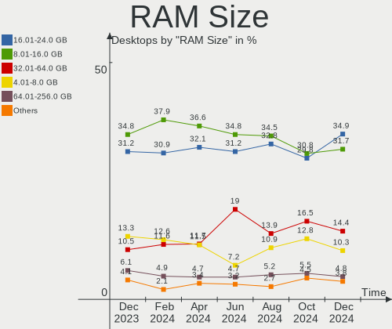
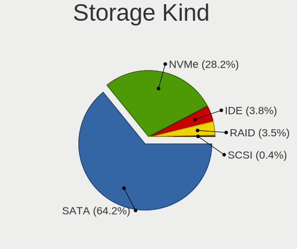

BSD - Hardware Trends (Desktops)
--------------------------------

A project to identify most popular hardware characteristics and track their change
over time based on data collected by BSD users at https://BSD-Hardware.info.

Anyone can contribute to this report by the [hw-probe](https://github.com/linuxhw/hw-probe/blob/master/INSTALL.BSD.md) tool:

    hw-probe -all -upload

This report is for one last month. Overall report since the beginning of time: [TestCoverage](https://github.com/bsdhw/TestCoverage)

Period: Dec, 2022.

Contents
--------

* [ System ](#system)
  - [ OS                       ](#os)
  - [ OS Family                ](#os-family)
  - [ Arch                     ](#arch)
  - [ DE                       ](#de)
  - [ Display Server           ](#display-server)
  - [ Display Manager          ](#display-manager)
  - [ OS Lang                  ](#os-lang)
  - [ Boot Mode                ](#boot-mode)
  - [ Filesystem               ](#filesystem)
  - [ Part. scheme             ](#part-scheme)

* [ Board ](#board)
  - [ Vendor                   ](#vendor)
  - [ Model                    ](#model)
  - [ Model Family             ](#model-family)
  - [ MFG Year                 ](#mfg-year)
  - [ Form Factor              ](#form-factor)
  - [ Coreboot                 ](#coreboot)
  - [ RAM Size                 ](#ram-size)
  - [ RAM Used                 ](#ram-used)
  - [ Total Drives             ](#total-drives)
  - [ Has CD-ROM               ](#has-cd-rom)
  - [ Has Ethernet             ](#has-ethernet)
  - [ Has WiFi                 ](#has-wifi)
  - [ Has Bluetooth            ](#has-bluetooth)

* [ Location ](#location)
  - [ Country                  ](#country)
  - [ City                     ](#city)

* [ Drives ](#drives)
  - [ Drive Vendor             ](#drive-vendor)
  - [ Drive Model              ](#drive-model)
  - [ HDD Vendor               ](#hdd-vendor)
  - [ SSD Vendor               ](#ssd-vendor)
  - [ Drive Kind               ](#drive-kind)
  - [ Drive Connector          ](#drive-connector)
  - [ Drive Size               ](#drive-size)
  - [ Space Total              ](#space-total)
  - [ Space Used               ](#space-used)
  - [ Malfunc. Drives          ](#malfunc-drives)
  - [ Malfunc. Drive Vendor    ](#malfunc-drive-vendor)
  - [ Malfunc. HDD Vendor      ](#malfunc-hdd-vendor)
  - [ Malfunc. Drive Kind      ](#malfunc-drive-kind)
  - [ Failed Drives            ](#failed-drives)
  - [ Failed Drive Vendor      ](#failed-drive-vendor)
  - [ Drive Status             ](#drive-status)

* [ Storage controller ](#storage-controller)
  - [ Storage Vendor           ](#storage-vendor)
  - [ Storage Model            ](#storage-model)
  - [ Storage Kind             ](#storage-kind)

* [ Processor ](#processor)
  - [ CPU Vendor               ](#cpu-vendor)
  - [ CPU Model                ](#cpu-model)
  - [ CPU Model Family         ](#cpu-model-family)
  - [ CPU Cores                ](#cpu-cores)
  - [ CPU Sockets              ](#cpu-sockets)
  - [ CPU Threads              ](#cpu-threads)
  - [ CPU Microarch            ](#cpu-microarch)

* [ Graphics ](#graphics)
  - [ GPU Vendor               ](#gpu-vendor)
  - [ GPU Model                ](#gpu-model)
  - [ GPU Combo                ](#gpu-combo)
  - [ GPU Driver               ](#gpu-driver)
  - [ GPU Memory               ](#gpu-memory)

* [ Monitor ](#monitor)
  - [ Monitor Vendor           ](#monitor-vendor)
  - [ Monitor Model            ](#monitor-model)
  - [ Monitor Resolution       ](#monitor-resolution)
  - [ Monitor Diagonal         ](#monitor-diagonal)
  - [ Monitor Width            ](#monitor-width)
  - [ Aspect Ratio             ](#aspect-ratio)
  - [ Monitor Area             ](#monitor-area)
  - [ Pixel Density            ](#pixel-density)
  - [ Multiple Monitors        ](#multiple-monitors)

* [ Network ](#network)
  - [ Net Controller Vendor    ](#net-controller-vendor)
  - [ Net Controller Model     ](#net-controller-model)
  - [ Wireless Vendor          ](#wireless-vendor)
  - [ Wireless Model           ](#wireless-model)
  - [ Ethernet Vendor          ](#ethernet-vendor)
  - [ Ethernet Model           ](#ethernet-model)
  - [ Net Controller Kind      ](#net-controller-kind)
  - [ Used Controller          ](#used-controller)
  - [ NICs                     ](#nics)
  - [ IPv6                     ](#ipv6)

* [ Bluetooth ](#bluetooth)
  - [ Bluetooth Vendor         ](#bluetooth-vendor)
  - [ Bluetooth Model          ](#bluetooth-model)

* [ Sound ](#sound)
  - [ Sound Vendor             ](#sound-vendor)
  - [ Sound Model              ](#sound-model)

* [ Memory ](#memory)
  - [ Memory Vendor            ](#memory-vendor)
  - [ Memory Model             ](#memory-model)
  - [ Memory Kind              ](#memory-kind)
  - [ Memory Form Factor       ](#memory-form-factor)
  - [ Memory Size              ](#memory-size)
  - [ Memory Speed             ](#memory-speed)

* [ Printers & scanners ](#printers--scanners)
  - [ Printer Vendor           ](#printer-vendor)
  - [ Printer Model            ](#printer-model)
  - [ Scanner Vendor           ](#scanner-vendor)
  - [ Scanner Model            ](#scanner-model)

* [ Camera ](#camera)
  - [ Camera Vendor            ](#camera-vendor)
  - [ Camera Model             ](#camera-model)

* [ Security ](#security)
  - [ Fingerprint Vendor       ](#fingerprint-vendor)
  - [ Fingerprint Model        ](#fingerprint-model)
  - [ Chipcard Vendor          ](#chipcard-vendor)
  - [ Chipcard Model           ](#chipcard-model)

* [ Unsupported ](#unsupported)
  - [ Unsupported Devices      ](#unsupported-devices)
  - [ Unsupported Device Types ](#unsupported-device-types)

System
------

OS
--

Installed operating systems

| Name                 | Desktops | Percent |
|----------------------|----------|---------|
| OPNsense 22.7.9      | 128      | 46.72%  |
| OPNsense 22.7.10     | 66       | 24.09%  |
| FreeBSD 13.1-p5      | 16       | 5.84%   |
| OPNsense 22.7.8      | 9        | 3.28%   |
| helloSystem 0.7.0    | 8        | 2.92%   |
| OpenBSD 7.2          | 6        | 2.19%   |
| FreeBSD 13.1-STABLE  | 5        | 1.82%   |
| OPNsense 22.7.6      | 4        | 1.46%   |
| OPNsense 22.1.10     | 4        | 1.46%   |
| OPNsense 23.1        | 3        | 1.09%   |
| OPNsense 22.7.7      | 3        | 1.09%   |
| FreeBSD 14.0-CURRENT | 3        | 1.09%   |
| FreeBSD 13.1         | 3        | 1.09%   |
| OpenBSD 7.1          | 2        | 0.73%   |
| MidnightBSD 2.2.6    | 2        | 0.73%   |
| helloSystem 0.8.0    | 2        | 0.73%   |
| GhostBSD 22.11.22    | 2        | 0.73%   |
| FreeBSD 13.1-p2      | 2        | 0.73%   |
| OPNsense 22.7.2      | 1        | 0.36%   |
| OPNsense 22.1.6      | 1        | 0.36%   |
| OpenBSD 7.0          | 1        | 0.36%   |
| MyBee 13.1-p3        | 1        | 0.36%   |
| GhostBSD 22.11.02    | 1        | 0.36%   |
| FreeBSD 12.4         | 1        | 0.36%   |

OS Family
---------

OS without a version

| Name        | Desktops | Percent |
|-------------|----------|---------|
| OPNsense    | 219      | 79.93%  |
| FreeBSD     | 30       | 10.95%  |
| helloSystem | 10       | 3.65%   |
| OpenBSD     | 9        | 3.28%   |
| GhostBSD    | 3        | 1.09%   |
| MidnightBSD | 2        | 0.73%   |
| MyBee       | 1        | 0.36%   |

Arch
----

OS architecture (x86_64, i586, etc.)

| Name  | Desktops | Percent |
|-------|----------|---------|
| amd64 | 269      | 98.18%  |
| arm64 | 5        | 1.82%   |

DE
--

Desktop Environment

| Name         | Desktops | Percent |
|--------------|----------|---------|
| Console      | 236      | 86.13%  |
| helloDesktop | 18       | 6.57%   |
| XFCE         | 5        | 1.82%   |
| MATE         | 4        | 1.46%   |
| KDE5         | 4        | 1.46%   |
| GNOME        | 4        | 1.46%   |
| TWM          | 1        | 0.36%   |
| LXQt         | 1        | 0.36%   |
| bspwm        | 1        | 0.36%   |

Display Server
--------------

X11 or Wayland

| Name    | Desktops | Percent |
|---------|----------|---------|
| Console | 241      | 87.96%  |
| X11     | 32       | 11.68%  |
| Wayland | 1        | 0.36%   |

Display Manager
---------------

SDDM, LightDM, etc.

| Name    | Desktops | Percent |
|---------|----------|---------|
| Console | 248      | 90.51%  |
| SLiM    | 13       | 4.74%   |
| LightDM | 8        | 2.92%   |
| SDDM    | 4        | 1.46%   |
| XDM     | 1        | 0.36%   |

OS Lang
-------

Language

| Lang    | Desktops | Percent |
|---------|----------|---------|
| Unknown | 229      | 83.58%  |
| C       | 24       | 8.76%   |
| en_US   | 17       | 6.2%    |
| zh_TW   | 1        | 0.36%   |
| zh_CN   | 1        | 0.36%   |
| fr      | 1        | 0.36%   |
| de_DE   | 1        | 0.36%   |

Boot Mode
---------

EFI or BIOS

| Mode | Desktops | Percent |
|------|----------|---------|
| EFI  | 247      | 90.15%  |
| BIOS | 27       | 9.85%   |

Filesystem
----------

Type of filesystem

| Type   | Desktops | Percent |
|--------|----------|---------|
| Ufs    | 146      | 53.28%  |
| Zfs    | 110      | 40.15%  |
| Ffs    | 9        | 3.28%   |
| Cd9660 | 9        | 3.28%   |

Part. scheme
------------

Scheme of partitioning

| Type    | Desktops | Percent |
|---------|----------|---------|
| GPT     | 260      | 94.89%  |
| MBR     | 10       | 3.65%   |
| Unknown | 4        | 1.46%   |

Board
-----

Vendor
------

Motherboard manufacturer

| Name                       | Desktops | Percent |
|----------------------------|----------|---------|
| Unknown                    | 44       | 16.06%  |
| ASUSTek Computer           | 28       | 10.22%  |
| Dell                       | 26       | 9.49%   |
| Hewlett-Packard            | 19       | 6.93%   |
| Intel                      | 17       | 6.2%    |
| MSI                        | 15       | 5.47%   |
| Fujitsu                    | 15       | 5.47%   |
| Protectli                  | 13       | 4.74%   |
| Gigabyte Technology        | 13       | 4.74%   |
| ASRock                     | 12       | 4.38%   |
| PC Engines                 | 10       | 3.65%   |
| Lenovo                     | 9        | 3.28%   |
| Techvision                 | 7        | 2.55%   |
| Shuttle                    | 4        | 1.46%   |
| Acer                       | 4        | 1.46%   |
| Supermicro                 | 3        | 1.09%   |
| MW                         | 3        | 1.09%   |
| CncTion                    | 3        | 1.09%   |
| Biostar                    | 3        | 1.09%   |
| ShenZhen MinWin Technology | 2        | 0.73%   |
| Raspberry Pi Foundation    | 2        | 0.73%   |
| Pegatron                   | 2        | 0.73%   |
| Hardkernel                 | 2        | 0.73%   |
| YANYU                      | 1        | 0.36%   |
| OEM                        | 1        | 0.36%   |
| NF541                      | 1        | 0.36%   |
| Lanner                     | 1        | 0.36%   |
| JGINYUE                    | 1        | 0.36%   |
| Intel BOX4A200             | 1        | 0.36%   |
| Huanan                     | 1        | 0.36%   |
| GoWin Solution             | 1        | 0.36%   |
| Deciso                     | 1        | 0.36%   |
| Cisco                      | 1        | 0.36%   |
| BESSTAR Tech               | 1        | 0.36%   |
| AZW                        | 1        | 0.36%   |
| ASRockRack                 | 1        | 0.36%   |
| Apple                      | 1        | 0.36%   |
| AMI                        | 1        | 0.36%   |
| Advantech                  | 1        | 0.36%   |
| ACMA                       | 1        | 0.36%   |

Model
-----

Motherboard model

| Name                               | Desktops | Percent |
|------------------------------------|----------|---------|
| Unknown                            | 44       | 16.06%  |
| Techvision TVI7309X                | 7        | 2.55%   |
| Protectli FW4B                     | 7        | 2.55%   |
| Fujitsu FUTRO S920                 | 7        | 2.55%   |
| Intel Q3XXG4-P V1.0                | 6        | 2.19%   |
| PC Engines APU2                    | 5        | 1.82%   |
| Dell OptiPlex 7010                 | 5        | 1.82%   |
| Protectli FW6                      | 3        | 1.09%   |
| MW GMLK-2_5G4L                     | 3        | 1.09%   |
| HP ProLiant MicroServer Gen8       | 3        | 1.09%   |
| Dell OptiPlex 7020                 | 3        | 1.09%   |
| Dell OptiPlex 3020                 | 3        | 1.09%   |
| CncTion N5105-4L                   | 3        | 1.09%   |
| ASUS PRIME B550-PLUS               | 3        | 1.09%   |
| ASUS All Series                    | 3        | 1.09%   |
| PC Engines apu4                    | 2        | 0.73%   |
| PC Engines APU3                    | 2        | 0.73%   |
| MSI MS-7D20                        | 2        | 0.73%   |
| MSI MS-7817                        | 2        | 0.73%   |
| Intel SHARKBAY                     | 2        | 0.73%   |
| HP t620 PLUS Quad Core TC          | 2        | 0.73%   |
| HP Compaq 8200 Elite SFF PC        | 2        | 0.73%   |
| ASUS TUF Gaming B450M-PLUS II      | 2        | 0.73%   |
| YANYU R250                         | 1        | 0.36%   |
| Supermicro X9DR3-F                 | 1        | 0.36%   |
| Supermicro SYS-E300-9D-4CN8TP      | 1        | 0.36%   |
| Supermicro SSG-5028R-E1CR12L-CE010 | 1        | 0.36%   |
| Shuttle XH110                      | 1        | 0.36%   |
| Shuttle DS77U                      | 1        | 0.36%   |
| Shuttle DS10U                      | 1        | 0.36%   |
| Shuttle DH370                      | 1        | 0.36%   |
| ShenZhen MinWin MW-NANO-APL-4L     | 1        | 0.36%   |
| ShenZhen MinWin MW-GMLK-2.5G6L     | 1        | 0.36%   |
| RPi Raspberry Pi 400               | 1        | 0.36%   |
| RPi Raspberry Pi 4 Model B         | 1        | 0.36%   |
| Protectli VP2410                   | 1        | 0.36%   |
| Protectli FW4C                     | 1        | 0.36%   |
| Protectli FW2B                     | 1        | 0.36%   |
| Pegatron Pro 3405 Series           | 1        | 0.36%   |
| Pegatron Compaq dx2450 Microtower  | 1        | 0.36%   |

Model Family
------------

Motherboard model prefix

| Name                               | Desktops | Percent |
|------------------------------------|----------|---------|
| Unknown                            | 44       | 16.06%  |
| Dell OptiPlex                      | 18       | 6.57%   |
| ASUS PRIME                         | 9        | 3.28%   |
| Lenovo ThinkCentre                 | 8        | 2.92%   |
| Fujitsu FUTRO                      | 8        | 2.92%   |
| Techvision TVI7309X                | 7        | 2.55%   |
| Protectli FW4B                     | 7        | 2.55%   |
| Intel Q3XXG4-P                     | 6        | 2.19%   |
| PC Engines APU2                    | 5        | 1.82%   |
| HP EliteDesk                       | 5        | 1.82%   |
| ASUS ROG                           | 5        | 1.82%   |
| HP ProLiant                        | 4        | 1.46%   |
| HP ProDesk                         | 4        | 1.46%   |
| Fujitsu ESPRIMO                    | 4        | 1.46%   |
| Protectli FW6                      | 3        | 1.09%   |
| MW GMLK-2                          | 3        | 1.09%   |
| HP Compaq                          | 3        | 1.09%   |
| Dell Precision                     | 3        | 1.09%   |
| Dell Inspiron                      | 3        | 1.09%   |
| CncTion N5105-4L                   | 3        | 1.09%   |
| ASUS TUF                           | 3        | 1.09%   |
| ASUS All                           | 3        | 1.09%   |
| RPi Raspberry                      | 2        | 0.73%   |
| PC Engines apu4                    | 2        | 0.73%   |
| PC Engines APU3                    | 2        | 0.73%   |
| MSI MS-7D20                        | 2        | 0.73%   |
| MSI MS-7817                        | 2        | 0.73%   |
| Intel SHARKBAY                     | 2        | 0.73%   |
| HP t620                            | 2        | 0.73%   |
| Acer Veriton                       | 2        | 0.73%   |
| Acer Aspire                        | 2        | 0.73%   |
| YANYU R250                         | 1        | 0.36%   |
| Supermicro X9DR3-F                 | 1        | 0.36%   |
| Supermicro SYS-E300-9D-4CN8TP      | 1        | 0.36%   |
| Supermicro SSG-5028R-E1CR12L-CE010 | 1        | 0.36%   |
| Shuttle XH110                      | 1        | 0.36%   |
| Shuttle DS77U                      | 1        | 0.36%   |
| Shuttle DS10U                      | 1        | 0.36%   |
| Shuttle DH370                      | 1        | 0.36%   |
| ShenZhen MinWin MW-NANO-APL-4L     | 1        | 0.36%   |

MFG Year
--------

Motherboard manufacture year

| Year    | Desktops | Percent |
|---------|----------|---------|
| 2022    | 49       | 17.88%  |
| 2019    | 30       | 10.95%  |
| 2014    | 28       | 10.22%  |
| 2018    | 27       | 9.85%   |
| 2021    | 26       | 9.49%   |
| 2020    | 24       | 8.76%   |
| 2016    | 19       | 6.93%   |
| 2017    | 15       | 5.47%   |
| 2013    | 14       | 5.11%   |
| 2012    | 11       | 4.01%   |
| 2015    | 10       | 3.65%   |
| 2010    | 8        | 2.92%   |
| 2011    | 6        | 2.19%   |
| Unknown | 3        | 1.09%   |
| 2008    | 2        | 0.73%   |
| 2009    | 1        | 0.36%   |
| 2007    | 1        | 0.36%   |

Form Factor
-----------

Physical design of the computer

| Name    | Desktops | Percent |
|---------|----------|---------|
| Desktop | 274      | 100%    |

Coreboot
--------

Have coreboot on board

| Used | Desktops | Percent |
|------|----------|---------|
| No   | 262      | 95.62%  |
| Yes  | 12       | 4.38%   |

RAM Size
--------

Total RAM memory

| Size in GB  | Desktops | Percent |
|-------------|----------|---------|
| 8.01-16.0   | 105      | 38.32%  |
| 16.01-24.0  | 62       | 22.63%  |
| 4.01-8.0    | 55       | 20.07%  |
| 32.01-64.0  | 21       | 7.66%   |
| 64.01-256.0 | 12       | 4.38%   |
| 3.01-4.0    | 7        | 2.55%   |
| 2.01-3.0    | 7        | 2.55%   |
| 24.01-32.0  | 3        | 1.09%   |
| 1.01-2.0    | 1        | 0.36%   |
| 0.51-1.0    | 1        | 0.36%   |

RAM Used
--------

Used RAM memory

| Used GB    | Desktops | Percent |
|------------|----------|---------|
| 0.01-0.5   | 152      | 55.47%  |
| 0.51-1.0   | 86       | 31.39%  |
| 1.01-2.0   | 28       | 10.22%  |
| 3.01-4.0   | 4        | 1.46%   |
| 2.01-3.0   | 3        | 1.09%   |
| 16.01-24.0 | 1        | 0.36%   |

Total Drives
------------

Number of drives on board

| Drives | Desktops | Percent |
|--------|----------|---------|
| 1      | 199      | 72.63%  |
| 2      | 25       | 9.12%   |
| 0      | 22       | 8.03%   |
| 3      | 13       | 4.74%   |
| 4      | 5        | 1.82%   |
| 5      | 4        | 1.46%   |
| 6      | 2        | 0.73%   |
| 13     | 1        | 0.36%   |
| 10     | 1        | 0.36%   |
| 8      | 1        | 0.36%   |
| 7      | 1        | 0.36%   |

Has CD-ROM
----------

Has CD-ROM on board

| Presented | Desktops | Percent |
|-----------|----------|---------|
| No        | 240      | 87.59%  |
| Yes       | 34       | 12.41%  |

Has Ethernet
------------

Has Ethernet on board

| Presented | Desktops | Percent |
|-----------|----------|---------|
| Yes       | 268      | 97.81%  |
| No        | 6        | 2.19%   |

Has WiFi
--------

Has WiFi module

| Presented | Desktops | Percent |
|-----------|----------|---------|
| No        | 226      | 82.48%  |
| Yes       | 48       | 17.52%  |

Has Bluetooth
-------------

Has Bluetooth module

| Presented | Desktops | Percent |
|-----------|----------|---------|
| No        | 240      | 87.59%  |
| Yes       | 34       | 12.41%  |

Location
--------

Country
-------

Geographic location (country)

| Country     | Desktops | Percent |
|-------------|----------|---------|
| USA         | 68       | 24.82%  |
| Germany     | 57       | 20.8%   |
| Canada      | 17       | 6.2%    |
| France      | 13       | 4.74%   |
| UK          | 11       | 4.01%   |
| Australia   | 11       | 4.01%   |
| Russia      | 8        | 2.92%   |
| Switzerland | 6        | 2.19%   |
| Italy       | 6        | 2.19%   |
| Netherlands | 5        | 1.82%   |
| Sweden      | 4        | 1.46%   |
| Poland      | 4        | 1.46%   |
| Norway      | 4        | 1.46%   |
| Finland     | 4        | 1.46%   |
| Denmark     | 4        | 1.46%   |
| South Korea | 3        | 1.09%   |
| Mexico      | 3        | 1.09%   |
| Czechia     | 3        | 1.09%   |
| Brazil      | 3        | 1.09%   |
| Belgium     | 3        | 1.09%   |
| Austria     | 3        | 1.09%   |
| Thailand    | 2        | 0.73%   |
| Taiwan      | 2        | 0.73%   |
| Romania     | 2        | 0.73%   |
| Paraguay    | 2        | 0.73%   |
| Malaysia    | 2        | 0.73%   |
| Lithuania   | 2        | 0.73%   |
| India       | 2        | 0.73%   |
| Colombia    | 2        | 0.73%   |
| China       | 2        | 0.73%   |
| Turkey      | 1        | 0.36%   |
| Spain       | 1        | 0.36%   |
| Portugal    | 1        | 0.36%   |
| Peru        | 1        | 0.36%   |
| New Zealand | 1        | 0.36%   |
| Morocco     | 1        | 0.36%   |
| Israel      | 1        | 0.36%   |
| Ireland     | 1        | 0.36%   |
| Hungary     | 1        | 0.36%   |
| Greece      | 1        | 0.36%   |

City
----

Geographic location (city)

| City               | Desktops | Percent |
|--------------------|----------|---------|
| London             | 6        | 2.19%   |
| Berlin             | 5        | 1.82%   |
| Sydney             | 3        | 1.09%   |
| Stockholm          | 3        | 1.09%   |
| Paris              | 3        | 1.09%   |
| Krasnodar          | 3        | 1.09%   |
| Austin             | 3        | 1.09%   |
| Ypsilanti          | 2        | 0.73%   |
| Würzburg          | 2        | 0.73%   |
| Victoria           | 2        | 0.73%   |
| Ulm                | 2        | 0.73%   |
| St. Jean Baptiste  | 2        | 0.73%   |
| St Petersburg      | 2        | 0.73%   |
| Siggenthal Station | 2        | 0.73%   |
| Seattle            | 2        | 0.73%   |
| Redmond            | 2        | 0.73%   |
| Perth              | 2        | 0.73%   |
| Nuremberg          | 2        | 0.73%   |
| Melbourne          | 2        | 0.73%   |
| Jistebnik          | 2        | 0.73%   |
| Helsinki           | 2        | 0.73%   |
| Hamburg            | 2        | 0.73%   |
| Frankfurt am Main  | 2        | 0.73%   |
| Cologne            | 2        | 0.73%   |
| Cambridge          | 2        | 0.73%   |
| Bonn               | 2        | 0.73%   |
| Bogotá            | 2        | 0.73%   |
| Bangkok            | 2        | 0.73%   |
| Asunción          | 2        | 0.73%   |
| Adelaide           | 2        | 0.73%   |
| Zwickau            | 1        | 0.36%   |
| Wroclaw            | 1        | 0.36%   |
| Witten             | 1        | 0.36%   |
| Winnipeg           | 1        | 0.36%   |
| Willich            | 1        | 0.36%   |
| West Hartford      | 1        | 0.36%   |
| Wenzhou            | 1        | 0.36%   |
| Wenatchee          | 1        | 0.36%   |
| Waterbury          | 1        | 0.36%   |
| Waltham            | 1        | 0.36%   |

Drives
------

Drive Vendor
------------

Hard drive vendors

| Vendor              | Desktops | Drives | Percent |
|---------------------|----------|--------|---------|
| Samsung Electronics | 49       | 64     | 16.07%  |
| WDC                 | 37       | 72     | 12.13%  |
| Kingston            | 27       | 29     | 8.85%   |
| Seagate             | 24       | 32     | 7.87%   |
| Transcend           | 18       | 19     | 5.9%    |
| SanDisk             | 15       | 15     | 4.92%   |
| Crucial             | 15       | 16     | 4.92%   |
| Hoodisk             | 9        | 9      | 2.95%   |
| Toshiba             | 8        | 13     | 2.62%   |
| Intel               | 8        | 10     | 2.62%   |
| Innodisk            | 7        | 7      | 2.3%    |
| China               | 7        | 8      | 2.3%    |
| A-DATA Technology   | 6        | 7      | 1.97%   |
| PNY                 | 5        | 5      | 1.64%   |
| HGST                | 5        | 6      | 1.64%   |
| Gigabyte Technology | 4        | 4      | 1.31%   |
| FORESEE             | 4        | 4      | 1.31%   |
| Corsair             | 4        | 4      | 1.31%   |
| SPCC                | 3        | 3      | 0.98%   |
| Silicon Motion      | 3        | 3      | 0.98%   |
| ShiJi               | 3        | 3      | 0.98%   |
| Phison              | 3        | 3      | 0.98%   |
| Hitachi             | 3        | 3      | 0.98%   |
| Team                | 2        | 2      | 0.66%   |
| SK hynix            | 2        | 2      | 0.66%   |
| Protectli           | 2        | 2      | 0.66%   |
| Patriot             | 2        | 2      | 0.66%   |
| OPENBSD             | 2        | 3      | 0.66%   |
| OCZ                 | 2        | 2      | 0.66%   |
| Micron Technology   | 2        | 2      | 0.66%   |
| LITEONIT            | 2        | 2      | 0.66%   |
| Intenso             | 2        | 2      | 0.66%   |
| BIWIN               | 2        | 2      | 0.66%   |
| Advantech           | 2        | 3      | 0.66%   |
| Zheino              | 1        | 1      | 0.33%   |
| YMTC                | 1        | 1      | 0.33%   |
| Vaseky              | 1        | 1      | 0.33%   |
| TEXTORM             | 1        | 1      | 0.33%   |
| NVMe                | 1        | 1      | 0.33%   |
| LITEON              | 1        | 1      | 0.33%   |

Drive Model
-----------

Hard drive models

| Model                            | Desktops | Percent |
|----------------------------------|----------|---------|
| Kingston SA400S37240G 240GB      | 7        | 2.07%   |
| Samsung SSD 860 EVO 500GB        | 5        | 1.48%   |
| Kingston SA400S37120G 120GB      | 5        | 1.48%   |
| WDC WDS240G2G0A-00JH30 240GB     | 3        | 0.89%   |
| WDC WD30EFRX-68EUZN0 3TB         | 3        | 0.89%   |
| Transcend TS128GMSA230S 128GB    | 3        | 0.89%   |
| Seagate ST500DM002-1BD142 500GB  | 3        | 0.89%   |
| Samsung SSD 970 PRO 512GB        | 3        | 0.89%   |
| Samsung SSD 970 EVO Plus 250GB   | 3        | 0.89%   |
| Samsung SSD 870 EVO 1TB          | 3        | 0.89%   |
| Samsung SSD 850 EVO 500GB        | 3        | 0.89%   |
| Samsung SSD 850 EVO 120GB        | 3        | 0.89%   |
| Kingston SUV500MS120G 120GB      | 3        | 0.89%   |
| Kingston SKC600MS256G 256GB      | 3        | 0.89%   |
| Intel SSDSC2KG480G8 480GB        | 3        | 0.89%   |
| Hoodisk SSD 64GB                 | 3        | 0.89%   |
| Hoodisk SSD 128GB                | 3        | 0.89%   |
| HGST HTS725050A7E630 500GB       | 3        | 0.89%   |
| Crucial CT480BX500SSD1 480GB     | 3        | 0.89%   |
| Crucial CT240BX500SSD1 240GB     | 3        | 0.89%   |
| WDC WDS120G2G0A-00JH30 120GB     | 2        | 0.59%   |
| WDC WD40EZRZ-22GXCB0 4TB         | 2        | 0.59%   |
| Transcend TS64GMSA230S 64GB      | 2        | 0.59%   |
| Transcend TS256GMSA230S 256GB    | 2        | 0.59%   |
| Seagate ST4000LM024-2AN17V 4TB   | 2        | 0.59%   |
| Seagate ST4000DM000-1F2168 4TB   | 2        | 0.59%   |
| Seagate ST2000DM008-2FR102 2TB   | 2        | 0.59%   |
| SanDisk SDSSDA120G 120GB         | 2        | 0.59%   |
| Samsung SSD 970 EVO 250GB        | 2        | 0.59%   |
| Samsung SSD 960 EVO 500GB        | 2        | 0.59%   |
| Samsung SSD 870 EVO 500GB        | 2        | 0.59%   |
| Samsung SSD 870 EVO 250GB        | 2        | 0.59%   |
| Samsung SSD 840 EVO 500GB        | 2        | 0.59%   |
| Samsung SSD 840 EVO 120GB        | 2        | 0.59%   |
| Samsung MZ7LN256HMJP-000H1 256GB | 2        | 0.59%   |
| PNY 120GB SATA SSD               | 2        | 0.59%   |
| OPENBSD SR RAID 1 1TB            | 2        | 0.59%   |
| Innodisk DEMSR- 08GB mSATA 3ME3  | 2        | 0.59%   |
| Gigabyte GP-GSM2NE3256GNTD 256GB | 2        | 0.59%   |
| FORESEE 64GB SSD                 | 2        | 0.59%   |

HDD Vendor
----------

Hard disk drive vendors

| Vendor              | Desktops | Drives | Percent |
|---------------------|----------|--------|---------|
| WDC                 | 28       | 60     | 42.42%  |
| Seagate             | 23       | 31     | 34.85%  |
| HGST                | 5        | 6      | 7.58%   |
| Toshiba             | 3        | 8      | 4.55%   |
| Hitachi             | 3        | 3      | 4.55%   |
| OPENBSD             | 2        | 3      | 3.03%   |
| Samsung Electronics | 1        | 1      | 1.52%   |
| Fujitsu             | 1        | 1      | 1.52%   |

SSD Vendor
----------

Solid state drive vendors

| Vendor              | Desktops | Drives | Percent |
|---------------------|----------|--------|---------|
| Samsung Electronics | 35       | 43     | 17.41%  |
| Kingston            | 25       | 26     | 12.44%  |
| Transcend           | 18       | 19     | 8.96%   |
| SanDisk             | 15       | 15     | 7.46%   |
| Crucial             | 12       | 13     | 5.97%   |
| Hoodisk             | 9        | 9      | 4.48%   |
| WDC                 | 7        | 9      | 3.48%   |
| Innodisk            | 7        | 7      | 3.48%   |
| China               | 7        | 8      | 3.48%   |
| Intel               | 6        | 8      | 2.99%   |
| Toshiba             | 5        | 5      | 2.49%   |
| PNY                 | 5        | 5      | 2.49%   |
| A-DATA Technology   | 5        | 6      | 2.49%   |
| Corsair             | 4        | 4      | 1.99%   |
| ShiJi               | 3        | 3      | 1.49%   |
| FORESEE             | 3        | 3      | 1.49%   |
| Team                | 2        | 2      | 1%      |
| SPCC                | 2        | 2      | 1%      |
| Protectli           | 2        | 2      | 1%      |
| OCZ                 | 2        | 2      | 1%      |
| Micron Technology   | 2        | 2      | 1%      |
| LITEONIT            | 2        | 2      | 1%      |
| Intenso             | 2        | 2      | 1%      |
| BIWIN               | 2        | 2      | 1%      |
| Advantech           | 2        | 3      | 1%      |
| Zheino              | 1        | 1      | 0.5%    |
| Vaseky              | 1        | 1      | 0.5%    |
| TEXTORM             | 1        | 1      | 0.5%    |
| SK hynix            | 1        | 1      | 0.5%    |
| Seagate             | 1        | 1      | 0.5%    |
| Patriot             | 1        | 1      | 0.5%    |
| NVMe                | 1        | 1      | 0.5%    |
| LITEON              | 1        | 1      | 0.5%    |
| KingDian            | 1        | 1      | 0.5%    |
| Hewlett-Packard     | 1        | 1      | 0.5%    |
| Gigabyte Technology | 1        | 1      | 0.5%    |
| Emtec               | 1        | 1      | 0.5%    |
| Dogfish             | 1        | 1      | 0.5%    |
| BORY                | 1        | 1      | 0.5%    |
| Argon               | 1        | 1      | 0.5%    |

Drive Kind
----------

HDD or SSD

| Kind | Desktops | Drives | Percent |
|------|----------|--------|---------|
| SSD  | 187      | 220    | 66.31%  |
| HDD  | 52       | 113    | 18.44%  |
| NVMe | 43       | 47     | 15.25%  |

Drive Connector
---------------

SATA, SAS, NVMe, etc.

| Type | Desktops | Drives | Percent |
|------|----------|--------|---------|
| SATA | 221      | 333    | 83.71%  |
| NVMe | 43       | 47     | 16.29%  |

Drive Size
----------

Size of hard drive

| Size in TB | Desktops | Drives | Percent |
|------------|----------|--------|---------|
| 0.01-0.5   | 204      | 233    | 80.31%  |
| 0.51-1.0   | 16       | 28     | 6.3%    |
| 1.01-2.0   | 13       | 23     | 5.12%   |
| 3.01-4.0   | 10       | 14     | 3.94%   |
| 2.01-3.0   | 5        | 9      | 1.97%   |
| 4.01-10.0  | 4        | 19     | 1.57%   |
| 10.01-20.0 | 2        | 7      | 0.79%   |

Space Total
-----------

Amount of disk space available on the file system

| Size in GB     | Desktops | Percent |
|----------------|----------|---------|
| 101-250        | 128      | 46.72%  |
| 251-500        | 53       | 19.34%  |
| 51-100         | 31       | 11.31%  |
| 1-20           | 24       | 8.76%   |
| 21-50          | 21       | 7.66%   |
| 501-1000       | 9        | 3.28%   |
| More than 3000 | 4        | 1.46%   |
| 2001-3000      | 2        | 0.73%   |
| 1001-2000      | 1        | 0.36%   |
| Unknown        | 1        | 0.36%   |

Space Used
----------

Amount of used disk space

| Used GB        | Desktops | Percent |
|----------------|----------|---------|
| 1-20           | 248      | 90.51%  |
| 21-50          | 16       | 5.84%   |
| 51-100         | 5        | 1.82%   |
| 1001-2000      | 2        | 0.73%   |
| More than 3000 | 1        | 0.36%   |
| 251-500        | 1        | 0.36%   |
| Unknown        | 1        | 0.36%   |

Malfunc. Drives
---------------

Drive models with a malfunction

| Model                               | Desktops | Drives | Percent |
|-------------------------------------|----------|--------|---------|
| HGST HTS725050A7E630 500GB          | 3        | 4      | 8.33%   |
| WDC WDS240G2G0A-00JH30 240GB        | 2        | 3      | 5.56%   |
| Seagate ST500DM002-1BD142 500GB     | 2        | 2      | 5.56%   |
| WDC WDS120G2G0A-00JH30 120GB        | 1        | 1      | 2.78%   |
| WDC WD6400AAKS-22A7B2 640GB         | 1        | 1      | 2.78%   |
| WDC WD5000AAKX-00ERMA0 500GB        | 1        | 1      | 2.78%   |
| WDC WD3200AAKX-001CA0 320GB         | 1        | 1      | 2.78%   |
| WDC WD3200AAKS-75L9A0 320GB         | 1        | 1      | 2.78%   |
| WDC WD30EFRX-68EUZN0 3TB            | 1        | 1      | 2.78%   |
| WDC WD20EARX-008FB0 2TB             | 1        | 1      | 2.78%   |
| WDC WD1600AAJS-60Z0A0 160GB         | 1        | 1      | 2.78%   |
| Toshiba MQ01ABF050 500GB            | 1        | 1      | 2.78%   |
| Toshiba KSG60ZSE256G SATA 256GB     | 1        | 1      | 2.78%   |
| ShiJi SSD 32GB                      | 1        | 1      | 2.78%   |
| Seagate ST8000VN004-2M2101 8TB      | 1        | 1      | 2.78%   |
| Seagate ST3250310AS 250GB           | 1        | 1      | 2.78%   |
| Seagate ST2000VN004-2E4164 2TB      | 1        | 2      | 2.78%   |
| SanDisk SD8TB8U-256G-1006 256GB     | 1        | 1      | 2.78%   |
| Samsung Electronics SSD 870 EVO 1TB | 1        | 1      | 2.78%   |
| Samsung Electronics HD204UI 2TB     | 1        | 1      | 2.78%   |
| PNY CS1311 120GB SSD                | 1        | 1      | 2.78%   |
| Micron Technology 1100 SATA 256GB   | 1        | 1      | 2.78%   |
| LITEONIT LCT-128M3S 128GB           | 1        | 1      | 2.78%   |
| Kingston SMS200S3120G 120GB         | 1        | 1      | 2.78%   |
| Kingston SA400S37120G 120GB         | 1        | 1      | 2.78%   |
| KingDian S100 32GB                  | 1        | 1      | 2.78%   |
| Intel SSDMCEAW240A4 240GB           | 1        | 1      | 2.78%   |
| Hitachi HTS542520K9A300 200GB       | 1        | 1      | 2.78%   |
| Hitachi HDS721616PLA380 160GB       | 1        | 1      | 2.78%   |
| Crucial CT480BX500SSD1 480GB        | 1        | 1      | 2.78%   |
| Corsair Neutron GTX SSD 240GB       | 1        | 1      | 2.78%   |
| A-DATA Technology SU800 1TB         | 1        | 1      | 2.78%   |

Malfunc. Drive Vendor
---------------------

Vendors of faulty drives

| Vendor              | Desktops | Drives | Percent |
|---------------------|----------|--------|---------|
| WDC                 | 10       | 11     | 28.57%  |
| Seagate             | 4        | 6      | 11.43%  |
| HGST                | 3        | 4      | 8.57%   |
| Toshiba             | 2        | 2      | 5.71%   |
| Samsung Electronics | 2        | 2      | 5.71%   |
| Kingston            | 2        | 2      | 5.71%   |
| Hitachi             | 2        | 2      | 5.71%   |
| ShiJi               | 1        | 1      | 2.86%   |
| SanDisk             | 1        | 1      | 2.86%   |
| PNY                 | 1        | 1      | 2.86%   |
| Micron Technology   | 1        | 1      | 2.86%   |
| LITEONIT            | 1        | 1      | 2.86%   |
| KingDian            | 1        | 1      | 2.86%   |
| Intel               | 1        | 1      | 2.86%   |
| Crucial             | 1        | 1      | 2.86%   |
| Corsair             | 1        | 1      | 2.86%   |
| A-DATA Technology   | 1        | 1      | 2.86%   |

Malfunc. HDD Vendor
-------------------

Vendors of faulty HDD drives

| Vendor              | Desktops | Drives | Percent |
|---------------------|----------|--------|---------|
| WDC                 | 7        | 7      | 38.89%  |
| Seagate             | 4        | 6      | 22.22%  |
| HGST                | 3        | 4      | 16.67%  |
| Hitachi             | 2        | 2      | 11.11%  |
| Toshiba             | 1        | 1      | 5.56%   |
| Samsung Electronics | 1        | 1      | 5.56%   |

Malfunc. Drive Kind
-------------------

Kinds of faulty drives

| Kind | Desktops | Drives | Percent |
|------|----------|--------|---------|
| SSD  | 17       | 18     | 50%     |
| HDD  | 17       | 21     | 50%     |

Failed Drives
-------------

Failed drive models

| Model                       | Desktops | Drives | Percent |
|-----------------------------|----------|--------|---------|
| Transcend TS32GSSD370S 32GB | 1        | 1      | 33.33%  |
| Seagate ST3500418AS 500GB   | 1        | 1      | 33.33%  |
| Crucial CT250P2SSD8 250GB   | 1        | 1      | 33.33%  |

Failed Drive Vendor
-------------------

Failed drive vendors

| Vendor    | Desktops | Drives | Percent |
|-----------|----------|--------|---------|
| Transcend | 1        | 1      | 33.33%  |
| Seagate   | 1        | 1      | 33.33%  |
| Crucial   | 1        | 1      | 33.33%  |

Drive Status
------------

Number of failed and malfunc. drives

| Status   | Desktops | Drives | Percent |
|----------|----------|--------|---------|
| Works    | 227      | 331    | 85.02%  |
| Malfunc  | 34       | 39     | 12.73%  |
| Detected | 3        | 7      | 1.12%   |
| Failed   | 3        | 3      | 1.12%   |

Storage controller
------------------

Storage Vendor
--------------

Storage controller vendors

| Vendor                       | Desktops | Percent |
|------------------------------|----------|---------|
| Intel                        | 202      | 62.15%  |
| AMD                          | 59       | 18.15%  |
| Samsung Electronics          | 18       | 5.54%   |
| Phison Electronics           | 8        | 2.46%   |
| Silicon Motion               | 5        | 1.54%   |
| ASMedia Technology           | 5        | 1.54%   |
| SanDisk                      | 4        | 1.23%   |
| Broadcom / LSI               | 4        | 1.23%   |
| Nvidia                       | 3        | 0.92%   |
| Micron/Crucial Technology    | 3        | 0.92%   |
| Kingston Technology Company  | 3        | 0.92%   |
| MAXIO Technology (Hangzhou)  | 2        | 0.62%   |
| JMicron Technology           | 2        | 0.62%   |
| Yangtze Memory Technologies  | 1        | 0.31%   |
| SK hynix                     | 1        | 0.31%   |
| Silicon Image                | 1        | 0.31%   |
| Shenzhen Longsys Electronics | 1        | 0.31%   |
| Marvell Technology Group     | 1        | 0.31%   |
| ADATA Technology             | 1        | 0.31%   |
| 3ware                        | 1        | 0.31%   |

Storage Model
-------------

Storage controller models

| Model                                                                            | Desktops | Percent |
|----------------------------------------------------------------------------------|----------|---------|
| AMD FCH SATA Controller [AHCI mode]                                              | 41       | 11.48%  |
| Intel 8 Series/C220 Series Chipset Family 6-port SATA Controller 1 [AHCI mode]   | 27       | 7.56%   |
| Intel Jasper Lake SATA AHCI Controller                                           | 22       | 6.16%   |
| Intel Celeron/Pentium Silver Processor SATA Controller                           | 21       | 5.88%   |
| Intel Q170/Q150/B150/H170/H110/Z170/CM236 Chipset SATA Controller [AHCI Mode]    | 12       | 3.36%   |
| Intel Atom/Celeron/Pentium Processor x5-E8000/J3xxx/N3xxx Series SATA Controller | 11       | 3.08%   |
| Intel 7 Series/C210 Series Chipset Family 6-port SATA Controller [AHCI mode]     | 11       | 3.08%   |
| Intel 200 Series PCH SATA controller [AHCI mode]                                 | 11       | 3.08%   |
| Samsung NVMe SSD Controller SM981/PM981/PM983                                    | 9        | 2.52%   |
| Intel Sunrise Point-LP SATA Controller [AHCI mode]                               | 8        | 2.24%   |
| Unknown                                                                          | 8        | 2.24%   |
| Intel Atom Processor E3800 Series SATA AHCI Controller                           | 7        | 1.96%   |
| AMD 400 Series Chipset SATA Controller                                           | 7        | 1.96%   |
| Intel Cannon Lake PCH SATA AHCI Controller                                       | 6        | 1.68%   |
| Intel 8 Series SATA Controller 1 [AHCI mode]                                     | 6        | 1.68%   |
| Intel 6 Series/C200 Series Chipset Family 6 port Desktop SATA AHCI Controller    | 6        | 1.68%   |
| AMD 500 Series Chipset SATA Controller                                           | 6        | 1.68%   |
| Silicon Motion SM2263EN/SM2263XT SSD Controller                                  | 5        | 1.4%    |
| ASMedia ASM1062 Serial ATA Controller                                            | 5        | 1.4%    |
| Samsung NVMe SSD Controller SM961/PM961/SM963                                    | 4        | 1.12%   |
| Samsung NVMe SSD Controller PM9A1/PM9A3/980PRO                                   | 4        | 1.12%   |
| Phison PS5013 E13 NVMe Controller                                                | 4        | 1.12%   |
| Intel 500 Series Chipset Family SATA AHCI Controller                             | 4        | 1.12%   |
| AMD FCH SATA Controller D                                                        | 4        | 1.12%   |
| Micron/Crucial P2 NVMe PCIe SSD                                                  | 3        | 0.84%   |
| Intel Wildcat Point-LP SATA Controller [AHCI Mode]                               | 3        | 0.84%   |
| Intel SATA Controller [RAID mode]                                                | 3        | 0.84%   |
| Intel NM10/ICH7 Family SATA Controller [IDE mode]                                | 3        | 0.84%   |
| Intel C610/X99 series chipset sSATA Controller [AHCI mode]                       | 3        | 0.84%   |
| Intel C610/X99 series chipset 6-Port SATA Controller [AHCI mode]                 | 3        | 0.84%   |
| Intel 82801JI (ICH10 Family) SATA AHCI Controller                                | 3        | 0.84%   |
| Broadcom / LSI SAS2008 PCI-Express Fusion-MPT SAS-2 [Falcon]                     | 3        | 0.84%   |
| AMD SB7x0/SB8x0/SB9x0 SATA Controller [AHCI mode]                                | 3        | 0.84%   |
| AMD FCH SATA Controller [IDE mode]                                               | 3        | 0.84%   |
| Samsung NVMe SSD Controller 980                                                  | 2        | 0.56%   |
| Phison E12 NVMe Controller                                                       | 2        | 0.56%   |
| Nvidia MCP61 SATA Controller                                                     | 2        | 0.56%   |
| MAXIO (Hangzhou) NVMe SSD Controller MAP1202                                     | 2        | 0.56%   |
| JMicron JMB58x AHCI SATA controller                                              | 2        | 0.56%   |
| Intel Tiger Lake-LP SATA Controller                                              | 2        | 0.56%   |

Storage Kind
------------

Kind of storage controller (IDE, SATA, NVMe, SAS, ...)

| Kind | Desktops | Percent |
|------|----------|---------|
| SATA | 245      | 75.15%  |
| NVMe | 48       | 14.72%  |
| IDE  | 22       | 6.75%   |
| SAS  | 6        | 1.84%   |
| RAID | 5        | 1.53%   |

Processor
---------

CPU Vendor
----------

Processor vendors

| Vendor | Desktops | Percent |
|--------|----------|---------|
| Intel  | 206      | 75.18%  |
| AMD    | 63       | 22.99%  |
| ARM    | 5        | 1.82%   |

CPU Model
---------

Processor models

| Model                                     | Desktops | Percent |
|-------------------------------------------|----------|---------|
| Intel Celeron N5105 @ 2.00GHz             | 18       | 6.57%   |
| Intel Celeron J4125 CPU @ 2.00GHz         | 16       | 5.84%   |
| AMD GX-412TC SOC                          | 9        | 3.28%   |
| Intel Celeron CPU J3160 @ 1.60GHz         | 7        | 2.55%   |
| Intel Pentium Silver N6005 @ 2.00GHz      | 6        | 2.19%   |
| Intel Core i3-4160 CPU @ 3.60GHz          | 6        | 2.19%   |
| Intel Core i5-6500 CPU @ 3.20GHz          | 5        | 1.82%   |
| Intel Core i3-6100 CPU @ 3.70GHz          | 5        | 1.82%   |
| Intel Core i5-4590 CPU @ 3.30GHz          | 4        | 1.46%   |
| Intel Core i5-3470 CPU @ 3.20GHz          | 4        | 1.46%   |
| AMD GX-415GA SOC with Radeon HD Graphics  | 4        | 1.46%   |
| Intel Core i5-10400 CPU @ 2.90GHz         | 3        | 1.09%   |
| Intel Celeron J6413 @ 1.80GHz             | 3        | 1.09%   |
| Intel Celeron J4105 CPU @ 1.50GHz         | 3        | 1.09%   |
| AMD GX-420CA SOC with Radeon HD Graphics  | 3        | 1.09%   |
| AMD GX-222GC SOC with Radeon R5E Graphics | 3        | 1.09%   |
| Intel Core i7-7700 CPU @ 3.60GHz          | 2        | 0.73%   |
| Intel Core i5-8250U CPU @ 1.60GHz         | 2        | 0.73%   |
| Intel Core i5-4690K CPU @ 3.50GHz         | 2        | 0.73%   |
| Intel Core i5-4570 CPU @ 3.20GHz          | 2        | 0.73%   |
| Intel Core i5-3550 CPU @ 3.30GHz          | 2        | 0.73%   |
| Intel Core i3-7100U CPU @ 2.40GHz         | 2        | 0.73%   |
| Intel Core i3-4130 CPU @ 3.40GHz          | 2        | 0.73%   |
| Intel Celeron CPU J3455 @ 1.50GHz         | 2        | 0.73%   |
| Intel Celeron CPU J1900 @ 1.99GHz         | 2        | 0.73%   |
| Intel Celeron CPU G1610T @ 2.30GHz        | 2        | 0.73%   |
| Intel Atom CPU E3845 @ 1.91GHz            | 2        | 0.73%   |
| Intel Atom CPU D525 @ 1.80GHz             | 2        | 0.73%   |
| Intel 11th Gen Core i5-1135G7 @ 2.40GHz   | 2        | 0.73%   |
| ARM Cortex-A72 r0p3                       | 2        | 0.73%   |
| ARM Cortex-A55 r2p0                       | 2        | 0.73%   |
| AMD Ryzen 7 5700X 8-Core Processor        | 2        | 0.73%   |
| AMD Ryzen 7 4800U with Radeon Graphics    | 2        | 0.73%   |
| AMD Ryzen 7 3700X 8-Core Processor        | 2        | 0.73%   |
| AMD Ryzen 7 2700 Eight-Core Processor     | 2        | 0.73%   |
| AMD GX-424CC SOC with Radeon R5E Graphics | 2        | 0.73%   |
| Intel Xeon E-2234 CPU @ 3.60GHz           | 1        | 0.36%   |
| Intel Xeon D-2123IT CPU @ 2.20GHz         | 1        | 0.36%   |
| Intel Xeon CPU X3440 @ 2.53GHz            | 1        | 0.36%   |
| Intel Xeon CPU W3565 @ 3.20GHz            | 1        | 0.36%   |

CPU Model Family
----------------

Processor model prefix

| Model                   | Desktops | Percent |
|-------------------------|----------|---------|
| Intel Celeron           | 64       | 23.36%  |
| Intel Core i5           | 46       | 16.79%  |
| Intel Core i3           | 27       | 9.85%   |
| AMD GX                  | 24       | 8.76%   |
| Intel Core i7           | 17       | 6.2%    |
| Intel Xeon              | 16       | 5.84%   |
| AMD Ryzen 7             | 10       | 3.65%   |
| Intel Pentium           | 9        | 3.28%   |
| Intel Pentium Silver    | 7        | 2.55%   |
| Other                   | 6        | 2.19%   |
| Intel Atom              | 6        | 2.19%   |
| AMD Ryzen 5             | 6        | 2.19%   |
| ARM Cortex              | 5        | 1.82%   |
| Intel Pentium Dual-Core | 3        | 1.09%   |
| AMD Athlon              | 3        | 1.09%   |
| Intel Core i9           | 2        | 0.73%   |
| Intel Core 2 Duo        | 2        | 0.73%   |
| AMD Ryzen 9             | 2        | 0.73%   |
| AMD A8                  | 2        | 0.73%   |
| Intel Pentium Gold      | 1        | 0.36%   |
| Intel Core 2 Quad       | 1        | 0.36%   |
| AMD Turion II Neo       | 1        | 0.36%   |
| AMD Ryzen Threadripper  | 1        | 0.36%   |
| AMD Ryzen 7 PRO         | 1        | 0.36%   |
| AMD Ryzen 5 PRO         | 1        | 0.36%   |
| AMD G                   | 1        | 0.36%   |
| AMD FX                  | 1        | 0.36%   |
| AMD EPYC                | 1        | 0.36%   |
| AMD E2                  | 1        | 0.36%   |
| AMD E                   | 1        | 0.36%   |
| AMD Athlon II X4        | 1        | 0.36%   |
| AMD Athlon II X2        | 1        | 0.36%   |
| AMD Athlon Dual Core    | 1        | 0.36%   |
| AMD Athlon 64 X2        | 1        | 0.36%   |
| AMD A4                  | 1        | 0.36%   |
| AMD A10                 | 1        | 0.36%   |

CPU Cores
---------

Number of processor cores

| Number  | Desktops | Percent |
|---------|----------|---------|
| 4       | 154      | 56.2%   |
| 2       | 75       | 27.37%  |
| 6       | 13       | 4.74%   |
| 16      | 12       | 4.38%   |
| 12      | 5        | 1.82%   |
| Unknown | 5        | 1.82%   |
| 8       | 4        | 1.46%   |
| 24      | 2        | 0.73%   |
| 10      | 2        | 0.73%   |
| 32      | 1        | 0.36%   |
| 28      | 1        | 0.36%   |

CPU Sockets
-----------

Number of sockets

| Number  | Desktops | Percent |
|---------|----------|---------|
| 1       | 267      | 97.45%  |
| Unknown | 5        | 1.82%   |
| 2       | 2        | 0.73%   |

CPU Threads
-----------

Threads per core (Hyper-Threading)

| Number  | Desktops | Percent |
|---------|----------|---------|
| 1       | 187      | 68.25%  |
| 2       | 82       | 29.93%  |
| Unknown | 5        | 1.82%   |

CPU Microarch
-------------

Microarchitecture

| Name          | Desktops | Percent |
|---------------|----------|---------|
| Haswell       | 41       | 14.96%  |
| Unknown       | 38       | 13.87%  |
| KabyLake      | 25       | 9.12%   |
| Goldmont plus | 21       | 7.66%   |
| Silvermont    | 18       | 6.57%   |
| IvyBridge     | 18       | 6.57%   |
| Skylake       | 16       | 5.84%   |
| Puma          | 15       | 5.47%   |
| Jaguar        | 11       | 4.01%   |
| Zen 2         | 7        | 2.55%   |
| Zen+          | 6        | 2.19%   |
| Zen           | 6        | 2.19%   |
| Broadwell     | 6        | 2.19%   |
| Zen 3         | 5        | 1.82%   |
| SandyBridge   | 5        | 1.82%   |
| Penryn        | 5        | 1.82%   |
| CometLake     | 5        | 1.82%   |
| Westmere      | 3        | 1.09%   |
| K10           | 3        | 1.09%   |
| Goldmont      | 3        | 1.09%   |
| Bonnell       | 3        | 1.09%   |
| TigerLake     | 2        | 0.73%   |
| Nehalem       | 2        | 0.73%   |
| K8 Hammer     | 2        | 0.73%   |
| K10 Llano     | 2        | 0.73%   |
| Bobcat        | 2        | 0.73%   |
| Steamroller   | 1        | 0.36%   |
| Piledriver    | 1        | 0.36%   |
| Excavator     | 1        | 0.36%   |
| Core          | 1        | 0.36%   |

Graphics
--------

GPU Vendor
----------

Vendors of graphics cards

| Vendor                     | Desktops | Percent |
|----------------------------|----------|---------|
| Intel                      | 177      | 69.96%  |
| AMD                        | 48       | 18.97%  |
| Nvidia                     | 18       | 7.11%   |
| ASPEED Technology          | 6        | 2.37%   |
| Matrox Electronics Systems | 4        | 1.58%   |

GPU Model
---------

Graphics card models

| Model                                                                                    | Desktops | Percent |
|------------------------------------------------------------------------------------------|----------|---------|
| Intel JasperLake [UHD Graphics]                                                          | 25       | 9.8%    |
| Intel GeminiLake [UHD Graphics 600]                                                      | 20       | 7.84%   |
| Intel Xeon E3-1200 v3/4th Gen Core Processor Integrated Graphics Controller              | 16       | 6.27%   |
| Intel HD Graphics 530                                                                    | 13       | 5.1%    |
| Intel Atom/Celeron/Pentium Processor x5-E8000/J3xxx/N3xxx Integrated Graphics Controller | 11       | 4.31%   |
| Intel Xeon E3-1200 v2/3rd Gen Core processor Graphics Controller                         | 10       | 3.92%   |
| Intel 4th Generation Core Processor Family Integrated Graphics Controller                | 9        | 3.53%   |
| Intel Atom Processor Z36xxx/Z37xxx Series Graphics & Display                             | 7        | 2.75%   |
| ASPEED Technology ASPEED Graphics Family                                                 | 6        | 2.35%   |
| AMD Mullins [Radeon R4/R5 Graphics]                                                      | 6        | 2.35%   |
| Intel HD Graphics 630                                                                    | 5        | 1.96%   |
| Intel CometLake-S GT2 [UHD Graphics 630]                                                 | 5        | 1.96%   |
| Intel CoffeeLake-S GT2 [UHD Graphics 630]                                                | 5        | 1.96%   |
| Intel HD Graphics 620                                                                    | 4        | 1.57%   |
| Intel Haswell-ULT Integrated Graphics Controller                                         | 4        | 1.57%   |
| Intel Elkhart Lake [UHD Graphics Gen11 16EU]                                             | 4        | 1.57%   |
| Intel 4 Series Chipset Integrated Graphics Controller                                    | 4        | 1.57%   |
| Intel 2nd Generation Core Processor Family Integrated Graphics Controller                | 4        | 1.57%   |
| AMD Renoir                                                                               | 4        | 1.57%   |
| AMD Kabini [Radeon HD 8330E]                                                             | 4        | 1.57%   |
| Nvidia GK208B [GeForce GT 710]                                                           | 3        | 1.18%   |
| Matrox Electronics Systems MGA G200EH                                                    | 3        | 1.18%   |
| Intel UHD Graphics 620                                                                   | 3        | 1.18%   |
| AMD Raven Ridge [Radeon Vega Series / Radeon Vega Mobile Series]                         | 3        | 1.18%   |
| AMD Kabini [Radeon HD 8400E]                                                             | 3        | 1.18%   |
| AMD Ellesmere [Radeon RX 470/480/570/570X/580/580X/590]                                  | 3        | 1.18%   |
| Nvidia TU116 [GeForce GTX 1660 Ti]                                                       | 2        | 0.78%   |
| Nvidia GP107 [GeForce GTX 1050 Ti]                                                       | 2        | 0.78%   |
| Intel TigerLake-LP GT2 [Iris Xe Graphics]                                                | 2        | 0.78%   |
| Intel RocketLake-S GT1 [UHD Graphics 750]                                                | 2        | 0.78%   |
| Intel HD Graphics 500                                                                    | 2        | 0.78%   |
| Intel Haswell-ULT High Definition Audio Controller [HD Graphics]                         | 2        | 0.78%   |
| Intel Atom Processor D4xx/D5xx/N4xx/N5xx Integrated Graphics Controller                  | 2        | 0.78%   |
| Intel 3rd Gen Core processor Graphics Controller                                         | 2        | 0.78%   |
| AMD Picasso/Raven 2 [Radeon Vega Series / Radeon Vega Mobile Series]                     | 2        | 0.78%   |
| AMD Cezanne [Radeon Vega Series / Radeon Vega Mobile Series]                             | 2        | 0.78%   |
| Nvidia TU106 [GeForce RTX 2060 Rev. A]                                                   | 1        | 0.39%   |
| Nvidia GT218 [NVS 300]                                                                   | 1        | 0.39%   |
| Nvidia GP108 [GeForce GT 1030]                                                           | 1        | 0.39%   |
| Nvidia GP106 [GeForce GTX 1060 6GB]                                                      | 1        | 0.39%   |

GPU Combo
---------

Combinations of graphics cards

| Name        | Desktops | Percent |
|-------------|----------|---------|
| 1 x Intel   | 172      | 62.77%  |
| 1 x AMD     | 46       | 16.79%  |
| Other       | 23       | 8.39%   |
| 1 x Nvidia  | 17       | 6.2%    |
| 1 x ASPEED  | 6        | 2.19%   |
| 2 x Intel   | 4        | 1.46%   |
| 1 x Matrox  | 4        | 1.46%   |
| 2 x AMD     | 1        | 0.36%   |
| Intel + AMD | 1        | 0.36%   |

GPU Driver
----------

Free vs proprietary

| Driver      | Desktops | Percent |
|-------------|----------|---------|
| Free        | 242      | 88.32%  |
| Unknown     | 23       | 8.39%   |
| Proprietary | 9        | 3.28%   |

GPU Memory
----------

Total video memory

| Size in GB | Desktops | Percent |
|------------|----------|---------|
| Unknown    | 257      | 93.8%   |
| 5.01-6.0   | 4        | 1.46%   |
| 0.01-0.5   | 4        | 1.46%   |
| 3.01-4.0   | 3        | 1.09%   |
| 0.51-1.0   | 3        | 1.09%   |
| 7.01-8.0   | 2        | 0.73%   |
| 1.01-2.0   | 1        | 0.36%   |

Monitor
-------

Monitor Vendor
--------------

Monitor vendors

| Vendor              | Desktops | Percent |
|---------------------|----------|---------|
| Samsung Electronics | 7        | 21.88%  |
| Hewlett-Packard     | 4        | 12.5%   |
| Acer                | 4        | 12.5%   |
| Dell                | 3        | 9.38%   |
| ASUSTek Computer    | 3        | 9.38%   |
| Goldstar            | 2        | 6.25%   |
| BenQ                | 2        | 6.25%   |
| SGT                 | 1        | 3.13%   |
| Philips             | 1        | 3.13%   |
| LG Electronics      | 1        | 3.13%   |
| Idek Iiyama         | 1        | 3.13%   |
| DSC                 | 1        | 3.13%   |
| Belinea             | 1        | 3.13%   |
| Apple               | 1        | 3.13%   |

Monitor Model
-------------

Monitor models

| Model                                                                 | Desktops | Percent |
|-----------------------------------------------------------------------|----------|---------|
| SGT LC156LF1L_03 SGT1560 1920x1080 300x260mm 15.6-inch                | 1        | 3.13%   |
| Samsung Electronics U32E850 SAM0CE3 3840x2160 700x390mm 31.5-inch     | 1        | 3.13%   |
| Samsung Electronics SyncMaster SAM027F 1680x1050 470x300mm 22.0-inch  | 1        | 3.13%   |
| Samsung Electronics SyncMaster SAM0226 1440x900 410x260mm 19.1-inch   | 1        | 3.13%   |
| Samsung Electronics S24D300 SAM0B43 1920x1080 530x300mm 24.0-inch     | 1        | 3.13%   |
| Samsung Electronics LCD Monitor SAM0C26 1920x1080 700x390mm 31.5-inch | 1        | 3.13%   |
| Samsung Electronics LCD Monitor SAM04FB 1920x1080                     | 1        | 3.13%   |
| Samsung Electronics C24F390 SAM0D2C 1920x1080 520x290mm 23.4-inch     | 1        | 3.13%   |
| Philips PHL 221V8 PHLC211 1920x1080 480x270mm 21.7-inch               | 1        | 3.13%   |
| LG Electronics LCD Monitor LG FULL HD 1920x1080                       | 1        | 3.13%   |
| Idek Iiyama LCD Monitor PLX2783H 1920x1080                            | 1        | 3.13%   |
| Hewlett-Packard LCD Monitor 22es 1920x1080                            | 1        | 3.13%   |
| Hewlett-Packard 27er HWP3325 1920x1080 600x340mm 27.2-inch            | 1        | 3.13%   |
| Hewlett-Packard 24w HPN3431 1920x1080 530x300mm 24.0-inch             | 1        | 3.13%   |
| Hewlett-Packard 24fw HPN3545 1920x1080 530x300mm 24.0-inch            | 1        | 3.13%   |
| Goldstar W2242 GSM4B6F 1680x1050 490x320mm 23.0-inch                  | 1        | 3.13%   |
| Goldstar 22EN33 GSM597C 1920x1080 480x270mm 21.7-inch                 | 1        | 3.13%   |
| DSC LCD Monitor DSC0001 2200x1650 200x150mm 9.8-inch                  | 1        | 3.13%   |
| Dell U2913WM DEL408B 2560x1080 670x280mm 28.6-inch                    | 1        | 3.13%   |
| Dell U2719DC DEL417C 2560x1440 600x340mm 27.2-inch                    | 1        | 3.13%   |
| Dell P780 DEL510F 1600x1200 330x240mm 16.1-inch                       | 1        | 3.13%   |
| BenQ GW2270 BNQ78DB 1920x1080 480x270mm 21.7-inch                     | 1        | 3.13%   |
| BenQ G900HD BNQ7816 1366x768 410x230mm 18.5-inch                      | 1        | 3.13%   |
| Belinea LCD Monitor MAX0776 1280x1024 380x300mm 19.1-inch             | 1        | 3.13%   |
| ASUSTek Computer VP247 AUS24CA 1920x1080 520x290mm 23.4-inch          | 1        | 3.13%   |
| ASUSTek Computer ROG PG259QN AUS25B5 1920x1080 540x300mm 24.3-inch    | 1        | 3.13%   |
| ASUSTek Computer ROG PG259QN AUS25B4 1920x1080 540x300mm 24.3-inch    | 1        | 3.13%   |
| Apple Cinema Display APP921D 1680x1050 430x270mm 20.0-inch            | 1        | 3.13%   |
| Acer V233H ACR0090 1920x1080 510x290mm 23.1-inch                      | 1        | 3.13%   |
| Acer S240HL ACR0289 1920x1080 530x300mm 24.0-inch                     | 1        | 3.13%   |
| Acer B276HL ACR0332 1920x1080 600x340mm 27.2-inch                     | 1        | 3.13%   |
| Acer AL2216W ACRAD74 1680x1050 470x300mm 22.0-inch                    | 1        | 3.13%   |

Monitor Resolution
------------------

Monitor screen resolution

| Resolution         | Desktops | Percent |
|--------------------|----------|---------|
| 1920x1080 (FHD)    | 17       | 58.62%  |
| 1680x1050 (WSXGA+) | 4        | 13.79%  |
| 3840x2160 (4K)     | 1        | 3.45%   |
| 2560x1440 (QHD)    | 1        | 3.45%   |
| 2560x1080          | 1        | 3.45%   |
| 2200x1650          | 1        | 3.45%   |
| 1600x1200          | 1        | 3.45%   |
| 1440x900 (WXGA+)   | 1        | 3.45%   |
| 1366x768 (WXGA)    | 1        | 3.45%   |
| 1280x1024 (SXGA)   | 1        | 3.45%   |

Monitor Diagonal
----------------

Diagonal size in inches

| Inches  | Desktops | Percent |
|---------|----------|---------|
| 24      | 6        | 18.75%  |
| 23      | 4        | 12.5%   |
| Unknown | 4        | 12.5%   |
| 27      | 3        | 9.38%   |
| 21      | 3        | 9.38%   |
| 31      | 2        | 6.25%   |
| 22      | 2        | 6.25%   |
| 19      | 2        | 6.25%   |
| 28      | 1        | 3.13%   |
| 20      | 1        | 3.13%   |
| 18      | 1        | 3.13%   |
| 16      | 1        | 3.13%   |
| 15      | 1        | 3.13%   |
| 9       | 1        | 3.13%   |

Monitor Width
-------------

Physical width

| Width in mm | Desktops | Percent |
|-------------|----------|---------|
| 501-600     | 11       | 35.48%  |
| 401-500     | 9        | 29.03%  |
| Unknown     | 4        | 12.9%   |
| 601-700     | 3        | 9.68%   |
| 351-400     | 1        | 3.23%   |
| 301-350     | 1        | 3.23%   |
| 201-300     | 1        | 3.23%   |
| 101-200     | 1        | 3.23%   |

Aspect Ratio
------------

Proportional relationship between the width and the height

| Ratio   | Desktops | Percent |
|---------|----------|---------|
| 16/9    | 16       | 55.17%  |
| 16/10   | 4        | 13.79%  |
| Unknown | 3        | 10.34%  |
| 4/3     | 2        | 6.9%    |
| 6/5     | 1        | 3.45%   |
| 5/4     | 1        | 3.45%   |
| 3/2     | 1        | 3.45%   |
| 21/9    | 1        | 3.45%   |

Monitor Area
------------

Area in inch²

| Area in inch² | Desktops | Percent |
|----------------|----------|---------|
| 201-250        | 12       | 38.71%  |
| Unknown        | 4        | 12.9%   |
| 301-350        | 3        | 9.68%   |
| 251-300        | 3        | 9.68%   |
| 151-200        | 3        | 9.68%   |
| 351-500        | 2        | 6.45%   |
| 121-130        | 2        | 6.45%   |
| 41-50          | 1        | 3.23%   |
| 141-150        | 1        | 3.23%   |

Pixel Density
-------------

Pixels per inch

| Density       | Desktops | Percent |
|---------------|----------|---------|
| 51-100        | 18       | 60%     |
| 101-120       | 4        | 13.33%  |
| Unknown       | 4        | 13.33%  |
| 121-160       | 3        | 10%     |
| More than 240 | 1        | 3.33%   |

Multiple Monitors
-----------------

Total monitors connected

| Total | Desktops | Percent |
|-------|----------|---------|
| 0     | 242      | 88.32%  |
| 1     | 30       | 10.95%  |
| 2     | 2        | 0.73%   |

Network
-------

Net Controller Vendor
---------------------

Controller vendors

| Vendor                          | Desktops | Percent |
|---------------------------------|----------|---------|
| Intel                           | 215      | 59.39%  |
| Realtek Semiconductor           | 98       | 27.07%  |
| Broadcom                        | 16       | 4.42%   |
| Qualcomm Atheros                | 15       | 4.14%   |
| TP-Link                         | 2        | 0.55%   |
| ZTE WCDMA Technologies MSM      | 1        | 0.28%   |
| U-Blox                          | 1        | 0.28%   |
| Tehuti Networks                 | 1        | 0.28%   |
| T & A Mobile Phones             | 1        | 0.28%   |
| SysKonnect                      | 1        | 0.28%   |
| Solarflare Communications       | 1        | 0.28%   |
| Ralink Technology               | 1        | 0.28%   |
| Qualcomm Atheros Communications | 1        | 0.28%   |
| QLogic                          | 1        | 0.28%   |
| NetXen Incorporated             | 1        | 0.28%   |
| Mellanox Technologies           | 1        | 0.28%   |
| MediaTek                        | 1        | 0.28%   |
| Marvell Technology Group        | 1        | 0.28%   |
| IMC Networks                    | 1        | 0.28%   |
| American Megatrends             | 1        | 0.28%   |
| 3Com                            | 1        | 0.28%   |

Net Controller Model
--------------------

Controller models

| Model                                                                         | Desktops | Percent |
|-------------------------------------------------------------------------------|----------|---------|
| Realtek RTL8111/8168/8411 PCI Express Gigabit Ethernet Controller             | 87       | 20%     |
| Intel I211 Gigabit Network Connection                                         | 45       | 10.34%  |
| Intel Ethernet Controller I225-V                                              | 32       | 7.36%   |
| Intel I210 Gigabit Network Connection                                         | 21       | 4.83%   |
| Intel Ethernet Controller I226-V                                              | 16       | 3.68%   |
| Intel I350 Gigabit Network Connection                                         | 15       | 3.45%   |
| Realtek RTL8125 2.5GbE Controller                                             | 13       | 2.99%   |
| Intel 82579LM Gigabit Network Connection (Lewisville)                         | 13       | 2.99%   |
| Intel 82574L Gigabit Network Connection                                       | 13       | 2.99%   |
| Intel 82580 Gigabit Network Connection                                        | 11       | 2.53%   |
| Intel 82571EB/82571GB Gigabit Ethernet Controller D0/D1 (copper applications) | 9        | 2.07%   |
| Intel Ethernet Connection I217-LM                                             | 8        | 1.84%   |
| Intel 82576 Gigabit Network Connection                                        | 7        | 1.61%   |
| Intel 82571EB/82571GB Gigabit Ethernet Controller (Copper)                    | 7        | 1.61%   |
| Intel Wi-Fi 6 AX200                                                           | 6        | 1.38%   |
| Qualcomm Atheros AR9462 Wireless Network Adapter                              | 4        | 0.92%   |
| Intel Ethernet Connection I217-V                                              | 4        | 0.92%   |
| Intel Ethernet Connection (2) I219-LM                                         | 4        | 0.92%   |
| Realtek RTL8169 PCI Gigabit Ethernet Controller                               | 3        | 0.69%   |
| Qualcomm Atheros QCA986x/988x 802.11ac Wireless Network Adapter               | 3        | 0.69%   |
| Intel Ethernet Controller 10-Gigabit X540-AT2                                 | 3        | 0.69%   |
| Intel Ethernet Connection (5) I219-LM                                         | 3        | 0.69%   |
| Intel Ethernet Connection (2) I219-V                                          | 3        | 0.69%   |
| Intel 82599ES 10-Gigabit SFI/SFP+ Network Connection                          | 3        | 0.69%   |
| Intel 82583V Gigabit Network Connection                                       | 3        | 0.69%   |
| Broadcom NetXtreme BCM5720 Gigabit Ethernet PCIe                              | 3        | 0.69%   |
| Qualcomm Atheros QCA6174 802.11ac Wireless Network Adapter                    | 2        | 0.46%   |
| Qualcomm Atheros Killer E2500 Gigabit Ethernet Controller                     | 2        | 0.46%   |
| Qualcomm Atheros AR93xx Wireless Network Adapter                              | 2        | 0.46%   |
| Intel Wireless 8265 / 8275                                                    | 2        | 0.46%   |
| Intel Wireless 7265                                                           | 2        | 0.46%   |
| Intel Wireless 7260                                                           | 2        | 0.46%   |
| Intel Wireless 3165                                                           | 2        | 0.46%   |
| Intel Wi-Fi 6 AX210/AX211/AX411 160MHz                                        | 2        | 0.46%   |
| Intel Ethernet Controller X550                                                | 2        | 0.46%   |
| Intel Ethernet Connection (7) I219-V                                          | 2        | 0.46%   |
| Intel Ethernet Connection (6) I219-V                                          | 2        | 0.46%   |
| Intel Ethernet Connection (2) I218-V                                          | 2        | 0.46%   |
| Intel Ethernet 10G 2P X520 Adapter                                            | 2        | 0.46%   |
| Intel 82572EI Gigabit Ethernet Controller (Copper)                            | 2        | 0.46%   |

Wireless Vendor
---------------

Wireless vendors

| Vendor                          | Desktops | Percent |
|---------------------------------|----------|---------|
| Intel                           | 23       | 47.92%  |
| Qualcomm Atheros                | 12       | 25%     |
| Realtek Semiconductor           | 4        | 8.33%   |
| Broadcom                        | 3        | 6.25%   |
| TP-Link                         | 2        | 4.17%   |
| Ralink Technology               | 1        | 2.08%   |
| Qualcomm Atheros Communications | 1        | 2.08%   |
| MediaTek                        | 1        | 2.08%   |
| IMC Networks                    | 1        | 2.08%   |

Wireless Model
--------------

Wireless models

| Model                                                           | Desktops | Percent |
|-----------------------------------------------------------------|----------|---------|
| Intel Wi-Fi 6 AX200                                             | 6        | 12.24%  |
| Qualcomm Atheros AR9462 Wireless Network Adapter                | 4        | 8.16%   |
| Qualcomm Atheros QCA986x/988x 802.11ac Wireless Network Adapter | 3        | 6.12%   |
| Qualcomm Atheros QCA6174 802.11ac Wireless Network Adapter      | 2        | 4.08%   |
| Qualcomm Atheros AR93xx Wireless Network Adapter                | 2        | 4.08%   |
| Intel Wireless 8265 / 8275                                      | 2        | 4.08%   |
| Intel Wireless 7265                                             | 2        | 4.08%   |
| Intel Wireless 7260                                             | 2        | 4.08%   |
| Intel Wireless 3165                                             | 2        | 4.08%   |
| Intel Wi-Fi 6 AX210/AX211/AX411 160MHz                          | 2        | 4.08%   |
| TP-Link TL-WN722N v2/v3 [Realtek RTL8188EUS]                    | 1        | 2.04%   |
| TP-Link 802.11ac WLAN Adapter 802.11ac WLAN Adapter             | 1        | 2.04%   |
| Realtek RTL8821CE 802.11ac PCIe Wireless Network Adapter        | 1        | 2.04%   |
| Realtek RTL8821AE 802.11ac PCIe Wireless Network Adapter        | 1        | 2.04%   |
| Realtek RTL8812AE 802.11ac PCIe Wireless Network Adapter        | 1        | 2.04%   |
| Realtek RTL8188EE Wireless Network Adapter                      | 1        | 2.04%   |
| Ralink RT2870/RT3070 Wireless Adapter                           | 1        | 2.04%   |
| Qualcomm Atheros AR9271 802.11n                                 | 1        | 2.04%   |
| Qualcomm Atheros AR9285 Wireless Network Adapter (PCI-Express)  | 1        | 2.04%   |
| MediaTek MT7922 802.11ax PCI Express Wireless Network Adapter   | 1        | 2.04%   |
| Intel Wireless 8260                                             | 1        | 2.04%   |
| Intel Wireless 3160                                             | 1        | 2.04%   |
| Intel Wi-Fi 6 AX201 160MHz                                      | 1        | 2.04%   |
| Intel Dual Band Wireless-AC 3168NGW [Stone Peak]                | 1        | 2.04%   |
| Intel Dual Band Wireless-AC 3165 Plus Bluetooth                 | 1        | 2.04%   |
| Intel Comet Lake PCH-LP CNVi WiFi                               | 1        | 2.04%   |
| Intel Centrino Advanced-N 6235                                  | 1        | 2.04%   |
| Intel Alder Lake-S PCH CNVi WiFi                                | 1        | 2.04%   |
| IMC Networks 802.11 n/g/b Wireless LAN USB Mini-Card            | 1        | 2.04%   |
| Broadcom BCM4360 802.11ac Wireless Network Adapter              | 1        | 2.04%   |
| Broadcom BCM43228 802.11a/b/g/n                                 | 1        | 2.04%   |
| Broadcom BCM4322 802.11a/b/g/n Wireless LAN Controller          | 1        | 2.04%   |

Ethernet Vendor
---------------

Ethernet vendors

| Vendor                    | Desktops | Percent |
|---------------------------|----------|---------|
| Intel                     | 205      | 63.27%  |
| Realtek Semiconductor     | 95       | 29.32%  |
| Broadcom                  | 13       | 4.01%   |
| Qualcomm Atheros          | 3        | 0.93%   |
| Tehuti Networks           | 1        | 0.31%   |
| T & A Mobile Phones       | 1        | 0.31%   |
| SysKonnect                | 1        | 0.31%   |
| Solarflare Communications | 1        | 0.31%   |
| QLogic                    | 1        | 0.31%   |
| Marvell Technology Group  | 1        | 0.31%   |
| American Megatrends       | 1        | 0.31%   |
| 3Com                      | 1        | 0.31%   |

Ethernet Model
--------------

Ethernet models

| Model                                                                         | Desktops | Percent |
|-------------------------------------------------------------------------------|----------|---------|
| Realtek RTL8111/8168/8411 PCI Express Gigabit Ethernet Controller             | 87       | 22.89%  |
| Intel I211 Gigabit Network Connection                                         | 45       | 11.84%  |
| Intel Ethernet Controller I225-V                                              | 32       | 8.42%   |
| Intel I210 Gigabit Network Connection                                         | 21       | 5.53%   |
| Intel Ethernet Controller I226-V                                              | 16       | 4.21%   |
| Intel I350 Gigabit Network Connection                                         | 15       | 3.95%   |
| Intel 82579LM Gigabit Network Connection (Lewisville)                         | 13       | 3.42%   |
| Intel 82574L Gigabit Network Connection                                       | 13       | 3.42%   |
| Realtek RTL8125 2.5GbE Controller                                             | 12       | 3.16%   |
| Intel 82580 Gigabit Network Connection                                        | 11       | 2.89%   |
| Intel 82571EB/82571GB Gigabit Ethernet Controller D0/D1 (copper applications) | 9        | 2.37%   |
| Intel Ethernet Connection I217-LM                                             | 8        | 2.11%   |
| Intel 82576 Gigabit Network Connection                                        | 7        | 1.84%   |
| Intel 82571EB/82571GB Gigabit Ethernet Controller (Copper)                    | 7        | 1.84%   |
| Intel Ethernet Connection I217-V                                              | 4        | 1.05%   |
| Intel Ethernet Connection (2) I219-LM                                         | 4        | 1.05%   |
| Realtek RTL8169 PCI Gigabit Ethernet Controller                               | 3        | 0.79%   |
| Intel Ethernet Controller 10-Gigabit X540-AT2                                 | 3        | 0.79%   |
| Intel Ethernet Connection (5) I219-LM                                         | 3        | 0.79%   |
| Intel Ethernet Connection (2) I219-V                                          | 3        | 0.79%   |
| Intel 82599ES 10-Gigabit SFI/SFP+ Network Connection                          | 3        | 0.79%   |
| Intel 82583V Gigabit Network Connection                                       | 3        | 0.79%   |
| Broadcom NetXtreme BCM5720 Gigabit Ethernet PCIe                              | 3        | 0.79%   |
| Qualcomm Atheros Killer E2500 Gigabit Ethernet Controller                     | 2        | 0.53%   |
| Intel Ethernet Controller X550                                                | 2        | 0.53%   |
| Intel Ethernet Connection (7) I219-V                                          | 2        | 0.53%   |
| Intel Ethernet Connection (6) I219-V                                          | 2        | 0.53%   |
| Intel Ethernet Connection (2) I218-V                                          | 2        | 0.53%   |
| Intel Ethernet 10G 2P X520 Adapter                                            | 2        | 0.53%   |
| Intel 82572EI Gigabit Ethernet Controller (Copper)                            | 2        | 0.53%   |
| Broadcom NetXtreme BCM5761 Gigabit Ethernet PCIe                              | 2        | 0.53%   |
| Broadcom NetXtreme BCM5721 Gigabit Ethernet PCI Express                       | 2        | 0.53%   |
| Tehuti Networks TN9510 10GBase-T/NBASE-T Ethernet Adapter                     | 1        | 0.26%   |
| T & A Mobile Phones Alcatel OneTouch L850V / Telekom Speedstick LTE           | 1        | 0.26%   |
| SysKonnect SK-98xx V2.0 Gigabit Ethernet Adapter [Marvell 88E8001]            | 1        | 0.26%   |
| Solarflare SFC9120 10G Ethernet Controller                                    | 1        | 0.26%   |
| Realtek RTL-8100/8101L/8139 PCI Fast Ethernet Adapter                         | 1        | 0.26%   |
| Qualcomm Atheros Killer E220x Gigabit Ethernet Controller                     | 1        | 0.26%   |
| QLogic cLOM8214 1/10GbE Controller                                            | 1        | 0.26%   |
| Marvell Group 88E8056 PCI-E Gigabit Ethernet Controller                       | 1        | 0.26%   |

Net Controller Kind
-------------------

Ethernet, WiFi or modem

| Kind     | Desktops | Percent |
|----------|----------|---------|
| Ethernet | 268      | 83.23%  |
| WiFi     | 48       | 14.91%  |
| Unknown  | 4        | 1.24%   |
| Modem    | 2        | 0.62%   |

Used Controller
---------------

Currently used network controller

| Kind     | Desktops | Percent |
|----------|----------|---------|
| Ethernet | 261      | 98.12%  |
| WiFi     | 5        | 1.88%   |

NICs
----

Total network controllers on board

| Total | Desktops | Percent |
|-------|----------|---------|
| 4     | 66       | 24.09%  |
| 2     | 55       | 20.07%  |
| 3     | 43       | 15.69%  |
| 1     | 33       | 12.04%  |
| 5     | 31       | 11.31%  |
| 6     | 24       | 8.76%   |
| 8     | 7        | 2.55%   |
| 0     | 6        | 2.19%   |
| 7     | 4        | 1.46%   |
| 10    | 2        | 0.73%   |
| 15    | 1        | 0.36%   |
| 14    | 1        | 0.36%   |
| 9     | 1        | 0.36%   |

IPv6
----

IPv6 vs IPv4

| Used | Desktops | Percent |
|------|----------|---------|
| No   | 203      | 74.09%  |
| Yes  | 71       | 25.91%  |

Bluetooth
---------

Bluetooth Vendor
----------------

Controller vendors

| Vendor                          | Desktops | Percent |
|---------------------------------|----------|---------|
| Intel                           | 21       | 61.76%  |
| Qualcomm Atheros Communications | 5        | 14.71%  |
| IMC Networks                    | 2        | 5.88%   |
| ASUSTek Computer                | 2        | 5.88%   |
| Realtek Semiconductor           | 1        | 2.94%   |
| Foxconn / Hon Hai               | 1        | 2.94%   |
| Cambridge Silicon Radio         | 1        | 2.94%   |
| Apple                           | 1        | 2.94%   |

Bluetooth Model
---------------

Controller models

| Model                                                      | Desktops | Percent |
|------------------------------------------------------------|----------|---------|
| Intel Bluetooth wireless interface                         | 8        | 23.53%  |
| Intel AX200 Bluetooth                                      | 6        | 17.65%  |
| Qualcomm Atheros AR3012 Bluetooth 4.0                      | 2        | 5.88%   |
| Intel Centrino Bluetooth Wireless Transceiver              | 2        | 5.88%   |
| Intel AX201 Bluetooth                                      | 2        | 5.88%   |
| Realtek  Bluetooth Adapter                                 | 1        | 2.94%   |
| Qualcomm Atheros QCA61x4 Bluetooth 4.0                     | 1        | 2.94%   |
| Qualcomm Atheros Atheros AR9462 Bluetooth 3.0 + HS Adapter | 1        | 2.94%   |
| Qualcomm Atheros AR3011 Bluetooth (no firmware)            | 1        | 2.94%   |
| Intel Wireless-AC 3168 Bluetooth                           | 1        | 2.94%   |
| Intel Bluetooth 9460/9560 Jefferson Peak (JfP)             | 1        | 2.94%   |
| Intel AX210 Bluetooth                                      | 1        | 2.94%   |
| IMC Networks Realtek Bluetooth Adapter                     | 1        | 2.94%   |
| IMC Networks Realtek Bluetooth 4.0 + High Speed Chip       | 1        | 2.94%   |
| Foxconn / Hon Hai Bluetooth USB Module                     | 1        | 2.94%   |
| Cambridge Silicon Radio Bluetooth Dongle (HCI mode)        | 1        | 2.94%   |
| ASUS Qualcomm Bluetooth 4.1                                | 1        | 2.94%   |
| ASUS Broadcom BCM20702 Single-Chip Bluetooth 4.0 + LE      | 1        | 2.94%   |
| Apple Built-in Bluetooth 2.0+EDR HCI                       | 1        | 2.94%   |

Sound
-----

Sound Vendor
------------

Sound card vendors

| Vendor                               | Desktops | Percent |
|--------------------------------------|----------|---------|
| Intel                                | 168      | 67.47%  |
| AMD                                  | 53       | 21.29%  |
| Nvidia                               | 17       | 6.83%   |
| JMTek                                | 2        | 0.8%    |
| Thesycon Systemsoftware & Consulting | 1        | 0.4%    |
| Texas Instruments                    | 1        | 0.4%    |
| KTMicro                              | 1        | 0.4%    |
| Generalplus Technology               | 1        | 0.4%    |
| Focusrite-Novation                   | 1        | 0.4%    |
| Elgato Systems                       | 1        | 0.4%    |
| C-Media Electronics                  | 1        | 0.4%    |
| Blue Microphones                     | 1        | 0.4%    |
| ASUSTek Computer                     | 1        | 0.4%    |

Sound Model
-----------

Sound card models

| Model                                                                                             | Desktops | Percent |
|---------------------------------------------------------------------------------------------------|----------|---------|
| Intel Jasper Lake HD Audio                                                                        | 25       | 8.31%   |
| Intel Xeon E3-1200 v3/4th Gen Core Processor HD Audio Controller                                  | 21       | 6.98%   |
| Intel Celeron/Pentium Silver Processor High Definition Audio                                      | 19       | 6.31%   |
| Intel 8 Series/C220 Series Chipset High Definition Audio Controller                               | 19       | 6.31%   |
| AMD Kabini HDMI/DP Audio                                                                          | 17       | 5.65%   |
| AMD FCH Azalia Controller                                                                         | 15       | 4.98%   |
| Intel 7 Series/C216 Chipset Family High Definition Audio Controller                               | 13       | 4.32%   |
| Intel 100 Series/C230 Series Chipset Family HD Audio Controller                                   | 11       | 3.65%   |
| Intel Atom/Celeron/Pentium Processor x5-E8000/J3xxx/N3xxx Series High Definition Audio Controller | 10       | 3.32%   |
| Intel 200 Series PCH HD Audio                                                                     | 9        | 2.99%   |
| AMD Family 17h/19h HD Audio Controller                                                            | 9        | 2.99%   |
| Intel Haswell-ULT HD Audio Controller                                                             | 6        | 1.99%   |
| Intel 8 Series HD Audio Controller                                                                | 6        | 1.99%   |
| AMD Renoir Radeon High Definition Audio Controller                                                | 6        | 1.99%   |
| Unknown                                                                                           | 6        | 1.99%   |
| AMD Starship/Matisse HD Audio Controller                                                          | 5        | 1.66%   |
| Intel Sunrise Point-LP HD Audio                                                                   | 4        | 1.33%   |
| Intel Cannon Lake PCH cAVS                                                                        | 4        | 1.33%   |
| Intel Atom Processor Z36xxx/Z37xxx Series High Definition Audio Controller                        | 4        | 1.33%   |
| Intel 82801JI (ICH10 Family) HD Audio Controller                                                  | 4        | 1.33%   |
| AMD Raven/Raven2/Fenghuang HDMI/DP Audio Controller                                               | 4        | 1.33%   |
| AMD Family 17h (Models 00h-0fh) HD Audio Controller                                               | 4        | 1.33%   |
| Nvidia GK208 HDMI/DP Audio Controller                                                             | 3        | 1%      |
| Intel Wildcat Point-LP High Definition Audio Controller                                           | 3        | 1%      |
| Intel NM10/ICH7 Family High Definition Audio Controller                                           | 3        | 1%      |
| Intel C610/X99 series chipset HD Audio Controller                                                 | 3        | 1%      |
| Intel Broadwell-U Audio Controller                                                                | 3        | 1%      |
| Intel 9 Series Chipset Family HD Audio Controller                                                 | 3        | 1%      |
| AMD Ellesmere HDMI Audio [Radeon RX 470/480 / 570/580/590]                                        | 3        | 1%      |
| Nvidia TU116 High Definition Audio Controller                                                     | 2        | 0.66%   |
| Nvidia GP107GL High Definition Audio Controller                                                   | 2        | 0.66%   |
| Nvidia GF108 High Definition Audio Controller                                                     | 2        | 0.66%   |
| Intel Tiger Lake-LP Smart Sound Technology Audio Controller                                       | 2        | 0.66%   |
| Intel Comet Lake PCH-V cAVS                                                                       | 2        | 0.66%   |
| Intel Celeron N3350/Pentium N4200/Atom E3900 Series Audio Cluster                                 | 2        | 0.66%   |
| Intel Cannon Point-LP High Definition Audio Controller                                            | 2        | 0.66%   |
| Intel 6 Series/C200 Series Chipset Family High Definition Audio Controller                        | 2        | 0.66%   |
| AMD Navi 21/23 HDMI/DP Audio Controller                                                           | 2        | 0.66%   |
| Thesycon Systemsoftware & Consulting Topping DX3 Pro Audio Control                                | 1        | 0.33%   |
| Texas Instruments PCM2902 Audio Codec                                                             | 1        | 0.33%   |

Memory
------

Memory Vendor
-------------

Memory module vendors

| Vendor                                  | Desktops | Percent |
|-----------------------------------------|----------|---------|
| Samsung Electronics                     | 45       | 15.52%  |
| SK hynix                                | 37       | 12.76%  |
| Kingston                                | 36       | 12.41%  |
| Crucial                                 | 31       | 10.69%  |
| Micron Technology                       | 24       | 8.28%   |
| Corsair                                 | 19       | 6.55%   |
| Unknown                                 | 18       | 6.21%   |
| G.Skill                                 | 15       | 5.17%   |
| Unknown                                 | 12       | 4.14%   |
| Nanya Technology                        | 7        | 2.41%   |
| Transcend                               | 4        | 1.38%   |
| Ramaxel Technology                      | 4        | 1.38%   |
| Hewlett-Packard                         | 3        | 1.03%   |
| Avant                                   | 3        | 1.03%   |
| Unknown (ABCD)                          | 2        | 0.69%   |
| Team                                    | 2        | 0.69%   |
| Shenzhen Jinge Information              | 2        | 0.69%   |
| PNY                                     | 2        | 0.69%   |
| Lexar Co Limited                        | 2        | 0.69%   |
| Kimtigo                                 | 2        | 0.69%   |
| Apacer                                  | 2        | 0.69%   |
| A-DATA Technology                       | 2        | 0.69%   |
| Unknown (0x0DD5)                        | 1        | 0.34%   |
| Unknown (0B45)                          | 1        | 0.34%   |
| Unknown (0B38)                          | 1        | 0.34%   |
| Toshiba                                 | 1        | 0.34%   |
| Smart Modular                           | 1        | 0.34%   |
| Smart                                   | 1        | 0.34%   |
| Silicon Power Computer & Communications | 1        | 0.34%   |
| Patriot Memory                          | 1        | 0.34%   |
| Patriot                                 | 1        | 0.34%   |
| Heoriady                                | 1        | 0.34%   |
| GeIL                                    | 1        | 0.34%   |
| DSL Memory                              | 1        | 0.34%   |
| CSX                                     | 1        | 0.34%   |
| Centon                                  | 1        | 0.34%   |
| ATP                                     | 1        | 0.34%   |
| Atermiter                               | 1        | 0.34%   |

Memory Model
------------

Memory module models

| Model                                                        | Desktops | Percent |
|--------------------------------------------------------------|----------|---------|
| Unknown                                                      | 12       | 3.91%   |
| Unknown RAM Module 4GB SODIMM DDR3 1333MT/s                  | 7        | 2.28%   |
| SK hynix RAM HMT451U6BFR8A-PB 4GB DIMM DDR3 1600MT/s         | 5        | 1.63%   |
| SK hynix RAM HMT41GS6BFR8A-PB 8GB SODIMM DDR3 1600MT/s       | 3        | 0.98%   |
| Samsung RAM Module 8GB DIMM DDR4 2133MT/s                    | 3        | 0.98%   |
| Samsung RAM M471B5173QH0-YK0 4GB SODIMM DDR3 1600MT/s        | 3        | 0.98%   |
| Samsung RAM M471B1G73QH0-YK0 8GB DIMM DDR3 1600MT/s          | 3        | 0.98%   |
| Samsung RAM M471B1G73DB0-YK0 8GB DIMM DDR3 1600MT/s          | 3        | 0.98%   |
| Micron RAM 8JTF51264AZ-1G6E1 4GB DIMM DDR3 1600MT/s          | 3        | 0.98%   |
| Kingston RAM KHX1600C10D3/4G 4GB DIMM DDR3 1600MT/s          | 3        | 0.98%   |
| Crucial RAM CT102464BF160B.M16 8GB SODIMM DDR3 1600MT/s      | 3        | 0.98%   |
| Corsair RAM CMK32GX4M2B3200C16 16GB DIMM DDR4 3200MT/s       | 3        | 0.98%   |
| Unknown RAM Module 2GB DIMM DDR2 800MT/s                     | 2        | 0.65%   |
| Unknown (ABCD) RAM 123456789012345678 4GB DIMM DDR4 2400MT/s | 2        | 0.65%   |
| Team RAM TEAMGROUP-SD4-3200 8GB SODIMM DDR4 3200MT/s         | 2        | 0.65%   |
| SK hynix RAM HYMP125U64CP8-S6 2GB DIMM DDR2 800MT/s          | 2        | 0.65%   |
| SK hynix RAM HMT451S6BFR8A-PB 4GB SODIMM DDR3 1600MT/s       | 2        | 0.65%   |
| SK hynix RAM HMT325U6CFR8C-PB 2GB DIMM DDR3 1600MT/s         | 2        | 0.65%   |
| SK hynix RAM HMT325U6CFR8C-H9 2GB DIMM DDR3 1333MT/s         | 2        | 0.65%   |
| SK hynix RAM HMA81GU6AFR8N-UH 8GB DIMM DDR4 2400MT/s         | 2        | 0.65%   |
| Samsung RAM M471B5173DB0-YK0 4GB SODIMM DDR3 1600MT/s        | 2        | 0.65%   |
| Samsung RAM M471B1G73QH0-YK0 8GB SODIMM DDR3 1867MT/s        | 2        | 0.65%   |
| Samsung RAM M471A1K43DB1-CWE 8GB SODIMM DDR4 3200MT/s        | 2        | 0.65%   |
| Samsung RAM M471A1K43DB1-CTD 8GB SODIMM DDR4 2667MT/s        | 2        | 0.65%   |
| Samsung RAM M471A1K43CB1-CTD 8GB SODIMM DDR4 2667MT/s        | 2        | 0.65%   |
| Samsung RAM M471A1K43BB1-CRC 8GB SODIMM DDR4 2400MT/s        | 2        | 0.65%   |
| Samsung RAM M378B5173QH0-CK0 4GB DIMM DDR3 1600MT/s          | 2        | 0.65%   |
| Ramaxel RAM RMT3170EB68F9W1600 4GB SODIMM DDR3 1600MT/s      | 2        | 0.65%   |
| Kingston RAM KHX1600C10D3/8G 4GB DIMM DDR3 1600MT/s          | 2        | 0.65%   |
| Kingston RAM KF2666C15S4/8G 8GB SODIMM DDR4 2667MT/s         | 2        | 0.65%   |
| Kingston RAM ACR26D4U9S8ME-8 8GB DIMM DDR4 2667MT/s          | 2        | 0.65%   |
| Kingston RAM 99U5471-020.A00LF 4GB DIMM DDR3 1333MT/s        | 2        | 0.65%   |
| Kingston RAM 9965745-026.A00G 16GB DIMM DDR4 3200MT/s        | 2        | 0.65%   |
| Kingston RAM 9965745-002.A00G 16GB DIMM DDR4 3000MT/s        | 2        | 0.65%   |
| Kingston RAM 9905584-015.A00LF 4GB DIMM DDR3 1600MT/s        | 2        | 0.65%   |
| Kimtigo RAM KT8GS3EDF 8GB SODIMM DDR3 1600MT/s               | 2        | 0.65%   |
| HP RAM 669239-081 8GB DIMM DDR3 1600MT/s                     | 2        | 0.65%   |
| Unknown RAM Module 8GB SODIMM DDR3 1600MT/s                  | 1        | 0.33%   |
| Unknown RAM Module 4GB DIMM DDR3 1333MT/s                    | 1        | 0.33%   |
| Unknown RAM Module 4GB DIMM 1600MT/s                         | 1        | 0.33%   |

Memory Kind
-----------

Memory module kinds

| Kind    | Desktops | Percent |
|---------|----------|---------|
| DDR4    | 123      | 48.05%  |
| DDR3    | 116      | 45.31%  |
| DDR2    | 7        | 2.73%   |
| Unknown | 5        | 1.95%   |
| LPDDR4  | 3        | 1.17%   |
| DDR5    | 1        | 0.39%   |
| DDR     | 1        | 0.39%   |

Memory Form Factor
------------------

Physical design of the memory module

| Name         | Desktops | Percent |
|--------------|----------|---------|
| DIMM         | 146      | 57.03%  |
| SODIMM       | 108      | 42.19%  |
| Row Of Chips | 1        | 0.39%   |
| Unknown      | 1        | 0.39%   |

Memory Size
-----------

Memory module size

| Size  | Desktops | Percent |
|-------|----------|---------|
| 8192  | 108      | 39.42%  |
| 4096  | 84       | 30.66%  |
| 16384 | 36       | 13.14%  |
| 2048  | 31       | 11.31%  |
| 32768 | 9        | 3.28%   |
| 1024  | 5        | 1.82%   |
| 512   | 1        | 0.36%   |

Memory Speed
------------

Memory module speed

| Speed   | Desktops | Percent |
|---------|----------|---------|
| 1600    | 77       | 28%     |
| 2400    | 38       | 13.82%  |
| 1333    | 33       | 12%     |
| 3200    | 32       | 11.64%  |
| 2667    | 29       | 10.55%  |
| 2133    | 23       | 8.36%   |
| 1867    | 8        | 2.91%   |
| 2666    | 7        | 2.55%   |
| 800     | 7        | 2.55%   |
| 1066    | 5        | 1.82%   |
| 3000    | 4        | 1.45%   |
| 1334    | 3        | 1.09%   |
| 1067    | 3        | 1.09%   |
| 667     | 2        | 0.73%   |
| 4800    | 1        | 0.36%   |
| 3600    | 1        | 0.36%   |
| 2933    | 1        | 0.36%   |
| Unknown | 1        | 0.36%   |

Printers & scanners
-------------------

Printer Vendor
--------------

Printer device vendors

Zero info for selected period =(

Printer Model
-------------

Printer device models

Zero info for selected period =(

Scanner Vendor
--------------

Scanner device vendors

Zero info for selected period =(

Scanner Model
-------------

Scanner device models

Zero info for selected period =(

Camera
------

Camera Vendor
-------------

Camera device vendors

| Vendor   | Desktops | Percent |
|----------|----------|---------|
| Logitech | 5        | 100%    |

Camera Model
------------

Camera device models

| Model                           | Desktops | Percent |
|---------------------------------|----------|---------|
| Logitech Webcam C270            | 1        | 20%     |
| Logitech HD Webcam C525         | 1        | 20%     |
| Logitech HD Pro Webcam C920     | 1        | 20%     |
| Logitech C922 Pro Stream Webcam | 1        | 20%     |
| Logitech C920 PRO HD Webcam     | 1        | 20%     |

Security
--------

Fingerprint Vendor
------------------

Fingerprint sensor vendors

Zero info for selected period =(

Fingerprint Model
-----------------

Fingerprint sensor models

Zero info for selected period =(

Chipcard Vendor
---------------

Chipcard module vendors

Zero info for selected period =(

Chipcard Model
--------------

Chipcard module models

Zero info for selected period =(

Unsupported
-----------

Unsupported Devices
-------------------

Total unsupported devices on board

| Total | Desktops | Percent |
|-------|----------|---------|
| 1     | 150      | 54.74%  |
| 0     | 86       | 31.39%  |
| 2     | 29       | 10.58%  |
| 3     | 7        | 2.55%   |
| 4     | 2        | 0.73%   |

Unsupported Device Types
------------------------

Types of unsupported devices

| Type                     | Desktops | Percent |
|--------------------------|----------|---------|
| Communication controller | 167      | 76.26%  |
| Bluetooth                | 22       | 10.05%  |
| Net/wireless             | 13       | 5.94%   |
| Net/ethernet             | 5        | 2.28%   |
| Network                  | 4        | 1.83%   |
| Sound                    | 2        | 0.91%   |
| Firewire controller      | 2        | 0.91%   |
| Card reader              | 2        | 0.91%   |
| Storage/ata              | 1        | 0.46%   |
| Graphics card            | 1        | 0.46%   |

