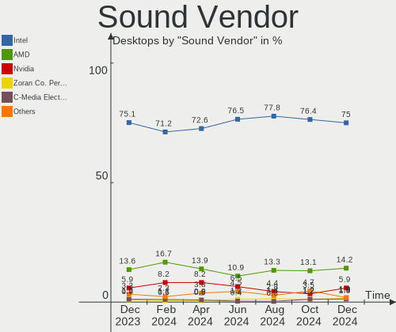
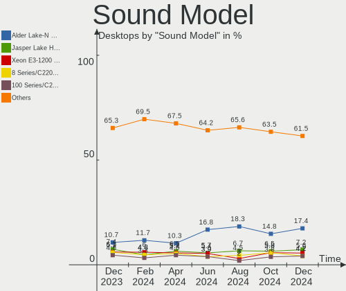

BSD - Hardware Trends (Desktops)
--------------------------------

A project to identify most popular hardware characteristics and track their change
over time based on data collected by BSD users at https://BSD-Hardware.info.

Anyone can contribute to this report by the [hw-probe](https://github.com/linuxhw/hw-probe/blob/master/INSTALL.BSD.md) tool:

    hw-probe -all -upload

This report is for one last month. Overall report since the beginning of time: [TestCoverage](https://github.com/bsdhw/TestCoverage)

Period: Jul, 2022.

Contents
--------

* [ System ](#system)
  - [ OS                       ](#os)
  - [ OS Family                ](#os-family)
  - [ Arch                     ](#arch)
  - [ DE                       ](#de)
  - [ Display Server           ](#display-server)
  - [ Display Manager          ](#display-manager)
  - [ OS Lang                  ](#os-lang)
  - [ Boot Mode                ](#boot-mode)
  - [ Filesystem               ](#filesystem)
  - [ Part. scheme             ](#part-scheme)

* [ Board ](#board)
  - [ Vendor                   ](#vendor)
  - [ Model                    ](#model)
  - [ Model Family             ](#model-family)
  - [ MFG Year                 ](#mfg-year)
  - [ Form Factor              ](#form-factor)
  - [ Coreboot                 ](#coreboot)
  - [ RAM Size                 ](#ram-size)
  - [ RAM Used                 ](#ram-used)
  - [ Total Drives             ](#total-drives)
  - [ Has CD-ROM               ](#has-cd-rom)
  - [ Has Ethernet             ](#has-ethernet)
  - [ Has WiFi                 ](#has-wifi)
  - [ Has Bluetooth            ](#has-bluetooth)

* [ Location ](#location)
  - [ Country                  ](#country)
  - [ City                     ](#city)

* [ Drives ](#drives)
  - [ Drive Vendor             ](#drive-vendor)
  - [ Drive Model              ](#drive-model)
  - [ HDD Vendor               ](#hdd-vendor)
  - [ SSD Vendor               ](#ssd-vendor)
  - [ Drive Kind               ](#drive-kind)
  - [ Drive Connector          ](#drive-connector)
  - [ Drive Size               ](#drive-size)
  - [ Space Total              ](#space-total)
  - [ Space Used               ](#space-used)
  - [ Malfunc. Drives          ](#malfunc-drives)
  - [ Malfunc. Drive Vendor    ](#malfunc-drive-vendor)
  - [ Malfunc. HDD Vendor      ](#malfunc-hdd-vendor)
  - [ Malfunc. Drive Kind      ](#malfunc-drive-kind)
  - [ Failed Drives            ](#failed-drives)
  - [ Failed Drive Vendor      ](#failed-drive-vendor)
  - [ Drive Status             ](#drive-status)

* [ Storage controller ](#storage-controller)
  - [ Storage Vendor           ](#storage-vendor)
  - [ Storage Model            ](#storage-model)
  - [ Storage Kind             ](#storage-kind)

* [ Processor ](#processor)
  - [ CPU Vendor               ](#cpu-vendor)
  - [ CPU Model                ](#cpu-model)
  - [ CPU Model Family         ](#cpu-model-family)
  - [ CPU Cores                ](#cpu-cores)
  - [ CPU Sockets              ](#cpu-sockets)
  - [ CPU Threads              ](#cpu-threads)
  - [ CPU Microarch            ](#cpu-microarch)

* [ Graphics ](#graphics)
  - [ GPU Vendor               ](#gpu-vendor)
  - [ GPU Model                ](#gpu-model)
  - [ GPU Combo                ](#gpu-combo)
  - [ GPU Driver               ](#gpu-driver)
  - [ GPU Memory               ](#gpu-memory)

* [ Monitor ](#monitor)
  - [ Monitor Vendor           ](#monitor-vendor)
  - [ Monitor Model            ](#monitor-model)
  - [ Monitor Resolution       ](#monitor-resolution)
  - [ Monitor Diagonal         ](#monitor-diagonal)
  - [ Monitor Width            ](#monitor-width)
  - [ Aspect Ratio             ](#aspect-ratio)
  - [ Monitor Area             ](#monitor-area)
  - [ Pixel Density            ](#pixel-density)
  - [ Multiple Monitors        ](#multiple-monitors)

* [ Network ](#network)
  - [ Net Controller Vendor    ](#net-controller-vendor)
  - [ Net Controller Model     ](#net-controller-model)
  - [ Wireless Vendor          ](#wireless-vendor)
  - [ Wireless Model           ](#wireless-model)
  - [ Ethernet Vendor          ](#ethernet-vendor)
  - [ Ethernet Model           ](#ethernet-model)
  - [ Net Controller Kind      ](#net-controller-kind)
  - [ Used Controller          ](#used-controller)
  - [ NICs                     ](#nics)
  - [ IPv6                     ](#ipv6)

* [ Bluetooth ](#bluetooth)
  - [ Bluetooth Vendor         ](#bluetooth-vendor)
  - [ Bluetooth Model          ](#bluetooth-model)

* [ Sound ](#sound)
  - [ Sound Vendor             ](#sound-vendor)
  - [ Sound Model              ](#sound-model)

* [ Memory ](#memory)
  - [ Memory Vendor            ](#memory-vendor)
  - [ Memory Model             ](#memory-model)
  - [ Memory Kind              ](#memory-kind)
  - [ Memory Form Factor       ](#memory-form-factor)
  - [ Memory Size              ](#memory-size)
  - [ Memory Speed             ](#memory-speed)

* [ Printers & scanners ](#printers--scanners)
  - [ Printer Vendor           ](#printer-vendor)
  - [ Printer Model            ](#printer-model)
  - [ Scanner Vendor           ](#scanner-vendor)
  - [ Scanner Model            ](#scanner-model)

* [ Camera ](#camera)
  - [ Camera Vendor            ](#camera-vendor)
  - [ Camera Model             ](#camera-model)

* [ Security ](#security)
  - [ Fingerprint Vendor       ](#fingerprint-vendor)
  - [ Fingerprint Model        ](#fingerprint-model)
  - [ Chipcard Vendor          ](#chipcard-vendor)
  - [ Chipcard Model           ](#chipcard-model)

* [ Unsupported ](#unsupported)
  - [ Unsupported Devices      ](#unsupported-devices)
  - [ Unsupported Device Types ](#unsupported-device-types)

System
------

OS
--

Installed operating systems

| Name                | Desktops | Percent |
|---------------------|----------|---------|
| OPNsense 22.1.10    | 100      | 43.29%  |
| OPNsense 22.1.9     | 35       | 15.15%  |
| OPNsense 22.7       | 29       | 12.55%  |
| FreeBSD 13.1        | 22       | 9.52%   |
| helloSystem 0.7.0   | 9        | 3.9%    |
| OpenBSD 7.1         | 6        | 2.6%    |
| OPNsense 22.1.8     | 4        | 1.73%   |
| helloSystem 0.8.0   | 4        | 1.73%   |
| OPNsense 22.4.1     | 2        | 0.87%   |
| OPNsense 21.7.8     | 2        | 0.87%   |
| MyBee 13.1          | 2        | 0.87%   |
| GhostBSD 22.07.16   | 2        | 0.87%   |
| FreeBSD 13.0-p11    | 2        | 0.87%   |
| TrueNAS 13.1        | 1        | 0.43%   |
| pfSense 2.6.0       | 1        | 0.43%   |
| OPNsense 22.4.2     | 1        | 0.43%   |
| OPNsense 22.1.5     | 1        | 0.43%   |
| OPNsense 21.1       | 1        | 0.43%   |
| NetBSD 9.2          | 1        | 0.43%   |
| GhostBSD 22.07.13   | 1        | 0.43%   |
| GhostBSD 22.06.26   | 1        | 0.43%   |
| FreeBSD 13.1-STABLE | 1        | 0.43%   |
| FreeBSD 13.0        | 1        | 0.43%   |
| FreeBSD 12.3-BETA2  | 1        | 0.43%   |
| FreeBSD 12.1-p8     | 1        | 0.43%   |

OS Family
---------

OS without a version

| Name        | Desktops | Percent |
|-------------|----------|---------|
| OPNsense    | 175      | 75.76%  |
| FreeBSD     | 28       | 12.12%  |
| helloSystem | 13       | 5.63%   |
| OpenBSD     | 6        | 2.6%    |
| GhostBSD    | 4        | 1.73%   |
| MyBee       | 2        | 0.87%   |
| TrueNAS     | 1        | 0.43%   |
| pfSense     | 1        | 0.43%   |
| NetBSD      | 1        | 0.43%   |

Arch
----

OS architecture (x86_64, i586, etc.)

| Name  | Desktops | Percent |
|-------|----------|---------|
| amd64 | 230      | 99.57%  |
| arm   | 1        | 0.43%   |

DE
--

Desktop Environment

| Name         | Desktops | Percent |
|--------------|----------|---------|
| Console      | 191      | 82.68%  |
| helloDesktop | 20       | 8.66%   |
| XFCE         | 9        | 3.9%    |
| KDE5         | 4        | 1.73%   |
| MATE         | 2        | 0.87%   |
| GNOME        | 2        | 0.87%   |
| TWM          | 1        | 0.43%   |
| LXQt         | 1        | 0.43%   |
| Cinnamon     | 1        | 0.43%   |

Display Server
--------------

X11 or Wayland

| Name    | Desktops | Percent |
|---------|----------|---------|
| Console | 193      | 83.55%  |
| X11     | 38       | 16.45%  |

Display Manager
---------------

SDDM, LightDM, etc.

| Name    | Desktops | Percent |
|---------|----------|---------|
| Console | 208      | 90.04%  |
| SLiM    | 14       | 6.06%   |
| SDDM    | 4        | 1.73%   |
| LightDM | 4        | 1.73%   |
| XDM     | 1        | 0.43%   |

OS Lang
-------

Language

| Lang    | Desktops | Percent |
|---------|----------|---------|
| Unknown | 182      | 78.79%  |
| en_US   | 22       | 9.52%   |
| C       | 19       | 8.23%   |
| ru_RU   | 3        | 1.3%    |
| fr_FR   | 2        | 0.87%   |
| zh_TW   | 1        | 0.43%   |
| ja_JP   | 1        | 0.43%   |
| de_DE   | 1        | 0.43%   |

Boot Mode
---------

EFI or BIOS

| Mode | Desktops | Percent |
|------|----------|---------|
| EFI  | 209      | 90.48%  |
| BIOS | 22       | 9.52%   |

Filesystem
----------

Type of filesystem

| Type   | Desktops | Percent |
|--------|----------|---------|
| Ufs    | 124      | 53.68%  |
| Zfs    | 90       | 38.96%  |
| Cd9660 | 10       | 4.33%   |
| Ffs    | 6        | 2.6%    |
| XXX    | 1        | 0.43%   |

Part. scheme
------------

Scheme of partitioning

| Type    | Desktops | Percent |
|---------|----------|---------|
| GPT     | 221      | 95.67%  |
| MBR     | 8        | 3.46%   |
| Unknown | 2        | 0.87%   |

Board
-----

Vendor
------

Motherboard manufacturer

| Name                          | Desktops | Percent |
|-------------------------------|----------|---------|
| Hewlett-Packard               | 25       | 10.82%  |
| ASUSTek Computer              | 24       | 10.39%  |
| Dell                          | 22       | 9.52%   |
| Intel                         | 18       | 7.79%   |
| Protectli                     | 16       | 6.93%   |
| Gigabyte Technology           | 16       | 6.93%   |
| ASRock                        | 15       | 6.49%   |
| Unknown                       | 15       | 6.49%   |
| Lenovo                        | 8        | 3.46%   |
| Fujitsu                       | 8        | 3.46%   |
| Acer                          | 7        | 3.03%   |
| PC Engines                    | 6        | 2.6%    |
| Supermicro                    | 5        | 2.16%   |
| Biostar                       | 5        | 2.16%   |
| MW                            | 4        | 1.73%   |
| MSI                           | 4        | 1.73%   |
| Deciso                        | 3        | 1.3%    |
| Techvision                    | 2        | 0.87%   |
| Shuttle                       | 2        | 0.87%   |
| Secudos                       | 2        | 0.87%   |
| Pegatron                      | 2        | 0.87%   |
| AZW                           | 2        | 0.87%   |
| AMD                           | 2        | 0.87%   |
| AAEON                         | 2        | 0.87%   |
| ZOTAC                         | 1        | 0.43%   |
| YANYU                         | 1        | 0.43%   |
| Wistron                       | 1        | 0.43%   |
| WesternDigital                | 1        | 0.43%   |
| SmbiosType2_BoardManufacturer | 1        | 0.43%   |
| Positivo                      | 1        | 0.43%   |
| Nitrokey                      | 1        | 0.43%   |
| NF541S                        | 1        | 0.43%   |
| NF541                         | 1        | 0.43%   |
| MouseComputer                 | 1        | 0.43%   |
| MiTAC                         | 1        | 0.43%   |
| MAXSUN                        | 1        | 0.43%   |
| Kraftway                      | 1        | 0.43%   |
| Inventec                      | 1        | 0.43%   |
| Datto                         | 1        | 0.43%   |
| CNCTION-IAF                   | 1        | 0.43%   |

Model
-----

Motherboard model

| Name                                                        | Desktops | Percent |
|-------------------------------------------------------------|----------|---------|
| Unknown                                                     | 18       | 7.79%   |
| Intel Q3XXG4-P V1.0                                         | 9        | 3.9%    |
| Protectli FW6                                               | 6        | 2.6%    |
| Fujitsu FUTRO S920                                          | 5        | 2.16%   |
| Protectli FW4B                                              | 4        | 1.73%   |
| PC Engines APU2                                             | 4        | 1.73%   |
| MW GMLK-2_5G4L                                              | 4        | 1.73%   |
| HP t620 PLUS Quad Core TC                                   | 4        | 1.73%   |
| Protectli VP2410                                            | 3        | 1.3%    |
| HP Compaq Elite 8300 SFF                                    | 3        | 1.3%    |
| Dell OptiPlex 5040                                          | 3        | 1.3%    |
| Techvision TVI7309X                                         | 2        | 0.87%   |
| MSI MS-7817                                                 | 2        | 0.87%   |
| Intel CRESCENTBAY                                           | 2        | 0.87%   |
| HP ProDesk 600 G1 SFF                                       | 2        | 0.87%   |
| HP EliteDesk 800 G2 DM 35W                                  | 2        | 0.87%   |
| HP EliteDesk 800 G1 SFF                                     | 2        | 0.87%   |
| Dell OptiPlex 9020                                          | 2        | 0.87%   |
| Dell OptiPlex 7010                                          | 2        | 0.87%   |
| Dell OptiPlex 3040                                          | 2        | 0.87%   |
| Dell OptiPlex 3020                                          | 2        | 0.87%   |
| Deciso Netboard A10 GEN2 Model G                            | 2        | 0.87%   |
| ASUS ROG CROSSHAIR VIII HERO                                | 2        | 0.87%   |
| ASUS PRIME H410M-A                                          | 2        | 0.87%   |
| ASUS P5Q-E                                                  | 2        | 0.87%   |
| YANYU H87SL VER:1.3                                         | 1        | 0.43%   |
| Wistron ProLiant ML110 G6                                   | 1        | 0.43%   |
| WesternDigital WDBNFA0320KBK-40                             | 1        | 0.43%   |
| Supermicro SYS-E50-9AP-N5                                   | 1        | 0.43%   |
| Supermicro SYS-E300-9D-4CN8TP                               | 1        | 0.43%   |
| Supermicro SYS-E200-9B                                      | 1        | 0.43%   |
| Supermicro SYS-5019D-FN8TP-2-NC041                          | 1        | 0.43%   |
| Supermicro SYS-1019S-MP                                     | 1        | 0.43%   |
| SmbiosType2_BoardManufacturer SmbiosType1_SystemProductName | 1        | 0.43%   |
| Shuttle XH170                                               | 1        | 0.43%   |
| Shuttle DH310                                               | 1        | 0.43%   |
| Protectli FW6E                                              | 1        | 0.43%   |
| Protectli FW4A                                              | 1        | 0.43%   |
| Protectli FW2                                               | 1        | 0.43%   |
| Positivo POS-EINM70CS                                       | 1        | 0.43%   |
| Pegatron IPM41-D3                                           | 1        | 0.43%   |
| Pegatron h8-1102nl                                          | 1        | 0.43%   |
| PC Engines apu4                                             | 1        | 0.43%   |
| PC Engines APU3                                             | 1        | 0.43%   |
| Nitrokey NitroWall                                          | 1        | 0.43%   |
| NF541S 1.0                                                  | 1        | 0.43%   |
| NF541 1.0                                                   | 1        | 0.43%   |
| MSI MS-7C95                                                 | 1        | 0.43%   |
| MSI MS-7C37                                                 | 1        | 0.43%   |
| MouseComputer B360M                                         | 1        | 0.43%   |
| MiTAC PH11CMI                                               | 1        | 0.43%   |
| MAXSUN MS-H110D4L FS M.2                                    | 1        | 0.43%   |
| Lenovo ThinkCentre M93p 10AB004DUS                          | 1        | 0.43%   |
| Lenovo ThinkCentre M93p 10AAS3UM00                          | 1        | 0.43%   |
| Lenovo ThinkCentre M93p 10A8S16X0J                          | 1        | 0.43%   |
| Lenovo ThinkCentre M93p 10A8S08J01                          | 1        | 0.43%   |
| Lenovo ThinkCentre M91 4518E4U                              | 1        | 0.43%   |
| Lenovo ThinkCentre M83 10AHS35Q00                           | 1        | 0.43%   |
| Lenovo ThinkCentre M72e m72e                                | 1        | 0.43%   |
| Lenovo IdeaCentre 300S-11IBR 90DQ004GUS                     | 1        | 0.43%   |

Model Family
------------

Motherboard model prefix

| Name                                      | Desktops | Percent |
|-------------------------------------------|----------|---------|
| Dell OptiPlex                             | 18       | 7.79%   |
| Unknown                                   | 18       | 7.79%   |
| Intel Q3XXG4-P                            | 9        | 3.9%    |
| Lenovo ThinkCentre                        | 7        | 3.03%   |
| HP Compaq                                 | 7        | 3.03%   |
| Protectli FW6                             | 6        | 2.6%    |
| HP ProDesk                                | 5        | 2.16%   |
| HP EliteDesk                              | 5        | 2.16%   |
| Fujitsu FUTRO                             | 5        | 2.16%   |
| ASUS PRIME                                | 5        | 2.16%   |
| Protectli FW4B                            | 4        | 1.73%   |
| PC Engines APU2                           | 4        | 1.73%   |
| MW GMLK-2                                 | 4        | 1.73%   |
| HP t620                                   | 4        | 1.73%   |
| ASUS ROG                                  | 4        | 1.73%   |
| Protectli VP2410                          | 3        | 1.3%    |
| Dell Inspiron                             | 3        | 1.3%    |
| Deciso Netboard                           | 3        | 1.3%    |
| ASUS TUF                                  | 3        | 1.3%    |
| Acer Veriton                              | 3        | 1.3%    |
| Techvision TVI7309X                       | 2        | 0.87%   |
| MSI MS-7817                               | 2        | 0.87%   |
| Intel CRESCENTBAY                         | 2        | 0.87%   |
| Gigabyte H310M                            | 2        | 0.87%   |
| ASUS P5Q-E                                | 2        | 0.87%   |
| ASUS Maximus                              | 2        | 0.87%   |
| ASUS M5A78L-M                             | 2        | 0.87%   |
| ASRock X570                               | 2        | 0.87%   |
| Acer Revo                                 | 2        | 0.87%   |
| Acer Aspire                               | 2        | 0.87%   |
| YANYU H87SL                               | 1        | 0.43%   |
| Wistron ProLiant                          | 1        | 0.43%   |
| WesternDigital WDBNFA0320KBK-40           | 1        | 0.43%   |
| Supermicro SYS-E50-9AP-N5                 | 1        | 0.43%   |
| Supermicro SYS-E300-9D-4CN8TP             | 1        | 0.43%   |
| Supermicro SYS-E200-9B                    | 1        | 0.43%   |
| Supermicro SYS-5019D-FN8TP-2-NC041        | 1        | 0.43%   |
| Supermicro SYS-1019S-MP                   | 1        | 0.43%   |
| SmbiosType2_BoardManufacturer SmbiosType1 | 1        | 0.43%   |
| Shuttle XH170                             | 1        | 0.43%   |
| Shuttle DH310                             | 1        | 0.43%   |
| Protectli FW6E                            | 1        | 0.43%   |
| Protectli FW4A                            | 1        | 0.43%   |
| Protectli FW2                             | 1        | 0.43%   |
| Positivo POS-EINM70CS                     | 1        | 0.43%   |
| Pegatron IPM41-D3                         | 1        | 0.43%   |
| Pegatron h8-1102nl                        | 1        | 0.43%   |
| PC Engines apu4                           | 1        | 0.43%   |
| PC Engines APU3                           | 1        | 0.43%   |
| Nitrokey NitroWall                        | 1        | 0.43%   |
| NF541S 1.0                                | 1        | 0.43%   |
| NF541 1.0                                 | 1        | 0.43%   |
| MSI MS-7C95                               | 1        | 0.43%   |
| MSI MS-7C37                               | 1        | 0.43%   |
| MouseComputer B360M                       | 1        | 0.43%   |
| MiTAC PH11CMI                             | 1        | 0.43%   |
| MAXSUN MS-H110D4L                         | 1        | 0.43%   |
| Lenovo IdeaCentre                         | 1        | 0.43%   |
| Kraftway GEG                              | 1        | 0.43%   |
| Inventec D                                | 1        | 0.43%   |

MFG Year
--------

Motherboard manufacture year

| Year    | Desktops | Percent |
|---------|----------|---------|
| 2019    | 30       | 12.99%  |
| 2021    | 29       | 12.55%  |
| 2016    | 27       | 11.69%  |
| 2014    | 25       | 10.82%  |
| 2020    | 21       | 9.09%   |
| 2018    | 18       | 7.79%   |
| 2017    | 18       | 7.79%   |
| 2013    | 14       | 6.06%   |
| 2012    | 14       | 6.06%   |
| 2022    | 9        | 3.9%    |
| 2011    | 7        | 3.03%   |
| 2010    | 7        | 3.03%   |
| 2015    | 6        | 2.6%    |
| 2009    | 3        | 1.3%    |
| 2008    | 2        | 0.87%   |
| Unknown | 1        | 0.43%   |

Form Factor
-----------

Physical design of the computer

| Name    | Desktops | Percent |
|---------|----------|---------|
| Desktop | 231      | 100%    |

Coreboot
--------

Have coreboot on board

| Used | Desktops | Percent |
|------|----------|---------|
| No   | 218      | 94.37%  |
| Yes  | 13       | 5.63%   |

RAM Size
--------

Total RAM memory

| Size in GB  | Desktops | Percent |
|-------------|----------|---------|
| 8.01-16.0   | 110      | 47.62%  |
| 4.01-8.0    | 46       | 19.91%  |
| 16.01-24.0  | 42       | 18.18%  |
| 32.01-64.0  | 20       | 8.66%   |
| 64.01-256.0 | 6        | 2.6%    |
| 2.01-3.0    | 4        | 1.73%   |
| 24.01-32.0  | 2        | 0.87%   |
| 0.01-0.5    | 1        | 0.43%   |

RAM Used
--------

Used RAM memory

| Used GB   | Desktops | Percent |
|-----------|----------|---------|
| 0.01-0.5  | 134      | 58.01%  |
| 0.51-1.0  | 59       | 25.54%  |
| 1.01-2.0  | 24       | 10.39%  |
| 3.01-4.0  | 5        | 2.16%   |
| 4.01-8.0  | 3        | 1.3%    |
| 2.01-3.0  | 3        | 1.3%    |
| 8.01-16.0 | 1        | 0.43%   |
| 0         | 1        | 0.43%   |
| Unknown   | 1        | 0.43%   |

Total Drives
------------

Number of drives on board

| Drives | Desktops | Percent |
|--------|----------|---------|
| 1      | 172      | 74.46%  |
| 2      | 27       | 11.69%  |
| 0      | 13       | 5.63%   |
| 4      | 6        | 2.6%    |
| 3      | 6        | 2.6%    |
| 8      | 3        | 1.3%    |
| 6      | 2        | 0.87%   |
| 22     | 1        | 0.43%   |
| 13     | 1        | 0.43%   |

Has CD-ROM
----------

Has CD-ROM on board

| Presented | Desktops | Percent |
|-----------|----------|---------|
| No        | 188      | 81.39%  |
| Yes       | 43       | 18.61%  |

Has Ethernet
------------

Has Ethernet on board

| Presented | Desktops | Percent |
|-----------|----------|---------|
| Yes       | 229      | 99.13%  |
| No        | 2        | 0.87%   |

Has WiFi
--------

Has WiFi module

| Presented | Desktops | Percent |
|-----------|----------|---------|
| No        | 197      | 85.28%  |
| Yes       | 34       | 14.72%  |

Has Bluetooth
-------------

Has Bluetooth module

| Presented | Desktops | Percent |
|-----------|----------|---------|
| No        | 210      | 90.91%  |
| Yes       | 21       | 9.09%   |

Location
--------

Country
-------

Geographic location (country)

| Country     | Desktops | Percent |
|-------------|----------|---------|
| USA         | 73       | 31.6%   |
| Germany     | 35       | 15.15%  |
| Russia      | 13       | 5.63%   |
| Canada      | 11       | 4.76%   |
| Italy       | 9        | 3.9%    |
| France      | 9        | 3.9%    |
| Austria     | 9        | 3.9%    |
| Brazil      | 8        | 3.46%   |
| UK          | 7        | 3.03%   |
| Switzerland | 7        | 3.03%   |
| Netherlands | 6        | 2.6%    |
| Spain       | 5        | 2.16%   |
| Australia   | 5        | 2.16%   |
| Poland      | 4        | 1.73%   |
| China       | 4        | 1.73%   |
| Sweden      | 3        | 1.3%    |
| Hungary     | 3        | 1.3%    |
| Taiwan      | 2        | 0.87%   |
| Peru        | 2        | 0.87%   |
| New Zealand | 2        | 0.87%   |
| Finland     | 2        | 0.87%   |
| Belgium     | 2        | 0.87%   |
| Thailand    | 1        | 0.43%   |
| Serbia      | 1        | 0.43%   |
| Portugal    | 1        | 0.43%   |
| Philippines | 1        | 0.43%   |
| Norway      | 1        | 0.43%   |
| Malaysia    | 1        | 0.43%   |
| Kenya       | 1        | 0.43%   |
| Japan       | 1        | 0.43%   |
| Indonesia   | 1        | 0.43%   |
| Egypt       | 1        | 0.43%   |

City
----

Geographic location (city)

| City                | Desktops | Percent |
|---------------------|----------|---------|
| Vienna              | 5        | 2.16%   |
| Munich              | 4        | 1.73%   |
| Zurich              | 3        | 1.3%    |
| Seattle             | 3        | 1.3%    |
| Salem               | 3        | 1.3%    |
| Ozersk              | 3        | 1.3%    |
| Moscow              | 3        | 1.3%    |
| Madrid              | 3        | 1.3%    |
| Graz                | 3        | 1.3%    |
| Budapest            | 3        | 1.3%    |
| Wexford             | 2        | 0.87%   |
| Taipei              | 2        | 0.87%   |
| Stockholm           | 2        | 0.87%   |
| Silver Spring       | 2        | 0.87%   |
| Salt Lake City      | 2        | 0.87%   |
| Redmond             | 2        | 0.87%   |
| Perth               | 2        | 0.87%   |
| Mountain View       | 2        | 0.87%   |
| Milan               | 2        | 0.87%   |
| Melbourne           | 2        | 0.87%   |
| Lipetsk             | 2        | 0.87%   |
| Lima                | 2        | 0.87%   |
| Fougeres            | 2        | 0.87%   |
| Denver              | 2        | 0.87%   |
| Cary                | 2        | 0.87%   |
| Berlin              | 2        | 0.87%   |
| Yashio              | 1        | 0.43%   |
| Xicheng District    | 1        | 0.43%   |
| Winterthur          | 1        | 0.43%   |
| Wichita Falls       | 1        | 0.43%   |
| Wettringen          | 1        | 0.43%   |
| Wentorf bei Hamburg | 1        | 0.43%   |
| Wenatchee           | 1        | 0.43%   |
| Wellington          | 1        | 0.43%   |
| Warsaw              | 1        | 0.43%   |
| Venice              | 1        | 0.43%   |
| Västerås          | 1        | 0.43%   |
| Vancouver           | 1        | 0.43%   |
| Utrecht             | 1        | 0.43%   |
| Toronto             | 1        | 0.43%   |
| Todtnau             | 1        | 0.43%   |
| Tamm                | 1        | 0.43%   |
| Sydney              | 1        | 0.43%   |
| Surgut              | 1        | 0.43%   |
| Stuttgart           | 1        | 0.43%   |
| Statesboro          | 1        | 0.43%   |
| St. Gallen          | 1        | 0.43%   |
| Southampton         | 1        | 0.43%   |
| South Hamilton      | 1        | 0.43%   |
| Sidney              | 1        | 0.43%   |
| Schnecksville       | 1        | 0.43%   |
| Schluesslberg       | 1        | 0.43%   |
| Sarnia              | 1        | 0.43%   |
| Sarasota            | 1        | 0.43%   |
| Sao Paulo           | 1        | 0.43%   |
| Sao Goncalo         | 1        | 0.43%   |
| San Marcos          | 1        | 0.43%   |
| San Diego           | 1        | 0.43%   |
| Rozenburg           | 1        | 0.43%   |
| Riihimäki          | 1        | 0.43%   |

Drives
------

Drive Vendor
------------

Hard drive vendors

| Vendor              | Desktops | Drives | Percent |
|---------------------|----------|--------|---------|
| Samsung Electronics | 39       | 55     | 14.23%  |
| WDC                 | 35       | 56     | 12.77%  |
| Seagate             | 25       | 33     | 9.12%   |
| Kingston            | 18       | 18     | 6.57%   |
| Transcend           | 16       | 17     | 5.84%   |
| Crucial             | 15       | 17     | 5.47%   |
| Toshiba             | 11       | 22     | 4.01%   |
| SanDisk             | 11       | 11     | 4.01%   |
| Intel               | 11       | 11     | 4.01%   |
| China               | 9        | 9      | 3.28%   |
| Hitachi             | 7        | 8      | 2.55%   |
| PNY                 | 5        | 6      | 1.82%   |
| Intenso             | 5        | 6      | 1.82%   |
| SPCC                | 4        | 4      | 1.46%   |
| Protectli           | 4        | 4      | 1.46%   |
| OCZ                 | 4        | 4      | 1.46%   |
| Micron Technology   | 4        | 5      | 1.46%   |
| SK hynix            | 3        | 3      | 1.09%   |
| Innodisk            | 3        | 3      | 1.09%   |
| Corsair             | 3        | 3      | 1.09%   |
| Team                | 2        | 2      | 0.73%   |
| NVMe                | 2        | 2      | 0.73%   |
| LITEONIT            | 2        | 2      | 0.73%   |
| KingSpec            | 2        | 2      | 0.73%   |
| Hoodisk             | 2        | 2      | 0.73%   |
| HGST                | 2        | 2      | 0.73%   |
| Gigabyte Technology | 2        | 2      | 0.73%   |
| Dogfish             | 2        | 2      | 0.73%   |
| BORY                | 2        | 2      | 0.73%   |
| BIWIN               | 2        | 2      | 0.73%   |
| A-DATA Technology   | 2        | 2      | 0.73%   |
| Vaseky              | 1        | 1      | 0.36%   |
| tigo                | 1        | 1      | 0.36%   |
| Supermicro          | 1        | 1      | 0.36%   |
| ShiJi               | 1        | 1      | 0.36%   |
| SATADOM             | 1        | 1      | 0.36%   |
| Plextor             | 1        | 1      | 0.36%   |
| Phison              | 1        | 1      | 0.36%   |
| Pccooler            | 1        | 1      | 0.36%   |
| Patriot             | 1        | 1      | 0.36%   |
| LITEON              | 1        | 1      | 0.36%   |
| Lexar               | 1        | 1      | 0.36%   |
| KIOXIA              | 1        | 1      | 0.36%   |
| INDMEM              | 1        | 1      | 0.36%   |
| HPE                 | 1        | 1      | 0.36%   |
| Hikvision           | 1        | 1      | 0.36%   |
| FORESEE             | 1        | 1      | 0.36%   |
| Drevo               | 1        | 1      | 0.36%   |
| CWDISK              | 1        | 1      | 0.36%   |
| BlueRay             | 1        | 1      | 0.36%   |
| Apacer              | 1        | 1      | 0.36%   |

Drive Model
-----------

Hard drive models

| Model                            | Desktops | Percent |
|----------------------------------|----------|---------|
| PNY CS900 120GB SSD              | 4        | 1.3%    |
| Kingston SA400S37240G 240GB      | 4        | 1.3%    |
| Transcend TS128GMSA230S 128GB    | 3        | 0.97%   |
| Samsung SSD 850 EVO mSATA 250GB  | 3        | 0.97%   |
| Transcend TS64GMSA370 64GB       | 2        | 0.65%   |
| Transcend TS240GSSD220S 240GB    | 2        | 0.65%   |
| Transcend TS128GMSA370 128GB     | 2        | 0.65%   |
| Toshiba DT01ACA100 1TB           | 2        | 0.65%   |
| SPCC Solid State Disk 128GB      | 2        | 0.65%   |
| Seagate ST500DM002-1SB10A 500GB  | 2        | 0.65%   |
| Seagate ST500DM002-1BD142 500GB  | 2        | 0.65%   |
| Seagate ST4000DM000-1F2168 4TB   | 2        | 0.65%   |
| Seagate ST3500413AS 500GB        | 2        | 0.65%   |
| SanDisk SDSSDRC032G 32GB         | 2        | 0.65%   |
| Samsung SSD 870 QVO 2TB          | 2        | 0.65%   |
| Samsung SSD 860 EVO 500GB        | 2        | 0.65%   |
| Samsung SSD 850 EVO 500GB        | 2        | 0.65%   |
| Samsung MZ7TY128HDHP-000L1 128GB | 2        | 0.65%   |
| Protectli 120GB mSATA            | 2        | 0.65%   |
| Kingston SV300S37A60G 64GB       | 2        | 0.65%   |
| Kingston SUV500MS120G 120GB      | 2        | 0.65%   |
| Kingston SKC600MS256G 256GB      | 2        | 0.65%   |
| Kingston SA400S37120G 120GB      | 2        | 0.65%   |
| Intel SSDSC2CT060A3 64GB         | 2        | 0.65%   |
| Innodisk DEMSR- 08GB mSATA 3ME3  | 2        | 0.65%   |
| Hoodisk SSD 32GB                 | 2        | 0.65%   |
| Crucial M4-CT128M4SSD2 128GB     | 2        | 0.65%   |
| Crucial M4-CT064M4SSD2 64GB      | 2        | 0.65%   |
| Crucial CT500P2SSD8 500GB        | 2        | 0.65%   |
| Crucial CT240BX500SSD1 240GB     | 2        | 0.65%   |
| China SATA SSD 240GB             | 2        | 0.65%   |
| China SATA SSD 16GB              | 2        | 0.65%   |
| BORY M500 128G                   | 2        | 0.65%   |
| BIWIN SSD 128GB                  | 2        | 0.65%   |
| WDC WDS500G2X0C-00L350 500GB     | 1        | 0.32%   |
| WDC WDS500G2B0A 500GB            | 1        | 0.32%   |
| WDC WDS500G1X0E-00AFY0 500GB     | 1        | 0.32%   |
| WDC WDS500G1B0A-00H9H0 500GB     | 1        | 0.32%   |
| WDC WDS250G2X0C-00L350 250GB     | 1        | 0.32%   |
| WDC WDS250G2B0A-00SM50 250GB     | 1        | 0.32%   |
| WDC WDS200T2B0B-00YS70 2TB       | 1        | 0.32%   |
| WDC WDS200T2B0A-00SM50 2TB       | 1        | 0.32%   |
| WDC WDS120G2G0A-00JH30 120GB     | 1        | 0.32%   |
| WDC WDS100T2B0A-00SM50 1TB       | 1        | 0.32%   |
| WDC WDBRPG0010BNC-WRSN 1TB       | 1        | 0.32%   |
| WDC WDBA3V5000ANC-WRSN 500GB     | 1        | 0.32%   |
| WDC WD80EMAZ-00WJTA0 8TB         | 1        | 0.32%   |
| WDC WD80EFZX-68UW8N0 8TB         | 1        | 0.32%   |
| WDC WD80EFAX-68LHPN0 8TB         | 1        | 0.32%   |
| WDC WD80EDBZ-11B0ZA0 8TB         | 1        | 0.32%   |
| WDC WD800JD-60LSA5 80GB          | 1        | 0.32%   |
| WDC WD6400AAKS-22A7B2 640GB      | 1        | 0.32%   |
| WDC WD60EFRX-68L0BN1 6TB         | 1        | 0.32%   |
| WDC WD50NMZW-59A8NS1 5TB         | 1        | 0.32%   |
| WDC WD5000LPVT-80G33T2 500GB     | 1        | 0.32%   |
| WDC WD5000LPLX-00ZNTT0 500GB     | 1        | 0.32%   |
| WDC WD5000BEVT-22ZAT0 500GB      | 1        | 0.32%   |
| WDC WD5000AZLX-22JKKA0 500GB     | 1        | 0.32%   |
| WDC WD5000AVVS-63H0B1 500GB      | 1        | 0.32%   |
| WDC WD5000AAKX-22ERMA0 500GB     | 1        | 0.32%   |

HDD Vendor
----------

Hard disk drive vendors

| Vendor              | Desktops | Drives | Percent |
|---------------------|----------|--------|---------|
| WDC                 | 25       | 41     | 34.25%  |
| Seagate             | 24       | 31     | 32.88%  |
| Toshiba             | 9        | 20     | 12.33%  |
| Hitachi             | 7        | 8      | 9.59%   |
| Samsung Electronics | 3        | 3      | 4.11%   |
| HGST                | 2        | 2      | 2.74%   |
| NVMe                | 1        | 1      | 1.37%   |
| Intenso             | 1        | 1      | 1.37%   |
| HPE                 | 1        | 1      | 1.37%   |

SSD Vendor
----------

Solid state drive vendors

| Vendor              | Desktops | Drives | Percent |
|---------------------|----------|--------|---------|
| Samsung Electronics | 28       | 39     | 16.67%  |
| Kingston            | 16       | 16     | 9.52%   |
| Transcend           | 15       | 16     | 8.93%   |
| SanDisk             | 11       | 11     | 6.55%   |
| Crucial             | 11       | 12     | 6.55%   |
| Intel               | 10       | 10     | 5.95%   |
| China               | 9        | 9      | 5.36%   |
| WDC                 | 6        | 7      | 3.57%   |
| PNY                 | 5        | 6      | 2.98%   |
| SPCC                | 4        | 4      | 2.38%   |
| Protectli           | 4        | 4      | 2.38%   |
| OCZ                 | 4        | 4      | 2.38%   |
| Intenso             | 4        | 5      | 2.38%   |
| Micron Technology   | 3        | 4      | 1.79%   |
| Innodisk            | 3        | 3      | 1.79%   |
| Toshiba             | 2        | 2      | 1.19%   |
| SK hynix            | 2        | 2      | 1.19%   |
| LITEONIT            | 2        | 2      | 1.19%   |
| KingSpec            | 2        | 2      | 1.19%   |
| Hoodisk             | 2        | 2      | 1.19%   |
| Dogfish             | 2        | 2      | 1.19%   |
| BORY                | 2        | 2      | 1.19%   |
| BIWIN               | 2        | 2      | 1.19%   |
| Vaseky              | 1        | 1      | 0.6%    |
| tigo                | 1        | 1      | 0.6%    |
| Team                | 1        | 1      | 0.6%    |
| Supermicro          | 1        | 1      | 0.6%    |
| ShiJi               | 1        | 1      | 0.6%    |
| Seagate             | 1        | 1      | 0.6%    |
| SATADOM             | 1        | 1      | 0.6%    |
| Pccooler            | 1        | 1      | 0.6%    |
| Patriot             | 1        | 1      | 0.6%    |
| NVMe                | 1        | 1      | 0.6%    |
| LITEON              | 1        | 1      | 0.6%    |
| INDMEM              | 1        | 1      | 0.6%    |
| Hikvision           | 1        | 1      | 0.6%    |
| FORESEE             | 1        | 1      | 0.6%    |
| Drevo               | 1        | 1      | 0.6%    |
| CWDISK              | 1        | 1      | 0.6%    |
| BlueRay             | 1        | 1      | 0.6%    |
| Apacer              | 1        | 1      | 0.6%    |
| A-DATA Technology   | 1        | 1      | 0.6%    |

Drive Kind
----------

HDD or SSD

| Kind | Desktops | Drives | Percent |
|------|----------|--------|---------|
| SSD  | 159      | 185    | 62.85%  |
| HDD  | 60       | 108    | 23.72%  |
| NVMe | 34       | 44     | 13.44%  |

Drive Connector
---------------

SATA, SAS, NVMe, etc.

| Type | Desktops | Drives | Percent |
|------|----------|--------|---------|
| SATA | 196      | 293    | 85.22%  |
| NVMe | 34       | 44     | 14.78%  |

Drive Size
----------

Size of hard drive

| Size in TB | Desktops | Drives | Percent |
|------------|----------|--------|---------|
| 0.01-0.5   | 171      | 193    | 74.35%  |
| 0.51-1.0   | 33       | 39     | 14.35%  |
| 1.01-2.0   | 14       | 30     | 6.09%   |
| 3.01-4.0   | 5        | 13     | 2.17%   |
| 4.01-10.0  | 4        | 13     | 1.74%   |
| 10.01-20.0 | 2        | 4      | 0.87%   |
| 2.01-3.0   | 1        | 1      | 0.43%   |

Space Total
-----------

Amount of disk space available on the file system

| Size in GB     | Desktops | Percent |
|----------------|----------|---------|
| 101-250        | 101      | 43.72%  |
| 251-500        | 32       | 13.85%  |
| 21-50          | 24       | 10.39%  |
| 51-100         | 24       | 10.39%  |
| 1-20           | 21       | 9.09%   |
| 501-1000       | 20       | 8.66%   |
| 1001-2000      | 6        | 2.6%    |
| More than 3000 | 1        | 0.43%   |
| 2001-3000      | 1        | 0.43%   |
| Unknown        | 1        | 0.43%   |

Space Used
----------

Amount of used disk space

| Used GB        | Desktops | Percent |
|----------------|----------|---------|
| 1-20           | 214      | 92.64%  |
| 21-50          | 6        | 2.6%    |
| 51-100         | 5        | 2.16%   |
| 101-250        | 2        | 0.87%   |
| 501-1000       | 2        | 0.87%   |
| More than 3000 | 1        | 0.43%   |
| Unknown        | 1        | 0.43%   |

Malfunc. Drives
---------------

Drive models with a malfunction

| Model                                            | Desktops | Drives | Percent |
|--------------------------------------------------|----------|--------|---------|
| Seagate ST500DM002-1BD142 500GB                  | 2        | 2      | 5.41%   |
| Kingston SV300S37A60G 64GB                       | 2        | 2      | 5.41%   |
| WDC WDS120G2G0A-00JH30 120GB                     | 1        | 1      | 2.7%    |
| WDC WD800JD-60LSA5 80GB                          | 1        | 1      | 2.7%    |
| WDC WD6400AAKS-22A7B2 640GB                      | 1        | 1      | 2.7%    |
| WDC WD5000LPLX-00ZNTT0 500GB                     | 1        | 1      | 2.7%    |
| WDC WD5000AVVS-63H0B1 500GB                      | 1        | 1      | 2.7%    |
| WDC WD5000AAKX-00ERMA0 500GB                     | 1        | 1      | 2.7%    |
| WDC WD2500AAKX-753CA0 250GB                      | 1        | 1      | 2.7%    |
| Toshiba MK2002TSKB 2TB                           | 1        | 1      | 2.7%    |
| Toshiba KSG60ZMV256G M.2 2280 256GB              | 1        | 1      | 2.7%    |
| SK hynix SC308 SATA 128GB                        | 1        | 1      | 2.7%    |
| SK hynix SC210 mSATA 256GB                       | 1        | 1      | 2.7%    |
| Seagate ST500LT012-9WS142 500GB                  | 1        | 1      | 2.7%    |
| Seagate ST500LM021-1KJ152 500GB                  | 1        | 1      | 2.7%    |
| Seagate ST380815AS 80GB                          | 1        | 1      | 2.7%    |
| Seagate ST320LM000 HM321HI 320GB                 | 1        | 1      | 2.7%    |
| Seagate ST3160212SCE 160GB                       | 1        | 1      | 2.7%    |
| Seagate ST31000340NS 1TB                         | 1        | 1      | 2.7%    |
| SanDisk SD8TB8U-256G-1006 256GB                  | 1        | 1      | 2.7%    |
| Samsung Electronics SSD PM810 2.5-inch 7mm 128GB | 1        | 1      | 2.7%    |
| Samsung Electronics SSD 870 EVO 250GB            | 1        | 1      | 2.7%    |
| Samsung Electronics HD501LJ 500GB                | 1        | 1      | 2.7%    |
| OCZ VERTEX3 240GB                                | 1        | 1      | 2.7%    |
| Micron Technology 1100_MTFDDAK512TBN 512GB       | 1        | 2      | 2.7%    |
| HPE MB0500EBNCR 500GB                            | 1        | 1      | 2.7%    |
| Hitachi HTS727575A9E364 752GB                    | 1        | 1      | 2.7%    |
| Hitachi HTS545050A7E380 500GB                    | 1        | 1      | 2.7%    |
| Hitachi HTS541680J9SA00 80GB                     | 1        | 1      | 2.7%    |
| Hitachi HDS723020BLA642 2TB                      | 1        | 1      | 2.7%    |
| Hitachi HDS723015BLA642 1.5TB                    | 1        | 1      | 2.7%    |
| Hitachi HDS721050CLA660 500GB                    | 1        | 1      | 2.7%    |
| HGST HTS725050A7E630 500GB                       | 1        | 1      | 2.7%    |
| Dogfish SSD 128GB                                | 1        | 1      | 2.7%    |
| Crucial CT1050MX300SSD1 1TB                      | 1        | 1      | 2.7%    |

Malfunc. Drive Vendor
---------------------

Vendors of faulty drives

| Vendor              | Desktops | Drives | Percent |
|---------------------|----------|--------|---------|
| WDC                 | 7        | 7      | 19.44%  |
| Seagate             | 7        | 8      | 19.44%  |
| Hitachi             | 6        | 6      | 16.67%  |
| Samsung Electronics | 3        | 3      | 8.33%   |
| Toshiba             | 2        | 2      | 5.56%   |
| SK hynix            | 2        | 2      | 5.56%   |
| Kingston            | 2        | 2      | 5.56%   |
| SanDisk             | 1        | 1      | 2.78%   |
| OCZ                 | 1        | 1      | 2.78%   |
| Micron Technology   | 1        | 2      | 2.78%   |
| HPE                 | 1        | 1      | 2.78%   |
| HGST                | 1        | 1      | 2.78%   |
| Dogfish             | 1        | 1      | 2.78%   |
| Crucial             | 1        | 1      | 2.78%   |

Malfunc. HDD Vendor
-------------------

Vendors of faulty HDD drives

| Vendor              | Desktops | Drives | Percent |
|---------------------|----------|--------|---------|
| Seagate             | 7        | 8      | 30.43%  |
| WDC                 | 6        | 6      | 26.09%  |
| Hitachi             | 6        | 6      | 26.09%  |
| Toshiba             | 1        | 1      | 4.35%   |
| Samsung Electronics | 1        | 1      | 4.35%   |
| HPE                 | 1        | 1      | 4.35%   |
| HGST                | 1        | 1      | 4.35%   |

Malfunc. Drive Kind
-------------------

Kinds of faulty drives

| Kind | Desktops | Drives | Percent |
|------|----------|--------|---------|
| HDD  | 23       | 24     | 65.71%  |
| SSD  | 12       | 14     | 34.29%  |

Failed Drives
-------------

Failed drive models

Zero info for selected period =(

Failed Drive Vendor
-------------------

Failed drive vendors

Zero info for selected period =(

Drive Status
------------

Number of failed and malfunc. drives

| Status   | Desktops | Drives | Percent |
|----------|----------|--------|---------|
| Works    | 190      | 286    | 82.97%  |
| Malfunc  | 33       | 38     | 14.41%  |
| Detected | 6        | 13     | 2.62%   |

Storage controller
------------------

Storage Vendor
--------------

Storage controller vendors

| Vendor                       | Desktops | Percent |
|------------------------------|----------|---------|
| Intel                        | 178      | 62.24%  |
| AMD                          | 49       | 17.13%  |
| Samsung Electronics          | 12       | 4.2%    |
| SanDisk                      | 8        | 2.8%    |
| Phison Electronics           | 8        | 2.8%    |
| ASMedia Technology           | 8        | 2.8%    |
| Micron/Crucial Technology    | 4        | 1.4%    |
| Marvell Technology Group     | 3        | 1.05%   |
| Broadcom / LSI               | 3        | 1.05%   |
| KIOXIA                       | 2        | 0.7%    |
| Kingston Technology Company  | 2        | 0.7%    |
| SK hynix                     | 1        | 0.35%   |
| Shenzhen Longsys Electronics | 1        | 0.35%   |
| Seagate Technology           | 1        | 0.35%   |
| Nvidia                       | 1        | 0.35%   |
| Micron Technology            | 1        | 0.35%   |
| Lite-On Technology           | 1        | 0.35%   |
| Chelsio Communications       | 1        | 0.35%   |
| ADATA Technology             | 1        | 0.35%   |
| Unknown                      | 1        | 0.35%   |

Storage Model
-------------

Storage controller models

| Model                                                                                   | Desktops | Percent |
|-----------------------------------------------------------------------------------------|----------|---------|
| AMD FCH SATA Controller [AHCI mode]                                                     | 28       | 8.92%   |
| Intel 8 Series/C220 Series Chipset Family 6-port SATA Controller 1 [AHCI mode]          | 22       | 7.01%   |
| Intel Q170/Q150/B150/H170/H110/Z170/CM236 Chipset SATA Controller [AHCI Mode]           | 14       | 4.46%   |
| Intel Celeron/Pentium Silver Processor SATA Controller                                  | 14       | 4.46%   |
| Intel Sunrise Point-LP SATA Controller [AHCI mode]                                      | 12       | 3.82%   |
| Intel 6 Series/C200 Series Chipset Family 6 port Desktop SATA AHCI Controller           | 12       | 3.82%   |
| Intel Atom/Celeron/Pentium Processor x5-E8000/J3xxx/N3xxx Series SATA Controller        | 11       | 3.5%    |
| Intel 7 Series/C210 Series Chipset Family 6-port SATA Controller [AHCI mode]            | 11       | 3.5%    |
| Intel Cannon Lake PCH SATA AHCI Controller                                              | 9        | 2.87%   |
| Intel Wildcat Point-LP SATA Controller [AHCI Mode]                                      | 8        | 2.55%   |
| Intel Atom Processor E3800 Series SATA AHCI Controller                                  | 8        | 2.55%   |
| AMD SB7x0/SB8x0/SB9x0 SATA Controller [AHCI mode]                                       | 8        | 2.55%   |
| ASMedia ASM1062 Serial ATA Controller                                                   | 7        | 2.23%   |
| Intel 200 Series PCH SATA controller [AHCI mode]                                        | 6        | 1.91%   |
| AMD SB7x0/SB8x0/SB9x0 IDE Controller                                                    | 6        | 1.91%   |
| Samsung NVMe SSD Controller SM981/PM981/PM983                                           | 5        | 1.59%   |
| Intel SATA Controller [RAID mode]                                                       | 5        | 1.59%   |
| Intel NM10/ICH7 Family SATA Controller [IDE mode]                                       | 5        | 1.59%   |
| Intel 8 Series SATA Controller 1 [AHCI mode]                                            | 5        | 1.59%   |
| Intel 400 Series Chipset Family SATA AHCI Controller                                    | 5        | 1.59%   |
| AMD FCH SATA Controller [IDE mode]                                                      | 5        | 1.59%   |
| AMD 500 Series Chipset SATA Controller                                                  | 5        | 1.59%   |
| Micron/Crucial P2 NVMe PCIe SSD                                                         | 4        | 1.27%   |
| Unknown                                                                                 | 4        | 1.27%   |
| SanDisk WD Blue SN550 NVMe SSD                                                          | 3        | 0.96%   |
| Samsung NVMe SSD Controller SM961/PM961/SM963                                           | 3        | 0.96%   |
| Samsung NVMe SSD Controller 980                                                         | 3        | 0.96%   |
| Phison E16 PCIe4 NVMe Controller                                                        | 3        | 0.96%   |
| Phison E12 NVMe Controller                                                              | 3        | 0.96%   |
| Intel Jasper Lake SATA AHCI Controller                                                  | 3        | 0.96%   |
| Intel Comet Lake SATA AHCI Controller                                                   | 3        | 0.96%   |
| Intel Celeron N3350/Pentium N4200/Atom E3900 Series SATA AHCI Controller                | 3        | 0.96%   |
| Intel 82801G (ICH7 Family) IDE Controller                                               | 3        | 0.96%   |
| Intel 7 Series Chipset Family 6-port SATA Controller [AHCI mode]                        | 3        | 0.96%   |
| Broadcom / LSI SAS2008 PCI-Express Fusion-MPT SAS-2 [Falcon]                            | 3        | 0.96%   |
| SanDisk WD Black 2018/SN750 / PC SN720 NVMe SSD                                         | 2        | 0.64%   |
| Intel C620 Series Chipset Family SSATA Controller [AHCI mode]                           | 2        | 0.64%   |
| Intel C620 Series Chipset Family SATA Controller [AHCI mode]                            | 2        | 0.64%   |
| Intel C602 chipset 4-Port SATA Storage Control Unit                                     | 2        | 0.64%   |
| Intel C600/X79 series chipset 6-Port SATA AHCI Controller                               | 2        | 0.64%   |
| Intel Atom Processor C3000 Series SATA Controller 0                                     | 2        | 0.64%   |
| Intel 82801JI (ICH10 Family) SATA AHCI Controller                                       | 2        | 0.64%   |
| Intel 6 Series/C200 Series Chipset Family Desktop SATA Controller (IDE mode, ports 4-5) | 2        | 0.64%   |
| Intel 6 Series/C200 Series Chipset Family Desktop SATA Controller (IDE mode, ports 0-3) | 2        | 0.64%   |
| Intel 500 Series Chipset Family SATA AHCI Controller                                    | 2        | 0.64%   |
| Intel 5 Series/3400 Series Chipset 6 port SATA AHCI Controller                          | 2        | 0.64%   |
| AMD SB7x0/SB8x0/SB9x0 SATA Controller [IDE mode]                                        | 2        | 0.64%   |
| AMD 400 Series Chipset SATA Controller                                                  | 2        | 0.64%   |
| AMD 300 Series Chipset SATA Controller                                                  | 2        | 0.64%   |
| SK hynix Gold P31 SSD                                                                   | 1        | 0.32%   |
| Seagate FireCuda 520 SSD                                                                | 1        | 0.32%   |
| SanDisk WD PC SN810 / Black SN850 NVMe SSD                                              | 1        | 0.32%   |
| SanDisk WD Blue SN570 NVMe SSD                                                          | 1        | 0.32%   |
| SanDisk WD Black SN750 / PC SN730 NVMe SSD                                              | 1        | 0.32%   |
| Samsung NVMe SSD Controller PM9A1/PM9A3/980PRO                                          | 1        | 0.32%   |
| Phison PS5013 E13 NVMe Controller                                                       | 1        | 0.32%   |
| Phison NVMe Storage Controller                                                          | 1        | 0.32%   |
| Nvidia MCP61 SATA Controller                                                            | 1        | 0.32%   |
| Nvidia MCP61 IDE                                                                        | 1        | 0.32%   |
| Marvell Group 88SS9183 PCIe SSD Controller                                              | 1        | 0.32%   |

Storage Kind
------------

Kind of storage controller (IDE, SATA, NVMe, SAS, ...)

| Kind | Desktops | Percent |
|------|----------|---------|
| SATA | 204      | 73.12%  |
| NVMe | 37       | 13.26%  |
| IDE  | 26       | 9.32%   |
| RAID | 7        | 2.51%   |
| SAS  | 4        | 1.43%   |
| SCSI | 1        | 0.36%   |

Processor
---------

CPU Vendor
----------

Processor vendors

| Vendor | Desktops | Percent |
|--------|----------|---------|
| Intel  | 179      | 77.49%  |
| AMD    | 51       | 22.08%  |
| ARM    | 1        | 0.43%   |

CPU Model
---------

Processor models

| Model                                       | Desktops | Percent |
|---------------------------------------------|----------|---------|
| Intel Celeron J4125 CPU @ 2.00GHz           | 12       | 5.19%   |
| Intel Celeron CPU J3160 @ 1.60GHz           | 6        | 2.6%    |
| AMD GX-412TC SOC                            | 6        | 2.6%    |
| Intel Core i5-7200U CPU @ 2.50GHz           | 5        | 2.16%   |
| Intel Core i5-3470 CPU @ 3.20GHz            | 5        | 2.16%   |
| Intel Core i5-6500 CPU @ 3.20GHz            | 4        | 1.73%   |
| Intel Core i3-8100 CPU @ 3.60GHz            | 4        | 1.73%   |
| AMD GX-420CA SOC with Radeon HD Graphics    | 4        | 1.73%   |
| Intel Core i7-5550U CPU @ 2.00GHz           | 3        | 1.3%    |
| Intel Core i7-4790 CPU @ 3.60GHz            | 3        | 1.3%    |
| Intel Core i5-5250U CPU @ 1.60GHz           | 3        | 1.3%    |
| Intel Core i5-4570 CPU @ 3.20GHz            | 3        | 1.3%    |
| Intel Core i5-3570 CPU @ 3.40GHz            | 3        | 1.3%    |
| Intel Core i3-6100 CPU @ 3.70GHz            | 3        | 1.3%    |
| Intel Celeron N5105 @ 2.00GHz               | 3        | 1.3%    |
| Intel Celeron CPU J1900 @ 1.99GHz           | 3        | 1.3%    |
| Intel Celeron CPU 3865U @ 1.80GHz           | 3        | 1.3%    |
| Intel Atom CPU E3845 @ 1.91GHz              | 3        | 1.3%    |
| AMD GX-420MC SOC                            | 3        | 1.3%    |
| Intel Xeon D-2123IT CPU @ 2.20GHz           | 2        | 0.87%   |
| Intel Xeon CPU E3-1230 V2 @ 3.30GHz         | 2        | 0.87%   |
| Intel Pentium CPU G4560 @ 3.50GHz           | 2        | 0.87%   |
| Intel Core i7-2600 CPU @ 3.40GHz            | 2        | 0.87%   |
| Intel Core i5-8400 CPU @ 2.80GHz            | 2        | 0.87%   |
| Intel Core i5-6500T CPU @ 2.50GHz           | 2        | 0.87%   |
| Intel Core i5-4690 CPU @ 3.50GHz            | 2        | 0.87%   |
| Intel Core i5-4670K CPU @ 3.40GHz           | 2        | 0.87%   |
| Intel Core i5-4670 CPU @ 3.40GHz            | 2        | 0.87%   |
| Intel Core i5-4590T CPU @ 2.00GHz           | 2        | 0.87%   |
| Intel Core i5-2400 CPU @ 3.10GHz            | 2        | 0.87%   |
| Intel Core i5-10400 CPU @ 2.90GHz           | 2        | 0.87%   |
| Intel Core i3-4150 CPU @ 3.50GHz            | 2        | 0.87%   |
| Intel Core i3-4010U CPU @ 1.70GHz           | 2        | 0.87%   |
| Intel Celeron CPU N3150 @ 1.60GHz           | 2        | 0.87%   |
| Intel Celeron CPU 847 @ 1.10GHz             | 2        | 0.87%   |
| Intel Atom CPU C3558 @ 2.20GHz              | 2        | 0.87%   |
| AMD Ryzen 9 5950X 16-Core Processor         | 2        | 0.87%   |
| AMD Ryzen 9 3900X 12-Core Processor         | 2        | 0.87%   |
| AMD Ryzen 5 5600G with Radeon Graphics      | 2        | 0.87%   |
| AMD Ryzen 5 3600 6-Core Processor           | 2        | 0.87%   |
| AMD GX-415GA SOC with Radeon HD Graphics    | 2        | 0.87%   |
| AMD GX-222GC SOC with Radeon R5E Graphics   | 2        | 0.87%   |
| Intel Xeon CPU X5460 @ 3.16GHz              | 1        | 0.43%   |
| Intel Xeon CPU X3430 @ 2.40GHz              | 1        | 0.43%   |
| Intel Xeon CPU E5-2689 0 @ 2.60GHz          | 1        | 0.43%   |
| Intel Xeon CPU E5-2650 0 @ 2.00GH           | 1        | 0.43%   |
| Intel Xeon CPU E5-1620 @ 3.60GHz            | 1        | 0.43%   |
| Intel Xeon CPU E31235 @ 3.20GHz             | 1        | 0.43%   |
| Intel Xeon CPU E3-1515M v5 @ 2.80GHz        | 1        | 0.43%   |
| Intel Xeon CPU E3-1275L v3 @ 2.70GHz        | 1        | 0.43%   |
| Intel Xeon CPU E3-1270 V2 @ 3.50GHz         | 1        | 0.43%   |
| Intel Xeon CPU E3-1240 V2 @ 3.40GHz         | 1        | 0.43%   |
| Intel Xeon CPU E3-1230 v3 @ 3.30GHz         | 1        | 0.43%   |
| Intel Xeon CPU E3-1225 V2 @ 3.20GHz         | 1        | 0.43%   |
| Intel Xeon CPU E3-1220 v3 @ 3.10GHz         | 1        | 0.43%   |
| Intel Xeon CPU E3-1220 V2 @ 3.10GHz         | 1        | 0.43%   |
| Intel Pentium Gold G5400 CPU @ 3.70GHz      | 1        | 0.43%   |
| Intel Pentium Dual-Core CPU E6700 @ 3.20GHz | 1        | 0.43%   |
| Intel Pentium Dual-Core CPU E6600 @ 3.06GHz | 1        | 0.43%   |
| Intel Pentium Dual-Core CPU E6600           | 1        | 0.43%   |

CPU Model Family
----------------

Processor model prefix

| Model                   | Desktops | Percent |
|-------------------------|----------|---------|
| Intel Core i5           | 52       | 22.51%  |
| Intel Celeron           | 40       | 17.32%  |
| Intel Core i3           | 25       | 10.82%  |
| AMD GX                  | 19       | 8.23%   |
| Intel Xeon              | 18       | 7.79%   |
| Intel Core i7           | 17       | 7.36%   |
| Intel Pentium           | 8        | 3.46%   |
| Intel Atom              | 8        | 3.46%   |
| Other                   | 6        | 2.6%    |
| AMD Ryzen 5             | 6        | 2.6%    |
| AMD FX                  | 5        | 2.16%   |
| Intel Pentium Dual-Core | 4        | 1.73%   |
| AMD Ryzen 9             | 4        | 1.73%   |
| AMD Ryzen 7             | 4        | 1.73%   |
| AMD G                   | 2        | 0.87%   |
| AMD Athlon II X2        | 2        | 0.87%   |
| Intel Pentium Gold      | 1        | 0.43%   |
| Intel Pentium Dual      | 1        | 0.43%   |
| Intel Core 2 Quad       | 1        | 0.43%   |
| AMD Ryzen Threadripper  | 1        | 0.43%   |
| AMD Ryzen 7 PRO         | 1        | 0.43%   |
| AMD Ryzen 5 PRO         | 1        | 0.43%   |
| AMD Ryzen 3             | 1        | 0.43%   |
| AMD Phenom II X6        | 1        | 0.43%   |
| AMD Phenom II X4        | 1        | 0.43%   |
| AMD E                   | 1        | 0.43%   |
| AMD A4                  | 1        | 0.43%   |

CPU Cores
---------

Number of processor cores

| Number  | Desktops | Percent |
|---------|----------|---------|
| 4       | 130      | 56.28%  |
| 2       | 67       | 29%     |
| 6       | 11       | 4.76%   |
| 12      | 7        | 3.03%   |
| 16      | 4        | 1.73%   |
| 8       | 4        | 1.73%   |
| 32      | 3        | 1.3%    |
| 24      | 2        | 0.87%   |
| Unknown | 2        | 0.87%   |
| 1       | 1        | 0.43%   |

CPU Sockets
-----------

Number of sockets

| Number  | Desktops | Percent |
|---------|----------|---------|
| 1       | 230      | 99.57%  |
| Unknown | 1        | 0.43%   |

CPU Threads
-----------

Threads per core (Hyper-Threading)

| Number  | Desktops | Percent |
|---------|----------|---------|
| 1       | 153      | 66.23%  |
| 2       | 76       | 32.9%   |
| Unknown | 2        | 0.87%   |

CPU Microarch
-------------

Microarchitecture

| Name          | Desktops | Percent |
|---------------|----------|---------|
| KabyLake      | 30       | 12.99%  |
| Haswell       | 29       | 12.55%  |
| Silvermont    | 20       | 8.66%   |
| IvyBridge     | 20       | 8.66%   |
| Skylake       | 16       | 6.93%   |
| SandyBridge   | 14       | 6.06%   |
| Goldmont plus | 14       | 6.06%   |
| Puma          | 13       | 5.63%   |
| Zen 2         | 8        | 3.46%   |
| Broadwell     | 8        | 3.46%   |
| Jaguar        | 7        | 3.03%   |
| CometLake     | 6        | 2.6%    |
| Unknown       | 6        | 2.6%    |
| Penryn        | 5        | 2.16%   |
| Goldmont      | 5        | 2.16%   |
| Zen 3         | 4        | 1.73%   |
| Piledriver    | 4        | 1.73%   |
| K10           | 4        | 1.73%   |
| Zen+          | 3        | 1.3%    |
| Zen           | 3        | 1.3%    |
| Bobcat        | 3        | 1.3%    |
| TigerLake     | 2        | 0.87%   |
| Core          | 2        | 0.87%   |
| Westmere      | 1        | 0.43%   |
| Nehalem       | 1        | 0.43%   |
| Excavator     | 1        | 0.43%   |
| Bulldozer     | 1        | 0.43%   |
| Bonnell       | 1        | 0.43%   |

Graphics
--------

GPU Vendor
----------

Vendors of graphics cards

| Vendor                     | Desktops | Percent |
|----------------------------|----------|---------|
| Intel                      | 152      | 70.37%  |
| AMD                        | 33       | 15.28%  |
| Nvidia                     | 26       | 12.04%  |
| ASPEED Technology          | 3        | 1.39%   |
| Matrox Electronics Systems | 2        | 0.93%   |

GPU Model
---------

Graphics card models

| Model                                                                                    | Desktops | Percent |
|------------------------------------------------------------------------------------------|----------|---------|
| Intel Xeon E3-1200 v3/4th Gen Core Processor Integrated Graphics Controller              | 17       | 7.83%   |
| Intel GeminiLake [UHD Graphics 600]                                                      | 14       | 6.45%   |
| Intel CoffeeLake-S GT2 [UHD Graphics 630]                                                | 11       | 5.07%   |
| Intel Atom/Celeron/Pentium Processor x5-E8000/J3xxx/N3xxx Integrated Graphics Controller | 11       | 5.07%   |
| Intel Xeon E3-1200 v2/3rd Gen Core processor Graphics Controller                         | 10       | 4.61%   |
| Intel HD Graphics 530                                                                    | 9        | 4.15%   |
| Intel Atom Processor Z36xxx/Z37xxx Series Graphics & Display                             | 8        | 3.69%   |
| Intel 2nd Generation Core Processor Family Integrated Graphics Controller                | 8        | 3.69%   |
| Intel HD Graphics 6000                                                                   | 6        | 2.76%   |
| Intel HD Graphics 620                                                                    | 5        | 2.3%    |
| Intel CometLake-S GT2 [UHD Graphics 630]                                                 | 5        | 2.3%    |
| Nvidia GK208B [GeForce GT 710]                                                           | 4        | 1.84%   |
| Intel Haswell-ULT Integrated Graphics Controller                                         | 4        | 1.84%   |
| Intel 4th Generation Core Processor Family Integrated Graphics Controller                | 4        | 1.84%   |
| AMD Mullins [Radeon R4/R5 Graphics]                                                      | 4        | 1.84%   |
| AMD Kabini [Radeon HD 8400E]                                                             | 4        | 1.84%   |
| Intel Kaby Lake-U GT1 Integrated Graphics Controller                                     | 3        | 1.38%   |
| Intel JasperLake [UHD Graphics]                                                          | 3        | 1.38%   |
| Intel 4 Series Chipset Integrated Graphics Controller                                    | 3        | 1.38%   |
| ASPEED Technology ASPEED Graphics Family                                                 | 3        | 1.38%   |
| AMD Ellesmere [Radeon RX 470/480/570/570X/580/580X/590]                                  | 3        | 1.38%   |
| Nvidia GP106 [GeForce GTX 1060 3GB]                                                      | 2        | 0.92%   |
| Intel UHD Graphics 620                                                                   | 2        | 0.92%   |
| Intel Tiger Lake UHD Graphics                                                            | 2        | 0.92%   |
| Intel IvyBridge GT2 [HD Graphics 4000]                                                   | 2        | 0.92%   |
| Intel HD Graphics 630                                                                    | 2        | 0.92%   |
| Intel HD Graphics 5500                                                                   | 2        | 0.92%   |
| Intel HD Graphics 500                                                                    | 2        | 0.92%   |
| Intel CometLake-U GT2 [UHD Graphics]                                                     | 2        | 0.92%   |
| Intel CoffeeLake-S GT1 [UHD Graphics 610]                                                | 2        | 0.92%   |
| Intel 3rd Gen Core processor Graphics Controller                                         | 2        | 0.92%   |
| AMD RS880 [Radeon HD 4200]                                                               | 2        | 0.92%   |
| AMD RS780L [Radeon 3000]                                                                 | 2        | 0.92%   |
| AMD Renoir                                                                               | 2        | 0.92%   |
| AMD Kabini [Radeon HD 8330E]                                                             | 2        | 0.92%   |
| AMD Cezanne                                                                              | 2        | 0.92%   |
| AMD Cedar [Radeon HD 5000/6000/7350/8350 Series]                                         | 2        | 0.92%   |
| Nvidia TU106 [GeForce RTX 2070 Rev. A]                                                   | 1        | 0.46%   |
| Nvidia NV43 [GeForce 6600]                                                               | 1        | 0.46%   |
| Nvidia GT218 [NVS 300]                                                                   | 1        | 0.46%   |
| Nvidia GT218 [GeForce 310]                                                               | 1        | 0.46%   |
| Nvidia GP108 [GeForce GT 1030]                                                           | 1        | 0.46%   |
| Nvidia GP107 [GeForce GTX 1050]                                                          | 1        | 0.46%   |
| Nvidia GP107 [GeForce GTX 1050 Ti]                                                       | 1        | 0.46%   |
| Nvidia GP106 [GeForce GTX 1060 6GB]                                                      | 1        | 0.46%   |
| Nvidia GP104 [GeForce GTX 1080]                                                          | 1        | 0.46%   |
| Nvidia GP102 [GeForce GTX 1080 Ti]                                                       | 1        | 0.46%   |
| Nvidia GM206GL [Quadro M2000]                                                            | 1        | 0.46%   |
| Nvidia GM206 [GeForce GTX 960]                                                           | 1        | 0.46%   |
| Nvidia GK208B [GeForce GT 730]                                                           | 1        | 0.46%   |
| Nvidia GK104 [GeForce GTX 680]                                                           | 1        | 0.46%   |
| Nvidia GF108GL [Quadro 600]                                                              | 1        | 0.46%   |
| Nvidia GF108 [GeForce GT 530]                                                            | 1        | 0.46%   |
| Nvidia GF108 [GeForce GT 430]                                                            | 1        | 0.46%   |
| Nvidia GF106GL [Quadro 2000]                                                             | 1        | 0.46%   |
| Nvidia GA102 [GeForce RTX 3080 Ti]                                                       | 1        | 0.46%   |
| Nvidia C61 [GeForce 7025 / nForce 630a]                                                  | 1        | 0.46%   |
| Matrox Electronics Systems MGA G200EH                                                    | 1        | 0.46%   |
| Matrox Electronics Systems MGA G200e [Pilot] ServerEngines (SEP1)                        | 1        | 0.46%   |
| Intel Xeon E3-1200 v3 Processor Integrated Graphics Controller                           | 1        | 0.46%   |

GPU Combo
---------

Combinations of graphics cards

| Name           | Desktops | Percent |
|----------------|----------|---------|
| 1 x Intel      | 150      | 64.94%  |
| 1 x AMD        | 32       | 13.85%  |
| 1 x Nvidia     | 26       | 11.26%  |
| Other          | 17       | 7.36%   |
| 1 x Matrox     | 2        | 0.87%   |
| 1 x ASPEED     | 2        | 0.87%   |
| Intel + ASPEED | 1        | 0.43%   |
| Intel + AMD    | 1        | 0.43%   |

GPU Driver
----------

Free vs proprietary

| Driver      | Desktops | Percent |
|-------------|----------|---------|
| Free        | 200      | 86.58%  |
| Unknown     | 20       | 8.66%   |
| Proprietary | 11       | 4.76%   |

GPU Memory
----------

Total video memory

| Size in GB | Desktops | Percent |
|------------|----------|---------|
| Unknown    | 213      | 92.21%  |
| 3.01-4.0   | 5        | 2.16%   |
| 1.01-2.0   | 5        | 2.16%   |
| 7.01-8.0   | 2        | 0.87%   |
| 8.01-16.0  | 2        | 0.87%   |
| 0.51-1.0   | 2        | 0.87%   |
| 5.01-6.0   | 1        | 0.43%   |
| 2.01-3.0   | 1        | 0.43%   |

Monitor
-------

Monitor Vendor
--------------

Monitor vendors

| Vendor               | Desktops | Percent |
|----------------------|----------|---------|
| Philips              | 6        | 16.22%  |
| Samsung Electronics  | 5        | 13.51%  |
| Dell                 | 5        | 13.51%  |
| Goldstar             | 3        | 8.11%   |
| Iiyama               | 2        | 5.41%   |
| Fujitsu Siemens      | 2        | 5.41%   |
| BenQ                 | 2        | 5.41%   |
| ASUSTek Computer     | 2        | 5.41%   |
| ZL_                  | 1        | 2.7%    |
| Vizio                | 1        | 2.7%    |
| ViewSonic            | 1        | 2.7%    |
| Sceptre Tech         | 1        | 2.7%    |
| MSI                  | 1        | 2.7%    |
| Lenovo               | 1        | 2.7%    |
| IOD                  | 1        | 2.7%    |
| GRR                  | 1        | 2.7%    |
| Ancor Communications | 1        | 2.7%    |
| Acer                 | 1        | 2.7%    |

Monitor Model
-------------

Monitor models

| Model                                                                 | Desktops | Percent |
|-----------------------------------------------------------------------|----------|---------|
| Philips 227E4LH PHLC0AC 1920x1080 480x270mm 21.7-inch                 | 3        | 7.89%   |
| Samsung Electronics SyncMaster SAM021E 1680x1050 430x270mm 20.0-inch  | 2        | 5.26%   |
| Philips PHL 223V5 PHLC0CF 1920x1080 480x270mm 21.7-inch               | 2        | 5.26%   |
| ZL_ zhuoyue-HDMI ZL_2716 2560x1440 600x330mm 27.0-inch                | 1        | 2.63%   |
| Vizio D32x-D1 VIZ1005 1920x1080 700x390mm 31.5-inch                   | 1        | 2.63%   |
| ViewSonic LCD Monitor VSCD22B 1920x1080 520x290mm 23.4-inch           | 1        | 2.63%   |
| Sceptre Tech Sceptre P30 SPT0BCC 2560x1080 690x290mm 29.5-inch        | 1        | 2.63%   |
| Samsung Electronics SyncMaster SAM0601 1600x900                       | 1        | 2.63%   |
| Samsung Electronics SyncMaster SAM05FF 1600x900 440x250mm 19.9-inch   | 1        | 2.63%   |
| Samsung Electronics SyncMaster SAM02E3 1440x900 370x230mm 17.2-inch   | 1        | 2.63%   |
| Samsung Electronics SMB2240W SAM0699 1680x1050 470x300mm 22.0-inch    | 1        | 2.63%   |
| Philips 215i PHLC05A 1920x1080 470x260mm 21.1-inch                    | 1        | 2.63%   |
| MSI MAG342CQRV MSI3DB6 3440x1440 790x330mm 33.7-inch                  | 1        | 2.63%   |
| Lenovo LEN S24e-10 LEN61CA 1920x1080 530x300mm 24.0-inch              | 1        | 2.63%   |
| IOD KH270V IOD1B3B 1920x1080 600x340mm 27.2-inch                      | 1        | 2.63%   |
| Iiyama PL2483H IVM6138 1920x1080 530x300mm 24.0-inch                  | 1        | 2.63%   |
| Iiyama PL2390 IVM562D 1920x1080 510x290mm 23.1-inch                   | 1        | 2.63%   |
| GRR GRC GRR2400 1920x1080 520x310mm 23.8-inch                         | 1        | 2.63%   |
| Goldstar LG FULL HD GSM5ABB 1920x1080 480x270mm 21.7-inch             | 1        | 2.63%   |
| Goldstar LCD Monitor GSM5AB8 1920x1080 480x270mm 21.7-inch            | 1        | 2.63%   |
| Goldstar 22MP55 GSM5A26 1920x1080 480x270mm 21.7-inch                 | 1        | 2.63%   |
| Fujitsu Siemens SL22W-1 LED FUS07E0 1680x1050 470x300mm 22.0-inch     | 1        | 2.63%   |
| Fujitsu Siemens P19-5P ECO FUS07C2 1280x1024 380x300mm 19.1-inch      | 1        | 2.63%   |
| Dell UP2716D DEL40DD 2560x1440 600x340mm 27.2-inch                    | 1        | 2.63%   |
| Dell U2212HM DELD047 1920x1080 480x270mm 21.7-inch                    | 1        | 2.63%   |
| Dell P2419H DELD0DA 1920x1080 530x300mm 24.0-inch                     | 1        | 2.63%   |
| Dell P2214H DELA097 1920x1080 480x270mm 21.7-inch                     | 1        | 2.63%   |
| Dell LCD Monitor SP2309W 2048x1152                                    | 1        | 2.63%   |
| BenQ FP72E BNQ76DC 1280x1024 340x270mm 17.1-inch                      | 1        | 2.63%   |
| BenQ EX3203R BNQ7F66 2560x1440 700x390mm 31.5-inch                    | 1        | 2.63%   |
| ASUSTek Computer ROG XG279Q AUS278D 2560x1440 600x340mm 27.2-inch     | 1        | 2.63%   |
| ASUSTek Computer PA248QV AUS2487 1920x1200 520x320mm 24.0-inch        | 1        | 2.63%   |
| Ancor Communications ASUS VW247 ACI2496 1920x1080 530x300mm 24.0-inch | 1        | 2.63%   |
| Acer VW237Q ACR06B9 1920x1200 490x300mm 22.6-inch                     | 1        | 2.63%   |

Monitor Resolution
------------------

Monitor screen resolution

| Resolution         | Desktops | Percent |
|--------------------|----------|---------|
| 1920x1080 (FHD)    | 19       | 52.78%  |
| 2560x1440 (QHD)    | 4        | 11.11%  |
| 1680x1050 (WSXGA+) | 4        | 11.11%  |
| 1920x1200 (WUXGA)  | 2        | 5.56%   |
| 1280x1024 (SXGA)   | 2        | 5.56%   |
| 3440x1440          | 1        | 2.78%   |
| 2560x1080          | 1        | 2.78%   |
| 2048x1152          | 1        | 2.78%   |
| 1600x900 (HD+)     | 1        | 2.78%   |
| 1440x900 (WXGA+)   | 1        | 2.78%   |

Monitor Diagonal
----------------

Diagonal size in inches

| Inches  | Desktops | Percent |
|---------|----------|---------|
| 21      | 11       | 28.95%  |
| 24      | 5        | 13.16%  |
| 27      | 4        | 10.53%  |
| 23      | 3        | 7.89%   |
| 22      | 3        | 7.89%   |
| 31      | 2        | 5.26%   |
| 20      | 2        | 5.26%   |
| 19      | 2        | 5.26%   |
| 17      | 2        | 5.26%   |
| Unknown | 2        | 5.26%   |
| 33      | 1        | 2.63%   |
| 29      | 1        | 2.63%   |

Monitor Width
-------------

Physical width

| Width in mm | Desktops | Percent |
|-------------|----------|---------|
| 401-500     | 16       | 43.24%  |
| 501-600     | 12       | 32.43%  |
| 601-700     | 3        | 8.11%   |
| 351-400     | 2        | 5.41%   |
| Unknown     | 2        | 5.41%   |
| 701-800     | 1        | 2.7%    |
| 301-350     | 1        | 2.7%    |

Aspect Ratio
------------

Proportional relationship between the width and the height

| Ratio   | Desktops | Percent |
|---------|----------|---------|
| 16/9    | 24       | 68.57%  |
| 16/10   | 6        | 17.14%  |
| 5/4     | 2        | 5.71%   |
| 21/9    | 2        | 5.71%   |
| Unknown | 1        | 2.86%   |

Monitor Area
------------

Area in inch²

| Area in inch² | Desktops | Percent |
|----------------|----------|---------|
| 201-250        | 20       | 52.63%  |
| 301-350        | 5        | 13.16%  |
| 151-200        | 5        | 13.16%  |
| 351-500        | 3        | 7.89%   |
| Unknown        | 2        | 5.26%   |
| 251-300        | 1        | 2.63%   |
| 141-150        | 1        | 2.63%   |
| 131-140        | 1        | 2.63%   |

Pixel Density
-------------

Pixels per inch

| Density | Desktops | Percent |
|---------|----------|---------|
| 51-100  | 20       | 52.63%  |
| 101-120 | 16       | 42.11%  |
| Unknown | 2        | 5.26%   |

Multiple Monitors
-----------------

Total monitors connected

| Total | Desktops | Percent |
|-------|----------|---------|
| 0     | 193      | 83.55%  |
| 1     | 35       | 15.15%  |
| 2     | 3        | 1.3%    |

Network
-------

Net Controller Vendor
---------------------

Controller vendors

| Vendor                          | Desktops | Percent |
|---------------------------------|----------|---------|
| Intel                           | 181      | 56.04%  |
| Realtek Semiconductor           | 101      | 31.27%  |
| Broadcom                        | 10       | 3.1%    |
| Qualcomm Atheros                | 7        | 2.17%   |
| Mellanox Technologies           | 4        | 1.24%   |
| D-Link System                   | 4        | 1.24%   |
| Ralink Technology               | 2        | 0.62%   |
| Marvell Technology Group        | 2        | 0.62%   |
| Chelsio Communications          | 2        | 0.62%   |
| ZTE WCDMA Technologies MSM      | 1        | 0.31%   |
| U-Blox                          | 1        | 0.31%   |
| Qualcomm Atheros Communications | 1        | 0.31%   |
| LG Electronics                  | 1        | 0.31%   |
| IMC Networks                    | 1        | 0.31%   |
| Huawei Technologies             | 1        | 0.31%   |
| Generic                         | 1        | 0.31%   |
| Emulex                          | 1        | 0.31%   |
| ASUSTek Computer                | 1        | 0.31%   |
| Aquantia                        | 1        | 0.31%   |

Net Controller Model
--------------------

Controller models

| Model                                                                         | Desktops | Percent |
|-------------------------------------------------------------------------------|----------|---------|
| Realtek RTL8111/8168/8411 PCI Express Gigabit Ethernet Controller             | 85       | 21.09%  |
| Intel I211 Gigabit Network Connection                                         | 41       | 10.17%  |
| Intel I210 Gigabit Network Connection                                         | 23       | 5.71%   |
| Intel 82579LM Gigabit Network Connection (Lewisville)                         | 18       | 4.47%   |
| Intel I350 Gigabit Network Connection                                         | 14       | 3.47%   |
| Realtek RTL8125 2.5GbE Controller                                             | 13       | 3.23%   |
| Intel Ethernet Connection I217-LM                                             | 13       | 3.23%   |
| Intel Ethernet Controller I225-V                                              | 12       | 2.98%   |
| Intel 82574L Gigabit Network Connection                                       | 12       | 2.98%   |
| Intel 82583V Gigabit Network Connection                                       | 8        | 1.99%   |
| Intel 82580 Gigabit Network Connection                                        | 8        | 1.99%   |
| Intel 82576 Gigabit Network Connection                                        | 8        | 1.99%   |
| Intel 82571EB/82571GB Gigabit Ethernet Controller (Copper)                    | 7        | 1.74%   |
| Intel Wi-Fi 6 AX200                                                           | 6        | 1.49%   |
| Intel Ethernet Connection (2) I219-V                                          | 6        | 1.49%   |
| Intel Ethernet Connection (2) I219-LM                                         | 5        | 1.24%   |
| Intel 82571EB/82571GB Gigabit Ethernet Controller D0/D1 (copper applications) | 5        | 1.24%   |
| Intel Wireless 3165                                                           | 4        | 0.99%   |
| Intel 82599ES 10-Gigabit SFI/SFP+ Network Connection                          | 4        | 0.99%   |
| D-Link System DGE-528T Gigabit Ethernet Adapter                               | 4        | 0.99%   |
| Realtek RTL810xE PCI Express Fast Ethernet controller                         | 3        | 0.74%   |
| Qualcomm Atheros AR928X Wireless Network Adapter (PCI-Express)                | 3        | 0.74%   |
| Intel Wireless 7260                                                           | 3        | 0.74%   |
| Intel Ethernet Connection X722 for 10GbE SFP+                                 | 3        | 0.74%   |
| Intel 82575EB Gigabit Network Connection                                      | 3        | 0.74%   |
| Intel 82541PI Gigabit Ethernet Controller                                     | 3        | 0.74%   |
| Broadcom NetXtreme BCM5720 Gigabit Ethernet PCIe                              | 3        | 0.74%   |
| Mellanox MT27500 Family [ConnectX-3]                                          | 2        | 0.5%    |
| Mellanox MT26448 [ConnectX EN 10GigE, PCIe 2.0 5GT/s]                         | 2        | 0.5%    |
| Marvell Group 88E8056 PCI-E Gigabit Ethernet Controller                       | 2        | 0.5%    |
| Marvell Group 88E8001 Gigabit Ethernet Controller                             | 2        | 0.5%    |
| Intel Ethernet Controller X710 for 10GbE SFP+                                 | 2        | 0.5%    |
| Intel Ethernet Controller I225-LM                                             | 2        | 0.5%    |
| Intel Ethernet Controller 10-Gigabit X540-AT2                                 | 2        | 0.5%    |
| Intel Ethernet Connection X722 for 10GBASE-T                                  | 2        | 0.5%    |
| Intel Ethernet Connection X553 1GbE                                           | 2        | 0.5%    |
| Intel Ethernet Connection (7) I219-V                                          | 2        | 0.5%    |
| Intel Ethernet 10G 2P X520 Adapter                                            | 2        | 0.5%    |
| Intel Dual Band Wireless-AC 3168NGW [Stone Peak]                              | 2        | 0.5%    |
| Intel DH8900CC Null Device                                                    | 2        | 0.5%    |
| Intel 82599 10 Gigabit Network Connection                                     | 2        | 0.5%    |
| Intel 82579V Gigabit Network Connection                                       | 2        | 0.5%    |
| Intel 82572EI Gigabit Ethernet Controller (Copper)                            | 2        | 0.5%    |
| Broadcom NetXtreme BCM5719 Gigabit Ethernet PCIe                              | 2        | 0.5%    |
| ZTE WCDMA MSM AT Interface                                                    | 1        | 0.25%   |
| U-Blox [u-blox 7]                                                             | 1        | 0.25%   |
| Realtek RTL8821CE 802.11ac PCIe Wireless Network Adapter                      | 1        | 0.25%   |
| Realtek RTL8812AE 802.11ac PCIe Wireless Network Adapter                      | 1        | 0.25%   |
| Realtek RTL8192EE PCIe Wireless Network Adapter                               | 1        | 0.25%   |
| Realtek RTL8188EUS 802.11n Wireless Network Adapter                           | 1        | 0.25%   |
| Realtek RTL8169 PCI Gigabit Ethernet Controller                               | 1        | 0.25%   |
| Realtek Realtek Bluetooth Adapter                                             | 1        | 0.25%   |
| Realtek Realtek 8811CU Wireless LAN 802.11ac USB NIC                          | 1        | 0.25%   |
| Realtek Killer E3000 2.5GbE Controller                                        | 1        | 0.25%   |
| Realtek 802.11ax WLAN Adapter 802.11ax WLAN Adapter                           | 1        | 0.25%   |
| Ralink RT5572 Wireless Adapter                                                | 1        | 0.25%   |
| Ralink RT5370 Wireless Adapter                                                | 1        | 0.25%   |
| Qualcomm Atheros QCA9377 802.11ac Wireless Network Adapter                    | 1        | 0.25%   |
| Qualcomm Atheros Killer E220x Gigabit Ethernet Controller                     | 1        | 0.25%   |
| Qualcomm Atheros AR9271 802.11n                                               | 1        | 0.25%   |

Wireless Vendor
---------------

Wireless vendors

| Vendor                          | Desktops | Percent |
|---------------------------------|----------|---------|
| Intel                           | 19       | 52.78%  |
| Realtek Semiconductor           | 7        | 19.44%  |
| Qualcomm Atheros                | 5        | 13.89%  |
| Ralink Technology               | 2        | 5.56%   |
| Qualcomm Atheros Communications | 1        | 2.78%   |
| IMC Networks                    | 1        | 2.78%   |
| ASUSTek Computer                | 1        | 2.78%   |

Wireless Model
--------------

Wireless models

| Model                                                          | Desktops | Percent |
|----------------------------------------------------------------|----------|---------|
| Intel Wi-Fi 6 AX200                                            | 6        | 16.67%  |
| Intel Wireless 3165                                            | 4        | 11.11%  |
| Qualcomm Atheros AR928X Wireless Network Adapter (PCI-Express) | 3        | 8.33%   |
| Intel Wireless 7260                                            | 3        | 8.33%   |
| Intel Dual Band Wireless-AC 3168NGW [Stone Peak]               | 2        | 5.56%   |
| Realtek RTL8821CE 802.11ac PCIe Wireless Network Adapter       | 1        | 2.78%   |
| Realtek RTL8812AE 802.11ac PCIe Wireless Network Adapter       | 1        | 2.78%   |
| Realtek RTL8192EE PCIe Wireless Network Adapter                | 1        | 2.78%   |
| Realtek RTL8188EUS 802.11n Wireless Network Adapter            | 1        | 2.78%   |
| Realtek Realtek Bluetooth Adapter                              | 1        | 2.78%   |
| Realtek Realtek 8811CU Wireless LAN 802.11ac USB NIC           | 1        | 2.78%   |
| Realtek 802.11ax WLAN Adapter 802.11ax WLAN Adapter            | 1        | 2.78%   |
| Ralink RT5572 Wireless Adapter                                 | 1        | 2.78%   |
| Ralink RT5370 Wireless Adapter                                 | 1        | 2.78%   |
| Qualcomm Atheros QCA9377 802.11ac Wireless Network Adapter     | 1        | 2.78%   |
| Qualcomm Atheros AR9271 802.11n                                | 1        | 2.78%   |
| Qualcomm Atheros AR93xx Wireless Network Adapter               | 1        | 2.78%   |
| Intel Wireless 3160                                            | 1        | 2.78%   |
| Intel Wi-Fi 6 AX201                                            | 1        | 2.78%   |
| Intel Centrino Advanced-N 6235                                 | 1        | 2.78%   |
| Intel Cannon Lake PCH CNVi WiFi                                | 1        | 2.78%   |
| IMC Networks 802.11 n/g/b Wireless LAN USB Mini-Card           | 1        | 2.78%   |
| ASUS N10 Nano 802.11n Network Adapter [Realtek RTL8192CU]      | 1        | 2.78%   |

Ethernet Vendor
---------------

Ethernet vendors

| Vendor                     | Desktops | Percent |
|----------------------------|----------|---------|
| Intel                      | 176      | 59.66%  |
| Realtek Semiconductor      | 97       | 32.88%  |
| Broadcom                   | 10       | 3.39%   |
| D-Link System              | 4        | 1.36%   |
| Qualcomm Atheros           | 2        | 0.68%   |
| Marvell Technology Group   | 2        | 0.68%   |
| ZTE WCDMA Technologies MSM | 1        | 0.34%   |
| Emulex                     | 1        | 0.34%   |
| Chelsio Communications     | 1        | 0.34%   |
| Aquantia                   | 1        | 0.34%   |

Ethernet Model
--------------

Ethernet models

| Model                                                                         | Desktops | Percent |
|-------------------------------------------------------------------------------|----------|---------|
| Realtek RTL8111/8168/8411 PCI Express Gigabit Ethernet Controller             | 85       | 24.01%  |
| Intel I211 Gigabit Network Connection                                         | 41       | 11.58%  |
| Intel I210 Gigabit Network Connection                                         | 23       | 6.5%    |
| Intel 82579LM Gigabit Network Connection (Lewisville)                         | 18       | 5.08%   |
| Intel I350 Gigabit Network Connection                                         | 14       | 3.95%   |
| Intel Ethernet Connection I217-LM                                             | 13       | 3.67%   |
| Realtek RTL8125 2.5GbE Controller                                             | 12       | 3.39%   |
| Intel Ethernet Controller I225-V                                              | 12       | 3.39%   |
| Intel 82574L Gigabit Network Connection                                       | 12       | 3.39%   |
| Intel 82583V Gigabit Network Connection                                       | 8        | 2.26%   |
| Intel 82580 Gigabit Network Connection                                        | 8        | 2.26%   |
| Intel 82576 Gigabit Network Connection                                        | 8        | 2.26%   |
| Intel 82571EB/82571GB Gigabit Ethernet Controller (Copper)                    | 7        | 1.98%   |
| Intel Ethernet Connection (2) I219-V                                          | 6        | 1.69%   |
| Intel Ethernet Connection (2) I219-LM                                         | 5        | 1.41%   |
| Intel 82571EB/82571GB Gigabit Ethernet Controller D0/D1 (copper applications) | 5        | 1.41%   |
| Intel 82599ES 10-Gigabit SFI/SFP+ Network Connection                          | 4        | 1.13%   |
| D-Link System DGE-528T Gigabit Ethernet Adapter                               | 4        | 1.13%   |
| Realtek RTL810xE PCI Express Fast Ethernet controller                         | 3        | 0.85%   |
| Intel Ethernet Connection X722 for 10GbE SFP+                                 | 3        | 0.85%   |
| Intel 82575EB Gigabit Network Connection                                      | 3        | 0.85%   |
| Intel 82541PI Gigabit Ethernet Controller                                     | 3        | 0.85%   |
| Broadcom NetXtreme BCM5720 Gigabit Ethernet PCIe                              | 3        | 0.85%   |
| Marvell Group 88E8056 PCI-E Gigabit Ethernet Controller                       | 2        | 0.56%   |
| Marvell Group 88E8001 Gigabit Ethernet Controller                             | 2        | 0.56%   |
| Intel Ethernet Controller X710 for 10GbE SFP+                                 | 2        | 0.56%   |
| Intel Ethernet Controller I225-LM                                             | 2        | 0.56%   |
| Intel Ethernet Controller 10-Gigabit X540-AT2                                 | 2        | 0.56%   |
| Intel Ethernet Connection X722 for 10GBASE-T                                  | 2        | 0.56%   |
| Intel Ethernet Connection X553 1GbE                                           | 2        | 0.56%   |
| Intel Ethernet Connection (7) I219-V                                          | 2        | 0.56%   |
| Intel Ethernet 10G 2P X520 Adapter                                            | 2        | 0.56%   |
| Intel 82599 10 Gigabit Network Connection                                     | 2        | 0.56%   |
| Intel 82579V Gigabit Network Connection                                       | 2        | 0.56%   |
| Intel 82572EI Gigabit Ethernet Controller (Copper)                            | 2        | 0.56%   |
| Broadcom NetXtreme BCM5719 Gigabit Ethernet PCIe                              | 2        | 0.56%   |
| ZTE WCDMA MSM AT Interface                                                    | 1        | 0.28%   |
| Realtek RTL8169 PCI Gigabit Ethernet Controller                               | 1        | 0.28%   |
| Qualcomm Atheros Killer E220x Gigabit Ethernet Controller                     | 1        | 0.28%   |
| Qualcomm Atheros AR8152 v2.0 Fast Ethernet                                    | 1        | 0.28%   |
| Intel Ethernet Controller X550                                                | 1        | 0.28%   |
| Intel Ethernet Connection I354                                                | 1        | 0.28%   |
| Intel Ethernet Connection I218-V                                              | 1        | 0.28%   |
| Intel Ethernet Connection I217-V                                              | 1        | 0.28%   |
| Intel Ethernet Connection (7) I219-LM                                         | 1        | 0.28%   |
| Intel Ethernet Connection (5) I219-LM                                         | 1        | 0.28%   |
| Intel Ethernet Connection (2) I218-V                                          | 1        | 0.28%   |
| Intel Ethernet Connection (14) I219-V                                         | 1        | 0.28%   |
| Intel Ethernet Connection (13) I219-V                                         | 1        | 0.28%   |
| Intel Ethernet Connection (13) I219-LM                                        | 1        | 0.28%   |
| Intel Ethernet Connection (12) I219-V                                         | 1        | 0.28%   |
| Intel Ethernet Connection (11) I219-V                                         | 1        | 0.28%   |
| Intel 82599 Ethernet Controller Virtual Function                              | 1        | 0.28%   |
| Intel 82580 Gigabit Fiber Network Connection                                  | 1        | 0.28%   |
| Intel 82578DC Gigabit Network Connection                                      | 1        | 0.28%   |
| Intel 82575GB Gigabit Network Connection                                      | 1        | 0.28%   |
| Emulex OneConnect 10Gb NIC (be3)                                              | 1        | 0.28%   |
| Chelsio T520-LL-CR Unified Wire Ethernet Controller                           | 1        | 0.28%   |
| Broadcom NetXtreme II BCM5709 Gigabit Ethernet                                | 1        | 0.28%   |
| Broadcom NetXtreme BCM57760 Gigabit Ethernet PCIe                             | 1        | 0.28%   |

Net Controller Kind
-------------------

Ethernet, WiFi or modem

| Kind     | Desktops | Percent |
|----------|----------|---------|
| Ethernet | 229      | 82.97%  |
| WiFi     | 34       | 12.32%  |
| Unknown  | 10       | 3.62%   |
| Modem    | 3        | 1.09%   |

Used Controller
---------------

Currently used network controller

| Kind     | Desktops | Percent |
|----------|----------|---------|
| Ethernet | 224      | 98.68%  |
| WiFi     | 3        | 1.32%   |

NICs
----

Total network controllers on board

| Total | Desktops | Percent |
|-------|----------|---------|
| 4     | 46       | 19.91%  |
| 3     | 42       | 18.18%  |
| 1     | 37       | 16.02%  |
| 2     | 36       | 15.58%  |
| 5     | 31       | 13.42%  |
| 6     | 19       | 8.23%   |
| 8     | 6        | 2.6%    |
| 7     | 4        | 1.73%   |
| 0     | 4        | 1.73%   |
| 9     | 2        | 0.87%   |
| 15    | 1        | 0.43%   |
| 14    | 1        | 0.43%   |
| 12    | 1        | 0.43%   |
| 10    | 1        | 0.43%   |

IPv6
----

IPv6 vs IPv4

| Used | Desktops | Percent |
|------|----------|---------|
| No   | 187      | 80.95%  |
| Yes  | 44       | 19.05%  |

Bluetooth
---------

Bluetooth Vendor
----------------

Controller vendors

| Vendor                | Desktops | Percent |
|-----------------------|----------|---------|
| Intel                 | 16       | 76.19%  |
| Realtek Semiconductor | 4        | 19.05%  |
| Lite-On Technology    | 1        | 4.76%   |

Bluetooth Model
---------------

Controller models

| Model                                          | Desktops | Percent |
|------------------------------------------------|----------|---------|
| Intel Bluetooth wireless interface             | 6        | 28.57%  |
| Intel AX200 Bluetooth                          | 5        | 23.81%  |
| Realtek  Bluetooth Adapter                     | 2        | 9.52%   |
| Intel Wireless-AC 3168 Bluetooth               | 2        | 9.52%   |
| Realtek  Bluetooth 4.2 Adapter                 | 1        | 4.76%   |
| Realtek  Bluetooth 4.0 Adapter                 | 1        | 4.76%   |
| Lite-On Qualcomm Atheros QCA9377 Bluetooth     | 1        | 4.76%   |
| Intel Centrino Bluetooth Wireless Transceiver  | 1        | 4.76%   |
| Intel Bluetooth 9460/9560 Jefferson Peak (JfP) | 1        | 4.76%   |
| Intel AX201 Bluetooth                          | 1        | 4.76%   |

Sound
-----

Sound Vendor
------------

Sound card vendors

| Vendor                      | Desktops | Percent |
|-----------------------------|----------|---------|
| Intel                       | 144      | 64.86%  |
| AMD                         | 45       | 20.27%  |
| Nvidia                      | 25       | 11.26%  |
| C-Media Electronics         | 2        | 0.9%    |
| RODE Microphones            | 1        | 0.45%   |
| Native Instruments          | 1        | 0.45%   |
| Generalplus Technology      | 1        | 0.45%   |
| FiiO Electronics Technology | 1        | 0.45%   |
| Creative Labs               | 1        | 0.45%   |
| Cambridge Silicon Radio     | 1        | 0.45%   |

Sound Model
-----------

Sound card models

| Model                                                                                             | Desktops | Percent |
|---------------------------------------------------------------------------------------------------|----------|---------|
| Intel 8 Series/C220 Series Chipset High Definition Audio Controller                               | 21       | 7.72%   |
| Intel Xeon E3-1200 v3/4th Gen Core Processor HD Audio Controller                                  | 20       | 7.35%   |
| Intel 7 Series/C216 Chipset Family High Definition Audio Controller                               | 15       | 5.51%   |
| Intel Celeron/Pentium Silver Processor High Definition Audio                                      | 13       | 4.78%   |
| Intel 100 Series/C230 Series Chipset Family HD Audio Controller                                   | 12       | 4.41%   |
| AMD Kabini HDMI/DP Audio                                                                          | 11       | 4.04%   |
| Intel 6 Series/C200 Series Chipset Family High Definition Audio Controller                        | 10       | 3.68%   |
| AMD FCH Azalia Controller                                                                         | 10       | 3.68%   |
| Intel Cannon Lake PCH cAVS                                                                        | 8        | 2.94%   |
| Intel Atom/Celeron/Pentium Processor x5-E8000/J3xxx/N3xxx Series High Definition Audio Controller | 8        | 2.94%   |
| AMD Starship/Matisse HD Audio Controller                                                          | 8        | 2.94%   |
| AMD SBx00 Azalia (Intel HDA)                                                                      | 8        | 2.94%   |
| Intel Wildcat Point-LP High Definition Audio Controller                                           | 7        | 2.57%   |
| Intel Broadwell-U Audio Controller                                                                | 7        | 2.57%   |
| Intel Sunrise Point-LP HD Audio                                                                   | 6        | 2.21%   |
| Nvidia GK208 HDMI/DP Audio Controller                                                             | 5        | 1.84%   |
| Intel NM10/ICH7 Family High Definition Audio Controller                                           | 5        | 1.84%   |
| Intel Haswell-ULT HD Audio Controller                                                             | 5        | 1.84%   |
| Intel Comet Lake PCH-V cAVS                                                                       | 5        | 1.84%   |
| Intel Atom Processor Z36xxx/Z37xxx Series High Definition Audio Controller                        | 5        | 1.84%   |
| Intel 8 Series HD Audio Controller                                                                | 5        | 1.84%   |
| Intel 200 Series PCH HD Audio                                                                     | 5        | 1.84%   |
| AMD Renoir Radeon High Definition Audio Controller                                                | 4        | 1.47%   |
| AMD Family 17h/19h HD Audio Controller                                                            | 4        | 1.47%   |
| AMD Family 17h (Models 00h-0fh) HD Audio Controller                                               | 4        | 1.47%   |
| Nvidia GP106 High Definition Audio Controller                                                     | 3        | 1.1%    |
| Nvidia GF108 High Definition Audio Controller                                                     | 3        | 1.1%    |
| Intel Jasper Lake HD Audio                                                                        | 3        | 1.1%    |
| Intel C600/X79 series chipset High Definition Audio Controller                                    | 3        | 1.1%    |
| AMD Ellesmere HDMI Audio [Radeon RX 470/480 / 570/580/590]                                        | 3        | 1.1%    |
| Nvidia High Definition Audio Controller                                                           | 2        | 0.74%   |
| Nvidia GP107GL High Definition Audio Controller                                                   | 2        | 0.74%   |
| Nvidia GM206 High Definition Audio Controller                                                     | 2        | 0.74%   |
| Intel Tiger Lake-LP Smart Sound Technology Audio Controller                                       | 2        | 0.74%   |
| Intel Comet Lake PCH-LP cAVS                                                                      | 2        | 0.74%   |
| Intel Celeron N3350/Pentium N4200/Atom E3900 Series Audio Cluster                                 | 2        | 0.74%   |
| C-Media Electronics Audio Adapter (Unitek Y-247A)                                                 | 2        | 0.74%   |
| AMD Wrestler HDMI Audio                                                                           | 2        | 0.74%   |
| AMD RS880 HDMI Audio [Radeon HD 4200 Series]                                                      | 2        | 0.74%   |
| AMD Cedar HDMI Audio [Radeon HD 5400/6300/7300 Series]                                            | 2        | 0.74%   |
| RODE Microphones RDE NT-USB Mini                                                                  | 1        | 0.37%   |
| Nvidia TU106 High Definition Audio Controller                                                     | 1        | 0.37%   |
| Nvidia MCP61 High Definition Audio                                                                | 1        | 0.37%   |
| Nvidia GP108 High Definition Audio Controller                                                     | 1        | 0.37%   |
| Nvidia GP104 High Definition Audio Controller                                                     | 1        | 0.37%   |
| Nvidia GP102 HDMI Audio Controller                                                                | 1        | 0.37%   |
| Nvidia GK104 HDMI Audio Controller                                                                | 1        | 0.37%   |
| Nvidia GF106 High Definition Audio Controller                                                     | 1        | 0.37%   |
| Nvidia GA102 High Definition Audio Controller                                                     | 1        | 0.37%   |
| Native Instruments Komplete Audio 1                                                               | 1        | 0.37%   |
| Intel Tiger Lake-H HD Audio Controller                                                            | 1        | 0.37%   |
| Intel Comet Lake PCH cAVS                                                                         | 1        | 0.37%   |
| Intel 9 Series Chipset Family HD Audio Controller                                                 | 1        | 0.37%   |
| Intel 82801JI (ICH10 Family) HD Audio Controller                                                  | 1        | 0.37%   |
| Intel 5 Series/3400 Series Chipset High Definition Audio                                          | 1        | 0.37%   |
| Generalplus Technology USB Audio Device                                                           | 1        | 0.37%   |
| FiiO Electronics Technology FiiO USB DAC-E10                                                      | 1        | 0.37%   |
| Creative Labs CA0108/CA10300 [Sound Blaster Audigy Series]                                        | 1        | 0.37%   |
| Cambridge Silicon Radio B10                                                                       | 1        | 0.37%   |
| AMD Turks HDMI Audio [Radeon HD 6500/6600 / 6700M Series]                                         | 1        | 0.37%   |

Memory
------

Memory Vendor
-------------

Memory module vendors

| Vendor              | Desktops | Percent |
|---------------------|----------|---------|
| Kingston            | 40       | 16.39%  |
| Crucial             | 34       | 13.93%  |
| SK hynix            | 32       | 13.11%  |
| Samsung Electronics | 30       | 12.3%   |
| Unknown             | 19       | 7.79%   |
| Corsair             | 19       | 7.79%   |
| Micron Technology   | 15       | 6.15%   |
| Unknown             | 14       | 5.74%   |
| G.Skill             | 10       | 4.1%    |
| Ramaxel Technology  | 5        | 2.05%   |
| Patriot             | 4        | 1.64%   |
| Transcend           | 3        | 1.23%   |
| Team                | 3        | 1.23%   |
| Elpida              | 3        | 1.23%   |
| Unifosa             | 2        | 0.82%   |
| A-DATA Technology   | 2        | 0.82%   |
| Unknown (ABCD)      | 1        | 0.41%   |
| Unknown (0B38)      | 1        | 0.41%   |
| Toshiba             | 1        | 0.41%   |
| Super Talent        | 1        | 0.41%   |
| Silicon Power       | 1        | 0.41%   |
| PNY                 | 1        | 0.41%   |
| Kllisre             | 1        | 0.41%   |
| Innodisk            | 1        | 0.41%   |
| Hewlett-Packard     | 1        | 0.41%   |

Memory Model
------------

Memory module models

| Model                                                             | Desktops | Percent |
|-------------------------------------------------------------------|----------|---------|
| Unknown                                                           | 14       | 5.49%   |
| Samsung RAM M471B5173EB0-YK0 4GB SODIMM DDR3 1600MT/s             | 4        | 1.57%   |
| Unknown RAM Module 4GB DIMM DDR3 1600MT/s                         | 3        | 1.18%   |
| SK hynix RAM HMT451U6BFR8A-PB 4GB DIMM DDR3 1600MT/s              | 3        | 1.18%   |
| Crucial RAM CT204864BF160B.M16 16GB SODIMM DDR3 1600MT/s          | 3        | 1.18%   |
| Corsair RAM CMK16GX4M2B3200C16 8GB DIMM DDR4 3200MT/s             | 3        | 1.18%   |
| Unknown RAM Module 8GB 1600MT/s                                   | 2        | 0.78%   |
| Unknown RAM Module 4GB DIMM DDR3 1333MT/s                         | 2        | 0.78%   |
| Unknown RAM Module 4GB DIMM 667MT/s                               | 2        | 0.78%   |
| Unknown RAM Module 2GB SODIMM DDR3 1333MT/s                       | 2        | 0.78%   |
| SK hynix RAM HMT451U6DFR8A-PB 4GB DIMM DDR3 1600MT/s              | 2        | 0.78%   |
| SK hynix RAM HMT451U6BFR8C-PB 4GB DIMM DDR3 1600MT/s              | 2        | 0.78%   |
| SK hynix RAM HMT351U6EFR8C-PB 4GB DIMM DDR3 1600MT/s              | 2        | 0.78%   |
| SK hynix RAM HMT325U6CFR8C-PB 2GB DIMM DDR3 1600MT/s              | 2        | 0.78%   |
| Samsung RAM M471B5173QH0-YK0 4GB SODIMM DDR3 1600MT/s             | 2        | 0.78%   |
| Samsung RAM M471B1G73DB0-YK0 8GB DIMM DDR3 1600MT/s               | 2        | 0.78%   |
| Samsung RAM M378B1G73DB0-CK0 8GB DIMM DDR3 1600MT/s               | 2        | 0.78%   |
| Kingston RAM KHX1600C10D3/ 8GB DIMM DDR3 1866MT/s                 | 2        | 0.78%   |
| Crucial RAM CT8G4SFS824A.M8FRS 8GB DIMM DDR4 2400MT/s             | 2        | 0.78%   |
| Crucial RAM CT8G4SFRA32A.M8FRS 8GB SODIMM DDR4 3200MT/s           | 2        | 0.78%   |
| Crucial RAM CT102464BF160B.M16 8GB SODIMM DDR3 1600MT/s           | 2        | 0.78%   |
| Crucial RAM CT102464BF160B.M16 8GB DIMM DDR3 1600MT/s             | 2        | 0.78%   |
| Crucial RAM CT102464BF160B.C16 8GB SODIMM DDR3 1600MT/s           | 2        | 0.78%   |
| Crucial RAM CT102464BF160B.C16 8GB DIMM DDR3 1600MT/s             | 2        | 0.78%   |
| Corsair RAM CML16GX3M2A1600C9 8GB DIMM DDR3 1600MT/s              | 2        | 0.78%   |
| Corsair RAM CMK16GX4M2B3000C15 8GB DIMM DDR4 2933MT/s             | 2        | 0.78%   |
| Unknown RAM Module 8GB DIMM DDR3 1600MT/s                         | 1        | 0.39%   |
| Unknown RAM Module 4GB SODIMM DDR3 1333MT/s                       | 1        | 0.39%   |
| Unknown RAM Module 4GB DIMM SDRAM                                 | 1        | 0.39%   |
| Unknown RAM Module 4GB DIMM DDR4 2133MT/s                         | 1        | 0.39%   |
| Unknown RAM Module 2GB DIMM DDR2 800MT/s                          | 1        | 0.39%   |
| Unknown RAM Module 2GB DIMM DDR2 667MT/s                          | 1        | 0.39%   |
| Unknown RAM Module 2GB DIMM DDR2                                  | 1        | 0.39%   |
| Unknown RAM Module 2GB DIMM DDR 800MT/s                           | 1        | 0.39%   |
| Unknown (ABCD) RAM 123456789012345678 1536MB DIMM LPDDR4 2400MT/s | 1        | 0.39%   |
| Unknown (0B38) RAM GHA8G04SCL196P-26 8GB SODIMM DDR4 2667MT/s     | 1        | 0.39%   |
| Unifosa RAM HU6B4303EP0200 2GB SODIMM DDR3 1333MT/s               | 1        | 0.39%   |
| Unifosa RAM GU512303EP0202 2GB DIMM DDR3 1333MT/s                 | 1        | 0.39%   |
| Transcend RAM TS512MSK64V3H 4GB SODIMM DDR3 667MT/s               | 1        | 0.39%   |
| Transcend RAM TS1GLK72V6H 8GB DIMM DDR3 1600MT/s                  | 1        | 0.39%   |
| Transcend RAM TS1GLK64V6H 8GB DIMM DDR3 1600MT/s                  | 1        | 0.39%   |
| Toshiba RAM KHX2400C15/8G 8GB DIMM DDR4 2400MT/s                  | 1        | 0.39%   |
| Team RAM TEAMGROUP-UD4-3200 8GB DIMM DDR4 3200MT/s                | 1        | 0.39%   |
| Team RAM TEAMGROUP-SD4-2400 8GB SODIMM DDR4 2400MT/s              | 1        | 0.39%   |
| Team RAM Elite-1600 4GB DIMM DDR3 1600MT/s                        | 1        | 0.39%   |
| Super Talent RAM SUPERTALENT02 4GB DIMM DDR3 1600MT/s             | 1        | 0.39%   |
| SK hynix RAM Module 4GB DIMM DDR3 1333MT/s                        | 1        | 0.39%   |
| SK hynix RAM HMT451U6AFR8C-PB 4GB DIMM DDR3 1600MT/s              | 1        | 0.39%   |
| SK hynix RAM HMT451S6AFR8A-PB 4GB SODIMM DDR3 1600MT/s            | 1        | 0.39%   |
| SK hynix RAM HMT451S6AFR8A-PB 4GB DIMM DDR3 1600MT/s              | 1        | 0.39%   |
| SK hynix RAM HMT42GR7CMR4A-G7 16GB DIMM DDR3 1067MT/s             | 1        | 0.39%   |
| SK hynix RAM HMT41GU6BFR8A-PB 8GB DIMM DDR3 1600MT/s              | 1        | 0.39%   |
| SK hynix RAM HMT41GS6AFR8A-PB 8GB SODIMM DDR3 1600MT/s            | 1        | 0.39%   |
| SK hynix RAM HMT351U7BFR8A-H9 4GB DIMM DDR3 1333MT/s              | 1        | 0.39%   |
| SK hynix RAM HMT351U6CFR8C-PB 4GB DIMM DDR3 1600MT/s              | 1        | 0.39%   |
| SK hynix RAM HMT351U6CFR8C-H9 4GB DIMM DDR3 1333MT/s              | 1        | 0.39%   |
| SK hynix RAM HMT351S6CFR8C-H9 4GB DIMM DDR3 1333MT/s              | 1        | 0.39%   |
| SK hynix RAM HMT325U6EFR8C-PB 2GB DIMM DDR3 1600MT/s              | 1        | 0.39%   |
| SK hynix RAM HMT325U6CFR8C-H9 2GB DIMM DDR3 1333MT/s              | 1        | 0.39%   |
| SK hynix RAM HMT325U6BFR8C-H9 2GB DIMM DDR3 1333MT/s              | 1        | 0.39%   |

Memory Kind
-----------

Memory module kinds

| Kind    | Desktops | Percent |
|---------|----------|---------|
| DDR3    | 118      | 55.66%  |
| DDR4    | 82       | 38.68%  |
| Unknown | 5        | 2.36%   |
| DDR2    | 4        | 1.89%   |
| SDRAM   | 1        | 0.47%   |
| LPDDR4  | 1        | 0.47%   |
| DDR     | 1        | 0.47%   |

Memory Form Factor
------------------

Physical design of the memory module

| Name    | Desktops | Percent |
|---------|----------|---------|
| DIMM    | 140      | 65.73%  |
| SODIMM  | 70       | 32.86%  |
| Unknown | 3        | 1.41%   |

Memory Size
-----------

Memory module size

| Size  | Desktops | Percent |
|-------|----------|---------|
| 8192  | 97       | 42.36%  |
| 4096  | 81       | 35.37%  |
| 2048  | 23       | 10.04%  |
| 16384 | 19       | 8.3%    |
| 32768 | 6        | 2.62%   |
| 1024  | 2        | 0.87%   |
| 65536 | 1        | 0.44%   |

Memory Speed
------------

Memory module speed

| Speed   | Desktops | Percent |
|---------|----------|---------|
| 1600    | 85       | 37.12%  |
| 2400    | 34       | 14.85%  |
| 1333    | 28       | 12.23%  |
| 2133    | 17       | 7.42%   |
| 3200    | 14       | 6.11%   |
| 2667    | 11       | 4.8%    |
| 2666    | 6        | 2.62%   |
| 667     | 5        | 2.18%   |
| 1067    | 4        | 1.75%   |
| 800     | 4        | 1.75%   |
| 3600    | 3        | 1.31%   |
| 1866    | 3        | 1.31%   |
| 2933    | 2        | 0.87%   |
| 1867    | 2        | 0.87%   |
| 1334    | 2        | 0.87%   |
| 400     | 2        | 0.87%   |
| Unknown | 2        | 0.87%   |
| 3400    | 1        | 0.44%   |
| 3000    | 1        | 0.44%   |
| 1400    | 1        | 0.44%   |
| 1332    | 1        | 0.44%   |
| 1066    | 1        | 0.44%   |

Printers & scanners
-------------------

Printer Vendor
--------------

Printer device vendors

| Vendor             | Desktops | Percent |
|--------------------|----------|---------|
| Brother Industries | 1        | 100%    |

Printer Model
-------------

Printer device models

| Model              | Desktops | Percent |
|--------------------|----------|---------|
| Brother MFC-J485DW | 1        | 100%    |

Scanner Vendor
--------------

Scanner device vendors

Zero info for selected period =(

Scanner Model
-------------

Scanner device models

Zero info for selected period =(

Camera
------

Camera Vendor
-------------

Camera device vendors

| Vendor                  | Desktops | Percent |
|-------------------------|----------|---------|
| Microdia                | 3        | 42.86%  |
| Logitech                | 3        | 42.86%  |
| OmniVision Technologies | 1        | 14.29%  |

Camera Model
------------

Camera device models

| Model                        | Desktops | Percent |
|------------------------------|----------|---------|
| OmniVision Monitor Webcam    | 1        | 14.29%  |
| Microdia USB 2.0 Camera      | 1        | 14.29%  |
| Microdia JOYACCESS JA-Webcam | 1        | 14.29%  |
| Microdia ASUS USB2.0 Webcam  | 1        | 14.29%  |
| Logitech Webcam C170         | 1        | 14.29%  |
| Logitech HD Pro Webcam C920  | 1        | 14.29%  |
| Logitech C670i FHD Webcam    | 1        | 14.29%  |

Security
--------

Fingerprint Vendor
------------------

Fingerprint sensor vendors

Zero info for selected period =(

Fingerprint Model
-----------------

Fingerprint sensor models

Zero info for selected period =(

Chipcard Vendor
---------------

Chipcard module vendors

Zero info for selected period =(

Chipcard Model
--------------

Chipcard module models

Zero info for selected period =(

Unsupported
-----------

Unsupported Devices
-------------------

Total unsupported devices on board

| Total | Desktops | Percent |
|-------|----------|---------|
| 1     | 125      | 54.11%  |
| 0     | 77       | 33.33%  |
| 2     | 23       | 9.96%   |
| 3     | 5        | 2.16%   |
| 4     | 1        | 0.43%   |

Unsupported Device Types
------------------------

Types of unsupported devices

| Type                     | Desktops | Percent |
|--------------------------|----------|---------|
| Communication controller | 140      | 77.78%  |
| Bluetooth                | 11       | 6.11%   |
| Net/wireless             | 10       | 5.56%   |
| Network                  | 6        | 3.33%   |
| Net/ethernet             | 4        | 2.22%   |
| Firewire controller      | 4        | 2.22%   |
| Card reader              | 3        | 1.67%   |
| Sound                    | 1        | 0.56%   |
| Graphics card            | 1        | 0.56%   |

