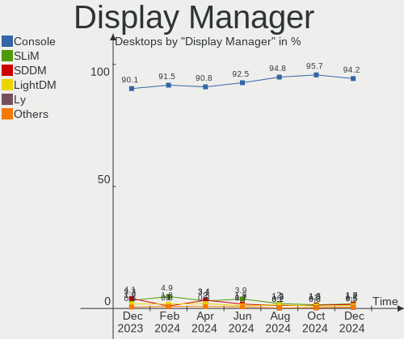
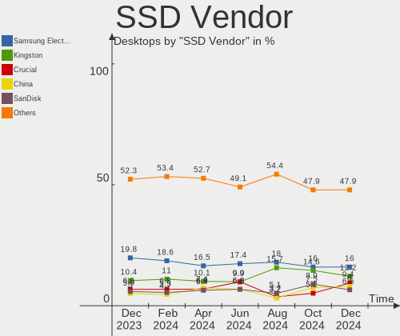
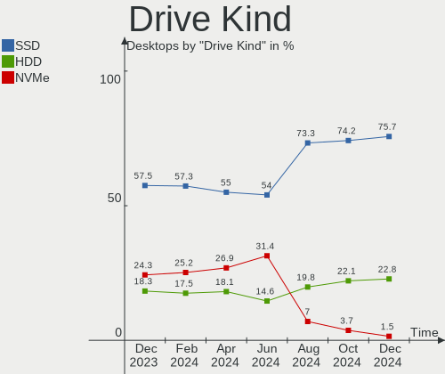
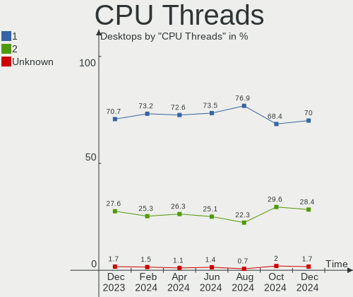

BSD Hardware Trends (Desktop)
-----------------------------

A project to identify most popular hardware characteristics and track their change
over time based on data collected by BSD users at https://BSD-Hardware.info.

Anyone can contribute to the study by uploading probes of their computers by
the [hw-probe](https://github.com/linuxhw/hw-probe/blob/master/INSTALL.BSD.md) tool:

    hw-probe -all -upload

Full-feature report is available here: https://bsd-hardware.info/?view=trends&formfactor=desktop

Period: May, 2021.

Contents
--------

- [ OS                       ](#os)
- [ OS Family                ](#os-family)
- [ Arch                     ](#arch)
- [ DE                       ](#de)
- [ Display Server           ](#display-server)
- [ Display Manager          ](#display-manager)
- [ OS Lang                  ](#os-lang)
- [ Boot Mode                ](#boot-mode)
- [ Filesystem               ](#filesystem)
- [ Part. scheme             ](#part-scheme)
- [ Country                  ](#country)
- [ City                     ](#city)
- [ Vendor                   ](#vendor)
- [ Model                    ](#model)
- [ Model Family             ](#model-family)
- [ MFG Year                 ](#mfg-year)
- [ Form Factor              ](#form-factor)
- [ Coreboot                 ](#coreboot)
- [ RAM Size                 ](#ram-size)
- [ RAM Used                 ](#ram-used)
- [ Has CD-ROM               ](#has-cd-rom)
- [ Total Drives             ](#total-drives)
- [ Has Ethernet             ](#has-ethernet)
- [ Has WiFi                 ](#has-wifi)
- [ Has Bluetooth            ](#has-bluetooth)
- [ Drive Vendor             ](#drive-vendor)
- [ Drive Model              ](#drive-model)
- [ HDD Vendor               ](#hdd-vendor)
- [ SSD Vendor               ](#ssd-vendor)
- [ Drive Kind               ](#drive-kind)
- [ Drive Connector          ](#drive-connector)
- [ Drive Size               ](#drive-size)
- [ Space Total              ](#space-total)
- [ Space Used               ](#space-used)
- [ Malfunc. Drives          ](#malfunc-drives)
- [ Malfunc. Drive Vendor    ](#malfunc-drive-vendor)
- [ Malfunc. HDD Vendor      ](#malfunc-hdd-vendor)
- [ Malfunc. Drive Kind      ](#malfunc-drive-kind)
- [ Failed Drives            ](#failed-drives)
- [ Failed Drive Vendor      ](#failed-drive-vendor)
- [ Drive Status             ](#drive-status)
- [ Storage Vendor           ](#storage-vendor)
- [ Storage Model            ](#storage-model)
- [ Storage Kind             ](#storage-kind)
- [ CPU Vendor               ](#cpu-vendor)
- [ CPU Model                ](#cpu-model)
- [ CPU Model Family         ](#cpu-model-family)
- [ CPU Cores                ](#cpu-cores)
- [ CPU Sockets              ](#cpu-sockets)
- [ CPU Threads              ](#cpu-threads)
- [ CPU Microarch            ](#cpu-microarch)
- [ GPU Vendor               ](#gpu-vendor)
- [ GPU Model                ](#gpu-model)
- [ GPU Combo                ](#gpu-combo)
- [ GPU Driver               ](#gpu-driver)
- [ GPU Memory               ](#gpu-memory)
- [ Monitor Vendor           ](#monitor-vendor)
- [ Monitor Model            ](#monitor-model)
- [ Monitor Resolution       ](#monitor-resolution)
- [ Monitor Diagonal         ](#monitor-diagonal)
- [ Monitor Width            ](#monitor-width)
- [ Aspect Ratio             ](#aspect-ratio)
- [ Monitor Area             ](#monitor-area)
- [ Pixel Density            ](#pixel-density)
- [ Multiple Monitors        ](#multiple-monitors)
- [ Net Controller Vendor    ](#net-controller-vendor)
- [ Net Controller Model     ](#net-controller-model)
- [ Wireless Vendor          ](#wireless-vendor)
- [ Wireless Model           ](#wireless-model)
- [ Ethernet Vendor          ](#ethernet-vendor)
- [ Ethernet Model           ](#ethernet-model)
- [ Net Controller Kind      ](#net-controller-kind)
- [ Used Controller          ](#used-controller)
- [ NICs                     ](#nics)
- [ IPv6                     ](#ipv6)
- [ Memory Vendor            ](#memory-vendor)
- [ Memory Model             ](#memory-model)
- [ Memory Kind              ](#memory-kind)
- [ Memory Form Factor       ](#memory-form-factor)
- [ Memory Size              ](#memory-size)
- [ Memory Speed             ](#memory-speed)
- [ Sound Vendor             ](#sound-vendor)
- [ Sound Model              ](#sound-model)
- [ Camera Vendor            ](#camera-vendor)
- [ Camera Model             ](#camera-model)
- [ Fingerprint Vendor       ](#fingerprint-vendor)
- [ Fingerprint Model        ](#fingerprint-model)
- [ Chipcard Vendor          ](#chipcard-vendor)
- [ Chipcard Model           ](#chipcard-model)
- [ Printer Vendor           ](#printer-vendor)
- [ Printer Model            ](#printer-model)
- [ Scanner Vendor           ](#scanner-vendor)
- [ Scanner Model            ](#scanner-model)
- [ Bluetooth Vendor         ](#bluetooth-vendor)
- [ Bluetooth Model          ](#bluetooth-model)
- [ Unsupported Devices      ](#unsupported-devices)
- [ Unsupported Device Types ](#unsupported-device-types)

OS
--

Installed operating systems

| Name                   | Desktops | Percent |
|------------------------|----------|---------|
| OPNsense 21.1.5        | 126      | 56%     |
| FreeBSD 13.0           | 25       | 11.11%  |
| OPNsense 21.1.6        | 21       | 9.33%   |
| OpenBSD 6.9            | 9        | 4%      |
| OPNsense 21.7          | 4        | 1.78%   |
| TrueNAS 12.2-p6        | 3        | 1.33%   |
| OPNsense 21.1.4        | 3        | 1.33%   |
| OPNsense 21.1          | 3        | 1.33%   |
| OpenBSD 6.8            | 3        | 1.33%   |
| NomadBSD 5806f915      | 3        | 1.33%   |
| helloSystem 0.4.0      | 3        | 1.33%   |
| NetBSD 9.2             | 2        | 0.89%   |
| MidnightBSD 2.0.7      | 2        | 0.89%   |
| GhostBSD 20.04.02      | 2        | 0.89%   |
| FreeBSD 14.0-CURRENT   | 2        | 0.89%   |
| XigmaNAS 12.2-p6       | 1        | 0.44%   |
| TrueNAS 12.2-p2        | 1        | 0.44%   |
| OPNsense 21.1.2        | 1        | 0.44%   |
| OPNsense 12.1-p16-HBSD | 1        | 0.44%   |
| NetBSD 9.2_STABLE      | 1        | 0.44%   |
| helloSystem 0.3.0      | 1        | 0.44%   |
| FreeNAS 11.2-STABLE    | 1        | 0.44%   |
| FreeNAS 11.2-p9        | 1        | 0.44%   |
| FreeBSD 12.2-STABLE    | 1        | 0.44%   |
| FreeBSD 12.2-p6        | 1        | 0.44%   |
| FreeBSD 12.2-p4        | 1        | 0.44%   |
| FreeBSD 12.2-p3        | 1        | 0.44%   |
| FreeBSD 12.2-p2        | 1        | 0.44%   |
| FreeBSD 12.1-p16-HBSD  | 1        | 0.44%   |

OS Family
---------

OS without a version

| Name        | Desktops | Percent |
|-------------|----------|---------|
| OPNsense    | 159      | 70.67%  |
| FreeBSD     | 33       | 14.67%  |
| OpenBSD     | 12       | 5.33%   |
| TrueNAS     | 4        | 1.78%   |
| helloSystem | 4        | 1.78%   |
| NomadBSD    | 3        | 1.33%   |
| NetBSD      | 3        | 1.33%   |
| MidnightBSD | 2        | 0.89%   |
| GhostBSD    | 2        | 0.89%   |
| FreeNAS     | 2        | 0.89%   |
| XigmaNAS    | 1        | 0.44%   |

Arch
----

OS architecture (x86_64, i586, etc.)

| Name   | Desktops | Percent |
|--------|----------|---------|
| amd64  | 221      | 98.22%  |
| i386   | 2        | 0.89%   |
| macppc | 1        | 0.44%   |
| evbarm | 1        | 0.44%   |

DE
--

Desktop Environment

| Name         | Desktops | Percent |
|--------------|----------|---------|
| Console      | 186      | 82.67%  |
| KDE5         | 7        | 3.11%   |
| XFCE         | 6        | 2.67%   |
| GNOME        | 6        | 2.67%   |
| fvwm         | 6        | 2.67%   |
| helloDesktop | 4        | 1.78%   |
| TWM          | 3        | 1.33%   |
| Openbox      | 3        | 1.33%   |
| MATE         | 2        | 0.89%   |
| LXQt         | 1        | 0.44%   |
| AwesomeWM    | 1        | 0.44%   |

Display Server
--------------

X11 or Wayland

| Name    | Desktops | Percent |
|---------|----------|---------|
| Console | 187      | 83.11%  |
| X11     | 37       | 16.44%  |
| Wayland | 1        | 0.44%   |

Display Manager
---------------

SDDM, LightDM, etc.

| Name    | Desktops | Percent |
|---------|----------|---------|
| Console | 202      | 89.78%  |
| SLiM    | 8        | 3.56%   |
| SDDM    | 6        | 2.67%   |
| GDM     | 4        | 1.78%   |
| LightDM | 3        | 1.33%   |
| XDM     | 2        | 0.89%   |

OS Lang
-------

Language

| Lang    | Desktops | Percent |
|---------|----------|---------|
| Unknown | 175      | 77.78%  |
| en_US   | 17       | 7.56%   |
| C       | 16       | 7.11%   |
| ru_RU   | 6        | 2.67%   |
| de_DE   | 3        | 1.33%   |
| fr_FR   | 2        | 0.89%   |
| en_GB   | 2        | 0.89%   |
| sv_SE   | 1        | 0.44%   |
| pt_BR   | 1        | 0.44%   |
| nb_NO   | 1        | 0.44%   |
| es_ES   | 1        | 0.44%   |

Boot Mode
---------

EFI or BIOS

| Mode | Desktops | Percent |
|------|----------|---------|
| EFI  | 168      | 74.67%  |
| BIOS | 57       | 25.33%  |

Filesystem
----------

Type of filesystem

| Type | Desktops | Percent |
|------|----------|---------|
| Ufs  | 176      | 78.22%  |
| Zfs  | 37       | 16.44%  |
| Ffs  | 12       | 5.33%   |

Part. scheme
------------

Scheme of partitioning

| Type    | Desktops | Percent |
|---------|----------|---------|
| GPT     | 190      | 84.44%  |
| MBR     | 33       | 14.67%  |
| Unknown | 2        | 0.89%   |

Country
-------

Geographic location (country)

| Country       | Desktops | Percent |
|---------------|----------|---------|
| USA           | 65       | 28.89%  |
| Germany       | 49       | 21.78%  |
| UK            | 12       | 5.33%   |
| France        | 12       | 5.33%   |
| Russia        | 10       | 4.44%   |
| Poland        | 6        | 2.67%   |
| Canada        | 6        | 2.67%   |
| Austria       | 6        | 2.67%   |
| Australia     | 6        | 2.67%   |
| Sweden        | 5        | 2.22%   |
| Netherlands   | 5        | 2.22%   |
| Brazil        | 4        | 1.78%   |
| Ukraine       | 3        | 1.33%   |
| Taiwan        | 3        | 1.33%   |
| Switzerland   | 3        | 1.33%   |
| Italy         | 3        | 1.33%   |
| Thailand      | 2        | 0.89%   |
| Norway        | 2        | 0.89%   |
| Greece        | 2        | 0.89%   |
| Spain         | 1        | 0.44%   |
| South Korea   | 1        | 0.44%   |
| Slovakia      | 1        | 0.44%   |
| Romania       | 1        | 0.44%   |
| Portugal      | 1        | 0.44%   |
| Pakistan      | 1        | 0.44%   |
| Malaysia      | 1        | 0.44%   |
| Liechtenstein | 1        | 0.44%   |
| Japan         | 1        | 0.44%   |
| Ireland       | 1        | 0.44%   |
| Indonesia     | 1        | 0.44%   |
| Hungary       | 1        | 0.44%   |
| Guadeloupe    | 1        | 0.44%   |
| Estonia       | 1        | 0.44%   |
| Egypt         | 1        | 0.44%   |
| Denmark       | 1        | 0.44%   |
| Czechia       | 1        | 0.44%   |
| Costa Rica    | 1        | 0.44%   |
| Colombia      | 1        | 0.44%   |
| Belgium       | 1        | 0.44%   |
| Argentina     | 1        | 0.44%   |

City
----

Geographic location (city)

| City              | Desktops | Percent |
|-------------------|----------|---------|
| Munich            | 5        | 2.22%   |
| Berlin            | 4        | 1.78%   |
| Vienna            | 3        | 1.33%   |
| Redmond           | 3        | 1.33%   |
| Raleigh           | 3        | 1.33%   |
| Ozersk            | 3        | 1.33%   |
| Ottawa            | 3        | 1.33%   |
| Moscow            | 3        | 1.33%   |
| Hamburg           | 3        | 1.33%   |
| Cologne           | 3        | 1.33%   |
| Bielefeld         | 3        | 1.33%   |
| Beaverton         | 3        | 1.33%   |
| Ypsilanti         | 2        | 0.89%   |
| Taipei            | 2        | 0.89%   |
| Stuttgart         | 2        | 0.89%   |
| San Diego         | 2        | 0.89%   |
| Paris             | 2        | 0.89%   |
| New Albany        | 2        | 0.89%   |
| Menlo Park        | 2        | 0.89%   |
| London            | 2        | 0.89%   |
| Kyiv              | 2        | 0.89%   |
| Hohenlockstedt    | 2        | 0.89%   |
| Graz              | 2        | 0.89%   |
| Frankfurt am Main | 2        | 0.89%   |
| El Dorado Hills   | 2        | 0.89%   |
| Athens            | 2        | 0.89%   |
| Zeuthen           | 1        | 0.44%   |
| Zajaczki Pierwsze | 1        | 0.44%   |
| Wylie             | 1        | 0.44%   |
| Wuppertal         | 1        | 0.44%   |
| Wroclaw           | 1        | 0.44%   |
| Wolfsburg         | 1        | 0.44%   |
| Windsor           | 1        | 0.44%   |
| Wiesbaden         | 1        | 0.44%   |
| Wenatchee         | 1        | 0.44%   |
| Warwick           | 1        | 0.44%   |
| Warsaw            | 1        | 0.44%   |
| Warminster        | 1        | 0.44%   |
| Viterbo           | 1        | 0.44%   |
| Villaz            | 1        | 0.44%   |
| Valladolid        | 1        | 0.44%   |
| Tuddal            | 1        | 0.44%   |
| Trang             | 1        | 0.44%   |
| Tartu             | 1        | 0.44%   |
| Taby              | 1        | 0.44%   |
| São Paulo        | 1        | 0.44%   |
| Syeverodonets'k   | 1        | 0.44%   |
| Sydney            | 1        | 0.44%   |
| Straubenhardt     | 1        | 0.44%   |
| Stockbridge       | 1        | 0.44%   |
| Speyer            | 1        | 0.44%   |
| Southport         | 1        | 0.44%   |
| Sollentuna        | 1        | 0.44%   |
| Sneek             | 1        | 0.44%   |
| Simi Valley       | 1        | 0.44%   |
| Shirokanedai      | 1        | 0.44%   |
| Sertolovo         | 1        | 0.44%   |
| Sector 4          | 1        | 0.44%   |
| Seattle           | 1        | 0.44%   |
| Seaside           | 1        | 0.44%   |

Vendor
------

Motherboard manufacturer

| Name                | Desktops | Percent |
|---------------------|----------|---------|
| ASUSTek Computer    | 32       | 14.22%  |
| Unknown             | 25       | 11.11%  |
| MSI                 | 19       | 8.44%   |
| Protectli           | 15       | 6.67%   |
| ASRock              | 15       | 6.67%   |
| PC Engines          | 14       | 6.22%   |
| Dell                | 13       | 5.78%   |
| Gigabyte Technology | 12       | 5.33%   |
| Supermicro          | 11       | 4.89%   |
| Hewlett-Packard     | 11       | 4.89%   |
| Lenovo              | 9        | 4%      |
| Shuttle             | 8        | 3.56%   |
| Intel               | 7        | 3.11%   |
| SeeedStudio         | 4        | 1.78%   |
| Fujitsu             | 4        | 1.78%   |
| ASRockRack          | 3        | 1.33%   |
| Apple               | 2        | 0.89%   |
| Yanling             | 1        | 0.44%   |
| Thomas-Krenn.AG     | 1        | 0.44%   |
| Semp Toshiba        | 1        | 0.44%   |
| Nuage Networks      | 1        | 0.44%   |
| NU941               | 1        | 0.44%   |
| NU591               | 1        | 0.44%   |
| NEXCOM              | 1        | 0.44%   |
| Lex                 | 1        | 0.44%   |
| Kontron Europe      | 1        | 0.44%   |
| Jetway              | 1        | 0.44%   |
| Inventec            | 1        | 0.44%   |
| GVC                 | 1        | 0.44%   |
| Google              | 1        | 0.44%   |
| Foxconn             | 1        | 0.44%   |
| EVGA                | 1        | 0.44%   |
| CheckPoint          | 1        | 0.44%   |
| Biostar             | 1        | 0.44%   |
| BESSTAR Tech        | 1        | 0.44%   |
| AMI                 | 1        | 0.44%   |
| Alienware           | 1        | 0.44%   |
| Advantech           | 1        | 0.44%   |

Model
-----

Motherboard model

| Name                          | Desktops | Percent |
|-------------------------------|----------|---------|
| Unknown                       | 25       | 11.11%  |
| Protectli FW4B                | 9        | 4%      |
| PC Engines apu4               | 6        | 2.67%   |
| PC Engines apu2               | 6        | 2.67%   |
| ASUS All Series               | 6        | 2.67%   |
| Supermicro X9SCL/X9SCM        | 4        | 1.78%   |
| Protectli FW6                 | 4        | 1.78%   |
| Intel Q3XXG4-P V1.0           | 4        | 1.78%   |
| SeeedStudio ODYSSEY-X86J4105  | 3        | 1.33%   |
| MSI MS-7C08                   | 2        | 0.89%   |
| HP Z230 SFF Workstation       | 2        | 0.89%   |
| HP ProLiant MicroServer Gen8  | 2        | 0.89%   |
| Gigabyte B365M DS3H           | 2        | 0.89%   |
| Dell OptiPlex 9020            | 2        | 0.89%   |
| Dell OptiPlex 780             | 2        | 0.89%   |
| Dell OptiPlex 7010            | 2        | 0.89%   |
| ASUS P8H77-M PRO              | 2        | 0.89%   |
| Yanling YL-KBR6L              | 1        | 0.44%   |
| Thomas-Krenn.AG LES network+  | 1        | 0.44%   |
| Supermicro X8STi              | 1        | 0.44%   |
| Supermicro X7SPA-HF           | 1        | 0.44%   |
| Supermicro X7DCL              | 1        | 0.44%   |
| Supermicro SYS-E301-9D-8CN8TP | 1        | 0.44%   |
| Supermicro SYS-5019A-FTN4     | 1        | 0.44%   |
| Supermicro NSMPX-5500         | 1        | 0.44%   |
| Supermicro IB-1050            | 1        | 0.44%   |
| Shuttle TERRA_PC              | 1        | 0.44%   |
| Shuttle SH87R                 | 1        | 0.44%   |
| Shuttle DS81D                 | 1        | 0.44%   |
| Shuttle DS77U                 | 1        | 0.44%   |
| Shuttle DS10U                 | 1        | 0.44%   |
| Shuttle DH370                 | 1        | 0.44%   |
| Shuttle DH310V2               | 1        | 0.44%   |
| Shuttle DH110                 | 1        | 0.44%   |
| Semp Toshiba STI              | 1        | 0.44%   |
| SeeedStudio ODYSSEY-X86J4125  | 1        | 0.44%   |
| Protectli LES compact 4L      | 1        | 0.44%   |
| Protectli FW6E                | 1        | 0.44%   |
| PC Engines apu1               | 1        | 0.44%   |
| PC Engines APU                | 1        | 0.44%   |
| Nuage Networks 7850 NSG-E     | 1        | 0.44%   |
| NU941 1.0                     | 1        | 0.44%   |
| NU591 LES v3                  | 1        | 0.44%   |
| NEXCOM ASG                    | 1        | 0.44%   |
| MSI MS-S0891                  | 1        | 0.44%   |
| MSI MS-9A45                   | 1        | 0.44%   |
| MSI MS-9877                   | 1        | 0.44%   |
| MSI MS-7C80                   | 1        | 0.44%   |
| MSI MS-7C52                   | 1        | 0.44%   |
| MSI MS-7C02                   | 1        | 0.44%   |
| MSI MS-7B86                   | 1        | 0.44%   |
| MSI MS-7B09                   | 1        | 0.44%   |
| MSI MS-7851                   | 1        | 0.44%   |
| MSI MS-7850                   | 1        | 0.44%   |
| MSI MS-7846                   | 1        | 0.44%   |
| MSI MS-7823                   | 1        | 0.44%   |
| MSI MS-7817                   | 1        | 0.44%   |
| MSI MS-7758                   | 1        | 0.44%   |
| MSI MS-7721                   | 1        | 0.44%   |
| MSI MS-7677                   | 1        | 0.44%   |

Model Family
------------

Motherboard model prefix

| Name                          | Desktops | Percent |
|-------------------------------|----------|---------|
| Unknown                       | 25       | 11.11%  |
| Dell OptiPlex                 | 11       | 4.89%   |
| Protectli FW4B                | 9        | 4%      |
| PC Engines apu4               | 6        | 2.67%   |
| PC Engines APU2               | 6        | 2.67%   |
| Lenovo ThinkCentre            | 6        | 2.67%   |
| ASUS TUF                      | 6        | 2.67%   |
| ASUS All                      | 6        | 2.67%   |
| Supermicro X9SCL              | 4        | 1.78%   |
| Protectli FW6                 | 4        | 1.78%   |
| Intel Q3XXG4-P                | 4        | 1.78%   |
| SeeedStudio ODYSSEY-X86J4105  | 3        | 1.33%   |
| HP ProLiant                   | 3        | 1.33%   |
| MSI MS-7C08                   | 2        | 0.89%   |
| HP Z230                       | 2        | 0.89%   |
| HP Compaq                     | 2        | 0.89%   |
| Gigabyte B365M                | 2        | 0.89%   |
| Fujitsu FUTRO                 | 2        | 0.89%   |
| ASUS PRIME                    | 2        | 0.89%   |
| ASUS P8H77-M                  | 2        | 0.89%   |
| ASRock X570                   | 2        | 0.89%   |
| Yanling YL-KBR6L              | 1        | 0.44%   |
| Thomas-Krenn.AG LES           | 1        | 0.44%   |
| Supermicro X8STi              | 1        | 0.44%   |
| Supermicro X7SPA-HF           | 1        | 0.44%   |
| Supermicro X7DCL              | 1        | 0.44%   |
| Supermicro SYS-E301-9D-8CN8TP | 1        | 0.44%   |
| Supermicro SYS-5019A-FTN4     | 1        | 0.44%   |
| Supermicro NSMPX-5500         | 1        | 0.44%   |
| Supermicro IB-1050            | 1        | 0.44%   |
| Shuttle TERRA                 | 1        | 0.44%   |
| Shuttle SH87R                 | 1        | 0.44%   |
| Shuttle DS81D                 | 1        | 0.44%   |
| Shuttle DS77U                 | 1        | 0.44%   |
| Shuttle DS10U                 | 1        | 0.44%   |
| Shuttle DH370                 | 1        | 0.44%   |
| Shuttle DH310V2               | 1        | 0.44%   |
| Shuttle DH110                 | 1        | 0.44%   |
| Semp Toshiba STI              | 1        | 0.44%   |
| SeeedStudio ODYSSEY-X86J4125  | 1        | 0.44%   |
| Protectli LES                 | 1        | 0.44%   |
| Protectli FW6E                | 1        | 0.44%   |
| PC Engines apu1               | 1        | 0.44%   |
| PC Engines APU                | 1        | 0.44%   |
| Nuage Networks 7850           | 1        | 0.44%   |
| NU941 1.0                     | 1        | 0.44%   |
| NU591 LES                     | 1        | 0.44%   |
| NEXCOM ASG                    | 1        | 0.44%   |
| MSI MS-S0891                  | 1        | 0.44%   |
| MSI MS-9A45                   | 1        | 0.44%   |
| MSI MS-9877                   | 1        | 0.44%   |
| MSI MS-7C80                   | 1        | 0.44%   |
| MSI MS-7C52                   | 1        | 0.44%   |
| MSI MS-7C02                   | 1        | 0.44%   |
| MSI MS-7B86                   | 1        | 0.44%   |
| MSI MS-7B09                   | 1        | 0.44%   |
| MSI MS-7851                   | 1        | 0.44%   |
| MSI MS-7850                   | 1        | 0.44%   |
| MSI MS-7846                   | 1        | 0.44%   |
| MSI MS-7823                   | 1        | 0.44%   |

MFG Year
--------

Motherboard manufacture year

| Year    | Desktops | Percent |
|---------|----------|---------|
| 2020    | 50       | 22.22%  |
| 2019    | 28       | 12.44%  |
| 2018    | 21       | 9.33%   |
| 2021    | 20       | 8.89%   |
| 2014    | 18       | 8%      |
| 2015    | 17       | 7.56%   |
| 2013    | 12       | 5.33%   |
| 2012    | 11       | 4.89%   |
| 2011    | 11       | 4.89%   |
| 2010    | 10       | 4.44%   |
| 2016    | 9        | 4%      |
| 2008    | 6        | 2.67%   |
| Unknown | 5        | 2.22%   |
| 2017    | 4        | 1.78%   |
| 2009    | 3        | 1.33%   |

Form Factor
-----------

Physical design of the computer

| Name    | Desktops | Percent |
|---------|----------|---------|
| Desktop | 225      | 100%    |

Coreboot
--------

Have coreboot on board

| Used | Desktops | Percent |
|------|----------|---------|
| No   | 203      | 90.22%  |
| Yes  | 22       | 9.78%   |

RAM Size
--------

Total RAM memory

| Size in GB  | Desktops | Percent |
|-------------|----------|---------|
| 8.01-16.0   | 68       | 30.22%  |
| 4.01-8.0    | 53       | 23.56%  |
| 16.01-24.0  | 42       | 18.67%  |
| 32.01-64.0  | 33       | 14.67%  |
| 64.01-256.0 | 10       | 4.44%   |
| 2.01-3.0    | 8        | 3.56%   |
| 24.01-32.0  | 5        | 2.22%   |
| 0.51-1.0    | 2        | 0.89%   |
| 0.01-0.5    | 2        | 0.89%   |
| 3.01-4.0    | 1        | 0.44%   |
| 1.01-2.0    | 1        | 0.44%   |

RAM Used
--------

Used RAM memory

| Used GB    | Desktops | Percent |
|------------|----------|---------|
| 0.01-0.5   | 111      | 49.33%  |
| 0.51-1.0   | 57       | 25.33%  |
| 1.01-2.0   | 32       | 14.22%  |
| 3.01-4.0   | 7        | 3.11%   |
| 32.01-64.0 | 4        | 1.78%   |
| 4.01-8.0   | 3        | 1.33%   |
| 2.01-3.0   | 3        | 1.33%   |
| 0          | 3        | 1.33%   |
| Unknown    | 3        | 1.33%   |
| 24.01-32.0 | 1        | 0.44%   |
| 8.01-16.0  | 1        | 0.44%   |

Has CD-ROM
----------

Has CD-ROM on board

| Presented | Desktops | Percent |
|-----------|----------|---------|
| No        | 186      | 82.67%  |
| Yes       | 39       | 17.33%  |

Total Drives
------------

Number of drives on board

| Drives | Desktops | Percent |
|--------|----------|---------|
| 1      | 155      | 68.89%  |
| 2      | 29       | 12.89%  |
| 0      | 11       | 4.89%   |
| 3      | 9        | 4%      |
| 7      | 4        | 1.78%   |
| 6      | 4        | 1.78%   |
| 4      | 4        | 1.78%   |
| 9      | 2        | 0.89%   |
| 8      | 2        | 0.89%   |
| 5      | 2        | 0.89%   |
| 26     | 1        | 0.44%   |
| 12     | 1        | 0.44%   |
| 10     | 1        | 0.44%   |

Has Ethernet
------------

Has Ethernet on board

| Presented | Desktops | Percent |
|-----------|----------|---------|
| Yes       | 223      | 99.11%  |
| No        | 2        | 0.89%   |

Has WiFi
--------

Has WiFi module

| Presented | Desktops | Percent |
|-----------|----------|---------|
| No        | 179      | 79.56%  |
| Yes       | 46       | 20.44%  |

Has Bluetooth
-------------

Has Bluetooth module

| Presented | Desktops | Percent |
|-----------|----------|---------|
| No        | 195      | 86.67%  |
| Yes       | 30       | 13.33%  |

Drive Vendor
------------

Hard drive vendors

| Vendor              | Desktops | Drives | Percent |
|---------------------|----------|--------|---------|
| Samsung Electronics | 48       | 66     | 16.27%  |
| WDC                 | 34       | 79     | 11.53%  |
| Seagate             | 34       | 62     | 11.53%  |
| Kingston            | 23       | 24     | 7.8%    |
| Toshiba             | 17       | 23     | 5.76%   |
| Crucial             | 13       | 16     | 4.41%   |
| SanDisk             | 12       | 13     | 4.07%   |
| Transcend           | 11       | 11     | 3.73%   |
| Intel               | 11       | 12     | 3.73%   |
| Hoodisk             | 10       | 10     | 3.39%   |
| A-DATA Technology   | 9        | 9      | 3.05%   |
| Phison              | 8        | 8      | 2.71%   |
| HGST                | 7        | 8      | 2.37%   |
| Hitachi             | 5        | 7      | 1.69%   |
| Dogfish             | 5        | 5      | 1.69%   |
| PNY                 | 4        | 4      | 1.36%   |
| NVMe                | 4        | 5      | 1.36%   |
| Protectli           | 3        | 3      | 1.02%   |
| Corsair             | 3        | 3      | 1.02%   |
| BIWIN               | 3        | 3      | 1.02%   |
| ATP                 | 3        | 3      | 1.02%   |
| SPCC                | 2        | 2      | 0.68%   |
| PLEXTOR             | 2        | 2      | 0.68%   |
| HPE                 | 2        | 2      | 0.68%   |
| GOODRAM             | 2        | 2      | 0.68%   |
| Gigabyte Technology | 2        | 2      | 0.68%   |
| China               | 2        | 2      | 0.68%   |
| Verbatim            | 1        | 1      | 0.34%   |
| Team                | 1        | 1      | 0.34%   |
| Smartbuy            | 1        | 1      | 0.34%   |
| SK Hynix            | 1        | 1      | 0.34%   |
| OPENBSD             | 1        | 1      | 0.34%   |
| OCZ                 | 1        | 1      | 0.34%   |
| Multiple            | 1        | 1      | 0.34%   |
| Micron Technology   | 1        | 1      | 0.34%   |
| LITEON              | 1        | 1      | 0.34%   |
| KingDian            | 1        | 1      | 0.34%   |
| Intenso             | 1        | 1      | 0.34%   |
| Hewlett-Packard     | 1        | 1      | 0.34%   |
| FORESEE             | 1        | 1      | 0.34%   |
| BAITITON            | 1        | 1      | 0.34%   |
| Apacer              | 1        | 1      | 0.34%   |
| AMD                 | 1        | 2      | 0.34%   |

Drive Model
-----------

Hard drive models

| Model                            | Desktops | Percent |
|----------------------------------|----------|---------|
| Phison SATA SSD 16GB             | 5        | 1.51%   |
| Kingston SUV500MS120G 120GB      | 5        | 1.51%   |
| Samsung SSD 860 EVO 500GB        | 4        | 1.2%    |
| Samsung SSD 850 EVO 250GB        | 4        | 1.2%    |
| Samsung SSD 840 EVO 250GB        | 4        | 1.2%    |
| Hoodisk SSD 32GB                 | 4        | 1.2%    |
| WDC WD30EFRX-68EUZN0 3TB         | 3        | 0.9%    |
| Transcend TS128GMSA230S 128GB    | 3        | 0.9%    |
| Toshiba DT01ACA100 1TB           | 3        | 0.9%    |
| Seagate ST500LM021-1KJ152 500GB  | 3        | 0.9%    |
| Seagate ST4000DM000-1F2168 4TB   | 3        | 0.9%    |
| Kingston SA400S37240G 240GB      | 3        | 0.9%    |
| Hoodisk SSD 128GB                | 3        | 0.9%    |
| WDC WD30EFRX-68N32N0 3TB         | 2        | 0.6%    |
| WDC WD20EARX-00PASB0 2TB         | 2        | 0.6%    |
| Toshiba HDWE160 6TB              | 2        | 0.6%    |
| Seagate ST8000VN004-2M2101 8TB   | 2        | 0.6%    |
| Seagate ST500DM002-1BD142 500GB  | 2        | 0.6%    |
| SanDisk SSD PLUS 120GB           | 2        | 0.6%    |
| Samsung SSD 970 PRO 512GB        | 2        | 0.6%    |
| Samsung SSD 970 EVO Plus 1TB     | 2        | 0.6%    |
| Samsung SSD 870 EVO 1TB          | 2        | 0.6%    |
| Samsung SSD 860 EVO M.2 250GB    | 2        | 0.6%    |
| Samsung SSD 860 EVO 2TB          | 2        | 0.6%    |
| Samsung SSD 850 EVO 1TB          | 2        | 0.6%    |
| Samsung SSD 840 PRO Series 256GB | 2        | 0.6%    |
| Samsung SSD 840 PRO Series 128GB | 2        | 0.6%    |
| Protectli 120GB mSATA            | 2        | 0.6%    |
| Kingston SUV500MS240G 240GB      | 2        | 0.6%    |
| Kingston SA2000M8250G 250GB      | 2        | 0.6%    |
| Kingston DataTraveler 3.0 32GB   | 2        | 0.6%    |
| Intel SSDPEKNW020T8 2TB          | 2        | 0.6%    |
| HPE MK0400GCTZA 400GB            | 2        | 0.6%    |
| Hoodisk SSD 64GB                 | 2        | 0.6%    |
| HGST HUS724020ALA640 2TB         | 2        | 0.6%    |
| HGST HTS541010A9E680 1TB         | 2        | 0.6%    |
| Dogfish SSD 128GB                | 2        | 0.6%    |
| Crucial CT1000MX500SSD1 1TB      | 2        | 0.6%    |
| BIWIN SSD 128GB                  | 2        | 0.6%    |
| A-DATA SU650 120GB               | 2        | 0.6%    |
| WDC WDS500G2B0C-00PXH0 500GB     | 1        | 0.3%    |
| WDC WDS500G1X0E-00AFY0 500GB     | 1        | 0.3%    |
| WDC WDS250G2B0C-00PXH0 250GB     | 1        | 0.3%    |
| WDC WDS120G2G0A-00JH30 120GB     | 1        | 0.3%    |
| WDC WD8004FRYZ-01VAEB0 8TB       | 1        | 0.3%    |
| WDC WD60EFRX-68MYMN1 6TB         | 1        | 0.3%    |
| WDC WD60EFRX-68L0BN1 6TB         | 1        | 0.3%    |
| WDC WD60EFAX-68SHWN0 6TB         | 1        | 0.3%    |
| WDC WD5000LPVX-75V0TT0 500GB     | 1        | 0.3%    |
| WDC WD5000LPVX-22V0TT0 500GB     | 1        | 0.3%    |
| WDC WD5000AZRZ-00HTKB0 500GB     | 1        | 0.3%    |
| WDC WD5000AAKX-00ERMA0 500GB     | 1        | 0.3%    |
| WDC WD5000AAKS-22V1A0 500GB      | 1        | 0.3%    |
| WDC WD5000AAKS-00TMA0 500GB      | 1        | 0.3%    |
| WDC WD5000AAKS-00A7B2 500GB      | 1        | 0.3%    |
| WDC WD40EZRZ-22GXCB0 4TB         | 1        | 0.3%    |
| WDC WD40EFRX-68N32N0 4TB         | 1        | 0.3%    |
| WDC WD360ADFD-00NLR5 37GB        | 1        | 0.3%    |
| WDC WD360ADFD-00NLR1 37GB        | 1        | 0.3%    |
| WDC WD3200BPVT-22JJ5T0 320GB     | 1        | 0.3%    |

HDD Vendor
----------

Hard disk drive vendors

| Vendor              | Desktops | Drives | Percent |
|---------------------|----------|--------|---------|
| Seagate             | 33       | 61     | 33%     |
| WDC                 | 30       | 75     | 30%     |
| Toshiba             | 14       | 20     | 14%     |
| HGST                | 7        | 8      | 7%      |
| Samsung Electronics | 5        | 6      | 5%      |
| Hitachi             | 5        | 7      | 5%      |
| NVMe                | 3        | 3      | 3%      |
| OPENBSD             | 1        | 1      | 1%      |
| Multiple            | 1        | 1      | 1%      |
| Hewlett-Packard     | 1        | 1      | 1%      |

SSD Vendor
----------

Solid state drive vendors

| Vendor              | Desktops | Drives | Percent |
|---------------------|----------|--------|---------|
| Samsung Electronics | 36       | 46     | 21.18%  |
| Kingston            | 20       | 21     | 11.76%  |
| Crucial             | 13       | 16     | 7.65%   |
| SanDisk             | 12       | 13     | 7.06%   |
| Transcend           | 11       | 11     | 6.47%   |
| Hoodisk             | 10       | 10     | 5.88%   |
| Intel               | 8        | 9      | 4.71%   |
| Phison              | 7        | 7      | 4.12%   |
| A-DATA Technology   | 6        | 6      | 3.53%   |
| DOGFISH             | 5        | 5      | 2.94%   |
| PNY                 | 4        | 4      | 2.35%   |
| Protectli           | 3        | 3      | 1.76%   |
| Corsair             | 3        | 3      | 1.76%   |
| BIWIN               | 3        | 3      | 1.76%   |
| ATP                 | 3        | 3      | 1.76%   |
| Toshiba             | 2        | 2      | 1.18%   |
| HPE                 | 2        | 2      | 1.18%   |
| GOODRAM             | 2        | 2      | 1.18%   |
| China               | 2        | 2      | 1.18%   |
| WDC                 | 1        | 1      | 0.59%   |
| Verbatim            | 1        | 1      | 0.59%   |
| Team                | 1        | 1      | 0.59%   |
| SPCC                | 1        | 1      | 0.59%   |
| Smartbuy            | 1        | 1      | 0.59%   |
| Seagate             | 1        | 1      | 0.59%   |
| PLEXTOR             | 1        | 1      | 0.59%   |
| OCZ                 | 1        | 1      | 0.59%   |
| NVMe                | 1        | 1      | 0.59%   |
| Micron Technology   | 1        | 1      | 0.59%   |
| LITEON              | 1        | 1      | 0.59%   |
| KingDian            | 1        | 1      | 0.59%   |
| Intenso             | 1        | 1      | 0.59%   |
| Gigabyte Technology | 1        | 1      | 0.59%   |
| FORESEE             | 1        | 1      | 0.59%   |
| BAITITON            | 1        | 1      | 0.59%   |
| Apacer              | 1        | 1      | 0.59%   |
| AMD                 | 1        | 2      | 0.59%   |

Drive Kind
----------

HDD or SSD

| Kind | Desktops | Drives | Percent |
|------|----------|--------|---------|
| SSD  | 149      | 187    | 58.43%  |
| HDD  | 77       | 183    | 30.2%   |
| NVMe | 29       | 33     | 11.37%  |

Drive Connector
---------------

SATA, SAS, NVMe, etc.

| Type | Desktops | Drives | Percent |
|------|----------|--------|---------|
| SATA | 197      | 370    | 87.17%  |
| NVMe | 29       | 33     | 12.83%  |

Drive Size
----------

Size of hard drive

| Size in TB | Desktops | Drives | Percent |
|------------|----------|--------|---------|
| 0.01-0.5   | 172      | 212    | 69.92%  |
| 0.51-1.0   | 32       | 45     | 13.01%  |
| 1.01-2.0   | 14       | 25     | 5.69%   |
| 3.01-4.0   | 9        | 20     | 3.66%   |
| 4.01-10.0  | 9        | 28     | 3.66%   |
| 2.01-3.0   | 8        | 29     | 3.25%   |
| 10.01-20.0 | 2        | 11     | 0.81%   |

Space Total
-----------

Amount of disk space available on the file system

| Size in GB     | Desktops | Percent |
|----------------|----------|---------|
| 101-250        | 84       | 37.33%  |
| 251-500        | 41       | 18.22%  |
| 21-50          | 28       | 12.44%  |
| 1-20           | 27       | 12%     |
| 51-100         | 21       | 9.33%   |
| 501-1000       | 14       | 6.22%   |
| 1001-2000      | 7        | 3.11%   |
| More than 3000 | 2        | 0.89%   |
| 2001-3000      | 1        | 0.44%   |

Space Used
----------

Amount of used disk space

| Used GB   | Desktops | Percent |
|-----------|----------|---------|
| 1-20      | 206      | 91.56%  |
| 21-50     | 8        | 3.56%   |
| 51-100    | 5        | 2.22%   |
| 251-500   | 3        | 1.33%   |
| 1001-2000 | 3        | 1.33%   |

Malfunc. Drives
---------------

Drive models with a malfunction

| Model                                        | Desktops | Drives | Percent |
|----------------------------------------------|----------|--------|---------|
| Seagate ST500LM021-1KJ152 500GB              | 2        | 2      | 5.56%   |
| Seagate ST500DM002-1BD142 500GB              | 2        | 5      | 5.56%   |
| WDC WD60EFRX-68MYMN1 6TB                     | 1        | 1      | 2.78%   |
| WDC WD5000LPVX-22V0TT0 500GB                 | 1        | 1      | 2.78%   |
| WDC WD5000AAKS-22V1A0 500GB                  | 1        | 1      | 2.78%   |
| WDC WD360ADFD-00NLR1 37GB                    | 1        | 1      | 2.78%   |
| WDC WD30EFRX-68AX9N0 3TB                     | 1        | 4      | 2.78%   |
| WDC WD2500AAKX-083CA1 250GB                  | 1        | 1      | 2.78%   |
| WDC WD20EFRX-68AX9N0 2TB                     | 1        | 1      | 2.78%   |
| WDC WD20EARX-00PASB0 2TB                     | 1        | 1      | 2.78%   |
| WDC WD2000FYYZ-01UL1B2 2TB                   | 1        | 2      | 2.78%   |
| WDC WD10EADS-00P8B0 1TB                      | 1        | 1      | 2.78%   |
| Toshiba MQ02ABD100H 1TB                      | 1        | 1      | 2.78%   |
| Seagate ST9320325AS 320GB                    | 1        | 1      | 2.78%   |
| Seagate ST9250827AS 250GB                    | 1        | 1      | 2.78%   |
| Seagate ST9160310AS 160GB                    | 1        | 1      | 2.78%   |
| Seagate ST500LT012-9WS142 500GB              | 1        | 1      | 2.78%   |
| Seagate ST500LM000-SSHD-8GB                  | 1        | 1      | 2.78%   |
| Seagate ST3250620AS 250GB                    | 1        | 1      | 2.78%   |
| Seagate ST31000524AS 1TB                     | 1        | 1      | 2.78%   |
| Samsung Electronics SSD 840 PRO Series 256GB | 1        | 1      | 2.78%   |
| Samsung Electronics SSD 840 EVO 120GB        | 1        | 1      | 2.78%   |
| Samsung Electronics MZHPV512HDGL-00000 512GB | 1        | 1      | 2.78%   |
| Samsung Electronics HM160HI 160GB            | 1        | 1      | 2.78%   |
| Intenso SSD SATAIII 120GB                    | 1        | 1      | 2.78%   |
| Hitachi HDS721050CLA660 500GB                | 1        | 1      | 2.78%   |
| HGST HTS541010A7E630 1TB                     | 1        | 1      | 2.78%   |
| HGST HDN726060ALE614 6TB                     | 1        | 2      | 2.78%   |
| DOGFISH SSD 480GB                            | 1        | 1      | 2.78%   |
| Crucial CT512M550SSD1 512GB                  | 1        | 1      | 2.78%   |
| Crucial CT250MX200SSD1 250GB                 | 1        | 1      | 2.78%   |
| Crucial CT240M500SSD1 240GB                  | 1        | 1      | 2.78%   |
| Corsair Force 3 SSD 180GB                    | 1        | 1      | 2.78%   |
| Corsair Force 3 SSD 120GB                    | 1        | 1      | 2.78%   |

Malfunc. Drive Vendor
---------------------

Vendors of faulty drives

| Vendor              | Desktops | Drives | Percent |
|---------------------|----------|--------|---------|
| Seagate             | 10       | 14     | 30.3%   |
| WDC                 | 8        | 14     | 24.24%  |
| Samsung Electronics | 4        | 4      | 12.12%  |
| Crucial             | 3        | 3      | 9.09%   |
| HGST                | 2        | 3      | 6.06%   |
| Corsair             | 2        | 2      | 6.06%   |
| Toshiba             | 1        | 1      | 3.03%   |
| Intenso             | 1        | 1      | 3.03%   |
| Hitachi             | 1        | 1      | 3.03%   |
| DOGFISH             | 1        | 1      | 3.03%   |

Malfunc. HDD Vendor
-------------------

Vendors of faulty HDD drives

| Vendor              | Desktops | Drives | Percent |
|---------------------|----------|--------|---------|
| Seagate             | 10       | 14     | 43.48%  |
| WDC                 | 8        | 14     | 34.78%  |
| HGST                | 2        | 3      | 8.7%    |
| Toshiba             | 1        | 1      | 4.35%   |
| Samsung Electronics | 1        | 1      | 4.35%   |
| Hitachi             | 1        | 1      | 4.35%   |

Malfunc. Drive Kind
-------------------

Kinds of faulty drives

| Kind | Desktops | Drives | Percent |
|------|----------|--------|---------|
| HDD  | 21       | 34     | 67.74%  |
| SSD  | 10       | 10     | 32.26%  |

Failed Drives
-------------

Failed drive models

Zero info for selected period =(

Failed Drive Vendor
-------------------

Failed drive vendors

Zero info for selected period =(

Drive Status
------------

Number of failed and malfunc. drives

| Status   | Desktops | Drives | Percent |
|----------|----------|--------|---------|
| Works    | 192      | 345    | 82.4%   |
| Malfunc  | 31       | 44     | 13.3%   |
| Detected | 10       | 14     | 4.29%   |

Storage Vendor
--------------

Storage controller vendors

| Vendor                        | Desktops | Percent |
|-------------------------------|----------|---------|
| Intel                         | 177      | 61.89%  |
| AMD                           | 47       | 16.43%  |
| Samsung Electronics           | 15       | 5.24%   |
| Marvell Technology Group      | 8        | 2.8%    |
| ASMedia Technology            | 8        | 2.8%    |
| Sandisk                       | 6        | 2.1%    |
| Broadcom / LSI                | 6        | 2.1%    |
| Phison Electronics            | 3        | 1.05%   |
| Kingston Technology Company   | 3        | 1.05%   |
| Toshiba                       | 2        | 0.7%    |
| JMicron Technology            | 2        | 0.7%    |
| ADATA Technology              | 2        | 0.7%    |
| SK Hynix                      | 1        | 0.35%   |
| Silicon Image                 | 1        | 0.35%   |
| Realtek Semiconductor         | 1        | 0.35%   |
| Lite-On Technology            | 1        | 0.35%   |
| Integrated Technology Express | 1        | 0.35%   |
| Hewlett-Packard               | 1        | 0.35%   |
| Chelsio Communications        | 1        | 0.35%   |

Storage Model
-------------

Storage controller models

| Model                                                                                   | Desktops | Percent |
|-----------------------------------------------------------------------------------------|----------|---------|
| AMD FCH SATA Controller [AHCI mode]                                                     | 36       | 10.91%  |
| Intel 8 Series/C220 Series Chipset Family 6-port SATA Controller 1 [AHCI mode]          | 28       | 8.48%   |
| Intel 6 Series/C200 Series Chipset Family 6 port Desktop SATA AHCI Controller           | 16       | 4.85%   |
| Intel Sunrise Point-LP SATA Controller [AHCI mode]                                      | 14       | 4.24%   |
| Intel Atom/Celeron/Pentium Processor x5-E8000/J3xxx/N3xxx Series SATA Controller        | 14       | 4.24%   |
| AMD 400 Series Chipset SATA Controller                                                  | 9        | 2.73%   |
| Intel NM10/ICH7 Family SATA Controller [IDE mode]                                       | 8        | 2.42%   |
| ASMedia ASM1062 Serial ATA Controller                                                   | 8        | 2.42%   |
| Intel 82801G (ICH7 Family) IDE Controller                                               | 7        | 2.12%   |
| Samsung NVMe SSD Controller SM981/PM981/PM983                                           | 6        | 1.82%   |
| Intel Atom Processor E3800 Series SATA AHCI Controller                                  | 6        | 1.82%   |
| Intel 200 Series PCH SATA controller [AHCI mode]                                        | 6        | 1.82%   |
| Intel SATA Controller [RAID mode]                                                       | 5        | 1.52%   |
| Intel Celeron/Pentium Silver Processor SATA Controller                                  | 5        | 1.52%   |
| Intel Cannon Lake PCH SATA AHCI Controller                                              | 5        | 1.52%   |
| Intel 7 Series/C210 Series Chipset Family 6-port SATA Controller [AHCI mode]            | 5        | 1.52%   |
| Intel Comet Lake SATA AHCI Controller                                                   | 4        | 1.21%   |
| Intel 82801JI (ICH10 Family) SATA AHCI Controller                                       | 4        | 1.21%   |
| Intel 8 Series SATA Controller 1 [AHCI mode]                                            | 4        | 1.21%   |
| Broadcom / LSI SAS2008 PCI-Express Fusion-MPT SAS-2 [Falcon]                            | 4        | 1.21%   |
| Sandisk WD Blue SN550 NVMe SSD                                                          | 3        | 0.91%   |
| Samsung NVMe SSD Controller SM961/PM961/SM963                                           | 3        | 0.91%   |
| Samsung NVMe Controller                                                                 | 3        | 0.91%   |
| Marvell Group 88SE9172 SATA 6Gb/s Controller                                            | 3        | 0.91%   |
| Intel Wildcat Point-LP SATA Controller [AHCI Mode]                                      | 3        | 0.91%   |
| Intel Q170/Q150/B150/H170/H110/Z170/CM236 Chipset SATA Controller [AHCI Mode]           | 3        | 0.91%   |
| Intel NM10/ICH7 Family SATA Controller [AHCI mode]                                      | 3        | 0.91%   |
| Intel Cannon Point-LP SATA Controller [AHCI Mode]                                       | 3        | 0.91%   |
| Intel 9 Series Chipset Family SATA Controller [AHCI Mode]                               | 3        | 0.91%   |
| Intel 82801JI (ICH10 Family) 2 port SATA IDE Controller #2                              | 3        | 0.91%   |
| Intel 82801IR/IO/IH (ICH9R/DO/DH) 6 port SATA Controller [AHCI mode]                    | 3        | 0.91%   |
| Intel 82801IR/IO/IH (ICH9R/DO/DH) 4 port SATA Controller [IDE mode]                     | 3        | 0.91%   |
| Intel 82801I (ICH9 Family) 2 port SATA Controller [IDE mode]                            | 3        | 0.91%   |
| Intel 5 Series/3400 Series Chipset 6 port SATA AHCI Controller                          | 3        | 0.91%   |
| AMD Starship/Matisse Chipset SATA Controller [AHCI mode]                                | 3        | 0.91%   |
| AMD SB7x0/SB8x0/SB9x0 SATA Controller [AHCI mode]                                       | 3        | 0.91%   |
| Sandisk WD Black SN850                                                                  | 2        | 0.61%   |
| Marvell Group 88SE9215 PCIe 2.0 x1 4-port SATA 6 Gb/s Controller                        | 2        | 0.61%   |
| Marvell Group 88SE9172 SATA III 6Gb/s RAID Controller                                   | 2        | 0.61%   |
| Kingston Company A2000 NVMe SSD                                                         | 2        | 0.61%   |
| Intel SSD 660P Series                                                                   | 2        | 0.61%   |
| Intel Celeron N3350/Pentium N4200/Atom E3900 Series SATA AHCI Controller                | 2        | 0.61%   |
| Intel Atom processor C2000 AHCI SATA3 Controller                                        | 2        | 0.61%   |
| Intel Atom processor C2000 AHCI SATA2 Controller                                        | 2        | 0.61%   |
| Intel 82801JI (ICH10 Family) 4 port SATA IDE Controller #1                              | 2        | 0.61%   |
| Intel 82801HM/HEM (ICH8M/ICH8M-E) SATA Controller [IDE mode]                            | 2        | 0.61%   |
| Intel 82801HM/HEM (ICH8M/ICH8M-E) IDE Controller                                        | 2        | 0.61%   |
| Intel 7 Series/C210 Series Chipset Family 4-port SATA Controller [IDE mode]             | 2        | 0.61%   |
| Intel 7 Series/C210 Series Chipset Family 2-port SATA Controller [IDE mode]             | 2        | 0.61%   |
| Intel 6 Series/C200 Series Chipset Family Desktop SATA Controller (IDE mode, ports 4-5) | 2        | 0.61%   |
| Intel 6 Series/C200 Series Chipset Family Desktop SATA Controller (IDE mode, ports 0-3) | 2        | 0.61%   |
| Intel 500 Series Chipset Family SATA AHCI Controller                                    | 2        | 0.61%   |
| Intel 4 Series Chipset PT IDER Controller                                               | 2        | 0.61%   |
| AMD SB7x0/SB8x0/SB9x0 SATA Controller [IDE mode]                                        | 2        | 0.61%   |
| AMD SB7x0/SB8x0/SB9x0 IDE Controller                                                    | 2        | 0.61%   |
| AMD FCH SATA Controller [IDE mode]                                                      | 2        | 0.61%   |
| ADATA XPG SX8200 Pro PCIe Gen3x4 M.2 2280 Solid State Drive                             | 2        | 0.61%   |
| Unknown                                                                                 | 2        | 0.61%   |
| Toshiba XG4 NVMe SSD Controller                                                         | 1        | 0.3%    |
| Toshiba BG3 NVMe SSD Controller                                                         | 1        | 0.3%    |

Storage Kind
------------

Kind of storage controller (IDE, SATA, NVMe, SAS, ...)

| Kind | Desktops | Percent |
|------|----------|---------|
| SATA | 192      | 69.57%  |
| NVMe | 34       | 12.32%  |
| IDE  | 34       | 12.32%  |
| RAID | 9        | 3.26%   |
| SAS  | 5        | 1.81%   |
| SCSI | 2        | 0.72%   |

CPU Vendor
----------

Processor vendors

| Vendor  | Desktops | Percent |
|---------|----------|---------|
| Intel   | 176      | 78.22%  |
| AMD     | 47       | 20.89%  |
| PowerPC | 1        | 0.44%   |
| Unknown | 1        | 0.44%   |

CPU Model
---------

Processor models

| Model                                       | Desktops | Percent |
|---------------------------------------------|----------|---------|
| Intel Celeron CPU J3160 @ 1.60GHz           | 12       | 5.33%   |
| AMD GX-412TC SOC                            | 12       | 5.33%   |
| Intel Core i5-7200U CPU @ 2.50GHz           | 5        | 2.22%   |
| Intel Celeron J4105 CPU @ 1.50GHz           | 4        | 1.78%   |
| Intel Xeon CPU E3-1230 V2 @ 3.30GHz         | 3        | 1.33%   |
| Intel Core i7-7500U CPU @ 2.70GHz           | 3        | 1.33%   |
| Intel Core i5-4570 CPU @ 3.20GHz            | 3        | 1.33%   |
| Intel Core i5-2400 CPU @ 3.10GHz            | 3        | 1.33%   |
| Intel Celeron CPU J1900 @ 1.99GHz           | 3        | 1.33%   |
| Intel Atom CPU D525 @ 1.80GHz               | 3        | 1.33%   |
| Intel Xeon CPU E3-1225 v3 @ 3.20GHz         | 2        | 0.89%   |
| Intel Pentium CPU G3220 @ 3.00GHz           | 2        | 0.89%   |
| Intel Core i7-4770K CPU @ 3.50GHz           | 2        | 0.89%   |
| Intel Core i7-3770 CPU @ 3.40GHz            | 2        | 0.89%   |
| Intel Core i5-8365U CPU @ 1.60GHz           | 2        | 0.89%   |
| Intel Core i5-10210U CPU @ 1.60GHz          | 2        | 0.89%   |
| Intel Core i3-9100F CPU @ 3.60GHz           | 2        | 0.89%   |
| Intel Core i3-9100 CPU @ 3.60GHz            | 2        | 0.89%   |
| Intel Core i3-4170 CPU @ 3.70GHz            | 2        | 0.89%   |
| Intel Core i3-4005U CPU @ 1.70GHz           | 2        | 0.89%   |
| Intel Core i3-3240 CPU @ 3.40GHz            | 2        | 0.89%   |
| Intel Core 2 Duo                            | 2        | 0.89%   |
| Intel Celeron CPU N3160 @ 1.60GHz           | 2        | 0.89%   |
| Intel Celeron CPU 3865U @ 1.80GHz           | 2        | 0.89%   |
| Intel Atom CPU D510 @ 1.66GHz               | 2        | 0.89%   |
| Intel Atom CPU D2550 @ 1.86GHz              | 2        | 0.89%   |
| Intel 686-class                             | 2        | 0.89%   |
| AMD Ryzen 9 5900X 12-Core Processor         | 2        | 0.89%   |
| AMD Ryzen 7 5800X 8-Core Processor          | 2        | 0.89%   |
| AMD Ryzen 7 3700X 8-Core Processor          | 2        | 0.89%   |
| AMD Ryzen 7 2700 Eight-Core Processor       | 2        | 0.89%   |
| AMD Ryzen 5 1600 Six-Core Processor         | 2        | 0.89%   |
| AMD G-T40E Processor                        | 2        | 0.89%   |
| PowerPC 7447A (Revision 0x101)              | 1        | 0.44%   |
| Intel Xeon E-2224G CPU @ 3.50GHz            | 1        | 0.44%   |
| Intel Xeon D-2146NT CPU @ 2.30GHz           | 1        | 0.44%   |
| Intel Xeon CPU X5690 @ 3.47GHz              | 1        | 0.44%   |
| Intel Xeon CPU X3440 @ 2.53GHz              | 1        | 0.44%   |
| Intel Xeon CPU W3530 @ 2.80GHz              | 1        | 0.44%   |
| Intel Xeon CPU L5410 @ 2.33GHz              | 1        | 0.44%   |
| Intel Xeon CPU E5504 @ 2.00GHz              | 1        | 0.44%   |
| Intel Xeon CPU E5410 @ 2.33GHz              | 1        | 0.44%   |
| Intel Xeon CPU E5-2650 v3 @ 2.30GHz         | 1        | 0.44%   |
| Intel Xeon CPU E5-2630 v3 @ 2.40GHz         | 1        | 0.44%   |
| Intel Xeon CPU E31260L @ 2.40GHz            | 1        | 0.44%   |
| Intel Xeon CPU E31245 @ 3.30GHz             | 1        | 0.44%   |
| Intel Xeon CPU E3-1265L v3 @ 2.50GHz        | 1        | 0.44%   |
| Intel Xeon CPU E3-1246 v3 @ 3.50GHz         | 1        | 0.44%   |
| Intel Xeon CPU E3-1240L v3 @ 2.00GHz        | 1        | 0.44%   |
| Intel Xeon CPU E3-1240 V2 @ 3.40GHz         | 1        | 0.44%   |
| Intel Xeon CPU E3-1226 v3 @ 3.30GHz         | 1        | 0.44%   |
| Intel Xeon CPU E3-1220L v3 @ 1.10GHz        | 1        | 0.44%   |
| Intel Xeon CPU E3-1220 v5 @ 3.00GHz         | 1        | 0.44%   |
| Intel Xeon CPU E3-1220 V2 @ 3.10GHz         | 1        | 0.44%   |
| Intel Xeon 3000 CPU 1.86GH                  | 1        | 0.44%   |
| Intel Unknown                               | 1        | 0.44%   |
| Intel Pentium II                            | 1        | 0.44%   |
| Intel Pentium Dual-Core CPU E6500 @ 2.93GHz | 1        | 0.44%   |
| Intel Pentium Dual-Core CPU E5300 @ 2.60GHz | 1        | 0.44%   |
| Intel Pentium Dual CPU E2180 @ 2.00GHz      | 1        | 0.44%   |

CPU Model Family
----------------

Processor model prefix

| Model                   | Desktops | Percent |
|-------------------------|----------|---------|
| Intel Celeron           | 35       | 15.56%  |
| Intel Core i5           | 31       | 13.78%  |
| Intel Xeon              | 26       | 11.56%  |
| Intel Core i7           | 22       | 9.78%   |
| Intel Core i3           | 22       | 9.78%   |
| AMD GX                  | 15       | 6.67%   |
| Intel Atom              | 13       | 5.78%   |
| Intel Pentium           | 10       | 4.44%   |
| AMD Ryzen 7             | 8        | 3.56%   |
| AMD Ryzen 5             | 7        | 3.11%   |
| Other                   | 6        | 2.67%   |
| Intel Core 2 Quad       | 4        | 1.78%   |
| AMD Ryzen 9             | 4        | 1.78%   |
| Intel Core 2 Duo        | 3        | 1.33%   |
| Intel Pentium Dual-Core | 2        | 0.89%   |
| Intel Core i9           | 2        | 0.89%   |
| Intel 686-class         | 2        | 0.89%   |
| AMD Ryzen 3             | 2        | 0.89%   |
| AMD G                   | 2        | 0.89%   |
| AMD FX                  | 2        | 0.89%   |
| Intel Pentium Dual      | 1        | 0.44%   |
| AMD Ryzen Threadripper  | 1        | 0.44%   |
| AMD Ryzen 5 PRO         | 1        | 0.44%   |
| AMD Athlon Dual Core    | 1        | 0.44%   |
| AMD Athlon              | 1        | 0.44%   |
| AMD A6                  | 1        | 0.44%   |
| AMD A4                  | 1        | 0.44%   |

CPU Cores
---------

Number of processor cores

| Number  | Desktops | Percent |
|---------|----------|---------|
| 4       | 101      | 44.89%  |
| 2       | 69       | 30.67%  |
| 8       | 12       | 5.33%   |
| 6       | 11       | 4.89%   |
| Unknown | 10       | 4.44%   |
| 16      | 7        | 3.11%   |
| 12      | 6        | 2.67%   |
| 24      | 3        | 1.33%   |
| 1       | 3        | 1.33%   |
| 10      | 2        | 0.89%   |
| 32      | 1        | 0.44%   |

CPU Sockets
-----------

Number of sockets

| Number  | Desktops | Percent |
|---------|----------|---------|
| 1       | 217      | 96.44%  |
| Unknown | 5        | 2.22%   |
| 2       | 3        | 1.33%   |

CPU Threads
-----------

Threads per core (Hyper-Threading)

| Number  | Desktops | Percent |
|---------|----------|---------|
| 1       | 132      | 58.67%  |
| 2       | 81       | 36%     |
| Unknown | 12       | 5.33%   |

CPU Microarch
-------------

Microarchitecture

| Name          | Desktops | Percent |
|---------------|----------|---------|
| Haswell       | 40       | 17.78%  |
| KabyLake      | 28       | 12.44%  |
| Silvermont    | 22       | 9.78%   |
| IvyBridge     | 17       | 7.56%   |
| Puma          | 13       | 5.78%   |
| SandyBridge   | 11       | 4.89%   |
| Penryn        | 11       | 4.89%   |
| Zen 2         | 9        | 4%      |
| Bonnell       | 9        | 4%      |
| Unknown       | 6        | 2.67%   |
| Zen+          | 5        | 2.22%   |
| Zen 3         | 5        | 2.22%   |
| Skylake       | 5        | 2.22%   |
| Nehalem       | 5        | 2.22%   |
| Goldmont plus | 5        | 2.22%   |
| Core          | 5        | 2.22%   |
| Zen           | 4        | 1.78%   |
| Broadwell     | 4        | 1.78%   |
| Westmere      | 3        | 1.33%   |
| Piledriver    | 3        | 1.33%   |
| Jaguar        | 3        | 1.33%   |
| Goldmont      | 3        | 1.33%   |
| K8 Hammer     | 2        | 0.89%   |
| CometLake     | 2        | 0.89%   |
| Bobcat        | 2        | 0.89%   |
| P6            | 1        | 0.44%   |
| IceLake       | 1        | 0.44%   |
| Bulldozer     | 1        | 0.44%   |

GPU Vendor
----------

Vendors of graphics cards

| Vendor                                       | Desktops | Percent |
|----------------------------------------------|----------|---------|
| Intel                                        | 130      | 62.2%   |
| Nvidia                                       | 32       | 15.31%  |
| AMD                                          | 29       | 13.88%  |
| Matrox Electronics Systems                   | 8        | 3.83%   |
| ASPEED Technology                            | 8        | 3.83%   |
| XGI Technology (eXtreme Graphics Innovation) | 1        | 0.48%   |
| NVidia / SGS Thomson (Joint Venture)         | 1        | 0.48%   |

GPU Model
---------

Graphics card models

| Model                                                                                    | Desktops | Percent |
|------------------------------------------------------------------------------------------|----------|---------|
| Intel Xeon E3-1200 v3/4th Gen Core Processor Integrated Graphics Controller              | 20       | 9.52%   |
| Intel Atom/Celeron/Pentium Processor x5-E8000/J3xxx/N3xxx Integrated Graphics Controller | 14       | 6.67%   |
| Intel HD Graphics 620                                                                    | 9        | 4.29%   |
| Nvidia GK208B [GeForce GT 710]                                                           | 8        | 3.81%   |
| Intel Xeon E3-1200 v2/3rd Gen Core processor Graphics Controller                         | 8        | 3.81%   |
| Intel 4 Series Chipset Integrated Graphics Controller                                    | 8        | 3.81%   |
| ASPEED Technology ASPEED Graphics Family                                                 | 8        | 3.81%   |
| Matrox Electronics Systems MGA G200eW WPCM450                                            | 6        | 2.86%   |
| Intel Atom Processor Z36xxx/Z37xxx Series Graphics & Display                             | 6        | 2.86%   |
| Intel Atom Processor D4xx/D5xx/N4xx/N5xx Integrated Graphics Controller                  | 6        | 2.86%   |
| Intel 2nd Generation Core Processor Family Integrated Graphics Controller                | 6        | 2.86%   |
| Intel Xeon E3-1200 v3 Processor Integrated Graphics Controller                           | 5        | 2.38%   |
| Intel GeminiLake [UHD Graphics 600]                                                      | 5        | 2.38%   |
| Intel 4th Generation Core Processor Family Integrated Graphics Controller                | 5        | 2.38%   |
| Nvidia GP108 [GeForce GT 1030]                                                           | 4        | 1.9%    |
| Intel Haswell-ULT Integrated Graphics Controller                                         | 4        | 1.9%    |
| Intel CometLake-S GT2 [UHD Graphics 630]                                                 | 4        | 1.9%    |
| Intel CoffeeLake-S GT2 [UHD Graphics 630]                                                | 4        | 1.9%    |
| AMD Ellesmere [Radeon RX 470/480/570/570X/580/580X/590]                                  | 4        | 1.9%    |
| Intel WhiskeyLake-U GT2 [UHD Graphics 620]                                               | 3        | 1.43%   |
| AMD ES1000                                                                               | 3        | 1.43%   |
| Nvidia GT218 [GeForce 210]                                                               | 2        | 0.95%   |
| Nvidia GF119 [GeForce GT 610]                                                            | 2        | 0.95%   |
| Nvidia GA104 [GeForce RTX 3070]                                                          | 2        | 0.95%   |
| Nvidia G98 [Quadro NVS 295]                                                              | 2        | 0.95%   |
| Matrox Electronics Systems MGA G200EH                                                    | 2        | 0.95%   |
| Intel Kaby Lake-U GT1 Integrated Graphics Controller                                     | 2        | 0.95%   |
| Intel HD Graphics 500                                                                    | 2        | 0.95%   |
| Intel CometLake-U GT2 [UHD Graphics]                                                     | 2        | 0.95%   |
| Intel Atom Processor D2xxx/N2xxx Integrated Graphics Controller                          | 2        | 0.95%   |
| AMD Renoir                                                                               | 2        | 0.95%   |
| AMD Navi 10 [Radeon RX 5600 OEM/5600 XT / 5700/5700 XT]                                  | 2        | 0.95%   |
| XGI Technology (eXtreme Graphics Innovation) Z9s/Z9m (XG21 core)                         | 1        | 0.48%   |
| Nvidia TU104 [GeForce RTX 2080 Rev. A]                                                   | 1        | 0.48%   |
| Nvidia GP104 [GeForce GTX 1080]                                                          | 1        | 0.48%   |
| Nvidia GM206 [GeForce GTX 960]                                                           | 1        | 0.48%   |
| Nvidia GF119 [GeForce GT 520]                                                            | 1        | 0.48%   |
| Nvidia GF110 [GeForce GTX 580]                                                           | 1        | 0.48%   |
| Nvidia GF108GL [Quadro 600]                                                              | 1        | 0.48%   |
| Nvidia GF108 [GeForce GT 430]                                                            | 1        | 0.48%   |
| Nvidia GF106GL [Quadro 2000]                                                             | 1        | 0.48%   |
| Nvidia GA102 [GeForce RTX 3080]                                                          | 1        | 0.48%   |
| Nvidia G98 [GeForce 8400 GS Rev. 2]                                                      | 1        | 0.48%   |
| Nvidia G86 [GeForce 8500 GT]                                                             | 1        | 0.48%   |
| Nvidia G84GL [Quadro FX 1700]                                                            | 1        | 0.48%   |
| NVidia / SGS Thomson (Joint Venture) Riva128                                             | 1        | 0.48%   |
| Intel UHD Graphics 620                                                                   | 1        | 0.48%   |
| Intel RocketLake-S GT1 [UHD Graphics 730]                                                | 1        | 0.48%   |
| Intel Mobile 945GSE Express Integrated Graphics Controller                               | 1        | 0.48%   |
| Intel Mobile 945GM/GMS/GME, 943/940GML Express Integrated Graphics Controller            | 1        | 0.48%   |
| Intel Iris Plus Graphics G1 (Ice Lake)                                                   | 1        | 0.48%   |
| Intel Iris Plus Graphics 650                                                             | 1        | 0.48%   |
| Intel HD Graphics 610                                                                    | 1        | 0.48%   |
| Intel HD Graphics 6000                                                                   | 1        | 0.48%   |
| Intel HD Graphics 5500                                                                   | 1        | 0.48%   |
| Intel HD Graphics 530                                                                    | 1        | 0.48%   |
| Intel HD Graphics 510                                                                    | 1        | 0.48%   |
| Intel HD Graphics                                                                        | 1        | 0.48%   |
| Intel Core Processor Integrated Graphics Controller                                      | 1        | 0.48%   |
| Intel CoffeeLake-S GT2 [UHD Graphics P630]                                               | 1        | 0.48%   |

GPU Combo
---------

Combinations of graphics cards

| Name                                     | Desktops | Percent |
|------------------------------------------|----------|---------|
| 1 x Intel                                | 118      | 52.44%  |
| 1 x Nvidia                               | 31       | 13.78%  |
| 1 x AMD                                  | 28       | 12.44%  |
| Other                                    | 19       | 8.44%   |
| 2 x Intel                                | 9        | 4%      |
| 1 x Matrox                               | 8        | 3.56%   |
| 1 x ASPEED                               | 8        | 3.56%   |
| 1 x XGI                                  | 1        | 0.44%   |
| 1 x NVidia / SGS Thomson (Joint Venture) | 1        | 0.44%   |
| Intel + Nvidia                           | 1        | 0.44%   |
| Intel + AMD                              | 1        | 0.44%   |

GPU Driver
----------

Free vs proprietary

| Driver      | Desktops | Percent |
|-------------|----------|---------|
| Free        | 187      | 83.11%  |
| Unknown     | 23       | 10.22%  |
| Proprietary | 15       | 6.67%   |

GPU Memory
----------

Total video memory

| Size in GB | Desktops | Percent |
|------------|----------|---------|
| Unknown    | 207      | 92%     |
| 1.01-2.0   | 6        | 2.67%   |
| 7.01-8.0   | 5        | 2.22%   |
| 0.51-1.0   | 3        | 1.33%   |
| 3.01-4.0   | 2        | 0.89%   |
| 8.01-16.0  | 1        | 0.44%   |
| 0.01-0.5   | 1        | 0.44%   |

Monitor Vendor
--------------

Monitor vendors

| Vendor               | Desktops | Percent |
|----------------------|----------|---------|
| Goldstar             | 7        | 20%     |
| Samsung Electronics  | 5        | 14.29%  |
| Dell                 | 4        | 11.43%  |
| Iiyama               | 3        | 8.57%   |
| Ancor Communications | 3        | 8.57%   |
| Philips              | 2        | 5.71%   |
| LG Electronics       | 2        | 5.71%   |
| ViewSonic            | 1        | 2.86%   |
| Toshiba              | 1        | 2.86%   |
| NEC Computers        | 1        | 2.86%   |
| Hewlett-Packard      | 1        | 2.86%   |
| Eizo                 | 1        | 2.86%   |
| BenQ                 | 1        | 2.86%   |
| ASUSTek Computer     | 1        | 2.86%   |
| AOC                  | 1        | 2.86%   |
| Acer                 | 1        | 2.86%   |

Monitor Model
-------------

Monitor models

| Model                                                                  | Desktops | Percent |
|------------------------------------------------------------------------|----------|---------|
| ViewSonic VX3209-2K VSC328E 2560x1440 700x390mm 31.5-inch              | 1        | 2.86%   |
| Toshiba TV TSB010F 1920x1080 890x500mm 40.2-inch                       | 1        | 2.86%   |
| Samsung Electronics SyncMaster SAM0304 1680x1050 490x320mm 23.0-inch   | 1        | 2.86%   |
| Samsung Electronics SyncMaster SAM027D 1680x1050 430x270mm 20.0-inch   | 1        | 2.86%   |
| Samsung Electronics S27D590 SAM0B49 1920x1080 600x340mm 27.2-inch      | 1        | 2.86%   |
| Samsung Electronics S24E510C SAM0C61 1920x1080 520x300mm 23.6-inch     | 1        | 2.86%   |
| Samsung Electronics LCD Monitor SAM0D4F 1920x1080 1020x570mm 46.0-inch | 1        | 2.86%   |
| Philips PHL 276E8V PHLC18F 3840x2160 600x340mm 27.2-inch               | 1        | 2.86%   |
| Philips PHL 273V7 PHLC156 1920x1080 600x340mm 27.2-inch                | 1        | 2.86%   |
| NEC Computers EA294WMi NEC68CF 2560x1080 670x280mm 28.6-inch           | 1        | 2.86%   |
| LG Electronics LCD Monitor LX20D 1600x1200                             | 1        | 2.86%   |
| LG Electronics LCD Monitor LG Ultra HD 3840x2160                       | 1        | 2.86%   |
| Iiyama PLX2483H IVM6114 1920x1080 530x300mm 24.0-inch                  | 1        | 2.86%   |
| Iiyama PL2888UH IVM7104 3840x2160 620x340mm 27.8-inch                  | 1        | 2.86%   |
| Iiyama PL2209HD IVM560B 1920x1080 480x270mm 21.7-inch                  | 1        | 2.86%   |
| Hewlett-Packard ZR24w HWP286A 1920x1200 540x350mm 25.3-inch            | 1        | 2.86%   |
| Goldstar W2246 GSM5784 1920x1080 480x270mm 21.7-inch                   | 1        | 2.86%   |
| Goldstar LG Ultra HD GSM5B09 3840x2160 600x340mm 27.2-inch             | 1        | 2.86%   |
| Goldstar LG Ultra HD GSM5B08 3840x2160 600x340mm 27.2-inch             | 1        | 2.86%   |
| Goldstar LG TV GSMC0A0 3840x2160                                       | 1        | 2.86%   |
| Goldstar LG FULL HD GSM5B54 1920x1080 480x270mm 21.7-inch              | 1        | 2.86%   |
| Goldstar LCD Monitor GSM5AB7 1920x1080 480x270mm 21.7-inch             | 1        | 2.86%   |
| Goldstar 27GL850 GSM5B7F 2560x1440 600x340mm 27.2-inch                 | 1        | 2.86%   |
| Eizo EV2450 ENC2530 1920x1080 530x300mm 24.0-inch                      | 1        | 2.86%   |
| Dell UP2715K DEL40B6 848x480 600x340mm 27.2-inch                       | 1        | 2.86%   |
| Dell U3415W DELA0A6 3440x1440 800x330mm 34.1-inch                      | 1        | 2.86%   |
| Dell S2340M DELD05A 1920x1080 510x290mm 23.1-inch                      | 1        | 2.86%   |
| Dell LCD Monitor U3011 2560x1600                                       | 1        | 2.86%   |
| BenQ GW2270 BNQ78DB 1920x1080 480x270mm 21.7-inch                      | 1        | 2.86%   |
| ASUSTek Computer VC279 AUS27C4 1920x1080 600x340mm 27.2-inch           | 1        | 2.86%   |
| AOC Q3277 AOC3277 2560x1440 710x400mm 32.1-inch                        | 1        | 2.86%   |
| Ancor Communications VG248 ACI24A5 1920x1080 530x300mm 24.0-inch       | 1        | 2.86%   |
| Ancor Communications LCD Monitor PA249 1920x1200                       | 1        | 2.86%   |
| Ancor Communications ASUS VN247 ACI24C3 1920x1080 520x290mm 23.4-inch  | 1        | 2.86%   |
| Acer AL1917 ACRAD63 1280x1024 380x300mm 19.1-inch                      | 1        | 2.86%   |

Monitor Resolution
------------------

Monitor screen resolution

| Resolution         | Desktops | Percent |
|--------------------|----------|---------|
| 1920x1080 (FHD)    | 14       | 42.42%  |
| 3840x2160 (4K)     | 7        | 21.21%  |
| 2560x1440 (QHD)    | 3        | 9.09%   |
| 1920x1200 (WUXGA)  | 2        | 6.06%   |
| 1680x1050 (WSXGA+) | 2        | 6.06%   |
| 3440x1440          | 1        | 3.03%   |
| 2560x1600          | 1        | 3.03%   |
| 2560x1080          | 1        | 3.03%   |
| 1600x1200          | 1        | 3.03%   |
| 1280x1024 (SXGA)   | 1        | 3.03%   |

Monitor Diagonal
----------------

Diagonal size in inches

| Inches  | Desktops | Percent |
|---------|----------|---------|
| 27      | 8        | 23.53%  |
| 21      | 5        | 14.71%  |
| Unknown | 5        | 14.71%  |
| 23      | 4        | 11.76%  |
| 24      | 3        | 8.82%   |
| 46      | 1        | 2.94%   |
| 40      | 1        | 2.94%   |
| 34      | 1        | 2.94%   |
| 32      | 1        | 2.94%   |
| 31      | 1        | 2.94%   |
| 28      | 1        | 2.94%   |
| 25      | 1        | 2.94%   |
| 20      | 1        | 2.94%   |
| 19      | 1        | 2.94%   |

Monitor Width
-------------

Physical width

| Width in mm | Desktops | Percent |
|-------------|----------|---------|
| 501-600     | 13       | 39.39%  |
| 401-500     | 7        | 21.21%  |
| Unknown     | 5        | 15.15%  |
| 601-700     | 3        | 9.09%   |
| 701-800     | 2        | 6.06%   |
| 801-900     | 1        | 3.03%   |
| 351-400     | 1        | 3.03%   |
| 1001-1500   | 1        | 3.03%   |

Aspect Ratio
------------

Proportional relationship between the width and the height

| Ratio   | Desktops | Percent |
|---------|----------|---------|
| 16/9    | 21       | 67.74%  |
| Unknown | 4        | 12.9%   |
| 3/2     | 2        | 6.45%   |
| 21/9    | 2        | 6.45%   |
| 5/4     | 1        | 3.23%   |
| 16/10   | 1        | 3.23%   |

Monitor Area
------------

Area in inch²

| Area in inch² | Desktops | Percent |
|----------------|----------|---------|
| 201-250        | 10       | 31.25%  |
| 301-350        | 8        | 25%     |
| Unknown        | 5        | 15.63%  |
| 351-500        | 3        | 9.38%   |
| 251-300        | 2        | 6.25%   |
| 151-200        | 2        | 6.25%   |
| 501-1000       | 2        | 6.25%   |

Pixel Density
-------------

Pixels per inch

| Density | Desktops | Percent |
|---------|----------|---------|
| 51-100  | 16       | 47.06%  |
| 101-120 | 7        | 20.59%  |
| Unknown | 5        | 14.71%  |
| 161-240 | 3        | 8.82%   |
| 1-50    | 2        | 5.88%   |
| 121-160 | 1        | 2.94%   |

Multiple Monitors
-----------------

Total monitors connected

| Total | Desktops | Percent |
|-------|----------|---------|
| 0     | 194      | 86.22%  |
| 1     | 27       | 12%     |
| 2     | 3        | 1.33%   |
| 3     | 1        | 0.44%   |

Net Controller Vendor
---------------------

Controller vendors

| Vendor                   | Desktops | Percent |
|--------------------------|----------|---------|
| Intel                    | 183      | 58.65%  |
| Realtek Semiconductor    | 80       | 25.64%  |
| Qualcomm Atheros         | 16       | 5.13%   |
| Broadcom                 | 9        | 2.88%   |
| American Megatrends      | 3        | 0.96%   |
| Ralink                   | 2        | 0.64%   |
| Mellanox Technologies    | 2        | 0.64%   |
| Marvell Technology Group | 2        | 0.64%   |
| IMC Networks             | 2        | 0.64%   |
| Edimax Technology        | 2        | 0.64%   |
| D-Link System            | 2        | 0.64%   |
| VIA Technologies         | 1        | 0.32%   |
| U-Blox                   | 1        | 0.32%   |
| TP-Link                  | 1        | 0.32%   |
| Seeed Technology         | 1        | 0.32%   |
| Ralink Technology        | 1        | 0.32%   |
| Digium                   | 1        | 0.32%   |
| Chelsio Communications   | 1        | 0.32%   |
| Apple                    | 1        | 0.32%   |
| ADMtek                   | 1        | 0.32%   |

Net Controller Model
--------------------

Controller models

| Model                                                                         | Desktops | Percent |
|-------------------------------------------------------------------------------|----------|---------|
| Realtek RTL8111/8168/8411 PCI Express Gigabit Ethernet Controller             | 65       | 16.5%   |
| Intel I211 Gigabit Network Connection                                         | 40       | 10.15%  |
| Intel I210 Gigabit Network Connection                                         | 31       | 7.87%   |
| Intel 82574L Gigabit Network Connection                                       | 26       | 6.6%    |
| Intel I350 Gigabit Network Connection                                         | 16       | 4.06%   |
| Intel 82579LM Gigabit Network Connection (Lewisville)                         | 13       | 3.3%    |
| Intel Ethernet Connection I217-LM                                             | 12       | 3.05%   |
| Realtek RTL8125 2.5GbE Controller                                             | 9        | 2.28%   |
| Intel Wi-Fi 6 AX200                                                           | 9        | 2.28%   |
| Intel Ethernet Connection I217-V                                              | 9        | 2.28%   |
| Intel 82583V Gigabit Network Connection                                       | 9        | 2.28%   |
| Intel 82580 Gigabit Network Connection                                        | 8        | 2.03%   |
| Intel 82576 Gigabit Network Connection                                        | 5        | 1.27%   |
| Intel 82571EB/82571GB Gigabit Ethernet Controller D0/D1 (copper applications) | 5        | 1.27%   |
| Intel 82571EB/82571GB Gigabit Ethernet Controller (Copper)                    | 5        | 1.27%   |
| Intel Ethernet Connection (2) I219-V                                          | 4        | 1.02%   |
| Intel 82572EI Gigabit Ethernet Controller (Copper)                            | 4        | 1.02%   |
| Qualcomm Atheros AR93xx Wireless Network Adapter                              | 3        | 0.76%   |
| Intel Gemini Lake PCH CNVi WiFi                                               | 3        | 0.76%   |
| Intel Ethernet Controller 10-Gigabit X540-AT2                                 | 3        | 0.76%   |
| Intel 82567LM-3 Gigabit Network Connection                                    | 3        | 0.76%   |
| Intel 82541PI Gigabit Ethernet Controller                                     | 3        | 0.76%   |
| American Megatrends Virtual Ethernet                                          | 3        | 0.76%   |
| Realtek RTL8821CE 802.11ac PCIe Wireless Network Adapter                      | 2        | 0.51%   |
| Realtek RTL8169 PCI Gigabit Ethernet Controller                               | 2        | 0.51%   |
| Realtek RTL-8100/8101L/8139 PCI Fast Ethernet Adapter                         | 2        | 0.51%   |
| Qualcomm Atheros AR9485 Wireless Network Adapter                              | 2        | 0.51%   |
| Qualcomm Atheros AR9287 Wireless Network Adapter (PCI-Express)                | 2        | 0.51%   |
| Qualcomm Atheros AR9285 Wireless Network Adapter (PCI-Express)                | 2        | 0.51%   |
| Qualcomm Atheros AR8151 v2.0 Gigabit Ethernet                                 | 2        | 0.51%   |
| Mellanox MT27500 Family [ConnectX-3]                                          | 2        | 0.51%   |
| Marvell Group 88E8056 PCI-E Gigabit Ethernet Controller                       | 2        | 0.51%   |
| Intel Wireless-AC 9260                                                        | 2        | 0.51%   |
| Intel NM10/ICH7 Family LAN Controller                                         | 2        | 0.51%   |
| Intel Ethernet Controller 10G X550T                                           | 2        | 0.51%   |
| Intel Ethernet Connection X722 for 10GbE SFP+                                 | 2        | 0.51%   |
| Intel Ethernet Connection I219-LM                                             | 2        | 0.51%   |
| Intel Ethernet Connection (7) I219-V                                          | 2        | 0.51%   |
| Intel Ethernet Connection (14) I219-V                                         | 2        | 0.51%   |
| Intel 82579V Gigabit Network Connection                                       | 2        | 0.51%   |
| Intel 82575EB Gigabit Network Connection                                      | 2        | 0.51%   |
| Intel 82573L Gigabit Ethernet Controller                                      | 2        | 0.51%   |
| Intel 82573E Gigabit Ethernet Controller (Copper)                             | 2        | 0.51%   |
| IMC Networks 802.11 n/g/b Wireless LAN USB Mini-Card                          | 2        | 0.51%   |
| Edimax EW-7811Un 802.11n Wireless Adapter [Realtek RTL8188CUS]                | 2        | 0.51%   |
| Broadcom NetXtreme BCM5720 Gigabit Ethernet PCIe                              | 2        | 0.51%   |
| VIA VT6105/VT6106S [Rhine-III]                                                | 1        | 0.25%   |
| U-Blox [u-blox 7]                                                             | 1        | 0.25%   |
| TP-Link Archer T3U [Realtek RTL8812BU]                                        | 1        | 0.25%   |
| Seeed Seeeduino_Cortex_M0+                                                    | 1        | 0.25%   |
| Realtek RTL8723BE PCIe Wireless Network Adapter                               | 1        | 0.25%   |
| Realtek RTL8191SEvA Wireless LAN Controller                                   | 1        | 0.25%   |
| Realtek RTL8188FTV 802.11b/g/n 1T1R 2.4G WLAN Adapter                         | 1        | 0.25%   |
| Realtek RTL8188EUS 802.11n Wireless Network Adapter                           | 1        | 0.25%   |
| Realtek RTL8188EE Wireless Network Adapter                                    | 1        | 0.25%   |
| Realtek RTL-8110SC/8169SC Gigabit Ethernet                                    | 1        | 0.25%   |
| Realtek Killer E3000 2.5GbE Controller                                        | 1        | 0.25%   |
| Realtek Killer E2600 Gigabit Ethernet Controller                              | 1        | 0.25%   |
| Ralink RT5370 Wireless Adapter                                                | 1        | 0.25%   |
| Ralink RT3062 Wireless 802.11n 2T/2R                                          | 1        | 0.25%   |

Wireless Vendor
---------------

Wireless vendors

| Vendor                | Desktops | Percent |
|-----------------------|----------|---------|
| Intel                 | 18       | 37.5%   |
| Qualcomm Atheros      | 11       | 22.92%  |
| Realtek Semiconductor | 7        | 14.58%  |
| Broadcom              | 3        | 6.25%   |
| Ralink                | 2        | 4.17%   |
| IMC Networks          | 2        | 4.17%   |
| Edimax Technology     | 2        | 4.17%   |
| TP-Link               | 1        | 2.08%   |
| Ralink Technology     | 1        | 2.08%   |
| D-Link System         | 1        | 2.08%   |

Wireless Model
--------------

Wireless models

| Model                                                                | Desktops | Percent |
|----------------------------------------------------------------------|----------|---------|
| Intel Wi-Fi 6 AX200                                                  | 9        | 18.75%  |
| Qualcomm Atheros AR93xx Wireless Network Adapter                     | 3        | 6.25%   |
| Intel Gemini Lake PCH CNVi WiFi                                      | 3        | 6.25%   |
| Realtek RTL8821CE 802.11ac PCIe Wireless Network Adapter             | 2        | 4.17%   |
| Qualcomm Atheros AR9485 Wireless Network Adapter                     | 2        | 4.17%   |
| Qualcomm Atheros AR9287 Wireless Network Adapter (PCI-Express)       | 2        | 4.17%   |
| Qualcomm Atheros AR9285 Wireless Network Adapter (PCI-Express)       | 2        | 4.17%   |
| Intel Wireless-AC 9260                                               | 2        | 4.17%   |
| IMC Networks 802.11 n/g/b Wireless LAN USB Mini-Card                 | 2        | 4.17%   |
| Edimax EW-7811Un 802.11n Wireless Adapter [Realtek RTL8188CUS]       | 2        | 4.17%   |
| TP-Link Archer T3U [Realtek RTL8812BU]                               | 1        | 2.08%   |
| Realtek RTL8723BE PCIe Wireless Network Adapter                      | 1        | 2.08%   |
| Realtek RTL8191SEvA Wireless LAN Controller                          | 1        | 2.08%   |
| Realtek RTL8188FTV 802.11b/g/n 1T1R 2.4G WLAN Adapter                | 1        | 2.08%   |
| Realtek RTL8188EUS 802.11n Wireless Network Adapter                  | 1        | 2.08%   |
| Realtek RTL8188EE Wireless Network Adapter                           | 1        | 2.08%   |
| Ralink RT5370 Wireless Adapter                                       | 1        | 2.08%   |
| Ralink RT3062 Wireless 802.11n 2T/2R                                 | 1        | 2.08%   |
| Ralink RT2790 Wireless 802.11n 1T/2R PCIe                            | 1        | 2.08%   |
| Qualcomm Atheros AR9462 Wireless Network Adapter                     | 1        | 2.08%   |
| Qualcomm Atheros AR9227 Wireless Network Adapter                     | 1        | 2.08%   |
| Intel Wireless 7260                                                  | 1        | 2.08%   |
| Intel Wireless 3160                                                  | 1        | 2.08%   |
| Intel Dual Band Wireless-AC 3168NGW [Stone Peak]                     | 1        | 2.08%   |
| Intel Cannon Lake PCH CNVi WiFi                                      | 1        | 2.08%   |
| D-Link System DWA-125 Wireless N 150 Adapter(rev.A1) [Ralink RT3070] | 1        | 2.08%   |
| Broadcom BCM43602 802.11ac Wireless LAN SoC                          | 1        | 2.08%   |
| Broadcom BCM43225 802.11b/g/n                                        | 1        | 2.08%   |
| Broadcom BCM4322 802.11a/b/g/n Wireless LAN Controller               | 1        | 2.08%   |

Ethernet Vendor
---------------

Ethernet vendors

| Vendor                   | Desktops | Percent |
|--------------------------|----------|---------|
| Intel                    | 175      | 65.06%  |
| Realtek Semiconductor    | 73       | 27.14%  |
| Broadcom                 | 6        | 2.23%   |
| Qualcomm Atheros         | 5        | 1.86%   |
| American Megatrends      | 3        | 1.12%   |
| Marvell Technology Group | 2        | 0.74%   |
| VIA Technologies         | 1        | 0.37%   |
| D-Link System            | 1        | 0.37%   |
| Chelsio Communications   | 1        | 0.37%   |
| Apple                    | 1        | 0.37%   |
| ADMtek                   | 1        | 0.37%   |

Ethernet Model
--------------

Ethernet models

| Model                                                                         | Desktops | Percent |
|-------------------------------------------------------------------------------|----------|---------|
| Realtek RTL8111/8168/8411 PCI Express Gigabit Ethernet Controller             | 65       | 19.4%   |
| Intel I211 Gigabit Network Connection                                         | 40       | 11.94%  |
| Intel I210 Gigabit Network Connection                                         | 31       | 9.25%   |
| Intel 82574L Gigabit Network Connection                                       | 26       | 7.76%   |
| Intel I350 Gigabit Network Connection                                         | 16       | 4.78%   |
| Intel 82579LM Gigabit Network Connection (Lewisville)                         | 13       | 3.88%   |
| Intel Ethernet Connection I217-LM                                             | 12       | 3.58%   |
| Intel Ethernet Connection I217-V                                              | 9        | 2.69%   |
| Intel 82583V Gigabit Network Connection                                       | 9        | 2.69%   |
| Intel 82580 Gigabit Network Connection                                        | 8        | 2.39%   |
| Realtek RTL8125 2.5GbE Controller                                             | 7        | 2.09%   |
| Intel 82576 Gigabit Network Connection                                        | 5        | 1.49%   |
| Intel 82571EB/82571GB Gigabit Ethernet Controller D0/D1 (copper applications) | 5        | 1.49%   |
| Intel 82571EB/82571GB Gigabit Ethernet Controller (Copper)                    | 5        | 1.49%   |
| Intel Ethernet Connection (2) I219-V                                          | 4        | 1.19%   |
| Intel 82572EI Gigabit Ethernet Controller (Copper)                            | 4        | 1.19%   |
| Intel Ethernet Controller 10-Gigabit X540-AT2                                 | 3        | 0.9%    |
| Intel 82567LM-3 Gigabit Network Connection                                    | 3        | 0.9%    |
| Intel 82541PI Gigabit Ethernet Controller                                     | 3        | 0.9%    |
| American Megatrends Virtual Ethernet                                          | 3        | 0.9%    |
| Realtek RTL8169 PCI Gigabit Ethernet Controller                               | 2        | 0.6%    |
| Realtek RTL-8100/8101L/8139 PCI Fast Ethernet Adapter                         | 2        | 0.6%    |
| Qualcomm Atheros AR8151 v2.0 Gigabit Ethernet                                 | 2        | 0.6%    |
| Marvell Group 88E8056 PCI-E Gigabit Ethernet Controller                       | 2        | 0.6%    |
| Intel NM10/ICH7 Family LAN Controller                                         | 2        | 0.6%    |
| Intel Ethernet Controller 10G X550T                                           | 2        | 0.6%    |
| Intel Ethernet Connection X722 for 10GbE SFP+                                 | 2        | 0.6%    |
| Intel Ethernet Connection I219-LM                                             | 2        | 0.6%    |
| Intel Ethernet Connection (7) I219-V                                          | 2        | 0.6%    |
| Intel Ethernet Connection (14) I219-V                                         | 2        | 0.6%    |
| Intel 82579V Gigabit Network Connection                                       | 2        | 0.6%    |
| Intel 82575EB Gigabit Network Connection                                      | 2        | 0.6%    |
| Intel 82573L Gigabit Ethernet Controller                                      | 2        | 0.6%    |
| Intel 82573E Gigabit Ethernet Controller (Copper)                             | 2        | 0.6%    |
| Broadcom NetXtreme BCM5720 Gigabit Ethernet PCIe                              | 2        | 0.6%    |
| VIA VT6105/VT6106S [Rhine-III]                                                | 1        | 0.3%    |
| Realtek RTL-8110SC/8169SC Gigabit Ethernet                                    | 1        | 0.3%    |
| Realtek Killer E2600 Gigabit Ethernet Controller                              | 1        | 0.3%    |
| Qualcomm Atheros QCA8171 Gigabit Ethernet                                     | 1        | 0.3%    |
| Qualcomm Atheros Killer E2500 Gigabit Ethernet Controller                     | 1        | 0.3%    |
| Qualcomm Atheros AR8161 Gigabit Ethernet                                      | 1        | 0.3%    |
| Marvell Group 88E8001 Gigabit Ethernet Controller                             | 1        | 0.3%    |
| Intel Ethernet Controller X710 for 10GbE SFP+                                 | 1        | 0.3%    |
| Intel Ethernet Controller I225-V                                              | 1        | 0.3%    |
| Intel Ethernet Connection X722 for 10GBASE-T                                  | 1        | 0.3%    |
| Intel Ethernet Connection X553 1GbE                                           | 1        | 0.3%    |
| Intel Ethernet Connection I354                                                | 1        | 0.3%    |
| Intel Ethernet Connection I218-V                                              | 1        | 0.3%    |
| Intel Ethernet Connection (7) I219-LM                                         | 1        | 0.3%    |
| Intel Ethernet Connection (6) I219-LM                                         | 1        | 0.3%    |
| Intel Ethernet Connection (2) I219-LM                                         | 1        | 0.3%    |
| Intel Ethernet Connection (2) I218-V                                          | 1        | 0.3%    |
| Intel Ethernet Connection (11) I219-V                                         | 1        | 0.3%    |
| Intel 82578DM Gigabit Network Connection                                      | 1        | 0.3%    |
| Intel 82575GB Gigabit Network Connection                                      | 1        | 0.3%    |
| Intel 82571EB Gigabit Ethernet Controller                                     | 1        | 0.3%    |
| Intel 82567V-3 Gigabit Network Connection                                     | 1        | 0.3%    |
| Intel 82557/8/9/0/1 Ethernet Pro 100                                          | 1        | 0.3%    |
| Intel 82541GI Gigabit Ethernet Controller                                     | 1        | 0.3%    |
| D-Link System DGE-528T Gigabit Ethernet Adapter                               | 1        | 0.3%    |

Net Controller Kind
-------------------

Ethernet, WiFi or modem

| Kind     | Desktops | Percent |
|----------|----------|---------|
| Ethernet | 223      | 79.93%  |
| WiFi     | 46       | 16.49%  |
| Unknown  | 8        | 2.87%   |
| Modem    | 2        | 0.72%   |

Used Controller
---------------

Currently used network controller

| Kind     | Desktops | Percent |
|----------|----------|---------|
| Ethernet | 219      | 95.63%  |
| WiFi     | 10       | 4.37%   |

NICs
----

Total network controllers on board

| Total | Desktops | Percent |
|-------|----------|---------|
| 2     | 54       | 24%     |
| 4     | 44       | 19.56%  |
| 3     | 41       | 18.22%  |
| 1     | 29       | 12.89%  |
| 6     | 22       | 9.78%   |
| 5     | 19       | 8.44%   |
| 7     | 6        | 2.67%   |
| 9     | 3        | 1.33%   |
| 8     | 3        | 1.33%   |
| 16    | 1        | 0.44%   |
| 14    | 1        | 0.44%   |
| 10    | 1        | 0.44%   |
| 0     | 1        | 0.44%   |

IPv6
----

IPv6 vs IPv4

| Used | Desktops | Percent |
|------|----------|---------|
| No   | 181      | 80.44%  |
| Yes  | 44       | 19.56%  |

Memory Vendor
-------------

Memory module vendors

| Vendor              | Desktops | Percent |
|---------------------|----------|---------|
| Unknown             | 50       | 22.73%  |
| Samsung Electronics | 30       | 13.64%  |
| Kingston            | 29       | 13.18%  |
| SK Hynix            | 22       | 10%     |
| Corsair             | 20       | 9.09%   |
| Crucial             | 18       | 8.18%   |
| G.Skill             | 11       | 5%      |
| Micron Technology   | 9        | 4.09%   |
| Unknown (ABCD)      | 4        | 1.82%   |
| Transcend           | 4        | 1.82%   |
| PNY                 | 3        | 1.36%   |
| ATP                 | 3        | 1.36%   |
| Ramaxel Technology  | 2        | 0.91%   |
| Patriot             | 2        | 0.91%   |
| Unigen              | 1        | 0.45%   |
| Team                | 1        | 0.45%   |
| Smart               | 1        | 0.45%   |
| Silicon Power       | 1        | 0.45%   |
| Qimonda             | 1        | 0.45%   |
| Nanya Technology    | 1        | 0.45%   |
| GOODRAM             | 1        | 0.45%   |
| Elpida              | 1        | 0.45%   |
| Avant               | 1        | 0.45%   |
| Atermiter           | 1        | 0.45%   |
| AMD                 | 1        | 0.45%   |
| A-DATA Technology   | 1        | 0.45%   |
| 7F61000000000000    | 1        | 0.45%   |

Memory Model
------------

Memory module models

| Model                                                          | Desktops | Percent |
|----------------------------------------------------------------|----------|---------|
| Unknown RAM Module 4GB SODIMM DDR3 1333MT/s                    | 9        | 3.81%   |
| Unknown (ABCD) RAM 123456789012345678 2GB DIMM LPDDR4 2400MT/s | 4        | 1.69%   |
| Unknown RAM Module 8GB DIMM DDR3 1600MT/s                      | 3        | 1.27%   |
| Unknown RAM Module 8GB 1600MT/s                                | 3        | 1.27%   |
| Kingston RAM KHX2400C15/8G 8GB DIMM DDR4 2400MT/s              | 3        | 1.27%   |
| Unknown RAM Module 4GB SODIMM DDR3 667MT/s                     | 2        | 0.85%   |
| Unknown RAM Module 4GB DIMM DDR2 800MT/s                       | 2        | 0.85%   |
| Unknown RAM Module 4GB DIMM 400MT/s                            | 2        | 0.85%   |
| Unknown RAM Module 2GB SODIMM DDR2 800MT/s                     | 2        | 0.85%   |
| Unknown RAM Module 2GB DIMM DDR2 667MT/s                       | 2        | 0.85%   |
| Unknown RAM Module 2GB DIMM DDR 1333MT/s                       | 2        | 0.85%   |
| Unknown RAM Module 1GB DIMM SDRAM                              | 2        | 0.85%   |
| SK Hynix RAM HMT451U6BFR8A-PB 4GB DIMM DDR3 1600MT/s           | 2        | 0.85%   |
| SK Hynix RAM HMT451U6AFR8C-PB 4GB DIMM DDR3 1600MT/s           | 2        | 0.85%   |
| SK Hynix RAM HMT351U6CFR8C-PB 4GB DIMM DDR3 1600MT/s           | 2        | 0.85%   |
| Samsung RAM M471B5773DH0-CH9 2GB SODIMM DDR3 1333MT/s          | 2        | 0.85%   |
| Samsung RAM M471B5173QH0-YK0 4GB SODIMM DDR3 1600MT/s          | 2        | 0.85%   |
| Samsung RAM M471B1G73QH0-YK0 8GB DIMM DDR3 1600MT/s            | 2        | 0.85%   |
| Samsung RAM M391B5173QH0-YK0 4096MB DIMM DDR3 1600MT/s         | 2        | 0.85%   |
| Samsung RAM M378B5773DH0-CH9 2048MB DIMM DDR3 1333MT/s         | 2        | 0.85%   |
| Samsung RAM M378B5173DB0-CK0 4GB DIMM DDR3 1600MT/s            | 2        | 0.85%   |
| Micron RAM 18KSF1G72AZ-1G6P1 8192MB DIMM DDR3 1600MT/s         | 2        | 0.85%   |
| Kingston RAM KHX2666C16/8G 8GB DIMM DDR4 2667MT/s              | 2        | 0.85%   |
| Kingston RAM 9965525-116.A00LF 8192MB DIMM DDR3 1600MT/s       | 2        | 0.85%   |
| Crucial RAM CT51264BA160B.C16F 4GB DIMM DDR3 1600MT/s          | 2        | 0.85%   |
| Corsair RAM CMZ16GX3M4A1600C9 4GB DIMM DDR3 1600MT/s           | 2        | 0.85%   |
| Corsair RAM CMSO8GX3M1C1600C11 8GB SODIMM DDR3 1600MT/s        | 2        | 0.85%   |
| ATP RAM AW12P6438BLK0S 4GB DIMM DDR3 1600MT/s                  | 2        | 0.85%   |
| Unknown RAM R3 4G 1600 CL11 4GB DIMM DDR3 1600MT/s             | 1        | 0.42%   |
| Unknown RAM Module 8GB SODIMM DDR3 1600MT/s                    | 1        | 0.42%   |
| Unknown RAM Module 8GB DIMM DDR4 2666MT/s                      | 1        | 0.42%   |
| Unknown RAM Module 8GB DIMM DDR3 1333MT/s                      | 1        | 0.42%   |
| Unknown RAM Module 8GB DIMM 1333MT/s                           | 1        | 0.42%   |
| Unknown RAM Module 4GB DIMM SDRAM                              | 1        | 0.42%   |
| Unknown RAM Module 4GB DIMM DDR3 1333MT/s                      | 1        | 0.42%   |
| Unknown RAM Module 4GB DIMM 1600MT/s                           | 1        | 0.42%   |
| Unknown RAM Module 4GB DIMM 1333MT/s                           | 1        | 0.42%   |
| Unknown RAM Module 2GB SODIMM DDR3 800MT/s                     | 1        | 0.42%   |
| Unknown RAM Module 2GB SODIMM DDR2 667MT/s                     | 1        | 0.42%   |
| Unknown RAM Module 2GB DIMM SDRAM                              | 1        | 0.42%   |
| Unknown RAM Module 2GB DIMM DDR3 1067MT/s                      | 1        | 0.42%   |
| Unknown RAM Module 2GB DIMM DDR2                               | 1        | 0.42%   |
| Unknown RAM Module 2GB DIMM DDR 800MT/s                        | 1        | 0.42%   |
| Unknown RAM Module 2GB DIMM DDR 667MT/s                        | 1        | 0.42%   |
| Unknown RAM Module 2GB DIMM 800MT/s                            | 1        | 0.42%   |
| Unknown RAM Module 2GB DIMM 1066MT/s                           | 1        | 0.42%   |
| Unknown RAM Module 1GB DIMM DDR2 800MT/s                       | 1        | 0.42%   |
| Unknown RAM Module 1GB DIMM DDR 667MT/s                        | 1        | 0.42%   |
| Unknown RAM Module 16GB DIMM DDR4 2133MT/s                     | 1        | 0.42%   |
| Unknown RAM KT8GS3EDF 8GB SODIMM DDR3 1600MT/s                 | 1        | 0.42%   |
| Unigen RAM UG10U7211P8DU-BDU 8192MB DIMM DDR3 1600MT/s         | 1        | 0.42%   |
| Transcend RAM TS512MSK64W6H 4GB SODIMM DDR3 1600MT/s           | 1        | 0.42%   |
| Transcend RAM TS512MSK64W3N 4GB DIMM DDR3 1333MT/s             | 1        | 0.42%   |
| Transcend RAM TS512MSK64V6N 4GB SODIMM DDR3 1600MT/s           | 1        | 0.42%   |
| Transcend RAM TS1GLK64W6H 8GB DIMM DDR3 1600MT/s               | 1        | 0.42%   |
| Team RAM TEAMGROUP-UD4-3200 32GB DIMM DDR4 3200MT/s            | 1        | 0.42%   |
| Smart RAM SH564568FH8N6PHSFG 2GB DIMM DDR3 1333MT/s            | 1        | 0.42%   |
| SK Hynix RAM Module 2GB DIMM DDR3 1333MT/s                     | 1        | 0.42%   |
| SK Hynix RAM HMT451S6MFR8C-PB 4GB SODIMM DDR3 1600MT/s         | 1        | 0.42%   |
| SK Hynix RAM HMT451S6BFR8A-PB 4GB SODIMM DDR3 1600MT/s         | 1        | 0.42%   |

Memory Kind
-----------

Memory module kinds

| Kind    | Desktops | Percent |
|---------|----------|---------|
| DDR3    | 112      | 54.63%  |
| DDR4    | 58       | 28.29%  |
| DDR2    | 12       | 5.85%   |
| Unknown | 10       | 4.88%   |
| LPDDR4  | 5        | 2.44%   |
| SDRAM   | 4        | 1.95%   |
| DDR     | 4        | 1.95%   |

Memory Form Factor
------------------

Physical design of the memory module

| Name         | Desktops | Percent |
|--------------|----------|---------|
| DIMM         | 146      | 71.22%  |
| SODIMM       | 50       | 24.39%  |
| Unknown      | 6        | 2.93%   |
| RIMM         | 2        | 0.98%   |
| Row Of Chips | 1        | 0.49%   |

Memory Size
-----------

Memory module size

| Size  | Desktops | Percent |
|-------|----------|---------|
| 8192  | 84       | 39.62%  |
| 4096  | 65       | 30.66%  |
| 2048  | 29       | 13.68%  |
| 16384 | 22       | 10.38%  |
| 32768 | 7        | 3.3%    |
| 1024  | 5        | 2.36%   |

Memory Speed
------------

Memory module speed

| Speed   | Desktops | Percent |
|---------|----------|---------|
| 1600    | 75       | 36.23%  |
| 1333    | 38       | 18.36%  |
| 2667    | 15       | 7.25%   |
| 2400    | 15       | 7.25%   |
| 2133    | 13       | 6.28%   |
| 800     | 9        | 4.35%   |
| 667     | 9        | 4.35%   |
| 3200    | 8        | 3.86%   |
| 2666    | 7        | 3.38%   |
| Unknown | 5        | 2.42%   |
| 2933    | 3        | 1.45%   |
| 1066    | 3        | 1.45%   |
| 3600    | 2        | 0.97%   |
| 400     | 2        | 0.97%   |
| 3000    | 1        | 0.48%   |
| 1867    | 1        | 0.48%   |
| 1067    | 1        | 0.48%   |

Sound Vendor
------------

Sound card vendors

| Vendor                               | Desktops | Percent |
|--------------------------------------|----------|---------|
| Intel                                | 123      | 62.44%  |
| AMD                                  | 38       | 19.29%  |
| Nvidia                               | 27       | 13.71%  |
| VIA Technologies                     | 1        | 0.51%   |
| Thesycon Systemsoftware & Consulting | 1        | 0.51%   |
| Samsung Electronics                  | 1        | 0.51%   |
| JMTek                                | 1        | 0.51%   |
| Griffin Technology                   | 1        | 0.51%   |
| GN Netcom                            | 1        | 0.51%   |
| Ensoniq                              | 1        | 0.51%   |
| Creative Technology                  | 1        | 0.51%   |
| BEHRINGER International              | 1        | 0.51%   |

Sound Model
-----------

Sound card models

| Model                                                                                             | Desktops | Percent |
|---------------------------------------------------------------------------------------------------|----------|---------|
| Intel Xeon E3-1200 v3/4th Gen Core Processor HD Audio Controller                                  | 24       | 10.08%  |
| Intel 8 Series/C220 Series Chipset High Definition Audio Controller                               | 23       | 9.66%   |
| AMD Starship/Matisse HD Audio Controller                                                          | 12       | 5.04%   |
| Intel Atom/Celeron/Pentium Processor x5-E8000/J3xxx/N3xxx Series High Definition Audio Controller | 11       | 4.62%   |
| Intel Sunrise Point-LP HD Audio                                                                   | 9        | 3.78%   |
| Nvidia GK208 HDMI/DP Audio Controller                                                             | 8        | 3.36%   |
| Intel 7 Series/C216 Chipset Family High Definition Audio Controller                               | 8        | 3.36%   |
| Intel 6 Series/C200 Series Chipset Family High Definition Audio Controller                        | 8        | 3.36%   |
| Intel Atom Processor Z36xxx/Z37xxx Series High Definition Audio Controller                        | 6        | 2.52%   |
| Intel 200 Series PCH HD Audio                                                                     | 6        | 2.52%   |
| AMD Family 17h (Models 00h-0fh) HD Audio Controller                                               | 6        | 2.52%   |
| Intel NM10/ICH7 Family High Definition Audio Controller                                           | 5        | 2.1%    |
| Intel Cannon Lake PCH cAVS                                                                        | 5        | 2.1%    |
| AMD FCH Azalia Controller                                                                         | 5        | 2.1%    |
| Nvidia GP108 High Definition Audio Controller                                                     | 4        | 1.68%   |
| Intel Haswell-ULT HD Audio Controller                                                             | 4        | 1.68%   |
| Intel 8 Series HD Audio Controller                                                                | 4        | 1.68%   |
| AMD Kabini HDMI/DP Audio                                                                          | 4        | 1.68%   |
| AMD Ellesmere HDMI Audio [Radeon RX 470/480 / 570/580/590]                                        | 4        | 1.68%   |
| Nvidia GF119 HDMI Audio Controller                                                                | 3        | 1.26%   |
| Intel Wildcat Point-LP High Definition Audio Controller                                           | 3        | 1.26%   |
| Intel Celeron/Pentium Silver Processor High Definition Audio                                      | 3        | 1.26%   |
| Intel Cannon Point-LP High Definition Audio Controller                                            | 3        | 1.26%   |
| Intel Broadwell-U Audio Controller                                                                | 3        | 1.26%   |
| Intel 9 Series Chipset Family HD Audio Controller                                                 | 3        | 1.26%   |
| Intel 82801JI (ICH10 Family) HD Audio Controller                                                  | 3        | 1.26%   |
| Intel 82801JD/DO (ICH10 Family) HD Audio Controller                                               | 3        | 1.26%   |
| Intel 5 Series/3400 Series Chipset High Definition Audio                                          | 3        | 1.26%   |
| Nvidia High Definition Audio Controller                                                           | 2        | 0.84%   |
| Nvidia GF108 High Definition Audio Controller                                                     | 2        | 0.84%   |
| Nvidia GA104 High Definition Audio Controller                                                     | 2        | 0.84%   |
| Intel Tiger Lake-H HD Audio Controller                                                            | 2        | 0.84%   |
| Intel Comet Lake PCH-LP cAVS                                                                      | 2        | 0.84%   |
| Intel Comet Lake PCH cAVS                                                                         | 2        | 0.84%   |
| Intel Celeron N3350/Pentium N4200/Atom E3900 Series Audio Cluster                                 | 2        | 0.84%   |
| Intel 82801H (ICH8 Family) HD Audio Controller                                                    | 2        | 0.84%   |
| AMD Trinity HDMI Audio Controller                                                                 | 2        | 0.84%   |
| AMD SBx00 Azalia (Intel HDA)                                                                      | 2        | 0.84%   |
| AMD Renoir Radeon High Definition Audio Controller                                                | 2        | 0.84%   |
| AMD Navi 10 HDMI Audio                                                                            | 2        | 0.84%   |
| AMD Caicos HDMI Audio [Radeon HD 6450 / 7450/8450/8490 OEM / R5 230/235/235X OEM]                 | 2        | 0.84%   |
| AMD Baffin HDMI/DP Audio [Radeon RX 550 640SP / RX 560/560X]                                      | 2        | 0.84%   |
| VIA Technologies VT1720/24 [Envy24PT/HT] PCI Multi-Channel Audio Controller                       | 1        | 0.42%   |
| Thesycon Systemsoftware & Consulting Topping DX3 Pro Audio Control                                | 1        | 0.42%   |
| Samsung Electronics Samsung Type-C to 3.5pi gender adapter                                        | 1        | 0.42%   |
| Nvidia TU104 HD Audio Controller                                                                  | 1        | 0.42%   |
| Nvidia GP104 High Definition Audio Controller                                                     | 1        | 0.42%   |
| Nvidia GM206 High Definition Audio Controller                                                     | 1        | 0.42%   |
| Nvidia GF110 High Definition Audio Controller                                                     | 1        | 0.42%   |
| Nvidia GF106 High Definition Audio Controller                                                     | 1        | 0.42%   |
| Nvidia GA102 High Definition Audio Controller                                                     | 1        | 0.42%   |
| JMTek USB PnP Audio Device                                                                        | 1        | 0.42%   |
| Intel Ice Lake-LP Smart Sound Technology Audio Controller                                         | 1        | 0.42%   |
| Intel Comet Lake PCH-V Smart Sound Technology Audio Controller                                    | 1        | 0.42%   |
| Intel C600/X79 series chipset High Definition Audio Controller                                    | 1        | 0.42%   |
| Intel 82801I (ICH9 Family) HD Audio Controller                                                    | 1        | 0.42%   |
| Intel 100 Series/C230 Series Chipset Family HD Audio Controller                                   | 1        | 0.42%   |
| Griffin Technology iMic                                                                           | 1        | 0.42%   |
| GN Netcom Jabra SPEAK 410 USB                                                                     | 1        | 0.42%   |
| Ensoniq 5880B / Creative Labs CT5880                                                              | 1        | 0.42%   |

Camera Vendor
-------------

Camera device vendors

| Vendor         | Desktops | Percent |
|----------------|----------|---------|
| Logitech       | 4        | 80%     |
| Valve Software | 1        | 20%     |

Camera Model
------------

Camera device models

| Model                       | Desktops | Percent |
|-----------------------------|----------|---------|
| Logitech HD Pro Webcam C920 | 2        | 40%     |
| Valve Software 3D Camera    | 1        | 20%     |
| Logitech Webcam C170        | 1        | 20%     |
| Logitech Labtec Webcam Pro  | 1        | 20%     |

Fingerprint Vendor
------------------

Fingerprint sensor vendors

Zero info for selected period =(

Fingerprint Model
-----------------

Fingerprint sensor models

Zero info for selected period =(

Chipcard Vendor
---------------

Chipcard module vendors

Zero info for selected period =(

Chipcard Model
--------------

Chipcard module models

Zero info for selected period =(

Printer Vendor
--------------

Printer device vendors

| Vendor | Desktops | Percent |
|--------|----------|---------|
| Canon  | 1        | 100%    |

Printer Model
-------------

Printer device models

| Model         | Desktops | Percent |
|---------------|----------|---------|
| Canon LBP2900 | 1        | 100%    |

Scanner Vendor
--------------

Scanner device vendors

| Vendor | Desktops | Percent |
|--------|----------|---------|
| Canon  | 1        | 100%    |

Scanner Model
-------------

Scanner device models

| Model                   | Desktops | Percent |
|-------------------------|----------|---------|
| Canon CanoScan LiDE 110 | 1        | 100%    |

Bluetooth Vendor
----------------

Controller vendors

| Vendor                          | Desktops | Percent |
|---------------------------------|----------|---------|
| Intel                           | 17       | 53.13%  |
| Broadcom                        | 5        | 15.63%  |
| Realtek Semiconductor           | 2        | 6.25%   |
| IMC Networks                    | 2        | 6.25%   |
| Cambridge Silicon Radio         | 2        | 6.25%   |
| Qualcomm Atheros Communications | 1        | 3.13%   |
| Integrated System Solution      | 1        | 3.13%   |
| ASUSTek Computer                | 1        | 3.13%   |
| Apple                           | 1        | 3.13%   |

Bluetooth Model
---------------

Controller models

| Model                                                | Desktops | Percent |
|------------------------------------------------------|----------|---------|
| Intel AX200 Bluetooth                                | 8        | 25%     |
| Intel Bluetooth 9460/9560 Jefferson Peak (JfP)       | 4        | 12.5%   |
| Broadcom BCM20702A0 Bluetooth 4.0                    | 3        | 9.38%   |
| Intel Wireless-AC 9260 Bluetooth Adapter             | 2        | 6.25%   |
| Cambridge Silicon Radio Bluetooth Dongle (HCI mode)  | 2        | 6.25%   |
| Realtek  Bluetooth 4.2 Adapter                       | 1        | 3.13%   |
| Realtek Bluetooth Radio                              | 1        | 3.13%   |
| Qualcomm Atheros AR3012 Bluetooth 4.0                | 1        | 3.13%   |
| Intel Wireless-AC 3168 Bluetooth                     | 1        | 3.13%   |
| Intel Centrino Bluetooth Wireless Transceiver        | 1        | 3.13%   |
| Intel Bluetooth wireless interface                   | 1        | 3.13%   |
| Integrated System Solution Bluetooth Device          | 1        | 3.13%   |
| IMC Networks Realtek Bluetooth Adapter               | 1        | 3.13%   |
| IMC Networks Realtek Bluetooth 4.0 + High Speed Chip | 1        | 3.13%   |
| Broadcom HP Bluethunder                              | 1        | 3.13%   |
| Broadcom BCM2045 Bluetooth                           | 1        | 3.13%   |
| ASUS Broadcom BCM20702A0 Bluetooth                   | 1        | 3.13%   |
| Apple Bluetooth Host Controller                      | 1        | 3.13%   |

Unsupported Devices
-------------------

Total unsupported devices on board

| Total | Desktops | Percent |
|-------|----------|---------|
| 1     | 100      | 44.44%  |
| 0     | 90       | 40%     |
| 2     | 22       | 9.78%   |
| 3     | 7        | 3.11%   |
| 4     | 4        | 1.78%   |
| 5     | 2        | 0.89%   |

Unsupported Device Types
------------------------

Types of unsupported devices

| Type                     | Desktops | Percent |
|--------------------------|----------|---------|
| Communication controller | 117      | 64.29%  |
| Net/wireless             | 19       | 10.44%  |
| Card reader              | 10       | 5.49%   |
| Bluetooth                | 10       | 5.49%   |
| Firewire controller      | 8        | 4.4%    |
| Network                  | 5        | 2.75%   |
| Net/ethernet             | 5        | 2.75%   |
| Sound                    | 4        | 2.2%    |
| Graphics card            | 3        | 1.65%   |
| Storage/ata              | 1        | 0.55%   |

