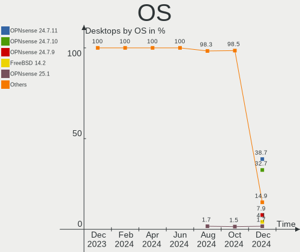
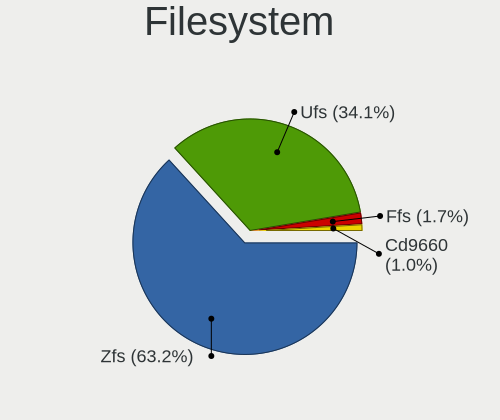
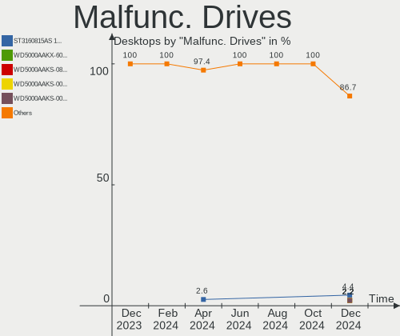
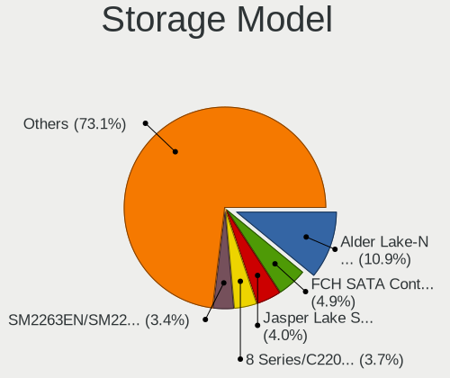
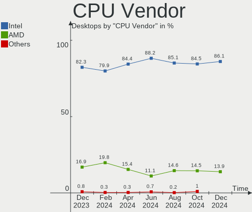
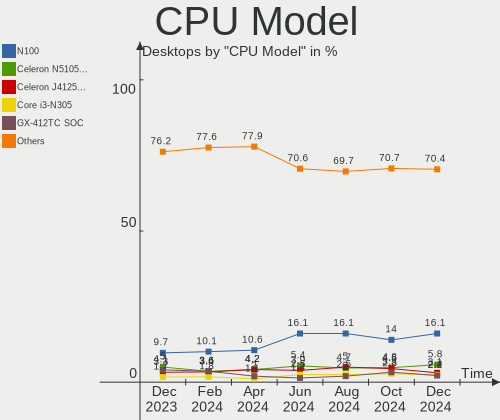
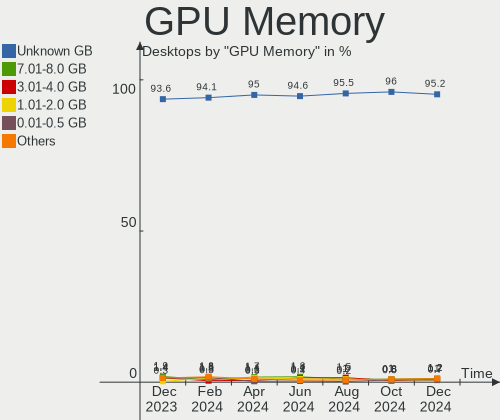
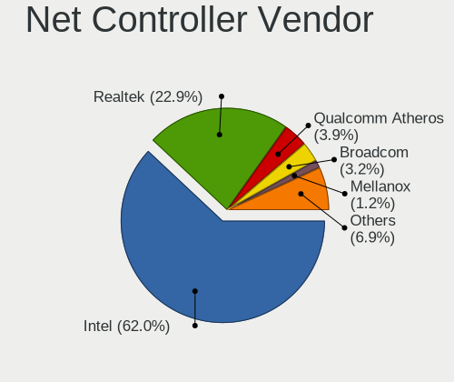
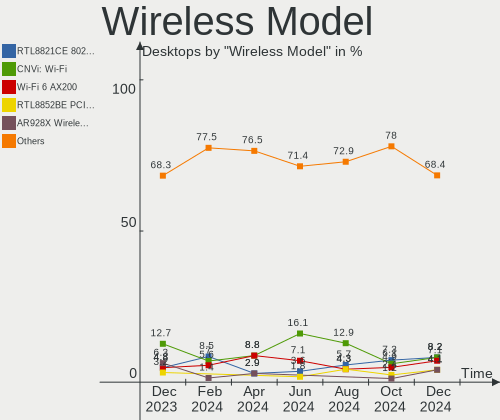

BSD Hardware Trends (Desktops)
------------------------------

A project to identify most popular hardware characteristics and track their change
over time based on data collected by BSD users at https://BSD-Hardware.info.

Anyone can contribute to this report by the [hw-probe](https://github.com/linuxhw/hw-probe/blob/master/INSTALL.BSD.md) tool:

    hw-probe -all -upload

Full-feature report is available here: https://bsd-hardware.info/?view=trends

Period: Dec, 2021.

Contents
--------

* [ System ](#system)
  - [ OS                       ](#os)
  - [ OS Family                ](#os-family)
  - [ Arch                     ](#arch)
  - [ DE                       ](#de)
  - [ Display Server           ](#display-server)
  - [ Display Manager          ](#display-manager)
  - [ OS Lang                  ](#os-lang)
  - [ Boot Mode                ](#boot-mode)
  - [ Filesystem               ](#filesystem)
  - [ Part. scheme             ](#part-scheme)

* [ Board ](#board)
  - [ Vendor                   ](#vendor)
  - [ Model                    ](#model)
  - [ Model Family             ](#model-family)
  - [ MFG Year                 ](#mfg-year)
  - [ Form Factor              ](#form-factor)
  - [ Coreboot                 ](#coreboot)
  - [ RAM Size                 ](#ram-size)
  - [ RAM Used                 ](#ram-used)
  - [ Total Drives             ](#total-drives)
  - [ Has CD-ROM               ](#has-cd-rom)
  - [ Has Ethernet             ](#has-ethernet)
  - [ Has WiFi                 ](#has-wifi)
  - [ Has Bluetooth            ](#has-bluetooth)

* [ Location ](#location)
  - [ Country                  ](#country)
  - [ City                     ](#city)

* [ Drives ](#drives)
  - [ Drive Vendor             ](#drive-vendor)
  - [ Drive Model              ](#drive-model)
  - [ HDD Vendor               ](#hdd-vendor)
  - [ SSD Vendor               ](#ssd-vendor)
  - [ Drive Kind               ](#drive-kind)
  - [ Drive Connector          ](#drive-connector)
  - [ Drive Size               ](#drive-size)
  - [ Space Total              ](#space-total)
  - [ Space Used               ](#space-used)
  - [ Malfunc. Drives          ](#malfunc-drives)
  - [ Malfunc. Drive Vendor    ](#malfunc-drive-vendor)
  - [ Malfunc. HDD Vendor      ](#malfunc-hdd-vendor)
  - [ Malfunc. Drive Kind      ](#malfunc-drive-kind)
  - [ Failed Drives            ](#failed-drives)
  - [ Failed Drive Vendor      ](#failed-drive-vendor)
  - [ Drive Status             ](#drive-status)

* [ Storage controller ](#storage-controller)
  - [ Storage Vendor           ](#storage-vendor)
  - [ Storage Model            ](#storage-model)
  - [ Storage Kind             ](#storage-kind)

* [ Processor ](#processor)
  - [ CPU Vendor               ](#cpu-vendor)
  - [ CPU Model                ](#cpu-model)
  - [ CPU Model Family         ](#cpu-model-family)
  - [ CPU Cores                ](#cpu-cores)
  - [ CPU Sockets              ](#cpu-sockets)
  - [ CPU Threads              ](#cpu-threads)
  - [ CPU Microarch            ](#cpu-microarch)

* [ Graphics ](#graphics)
  - [ GPU Vendor               ](#gpu-vendor)
  - [ GPU Model                ](#gpu-model)
  - [ GPU Combo                ](#gpu-combo)
  - [ GPU Driver               ](#gpu-driver)
  - [ GPU Memory               ](#gpu-memory)

* [ Monitor ](#monitor)
  - [ Monitor Vendor           ](#monitor-vendor)
  - [ Monitor Model            ](#monitor-model)
  - [ Monitor Resolution       ](#monitor-resolution)
  - [ Monitor Diagonal         ](#monitor-diagonal)
  - [ Monitor Width            ](#monitor-width)
  - [ Aspect Ratio             ](#aspect-ratio)
  - [ Monitor Area             ](#monitor-area)
  - [ Pixel Density            ](#pixel-density)
  - [ Multiple Monitors        ](#multiple-monitors)

* [ Network ](#network)
  - [ Net Controller Vendor    ](#net-controller-vendor)
  - [ Net Controller Model     ](#net-controller-model)
  - [ Wireless Vendor          ](#wireless-vendor)
  - [ Wireless Model           ](#wireless-model)
  - [ Ethernet Vendor          ](#ethernet-vendor)
  - [ Ethernet Model           ](#ethernet-model)
  - [ Net Controller Kind      ](#net-controller-kind)
  - [ Used Controller          ](#used-controller)
  - [ NICs                     ](#nics)
  - [ IPv6                     ](#ipv6)

* [ Bluetooth ](#bluetooth)
  - [ Bluetooth Vendor         ](#bluetooth-vendor)
  - [ Bluetooth Model          ](#bluetooth-model)

* [ Sound ](#sound)
  - [ Sound Vendor             ](#sound-vendor)
  - [ Sound Model              ](#sound-model)

* [ Memory ](#memory)
  - [ Memory Vendor            ](#memory-vendor)
  - [ Memory Model             ](#memory-model)
  - [ Memory Kind              ](#memory-kind)
  - [ Memory Form Factor       ](#memory-form-factor)
  - [ Memory Size              ](#memory-size)
  - [ Memory Speed             ](#memory-speed)

* [ Printers & scanners ](#printers--scanners)
  - [ Printer Vendor           ](#printer-vendor)
  - [ Printer Model            ](#printer-model)
  - [ Scanner Vendor           ](#scanner-vendor)
  - [ Scanner Model            ](#scanner-model)

* [ Camera ](#camera)
  - [ Camera Vendor            ](#camera-vendor)
  - [ Camera Model             ](#camera-model)

* [ Security ](#security)
  - [ Fingerprint Vendor       ](#fingerprint-vendor)
  - [ Fingerprint Model        ](#fingerprint-model)
  - [ Chipcard Vendor          ](#chipcard-vendor)
  - [ Chipcard Model           ](#chipcard-model)

* [ Unsupported ](#unsupported)
  - [ Unsupported Devices      ](#unsupported-devices)
  - [ Unsupported Device Types ](#unsupported-device-types)

System
------

OS
--

Installed operating systems

| Name                   | Desktops | Percent |
|------------------------|----------|---------|
| OPNsense 21.7.7        | 73       | 28.97%  |
| OPNsense 21.7.6        | 72       | 28.57%  |
| helloSystem 0.7.0      | 28       | 11.11%  |
| FreeBSD 13.0-p5        | 18       | 7.14%   |
| FreeBSD 13.0           | 6        | 2.38%   |
| OPNsense 22.1          | 5        | 1.98%   |
| helloSystem 0.6.0      | 5        | 1.98%   |
| FreeBSD 14.0-CURRENT   | 5        | 1.98%   |
| FreeBSD 13.0-STABLE    | 5        | 1.98%   |
| OPNsense 21.1.9        | 4        | 1.59%   |
| OpenBSD 7.0            | 3        | 1.19%   |
| OPNsense 21.7.5        | 2        | 0.79%   |
| OPNsense 21.7.4        | 2        | 0.79%   |
| OPNsense 21.7.3        | 2        | 0.79%   |
| OPNsense 12.1-p21-HBSD | 2        | 0.79%   |
| NomadBSD 5806f915      | 2        | 0.79%   |
| NetBSD 9.99.93         | 2        | 0.79%   |
| GhostBSD 21.08.27      | 2        | 0.79%   |
| FreeBSD 13.0-p4        | 2        | 0.79%   |
| XigmaNAS 12.2-p7       | 1        | 0.4%    |
| TrueNAS 12.2-p11       | 1        | 0.4%    |
| OPNsense 21.7.2        | 1        | 0.4%    |
| OPNsense 21.7.1        | 1        | 0.4%    |
| OPNsense 12.1-p20-HBSD | 1        | 0.4%    |
| NetBSD 9.2             | 1        | 0.4%    |
| MidnightBSD 2.1.2      | 1        | 0.4%    |
| helloSystem 0.5.0      | 1        | 0.4%    |
| FreeBSD 13.0-p3        | 1        | 0.4%    |
| FreeBSD 12.3           | 1        | 0.4%    |
| FreeBSD 12.2-p11       | 1        | 0.4%    |
| FreeBSD 12.2           | 1        | 0.4%    |

OS Family
---------

OS without a version

| Name        | Desktops | Percent |
|-------------|----------|---------|
| OPNsense    | 165      | 65.48%  |
| FreeBSD     | 40       | 15.87%  |
| helloSystem | 34       | 13.49%  |
| OpenBSD     | 3        | 1.19%   |
| NetBSD      | 3        | 1.19%   |
| NomadBSD    | 2        | 0.79%   |
| GhostBSD    | 2        | 0.79%   |
| XigmaNAS    | 1        | 0.4%    |
| TrueNAS     | 1        | 0.4%    |
| MidnightBSD | 1        | 0.4%    |

Arch
----

OS architecture (x86_64, i586, etc.)

| Name  | Desktops | Percent |
|-------|----------|---------|
| amd64 | 243      | 96.43%  |
| arm64 | 6        | 2.38%   |
| i386  | 1        | 0.4%    |
| armv7 | 1        | 0.4%    |
| arm   | 1        | 0.4%    |

DE
--

Desktop Environment

| Name         | Desktops | Percent |
|--------------|----------|---------|
| Console      | 185      | 73.41%  |
| helloDesktop | 35       | 13.89%  |
| KDE5         | 7        | 2.78%   |
| XFCE         | 6        | 2.38%   |
| Openbox      | 5        | 1.98%   |
| GNOME        | 5        | 1.98%   |
| TWM          | 2        | 0.79%   |
| MATE         | 2        | 0.79%   |
| X-Cinnamon   | 1        | 0.4%    |
| LXQt         | 1        | 0.4%    |
| i3           | 1        | 0.4%    |
| fvwm         | 1        | 0.4%    |
| Fluxbox      | 1        | 0.4%    |

Display Server
--------------

X11 or Wayland

| Name    | Desktops | Percent |
|---------|----------|---------|
| Console | 187      | 74.21%  |
| X11     | 64       | 25.4%   |
| Wayland | 1        | 0.4%    |

Display Manager
---------------

SDDM, LightDM, etc.

| Name    | Desktops | Percent |
|---------|----------|---------|
| Console | 200      | 79.37%  |
| SLiM    | 41       | 16.27%  |
| LightDM | 5        | 1.98%   |
| SDDM    | 4        | 1.59%   |
| XDM     | 2        | 0.79%   |

OS Lang
-------

Language

| Lang    | Desktops | Percent |
|---------|----------|---------|
| Unknown | 173      | 68.65%  |
| en_US   | 41       | 16.27%  |
| C       | 25       | 9.92%   |
| ru_RU   | 6        | 2.38%   |
| uk_UA   | 5        | 1.98%   |
| en_GB   | 1        | 0.4%    |
| de_DE   | 1        | 0.4%    |

Boot Mode
---------

EFI or BIOS

| Mode | Desktops | Percent |
|------|----------|---------|
| EFI  | 210      | 83.33%  |
| BIOS | 42       | 16.67%  |

Filesystem
----------

Type of filesystem

| Type   | Desktops | Percent |
|--------|----------|---------|
| Ufs    | 134      | 53.17%  |
| Zfs    | 94       | 37.3%   |
| Cd9660 | 21       | 8.33%   |
| Ffs    | 3        | 1.19%   |

Part. scheme
------------

Scheme of partitioning

| Type    | Desktops | Percent |
|---------|----------|---------|
| GPT     | 232      | 92.06%  |
| MBR     | 16       | 6.35%   |
| Unknown | 3        | 1.19%   |
| BSD     | 1        | 0.4%    |

Board
-----

Vendor
------

Motherboard manufacturer

| Name                       | Desktops | Percent |
|----------------------------|----------|---------|
| ASUSTek Computer           | 35       | 13.89%  |
| Unknown                    | 34       | 13.49%  |
| Dell                       | 24       | 9.52%   |
| Hewlett-Packard            | 22       | 8.73%   |
| Gigabyte Technology        | 20       | 7.94%   |
| ASRock                     | 18       | 7.14%   |
| Protectli                  | 17       | 6.75%   |
| Intel                      | 13       | 5.16%   |
| PC Engines                 | 12       | 4.76%   |
| MSI                        | 12       | 4.76%   |
| Fujitsu                    | 6        | 2.38%   |
| Supermicro                 | 4        | 1.59%   |
| Lenovo                     | 4        | 1.59%   |
| Biostar                    | 3        | 1.19%   |
| NEXCOM                     | 2        | 0.79%   |
| HPE                        | 2        | 0.79%   |
| AMI                        | 2        | 0.79%   |
| Acer                       | 2        | 0.79%   |
| YANYU                      | 1        | 0.4%    |
| ShenZhen MinWin Technology | 1        | 0.4%    |
| Quanta                     | 1        | 0.4%    |
| Purism                     | 1        | 0.4%    |
| Pegatron                   | 1        | 0.4%    |
| OEM                        | 1        | 0.4%    |
| NU591                      | 1        | 0.4%    |
| Netgate                    | 1        | 0.4%    |
| Lex                        | 1        | 0.4%    |
| khadas                     | 1        | 0.4%    |
| Jetway                     | 1        | 0.4%    |
| HARDKERNEL                 | 1        | 0.4%    |
| friendlyelec               | 1        | 0.4%    |
| Cisco Systems              | 1        | 0.4%    |
| CheckPoint                 | 1        | 0.4%    |
| BESSTAR Tech               | 1        | 0.4%    |
| ASRockRack                 | 1        | 0.4%    |
| Apple                      | 1        | 0.4%    |
| Alienware                  | 1        | 0.4%    |
| Advantech                  | 1        | 0.4%    |

Model
-----

Motherboard model

| Name                                    | Desktops | Percent |
|-----------------------------------------|----------|---------|
| Unknown                                 | 34       | 13.49%  |
| PC Engines apu4                         | 8        | 3.17%   |
| Protectli FW4B                          | 6        | 2.38%   |
| Protectli FW6                           | 5        | 1.98%   |
| Intel Q3XXG4-P V1.0                     | 5        | 1.98%   |
| Dell OptiPlex 3010                      | 5        | 1.98%   |
| Dell OptiPlex 9020                      | 4        | 1.59%   |
| Protectli FW6E                          | 3        | 1.19%   |
| PC Engines APU2                         | 3        | 1.19%   |
| Protectli FW6D                          | 2        | 0.79%   |
| MSI MS-7592                             | 2        | 0.79%   |
| HP t620 PLUS Quad Core TC               | 2        | 0.79%   |
| HP ProDesk 600 G2 SFF                   | 2        | 0.79%   |
| HP ProDesk 600 G1 SFF                   | 2        | 0.79%   |
| Gigabyte X470 AORUS ULTRA GAMING        | 2        | 0.79%   |
| Dell OptiPlex 9010                      | 2        | 0.79%   |
| ASUS ROG STRIX X570-E GAMING            | 2        | 0.79%   |
| ASUS All Series                         | 2        | 0.79%   |
| ASRock X570 Phantom Gaming 4            | 2        | 0.79%   |
| YANYU H67SL                             | 1        | 0.4%    |
| Supermicro X8SIL                        | 1        | 0.4%    |
| Supermicro SYS-E300-9D-8CN8TP           | 1        | 0.4%    |
| Supermicro SYS-5019A-FTN4               | 1        | 0.4%    |
| Supermicro SYS-1019D-4C-FHN13TP         | 1        | 0.4%    |
| ShenZhen MinWin 3865U-6L                | 1        | 0.4%    |
| Quanta 120-1135                         | 1        | 0.4%    |
| Purism Librem Mini v2                   | 1        | 0.4%    |
| Protectli FW4A                          | 1        | 0.4%    |
| Pegatron IPM41-D3                       | 1        | 0.4%    |
| PC Engines APU                          | 1        | 0.4%    |
| OEM AR-B5800                            | 1        | 0.4%    |
| NU591 LES v3                            | 1        | 0.4%    |
| NEXCOM NDIS B322                        | 1        | 0.4%    |
| NEXCOM ASG                              | 1        | 0.4%    |
| Netgate SG-5100                         | 1        | 0.4%    |
| MSI MS-9A25                             | 1        | 0.4%    |
| MSI MS-7C91                             | 1        | 0.4%    |
| MSI MS-7C36                             | 1        | 0.4%    |
| MSI MS-7C02                             | 1        | 0.4%    |
| MSI MS-7B31                             | 1        | 0.4%    |
| MSI MS-7A33                             | 1        | 0.4%    |
| MSI MS-7885                             | 1        | 0.4%    |
| MSI MS-7846                             | 1        | 0.4%    |
| MSI MS-7817                             | 1        | 0.4%    |
| MSI MS-7799                             | 1        | 0.4%    |
| Lex Pineview-D                          | 1        | 0.4%    |
| Lenovo ThinkCentre M93 10A4-A00DGE      | 1        | 0.4%    |
| Lenovo ThinkCentre M83 10E8S00800       | 1        | 0.4%    |
| Lenovo ThinkCentre M710s 10M8S6JL00     | 1        | 0.4%    |
| Lenovo IdeaCentre 300S-08IHH 90F10030US | 1        | 0.4%    |
| khadas edge-v                           | 1        | 0.4%    |
| Jetway 1.0                              | 1        | 0.4%    |
| Intel SKYBAY                            | 1        | 0.4%    |
| Intel S1200KP AAG34877-201              | 1        | 0.4%    |
| Intel NCB-4210WG                        | 1        | 0.4%    |
| Intel DQ67OW AAG12528-310               | 1        | 0.4%    |
| Intel DH61AG AAG81491-600               | 1        | 0.4%    |
| Intel D54250WYK H13922-304              | 1        | 0.4%    |
| Intel D34010WYK H14771-304              | 1        | 0.4%    |
| Intel ChiefRiver                        | 1        | 0.4%    |

Model Family
------------

Motherboard model prefix

| Name                            | Desktops | Percent |
|---------------------------------|----------|---------|
| Unknown                         | 34       | 13.49%  |
| Dell OptiPlex                   | 17       | 6.75%   |
| PC Engines apu4                 | 8        | 3.17%   |
| Protectli FW4B                  | 6        | 2.38%   |
| HP ProDesk                      | 6        | 2.38%   |
| ASUS ROG                        | 6        | 2.38%   |
| ASUS PRIME                      | 6        | 2.38%   |
| Protectli FW6                   | 5        | 1.98%   |
| Intel Q3XXG4-P                  | 5        | 1.98%   |
| HP Compaq                       | 4        | 1.59%   |
| Protectli FW6E                  | 3        | 1.19%   |
| PC Engines APU2                 | 3        | 1.19%   |
| Lenovo ThinkCentre              | 3        | 1.19%   |
| HP ProLiant                     | 3        | 1.19%   |
| Fujitsu FUTRO                   | 3        | 1.19%   |
| Fujitsu ESPRIMO                 | 3        | 1.19%   |
| ASRock X570                     | 3        | 1.19%   |
| Protectli FW6D                  | 2        | 0.79%   |
| MSI MS-7592                     | 2        | 0.79%   |
| HPE ProLiant                    | 2        | 0.79%   |
| HP t620                         | 2        | 0.79%   |
| HP EliteDesk                    | 2        | 0.79%   |
| Gigabyte X470                   | 2        | 0.79%   |
| Gigabyte B550M                  | 2        | 0.79%   |
| Dell Precision                  | 2        | 0.79%   |
| Dell Inspiron                   | 2        | 0.79%   |
| ASUS TUF                        | 2        | 0.79%   |
| ASUS P8Z77-V                    | 2        | 0.79%   |
| ASUS All                        | 2        | 0.79%   |
| YANYU H67SL                     | 1        | 0.4%    |
| Supermicro X8SIL                | 1        | 0.4%    |
| Supermicro SYS-E300-9D-8CN8TP   | 1        | 0.4%    |
| Supermicro SYS-5019A-FTN4       | 1        | 0.4%    |
| Supermicro SYS-1019D-4C-FHN13TP | 1        | 0.4%    |
| ShenZhen MinWin 3865U-6L        | 1        | 0.4%    |
| Quanta 120-1135                 | 1        | 0.4%    |
| Purism Librem                   | 1        | 0.4%    |
| Protectli FW4A                  | 1        | 0.4%    |
| Pegatron IPM41-D3               | 1        | 0.4%    |
| PC Engines APU                  | 1        | 0.4%    |
| OEM AR-B5800                    | 1        | 0.4%    |
| NU591 LES                       | 1        | 0.4%    |
| NEXCOM NDIS                     | 1        | 0.4%    |
| NEXCOM ASG                      | 1        | 0.4%    |
| Netgate SG-5100                 | 1        | 0.4%    |
| MSI MS-9A25                     | 1        | 0.4%    |
| MSI MS-7C91                     | 1        | 0.4%    |
| MSI MS-7C36                     | 1        | 0.4%    |
| MSI MS-7C02                     | 1        | 0.4%    |
| MSI MS-7B31                     | 1        | 0.4%    |
| MSI MS-7A33                     | 1        | 0.4%    |
| MSI MS-7885                     | 1        | 0.4%    |
| MSI MS-7846                     | 1        | 0.4%    |
| MSI MS-7817                     | 1        | 0.4%    |
| MSI MS-7799                     | 1        | 0.4%    |
| Lex Pineview-D                  | 1        | 0.4%    |
| Lenovo IdeaCentre               | 1        | 0.4%    |
| khadas edge-v                   | 1        | 0.4%    |
| Jetway 1.0                      | 1        | 0.4%    |
| Intel SKYBAY                    | 1        | 0.4%    |

MFG Year
--------

Motherboard manufacture year

| Year    | Desktops | Percent |
|---------|----------|---------|
| 2021    | 55       | 21.83%  |
| 2019    | 33       | 13.1%   |
| 2020    | 32       | 12.7%   |
| 2018    | 27       | 10.71%  |
| 2014    | 19       | 7.54%   |
| 2013    | 19       | 7.54%   |
| 2017    | 13       | 5.16%   |
| 2011    | 11       | 4.37%   |
| 2016    | 9        | 3.57%   |
| 2012    | 8        | 3.17%   |
| 2015    | 6        | 2.38%   |
| 2010    | 6        | 2.38%   |
| Unknown | 6        | 2.38%   |
| 2009    | 3        | 1.19%   |
| 2007    | 2        | 0.79%   |
| 2008    | 1        | 0.4%    |
| 2006    | 1        | 0.4%    |
| 2005    | 1        | 0.4%    |

Form Factor
-----------

Physical design of the computer

| Name    | Desktops | Percent |
|---------|----------|---------|
| Desktop | 252      | 100%    |

Coreboot
--------

Have coreboot on board

| Used | Desktops | Percent |
|------|----------|---------|
| No   | 237      | 94.05%  |
| Yes  | 15       | 5.95%   |

RAM Size
--------

Total RAM memory

| Size in GB  | Desktops | Percent |
|-------------|----------|---------|
| 8.01-16.0   | 82       | 32.54%  |
| 4.01-8.0    | 56       | 22.22%  |
| 16.01-24.0  | 45       | 17.86%  |
| 32.01-64.0  | 30       | 11.9%   |
| 64.01-256.0 | 15       | 5.95%   |
| 2.01-3.0    | 13       | 5.16%   |
| 3.01-4.0    | 5        | 1.98%   |
| 24.01-32.0  | 3        | 1.19%   |
| 0.51-1.0    | 2        | 0.79%   |
| 0.01-0.5    | 1        | 0.4%    |

RAM Used
--------

Used RAM memory

| Used GB     | Desktops | Percent |
|-------------|----------|---------|
| 0.01-0.5    | 125      | 49.6%   |
| 0.51-1.0    | 55       | 21.83%  |
| 1.01-2.0    | 38       | 15.08%  |
| 4.01-8.0    | 9        | 3.57%   |
| 2.01-3.0    | 8        | 3.17%   |
| 3.01-4.0    | 6        | 2.38%   |
| Unknown     | 3        | 1.19%   |
| 32.01-64.0  | 2        | 0.79%   |
| 8.01-16.0   | 2        | 0.79%   |
| 0           | 2        | 0.79%   |
| 64.01-256.0 | 1        | 0.4%    |
| 16.01-24.0  | 1        | 0.4%    |

Total Drives
------------

Number of drives on board

| Drives | Desktops | Percent |
|--------|----------|---------|
| 1      | 171      | 67.86%  |
| 2      | 27       | 10.71%  |
| 0      | 20       | 7.94%   |
| 4      | 14       | 5.56%   |
| 3      | 8        | 3.17%   |
| 6      | 5        | 1.98%   |
| 5      | 4        | 1.59%   |
| 13     | 1        | 0.4%    |
| 8      | 1        | 0.4%    |
| 7      | 1        | 0.4%    |

Has CD-ROM
----------

Has CD-ROM on board

| Presented | Desktops | Percent |
|-----------|----------|---------|
| No        | 204      | 80.95%  |
| Yes       | 48       | 19.05%  |

Has Ethernet
------------

Has Ethernet on board

| Presented | Desktops | Percent |
|-----------|----------|---------|
| Yes       | 246      | 97.62%  |
| No        | 6        | 2.38%   |

Has WiFi
--------

Has WiFi module

| Presented | Desktops | Percent |
|-----------|----------|---------|
| No        | 185      | 73.41%  |
| Yes       | 67       | 26.59%  |

Has Bluetooth
-------------

Has Bluetooth module

| Presented | Desktops | Percent |
|-----------|----------|---------|
| No        | 217      | 86.11%  |
| Yes       | 35       | 13.89%  |

Location
--------

Country
-------

Geographic location (country)

| Country      | Desktops | Percent |
|--------------|----------|---------|
| USA          | 78       | 30.95%  |
| Germany      | 41       | 16.27%  |
| Russia       | 20       | 7.94%   |
| Ukraine      | 10       | 3.97%   |
| Netherlands  | 10       | 3.97%   |
| Poland       | 7        | 2.78%   |
| Canada       | 7        | 2.78%   |
| Austria      | 7        | 2.78%   |
| Switzerland  | 6        | 2.38%   |
| Spain        | 6        | 2.38%   |
| Romania      | 6        | 2.38%   |
| France       | 6        | 2.38%   |
| Hungary      | 5        | 1.98%   |
| Australia    | 5        | 1.98%   |
| India        | 4        | 1.59%   |
| UK           | 3        | 1.19%   |
| Sweden       | 3        | 1.19%   |
| New Zealand  | 3        | 1.19%   |
| Taiwan       | 2        | 0.79%   |
| South Korea  | 2        | 0.79%   |
| Philippines  | 2        | 0.79%   |
| Italy        | 2        | 0.79%   |
| Denmark      | 2        | 0.79%   |
| Vietnam      | 1        | 0.4%    |
| South Africa | 1        | 0.4%    |
| Qatar        | 1        | 0.4%    |
| Portugal     | 1        | 0.4%    |
| Peru         | 1        | 0.4%    |
| Japan        | 1        | 0.4%    |
| Isle of Man  | 1        | 0.4%    |
| Ireland      | 1        | 0.4%    |
| Indonesia    | 1        | 0.4%    |
| Finland      | 1        | 0.4%    |
| Czechia      | 1        | 0.4%    |
| Croatia      | 1        | 0.4%    |
| China        | 1        | 0.4%    |
| Bulgaria     | 1        | 0.4%    |
| Brazil       | 1        | 0.4%    |

City
----

Geographic location (city)

| City              | Desktops | Percent |
|-------------------|----------|---------|
| Moscow            | 7        | 2.78%   |
| Kyiv              | 6        | 2.38%   |
| Berlin            | 5        | 1.98%   |
| Zeitz             | 3        | 1.19%   |
| Karlsruhe         | 3        | 1.19%   |
| Bucharest         | 3        | 1.19%   |
| Woodbridge        | 2        | 0.79%   |
| Vienna            | 2        | 0.79%   |
| Valencia          | 2        | 0.79%   |
| Sz?©kesfeh?©rv??r | 2        | 0.79%   |
| Salem             | 2        | 0.79%   |
| Redmond           | 2        | 0.79%   |
| Portland          | 2        | 0.79%   |
| Perth             | 2        | 0.79%   |
| Ozersk            | 2        | 0.79%   |
| Ourense           | 2        | 0.79%   |
| Novosibirsk       | 2        | 0.79%   |
| Munich            | 2        | 0.79%   |
| Mountain View     | 2        | 0.79%   |
| Milwaukee         | 2        | 0.79%   |
| Madrid            | 2        | 0.79%   |
| Krakow            | 2        | 0.79%   |
| Jena              | 2        | 0.79%   |
| Frankfurt am Main | 2        | 0.79%   |
| Duisburg          | 2        | 0.79%   |
| Cologne           | 2        | 0.79%   |
| Brooklyn          | 2        | 0.79%   |
| Auckland          | 2        | 0.79%   |
| Amsterdam         | 2        | 0.79%   |
| Zurich            | 1        | 0.4%    |
| Zaltbommel        | 1        | 0.4%    |
| Zadar             | 1        | 0.4%    |
| Yunlin            | 1        | 0.4%    |
| Ypsilanti         | 1        | 0.4%    |
| Yokohama          | 1        | 0.4%    |
| Yeosu             | 1        | 0.4%    |
| Yekaterinburg     | 1        | 0.4%    |
| Wolgast           | 1        | 0.4%    |
| Windsor Mill      | 1        | 0.4%    |
| Whitewater        | 1        | 0.4%    |
| Westminster       | 1        | 0.4%    |
| Werl              | 1        | 0.4%    |
| Wenatchee         | 1        | 0.4%    |
| Wellington        | 1        | 0.4%    |
| Warsaw            | 1        | 0.4%    |
| Warren            | 1        | 0.4%    |
| Waltham           | 1        | 0.4%    |
| Walcz             | 1        | 0.4%    |
| Voskresensk       | 1        | 0.4%    |
| Volzhskiy         | 1        | 0.4%    |
| Vancouver         | 1        | 0.4%    |
| Upplands Vasby    | 1        | 0.4%    |
| Ufa               | 1        | 0.4%    |
| Trenton           | 1        | 0.4%    |
| The Villages      | 1        | 0.4%    |
| The Hague         | 1        | 0.4%    |
| Tarlac City       | 1        | 0.4%    |
| Tambov            | 1        | 0.4%    |
| Szigetszentmiklos | 1        | 0.4%    |
| Szeged            | 1        | 0.4%    |

Drives
------

Drive Vendor
------------

Hard drive vendors

| Vendor              | Desktops | Drives | Percent |
|---------------------|----------|--------|---------|
| Samsung Electronics | 58       | 76     | 18.95%  |
| WDC                 | 40       | 66     | 13.07%  |
| Seagate             | 33       | 51     | 10.78%  |
| Kingston            | 23       | 24     | 7.52%   |
| Toshiba             | 16       | 19     | 5.23%   |
| Crucial             | 16       | 16     | 5.23%   |
| Transcend           | 15       | 15     | 4.9%    |
| Intel               | 12       | 12     | 3.92%   |
| SanDisk             | 10       | 11     | 3.27%   |
| Phison              | 8        | 8      | 2.61%   |
| Hoodisk             | 7        | 7      | 2.29%   |
| SK Hynix            | 5        | 5      | 1.63%   |
| OCZ                 | 5        | 5      | 1.63%   |
| Intenso             | 4        | 4      | 1.31%   |
| HGST                | 4        | 7      | 1.31%   |
| GOODRAM             | 4        | 9      | 1.31%   |
| Dogfish             | 4        | 4      | 1.31%   |
| A-DATA Technology   | 4        | 5      | 1.31%   |
| China               | 3        | 3      | 0.98%   |
| XPG                 | 2        | 2      | 0.65%   |
| Protectli           | 2        | 2      | 0.65%   |
| MyDigitalSSD        | 2        | 2      | 0.65%   |
| Micron Technology   | 2        | 2      | 0.65%   |
| LITEONIT            | 2        | 2      | 0.65%   |
| HPE                 | 2        | 3      | 0.65%   |
| Hitachi             | 2        | 2      | 0.65%   |
| FORESEE             | 2        | 2      | 0.65%   |
| Advantech           | 2        | 2      | 0.65%   |
| Terabit             | 1        | 1      | 0.33%   |
| SPCC                | 1        | 1      | 0.33%   |
| Smartbuy            | 1        | 1      | 0.33%   |
| Silicon Motion      | 1        | 1      | 0.33%   |
| Patriot             | 1        | 1      | 0.33%   |
| MAXTOR              | 1        | 1      | 0.33%   |
| LITEON              | 1        | 1      | 0.33%   |
| Kston               | 1        | 1      | 0.33%   |
| KingSpec            | 1        | 1      | 0.33%   |
| Indilinx            | 1        | 1      | 0.33%   |
| IBM-207x            | 1        | 1      | 0.33%   |
| HCiPC               | 1        | 1      | 0.33%   |
| Gigabyte Technology | 1        | 1      | 0.33%   |
| Fujitsu             | 1        | 1      | 0.33%   |
| Corsair             | 1        | 1      | 0.33%   |
| BIWIN               | 1        | 1      | 0.33%   |
| Apacer              | 1        | 1      | 0.33%   |

Drive Model
-----------

Hard drive models

| Model                           | Desktops | Percent |
|---------------------------------|----------|---------|
| Kingston SUV500MS120G 120GB     | 7        | 2.06%   |
| Samsung SSD 850 EVO 250GB       | 5        | 1.47%   |
| Samsung SSD 860 EVO 500GB       | 4        | 1.18%   |
| Kingston SV300S37A120G 120GB    | 4        | 1.18%   |
| Kingston SA400S37120G 120GB     | 4        | 1.18%   |
| Transcend TS64GMSA370 64GB      | 3        | 0.88%   |
| Toshiba DT01ACA100 1TB          | 3        | 0.88%   |
| Toshiba DT01ACA050 500GB        | 3        | 0.88%   |
| Seagate ST4000DM004-2CV104 4TB  | 3        | 0.88%   |
| Seagate ST1000DM010-2EP102 1TB  | 3        | 0.88%   |
| Hoodisk SSD 128GB               | 3        | 0.88%   |
| Crucial CT240BX500SSD1 240GB    | 3        | 0.88%   |
| China XJH-128GB                 | 3        | 0.88%   |
| XPG GAMMIX S11 Pro 1TB          | 2        | 0.59%   |
| WDC WDS500G2B0A-00SM50 500GB    | 2        | 0.59%   |
| WDC WD5000AAKX-00ERMA0 500GB    | 2        | 0.59%   |
| WDC WD5000AAKS-00A7B2 500GB     | 2        | 0.59%   |
| WDC WD40EZRZ-00GXCB0 4TB        | 2        | 0.59%   |
| WDC WD10EFRX-68JCSN0 1TB        | 2        | 0.59%   |
| WDC WD10EFRX-68FYTN0 1TB        | 2        | 0.59%   |
| Transcend TS64GMSA230S 64GB     | 2        | 0.59%   |
| Transcend TS32GSSD370 32GB      | 2        | 0.59%   |
| Transcend TS128GMSA230S 128GB   | 2        | 0.59%   |
| Toshiba HDWD110 1TB             | 2        | 0.59%   |
| Seagate ST4000DM000-1F2168 4TB  | 2        | 0.59%   |
| Seagate ST3500418AS 500GB       | 2        | 0.59%   |
| Seagate ST3500413AS 500GB       | 2        | 0.59%   |
| Seagate ST3000DM001-1CH166 3TB  | 2        | 0.59%   |
| Seagate ST1000LM035-1RK172 1TB  | 2        | 0.59%   |
| Seagate ST1000DM003-1CH162 1TB  | 2        | 0.59%   |
| Samsung SSD 980 500GB           | 2        | 0.59%   |
| Samsung SSD 970 EVO Plus 1TB    | 2        | 0.59%   |
| Samsung SSD 970 EVO 1TB         | 2        | 0.59%   |
| Samsung SSD 960 EVO 500GB       | 2        | 0.59%   |
| Samsung SSD 860 QVO 2TB         | 2        | 0.59%   |
| Samsung SSD 860 EVO 250GB       | 2        | 0.59%   |
| Samsung SSD 840 Series 120GB    | 2        | 0.59%   |
| Samsung SSD 840 EVO 250GB       | 2        | 0.59%   |
| Samsung SSD 840 EVO 120GB mSATA | 2        | 0.59%   |
| Phison SATA SSD 16GB            | 2        | 0.59%   |
| Phison Sabrent 1TB              | 2        | 0.59%   |
| MyDigitalSSD SB2 128GB          | 2        | 0.59%   |
| Kingston SKC600MS512G 512GB     | 2        | 0.59%   |
| Intenso SSD Sata III 128GB      | 2        | 0.59%   |
| Crucial CT250MX500SSD1 250GB    | 2        | 0.59%   |
| WDC WDS250G3X0C-00SJG0 250GB    | 1        | 0.29%   |
| WDC WDS250G1B0A-00H9H0 250GB    | 1        | 0.29%   |
| WDC WDS240G2G0A-00JH30 240GB    | 1        | 0.29%   |
| WDC WDS120G2G0A-00JH30 120GB    | 1        | 0.29%   |
| WDC WDS100T2B0A-00SM50 1TB      | 1        | 0.29%   |
| WDC WDS100T1X0E-00AFY0 1TB      | 1        | 0.29%   |
| WDC WD80EMAZ-00WJTA0 8TB        | 1        | 0.29%   |
| WDC WD80EFZX-68UW8N0 8TB        | 1        | 0.29%   |
| WDC WD80EFAX-68LHPN0 8TB        | 1        | 0.29%   |
| WDC WD80EDBZ-11B0ZA0 8TB        | 1        | 0.29%   |
| WDC WD800JD-08LSA0 80GB         | 1        | 0.29%   |
| WDC WD60EZRZ-00GZ5B1 6TB        | 1        | 0.29%   |
| WDC WD5000LPVX-22V0TT0 500GB    | 1        | 0.29%   |
| WDC WD5000BPKT-00PK4T0 500GB    | 1        | 0.29%   |
| WDC WD5000AAKX-08ERMA0 500GB    | 1        | 0.29%   |

HDD Vendor
----------

Hard disk drive vendors

| Vendor              | Desktops | Drives | Percent |
|---------------------|----------|--------|---------|
| WDC                 | 33       | 57     | 37.08%  |
| Seagate             | 32       | 50     | 35.96%  |
| Toshiba             | 13       | 16     | 14.61%  |
| HGST                | 4        | 7      | 4.49%   |
| Hitachi             | 2        | 2      | 2.25%   |
| Samsung Electronics | 1        | 1      | 1.12%   |
| MAXTOR              | 1        | 1      | 1.12%   |
| IBM-207x            | 1        | 1      | 1.12%   |
| HPE                 | 1        | 1      | 1.12%   |
| Fujitsu             | 1        | 1      | 1.12%   |

SSD Vendor
----------

Solid state drive vendors

| Vendor              | Desktops | Drives | Percent |
|---------------------|----------|--------|---------|
| Samsung Electronics | 38       | 46     | 20.88%  |
| Kingston            | 22       | 23     | 12.09%  |
| Transcend           | 15       | 15     | 8.24%   |
| Crucial             | 14       | 14     | 7.69%   |
| Intel               | 12       | 12     | 6.59%   |
| SanDisk             | 9        | 10     | 4.95%   |
| Hoodisk             | 7        | 7      | 3.85%   |
| Phison              | 6        | 6      | 3.3%    |
| WDC                 | 5        | 6      | 2.75%   |
| OCZ                 | 5        | 5      | 2.75%   |
| Intenso             | 4        | 4      | 2.2%    |
| Dogfish             | 4        | 4      | 2.2%    |
| A-DATA Technology   | 4        | 5      | 2.2%    |
| Toshiba             | 3        | 3      | 1.65%   |
| SK Hynix            | 3        | 3      | 1.65%   |
| GOODRAM             | 3        | 8      | 1.65%   |
| China               | 3        | 3      | 1.65%   |
| Protectli           | 2        | 2      | 1.1%    |
| MyDigitalSSD        | 2        | 2      | 1.1%    |
| Micron Technology   | 2        | 2      | 1.1%    |
| LITEONIT            | 2        | 2      | 1.1%    |
| FORESEE             | 2        | 2      | 1.1%    |
| Advantech           | 2        | 2      | 1.1%    |
| Terabit             | 1        | 1      | 0.55%   |
| SPCC                | 1        | 1      | 0.55%   |
| Smartbuy            | 1        | 1      | 0.55%   |
| Patriot             | 1        | 1      | 0.55%   |
| LITEON              | 1        | 1      | 0.55%   |
| Kston               | 1        | 1      | 0.55%   |
| KingSpec            | 1        | 1      | 0.55%   |
| Indilinx            | 1        | 1      | 0.55%   |
| HPE                 | 1        | 2      | 0.55%   |
| HCiPC               | 1        | 1      | 0.55%   |
| Gigabyte Technology | 1        | 1      | 0.55%   |
| BIWIN               | 1        | 1      | 0.55%   |
| Apacer              | 1        | 1      | 0.55%   |

Drive Kind
----------

HDD or SSD

| Kind | Desktops | Drives | Percent |
|------|----------|--------|---------|
| SSD  | 166      | 200    | 60.14%  |
| HDD  | 72       | 137    | 26.09%  |
| NVMe | 38       | 46     | 13.77%  |

Drive Connector
---------------

SATA, SAS, NVMe, etc.

| Type | Desktops | Drives | Percent |
|------|----------|--------|---------|
| SATA | 212      | 337    | 84.8%   |
| NVMe | 38       | 46     | 15.2%   |

Drive Size
----------

Size of hard drive

| Size in TB | Desktops | Drives | Percent |
|------------|----------|--------|---------|
| 0.01-0.5   | 177      | 212    | 69.41%  |
| 0.51-1.0   | 40       | 48     | 15.69%  |
| 1.01-2.0   | 18       | 28     | 7.06%   |
| 3.01-4.0   | 9        | 21     | 3.53%   |
| 2.01-3.0   | 6        | 8      | 2.35%   |
| 4.01-10.0  | 4        | 18     | 1.57%   |
| 10.01-20.0 | 1        | 2      | 0.39%   |

Space Total
-----------

Amount of disk space available on the file system

| Size in GB     | Desktops | Percent |
|----------------|----------|---------|
| 101-250        | 92       | 36.51%  |
| 251-500        | 40       | 15.87%  |
| 1-20           | 40       | 15.87%  |
| 51-100         | 29       | 11.51%  |
| 21-50          | 24       | 9.52%   |
| 501-1000       | 23       | 9.13%   |
| More than 3000 | 2        | 0.79%   |
| 1001-2000      | 1        | 0.4%    |
| Unknown        | 1        | 0.4%    |

Space Used
----------

Amount of used disk space

| Used GB | Desktops | Percent |
|---------|----------|---------|
| 1-20    | 238      | 94.44%  |
| 21-50   | 5        | 1.98%   |
| 101-250 | 4        | 1.59%   |
| 51-100  | 3        | 1.19%   |
| 251-500 | 1        | 0.4%    |
| Unknown | 1        | 0.4%    |

Malfunc. Drives
---------------

Drive models with a malfunction

| Model                                       | Desktops | Drives | Percent |
|---------------------------------------------|----------|--------|---------|
| WDC WD5000AAKX-00ERMA0 500GB                | 2        | 2      | 6.25%   |
| MyDigitalSSD SB2 128GB                      | 2        | 2      | 6.25%   |
| WDC WD5000AAKX-08ERMA0 500GB                | 1        | 1      | 3.13%   |
| WDC WD20EZRX-00D8PB0 2TB                    | 1        | 2      | 3.13%   |
| WDC WD20EARX-008FB0 2TB                     | 1        | 1      | 3.13%   |
| WDC WD20EARS-00MVWB0 2TB                    | 1        | 1      | 3.13%   |
| WDC WD1001FALS-00J7B1 1TB                   | 1        | 1      | 3.13%   |
| Toshiba HDWE140 4TB                         | 1        | 4      | 3.13%   |
| Toshiba DT01ACA100 1TB                      | 1        | 1      | 3.13%   |
| Terabit T50S3STMLC-256G                     | 1        | 1      | 3.13%   |
| Seagate ST9120822AS 120GB                   | 1        | 1      | 3.13%   |
| Seagate ST500NM0011 500GB                   | 1        | 2      | 3.13%   |
| Seagate ST3500418AS 500GB                   | 1        | 1      | 3.13%   |
| Seagate ST3500413AS 500GB                   | 1        | 1      | 3.13%   |
| Seagate ST320LM010-1KJ15C 320GB             | 1        | 1      | 3.13%   |
| Seagate ST1000DM003-1CH162 1TB              | 1        | 1      | 3.13%   |
| SanDisk SD8TB8U-256G-1006 256GB             | 1        | 1      | 3.13%   |
| Samsung Electronics SSD 870 EVO 1TB         | 1        | 1      | 3.13%   |
| Samsung Electronics MZMPA016HMCD-000L1 16GB | 1        | 1      | 3.13%   |
| Phison SATA SSD 32GB                        | 1        | 1      | 3.13%   |
| MAXTOR STM3250310AS 250GB                   | 1        | 1      | 3.13%   |
| LITEON CV8-8E128-HP 128GB                   | 1        | 1      | 3.13%   |
| Kingston SV300S37A120G 120GB                | 1        | 1      | 3.13%   |
| Kingston SMS200S330G 32GB                   | 1        | 1      | 3.13%   |
| Intel SSDSC2BW120A3 120GB                   | 1        | 1      | 3.13%   |
| Intel SSDSA2BW160G3H 160GB                  | 1        | 1      | 3.13%   |
| HPE MB0500EBNCR 500GB                       | 1        | 1      | 3.13%   |
| Hitachi HTS541680J9SA00 80GB                | 1        | 1      | 3.13%   |
| Crucial CT240M500SSD1 240GB                 | 1        | 1      | 3.13%   |
| A-DATA Technology SU650 120GB               | 1        | 1      | 3.13%   |

Malfunc. Drive Vendor
---------------------

Vendors of faulty drives

| Vendor              | Desktops | Drives | Percent |
|---------------------|----------|--------|---------|
| WDC                 | 6        | 8      | 19.35%  |
| Seagate             | 6        | 7      | 19.35%  |
| Toshiba             | 2        | 5      | 6.45%   |
| Samsung Electronics | 2        | 2      | 6.45%   |
| MyDigitalSSD        | 2        | 2      | 6.45%   |
| Kingston            | 2        | 2      | 6.45%   |
| Intel               | 2        | 2      | 6.45%   |
| Terabit             | 1        | 1      | 3.23%   |
| SanDisk             | 1        | 1      | 3.23%   |
| Phison              | 1        | 1      | 3.23%   |
| MAXTOR              | 1        | 1      | 3.23%   |
| LITEON              | 1        | 1      | 3.23%   |
| HPE                 | 1        | 1      | 3.23%   |
| Hitachi             | 1        | 1      | 3.23%   |
| Crucial             | 1        | 1      | 3.23%   |
| A-DATA Technology   | 1        | 1      | 3.23%   |

Malfunc. HDD Vendor
-------------------

Vendors of faulty HDD drives

| Vendor  | Desktops | Drives | Percent |
|---------|----------|--------|---------|
| WDC     | 6        | 8      | 35.29%  |
| Seagate | 6        | 7      | 35.29%  |
| Toshiba | 2        | 5      | 11.76%  |
| MAXTOR  | 1        | 1      | 5.88%   |
| HPE     | 1        | 1      | 5.88%   |
| Hitachi | 1        | 1      | 5.88%   |

Malfunc. Drive Kind
-------------------

Kinds of faulty drives

| Kind | Desktops | Drives | Percent |
|------|----------|--------|---------|
| HDD  | 17       | 23     | 54.84%  |
| SSD  | 14       | 14     | 45.16%  |

Failed Drives
-------------

Failed drive models

Zero info for selected period =(

Failed Drive Vendor
-------------------

Failed drive vendors

Zero info for selected period =(

Drive Status
------------

Number of failed and malfunc. drives

| Status   | Desktops | Drives | Percent |
|----------|----------|--------|---------|
| Works    | 209      | 342    | 86.01%  |
| Malfunc  | 31       | 37     | 12.76%  |
| Detected | 3        | 4      | 1.23%   |

Storage controller
------------------

Storage Vendor
--------------

Storage controller vendors

| Vendor                           | Desktops | Percent |
|----------------------------------|----------|---------|
| Intel                            | 179      | 57.74%  |
| AMD                              | 58       | 18.71%  |
| Samsung Electronics              | 24       | 7.74%   |
| Marvell Technology Group         | 6        | 1.94%   |
| ASMedia Technology               | 6        | 1.94%   |
| Sandisk                          | 5        | 1.61%   |
| Broadcom / LSI                   | 5        | 1.61%   |
| Phison Electronics               | 4        | 1.29%   |
| JMicron Technology               | 4        | 1.29%   |
| Silicon Motion                   | 3        | 0.97%   |
| SK Hynix                         | 2        | 0.65%   |
| Nvidia                           | 2        | 0.65%   |
| Micron/Crucial Technology        | 2        | 0.65%   |
| Chelsio Communications           | 2        | 0.65%   |
| ADATA Technology                 | 2        | 0.65%   |
| VIA Technologies                 | 1        | 0.32%   |
| Silicon Integrated Systems [SiS] | 1        | 0.32%   |
| Silicon Image                    | 1        | 0.32%   |
| Seagate Technology               | 1        | 0.32%   |
| Kingston Technology Company      | 1        | 0.32%   |
| HighPoint Technologies           | 1        | 0.32%   |

Storage Model
-------------

Storage controller models

| Model                                                                            | Desktops | Percent |
|----------------------------------------------------------------------------------|----------|---------|
| AMD FCH SATA Controller [AHCI mode]                                              | 36       | 10.2%   |
| Intel Sunrise Point-LP SATA Controller [AHCI mode]                               | 21       | 5.95%   |
| Intel 8 Series/C220 Series Chipset Family 6-port SATA Controller 1 [AHCI mode]   | 19       | 5.38%   |
| Intel Q170/Q150/B150/H170/H110/Z170/CM236 Chipset SATA Controller [AHCI Mode]    | 15       | 4.25%   |
| Intel Atom/Celeron/Pentium Processor x5-E8000/J3xxx/N3xxx Series SATA Controller | 14       | 3.97%   |
| Intel 6 Series/C200 Series Chipset Family 6 port Desktop SATA AHCI Controller    | 14       | 3.97%   |
| Samsung NVMe SSD Controller SM981/PM981/PM983                                    | 11       | 3.12%   |
| Intel 7 Series/C210 Series Chipset Family 6-port SATA Controller [AHCI mode]     | 9        | 2.55%   |
| AMD SB7x0/SB8x0/SB9x0 SATA Controller [AHCI mode]                                | 9        | 2.55%   |
| Intel 200 Series PCH SATA controller [AHCI mode]                                 | 7        | 1.98%   |
| AMD 400 Series Chipset SATA Controller                                           | 7        | 1.98%   |
| Samsung NVMe SSD Controller SM961/PM961/SM963                                    | 6        | 1.7%    |
| Intel NM10/ICH7 Family SATA Controller [IDE mode]                                | 6        | 1.7%    |
| Intel Celeron/Pentium Silver Processor SATA Controller                           | 6        | 1.7%    |
| ASMedia ASM1062 Serial ATA Controller                                            | 6        | 1.7%    |
| Samsung NVMe SSD Controller 980                                                  | 5        | 1.42%   |
| Intel Wildcat Point-LP SATA Controller [AHCI Mode]                               | 5        | 1.42%   |
| Intel SATA Controller [RAID mode]                                                | 5        | 1.42%   |
| Intel Cannon Lake PCH SATA AHCI Controller                                       | 5        | 1.42%   |
| Intel 82801HM/HEM (ICH8M/ICH8M-E) IDE Controller                                 | 5        | 1.42%   |
| AMD Starship/Matisse Chipset SATA Controller [AHCI mode]                         | 5        | 1.42%   |
| AMD SB7x0/SB8x0/SB9x0 IDE Controller                                             | 5        | 1.42%   |
| AMD FCH SATA Controller [IDE mode]                                               | 5        | 1.42%   |
| Intel Comet Lake SATA AHCI Controller                                            | 4        | 1.13%   |
| Intel 82801HM/HEM (ICH8M/ICH8M-E) SATA Controller [IDE mode]                     | 4        | 1.13%   |
| Intel 82801G (ICH7 Family) IDE Controller                                        | 4        | 1.13%   |
| Silicon Motion SM2263EN/SM2263XT SSD Controller                                  | 3        | 0.85%   |
| Sandisk WD Blue SN550 NVMe SSD                                                   | 3        | 0.85%   |
| Marvell Group 88SE9172 SATA 6Gb/s Controller                                     | 3        | 0.85%   |
| JMicron JMB363 SATA/IDE Controller                                               | 3        | 0.85%   |
| Intel Atom Processor E3800 Series SATA AHCI Controller                           | 3        | 0.85%   |
| Intel 82801JI (ICH10 Family) SATA AHCI Controller                                | 3        | 0.85%   |
| Intel 400 Series Chipset Family SATA AHCI Controller                             | 3        | 0.85%   |
| Samsung NVMe SSD Controller PM9A1/PM9A3/980PRO                                   | 2        | 0.57%   |
| Phison E12 NVMe Controller                                                       | 2        | 0.57%   |
| Intel NM10/ICH7 Family SATA Controller [AHCI mode]                               | 2        | 0.57%   |
| Intel Celeron N3350/Pentium N4200/Atom E3900 Series SATA AHCI Controller         | 2        | 0.57%   |
| Intel C620 Series Chipset Family SSATA Controller [AHCI mode]                    | 2        | 0.57%   |
| Intel C610/X99 series chipset 6-Port SATA Controller [AHCI mode]                 | 2        | 0.57%   |
| Intel Atom Processor C3000 Series SATA Controller 1                              | 2        | 0.57%   |
| Intel Atom Processor C3000 Series SATA Controller 0                              | 2        | 0.57%   |
| Intel 82801H (ICH8 Family) 4 port SATA Controller [IDE mode]                     | 2        | 0.57%   |
| Intel 82801 Mobile SATA Controller [RAID mode]                                   | 2        | 0.57%   |
| Intel 8 Series SATA Controller 1 [AHCI mode]                                     | 2        | 0.57%   |
| Intel 7 Series Chipset Family 6-port SATA Controller [AHCI mode]                 | 2        | 0.57%   |
| Intel 500 Series Chipset Family SATA AHCI Controller                             | 2        | 0.57%   |
| Intel 4 Series Chipset PT IDER Controller                                        | 2        | 0.57%   |
| Broadcom / LSI SAS2308 PCI-Express Fusion-MPT SAS-2                              | 2        | 0.57%   |
| AMD X370 Series Chipset SATA Controller                                          | 2        | 0.57%   |
| ADATA XPG SX8200 Pro PCIe Gen3x4 M.2 2280 Solid State Drive                      | 2        | 0.57%   |
| Unknown                                                                          | 2        | 0.57%   |
| VIA VT82C586A/B/VT82C686/A/B/VT823x/A/C PIPC Bus Master IDE                      | 1        | 0.28%   |
| VIA VT8237A SATA 2-Port Controller                                               | 1        | 0.28%   |
| SK Hynix Gold P31 SSD                                                            | 1        | 0.28%   |
| SK Hynix BC501 NVMe Solid State Drive                                            | 1        | 0.28%   |
| Silicon Integrated Systems [SiS] RAID bus controller 180 SATA/PATA  [SiS]        | 1        | 0.28%   |
| Silicon Integrated Systems [SiS] 5513 IDE Controller                             | 1        | 0.28%   |
| Silicon Image AAR-1220SA Serial ATA HostRAID Controller                          | 1        | 0.28%   |
| Sandisk WD PC SN810 / Black SN850 NVMe SSD                                       | 1        | 0.28%   |
| Sandisk WD Black SN750 / PC SN730 NVMe SSD                                       | 1        | 0.28%   |

Storage Kind
------------

Kind of storage controller (IDE, SATA, NVMe, SAS, ...)

| Kind | Desktops | Percent |
|------|----------|---------|
| SATA | 206      | 67.32%  |
| NVMe | 43       | 14.05%  |
| IDE  | 39       | 12.75%  |
| RAID | 11       | 3.59%   |
| SAS  | 4        | 1.31%   |
| SCSI | 3        | 0.98%   |

Processor
---------

CPU Vendor
----------

Processor vendors

| Vendor  | Desktops | Percent |
|---------|----------|---------|
| Intel   | 183      | 72.62%  |
| AMD     | 61       | 24.21%  |
| ARM     | 5        | 1.98%   |
| Unknown | 3        | 1.19%   |

CPU Model
---------

Processor models

| Model                                       | Desktops | Percent |
|---------------------------------------------|----------|---------|
| AMD GX-412TC SOC                            | 11       | 4.37%   |
| Intel Celeron CPU J3160 @ 1.60GHz           | 10       | 3.97%   |
| Intel Core i5-6500 CPU @ 3.20GHz            | 7        | 2.78%   |
| Intel Core i5-3470 CPU @ 3.20GHz            | 6        | 2.38%   |
| Intel Core i7-8550U CPU @ 1.80GHz           | 5        | 1.98%   |
| Intel Core i5-8250U CPU @ 1.60GHz           | 4        | 1.59%   |
| Intel Atom CPU D525 @ 1.80GHz               | 4        | 1.59%   |
| Intel Core i7-7700 CPU @ 3.60GHz            | 3        | 1.19%   |
| Intel Core i7-7500U CPU @ 2.70GHz           | 3        | 1.19%   |
| Intel Core i5-4570 CPU @ 3.20GHz            | 3        | 1.19%   |
| Intel Core i5-3570 CPU @ 3.40GHz            | 3        | 1.19%   |
| Intel Core i3-10100 CPU @ 3.60GHz           | 3        | 1.19%   |
| Intel Core 2 Quad CPU Q6600 @ 2.40GHz       | 3        | 1.19%   |
| Intel Celeron CPU N3160 @ 1.60GHz           | 3        | 1.19%   |
| ARM Cortex-A53 r0p4                         | 3        | 1.19%   |
| AMD Ryzen 9 3900X 12-Core Processor         | 3        | 1.19%   |
| AMD Ryzen 5 3600 6-Core Processor           | 3        | 1.19%   |
|                                             | 3        | 1.19%   |
| Intel Pentium Silver J5005 CPU @ 1.50GHz    | 2        | 0.79%   |
| Intel Pentium CPU G4400 @ 3.30GHz           | 2        | 0.79%   |
| Intel Pentium CPU G3220 @ 3.00GHz           | 2        | 0.79%   |
| Intel Core i7-8700K CPU @ 3.70GHz           | 2        | 0.79%   |
| Intel Core i7-5550U CPU @ 2.00GHz           | 2        | 0.79%   |
| Intel Core i7-4790 CPU @ 3.60GHz            | 2        | 0.79%   |
| Intel Core i7-10510U CPU @ 1.80GHz          | 2        | 0.79%   |
| Intel Core i5-7200U CPU @ 2.50GHz           | 2        | 0.79%   |
| Intel Core i5-4690 CPU @ 3.50GHz            | 2        | 0.79%   |
| Intel Core i3-4130T CPU @ 2.90GHz           | 2        | 0.79%   |
| Intel Core i3-3220 CPU @ 3.30GHz            | 2        | 0.79%   |
| Intel Core 2 Duo                            | 2        | 0.79%   |
| Intel Celeron J4125 CPU @ 2.00GHz           | 2        | 0.79%   |
| Intel Celeron CPU 3865U @ 1.80GHz           | 2        | 0.79%   |
| Intel Atom CPU E3845 @ 1.91GHz              | 2        | 0.79%   |
| AMD Ryzen 7 5800X 8-Core Processor          | 2        | 0.79%   |
| AMD Ryzen 7 3700X 8-Core Processor          | 2        | 0.79%   |
| AMD Ryzen 5 5600G with Radeon Graphics      | 2        | 0.79%   |
| AMD Phenom II X4 965 Processor              | 2        | 0.79%   |
| AMD GX-420CA SOC with Radeon HD Graphics    | 2        | 0.79%   |
| Intel Xeon D-2146NT CPU @ 2.30GHz           | 1        | 0.4%    |
| Intel Xeon D-2123IT CPU @ 2.20GHz           | 1        | 0.4%    |
| Intel Xeon CPU E5649 @ 2.53GHz              | 1        | 0.4%    |
| Intel Xeon CPU E5520 @ 2.27GHz              | 1        | 0.4%    |
| Intel Xeon CPU E5-2620 v2 @ 2.10GHz         | 1        | 0.4%    |
| Intel Xeon CPU E5-1650 v4 @ 3.60GHz         | 1        | 0.4%    |
| Intel Xeon CPU E31220 @ 3.10GHz             | 1        | 0.4%    |
| Intel Xeon CPU E3-1230 V2 @ 3.30GHz         | 1        | 0.4%    |
| Intel Xeon CPU E3-1225 v5 @ 3.30GHz         | 1        | 0.4%    |
| Intel Xeon CPU E3-1225 V2 @ 3.20GHz         | 1        | 0.4%    |
| Intel Xeon CPU D-1541 @ 2.10GHz             | 1        | 0.4%    |
| Intel Pentium Gold G5420 CPU @ 3.80GHz      | 1        | 0.4%    |
| Intel Pentium Dual-Core CPU E6700 @ 3.20GHz | 1        | 0.4%    |
| Intel Pentium Dual-Core CPU E6600           | 1        | 0.4%    |
| Intel Pentium CPU N3700 @ 1.60GHz           | 1        | 0.4%    |
| Intel Pentium CPU G6950 @ 2.80GHz           | 1        | 0.4%    |
| Intel Pentium CPU G645 @ 2.90GHz            | 1        | 0.4%    |
| Intel Pentium 4 CPU                         | 1        | 0.4%    |
| Intel Core i9-9900K CPU @ 3.60GHz           | 1        | 0.4%    |
| Intel Core i7-7700K CPU @ 4.20GHz           | 1        | 0.4%    |
| Intel Core i7-6700K CPU @ 4.00GHz           | 1        | 0.4%    |
| Intel Core i7-6700 CPU @ 3.40GHz            | 1        | 0.4%    |

CPU Model Family
----------------

Processor model prefix

| Model                   | Desktops | Percent |
|-------------------------|----------|---------|
| Intel Core i5           | 49       | 19.44%  |
| Intel Core i7           | 31       | 12.3%   |
| Intel Celeron           | 30       | 11.9%   |
| Intel Core i3           | 18       | 7.14%   |
| AMD GX                  | 15       | 5.95%   |
| Intel Atom              | 14       | 5.56%   |
| Intel Xeon              | 11       | 4.37%   |
| AMD Ryzen 7             | 10       | 3.97%   |
| AMD Ryzen 5             | 10       | 3.97%   |
| Other                   | 7        | 2.78%   |
| Intel Pentium           | 7        | 2.78%   |
| AMD Ryzen 9             | 6        | 2.38%   |
| Intel Core 2 Duo        | 5        | 1.98%   |
| ARM Cortex              | 5        | 1.98%   |
| Intel Core 2 Quad       | 4        | 1.59%   |
| AMD FX                  | 3        | 1.19%   |
| Intel Pentium Silver    | 2        | 0.79%   |
| Intel Pentium Dual-Core | 2        | 0.79%   |
| Intel Core 2            | 2        | 0.79%   |
| AMD Phenom II X4        | 2        | 0.79%   |
| AMD G                   | 2        | 0.79%   |
| AMD A4                  | 2        | 0.79%   |
| Intel Pentium Gold      | 1        | 0.4%    |
| Intel Pentium 4         | 1        | 0.4%    |
| Intel Core i9           | 1        | 0.4%    |
| Intel 686-class         | 1        | 0.4%    |
| AMD Turion II Neo       | 1        | 0.4%    |
| AMD Ryzen 3             | 1        | 0.4%    |
| AMD Phenom II X6        | 1        | 0.4%    |
| AMD Opteron             | 1        | 0.4%    |
| AMD E2                  | 1        | 0.4%    |
| AMD E1                  | 1        | 0.4%    |
| AMD E                   | 1        | 0.4%    |
| AMD Athlon II X2        | 1        | 0.4%    |
| AMD Athlon 64 X2        | 1        | 0.4%    |
| AMD Athlon              | 1        | 0.4%    |
| AMD A8                  | 1        | 0.4%    |

CPU Cores
---------

Number of processor cores

| Number  | Desktops | Percent |
|---------|----------|---------|
| 4       | 121      | 48.02%  |
| 2       | 67       | 26.59%  |
| 6       | 13       | 5.16%   |
| Unknown | 12       | 4.76%   |
| 12      | 10       | 3.97%   |
| 8       | 10       | 3.97%   |
| 16      | 9        | 3.57%   |
| 24      | 4        | 1.59%   |
| 1       | 3        | 1.19%   |
| 32      | 2        | 0.79%   |
| 14      | 1        | 0.4%    |

CPU Sockets
-----------

Number of sockets

| Number  | Desktops | Percent |
|---------|----------|---------|
| 1       | 240      | 95.24%  |
| Unknown | 7        | 2.78%   |
| 2       | 5        | 1.98%   |

CPU Threads
-----------

Threads per core (Hyper-Threading)

| Number  | Desktops | Percent |
|---------|----------|---------|
| 1       | 154      | 61.11%  |
| 2       | 84       | 33.33%  |
| Unknown | 14       | 5.56%   |

CPU Microarch
-------------

Microarchitecture

| Name          | Desktops | Percent |
|---------------|----------|---------|
| KabyLake      | 33       | 13.1%   |
| Skylake       | 23       | 9.13%   |
| Haswell       | 23       | 9.13%   |
| IvyBridge     | 22       | 8.73%   |
| Silvermont    | 19       | 7.54%   |
| Zen 2         | 12       | 4.76%   |
| Puma          | 12       | 4.76%   |
| Unknown       | 12       | 4.76%   |
| Broadwell     | 8        | 3.17%   |
| Zen 3         | 7        | 2.78%   |
| SandyBridge   | 7        | 2.78%   |
| Penryn        | 7        | 2.78%   |
| Core          | 7        | 2.78%   |
| Bonnell       | 7        | 2.78%   |
| Jaguar        | 6        | 2.38%   |
| Goldmont plus | 6        | 2.38%   |
| Zen+          | 5        | 1.98%   |
| K10           | 5        | 1.98%   |
| CometLake     | 5        | 1.98%   |
| Zen           | 4        | 1.59%   |
| Piledriver    | 4        | 1.59%   |
| Goldmont      | 4        | 1.59%   |
| Westmere      | 3        | 1.19%   |
| Bobcat        | 3        | 1.19%   |
| Nehalem       | 2        | 0.79%   |
| TigerLake     | 1        | 0.4%    |
| NetBurst      | 1        | 0.4%    |
| K8 Hammer     | 1        | 0.4%    |
| IceLake       | 1        | 0.4%    |
| Excavator     | 1        | 0.4%    |
| Bulldozer     | 1        | 0.4%    |

Graphics
--------

GPU Vendor
----------

Vendors of graphics cards

| Vendor                     | Desktops | Percent |
|----------------------------|----------|---------|
| Intel                      | 149      | 64.22%  |
| Nvidia                     | 38       | 16.38%  |
| AMD                        | 36       | 15.52%  |
| Matrox Electronics Systems | 5        | 2.16%   |
| ASPEED Technology          | 4        | 1.72%   |

GPU Model
---------

Graphics card models

| Model                                                                                    | Desktops | Percent |
|------------------------------------------------------------------------------------------|----------|---------|
| Intel Xeon E3-1200 v3/4th Gen Core Processor Integrated Graphics Controller              | 15       | 6.38%   |
| Intel Atom/Celeron/Pentium Processor x5-E8000/J3xxx/N3xxx Integrated Graphics Controller | 15       | 6.38%   |
| Intel Xeon E3-1200 v2/3rd Gen Core processor Graphics Controller                         | 13       | 5.53%   |
| Intel HD Graphics 530                                                                    | 11       | 4.68%   |
| Intel UHD Graphics 620                                                                   | 9        | 3.83%   |
| Intel 4 Series Chipset Integrated Graphics Controller                                    | 8        | 3.4%    |
| Intel HD Graphics 620                                                                    | 6        | 2.55%   |
| Intel Atom Processor D4xx/D5xx/N4xx/N5xx Integrated Graphics Controller                  | 6        | 2.55%   |
| AMD Ellesmere [Radeon RX 470/480/570/570X/580/580X/590]                                  | 6        | 2.55%   |
| Intel HD Graphics 630                                                                    | 5        | 2.13%   |
| Intel CometLake-S GT2 [UHD Graphics 630]                                                 | 5        | 2.13%   |
| Intel 4th Generation Core Processor Family Integrated Graphics Controller                | 5        | 2.13%   |
| Intel IvyBridge GT2 [HD Graphics 4000]                                                   | 4        | 1.7%    |
| Intel GeminiLake [UHD Graphics 600]                                                      | 4        | 1.7%    |
| Intel 2nd Generation Core Processor Family Integrated Graphics Controller                | 4        | 1.7%    |
| ASPEED Technology ASPEED Graphics Family                                                 | 4        | 1.7%    |
| Nvidia GM206 [GeForce GTX 960]                                                           | 3        | 1.28%   |
| Intel Skylake GT2 [HD Graphics 520]                                                      | 3        | 1.28%   |
| Intel HD Graphics 6000                                                                   | 3        | 1.28%   |
| Intel HD Graphics 510                                                                    | 3        | 1.28%   |
| Intel CometLake-U GT2 [UHD Graphics]                                                     | 3        | 1.28%   |
| Intel CoffeeLake-S GT2 [UHD Graphics 630]                                                | 3        | 1.28%   |
| Intel Atom Processor Z36xxx/Z37xxx Series Graphics & Display                             | 3        | 1.28%   |
| AMD Cezanne                                                                              | 3        | 1.28%   |
| Nvidia GP108 [GeForce GT 1030]                                                           | 2        | 0.85%   |
| Nvidia GP107 [GeForce GTX 1050]                                                          | 2        | 0.85%   |
| Nvidia GP107 [GeForce GTX 1050 Ti]                                                       | 2        | 0.85%   |
| Nvidia GP106 [GeForce GTX 1060 6GB]                                                      | 2        | 0.85%   |
| Nvidia GP106 [GeForce GTX 1060 3GB]                                                      | 2        | 0.85%   |
| Nvidia GP104 [GeForce GTX 1080]                                                          | 2        | 0.85%   |
| Nvidia G86 [GeForce 8500 GT]                                                             | 2        | 0.85%   |
| Matrox Electronics Systems MGA G200EH                                                    | 2        | 0.85%   |
| Intel Kaby Lake-U GT1 Integrated Graphics Controller                                     | 2        | 0.85%   |
| Intel HD Graphics 5500                                                                   | 2        | 0.85%   |
| Intel HD Graphics 500                                                                    | 2        | 0.85%   |
| Intel Haswell-ULT Integrated Graphics Controller                                         | 2        | 0.85%   |
| Intel GeminiLake [UHD Graphics 605]                                                      | 2        | 0.85%   |
| AMD Picasso/Raven 2 [Radeon Vega Series / Radeon Vega Mobile Series]                     | 2        | 0.85%   |
| AMD Kabini [Radeon HD 8400E]                                                             | 2        | 0.85%   |
| Nvidia TU116 [GeForce GTX 1660 Ti]                                                       | 1        | 0.43%   |
| Nvidia TU102 [GeForce RTX 2080 Ti Rev. A]                                                | 1        | 0.43%   |
| Nvidia GT218 [NVS 300]                                                                   | 1        | 0.43%   |
| Nvidia GT218 [GeForce G210]                                                              | 1        | 0.43%   |
| Nvidia GT218 [GeForce 210]                                                               | 1        | 0.43%   |
| Nvidia GP104 [GeForce GTX 1070]                                                          | 1        | 0.43%   |
| Nvidia GP104 [GeForce GTX 1070 Ti]                                                       | 1        | 0.43%   |
| Nvidia GM206 [GeForce GTX 950]                                                           | 1        | 0.43%   |
| Nvidia GM204 [GeForce GTX 970]                                                           | 1        | 0.43%   |
| Nvidia GM107 [GeForce GTX 750]                                                           | 1        | 0.43%   |
| Nvidia GK208B [GeForce GT 730]                                                           | 1        | 0.43%   |
| Nvidia GK106 [GeForce GTX 660]                                                           | 1        | 0.43%   |
| Nvidia GK104 [GeForce GTX 760]                                                           | 1        | 0.43%   |
| Nvidia GF119 [GeForce GT 610]                                                            | 1        | 0.43%   |
| Nvidia GF100GL [Quadro 4000]                                                             | 1        | 0.43%   |
| Nvidia GA104 [GeForce RTX 3070 Lite Hash Rate]                                           | 1        | 0.43%   |
| Nvidia G96C [GeForce 9400 GT]                                                            | 1        | 0.43%   |
| Nvidia G96 [GeForce GT 120 Mac Edition]                                                  | 1        | 0.43%   |
| Nvidia G72 [GeForce 7300 LE]                                                             | 1        | 0.43%   |
| Nvidia C61 [GeForce 7025 / nForce 630a]                                                  | 1        | 0.43%   |
| Nvidia C51 [GeForce 6150 LE]                                                             | 1        | 0.43%   |

GPU Combo
---------

Combinations of graphics cards

| Name           | Desktops | Percent |
|----------------|----------|---------|
| 1 x Intel      | 133      | 52.78%  |
| 1 x AMD        | 34       | 13.49%  |
| 1 x Nvidia     | 33       | 13.1%   |
| Other          | 25       | 9.92%   |
| 2 x Intel      | 12       | 4.76%   |
| 1 x Matrox     | 5        | 1.98%   |
| Intel + Nvidia | 4        | 1.59%   |
| 1 x ASPEED     | 4        | 1.59%   |
| 2 x AMD        | 2        | 0.79%   |

GPU Driver
----------

Free vs proprietary

| Driver      | Desktops | Percent |
|-------------|----------|---------|
| Free        | 203      | 80.56%  |
| Unknown     | 27       | 10.71%  |
| Proprietary | 22       | 8.73%   |

GPU Memory
----------

Total video memory

| Size in GB | Desktops | Percent |
|------------|----------|---------|
| Unknown    | 219      | 86.9%   |
| 1.01-2.0   | 11       | 4.37%   |
| 7.01-8.0   | 7        | 2.78%   |
| 3.01-4.0   | 6        | 2.38%   |
| 5.01-6.0   | 3        | 1.19%   |
| 0.01-0.5   | 3        | 1.19%   |
| 0.51-1.0   | 2        | 0.79%   |
| 8.01-16.0  | 1        | 0.4%    |

Monitor
-------

Monitor Vendor
--------------

Monitor vendors

| Vendor               | Desktops | Percent |
|----------------------|----------|---------|
| Hewlett-Packard      | 8        | 14.04%  |
| Dell                 | 8        | 14.04%  |
| Goldstar             | 7        | 12.28%  |
| Samsung Electronics  | 6        | 10.53%  |
| Acer                 | 6        | 10.53%  |
| BenQ                 | 4        | 7.02%   |
| AOC                  | 4        | 7.02%   |
| Philips              | 3        | 5.26%   |
| ViewSonic            | 2        | 3.51%   |
| RTK                  | 2        | 3.51%   |
| Iiyama               | 2        | 3.51%   |
| Ancor Communications | 2        | 3.51%   |
| Unknown              | 1        | 1.75%   |
| Hitachi              | 1        | 1.75%   |
| ASUSTek Computer     | 1        | 1.75%   |

Monitor Model
-------------

Monitor models

| Model                                                                 | Desktops | Percent |
|-----------------------------------------------------------------------|----------|---------|
| RTK WCS Display RTK1A1B 1920x1080 344x195mm 15.6-inch                 | 2        | 3.28%   |
| AOC 24G2W1G4 AOC2402 1920x1080 530x300mm 24.0-inch                    | 2        | 3.28%   |
| ViewSonic LCD Monitor VX2451 SERIES 1920x1080                         | 1        | 1.64%   |
| ViewSonic LCD Monitor VSCD22B 1920x1080 520x290mm 23.4-inch           | 1        | 1.64%   |
| Unknown LCD Monitor KJT4K2K60DP 3840x2160                             | 1        | 1.64%   |
| Samsung Electronics T24E390 SAM0C20 1920x1080 520x290mm 23.4-inch     | 1        | 1.64%   |
| Samsung Electronics SyncMaster SAM05FF 1600x900 440x250mm 19.9-inch   | 1        | 1.64%   |
| Samsung Electronics SyncMaster SAM05C5 1920x1080                      | 1        | 1.64%   |
| Samsung Electronics SyncMaster SAM027E 1680x1050 470x300mm 22.0-inch  | 1        | 1.64%   |
| Samsung Electronics SyncMaster SAM027D 1680x1050 430x270mm 20.0-inch  | 1        | 1.64%   |
| Samsung Electronics SMBX2250 SAM071B 1920x1080 480x270mm 21.7-inch    | 1        | 1.64%   |
| Samsung Electronics S24H85x SAM0E0C 2560x1440 530x300mm 24.0-inch     | 1        | 1.64%   |
| Philips PHL BDM4037U PHLC142 3840x2160 890x500mm 40.2-inch            | 1        | 1.64%   |
| Philips PHL 278E1 PHLC217 3840x2160 600x340mm 27.2-inch               | 1        | 1.64%   |
| Philips PHL 233V5 PHLC0D0 1920x1080 510x290mm 23.1-inch               | 1        | 1.64%   |
| Philips LCD Monitor PHLC050 1366x768 410x230mm 18.5-inch              | 1        | 1.64%   |
| Iiyama PLE2407HDS IVM560D 1920x1080 520x300mm 23.6-inch               | 1        | 1.64%   |
| Iiyama PL2292H IVM563C 1920x1080 480x270mm 21.7-inch                  | 1        | 1.64%   |
| Hitachi HISENSE HEC0030 3840x2160 1150x650mm 52.0-inch                | 1        | 1.64%   |
| Hewlett-Packard ZR24w HWP286A 1920x1200 540x350mm 25.3-inch           | 1        | 1.64%   |
| Hewlett-Packard ZR22w HWP2867 1920x1080 480x270mm 21.7-inch           | 1        | 1.64%   |
| Hewlett-Packard Z24n G2 HPN3485 1920x1200 520x320mm 24.0-inch         | 1        | 1.64%   |
| Hewlett-Packard LCD Monitor HWP4218 1600x900 440x250mm 19.9-inch      | 1        | 1.64%   |
| Hewlett-Packard LCD Monitor HPN3425 1920x1080 540x300mm 24.3-inch     | 1        | 1.64%   |
| Hewlett-Packard E221 HWP3060 1920x1080 500x290mm 22.8-inch            | 1        | 1.64%   |
| Hewlett-Packard 24fw HPN3545 1920x1080 530x300mm 24.0-inch            | 1        | 1.64%   |
| Hewlett-Packard 19ka HWP3328 1366x768 410x230mm 18.5-inch             | 1        | 1.64%   |
| Goldstar W1943 GSM4BAD 1360x768 410x230mm 18.5-inch                   | 1        | 1.64%   |
| Goldstar MP59G GSM5B35 1920x1080 600x340mm 27.2-inch                  | 1        | 1.64%   |
| Goldstar MP59G GSM5B34 1920x1080 480x270mm 21.7-inch                  | 1        | 1.64%   |
| Goldstar M2280D GSM57B9 1920x1080 480x270mm 21.7-inch                 | 1        | 1.64%   |
| Goldstar LG HDR WQHD GSM7716 3840x1600 880x370mm 37.6-inch            | 1        | 1.64%   |
| Goldstar LG HDR 4K GSM7706 3840x2160 600x340mm 27.2-inch              | 1        | 1.64%   |
| Goldstar LCD Monitor GSM5AB8 1920x1080 480x270mm 21.7-inch            | 1        | 1.64%   |
| Goldstar 19MB35 GSM4C23 1280x1024 380x300mm 19.1-inch                 | 1        | 1.64%   |
| Dell U3415W DELA0A6 3440x1440 800x330mm 34.1-inch                     | 1        | 1.64%   |
| Dell U2719DC DEL417C 2560x1440 600x340mm 27.2-inch                    | 1        | 1.64%   |
| Dell U2719D DEL415F 2560x1440 600x340mm 27.2-inch                     | 1        | 1.64%   |
| Dell U2415 DELA0BA 1920x1200 520x320mm 24.0-inch                      | 1        | 1.64%   |
| Dell U2412M DELA07B 1920x1200 520x320mm 24.0-inch                     | 1        | 1.64%   |
| Dell U2212HM DELD047 1920x1080 480x270mm 21.7-inch                    | 1        | 1.64%   |
| Dell P2715Q DEL40BD 3840x2160 600x340mm 27.2-inch                     | 1        | 1.64%   |
| Dell P2311H DEL4067 1920x1080 510x290mm 23.1-inch                     | 1        | 1.64%   |
| Dell LCD Monitor DELD110 2560x1440 700x400mm 31.7-inch                | 1        | 1.64%   |
| BenQ GW2780 BNQ78E6 1920x1080 600x340mm 27.2-inch                     | 1        | 1.64%   |
| BenQ GW2260 BNQ78C4 1920x1080 480x270mm 21.7-inch                     | 1        | 1.64%   |
| BenQ GL2460 BNQ78CE 1920x1080 530x300mm 24.0-inch                     | 1        | 1.64%   |
| BenQ EW2440L BNQ7938 1920x1080 530x300mm 24.0-inch                    | 1        | 1.64%   |
| ASUSTek Computer VG259 AUS25A6 1920x1080 540x300mm 24.3-inch          | 1        | 1.64%   |
| AOC 2778X AOC2778 2560x1440 600x340mm 27.2-inch                       | 1        | 1.64%   |
| AOC 2369M AOC2369 1920x1080 510x290mm 23.1-inch                       | 1        | 1.64%   |
| Ancor Communications ASUS VW198 ACI19AA 1680x1050 400x250mm 18.6-inch | 1        | 1.64%   |
| Ancor Communications ASUS VG27A ACI27C2 1920x1080 600x340mm 27.2-inch | 1        | 1.64%   |
| Acer XB271HU ACR0490 2560x1440 600x340mm 27.2-inch                    | 1        | 1.64%   |
| Acer V233H ACR0090 1920x1080 510x290mm 23.1-inch                      | 1        | 1.64%   |
| Acer K242HL ACR03E3 1920x1080 530x300mm 24.0-inch                     | 1        | 1.64%   |
| Acer G227HQL ACR03DE 1920x1080 480x270mm 21.7-inch                    | 1        | 1.64%   |
| Acer EI342CKR ACR0763 3440x1440 800x330mm 34.1-inch                   | 1        | 1.64%   |
| Acer EG220Q ACR06A1 1920x1080 480x270mm 21.7-inch                     | 1        | 1.64%   |

Monitor Resolution
------------------

Monitor screen resolution

| Resolution         | Desktops | Percent |
|--------------------|----------|---------|
| 1920x1080 (FHD)    | 30       | 52.63%  |
| 3840x2160 (4K)     | 6        | 10.53%  |
| 2560x1440 (QHD)    | 5        | 8.77%   |
| 1920x1200 (WUXGA)  | 4        | 7.02%   |
| 1680x1050 (WSXGA+) | 3        | 5.26%   |
| 3440x1440          | 2        | 3.51%   |
| 1600x900 (HD+)     | 2        | 3.51%   |
| 1366x768 (WXGA)    | 2        | 3.51%   |
| 3840x1600          | 1        | 1.75%   |
| 1360x768           | 1        | 1.75%   |
| 1280x1024 (SXGA)   | 1        | 1.75%   |

Monitor Diagonal
----------------

Diagonal size in inches

| Inches  | Desktops | Percent |
|---------|----------|---------|
| 24      | 12       | 20.34%  |
| 27      | 9        | 15.25%  |
| 21      | 9        | 15.25%  |
| 23      | 7        | 11.86%  |
| 18      | 4        | 6.78%   |
| 19      | 3        | 5.08%   |
| Unknown | 3        | 5.08%   |
| 34      | 2        | 3.39%   |
| 22      | 2        | 3.39%   |
| 15      | 2        | 3.39%   |
| 52      | 1        | 1.69%   |
| 40      | 1        | 1.69%   |
| 37      | 1        | 1.69%   |
| 31      | 1        | 1.69%   |
| 25      | 1        | 1.69%   |
| 20      | 1        | 1.69%   |

Monitor Width
-------------

Physical width

| Width in mm | Desktops | Percent |
|-------------|----------|---------|
| 501-600     | 27       | 48.21%  |
| 401-500     | 16       | 28.57%  |
| Unknown     | 3        | 5.36%   |
| 801-900     | 2        | 3.57%   |
| 701-800     | 2        | 3.57%   |
| 351-400     | 2        | 3.57%   |
| 301-350     | 2        | 3.57%   |
| 601-700     | 1        | 1.79%   |
| 1001-1500   | 1        | 1.79%   |

Aspect Ratio
------------

Proportional relationship between the width and the height

| Ratio   | Desktops | Percent |
|---------|----------|---------|
| 16/9    | 41       | 75.93%  |
| 16/10   | 6        | 11.11%  |
| 21/9    | 3        | 5.56%   |
| Unknown | 2        | 3.7%    |
| 5/4     | 1        | 1.85%   |
| 3/2     | 1        | 1.85%   |

Monitor Area
------------

Area in inch²

| Area in inch² | Desktops | Percent |
|----------------|----------|---------|
| 201-250        | 24       | 41.38%  |
| 301-350        | 9        | 15.52%  |
| 251-300        | 6        | 10.34%  |
| 151-200        | 5        | 8.62%   |
| 351-500        | 3        | 5.17%   |
| 141-150        | 3        | 5.17%   |
| Unknown        | 3        | 5.17%   |
| 101-110        | 2        | 3.45%   |
| 501-1000       | 2        | 3.45%   |
| More than 1000 | 1        | 1.72%   |

Pixel Density
-------------

Pixels per inch

| Density | Desktops | Percent |
|---------|----------|---------|
| 51-100  | 32       | 55.17%  |
| 101-120 | 17       | 29.31%  |
| 161-240 | 3        | 5.17%   |
| 121-160 | 3        | 5.17%   |
| Unknown | 3        | 5.17%   |

Multiple Monitors
-----------------

Total monitors connected

| Total | Desktops | Percent |
|-------|----------|---------|
| 0     | 194      | 76.98%  |
| 1     | 50       | 19.84%  |
| 2     | 8        | 3.17%   |

Network
-------

Net Controller Vendor
---------------------

Controller vendors

| Vendor                            | Desktops | Percent |
|-----------------------------------|----------|---------|
| Intel                             | 182      | 52.6%   |
| Realtek Semiconductor             | 104      | 30.06%  |
| Qualcomm Atheros                  | 21       | 6.07%   |
| Broadcom                          | 14       | 4.05%   |
| Ralink Technology                 | 3        | 0.87%   |
| IMC Networks                      | 3        | 0.87%   |
| U-Blox                            | 2        | 0.58%   |
| Ralink                            | 2        | 0.58%   |
| Marvell Technology Group          | 2        | 0.58%   |
| Chelsio Communications            | 2        | 0.58%   |
| VIA Technologies                  | 1        | 0.29%   |
| Sundance Technology Inc / IC Plus | 1        | 0.29%   |
| Silicon Integrated Systems [SiS]  | 1        | 0.29%   |
| Sequans Communications            | 1        | 0.29%   |
| Samsung Electronics               | 1        | 0.29%   |
| Pulse-Eight                       | 1        | 0.29%   |
| Oculus VR                         | 1        | 0.29%   |
| D-Link System                     | 1        | 0.29%   |
| ASUSTek Computer                  | 1        | 0.29%   |
| Arduino SA                        | 1        | 0.29%   |
| Aquantia                          | 1        | 0.29%   |

Net Controller Model
--------------------

Controller models

| Model                                                                         | Desktops | Percent |
|-------------------------------------------------------------------------------|----------|---------|
| Realtek RTL8111/8168/8411 PCI Express Gigabit Ethernet Controller             | 85       | 19.68%  |
| Intel I211 Gigabit Network Connection                                         | 58       | 13.43%  |
| Intel I350 Gigabit Network Connection                                         | 21       | 4.86%   |
| Intel I210 Gigabit Network Connection                                         | 20       | 4.63%   |
| Intel 82574L Gigabit Network Connection                                       | 14       | 3.24%   |
| Intel Wi-Fi 6 AX200                                                           | 12       | 2.78%   |
| Intel Ethernet Connection I217-LM                                             | 12       | 2.78%   |
| Intel 82579LM Gigabit Network Connection (Lewisville)                         | 10       | 2.31%   |
| Realtek RTL8125 2.5GbE Controller                                             | 9        | 2.08%   |
| Intel 82583V Gigabit Network Connection                                       | 8        | 1.85%   |
| Intel 82576 Gigabit Network Connection                                        | 8        | 1.85%   |
| Intel Ethernet Connection (2) I219-LM                                         | 7        | 1.62%   |
| Intel 82580 Gigabit Network Connection                                        | 7        | 1.62%   |
| Intel 82571EB/82571GB Gigabit Ethernet Controller D0/D1 (copper applications) | 7        | 1.62%   |
| Intel 82571EB/82571GB Gigabit Ethernet Controller (Copper)                    | 7        | 1.62%   |
| Intel Ethernet Connection (2) I219-V                                          | 5        | 1.16%   |
| Qualcomm Atheros AR93xx Wireless Network Adapter                              | 4        | 0.93%   |
| Intel Ethernet Controller 10-Gigabit X540-AT2                                 | 4        | 0.93%   |
| Intel 82599ES 10-Gigabit SFI/SFP+ Network Connection                          | 4        | 0.93%   |
| Realtek RTL8188EUS 802.11n Wireless Network Adapter                           | 3        | 0.69%   |
| Qualcomm Atheros AR9485 Wireless Network Adapter                              | 3        | 0.69%   |
| Qualcomm Atheros AR928X Wireless Network Adapter (PCI-Express)                | 3        | 0.69%   |
| Intel Wireless-AC 9260                                                        | 3        | 0.69%   |
| Intel 82579V Gigabit Network Connection                                       | 3        | 0.69%   |
| IMC Networks 802.11 n/g/b Wireless LAN USB Mini-Card                          | 3        | 0.69%   |
| U-Blox [u-blox 7]                                                             | 2        | 0.46%   |
| Realtek RTL8822BE 802.11a/b/g/n/ac WiFi adapter                               | 2        | 0.46%   |
| Realtek RTL8188CUS 802.11n WLAN Adapter                                       | 2        | 0.46%   |
| Realtek RTL-8100/8101L/8139 PCI Fast Ethernet Adapter                         | 2        | 0.46%   |
| Ralink RT5370 Wireless Adapter                                                | 2        | 0.46%   |
| Qualcomm Atheros QCA986x/988x 802.11ac Wireless Network Adapter               | 2        | 0.46%   |
| Marvell Group 88E8056 PCI-E Gigabit Ethernet Controller                       | 2        | 0.46%   |
| Intel Wireless 7260                                                           | 2        | 0.46%   |
| Intel Wireless 3165                                                           | 2        | 0.46%   |
| Intel Wi-Fi 6 AX210/AX211/AX411 160MHz                                        | 2        | 0.46%   |
| Intel Ethernet Controller X710 for 10GbE SFP+                                 | 2        | 0.46%   |
| Intel Ethernet Controller I225-V                                              | 2        | 0.46%   |
| Intel Ethernet Connection X722 for 10GbE SFP+                                 | 2        | 0.46%   |
| Intel Ethernet Connection X722 for 10GBASE-T                                  | 2        | 0.46%   |
| Intel Ethernet Connection X553 1GbE                                           | 2        | 0.46%   |
| Intel Ethernet Connection I218-V                                              | 2        | 0.46%   |
| Intel Centrino Advanced-N 6235                                                | 2        | 0.46%   |
| Intel Cannon Lake PCH CNVi WiFi                                               | 2        | 0.46%   |
| Intel 82576NS Gigabit Network Connection                                      | 2        | 0.46%   |
| Intel 82567LM-3 Gigabit Network Connection                                    | 2        | 0.46%   |
| Intel 82546EB Gigabit Ethernet Controller (Copper)                            | 2        | 0.46%   |
| Intel 82541PI Gigabit Ethernet Controller                                     | 2        | 0.46%   |
| Broadcom NetXtreme BCM5761 Gigabit Ethernet PCIe                              | 2        | 0.46%   |
| Broadcom NetXtreme BCM5720 Gigabit Ethernet PCIe                              | 2        | 0.46%   |
| VIA VT6105/VT6106S [Rhine-III]                                                | 1        | 0.23%   |
| Sundance Inc / IC Plus IC Plus IP100A Integrated 10/100 Ethernet MAC + PHY    | 1        | 0.23%   |
| Silicon Integrated Systems [SiS] SiS900 PCI Fast Ethernet                     | 1        | 0.23%   |
| Sequans SQN                                                                   | 1        | 0.23%   |
| Samsung GT-I9070 (network tethering, USB debugging enabled)                   | 1        | 0.23%   |
| Realtek RTL8821AE 802.11ac PCIe Wireless Network Adapter                      | 1        | 0.23%   |
| Realtek RTL8192EU 802.11b/g/n WLAN Adapter                                    | 1        | 0.23%   |
| Realtek RTL8192CU 802.11n WLAN Adapter                                        | 1        | 0.23%   |
| Realtek RTL8169 PCI Gigabit Ethernet Controller                               | 1        | 0.23%   |
| Realtek RTL810xE PCI Express Fast Ethernet controller                         | 1        | 0.23%   |
| Realtek RTL-8110SC/8169SC Gigabit Ethernet                                    | 1        | 0.23%   |

Wireless Vendor
---------------

Wireless vendors

| Vendor                | Desktops | Percent |
|-----------------------|----------|---------|
| Intel                 | 29       | 42.65%  |
| Qualcomm Atheros      | 17       | 25%     |
| Realtek Semiconductor | 10       | 14.71%  |
| Ralink Technology     | 3        | 4.41%   |
| IMC Networks          | 3        | 4.41%   |
| Broadcom              | 3        | 4.41%   |
| Ralink                | 2        | 2.94%   |
| ASUSTek Computer      | 1        | 1.47%   |

Wireless Model
--------------

Wireless models

| Model                                                           | Desktops | Percent |
|-----------------------------------------------------------------|----------|---------|
| Intel Wi-Fi 6 AX200                                             | 12       | 17.39%  |
| Qualcomm Atheros AR93xx Wireless Network Adapter                | 4        | 5.8%    |
| Realtek RTL8188EUS 802.11n Wireless Network Adapter             | 3        | 4.35%   |
| Qualcomm Atheros AR9485 Wireless Network Adapter                | 3        | 4.35%   |
| Qualcomm Atheros AR928X Wireless Network Adapter (PCI-Express)  | 3        | 4.35%   |
| Intel Wireless-AC 9260                                          | 3        | 4.35%   |
| IMC Networks 802.11 n/g/b Wireless LAN USB Mini-Card            | 3        | 4.35%   |
| Realtek RTL8822BE 802.11a/b/g/n/ac WiFi adapter                 | 2        | 2.9%    |
| Realtek RTL8188CUS 802.11n WLAN Adapter                         | 2        | 2.9%    |
| Ralink RT5370 Wireless Adapter                                  | 2        | 2.9%    |
| Qualcomm Atheros QCA986x/988x 802.11ac Wireless Network Adapter | 2        | 2.9%    |
| Intel Wireless 7260                                             | 2        | 2.9%    |
| Intel Wireless 3165                                             | 2        | 2.9%    |
| Intel Wi-Fi 6 AX210/AX211/AX411 160MHz                          | 2        | 2.9%    |
| Intel Centrino Advanced-N 6235                                  | 2        | 2.9%    |
| Intel Cannon Lake PCH CNVi WiFi                                 | 2        | 2.9%    |
| Realtek RTL8821AE 802.11ac PCIe Wireless Network Adapter        | 1        | 1.45%   |
| Realtek RTL8192EU 802.11b/g/n WLAN Adapter                      | 1        | 1.45%   |
| Realtek RTL8192CU 802.11n WLAN Adapter                          | 1        | 1.45%   |
| Ralink RT5572 Wireless Adapter                                  | 1        | 1.45%   |
| Ralink RT2790 Wireless 802.11n 1T/2R PCIe                       | 1        | 1.45%   |
| Ralink RT2561/RT61 802.11g PCI                                  | 1        | 1.45%   |
| Qualcomm Atheros QCA9565 / AR9565 Wireless Network Adapter      | 1        | 1.45%   |
| Qualcomm Atheros QCA9377 802.11ac Wireless Network Adapter      | 1        | 1.45%   |
| Qualcomm Atheros AR958x 802.11abgn Wireless Network Adapter     | 1        | 1.45%   |
| Qualcomm Atheros AR9462 Wireless Network Adapter                | 1        | 1.45%   |
| Qualcomm Atheros AR9287 Wireless Network Adapter (PCI-Express)  | 1        | 1.45%   |
| Qualcomm Atheros AR9285 Wireless Network Adapter (PCI-Express)  | 1        | 1.45%   |
| Intel Wireless 3160                                             | 1        | 1.45%   |
| Intel Dual Band Wireless-AC 3168NGW [Stone Peak]                | 1        | 1.45%   |
| Intel Centrino Wireless-N 105                                   | 1        | 1.45%   |
| Intel 600 Series Chipset Family Wireless-AC 9560                | 1        | 1.45%   |
| Broadcom BCM4360 802.11ac Wireless Network Adapter              | 1        | 1.45%   |
| Broadcom BCM4352 802.11ac Wireless Network Adapter              | 1        | 1.45%   |
| Broadcom BCM43224 802.11a/b/g/n                                 | 1        | 1.45%   |
| ASUS Realtek 8188EUS [USB-N10 Nano]                             | 1        | 1.45%   |

Ethernet Vendor
---------------

Ethernet vendors

| Vendor                            | Desktops | Percent |
|-----------------------------------|----------|---------|
| Intel                             | 173      | 59.04%  |
| Realtek Semiconductor             | 95       | 32.42%  |
| Broadcom                          | 11       | 3.75%   |
| Qualcomm Atheros                  | 4        | 1.37%   |
| Marvell Technology Group          | 2        | 0.68%   |
| Chelsio Communications            | 2        | 0.68%   |
| VIA Technologies                  | 1        | 0.34%   |
| Sundance Technology Inc / IC Plus | 1        | 0.34%   |
| Silicon Integrated Systems [SiS]  | 1        | 0.34%   |
| Samsung Electronics               | 1        | 0.34%   |
| D-Link System                     | 1        | 0.34%   |
| Aquantia                          | 1        | 0.34%   |

Ethernet Model
--------------

Ethernet models

| Model                                                                         | Desktops | Percent |
|-------------------------------------------------------------------------------|----------|---------|
| Realtek RTL8111/8168/8411 PCI Express Gigabit Ethernet Controller             | 85       | 24.01%  |
| Intel I211 Gigabit Network Connection                                         | 58       | 16.38%  |
| Intel I350 Gigabit Network Connection                                         | 21       | 5.93%   |
| Intel I210 Gigabit Network Connection                                         | 20       | 5.65%   |
| Intel 82574L Gigabit Network Connection                                       | 14       | 3.95%   |
| Intel Ethernet Connection I217-LM                                             | 12       | 3.39%   |
| Intel 82579LM Gigabit Network Connection (Lewisville)                         | 10       | 2.82%   |
| Intel 82583V Gigabit Network Connection                                       | 8        | 2.26%   |
| Intel 82576 Gigabit Network Connection                                        | 8        | 2.26%   |
| Realtek RTL8125 2.5GbE Controller                                             | 7        | 1.98%   |
| Intel Ethernet Connection (2) I219-LM                                         | 7        | 1.98%   |
| Intel 82580 Gigabit Network Connection                                        | 7        | 1.98%   |
| Intel 82571EB/82571GB Gigabit Ethernet Controller D0/D1 (copper applications) | 7        | 1.98%   |
| Intel 82571EB/82571GB Gigabit Ethernet Controller (Copper)                    | 7        | 1.98%   |
| Intel Ethernet Connection (2) I219-V                                          | 5        | 1.41%   |
| Intel Ethernet Controller 10-Gigabit X540-AT2                                 | 4        | 1.13%   |
| Intel 82599ES 10-Gigabit SFI/SFP+ Network Connection                          | 4        | 1.13%   |
| Intel 82579V Gigabit Network Connection                                       | 3        | 0.85%   |
| Realtek RTL-8100/8101L/8139 PCI Fast Ethernet Adapter                         | 2        | 0.56%   |
| Marvell Group 88E8056 PCI-E Gigabit Ethernet Controller                       | 2        | 0.56%   |
| Intel Ethernet Controller X710 for 10GbE SFP+                                 | 2        | 0.56%   |
| Intel Ethernet Controller I225-V                                              | 2        | 0.56%   |
| Intel Ethernet Connection X722 for 10GbE SFP+                                 | 2        | 0.56%   |
| Intel Ethernet Connection X722 for 10GBASE-T                                  | 2        | 0.56%   |
| Intel Ethernet Connection X553 1GbE                                           | 2        | 0.56%   |
| Intel Ethernet Connection I218-V                                              | 2        | 0.56%   |
| Intel 82576NS Gigabit Network Connection                                      | 2        | 0.56%   |
| Intel 82567LM-3 Gigabit Network Connection                                    | 2        | 0.56%   |
| Intel 82546EB Gigabit Ethernet Controller (Copper)                            | 2        | 0.56%   |
| Intel 82541PI Gigabit Ethernet Controller                                     | 2        | 0.56%   |
| Broadcom NetXtreme BCM5761 Gigabit Ethernet PCIe                              | 2        | 0.56%   |
| Broadcom NetXtreme BCM5720 Gigabit Ethernet PCIe                              | 2        | 0.56%   |
| VIA VT6105/VT6106S [Rhine-III]                                                | 1        | 0.28%   |
| Sundance Inc / IC Plus IC Plus IP100A Integrated 10/100 Ethernet MAC + PHY    | 1        | 0.28%   |
| Silicon Integrated Systems [SiS] SiS900 PCI Fast Ethernet                     | 1        | 0.28%   |
| Samsung GT-I9070 (network tethering, USB debugging enabled)                   | 1        | 0.28%   |
| Realtek RTL8169 PCI Gigabit Ethernet Controller                               | 1        | 0.28%   |
| Realtek RTL810xE PCI Express Fast Ethernet controller                         | 1        | 0.28%   |
| Realtek RTL-8110SC/8169SC Gigabit Ethernet                                    | 1        | 0.28%   |
| Qualcomm Atheros QCA8171 Gigabit Ethernet                                     | 1        | 0.28%   |
| Qualcomm Atheros Killer E2400 Gigabit Ethernet Controller                     | 1        | 0.28%   |
| Qualcomm Atheros AR8161 Gigabit Ethernet                                      | 1        | 0.28%   |
| Qualcomm Atheros AR8131 Gigabit Ethernet                                      | 1        | 0.28%   |
| Marvell Group 88E8001 Gigabit Ethernet Controller                             | 1        | 0.28%   |
| Intel Ethernet Controller XXV710 for 25GbE SFP28                              | 1        | 0.28%   |
| Intel Ethernet Controller I225-LM                                             | 1        | 0.28%   |
| Intel Ethernet Controller 10G X550T                                           | 1        | 0.28%   |
| Intel Ethernet Connection I354                                                | 1        | 0.28%   |
| Intel Ethernet Connection I219-LM                                             | 1        | 0.28%   |
| Intel Ethernet Connection I217-V                                              | 1        | 0.28%   |
| Intel Ethernet Connection (7) I219-V                                          | 1        | 0.28%   |
| Intel Ethernet Connection (5) I219-V                                          | 1        | 0.28%   |
| Intel Ethernet Connection (5) I219-LM                                         | 1        | 0.28%   |
| Intel Ethernet Connection (14) I219-V                                         | 1        | 0.28%   |
| Intel Ethernet Connection (12) I219-V                                         | 1        | 0.28%   |
| Intel Ethernet Connection (11) I219-LM                                        | 1        | 0.28%   |
| Intel 82580 Gigabit Fiber Network Connection                                  | 1        | 0.28%   |
| Intel 82571EB Gigabit Ethernet Controller                                     | 1        | 0.28%   |
| Intel 82567V-3 Gigabit Network Connection                                     | 1        | 0.28%   |
| Intel 82540EM Gigabit Ethernet Controller                                     | 1        | 0.28%   |

Net Controller Kind
-------------------

Ethernet, WiFi or modem

| Kind     | Desktops | Percent |
|----------|----------|---------|
| Ethernet | 246      | 76.4%   |
| WiFi     | 67       | 20.81%  |
| Modem    | 5        | 1.55%   |
| Unknown  | 4        | 1.24%   |

Used Controller
---------------

Currently used network controller

| Kind     | Desktops | Percent |
|----------|----------|---------|
| Ethernet | 243      | 92.75%  |
| WiFi     | 19       | 7.25%   |

NICs
----

Total network controllers on board

| Total | Desktops | Percent |
|-------|----------|---------|
| 1     | 51       | 20.24%  |
| 2     | 50       | 19.84%  |
| 6     | 34       | 13.49%  |
| 3     | 34       | 13.49%  |
| 4     | 33       | 13.1%   |
| 5     | 24       | 9.52%   |
| 8     | 11       | 4.37%   |
| 0     | 5        | 1.98%   |
| 7     | 4        | 1.59%   |
| 9     | 3        | 1.19%   |
| 14    | 1        | 0.4%    |
| 13    | 1        | 0.4%    |
| 11    | 1        | 0.4%    |

IPv6
----

IPv6 vs IPv4

| Used | Desktops | Percent |
|------|----------|---------|
| No   | 203      | 80.56%  |
| Yes  | 49       | 19.44%  |

Bluetooth
---------

Bluetooth Vendor
----------------

Controller vendors

| Vendor                          | Desktops | Percent |
|---------------------------------|----------|---------|
| Intel                           | 22       | 62.86%  |
| Qualcomm Atheros Communications | 3        | 8.57%   |
| Cambridge Silicon Radio         | 3        | 8.57%   |
| Realtek Semiconductor           | 1        | 2.86%   |
| Lite-On Technology              | 1        | 2.86%   |
| Integrated System Solution      | 1        | 2.86%   |
| IMC Networks                    | 1        | 2.86%   |
| Broadcom                        | 1        | 2.86%   |
| ASUSTek Computer                | 1        | 2.86%   |
| Apple                           | 1        | 2.86%   |

Bluetooth Model
---------------

Controller models

| Model                                                       | Desktops | Percent |
|-------------------------------------------------------------|----------|---------|
| Intel AX200 Bluetooth                                       | 9        | 25.71%  |
| Cambridge Silicon Radio Bluetooth Dongle (HCI mode)         | 3        | 8.57%   |
| Intel Wireless-AC 9260 Bluetooth Adapter                    | 2        | 5.71%   |
| Intel Centrino Bluetooth Wireless Transceiver               | 2        | 5.71%   |
| Intel Bluetooth wireless interface                          | 2        | 5.71%   |
| Intel Bluetooth 9460/9560 Jefferson Peak (JfP)              | 2        | 5.71%   |
| Intel AX210 Bluetooth                                       | 2        | 5.71%   |
| Intel AX201 Bluetooth                                       | 2        | 5.71%   |
| Realtek  Bluetooth 4.2 Adapter                              | 1        | 2.86%   |
| Qualcomm Atheros  QCA9377 Bluetooth 4.1                     | 1        | 2.86%   |
| Qualcomm Atheros Dell Wireless 1707 Bluetooth 4.0 LE Device | 1        | 2.86%   |
| Qualcomm Atheros AR3012 Bluetooth 4.0                       | 1        | 2.86%   |
| Lite-On Atheros AR3012 Bluetooth                            | 1        | 2.86%   |
| Intel Wireless-AC 3168 Bluetooth                            | 1        | 2.86%   |
| Integrated System Solution KY-BT100 Bluetooth Adapter       | 1        | 2.86%   |
| IMC Networks Realtek Bluetooth 4.0 Adapter                  | 1        | 2.86%   |
| Broadcom Broadcom 20702 Bluetooth 4.0 Adapter               | 1        | 2.86%   |
| ASUS Bluetooth Controller                                   | 1        | 2.86%   |
| Apple Apple Broadcom Built-in Bluetooth                     | 1        | 2.86%   |

Sound
-----

Sound Vendor
------------

Sound card vendors

| Vendor                           | Desktops | Percent |
|----------------------------------|----------|---------|
| Intel                            | 134      | 56.54%  |
| AMD                              | 46       | 19.41%  |
| Nvidia                           | 32       | 13.5%   |
| C-Media Electronics              | 6        | 2.53%   |
| Logitech                         | 4        | 1.69%   |
| Yamaha                           | 2        | 0.84%   |
| VIA Technologies                 | 2        | 0.84%   |
| Creative Labs                    | 2        | 0.84%   |
| SteelSeries ApS                  | 1        | 0.42%   |
| Sony                             | 1        | 0.42%   |
| Silicon Integrated Systems [SiS] | 1        | 0.42%   |
| Samsung Electronics              | 1        | 0.42%   |
| ROCCAT                           | 1        | 0.42%   |
| Nektar                           | 1        | 0.42%   |
| Kingston Technology              | 1        | 0.42%   |
| GN Netcom                        | 1        | 0.42%   |
| Focusrite-Novation               | 1        | 0.42%   |

Sound Model
-----------

Sound card models

| Model                                                                                             | Desktops | Percent |
|---------------------------------------------------------------------------------------------------|----------|---------|
| Intel Xeon E3-1200 v3/4th Gen Core Processor HD Audio Controller                                  | 18       | 6.45%   |
| Intel 8 Series/C220 Series Chipset High Definition Audio Controller                               | 15       | 5.38%   |
| Intel 100 Series/C230 Series Chipset Family HD Audio Controller                                   | 15       | 5.38%   |
| AMD Starship/Matisse HD Audio Controller                                                          | 14       | 5.02%   |
| Intel Sunrise Point-LP HD Audio                                                                   | 12       | 4.3%    |
| Intel Atom/Celeron/Pentium Processor x5-E8000/J3xxx/N3xxx Series High Definition Audio Controller | 12       | 4.3%    |
| Intel 6 Series/C200 Series Chipset Family High Definition Audio Controller                        | 11       | 3.94%   |
| Intel 7 Series/C216 Chipset Family High Definition Audio Controller                               | 10       | 3.58%   |
| AMD SBx00 Azalia (Intel HDA)                                                                      | 8        | 2.87%   |
| AMD Kabini HDMI/DP Audio                                                                          | 7        | 2.51%   |
| AMD Family 17h (Models 10h-1fh) HD Audio Controller                                               | 7        | 2.51%   |
| Intel Celeron/Pentium Silver Processor High Definition Audio                                      | 6        | 2.15%   |
| Intel 200 Series PCH HD Audio                                                                     | 6        | 2.15%   |
| AMD Ellesmere HDMI Audio [Radeon RX 470/480 / 570/580/590]                                        | 6        | 2.15%   |
| Intel Wildcat Point-LP High Definition Audio Controller                                           | 5        | 1.79%   |
| Intel NM10/ICH7 Family High Definition Audio Controller                                           | 5        | 1.79%   |
| AMD FCH Azalia Controller                                                                         | 5        | 1.79%   |
| AMD Family 17h (Models 00h-0fh) HD Audio Controller                                               | 5        | 1.79%   |
| Nvidia GP107GL High Definition Audio Controller                                                   | 4        | 1.43%   |
| Nvidia GP106 High Definition Audio Controller                                                     | 4        | 1.43%   |
| Nvidia GP104 High Definition Audio Controller                                                     | 4        | 1.43%   |
| Nvidia GM206 High Definition Audio Controller                                                     | 4        | 1.43%   |
| Intel Comet Lake PCH-V cAVS                                                                       | 4        | 1.43%   |
| Intel Cannon Lake PCH cAVS                                                                        | 4        | 1.43%   |
| Intel 82801JI (ICH10 Family) HD Audio Controller                                                  | 4        | 1.43%   |
| Intel 82801H (ICH8 Family) HD Audio Controller                                                    | 4        | 1.43%   |
| AMD Renoir Radeon High Definition Audio Controller                                                | 4        | 1.43%   |
| Nvidia High Definition Audio Controller                                                           | 3        | 1.08%   |
| Intel Comet Lake PCH-LP cAVS                                                                      | 3        | 1.08%   |
| Intel Broadwell-U Audio Controller                                                                | 3        | 1.08%   |
| AMD Raven/Raven2/Fenghuang HDMI/DP Audio Controller                                               | 3        | 1.08%   |
| Nvidia GP108 High Definition Audio Controller                                                     | 2        | 0.72%   |
| Intel Tiger Lake-H HD Audio Controller                                                            | 2        | 0.72%   |
| Intel Haswell-ULT HD Audio Controller                                                             | 2        | 0.72%   |
| C-Media Electronics CMI8788 [Oxygen HD Audio]                                                     | 2        | 0.72%   |
| AMD Trinity HDMI Audio Controller                                                                 | 2        | 0.72%   |
| AMD Redwood HDMI Audio [Radeon HD 5000 Series]                                                    | 2        | 0.72%   |
| AMD Navi 10 HDMI Audio                                                                            | 2        | 0.72%   |
| Yamaha Steinberg UR12                                                                             | 1        | 0.36%   |
| Yamaha AG06/AG03                                                                                  | 1        | 0.36%   |
| VIA Technologies VX900/VT8xxx High Definition Audio Controller                                    | 1        | 0.36%   |
| VIA Technologies USB Audio Device                                                                 | 1        | 0.36%   |
| SteelSeries ApS SteelSeries GameDAC GameDAC Hi-Res                                                | 1        | 0.36%   |
| Sony DualShock 4 [CUH-ZCT2x]                                                                      | 1        | 0.36%   |
| Silicon Integrated Systems [SiS] SiS7012 AC'97 Sound Controller                                   | 1        | 0.36%   |
| Samsung Electronics Samsung Type-C to 3.5pi gender adapter                                        | 1        | 0.36%   |
| ROCCAT USB PnP Sound Device                                                                       | 1        | 0.36%   |
| Nvidia TU116 High Definition Audio Controller                                                     | 1        | 0.36%   |
| Nvidia TU102 High Definition Audio Controller                                                     | 1        | 0.36%   |
| Nvidia MCP51 High Definition Audio                                                                | 1        | 0.36%   |
| Nvidia GM204 High Definition Audio Controller                                                     | 1        | 0.36%   |
| Nvidia GM107 High Definition Audio Controller [GeForce 940MX]                                     | 1        | 0.36%   |
| Nvidia GK208 HDMI/DP Audio Controller                                                             | 1        | 0.36%   |
| Nvidia GK106 HDMI Audio Controller                                                                | 1        | 0.36%   |
| Nvidia GK104 HDMI Audio Controller                                                                | 1        | 0.36%   |
| Nvidia GF119 HDMI Audio Controller                                                                | 1        | 0.36%   |
| Nvidia GF100 High Definition Audio Controller                                                     | 1        | 0.36%   |
| Nvidia GA104 High Definition Audio Controller                                                     | 1        | 0.36%   |
| Nektar Impact GX61                                                                                | 1        | 0.36%   |
| Logitech Zone Wired Earbuds                                                                       | 1        | 0.36%   |

Memory
------

Memory Vendor
-------------

Memory module vendors

| Vendor              | Desktops | Percent |
|---------------------|----------|---------|
| Unknown             | 40       | 15.15%  |
| Kingston            | 35       | 13.26%  |
| Crucial             | 33       | 12.5%   |
| Samsung Electronics | 31       | 11.74%  |
| SK Hynix            | 25       | 9.47%   |
| G.Skill             | 22       | 8.33%   |
| Micron Technology   | 18       | 6.82%   |
| Corsair             | 16       | 6.06%   |
| Unknown             | 7        | 2.65%   |
| Transcend           | 3        | 1.14%   |
| Team                | 3        | 1.14%   |
| Ramaxel Technology  | 3        | 1.14%   |
| Patriot             | 3        | 1.14%   |
| Nanya Technology    | 3        | 1.14%   |
| Kimtigo             | 2        | 0.76%   |
| GOODRAM             | 2        | 0.76%   |
| AMD                 | 2        | 0.76%   |
| A-DATA Technology   | 2        | 0.76%   |
| Unknown (ABCD)      | 1        | 0.38%   |
| Unifosa             | 1        | 0.38%   |
| Toshiba             | 1        | 0.38%   |
| Silicon Power       | 1        | 0.38%   |
| SHARETRONIC         | 1        | 0.38%   |
| Sesame              | 1        | 0.38%   |
| S                   | 1        | 0.38%   |
| PNY                 | 1        | 0.38%   |
| HPE                 | 1        | 0.38%   |
| H                   | 1        | 0.38%   |
| Goldkey             | 1        | 0.38%   |
| Apacer              | 1        | 0.38%   |
| Apac                | 1        | 0.38%   |
| 83130000802C        | 1        | 0.38%   |

Memory Model
------------

Memory module models

| Model                                                             | Desktops | Percent |
|-------------------------------------------------------------------|----------|---------|
| Unknown                                                           | 7        | 2.52%   |
| Unknown RAM Module 4GB SODIMM DDR3 1333MT/s                       | 6        | 2.16%   |
| Unknown RAM Module 4GB DIMM DDR3 1333MT/s                         | 4        | 1.44%   |
| Samsung RAM M471B5173QH0-YK0 4GB SODIMM DDR3 1600MT/s             | 4        | 1.44%   |
| Unknown RAM Module 8GB DIMM DDR3 1600MT/s                         | 3        | 1.08%   |
| Unknown RAM Module 4GB DIMM 1333MT/s                              | 3        | 1.08%   |
| SK Hynix RAM HMA851U6AFR6N-UH 4GB DIMM DDR4 2400MT/s              | 3        | 1.08%   |
| Samsung RAM M471B1G73QH0-YK0 8GB DIMM DDR3 1600MT/s               | 3        | 1.08%   |
| Unknown RAM Module 8GB DIMM 1333MT/s                              | 2        | 0.72%   |
| Unknown RAM Module 4GB DIMM SDRAM 1066MT/s                        | 2        | 0.72%   |
| Unknown RAM Module 2GB SODIMM DDR2 800MT/s                        | 2        | 0.72%   |
| Unknown RAM Module 2GB DIMM DDR2 800MT/s                          | 2        | 0.72%   |
| Unknown RAM Module 2GB DIMM DDR2 667MT/s                          | 2        | 0.72%   |
| SK Hynix RAM HMT351U6EFR8C-PB 4GB DIMM DDR3 1600MT/s              | 2        | 0.72%   |
| SK Hynix RAM HMT351U6CFR8C-PB 4GB DIMM DDR3 1600MT/s              | 2        | 0.72%   |
| SK Hynix RAM HMA451U6AFR8N-TF 4GB DIMM DDR4 2133MT/s              | 2        | 0.72%   |
| Samsung RAM Module 8GB DIMM DDR4 2133MT/s                         | 2        | 0.72%   |
| Samsung RAM M471B1G73DB0-YK0 8GB SODIMM DDR3 1600MT/s             | 2        | 0.72%   |
| Samsung RAM M471A1K43CB1-CTD 8GB SODIMM DDR4 2667MT/s             | 2        | 0.72%   |
| Ramaxel RAM RMR5030MN68F9F1600 4GB DIMM DDR3 1600MT/s             | 2        | 0.72%   |
| Nanya RAM NT4GC64B8HG0NF-CG 4GB DIMM DDR3 1333MT/s                | 2        | 0.72%   |
| Micron RAM 9ASF1G72AZ-2G3B1 8GB DIMM DDR4 2400MT/s                | 2        | 0.72%   |
| Micron RAM 8JTF25664AZ-1G4M1 2GB DIMM DDR3 1333MT/s               | 2        | 0.72%   |
| Kingston RAM 99U5469-045.A00LF 4GB DIMM DDR3 1600MT/s             | 2        | 0.72%   |
| Kingston RAM 9905402-171.A00LF 2GB DIMM DDR3 1333MT/s             | 2        | 0.72%   |
| Crucial RAM CT8G4SFRA266.M8FRS 8GB SODIMM DDR4 2667MT/s           | 2        | 0.72%   |
| Crucial RAM CT102464BF160B.C16 8GB DIMM DDR3 1600MT/s             | 2        | 0.72%   |
| Corsair RAM CMK16GX4M2B3200C16 8GB DIMM DDR4 3200MT/s             | 2        | 0.72%   |
| Unknown RAM XinJuHuo 8GB DIMM DDR3 1600MT/s                       | 1        | 0.36%   |
| Unknown RAM Module 8GB 1600MT/s                                   | 1        | 0.36%   |
| Unknown RAM Module 4GB SODIMM DDR3 800MT/s                        | 1        | 0.36%   |
| Unknown RAM Module 4GB DIMM DDR2 800MT/s                          | 1        | 0.36%   |
| Unknown RAM Module 4GB DIMM DDR 1333MT/s                          | 1        | 0.36%   |
| Unknown RAM Module 4GB 1600MT/s                                   | 1        | 0.36%   |
| Unknown RAM Module 2GB SODIMM DDR3 800MT/s                        | 1        | 0.36%   |
| Unknown RAM Module 2GB SODIMM DDR3 667MT/s                        | 1        | 0.36%   |
| Unknown RAM Module 2GB DIMM SDRAM                                 | 1        | 0.36%   |
| Unknown RAM Module 2GB DIMM DDR2                                  | 1        | 0.36%   |
| Unknown RAM Module 2GB DIMM DDR 800MT/s                           | 1        | 0.36%   |
| Unknown RAM Module 2GB DIMM 400MT/s                               | 1        | 0.36%   |
| Unknown RAM Module 2GB DIMM 1333MT/s                              | 1        | 0.36%   |
| Unknown RAM Module 2GB DIMM                                       | 1        | 0.36%   |
| Unknown RAM Module 1GB DIMM 400MT/s                               | 1        | 0.36%   |
| Unknown (ABCD) RAM 123456789012345678 1536MB DIMM LPDDR3 2400MT/s | 1        | 0.36%   |
| Unifosa RAM GU512303EP0202 2GB DIMM DDR3 1333MT/s                 | 1        | 0.36%   |
| Transcend RAM TS512MLH72V1H 4GB DIMM DDR4 2133MT/s                | 1        | 0.36%   |
| Transcend RAM TS256MLK72V3U 2GB DIMM DDR3 1333MT/s                | 1        | 0.36%   |
| Transcend RAM TS1GLK64W6H 8GB DIMM DDR3 1600MT/s                  | 1        | 0.36%   |
| Toshiba RAM 99U5471-052.A00LF 8GB DIMM DDR3 1333MT/s              | 1        | 0.36%   |
| Team RAM TEAMGROUP-UD4-3200 16GB DIMM DDR4 3200MT/s               | 1        | 0.36%   |
| Team RAM TEAMGROUP-UD4-2133 8GB DIMM DDR4 2133MT/s                | 1        | 0.36%   |
| Team RAM TEAMGROUP-SD4-2400 8GB SODIMM DDR4 2400MT/s              | 1        | 0.36%   |
| SK Hynix RAM Module 4GB SODIMM DDR3 1600MT/s                      | 1        | 0.36%   |
| SK Hynix RAM Module 4GB DIMM DDR4 2133MT/s                        | 1        | 0.36%   |
| SK Hynix RAM Module 4GB DIMM DDR3 1333MT/s                        | 1        | 0.36%   |
| SK Hynix RAM Module 2GB DIMM DDR3 1066MT/s                        | 1        | 0.36%   |
| SK Hynix RAM HYMP564U64CP8-Y5 512MB DIMM DDR2 667MT/s             | 1        | 0.36%   |
| SK Hynix RAM HYMP112U64CP8-S6 1GB DIMM DDR2 800MT/s               | 1        | 0.36%   |
| SK Hynix RAM HMT451S6MFR8C-PB 4GB DIMM DDR3 1600MT/s              | 1        | 0.36%   |
| SK Hynix RAM HMT41GS6BFR8A-PB 8GB SODIMM DDR3 1600MT/s            | 1        | 0.36%   |

Memory Kind
-----------

Memory module kinds

| Kind    | Desktops | Percent |
|---------|----------|---------|
| DDR4    | 102      | 43.22%  |
| DDR3    | 101      | 42.8%   |
| DDR2    | 13       | 5.51%   |
| Unknown | 12       | 5.08%   |
| SDRAM   | 4        | 1.69%   |
| LPDDR4  | 2        | 0.85%   |
| DDR     | 2        | 0.85%   |

Memory Form Factor
------------------

Physical design of the memory module

| Name         | Desktops | Percent |
|--------------|----------|---------|
| DIMM         | 162      | 68.64%  |
| SODIMM       | 69       | 29.24%  |
| RIMM         | 2        | 0.85%   |
| Unknown      | 2        | 0.85%   |
| Row Of Chips | 1        | 0.42%   |

Memory Size
-----------

Memory module size

| Size  | Desktops | Percent |
|-------|----------|---------|
| 8192  | 87       | 35.08%  |
| 4096  | 80       | 32.26%  |
| 2048  | 33       | 13.31%  |
| 16384 | 30       | 12.1%   |
| 32768 | 12       | 4.84%   |
| 1024  | 5        | 2.02%   |
| 512   | 1        | 0.4%    |

Memory Speed
------------

Memory module speed

| Speed   | Desktops | Percent |
|---------|----------|---------|
| 1600    | 62       | 25.51%  |
| 1333    | 39       | 16.05%  |
| 2400    | 28       | 11.52%  |
| 2133    | 24       | 9.88%   |
| 2667    | 23       | 9.47%   |
| 3200    | 15       | 6.17%   |
| 800     | 14       | 5.76%   |
| 2666    | 9        | 3.7%    |
| 1066    | 5        | 2.06%   |
| 667     | 5        | 2.06%   |
| Unknown | 3        | 1.23%   |
| 3600    | 2        | 0.82%   |
| 3000    | 2        | 0.82%   |
| 1867    | 2        | 0.82%   |
| 400     | 2        | 0.82%   |
| 3500    | 1        | 0.41%   |
| 3333    | 1        | 0.41%   |
| 3066    | 1        | 0.41%   |
| 2933    | 1        | 0.41%   |
| 1866    | 1        | 0.41%   |
| 1067    | 1        | 0.41%   |
| 1033    | 1        | 0.41%   |
| 200     | 1        | 0.41%   |

Printers & scanners
-------------------

Printer Vendor
--------------

Printer device vendors

| Vendor             | Desktops | Percent |
|--------------------|----------|---------|
| Brother Industries | 2        | 66.67%  |
| Hewlett-Packard    | 1        | 33.33%  |

Printer Model
-------------

Printer device models

| Model                                                                                      | Desktops | Percent |
|--------------------------------------------------------------------------------------------|----------|---------|
| HP HP LaserJet M14-M17 Printer HP LEDM IPP Printer HP LEDM IPP Printer HP LEDM IPP Printer | 1        | 33.33%  |
| Brother HL-L5200DW series                                                                  | 1        | 33.33%  |
| Brother HL-L2310D series                                                                   | 1        | 33.33%  |

Scanner Vendor
--------------

Scanner device vendors

Zero info for selected period =(

Scanner Model
-------------

Scanner device models

Zero info for selected period =(

Camera
------

Camera Vendor
-------------

Camera device vendors

| Vendor              | Desktops | Percent |
|---------------------|----------|---------|
| Logitech            | 3        | 50%     |
| Hewlett-Packard     | 1        | 16.67%  |
| Chicony Electronics | 1        | 16.67%  |
| ARC International   | 1        | 16.67%  |

Camera Model
------------

Camera device models

| Model                       | Desktops | Percent |
|-----------------------------|----------|---------|
| Logitech Webcam C930e       | 1        | 16.67%  |
| Logitech Labtec Webcam Pro  | 1        | 16.67%  |
| Logitech HD Pro Webcam C920 | 1        | 16.67%  |
| HP Realtek PC Camera        | 1        | 16.67%  |
| Chicony HP 0.3MP Webcam     | 1        | 16.67%  |
| ARC International Camera    | 1        | 16.67%  |

Security
--------

Fingerprint Vendor
------------------

Fingerprint sensor vendors

Zero info for selected period =(

Fingerprint Model
-----------------

Fingerprint sensor models

Zero info for selected period =(

Chipcard Vendor
---------------

Chipcard module vendors

Zero info for selected period =(

Chipcard Model
--------------

Chipcard module models

Zero info for selected period =(

Unsupported
-----------

Unsupported Devices
-------------------

Total unsupported devices on board

| Total | Desktops | Percent |
|-------|----------|---------|
| 1     | 116      | 46.03%  |
| 0     | 97       | 38.49%  |
| 2     | 25       | 9.92%   |
| 3     | 10       | 3.97%   |
| 5     | 2        | 0.79%   |
| 4     | 2        | 0.79%   |

Unsupported Device Types
------------------------

Types of unsupported devices

| Type                     | Desktops | Percent |
|--------------------------|----------|---------|
| Communication controller | 131      | 67.88%  |
| Net/wireless             | 29       | 15.03%  |
| Bluetooth                | 10       | 5.18%   |
| Net/ethernet             | 6        | 3.11%   |
| Sound                    | 5        | 2.59%   |
| Firewire controller      | 4        | 2.07%   |
| Network                  | 3        | 1.55%   |
| Card reader              | 3        | 1.55%   |
| Storage/raid             | 2        | 1.04%   |

