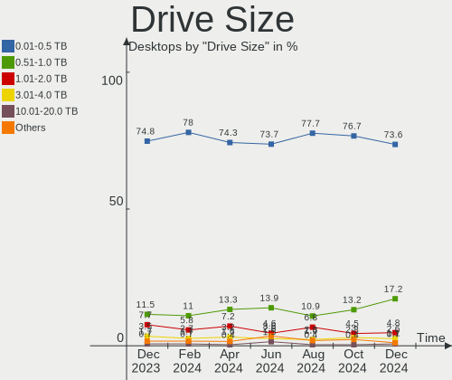
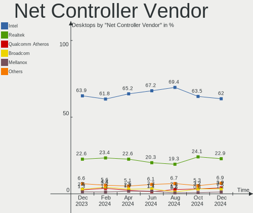

BSD - Hardware Trends (Desktops)
--------------------------------

A project to identify most popular hardware characteristics and track their change
over time based on data collected by BSD users at https://BSD-Hardware.info.

Anyone can contribute to this report by the [hw-probe](https://github.com/linuxhw/hw-probe/blob/master/INSTALL.BSD.md) tool:

    hw-probe -all -upload

This report is for one last month. Overall report since the beginning of time: [TestDays](https://github.com/bsdhw/TestDays)

Period: Dec, 2024.

Contents
--------

* [ System ](#system)
  - [ OS                       ](#os)
  - [ OS Family                ](#os-family)
  - [ Arch                     ](#arch)
  - [ DE                       ](#de)
  - [ Display Server           ](#display-server)
  - [ Display Manager          ](#display-manager)
  - [ OS Lang                  ](#os-lang)
  - [ Boot Mode                ](#boot-mode)
  - [ Filesystem               ](#filesystem)
  - [ Part. scheme             ](#part-scheme)

* [ Board ](#board)
  - [ Vendor                   ](#vendor)
  - [ Model                    ](#model)
  - [ Model Family             ](#model-family)
  - [ MFG Year                 ](#mfg-year)
  - [ Form Factor              ](#form-factor)
  - [ Coreboot                 ](#coreboot)
  - [ RAM Size                 ](#ram-size)
  - [ RAM Used                 ](#ram-used)
  - [ Total Drives             ](#total-drives)
  - [ Has CD-ROM               ](#has-cd-rom)
  - [ Has Ethernet             ](#has-ethernet)
  - [ Has WiFi                 ](#has-wifi)
  - [ Has Bluetooth            ](#has-bluetooth)

* [ Location ](#location)
  - [ Country                  ](#country)
  - [ City                     ](#city)

* [ Drives ](#drives)
  - [ Drive Vendor             ](#drive-vendor)
  - [ Drive Model              ](#drive-model)
  - [ HDD Vendor               ](#hdd-vendor)
  - [ SSD Vendor               ](#ssd-vendor)
  - [ Drive Kind               ](#drive-kind)
  - [ Drive Connector          ](#drive-connector)
  - [ Drive Size               ](#drive-size)
  - [ Space Total              ](#space-total)
  - [ Space Used               ](#space-used)
  - [ Malfunc. Drives          ](#malfunc-drives)
  - [ Malfunc. Drive Vendor    ](#malfunc-drive-vendor)
  - [ Malfunc. HDD Vendor      ](#malfunc-hdd-vendor)
  - [ Malfunc. Drive Kind      ](#malfunc-drive-kind)
  - [ Failed Drives            ](#failed-drives)
  - [ Failed Drive Vendor      ](#failed-drive-vendor)
  - [ Drive Status             ](#drive-status)

* [ Storage controller ](#storage-controller)
  - [ Storage Vendor           ](#storage-vendor)
  - [ Storage Model            ](#storage-model)
  - [ Storage Kind             ](#storage-kind)

* [ Processor ](#processor)
  - [ CPU Vendor               ](#cpu-vendor)
  - [ CPU Model                ](#cpu-model)
  - [ CPU Model Family         ](#cpu-model-family)
  - [ CPU Cores                ](#cpu-cores)
  - [ CPU Sockets              ](#cpu-sockets)
  - [ CPU Threads              ](#cpu-threads)
  - [ CPU Microarch            ](#cpu-microarch)

* [ Graphics ](#graphics)
  - [ GPU Vendor               ](#gpu-vendor)
  - [ GPU Model                ](#gpu-model)
  - [ GPU Combo                ](#gpu-combo)
  - [ GPU Driver               ](#gpu-driver)
  - [ GPU Memory               ](#gpu-memory)

* [ Monitor ](#monitor)
  - [ Monitor Vendor           ](#monitor-vendor)
  - [ Monitor Model            ](#monitor-model)
  - [ Monitor Resolution       ](#monitor-resolution)
  - [ Monitor Diagonal         ](#monitor-diagonal)
  - [ Monitor Width            ](#monitor-width)
  - [ Aspect Ratio             ](#aspect-ratio)
  - [ Monitor Area             ](#monitor-area)
  - [ Pixel Density            ](#pixel-density)
  - [ Multiple Monitors        ](#multiple-monitors)

* [ Network ](#network)
  - [ Net Controller Vendor    ](#net-controller-vendor)
  - [ Net Controller Model     ](#net-controller-model)
  - [ Wireless Vendor          ](#wireless-vendor)
  - [ Wireless Model           ](#wireless-model)
  - [ Ethernet Vendor          ](#ethernet-vendor)
  - [ Ethernet Model           ](#ethernet-model)
  - [ Net Controller Kind      ](#net-controller-kind)
  - [ Used Controller          ](#used-controller)
  - [ NICs                     ](#nics)
  - [ IPv6                     ](#ipv6)

* [ Bluetooth ](#bluetooth)
  - [ Bluetooth Vendor         ](#bluetooth-vendor)
  - [ Bluetooth Model          ](#bluetooth-model)

* [ Sound ](#sound)
  - [ Sound Vendor             ](#sound-vendor)
  - [ Sound Model              ](#sound-model)

* [ Memory ](#memory)
  - [ Memory Vendor            ](#memory-vendor)
  - [ Memory Model             ](#memory-model)
  - [ Memory Kind              ](#memory-kind)
  - [ Memory Form Factor       ](#memory-form-factor)
  - [ Memory Size              ](#memory-size)
  - [ Memory Speed             ](#memory-speed)

* [ Printers & scanners ](#printers--scanners)
  - [ Printer Vendor           ](#printer-vendor)
  - [ Printer Model            ](#printer-model)
  - [ Scanner Vendor           ](#scanner-vendor)
  - [ Scanner Model            ](#scanner-model)

* [ Camera ](#camera)
  - [ Camera Vendor            ](#camera-vendor)
  - [ Camera Model             ](#camera-model)

* [ Security ](#security)
  - [ Fingerprint Vendor       ](#fingerprint-vendor)
  - [ Fingerprint Model        ](#fingerprint-model)
  - [ Chipcard Vendor          ](#chipcard-vendor)
  - [ Chipcard Model           ](#chipcard-model)

* [ Unsupported ](#unsupported)
  - [ Unsupported Devices      ](#unsupported-devices)
  - [ Unsupported Device Types ](#unsupported-device-types)

System
------

OS
--

Installed operating systems

| Name                 | Desktops | Percent |
|----------------------|----------|---------|
| OPNsense 24.7.11     | 161      | 38.7%   |
| OPNsense 24.7.10     | 136      | 32.69%  |
| OPNsense 24.7.9      | 33       | 7.93%   |
| FreeBSD 14.2         | 17       | 4.09%   |
| OPNsense 25.1        | 7        | 1.68%   |
| helloSystem 0.8.1    | 6        | 1.44%   |
| FreeBSD 14.1-p6      | 6        | 1.44%   |
| FreeBSD 14.1         | 6        | 1.44%   |
| OPNsense 24.1.10     | 5        | 1.2%    |
| OPNsense 23.7.12     | 5        | 1.2%    |
| OpenBSD 7.6          | 5        | 1.2%    |
| OPNsense 24.7.8      | 3        | 0.72%   |
| OPNsense 24.7        | 3        | 0.72%   |
| OPNsense 24.10.1     | 3        | 0.72%   |
| OPNsense 24.7.7      | 2        | 0.48%   |
| OpenBSD 7.5          | 2        | 0.48%   |
| helloSystem 0.9.0    | 2        | 0.48%   |
| GhostBSD 24.10.1     | 2        | 0.48%   |
| FreeBSD 15.0-CURRENT | 2        | 0.48%   |
| FreeBSD 14.1-STABLE  | 2        | 0.48%   |
| FreeBSD 14.1-p5      | 2        | 0.48%   |
| TrueNAS 13.1-p9      | 1        | 0.24%   |
| pfSense 2.7.2        | 1        | 0.24%   |
| OPNsense 24.7.3      | 1        | 0.24%   |
| MyBee 14.1-p6        | 1        | 0.24%   |
| MidnightBSD 3.2.1    | 1        | 0.24%   |
| ClonOS 24.12         | 1        | 0.24%   |

OS Family
---------

OS without a version

| Name        | Desktops | Percent |
|-------------|----------|---------|
| OPNsense    | 359      | 86.3%   |
| FreeBSD     | 35       | 8.41%   |
| helloSystem | 8        | 1.92%   |
| OpenBSD     | 7        | 1.68%   |
| GhostBSD    | 2        | 0.48%   |
| TrueNAS     | 1        | 0.24%   |
| pfSense     | 1        | 0.24%   |
| MyBee       | 1        | 0.24%   |
| MidnightBSD | 1        | 0.24%   |
| ClonOS      | 1        | 0.24%   |

Arch
----

OS architecture (x86_64, i586, etc.)

| Name  | Desktops | Percent |
|-------|----------|---------|
| amd64 | 414      | 99.52%  |
| i386  | 2        | 0.48%   |

DE
--

Desktop Environment

| Name         | Desktops | Percent |
|--------------|----------|---------|
| Console      | 382      | 91.83%  |
| helloDesktop | 14       | 3.37%   |
| KDE5         | 5        | 1.2%    |
| XFCE         | 3        | 0.72%   |
| MATE         | 3        | 0.72%   |
| GNOME        | 3        | 0.72%   |
| TWM          | 2        | 0.48%   |
| openbox      | 1        | 0.24%   |
| KDE6         | 1        | 0.24%   |
| KDE          | 1        | 0.24%   |
| Fluxbox      | 1        | 0.24%   |

Display Server
--------------

X11 or Wayland

| Name    | Desktops | Percent |
|---------|----------|---------|
| Console | 385      | 92.55%  |
| X11     | 28       | 6.73%   |
| Wayland | 3        | 0.72%   |

Display Manager
---------------

SDDM, LightDM, etc.

| Name    | Desktops | Percent |
|---------|----------|---------|
| Console | 392      | 94.23%  |
| SLiM    | 8        | 1.92%   |
| SDDM    | 7        | 1.68%   |
| LightDM | 5        | 1.2%    |
| Ly      | 2        | 0.48%   |
| GDM     | 2        | 0.48%   |

OS Lang
-------

Language

| Lang    | Desktops | Percent |
|---------|----------|---------|
| Unknown | 365      | 87.74%  |
| C       | 31       | 7.45%   |
| en_US   | 11       | 2.64%   |
| ru_RU   | 3        | 0.72%   |
| fr_FR   | 2        | 0.48%   |
| zh_CN   | 1        | 0.24%   |
| es_PY   | 1        | 0.24%   |
| es_ES   | 1        | 0.24%   |
| de_DE   | 1        | 0.24%   |

Boot Mode
---------

EFI or BIOS

| Mode | Desktops | Percent |
|------|----------|---------|
| EFI  | 390      | 93.75%  |
| BIOS | 26       | 6.25%   |

Filesystem
----------

Type of filesystem

| Type   | Desktops | Percent |
|--------|----------|---------|
| Zfs    | 263      | 63.22%  |
| Ufs    | 142      | 34.13%  |
| Ffs    | 7        | 1.68%   |
| Cd9660 | 4        | 0.96%   |

Part. scheme
------------

Scheme of partitioning

| Type    | Desktops | Percent |
|---------|----------|---------|
| GPT     | 405      | 97.36%  |
| MBR     | 5        | 1.2%    |
| Unknown | 4        | 0.96%   |
| BSD     | 2        | 0.48%   |

Board
-----

Vendor
------

Motherboard manufacturer

| Name                                 | Desktops | Percent |
|--------------------------------------|----------|---------|
| Unknown                              | 107      | 25.72%  |
| Dell                                 | 43       | 10.34%  |
| ASUSTek Computer                     | 34       | 8.17%   |
| Protectli                            | 29       | 6.97%   |
| Intel                                | 23       | 5.53%   |
| Gigabyte Technology                  | 18       | 4.33%   |
| Hewlett-Packard                      | 17       | 4.09%   |
| MSI                                  | 15       | 3.61%   |
| ASRock                               | 15       | 3.61%   |
| Techvision                           | 10       | 2.4%    |
| Lenovo                               | 10       | 2.4%    |
| Fujitsu                              | 10       | 2.4%    |
| Supermicro                           | 9        | 2.16%   |
| PC Engines                           | 9        | 2.16%   |
| AZW                                  | 9        | 2.16%   |
| Shenzhen Meigao Electronic Equipment | 6        | 1.44%   |
| IceWhale Technology                  | 4        | 0.96%   |
| GoWin Solution                       | 4        | 0.96%   |
| AAEON                                | 3        | 0.72%   |
| SJRC                                 | 2        | 0.48%   |
| MW                                   | 2        | 0.48%   |
| Inventec                             | 2        | 0.48%   |
| Hardkernel                           | 2        | 0.48%   |
| CncTion                              | 2        | 0.48%   |
| WeiBu                                | 1        | 0.24%   |
| VGKE                                 | 1        | 0.24%   |
| Trigkey                              | 1        | 0.24%   |
| Silicom                              | 1        | 0.24%   |
| Shenzhen suqiao computer technology  | 1        | 0.24%   |
| Shenzhen Simo Innovation Technology  | 1        | 0.24%   |
| ShenZhen MinWin Technology           | 1        | 0.24%   |
| Quanmax                              | 1        | 0.24%   |
| Pegatron                             | 1        | 0.24%   |
| OEM                                  | 1        | 0.24%   |
| NF692                                | 1        | 0.24%   |
| NF533MS                              | 1        | 0.24%   |
| MiTAC                                | 1        | 0.24%   |
| JGINYUE                              | 1        | 0.24%   |
| Jetway                               | 1        | 0.24%   |
| Infoblox                             | 1        | 0.24%   |

Model
-----

Motherboard model

| Name                                              | Desktops | Percent |
|---------------------------------------------------|----------|---------|
| Unknown                                           | 107      | 25.72%  |
| Techvision TVI7309X                               | 10       | 2.4%    |
| AZW EQ                                            | 8        | 1.92%   |
| Protectli FW6                                     | 7        | 1.68%   |
| PC Engines APU2                                   | 6        | 1.44%   |
| Shenzhen Meigao Electronic Equipment Venus Series | 5        | 1.2%    |
| Protectli VP2420                                  | 5        | 1.2%    |
| Protectli V1410                                   | 5        | 1.2%    |
| HP EliteDesk 800 G1 SFF                           | 5        | 1.2%    |
| IceWhale ZimaBoard 832 ZMB                        | 4        | 0.96%   |
| GoWin Solution R86S                               | 4        | 0.96%   |
| Fujitsu FUTRO S920                                | 4        | 0.96%   |
| Dell OptiPlex 5070                                | 4        | 0.96%   |
| Dell OptiPlex 5040                                | 4        | 0.96%   |
| Protectli FW4B                                    | 3        | 0.72%   |
| PC Engines apu4                                   | 3        | 0.72%   |
| Dell OptiPlex 7050                                | 3        | 0.72%   |
| Dell OptiPlex 7020                                | 3        | 0.72%   |
| Dell OptiPlex 3020                                | 3        | 0.72%   |
| AAEON UP-APL01                                    | 3        | 0.72%   |
| Supermicro SYS-5018A-FTN4                         | 2        | 0.48%   |
| SJRC ADLN-6L                                      | 2        | 0.48%   |
| Protectli VP6630                                  | 2        | 0.48%   |
| MW GMLK-2_5G4L                                    | 2        | 0.48%   |
| MSI MS-7758                                       | 2        | 0.48%   |
| Intel QHSW02                                      | 2        | 0.48%   |
| Intel MAHOBAY                                     | 2        | 0.48%   |
| Intel Jasper Lake Client Platform                 | 2        | 0.48%   |
| HP EliteDesk 800 G2 DM 35W                        | 2        | 0.48%   |
| HP Compaq Pro 6300 SFF                            | 2        | 0.48%   |
| Hardkernel ODROID-H4                              | 2        | 0.48%   |
| Gigabyte M68MT-S2                                 | 2        | 0.48%   |
| Gigabyte B450 I AORUS PRO WIFI                    | 2        | 0.48%   |
| Dell OptiPlex 9020                                | 2        | 0.48%   |
| Dell OptiPlex 7040                                | 2        | 0.48%   |
| Dell OptiPlex 7010                                | 2        | 0.48%   |
| Dell OptiPlex 3070                                | 2        | 0.48%   |
| Dell OptiPlex 3050                                | 2        | 0.48%   |
| ASUS PRIME B450M-GAMING/BR                        | 2        | 0.48%   |
| ASUS PRIME B450M-A II                             | 2        | 0.48%   |

Model Family
------------

Motherboard model prefix

| Name                                       | Desktops | Percent |
|--------------------------------------------|----------|---------|
| Unknown                                    | 107      | 25.72%  |
| Dell OptiPlex                              | 34       | 8.17%   |
| Techvision TVI7309X                        | 10       | 2.4%    |
| ASUS PRIME                                 | 10       | 2.4%    |
| HP EliteDesk                               | 8        | 1.92%   |
| AZW EQ                                     | 8        | 1.92%   |
| Protectli FW6                              | 7        | 1.68%   |
| Fujitsu FUTRO                              | 7        | 1.68%   |
| PC Engines APU2                            | 6        | 1.44%   |
| Shenzhen Meigao Electronic Equipment Venus | 5        | 1.2%    |
| Protectli VP2420                           | 5        | 1.2%    |
| Protectli V1410                            | 5        | 1.2%    |
| Lenovo ThinkCentre                         | 5        | 1.2%    |
| Lenovo ThinkStation                        | 4        | 0.96%   |
| IceWhale ZimaBoard                         | 4        | 0.96%   |
| GoWin Solution R86S                        | 4        | 0.96%   |
| Dell Inspiron                              | 4        | 0.96%   |
| ASUS ROG                                   | 4        | 0.96%   |
| Protectli FW4B                             | 3        | 0.72%   |
| PC Engines apu4                            | 3        | 0.72%   |
| HP Compaq                                  | 3        | 0.72%   |
| AAEON UP-APL01                             | 3        | 0.72%   |
| Supermicro SYS-5018A-FTN4                  | 2        | 0.48%   |
| SJRC ADLN-6L                               | 2        | 0.48%   |
| Protectli VP6630                           | 2        | 0.48%   |
| MW GMLK-2                                  | 2        | 0.48%   |
| MSI MS-7758                                | 2        | 0.48%   |
| Intel X79                                  | 2        | 0.48%   |
| Intel QHSW02                               | 2        | 0.48%   |
| Intel MAHOBAY                              | 2        | 0.48%   |
| Intel Jasper                               | 2        | 0.48%   |
| Hardkernel ODROID-H4                       | 2        | 0.48%   |
| Gigabyte M68MT-S2                          | 2        | 0.48%   |
| Gigabyte B450                              | 2        | 0.48%   |
| Dell Vostro                                | 2        | 0.48%   |
| Dell Precision                             | 2        | 0.48%   |
| ASUS TUF                                   | 2        | 0.48%   |
| ASUS P5Q-E                                 | 2        | 0.48%   |
| ASUS Maximus                               | 2        | 0.48%   |
| ASUS All                                   | 2        | 0.48%   |

MFG Year
--------

Motherboard manufacture year

| Year    | Desktops | Percent |
|---------|----------|---------|
| 2023    | 88       | 21.15%  |
| 2022    | 56       | 13.46%  |
| 2024    | 53       | 12.74%  |
| 2014    | 36       | 8.65%   |
| 2016    | 26       | 6.25%   |
| 2021    | 24       | 5.77%   |
| 2018    | 22       | 5.29%   |
| 2019    | 19       | 4.57%   |
| 2017    | 17       | 4.09%   |
| 2012    | 17       | 4.09%   |
| 2020    | 16       | 3.85%   |
| 2015    | 10       | 2.4%    |
| 2011    | 8        | 1.92%   |
| 2013    | 7        | 1.68%   |
| 2008    | 7        | 1.68%   |
| 2009    | 3        | 0.72%   |
| 2007    | 3        | 0.72%   |
| 2006    | 2        | 0.48%   |
| 2010    | 1        | 0.24%   |
| Unknown | 1        | 0.24%   |

Form Factor
-----------

Physical design of the computer

| Name    | Desktops | Percent |
|---------|----------|---------|
| Desktop | 416      | 100%    |

Coreboot
--------

Have coreboot on board

| Used | Desktops | Percent |
|------|----------|---------|
| No   | 404      | 97.12%  |
| Yes  | 12       | 2.88%   |

RAM Size
--------

Total RAM memory

| Size in GB  | Desktops | Percent |
|-------------|----------|---------|
| 16.01-24.0  | 145      | 34.86%  |
| 8.01-16.0   | 132      | 31.73%  |
| 32.01-64.0  | 60       | 14.42%  |
| 4.01-8.0    | 43       | 10.34%  |
| 64.01-256.0 | 20       | 4.81%   |
| 24.01-32.0  | 7        | 1.68%   |
| 2.01-3.0    | 6        | 1.44%   |
| 3.01-4.0    | 1        | 0.24%   |
| 1.01-2.0    | 1        | 0.24%   |
| 0.01-0.5    | 1        | 0.24%   |

RAM Used
--------

Used RAM memory

| Used GB  | Desktops | Percent |
|----------|----------|---------|
| 0.51-1.0 | 197      | 47.36%  |
| 0.01-0.5 | 134      | 32.21%  |
| 1.01-2.0 | 73       | 17.55%  |
| 2.01-3.0 | 8        | 1.92%   |
| 3.01-4.0 | 2        | 0.48%   |
| 4.01-8.0 | 1        | 0.24%   |
| 0        | 1        | 0.24%   |

Total Drives
------------

Number of drives on board

| Drives | Desktops | Percent |
|--------|----------|---------|
| 1      | 190      | 45.67%  |
| 0      | 174      | 41.83%  |
| 2      | 32       | 7.69%   |
| 3      | 9        | 2.16%   |
| 4      | 6        | 1.44%   |
| 5      | 3        | 0.72%   |
| 10     | 1        | 0.24%   |
| 6      | 1        | 0.24%   |

Has CD-ROM
----------

Has CD-ROM on board

| Presented | Desktops | Percent |
|-----------|----------|---------|
| No        | 367      | 88.22%  |
| Yes       | 49       | 11.78%  |

Has Ethernet
------------

Has Ethernet on board

| Presented | Desktops | Percent |
|-----------|----------|---------|
| Yes       | 413      | 99.28%  |
| No        | 3        | 0.72%   |

Has WiFi
--------

Has WiFi module

| Presented | Desktops | Percent |
|-----------|----------|---------|
| No        | 319      | 76.68%  |
| Yes       | 97       | 23.32%  |

Has Bluetooth
-------------

Has Bluetooth module

| Presented | Desktops | Percent |
|-----------|----------|---------|
| No        | 343      | 82.45%  |
| Yes       | 73       | 17.55%  |

Location
--------

Country
-------

Geographic location (country)

| Country         | Desktops | Percent |
|-----------------|----------|---------|
| USA             | 142      | 34.13%  |
| Germany         | 61       | 14.66%  |
| Canada          | 21       | 5.05%   |
| UK              | 20       | 4.81%   |
| Russia          | 13       | 3.13%   |
| France          | 12       | 2.88%   |
| Australia       | 11       | 2.64%   |
| Italy           | 9        | 2.16%   |
| Switzerland     | 8        | 1.92%   |
| Netherlands     | 8        | 1.92%   |
| Brazil          | 7        | 1.68%   |
| Austria         | 7        | 1.68%   |
| China           | 6        | 1.44%   |
| Sweden          | 5        | 1.2%    |
| Spain           | 5        | 1.2%    |
| South Korea     | 5        | 1.2%    |
| Portugal        | 5        | 1.2%    |
| Finland         | 5        | 1.2%    |
| Poland          | 4        | 0.96%   |
| Norway          | 4        | 0.96%   |
| Belgium         | 4        | 0.96%   |
| Vietnam         | 3        | 0.72%   |
| Turkey          | 3        | 0.72%   |
| Denmark         | 3        | 0.72%   |
| Czechia         | 3        | 0.72%   |
| The Netherlands | 2        | 0.48%   |
| Thailand        | 2        | 0.48%   |
| Slovakia        | 2        | 0.48%   |
| Singapore       | 2        | 0.48%   |
| Paraguay        | 2        | 0.48%   |
| Malaysia        | 2        | 0.48%   |
| Israel          | 2        | 0.48%   |
| Ireland         | 2        | 0.48%   |
| Indonesia       | 2        | 0.48%   |
| Hungary         | 2        | 0.48%   |
| Hong Kong       | 2        | 0.48%   |
| Venezuela       | 1        | 0.24%   |
| Ukraine         | 1        | 0.24%   |
| Taiwan          | 1        | 0.24%   |
| Serbia          | 1        | 0.24%   |

City
----

Geographic location (city)

| City                  | Desktops | Percent |
|-----------------------|----------|---------|
| Berlin                | 5        | 1.2%    |
| Vienna                | 4        | 0.96%   |
| Toronto               | 4        | 0.96%   |
| Sydney                | 4        | 0.96%   |
| Portland              | 4        | 0.96%   |
| Moscow                | 4        | 0.96%   |
| Mannheim              | 4        | 0.96%   |
| Denver                | 4        | 0.96%   |
| Vancouver             | 3        | 0.72%   |
| Stockholm             | 3        | 0.72%   |
| St Petersburg         | 3        | 0.72%   |
| Philadelphia          | 3        | 0.72%   |
| Paris                 | 3        | 0.72%   |
| Oslo                  | 3        | 0.72%   |
| Munich                | 3        | 0.72%   |
| Los Angeles           | 3        | 0.72%   |
| Lisbon                | 3        | 0.72%   |
| Istanbul              | 3        | 0.72%   |
| Ho Chi Minh City      | 3        | 0.72%   |
| Dortmund              | 3        | 0.72%   |
| Austin                | 3        | 0.72%   |
| Victoria              | 2        | 0.48%   |
| Turin                 | 2        | 0.48%   |
| Suzhou                | 2        | 0.48%   |
| Singapore             | 2        | 0.48%   |
| Sherwood Park         | 2        | 0.48%   |
| Sao Paulo             | 2        | 0.48%   |
| Salt Lake City        | 2        | 0.48%   |
| Sacramento            | 2        | 0.48%   |
| Porto                 | 2        | 0.48%   |
| Phoenix               | 2        | 0.48%   |
| Ottawa                | 2        | 0.48%   |
| Oakland               | 2        | 0.48%   |
| Nottuln               | 2        | 0.48%   |
| New York              | 2        | 0.48%   |
| Neustadt an der Aisch | 2        | 0.48%   |
| Montreal              | 2        | 0.48%   |
| Mesa                  | 2        | 0.48%   |
| Melbourne             | 2        | 0.48%   |
| London                | 2        | 0.48%   |

Drives
------

Drive Vendor
------------

Hard drive vendors

| Vendor              | Desktops | Drives | Percent |
|---------------------|----------|--------|---------|
| Samsung Electronics | 36       | 44     | 12.59%  |
| WDC                 | 33       | 45     | 11.54%  |
| Kingston            | 29       | 33     | 10.14%  |
| Seagate             | 27       | 36     | 9.44%   |
| Crucial             | 20       | 22     | 6.99%   |
| China               | 17       | 17     | 5.94%   |
| SanDisk             | 14       | 14     | 4.9%    |
| Protectli           | 10       | 10     | 3.5%    |
| Toshiba             | 7        | 12     | 2.45%   |
| PNY                 | 7        | 8      | 2.45%   |
| Intel               | 7        | 8      | 2.45%   |
| Transcend           | 6        | 6      | 2.1%    |
| Team                | 6        | 6      | 2.1%    |
| Hitachi             | 5        | 9      | 1.75%   |
| SPCC                | 4        | 5      | 1.4%    |
| OCZ                 | 4        | 4      | 1.4%    |
| FORESEE             | 4        | 4      | 1.4%    |
| A-DATA Technology   | 4        | 4      | 1.4%    |
| SK hynix            | 3        | 3      | 1.05%   |
| ShiJi               | 3        | 3      | 1.05%   |
| Micron Technology   | 3        | 4      | 1.05%   |
| KingSpec            | 3        | 4      | 1.05%   |
| Hoodisk             | 3        | 3      | 1.05%   |
| Apacer              | 3        | 3      | 1.05%   |
| Netac               | 2        | 2      | 0.7%    |
| Lexar               | 2        | 2      | 0.7%    |
| Dogfish             | 2        | 2      | 0.7%    |
| Advantech           | 2        | 3      | 0.7%    |
| ZOTAC               | 1        | 1      | 0.35%   |
| Wicgtyp             | 1        | 1      | 0.35%   |
| WD MediaMax         | 1        | 1      | 0.35%   |
| walram              | 1        | 1      | 0.35%   |
| USB3.0              | 1        | 1      | 0.35%   |
| S3+                 | 1        | 1      | 0.35%   |
| Patriot             | 1        | 2      | 0.35%   |
| NVMe                | 1        | 1      | 0.35%   |
| Mushkin             | 1        | 2      | 0.35%   |
| LITEONIT            | 1        | 1      | 0.35%   |
| LITEON              | 1        | 1      | 0.35%   |
| JWX                 | 1        | 1      | 0.35%   |

Drive Model
-----------

Hard drive models

| Model                            | Desktops | Percent |
|----------------------------------|----------|---------|
| WDC WDS500G2B0A-00SM50 500GB     | 5        | 1.61%   |
| Kingston SKC600MS256G 256GB      | 5        | 1.61%   |
| Kingston SA400S37240G 240GB      | 4        | 1.29%   |
| Crucial CT250MX500SSD1 250GB     | 4        | 1.29%   |
| WDC WD10EZEX-00BN5A0 1TB         | 3        | 0.97%   |
| Samsung SSD 850 EVO 250GB        | 3        | 0.97%   |
| Kingston SV300S37A120G 120GB     | 3        | 0.97%   |
| Kingston SA400S37120G 120GB      | 3        | 0.97%   |
| Crucial CT240BX500SSD1 240GB     | 3        | 0.97%   |
| Crucial CT1000MX500SSD1 1TB      | 3        | 0.97%   |
| China SATA SSD 240GB             | 3        | 0.97%   |
| WDC WD10EZEX-00BBHA0 1TB         | 2        | 0.65%   |
| SPCC Solid State Disk 128GB      | 2        | 0.65%   |
| Seagate ST3160815AS 160GB        | 2        | 0.65%   |
| Seagate ST1000LM035-1RK172 1TB   | 2        | 0.65%   |
| Seagate ST1000DM010-2EP102 1TB   | 2        | 0.65%   |
| Samsung SSD 870 EVO 250GB        | 2        | 0.65%   |
| Samsung SSD 860 EVO 250GB        | 2        | 0.65%   |
| Samsung SSD 850 PRO 512GB        | 2        | 0.65%   |
| Samsung SSD 850 PRO 256GB        | 2        | 0.65%   |
| Samsung SSD 850 EVO 1TB          | 2        | 0.65%   |
| Samsung SSD 840 PRO Series 128GB | 2        | 0.65%   |
| Protectli 64GB mSATA             | 2        | 0.65%   |
| Protectli 480GB M.2              | 2        | 0.65%   |
| Protectli 240GB mSATA            | 2        | 0.65%   |
| Protectli 240GB M.2              | 2        | 0.65%   |
| PNY CS900 240GB SSD              | 2        | 0.65%   |
| PNY CS900 1TB SSD                | 2        | 0.65%   |
| Kingston SV300S37A240G 240GB     | 2        | 0.65%   |
| Kingston SHFS37A120G 120GB       | 2        | 0.65%   |
| KingSpec P3-128 128GB            | 2        | 0.65%   |
| FORESEE 512GB SSD                | 2        | 0.65%   |
| FORESEE 128GB SSD                | 2        | 0.65%   |
| Crucial M4-CT128M4SSD2 128GB     | 2        | 0.65%   |
| China SATA SSD 32GB              | 2        | 0.65%   |
| China SATA SSD 256GB             | 2        | 0.65%   |
| China SATA SSD 16GB              | 2        | 0.65%   |
| China FPT310M4SSD256G 256GB      | 2        | 0.65%   |
| ZOTAC ZTSSD-A4P-120G             | 1        | 0.32%   |
| Wicgtyp N900-512 512GB           | 1        | 0.32%   |

HDD Vendor
----------

Hard disk drive vendors

| Vendor              | Desktops | Drives | Percent |
|---------------------|----------|--------|---------|
| WDC                 | 28       | 37     | 38.36%  |
| Seagate             | 26       | 35     | 35.62%  |
| Toshiba             | 7        | 12     | 9.59%   |
| Hitachi             | 5        | 9      | 6.85%   |
| Samsung Electronics | 3        | 3      | 4.11%   |
| WD MediaMax         | 1        | 1      | 1.37%   |
| USB3.0              | 1        | 1      | 1.37%   |
| HGST                | 1        | 1      | 1.37%   |
| Hewlett-Packard     | 1        | 1      | 1.37%   |

SSD Vendor
----------

Solid state drive vendors

| Vendor              | Desktops | Drives | Percent |
|---------------------|----------|--------|---------|
| Samsung Electronics | 34       | 39     | 15.96%  |
| Kingston            | 26       | 30     | 12.21%  |
| Crucial             | 20       | 22     | 9.39%   |
| China               | 17       | 17     | 7.98%   |
| SanDisk             | 14       | 14     | 6.57%   |
| Protectli           | 10       | 10     | 4.69%   |
| WDC                 | 7        | 8      | 3.29%   |
| PNY                 | 7        | 8      | 3.29%   |
| Intel               | 7        | 8      | 3.29%   |
| Transcend           | 6        | 6      | 2.82%   |
| Team                | 6        | 6      | 2.82%   |
| SPCC                | 4        | 5      | 1.88%   |
| OCZ                 | 4        | 4      | 1.88%   |
| FORESEE             | 4        | 4      | 1.88%   |
| A-DATA Technology   | 4        | 4      | 1.88%   |
| SK hynix            | 3        | 3      | 1.41%   |
| ShiJi               | 3        | 3      | 1.41%   |
| Micron Technology   | 3        | 4      | 1.41%   |
| KingSpec            | 3        | 4      | 1.41%   |
| Hoodisk             | 3        | 3      | 1.41%   |
| Apacer              | 3        | 3      | 1.41%   |
| Netac               | 2        | 2      | 0.94%   |
| Lexar               | 2        | 2      | 0.94%   |
| Dogfish             | 2        | 2      | 0.94%   |
| Advantech           | 2        | 3      | 0.94%   |
| ZOTAC               | 1        | 1      | 0.47%   |
| Wicgtyp             | 1        | 1      | 0.47%   |
| walram              | 1        | 1      | 0.47%   |
| Seagate             | 1        | 1      | 0.47%   |
| S3+                 | 1        | 1      | 0.47%   |
| Patriot             | 1        | 2      | 0.47%   |
| NVMe                | 1        | 1      | 0.47%   |
| Mushkin             | 1        | 2      | 0.47%   |
| LITEONIT            | 1        | 1      | 0.47%   |
| LITEON              | 1        | 1      | 0.47%   |
| JWX                 | 1        | 1      | 0.47%   |
| Intenso             | 1        | 1      | 0.47%   |
| Innodisk            | 1        | 1      | 0.47%   |
| HPE                 | 1        | 1      | 0.47%   |
| CWDISK              | 1        | 1      | 0.47%   |

Drive Kind
----------

HDD or SSD

| Kind | Desktops | Drives | Percent |
|------|----------|--------|---------|
| SSD  | 203      | 233    | 75.75%  |
| HDD  | 61       | 100    | 22.76%  |
| NVMe | 4        | 5      | 1.49%   |

Drive Connector
---------------

SATA, SAS, NVMe, etc.

| Type | Desktops | Drives | Percent |
|------|----------|--------|---------|
| SATA | 240      | 333    | 98.36%  |
| NVMe | 4        | 5      | 1.64%   |

Drive Size
----------

Size of hard drive

| Size in TB | Desktops | Drives | Percent |
|------------|----------|--------|---------|
| 0.01-0.5   | 201      | 231    | 73.63%  |
| 0.51-1.0   | 47       | 58     | 17.22%  |
| 1.01-2.0   | 13       | 24     | 4.76%   |
| 3.01-4.0   | 7        | 10     | 2.56%   |
| 10.01-20.0 | 2        | 7      | 0.73%   |
| 4.01-10.0  | 2        | 2      | 0.73%   |
| 2.01-3.0   | 1        | 1      | 0.37%   |

Space Total
-----------

Amount of disk space available on the file system

| Size in GB     | Desktops | Percent |
|----------------|----------|---------|
| 101-250        | 198      | 47.6%   |
| 251-500        | 85       | 20.43%  |
| 51-100         | 37       | 8.89%   |
| 501-1000       | 36       | 8.65%   |
| 21-50          | 29       | 6.97%   |
| 1-20           | 21       | 5.05%   |
| 1001-2000      | 7        | 1.68%   |
| More than 3000 | 2        | 0.48%   |
| 2001-3000      | 1        | 0.24%   |

Space Used
----------

Amount of used disk space

| Used GB | Desktops | Percent |
|---------|----------|---------|
| 1-20    | 379      | 91.11%  |
| 21-50   | 22       | 5.29%   |
| 51-100  | 9        | 2.16%   |
| 101-250 | 4        | 0.96%   |
| 251-500 | 2        | 0.48%   |

Malfunc. Drives
---------------

Drive models with a malfunction

| Model                                     | Desktops | Drives | Percent |
|-------------------------------------------|----------|--------|---------|
| Seagate ST3160815AS 160GB                 | 2        | 2      | 4.44%   |
| WDC WD5000AAKX-603CA0 500GB               | 1        | 1      | 2.22%   |
| WDC WD5000AAKS-08V0A0 500GB               | 1        | 1      | 2.22%   |
| WDC WD5000AAKS-00V1A0 500GB               | 1        | 1      | 2.22%   |
| WDC WD5000AAKS-00UU3A0 500GB              | 1        | 1      | 2.22%   |
| WDC WD40EZRZ-00WN9B0 4TB                  | 1        | 1      | 2.22%   |
| WDC WD40EZRZ-00GXCB0 4TB                  | 1        | 1      | 2.22%   |
| WDC WD1500ADFD-00NLR1 150GB               | 1        | 1      | 2.22%   |
| Toshiba MK3252GSX 320GB                   | 1        | 1      | 2.22%   |
| Toshiba DT01ACA300 3TB                    | 1        | 1      | 2.22%   |
| Toshiba DT01ACA200V 2TB                   | 1        | 1      | 2.22%   |
| Toshiba DT01ACA050 500GB                  | 1        | 1      | 2.22%   |
| Team XS2 SSD 64GB                         | 1        | 1      | 2.22%   |
| SK hynix SC308 SATA 128GB                 | 1        | 1      | 2.22%   |
| SK hynix HFS064G3AMNB-2200A 64GB          | 1        | 1      | 2.22%   |
| Seagate ST500LM021-1KJ152 500GB           | 1        | 3      | 2.22%   |
| Seagate ST500DM002-1BD142 500GB           | 1        | 1      | 2.22%   |
| Seagate ST380811AS 80GB                   | 1        | 1      | 2.22%   |
| Seagate ST3320620AS 320GB                 | 1        | 1      | 2.22%   |
| Seagate ST3250410AS 250GB                 | 1        | 1      | 2.22%   |
| Seagate ST31000525SV 1TB                  | 1        | 1      | 2.22%   |
| Seagate ST2000DM001-9YN164 2TB            | 1        | 1      | 2.22%   |
| Seagate ST1000DM010-2EP102 1TB            | 1        | 1      | 2.22%   |
| SanDisk SD7SB3Q128G1001 128GB             | 1        | 1      | 2.22%   |
| Samsung Electronics HD403LJ 400GB         | 1        | 1      | 2.22%   |
| Micron Technology MTFDDAK128MAM-1J1 128GB | 1        | 2      | 2.22%   |
| LITEON CV8-8E128-HP 128GB                 | 1        | 1      | 2.22%   |
| Kingston SUV500MS120G 120GB               | 1        | 1      | 2.22%   |
| Kingston SNS4151S316GD 16GB               | 1        | 1      | 2.22%   |
| Kingston SHFS37A120G 120GB                | 1        | 1      | 2.22%   |
| KingSpec P4-120 120GB                     | 1        | 1      | 2.22%   |
| Intel SSDSC2BW480A4 480GB                 | 1        | 1      | 2.22%   |
| Intel SSDSA2M120G2GC 120GB                | 1        | 1      | 2.22%   |
| Intel SSDSA2M080G2GC 80GB                 | 1        | 1      | 2.22%   |
| Intel SSDSA2M040G2GC 40GB                 | 1        | 1      | 2.22%   |
| Intel SSDMAEMC040G2 40GB                  | 1        | 2      | 2.22%   |
| Hitachi HUA723020ALA641 2TB               | 1        | 3      | 2.22%   |
| Hitachi HTS541680J9SA00 80GB              | 1        | 1      | 2.22%   |
| HGST HTS725050A7E630 500GB                | 1        | 1      | 2.22%   |
| Crucial CT512M550SSD1 512GB               | 1        | 2      | 2.22%   |

Malfunc. Drive Vendor
---------------------

Vendors of faulty drives

| Vendor              | Desktops | Drives | Percent |
|---------------------|----------|--------|---------|
| Seagate             | 8        | 12     | 19.05%  |
| WDC                 | 7        | 7      | 16.67%  |
| Intel               | 5        | 6      | 11.9%   |
| Toshiba             | 3        | 4      | 7.14%   |
| Kingston            | 3        | 3      | 7.14%   |
| SK hynix            | 2        | 2      | 4.76%   |
| Hitachi             | 2        | 4      | 4.76%   |
| Crucial             | 2        | 3      | 4.76%   |
| Team                | 1        | 1      | 2.38%   |
| SanDisk             | 1        | 1      | 2.38%   |
| Samsung Electronics | 1        | 1      | 2.38%   |
| Micron Technology   | 1        | 2      | 2.38%   |
| LITEON              | 1        | 1      | 2.38%   |
| KingSpec            | 1        | 1      | 2.38%   |
| HGST                | 1        | 1      | 2.38%   |
| Corsair             | 1        | 1      | 2.38%   |
| Apacer              | 1        | 1      | 2.38%   |
| A-DATA Technology   | 1        | 1      | 2.38%   |

Malfunc. HDD Vendor
-------------------

Vendors of faulty HDD drives

| Vendor              | Desktops | Drives | Percent |
|---------------------|----------|--------|---------|
| Seagate             | 8        | 12     | 36.36%  |
| WDC                 | 7        | 7      | 31.82%  |
| Toshiba             | 3        | 4      | 13.64%  |
| Hitachi             | 2        | 4      | 9.09%   |
| Samsung Electronics | 1        | 1      | 4.55%   |
| HGST                | 1        | 1      | 4.55%   |

Malfunc. Drive Kind
-------------------

Kinds of faulty drives

| Kind | Desktops | Drives | Percent |
|------|----------|--------|---------|
| HDD  | 21       | 29     | 51.22%  |
| SSD  | 20       | 23     | 48.78%  |

Failed Drives
-------------

Failed drive models

Zero info for selected period =(

Failed Drive Vendor
-------------------

Failed drive vendors

Zero info for selected period =(

Drive Status
------------

Number of failed and malfunc. drives

| Status   | Desktops | Drives | Percent |
|----------|----------|--------|---------|
| Works    | 215      | 284    | 84.31%  |
| Malfunc  | 38       | 52     | 14.9%   |
| Detected | 2        | 2      | 0.78%   |

Storage controller
------------------

Storage Vendor
--------------

Storage controller vendors

| Vendor                                  | Desktops | Percent |
|-----------------------------------------|----------|---------|
| Intel                                   | 326      | 58.84%  |
| AMD                                     | 53       | 9.57%   |
| Samsung Electronics                     | 29       | 5.23%   |
| Silicon Motion                          | 20       | 3.61%   |
| MAXIO Technology (Hangzhou)             | 19       | 3.43%   |
| SanDisk                                 | 16       | 2.89%   |
| Phison Electronics                      | 14       | 2.53%   |
| Micron Technology                       | 11       | 1.99%   |
| Kingston Technology Company             | 9        | 1.62%   |
| SK hynix                                | 7        | 1.26%   |
| ASMedia Technology                      | 7        | 1.26%   |
| Micron/Crucial Technology               | 6        | 1.08%   |
| Marvell Technology Group                | 5        | 0.9%    |
| Nvidia                                  | 4        | 0.72%   |
| Hosin Global Electronics                | 4        | 0.72%   |
| Shenzhen Longsys Electronics            | 3        | 0.54%   |
| INNOGRIT                                | 3        | 0.54%   |
| Toshiba                                 | 2        | 0.36%   |
| Shenzhen Unionmemory Information System | 2        | 0.36%   |
| Realtek Semiconductor                   | 2        | 0.36%   |
| Netac Technology                        | 2        | 0.36%   |
| KIOXIA                                  | 2        | 0.36%   |
| JMicron Technology                      | 2        | 0.36%   |
| Chelsio Communications                  | 2        | 0.36%   |
| Transcend                               | 1        | 0.18%   |
| Lenovo                                  | 1        | 0.18%   |
| Broadcom / LSI                          | 1        | 0.18%   |
| Unknown                                 | 1        | 0.18%   |

Storage Model
-------------

Storage controller models

| Model                                                                            | Desktops | Percent |
|----------------------------------------------------------------------------------|----------|---------|
| Intel Alder Lake-N SATA AHCI Controller                                          | 65       | 10.94%  |
| AMD FCH SATA Controller [AHCI mode]                                              | 29       | 4.88%   |
| Intel Jasper Lake SATA AHCI Controller                                           | 24       | 4.04%   |
| Intel 8 Series/C220 Series Chipset Family 6-port SATA Controller 1 [AHCI mode]   | 22       | 3.7%    |
| Silicon Motion SM2263EN/SM2263XT (DRAM-less) NVMe SSD Controllers                | 20       | 3.37%   |
| MAXIO (Hangzhou) NVMe SSD Controller MAP1202 (DRAM-less)                         | 18       | 3.03%   |
| Intel Celeron/Pentium Silver Processor SATA Controller                           | 18       | 3.03%   |
| Intel Q170/Q150/B150/H170/H110/Z170/CM236 Chipset SATA Controller [AHCI Mode]    | 17       | 2.86%   |
| Intel SATA Controller [RAID mode]                                                | 13       | 2.19%   |
| Intel 7 Series/C210 Series Chipset Family 6-port SATA Controller [AHCI mode]     | 13       | 2.19%   |
| Intel Sunrise Point-LP SATA Controller [AHCI mode]                               | 12       | 2.02%   |
| Intel 6 Series/C200 Series Chipset Family 6 port Desktop SATA AHCI Controller    | 12       | 2.02%   |
| Intel Atom Processor C3000 Series SATA Controller 1                              | 11       | 1.85%   |
| Intel Atom Processor C3000 Series SATA Controller 0                              | 11       | 1.85%   |
| Samsung NVMe SSD Controller SM981/PM981/PM983                                    | 10       | 1.68%   |
| Intel Cannon Lake PCH SATA AHCI Controller                                       | 10       | 1.68%   |
| Intel 200 Series PCH SATA controller [AHCI mode]                                 | 10       | 1.68%   |
| AMD 500 Series Chipset SATA Controller                                           | 10       | 1.68%   |
| Intel Atom Processor E3800 Series SATA AHCI Controller                           | 9        | 1.52%   |
| Intel Elkhart Lake SATA AHCI                                                     | 8        | 1.35%   |
| Intel Celeron N3350/Pentium N4200/Atom E3900 Series SATA AHCI Controller         | 7        | 1.18%   |
| Intel Atom/Celeron/Pentium Processor x5-E8000/J3xxx/N3xxx Series SATA Controller | 7        | 1.18%   |
| AMD 400 Series Chipset SATA Controller                                           | 7        | 1.18%   |
| Samsung NVMe SSD Controller SM961/PM961/SM963                                    | 6        | 1.01%   |
| Phison PS5013-E13 PCIe3 NVMe Controller (DRAM-less)                              | 6        | 1.01%   |
| Micron 2550 NVMe SSD (DRAM-less)                                                 | 6        | 1.01%   |
| AMD SB7x0/SB8x0/SB9x0 SATA Controller [AHCI mode]                                | 6        | 1.01%   |
| Micron/Crucial P2 [Nick P2] / P3 / P3 Plus NVMe PCIe SSD (DRAM-less)             | 5        | 0.84%   |
| Intel Comet Lake SATA AHCI Controller                                            | 5        | 0.84%   |
| Intel Alder Lake-P SATA AHCI Controller                                          | 5        | 0.84%   |
| Intel 9 Series Chipset Family SATA Controller [AHCI Mode]                        | 5        | 0.84%   |
| Intel 500 Series Chipset Family SATA AHCI Controller                             | 5        | 0.84%   |
| Samsung NVMe SSD Controller PM9A1/PM9A3/980PRO                                   | 4        | 0.67%   |
| Samsung NVMe SSD Controller 980 (DRAM-less)                                      | 4        | 0.67%   |
| Phison PS5015-E15 PCIe3 NVMe Controller (DRAM-less)                              | 4        | 0.67%   |
| Nvidia MCP61 SATA Controller                                                     | 4        | 0.67%   |
| Intel Alder Lake-S PCH SATA Controller [AHCI Mode]                               | 4        | 0.67%   |
| Intel 82801JI (ICH10 Family) SATA AHCI Controller                                | 4        | 0.67%   |
| Hosin Global Patriot P300 NVMe SSD (DRAM-less)                                   | 4        | 0.67%   |
| ASMedia ASM1061/ASM1062 Serial ATA Controller                                    | 4        | 0.67%   |

Storage Kind
------------

Kind of storage controller (IDE, SATA, NVMe, SAS, ...)

| Kind | Desktops | Percent |
|------|----------|---------|
| SATA | 351      | 64.17%  |
| NVMe | 154      | 28.15%  |
| IDE  | 21       | 3.84%   |
| RAID | 19       | 3.47%   |
| SCSI | 2        | 0.37%   |

Processor
---------

CPU Vendor
----------

Processor vendors

| Vendor | Desktops | Percent |
|--------|----------|---------|
| Intel  | 358      | 86.06%  |
| AMD    | 58       | 13.94%  |

CPU Model
---------

Processor models

| Model                                     | Desktops | Percent |
|-------------------------------------------|----------|---------|
| Intel N100                                | 67       | 16.11%  |
| Intel Celeron N5105 @ 2.00GHz             | 24       | 5.77%   |
| Intel Celeron J4125 CPU @ 2.00GHz         | 13       | 3.13%   |
| Intel Core i3-N305                        | 10       | 2.4%    |
| AMD GX-412TC SOC                          | 9        | 2.16%   |
| Intel Atom CPU C3758R @ 2.40GHz           | 8        | 1.92%   |
| Intel Core i5-4590 CPU @ 3.30GHz          | 7        | 1.68%   |
| Intel Core i5-9500 CPU @ 3.00GHz          | 5        | 1.2%    |
| Intel Core i5-6500 CPU @ 3.20GHz          | 5        | 1.2%    |
| Intel Celeron J6412 @ 2.00GHz             | 5        | 1.2%    |
| Intel Core i7-4790 CPU @ 3.60GHz          | 4        | 0.96%   |
| Intel Core i5-7500 CPU @ 3.40GHz          | 4        | 0.96%   |
| Intel Core i5-6500T CPU @ 2.50GHz         | 4        | 0.96%   |
| Intel Core i5-3470 CPU @ 3.20GHz          | 4        | 0.96%   |
| Intel Celeron CPU J3160 @ 1.60GHz         | 4        | 0.96%   |
| Intel Celeron CPU J1900 @ 1.99GHz         | 4        | 0.96%   |
| Intel Pentium Silver N6005 @ 2.00GHz      | 3        | 0.72%   |
| Intel N97                                 | 3        | 0.72%   |
| Intel N95                                 | 3        | 0.72%   |
| Intel Core i7-8550U CPU @ 1.80GHz         | 3        | 0.72%   |
| Intel Core i7-6700 CPU @ 3.40GHz          | 3        | 0.72%   |
| Intel Core i7-3770K CPU @ 3.50GHz         | 3        | 0.72%   |
| Intel Core i5-8400 CPU @ 2.80GHz          | 3        | 0.72%   |
| Intel Core i5-7200U CPU @ 2.50GHz         | 3        | 0.72%   |
| Intel Core i5-10400 CPU @ 2.90GHz         | 3        | 0.72%   |
| Intel Celeron J6413 @ 1.80GHz             | 3        | 0.72%   |
| Intel Celeron CPU N3450 @ 1.10GHz         | 3        | 0.72%   |
| Intel Celeron CPU N2930 @ 1.83GHz         | 3        | 0.72%   |
| Intel 12th Gen Core i5-12600H             | 3        | 0.72%   |
| Intel 12th Gen Core i3-1215U              | 3        | 0.72%   |
| AMD GX-222GC SOC with Radeon R5E Graphics | 3        | 0.72%   |
| Intel Xeon E-2224 CPU @ 3.40GHz           | 2        | 0.48%   |
| Intel Xeon D-2123IT CPU @ 2.20GHz         | 2        | 0.48%   |
| Intel Pentium Gold 8505                   | 2        | 0.48%   |
| Intel Core i5-8250U CPU @ 1.60GHz         | 2        | 0.48%   |
| Intel Core i5-6600 CPU @ 3.30GHz          | 2        | 0.48%   |
| Intel Core i3-7100T CPU @ 3.40GHz         | 2        | 0.48%   |
| Intel Core i3-7100 CPU @ 3.90GHz          | 2        | 0.48%   |
| Intel Core i3-3240 CPU @ 3.40GHz          | 2        | 0.48%   |
| Intel Core i3-3220 CPU @ 3.30GHz          | 2        | 0.48%   |

CPU Model Family
----------------

Processor model prefix

| Model                | Desktops | Percent |
|----------------------|----------|---------|
| Other                | 92       | 22.12%  |
| Intel Celeron        | 80       | 19.23%  |
| Intel Core i5        | 65       | 15.63%  |
| Intel Core i3        | 31       | 7.45%   |
| Intel Core i7        | 28       | 6.73%   |
| Intel Atom           | 20       | 4.81%   |
| Intel Xeon           | 19       | 4.57%   |
| AMD GX               | 18       | 4.33%   |
| AMD Ryzen 5          | 11       | 2.64%   |
| AMD Ryzen 7          | 6        | 1.44%   |
| Intel Pentium Silver | 5        | 1.2%    |
| Intel Pentium        | 5        | 1.2%    |
| AMD FX               | 5        | 1.2%    |
| Intel Pentium Gold   | 4        | 0.96%   |
| Intel Core 2 Quad    | 4        | 0.96%   |
| Intel Core i9        | 3        | 0.72%   |
| Intel Core 2 Duo     | 2        | 0.48%   |
| AMD Ryzen 9          | 2        | 0.48%   |
| AMD Ryzen 5 PRO      | 2        | 0.48%   |
| AMD E                | 2        | 0.48%   |
| AMD Athlon 64 X2     | 2        | 0.48%   |
| Intel Pentium III    | 1        | 0.24%   |
| AMD Ryzen Embedded   | 1        | 0.24%   |
| AMD Ryzen 3 PRO      | 1        | 0.24%   |
| AMD Ryzen 3          | 1        | 0.24%   |
| AMD Phenom II X6     | 1        | 0.24%   |
| AMD G                | 1        | 0.24%   |
| AMD EPYC             | 1        | 0.24%   |
| AMD Athlon II X3     | 1        | 0.24%   |
| AMD A8               | 1        | 0.24%   |
| AMD A4               | 1        | 0.24%   |

CPU Cores
---------

Number of processor cores

| Number  | Desktops | Percent |
|---------|----------|---------|
| 4       | 256      | 61.54%  |
| 2       | 60       | 14.42%  |
| 8       | 39       | 9.38%   |
| 6       | 31       | 7.45%   |
| Unknown | 6        | 1.44%   |
| 12      | 5        | 1.2%    |
| 10      | 5        | 1.2%    |
| 16      | 4        | 0.96%   |
| 20      | 3        | 0.72%   |
| 1       | 3        | 0.72%   |
| 28      | 2        | 0.48%   |
| 3       | 2        | 0.48%   |

CPU Sockets
-----------

Number of sockets

| Number  | Desktops | Percent |
|---------|----------|---------|
| 1       | 411      | 98.8%   |
| Unknown | 3        | 0.72%   |
| 2       | 2        | 0.48%   |

CPU Threads
-----------

Threads per core (Hyper-Threading)

| Number  | Desktops | Percent |
|---------|----------|---------|
| 1       | 291      | 69.95%  |
| 2       | 118      | 28.37%  |
| Unknown | 7        | 1.68%   |

CPU Microarch
-------------

Microarchitecture

| Name          | Desktops | Percent |
|---------------|----------|---------|
| Unknown       | 149      | 35.82%  |
| KabyLake      | 41       | 9.86%   |
| Haswell       | 30       | 7.21%   |
| Skylake       | 22       | 5.29%   |
| Goldmont      | 20       | 4.81%   |
| IvyBridge     | 19       | 4.57%   |
| Silvermont    | 18       | 4.33%   |
| Goldmont plus | 18       | 4.33%   |
| Puma          | 13       | 3.13%   |
| SandyBridge   | 12       | 2.88%   |
| Zen 2         | 11       | 2.64%   |
| CometLake     | 10       | 2.4%    |
| Zen 3         | 8        | 1.92%   |
| Penryn        | 5        | 1.2%    |
| Jaguar        | 5        | 1.2%    |
| Nehalem       | 4        | 0.96%   |
| Bulldozer     | 4        | 0.96%   |
| Broadwell     | 4        | 0.96%   |
| Zen           | 3        | 0.72%   |
| Core          | 3        | 0.72%   |
| Bonnell       | 3        | 0.72%   |
| K8 Hammer     | 2        | 0.48%   |
| K10           | 2        | 0.48%   |
| Excavator     | 2        | 0.48%   |
| Bobcat        | 2        | 0.48%   |
| Zen+          | 1        | 0.24%   |
| Westmere      | 1        | 0.24%   |
| Steamroller   | 1        | 0.24%   |
| Piledriver    | 1        | 0.24%   |
| P6            | 1        | 0.24%   |
| IceLake       | 1        | 0.24%   |

Graphics
--------

GPU Vendor
----------

Vendors of graphics cards

| Vendor                               | Desktops | Percent |
|--------------------------------------|----------|---------|
| Intel                                | 306      | 75.56%  |
| AMD                                  | 49       | 12.1%   |
| Nvidia                               | 25       | 6.17%   |
| ASPEED Technology                    | 19       | 4.69%   |
| Matrox Electronics Systems           | 5        | 1.23%   |
| NVidia / SGS Thomson (Joint Venture) | 1        | 0.25%   |

GPU Model
---------

Graphics card models

| Model                                                                                    | Desktops | Percent |
|------------------------------------------------------------------------------------------|----------|---------|
| Intel Alder Lake-N [UHD Graphics]                                                        | 84       | 20.64%  |
| Intel JasperLake [UHD Graphics]                                                          | 31       | 7.62%   |
| Intel Xeon E3-1200 v3/4th Gen Core Processor Integrated Graphics Controller              | 22       | 5.41%   |
| ASPEED Technology ASPEED Graphics Family                                                 | 19       | 4.67%   |
| Intel HD Graphics 530                                                                    | 16       | 3.93%   |
| Intel GeminiLake [UHD Graphics 600]                                                      | 16       | 3.93%   |
| Intel CoffeeLake-S GT2 [UHD Graphics 630]                                                | 14       | 3.44%   |
| Intel HD Graphics 630                                                                    | 11       | 2.7%    |
| Intel Xeon E3-1200 v2/3rd Gen Core processor Graphics Controller                         | 9        | 2.21%   |
| Intel Atom Processor Z36xxx/Z37xxx Series Graphics & Display                             | 9        | 2.21%   |
| Intel Elkhart Lake [UHD Graphics Gen11 16EU]                                             | 8        | 1.97%   |
| Intel HD Graphics 500                                                                    | 7        | 1.72%   |
| Intel Atom/Celeron/Pentium Processor x5-E8000/J3xxx/N3xxx Integrated Graphics Controller | 7        | 1.72%   |
| Intel 2nd Generation Core Processor Family Integrated Graphics Controller                | 7        | 1.72%   |
| Intel CometLake-S GT2 [UHD Graphics 630]                                                 | 6        | 1.47%   |
| AMD Renoir [Radeon Vega Series / Radeon Vega Mobile Series]                              | 6        | 1.47%   |
| Intel UHD Graphics 620                                                                   | 5        | 1.23%   |
| Intel Alder Lake-UP3 GT1 [UHD Graphics]                                                  | 5        | 1.23%   |
| Matrox Electronics Systems MGA G200eW WPCM450                                            | 4        | 0.98%   |
| Intel HD Graphics 620                                                                    | 4        | 0.98%   |
| AMD Mullins [Radeon R4/R5 Graphics]                                                      | 4        | 0.98%   |
| AMD Ellesmere [Radeon RX 470/480/570/570X/580/580X/590]                                  | 4        | 0.98%   |
| AMD Cezanne [Radeon Vega Series / Radeon Vega Mobile Series]                             | 4        | 0.98%   |
| Nvidia GF119 [GeForce GT 610]                                                            | 3        | 0.74%   |
| Intel IvyBridge GT2 [HD Graphics 4000]                                                   | 3        | 0.74%   |
| Intel Alder Lake-S GT1 [UHD Graphics 730]                                                | 3        | 0.74%   |
| Intel Alder Lake-P GT2 [Iris Xe Graphics]                                                | 3        | 0.74%   |
| Nvidia GT218 [GeForce 210]                                                               | 2        | 0.49%   |
| Nvidia GP108 [GeForce GT 1030]                                                           | 2        | 0.49%   |
| Nvidia GP107 [GeForce GTX 1050 Ti]                                                       | 2        | 0.49%   |
| Nvidia GF108 [GeForce GT 730]                                                            | 2        | 0.49%   |
| Intel RocketLake-S GT1 [UHD Graphics 750]                                                | 2        | 0.49%   |
| Intel Raptor Lake-P [Iris Xe Graphics]                                                   | 2        | 0.49%   |
| Intel HD Graphics 610                                                                    | 2        | 0.49%   |
| Intel HD Graphics 510                                                                    | 2        | 0.49%   |
| Intel Haswell-ULT Integrated Graphics Controller                                         | 2        | 0.49%   |
| Intel GeminiLake [UHD Graphics 605]                                                      | 2        | 0.49%   |
| Intel Comet Lake-U GT2 [UHD Graphics 620]                                                | 2        | 0.49%   |
| Intel Comet Lake UHD Graphics                                                            | 2        | 0.49%   |
| Intel Atom Processor D2xxx/N2xxx Integrated Graphics Controller                          | 2        | 0.49%   |

GPU Combo
---------

Combinations of graphics cards

| Name                                     | Desktops | Percent |
|------------------------------------------|----------|---------|
| 1 x Intel                                | 301      | 72.36%  |
| 1 x AMD                                  | 46       | 11.06%  |
| 1 x Nvidia                               | 21       | 5.05%   |
| 1 x ASPEED                               | 19       | 4.57%   |
| Other                                    | 16       | 3.85%   |
| 1 x Matrox                               | 5        | 1.2%    |
| Intel + Nvidia                           | 3        | 0.72%   |
| 2 x Intel                                | 1        | 0.24%   |
| 2 x AMD                                  | 1        | 0.24%   |
| 1 x NVidia / SGS Thomson (Joint Venture) | 1        | 0.24%   |
| Intel + AMD                              | 1        | 0.24%   |
| AMD + Nvidia                             | 1        | 0.24%   |

GPU Driver
----------

Free vs proprietary

| Driver      | Desktops | Percent |
|-------------|----------|---------|
| Free        | 389      | 93.51%  |
| Unknown     | 18       | 4.33%   |
| Proprietary | 9        | 2.16%   |

GPU Memory
----------

Total video memory

| Size in GB | Desktops | Percent |
|------------|----------|---------|
| Unknown    | 396      | 95.19%  |
| 7.01-8.0   | 5        | 1.2%    |
| 3.01-4.0   | 4        | 0.96%   |
| 1.01-2.0   | 3        | 0.72%   |
| 0.01-0.5   | 3        | 0.72%   |
| 8.01-16.0  | 2        | 0.48%   |
| 0.51-1.0   | 2        | 0.48%   |
| 5.01-6.0   | 1        | 0.24%   |

Monitor
-------

Monitor Vendor
--------------

Monitor vendors

| Vendor              | Desktops | Percent |
|---------------------|----------|---------|
| Philips             | 4        | 15.38%  |
| ViewSonic           | 3        | 11.54%  |
| Dell                | 3        | 11.54%  |
| ASUSTek Computer    | 3        | 11.54%  |
| Acer                | 3        | 11.54%  |
| Samsung Electronics | 2        | 7.69%   |
| RTK                 | 2        | 7.69%   |
| BenQ                | 2        | 7.69%   |
| Lenovo              | 1        | 3.85%   |
| Iiyama              | 1        | 3.85%   |
| Hewlett-Packard     | 1        | 3.85%   |
| CHO                 | 1        | 3.85%   |

Monitor Model
-------------

Monitor models

| Model                                                                | Desktops | Percent |
|----------------------------------------------------------------------|----------|---------|
| ViewSonic VA2342 SERIES VSCFA2B 1920x1080 510x290mm 23.1-inch        | 2        | 7.69%   |
| ViewSonic VG2755 VSC2B37 1920x1080 600x340mm 27.2-inch               | 1        | 3.85%   |
| Samsung Electronics SyncMaster SAM01D0 1600x1200 430x320mm 21.1-inch | 1        | 3.85%   |
| Samsung Electronics S27C350 SAM0A3E 1920x1080 600x340mm 27.2-inch    | 1        | 3.85%   |
| RTK FHD RTK0013 1920x1080 340x200mm 15.5-inch                        | 1        | 3.85%   |
| RTK '' RTK1920 1920x1080 336x210mm 15.6-inch                         | 1        | 3.85%   |
| Philips PHL 221V8 PHLC211 1920x1080 480x270mm 21.7-inch              | 1        | 3.85%   |
| Philips 298P4 PHLC0BE 2560x1080 670x280mm 28.6-inch                  | 1        | 3.85%   |
| Philips 273ELH PHLC07D 1920x1080 600x340mm 27.2-inch                 | 1        | 3.85%   |
| Philips 221B PHL08A1 1920x1080 480x270mm 21.7-inch                   | 1        | 3.85%   |
| Lenovo LEN L174 LEN240B 1280x1024 340x270mm 17.1-inch                | 1        | 3.85%   |
| Iiyama PLX2783H IVM6648 1920x1080 600x340mm 27.2-inch                | 1        | 3.85%   |
| Hewlett-Packard E272q HWP326A 2560x1440 600x340mm 27.2-inch          | 1        | 3.85%   |
| Dell U2720Q DEL41B4 3840x2160 600x340mm 27.2-inch                    | 1        | 3.85%   |
| Dell S2340M DELD059 1920x1080 510x290mm 23.1-inch                    | 1        | 3.85%   |
| Dell P2214H DELA099 1920x1080 480x270mm 21.7-inch                    | 1        | 3.85%   |
| CHO Smart TV CHO0030 3840x2160 1150x650mm 52.0-inch                  | 1        | 3.85%   |
| BenQ LCD BNQ8024 2560x1440 600x340mm 27.2-inch                       | 1        | 3.85%   |
| BenQ GW2320 BNQ78D3 1920x1080 510x290mm 23.1-inch                    | 1        | 3.85%   |
| ASUSTek Computer VZ279 AUS27C0 1920x1080 600x340mm 27.2-inch         | 1        | 3.85%   |
| ASUSTek Computer VA24E AUS24D1 1920x1080 530x300mm 24.0-inch         | 1        | 3.85%   |
| ASUSTek Computer ROG PG259QNR AUS25B6 1920x1080 540x300mm 24.3-inch  | 1        | 3.85%   |
| Acer V193 ACR00F7 1280x1024 380x310mm 19.3-inch                      | 1        | 3.85%   |
| Acer EK221Q H ACR0B5D 1920x1080 480x260mm 21.5-inch                  | 1        | 3.85%   |
| Acer ED320QR S ACR0805 1920x1080 700x390mm 31.5-inch                 | 1        | 3.85%   |

Monitor Resolution
------------------

Monitor screen resolution

| Resolution       | Desktops | Percent |
|------------------|----------|---------|
| 1920x1080 (FHD)  | 17       | 68%     |
| 3840x2160 (4K)   | 2        | 8%      |
| 2560x1440 (QHD)  | 2        | 8%      |
| 1280x1024 (SXGA) | 2        | 8%      |
| 2560x1080        | 1        | 4%      |
| 1600x1200        | 1        | 4%      |

Monitor Diagonal
----------------

Diagonal size in inches

| Inches | Desktops | Percent |
|--------|----------|---------|
| 27     | 8        | 32%     |
| 23     | 4        | 16%     |
| 21     | 4        | 16%     |
| 24     | 2        | 8%      |
| 15     | 2        | 8%      |
| 52     | 1        | 4%      |
| 31     | 1        | 4%      |
| 28     | 1        | 4%      |
| 19     | 1        | 4%      |
| 17     | 1        | 4%      |

Monitor Width
-------------

Physical width

| Width in mm | Desktops | Percent |
|-------------|----------|---------|
| 501-600     | 14       | 56%     |
| 401-500     | 4        | 16%     |
| 301-350     | 3        | 12%     |
| 601-700     | 2        | 8%      |
| 351-400     | 1        | 4%      |
| 1001-1500   | 1        | 4%      |

Aspect Ratio
------------

Proportional relationship between the width and the height

| Ratio | Desktops | Percent |
|-------|----------|---------|
| 16/9  | 20       | 80%     |
| 6/5   | 1        | 4%      |
| 5/4   | 1        | 4%      |
| 4/3   | 1        | 4%      |
| 21/9  | 1        | 4%      |
| 16/10 | 1        | 4%      |

Monitor Area
------------

Area in inch

| Area in inch | Desktops | Percent |
|----------------|----------|---------|
| 201-250        | 9        | 34.62%  |
| 301-350        | 8        | 30.77%  |
| 251-300        | 2        | 7.69%   |
| 151-200        | 2        | 7.69%   |
| 101-110        | 2        | 7.69%   |
| More than 1000 | 1        | 3.85%   |
| 351-500        | 1        | 3.85%   |
| 141-150        | 1        | 3.85%   |

Pixel Density
-------------

Pixels per inch

| Density | Desktops | Percent |
|---------|----------|---------|
| 51-100  | 17       | 68%     |
| 101-120 | 5        | 20%     |
| 121-160 | 2        | 8%      |
| 161-240 | 1        | 4%      |

Multiple Monitors
-----------------

Total monitors connected

| Total | Desktops | Percent |
|-------|----------|---------|
| 0     | 389      | 93.51%  |
| 1     | 25       | 6.01%   |
| 2     | 2        | 0.48%   |

Network
-------

Net Controller Vendor
---------------------

Controller vendors

| Vendor                    | Desktops | Percent |
|---------------------------|----------|---------|
| Intel                     | 352      | 61.97%  |
| Realtek Semiconductor     | 130      | 22.89%  |
| Qualcomm Atheros          | 22       | 3.87%   |
| Broadcom                  | 18       | 3.17%   |
| Mellanox Technologies     | 7        | 1.23%   |
| MediaTek                  | 6        | 1.06%   |
| D-Link System             | 6        | 1.06%   |
| IMC Networks              | 3        | 0.53%   |
| Marvell Technology Group  | 2        | 0.35%   |
| Chelsio Communications    | 2        | 0.35%   |
| 3Com                      | 2        | 0.35%   |
| U-Blox                    | 1        | 0.18%   |
| TP-Link                   | 1        | 0.18%   |
| Solarflare Communications | 1        | 0.18%   |
| sipeed                    | 1        | 0.18%   |
| Qualcomm Technologies     | 1        | 0.18%   |
| QinHeng Electronics       | 1        | 0.18%   |
| OPPO Electronics          | 1        | 0.18%   |
| National Semiconductor    | 1        | 0.18%   |
| Motorola PCS              | 1        | 0.18%   |
| Microsoft                 | 1        | 0.18%   |
| LG Electronics            | 1        | 0.18%   |
| Huawei Technologies       | 1        | 0.18%   |
| Google                    | 1        | 0.18%   |
| Emulex                    | 1        | 0.18%   |
| Davicom Semiconductor     | 1        | 0.18%   |
| D-Link                    | 1        | 0.18%   |
| Aquantia                  | 1        | 0.18%   |
| American Megatrends       | 1        | 0.18%   |

Net Controller Model
--------------------

Controller models

| Model                                                                         | Desktops | Percent |
|-------------------------------------------------------------------------------|----------|---------|
| Intel Ethernet Controller I226-V                                              | 123      | 16.6%   |
| Realtek RTL8111/8168/8211/8411 PCI Express Gigabit Ethernet Controller        | 99       | 13.36%  |
| Intel Ethernet Controller I225-V                                              | 46       | 6.21%   |
| Intel I210 Gigabit Network Connection                                         | 27       | 3.64%   |
| Intel I211 Gigabit Network Connection                                         | 22       | 2.97%   |
| Intel I350 Gigabit Network Connection                                         | 21       | 2.83%   |
| Intel 82599ES 10-Gigabit SFI/SFP+ Network Connection                          | 20       | 2.7%    |
| Realtek RTL8125 2.5GbE Controller                                             | 17       | 2.29%   |
| Intel Ethernet Connection I217-LM                                             | 14       | 1.89%   |
| Intel 82574L Gigabit Network Connection                                       | 14       | 1.89%   |
| Intel Ethernet Controller 10-Gigabit X540-AT2                                 | 13       | 1.75%   |
| Intel Ethernet Connection X553 10 GbE SFP+                                    | 12       | 1.62%   |
| Intel 82579LM Gigabit Network Connection (Lewisville)                         | 12       | 1.62%   |
| Intel Ethernet Controller X710 for 10GbE SFP+                                 | 11       | 1.48%   |
| Intel Ethernet Connection (2) I219-V                                          | 10       | 1.35%   |
| Intel Ethernet Connection (2) I219-LM                                         | 10       | 1.35%   |
| Realtek RTL8821CE 802.11ac PCIe Wireless Network Adapter                      | 8        | 1.08%   |
| Intel CNVi: Wi-Fi                                                             | 8        | 1.08%   |
| Intel 82580 Gigabit Network Connection                                        | 8        | 1.08%   |
| Intel Wi-Fi 6 AX200                                                           | 7        | 0.94%   |
| Intel 82583V Gigabit Network Connection                                       | 7        | 0.94%   |
| Intel 82576 Gigabit Network Connection                                        | 7        | 0.94%   |
| Intel Ethernet Controller I226-LM                                             | 6        | 0.81%   |
| Intel 82575EB Gigabit Network Connection                                      | 6        | 0.81%   |
| Realtek RTL8111/8168/8411 PCI Express Gigabit Ethernet Controller             | 5        | 0.67%   |
| Mellanox MT27500 Family [ConnectX-3]                                          | 5        | 0.67%   |
| Intel Ethernet Connection (7) I219-V                                          | 5        | 0.67%   |
| Intel 82571EB/82571GB Gigabit Ethernet Controller (Copper)                    | 5        | 0.67%   |
| Realtek RTL8852BE PCIe 802.11ax Wireless Network Controller                   | 4        | 0.54%   |
| Realtek RTL8169 PCI Gigabit Ethernet Controller                               | 4        | 0.54%   |
| Qualcomm Atheros AR928X Wireless Network Adapter (PCI-Express)                | 4        | 0.54%   |
| MediaTek MT7922 802.11ax PCI Express Wireless Network Adapter                 | 4        | 0.54%   |
| Intel Ethernet Controller X550                                                | 4        | 0.54%   |
| Intel Ethernet Controller I225-LM                                             | 4        | 0.54%   |
| Intel 82579V Gigabit Network Connection                                       | 4        | 0.54%   |
| Intel 82571EB/82571GB Gigabit Ethernet Controller D0/D1 (copper applications) | 4        | 0.54%   |
| Broadcom NetXtreme BCM5719 Gigabit Ethernet PCIe                              | 4        | 0.54%   |
| Qualcomm Atheros QCA986x/988x 802.11ac Wireless Network Adapter               | 3        | 0.4%    |
| Qualcomm Atheros AR9485 Wireless Network Adapter                              | 3        | 0.4%    |
| Intel Wireless 7265                                                           | 3        | 0.4%    |

Wireless Vendor
---------------

Wireless vendors

| Vendor                | Desktops | Percent |
|-----------------------|----------|---------|
| Intel                 | 42       | 43.3%   |
| Realtek Semiconductor | 23       | 23.71%  |
| Qualcomm Atheros      | 17       | 17.53%  |
| MediaTek              | 4        | 4.12%   |
| Broadcom              | 4        | 4.12%   |
| IMC Networks          | 3        | 3.09%   |
| TP-Link               | 1        | 1.03%   |
| Qualcomm Technologies | 1        | 1.03%   |
| D-Link System         | 1        | 1.03%   |
| D-Link                | 1        | 1.03%   |

Wireless Model
--------------

Wireless models

| Model                                                            | Desktops | Percent |
|------------------------------------------------------------------|----------|---------|
| Realtek RTL8821CE 802.11ac PCIe Wireless Network Adapter         | 8        | 8.16%   |
| Intel CNVi: Wi-Fi                                                | 8        | 8.16%   |
| Intel Wi-Fi 6 AX200                                              | 7        | 7.14%   |
| Realtek RTL8852BE PCIe 802.11ax Wireless Network Controller      | 4        | 4.08%   |
| Qualcomm Atheros AR928X Wireless Network Adapter (PCI-Express)   | 4        | 4.08%   |
| MediaTek MT7922 802.11ax PCI Express Wireless Network Adapter    | 4        | 4.08%   |
| Qualcomm Atheros QCA986x/988x 802.11ac Wireless Network Adapter  | 3        | 3.06%   |
| Qualcomm Atheros AR9485 Wireless Network Adapter                 | 3        | 3.06%   |
| Intel Wireless 7265                                              | 3        | 3.06%   |
| Intel Wi-Fi 6E(802.11ax) AX210/AX1675* 2x2 [Typhoon Peak]        | 3        | 3.06%   |
| Intel Wi-Fi 6 AX201 160MHz                                       | 3        | 3.06%   |
| Intel Wi-Fi 5(802.11ac) Wireless-AC 9x6x [Thunder Peak]          | 3        | 3.06%   |
| IMC Networks 802.11 n/g/b Wireless LAN USB Mini-Card             | 3        | 3.06%   |
| Realtek RTL8723BE PCIe Wireless Network Adapter                  | 2        | 2.04%   |
| Realtek 8811CU Wireless LAN 802.11ac USB NIC                     | 2        | 2.04%   |
| Qualcomm Atheros AR93xx Wireless Network Adapter                 | 2        | 2.04%   |
| Intel Wireless 8260                                              | 2        | 2.04%   |
| Intel Wireless 7260                                              | 2        | 2.04%   |
| Intel Tiger Lake PCH CNVi WiFi                                   | 2        | 2.04%   |
| Intel Centrino Advanced-N 6205 [Taylor Peak]                     | 2        | 2.04%   |
| TP-Link AC600 wireless Realtek RTL8811AU [Archer T2U Nano]       | 1        | 1.02%   |
| Realtek RTL8812AU 802.11a/b/g/n/ac 2T2R DB WLAN Adapter          | 1        | 1.02%   |
| Realtek RTL8811AU 802.11a/b/g/n/ac WLAN Adapter                  | 1        | 1.02%   |
| Realtek RTL8723AE PCIe Wireless Network Adapter                  | 1        | 1.02%   |
| Realtek RTL8192EE PCIe Wireless Network Adapter                  | 1        | 1.02%   |
| Realtek RTL8192CU 802.11n WLAN Adapter                           | 1        | 1.02%   |
| Realtek RTL8188EUS 802.11n Wireless Network Adapter              | 1        | 1.02%   |
| Realtek RTL8188EE Wireless Network Adapter                       | 1        | 1.02%   |
| Realtek RTL8188CUS 802.11n WLAN Adapter                          | 1        | 1.02%   |
| Qualcomm WCN785x Wi-Fi 7(802.11be) 320MHz 2x2 [FastConnect 7800] | 1        | 1.02%   |
| Qualcomm Atheros QCA9565 / AR9565 Wireless Network Adapter       | 1        | 1.02%   |
| Qualcomm Atheros QCA9377 802.11ac Wireless Network Adapter       | 1        | 1.02%   |
| Qualcomm Atheros QCA6174 802.11ac Wireless Network Adapter       | 1        | 1.02%   |
| Qualcomm Atheros AR9462 Wireless Network Adapter                 | 1        | 1.02%   |
| Qualcomm Atheros AR9227 Wireless Network Adapter                 | 1        | 1.02%   |
| Intel Wireless 8265 / 8275                                       | 1        | 1.02%   |
| Intel Wireless 3165                                              | 1        | 1.02%   |
| Intel Raptor Lake-S PCH CNVi WiFi                                | 1        | 1.02%   |
| Intel Gemini Lake PCH CNVi WiFi                                  | 1        | 1.02%   |
| Intel Dual Band Wireless-AC 3168NGW [Stone Peak]                 | 1        | 1.02%   |

Ethernet Vendor
---------------

Ethernet vendors

| Vendor                    | Desktops | Percent |
|---------------------------|----------|---------|
| Intel                     | 339      | 67.8%   |
| Realtek Semiconductor     | 118      | 23.6%   |
| Broadcom                  | 14       | 2.8%    |
| Qualcomm Atheros          | 6        | 1.2%    |
| D-Link System             | 5        | 1%      |
| Marvell Technology Group  | 2        | 0.4%    |
| Chelsio Communications    | 2        | 0.4%    |
| 3Com                      | 2        | 0.4%    |
| Solarflare Communications | 1        | 0.2%    |
| sipeed                    | 1        | 0.2%    |
| OPPO Electronics          | 1        | 0.2%    |
| National Semiconductor    | 1        | 0.2%    |
| Motorola PCS              | 1        | 0.2%    |
| Microsoft                 | 1        | 0.2%    |
| MediaTek                  | 1        | 0.2%    |
| Google                    | 1        | 0.2%    |
| Emulex                    | 1        | 0.2%    |
| Davicom Semiconductor     | 1        | 0.2%    |
| Aquantia                  | 1        | 0.2%    |
| American Megatrends       | 1        | 0.2%    |

Ethernet Model
--------------

Ethernet models

| Model                                                                         | Desktops | Percent |
|-------------------------------------------------------------------------------|----------|---------|
| Intel Ethernet Controller I226-V                                              | 123      | 19.59%  |
| Realtek RTL8111/8168/8211/8411 PCI Express Gigabit Ethernet Controller        | 99       | 15.76%  |
| Intel Ethernet Controller I225-V                                              | 46       | 7.32%   |
| Intel I210 Gigabit Network Connection                                         | 27       | 4.3%    |
| Intel I211 Gigabit Network Connection                                         | 22       | 3.5%    |
| Intel I350 Gigabit Network Connection                                         | 21       | 3.34%   |
| Intel 82599ES 10-Gigabit SFI/SFP+ Network Connection                          | 20       | 3.18%   |
| Realtek RTL8125 2.5GbE Controller                                             | 16       | 2.55%   |
| Intel Ethernet Connection I217-LM                                             | 14       | 2.23%   |
| Intel 82574L Gigabit Network Connection                                       | 14       | 2.23%   |
| Intel Ethernet Controller 10-Gigabit X540-AT2                                 | 13       | 2.07%   |
| Intel Ethernet Connection X553 10 GbE SFP+                                    | 12       | 1.91%   |
| Intel 82579LM Gigabit Network Connection (Lewisville)                         | 12       | 1.91%   |
| Intel Ethernet Controller X710 for 10GbE SFP+                                 | 11       | 1.75%   |
| Intel Ethernet Connection (2) I219-V                                          | 10       | 1.59%   |
| Intel Ethernet Connection (2) I219-LM                                         | 10       | 1.59%   |
| Intel 82580 Gigabit Network Connection                                        | 8        | 1.27%   |
| Intel 82583V Gigabit Network Connection                                       | 7        | 1.11%   |
| Intel 82576 Gigabit Network Connection                                        | 7        | 1.11%   |
| Intel Ethernet Controller I226-LM                                             | 6        | 0.96%   |
| Intel 82575EB Gigabit Network Connection                                      | 6        | 0.96%   |
| Realtek RTL8111/8168/8411 PCI Express Gigabit Ethernet Controller             | 5        | 0.8%    |
| Intel Ethernet Connection (7) I219-V                                          | 5        | 0.8%    |
| Intel 82571EB/82571GB Gigabit Ethernet Controller (Copper)                    | 5        | 0.8%    |
| Realtek RTL8169 PCI Gigabit Ethernet Controller                               | 4        | 0.64%   |
| Intel Ethernet Controller X550                                                | 4        | 0.64%   |
| Intel Ethernet Controller I225-LM                                             | 4        | 0.64%   |
| Intel 82579V Gigabit Network Connection                                       | 4        | 0.64%   |
| Intel 82571EB/82571GB Gigabit Ethernet Controller D0/D1 (copper applications) | 4        | 0.64%   |
| Broadcom NetXtreme BCM5719 Gigabit Ethernet PCIe                              | 4        | 0.64%   |
| Intel Ethernet Connection (5) I219-LM                                         | 3        | 0.48%   |
| D-Link System DGE-528T Gigabit Ethernet Adapter                               | 3        | 0.48%   |
| Broadcom NetXtreme BCM5720 Gigabit Ethernet PCIe                              | 3        | 0.48%   |
| Realtek RTL-8100/8101L/8139 PCI Fast Ethernet Adapter                         | 2        | 0.32%   |
| Qualcomm Atheros Killer E220x Gigabit Ethernet Controller                     | 2        | 0.32%   |
| Marvell Group 88E8001 Gigabit Ethernet Controller                             | 2        | 0.32%   |
| Intel Ethernet Connection X722 for 10GbE SFP+                                 | 2        | 0.32%   |
| Intel Ethernet Connection X722 for 10GBASE-T                                  | 2        | 0.32%   |
| Intel Ethernet Connection I354                                                | 2        | 0.32%   |
| Intel Ethernet Connection (2) I218-V                                          | 2        | 0.32%   |

Net Controller Kind
-------------------

Ethernet, WiFi or modem

| Kind     | Desktops | Percent |
|----------|----------|---------|
| Ethernet | 413      | 78.67%  |
| WiFi     | 97       | 18.48%  |
| Unknown  | 12       | 2.29%   |
| Modem    | 3        | 0.57%   |

Used Controller
---------------

Currently used network controller

| Kind     | Desktops | Percent |
|----------|----------|---------|
| Ethernet | 407      | 98.79%  |
| WiFi     | 5        | 1.21%   |

NICs
----

Total network controllers on board

| Total | Desktops | Percent |
|-------|----------|---------|
| 4     | 120      | 28.85%  |
| 3     | 67       | 16.11%  |
| 2     | 60       | 14.42%  |
| 6     | 47       | 11.3%   |
| 5     | 47       | 11.3%   |
| 1     | 37       | 8.89%   |
| 9     | 15       | 3.61%   |
| 7     | 9        | 2.16%   |
| 8     | 6        | 1.44%   |
| 10    | 4        | 0.96%   |
| 15    | 1        | 0.24%   |
| 12    | 1        | 0.24%   |
| 11    | 1        | 0.24%   |
| 0     | 1        | 0.24%   |

IPv6
----

IPv6 vs IPv4

| Used | Desktops | Percent |
|------|----------|---------|
| No   | 306      | 73.56%  |
| Yes  | 110      | 26.44%  |

Bluetooth
---------

Bluetooth Vendor
----------------

Controller vendors

| Vendor                          | Desktops | Percent |
|---------------------------------|----------|---------|
| Intel                           | 38       | 51.35%  |
| Realtek Semiconductor           | 12       | 16.22%  |
| MediaTek                        | 5        | 6.76%   |
| IMC Networks                    | 4        | 5.41%   |
| Qualcomm Atheros Communications | 3        | 4.05%   |
| ASUSTek Computer                | 3        | 4.05%   |
| Foxconn / Hon Hai               | 2        | 2.7%    |
| Cambridge Silicon Radio         | 2        | 2.7%    |
| Broadcom                        | 2        | 2.7%    |
| TP-Link                         | 1        | 1.35%   |
| Apple                           | 1        | 1.35%   |
| Unknown                         | 1        | 1.35%   |

Bluetooth Model
---------------

Controller models

| Model                                                | Desktops | Percent |
|------------------------------------------------------|----------|---------|
| Intel AX201 Bluetooth                                | 13       | 17.57%  |
| Realtek Bluetooth Adapter                            | 10       | 13.51%  |
| Intel Bluetooth wireless interface                   | 8        | 10.81%  |
| Intel AX200 Bluetooth                                | 7        | 9.46%   |
| MediaTek Wireless_Device                             | 4        | 5.41%   |
| Intel Wireless-AC 9260 Bluetooth Adapter             | 3        | 4.05%   |
| Intel Bluetooth 9460/9560 Jefferson Peak (JfP)       | 2        | 2.7%    |
| Intel AX211 Bluetooth                                | 2        | 2.7%    |
| Intel AX210 Bluetooth                                | 2        | 2.7%    |
| IMC Networks Realtek Bluetooth Adapter               | 2        | 2.7%    |
| Cambridge Silicon Radio Bluetooth Dongle (HCI mode)  | 2        | 2.7%    |
| ASUS Broadcom BCM20702A0 Bluetooth                   | 2        | 2.7%    |
| TP-Link Bluetooth 5.0 USB Adapter                    | 1        | 1.35%   |
| Realtek Dell Wireless 1801 Bluetooth 4.0 LE          | 1        | 1.35%   |
| Realtek Bluetooth 5.1 Adapter                        | 1        | 1.35%   |
| Qualcomm Atheros QCA61x4 Bluetooth 4.0               | 1        | 1.35%   |
| Qualcomm Atheros Dell Wireless 1802 Bluetooth 4.0 LE | 1        | 1.35%   |
| Qualcomm Atheros AR9462 Bluetooth                    | 1        | 1.35%   |
| MediaTek RZ616 Bluetooth Adapter                     | 1        | 1.35%   |
| Intel Wireless-AC 3168 Bluetooth                     | 1        | 1.35%   |
| IMC Networks Realtek Bluetooth 4.0 + High Speed Chip | 1        | 1.35%   |
| IMC Networks Bluetooth                               | 1        | 1.35%   |
| Foxconn / Hon Hai Wireless_Device                    | 1        | 1.35%   |
| Foxconn / Hon Hai Android ADB Interface              | 1        | 1.35%   |
| Broadcom HP Bluethunder                              | 1        | 1.35%   |
| Broadcom BCM20702A0 Bluetooth 4.0                    | 1        | 1.35%   |
| ASUS Bluetooth USB module                            | 1        | 1.35%   |
| Apple Bluetooth Host Controller                      | 1        | 1.35%   |
| Unknown                                              | 1        | 1.35%   |

Sound
-----

Sound Vendor
------------

Sound card vendors

| Vendor                                       | Desktops | Percent |
|----------------------------------------------|----------|---------|
| Intel                                        | 279      | 75%     |
| AMD                                          | 53       | 14.25%  |
| Nvidia                                       | 22       | 5.91%   |
| Zoran Co. Personal Media Division (Nogatech) | 6        | 1.61%   |
| C-Media Electronics                          | 5        | 1.34%   |
| Focusrite-Novation                           | 2        | 0.54%   |
| Thesycon Systemsoftware & Consulting         | 1        | 0.27%   |
| KTMicro                                      | 1        | 0.27%   |
| ESS Technology                               | 1        | 0.27%   |
| Creative Labs                                | 1        | 0.27%   |
| ASUSTek Computer                             | 1        | 0.27%   |

Sound Model
-----------

Sound card models

| Model                                                                                             | Desktops | Percent |
|---------------------------------------------------------------------------------------------------|----------|---------|
| Intel Alder Lake-N PCH High Definition Audio Controller                                           | 75       | 17.4%   |
| Intel Jasper Lake HD Audio                                                                        | 31       | 7.19%   |
| Intel Xeon E3-1200 v3/4th Gen Core Processor HD Audio Controller                                  | 24       | 5.57%   |
| Intel 8 Series/C220 Series Chipset High Definition Audio Controller                               | 18       | 4.18%   |
| Intel 100 Series/C230 Series Chipset Family HD Audio Controller                                   | 18       | 4.18%   |
| AMD Family 17h/19h/1ah HD Audio Controller                                                        | 15       | 3.48%   |
| Intel Celeron/Pentium Silver Processor High Definition Audio                                      | 14       | 3.25%   |
| Intel 7 Series/C216 Chipset Family High Definition Audio Controller                               | 12       | 2.78%   |
| Intel 200 Series PCH HD Audio                                                                     | 12       | 2.78%   |
| AMD Renoir Radeon High Definition Audio Controller                                                | 12       | 2.78%   |
| AMD Kabini HDMI/DP Audio                                                                          | 9        | 2.09%   |
| Intel Elkhart Lake High Density Audio bus interface                                               | 8        | 1.86%   |
| Intel Cannon Lake PCH cAVS                                                                        | 8        | 1.86%   |
| AMD FCH Azalia Controller                                                                         | 8        | 1.86%   |
| Intel Atom/Celeron/Pentium Processor x5-E8000/J3xxx/N3xxx Series High Definition Audio Controller | 7        | 1.62%   |
| Intel Alder Lake PCH-P High Definition Audio Controller                                           | 7        | 1.62%   |
| Intel 6 Series/C200 Series Chipset Family High Definition Audio Controller                        | 7        | 1.62%   |
| AMD Starship/Matisse HD Audio Controller                                                          | 7        | 1.62%   |
| Zoran Co. Personal Media Division (Nogatech) USB Audio and HID                                    | 6        | 1.39%   |
| Intel Sunrise Point-LP HD Audio                                                                   | 6        | 1.39%   |
| Intel Celeron N3350/Pentium N4200/Atom E3900 Series Audio Cluster                                 | 6        | 1.39%   |
| Intel Atom Processor Z36xxx/Z37xxx Series High Definition Audio Controller                        | 6        | 1.39%   |
| Intel 9 Series Chipset Family HD Audio Controller                                                 | 5        | 1.16%   |
| Intel 82801JI (ICH10 Family) HD Audio Controller                                                  | 5        | 1.16%   |
| AMD SBx00 Azalia (Intel HDA)                                                                      | 5        | 1.16%   |
| AMD Oland/Hainan/Cape Verde/Pitcairn HDMI Audio [Radeon HD 7000 Series]                           | 4        | 0.93%   |
| AMD Ellesmere HDMI Audio [Radeon RX 470/480 / 570/580/590]                                        | 4        | 0.93%   |
| AMD Cedar HDMI Audio [Radeon HD 5400/6300/7300 Series]                                            | 4        | 0.93%   |
| Nvidia GF119 HDMI Audio Controller                                                                | 3        | 0.7%    |
| Intel Tiger Lake-H HD Audio Controller                                                            | 3        | 0.7%    |
| Intel Raptor Lake High Definition Audio Controller                                                | 3        | 0.7%    |
| Intel Comet Lake PCH-V cAVS                                                                       | 3        | 0.7%    |
| Intel Comet Lake PCH-LP cAVS                                                                      | 3        | 0.7%    |
| Intel Alder Lake-S HD Audio Controller                                                            | 3        | 0.7%    |
| C-Media Electronics Audio Adapter (Unitek Y-247A)                                                 | 3        | 0.7%    |
| Nvidia MCP61 High Definition Audio                                                                | 2        | 0.46%   |
| Nvidia High Definition Audio Controller                                                           | 2        | 0.46%   |
| Nvidia GP108 High Definition Audio Controller                                                     | 2        | 0.46%   |
| Nvidia GP107GL High Definition Audio Controller                                                   | 2        | 0.46%   |
| Nvidia GF108 High Definition Audio Controller                                                     | 2        | 0.46%   |

Memory
------

Memory Vendor
-------------

Memory module vendors

| Vendor                                  | Desktops | Percent |
|-----------------------------------------|----------|---------|
| Samsung Electronics                     | 80       | 18.22%  |
| Crucial                                 | 67       | 15.26%  |
| Kingston                                | 53       | 12.07%  |
| SK hynix                                | 47       | 10.71%  |
| Micron Technology                       | 46       | 10.48%  |
| G.Skill                                 | 23       | 5.24%   |
| Corsair                                 | 21       | 4.78%   |
| Unknown                                 | 19       | 4.33%   |
| Unknown                                 | 14       | 3.19%   |
| Team                                    | 9        | 2.05%   |
| A-DATA Technology                       | 7        | 1.59%   |
| Unknown (ABCD)                          | 6        | 1.37%   |
| Transcend                               | 5        | 1.14%   |
| Ramaxel Technology                      | 5        | 1.14%   |
| Patriot Memory (PDP Systems)            | 4        | 0.91%   |
| Patriot                                 | 3        | 0.68%   |
| Kimtigo                                 | 3        | 0.68%   |
| Toshiba                                 | 2        | 0.46%   |
| Timetec                                 | 2        | 0.46%   |
| Juhor                                   | 2        | 0.46%   |
| GeIL                                    | 2        | 0.46%   |
| Essencore Limited                       | 2        | 0.46%   |
| Vasekey                                 | 1        | 0.23%   |
| Unknown (0x0C26)                        | 1        | 0.23%   |
| Unknown (0B38)                          | 1        | 0.23%   |
| Unknown (08C8)                          | 1        | 0.23%   |
| Unknown (0000BA000000)                  | 1        | 0.23%   |
| Smart Modular                           | 1        | 0.23%   |
| Silicon Power Computer & Communications | 1        | 0.23%   |
| Samsung / Micron                        | 1        | 0.23%   |
| RZX                                     | 1        | 0.23%   |
| PNY                                     | 1        | 0.23%   |
| Lexar Co Limited                        | 1        | 0.23%   |
| KingSpec                                | 1        | 0.23%   |
| Innodisk                                | 1        | 0.23%   |
| HPE                                     | 1        | 0.23%   |
| Elpida                                  | 1        | 0.23%   |
| Atermiter                               | 1        | 0.23%   |
| Apacer                                  | 1        | 0.23%   |

Memory Model
------------

Memory module models

| Model                                                          | Desktops | Percent |
|----------------------------------------------------------------|----------|---------|
| Unknown                                                        | 14       | 3.06%   |
| Crucial RAM CT16G48C40S5.M8A1 16GB SODIMM DDR5 4800MT/s        | 9        | 1.97%   |
| Crucial RAM CT16G56C46S5.M8G1 16GB SODIMM DDR5 5600MT/s        | 8        | 1.75%   |
| Unknown (ABCD) RAM 123456789012345678 2GB DIMM LPDDR4 2133MT/s | 6        | 1.31%   |
| Samsung RAM M471A1K43CB1-CTD 8GB SODIMM DDR4 2667MT/s          | 6        | 1.31%   |
| Samsung RAM M425R1GB4BB0-CQKOL 8GB SODIMM DDR5 4800MT/s        | 6        | 1.31%   |
| Micron RAM 53D512M64D4RQ-046 8GB Row Of Chips LPDDR4 4800MT/s  | 6        | 1.31%   |
| Unknown RAM Module 4GB SODIMM DDR3 1333MT/s                    | 5        | 1.09%   |
| Samsung RAM M425R1GB4BB0-CWMOD 8GB SODIMM DDR5 5600MT/s        | 5        | 1.09%   |
| Crucial RAM CT8G48C40S5.M4A1 8GB SODIMM DDR5 4800MT/s          | 5        | 1.09%   |
| Samsung RAM M378B5173DB0-CK0 4GB DIMM DDR3 1600MT/s            | 4        | 0.87%   |
| Micron RAM Module 8GB Row Of Chips LPDDR4 3200MT/s             | 4        | 0.87%   |
| Team RAM TEAMGROUP-UD4-3200 8GB DIMM DDR4 3200MT/s             | 3        | 0.66%   |
| SK hynix RAM HMT451U6AFR8C-PB 4GB DIMM DDR3 1600MT/s           | 3        | 0.66%   |
| SK hynix RAM HMT451S6BFR8A-PB 4GB SODIMM DDR3 1600MT/s         | 3        | 0.66%   |
| SK hynix RAM HMCG88AGBSA092N 32GB SODIMM DDR5 5600MT/s         | 3        | 0.66%   |
| Samsung RAM Module 2GB Row Of Chips LPDDR5 6400MT/s            | 3        | 0.66%   |
| Samsung RAM M471B5173EB0-YK0 4GB SODIMM DDR3 1600MT/s          | 3        | 0.66%   |
| Samsung RAM M425R1GB4BB0-CQKOD 8GB SODIMM DDR5 4800MT/s        | 3        | 0.66%   |
| Crucial RAM CT16G56C46S5.M8D1 16GB SODIMM DDR5 5600MT/s        | 3        | 0.66%   |
| Toshiba RAM 9965527-021.A00LF 8GB SODIMM DDR3 1600MT/s         | 2        | 0.44%   |
| Team RAM SD5-4800 16GB SODIMM DDR5 4800MT/s                    | 2        | 0.44%   |
| SK hynix RAM HMT451U6DFR8A-PB 4GB DIMM DDR3 1600MT/s           | 2        | 0.44%   |
| SK hynix RAM HMT451U6BFR8A-PB 4GB DIMM DDR3 1600MT/s           | 2        | 0.44%   |
| SK hynix RAM HMT41GU6BFR8A-PB 8GB DIMM DDR3 1600MT/s           | 2        | 0.44%   |
| SK hynix RAM HMT41GS6AFR8A-PB 8GB SODIMM DDR3 1600MT/s         | 2        | 0.44%   |
| SK hynix RAM HMT351U6EFR8C-PB 4GB DIMM DDR3 1600MT/s           | 2        | 0.44%   |
| SK hynix RAM HMT325U6CFR8C-PB 2GB DIMM DDR3 1600MT/s           | 2        | 0.44%   |
| SK hynix RAM HMA851S6DJR6N-XN 4GB SODIMM DDR4 3200MT/s         | 2        | 0.44%   |
| SK hynix RAM HMA851S6AFR6N-UH 4GB SODIMM DDR4 2400MT/s         | 2        | 0.44%   |
| SK hynix RAM HMA81GS6AFR8N-UH 8GB SODIMM DDR4 2400MT/s         | 2        | 0.44%   |
| Samsung RAM Module 4GB Row Of Chips LPDDR5 6400MT/s            | 2        | 0.44%   |
| Samsung RAM M471B1G73QH0-YK0 8GB DIMM DDR3 1600MT/s            | 2        | 0.44%   |
| Samsung RAM M471B1G73DB0-YK0 8GB DIMM DDR3 1600MT/s            | 2        | 0.44%   |
| Samsung RAM M471A5244CB0-CRC 4GB SODIMM DDR4 2400MT/s          | 2        | 0.44%   |
| Samsung RAM M471A2K43GB1-CTD 16GB SODIMM DDR4 2667MT/s         | 2        | 0.44%   |
| Samsung RAM M471A2K43DB1-CTD 16GB SODIMM DDR4 2667MT/s         | 2        | 0.44%   |
| Samsung RAM M471A1K43EB1-CWE 8GB SODIMM DDR4 3200MT/s          | 2        | 0.44%   |
| Samsung RAM M3 78T2953EZ3-CE6 1GB DIMM DDR2 667MT/s            | 2        | 0.44%   |
| Micron RAM MTA8ATF1G64HZ-3G2J1 8GB SODIMM DDR4 3200MT/s        | 2        | 0.44%   |

Memory Kind
-----------

Memory module kinds

| Kind    | Desktops | Percent |
|---------|----------|---------|
| DDR4    | 169      | 41.83%  |
| DDR3    | 109      | 26.98%  |
| DDR5    | 80       | 19.8%   |
| LPDDR4  | 21       | 5.2%    |
| LPDDR5  | 8        | 1.98%   |
| DDR2    | 8        | 1.98%   |
| Unknown | 6        | 1.49%   |
| SDRAM   | 2        | 0.5%    |
| DDR     | 1        | 0.25%   |

Memory Form Factor
------------------

Physical design of the memory module

| Name         | Desktops | Percent |
|--------------|----------|---------|
| SODIMM       | 190      | 47.26%  |
| DIMM         | 186      | 46.27%  |
| Row Of Chips | 21       | 5.22%   |
| Chip         | 2        | 0.5%    |
| Unknown      | 2        | 0.5%    |
| RIMM         | 1        | 0.25%   |

Memory Size
-----------

Memory module size

| Size  | Desktops | Percent |
|-------|----------|---------|
| 8192  | 150      | 35.71%  |
| 16384 | 111      | 26.43%  |
| 4096  | 81       | 19.29%  |
| 32768 | 43       | 10.24%  |
| 2048  | 28       | 6.67%   |
| 1024  | 6        | 1.43%   |
| 49152 | 1        | 0.24%   |

Memory Speed
------------

Memory module speed

| Speed   | Desktops | Percent |
|---------|----------|---------|
| 1600    | 78       | 18.35%  |
| 3200    | 71       | 16.71%  |
| 4800    | 51       | 12%     |
| 2667    | 44       | 10.35%  |
| 2400    | 42       | 9.88%   |
| 1333    | 36       | 8.47%   |
| 5600    | 32       | 7.53%   |
| 2133    | 15       | 3.53%   |
| 2666    | 9        | 2.12%   |
| 6400    | 8        | 1.88%   |
| 800     | 8        | 1.88%   |
| 667     | 5        | 1.18%   |
| 3600    | 4        | 0.94%   |
| 3000    | 4        | 0.94%   |
| 1067    | 3        | 0.71%   |
| 5200    | 2        | 0.47%   |
| 4267    | 2        | 0.47%   |
| 1866    | 2        | 0.47%   |
| Unknown | 2        | 0.47%   |
| 6000    | 1        | 0.24%   |
| 1896    | 1        | 0.24%   |
| 1867    | 1        | 0.24%   |
| 1400    | 1        | 0.24%   |
| 1334    | 1        | 0.24%   |
| 533     | 1        | 0.24%   |
| 400     | 1        | 0.24%   |

Printers & scanners
-------------------

Printer Vendor
--------------

Printer device vendors

Zero info for selected period =(

Printer Model
-------------

Printer device models

Zero info for selected period =(

Scanner Vendor
--------------

Scanner device vendors

Zero info for selected period =(

Scanner Model
-------------

Scanner device models

Zero info for selected period =(

Camera
------

Camera Vendor
-------------

Camera device vendors

| Vendor   | Desktops | Percent |
|----------|----------|---------|
| Logitech | 2        | 100%    |

Camera Model
------------

Camera device models

| Model                                    | Desktops | Percent |
|------------------------------------------|----------|---------|
| Logitech QuickCam OEM Cisco VT Camera II | 1        | 50%     |
| Logitech C920 HD Pro Webcam              | 1        | 50%     |

Security
--------

Fingerprint Vendor
------------------

Fingerprint sensor vendors

Zero info for selected period =(

Fingerprint Model
-----------------

Fingerprint sensor models

Zero info for selected period =(

Chipcard Vendor
---------------

Chipcard module vendors

Zero info for selected period =(

Chipcard Model
--------------

Chipcard module models

Zero info for selected period =(

Unsupported
-----------

Unsupported Devices
-------------------

Total unsupported devices on board

| Total | Desktops | Percent |
|-------|----------|---------|
| 1     | 237      | 56.97%  |
| 0     | 83       | 19.95%  |
| 2     | 64       | 15.38%  |
| 3     | 26       | 6.25%   |
| 4     | 6        | 1.44%   |

Unsupported Device Types
------------------------

Types of unsupported devices

| Type                     | Desktops | Percent |
|--------------------------|----------|---------|
| Communication controller | 311      | 76.23%  |
| Bluetooth                | 34       | 8.33%   |
| Net/wireless             | 32       | 7.84%   |
| Card reader              | 7        | 1.72%   |
| Sound                    | 6        | 1.47%   |
| Network                  | 6        | 1.47%   |
| Net/ethernet             | 5        | 1.23%   |
| Firewire controller      | 4        | 0.98%   |
| Storage/raid             | 1        | 0.25%   |
| Graphics card            | 1        | 0.25%   |
| Dvb card                 | 1        | 0.25%   |

