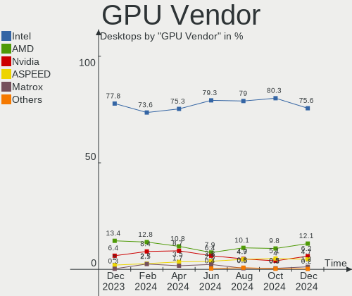

BSD Hardware Trends (Desktops)
------------------------------

A project to identify most popular hardware characteristics and track their change
over time based on data collected by BSD users at https://BSD-Hardware.info.

Anyone can contribute to this report by the [hw-probe](https://github.com/linuxhw/hw-probe/blob/master/INSTALL.BSD.md) tool:

    hw-probe -all -upload

Full-feature report is available here: https://bsd-hardware.info/?view=trends

Period: Jan, 2022.

Contents
--------

* [ System ](#system)
  - [ OS                       ](#os)
  - [ OS Family                ](#os-family)
  - [ Arch                     ](#arch)
  - [ DE                       ](#de)
  - [ Display Server           ](#display-server)
  - [ Display Manager          ](#display-manager)
  - [ OS Lang                  ](#os-lang)
  - [ Boot Mode                ](#boot-mode)
  - [ Filesystem               ](#filesystem)
  - [ Part. scheme             ](#part-scheme)

* [ Board ](#board)
  - [ Vendor                   ](#vendor)
  - [ Model                    ](#model)
  - [ Model Family             ](#model-family)
  - [ MFG Year                 ](#mfg-year)
  - [ Form Factor              ](#form-factor)
  - [ Coreboot                 ](#coreboot)
  - [ RAM Size                 ](#ram-size)
  - [ RAM Used                 ](#ram-used)
  - [ Total Drives             ](#total-drives)
  - [ Has CD-ROM               ](#has-cd-rom)
  - [ Has Ethernet             ](#has-ethernet)
  - [ Has WiFi                 ](#has-wifi)
  - [ Has Bluetooth            ](#has-bluetooth)

* [ Location ](#location)
  - [ Country                  ](#country)
  - [ City                     ](#city)

* [ Drives ](#drives)
  - [ Drive Vendor             ](#drive-vendor)
  - [ Drive Model              ](#drive-model)
  - [ HDD Vendor               ](#hdd-vendor)
  - [ SSD Vendor               ](#ssd-vendor)
  - [ Drive Kind               ](#drive-kind)
  - [ Drive Connector          ](#drive-connector)
  - [ Drive Size               ](#drive-size)
  - [ Space Total              ](#space-total)
  - [ Space Used               ](#space-used)
  - [ Malfunc. Drives          ](#malfunc-drives)
  - [ Malfunc. Drive Vendor    ](#malfunc-drive-vendor)
  - [ Malfunc. HDD Vendor      ](#malfunc-hdd-vendor)
  - [ Malfunc. Drive Kind      ](#malfunc-drive-kind)
  - [ Failed Drives            ](#failed-drives)
  - [ Failed Drive Vendor      ](#failed-drive-vendor)
  - [ Drive Status             ](#drive-status)

* [ Storage controller ](#storage-controller)
  - [ Storage Vendor           ](#storage-vendor)
  - [ Storage Model            ](#storage-model)
  - [ Storage Kind             ](#storage-kind)

* [ Processor ](#processor)
  - [ CPU Vendor               ](#cpu-vendor)
  - [ CPU Model                ](#cpu-model)
  - [ CPU Model Family         ](#cpu-model-family)
  - [ CPU Cores                ](#cpu-cores)
  - [ CPU Sockets              ](#cpu-sockets)
  - [ CPU Threads              ](#cpu-threads)
  - [ CPU Microarch            ](#cpu-microarch)

* [ Graphics ](#graphics)
  - [ GPU Vendor               ](#gpu-vendor)
  - [ GPU Model                ](#gpu-model)
  - [ GPU Combo                ](#gpu-combo)
  - [ GPU Driver               ](#gpu-driver)
  - [ GPU Memory               ](#gpu-memory)

* [ Monitor ](#monitor)
  - [ Monitor Vendor           ](#monitor-vendor)
  - [ Monitor Model            ](#monitor-model)
  - [ Monitor Resolution       ](#monitor-resolution)
  - [ Monitor Diagonal         ](#monitor-diagonal)
  - [ Monitor Width            ](#monitor-width)
  - [ Aspect Ratio             ](#aspect-ratio)
  - [ Monitor Area             ](#monitor-area)
  - [ Pixel Density            ](#pixel-density)
  - [ Multiple Monitors        ](#multiple-monitors)

* [ Network ](#network)
  - [ Net Controller Vendor    ](#net-controller-vendor)
  - [ Net Controller Model     ](#net-controller-model)
  - [ Wireless Vendor          ](#wireless-vendor)
  - [ Wireless Model           ](#wireless-model)
  - [ Ethernet Vendor          ](#ethernet-vendor)
  - [ Ethernet Model           ](#ethernet-model)
  - [ Net Controller Kind      ](#net-controller-kind)
  - [ Used Controller          ](#used-controller)
  - [ NICs                     ](#nics)
  - [ IPv6                     ](#ipv6)

* [ Bluetooth ](#bluetooth)
  - [ Bluetooth Vendor         ](#bluetooth-vendor)
  - [ Bluetooth Model          ](#bluetooth-model)

* [ Sound ](#sound)
  - [ Sound Vendor             ](#sound-vendor)
  - [ Sound Model              ](#sound-model)

* [ Memory ](#memory)
  - [ Memory Vendor            ](#memory-vendor)
  - [ Memory Model             ](#memory-model)
  - [ Memory Kind              ](#memory-kind)
  - [ Memory Form Factor       ](#memory-form-factor)
  - [ Memory Size              ](#memory-size)
  - [ Memory Speed             ](#memory-speed)

* [ Printers & scanners ](#printers--scanners)
  - [ Printer Vendor           ](#printer-vendor)
  - [ Printer Model            ](#printer-model)
  - [ Scanner Vendor           ](#scanner-vendor)
  - [ Scanner Model            ](#scanner-model)

* [ Camera ](#camera)
  - [ Camera Vendor            ](#camera-vendor)
  - [ Camera Model             ](#camera-model)

* [ Security ](#security)
  - [ Fingerprint Vendor       ](#fingerprint-vendor)
  - [ Fingerprint Model        ](#fingerprint-model)
  - [ Chipcard Vendor          ](#chipcard-vendor)
  - [ Chipcard Model           ](#chipcard-model)

* [ Unsupported ](#unsupported)
  - [ Unsupported Devices      ](#unsupported-devices)
  - [ Unsupported Device Types ](#unsupported-device-types)

System
------

OS
--

Installed operating systems

| Name                   | Desktops | Percent |
|------------------------|----------|---------|
| OPNsense 21.7.7        | 131      | 44.11%  |
| OPNsense 22.1          | 59       | 19.87%  |
| helloSystem 0.7.0      | 27       | 9.09%   |
| FreeBSD 13.0-p5        | 11       | 3.7%    |
| FreeBSD 13.0-p6        | 9        | 3.03%   |
| OPNsense 21.7.8        | 8        | 2.69%   |
| helloSystem 0.8.0      | 7        | 2.36%   |
| OpenBSD 7.0            | 5        | 1.68%   |
| FreeBSD 14.0-CURRENT   | 4        | 1.35%   |
| FreeBSD 12.3-p1        | 4        | 1.35%   |
| FreeBSD 12.3           | 4        | 1.35%   |
| FreeBSD 13.0-p4        | 3        | 1.01%   |
| FreeBSD 13.0           | 3        | 1.01%   |
| OPNsense 12.1-p21-HBSD | 2        | 0.67%   |
| helloSystem 0.6.0      | 2        | 0.67%   |
| FreeBSD 13.0-STABLE    | 2        | 0.67%   |
| FreeBSD 12.2-p11       | 2        | 0.67%   |
| TrueNAS 12.3-p1        | 1        | 0.34%   |
| pfSense 2.6.0          | 1        | 0.34%   |
| pfSense 2.5.0          | 1        | 0.34%   |
| OPNsense 21.7.6        | 1        | 0.34%   |
| OPNsense 21.7.3        | 1        | 0.34%   |
| OPNsense 21.1.9        | 1        | 0.34%   |
| OPNsense 21.1.8        | 1        | 0.34%   |
| NomadBSD 5806f915      | 1        | 0.34%   |
| MidnightBSD 2.1.3      | 1        | 0.34%   |
| GhostBSD 22.01.28      | 1        | 0.34%   |
| GhostBSD 21.08.27      | 1        | 0.34%   |
| FreeBSD 12.2-p12       | 1        | 0.34%   |
| FreeBSD 11.4-p13       | 1        | 0.34%   |
| DragonFly 5.8          | 1        | 0.34%   |

OS Family
---------

OS without a version

| Name        | Desktops | Percent |
|-------------|----------|---------|
| OPNsense    | 204      | 68.69%  |
| FreeBSD     | 44       | 14.81%  |
| helloSystem | 36       | 12.12%  |
| OpenBSD     | 5        | 1.68%   |
| pfSense     | 2        | 0.67%   |
| GhostBSD    | 2        | 0.67%   |
| TrueNAS     | 1        | 0.34%   |
| NomadBSD    | 1        | 0.34%   |
| MidnightBSD | 1        | 0.34%   |
| DragonFly   | 1        | 0.34%   |

Arch
----

OS architecture (x86_64, i586, etc.)

| Name  | Desktops | Percent |
|-------|----------|---------|
| amd64 | 292      | 98.32%  |
| arm64 | 4        | 1.35%   |
| i386  | 1        | 0.34%   |

DE
--

Desktop Environment

| Name         | Desktops | Percent |
|--------------|----------|---------|
| Console      | 233      | 78.45%  |
| helloDesktop | 36       | 12.12%  |
| KDE5         | 7        | 2.36%   |
| GNOME        | 5        | 1.68%   |
| fvwm         | 4        | 1.35%   |
| TWM          | 3        | 1.01%   |
| Openbox      | 3        | 1.01%   |
| MATE         | 3        | 1.01%   |
| XFCE         | 1        | 0.34%   |
| i3           | 1        | 0.34%   |
| Fluxbox      | 1        | 0.34%   |

Display Server
--------------

X11 or Wayland

| Name    | Desktops | Percent |
|---------|----------|---------|
| Console | 238      | 80.13%  |
| X11     | 58       | 19.53%  |
| Wayland | 1        | 0.34%   |

Display Manager
---------------

SDDM, LightDM, etc.

| Name    | Desktops | Percent |
|---------|----------|---------|
| Console | 245      | 82.49%  |
| SLiM    | 41       | 13.8%   |
| SDDM    | 5        | 1.68%   |
| LightDM | 3        | 1.01%   |
| GDM     | 2        | 0.67%   |
| XDM     | 1        | 0.34%   |

OS Lang
-------

Language

| Lang         | Desktops | Percent |
|--------------|----------|---------|
| Unknown      | 219      | 73.74%  |
| en_US        | 40       | 13.47%  |
| C            | 33       | 11.11%  |
| ru_RU        | 4        | 1.35%   |
| ru_RU.KOI8-R | 1        | 0.34%   |

Boot Mode
---------

EFI or BIOS

| Mode | Desktops | Percent |
|------|----------|---------|
| EFI  | 250      | 84.18%  |
| BIOS | 47       | 15.82%  |

Filesystem
----------

Type of filesystem

| Type    | Desktops | Percent |
|---------|----------|---------|
| Ufs     | 172      | 57.91%  |
| Zfs     | 100      | 33.67%  |
| Cd9660  | 19       | 6.4%    |
| Ffs     | 5        | 1.68%   |
| Hammer2 | 1        | 0.34%   |

Part. scheme
------------

Scheme of partitioning

| Type    | Desktops | Percent |
|---------|----------|---------|
| GPT     | 274      | 92.26%  |
| MBR     | 20       | 6.73%   |
| Unknown | 3        | 1.01%   |

Board
-----

Vendor
------

Motherboard manufacturer

| Name                    | Desktops | Percent |
|-------------------------|----------|---------|
| ASUSTek Computer        | 41       | 13.8%   |
| Unknown                 | 32       | 10.77%  |
| Dell                    | 30       | 10.1%   |
| Hewlett-Packard         | 25       | 8.42%   |
| ASRock                  | 25       | 8.42%   |
| Intel                   | 23       | 7.74%   |
| Gigabyte Technology     | 19       | 6.4%    |
| PC Engines              | 17       | 5.72%   |
| Protectli               | 12       | 4.04%   |
| MSI                     | 11       | 3.7%    |
| Fujitsu                 | 8        | 2.69%   |
| Supermicro              | 6        | 2.02%   |
| Lenovo                  | 6        | 2.02%   |
| HARDKERNEL              | 4        | 1.35%   |
| Yanling                 | 3        | 1.01%   |
| Biostar                 | 3        | 1.01%   |
| Pegatron                | 2        | 0.67%   |
| Intel CNCTION-IAF       | 2        | 0.67%   |
| Deciso                  | 2        | 0.67%   |
| BESSTAR Tech            | 2        | 0.67%   |
| ZOTAC                   | 1        | 0.34%   |
| XtReAmEr                | 1        | 0.34%   |
| WYSE                    | 1        | 0.34%   |
| Winston Marriot         | 1        | 0.34%   |
| Silicom                 | 1        | 0.34%   |
| SIEMENS                 | 1        | 0.34%   |
| RUNING                  | 1        | 0.34%   |
| Raspberry Pi Foundation | 1        | 0.34%   |
| OEM                     | 1        | 0.34%   |
| NU591                   | 1        | 0.34%   |
| MW                      | 1        | 0.34%   |
| Lanner                  | 1        | 0.34%   |
| Kontron                 | 1        | 0.34%   |
| HPE                     | 1        | 0.34%   |
| Foxconn                 | 1        | 0.34%   |
| ECS                     | 1        | 0.34%   |
| Cisco                   | 1        | 0.34%   |
| CheckPoint              | 1        | 0.34%   |
| AZW                     | 1        | 0.34%   |
| ASRockRack              | 1        | 0.34%   |
| AMI                     | 1        | 0.34%   |
| AMD                     | 1        | 0.34%   |
| Acer                    | 1        | 0.34%   |
| AAEON                   | 1        | 0.34%   |

Model
-----

Motherboard model

| Name                               | Desktops | Percent |
|------------------------------------|----------|---------|
| Unknown                            | 34       | 11.45%  |
| PC Engines APU2                    | 7        | 2.36%   |
| Intel Q3XXG4-P V1.0                | 6        | 2.02%   |
| Dell OptiPlex 9020                 | 6        | 2.02%   |
| Protectli FW6                      | 5        | 1.68%   |
| PC Engines apu4                    | 5        | 1.68%   |
| Protectli FW4B                     | 4        | 1.35%   |
| HP t620 PLUS Quad Core TC          | 4        | 1.35%   |
| HARDKERNEL ODROID-H2               | 4        | 1.35%   |
| Yanling YL-KBR6L                   | 3        | 1.01%   |
| Dell OptiPlex 790                  | 3        | 1.01%   |
| Dell OptiPlex 7010                 | 3        | 1.01%   |
| ASUS All Series                    | 3        | 1.01%   |
| Protectli FW1                      | 2        | 0.67%   |
| PC Engines apu1                    | 2        | 0.67%   |
| PC Engines APU                     | 2        | 0.67%   |
| Lenovo ThinkCentre M71e 3134C3U    | 2        | 0.67%   |
| Intel SKYBAY                       | 2        | 0.67%   |
| Intel SHARKBAY                     | 2        | 0.67%   |
| Intel MAHOBAY                      | 2        | 0.67%   |
| Intel CNCTION-IAF CNCTION-IAF      | 2        | 0.67%   |
| HP ProLiant MicroServer Gen8       | 2        | 0.67%   |
| HP ProLiant MicroServer            | 2        | 0.67%   |
| HP ProDesk 600 G3 SFF              | 2        | 0.67%   |
| HP ProDesk 600 G2 SFF              | 2        | 0.67%   |
| HP ProDesk 600 G2 DM               | 2        | 0.67%   |
| HP EliteDesk 800 G1 SFF            | 2        | 0.67%   |
| Dell OptiPlex 7060                 | 2        | 0.67%   |
| Dell OptiPlex 3020                 | 2        | 0.67%   |
| Deciso Netboard A10 V2             | 2        | 0.67%   |
| WYSE D CLASS                       | 1        | 0.34%   |
| Winston Marriot PICO PC(R)         | 1        | 0.34%   |
| Supermicro X9SCI/X9SCA             | 1        | 0.34%   |
| Supermicro X8SIL                   | 1        | 0.34%   |
| Supermicro X7SBL                   | 1        | 0.34%   |
| Supermicro SYS-E200-9B             | 1        | 0.34%   |
| Supermicro SYS-5019D-FN8TP-1-NC041 | 1        | 0.34%   |
| Supermicro SYS-5019A-12TN4         | 1        | 0.34%   |
| Silicom 80300-0134-g01             | 1        | 0.34%   |
| SIEMENS SIMATIC IPC227E            | 1        | 0.34%   |
| RUNING B75M INTEL H3V              | 1        | 0.34%   |
| RPi Raspberry Pi 400               | 1        | 0.34%   |
| Protectli VP2410                   | 1        | 0.34%   |
| Pegatron IPPPV-D3G                 | 1        | 0.34%   |
| Pegatron Compaq 505B Microtower PC | 1        | 0.34%   |
| PC Engines APU3                    | 1        | 0.34%   |
| OEM 1.0                            | 1        | 0.34%   |
| NU591 1.0                          | 1        | 0.34%   |
| MW GMLK-2_5G4L                     | 1        | 0.34%   |
| MSI MS-S0891                       | 1        | 0.34%   |
| MSI MS-9A68                        | 1        | 0.34%   |
| MSI MS-9A45                        | 1        | 0.34%   |
| MSI MS-7D25                        | 1        | 0.34%   |
| MSI MS-7D14                        | 1        | 0.34%   |
| MSI MS-7C56                        | 1        | 0.34%   |
| MSI MS-7C52                        | 1        | 0.34%   |
| MSI MS-7A16                        | 1        | 0.34%   |
| MSI MS-7817                        | 1        | 0.34%   |
| MSI MS-7677                        | 1        | 0.34%   |
| MSI MS-7529                        | 1        | 0.34%   |

Model Family
------------

Motherboard model prefix

| Name                               | Desktops | Percent |
|------------------------------------|----------|---------|
| Unknown                            | 34       | 11.45%  |
| Dell OptiPlex                      | 22       | 7.41%   |
| PC Engines APU2                    | 7        | 2.36%   |
| HP ProDesk                         | 7        | 2.36%   |
| ASUS PRIME                         | 7        | 2.36%   |
| Lenovo ThinkCentre                 | 6        | 2.02%   |
| Intel Q3XXG4-P                     | 6        | 2.02%   |
| Protectli FW6                      | 5        | 1.68%   |
| PC Engines apu4                    | 5        | 1.68%   |
| HP ProLiant                        | 5        | 1.68%   |
| HP EliteDesk                       | 5        | 1.68%   |
| Fujitsu ESPRIMO                    | 5        | 1.68%   |
| ASUS TUF                           | 5        | 1.68%   |
| ASUS ROG                           | 5        | 1.68%   |
| Protectli FW4B                     | 4        | 1.35%   |
| HP t620                            | 4        | 1.35%   |
| HARDKERNEL ODROID-H2               | 4        | 1.35%   |
| Yanling YL-KBR6L                   | 3        | 1.01%   |
| Fujitsu FUTRO                      | 3        | 1.01%   |
| Dell Precision                     | 3        | 1.01%   |
| Dell Inspiron                      | 3        | 1.01%   |
| ASUS All                           | 3        | 1.01%   |
| Protectli FW1                      | 2        | 0.67%   |
| PC Engines apu1                    | 2        | 0.67%   |
| PC Engines APU                     | 2        | 0.67%   |
| Intel SKYBAY                       | 2        | 0.67%   |
| Intel SHARKBAY                     | 2        | 0.67%   |
| Intel MAHOBAY                      | 2        | 0.67%   |
| Intel CNCTION-IAF CNCTION-IAF      | 2        | 0.67%   |
| HP Compaq                          | 2        | 0.67%   |
| Deciso Netboard                    | 2        | 0.67%   |
| ASUS P7H55-M                       | 2        | 0.67%   |
| ASRock X570                        | 2        | 0.67%   |
| WYSE D                             | 1        | 0.34%   |
| Winston Marriot PICO               | 1        | 0.34%   |
| Supermicro X9SCI                   | 1        | 0.34%   |
| Supermicro X8SIL                   | 1        | 0.34%   |
| Supermicro X7SBL                   | 1        | 0.34%   |
| Supermicro SYS-E200-9B             | 1        | 0.34%   |
| Supermicro SYS-5019D-FN8TP-1-NC041 | 1        | 0.34%   |
| Supermicro SYS-5019A-12TN4         | 1        | 0.34%   |
| Silicom 80300-0134-g01             | 1        | 0.34%   |
| SIEMENS SIMATIC                    | 1        | 0.34%   |
| RUNING B75M                        | 1        | 0.34%   |
| RPi Raspberry                      | 1        | 0.34%   |
| Protectli VP2410                   | 1        | 0.34%   |
| Pegatron IPPPV-D3G                 | 1        | 0.34%   |
| Pegatron Compaq                    | 1        | 0.34%   |
| PC Engines APU3                    | 1        | 0.34%   |
| OEM 1.0                            | 1        | 0.34%   |
| NU591 1.0                          | 1        | 0.34%   |
| MW GMLK-2                          | 1        | 0.34%   |
| MSI MS-S0891                       | 1        | 0.34%   |
| MSI MS-9A68                        | 1        | 0.34%   |
| MSI MS-9A45                        | 1        | 0.34%   |
| MSI MS-7D25                        | 1        | 0.34%   |
| MSI MS-7D14                        | 1        | 0.34%   |
| MSI MS-7C56                        | 1        | 0.34%   |
| MSI MS-7C52                        | 1        | 0.34%   |
| MSI MS-7A16                        | 1        | 0.34%   |

MFG Year
--------

Motherboard manufacture year

| Year    | Desktops | Percent |
|---------|----------|---------|
| 2018    | 43       | 14.48%  |
| 2021    | 33       | 11.11%  |
| 2019    | 29       | 9.76%   |
| 2014    | 28       | 9.43%   |
| 2016    | 26       | 8.75%   |
| 2020    | 24       | 8.08%   |
| 2017    | 20       | 6.73%   |
| 2012    | 19       | 6.4%    |
| 2013    | 17       | 5.72%   |
| 2015    | 14       | 4.71%   |
| 2010    | 13       | 4.38%   |
| 2011    | 9        | 3.03%   |
| 2009    | 8        | 2.69%   |
| Unknown | 5        | 1.68%   |
| 2008    | 4        | 1.35%   |
| 2007    | 3        | 1.01%   |
| 2022    | 1        | 0.34%   |
| 2006    | 1        | 0.34%   |

Form Factor
-----------

Physical design of the computer

| Name    | Desktops | Percent |
|---------|----------|---------|
| Desktop | 297      | 100%    |

Coreboot
--------

Have coreboot on board

| Used | Desktops | Percent |
|------|----------|---------|
| No   | 275      | 92.59%  |
| Yes  | 22       | 7.41%   |

RAM Size
--------

Total RAM memory

| Size in GB  | Desktops | Percent |
|-------------|----------|---------|
| 8.01-16.0   | 100      | 33.67%  |
| 4.01-8.0    | 70       | 23.57%  |
| 16.01-24.0  | 64       | 21.55%  |
| 32.01-64.0  | 29       | 9.76%   |
| 64.01-256.0 | 12       | 4.04%   |
| 2.01-3.0    | 11       | 3.7%    |
| 3.01-4.0    | 4        | 1.35%   |
| 0.51-1.0    | 3        | 1.01%   |
| 24.01-32.0  | 2        | 0.67%   |
| 1.01-2.0    | 2        | 0.67%   |

RAM Used
--------

Used RAM memory

| Used GB     | Desktops | Percent |
|-------------|----------|---------|
| 0.01-0.5    | 140      | 47.14%  |
| 0.51-1.0    | 92       | 30.98%  |
| 1.01-2.0    | 34       | 11.45%  |
| 4.01-8.0    | 10       | 3.37%   |
| 2.01-3.0    | 7        | 2.36%   |
| 3.01-4.0    | 4        | 1.35%   |
| 64.01-256.0 | 2        | 0.67%   |
| 16.01-24.0  | 2        | 0.67%   |
| 8.01-16.0   | 2        | 0.67%   |
| 0           | 2        | 0.67%   |
| 24.01-32.0  | 1        | 0.34%   |
| Unknown     | 1        | 0.34%   |

Total Drives
------------

Number of drives on board

| Drives | Desktops | Percent |
|--------|----------|---------|
| 1      | 201      | 67.68%  |
| 2      | 43       | 14.48%  |
| 0      | 21       | 7.07%   |
| 4      | 12       | 4.04%   |
| 3      | 10       | 3.37%   |
| 6      | 3        | 1.01%   |
| 5      | 3        | 1.01%   |
| 13     | 1        | 0.34%   |
| 12     | 1        | 0.34%   |
| 9      | 1        | 0.34%   |
| 7      | 1        | 0.34%   |

Has CD-ROM
----------

Has CD-ROM on board

| Presented | Desktops | Percent |
|-----------|----------|---------|
| No        | 241      | 81.14%  |
| Yes       | 56       | 18.86%  |

Has Ethernet
------------

Has Ethernet on board

| Presented | Desktops | Percent |
|-----------|----------|---------|
| Yes       | 292      | 98.32%  |
| No        | 5        | 1.68%   |

Has WiFi
--------

Has WiFi module

| Presented | Desktops | Percent |
|-----------|----------|---------|
| No        | 249      | 83.84%  |
| Yes       | 48       | 16.16%  |

Has Bluetooth
-------------

Has Bluetooth module

| Presented | Desktops | Percent |
|-----------|----------|---------|
| No        | 265      | 89.23%  |
| Yes       | 32       | 10.77%  |

Location
--------

Country
-------

Geographic location (country)

| Country            | Desktops | Percent |
|--------------------|----------|---------|
| USA                | 85       | 28.62%  |
| Germany            | 43       | 14.48%  |
| Russia             | 20       | 6.73%   |
| UK                 | 15       | 5.05%   |
| France             | 13       | 4.38%   |
| Australia          | 10       | 3.37%   |
| Poland             | 9        | 3.03%   |
| Canada             | 9        | 3.03%   |
| Spain              | 7        | 2.36%   |
| Italy              | 7        | 2.36%   |
| Austria            | 7        | 2.36%   |
| Switzerland        | 5        | 1.68%   |
| Sweden             | 5        | 1.68%   |
| Netherlands        | 5        | 1.68%   |
| Belgium            | 5        | 1.68%   |
| Romania            | 4        | 1.35%   |
| Brazil             | 4        | 1.35%   |
| South Africa       | 3        | 1.01%   |
| Hungary            | 3        | 1.01%   |
| Finland            | 3        | 1.01%   |
| Ukraine            | 2        | 0.67%   |
| UAE                | 2        | 0.67%   |
| Israel             | 2        | 0.67%   |
| Indonesia          | 2        | 0.67%   |
| India              | 2        | 0.67%   |
| Greece             | 2        | 0.67%   |
| Czechia            | 2        | 0.67%   |
| Argentina          | 2        | 0.67%   |
| Turkey             | 1        | 0.34%   |
| Singapore          | 1        | 0.34%   |
| Portugal           | 1        | 0.34%   |
| Peru               | 1        | 0.34%   |
| Norway             | 1        | 0.34%   |
| Nigeria            | 1        | 0.34%   |
| New Zealand        | 1        | 0.34%   |
| Moldova            | 1        | 0.34%   |
| Malaysia           | 1        | 0.34%   |
| Madagascar         | 1        | 0.34%   |
| Kazakhstan         | 1        | 0.34%   |
| Japan              | 1        | 0.34%   |
| Dominican Republic | 1        | 0.34%   |
| Cyprus             | 1        | 0.34%   |
| Cuba               | 1        | 0.34%   |
| China              | 1        | 0.34%   |
| Bulgaria           | 1        | 0.34%   |
| Belarus            | 1        | 0.34%   |
| Bahamas            | 1        | 0.34%   |

City
----

Geographic location (city)

| City         | Desktops | Percent |
|--------------|----------|---------|
| Vienna       | 4        | 1.35%   |
| Sydney       | 4        | 1.35%   |
| Grand Rapids | 4        | 1.35%   |
| Berlin       | 4        | 1.35%   |
| Seattle      | 3        | 1.01%   |
| Paris        | 3        | 1.01%   |
| Munich       | 3        | 1.01%   |
| Helsinki     | 3        | 1.01%   |
| Dresden      | 3        | 1.01%   |
| Cluj-Napoca  | 3        | 1.01%   |
| Barnaul      | 3        | 1.01%   |
| Athens       | 3        | 1.01%   |
| Winnipeg     | 2        | 0.67%   |
| Wenatchee    | 2        | 0.67%   |
| Watertown    | 2        | 0.67%   |
| Warsaw       | 2        | 0.67%   |
| Wadsworth    | 2        | 0.67%   |
| Tel Aviv     | 2        | 0.67%   |
| Silea        | 2        | 0.67%   |
| Salem        | 2        | 0.67%   |
| Ruthin       | 2        | 0.67%   |
| Redmond      | 2        | 0.67%   |
| Perth        | 2        | 0.67%   |
| New York     | 2        | 0.67%   |
| Moscow       | 2        | 0.67%   |
| Melbourne    | 2        | 0.67%   |
| Madrid       | 2        | 0.67%   |
| Karlsruhe    | 2        | 0.67%   |
| Jakarta      | 2        | 0.67%   |
| Gdansk       | 2        | 0.67%   |
| Egham        | 2        | 0.67%   |
| Dubai        | 2        | 0.67%   |
| Denver       | 2        | 0.67%   |
| Dallas       | 2        | 0.67%   |
| Cologne      | 2        | 0.67%   |
| College Park | 2        | 0.67%   |
| Chicago      | 2        | 0.67%   |
| Armavir      | 2        | 0.67%   |
| Zurich       | 1        | 0.34%   |
| Zaandam      | 1        | 0.34%   |
| Ypsilanti    | 1        | 0.34%   |
| Wroclaw      | 1        | 0.34%   |
| Wolfsburg    | 1        | 0.34%   |
| Windsor Mill | 1        | 0.34%   |
| Whitewater   | 1        | 0.34%   |
| Wheaton      | 1        | 0.34%   |
| Werl         | 1        | 0.34%   |
| Wedemark     | 1        | 0.34%   |
| Voronezh     | 1        | 0.34%   |
| Volzhskiy    | 1        | 0.34%   |
| Vigo         | 1        | 0.34%   |
| Venice       | 1        | 0.34%   |
| Valencia     | 1        | 0.34%   |
| Uster        | 1        | 0.34%   |
| Ume??        | 1        | 0.34%   |
| Ulyanovsk    | 1        | 0.34%   |
| Ulm          | 1        | 0.34%   |
| Trenton      | 1        | 0.34%   |
| Toronto      | 1        | 0.34%   |
| Tomsk        | 1        | 0.34%   |

Drives
------

Drive Vendor
------------

Hard drive vendors

| Vendor              | Desktops | Drives | Percent |
|---------------------|----------|--------|---------|
| WDC                 | 52       | 81     | 14.61%  |
| Samsung Electronics | 49       | 63     | 13.76%  |
| Seagate             | 39       | 58     | 10.96%  |
| Kingston            | 26       | 26     | 7.3%    |
| Crucial             | 21       | 27     | 5.9%    |
| Transcend           | 20       | 20     | 5.62%   |
| Toshiba             | 11       | 16     | 3.09%   |
| Phison              | 10       | 10     | 2.81%   |
| Intel               | 10       | 11     | 2.81%   |
| A-DATA Technology   | 10       | 12     | 2.81%   |
| SanDisk             | 9        | 9      | 2.53%   |
| Hoodisk             | 9        | 9      | 2.53%   |
| Hitachi             | 7        | 9      | 1.97%   |
| Corsair             | 5        | 5      | 1.4%    |
| China               | 5        | 5      | 1.4%    |
| SPCC                | 4        | 4      | 1.12%   |
| SK Hynix            | 4        | 4      | 1.12%   |
| OCZ                 | 4        | 4      | 1.12%   |
| Gigabyte Technology | 4        | 5      | 1.12%   |
| NVMe                | 3        | 3      | 0.84%   |
| Micron Technology   | 3        | 3      | 0.84%   |
| LITEON              | 3        | 3      | 0.84%   |
| Innodisk            | 3        | 3      | 0.84%   |
| HGST                | 3        | 6      | 0.84%   |
| Dogfish             | 3        | 3      | 0.84%   |
| BIWIN               | 3        | 3      | 0.84%   |
| Apacer              | 3        | 3      | 0.84%   |
| Protectli           | 2        | 2      | 0.56%   |
| PLEXTOR             | 2        | 2      | 0.56%   |
| Patriot             | 2        | 3      | 0.56%   |
| Mushkin             | 2        | 2      | 0.56%   |
| LITEONIT            | 2        | 2      | 0.56%   |
| Intenso             | 2        | 2      | 0.56%   |
| Hewlett-Packard     | 2        | 3      | 0.56%   |
| GOODRAM             | 2        | 2      | 0.56%   |
| Zheino              | 1        | 1      | 0.28%   |
| XUNZHE              | 1        | 1      | 0.28%   |
| XrayDisk            | 1        | 1      | 0.28%   |
| VisionTek           | 1        | 1      | 0.28%   |
| Vaseky              | 1        | 1      | 0.28%   |
| StoreJet            | 1        | 1      | 0.28%   |
| Silicon Motion      | 1        | 1      | 0.28%   |
| PNY                 | 1        | 1      | 0.28%   |
| Lite-On             | 1        | 1      | 0.28%   |
| Leven               | 1        | 1      | 0.28%   |
| LDLC                | 1        | 1      | 0.28%   |
| KIOXIA-EXCERIA      | 1        | 1      | 0.28%   |
| KingSpec            | 1        | 1      | 0.28%   |
| KingDian            | 1        | 1      | 0.28%   |
| FORESEE             | 1        | 1      | 0.28%   |
| EMTEC               | 1        | 1      | 0.28%   |
| AMD                 | 1        | 2      | 0.28%   |

Drive Model
-----------

Hard drive models

| Model                                   | Desktops | Percent |
|-----------------------------------------|----------|---------|
| Phison SATA SSD 16GB                    | 7        | 1.79%   |
| Kingston SA400S37120G 120GB             | 6        | 1.53%   |
| WDC WD800JD-75MSA3 80GB                 | 5        | 1.28%   |
| Crucial CT120BX500SSD1 120GB            | 5        | 1.28%   |
| Transcend TS64GMSA230S 64GB             | 4        | 1.02%   |
| Transcend TS128GMSA230S 128GB           | 4        | 1.02%   |
| Seagate ST2000DM008-2FR102 2TB          | 4        | 1.02%   |
| Seagate ST500DM002-1BD142 500GB         | 3        | 0.77%   |
| Seagate ST3160815AS 160GB               | 3        | 0.77%   |
| Samsung SSD 860 PRO 256GB               | 3        | 0.77%   |
| Samsung SSD 860 EVO 250GB               | 3        | 0.77%   |
| Samsung SSD 850 EVO 250GB               | 3        | 0.77%   |
| Kingston SUV500MS240G 240GB             | 3        | 0.77%   |
| Kingston SUV500MS120G 120GB             | 3        | 0.77%   |
| Hoodisk SSD 128GB                       | 3        | 0.77%   |
| Gigabyte GP-GSTFS31120GNTD 120GB        | 3        | 0.77%   |
| Crucial CT500MX500SSD1 500GB            | 3        | 0.77%   |
| Crucial CT250MX500SSD1 250GB            | 3        | 0.77%   |
| WDC WDS240G2G0A-00JH30 240GB            | 2        | 0.51%   |
| WDC WDS120G2G0A-00JH30 120GB            | 2        | 0.51%   |
| WDC WD80EFAX-68LHPN0 8TB                | 2        | 0.51%   |
| WDC WD5000AAKX-75U6AA0 500GB            | 2        | 0.51%   |
| WDC WD40EFRX-68N32N0 4TB                | 2        | 0.51%   |
| WDC WD2500AAKX-083CA1 250GB             | 2        | 0.51%   |
| WDC WD20EZAZ-00GGJB0 2TB                | 2        | 0.51%   |
| WDC WD1600BEVT-22ZCT0 160GB             | 2        | 0.51%   |
| WDC PC SN730 SDBQNTY-256G-1001 256GB    | 2        | 0.51%   |
| SPCC Solid State Disk 128GB             | 2        | 0.51%   |
| SK Hynix BC501 HFM128GDJTNG-8310A 128GB | 2        | 0.51%   |
| Seagate ST4000DM000-1F2168 4TB          | 2        | 0.51%   |
| Seagate ST1000LM024 HN-M101MBB 1TB      | 2        | 0.51%   |
| Samsung SSD 970 EVO Plus 1TB            | 2        | 0.51%   |
| Samsung SSD 870 EVO 1TB                 | 2        | 0.51%   |
| Samsung SSD 850 EVO 1TB                 | 2        | 0.51%   |
| Samsung SSD 840 EVO 250GB               | 2        | 0.51%   |
| Protectli 120GB mSATA                   | 2        | 0.51%   |
| Phison SATA SSD 32GB                    | 2        | 0.51%   |
| Kingston SA400M8240G 240GB              | 2        | 0.51%   |
| Hoodisk SSD 32GB                        | 2        | 0.51%   |
| Dogfish SSD 128GB                       | 2        | 0.51%   |
| Crucial CT480BX500SSD1 480GB            | 2        | 0.51%   |
| Crucial CT250P2SSD8 250GB               | 2        | 0.51%   |
| Zheino CHN-mSATAM1-32 32GB              | 1        | 0.26%   |
| XUNZHE MSATA 64GB                       | 1        | 0.26%   |
| XrayDisk SSD 64GB                       | 1        | 0.26%   |
| WDC WDS500G2B0C-00PXH0 500GB            | 1        | 0.26%   |
| WDC WDS250G2B0C-00PXH0 250GB            | 1        | 0.26%   |
| WDC WDS100T2B0A-00SM50 1TB              | 1        | 0.26%   |
| WDC WDBA3V0010BNC-WRSN 1TB              | 1        | 0.26%   |
| WDC WD80EMAZ-00WJTA0 8TB                | 1        | 0.26%   |
| WDC WD80EFZX-68UW8N0 8TB                | 1        | 0.26%   |
| WDC WD80EDBZ-11B0ZA0 8TB                | 1        | 0.26%   |
| WDC WD60EFRX-68TGBN1 6TB                | 1        | 0.26%   |
| WDC WD5000LPVX-22V0TT0 500GB            | 1        | 0.26%   |
| WDC WD5000LPVT-80G33T2 500GB            | 1        | 0.26%   |
| WDC WD5000LPCX-24C6HT0 500GB            | 1        | 0.26%   |
| WDC WD5000BPKT-00PK4T0 500GB            | 1        | 0.26%   |
| WDC WD5000AZRZ-00HTKB0 500GB            | 1        | 0.26%   |
| WDC WD5000AZLX-60K2TA0 500GB            | 1        | 0.26%   |
| WDC WD5000AAKS-22A7B0 500GB             | 1        | 0.26%   |

HDD Vendor
----------

Hard disk drive vendors

| Vendor              | Desktops | Drives | Percent |
|---------------------|----------|--------|---------|
| WDC                 | 42       | 70     | 38.53%  |
| Seagate             | 38       | 57     | 34.86%  |
| Toshiba             | 10       | 15     | 9.17%   |
| Hitachi             | 7        | 9      | 6.42%   |
| Samsung Electronics | 5        | 5      | 4.59%   |
| HGST                | 3        | 6      | 2.75%   |
| NVMe                | 2        | 2      | 1.83%   |
| StoreJet            | 1        | 1      | 0.92%   |
| Hewlett-Packard     | 1        | 2      | 0.92%   |

SSD Vendor
----------

Solid state drive vendors

| Vendor              | Desktops | Drives | Percent |
|---------------------|----------|--------|---------|
| Samsung Electronics | 30       | 37     | 14.35%  |
| Kingston            | 25       | 25     | 11.96%  |
| Transcend           | 20       | 20     | 9.57%   |
| Crucial             | 19       | 24     | 9.09%   |
| Phison              | 10       | 10     | 4.78%   |
| SanDisk             | 9        | 9      | 4.31%   |
| Hoodisk             | 9        | 9      | 4.31%   |
| Intel               | 8        | 9      | 3.83%   |
| A-DATA Technology   | 7        | 8      | 3.35%   |
| WDC                 | 5        | 5      | 2.39%   |
| China               | 5        | 5      | 2.39%   |
| SPCC                | 4        | 4      | 1.91%   |
| OCZ                 | 4        | 4      | 1.91%   |
| Gigabyte Technology | 4        | 5      | 1.91%   |
| Corsair             | 4        | 4      | 1.91%   |
| Micron Technology   | 3        | 3      | 1.44%   |
| InnoDisk            | 3        | 3      | 1.44%   |
| Dogfish             | 3        | 3      | 1.44%   |
| BIWIN               | 3        | 3      | 1.44%   |
| Apacer              | 3        | 3      | 1.44%   |
| Protectli           | 2        | 2      | 0.96%   |
| Patriot             | 2        | 3      | 0.96%   |
| LITEONIT            | 2        | 2      | 0.96%   |
| LITEON              | 2        | 2      | 0.96%   |
| Intenso             | 2        | 2      | 0.96%   |
| GOODRAM             | 2        | 2      | 0.96%   |
| Zheino              | 1        | 1      | 0.48%   |
| XUNZHE              | 1        | 1      | 0.48%   |
| XrayDisk            | 1        | 1      | 0.48%   |
| VisionTek           | 1        | 1      | 0.48%   |
| Vaseky              | 1        | 1      | 0.48%   |
| Toshiba             | 1        | 1      | 0.48%   |
| Seagate             | 1        | 1      | 0.48%   |
| PLEXTOR             | 1        | 1      | 0.48%   |
| NVMe                | 1        | 1      | 0.48%   |
| Mushkin             | 1        | 1      | 0.48%   |
| Lite-On             | 1        | 1      | 0.48%   |
| Leven               | 1        | 1      | 0.48%   |
| KIOXIA-EXCERIA      | 1        | 1      | 0.48%   |
| KingSpec            | 1        | 1      | 0.48%   |
| KingDian            | 1        | 1      | 0.48%   |
| Hewlett-Packard     | 1        | 1      | 0.48%   |
| FORESEE             | 1        | 1      | 0.48%   |
| EMTEC               | 1        | 1      | 0.48%   |
| AMD                 | 1        | 2      | 0.48%   |

Drive Kind
----------

HDD or SSD

| Kind | Desktops | Drives | Percent |
|------|----------|--------|---------|
| SSD  | 194      | 226    | 59.51%  |
| HDD  | 91       | 167    | 27.91%  |
| NVMe | 41       | 48     | 12.58%  |

Drive Connector
---------------

SATA, SAS, NVMe, etc.

| Type | Desktops | Drives | Percent |
|------|----------|--------|---------|
| SATA | 255      | 393    | 86.15%  |
| NVMe | 41       | 48     | 13.85%  |

Drive Size
----------

Size of hard drive

| Size in TB | Desktops | Drives | Percent |
|------------|----------|--------|---------|
| 0.01-0.5   | 225      | 270    | 77.05%  |
| 0.51-1.0   | 31       | 37     | 10.62%  |
| 1.01-2.0   | 15       | 26     | 5.14%   |
| 4.01-10.0  | 10       | 35     | 3.42%   |
| 3.01-4.0   | 7        | 14     | 2.4%    |
| 10.01-20.0 | 4        | 11     | 1.37%   |

Space Total
-----------

Amount of disk space available on the file system

| Size in GB     | Desktops | Percent |
|----------------|----------|---------|
| 101-250        | 133      | 44.78%  |
| 1-20           | 38       | 12.79%  |
| 51-100         | 38       | 12.79%  |
| 251-500        | 35       | 11.78%  |
| 21-50          | 31       | 10.44%  |
| 501-1000       | 14       | 4.71%   |
| More than 3000 | 3        | 1.01%   |
| 1001-2000      | 3        | 1.01%   |
| 2001-3000      | 1        | 0.34%   |
| Unknown        | 1        | 0.34%   |

Space Used
----------

Amount of used disk space

| Used GB  | Desktops | Percent |
|----------|----------|---------|
| 1-20     | 277      | 93.27%  |
| 21-50    | 11       | 3.7%    |
| 51-100   | 4        | 1.35%   |
| 501-1000 | 2        | 0.67%   |
| 101-250  | 1        | 0.34%   |
| 0        | 1        | 0.34%   |
| Unknown  | 1        | 0.34%   |

Malfunc. Drives
---------------

Drive models with a malfunction

| Model                                 | Desktops | Drives | Percent |
|---------------------------------------|----------|--------|---------|
| Seagate ST3160815AS 160GB             | 2        | 2      | 5.41%   |
| WDC WD60EFRX-68TGBN1 6TB              | 1        | 3      | 2.7%    |
| WDC WD5000AZRZ-00HTKB0 500GB          | 1        | 1      | 2.7%    |
| WDC WD5000AAKS-22A7B0 500GB           | 1        | 1      | 2.7%    |
| WDC WD20EARX-008FB0 2TB               | 1        | 1      | 2.7%    |
| WDC WD20EARS-00MVWB0 2TB              | 1        | 1      | 2.7%    |
| WDC WD2002FYPS-02W3B0 2TB             | 1        | 1      | 2.7%    |
| WDC WD1600BEVT-22ZCT0 160GB           | 1        | 1      | 2.7%    |
| WDC WD1600BEVS-08VAT1 160GB           | 1        | 1      | 2.7%    |
| VisionTek mSATA 120GB                 | 1        | 1      | 2.7%    |
| Toshiba MK3263GSX 320GB               | 1        | 1      | 2.7%    |
| Toshiba DT01ACA050 500GB              | 1        | 1      | 2.7%    |
| SPCC Solid State Disk 128GB           | 1        | 1      | 2.7%    |
| Seagate ST500LM000-SSHD-8GB           | 1        | 1      | 2.7%    |
| Seagate ST380211AS 80GB               | 1        | 1      | 2.7%    |
| Seagate ST3500413AS 500GB             | 1        | 1      | 2.7%    |
| Seagate ST3500410AS 500GB             | 1        | 1      | 2.7%    |
| Seagate ST3320418AS 320GB             | 1        | 1      | 2.7%    |
| Seagate ST3200822AS 200GB             | 1        | 1      | 2.7%    |
| Seagate ST3160318AS 160GB             | 1        | 1      | 2.7%    |
| Seagate ST31000528AS 1TB              | 1        | 1      | 2.7%    |
| Seagate ST1000LM024 HN-M101MBB 1TB    | 1        | 1      | 2.7%    |
| SanDisk SD8TB8U-256G-1006 256GB       | 1        | 1      | 2.7%    |
| Samsung Electronics SSD 960 PRO 512GB | 1        | 1      | 2.7%    |
| Samsung Electronics SSD 850 EVO 1TB   | 1        | 1      | 2.7%    |
| Samsung Electronics HD322HJ 320GB     | 1        | 1      | 2.7%    |
| LITEON CV8-8E128-HP 128GB             | 1        | 1      | 2.7%    |
| Kingston SHPM2280P2-240G              | 1        | 1      | 2.7%    |
| Kingston RBU-SNS8350DES3128GP 128GB   | 1        | 1      | 2.7%    |
| Intel SSDSC2BW120A3 120GB             | 1        | 1      | 2.7%    |
| Hitachi HTS543232A7A384 320GB         | 1        | 1      | 2.7%    |
| HGST HTS541010A9E680 1TB              | 1        | 1      | 2.7%    |
| Crucial CT525MX300SSD1 528GB          | 1        | 1      | 2.7%    |
| BIWIN SSD 128GB                       | 1        | 1      | 2.7%    |
| AMD R5SL240G 240GB                    | 1        | 2      | 2.7%    |
| A-DATA Technology XM13 32GB           | 1        | 1      | 2.7%    |

Malfunc. Drive Vendor
---------------------

Vendors of faulty drives

| Vendor              | Desktops | Drives | Percent |
|---------------------|----------|--------|---------|
| Seagate             | 10       | 11     | 27.78%  |
| WDC                 | 8        | 10     | 22.22%  |
| Samsung Electronics | 3        | 3      | 8.33%   |
| Toshiba             | 2        | 2      | 5.56%   |
| Kingston            | 2        | 2      | 5.56%   |
| VisionTek           | 1        | 1      | 2.78%   |
| SPCC                | 1        | 1      | 2.78%   |
| SanDisk             | 1        | 1      | 2.78%   |
| LITEON              | 1        | 1      | 2.78%   |
| Intel               | 1        | 1      | 2.78%   |
| Hitachi             | 1        | 1      | 2.78%   |
| HGST                | 1        | 1      | 2.78%   |
| Crucial             | 1        | 1      | 2.78%   |
| BIWIN               | 1        | 1      | 2.78%   |
| AMD                 | 1        | 2      | 2.78%   |
| A-DATA Technology   | 1        | 1      | 2.78%   |

Malfunc. HDD Vendor
-------------------

Vendors of faulty HDD drives

| Vendor              | Desktops | Drives | Percent |
|---------------------|----------|--------|---------|
| Seagate             | 10       | 11     | 43.48%  |
| WDC                 | 8        | 10     | 34.78%  |
| Toshiba             | 2        | 2      | 8.7%    |
| Samsung Electronics | 1        | 1      | 4.35%   |
| Hitachi             | 1        | 1      | 4.35%   |
| HGST                | 1        | 1      | 4.35%   |

Malfunc. Drive Kind
-------------------

Kinds of faulty drives

| Kind | Desktops | Drives | Percent |
|------|----------|--------|---------|
| HDD  | 23       | 26     | 63.89%  |
| SSD  | 12       | 13     | 33.33%  |
| NVMe | 1        | 1      | 2.78%   |

Failed Drives
-------------

Failed drive models

Zero info for selected period =(

Failed Drive Vendor
-------------------

Failed drive vendors

Zero info for selected period =(

Drive Status
------------

Number of failed and malfunc. drives

| Status   | Desktops | Drives | Percent |
|----------|----------|--------|---------|
| Works    | 256      | 391    | 85.33%  |
| Malfunc  | 36       | 40     | 12%     |
| Detected | 8        | 10     | 2.67%   |

Storage controller
------------------

Storage Vendor
--------------

Storage controller vendors

| Vendor                           | Desktops | Percent |
|----------------------------------|----------|---------|
| Intel                            | 228      | 62.64%  |
| AMD                              | 62       | 17.03%  |
| Samsung Electronics              | 19       | 5.22%   |
| ASMedia Technology               | 10       | 2.75%   |
| Sandisk                          | 8        | 2.2%    |
| Marvell Technology Group         | 5        | 1.37%   |
| SK Hynix                         | 4        | 1.1%    |
| Silicon Motion                   | 3        | 0.82%   |
| Micron/Crucial Technology        | 3        | 0.82%   |
| JMicron Technology               | 3        | 0.82%   |
| Phison Electronics               | 2        | 0.55%   |
| Nvidia                           | 2        | 0.55%   |
| Lite-On Technology               | 2        | 0.55%   |
| Kingston Technology Company      | 2        | 0.55%   |
| Broadcom / LSI                   | 2        | 0.55%   |
| ADATA Technology                 | 2        | 0.55%   |
| VIA Technologies                 | 1        | 0.27%   |
| Silicon Integrated Systems [SiS] | 1        | 0.27%   |
| Silicon Image                    | 1        | 0.27%   |
| Realtek Semiconductor            | 1        | 0.27%   |
| Hewlett-Packard                  | 1        | 0.27%   |
| Chelsio Communications           | 1        | 0.27%   |
| Adaptec                          | 1        | 0.27%   |

Storage Model
-------------

Storage controller models

| Model                                                                                   | Desktops | Percent |
|-----------------------------------------------------------------------------------------|----------|---------|
| AMD FCH SATA Controller [AHCI mode]                                                     | 40       | 9.78%   |
| Intel 8 Series/C220 Series Chipset Family 6-port SATA Controller 1 [AHCI mode]          | 25       | 6.11%   |
| Intel Celeron/Pentium Silver Processor SATA Controller                                  | 16       | 3.91%   |
| Intel 6 Series/C200 Series Chipset Family 6 port Desktop SATA AHCI Controller           | 16       | 3.91%   |
| Intel Atom/Celeron/Pentium Processor x5-E8000/J3xxx/N3xxx Series SATA Controller        | 14       | 3.42%   |
| Intel Sunrise Point-LP SATA Controller [AHCI mode]                                      | 13       | 3.18%   |
| Intel Q170/Q150/B150/H170/H110/Z170/CM236 Chipset SATA Controller [AHCI Mode]           | 13       | 3.18%   |
| Intel Atom Processor E3800 Series SATA AHCI Controller                                  | 13       | 3.18%   |
| Intel 7 Series/C210 Series Chipset Family 6-port SATA Controller [AHCI mode]            | 13       | 3.18%   |
| Intel NM10/ICH7 Family SATA Controller [IDE mode]                                       | 11       | 2.69%   |
| Intel 82801G (ICH7 Family) IDE Controller                                               | 10       | 2.44%   |
| Samsung NVMe SSD Controller SM981/PM981/PM983                                           | 9        | 2.2%    |
| Intel 200 Series PCH SATA controller [AHCI mode]                                        | 9        | 2.2%    |
| ASMedia ASM1062 Serial ATA Controller                                                   | 9        | 2.2%    |
| Intel SATA Controller [RAID mode]                                                       | 8        | 1.96%   |
| AMD SB7x0/SB8x0/SB9x0 SATA Controller [AHCI mode]                                       | 8        | 1.96%   |
| AMD FCH SATA Controller [IDE mode]                                                      | 8        | 1.96%   |
| Intel Cannon Lake PCH SATA AHCI Controller                                              | 7        | 1.71%   |
| Intel NM10/ICH7 Family SATA Controller [AHCI mode]                                      | 6        | 1.47%   |
| Intel Wildcat Point-LP SATA Controller [AHCI Mode]                                      | 5        | 1.22%   |
| Samsung NVMe SSD Controller 980                                                         | 4        | 0.98%   |
| Intel Comet Lake SATA AHCI Controller                                                   | 4        | 0.98%   |
| Intel Celeron N3350/Pentium N4200/Atom E3900 Series SATA AHCI Controller                | 4        | 0.98%   |
| Intel 500 Series Chipset Family SATA AHCI Controller                                    | 4        | 0.98%   |
| Intel 5 Series/3400 Series Chipset 6 port SATA AHCI Controller                          | 4        | 0.98%   |
| Intel 400 Series Chipset Family SATA AHCI Controller                                    | 4        | 0.98%   |
| AMD Starship/Matisse Chipset SATA Controller [AHCI mode]                                | 4        | 0.98%   |
| AMD SB7x0/SB8x0/SB9x0 IDE Controller                                                    | 4        | 0.98%   |
| AMD 400 Series Chipset SATA Controller                                                  | 4        | 0.98%   |
| Sandisk WD Blue SN550 NVMe SSD                                                          | 3        | 0.73%   |
| Sandisk WD Black SN750 / PC SN730 NVMe SSD                                              | 3        | 0.73%   |
| Samsung NVMe SSD Controller SM961/PM961/SM963                                           | 3        | 0.73%   |
| Samsung NVMe SSD Controller PM9A1/PM9A3/980PRO                                          | 3        | 0.73%   |
| Micron/Crucial P2 NVMe PCIe SSD                                                         | 3        | 0.73%   |
| Intel Atom Processor C3000 Series SATA Controller 1                                     | 3        | 0.73%   |
| Intel 7 Series Chipset Family 6-port SATA Controller [AHCI mode]                        | 3        | 0.73%   |
| Intel 6 Series/C200 Series Chipset Family Desktop SATA Controller (IDE mode, ports 4-5) | 3        | 0.73%   |
| Intel 6 Series/C200 Series Chipset Family Desktop SATA Controller (IDE mode, ports 0-3) | 3        | 0.73%   |
| Intel 4 Series Chipset PT IDER Controller                                               | 3        | 0.73%   |
| Unknown                                                                                 | 3        | 0.73%   |
| SK Hynix Gold P31 SSD                                                                   | 2        | 0.49%   |
| SK Hynix BC501 NVMe Solid State Drive                                                   | 2        | 0.49%   |
| Silicon Motion SM2263EN/SM2263XT SSD Controller                                         | 2        | 0.49%   |
| Sandisk unknown                                                                         | 2        | 0.49%   |
| Intel Cannon Point-LP SATA Controller [AHCI Mode]                                       | 2        | 0.49%   |
| Intel C620 Series Chipset Family SSATA Controller [AHCI mode]                           | 2        | 0.49%   |
| Intel Atom Processor C3000 Series SATA Controller 0                                     | 2        | 0.49%   |
| Intel Alder Lake-S PCH SATA Controller [AHCI Mode]                                      | 2        | 0.49%   |
| Intel 9 Series Chipset Family SATA Controller [AHCI Mode]                               | 2        | 0.49%   |
| Intel 82801JI (ICH10 Family) SATA AHCI Controller                                       | 2        | 0.49%   |
| Intel 82801JI (ICH10 Family) 2 port SATA IDE Controller #2                              | 2        | 0.49%   |
| Intel 82801JD/DO (ICH10 Family) SATA AHCI Controller                                    | 2        | 0.49%   |
| Intel 82801IR/IO/IH (ICH9R/DO/DH) 4 port SATA Controller [IDE mode]                     | 2        | 0.49%   |
| Intel 82801I (ICH9 Family) 2 port SATA Controller [IDE mode]                            | 2        | 0.49%   |
| Intel 82801HM/HEM (ICH8M/ICH8M-E) SATA Controller [IDE mode]                            | 2        | 0.49%   |
| Intel 82801HM/HEM (ICH8M/ICH8M-E) IDE Controller                                        | 2        | 0.49%   |
| Intel 7 Series/C210 Series Chipset Family 4-port SATA Controller [IDE mode]             | 2        | 0.49%   |
| Intel 7 Series/C210 Series Chipset Family 2-port SATA Controller [IDE mode]             | 2        | 0.49%   |
| Broadcom / LSI SAS2008 PCI-Express Fusion-MPT SAS-2 [Falcon]                            | 2        | 0.49%   |
| AMD SB7x0/SB8x0/SB9x0 SATA Controller [IDE mode]                                        | 2        | 0.49%   |

Storage Kind
------------

Kind of storage controller (IDE, SATA, NVMe, SAS, ...)

| Kind | Desktops | Percent |
|------|----------|---------|
| SATA | 248      | 69.47%  |
| IDE  | 46       | 12.89%  |
| NVMe | 45       | 12.61%  |
| RAID | 13       | 3.64%   |
| SAS  | 3        | 0.84%   |
| SCSI | 2        | 0.56%   |

Processor
---------

CPU Vendor
----------

Processor vendors

| Vendor | Desktops | Percent |
|--------|----------|---------|
| Intel  | 228      | 76.77%  |
| AMD    | 65       | 21.89%  |
| ARM    | 4        | 1.35%   |

CPU Model
---------

Processor models

| Model                                       | Desktops | Percent |
|---------------------------------------------|----------|---------|
| AMD GX-412TC SOC                            | 13       | 4.38%   |
| Intel Core i5-4570 CPU @ 3.20GHz            | 10       | 3.37%   |
| Intel Celeron J4125 CPU @ 2.00GHz           | 9        | 3.03%   |
| Intel Celeron CPU J3160 @ 1.60GHz           | 7        | 2.36%   |
| Intel Celeron CPU J1900 @ 1.99GHz           | 7        | 2.36%   |
| Intel Atom CPU E3845 @ 1.91GHz              | 5        | 1.68%   |
| Intel Core i5-8250U CPU @ 1.60GHz           | 4        | 1.35%   |
| Intel Core i5-6500 CPU @ 3.20GHz            | 4        | 1.35%   |
| Intel Atom CPU D525 @ 1.80GHz               | 4        | 1.35%   |
| AMD GX-420CA SOC with Radeon HD Graphics    | 4        | 1.35%   |
| AMD G-T40E Processor                        | 4        | 1.35%   |
| Intel Core i7-3770 CPU @ 3.40GHz            | 3        | 1.01%   |
| Intel Core i5-7200U CPU @ 2.50GHz           | 3        | 1.01%   |
| Intel Core i5-3470 CPU @ 3.20GHz            | 3        | 1.01%   |
| Intel Core i3-10100 CPU @ 3.60GHz           | 3        | 1.01%   |
| Intel Core 2 Quad CPU Q6600 @ 2.40GHz       | 3        | 1.01%   |
| Intel Celeron J4115 CPU @ 1.80GHz           | 3        | 1.01%   |
| Intel Celeron CPU J3455 @ 1.50GHz           | 3        | 1.01%   |
| AMD Ryzen 5 5600G with Radeon Graphics      | 3        | 1.01%   |
| Intel Xeon CPU X3470 @ 2.93GHz              | 2        | 0.67%   |
| Intel Pentium Gold G5400 CPU @ 3.70GHz      | 2        | 0.67%   |
| Intel Pentium Dual-Core CPU E5500 @ 2.80GHz | 2        | 0.67%   |
| Intel Pentium CPU G630 @ 2.70GHz            | 2        | 0.67%   |
| Intel Pentium CPU G3220 @ 3.00GHz           | 2        | 0.67%   |
| Intel Core i7-6700K CPU @ 4.00GHz           | 2        | 0.67%   |
| Intel Core i7-5550U CPU @ 2.00GHz           | 2        | 0.67%   |
| Intel Core i5-5250U CPU @ 1.60GHz           | 2        | 0.67%   |
| Intel Core i5-4590 CPU @ 3.30GHz            | 2        | 0.67%   |
| Intel Core i5-4460 CPU @ 3.20GHz            | 2        | 0.67%   |
| Intel Core i5-3570K CPU @ 3.40GHz           | 2        | 0.67%   |
| Intel Core i5-3570 CPU @ 3.40GHz            | 2        | 0.67%   |
| Intel Core i5-2405S CPU @ 2.50GHz           | 2        | 0.67%   |
| Intel Core i5-2400 CPU @ 3.10GH             | 2        | 0.67%   |
| Intel Core i5-2320 CPU @ 3.00GHz            | 2        | 0.67%   |
| Intel Core i5-10400 CPU @ 2.90GHz           | 2        | 0.67%   |
| Intel Core i3-6100 CPU @ 3.70GHz            | 2        | 0.67%   |
| Intel Core i3-4160 CPU @ 3.60GHz            | 2        | 0.67%   |
| Intel Core i3-3225 CPU @ 3.30GHz            | 2        | 0.67%   |
| Intel Celeron J4105 CPU @ 1.50GHz           | 2        | 0.67%   |
| Intel Celeron CPU N3150 @ 1.60GHz           | 2        | 0.67%   |
| Intel Atom CPU D2500 @ 1.86GHz              | 2        | 0.67%   |
| Intel Atom CPU C3558 @ 2.20GHz              | 2        | 0.67%   |
| ARM Cortex-A72 r0p3                         | 2        | 0.67%   |
| ARM Cortex-A53 r0p4                         | 2        | 0.67%   |
| AMD Turion II Neo N40L Dual-Core Processor  | 2        | 0.67%   |
| AMD Ryzen 9 3900X 12-Core Processor         | 2        | 0.67%   |
| AMD Ryzen 7 5800X 8-Core Processor          | 2        | 0.67%   |
| AMD GX-416RA SOC                            | 2        | 0.67%   |
| Intel Xeon E-2236 CPU @ 3.40GHz             | 1        | 0.34%   |
| Intel Xeon E-2224 CPU @ 3.40GHz             | 1        | 0.34%   |
| Intel Xeon D-2145NT CPU @ 1.90GHz           | 1        | 0.34%   |
| Intel Xeon D-2123IT CPU @ 2.20GHz           | 1        | 0.34%   |
| Intel Xeon CPU E5520 @ 2.27GHz              | 1        | 0.34%   |
| Intel Xeon CPU E5-1620 @ 3.60GHz            | 1        | 0.34%   |
| Intel Xeon CPU E31265L @ 2.40GHz            | 1        | 0.34%   |
| Intel Xeon CPU E31245 @ 3.30GHz             | 1        | 0.34%   |
| Intel Xeon CPU E31220 @ 3.10GHz             | 1        | 0.34%   |
| Intel Xeon CPU E3-1285 v4 @ 3.50GHz         | 1        | 0.34%   |
| Intel Xeon CPU E3-1265L V2 @ 2.50GHz        | 1        | 0.34%   |
| Intel Xeon CPU E3-1230L v3 @ 1.80GHz        | 1        | 0.34%   |

CPU Model Family
----------------

Processor model prefix

| Model                   | Desktops | Percent |
|-------------------------|----------|---------|
| Intel Core i5           | 64       | 21.55%  |
| Intel Celeron           | 50       | 16.84%  |
| AMD GX                  | 23       | 7.74%   |
| Intel Core i7           | 21       | 7.07%   |
| Intel Core i3           | 20       | 6.73%   |
| Intel Atom              | 18       | 6.06%   |
| Intel Xeon              | 17       | 5.72%   |
| Intel Pentium           | 9        | 3.03%   |
| Other                   | 7        | 2.36%   |
| Intel Pentium Dual-Core | 7        | 2.36%   |
| AMD Ryzen 7             | 7        | 2.36%   |
| AMD Ryzen 5             | 7        | 2.36%   |
| Intel Core 2 Quad       | 5        | 1.68%   |
| AMD G                   | 5        | 1.68%   |
| Intel Core 2 Duo        | 4        | 1.35%   |
| ARM Cortex              | 4        | 1.35%   |
| AMD Ryzen 9             | 4        | 1.35%   |
| Intel Pentium Gold      | 2        | 0.67%   |
| Intel Core i9           | 2        | 0.67%   |
| AMD Turion II Neo       | 2        | 0.67%   |
| AMD Ryzen Embedded      | 2        | 0.67%   |
| AMD FX                  | 2        | 0.67%   |
| AMD Athlon              | 2        | 0.67%   |
| AMD A4                  | 2        | 0.67%   |
| Intel Pentium Silver    | 1        | 0.34%   |
| Intel Pentium Dual      | 1        | 0.34%   |
| AMD Ryzen 5 PRO         | 1        | 0.34%   |
| AMD Phenom II X6        | 1        | 0.34%   |
| AMD Opteron             | 1        | 0.34%   |
| AMD E1                  | 1        | 0.34%   |
| AMD C-70                | 1        | 0.34%   |
| AMD Athlon X4           | 1        | 0.34%   |
| AMD Athlon II X2        | 1        | 0.34%   |
| AMD Athlon 64 X2        | 1        | 0.34%   |
| AMD A10                 | 1        | 0.34%   |

CPU Cores
---------

Number of processor cores

| Number  | Desktops | Percent |
|---------|----------|---------|
| 4       | 162      | 54.55%  |
| 2       | 78       | 26.26%  |
| 6       | 14       | 4.71%   |
| Unknown | 13       | 4.38%   |
| 8       | 9        | 3.03%   |
| 12      | 8        | 2.69%   |
| 16      | 7        | 2.36%   |
| 24      | 2        | 0.67%   |
| 1       | 2        | 0.67%   |
| 32      | 1        | 0.34%   |
| 10      | 1        | 0.34%   |

CPU Sockets
-----------

Number of sockets

| Number  | Desktops | Percent |
|---------|----------|---------|
| 1       | 292      | 98.32%  |
| Unknown | 5        | 1.68%   |

CPU Threads
-----------

Threads per core (Hyper-Threading)

| Number  | Desktops | Percent |
|---------|----------|---------|
| 1       | 199      | 67%     |
| 2       | 85       | 28.62%  |
| Unknown | 13       | 4.38%   |

CPU Microarch
-------------

Microarchitecture

| Name          | Desktops | Percent |
|---------------|----------|---------|
| Haswell       | 33       | 11.11%  |
| KabyLake      | 29       | 9.76%   |
| Silvermont    | 28       | 9.43%   |
| SandyBridge   | 21       | 7.07%   |
| Skylake       | 18       | 6.06%   |
| IvyBridge     | 18       | 6.06%   |
| Goldmont plus | 16       | 5.39%   |
| Puma          | 15       | 5.05%   |
| Penryn        | 15       | 5.05%   |
| Unknown       | 11       | 3.7%    |
| Jaguar        | 10       | 3.37%   |
| CometLake     | 9        | 3.03%   |
| Bonnell       | 9        | 3.03%   |
| Goldmont      | 8        | 2.69%   |
| Zen 3         | 7        | 2.36%   |
| Zen+          | 6        | 2.02%   |
| Zen 2         | 6        | 2.02%   |
| Broadwell     | 6        | 2.02%   |
| Bobcat        | 6        | 2.02%   |
| Core          | 5        | 1.68%   |
| Nehalem       | 4        | 1.35%   |
| K10           | 4        | 1.35%   |
| Zen           | 3        | 1.01%   |
| Westmere      | 2        | 0.67%   |
| Piledriver    | 2        | 0.67%   |
| Excavator     | 2        | 0.67%   |
| TigerLake     | 1        | 0.34%   |
| Steamroller   | 1        | 0.34%   |
| K8 Hammer     | 1        | 0.34%   |
| K10 Llano     | 1        | 0.34%   |

Graphics
--------

GPU Vendor
----------

Vendors of graphics cards

| Vendor                                       | Desktops | Percent |
|----------------------------------------------|----------|---------|
| Intel                                        | 188      | 68.36%  |
| AMD                                          | 46       | 16.73%  |
| Nvidia                                       | 25       | 9.09%   |
| ASPEED Technology                            | 9        | 3.27%   |
| Matrox Electronics Systems                   | 5        | 1.82%   |
| XGI Technology (eXtreme Graphics Innovation) | 1        | 0.36%   |
| Silicon Integrated Systems [SiS]             | 1        | 0.36%   |

GPU Model
---------

Graphics card models

| Model                                                                                    | Desktops | Percent |
|------------------------------------------------------------------------------------------|----------|---------|
| Intel Xeon E3-1200 v3/4th Gen Core Processor Integrated Graphics Controller              | 24       | 8.7%    |
| Intel GeminiLake [UHD Graphics 600]                                                      | 15       | 5.43%   |
| Intel Atom/Celeron/Pentium Processor x5-E8000/J3xxx/N3xxx Integrated Graphics Controller | 14       | 5.07%   |
| Intel Atom Processor Z36xxx/Z37xxx Series Graphics & Display                             | 14       | 5.07%   |
| Intel 2nd Generation Core Processor Family Integrated Graphics Controller                | 14       | 5.07%   |
| Intel HD Graphics 530                                                                    | 12       | 4.35%   |
| Intel CometLake-S GT2 [UHD Graphics 630]                                                 | 9        | 3.26%   |
| ASPEED Technology ASPEED Graphics Family                                                 | 9        | 3.26%   |
| Intel IvyBridge GT2 [HD Graphics 4000]                                                   | 8        | 2.9%    |
| Intel 4 Series Chipset Integrated Graphics Controller                                    | 8        | 2.9%    |
| Intel CoffeeLake-S GT2 [UHD Graphics 630]                                                | 7        | 2.54%   |
| Intel Xeon E3-1200 v2/3rd Gen Core processor Graphics Controller                         | 6        | 2.17%   |
| Intel HD Graphics 620                                                                    | 6        | 2.17%   |
| AMD Cezanne                                                                              | 5        | 1.81%   |
| Nvidia GK208B [GeForce GT 710]                                                           | 4        | 1.45%   |
| Intel UHD Graphics 620                                                                   | 4        | 1.45%   |
| Intel HD Graphics 6000                                                                   | 4        | 1.45%   |
| Intel HD Graphics 500                                                                    | 4        | 1.45%   |
| Intel Atom Processor D4xx/D5xx/N4xx/N5xx Integrated Graphics Controller                  | 4        | 1.45%   |
| Intel 4th Generation Core Processor Family Integrated Graphics Controller                | 4        | 1.45%   |
| AMD Kabini [Radeon HD 8400E]                                                             | 4        | 1.45%   |
| Intel CoffeeLake-S GT1 [UHD Graphics 610]                                                | 3        | 1.09%   |
| Intel Atom Processor D2xxx/N2xxx Integrated Graphics Controller                          | 3        | 1.09%   |
| Intel 82G33/G31 Express Integrated Graphics Controller                                   | 3        | 1.09%   |
| AMD Picasso/Raven 2 [Radeon Vega Series / Radeon Vega Mobile Series]                     | 3        | 1.09%   |
| AMD Navi 10 [Radeon RX 5600 OEM/5600 XT / 5700/5700 XT]                                  | 3        | 1.09%   |
| AMD ES1000                                                                               | 3        | 1.09%   |
| AMD Ellesmere [Radeon RX 470/480/570/570X/580/580X/590]                                  | 3        | 1.09%   |
| AMD Cedar [Radeon HD 5000/6000/7350/8350 Series]                                         | 3        | 1.09%   |
| Nvidia TU116 [GeForce GTX 1660 Ti]                                                       | 2        | 0.72%   |
| Nvidia GM204 [GeForce GTX 970]                                                           | 2        | 0.72%   |
| Matrox Electronics Systems MGA G200eW WPCM450                                            | 2        | 0.72%   |
| Matrox Electronics Systems MGA G200EH                                                    | 2        | 0.72%   |
| Intel WhiskeyLake-U GT2 [UHD Graphics 620]                                               | 2        | 0.72%   |
| Intel HD Graphics 630                                                                    | 2        | 0.72%   |
| Intel HD Graphics 510                                                                    | 2        | 0.72%   |
| Intel AlderLake-S GT1                                                                    | 2        | 0.72%   |
| AMD RV730 XT [Radeon HD 4670]                                                            | 2        | 0.72%   |
| AMD RS880M [Mobility Radeon HD 4225/4250]                                                | 2        | 0.72%   |
| AMD Raven Ridge [Radeon Vega Series / Radeon Vega Mobile Series]                         | 2        | 0.72%   |
| XGI Technology (eXtreme Graphics Innovation) Z9s/Z9m (XG21 core)                         | 1        | 0.36%   |
| Silicon Integrated Systems [SiS] 771/671 PCIE VGA Display Adapter                        | 1        | 0.36%   |
| Nvidia TU116 [GeForce GTX 1650 SUPER]                                                    | 1        | 0.36%   |
| Nvidia NV43 [GeForce 6600]                                                               | 1        | 0.36%   |
| Nvidia GT218 [NVS 300]                                                                   | 1        | 0.36%   |
| Nvidia GT218 [ION]                                                                       | 1        | 0.36%   |
| Nvidia GT218 [GeForce 210]                                                               | 1        | 0.36%   |
| Nvidia GT215 [GeForce GT 240]                                                            | 1        | 0.36%   |
| Nvidia GP108 [GeForce GT 1030]                                                           | 1        | 0.36%   |
| Nvidia GP106 [GeForce GTX 1060 6GB]                                                      | 1        | 0.36%   |
| Nvidia GP106 [GeForce GTX 1060 3GB]                                                      | 1        | 0.36%   |
| Nvidia GK208B [GeForce GT 730]                                                           | 1        | 0.36%   |
| Nvidia GK107GL [Quadro K2000]                                                            | 1        | 0.36%   |
| Nvidia GK107 [GeForce GT 640]                                                            | 1        | 0.36%   |
| Nvidia GF116 [GeForce GTX 550 Ti]                                                        | 1        | 0.36%   |
| Nvidia GA106 [GeForce RTX 3060 Lite Hash Rate]                                           | 1        | 0.36%   |
| Nvidia GA104 [GeForce RTX 3070]                                                          | 1        | 0.36%   |
| Nvidia GA102 [GeForce RTX 3080]                                                          | 1        | 0.36%   |
| Nvidia C61 [GeForce 6150SE nForce 430]                                                   | 1        | 0.36%   |
| Matrox Electronics Systems MGA G200eH3                                                   | 1        | 0.36%   |

GPU Combo
---------

Combinations of graphics cards

| Name           | Desktops | Percent |
|----------------|----------|---------|
| 1 x Intel      | 178      | 59.93%  |
| 1 x AMD        | 43       | 14.48%  |
| Other          | 27       | 9.09%   |
| 1 x Nvidia     | 24       | 8.08%   |
| 2 x Intel      | 7        | 2.36%   |
| 1 x ASPEED     | 7        | 2.36%   |
| 1 x Matrox     | 5        | 1.68%   |
| 1 x XGI        | 1        | 0.34%   |
| 1 x SiS        | 1        | 0.34%   |
| Intel + Nvidia | 1        | 0.34%   |
| Intel + ASPEED | 1        | 0.34%   |
| Intel + AMD    | 1        | 0.34%   |
| AMD + ASPEED   | 1        | 0.34%   |

GPU Driver
----------

Free vs proprietary

| Driver      | Desktops | Percent |
|-------------|----------|---------|
| Free        | 255      | 85.86%  |
| Unknown     | 30       | 10.1%   |
| Proprietary | 12       | 4.04%   |

GPU Memory
----------

Total video memory

| Size in GB | Desktops | Percent |
|------------|----------|---------|
| Unknown    | 276      | 92.93%  |
| 7.01-8.0   | 6        | 2.02%   |
| 1.01-2.0   | 6        | 2.02%   |
| 3.01-4.0   | 3        | 1.01%   |
| 0.51-1.0   | 3        | 1.01%   |
| 5.01-6.0   | 2        | 0.67%   |
| 0.01-0.5   | 1        | 0.34%   |

Monitor
-------

Monitor Vendor
--------------

Monitor vendors

| Vendor               | Desktops | Percent |
|----------------------|----------|---------|
| Samsung Electronics  | 8        | 14.55%  |
| Dell                 | 8        | 14.55%  |
| Goldstar             | 7        | 12.73%  |
| BenQ                 | 6        | 10.91%  |
| Hewlett-Packard      | 4        | 7.27%   |
| AOC                  | 4        | 7.27%   |
| Acer                 | 4        | 7.27%   |
| Sony                 | 3        | 5.45%   |
| ViewSonic            | 2        | 3.64%   |
| NEC Computers        | 2        | 3.64%   |
| SGT                  | 1        | 1.82%   |
| Philips              | 1        | 1.82%   |
| Lenovo               | 1        | 1.82%   |
| Insignia             | 1        | 1.82%   |
| Fujitsu Siemens      | 1        | 1.82%   |
| ASUSTek Computer     | 1        | 1.82%   |
| Ancor Communications | 1        | 1.82%   |

Monitor Model
-------------

Monitor models

| Model                                                                  | Desktops | Percent |
|------------------------------------------------------------------------|----------|---------|
| ViewSonic LCD Monitor VX2451 SERIES 1920x1080                          | 1        | 1.75%   |
| ViewSonic LCD Monitor VSCFA2B 1920x1080 510x290mm 23.1-inch            | 1        | 1.75%   |
| Sony TV SNYEE01 1920x1080                                              | 1        | 1.75%   |
| Sony TV  *00 SNY7C04 3840x2160 1080x610mm 48.8-inch                    | 1        | 1.75%   |
| Sony SDM-S75D/F/N SNY3800 1280x1024 340x270mm 17.1-inch                | 1        | 1.75%   |
| SGT YSD SGT1700 1280x1024 380x210mm 17.1-inch                          | 1        | 1.75%   |
| Samsung Electronics SyncMaster SAM0373 1680x1050 440x300mm 21.0-inch   | 1        | 1.75%   |
| Samsung Electronics SyncMaster SAM027F 1680x1050 470x300mm 22.0-inch   | 1        | 1.75%   |
| Samsung Electronics SMS23A550H SAM07C9 1920x1080 510x290mm 23.1-inch   | 1        | 1.75%   |
| Samsung Electronics S24D390 SAM0B65 1920x1080 520x290mm 23.4-inch      | 1        | 1.75%   |
| Samsung Electronics S19D300 SAM0B34 1366x768 410x230mm 18.5-inch       | 1        | 1.75%   |
| Samsung Electronics LCD Monitor SAM7103 3840x2160 700x390mm 31.5-inch  | 1        | 1.75%   |
| Samsung Electronics LCD Monitor SAM0AC6 1920x1080 1110x620mm 50.1-inch | 1        | 1.75%   |
| Samsung Electronics LC24RG50 SAM0F90 1920x1080 530x300mm 24.0-inch     | 1        | 1.75%   |
| Samsung Electronics C32F391 SAM0D34 1920x1080 700x390mm 31.5-inch      | 1        | 1.75%   |
| Philips 248CLH PHLC088 1920x1080 520x290mm 23.4-inch                   | 1        | 1.75%   |
| NEC Computers EX341R NEC2C7A 3440x1440 800x330mm 34.1-inch             | 1        | 1.75%   |
| NEC Computers E438 NEC335C 3840x2160 940x530mm 42.5-inch               | 1        | 1.75%   |
| Lenovo LEN X24A LEN60CF 1920x1080 530x300mm 24.0-inch                  | 1        | 1.75%   |
| Insignia 32DR310NA17 BBY3253 1680x1050 700x390mm 31.5-inch             | 1        | 1.75%   |
| Hewlett-Packard LE2002x HWP2963 1600x900 440x250mm 19.9-inch           | 1        | 1.75%   |
| Hewlett-Packard 27xi HWP3038 1920x1080 600x340mm 27.2-inch             | 1        | 1.75%   |
| Hewlett-Packard 27f HPN354A 1920x1080 600x340mm 27.2-inch              | 1        | 1.75%   |
| Hewlett-Packard 24mq HPN366F 2560x1440 530x300mm 24.0-inch             | 1        | 1.75%   |
| Goldstar W1942 GSM4B6F 1440x900 410x260mm 19.1-inch                    | 1        | 1.75%   |
| Goldstar LG ULTRAWIDE GSM5AE2 3440x1440 800x340mm 34.2-inch            | 1        | 1.75%   |
| Goldstar LG Ultra HD GSM5B08 3840x2160 600x340mm 27.2-inch             | 1        | 1.75%   |
| Goldstar LG FULL HD GSM5B55 1920x1080 480x270mm 21.7-inch              | 1        | 1.75%   |
| Goldstar LCD Monitor GSM5AB6 1920x1080 480x270mm 21.7-inch             | 1        | 1.75%   |
| Goldstar LCD Monitor GSM5807 1920x1080 480x270mm 21.7-inch             | 1        | 1.75%   |
| Goldstar E1942 GSM4C09 1366x768 410x230mm 18.5-inch                    | 1        | 1.75%   |
| Fujitsu Siemens P24-9 TE FUS08B8 1920x1080 530x300mm 24.0-inch         | 1        | 1.75%   |
| Dell U3417W DELA0DF 3440x1440 800x330mm 34.1-inch                      | 1        | 1.75%   |
| Dell U3011 DEL4064 1920x1200 640x400mm 29.7-inch                       | 1        | 1.75%   |
| Dell U2515H DELD070 2560x1440 550x310mm 24.9-inch                      | 1        | 1.75%   |
| Dell ST2321L DELF033 1920x1080 510x290mm 23.1-inch                     | 1        | 1.75%   |
| Dell ST2321L DELF031 1920x1080 510x290mm 23.1-inch                     | 1        | 1.75%   |
| Dell S2419HGF DELD0E3 1920x1080 530x300mm 24.0-inch                    | 1        | 1.75%   |
| Dell S2316H DELD07E 1920x1080 510x290mm 23.1-inch                      | 1        | 1.75%   |
| Dell LCD Monitor S2740L 1920x1080                                      | 1        | 1.75%   |
| Dell E248WFP DELA02D 1920x1200 520x320mm 24.0-inch                     | 1        | 1.75%   |
| BenQ XL2411Z BNQ7F31 1920x1080 530x300mm 24.0-inch                     | 1        | 1.75%   |
| BenQ GW2480 BNQ78E7 1920x1080 530x300mm 24.0-inch                      | 1        | 1.75%   |
| BenQ GL2450 BNQ78A4 1920x1080 530x300mm 24.0-inch                      | 1        | 1.75%   |
| BenQ G702AD BNQ7846 1280x1024 340x270mm 17.1-inch                      | 1        | 1.75%   |
| BenQ G2020HD BNQ781F 1600x900 440x250mm 19.9-inch                      | 1        | 1.75%   |
| BenQ BL2780 BNQ802B 1920x1080 600x340mm 27.2-inch                      | 1        | 1.75%   |
| ASUSTek Computer VP228 AUS22A1 1920x1080 480x270mm 21.7-inch           | 1        | 1.75%   |
| AOC Q2577W AOC2577 2560x1440 550x310mm 24.9-inch                       | 1        | 1.75%   |
| AOC 2350 AOC2350 1920x1080 510x290mm 23.1-inch                         | 1        | 1.75%   |
| AOC 2236 AOC2236 1920x1080 480x270mm 21.7-inch                         | 1        | 1.75%   |
| AOC 2050 AOC2050 1600x900 440x250mm 19.9-inch                          | 1        | 1.75%   |
| Ancor Communications ASUS MG278 ACI27A8 2560x1440 600x340mm 27.2-inch  | 1        | 1.75%   |
| Acer V233H ACR0090 1920x1080 510x290mm 23.1-inch                       | 1        | 1.75%   |
| Acer H236HL ACR0318 1920x1080 510x290mm 23.1-inch                      | 1        | 1.75%   |
| Acer ET322QK C ACR06E3 3840x2160 700x390mm 31.5-inch                   | 1        | 1.75%   |
| Acer ET241Y ACR056C 1920x1080 480x270mm 21.7-inch                      | 1        | 1.75%   |

Monitor Resolution
------------------

Monitor screen resolution

| Resolution         | Desktops | Percent |
|--------------------|----------|---------|
| 1920x1080 (FHD)    | 28       | 51.85%  |
| 3840x2160 (4K)     | 5        | 9.26%   |
| 2560x1440 (QHD)    | 4        | 7.41%   |
| 3440x1440          | 3        | 5.56%   |
| 1680x1050 (WSXGA+) | 3        | 5.56%   |
| 1600x900 (HD+)     | 3        | 5.56%   |
| 1280x1024 (SXGA)   | 3        | 5.56%   |
| 1920x1200 (WUXGA)  | 2        | 3.7%    |
| 1366x768 (WXGA)    | 2        | 3.7%    |
| 1440x900 (WXGA+)   | 1        | 1.85%   |

Monitor Diagonal
----------------

Diagonal size in inches

| Inches  | Desktops | Percent |
|---------|----------|---------|
| 24      | 11       | 20.37%  |
| 23      | 8        | 14.81%  |
| 21      | 6        | 11.11%  |
| 27      | 5        | 9.26%   |
| 31      | 4        | 7.41%   |
| 19      | 4        | 7.41%   |
| 34      | 3        | 5.56%   |
| 17      | 3        | 5.56%   |
| Unknown | 3        | 5.56%   |
| 18      | 2        | 3.7%    |
| 50      | 1        | 1.85%   |
| 48      | 1        | 1.85%   |
| 42      | 1        | 1.85%   |
| 29      | 1        | 1.85%   |
| 22      | 1        | 1.85%   |

Monitor Width
-------------

Physical width

| Width in mm | Desktops | Percent |
|-------------|----------|---------|
| 501-600     | 24       | 44.44%  |
| 401-500     | 13       | 24.07%  |
| 601-700     | 5        | 9.26%   |
| 701-800     | 3        | 5.56%   |
| Unknown     | 3        | 5.56%   |
| 301-350     | 2        | 3.7%    |
| 1001-1500   | 2        | 3.7%    |
| 351-400     | 1        | 1.85%   |
| 901-1000    | 1        | 1.85%   |

Aspect Ratio
------------

Proportional relationship between the width and the height

| Ratio   | Desktops | Percent |
|---------|----------|---------|
| 16/9    | 41       | 77.36%  |
| 16/10   | 4        | 7.55%   |
| 21/9    | 3        | 5.66%   |
| 5/4     | 2        | 3.77%   |
| Unknown | 2        | 3.77%   |
| 3/2     | 1        | 1.89%   |

Monitor Area
------------

Area in inch

| Area in inch | Desktops | Percent |
|----------------|----------|---------|
| 201-250        | 23       | 42.59%  |
| 351-500        | 8        | 14.81%  |
| 301-350        | 5        | 9.26%   |
| 151-200        | 4        | 7.41%   |
| 141-150        | 4        | 7.41%   |
| 251-300        | 3        | 5.56%   |
| Unknown        | 3        | 5.56%   |
| More than 1000 | 2        | 3.7%    |
| 121-130        | 1        | 1.85%   |
| 501-1000       | 1        | 1.85%   |

Pixel Density
-------------

Pixels per inch

| Density | Desktops | Percent |
|---------|----------|---------|
| 51-100  | 33       | 62.26%  |
| 101-120 | 12       | 22.64%  |
| 121-160 | 3        | 5.66%   |
| Unknown | 3        | 5.66%   |
| 1-50    | 1        | 1.89%   |
| 161-240 | 1        | 1.89%   |

Multiple Monitors
-----------------

Total monitors connected

| Total | Desktops | Percent |
|-------|----------|---------|
| 0     | 242      | 81.48%  |
| 1     | 50       | 16.84%  |
| 2     | 4        | 1.35%   |
| 3     | 1        | 0.34%   |

Network
-------

Net Controller Vendor
---------------------

Controller vendors

| Vendor                          | Desktops | Percent |
|---------------------------------|----------|---------|
| Intel                           | 223      | 55.33%  |
| Realtek Semiconductor           | 118      | 29.28%  |
| Broadcom                        | 16       | 3.97%   |
| Qualcomm Atheros                | 15       | 3.72%   |
| IMC Networks                    | 5        | 1.24%   |
| TP-Link                         | 4        | 0.99%   |
| Ralink Technology               | 2        | 0.5%    |
| Mellanox Technologies           | 2        | 0.5%    |
| ICS Advent                      | 2        | 0.5%    |
| Chelsio Communications          | 2        | 0.5%    |
| ZTE WCDMA Technologies MSM      | 1        | 0.25%   |
| Xiaomi                          | 1        | 0.25%   |
| Solarflare Communications       | 1        | 0.25%   |
| Ralink                          | 1        | 0.25%   |
| Qualcomm Atheros Communications | 1        | 0.25%   |
| NetGear                         | 1        | 0.25%   |
| National Semiconductor          | 1        | 0.25%   |
| Microchip Technology            | 1        | 0.25%   |
| MEDIATEK                        | 1        | 0.25%   |
| Marvell Technology Group        | 1        | 0.25%   |
| Edimax Technology               | 1        | 0.25%   |
| Dresden Elektronik              | 1        | 0.25%   |
| American Megatrends             | 1        | 0.25%   |
| 3Com                            | 1        | 0.25%   |

Net Controller Model
--------------------

Controller models

| Model                                                                         | Desktops | Percent |
|-------------------------------------------------------------------------------|----------|---------|
| Realtek RTL8111/8168/8411 PCI Express Gigabit Ethernet Controller             | 101      | 21.22%  |
| Intel I211 Gigabit Network Connection                                         | 49       | 10.29%  |
| Intel I210 Gigabit Network Connection                                         | 29       | 6.09%   |
| Intel I350 Gigabit Network Connection                                         | 17       | 3.57%   |
| Intel 82574L Gigabit Network Connection                                       | 16       | 3.36%   |
| Intel Ethernet Connection I217-LM                                             | 13       | 2.73%   |
| Intel 82579LM Gigabit Network Connection (Lewisville)                         | 13       | 2.73%   |
| Intel 82576 Gigabit Network Connection                                        | 13       | 2.73%   |
| Intel 82583V Gigabit Network Connection                                       | 12       | 2.52%   |
| Realtek RTL8125 2.5GbE Controller                                             | 8        | 1.68%   |
| Intel 82580 Gigabit Network Connection                                        | 8        | 1.68%   |
| Intel 82571EB/82571GB Gigabit Ethernet Controller (Copper)                    | 8        | 1.68%   |
| Intel Ethernet Connection (2) I219-V                                          | 7        | 1.47%   |
| Intel Ethernet Controller I225-V                                              | 6        | 1.26%   |
| Intel Ethernet Connection (2) I219-LM                                         | 6        | 1.26%   |
| Intel 82579V Gigabit Network Connection                                       | 6        | 1.26%   |
| Intel Ethernet Controller 10G X550T                                           | 5        | 1.05%   |
| Realtek RTL810xE PCI Express Fast Ethernet controller                         | 4        | 0.84%   |
| Qualcomm Atheros AR928X Wireless Network Adapter (PCI-Express)                | 4        | 0.84%   |
| Intel Wireless 3165                                                           | 4        | 0.84%   |
| Intel Ethernet Controller 10-Gigabit X540-AT2                                 | 4        | 0.84%   |
| Intel 82599ES 10-Gigabit SFI/SFP+ Network Connection                          | 4        | 0.84%   |
| Intel 82571EB/82571GB Gigabit Ethernet Controller D0/D1 (copper applications) | 4        | 0.84%   |
| IMC Networks 802.11 n/g/b Wireless LAN USB Mini-Card                          | 4        | 0.84%   |
| Broadcom NetXtreme BCM5720 Gigabit Ethernet PCIe                              | 4        | 0.84%   |
| Realtek RTL-8100/8101L/8139 PCI Fast Ethernet Adapter                         | 3        | 0.63%   |
| Intel Wi-Fi 6 AX200                                                           | 3        | 0.63%   |
| Intel Ethernet Controller X710 for 10GbE SFP+                                 | 3        | 0.63%   |
| Intel Ethernet Connection I217-V                                              | 3        | 0.63%   |
| Intel 82572EI Gigabit Ethernet Controller (Copper)                            | 3        | 0.63%   |
| Intel 82567LM-3 Gigabit Network Connection                                    | 3        | 0.63%   |
| Realtek RTL8723BE PCIe Wireless Network Adapter                               | 2        | 0.42%   |
| Realtek RTL8169 PCI Gigabit Ethernet Controller                               | 2        | 0.42%   |
| Ralink MT7601U Wireless Adapter                                               | 2        | 0.42%   |
| Intel Wireless-AC 9260                                                        | 2        | 0.42%   |
| Intel Wireless 3160                                                           | 2        | 0.42%   |
| Intel I350 Gigabit Fiber Network Connection                                   | 2        | 0.42%   |
| Intel Ethernet Connection X722 for 10GbE SFP+                                 | 2        | 0.42%   |
| Intel Ethernet Connection X553 10 GbE SFP+                                    | 2        | 0.42%   |
| Intel Ethernet Connection (7) I219-LM                                         | 2        | 0.42%   |
| Intel Ethernet Connection (5) I219-LM                                         | 2        | 0.42%   |
| Intel Ethernet Connection (2) I218-V                                          | 2        | 0.42%   |
| Intel Ethernet Connection (12) I219-V                                         | 2        | 0.42%   |
| Intel Ethernet Connection (11) I219-V                                         | 2        | 0.42%   |
| Intel Ethernet Connection (11) I219-LM                                        | 2        | 0.42%   |
| Intel Dual Band Wireless-AC 3168NGW [Stone Peak]                              | 2        | 0.42%   |
| Intel Alder Lake-S PCH CNVi WiFi                                              | 2        | 0.42%   |
| Intel 82573E Gigabit Ethernet Controller (Copper)                             | 2        | 0.42%   |
| Intel 82541PI Gigabit Ethernet Controller                                     | 2        | 0.42%   |
| ICS Advent DM9601 Fast Ethernet Adapter                                       | 2        | 0.42%   |
| Broadcom NetXtreme BCM5723 Gigabit Ethernet PCIe                              | 2        | 0.42%   |
| ZTE WCDMA MSM ZTE WCDMA MSM                                                   | 1        | 0.21%   |
| Xiaomi Mi/Redmi series (RNDIS + ADB)                                          | 1        | 0.21%   |
| TP-Link TP-Link Wireless MU-MIMO USB Adapter                                  | 1        | 0.21%   |
| TP-Link RTL8812AU Archer T4U 802.11ac                                         | 1        | 0.21%   |
| TP-Link Archer T3U [Realtek RTL8812BU]                                        | 1        | 0.21%   |
| TP-Link Archer T2U PLUS [RTL8821AU]                                           | 1        | 0.21%   |
| Solarflare SFC9020 10G Ethernet Controller                                    | 1        | 0.21%   |
| Realtek RTL8822CE 802.11ac PCIe Wireless Network Adapter                      | 1        | 0.21%   |
| Realtek RTL8821CE 802.11ac PCIe Wireless Network Adapter                      | 1        | 0.21%   |

Wireless Vendor
---------------

Wireless vendors

| Vendor                          | Desktops | Percent |
|---------------------------------|----------|---------|
| Intel                           | 18       | 34.62%  |
| Qualcomm Atheros                | 9        | 17.31%  |
| Realtek Semiconductor           | 6        | 11.54%  |
| IMC Networks                    | 5        | 9.62%   |
| TP-Link                         | 4        | 7.69%   |
| Broadcom                        | 4        | 7.69%   |
| Ralink Technology               | 2        | 3.85%   |
| Ralink                          | 1        | 1.92%   |
| Qualcomm Atheros Communications | 1        | 1.92%   |
| NetGear                         | 1        | 1.92%   |
| Edimax Technology               | 1        | 1.92%   |

Wireless Model
--------------

Wireless models

| Model                                                                       | Desktops | Percent |
|-----------------------------------------------------------------------------|----------|---------|
| Qualcomm Atheros AR928X Wireless Network Adapter (PCI-Express)              | 4        | 7.69%   |
| Intel Wireless 3165                                                         | 4        | 7.69%   |
| IMC Networks 802.11 n/g/b Wireless LAN USB Mini-Card                        | 4        | 7.69%   |
| Intel Wi-Fi 6 AX200                                                         | 3        | 5.77%   |
| Realtek RTL8723BE PCIe Wireless Network Adapter                             | 2        | 3.85%   |
| Ralink MT7601U Wireless Adapter                                             | 2        | 3.85%   |
| Intel Wireless-AC 9260                                                      | 2        | 3.85%   |
| Intel Wireless 3160                                                         | 2        | 3.85%   |
| Intel Dual Band Wireless-AC 3168NGW [Stone Peak]                            | 2        | 3.85%   |
| Intel Alder Lake-S PCH CNVi WiFi                                            | 2        | 3.85%   |
| TP-Link TP-Link Wireless MU-MIMO USB Adapter                                | 1        | 1.92%   |
| TP-Link RTL8812AU Archer T4U 802.11ac                                       | 1        | 1.92%   |
| TP-Link Archer T3U [Realtek RTL8812BU]                                      | 1        | 1.92%   |
| TP-Link Archer T2U PLUS [RTL8821AU]                                         | 1        | 1.92%   |
| Realtek RTL8822CE 802.11ac PCIe Wireless Network Adapter                    | 1        | 1.92%   |
| Realtek RTL8821CE 802.11ac PCIe Wireless Network Adapter                    | 1        | 1.92%   |
| Realtek RTL8191SEvA Wireless LAN Controller                                 | 1        | 1.92%   |
| Realtek RTL8188EUS 802.11n Wireless Network Adapter                         | 1        | 1.92%   |
| Ralink RT5390 Wireless 802.11n 1T/1R PCIe                                   | 1        | 1.92%   |
| Qualcomm Atheros QCA986x/988x 802.11ac Wireless Network Adapter             | 1        | 1.92%   |
| Qualcomm Atheros QCA6174 802.11ac Wireless Network Adapter                  | 1        | 1.92%   |
| Qualcomm Atheros AR9271 802.11n                                             | 1        | 1.92%   |
| Qualcomm Atheros AR9485 Wireless Network Adapter                            | 1        | 1.92%   |
| Qualcomm Atheros AR9462 Wireless Network Adapter                            | 1        | 1.92%   |
| Qualcomm Atheros AR93xx Wireless Network Adapter                            | 1        | 1.92%   |
| NetGear WN111(v2) RangeMax Next Wireless [Atheros AR9170+AR9101]            | 1        | 1.92%   |
| Intel Wireless 7265                                                         | 1        | 1.92%   |
| Intel Centrino Wireless-N 2230                                              | 1        | 1.92%   |
| Intel Cannon Lake PCH CNVi WiFi                                             | 1        | 1.92%   |
| IMC Networks Realtek RTL8191SU Wireless LAN 802.11n USB 2.0 Network Adapter | 1        | 1.92%   |
| Edimax EW-7612UAn V2 802.11n Wireless Adapter [Realtek RTL8192CU]           | 1        | 1.92%   |
| Broadcom BCM4360 802.11ac Wireless Network Adapter                          | 1        | 1.92%   |
| Broadcom BCM4352 802.11ac Wireless Network Adapter                          | 1        | 1.92%   |
| Broadcom BCM43228 802.11a/b/g/n                                             | 1        | 1.92%   |
| Broadcom BCM4321 802.11b/g/n                                                | 1        | 1.92%   |

Ethernet Vendor
---------------

Ethernet vendors

| Vendor                    | Desktops | Percent |
|---------------------------|----------|---------|
| Intel                     | 214      | 60.28%  |
| Realtek Semiconductor     | 114      | 32.11%  |
| Broadcom                  | 12       | 3.38%   |
| Qualcomm Atheros          | 6        | 1.69%   |
| ICS Advent                | 2        | 0.56%   |
| Xiaomi                    | 1        | 0.28%   |
| Solarflare Communications | 1        | 0.28%   |
| National Semiconductor    | 1        | 0.28%   |
| Marvell Technology Group  | 1        | 0.28%   |
| Chelsio Communications    | 1        | 0.28%   |
| American Megatrends       | 1        | 0.28%   |
| 3Com                      | 1        | 0.28%   |

Ethernet Model
--------------

Ethernet models

| Model                                                                         | Desktops | Percent |
|-------------------------------------------------------------------------------|----------|---------|
| Realtek RTL8111/8168/8411 PCI Express Gigabit Ethernet Controller             | 101      | 24.22%  |
| Intel I211 Gigabit Network Connection                                         | 49       | 11.75%  |
| Intel I210 Gigabit Network Connection                                         | 29       | 6.95%   |
| Intel I350 Gigabit Network Connection                                         | 17       | 4.08%   |
| Intel 82574L Gigabit Network Connection                                       | 16       | 3.84%   |
| Intel Ethernet Connection I217-LM                                             | 13       | 3.12%   |
| Intel 82579LM Gigabit Network Connection (Lewisville)                         | 13       | 3.12%   |
| Intel 82576 Gigabit Network Connection                                        | 13       | 3.12%   |
| Intel 82583V Gigabit Network Connection                                       | 12       | 2.88%   |
| Realtek RTL8125 2.5GbE Controller                                             | 8        | 1.92%   |
| Intel 82580 Gigabit Network Connection                                        | 8        | 1.92%   |
| Intel 82571EB/82571GB Gigabit Ethernet Controller (Copper)                    | 8        | 1.92%   |
| Intel Ethernet Connection (2) I219-V                                          | 7        | 1.68%   |
| Intel Ethernet Controller I225-V                                              | 6        | 1.44%   |
| Intel Ethernet Connection (2) I219-LM                                         | 6        | 1.44%   |
| Intel 82579V Gigabit Network Connection                                       | 6        | 1.44%   |
| Intel Ethernet Controller 10G X550T                                           | 5        | 1.2%    |
| Realtek RTL810xE PCI Express Fast Ethernet controller                         | 4        | 0.96%   |
| Intel Ethernet Controller 10-Gigabit X540-AT2                                 | 4        | 0.96%   |
| Intel 82599ES 10-Gigabit SFI/SFP+ Network Connection                          | 4        | 0.96%   |
| Intel 82571EB/82571GB Gigabit Ethernet Controller D0/D1 (copper applications) | 4        | 0.96%   |
| Broadcom NetXtreme BCM5720 Gigabit Ethernet PCIe                              | 4        | 0.96%   |
| Realtek RTL-8100/8101L/8139 PCI Fast Ethernet Adapter                         | 3        | 0.72%   |
| Intel Ethernet Controller X710 for 10GbE SFP+                                 | 3        | 0.72%   |
| Intel Ethernet Connection I217-V                                              | 3        | 0.72%   |
| Intel 82572EI Gigabit Ethernet Controller (Copper)                            | 3        | 0.72%   |
| Intel 82567LM-3 Gigabit Network Connection                                    | 3        | 0.72%   |
| Realtek RTL8169 PCI Gigabit Ethernet Controller                               | 2        | 0.48%   |
| Intel I350 Gigabit Fiber Network Connection                                   | 2        | 0.48%   |
| Intel Ethernet Connection X722 for 10GbE SFP+                                 | 2        | 0.48%   |
| Intel Ethernet Connection X553 10 GbE SFP+                                    | 2        | 0.48%   |
| Intel Ethernet Connection (7) I219-LM                                         | 2        | 0.48%   |
| Intel Ethernet Connection (5) I219-LM                                         | 2        | 0.48%   |
| Intel Ethernet Connection (2) I218-V                                          | 2        | 0.48%   |
| Intel Ethernet Connection (12) I219-V                                         | 2        | 0.48%   |
| Intel Ethernet Connection (11) I219-V                                         | 2        | 0.48%   |
| Intel Ethernet Connection (11) I219-LM                                        | 2        | 0.48%   |
| Intel 82573E Gigabit Ethernet Controller (Copper)                             | 2        | 0.48%   |
| Intel 82541PI Gigabit Ethernet Controller                                     | 2        | 0.48%   |
| ICS Advent DM9601 Fast Ethernet Adapter                                       | 2        | 0.48%   |
| Broadcom NetXtreme BCM5723 Gigabit Ethernet PCIe                              | 2        | 0.48%   |
| Xiaomi Mi/Redmi series (RNDIS + ADB)                                          | 1        | 0.24%   |
| Solarflare SFC9020 10G Ethernet Controller                                    | 1        | 0.24%   |
| Qualcomm Atheros QCA8171 Gigabit Ethernet                                     | 1        | 0.24%   |
| Qualcomm Atheros Killer E220x Gigabit Ethernet Controller                     | 1        | 0.24%   |
| Qualcomm Atheros Attansic L2 Fast Ethernet                                    | 1        | 0.24%   |
| Qualcomm Atheros Attansic L1 Gigabit Ethernet                                 | 1        | 0.24%   |
| Qualcomm Atheros AR8161 Gigabit Ethernet                                      | 1        | 0.24%   |
| Qualcomm Atheros AR8121/AR8113/AR8114 Gigabit or Fast Ethernet                | 1        | 0.24%   |
| National DP83820 10/100/1000 Ethernet Controller                              | 1        | 0.24%   |
| Marvell Group 88E8056 PCI-E Gigabit Ethernet Controller                       | 1        | 0.24%   |
| Marvell Group 88E8001 Gigabit Ethernet Controller                             | 1        | 0.24%   |
| Intel NM10/ICH7 Family LAN Controller                                         | 1        | 0.24%   |
| Intel I210 Gigabit Fiber Network Connection                                   | 1        | 0.24%   |
| Intel Ethernet Controller I225-LM                                             | 1        | 0.24%   |
| Intel Ethernet Connection X722 for 10GbE backplane                            | 1        | 0.24%   |
| Intel Ethernet Connection X722 for 10GBASE-T                                  | 1        | 0.24%   |
| Intel Ethernet Connection X553 Backplane                                      | 1        | 0.24%   |
| Intel Ethernet Connection X553 1GbE                                           | 1        | 0.24%   |
| Intel Ethernet Connection (7) I219-V                                          | 1        | 0.24%   |

Net Controller Kind
-------------------

Ethernet, WiFi or modem

| Kind     | Desktops | Percent |
|----------|----------|---------|
| Ethernet | 292      | 84.15%  |
| WiFi     | 48       | 13.83%  |
| Unknown  | 4        | 1.15%   |
| Modem    | 3        | 0.86%   |

Used Controller
---------------

Currently used network controller

| Kind     | Desktops | Percent |
|----------|----------|---------|
| Ethernet | 288      | 96%     |
| WiFi     | 12       | 4%      |

NICs
----

Total network controllers on board

| Total | Desktops | Percent |
|-------|----------|---------|
| 1     | 63       | 21.21%  |
| 2     | 56       | 18.86%  |
| 4     | 51       | 17.17%  |
| 3     | 50       | 16.84%  |
| 6     | 32       | 10.77%  |
| 5     | 28       | 9.43%   |
| 0     | 5        | 1.68%   |
| 8     | 3        | 1.01%   |
| 10    | 2        | 0.67%   |
| 9     | 2        | 0.67%   |
| 7     | 2        | 0.67%   |
| 14    | 1        | 0.34%   |
| 12    | 1        | 0.34%   |
| 11    | 1        | 0.34%   |

IPv6
----

IPv6 vs IPv4

| Used | Desktops | Percent |
|------|----------|---------|
| No   | 246      | 82.83%  |
| Yes  | 51       | 17.17%  |

Bluetooth
---------

Bluetooth Vendor
----------------

Controller vendors

| Vendor                          | Desktops | Percent |
|---------------------------------|----------|---------|
| Intel                           | 14       | 43.75%  |
| Cambridge Silicon Radio         | 7        | 21.88%  |
| Realtek Semiconductor           | 2        | 6.25%   |
| Qualcomm Atheros Communications | 2        | 6.25%   |
| IMC Networks                    | 2        | 6.25%   |
| ASUSTek Computer                | 2        | 6.25%   |
| MediaTek                        | 1        | 3.13%   |
| HTC (High Tech Computer)        | 1        | 3.13%   |
| Apple                           | 1        | 3.13%   |

Bluetooth Model
---------------

Controller models

| Model                                                                | Desktops | Percent |
|----------------------------------------------------------------------|----------|---------|
| Cambridge Silicon Radio Bluetooth Dongle (HCI mode)                  | 7        | 21.88%  |
| Intel Bluetooth wireless interface                                   | 6        | 18.75%  |
| Intel Wireless-AC 3168 Bluetooth                                     | 2        | 6.25%   |
| Intel AX201 Bluetooth                                                | 2        | 6.25%   |
| Realtek  Bluetooth 4.2 Adapter                                       | 1        | 3.13%   |
| Realtek Dell Wireless 1801 Bluetooth 4.0 LE                          | 1        | 3.13%   |
| Qualcomm Atheros QCA61x4 Bluetooth 4.0                               | 1        | 3.13%   |
| Qualcomm Atheros AR3012 Bluetooth 4.0                                | 1        | 3.13%   |
| MediaTek Wireless_Device                                             | 1        | 3.13%   |
| Intel Wireless-AC 9260 Bluetooth Adapter                             | 1        | 3.13%   |
| Intel Centrino Bluetooth Wireless Transceiver                        | 1        | 3.13%   |
| Intel Bluetooth 9460/9560 Jefferson Peak (JfP)                       | 1        | 3.13%   |
| Intel AX200 Bluetooth                                                | 1        | 3.13%   |
| IMC Networks Realtek Bluetooth Adapter                               | 1        | 3.13%   |
| IMC Networks Realtek Bluetooth 4.0 + High Speed Chip                 | 1        | 3.13%   |
| HTC (High Tech Computer) Vive Hub Bluetooth 4.1 (Broadcom BCM920703) | 1        | 3.13%   |
| ASUS Qualcomm Atheros AR9462 Bluetooth 4.0 + HS Adapter              | 1        | 3.13%   |
| ASUS As}weUSB-BT500                                                  | 1        | 3.13%   |
| Apple Apple Broadcom Built-in Bluetooth                              | 1        | 3.13%   |

Sound
-----

Sound Vendor
------------

Sound card vendors

| Vendor                           | Desktops | Percent |
|----------------------------------|----------|---------|
| Intel                            | 170      | 65.38%  |
| AMD                              | 46       | 17.69%  |
| Nvidia                           | 24       | 9.23%   |
| Creative Labs                    | 4        | 1.54%   |
| C-Media Electronics              | 4        | 1.54%   |
| Logitech                         | 2        | 0.77%   |
| Yamaha                           | 1        | 0.38%   |
| Texas Instruments                | 1        | 0.38%   |
| SteelSeries ApS                  | 1        | 0.38%   |
| Silicon Integrated Systems [SiS] | 1        | 0.38%   |
| KORG                             | 1        | 0.38%   |
| Kingston Technology              | 1        | 0.38%   |
| JMTek                            | 1        | 0.38%   |
| Huawei Technologies              | 1        | 0.38%   |
| GN Netcom                        | 1        | 0.38%   |
| BEHRINGER International          | 1        | 0.38%   |

Sound Model
-----------

Sound card models

| Model                                                                                             | Desktops | Percent |
|---------------------------------------------------------------------------------------------------|----------|---------|
| Intel Xeon E3-1200 v3/4th Gen Core Processor HD Audio Controller                                  | 26       | 8.2%    |
| Intel 8 Series/C220 Series Chipset High Definition Audio Controller                               | 24       | 7.57%   |
| Intel 7 Series/C216 Chipset Family High Definition Audio Controller                               | 15       | 4.73%   |
| AMD FCH Azalia Controller                                                                         | 14       | 4.42%   |
| Intel 6 Series/C200 Series Chipset Family High Definition Audio Controller                        | 13       | 4.1%    |
| Intel 100 Series/C230 Series Chipset Family HD Audio Controller                                   | 13       | 4.1%    |
| Intel NM10/ICH7 Family High Definition Audio Controller                                           | 12       | 3.79%   |
| Intel Atom/Celeron/Pentium Processor x5-E8000/J3xxx/N3xxx Series High Definition Audio Controller | 12       | 3.79%   |
| Intel Celeron/Pentium Silver Processor High Definition Audio                                      | 11       | 3.47%   |
| Intel 200 Series PCH HD Audio                                                                     | 9        | 2.84%   |
| AMD Kabini HDMI/DP Audio                                                                          | 9        | 2.84%   |
| AMD Family 17h (Models 10h-1fh) HD Audio Controller                                               | 9        | 2.84%   |
| Intel Atom Processor Z36xxx/Z37xxx Series High Definition Audio Controller                        | 8        | 2.52%   |
| AMD Starship/Matisse HD Audio Controller                                                          | 8        | 2.52%   |
| Intel Sunrise Point-LP HD Audio                                                                   | 7        | 2.21%   |
| AMD Renoir Radeon High Definition Audio Controller                                                | 6        | 1.89%   |
| Nvidia GK208 HDMI/DP Audio Controller                                                             | 5        | 1.58%   |
| Intel Wildcat Point-LP High Definition Audio Controller                                           | 5        | 1.58%   |
| Intel Cannon Lake PCH cAVS                                                                        | 5        | 1.58%   |
| AMD Raven/Raven2/Fenghuang HDMI/DP Audio Controller                                               | 5        | 1.58%   |
| Nvidia High Definition Audio Controller                                                           | 4        | 1.26%   |
| Intel Comet Lake PCH-V cAVS                                                                       | 4        | 1.26%   |
| Intel Celeron N3350/Pentium N4200/Atom E3900 Series Audio Cluster                                 | 4        | 1.26%   |
| Nvidia TU116 High Definition Audio Controller                                                     | 3        | 0.95%   |
| Intel Tiger Lake-H HD Audio Controller                                                            | 3        | 0.95%   |
| Intel Comet Lake PCH cAVS                                                                         | 3        | 0.95%   |
| Intel Broadwell-U Audio Controller                                                                | 3        | 0.95%   |
| Intel 9 Series Chipset Family HD Audio Controller                                                 | 3        | 0.95%   |
| Intel 82801JD/DO (ICH10 Family) HD Audio Controller                                               | 3        | 0.95%   |
| Creative Labs EMU10k2/CA0100/CA0102/CA10200 [Sound Blaster Audigy Series]                         | 3        | 0.95%   |
| AMD Navi 10 HDMI Audio                                                                            | 3        | 0.95%   |
| AMD Ellesmere HDMI Audio [Radeon RX 470/480 / 570/580/590]                                        | 3        | 0.95%   |
| Nvidia GP106 High Definition Audio Controller                                                     | 2        | 0.63%   |
| Nvidia GM204 High Definition Audio Controller                                                     | 2        | 0.63%   |
| Nvidia GK107 HDMI Audio Controller                                                                | 2        | 0.63%   |
| Intel Cannon Point-LP High Definition Audio Controller                                            | 2        | 0.63%   |
| Intel Alder Lake-S HD Audio Controller                                                            | 2        | 0.63%   |
| Intel 82801JI (ICH10 Family) HD Audio Controller                                                  | 2        | 0.63%   |
| Intel 82801H (ICH8 Family) HD Audio Controller                                                    | 2        | 0.63%   |
| Intel 5 Series/3400 Series Chipset High Definition Audio                                          | 2        | 0.63%   |
| AMD SBx00 Azalia (Intel HDA)                                                                      | 2        | 0.63%   |
| AMD RV710/730 HDMI Audio [Radeon HD 4000 series]                                                  | 2        | 0.63%   |
| AMD Family 17h (Models 00h-0fh) HD Audio Controller                                               | 2        | 0.63%   |
| AMD Cedar HDMI Audio [Radeon HD 5400/6300/7300 Series]                                            | 2        | 0.63%   |
| Yamaha Steinberg UR22mkII                                                                         | 1        | 0.32%   |
| Texas Instruments PCM2902 Audio Codec                                                             | 1        | 0.32%   |
| SteelSeries ApS SteelSeries Arctis 5 Arctis 5 Chat Arctis 5 Game                                  | 1        | 0.32%   |
| Silicon Integrated Systems [SiS] Azalia Audio Controller                                          | 1        | 0.32%   |
| Nvidia MCP61 High Definition Audio                                                                | 1        | 0.32%   |
| Nvidia MCP51 AC97 Audio Controller                                                                | 1        | 0.32%   |
| Nvidia GP108 High Definition Audio Controller                                                     | 1        | 0.32%   |
| Nvidia GF116 High Definition Audio Controller                                                     | 1        | 0.32%   |
| Nvidia GA104 High Definition Audio Controller                                                     | 1        | 0.32%   |
| Nvidia GA102 High Definition Audio Controller                                                     | 1        | 0.32%   |
| Logitech Headset H390                                                                             | 1        | 0.32%   |
| Logitech G935 Gaming Headset G935 Gaming Headset G935 Gaming Headset                              | 1        | 0.32%   |
| KORG microKEY-25                                                                                  | 1        | 0.32%   |
| Kingston Technology HyperX QuadCast                                                               | 1        | 0.32%   |
| JMTek USB PnP Audio Device                                                                        | 1        | 0.32%   |
| Intel Tiger Lake-LP Smart Sound Technology Audio Controller                                       | 1        | 0.32%   |

Memory
------

Memory Vendor
-------------

Memory module vendors

| Vendor                       | Desktops | Percent |
|------------------------------|----------|---------|
| Unknown                      | 49       | 16.17%  |
| Samsung Electronics          | 45       | 14.85%  |
| Kingston                     | 40       | 13.2%   |
| Crucial                      | 30       | 9.9%    |
| SK Hynix                     | 28       | 9.24%   |
| Corsair                      | 27       | 8.91%   |
| G.Skill                      | 16       | 5.28%   |
| Micron Technology            | 15       | 4.95%   |
| Unknown                      | 7        | 2.31%   |
| Nanya Technology             | 6        | 1.98%   |
| Transcend                    | 5        | 1.65%   |
| Unknown (ABCD)               | 3        | 0.99%   |
| Ramaxel Technology           | 3        | 0.99%   |
| Team                         | 2        | 0.66%   |
| Patriot                      | 2        | 0.66%   |
| A-DATA Technology            | 2        | 0.66%   |
| Unknown (07FB)               | 1        | 0.33%   |
| Toshiba                      | 1        | 0.33%   |
| TIMETEC                      | 1        | 0.33%   |
| Teikon                       | 1        | 0.33%   |
| Smart Modular                | 1        | 0.33%   |
| SHARETRONIC                  | 1        | 0.33%   |
| Qumo                         | 1        | 0.33%   |
| Patriot Memory (PDP Systems) | 1        | 0.33%   |
| Neo Forza                    | 1        | 0.33%   |
| Magnum Tech                  | 1        | 0.33%   |
| Lexar                        | 1        | 0.33%   |
| Intersil                     | 1        | 0.33%   |
| Innodisk                     | 1        | 0.33%   |
| Hikvision                    | 1        | 0.33%   |
| Goldenmars                   | 1        | 0.33%   |
| GeIL                         | 1        | 0.33%   |
| Elpida                       | 1        | 0.33%   |
| DSL                          | 1        | 0.33%   |
| Cors                         | 1        | 0.33%   |
| AVEXIR                       | 1        | 0.33%   |
| Avant                        | 1        | 0.33%   |
| Atermiter                    | 1        | 0.33%   |
| Apacer                       | 1        | 0.33%   |

Memory Model
------------

Memory module models

| Model                                                        | Desktops | Percent |
|--------------------------------------------------------------|----------|---------|
| Unknown RAM Module 4GB SODIMM DDR3 1333MT/s                  | 8        | 2.52%   |
| Unknown                                                      | 7        | 2.21%   |
| Unknown RAM Module 8GB DIMM DDR3 1600MT/s                    | 3        | 0.95%   |
| Unknown RAM Module 8GB DIMM DDR3 1333MT/s                    | 3        | 0.95%   |
| Unknown RAM Module 4GB DIMM DDR3 1333MT/s                    | 3        | 0.95%   |
| Unknown RAM Module 1GB DIMM SDRAM                            | 3        | 0.95%   |
| Unknown (ABCD) RAM 123456789012345678 4GB DIMM DDR4 2400MT/s | 3        | 0.95%   |
| SK Hynix RAM HMA81GS6AFR8N-UH 8GB SODIMM DDR4 2400MT/s       | 3        | 0.95%   |
| Corsair RAM CMK16GX4M2B3200C16 8GB DIMM DDR4 3200MT/s        | 3        | 0.95%   |
| Unknown RAM Module 8GB DIMM 1333MT/s                         | 2        | 0.63%   |
| Unknown RAM Module 2GB SODIMM DDR2 800MT/s                   | 2        | 0.63%   |
| Unknown RAM Module 2GB DIMM SDRAM                            | 2        | 0.63%   |
| Unknown RAM Module 2GB DIMM DDR3 1066MT/s                    | 2        | 0.63%   |
| Unknown RAM Module 2GB DIMM DDR2 800MT/s                     | 2        | 0.63%   |
| SK Hynix RAM HMT351U6CFR8C-PB 4GB DIMM DDR3 1600MT/s         | 2        | 0.63%   |
| SK Hynix RAM HMT325U6CFR8C-PB 2GB DIMM DDR3 1600MT/s         | 2        | 0.63%   |
| SK Hynix RAM HMT325U6CFR8C-H9 2GB DIMM DDR3 1333MT/s         | 2        | 0.63%   |
| SK Hynix RAM HMA81GU6DJR8N-XN 8GB DIMM DDR4 3200MT/s         | 2        | 0.63%   |
| Samsung RAM Module 4GB DIMM DDR4 2133MT/s                    | 2        | 0.63%   |
| Samsung RAM M471B5173DB0-YK0 4GB SODIMM DDR3 1600MT/s        | 2        | 0.63%   |
| Samsung RAM M471B5173DB0-YK0 4GB DIMM DDR3 1600MT/s          | 2        | 0.63%   |
| Samsung RAM M471B1G73QH0-YK0 8GB DIMM DDR3 1600MT/s          | 2        | 0.63%   |
| Samsung RAM M471B1G73DB0-YK0 8GB DIMM DDR3 1600MT/s          | 2        | 0.63%   |
| Samsung RAM M471A5244CB0-CTD 4GB SODIMM DDR4 2667MT/s        | 2        | 0.63%   |
| Ramaxel RAM RMR5030MN68F9F1600 4GB DIMM DDR3 1600MT/s        | 2        | 0.63%   |
| Nanya RAM NT4GC64B8HG0NF-CG 4GB DIMM DDR3 1333MT/s           | 2        | 0.63%   |
| Micron RAM Module 4GB DIMM DDR4 2133MT/s                     | 2        | 0.63%   |
| Micron RAM 8KTF25664AZ-1G4M1 2GB DIMM DDR3 1333MT/s          | 2        | 0.63%   |
| Micron RAM 8JTF51264AZ-1G6E1 4GB DIMM DDR3 1600MT/s          | 2        | 0.63%   |
| Kingston RAM KHX2400C15/16G 16GB DIMM DDR4 2400MT/s          | 2        | 0.63%   |
| Kingston RAM KHX1600C9D3/4GX 4GB DIMM DDR3 1600MT/s          | 2        | 0.63%   |
| Kingston RAM 99U5702-095.A00G 8GB DIMM DDR4 2667MT/s         | 2        | 0.63%   |
| Kingston RAM 99U5469-045.A00LF 4GB DIMM DDR3 1600MT/s        | 2        | 0.63%   |
| Crucial RAM CT8G4SFRA266.M8FRS 8GB SODIMM DDR4 2667MT/s      | 2        | 0.63%   |
| Crucial RAM CT204864BF160B.M16 16GB SODIMM DDR3 1600MT/s     | 2        | 0.63%   |
| Crucial RAM BLS4G3D1609DS1S00. 4GB DIMM DDR3 1600MT/s        | 2        | 0.63%   |
| Corsair RAM CMZ16GX3M2A1600C10 8GB DIMM DDR3 1600MT/s        | 2        | 0.63%   |
| Corsair RAM CML8GX3M2A1600C9 4GB DIMM DDR3 1600MT/s          | 2        | 0.63%   |
| Corsair RAM CMK32GX4M2D3200C16 16GB DIMM DDR4 3200MT/s       | 2        | 0.63%   |
| Corsair RAM CMK32GX4M2B3200C16 16GB DIMM DDR4 3200MT/s       | 2        | 0.63%   |
| Unknown RAM R3 4G 1600 CL11 4GB DIMM DDR3 1600MT/s           | 1        | 0.32%   |
| Unknown RAM Module 8GB SODIMM DDR3 1600MT/s                  | 1        | 0.32%   |
| Unknown RAM Module 8GB DIMM DDR3 1067MT/s                    | 1        | 0.32%   |
| Unknown RAM Module 4GB SODIMM DDR3 800MT/s                   | 1        | 0.32%   |
| Unknown RAM Module 4GB SODIMM DDR3 667MT/s                   | 1        | 0.32%   |
| Unknown RAM Module 4GB SODIMM DDR2 800MT/s                   | 1        | 0.32%   |
| Unknown RAM Module 4GB DIMM DDR3 1600MT/s                    | 1        | 0.32%   |
| Unknown RAM Module 4GB DIMM 1600MT/s                         | 1        | 0.32%   |
| Unknown RAM Module 4GB DIMM 1333MT/s                         | 1        | 0.32%   |
| Unknown RAM Module 2GB SODIMM DDR3 1333MT/s                  | 1        | 0.32%   |
| Unknown RAM Module 2GB DIMM SDRAM 533MT/s                    | 1        | 0.32%   |
| Unknown RAM Module 2GB DIMM DDR3 1333MT/s                    | 1        | 0.32%   |
| Unknown RAM Module 2GB DIMM DDR2 667MT/s                     | 1        | 0.32%   |
| Unknown RAM Module 2GB DIMM DDR 800MT/s                      | 1        | 0.32%   |
| Unknown RAM Module 2GB DIMM DDR 1333MT/s                     | 1        | 0.32%   |
| Unknown RAM Module 2GB DIMM DDR 1066MT/s                     | 1        | 0.32%   |
| Unknown RAM Module 2GB DIMM 1066MT/s                         | 1        | 0.32%   |
| Unknown RAM Module 1GB DIMM DDR2 533MT/s                     | 1        | 0.32%   |
| Unknown RAM Module 1GB DIMM DDR2 333MT/s                     | 1        | 0.32%   |
| Unknown RAM HooDisk NB 4G 1600 4GB DIMM DDR3 1600MT/s        | 1        | 0.32%   |

Memory Kind
-----------

Memory module kinds

| Kind    | Desktops | Percent |
|---------|----------|---------|
| DDR3    | 143      | 52.77%  |
| DDR4    | 97       | 35.79%  |
| DDR2    | 12       | 4.43%   |
| Unknown | 7        | 2.58%   |
| SDRAM   | 6        | 2.21%   |
| LPDDR4  | 3        | 1.11%   |
| DDR     | 3        | 1.11%   |

Memory Form Factor
------------------

Physical design of the memory module

| Name   | Desktops | Percent |
|--------|----------|---------|
| DIMM   | 190      | 70.37%  |
| SODIMM | 80       | 29.63%  |

Memory Size
-----------

Memory module size

| Size  | Desktops | Percent |
|-------|----------|---------|
| 4096  | 104      | 36.49%  |
| 8192  | 96       | 33.68%  |
| 2048  | 36       | 12.63%  |
| 16384 | 35       | 12.28%  |
| 1024  | 8        | 2.81%   |
| 32768 | 6        | 2.11%   |

Memory Speed
------------

Memory module speed

| Speed   | Desktops | Percent |
|---------|----------|---------|
| 1600    | 84       | 29.58%  |
| 1333    | 52       | 18.31%  |
| 2400    | 34       | 11.97%  |
| 3200    | 23       | 8.1%    |
| 2667    | 18       | 6.34%   |
| 2133    | 15       | 5.28%   |
| 800     | 12       | 4.23%   |
| 2666    | 9        | 3.17%   |
| 1066    | 7        | 2.46%   |
| Unknown | 5        | 1.76%   |
| 1067    | 4        | 1.41%   |
| 667     | 4        | 1.41%   |
| 1334    | 3        | 1.06%   |
| 2933    | 2        | 0.7%    |
| 533     | 2        | 0.7%    |
| 65535   | 1        | 0.35%   |
| 4133    | 1        | 0.35%   |
| 3733    | 1        | 0.35%   |
| 3600    | 1        | 0.35%   |
| 3000    | 1        | 0.35%   |
| 1867    | 1        | 0.35%   |
| 1866    | 1        | 0.35%   |
| 1777    | 1        | 0.35%   |
| 933     | 1        | 0.35%   |
| 333     | 1        | 0.35%   |

Printers & scanners
-------------------

Printer Vendor
--------------

Printer device vendors

Zero info for selected period =(

Printer Model
-------------

Printer device models

Zero info for selected period =(

Scanner Vendor
--------------

Scanner device vendors

Zero info for selected period =(

Scanner Model
-------------

Scanner device models

Zero info for selected period =(

Camera
------

Camera Vendor
-------------

Camera device vendors

| Vendor                | Desktops | Percent |
|-----------------------|----------|---------|
| Logitech              | 6        | 66.67%  |
| YGTek                 | 1        | 11.11%  |
| IMC Networks          | 1        | 11.11%  |
| Arkmicro Technologies | 1        | 11.11%  |

Camera Model
------------

Camera device models

| Model                       | Desktops | Percent |
|-----------------------------|----------|---------|
| Logitech HD Pro Webcam C920 | 2        | 22.22%  |
| YGTek Webcam                | 1        | 11.11%  |
| Logitech Webcam C310        | 1        | 11.11%  |
| Logitech Webcam C270        | 1        | 11.11%  |
| Logitech C920 PRO HD Webcam | 1        | 11.11%  |
| Logitech C920 HD Pro Webcam | 1        | 11.11%  |
| IMC Networks XHC Camera     | 1        | 11.11%  |
| Arkmicro USB2.0 PC CAMERA   | 1        | 11.11%  |

Security
--------

Fingerprint Vendor
------------------

Fingerprint sensor vendors

Zero info for selected period =(

Fingerprint Model
-----------------

Fingerprint sensor models

Zero info for selected period =(

Chipcard Vendor
---------------

Chipcard module vendors

Zero info for selected period =(

Chipcard Model
--------------

Chipcard module models

Zero info for selected period =(

Unsupported
-----------

Unsupported Devices
-------------------

Total unsupported devices on board

| Total | Desktops | Percent |
|-------|----------|---------|
| 1     | 136      | 45.79%  |
| 0     | 117      | 39.39%  |
| 2     | 36       | 12.12%  |
| 3     | 5        | 1.68%   |
| 4     | 2        | 0.67%   |
| 5     | 1        | 0.34%   |

Unsupported Device Types
------------------------

Types of unsupported devices

| Type                     | Desktops | Percent |
|--------------------------|----------|---------|
| Communication controller | 160      | 74.07%  |
| Net/wireless             | 24       | 11.11%  |
| Bluetooth                | 8        | 3.7%    |
| Net/ethernet             | 7        | 3.24%   |
| Firewire controller      | 7        | 3.24%   |
| Sound                    | 5        | 2.31%   |
| Storage/raid             | 2        | 0.93%   |
| Card reader              | 2        | 0.93%   |
| Network                  | 1        | 0.46%   |

